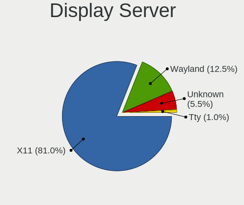
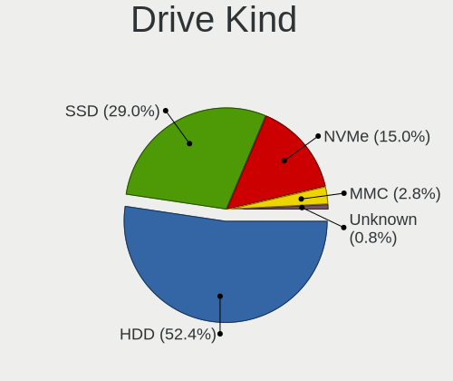
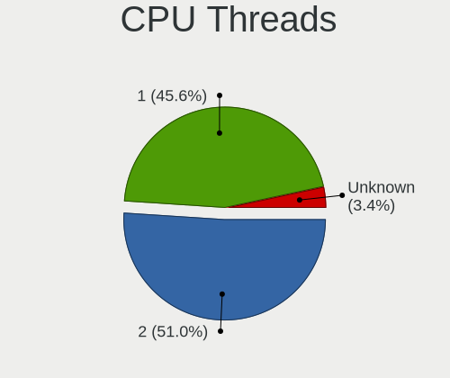
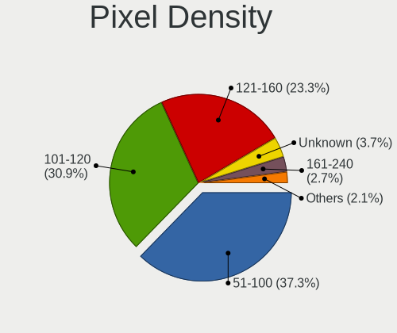

Linux in Ukraine - Tested Hardware & Statistics
-----------------------------------------------

A project to collect tested hardware configurations for Linux in Ukraine.

Anyone can contribute to this report by the [hw-probe](https://github.com/linuxhw/hw-probe) tool:

    sudo -E hw-probe -all -upload

Please contribute! Especially if your hardware is rare.

This is a report for all computer types. See also reports for [desktops](/Location/Ukraine/Desktop/README.md) and [notebooks](/Location/Ukraine/Notebook/README.md).

Contents
--------

* [ Test Cases ](#test-cases)

* [ System ](#system)
  - [ OS                       ](#os)
  - [ OS Family                ](#os-family)
  - [ Kernel                   ](#kernel)
  - [ Kernel Family            ](#kernel-family)
  - [ Kernel Major Ver.        ](#kernel-major-ver)
  - [ Arch                     ](#arch)
  - [ DE                       ](#de)
  - [ Display Server           ](#display-server)
  - [ Display Manager          ](#display-manager)
  - [ OS Lang                  ](#os-lang)
  - [ Boot Mode                ](#boot-mode)
  - [ Filesystem               ](#filesystem)
  - [ Part. scheme             ](#part-scheme)
  - [ Dual Boot with Linux/BSD ](#dual-boot-with-linuxbsd)
  - [ Dual Boot (Win)          ](#dual-boot-win)

* [ Board ](#board)
  - [ Vendor                   ](#vendor)
  - [ Model                    ](#model)
  - [ Model Family             ](#model-family)
  - [ MFG Year                 ](#mfg-year)
  - [ Form Factor              ](#form-factor)
  - [ Secure Boot              ](#secure-boot)
  - [ Coreboot                 ](#coreboot)
  - [ RAM Size                 ](#ram-size)
  - [ RAM Used                 ](#ram-used)
  - [ Total Drives             ](#total-drives)
  - [ Has CD-ROM               ](#has-cd-rom)
  - [ Has Ethernet             ](#has-ethernet)
  - [ Has WiFi                 ](#has-wifi)
  - [ Has Bluetooth            ](#has-bluetooth)

* [ Location ](#location)
  - [ Country                  ](#country)
  - [ City                     ](#city)

* [ Drives ](#drives)
  - [ Drive Vendor             ](#drive-vendor)
  - [ Drive Model              ](#drive-model)
  - [ HDD Vendor               ](#hdd-vendor)
  - [ SSD Vendor               ](#ssd-vendor)
  - [ Drive Kind               ](#drive-kind)
  - [ Drive Connector          ](#drive-connector)
  - [ Drive Size               ](#drive-size)
  - [ Space Total              ](#space-total)
  - [ Space Used               ](#space-used)
  - [ Malfunc. Drives          ](#malfunc-drives)
  - [ Malfunc. Drive Vendor    ](#malfunc-drive-vendor)
  - [ Malfunc. HDD Vendor      ](#malfunc-hdd-vendor)
  - [ Malfunc. Drive Kind      ](#malfunc-drive-kind)
  - [ Failed Drives            ](#failed-drives)
  - [ Failed Drive Vendor      ](#failed-drive-vendor)
  - [ Drive Status             ](#drive-status)

* [ Storage controller ](#storage-controller)
  - [ Storage Vendor           ](#storage-vendor)
  - [ Storage Model            ](#storage-model)
  - [ Storage Kind             ](#storage-kind)

* [ Processor ](#processor)
  - [ CPU Vendor               ](#cpu-vendor)
  - [ CPU Model                ](#cpu-model)
  - [ CPU Model Family         ](#cpu-model-family)
  - [ CPU Cores                ](#cpu-cores)
  - [ CPU Sockets              ](#cpu-sockets)
  - [ CPU Threads              ](#cpu-threads)
  - [ CPU Op-Modes             ](#cpu-op-modes)
  - [ CPU Microcode            ](#cpu-microcode)
  - [ CPU Microarch            ](#cpu-microarch)

* [ Graphics ](#graphics)
  - [ GPU Vendor               ](#gpu-vendor)
  - [ GPU Model                ](#gpu-model)
  - [ GPU Combo                ](#gpu-combo)
  - [ GPU Driver               ](#gpu-driver)
  - [ GPU Memory               ](#gpu-memory)

* [ Monitor ](#monitor)
  - [ Monitor Vendor           ](#monitor-vendor)
  - [ Monitor Model            ](#monitor-model)
  - [ Monitor Resolution       ](#monitor-resolution)
  - [ Monitor Diagonal         ](#monitor-diagonal)
  - [ Monitor Width            ](#monitor-width)
  - [ Aspect Ratio             ](#aspect-ratio)
  - [ Monitor Area             ](#monitor-area)
  - [ Pixel Density            ](#pixel-density)
  - [ Multiple Monitors        ](#multiple-monitors)

* [ Network ](#network)
  - [ Net Controller Vendor    ](#net-controller-vendor)
  - [ Net Controller Model     ](#net-controller-model)
  - [ Wireless Vendor          ](#wireless-vendor)
  - [ Wireless Model           ](#wireless-model)
  - [ Ethernet Vendor          ](#ethernet-vendor)
  - [ Ethernet Model           ](#ethernet-model)
  - [ Net Controller Kind      ](#net-controller-kind)
  - [ Used Controller          ](#used-controller)
  - [ NICs                     ](#nics)
  - [ IPv6                     ](#ipv6)

* [ Bluetooth ](#bluetooth)
  - [ Bluetooth Vendor         ](#bluetooth-vendor)
  - [ Bluetooth Model          ](#bluetooth-model)

* [ Sound ](#sound)
  - [ Sound Vendor             ](#sound-vendor)
  - [ Sound Model              ](#sound-model)

* [ Memory ](#memory)
  - [ Memory Vendor            ](#memory-vendor)
  - [ Memory Model             ](#memory-model)
  - [ Memory Kind              ](#memory-kind)
  - [ Memory Form Factor       ](#memory-form-factor)
  - [ Memory Size              ](#memory-size)
  - [ Memory Speed             ](#memory-speed)

* [ Printers & scanners ](#printers--scanners)
  - [ Printer Vendor           ](#printer-vendor)
  - [ Printer Model            ](#printer-model)
  - [ Scanner Vendor           ](#scanner-vendor)
  - [ Scanner Model            ](#scanner-model)

* [ Camera ](#camera)
  - [ Camera Vendor            ](#camera-vendor)
  - [ Camera Model             ](#camera-model)

* [ Security ](#security)
  - [ Fingerprint Vendor       ](#fingerprint-vendor)
  - [ Fingerprint Model        ](#fingerprint-model)
  - [ Chipcard Vendor          ](#chipcard-vendor)
  - [ Chipcard Model           ](#chipcard-model)

* [ Unsupported ](#unsupported)
  - [ Unsupported Devices      ](#unsupported-devices)
  - [ Unsupported Device Types ](#unsupported-device-types)

Test Cases
----------

Total: 4639

| Vendor        | Model                       | Form-Factor | Probe                                                      | Date         |
|---------------|-----------------------------|-------------|------------------------------------------------------------|--------------|
| ASUSTek       | H110M-R                     | Desktop     | [c790793197](https://linux-hardware.org/?probe=c790793197) | Feb 01, 2023 |
| Gigabyte      | B450M DS3H V2               | Desktop     | [75a3416ebc](https://linux-hardware.org/?probe=75a3416ebc) | Jan 31, 2023 |
| ASRock        | 970 Pro3 R2.0               | Desktop     | [676f900958](https://linux-hardware.org/?probe=676f900958) | Jan 27, 2023 |
| Dell          | Latitude E5410              | Notebook    | [22df8731a9](https://linux-hardware.org/?probe=22df8731a9) | Jan 26, 2023 |
| ASUSTek       | TUF Gaming B450-PLUS II     | Desktop     | [df1811bf5d](https://linux-hardware.org/?probe=df1811bf5d) | Jan 26, 2023 |
| HP            | Laptop 15-db0xxx            | Notebook    | [a9dace6356](https://linux-hardware.org/?probe=a9dace6356) | Jan 24, 2023 |
| Lenovo        | G505s 20255                 | Notebook    | [4eb3c2afb3](https://linux-hardware.org/?probe=4eb3c2afb3) | Jan 23, 2023 |
| Biostar       | Hi-Fi A85W                  | Desktop     | [4da9f87ebb](https://linux-hardware.org/?probe=4da9f87ebb) | Jan 23, 2023 |
| Lenovo        | Legion 5 15ACH6H 82JU       | Notebook    | [082d1b40bc](https://linux-hardware.org/?probe=082d1b40bc) | Jan 21, 2023 |
| HONOR         | NBR-WAX9                    | Notebook    | [ca0282295b](https://linux-hardware.org/?probe=ca0282295b) | Jan 20, 2023 |
| Dell          | Venue 11 Pro 7139           | Notebook    | [6c3528d4c0](https://linux-hardware.org/?probe=6c3528d4c0) | Jan 20, 2023 |
| MSI           | B560M-A PRO                 | Desktop     | [b7771b2b5d](https://linux-hardware.org/?probe=b7771b2b5d) | Jan 19, 2023 |
| Intel         | DG41MJ AAE54659-206         | Desktop     | [98a0ca82de](https://linux-hardware.org/?probe=98a0ca82de) | Jan 18, 2023 |
| Lenovo        | IdeaPad Z580                | Notebook    | [f51c90cadc](https://linux-hardware.org/?probe=f51c90cadc) | Jan 15, 2023 |
| Irbis         | NB264                       | Notebook    | [ed534a1d30](https://linux-hardware.org/?probe=ed534a1d30) | Jan 15, 2023 |
| Acer          | Swift SFX16-52G             | Notebook    | [c8b31b22f8](https://linux-hardware.org/?probe=c8b31b22f8) | Jan 14, 2023 |
| Dell          | Inspiron 1012               | Notebook    | [ae34ca229c](https://linux-hardware.org/?probe=ae34ca229c) | Jan 13, 2023 |
| Lenovo        | IdeaPad Z510 20287          | Notebook    | [9ebcc90bcf](https://linux-hardware.org/?probe=9ebcc90bcf) | Jan 12, 2023 |
| Lenovo        | IdeaPad Gaming 3 15ARH05... | Notebook    | [322e6e6dbe](https://linux-hardware.org/?probe=322e6e6dbe) | Jan 10, 2023 |
| ASUSTek       | ROG STRIX Z370-F GAMING     | Desktop     | [aabe4a2438](https://linux-hardware.org/?probe=aabe4a2438) | Jan 10, 2023 |
| ASUSTek       | ROG Strix G512LI_G512LI     | Notebook    | [f75fea559f](https://linux-hardware.org/?probe=f75fea559f) | Jan 08, 2023 |
| ASUSTek       | ZenBook UX425QA_UM425QA     | Notebook    | [c721dc5ba1](https://linux-hardware.org/?probe=c721dc5ba1) | Jan 08, 2023 |
| ASUSTek       | W5Fe                        | Notebook    | [d56398aefd](https://linux-hardware.org/?probe=d56398aefd) | Jan 07, 2023 |
| Dell          | Vostro 15 3510              | Notebook    | [aaf276dad9](https://linux-hardware.org/?probe=aaf276dad9) | Jan 06, 2023 |
| MSI           | B450 GAMING PLUS MAX        | Desktop     | [406b407b64](https://linux-hardware.org/?probe=406b407b64) | Jan 06, 2023 |
| Acer          | Swift SFX16-52G             | Notebook    | [7ff6038cf3](https://linux-hardware.org/?probe=7ff6038cf3) | Jan 04, 2023 |
| Dell          | Latitude 5420               | Notebook    | [b7315d38e1](https://linux-hardware.org/?probe=b7315d38e1) | Jan 04, 2023 |
| ASRock        | H510M-HDV R2.0              | Desktop     | [f75b0a7e71](https://linux-hardware.org/?probe=f75b0a7e71) | Jan 03, 2023 |
| MSI           | H310M PRO-VDH PLUS          | Desktop     | [32e666defa](https://linux-hardware.org/?probe=32e666defa) | Jan 03, 2023 |
| ASRock        | H510M-HDV R2.0              | Desktop     | [ee31a67035](https://linux-hardware.org/?probe=ee31a67035) | Jan 03, 2023 |
| Acer          | Swift SFX16-52G             | Notebook    | [bd8403001c](https://linux-hardware.org/?probe=bd8403001c) | Jan 02, 2023 |
| Dell          | Latitude D620               | Notebook    | [5337d0b0f9](https://linux-hardware.org/?probe=5337d0b0f9) | Dec 31, 2022 |
| Dell          | Latitude D620               | Notebook    | [ea81d9f6a5](https://linux-hardware.org/?probe=ea81d9f6a5) | Dec 31, 2022 |
| ASUSTek       | M5A78L-M LX3                | Desktop     | [a6c0667059](https://linux-hardware.org/?probe=a6c0667059) | Dec 27, 2022 |
| ASUSTek       | M5A78L-M LX3                | Desktop     | [ad94a727ab](https://linux-hardware.org/?probe=ad94a727ab) | Dec 27, 2022 |
| Lenovo        | ThinkBook 15p Gen 2 21B1    | Notebook    | [bc961748be](https://linux-hardware.org/?probe=bc961748be) | Dec 25, 2022 |
| Acer          | Aspire A315-53              | Notebook    | [e012bb5bc1](https://linux-hardware.org/?probe=e012bb5bc1) | Dec 25, 2022 |
| ASRock        | H510M-HDV R2.0              | Desktop     | [70312467b7](https://linux-hardware.org/?probe=70312467b7) | Dec 24, 2022 |
| ASUSTek       | P5K                         | Desktop     | [e88b53b804](https://linux-hardware.org/?probe=e88b53b804) | Dec 20, 2022 |
| Dell          | Inspiron 7720               | Notebook    | [0a7621cb40](https://linux-hardware.org/?probe=0a7621cb40) | Dec 17, 2022 |
| Gigabyte      | B450M H                     | Desktop     | [c888c743e3](https://linux-hardware.org/?probe=c888c743e3) | Dec 15, 2022 |
| Fujitsu       | LIFEBOOK E734               | Notebook    | [5ac5b0aaa8](https://linux-hardware.org/?probe=5ac5b0aaa8) | Dec 14, 2022 |
| MSI           | K9N6PGM2-V2                 | Desktop     | [f09e3c0e19](https://linux-hardware.org/?probe=f09e3c0e19) | Dec 12, 2022 |
| Lenovo        | IdeaPad 3 15IIL05 81WE      | Notebook    | [50e8243e50](https://linux-hardware.org/?probe=50e8243e50) | Dec 11, 2022 |
| Acer          | Aspire A114-33              | Notebook    | [0bb6c29bb6](https://linux-hardware.org/?probe=0bb6c29bb6) | Dec 07, 2022 |
| Unknown       | Unknown                     | Desktop     | [7d63af1d84](https://linux-hardware.org/?probe=7d63af1d84) | Dec 07, 2022 |
| HIPER Tech... | HTHLP-04R/i5-8279u          | Notebook    | [1ead815604](https://linux-hardware.org/?probe=1ead815604) | Dec 05, 2022 |
| Unknown       | Unknown                     | Desktop     | [5ea265ad9a](https://linux-hardware.org/?probe=5ea265ad9a) | Dec 05, 2022 |
| Dell          | Latitude E7470              | Notebook    | [457187e169](https://linux-hardware.org/?probe=457187e169) | Dec 01, 2022 |
| HP            | 8184 X4                     | Desktop     | [2b5ea5e34c](https://linux-hardware.org/?probe=2b5ea5e34c) | Dec 01, 2022 |
| Dell          | Latitude E7470              | Notebook    | [b24884fe44](https://linux-hardware.org/?probe=b24884fe44) | Dec 01, 2022 |
| Acer          | Aspire 5741G                | Notebook    | [0a336099ba](https://linux-hardware.org/?probe=0a336099ba) | Dec 01, 2022 |
| Samsung       | 355V4C/356V4C/3445VC/354... | Notebook    | [8a99ec717f](https://linux-hardware.org/?probe=8a99ec717f) | Nov 29, 2022 |
| MSI           | K9N6PGM2-V2                 | Desktop     | [b2eb1eccbd](https://linux-hardware.org/?probe=b2eb1eccbd) | Nov 28, 2022 |
| HP            | 82F1                        | Desktop     | [17ed0cee6a](https://linux-hardware.org/?probe=17ed0cee6a) | Nov 28, 2022 |
| MSI           | K9N6PGM2-V2                 | Desktop     | [82b84f846b](https://linux-hardware.org/?probe=82b84f846b) | Nov 27, 2022 |
| Lenovo        | B590 20208                  | Notebook    | [b1551151f5](https://linux-hardware.org/?probe=b1551151f5) | Nov 24, 2022 |
| Acer          | Aspire A515-57              | Notebook    | [374b408342](https://linux-hardware.org/?probe=374b408342) | Nov 22, 2022 |
| ASUSTek       | M4A88TD-M EVO               | Desktop     | [e4514feafe](https://linux-hardware.org/?probe=e4514feafe) | Nov 20, 2022 |
| Samsung       | R528/R728                   | Notebook    | [ea586efd66](https://linux-hardware.org/?probe=ea586efd66) | Nov 19, 2022 |
| Huanan        | B75                         | Desktop     | [cfc1803ca1](https://linux-hardware.org/?probe=cfc1803ca1) | Nov 19, 2022 |
| ASUSTek       | P6T DELUXE V2               | Desktop     | [550bd99088](https://linux-hardware.org/?probe=550bd99088) | Nov 17, 2022 |
| Gigabyte      | GA-MA790FXT-UD5P            | Desktop     | [dd28f73303](https://linux-hardware.org/?probe=dd28f73303) | Nov 14, 2022 |
| MSI           | MS-7360                     | Desktop     | [4899c85a97](https://linux-hardware.org/?probe=4899c85a97) | Nov 14, 2022 |
| Chuwi         | HeroBook Air                | Notebook    | [9749e5705a](https://linux-hardware.org/?probe=9749e5705a) | Nov 13, 2022 |
| HP            | Victus by Laptop 16-e0xx... | Notebook    | [c3612a66aa](https://linux-hardware.org/?probe=c3612a66aa) | Nov 10, 2022 |
| Lenovo        | IdeaPad C340-14API 81N6     | Notebook    | [40cce7a719](https://linux-hardware.org/?probe=40cce7a719) | Nov 09, 2022 |
| Dell          | Inspiron 7720               | Notebook    | [38d24e4b4a](https://linux-hardware.org/?probe=38d24e4b4a) | Nov 06, 2022 |
| MSI           | MS-1688                     | Notebook    | [21dad91aac](https://linux-hardware.org/?probe=21dad91aac) | Nov 05, 2022 |
| ASUSTek       | VivoBook_ASUS Laptop E21... | Notebook    | [cb2a07da11](https://linux-hardware.org/?probe=cb2a07da11) | Oct 30, 2022 |
| ASUSTek       | X501A1                      | Notebook    | [037e1402b1](https://linux-hardware.org/?probe=037e1402b1) | Oct 30, 2022 |
| Dell          | Inspiron 7720               | Notebook    | [f1478df888](https://linux-hardware.org/?probe=f1478df888) | Oct 30, 2022 |
| Acer          | Enduro EUN314-51W           | Notebook    | [2655b43e2b](https://linux-hardware.org/?probe=2655b43e2b) | Oct 25, 2022 |
| Acer          | Extensa 5630                | Notebook    | [bdc63e9670](https://linux-hardware.org/?probe=bdc63e9670) | Oct 25, 2022 |
| ASUSTek       | P8H61-M LX3 PLUS R2.0       | Desktop     | [285e8cd1a5](https://linux-hardware.org/?probe=285e8cd1a5) | Oct 25, 2022 |
| Acer          | Aspire X3990                | Desktop     | [e741844a8f](https://linux-hardware.org/?probe=e741844a8f) | Oct 23, 2022 |
| Timi          | RedmiBook Pro 14S           | Notebook    | [f81e674faf](https://linux-hardware.org/?probe=f81e674faf) | Oct 21, 2022 |
| ASUSTek       | P8H61-M LX3 PLUS R2.0       | Desktop     | [03d7b75880](https://linux-hardware.org/?probe=03d7b75880) | Oct 21, 2022 |
| ASUSTek       | H97M-PLUS                   | Desktop     | [f094b82a05](https://linux-hardware.org/?probe=f094b82a05) | Oct 17, 2022 |
| Lenovo        | ThinkPad P15s Gen 2i 20W... | Notebook    | [2dd0b46420](https://linux-hardware.org/?probe=2dd0b46420) | Oct 16, 2022 |
| ASUSTek       | K53TA                       | Notebook    | [8759f9f39c](https://linux-hardware.org/?probe=8759f9f39c) | Oct 15, 2022 |
| ASUSTek       | K53TA                       | Notebook    | [dd95142fda](https://linux-hardware.org/?probe=dd95142fda) | Oct 14, 2022 |
| Lenovo        | 32C0 No DPK                 | All in one  | [231f210ff5](https://linux-hardware.org/?probe=231f210ff5) | Oct 13, 2022 |
| Lenovo        | IdeaPad Gaming 3 15ACH6 ... | Notebook    | [7af879de72](https://linux-hardware.org/?probe=7af879de72) | Oct 13, 2022 |
| Gigabyte      | Z87X-UD5H-CF                | Desktop     | [8d0d1ba821](https://linux-hardware.org/?probe=8d0d1ba821) | Oct 12, 2022 |
| HP            | Laptop 15-db0xxx            | Notebook    | [16bb04d1db](https://linux-hardware.org/?probe=16bb04d1db) | Oct 11, 2022 |
| ASUSTek       | VivoBook_ASUS Laptop E21... | Notebook    | [52c4e232f3](https://linux-hardware.org/?probe=52c4e232f3) | Oct 10, 2022 |
| Gigabyte      | B560M AORUS ELITE           | Desktop     | [81e6a3e257](https://linux-hardware.org/?probe=81e6a3e257) | Oct 09, 2022 |
| HP            | ENVY x360 Convertible 15... | Convertible | [d80b0be3f0](https://linux-hardware.org/?probe=d80b0be3f0) | Oct 06, 2022 |
| HONOR         | BOD-WXX9                    | Notebook    | [26c4b5f06a](https://linux-hardware.org/?probe=26c4b5f06a) | Oct 06, 2022 |
| ASUSTek       | H110M-R                     | Desktop     | [4a6d780641](https://linux-hardware.org/?probe=4a6d780641) | Oct 05, 2022 |
| MSI           | Z87 MPOWER                  | Desktop     | [75177d19fc](https://linux-hardware.org/?probe=75177d19fc) | Oct 04, 2022 |
| Apple         | MacBookPro9,2               | Notebook    | [bdc21c1bad](https://linux-hardware.org/?probe=bdc21c1bad) | Oct 04, 2022 |
| Apple         | MacBookPro9,2               | Notebook    | [50e50f0533](https://linux-hardware.org/?probe=50e50f0533) | Oct 04, 2022 |
| ASUSTek       | H110M-R                     | Desktop     | [ad1e756112](https://linux-hardware.org/?probe=ad1e756112) | Oct 03, 2022 |
| ASUSTek       | M4A88TD-M EVO               | Desktop     | [6e0ea7e989](https://linux-hardware.org/?probe=6e0ea7e989) | Oct 03, 2022 |
| MSI           | Z87 MPOWER                  | Desktop     | [092a0bd2e3](https://linux-hardware.org/?probe=092a0bd2e3) | Oct 02, 2022 |
| Sony          | VPCEB1M1R                   | Notebook    | [343feefe62](https://linux-hardware.org/?probe=343feefe62) | Oct 02, 2022 |
| Acer          | Aspire V3-571G              | Notebook    | [bfd8dc3c18](https://linux-hardware.org/?probe=bfd8dc3c18) | Oct 02, 2022 |
| Acer          | Enduro EN314-51W            | Notebook    | [46782cf8f5](https://linux-hardware.org/?probe=46782cf8f5) | Oct 01, 2022 |
| Dell          | Latitude E7240              | Notebook    | [75501a47b5](https://linux-hardware.org/?probe=75501a47b5) | Sep 24, 2022 |
| eMachines     | EZ1700                      | All in one  | [211c6e13f3](https://linux-hardware.org/?probe=211c6e13f3) | Sep 22, 2022 |
| MSI           | B560M PRO-VDH               | Desktop     | [34db101d55](https://linux-hardware.org/?probe=34db101d55) | Sep 22, 2022 |
| HP            | ENVY Notebook               | Notebook    | [1eef25f6d8](https://linux-hardware.org/?probe=1eef25f6d8) | Sep 22, 2022 |
| HP            | ENVY Notebook               | Notebook    | [b95a98e133](https://linux-hardware.org/?probe=b95a98e133) | Sep 22, 2022 |
| ASUSTek       | P8H61-M LX3 R2.0            | Desktop     | [5b22a32f45](https://linux-hardware.org/?probe=5b22a32f45) | Sep 20, 2022 |
| Acer          | Aspire A315-23              | Notebook    | [dd730980b1](https://linux-hardware.org/?probe=dd730980b1) | Sep 20, 2022 |
| HP            | Pavilion g6                 | Notebook    | [dfd4d1f4e2](https://linux-hardware.org/?probe=dfd4d1f4e2) | Sep 20, 2022 |
| ASUSTek       | VivoBook_ASUS Laptop E21... | Notebook    | [d9742b9445](https://linux-hardware.org/?probe=d9742b9445) | Sep 19, 2022 |
| ASUSTek       | VivoBook_ASUS Laptop E21... | Notebook    | [6c5e991427](https://linux-hardware.org/?probe=6c5e991427) | Sep 18, 2022 |
| Lenovo        | G580 20150                  | Notebook    | [fe325d1046](https://linux-hardware.org/?probe=fe325d1046) | Sep 18, 2022 |
| HP            | Pavilion dv6                | Notebook    | [9c9c531c6b](https://linux-hardware.org/?probe=9c9c531c6b) | Sep 15, 2022 |
| Timi          | RedmiBook Pro 14S           | Notebook    | [1662163cb8](https://linux-hardware.org/?probe=1662163cb8) | Sep 15, 2022 |
| ASUSTek       | M2A74-AM                    | Desktop     | [25c30e4e54](https://linux-hardware.org/?probe=25c30e4e54) | Sep 14, 2022 |
| ASUSTek       | M2A74-AM                    | Desktop     | [24e6ffe552](https://linux-hardware.org/?probe=24e6ffe552) | Sep 14, 2022 |
| Acer          | TravelMate 5744Z            | Notebook    | [f9846e0165](https://linux-hardware.org/?probe=f9846e0165) | Sep 13, 2022 |
| Gigabyte      | F2A55M-S1                   | Desktop     | [a5ce933202](https://linux-hardware.org/?probe=a5ce933202) | Sep 12, 2022 |
| ASUSTek       | PRIME Z390-P                | Desktop     | [80a20ec3fe](https://linux-hardware.org/?probe=80a20ec3fe) | Sep 11, 2022 |
| Lenovo        | Unknown                     | Notebook    | [b5842ca017](https://linux-hardware.org/?probe=b5842ca017) | Sep 10, 2022 |
| ECS           | H61H2-M6                    | Desktop     | [99f3146843](https://linux-hardware.org/?probe=99f3146843) | Sep 10, 2022 |
| ASRock        | G41M-VS3                    | Desktop     | [021bcda428](https://linux-hardware.org/?probe=021bcda428) | Sep 10, 2022 |
| Timi          | TM1703                      | Notebook    | [5c30ece6ff](https://linux-hardware.org/?probe=5c30ece6ff) | Sep 08, 2022 |
| Timi          | TM1703                      | Notebook    | [fb7386017f](https://linux-hardware.org/?probe=fb7386017f) | Sep 06, 2022 |
| Lenovo        | G580 20150                  | Notebook    | [8dba025148](https://linux-hardware.org/?probe=8dba025148) | Sep 05, 2022 |
| Gigabyte      | MSQ87TN-00                  | Desktop     | [af31e1b75a](https://linux-hardware.org/?probe=af31e1b75a) | Sep 04, 2022 |
| Gigabyte      | 970A-DS3P                   | Desktop     | [5ba20eb04b](https://linux-hardware.org/?probe=5ba20eb04b) | Sep 01, 2022 |
| Dell          | Latitude 5591               | Notebook    | [b860997149](https://linux-hardware.org/?probe=b860997149) | Sep 01, 2022 |
| Timi          | A35                         | Notebook    | [df50ea1876](https://linux-hardware.org/?probe=df50ea1876) | Aug 29, 2022 |
| ASUSTek       | F1A75-M-PRO R2.0            | Desktop     | [e7e057dd6d](https://linux-hardware.org/?probe=e7e057dd6d) | Aug 27, 2022 |
| Acer          | Aspire 5570Z                | Notebook    | [38fe74cbe3](https://linux-hardware.org/?probe=38fe74cbe3) | Aug 26, 2022 |
| Toshiba       | PORTEGE Z10t-A              | Notebook    | [ba23396754](https://linux-hardware.org/?probe=ba23396754) | Aug 25, 2022 |
| Lenovo        | Legion Y740-17IRHg 81UJ     | Notebook    | [b8859a4f21](https://linux-hardware.org/?probe=b8859a4f21) | Aug 23, 2022 |
| Lenovo        | Legion Y740-17IRHg 81UJ     | Notebook    | [ce734a061a](https://linux-hardware.org/?probe=ce734a061a) | Aug 23, 2022 |
| ASUSTek       | N56VZ                       | Notebook    | [e9e40a7df5](https://linux-hardware.org/?probe=e9e40a7df5) | Aug 20, 2022 |
| Timi          | A35                         | Notebook    | [cf89c68d08](https://linux-hardware.org/?probe=cf89c68d08) | Aug 19, 2022 |
| Acer          | Aspire ES1-532G             | Notebook    | [cf05c858ab](https://linux-hardware.org/?probe=cf05c858ab) | Aug 15, 2022 |
| ASRock        | 960GM-VGS3 FX               | Desktop     | [55c4e8059c](https://linux-hardware.org/?probe=55c4e8059c) | Aug 14, 2022 |
| ASUSTek       | VivoBook_ASUSLaptop X509... | Notebook    | [a533aea5e5](https://linux-hardware.org/?probe=a533aea5e5) | Aug 14, 2022 |
| Timi          | A35                         | Notebook    | [944f3f0942](https://linux-hardware.org/?probe=944f3f0942) | Aug 12, 2022 |
| Samsung       | GTA4XLWIFI EUR OPEN 04A ... | Soc         | [dcdd87e0cd](https://linux-hardware.org/?probe=dcdd87e0cd) | Aug 10, 2022 |
| Unknown       | Unknown                     | Soc         | [89a777ca81](https://linux-hardware.org/?probe=89a777ca81) | Aug 10, 2022 |
| ASUSTek       | M5A97 R2.0                  | Desktop     | [4b083cc768](https://linux-hardware.org/?probe=4b083cc768) | Aug 10, 2022 |
| Dell          | XPS 15 9550                 | Notebook    | [abf6de9a2d](https://linux-hardware.org/?probe=abf6de9a2d) | Aug 09, 2022 |
| ASUSTek       | H81M-K                      | Desktop     | [e115d77240](https://linux-hardware.org/?probe=e115d77240) | Aug 07, 2022 |
| ASUSTek       | Z170-P                      | Desktop     | [8ed3ede567](https://linux-hardware.org/?probe=8ed3ede567) | Aug 06, 2022 |
| Lenovo        | ThinkPad X230 Tablet 343... | Notebook    | [7594659719](https://linux-hardware.org/?probe=7594659719) | Aug 05, 2022 |
| Gigabyte      | X570 AORUS ELITE            | Desktop     | [e963ce265b](https://linux-hardware.org/?probe=e963ce265b) | Aug 04, 2022 |
| ASUSTek       | X301A1                      | Notebook    | [60d9f2bc4d](https://linux-hardware.org/?probe=60d9f2bc4d) | Aug 02, 2022 |
| Acer          | Aspire A315-42              | Notebook    | [7d8e339d92](https://linux-hardware.org/?probe=7d8e339d92) | Aug 02, 2022 |
| ASRock        | A780LM-S                    | Desktop     | [83b44b9bd6](https://linux-hardware.org/?probe=83b44b9bd6) | Jul 31, 2022 |
| ASRock        | A780LM-S                    | Desktop     | [2a1ce55c1b](https://linux-hardware.org/?probe=2a1ce55c1b) | Jul 31, 2022 |
| HP            | 255 G7 Notebook PC          | Notebook    | [bc1a82a647](https://linux-hardware.org/?probe=bc1a82a647) | Jul 28, 2022 |
| ASUSTek       | H81M-K                      | Desktop     | [46201e4773](https://linux-hardware.org/?probe=46201e4773) | Jul 27, 2022 |
| Acer          | Iconia W700                 | Notebook    | [694887391c](https://linux-hardware.org/?probe=694887391c) | Jul 26, 2022 |
| Acer          | TravelMate 5744Z            | Notebook    | [aa1416d2e3](https://linux-hardware.org/?probe=aa1416d2e3) | Jul 26, 2022 |
| HP            | 255 G7 Notebook PC          | Notebook    | [8173942fbb](https://linux-hardware.org/?probe=8173942fbb) | Jul 25, 2022 |
| ASUSTek       | M5A78L LE                   | Desktop     | [4ade852983](https://linux-hardware.org/?probe=4ade852983) | Jul 23, 2022 |
| HP            | 8715                        | Mini pc     | [75c873bb8e](https://linux-hardware.org/?probe=75c873bb8e) | Jul 23, 2022 |
| Dell          | XPS 15 9550                 | Notebook    | [b4691ae23b](https://linux-hardware.org/?probe=b4691ae23b) | Jul 22, 2022 |
| Gigabyte      | P31-DS3L                    | Desktop     | [3b8118fb89](https://linux-hardware.org/?probe=3b8118fb89) | Jul 19, 2022 |
| ASRock        | H61M                        | Desktop     | [6a10cdfa42](https://linux-hardware.org/?probe=6a10cdfa42) | Jul 18, 2022 |
| Fujitsu       | LIFEBOOK AH512              | Notebook    | [de59ca3757](https://linux-hardware.org/?probe=de59ca3757) | Jul 17, 2022 |
| ASRock        | N68-VS3 UCC                 | Desktop     | [37e5cc640d](https://linux-hardware.org/?probe=37e5cc640d) | Jul 14, 2022 |
| Acer          | Iconia W700                 | Notebook    | [f290f68268](https://linux-hardware.org/?probe=f290f68268) | Jul 14, 2022 |
| Dell          | Latitude 7280               | Notebook    | [75ce6d31bc](https://linux-hardware.org/?probe=75ce6d31bc) | Jul 14, 2022 |
| Toshiba       | Satellite C660              | Notebook    | [fa23f41617](https://linux-hardware.org/?probe=fa23f41617) | Jul 13, 2022 |
| Lenovo        | Y50-70 Touch 20349          | Notebook    | [19209d1119](https://linux-hardware.org/?probe=19209d1119) | Jul 12, 2022 |
| MSI           | Bravo 17 A4DDK              | Notebook    | [9f9d1cac61](https://linux-hardware.org/?probe=9f9d1cac61) | Jul 09, 2022 |
| ASUSTek       | F3JR                        | Notebook    | [9a1e994bcb](https://linux-hardware.org/?probe=9a1e994bcb) | Jul 08, 2022 |
| Prestigio     | Multipad Visconte V         | Notebook    | [d582eea1af](https://linux-hardware.org/?probe=d582eea1af) | Jul 08, 2022 |
| MSI           | Prestige 14 A10SC           | Notebook    | [f1632a7901](https://linux-hardware.org/?probe=f1632a7901) | Jul 06, 2022 |
| Fujitsu       | LIFEBOOK E734               | Notebook    | [6494f9e1ef](https://linux-hardware.org/?probe=6494f9e1ef) | Jul 05, 2022 |
| Gigabyte      | H310M H x.x                 | Desktop     | [41c609be91](https://linux-hardware.org/?probe=41c609be91) | Jul 05, 2022 |
| ASUSTek       | TP501UB                     | Notebook    | [4cebce6bab](https://linux-hardware.org/?probe=4cebce6bab) | Jul 04, 2022 |
| ASUSTek       | TP501UB                     | Notebook    | [6ee62813e8](https://linux-hardware.org/?probe=6ee62813e8) | Jul 04, 2022 |
| ASUSTek       | P8H61-M LX3 PLUS            | Desktop     | [df4856796e](https://linux-hardware.org/?probe=df4856796e) | Jul 04, 2022 |
| ASUSTek       | VivoBook_ASUS Laptop E21... | Notebook    | [f63cb64736](https://linux-hardware.org/?probe=f63cb64736) | Jul 03, 2022 |
| Acer          | Aspire 5741G                | Notebook    | [228eb87fbc](https://linux-hardware.org/?probe=228eb87fbc) | Jul 02, 2022 |
| Acer          | Aspire M3910                | Desktop     | [ad06b5a93e](https://linux-hardware.org/?probe=ad06b5a93e) | Jun 28, 2022 |
| ASUSTek       | M5A78L-M LX3                | Desktop     | [0ea9a6be3a](https://linux-hardware.org/?probe=0ea9a6be3a) | Jun 28, 2022 |
| Lenovo        | G550 20023                  | Notebook    | [0a2aa10fd1](https://linux-hardware.org/?probe=0a2aa10fd1) | Jun 27, 2022 |
| ASUSTek       | M2N-E                       | Desktop     | [47cddfb141](https://linux-hardware.org/?probe=47cddfb141) | Jun 25, 2022 |
| ASUSTek       | M2N-E                       | Desktop     | [ad5514340b](https://linux-hardware.org/?probe=ad5514340b) | Jun 25, 2022 |
| ASRock        | A320M-DVS R3.0              | Desktop     | [9244f4847e](https://linux-hardware.org/?probe=9244f4847e) | Jun 22, 2022 |
| Acer          | Swift SF314-41              | Notebook    | [735d7a92b5](https://linux-hardware.org/?probe=735d7a92b5) | Jun 18, 2022 |
| ASUSTek       | VivoBook_ASUSLaptop X350... | Notebook    | [6ebb8676bf](https://linux-hardware.org/?probe=6ebb8676bf) | Jun 16, 2022 |
| Gigabyte      | B450M DS3H V2               | Desktop     | [684cf228c4](https://linux-hardware.org/?probe=684cf228c4) | Jun 15, 2022 |
| ASRock        | B450M Pro4                  | Desktop     | [041f94473b](https://linux-hardware.org/?probe=041f94473b) | Jun 15, 2022 |
| HP            | Pavilion g6                 | Notebook    | [c43a328a7d](https://linux-hardware.org/?probe=c43a328a7d) | Jun 13, 2022 |
| HP            | ProBook 455 G8 Notebook ... | Notebook    | [5c07fd1664](https://linux-hardware.org/?probe=5c07fd1664) | Jun 12, 2022 |
| HP            | ProBook 455 G8 Notebook ... | Notebook    | [44704fc87d](https://linux-hardware.org/?probe=44704fc87d) | Jun 12, 2022 |
| HP            | ProBook 455 G7              | Notebook    | [60bf6f8388](https://linux-hardware.org/?probe=60bf6f8388) | Jun 12, 2022 |
| ASUSTek       | PRIME B560-PLUS             | Desktop     | [246525a65f](https://linux-hardware.org/?probe=246525a65f) | Jun 11, 2022 |
| Gigabyte      | EX58-UD5                    | Desktop     | [ffcbf35eec](https://linux-hardware.org/?probe=ffcbf35eec) | Jun 11, 2022 |
| HP            | Pavilion Gaming Laptop 1... | Notebook    | [29f2cd44d5](https://linux-hardware.org/?probe=29f2cd44d5) | Jun 11, 2022 |
| Intel         | DG33BU AAD79951-407         | Desktop     | [5df0f93da9](https://linux-hardware.org/?probe=5df0f93da9) | Jun 10, 2022 |
| Acer          | Swift SF314-43              | Notebook    | [2a3a49ac86](https://linux-hardware.org/?probe=2a3a49ac86) | Jun 10, 2022 |
| Lenovo        | ThinkPad P52s 20LBS04700    | Notebook    | [96e3e051da](https://linux-hardware.org/?probe=96e3e051da) | Jun 09, 2022 |
| Lenovo        | ThinkPad P52s 20LBS04700    | Notebook    | [547e2586ca](https://linux-hardware.org/?probe=547e2586ca) | Jun 09, 2022 |
| eMachines     | eME528                      | Notebook    | [1a6f2ee67f](https://linux-hardware.org/?probe=1a6f2ee67f) | Jun 09, 2022 |
| Lenovo        | IdeaPad Y510P 20217         | Notebook    | [f0b7599192](https://linux-hardware.org/?probe=f0b7599192) | Jun 08, 2022 |
| Acer          | Aspire A315-32              | Notebook    | [a610c5537a](https://linux-hardware.org/?probe=a610c5537a) | Jun 07, 2022 |
| ASRock        | Z87M Extreme4               | Desktop     | [5ca7bb09b0](https://linux-hardware.org/?probe=5ca7bb09b0) | Jun 05, 2022 |
| ASUSTek       | ROG STRIX Z590-F GAMING ... | Desktop     | [49c5364599](https://linux-hardware.org/?probe=49c5364599) | Jun 04, 2022 |
| Lenovo        | G580 20150                  | Notebook    | [6cb0b47bb4](https://linux-hardware.org/?probe=6cb0b47bb4) | Jun 02, 2022 |
| HP            | Pavilion g6                 | Notebook    | [7c389588bb](https://linux-hardware.org/?probe=7c389588bb) | Jun 02, 2022 |
| HP            | ProBook 455 G7              | Notebook    | [658e8ce62f](https://linux-hardware.org/?probe=658e8ce62f) | Jun 02, 2022 |
| HP            | ProBook 450 G5              | Notebook    | [c4880f9bab](https://linux-hardware.org/?probe=c4880f9bab) | Jun 02, 2022 |
| HP            | ProBook 455 G8 Notebook ... | Notebook    | [5330a5aa11](https://linux-hardware.org/?probe=5330a5aa11) | Jun 02, 2022 |
| HP            | ProBook 450 G5              | Notebook    | [7f8acf64cd](https://linux-hardware.org/?probe=7f8acf64cd) | May 31, 2022 |
| HP            | ProBook 455 G7              | Notebook    | [d95897f938](https://linux-hardware.org/?probe=d95897f938) | May 31, 2022 |
| HP            | ProBook 450 G5              | Notebook    | [2fbbe84744](https://linux-hardware.org/?probe=2fbbe84744) | May 31, 2022 |
| ASUSTek       | F1A75-M-PRO R2.0            | Desktop     | [070e59ce1e](https://linux-hardware.org/?probe=070e59ce1e) | May 30, 2022 |
| ASUSTek       | ROG STRIX Z590-F GAMING ... | Desktop     | [f1ed3c6a46](https://linux-hardware.org/?probe=f1ed3c6a46) | May 30, 2022 |
| ASUSTek       | ROG STRIX Z590-F GAMING ... | Desktop     | [bcc7398945](https://linux-hardware.org/?probe=bcc7398945) | May 29, 2022 |
| ASUSTek       | X75A1                       | Notebook    | [59159b4b05](https://linux-hardware.org/?probe=59159b4b05) | May 27, 2022 |
| Minix         | Z64 V1.2                    | Notebook    | [97525a1dc3](https://linux-hardware.org/?probe=97525a1dc3) | May 27, 2022 |
| ASUSTek       | B150-PLUS                   | Desktop     | [bdcda1dabc](https://linux-hardware.org/?probe=bdcda1dabc) | May 27, 2022 |
| Lenovo        | MIIX 320-10ICR 80XF         | Tablet      | [e4ccdee802](https://linux-hardware.org/?probe=e4ccdee802) | May 27, 2022 |
| HP            | Pavilion g6                 | Notebook    | [3972cb6508](https://linux-hardware.org/?probe=3972cb6508) | May 25, 2022 |
| HP            | Pavilion g7                 | Notebook    | [e038c828f9](https://linux-hardware.org/?probe=e038c828f9) | May 25, 2022 |
| Gigabyte      | EX58-UD5                    | Desktop     | [0b675c4390](https://linux-hardware.org/?probe=0b675c4390) | May 24, 2022 |
| Lenovo        | IdeaPad 330-15ARR 81D2      | Notebook    | [7200a39439](https://linux-hardware.org/?probe=7200a39439) | May 23, 2022 |
| HP            | Pavilion Laptop 15-eg0xx... | Notebook    | [377330c2b5](https://linux-hardware.org/?probe=377330c2b5) | May 23, 2022 |
| Dell          | Vostro 15 3515              | Notebook    | [90d9ac6bf3](https://linux-hardware.org/?probe=90d9ac6bf3) | May 18, 2022 |
| ASUSTek       | ROG STRIX X570-E GAMING     | Desktop     | [63acfbdc55](https://linux-hardware.org/?probe=63acfbdc55) | May 18, 2022 |
| HP            | 82A5                        | Mini pc     | [4390094fd8](https://linux-hardware.org/?probe=4390094fd8) | May 18, 2022 |
| Lenovo        | ThinkPad X1 Carbon 6th 2... | Notebook    | [1e61b49f67](https://linux-hardware.org/?probe=1e61b49f67) | May 18, 2022 |
| ASUSTek       | P5Q                         | Desktop     | [614f6cf0c6](https://linux-hardware.org/?probe=614f6cf0c6) | May 16, 2022 |
| Gigabyte      | Z97-HD3                     | Desktop     | [2c91bb6c51](https://linux-hardware.org/?probe=2c91bb6c51) | May 16, 2022 |
| Dell          | Precision M6800             | Notebook    | [65d5a77965](https://linux-hardware.org/?probe=65d5a77965) | May 14, 2022 |
| Irbis         | NB144                       | Notebook    | [abb6000f0b](https://linux-hardware.org/?probe=abb6000f0b) | May 14, 2022 |
| Gigabyte      | F2A55M-S1                   | Desktop     | [ecacfd48de](https://linux-hardware.org/?probe=ecacfd48de) | May 14, 2022 |
| Samsung       | 940X5N                      | Convertible | [5464750288](https://linux-hardware.org/?probe=5464750288) | May 13, 2022 |
| ASUSTek       | H110M-R                     | Desktop     | [adbb3eb389](https://linux-hardware.org/?probe=adbb3eb389) | May 12, 2022 |
| HP            | Pavilion Gaming Laptop 1... | Notebook    | [eb297f3c7b](https://linux-hardware.org/?probe=eb297f3c7b) | May 12, 2022 |
| Minix         | Z64 V1.2                    | Notebook    | [8796deded0](https://linux-hardware.org/?probe=8796deded0) | May 12, 2022 |
| Lenovo        | Unknown                     | Notebook    | [3cced8a4fa](https://linux-hardware.org/?probe=3cced8a4fa) | May 12, 2022 |
| ASUSTek       | Q170T                       | Desktop     | [7b142a9bf8](https://linux-hardware.org/?probe=7b142a9bf8) | May 10, 2022 |
| MSI           | X99A SLI PLUS               | Desktop     | [d329ab7f27](https://linux-hardware.org/?probe=d329ab7f27) | May 10, 2022 |
| Lenovo        | MAHOBAY NO DPK              | Desktop     | [1906da1cb4](https://linux-hardware.org/?probe=1906da1cb4) | May 08, 2022 |
| Samsung       | R530/R730/P530              | Notebook    | [d209735fd8](https://linux-hardware.org/?probe=d209735fd8) | May 07, 2022 |
| Lenovo        | ThinkPad T470p 20J7S0BR0... | Notebook    | [ac2c2a5969](https://linux-hardware.org/?probe=ac2c2a5969) | May 06, 2022 |
| Gigabyte      | H170-D3H-CF                 | Desktop     | [9f255eb7d5](https://linux-hardware.org/?probe=9f255eb7d5) | May 06, 2022 |
| Lenovo        | ThinkPad X220 4290LD4       | Notebook    | [0a28279824](https://linux-hardware.org/?probe=0a28279824) | May 05, 2022 |
| Gigabyte      | IMB1900N                    | Desktop     | [8ed8cb17d5](https://linux-hardware.org/?probe=8ed8cb17d5) | May 04, 2022 |
| Gigabyte      | B75-D3V                     | Desktop     | [08bd0f2662](https://linux-hardware.org/?probe=08bd0f2662) | May 04, 2022 |
| Gigabyte      | H57M-USB3                   | Desktop     | [2f061f5e18](https://linux-hardware.org/?probe=2f061f5e18) | May 03, 2022 |
| Lenovo        | ThinkPad X1 Carbon 6th 2... | Notebook    | [26cfc77ab9](https://linux-hardware.org/?probe=26cfc77ab9) | May 02, 2022 |
| ICL           | RAYbook Si1507              | Notebook    | [eaf9bd7ea3](https://linux-hardware.org/?probe=eaf9bd7ea3) | May 02, 2022 |
| HP            | ProBook 4520s               | Notebook    | [ba430a31ae](https://linux-hardware.org/?probe=ba430a31ae) | May 01, 2022 |
| Lenovo        | G700 20251                  | Notebook    | [94272db5ec](https://linux-hardware.org/?probe=94272db5ec) | Apr 30, 2022 |
| ASUSTek       | UX31A                       | Notebook    | [59228e735e](https://linux-hardware.org/?probe=59228e735e) | Apr 30, 2022 |
| Acer          | TravelMate 2490             | Notebook    | [8cc2cf84f4](https://linux-hardware.org/?probe=8cc2cf84f4) | Apr 29, 2022 |
| Intel         | X79 V2.72B                  | Desktop     | [396faf60b6](https://linux-hardware.org/?probe=396faf60b6) | Apr 29, 2022 |
| Timi          | A35S                        | Notebook    | [8a3195e10c](https://linux-hardware.org/?probe=8a3195e10c) | Apr 27, 2022 |
| Gigabyte      | X570 UD                     | Desktop     | [67f24b974b](https://linux-hardware.org/?probe=67f24b974b) | Apr 27, 2022 |
| Timi          | RedmiBook Pro 15S           | Notebook    | [d060ed71c3](https://linux-hardware.org/?probe=d060ed71c3) | Apr 26, 2022 |
| HP            | ProBook 450 G8 Notebook ... | Notebook    | [4f92840d8c](https://linux-hardware.org/?probe=4f92840d8c) | Apr 26, 2022 |
| Biostar       | G31M+                       | Desktop     | [b756b9bc9f](https://linux-hardware.org/?probe=b756b9bc9f) | Apr 26, 2022 |
| Lenovo        | G510 20238                  | Notebook    | [906f1626d7](https://linux-hardware.org/?probe=906f1626d7) | Apr 24, 2022 |
| Acer          | AOD257                      | Notebook    | [9b11649bce](https://linux-hardware.org/?probe=9b11649bce) | Apr 22, 2022 |
| Acer          | AOD257                      | Notebook    | [e321b17ef8](https://linux-hardware.org/?probe=e321b17ef8) | Apr 22, 2022 |
| MSI           | MS-7267                     | Desktop     | [d0d0dc78d5](https://linux-hardware.org/?probe=d0d0dc78d5) | Apr 22, 2022 |
| Lenovo        | IdeaPad 5 15ALC05 82LN      | Notebook    | [76bb32f682](https://linux-hardware.org/?probe=76bb32f682) | Apr 20, 2022 |
| Lenovo        | ThinkPad T420 4180DV2       | Notebook    | [4ed718df3e](https://linux-hardware.org/?probe=4ed718df3e) | Apr 18, 2022 |
| Lenovo        | ThinkPad T420 4180DV2       | Notebook    | [402c31b107](https://linux-hardware.org/?probe=402c31b107) | Apr 18, 2022 |
| ASUSTek       | UX303LB                     | Notebook    | [104779add9](https://linux-hardware.org/?probe=104779add9) | Apr 17, 2022 |
| HP            | 250 G2                      | Notebook    | [eafcfe8215](https://linux-hardware.org/?probe=eafcfe8215) | Apr 17, 2022 |
| ASUSTek       | K50IJ                       | Notebook    | [ad5a24dbb3](https://linux-hardware.org/?probe=ad5a24dbb3) | Apr 15, 2022 |
| Apple         | Mac-942B59F58194171B iMa... | All in one  | [c0b4f81509](https://linux-hardware.org/?probe=c0b4f81509) | Apr 15, 2022 |
| ASUSTek       | ROG Strix G713QC_G713QC     | Notebook    | [c54b458c01](https://linux-hardware.org/?probe=c54b458c01) | Apr 14, 2022 |
| Biostar       | H61MHV2                     | Desktop     | [e05349d6a0](https://linux-hardware.org/?probe=e05349d6a0) | Apr 14, 2022 |
| Lenovo        | ThinkPad T420 4180DV2       | Notebook    | [9e8785fcdd](https://linux-hardware.org/?probe=9e8785fcdd) | Apr 14, 2022 |
| ASUSTek       | X75VCP                      | Notebook    | [21e0b65e1b](https://linux-hardware.org/?probe=21e0b65e1b) | Apr 13, 2022 |
| MSI           | X99A SLI PLUS               | Desktop     | [eae6b5ed56](https://linux-hardware.org/?probe=eae6b5ed56) | Apr 12, 2022 |
| ASUSTek       | A88XM-PLUS                  | Desktop     | [54f7cac3d4](https://linux-hardware.org/?probe=54f7cac3d4) | Apr 11, 2022 |
| MSI           | X99A SLI PLUS               | Desktop     | [f0045560de](https://linux-hardware.org/?probe=f0045560de) | Apr 09, 2022 |
| Intel         | X79 (INTEL Xeon E5/Corei... | Desktop     | [263621f796](https://linux-hardware.org/?probe=263621f796) | Apr 08, 2022 |
| Lenovo        | G780 20138                  | Notebook    | [0cabea6484](https://linux-hardware.org/?probe=0cabea6484) | Apr 08, 2022 |
| ASRock        | Z270 Extreme4               | Desktop     | [526a5a16bd](https://linux-hardware.org/?probe=526a5a16bd) | Apr 07, 2022 |
| Lenovo        | B570 HuronRiver Platform    | Notebook    | [cdb5f43cd7](https://linux-hardware.org/?probe=cdb5f43cd7) | Apr 07, 2022 |
| Gigabyte      | H81M-S2H                    | Desktop     | [ac5d29c839](https://linux-hardware.org/?probe=ac5d29c839) | Apr 05, 2022 |
| Dell          | 0CT017                      | Desktop     | [27bdeec11d](https://linux-hardware.org/?probe=27bdeec11d) | Apr 04, 2022 |
| Timi          | A35                         | Notebook    | [90a30461d2](https://linux-hardware.org/?probe=90a30461d2) | Apr 03, 2022 |
| Lenovo        | IdeaPad L340-15API 81LW     | Notebook    | [262e4f8317](https://linux-hardware.org/?probe=262e4f8317) | Apr 02, 2022 |
| Lenovo        | ThinkPad E15 Gen 2 20TD0... | Notebook    | [27f986af8c](https://linux-hardware.org/?probe=27f986af8c) | Mar 30, 2022 |
| ASUSTek       | P8H61-I                     | Desktop     | [2e1b862b8b](https://linux-hardware.org/?probe=2e1b862b8b) | Mar 28, 2022 |
| Insignia      | NS-P11W7100                 | Notebook    | [daa476af8c](https://linux-hardware.org/?probe=daa476af8c) | Mar 28, 2022 |
| Dell          | Latitude E6400              | Notebook    | [b431dc3d73](https://linux-hardware.org/?probe=b431dc3d73) | Mar 28, 2022 |
| Gigabyte      | 945GCM-S2L                  | Desktop     | [c9cc022a93](https://linux-hardware.org/?probe=c9cc022a93) | Mar 28, 2022 |
| HP            | ZBook 17 G3                 | Notebook    | [b016648f02](https://linux-hardware.org/?probe=b016648f02) | Mar 27, 2022 |
| Aquarius      | NS585 R32                   | Notebook    | [582389ca98](https://linux-hardware.org/?probe=582389ca98) | Mar 24, 2022 |
| ASUSTek       | X75VCP                      | Notebook    | [54e978fcca](https://linux-hardware.org/?probe=54e978fcca) | Mar 23, 2022 |
| Timi          | RedmiBook Pro 15            | Notebook    | [78f30b04b6](https://linux-hardware.org/?probe=78f30b04b6) | Mar 21, 2022 |
| Gigabyte      | Z97-HD3                     | Desktop     | [46c12ec623](https://linux-hardware.org/?probe=46c12ec623) | Mar 21, 2022 |
| Samsung       | R59P/R60P/R61P              | Notebook    | [2ec6236c3a](https://linux-hardware.org/?probe=2ec6236c3a) | Mar 20, 2022 |
| Insignia      | NS-P11W7100                 | Notebook    | [20aa266b33](https://linux-hardware.org/?probe=20aa266b33) | Mar 19, 2022 |
| Fujitsu       | D3220-A1 S26361-D3220-A1    | Desktop     | [725c0249b8](https://linux-hardware.org/?probe=725c0249b8) | Mar 19, 2022 |
| Unknown       | Unknown                     | Notebook    | [58912ced73](https://linux-hardware.org/?probe=58912ced73) | Mar 18, 2022 |
| Lenovo        | IdeaPad 320-15IKB 81BG      | Notebook    | [4652b9e771](https://linux-hardware.org/?probe=4652b9e771) | Mar 17, 2022 |
| Lenovo        | IdeaPad 320-15IKB 81BG      | Notebook    | [091eb95750](https://linux-hardware.org/?probe=091eb95750) | Mar 17, 2022 |
| Lenovo        | IdeaPad Z580                | Notebook    | [80a27aca02](https://linux-hardware.org/?probe=80a27aca02) | Mar 17, 2022 |
| ASRock        | Z68 Pro3-M                  | Desktop     | [2a053f027f](https://linux-hardware.org/?probe=2a053f027f) | Mar 12, 2022 |
| Insignia      | NS-P11W7100                 | Notebook    | [44de443312](https://linux-hardware.org/?probe=44de443312) | Mar 11, 2022 |
| Gigabyte      | H410M H                     | Desktop     | [13a9aa4fb3](https://linux-hardware.org/?probe=13a9aa4fb3) | Mar 08, 2022 |
| HP            | ProBook 450 G7              | Notebook    | [5d73b6f2f7](https://linux-hardware.org/?probe=5d73b6f2f7) | Mar 08, 2022 |
| ASUSTek       | S301LP                      | Notebook    | [5c29218ebd](https://linux-hardware.org/?probe=5c29218ebd) | Mar 08, 2022 |
| Lenovo        | Unknown                     | Notebook    | [4308edfd8d](https://linux-hardware.org/?probe=4308edfd8d) | Mar 07, 2022 |
| Acer          | Swift SF314-43              | Notebook    | [6d16601f06](https://linux-hardware.org/?probe=6d16601f06) | Mar 07, 2022 |
| ASRock        | B450 Pro4                   | Desktop     | [9f1edfd714](https://linux-hardware.org/?probe=9f1edfd714) | Mar 07, 2022 |
| ASUSTek       | PRIME H270-PLUS             | Desktop     | [9e62e2e6d8](https://linux-hardware.org/?probe=9e62e2e6d8) | Mar 07, 2022 |
| ASUSTek       | P8H67-M LE                  | Desktop     | [be99e3e64a](https://linux-hardware.org/?probe=be99e3e64a) | Mar 07, 2022 |
| HP            | 250 G8 Notebook PC          | Notebook    | [11ca11b21d](https://linux-hardware.org/?probe=11ca11b21d) | Mar 03, 2022 |
| Dell          | Vostro 5470                 | Notebook    | [fda73ff759](https://linux-hardware.org/?probe=fda73ff759) | Mar 02, 2022 |
| ASUSTek       | P5P43TD                     | Desktop     | [c11fd047fb](https://linux-hardware.org/?probe=c11fd047fb) | Feb 28, 2022 |
| ASUSTek       | ASUS TUF Gaming F15 FX50... | Notebook    | [1b5df98df2](https://linux-hardware.org/?probe=1b5df98df2) | Feb 28, 2022 |
| Unknown       | TB-4000                     | Desktop     | [dc43686a5a](https://linux-hardware.org/?probe=dc43686a5a) | Feb 27, 2022 |
| ASRock        | P4i65G                      | Desktop     | [aa7a236464](https://linux-hardware.org/?probe=aa7a236464) | Feb 26, 2022 |
| Dell          | Inspiron 15-3552            | Notebook    | [969cea89d7](https://linux-hardware.org/?probe=969cea89d7) | Feb 24, 2022 |
| HP            | ProBook 4540s               | Notebook    | [6bc6c84af5](https://linux-hardware.org/?probe=6bc6c84af5) | Feb 24, 2022 |
| ASUSTek       | ROG Strix G713IH_G713IH     | Notebook    | [72f330a117](https://linux-hardware.org/?probe=72f330a117) | Feb 23, 2022 |
| ASRock        | J4005M                      | Desktop     | [bff0e9d532](https://linux-hardware.org/?probe=bff0e9d532) | Feb 22, 2022 |
| ASUSTek       | ROG Strix G513QC_G513QC     | Notebook    | [f6175c2b08](https://linux-hardware.org/?probe=f6175c2b08) | Feb 22, 2022 |
| Gigabyte      | H57M-USB3                   | Desktop     | [4c10662fd3](https://linux-hardware.org/?probe=4c10662fd3) | Feb 21, 2022 |
| Lenovo        | IdeaPad 100-15IBD 80QQ      | Notebook    | [a941fd5481](https://linux-hardware.org/?probe=a941fd5481) | Feb 21, 2022 |
| Pegatron      | EVE                         | Desktop     | [facec46bd5](https://linux-hardware.org/?probe=facec46bd5) | Feb 20, 2022 |
| ASRock        | J4005M                      | Desktop     | [aa149b39ea](https://linux-hardware.org/?probe=aa149b39ea) | Feb 20, 2022 |
| ASUSTek       | M5A78L-M LX3                | Desktop     | [90a12c2aa1](https://linux-hardware.org/?probe=90a12c2aa1) | Feb 20, 2022 |
| Timi          | RedmiBook Pro 15S           | Notebook    | [1998552d88](https://linux-hardware.org/?probe=1998552d88) | Feb 20, 2022 |
| Dell          | Inspiron 15 7000 Gaming     | Notebook    | [b4979c164c](https://linux-hardware.org/?probe=b4979c164c) | Feb 20, 2022 |
| Lenovo        | ThinkPad ThinkPad L14 20... | Notebook    | [369c625e43](https://linux-hardware.org/?probe=369c625e43) | Feb 20, 2022 |
| Acer          | Swift SF315-52              | Notebook    | [74009233c2](https://linux-hardware.org/?probe=74009233c2) | Feb 19, 2022 |
| HP            | Compaq CQ58                 | Notebook    | [6f67712b57](https://linux-hardware.org/?probe=6f67712b57) | Feb 19, 2022 |
| Timi          | RedmiBook Pro 15S           | Notebook    | [8b0dc90a9e](https://linux-hardware.org/?probe=8b0dc90a9e) | Feb 19, 2022 |
| ASUSTek       | K54L                        | Notebook    | [5850a8dd22](https://linux-hardware.org/?probe=5850a8dd22) | Feb 19, 2022 |
| Gigabyte      | H410M H                     | Desktop     | [7c32edcf20](https://linux-hardware.org/?probe=7c32edcf20) | Feb 18, 2022 |
| ASRock        | N68-VS3 UCC                 | Desktop     | [f5b5daa4cb](https://linux-hardware.org/?probe=f5b5daa4cb) | Feb 18, 2022 |
| ASUSTek       | ROG Strix G713IH_G713IH     | Notebook    | [489854bd7b](https://linux-hardware.org/?probe=489854bd7b) | Feb 18, 2022 |
| Lenovo        | ThinkPad Edge E531 68851... | Notebook    | [54269ad944](https://linux-hardware.org/?probe=54269ad944) | Feb 18, 2022 |
| ASUSTek       | ROG Strix G512LU_G512LU     | Notebook    | [3c30a8c6a1](https://linux-hardware.org/?probe=3c30a8c6a1) | Feb 18, 2022 |
| ASUSTek       | ROG Strix G513QY_G513QY     | Notebook    | [4fba279b51](https://linux-hardware.org/?probe=4fba279b51) | Feb 18, 2022 |
| ASUSTek       | ROG Strix G512LU_G512LU     | Notebook    | [42cf76ea1b](https://linux-hardware.org/?probe=42cf76ea1b) | Feb 18, 2022 |
| Dell          | Vostro 2521                 | Notebook    | [b4e4037c5e](https://linux-hardware.org/?probe=b4e4037c5e) | Feb 18, 2022 |
| Lenovo        | IdeaPad Z510 20287          | Notebook    | [d98a594e28](https://linux-hardware.org/?probe=d98a594e28) | Feb 18, 2022 |
| ASUSTek       | PRIME A320M-K               | Desktop     | [e6cca953ed](https://linux-hardware.org/?probe=e6cca953ed) | Feb 18, 2022 |
| ASRock        | H61M-VS                     | Desktop     | [20a40d4eea](https://linux-hardware.org/?probe=20a40d4eea) | Feb 17, 2022 |
| Gigabyte      | AB350M-DS3H V2-CF           | Desktop     | [e3f921b6a5](https://linux-hardware.org/?probe=e3f921b6a5) | Feb 17, 2022 |
| Dell          | 0FXD80 A00                  | Desktop     | [46450d22d3](https://linux-hardware.org/?probe=46450d22d3) | Feb 17, 2022 |
| ASUSTek       | F1A55-M LX PLUS             | Desktop     | [7de981a63c](https://linux-hardware.org/?probe=7de981a63c) | Feb 17, 2022 |
| Samsung       | 535U4C                      | Notebook    | [f5f9256781](https://linux-hardware.org/?probe=f5f9256781) | Feb 16, 2022 |
| Lenovo        | MAHOBAY NOK                 | Desktop     | [4e3b8bfbb1](https://linux-hardware.org/?probe=4e3b8bfbb1) | Feb 16, 2022 |
| HP            | ProBook 440 G7              | Notebook    | [bf3d7b3f6c](https://linux-hardware.org/?probe=bf3d7b3f6c) | Feb 15, 2022 |
| Lenovo        | G500 20236                  | Notebook    | [725807db6f](https://linux-hardware.org/?probe=725807db6f) | Feb 15, 2022 |
| ASUSTek       | X553MA                      | Notebook    | [94ebaa5d9b](https://linux-hardware.org/?probe=94ebaa5d9b) | Feb 15, 2022 |
| MSI           | 870A-G54                    | Desktop     | [3aa654a3fe](https://linux-hardware.org/?probe=3aa654a3fe) | Feb 14, 2022 |
| HP            | Pavilion g6                 | Notebook    | [5601a4d596](https://linux-hardware.org/?probe=5601a4d596) | Feb 14, 2022 |
| ASUSTek       | P5QL/EPU                    | Desktop     | [2a5bcaeec9](https://linux-hardware.org/?probe=2a5bcaeec9) | Feb 14, 2022 |
| MSI           | MS-16F1                     | Notebook    | [cd35935349](https://linux-hardware.org/?probe=cd35935349) | Feb 13, 2022 |
| Acer          | Extensa 5620                | Notebook    | [d56ce9d11a](https://linux-hardware.org/?probe=d56ce9d11a) | Feb 13, 2022 |
| ASUSTek       | X550VB                      | Notebook    | [0485b98343](https://linux-hardware.org/?probe=0485b98343) | Feb 13, 2022 |
| ASUSTek       | P5K SE/EPU                  | Desktop     | [003f3cafc0](https://linux-hardware.org/?probe=003f3cafc0) | Feb 13, 2022 |
| ASRock        | 970A-G                      | Desktop     | [7b3694013f](https://linux-hardware.org/?probe=7b3694013f) | Feb 13, 2022 |
| ASUSTek       | M5A78L-M LE                 | Desktop     | [341f21c92c](https://linux-hardware.org/?probe=341f21c92c) | Feb 13, 2022 |
| Lenovo        | ThinkPad Edge E531 68851... | Notebook    | [e82c11b42e](https://linux-hardware.org/?probe=e82c11b42e) | Feb 13, 2022 |
| Lenovo        | MAHOBAY NO DPK              | Desktop     | [2038767b43](https://linux-hardware.org/?probe=2038767b43) | Feb 12, 2022 |
| ASUSTek       | PRIME A320M-K               | Desktop     | [5f4de1e2b0](https://linux-hardware.org/?probe=5f4de1e2b0) | Feb 12, 2022 |
| Dell          | Latitude 5480               | Notebook    | [1804ba8af6](https://linux-hardware.org/?probe=1804ba8af6) | Feb 12, 2022 |
| Dell          | Latitude 5480               | Notebook    | [198846e977](https://linux-hardware.org/?probe=198846e977) | Feb 12, 2022 |
| Gigabyte      | B450 I AORUS PRO WIFI-CF    | Desktop     | [a98c8db3ad](https://linux-hardware.org/?probe=a98c8db3ad) | Feb 12, 2022 |
| ASUSTek       | P8Z68-V PRO GEN3            | Desktop     | [9637033a52](https://linux-hardware.org/?probe=9637033a52) | Feb 12, 2022 |
| MSI           | B450 TOMAHAWK MAX II        | Desktop     | [c2a1175605](https://linux-hardware.org/?probe=c2a1175605) | Feb 12, 2022 |
| HP            | ProBook 635 Aero G8 Note... | Notebook    | [42674c38b2](https://linux-hardware.org/?probe=42674c38b2) | Feb 12, 2022 |
| HP            | 250 G5 Notebook PC          | Notebook    | [1e1f5d2acb](https://linux-hardware.org/?probe=1e1f5d2acb) | Feb 11, 2022 |
| HP            | ProBook 635 Aero G8 Note... | Notebook    | [2cfb1f14b9](https://linux-hardware.org/?probe=2cfb1f14b9) | Feb 10, 2022 |
| ASUSTek       | VivoBook_ASUSLaptop X512... | Notebook    | [c4ac76b8e8](https://linux-hardware.org/?probe=c4ac76b8e8) | Feb 10, 2022 |
| Gigabyte      | EP45-DS3L                   | Desktop     | [9829aba3d7](https://linux-hardware.org/?probe=9829aba3d7) | Feb 10, 2022 |
| ASUSTek       | P8H61                       | Desktop     | [ee693a0a41](https://linux-hardware.org/?probe=ee693a0a41) | Feb 10, 2022 |
| Lenovo        | IdeaPad Z580                | Notebook    | [bfdd2f78ce](https://linux-hardware.org/?probe=bfdd2f78ce) | Feb 10, 2022 |
| ASUSTek       | PRIME B450M-K               | Desktop     | [dbb1d3b9dd](https://linux-hardware.org/?probe=dbb1d3b9dd) | Feb 09, 2022 |
| ASRock        | N68C-GS UCC                 | Desktop     | [42dfb79217](https://linux-hardware.org/?probe=42dfb79217) | Feb 09, 2022 |
| HP            | Pavilion g6                 | Notebook    | [5d20c75fe1](https://linux-hardware.org/?probe=5d20c75fe1) | Feb 08, 2022 |
| ASUSTek       | P8B75-V                     | Desktop     | [fd04c0293f](https://linux-hardware.org/?probe=fd04c0293f) | Feb 08, 2022 |
| Lenovo        | Aptio CRB NOK               | Mini pc     | [03220f70d0](https://linux-hardware.org/?probe=03220f70d0) | Feb 08, 2022 |
| Acer          | Aspire TC-780               | Desktop     | [96ab8fecfb](https://linux-hardware.org/?probe=96ab8fecfb) | Feb 08, 2022 |
| ASUSTek       | M4A78L-M LE                 | Desktop     | [06fca38713](https://linux-hardware.org/?probe=06fca38713) | Feb 08, 2022 |
| ASUSTek       | H81M-K                      | Desktop     | [e362930c92](https://linux-hardware.org/?probe=e362930c92) | Feb 08, 2022 |
| Gigabyte      | B450M GAMING                | Desktop     | [16aaa53716](https://linux-hardware.org/?probe=16aaa53716) | Feb 07, 2022 |
| Razer         | Blade Stealth               | Notebook    | [de6e279575](https://linux-hardware.org/?probe=de6e279575) | Feb 07, 2022 |
| Raspberry ... | Raspberry Pi 4 Model B R... | Soc         | [bac2b2959d](https://linux-hardware.org/?probe=bac2b2959d) | Feb 07, 2022 |
| Razer         | Blade Stealth               | Notebook    | [c85996c28c](https://linux-hardware.org/?probe=c85996c28c) | Feb 07, 2022 |
| ASUSTek       | M2NPV-VM                    | Desktop     | [2d4a85af0e](https://linux-hardware.org/?probe=2d4a85af0e) | Feb 07, 2022 |
| ASUSTek       | ROG Strix G513QC_G513QC     | Notebook    | [1bbcbcc9a2](https://linux-hardware.org/?probe=1bbcbcc9a2) | Feb 07, 2022 |
| ASUSTek       | P5K SE                      | Desktop     | [4c53e240bc](https://linux-hardware.org/?probe=4c53e240bc) | Feb 07, 2022 |
| ASUSTek       | TUF Gaming B550M-PLUS       | Desktop     | [72a1b5ae56](https://linux-hardware.org/?probe=72a1b5ae56) | Feb 07, 2022 |
| Acer          | Aspire E1-571               | Notebook    | [2de4d69854](https://linux-hardware.org/?probe=2de4d69854) | Feb 06, 2022 |
| Foxconn       | M61PMV FAB A1               | Desktop     | [1a31d1ca9f](https://linux-hardware.org/?probe=1a31d1ca9f) | Feb 06, 2022 |
| MSI           | Z77A-GD65 GAMING            | Desktop     | [8d2cf11a20](https://linux-hardware.org/?probe=8d2cf11a20) | Feb 06, 2022 |
| Lenovo        | IdeaPad S110 20126          | Notebook    | [1d55b1f711](https://linux-hardware.org/?probe=1d55b1f711) | Feb 06, 2022 |
| ASUSTek       | N61Ja                       | Notebook    | [77e8b534fb](https://linux-hardware.org/?probe=77e8b534fb) | Feb 05, 2022 |
| Lenovo        | IdeaPad S110 20126          | Notebook    | [b7ae05b6a1](https://linux-hardware.org/?probe=b7ae05b6a1) | Feb 05, 2022 |
| MSI           | B450-A PRO MAX              | Desktop     | [95c601fd3e](https://linux-hardware.org/?probe=95c601fd3e) | Feb 05, 2022 |
| ASUSTek       | N61Ja                       | Notebook    | [3fee6a87f0](https://linux-hardware.org/?probe=3fee6a87f0) | Feb 05, 2022 |
| HP            | EliteBook 840 G3            | Notebook    | [020d6c69c2](https://linux-hardware.org/?probe=020d6c69c2) | Feb 05, 2022 |
| Packard Be... | EasyNote_NJ66               | Notebook    | [11d3d91c9d](https://linux-hardware.org/?probe=11d3d91c9d) | Feb 04, 2022 |
| Packard Be... | EasyNote_NJ66               | Notebook    | [a686d7ec8d](https://linux-hardware.org/?probe=a686d7ec8d) | Feb 04, 2022 |
| ASUSTek       | ROG Strix G713IH_G713IH     | Notebook    | [b4c8891709](https://linux-hardware.org/?probe=b4c8891709) | Feb 03, 2022 |
| Lenovo        | Legion 5 15IMH05H 81Y6      | Notebook    | [d9cc5f0548](https://linux-hardware.org/?probe=d9cc5f0548) | Feb 03, 2022 |
| ASUSTek       | P5L1394                     | Desktop     | [4969e4fecb](https://linux-hardware.org/?probe=4969e4fecb) | Feb 02, 2022 |
| MSI           | MPG B550 GAMING PLUS        | Desktop     | [f1062af79c](https://linux-hardware.org/?probe=f1062af79c) | Feb 01, 2022 |
| Timi          | RedmiBook 14-APCS           | Notebook    | [2f335a9d87](https://linux-hardware.org/?probe=2f335a9d87) | Feb 01, 2022 |
| Biostar       | NF560-A2G                   | Desktop     | [49802d698d](https://linux-hardware.org/?probe=49802d698d) | Feb 01, 2022 |
| Seco          | C40 C                       | Desktop     | [acbee1977b](https://linux-hardware.org/?probe=acbee1977b) | Feb 01, 2022 |
| HP            | ProBook 440 G5              | Notebook    | [0e27902494](https://linux-hardware.org/?probe=0e27902494) | Jan 31, 2022 |
| MSI           | GF63 Thin 10SC              | Notebook    | [6ff4bcaf7c](https://linux-hardware.org/?probe=6ff4bcaf7c) | Jan 31, 2022 |
| MSI           | GF63 Thin 10SC              | Notebook    | [be02f0bd97](https://linux-hardware.org/?probe=be02f0bd97) | Jan 31, 2022 |
| MSI           | GF63 Thin 10SC              | Notebook    | [4ffd0d7f19](https://linux-hardware.org/?probe=4ffd0d7f19) | Jan 31, 2022 |
| Lenovo        | IdeaPad Z500 20202          | Notebook    | [ebe757d792](https://linux-hardware.org/?probe=ebe757d792) | Jan 30, 2022 |
| HP            | ProBook 440 G5              | Notebook    | [930aa74ba2](https://linux-hardware.org/?probe=930aa74ba2) | Jan 30, 2022 |
| Lenovo        | ThinkPad X1 Extreme 20MF... | Notebook    | [d3f7315d42](https://linux-hardware.org/?probe=d3f7315d42) | Jan 30, 2022 |
| MSI           | MAG B550M MORTAR WIFI       | Desktop     | [f54779e17e](https://linux-hardware.org/?probe=f54779e17e) | Jan 30, 2022 |
| ASRock        | H81M-DGS                    | Desktop     | [05fc3bd63b](https://linux-hardware.org/?probe=05fc3bd63b) | Jan 29, 2022 |
| Lenovo        | IdeaPad 330S-15IKB 81F5     | Notebook    | [a1b813490a](https://linux-hardware.org/?probe=a1b813490a) | Jan 29, 2022 |
| ASUSTek       | P8Z68-V PRO                 | Desktop     | [c8c3cf77c4](https://linux-hardware.org/?probe=c8c3cf77c4) | Jan 29, 2022 |
| Dell          | Vostro 3300                 | Notebook    | [4213d2a7a3](https://linux-hardware.org/?probe=4213d2a7a3) | Jan 29, 2022 |
| HP            | Laptop 14-cf3xxx            | Notebook    | [52d1ace9ee](https://linux-hardware.org/?probe=52d1ace9ee) | Jan 28, 2022 |
| Lenovo        | ThinkBook 15 G2 ITL 20VE    | Notebook    | [c573633ba7](https://linux-hardware.org/?probe=c573633ba7) | Jan 28, 2022 |
| ASUSTek       | P5QL/EPU                    | Desktop     | [c1e858090a](https://linux-hardware.org/?probe=c1e858090a) | Jan 28, 2022 |
| ASUSTek       | TUF Gaming B550M-PLUS       | Desktop     | [83cdfa61a4](https://linux-hardware.org/?probe=83cdfa61a4) | Jan 28, 2022 |
| Lenovo        | G500 20236                  | Notebook    | [5d49bf2ce4](https://linux-hardware.org/?probe=5d49bf2ce4) | Jan 27, 2022 |
| Lenovo        | G500 20236                  | Notebook    | [c346ce1a75](https://linux-hardware.org/?probe=c346ce1a75) | Jan 27, 2022 |
| ASUSTek       | TUF Gaming B550M-PLUS       | Desktop     | [4ba7714220](https://linux-hardware.org/?probe=4ba7714220) | Jan 27, 2022 |
| ASUSTek       | ROG Strix G713IH_G713IH     | Notebook    | [c42d3ff769](https://linux-hardware.org/?probe=c42d3ff769) | Jan 27, 2022 |
| HP            | ProBook 6560b               | Notebook    | [e61fbcfd64](https://linux-hardware.org/?probe=e61fbcfd64) | Jan 27, 2022 |
| ASUSTek       | M5A78L-M LX3                | Desktop     | [f34ec65c4f](https://linux-hardware.org/?probe=f34ec65c4f) | Jan 27, 2022 |
| MSI           | Pulse GL66 11UDK            | Notebook    | [06d5ba6ef3](https://linux-hardware.org/?probe=06d5ba6ef3) | Jan 26, 2022 |
| ASUSTek       | M5A97 LE R2.0               | Desktop     | [2aff79c6af](https://linux-hardware.org/?probe=2aff79c6af) | Jan 25, 2022 |
| Gigabyte      | H57M-USB3                   | Desktop     | [6210f4db07](https://linux-hardware.org/?probe=6210f4db07) | Jan 25, 2022 |
| Lenovo        | 3717 NO DPK                 | Desktop     | [7c0b9aaab5](https://linux-hardware.org/?probe=7c0b9aaab5) | Jan 24, 2022 |
| HP            | Pavilion Laptop 14-dv0xx... | Notebook    | [d44db9ca0d](https://linux-hardware.org/?probe=d44db9ca0d) | Jan 24, 2022 |
| Timi          | RedmiBook Pro 15            | Notebook    | [6ed1fe66db](https://linux-hardware.org/?probe=6ed1fe66db) | Jan 24, 2022 |
| Lenovo        | ThinkPad E590 20NB0058RT    | Notebook    | [0b56eb1e6e](https://linux-hardware.org/?probe=0b56eb1e6e) | Jan 23, 2022 |
| ASUSTek       | ASUS EXPERTBOOK B1400CEA... | Notebook    | [06eb5b9d8d](https://linux-hardware.org/?probe=06eb5b9d8d) | Jan 23, 2022 |
| Apple         | Mac-942B59F58194171B iMa... | All in one  | [c2bf4bf5b9](https://linux-hardware.org/?probe=c2bf4bf5b9) | Jan 23, 2022 |
| Foxconn       | 2ABF                        | Desktop     | [e5723eaa42](https://linux-hardware.org/?probe=e5723eaa42) | Jan 23, 2022 |
| HP            | ProBook 4540s               | Notebook    | [4dea69e6af](https://linux-hardware.org/?probe=4dea69e6af) | Jan 23, 2022 |
| ASUSTek       | H81M-R                      | Desktop     | [d324ae2959](https://linux-hardware.org/?probe=d324ae2959) | Jan 22, 2022 |
| Dell          | Inspiron 5720               | Notebook    | [4dab658338](https://linux-hardware.org/?probe=4dab658338) | Jan 22, 2022 |
| Foxconn       | 2ABF                        | Desktop     | [af38735785](https://linux-hardware.org/?probe=af38735785) | Jan 22, 2022 |
| ASRock        | H310CM-HDV                  | Desktop     | [39cfe3259d](https://linux-hardware.org/?probe=39cfe3259d) | Jan 22, 2022 |
| ASRock        | H310CM-HDV                  | Desktop     | [2bae4483c9](https://linux-hardware.org/?probe=2bae4483c9) | Jan 21, 2022 |
| MSI           | PRO Z690-A DDR4             | Desktop     | [b69ed1da65](https://linux-hardware.org/?probe=b69ed1da65) | Jan 20, 2022 |
| ASUSTek       | ROG Strix G713IH_G713IH     | Notebook    | [ff7be689c1](https://linux-hardware.org/?probe=ff7be689c1) | Jan 19, 2022 |
| HUAWEI        | HVY-WXX9                    | Notebook    | [7926e3c998](https://linux-hardware.org/?probe=7926e3c998) | Jan 19, 2022 |
| Timi          | RedmiBook Pro 14            | Notebook    | [b243482994](https://linux-hardware.org/?probe=b243482994) | Jan 19, 2022 |
| HUAWEI        | HVY-WXX9                    | Notebook    | [49d5581480](https://linux-hardware.org/?probe=49d5581480) | Jan 19, 2022 |
| Shuttle       | DS68U                       | Notebook    | [5ac4aed9d9](https://linux-hardware.org/?probe=5ac4aed9d9) | Jan 19, 2022 |
| ASUSTek       | Q170T                       | Desktop     | [5712025f97](https://linux-hardware.org/?probe=5712025f97) | Jan 19, 2022 |
| HP            | 250 G5 Notebook PC          | Notebook    | [677a43f9a4](https://linux-hardware.org/?probe=677a43f9a4) | Jan 18, 2022 |
| HP            | ZBook 15v G5                | Notebook    | [e21cdc9211](https://linux-hardware.org/?probe=e21cdc9211) | Jan 18, 2022 |
| Dell          | Latitude 7490               | Notebook    | [66984a4e2b](https://linux-hardware.org/?probe=66984a4e2b) | Jan 18, 2022 |
| HP            | 255 G8 Notebook PC          | Notebook    | [c1f8df4bbd](https://linux-hardware.org/?probe=c1f8df4bbd) | Jan 18, 2022 |
| ASUSTek       | ROG Strix G713IH_G713IH     | Notebook    | [a84625d725](https://linux-hardware.org/?probe=a84625d725) | Jan 18, 2022 |
| ASUSTek       | X553MA                      | Notebook    | [a748bb8955](https://linux-hardware.org/?probe=a748bb8955) | Jan 18, 2022 |
| ASUSTek       | X553MA                      | Notebook    | [08613587e8](https://linux-hardware.org/?probe=08613587e8) | Jan 18, 2022 |
| ASUSTek       | X553MA                      | Notebook    | [f5b0fd8e22](https://linux-hardware.org/?probe=f5b0fd8e22) | Jan 18, 2022 |
| Lenovo        | V580 20147                  | Notebook    | [b59112177d](https://linux-hardware.org/?probe=b59112177d) | Jan 17, 2022 |
| Fujitsu       | LIFEBOOK AH531/GFO          | Notebook    | [3b8acf9181](https://linux-hardware.org/?probe=3b8acf9181) | Jan 17, 2022 |
| ASUSTek       | H81M-E                      | Desktop     | [0cf59407cd](https://linux-hardware.org/?probe=0cf59407cd) | Jan 17, 2022 |
| ASUSTek       | P5KPL-AM                    | Desktop     | [4f313ddd6a](https://linux-hardware.org/?probe=4f313ddd6a) | Jan 17, 2022 |
| Timi          | A18R                        | Notebook    | [37b8388616](https://linux-hardware.org/?probe=37b8388616) | Jan 16, 2022 |
| ASUSTek       | Q170T                       | Desktop     | [6538d8f8be](https://linux-hardware.org/?probe=6538d8f8be) | Jan 15, 2022 |
| ASRock        | FM2A88X Pro3+               | Desktop     | [3b7ba9382f](https://linux-hardware.org/?probe=3b7ba9382f) | Jan 15, 2022 |
| Lenovo        | IdeaPad Z580                | Notebook    | [abd0e9203d](https://linux-hardware.org/?probe=abd0e9203d) | Jan 13, 2022 |
| Gigabyte      | Z390 UD V2                  | Desktop     | [e9207f1244](https://linux-hardware.org/?probe=e9207f1244) | Jan 13, 2022 |
| Packard Be... | EasyNote ENTE70BH           | Notebook    | [decd20a2d5](https://linux-hardware.org/?probe=decd20a2d5) | Jan 13, 2022 |
| MSI           | PRO Z690-A DDR4             | Desktop     | [8b1d1eb56c](https://linux-hardware.org/?probe=8b1d1eb56c) | Jan 12, 2022 |
| HP            | Pavilion Laptop 14-dv0xx... | Notebook    | [7e083c332f](https://linux-hardware.org/?probe=7e083c332f) | Jan 12, 2022 |
| Timi          | RedmiBook 14-APCS           | Notebook    | [ea556dd23d](https://linux-hardware.org/?probe=ea556dd23d) | Jan 12, 2022 |
| Timi          | RedmiBook Pro 14            | Notebook    | [c115b553a2](https://linux-hardware.org/?probe=c115b553a2) | Jan 12, 2022 |
| ASUSTek       | M5A78L-M LX3                | Desktop     | [9046bc1e4a](https://linux-hardware.org/?probe=9046bc1e4a) | Jan 11, 2022 |
| Acer          | Aspire A515-56              | Notebook    | [4b9aea4afc](https://linux-hardware.org/?probe=4b9aea4afc) | Jan 11, 2022 |
| HP            | ProBook 440 G5              | Notebook    | [ff9bfac8e3](https://linux-hardware.org/?probe=ff9bfac8e3) | Jan 10, 2022 |
| HP            | ProBook 5310m               | Notebook    | [e3c8188e1e](https://linux-hardware.org/?probe=e3c8188e1e) | Jan 10, 2022 |
| HP            | Pavilion 15                 | Notebook    | [6e63d80da8](https://linux-hardware.org/?probe=6e63d80da8) | Jan 09, 2022 |
| Dell          | 0D6H9T A01                  | Desktop     | [8bc2b6cc7c](https://linux-hardware.org/?probe=8bc2b6cc7c) | Jan 09, 2022 |
| HP            | Spectre x360 Convertible... | Convertible | [3ffe489f19](https://linux-hardware.org/?probe=3ffe489f19) | Jan 08, 2022 |
| HP            | ZBook 15v G5                | Notebook    | [f529eb1829](https://linux-hardware.org/?probe=f529eb1829) | Jan 08, 2022 |
| HP            | ZBook 15v G5                | Notebook    | [5d912e6781](https://linux-hardware.org/?probe=5d912e6781) | Jan 08, 2022 |
| ASUSTek       | ROG Strix G713IH_G713IH     | Notebook    | [bdfe615a8e](https://linux-hardware.org/?probe=bdfe615a8e) | Jan 08, 2022 |
| ASUSTek       | PRIME A320M-K               | Desktop     | [e5b5e85b94](https://linux-hardware.org/?probe=e5b5e85b94) | Jan 07, 2022 |
| ASUSTek       | ROG Flow X13 GV301QE_GV3... | Notebook    | [b9751c3304](https://linux-hardware.org/?probe=b9751c3304) | Jan 07, 2022 |
| HP            | Laptop 14s-fq1xxx           | Notebook    | [5f51ec95e1](https://linux-hardware.org/?probe=5f51ec95e1) | Jan 05, 2022 |
| ASUSTek       | H110M-R                     | Desktop     | [fb66ba0eeb](https://linux-hardware.org/?probe=fb66ba0eeb) | Jan 05, 2022 |
| Lenovo        | ThinkBook 15 G3 ACL 21A4    | Notebook    | [65d859bfe1](https://linux-hardware.org/?probe=65d859bfe1) | Jan 05, 2022 |
| Gigabyte      | Z87X-UD5H-CF                | Desktop     | [a1a7854f7a](https://linux-hardware.org/?probe=a1a7854f7a) | Jan 04, 2022 |
| HP            | Pavilion Laptop 14-dv0xx... | Notebook    | [cd84c7dfde](https://linux-hardware.org/?probe=cd84c7dfde) | Jan 04, 2022 |
| HP            | Pavilion Laptop 14-dv0xx... | Notebook    | [7ed7ce0cb7](https://linux-hardware.org/?probe=7ed7ce0cb7) | Jan 04, 2022 |
| Lenovo        | ThinkPad E14 Gen 2 20T60... | Notebook    | [43f3abae3d](https://linux-hardware.org/?probe=43f3abae3d) | Jan 04, 2022 |
| ilife         | S806                        | Notebook    | [72d842b86c](https://linux-hardware.org/?probe=72d842b86c) | Jan 04, 2022 |
| Samsung       | R538/R578/R778              | Notebook    | [617d9d3835](https://linux-hardware.org/?probe=617d9d3835) | Jan 03, 2022 |
| Gigabyte      | 970A-DS3P FX                | Desktop     | [c6baa48783](https://linux-hardware.org/?probe=c6baa48783) | Jan 03, 2022 |
| HP            | Pavilion Gaming Laptop 1... | Notebook    | [08b04c15d3](https://linux-hardware.org/?probe=08b04c15d3) | Jan 03, 2022 |
| ASUSTek       | N55SF                       | Notebook    | [545345d609](https://linux-hardware.org/?probe=545345d609) | Jan 02, 2022 |
| ASUSTek       | ASUS EXPERTBOOK B1400CEA... | Notebook    | [86160c79c7](https://linux-hardware.org/?probe=86160c79c7) | Jan 01, 2022 |
| ASUSTek       | P5G41T-M LX3                | Desktop     | [2a3dbdc07a](https://linux-hardware.org/?probe=2a3dbdc07a) | Jan 01, 2022 |
| HP            | Cario CQ57                  | Notebook    | [5ac4e3101c](https://linux-hardware.org/?probe=5ac4e3101c) | Dec 31, 2021 |
| Acer          | Aspire E5-575G              | Notebook    | [f6d8856ace](https://linux-hardware.org/?probe=f6d8856ace) | Dec 30, 2021 |
| Timi          | A35                         | Notebook    | [253959bb70](https://linux-hardware.org/?probe=253959bb70) | Dec 30, 2021 |
| Lenovo        | Legion 5 15ARH05H 82B1      | Notebook    | [b744f2896b](https://linux-hardware.org/?probe=b744f2896b) | Dec 30, 2021 |
| HP            | Laptop 15s-eq1xxx           | Notebook    | [988270bc86](https://linux-hardware.org/?probe=988270bc86) | Dec 30, 2021 |
| MSI           | 970 GAMING                  | Desktop     | [c5797ca176](https://linux-hardware.org/?probe=c5797ca176) | Dec 30, 2021 |
| Dell          | 0DFRFW A00                  | Desktop     | [f27e8a7f9e](https://linux-hardware.org/?probe=f27e8a7f9e) | Dec 30, 2021 |
| Acer          | Aspire 1810TZ               | Notebook    | [0b7bd5c1fa](https://linux-hardware.org/?probe=0b7bd5c1fa) | Dec 30, 2021 |
| Acer          | Aspire 5715Z                | Notebook    | [d2074751d0](https://linux-hardware.org/?probe=d2074751d0) | Dec 29, 2021 |
| ASRock        | J4105M                      | Desktop     | [37f37bbbfd](https://linux-hardware.org/?probe=37f37bbbfd) | Dec 28, 2021 |
| Lenovo        | B50-30 20382                | Notebook    | [896ea31fe5](https://linux-hardware.org/?probe=896ea31fe5) | Dec 28, 2021 |
| Acer          | Swift SF114-34              | Notebook    | [f3683a3e4e](https://linux-hardware.org/?probe=f3683a3e4e) | Dec 28, 2021 |
| Acer          | Swift SF114-34              | Notebook    | [891cb4d0fd](https://linux-hardware.org/?probe=891cb4d0fd) | Dec 28, 2021 |
| ASUSTek       | TUF Gaming X570-PLUS        | Desktop     | [425784d870](https://linux-hardware.org/?probe=425784d870) | Dec 28, 2021 |
| Gigabyte      | Z97-HD3                     | Desktop     | [6b3bff90d6](https://linux-hardware.org/?probe=6b3bff90d6) | Dec 28, 2021 |
| Dell          | Vostro 1510                 | Notebook    | [38a24e373f](https://linux-hardware.org/?probe=38a24e373f) | Dec 28, 2021 |
| Biostar       | H55A+                       | Desktop     | [0a4141bcc2](https://linux-hardware.org/?probe=0a4141bcc2) | Dec 28, 2021 |
| Lenovo        | IdeaPad 320-15ISK 80XH      | Notebook    | [cc15a65a54](https://linux-hardware.org/?probe=cc15a65a54) | Dec 27, 2021 |
| Unknown       | Unknown                     | Notebook    | [d88cb8b5ae](https://linux-hardware.org/?probe=d88cb8b5ae) | Dec 27, 2021 |
| Google        | Barla                       | Notebook    | [61c74be569](https://linux-hardware.org/?probe=61c74be569) | Dec 26, 2021 |
| HP            | EliteBook 2570p             | Notebook    | [e17f3ed027](https://linux-hardware.org/?probe=e17f3ed027) | Dec 26, 2021 |
| Lenovo        | ThinkPad E14 Gen 2 20T60... | Notebook    | [43c784fc78](https://linux-hardware.org/?probe=43c784fc78) | Dec 25, 2021 |
| HP            | Presario CQ57               | Notebook    | [0294a92fd1](https://linux-hardware.org/?probe=0294a92fd1) | Dec 25, 2021 |
| ASUSTek       | N53SV                       | Notebook    | [cf07bb8280](https://linux-hardware.org/?probe=cf07bb8280) | Dec 25, 2021 |
| Timi          | A35                         | Notebook    | [66e9c6919d](https://linux-hardware.org/?probe=66e9c6919d) | Dec 24, 2021 |
| ECS           | H61H2-M6                    | Desktop     | [da70905a9d](https://linux-hardware.org/?probe=da70905a9d) | Dec 24, 2021 |
| Dell          | Latitude E7470              | Notebook    | [e712cd258c](https://linux-hardware.org/?probe=e712cd258c) | Dec 24, 2021 |
| HP            | EliteBook 2570p             | Notebook    | [a02655b4b8](https://linux-hardware.org/?probe=a02655b4b8) | Dec 24, 2021 |
| HP            | EliteBook 2570p             | Notebook    | [6e08796257](https://linux-hardware.org/?probe=6e08796257) | Dec 24, 2021 |
| Acer          | Swift SF314-42              | Notebook    | [02cb3d9b90](https://linux-hardware.org/?probe=02cb3d9b90) | Dec 23, 2021 |
| ASUSTek       | E502NA                      | Notebook    | [66ade120a5](https://linux-hardware.org/?probe=66ade120a5) | Dec 23, 2021 |
| Intel         | X79 V1.3                    | Desktop     | [fbd3ea5fee](https://linux-hardware.org/?probe=fbd3ea5fee) | Dec 23, 2021 |
| Samsung       | 300V3A/300V4A/300V5A/200... | Notebook    | [3a7331c884](https://linux-hardware.org/?probe=3a7331c884) | Dec 22, 2021 |
| HP            | 198E                        | Desktop     | [bb9b36a65b](https://linux-hardware.org/?probe=bb9b36a65b) | Dec 22, 2021 |
| Timi          | Mi Gaming Laptop 15.6       | Notebook    | [0001a4fb5e](https://linux-hardware.org/?probe=0001a4fb5e) | Dec 22, 2021 |
| Dell          | Precision M3800             | Notebook    | [ed44d9ac8c](https://linux-hardware.org/?probe=ed44d9ac8c) | Dec 21, 2021 |
| Gigabyte      | B450 AORUS ELITE            | Desktop     | [dd197ecb62](https://linux-hardware.org/?probe=dd197ecb62) | Dec 21, 2021 |
| ASUSTek       | PRIME H270-PLUS             | Desktop     | [9c1cf57d74](https://linux-hardware.org/?probe=9c1cf57d74) | Dec 20, 2021 |
| Acer          | Aspire A715-75G             | Notebook    | [f33ca54f97](https://linux-hardware.org/?probe=f33ca54f97) | Dec 19, 2021 |
| Timi          | RedmiBook 14 II             | Notebook    | [b6179a5282](https://linux-hardware.org/?probe=b6179a5282) | Dec 19, 2021 |
| MSI           | X370 SLI PLUS               | Desktop     | [adb27f9347](https://linux-hardware.org/?probe=adb27f9347) | Dec 19, 2021 |
| Fujitsu       | CELSIUS H700                | Notebook    | [63c35d8f1d](https://linux-hardware.org/?probe=63c35d8f1d) | Dec 19, 2021 |
| Lenovo        | G585 20137                  | Notebook    | [7832d9f8f6](https://linux-hardware.org/?probe=7832d9f8f6) | Dec 19, 2021 |
| ASUSTek       | VivoBook 15_ASUS Laptop ... | Notebook    | [e8a4a4a5f4](https://linux-hardware.org/?probe=e8a4a4a5f4) | Dec 19, 2021 |
| MSI           | Prestige 14Evo A11M         | Notebook    | [2ebe52d75c](https://linux-hardware.org/?probe=2ebe52d75c) | Dec 19, 2021 |
| MSI           | Prestige 14Evo A11M         | Notebook    | [224bb4de1c](https://linux-hardware.org/?probe=224bb4de1c) | Dec 19, 2021 |
| HP            | 630                         | Notebook    | [027b9733fa](https://linux-hardware.org/?probe=027b9733fa) | Dec 18, 2021 |
| Gigabyte      | X570 AORUS MASTER           | Desktop     | [dc5f8e3963](https://linux-hardware.org/?probe=dc5f8e3963) | Dec 17, 2021 |
| HP            | Pavilion Gaming Laptop 1... | Notebook    | [ce3508ebb4](https://linux-hardware.org/?probe=ce3508ebb4) | Dec 17, 2021 |
| Lenovo        | IdeaPad Z570 HuronRiver ... | Notebook    | [6ac6be1d38](https://linux-hardware.org/?probe=6ac6be1d38) | Dec 17, 2021 |
| ASUSTek       | PRIME B360M-A               | Desktop     | [d34989fcaa](https://linux-hardware.org/?probe=d34989fcaa) | Dec 16, 2021 |
| ASUSTek       | PRIME B360M-A               | Desktop     | [7587f8f78a](https://linux-hardware.org/?probe=7587f8f78a) | Dec 16, 2021 |
| Timi          | RedmiBook Pro 14            | Notebook    | [62be8931a0](https://linux-hardware.org/?probe=62be8931a0) | Dec 16, 2021 |
| ASUSTek       | M2N68-AM SE2                | Desktop     | [0b7832c8d4](https://linux-hardware.org/?probe=0b7832c8d4) | Dec 16, 2021 |
| Lenovo        | IdeaPad S340-14API 81NB     | Notebook    | [8218845f08](https://linux-hardware.org/?probe=8218845f08) | Dec 15, 2021 |
| Chuwi         | GemiBook                    | Notebook    | [9ed21194f5](https://linux-hardware.org/?probe=9ed21194f5) | Dec 15, 2021 |
| Biostar       | H61MLC                      | Desktop     | [ff1c843adf](https://linux-hardware.org/?probe=ff1c843adf) | Dec 15, 2021 |
| ASUSTek       | P5GC-MX/1333                | Desktop     | [64d0453982](https://linux-hardware.org/?probe=64d0453982) | Dec 15, 2021 |
| HP            | ProBook 430 G5              | Notebook    | [a0faef8a2b](https://linux-hardware.org/?probe=a0faef8a2b) | Dec 14, 2021 |
| HP            | 250 G5 Notebook PC          | Notebook    | [4e0a6f267e](https://linux-hardware.org/?probe=4e0a6f267e) | Dec 13, 2021 |
| Acer          | Extensa 5635ZG              | Notebook    | [d232d67b9e](https://linux-hardware.org/?probe=d232d67b9e) | Dec 13, 2021 |
| Dell          | Latitude 7290               | Notebook    | [8a2ecfe430](https://linux-hardware.org/?probe=8a2ecfe430) | Dec 12, 2021 |
| Gigabyte      | G41M-Combo                  | Desktop     | [666796bd7e](https://linux-hardware.org/?probe=666796bd7e) | Dec 12, 2021 |
| Lenovo        | G550 20023                  | Notebook    | [39aa70e7d6](https://linux-hardware.org/?probe=39aa70e7d6) | Dec 11, 2021 |
| ASUSTek       | ZenBook UX425EA_UX425EA     | Notebook    | [22eeff89e5](https://linux-hardware.org/?probe=22eeff89e5) | Dec 11, 2021 |
| ASUSTek       | X705UAR                     | Notebook    | [74b8b78444](https://linux-hardware.org/?probe=74b8b78444) | Dec 11, 2021 |
| ASUSTek       | B150M-C                     | Desktop     | [f2f2c5cb49](https://linux-hardware.org/?probe=f2f2c5cb49) | Dec 10, 2021 |
| Lenovo        | IdeaPad Z580                | Notebook    | [d801c31eda](https://linux-hardware.org/?probe=d801c31eda) | Dec 10, 2021 |
| ASRock        | X570 Taichi                 | Desktop     | [b2de2f8f6a](https://linux-hardware.org/?probe=b2de2f8f6a) | Dec 10, 2021 |
| Lenovo        | Legion Y540-17IRH 81Q4      | Notebook    | [8fa17a7ab6](https://linux-hardware.org/?probe=8fa17a7ab6) | Dec 10, 2021 |
| ASUSTek       | M2N68-AM SE2                | Desktop     | [623b76cf55](https://linux-hardware.org/?probe=623b76cf55) | Dec 09, 2021 |
| MSI           | B450 TOMAHAWK               | Desktop     | [4b39700892](https://linux-hardware.org/?probe=4b39700892) | Dec 09, 2021 |
| Toshiba       | Satellite L300              | Notebook    | [a676b11b67](https://linux-hardware.org/?probe=a676b11b67) | Dec 08, 2021 |
| HP            | Laptop 15t-dy200            | Notebook    | [b624d90ea8](https://linux-hardware.org/?probe=b624d90ea8) | Dec 08, 2021 |
| ASUSTek       | PRIME Z370-P                | Desktop     | [a9cb8442ac](https://linux-hardware.org/?probe=a9cb8442ac) | Dec 08, 2021 |
| ASRock        | N68C-GS UCC                 | Desktop     | [9da859a341](https://linux-hardware.org/?probe=9da859a341) | Dec 08, 2021 |
| Lenovo        | IdeaPad Z580                | Notebook    | [c07a32f1c5](https://linux-hardware.org/?probe=c07a32f1c5) | Dec 08, 2021 |
| ASUSTek       | B150M-C                     | Desktop     | [a3e2cda715](https://linux-hardware.org/?probe=a3e2cda715) | Dec 07, 2021 |
| Gigabyte      | P55-USB3                    | Desktop     | [6cbec7b450](https://linux-hardware.org/?probe=6cbec7b450) | Dec 06, 2021 |
| Apple         | MacBookPro8,3               | Notebook    | [11e7db0824](https://linux-hardware.org/?probe=11e7db0824) | Dec 06, 2021 |
| Apple         | MacBookPro8,3               | Notebook    | [cbc310d77b](https://linux-hardware.org/?probe=cbc310d77b) | Dec 06, 2021 |
| ASUSTek       | TUF Gaming Z690-PLUS WIF... | Desktop     | [0a69990530](https://linux-hardware.org/?probe=0a69990530) | Dec 05, 2021 |
| ASUSTek       | A8N5X                       | Desktop     | [69533e4c80](https://linux-hardware.org/?probe=69533e4c80) | Dec 05, 2021 |
| Dell          | Latitude E6430              | Notebook    | [eee07229a4](https://linux-hardware.org/?probe=eee07229a4) | Dec 05, 2021 |
| ABIT          | AN52                        | Desktop     | [c77f120f57](https://linux-hardware.org/?probe=c77f120f57) | Dec 05, 2021 |
| ASUSTek       | M4A87TD/USB3                | Desktop     | [6550b760b5](https://linux-hardware.org/?probe=6550b760b5) | Dec 05, 2021 |
| ASUSTek       | K84L                        | Notebook    | [dce2044275](https://linux-hardware.org/?probe=dce2044275) | Dec 05, 2021 |
| HP            | EliteBook 2760p             | Notebook    | [9efe885c4c](https://linux-hardware.org/?probe=9efe885c4c) | Dec 04, 2021 |
| ASUSTek       | PRIME Z270-P                | Desktop     | [dea0e367e1](https://linux-hardware.org/?probe=dea0e367e1) | Dec 04, 2021 |
| Lenovo        | G500 20236                  | Notebook    | [8aadcee8ff](https://linux-hardware.org/?probe=8aadcee8ff) | Dec 04, 2021 |
| Chuwi         | GemiBook                    | Notebook    | [1e8e0ca774](https://linux-hardware.org/?probe=1e8e0ca774) | Dec 03, 2021 |
| Gigabyte      | 970A-DS3P                   | Desktop     | [4ad98be831](https://linux-hardware.org/?probe=4ad98be831) | Dec 02, 2021 |
| HP            | Pavilion g6                 | Notebook    | [35f8ef913e](https://linux-hardware.org/?probe=35f8ef913e) | Dec 02, 2021 |
| HP            | Pavilion g6                 | Notebook    | [c009dd878b](https://linux-hardware.org/?probe=c009dd878b) | Dec 02, 2021 |
| Gigabyte      | Z390 UD V2                  | Desktop     | [c45fd8b141](https://linux-hardware.org/?probe=c45fd8b141) | Dec 02, 2021 |
| MSI           | B150M MORTAR                | Desktop     | [cb85954441](https://linux-hardware.org/?probe=cb85954441) | Dec 02, 2021 |
| Acer          | Swift SF314-43              | Notebook    | [dc17b5db95](https://linux-hardware.org/?probe=dc17b5db95) | Dec 01, 2021 |
| MSI           | 0AB8                        | Desktop     | [4bf8e40af9](https://linux-hardware.org/?probe=4bf8e40af9) | Dec 01, 2021 |
| Acer          | Aspire 5630                 | Notebook    | [90453b887a](https://linux-hardware.org/?probe=90453b887a) | Dec 01, 2021 |
| Lenovo        | G500 20236                  | Notebook    | [f61434ecc0](https://linux-hardware.org/?probe=f61434ecc0) | Nov 30, 2021 |
| ECS           | H61H2-M6                    | Desktop     | [e044b4f23e](https://linux-hardware.org/?probe=e044b4f23e) | Nov 30, 2021 |
| ASUSTek       | PRIME B365M-A               | Desktop     | [c7cbb50843](https://linux-hardware.org/?probe=c7cbb50843) | Nov 30, 2021 |
| MSI           | 760GM-P23                   | Desktop     | [1e66a980fc](https://linux-hardware.org/?probe=1e66a980fc) | Nov 30, 2021 |
| ASUSTek       | ASUS TUF Gaming A15 FA50... | Notebook    | [132b5eba42](https://linux-hardware.org/?probe=132b5eba42) | Nov 29, 2021 |
| Lenovo        | S10-3                       | Notebook    | [19cd43f2f7](https://linux-hardware.org/?probe=19cd43f2f7) | Nov 29, 2021 |
| ASUSTek       | P8Z77-V DELUXE              | Desktop     | [ab1b265412](https://linux-hardware.org/?probe=ab1b265412) | Nov 29, 2021 |
| ASUSTek       | P7P55D                      | Desktop     | [85f288d39b](https://linux-hardware.org/?probe=85f288d39b) | Nov 29, 2021 |
| ASUSTek       | M2N                         | Desktop     | [f76f2473ac](https://linux-hardware.org/?probe=f76f2473ac) | Nov 28, 2021 |
| ASRock        | A320M-HDV R3.0              | Desktop     | [5df73b5935](https://linux-hardware.org/?probe=5df73b5935) | Nov 28, 2021 |
| Lenovo        | IdeaPad Z510 20287          | Notebook    | [b4a83f65e8](https://linux-hardware.org/?probe=b4a83f65e8) | Nov 27, 2021 |
| HP            | Pavilion Notebook 15-bc5... | Notebook    | [dc1f8255a1](https://linux-hardware.org/?probe=dc1f8255a1) | Nov 27, 2021 |
| Lenovo        | G500 20236                  | Notebook    | [c1dd144b77](https://linux-hardware.org/?probe=c1dd144b77) | Nov 27, 2021 |
| Timi          | A35                         | Notebook    | [d1461858c8](https://linux-hardware.org/?probe=d1461858c8) | Nov 27, 2021 |
| Lenovo        | IdeaPad S145-15IGM 81MX     | Notebook    | [1a6e8764f5](https://linux-hardware.org/?probe=1a6e8764f5) | Nov 27, 2021 |
| Gigabyte      | B450M S2H V2                | Desktop     | [caf3c5f8f2](https://linux-hardware.org/?probe=caf3c5f8f2) | Nov 25, 2021 |
| ASUSTek       | P5QL-VM EPU                 | Desktop     | [1331462ff8](https://linux-hardware.org/?probe=1331462ff8) | Nov 25, 2021 |
| ASUSTek       | 1101HA                      | Notebook    | [a97c9a7464](https://linux-hardware.org/?probe=a97c9a7464) | Nov 25, 2021 |
| ASUSTek       | PRIME A320M-K               | Desktop     | [2b85ea4d74](https://linux-hardware.org/?probe=2b85ea4d74) | Nov 25, 2021 |
| ASUSTek       | 1101HA                      | Notebook    | [c54c721669](https://linux-hardware.org/?probe=c54c721669) | Nov 25, 2021 |
| HP            | Presario CQ56               | Notebook    | [a9203b72bb](https://linux-hardware.org/?probe=a9203b72bb) | Nov 25, 2021 |
| HP            | 834F                        | Desktop     | [ee1361ee2f](https://linux-hardware.org/?probe=ee1361ee2f) | Nov 25, 2021 |
| Lenovo        | IdeaPad Z510 20287          | Notebook    | [9cffad20cd](https://linux-hardware.org/?probe=9cffad20cd) | Nov 25, 2021 |
| Timi          | A35                         | Notebook    | [ce66e74002](https://linux-hardware.org/?probe=ce66e74002) | Nov 25, 2021 |
| Gigabyte      | B450M S2H V2                | Desktop     | [ea4dbbbf15](https://linux-hardware.org/?probe=ea4dbbbf15) | Nov 25, 2021 |
| ASUSTek       | ASUS TUF Gaming A15 FA50... | Notebook    | [5f4fb6db3f](https://linux-hardware.org/?probe=5f4fb6db3f) | Nov 24, 2021 |
| Chuwi         | GemiBook Pro                | Notebook    | [1dc5d193a3](https://linux-hardware.org/?probe=1dc5d193a3) | Nov 24, 2021 |
| Timi          | RedmiBook Pro 15            | Notebook    | [342085ddb3](https://linux-hardware.org/?probe=342085ddb3) | Nov 24, 2021 |
| HP            | Presario CQ56               | Notebook    | [b50968704d](https://linux-hardware.org/?probe=b50968704d) | Nov 24, 2021 |
| Dell          | Inspiron 5558               | Notebook    | [772ca16963](https://linux-hardware.org/?probe=772ca16963) | Nov 23, 2021 |
| Lenovo        | ThinkPad E14 20RA0037RT     | Notebook    | [5a1e17caef](https://linux-hardware.org/?probe=5a1e17caef) | Nov 23, 2021 |
| ASUSTek       | VivoBook_ASUSLaptop X513... | Notebook    | [a8d3bc914a](https://linux-hardware.org/?probe=a8d3bc914a) | Nov 23, 2021 |
| HP            | ProBook 440 G7              | Notebook    | [7863ad05f4](https://linux-hardware.org/?probe=7863ad05f4) | Nov 23, 2021 |
| HP            | Pavilion Notebook           | Notebook    | [7045bece2c](https://linux-hardware.org/?probe=7045bece2c) | Nov 23, 2021 |
| ASUSTek       | M5A78L-M LX3                | Desktop     | [5d13ed6397](https://linux-hardware.org/?probe=5d13ed6397) | Nov 22, 2021 |
| Lenovo        | G510 20238                  | Notebook    | [46cddf1bf1](https://linux-hardware.org/?probe=46cddf1bf1) | Nov 21, 2021 |
| MSI           | B450M-A PRO MAX             | Desktop     | [92375d0ecc](https://linux-hardware.org/?probe=92375d0ecc) | Nov 21, 2021 |
| HP            | ProBook 4540s               | Notebook    | [5d7d756044](https://linux-hardware.org/?probe=5d7d756044) | Nov 20, 2021 |
| HP            | ProBook 450 G7              | Notebook    | [c80f09c408](https://linux-hardware.org/?probe=c80f09c408) | Nov 19, 2021 |
| ASUSTek       | ASUS TUF Gaming A15 FA50... | Notebook    | [c07f000594](https://linux-hardware.org/?probe=c07f000594) | Nov 19, 2021 |
| ASUSTek       | P5QL-VM EPU                 | Desktop     | [cd70e0831d](https://linux-hardware.org/?probe=cd70e0831d) | Nov 19, 2021 |
| Gigabyte      | 945GCMX-S2                  | Desktop     | [709a24d01f](https://linux-hardware.org/?probe=709a24d01f) | Nov 19, 2021 |
| ASUSTek       | M5A97 EVO R2.0              | Desktop     | [f72f0b000f](https://linux-hardware.org/?probe=f72f0b000f) | Nov 19, 2021 |
| MSI           | 970 GAMING                  | Desktop     | [e08a7ab20c](https://linux-hardware.org/?probe=e08a7ab20c) | Nov 18, 2021 |
| HP            | ZBook Power G7 Mobile Wo... | Notebook    | [55554fa68d](https://linux-hardware.org/?probe=55554fa68d) | Nov 18, 2021 |
| ASUSTek       | D500SA                      | Desktop     | [7d7e6c76f2](https://linux-hardware.org/?probe=7d7e6c76f2) | Nov 18, 2021 |
| ASUSTek       | D500SA                      | Desktop     | [eb06af468d](https://linux-hardware.org/?probe=eb06af468d) | Nov 18, 2021 |
| ASUSTek       | M2N                         | Desktop     | [ba2f298ff6](https://linux-hardware.org/?probe=ba2f298ff6) | Nov 18, 2021 |
| Gigabyte      | B560M DS3H                  | Desktop     | [5622f1a3b7](https://linux-hardware.org/?probe=5622f1a3b7) | Nov 17, 2021 |
| HP            | Spectre x360 Convertible    | Convertible | [e928d90ddc](https://linux-hardware.org/?probe=e928d90ddc) | Nov 17, 2021 |
| Apple         | MacBook4,1                  | Notebook    | [f9ee489abd](https://linux-hardware.org/?probe=f9ee489abd) | Nov 16, 2021 |
| ASUSTek       | P5GC-MX/1333                | Desktop     | [def67fa4e7](https://linux-hardware.org/?probe=def67fa4e7) | Nov 16, 2021 |
| Lenovo        | ThinkBook 15 G2 ARE 20VG    | Notebook    | [9fc64a9c41](https://linux-hardware.org/?probe=9fc64a9c41) | Nov 15, 2021 |
| Acer          | Aspire A715-71G             | Notebook    | [dd0bfcd823](https://linux-hardware.org/?probe=dd0bfcd823) | Nov 15, 2021 |
| Gigabyte      | 945GCMX-S2                  | Desktop     | [dbcdfd8eef](https://linux-hardware.org/?probe=dbcdfd8eef) | Nov 15, 2021 |
| Lenovo        | ThinkPad E450 20DCS01J00    | Notebook    | [ce5eb49ae7](https://linux-hardware.org/?probe=ce5eb49ae7) | Nov 14, 2021 |
| Lenovo        | IdeaPad 310-15IKB 80TV      | Notebook    | [8020390e6c](https://linux-hardware.org/?probe=8020390e6c) | Nov 12, 2021 |
| ASUSTek       | P5VD2-MX                    | Desktop     | [2159202a53](https://linux-hardware.org/?probe=2159202a53) | Nov 12, 2021 |
| ASUSTek       | X750JB                      | Notebook    | [05e39baf5f](https://linux-hardware.org/?probe=05e39baf5f) | Nov 12, 2021 |
| ASUSTek       | P5QL-VM EPU                 | Desktop     | [91ee92932b](https://linux-hardware.org/?probe=91ee92932b) | Nov 10, 2021 |
| MSI           | 970 GAMING                  | Desktop     | [dd0ca535f4](https://linux-hardware.org/?probe=dd0ca535f4) | Nov 10, 2021 |
| ASUSTek       | P5L1394                     | Desktop     | [77429f6d4e](https://linux-hardware.org/?probe=77429f6d4e) | Nov 10, 2021 |
| MSI           | 970 GAMING                  | Desktop     | [dd576aec32](https://linux-hardware.org/?probe=dd576aec32) | Nov 10, 2021 |
| ASUSTek       | 1011PX                      | Notebook    | [2d96503388](https://linux-hardware.org/?probe=2d96503388) | Nov 10, 2021 |
| HP            | Laptop 15s-eq2xxx           | Notebook    | [0ac3172f62](https://linux-hardware.org/?probe=0ac3172f62) | Nov 09, 2021 |
| Lenovo        | ThinkPad E450 20DCS01J00    | Notebook    | [ee83aa5751](https://linux-hardware.org/?probe=ee83aa5751) | Nov 08, 2021 |
| ASRock        | AB350 Gaming K4             | Desktop     | [618e78d70c](https://linux-hardware.org/?probe=618e78d70c) | Nov 08, 2021 |
| Apple         | MacBook4,1                  | Notebook    | [a87d85ac9f](https://linux-hardware.org/?probe=a87d85ac9f) | Nov 08, 2021 |
| Lenovo        | IdeaPad Z510 20287          | Notebook    | [0812e26e5a](https://linux-hardware.org/?probe=0812e26e5a) | Nov 08, 2021 |
| ASUSTek       | M4A78LT-M LX                | Desktop     | [417b74c746](https://linux-hardware.org/?probe=417b74c746) | Nov 07, 2021 |
| Samsung       | 950QCG                      | Convertible | [1e901e419e](https://linux-hardware.org/?probe=1e901e419e) | Nov 07, 2021 |
| MSI           | Z370-A PRO                  | Desktop     | [5b4e37e135](https://linux-hardware.org/?probe=5b4e37e135) | Nov 06, 2021 |
| ASUSTek       | M4A89GTD-PRO                | Desktop     | [4964ad307b](https://linux-hardware.org/?probe=4964ad307b) | Nov 06, 2021 |
| HP            | ProBook 450 G6              | Notebook    | [ded9086b7c](https://linux-hardware.org/?probe=ded9086b7c) | Nov 06, 2021 |
| ASRock        | H81M-DG4                    | Desktop     | [33d4154b93](https://linux-hardware.org/?probe=33d4154b93) | Nov 06, 2021 |
| ASUSTek       | PRIME B350-PLUS             | Desktop     | [c1b8176c1c](https://linux-hardware.org/?probe=c1b8176c1c) | Nov 06, 2021 |
| Dell          | Latitude E6530              | Notebook    | [949bc94abe](https://linux-hardware.org/?probe=949bc94abe) | Nov 05, 2021 |
| Dell          | Latitude E6530              | Notebook    | [3160f800e5](https://linux-hardware.org/?probe=3160f800e5) | Nov 05, 2021 |
| Acer          | Swift SF114-33              | Notebook    | [9e177a92f3](https://linux-hardware.org/?probe=9e177a92f3) | Nov 05, 2021 |
| MSI           | A320M-A PRO MAX             | Desktop     | [bfe89af8ab](https://linux-hardware.org/?probe=bfe89af8ab) | Nov 04, 2021 |
| Lenovo        | ThinkPad T14 Gen 1 20UD0... | Notebook    | [dbe8d36249](https://linux-hardware.org/?probe=dbe8d36249) | Nov 04, 2021 |
| ASUSTek       | M5A78L-M LX3                | Desktop     | [94d9e3af73](https://linux-hardware.org/?probe=94d9e3af73) | Nov 04, 2021 |
| ASUSTek       | P5QL-VM EPU                 | Desktop     | [dff36c2e91](https://linux-hardware.org/?probe=dff36c2e91) | Nov 03, 2021 |
| Lenovo        | PIWG1                       | Notebook    | [96ae269001](https://linux-hardware.org/?probe=96ae269001) | Nov 03, 2021 |
| HP            | Pavilion dv6                | Notebook    | [461518c8a8](https://linux-hardware.org/?probe=461518c8a8) | Nov 03, 2021 |
| ASUSTek       | PRIME B360M-A               | Desktop     | [e8ef49b867](https://linux-hardware.org/?probe=e8ef49b867) | Nov 03, 2021 |
| Lenovo        | G710 20252                  | Notebook    | [6c197fdb65](https://linux-hardware.org/?probe=6c197fdb65) | Nov 02, 2021 |
| ECS           | H61H2-M6                    | Desktop     | [703edac8b2](https://linux-hardware.org/?probe=703edac8b2) | Nov 02, 2021 |
| Pegatron      | IPPCR-SS                    | Desktop     | [0179d16327](https://linux-hardware.org/?probe=0179d16327) | Nov 02, 2021 |
| MSI           | B250 GAMING M3              | Desktop     | [0d30aebcbf](https://linux-hardware.org/?probe=0d30aebcbf) | Nov 01, 2021 |
| Dell          | Latitude 5520               | Notebook    | [51ae6048ea](https://linux-hardware.org/?probe=51ae6048ea) | Nov 01, 2021 |
| Dell          | Inspiron 5558               | Notebook    | [d876caae1e](https://linux-hardware.org/?probe=d876caae1e) | Oct 31, 2021 |
| Lenovo        | IdeaPad 320-15IKB 80XL      | Notebook    | [4eb6b00cac](https://linux-hardware.org/?probe=4eb6b00cac) | Oct 31, 2021 |
| Lenovo        | IdeaPad 320-15IKB 80XL      | Notebook    | [c9153e029e](https://linux-hardware.org/?probe=c9153e029e) | Oct 31, 2021 |
| Acer          | Swift SF114-34              | Notebook    | [84b1c46f3c](https://linux-hardware.org/?probe=84b1c46f3c) | Oct 31, 2021 |
| ASUSTek       | M2N-E                       | Desktop     | [775aeb5400](https://linux-hardware.org/?probe=775aeb5400) | Oct 31, 2021 |
| Gigabyte      | H55N-USB3                   | Desktop     | [02dffbfea8](https://linux-hardware.org/?probe=02dffbfea8) | Oct 30, 2021 |
| MSI           | X370 GAMING PRO CARBON      | Desktop     | [3abf73fb8a](https://linux-hardware.org/?probe=3abf73fb8a) | Oct 30, 2021 |
| MSI           | GT72 6QD                    | Notebook    | [64f2d60b7e](https://linux-hardware.org/?probe=64f2d60b7e) | Oct 30, 2021 |
| ASUSTek       | M2N-E                       | Desktop     | [6f6e2fefcb](https://linux-hardware.org/?probe=6f6e2fefcb) | Oct 30, 2021 |
| ASUSTek       | H110M-R                     | Desktop     | [07067fe66c](https://linux-hardware.org/?probe=07067fe66c) | Oct 29, 2021 |
| HP            | ZBook 14u G6                | Notebook    | [a814284f0b](https://linux-hardware.org/?probe=a814284f0b) | Oct 29, 2021 |
| Lenovo        | V580c 20160                 | Notebook    | [779684e41d](https://linux-hardware.org/?probe=779684e41d) | Oct 29, 2021 |
| ASUSTek       | PRIME H310M-K R2.0          | Desktop     | [df0c058313](https://linux-hardware.org/?probe=df0c058313) | Oct 28, 2021 |
| HP            | 3647h                       | Desktop     | [2db1dbef9f](https://linux-hardware.org/?probe=2db1dbef9f) | Oct 28, 2021 |
| Lenovo        | IdeaPad Gaming 3 15IMH05... | Notebook    | [4770866d46](https://linux-hardware.org/?probe=4770866d46) | Oct 27, 2021 |
| Apple         | MacBookPro8,2               | Notebook    | [966b07a428](https://linux-hardware.org/?probe=966b07a428) | Oct 27, 2021 |
| ASUSTek       | ROG Strix G513QC_G513QC     | Notebook    | [cc4c888046](https://linux-hardware.org/?probe=cc4c888046) | Oct 27, 2021 |
| Dell          | Inspiron 5558               | Notebook    | [e22971aa36](https://linux-hardware.org/?probe=e22971aa36) | Oct 27, 2021 |
| Intel         | D945GCPE AAD97209-201       | Desktop     | [26a126da3e](https://linux-hardware.org/?probe=26a126da3e) | Oct 26, 2021 |
| Acer          | Nitro AN515-55              | Notebook    | [2b3ef0e291](https://linux-hardware.org/?probe=2b3ef0e291) | Oct 26, 2021 |
| Acer          | Nitro AN515-55              | Notebook    | [2d7ac3338d](https://linux-hardware.org/?probe=2d7ac3338d) | Oct 26, 2021 |
| Acer          | Swift SF314-59              | Notebook    | [1e4856a770](https://linux-hardware.org/?probe=1e4856a770) | Oct 24, 2021 |
| MSI           | A320M GRENADE               | Desktop     | [bb422d7efe](https://linux-hardware.org/?probe=bb422d7efe) | Oct 24, 2021 |
| HP            | 1906                        | Desktop     | [62c3738cf9](https://linux-hardware.org/?probe=62c3738cf9) | Oct 23, 2021 |
| ASUSTek       | P5B-Deluxe                  | Desktop     | [7c56a7a321](https://linux-hardware.org/?probe=7c56a7a321) | Oct 23, 2021 |
| ASUSTek       | P7H55-M LX                  | Desktop     | [c29ee7ca9f](https://linux-hardware.org/?probe=c29ee7ca9f) | Oct 23, 2021 |
| MSI           | B450-A PRO MAX              | Desktop     | [648098ebf7](https://linux-hardware.org/?probe=648098ebf7) | Oct 23, 2021 |
| HP            | Pavilion Gaming Laptop 1... | Notebook    | [1c91bc1deb](https://linux-hardware.org/?probe=1c91bc1deb) | Oct 23, 2021 |
| Samsung       | R59P/R60P/R61P              | Notebook    | [fb06ae58f0](https://linux-hardware.org/?probe=fb06ae58f0) | Oct 22, 2021 |
| HP            | 255 G7 Notebook PC          | Notebook    | [318a6d484a](https://linux-hardware.org/?probe=318a6d484a) | Oct 22, 2021 |
| Timi          | TM1701                      | Notebook    | [6ee47924bd](https://linux-hardware.org/?probe=6ee47924bd) | Oct 22, 2021 |
| Dell          | Inspiron 5558               | Notebook    | [6ada321924](https://linux-hardware.org/?probe=6ada321924) | Oct 22, 2021 |
| Acer          | WG43M                       | Desktop     | [f4e981b2c3](https://linux-hardware.org/?probe=f4e981b2c3) | Oct 22, 2021 |
| HP            | 1906                        | Desktop     | [6ed76a9994](https://linux-hardware.org/?probe=6ed76a9994) | Oct 21, 2021 |
| Fujitsu       | D3222-A1 S26361-D3222-A1    | Desktop     | [cedb153d12](https://linux-hardware.org/?probe=cedb153d12) | Oct 21, 2021 |
| Lenovo        | V580c 20160                 | Notebook    | [fbeb39e0ce](https://linux-hardware.org/?probe=fbeb39e0ce) | Oct 20, 2021 |
| ASUSTek       | TUF Gaming FX505DD_FX505... | Notebook    | [456b686d28](https://linux-hardware.org/?probe=456b686d28) | Oct 20, 2021 |
| HP            | ZBook Firefly 15 inch G8... | Notebook    | [25c0517a63](https://linux-hardware.org/?probe=25c0517a63) | Oct 20, 2021 |
| ASUSTek       | P7H55-M LX                  | Desktop     | [4b9b11b7b3](https://linux-hardware.org/?probe=4b9b11b7b3) | Oct 20, 2021 |
| Sony          | VGN-CR19VN_B                | Notebook    | [409f7c6aed](https://linux-hardware.org/?probe=409f7c6aed) | Oct 19, 2021 |
| Shuttle       | DS57U                       | Notebook    | [780ca9b317](https://linux-hardware.org/?probe=780ca9b317) | Oct 19, 2021 |
| Gigabyte      | P35-DS3R                    | Desktop     | [01145b2627](https://linux-hardware.org/?probe=01145b2627) | Oct 18, 2021 |
| Timi          | RedmiBook Pro 14            | Notebook    | [0a5df275dd](https://linux-hardware.org/?probe=0a5df275dd) | Oct 18, 2021 |
| Framework     | Laptop                      | Notebook    | [591c9d1d8f](https://linux-hardware.org/?probe=591c9d1d8f) | Oct 18, 2021 |
| HP            | 255 G1                      | Notebook    | [d37ee677e9](https://linux-hardware.org/?probe=d37ee677e9) | Oct 17, 2021 |
| Intel         | X79G V2.x                   | Desktop     | [6e4d8a1bd8](https://linux-hardware.org/?probe=6e4d8a1bd8) | Oct 17, 2021 |
| Acer          | Swift SF314-41              | Notebook    | [589beb7652](https://linux-hardware.org/?probe=589beb7652) | Oct 17, 2021 |
| Acer          | Aspire A315-55G             | Notebook    | [5b965ea234](https://linux-hardware.org/?probe=5b965ea234) | Oct 17, 2021 |
| Acer          | Aspire A315-55G             | Notebook    | [3a5976d4eb](https://linux-hardware.org/?probe=3a5976d4eb) | Oct 17, 2021 |
| HP            | ZBook Power G7 Mobile Wo... | Notebook    | [532cb2dfc8](https://linux-hardware.org/?probe=532cb2dfc8) | Oct 17, 2021 |
| Acer          | Aspire A315-42G             | Notebook    | [6134bf279a](https://linux-hardware.org/?probe=6134bf279a) | Oct 17, 2021 |
| eMachines     | eM350                       | Notebook    | [09b8fc981c](https://linux-hardware.org/?probe=09b8fc981c) | Oct 16, 2021 |
| Dell          | Latitude E6440              | Notebook    | [e6d39c35d6](https://linux-hardware.org/?probe=e6d39c35d6) | Oct 16, 2021 |
| Acer          | TravelMate P215-53          | Notebook    | [3d398d4b58](https://linux-hardware.org/?probe=3d398d4b58) | Oct 16, 2021 |
| Apple         | MacBookPro14,1              | Notebook    | [dc7e454319](https://linux-hardware.org/?probe=dc7e454319) | Oct 15, 2021 |
| Apple         | MacBookPro14,1              | Notebook    | [bf9482b190](https://linux-hardware.org/?probe=bf9482b190) | Oct 15, 2021 |
| ASUSTek       | ROG Strix G732LV_G732LV     | Notebook    | [3818b62208](https://linux-hardware.org/?probe=3818b62208) | Oct 15, 2021 |
| Lenovo        | IdeaPad Z580                | Notebook    | [6b1d1f059f](https://linux-hardware.org/?probe=6b1d1f059f) | Oct 15, 2021 |
| ASRock        | 970 Extreme4                | Desktop     | [0a65b6d93e](https://linux-hardware.org/?probe=0a65b6d93e) | Oct 15, 2021 |
| ASUSTek       | ROG STRIX Z370-F GAMING     | Desktop     | [1a088aa55a](https://linux-hardware.org/?probe=1a088aa55a) | Oct 15, 2021 |
| Lenovo        | IdeaPad Z580                | Notebook    | [661f69eb29](https://linux-hardware.org/?probe=661f69eb29) | Oct 15, 2021 |
| Acer          | Aspire A515-51G             | Notebook    | [af67b942ec](https://linux-hardware.org/?probe=af67b942ec) | Oct 14, 2021 |
| HP            | 250 G8 Notebook PC          | Notebook    | [7a564f9af9](https://linux-hardware.org/?probe=7a564f9af9) | Oct 14, 2021 |
| Dell          | Latitude E6440              | Notebook    | [a12ce4cf4a](https://linux-hardware.org/?probe=a12ce4cf4a) | Oct 13, 2021 |
| ASUSTek       | VivoBook_ASUS Laptop E21... | Notebook    | [08cda4fcb0](https://linux-hardware.org/?probe=08cda4fcb0) | Oct 13, 2021 |
| ASRock        | N68-VS3 UCC                 | Desktop     | [4d34b74685](https://linux-hardware.org/?probe=4d34b74685) | Oct 13, 2021 |
| Lenovo        | S40-70 80GQ                 | Notebook    | [5515480ed0](https://linux-hardware.org/?probe=5515480ed0) | Oct 13, 2021 |
| ASUSTek       | VivoBook 15 ASUS Laptop ... | Notebook    | [89840aac65](https://linux-hardware.org/?probe=89840aac65) | Oct 13, 2021 |
| Lenovo        | IdeaPad S340-14API 81NB     | Notebook    | [139f682d03](https://linux-hardware.org/?probe=139f682d03) | Oct 12, 2021 |
| ASUSTek       | SABERTOOTH 990FX            | Desktop     | [4581d872f7](https://linux-hardware.org/?probe=4581d872f7) | Oct 12, 2021 |
| ASUSTek       | VivoBook 15 ASUS Laptop ... | Notebook    | [fcc9eab970](https://linux-hardware.org/?probe=fcc9eab970) | Oct 12, 2021 |
| Acer          | Aspire 6935                 | Notebook    | [93e47a1ab3](https://linux-hardware.org/?probe=93e47a1ab3) | Oct 12, 2021 |
| ASUSTek       | ROG Strix G513QC_G513QC     | Notebook    | [80718210cc](https://linux-hardware.org/?probe=80718210cc) | Oct 12, 2021 |
| ASRock        | G31M-VS                     | Desktop     | [0c8b706839](https://linux-hardware.org/?probe=0c8b706839) | Oct 11, 2021 |
| ASUSTek       | CROSSHAIR V FORMULA-Z       | Desktop     | [e776648230](https://linux-hardware.org/?probe=e776648230) | Oct 11, 2021 |
| HP            | 1589                        | Desktop     | [46c635d9ab](https://linux-hardware.org/?probe=46c635d9ab) | Oct 10, 2021 |
| Timi          | RedmiBook 13 R              | Notebook    | [e6c38e5b79](https://linux-hardware.org/?probe=e6c38e5b79) | Oct 10, 2021 |
| HP            | EliteBook 2760p             | Notebook    | [0b1f6a34ce](https://linux-hardware.org/?probe=0b1f6a34ce) | Oct 10, 2021 |
| Lenovo        | G710 20252                  | Notebook    | [61b036977b](https://linux-hardware.org/?probe=61b036977b) | Oct 10, 2021 |
| Dell          | System Inspiron 7720        | Notebook    | [6728cba5a1](https://linux-hardware.org/?probe=6728cba5a1) | Oct 09, 2021 |
| Lenovo        | IdeaPad Gaming 3 15ARH05... | Notebook    | [d36b70e744](https://linux-hardware.org/?probe=d36b70e744) | Oct 09, 2021 |
| ASUSTek       | PRIME H410M-K               | Desktop     | [67ba4012a3](https://linux-hardware.org/?probe=67ba4012a3) | Oct 09, 2021 |
| ASRock        | B75 Pro3-M                  | Desktop     | [62522e187a](https://linux-hardware.org/?probe=62522e187a) | Oct 09, 2021 |
| Fujitsu       | D3162-B1 S26361-D3162-B1    | Desktop     | [5cb0ac4fda](https://linux-hardware.org/?probe=5cb0ac4fda) | Oct 08, 2021 |
| ASRock        | G31M-VS                     | Desktop     | [17021380ec](https://linux-hardware.org/?probe=17021380ec) | Oct 08, 2021 |
| Fujitsu       | D3162-B1 S26361-D3162-B1    | Desktop     | [c8950610f7](https://linux-hardware.org/?probe=c8950610f7) | Oct 08, 2021 |
| Timi          | RedmiBook 16                | Notebook    | [23546f7a48](https://linux-hardware.org/?probe=23546f7a48) | Oct 07, 2021 |
| Dell          | Latitude E6430              | Notebook    | [c9b6be5ccb](https://linux-hardware.org/?probe=c9b6be5ccb) | Oct 07, 2021 |
| HP            | ProBook 455R G6             | Notebook    | [9cfde72e18](https://linux-hardware.org/?probe=9cfde72e18) | Oct 07, 2021 |
| HP            | ProBook 450 G7              | Notebook    | [b4488791d9](https://linux-hardware.org/?probe=b4488791d9) | Oct 07, 2021 |
| Lenovo        | ThinkPad T490s 20NX003NR... | Notebook    | [9ca00402e4](https://linux-hardware.org/?probe=9ca00402e4) | Oct 07, 2021 |
| Dell          | Precision 7510              | Notebook    | [c2bddf370f](https://linux-hardware.org/?probe=c2bddf370f) | Oct 05, 2021 |
| Lenovo        | G500 20236                  | Notebook    | [e3d2756797](https://linux-hardware.org/?probe=e3d2756797) | Oct 03, 2021 |
| ASUSTek       | K55VM                       | Notebook    | [848fef92f0](https://linux-hardware.org/?probe=848fef92f0) | Oct 02, 2021 |
| HP            | 255 G7 Notebook PC          | Notebook    | [472633cfb7](https://linux-hardware.org/?probe=472633cfb7) | Oct 02, 2021 |
| ASUSTek       | P8H61-MX                    | Desktop     | [7aee651d14](https://linux-hardware.org/?probe=7aee651d14) | Oct 02, 2021 |
| Biostar       | A770L3                      | Desktop     | [f2cada0c21](https://linux-hardware.org/?probe=f2cada0c21) | Oct 02, 2021 |
| ASUSTek       | ROG Strix G732LV_G732LV     | Notebook    | [3a0cd09aa4](https://linux-hardware.org/?probe=3a0cd09aa4) | Oct 01, 2021 |
| ASUSTek       | ROG Strix G732LV_G732LV     | Notebook    | [c69f22bca8](https://linux-hardware.org/?probe=c69f22bca8) | Oct 01, 2021 |
| HP            | Laptop 15s-fq2xxx           | Notebook    | [b1066885ba](https://linux-hardware.org/?probe=b1066885ba) | Oct 01, 2021 |
| Lenovo        | ThinkPad T460p 20FWS0A60... | Notebook    | [fbcd17f6bc](https://linux-hardware.org/?probe=fbcd17f6bc) | Oct 01, 2021 |
| ASRock        | H110M-DGS R3.0              | Desktop     | [2000cd0457](https://linux-hardware.org/?probe=2000cd0457) | Oct 01, 2021 |
| Gigabyte      | H110M-S2-CF                 | Desktop     | [e32907f808](https://linux-hardware.org/?probe=e32907f808) | Oct 01, 2021 |
| HP            | 250 G7 Notebook PC          | Notebook    | [20517ef47c](https://linux-hardware.org/?probe=20517ef47c) | Sep 30, 2021 |
| Lenovo        | G500 20236                  | Notebook    | [2e1b563aa1](https://linux-hardware.org/?probe=2e1b563aa1) | Sep 29, 2021 |
| Lenovo        | ThinkPad T460p 20FWS0A60... | Notebook    | [27c1d71909](https://linux-hardware.org/?probe=27c1d71909) | Sep 29, 2021 |
| Gigabyte      | GA-78LMT-S2                 | Desktop     | [3977fe7bd2](https://linux-hardware.org/?probe=3977fe7bd2) | Sep 29, 2021 |
| Lenovo        | ThinkPad T490 20N20009RT    | Notebook    | [4d28ac0812](https://linux-hardware.org/?probe=4d28ac0812) | Sep 29, 2021 |
| ASUSTek       | X751SA                      | Notebook    | [9b5b69452d](https://linux-hardware.org/?probe=9b5b69452d) | Sep 29, 2021 |
| HP            | ENVY Laptop 15-ep0xxx       | Notebook    | [834c40e64f](https://linux-hardware.org/?probe=834c40e64f) | Sep 29, 2021 |
| Gigabyte      | H170-D3H-CF                 | Desktop     | [42784959b9](https://linux-hardware.org/?probe=42784959b9) | Sep 28, 2021 |
| ASUSTek       | 1000HE                      | Notebook    | [c002c44040](https://linux-hardware.org/?probe=c002c44040) | Sep 27, 2021 |
| ASUSTek       | ROG Strix G732LV_G732LV     | Notebook    | [591896b2ee](https://linux-hardware.org/?probe=591896b2ee) | Sep 27, 2021 |
| HP            | ProBook 450 G7              | Notebook    | [0696ed1853](https://linux-hardware.org/?probe=0696ed1853) | Sep 27, 2021 |
| HP            | ProBook 450 G7              | Notebook    | [dc36f3a40d](https://linux-hardware.org/?probe=dc36f3a40d) | Sep 27, 2021 |
| ASUSTek       | P8Z77-V DELUXE              | Desktop     | [8c1b272056](https://linux-hardware.org/?probe=8c1b272056) | Sep 27, 2021 |
| ASUSTek       | P8Z77-V DELUXE              | Desktop     | [9ebf40dd91](https://linux-hardware.org/?probe=9ebf40dd91) | Sep 27, 2021 |
| HP            | Pavilion dv6                | Notebook    | [ffc397f9f8](https://linux-hardware.org/?probe=ffc397f9f8) | Sep 26, 2021 |
| ASUSTek       | ROG Strix G732LV_G732LV     | Notebook    | [c4680da2f6](https://linux-hardware.org/?probe=c4680da2f6) | Sep 26, 2021 |
| HP            | Pavilion dv6                | Notebook    | [2a6a76f702](https://linux-hardware.org/?probe=2a6a76f702) | Sep 26, 2021 |
| HP            | 250 G7 Notebook PC          | Notebook    | [5fbac554c3](https://linux-hardware.org/?probe=5fbac554c3) | Sep 25, 2021 |
| Lenovo        | IdeaPad S340-14API 81NB     | Notebook    | [c248e4551a](https://linux-hardware.org/?probe=c248e4551a) | Sep 25, 2021 |
| ASRock        | X399M Taichi                | Desktop     | [eba541c6b9](https://linux-hardware.org/?probe=eba541c6b9) | Sep 25, 2021 |
| Lenovo        | IdeaPad 110-15ACL 80TJ      | Notebook    | [de58749699](https://linux-hardware.org/?probe=de58749699) | Sep 25, 2021 |
| ASUSTek       | UX330UA                     | Notebook    | [175fc7f169](https://linux-hardware.org/?probe=175fc7f169) | Sep 25, 2021 |
| ASUSTek       | M2N-E                       | Desktop     | [6ee658b67a](https://linux-hardware.org/?probe=6ee658b67a) | Sep 25, 2021 |
| Acer          | TravelMate 8572G            | Notebook    | [dafac228b8](https://linux-hardware.org/?probe=dafac228b8) | Sep 25, 2021 |
| Huanan        | X79 INTEL (INTEL Xeon E5... | Desktop     | [aa7607a2b7](https://linux-hardware.org/?probe=aa7607a2b7) | Sep 24, 2021 |
| Acer          | Aspire 5250                 | Notebook    | [ae41600fd9](https://linux-hardware.org/?probe=ae41600fd9) | Sep 24, 2021 |
| Huanan        | X79 INTEL (INTEL Xeon E5... | Desktop     | [6dad1e6449](https://linux-hardware.org/?probe=6dad1e6449) | Sep 24, 2021 |
| ASRock        | P41C-DE                     | Desktop     | [1db6c915d2](https://linux-hardware.org/?probe=1db6c915d2) | Sep 24, 2021 |
| Gigabyte      | 945GCMX-S2                  | Desktop     | [adc4b6963d](https://linux-hardware.org/?probe=adc4b6963d) | Sep 24, 2021 |
| Gigabyte      | B550 AORUS PRO V2           | Desktop     | [1b83642f22](https://linux-hardware.org/?probe=1b83642f22) | Sep 23, 2021 |
| Gigabyte      | B550 AORUS PRO V2           | Desktop     | [e91ed1214e](https://linux-hardware.org/?probe=e91ed1214e) | Sep 23, 2021 |
| Gigabyte      | H77-D3H                     | Desktop     | [88d1a0c19e](https://linux-hardware.org/?probe=88d1a0c19e) | Sep 22, 2021 |
| Sony          | VPCS131FM                   | Notebook    | [b5bba0e07f](https://linux-hardware.org/?probe=b5bba0e07f) | Sep 22, 2021 |
| Sony          | VPCS131FM                   | Notebook    | [54923e2372](https://linux-hardware.org/?probe=54923e2372) | Sep 22, 2021 |
| MSI           | H270 GAMING M3              | Desktop     | [3cd206163b](https://linux-hardware.org/?probe=3cd206163b) | Sep 21, 2021 |
| Lenovo        | IdeaPad S340-14IWL 81N7     | Notebook    | [1b82bac47b](https://linux-hardware.org/?probe=1b82bac47b) | Sep 21, 2021 |
| Biostar       | AM1ML                       | Desktop     | [dd9c920c24](https://linux-hardware.org/?probe=dd9c920c24) | Sep 21, 2021 |
| Fujitsu       | D3064-A1 S26361-D3064-A1    | Desktop     | [23a2576fa8](https://linux-hardware.org/?probe=23a2576fa8) | Sep 20, 2021 |
| MSI           | U270 series                 | Notebook    | [6b98f78732](https://linux-hardware.org/?probe=6b98f78732) | Sep 19, 2021 |
| Bananapi      | BPI-M5                      | Soc         | [77bb019fe0](https://linux-hardware.org/?probe=77bb019fe0) | Sep 19, 2021 |
| MSI           | U270 series                 | Notebook    | [725e0a6a36](https://linux-hardware.org/?probe=725e0a6a36) | Sep 18, 2021 |
| Dell          | Inspiron 3543               | Notebook    | [030a6cb62d](https://linux-hardware.org/?probe=030a6cb62d) | Sep 18, 2021 |
| Acer          | Aspire 5560                 | Notebook    | [f35af81d19](https://linux-hardware.org/?probe=f35af81d19) | Sep 18, 2021 |
| Lenovo        | IdeaPad Z510 20287          | Notebook    | [3656e9b0ae](https://linux-hardware.org/?probe=3656e9b0ae) | Sep 18, 2021 |
| HP            | Laptop 15s-eq2xxx           | Notebook    | [0d59451bad](https://linux-hardware.org/?probe=0d59451bad) | Sep 16, 2021 |
| HP            | ZBook 17 G6                 | Notebook    | [dbebd11a10](https://linux-hardware.org/?probe=dbebd11a10) | Sep 16, 2021 |
| HP            | Laptop 15-db1xxx            | Notebook    | [c085ff8d88](https://linux-hardware.org/?probe=c085ff8d88) | Sep 15, 2021 |
| HP            | EliteBook 850 G7 Noteboo... | Notebook    | [dd10c770ed](https://linux-hardware.org/?probe=dd10c770ed) | Sep 15, 2021 |
| HP            | EliteBook 850 G7 Noteboo... | Notebook    | [c51f5529e4](https://linux-hardware.org/?probe=c51f5529e4) | Sep 15, 2021 |
| HUAWEI        | BOHK-WAX9X                  | Notebook    | [f55a8d5ce5](https://linux-hardware.org/?probe=f55a8d5ce5) | Sep 14, 2021 |
| Dell          | Inspiron 3595               | Notebook    | [14ac87b8bc](https://linux-hardware.org/?probe=14ac87b8bc) | Sep 14, 2021 |
| MSI           | 0AB8                        | Desktop     | [613aa45d0a](https://linux-hardware.org/?probe=613aa45d0a) | Sep 14, 2021 |
| MSI           | B360M PRO-VD                | Desktop     | [4672f48ccd](https://linux-hardware.org/?probe=4672f48ccd) | Sep 13, 2021 |
| HP            | Laptop 15s-eq2xxx           | Notebook    | [1fbb778cec](https://linux-hardware.org/?probe=1fbb778cec) | Sep 12, 2021 |
| Samsung       | RF510/RF410/RF710           | Notebook    | [66ec4435e0](https://linux-hardware.org/?probe=66ec4435e0) | Sep 12, 2021 |
| Intel         | BTC-S37                     | Desktop     | [7915f6eae4](https://linux-hardware.org/?probe=7915f6eae4) | Sep 11, 2021 |
| Lenovo        | IdeaPad 320S-13IKB 81AK     | Notebook    | [3c2564d223](https://linux-hardware.org/?probe=3c2564d223) | Sep 11, 2021 |
| ECS           | H61H2-M6                    | Desktop     | [b4a203ac5e](https://linux-hardware.org/?probe=b4a203ac5e) | Sep 10, 2021 |
| HP            | ProBook 455 G7              | Notebook    | [c3d2892b84](https://linux-hardware.org/?probe=c3d2892b84) | Sep 09, 2021 |
| ASUSTek       | P5KPL-AM                    | Desktop     | [ecd516a1e0](https://linux-hardware.org/?probe=ecd516a1e0) | Sep 09, 2021 |
| Lenovo        | ThinkPad E14 Gen 2 20T60... | Notebook    | [0fc95e8662](https://linux-hardware.org/?probe=0fc95e8662) | Sep 09, 2021 |
| HP            | Pavilion Laptop 15-eg0xx... | Notebook    | [7787c87e7f](https://linux-hardware.org/?probe=7787c87e7f) | Sep 09, 2021 |
| HP            | Pavilion Laptop 14-dv0xx... | Notebook    | [3dca1ff09e](https://linux-hardware.org/?probe=3dca1ff09e) | Sep 09, 2021 |
| HP            | Pavilion Laptop 14-dv0xx... | Notebook    | [ca3a7ba56b](https://linux-hardware.org/?probe=ca3a7ba56b) | Sep 09, 2021 |
| ASUSTek       | P5QC                        | Desktop     | [fee02db17d](https://linux-hardware.org/?probe=fee02db17d) | Sep 08, 2021 |
| ASUSTek       | VivoBook 15 ASUS Laptop ... | Notebook    | [422d6cdb0b](https://linux-hardware.org/?probe=422d6cdb0b) | Sep 08, 2021 |
| HP            | 250 G7 Notebook PC          | Notebook    | [2327ab2724](https://linux-hardware.org/?probe=2327ab2724) | Sep 07, 2021 |
| HP            | 250 G7 Notebook PC          | Notebook    | [52b780559c](https://linux-hardware.org/?probe=52b780559c) | Sep 07, 2021 |
| ASUSTek       | VivoBook_ASUSLaptop X509... | Notebook    | [9e4676c4a4](https://linux-hardware.org/?probe=9e4676c4a4) | Sep 07, 2021 |
| HP            | Laptop 15s-eq1xxx           | Notebook    | [9256f3fece](https://linux-hardware.org/?probe=9256f3fece) | Sep 06, 2021 |
| ASUSTek       | STRIX B250H GAMING          | Desktop     | [265822ee2e](https://linux-hardware.org/?probe=265822ee2e) | Sep 06, 2021 |
| ASUSTek       | ROG Strix G732LV_G732LV     | Notebook    | [8bbaa65e84](https://linux-hardware.org/?probe=8bbaa65e84) | Sep 06, 2021 |
| Dell          | Vostro 3500                 | Notebook    | [9be94cd5b2](https://linux-hardware.org/?probe=9be94cd5b2) | Sep 06, 2021 |
| ASUSTek       | P8Z77-M PRO                 | Desktop     | [b2af983536](https://linux-hardware.org/?probe=b2af983536) | Sep 06, 2021 |
| ASUSTek       | P8Z77-M PRO                 | Desktop     | [f6595cb3ab](https://linux-hardware.org/?probe=f6595cb3ab) | Sep 06, 2021 |
| Lenovo        | G500 20236                  | Notebook    | [6da34b890e](https://linux-hardware.org/?probe=6da34b890e) | Sep 06, 2021 |
| Acer          | TravelMate 8572G            | Notebook    | [3cb180e970](https://linux-hardware.org/?probe=3cb180e970) | Sep 05, 2021 |
| ASUSTek       | P8Z77-V DELUXE              | Desktop     | [85860b751d](https://linux-hardware.org/?probe=85860b751d) | Sep 04, 2021 |
| Lenovo        | U310                        | Notebook    | [0be64d0c02](https://linux-hardware.org/?probe=0be64d0c02) | Sep 03, 2021 |
| HP            | Pavilion dv6                | Notebook    | [db6f843983](https://linux-hardware.org/?probe=db6f843983) | Sep 02, 2021 |
| Lenovo        | ThinkPad T490s 20NX003NR... | Notebook    | [972f2ce955](https://linux-hardware.org/?probe=972f2ce955) | Sep 02, 2021 |
| Dell          | Latitude 7400               | Notebook    | [a72ba74a3f](https://linux-hardware.org/?probe=a72ba74a3f) | Sep 02, 2021 |
| Dell          | 02N3WF A01                  | Desktop     | [438ea99933](https://linux-hardware.org/?probe=438ea99933) | Sep 02, 2021 |
| Huanan        | X99-F8                      | Desktop     | [67f35844cd](https://linux-hardware.org/?probe=67f35844cd) | Sep 01, 2021 |
| Huanan        | X99-F8                      | Desktop     | [33e8040986](https://linux-hardware.org/?probe=33e8040986) | Aug 31, 2021 |
| Huanan        | X99-F8                      | Desktop     | [adc113ad6f](https://linux-hardware.org/?probe=adc113ad6f) | Aug 31, 2021 |
| Apple         | Mac-00BE6ED71E35EB86 iMa... | All in one  | [aa00f9fe55](https://linux-hardware.org/?probe=aa00f9fe55) | Aug 31, 2021 |
| ASRock        | H61M-HVGS                   | Desktop     | [1891b3e9ed](https://linux-hardware.org/?probe=1891b3e9ed) | Aug 31, 2021 |
| Lenovo        | IdeaPad Y580                | Notebook    | [e206f222ab](https://linux-hardware.org/?probe=e206f222ab) | Aug 31, 2021 |
| Dell          | Latitude 7400               | Notebook    | [256ab697f4](https://linux-hardware.org/?probe=256ab697f4) | Aug 31, 2021 |
| Unknown       | Unknown                     | Desktop     | [356d160178](https://linux-hardware.org/?probe=356d160178) | Aug 31, 2021 |
| HP            | Pavilion g6                 | Notebook    | [5b26455c9d](https://linux-hardware.org/?probe=5b26455c9d) | Aug 30, 2021 |
| Intel         | SandyBridge Platform        | Notebook    | [cde550fde9](https://linux-hardware.org/?probe=cde550fde9) | Aug 30, 2021 |
| VINGA         | Iron S140                   | Notebook    | [8a48730847](https://linux-hardware.org/?probe=8a48730847) | Aug 29, 2021 |
| Acer          | Veriton Z4631G              | All in one  | [8d7fad7c7f](https://linux-hardware.org/?probe=8d7fad7c7f) | Aug 28, 2021 |
| Lenovo        | G500 20236                  | Notebook    | [63cfcbea30](https://linux-hardware.org/?probe=63cfcbea30) | Aug 27, 2021 |
| Acer          | Swift SF314-59              | Notebook    | [c4ec7d7706](https://linux-hardware.org/?probe=c4ec7d7706) | Aug 27, 2021 |
| Gigabyte      | 945GCMX-S2                  | Desktop     | [f3d68ec126](https://linux-hardware.org/?probe=f3d68ec126) | Aug 27, 2021 |
| Intel         | SandyBridge Platform        | Notebook    | [3b2180f4ae](https://linux-hardware.org/?probe=3b2180f4ae) | Aug 26, 2021 |
| HP            | ProBook 4530s               | Notebook    | [2b4cab4d7c](https://linux-hardware.org/?probe=2b4cab4d7c) | Aug 25, 2021 |
| Lenovo        | IdeaPad 320-15IKB 80XL      | Notebook    | [54d26d998a](https://linux-hardware.org/?probe=54d26d998a) | Aug 25, 2021 |
| HP            | 630                         | Notebook    | [004d2b364d](https://linux-hardware.org/?probe=004d2b364d) | Aug 25, 2021 |
| HP            | Spectre x360 Convertible... | Convertible | [66d71367c1](https://linux-hardware.org/?probe=66d71367c1) | Aug 24, 2021 |
| ASRock        | P4i65G                      | Desktop     | [43ce3e711f](https://linux-hardware.org/?probe=43ce3e711f) | Aug 24, 2021 |
| HP            | Laptop 15s-fq2xxx           | Notebook    | [f755838fd8](https://linux-hardware.org/?probe=f755838fd8) | Aug 24, 2021 |
| HP            | 250 G4                      | Notebook    | [5d47aa9804](https://linux-hardware.org/?probe=5d47aa9804) | Aug 24, 2021 |
| Dell          | Inspiron 5559               | Notebook    | [bb902b38e1](https://linux-hardware.org/?probe=bb902b38e1) | Aug 24, 2021 |
| Lenovo        | SDK0J40705 WIN 342504252... | Desktop     | [5141221da1](https://linux-hardware.org/?probe=5141221da1) | Aug 24, 2021 |
| ASUSTek       | GA35DX                      | Desktop     | [3843ea048e](https://linux-hardware.org/?probe=3843ea048e) | Aug 24, 2021 |
| Lenovo        | ThinkPad X240 20AL00C6MZ    | Notebook    | [fb0a4dfc32](https://linux-hardware.org/?probe=fb0a4dfc32) | Aug 23, 2021 |
| HP            | 1589                        | Desktop     | [4d308c9d28](https://linux-hardware.org/?probe=4d308c9d28) | Aug 23, 2021 |
| Acer          | Aspire V3-551               | Notebook    | [9fd29f4a13](https://linux-hardware.org/?probe=9fd29f4a13) | Aug 23, 2021 |
| Acer          | Aspire V3-551               | Notebook    | [7952925c50](https://linux-hardware.org/?probe=7952925c50) | Aug 23, 2021 |
| MSI           | Z270-A PRO                  | Desktop     | [73b14ecca0](https://linux-hardware.org/?probe=73b14ecca0) | Aug 23, 2021 |
| HP            | Spectre x360 Convertible... | Convertible | [bd919b4bd6](https://linux-hardware.org/?probe=bd919b4bd6) | Aug 22, 2021 |
| ECS           | H81H3-M3                    | Desktop     | [1ef75e65b1](https://linux-hardware.org/?probe=1ef75e65b1) | Aug 22, 2021 |
| Lenovo        | G500 20236                  | Notebook    | [a23cf0d12d](https://linux-hardware.org/?probe=a23cf0d12d) | Aug 22, 2021 |
| ECS           | H81H3-M3                    | Desktop     | [07cf30b2f6](https://linux-hardware.org/?probe=07cf30b2f6) | Aug 21, 2021 |
| Intel         | NUC7i7DNB J83500-202        | Mini pc     | [cbf00091fa](https://linux-hardware.org/?probe=cbf00091fa) | Aug 21, 2021 |
| MSI           | X370 SLI PLUS               | Desktop     | [4a611b712a](https://linux-hardware.org/?probe=4a611b712a) | Aug 21, 2021 |
| Raspberry ... | Raspberry Pi 4 Model B R... | Soc         | [1a1189f529](https://linux-hardware.org/?probe=1a1189f529) | Aug 21, 2021 |
| Raspberry ... | Raspberry Pi 4 Model B R... | Soc         | [19cfd7b8f5](https://linux-hardware.org/?probe=19cfd7b8f5) | Aug 21, 2021 |
| MSI           | Z270-A PRO                  | Desktop     | [e59c9482f6](https://linux-hardware.org/?probe=e59c9482f6) | Aug 21, 2021 |
| Acer          | Swift SF314-56G             | Notebook    | [5584375657](https://linux-hardware.org/?probe=5584375657) | Aug 20, 2021 |
| ASRock        | H61M-VG3                    | Desktop     | [7e1f4b1620](https://linux-hardware.org/?probe=7e1f4b1620) | Aug 20, 2021 |
| ASRock        | H61M-VG3                    | Desktop     | [7257c7b0bb](https://linux-hardware.org/?probe=7257c7b0bb) | Aug 20, 2021 |
| Gigabyte      | B450M DS3H V2               | Desktop     | [2a277158ef](https://linux-hardware.org/?probe=2a277158ef) | Aug 19, 2021 |
| Packard Be... | EasyNote_NJ66               | Notebook    | [03c09865f3](https://linux-hardware.org/?probe=03c09865f3) | Aug 19, 2021 |
| ASUSTek       | M2N                         | Desktop     | [feb08a099a](https://linux-hardware.org/?probe=feb08a099a) | Aug 19, 2021 |
| ECS           | H61H2-M6                    | Desktop     | [89267dacbf](https://linux-hardware.org/?probe=89267dacbf) | Aug 19, 2021 |
| ASUSTek       | G55VW                       | Notebook    | [7daa09d3c3](https://linux-hardware.org/?probe=7daa09d3c3) | Aug 19, 2021 |
| Dell          | Inspiron 3541               | Notebook    | [231f84ef9a](https://linux-hardware.org/?probe=231f84ef9a) | Aug 18, 2021 |
| HP            | 620                         | Notebook    | [c2402bee8f](https://linux-hardware.org/?probe=c2402bee8f) | Aug 18, 2021 |
| HP            | ProBook 650 G2              | Notebook    | [c78497a286](https://linux-hardware.org/?probe=c78497a286) | Aug 17, 2021 |
| Gigabyte      | H81M-S2H                    | Desktop     | [894c915ecc](https://linux-hardware.org/?probe=894c915ecc) | Aug 17, 2021 |
| ASRock        | FM2A68M-DG3+                | Desktop     | [d04f948953](https://linux-hardware.org/?probe=d04f948953) | Aug 17, 2021 |
| Gigabyte      | 945GCMX-S2                  | Desktop     | [0c58808ea0](https://linux-hardware.org/?probe=0c58808ea0) | Aug 17, 2021 |
| ASUSTek       | ROG ZENITH II EXTREME       | Desktop     | [1a371ea24e](https://linux-hardware.org/?probe=1a371ea24e) | Aug 16, 2021 |
| HP            | 630                         | Notebook    | [a57ed15001](https://linux-hardware.org/?probe=a57ed15001) | Aug 15, 2021 |
| ASUSTek       | STRIX B250H GAMING          | Desktop     | [88160f850f](https://linux-hardware.org/?probe=88160f850f) | Aug 15, 2021 |
| HP            | Laptop 15s-eq1xxx           | Notebook    | [31fcb375f4](https://linux-hardware.org/?probe=31fcb375f4) | Aug 15, 2021 |
| ASUSTek       | M5A78L-M LX3                | Desktop     | [16dc0450e2](https://linux-hardware.org/?probe=16dc0450e2) | Aug 15, 2021 |
| ASUSTek       | M5A78L-M LX3                | Desktop     | [48c2b7a173](https://linux-hardware.org/?probe=48c2b7a173) | Aug 15, 2021 |
| MSI           | Z370 KRAIT GAMING           | Desktop     | [26e5da2e9c](https://linux-hardware.org/?probe=26e5da2e9c) | Aug 14, 2021 |
| ASUSTek       | VivoBook 15_ASUS Laptop ... | Notebook    | [d2601ba1b4](https://linux-hardware.org/?probe=d2601ba1b4) | Aug 14, 2021 |
| ASUSTek       | VivoBook 15_ASUS Laptop ... | Notebook    | [92440ecd49](https://linux-hardware.org/?probe=92440ecd49) | Aug 14, 2021 |
| Lenovo        | G40-30 80FY                 | Notebook    | [883ec5e5c4](https://linux-hardware.org/?probe=883ec5e5c4) | Aug 14, 2021 |
| Dell          | Vostro 15-3568              | Notebook    | [7739bbdcc5](https://linux-hardware.org/?probe=7739bbdcc5) | Aug 13, 2021 |
| HP            | Compaq CQ58                 | Notebook    | [23b1aab5c3](https://linux-hardware.org/?probe=23b1aab5c3) | Aug 13, 2021 |
| Pixus         | Rise                        | Notebook    | [4479b88c1c](https://linux-hardware.org/?probe=4479b88c1c) | Aug 12, 2021 |
| Acer          | TravelMate 5360             | Notebook    | [f444dec794](https://linux-hardware.org/?probe=f444dec794) | Aug 12, 2021 |
| HP            | ProBook 4530s               | Notebook    | [14a78c65a1](https://linux-hardware.org/?probe=14a78c65a1) | Aug 12, 2021 |
| MSI           | B450M-A PRO MAX             | Desktop     | [14e0f895ae](https://linux-hardware.org/?probe=14e0f895ae) | Aug 11, 2021 |
| Fujitsu       | D2778-C1 S26361-D2778-C1    | Desktop     | [b07993a438](https://linux-hardware.org/?probe=b07993a438) | Aug 11, 2021 |
| Dell          | Vostro 15-3568              | Notebook    | [fd1b17a77d](https://linux-hardware.org/?probe=fd1b17a77d) | Aug 11, 2021 |
| ASUSTek       | STRIX B250H GAMING          | Desktop     | [78223998b6](https://linux-hardware.org/?probe=78223998b6) | Aug 10, 2021 |
| HP            | 250 G4                      | Notebook    | [5640b0689d](https://linux-hardware.org/?probe=5640b0689d) | Aug 10, 2021 |
| HP            | Laptop 15s-eq1xxx           | Notebook    | [4ce98656a4](https://linux-hardware.org/?probe=4ce98656a4) | Aug 10, 2021 |
| HP            | 250 G5 Notebook PC          | Notebook    | [99d6dd75ef](https://linux-hardware.org/?probe=99d6dd75ef) | Aug 09, 2021 |
| Lenovo        | G550 20023                  | Notebook    | [d997251cee](https://linux-hardware.org/?probe=d997251cee) | Aug 09, 2021 |
| HP            | EliteBook 8740w             | Notebook    | [3c345bc85c](https://linux-hardware.org/?probe=3c345bc85c) | Aug 09, 2021 |
| Dell          | Latitude E7470              | Notebook    | [1cc51aab6f](https://linux-hardware.org/?probe=1cc51aab6f) | Aug 09, 2021 |
| ASUSTek       | VivoBook 15_ASUS Laptop ... | Notebook    | [ca859cbf25](https://linux-hardware.org/?probe=ca859cbf25) | Aug 08, 2021 |
| HP            | Laptop 15s-fq2xxx           | Notebook    | [a89cdf06f5](https://linux-hardware.org/?probe=a89cdf06f5) | Aug 07, 2021 |
| HP            | 630                         | Notebook    | [428ee9672e](https://linux-hardware.org/?probe=428ee9672e) | Aug 07, 2021 |
| Lenovo        | IdeaPad 320-15ISK 80XH      | Notebook    | [2b7700c6d3](https://linux-hardware.org/?probe=2b7700c6d3) | Aug 07, 2021 |
| ASUSTek       | Q535UD                      | Convertible | [9ff68b8ad1](https://linux-hardware.org/?probe=9ff68b8ad1) | Aug 06, 2021 |
| Dell          | XPS 15 9560                 | Notebook    | [cb3d844d9a](https://linux-hardware.org/?probe=cb3d844d9a) | Aug 06, 2021 |
| ASUSTek       | TUF Gaming H570-PRO         | Desktop     | [990a72e285](https://linux-hardware.org/?probe=990a72e285) | Aug 06, 2021 |
| MSI           | B85M-E45                    | Desktop     | [85f98480a8](https://linux-hardware.org/?probe=85f98480a8) | Aug 05, 2021 |
| Lenovo        | ThinkPad X1 Carbon Gen 9... | Notebook    | [0db1faaeaf](https://linux-hardware.org/?probe=0db1faaeaf) | Aug 05, 2021 |
| HP            | Pavilion Gaming Laptop 1... | Notebook    | [268e93bc48](https://linux-hardware.org/?probe=268e93bc48) | Aug 05, 2021 |
| Timi          | TM1612                      | Notebook    | [9c80791f81](https://linux-hardware.org/?probe=9c80791f81) | Aug 04, 2021 |
| Lenovo        | SDK0J40705 WIN 342504252... | Desktop     | [65e0d03193](https://linux-hardware.org/?probe=65e0d03193) | Aug 03, 2021 |
| Lenovo        | ThinkPad X140e 20BLS0030... | Notebook    | [c4db4594bf](https://linux-hardware.org/?probe=c4db4594bf) | Aug 03, 2021 |
| HP            | Laptop 14-cf3xxx            | Notebook    | [0f4f35c2dc](https://linux-hardware.org/?probe=0f4f35c2dc) | Aug 02, 2021 |
| ASUSTek       | ASUS TUF Gaming A17 FA70... | Notebook    | [847bf89546](https://linux-hardware.org/?probe=847bf89546) | Aug 02, 2021 |
| Lenovo        | IdeaPad S530-13IWL 81J7     | Notebook    | [22790f2a7e](https://linux-hardware.org/?probe=22790f2a7e) | Aug 01, 2021 |
| Samsung       | RV408/RV508                 | Notebook    | [20dabc5192](https://linux-hardware.org/?probe=20dabc5192) | Jul 31, 2021 |
| ASRock        | H470M-HVS                   | Desktop     | [97dbb1b8b9](https://linux-hardware.org/?probe=97dbb1b8b9) | Jul 30, 2021 |
| ASRock        | M3A770DE                    | Desktop     | [ea959bb531](https://linux-hardware.org/?probe=ea959bb531) | Jul 30, 2021 |
| HP            | ZBook 15v G5                | Notebook    | [49ecc85467](https://linux-hardware.org/?probe=49ecc85467) | Jul 30, 2021 |
| Huanan        | X99-F8 V2.0                 | Desktop     | [5d51c3756f](https://linux-hardware.org/?probe=5d51c3756f) | Jul 29, 2021 |
| Huanan        | X79 249PC V2.3              | Desktop     | [216df9e1f6](https://linux-hardware.org/?probe=216df9e1f6) | Jul 29, 2021 |
| Raspberry ... | Raspberry Pi 4 Model B R... | Soc         | [08b4e8cbf1](https://linux-hardware.org/?probe=08b4e8cbf1) | Jul 29, 2021 |
| Lenovo        | ThinkPad X220 429053G       | Notebook    | [5f553465bf](https://linux-hardware.org/?probe=5f553465bf) | Jul 29, 2021 |
| Gigabyte      | Z87X-UD5H-CF                | Desktop     | [88ddc09b9e](https://linux-hardware.org/?probe=88ddc09b9e) | Jul 28, 2021 |
| Gigabyte      | H81M-S2H                    | Desktop     | [f52713e401](https://linux-hardware.org/?probe=f52713e401) | Jul 28, 2021 |
| ASRock        | N68C-GS FX                  | Desktop     | [660f13d25d](https://linux-hardware.org/?probe=660f13d25d) | Jul 27, 2021 |
| ASUSTek       | VivoBook_ASUSLaptop X521... | Notebook    | [829ad54d2c](https://linux-hardware.org/?probe=829ad54d2c) | Jul 27, 2021 |
| Foxconn       | 915MH Series                | Desktop     | [6a3ae85dfc](https://linux-hardware.org/?probe=6a3ae85dfc) | Jul 27, 2021 |
| Acer          | Aspire V3-551               | Notebook    | [3d4f4e38ce](https://linux-hardware.org/?probe=3d4f4e38ce) | Jul 27, 2021 |
| ASRock        | J4105-ITX                   | Desktop     | [ba7a9ed588](https://linux-hardware.org/?probe=ba7a9ed588) | Jul 27, 2021 |
| Acer          | Aspire V3-551               | Notebook    | [a86f57cf53](https://linux-hardware.org/?probe=a86f57cf53) | Jul 27, 2021 |
| Acer          | AOD270                      | Notebook    | [61e7dc1d25](https://linux-hardware.org/?probe=61e7dc1d25) | Jul 26, 2021 |
| ASUSTek       | 701                         | Notebook    | [db72d4004a](https://linux-hardware.org/?probe=db72d4004a) | Jul 26, 2021 |
| ASUSTek       | 1215B                       | Notebook    | [ce53b40511](https://linux-hardware.org/?probe=ce53b40511) | Jul 26, 2021 |
| MSI           | B85M-E45                    | Desktop     | [d06bc5e141](https://linux-hardware.org/?probe=d06bc5e141) | Jul 26, 2021 |
| Dell          | Latitude 7400               | Notebook    | [0ad7b49f7a](https://linux-hardware.org/?probe=0ad7b49f7a) | Jul 26, 2021 |
| Gigabyte      | AB350-Gaming 3-CF           | Desktop     | [e9ddc17233](https://linux-hardware.org/?probe=e9ddc17233) | Jul 26, 2021 |
| Gigabyte      | AB350-Gaming 3-CF           | Desktop     | [6623f96b90](https://linux-hardware.org/?probe=6623f96b90) | Jul 26, 2021 |
| ASUSTek       | M5A78L-M LX3                | Desktop     | [2c05790c36](https://linux-hardware.org/?probe=2c05790c36) | Jul 26, 2021 |

...

See full list of test cases in the file [Test_Cases.md](</Location/Ukraine/All/Test_Cases.md>).

System
------

OS
--

Installed operating systems

| Name             | Computers | Percent |
|------------------|-----------|---------|
| Ubuntu 20.04     | 309       | 9%      |
| ROSA R10         | 282       | 8.22%   |
| ROSA R11         | 241       | 7.02%   |
| ROSA R8.1        | 203       | 5.91%   |
| Ubuntu 18.04     | 199       | 5.8%    |
| ROSA R9          | 146       | 4.25%   |
| ROSA R8          | 135       | 3.93%   |
| ROSA R11.1       | 132       | 3.85%   |
| OpenMandriva 4.2 | 73        | 2.13%   |
| ROSA 12.2        | 59        | 1.72%   |
| KDE neon 20.04   | 56        | 1.63%   |
| Arch             | 53        | 1.54%   |
| Linux Mint 19.3  | 46        | 1.34%   |
| OpenMandriva 4.3 | 43        | 1.25%   |
| Debian 11        | 43        | 1.25%   |
| Linux Mint 20    | 42        | 1.22%   |
| Manjaro          | 39        | 1.14%   |
| Linux Mint 20.2  | 37        | 1.08%   |
| Arch Rolling     | 35        | 1.02%   |
| Linux Mint 20.1  | 32        | 0.93%   |
| Kubuntu 20.04    | 32        | 0.93%   |
| Debian 10        | 31        | 0.9%    |
| Ubuntu 19.10     | 29        | 0.84%   |
| Ubuntu 20.10     | 26        | 0.76%   |
| Xubuntu 18.04    | 25        | 0.73%   |
| Linux Mint 19.1  | 25        | 0.73%   |
| Fedora 34        | 25        | 0.73%   |
| Ubuntu 22.04     | 24        | 0.7%    |
| Ubuntu 21.10     | 24        | 0.7%    |
| Ubuntu 19.04     | 24        | 0.7%    |
| Ubuntu 21.04     | 23        | 0.67%   |
| Linux Mint 19.2  | 23        | 0.67%   |
| Linux Mint 18.3  | 23        | 0.67%   |
| Fedora 33        | 23        | 0.67%   |
| Xubuntu 20.04    | 22        | 0.64%   |
| ROSA 12.1        | 20        | 0.58%   |
| Ubuntu 16.04     | 19        | 0.55%   |
| Manjaro 20.2.1   | 19        | 0.55%   |
| Linux Mint 20.3  | 19        | 0.55%   |
| ROSA 12          | 18        | 0.52%   |

OS Family
---------

OS without a version

| Name          | Computers | Percent |
|---------------|-----------|---------|
| ROSA          | 1080      | 34.04%  |
| Ubuntu        | 676       | 21.3%   |
| Linux Mint    | 267       | 8.41%   |
| Manjaro       | 144       | 4.54%   |
| OpenMandriva  | 125       | 3.94%   |
| Endless       | 116       | 3.66%   |
| Fedora        | 97        | 3.06%   |
| Debian        | 89        | 2.8%    |
| Arch          | 87        | 2.74%   |
| KDE neon      | 67        | 2.11%   |
| Kubuntu       | 63        | 1.99%   |
| Xubuntu       | 55        | 1.73%   |
| Pop!_OS       | 30        | 0.95%   |
| Gentoo        | 21        | 0.66%   |
| Zorin         | 19        | 0.6%    |
| Kali          | 17        | 0.54%   |
| ArcoLinux     | 16        | 0.5%    |
| Ubuntu MATE   | 15        | 0.47%   |
| openSUSE      | 15        | 0.47%   |
| Ubuntu Unity  | 14        | 0.44%   |
| Elementary    | 14        | 0.44%   |
| Lubuntu       | 11        | 0.35%   |
| LMDE          | 11        | 0.35%   |
| Clear Linux   | 10        | 0.32%   |
| CentOS        | 10        | 0.32%   |
| Ubuntu Budgie | 7         | 0.22%   |
| Devuan        | 7         | 0.22%   |
| NixOS         | 6         | 0.19%   |
| EndeavourOS   | 6         | 0.19%   |
| BlackPanther  | 6         | 0.19%   |
| Android       | 6         | 0.19%   |
| MX            | 5         | 0.16%   |
| Linux Lite    | 5         | 0.16%   |
| Void Linux    | 4         | 0.13%   |
| Artix         | 4         | 0.13%   |
| UbuntuDDE     | 3         | 0.09%   |
| RELS          | 3         | 0.09%   |
| RELD          | 3         | 0.09%   |
| Mageia        | 3         | 0.09%   |
| GNOME OS      | 3         | 0.09%   |

Kernel
------

Version of the Linux kernel

| Version                             | Computers | Percent |
|-------------------------------------|-----------|---------|
| 4.9.60-nrj-desktop-1rosa-x86_64     | 114       | 3.12%   |
| 4.15.0-desktop-45.1rosa-x86_64      | 102       | 2.79%   |
| 4.9.20-nrj-desktop-1rosa-x86_64     | 99        | 2.71%   |
| 5.10.14-desktop-1omv4002            | 72        | 1.97%   |
| 4.1.34-nrj-desktop-2rosa-x86_64     | 63        | 1.72%   |
| 5.10.74-generic-2rosa2021.1-x86_64  | 56        | 1.53%   |
| 5.4.0-42-generic                    | 53        | 1.45%   |
| 4.9.60-nrj-desktop-1rosa-i586       | 50        | 1.37%   |
| 4.9.20-nrj-desktop-1rosa-i586       | 47        | 1.29%   |
| 4.9.9-nrj-desktop-1rosa-x86_64      | 44        | 1.2%    |
| 4.1.38-nrj-desktop-2rosa-x86_64     | 43        | 1.18%   |
| 5.16.7-desktop-1omv4003             | 42        | 1.15%   |
| 4.1.34-nrj-desktop-2rosa-i586       | 41        | 1.12%   |
| 4.9.124-nrj-desktop-1rosa-x86_64    | 37        | 1.01%   |
| 4.15.0-desktop-45.1rosa-i586        | 34        | 0.93%   |
| 4.9.76-nrj-desktop-1rosa-x86_64     | 30        | 0.82%   |
| 5.3.0-40-generic                    | 29        | 0.79%   |
| 4.15.0-desktop-122.124.1rosa-x86_64 | 29        | 0.79%   |
| 4.9.41-nrj-desktop-1rosa-x86_64     | 28        | 0.77%   |
| 4.9.155-nrj-desktop-1rosa-x86_64    | 27        | 0.74%   |
| 5.4.0-48-generic                    | 26        | 0.71%   |
| 4.9.9-nrj-desktop-1rosa-i586        | 26        | 0.71%   |
| 5.4.0-58-generic                    | 25        | 0.68%   |
| 5.8.0-14-generic                    | 23        | 0.63%   |
| 5.4.0-52-generic                    | 23        | 0.63%   |
| 4.15.0-desktop-94.1rosa-x86_64      | 23        | 0.63%   |
| 4.1.38-nrj-desktop-2rosa-i586       | 23        | 0.63%   |
| 5.4.83-generic-2rosa-x86_64         | 21        | 0.57%   |
| 4.18.0-15-generic                   | 21        | 0.57%   |
| 5.8.0-50-generic                    | 20        | 0.55%   |
| 5.4.0-66-generic                    | 20        | 0.55%   |
| 5.4.0-65-generic                    | 20        | 0.55%   |
| 4.9.95-nrj-desktop-2rosa-x86_64     | 20        | 0.55%   |
| 4.9.124-nrj-desktop-1rosa-i586      | 20        | 0.55%   |
| 4.15.0-desktop-47.2rosa-x86_64      | 20        | 0.55%   |
| 5.4.32-generic-2rosa-x86_64         | 19        | 0.52%   |
| 4.15.0-desktop-68.5rosa-x86_64      | 19        | 0.52%   |
| 5.4.0-54-generic                    | 18        | 0.49%   |
| 5.3.0-28-generic                    | 18        | 0.49%   |
| 5.10.71-generic-1rosa2021.1-x86_64  | 18        | 0.49%   |

Kernel Family
-------------

Linux kernel without a distro release

| Version  | Computers | Percent |
|----------|-----------|---------|
| 4.15.0   | 476       | 13.5%   |
| 5.4.0    | 442       | 12.54%  |
| 4.9.60   | 163       | 4.62%   |
| 5.8.0    | 160       | 4.54%   |
| 5.3.0    | 149       | 4.23%   |
| 4.9.20   | 147       | 4.17%   |
| 5.11.0   | 110       | 3.12%   |
| 4.1.34   | 103       | 2.92%   |
| 5.0.0    | 100       | 2.84%   |
| 4.1.38   | 75        | 2.13%   |
| 5.10.14  | 73        | 2.07%   |
| 5.13.0   | 69        | 1.96%   |
| 4.9.9    | 69        | 1.96%   |
| 4.18.0   | 68        | 1.93%   |
| 5.10.74  | 60        | 1.7%    |
| 4.9.124  | 57        | 1.62%   |
| 5.10.0   | 55        | 1.56%   |
| 5.15.0   | 49        | 1.39%   |
| 4.19.0   | 48        | 1.36%   |
| 5.16.7   | 45        | 1.28%   |
| 4.9.76   | 41        | 1.16%   |
| 4.9.41   | 37        | 1.05%   |
| 5.4.83   | 32        | 0.91%   |
| 4.9.155  | 31        | 0.88%   |
| 5.4.32   | 28        | 0.79%   |
| 4.13.0   | 24        | 0.68%   |
| 4.9.95   | 23        | 0.65%   |
| 5.10.71  | 18        | 0.51%   |
| 4.4.0    | 15        | 0.43%   |
| 5.10.118 | 14        | 0.4%    |
| 5.9.16   | 13        | 0.37%   |
| 4.9.111  | 13        | 0.37%   |
| 5.6.14   | 12        | 0.34%   |
| 4.1.25   | 11        | 0.31%   |
| 5.14.0   | 9         | 0.26%   |
| 4.9.87   | 9         | 0.26%   |
| 4.9.0    | 9         | 0.26%   |
| 5.8.18   | 8         | 0.23%   |
| 5.6.0    | 8         | 0.23%   |
| 5.4.40   | 8         | 0.23%   |

Kernel Major Ver.
-----------------

Linux kernel major version

| Version | Computers | Percent |
|---------|-----------|---------|
| 4.9     | 558       | 16.34%  |
| 5.4     | 548       | 16.05%  |
| 4.15    | 476       | 13.94%  |
| 5.10    | 289       | 8.47%   |
| 5.8     | 199       | 5.83%   |
| 4.1     | 181       | 5.3%    |
| 5.3     | 165       | 4.83%   |
| 5.11    | 141       | 4.13%   |
| 5.15    | 106       | 3.1%    |
| 5.0     | 104       | 3.05%   |
| 5.13    | 95        | 2.78%   |
| 4.18    | 75        | 2.2%    |
| 5.16    | 65        | 1.9%    |
| 4.19    | 62        | 1.82%   |
| 5.6     | 44        | 1.29%   |
| 5.9     | 36        | 1.05%   |
| 5.14    | 34        | 1%      |
| 5.12    | 32        | 0.94%   |
| 4.13    | 25        | 0.73%   |
| 5.7     | 20        | 0.59%   |
| 5.5     | 18        | 0.53%   |
| 5.17    | 18        | 0.53%   |
| 4.4     | 17        | 0.5%    |
| 4.14    | 14        | 0.41%   |
| 4.8     | 10        | 0.29%   |
| 5.19    | 8         | 0.23%   |
| 5.18    | 8         | 0.23%   |
| 4.10    | 8         | 0.23%   |
| 6.1     | 6         | 0.18%   |
| 6.0     | 6         | 0.18%   |
| 5.2     | 6         | 0.18%   |
| 5.1     | 5         | 0.15%   |
| 4.16    | 5         | 0.15%   |
| 4.7     | 4         | 0.12%   |
| 4.12    | 4         | 0.12%   |
| 3.18    | 4         | 0.12%   |
| 3.10    | 4         | 0.12%   |
| 3.14    | 3         | 0.09%   |
| 4.20    | 2         | 0.06%   |
| 3.16    | 2         | 0.06%   |

Arch
----

OS architecture (x86_64, i586, etc.)

| Name    | Computers | Percent |
|---------|-----------|---------|
| x86_64  | 2730      | 87.56%  |
| i686    | 372       | 11.93%  |
| aarch64 | 12        | 0.38%   |
| armv7l  | 4         | 0.13%   |

DE
--

Desktop Environment

| Name             | Computers | Percent |
|------------------|-----------|---------|
| GNOME            | 803       | 24.58%  |
| KDE4             | 735       | 22.5%   |
| KDE5             | 614       | 18.79%  |
| Unknown          | 369       | 11.29%  |
| XFCE             | 184       | 5.63%   |
| X-Cinnamon       | 111       | 3.4%    |
| Cinnamon         | 101       | 3.09%   |
| MATE             | 97        | 2.97%   |
| KDE              | 94        | 2.88%   |
| LXQt             | 61        | 1.87%   |
| i3               | 18        | 0.55%   |
| Unity            | 14        | 0.43%   |
| Pantheon         | 13        | 0.4%    |
| Budgie           | 11        | 0.34%   |
| LXDE             | 10        | 0.31%   |
| Deepin           | 10        | 0.31%   |
| GNOME Flashback  | 9         | 0.28%   |
| GNOME Classic    | 4         | 0.12%   |
| xmonad           | 2         | 0.06%   |
| Trinity          | 1         | 0.03%   |
| qtile            | 1         | 0.03%   |
| Openbox          | 1         | 0.03%   |
| none+i3          | 1         | 0.03%   |
| lightdm-xsession | 1         | 0.03%   |
| i3-with-shmlog   | 1         | 0.03%   |
| bspwm            | 1         | 0.03%   |

Display Server
--------------

X11 or Wayland

| Name    | Computers | Percent |
|---------|-----------|---------|
| X11     | 2671      | 84.34%  |
| Wayland | 276       | 8.71%   |
| Unknown | 189       | 5.97%   |
| Tty     | 31        | 0.98%   |

Display Manager
---------------

SDDM, LightDM, etc.

| Name    | Computers | Percent |
|---------|-----------|---------|
| Unknown | 1084      | 33.3%   |
| KDM     | 742       | 22.8%   |
| SDDM    | 623       | 19.14%  |
| GDM     | 340       | 10.45%  |
| TDM     | 203       | 6.24%   |
| LightDM | 165       | 5.07%   |
| GDM3    | 66        | 2.03%   |
| MDM     | 12        | 0.37%   |
| XDM     | 9         | 0.28%   |
| SLiM    | 6         | 0.18%   |
| Ly      | 2         | 0.06%   |
| LXDM    | 2         | 0.06%   |
| NODM    | 1         | 0.03%   |

OS Lang
-------

Language

| Lang           | Computers | Percent |
|----------------|-----------|---------|
| Unknown        | 1286      | 40.12%  |
| en_US          | 660       | 20.59%  |
| ru_RU          | 510       | 15.91%  |
| ru_UA          | 448       | 13.98%  |
| uk_UA          | 212       | 6.61%   |
| C              | 41        | 1.28%   |
| en_GB          | 18        | 0.56%   |
| ru_RU.UTF_8    | 8         | 0.25%   |
| pl_PL          | 4         | 0.12%   |
| es_ES          | 3         | 0.09%   |
| POSIX          | 2         | 0.06%   |
| hu_HU          | 2         | 0.06%   |
| en_CA          | 2         | 0.06%   |
| C.UTF8         | 2         | 0.06%   |
| it_IT          | 1         | 0.03%   |
| fr_FR          | 1         | 0.03%   |
| en_ZA          | 1         | 0.03%   |
| en_US.US-ASCII | 1         | 0.03%   |
| en_IE          | 1         | 0.03%   |
| en_AG          | 1         | 0.03%   |
| de_DE          | 1         | 0.03%   |

Boot Mode
---------

EFI or BIOS

| Mode | Computers | Percent |
|------|-----------|---------|
| BIOS | 1950      | 61.87%  |
| EFI  | 1202      | 38.13%  |

Filesystem
----------

Type of filesystem

| Type    | Computers | Percent |
|---------|-----------|---------|
| Ext4    | 2098      | 65.56%  |
| Unknown | 726       | 22.69%  |
| Overlay | 157       | 4.91%   |
| Btrfs   | 154       | 4.81%   |
| Xfs     | 22        | 0.69%   |
| Zfs     | 16        | 0.5%    |
| Ext2    | 12        | 0.38%   |
| Ext3    | 10        | 0.31%   |
| F2fs    | 2         | 0.06%   |
| Tmpfs   | 1         | 0.03%   |
| SAMSUNG | 1         | 0.03%   |
| Aufs    | 1         | 0.03%   |

Part. scheme
------------

Scheme of partitioning

| Type    | Computers | Percent |
|---------|-----------|---------|
| Unknown | 1380      | 42.87%  |
| MBR     | 992       | 30.82%  |
| GPT     | 847       | 26.31%  |

Dual Boot with Linux/BSD
------------------------

Hosting more than one Linux/BSD

| Dual boot | Computers | Percent |
|-----------|-----------|---------|
| No        | 2708      | 85.56%  |
| Yes       | 457       | 14.44%  |

Dual Boot (Win)
---------------

Hosting Linux and Windows

| Dual boot | Computers | Percent |
|-----------|-----------|---------|
| No        | 2217      | 69.28%  |
| Yes       | 983       | 30.72%  |

Board
-----

Vendor
------

Motherboard manufacturer

| Name                    | Computers | Percent |
|-------------------------|-----------|---------|
| ASUSTek Computer        | 828       | 26.78%  |
| Hewlett-Packard         | 401       | 12.97%  |
| Lenovo                  | 397       | 12.84%  |
| Acer                    | 243       | 7.86%   |
| Gigabyte Technology     | 220       | 7.12%   |
| Dell                    | 218       | 7.05%   |
| ASRock                  | 172       | 5.56%   |
| MSI                     | 166       | 5.37%   |
| Samsung Electronics     | 59        | 1.91%   |
| Biostar                 | 50        | 1.62%   |
| Intel                   | 32        | 1.03%   |
| Unknown                 | 31        | 1%      |
| Timi                    | 25        | 0.81%   |
| Toshiba                 | 22        | 0.71%   |
| Fujitsu                 | 22        | 0.71%   |
| ECS                     | 17        | 0.55%   |
| Apple                   | 15        | 0.49%   |
| eMachines               | 12        | 0.39%   |
| Sony                    | 11        | 0.36%   |
| Fujitsu Siemens         | 11        | 0.36%   |
| Foxconn                 | 9         | 0.29%   |
| Packard Bell            | 8         | 0.26%   |
| Huanan                  | 8         | 0.26%   |
| Raspberry Pi Foundation | 7         | 0.23%   |
| Pegatron                | 6         | 0.19%   |
| VINGA                   | 4         | 0.13%   |
| Medion                  | 4         | 0.13%   |
| AMI                     | 4         | 0.13%   |
| WinFast                 | 3         | 0.1%    |
| Supermicro              | 3         | 0.1%    |
| Shuttle                 | 3         | 0.1%    |
| Nvidia                  | 3         | 0.1%    |
| Notebook                | 3         | 0.1%    |
| Navigator               | 3         | 0.1%    |
| HUAWEI                  | 3         | 0.1%    |
| Google                  | 3         | 0.1%    |
| Chuwi                   | 3         | 0.1%    |
| ZOTAC                   | 2         | 0.06%   |
| Prestigio               | 2         | 0.06%   |
| Pixus                   | 2         | 0.06%   |

Model
-----

Motherboard model

| Name                                       | Computers | Percent |
|--------------------------------------------|-----------|---------|
| Unknown                                    | 39        | 1.26%   |
| ASUS All Series                            | 25        | 0.81%   |
| HP Pavilion g6                             | 22        | 0.71%   |
| Lenovo G500 20236                          | 12        | 0.39%   |
| HP Pavilion dv6                            | 12        | 0.39%   |
| HP Pavilion 15                             | 12        | 0.39%   |
| ASUS VivoBook 15_ASUS Laptop X540MA_X543MA | 12        | 0.39%   |
| ASUS M5A78L-M LX3                          | 12        | 0.39%   |
| ASRock N68C-S UCC                          | 12        | 0.39%   |
| ASUS M5A97 R2.0                            | 9         | 0.29%   |
| Lenovo IdeaPad Z510 20287                  | 7         | 0.23%   |
| HP 250 G5 Notebook PC                      | 7         | 0.23%   |
| Gigabyte G41M-Combo                        | 7         | 0.23%   |
| ECS H61H2-M6                               | 7         | 0.23%   |
| Acer Aspire V3-571G                        | 7         | 0.23%   |
| Samsung R59P/R60P/R61P                     | 6         | 0.19%   |
| Samsung R528/R728                          | 6         | 0.19%   |
| MSI MS-7B86                                | 6         | 0.19%   |
| Lenovo V580c 20160                         | 6         | 0.19%   |
| Lenovo IdeaPad Z580                        | 6         | 0.19%   |
| Lenovo G580 20157                          | 6         | 0.19%   |
| Lenovo G580 20150                          | 6         | 0.19%   |
| Lenovo G550 20023                          | 6         | 0.19%   |
| HP Pavilion g7                             | 6         | 0.19%   |
| HP Notebook                                | 6         | 0.19%   |
| HP Laptop 15-bw0xx                         | 6         | 0.19%   |
| HP 620                                     | 6         | 0.19%   |
| HP 255 G7 Notebook PC                      | 6         | 0.19%   |
| ASUS P5Q                                   | 6         | 0.19%   |
| ASUS P5GC-MX/1333                          | 6         | 0.19%   |
| MSI MS-7817                                | 5         | 0.16%   |
| MSI MS-7788                                | 5         | 0.16%   |
| Lenovo IdeaPad S340-14API 81NB             | 5         | 0.16%   |
| Lenovo IdeaPad 100-15IBD 80QQ              | 5         | 0.16%   |
| HP ZBook 15v G5                            | 5         | 0.16%   |
| HP ProBook 450 G6                          | 5         | 0.16%   |
| HP ProBook 440 G7                          | 5         | 0.16%   |
| HP Pavilion Gaming Laptop 15-cx0xxx        | 5         | 0.16%   |
| HP Laptop 15s-eq1xxx                       | 5         | 0.16%   |
| HP 250 G6 Notebook PC                      | 5         | 0.16%   |

Model Family
------------

Motherboard model prefix

| Name              | Computers | Percent |
|-------------------|-----------|---------|
| Acer Aspire       | 142       | 4.59%   |
| Lenovo IdeaPad    | 124       | 4.01%   |
| Lenovo ThinkPad   | 98        | 3.17%   |
| HP Pavilion       | 90        | 2.91%   |
| Dell Inspiron     | 84        | 2.72%   |
| HP ProBook        | 83        | 2.68%   |
| ASUS VivoBook     | 73        | 2.36%   |
| Dell Latitude     | 51        | 1.65%   |
| ASUS PRIME        | 48        | 1.55%   |
| Unknown           | 39        | 1.26%   |
| HP Laptop         | 38        | 1.23%   |
| HP Compaq         | 31        | 1%      |
| Acer Swift        | 31        | 1%      |
| ASUS ROG          | 26        | 0.84%   |
| HP EliteBook      | 25        | 0.81%   |
| HP 250            | 25        | 0.81%   |
| ASUS All          | 25        | 0.81%   |
| HP ZBook          | 24        | 0.78%   |
| ASUS M5A78L-M     | 24        | 0.78%   |
| ASUS TUF          | 23        | 0.74%   |
| Dell Vostro       | 22        | 0.71%   |
| Dell OptiPlex     | 20        | 0.65%   |
| ASUS M5A97        | 18        | 0.58%   |
| Toshiba Satellite | 17        | 0.55%   |
| Gigabyte B450M    | 16        | 0.52%   |
| Acer TravelMate   | 16        | 0.52%   |
| Acer Extensa      | 15        | 0.49%   |
| Acer Nitro        | 14        | 0.45%   |
| Lenovo Legion     | 13        | 0.42%   |
| Lenovo G580       | 13        | 0.42%   |
| HP 255            | 13        | 0.42%   |
| Dell XPS          | 13        | 0.42%   |
| Dell Precision    | 13        | 0.42%   |
| ASUS P8H61-M      | 13        | 0.42%   |
| Timi RedmiBook    | 12        | 0.39%   |
| Lenovo G500       | 12        | 0.39%   |
| Fujitsu LIFEBOOK  | 12        | 0.39%   |
| ASUS P5Q          | 12        | 0.39%   |
| ASUS P5K          | 12        | 0.39%   |
| ASRock N68C-S     | 12        | 0.39%   |

MFG Year
--------

Motherboard manufacture year

| Year    | Computers | Percent |
|---------|-----------|---------|
| 2012    | 336       | 10.87%  |
| 2011    | 308       | 9.96%   |
| 2018    | 267       | 8.64%   |
| 2010    | 243       | 7.86%   |
| 2019    | 223       | 7.21%   |
| 2013    | 216       | 6.99%   |
| 2017    | 204       | 6.6%    |
| 2009    | 170       | 5.5%    |
| 2007    | 168       | 5.43%   |
| 2020    | 160       | 5.17%   |
| 2016    | 154       | 4.98%   |
| 2015    | 145       | 4.69%   |
| 2008    | 136       | 4.4%    |
| 2014    | 114       | 3.69%   |
| 2006    | 88        | 2.85%   |
| 2021    | 85        | 2.75%   |
| 2005    | 42        | 1.36%   |
| Unknown | 15        | 0.49%   |
| 2022    | 8         | 0.26%   |
| 2004    | 5         | 0.16%   |
| 2003    | 3         | 0.1%    |
| 2002    | 2         | 0.06%   |

Form Factor
-----------

Physical design of the computer

| Name           | Computers | Percent |
|----------------|-----------|---------|
| Notebook       | 1737      | 56.18%  |
| Desktop        | 1282      | 41.46%  |
| All in one     | 18        | 0.58%   |
| Convertible    | 16        | 0.52%   |
| Mini pc        | 15        | 0.49%   |
| System on chip | 11        | 0.36%   |
| Tablet         | 5         | 0.16%   |
| Phone          | 4         | 0.13%   |
| Server         | 4         | 0.13%   |

Secure Boot
-----------

Enabled or disabled

| State    | Computers | Percent |
|----------|-----------|---------|
| Disabled | 2982      | 96.1%   |
| Enabled  | 121       | 3.9%    |

Coreboot
--------

Have coreboot on board

| Used | Computers | Percent |
|------|-----------|---------|
| No   | 3088      | 99.87%  |
| Yes  | 4         | 0.13%   |

RAM Size
--------

Total RAM memory

| Size in GB      | Computers | Percent |
|-----------------|-----------|---------|
| 3.01-4.0        | 793       | 25.09%  |
| 4.01-8.0        | 696       | 22.02%  |
| 8.01-16.0       | 549       | 17.37%  |
| 16.01-24.0      | 454       | 14.36%  |
| 1.01-2.0        | 280       | 8.86%   |
| 2.01-3.0        | 150       | 4.75%   |
| 32.01-64.0      | 130       | 4.11%   |
| 0.51-1.0        | 55        | 1.74%   |
| 24.01-32.0      | 27        | 0.85%   |
| 64.01-256.0     | 21        | 0.66%   |
| 0.01-0.5        | 5         | 0.16%   |
| More than 256.0 | 1         | 0.03%   |

RAM Used
--------

Used RAM memory

| Used GB    | Computers | Percent |
|------------|-----------|---------|
| 1.01-2.0   | 1226      | 35.59%  |
| 0.51-1.0   | 675       | 19.59%  |
| 2.01-3.0   | 638       | 18.52%  |
| 4.01-8.0   | 385       | 11.18%  |
| 3.01-4.0   | 308       | 8.94%   |
| 8.01-16.0  | 113       | 3.28%   |
| 0.01-0.5   | 85        | 2.47%   |
| 16.01-24.0 | 9         | 0.26%   |
| 24.01-32.0 | 3         | 0.09%   |
| Unknown    | 3         | 0.09%   |

Total Drives
------------

Number of drives on board

| Drives | Computers | Percent |
|--------|-----------|---------|
| 1      | 2054      | 64.63%  |
| 2      | 768       | 24.17%  |
| 3      | 219       | 6.89%   |
| 4      | 62        | 1.95%   |
| 5      | 31        | 0.98%   |
| 0      | 30        | 0.94%   |
| 6      | 8         | 0.25%   |
| 8      | 3         | 0.09%   |
| 7      | 3         | 0.09%   |

Has CD-ROM
----------

Has CD-ROM on board

| Presented | Computers | Percent |
|-----------|-----------|---------|
| No        | 1871      | 59.85%  |
| Yes       | 1255      | 40.15%  |

Has Ethernet
------------

Has Ethernet on board

| Presented | Computers | Percent |
|-----------|-----------|---------|
| Yes       | 2782      | 89.86%  |
| No        | 314       | 10.14%  |

Has WiFi
--------

Has WiFi module

| Presented | Computers | Percent |
|-----------|-----------|---------|
| Yes       | 2075      | 66.68%  |
| No        | 1037      | 33.32%  |

Has Bluetooth
-------------

Has Bluetooth module

| Presented | Computers | Percent |
|-----------|-----------|---------|
| No        | 1609      | 51.32%  |
| Yes       | 1526      | 48.68%  |

Location
--------

Country
-------

Geographic location (country)

| Country | Computers | Percent |
|---------|-----------|---------|
| Ukraine | 3092      | 100%    |

City
----

Geographic location (city)

| City            | Computers | Percent |
|-----------------|-----------|---------|
| Kyiv            | 735       | 22.81%  |
| Kharkiv         | 221       | 6.86%   |
| Dnipro          | 143       | 4.44%   |
| Odessa          | 139       | 4.31%   |
| Simferopol      | 133       | 4.13%   |
| Sevastopol      | 127       | 3.94%   |
| Lviv            | 126       | 3.91%   |
| Donetsk         | 92        | 2.86%   |
| Zaporizhzhia    | 43        | 1.33%   |
| Mykolayiv       | 43        | 1.33%   |
| Zaporizhzhya    | 40        | 1.24%   |
| Vinnytsia       | 37        | 1.15%   |
| Kryvyi Rih      | 37        | 1.15%   |
| Kherson         | 35        | 1.09%   |
| Poltava         | 33        | 1.02%   |
| Mariupol        | 33        | 1.02%   |
| Cherkasy        | 32        | 0.99%   |
| Ternopil        | 31        | 0.96%   |
| Chernihiv       | 30        | 0.93%   |
| Novopskov       | 26        | 0.81%   |
| Yasinovataya    | 25        | 0.78%   |
| Horlivka        | 25        | 0.78%   |
| Kremenchug      | 22        | 0.68%   |
| Uzhhorod        | 21        | 0.65%   |
| Luhansk         | 21        | 0.65%   |
| Zhytomyr        | 20        | 0.62%   |
| Yalta           | 20        | 0.62%   |
| Ivano-Frankivsk | 20        | 0.62%   |
| Lutsk           | 19        | 0.59%   |
| Bucha           | 18        | 0.56%   |
| Rivne           | 16        | 0.5%    |
| Irpin           | 16        | 0.5%    |
| Yevpatoriya     | 15        | 0.47%   |
| Syeverodonets'k | 15        | 0.47%   |
| Kramatorsk      | 15        | 0.47%   |
| Mykytyn Rog     | 14        | 0.43%   |
| Makiivka        | 14        | 0.43%   |
| Sumy            | 13        | 0.4%    |
| Pavlohrad       | 13        | 0.4%    |
| Nova Kakhovka   | 13        | 0.4%    |

Drives
------

Drive Vendor
------------

Hard drive vendors

| Vendor              | Computers | Drives | Percent |
|---------------------|-----------|--------|---------|
| WDC                 | 796       | 1116   | 18.5%   |
| Seagate             | 754       | 1026   | 17.53%  |
| Samsung Electronics | 580       | 783    | 13.48%  |
| Toshiba             | 351       | 448    | 8.16%   |
| Kingston            | 314       | 404    | 7.3%    |
| Hitachi             | 255       | 321    | 5.93%   |
| Unknown             | 120       | 147    | 2.79%   |
| HGST                | 115       | 159    | 2.67%   |
| GOODRAM             | 90        | 105    | 2.09%   |
| SK hynix            | 83        | 98     | 1.93%   |
| SanDisk             | 82        | 95     | 1.91%   |
| Intel               | 78        | 100    | 1.81%   |
| Patriot             | 58        | 68     | 1.35%   |
| Micron Technology   | 46        | 61     | 1.07%   |
| Apacer              | 46        | 51     | 1.07%   |
| Crucial             | 43        | 48     | 1%      |
| A-DATA Technology   | 42        | 54     | 0.98%   |
| SPCC                | 38        | 47     | 0.88%   |
| Team                | 36        | 47     | 0.84%   |
| Transcend           | 33        | 46     | 0.77%   |
| China               | 31        | 34     | 0.72%   |
| KIOXIA              | 21        | 27     | 0.49%   |
| Maxtor              | 20        | 23     | 0.46%   |
| Silicon Motion      | 16        | 21     | 0.37%   |
| AMD                 | 16        | 38     | 0.37%   |
| LITEON              | 14        | 16     | 0.33%   |
| OCZ                 | 13        | 13     | 0.3%    |
| Leven               | 13        | 15     | 0.3%    |
| Fujitsu             | 13        | 13     | 0.3%    |
| KingDian            | 12        | 16     | 0.28%   |
| KingSpec            | 11        | 11     | 0.26%   |
| JMicron Technology  | 11        | 15     | 0.26%   |
| Plextor             | 10        | 11     | 0.23%   |
| LITEONIT            | 9         | 11     | 0.21%   |
| Phison              | 8         | 11     | 0.19%   |
| Apple               | 7         | 8      | 0.16%   |
| XPG                 | 5         | 5      | 0.12%   |
| StoreJet            | 5         | 5      | 0.12%   |
| Indilinx            | 5         | 5      | 0.12%   |
| Verbatim            | 4         | 4      | 0.09%   |

Drive Model
-----------

Hard drive models

| Model                                  | Computers | Percent |
|----------------------------------------|-----------|---------|
| Seagate ST1000LM035-1RK172 1TB         | 71        | 1.54%   |
| Seagate ST1000LM024 HN-M101MBB 1TB     | 59        | 1.28%   |
| Kingston SA400S37240G 240GB SSD        | 49        | 1.06%   |
| Kingston SA400S37120G 120GB SSD        | 48        | 1.04%   |
| Toshiba MQ01ABF050 500GB               | 47        | 1.02%   |
| Seagate ST9500325AS 500GB              | 40        | 0.87%   |
| Toshiba DT01ACA100 1TB                 | 38        | 0.82%   |
| Samsung SSD 860 EVO 250GB              | 38        | 0.82%   |
| Seagate ST500DM002-1BD142 500GB        | 36        | 0.78%   |
| Toshiba MQ01ABD100 1TB                 | 32        | 0.69%   |
| Toshiba DT01ACA050 500GB               | 31        | 0.67%   |
| Seagate ST500LT012-1DG142 500GB        | 30        | 0.65%   |
| Kingston SV300S37A120G 120GB SSD       | 25        | 0.54%   |
| Toshiba HDWD110 1TB                    | 24        | 0.52%   |
| Toshiba MQ04ABF100 1TB                 | 23        | 0.5%    |
| Samsung SSD 860 EVO 500GB              | 23        | 0.5%    |
| HGST HTS545050A7E680 500GB             | 23        | 0.5%    |
| WDC WD10EZEX-08WN4A0 1TB               | 21        | 0.45%   |
| Seagate ST3500418AS 500GB              | 21        | 0.45%   |
| Samsung SM963 2.5" NVMe PCIe SSD 256GB | 21        | 0.45%   |
| HGST HTS721010A9E630 1TB               | 21        | 0.45%   |
| Seagate ST9320325AS 320GB              | 19        | 0.41%   |
| Patriot Burst 120GB SSD                | 19        | 0.41%   |
| Patriot Burst 240GB SSD                | 18        | 0.39%   |
| Seagate ST500LT012-9WS142 500GB        | 16        | 0.35%   |
| Seagate ST1000DM003-1CH162 1TB         | 16        | 0.35%   |
| GOODRAM SSD 120GB                      | 16        | 0.35%   |
| Unknown MMC Card  64GB                 | 15        | 0.32%   |
| Intel NVMe SSD Drive 512GB             | 15        | 0.32%   |
| Hitachi HTS543232A7A384 320GB          | 15        | 0.32%   |
| HGST HTS541010A9E680 1TB               | 15        | 0.32%   |
| SK hynix NVMe SSD Drive 256GB          | 14        | 0.3%    |
| Seagate ST9250315AS 250GB              | 14        | 0.3%    |
| Seagate ST31000524AS 1TB               | 14        | 0.3%    |
| Samsung SSD 850 EVO 250GB              | 14        | 0.3%    |
| Samsung HD103SJ 1TB                    | 14        | 0.3%    |
| Kingston SA400S37480G 480GB SSD        | 14        | 0.3%    |
| HGST HTS545050A7E380 500GB             | 14        | 0.3%    |
| Unknown MMC Card  32GB                 | 13        | 0.28%   |
| Samsung NVMe SSD Drive 512GB           | 13        | 0.28%   |

HDD Vendor
----------

Hard disk drive vendors

| Vendor              | Computers | Drives | Percent |
|---------------------|-----------|--------|---------|
| Seagate             | 749       | 1019   | 30.4%   |
| WDC                 | 739       | 1034   | 29.99%  |
| Toshiba             | 314       | 397    | 12.74%  |
| Hitachi             | 255       | 321    | 10.35%  |
| Samsung Electronics | 237       | 337    | 9.62%   |
| HGST                | 115       | 159    | 4.67%   |
| Maxtor              | 20        | 23     | 0.81%   |
| Fujitsu             | 13        | 13     | 0.53%   |
| Unknown             | 6         | 8      | 0.24%   |
| Apple               | 3         | 3      | 0.12%   |
| JMicron Technology  | 2         | 4      | 0.08%   |
| HGST HTS            | 2         | 2      | 0.08%   |
| USB3.0              | 1         | 1      | 0.04%   |
| TPH00100500GB       | 1         | 1      | 0.04%   |
| StoreJet            | 1         | 1      | 0.04%   |
| SILICONMOTION       | 1         | 1      | 0.04%   |
| IBM/Hitachi         | 1         | 1      | 0.04%   |
| Ext Hard            | 1         | 1      | 0.04%   |
| Config              | 1         | 1      | 0.04%   |
| China               | 1         | 1      | 0.04%   |
| ASMT                | 1         | 4      | 0.04%   |

SSD Vendor
----------

Solid state drive vendors

| Vendor              | Computers | Drives | Percent |
|---------------------|-----------|--------|---------|
| Kingston            | 270       | 346    | 22.3%   |
| Samsung Electronics | 205       | 266    | 16.93%  |
| GOODRAM             | 85        | 99     | 7.02%   |
| Patriot             | 57        | 67     | 4.71%   |
| SanDisk             | 55        | 64     | 4.54%   |
| Apacer              | 44        | 49     | 3.63%   |
| Crucial             | 43        | 48     | 3.55%   |
| Team                | 35        | 43     | 2.89%   |
| SPCC                | 35        | 43     | 2.89%   |
| A-DATA Technology   | 35        | 47     | 2.89%   |
| Intel               | 31        | 38     | 2.56%   |
| Transcend           | 30        | 40     | 2.48%   |
| China               | 30        | 33     | 2.48%   |
| SK hynix            | 25        | 30     | 2.06%   |
| Micron Technology   | 25        | 29     | 2.06%   |
| WDC                 | 24        | 27     | 1.98%   |
| AMD                 | 14        | 36     | 1.16%   |
| Toshiba             | 13        | 19     | 1.07%   |
| OCZ                 | 13        | 13     | 1.07%   |
| LITEON              | 13        | 15     | 1.07%   |
| Leven               | 12        | 14     | 0.99%   |
| KingDian            | 12        | 16     | 0.99%   |
| LITEONIT            | 9         | 11     | 0.74%   |
| KingSpec            | 9         | 9      | 0.74%   |
| Plextor             | 8         | 9      | 0.66%   |
| JMicron Technology  | 5         | 5      | 0.41%   |
| Verbatim            | 4         | 4      | 0.33%   |
| StoreJet            | 4         | 4      | 0.33%   |
| Smartbuy            | 4         | 5      | 0.33%   |
| Gigabyte Technology | 4         | 4      | 0.33%   |
| Corsair             | 3         | 3      | 0.25%   |
| Apple               | 3         | 3      | 0.25%   |
| Unknown             | 2         | 2      | 0.17%   |
| PNY                 | 2         | 2      | 0.17%   |
| Pioneer             | 2         | 2      | 0.17%   |
| KCG                 | 2         | 2      | 0.17%   |
| Intenso             | 2         | 3      | 0.17%   |
| Indilinx            | 2         | 2      | 0.17%   |
| GeIL                | 2         | 2      | 0.17%   |
| DeTech              | 2         | 3      | 0.17%   |

Drive Kind
----------

HDD or SSD

| Kind    | Computers | Drives | Percent |
|---------|-----------|--------|---------|
| HDD     | 2114      | 3332   | 54.92%  |
| SSD     | 1099      | 1500   | 28.55%  |
| NVMe    | 500       | 646    | 12.99%  |
| MMC     | 105       | 131    | 2.73%   |
| Unknown | 31        | 35     | 0.81%   |

Drive Connector
---------------

SATA, SAS, NVMe, etc.

| Type | Computers | Drives | Percent |
|------|-----------|--------|---------|
| SATA | 2662      | 4792   | 79.94%  |
| NVMe | 499       | 644    | 14.98%  |
| MMC  | 105       | 131    | 3.15%   |
| SAS  | 64        | 77     | 1.92%   |

Drive Size
----------

Size of hard drive

| Size in TB | Computers | Drives | Percent |
|------------|-----------|--------|---------|
| 0.01-0.5   | 2192      | 3410   | 68.29%  |
| 0.51-1.0   | 832       | 1139   | 25.92%  |
| 1.01-2.0   | 124       | 182    | 3.86%   |
| 2.01-3.0   | 29        | 49     | 0.9%    |
| 3.01-4.0   | 20        | 37     | 0.62%   |
| 4.01-10.0  | 12        | 14     | 0.37%   |
| 10.01-20.0 | 1         | 1      | 0.03%   |

Space Total
-----------

Amount of disk space available on the file system

| Size in GB     | Computers | Percent |
|----------------|-----------|---------|
| 101-250        | 897       | 26.93%  |
| 251-500        | 737       | 22.13%  |
| 501-1000       | 413       | 12.4%   |
| 1-20           | 332       | 9.97%   |
| 51-100         | 324       | 9.73%   |
| 21-50          | 262       | 7.87%   |
| 1001-2000      | 194       | 5.82%   |
| Unknown        | 63        | 1.89%   |
| More than 3000 | 56        | 1.68%   |
| 2001-3000      | 53        | 1.59%   |

Space Used
----------

Amount of used disk space

| Used GB        | Computers | Percent |
|----------------|-----------|---------|
| 1-20           | 1537      | 45.61%  |
| 21-50          | 525       | 15.58%  |
| 101-250        | 416       | 12.34%  |
| 51-100         | 359       | 10.65%  |
| 251-500        | 215       | 6.38%   |
| 501-1000       | 152       | 4.51%   |
| 1001-2000      | 63        | 1.87%   |
| Unknown        | 63        | 1.87%   |
| More than 3000 | 23        | 0.68%   |
| 2001-3000      | 17        | 0.5%    |

Malfunc. Drives
---------------

Drive models with a malfunction

| Model                               | Computers | Drives | Percent |
|-------------------------------------|-----------|--------|---------|
| Seagate ST9500325AS 500GB           | 23        | 26     | 2.67%   |
| Seagate ST1000LM024 HN-M101MBB 1TB  | 15        | 23     | 1.74%   |
| Seagate ST9320325AS 320GB           | 13        | 16     | 1.51%   |
| Seagate ST500DM002-1BD142 500GB     | 13        | 17     | 1.51%   |
| Hitachi HTS543232A7A384 320GB       | 11        | 12     | 1.28%   |
| Seagate ST500LT012-9WS142 500GB     | 10        | 12     | 1.16%   |
| Seagate ST500LT012-1DG142 500GB     | 9         | 10     | 1.05%   |
| Seagate ST3500418AS 500GB           | 9         | 10     | 1.05%   |
| Seagate ST9250315AS 250GB           | 8         | 9      | 0.93%   |
| Samsung Electronics HD321KJ 320GB   | 8         | 11     | 0.93%   |
| HGST HTS545050A7E680 500GB          | 8         | 12     | 0.93%   |
| WDC WD5000AADS-00S9B0 500GB         | 7         | 7      | 0.81%   |
| Toshiba MQ01ABD100 1TB              | 7         | 7      | 0.81%   |
| Toshiba MQ01ABD050 500GB            | 7         | 9      | 0.81%   |
| Seagate ST31000524AS 1TB            | 7         | 9      | 0.81%   |
| Hitachi HTS545050B9A300 500GB       | 7         | 9      | 0.81%   |
| Seagate ST3320620AS 320GB           | 6         | 8      | 0.7%    |
| Seagate ST3250318AS 249GB           | 6         | 8      | 0.7%    |
| Samsung Electronics HD080HJ 80GB    | 6         | 6      | 0.7%    |
| Hitachi HTS542516K9SA00 160GB       | 6         | 6      | 0.7%    |
| WDC WD5000AAKX-001CA0 500GB         | 5         | 5      | 0.58%   |
| WDC WD3200BEVT-22A23T0 320GB        | 5         | 5      | 0.58%   |
| WDC WD10EZEX-60ZF5A0 1TB            | 5         | 6      | 0.58%   |
| Toshiba DT01ACA050 500GB            | 5         | 6      | 0.58%   |
| Seagate ST320LT020-9YG142 320GB     | 5         | 6      | 0.58%   |
| Seagate ST3160811AS 160GB           | 5         | 5      | 0.58%   |
| Seagate ST1000LM035-1RK172 1TB      | 5         | 6      | 0.58%   |
| Seagate ST1000DM003-1CH162 1TB      | 5         | 7      | 0.58%   |
| Samsung Electronics SP2514N 250GB   | 5         | 6      | 0.58%   |
| Samsung Electronics SP2504C 250GB   | 5         | 6      | 0.58%   |
| Samsung Electronics HD403LJ 400GB   | 5         | 6      | 0.58%   |
| Samsung Electronics HD103SJ 1TB     | 5         | 7      | 0.58%   |
| Maxtor STM3250820AS 250GB           | 5         | 6      | 0.58%   |
| Hitachi HTS545032B9A300 320GB       | 5         | 7      | 0.58%   |
| Hitachi HTS542512K9A300 120GB       | 5         | 6      | 0.58%   |
| Hitachi HDS721010DLE630 1TB         | 5         | 6      | 0.58%   |
| HGST HTS545050A7E380 500GB          | 5         | 5      | 0.58%   |
| WDC WD5000BEVT-22A0RT0 500GB        | 4         | 5      | 0.47%   |
| Toshiba DT01ACA100 1TB              | 4         | 6      | 0.47%   |
| Seagate ST750LM022 HN-M750MBB 752GB | 4         | 4      | 0.47%   |

Malfunc. Drive Vendor
---------------------

Vendors of faulty drives

| Vendor              | Computers | Drives | Percent |
|---------------------|-----------|--------|---------|
| Seagate             | 257       | 322    | 30.52%  |
| WDC                 | 184       | 217    | 21.85%  |
| Hitachi             | 121       | 159    | 14.37%  |
| Samsung Electronics | 117       | 139    | 13.9%   |
| Toshiba             | 63        | 78     | 7.48%   |
| HGST                | 18        | 24     | 2.14%   |
| Kingston            | 15        | 20     | 1.78%   |
| Maxtor              | 11        | 13     | 1.31%   |
| SanDisk             | 7         | 9      | 0.83%   |
| A-DATA Technology   | 7         | 8      | 0.83%   |
| Intel               | 4         | 4      | 0.48%   |
| Fujitsu             | 4         | 4      | 0.48%   |
| SK hynix            | 3         | 3      | 0.36%   |
| Patriot             | 3         | 3      | 0.36%   |
| Micron Technology   | 3         | 3      | 0.36%   |
| SPCC                | 2         | 3      | 0.24%   |
| OCZ                 | 2         | 2      | 0.24%   |
| LITEON              | 2         | 3      | 0.24%   |
| Crucial             | 2         | 2      | 0.24%   |
| Apple               | 2         | 2      | 0.24%   |
| Apacer              | 2         | 4      | 0.24%   |
| Transcend           | 1         | 1      | 0.12%   |
| TPH00100500GB       | 1         | 1      | 0.12%   |
| Team                | 1         | 1      | 0.12%   |
| LITEONIT            | 1         | 1      | 0.12%   |
| KingSpec            | 1         | 1      | 0.12%   |
| JMicron Technology  | 1         | 1      | 0.12%   |
| JIAWEI              | 1         | 1      | 0.12%   |
| JDa                 | 1         | 1      | 0.12%   |
| IBM/Hitachi         | 1         | 1      | 0.12%   |
| HGST HTS            | 1         | 1      | 0.12%   |
| GOODRAM             | 1         | 1      | 0.12%   |
| Corsair             | 1         | 1      | 0.12%   |
| China               | 1         | 1      | 0.12%   |

Malfunc. HDD Vendor
-------------------

Vendors of faulty HDD drives

| Vendor              | Computers | Drives | Percent |
|---------------------|-----------|--------|---------|
| Seagate             | 257       | 322    | 33.2%   |
| WDC                 | 184       | 217    | 23.77%  |
| Hitachi             | 121       | 159    | 15.63%  |
| Samsung Electronics | 112       | 134    | 14.47%  |
| Toshiba             | 63        | 78     | 8.14%   |
| HGST                | 18        | 24     | 2.33%   |
| Maxtor              | 11        | 13     | 1.42%   |
| Fujitsu             | 4         | 4      | 0.52%   |
| TPH00100500GB       | 1         | 1      | 0.13%   |
| IBM/Hitachi         | 1         | 1      | 0.13%   |
| HGST HTS            | 1         | 1      | 0.13%   |
| Apple               | 1         | 1      | 0.13%   |

Malfunc. Drive Kind
-------------------

Kinds of faulty drives

| Kind | Computers | Drives | Percent |
|------|-----------|--------|---------|
| HDD  | 697       | 955    | 91.11%  |
| SSD  | 65        | 77     | 8.5%    |
| NVMe | 3         | 3      | 0.39%   |

Failed Drives
-------------

Failed drive models

| Model                                 | Computers | Drives | Percent |
|---------------------------------------|-----------|--------|---------|
| Seagate ST9500325AS 500GB             | 2         | 4      | 6.45%   |
| Seagate ST9250315AS 250GB             | 2         | 2      | 6.45%   |
| Seagate ST31000528AS 1TB              | 2         | 2      | 6.45%   |
| WDC WD5000AAKS-00V1A0 500GB           | 1         | 2      | 3.23%   |
| WDC WD3200BEVT-24A23T0 320GB          | 1         | 1      | 3.23%   |
| WDC WD3200BEVT-22ZCT0 320GB           | 1         | 1      | 3.23%   |
| WDC WD3200AAJS-60Z0A0 320GB           | 1         | 1      | 3.23%   |
| WDC WD2500JS-22NCB1 250GB             | 1         | 1      | 3.23%   |
| WDC WD1600AAJB-00WRA0 160GB           | 1         | 1      | 3.23%   |
| WDC WD1001FALS-00E8B0 1TB             | 1         | 1      | 3.23%   |
| Toshiba MK5065GSX 500GB               | 1         | 1      | 3.23%   |
| Toshiba MK1059GSM 1TB                 | 1         | 1      | 3.23%   |
| Seagate ST500LM012 HN-M500MBB 500GB   | 1         | 1      | 3.23%   |
| Seagate ST3750525AS 752GB             | 1         | 1      | 3.23%   |
| Seagate ST3500418AS 500GB             | 1         | 1      | 3.23%   |
| Seagate ST3500410AS 500GB             | 1         | 1      | 3.23%   |
| Seagate ST320DM001 HD322GJ 320GB      | 1         | 1      | 3.23%   |
| Seagate ST31000524AS 1TB              | 1         | 1      | 3.23%   |
| Seagate ST31000340NS 1TB              | 1         | 1      | 3.23%   |
| Samsung Electronics SSD PM800 TM 64GB | 1         | 1      | 3.23%   |
| Samsung Electronics HM321HI 320GB     | 1         | 1      | 3.23%   |
| Samsung Electronics HM251JI 250GB     | 1         | 1      | 3.23%   |
| Samsung Electronics HD502IJ 500GB     | 1         | 1      | 3.23%   |
| Samsung Electronics HD502HJ 500GB     | 1         | 1      | 3.23%   |
| Samsung Electronics HD252HJ 250GB     | 1         | 4      | 3.23%   |
| Intel SSDSC2KB960G8 960GB             | 1         | 1      | 3.23%   |
| Hitachi HTS547575A9E384 752GB         | 1         | 1      | 3.23%   |
| Hitachi HDS721010DLE630 1TB           | 1         | 1      | 3.23%   |

Failed Drive Vendor
-------------------

Failed drive vendors

| Vendor              | Computers | Drives | Percent |
|---------------------|-----------|--------|---------|
| Seagate             | 13        | 15     | 41.94%  |
| WDC                 | 7         | 8      | 22.58%  |
| Samsung Electronics | 6         | 9      | 19.35%  |
| Toshiba             | 2         | 2      | 6.45%   |
| Hitachi             | 2         | 2      | 6.45%   |
| Intel               | 1         | 1      | 3.23%   |

Drive Status
------------

Number of failed and malfunc. drives

| Status   | Computers | Drives | Percent |
|----------|-----------|--------|---------|
| Works    | 1484      | 2529   | 42.67%  |
| Detected | 1213      | 2043   | 34.88%  |
| Malfunc  | 750       | 1035   | 21.56%  |
| Failed   | 31        | 37     | 0.89%   |

Storage controller
------------------

Storage Vendor
--------------

Storage controller vendors

| Vendor                           | Computers | Percent |
|----------------------------------|-----------|---------|
| Intel                            | 2100      | 58.5%   |
| AMD                              | 667       | 18.58%  |
| Samsung Electronics              | 156       | 4.35%   |
| Nvidia                           | 130       | 3.62%   |
| JMicron Technology               | 77        | 2.14%   |
| SanDisk                          | 62        | 1.73%   |
| SK hynix                         | 56        | 1.56%   |
| Marvell Technology Group         | 54        | 1.5%    |
| Kingston Technology Company      | 46        | 1.28%   |
| ASMedia Technology               | 42        | 1.17%   |
| Toshiba America Info Systems     | 27        | 0.75%   |
| Silicon Motion                   | 24        | 0.67%   |
| KIOXIA                           | 24        | 0.67%   |
| Micron Technology                | 21        | 0.58%   |
| VIA Technologies                 | 20        | 0.56%   |
| Phison Electronics               | 13        | 0.36%   |
| ADATA Technology                 | 13        | 0.36%   |
| Union Memory (Shenzhen)          | 12        | 0.33%   |
| Silicon Integrated Systems [SiS] | 10        | 0.28%   |
| Silicon Image                    | 5         | 0.14%   |
| Realtek Semiconductor            | 5         | 0.14%   |
| Lite-On Technology               | 5         | 0.14%   |
| Shenzhen Longsys Electronics     | 4         | 0.11%   |
| Yangtze Memory Technologies      | 3         | 0.08%   |
| ULi Electronics                  | 3         | 0.08%   |
| Integrated Technology Express    | 3         | 0.08%   |
| Micron/Crucial Technology        | 2         | 0.06%   |
| Broadcom / LSI                   | 2         | 0.06%   |
| Solid State Storage Technology   | 1         | 0.03%   |
| Seagate Technology               | 1         | 0.03%   |
| MAXIO Technology (Hangzhou)      | 1         | 0.03%   |
| Apple                            | 1         | 0.03%   |

Storage Model
-------------

Storage controller models

| Model                                                                                   | Computers | Percent |
|-----------------------------------------------------------------------------------------|-----------|---------|
| AMD FCH SATA Controller [AHCI mode]                                                     | 354       | 7.92%   |
| Intel 7 Series Chipset Family 6-port SATA Controller [AHCI mode]                        | 198       | 4.43%   |
| Intel Sunrise Point-LP SATA Controller [AHCI mode]                                      | 166       | 3.71%   |
| AMD SB7x0/SB8x0/SB9x0 IDE Controller                                                    | 141       | 3.15%   |
| Intel NM10/ICH7 Family SATA Controller [IDE mode]                                       | 134       | 3%      |
| AMD SB7x0/SB8x0/SB9x0 SATA Controller [AHCI mode]                                       | 130       | 2.91%   |
| Intel 82801G (ICH7 Family) IDE Controller                                               | 123       | 2.75%   |
| Intel 6 Series/C200 Series Chipset Family 6 port Mobile SATA AHCI Controller            | 116       | 2.59%   |
| Intel 8 Series/C220 Series Chipset Family 6-port SATA Controller 1 [AHCI mode]          | 102       | 2.28%   |
| AMD SB7x0/SB8x0/SB9x0 SATA Controller [IDE mode]                                        | 96        | 2.15%   |
| Intel 6 Series/C200 Series Chipset Family 6 port Desktop SATA AHCI Controller           | 80        | 1.79%   |
| Intel 82801 Mobile SATA Controller [RAID mode]                                          | 78        | 1.74%   |
| Samsung NVMe SSD Controller SM981/PM981/PM983                                           | 76        | 1.7%    |
| Intel 82801IBM/IEM (ICH9M/ICH9M-E) 4 port SATA Controller [AHCI mode]                   | 76        | 1.7%    |
| Nvidia MCP61 SATA Controller                                                            | 74        | 1.66%   |
| Nvidia MCP61 IDE                                                                        | 69        | 1.54%   |
| Intel Celeron/Pentium Silver Processor SATA Controller                                  | 60        | 1.34%   |
| AMD 400 Series Chipset SATA Controller                                                  | 60        | 1.34%   |
| Intel Q170/Q150/B150/H170/H110/Z170/CM236 Chipset SATA Controller [AHCI Mode]           | 57        | 1.27%   |
| Intel 6 Series/C200 Series Chipset Family Desktop SATA Controller (IDE mode, ports 4-5) | 49        | 1.1%    |
| Intel 6 Series/C200 Series Chipset Family Desktop SATA Controller (IDE mode, ports 0-3) | 49        | 1.1%    |
| Intel Cannon Lake Mobile PCH SATA AHCI Controller                                       | 45        | 1.01%   |
| Intel 200 Series PCH SATA controller [AHCI mode]                                        | 45        | 1.01%   |
| Intel 7 Series/C210 Series Chipset Family 6-port SATA Controller [AHCI mode]            | 44        | 0.98%   |
| Intel 5 Series/3400 Series Chipset 4 port SATA AHCI Controller                          | 43        | 0.96%   |
| Intel Atom/Celeron/Pentium Processor x5-E8000/J3xxx/N3xxx Series SATA Controller        | 40        | 0.89%   |
| ASMedia ASM1062 Serial ATA Controller                                                   | 40        | 0.89%   |
| AMD SB600 IDE                                                                           | 40        | 0.89%   |
| Intel 8 Series SATA Controller 1 [AHCI mode]                                            | 39        | 0.87%   |
| Intel 5 Series/3400 Series Chipset 6 port SATA AHCI Controller                          | 39        | 0.87%   |
| Intel NM10/ICH7 Family SATA Controller [AHCI mode]                                      | 38        | 0.85%   |
| AMD SB600 Non-Raid-5 SATA                                                               | 38        | 0.85%   |
| Intel 82801HM/HEM (ICH8M/ICH8M-E) IDE Controller                                        | 37        | 0.83%   |
| Samsung NVMe SSD Controller 980                                                         | 35        | 0.78%   |
| Intel Wildcat Point-LP SATA Controller [AHCI Mode]                                      | 35        | 0.78%   |
| Intel Cannon Point-LP SATA Controller [AHCI Mode]                                       | 35        | 0.78%   |
| Intel Volume Management Device NVMe RAID Controller                                     | 33        | 0.74%   |
| Intel 82801I (ICH9 Family) 2 port SATA Controller [IDE mode]                            | 33        | 0.74%   |
| AMD FCH IDE Controller                                                                  | 32        | 0.72%   |
| JMicron JMB368 IDE controller                                                           | 29        | 0.65%   |

Storage Kind
------------

Kind of storage controller (IDE, SATA, NVMe, SAS, ...)

| Kind | Computers | Percent |
|------|-----------|---------|
| SATA | 2248      | 59.83%  |
| IDE  | 848       | 22.57%  |
| NVMe | 507       | 13.49%  |
| RAID | 149       | 3.97%   |
| SAS  | 4         | 0.11%   |
| SCSI | 1         | 0.03%   |

Processor
---------

CPU Vendor
----------

Processor vendors

| Vendor       | Computers | Percent |
|--------------|-----------|---------|
| Intel        | 2250      | 72.77%  |
| AMD          | 824       | 26.65%  |
| ARM          | 15        | 0.49%   |
| CentaurHauls | 2         | 0.06%   |
| Unknown      | 1         | 0.03%   |

CPU Model
---------

Processor models

| Model                                         | Computers | Percent |
|-----------------------------------------------|-----------|---------|
| Intel Core i7-8550U CPU @ 1.80GHz             | 34        | 1.09%   |
| Intel Core i5-8250U CPU @ 1.60GHz             | 34        | 1.09%   |
| Intel Core i5-8265U CPU @ 1.60GHz             | 28        | 0.9%    |
| AMD Athlon II X2 250 Processor                | 27        | 0.87%   |
| Intel Celeron N4000 CPU @ 1.10GHz             | 25        | 0.8%    |
| Intel Core i5-3210M CPU @ 2.50GHz             | 24        | 0.77%   |
| Intel Core i7-8565U CPU @ 1.80GHz             | 23        | 0.74%   |
| Intel Core i5-8300H CPU @ 2.30GHz             | 22        | 0.71%   |
| Intel Core i5-7200U CPU @ 2.50GHz             | 22        | 0.71%   |
| AMD Ryzen 5 3500U with Radeon Vega Mobile Gfx | 20        | 0.64%   |
| Intel Pentium Silver N5000 CPU @ 1.10GHz      | 19        | 0.61%   |
| Intel Core i5-10210U CPU @ 1.60GHz            | 17        | 0.55%   |
| Intel Core 2 Duo CPU E8400 @ 3.00GHz          | 17        | 0.55%   |
| AMD Ryzen 7 4700U with Radeon Graphics        | 17        | 0.55%   |
| Intel Pentium CPU B960 @ 2.20GHz              | 16        | 0.51%   |
| Intel Core i7-7500U CPU @ 2.70GHz             | 16        | 0.51%   |
| Intel Core i3-7020U CPU @ 2.30GHz             | 15        | 0.48%   |
| Intel Core i3-6006U CPU @ 2.00GHz             | 15        | 0.48%   |
| Intel Core i3-5005U CPU @ 2.00GHz             | 15        | 0.48%   |
| Intel Core i3-3220 CPU @ 3.30GHz              | 15        | 0.48%   |
| Intel 11th Gen Core i5-1135G7 @ 2.40GHz       | 15        | 0.48%   |
| AMD FX-8350 Eight-Core Processor              | 15        | 0.48%   |
| Intel Pentium CPU 2020M @ 2.40GHz             | 14        | 0.45%   |
| Intel Core i7-10510U CPU @ 1.80GHz            | 14        | 0.45%   |
| Intel Core i5-3230M CPU @ 2.60GHz             | 14        | 0.45%   |
| Intel Core i5-2400 CPU @ 3.10GHz              | 14        | 0.45%   |
| Intel Core i3-3110M CPU @ 2.40GHz             | 14        | 0.45%   |
| Intel Core i3-2350M CPU @ 2.30GHz             | 14        | 0.45%   |
| Intel Celeron CPU N3060 @ 1.60GHz             | 14        | 0.45%   |
| Intel Atom CPU N450 @ 1.66GHz                 | 14        | 0.45%   |
| Intel Pentium CPU N3710 @ 1.60GHz             | 13        | 0.42%   |
| Intel Pentium CPU B950 @ 2.10GHz              | 13        | 0.42%   |
| Intel Core i5-2410M CPU @ 2.30GHz             | 13        | 0.42%   |
| Intel Core i3-2100 CPU @ 3.10GHz              | 13        | 0.42%   |
| Intel Core i7-6700HQ CPU @ 2.60GHz            | 12        | 0.39%   |
| Intel Core i5-6200U CPU @ 2.30GHz             | 12        | 0.39%   |
| Intel Core i3 CPU 540 @ 3.07GHz               | 12        | 0.39%   |
| Intel Core 2 Duo CPU E8500 @ 3.16GHz          | 12        | 0.39%   |
| Intel Core i7-7700HQ CPU @ 2.80GHz            | 11        | 0.35%   |
| Intel Core i7-2670QM CPU @ 2.20GHz            | 11        | 0.35%   |

CPU Model Family
----------------

Processor model prefix

| Model                   | Computers | Percent |
|-------------------------|-----------|---------|
| Intel Core i5           | 517       | 16.65%  |
| Intel Core i3           | 331       | 10.66%  |
| Intel Core i7           | 330       | 10.63%  |
| Intel Celeron           | 222       | 7.15%   |
| Intel Pentium           | 192       | 6.18%   |
| Intel Core 2 Duo        | 149       | 4.8%    |
| AMD Ryzen 5             | 117       | 3.77%   |
| Intel Atom              | 83        | 2.67%   |
| Other                   | 75        | 2.42%   |
| Intel Xeon              | 71        | 2.29%   |
| AMD Ryzen 7             | 67        | 2.16%   |
| AMD FX                  | 66        | 2.13%   |
| AMD Athlon II X2        | 65        | 2.09%   |
| AMD Athlon 64 X2        | 55        | 1.77%   |
| Intel Pentium Dual-Core | 54        | 1.74%   |
| Intel Core 2            | 40        | 1.29%   |
| AMD A4                  | 40        | 1.29%   |
| AMD A6                  | 38        | 1.22%   |
| AMD Ryzen 3             | 37        | 1.19%   |
| AMD Phenom II X4        | 35        | 1.13%   |
| Intel Core 2 Quad       | 32        | 1.03%   |
| Intel Pentium Dual      | 29        | 0.93%   |
| Intel Pentium 4         | 29        | 0.93%   |
| AMD A8                  | 26        | 0.84%   |
| Intel Pentium Silver    | 25        | 0.81%   |
| AMD A10                 | 25        | 0.81%   |
| AMD Athlon II X4        | 23        | 0.74%   |
| Intel Genuine           | 21        | 0.68%   |
| AMD E                   | 21        | 0.68%   |
| AMD Athlon              | 21        | 0.68%   |
| AMD E1                  | 20        | 0.64%   |
| AMD Athlon II X3        | 17        | 0.55%   |
| Intel Pentium D         | 16        | 0.52%   |
| Intel Celeron Dual-Core | 16        | 0.52%   |
| AMD Sempron             | 14        | 0.45%   |
| Intel Celeron M         | 13        | 0.42%   |
| AMD Ryzen 9             | 13        | 0.42%   |
| AMD Athlon X4           | 13        | 0.42%   |
| AMD E2                  | 12        | 0.39%   |
| AMD Athlon II           | 12        | 0.39%   |

CPU Cores
---------

Number of processor cores

| Number  | Computers | Percent |
|---------|-----------|---------|
| 2       | 1582      | 50.49%  |
| 4       | 941       | 30.04%  |
| 6       | 172       | 5.49%   |
| 1       | 165       | 5.27%   |
| Unknown | 116       | 3.7%    |
| 8       | 88        | 2.81%   |
| 3       | 34        | 1.09%   |
| 12      | 17        | 0.54%   |
| 16      | 8         | 0.26%   |
| 10      | 4         | 0.13%   |
| 24      | 2         | 0.06%   |
| 14      | 2         | 0.06%   |
| 36      | 1         | 0.03%   |
| 32      | 1         | 0.03%   |

CPU Sockets
-----------

Number of sockets

| Number  | Computers | Percent |
|---------|-----------|---------|
| 1       | 3075      | 99.45%  |
| 2       | 14        | 0.45%   |
| Unknown | 2         | 0.06%   |
| 4       | 1         | 0.03%   |

CPU Threads
-----------

Threads per core (Hyper-Threading)

| Number  | Computers | Percent |
|---------|-----------|---------|
| 2       | 1548      | 49.39%  |
| 1       | 1470      | 46.9%   |
| Unknown | 116       | 3.7%    |

CPU Op-Modes
------------

CPU Operation Modes (32-bit, 64-bit)

| Op mode        | Computers | Percent |
|----------------|-----------|---------|
| 32-bit, 64-bit | 2945      | 94.88%  |
| Unknown        | 88        | 2.84%   |
| 32-bit         | 71        | 2.29%   |

CPU Microcode
-------------

Microcode number

| Number     | Computers | Percent |
|------------|-----------|---------|
| Unknown    | 434       | 13.71%  |
| 0x206a7    | 255       | 8.06%   |
| 0x306a9    | 219       | 6.92%   |
| 0x1067a    | 166       | 5.24%   |
| 0x010000c8 | 111       | 3.51%   |
| 0x306c3    | 108       | 3.41%   |
| 0x806ea    | 82        | 2.59%   |
| 0x906ea    | 66        | 2.09%   |
| 0x06001119 | 62        | 1.96%   |
| 0x806ec    | 60        | 1.9%    |
| 0x6fd      | 60        | 1.9%    |
| 0x20655    | 59        | 1.86%   |
| 0x806e9    | 55        | 1.74%   |
| 0x506e3    | 54        | 1.71%   |
| 0x906e9    | 51        | 1.61%   |
| 0x406e3    | 46        | 1.45%   |
| 0x10676    | 45        | 1.42%   |
| 0x806c1    | 39        | 1.23%   |
| 0x40651    | 39        | 1.23%   |
| 0x706a1    | 37        | 1.17%   |
| 0x106ca    | 37        | 1.17%   |
| 0x306d4    | 35        | 1.11%   |
| 0x08108109 | 34        | 1.07%   |
| 0x30678    | 33        | 1.04%   |
| 0x03000027 | 32        | 1.01%   |
| 0x406c4    | 31        | 0.98%   |
| 0x06000852 | 29        | 0.92%   |
| 0x506c9    | 27        | 0.85%   |
| 0x6fb      | 26        | 0.82%   |
| 0x20652    | 26        | 0.82%   |
| 0x6f6      | 24        | 0.76%   |
| 0x05000119 | 22        | 0.7%    |
| 0xa0652    | 20        | 0.63%   |
| 0x010000c7 | 19        | 0.6%    |
| 0x906eb    | 18        | 0.57%   |
| 0x6f2      | 18        | 0.57%   |
| 0x406c3    | 18        | 0.57%   |
| 0x08600106 | 18        | 0.57%   |
| 0x08108102 | 18        | 0.57%   |
| 0x806eb    | 17        | 0.54%   |

CPU Microarch
-------------

Microarchitecture

| Name             | Computers | Percent |
|------------------|-----------|---------|
| KabyLake         | 426       | 13.72%  |
| SandyBridge      | 292       | 9.4%    |
| IvyBridge        | 252       | 8.12%   |
| Penryn           | 229       | 7.38%   |
| K10              | 179       | 5.76%   |
| Haswell          | 170       | 5.48%   |
| Core             | 161       | 5.19%   |
| Piledriver       | 117       | 3.77%   |
| Skylake          | 116       | 3.74%   |
| Westmere         | 99        | 3.19%   |
| Silvermont       | 91        | 2.93%   |
| K8 Hammer        | 86        | 2.77%   |
| Zen+             | 80        | 2.58%   |
| Zen 2            | 80        | 2.58%   |
| Zen              | 69        | 2.22%   |
| Goldmont plus    | 60        | 1.93%   |
| Bonnell          | 58        | 1.87%   |
| Unknown          | 57        | 1.84%   |
| NetBurst         | 55        | 1.77%   |
| TigerLake        | 46        | 1.48%   |
| CometLake        | 43        | 1.38%   |
| Broadwell        | 39        | 1.26%   |
| Bobcat           | 38        | 1.22%   |
| Excavator        | 36        | 1.16%   |
| K10 Llano        | 32        | 1.03%   |
| P6               | 31        | 1%      |
| Goldmont         | 29        | 0.93%   |
| Zen 3            | 22        | 0.71%   |
| Nehalem          | 19        | 0.61%   |
| Puma             | 18        | 0.58%   |
| Steamroller      | 16        | 0.52%   |
| IceLake          | 15        | 0.48%   |
| Bulldozer        | 15        | 0.48%   |
| Jaguar           | 12        | 0.39%   |
| K8 & K10 hybrid  | 9         | 0.29%   |
| Alderlake Hybrid | 4         | 0.13%   |
| Tremont          | 3         | 0.1%    |
| K6               | 1         | 0.03%   |

Graphics
--------

GPU Vendor
----------

Vendors of graphics cards

| Vendor                                       | Computers | Percent |
|----------------------------------------------|-----------|---------|
| Intel                                        | 1636      | 43.67%  |
| Nvidia                                       | 1142      | 30.49%  |
| AMD                                          | 947       | 25.28%  |
| VIA Technologies                             | 6         | 0.16%   |
| Silicon Integrated Systems [SiS]             | 6         | 0.16%   |
| ATI Technologies                             | 5         | 0.13%   |
| ASPEED Technology                            | 2         | 0.05%   |
| XGI Technology (eXtreme Graphics Innovation) | 1         | 0.03%   |
| Matrox Electronics Systems                   | 1         | 0.03%   |

GPU Model
---------

Graphics card models

| Model                                                                                    | Computers | Percent |
|------------------------------------------------------------------------------------------|-----------|---------|
| Intel 2nd Generation Core Processor Family Integrated Graphics Controller                | 217       | 5.53%   |
| Intel 3rd Gen Core processor Graphics Controller                                         | 159       | 4.05%   |
| Intel UHD Graphics 620                                                                   | 79        | 2.01%   |
| Intel HD Graphics 620                                                                    | 66        | 1.68%   |
| Intel WhiskeyLake-U GT2 [UHD Graphics 620]                                               | 61        | 1.55%   |
| Intel Mobile 4 Series Chipset Integrated Graphics Controller                             | 58        | 1.48%   |
| AMD Picasso/Raven 2 [Radeon Vega Series / Radeon Vega Mobile Series]                     | 57        | 1.45%   |
| Intel CoffeeLake-H GT2 [UHD Graphics 630]                                                | 55        | 1.4%    |
| Intel Atom/Celeron/Pentium Processor x5-E8000/J3xxx/N3xxx Integrated Graphics Controller | 55        | 1.4%    |
| AMD Renoir                                                                               | 49        | 1.25%   |
| AMD Ellesmere [Radeon RX 470/480/570/570X/580/580X/590]                                  | 49        | 1.25%   |
| Intel Core Processor Integrated Graphics Controller                                      | 47        | 1.2%    |
| Intel 4th Gen Core Processor Integrated Graphics Controller                              | 46        | 1.17%   |
| Intel Skylake GT2 [HD Graphics 520]                                                      | 45        | 1.15%   |
| Intel GeminiLake [UHD Graphics 600]                                                      | 39        | 0.99%   |
| Intel Haswell-ULT Integrated Graphics Controller                                         | 38        | 0.97%   |
| Intel HD Graphics 630                                                                    | 36        | 0.92%   |
| Intel HD Graphics 530                                                                    | 35        | 0.89%   |
| Intel Atom Processor Z36xxx/Z37xxx Series Graphics & Display                             | 35        | 0.89%   |
| Intel Atom Processor D4xx/D5xx/N4xx/N5xx Integrated Graphics Controller                  | 35        | 0.89%   |
| Intel TigerLake-LP GT2 [Iris Xe Graphics]                                                | 34        | 0.87%   |
| Intel CometLake-U GT2 [UHD Graphics]                                                     | 34        | 0.87%   |
| Intel Xeon E3-1200 v3/4th Gen Core Processor Integrated Graphics Controller              | 33        | 0.84%   |
| Intel Xeon E3-1200 v2/3rd Gen Core processor Graphics Controller                         | 31        | 0.79%   |
| AMD Sun XT [Radeon HD 8670A/8670M/8690M / R5 M330 / M430 / Radeon 520 Mobile]            | 31        | 0.79%   |
| AMD Raven Ridge [Radeon Vega Series / Radeon Vega Mobile Series]                         | 31        | 0.79%   |
| Intel HD Graphics 5500                                                                   | 30        | 0.76%   |
| Nvidia GP108M [GeForce MX150]                                                            | 29        | 0.74%   |
| Intel Mobile 945GM/GMS/GME, 943/940GML Express Integrated Graphics Controller            | 29        | 0.74%   |
| Nvidia GT218 [GeForce 210]                                                               | 27        | 0.69%   |
| Nvidia GP107M [GeForce GTX 1050 Mobile]                                                  | 27        | 0.69%   |
| Nvidia GK208B [GeForce GT 710]                                                           | 27        | 0.69%   |
| AMD Thames [Radeon HD 7500M/7600M Series]                                                | 27        | 0.69%   |
| Intel CoffeeLake-S GT2 [UHD Graphics 630]                                                | 26        | 0.66%   |
| Intel 4 Series Chipset Integrated Graphics Controller                                    | 25        | 0.64%   |
| AMD Seymour [Radeon HD 6400M/7400M Series]                                               | 25        | 0.64%   |
| Nvidia GF117M [GeForce 610M/710M/810M/820M / GT 620M/625M/630M/720M]                     | 24        | 0.61%   |
| Nvidia GM108M [GeForce MX110]                                                            | 23        | 0.59%   |
| Nvidia GK208M [GeForce GT 740M]                                                          | 23        | 0.59%   |
| Nvidia GP107 [GeForce GTX 1050 Ti]                                                       | 22        | 0.56%   |

GPU Combo
---------

Combinations of graphics cards

| Name                   | Computers | Percent |
|------------------------|-----------|---------|
| 1 x Intel              | 1023      | 32.77%  |
| 1 x AMD                | 683       | 21.88%  |
| 1 x Nvidia             | 655       | 20.98%  |
| Intel + Nvidia         | 450       | 14.41%  |
| Intel + AMD            | 132       | 4.23%   |
| 2 x AMD                | 107       | 3.43%   |
| AMD + Nvidia           | 30        | 0.96%   |
| Other                  | 18        | 0.58%   |
| 1 x VIA                | 6         | 0.19%   |
| 1 x SiS                | 6         | 0.19%   |
| 2 x Nvidia             | 3         | 0.1%    |
| Intel + 2 x Nvidia     | 2         | 0.06%   |
| 3 x Nvidia             | 1         | 0.03%   |
| 1 x XGI                | 1         | 0.03%   |
| Nvidia + ASPEED        | 1         | 0.03%   |
| 1 x Matrox             | 1         | 0.03%   |
| 1 x Intel + 7 x Nvidia | 1         | 0.03%   |
| Intel + 2 x AMD        | 1         | 0.03%   |
| 1 x ASPEED             | 1         | 0.03%   |

GPU Driver
----------

Free vs proprietary

| Driver      | Computers | Percent |
|-------------|-----------|---------|
| Free        | 2484      | 78.58%  |
| Proprietary | 544       | 17.21%  |
| Unknown     | 133       | 4.21%   |

GPU Memory
----------

Total video memory

| Size in GB | Computers | Percent |
|------------|-----------|---------|
| Unknown    | 1134      | 35.48%  |
| 1.01-2.0   | 667       | 20.87%  |
| 0.01-0.5   | 629       | 19.68%  |
| 0.51-1.0   | 399       | 12.48%  |
| 3.01-4.0   | 234       | 7.32%   |
| 7.01-8.0   | 54        | 1.69%   |
| 5.01-6.0   | 39        | 1.22%   |
| 2.01-3.0   | 29        | 0.91%   |
| 8.01-16.0  | 11        | 0.34%   |

Monitor
-------

Monitor Vendor
--------------

Monitor vendors

| Vendor                  | Computers | Percent |
|-------------------------|-----------|---------|
| Samsung Electronics     | 610       | 18.77%  |
| AU Optronics            | 398       | 12.25%  |
| Goldstar                | 326       | 10.03%  |
| LG Display              | 324       | 9.97%   |
| Chimei Innolux          | 232       | 7.14%   |
| BOE                     | 228       | 7.02%   |
| Philips                 | 160       | 4.92%   |
| Dell                    | 148       | 4.55%   |
| Chi Mei Optoelectronics | 91        | 2.8%    |
| Acer                    | 85        | 2.62%   |
| Ancor Communications    | 77        | 2.37%   |
| BenQ                    | 58        | 1.78%   |
| AOC                     | 51        | 1.57%   |
| Hewlett-Packard         | 41        | 1.26%   |
| LG Philips              | 34        | 1.05%   |
| Lenovo                  | 33        | 1.02%   |
| ViewSonic               | 31        | 0.95%   |
| Sharp                   | 29        | 0.89%   |
| PANDA                   | 23        | 0.71%   |
| Iiyama                  | 22        | 0.68%   |
| LG Electronics          | 21        | 0.65%   |
| HannStar                | 21        | 0.65%   |
| Apple                   | 17        | 0.52%   |
| NEC Computers           | 16        | 0.49%   |
| Sony                    | 14        | 0.43%   |
| ASUSTek Computer        | 11        | 0.34%   |
| Unknown                 | 10        | 0.31%   |
| CPT                     | 9         | 0.28%   |
| Belinea                 | 8         | 0.25%   |
| Toshiba                 | 5         | 0.15%   |
| Plain Tree Systems      | 5         | 0.15%   |
| ___                     | 4         | 0.12%   |
| TMX                     | 4         | 0.12%   |
| Quanta Display          | 4         | 0.12%   |
| InfoVision              | 4         | 0.12%   |
| Xiaomi                  | 3         | 0.09%   |
| TCL                     | 3         | 0.09%   |
| Panasonic               | 3         | 0.09%   |
| NEW                     | 3         | 0.09%   |
| MStar                   | 3         | 0.09%   |

Monitor Model
-------------

Monitor models

| Model                                                                    | Computers | Percent |
|--------------------------------------------------------------------------|-----------|---------|
| AU Optronics LCD Monitor AUO38ED 1920x1080 344x193mm 15.5-inch           | 32        | 0.96%   |
| AU Optronics LCD Monitor AUO21ED 1920x1080 344x194mm 15.5-inch           | 28        | 0.84%   |
| Goldstar IPS FULLHD GSM5AB8 1920x1080 480x270mm 21.7-inch                | 27        | 0.81%   |
| Chimei Innolux LCD Monitor CMN14D4 1920x1080 309x173mm 13.9-inch         | 24        | 0.72%   |
| AU Optronics LCD Monitor AUO22EC 1366x768 344x193mm 15.5-inch            | 24        | 0.72%   |
| LG Display LCD Monitor LGD02DC 1366x768 344x194mm 15.5-inch              | 23        | 0.69%   |
| Chimei Innolux LCD Monitor CMN15DB 1366x768 344x193mm 15.5-inch          | 21        | 0.63%   |
| Chi Mei Optoelectronics LCD Monitor CMO15A7 1366x768 344x193mm 15.5-inch | 21        | 0.63%   |
| Samsung Electronics LCD Monitor SEC3245 1366x768 344x194mm 15.5-inch     | 20        | 0.6%    |
| Chimei Innolux LCD Monitor CMN15D5 1920x1080 344x193mm 15.5-inch         | 20        | 0.6%    |
| AU Optronics LCD Monitor AUO403D 1920x1080 309x173mm 13.9-inch           | 19        | 0.57%   |
| BOE LCD Monitor BOE0687 1920x1080 344x193mm 15.5-inch                    | 17        | 0.51%   |
| Samsung Electronics LCD Monitor SEC5441 1366x768 344x194mm 15.5-inch     | 16        | 0.48%   |
| BOE LCD Monitor BOE06A5 1366x768 344x194mm 15.5-inch                     | 16        | 0.48%   |
| AU Optronics LCD Monitor AUO45EC 1366x768 344x193mm 15.5-inch            | 16        | 0.48%   |
| Samsung Electronics SyncMaster SAM011E 1280x1024 338x270mm 17.0-inch     | 15        | 0.45%   |
| LG Display LCD Monitor LGD033A 1366x768 344x194mm 15.5-inch              | 15        | 0.45%   |
| Samsung Electronics LCD Monitor SEC4252 1366x768 344x194mm 15.5-inch     | 14        | 0.42%   |
| AU Optronics LCD Monitor AUO61ED 1920x1080 344x194mm 15.5-inch           | 14        | 0.42%   |
| Goldstar IPS FULLHD GSM5AB6 1920x1080 480x270mm 21.7-inch                | 13        | 0.39%   |
| Dell U2412M DELA07A 1920x1200 518x324mm 24.1-inch                        | 13        | 0.39%   |
| Chimei Innolux LCD Monitor CMN15F5 1920x1080 344x193mm 15.5-inch         | 13        | 0.39%   |
| Philips PHL 243V7 PHLC155 1920x1080 527x296mm 23.8-inch                  | 11        | 0.33%   |
| LG Display LCD Monitor LGD038E 1366x768 344x194mm 15.5-inch              | 11        | 0.33%   |
| Goldstar W2243 GSM56FE 1920x1080 477x268mm 21.5-inch                     | 11        | 0.33%   |
| AU Optronics LCD Monitor AUO20EC 1366x768 344x193mm 15.5-inch            | 11        | 0.33%   |
| Samsung Electronics SyncMaster SAM01B7 1280x1024 338x270mm 17.0-inch     | 10        | 0.3%    |
| LG Display LCD Monitor LGD0384 1366x768 344x194mm 15.5-inch              | 10        | 0.3%    |
| Lenovo LCD Monitor LEN40B0 1366x768 344x194mm 15.5-inch                  | 10        | 0.3%    |
| Chimei Innolux LCD Monitor CMN15E7 1920x1080 344x193mm 15.5-inch         | 10        | 0.3%    |
| BOE LCD Monitor BOE069C 1920x1080 344x193mm 15.5-inch                    | 10        | 0.3%    |
| AU Optronics LCD Monitor AUO23EC 1366x768 344x193mm 15.5-inch            | 10        | 0.3%    |
| Samsung Electronics SyncMaster SAM01E1 1280x1024 376x301mm 19.0-inch     | 9         | 0.27%   |
| Samsung Electronics LCD Monitor SEC324A 1366x768 344x194mm 15.5-inch     | 9         | 0.27%   |
| Samsung Electronics LCD Monitor SEC3152 1366x768 344x194mm 15.5-inch     | 9         | 0.27%   |
| Philips 196VL PHLC07F 1366x768 409x230mm 18.5-inch                       | 8         | 0.24%   |
| LG Display LCD Monitor LGD05E5 1920x1080 344x194mm 15.5-inch             | 8         | 0.24%   |
| LG Display LCD Monitor LGD04E8 1920x1080 382x215mm 17.3-inch             | 8         | 0.24%   |
| LG Display LCD Monitor LGD02AC 1366x768 344x194mm 15.5-inch              | 8         | 0.24%   |
| Goldstar FULL HD GSM5B55 1920x1080 480x270mm 21.7-inch                   | 8         | 0.24%   |

Monitor Resolution
------------------

Monitor screen resolution

| Resolution         | Computers | Percent |
|--------------------|-----------|---------|
| 1920x1080 (FHD)    | 1261      | 40.34%  |
| 1366x768 (WXGA)    | 721       | 23.06%  |
| 1280x1024 (SXGA)   | 257       | 8.22%   |
| 1600x900 (HD+)     | 149       | 4.77%   |
| 1680x1050 (WSXGA+) | 145       | 4.64%   |
| 1280x800 (WXGA)    | 94        | 3.01%   |
| 1440x900 (WXGA+)   | 87        | 2.78%   |
| 3840x2160 (4K)     | 79        | 2.53%   |
| 2560x1440 (QHD)    | 66        | 2.11%   |
| 1920x1200 (WUXGA)  | 43        | 1.38%   |
| 1024x600           | 43        | 1.38%   |
| 1360x768           | 23        | 0.74%   |
| 1024x768 (XGA)     | 23        | 0.74%   |
| 1600x1200          | 21        | 0.67%   |
| Unknown            | 21        | 0.67%   |
| 2560x1080          | 15        | 0.48%   |
| 2560x1600          | 8         | 0.26%   |
| 1920x540           | 6         | 0.19%   |
| 3840x1080          | 5         | 0.16%   |
| 3440x1440          | 5         | 0.16%   |
| 2048x1536          | 5         | 0.16%   |
| 1280x720 (HD)      | 5         | 0.16%   |
| 3200x2000          | 4         | 0.13%   |
| 1400x1050          | 4         | 0.13%   |
| 3200x1800 (QHD+)   | 3         | 0.1%    |
| 5520x1080          | 2         | 0.06%   |
| 4480x1440          | 2         | 0.06%   |
| 3456x2160          | 2         | 0.06%   |
| 3200x1080          | 2         | 0.06%   |
| 2288x1287          | 2         | 0.06%   |
| 2160x1440          | 2         | 0.06%   |
| 2048x1152          | 2         | 0.06%   |
| 1280x960           | 2         | 0.06%   |
| 1280x768           | 2         | 0.06%   |
| 7040x2160          | 1         | 0.03%   |
| 5280x1200          | 1         | 0.03%   |
| 5120x1440          | 1         | 0.03%   |
| 4093x4093          | 1         | 0.03%   |
| 4000x1440          | 1         | 0.03%   |
| 3926x1440          | 1         | 0.03%   |

Monitor Diagonal
----------------

Diagonal size in inches

| Inches  | Computers | Percent |
|---------|-----------|---------|
| 15      | 1104      | 34.04%  |
| 21      | 279       | 8.6%    |
| 17      | 257       | 7.92%   |
| 23      | 222       | 6.85%   |
| 24      | 176       | 5.43%   |
| 19      | 170       | 5.24%   |
| 14      | 167       | 5.15%   |
| 13      | 157       | 4.84%   |
| Unknown | 120       | 3.7%    |
| 27      | 105       | 3.24%   |
| 18      | 86        | 2.65%   |
| 20      | 78        | 2.41%   |
| 22      | 74        | 2.28%   |
| 10      | 40        | 1.23%   |
| 11      | 37        | 1.14%   |
| 12      | 36        | 1.11%   |
| 31      | 21        | 0.65%   |
| 32      | 17        | 0.52%   |
| 34      | 15        | 0.46%   |
| 16      | 13        | 0.4%    |
| 54      | 9         | 0.28%   |
| 72      | 7         | 0.22%   |
| 40      | 7         | 0.22%   |
| 26      | 7         | 0.22%   |
| 25      | 7         | 0.22%   |
| 42      | 5         | 0.15%   |
| 8       | 4         | 0.12%   |
| 52      | 3         | 0.09%   |
| 142     | 2         | 0.06%   |
| 84      | 2         | 0.06%   |
| 48      | 2         | 0.06%   |
| 46      | 2         | 0.06%   |
| 43      | 2         | 0.06%   |
| 75      | 1         | 0.03%   |
| 58      | 1         | 0.03%   |
| 57      | 1         | 0.03%   |
| 47      | 1         | 0.03%   |
| 39      | 1         | 0.03%   |
| 37      | 1         | 0.03%   |
| 36      | 1         | 0.03%   |

Monitor Width
-------------

Physical width

| Width in mm    | Computers | Percent |
|----------------|-----------|---------|
| 301-350        | 1443      | 44.94%  |
| 401-500        | 568       | 17.69%  |
| 501-600        | 479       | 14.92%  |
| 351-400        | 295       | 9.19%   |
| 201-300        | 188       | 5.85%   |
| Unknown        | 120       | 3.74%   |
| 701-800        | 33        | 1.03%   |
| 601-700        | 33        | 1.03%   |
| 1001-1500      | 19        | 0.59%   |
| 1501-2000      | 10        | 0.31%   |
| 801-900        | 9         | 0.28%   |
| 901-1000       | 7         | 0.22%   |
| 101-200        | 5         | 0.16%   |
| More than 2000 | 2         | 0.06%   |

Aspect Ratio
------------

Proportional relationship between the width and the height

| Ratio   | Computers | Percent |
|---------|-----------|---------|
| 16/9    | 2193      | 72.64%  |
| 16/10   | 373       | 12.36%  |
| 5/4     | 227       | 7.52%   |
| Unknown | 101       | 3.35%   |
| 4/3     | 80        | 2.65%   |
| 3/2     | 21        | 0.7%    |
| 21/9    | 15        | 0.5%    |
| 6/5     | 6         | 0.2%    |
| 1.00    | 2         | 0.07%   |
| 32/9    | 1         | 0.03%   |

Monitor Area
------------

Area in inch

| Area in inch | Computers | Percent |
|----------------|-----------|---------|
| 101-110        | 1078      | 33.43%  |
| 201-250        | 643       | 19.94%  |
| 151-200        | 308       | 9.55%   |
| 81-90          | 259       | 8.03%   |
| 141-150        | 185       | 5.74%   |
| 121-130        | 122       | 3.78%   |
| Unknown        | 120       | 3.72%   |
| 301-350        | 108       | 3.35%   |
| 71-80          | 63        | 1.95%   |
| 351-500        | 55        | 1.71%   |
| 251-300        | 54        | 1.67%   |
| 41-50          | 40        | 1.24%   |
| 51-60          | 37        | 1.15%   |
| 61-70          | 31        | 0.96%   |
| 111-120        | 30        | 0.93%   |
| More than 1000 | 28        | 0.87%   |
| 131-140        | 28        | 0.87%   |
| 501-1000       | 20        | 0.62%   |
| 91-100         | 11        | 0.34%   |
| 1-40           | 5         | 0.16%   |

Pixel Density
-------------

Pixels per inch

| Density       | Computers | Percent |
|---------------|-----------|---------|
| 51-100        | 1165      | 36.97%  |
| 101-120       | 1011      | 32.09%  |
| 121-160       | 727       | 23.07%  |
| Unknown       | 120       | 3.81%   |
| 161-240       | 67        | 2.13%   |
| 1-50          | 32        | 1.02%   |
| More than 240 | 29        | 0.92%   |

Multiple Monitors
-----------------

Total monitors connected

| Total | Computers | Percent |
|-------|-----------|---------|
| 1     | 2665      | 84.9%   |
| 2     | 344       | 10.96%  |
| 0     | 103       | 3.28%   |
| 3     | 27        | 0.86%   |

Network
-------

Net Controller Vendor
---------------------

Controller vendors

| Vendor                            | Computers | Percent |
|-----------------------------------|-----------|---------|
| Realtek Semiconductor             | 1865      | 40.8%   |
| Intel                             | 909       | 19.89%  |
| Qualcomm Atheros                  | 792       | 17.33%  |
| Broadcom                          | 277       | 6.06%   |
| Nvidia                            | 100       | 2.19%   |
| Ralink Technology                 | 94        | 2.06%   |
| Broadcom Limited                  | 74        | 1.62%   |
| Ralink                            | 70        | 1.53%   |
| Marvell Technology Group          | 70        | 1.53%   |
| Qualcomm Atheros Communications   | 39        | 0.85%   |
| TP-Link                           | 31        | 0.68%   |
| Huawei Technologies               | 23        | 0.5%    |
| VIA Technologies                  | 20        | 0.44%   |
| Xiaomi                            | 16        | 0.35%   |
| MediaTek                          | 16        | 0.35%   |
| Samsung Electronics               | 14        | 0.31%   |
| D-Link System                     | 12        | 0.26%   |
| Dell                              | 11        | 0.24%   |
| Attansic Technology               | 11        | 0.24%   |
| ASUSTek Computer                  | 11        | 0.24%   |
| Sundance Technology Inc / IC Plus | 10        | 0.22%   |
| Silicon Integrated Systems [SiS]  | 7         | 0.15%   |
| JMicron Technology                | 7         | 0.15%   |
| Ericsson Business Mobile Networks | 6         | 0.13%   |
| Sierra Wireless                   | 5         | 0.11%   |
| ICS Advent                        | 5         | 0.11%   |
| Hewlett-Packard                   | 5         | 0.11%   |
| D-Link                            | 5         | 0.11%   |
| ASIX Electronics                  | 5         | 0.11%   |
| Aquantia                          | 4         | 0.09%   |
| Microsoft                         | 3         | 0.07%   |
| IMC Networks                      | 3         | 0.07%   |
| Fibocom                           | 3         | 0.07%   |
| Edimax Technology                 | 3         | 0.07%   |
| Curitel Communications            | 3         | 0.07%   |
| Spreadtrum Communications         | 2         | 0.04%   |
| Nokia Mobile Phones               | 2         | 0.04%   |
| LSI                               | 2         | 0.04%   |
| Linksys                           | 2         | 0.04%   |
| Lenovo                            | 2         | 0.04%   |

Net Controller Model
--------------------

Controller models

| Model                                                                   | Computers | Percent |
|-------------------------------------------------------------------------|-----------|---------|
| Realtek RTL8111/8168/8411 PCI Express Gigabit Ethernet Controller       | 1308      | 25.32%  |
| Realtek RTL810xE PCI Express Fast Ethernet controller                   | 306       | 5.92%   |
| Qualcomm Atheros AR9285 Wireless Network Adapter (PCI-Express)          | 146       | 2.83%   |
| Realtek RTL-8100/8101L/8139 PCI Fast Ethernet Adapter                   | 113       | 2.19%   |
| Qualcomm Atheros QCA9377 802.11ac Wireless Network Adapter              | 102       | 1.97%   |
| Realtek RTL8821CE 802.11ac PCIe Wireless Network Adapter                | 92        | 1.78%   |
| Broadcom BCM4313 802.11bgn Wireless Network Adapter                     | 88        | 1.7%    |
| Qualcomm Atheros AR9485 Wireless Network Adapter                        | 86        | 1.67%   |
| Qualcomm Atheros QCA9565 / AR9565 Wireless Network Adapter              | 76        | 1.47%   |
| Nvidia MCP61 Ethernet                                                   | 62        | 1.2%    |
| Intel Wi-Fi 6 AX200                                                     | 61        | 1.18%   |
| Intel 82579LM Gigabit Network Connection (Lewisville)                   | 61        | 1.18%   |
| Intel Wireless 8265 / 8275                                              | 58        | 1.12%   |
| Qualcomm Atheros AR8151 v2.0 Gigabit Ethernet                           | 57        | 1.1%    |
| Ralink MT7601U Wireless Adapter                                         | 55        | 1.06%   |
| Qualcomm Atheros AR242x / AR542x Wireless Network Adapter (PCI-Express) | 50        | 0.97%   |
| Intel Wireless 7260                                                     | 46        | 0.89%   |
| Intel Cannon Point-LP CNVi [Wireless-AC]                                | 45        | 0.87%   |
| Realtek RTL8723BE PCIe Wireless Network Adapter                         | 37        | 0.72%   |
| Ralink RT3290 Wireless 802.11n 1T/1R PCIe                               | 36        | 0.7%    |
| Intel Wi-Fi 6 AX201                                                     | 36        | 0.7%    |
| Intel PRO/Wireless 3945ABG [Golan] Network Connection                   | 36        | 0.7%    |
| Qualcomm Atheros QCA6174 802.11ac Wireless Network Adapter              | 35        | 0.68%   |
| Broadcom BCM43142 802.11b/g/n                                           | 34        | 0.66%   |
| Intel I211 Gigabit Network Connection                                   | 33        | 0.64%   |
| Intel Wireless 3165                                                     | 32        | 0.62%   |
| Intel Cannon Lake PCH CNVi WiFi                                         | 32        | 0.62%   |
| Realtek RTL8822CE 802.11ac PCIe Wireless Network Adapter                | 31        | 0.6%    |
| Realtek RTL8822BE 802.11a/b/g/n/ac WiFi adapter                         | 31        | 0.6%    |
| Intel Dual Band Wireless-AC 3168NGW [Stone Peak]                        | 31        | 0.6%    |
| Qualcomm Atheros AR9271 802.11n                                         | 30        | 0.58%   |
| Qualcomm Atheros AR8121/AR8113/AR8114 Gigabit or Fast Ethernet          | 30        | 0.58%   |
| Realtek RTL8153 Gigabit Ethernet Adapter                                | 29        | 0.56%   |
| Qualcomm Atheros AR8161 Gigabit Ethernet                                | 29        | 0.56%   |
| Intel Ethernet Connection (2) I219-V                                    | 28        | 0.54%   |
| Intel Comet Lake PCH-LP CNVi WiFi                                       | 28        | 0.54%   |
| Intel Wireless 8260                                                     | 27        | 0.52%   |
| Intel Centrino Advanced-N 6205 [Taylor Peak]                            | 27        | 0.52%   |
| Intel 82579V Gigabit Network Connection                                 | 27        | 0.52%   |
| Qualcomm Atheros AR9462 Wireless Network Adapter                        | 25        | 0.48%   |

Wireless Vendor
---------------

Wireless vendors

| Vendor                          | Computers | Percent |
|---------------------------------|-----------|---------|
| Intel                           | 702       | 32.64%  |
| Qualcomm Atheros                | 582       | 27.06%  |
| Realtek Semiconductor           | 320       | 14.88%  |
| Broadcom                        | 203       | 9.44%   |
| Ralink Technology               | 94        | 4.37%   |
| Ralink                          | 70        | 3.25%   |
| Broadcom Limited                | 41        | 1.91%   |
| Qualcomm Atheros Communications | 39        | 1.81%   |
| TP-Link                         | 29        | 1.35%   |
| MediaTek                        | 14        | 0.65%   |
| ASUSTek Computer                | 10        | 0.46%   |
| D-Link System                   | 8         | 0.37%   |
| Dell                            | 7         | 0.33%   |
| Sierra Wireless                 | 5         | 0.23%   |
| D-Link                          | 5         | 0.23%   |
| Microsoft                       | 3         | 0.14%   |
| IMC Networks                    | 3         | 0.14%   |
| Fibocom                         | 3         | 0.14%   |
| Edimax Technology               | 3         | 0.14%   |
| Linksys                         | 2         | 0.09%   |
| ZyDAS                           | 1         | 0.05%   |
| Xiaomi                          | 1         | 0.05%   |
| Sitecom Europe                  | 1         | 0.05%   |
| NetGear                         | 1         | 0.05%   |
| LG Electronics                  | 1         | 0.05%   |
| Hewlett-Packard                 | 1         | 0.05%   |
| Gemtek                          | 1         | 0.05%   |
| Fujitsu Siemens Computers       | 1         | 0.05%   |

Wireless Model
--------------

Wireless models

| Model                                                                   | Computers | Percent |
|-------------------------------------------------------------------------|-----------|---------|
| Qualcomm Atheros AR9285 Wireless Network Adapter (PCI-Express)          | 146       | 6.77%   |
| Qualcomm Atheros QCA9377 802.11ac Wireless Network Adapter              | 102       | 4.73%   |
| Realtek RTL8821CE 802.11ac PCIe Wireless Network Adapter                | 92        | 4.27%   |
| Broadcom BCM4313 802.11bgn Wireless Network Adapter                     | 88        | 4.08%   |
| Qualcomm Atheros AR9485 Wireless Network Adapter                        | 86        | 3.99%   |
| Qualcomm Atheros QCA9565 / AR9565 Wireless Network Adapter              | 76        | 3.53%   |
| Intel Wi-Fi 6 AX200                                                     | 61        | 2.83%   |
| Intel Wireless 8265 / 8275                                              | 58        | 2.69%   |
| Ralink MT7601U Wireless Adapter                                         | 55        | 2.55%   |
| Qualcomm Atheros AR242x / AR542x Wireless Network Adapter (PCI-Express) | 50        | 2.32%   |
| Intel Wireless 7260                                                     | 46        | 2.13%   |
| Intel Cannon Point-LP CNVi [Wireless-AC]                                | 45        | 2.09%   |
| Realtek RTL8723BE PCIe Wireless Network Adapter                         | 37        | 1.72%   |
| Ralink RT3290 Wireless 802.11n 1T/1R PCIe                               | 36        | 1.67%   |
| Intel Wi-Fi 6 AX201                                                     | 36        | 1.67%   |
| Intel PRO/Wireless 3945ABG [Golan] Network Connection                   | 36        | 1.67%   |
| Qualcomm Atheros QCA6174 802.11ac Wireless Network Adapter              | 35        | 1.62%   |
| Broadcom BCM43142 802.11b/g/n                                           | 34        | 1.58%   |
| Intel Wireless 3165                                                     | 32        | 1.48%   |
| Intel Cannon Lake PCH CNVi WiFi                                         | 32        | 1.48%   |
| Realtek RTL8822CE 802.11ac PCIe Wireless Network Adapter                | 31        | 1.44%   |
| Realtek RTL8822BE 802.11a/b/g/n/ac WiFi adapter                         | 31        | 1.44%   |
| Intel Dual Band Wireless-AC 3168NGW [Stone Peak]                        | 31        | 1.44%   |
| Qualcomm Atheros AR9271 802.11n                                         | 30        | 1.39%   |
| Intel Comet Lake PCH-LP CNVi WiFi                                       | 28        | 1.3%    |
| Intel Wireless 8260                                                     | 27        | 1.25%   |
| Intel Centrino Advanced-N 6205 [Taylor Peak]                            | 27        | 1.25%   |
| Qualcomm Atheros AR9462 Wireless Network Adapter                        | 25        | 1.16%   |
| Intel Centrino Wireless-N 2230                                          | 24        | 1.11%   |
| Realtek RTL8188EUS 802.11n Wireless Network Adapter                     | 22        | 1.02%   |
| Intel Wireless 7265                                                     | 21        | 0.97%   |
| Intel Comet Lake PCH CNVi WiFi                                          | 21        | 0.97%   |
| Broadcom BCM4312 802.11b/g LP-PHY                                       | 21        | 0.97%   |
| Broadcom Limited BCM4313 802.11bgn Wireless Network Adapter             | 20        | 0.93%   |
| Qualcomm Atheros AR9287 Wireless Network Adapter (PCI-Express)          | 18        | 0.83%   |
| Intel Dual Band Wireless-AC 3165 Plus Bluetooth                         | 18        | 0.83%   |
| Intel Centrino Ultimate-N 6300                                          | 18        | 0.83%   |
| Realtek RTL8723DE Wireless Network Adapter                              | 17        | 0.79%   |
| Ralink RT5370 Wireless Adapter                                          | 17        | 0.79%   |
| Intel WiFi Link 5100                                                    | 15        | 0.7%    |

Ethernet Vendor
---------------

Ethernet vendors

| Vendor                                 | Computers | Percent |
|----------------------------------------|-----------|---------|
| Realtek Semiconductor                  | 1756      | 60.18%  |
| Intel                                  | 402       | 13.78%  |
| Qualcomm Atheros                       | 306       | 10.49%  |
| Nvidia                                 | 100       | 3.43%   |
| Broadcom                               | 99        | 3.39%   |
| Marvell Technology Group               | 70        | 2.4%    |
| Broadcom Limited                       | 34        | 1.17%   |
| VIA Technologies                       | 20        | 0.69%   |
| Huawei Technologies                    | 17        | 0.58%   |
| Xiaomi                                 | 15        | 0.51%   |
| Samsung Electronics                    | 14        | 0.48%   |
| Attansic Technology                    | 11        | 0.38%   |
| Sundance Technology Inc / IC Plus      | 10        | 0.34%   |
| Silicon Integrated Systems [SiS]       | 7         | 0.24%   |
| JMicron Technology                     | 7         | 0.24%   |
| ICS Advent                             | 5         | 0.17%   |
| ASIX Electronics                       | 5         | 0.17%   |
| D-Link System                          | 4         | 0.14%   |
| Aquantia                               | 4         | 0.14%   |
| Hewlett-Packard                        | 3         | 0.1%    |
| TP-Link                                | 2         | 0.07%   |
| Spreadtrum Communications              | 2         | 0.07%   |
| Lenovo                                 | 2         | 0.07%   |
| HMD Global                             | 2         | 0.07%   |
| Google                                 | 2         | 0.07%   |
| DisplayLink                            | 2         | 0.07%   |
| Tehuti Networks                        | 1         | 0.03%   |
| Standard Microsystems [SMC]            | 1         | 0.03%   |
| Sony Ericsson Mobile Communications AB | 1         | 0.03%   |
| Qualcomm                               | 1         | 0.03%   |
| OPPO Electronics                       | 1         | 0.03%   |
| OKB SAPR                               | 1         | 0.03%   |
| Motorola PCS                           | 1         | 0.03%   |
| Microchip Technology                   | 1         | 0.03%   |
| MediaTek                               | 1         | 0.03%   |
| LSI                                    | 1         | 0.03%   |
| HTC (High Tech Computer)               | 1         | 0.03%   |
| Hangzhou Silan Microelectronics        | 1         | 0.03%   |
| ASUSTek Computer                       | 1         | 0.03%   |
| Apple                                  | 1         | 0.03%   |

Ethernet Model
--------------

Ethernet models

| Model                                                             | Computers | Percent |
|-------------------------------------------------------------------|-----------|---------|
| Realtek RTL8111/8168/8411 PCI Express Gigabit Ethernet Controller | 1308      | 44.07%  |
| Realtek RTL810xE PCI Express Fast Ethernet controller             | 306       | 10.31%  |
| Realtek RTL-8100/8101L/8139 PCI Fast Ethernet Adapter             | 113       | 3.81%   |
| Nvidia MCP61 Ethernet                                             | 62        | 2.09%   |
| Intel 82579LM Gigabit Network Connection (Lewisville)             | 61        | 2.06%   |
| Qualcomm Atheros AR8151 v2.0 Gigabit Ethernet                     | 57        | 1.92%   |
| Intel I211 Gigabit Network Connection                             | 33        | 1.11%   |
| Qualcomm Atheros AR8121/AR8113/AR8114 Gigabit or Fast Ethernet    | 30        | 1.01%   |
| Realtek RTL8153 Gigabit Ethernet Adapter                          | 29        | 0.98%   |
| Qualcomm Atheros AR8161 Gigabit Ethernet                          | 29        | 0.98%   |
| Intel Ethernet Connection (2) I219-V                              | 28        | 0.94%   |
| Intel 82579V Gigabit Network Connection                           | 27        | 0.91%   |
| Qualcomm Atheros QCA8172 Fast Ethernet                            | 21        | 0.71%   |
| Qualcomm Atheros Attansic L1 Gigabit Ethernet                     | 21        | 0.71%   |
| Qualcomm Atheros AR8162 Fast Ethernet                             | 21        | 0.71%   |
| Qualcomm Atheros AR8152 v2.0 Fast Ethernet                        | 21        | 0.71%   |
| Qualcomm Atheros QCA8171 Gigabit Ethernet                         | 20        | 0.67%   |
| Marvell Group 88E8040 PCI-E Fast Ethernet Controller              | 20        | 0.67%   |
| Qualcomm Atheros Attansic L2 Fast Ethernet                        | 19        | 0.64%   |
| Qualcomm Atheros AR8131 Gigabit Ethernet                          | 19        | 0.64%   |
| Broadcom NetLink BCM57785 Gigabit Ethernet PCIe                   | 18        | 0.61%   |
| Qualcomm Atheros AR8132 Fast Ethernet                             | 17        | 0.57%   |
| Intel Ethernet Connection I217-LM                                 | 16        | 0.54%   |
| Intel Ethernet Connection (6) I219-V                              | 16        | 0.54%   |
| Broadcom NetLink BCM5787M Gigabit Ethernet PCI Express            | 15        | 0.51%   |
| Realtek RTL-8110SC/8169SC Gigabit Ethernet                        | 13        | 0.44%   |
| Intel Ethernet Connection I217-V                                  | 13        | 0.44%   |
| Xiaomi Mi/Redmi series (RNDIS)                                    | 12        | 0.4%    |
| VIA VT6105/VT6106S [Rhine-III]                                    | 12        | 0.4%    |
| Samsung Galaxy series, misc. (tethering mode)                     | 12        | 0.4%    |
| Realtek RTL8125 2.5GbE Controller                                 | 12        | 0.4%    |
| Nvidia MCP51 Ethernet Controller                                  | 12        | 0.4%    |
| Broadcom NetLink BCM57780 Gigabit Ethernet PCIe                   | 12        | 0.4%    |
| Intel Ethernet Connection (7) I219-V                              | 11        | 0.37%   |
| Intel Ethernet Connection (4) I219-V                              | 11        | 0.37%   |
| Attansic AR8152 v2.0 Fast Ethernet                                | 11        | 0.37%   |
| Intel Ethernet Connection I219-LM                                 | 10        | 0.34%   |
| Intel Ethernet Connection I218-LM                                 | 10        | 0.34%   |
| Intel Ethernet Connection (7) I219-LM                             | 10        | 0.34%   |
| Intel Ethernet Connection (2) I219-LM                             | 10        | 0.34%   |

Net Controller Kind
-------------------

Ethernet, WiFi or modem

| Kind     | Computers | Percent |
|----------|-----------|---------|
| Ethernet | 2778      | 56.77%  |
| WiFi     | 2074      | 42.39%  |
| Modem    | 40        | 0.82%   |
| Unknown  | 1         | 0.02%   |

Used Controller
---------------

Currently used network controller

| Kind     | Computers | Percent |
|----------|-----------|---------|
| WiFi     | 1669      | 52.22%  |
| Ethernet | 1527      | 47.78%  |

NICs
----

Total network controllers on board

| Total | Computers | Percent |
|-------|-----------|---------|
| 2     | 1674      | 53.97%  |
| 1     | 1334      | 43%     |
| 0     | 64        | 2.06%   |
| 3     | 28        | 0.9%    |
| 6     | 1         | 0.03%   |
| 4     | 1         | 0.03%   |

IPv6
----

IPv6 vs IPv4

| Used | Computers | Percent |
|------|-----------|---------|
| No   | 3081      | 99.61%  |
| Yes  | 12        | 0.39%   |

Bluetooth
---------

Bluetooth Vendor
----------------

Controller vendors

| Vendor                          | Computers | Percent |
|---------------------------------|-----------|---------|
| Intel                           | 519       | 33.77%  |
| Qualcomm Atheros Communications | 184       | 11.97%  |
| Realtek Semiconductor           | 166       | 10.8%   |
| IMC Networks                    | 132       | 8.59%   |
| Cambridge Silicon Radio         | 100       | 6.51%   |
| Broadcom                        | 97        | 6.31%   |
| Lite-On Technology              | 91        | 5.92%   |
| Foxconn / Hon Hai               | 56        | 3.64%   |
| Ralink                          | 36        | 2.34%   |
| ASUSTek Computer                | 34        | 2.21%   |
| Hewlett-Packard                 | 29        | 1.89%   |
| Dell                            | 18        | 1.17%   |
| Apple                           | 16        | 1.04%   |
| Ralink Technology               | 10        | 0.65%   |
| Toshiba                         | 9         | 0.59%   |
| Foxconn International           | 8         | 0.52%   |
| Realtek                         | 4         | 0.26%   |
| Opticis                         | 4         | 0.26%   |
| Alps Electric                   | 4         | 0.26%   |
| Micro Star International        | 3         | 0.2%    |
| Conwise Technology              | 3         | 0.2%    |
| Taiyo Yuden                     | 2         | 0.13%   |
| MediaTek                        | 2         | 0.13%   |
| D-Link                          | 2         | 0.13%   |
| Askey Computer                  | 2         | 0.13%   |
| Roper                           | 1         | 0.07%   |
| Logitech                        | 1         | 0.07%   |
| Integrated System Solution      | 1         | 0.07%   |
| Edimax Technology               | 1         | 0.07%   |
| D-Link System                   | 1         | 0.07%   |
| Chicony Electronics             | 1         | 0.07%   |

Bluetooth Model
---------------

Controller models

| Model                                               | Computers | Percent |
|-----------------------------------------------------|-----------|---------|
| Intel Bluetooth wireless interface                  | 191       | 12.43%  |
| Intel Bluetooth 9460/9560 Jefferson Peak (JfP)      | 100       | 6.51%   |
| Cambridge Silicon Radio Bluetooth Dongle (HCI mode) | 100       | 6.51%   |
| Realtek Bluetooth Radio                             | 91        | 5.92%   |
| Intel Bluetooth Device                              | 77        | 5.01%   |
| Qualcomm Atheros  Bluetooth Device                  | 70        | 4.55%   |
| Lite-On Bluetooth Device                            | 59        | 3.84%   |
| Intel AX200 Bluetooth                               | 59        | 3.84%   |
| Qualcomm Atheros AR3011 Bluetooth                   | 55        | 3.58%   |
| IMC Networks Bluetooth Radio                        | 54        | 3.51%   |
| Realtek  Bluetooth 4.2 Adapter                      | 53        | 3.45%   |
| IMC Networks Bluetooth Device                       | 41        | 2.67%   |
| Intel Centrino Bluetooth Wireless Transceiver       | 37        | 2.41%   |
| Ralink RT3290 Bluetooth                             | 36        | 2.34%   |
| Qualcomm Atheros AR3012 Bluetooth 4.0               | 29        | 1.89%   |
| Intel Wireless-AC 3168 Bluetooth                    | 29        | 1.89%   |
| Foxconn / Hon Hai Bluetooth Device                  | 23        | 1.5%    |
| IMC Networks Atheros AR3012 Bluetooth 4.0 Adapter   | 21        | 1.37%   |
| HP Broadcom 2070 Bluetooth Combo                    | 15        | 0.98%   |
| HP Bluetooth 2.0 Interface [Broadcom BCM2045]       | 14        | 0.91%   |
| Intel Wireless-AC 9260 Bluetooth Adapter            | 13        | 0.85%   |
| Broadcom BCM2045 Bluetooth                          | 13        | 0.85%   |
| Lite-On Atheros AR3012 Bluetooth                    | 12        | 0.78%   |
| Qualcomm Atheros Bluetooth                          | 11        | 0.72%   |
| Foxconn / Hon Hai Broadcom BCM20702 Bluetooth       | 11        | 0.72%   |
| Intel Centrino Advanced-N 6230 Bluetooth adapter    | 10        | 0.65%   |
| Foxconn / Hon Hai Broadcom Bluetooth 2.1 Device     | 10        | 0.65%   |
| Broadcom BCM2070 Bluetooth 2.1 + EDR                | 10        | 0.65%   |
| Broadcom BCM2045B (BDC-2.1)                         | 10        | 0.65%   |
| Broadcom BCM20702A0                                 | 9         | 0.59%   |
| ASUS BT-183 Bluetooth 2.0+EDR adapter               | 9         | 0.59%   |
| Realtek RTL8821A Bluetooth                          | 8         | 0.52%   |
| Ralink Motorola BC4 Bluetooth 3.0+HS Adapter        | 8         | 0.52%   |
| Qualcomm Atheros AR9462 Bluetooth                   | 8         | 0.52%   |
| Lite-On Broadcom BCM43142A0 Bluetooth Device        | 8         | 0.52%   |
| Foxconn International BCM43142A0 Bluetooth module   | 8         | 0.52%   |
| Broadcom BCM20702 Bluetooth 4.0 [ThinkPad]          | 8         | 0.52%   |
| Realtek RTL8723B Bluetooth                          | 7         | 0.46%   |
| Qualcomm Atheros QCA61x4 Bluetooth 4.0              | 7         | 0.46%   |
| Broadcom BCM43142 Bluetooth 4.0                     | 7         | 0.46%   |

Sound
-----

Sound Vendor
------------

Sound card vendors

| Vendor                           | Computers | Percent |
|----------------------------------|-----------|---------|
| Intel                            | 2144      | 52.73%  |
| AMD                              | 943       | 23.19%  |
| Nvidia                           | 711       | 17.49%  |
| C-Media Electronics              | 66        | 1.62%   |
| Creative Labs                    | 44        | 1.08%   |
| Logitech                         | 17        | 0.42%   |
| VIA Technologies                 | 13        | 0.32%   |
| Silicon Integrated Systems [SiS] | 10        | 0.25%   |
| Plantronics                      | 9         | 0.22%   |
| ASUSTek Computer                 | 9         | 0.22%   |
| Generalplus Technology           | 7         | 0.17%   |
| Realtek Semiconductor            | 6         | 0.15%   |
| JMTek                            | 6         | 0.15%   |
| Texas Instruments                | 5         | 0.12%   |
| Sennheiser Communications        | 5         | 0.12%   |
| SteelSeries ApS                  | 4         | 0.1%    |
| GN Netcom                        | 4         | 0.1%    |
| ULi Electronics                  | 3         | 0.07%   |
| SAVITECH                         | 3         | 0.07%   |
| Razer USA                        | 3         | 0.07%   |
| M-Audio                          | 3         | 0.07%   |
| Lenovo                           | 3         | 0.07%   |
| Kingston Technology              | 3         | 0.07%   |
| Hewlett-Packard                  | 3         | 0.07%   |
| Ensoniq                          | 3         | 0.07%   |
| Creative Technology              | 3         | 0.07%   |
| Yamaha                           | 2         | 0.05%   |
| Tenx Technology                  | 2         | 0.05%   |
| Shenzhen Rapoo Technology        | 2         | 0.05%   |
| Microsoft                        | 2         | 0.05%   |
| Cirrus Logic                     | 2         | 0.05%   |
| BEHRINGER International          | 2         | 0.05%   |
| ZOOM                             | 1         | 0.02%   |
| Vitana                           | 1         | 0.02%   |
| Trust                            | 1         | 0.02%   |
| Samsung Electronics              | 1         | 0.02%   |
| ROCCAT                           | 1         | 0.02%   |
| Nokia Mobile Phones              | 1         | 0.02%   |
| No brand                         | 1         | 0.02%   |
| iCreate Technologies             | 1         | 0.02%   |

Sound Model
-----------

Sound card models

| Model                                                                                             | Computers | Percent |
|---------------------------------------------------------------------------------------------------|-----------|---------|
| Intel 7 Series/C216 Chipset Family High Definition Audio Controller                               | 269       | 5.69%   |
| Intel 6 Series/C200 Series Chipset Family High Definition Audio Controller                        | 252       | 5.33%   |
| AMD SBx00 Azalia (Intel HDA)                                                                      | 251       | 5.31%   |
| Intel Sunrise Point-LP HD Audio                                                                   | 211       | 4.47%   |
| Intel NM10/ICH7 Family High Definition Audio Controller                                           | 207       | 4.38%   |
| AMD Family 17h/19h HD Audio Controller                                                            | 168       | 3.56%   |
| AMD FCH Azalia Controller                                                                         | 159       | 3.37%   |
| Intel 82801I (ICH9 Family) HD Audio Controller                                                    | 125       | 2.65%   |
| Intel 8 Series/C220 Series Chipset High Definition Audio Controller                               | 107       | 2.27%   |
| Intel 5 Series/3400 Series Chipset High Definition Audio                                          | 104       | 2.2%    |
| Nvidia GF108 High Definition Audio Controller                                                     | 97        | 2.05%   |
| Intel Cannon Lake PCH cAVS                                                                        | 87        | 1.84%   |
| Intel Xeon E3-1200 v3/4th Gen Core Processor HD Audio Controller                                  | 82        | 1.74%   |
| AMD Raven/Raven2/Fenghuang HDMI/DP Audio Controller                                               | 80        | 1.69%   |
| Nvidia MCP61 High Definition Audio                                                                | 73        | 1.55%   |
| Intel 100 Series/C230 Series Chipset Family HD Audio Controller                                   | 70        | 1.48%   |
| AMD Renoir Radeon High Definition Audio Controller                                                | 67        | 1.42%   |
| Intel Cannon Point-LP High Definition Audio Controller                                            | 63        | 1.33%   |
| Nvidia GP107GL High Definition Audio Controller                                                   | 60        | 1.27%   |
| Intel Celeron/Pentium Silver Processor High Definition Audio                                      | 60        | 1.27%   |
| Nvidia High Definition Audio Controller                                                           | 56        | 1.19%   |
| Nvidia GK208 HDMI/DP Audio Controller                                                             | 55        | 1.16%   |
| AMD Family 17h (Models 00h-0fh) HD Audio Controller                                               | 55        | 1.16%   |
| AMD Ellesmere HDMI Audio [Radeon RX 470/480 / 570/580/590]                                        | 49        | 1.04%   |
| AMD Trinity HDMI Audio Controller                                                                 | 48        | 1.02%   |
| Intel 82801H (ICH8 Family) HD Audio Controller                                                    | 47        | 0.99%   |
| Intel 200 Series PCH HD Audio                                                                     | 47        | 0.99%   |
| Intel Tiger Lake-LP Smart Sound Technology Audio Controller                                       | 46        | 0.97%   |
| AMD Oland/Hainan/Cape Verde/Pitcairn HDMI Audio [Radeon HD 7000 Series]                           | 45        | 0.95%   |
| Intel 82801JI (ICH10 Family) HD Audio Controller                                                  | 44        | 0.93%   |
| Intel Atom/Celeron/Pentium Processor x5-E8000/J3xxx/N3xxx Series High Definition Audio Controller | 42        | 0.89%   |
| Nvidia GK107 HDMI Audio Controller                                                                | 41        | 0.87%   |
| Intel Haswell-ULT HD Audio Controller                                                             | 40        | 0.85%   |
| Intel 8 Series HD Audio Controller                                                                | 40        | 0.85%   |
| AMD Kabini HDMI/DP Audio                                                                          | 40        | 0.85%   |
| AMD Cedar HDMI Audio [Radeon HD 5400/6300/7300 Series]                                            | 40        | 0.85%   |
| Intel Comet Lake PCH-LP cAVS                                                                      | 39        | 0.83%   |
| Intel Wildcat Point-LP High Definition Audio Controller                                           | 38        | 0.8%    |
| Intel Broadwell-U Audio Controller                                                                | 38        | 0.8%    |
| Nvidia GP106 High Definition Audio Controller                                                     | 37        | 0.78%   |

Memory
------

Memory Vendor
-------------

Memory module vendors

| Vendor              | Computers | Percent |
|---------------------|-----------|---------|
| Unknown             | 611       | 24.02%  |
| Samsung Electronics | 447       | 17.57%  |
| SK hynix            | 348       | 13.68%  |
| Kingston            | 319       | 12.54%  |
| Micron Technology   | 171       | 6.72%   |
| Ramaxel Technology  | 62        | 2.44%   |
| Goodram             | 59        | 2.32%   |
| Crucial             | 57        | 2.24%   |
| Elpida              | 56        | 2.2%    |
| Team                | 53        | 2.08%   |
| Nanya Technology    | 38        | 1.49%   |
| A-DATA Technology   | 34        | 1.34%   |
| G.Skill             | 30        | 1.18%   |
| Corsair             | 27        | 1.06%   |
| Transcend           | 26        | 1.02%   |
| AMD                 | 23        | 0.9%    |
| Silicon Power       | 18        | 0.71%   |
| Patriot             | 15        | 0.59%   |
| Exceleram           | 14        | 0.55%   |
| Apacer              | 14        | 0.55%   |
| Unknown (ABCD)      | 12        | 0.47%   |
| ASint Technology    | 9         | 0.35%   |
| 48spaces            | 8         | 0.31%   |
| SHARETRONIC         | 7         | 0.28%   |
| GeIL                | 7         | 0.28%   |
| Kllisre             | 6         | 0.24%   |
| Qimonda             | 5         | 0.2%    |
| Goldkey             | 5         | 0.2%    |
| Unifosa             | 4         | 0.16%   |
| TwinMOS             | 4         | 0.16%   |
| Toshiba             | 4         | 0.16%   |
| Unknown             | 4         | 0.16%   |
| TakeMS              | 3         | 0.12%   |
| Swissbit            | 3         | 0.12%   |
| Qumo                | 3         | 0.12%   |
| Kingmax             | 3         | 0.12%   |
| Wilk                | 2         | 0.08%   |
| PNY                 | 2         | 0.08%   |
| KingSpec            | 2         | 0.08%   |
| KETECH              | 2         | 0.08%   |

Memory Model
------------

Memory module models

| Model                                                            | Computers | Percent |
|------------------------------------------------------------------|-----------|---------|
| Unknown RAM Module 2048MB DIMM DDR2 800MT/s                      | 36        | 1.27%   |
| Unknown RAM Module 2048MB DIMM 1333MT/s                          | 25        | 0.88%   |
| Unknown RAM Module 1024MB DIMM SDRAM                             | 23        | 0.81%   |
| Unknown RAM Module 2048MB DIMM 800MT/s                           | 21        | 0.74%   |
| Unknown RAM Module 2048MB DIMM SDRAM                             | 20        | 0.71%   |
| Samsung RAM M471B5273DH0-CH9 4GB SODIMM DDR3 1334MT/s            | 19        | 0.67%   |
| Samsung RAM M471B5173QH0-YK0 4GB SODIMM DDR3 1600MT/s            | 18        | 0.64%   |
| Samsung RAM M471A5244CB0-CRC 4GB SODIMM DDR4 2667MT/s            | 18        | 0.64%   |
| Unknown RAM Module 4096MB DIMM 1333MT/s                          | 17        | 0.6%    |
| Samsung RAM M471B5273DH0-CK0 4GB SODIMM DDR3 1600MT/s            | 17        | 0.6%    |
| SK hynix RAM HMT351S6CFR8C-PB 4GB SODIMM DDR3 1600MT/s           | 16        | 0.57%   |
| Samsung RAM M471B5173DB0-YK0 4GB SODIMM DDR3 1600MT/s            | 16        | 0.57%   |
| Samsung RAM M471A5244CB0-CTD 4GB SODIMM DDR4 3266MT/s            | 16        | 0.57%   |
| Samsung RAM M471B5773DH0-CH9 2GB SODIMM DDR3 1600MT/s            | 15        | 0.53%   |
| Samsung RAM M471B5273CH0-CH9 4GB SODIMM DDR3 1334MT/s            | 15        | 0.53%   |
| Unknown RAM Module 4096MB DIMM 400MT/s                           | 14        | 0.5%    |
| Samsung RAM Module 16384MB SODIMM DDR4 2667MT/s                  | 13        | 0.46%   |
| Samsung RAM M471B5773DH0-CK0 2GB SODIMM DDR3 1600MT/s            | 13        | 0.46%   |
| Unknown RAM Module 2048MB DIMM 667MT/s                           | 12        | 0.42%   |
| Unknown RAM Module 1024MB DIMM DDR2 800MT/s                      | 12        | 0.42%   |
| Unknown RAM Module 1024MB DIMM 667MT/s                           | 12        | 0.42%   |
| Unknown RAM Module 1024MB DIMM                                   | 12        | 0.42%   |
| SK hynix RAM HMT351S6BFR8C-H9 4GB SODIMM DDR3 1333MT/s           | 12        | 0.42%   |
| Samsung RAM M471B5173EB0-YK0 4GB SODIMM DDR3 1600MT/s            | 12        | 0.42%   |
| Micron RAM 4ATF51264HZ-2G6E1 4GB SODIMM DDR4 2667MT/s            | 12        | 0.42%   |
| Elpida RAM EBJ41UF8BCS0-DJ-F 4GB SODIMM DDR3 1334MT/s            | 12        | 0.42%   |
| Unknown (ABCD) RAM 123456789012345678 2GB SODIMM LPDDR4 2400MT/s | 11        | 0.39%   |
| SK hynix RAM HMT325S6CFR8C-PB 2GB SODIMM DDR3 1600MT/s           | 11        | 0.39%   |
| SK hynix RAM HMA851S6AFR6N-UH 4GB SODIMM DDR4 2667MT/s           | 11        | 0.39%   |
| Samsung RAM M471A1K43DB1-CWE 8GB SODIMM DDR4 3200MT/s            | 11        | 0.39%   |
| Ramaxel RAM RMT3160ED58E9W1600 4GB SODIMM DDR3 1600MT/s          | 11        | 0.39%   |
| Unknown RAM Module 4096MB DIMM DDR3 1333MT/s                     | 10        | 0.35%   |
| Unknown RAM Module 2048MB SODIMM SDRAM                           | 10        | 0.35%   |
| Unknown RAM Module 2048MB SODIMM DDR2 667MT/s                    | 10        | 0.35%   |
| Unknown RAM Module 2048MB SODIMM DDR2                            | 10        | 0.35%   |
| Unknown RAM Module 2048MB DIMM DDR3 1333MT/s                     | 10        | 0.35%   |
| SK hynix RAM HMT325S6BFR8C-H9 2GB SODIMM DDR3 1600MT/s           | 10        | 0.35%   |
| SK hynix RAM HMA81GS6AFR8N-UH 8192MB SODIMM DDR4 2667MT/s        | 10        | 0.35%   |
| Samsung RAM M471B5773CHS-CH9 2GB SODIMM DDR3 4199MT/s            | 10        | 0.35%   |
| Samsung RAM M471A1K43CB1-CTD 8GB SODIMM DDR4 2667MT/s            | 10        | 0.35%   |

Memory Kind
-----------

Memory module kinds

| Kind    | Computers | Percent |
|---------|-----------|---------|
| DDR3    | 897       | 40.85%  |
| DDR4    | 581       | 26.46%  |
| DDR2    | 254       | 11.57%  |
| Unknown | 206       | 9.38%   |
| SDRAM   | 135       | 6.15%   |
| DDR     | 48        | 2.19%   |
| LPDDR4  | 44        | 2%      |
| LPDDR3  | 15        | 0.68%   |
| DRAM    | 13        | 0.59%   |
| EEPROM  | 2         | 0.09%   |
| LPDDR5  | 1         | 0.05%   |

Memory Form Factor
------------------

Physical design of the memory module

| Name         | Computers | Percent |
|--------------|-----------|---------|
| SODIMM       | 1168      | 54.33%  |
| DIMM         | 933       | 43.4%   |
| Row Of Chips | 39        | 1.81%   |
| Chip         | 7         | 0.33%   |
| RIMM         | 1         | 0.05%   |
| FB-DIMM      | 1         | 0.05%   |
| Unknown      | 1         | 0.05%   |

Memory Size
-----------

Memory module size

| Size  | Computers | Percent |
|-------|-----------|---------|
| 4096  | 789       | 31.52%  |
| 2048  | 649       | 25.93%  |
| 8192  | 574       | 22.93%  |
| 1024  | 252       | 10.07%  |
| 16384 | 149       | 5.95%   |
| 512   | 53        | 2.12%   |
| 32768 | 24        | 0.96%   |
| 256   | 11        | 0.44%   |
| 1     | 2         | 0.08%   |

Memory Speed
------------

Memory module speed

| Speed   | Computers | Percent |
|---------|-----------|---------|
| 1600    | 549       | 22.7%   |
| 1333    | 261       | 10.79%  |
| 2667    | 219       | 9.06%   |
| Unknown | 160       | 6.62%   |
| 800     | 139       | 5.75%   |
| 667     | 138       | 5.71%   |
| 3200    | 137       | 5.67%   |
| 2400    | 136       | 5.62%   |
| 1334    | 136       | 5.62%   |
| 2133    | 94        | 3.89%   |
| 400     | 43        | 1.78%   |
| 1867    | 37        | 1.53%   |
| 1067    | 36        | 1.49%   |
| 1066    | 32        | 1.32%   |
| 4199    | 29        | 1.2%    |
| 533     | 26        | 1.08%   |
| 3600    | 23        | 0.95%   |
| 333     | 23        | 0.95%   |
| 1866    | 19        | 0.79%   |
| 3266    | 17        | 0.7%    |
| 2048    | 14        | 0.58%   |
| 3466    | 10        | 0.41%   |
| 3400    | 10        | 0.41%   |
| 2933    | 9         | 0.37%   |
| 4267    | 8         | 0.33%   |
| 4266    | 8         | 0.33%   |
| 3000    | 8         | 0.33%   |
| 1800    | 8         | 0.33%   |
| 1639    | 7         | 0.29%   |
| 266     | 7         | 0.29%   |
| 3333    | 6         | 0.25%   |
| 3066    | 6         | 0.25%   |
| 975     | 5         | 0.21%   |
| 49926   | 4         | 0.17%   |
| 8400    | 4         | 0.17%   |
| 3866    | 4         | 0.17%   |
| 2866    | 4         | 0.17%   |
| 2800    | 4         | 0.17%   |
| 3800    | 3         | 0.12%   |
| 2666    | 3         | 0.12%   |

Printers & scanners
-------------------

Printer Vendor
--------------

Printer device vendors

| Vendor                | Computers | Percent |
|-----------------------|-----------|---------|
| Canon                 | 36        | 39.56%  |
| Samsung Electronics   | 23        | 25.27%  |
| Hewlett-Packard       | 11        | 12.09%  |
| Seiko Epson           | 7         | 7.69%   |
| Brother Industries    | 3         | 3.3%    |
| WinChipHead           | 2         | 2.2%    |
| Prolific Technology   | 2         | 2.2%    |
| Zebra                 | 1         | 1.1%    |
| Xiaomi                | 1         | 1.1%    |
| Xerox                 | 1         | 1.1%    |
| Pantum                | 1         | 1.1%    |
| Oki Data              | 1         | 1.1%    |
| Lexmark International | 1         | 1.1%    |
| Dell                  | 1         | 1.1%    |

Printer Model
-------------

Printer device models

| Model                                         | Computers | Percent |
|-----------------------------------------------|-----------|---------|
| Samsung SCX-4200 series                       | 6         | 6.59%   |
| Canon MF4410                                  | 4         | 4.4%    |
| Samsung ML-1520 Laser Printer                 | 3         | 3.3%    |
| Samsung M2070 Series                          | 3         | 3.3%    |
| Canon MP160                                   | 3         | 3.3%    |
| WinChipHead CH34x printer adapter cable       | 2         | 2.2%    |
| Seiko Epson L210 Series                       | 2         | 2.2%    |
| Samsung Xerox Phaser 3117 Laser Printer       | 2         | 2.2%    |
| Samsung ML-1710 Printer                       | 2         | 2.2%    |
| Samsung M2020 Series                          | 2         | 2.2%    |
| Prolific PL2305 Parallel Port                 | 2         | 2.2%    |
| HP LaserJet P1005                             | 2         | 2.2%    |
| HP LaserJet 1020                              | 2         | 2.2%    |
| HP LaserJet 1012                              | 2         | 2.2%    |
| Canon PIXMA MP280                             | 2         | 2.2%    |
| Canon MF4320-4350                             | 2         | 2.2%    |
| Canon MF4010 series                           | 2         | 2.2%    |
| Canon MF3010                                  | 2         | 2.2%    |
| Canon LBP6020                                 | 2         | 2.2%    |
| Canon LBP3010/LBP3018/LBP3050                 | 2         | 2.2%    |
| Canon LBP2900                                 | 2         | 2.2%    |
| Canon LaserShot LBP-1120 Printer              | 2         | 2.2%    |
| Canon iP2700 series                           | 2         | 2.2%    |
| Zebra ZTC S4M-200dpi ZPL                      | 1         | 1.1%    |
| Xiaomi MiMouse 2                              | 1         | 1.1%    |
| Xerox Printing Support                        | 1         | 1.1%    |
| Seiko Epson XP-243 245 247 Series             | 1         | 1.1%    |
| Seiko Epson Printer                           | 1         | 1.1%    |
| Seiko Epson ME 340 Series/Stylus NX130 Series | 1         | 1.1%    |
| Seiko Epson L396 Series                       | 1         | 1.1%    |
| Seiko Epson L380 Series                       | 1         | 1.1%    |
| Samsung Xerox Phaser 3150                     | 1         | 1.1%    |
| Samsung SCX-4100 Scanner                      | 1         | 1.1%    |
| Samsung ML-1660 Series                        | 1         | 1.1%    |
| Samsung Laser Printer                         | 1         | 1.1%    |
| Samsung CLX-3300 Series                       | 1         | 1.1%    |
| Pantum P2510 series                           | 1         | 1.1%    |
| Oki Data USB Device                           | 1         | 1.1%    |
| Lexmark International 3300 series             | 1         | 1.1%    |
| HP LaserJet 1018                              | 1         | 1.1%    |

Scanner Vendor
--------------

Scanner device vendors

| Vendor             | Computers | Percent |
|--------------------|-----------|---------|
| Canon              | 7         | 30.43%  |
| Seiko Epson        | 6         | 26.09%  |
| Mustek Systems     | 4         | 17.39%  |
| Ultima Electronics | 3         | 13.04%  |
| Hewlett-Packard    | 3         | 13.04%  |

Scanner Model
-------------

Scanner device models

| Model                                                                                 | Computers | Percent |
|---------------------------------------------------------------------------------------|-----------|---------|
| Ultima Artec Ultima 2000 (GT6801 based)/Lifetec LT9385/ScanMagic 1200 UB Plus Scanner | 3         | 13.04%  |
| Canon CanoScan LIDE 25                                                                | 3         | 13.04%  |
| Seiko Epson GT-F500/GT-F550 [Perfection 2480/2580 PHOTO]                              | 2         | 8.7%    |
| Mustek Systems SNAPSCAN e22                                                           | 2         | 8.7%    |
| Mustek Systems BearPaw 1200 CU Plus                                                   | 2         | 8.7%    |
| Seiko Epson Scanner                                                                   | 1         | 4.35%   |
| Seiko Epson GT-F520/GT-F570 [Perfection 3590 PHOTO]                                   | 1         | 4.35%   |
| Seiko Epson GT-9800F [Perfection 3200]                                                | 1         | 4.35%   |
| Seiko Epson GT-7300U [Perfection 1260/1260 PHOTO]                                     | 1         | 4.35%   |
| HP ScanJet 4400c                                                                      | 1         | 4.35%   |
| HP ScanJet 3800c                                                                      | 1         | 4.35%   |
| HP ScanJet 2400c                                                                      | 1         | 4.35%   |
| Canon CanoScan N670U/N676U/LiDE 20                                                    | 1         | 4.35%   |
| Canon CanoScan LiDE 60                                                                | 1         | 4.35%   |
| Canon CanoScan LiDE 120                                                               | 1         | 4.35%   |
| Canon CanoScan LiDE 110                                                               | 1         | 4.35%   |

Camera
------

Camera Vendor
-------------

Camera device vendors

| Vendor                                 | Computers | Percent |
|----------------------------------------|-----------|---------|
| Chicony Electronics                    | 395       | 20.62%  |
| IMC Networks                           | 230       | 12%     |
| Microdia                               | 137       | 7.15%   |
| Acer                                   | 136       | 7.1%    |
| Logitech                               | 119       | 6.21%   |
| Realtek Semiconductor                  | 114       | 5.95%   |
| Sunplus Innovation Technology          | 93        | 4.85%   |
| Z-Star Microelectronics                | 85        | 4.44%   |
| Quanta                                 | 85        | 4.44%   |
| Suyin                                  | 82        | 4.28%   |
| Cheng Uei Precision Industry (Foxlink) | 80        | 4.18%   |
| Syntek                                 | 50        | 2.61%   |
| Silicon Motion                         | 43        | 2.24%   |
| Alcor Micro                            | 37        | 1.93%   |
| Lite-On Technology                     | 32        | 1.67%   |
| Apple                                  | 26        | 1.36%   |
| Aveo Technology                        | 20        | 1.04%   |
| Luxvisions Innotech Limited            | 19        | 0.99%   |
| KYE Systems (Mouse Systems)            | 16        | 0.84%   |
| DigiTech                               | 11        | 0.57%   |
| Pixart Imaging                         | 10        | 0.52%   |
| Microsoft                              | 10        | 0.52%   |
| GEMBIRD                                | 8         | 0.42%   |
| Primax Electronics                     | 7         | 0.37%   |
| Cubeternet                             | 7         | 0.37%   |
| Ricoh                                  | 6         | 0.31%   |
| Arkmicro Technologies                  | 6         | 0.31%   |
| ALi                                    | 6         | 0.31%   |
| Samsung Electronics                    | 5         | 0.26%   |
| Lenovo                                 | 4         | 0.21%   |
| Hewlett-Packard                        | 4         | 0.21%   |
| Unknown                                | 3         | 0.16%   |
| Sunplus Technology                     | 3         | 0.16%   |
| Google                                 | 3         | 0.16%   |
| Generalplus Technology                 | 3         | 0.16%   |
| Genesys Logic                          | 2         | 0.1%    |
| Alpha Imaging Technology               | 2         | 0.1%    |
| USB Camera CS                          | 1         | 0.05%   |
| Trust                                  | 1         | 0.05%   |
| Teslong Camera                         | 1         | 0.05%   |

Camera Model
------------

Camera device models

| Model                                                                      | Computers | Percent |
|----------------------------------------------------------------------------|-----------|---------|
| IMC Networks USB2.0 VGA UVC WebCam                                         | 67        | 3.49%   |
| Logitech Webcam C270                                                       | 43        | 2.24%   |
| Acer Lenovo EasyCamera                                                     | 43        | 2.24%   |
| Chicony Integrated Camera                                                  | 41        | 2.13%   |
| Chicony Lenovo EasyCamera                                                  | 36        | 1.87%   |
| Z-Star Venus USB2.0 Camera                                                 | 35        | 1.82%   |
| IMC Networks USB2.0 HD UVC WebCam                                          | 34        | 1.77%   |
| Chicony HD WebCam                                                          | 33        | 1.72%   |
| Sunplus Integrated_Webcam_HD                                               | 27        | 1.41%   |
| Microdia Integrated_Webcam_HD                                              | 26        | 1.35%   |
| Realtek Integrated_Webcam_HD                                               | 25        | 1.3%    |
| IMC Networks Integrated Camera                                             | 25        | 1.3%    |
| Syntek Lenovo EasyCamera                                                   | 24        | 1.25%   |
| Chicony USB2.0 VGA UVC WebCam                                              | 24        | 1.25%   |
| Quanta HD User Facing                                                      | 23        | 1.2%    |
| Logitech Webcam C310                                                       | 19        | 0.99%   |
| Chicony HP HD Camera                                                       | 19        | 0.99%   |
| Acer Integrated Camera                                                     | 19        | 0.99%   |
| Microdia Camera                                                            | 18        | 0.94%   |
| Acer Lenovo Integrated Webcam                                              | 18        | 0.94%   |
| Chicony HP Webcam                                                          | 17        | 0.88%   |
| Microdia Sonix USB 2.0 Camera                                              | 16        | 0.83%   |
| Sunplus HD WebCam                                                          | 15        | 0.78%   |
| Quanta HP TrueVision HD Camera                                             | 15        | 0.78%   |
| Logitech Webcam C170                                                       | 15        | 0.78%   |
| IMC Networks Lenovo EasyCamera                                             | 15        | 0.78%   |
| Cheng Uei Precision Industry (Foxlink) HP Wide Vision HD Integrated Webcam | 15        | 0.78%   |
| Apple iPhone 5/5C/5S/6/SE                                                  | 15        | 0.78%   |
| Chicony HP Wide Vision HD Camera                                           | 14        | 0.73%   |
| Chicony HP Truevision HD                                                   | 14        | 0.73%   |
| Z-Star A4 TECH USB2.0 PC Camera J                                          | 13        | 0.68%   |
| Lite-On HP HD Camera                                                       | 13        | 0.68%   |
| IMC Networks Integrated Webcam                                             | 13        | 0.68%   |
| Acer EasyCamera                                                            | 13        | 0.68%   |
| Z-Star Vimicro USB Camera (Altair)                                         | 12        | 0.62%   |
| Suyin Acer/HP Integrated Webcam [CN0314]                                   | 12        | 0.62%   |
| Sunplus Asus Webcam                                                        | 12        | 0.62%   |
| Realtek USB2.0 VGA UVC WebCam                                              | 12        | 0.62%   |
| Quanta HD WebCam                                                           | 12        | 0.62%   |
| Microdia Laptop_Integrated_Webcam_HD                                       | 12        | 0.62%   |

Security
--------

Fingerprint Vendor
------------------

Fingerprint sensor vendors

| Vendor                     | Computers | Percent |
|----------------------------|-----------|---------|
| Validity Sensors           | 91        | 34.87%  |
| Synaptics                  | 57        | 21.84%  |
| Upek                       | 26        | 9.96%   |
| LighTuning Technology      | 26        | 9.96%   |
| Shenzhen Goodix Technology | 20        | 7.66%   |
| Elan Microelectronics      | 18        | 6.9%    |
| AuthenTec                  | 15        | 5.75%   |
| STMicroelectronics         | 6         | 2.3%    |
| Samsung Electronics        | 2         | 0.77%   |

Fingerprint Model
-----------------

Fingerprint sensor models

| Model                                                                      | Computers | Percent |
|----------------------------------------------------------------------------|-----------|---------|
| Validity Sensors VFS495 Fingerprint Reader                                 | 31        | 11.88%  |
| Upek Biometric Touchchip/Touchstrip Fingerprint Sensor                     | 26        | 9.96%   |
| LighTuning EgisTec Touch Fingerprint Sensor                                | 16        | 6.13%   |
| Elan ELAN:Fingerprint                                                      | 16        | 6.13%   |
| Unknown                                                                    | 14        | 5.36%   |
| Shenzhen Goodix  FingerPrint Device                                        | 13        | 4.98%   |
| Validity Sensors VFS5011 Fingerprint Reader                                | 12        | 4.6%    |
| Synaptics  VFS7552 Touch Fingerprint Sensor with PurePrint                 | 12        | 4.6%    |
| Validity Sensors Synaptics VFS7552 Touch Fingerprint Sensor with PurePrint | 10        | 3.83%   |
| Synaptics Prometheus MIS Touch Fingerprint Reader                          | 10        | 3.83%   |
| Synaptics  FS7604 Touch Fingerprint Sensor with PurePrint                  | 9         | 3.45%   |
| Validity Sensors VFS471 Fingerprint Reader                                 | 7         | 2.68%   |
| Shenzhen Goodix Fingerprint Reader                                         | 7         | 2.68%   |
| LighTuning ES603 Swipe Fingerprint Sensor                                  | 7         | 2.68%   |
| Validity Sensors Fingerprint scanner                                       | 6         | 2.3%    |
| Synaptics Metallica MOH Touch Fingerprint Reader                           | 6         | 2.3%    |
| STMicroelectronics Fingerprint Reader                                      | 6         | 2.3%    |
| AuthenTec AES2501 Fingerprint Sensor                                       | 6         | 2.3%    |
| Validity Sensors VFS7500 Touch Fingerprint Sensor                          | 5         | 1.92%   |
| Synaptics Metallica MIS Touch Fingerprint Reader                           | 5         | 1.92%   |
| AuthenTec AES1600                                                          | 5         | 1.92%   |
| Validity Sensors VFS101 Fingerprint Reader                                 | 4         | 1.53%   |
| Validity Sensors Swipe Fingerprint Sensor                                  | 4         | 1.53%   |
| Validity Sensors VFS 5011 fingerprint sensor                               | 3         | 1.15%   |
| Validity Sensors Synaptics WBDI                                            | 3         | 1.15%   |
| LighTuning Fingerprint Reader                                              | 3         | 1.15%   |
| AuthenTec AES2810                                                          | 3         | 1.15%   |
| Elan ELAN:ARM-M4                                                           | 2         | 0.77%   |
| Validity Sensors VFS7552 Touch Fingerprint Sensor                          | 1         | 0.38%   |
| Validity Sensors VFS491                                                    | 1         | 0.38%   |
| Validity Sensors VFS451 Fingerprint Reader                                 | 1         | 0.38%   |
| Validity Sensors VFS301 Fingerprint Reader                                 | 1         | 0.38%   |
| Validity Sensors VFS300 Fingerprint Reader                                 | 1         | 0.38%   |
| Validity Sensors VFS Fingerprint sensor                                    | 1         | 0.38%   |
| Synaptics  WBDI                                                            | 1         | 0.38%   |
| Samsung Fingerprint Sensor Device - 730B                                   | 1         | 0.38%   |
| Samsung Fingerprint Device                                                 | 1         | 0.38%   |
| AuthenTec AES2550 Fingerprint Sensor                                       | 1         | 0.38%   |

Chipcard Vendor
---------------

Chipcard module vendors

| Vendor                    | Computers | Percent |
|---------------------------|-----------|---------|
| Broadcom                  | 38        | 50%     |
| Alcor Micro               | 20        | 26.32%  |
| O2 Micro                  | 8         | 10.53%  |
| Upek                      | 3         | 3.95%   |
| Lenovo                    | 2         | 2.63%   |
| Avtor                     | 2         | 2.63%   |
| Gemalto (was Gemplus)     | 1         | 1.32%   |
| Aladdin Knowledge Systems | 1         | 1.32%   |
| Advanced Card Systems     | 1         | 1.32%   |

Chipcard Model
--------------

Chipcard module models

| Model                                                                        | Computers | Percent |
|------------------------------------------------------------------------------|-----------|---------|
| Alcor Micro AU9540 Smartcard Reader                                          | 20        | 26.32%  |
| Broadcom BCM5880 Secure Applications Processor                               | 14        | 18.42%  |
| Broadcom 5880                                                                | 14        | 18.42%  |
| Broadcom BCM5880 Secure Applications Processor with fingerprint swipe sensor | 7         | 9.21%   |
| O2 Micro OZ776 CCID Smartcard Reader                                         | 5         | 6.58%   |
| Upek TouchChip Fingerprint Coprocessor (WBF advanced mode)                   | 3         | 3.95%   |
| O2 Micro Oz776 SmartCard Reader                                              | 3         | 3.95%   |
| Broadcom 58200                                                               | 3         | 3.95%   |
| Lenovo Integrated Smart Card Reader                                          | 2         | 2.63%   |
| Avtor SecureToken                                                            | 2         | 2.63%   |
| Gemalto (was Gemplus) Compact Smart Card Reader Writer                       | 1         | 1.32%   |
| Aladdin Knowledge Systems Token JC                                           | 1         | 1.32%   |
| Advanced Card Systems ACR122U                                                | 1         | 1.32%   |

Unsupported
-----------

Unsupported Devices
-------------------

Total unsupported devices on board

| Total | Computers | Percent |
|-------|-----------|---------|
| 0     | 2371      | 75.13%  |
| 1     | 645       | 20.44%  |
| 2     | 120       | 3.8%    |
| 3     | 12        | 0.38%   |
| 4     | 5         | 0.16%   |
| 7     | 1         | 0.03%   |
| 6     | 1         | 0.03%   |
| 5     | 1         | 0.03%   |

Unsupported Device Types
------------------------

Types of unsupported devices

| Type                     | Computers | Percent |
|--------------------------|-----------|---------|
| Graphics card            | 272       | 29.79%  |
| Fingerprint reader       | 259       | 28.37%  |
| Net/wireless             | 95        | 10.41%  |
| Chipcard                 | 63        | 6.9%    |
| Bluetooth                | 47        | 5.15%   |
| Multimedia controller    | 42        | 4.6%    |
| Communication controller | 41        | 4.49%   |
| Camera                   | 17        | 1.86%   |
| Storage                  | 14        | 1.53%   |
| Unassigned class         | 13        | 1.42%   |
| Sound                    | 12        | 1.31%   |
| Card reader              | 11        | 1.2%    |
| Net/ethernet             | 7         | 0.77%   |
| Flash memory             | 7         | 0.77%   |
| Modem                    | 4         | 0.44%   |
| Storage/ide              | 3         | 0.33%   |
| Network                  | 2         | 0.22%   |
| Storage/raid             | 1         | 0.11%   |
| Storage/ata              | 1         | 0.11%   |
| Firewire controller      | 1         | 0.11%   |
| Dvb card                 | 1         | 0.11%   |

