Linux in Ukraine - Tested Hardware & Statistics (Desktops)
----------------------------------------------------------

A project to collect tested hardware configurations for Linux in Ukraine.

Anyone can contribute to this report by the [hw-probe](https://github.com/linuxhw/hw-probe) tool:

    sudo -E hw-probe -all -upload

Please contribute! Especially if your hardware is rare.

Contents
--------

* [ Test Cases ](#test-cases)

* [ System ](#system)
  - [ OS                       ](#os)
  - [ OS Family                ](#os-family)
  - [ Kernel                   ](#kernel)
  - [ Kernel Family            ](#kernel-family)
  - [ Kernel Major Ver.        ](#kernel-major-ver)
  - [ Arch                     ](#arch)
  - [ DE                       ](#de)
  - [ Display Server           ](#display-server)
  - [ Display Manager          ](#display-manager)
  - [ OS Lang                  ](#os-lang)
  - [ Boot Mode                ](#boot-mode)
  - [ Filesystem               ](#filesystem)
  - [ Part. scheme             ](#part-scheme)
  - [ Dual Boot with Linux/BSD ](#dual-boot-with-linuxbsd)
  - [ Dual Boot (Win)          ](#dual-boot-win)

* [ Board ](#board)
  - [ Vendor                   ](#vendor)
  - [ Model                    ](#model)
  - [ Model Family             ](#model-family)
  - [ MFG Year                 ](#mfg-year)
  - [ Form Factor              ](#form-factor)
  - [ Secure Boot              ](#secure-boot)
  - [ Coreboot                 ](#coreboot)
  - [ RAM Size                 ](#ram-size)
  - [ RAM Used                 ](#ram-used)
  - [ Total Drives             ](#total-drives)
  - [ Has CD-ROM               ](#has-cd-rom)
  - [ Has Ethernet             ](#has-ethernet)
  - [ Has WiFi                 ](#has-wifi)
  - [ Has Bluetooth            ](#has-bluetooth)

* [ Location ](#location)
  - [ Country                  ](#country)
  - [ City                     ](#city)

* [ Drives ](#drives)
  - [ Drive Vendor             ](#drive-vendor)
  - [ Drive Model              ](#drive-model)
  - [ HDD Vendor               ](#hdd-vendor)
  - [ SSD Vendor               ](#ssd-vendor)
  - [ Drive Kind               ](#drive-kind)
  - [ Drive Connector          ](#drive-connector)
  - [ Drive Size               ](#drive-size)
  - [ Space Total              ](#space-total)
  - [ Space Used               ](#space-used)
  - [ Malfunc. Drives          ](#malfunc-drives)
  - [ Malfunc. Drive Vendor    ](#malfunc-drive-vendor)
  - [ Malfunc. HDD Vendor      ](#malfunc-hdd-vendor)
  - [ Malfunc. Drive Kind      ](#malfunc-drive-kind)
  - [ Failed Drives            ](#failed-drives)
  - [ Failed Drive Vendor      ](#failed-drive-vendor)
  - [ Drive Status             ](#drive-status)

* [ Storage controller ](#storage-controller)
  - [ Storage Vendor           ](#storage-vendor)
  - [ Storage Model            ](#storage-model)
  - [ Storage Kind             ](#storage-kind)

* [ Processor ](#processor)
  - [ CPU Vendor               ](#cpu-vendor)
  - [ CPU Model                ](#cpu-model)
  - [ CPU Model Family         ](#cpu-model-family)
  - [ CPU Cores                ](#cpu-cores)
  - [ CPU Sockets              ](#cpu-sockets)
  - [ CPU Threads              ](#cpu-threads)
  - [ CPU Op-Modes             ](#cpu-op-modes)
  - [ CPU Microcode            ](#cpu-microcode)
  - [ CPU Microarch            ](#cpu-microarch)

* [ Graphics ](#graphics)
  - [ GPU Vendor               ](#gpu-vendor)
  - [ GPU Model                ](#gpu-model)
  - [ GPU Combo                ](#gpu-combo)
  - [ GPU Driver               ](#gpu-driver)
  - [ GPU Memory               ](#gpu-memory)

* [ Monitor ](#monitor)
  - [ Monitor Vendor           ](#monitor-vendor)
  - [ Monitor Model            ](#monitor-model)
  - [ Monitor Resolution       ](#monitor-resolution)
  - [ Monitor Diagonal         ](#monitor-diagonal)
  - [ Monitor Width            ](#monitor-width)
  - [ Aspect Ratio             ](#aspect-ratio)
  - [ Monitor Area             ](#monitor-area)
  - [ Pixel Density            ](#pixel-density)
  - [ Multiple Monitors        ](#multiple-monitors)

* [ Network ](#network)
  - [ Net Controller Vendor    ](#net-controller-vendor)
  - [ Net Controller Model     ](#net-controller-model)
  - [ Wireless Vendor          ](#wireless-vendor)
  - [ Wireless Model           ](#wireless-model)
  - [ Ethernet Vendor          ](#ethernet-vendor)
  - [ Ethernet Model           ](#ethernet-model)
  - [ Net Controller Kind      ](#net-controller-kind)
  - [ Used Controller          ](#used-controller)
  - [ NICs                     ](#nics)
  - [ IPv6                     ](#ipv6)

* [ Bluetooth ](#bluetooth)
  - [ Bluetooth Vendor         ](#bluetooth-vendor)
  - [ Bluetooth Model          ](#bluetooth-model)

* [ Sound ](#sound)
  - [ Sound Vendor             ](#sound-vendor)
  - [ Sound Model              ](#sound-model)

* [ Memory ](#memory)
  - [ Memory Vendor            ](#memory-vendor)
  - [ Memory Model             ](#memory-model)
  - [ Memory Kind              ](#memory-kind)
  - [ Memory Form Factor       ](#memory-form-factor)
  - [ Memory Size              ](#memory-size)
  - [ Memory Speed             ](#memory-speed)

* [ Printers & scanners ](#printers--scanners)
  - [ Printer Vendor           ](#printer-vendor)
  - [ Printer Model            ](#printer-model)
  - [ Scanner Vendor           ](#scanner-vendor)
  - [ Scanner Model            ](#scanner-model)

* [ Camera ](#camera)
  - [ Camera Vendor            ](#camera-vendor)
  - [ Camera Model             ](#camera-model)

* [ Security ](#security)
  - [ Fingerprint Vendor       ](#fingerprint-vendor)
  - [ Fingerprint Model        ](#fingerprint-model)
  - [ Chipcard Vendor          ](#chipcard-vendor)
  - [ Chipcard Model           ](#chipcard-model)

* [ Unsupported ](#unsupported)
  - [ Unsupported Devices      ](#unsupported-devices)
  - [ Unsupported Device Types ](#unsupported-device-types)

Test Cases
----------

Total: 2003

| Vendor        | Model                       | Probe                                                      | Date         |
|---------------|-----------------------------|------------------------------------------------------------|--------------|
| ASUSTek       | PRIME A320M-R               | [2881299761](https://linux-hardware.org/?probe=2881299761) | May 30, 2023 |
| ASRock        | H310CM-DVS                  | [a7e774154c](https://linux-hardware.org/?probe=a7e774154c) | May 29, 2023 |
| ASRock        | H110M-HDV R3.0              | [05a6cc11bb](https://linux-hardware.org/?probe=05a6cc11bb) | May 27, 2023 |
| MSI           | B560M PRO-VDH               | [b0435ce0dc](https://linux-hardware.org/?probe=b0435ce0dc) | May 27, 2023 |
| MSI           | MPG B550 GAMING PLUS        | [9c184f4251](https://linux-hardware.org/?probe=9c184f4251) | May 22, 2023 |
| ASUSTek       | P8Z68-V PRO                 | [875d854ec4](https://linux-hardware.org/?probe=875d854ec4) | May 18, 2023 |
| Gigabyte      | E2100N                      | [cce0e87f11](https://linux-hardware.org/?probe=cce0e87f11) | May 17, 2023 |
| ASUSTek       | P8Z68-V PRO                 | [84ee42ec2e](https://linux-hardware.org/?probe=84ee42ec2e) | May 17, 2023 |
| ASUSTek       | TUF Gaming X670E-PLUS WI... | [e814f06497](https://linux-hardware.org/?probe=e814f06497) | May 17, 2023 |
| ASUSTek       | H110-PLUS                   | [c0db0f99d2](https://linux-hardware.org/?probe=c0db0f99d2) | May 12, 2023 |
| Gigabyte      | H97M-D3H                    | [9c9461f26c](https://linux-hardware.org/?probe=9c9461f26c) | May 09, 2023 |
| ASUSTek       | ROG STRIX X570-E GAMING     | [b9d976ae11](https://linux-hardware.org/?probe=b9d976ae11) | May 07, 2023 |
| MSI           | Z390-A PRO                  | [0501f3a43b](https://linux-hardware.org/?probe=0501f3a43b) | May 04, 2023 |
| ASRock        | B550M-ITX/ac                | [77ef33da62](https://linux-hardware.org/?probe=77ef33da62) | May 02, 2023 |
| ASRock        | B550M-ITX/ac                | [1c158dca0e](https://linux-hardware.org/?probe=1c158dca0e) | May 02, 2023 |
| Gigabyte      | Z370M D3H-CF                | [68e3e9ca66](https://linux-hardware.org/?probe=68e3e9ca66) | May 01, 2023 |
| Biostar       | A780L3C                     | [056ea662e6](https://linux-hardware.org/?probe=056ea662e6) | Apr 29, 2023 |
| MSI           | B450-A PRO                  | [9f88a0a110](https://linux-hardware.org/?probe=9f88a0a110) | Apr 28, 2023 |
| ASRock        | N68-VS3 UCC                 | [e30ee0a621](https://linux-hardware.org/?probe=e30ee0a621) | Apr 27, 2023 |
| Gigabyte      | B450 I AORUS PRO WIFI-CF    | [5ce448176d](https://linux-hardware.org/?probe=5ce448176d) | Apr 26, 2023 |
| Gigabyte      | B450 I AORUS PRO WIFI-CF    | [079c071335](https://linux-hardware.org/?probe=079c071335) | Apr 22, 2023 |
| Gigabyte      | X570 AORUS ELITE            | [fa729987de](https://linux-hardware.org/?probe=fa729987de) | Apr 09, 2023 |
| ASUSTek       | H110M-R                     | [d4e3e5d85c](https://linux-hardware.org/?probe=d4e3e5d85c) | Apr 07, 2023 |
| MSI           | MS-7253                     | [1b9074e1ac](https://linux-hardware.org/?probe=1b9074e1ac) | Apr 06, 2023 |
| Gigabyte      | F2A75M-HD2                  | [04694eb1f9](https://linux-hardware.org/?probe=04694eb1f9) | Apr 05, 2023 |
| MSI           | P43T-C51                    | [d16b44b442](https://linux-hardware.org/?probe=d16b44b442) | Apr 01, 2023 |
| ASUSTek       | M4A79 Deluxe                | [59c5a88b80](https://linux-hardware.org/?probe=59c5a88b80) | Mar 29, 2023 |
| Maxtang       | FP30 V1.0                   | [e184bdb89c](https://linux-hardware.org/?probe=e184bdb89c) | Mar 29, 2023 |
| Lenovo        | NO DPK                      | [220c640743](https://linux-hardware.org/?probe=220c640743) | Mar 28, 2023 |
| Gigabyte      | Z590 D                      | [095ade7803](https://linux-hardware.org/?probe=095ade7803) | Mar 26, 2023 |
| ASUSTek       | A68HM-K                     | [7c5033ad07](https://linux-hardware.org/?probe=7c5033ad07) | Mar 20, 2023 |
| ASRock        | B550 Steel Legend           | [8c50fc6c24](https://linux-hardware.org/?probe=8c50fc6c24) | Mar 19, 2023 |
| ASRock        | B550 Steel Legend           | [2283637069](https://linux-hardware.org/?probe=2283637069) | Mar 18, 2023 |
| ASRock        | B550 Steel Legend           | [d7d537c353](https://linux-hardware.org/?probe=d7d537c353) | Mar 18, 2023 |
| ASRock        | B550 Steel Legend           | [213f4f774f](https://linux-hardware.org/?probe=213f4f774f) | Mar 18, 2023 |
| Gigabyte      | E350N WIN8                  | [fd71263100](https://linux-hardware.org/?probe=fd71263100) | Mar 14, 2023 |
| ASRock        | B550 Steel Legend           | [811704abe4](https://linux-hardware.org/?probe=811704abe4) | Mar 11, 2023 |
| MSI           | G31TM-P21                   | [262750077e](https://linux-hardware.org/?probe=262750077e) | Mar 10, 2023 |
| HP            | 212B                        | [566c269965](https://linux-hardware.org/?probe=566c269965) | Mar 10, 2023 |
| Huanan        | X79-ZD3 INTEL (INTEL Xeo... | [0e00a19a03](https://linux-hardware.org/?probe=0e00a19a03) | Mar 07, 2023 |
| MSI           | B450 TOMAHAWK MAX           | [ce8df757cc](https://linux-hardware.org/?probe=ce8df757cc) | Mar 04, 2023 |
| Intel         | H55                         | [e154e893d2](https://linux-hardware.org/?probe=e154e893d2) | Mar 04, 2023 |
| ASRock        | B550 Steel Legend           | [eadfad8fc8](https://linux-hardware.org/?probe=eadfad8fc8) | Mar 04, 2023 |
| MSI           | MAG B550M MORTAR            | [a9e3b8c2d2](https://linux-hardware.org/?probe=a9e3b8c2d2) | Feb 26, 2023 |
| Gigabyte      | B75M-HD3                    | [29b1432f2c](https://linux-hardware.org/?probe=29b1432f2c) | Feb 25, 2023 |
| Gigabyte      | Z590 GAMING X               | [d39a85e759](https://linux-hardware.org/?probe=d39a85e759) | Feb 24, 2023 |
| Biostar       | N68S3B                      | [4572b3d965](https://linux-hardware.org/?probe=4572b3d965) | Feb 23, 2023 |
| Acer          | EG43M                       | [080dfdf76f](https://linux-hardware.org/?probe=080dfdf76f) | Feb 19, 2023 |
| ASUSTek       | TUF Gaming B450-PLUS II     | [120404606a](https://linux-hardware.org/?probe=120404606a) | Feb 11, 2023 |
| ASUSTek       | P5Q DELUXE                  | [6c056321fa](https://linux-hardware.org/?probe=6c056321fa) | Feb 08, 2023 |
| ASRock        | Q1900M                      | [872fb866c6](https://linux-hardware.org/?probe=872fb866c6) | Feb 02, 2023 |
| ASUSTek       | H110M-R                     | [c790793197](https://linux-hardware.org/?probe=c790793197) | Feb 01, 2023 |
| Gigabyte      | B450M DS3H V2               | [75a3416ebc](https://linux-hardware.org/?probe=75a3416ebc) | Jan 31, 2023 |
| ASRock        | 970 Pro3 R2.0               | [676f900958](https://linux-hardware.org/?probe=676f900958) | Jan 27, 2023 |
| ASUSTek       | TUF Gaming B450-PLUS II     | [df1811bf5d](https://linux-hardware.org/?probe=df1811bf5d) | Jan 26, 2023 |
| Biostar       | Hi-Fi A85W                  | [4da9f87ebb](https://linux-hardware.org/?probe=4da9f87ebb) | Jan 23, 2023 |
| MSI           | B560M-A PRO                 | [b7771b2b5d](https://linux-hardware.org/?probe=b7771b2b5d) | Jan 19, 2023 |
| Intel         | DG41MJ AAE54659-206         | [98a0ca82de](https://linux-hardware.org/?probe=98a0ca82de) | Jan 18, 2023 |
| ASUSTek       | ROG STRIX Z370-F GAMING     | [aabe4a2438](https://linux-hardware.org/?probe=aabe4a2438) | Jan 10, 2023 |
| MSI           | B450 GAMING PLUS MAX        | [406b407b64](https://linux-hardware.org/?probe=406b407b64) | Jan 06, 2023 |
| ASRock        | H510M-HDV R2.0              | [f75b0a7e71](https://linux-hardware.org/?probe=f75b0a7e71) | Jan 03, 2023 |
| MSI           | H310M PRO-VDH PLUS          | [32e666defa](https://linux-hardware.org/?probe=32e666defa) | Jan 03, 2023 |
| ASRock        | H510M-HDV R2.0              | [ee31a67035](https://linux-hardware.org/?probe=ee31a67035) | Jan 03, 2023 |
| ASUSTek       | M5A78L-M LX3                | [a6c0667059](https://linux-hardware.org/?probe=a6c0667059) | Dec 27, 2022 |
| ASUSTek       | M5A78L-M LX3                | [ad94a727ab](https://linux-hardware.org/?probe=ad94a727ab) | Dec 27, 2022 |
| ASRock        | H510M-HDV R2.0              | [70312467b7](https://linux-hardware.org/?probe=70312467b7) | Dec 24, 2022 |
| ASUSTek       | P5K                         | [e88b53b804](https://linux-hardware.org/?probe=e88b53b804) | Dec 20, 2022 |
| Gigabyte      | B450M H                     | [c888c743e3](https://linux-hardware.org/?probe=c888c743e3) | Dec 15, 2022 |
| MSI           | K9N6PGM2-V2                 | [f09e3c0e19](https://linux-hardware.org/?probe=f09e3c0e19) | Dec 12, 2022 |
| Unknown       | Unknown                     | [7d63af1d84](https://linux-hardware.org/?probe=7d63af1d84) | Dec 07, 2022 |
| Unknown       | Unknown                     | [5ea265ad9a](https://linux-hardware.org/?probe=5ea265ad9a) | Dec 05, 2022 |
| HP            | 8184 X4                     | [2b5ea5e34c](https://linux-hardware.org/?probe=2b5ea5e34c) | Dec 01, 2022 |
| MSI           | K9N6PGM2-V2                 | [b2eb1eccbd](https://linux-hardware.org/?probe=b2eb1eccbd) | Nov 28, 2022 |
| HP            | 82F1                        | [17ed0cee6a](https://linux-hardware.org/?probe=17ed0cee6a) | Nov 28, 2022 |
| MSI           | K9N6PGM2-V2                 | [82b84f846b](https://linux-hardware.org/?probe=82b84f846b) | Nov 27, 2022 |
| ASUSTek       | M4A88TD-M EVO               | [e4514feafe](https://linux-hardware.org/?probe=e4514feafe) | Nov 20, 2022 |
| Huanan        | B75                         | [cfc1803ca1](https://linux-hardware.org/?probe=cfc1803ca1) | Nov 19, 2022 |
| ASUSTek       | P6T DELUXE V2               | [550bd99088](https://linux-hardware.org/?probe=550bd99088) | Nov 17, 2022 |
| Gigabyte      | GA-MA790FXT-UD5P            | [dd28f73303](https://linux-hardware.org/?probe=dd28f73303) | Nov 14, 2022 |
| MSI           | MS-7360                     | [4899c85a97](https://linux-hardware.org/?probe=4899c85a97) | Nov 14, 2022 |
| ASUSTek       | P8H61-M LX3 PLUS R2.0       | [285e8cd1a5](https://linux-hardware.org/?probe=285e8cd1a5) | Oct 25, 2022 |
| Acer          | Aspire X3990                | [e741844a8f](https://linux-hardware.org/?probe=e741844a8f) | Oct 23, 2022 |
| ASUSTek       | P8H61-M LX3 PLUS R2.0       | [03d7b75880](https://linux-hardware.org/?probe=03d7b75880) | Oct 21, 2022 |
| ASUSTek       | H97M-PLUS                   | [f094b82a05](https://linux-hardware.org/?probe=f094b82a05) | Oct 17, 2022 |
| Gigabyte      | Z87X-UD5H-CF                | [8d0d1ba821](https://linux-hardware.org/?probe=8d0d1ba821) | Oct 12, 2022 |
| Gigabyte      | B560M AORUS ELITE           | [81e6a3e257](https://linux-hardware.org/?probe=81e6a3e257) | Oct 09, 2022 |
| ASUSTek       | H110M-R                     | [4a6d780641](https://linux-hardware.org/?probe=4a6d780641) | Oct 05, 2022 |
| MSI           | Z87 MPOWER                  | [75177d19fc](https://linux-hardware.org/?probe=75177d19fc) | Oct 04, 2022 |
| ASUSTek       | H110M-R                     | [ad1e756112](https://linux-hardware.org/?probe=ad1e756112) | Oct 03, 2022 |
| ASUSTek       | M4A88TD-M EVO               | [6e0ea7e989](https://linux-hardware.org/?probe=6e0ea7e989) | Oct 03, 2022 |
| MSI           | Z87 MPOWER                  | [092a0bd2e3](https://linux-hardware.org/?probe=092a0bd2e3) | Oct 02, 2022 |
| MSI           | B560M PRO-VDH               | [34db101d55](https://linux-hardware.org/?probe=34db101d55) | Sep 22, 2022 |
| ASUSTek       | P8H61-M LX3 R2.0            | [5b22a32f45](https://linux-hardware.org/?probe=5b22a32f45) | Sep 20, 2022 |
| ASUSTek       | M2A74-AM                    | [25c30e4e54](https://linux-hardware.org/?probe=25c30e4e54) | Sep 14, 2022 |
| ASUSTek       | M2A74-AM                    | [24e6ffe552](https://linux-hardware.org/?probe=24e6ffe552) | Sep 14, 2022 |
| Gigabyte      | F2A55M-S1                   | [a5ce933202](https://linux-hardware.org/?probe=a5ce933202) | Sep 12, 2022 |
| ASUSTek       | PRIME Z390-P                | [80a20ec3fe](https://linux-hardware.org/?probe=80a20ec3fe) | Sep 11, 2022 |
| ECS           | H61H2-M6                    | [99f3146843](https://linux-hardware.org/?probe=99f3146843) | Sep 10, 2022 |
| ASRock        | G41M-VS3                    | [021bcda428](https://linux-hardware.org/?probe=021bcda428) | Sep 10, 2022 |
| Gigabyte      | MSQ87TN-00                  | [af31e1b75a](https://linux-hardware.org/?probe=af31e1b75a) | Sep 04, 2022 |
| Gigabyte      | 970A-DS3P                   | [5ba20eb04b](https://linux-hardware.org/?probe=5ba20eb04b) | Sep 01, 2022 |
| ASUSTek       | F1A75-M-PRO R2.0            | [e7e057dd6d](https://linux-hardware.org/?probe=e7e057dd6d) | Aug 27, 2022 |
| ASRock        | 960GM-VGS3 FX               | [55c4e8059c](https://linux-hardware.org/?probe=55c4e8059c) | Aug 14, 2022 |
| ASUSTek       | M5A97 R2.0                  | [4b083cc768](https://linux-hardware.org/?probe=4b083cc768) | Aug 10, 2022 |
| ASUSTek       | H81M-K                      | [e115d77240](https://linux-hardware.org/?probe=e115d77240) | Aug 07, 2022 |
| ASUSTek       | Z170-P                      | [8ed3ede567](https://linux-hardware.org/?probe=8ed3ede567) | Aug 06, 2022 |
| Gigabyte      | X570 AORUS ELITE            | [e963ce265b](https://linux-hardware.org/?probe=e963ce265b) | Aug 04, 2022 |
| ASRock        | A780LM-S                    | [83b44b9bd6](https://linux-hardware.org/?probe=83b44b9bd6) | Jul 31, 2022 |
| ASRock        | A780LM-S                    | [2a1ce55c1b](https://linux-hardware.org/?probe=2a1ce55c1b) | Jul 31, 2022 |
| ASUSTek       | H81M-K                      | [46201e4773](https://linux-hardware.org/?probe=46201e4773) | Jul 27, 2022 |
| ASUSTek       | M5A78L LE                   | [4ade852983](https://linux-hardware.org/?probe=4ade852983) | Jul 23, 2022 |
| Gigabyte      | P31-DS3L                    | [3b8118fb89](https://linux-hardware.org/?probe=3b8118fb89) | Jul 19, 2022 |
| ASRock        | H61M                        | [6a10cdfa42](https://linux-hardware.org/?probe=6a10cdfa42) | Jul 18, 2022 |
| ASRock        | N68-VS3 UCC                 | [37e5cc640d](https://linux-hardware.org/?probe=37e5cc640d) | Jul 14, 2022 |
| Gigabyte      | H310M H x.x                 | [41c609be91](https://linux-hardware.org/?probe=41c609be91) | Jul 05, 2022 |
| ASUSTek       | P8H61-M LX3 PLUS            | [df4856796e](https://linux-hardware.org/?probe=df4856796e) | Jul 04, 2022 |
| Acer          | Aspire M3910                | [ad06b5a93e](https://linux-hardware.org/?probe=ad06b5a93e) | Jun 28, 2022 |
| ASUSTek       | M5A78L-M LX3                | [0ea9a6be3a](https://linux-hardware.org/?probe=0ea9a6be3a) | Jun 28, 2022 |
| ASUSTek       | M2N-E                       | [47cddfb141](https://linux-hardware.org/?probe=47cddfb141) | Jun 25, 2022 |
| ASUSTek       | M2N-E                       | [ad5514340b](https://linux-hardware.org/?probe=ad5514340b) | Jun 25, 2022 |
| ASRock        | A320M-DVS R3.0              | [9244f4847e](https://linux-hardware.org/?probe=9244f4847e) | Jun 22, 2022 |
| Gigabyte      | B450M DS3H V2               | [684cf228c4](https://linux-hardware.org/?probe=684cf228c4) | Jun 15, 2022 |
| ASRock        | B450M Pro4                  | [041f94473b](https://linux-hardware.org/?probe=041f94473b) | Jun 15, 2022 |
| ASUSTek       | PRIME B560-PLUS             | [246525a65f](https://linux-hardware.org/?probe=246525a65f) | Jun 11, 2022 |
| Gigabyte      | EX58-UD5                    | [ffcbf35eec](https://linux-hardware.org/?probe=ffcbf35eec) | Jun 11, 2022 |
| Intel         | DG33BU AAD79951-407         | [5df0f93da9](https://linux-hardware.org/?probe=5df0f93da9) | Jun 10, 2022 |
| ASRock        | Z87M Extreme4               | [5ca7bb09b0](https://linux-hardware.org/?probe=5ca7bb09b0) | Jun 05, 2022 |
| ASUSTek       | ROG STRIX Z590-F GAMING ... | [49c5364599](https://linux-hardware.org/?probe=49c5364599) | Jun 04, 2022 |
| ASUSTek       | F1A75-M-PRO R2.0            | [070e59ce1e](https://linux-hardware.org/?probe=070e59ce1e) | May 30, 2022 |
| ASUSTek       | ROG STRIX Z590-F GAMING ... | [f1ed3c6a46](https://linux-hardware.org/?probe=f1ed3c6a46) | May 30, 2022 |
| ASUSTek       | ROG STRIX Z590-F GAMING ... | [bcc7398945](https://linux-hardware.org/?probe=bcc7398945) | May 29, 2022 |
| ASUSTek       | B150-PLUS                   | [bdcda1dabc](https://linux-hardware.org/?probe=bdcda1dabc) | May 27, 2022 |
| Gigabyte      | EX58-UD5                    | [0b675c4390](https://linux-hardware.org/?probe=0b675c4390) | May 24, 2022 |
| ASUSTek       | ROG STRIX X570-E GAMING     | [63acfbdc55](https://linux-hardware.org/?probe=63acfbdc55) | May 18, 2022 |
| ASUSTek       | P5Q                         | [614f6cf0c6](https://linux-hardware.org/?probe=614f6cf0c6) | May 16, 2022 |
| Gigabyte      | Z97-HD3                     | [2c91bb6c51](https://linux-hardware.org/?probe=2c91bb6c51) | May 16, 2022 |
| Gigabyte      | F2A55M-S1                   | [ecacfd48de](https://linux-hardware.org/?probe=ecacfd48de) | May 14, 2022 |
| ASUSTek       | H110M-R                     | [adbb3eb389](https://linux-hardware.org/?probe=adbb3eb389) | May 12, 2022 |
| ASUSTek       | Q170T                       | [7b142a9bf8](https://linux-hardware.org/?probe=7b142a9bf8) | May 10, 2022 |
| MSI           | X99A SLI PLUS               | [d329ab7f27](https://linux-hardware.org/?probe=d329ab7f27) | May 10, 2022 |
| Lenovo        | MAHOBAY NO DPK              | [1906da1cb4](https://linux-hardware.org/?probe=1906da1cb4) | May 08, 2022 |
| Gigabyte      | H170-D3H-CF                 | [9f255eb7d5](https://linux-hardware.org/?probe=9f255eb7d5) | May 06, 2022 |
| Gigabyte      | IMB1900N                    | [8ed8cb17d5](https://linux-hardware.org/?probe=8ed8cb17d5) | May 04, 2022 |
| Gigabyte      | B75-D3V                     | [08bd0f2662](https://linux-hardware.org/?probe=08bd0f2662) | May 04, 2022 |
| Gigabyte      | H57M-USB3                   | [2f061f5e18](https://linux-hardware.org/?probe=2f061f5e18) | May 03, 2022 |
| Intel         | X79 V2.72B                  | [396faf60b6](https://linux-hardware.org/?probe=396faf60b6) | Apr 29, 2022 |
| Gigabyte      | X570 UD                     | [67f24b974b](https://linux-hardware.org/?probe=67f24b974b) | Apr 27, 2022 |
| Biostar       | G31M+                       | [b756b9bc9f](https://linux-hardware.org/?probe=b756b9bc9f) | Apr 26, 2022 |
| MSI           | MS-7267                     | [d0d0dc78d5](https://linux-hardware.org/?probe=d0d0dc78d5) | Apr 22, 2022 |
| Biostar       | H61MHV2                     | [e05349d6a0](https://linux-hardware.org/?probe=e05349d6a0) | Apr 14, 2022 |
| MSI           | X99A SLI PLUS               | [eae6b5ed56](https://linux-hardware.org/?probe=eae6b5ed56) | Apr 12, 2022 |
| ASUSTek       | A88XM-PLUS                  | [54f7cac3d4](https://linux-hardware.org/?probe=54f7cac3d4) | Apr 11, 2022 |
| MSI           | X99A SLI PLUS               | [f0045560de](https://linux-hardware.org/?probe=f0045560de) | Apr 09, 2022 |
| Intel         | X79 (INTEL Xeon E5/Corei... | [263621f796](https://linux-hardware.org/?probe=263621f796) | Apr 08, 2022 |
| ASRock        | Z270 Extreme4               | [526a5a16bd](https://linux-hardware.org/?probe=526a5a16bd) | Apr 07, 2022 |
| Gigabyte      | H81M-S2H                    | [ac5d29c839](https://linux-hardware.org/?probe=ac5d29c839) | Apr 05, 2022 |
| Dell          | 0CT017                      | [27bdeec11d](https://linux-hardware.org/?probe=27bdeec11d) | Apr 04, 2022 |
| ASUSTek       | P8H61-I                     | [2e1b862b8b](https://linux-hardware.org/?probe=2e1b862b8b) | Mar 28, 2022 |
| Gigabyte      | 945GCM-S2L                  | [c9cc022a93](https://linux-hardware.org/?probe=c9cc022a93) | Mar 28, 2022 |
| Gigabyte      | Z97-HD3                     | [46c12ec623](https://linux-hardware.org/?probe=46c12ec623) | Mar 21, 2022 |
| Fujitsu       | D3220-A1 S26361-D3220-A1    | [725c0249b8](https://linux-hardware.org/?probe=725c0249b8) | Mar 19, 2022 |
| ASRock        | Z68 Pro3-M                  | [2a053f027f](https://linux-hardware.org/?probe=2a053f027f) | Mar 12, 2022 |
| Gigabyte      | H410M H                     | [13a9aa4fb3](https://linux-hardware.org/?probe=13a9aa4fb3) | Mar 08, 2022 |
| ASRock        | B450 Pro4                   | [9f1edfd714](https://linux-hardware.org/?probe=9f1edfd714) | Mar 07, 2022 |
| ASUSTek       | PRIME H270-PLUS             | [9e62e2e6d8](https://linux-hardware.org/?probe=9e62e2e6d8) | Mar 07, 2022 |
| ASUSTek       | P8H67-M LE                  | [be99e3e64a](https://linux-hardware.org/?probe=be99e3e64a) | Mar 07, 2022 |
| ASUSTek       | P5P43TD                     | [c11fd047fb](https://linux-hardware.org/?probe=c11fd047fb) | Feb 28, 2022 |
| Unknown       | TB-4000                     | [dc43686a5a](https://linux-hardware.org/?probe=dc43686a5a) | Feb 27, 2022 |
| ASRock        | P4i65G                      | [aa7a236464](https://linux-hardware.org/?probe=aa7a236464) | Feb 26, 2022 |
| ASRock        | J4005M                      | [bff0e9d532](https://linux-hardware.org/?probe=bff0e9d532) | Feb 22, 2022 |
| Gigabyte      | H57M-USB3                   | [4c10662fd3](https://linux-hardware.org/?probe=4c10662fd3) | Feb 21, 2022 |
| Pegatron      | EVE                         | [facec46bd5](https://linux-hardware.org/?probe=facec46bd5) | Feb 20, 2022 |
| ASRock        | J4005M                      | [aa149b39ea](https://linux-hardware.org/?probe=aa149b39ea) | Feb 20, 2022 |
| ASUSTek       | M5A78L-M LX3                | [90a12c2aa1](https://linux-hardware.org/?probe=90a12c2aa1) | Feb 20, 2022 |
| Gigabyte      | H410M H                     | [7c32edcf20](https://linux-hardware.org/?probe=7c32edcf20) | Feb 18, 2022 |
| ASRock        | N68-VS3 UCC                 | [f5b5daa4cb](https://linux-hardware.org/?probe=f5b5daa4cb) | Feb 18, 2022 |
| ASUSTek       | PRIME A320M-K               | [e6cca953ed](https://linux-hardware.org/?probe=e6cca953ed) | Feb 18, 2022 |
| ASRock        | H61M-VS                     | [20a40d4eea](https://linux-hardware.org/?probe=20a40d4eea) | Feb 17, 2022 |
| Gigabyte      | AB350M-DS3H V2-CF           | [e3f921b6a5](https://linux-hardware.org/?probe=e3f921b6a5) | Feb 17, 2022 |
| Dell          | 0FXD80 A00                  | [46450d22d3](https://linux-hardware.org/?probe=46450d22d3) | Feb 17, 2022 |
| ASUSTek       | F1A55-M LX PLUS             | [7de981a63c](https://linux-hardware.org/?probe=7de981a63c) | Feb 17, 2022 |
| Lenovo        | MAHOBAY NOK                 | [4e3b8bfbb1](https://linux-hardware.org/?probe=4e3b8bfbb1) | Feb 16, 2022 |
| MSI           | 870A-G54                    | [3aa654a3fe](https://linux-hardware.org/?probe=3aa654a3fe) | Feb 14, 2022 |
| ASUSTek       | P5QL/EPU                    | [2a5bcaeec9](https://linux-hardware.org/?probe=2a5bcaeec9) | Feb 14, 2022 |
| ASUSTek       | P5K SE/EPU                  | [003f3cafc0](https://linux-hardware.org/?probe=003f3cafc0) | Feb 13, 2022 |
| ASRock        | 970A-G                      | [7b3694013f](https://linux-hardware.org/?probe=7b3694013f) | Feb 13, 2022 |
| ASUSTek       | M5A78L-M LE                 | [341f21c92c](https://linux-hardware.org/?probe=341f21c92c) | Feb 13, 2022 |
| Lenovo        | MAHOBAY NO DPK              | [2038767b43](https://linux-hardware.org/?probe=2038767b43) | Feb 12, 2022 |
| ASUSTek       | PRIME A320M-K               | [5f4de1e2b0](https://linux-hardware.org/?probe=5f4de1e2b0) | Feb 12, 2022 |
| Gigabyte      | B450 I AORUS PRO WIFI-CF    | [a98c8db3ad](https://linux-hardware.org/?probe=a98c8db3ad) | Feb 12, 2022 |
| ASUSTek       | P8Z68-V PRO GEN3            | [9637033a52](https://linux-hardware.org/?probe=9637033a52) | Feb 12, 2022 |
| MSI           | B450 TOMAHAWK MAX II        | [c2a1175605](https://linux-hardware.org/?probe=c2a1175605) | Feb 12, 2022 |
| Gigabyte      | EP45-DS3L                   | [9829aba3d7](https://linux-hardware.org/?probe=9829aba3d7) | Feb 10, 2022 |
| ASUSTek       | P8H61                       | [ee693a0a41](https://linux-hardware.org/?probe=ee693a0a41) | Feb 10, 2022 |
| ASUSTek       | PRIME B450M-K               | [dbb1d3b9dd](https://linux-hardware.org/?probe=dbb1d3b9dd) | Feb 09, 2022 |
| ASRock        | N68C-GS UCC                 | [42dfb79217](https://linux-hardware.org/?probe=42dfb79217) | Feb 09, 2022 |
| ASUSTek       | P8B75-V                     | [fd04c0293f](https://linux-hardware.org/?probe=fd04c0293f) | Feb 08, 2022 |
| Acer          | Aspire TC-780               | [96ab8fecfb](https://linux-hardware.org/?probe=96ab8fecfb) | Feb 08, 2022 |
| ASUSTek       | M4A78L-M LE                 | [06fca38713](https://linux-hardware.org/?probe=06fca38713) | Feb 08, 2022 |
| ASUSTek       | H81M-K                      | [e362930c92](https://linux-hardware.org/?probe=e362930c92) | Feb 08, 2022 |
| Gigabyte      | B450M GAMING                | [16aaa53716](https://linux-hardware.org/?probe=16aaa53716) | Feb 07, 2022 |
| ASUSTek       | M2NPV-VM                    | [2d4a85af0e](https://linux-hardware.org/?probe=2d4a85af0e) | Feb 07, 2022 |
| ASUSTek       | P5K SE                      | [4c53e240bc](https://linux-hardware.org/?probe=4c53e240bc) | Feb 07, 2022 |
| ASUSTek       | TUF Gaming B550M-PLUS       | [72a1b5ae56](https://linux-hardware.org/?probe=72a1b5ae56) | Feb 07, 2022 |
| Foxconn       | M61PMV FAB A1               | [1a31d1ca9f](https://linux-hardware.org/?probe=1a31d1ca9f) | Feb 06, 2022 |
| MSI           | Z77A-GD65 GAMING            | [8d2cf11a20](https://linux-hardware.org/?probe=8d2cf11a20) | Feb 06, 2022 |
| MSI           | B450-A PRO MAX              | [95c601fd3e](https://linux-hardware.org/?probe=95c601fd3e) | Feb 05, 2022 |
| ASUSTek       | P5L1394                     | [4969e4fecb](https://linux-hardware.org/?probe=4969e4fecb) | Feb 02, 2022 |
| MSI           | MPG B550 GAMING PLUS        | [f1062af79c](https://linux-hardware.org/?probe=f1062af79c) | Feb 01, 2022 |
| Biostar       | NF560-A2G                   | [49802d698d](https://linux-hardware.org/?probe=49802d698d) | Feb 01, 2022 |
| Seco          | C40 C                       | [acbee1977b](https://linux-hardware.org/?probe=acbee1977b) | Feb 01, 2022 |
| MSI           | MAG B550M MORTAR WIFI       | [f54779e17e](https://linux-hardware.org/?probe=f54779e17e) | Jan 30, 2022 |
| ASRock        | H81M-DGS                    | [05fc3bd63b](https://linux-hardware.org/?probe=05fc3bd63b) | Jan 29, 2022 |
| ASUSTek       | P8Z68-V PRO                 | [c8c3cf77c4](https://linux-hardware.org/?probe=c8c3cf77c4) | Jan 29, 2022 |
| ASUSTek       | P5QL/EPU                    | [c1e858090a](https://linux-hardware.org/?probe=c1e858090a) | Jan 28, 2022 |
| ASUSTek       | TUF Gaming B550M-PLUS       | [83cdfa61a4](https://linux-hardware.org/?probe=83cdfa61a4) | Jan 28, 2022 |
| ASUSTek       | TUF Gaming B550M-PLUS       | [4ba7714220](https://linux-hardware.org/?probe=4ba7714220) | Jan 27, 2022 |
| ASUSTek       | M5A78L-M LX3                | [f34ec65c4f](https://linux-hardware.org/?probe=f34ec65c4f) | Jan 27, 2022 |
| ASUSTek       | M5A97 LE R2.0               | [2aff79c6af](https://linux-hardware.org/?probe=2aff79c6af) | Jan 25, 2022 |
| Gigabyte      | H57M-USB3                   | [6210f4db07](https://linux-hardware.org/?probe=6210f4db07) | Jan 25, 2022 |
| Lenovo        | 3717 NO DPK                 | [7c0b9aaab5](https://linux-hardware.org/?probe=7c0b9aaab5) | Jan 24, 2022 |
| Foxconn       | 2ABF                        | [e5723eaa42](https://linux-hardware.org/?probe=e5723eaa42) | Jan 23, 2022 |
| ASUSTek       | H81M-R                      | [d324ae2959](https://linux-hardware.org/?probe=d324ae2959) | Jan 22, 2022 |
| Foxconn       | 2ABF                        | [af38735785](https://linux-hardware.org/?probe=af38735785) | Jan 22, 2022 |
| ASRock        | H310CM-HDV                  | [39cfe3259d](https://linux-hardware.org/?probe=39cfe3259d) | Jan 22, 2022 |
| ASRock        | H310CM-HDV                  | [2bae4483c9](https://linux-hardware.org/?probe=2bae4483c9) | Jan 21, 2022 |
| MSI           | PRO Z690-A DDR4             | [b69ed1da65](https://linux-hardware.org/?probe=b69ed1da65) | Jan 20, 2022 |
| ASUSTek       | Q170T                       | [5712025f97](https://linux-hardware.org/?probe=5712025f97) | Jan 19, 2022 |
| ASUSTek       | H81M-E                      | [0cf59407cd](https://linux-hardware.org/?probe=0cf59407cd) | Jan 17, 2022 |
| ASUSTek       | P5KPL-AM                    | [4f313ddd6a](https://linux-hardware.org/?probe=4f313ddd6a) | Jan 17, 2022 |
| ASUSTek       | Q170T                       | [6538d8f8be](https://linux-hardware.org/?probe=6538d8f8be) | Jan 15, 2022 |
| ASRock        | FM2A88X Pro3+               | [3b7ba9382f](https://linux-hardware.org/?probe=3b7ba9382f) | Jan 15, 2022 |
| Gigabyte      | Z390 UD V2                  | [e9207f1244](https://linux-hardware.org/?probe=e9207f1244) | Jan 13, 2022 |
| MSI           | PRO Z690-A DDR4             | [8b1d1eb56c](https://linux-hardware.org/?probe=8b1d1eb56c) | Jan 12, 2022 |
| ASUSTek       | M5A78L-M LX3                | [9046bc1e4a](https://linux-hardware.org/?probe=9046bc1e4a) | Jan 11, 2022 |
| Dell          | 0D6H9T A01                  | [8bc2b6cc7c](https://linux-hardware.org/?probe=8bc2b6cc7c) | Jan 09, 2022 |
| ASUSTek       | PRIME A320M-K               | [e5b5e85b94](https://linux-hardware.org/?probe=e5b5e85b94) | Jan 07, 2022 |
| ASUSTek       | H110M-R                     | [fb66ba0eeb](https://linux-hardware.org/?probe=fb66ba0eeb) | Jan 05, 2022 |
| Gigabyte      | Z87X-UD5H-CF                | [a1a7854f7a](https://linux-hardware.org/?probe=a1a7854f7a) | Jan 04, 2022 |
| Gigabyte      | 970A-DS3P FX                | [c6baa48783](https://linux-hardware.org/?probe=c6baa48783) | Jan 03, 2022 |
| ASUSTek       | P5G41T-M LX3                | [2a3dbdc07a](https://linux-hardware.org/?probe=2a3dbdc07a) | Jan 01, 2022 |
| MSI           | 970 GAMING                  | [c5797ca176](https://linux-hardware.org/?probe=c5797ca176) | Dec 30, 2021 |
| Dell          | 0DFRFW A00                  | [f27e8a7f9e](https://linux-hardware.org/?probe=f27e8a7f9e) | Dec 30, 2021 |
| ASRock        | J4105M                      | [37f37bbbfd](https://linux-hardware.org/?probe=37f37bbbfd) | Dec 28, 2021 |
| ASUSTek       | TUF Gaming X570-PLUS        | [425784d870](https://linux-hardware.org/?probe=425784d870) | Dec 28, 2021 |
| Gigabyte      | Z97-HD3                     | [6b3bff90d6](https://linux-hardware.org/?probe=6b3bff90d6) | Dec 28, 2021 |
| Biostar       | H55A+                       | [0a4141bcc2](https://linux-hardware.org/?probe=0a4141bcc2) | Dec 28, 2021 |
| ECS           | H61H2-M6                    | [da70905a9d](https://linux-hardware.org/?probe=da70905a9d) | Dec 24, 2021 |
| Intel         | X79 V1.3                    | [fbd3ea5fee](https://linux-hardware.org/?probe=fbd3ea5fee) | Dec 23, 2021 |
| HP            | 198E                        | [bb9b36a65b](https://linux-hardware.org/?probe=bb9b36a65b) | Dec 22, 2021 |
| Gigabyte      | B450 AORUS ELITE            | [dd197ecb62](https://linux-hardware.org/?probe=dd197ecb62) | Dec 21, 2021 |
| ASUSTek       | PRIME H270-PLUS             | [9c1cf57d74](https://linux-hardware.org/?probe=9c1cf57d74) | Dec 20, 2021 |
| MSI           | X370 SLI PLUS               | [adb27f9347](https://linux-hardware.org/?probe=adb27f9347) | Dec 19, 2021 |
| Gigabyte      | X570 AORUS MASTER           | [dc5f8e3963](https://linux-hardware.org/?probe=dc5f8e3963) | Dec 17, 2021 |
| ASUSTek       | PRIME B360M-A               | [d34989fcaa](https://linux-hardware.org/?probe=d34989fcaa) | Dec 16, 2021 |
| ASUSTek       | PRIME B360M-A               | [7587f8f78a](https://linux-hardware.org/?probe=7587f8f78a) | Dec 16, 2021 |
| ASUSTek       | M2N68-AM SE2                | [0b7832c8d4](https://linux-hardware.org/?probe=0b7832c8d4) | Dec 16, 2021 |
| Biostar       | H61MLC                      | [ff1c843adf](https://linux-hardware.org/?probe=ff1c843adf) | Dec 15, 2021 |
| ASUSTek       | P5GC-MX/1333                | [64d0453982](https://linux-hardware.org/?probe=64d0453982) | Dec 15, 2021 |
| Gigabyte      | G41M-Combo                  | [666796bd7e](https://linux-hardware.org/?probe=666796bd7e) | Dec 12, 2021 |
| ASUSTek       | B150M-C                     | [f2f2c5cb49](https://linux-hardware.org/?probe=f2f2c5cb49) | Dec 10, 2021 |
| ASRock        | X570 Taichi                 | [b2de2f8f6a](https://linux-hardware.org/?probe=b2de2f8f6a) | Dec 10, 2021 |
| ASUSTek       | M2N68-AM SE2                | [623b76cf55](https://linux-hardware.org/?probe=623b76cf55) | Dec 09, 2021 |
| MSI           | B450 TOMAHAWK               | [4b39700892](https://linux-hardware.org/?probe=4b39700892) | Dec 09, 2021 |
| ASUSTek       | PRIME Z370-P                | [a9cb8442ac](https://linux-hardware.org/?probe=a9cb8442ac) | Dec 08, 2021 |
| ASRock        | N68C-GS UCC                 | [9da859a341](https://linux-hardware.org/?probe=9da859a341) | Dec 08, 2021 |
| ASUSTek       | B150M-C                     | [a3e2cda715](https://linux-hardware.org/?probe=a3e2cda715) | Dec 07, 2021 |
| Gigabyte      | P55-USB3                    | [6cbec7b450](https://linux-hardware.org/?probe=6cbec7b450) | Dec 06, 2021 |
| ASUSTek       | TUF Gaming Z690-PLUS WIF... | [0a69990530](https://linux-hardware.org/?probe=0a69990530) | Dec 05, 2021 |
| ASUSTek       | A8N5X                       | [69533e4c80](https://linux-hardware.org/?probe=69533e4c80) | Dec 05, 2021 |
| ABIT          | AN52                        | [c77f120f57](https://linux-hardware.org/?probe=c77f120f57) | Dec 05, 2021 |
| ASUSTek       | M4A87TD/USB3                | [6550b760b5](https://linux-hardware.org/?probe=6550b760b5) | Dec 05, 2021 |
| ASUSTek       | PRIME Z270-P                | [dea0e367e1](https://linux-hardware.org/?probe=dea0e367e1) | Dec 04, 2021 |
| Gigabyte      | 970A-DS3P                   | [4ad98be831](https://linux-hardware.org/?probe=4ad98be831) | Dec 02, 2021 |
| Gigabyte      | Z390 UD V2                  | [c45fd8b141](https://linux-hardware.org/?probe=c45fd8b141) | Dec 02, 2021 |
| MSI           | B150M MORTAR                | [cb85954441](https://linux-hardware.org/?probe=cb85954441) | Dec 02, 2021 |
| MSI           | 0AB8                        | [4bf8e40af9](https://linux-hardware.org/?probe=4bf8e40af9) | Dec 01, 2021 |
| ECS           | H61H2-M6                    | [e044b4f23e](https://linux-hardware.org/?probe=e044b4f23e) | Nov 30, 2021 |
| ASUSTek       | PRIME B365M-A               | [c7cbb50843](https://linux-hardware.org/?probe=c7cbb50843) | Nov 30, 2021 |
| MSI           | 760GM-P23                   | [1e66a980fc](https://linux-hardware.org/?probe=1e66a980fc) | Nov 30, 2021 |
| ASUSTek       | P8Z77-V DELUXE              | [ab1b265412](https://linux-hardware.org/?probe=ab1b265412) | Nov 29, 2021 |
| ASUSTek       | P7P55D                      | [85f288d39b](https://linux-hardware.org/?probe=85f288d39b) | Nov 29, 2021 |
| ASUSTek       | M2N                         | [f76f2473ac](https://linux-hardware.org/?probe=f76f2473ac) | Nov 28, 2021 |
| ASRock        | A320M-HDV R3.0              | [5df73b5935](https://linux-hardware.org/?probe=5df73b5935) | Nov 28, 2021 |
| Gigabyte      | B450M S2H V2                | [caf3c5f8f2](https://linux-hardware.org/?probe=caf3c5f8f2) | Nov 25, 2021 |
| ASUSTek       | P5QL-VM EPU                 | [1331462ff8](https://linux-hardware.org/?probe=1331462ff8) | Nov 25, 2021 |
| ASUSTek       | PRIME A320M-K               | [2b85ea4d74](https://linux-hardware.org/?probe=2b85ea4d74) | Nov 25, 2021 |
| HP            | 834F                        | [ee1361ee2f](https://linux-hardware.org/?probe=ee1361ee2f) | Nov 25, 2021 |
| Gigabyte      | B450M S2H V2                | [ea4dbbbf15](https://linux-hardware.org/?probe=ea4dbbbf15) | Nov 25, 2021 |
| ASUSTek       | M5A78L-M LX3                | [5d13ed6397](https://linux-hardware.org/?probe=5d13ed6397) | Nov 22, 2021 |
| MSI           | B450M-A PRO MAX             | [92375d0ecc](https://linux-hardware.org/?probe=92375d0ecc) | Nov 21, 2021 |
| ASUSTek       | P5QL-VM EPU                 | [cd70e0831d](https://linux-hardware.org/?probe=cd70e0831d) | Nov 19, 2021 |
| Gigabyte      | 945GCMX-S2                  | [709a24d01f](https://linux-hardware.org/?probe=709a24d01f) | Nov 19, 2021 |
| ASUSTek       | M5A97 EVO R2.0              | [f72f0b000f](https://linux-hardware.org/?probe=f72f0b000f) | Nov 19, 2021 |
| MSI           | 970 GAMING                  | [e08a7ab20c](https://linux-hardware.org/?probe=e08a7ab20c) | Nov 18, 2021 |
| ASUSTek       | D500SA                      | [7d7e6c76f2](https://linux-hardware.org/?probe=7d7e6c76f2) | Nov 18, 2021 |
| ASUSTek       | D500SA                      | [eb06af468d](https://linux-hardware.org/?probe=eb06af468d) | Nov 18, 2021 |
| ASUSTek       | M2N                         | [ba2f298ff6](https://linux-hardware.org/?probe=ba2f298ff6) | Nov 18, 2021 |
| Gigabyte      | B560M DS3H                  | [5622f1a3b7](https://linux-hardware.org/?probe=5622f1a3b7) | Nov 17, 2021 |
| ASUSTek       | P5GC-MX/1333                | [def67fa4e7](https://linux-hardware.org/?probe=def67fa4e7) | Nov 16, 2021 |
| Gigabyte      | 945GCMX-S2                  | [dbcdfd8eef](https://linux-hardware.org/?probe=dbcdfd8eef) | Nov 15, 2021 |
| ASUSTek       | P5VD2-MX                    | [2159202a53](https://linux-hardware.org/?probe=2159202a53) | Nov 12, 2021 |
| ASUSTek       | P5QL-VM EPU                 | [91ee92932b](https://linux-hardware.org/?probe=91ee92932b) | Nov 10, 2021 |
| MSI           | 970 GAMING                  | [dd0ca535f4](https://linux-hardware.org/?probe=dd0ca535f4) | Nov 10, 2021 |
| ASUSTek       | P5L1394                     | [77429f6d4e](https://linux-hardware.org/?probe=77429f6d4e) | Nov 10, 2021 |
| MSI           | 970 GAMING                  | [dd576aec32](https://linux-hardware.org/?probe=dd576aec32) | Nov 10, 2021 |
| ASRock        | AB350 Gaming K4             | [618e78d70c](https://linux-hardware.org/?probe=618e78d70c) | Nov 08, 2021 |
| ASUSTek       | M4A78LT-M LX                | [417b74c746](https://linux-hardware.org/?probe=417b74c746) | Nov 07, 2021 |
| MSI           | Z370-A PRO                  | [5b4e37e135](https://linux-hardware.org/?probe=5b4e37e135) | Nov 06, 2021 |
| ASUSTek       | M4A89GTD-PRO                | [4964ad307b](https://linux-hardware.org/?probe=4964ad307b) | Nov 06, 2021 |
| ASRock        | H81M-DG4                    | [33d4154b93](https://linux-hardware.org/?probe=33d4154b93) | Nov 06, 2021 |
| ASUSTek       | PRIME B350-PLUS             | [c1b8176c1c](https://linux-hardware.org/?probe=c1b8176c1c) | Nov 06, 2021 |
| MSI           | A320M-A PRO MAX             | [bfe89af8ab](https://linux-hardware.org/?probe=bfe89af8ab) | Nov 04, 2021 |
| ASUSTek       | M5A78L-M LX3                | [94d9e3af73](https://linux-hardware.org/?probe=94d9e3af73) | Nov 04, 2021 |
| ASUSTek       | P5QL-VM EPU                 | [dff36c2e91](https://linux-hardware.org/?probe=dff36c2e91) | Nov 03, 2021 |
| ASUSTek       | PRIME B360M-A               | [e8ef49b867](https://linux-hardware.org/?probe=e8ef49b867) | Nov 03, 2021 |
| ECS           | H61H2-M6                    | [703edac8b2](https://linux-hardware.org/?probe=703edac8b2) | Nov 02, 2021 |
| Pegatron      | IPPCR-SS                    | [0179d16327](https://linux-hardware.org/?probe=0179d16327) | Nov 02, 2021 |
| MSI           | B250 GAMING M3              | [0d30aebcbf](https://linux-hardware.org/?probe=0d30aebcbf) | Nov 01, 2021 |
| ASUSTek       | M2N-E                       | [775aeb5400](https://linux-hardware.org/?probe=775aeb5400) | Oct 31, 2021 |
| Gigabyte      | H55N-USB3                   | [02dffbfea8](https://linux-hardware.org/?probe=02dffbfea8) | Oct 30, 2021 |
| MSI           | X370 GAMING PRO CARBON      | [3abf73fb8a](https://linux-hardware.org/?probe=3abf73fb8a) | Oct 30, 2021 |
| ASUSTek       | M2N-E                       | [6f6e2fefcb](https://linux-hardware.org/?probe=6f6e2fefcb) | Oct 30, 2021 |
| ASUSTek       | H110M-R                     | [07067fe66c](https://linux-hardware.org/?probe=07067fe66c) | Oct 29, 2021 |
| ASUSTek       | PRIME H310M-K R2.0          | [df0c058313](https://linux-hardware.org/?probe=df0c058313) | Oct 28, 2021 |
| HP            | 3647h                       | [2db1dbef9f](https://linux-hardware.org/?probe=2db1dbef9f) | Oct 28, 2021 |
| Intel         | D945GCPE AAD97209-201       | [26a126da3e](https://linux-hardware.org/?probe=26a126da3e) | Oct 26, 2021 |
| MSI           | A320M GRENADE               | [bb422d7efe](https://linux-hardware.org/?probe=bb422d7efe) | Oct 24, 2021 |
| HP            | 1906                        | [62c3738cf9](https://linux-hardware.org/?probe=62c3738cf9) | Oct 23, 2021 |
| ASUSTek       | P5B-Deluxe                  | [7c56a7a321](https://linux-hardware.org/?probe=7c56a7a321) | Oct 23, 2021 |
| ASUSTek       | P7H55-M LX                  | [c29ee7ca9f](https://linux-hardware.org/?probe=c29ee7ca9f) | Oct 23, 2021 |
| MSI           | B450-A PRO MAX              | [648098ebf7](https://linux-hardware.org/?probe=648098ebf7) | Oct 23, 2021 |
| Acer          | WG43M                       | [f4e981b2c3](https://linux-hardware.org/?probe=f4e981b2c3) | Oct 22, 2021 |
| HP            | 1906                        | [6ed76a9994](https://linux-hardware.org/?probe=6ed76a9994) | Oct 21, 2021 |
| Fujitsu       | D3222-A1 S26361-D3222-A1    | [cedb153d12](https://linux-hardware.org/?probe=cedb153d12) | Oct 21, 2021 |
| ASUSTek       | P7H55-M LX                  | [4b9b11b7b3](https://linux-hardware.org/?probe=4b9b11b7b3) | Oct 20, 2021 |
| Gigabyte      | P35-DS3R                    | [01145b2627](https://linux-hardware.org/?probe=01145b2627) | Oct 18, 2021 |
| Intel         | X79G V2.x                   | [6e4d8a1bd8](https://linux-hardware.org/?probe=6e4d8a1bd8) | Oct 17, 2021 |
| ASRock        | 970 Extreme4                | [0a65b6d93e](https://linux-hardware.org/?probe=0a65b6d93e) | Oct 15, 2021 |
| ASUSTek       | ROG STRIX Z370-F GAMING     | [1a088aa55a](https://linux-hardware.org/?probe=1a088aa55a) | Oct 15, 2021 |
| ASRock        | N68-VS3 UCC                 | [4d34b74685](https://linux-hardware.org/?probe=4d34b74685) | Oct 13, 2021 |
| ASUSTek       | SABERTOOTH 990FX            | [4581d872f7](https://linux-hardware.org/?probe=4581d872f7) | Oct 12, 2021 |
| ASRock        | G31M-VS                     | [0c8b706839](https://linux-hardware.org/?probe=0c8b706839) | Oct 11, 2021 |
| ASUSTek       | CROSSHAIR V FORMULA-Z       | [e776648230](https://linux-hardware.org/?probe=e776648230) | Oct 11, 2021 |
| HP            | 1589                        | [46c635d9ab](https://linux-hardware.org/?probe=46c635d9ab) | Oct 10, 2021 |
| ASUSTek       | PRIME H410M-K               | [67ba4012a3](https://linux-hardware.org/?probe=67ba4012a3) | Oct 09, 2021 |
| ASRock        | B75 Pro3-M                  | [62522e187a](https://linux-hardware.org/?probe=62522e187a) | Oct 09, 2021 |
| Fujitsu       | D3162-B1 S26361-D3162-B1    | [5cb0ac4fda](https://linux-hardware.org/?probe=5cb0ac4fda) | Oct 08, 2021 |
| ASRock        | G31M-VS                     | [17021380ec](https://linux-hardware.org/?probe=17021380ec) | Oct 08, 2021 |
| Fujitsu       | D3162-B1 S26361-D3162-B1    | [c8950610f7](https://linux-hardware.org/?probe=c8950610f7) | Oct 08, 2021 |
| ASUSTek       | P8H61-MX                    | [7aee651d14](https://linux-hardware.org/?probe=7aee651d14) | Oct 02, 2021 |
| Biostar       | A770L3                      | [f2cada0c21](https://linux-hardware.org/?probe=f2cada0c21) | Oct 02, 2021 |
| ASRock        | H110M-DGS R3.0              | [2000cd0457](https://linux-hardware.org/?probe=2000cd0457) | Oct 01, 2021 |
| Gigabyte      | H110M-S2-CF                 | [e32907f808](https://linux-hardware.org/?probe=e32907f808) | Oct 01, 2021 |
| Gigabyte      | GA-78LMT-S2                 | [3977fe7bd2](https://linux-hardware.org/?probe=3977fe7bd2) | Sep 29, 2021 |
| Gigabyte      | H170-D3H-CF                 | [42784959b9](https://linux-hardware.org/?probe=42784959b9) | Sep 28, 2021 |
| ASUSTek       | P8Z77-V DELUXE              | [8c1b272056](https://linux-hardware.org/?probe=8c1b272056) | Sep 27, 2021 |
| ASUSTek       | P8Z77-V DELUXE              | [9ebf40dd91](https://linux-hardware.org/?probe=9ebf40dd91) | Sep 27, 2021 |
| ASRock        | X399M Taichi                | [eba541c6b9](https://linux-hardware.org/?probe=eba541c6b9) | Sep 25, 2021 |
| ASUSTek       | M2N-E                       | [6ee658b67a](https://linux-hardware.org/?probe=6ee658b67a) | Sep 25, 2021 |
| Huanan        | X79 INTEL (INTEL Xeon E5... | [aa7607a2b7](https://linux-hardware.org/?probe=aa7607a2b7) | Sep 24, 2021 |
| Huanan        | X79 INTEL (INTEL Xeon E5... | [6dad1e6449](https://linux-hardware.org/?probe=6dad1e6449) | Sep 24, 2021 |
| ASRock        | P41C-DE                     | [1db6c915d2](https://linux-hardware.org/?probe=1db6c915d2) | Sep 24, 2021 |
| Gigabyte      | 945GCMX-S2                  | [adc4b6963d](https://linux-hardware.org/?probe=adc4b6963d) | Sep 24, 2021 |
| Gigabyte      | B550 AORUS PRO V2           | [1b83642f22](https://linux-hardware.org/?probe=1b83642f22) | Sep 23, 2021 |
| Gigabyte      | B550 AORUS PRO V2           | [e91ed1214e](https://linux-hardware.org/?probe=e91ed1214e) | Sep 23, 2021 |
| Gigabyte      | H77-D3H                     | [88d1a0c19e](https://linux-hardware.org/?probe=88d1a0c19e) | Sep 22, 2021 |
| MSI           | H270 GAMING M3              | [3cd206163b](https://linux-hardware.org/?probe=3cd206163b) | Sep 21, 2021 |
| Biostar       | AM1ML                       | [dd9c920c24](https://linux-hardware.org/?probe=dd9c920c24) | Sep 21, 2021 |
| Fujitsu       | D3064-A1 S26361-D3064-A1    | [23a2576fa8](https://linux-hardware.org/?probe=23a2576fa8) | Sep 20, 2021 |
| MSI           | 0AB8                        | [613aa45d0a](https://linux-hardware.org/?probe=613aa45d0a) | Sep 14, 2021 |
| MSI           | B360M PRO-VD                | [4672f48ccd](https://linux-hardware.org/?probe=4672f48ccd) | Sep 13, 2021 |
| Intel         | BTC-S37                     | [7915f6eae4](https://linux-hardware.org/?probe=7915f6eae4) | Sep 11, 2021 |
| ECS           | H61H2-M6                    | [b4a203ac5e](https://linux-hardware.org/?probe=b4a203ac5e) | Sep 10, 2021 |
| ASUSTek       | P5KPL-AM                    | [ecd516a1e0](https://linux-hardware.org/?probe=ecd516a1e0) | Sep 09, 2021 |
| ASUSTek       | P5QC                        | [fee02db17d](https://linux-hardware.org/?probe=fee02db17d) | Sep 08, 2021 |
| ASUSTek       | STRIX B250H GAMING          | [265822ee2e](https://linux-hardware.org/?probe=265822ee2e) | Sep 06, 2021 |
| ASUSTek       | P8Z77-M PRO                 | [b2af983536](https://linux-hardware.org/?probe=b2af983536) | Sep 06, 2021 |
| ASUSTek       | P8Z77-M PRO                 | [f6595cb3ab](https://linux-hardware.org/?probe=f6595cb3ab) | Sep 06, 2021 |
| ASUSTek       | P8Z77-V DELUXE              | [85860b751d](https://linux-hardware.org/?probe=85860b751d) | Sep 04, 2021 |
| Dell          | 02N3WF A01                  | [438ea99933](https://linux-hardware.org/?probe=438ea99933) | Sep 02, 2021 |
| Huanan        | X99-F8                      | [67f35844cd](https://linux-hardware.org/?probe=67f35844cd) | Sep 01, 2021 |
| Huanan        | X99-F8                      | [33e8040986](https://linux-hardware.org/?probe=33e8040986) | Aug 31, 2021 |
| Huanan        | X99-F8                      | [adc113ad6f](https://linux-hardware.org/?probe=adc113ad6f) | Aug 31, 2021 |
| ASRock        | H61M-HVGS                   | [1891b3e9ed](https://linux-hardware.org/?probe=1891b3e9ed) | Aug 31, 2021 |
| Unknown       | Unknown                     | [356d160178](https://linux-hardware.org/?probe=356d160178) | Aug 31, 2021 |
| Gigabyte      | 945GCMX-S2                  | [f3d68ec126](https://linux-hardware.org/?probe=f3d68ec126) | Aug 27, 2021 |
| ASRock        | P4i65G                      | [43ce3e711f](https://linux-hardware.org/?probe=43ce3e711f) | Aug 24, 2021 |
| Lenovo        | SDK0J40705 WIN 342504252... | [5141221da1](https://linux-hardware.org/?probe=5141221da1) | Aug 24, 2021 |
| ASUSTek       | GA35DX                      | [3843ea048e](https://linux-hardware.org/?probe=3843ea048e) | Aug 24, 2021 |
| HP            | 1589                        | [4d308c9d28](https://linux-hardware.org/?probe=4d308c9d28) | Aug 23, 2021 |
| MSI           | Z270-A PRO                  | [73b14ecca0](https://linux-hardware.org/?probe=73b14ecca0) | Aug 23, 2021 |
| ECS           | H81H3-M3                    | [1ef75e65b1](https://linux-hardware.org/?probe=1ef75e65b1) | Aug 22, 2021 |
| ECS           | H81H3-M3                    | [07cf30b2f6](https://linux-hardware.org/?probe=07cf30b2f6) | Aug 21, 2021 |
| MSI           | X370 SLI PLUS               | [4a611b712a](https://linux-hardware.org/?probe=4a611b712a) | Aug 21, 2021 |
| MSI           | Z270-A PRO                  | [e59c9482f6](https://linux-hardware.org/?probe=e59c9482f6) | Aug 21, 2021 |
| ASRock        | H61M-VG3                    | [7e1f4b1620](https://linux-hardware.org/?probe=7e1f4b1620) | Aug 20, 2021 |
| ASRock        | H61M-VG3                    | [7257c7b0bb](https://linux-hardware.org/?probe=7257c7b0bb) | Aug 20, 2021 |
| Gigabyte      | B450M DS3H V2               | [2a277158ef](https://linux-hardware.org/?probe=2a277158ef) | Aug 19, 2021 |
| ASUSTek       | M2N                         | [feb08a099a](https://linux-hardware.org/?probe=feb08a099a) | Aug 19, 2021 |
| ECS           | H61H2-M6                    | [89267dacbf](https://linux-hardware.org/?probe=89267dacbf) | Aug 19, 2021 |
| Gigabyte      | H81M-S2H                    | [894c915ecc](https://linux-hardware.org/?probe=894c915ecc) | Aug 17, 2021 |
| ASRock        | FM2A68M-DG3+                | [d04f948953](https://linux-hardware.org/?probe=d04f948953) | Aug 17, 2021 |
| Gigabyte      | 945GCMX-S2                  | [0c58808ea0](https://linux-hardware.org/?probe=0c58808ea0) | Aug 17, 2021 |
| ASUSTek       | ROG ZENITH II EXTREME       | [1a371ea24e](https://linux-hardware.org/?probe=1a371ea24e) | Aug 16, 2021 |
| ASUSTek       | STRIX B250H GAMING          | [88160f850f](https://linux-hardware.org/?probe=88160f850f) | Aug 15, 2021 |
| ASUSTek       | M5A78L-M LX3                | [16dc0450e2](https://linux-hardware.org/?probe=16dc0450e2) | Aug 15, 2021 |
| ASUSTek       | M5A78L-M LX3                | [48c2b7a173](https://linux-hardware.org/?probe=48c2b7a173) | Aug 15, 2021 |
| MSI           | Z370 KRAIT GAMING           | [26e5da2e9c](https://linux-hardware.org/?probe=26e5da2e9c) | Aug 14, 2021 |
| MSI           | B450M-A PRO MAX             | [14e0f895ae](https://linux-hardware.org/?probe=14e0f895ae) | Aug 11, 2021 |
| Fujitsu       | D2778-C1 S26361-D2778-C1    | [b07993a438](https://linux-hardware.org/?probe=b07993a438) | Aug 11, 2021 |
| ASUSTek       | STRIX B250H GAMING          | [78223998b6](https://linux-hardware.org/?probe=78223998b6) | Aug 10, 2021 |
| ASUSTek       | TUF Gaming H570-PRO         | [990a72e285](https://linux-hardware.org/?probe=990a72e285) | Aug 06, 2021 |
| MSI           | B85M-E45                    | [85f98480a8](https://linux-hardware.org/?probe=85f98480a8) | Aug 05, 2021 |
| Lenovo        | SDK0J40705 WIN 342504252... | [65e0d03193](https://linux-hardware.org/?probe=65e0d03193) | Aug 03, 2021 |
| ASRock        | H470M-HVS                   | [97dbb1b8b9](https://linux-hardware.org/?probe=97dbb1b8b9) | Jul 30, 2021 |
| ASRock        | M3A770DE                    | [ea959bb531](https://linux-hardware.org/?probe=ea959bb531) | Jul 30, 2021 |
| Huanan        | X99-F8 V2.0                 | [5d51c3756f](https://linux-hardware.org/?probe=5d51c3756f) | Jul 29, 2021 |
| Huanan        | X79 249PC V2.3              | [216df9e1f6](https://linux-hardware.org/?probe=216df9e1f6) | Jul 29, 2021 |
| Gigabyte      | Z87X-UD5H-CF                | [88ddc09b9e](https://linux-hardware.org/?probe=88ddc09b9e) | Jul 28, 2021 |
| Gigabyte      | H81M-S2H                    | [f52713e401](https://linux-hardware.org/?probe=f52713e401) | Jul 28, 2021 |
| ASRock        | N68C-GS FX                  | [660f13d25d](https://linux-hardware.org/?probe=660f13d25d) | Jul 27, 2021 |
| Foxconn       | 915MH Series                | [6a3ae85dfc](https://linux-hardware.org/?probe=6a3ae85dfc) | Jul 27, 2021 |
| ASRock        | J4105-ITX                   | [ba7a9ed588](https://linux-hardware.org/?probe=ba7a9ed588) | Jul 27, 2021 |
| MSI           | B85M-E45                    | [d06bc5e141](https://linux-hardware.org/?probe=d06bc5e141) | Jul 26, 2021 |
| Gigabyte      | AB350-Gaming 3-CF           | [e9ddc17233](https://linux-hardware.org/?probe=e9ddc17233) | Jul 26, 2021 |
| Gigabyte      | AB350-Gaming 3-CF           | [6623f96b90](https://linux-hardware.org/?probe=6623f96b90) | Jul 26, 2021 |
| ASUSTek       | M5A78L-M LX3                | [2c05790c36](https://linux-hardware.org/?probe=2c05790c36) | Jul 26, 2021 |
| ASUSTek       | B85-PRO GAMER               | [fffec5c87f](https://linux-hardware.org/?probe=fffec5c87f) | Jul 26, 2021 |
| ASUSTek       | M5A78L-M LX3                | [fcd103f100](https://linux-hardware.org/?probe=fcd103f100) | Jul 26, 2021 |
| Gigabyte      | Z170M-D3H-CF                | [9301420a7b](https://linux-hardware.org/?probe=9301420a7b) | Jul 25, 2021 |
| ASRock        | FM2A68M-DG3+                | [884f8f2850](https://linux-hardware.org/?probe=884f8f2850) | Jul 25, 2021 |
| Lenovo        | SDK0J40705 WIN 342504252... | [f0937920ce](https://linux-hardware.org/?probe=f0937920ce) | Jul 24, 2021 |
| ASUSTek       | M4A89GTD-PRO                | [58278684c5](https://linux-hardware.org/?probe=58278684c5) | Jul 23, 2021 |
| ASUSTek       | PRIME Z370M-PLUS II         | [ba13052b2e](https://linux-hardware.org/?probe=ba13052b2e) | Jul 23, 2021 |
| ASUSTek       | PRIME Z370M-PLUS II         | [50bcb2f7ac](https://linux-hardware.org/?probe=50bcb2f7ac) | Jul 23, 2021 |
| Gigabyte      | 945GCMX-S2                  | [c9d0df911e](https://linux-hardware.org/?probe=c9d0df911e) | Jul 23, 2021 |
| ASUSTek       | P5G41T-M LX3                | [df48823117](https://linux-hardware.org/?probe=df48823117) | Jul 22, 2021 |
| Colorful T... | C.H81A-BTC V20              | [1196c4098b](https://linux-hardware.org/?probe=1196c4098b) | Jul 20, 2021 |
| ASUSTek       | M4A89GTD-PRO                | [a556f90b28](https://linux-hardware.org/?probe=a556f90b28) | Jul 20, 2021 |
| ASUSTek       | P5LD2                       | [9e97498649](https://linux-hardware.org/?probe=9e97498649) | Jul 19, 2021 |
| Biostar       | NF520D3                     | [3c302b5285](https://linux-hardware.org/?probe=3c302b5285) | Jul 18, 2021 |
| Gigabyte      | A55M-DS2                    | [6144ed6dc1](https://linux-hardware.org/?probe=6144ed6dc1) | Jul 18, 2021 |
| ASRock        | B450 Pro4                   | [7d45be2522](https://linux-hardware.org/?probe=7d45be2522) | Jul 17, 2021 |
| ASUSTek       | M4A89GTD-PRO                | [6b1b434e27](https://linux-hardware.org/?probe=6b1b434e27) | Jul 17, 2021 |
| ECS           | H81H3-M3                    | [645830ed64](https://linux-hardware.org/?probe=645830ed64) | Jul 15, 2021 |
| Medion        | MS-7616                     | [a22f78a7b2](https://linux-hardware.org/?probe=a22f78a7b2) | Jul 14, 2021 |
| ASUSTek       | P8Z77-V LX2                 | [fc51a5eb49](https://linux-hardware.org/?probe=fc51a5eb49) | Jul 13, 2021 |
| MSI           | 0AB8                        | [4599275ed5](https://linux-hardware.org/?probe=4599275ed5) | Jul 12, 2021 |
| ASUSTek       | A68HM-K                     | [03c69f44e3](https://linux-hardware.org/?probe=03c69f44e3) | Jul 12, 2021 |
| Biostar       | H61MHV2                     | [7bf699ed8e](https://linux-hardware.org/?probe=7bf699ed8e) | Jul 10, 2021 |
| ASUSTek       | PRIME A320M-K               | [1f7d8d2d39](https://linux-hardware.org/?probe=1f7d8d2d39) | Jul 07, 2021 |
| ASRock        | 880GXH/USB3                 | [eb1fe5a371](https://linux-hardware.org/?probe=eb1fe5a371) | Jul 06, 2021 |
| Gigabyte      | 970A-DS3P FX                | [b873d586f3](https://linux-hardware.org/?probe=b873d586f3) | Jul 03, 2021 |
| MSI           | A320M-A PRO                 | [9d356e787a](https://linux-hardware.org/?probe=9d356e787a) | Jul 01, 2021 |
| MSI           | B450 TOMAHAWK               | [ac2a4b3aea](https://linux-hardware.org/?probe=ac2a4b3aea) | Jul 01, 2021 |
| Gigabyte      | GA-78LMT-S2 R2 sex          | [0deed339a3](https://linux-hardware.org/?probe=0deed339a3) | Jun 30, 2021 |
| ASUSTek       | TUF B450-PRO GAMING         | [1032d8b0ff](https://linux-hardware.org/?probe=1032d8b0ff) | Jun 29, 2021 |
| ASUSTek       | P5GC-MX/1333                | [1b5c62b9d0](https://linux-hardware.org/?probe=1b5c62b9d0) | Jun 29, 2021 |
| MSI           | B75A-G43                    | [b251de3cbc](https://linux-hardware.org/?probe=b251de3cbc) | Jun 26, 2021 |
| Gigabyte      | 945GCM-S2L                  | [b042f1413c](https://linux-hardware.org/?probe=b042f1413c) | Jun 26, 2021 |
| Biostar       | TA770E                      | [e91f400988](https://linux-hardware.org/?probe=e91f400988) | Jun 26, 2021 |
| MSI           | B75A-G43                    | [db8082eb27](https://linux-hardware.org/?probe=db8082eb27) | Jun 26, 2021 |
| Biostar       | NF520-A2 TE                 | [53072a0af9](https://linux-hardware.org/?probe=53072a0af9) | Jun 25, 2021 |
| Biostar       | NF520-A2 TE                 | [b5c0eda1f8](https://linux-hardware.org/?probe=b5c0eda1f8) | Jun 24, 2021 |
| ASUSTek       | M5A97 R2.0                  | [be30616f33](https://linux-hardware.org/?probe=be30616f33) | Jun 23, 2021 |
| TYAN Compu... | Toledo i3210W/i3200R S52... | [cfacd9e7ce](https://linux-hardware.org/?probe=cfacd9e7ce) | Jun 21, 2021 |
| Gigabyte      | A320M-H-CF                  | [626be63b85](https://linux-hardware.org/?probe=626be63b85) | Jun 20, 2021 |
| ASUSTek       | P8H61-M LX3                 | [96aab075cd](https://linux-hardware.org/?probe=96aab075cd) | Jun 19, 2021 |
| ASUSTek       | PRIME B560-PLUS             | [ba370ceb36](https://linux-hardware.org/?probe=ba370ceb36) | Jun 18, 2021 |
| ASUSTek       | PRIME B560-PLUS             | [9379620c8f](https://linux-hardware.org/?probe=9379620c8f) | Jun 18, 2021 |
| ASUSTek       | TUF Gaming B460-PRO         | [1541cb2248](https://linux-hardware.org/?probe=1541cb2248) | Jun 16, 2021 |
| ASUSTek       | TUF Gaming B460-PRO         | [fa2bc4e41d](https://linux-hardware.org/?probe=fa2bc4e41d) | Jun 16, 2021 |
| Gigabyte      | Z77M-D3H                    | [fc3ab06806](https://linux-hardware.org/?probe=fc3ab06806) | Jun 15, 2021 |
| ASUSTek       | TUF Gaming B460-PRO         | [7bd31027c9](https://linux-hardware.org/?probe=7bd31027c9) | Jun 14, 2021 |
| ASUSTek       | TUF Gaming B460-PRO         | [156f0e85be](https://linux-hardware.org/?probe=156f0e85be) | Jun 12, 2021 |
| Gigabyte      | GA-MA770T-UD3               | [88fb2527e3](https://linux-hardware.org/?probe=88fb2527e3) | Jun 12, 2021 |
| ASUSTek       | M5A78L-M LX                 | [fae540293a](https://linux-hardware.org/?probe=fae540293a) | Jun 10, 2021 |
| ASUSTek       | M5A78L-M LX                 | [87ba6489f8](https://linux-hardware.org/?probe=87ba6489f8) | Jun 09, 2021 |
| ASUSTek       | P8H77-V                     | [d3cea8b700](https://linux-hardware.org/?probe=d3cea8b700) | Jun 09, 2021 |
| ASUSTek       | TUF B450-PRO GAMING         | [c7ef032a3f](https://linux-hardware.org/?probe=c7ef032a3f) | Jun 08, 2021 |
| MSI           | KA790GX                     | [6171bacf26](https://linux-hardware.org/?probe=6171bacf26) | Jun 08, 2021 |
| MSI           | Z390-A PRO                  | [8d4983662d](https://linux-hardware.org/?probe=8d4983662d) | Jun 08, 2021 |
| ASUSTek       | M5A78L-M/USB3               | [e5a30a171e](https://linux-hardware.org/?probe=e5a30a171e) | Jun 08, 2021 |
| ASUSTek       | M5A78L-M/USB3               | [043878564d](https://linux-hardware.org/?probe=043878564d) | Jun 08, 2021 |
| ASUSTek       | TUF B450-PRO GAMING         | [ef79bc6b0f](https://linux-hardware.org/?probe=ef79bc6b0f) | Jun 07, 2021 |
| Acer          | WG43M                       | [f575dddee3](https://linux-hardware.org/?probe=f575dddee3) | Jun 06, 2021 |
| Intel         | E5 M2L-8D                   | [7cca14c70d](https://linux-hardware.org/?probe=7cca14c70d) | Jun 05, 2021 |
| ASUSTek       | P8P67 LE                    | [19f07435fc](https://linux-hardware.org/?probe=19f07435fc) | Jun 05, 2021 |
| ASUSTek       | PRIME H310M-D               | [5f98fdcb02](https://linux-hardware.org/?probe=5f98fdcb02) | Jun 03, 2021 |
| MSI           | A68HM-E33 V2                | [01c5e2e798](https://linux-hardware.org/?probe=01c5e2e798) | May 31, 2021 |
| Gigabyte      | B450M H                     | [3453dec709](https://linux-hardware.org/?probe=3453dec709) | May 31, 2021 |
| ASUSTek       | ROG STRIX B360-I GAMING     | [36ebf65d44](https://linux-hardware.org/?probe=36ebf65d44) | May 30, 2021 |
| ASUSTek       | TUF Gaming B460-PRO         | [8b3c2193cc](https://linux-hardware.org/?probe=8b3c2193cc) | May 30, 2021 |
| ASUSTek       | TUF Gaming B460-PRO         | [93390ed697](https://linux-hardware.org/?probe=93390ed697) | May 29, 2021 |
| ASUSTek       | M2N-SLI DELUXE              | [476250f98c](https://linux-hardware.org/?probe=476250f98c) | May 29, 2021 |
| ASUSTek       | M4N68T                      | [1c28ab7987](https://linux-hardware.org/?probe=1c28ab7987) | May 28, 2021 |
| ASUSTek       | M4N68T                      | [95733f70ee](https://linux-hardware.org/?probe=95733f70ee) | May 27, 2021 |
| ASRock        | H77 Pro4-M                  | [f0450b570d](https://linux-hardware.org/?probe=f0450b570d) | May 27, 2021 |
| Gigabyte      | Z370M D3H-CF                | [50557b5f38](https://linux-hardware.org/?probe=50557b5f38) | May 27, 2021 |
| MSI           | X470 GAMING M7 AC           | [5913b80a19](https://linux-hardware.org/?probe=5913b80a19) | May 26, 2021 |
| MSI           | X470 GAMING M7 AC           | [fa6dd15d4f](https://linux-hardware.org/?probe=fa6dd15d4f) | May 26, 2021 |
| ASUSTek       | P5PL2                       | [4b68ac1130](https://linux-hardware.org/?probe=4b68ac1130) | May 23, 2021 |
| ASUSTek       | A68HM-K                     | [d62c1cc4aa](https://linux-hardware.org/?probe=d62c1cc4aa) | May 22, 2021 |
| ZOTAC         | NM10                        | [fbd56b7e5c](https://linux-hardware.org/?probe=fbd56b7e5c) | May 22, 2021 |
| ECS           | H81H3-M3                    | [3f8e53510c](https://linux-hardware.org/?probe=3f8e53510c) | May 21, 2021 |
| ASUSTek       | TUF Z390M-PRO GAMING        | [6566f6cabc](https://linux-hardware.org/?probe=6566f6cabc) | May 21, 2021 |
| ASUSTek       | PRIME B350-PLUS             | [1c2f94847e](https://linux-hardware.org/?probe=1c2f94847e) | May 20, 2021 |
| Gigabyte      | Z68M-D2H                    | [75877fb3b1](https://linux-hardware.org/?probe=75877fb3b1) | May 19, 2021 |
| Gigabyte      | Z68M-D2H                    | [91cee123e9](https://linux-hardware.org/?probe=91cee123e9) | May 19, 2021 |
| Lenovo        | ThinkCentre M81 5048W4M     | [1b01ff9935](https://linux-hardware.org/?probe=1b01ff9935) | May 19, 2021 |
| MSI           | G31TM-P21                   | [001a25aa68](https://linux-hardware.org/?probe=001a25aa68) | May 19, 2021 |
| Gigabyte      | AB350M-DS3H V2-CF           | [93e7cae0d5](https://linux-hardware.org/?probe=93e7cae0d5) | May 17, 2021 |
| Biostar       | NF560-A2G                   | [0b6aa7d521](https://linux-hardware.org/?probe=0b6aa7d521) | May 17, 2021 |
| MSI           | A68HM-E33 V2                | [6f51becb58](https://linux-hardware.org/?probe=6f51becb58) | May 16, 2021 |
| ECS           | nForce4-A754                | [b1d8ef79df](https://linux-hardware.org/?probe=b1d8ef79df) | May 14, 2021 |
| ASUSTek       | M2A-MX                      | [9e451d88ab](https://linux-hardware.org/?probe=9e451d88ab) | May 14, 2021 |
| Gigabyte      | Z68M-D2H                    | [ec195ffe95](https://linux-hardware.org/?probe=ec195ffe95) | May 12, 2021 |
| Gigabyte      | A520M S2H                   | [0356377ab9](https://linux-hardware.org/?probe=0356377ab9) | May 11, 2021 |
| Gigabyte      | B450M DS3H-CF               | [9bc8b1b4e5](https://linux-hardware.org/?probe=9bc8b1b4e5) | May 11, 2021 |
| Gigabyte      | H77-DS3H                    | [cce8fbcd40](https://linux-hardware.org/?probe=cce8fbcd40) | May 10, 2021 |
| Gigabyte      | GA-780T-D3L                 | [ea1264332e](https://linux-hardware.org/?probe=ea1264332e) | May 09, 2021 |
| Gigabyte      | GA-780T-D3L                 | [a9533ecc6b](https://linux-hardware.org/?probe=a9533ecc6b) | May 09, 2021 |
| Gigabyte      | A520M S2H                   | [9fc600c1ad](https://linux-hardware.org/?probe=9fc600c1ad) | May 07, 2021 |
| Dell          | 0M5DCD A00                  | [913643000d](https://linux-hardware.org/?probe=913643000d) | May 04, 2021 |
| MSI           | Z97-G43                     | [6a06e4709b](https://linux-hardware.org/?probe=6a06e4709b) | May 01, 2021 |
| MSI           | Z97-G43                     | [86053cd13f](https://linux-hardware.org/?probe=86053cd13f) | May 01, 2021 |
| MSI           | A320M-A PRO M2              | [b87c7b7c87](https://linux-hardware.org/?probe=b87c7b7c87) | May 01, 2021 |
| ASUSTek       | PRIME A320M-K               | [63cbca2443](https://linux-hardware.org/?probe=63cbca2443) | Apr 30, 2021 |
| ASUSTek       | PRIME Z270-A                | [aff27ae264](https://linux-hardware.org/?probe=aff27ae264) | Apr 29, 2021 |
| HP            | 212B                        | [9216cfb736](https://linux-hardware.org/?probe=9216cfb736) | Apr 29, 2021 |
| ASUSTek       | P7P55-M                     | [5634ac753e](https://linux-hardware.org/?probe=5634ac753e) | Apr 28, 2021 |
| Gigabyte      | B150-HD3-CF                 | [e91c8823fa](https://linux-hardware.org/?probe=e91c8823fa) | Apr 28, 2021 |
| Intel         | DH61WW AAG23116-203         | [32aae9ea9a](https://linux-hardware.org/?probe=32aae9ea9a) | Apr 24, 2021 |
| HP            | 805F                        | [fa498b2f05](https://linux-hardware.org/?probe=fa498b2f05) | Apr 23, 2021 |
| HP            | 805F                        | [10f64bfe1f](https://linux-hardware.org/?probe=10f64bfe1f) | Apr 23, 2021 |
| Gigabyte      | H57M-USB3                   | [da796c7dcf](https://linux-hardware.org/?probe=da796c7dcf) | Apr 23, 2021 |
| Gigabyte      | M61PME-S2                   | [3f4bd0bcf5](https://linux-hardware.org/?probe=3f4bd0bcf5) | Apr 23, 2021 |
| Gigabyte      | M61PME-S2                   | [b1113e9106](https://linux-hardware.org/?probe=b1113e9106) | Apr 23, 2021 |
| ASUSTek       | M5A78L-M LX3                | [1aa3233f77](https://linux-hardware.org/?probe=1aa3233f77) | Apr 23, 2021 |
| ASUSTek       | M5A97 R2.0                  | [f6207dd67e](https://linux-hardware.org/?probe=f6207dd67e) | Apr 21, 2021 |
| Gigabyte      | F2A68HM-S1                  | [4a0e2da1ba](https://linux-hardware.org/?probe=4a0e2da1ba) | Apr 20, 2021 |
| ASUSTek       | P5GV-MX                     | [95148df3e9](https://linux-hardware.org/?probe=95148df3e9) | Apr 20, 2021 |
| Unknown       | Unknown                     | [39a0744819](https://linux-hardware.org/?probe=39a0744819) | Apr 20, 2021 |
| ASUSTek       | F1A55-M LX                  | [630bbb748a](https://linux-hardware.org/?probe=630bbb748a) | Apr 17, 2021 |
| Gigabyte      | Z68M-D2H                    | [c2c4591ef9](https://linux-hardware.org/?probe=c2c4591ef9) | Apr 16, 2021 |
| ASUSTek       | P9X79 PRO                   | [28a07ac7f9](https://linux-hardware.org/?probe=28a07ac7f9) | Apr 16, 2021 |
| Dell          | 02N3WF A01                  | [bffe1498c5](https://linux-hardware.org/?probe=bffe1498c5) | Apr 14, 2021 |
| Gigabyte      | A320M-H-CF                  | [a17c745ab0](https://linux-hardware.org/?probe=a17c745ab0) | Apr 14, 2021 |
| ASRock        | Z390 Taichi                 | [7df513ad5b](https://linux-hardware.org/?probe=7df513ad5b) | Apr 13, 2021 |
| Unknown       | Unknown                     | [5ed47267b8](https://linux-hardware.org/?probe=5ed47267b8) | Apr 13, 2021 |
| ECS           | H61H2-M6                    | [933e4ffba3](https://linux-hardware.org/?probe=933e4ffba3) | Apr 12, 2021 |
| Biostar       | TA890GXE                    | [4d8a08c8fc](https://linux-hardware.org/?probe=4d8a08c8fc) | Apr 12, 2021 |
| Dell          | 02N3WF A01                  | [3cdbee502b](https://linux-hardware.org/?probe=3cdbee502b) | Apr 12, 2021 |
| MSI           | PH67S-C43                   | [bf84a891cc](https://linux-hardware.org/?probe=bf84a891cc) | Apr 10, 2021 |
| ASRock        | FM2A68M-HD+                 | [f14fbaa5be](https://linux-hardware.org/?probe=f14fbaa5be) | Apr 10, 2021 |
| MSI           | H310M PRO-VD PLUS           | [de7b86720f](https://linux-hardware.org/?probe=de7b86720f) | Apr 10, 2021 |
| ASUSTek       | P8H61-MX                    | [9212747e6a](https://linux-hardware.org/?probe=9212747e6a) | Apr 08, 2021 |
| ECS           | H61H2-M6                    | [52a3904255](https://linux-hardware.org/?probe=52a3904255) | Apr 07, 2021 |
| Biostar       | P35D2-A7                    | [e43984d7d0](https://linux-hardware.org/?probe=e43984d7d0) | Apr 06, 2021 |
| ASUSTek       | M5A97 R2.0                  | [2041e11d53](https://linux-hardware.org/?probe=2041e11d53) | Apr 05, 2021 |
| ASRock        | A785GXH/128M                | [7a27db094e](https://linux-hardware.org/?probe=7a27db094e) | Apr 04, 2021 |
| Unknown       | Unknown                     | [831b3f8c68](https://linux-hardware.org/?probe=831b3f8c68) | Apr 04, 2021 |
| Dell          | 0YXT71 A03                  | [a693d293f1](https://linux-hardware.org/?probe=a693d293f1) | Apr 03, 2021 |
| ASUSTek       | PRIME H310M-R R2.0          | [db4d099b65](https://linux-hardware.org/?probe=db4d099b65) | Apr 03, 2021 |
| ASRock        | H410M-HDV                   | [47c1d0db47](https://linux-hardware.org/?probe=47c1d0db47) | Apr 02, 2021 |
| Biostar       | H61MLC                      | [e373b143ec](https://linux-hardware.org/?probe=e373b143ec) | Apr 01, 2021 |
| ECS           | 945PL-A                     | [4893e30a87](https://linux-hardware.org/?probe=4893e30a87) | Mar 31, 2021 |
| ASUSTek       | H61M-E                      | [fcc9dabb3d](https://linux-hardware.org/?probe=fcc9dabb3d) | Mar 30, 2021 |
| ASUSTek       | H61M-E                      | [ed7f2979b9](https://linux-hardware.org/?probe=ed7f2979b9) | Mar 30, 2021 |
| ASUSTek       | A88XM-A/USB                 | [ac50582416](https://linux-hardware.org/?probe=ac50582416) | Mar 29, 2021 |
| ASUSTek       | A68HM-K                     | [ef5acde9af](https://linux-hardware.org/?probe=ef5acde9af) | Mar 28, 2021 |
| MSI           | 0AB8                        | [196cdbc09e](https://linux-hardware.org/?probe=196cdbc09e) | Mar 25, 2021 |
| ASUSTek       | Z170 PRO GAMING             | [bb2ba9b142](https://linux-hardware.org/?probe=bb2ba9b142) | Mar 24, 2021 |
| ASUSTek       | H81M-A                      | [6f2378bbe5](https://linux-hardware.org/?probe=6f2378bbe5) | Mar 22, 2021 |
| MSI           | B460M PRO                   | [1dc8484ff4](https://linux-hardware.org/?probe=1dc8484ff4) | Mar 22, 2021 |
| ASUSTek       | P8H67-V                     | [17a10fd615](https://linux-hardware.org/?probe=17a10fd615) | Mar 22, 2021 |
| MSI           | B365M PRO-VDH               | [85eae8241f](https://linux-hardware.org/?probe=85eae8241f) | Mar 22, 2021 |
| ECS           | P4M890T-M                   | [72bfcda4bf](https://linux-hardware.org/?probe=72bfcda4bf) | Mar 22, 2021 |
| Gigabyte      | H61M-S2PV                   | [bbe4962b33](https://linux-hardware.org/?probe=bbe4962b33) | Mar 22, 2021 |
| Huanan        | X58 V110                    | [ba7a123679](https://linux-hardware.org/?probe=ba7a123679) | Mar 21, 2021 |
| ASUSTek       | M5A78L-M/USB3               | [6b26a69326](https://linux-hardware.org/?probe=6b26a69326) | Mar 21, 2021 |
| ASRock        | ConRoe945G-DVI              | [fe64d52a52](https://linux-hardware.org/?probe=fe64d52a52) | Mar 21, 2021 |
| ASRock        | AD425PV3                    | [20089c34b5](https://linux-hardware.org/?probe=20089c34b5) | Mar 20, 2021 |
| Gigabyte      | F2A88XM-HD3                 | [d4deba7888](https://linux-hardware.org/?probe=d4deba7888) | Mar 20, 2021 |
| ASUSTek       | M2N                         | [56db54e530](https://linux-hardware.org/?probe=56db54e530) | Mar 19, 2021 |
| MSI           | H310M PRO-VD PLUS           | [8d30426b55](https://linux-hardware.org/?probe=8d30426b55) | Mar 19, 2021 |
| MSI           | B350 TOMAHAWK               | [d77d6984e4](https://linux-hardware.org/?probe=d77d6984e4) | Mar 19, 2021 |
| ASUSTek       | M5A78L-M/USB3               | [9fdca2136a](https://linux-hardware.org/?probe=9fdca2136a) | Mar 19, 2021 |
| MSI           | X370 GAMING PRO CARBON      | [45cb6a5741](https://linux-hardware.org/?probe=45cb6a5741) | Mar 18, 2021 |
| ASUSTek       | TUF Z390M-PRO GAMING        | [c721b98942](https://linux-hardware.org/?probe=c721b98942) | Mar 18, 2021 |
| Gigabyte      | Z68AP-D3                    | [a3df91d556](https://linux-hardware.org/?probe=a3df91d556) | Mar 18, 2021 |
| ASRock        | AB350M Pro4 R2.0            | [d5ddb563ac](https://linux-hardware.org/?probe=d5ddb563ac) | Mar 18, 2021 |
| ASUSTek       | M4A88T-V EVO/USB3           | [fbf0cd6c8d](https://linux-hardware.org/?probe=fbf0cd6c8d) | Mar 17, 2021 |
| ASRock        | AB350M Pro4 R2.0            | [af9b948ec2](https://linux-hardware.org/?probe=af9b948ec2) | Mar 17, 2021 |
| Lenovo        | NO DPK                      | [3bec5ddc17](https://linux-hardware.org/?probe=3bec5ddc17) | Mar 17, 2021 |
| MSI           | B450M PRO-VDH MAX           | [00a14a97a2](https://linux-hardware.org/?probe=00a14a97a2) | Mar 17, 2021 |
| ASRock        | B450 Gaming-ITX/ac          | [069769819b](https://linux-hardware.org/?probe=069769819b) | Mar 17, 2021 |
| ASRock        | H370M-HDV                   | [d926961a40](https://linux-hardware.org/?probe=d926961a40) | Mar 17, 2021 |
| ASRock        | H370M-HDV                   | [42a50971b8](https://linux-hardware.org/?probe=42a50971b8) | Mar 17, 2021 |
| Gigabyte      | GA-78LMT-USB3               | [4d8d7a3551](https://linux-hardware.org/?probe=4d8d7a3551) | Mar 17, 2021 |
| Gigabyte      | 970A-DS3P                   | [eeebc66137](https://linux-hardware.org/?probe=eeebc66137) | Mar 17, 2021 |
| Gigabyte      | 970A-DS3P                   | [fdf4e6d366](https://linux-hardware.org/?probe=fdf4e6d366) | Mar 17, 2021 |
| Intel         | Thurley                     | [f543a35f4c](https://linux-hardware.org/?probe=f543a35f4c) | Mar 17, 2021 |
| Gigabyte      | Z68AP-D3                    | [7c2ac274a5](https://linux-hardware.org/?probe=7c2ac274a5) | Mar 17, 2021 |
| ASUSTek       | TUF B450M-PLUS GAMING       | [7cc0dfac27](https://linux-hardware.org/?probe=7cc0dfac27) | Mar 17, 2021 |
| ASUSTek       | PRIME B350-PLUS             | [a4a19eb4bb](https://linux-hardware.org/?probe=a4a19eb4bb) | Mar 17, 2021 |
| MSI           | B450-A PRO                  | [b843e6454a](https://linux-hardware.org/?probe=b843e6454a) | Mar 17, 2021 |
| Gigabyte      | B450 I AORUS PRO WIFI-CF    | [6124e0aa83](https://linux-hardware.org/?probe=6124e0aa83) | Mar 17, 2021 |
| Dell          | 0M9KCM A00                  | [14861d9819](https://linux-hardware.org/?probe=14861d9819) | Mar 17, 2021 |
| ASUSTek       | PRIME A320M-K               | [2a000e48f4](https://linux-hardware.org/?probe=2a000e48f4) | Mar 17, 2021 |
| ASUSTek       | A88XM-E                     | [7820059f6a](https://linux-hardware.org/?probe=7820059f6a) | Mar 17, 2021 |
| Gigabyte      | X570 AORUS MASTER           | [07cd9eac56](https://linux-hardware.org/?probe=07cd9eac56) | Mar 17, 2021 |
| Dell          | 02N3WF A01                  | [a6f2c9e61f](https://linux-hardware.org/?probe=a6f2c9e61f) | Mar 15, 2021 |
| ASRock        | G31M-S                      | [cc4812e5d3](https://linux-hardware.org/?probe=cc4812e5d3) | Mar 14, 2021 |
| ASRock        | Z97 Killer                  | [fbbf57d9ef](https://linux-hardware.org/?probe=fbbf57d9ef) | Mar 13, 2021 |
| ASUSTek       | PRIME B360M-K               | [f16d7116c9](https://linux-hardware.org/?probe=f16d7116c9) | Mar 13, 2021 |
| ASUSTek       | P5G-MX                      | [52e0e4c9a6](https://linux-hardware.org/?probe=52e0e4c9a6) | Mar 12, 2021 |
| Gigabyte      | Z87X-UD5H-CF                | [d4570ea6b2](https://linux-hardware.org/?probe=d4570ea6b2) | Mar 12, 2021 |
| ASUSTek       | PRIME B350-PLUS             | [bf856bd378](https://linux-hardware.org/?probe=bf856bd378) | Mar 11, 2021 |
| ASRock        | N68-S                       | [a31c408337](https://linux-hardware.org/?probe=a31c408337) | Mar 10, 2021 |
| HP            | 1589                        | [d66c109c0e](https://linux-hardware.org/?probe=d66c109c0e) | Mar 10, 2021 |
| ASUSTek       | P5K SE                      | [c121ebf1b4](https://linux-hardware.org/?probe=c121ebf1b4) | Mar 08, 2021 |
| ASUSTek       | PRIME B450M-A II            | [028235c250](https://linux-hardware.org/?probe=028235c250) | Mar 06, 2021 |
| ASUSTek       | PRIME B450M-A II            | [ccd14c8f38](https://linux-hardware.org/?probe=ccd14c8f38) | Mar 06, 2021 |
| Gigabyte      | 945GCM-S2L                  | [6ddfd23c4d](https://linux-hardware.org/?probe=6ddfd23c4d) | Mar 05, 2021 |
| MSI           | A68HM-P33 V2                | [e96e28079a](https://linux-hardware.org/?probe=e96e28079a) | Mar 05, 2021 |
| ASUSTek       | P4P800-MX                   | [1b67f298e5](https://linux-hardware.org/?probe=1b67f298e5) | Mar 05, 2021 |
| ASUSTek       | M5A78L-M LX                 | [cefdf64d5f](https://linux-hardware.org/?probe=cefdf64d5f) | Mar 04, 2021 |
| ASUSTek       | PRIME H410M-K               | [f685fefbec](https://linux-hardware.org/?probe=f685fefbec) | Mar 04, 2021 |
| ASRock        | X570 Phantom Gaming 4       | [ded40db2a0](https://linux-hardware.org/?probe=ded40db2a0) | Mar 03, 2021 |
| Dell          | 09M8Y8 A01                  | [4997df5506](https://linux-hardware.org/?probe=4997df5506) | Mar 03, 2021 |
| ASUSTek       | CM1735                      | [dfaf35d9ff](https://linux-hardware.org/?probe=dfaf35d9ff) | Mar 02, 2021 |
| ASUSTek       | CM1735                      | [83a3d8a0e2](https://linux-hardware.org/?probe=83a3d8a0e2) | Mar 02, 2021 |
| ASUSTek       | H110M-K                     | [163b15bc2b](https://linux-hardware.org/?probe=163b15bc2b) | Mar 01, 2021 |
| Gigabyte      | A320M-H-CF                  | [9a9b6a09e0](https://linux-hardware.org/?probe=9a9b6a09e0) | Feb 27, 2021 |
| ASUSTek       | P5KC                        | [7ca92abd15](https://linux-hardware.org/?probe=7ca92abd15) | Feb 26, 2021 |
| MSI           | A55M-P33                    | [2d5b2c84e5](https://linux-hardware.org/?probe=2d5b2c84e5) | Feb 25, 2021 |
| Dell          | 02N3WF A01                  | [1d6e8ad9da](https://linux-hardware.org/?probe=1d6e8ad9da) | Feb 24, 2021 |
| MSI           | H87-G43 GAMING              | [84a36237d0](https://linux-hardware.org/?probe=84a36237d0) | Feb 24, 2021 |
| ASUSTek       | P5K-VM                      | [39270c836f](https://linux-hardware.org/?probe=39270c836f) | Feb 23, 2021 |
| Gigabyte      | Z68M-D2H                    | [b7084c4301](https://linux-hardware.org/?probe=b7084c4301) | Feb 22, 2021 |
| Gigabyte      | H310M S2V x.x               | [87b8d58707](https://linux-hardware.org/?probe=87b8d58707) | Feb 22, 2021 |
| Gigabyte      | B550 AORUS PRO V2           | [78c9f0a694](https://linux-hardware.org/?probe=78c9f0a694) | Feb 21, 2021 |
| ASUSTek       | TUF B360M-E GAMING          | [fb24c9d115](https://linux-hardware.org/?probe=fb24c9d115) | Feb 21, 2021 |
| Biostar       | G31D-M7                     | [da8af8faaa](https://linux-hardware.org/?probe=da8af8faaa) | Feb 20, 2021 |
| ASUSTek       | M2A-VM                      | [db0f2329b1](https://linux-hardware.org/?probe=db0f2329b1) | Feb 19, 2021 |
| ASUSTek       | M2A-VM                      | [cebb004dbe](https://linux-hardware.org/?probe=cebb004dbe) | Feb 19, 2021 |
| Unknown       | Intel X79                   | [9915f91e29](https://linux-hardware.org/?probe=9915f91e29) | Feb 19, 2021 |
| MSI           | B450M PRO-VDH MAX           | [9d3377e42c](https://linux-hardware.org/?probe=9d3377e42c) | Feb 19, 2021 |
| ASUSTek       | M5A78L/USB3                 | [818882ee76](https://linux-hardware.org/?probe=818882ee76) | Feb 18, 2021 |
| ASUSTek       | M5A97 PRO                   | [24ab5e1b15](https://linux-hardware.org/?probe=24ab5e1b15) | Feb 18, 2021 |
| ASUSTek       | P8H61-M LX3 R2.0            | [994dadf394](https://linux-hardware.org/?probe=994dadf394) | Feb 18, 2021 |
| ASUSTek       | Crosshair IV Formula        | [d72f0f38e7](https://linux-hardware.org/?probe=d72f0f38e7) | Feb 18, 2021 |
| ASRock        | 970A-G                      | [47cd142b28](https://linux-hardware.org/?probe=47cd142b28) | Feb 18, 2021 |
| Gigabyte      | Q170M-D3H                   | [9d1c5dc708](https://linux-hardware.org/?probe=9d1c5dc708) | Feb 17, 2021 |
| ASUSTek       | P5Q SE/R                    | [bc752ecf37](https://linux-hardware.org/?probe=bc752ecf37) | Feb 17, 2021 |
| Biostar       | H81MHV3                     | [dd2f04f1ee](https://linux-hardware.org/?probe=dd2f04f1ee) | Feb 16, 2021 |
| Gigabyte      | B450 AORUS ELITE            | [beb052cdd4](https://linux-hardware.org/?probe=beb052cdd4) | Feb 15, 2021 |
| ASUSTek       | M5A78L/USB3                 | [3b41a4f922](https://linux-hardware.org/?probe=3b41a4f922) | Feb 15, 2021 |
| ASUSTek       | TUF Gaming X570-PRO         | [05ec6fa609](https://linux-hardware.org/?probe=05ec6fa609) | Feb 14, 2021 |
| Intel         | E5 M2L-8D                   | [4dd4400b16](https://linux-hardware.org/?probe=4dd4400b16) | Feb 14, 2021 |
| ASRock        | N68C-S UCC                  | [9d5bbf4186](https://linux-hardware.org/?probe=9d5bbf4186) | Feb 14, 2021 |
| ASRock        | B450M-HDV R4.0              | [b7a9aecefb](https://linux-hardware.org/?probe=b7a9aecefb) | Feb 14, 2021 |
| ASUSTek       | P5G41-M SI                  | [9c14de0766](https://linux-hardware.org/?probe=9c14de0766) | Feb 14, 2021 |
| Biostar       | A880GU3                     | [a1ab95c322](https://linux-hardware.org/?probe=a1ab95c322) | Feb 13, 2021 |
| MSI           | H87-G43 GAMING              | [1de518df69](https://linux-hardware.org/?probe=1de518df69) | Feb 13, 2021 |
| HP            | 3029h                       | [c1957854cc](https://linux-hardware.org/?probe=c1957854cc) | Feb 13, 2021 |
| Lenovo        | ThinkCentre M90p 5852A34    | [1248d4feaf](https://linux-hardware.org/?probe=1248d4feaf) | Feb 13, 2021 |
| ASUSTek       | PRIME Z390-P                | [edd81948e5](https://linux-hardware.org/?probe=edd81948e5) | Feb 13, 2021 |
| ASRock        | X570 Extreme4               | [3f2929b8fd](https://linux-hardware.org/?probe=3f2929b8fd) | Feb 11, 2021 |
| ASUSTek       | M5A78L-M/USB3               | [d993271043](https://linux-hardware.org/?probe=d993271043) | Feb 11, 2021 |
| ASUSTek       | M5A78L-M/USB3               | [ab8c311c17](https://linux-hardware.org/?probe=ab8c311c17) | Feb 11, 2021 |
| Unknown       | Unknown                     | [84cb0d787d](https://linux-hardware.org/?probe=84cb0d787d) | Feb 09, 2021 |
| Unknown       | Unknown                     | [7956910c59](https://linux-hardware.org/?probe=7956910c59) | Feb 09, 2021 |
| ASRock        | FM2A58M-DG3+                | [fbc7b4875e](https://linux-hardware.org/?probe=fbc7b4875e) | Feb 09, 2021 |
| ASRock        | N68C-S UCC                  | [c35f0c5e8f](https://linux-hardware.org/?probe=c35f0c5e8f) | Feb 08, 2021 |
| Gigabyte      | H81M-S2H                    | [f9e5b1d3c6](https://linux-hardware.org/?probe=f9e5b1d3c6) | Feb 08, 2021 |
| Gigabyte      | P35-DS3L                    | [f7a94fa35c](https://linux-hardware.org/?probe=f7a94fa35c) | Feb 05, 2021 |
| MSI           | 0AB8                        | [311a3ce6a2](https://linux-hardware.org/?probe=311a3ce6a2) | Feb 05, 2021 |
| Gigabyte      | Z87X-UD5H-CF                | [aea262050c](https://linux-hardware.org/?probe=aea262050c) | Feb 04, 2021 |
| Intel         | D510MO AAE76523-403         | [57a684a276](https://linux-hardware.org/?probe=57a684a276) | Feb 03, 2021 |
| MSI           | 0AB8                        | [bc2c33d34e](https://linux-hardware.org/?probe=bc2c33d34e) | Feb 03, 2021 |
| Gigabyte      | M61SME-S2                   | [46bb3326d0](https://linux-hardware.org/?probe=46bb3326d0) | Feb 02, 2021 |
| Gigabyte      | M61SME-S2                   | [676a5488b6](https://linux-hardware.org/?probe=676a5488b6) | Feb 02, 2021 |
| ASUSTek       | P4S800-MX SE                | [d3c1b192f2](https://linux-hardware.org/?probe=d3c1b192f2) | Feb 02, 2021 |
| ASRock        | FM2A58M-DG3+                | [1e81f470ad](https://linux-hardware.org/?probe=1e81f470ad) | Feb 02, 2021 |
| MSI           | H87-G43 GAMING              | [45072c8d06](https://linux-hardware.org/?probe=45072c8d06) | Feb 01, 2021 |
| MSI           | H110M PRO-VD                | [aaa9079804](https://linux-hardware.org/?probe=aaa9079804) | Feb 01, 2021 |
| ASRock        | Q1900M                      | [aa19143907](https://linux-hardware.org/?probe=aa19143907) | Jan 31, 2021 |
| MSI           | H87-G43 GAMING              | [d725b3aeb9](https://linux-hardware.org/?probe=d725b3aeb9) | Jan 31, 2021 |
| MSI           | H87-G43 GAMING              | [26b37cbedb](https://linux-hardware.org/?probe=26b37cbedb) | Jan 31, 2021 |
| Dell          | 0MH651                      | [92e88d1629](https://linux-hardware.org/?probe=92e88d1629) | Jan 29, 2021 |
| Biostar       | H55 HD                      | [d72bebb046](https://linux-hardware.org/?probe=d72bebb046) | Jan 29, 2021 |
| Biostar       | H55 HD                      | [9a0c67e588](https://linux-hardware.org/?probe=9a0c67e588) | Jan 28, 2021 |
| ASUSTek       | M2A-VM                      | [1eea8cf301](https://linux-hardware.org/?probe=1eea8cf301) | Jan 26, 2021 |
| ASUSTek       | M5A78L-M/USB3               | [8c7c26863a](https://linux-hardware.org/?probe=8c7c26863a) | Jan 26, 2021 |
| ASUSTek       | P4S800-MX SE                | [167bca13aa](https://linux-hardware.org/?probe=167bca13aa) | Jan 25, 2021 |
| ASRock        | H81 Pro BTC R2.0            | [d74a177843](https://linux-hardware.org/?probe=d74a177843) | Jan 23, 2021 |
| Gigabyte      | EP45-UD3LR                  | [148a187bd0](https://linux-hardware.org/?probe=148a187bd0) | Jan 23, 2021 |
| Gigabyte      | GA-E6010N                   | [547a17b62b](https://linux-hardware.org/?probe=547a17b62b) | Jan 22, 2021 |
| Gigabyte      | GA-E6010N                   | [d8654fa020](https://linux-hardware.org/?probe=d8654fa020) | Jan 22, 2021 |
| ASRock        | N68C-S UCC                  | [37c09056d7](https://linux-hardware.org/?probe=37c09056d7) | Jan 22, 2021 |
| ASRock        | N68C-S UCC                  | [de38296c90](https://linux-hardware.org/?probe=de38296c90) | Jan 22, 2021 |
| Gigabyte      | G41M-Combo                  | [ec8fc2def5](https://linux-hardware.org/?probe=ec8fc2def5) | Jan 21, 2021 |
| ECS           | A85F2-A GOLDEN              | [783674fdbd](https://linux-hardware.org/?probe=783674fdbd) | Jan 21, 2021 |
| Dell          | 0HN7XN A01                  | [c6f7cbb8e0](https://linux-hardware.org/?probe=c6f7cbb8e0) | Jan 21, 2021 |
| ASRock        | H81 Pro BTC R2.0            | [28a1344890](https://linux-hardware.org/?probe=28a1344890) | Jan 19, 2021 |
| MSI           | MEG X570 GODLIKE            | [5964a40d34](https://linux-hardware.org/?probe=5964a40d34) | Jan 17, 2021 |
| ASUSTek       | TUF B450-PRO GAMING         | [db1cede116](https://linux-hardware.org/?probe=db1cede116) | Jan 16, 2021 |
| HP            | 1905                        | [75ca56479e](https://linux-hardware.org/?probe=75ca56479e) | Jan 16, 2021 |
| Dell          | 0200DY A03                  | [a895f2ae1f](https://linux-hardware.org/?probe=a895f2ae1f) | Jan 16, 2021 |
| HP            | 3032h                       | [1b0cabb46f](https://linux-hardware.org/?probe=1b0cabb46f) | Jan 16, 2021 |
| Gigabyte      | B85M-HD3                    | [ac5155fe4a](https://linux-hardware.org/?probe=ac5155fe4a) | Jan 16, 2021 |
| HP            | 1496                        | [1c57303a1d](https://linux-hardware.org/?probe=1c57303a1d) | Jan 16, 2021 |
| HP            | 1905                        | [70ed25a75a](https://linux-hardware.org/?probe=70ed25a75a) | Jan 16, 2021 |
| HP            | 1589                        | [3361782896](https://linux-hardware.org/?probe=3361782896) | Jan 16, 2021 |
| ASUSTek       | P8P67-M                     | [18a5491597](https://linux-hardware.org/?probe=18a5491597) | Jan 12, 2021 |
| Gigabyte      | F2A55M-DS2                  | [badc244439](https://linux-hardware.org/?probe=badc244439) | Jan 12, 2021 |
| ASUSTek       | P8Z68-V GEN3                | [cedfff2f2b](https://linux-hardware.org/?probe=cedfff2f2b) | Jan 11, 2021 |
| MSI           | H110M PRO-VD                | [3df8f336fd](https://linux-hardware.org/?probe=3df8f336fd) | Jan 11, 2021 |
| MSI           | MPG B550 GAMING PLUS        | [43c95e5481](https://linux-hardware.org/?probe=43c95e5481) | Jan 10, 2021 |
| MSI           | MPG B550 GAMING PLUS        | [81c0976ee7](https://linux-hardware.org/?probe=81c0976ee7) | Jan 10, 2021 |
| ASUSTek       | Crosshair IV Formula        | [9cafb3ad7a](https://linux-hardware.org/?probe=9cafb3ad7a) | Jan 10, 2021 |
| MSI           | MAG B550M MORTAR WIFI       | [d2e7afe72d](https://linux-hardware.org/?probe=d2e7afe72d) | Jan 10, 2021 |
| MSI           | B450M BAZOOKA MAX WIFI      | [91f401bd7c](https://linux-hardware.org/?probe=91f401bd7c) | Jan 09, 2021 |
| MSI           | MAG B550M MORTAR WIFI       | [5f70979d18](https://linux-hardware.org/?probe=5f70979d18) | Jan 09, 2021 |
| MSI           | MAG B550M MORTAR WIFI       | [e5a628c858](https://linux-hardware.org/?probe=e5a628c858) | Jan 09, 2021 |
| MSI           | MAG X570 TOMAHAWK WIFI      | [ca1596d645](https://linux-hardware.org/?probe=ca1596d645) | Jan 08, 2021 |
| ASUSTek       | TUF B450-PRO GAMING         | [5594066cc2](https://linux-hardware.org/?probe=5594066cc2) | Jan 07, 2021 |
| ASUSTek       | PRIME Z490-P                | [b6b00009f2](https://linux-hardware.org/?probe=b6b00009f2) | Jan 06, 2021 |
| Biostar       | TA890GXE                    | [ca3466941e](https://linux-hardware.org/?probe=ca3466941e) | Jan 05, 2021 |
| ASUSTek       | P8B75-V                     | [a8ba58ce8d](https://linux-hardware.org/?probe=a8ba58ce8d) | Jan 03, 2021 |
| ASRock        | H61M-VG3                    | [917ce2ed36](https://linux-hardware.org/?probe=917ce2ed36) | Jan 03, 2021 |
| ASUSTek       | P4P800-MX                   | [8b8aa94fa0](https://linux-hardware.org/?probe=8b8aa94fa0) | Jan 03, 2021 |
| ASRock        | H61M-VG3                    | [36bc1e558a](https://linux-hardware.org/?probe=36bc1e558a) | Jan 03, 2021 |
| Gigabyte      | P35-DS3L                    | [f353e484eb](https://linux-hardware.org/?probe=f353e484eb) | Jan 02, 2021 |
| ASUSTek       | ROG STRIX B360-I GAMING     | [32aae7f223](https://linux-hardware.org/?probe=32aae7f223) | Dec 31, 2020 |
| ASUSTek       | ROG STRIX B360-I GAMING     | [2331e1bc7b](https://linux-hardware.org/?probe=2331e1bc7b) | Dec 31, 2020 |
| Gigabyte      | EP35-DS3                    | [270e42f6f6](https://linux-hardware.org/?probe=270e42f6f6) | Dec 30, 2020 |
| Lenovo        | ThinkCentre M81 0385A2U     | [043a0e2bc4](https://linux-hardware.org/?probe=043a0e2bc4) | Dec 29, 2020 |
| MSI           | H61M-P20                    | [f402863234](https://linux-hardware.org/?probe=f402863234) | Dec 29, 2020 |
| Lenovo        | ThinkCentre M81 0385A2U     | [248cc36df9](https://linux-hardware.org/?probe=248cc36df9) | Dec 29, 2020 |
| Gigabyte      | B450M DS3H-CF               | [017a456b07](https://linux-hardware.org/?probe=017a456b07) | Dec 28, 2020 |
| Gigabyte      | B450M S2H                   | [7ccb916116](https://linux-hardware.org/?probe=7ccb916116) | Dec 28, 2020 |
| ASUSTek       | A68HM-K                     | [759f17e2d4](https://linux-hardware.org/?probe=759f17e2d4) | Dec 27, 2020 |
| ASUSTek       | M2N-MX                      | [3f582a2ab7](https://linux-hardware.org/?probe=3f582a2ab7) | Dec 26, 2020 |
| ASRock        | X99 Extreme4                | [989ea774a3](https://linux-hardware.org/?probe=989ea774a3) | Dec 25, 2020 |
| ASUSTek       | PRIME B450M-A               | [af98e95e15](https://linux-hardware.org/?probe=af98e95e15) | Dec 25, 2020 |
| ASUSTek       | P5QL-ASUS-SE                | [cf23b1c141](https://linux-hardware.org/?probe=cf23b1c141) | Dec 25, 2020 |
| Dell          | 0MH651                      | [e4fbc4bf76](https://linux-hardware.org/?probe=e4fbc4bf76) | Dec 25, 2020 |
| Intel         | D510MO AAE76523-403         | [6186cd45a4](https://linux-hardware.org/?probe=6186cd45a4) | Dec 25, 2020 |
| Intel         | D510MO AAE76523-403         | [fe7f047ac2](https://linux-hardware.org/?probe=fe7f047ac2) | Dec 25, 2020 |
| ASUSTek       | P5Q SE                      | [0f5e8185c5](https://linux-hardware.org/?probe=0f5e8185c5) | Dec 24, 2020 |
| Gigabyte      | X58A-UD3R                   | [1f0a156af2](https://linux-hardware.org/?probe=1f0a156af2) | Dec 24, 2020 |
| ASUSTek       | P8H61-M LX3                 | [a2bf03f948](https://linux-hardware.org/?probe=a2bf03f948) | Dec 21, 2020 |
| HP            | 339A                        | [39b7ad53ba](https://linux-hardware.org/?probe=39b7ad53ba) | Dec 21, 2020 |
| Unknown       | Unknown                     | [4a9d2bc028](https://linux-hardware.org/?probe=4a9d2bc028) | Dec 20, 2020 |
| MSI           | A320M-A PRO                 | [61d571a59b](https://linux-hardware.org/?probe=61d571a59b) | Dec 19, 2020 |
| Fujitsu       | D3064-A1 S26361-D3064-A1    | [d32251bcff](https://linux-hardware.org/?probe=d32251bcff) | Dec 17, 2020 |
| Fujitsu       | D3064-A1 S26361-D3064-A1    | [7d4e787996](https://linux-hardware.org/?probe=7d4e787996) | Dec 17, 2020 |
| Unknown       | Unknown                     | [e13b034567](https://linux-hardware.org/?probe=e13b034567) | Dec 17, 2020 |
| Gigabyte      | J3455N-D3H                  | [3600589bf6](https://linux-hardware.org/?probe=3600589bf6) | Dec 15, 2020 |
| ASUSTek       | PRIME A320M-K               | [81f8694c10](https://linux-hardware.org/?probe=81f8694c10) | Dec 14, 2020 |
| ASUSTek       | P8H77-I                     | [94300ffd04](https://linux-hardware.org/?probe=94300ffd04) | Dec 12, 2020 |
| Lenovo        | ThinkCentre M90p 5852A34    | [948258068e](https://linux-hardware.org/?probe=948258068e) | Dec 11, 2020 |
| ASUSTek       | ROG STRIX X570-E GAMING     | [b035fc6450](https://linux-hardware.org/?probe=b035fc6450) | Dec 11, 2020 |
| MSI           | B150 PC MATE                | [e7676b68da](https://linux-hardware.org/?probe=e7676b68da) | Dec 11, 2020 |
| ASUSTek       | A68HM-K                     | [60ff39db0c](https://linux-hardware.org/?probe=60ff39db0c) | Dec 10, 2020 |
| MSI           | B75MA-IE35                  | [6934b45049](https://linux-hardware.org/?probe=6934b45049) | Dec 08, 2020 |
| ASUSTek       | A68HM-K                     | [5e804c56ae](https://linux-hardware.org/?probe=5e804c56ae) | Dec 07, 2020 |
| MSI           | H97M-G43                    | [80a28f1635](https://linux-hardware.org/?probe=80a28f1635) | Dec 06, 2020 |
| Lenovo        | NO DPK                      | [31f0311b11](https://linux-hardware.org/?probe=31f0311b11) | Dec 06, 2020 |
| MSI           | A320M-A PRO                 | [7e8fb3f3d5](https://linux-hardware.org/?probe=7e8fb3f3d5) | Dec 05, 2020 |
| MSI           | B460M PRO                   | [972c8bfc2f](https://linux-hardware.org/?probe=972c8bfc2f) | Dec 04, 2020 |
| ASUSTek       | M5A78L-M LX3                | [5d7577fc5d](https://linux-hardware.org/?probe=5d7577fc5d) | Dec 04, 2020 |
| ASUSTek       | P5G41-M LX2/GB              | [a68e82eecc](https://linux-hardware.org/?probe=a68e82eecc) | Dec 01, 2020 |
| Gigabyte      | B450 AORUS ELITE            | [d950be920b](https://linux-hardware.org/?probe=d950be920b) | Dec 01, 2020 |
| MSI           | B450M BAZOOKA MAX WIFI      | [5b17a6a565](https://linux-hardware.org/?probe=5b17a6a565) | Dec 01, 2020 |
| ASUSTek       | M4N68T LE V2                | [5b38ecc4b2](https://linux-hardware.org/?probe=5b38ecc4b2) | Dec 01, 2020 |
| ASUSTek       | P5K SE/EPU                  | [9ed4b482dc](https://linux-hardware.org/?probe=9ed4b482dc) | Nov 29, 2020 |
| ASUSTek       | P8Z77-V DELUXE              | [8f730488d9](https://linux-hardware.org/?probe=8f730488d9) | Nov 28, 2020 |
| ASRock        | P4i65G                      | [572e521aa4](https://linux-hardware.org/?probe=572e521aa4) | Nov 28, 2020 |
| ASRock        | P4i65G                      | [995cfa0da3](https://linux-hardware.org/?probe=995cfa0da3) | Nov 27, 2020 |
| Gigabyte      | H77-DS3H                    | [ce0031111c](https://linux-hardware.org/?probe=ce0031111c) | Nov 25, 2020 |
| HP            | 0ACCh                       | [7f4d2a2df4](https://linux-hardware.org/?probe=7f4d2a2df4) | Nov 23, 2020 |
| HP            | 0ACCh                       | [d28f3f3195](https://linux-hardware.org/?probe=d28f3f3195) | Nov 23, 2020 |
| Gigabyte      | H81M-S2H                    | [009e2519cb](https://linux-hardware.org/?probe=009e2519cb) | Nov 22, 2020 |
| ASUSTek       | M4A77T                      | [8f463afca3](https://linux-hardware.org/?probe=8f463afca3) | Nov 22, 2020 |
| ASUSTek       | M4A77T                      | [8e1b9c4d71](https://linux-hardware.org/?probe=8e1b9c4d71) | Nov 22, 2020 |
| ASUSTek       | P8H61-M LX                  | [3bea549ad3](https://linux-hardware.org/?probe=3bea549ad3) | Nov 20, 2020 |
| HP            | 2B34                        | [9b79f2dda7](https://linux-hardware.org/?probe=9b79f2dda7) | Nov 20, 2020 |
| ASUSTek       | M5A97 PRO                   | [2376307934](https://linux-hardware.org/?probe=2376307934) | Nov 20, 2020 |
| ASUSTek       | P8H67                       | [49e3e677c5](https://linux-hardware.org/?probe=49e3e677c5) | Nov 19, 2020 |
| ASUSTek       | H81M-R                      | [0ba62ef30a](https://linux-hardware.org/?probe=0ba62ef30a) | Nov 19, 2020 |
| ASRock        | A785GMH/128M                | [3f81285b4e](https://linux-hardware.org/?probe=3f81285b4e) | Nov 19, 2020 |
| ASUSTek       | PRIME B360M-A               | [f32649e5f6](https://linux-hardware.org/?probe=f32649e5f6) | Nov 18, 2020 |
| ASUSTek       | PRIME B360M-A               | [156d203922](https://linux-hardware.org/?probe=156d203922) | Nov 18, 2020 |
| ASUSTek       | Q170T                       | [f671213525](https://linux-hardware.org/?probe=f671213525) | Nov 15, 2020 |
| ASUSTek       | ROG ZENITH EXTREME ALPHA    | [ae4f337d8f](https://linux-hardware.org/?probe=ae4f337d8f) | Nov 15, 2020 |
| Acer          | FIH57                       | [c7f3d900b3](https://linux-hardware.org/?probe=c7f3d900b3) | Nov 14, 2020 |
| Gigabyte      | B450M S2H                   | [1021a9847b](https://linux-hardware.org/?probe=1021a9847b) | Nov 14, 2020 |
| ASUSTek       | P5GZ-MX                     | [38ced91f1b](https://linux-hardware.org/?probe=38ced91f1b) | Nov 14, 2020 |
| ASUSTek       | P5GZ-MX                     | [70834d52e8](https://linux-hardware.org/?probe=70834d52e8) | Nov 13, 2020 |
| Biostar       | A10N-8800E                  | [5444a8df74](https://linux-hardware.org/?probe=5444a8df74) | Nov 13, 2020 |
| ASUSTek       | M3A32-MVP DELUXE            | [594001cad5](https://linux-hardware.org/?probe=594001cad5) | Nov 11, 2020 |
| MSI           | H310M PRO-VD                | [18c316813f](https://linux-hardware.org/?probe=18c316813f) | Nov 11, 2020 |
| Gigabyte      | P85-D3                      | [3c7676cec2](https://linux-hardware.org/?probe=3c7676cec2) | Nov 11, 2020 |
| ASUSTek       | M5A78L-M LX3                | [bafa163e0a](https://linux-hardware.org/?probe=bafa163e0a) | Nov 11, 2020 |
| MSI           | B450-A PRO                  | [a69a8b77d7](https://linux-hardware.org/?probe=a69a8b77d7) | Nov 10, 2020 |
| ASUSTek       | P8H61-M LX                  | [96c14111f8](https://linux-hardware.org/?probe=96c14111f8) | Nov 10, 2020 |
| ASUSTek       | P8H67                       | [f044b43d51](https://linux-hardware.org/?probe=f044b43d51) | Nov 10, 2020 |
| Dell          | 0HN7XN A01                  | [fcb80e4af9](https://linux-hardware.org/?probe=fcb80e4af9) | Nov 09, 2020 |
| Gigabyte      | H110M-S2-CF                 | [4858fd1da2](https://linux-hardware.org/?probe=4858fd1da2) | Nov 08, 2020 |
| ASUSTek       | P8H67                       | [1b9d632f57](https://linux-hardware.org/?probe=1b9d632f57) | Nov 07, 2020 |
| Biostar       | A10N-8800E                  | [6304ed546b](https://linux-hardware.org/?probe=6304ed546b) | Nov 07, 2020 |
| Gigabyte      | 970-GAMING                  | [27d72d4f03](https://linux-hardware.org/?probe=27d72d4f03) | Nov 07, 2020 |
| Gigabyte      | 970-GAMING                  | [edd78bf9af](https://linux-hardware.org/?probe=edd78bf9af) | Nov 07, 2020 |
| Dell          | 0HN7XN A01                  | [cd12fff60a](https://linux-hardware.org/?probe=cd12fff60a) | Nov 06, 2020 |
| MSI           | B85M-E45                    | [383b2181e0](https://linux-hardware.org/?probe=383b2181e0) | Nov 06, 2020 |
| Gigabyte      | B450M S2H                   | [e26ce61aa3](https://linux-hardware.org/?probe=e26ce61aa3) | Nov 04, 2020 |
| ASUSTek       | P5P43TD                     | [4d4e9641d5](https://linux-hardware.org/?probe=4d4e9641d5) | Nov 04, 2020 |
| Unknown       | i845                        | [cc0e3c35e7](https://linux-hardware.org/?probe=cc0e3c35e7) | Nov 03, 2020 |
| Gigabyte      | H170-D3H-CF                 | [8220a96972](https://linux-hardware.org/?probe=8220a96972) | Nov 02, 2020 |
| ASUSTek       | M5A97 R2.0                  | [b0b7e81d99](https://linux-hardware.org/?probe=b0b7e81d99) | Oct 30, 2020 |
| Gigabyte      | GA-780T-D3L                 | [eb0b812639](https://linux-hardware.org/?probe=eb0b812639) | Oct 30, 2020 |
| Gigabyte      | GA-780T-D3L                 | [612bc5042e](https://linux-hardware.org/?probe=612bc5042e) | Oct 30, 2020 |
| Gigabyte      | Z170-HD3P-CF                | [f01fbc2512](https://linux-hardware.org/?probe=f01fbc2512) | Oct 30, 2020 |
| ASRock        | X570 Phantom Gaming 4S      | [37b305be7d](https://linux-hardware.org/?probe=37b305be7d) | Oct 28, 2020 |
| Gigabyte      | H55M-S2V                    | [a4e6dcd1e8](https://linux-hardware.org/?probe=a4e6dcd1e8) | Oct 26, 2020 |
| Biostar       | N61PB-M2S                   | [43719f7617](https://linux-hardware.org/?probe=43719f7617) | Oct 25, 2020 |
| ASUSTek       | P5P43TD                     | [4c29740078](https://linux-hardware.org/?probe=4c29740078) | Oct 24, 2020 |
| ASUSTek       | PRIME Z390-P                | [7e20defaed](https://linux-hardware.org/?probe=7e20defaed) | Oct 24, 2020 |
| MSI           | A68HM-P33 V2                | [eb7cff2f60](https://linux-hardware.org/?probe=eb7cff2f60) | Oct 24, 2020 |
| ASRock        | H77M                        | [79eb206e14](https://linux-hardware.org/?probe=79eb206e14) | Oct 23, 2020 |
| Biostar       | B350GT5                     | [2c6c750609](https://linux-hardware.org/?probe=2c6c750609) | Oct 23, 2020 |
| ASUSTek       | M2A-VM                      | [31e48d87df](https://linux-hardware.org/?probe=31e48d87df) | Oct 23, 2020 |
| ASUSTek       | PRIME A320M-K               | [d46ffd3882](https://linux-hardware.org/?probe=d46ffd3882) | Oct 22, 2020 |
| Jingsha/Kl... | X99 Beta vk.com/@2485616    | [1d99070f82](https://linux-hardware.org/?probe=1d99070f82) | Oct 21, 2020 |
| ASUSTek       | M2A-VM                      | [89b395fc7f](https://linux-hardware.org/?probe=89b395fc7f) | Oct 21, 2020 |
| ASUSTek       | M2A-VM                      | [602a093104](https://linux-hardware.org/?probe=602a093104) | Oct 21, 2020 |
| ASUSTek       | Maximus VI IMPACT           | [36c8fb3de6](https://linux-hardware.org/?probe=36c8fb3de6) | Oct 20, 2020 |
| Gigabyte      | GA-78LMT-S2                 | [f62b980eb0](https://linux-hardware.org/?probe=f62b980eb0) | Oct 19, 2020 |
| ASUSTek       | EB1012G                     | [95a54c7d29](https://linux-hardware.org/?probe=95a54c7d29) | Oct 19, 2020 |
| ASUSTek       | Maximus VI IMPACT           | [047afd8c7b](https://linux-hardware.org/?probe=047afd8c7b) | Oct 19, 2020 |
| ASUSTek       | J3455M-E                    | [48b82345ab](https://linux-hardware.org/?probe=48b82345ab) | Oct 19, 2020 |
| ASUSTek       | J3455M-E                    | [03d2612264](https://linux-hardware.org/?probe=03d2612264) | Oct 19, 2020 |
| ASUSTek       | P8H61-M LX3                 | [f6f6bc4823](https://linux-hardware.org/?probe=f6f6bc4823) | Oct 19, 2020 |
| ASUSTek       | PRIME Z390-P                | [98ab87075c](https://linux-hardware.org/?probe=98ab87075c) | Oct 18, 2020 |
| Gigabyte      | Z370P D3-CF                 | [3ce499dd7d](https://linux-hardware.org/?probe=3ce499dd7d) | Oct 17, 2020 |
| Gigabyte      | Z370P D3-CF                 | [05ed14e5f3](https://linux-hardware.org/?probe=05ed14e5f3) | Oct 17, 2020 |
| ASUSTek       | P9X79                       | [e0a6bc45ee](https://linux-hardware.org/?probe=e0a6bc45ee) | Oct 17, 2020 |
| ASUSTek       | P9X79                       | [d14403a73b](https://linux-hardware.org/?probe=d14403a73b) | Oct 17, 2020 |
| ASUSTek       | P8H61-M LX3                 | [f7026abc5a](https://linux-hardware.org/?probe=f7026abc5a) | Oct 16, 2020 |
| Biostar       | H81MLV3                     | [d5c06dea29](https://linux-hardware.org/?probe=d5c06dea29) | Oct 16, 2020 |
| ASUSTek       | M2A-VM                      | [1c0ef6e25d](https://linux-hardware.org/?probe=1c0ef6e25d) | Oct 16, 2020 |
| ASUSTek       | M2A-VM                      | [b8a0c6dc95](https://linux-hardware.org/?probe=b8a0c6dc95) | Oct 16, 2020 |
| MSI           | 760GM-P23                   | [677c251a9b](https://linux-hardware.org/?probe=677c251a9b) | Oct 15, 2020 |
| Gigabyte      | B450 AORUS ELITE            | [aea7dc9a63](https://linux-hardware.org/?probe=aea7dc9a63) | Oct 14, 2020 |
| ASUSTek       | P8Z77-V LX                  | [172e3d65db](https://linux-hardware.org/?probe=172e3d65db) | Oct 14, 2020 |
| ASUSTek       | P5Q3                        | [9d6e8131e9](https://linux-hardware.org/?probe=9d6e8131e9) | Oct 14, 2020 |
| ASUSTek       | P5Q3                        | [35e64cec70](https://linux-hardware.org/?probe=35e64cec70) | Oct 14, 2020 |
| ASUSTek       | P8B75-M LE                  | [d0dd87e199](https://linux-hardware.org/?probe=d0dd87e199) | Oct 13, 2020 |
| ASUSTek       | Z10PE-D16 WS                | [7bf945cd18](https://linux-hardware.org/?probe=7bf945cd18) | Oct 13, 2020 |
| ASUSTek       | H81M-R                      | [b8448dff96](https://linux-hardware.org/?probe=b8448dff96) | Oct 13, 2020 |
| Hardkernel    | ODROID-H2                   | [a5d75a24e5](https://linux-hardware.org/?probe=a5d75a24e5) | Oct 13, 2020 |
| ASUSTek       | M5A78L-M/USB3               | [c0ea5b4beb](https://linux-hardware.org/?probe=c0ea5b4beb) | Oct 13, 2020 |
| ASUSTek       | Maximus VI IMPACT           | [323bcccd39](https://linux-hardware.org/?probe=323bcccd39) | Oct 13, 2020 |
| ASRock        | X570M Pro4                  | [11624f2e68](https://linux-hardware.org/?probe=11624f2e68) | Oct 12, 2020 |
| HP            | 1495                        | [1225d21cda](https://linux-hardware.org/?probe=1225d21cda) | Oct 12, 2020 |
| ASRock        | N68-VS3 UCC                 | [4331cfa1fc](https://linux-hardware.org/?probe=4331cfa1fc) | Oct 11, 2020 |
| Gigabyte      | A320M-H-CF                  | [2c0322f113](https://linux-hardware.org/?probe=2c0322f113) | Oct 10, 2020 |
| MSI           | Z270 SLI                    | [5b7d47c841](https://linux-hardware.org/?probe=5b7d47c841) | Oct 07, 2020 |
| MSI           | Z270 SLI                    | [54020e2494](https://linux-hardware.org/?probe=54020e2494) | Oct 07, 2020 |
| MSI           | H310M PRO-VD PLUS           | [90021d6e51](https://linux-hardware.org/?probe=90021d6e51) | Oct 05, 2020 |
| Gigabyte      | H170-D3H-CF                 | [c73f4878af](https://linux-hardware.org/?probe=c73f4878af) | Oct 04, 2020 |
| ASUSTek       | TUF B450-PRO GAMING         | [0d929d023c](https://linux-hardware.org/?probe=0d929d023c) | Oct 02, 2020 |
| ASUSTek       | P8P67 LE                    | [ead5ba8555](https://linux-hardware.org/?probe=ead5ba8555) | Oct 02, 2020 |
| ASUSTek       | M5A97 R2.0                  | [9ef1953e5b](https://linux-hardware.org/?probe=9ef1953e5b) | Sep 28, 2020 |
| ASRock        | X570 Taichi                 | [d1c0a4fbe3](https://linux-hardware.org/?probe=d1c0a4fbe3) | Sep 28, 2020 |
| ASUSTek       | P5P43TD                     | [cebf875c2a](https://linux-hardware.org/?probe=cebf875c2a) | Sep 28, 2020 |
| Gigabyte      | EP41-UD3L                   | [ac9a3861d4](https://linux-hardware.org/?probe=ac9a3861d4) | Sep 28, 2020 |
| ASUSTek       | PRIME B550-PLUS             | [d9d829abad](https://linux-hardware.org/?probe=d9d829abad) | Sep 26, 2020 |
| Gigabyte      | H310M S2V x.x               | [67121d83ac](https://linux-hardware.org/?probe=67121d83ac) | Sep 25, 2020 |
| MSI           | Z270 SLI                    | [0cf802440d](https://linux-hardware.org/?probe=0cf802440d) | Sep 25, 2020 |
| ASUSTek       | M4N68T-M LE                 | [1b34fcd995](https://linux-hardware.org/?probe=1b34fcd995) | Sep 24, 2020 |
| ASUSTek       | P4P800-MX                   | [43697b92f4](https://linux-hardware.org/?probe=43697b92f4) | Sep 24, 2020 |
| Gigabyte      | MZBSWMP-00                  | [3bd3cd506e](https://linux-hardware.org/?probe=3bd3cd506e) | Sep 23, 2020 |
| Gigabyte      | B150M-D3V-CF                | [54a8ccd94a](https://linux-hardware.org/?probe=54a8ccd94a) | Sep 22, 2020 |
| MSI           | Z270 SLI                    | [5921ce7613](https://linux-hardware.org/?probe=5921ce7613) | Sep 22, 2020 |
| Gigabyte      | Z68M-D2H                    | [d746ae5a52](https://linux-hardware.org/?probe=d746ae5a52) | Sep 19, 2020 |
| ASUSTek       | F2A55-M LE                  | [b3e51decec](https://linux-hardware.org/?probe=b3e51decec) | Sep 18, 2020 |
| Gigabyte      | P41T-D3P                    | [7115241a45](https://linux-hardware.org/?probe=7115241a45) | Sep 18, 2020 |
| ASUSTek       | PRIME B550-PLUS             | [2139937829](https://linux-hardware.org/?probe=2139937829) | Sep 15, 2020 |
| MSI           | Z270 SLI                    | [f84871cd9d](https://linux-hardware.org/?probe=f84871cd9d) | Sep 15, 2020 |
| ASUSTek       | P8H61-M LX2                 | [b501542a04](https://linux-hardware.org/?probe=b501542a04) | Sep 11, 2020 |
| ASUSTek       | P8H61-M LX2                 | [d9afdd4279](https://linux-hardware.org/?probe=d9afdd4279) | Sep 11, 2020 |
| ASUSTek       | PRIME B450M-A               | [094f8c8c6d](https://linux-hardware.org/?probe=094f8c8c6d) | Sep 11, 2020 |
| ASUSTek       | PRIME H310M-K R2.0          | [0c934022c7](https://linux-hardware.org/?probe=0c934022c7) | Sep 10, 2020 |
| MSI           | B450 TOMAHAWK MAX           | [a1c5ad725e](https://linux-hardware.org/?probe=a1c5ad725e) | Sep 10, 2020 |
| ASUSTek       | M5A78L-M LE                 | [21857331ee](https://linux-hardware.org/?probe=21857331ee) | Sep 10, 2020 |
| Gigabyte      | B450M DS3H-CF               | [8a6c8ee9e6](https://linux-hardware.org/?probe=8a6c8ee9e6) | Sep 10, 2020 |
| Lenovo        | CRESCENTBAY No DPK          | [1dbe6d65ef](https://linux-hardware.org/?probe=1dbe6d65ef) | Sep 06, 2020 |
| Biostar       | NF520D3                     | [8ce3b974c7](https://linux-hardware.org/?probe=8ce3b974c7) | Sep 06, 2020 |
| MSI           | 0AB8                        | [7e3adeac5e](https://linux-hardware.org/?probe=7e3adeac5e) | Sep 01, 2020 |
| Gigabyte      | Z87X-UD5H-CF                | [cbab4d3ea3](https://linux-hardware.org/?probe=cbab4d3ea3) | Aug 31, 2020 |
| ASUSTek       | PRIME A320M-K               | [bf75297123](https://linux-hardware.org/?probe=bf75297123) | Aug 30, 2020 |
| Gigabyte      | B450 AORUS ELITE            | [ef8e25ea53](https://linux-hardware.org/?probe=ef8e25ea53) | Aug 29, 2020 |
| Gigabyte      | B450 AORUS ELITE            | [635af33b30](https://linux-hardware.org/?probe=635af33b30) | Aug 29, 2020 |
| Gigabyte      | B450 AORUS ELITE            | [9a13e7dfb5](https://linux-hardware.org/?probe=9a13e7dfb5) | Aug 29, 2020 |
| MSI           | Z77IA-E53                   | [bf99082e95](https://linux-hardware.org/?probe=bf99082e95) | Aug 28, 2020 |
| ASUSTek       | PRIME Z390-P                | [cfa898d2df](https://linux-hardware.org/?probe=cfa898d2df) | Aug 28, 2020 |
| ASUSTek       | P8H61-M LX3                 | [58b23e106e](https://linux-hardware.org/?probe=58b23e106e) | Aug 26, 2020 |
| ASRock        | Z390 Extreme4               | [b4bf4e6942](https://linux-hardware.org/?probe=b4bf4e6942) | Aug 26, 2020 |
| ASRock        | Z390 Extreme4               | [88c8515a10](https://linux-hardware.org/?probe=88c8515a10) | Aug 26, 2020 |
| ASRock        | Z390 Extreme4               | [b22caa8431](https://linux-hardware.org/?probe=b22caa8431) | Aug 26, 2020 |
| Gigabyte      | H55M-S2V                    | [ad1eb0bf61](https://linux-hardware.org/?probe=ad1eb0bf61) | Aug 21, 2020 |
| Unknown       | X79                         | [a38602b576](https://linux-hardware.org/?probe=a38602b576) | Aug 21, 2020 |
| ASUSTek       | P5KPL-AM SE                 | [310bdac819](https://linux-hardware.org/?probe=310bdac819) | Aug 20, 2020 |
| Fujitsu       | D3041-A1 S26361-D3041-A1    | [d5b08aff8e](https://linux-hardware.org/?probe=d5b08aff8e) | Aug 18, 2020 |
| ECS           | A85F2-A GOLDEN              | [aadd40841f](https://linux-hardware.org/?probe=aadd40841f) | Aug 18, 2020 |
| Gigabyte      | H55M-S2V                    | [17b83799b0](https://linux-hardware.org/?probe=17b83799b0) | Aug 17, 2020 |
| ASUSTek       | TUF B450-PRO GAMING         | [07fb1a68cb](https://linux-hardware.org/?probe=07fb1a68cb) | Aug 16, 2020 |
| Biostar       | NF520D3                     | [3425ae54cc](https://linux-hardware.org/?probe=3425ae54cc) | Aug 15, 2020 |
| ASRock        | Z87 Pro3                    | [f5a72d7805](https://linux-hardware.org/?probe=f5a72d7805) | Aug 15, 2020 |
| Biostar       | NF520D3                     | [bac6a33585](https://linux-hardware.org/?probe=bac6a33585) | Aug 13, 2020 |
| Gigabyte      | A320M-S2H V2-CF             | [8a1d277305](https://linux-hardware.org/?probe=8a1d277305) | Aug 12, 2020 |
| Gigabyte      | B75M-D3H                    | [cd5789f91b](https://linux-hardware.org/?probe=cd5789f91b) | Aug 11, 2020 |
| Gigabyte      | A320M-S2H V2-CF             | [5b88f5404c](https://linux-hardware.org/?probe=5b88f5404c) | Aug 10, 2020 |
| ASUSTek       | PRIME H370M-PLUS            | [0c50242cc5](https://linux-hardware.org/?probe=0c50242cc5) | Aug 09, 2020 |
| ASRock        | Z87 Pro3                    | [9fc26dbca3](https://linux-hardware.org/?probe=9fc26dbca3) | Aug 07, 2020 |
| ASRock        | Z87 Pro3                    | [fda49e84b2](https://linux-hardware.org/?probe=fda49e84b2) | Aug 06, 2020 |
| Intel         | E5 (INTEL Xeon E5/Core i... | [3917eb1849](https://linux-hardware.org/?probe=3917eb1849) | Aug 05, 2020 |
| MSI           | A68HM-P33 V2                | [87b074d7e9](https://linux-hardware.org/?probe=87b074d7e9) | Aug 04, 2020 |
| MSI           | 870A-G54                    | [1caec041cb](https://linux-hardware.org/?probe=1caec041cb) | Aug 03, 2020 |
| Gigabyte      | P35-DS4                     | [d9b3b9a12e](https://linux-hardware.org/?probe=d9b3b9a12e) | Aug 02, 2020 |
| Gigabyte      | P35-DS4                     | [3a33cfc73c](https://linux-hardware.org/?probe=3a33cfc73c) | Aug 02, 2020 |
| ASUSTek       | A88XM-A                     | [08ce52da89](https://linux-hardware.org/?probe=08ce52da89) | Aug 01, 2020 |
| Gigabyte      | B450 AORUS PRO-CF           | [b70c7089e2](https://linux-hardware.org/?probe=b70c7089e2) | Jul 28, 2020 |
| ASUSTek       | M4N78 SE                    | [8d923c87e6](https://linux-hardware.org/?probe=8d923c87e6) | Jul 28, 2020 |
| ASUSTek       | M2N-E SLI                   | [4421861eba](https://linux-hardware.org/?probe=4421861eba) | Jul 26, 2020 |
| ASUSTek       | M2A74-AM SE                 | [505cf8635f](https://linux-hardware.org/?probe=505cf8635f) | Jul 26, 2020 |
| ASUSTek       | M2A74-AM SE                 | [b83a4fee7b](https://linux-hardware.org/?probe=b83a4fee7b) | Jul 26, 2020 |
| MSI           | 870-C45                     | [ba924ecb3d](https://linux-hardware.org/?probe=ba924ecb3d) | Jul 26, 2020 |
| ASUSTek       | J3455M-E                    | [6e1e02a364](https://linux-hardware.org/?probe=6e1e02a364) | Jul 25, 2020 |
| ASUSTek       | B150M-A D3                  | [5b142bd4cd](https://linux-hardware.org/?probe=5b142bd4cd) | Jul 25, 2020 |
| ASRock        | X570M Pro4                  | [9d082a4d26](https://linux-hardware.org/?probe=9d082a4d26) | Jul 24, 2020 |
| Gigabyte      | B360M DS3H                  | [be78e318ef](https://linux-hardware.org/?probe=be78e318ef) | Jul 23, 2020 |
| ASUSTek       | P8H61-M LX3                 | [29612d6567](https://linux-hardware.org/?probe=29612d6567) | Jul 23, 2020 |
| ASUSTek       | P8H61-M LX3                 | [13433e1686](https://linux-hardware.org/?probe=13433e1686) | Jul 23, 2020 |
| Gigabyte      | G31M-ES2L                   | [cbad09cb89](https://linux-hardware.org/?probe=cbad09cb89) | Jul 21, 2020 |
| Gigabyte      | 8I945GMF                    | [9f69fe7461](https://linux-hardware.org/?probe=9f69fe7461) | Jul 21, 2020 |
| ASUSTek       | ROG STRIX B360-F GAMING     | [73f6841b3c](https://linux-hardware.org/?probe=73f6841b3c) | Jul 18, 2020 |
| ASRock        | H61M-VG3                    | [16e3dae154](https://linux-hardware.org/?probe=16e3dae154) | Jul 14, 2020 |
| ASUSTek       | P5PL2                       | [d25ecd5ae3](https://linux-hardware.org/?probe=d25ecd5ae3) | Jul 14, 2020 |
| Gigabyte      | H110-D3A-CF                 | [1088c491f3](https://linux-hardware.org/?probe=1088c491f3) | Jul 13, 2020 |
| Gigabyte      | H110-D3A-CF                 | [f18a2acbc2](https://linux-hardware.org/?probe=f18a2acbc2) | Jul 13, 2020 |
| Intel         | D945GTP AAC97837-301        | [58a8455982](https://linux-hardware.org/?probe=58a8455982) | Jul 12, 2020 |
| ASUSTek       | P4P800-MX                   | [26ebac5a96](https://linux-hardware.org/?probe=26ebac5a96) | Jul 09, 2020 |
| ASUSTek       | M4N78 SE                    | [55f920ebf4](https://linux-hardware.org/?probe=55f920ebf4) | Jul 09, 2020 |
| ASUSTek       | M4N78 SE                    | [c5a14558f3](https://linux-hardware.org/?probe=c5a14558f3) | Jul 09, 2020 |
| Gigabyte      | F2A68HM-D3H                 | [1dafa03f3b](https://linux-hardware.org/?probe=1dafa03f3b) | Jul 03, 2020 |
| ASUSTek       | PRIME B450M-A               | [5b37542530](https://linux-hardware.org/?probe=5b37542530) | Jul 03, 2020 |
| ASRock        | A320M-HDV R4.0              | [32a97c32d2](https://linux-hardware.org/?probe=32a97c32d2) | Jul 03, 2020 |
| Gigabyte      | 945GCM-S2L                  | [95b419a5f1](https://linux-hardware.org/?probe=95b419a5f1) | Jul 02, 2020 |
| ASUSTek       | TUF Gaming X570-PLUS        | [56fdbfc5b9](https://linux-hardware.org/?probe=56fdbfc5b9) | Jul 01, 2020 |
| ASUSTek       | P5K                         | [a083847a4c](https://linux-hardware.org/?probe=a083847a4c) | Jun 29, 2020 |
| MSI           | H61M-P20                    | [ff1dc7710d](https://linux-hardware.org/?probe=ff1dc7710d) | Jun 29, 2020 |
| ASUSTek       | F1A75-V EVO                 | [6b7ccf96c5](https://linux-hardware.org/?probe=6b7ccf96c5) | Jun 28, 2020 |
| ASUSTek       | P8H61-MX                    | [2e8e1e312c](https://linux-hardware.org/?probe=2e8e1e312c) | Jun 27, 2020 |
| ASUSTek       | TUF Gaming X570-PLUS        | [ccb9b97aab](https://linux-hardware.org/?probe=ccb9b97aab) | Jun 27, 2020 |
| ASRock        | 760GM-GS3                   | [c6327c8dfc](https://linux-hardware.org/?probe=c6327c8dfc) | Jun 27, 2020 |
| HP            | 3648h                       | [eeb1828e8c](https://linux-hardware.org/?probe=eeb1828e8c) | Jun 27, 2020 |
| Gigabyte      | 970-GAMING                  | [e78780d56d](https://linux-hardware.org/?probe=e78780d56d) | Jun 24, 2020 |
| Gigabyte      | 970-GAMING                  | [f3886361af](https://linux-hardware.org/?probe=f3886361af) | Jun 24, 2020 |
| Biostar       | NF61S-M2A                   | [c071fa24d8](https://linux-hardware.org/?probe=c071fa24d8) | Jun 21, 2020 |
| ASRock        | Z370 Pro4                   | [6ff0ce6501](https://linux-hardware.org/?probe=6ff0ce6501) | Jun 17, 2020 |
| HP            | 3648h                       | [a95b864dfd](https://linux-hardware.org/?probe=a95b864dfd) | Jun 13, 2020 |
| ASUSTek       | M4A77D                      | [7deecc52f7](https://linux-hardware.org/?probe=7deecc52f7) | Jun 12, 2020 |
| ASUSTek       | PRIME Z490-P                | [a3e534b4f8](https://linux-hardware.org/?probe=a3e534b4f8) | Jun 10, 2020 |
| ASUSTek       | PRIME H310I-PLUS R2.0       | [c64e574a2c](https://linux-hardware.org/?probe=c64e574a2c) | Jun 08, 2020 |
| Gigabyte      | H370M D3H-CF                | [127d130733](https://linux-hardware.org/?probe=127d130733) | Jun 05, 2020 |
| Dell          | 0YXT71 A03                  | [52ca2fd2ed](https://linux-hardware.org/?probe=52ca2fd2ed) | Jun 05, 2020 |
| Gigabyte      | H55M-S2V                    | [dd9d5892ff](https://linux-hardware.org/?probe=dd9d5892ff) | Jun 03, 2020 |
| ASUSTek       | ROG Maximus X FORMULA       | [31b2fe665f](https://linux-hardware.org/?probe=31b2fe665f) | Jun 02, 2020 |
| ASUSTek       | ROG Maximus X FORMULA       | [57c2569070](https://linux-hardware.org/?probe=57c2569070) | Jun 02, 2020 |
| Gigabyte      | H55M-S2V                    | [2f39d3e79e](https://linux-hardware.org/?probe=2f39d3e79e) | May 31, 2020 |
| ASUSTek       | P8Z77-V DELUXE              | [67caf783f8](https://linux-hardware.org/?probe=67caf783f8) | May 31, 2020 |
| Gigabyte      | Z68M-D2H                    | [fbbc2c4d98](https://linux-hardware.org/?probe=fbbc2c4d98) | May 30, 2020 |
| Gigabyte      | Z68M-D2H                    | [ca71847ca1](https://linux-hardware.org/?probe=ca71847ca1) | May 30, 2020 |
| MSI           | B450 TOMAHAWK MAX           | [63626997c7](https://linux-hardware.org/?probe=63626997c7) | May 30, 2020 |
| ASUSTek       | P8Z68-V GEN3                | [8b634e5359](https://linux-hardware.org/?probe=8b634e5359) | May 29, 2020 |
| HP            | 2B34                        | [e04fb10b73](https://linux-hardware.org/?probe=e04fb10b73) | May 29, 2020 |
| Gigabyte      | Z370M D3H-CF                | [9cb29140d4](https://linux-hardware.org/?probe=9cb29140d4) | May 26, 2020 |
| ASUSTek       | M5A78L-M PLUS/USB3          | [71c90f0d94](https://linux-hardware.org/?probe=71c90f0d94) | May 26, 2020 |
| ASUSTek       | M5A97 R2.0                  | [2bcd432598](https://linux-hardware.org/?probe=2bcd432598) | May 26, 2020 |
| ASUSTek       | TUF B350M-PLUS GAMING       | [0387f23f41](https://linux-hardware.org/?probe=0387f23f41) | May 25, 2020 |
| MSI           | B250M PRO-VD                | [04e199ebc9](https://linux-hardware.org/?probe=04e199ebc9) | May 25, 2020 |
| Gigabyte      | H81M-S1                     | [a498548a5c](https://linux-hardware.org/?probe=a498548a5c) | May 25, 2020 |
| ASUSTek       | P7P55D PRO                  | [2ea71d8f5d](https://linux-hardware.org/?probe=2ea71d8f5d) | May 25, 2020 |
| ASUSTek       | P7P55D PRO                  | [3cd640ef5e](https://linux-hardware.org/?probe=3cd640ef5e) | May 25, 2020 |

...

See full list of test cases in the file [Test_Cases.md](</Location/Ukraine/Desktop/Test_Cases.md>).

System
------

OS
--

Installed operating systems

| Name             | Desktops | Percent |
|------------------|----------|---------|
| ROSA R10         | 138      | 9.31%   |
| ROSA R11         | 119      | 8.03%   |
| ROSA R8.1        | 104      | 7.02%   |
| Ubuntu 20.04     | 91       | 6.14%   |
| Ubuntu 18.04     | 77       | 5.2%    |
| ROSA R9          | 74       | 4.99%   |
| ROSA R8          | 73       | 4.93%   |
| ROSA R11.1       | 65       | 4.39%   |
| OpenMandriva 4.2 | 40       | 2.7%    |
| OpenMandriva 4.3 | 28       | 1.89%   |
| Arch             | 27       | 1.82%   |
| ROSA 12.2        | 26       | 1.75%   |
| KDE neon 20.04   | 25       | 1.69%   |
| Debian 11        | 22       | 1.48%   |
| Arch Rolling     | 22       | 1.48%   |
| Linux Mint 20    | 19       | 1.28%   |
| Linux Mint 20.2  | 16       | 1.08%   |
| Linux Mint 19.3  | 16       | 1.08%   |
| Linux Mint 20.1  | 15       | 1.01%   |
| Kubuntu 20.04    | 15       | 1.01%   |
| Manjaro          | 14       | 0.94%   |
| Ubuntu 16.04     | 12       | 0.81%   |
| ROSA 12.1        | 12       | 0.81%   |
| Linux Mint 19.1  | 12       | 0.81%   |
| Xubuntu 20.04    | 11       | 0.74%   |
| Xubuntu 18.04    | 11       | 0.74%   |
| Ubuntu 19.10     | 11       | 0.74%   |
| Fedora 33        | 11       | 0.74%   |
| Debian 10        | 11       | 0.74%   |
| Ubuntu 20.10     | 10       | 0.67%   |
| Manjaro 20.2.1   | 10       | 0.67%   |
| Linux Mint 18.3  | 10       | 0.67%   |
| Ubuntu 21.04     | 9        | 0.61%   |
| Ubuntu 19.04     | 9        | 0.61%   |
| ROSA 12.3        | 9        | 0.61%   |
| ROSA 12          | 8        | 0.54%   |
| Linux Mint 19.2  | 8        | 0.54%   |
| Gentoo 2.7       | 8        | 0.54%   |
| Fedora 34        | 8        | 0.54%   |
| Ubuntu 21.10     | 7        | 0.47%   |

OS Family
---------

OS without a version

| Name          | Desktops | Percent |
|---------------|----------|---------|
| ROSA          | 547      | 40.25%  |
| Ubuntu        | 231      | 17%     |
| Linux Mint    | 112      | 8.24%   |
| OpenMandriva  | 77       | 5.67%   |
| Manjaro       | 54       | 3.97%   |
| Arch          | 48       | 3.53%   |
| Fedora        | 39       | 2.87%   |
| Debian        | 37       | 2.72%   |
| KDE neon      | 28       | 2.06%   |
| Xubuntu       | 26       | 1.91%   |
| Kubuntu       | 26       | 1.91%   |
| Endless       | 13       | 0.96%   |
| Pop!_OS       | 11       | 0.81%   |
| Gentoo        | 11       | 0.81%   |
| Zorin         | 7        | 0.52%   |
| openSUSE      | 7        | 0.52%   |
| LMDE          | 7        | 0.52%   |
| Ubuntu Unity  | 6        | 0.44%   |
| ArcoLinux     | 6        | 0.44%   |
| Ubuntu MATE   | 5        | 0.37%   |
| Kali          | 5        | 0.37%   |
| CentOS        | 5        | 0.37%   |
| BlackPanther  | 5        | 0.37%   |
| Ubuntu Budgie | 3        | 0.22%   |
| RELS          | 3        | 0.22%   |
| Mageia        | 3        | 0.22%   |
| Elementary    | 3        | 0.22%   |
| Devuan        | 3        | 0.22%   |
| ALT Linux     | 3        | 0.22%   |
| RHEL          | 2        | 0.15%   |
| RELD          | 2        | 0.15%   |
| NixOS         | 2        | 0.15%   |
| Clear Linux   | 2        | 0.15%   |
| AlmaLinux     | 2        | 0.15%   |
| XF            | 1        | 0.07%   |
| UbuntuDDE     | 1        | 0.07%   |
| Trisquel      | 1        | 0.07%   |
| RED           | 1        | 0.07%   |
| Reborn OS     | 1        | 0.07%   |
| Peppermint    | 1        | 0.07%   |

Kernel
------

Version of the Linux kernel

| Version                             | Desktops | Percent |
|-------------------------------------|----------|---------|
| 4.9.60-nrj-desktop-1rosa-x86_64     | 57       | 3.59%   |
| 4.9.20-nrj-desktop-1rosa-x86_64     | 55       | 3.47%   |
| 4.15.0-desktop-45.1rosa-x86_64      | 46       | 2.9%    |
| 5.10.14-desktop-1omv4002            | 39       | 2.46%   |
| 4.1.34-nrj-desktop-2rosa-x86_64     | 34       | 2.14%   |
| 5.10.74-generic-2rosa2021.1-x86_64  | 31       | 1.95%   |
| 4.1.38-nrj-desktop-2rosa-x86_64     | 28       | 1.76%   |
| 5.16.7-desktop-1omv4003             | 27       | 1.7%    |
| 4.1.34-nrj-desktop-2rosa-i586       | 25       | 1.58%   |
| 4.9.9-nrj-desktop-1rosa-x86_64      | 23       | 1.45%   |
| 4.9.60-nrj-desktop-1rosa-i586       | 23       | 1.45%   |
| 4.9.20-nrj-desktop-1rosa-i586       | 21       | 1.32%   |
| 5.4.0-42-generic                    | 20       | 1.26%   |
| 4.15.0-desktop-45.1rosa-i586        | 19       | 1.2%    |
| 4.9.124-nrj-desktop-1rosa-x86_64    | 18       | 1.13%   |
| 4.9.76-nrj-desktop-1rosa-x86_64     | 16       | 1.01%   |
| 4.15.0-desktop-122.124.1rosa-x86_64 | 15       | 0.95%   |
| 5.3.0-40-generic                    | 14       | 0.88%   |
| 4.15.0-desktop-47.2rosa-x86_64      | 14       | 0.88%   |
| 4.1.38-nrj-desktop-2rosa-i586       | 14       | 0.88%   |
| 4.9.9-nrj-desktop-1rosa-i586        | 13       | 0.82%   |
| 4.9.41-nrj-desktop-1rosa-x86_64     | 13       | 0.82%   |
| 4.9.155-nrj-desktop-1rosa-x86_64    | 13       | 0.82%   |
| 4.15.0-desktop-94.1rosa-x86_64      | 13       | 0.82%   |
| 5.4.83-generic-2rosa-x86_64         | 11       | 0.69%   |
| 5.4.0-48-generic                    | 11       | 0.69%   |
| 4.15.0-desktop-68.5rosa-x86_64      | 11       | 0.69%   |
| 5.4.32-generic-2rosa-x86_64         | 10       | 0.63%   |
| 5.4.0-66-generic                    | 10       | 0.63%   |
| 5.4.0-58-generic                    | 10       | 0.63%   |
| 4.9.95-nrj-desktop-2rosa-x86_64     | 10       | 0.63%   |
| 5.8.0-50-generic                    | 9        | 0.57%   |
| 5.4.0-65-generic                    | 9        | 0.57%   |
| 5.4.0-54-generic                    | 9        | 0.57%   |
| 5.4.0-52-generic                    | 9        | 0.57%   |
| 5.10.0-8-amd64                      | 9        | 0.57%   |
| 5.4.0-89-generic                    | 8        | 0.5%    |
| 5.10.71-generic-1rosa2021.1-x86_64  | 8        | 0.5%    |
| 5.0.0-37-generic                    | 7        | 0.44%   |
| 5.4.0-91-generic                    | 6        | 0.38%   |

Kernel Family
-------------

Linux kernel without a distro release

| Version  | Desktops | Percent |
|----------|----------|---------|
| 4.15.0   | 208      | 13.68%  |
| 5.4.0    | 168      | 11.05%  |
| 4.9.60   | 79       | 5.19%   |
| 4.9.20   | 76       | 5%      |
| 4.1.34   | 58       | 3.81%   |
| 5.8.0    | 51       | 3.35%   |
| 5.3.0    | 49       | 3.22%   |
| 4.1.38   | 47       | 3.09%   |
| 5.10.14  | 40       | 2.63%   |
| 5.0.0    | 39       | 2.56%   |
| 5.11.0   | 37       | 2.43%   |
| 4.9.9    | 35       | 2.3%    |
| 5.10.74  | 31       | 2.04%   |
| 5.10.0   | 29       | 1.91%   |
| 5.16.7   | 27       | 1.78%   |
| 4.9.124  | 23       | 1.51%   |
| 5.13.0   | 22       | 1.45%   |
| 4.9.76   | 21       | 1.38%   |
| 4.19.0   | 21       | 1.38%   |
| 4.18.0   | 19       | 1.25%   |
| 4.9.41   | 16       | 1.05%   |
| 5.15.0   | 15       | 0.99%   |
| 5.4.32   | 14       | 0.92%   |
| 4.9.155  | 14       | 0.92%   |
| 4.9.95   | 13       | 0.85%   |
| 5.4.83   | 12       | 0.79%   |
| 4.4.0    | 9        | 0.59%   |
| 5.6.14   | 8        | 0.53%   |
| 5.10.71  | 8        | 0.53%   |
| 4.9.111  | 7        | 0.46%   |
| 5.15.75  | 6        | 0.39%   |
| 5.7.19   | 5        | 0.33%   |
| 5.19.0   | 5        | 0.33%   |
| 5.11.6   | 5        | 0.33%   |
| 5.10.118 | 5        | 0.33%   |
| 5.9.16   | 4        | 0.26%   |
| 5.8.18   | 4        | 0.26%   |
| 5.15.8   | 4        | 0.26%   |
| 5.14.0   | 4        | 0.26%   |
| 5.10.27  | 4        | 0.26%   |

Kernel Major Ver.
-----------------

Linux kernel major version

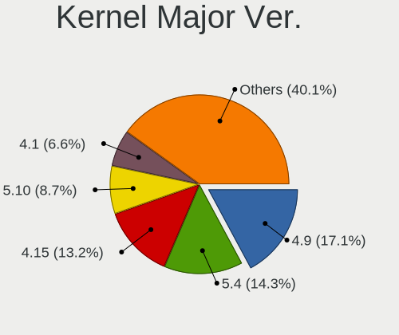

| Version | Desktops | Percent |
|---------|----------|---------|
| 4.9     | 270      | 18.39%  |
| 5.4     | 220      | 14.99%  |
| 4.15    | 208      | 14.17%  |
| 5.10    | 134      | 9.13%   |
| 4.1     | 103      | 7.02%   |
| 5.8     | 62       | 4.22%   |
| 5.3     | 56       | 3.81%   |
| 5.11    | 51       | 3.47%   |
| 5.15    | 50       | 3.41%   |
| 5.0     | 41       | 2.79%   |
| 5.16    | 34       | 2.32%   |
| 5.13    | 30       | 2.04%   |
| 4.19    | 27       | 1.84%   |
| 4.18    | 25       | 1.7%    |
| 5.6     | 19       | 1.29%   |
| 5.9     | 16       | 1.09%   |
| 5.12    | 14       | 0.95%   |
| 5.7     | 13       | 0.89%   |
| 6.1     | 11       | 0.75%   |
| 5.14    | 10       | 0.68%   |
| 4.4     | 10       | 0.68%   |
| 6.2     | 8        | 0.54%   |
| 5.5     | 6        | 0.41%   |
| 5.19    | 6        | 0.41%   |
| 4.8     | 6        | 0.41%   |
| 5.17    | 5        | 0.34%   |
| 4.14    | 4        | 0.27%   |
| 4.13    | 4        | 0.27%   |
| 4.10    | 4        | 0.27%   |
| 4.16    | 3        | 0.2%    |
| 3.10    | 3        | 0.2%    |
| 6.0     | 2        | 0.14%   |
| 5.2     | 2        | 0.14%   |
| 5.18    | 2        | 0.14%   |
| 4.12    | 2        | 0.14%   |
| 6.3     | 1        | 0.07%   |
| 5.1     | 1        | 0.07%   |
| 4.7     | 1        | 0.07%   |
| 4.20    | 1        | 0.07%   |
| 4.17    | 1        | 0.07%   |

Arch
----

OS architecture (x86_64, i586, etc.)

| Name   | Desktops | Percent |
|--------|----------|---------|
| x86_64 | 1164     | 87.26%  |
| i686   | 170      | 12.74%  |

DE
--

Desktop Environment

| Name            | Desktops | Percent |
|-----------------|----------|---------|
| KDE4            | 365      | 26%     |
| KDE5            | 335      | 23.86%  |
| GNOME           | 266      | 18.95%  |
| Unknown         | 121      | 8.62%   |
| XFCE            | 83       | 5.91%   |
| X-Cinnamon      | 51       | 3.63%   |
| MATE            | 44       | 3.13%   |
| Cinnamon        | 43       | 3.06%   |
| KDE             | 38       | 2.71%   |
| LXQt            | 17       | 1.21%   |
| i3              | 7        | 0.5%    |
| Unity           | 6        | 0.43%   |
| Deepin          | 6        | 0.43%   |
| Budgie          | 6        | 0.43%   |
| LXDE            | 5        | 0.36%   |
| Pantheon        | 4        | 0.28%   |
| GNOME Flashback | 3        | 0.21%   |
| GNOME Classic   | 2        | 0.14%   |
| Trinity         | 1        | 0.07%   |
| none+i3         | 1        | 0.07%   |

Display Server
--------------

X11 or Wayland

| Name    | Desktops | Percent |
|---------|----------|---------|
| X11     | 1173     | 86.38%  |
| Wayland | 109      | 8.03%   |
| Unknown | 55       | 4.05%   |
| Tty     | 21       | 1.55%   |

Display Manager
---------------

SDDM, LightDM, etc.

| Name    | Desktops | Percent |
|---------|----------|---------|
| Unknown | 390      | 27.92%  |
| KDM     | 368      | 26.34%  |
| SDDM    | 321      | 22.98%  |
| GDM     | 131      | 9.38%   |
| TDM     | 90       | 6.44%   |
| LightDM | 61       | 4.37%   |
| GDM3    | 18       | 1.29%   |
| MDM     | 6        | 0.43%   |
| XDM     | 4        | 0.29%   |
| SLiM    | 4        | 0.29%   |
| Ly      | 2        | 0.14%   |
| NODM    | 1        | 0.07%   |
| LXDM    | 1        | 0.07%   |

OS Lang
-------

Language

| Lang           | Desktops | Percent |
|----------------|----------|---------|
| Unknown        | 595      | 43.34%  |
| ru_RU          | 250      | 18.21%  |
| en_US          | 198      | 14.42%  |
| ru_UA          | 195      | 14.2%   |
| uk_UA          | 100      | 7.28%   |
| C              | 16       | 1.17%   |
| en_GB          | 5        | 0.36%   |
| pl_PL          | 4        | 0.29%   |
| es_ES          | 2        | 0.15%   |
| ru_RU.UTF_8    | 1        | 0.07%   |
| POSIX          | 1        | 0.07%   |
| it_IT          | 1        | 0.07%   |
| hu_HU          | 1        | 0.07%   |
| en_US.US-ASCII | 1        | 0.07%   |
| en_NZ          | 1        | 0.07%   |
| en_CA          | 1        | 0.07%   |
| C.UTF8         | 1        | 0.07%   |

Boot Mode
---------

EFI or BIOS

| Mode | Desktops | Percent |
|------|----------|---------|
| BIOS | 981      | 73.15%  |
| EFI  | 360      | 26.85%  |

Filesystem
----------

Type of filesystem

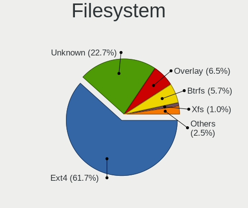

| Type    | Desktops | Percent |
|---------|----------|---------|
| Ext4    | 849      | 61.88%  |
| Unknown | 334      | 24.34%  |
| Overlay | 86       | 6.27%   |
| Btrfs   | 66       | 4.81%   |
| Xfs     | 14       | 1.02%   |
| Ext2    | 9        | 0.66%   |
| Zfs     | 7        | 0.51%   |
| Ext3    | 4        | 0.29%   |
| Tmpfs   | 1        | 0.07%   |
| SAMSUNG | 1        | 0.07%   |
| Aufs    | 1        | 0.07%   |

Part. scheme
------------

Scheme of partitioning

| Type    | Desktops | Percent |
|---------|----------|---------|
| Unknown | 535      | 38.63%  |
| MBR     | 523      | 37.76%  |
| GPT     | 327      | 23.61%  |

Dual Boot with Linux/BSD
------------------------

Hosting more than one Linux/BSD

| Dual boot | Desktops | Percent |
|-----------|----------|---------|
| No        | 1104     | 81.48%  |
| Yes       | 251      | 18.52%  |

Dual Boot (Win)
---------------

Hosting Linux and Windows

| Dual boot | Desktops | Percent |
|-----------|----------|---------|
| No        | 886      | 64.62%  |
| Yes       | 485      | 35.38%  |

Board
-----

Vendor
------

Motherboard manufacturer

| Name                | Desktops | Percent |
|---------------------|----------|---------|
| ASUSTek Computer    | 498      | 37.78%  |
| Gigabyte Technology | 228      | 17.3%   |
| ASRock              | 176      | 13.35%  |
| MSI                 | 150      | 11.38%  |
| Biostar             | 52       | 3.95%   |
| Hewlett-Packard     | 33       | 2.5%    |
| Intel               | 28       | 2.12%   |
| Dell                | 26       | 1.97%   |
| Unknown             | 19       | 1.44%   |
| Lenovo              | 17       | 1.29%   |
| ECS                 | 17       | 1.29%   |
| Acer                | 13       | 0.99%   |
| Huanan              | 9        | 0.68%   |
| Fujitsu             | 9        | 0.68%   |
| Foxconn             | 9        | 0.68%   |
| Pegatron            | 4        | 0.3%    |
| WinFast             | 3        | 0.23%   |
| Nvidia              | 3        | 0.23%   |
| Fujitsu Siemens     | 3        | 0.23%   |
| ZOTAC               | 2        | 0.15%   |
| Supermicro          | 2        | 0.15%   |
| Colorful Technology | 2        | 0.15%   |
| VIA Technologies    | 1        | 0.08%   |
| TYAN Computer       | 1        | 0.08%   |
| Seco                | 1        | 0.08%   |
| Sapphire            | 1        | 0.08%   |
| Packard Bell        | 1        | 0.08%   |
| NF-M2SV             | 1        | 0.08%   |
| Medion              | 1        | 0.08%   |
| Maxtang             | 1        | 0.08%   |
| Koloe               | 1        | 0.08%   |
| Jingsha/Kllisre     | 1        | 0.08%   |
| IBM                 | 1        | 0.08%   |
| Hardkernel          | 1        | 0.08%   |
| Compaq              | 1        | 0.08%   |
| ABIT                | 1        | 0.08%   |
| 3Q                  | 1        | 0.08%   |

Model
-----

Motherboard model

| Name                      | Desktops | Percent |
|---------------------------|----------|---------|
| ASUS All Series           | 25       | 1.9%    |
| Unknown                   | 19       | 1.44%   |
| ASUS M5A78L-M LX3         | 12       | 0.91%   |
| ASRock N68C-S UCC         | 12       | 0.91%   |
| ASUS M5A97 R2.0           | 9        | 0.68%   |
| MSI MS-7B86               | 7        | 0.53%   |
| Gigabyte G41M-Combo       | 7        | 0.53%   |
| ECS H61H2-M6              | 7        | 0.53%   |
| ASUS P5Q                  | 6        | 0.46%   |
| ASUS P5GC-MX/1333         | 6        | 0.46%   |
| MSI MS-7817               | 5        | 0.38%   |
| MSI MS-7788               | 5        | 0.38%   |
| Gigabyte B450M DS3H       | 5        | 0.38%   |
| Gigabyte 945GCMX-S2       | 5        | 0.38%   |
| ASUS PRIME B350-PLUS      | 5        | 0.38%   |
| ASUS P8H61-MX             | 5        | 0.38%   |
| ASUS M5A78L-M/USB3        | 5        | 0.38%   |
| ASUS Impression           | 5        | 0.38%   |
| ASUS H110M-R              | 5        | 0.38%   |
| ASRock FM2A68M-DG3+       | 5        | 0.38%   |
| MSI MS-7C52               | 4        | 0.3%    |
| MSI MS-7C02               | 4        | 0.3%    |
| MSI MS-7895               | 4        | 0.3%    |
| MSI MS-7721               | 4        | 0.3%    |
| MSI MS-7641               | 4        | 0.3%    |
| MSI MS-7592               | 4        | 0.3%    |
| Gigabyte H55M-S2V         | 4        | 0.3%    |
| Gigabyte F2A68HM-S1       | 4        | 0.3%    |
| Gigabyte B450M S2H        | 4        | 0.3%    |
| Gigabyte B450 AORUS ELITE | 4        | 0.3%    |
| Gigabyte 970A-DS3P        | 4        | 0.3%    |
| Gigabyte 945GCM-S2L       | 4        | 0.3%    |
| Biostar N68S3B            | 4        | 0.3%    |
| ASUS TUF B450-PRO GAMING  | 4        | 0.3%    |
| ASUS PRIME B450M-A        | 4        | 0.3%    |
| ASUS PRIME A320M-K        | 4        | 0.3%    |
| ASUS P8Z68-V PRO          | 4        | 0.3%    |
| ASUS P8B75-V              | 4        | 0.3%    |
| ASUS P5Q SE               | 4        | 0.3%    |
| ASUS P5P43TD              | 4        | 0.3%    |

Model Family
------------

Motherboard model prefix

| Name                | Desktops | Percent |
|---------------------|----------|---------|
| ASUS PRIME          | 49       | 3.72%   |
| ASUS All            | 25       | 1.9%    |
| ASUS M5A78L-M       | 24       | 1.82%   |
| Dell OptiPlex       | 20       | 1.52%   |
| Unknown             | 19       | 1.44%   |
| ASUS TUF            | 18       | 1.37%   |
| ASUS M5A97          | 18       | 1.37%   |
| Gigabyte B450M      | 16       | 1.21%   |
| HP Compaq           | 15       | 1.14%   |
| ASUS ROG            | 14       | 1.06%   |
| ASUS P8H61-M        | 13       | 0.99%   |
| ASUS P5Q            | 13       | 0.99%   |
| ASUS P8Z68-V        | 12       | 0.91%   |
| ASUS P5K            | 12       | 0.91%   |
| ASRock N68C-S       | 12       | 0.91%   |
| Lenovo ThinkCentre  | 10       | 0.76%   |
| Gigabyte B450       | 8        | 0.61%   |
| ASUS P8Z77-V        | 8        | 0.61%   |
| ASUS P5G41T-M       | 8        | 0.61%   |
| Acer Aspire         | 8        | 0.61%   |
| MSI MS-7B86         | 7        | 0.53%   |
| Gigabyte G41M-Combo | 7        | 0.53%   |
| ECS H61H2-M6        | 7        | 0.53%   |
| ASUS P5GC-MX        | 7        | 0.53%   |
| ASUS M2N-MX         | 7        | 0.53%   |
| Intel X79           | 6        | 0.46%   |
| Fujitsu ESPRIMO     | 6        | 0.46%   |
| ASUS P8H61-MX       | 6        | 0.46%   |
| ASUS P5KPL-AM       | 6        | 0.46%   |
| MSI MS-7817         | 5        | 0.38%   |
| MSI MS-7788         | 5        | 0.38%   |
| Gigabyte X570       | 5        | 0.38%   |
| Gigabyte 970A-DS3P  | 5        | 0.38%   |
| Gigabyte 945GCMX-S2 | 5        | 0.38%   |
| ASUS P8B75-M        | 5        | 0.38%   |
| ASUS M5A78L         | 5        | 0.38%   |
| ASUS M4A77TD        | 5        | 0.38%   |
| ASUS Impression     | 5        | 0.38%   |
| ASUS H110M-R        | 5        | 0.38%   |
| ASUS F1A55-M        | 5        | 0.38%   |

MFG Year
--------

Motherboard manufacture year

| Year    | Desktops | Percent |
|---------|----------|---------|
| 2012    | 159      | 12.06%  |
| 2010    | 122      | 9.26%   |
| 2011    | 116      | 8.8%    |
| 2018    | 109      | 8.27%   |
| 2007    | 102      | 7.74%   |
| 2009    | 100      | 7.59%   |
| 2008    | 75       | 5.69%   |
| 2013    | 69       | 5.24%   |
| 2014    | 65       | 4.93%   |
| 2006    | 65       | 4.93%   |
| 2017    | 64       | 4.86%   |
| 2016    | 58       | 4.4%    |
| 2019    | 53       | 4.02%   |
| 2015    | 51       | 3.87%   |
| 2020    | 42       | 3.19%   |
| 2005    | 31       | 2.35%   |
| 2021    | 20       | 1.52%   |
| 2022    | 6        | 0.46%   |
| 2004    | 5        | 0.38%   |
| 2003    | 3        | 0.23%   |
| 2002    | 2        | 0.15%   |
| Unknown | 1        | 0.08%   |

Form Factor
-----------

Physical design of the computer

| Name    | Desktops | Percent |
|---------|----------|---------|
| Desktop | 1318     | 100%    |

Secure Boot
-----------

Enabled or disabled

| State    | Desktops | Percent |
|----------|----------|---------|
| Disabled | 1311     | 99.39%  |
| Enabled  | 8        | 0.61%   |

Coreboot
--------

Have coreboot on board

| Used | Desktops | Percent |
|------|----------|---------|
| No   | 1318     | 100%    |

RAM Size
--------

Total RAM memory

| Size in GB      | Desktops | Percent |
|-----------------|----------|---------|
| 3.01-4.0        | 331      | 24.28%  |
| 8.01-16.0       | 293      | 21.5%   |
| 4.01-8.0        | 216      | 15.85%  |
| 16.01-24.0      | 213      | 15.63%  |
| 1.01-2.0        | 108      | 7.92%   |
| 32.01-64.0      | 81       | 5.94%   |
| 2.01-3.0        | 57       | 4.18%   |
| 0.51-1.0        | 29       | 2.13%   |
| 24.01-32.0      | 18       | 1.32%   |
| 64.01-256.0     | 15       | 1.1%    |
| More than 256.0 | 1        | 0.07%   |
| 0.01-0.5        | 1        | 0.07%   |

RAM Used
--------

Used RAM memory

| Used GB    | Desktops | Percent |
|------------|----------|---------|
| 1.01-2.0   | 551      | 37.13%  |
| 0.51-1.0   | 340      | 22.91%  |
| 2.01-3.0   | 243      | 16.37%  |
| 4.01-8.0   | 145      | 9.77%   |
| 3.01-4.0   | 114      | 7.68%   |
| 8.01-16.0  | 47       | 3.17%   |
| 0.01-0.5   | 36       | 2.43%   |
| 16.01-24.0 | 5        | 0.34%   |
| 24.01-32.0 | 3        | 0.2%    |

Total Drives
------------

Number of drives on board

| Drives | Desktops | Percent |
|--------|----------|---------|
| 1      | 644      | 46.57%  |
| 2      | 425      | 30.73%  |
| 3      | 188      | 13.59%  |
| 4      | 63       | 4.56%   |
| 5      | 32       | 2.31%   |
| 0      | 17       | 1.23%   |
| 6      | 8        | 0.58%   |
| 8      | 3        | 0.22%   |
| 7      | 3        | 0.22%   |

Has CD-ROM
----------

Has CD-ROM on board

| Presented | Desktops | Percent |
|-----------|----------|---------|
| No        | 787      | 58.64%  |
| Yes       | 555      | 41.36%  |

Has Ethernet
------------

Has Ethernet on board

| Presented | Desktops | Percent |
|-----------|----------|---------|
| Yes       | 1295     | 98.25%  |
| No        | 23       | 1.75%   |

Has WiFi
--------

Has WiFi module

| Presented | Desktops | Percent |
|-----------|----------|---------|
| No        | 1006     | 75.3%   |
| Yes       | 330      | 24.7%   |

Has Bluetooth
-------------

Has Bluetooth module

| Presented | Desktops | Percent |
|-----------|----------|---------|
| No        | 1143     | 85.17%  |
| Yes       | 199      | 14.83%  |

Location
--------

Country
-------

Geographic location (country)

| Country | Desktops | Percent |
|---------|----------|---------|
| Ukraine | 1318     | 100%    |

City
----

Geographic location (city)

| City            | Desktops | Percent |
|-----------------|----------|---------|
| Kyiv            | 264      | 19.27%  |
| Kharkiv         | 103      | 7.52%   |
| Simferopol      | 65       | 4.74%   |
| Sevastopol      | 54       | 3.94%   |
| Dnipro          | 54       | 3.94%   |
| Odessa          | 52       | 3.8%    |
| Lviv            | 48       | 3.5%    |
| Donetsk         | 46       | 3.36%   |
| Mykolayiv       | 21       | 1.53%   |
| Mariupol        | 20       | 1.46%   |
| Zaporizhzhia    | 19       | 1.39%   |
| Zaporizhzhya    | 17       | 1.24%   |
| Kryvyi Rih      | 17       | 1.24%   |
| Novopskov       | 15       | 1.09%   |
| Kherson         | 14       | 1.02%   |
| Yasinovataya    | 13       | 0.95%   |
| Poltava         | 13       | 0.95%   |
| Luhansk         | 13       | 0.95%   |
| Horlivka        | 13       | 0.95%   |
| Lutsk           | 12       | 0.88%   |
| Uzhhorod        | 11       | 0.8%    |
| Makiivka        | 11       | 0.8%    |
| Bucha           | 11       | 0.8%    |
| Vinnytsia       | 10       | 0.73%   |
| Bila Tserkva    | 10       | 0.73%   |
| Kremenchug      | 9        | 0.66%   |
| Kramatorsk      | 9        | 0.66%   |
| Chernihiv       | 9        | 0.66%   |
| Zhytomyr        | 8        | 0.58%   |
| Chernivtsi      | 8        | 0.58%   |
| Cherkasy        | 8        | 0.58%   |
| Syeverodonets'k | 7        | 0.51%   |
| Samsonove       | 7        | 0.51%   |
| Rivne           | 7        | 0.51%   |
| Nova Kakhovka   | 7        | 0.51%   |
| Kerch           | 7        | 0.51%   |
| Yevpatoriya     | 6        | 0.44%   |
| Vasylkiv        | 6        | 0.44%   |
| Khartsyzsk      | 6        | 0.44%   |
| Ivano-Frankivsk | 6        | 0.44%   |

Drives
------

Drive Vendor
------------

Hard drive vendors

| Vendor              | Desktops | Drives | Percent |
|---------------------|----------|--------|---------|
| WDC                 | 492      | 766    | 22.55%  |
| Seagate             | 407      | 590    | 18.65%  |
| Samsung Electronics | 329      | 483    | 15.08%  |
| Kingston            | 177      | 239    | 8.11%   |
| Toshiba             | 148      | 191    | 6.78%   |
| Hitachi             | 131      | 165    | 6%      |
| GOODRAM             | 54       | 66     | 2.47%   |
| Patriot             | 41       | 46     | 1.88%   |
| HGST                | 32       | 59     | 1.47%   |
| Crucial             | 29       | 33     | 1.33%   |
| A-DATA Technology   | 27       | 37     | 1.24%   |
| Team                | 26       | 38     | 1.19%   |
| Apacer              | 25       | 27     | 1.15%   |
| SPCC                | 23       | 27     | 1.05%   |
| Maxtor              | 20       | 23     | 0.92%   |
| China               | 19       | 22     | 0.87%   |
| SanDisk             | 18       | 18     | 0.82%   |
| Transcend           | 14       | 24     | 0.64%   |
| Silicon Motion      | 14       | 18     | 0.64%   |
| Intel               | 14       | 16     | 0.64%   |
| AMD                 | 12       | 33     | 0.55%   |
| Leven               | 10       | 12     | 0.46%   |
| KingDian            | 10       | 14     | 0.46%   |
| Unknown             | 9        | 12     | 0.41%   |
| OCZ                 | 9        | 9      | 0.41%   |
| Plextor             | 6        | 6      | 0.27%   |
| KingSpec            | 5        | 5      | 0.23%   |
| Fujitsu             | 5        | 5      | 0.23%   |
| Smartbuy            | 4        | 5      | 0.18%   |
| Phison              | 4        | 5      | 0.18%   |
| JMicron Technology  | 4        | 8      | 0.18%   |
| XPG                 | 3        | 3      | 0.14%   |
| SK hynix            | 3        | 3      | 0.14%   |
| HUAWEI              | 3        | 3      | 0.14%   |
| Corsair             | 3        | 3      | 0.14%   |
| Verbatim            | 2        | 2      | 0.09%   |
| Pioneer             | 2        | 2      | 0.09%   |
| Micron Technology   | 2        | 3      | 0.09%   |
| LITEONIT            | 2        | 3      | 0.09%   |
| KCG                 | 2        | 2      | 0.09%   |

Drive Model
-----------

Hard drive models

| Model                            | Desktops | Percent |
|----------------------------------|----------|---------|
| Toshiba DT01ACA100 1TB           | 39       | 1.59%   |
| Seagate ST500DM002-1BD142 500GB  | 34       | 1.39%   |
| Toshiba DT01ACA050 500GB         | 33       | 1.35%   |
| Kingston SA400S37240G 240GB SSD  | 31       | 1.27%   |
| Kingston SA400S37120G 120GB SSD  | 30       | 1.23%   |
| Samsung SSD 860 EVO 250GB        | 27       | 1.1%    |
| Toshiba HDWD110 1TB              | 24       | 0.98%   |
| WDC WD10EZEX-08WN4A0 1TB         | 22       | 0.9%    |
| Seagate ST3500418AS 500GB        | 21       | 0.86%   |
| Kingston SV300S37A120G 120GB SSD | 17       | 0.69%   |
| Seagate ST1000DM003-1CH162 1TB   | 15       | 0.61%   |
| Patriot Burst 240GB SSD          | 15       | 0.61%   |
| Samsung HD103SJ 1TB              | 14       | 0.57%   |
| Seagate ST31000524AS 1TB         | 13       | 0.53%   |
| Samsung SSD 860 EVO 500GB        | 13       | 0.53%   |
| WDC WD5000AAKX-001CA0 500GB      | 12       | 0.49%   |
| Seagate ST3320620AS 320GB        | 12       | 0.49%   |
| Seagate ST1000DM010-2EP102 1TB   | 12       | 0.49%   |
| WDC WD5000AADS-00S9B0 500GB      | 11       | 0.45%   |
| Toshiba DT01ACA200 2TB           | 11       | 0.45%   |
| Seagate ST31000528AS 1TB         | 11       | 0.45%   |
| Seagate ST2000DM008-2FR102 2TB   | 11       | 0.45%   |
| Kingston SA400S37480G 480GB SSD  | 11       | 0.45%   |
| WDC WD10EZEX-22MFCA0 1TB         | 10       | 0.41%   |
| Seagate ST3250410AS 250GB        | 10       | 0.41%   |
| Samsung SSD 850 EVO 250GB        | 10       | 0.41%   |
| Samsung HD321KJ 320GB            | 10       | 0.41%   |
| Samsung HD161HJ 160GB            | 10       | 0.41%   |
| Samsung HD080HJ/ 80GB            | 10       | 0.41%   |
| Patriot Burst 120GB SSD          | 10       | 0.41%   |
| Hitachi HDS721010CLA332 1TB      | 10       | 0.41%   |
| WDC WD5000AAKX-00ERMA0 500GB     | 9        | 0.37%   |
| WDC WD10EZEX-00WN4A0 1TB         | 9        | 0.37%   |
| Seagate ST3250318AS 250GB        | 9        | 0.37%   |
| Samsung HD502HJ 500GB            | 9        | 0.37%   |
| Samsung HD160JJ 160GB            | 9        | 0.37%   |
| Hitachi HDS721616PLA380 160GB    | 9        | 0.37%   |
| Hitachi HDS721050CLA362 500GB    | 9        | 0.37%   |
| WDC WD5000AAKS-00UU3A0 500GB     | 8        | 0.33%   |
| WDC WD10EZRZ-00HTKB0 1TB         | 8        | 0.33%   |

HDD Vendor
----------

Hard disk drive vendors

| Vendor              | Desktops | Drives | Percent |
|---------------------|----------|--------|---------|
| WDC                 | 480      | 745    | 33.29%  |
| Seagate             | 404      | 587    | 28.02%  |
| Samsung Electronics | 208      | 301    | 14.42%  |
| Toshiba             | 147      | 186    | 10.19%  |
| Hitachi             | 131      | 165    | 9.08%   |
| HGST                | 32       | 59     | 2.22%   |
| Maxtor              | 20       | 23     | 1.39%   |
| Fujitsu             | 5        | 5      | 0.35%   |
| Unknown             | 4        | 5      | 0.28%   |
| ASMedia             | 2        | 2      | 0.14%   |
| Apple               | 2        | 2      | 0.14%   |
| TPH00100500GB       | 1        | 1      | 0.07%   |
| PHD 3.0             | 1        | 1      | 0.07%   |
| JMicron Technology  | 1        | 4      | 0.07%   |
| Ext Hard            | 1        | 1      | 0.07%   |
| Config              | 1        | 1      | 0.07%   |
| China               | 1        | 1      | 0.07%   |
| ASMT                | 1        | 4      | 0.07%   |

SSD Vendor
----------

Solid state drive vendors

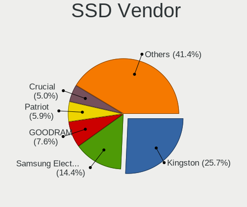

| Vendor              | Desktops | Drives | Percent |
|---------------------|----------|--------|---------|
| Kingston            | 165      | 218    | 26.32%  |
| Samsung Electronics | 90       | 127    | 14.35%  |
| GOODRAM             | 51       | 62     | 8.13%   |
| Patriot             | 40       | 45     | 6.38%   |
| Crucial             | 29       | 33     | 4.63%   |
| Team                | 25       | 34     | 3.99%   |
| Apacer              | 23       | 25     | 3.67%   |
| A-DATA Technology   | 22       | 32     | 3.51%   |
| SPCC                | 19       | 21     | 3.03%   |
| China               | 18       | 21     | 2.87%   |
| SanDisk             | 15       | 15     | 2.39%   |
| WDC                 | 14       | 15     | 2.23%   |
| Intel               | 12       | 14     | 1.91%   |
| Transcend           | 11       | 18     | 1.75%   |
| AMD                 | 11       | 32     | 1.75%   |
| KingDian            | 10       | 14     | 1.59%   |
| OCZ                 | 9        | 9      | 1.44%   |
| Leven               | 9        | 11     | 1.44%   |
| Plextor             | 5        | 5      | 0.8%    |
| KingSpec            | 5        | 5      | 0.8%    |
| Toshiba             | 4        | 5      | 0.64%   |
| Smartbuy            | 4        | 5      | 0.64%   |
| Corsair             | 3        | 3      | 0.48%   |
| Verbatim            | 2        | 2      | 0.32%   |
| Pioneer             | 2        | 2      | 0.32%   |
| LITEONIT            | 2        | 3      | 0.32%   |
| KCG                 | 2        | 2      | 0.32%   |
| JMicron Technology  | 2        | 2      | 0.32%   |
| CHN25SATAS1         | 2        | 6      | 0.32%   |
| Zheino              | 1        | 1      | 0.16%   |
| WALRAM              | 1        | 1      | 0.16%   |
| Super Talent        | 1        | 1      | 0.16%   |
| SP                  | 1        | 1      | 0.16%   |
| Reeinno             | 1        | 1      | 0.16%   |
| PNY                 | 1        | 1      | 0.16%   |
| Palit               | 1        | 2      | 0.16%   |
| Micron Technology   | 1        | 1      | 0.16%   |
| Lexar               | 1        | 1      | 0.16%   |
| KIOXIA-EXCERIA      | 1        | 2      | 0.16%   |
| JIAWEI              | 1        | 1      | 0.16%   |

Drive Kind
----------

HDD or SSD

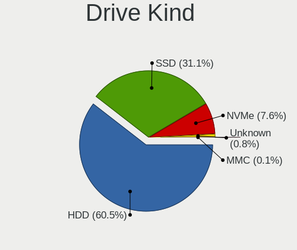

| Kind    | Desktops | Drives | Percent |
|---------|----------|--------|---------|
| HDD     | 1105     | 2093   | 62.22%  |
| SSD     | 545      | 810    | 30.69%  |
| NVMe    | 111      | 160    | 6.25%   |
| Unknown | 13       | 15     | 0.73%   |
| MMC     | 2        | 2      | 0.11%   |

Drive Connector
---------------

SATA, SAS, NVMe, etc.

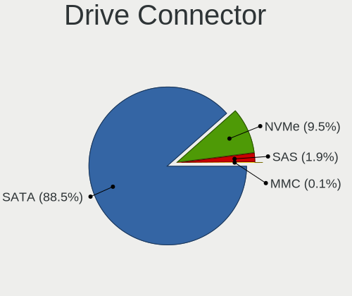

| Type | Desktops | Drives | Percent |
|------|----------|--------|---------|
| SATA | 1280     | 2879   | 90.14%  |
| NVMe | 111      | 160    | 7.82%   |
| SAS  | 27       | 39     | 1.9%    |
| MMC  | 2        | 2      | 0.14%   |

Drive Size
----------

Size of hard drive

| Size in TB | Desktops | Drives | Percent |
|------------|----------|--------|---------|
| 0.01-0.5   | 1098     | 1979   | 64.25%  |
| 0.51-1.0   | 434      | 651    | 25.39%  |
| 1.01-2.0   | 111      | 164    | 6.5%    |
| 2.01-3.0   | 30       | 50     | 1.76%   |
| 3.01-4.0   | 22       | 40     | 1.29%   |
| 4.01-10.0  | 14       | 19     | 0.82%   |

Space Total
-----------

Amount of disk space available on the file system

| Size in GB     | Desktops | Percent |
|----------------|----------|---------|
| 101-250        | 354      | 24.53%  |
| 251-500        | 230      | 15.94%  |
| 501-1000       | 165      | 11.43%  |
| 1-20           | 161      | 11.16%  |
| 51-100         | 157      | 10.88%  |
| 1001-2000      | 133      | 9.22%   |
| 21-50          | 116      | 8.04%   |
| More than 3000 | 52       | 3.6%    |
| 2001-3000      | 48       | 3.33%   |
| Unknown        | 27       | 1.87%   |

Space Used
----------

Amount of used disk space

| Used GB        | Desktops | Percent |
|----------------|----------|---------|
| 1-20           | 655      | 45.08%  |
| 21-50          | 183      | 12.59%  |
| 101-250        | 176      | 12.11%  |
| 51-100         | 122      | 8.4%    |
| 251-500        | 99       | 6.81%   |
| 501-1000       | 99       | 6.81%   |
| 1001-2000      | 53       | 3.65%   |
| Unknown        | 27       | 1.86%   |
| More than 3000 | 20       | 1.38%   |
| 2001-3000      | 19       | 1.31%   |

Malfunc. Drives
---------------

Drive models with a malfunction

| Model                             | Desktops | Drives | Percent |
|-----------------------------------|----------|--------|---------|
| Seagate ST500DM002-1BD142 500GB   | 13       | 15     | 2.51%   |
| Seagate ST3500418AS 500GB         | 9        | 10     | 1.74%   |
| Samsung Electronics HD321KJ 320GB | 8        | 11     | 1.55%   |
| WDC WD5000AADS-00S9B0 500GB       | 7        | 7      | 1.35%   |
| Seagate ST31000524AS 1TB          | 7        | 9      | 1.35%   |
| Samsung Electronics HD080HJ/ 80GB | 7        | 7      | 1.35%   |
| Seagate ST3320620AS 320GB         | 6        | 8      | 1.16%   |
| Seagate ST3250318AS 250GB         | 6        | 8      | 1.16%   |
| WDC WD5000AAKX-001CA0 500GB       | 5        | 5      | 0.97%   |
| WDC WD10EZEX-60ZF5A0 1TB          | 5        | 6      | 0.97%   |
| Toshiba DT01ACA050 500GB          | 5        | 6      | 0.97%   |
| Seagate ST9500325AS 500GB         | 5        | 5      | 0.97%   |
| Seagate ST3160811AS 160GB         | 5        | 5      | 0.97%   |
| Seagate ST1000DM003-1CH162 1TB    | 5        | 7      | 0.97%   |
| Samsung Electronics SP2514N 250GB | 5        | 6      | 0.97%   |
| Samsung Electronics SP2504C 250GB | 5        | 6      | 0.97%   |
| Samsung Electronics SP2004C 200GB | 5        | 5      | 0.97%   |
| Samsung Electronics HD403LJ 400GB | 5        | 6      | 0.97%   |
| Samsung Electronics HD103SJ 1TB   | 5        | 7      | 0.97%   |
| Maxtor STM3250820AS 250GB         | 5        | 6      | 0.97%   |
| Hitachi HDS721010DLE630 1TB       | 5        | 6      | 0.97%   |
| WDC WD5000AAKS-00UU3A0 500GB      | 4        | 4      | 0.77%   |
| Toshiba DT01ACA100 1TB            | 4        | 6      | 0.77%   |
| Seagate ST3250410AS 250GB         | 4        | 7      | 0.77%   |
| Seagate ST3250310AS 250GB         | 4        | 5      | 0.77%   |
| Samsung Electronics SP0802N 80GB  | 4        | 4      | 0.77%   |
| Samsung Electronics HD322HJ 320GB | 4        | 4      | 0.77%   |
| Samsung Electronics HD200HJ 200GB | 4        | 5      | 0.77%   |
| Samsung Electronics HD160JJ 160GB | 4        | 6      | 0.77%   |
| Hitachi HTS542512K9A300 120GB     | 4        | 5      | 0.77%   |
| Hitachi HDT725025VLA380 250GB     | 4        | 4      | 0.77%   |
| Hitachi HDS721616PLA380 160GB     | 4        | 4      | 0.77%   |
| Hitachi HDP725025GLA380 250GB     | 4        | 5      | 0.77%   |
| WDC WD5000AAKX-00ERMA0 500GB      | 3        | 4      | 0.58%   |
| WDC WD5000AAKS-00V1A0 500GB       | 3        | 4      | 0.58%   |
| WDC WD3200AAJS-00L7A0 320GB       | 3        | 3      | 0.58%   |
| Seagate ST380815AS 80GB           | 3        | 4      | 0.58%   |
| Seagate ST3500320AS 500GB         | 3        | 4      | 0.58%   |
| Seagate ST3320613AS 320GB         | 3        | 6      | 0.58%   |
| Samsung Electronics SP0842N 80GB  | 3        | 6      | 0.58%   |

Malfunc. Drive Vendor
---------------------

Vendors of faulty drives

| Vendor              | Desktops | Drives | Percent |
|---------------------|----------|--------|---------|
| Seagate             | 136      | 172    | 27.2%   |
| WDC                 | 127      | 155    | 25.4%   |
| Samsung Electronics | 106      | 127    | 21.2%   |
| Hitachi             | 57       | 73     | 11.4%   |
| Toshiba             | 23       | 27     | 4.6%    |
| Kingston            | 12       | 16     | 2.4%    |
| Maxtor              | 11       | 13     | 2.2%    |
| Intel               | 4        | 4      | 0.8%    |
| Patriot             | 3        | 3      | 0.6%    |
| A-DATA Technology   | 3        | 4      | 0.6%    |
| SPCC                | 2        | 3      | 0.4%    |
| SanDisk             | 2        | 2      | 0.4%    |
| HGST                | 2        | 5      | 0.4%    |
| Fujitsu             | 2        | 2      | 0.4%    |
| Transcend           | 1        | 1      | 0.2%    |
| TPH00100500GB       | 1        | 1      | 0.2%    |
| OCZ                 | 1        | 1      | 0.2%    |
| Micron Technology   | 1        | 1      | 0.2%    |
| JMicron Technology  | 1        | 1      | 0.2%    |
| JIAWEI              | 1        | 1      | 0.2%    |
| GOODRAM             | 1        | 1      | 0.2%    |
| Crucial             | 1        | 1      | 0.2%    |
| Corsair             | 1        | 1      | 0.2%    |
| Apple               | 1        | 1      | 0.2%    |

Malfunc. HDD Vendor
-------------------

Vendors of faulty HDD drives

| Vendor              | Desktops | Drives | Percent |
|---------------------|----------|--------|---------|
| Seagate             | 136      | 172    | 29.44%  |
| WDC                 | 127      | 155    | 27.49%  |
| Samsung Electronics | 102      | 123    | 22.08%  |
| Hitachi             | 57       | 73     | 12.34%  |
| Toshiba             | 23       | 27     | 4.98%   |
| Maxtor              | 11       | 13     | 2.38%   |
| HGST                | 2        | 5      | 0.43%   |
| Fujitsu             | 2        | 2      | 0.43%   |
| TPH00100500GB       | 1        | 1      | 0.22%   |
| Apple               | 1        | 1      | 0.22%   |

Malfunc. Drive Kind
-------------------

Kinds of faulty drives

| Kind | Desktops | Drives | Percent |
|------|----------|--------|---------|
| HDD  | 390      | 572    | 91.12%  |
| SSD  | 37       | 43     | 8.64%   |
| NVMe | 1        | 1      | 0.23%   |

Failed Drives
-------------

Failed drive models

| Model                             | Desktops | Drives | Percent |
|-----------------------------------|----------|--------|---------|
| Seagate ST31000528AS 1TB          | 2        | 2      | 9.52%   |
| WDC WD5000AAKS-00V1A0 500GB       | 1        | 2      | 4.76%   |
| WDC WD3200AAJS-60Z0A0 320GB       | 1        | 1      | 4.76%   |
| WDC WD2500JS-22NCB1 250GB         | 1        | 1      | 4.76%   |
| WDC WD1600AAJB-00WRA0 160GB       | 1        | 1      | 4.76%   |
| WDC WD1001FALS-00E8B0 1TB         | 1        | 1      | 4.76%   |
| Toshiba MK5065GSX 500GB           | 1        | 1      | 4.76%   |
| Seagate ST9250315AS 250GB         | 1        | 1      | 4.76%   |
| Seagate ST3750525AS 752GB         | 1        | 1      | 4.76%   |
| Seagate ST3500418AS 500GB         | 1        | 1      | 4.76%   |
| Seagate ST3500410AS 500GB         | 1        | 1      | 4.76%   |
| Seagate ST320DM001 HD322GJ 320GB  | 1        | 1      | 4.76%   |
| Seagate ST31000524AS 1TB          | 1        | 1      | 4.76%   |
| Seagate ST31000340NS 1TB          | 1        | 1      | 4.76%   |
| Samsung Electronics HM321HI 320GB | 1        | 1      | 4.76%   |
| Samsung Electronics HM251JI 250GB | 1        | 1      | 4.76%   |
| Samsung Electronics HD502HJ 500GB | 1        | 1      | 4.76%   |
| Samsung Electronics HD252HJ 250GB | 1        | 4      | 4.76%   |
| Hitachi HTS547575A9E384 752GB     | 1        | 1      | 4.76%   |
| Hitachi HDS721010DLE630 1TB       | 1        | 1      | 4.76%   |

Failed Drive Vendor
-------------------

Failed drive vendors

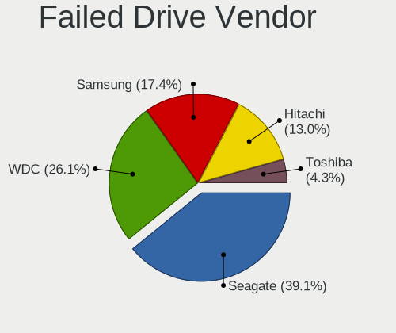

| Vendor              | Desktops | Drives | Percent |
|---------------------|----------|--------|---------|
| Seagate             | 9        | 9      | 42.86%  |
| WDC                 | 5        | 6      | 23.81%  |
| Samsung Electronics | 4        | 7      | 19.05%  |
| Hitachi             | 2        | 2      | 9.52%   |
| Toshiba             | 1        | 1      | 4.76%   |

Drive Status
------------

Number of failed and malfunc. drives

| Status   | Desktops | Drives | Percent |
|----------|----------|--------|---------|
| Works    | 697      | 1485   | 44.45%  |
| Detected | 434      | 954    | 27.68%  |
| Malfunc  | 416      | 616    | 26.53%  |
| Failed   | 21       | 25     | 1.34%   |

Storage controller
------------------

Storage Vendor
--------------

Storage controller vendors

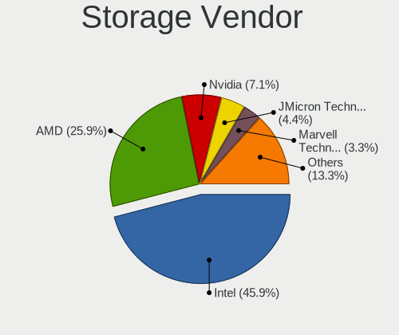

| Vendor                           | Desktops | Percent |
|----------------------------------|----------|---------|
| Intel                            | 766      | 47.14%  |
| AMD                              | 412      | 25.35%  |
| Nvidia                           | 122      | 7.51%   |
| JMicron Technology               | 78       | 4.8%    |
| Marvell Technology Group         | 56       | 3.45%   |
| Samsung Electronics              | 41       | 2.52%   |
| ASMedia Technology               | 41       | 2.52%   |
| Silicon Motion                   | 21       | 1.29%   |
| VIA Technologies                 | 16       | 0.98%   |
| Kingston Technology Company      | 14       | 0.86%   |
| Phison Electronics               | 10       | 0.62%   |
| ADATA Technology                 | 9        | 0.55%   |
| SanDisk                          | 7        | 0.43%   |
| Silicon Image                    | 5        | 0.31%   |
| ULi Electronics                  | 3        | 0.18%   |
| SK hynix                         | 3        | 0.18%   |
| Silicon Integrated Systems [SiS] | 3        | 0.18%   |
| Shenzhen Longsys Electronics     | 3        | 0.18%   |
| Realtek Semiconductor            | 3        | 0.18%   |
| Integrated Technology Express    | 3        | 0.18%   |
| MAXIO Technology (Hangzhou)      | 2        | 0.12%   |
| Broadcom / LSI                   | 2        | 0.12%   |
| Seagate Technology               | 1        | 0.06%   |
| Micron/Crucial Technology        | 1        | 0.06%   |
| Micron Technology                | 1        | 0.06%   |
| LSI Logic / Symbios Logic        | 1        | 0.06%   |
| Lite-On Technology               | 1        | 0.06%   |

Storage Model
-------------

Storage controller models

| Model                                                                                   | Desktops | Percent |
|-----------------------------------------------------------------------------------------|----------|---------|
| AMD FCH SATA Controller [AHCI mode]                                                     | 180      | 7.71%   |
| AMD SB7x0/SB8x0/SB9x0 IDE Controller                                                    | 133      | 5.7%    |
| Intel NM10/ICH7 Family SATA Controller [IDE mode]                                       | 126      | 5.4%    |
| Intel 82801G (ICH7 Family) IDE Controller                                               | 107      | 4.58%   |
| AMD SB7x0/SB8x0/SB9x0 SATA Controller [IDE mode]                                        | 89       | 3.81%   |
| AMD SB7x0/SB8x0/SB9x0 SATA Controller [AHCI mode]                                       | 79       | 3.38%   |
| Intel 6 Series/C200 Series Chipset Family 6 port Desktop SATA AHCI Controller           | 78       | 3.34%   |
| Nvidia MCP61 SATA Controller                                                            | 75       | 3.21%   |
| Nvidia MCP61 IDE                                                                        | 70       | 3%      |
| AMD 400 Series Chipset SATA Controller                                                  | 63       | 2.7%    |
| Intel 8 Series/C220 Series Chipset Family 6-port SATA Controller 1 [AHCI mode]          | 55       | 2.36%   |
| Intel Q170/Q150/B150/H170/H110/Z170/CM236 Chipset SATA Controller [AHCI Mode]           | 52       | 2.23%   |
| Intel 6 Series/C200 Series Chipset Family Desktop SATA Controller (IDE mode, ports 4-5) | 49       | 2.1%    |
| Intel 6 Series/C200 Series Chipset Family Desktop SATA Controller (IDE mode, ports 0-3) | 49       | 2.1%    |
| Intel 200 Series PCH SATA controller [AHCI mode]                                        | 45       | 1.93%   |
| Intel 7 Series/C210 Series Chipset Family 6-port SATA Controller [AHCI mode]            | 43       | 1.84%   |
| ASMedia ASM1062 Serial ATA Controller                                                   | 40       | 1.71%   |
| Intel 82801I (ICH9 Family) 2 port SATA Controller [IDE mode]                            | 33       | 1.41%   |
| JMicron JMB368 IDE controller                                                           | 30       | 1.28%   |
| AMD FCH IDE Controller                                                                  | 30       | 1.28%   |
| Intel 82801JI (ICH10 Family) 4 port SATA IDE Controller #1                              | 29       | 1.24%   |
| Intel 82801JI (ICH10 Family) 2 port SATA IDE Controller #2                              | 29       | 1.24%   |
| JMicron JMB363 SATA/IDE Controller                                                      | 27       | 1.16%   |
| Intel Cannon Lake PCH SATA AHCI Controller                                              | 27       | 1.16%   |
| AMD FCH SATA Controller [IDE mode]                                                      | 24       | 1.03%   |
| Samsung NVMe SSD Controller SM981/PM981/PM983                                           | 22       | 0.94%   |
| Intel 82801JI (ICH10 Family) SATA AHCI Controller                                       | 21       | 0.9%    |
| Intel 82801IB (ICH9) 2 port SATA Controller [IDE mode]                                  | 21       | 0.9%    |
| AMD FCH SATA Controller D                                                               | 21       | 0.9%    |
| Marvell Group 88SE6111/6121 SATA II / PATA Controller                                   | 20       | 0.86%   |
| AMD 300 Series Chipset SATA Controller                                                  | 19       | 0.81%   |
| Intel 5 Series/3400 Series Chipset 6 port SATA AHCI Controller                          | 17       | 0.73%   |
| JMicron JMB362 SATA Controller                                                          | 16       | 0.69%   |
| Intel SATA Controller [RAID mode]                                                       | 16       | 0.69%   |
| Silicon Motion SM2263EN/SM2263XT SSD Controller                                         | 15       | 0.64%   |
| AMD SB600 IDE                                                                           | 15       | 0.64%   |
| Marvell Group 88SE6101/6102 single-port PATA133 interface                               | 14       | 0.6%    |
| Intel 82801EB/ER (ICH5/ICH5R) IDE Controller                                            | 14       | 0.6%    |
| Intel 500 Series Chipset Family SATA AHCI Controller                                    | 14       | 0.6%    |
| Intel C600/X79 series chipset 6-Port SATA AHCI Controller                               | 13       | 0.56%   |

Storage Kind
------------

Kind of storage controller (IDE, SATA, NVMe, SAS, ...)

| Kind | Desktops | Percent |
|------|----------|---------|
| SATA | 860      | 51.31%  |
| IDE  | 664      | 39.62%  |
| NVMe | 111      | 6.62%   |
| RAID | 35       | 2.09%   |
| SAS  | 5        | 0.3%    |
| SCSI | 1        | 0.06%   |

Processor
---------

CPU Vendor
----------

Processor vendors

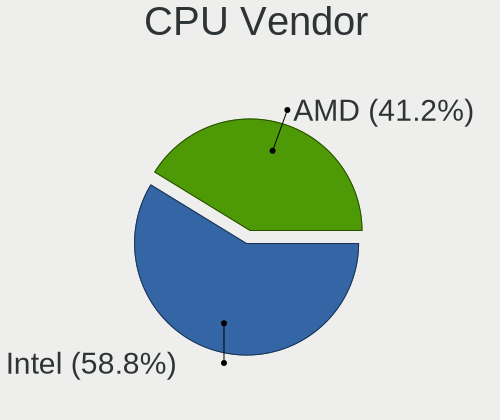

| Vendor | Desktops | Percent |
|--------|----------|---------|
| Intel  | 784      | 59.48%  |
| AMD    | 534      | 40.52%  |

CPU Model
---------

Processor models

| Model                                       | Desktops | Percent |
|---------------------------------------------|----------|---------|
| AMD Athlon II X2 250 Processor              | 28       | 2.1%    |
| Intel Core 2 Duo CPU E8400 @ 3.00GHz        | 17       | 1.27%   |
| Intel Core i3-3220 CPU @ 3.30GHz            | 15       | 1.12%   |
| AMD FX-8350 Eight-Core Processor            | 15       | 1.12%   |
| Intel Core i5-2400 CPU @ 3.10GHz            | 14       | 1.05%   |
| Intel Core i3-2100 CPU @ 3.10GHz            | 13       | 0.97%   |
| Intel Core i3 CPU 540 @ 3.07GHz             | 12       | 0.9%    |
| Intel Core 2 Duo CPU E8500 @ 3.16GHz        | 12       | 0.9%    |
| AMD Ryzen 5 1600 Six-Core Processor         | 12       | 0.9%    |
| AMD Ryzen 3 2200G with Radeon Vega Graphics | 12       | 0.9%    |
| Intel Core i3-8100 CPU @ 3.60GHz            | 11       | 0.82%   |
| Intel Core i3-2120 CPU @ 3.30GHz            | 11       | 0.82%   |
| AMD Ryzen 5 3600 6-Core Processor           | 11       | 0.82%   |
| AMD Athlon 64 X2 Dual Core Processor 4200+  | 11       | 0.82%   |
| Intel Core i5-3470 CPU @ 3.20GHz            | 10       | 0.75%   |
| Intel Core 2 Quad CPU Q6600 @ 2.40GHz       | 10       | 0.75%   |
| Intel Core 2 Duo CPU E7500 @ 2.93GHz        | 10       | 0.75%   |
| Intel Pentium CPU G4400 @ 3.30GHz           | 9        | 0.67%   |
| Intel Pentium 4 CPU 3.00GHz                 | 9        | 0.67%   |
| Intel Core i3-6100 CPU @ 3.70GHz            | 9        | 0.67%   |
| AMD Ryzen 5 3400G with Radeon Vega Graphics | 9        | 0.67%   |
| AMD Ryzen 3 1200 Quad-Core Processor        | 9        | 0.67%   |
| AMD Phenom II X4 965 Processor              | 9        | 0.67%   |
| AMD Athlon II X2 240 Processor              | 9        | 0.67%   |
| Intel Pentium CPU G620 @ 2.60GHz            | 8        | 0.6%    |
| Intel Pentium CPU G3260 @ 3.30GHz           | 8        | 0.6%    |
| AMD FX-8300 Eight-Core Processor            | 8        | 0.6%    |
| AMD FX-6300 Six-Core Processor              | 8        | 0.6%    |
| Intel Pentium Dual-Core CPU E6300 @ 2.80GHz | 7        | 0.52%   |
| Intel Pentium Dual CPU E2160 @ 1.80GHz      | 7        | 0.52%   |
| Intel Pentium D CPU 3.00GHz                 | 7        | 0.52%   |
| Intel Core i5-9400F CPU @ 2.90GHz           | 7        | 0.52%   |
| Intel Core i5-7400 CPU @ 3.00GHz            | 7        | 0.52%   |
| Intel Core i5-6400 CPU @ 2.70GHz            | 7        | 0.52%   |
| Intel Core i5-4670K CPU @ 3.40GHz           | 7        | 0.52%   |
| Intel Core i5-2500K CPU @ 3.30GHz           | 7        | 0.52%   |
| Intel Core 2 Duo CPU E6750 @ 2.66GHz        | 7        | 0.52%   |
| AMD Ryzen 7 3700X 8-Core Processor          | 7        | 0.52%   |
| AMD Ryzen 7 2700X Eight-Core Processor      | 7        | 0.52%   |
| AMD Ryzen 5 5600X 6-Core Processor          | 7        | 0.52%   |

CPU Model Family
----------------

Processor model prefix

| Model                   | Desktops | Percent |
|-------------------------|----------|---------|
| Intel Core i5           | 151      | 11.36%  |
| Intel Core i3           | 126      | 9.48%   |
| Intel Celeron           | 83       | 6.25%   |
| Intel Core 2 Duo        | 79       | 5.94%   |
| Intel Xeon              | 67       | 5.04%   |
| AMD Athlon II X2        | 67       | 5.04%   |
| AMD FX                  | 65       | 4.89%   |
| Intel Pentium           | 59       | 4.44%   |
| AMD Ryzen 5             | 58       | 4.36%   |
| Intel Core i7           | 53       | 3.99%   |
| AMD Athlon 64 X2        | 52       | 3.91%   |
| Intel Core 2 Quad       | 35       | 2.63%   |
| AMD Phenom II X4        | 35       | 2.63%   |
| Intel Pentium 4         | 29       | 2.18%   |
| Intel Pentium Dual-Core | 28       | 2.11%   |
| AMD Ryzen 7             | 28       | 2.11%   |
| AMD Ryzen 3             | 23       | 1.73%   |
| AMD Athlon II X4        | 23       | 1.73%   |
| AMD A4                  | 22       | 1.66%   |
| Intel Core 2            | 18       | 1.35%   |
| AMD Athlon II X3        | 17       | 1.28%   |
| AMD Athlon              | 17       | 1.28%   |
| AMD A8                  | 17       | 1.28%   |
| Intel Pentium D         | 16       | 1.2%    |
| Other                   | 15       | 1.13%   |
| Intel Pentium Dual      | 15       | 1.13%   |
| AMD Sempron             | 15       | 1.13%   |
| AMD Athlon X4           | 14       | 1.05%   |
| AMD Ryzen 9             | 11       | 0.83%   |
| AMD Athlon 64           | 11       | 0.83%   |
| AMD A10                 | 11       | 0.83%   |
| AMD A6                  | 10       | 0.75%   |
| Intel Atom              | 8        | 0.6%    |
| AMD Phenom II X6        | 7        | 0.53%   |
| Intel Genuine           | 6        | 0.45%   |
| AMD Ryzen Threadripper  | 5        | 0.38%   |
| Intel Pentium Gold      | 4        | 0.3%    |
| AMD Phenom II X3        | 3        | 0.23%   |
| AMD E1                  | 3        | 0.23%   |
| AMD E                   | 3        | 0.23%   |

CPU Cores
---------

Number of processor cores

| Number  | Desktops | Percent |
|---------|----------|---------|
| 2       | 546      | 40.5%   |
| 4       | 406      | 30.12%  |
| 6       | 118      | 8.75%   |
| 1       | 89       | 6.6%    |
| Unknown | 77       | 5.71%   |
| 8       | 50       | 3.71%   |
| 3       | 34       | 2.52%   |
| 12      | 14       | 1.04%   |
| 16      | 7        | 0.52%   |
| 10      | 3        | 0.22%   |
| 36      | 1        | 0.07%   |
| 32      | 1        | 0.07%   |
| 24      | 1        | 0.07%   |
| 14      | 1        | 0.07%   |

CPU Sockets
-----------

Number of sockets

| Number  | Desktops | Percent |
|---------|----------|---------|
| 1       | 1311     | 99.47%  |
| 2       | 6        | 0.46%   |
| Unknown | 1        | 0.08%   |

CPU Threads
-----------

Threads per core (Hyper-Threading)

| Number  | Desktops | Percent |
|---------|----------|---------|
| 1       | 783      | 58.13%  |
| 2       | 487      | 36.15%  |
| Unknown | 77       | 5.72%   |

CPU Op-Modes
------------

CPU Operation Modes (32-bit, 64-bit)

| Op mode        | Desktops | Percent |
|----------------|----------|---------|
| 32-bit, 64-bit | 1290     | 97.58%  |
| 32-bit         | 19       | 1.44%   |
| Unknown        | 13       | 0.98%   |

CPU Microcode
-------------

Microcode number

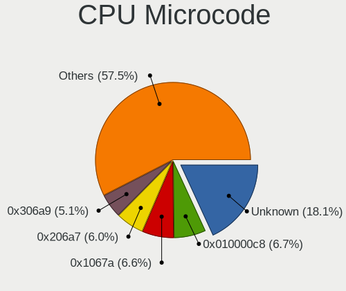

| Number     | Desktops | Percent |
|------------|----------|---------|
| Unknown    | 205      | 15.05%  |
| 0x010000c8 | 97       | 7.12%   |
| 0x1067a    | 96       | 7.05%   |
| 0x206a7    | 87       | 6.39%   |
| 0x306a9    | 70       | 5.14%   |
| 0x306c3    | 64       | 4.7%    |
| 0x506e3    | 39       | 2.86%   |
| 0x06001119 | 36       | 2.64%   |
| 0x906e9    | 31       | 2.28%   |
| 0x10676    | 29       | 2.13%   |
| 0x06000852 | 29       | 2.13%   |
| 0x906ea    | 24       | 1.76%   |
| 0x6fb      | 23       | 1.69%   |
| 0x6fd      | 21       | 1.54%   |
| 0x906eb    | 18       | 1.32%   |
| 0x03000027 | 18       | 1.32%   |
| 0x010000c7 | 18       | 1.32%   |
| 0x0800820d | 16       | 1.17%   |
| 0x06003106 | 16       | 1.17%   |
| 0x08001137 | 15       | 1.1%    |
| 0x20655    | 14       | 1.03%   |
| 0x08701013 | 14       | 1.03%   |
| 0x010000db | 14       | 1.03%   |
| 0xf41      | 13       | 0.95%   |
| 0x08701021 | 12       | 0.88%   |
| 0x08108109 | 12       | 0.88%   |
| 0x08101016 | 12       | 0.88%   |
| 0x08001138 | 12       | 0.88%   |
| 0x0600084f | 12       | 0.88%   |
| 0x6f6      | 11       | 0.81%   |
| 0x6f2      | 11       | 0.81%   |
| 0xa0671    | 10       | 0.73%   |
| 0xa0653    | 10       | 0.73%   |
| 0x206d7    | 10       | 0.73%   |
| 0x20652    | 9        | 0.66%   |
| 0x106e5    | 9        | 0.66%   |
| 0x0600063e | 9        | 0.66%   |
| 0xf65      | 8        | 0.59%   |
| 0xf49      | 8        | 0.59%   |
| 0x306e4    | 8        | 0.59%   |

CPU Microarch
-------------

Microarchitecture

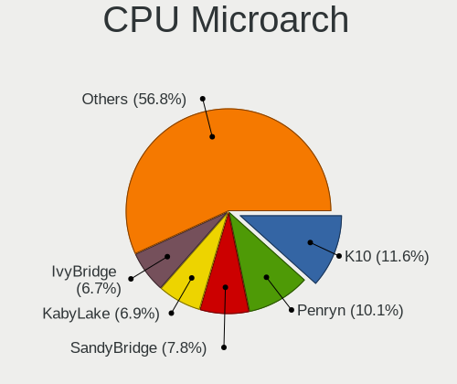

| Name             | Desktops | Percent |
|------------------|----------|---------|
| K10              | 158      | 11.88%  |
| Penryn           | 139      | 10.45%  |
| SandyBridge      | 110      | 8.27%   |
| KabyLake         | 90       | 6.77%   |
| IvyBridge        | 88       | 6.62%   |
| Piledriver       | 87       | 6.54%   |
| K8 Hammer        | 81       | 6.09%   |
| Core             | 81       | 6.09%   |
| Haswell          | 79       | 5.94%   |
| Zen              | 57       | 4.29%   |
| NetBurst         | 55       | 4.14%   |
| Skylake          | 43       | 3.23%   |
| Zen+             | 36       | 2.71%   |
| Zen 2            | 35       | 2.63%   |
| Westmere         | 29       | 2.18%   |
| K10 Llano        | 18       | 1.35%   |
| Steamroller      | 17       | 1.28%   |
| CometLake        | 17       | 1.28%   |
| Unknown          | 17       | 1.28%   |
| Bulldozer        | 15       | 1.13%   |
| Zen 3            | 14       | 1.05%   |
| Nehalem          | 14       | 1.05%   |
| Silvermont       | 9        | 0.68%   |
| Goldmont         | 7        | 0.53%   |
| Excavator        | 7        | 0.53%   |
| Bonnell          | 7        | 0.53%   |
| Icelake          | 4        | 0.3%    |
| Goldmont plus    | 4        | 0.3%    |
| Jaguar           | 3        | 0.23%   |
| Broadwell        | 3        | 0.23%   |
| Puma             | 2        | 0.15%   |
| Bobcat           | 2        | 0.15%   |
| K6               | 1        | 0.08%   |
| Alderlake Hybrid | 1        | 0.08%   |

Graphics
--------

GPU Vendor
----------

Vendors of graphics cards

| Vendor                                       | Desktops | Percent |
|----------------------------------------------|----------|---------|
| Nvidia                                       | 609      | 43.66%  |
| AMD                                          | 453      | 32.47%  |
| Intel                                        | 328      | 23.51%  |
| VIA Technologies                             | 2        | 0.14%   |
| XGI Technology (eXtreme Graphics Innovation) | 1        | 0.07%   |
| Silicon Integrated Systems [SiS]             | 1        | 0.07%   |
| Matrox Electronics Systems                   | 1        | 0.07%   |

GPU Model
---------

Graphics card models

| Model                                                                       | Desktops | Percent |
|-----------------------------------------------------------------------------|----------|---------|
| Intel 2nd Generation Core Processor Family Integrated Graphics Controller   | 51       | 3.51%   |
| AMD Ellesmere [Radeon RX 470/480/570/570X/580/580X/590]                     | 51       | 3.51%   |
| Intel Xeon E3-1200 v3/4th Gen Core Processor Integrated Graphics Controller | 33       | 2.27%   |
| Nvidia GK208B [GeForce GT 710]                                              | 30       | 2.07%   |
| Intel Xeon E3-1200 v2/3rd Gen Core processor Graphics Controller            | 28       | 1.93%   |
| Nvidia GT218 [GeForce 210]                                                  | 27       | 1.86%   |
| Intel CoffeeLake-S GT2 [UHD Graphics 630]                                   | 26       | 1.79%   |
| Intel 4 Series Chipset Integrated Graphics Controller                       | 25       | 1.72%   |
| Nvidia GP107 [GeForce GTX 1050 Ti]                                          | 22       | 1.52%   |
| Nvidia GF108 [GeForce GT 440]                                               | 21       | 1.45%   |
| Nvidia G94 [GeForce 9600 GT]                                                | 20       | 1.38%   |
| AMD Cedar [Radeon HD 5000/6000/7350/8350 Series]                            | 20       | 1.38%   |
| AMD Raven Ridge [Radeon Vega Series / Radeon Vega Mobile Series]            | 19       | 1.31%   |
| Intel HD Graphics 530                                                       | 17       | 1.17%   |
| Nvidia GP108 [GeForce GT 1030]                                              | 16       | 1.1%    |
| Nvidia GP106 [GeForce GTX 1060 6GB]                                         | 16       | 1.1%    |
| Nvidia GK107 [GeForce GTX 650]                                              | 16       | 1.1%    |
| Nvidia GF108 [GeForce GT 630]                                               | 16       | 1.1%    |
| AMD RS780L [Radeon 3000]                                                    | 15       | 1.03%   |
| AMD Caicos [Radeon HD 6450/7450/8450 / R5 230 OEM]                          | 15       | 1.03%   |
| Nvidia GM107 [GeForce GTX 750 Ti]                                           | 14       | 0.96%   |
| Nvidia GF108 [GeForce GT 430]                                               | 14       | 0.96%   |
| Nvidia G96C [GeForce 9500 GT]                                               | 14       | 0.96%   |
| Nvidia G84 [GeForce 8600 GT]                                                | 14       | 0.96%   |
| Nvidia C61 [GeForce 7025 / nForce 630a]                                     | 14       | 0.96%   |
| Nvidia GT215 [GeForce GT 240]                                               | 13       | 0.9%    |
| Nvidia GP106 [GeForce GTX 1060 3GB]                                         | 13       | 0.9%    |
| Nvidia C61 [GeForce 6150SE nForce 430]                                      | 13       | 0.9%    |
| Intel 82945G/GZ Integrated Graphics Controller                              | 13       | 0.9%    |
| Nvidia GP107 [GeForce GTX 1050]                                             | 12       | 0.83%   |
| Nvidia GK208B [GeForce GT 730]                                              | 12       | 0.83%   |
| Intel Core Processor Integrated Graphics Controller                         | 12       | 0.83%   |
| AMD Turks XT [Radeon HD 6670/7670]                                          | 12       | 0.83%   |
| AMD Redwood XT [Radeon HD 5670/5690/5730]                                   | 12       | 0.83%   |
| AMD Picasso/Raven 2 [Radeon Vega Series / Radeon Vega Mobile Series]        | 12       | 0.83%   |
| Nvidia GF119 [GeForce GT 610]                                               | 11       | 0.76%   |
| Nvidia GF116 [GeForce GTX 550 Ti]                                           | 11       | 0.76%   |
| Intel IvyBridge GT2 [HD Graphics 4000]                                      | 11       | 0.76%   |
| AMD Baffin [Radeon RX 550 640SP / RX 560/560X]                              | 11       | 0.76%   |
| Nvidia GP104 [GeForce GTX 1070]                                             | 10       | 0.69%   |

GPU Combo
---------

Combinations of graphics cards

| Name                   | Desktops | Percent |
|------------------------|----------|---------|
| 1 x Nvidia             | 592      | 43.95%  |
| 1 x AMD                | 405      | 30.07%  |
| 1 x Intel              | 282      | 20.94%  |
| 2 x AMD                | 35       | 2.6%    |
| Intel + AMD            | 9        | 0.67%   |
| Intel + Nvidia         | 7        | 0.52%   |
| AMD + Nvidia           | 4        | 0.3%    |
| 2 x Nvidia             | 3        | 0.22%   |
| 1 x VIA                | 2        | 0.15%   |
| Intel + 2 x Nvidia     | 2        | 0.15%   |
| 3 x Nvidia             | 1        | 0.07%   |
| 1 x XGI                | 1        | 0.07%   |
| 1 x SiS                | 1        | 0.07%   |
| 1 x Matrox             | 1        | 0.07%   |
| 1 x Intel + 7 x Nvidia | 1        | 0.07%   |
| Intel + 2 x AMD        | 1        | 0.07%   |

GPU Driver
----------

Free vs proprietary

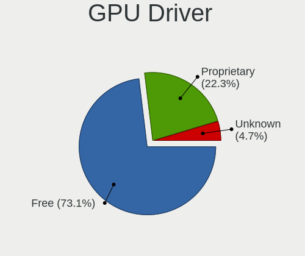

| Driver      | Desktops | Percent |
|-------------|----------|---------|
| Free        | 987      | 72.31%  |
| Proprietary | 314      | 23%     |
| Unknown     | 64       | 4.69%   |

GPU Memory
----------

Total video memory

| Size in GB | Desktops | Percent |
|------------|----------|---------|
| Unknown    | 335      | 24.4%   |
| 0.01-0.5   | 309      | 22.51%  |
| 0.51-1.0   | 279      | 20.32%  |
| 1.01-2.0   | 221      | 16.1%   |
| 3.01-4.0   | 117      | 8.52%   |
| 7.01-8.0   | 54       | 3.93%   |
| 5.01-6.0   | 25       | 1.82%   |
| 2.01-3.0   | 22       | 1.6%    |
| 8.01-16.0  | 11       | 0.8%    |

Monitor
-------

Monitor Vendor
--------------

Monitor vendors

| Vendor                  | Desktops | Percent |
|-------------------------|----------|---------|
| Samsung Electronics     | 346      | 26.05%  |
| Goldstar                | 287      | 21.61%  |
| Philips                 | 133      | 10.02%  |
| Dell                    | 94       | 7.08%   |
| Acer                    | 77       | 5.8%    |
| Ancor Communications    | 66       | 4.97%   |
| BenQ                    | 51       | 3.84%   |
| AOC                     | 41       | 3.09%   |
| Hewlett-Packard         | 27       | 2.03%   |
| ViewSonic               | 26       | 1.96%   |
| Iiyama                  | 22       | 1.66%   |
| LG Electronics          | 21       | 1.58%   |
| NEC Computers           | 15       | 1.13%   |
| Sony                    | 11       | 0.83%   |
| ASUSTek Computer        | 11       | 0.83%   |
| Unknown                 | 10       | 0.75%   |
| Belinea                 | 6        | 0.45%   |
| ___                     | 4        | 0.3%    |
| Plain Tree Systems      | 4        | 0.3%    |
| NEW                     | 3        | 0.23%   |
| Lenovo                  | 3        | 0.23%   |
| HannStar                | 3        | 0.23%   |
| XYK                     | 2        | 0.15%   |
| Xiaomi                  | 2        | 0.15%   |
| TCL                     | 2        | 0.15%   |
| SAC                     | 2        | 0.15%   |
| PNP                     | 2        | 0.15%   |
| MSI                     | 2        | 0.15%   |
| HannStar Display        | 2        | 0.15%   |
| Gigabyte Technology     | 2        | 0.15%   |
| Fujitsu Siemens         | 2        | 0.15%   |
| Eizo                    | 2        | 0.15%   |
| CS_                     | 2        | 0.15%   |
| Compaq Computer         | 2        | 0.15%   |
| Chi Mei Optoelectronics | 2        | 0.15%   |
| BBK                     | 2        | 0.15%   |
| Xerox                   | 1        | 0.08%   |
| VMO                     | 1        | 0.08%   |
| Unknown (ADA)           | 1        | 0.08%   |
| Toshiba                 | 1        | 0.08%   |

Monitor Model
-------------

Monitor models

| Model                                                                 | Desktops | Percent |
|-----------------------------------------------------------------------|----------|---------|
| Goldstar IPS FULLHD GSM5AB8 1920x1080 480x270mm 21.7-inch             | 19       | 1.37%   |
| Samsung Electronics SyncMaster SAM011E 1280x1024 338x270mm 17.0-inch  | 13       | 0.94%   |
| Goldstar W2243 GSM56FE 1920x1080 477x269mm 21.6-inch                  | 11       | 0.79%   |
| Samsung Electronics SyncMaster SAM01E1 1280x1024 376x301mm 19.0-inch  | 10       | 0.72%   |
| Goldstar IPS FULLHD GSM5AB6 1920x1080 480x270mm 21.7-inch             | 10       | 0.72%   |
| Samsung Electronics SyncMaster SAM01B7 1280x1024 338x270mm 17.0-inch  | 9        | 0.65%   |
| Dell U2412M DELA07A 1920x1200 518x324mm 24.1-inch                     | 8        | 0.58%   |
| Philips PHL 243V7 PHLC155 1920x1080 527x296mm 23.8-inch               | 7        | 0.5%    |
| Philips 196VL PHLC07F 1366x768 409x230mm 18.5-inch                    | 7        | 0.5%    |
| Goldstar W1943 GSM4BAD 1360x768 406x229mm 18.4-inch                   | 7        | 0.5%    |
| Goldstar IPS234 GSM58D9 1920x1080 510x290mm 23.1-inch                 | 7        | 0.5%    |
| Samsung Electronics SyncMaster SAM0593 1920x1080 477x268mm 21.5-inch  | 6        | 0.43%   |
| Samsung Electronics SyncMaster SAM0108 1280x1024 312x234mm 15.4-inch  | 6        | 0.43%   |
| Samsung Electronics S22B300 SAM08AA 1920x1080 477x268mm 21.5-inch     | 6        | 0.43%   |
| Philips 226V4 PHLC0B1 1920x1080 477x268mm 21.5-inch                   | 6        | 0.43%   |
| Philips 220WS PHL0851 1680x1050 474x296mm 22.0-inch                   | 6        | 0.43%   |
| Goldstar L194W GSM4B6A 1440x900 408x255mm 18.9-inch                   | 6        | 0.43%   |
| Samsung Electronics S24D300 SAM0B43 1920x1080 531x299mm 24.0-inch     | 5        | 0.36%   |
| Samsung Electronics S22F350 SAM0D1A 1920x1080 477x268mm 21.5-inch     | 5        | 0.36%   |
| Samsung Electronics LCD Monitor SyncMaster 1280x1024                  | 5        | 0.36%   |
| Samsung Electronics C24F390 SAM0D2C 1920x1080 521x293mm 23.5-inch     | 5        | 0.36%   |
| Philips PHL 246E9Q PHLC17C 1920x1080 527x296mm 23.8-inch              | 5        | 0.36%   |
| Philips 241E PHLC035 1920x1080 520x290mm 23.4-inch                    | 5        | 0.36%   |
| Goldstar ULTRAWIDE GSM59F1 2560x1080 673x284mm 28.8-inch              | 5        | 0.36%   |
| Goldstar L1953TR GSM4B43 1280x1024 338x270mm 17.0-inch                | 5        | 0.36%   |
| Goldstar L1953S GSM4B3E 1280x1024 376x301mm 19.0-inch                 | 5        | 0.36%   |
| Goldstar L1918S GSM4B31 1280x1024 376x301mm 19.0-inch                 | 5        | 0.36%   |
| Goldstar L1730S GSM438D 1280x1024 338x270mm 17.0-inch                 | 5        | 0.36%   |
| Goldstar FULL HD GSM5B55 1920x1080 480x270mm 21.7-inch                | 5        | 0.36%   |
| Goldstar FULL HD GSM5AB9 1920x1080 480x270mm 21.7-inch                | 5        | 0.36%   |
| Goldstar 22EA53 GSM59A4 1920x1080 477x268mm 21.5-inch                 | 5        | 0.36%   |
| Ancor Communications ASUS VW193D ACI19D5 1440x900 408x255mm 18.9-inch | 5        | 0.36%   |
| Samsung Electronics SyncMaster SAM0594 1680x1050 459x296mm 21.5-inch  | 4        | 0.29%   |
| Samsung Electronics SyncMaster SAM03E5 1680x1050 474x296mm 22.0-inch  | 4        | 0.29%   |
| Samsung Electronics SyncMaster SAM03C2 1680x1050 459x296mm 21.5-inch  | 4        | 0.29%   |
| Samsung Electronics SyncMaster SAM036E 1280x1024 376x301mm 19.0-inch  | 4        | 0.29%   |
| Samsung Electronics SyncMaster SAM0285 1440x900 410x257mm 19.1-inch   | 4        | 0.29%   |
| Samsung Electronics SyncMaster SAM027F 1680x1050 474x296mm 22.0-inch  | 4        | 0.29%   |
| Samsung Electronics SyncMaster SAM0259 1280x1024 376x301mm 19.0-inch  | 4        | 0.29%   |
| Samsung Electronics SyncMaster SAM0192 1280x1024 338x270mm 17.0-inch  | 4        | 0.29%   |

Monitor Resolution
------------------

Monitor screen resolution

| Resolution         | Desktops | Percent |
|--------------------|----------|---------|
| 1920x1080 (FHD)    | 557      | 42.55%  |
| 1280x1024 (SXGA)   | 233      | 17.8%   |
| 1680x1050 (WSXGA+) | 129      | 9.85%   |
| 1440x900 (WXGA+)   | 61       | 4.66%   |
| 1366x768 (WXGA)    | 58       | 4.43%   |
| 2560x1440 (QHD)    | 43       | 3.28%   |
| 3840x2160 (4K)     | 33       | 2.52%   |
| 1920x1200 (WUXGA)  | 30       | 2.29%   |
| 1600x900 (HD+)     | 28       | 2.14%   |
| 1360x768           | 20       | 1.53%   |
| Unknown            | 20       | 1.53%   |
| 1600x1200          | 19       | 1.45%   |
| 1024x768 (XGA)     | 16       | 1.22%   |
| 2560x1080          | 10       | 0.76%   |
| 3840x1080          | 5        | 0.38%   |
| 3440x1440          | 5        | 0.38%   |
| 2048x1536          | 5        | 0.38%   |
| 1920x540           | 5        | 0.38%   |
| 1400x1050          | 3        | 0.23%   |
| 4480x1440          | 2        | 0.15%   |
| 3200x1080          | 2        | 0.15%   |
| 2288x1287          | 2        | 0.15%   |
| 2048x1152          | 2        | 0.15%   |
| 1280x960           | 2        | 0.15%   |
| 1280x720 (HD)      | 2        | 0.15%   |
| 7040x2160          | 1        | 0.08%   |
| 5520x1080          | 1        | 0.08%   |
| 5280x1200          | 1        | 0.08%   |
| 5120x1440          | 1        | 0.08%   |
| 4093x4093          | 1        | 0.08%   |
| 4000x1440          | 1        | 0.08%   |
| 3926x1440          | 1        | 0.08%   |
| 3360x1080          | 1        | 0.08%   |
| 2960x1050          | 1        | 0.08%   |
| 2640x1024          | 1        | 0.08%   |
| 2560x1600          | 1        | 0.08%   |
| 2048x768           | 1        | 0.08%   |
| 1920x1440          | 1        | 0.08%   |
| 1280x800 (WXGA)    | 1        | 0.08%   |
| 1280x768           | 1        | 0.08%   |

Monitor Diagonal
----------------

Diagonal size in inches

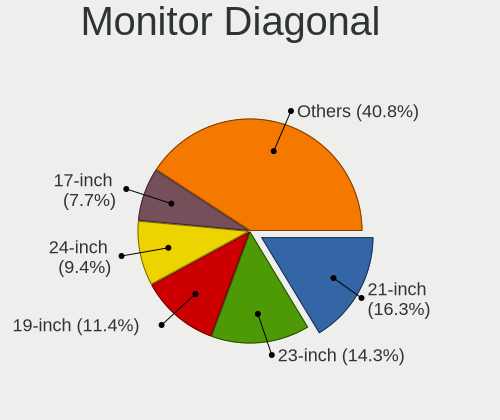

| Inches  | Desktops | Percent |
|---------|----------|---------|
| 21      | 230      | 17.4%   |
| 23      | 179      | 13.54%  |
| 19      | 157      | 11.88%  |
| 24      | 121      | 9.15%   |
| 17      | 104      | 7.87%   |
| Unknown | 104      | 7.87%   |
| 20      | 74       | 5.6%    |
| 27      | 73       | 5.52%   |
| 18      | 71       | 5.37%   |
| 22      | 64       | 4.84%   |
| 15      | 40       | 3.03%   |
| 31      | 18       | 1.36%   |
| 32      | 13       | 0.98%   |
| 34      | 11       | 0.83%   |
| 54      | 7        | 0.53%   |
| 16      | 7        | 0.53%   |
| 72      | 6        | 0.45%   |
| 42      | 5        | 0.38%   |
| 40      | 5        | 0.38%   |
| 25      | 5        | 0.38%   |
| 26      | 4        | 0.3%    |
| 12      | 4        | 0.3%    |
| 142     | 2        | 0.15%   |
| 48      | 2        | 0.15%   |
| 47      | 2        | 0.15%   |
| 13      | 2        | 0.15%   |
| 75      | 1        | 0.08%   |
| 65      | 1        | 0.08%   |
| 52      | 1        | 0.08%   |
| 46      | 1        | 0.08%   |
| 39      | 1        | 0.08%   |
| 37      | 1        | 0.08%   |
| 36      | 1        | 0.08%   |
| 29      | 1        | 0.08%   |
| 28      | 1        | 0.08%   |
| 14      | 1        | 0.08%   |
| 10      | 1        | 0.08%   |
| 7       | 1        | 0.08%   |

Monitor Width
-------------

Physical width

| Width in mm    | Desktops | Percent |
|----------------|----------|---------|
| 401-500        | 490      | 37.84%  |
| 501-600        | 348      | 26.87%  |
| 301-350        | 141      | 10.89%  |
| 351-400        | 118      | 9.11%   |
| Unknown        | 104      | 8.03%   |
| 701-800        | 25       | 1.93%   |
| 601-700        | 25       | 1.93%   |
| 1001-1500      | 14       | 1.08%   |
| 201-300        | 8        | 0.62%   |
| 801-900        | 7        | 0.54%   |
| 1501-2000      | 7        | 0.54%   |
| 901-1000       | 5        | 0.39%   |
| More than 2000 | 2        | 0.15%   |
| 101-200        | 1        | 0.08%   |

Aspect Ratio
------------

Proportional relationship between the width and the height

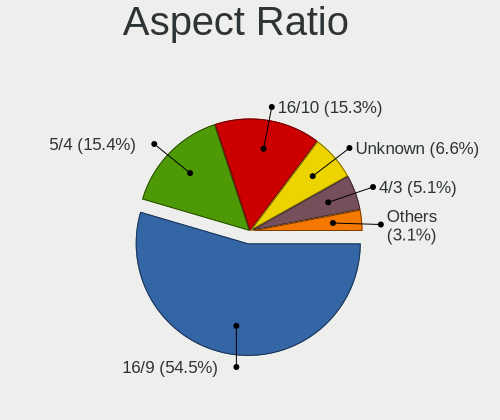

| Ratio   | Desktops | Percent |
|---------|----------|---------|
| 16/9    | 680      | 53.33%  |
| 5/4     | 202      | 15.84%  |
| 16/10   | 199      | 15.61%  |
| Unknown | 90       | 7.06%   |
| 4/3     | 69       | 5.41%   |
| 3/2     | 16       | 1.25%   |
| 21/9    | 11       | 0.86%   |
| 6/5     | 6        | 0.47%   |
| 1.00    | 2        | 0.16%   |

Monitor Area
------------

Area in inch

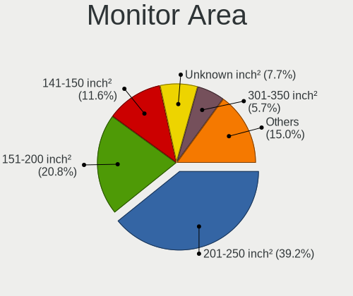

| Area in inch | Desktops | Percent |
|----------------|----------|---------|
| 201-250        | 510      | 39.17%  |
| 151-200        | 279      | 21.43%  |
| 141-150        | 156      | 11.98%  |
| Unknown        | 104      | 7.99%   |
| 301-350        | 75       | 5.76%   |
| 351-500        | 44       | 3.38%   |
| 251-300        | 38       | 2.92%   |
| 111-120        | 27       | 2.07%   |
| More than 1000 | 20       | 1.54%   |
| 501-1000       | 16       | 1.23%   |
| 101-110        | 14       | 1.08%   |
| 121-130        | 6        | 0.46%   |
| 131-140        | 5        | 0.38%   |
| 71-80          | 4        | 0.31%   |
| 81-90          | 1        | 0.08%   |
| 41-50          | 1        | 0.08%   |
| 1-40           | 1        | 0.08%   |
| 91-100         | 1        | 0.08%   |

Pixel Density
-------------

Pixels per inch

| Density | Desktops | Percent |
|---------|----------|---------|
| 51-100  | 832      | 66.03%  |
| 101-120 | 274      | 21.75%  |
| Unknown | 104      | 8.25%   |
| 1-50    | 23       | 1.83%   |
| 121-160 | 15       | 1.19%   |
| 161-240 | 12       | 0.95%   |

Multiple Monitors
-----------------

Total monitors connected

| Total | Desktops | Percent |
|-------|----------|---------|
| 1     | 1146     | 85.91%  |
| 2     | 118      | 8.85%   |
| 0     | 56       | 4.2%    |
| 3     | 14       | 1.05%   |

Network
-------

Net Controller Vendor
---------------------

Controller vendors

| Vendor                            | Desktops | Percent |
|-----------------------------------|----------|---------|
| Realtek Semiconductor             | 880      | 52.13%  |
| Intel                             | 231      | 13.68%  |
| Qualcomm Atheros                  | 161      | 9.54%   |
| Nvidia                            | 100      | 5.92%   |
| Ralink Technology                 | 75       | 4.44%   |
| Qualcomm Atheros Communications   | 33       | 1.95%   |
| TP-Link                           | 28       | 1.66%   |
| Marvell Technology Group          | 18       | 1.07%   |
| Broadcom                          | 18       | 1.07%   |
| VIA Technologies                  | 17       | 1.01%   |
| Ralink                            | 14       | 0.83%   |
| Huawei Technologies               | 13       | 0.77%   |
| Sundance Technology Inc / IC Plus | 10       | 0.59%   |
| D-Link System                     | 10       | 0.59%   |
| Broadcom Limited                  | 10       | 0.59%   |
| Xiaomi                            | 9        | 0.53%   |
| ASUSTek Computer                  | 8        | 0.47%   |
| Samsung Electronics               | 4        | 0.24%   |
| MediaTek                          | 4        | 0.24%   |
| Aquantia                          | 4        | 0.24%   |
| Silicon Integrated Systems [SiS]  | 3        | 0.18%   |
| IMC Networks                      | 3        | 0.18%   |
| D-Link                            | 3        | 0.18%   |
| Curitel Communications            | 3        | 0.18%   |
| Qualcomm                          | 2        | 0.12%   |
| Microsoft                         | 2        | 0.12%   |
| Linksys                           | 2        | 0.12%   |
| HMD Global                        | 2        | 0.12%   |
| Google                            | 2        | 0.12%   |
| Edimax Technology                 | 2        | 0.12%   |
| STMicroelectronics                | 1        | 0.06%   |
| Standard Microsystems [SMC]       | 1        | 0.06%   |
| Sitecom Europe                    | 1        | 0.06%   |
| OpenMoko                          | 1        | 0.06%   |
| NetGear                           | 1        | 0.06%   |
| Montage                           | 1        | 0.06%   |
| Microchip Technology              | 1        | 0.06%   |
| LSI                               | 1        | 0.06%   |
| LG Electronics                    | 1        | 0.06%   |
| ICS Advent                        | 1        | 0.06%   |

Net Controller Model
--------------------

Controller models

| Model                                                                      | Desktops | Percent |
|----------------------------------------------------------------------------|----------|---------|
| Realtek RTL8111/8168/8411 PCI Express Gigabit Ethernet Controller          | 704      | 39.11%  |
| Realtek RTL-8100/8101L/8139 PCI Fast Ethernet Adapter                      | 100      | 5.56%   |
| Nvidia MCP61 Ethernet                                                      | 63       | 3.5%    |
| Ralink MT7601U Wireless Adapter                                            | 45       | 2.5%    |
| Realtek RTL810xE PCI Express Fast Ethernet controller                      | 43       | 2.39%   |
| Intel I211 Gigabit Network Connection                                      | 32       | 1.78%   |
| Intel Ethernet Connection (2) I219-V                                       | 27       | 1.5%    |
| Qualcomm Atheros AR9271 802.11n                                            | 26       | 1.44%   |
| Qualcomm Atheros AR8151 v2.0 Gigabit Ethernet                              | 25       | 1.39%   |
| Intel Wi-Fi 6 AX200                                                        | 23       | 1.28%   |
| Intel 82579V Gigabit Network Connection                                    | 22       | 1.22%   |
| Qualcomm Atheros Attansic L1 Gigabit Ethernet                              | 20       | 1.11%   |
| Intel 82579LM Gigabit Network Connection (Lewisville)                      | 20       | 1.11%   |
| Qualcomm Atheros AR8121/AR8113/AR8114 Gigabit or Fast Ethernet             | 19       | 1.06%   |
| Realtek RTL8188EUS 802.11n Wireless Network Adapter                        | 16       | 0.89%   |
| Realtek RTL8125 2.5GbE Controller                                          | 16       | 0.89%   |
| Ralink RT5370 Wireless Adapter                                             | 15       | 0.83%   |
| TP-Link TL-WN722N v2/v3 [Realtek RTL8188EUS]                               | 13       | 0.72%   |
| Qualcomm Atheros Attansic L2 Fast Ethernet                                 | 13       | 0.72%   |
| Realtek RTL-8110SC/8169SC Gigabit Ethernet                                 | 12       | 0.67%   |
| VIA VT6105/VT6106S [Rhine-III]                                             | 11       | 0.61%   |
| Qualcomm Atheros QCA8171 Gigabit Ethernet                                  | 11       | 0.61%   |
| Nvidia MCP51 Ethernet Controller                                           | 11       | 0.61%   |
| Intel Ethernet Connection (7) I219-V                                       | 11       | 0.61%   |
| Intel 82567LM-3 Gigabit Network Connection                                 | 10       | 0.56%   |
| Ralink MT7610U ("Archer T2U" 2.4G+5G WLAN Adapter                          | 9        | 0.5%    |
| Qualcomm Atheros AR9227 Wireless Network Adapter                           | 9        | 0.5%    |
| Qualcomm Atheros AR8161 Gigabit Ethernet                                   | 9        | 0.5%    |
| Nvidia CK804 Ethernet Controller                                           | 9        | 0.5%    |
| Intel Wireless-AC 9260                                                     | 9        | 0.5%    |
| Intel Ethernet Connection I217-V                                           | 9        | 0.5%    |
| Sundance Inc / IC Plus IC Plus IP100A Integrated 10/100 Ethernet MAC + PHY | 8        | 0.44%   |
| Qualcomm Atheros AR9485 Wireless Network Adapter                           | 8        | 0.44%   |
| Qualcomm Atheros AR8131 Gigabit Ethernet                                   | 8        | 0.44%   |
| Qualcomm Atheros Killer E220x Gigabit Ethernet Controller                  | 7        | 0.39%   |
| Intel Ethernet Connection (2) I218-V                                       | 7        | 0.39%   |
| Intel 82566DM-2 Gigabit Network Connection                                 | 7        | 0.39%   |
| Xiaomi Mi/Redmi series (RNDIS)                                             | 6        | 0.33%   |
| VIA VT6102/VT6103 [Rhine-II]                                               | 6        | 0.33%   |
| Realtek RTL8188CE 802.11b/g/n WiFi Adapter                                 | 6        | 0.33%   |

Wireless Vendor
---------------

Wireless vendors

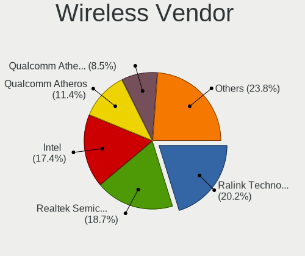

| Vendor                          | Desktops | Percent |
|---------------------------------|----------|---------|
| Ralink Technology               | 75       | 21.55%  |
| Realtek Semiconductor           | 66       | 18.97%  |
| Intel                           | 53       | 15.23%  |
| Qualcomm Atheros                | 40       | 11.49%  |
| Qualcomm Atheros Communications | 33       | 9.48%   |
| TP-Link                         | 24       | 6.9%    |
| Ralink                          | 14       | 4.02%   |
| Broadcom                        | 8        | 2.3%    |
| ASUSTek Computer                | 8        | 2.3%    |
| D-Link System                   | 6        | 1.72%   |
| IMC Networks                    | 3        | 0.86%   |
| D-Link                          | 3        | 0.86%   |
| Microsoft                       | 2        | 0.57%   |
| MediaTek                        | 2        | 0.57%   |
| Linksys                         | 2        | 0.57%   |
| Edimax Technology               | 2        | 0.57%   |
| Broadcom Limited                | 2        | 0.57%   |
| Xiaomi                          | 1        | 0.29%   |
| Sitecom Europe                  | 1        | 0.29%   |
| NetGear                         | 1        | 0.29%   |
| LG Electronics                  | 1        | 0.29%   |
| Gemtek                          | 1        | 0.29%   |

Wireless Model
--------------

Wireless models

| Model                                                                                | Desktops | Percent |
|--------------------------------------------------------------------------------------|----------|---------|
| Ralink MT7601U Wireless Adapter                                                      | 45       | 12.82%  |
| Qualcomm Atheros AR9271 802.11n                                                      | 26       | 7.41%   |
| Intel Wi-Fi 6 AX200                                                                  | 23       | 6.55%   |
| Realtek RTL8188EUS 802.11n Wireless Network Adapter                                  | 16       | 4.56%   |
| Ralink RT5370 Wireless Adapter                                                       | 15       | 4.27%   |
| TP-Link TL-WN722N v2/v3 [Realtek RTL8188EUS]                                         | 13       | 3.7%    |
| Ralink MT7610U ("Archer T2U" 2.4G+5G WLAN Adapter                                    | 9        | 2.56%   |
| Qualcomm Atheros AR9227 Wireless Network Adapter                                     | 9        | 2.56%   |
| Intel Wireless-AC 9260                                                               | 9        | 2.56%   |
| Qualcomm Atheros AR9485 Wireless Network Adapter                                     | 8        | 2.28%   |
| Realtek RTL8188CE 802.11b/g/n WiFi Adapter                                           | 6        | 1.71%   |
| Realtek RTL8188CUS 802.11n WLAN Adapter                                              | 5        | 1.42%   |
| Realtek 802.11ac NIC                                                                 | 5        | 1.42%   |
| Ralink RT2870/RT3070 Wireless Adapter                                                | 5        | 1.42%   |
| Intel Dual Band Wireless-AC 3168NGW [Stone Peak]                                     | 5        | 1.42%   |
| TP-Link AC600 wireless Realtek RTL8811AU [Archer T2U Nano]                           | 4        | 1.14%   |
| Realtek RTL8192CE PCIe Wireless Network Adapter                                      | 4        | 1.14%   |
| Realtek RTL8187 Wireless Adapter                                                     | 4        | 1.14%   |
| Ralink RT2561/RT61 rev B 802.11g                                                     | 4        | 1.14%   |
| Qualcomm Atheros AR5212/5213/2414 Wireless Network Adapter                           | 4        | 1.14%   |
| Qualcomm Atheros AR2413/AR2414 Wireless Network Adapter [AR5005G(S) 802.11bg]        | 4        | 1.14%   |
| TP-Link TL-WN822N Version 4 RTL8192EU                                                | 3        | 0.85%   |
| TP-Link Archer T3U [Realtek RTL8812BU]                                               | 3        | 0.85%   |
| Realtek RTL8822BE 802.11a/b/g/n/ac WiFi adapter                                      | 3        | 0.85%   |
| Realtek RTL8192CU 802.11n WLAN Adapter                                               | 3        | 0.85%   |
| Realtek B1610311068                                                                  | 3        | 0.85%   |
| Ralink RT3060 Wireless 802.11n 1T/1R                                                 | 3        | 0.85%   |
| Ralink RT2561/RT61 802.11g PCI                                                       | 3        | 0.85%   |
| Qualcomm Atheros TP-Link TL-WN821N v3 / TL-WN822N v2 802.11n [Atheros AR7010+AR9287] | 3        | 0.85%   |
| Qualcomm Atheros TP-Link TL-WN322G v3 / TL-WN422G v2 802.11g [Atheros AR9271]        | 3        | 0.85%   |
| Qualcomm Atheros AR93xx Wireless Network Adapter                                     | 3        | 0.85%   |
| Qualcomm Atheros AR9285 Wireless Network Adapter (PCI-Express)                       | 3        | 0.85%   |
| Qualcomm Atheros AR2417 Wireless Network Adapter [AR5007G 802.11bg]                  | 3        | 0.85%   |
| Intel Wi-Fi 6 AX210/AX211/AX411 160MHz                                               | 3        | 0.85%   |
| Broadcom BCM4360 802.11ac Wireless Network Adapter                                   | 3        | 0.85%   |
| ASUS USB-N10 802.11n Network Adapter [Realtek RTL8188SU]                             | 3        | 0.85%   |
| TP-Link TL-WN823N v2/v3 [Realtek RTL8192EU]                                          | 2        | 0.57%   |
| Realtek RTL88x2bu [AC1200 Techkey]                                                   | 2        | 0.57%   |
| Realtek RTL8821CE 802.11ac PCIe Wireless Network Adapter                             | 2        | 0.57%   |
| Realtek RTL8723BE PCIe Wireless Network Adapter                                      | 2        | 0.57%   |

Ethernet Vendor
---------------

Ethernet vendors

| Vendor                            | Desktops | Percent |
|-----------------------------------|----------|---------|
| Realtek Semiconductor             | 850      | 60.98%  |
| Intel                             | 204      | 14.63%  |
| Qualcomm Atheros                  | 126      | 9.04%   |
| Nvidia                            | 100      | 7.17%   |
| Marvell Technology Group          | 18       | 1.29%   |
| VIA Technologies                  | 17       | 1.22%   |
| Sundance Technology Inc / IC Plus | 10       | 0.72%   |
| Broadcom                          | 10       | 0.72%   |
| Huawei Technologies               | 9        | 0.65%   |
| Xiaomi                            | 8        | 0.57%   |
| Broadcom Limited                  | 8        | 0.57%   |
| TP-Link                           | 4        | 0.29%   |
| D-Link System                     | 4        | 0.29%   |
| Aquantia                          | 4        | 0.29%   |
| Silicon Integrated Systems [SiS]  | 3        | 0.22%   |
| Samsung Electronics               | 3        | 0.22%   |
| Qualcomm                          | 2        | 0.14%   |
| HMD Global                        | 2        | 0.14%   |
| Google                            | 2        | 0.14%   |
| Standard Microsystems [SMC]       | 1        | 0.07%   |
| Microchip Technology              | 1        | 0.07%   |
| MediaTek                          | 1        | 0.07%   |
| ICS Advent                        | 1        | 0.07%   |
| HTC (High Tech Computer)          | 1        | 0.07%   |
| Hangzhou Silan Microelectronics   | 1        | 0.07%   |
| DisplayLink                       | 1        | 0.07%   |
| Apple                             | 1        | 0.07%   |
| AMD                               | 1        | 0.07%   |
| ADMtek                            | 1        | 0.07%   |

Ethernet Model
--------------

Ethernet models

| Model                                                                      | Desktops | Percent |
|----------------------------------------------------------------------------|----------|---------|
| Realtek RTL8111/8168/8411 PCI Express Gigabit Ethernet Controller          | 704      | 49.03%  |
| Realtek RTL-8100/8101L/8139 PCI Fast Ethernet Adapter                      | 100      | 6.96%   |
| Nvidia MCP61 Ethernet                                                      | 63       | 4.39%   |
| Realtek RTL810xE PCI Express Fast Ethernet controller                      | 43       | 2.99%   |
| Intel I211 Gigabit Network Connection                                      | 32       | 2.23%   |
| Intel Ethernet Connection (2) I219-V                                       | 27       | 1.88%   |
| Qualcomm Atheros AR8151 v2.0 Gigabit Ethernet                              | 25       | 1.74%   |
| Intel 82579V Gigabit Network Connection                                    | 22       | 1.53%   |
| Qualcomm Atheros Attansic L1 Gigabit Ethernet                              | 20       | 1.39%   |
| Intel 82579LM Gigabit Network Connection (Lewisville)                      | 20       | 1.39%   |
| Qualcomm Atheros AR8121/AR8113/AR8114 Gigabit or Fast Ethernet             | 19       | 1.32%   |
| Realtek RTL8125 2.5GbE Controller                                          | 16       | 1.11%   |
| Qualcomm Atheros Attansic L2 Fast Ethernet                                 | 13       | 0.91%   |
| Realtek RTL-8110SC/8169SC Gigabit Ethernet                                 | 12       | 0.84%   |
| VIA VT6105/VT6106S [Rhine-III]                                             | 11       | 0.77%   |
| Qualcomm Atheros QCA8171 Gigabit Ethernet                                  | 11       | 0.77%   |
| Nvidia MCP51 Ethernet Controller                                           | 11       | 0.77%   |
| Intel Ethernet Connection (7) I219-V                                       | 11       | 0.77%   |
| Intel 82567LM-3 Gigabit Network Connection                                 | 10       | 0.7%    |
| Qualcomm Atheros AR8161 Gigabit Ethernet                                   | 9        | 0.63%   |
| Nvidia CK804 Ethernet Controller                                           | 9        | 0.63%   |
| Intel Ethernet Connection I217-V                                           | 9        | 0.63%   |
| Sundance Inc / IC Plus IC Plus IP100A Integrated 10/100 Ethernet MAC + PHY | 8        | 0.56%   |
| Qualcomm Atheros AR8131 Gigabit Ethernet                                   | 8        | 0.56%   |
| Qualcomm Atheros Killer E220x Gigabit Ethernet Controller                  | 7        | 0.49%   |
| Intel Ethernet Connection (2) I218-V                                       | 7        | 0.49%   |
| Intel 82566DM-2 Gigabit Network Connection                                 | 7        | 0.49%   |
| Xiaomi Mi/Redmi series (RNDIS)                                             | 6        | 0.42%   |
| VIA VT6102/VT6103 [Rhine-II]                                               | 6        | 0.42%   |
| Qualcomm Atheros AR8152 v2.0 Fast Ethernet                                 | 6        | 0.42%   |
| Marvell Group 88E8056 PCI-E Gigabit Ethernet Controller                    | 6        | 0.42%   |
| Intel Ethernet Connection I217-LM                                          | 6        | 0.42%   |
| Nvidia MCP55 Ethernet                                                      | 5        | 0.35%   |
| Marvell Group 88E8053 PCI-E Gigabit Ethernet Controller                    | 5        | 0.35%   |
| Marvell Group 88E8001 Gigabit Ethernet Controller                          | 5        | 0.35%   |
| Intel Ethernet Controller I225-V                                           | 5        | 0.35%   |
| Huawei E353/E3131                                                          | 5        | 0.35%   |
| Realtek RTL8153 Gigabit Ethernet Adapter                                   | 4        | 0.28%   |
| Nvidia MCP77 Ethernet                                                      | 4        | 0.28%   |
| Nvidia MCP67 Ethernet                                                      | 4        | 0.28%   |

Net Controller Kind
-------------------

Ethernet, WiFi or modem

| Kind     | Desktops | Percent |
|----------|----------|---------|
| Ethernet | 1293     | 79.08%  |
| WiFi     | 329      | 20.12%  |
| Modem    | 12       | 0.73%   |
| Unknown  | 1        | 0.06%   |

Used Controller
---------------

Currently used network controller

| Kind     | Desktops | Percent |
|----------|----------|---------|
| Ethernet | 1138     | 84.99%  |
| WiFi     | 200      | 14.94%  |
| Modem    | 1        | 0.07%   |

NICs
----

Total network controllers on board

| Total | Desktops | Percent |
|-------|----------|---------|
| 1     | 1050     | 79.13%  |
| 2     | 225      | 16.96%  |
| 0     | 26       | 1.96%   |
| 3     | 24       | 1.81%   |
| 6     | 1        | 0.08%   |
| 4     | 1        | 0.08%   |

IPv6
----

IPv6 vs IPv4

| Used | Desktops | Percent |
|------|----------|---------|
| No   | 1311     | 99.32%  |
| Yes  | 9        | 0.68%   |

Bluetooth
---------

Bluetooth Vendor
----------------

Controller vendors

| Vendor                          | Desktops | Percent |
|---------------------------------|----------|---------|
| Cambridge Silicon Radio         | 90       | 44.55%  |
| Intel                           | 49       | 24.26%  |
| ASUSTek Computer                | 15       | 7.43%   |
| Qualcomm Atheros Communications | 13       | 6.44%   |
| Realtek Semiconductor           | 11       | 5.45%   |
| Broadcom                        | 8        | 3.96%   |
| IMC Networks                    | 3        | 1.49%   |
| Conwise Technology              | 3        | 1.49%   |
| D-Link                          | 2        | 0.99%   |
| Realtek                         | 1        | 0.5%    |
| MediaTek                        | 1        | 0.5%    |
| Logitech                        | 1        | 0.5%    |
| Integrated System Solution      | 1        | 0.5%    |
| Hewlett-Packard                 | 1        | 0.5%    |
| Edimax Technology               | 1        | 0.5%    |
| D-Link System                   | 1        | 0.5%    |
| Apple                           | 1        | 0.5%    |

Bluetooth Model
---------------

Controller models

| Model                                                 | Desktops | Percent |
|-------------------------------------------------------|----------|---------|
| Cambridge Silicon Radio Bluetooth Dongle (HCI mode)   | 90       | 44.55%  |
| Intel AX200 Bluetooth                                 | 22       | 10.89%  |
| Realtek Bluetooth Radio                               | 11       | 5.45%   |
| Qualcomm Atheros AR3011 Bluetooth                     | 10       | 4.95%   |
| Intel Wireless-AC 9260 Bluetooth Adapter              | 9        | 4.46%   |
| Intel Bluetooth wireless interface                    | 6        | 2.97%   |
| ASUS Bluetooth Adapter                                | 5        | 2.48%   |
| Intel Wireless-AC 3168 Bluetooth                      | 4        | 1.98%   |
| Intel Bluetooth 9460/9560 Jefferson Peak (JfP)        | 4        | 1.98%   |
| Broadcom BCM2045 Bluetooth                            | 4        | 1.98%   |
| Intel AX210 Bluetooth                                 | 3        | 1.49%   |
| Conwise CW6622                                        | 3        | 1.49%   |
| ASUS BCM20702A0                                       | 3        | 1.49%   |
| Qualcomm Atheros  Bluetooth Device                    | 2        | 0.99%   |
| IMC Networks Bluetooth Radio                          | 2        | 0.99%   |
| D-Link DBT-122 Bluetooth adapter                      | 2        | 0.99%   |
| ASUS Qualcomm Bluetooth 4.1                           | 2        | 0.99%   |
| ASUS Broadcom BCM20702A0 Bluetooth                    | 2        | 0.99%   |
| ASUS Bluetooth Radio                                  | 2        | 0.99%   |
| Realtek Bluetooth Radio                               | 1        | 0.5%    |
| Qualcomm Atheros AR3011 Bluetooth (no firmware)       | 1        | 0.5%    |
| MediaTek Wireless_Device                              | 1        | 0.5%    |
| Logitech BT Mini-Receiver (HCI mode)                  | 1        | 0.5%    |
| Intel Centrino Bluetooth Wireless Transceiver         | 1        | 0.5%    |
| Integrated System Solution KY-BT100 Bluetooth Adapter | 1        | 0.5%    |
| IMC Networks Bluetooth Module                         | 1        | 0.5%    |
| HP Bluetooth 2.0 Interface [Broadcom BCM2045]         | 1        | 0.5%    |
| Edimax Bluetooth Adapter                              | 1        | 0.5%    |
| D-Link System DBT-122 Bluetooth                       | 1        | 0.5%    |
| Broadcom Bluetooth dongle                             | 1        | 0.5%    |
| Broadcom Bluetooth 3.0+HS USB Adapter                 | 1        | 0.5%    |
| Broadcom Bluetooth 2.0+eDR dongle                     | 1        | 0.5%    |
| Broadcom BCM92046DG-CL1ROM Bluetooth 2.1 Adapter      | 1        | 0.5%    |
| ASUS ASUS USB-BT500                                   | 1        | 0.5%    |
| Apple Bluetooth Host Controller                       | 1        | 0.5%    |

Sound
-----

Sound Vendor
------------

Sound card vendors

| Vendor                           | Desktops | Percent |
|----------------------------------|----------|---------|
| Intel                            | 738      | 35.83%  |
| AMD                              | 574      | 27.86%  |
| Nvidia                           | 542      | 26.31%  |
| C-Media Electronics              | 61       | 2.96%   |
| Creative Labs                    | 45       | 2.18%   |
| VIA Technologies                 | 9        | 0.44%   |
| Logitech                         | 9        | 0.44%   |
| ASUSTek Computer                 | 8        | 0.39%   |
| Generalplus Technology           | 6        | 0.29%   |
| JMTek                            | 5        | 0.24%   |
| Texas Instruments                | 4        | 0.19%   |
| Plantronics                      | 4        | 0.19%   |
| Yamaha                           | 3        | 0.15%   |
| ULi Electronics                  | 3        | 0.15%   |
| SteelSeries ApS                  | 3        | 0.15%   |
| Silicon Integrated Systems [SiS] | 3        | 0.15%   |
| Ensoniq                          | 3        | 0.15%   |
| DSEA A/S                         | 3        | 0.15%   |
| Creative Technology              | 3        | 0.15%   |
| Tenx Technology                  | 2        | 0.1%    |
| SAVITECH                         | 2        | 0.1%    |
| Realtek Semiconductor            | 2        | 0.1%    |
| Razer USA                        | 2        | 0.1%    |
| BEHRINGER International          | 2        | 0.1%    |
| ZOOM                             | 1        | 0.05%   |
| Vitana                           | 1        | 0.05%   |
| USB MICROPHONE                   | 1        | 0.05%   |
| ROCCAT                           | 1        | 0.05%   |
| Nordic Semiconductor ASA         | 1        | 0.05%   |
| Nokia Mobile Phones              | 1        | 0.05%   |
| No brand                         | 1        | 0.05%   |
| Microsoft                        | 1        | 0.05%   |
| M-Audio                          | 1        | 0.05%   |
| Kingston Technology              | 1        | 0.05%   |
| iConnectivity                    | 1        | 0.05%   |
| Hangzhou Worlde                  | 1        | 0.05%   |
| GYROCOM C&C                      | 1        | 0.05%   |
| Guillemot                        | 1        | 0.05%   |
| GN Netcom                        | 1        | 0.05%   |
| Giga-Byte Technology             | 1        | 0.05%   |

Sound Model
-----------

Sound card models

| Model                                                                             | Desktops | Percent |
|-----------------------------------------------------------------------------------|----------|---------|
| AMD SBx00 Azalia (Intel HDA)                                                      | 170      | 7.26%   |
| Intel NM10/ICH7 Family High Definition Audio Controller                           | 122      | 5.21%   |
| Intel 6 Series/C200 Series Chipset Family High Definition Audio Controller        | 122      | 5.21%   |
| AMD FCH Azalia Controller                                                         | 81       | 3.46%   |
| Nvidia MCP61 High Definition Audio                                                | 74       | 3.16%   |
| Nvidia GF108 High Definition Audio Controller                                     | 62       | 2.65%   |
| Intel 8 Series/C220 Series Chipset High Definition Audio Controller               | 56       | 2.39%   |
| AMD Family 17h (Models 00h-0fh) HD Audio Controller                               | 56       | 2.39%   |
| Intel 7 Series/C216 Chipset Family High Definition Audio Controller               | 54       | 2.3%    |
| Nvidia GK208 HDMI/DP Audio Controller                                             | 52       | 2.22%   |
| Intel 100 Series/C230 Series Chipset Family HD Audio Controller                   | 52       | 2.22%   |
| AMD Ellesmere HDMI Audio [Radeon RX 470/480 / 570/580/590]                        | 51       | 2.18%   |
| Intel 200 Series PCH HD Audio                                                     | 47       | 2.01%   |
| Nvidia High Definition Audio Controller                                           | 46       | 1.96%   |
| Intel 82801JI (ICH10 Family) HD Audio Controller                                  | 46       | 1.96%   |
| AMD Oland/Hainan/Cape Verde/Pitcairn HDMI Audio [Radeon HD 7000 Series]           | 44       | 1.88%   |
| AMD Family 17h/19h HD Audio Controller                                            | 42       | 1.79%   |
| Intel 82801I (ICH9 Family) HD Audio Controller                                    | 41       | 1.75%   |
| AMD Starship/Matisse HD Audio Controller                                          | 41       | 1.75%   |
| Intel Xeon E3-1200 v3/4th Gen Core Processor HD Audio Controller                  | 36       | 1.54%   |
| Nvidia GP107GL High Definition Audio Controller                                   | 34       | 1.45%   |
| Intel 5 Series/3400 Series Chipset High Definition Audio                          | 31       | 1.32%   |
| Nvidia GK107 HDMI Audio Controller                                                | 30       | 1.28%   |
| Intel Cannon Lake PCH cAVS                                                        | 30       | 1.28%   |
| Nvidia GP106 High Definition Audio Controller                                     | 29       | 1.24%   |
| AMD Raven/Raven2/Fenghuang HDMI/DP Audio Controller                               | 29       | 1.24%   |
| AMD Baffin HDMI/DP Audio [Radeon RX 550 640SP / RX 560/560X]                      | 26       | 1.11%   |
| Nvidia GP104 High Definition Audio Controller                                     | 25       | 1.07%   |
| AMD Redwood HDMI Audio [Radeon HD 5000 Series]                                    | 21       | 0.9%    |
| Nvidia GM107 High Definition Audio Controller [GeForce 940MX]                     | 20       | 0.85%   |
| C-Media Electronics CMI8738/CMI8768 PCI Audio                                     | 20       | 0.85%   |
| AMD Turks HDMI Audio [Radeon HD 6500/6600 / 6700M Series]                         | 20       | 0.85%   |
| AMD Cedar HDMI Audio [Radeon HD 5400/6300/7300 Series]                            | 20       | 0.85%   |
| AMD Caicos HDMI Audio [Radeon HD 6450 / 7450/8450/8490 OEM / R5 230/235/235X OEM] | 18       | 0.77%   |
| Nvidia GF116 High Definition Audio Controller                                     | 17       | 0.73%   |
| C-Media Electronics CMI8788 [Oxygen HD Audio]                                     | 17       | 0.73%   |
| AMD Trinity HDMI Audio Controller                                                 | 17       | 0.73%   |
| Nvidia TU116 High Definition Audio Controller                                     | 16       | 0.68%   |
| Nvidia GP108 High Definition Audio Controller                                     | 16       | 0.68%   |
| Nvidia GK106 HDMI Audio Controller                                                | 16       | 0.68%   |

Memory
------

Memory Vendor
-------------

Memory module vendors

| Vendor                     | Desktops | Percent |
|----------------------------|----------|---------|
| Unknown                    | 461      | 41.2%   |
| Kingston                   | 195      | 17.43%  |
| Samsung Electronics        | 58       | 5.18%   |
| SK hynix                   | 52       | 4.65%   |
| Crucial                    | 41       | 3.66%   |
| Team                       | 40       | 3.57%   |
| GOODRAM                    | 40       | 3.57%   |
| G.Skill                    | 28       | 2.5%    |
| Corsair                    | 26       | 2.32%   |
| Micron Technology          | 23       | 2.06%   |
| Transcend                  | 16       | 1.43%   |
| AMD                        | 16       | 1.43%   |
| Silicon Power              | 15       | 1.34%   |
| Exceleram                  | 12       | 1.07%   |
| Patriot                    | 11       | 0.98%   |
| Nanya Technology           | 10       | 0.89%   |
| Apacer                     | 7        | 0.63%   |
| GeIL                       | 6        | 0.54%   |
| A-DATA Technology          | 6        | 0.54%   |
| Kllisre                    | 5        | 0.45%   |
| TwinMOS                    | 4        | 0.36%   |
| Elpida                     | 4        | 0.36%   |
| TakeMS                     | 3        | 0.27%   |
| Swissbit                   | 3        | 0.27%   |
| Wilk                       | 2        | 0.18%   |
| Qumo                       | 2        | 0.18%   |
| Qimonda                    | 2        | 0.18%   |
| PNY                        | 2        | 0.18%   |
| KingSpec                   | 2        | 0.18%   |
| Kingmax                    | 2        | 0.18%   |
| KETECH                     | 2        | 0.18%   |
| HMD                        | 2        | 0.18%   |
| Goldkey                    | 2        | 0.18%   |
| Unknown                    | 2        | 0.18%   |
| Wilk Elektronik            | 1        | 0.09%   |
| Unknown (ABCD)             | 1        | 0.09%   |
| Unknown (00FFFFFFFFFFFFFF) | 1        | 0.09%   |
| Unifosa                    | 1        | 0.09%   |
| Toshiba                    | 1        | 0.09%   |
| TOP MEDIA                  | 1        | 0.09%   |

Memory Model
------------

Memory module models

| Model                                                | Desktops | Percent |
|------------------------------------------------------|----------|---------|
| Unknown RAM Module 2048MB DIMM DDR2 800MT/s          | 36       | 2.83%   |
| Unknown RAM Module 2048MB DIMM 1333MT/s              | 25       | 1.97%   |
| Unknown RAM Module 1024MB DIMM SDRAM                 | 23       | 1.81%   |
| Unknown RAM Module 2048MB DIMM 800MT/s               | 21       | 1.65%   |
| Unknown RAM Module 2048MB DIMM SDRAM                 | 19       | 1.5%    |
| Unknown RAM Module 4096MB DIMM 1333MT/s              | 17       | 1.34%   |
| Unknown RAM Module 4096MB DIMM 400MT/s               | 14       | 1.1%    |
| Unknown RAM Module 2048MB DIMM 667MT/s               | 12       | 0.94%   |
| Unknown RAM Module 1024MB DIMM DDR2 800MT/s          | 12       | 0.94%   |
| Unknown RAM Module 1024MB DIMM 667MT/s               | 12       | 0.94%   |
| Unknown RAM Module 1024MB DIMM                       | 12       | 0.94%   |
| Unknown RAM Module 4096MB DIMM DDR3 1333MT/s         | 10       | 0.79%   |
| Kingston RAM KHX3200C16D4/8GX 8GB DIMM DDR4 3600MT/s | 10       | 0.79%   |
| Unknown RAM Module 512MB DIMM SDRAM                  | 9        | 0.71%   |
| Unknown RAM Module 2048MB DIMM DDR3 1333MT/s         | 9        | 0.71%   |
| Unknown RAM Module 2048MB DIMM DDR2 667MT/s          | 9        | 0.71%   |
| Unknown RAM Module 2048MB DIMM 1066MT/s              | 9        | 0.71%   |
| Kingston RAM KHX2666C16/8G 8GB DIMM DDR4 3466MT/s    | 9        | 0.71%   |
| Unknown RAM Module 512MB DIMM                        | 8        | 0.63%   |
| Unknown RAM Module 2GB DIMM DDR2 800MT/s             | 8        | 0.63%   |
| Unknown RAM Module 2048MB DIMM 400MT/s               | 8        | 0.63%   |
| Unknown RAM Module 2GB DIMM 1333MT/s                 | 7        | 0.55%   |
| Unknown RAM Module 2048MB DIMM                       | 7        | 0.55%   |
| Unknown RAM Module 1024MB DIMM DDR2 333MT/s          | 7        | 0.55%   |
| Unknown RAM Module 1024MB DIMM DDR2                  | 7        | 0.55%   |
| Team RAM Elite-1600 4GB DIMM 1600MT/s                | 7        | 0.55%   |
| Unknown RAM Module 2048MB DIMM DDR2 333MT/s          | 6        | 0.47%   |
| Team RAM TEAMGROUP-UD3-1600 4GB DIMM DDR3 1600MT/s   | 6        | 0.47%   |
| Team RAM Elite-1333 4GB DIMM DDR3 1333MT/s           | 6        | 0.47%   |
| SK hynix RAM HMT325U6BFR8C-H9 2GB DIMM DDR3 1333MT/s | 6        | 0.47%   |
| Kingston RAM KHX1600C10D3/8G 8GB DIMM DDR3 1600MT/s  | 6        | 0.47%   |
| GOODRAM RAM GR1333D364L9/2G 2GB DIMM DDR3 1333MT/s   | 6        | 0.47%   |
| Unknown RAM Module 4096MB DIMM 1600MT/s              | 5        | 0.39%   |
| Unknown RAM Module 2GB DIMM SDRAM                    | 5        | 0.39%   |
| Unknown RAM Module 2GB DIMM DDR2 667MT/s             | 5        | 0.39%   |
| Unknown RAM Module 1GB DIMM SDRAM                    | 5        | 0.39%   |
| Unknown RAM Module 1024MB DIMM DDR2 667MT/s          | 5        | 0.39%   |
| Samsung RAM M378B5773CH0-CH9 2GB DIMM DDR3 1867MT/s  | 5        | 0.39%   |
| Kingston RAM KHX3200C18D4/8G 8GB DIMM DDR4 3333MT/s  | 5        | 0.39%   |
| Kingston RAM KHX1600C9D3/4GX 4GB DIMM DDR3 1600MT/s  | 5        | 0.39%   |

Memory Kind
-----------

Memory module kinds

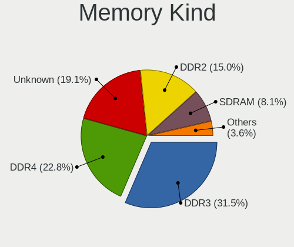

| Kind    | Desktops | Percent |
|---------|----------|---------|
| DDR3    | 316      | 31.98%  |
| DDR4    | 210      | 21.26%  |
| Unknown | 197      | 19.94%  |
| DDR2    | 154      | 15.59%  |
| SDRAM   | 76       | 7.69%   |
| DDR     | 33       | 3.34%   |
| LPDDR4  | 1        | 0.1%    |
| DDR5    | 1        | 0.1%    |

Memory Form Factor
------------------

Physical design of the memory module

| Name    | Desktops | Percent |
|---------|----------|---------|
| DIMM    | 945      | 97.22%  |
| SODIMM  | 25       | 2.57%   |
| RIMM    | 1        | 0.1%    |
| FB-DIMM | 1        | 0.1%    |

Memory Size
-----------

Memory module size

| Size  | Desktops | Percent |
|-------|----------|---------|
| 2048  | 328      | 28.95%  |
| 4096  | 279      | 24.62%  |
| 8192  | 268      | 23.65%  |
| 1024  | 148      | 13.06%  |
| 16384 | 48       | 4.24%   |
| 512   | 35       | 3.09%   |
| 32768 | 19       | 1.68%   |
| 256   | 8        | 0.71%   |

Memory Speed
------------

Memory module speed

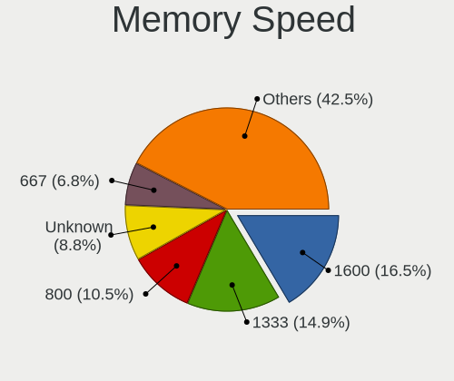

| Speed   | Desktops | Percent |
|---------|----------|---------|
| 1600    | 174      | 16.11%  |
| 1333    | 171      | 15.83%  |
| 800     | 120      | 11.11%  |
| Unknown | 97       | 8.98%   |
| 667     | 77       | 7.13%   |
| 2400    | 50       | 4.63%   |
| 2133    | 44       | 4.07%   |
| 400     | 36       | 3.33%   |
| 3200    | 32       | 2.96%   |
| 3600    | 27       | 2.5%    |
| 1867    | 26       | 2.41%   |
| 2667    | 24       | 2.22%   |
| 1866    | 18       | 1.67%   |
| 1066    | 18       | 1.67%   |
| 333     | 17       | 1.57%   |
| 533     | 14       | 1.3%    |
| 1800    | 12       | 1.11%   |
| 3466    | 10       | 0.93%   |
| 3400    | 10       | 0.93%   |
| 3333    | 7        | 0.65%   |
| 3000    | 7        | 0.65%   |
| 2933    | 7        | 0.65%   |
| 1067    | 7        | 0.65%   |
| 3066    | 6        | 0.56%   |
| 1639    | 6        | 0.56%   |
| 266     | 6        | 0.56%   |
| 2866    | 5        | 0.46%   |
| 49926   | 4        | 0.37%   |
| 3866    | 4        | 0.37%   |
| 3800    | 4        | 0.37%   |
| 2800    | 4        | 0.37%   |
| 2666    | 3        | 0.28%   |
| 2048    | 3        | 0.28%   |
| 1400    | 3        | 0.28%   |
| 3733    | 2        | 0.19%   |
| 3533    | 2        | 0.19%   |
| 3334    | 2        | 0.19%   |
| 2465    | 2        | 0.19%   |
| 2000    | 2        | 0.19%   |
| 1334    | 2        | 0.19%   |

Printers & scanners
-------------------

Printer Vendor
--------------

Printer device vendors

| Vendor                | Desktops | Percent |
|-----------------------|----------|---------|
| Canon                 | 24       | 33.8%   |
| Samsung Electronics   | 21       | 29.58%  |
| Hewlett-Packard       | 10       | 14.08%  |
| Seiko Epson           | 5        | 7.04%   |
| Brother Industries    | 3        | 4.23%   |
| WinChipHead           | 2        | 2.82%   |
| Prolific Technology   | 2        | 2.82%   |
| Zebra                 | 1        | 1.41%   |
| Xerox                 | 1        | 1.41%   |
| Oki Data              | 1        | 1.41%   |
| Lexmark International | 1        | 1.41%   |

Printer Model
-------------

Printer device models

| Model                                         | Desktops | Percent |
|-----------------------------------------------|----------|---------|
| Samsung SCX-4200 series                       | 6        | 8.45%   |
| Samsung ML-1520 Laser Printer                 | 3        | 4.23%   |
| Canon MP160                                   | 3        | 4.23%   |
| Canon MF4410                                  | 3        | 4.23%   |
| WinChipHead CH34x printer adapter cable       | 2        | 2.82%   |
| Samsung Xerox Phaser 3117 Laser Printer       | 2        | 2.82%   |
| Samsung ML-1710 Printer                       | 2        | 2.82%   |
| Samsung M2070 Series                          | 2        | 2.82%   |
| Samsung M2020 Series                          | 2        | 2.82%   |
| Prolific PL2305 Parallel Port                 | 2        | 2.82%   |
| HP LaserJet P1005                             | 2        | 2.82%   |
| HP LaserJet 1020                              | 2        | 2.82%   |
| HP LaserJet 1012                              | 2        | 2.82%   |
| Canon MF4320-4350                             | 2        | 2.82%   |
| Canon LaserShot LBP-1120 Printer              | 2        | 2.82%   |
| Canon iP2700 series                           | 2        | 2.82%   |
| Zebra ZTC S4M-200dpi ZPL                      | 1        | 1.41%   |
| Xerox Printing Support                        | 1        | 1.41%   |
| Seiko Epson XP-243 245 247 Series             | 1        | 1.41%   |
| Seiko Epson Printer                           | 1        | 1.41%   |
| Seiko Epson ME 340 Series/Stylus NX130 Series | 1        | 1.41%   |
| Seiko Epson L380 Series                       | 1        | 1.41%   |
| Seiko Epson L210 Series                       | 1        | 1.41%   |
| Samsung Xerox Phaser 3150                     | 1        | 1.41%   |
| Samsung SCX-4100 Scanner                      | 1        | 1.41%   |
| Samsung Phaser 3121                           | 1        | 1.41%   |
| Samsung ML-1660 Series                        | 1        | 1.41%   |
| Oki Data USB Device                           | 1        | 1.41%   |
| Lexmark International 3300 series             | 1        | 1.41%   |
| HP LaserJet 1018                              | 1        | 1.41%   |
| HP LaserJet 1010                              | 1        | 1.41%   |
| HP DeskJet F2100 Printer series               | 1        | 1.41%   |
| HP DeskJet 2600 series                        | 1        | 1.41%   |
| Canon PIXMA MP280                             | 1        | 1.41%   |
| Canon PIXMA MP230                             | 1        | 1.41%   |
| Canon PIXMA MG3600 Series                     | 1        | 1.41%   |
| Canon PIXMA MG2500 Series                     | 1        | 1.41%   |
| Canon PIXMA iP1800 Printer                    | 1        | 1.41%   |
| Canon MF4010 series                           | 1        | 1.41%   |
| Canon MF3110                                  | 1        | 1.41%   |

Scanner Vendor
--------------

Scanner device vendors

| Vendor             | Desktops | Percent |
|--------------------|----------|---------|
| Canon              | 6        | 31.58%  |
| Seiko Epson        | 5        | 26.32%  |
| Ultima Electronics | 3        | 15.79%  |
| Hewlett-Packard    | 3        | 15.79%  |
| Mustek Systems     | 2        | 10.53%  |

Scanner Model
-------------

Scanner device models

| Model                                                                                 | Desktops | Percent |
|---------------------------------------------------------------------------------------|----------|---------|
| Ultima Artec Ultima 2000 (GT6801 based)/Lifetec LT9385/ScanMagic 1200 UB Plus Scanner | 3        | 15.79%  |
| Canon CanoScan LIDE 25                                                                | 3        | 15.79%  |
| Seiko Epson GT-F500/GT-F550 [Perfection 2480/2580 PHOTO]                              | 2        | 10.53%  |
| Seiko Epson Scanner                                                                   | 1        | 5.26%   |
| Seiko Epson GT-F520/GT-F570 [Perfection 3590 PHOTO]                                   | 1        | 5.26%   |
| Seiko Epson GT-7300U [Perfection 1260/1260 PHOTO]                                     | 1        | 5.26%   |
| Mustek Systems SNAPSCAN e22                                                           | 1        | 5.26%   |
| Mustek Systems BearPaw 1200 CU Plus                                                   | 1        | 5.26%   |
| HP ScanJet 4400c                                                                      | 1        | 5.26%   |
| HP ScanJet 3800c                                                                      | 1        | 5.26%   |
| HP ScanJet 2400c                                                                      | 1        | 5.26%   |
| Canon CanoScan N670U/N676U/LiDE 20                                                    | 1        | 5.26%   |
| Canon CanoScan LiDE 60                                                                | 1        | 5.26%   |
| Canon CanoScan LiDE 110                                                               | 1        | 5.26%   |

Camera
------

Camera Vendor
-------------

Camera device vendors

| Vendor                                 | Desktops | Percent |
|----------------------------------------|----------|---------|
| Logitech                               | 110      | 33.54%  |
| Z-Star Microelectronics                | 72       | 21.95%  |
| Microdia                               | 35       | 10.67%  |
| Aveo Technology                        | 20       | 6.1%    |
| KYE Systems (Mouse Systems)            | 16       | 4.88%   |
| Pixart Imaging                         | 10       | 3.05%   |
| Microsoft                              | 9        | 2.74%   |
| GEMBIRD                                | 7        | 2.13%   |
| Cubeternet                             | 7        | 2.13%   |
| Hewlett-Packard                        | 4        | 1.22%   |
| Arkmicro Technologies                  | 4        | 1.22%   |
| Apple                                  | 4        | 1.22%   |
| Silicon Motion                         | 3        | 0.91%   |
| Realtek Semiconductor                  | 3        | 0.91%   |
| Generalplus Technology                 | 3        | 0.91%   |
| Unknown                                | 2        | 0.61%   |
| Sunplus Innovation Technology          | 2        | 0.61%   |
| Samsung Electronics                    | 2        | 0.61%   |
| Google                                 | 2        | 0.61%   |
| ValueHD                                | 1        | 0.3%    |
| Trust                                  | 1        | 0.3%    |
| Teslong Camera                         | 1        | 0.3%    |
| Sunplus IT                             | 1        | 0.3%    |
| Novatek Microelectronics               | 1        | 0.3%    |
| lihappe8                               | 1        | 0.3%    |
| LG Electronics                         | 1        | 0.3%    |
| Jieli Technology                       | 1        | 0.3%    |
| IMC Networks                           | 1        | 0.3%    |
| HTC (High Tech Computer)               | 1        | 0.3%    |
| Chicony Electronics                    | 1        | 0.3%    |
| Cheng Uei Precision Industry (Foxlink) | 1        | 0.3%    |
| Alcor Micro                            | 1        | 0.3%    |

Camera Model
------------

Camera device models

| Model                                             | Desktops | Percent |
|---------------------------------------------------|----------|---------|
| Logitech Webcam C270                              | 42       | 12.8%   |
| Z-Star Venus USB2.0 Camera                        | 36       | 10.98%  |
| Microdia Camera                                   | 17       | 5.18%   |
| Logitech Webcam C310                              | 16       | 4.88%   |
| Z-Star A4 TECH USB2.0 PC Camera J                 | 13       | 3.96%   |
| Logitech Webcam C170                              | 13       | 3.96%   |
| Z-Star A4 TECH USB2.0 PC Camera E                 | 12       | 3.66%   |
| Aveo Camera                                       | 12       | 3.66%   |
| Microdia Sonix USB 2.0 Camera                     | 11       | 3.35%   |
| Pixart Imaging GE 1.3 MP MiniCam Pro              | 10       | 3.05%   |
| Z-Star A4 TECH HD PC Camera                       | 8        | 2.44%   |
| Microsoft LifeCam HD-3000                         | 7        | 2.13%   |
| Microdia USB 2.0 Camera                           | 6        | 1.83%   |
| Logitech Webcam C210                              | 6        | 1.83%   |
| Logitech Logitech Webcam C100                     | 6        | 1.83%   |
| KYE Systems (Mouse Systems) iLook 320             | 5        | 1.52%   |
| Logitech Webcam C200                              | 4        | 1.22%   |
| Logitech HD Webcam C525                           | 4        | 1.22%   |
| GEMBIRD USB2.0 PC CAMERA                          | 4        | 1.22%   |
| Aveo USB2.0 Camera                                | 4        | 1.22%   |
| Arkmicro USB2.0 PC CAMERA                         | 4        | 1.22%   |
| Realtek FULL HD 1080P Webcam                      | 3        | 0.91%   |
| Logitech HD Webcam B910                           | 3        | 0.91%   |
| KYE Systems (Mouse Systems) Genius FaceCam 320    | 3        | 0.91%   |
| GEMBIRD Generic UVC 1.00 camera [AppoTech AX2311] | 3        | 0.91%   |
| Cubeternet WebCam                                 | 3        | 0.91%   |
| Apple iPhone 5/5C/5S/6/SE/7/8/X                   | 3        | 0.91%   |
| Z-Star Vimicro USB2.0 UVC PC Camera               | 2        | 0.61%   |
| Unknown HD camera                                 | 2        | 0.61%   |
| Silicon Motion SM731 Camera                       | 2        | 0.61%   |
| Samsung Galaxy series, misc. (MTP mode)           | 2        | 0.61%   |
| Logitech Webcam C600                              | 2        | 0.61%   |
| Logitech Webcam C120                              | 2        | 0.61%   |
| Logitech Webcam C110                              | 2        | 0.61%   |
| Logitech Logitech Webcam C160                     | 2        | 0.61%   |
| Logitech HD Webcam C510                           | 2        | 0.61%   |
| KYE Systems (Mouse Systems) Genius iSlim 330      | 2        | 0.61%   |
| Google Nexus/Pixel Device (MTP + debug)           | 2        | 0.61%   |
| Cubeternet USB2.0 Camera                          | 2        | 0.61%   |
| Aveo UVC camera (Bresser microscope)              | 2        | 0.61%   |

Security
--------

Fingerprint Vendor
------------------

Fingerprint sensor vendors

Zero info for selected period =(

Fingerprint Model
-----------------

Fingerprint sensor models

Zero info for selected period =(

Chipcard Vendor
---------------

Chipcard module vendors

| Vendor                | Desktops | Percent |
|-----------------------|----------|---------|
| Avtor                 | 2        | 50%     |
| Alcor Micro           | 1        | 25%     |
| Advanced Card Systems | 1        | 25%     |

Chipcard Model
--------------

Chipcard module models

| Model                               | Desktops | Percent |
|-------------------------------------|----------|---------|
| Avtor SecureToken                   | 2        | 50%     |
| Alcor Micro AU9540 Smartcard Reader | 1        | 25%     |
| Advanced Card Systems ACR122U       | 1        | 25%     |

Unsupported
-----------

Unsupported Devices
-------------------

Total unsupported devices on board

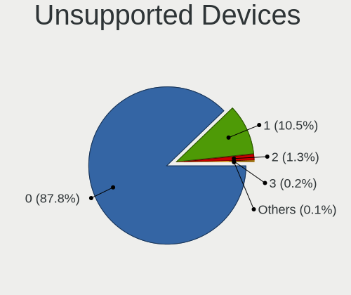

| Total | Desktops | Percent |
|-------|----------|---------|
| 0     | 1186     | 88.44%  |
| 1     | 135      | 10.07%  |
| 2     | 16       | 1.19%   |
| 3     | 3        | 0.22%   |
| 7     | 1        | 0.07%   |

Unsupported Device Types
------------------------

Types of unsupported devices

| Type                     | Desktops | Percent |
|--------------------------|----------|---------|
| Graphics card            | 77       | 45.83%  |
| Net/wireless             | 31       | 18.45%  |
| Communication controller | 17       | 10.12%  |
| Unassigned class         | 11       | 6.55%   |
| Sound                    | 9        | 5.36%   |
| Camera                   | 6        | 3.57%   |
| Multimedia controller    | 4        | 2.38%   |
| Chipcard                 | 3        | 1.79%   |
| Bluetooth                | 3        | 1.79%   |
| Storage/ide              | 2        | 1.19%   |
| Storage/raid             | 1        | 0.6%    |
| Storage                  | 1        | 0.6%    |
| Net/ethernet             | 1        | 0.6%    |
| Modem                    | 1        | 0.6%    |
| Dvb card                 | 1        | 0.6%    |

