Linux in Ukraine - Tested Hardware & Statistics (Desktops)
----------------------------------------------------------

A project to collect tested hardware configurations for Linux in Ukraine.

Anyone can contribute to this report by the [hw-probe](https://github.com/linuxhw/hw-probe) tool:

    sudo -E hw-probe -all -upload

Please contribute! Especially if your hardware is rare.

Contents
--------

* [ Test Cases ](#test-cases)

* [ System ](#system)
  - [ OS                       ](#os)
  - [ OS Family                ](#os-family)
  - [ Kernel                   ](#kernel)
  - [ Kernel Family            ](#kernel-family)
  - [ Kernel Major Ver.        ](#kernel-major-ver)
  - [ Arch                     ](#arch)
  - [ DE                       ](#de)
  - [ Display Server           ](#display-server)
  - [ Display Manager          ](#display-manager)
  - [ OS Lang                  ](#os-lang)
  - [ Boot Mode                ](#boot-mode)
  - [ Filesystem               ](#filesystem)
  - [ Part. scheme             ](#part-scheme)
  - [ Dual Boot with Linux/BSD ](#dual-boot-with-linuxbsd)
  - [ Dual Boot (Win)          ](#dual-boot-win)

* [ Board ](#board)
  - [ Vendor                   ](#vendor)
  - [ Model                    ](#model)
  - [ Model Family             ](#model-family)
  - [ MFG Year                 ](#mfg-year)
  - [ Form Factor              ](#form-factor)
  - [ Secure Boot              ](#secure-boot)
  - [ Coreboot                 ](#coreboot)
  - [ RAM Size                 ](#ram-size)
  - [ RAM Used                 ](#ram-used)
  - [ Total Drives             ](#total-drives)
  - [ Has CD-ROM               ](#has-cd-rom)
  - [ Has Ethernet             ](#has-ethernet)
  - [ Has WiFi                 ](#has-wifi)
  - [ Has Bluetooth            ](#has-bluetooth)

* [ Location ](#location)
  - [ Country                  ](#country)
  - [ City                     ](#city)

* [ Drives ](#drives)
  - [ Drive Vendor             ](#drive-vendor)
  - [ Drive Model              ](#drive-model)
  - [ HDD Vendor               ](#hdd-vendor)
  - [ SSD Vendor               ](#ssd-vendor)
  - [ Drive Kind               ](#drive-kind)
  - [ Drive Connector          ](#drive-connector)
  - [ Drive Size               ](#drive-size)
  - [ Space Total              ](#space-total)
  - [ Space Used               ](#space-used)
  - [ Malfunc. Drives          ](#malfunc-drives)
  - [ Malfunc. Drive Vendor    ](#malfunc-drive-vendor)
  - [ Malfunc. HDD Vendor      ](#malfunc-hdd-vendor)
  - [ Malfunc. Drive Kind      ](#malfunc-drive-kind)
  - [ Failed Drives            ](#failed-drives)
  - [ Failed Drive Vendor      ](#failed-drive-vendor)
  - [ Drive Status             ](#drive-status)

* [ Storage controller ](#storage-controller)
  - [ Storage Vendor           ](#storage-vendor)
  - [ Storage Model            ](#storage-model)
  - [ Storage Kind             ](#storage-kind)

* [ Processor ](#processor)
  - [ CPU Vendor               ](#cpu-vendor)
  - [ CPU Model                ](#cpu-model)
  - [ CPU Model Family         ](#cpu-model-family)
  - [ CPU Cores                ](#cpu-cores)
  - [ CPU Sockets              ](#cpu-sockets)
  - [ CPU Threads              ](#cpu-threads)
  - [ CPU Op-Modes             ](#cpu-op-modes)
  - [ CPU Microcode            ](#cpu-microcode)
  - [ CPU Microarch            ](#cpu-microarch)

* [ Graphics ](#graphics)
  - [ GPU Vendor               ](#gpu-vendor)
  - [ GPU Model                ](#gpu-model)
  - [ GPU Combo                ](#gpu-combo)
  - [ GPU Driver               ](#gpu-driver)
  - [ GPU Memory               ](#gpu-memory)

* [ Monitor ](#monitor)
  - [ Monitor Vendor           ](#monitor-vendor)
  - [ Monitor Model            ](#monitor-model)
  - [ Monitor Resolution       ](#monitor-resolution)
  - [ Monitor Diagonal         ](#monitor-diagonal)
  - [ Monitor Width            ](#monitor-width)
  - [ Aspect Ratio             ](#aspect-ratio)
  - [ Monitor Area             ](#monitor-area)
  - [ Pixel Density            ](#pixel-density)
  - [ Multiple Monitors        ](#multiple-monitors)

* [ Network ](#network)
  - [ Net Controller Vendor    ](#net-controller-vendor)
  - [ Net Controller Model     ](#net-controller-model)
  - [ Wireless Vendor          ](#wireless-vendor)
  - [ Wireless Model           ](#wireless-model)
  - [ Ethernet Vendor          ](#ethernet-vendor)
  - [ Ethernet Model           ](#ethernet-model)
  - [ Net Controller Kind      ](#net-controller-kind)
  - [ Used Controller          ](#used-controller)
  - [ NICs                     ](#nics)
  - [ IPv6                     ](#ipv6)

* [ Bluetooth ](#bluetooth)
  - [ Bluetooth Vendor         ](#bluetooth-vendor)
  - [ Bluetooth Model          ](#bluetooth-model)

* [ Sound ](#sound)
  - [ Sound Vendor             ](#sound-vendor)
  - [ Sound Model              ](#sound-model)

* [ Memory ](#memory)
  - [ Memory Vendor            ](#memory-vendor)
  - [ Memory Model             ](#memory-model)
  - [ Memory Kind              ](#memory-kind)
  - [ Memory Form Factor       ](#memory-form-factor)
  - [ Memory Size              ](#memory-size)
  - [ Memory Speed             ](#memory-speed)

* [ Printers & scanners ](#printers--scanners)
  - [ Printer Vendor           ](#printer-vendor)
  - [ Printer Model            ](#printer-model)
  - [ Scanner Vendor           ](#scanner-vendor)
  - [ Scanner Model            ](#scanner-model)

* [ Camera ](#camera)
  - [ Camera Vendor            ](#camera-vendor)
  - [ Camera Model             ](#camera-model)

* [ Security ](#security)
  - [ Fingerprint Vendor       ](#fingerprint-vendor)
  - [ Fingerprint Model        ](#fingerprint-model)
  - [ Chipcard Vendor          ](#chipcard-vendor)
  - [ Chipcard Model           ](#chipcard-model)

* [ Unsupported ](#unsupported)
  - [ Unsupported Devices      ](#unsupported-devices)
  - [ Unsupported Device Types ](#unsupported-device-types)

Test Cases
----------

Total: 1905

| Vendor        | Model                       | Probe                                                      | Date         |
|---------------|-----------------------------|------------------------------------------------------------|--------------|
| Gigabyte      | 970A-DS3P                   | [5ba20eb04b](https://linux-hardware.org/?probe=5ba20eb04b) | Sep 01, 2022 |
| ASUSTek       | F1A75-M-PRO R2.0            | [e7e057dd6d](https://linux-hardware.org/?probe=e7e057dd6d) | Aug 27, 2022 |
| ASRock        | 960GM-VGS3 FX               | [55c4e8059c](https://linux-hardware.org/?probe=55c4e8059c) | Aug 14, 2022 |
| ASUSTek       | M5A97 R2.0                  | [4b083cc768](https://linux-hardware.org/?probe=4b083cc768) | Aug 10, 2022 |
| ASUSTek       | H81M-K                      | [e115d77240](https://linux-hardware.org/?probe=e115d77240) | Aug 07, 2022 |
| ASUSTek       | H81M-K                      | [d486d91209](https://linux-hardware.org/?probe=d486d91209) | Aug 07, 2022 |
| ASUSTek       | Z170-P                      | [8ed3ede567](https://linux-hardware.org/?probe=8ed3ede567) | Aug 06, 2022 |
| Gigabyte      | X570 AORUS ELITE            | [e963ce265b](https://linux-hardware.org/?probe=e963ce265b) | Aug 04, 2022 |
| ASRock        | A780LM-S                    | [83b44b9bd6](https://linux-hardware.org/?probe=83b44b9bd6) | Jul 31, 2022 |
| ASRock        | A780LM-S                    | [2a1ce55c1b](https://linux-hardware.org/?probe=2a1ce55c1b) | Jul 31, 2022 |
| ASUSTek       | H81M-K                      | [46201e4773](https://linux-hardware.org/?probe=46201e4773) | Jul 27, 2022 |
| ASUSTek       | M5A78L LE                   | [4ade852983](https://linux-hardware.org/?probe=4ade852983) | Jul 23, 2022 |
| Gigabyte      | P31-DS3L                    | [3b8118fb89](https://linux-hardware.org/?probe=3b8118fb89) | Jul 19, 2022 |
| ASRock        | H61M                        | [6a10cdfa42](https://linux-hardware.org/?probe=6a10cdfa42) | Jul 18, 2022 |
| ASRock        | N68-VS3 UCC                 | [37e5cc640d](https://linux-hardware.org/?probe=37e5cc640d) | Jul 14, 2022 |
| Gigabyte      | H310M H x.x                 | [41c609be91](https://linux-hardware.org/?probe=41c609be91) | Jul 05, 2022 |
| ASUSTek       | P8H61-M LX3 PLUS            | [df4856796e](https://linux-hardware.org/?probe=df4856796e) | Jul 04, 2022 |
| Acer          | Aspire M3910                | [ad06b5a93e](https://linux-hardware.org/?probe=ad06b5a93e) | Jun 28, 2022 |
| ASUSTek       | M5A78L-M LX3                | [0ea9a6be3a](https://linux-hardware.org/?probe=0ea9a6be3a) | Jun 28, 2022 |
| ASUSTek       | M2N-E                       | [47cddfb141](https://linux-hardware.org/?probe=47cddfb141) | Jun 25, 2022 |
| ASUSTek       | M2N-E                       | [ad5514340b](https://linux-hardware.org/?probe=ad5514340b) | Jun 25, 2022 |
| ASRock        | A320M-DVS R3.0              | [9244f4847e](https://linux-hardware.org/?probe=9244f4847e) | Jun 22, 2022 |
| Gigabyte      | B450M DS3H V2               | [684cf228c4](https://linux-hardware.org/?probe=684cf228c4) | Jun 15, 2022 |
| ASRock        | B450M Pro4                  | [041f94473b](https://linux-hardware.org/?probe=041f94473b) | Jun 15, 2022 |
| ASUSTek       | PRIME B560-PLUS             | [246525a65f](https://linux-hardware.org/?probe=246525a65f) | Jun 11, 2022 |
| Gigabyte      | EX58-UD5                    | [ffcbf35eec](https://linux-hardware.org/?probe=ffcbf35eec) | Jun 11, 2022 |
| Intel         | DG33BU AAD79951-407         | [5df0f93da9](https://linux-hardware.org/?probe=5df0f93da9) | Jun 10, 2022 |
| ASRock        | Z87M Extreme4               | [5ca7bb09b0](https://linux-hardware.org/?probe=5ca7bb09b0) | Jun 05, 2022 |
| ASUSTek       | ROG STRIX Z590-F GAMING ... | [49c5364599](https://linux-hardware.org/?probe=49c5364599) | Jun 04, 2022 |
| ASUSTek       | ROG STRIX Z590-F GAMING ... | [1b2b655cd6](https://linux-hardware.org/?probe=1b2b655cd6) | Jun 01, 2022 |
| ASUSTek       | F1A75-M-PRO R2.0            | [070e59ce1e](https://linux-hardware.org/?probe=070e59ce1e) | May 30, 2022 |
| ASUSTek       | ROG STRIX Z590-F GAMING ... | [f1ed3c6a46](https://linux-hardware.org/?probe=f1ed3c6a46) | May 30, 2022 |
| ASUSTek       | ROG STRIX Z590-F GAMING ... | [bcc7398945](https://linux-hardware.org/?probe=bcc7398945) | May 29, 2022 |
| ASUSTek       | B150-PLUS                   | [bdcda1dabc](https://linux-hardware.org/?probe=bdcda1dabc) | May 27, 2022 |
| Gigabyte      | EX58-UD5                    | [0b675c4390](https://linux-hardware.org/?probe=0b675c4390) | May 24, 2022 |
| ASUSTek       | ROG STRIX X570-E GAMING     | [63acfbdc55](https://linux-hardware.org/?probe=63acfbdc55) | May 18, 2022 |
| ASUSTek       | P5Q                         | [614f6cf0c6](https://linux-hardware.org/?probe=614f6cf0c6) | May 16, 2022 |
| Gigabyte      | Z97-HD3                     | [2c91bb6c51](https://linux-hardware.org/?probe=2c91bb6c51) | May 16, 2022 |
| Gigabyte      | F2A55M-S1                   | [ecacfd48de](https://linux-hardware.org/?probe=ecacfd48de) | May 14, 2022 |
| ASUSTek       | H110M-R                     | [adbb3eb389](https://linux-hardware.org/?probe=adbb3eb389) | May 12, 2022 |
| ASUSTek       | Q170T                       | [7b142a9bf8](https://linux-hardware.org/?probe=7b142a9bf8) | May 10, 2022 |
| MSI           | X99A SLI PLUS               | [d329ab7f27](https://linux-hardware.org/?probe=d329ab7f27) | May 10, 2022 |
| Lenovo        | MAHOBAY NO DPK              | [1906da1cb4](https://linux-hardware.org/?probe=1906da1cb4) | May 08, 2022 |
| Gigabyte      | H170-D3H-CF                 | [9f255eb7d5](https://linux-hardware.org/?probe=9f255eb7d5) | May 06, 2022 |
| Gigabyte      | IMB1900N                    | [8ed8cb17d5](https://linux-hardware.org/?probe=8ed8cb17d5) | May 04, 2022 |
| Gigabyte      | B75-D3V                     | [08bd0f2662](https://linux-hardware.org/?probe=08bd0f2662) | May 04, 2022 |
| Gigabyte      | H57M-USB3                   | [2f061f5e18](https://linux-hardware.org/?probe=2f061f5e18) | May 03, 2022 |
| Intel         | X79 V2.72B                  | [396faf60b6](https://linux-hardware.org/?probe=396faf60b6) | Apr 29, 2022 |
| Gigabyte      | X570 UD                     | [67f24b974b](https://linux-hardware.org/?probe=67f24b974b) | Apr 27, 2022 |
| Biostar       | G31M+                       | [b756b9bc9f](https://linux-hardware.org/?probe=b756b9bc9f) | Apr 26, 2022 |
| MSI           | MS-7267                     | [d0d0dc78d5](https://linux-hardware.org/?probe=d0d0dc78d5) | Apr 22, 2022 |
| Biostar       | H61MHV2                     | [e05349d6a0](https://linux-hardware.org/?probe=e05349d6a0) | Apr 14, 2022 |
| MSI           | X99A SLI PLUS               | [eae6b5ed56](https://linux-hardware.org/?probe=eae6b5ed56) | Apr 12, 2022 |
| ASUSTek       | A88XM-PLUS                  | [54f7cac3d4](https://linux-hardware.org/?probe=54f7cac3d4) | Apr 11, 2022 |
| MSI           | X99A SLI PLUS               | [f0045560de](https://linux-hardware.org/?probe=f0045560de) | Apr 09, 2022 |
| Intel         | X79 (INTEL Xeon E5/Corei... | [263621f796](https://linux-hardware.org/?probe=263621f796) | Apr 08, 2022 |
| ASRock        | Z270 Extreme4               | [526a5a16bd](https://linux-hardware.org/?probe=526a5a16bd) | Apr 07, 2022 |
| Gigabyte      | H81M-S2H                    | [ac5d29c839](https://linux-hardware.org/?probe=ac5d29c839) | Apr 05, 2022 |
| Dell          | 0CT017                      | [27bdeec11d](https://linux-hardware.org/?probe=27bdeec11d) | Apr 04, 2022 |
| ASUSTek       | P8H61-I                     | [2e1b862b8b](https://linux-hardware.org/?probe=2e1b862b8b) | Mar 28, 2022 |
| Gigabyte      | 945GCM-S2L                  | [c9cc022a93](https://linux-hardware.org/?probe=c9cc022a93) | Mar 28, 2022 |
| Gigabyte      | Z97-HD3                     | [46c12ec623](https://linux-hardware.org/?probe=46c12ec623) | Mar 21, 2022 |
| Fujitsu       | D3220-A1 S26361-D3220-A1    | [725c0249b8](https://linux-hardware.org/?probe=725c0249b8) | Mar 19, 2022 |
| ASRock        | Z68 Pro3-M                  | [2a053f027f](https://linux-hardware.org/?probe=2a053f027f) | Mar 12, 2022 |
| Gigabyte      | H410M H                     | [13a9aa4fb3](https://linux-hardware.org/?probe=13a9aa4fb3) | Mar 08, 2022 |
| ASRock        | B450 Pro4                   | [9f1edfd714](https://linux-hardware.org/?probe=9f1edfd714) | Mar 07, 2022 |
| ASUSTek       | PRIME H270-PLUS             | [9e62e2e6d8](https://linux-hardware.org/?probe=9e62e2e6d8) | Mar 07, 2022 |
| ASUSTek       | P8H67-M LE                  | [be99e3e64a](https://linux-hardware.org/?probe=be99e3e64a) | Mar 07, 2022 |
| ASUSTek       | P5P43TD                     | [c11fd047fb](https://linux-hardware.org/?probe=c11fd047fb) | Feb 28, 2022 |
| Unknown       | TB-4000                     | [dc43686a5a](https://linux-hardware.org/?probe=dc43686a5a) | Feb 27, 2022 |
| ASRock        | P4i65G                      | [aa7a236464](https://linux-hardware.org/?probe=aa7a236464) | Feb 26, 2022 |
| ASRock        | J4005M                      | [bff0e9d532](https://linux-hardware.org/?probe=bff0e9d532) | Feb 22, 2022 |
| Gigabyte      | H57M-USB3                   | [4c10662fd3](https://linux-hardware.org/?probe=4c10662fd3) | Feb 21, 2022 |
| Pegatron      | EVE                         | [facec46bd5](https://linux-hardware.org/?probe=facec46bd5) | Feb 20, 2022 |
| ASRock        | J4005M                      | [aa149b39ea](https://linux-hardware.org/?probe=aa149b39ea) | Feb 20, 2022 |
| ASUSTek       | M5A78L-M LX3                | [90a12c2aa1](https://linux-hardware.org/?probe=90a12c2aa1) | Feb 20, 2022 |
| Gigabyte      | H410M H                     | [7c32edcf20](https://linux-hardware.org/?probe=7c32edcf20) | Feb 18, 2022 |
| ASRock        | N68-VS3 UCC                 | [f5b5daa4cb](https://linux-hardware.org/?probe=f5b5daa4cb) | Feb 18, 2022 |
| ASUSTek       | PRIME A320M-K               | [e6cca953ed](https://linux-hardware.org/?probe=e6cca953ed) | Feb 18, 2022 |
| ASRock        | H61M-VS                     | [20a40d4eea](https://linux-hardware.org/?probe=20a40d4eea) | Feb 17, 2022 |
| Gigabyte      | AB350M-DS3H V2-CF           | [e3f921b6a5](https://linux-hardware.org/?probe=e3f921b6a5) | Feb 17, 2022 |
| Dell          | 0FXD80 A00                  | [46450d22d3](https://linux-hardware.org/?probe=46450d22d3) | Feb 17, 2022 |
| ASUSTek       | F1A55-M LX PLUS             | [7de981a63c](https://linux-hardware.org/?probe=7de981a63c) | Feb 17, 2022 |
| Lenovo        | MAHOBAY NOK                 | [4e3b8bfbb1](https://linux-hardware.org/?probe=4e3b8bfbb1) | Feb 16, 2022 |
| MSI           | 870A-G54                    | [3aa654a3fe](https://linux-hardware.org/?probe=3aa654a3fe) | Feb 14, 2022 |
| ASUSTek       | P5QL/EPU                    | [2a5bcaeec9](https://linux-hardware.org/?probe=2a5bcaeec9) | Feb 14, 2022 |
| ASUSTek       | P5K SE/EPU                  | [003f3cafc0](https://linux-hardware.org/?probe=003f3cafc0) | Feb 13, 2022 |
| ASRock        | 970A-G                      | [7b3694013f](https://linux-hardware.org/?probe=7b3694013f) | Feb 13, 2022 |
| ASUSTek       | M5A78L-M LE                 | [341f21c92c](https://linux-hardware.org/?probe=341f21c92c) | Feb 13, 2022 |
| Lenovo        | MAHOBAY NO DPK              | [2038767b43](https://linux-hardware.org/?probe=2038767b43) | Feb 12, 2022 |
| ASUSTek       | PRIME A320M-K               | [5f4de1e2b0](https://linux-hardware.org/?probe=5f4de1e2b0) | Feb 12, 2022 |
| Gigabyte      | B450 I AORUS PRO WIFI-CF    | [a98c8db3ad](https://linux-hardware.org/?probe=a98c8db3ad) | Feb 12, 2022 |
| ASUSTek       | P8Z68-V PRO GEN3            | [9637033a52](https://linux-hardware.org/?probe=9637033a52) | Feb 12, 2022 |
| MSI           | B450 TOMAHAWK MAX II        | [c2a1175605](https://linux-hardware.org/?probe=c2a1175605) | Feb 12, 2022 |
| Gigabyte      | EP45-DS3L                   | [9829aba3d7](https://linux-hardware.org/?probe=9829aba3d7) | Feb 10, 2022 |
| ASUSTek       | P8H61                       | [ee693a0a41](https://linux-hardware.org/?probe=ee693a0a41) | Feb 10, 2022 |
| ASUSTek       | PRIME B450M-K               | [dbb1d3b9dd](https://linux-hardware.org/?probe=dbb1d3b9dd) | Feb 09, 2022 |
| ASRock        | N68C-GS UCC                 | [42dfb79217](https://linux-hardware.org/?probe=42dfb79217) | Feb 09, 2022 |
| ASUSTek       | P8B75-V                     | [fd04c0293f](https://linux-hardware.org/?probe=fd04c0293f) | Feb 08, 2022 |
| Acer          | Aspire TC-780               | [96ab8fecfb](https://linux-hardware.org/?probe=96ab8fecfb) | Feb 08, 2022 |
| ASUSTek       | M4A78L-M LE                 | [06fca38713](https://linux-hardware.org/?probe=06fca38713) | Feb 08, 2022 |
| ASUSTek       | H81M-K                      | [e362930c92](https://linux-hardware.org/?probe=e362930c92) | Feb 08, 2022 |
| Gigabyte      | B450M GAMING                | [16aaa53716](https://linux-hardware.org/?probe=16aaa53716) | Feb 07, 2022 |
| ASUSTek       | M2NPV-VM                    | [2d4a85af0e](https://linux-hardware.org/?probe=2d4a85af0e) | Feb 07, 2022 |
| ASUSTek       | P5K SE                      | [4c53e240bc](https://linux-hardware.org/?probe=4c53e240bc) | Feb 07, 2022 |
| ASUSTek       | TUF Gaming B550M-PLUS       | [72a1b5ae56](https://linux-hardware.org/?probe=72a1b5ae56) | Feb 07, 2022 |
| Foxconn       | M61PMV FAB A1               | [1a31d1ca9f](https://linux-hardware.org/?probe=1a31d1ca9f) | Feb 06, 2022 |
| MSI           | Z77A-GD65 GAMING            | [8d2cf11a20](https://linux-hardware.org/?probe=8d2cf11a20) | Feb 06, 2022 |
| MSI           | B450-A PRO MAX              | [95c601fd3e](https://linux-hardware.org/?probe=95c601fd3e) | Feb 05, 2022 |
| ASUSTek       | P5L1394                     | [4969e4fecb](https://linux-hardware.org/?probe=4969e4fecb) | Feb 02, 2022 |
| MSI           | MPG B550 GAMING PLUS        | [f1062af79c](https://linux-hardware.org/?probe=f1062af79c) | Feb 01, 2022 |
| Biostar       | NF560-A2G                   | [49802d698d](https://linux-hardware.org/?probe=49802d698d) | Feb 01, 2022 |
| Seco          | C40 C                       | [acbee1977b](https://linux-hardware.org/?probe=acbee1977b) | Feb 01, 2022 |
| MSI           | MAG B550M MORTAR WIFI       | [f54779e17e](https://linux-hardware.org/?probe=f54779e17e) | Jan 30, 2022 |
| ASRock        | H81M-DGS                    | [05fc3bd63b](https://linux-hardware.org/?probe=05fc3bd63b) | Jan 29, 2022 |
| ASUSTek       | P8Z68-V PRO                 | [c8c3cf77c4](https://linux-hardware.org/?probe=c8c3cf77c4) | Jan 29, 2022 |
| ASUSTek       | P5QL/EPU                    | [c1e858090a](https://linux-hardware.org/?probe=c1e858090a) | Jan 28, 2022 |
| ASUSTek       | TUF Gaming B550M-PLUS       | [83cdfa61a4](https://linux-hardware.org/?probe=83cdfa61a4) | Jan 28, 2022 |
| ASUSTek       | TUF Gaming B550M-PLUS       | [4ba7714220](https://linux-hardware.org/?probe=4ba7714220) | Jan 27, 2022 |
| ASUSTek       | M5A78L-M LX3                | [f34ec65c4f](https://linux-hardware.org/?probe=f34ec65c4f) | Jan 27, 2022 |
| ASUSTek       | M5A97 LE R2.0               | [2aff79c6af](https://linux-hardware.org/?probe=2aff79c6af) | Jan 25, 2022 |
| Gigabyte      | H57M-USB3                   | [6210f4db07](https://linux-hardware.org/?probe=6210f4db07) | Jan 25, 2022 |
| Lenovo        | 3717 NO DPK                 | [7c0b9aaab5](https://linux-hardware.org/?probe=7c0b9aaab5) | Jan 24, 2022 |
| Foxconn       | 2ABF                        | [e5723eaa42](https://linux-hardware.org/?probe=e5723eaa42) | Jan 23, 2022 |
| ASUSTek       | H81M-R                      | [d324ae2959](https://linux-hardware.org/?probe=d324ae2959) | Jan 22, 2022 |
| Foxconn       | 2ABF                        | [af38735785](https://linux-hardware.org/?probe=af38735785) | Jan 22, 2022 |
| ASRock        | H310CM-HDV                  | [39cfe3259d](https://linux-hardware.org/?probe=39cfe3259d) | Jan 22, 2022 |
| ASRock        | H310CM-HDV                  | [2bae4483c9](https://linux-hardware.org/?probe=2bae4483c9) | Jan 21, 2022 |
| MSI           | PRO Z690-A DDR4             | [b69ed1da65](https://linux-hardware.org/?probe=b69ed1da65) | Jan 20, 2022 |
| ASUSTek       | Q170T                       | [5712025f97](https://linux-hardware.org/?probe=5712025f97) | Jan 19, 2022 |
| ASUSTek       | H81M-E                      | [0cf59407cd](https://linux-hardware.org/?probe=0cf59407cd) | Jan 17, 2022 |
| ASUSTek       | P5KPL-AM                    | [4f313ddd6a](https://linux-hardware.org/?probe=4f313ddd6a) | Jan 17, 2022 |
| ASUSTek       | Q170T                       | [6538d8f8be](https://linux-hardware.org/?probe=6538d8f8be) | Jan 15, 2022 |
| ASRock        | FM2A88X Pro3+               | [3b7ba9382f](https://linux-hardware.org/?probe=3b7ba9382f) | Jan 15, 2022 |
| Gigabyte      | Z390 UD V2                  | [e9207f1244](https://linux-hardware.org/?probe=e9207f1244) | Jan 13, 2022 |
| MSI           | PRO Z690-A DDR4             | [8b1d1eb56c](https://linux-hardware.org/?probe=8b1d1eb56c) | Jan 12, 2022 |
| ASUSTek       | M5A78L-M LX3                | [9046bc1e4a](https://linux-hardware.org/?probe=9046bc1e4a) | Jan 11, 2022 |
| Dell          | 0D6H9T A01                  | [8bc2b6cc7c](https://linux-hardware.org/?probe=8bc2b6cc7c) | Jan 09, 2022 |
| ASUSTek       | PRIME A320M-K               | [e5b5e85b94](https://linux-hardware.org/?probe=e5b5e85b94) | Jan 07, 2022 |
| ASUSTek       | H110M-R                     | [fb66ba0eeb](https://linux-hardware.org/?probe=fb66ba0eeb) | Jan 05, 2022 |
| Gigabyte      | Z87X-UD5H-CF                | [a1a7854f7a](https://linux-hardware.org/?probe=a1a7854f7a) | Jan 04, 2022 |
| Gigabyte      | 970A-DS3P FX                | [c6baa48783](https://linux-hardware.org/?probe=c6baa48783) | Jan 03, 2022 |
| ASUSTek       | P5G41T-M LX3                | [2a3dbdc07a](https://linux-hardware.org/?probe=2a3dbdc07a) | Jan 01, 2022 |
| MSI           | 970 GAMING                  | [c5797ca176](https://linux-hardware.org/?probe=c5797ca176) | Dec 30, 2021 |
| Dell          | 0DFRFW A00                  | [f27e8a7f9e](https://linux-hardware.org/?probe=f27e8a7f9e) | Dec 30, 2021 |
| ASRock        | J4105M                      | [37f37bbbfd](https://linux-hardware.org/?probe=37f37bbbfd) | Dec 28, 2021 |
| ASUSTek       | TUF Gaming X570-PLUS        | [425784d870](https://linux-hardware.org/?probe=425784d870) | Dec 28, 2021 |
| Gigabyte      | Z97-HD3                     | [6b3bff90d6](https://linux-hardware.org/?probe=6b3bff90d6) | Dec 28, 2021 |
| Biostar       | H55A+                       | [0a4141bcc2](https://linux-hardware.org/?probe=0a4141bcc2) | Dec 28, 2021 |
| ECS           | H61H2-M6                    | [da70905a9d](https://linux-hardware.org/?probe=da70905a9d) | Dec 24, 2021 |
| Intel         | X79 V1.3                    | [fbd3ea5fee](https://linux-hardware.org/?probe=fbd3ea5fee) | Dec 23, 2021 |
| HP            | 198E                        | [bb9b36a65b](https://linux-hardware.org/?probe=bb9b36a65b) | Dec 22, 2021 |
| Gigabyte      | B450 AORUS ELITE            | [dd197ecb62](https://linux-hardware.org/?probe=dd197ecb62) | Dec 21, 2021 |
| ASUSTek       | PRIME H270-PLUS             | [9c1cf57d74](https://linux-hardware.org/?probe=9c1cf57d74) | Dec 20, 2021 |
| MSI           | X370 SLI PLUS               | [adb27f9347](https://linux-hardware.org/?probe=adb27f9347) | Dec 19, 2021 |
| Gigabyte      | X570 AORUS MASTER           | [dc5f8e3963](https://linux-hardware.org/?probe=dc5f8e3963) | Dec 17, 2021 |
| ASUSTek       | PRIME B360M-A               | [d34989fcaa](https://linux-hardware.org/?probe=d34989fcaa) | Dec 16, 2021 |
| ASUSTek       | PRIME B360M-A               | [7587f8f78a](https://linux-hardware.org/?probe=7587f8f78a) | Dec 16, 2021 |
| ASUSTek       | M2N68-AM SE2                | [0b7832c8d4](https://linux-hardware.org/?probe=0b7832c8d4) | Dec 16, 2021 |
| Biostar       | H61MLC                      | [ff1c843adf](https://linux-hardware.org/?probe=ff1c843adf) | Dec 15, 2021 |
| ASUSTek       | P5GC-MX/1333                | [64d0453982](https://linux-hardware.org/?probe=64d0453982) | Dec 15, 2021 |
| Gigabyte      | G41M-Combo                  | [666796bd7e](https://linux-hardware.org/?probe=666796bd7e) | Dec 12, 2021 |
| ASUSTek       | B150M-C                     | [f2f2c5cb49](https://linux-hardware.org/?probe=f2f2c5cb49) | Dec 10, 2021 |
| ASRock        | X570 Taichi                 | [b2de2f8f6a](https://linux-hardware.org/?probe=b2de2f8f6a) | Dec 10, 2021 |
| ASUSTek       | M2N68-AM SE2                | [623b76cf55](https://linux-hardware.org/?probe=623b76cf55) | Dec 09, 2021 |
| MSI           | B450 TOMAHAWK               | [4b39700892](https://linux-hardware.org/?probe=4b39700892) | Dec 09, 2021 |
| ASUSTek       | PRIME Z370-P                | [a9cb8442ac](https://linux-hardware.org/?probe=a9cb8442ac) | Dec 08, 2021 |
| ASRock        | N68C-GS UCC                 | [9da859a341](https://linux-hardware.org/?probe=9da859a341) | Dec 08, 2021 |
| ASUSTek       | B150M-C                     | [a3e2cda715](https://linux-hardware.org/?probe=a3e2cda715) | Dec 07, 2021 |
| Gigabyte      | P55-USB3                    | [6cbec7b450](https://linux-hardware.org/?probe=6cbec7b450) | Dec 06, 2021 |
| ASUSTek       | TUF Gaming Z690-PLUS WIF... | [0a69990530](https://linux-hardware.org/?probe=0a69990530) | Dec 05, 2021 |
| ASUSTek       | A8N5X                       | [69533e4c80](https://linux-hardware.org/?probe=69533e4c80) | Dec 05, 2021 |
| ABIT          | AN52                        | [c77f120f57](https://linux-hardware.org/?probe=c77f120f57) | Dec 05, 2021 |
| ASUSTek       | M4A87TD/USB3                | [6550b760b5](https://linux-hardware.org/?probe=6550b760b5) | Dec 05, 2021 |
| ASUSTek       | PRIME Z270-P                | [dea0e367e1](https://linux-hardware.org/?probe=dea0e367e1) | Dec 04, 2021 |
| Gigabyte      | 970A-DS3P                   | [4ad98be831](https://linux-hardware.org/?probe=4ad98be831) | Dec 02, 2021 |
| Gigabyte      | Z390 UD V2                  | [c45fd8b141](https://linux-hardware.org/?probe=c45fd8b141) | Dec 02, 2021 |
| MSI           | B150M MORTAR                | [cb85954441](https://linux-hardware.org/?probe=cb85954441) | Dec 02, 2021 |
| MSI           | 0AB8                        | [4bf8e40af9](https://linux-hardware.org/?probe=4bf8e40af9) | Dec 01, 2021 |
| ECS           | H61H2-M6                    | [e044b4f23e](https://linux-hardware.org/?probe=e044b4f23e) | Nov 30, 2021 |
| ASUSTek       | PRIME B365M-A               | [c7cbb50843](https://linux-hardware.org/?probe=c7cbb50843) | Nov 30, 2021 |
| MSI           | 760GM-P23                   | [1e66a980fc](https://linux-hardware.org/?probe=1e66a980fc) | Nov 30, 2021 |
| ASUSTek       | P8Z77-V DELUXE              | [ab1b265412](https://linux-hardware.org/?probe=ab1b265412) | Nov 29, 2021 |
| ASUSTek       | P7P55D                      | [85f288d39b](https://linux-hardware.org/?probe=85f288d39b) | Nov 29, 2021 |
| ASUSTek       | M2N                         | [f76f2473ac](https://linux-hardware.org/?probe=f76f2473ac) | Nov 28, 2021 |
| ASRock        | A320M-HDV R3.0              | [5df73b5935](https://linux-hardware.org/?probe=5df73b5935) | Nov 28, 2021 |
| Gigabyte      | B450M S2H V2                | [caf3c5f8f2](https://linux-hardware.org/?probe=caf3c5f8f2) | Nov 25, 2021 |
| ASUSTek       | P5QL-VM EPU                 | [1331462ff8](https://linux-hardware.org/?probe=1331462ff8) | Nov 25, 2021 |
| ASUSTek       | PRIME A320M-K               | [2b85ea4d74](https://linux-hardware.org/?probe=2b85ea4d74) | Nov 25, 2021 |
| HP            | 834F                        | [ee1361ee2f](https://linux-hardware.org/?probe=ee1361ee2f) | Nov 25, 2021 |
| Gigabyte      | B450M S2H V2                | [ea4dbbbf15](https://linux-hardware.org/?probe=ea4dbbbf15) | Nov 25, 2021 |
| ASUSTek       | M5A78L-M LX3                | [5d13ed6397](https://linux-hardware.org/?probe=5d13ed6397) | Nov 22, 2021 |
| MSI           | B450M-A PRO MAX             | [92375d0ecc](https://linux-hardware.org/?probe=92375d0ecc) | Nov 21, 2021 |
| ASUSTek       | P5QL-VM EPU                 | [cd70e0831d](https://linux-hardware.org/?probe=cd70e0831d) | Nov 19, 2021 |
| Gigabyte      | 945GCMX-S2                  | [709a24d01f](https://linux-hardware.org/?probe=709a24d01f) | Nov 19, 2021 |
| ASUSTek       | M5A97 EVO R2.0              | [f72f0b000f](https://linux-hardware.org/?probe=f72f0b000f) | Nov 19, 2021 |
| MSI           | 970 GAMING                  | [e08a7ab20c](https://linux-hardware.org/?probe=e08a7ab20c) | Nov 18, 2021 |
| ASUSTek       | D500SA                      | [7d7e6c76f2](https://linux-hardware.org/?probe=7d7e6c76f2) | Nov 18, 2021 |
| ASUSTek       | D500SA                      | [eb06af468d](https://linux-hardware.org/?probe=eb06af468d) | Nov 18, 2021 |
| ASUSTek       | M2N                         | [ba2f298ff6](https://linux-hardware.org/?probe=ba2f298ff6) | Nov 18, 2021 |
| Gigabyte      | B560M DS3H                  | [5622f1a3b7](https://linux-hardware.org/?probe=5622f1a3b7) | Nov 17, 2021 |
| ASUSTek       | P5GC-MX/1333                | [def67fa4e7](https://linux-hardware.org/?probe=def67fa4e7) | Nov 16, 2021 |
| Gigabyte      | 945GCMX-S2                  | [dbcdfd8eef](https://linux-hardware.org/?probe=dbcdfd8eef) | Nov 15, 2021 |
| ASUSTek       | P5VD2-MX                    | [2159202a53](https://linux-hardware.org/?probe=2159202a53) | Nov 12, 2021 |
| ASUSTek       | P5QL-VM EPU                 | [91ee92932b](https://linux-hardware.org/?probe=91ee92932b) | Nov 10, 2021 |
| MSI           | 970 GAMING                  | [dd0ca535f4](https://linux-hardware.org/?probe=dd0ca535f4) | Nov 10, 2021 |
| ASUSTek       | P5L1394                     | [77429f6d4e](https://linux-hardware.org/?probe=77429f6d4e) | Nov 10, 2021 |
| MSI           | 970 GAMING                  | [dd576aec32](https://linux-hardware.org/?probe=dd576aec32) | Nov 10, 2021 |
| ASRock        | AB350 Gaming K4             | [618e78d70c](https://linux-hardware.org/?probe=618e78d70c) | Nov 08, 2021 |
| ASUSTek       | M4A78LT-M LX                | [417b74c746](https://linux-hardware.org/?probe=417b74c746) | Nov 07, 2021 |
| MSI           | Z370-A PRO                  | [5b4e37e135](https://linux-hardware.org/?probe=5b4e37e135) | Nov 06, 2021 |
| ASUSTek       | M4A89GTD-PRO                | [4964ad307b](https://linux-hardware.org/?probe=4964ad307b) | Nov 06, 2021 |
| ASRock        | H81M-DG4                    | [33d4154b93](https://linux-hardware.org/?probe=33d4154b93) | Nov 06, 2021 |
| ASUSTek       | PRIME B350-PLUS             | [c1b8176c1c](https://linux-hardware.org/?probe=c1b8176c1c) | Nov 06, 2021 |
| MSI           | A320M-A PRO MAX             | [bfe89af8ab](https://linux-hardware.org/?probe=bfe89af8ab) | Nov 04, 2021 |
| ASUSTek       | M5A78L-M LX3                | [94d9e3af73](https://linux-hardware.org/?probe=94d9e3af73) | Nov 04, 2021 |
| ASUSTek       | P5QL-VM EPU                 | [dff36c2e91](https://linux-hardware.org/?probe=dff36c2e91) | Nov 03, 2021 |
| ASUSTek       | PRIME B360M-A               | [e8ef49b867](https://linux-hardware.org/?probe=e8ef49b867) | Nov 03, 2021 |
| ECS           | H61H2-M6                    | [703edac8b2](https://linux-hardware.org/?probe=703edac8b2) | Nov 02, 2021 |
| Pegatron      | IPPCR-SS                    | [0179d16327](https://linux-hardware.org/?probe=0179d16327) | Nov 02, 2021 |
| MSI           | B250 GAMING M3              | [0d30aebcbf](https://linux-hardware.org/?probe=0d30aebcbf) | Nov 01, 2021 |
| ASUSTek       | M2N-E                       | [775aeb5400](https://linux-hardware.org/?probe=775aeb5400) | Oct 31, 2021 |
| Gigabyte      | H55N-USB3                   | [02dffbfea8](https://linux-hardware.org/?probe=02dffbfea8) | Oct 30, 2021 |
| MSI           | X370 GAMING PRO CARBON      | [3abf73fb8a](https://linux-hardware.org/?probe=3abf73fb8a) | Oct 30, 2021 |
| ASUSTek       | M2N-E                       | [6f6e2fefcb](https://linux-hardware.org/?probe=6f6e2fefcb) | Oct 30, 2021 |
| ASUSTek       | H110M-R                     | [07067fe66c](https://linux-hardware.org/?probe=07067fe66c) | Oct 29, 2021 |
| ASUSTek       | PRIME H310M-K R2.0          | [df0c058313](https://linux-hardware.org/?probe=df0c058313) | Oct 28, 2021 |
| HP            | 3647h                       | [2db1dbef9f](https://linux-hardware.org/?probe=2db1dbef9f) | Oct 28, 2021 |
| Intel         | D945GCPE AAD97209-201       | [26a126da3e](https://linux-hardware.org/?probe=26a126da3e) | Oct 26, 2021 |
| MSI           | A320M GRENADE               | [bb422d7efe](https://linux-hardware.org/?probe=bb422d7efe) | Oct 24, 2021 |
| HP            | 1906                        | [62c3738cf9](https://linux-hardware.org/?probe=62c3738cf9) | Oct 23, 2021 |
| ASUSTek       | P5B-Deluxe                  | [7c56a7a321](https://linux-hardware.org/?probe=7c56a7a321) | Oct 23, 2021 |
| ASUSTek       | P7H55-M LX                  | [c29ee7ca9f](https://linux-hardware.org/?probe=c29ee7ca9f) | Oct 23, 2021 |
| MSI           | B450-A PRO MAX              | [648098ebf7](https://linux-hardware.org/?probe=648098ebf7) | Oct 23, 2021 |
| Acer          | WG43M                       | [f4e981b2c3](https://linux-hardware.org/?probe=f4e981b2c3) | Oct 22, 2021 |
| HP            | 1906                        | [6ed76a9994](https://linux-hardware.org/?probe=6ed76a9994) | Oct 21, 2021 |
| Fujitsu       | D3222-A1 S26361-D3222-A1    | [cedb153d12](https://linux-hardware.org/?probe=cedb153d12) | Oct 21, 2021 |
| ASUSTek       | P7H55-M LX                  | [4b9b11b7b3](https://linux-hardware.org/?probe=4b9b11b7b3) | Oct 20, 2021 |
| Gigabyte      | P35-DS3R                    | [01145b2627](https://linux-hardware.org/?probe=01145b2627) | Oct 18, 2021 |
| Intel         | X79G V2.x                   | [6e4d8a1bd8](https://linux-hardware.org/?probe=6e4d8a1bd8) | Oct 17, 2021 |
| ASRock        | 970 Extreme4                | [0a65b6d93e](https://linux-hardware.org/?probe=0a65b6d93e) | Oct 15, 2021 |
| ASUSTek       | ROG STRIX Z370-F GAMING     | [1a088aa55a](https://linux-hardware.org/?probe=1a088aa55a) | Oct 15, 2021 |
| ASRock        | N68-VS3 UCC                 | [4d34b74685](https://linux-hardware.org/?probe=4d34b74685) | Oct 13, 2021 |
| ASUSTek       | SABERTOOTH 990FX            | [4581d872f7](https://linux-hardware.org/?probe=4581d872f7) | Oct 12, 2021 |
| ASRock        | G31M-VS                     | [0c8b706839](https://linux-hardware.org/?probe=0c8b706839) | Oct 11, 2021 |
| ASUSTek       | CROSSHAIR V FORMULA-Z       | [e776648230](https://linux-hardware.org/?probe=e776648230) | Oct 11, 2021 |
| HP            | 1589                        | [46c635d9ab](https://linux-hardware.org/?probe=46c635d9ab) | Oct 10, 2021 |
| ASUSTek       | PRIME H410M-K               | [67ba4012a3](https://linux-hardware.org/?probe=67ba4012a3) | Oct 09, 2021 |
| ASRock        | B75 Pro3-M                  | [62522e187a](https://linux-hardware.org/?probe=62522e187a) | Oct 09, 2021 |
| Fujitsu       | D3162-B1 S26361-D3162-B1    | [5cb0ac4fda](https://linux-hardware.org/?probe=5cb0ac4fda) | Oct 08, 2021 |
| ASRock        | G31M-VS                     | [17021380ec](https://linux-hardware.org/?probe=17021380ec) | Oct 08, 2021 |
| Fujitsu       | D3162-B1 S26361-D3162-B1    | [c8950610f7](https://linux-hardware.org/?probe=c8950610f7) | Oct 08, 2021 |
| ASUSTek       | P8H61-MX                    | [7aee651d14](https://linux-hardware.org/?probe=7aee651d14) | Oct 02, 2021 |
| Biostar       | A770L3                      | [f2cada0c21](https://linux-hardware.org/?probe=f2cada0c21) | Oct 02, 2021 |
| ASRock        | H110M-DGS R3.0              | [2000cd0457](https://linux-hardware.org/?probe=2000cd0457) | Oct 01, 2021 |
| Gigabyte      | H110M-S2-CF                 | [e32907f808](https://linux-hardware.org/?probe=e32907f808) | Oct 01, 2021 |
| Gigabyte      | GA-78LMT-S2                 | [3977fe7bd2](https://linux-hardware.org/?probe=3977fe7bd2) | Sep 29, 2021 |
| Gigabyte      | H170-D3H-CF                 | [42784959b9](https://linux-hardware.org/?probe=42784959b9) | Sep 28, 2021 |
| ASUSTek       | P8Z77-V DELUXE              | [8c1b272056](https://linux-hardware.org/?probe=8c1b272056) | Sep 27, 2021 |
| ASUSTek       | P8Z77-V DELUXE              | [9ebf40dd91](https://linux-hardware.org/?probe=9ebf40dd91) | Sep 27, 2021 |
| ASRock        | X399M Taichi                | [eba541c6b9](https://linux-hardware.org/?probe=eba541c6b9) | Sep 25, 2021 |
| ASUSTek       | M2N-E                       | [6ee658b67a](https://linux-hardware.org/?probe=6ee658b67a) | Sep 25, 2021 |
| Huanan        | X79 INTEL (INTEL Xeon E5... | [aa7607a2b7](https://linux-hardware.org/?probe=aa7607a2b7) | Sep 24, 2021 |
| Huanan        | X79 INTEL (INTEL Xeon E5... | [6dad1e6449](https://linux-hardware.org/?probe=6dad1e6449) | Sep 24, 2021 |
| ASRock        | P41C-DE                     | [1db6c915d2](https://linux-hardware.org/?probe=1db6c915d2) | Sep 24, 2021 |
| Gigabyte      | 945GCMX-S2                  | [adc4b6963d](https://linux-hardware.org/?probe=adc4b6963d) | Sep 24, 2021 |
| Gigabyte      | B550 AORUS PRO V2           | [1b83642f22](https://linux-hardware.org/?probe=1b83642f22) | Sep 23, 2021 |
| Gigabyte      | B550 AORUS PRO V2           | [e91ed1214e](https://linux-hardware.org/?probe=e91ed1214e) | Sep 23, 2021 |
| Gigabyte      | H77-D3H                     | [88d1a0c19e](https://linux-hardware.org/?probe=88d1a0c19e) | Sep 22, 2021 |
| MSI           | H270 GAMING M3              | [3cd206163b](https://linux-hardware.org/?probe=3cd206163b) | Sep 21, 2021 |
| Biostar       | AM1ML                       | [dd9c920c24](https://linux-hardware.org/?probe=dd9c920c24) | Sep 21, 2021 |
| Fujitsu       | D3064-A1 S26361-D3064-A1    | [23a2576fa8](https://linux-hardware.org/?probe=23a2576fa8) | Sep 20, 2021 |
| MSI           | 0AB8                        | [613aa45d0a](https://linux-hardware.org/?probe=613aa45d0a) | Sep 14, 2021 |
| MSI           | B360M PRO-VD                | [4672f48ccd](https://linux-hardware.org/?probe=4672f48ccd) | Sep 13, 2021 |
| Intel         | BTC-S37                     | [7915f6eae4](https://linux-hardware.org/?probe=7915f6eae4) | Sep 11, 2021 |
| ECS           | H61H2-M6                    | [b4a203ac5e](https://linux-hardware.org/?probe=b4a203ac5e) | Sep 10, 2021 |
| ASUSTek       | P5KPL-AM                    | [ecd516a1e0](https://linux-hardware.org/?probe=ecd516a1e0) | Sep 09, 2021 |
| ASUSTek       | P5QC                        | [fee02db17d](https://linux-hardware.org/?probe=fee02db17d) | Sep 08, 2021 |
| ASUSTek       | STRIX B250H GAMING          | [265822ee2e](https://linux-hardware.org/?probe=265822ee2e) | Sep 06, 2021 |
| ASUSTek       | P8Z77-M PRO                 | [b2af983536](https://linux-hardware.org/?probe=b2af983536) | Sep 06, 2021 |
| ASUSTek       | P8Z77-M PRO                 | [f6595cb3ab](https://linux-hardware.org/?probe=f6595cb3ab) | Sep 06, 2021 |
| ASUSTek       | P8Z77-V DELUXE              | [85860b751d](https://linux-hardware.org/?probe=85860b751d) | Sep 04, 2021 |
| Dell          | 02N3WF A01                  | [438ea99933](https://linux-hardware.org/?probe=438ea99933) | Sep 02, 2021 |
| Huanan        | X99-F8                      | [67f35844cd](https://linux-hardware.org/?probe=67f35844cd) | Sep 01, 2021 |
| Huanan        | X99-F8                      | [33e8040986](https://linux-hardware.org/?probe=33e8040986) | Aug 31, 2021 |
| Huanan        | X99-F8                      | [adc113ad6f](https://linux-hardware.org/?probe=adc113ad6f) | Aug 31, 2021 |
| ASRock        | H61M-HVGS                   | [1891b3e9ed](https://linux-hardware.org/?probe=1891b3e9ed) | Aug 31, 2021 |
| Unknown       | Unknown                     | [356d160178](https://linux-hardware.org/?probe=356d160178) | Aug 31, 2021 |
| Gigabyte      | 945GCMX-S2                  | [f3d68ec126](https://linux-hardware.org/?probe=f3d68ec126) | Aug 27, 2021 |
| ASRock        | P4i65G                      | [43ce3e711f](https://linux-hardware.org/?probe=43ce3e711f) | Aug 24, 2021 |
| Lenovo        | SDK0J40705 WIN 342504252... | [5141221da1](https://linux-hardware.org/?probe=5141221da1) | Aug 24, 2021 |
| ASUSTek       | GA35DX                      | [3843ea048e](https://linux-hardware.org/?probe=3843ea048e) | Aug 24, 2021 |
| HP            | 1589                        | [4d308c9d28](https://linux-hardware.org/?probe=4d308c9d28) | Aug 23, 2021 |
| MSI           | Z270-A PRO                  | [73b14ecca0](https://linux-hardware.org/?probe=73b14ecca0) | Aug 23, 2021 |
| ECS           | H81H3-M3                    | [1ef75e65b1](https://linux-hardware.org/?probe=1ef75e65b1) | Aug 22, 2021 |
| ECS           | H81H3-M3                    | [07cf30b2f6](https://linux-hardware.org/?probe=07cf30b2f6) | Aug 21, 2021 |
| MSI           | X370 SLI PLUS               | [4a611b712a](https://linux-hardware.org/?probe=4a611b712a) | Aug 21, 2021 |
| MSI           | Z270-A PRO                  | [e59c9482f6](https://linux-hardware.org/?probe=e59c9482f6) | Aug 21, 2021 |
| ASRock        | H61M-VG3                    | [7e1f4b1620](https://linux-hardware.org/?probe=7e1f4b1620) | Aug 20, 2021 |
| ASRock        | H61M-VG3                    | [7257c7b0bb](https://linux-hardware.org/?probe=7257c7b0bb) | Aug 20, 2021 |
| Gigabyte      | B450M DS3H V2               | [2a277158ef](https://linux-hardware.org/?probe=2a277158ef) | Aug 19, 2021 |
| ASUSTek       | M2N                         | [feb08a099a](https://linux-hardware.org/?probe=feb08a099a) | Aug 19, 2021 |
| ECS           | H61H2-M6                    | [89267dacbf](https://linux-hardware.org/?probe=89267dacbf) | Aug 19, 2021 |
| Gigabyte      | H81M-S2H                    | [894c915ecc](https://linux-hardware.org/?probe=894c915ecc) | Aug 17, 2021 |
| ASRock        | FM2A68M-DG3+                | [d04f948953](https://linux-hardware.org/?probe=d04f948953) | Aug 17, 2021 |
| Gigabyte      | 945GCMX-S2                  | [0c58808ea0](https://linux-hardware.org/?probe=0c58808ea0) | Aug 17, 2021 |
| ASUSTek       | ROG ZENITH II EXTREME       | [1a371ea24e](https://linux-hardware.org/?probe=1a371ea24e) | Aug 16, 2021 |
| ASUSTek       | STRIX B250H GAMING          | [88160f850f](https://linux-hardware.org/?probe=88160f850f) | Aug 15, 2021 |
| ASUSTek       | M5A78L-M LX3                | [16dc0450e2](https://linux-hardware.org/?probe=16dc0450e2) | Aug 15, 2021 |
| ASUSTek       | M5A78L-M LX3                | [48c2b7a173](https://linux-hardware.org/?probe=48c2b7a173) | Aug 15, 2021 |
| MSI           | Z370 KRAIT GAMING           | [26e5da2e9c](https://linux-hardware.org/?probe=26e5da2e9c) | Aug 14, 2021 |
| MSI           | B450M-A PRO MAX             | [14e0f895ae](https://linux-hardware.org/?probe=14e0f895ae) | Aug 11, 2021 |
| Fujitsu       | D2778-C1 S26361-D2778-C1    | [b07993a438](https://linux-hardware.org/?probe=b07993a438) | Aug 11, 2021 |
| ASUSTek       | STRIX B250H GAMING          | [78223998b6](https://linux-hardware.org/?probe=78223998b6) | Aug 10, 2021 |
| ASUSTek       | TUF Gaming H570-PRO         | [990a72e285](https://linux-hardware.org/?probe=990a72e285) | Aug 06, 2021 |
| MSI           | B85M-E45                    | [85f98480a8](https://linux-hardware.org/?probe=85f98480a8) | Aug 05, 2021 |
| Lenovo        | SDK0J40705 WIN 342504252... | [65e0d03193](https://linux-hardware.org/?probe=65e0d03193) | Aug 03, 2021 |
| ASRock        | H470M-HVS                   | [97dbb1b8b9](https://linux-hardware.org/?probe=97dbb1b8b9) | Jul 30, 2021 |
| ASRock        | M3A770DE                    | [ea959bb531](https://linux-hardware.org/?probe=ea959bb531) | Jul 30, 2021 |
| Huanan        | X99-F8 V2.0                 | [5d51c3756f](https://linux-hardware.org/?probe=5d51c3756f) | Jul 29, 2021 |
| Huanan        | X79 249PC V2.3              | [216df9e1f6](https://linux-hardware.org/?probe=216df9e1f6) | Jul 29, 2021 |
| Gigabyte      | Z87X-UD5H-CF                | [88ddc09b9e](https://linux-hardware.org/?probe=88ddc09b9e) | Jul 28, 2021 |
| Gigabyte      | H81M-S2H                    | [f52713e401](https://linux-hardware.org/?probe=f52713e401) | Jul 28, 2021 |
| ASRock        | N68C-GS FX                  | [660f13d25d](https://linux-hardware.org/?probe=660f13d25d) | Jul 27, 2021 |
| Foxconn       | 915MH Series                | [6a3ae85dfc](https://linux-hardware.org/?probe=6a3ae85dfc) | Jul 27, 2021 |
| ASRock        | J4105-ITX                   | [ba7a9ed588](https://linux-hardware.org/?probe=ba7a9ed588) | Jul 27, 2021 |
| MSI           | B85M-E45                    | [d06bc5e141](https://linux-hardware.org/?probe=d06bc5e141) | Jul 26, 2021 |
| Gigabyte      | AB350-Gaming 3-CF           | [e9ddc17233](https://linux-hardware.org/?probe=e9ddc17233) | Jul 26, 2021 |
| Gigabyte      | AB350-Gaming 3-CF           | [6623f96b90](https://linux-hardware.org/?probe=6623f96b90) | Jul 26, 2021 |
| ASUSTek       | M5A78L-M LX3                | [2c05790c36](https://linux-hardware.org/?probe=2c05790c36) | Jul 26, 2021 |
| ASUSTek       | B85-PRO GAMER               | [fffec5c87f](https://linux-hardware.org/?probe=fffec5c87f) | Jul 26, 2021 |
| ASUSTek       | M5A78L-M LX3                | [fcd103f100](https://linux-hardware.org/?probe=fcd103f100) | Jul 26, 2021 |
| Gigabyte      | Z170M-D3H-CF                | [9301420a7b](https://linux-hardware.org/?probe=9301420a7b) | Jul 25, 2021 |
| ASRock        | FM2A68M-DG3+                | [884f8f2850](https://linux-hardware.org/?probe=884f8f2850) | Jul 25, 2021 |
| Lenovo        | SDK0J40705 WIN 342504252... | [f0937920ce](https://linux-hardware.org/?probe=f0937920ce) | Jul 24, 2021 |
| ASUSTek       | M4A89GTD-PRO                | [58278684c5](https://linux-hardware.org/?probe=58278684c5) | Jul 23, 2021 |
| ASUSTek       | PRIME Z370M-PLUS II         | [ba13052b2e](https://linux-hardware.org/?probe=ba13052b2e) | Jul 23, 2021 |
| ASUSTek       | PRIME Z370M-PLUS II         | [50bcb2f7ac](https://linux-hardware.org/?probe=50bcb2f7ac) | Jul 23, 2021 |
| Gigabyte      | 945GCMX-S2                  | [c9d0df911e](https://linux-hardware.org/?probe=c9d0df911e) | Jul 23, 2021 |
| ASUSTek       | P5G41T-M LX3                | [df48823117](https://linux-hardware.org/?probe=df48823117) | Jul 22, 2021 |
| Colorful T... | C.H81A-BTC V20              | [1196c4098b](https://linux-hardware.org/?probe=1196c4098b) | Jul 20, 2021 |
| ASUSTek       | M4A89GTD-PRO                | [a556f90b28](https://linux-hardware.org/?probe=a556f90b28) | Jul 20, 2021 |
| ASUSTek       | P5LD2                       | [9e97498649](https://linux-hardware.org/?probe=9e97498649) | Jul 19, 2021 |
| Biostar       | NF520D3                     | [3c302b5285](https://linux-hardware.org/?probe=3c302b5285) | Jul 18, 2021 |
| Gigabyte      | A55M-DS2                    | [6144ed6dc1](https://linux-hardware.org/?probe=6144ed6dc1) | Jul 18, 2021 |
| ASRock        | B450 Pro4                   | [7d45be2522](https://linux-hardware.org/?probe=7d45be2522) | Jul 17, 2021 |
| ASUSTek       | M4A89GTD-PRO                | [6b1b434e27](https://linux-hardware.org/?probe=6b1b434e27) | Jul 17, 2021 |
| ECS           | H81H3-M3                    | [645830ed64](https://linux-hardware.org/?probe=645830ed64) | Jul 15, 2021 |
| Medion        | MS-7616                     | [a22f78a7b2](https://linux-hardware.org/?probe=a22f78a7b2) | Jul 14, 2021 |
| ASUSTek       | P8Z77-V LX2                 | [fc51a5eb49](https://linux-hardware.org/?probe=fc51a5eb49) | Jul 13, 2021 |
| MSI           | 0AB8                        | [4599275ed5](https://linux-hardware.org/?probe=4599275ed5) | Jul 12, 2021 |
| ASUSTek       | A68HM-K                     | [03c69f44e3](https://linux-hardware.org/?probe=03c69f44e3) | Jul 12, 2021 |
| Biostar       | H61MHV2                     | [7bf699ed8e](https://linux-hardware.org/?probe=7bf699ed8e) | Jul 10, 2021 |
| ASUSTek       | PRIME A320M-K               | [1f7d8d2d39](https://linux-hardware.org/?probe=1f7d8d2d39) | Jul 07, 2021 |
| ASRock        | 880GXH/USB3                 | [eb1fe5a371](https://linux-hardware.org/?probe=eb1fe5a371) | Jul 06, 2021 |
| Gigabyte      | 970A-DS3P FX                | [b873d586f3](https://linux-hardware.org/?probe=b873d586f3) | Jul 03, 2021 |
| MSI           | A320M-A PRO                 | [9d356e787a](https://linux-hardware.org/?probe=9d356e787a) | Jul 01, 2021 |
| MSI           | B450 TOMAHAWK               | [ac2a4b3aea](https://linux-hardware.org/?probe=ac2a4b3aea) | Jul 01, 2021 |
| Gigabyte      | GA-78LMT-S2 R2 sex          | [0deed339a3](https://linux-hardware.org/?probe=0deed339a3) | Jun 30, 2021 |
| ASUSTek       | TUF B450-PRO GAMING         | [1032d8b0ff](https://linux-hardware.org/?probe=1032d8b0ff) | Jun 29, 2021 |
| ASUSTek       | P5GC-MX/1333                | [1b5c62b9d0](https://linux-hardware.org/?probe=1b5c62b9d0) | Jun 29, 2021 |
| MSI           | B75A-G43                    | [b251de3cbc](https://linux-hardware.org/?probe=b251de3cbc) | Jun 26, 2021 |
| Gigabyte      | 945GCM-S2L                  | [b042f1413c](https://linux-hardware.org/?probe=b042f1413c) | Jun 26, 2021 |
| Biostar       | TA770E                      | [e91f400988](https://linux-hardware.org/?probe=e91f400988) | Jun 26, 2021 |
| MSI           | B75A-G43                    | [db8082eb27](https://linux-hardware.org/?probe=db8082eb27) | Jun 26, 2021 |
| Biostar       | NF520-A2 TE                 | [53072a0af9](https://linux-hardware.org/?probe=53072a0af9) | Jun 25, 2021 |
| Biostar       | NF520-A2 TE                 | [b5c0eda1f8](https://linux-hardware.org/?probe=b5c0eda1f8) | Jun 24, 2021 |
| ASUSTek       | M5A97 R2.0                  | [be30616f33](https://linux-hardware.org/?probe=be30616f33) | Jun 23, 2021 |
| TYAN Compu... | Toledo i3210W/i3200R S52... | [cfacd9e7ce](https://linux-hardware.org/?probe=cfacd9e7ce) | Jun 21, 2021 |
| Gigabyte      | A320M-H-CF                  | [626be63b85](https://linux-hardware.org/?probe=626be63b85) | Jun 20, 2021 |
| ASUSTek       | P8H61-M LX3                 | [96aab075cd](https://linux-hardware.org/?probe=96aab075cd) | Jun 19, 2021 |
| ASUSTek       | PRIME B560-PLUS             | [ba370ceb36](https://linux-hardware.org/?probe=ba370ceb36) | Jun 18, 2021 |
| ASUSTek       | PRIME B560-PLUS             | [9379620c8f](https://linux-hardware.org/?probe=9379620c8f) | Jun 18, 2021 |
| ASUSTek       | TUF Gaming B460-PRO         | [1541cb2248](https://linux-hardware.org/?probe=1541cb2248) | Jun 16, 2021 |
| ASUSTek       | TUF Gaming B460-PRO         | [fa2bc4e41d](https://linux-hardware.org/?probe=fa2bc4e41d) | Jun 16, 2021 |
| Gigabyte      | Z77M-D3H                    | [fc3ab06806](https://linux-hardware.org/?probe=fc3ab06806) | Jun 15, 2021 |
| ASUSTek       | TUF Gaming B460-PRO         | [7bd31027c9](https://linux-hardware.org/?probe=7bd31027c9) | Jun 14, 2021 |
| ASUSTek       | TUF Gaming B460-PRO         | [156f0e85be](https://linux-hardware.org/?probe=156f0e85be) | Jun 12, 2021 |
| Gigabyte      | GA-MA770T-UD3               | [88fb2527e3](https://linux-hardware.org/?probe=88fb2527e3) | Jun 12, 2021 |
| ASUSTek       | M5A78L-M LX                 | [fae540293a](https://linux-hardware.org/?probe=fae540293a) | Jun 10, 2021 |
| ASUSTek       | M5A78L-M LX                 | [87ba6489f8](https://linux-hardware.org/?probe=87ba6489f8) | Jun 09, 2021 |
| ASUSTek       | P8H77-V                     | [d3cea8b700](https://linux-hardware.org/?probe=d3cea8b700) | Jun 09, 2021 |
| ASUSTek       | TUF B450-PRO GAMING         | [c7ef032a3f](https://linux-hardware.org/?probe=c7ef032a3f) | Jun 08, 2021 |
| MSI           | KA790GX                     | [6171bacf26](https://linux-hardware.org/?probe=6171bacf26) | Jun 08, 2021 |
| MSI           | Z390-A PRO                  | [8d4983662d](https://linux-hardware.org/?probe=8d4983662d) | Jun 08, 2021 |
| ASUSTek       | M5A78L-M/USB3               | [e5a30a171e](https://linux-hardware.org/?probe=e5a30a171e) | Jun 08, 2021 |
| ASUSTek       | M5A78L-M/USB3               | [043878564d](https://linux-hardware.org/?probe=043878564d) | Jun 08, 2021 |
| ASUSTek       | TUF B450-PRO GAMING         | [ef79bc6b0f](https://linux-hardware.org/?probe=ef79bc6b0f) | Jun 07, 2021 |
| Acer          | WG43M                       | [f575dddee3](https://linux-hardware.org/?probe=f575dddee3) | Jun 06, 2021 |
| Intel         | E5 M2L-8D                   | [7cca14c70d](https://linux-hardware.org/?probe=7cca14c70d) | Jun 05, 2021 |
| ASUSTek       | P8P67 LE                    | [19f07435fc](https://linux-hardware.org/?probe=19f07435fc) | Jun 05, 2021 |
| ASUSTek       | PRIME H310M-D               | [5f98fdcb02](https://linux-hardware.org/?probe=5f98fdcb02) | Jun 03, 2021 |
| MSI           | A68HM-E33 V2                | [01c5e2e798](https://linux-hardware.org/?probe=01c5e2e798) | May 31, 2021 |
| Gigabyte      | B450M H                     | [3453dec709](https://linux-hardware.org/?probe=3453dec709) | May 31, 2021 |
| ASUSTek       | ROG STRIX B360-I GAMING     | [36ebf65d44](https://linux-hardware.org/?probe=36ebf65d44) | May 30, 2021 |
| ASUSTek       | TUF Gaming B460-PRO         | [8b3c2193cc](https://linux-hardware.org/?probe=8b3c2193cc) | May 30, 2021 |
| ASUSTek       | TUF Gaming B460-PRO         | [93390ed697](https://linux-hardware.org/?probe=93390ed697) | May 29, 2021 |
| ASUSTek       | M2N-SLI DELUXE              | [476250f98c](https://linux-hardware.org/?probe=476250f98c) | May 29, 2021 |
| ASUSTek       | M4N68T                      | [1c28ab7987](https://linux-hardware.org/?probe=1c28ab7987) | May 28, 2021 |
| ASUSTek       | M4N68T                      | [95733f70ee](https://linux-hardware.org/?probe=95733f70ee) | May 27, 2021 |
| ASRock        | H77 Pro4-M                  | [f0450b570d](https://linux-hardware.org/?probe=f0450b570d) | May 27, 2021 |
| Gigabyte      | Z370M D3H-CF                | [50557b5f38](https://linux-hardware.org/?probe=50557b5f38) | May 27, 2021 |
| MSI           | X470 GAMING M7 AC           | [5913b80a19](https://linux-hardware.org/?probe=5913b80a19) | May 26, 2021 |
| MSI           | X470 GAMING M7 AC           | [fa6dd15d4f](https://linux-hardware.org/?probe=fa6dd15d4f) | May 26, 2021 |
| ASUSTek       | P5PL2                       | [4b68ac1130](https://linux-hardware.org/?probe=4b68ac1130) | May 23, 2021 |
| ASUSTek       | A68HM-K                     | [d62c1cc4aa](https://linux-hardware.org/?probe=d62c1cc4aa) | May 22, 2021 |
| ZOTAC         | NM10                        | [fbd56b7e5c](https://linux-hardware.org/?probe=fbd56b7e5c) | May 22, 2021 |
| ECS           | H81H3-M3                    | [3f8e53510c](https://linux-hardware.org/?probe=3f8e53510c) | May 21, 2021 |
| ASUSTek       | TUF Z390M-PRO GAMING        | [6566f6cabc](https://linux-hardware.org/?probe=6566f6cabc) | May 21, 2021 |
| ASUSTek       | PRIME B350-PLUS             | [1c2f94847e](https://linux-hardware.org/?probe=1c2f94847e) | May 20, 2021 |
| Gigabyte      | Z68M-D2H                    | [75877fb3b1](https://linux-hardware.org/?probe=75877fb3b1) | May 19, 2021 |
| Gigabyte      | Z68M-D2H                    | [91cee123e9](https://linux-hardware.org/?probe=91cee123e9) | May 19, 2021 |
| Lenovo        | ThinkCentre M81 5048W4M     | [1b01ff9935](https://linux-hardware.org/?probe=1b01ff9935) | May 19, 2021 |
| MSI           | G31TM-P21                   | [001a25aa68](https://linux-hardware.org/?probe=001a25aa68) | May 19, 2021 |
| Gigabyte      | AB350M-DS3H V2-CF           | [93e7cae0d5](https://linux-hardware.org/?probe=93e7cae0d5) | May 17, 2021 |
| Biostar       | NF560-A2G                   | [0b6aa7d521](https://linux-hardware.org/?probe=0b6aa7d521) | May 17, 2021 |
| MSI           | A68HM-E33 V2                | [6f51becb58](https://linux-hardware.org/?probe=6f51becb58) | May 16, 2021 |
| ECS           | nForce4-A754                | [b1d8ef79df](https://linux-hardware.org/?probe=b1d8ef79df) | May 14, 2021 |
| ASUSTek       | M2A-MX                      | [9e451d88ab](https://linux-hardware.org/?probe=9e451d88ab) | May 14, 2021 |
| Gigabyte      | Z68M-D2H                    | [ec195ffe95](https://linux-hardware.org/?probe=ec195ffe95) | May 12, 2021 |
| Gigabyte      | A520M S2H                   | [0356377ab9](https://linux-hardware.org/?probe=0356377ab9) | May 11, 2021 |
| Gigabyte      | B450M DS3H-CF               | [9bc8b1b4e5](https://linux-hardware.org/?probe=9bc8b1b4e5) | May 11, 2021 |
| Gigabyte      | H77-DS3H                    | [cce8fbcd40](https://linux-hardware.org/?probe=cce8fbcd40) | May 10, 2021 |
| Gigabyte      | GA-780T-D3L                 | [ea1264332e](https://linux-hardware.org/?probe=ea1264332e) | May 09, 2021 |
| Gigabyte      | GA-780T-D3L                 | [a9533ecc6b](https://linux-hardware.org/?probe=a9533ecc6b) | May 09, 2021 |
| Gigabyte      | A520M S2H                   | [9fc600c1ad](https://linux-hardware.org/?probe=9fc600c1ad) | May 07, 2021 |
| Dell          | 0M5DCD A00                  | [913643000d](https://linux-hardware.org/?probe=913643000d) | May 04, 2021 |
| MSI           | Z97-G43                     | [6a06e4709b](https://linux-hardware.org/?probe=6a06e4709b) | May 01, 2021 |
| MSI           | Z97-G43                     | [86053cd13f](https://linux-hardware.org/?probe=86053cd13f) | May 01, 2021 |
| MSI           | A320M-A PRO M2              | [b87c7b7c87](https://linux-hardware.org/?probe=b87c7b7c87) | May 01, 2021 |
| ASUSTek       | PRIME A320M-K               | [63cbca2443](https://linux-hardware.org/?probe=63cbca2443) | Apr 30, 2021 |
| ASUSTek       | PRIME Z270-A                | [aff27ae264](https://linux-hardware.org/?probe=aff27ae264) | Apr 29, 2021 |
| HP            | 212B                        | [9216cfb736](https://linux-hardware.org/?probe=9216cfb736) | Apr 29, 2021 |
| ASUSTek       | P7P55-M                     | [5634ac753e](https://linux-hardware.org/?probe=5634ac753e) | Apr 28, 2021 |
| Gigabyte      | B150-HD3-CF                 | [e91c8823fa](https://linux-hardware.org/?probe=e91c8823fa) | Apr 28, 2021 |
| Intel         | DH61WW AAG23116-203         | [32aae9ea9a](https://linux-hardware.org/?probe=32aae9ea9a) | Apr 24, 2021 |
| HP            | 805F                        | [fa498b2f05](https://linux-hardware.org/?probe=fa498b2f05) | Apr 23, 2021 |
| HP            | 805F                        | [10f64bfe1f](https://linux-hardware.org/?probe=10f64bfe1f) | Apr 23, 2021 |
| Gigabyte      | H57M-USB3                   | [da796c7dcf](https://linux-hardware.org/?probe=da796c7dcf) | Apr 23, 2021 |
| Gigabyte      | M61PME-S2                   | [3f4bd0bcf5](https://linux-hardware.org/?probe=3f4bd0bcf5) | Apr 23, 2021 |
| Gigabyte      | M61PME-S2                   | [b1113e9106](https://linux-hardware.org/?probe=b1113e9106) | Apr 23, 2021 |
| ASUSTek       | M5A78L-M LX3                | [1aa3233f77](https://linux-hardware.org/?probe=1aa3233f77) | Apr 23, 2021 |
| ASUSTek       | M5A97 R2.0                  | [f6207dd67e](https://linux-hardware.org/?probe=f6207dd67e) | Apr 21, 2021 |
| Gigabyte      | F2A68HM-S1                  | [4a0e2da1ba](https://linux-hardware.org/?probe=4a0e2da1ba) | Apr 20, 2021 |
| ASUSTek       | P5GV-MX                     | [95148df3e9](https://linux-hardware.org/?probe=95148df3e9) | Apr 20, 2021 |
| Unknown       | Unknown                     | [39a0744819](https://linux-hardware.org/?probe=39a0744819) | Apr 20, 2021 |
| ASUSTek       | F1A55-M LX                  | [630bbb748a](https://linux-hardware.org/?probe=630bbb748a) | Apr 17, 2021 |
| Gigabyte      | Z68M-D2H                    | [c2c4591ef9](https://linux-hardware.org/?probe=c2c4591ef9) | Apr 16, 2021 |
| ASUSTek       | P9X79 PRO                   | [28a07ac7f9](https://linux-hardware.org/?probe=28a07ac7f9) | Apr 16, 2021 |
| Dell          | 02N3WF A01                  | [bffe1498c5](https://linux-hardware.org/?probe=bffe1498c5) | Apr 14, 2021 |
| Gigabyte      | A320M-H-CF                  | [a17c745ab0](https://linux-hardware.org/?probe=a17c745ab0) | Apr 14, 2021 |
| ASRock        | Z390 Taichi                 | [7df513ad5b](https://linux-hardware.org/?probe=7df513ad5b) | Apr 13, 2021 |
| Unknown       | Unknown                     | [5ed47267b8](https://linux-hardware.org/?probe=5ed47267b8) | Apr 13, 2021 |
| ECS           | H61H2-M6                    | [933e4ffba3](https://linux-hardware.org/?probe=933e4ffba3) | Apr 12, 2021 |
| Biostar       | TA890GXE                    | [4d8a08c8fc](https://linux-hardware.org/?probe=4d8a08c8fc) | Apr 12, 2021 |
| Dell          | 02N3WF A01                  | [3cdbee502b](https://linux-hardware.org/?probe=3cdbee502b) | Apr 12, 2021 |
| MSI           | PH67S-C43                   | [bf84a891cc](https://linux-hardware.org/?probe=bf84a891cc) | Apr 10, 2021 |
| ASRock        | FM2A68M-HD+                 | [f14fbaa5be](https://linux-hardware.org/?probe=f14fbaa5be) | Apr 10, 2021 |
| MSI           | H310M PRO-VD PLUS           | [de7b86720f](https://linux-hardware.org/?probe=de7b86720f) | Apr 10, 2021 |
| ASUSTek       | P8H61-MX                    | [9212747e6a](https://linux-hardware.org/?probe=9212747e6a) | Apr 08, 2021 |
| ECS           | H61H2-M6                    | [52a3904255](https://linux-hardware.org/?probe=52a3904255) | Apr 07, 2021 |
| Biostar       | P35D2-A7                    | [e43984d7d0](https://linux-hardware.org/?probe=e43984d7d0) | Apr 06, 2021 |
| ASUSTek       | M5A97 R2.0                  | [2041e11d53](https://linux-hardware.org/?probe=2041e11d53) | Apr 05, 2021 |
| ASRock        | A785GXH/128M                | [7a27db094e](https://linux-hardware.org/?probe=7a27db094e) | Apr 04, 2021 |
| Unknown       | Unknown                     | [831b3f8c68](https://linux-hardware.org/?probe=831b3f8c68) | Apr 04, 2021 |
| Dell          | 0YXT71 A03                  | [a693d293f1](https://linux-hardware.org/?probe=a693d293f1) | Apr 03, 2021 |
| ASUSTek       | PRIME H310M-R R2.0          | [db4d099b65](https://linux-hardware.org/?probe=db4d099b65) | Apr 03, 2021 |
| ASRock        | H410M-HDV                   | [47c1d0db47](https://linux-hardware.org/?probe=47c1d0db47) | Apr 02, 2021 |
| Biostar       | H61MLC                      | [e373b143ec](https://linux-hardware.org/?probe=e373b143ec) | Apr 01, 2021 |
| ECS           | 945PL-A                     | [4893e30a87](https://linux-hardware.org/?probe=4893e30a87) | Mar 31, 2021 |
| ASUSTek       | H61M-E                      | [fcc9dabb3d](https://linux-hardware.org/?probe=fcc9dabb3d) | Mar 30, 2021 |
| ASUSTek       | H61M-E                      | [ed7f2979b9](https://linux-hardware.org/?probe=ed7f2979b9) | Mar 30, 2021 |
| ASUSTek       | A88XM-A/USB                 | [ac50582416](https://linux-hardware.org/?probe=ac50582416) | Mar 29, 2021 |
| ASUSTek       | A68HM-K                     | [ef5acde9af](https://linux-hardware.org/?probe=ef5acde9af) | Mar 28, 2021 |
| MSI           | 0AB8                        | [196cdbc09e](https://linux-hardware.org/?probe=196cdbc09e) | Mar 25, 2021 |
| ASUSTek       | Z170 PRO GAMING             | [bb2ba9b142](https://linux-hardware.org/?probe=bb2ba9b142) | Mar 24, 2021 |
| ASUSTek       | H81M-A                      | [6f2378bbe5](https://linux-hardware.org/?probe=6f2378bbe5) | Mar 22, 2021 |
| MSI           | B460M PRO                   | [1dc8484ff4](https://linux-hardware.org/?probe=1dc8484ff4) | Mar 22, 2021 |
| ASUSTek       | P8H67-V                     | [17a10fd615](https://linux-hardware.org/?probe=17a10fd615) | Mar 22, 2021 |
| MSI           | B365M PRO-VDH               | [85eae8241f](https://linux-hardware.org/?probe=85eae8241f) | Mar 22, 2021 |
| ECS           | P4M890T-M                   | [72bfcda4bf](https://linux-hardware.org/?probe=72bfcda4bf) | Mar 22, 2021 |
| Gigabyte      | H61M-S2PV                   | [bbe4962b33](https://linux-hardware.org/?probe=bbe4962b33) | Mar 22, 2021 |
| Huanan        | X58 V110                    | [ba7a123679](https://linux-hardware.org/?probe=ba7a123679) | Mar 21, 2021 |
| ASUSTek       | M5A78L-M/USB3               | [6b26a69326](https://linux-hardware.org/?probe=6b26a69326) | Mar 21, 2021 |
| ASRock        | ConRoe945G-DVI              | [fe64d52a52](https://linux-hardware.org/?probe=fe64d52a52) | Mar 21, 2021 |
| ASRock        | AD425PV3                    | [20089c34b5](https://linux-hardware.org/?probe=20089c34b5) | Mar 20, 2021 |
| Gigabyte      | F2A88XM-HD3                 | [d4deba7888](https://linux-hardware.org/?probe=d4deba7888) | Mar 20, 2021 |
| ASUSTek       | M2N                         | [56db54e530](https://linux-hardware.org/?probe=56db54e530) | Mar 19, 2021 |
| MSI           | H310M PRO-VD PLUS           | [8d30426b55](https://linux-hardware.org/?probe=8d30426b55) | Mar 19, 2021 |
| MSI           | B350 TOMAHAWK               | [d77d6984e4](https://linux-hardware.org/?probe=d77d6984e4) | Mar 19, 2021 |
| ASUSTek       | M5A78L-M/USB3               | [9fdca2136a](https://linux-hardware.org/?probe=9fdca2136a) | Mar 19, 2021 |
| MSI           | X370 GAMING PRO CARBON      | [45cb6a5741](https://linux-hardware.org/?probe=45cb6a5741) | Mar 18, 2021 |
| ASUSTek       | TUF Z390M-PRO GAMING        | [c721b98942](https://linux-hardware.org/?probe=c721b98942) | Mar 18, 2021 |
| Gigabyte      | Z68AP-D3                    | [a3df91d556](https://linux-hardware.org/?probe=a3df91d556) | Mar 18, 2021 |
| ASRock        | AB350M Pro4 R2.0            | [d5ddb563ac](https://linux-hardware.org/?probe=d5ddb563ac) | Mar 18, 2021 |
| ASUSTek       | M4A88T-V EVO/USB3           | [fbf0cd6c8d](https://linux-hardware.org/?probe=fbf0cd6c8d) | Mar 17, 2021 |
| ASRock        | AB350M Pro4 R2.0            | [af9b948ec2](https://linux-hardware.org/?probe=af9b948ec2) | Mar 17, 2021 |
| Lenovo        | NO DPK                      | [3bec5ddc17](https://linux-hardware.org/?probe=3bec5ddc17) | Mar 17, 2021 |
| MSI           | B450M PRO-VDH MAX           | [00a14a97a2](https://linux-hardware.org/?probe=00a14a97a2) | Mar 17, 2021 |
| ASRock        | B450 Gaming-ITX/ac          | [069769819b](https://linux-hardware.org/?probe=069769819b) | Mar 17, 2021 |
| ASRock        | H370M-HDV                   | [d926961a40](https://linux-hardware.org/?probe=d926961a40) | Mar 17, 2021 |
| ASRock        | H370M-HDV                   | [42a50971b8](https://linux-hardware.org/?probe=42a50971b8) | Mar 17, 2021 |
| Gigabyte      | GA-78LMT-USB3               | [4d8d7a3551](https://linux-hardware.org/?probe=4d8d7a3551) | Mar 17, 2021 |
| Gigabyte      | 970A-DS3P                   | [eeebc66137](https://linux-hardware.org/?probe=eeebc66137) | Mar 17, 2021 |
| Gigabyte      | 970A-DS3P                   | [fdf4e6d366](https://linux-hardware.org/?probe=fdf4e6d366) | Mar 17, 2021 |
| Intel         | Thurley                     | [f543a35f4c](https://linux-hardware.org/?probe=f543a35f4c) | Mar 17, 2021 |
| Gigabyte      | Z68AP-D3                    | [7c2ac274a5](https://linux-hardware.org/?probe=7c2ac274a5) | Mar 17, 2021 |
| ASUSTek       | TUF B450M-PLUS GAMING       | [7cc0dfac27](https://linux-hardware.org/?probe=7cc0dfac27) | Mar 17, 2021 |
| ASUSTek       | PRIME B350-PLUS             | [a4a19eb4bb](https://linux-hardware.org/?probe=a4a19eb4bb) | Mar 17, 2021 |
| MSI           | B450-A PRO                  | [b843e6454a](https://linux-hardware.org/?probe=b843e6454a) | Mar 17, 2021 |
| Gigabyte      | B450 I AORUS PRO WIFI-CF    | [6124e0aa83](https://linux-hardware.org/?probe=6124e0aa83) | Mar 17, 2021 |
| Dell          | 0M9KCM A00                  | [14861d9819](https://linux-hardware.org/?probe=14861d9819) | Mar 17, 2021 |
| ASUSTek       | PRIME A320M-K               | [2a000e48f4](https://linux-hardware.org/?probe=2a000e48f4) | Mar 17, 2021 |
| ASUSTek       | A88XM-E                     | [7820059f6a](https://linux-hardware.org/?probe=7820059f6a) | Mar 17, 2021 |
| Gigabyte      | X570 AORUS MASTER           | [07cd9eac56](https://linux-hardware.org/?probe=07cd9eac56) | Mar 17, 2021 |
| Dell          | 02N3WF A01                  | [a6f2c9e61f](https://linux-hardware.org/?probe=a6f2c9e61f) | Mar 15, 2021 |
| ASRock        | G31M-S                      | [cc4812e5d3](https://linux-hardware.org/?probe=cc4812e5d3) | Mar 14, 2021 |
| ASRock        | Z97 Killer                  | [fbbf57d9ef](https://linux-hardware.org/?probe=fbbf57d9ef) | Mar 13, 2021 |
| ASUSTek       | PRIME B360M-K               | [f16d7116c9](https://linux-hardware.org/?probe=f16d7116c9) | Mar 13, 2021 |
| ASUSTek       | P5G-MX                      | [52e0e4c9a6](https://linux-hardware.org/?probe=52e0e4c9a6) | Mar 12, 2021 |
| Gigabyte      | Z87X-UD5H-CF                | [d4570ea6b2](https://linux-hardware.org/?probe=d4570ea6b2) | Mar 12, 2021 |
| ASUSTek       | PRIME B350-PLUS             | [bf856bd378](https://linux-hardware.org/?probe=bf856bd378) | Mar 11, 2021 |
| ASRock        | N68-S                       | [a31c408337](https://linux-hardware.org/?probe=a31c408337) | Mar 10, 2021 |
| HP            | 1589                        | [d66c109c0e](https://linux-hardware.org/?probe=d66c109c0e) | Mar 10, 2021 |
| ASUSTek       | P5K SE                      | [c121ebf1b4](https://linux-hardware.org/?probe=c121ebf1b4) | Mar 08, 2021 |
| ASUSTek       | PRIME B450M-A II            | [028235c250](https://linux-hardware.org/?probe=028235c250) | Mar 06, 2021 |
| ASUSTek       | PRIME B450M-A II            | [ccd14c8f38](https://linux-hardware.org/?probe=ccd14c8f38) | Mar 06, 2021 |
| Gigabyte      | 945GCM-S2L                  | [6ddfd23c4d](https://linux-hardware.org/?probe=6ddfd23c4d) | Mar 05, 2021 |
| MSI           | A68HM-P33 V2                | [e96e28079a](https://linux-hardware.org/?probe=e96e28079a) | Mar 05, 2021 |
| ASUSTek       | P4P800-MX                   | [1b67f298e5](https://linux-hardware.org/?probe=1b67f298e5) | Mar 05, 2021 |
| ASUSTek       | M5A78L-M LX                 | [cefdf64d5f](https://linux-hardware.org/?probe=cefdf64d5f) | Mar 04, 2021 |
| ASUSTek       | PRIME H410M-K               | [f685fefbec](https://linux-hardware.org/?probe=f685fefbec) | Mar 04, 2021 |
| ASRock        | X570 Phantom Gaming 4       | [ded40db2a0](https://linux-hardware.org/?probe=ded40db2a0) | Mar 03, 2021 |
| Dell          | 09M8Y8 A01                  | [4997df5506](https://linux-hardware.org/?probe=4997df5506) | Mar 03, 2021 |
| ASUSTek       | CM1735                      | [dfaf35d9ff](https://linux-hardware.org/?probe=dfaf35d9ff) | Mar 02, 2021 |
| ASUSTek       | CM1735                      | [83a3d8a0e2](https://linux-hardware.org/?probe=83a3d8a0e2) | Mar 02, 2021 |
| ASUSTek       | H110M-K                     | [163b15bc2b](https://linux-hardware.org/?probe=163b15bc2b) | Mar 01, 2021 |
| Gigabyte      | A320M-H-CF                  | [9a9b6a09e0](https://linux-hardware.org/?probe=9a9b6a09e0) | Feb 27, 2021 |
| ASUSTek       | P5KC                        | [7ca92abd15](https://linux-hardware.org/?probe=7ca92abd15) | Feb 26, 2021 |
| MSI           | A55M-P33                    | [2d5b2c84e5](https://linux-hardware.org/?probe=2d5b2c84e5) | Feb 25, 2021 |
| Dell          | 02N3WF A01                  | [1d6e8ad9da](https://linux-hardware.org/?probe=1d6e8ad9da) | Feb 24, 2021 |
| MSI           | H87-G43 GAMING              | [84a36237d0](https://linux-hardware.org/?probe=84a36237d0) | Feb 24, 2021 |
| ASUSTek       | P5K-VM                      | [39270c836f](https://linux-hardware.org/?probe=39270c836f) | Feb 23, 2021 |
| Gigabyte      | Z68M-D2H                    | [b7084c4301](https://linux-hardware.org/?probe=b7084c4301) | Feb 22, 2021 |
| Gigabyte      | H310M S2V x.x               | [87b8d58707](https://linux-hardware.org/?probe=87b8d58707) | Feb 22, 2021 |
| Gigabyte      | B550 AORUS PRO V2           | [78c9f0a694](https://linux-hardware.org/?probe=78c9f0a694) | Feb 21, 2021 |
| ASUSTek       | TUF B360M-E GAMING          | [fb24c9d115](https://linux-hardware.org/?probe=fb24c9d115) | Feb 21, 2021 |
| Biostar       | G31D-M7                     | [da8af8faaa](https://linux-hardware.org/?probe=da8af8faaa) | Feb 20, 2021 |
| ASUSTek       | M2A-VM                      | [db0f2329b1](https://linux-hardware.org/?probe=db0f2329b1) | Feb 19, 2021 |
| ASUSTek       | M2A-VM                      | [cebb004dbe](https://linux-hardware.org/?probe=cebb004dbe) | Feb 19, 2021 |
| Unknown       | Intel X79                   | [9915f91e29](https://linux-hardware.org/?probe=9915f91e29) | Feb 19, 2021 |
| MSI           | B450M PRO-VDH MAX           | [9d3377e42c](https://linux-hardware.org/?probe=9d3377e42c) | Feb 19, 2021 |
| ASUSTek       | M5A78L/USB3                 | [818882ee76](https://linux-hardware.org/?probe=818882ee76) | Feb 18, 2021 |
| ASUSTek       | M5A97 PRO                   | [24ab5e1b15](https://linux-hardware.org/?probe=24ab5e1b15) | Feb 18, 2021 |
| ASUSTek       | P8H61-M LX3 R2.0            | [994dadf394](https://linux-hardware.org/?probe=994dadf394) | Feb 18, 2021 |
| ASUSTek       | Crosshair IV Formula        | [d72f0f38e7](https://linux-hardware.org/?probe=d72f0f38e7) | Feb 18, 2021 |
| ASRock        | 970A-G                      | [47cd142b28](https://linux-hardware.org/?probe=47cd142b28) | Feb 18, 2021 |
| Gigabyte      | Q170M-D3H                   | [9d1c5dc708](https://linux-hardware.org/?probe=9d1c5dc708) | Feb 17, 2021 |
| ASUSTek       | P5Q SE/R                    | [bc752ecf37](https://linux-hardware.org/?probe=bc752ecf37) | Feb 17, 2021 |
| Biostar       | H81MHV3                     | [dd2f04f1ee](https://linux-hardware.org/?probe=dd2f04f1ee) | Feb 16, 2021 |
| Gigabyte      | B450 AORUS ELITE            | [beb052cdd4](https://linux-hardware.org/?probe=beb052cdd4) | Feb 15, 2021 |
| ASUSTek       | M5A78L/USB3                 | [3b41a4f922](https://linux-hardware.org/?probe=3b41a4f922) | Feb 15, 2021 |
| ASUSTek       | TUF Gaming X570-PRO         | [05ec6fa609](https://linux-hardware.org/?probe=05ec6fa609) | Feb 14, 2021 |
| Intel         | E5 M2L-8D                   | [4dd4400b16](https://linux-hardware.org/?probe=4dd4400b16) | Feb 14, 2021 |
| ASRock        | N68C-S UCC                  | [9d5bbf4186](https://linux-hardware.org/?probe=9d5bbf4186) | Feb 14, 2021 |
| ASRock        | B450M-HDV R4.0              | [b7a9aecefb](https://linux-hardware.org/?probe=b7a9aecefb) | Feb 14, 2021 |
| ASUSTek       | P5G41-M SI                  | [9c14de0766](https://linux-hardware.org/?probe=9c14de0766) | Feb 14, 2021 |
| Biostar       | A880GU3                     | [a1ab95c322](https://linux-hardware.org/?probe=a1ab95c322) | Feb 13, 2021 |
| MSI           | H87-G43 GAMING              | [1de518df69](https://linux-hardware.org/?probe=1de518df69) | Feb 13, 2021 |
| HP            | 3029h                       | [c1957854cc](https://linux-hardware.org/?probe=c1957854cc) | Feb 13, 2021 |
| Lenovo        | ThinkCentre M90p 5852A34    | [1248d4feaf](https://linux-hardware.org/?probe=1248d4feaf) | Feb 13, 2021 |
| ASUSTek       | PRIME Z390-P                | [edd81948e5](https://linux-hardware.org/?probe=edd81948e5) | Feb 13, 2021 |
| ASRock        | X570 Extreme4               | [3f2929b8fd](https://linux-hardware.org/?probe=3f2929b8fd) | Feb 11, 2021 |
| ASUSTek       | M5A78L-M/USB3               | [d993271043](https://linux-hardware.org/?probe=d993271043) | Feb 11, 2021 |
| ASUSTek       | M5A78L-M/USB3               | [ab8c311c17](https://linux-hardware.org/?probe=ab8c311c17) | Feb 11, 2021 |
| Unknown       | Unknown                     | [84cb0d787d](https://linux-hardware.org/?probe=84cb0d787d) | Feb 09, 2021 |
| Unknown       | Unknown                     | [7956910c59](https://linux-hardware.org/?probe=7956910c59) | Feb 09, 2021 |
| ASRock        | FM2A58M-DG3+                | [fbc7b4875e](https://linux-hardware.org/?probe=fbc7b4875e) | Feb 09, 2021 |
| ASRock        | N68C-S UCC                  | [c35f0c5e8f](https://linux-hardware.org/?probe=c35f0c5e8f) | Feb 08, 2021 |
| Gigabyte      | H81M-S2H                    | [f9e5b1d3c6](https://linux-hardware.org/?probe=f9e5b1d3c6) | Feb 08, 2021 |
| Gigabyte      | P35-DS3L                    | [f7a94fa35c](https://linux-hardware.org/?probe=f7a94fa35c) | Feb 05, 2021 |
| MSI           | 0AB8                        | [311a3ce6a2](https://linux-hardware.org/?probe=311a3ce6a2) | Feb 05, 2021 |
| Gigabyte      | Z87X-UD5H-CF                | [aea262050c](https://linux-hardware.org/?probe=aea262050c) | Feb 04, 2021 |
| Intel         | D510MO AAE76523-403         | [57a684a276](https://linux-hardware.org/?probe=57a684a276) | Feb 03, 2021 |
| MSI           | 0AB8                        | [bc2c33d34e](https://linux-hardware.org/?probe=bc2c33d34e) | Feb 03, 2021 |
| Gigabyte      | M61SME-S2                   | [46bb3326d0](https://linux-hardware.org/?probe=46bb3326d0) | Feb 02, 2021 |
| Gigabyte      | M61SME-S2                   | [676a5488b6](https://linux-hardware.org/?probe=676a5488b6) | Feb 02, 2021 |
| ASUSTek       | P4S800-MX SE                | [d3c1b192f2](https://linux-hardware.org/?probe=d3c1b192f2) | Feb 02, 2021 |
| ASRock        | FM2A58M-DG3+                | [1e81f470ad](https://linux-hardware.org/?probe=1e81f470ad) | Feb 02, 2021 |
| MSI           | H87-G43 GAMING              | [45072c8d06](https://linux-hardware.org/?probe=45072c8d06) | Feb 01, 2021 |
| MSI           | H110M PRO-VD                | [aaa9079804](https://linux-hardware.org/?probe=aaa9079804) | Feb 01, 2021 |
| ASRock        | Q1900M                      | [aa19143907](https://linux-hardware.org/?probe=aa19143907) | Jan 31, 2021 |
| MSI           | H87-G43 GAMING              | [d725b3aeb9](https://linux-hardware.org/?probe=d725b3aeb9) | Jan 31, 2021 |
| MSI           | H87-G43 GAMING              | [26b37cbedb](https://linux-hardware.org/?probe=26b37cbedb) | Jan 31, 2021 |
| Dell          | 0MH651                      | [92e88d1629](https://linux-hardware.org/?probe=92e88d1629) | Jan 29, 2021 |
| Biostar       | H55 HD                      | [d72bebb046](https://linux-hardware.org/?probe=d72bebb046) | Jan 29, 2021 |
| Biostar       | H55 HD                      | [9a0c67e588](https://linux-hardware.org/?probe=9a0c67e588) | Jan 28, 2021 |
| ASUSTek       | M2A-VM                      | [1eea8cf301](https://linux-hardware.org/?probe=1eea8cf301) | Jan 26, 2021 |
| ASUSTek       | M5A78L-M/USB3               | [8c7c26863a](https://linux-hardware.org/?probe=8c7c26863a) | Jan 26, 2021 |
| ASUSTek       | P4S800-MX SE                | [167bca13aa](https://linux-hardware.org/?probe=167bca13aa) | Jan 25, 2021 |
| ASRock        | H81 Pro BTC R2.0            | [d74a177843](https://linux-hardware.org/?probe=d74a177843) | Jan 23, 2021 |
| Gigabyte      | EP45-UD3LR                  | [148a187bd0](https://linux-hardware.org/?probe=148a187bd0) | Jan 23, 2021 |
| Gigabyte      | GA-E6010N                   | [547a17b62b](https://linux-hardware.org/?probe=547a17b62b) | Jan 22, 2021 |
| Gigabyte      | GA-E6010N                   | [d8654fa020](https://linux-hardware.org/?probe=d8654fa020) | Jan 22, 2021 |
| ASRock        | N68C-S UCC                  | [37c09056d7](https://linux-hardware.org/?probe=37c09056d7) | Jan 22, 2021 |
| ASRock        | N68C-S UCC                  | [de38296c90](https://linux-hardware.org/?probe=de38296c90) | Jan 22, 2021 |
| Gigabyte      | G41M-Combo                  | [ec8fc2def5](https://linux-hardware.org/?probe=ec8fc2def5) | Jan 21, 2021 |
| ECS           | A85F2-A GOLDEN              | [783674fdbd](https://linux-hardware.org/?probe=783674fdbd) | Jan 21, 2021 |
| Dell          | 0HN7XN A01                  | [c6f7cbb8e0](https://linux-hardware.org/?probe=c6f7cbb8e0) | Jan 21, 2021 |
| ASRock        | H81 Pro BTC R2.0            | [28a1344890](https://linux-hardware.org/?probe=28a1344890) | Jan 19, 2021 |
| MSI           | MEG X570 GODLIKE            | [5964a40d34](https://linux-hardware.org/?probe=5964a40d34) | Jan 17, 2021 |
| ASUSTek       | TUF B450-PRO GAMING         | [db1cede116](https://linux-hardware.org/?probe=db1cede116) | Jan 16, 2021 |
| HP            | 1905                        | [75ca56479e](https://linux-hardware.org/?probe=75ca56479e) | Jan 16, 2021 |
| Dell          | 0200DY A03                  | [a895f2ae1f](https://linux-hardware.org/?probe=a895f2ae1f) | Jan 16, 2021 |
| HP            | 3032h                       | [1b0cabb46f](https://linux-hardware.org/?probe=1b0cabb46f) | Jan 16, 2021 |
| Gigabyte      | B85M-HD3                    | [ac5155fe4a](https://linux-hardware.org/?probe=ac5155fe4a) | Jan 16, 2021 |
| HP            | 1496                        | [1c57303a1d](https://linux-hardware.org/?probe=1c57303a1d) | Jan 16, 2021 |
| HP            | 1905                        | [70ed25a75a](https://linux-hardware.org/?probe=70ed25a75a) | Jan 16, 2021 |
| HP            | 1589                        | [3361782896](https://linux-hardware.org/?probe=3361782896) | Jan 16, 2021 |
| ASUSTek       | P8P67-M                     | [18a5491597](https://linux-hardware.org/?probe=18a5491597) | Jan 12, 2021 |
| Gigabyte      | F2A55M-DS2                  | [badc244439](https://linux-hardware.org/?probe=badc244439) | Jan 12, 2021 |
| ASUSTek       | P8Z68-V GEN3                | [cedfff2f2b](https://linux-hardware.org/?probe=cedfff2f2b) | Jan 11, 2021 |
| MSI           | H110M PRO-VD                | [3df8f336fd](https://linux-hardware.org/?probe=3df8f336fd) | Jan 11, 2021 |
| MSI           | MPG B550 GAMING PLUS        | [43c95e5481](https://linux-hardware.org/?probe=43c95e5481) | Jan 10, 2021 |
| MSI           | MPG B550 GAMING PLUS        | [81c0976ee7](https://linux-hardware.org/?probe=81c0976ee7) | Jan 10, 2021 |
| ASUSTek       | Crosshair IV Formula        | [9cafb3ad7a](https://linux-hardware.org/?probe=9cafb3ad7a) | Jan 10, 2021 |
| MSI           | MAG B550M MORTAR WIFI       | [d2e7afe72d](https://linux-hardware.org/?probe=d2e7afe72d) | Jan 10, 2021 |
| MSI           | B450M BAZOOKA MAX WIFI      | [91f401bd7c](https://linux-hardware.org/?probe=91f401bd7c) | Jan 09, 2021 |
| MSI           | MAG B550M MORTAR WIFI       | [5f70979d18](https://linux-hardware.org/?probe=5f70979d18) | Jan 09, 2021 |
| MSI           | MAG B550M MORTAR WIFI       | [e5a628c858](https://linux-hardware.org/?probe=e5a628c858) | Jan 09, 2021 |
| MSI           | MAG X570 TOMAHAWK WIFI      | [ca1596d645](https://linux-hardware.org/?probe=ca1596d645) | Jan 08, 2021 |
| ASUSTek       | TUF B450-PRO GAMING         | [5594066cc2](https://linux-hardware.org/?probe=5594066cc2) | Jan 07, 2021 |
| ASUSTek       | PRIME Z490-P                | [b6b00009f2](https://linux-hardware.org/?probe=b6b00009f2) | Jan 06, 2021 |
| Biostar       | TA890GXE                    | [ca3466941e](https://linux-hardware.org/?probe=ca3466941e) | Jan 05, 2021 |
| ASUSTek       | P8B75-V                     | [a8ba58ce8d](https://linux-hardware.org/?probe=a8ba58ce8d) | Jan 03, 2021 |
| ASRock        | H61M-VG3                    | [917ce2ed36](https://linux-hardware.org/?probe=917ce2ed36) | Jan 03, 2021 |
| ASUSTek       | P4P800-MX                   | [8b8aa94fa0](https://linux-hardware.org/?probe=8b8aa94fa0) | Jan 03, 2021 |
| ASRock        | H61M-VG3                    | [36bc1e558a](https://linux-hardware.org/?probe=36bc1e558a) | Jan 03, 2021 |
| Gigabyte      | P35-DS3L                    | [f353e484eb](https://linux-hardware.org/?probe=f353e484eb) | Jan 02, 2021 |
| ASUSTek       | ROG STRIX B360-I GAMING     | [32aae7f223](https://linux-hardware.org/?probe=32aae7f223) | Dec 31, 2020 |
| ASUSTek       | ROG STRIX B360-I GAMING     | [2331e1bc7b](https://linux-hardware.org/?probe=2331e1bc7b) | Dec 31, 2020 |
| Gigabyte      | EP35-DS3                    | [270e42f6f6](https://linux-hardware.org/?probe=270e42f6f6) | Dec 30, 2020 |
| Lenovo        | ThinkCentre M81 0385A2U     | [043a0e2bc4](https://linux-hardware.org/?probe=043a0e2bc4) | Dec 29, 2020 |
| MSI           | H61M-P20                    | [f402863234](https://linux-hardware.org/?probe=f402863234) | Dec 29, 2020 |
| Lenovo        | ThinkCentre M81 0385A2U     | [248cc36df9](https://linux-hardware.org/?probe=248cc36df9) | Dec 29, 2020 |
| Gigabyte      | B450M DS3H-CF               | [017a456b07](https://linux-hardware.org/?probe=017a456b07) | Dec 28, 2020 |
| Gigabyte      | B450M S2H                   | [7ccb916116](https://linux-hardware.org/?probe=7ccb916116) | Dec 28, 2020 |
| ASUSTek       | A68HM-K                     | [759f17e2d4](https://linux-hardware.org/?probe=759f17e2d4) | Dec 27, 2020 |
| ASUSTek       | M2N-MX                      | [3f582a2ab7](https://linux-hardware.org/?probe=3f582a2ab7) | Dec 26, 2020 |
| ASRock        | X99 Extreme4                | [989ea774a3](https://linux-hardware.org/?probe=989ea774a3) | Dec 25, 2020 |
| ASUSTek       | PRIME B450M-A               | [af98e95e15](https://linux-hardware.org/?probe=af98e95e15) | Dec 25, 2020 |
| ASUSTek       | P5QL-ASUS-SE                | [cf23b1c141](https://linux-hardware.org/?probe=cf23b1c141) | Dec 25, 2020 |
| Dell          | 0MH651                      | [e4fbc4bf76](https://linux-hardware.org/?probe=e4fbc4bf76) | Dec 25, 2020 |
| Intel         | D510MO AAE76523-403         | [6186cd45a4](https://linux-hardware.org/?probe=6186cd45a4) | Dec 25, 2020 |
| Intel         | D510MO AAE76523-403         | [fe7f047ac2](https://linux-hardware.org/?probe=fe7f047ac2) | Dec 25, 2020 |
| ASUSTek       | P5Q SE                      | [0f5e8185c5](https://linux-hardware.org/?probe=0f5e8185c5) | Dec 24, 2020 |
| Gigabyte      | X58A-UD3R                   | [1f0a156af2](https://linux-hardware.org/?probe=1f0a156af2) | Dec 24, 2020 |
| ASUSTek       | P8H61-M LX3                 | [a2bf03f948](https://linux-hardware.org/?probe=a2bf03f948) | Dec 21, 2020 |
| HP            | 339A                        | [39b7ad53ba](https://linux-hardware.org/?probe=39b7ad53ba) | Dec 21, 2020 |
| Unknown       | Unknown                     | [4a9d2bc028](https://linux-hardware.org/?probe=4a9d2bc028) | Dec 20, 2020 |
| MSI           | A320M-A PRO                 | [61d571a59b](https://linux-hardware.org/?probe=61d571a59b) | Dec 19, 2020 |
| Fujitsu       | D3064-A1 S26361-D3064-A1    | [d32251bcff](https://linux-hardware.org/?probe=d32251bcff) | Dec 17, 2020 |
| Fujitsu       | D3064-A1 S26361-D3064-A1    | [7d4e787996](https://linux-hardware.org/?probe=7d4e787996) | Dec 17, 2020 |
| Unknown       | Unknown                     | [e13b034567](https://linux-hardware.org/?probe=e13b034567) | Dec 17, 2020 |
| Gigabyte      | J3455N-D3H                  | [3600589bf6](https://linux-hardware.org/?probe=3600589bf6) | Dec 15, 2020 |
| ASUSTek       | PRIME A320M-K               | [81f8694c10](https://linux-hardware.org/?probe=81f8694c10) | Dec 14, 2020 |
| ASUSTek       | P8H77-I                     | [94300ffd04](https://linux-hardware.org/?probe=94300ffd04) | Dec 12, 2020 |
| Lenovo        | ThinkCentre M90p 5852A34    | [948258068e](https://linux-hardware.org/?probe=948258068e) | Dec 11, 2020 |
| ASUSTek       | ROG STRIX X570-E GAMING     | [b035fc6450](https://linux-hardware.org/?probe=b035fc6450) | Dec 11, 2020 |
| MSI           | B150 PC MATE                | [e7676b68da](https://linux-hardware.org/?probe=e7676b68da) | Dec 11, 2020 |
| ASUSTek       | A68HM-K                     | [60ff39db0c](https://linux-hardware.org/?probe=60ff39db0c) | Dec 10, 2020 |
| MSI           | B75MA-IE35                  | [6934b45049](https://linux-hardware.org/?probe=6934b45049) | Dec 08, 2020 |
| ASUSTek       | A68HM-K                     | [5e804c56ae](https://linux-hardware.org/?probe=5e804c56ae) | Dec 07, 2020 |
| MSI           | H97M-G43                    | [80a28f1635](https://linux-hardware.org/?probe=80a28f1635) | Dec 06, 2020 |
| Lenovo        | NO DPK                      | [31f0311b11](https://linux-hardware.org/?probe=31f0311b11) | Dec 06, 2020 |
| MSI           | A320M-A PRO                 | [7e8fb3f3d5](https://linux-hardware.org/?probe=7e8fb3f3d5) | Dec 05, 2020 |
| MSI           | B460M PRO                   | [972c8bfc2f](https://linux-hardware.org/?probe=972c8bfc2f) | Dec 04, 2020 |
| ASUSTek       | M5A78L-M LX3                | [5d7577fc5d](https://linux-hardware.org/?probe=5d7577fc5d) | Dec 04, 2020 |
| ASUSTek       | P5G41-M LX2/GB              | [a68e82eecc](https://linux-hardware.org/?probe=a68e82eecc) | Dec 01, 2020 |
| Gigabyte      | B450 AORUS ELITE            | [d950be920b](https://linux-hardware.org/?probe=d950be920b) | Dec 01, 2020 |
| MSI           | B450M BAZOOKA MAX WIFI      | [5b17a6a565](https://linux-hardware.org/?probe=5b17a6a565) | Dec 01, 2020 |
| ASUSTek       | M4N68T LE V2                | [5b38ecc4b2](https://linux-hardware.org/?probe=5b38ecc4b2) | Dec 01, 2020 |
| ASUSTek       | P5K SE/EPU                  | [9ed4b482dc](https://linux-hardware.org/?probe=9ed4b482dc) | Nov 29, 2020 |
| ASUSTek       | P8Z77-V DELUXE              | [8f730488d9](https://linux-hardware.org/?probe=8f730488d9) | Nov 28, 2020 |
| ASRock        | P4i65G                      | [572e521aa4](https://linux-hardware.org/?probe=572e521aa4) | Nov 28, 2020 |
| ASRock        | P4i65G                      | [995cfa0da3](https://linux-hardware.org/?probe=995cfa0da3) | Nov 27, 2020 |
| Gigabyte      | H77-DS3H                    | [ce0031111c](https://linux-hardware.org/?probe=ce0031111c) | Nov 25, 2020 |
| HP            | 0ACCh                       | [7f4d2a2df4](https://linux-hardware.org/?probe=7f4d2a2df4) | Nov 23, 2020 |
| HP            | 0ACCh                       | [d28f3f3195](https://linux-hardware.org/?probe=d28f3f3195) | Nov 23, 2020 |
| Gigabyte      | H81M-S2H                    | [009e2519cb](https://linux-hardware.org/?probe=009e2519cb) | Nov 22, 2020 |
| ASUSTek       | M4A77T                      | [8f463afca3](https://linux-hardware.org/?probe=8f463afca3) | Nov 22, 2020 |
| ASUSTek       | M4A77T                      | [8e1b9c4d71](https://linux-hardware.org/?probe=8e1b9c4d71) | Nov 22, 2020 |
| ASUSTek       | P8H61-M LX                  | [3bea549ad3](https://linux-hardware.org/?probe=3bea549ad3) | Nov 20, 2020 |
| HP            | 2B34                        | [9b79f2dda7](https://linux-hardware.org/?probe=9b79f2dda7) | Nov 20, 2020 |
| ASUSTek       | M5A97 PRO                   | [2376307934](https://linux-hardware.org/?probe=2376307934) | Nov 20, 2020 |
| ASUSTek       | P8H67                       | [49e3e677c5](https://linux-hardware.org/?probe=49e3e677c5) | Nov 19, 2020 |
| ASUSTek       | H81M-R                      | [0ba62ef30a](https://linux-hardware.org/?probe=0ba62ef30a) | Nov 19, 2020 |
| ASRock        | A785GMH/128M                | [3f81285b4e](https://linux-hardware.org/?probe=3f81285b4e) | Nov 19, 2020 |
| ASUSTek       | PRIME B360M-A               | [f32649e5f6](https://linux-hardware.org/?probe=f32649e5f6) | Nov 18, 2020 |
| ASUSTek       | PRIME B360M-A               | [156d203922](https://linux-hardware.org/?probe=156d203922) | Nov 18, 2020 |
| ASUSTek       | Q170T                       | [f671213525](https://linux-hardware.org/?probe=f671213525) | Nov 15, 2020 |
| ASUSTek       | ROG ZENITH EXTREME ALPHA    | [ae4f337d8f](https://linux-hardware.org/?probe=ae4f337d8f) | Nov 15, 2020 |
| Acer          | FIH57                       | [c7f3d900b3](https://linux-hardware.org/?probe=c7f3d900b3) | Nov 14, 2020 |
| Gigabyte      | B450M S2H                   | [1021a9847b](https://linux-hardware.org/?probe=1021a9847b) | Nov 14, 2020 |
| ASUSTek       | P5GZ-MX                     | [38ced91f1b](https://linux-hardware.org/?probe=38ced91f1b) | Nov 14, 2020 |
| ASUSTek       | P5GZ-MX                     | [70834d52e8](https://linux-hardware.org/?probe=70834d52e8) | Nov 13, 2020 |
| Biostar       | A10N-8800E                  | [5444a8df74](https://linux-hardware.org/?probe=5444a8df74) | Nov 13, 2020 |
| ASUSTek       | M3A32-MVP DELUXE            | [594001cad5](https://linux-hardware.org/?probe=594001cad5) | Nov 11, 2020 |
| MSI           | H310M PRO-VD                | [18c316813f](https://linux-hardware.org/?probe=18c316813f) | Nov 11, 2020 |
| Gigabyte      | P85-D3                      | [3c7676cec2](https://linux-hardware.org/?probe=3c7676cec2) | Nov 11, 2020 |
| ASUSTek       | M5A78L-M LX3                | [bafa163e0a](https://linux-hardware.org/?probe=bafa163e0a) | Nov 11, 2020 |
| MSI           | B450-A PRO                  | [a69a8b77d7](https://linux-hardware.org/?probe=a69a8b77d7) | Nov 10, 2020 |
| ASUSTek       | P8H61-M LX                  | [96c14111f8](https://linux-hardware.org/?probe=96c14111f8) | Nov 10, 2020 |
| ASUSTek       | P8H67                       | [f044b43d51](https://linux-hardware.org/?probe=f044b43d51) | Nov 10, 2020 |
| Dell          | 0HN7XN A01                  | [fcb80e4af9](https://linux-hardware.org/?probe=fcb80e4af9) | Nov 09, 2020 |
| Gigabyte      | H110M-S2-CF                 | [4858fd1da2](https://linux-hardware.org/?probe=4858fd1da2) | Nov 08, 2020 |
| ASUSTek       | P8H67                       | [1b9d632f57](https://linux-hardware.org/?probe=1b9d632f57) | Nov 07, 2020 |
| Biostar       | A10N-8800E                  | [6304ed546b](https://linux-hardware.org/?probe=6304ed546b) | Nov 07, 2020 |
| Gigabyte      | 970-GAMING                  | [27d72d4f03](https://linux-hardware.org/?probe=27d72d4f03) | Nov 07, 2020 |
| Gigabyte      | 970-GAMING                  | [edd78bf9af](https://linux-hardware.org/?probe=edd78bf9af) | Nov 07, 2020 |
| Dell          | 0HN7XN A01                  | [cd12fff60a](https://linux-hardware.org/?probe=cd12fff60a) | Nov 06, 2020 |
| MSI           | B85M-E45                    | [383b2181e0](https://linux-hardware.org/?probe=383b2181e0) | Nov 06, 2020 |
| Gigabyte      | B450M S2H                   | [e26ce61aa3](https://linux-hardware.org/?probe=e26ce61aa3) | Nov 04, 2020 |
| ASUSTek       | P5P43TD                     | [4d4e9641d5](https://linux-hardware.org/?probe=4d4e9641d5) | Nov 04, 2020 |
| Unknown       | i845                        | [cc0e3c35e7](https://linux-hardware.org/?probe=cc0e3c35e7) | Nov 03, 2020 |
| Gigabyte      | H170-D3H-CF                 | [8220a96972](https://linux-hardware.org/?probe=8220a96972) | Nov 02, 2020 |
| ASUSTek       | M5A97 R2.0                  | [b0b7e81d99](https://linux-hardware.org/?probe=b0b7e81d99) | Oct 30, 2020 |
| Gigabyte      | GA-780T-D3L                 | [eb0b812639](https://linux-hardware.org/?probe=eb0b812639) | Oct 30, 2020 |
| Gigabyte      | GA-780T-D3L                 | [612bc5042e](https://linux-hardware.org/?probe=612bc5042e) | Oct 30, 2020 |
| Gigabyte      | Z170-HD3P-CF                | [f01fbc2512](https://linux-hardware.org/?probe=f01fbc2512) | Oct 30, 2020 |
| ASRock        | X570 Phantom Gaming 4S      | [37b305be7d](https://linux-hardware.org/?probe=37b305be7d) | Oct 28, 2020 |
| Gigabyte      | H55M-S2V                    | [a4e6dcd1e8](https://linux-hardware.org/?probe=a4e6dcd1e8) | Oct 26, 2020 |
| Biostar       | N61PB-M2S                   | [43719f7617](https://linux-hardware.org/?probe=43719f7617) | Oct 25, 2020 |
| ASUSTek       | P5P43TD                     | [4c29740078](https://linux-hardware.org/?probe=4c29740078) | Oct 24, 2020 |
| ASUSTek       | PRIME Z390-P                | [7e20defaed](https://linux-hardware.org/?probe=7e20defaed) | Oct 24, 2020 |
| MSI           | A68HM-P33 V2                | [eb7cff2f60](https://linux-hardware.org/?probe=eb7cff2f60) | Oct 24, 2020 |
| ASRock        | H77M                        | [79eb206e14](https://linux-hardware.org/?probe=79eb206e14) | Oct 23, 2020 |
| Biostar       | B350GT5                     | [2c6c750609](https://linux-hardware.org/?probe=2c6c750609) | Oct 23, 2020 |
| ASUSTek       | M2A-VM                      | [31e48d87df](https://linux-hardware.org/?probe=31e48d87df) | Oct 23, 2020 |
| ASUSTek       | PRIME A320M-K               | [d46ffd3882](https://linux-hardware.org/?probe=d46ffd3882) | Oct 22, 2020 |
| Jingsha/Kl... | X99 Beta vk.com/@2485616    | [1d99070f82](https://linux-hardware.org/?probe=1d99070f82) | Oct 21, 2020 |
| ASUSTek       | M2A-VM                      | [89b395fc7f](https://linux-hardware.org/?probe=89b395fc7f) | Oct 21, 2020 |
| ASUSTek       | M2A-VM                      | [602a093104](https://linux-hardware.org/?probe=602a093104) | Oct 21, 2020 |
| ASUSTek       | Maximus VI IMPACT           | [36c8fb3de6](https://linux-hardware.org/?probe=36c8fb3de6) | Oct 20, 2020 |
| Gigabyte      | GA-78LMT-S2                 | [f62b980eb0](https://linux-hardware.org/?probe=f62b980eb0) | Oct 19, 2020 |
| ASUSTek       | EB1012G                     | [95a54c7d29](https://linux-hardware.org/?probe=95a54c7d29) | Oct 19, 2020 |
| ASUSTek       | Maximus VI IMPACT           | [047afd8c7b](https://linux-hardware.org/?probe=047afd8c7b) | Oct 19, 2020 |
| ASUSTek       | J3455M-E                    | [48b82345ab](https://linux-hardware.org/?probe=48b82345ab) | Oct 19, 2020 |
| ASUSTek       | J3455M-E                    | [03d2612264](https://linux-hardware.org/?probe=03d2612264) | Oct 19, 2020 |
| ASUSTek       | P8H61-M LX3                 | [f6f6bc4823](https://linux-hardware.org/?probe=f6f6bc4823) | Oct 19, 2020 |
| ASUSTek       | PRIME Z390-P                | [98ab87075c](https://linux-hardware.org/?probe=98ab87075c) | Oct 18, 2020 |
| Gigabyte      | Z370P D3-CF                 | [3ce499dd7d](https://linux-hardware.org/?probe=3ce499dd7d) | Oct 17, 2020 |
| Gigabyte      | Z370P D3-CF                 | [05ed14e5f3](https://linux-hardware.org/?probe=05ed14e5f3) | Oct 17, 2020 |
| ASUSTek       | P9X79                       | [e0a6bc45ee](https://linux-hardware.org/?probe=e0a6bc45ee) | Oct 17, 2020 |
| ASUSTek       | P9X79                       | [d14403a73b](https://linux-hardware.org/?probe=d14403a73b) | Oct 17, 2020 |
| ASUSTek       | P8H61-M LX3                 | [f7026abc5a](https://linux-hardware.org/?probe=f7026abc5a) | Oct 16, 2020 |
| Biostar       | H81MLV3                     | [d5c06dea29](https://linux-hardware.org/?probe=d5c06dea29) | Oct 16, 2020 |
| ASUSTek       | M2A-VM                      | [1c0ef6e25d](https://linux-hardware.org/?probe=1c0ef6e25d) | Oct 16, 2020 |
| ASUSTek       | M2A-VM                      | [b8a0c6dc95](https://linux-hardware.org/?probe=b8a0c6dc95) | Oct 16, 2020 |
| MSI           | 760GM-P23                   | [677c251a9b](https://linux-hardware.org/?probe=677c251a9b) | Oct 15, 2020 |
| Gigabyte      | B450 AORUS ELITE            | [aea7dc9a63](https://linux-hardware.org/?probe=aea7dc9a63) | Oct 14, 2020 |
| ASUSTek       | P8Z77-V LX                  | [172e3d65db](https://linux-hardware.org/?probe=172e3d65db) | Oct 14, 2020 |
| ASUSTek       | P5Q3                        | [9d6e8131e9](https://linux-hardware.org/?probe=9d6e8131e9) | Oct 14, 2020 |
| ASUSTek       | P5Q3                        | [35e64cec70](https://linux-hardware.org/?probe=35e64cec70) | Oct 14, 2020 |
| ASUSTek       | P8B75-M LE                  | [d0dd87e199](https://linux-hardware.org/?probe=d0dd87e199) | Oct 13, 2020 |
| ASUSTek       | Z10PE-D16 WS                | [7bf945cd18](https://linux-hardware.org/?probe=7bf945cd18) | Oct 13, 2020 |
| ASUSTek       | H81M-R                      | [b8448dff96](https://linux-hardware.org/?probe=b8448dff96) | Oct 13, 2020 |
| Hardkernel    | ODROID-H2                   | [a5d75a24e5](https://linux-hardware.org/?probe=a5d75a24e5) | Oct 13, 2020 |
| ASUSTek       | M5A78L-M/USB3               | [c0ea5b4beb](https://linux-hardware.org/?probe=c0ea5b4beb) | Oct 13, 2020 |
| ASUSTek       | Maximus VI IMPACT           | [323bcccd39](https://linux-hardware.org/?probe=323bcccd39) | Oct 13, 2020 |
| ASRock        | X570M Pro4                  | [11624f2e68](https://linux-hardware.org/?probe=11624f2e68) | Oct 12, 2020 |
| HP            | 1495                        | [1225d21cda](https://linux-hardware.org/?probe=1225d21cda) | Oct 12, 2020 |
| ASRock        | N68-VS3 UCC                 | [4331cfa1fc](https://linux-hardware.org/?probe=4331cfa1fc) | Oct 11, 2020 |
| Gigabyte      | A320M-H-CF                  | [2c0322f113](https://linux-hardware.org/?probe=2c0322f113) | Oct 10, 2020 |
| MSI           | Z270 SLI                    | [5b7d47c841](https://linux-hardware.org/?probe=5b7d47c841) | Oct 07, 2020 |
| MSI           | Z270 SLI                    | [54020e2494](https://linux-hardware.org/?probe=54020e2494) | Oct 07, 2020 |
| MSI           | H310M PRO-VD PLUS           | [90021d6e51](https://linux-hardware.org/?probe=90021d6e51) | Oct 05, 2020 |
| Gigabyte      | H170-D3H-CF                 | [c73f4878af](https://linux-hardware.org/?probe=c73f4878af) | Oct 04, 2020 |
| ASUSTek       | TUF B450-PRO GAMING         | [0d929d023c](https://linux-hardware.org/?probe=0d929d023c) | Oct 02, 2020 |
| ASUSTek       | P8P67 LE                    | [ead5ba8555](https://linux-hardware.org/?probe=ead5ba8555) | Oct 02, 2020 |
| ASUSTek       | M5A97 R2.0                  | [9ef1953e5b](https://linux-hardware.org/?probe=9ef1953e5b) | Sep 28, 2020 |
| ASRock        | X570 Taichi                 | [d1c0a4fbe3](https://linux-hardware.org/?probe=d1c0a4fbe3) | Sep 28, 2020 |
| ASUSTek       | P5P43TD                     | [cebf875c2a](https://linux-hardware.org/?probe=cebf875c2a) | Sep 28, 2020 |
| Gigabyte      | EP41-UD3L                   | [ac9a3861d4](https://linux-hardware.org/?probe=ac9a3861d4) | Sep 28, 2020 |
| ASUSTek       | PRIME B550-PLUS             | [d9d829abad](https://linux-hardware.org/?probe=d9d829abad) | Sep 26, 2020 |
| Gigabyte      | H310M S2V x.x               | [67121d83ac](https://linux-hardware.org/?probe=67121d83ac) | Sep 25, 2020 |
| MSI           | Z270 SLI                    | [0cf802440d](https://linux-hardware.org/?probe=0cf802440d) | Sep 25, 2020 |
| ASUSTek       | M4N68T-M LE                 | [1b34fcd995](https://linux-hardware.org/?probe=1b34fcd995) | Sep 24, 2020 |
| ASUSTek       | P4P800-MX                   | [43697b92f4](https://linux-hardware.org/?probe=43697b92f4) | Sep 24, 2020 |
| Gigabyte      | MZBSWMP-00                  | [3bd3cd506e](https://linux-hardware.org/?probe=3bd3cd506e) | Sep 23, 2020 |
| Gigabyte      | B150M-D3V-CF                | [54a8ccd94a](https://linux-hardware.org/?probe=54a8ccd94a) | Sep 22, 2020 |
| MSI           | Z270 SLI                    | [5921ce7613](https://linux-hardware.org/?probe=5921ce7613) | Sep 22, 2020 |
| Gigabyte      | Z68M-D2H                    | [d746ae5a52](https://linux-hardware.org/?probe=d746ae5a52) | Sep 19, 2020 |
| ASUSTek       | F2A55-M LE                  | [b3e51decec](https://linux-hardware.org/?probe=b3e51decec) | Sep 18, 2020 |
| Gigabyte      | P41T-D3P                    | [7115241a45](https://linux-hardware.org/?probe=7115241a45) | Sep 18, 2020 |
| ASUSTek       | PRIME B550-PLUS             | [2139937829](https://linux-hardware.org/?probe=2139937829) | Sep 15, 2020 |
| MSI           | Z270 SLI                    | [f84871cd9d](https://linux-hardware.org/?probe=f84871cd9d) | Sep 15, 2020 |
| ASUSTek       | P8H61-M LX2                 | [b501542a04](https://linux-hardware.org/?probe=b501542a04) | Sep 11, 2020 |
| ASUSTek       | P8H61-M LX2                 | [d9afdd4279](https://linux-hardware.org/?probe=d9afdd4279) | Sep 11, 2020 |
| ASUSTek       | PRIME B450M-A               | [094f8c8c6d](https://linux-hardware.org/?probe=094f8c8c6d) | Sep 11, 2020 |
| ASUSTek       | PRIME H310M-K R2.0          | [0c934022c7](https://linux-hardware.org/?probe=0c934022c7) | Sep 10, 2020 |
| MSI           | B450 TOMAHAWK MAX           | [a1c5ad725e](https://linux-hardware.org/?probe=a1c5ad725e) | Sep 10, 2020 |
| ASUSTek       | M5A78L-M LE                 | [21857331ee](https://linux-hardware.org/?probe=21857331ee) | Sep 10, 2020 |
| Gigabyte      | B450M DS3H-CF               | [8a6c8ee9e6](https://linux-hardware.org/?probe=8a6c8ee9e6) | Sep 10, 2020 |
| Lenovo        | CRESCENTBAY No DPK          | [1dbe6d65ef](https://linux-hardware.org/?probe=1dbe6d65ef) | Sep 06, 2020 |
| Biostar       | NF520D3                     | [8ce3b974c7](https://linux-hardware.org/?probe=8ce3b974c7) | Sep 06, 2020 |
| MSI           | 0AB8                        | [7e3adeac5e](https://linux-hardware.org/?probe=7e3adeac5e) | Sep 01, 2020 |
| Gigabyte      | Z87X-UD5H-CF                | [cbab4d3ea3](https://linux-hardware.org/?probe=cbab4d3ea3) | Aug 31, 2020 |
| ASUSTek       | PRIME A320M-K               | [bf75297123](https://linux-hardware.org/?probe=bf75297123) | Aug 30, 2020 |
| Gigabyte      | B450 AORUS ELITE            | [ef8e25ea53](https://linux-hardware.org/?probe=ef8e25ea53) | Aug 29, 2020 |
| Gigabyte      | B450 AORUS ELITE            | [635af33b30](https://linux-hardware.org/?probe=635af33b30) | Aug 29, 2020 |
| Gigabyte      | B450 AORUS ELITE            | [9a13e7dfb5](https://linux-hardware.org/?probe=9a13e7dfb5) | Aug 29, 2020 |
| MSI           | Z77IA-E53                   | [bf99082e95](https://linux-hardware.org/?probe=bf99082e95) | Aug 28, 2020 |
| ASUSTek       | PRIME Z390-P                | [cfa898d2df](https://linux-hardware.org/?probe=cfa898d2df) | Aug 28, 2020 |
| ASUSTek       | P8H61-M LX3                 | [58b23e106e](https://linux-hardware.org/?probe=58b23e106e) | Aug 26, 2020 |
| ASRock        | Z390 Extreme4               | [b4bf4e6942](https://linux-hardware.org/?probe=b4bf4e6942) | Aug 26, 2020 |
| ASRock        | Z390 Extreme4               | [88c8515a10](https://linux-hardware.org/?probe=88c8515a10) | Aug 26, 2020 |
| ASRock        | Z390 Extreme4               | [b22caa8431](https://linux-hardware.org/?probe=b22caa8431) | Aug 26, 2020 |
| Gigabyte      | H55M-S2V                    | [ad1eb0bf61](https://linux-hardware.org/?probe=ad1eb0bf61) | Aug 21, 2020 |
| Unknown       | X79                         | [a38602b576](https://linux-hardware.org/?probe=a38602b576) | Aug 21, 2020 |
| ASUSTek       | P5KPL-AM SE                 | [310bdac819](https://linux-hardware.org/?probe=310bdac819) | Aug 20, 2020 |
| Fujitsu       | D3041-A1 S26361-D3041-A1    | [d5b08aff8e](https://linux-hardware.org/?probe=d5b08aff8e) | Aug 18, 2020 |
| ECS           | A85F2-A GOLDEN              | [aadd40841f](https://linux-hardware.org/?probe=aadd40841f) | Aug 18, 2020 |
| Gigabyte      | H55M-S2V                    | [17b83799b0](https://linux-hardware.org/?probe=17b83799b0) | Aug 17, 2020 |
| ASUSTek       | TUF B450-PRO GAMING         | [07fb1a68cb](https://linux-hardware.org/?probe=07fb1a68cb) | Aug 16, 2020 |
| Biostar       | NF520D3                     | [3425ae54cc](https://linux-hardware.org/?probe=3425ae54cc) | Aug 15, 2020 |
| ASRock        | Z87 Pro3                    | [f5a72d7805](https://linux-hardware.org/?probe=f5a72d7805) | Aug 15, 2020 |
| Biostar       | NF520D3                     | [bac6a33585](https://linux-hardware.org/?probe=bac6a33585) | Aug 13, 2020 |
| Gigabyte      | A320M-S2H V2-CF             | [8a1d277305](https://linux-hardware.org/?probe=8a1d277305) | Aug 12, 2020 |
| Gigabyte      | B75M-D3H                    | [cd5789f91b](https://linux-hardware.org/?probe=cd5789f91b) | Aug 11, 2020 |
| Gigabyte      | A320M-S2H V2-CF             | [5b88f5404c](https://linux-hardware.org/?probe=5b88f5404c) | Aug 10, 2020 |
| ASUSTek       | PRIME H370M-PLUS            | [0c50242cc5](https://linux-hardware.org/?probe=0c50242cc5) | Aug 09, 2020 |
| ASRock        | Z87 Pro3                    | [9fc26dbca3](https://linux-hardware.org/?probe=9fc26dbca3) | Aug 07, 2020 |
| ASRock        | Z87 Pro3                    | [fda49e84b2](https://linux-hardware.org/?probe=fda49e84b2) | Aug 06, 2020 |
| Intel         | E5 (INTEL Xeon E5/Core i... | [3917eb1849](https://linux-hardware.org/?probe=3917eb1849) | Aug 05, 2020 |
| MSI           | A68HM-P33 V2                | [87b074d7e9](https://linux-hardware.org/?probe=87b074d7e9) | Aug 04, 2020 |
| MSI           | 870A-G54                    | [1caec041cb](https://linux-hardware.org/?probe=1caec041cb) | Aug 03, 2020 |
| Gigabyte      | P35-DS4                     | [d9b3b9a12e](https://linux-hardware.org/?probe=d9b3b9a12e) | Aug 02, 2020 |
| Gigabyte      | P35-DS4                     | [3a33cfc73c](https://linux-hardware.org/?probe=3a33cfc73c) | Aug 02, 2020 |
| ASUSTek       | A88XM-A                     | [08ce52da89](https://linux-hardware.org/?probe=08ce52da89) | Aug 01, 2020 |
| Gigabyte      | B450 AORUS PRO-CF           | [b70c7089e2](https://linux-hardware.org/?probe=b70c7089e2) | Jul 28, 2020 |
| ASUSTek       | M4N78 SE                    | [8d923c87e6](https://linux-hardware.org/?probe=8d923c87e6) | Jul 28, 2020 |
| ASUSTek       | M2N-E SLI                   | [4421861eba](https://linux-hardware.org/?probe=4421861eba) | Jul 26, 2020 |
| ASUSTek       | M2A74-AM SE                 | [505cf8635f](https://linux-hardware.org/?probe=505cf8635f) | Jul 26, 2020 |
| ASUSTek       | M2A74-AM SE                 | [b83a4fee7b](https://linux-hardware.org/?probe=b83a4fee7b) | Jul 26, 2020 |
| MSI           | 870-C45                     | [ba924ecb3d](https://linux-hardware.org/?probe=ba924ecb3d) | Jul 26, 2020 |
| ASUSTek       | J3455M-E                    | [6e1e02a364](https://linux-hardware.org/?probe=6e1e02a364) | Jul 25, 2020 |
| ASUSTek       | B150M-A D3                  | [5b142bd4cd](https://linux-hardware.org/?probe=5b142bd4cd) | Jul 25, 2020 |
| ASRock        | X570M Pro4                  | [9d082a4d26](https://linux-hardware.org/?probe=9d082a4d26) | Jul 24, 2020 |
| Gigabyte      | B360M DS3H                  | [be78e318ef](https://linux-hardware.org/?probe=be78e318ef) | Jul 23, 2020 |
| ASUSTek       | P8H61-M LX3                 | [29612d6567](https://linux-hardware.org/?probe=29612d6567) | Jul 23, 2020 |
| ASUSTek       | P8H61-M LX3                 | [13433e1686](https://linux-hardware.org/?probe=13433e1686) | Jul 23, 2020 |
| Gigabyte      | G31M-ES2L                   | [cbad09cb89](https://linux-hardware.org/?probe=cbad09cb89) | Jul 21, 2020 |
| Gigabyte      | 8I945GMF                    | [9f69fe7461](https://linux-hardware.org/?probe=9f69fe7461) | Jul 21, 2020 |
| ASUSTek       | ROG STRIX B360-F GAMING     | [73f6841b3c](https://linux-hardware.org/?probe=73f6841b3c) | Jul 18, 2020 |
| ASRock        | H61M-VG3                    | [16e3dae154](https://linux-hardware.org/?probe=16e3dae154) | Jul 14, 2020 |
| ASUSTek       | P5PL2                       | [d25ecd5ae3](https://linux-hardware.org/?probe=d25ecd5ae3) | Jul 14, 2020 |
| Gigabyte      | H110-D3A-CF                 | [1088c491f3](https://linux-hardware.org/?probe=1088c491f3) | Jul 13, 2020 |
| Gigabyte      | H110-D3A-CF                 | [f18a2acbc2](https://linux-hardware.org/?probe=f18a2acbc2) | Jul 13, 2020 |
| Intel         | D945GTP AAC97837-301        | [58a8455982](https://linux-hardware.org/?probe=58a8455982) | Jul 12, 2020 |
| ASUSTek       | P4P800-MX                   | [26ebac5a96](https://linux-hardware.org/?probe=26ebac5a96) | Jul 09, 2020 |
| ASUSTek       | M4N78 SE                    | [55f920ebf4](https://linux-hardware.org/?probe=55f920ebf4) | Jul 09, 2020 |
| ASUSTek       | M4N78 SE                    | [c5a14558f3](https://linux-hardware.org/?probe=c5a14558f3) | Jul 09, 2020 |
| Gigabyte      | F2A68HM-D3H                 | [1dafa03f3b](https://linux-hardware.org/?probe=1dafa03f3b) | Jul 03, 2020 |
| ASUSTek       | PRIME B450M-A               | [5b37542530](https://linux-hardware.org/?probe=5b37542530) | Jul 03, 2020 |
| ASRock        | A320M-HDV R4.0              | [32a97c32d2](https://linux-hardware.org/?probe=32a97c32d2) | Jul 03, 2020 |
| Gigabyte      | 945GCM-S2L                  | [95b419a5f1](https://linux-hardware.org/?probe=95b419a5f1) | Jul 02, 2020 |
| ASUSTek       | TUF Gaming X570-PLUS        | [56fdbfc5b9](https://linux-hardware.org/?probe=56fdbfc5b9) | Jul 01, 2020 |
| ASUSTek       | P5K                         | [a083847a4c](https://linux-hardware.org/?probe=a083847a4c) | Jun 29, 2020 |
| MSI           | H61M-P20                    | [ff1dc7710d](https://linux-hardware.org/?probe=ff1dc7710d) | Jun 29, 2020 |
| ASUSTek       | F1A75-V EVO                 | [6b7ccf96c5](https://linux-hardware.org/?probe=6b7ccf96c5) | Jun 28, 2020 |
| ASUSTek       | P8H61-MX                    | [2e8e1e312c](https://linux-hardware.org/?probe=2e8e1e312c) | Jun 27, 2020 |
| ASUSTek       | TUF Gaming X570-PLUS        | [ccb9b97aab](https://linux-hardware.org/?probe=ccb9b97aab) | Jun 27, 2020 |
| ASRock        | 760GM-GS3                   | [c6327c8dfc](https://linux-hardware.org/?probe=c6327c8dfc) | Jun 27, 2020 |
| HP            | 3648h                       | [eeb1828e8c](https://linux-hardware.org/?probe=eeb1828e8c) | Jun 27, 2020 |
| Gigabyte      | 970-GAMING                  | [e78780d56d](https://linux-hardware.org/?probe=e78780d56d) | Jun 24, 2020 |
| Gigabyte      | 970-GAMING                  | [f3886361af](https://linux-hardware.org/?probe=f3886361af) | Jun 24, 2020 |
| Biostar       | NF61S-M2A                   | [c071fa24d8](https://linux-hardware.org/?probe=c071fa24d8) | Jun 21, 2020 |
| ASRock        | Z370 Pro4                   | [6ff0ce6501](https://linux-hardware.org/?probe=6ff0ce6501) | Jun 17, 2020 |
| HP            | 3648h                       | [a95b864dfd](https://linux-hardware.org/?probe=a95b864dfd) | Jun 13, 2020 |
| ASUSTek       | M4A77D                      | [7deecc52f7](https://linux-hardware.org/?probe=7deecc52f7) | Jun 12, 2020 |
| ASUSTek       | PRIME Z490-P                | [a3e534b4f8](https://linux-hardware.org/?probe=a3e534b4f8) | Jun 10, 2020 |
| ASUSTek       | PRIME H310I-PLUS R2.0       | [c64e574a2c](https://linux-hardware.org/?probe=c64e574a2c) | Jun 08, 2020 |
| Gigabyte      | H370M D3H-CF                | [127d130733](https://linux-hardware.org/?probe=127d130733) | Jun 05, 2020 |
| Dell          | 0YXT71 A03                  | [52ca2fd2ed](https://linux-hardware.org/?probe=52ca2fd2ed) | Jun 05, 2020 |
| Gigabyte      | H55M-S2V                    | [dd9d5892ff](https://linux-hardware.org/?probe=dd9d5892ff) | Jun 03, 2020 |
| ASUSTek       | ROG Maximus X FORMULA       | [31b2fe665f](https://linux-hardware.org/?probe=31b2fe665f) | Jun 02, 2020 |
| ASUSTek       | ROG Maximus X FORMULA       | [57c2569070](https://linux-hardware.org/?probe=57c2569070) | Jun 02, 2020 |
| Gigabyte      | H55M-S2V                    | [2f39d3e79e](https://linux-hardware.org/?probe=2f39d3e79e) | May 31, 2020 |
| ASUSTek       | P8Z77-V DELUXE              | [67caf783f8](https://linux-hardware.org/?probe=67caf783f8) | May 31, 2020 |
| Gigabyte      | Z68M-D2H                    | [fbbc2c4d98](https://linux-hardware.org/?probe=fbbc2c4d98) | May 30, 2020 |
| Gigabyte      | Z68M-D2H                    | [ca71847ca1](https://linux-hardware.org/?probe=ca71847ca1) | May 30, 2020 |
| MSI           | B450 TOMAHAWK MAX           | [63626997c7](https://linux-hardware.org/?probe=63626997c7) | May 30, 2020 |
| ASUSTek       | P8Z68-V GEN3                | [8b634e5359](https://linux-hardware.org/?probe=8b634e5359) | May 29, 2020 |
| HP            | 2B34                        | [e04fb10b73](https://linux-hardware.org/?probe=e04fb10b73) | May 29, 2020 |
| Gigabyte      | Z370M D3H-CF                | [9cb29140d4](https://linux-hardware.org/?probe=9cb29140d4) | May 26, 2020 |
| ASUSTek       | M5A78L-M PLUS/USB3          | [71c90f0d94](https://linux-hardware.org/?probe=71c90f0d94) | May 26, 2020 |
| ASUSTek       | M5A97 R2.0                  | [2bcd432598](https://linux-hardware.org/?probe=2bcd432598) | May 26, 2020 |
| ASUSTek       | TUF B350M-PLUS GAMING       | [0387f23f41](https://linux-hardware.org/?probe=0387f23f41) | May 25, 2020 |
| MSI           | B250M PRO-VD                | [04e199ebc9](https://linux-hardware.org/?probe=04e199ebc9) | May 25, 2020 |
| Gigabyte      | H81M-S1                     | [a498548a5c](https://linux-hardware.org/?probe=a498548a5c) | May 25, 2020 |
| ASUSTek       | P7P55D PRO                  | [2ea71d8f5d](https://linux-hardware.org/?probe=2ea71d8f5d) | May 25, 2020 |
| ASUSTek       | P7P55D PRO                  | [3cd640ef5e](https://linux-hardware.org/?probe=3cd640ef5e) | May 25, 2020 |
| ASUSTek       | A8N5X                       | [0a1b9c0d45](https://linux-hardware.org/?probe=0a1b9c0d45) | May 25, 2020 |
| ASUSTek       | PRIME B350-PLUS             | [93ee9d0fdb](https://linux-hardware.org/?probe=93ee9d0fdb) | May 25, 2020 |
| Dell          | 0DR845                      | [1f3a84e812](https://linux-hardware.org/?probe=1f3a84e812) | May 25, 2020 |
| ASRock        | N68-GS3 UCC                 | [39c1c9ea3b](https://linux-hardware.org/?probe=39c1c9ea3b) | May 23, 2020 |
| ASUSTek       | M4A78LT-M-LE                | [b80e9b6750](https://linux-hardware.org/?probe=b80e9b6750) | May 22, 2020 |
| Gigabyte      | H55M-S2V                    | [a18834aa45](https://linux-hardware.org/?probe=a18834aa45) | May 21, 2020 |
| ASUSTek       | P5PE-VM                     | [298c1239dd](https://linux-hardware.org/?probe=298c1239dd) | May 20, 2020 |
| Gigabyte      | X58A-UD3R                   | [b67c54f0c4](https://linux-hardware.org/?probe=b67c54f0c4) | May 19, 2020 |
| Dell          | 09M8Y8 A01                  | [3a804e8e43](https://linux-hardware.org/?probe=3a804e8e43) | May 18, 2020 |
| MSI           | B450 TOMAHAWK MAX           | [f12e44db8e](https://linux-hardware.org/?probe=f12e44db8e) | May 17, 2020 |
| MSI           | B450 TOMAHAWK MAX           | [6a94503f31](https://linux-hardware.org/?probe=6a94503f31) | May 17, 2020 |
| Gigabyte      | Z68M-D2H                    | [70c167639c](https://linux-hardware.org/?probe=70c167639c) | May 15, 2020 |
| ASUSTek       | P8Z68-V LX                  | [47c3a2cc2e](https://linux-hardware.org/?probe=47c3a2cc2e) | May 14, 2020 |
| Fujitsu       | D2812-A2 S26361-D2812-A2    | [76b4a9e5f4](https://linux-hardware.org/?probe=76b4a9e5f4) | May 14, 2020 |
| ASUSTek       | Z87-A                       | [ba975fca11](https://linux-hardware.org/?probe=ba975fca11) | May 14, 2020 |
| ASUSTek       | P8Z68-V LX                  | [a07aa56904](https://linux-hardware.org/?probe=a07aa56904) | May 13, 2020 |
| ASUSTek       | H110I-PLUS                  | [1c1568f41e](https://linux-hardware.org/?probe=1c1568f41e) | May 13, 2020 |
| Dell          | 09M8Y8 A01                  | [b7320814a2](https://linux-hardware.org/?probe=b7320814a2) | May 12, 2020 |
| Gigabyte      | 945GCMX-S2                  | [e68c65a99d](https://linux-hardware.org/?probe=e68c65a99d) | May 11, 2020 |
| MSI           | Z390-A PRO                  | [604b07cdcf](https://linux-hardware.org/?probe=604b07cdcf) | May 11, 2020 |
| Gigabyte      | 945GCMX-S2                  | [568a188623](https://linux-hardware.org/?probe=568a188623) | May 11, 2020 |
| ASUSTek       | P8B75-V                     | [05258aea35](https://linux-hardware.org/?probe=05258aea35) | May 11, 2020 |
| ASUSTek       | P8Z68-V PRO                 | [444d38822f](https://linux-hardware.org/?probe=444d38822f) | May 08, 2020 |
| MSI           | H81M-P33                    | [dd13d43263](https://linux-hardware.org/?probe=dd13d43263) | May 08, 2020 |
| ASUSTek       | P5QL                        | [ee2cb4e2d9](https://linux-hardware.org/?probe=ee2cb4e2d9) | May 05, 2020 |
| ASUSTek       | P5KPL-AM                    | [0721a0e6d2](https://linux-hardware.org/?probe=0721a0e6d2) | May 05, 2020 |
| MSI           | A88XM-E35                   | [5299d28e83](https://linux-hardware.org/?probe=5299d28e83) | May 04, 2020 |
| ASUSTek       | PRIME A320M-R               | [c00bf5a392](https://linux-hardware.org/?probe=c00bf5a392) | May 03, 2020 |
| ASUSTek       | P8Z68-V LX                  | [73139715b7](https://linux-hardware.org/?probe=73139715b7) | May 02, 2020 |
| Intel         | X79 V2.4F                   | [2a8dbc42f7](https://linux-hardware.org/?probe=2a8dbc42f7) | May 01, 2020 |
| ASUSTek       | P8B75-M LE                  | [96df54c342](https://linux-hardware.org/?probe=96df54c342) | May 01, 2020 |
| Dell          | 0WR7PY A02                  | [fdc9bf0c1b](https://linux-hardware.org/?probe=fdc9bf0c1b) | May 01, 2020 |
| ASUSTek       | F1A55-M LX3                 | [5c0845dd0a](https://linux-hardware.org/?probe=5c0845dd0a) | Apr 30, 2020 |
| ASUSTek       | P5LD2-X                     | [823d3f341c](https://linux-hardware.org/?probe=823d3f341c) | Apr 29, 2020 |
| ASRock        | 960GC-GS FX                 | [e08f749ff4](https://linux-hardware.org/?probe=e08f749ff4) | Apr 29, 2020 |
| ASRock        | 960GC-GS FX                 | [19044d1ae2](https://linux-hardware.org/?probe=19044d1ae2) | Apr 28, 2020 |
| Gigabyte      | B75M-D3H                    | [b10c21c02f](https://linux-hardware.org/?probe=b10c21c02f) | Apr 28, 2020 |
| Gigabyte      | B450M DS3H-CF               | [a1323325ae](https://linux-hardware.org/?probe=a1323325ae) | Apr 27, 2020 |
| Gigabyte      | B450M DS3H-CF               | [d32eea4750](https://linux-hardware.org/?probe=d32eea4750) | Apr 27, 2020 |
| ASUSTek       | M4A87TD/USB3                | [cee7560096](https://linux-hardware.org/?probe=cee7560096) | Apr 26, 2020 |
| ASUSTek       | F1A75-V PRO                 | [818c11a5f3](https://linux-hardware.org/?probe=818c11a5f3) | Apr 26, 2020 |
| Fujitsu       | D2812-A2 S26361-D2812-A2    | [c232324d73](https://linux-hardware.org/?probe=c232324d73) | Apr 23, 2020 |
| ASUSTek       | M5A97 PRO                   | [49aba0085a](https://linux-hardware.org/?probe=49aba0085a) | Apr 23, 2020 |
| ASRock        | J4205-ITX                   | [4fc5d5a325](https://linux-hardware.org/?probe=4fc5d5a325) | Apr 22, 2020 |
| ASUSTek       | H110M-C                     | [451ad08bd2](https://linux-hardware.org/?probe=451ad08bd2) | Apr 22, 2020 |
| ASUSTek       | M5A97 PRO                   | [856b65674a](https://linux-hardware.org/?probe=856b65674a) | Apr 21, 2020 |
| Gigabyte      | GA-78LMT-S2                 | [cb626d886c](https://linux-hardware.org/?probe=cb626d886c) | Apr 19, 2020 |
| ASUSTek       | P5LD2-X                     | [bcf9bd4015](https://linux-hardware.org/?probe=bcf9bd4015) | Apr 16, 2020 |
| ASUSTek       | H110I-PLUS                  | [fc563af1c9](https://linux-hardware.org/?probe=fc563af1c9) | Apr 16, 2020 |
| ASUSTek       | H110I-PLUS                  | [de5d8e4425](https://linux-hardware.org/?probe=de5d8e4425) | Apr 16, 2020 |
| ASRock        | H110M-HDV R3.0              | [898f8c5426](https://linux-hardware.org/?probe=898f8c5426) | Apr 16, 2020 |
| ASRock        | H110M-HDV R3.0              | [407ab4e058](https://linux-hardware.org/?probe=407ab4e058) | Apr 16, 2020 |
| ASUSTek       | F2A85-V                     | [191873340a](https://linux-hardware.org/?probe=191873340a) | Apr 15, 2020 |
| ASUSTek       | P5LD2-X                     | [ab71658860](https://linux-hardware.org/?probe=ab71658860) | Apr 14, 2020 |
| ASUSTek       | M5A97 R2.0                  | [c04f443549](https://linux-hardware.org/?probe=c04f443549) | Apr 14, 2020 |
| ASUSTek       | P5LD2-X                     | [94dd753215](https://linux-hardware.org/?probe=94dd753215) | Apr 14, 2020 |
| ASUSTek       | P5LD2-X                     | [2e3b3342b9](https://linux-hardware.org/?probe=2e3b3342b9) | Apr 14, 2020 |
| ASRock        | A320M-DVS R3.0              | [57e24e4122](https://linux-hardware.org/?probe=57e24e4122) | Apr 13, 2020 |
| Gigabyte      | Z68M-D2H                    | [3db29a7f67](https://linux-hardware.org/?probe=3db29a7f67) | Apr 12, 2020 |
| Gigabyte      | B75M-D3H                    | [5d26772088](https://linux-hardware.org/?probe=5d26772088) | Apr 12, 2020 |
| Intel         | X79 (INTEL Xeon E5/Corei... | [21cf23bd85](https://linux-hardware.org/?probe=21cf23bd85) | Apr 10, 2020 |
| ASUSTek       | P5LD2-X                     | [08961ef3bf](https://linux-hardware.org/?probe=08961ef3bf) | Apr 09, 2020 |
| ASUSTek       | P5GV-MX                     | [edce750bf7](https://linux-hardware.org/?probe=edce750bf7) | Apr 07, 2020 |
| ASRock        | A75 Pro4-M                  | [41e33cac51](https://linux-hardware.org/?probe=41e33cac51) | Apr 07, 2020 |
| MSI           | MS-7255 V2.0                | [1a8cbca9d7](https://linux-hardware.org/?probe=1a8cbca9d7) | Apr 06, 2020 |
| MSI           | MS-7255 V2.0                | [9d5c20570d](https://linux-hardware.org/?probe=9d5c20570d) | Apr 06, 2020 |
| MSI           | MS-7255 V2.0                | [d332ed410e](https://linux-hardware.org/?probe=d332ed410e) | Apr 06, 2020 |
| Intel         | X79 (INTEL Xeon E5/Corei... | [e27a3990b6](https://linux-hardware.org/?probe=e27a3990b6) | Apr 05, 2020 |
| Gigabyte      | H77M-D3H                    | [1051a269d3](https://linux-hardware.org/?probe=1051a269d3) | Apr 03, 2020 |
| ASRock        | N68C-S UCC                  | [a9ed6dc2ca](https://linux-hardware.org/?probe=a9ed6dc2ca) | Apr 01, 2020 |
| ASRock        | A75 Pro4-M                  | [521384031f](https://linux-hardware.org/?probe=521384031f) | Apr 01, 2020 |
| Gigabyte      | H110-D3A-CF                 | [4cbfd9f89d](https://linux-hardware.org/?probe=4cbfd9f89d) | Mar 31, 2020 |
| ASUSTek       | M5A97 PLUS                  | [a4d1612137](https://linux-hardware.org/?probe=a4d1612137) | Mar 30, 2020 |
| Dell          | 09M8Y8 A01                  | [9039b2afe5](https://linux-hardware.org/?probe=9039b2afe5) | Mar 30, 2020 |
| ASUSTek       | P7P55D PRO                  | [613e28f489](https://linux-hardware.org/?probe=613e28f489) | Mar 29, 2020 |
| ASUSTek       | P7P55D PRO                  | [d439ad5058](https://linux-hardware.org/?probe=d439ad5058) | Mar 29, 2020 |
| Dell          | 0WR7PY A02                  | [56dc897dde](https://linux-hardware.org/?probe=56dc897dde) | Mar 29, 2020 |
| Intel         | E5 V3.3A                    | [208481e214](https://linux-hardware.org/?probe=208481e214) | Mar 28, 2020 |
| MSI           | 0AB8                        | [ccee368075](https://linux-hardware.org/?probe=ccee368075) | Mar 27, 2020 |
| ASRock        | J3455-ITX                   | [9be6518d3f](https://linux-hardware.org/?probe=9be6518d3f) | Mar 26, 2020 |
| MSI           | 0AB8                        | [26c5dea9ae](https://linux-hardware.org/?probe=26c5dea9ae) | Mar 26, 2020 |
| ASUSTek       | M5A97 R2.0                  | [fa5911616d](https://linux-hardware.org/?probe=fa5911616d) | Mar 25, 2020 |
| ASRock        | 960GM-VGS3 FX               | [adf842339c](https://linux-hardware.org/?probe=adf842339c) | Mar 23, 2020 |
| ASRock        | P4i65G                      | [2f2d6452b2](https://linux-hardware.org/?probe=2f2d6452b2) | Mar 23, 2020 |
| ASRock        | N68C-S UCC                  | [e1607c9705](https://linux-hardware.org/?probe=e1607c9705) | Mar 23, 2020 |
| ASRock        | N68C-S UCC                  | [a88a9a71a9](https://linux-hardware.org/?probe=a88a9a71a9) | Mar 23, 2020 |
| HP            | 0B40h                       | [97021398e3](https://linux-hardware.org/?probe=97021398e3) | Mar 22, 2020 |
| ASUSTek       | PRIME B250M-PLUS            | [f32e326096](https://linux-hardware.org/?probe=f32e326096) | Mar 20, 2020 |
| Gigabyte      | M61PME-S2P                  | [b9e294218b](https://linux-hardware.org/?probe=b9e294218b) | Mar 19, 2020 |
| Gigabyte      | M61PME-S2P                  | [3c82c567c5](https://linux-hardware.org/?probe=3c82c567c5) | Mar 19, 2020 |
| Gigabyte      | M61PME-S2P                  | [7ee40b1738](https://linux-hardware.org/?probe=7ee40b1738) | Mar 19, 2020 |
| Gigabyte      | M61PME-S2P                  | [c20503f94f](https://linux-hardware.org/?probe=c20503f94f) | Mar 19, 2020 |
| MSI           | B450 TOMAHAWK MAX           | [d5002301bc](https://linux-hardware.org/?probe=d5002301bc) | Mar 17, 2020 |
| MSI           | B450-A PRO MAX              | [a364db7d43](https://linux-hardware.org/?probe=a364db7d43) | Mar 15, 2020 |
| Gigabyte      | TRX40 AORUS MASTER          | [785e23d535](https://linux-hardware.org/?probe=785e23d535) | Mar 15, 2020 |
| ASUSTek       | P7P55D PRO                  | [b248c44132](https://linux-hardware.org/?probe=b248c44132) | Mar 14, 2020 |
| ASRock        | N68-GS3 UCC                 | [f1bc0586c5](https://linux-hardware.org/?probe=f1bc0586c5) | Mar 13, 2020 |
| Pegatron      | DB                          | [20768d0e33](https://linux-hardware.org/?probe=20768d0e33) | Mar 10, 2020 |
| Gigabyte      | G41M-Combo                  | [f05573a3a1](https://linux-hardware.org/?probe=f05573a3a1) | Mar 09, 2020 |
| ASRock        | N68C-S UCC                  | [a7e203ec9e](https://linux-hardware.org/?probe=a7e203ec9e) | Mar 08, 2020 |
| ASRock        | N68-GS3 UCC                 | [da90415d4d](https://linux-hardware.org/?probe=da90415d4d) | Mar 08, 2020 |
| Packard Be... | IMEDIA S3730                | [8e1069c9b9](https://linux-hardware.org/?probe=8e1069c9b9) | Mar 08, 2020 |
| ASRock        | P4i65G                      | [6f039c77ab](https://linux-hardware.org/?probe=6f039c77ab) | Mar 07, 2020 |
| Gigabyte      | EP45-UD3LR                  | [19d3d74915](https://linux-hardware.org/?probe=19d3d74915) | Mar 07, 2020 |
| ASUSTek       | P8Z68-V PRO                 | [c7b28889e1](https://linux-hardware.org/?probe=c7b28889e1) | Mar 06, 2020 |
| MSI           | MS-7191                     | [3e784132ca](https://linux-hardware.org/?probe=3e784132ca) | Mar 04, 2020 |
| ASRock        | P4i65G                      | [25065318b0](https://linux-hardware.org/?probe=25065318b0) | Mar 03, 2020 |
| ASUSTek       | PRIME H310M-R R2.0          | [50fb2d34f9](https://linux-hardware.org/?probe=50fb2d34f9) | Mar 02, 2020 |
| MSI           | A55-G41 PC Mate             | [db52e6edf1](https://linux-hardware.org/?probe=db52e6edf1) | Mar 01, 2020 |
| MSI           | A55-G41 PC Mate             | [5d78f4c06d](https://linux-hardware.org/?probe=5d78f4c06d) | Mar 01, 2020 |
| Gigabyte      | GA-A55-S3P                  | [2f71e631b8](https://linux-hardware.org/?probe=2f71e631b8) | Mar 01, 2020 |
| ASUSTek       | PRIME B360M-A               | [ed6853b51d](https://linux-hardware.org/?probe=ed6853b51d) | Feb 28, 2020 |
| Dell          | 0V8F20 A01                  | [3d12564048](https://linux-hardware.org/?probe=3d12564048) | Feb 28, 2020 |
| ASUSTek       | H81M-K                      | [b83d9502a1](https://linux-hardware.org/?probe=b83d9502a1) | Feb 28, 2020 |
| ASUSTek       | P8H61                       | [06296ec4a7](https://linux-hardware.org/?probe=06296ec4a7) | Feb 28, 2020 |
| ASUSTek       | P8H61                       | [429f5d5152](https://linux-hardware.org/?probe=429f5d5152) | Feb 28, 2020 |
| ASUSTek       | P5Q SE                      | [0fca8837d0](https://linux-hardware.org/?probe=0fca8837d0) | Feb 26, 2020 |
| WinFast       | 760GXK8MC                   | [a02c3c6122](https://linux-hardware.org/?probe=a02c3c6122) | Feb 25, 2020 |
| ASRock        | N68C-S UCC                  | [d793758bc2](https://linux-hardware.org/?probe=d793758bc2) | Feb 25, 2020 |
| ASRock        | N68C-GS UCC                 | [c2dbc0e921](https://linux-hardware.org/?probe=c2dbc0e921) | Feb 24, 2020 |
| Lenovo        | MAHOBAY NO DPK              | [a7c8f79170](https://linux-hardware.org/?probe=a7c8f79170) | Feb 24, 2020 |
| ASRock        | N68C-S UCC                  | [7bead55c7e](https://linux-hardware.org/?probe=7bead55c7e) | Feb 23, 2020 |
| HP            | 0AA4h                       | [06097f464f](https://linux-hardware.org/?probe=06097f464f) | Feb 23, 2020 |
| ASRock        | Z77 Extreme4                | [a43fda6a08](https://linux-hardware.org/?probe=a43fda6a08) | Feb 23, 2020 |
| Gigabyte      | H110M-H-CF                  | [9c0bfab258](https://linux-hardware.org/?probe=9c0bfab258) | Feb 23, 2020 |
| ASUSTek       | M5A78L LE                   | [ba052a6b64](https://linux-hardware.org/?probe=ba052a6b64) | Feb 23, 2020 |
| Gigabyte      | Z87X-UD5H-CF                | [71a967abf8](https://linux-hardware.org/?probe=71a967abf8) | Feb 22, 2020 |
| Gigabyte      | H81M-S2H                    | [52c3f45c8f](https://linux-hardware.org/?probe=52c3f45c8f) | Feb 22, 2020 |
| MSI           | B450 TOMAHAWK MAX           | [36f99a2230](https://linux-hardware.org/?probe=36f99a2230) | Feb 22, 2020 |
| HP            | 0AA4h                       | [051dcf0882](https://linux-hardware.org/?probe=051dcf0882) | Feb 21, 2020 |
| Lenovo        | MAHOBAY NO DPK              | [2342faa76c](https://linux-hardware.org/?probe=2342faa76c) | Feb 21, 2020 |
| Lenovo        | MAHOBAY NO DPK              | [85411f91bb](https://linux-hardware.org/?probe=85411f91bb) | Feb 21, 2020 |
| Gigabyte      | GA-78LMT-S2 R2 sex          | [32cca432fb](https://linux-hardware.org/?probe=32cca432fb) | Feb 20, 2020 |
| Gigabyte      | X570 AORUS PRO              | [df5e706819](https://linux-hardware.org/?probe=df5e706819) | Feb 20, 2020 |
| ASUSTek       | M4A77TD                     | [c523534263](https://linux-hardware.org/?probe=c523534263) | Feb 20, 2020 |
| ASRock        | N68-VS3 UCC                 | [87bd4ccdeb](https://linux-hardware.org/?probe=87bd4ccdeb) | Feb 19, 2020 |
| Biostar       | NF61D-A2                    | [50ca62c3ee](https://linux-hardware.org/?probe=50ca62c3ee) | Feb 18, 2020 |
| ASUSTek       | P8Z77-V DELUXE              | [1cd23cdfd4](https://linux-hardware.org/?probe=1cd23cdfd4) | Feb 18, 2020 |
| Huanan        | X79 V6.11                   | [ef6140428d](https://linux-hardware.org/?probe=ef6140428d) | Feb 18, 2020 |
| Huanan        | X79 V6.11                   | [f808257e15](https://linux-hardware.org/?probe=f808257e15) | Feb 18, 2020 |
| Gigabyte      | P43-ES3G                    | [7f2f69c420](https://linux-hardware.org/?probe=7f2f69c420) | Feb 18, 2020 |
| HP            | 0AA4h                       | [52d47bc652](https://linux-hardware.org/?probe=52d47bc652) | Feb 16, 2020 |
| Gigabyte      | 945GCMX-S2                  | [c72ef0f7ed](https://linux-hardware.org/?probe=c72ef0f7ed) | Feb 16, 2020 |
| Gigabyte      | Z68M-D2H                    | [6cfda70306](https://linux-hardware.org/?probe=6cfda70306) | Feb 15, 2020 |
| HP            | 0AACh                       | [1208f22123](https://linux-hardware.org/?probe=1208f22123) | Feb 14, 2020 |
| Gigabyte      | B450M DS3H-CF               | [0436dc7765](https://linux-hardware.org/?probe=0436dc7765) | Feb 12, 2020 |
| ASUSTek       | AM1I-A                      | [3c59351659](https://linux-hardware.org/?probe=3c59351659) | Feb 12, 2020 |
| ASUSTek       | PRIME B360M-D               | [dfea3ae908](https://linux-hardware.org/?probe=dfea3ae908) | Feb 11, 2020 |
| MSI           | A68HM-P33 V2                | [a2aa184709](https://linux-hardware.org/?probe=a2aa184709) | Feb 11, 2020 |
| ASRock        | AB350M Pro4 R2.0            | [5b695c45e2](https://linux-hardware.org/?probe=5b695c45e2) | Feb 10, 2020 |
| ASRock        | AB350M Pro4 R2.0            | [364778b146](https://linux-hardware.org/?probe=364778b146) | Feb 10, 2020 |
| ASRock        | AB350M Pro4 R2.0            | [3090482ba6](https://linux-hardware.org/?probe=3090482ba6) | Feb 10, 2020 |
| ASRock        | AB350M Pro4 R2.0            | [d09ae8f089](https://linux-hardware.org/?probe=d09ae8f089) | Feb 10, 2020 |
| Gigabyte      | GA-78LMT-S2 R2 sex          | [74fab3c7ab](https://linux-hardware.org/?probe=74fab3c7ab) | Feb 08, 2020 |
| ASUSTek       | P7H55-M LX                  | [a9b3f456c8](https://linux-hardware.org/?probe=a9b3f456c8) | Feb 06, 2020 |
| Gigabyte      | EP35-DS4                    | [f2f5b0b079](https://linux-hardware.org/?probe=f2f5b0b079) | Feb 04, 2020 |
| Acer          | H81H3-AD V:1.0              | [1e00926631](https://linux-hardware.org/?probe=1e00926631) | Feb 04, 2020 |
| ASRock        | 970M Pro3                   | [c5177a0eee](https://linux-hardware.org/?probe=c5177a0eee) | Feb 01, 2020 |
| Gigabyte      | EP45-UD3LR                  | [7ee9656cec](https://linux-hardware.org/?probe=7ee9656cec) | Feb 01, 2020 |
| Gigabyte      | GA-78LMT-S2 R2 sex          | [1ddf5b78ae](https://linux-hardware.org/?probe=1ddf5b78ae) | Jan 31, 2020 |
| ASUSTek       | P5GD1-HVM                   | [fcf2b2c604](https://linux-hardware.org/?probe=fcf2b2c604) | Jan 30, 2020 |
| Gigabyte      | GA-MA78GM-S2H               | [6afabc10de](https://linux-hardware.org/?probe=6afabc10de) | Jan 28, 2020 |
| ASUSTek       | M5A97 R2.0                  | [4ec05a86b1](https://linux-hardware.org/?probe=4ec05a86b1) | Jan 28, 2020 |
| ASUSTek       | P5Q                         | [153d9d7c3e](https://linux-hardware.org/?probe=153d9d7c3e) | Jan 28, 2020 |
| ASUSTek       | AM1I-A                      | [4f1c2dba51](https://linux-hardware.org/?probe=4f1c2dba51) | Jan 26, 2020 |
| ASUSTek       | P5GPL-X SE                  | [a70cbfa7b0](https://linux-hardware.org/?probe=a70cbfa7b0) | Jan 25, 2020 |
| ASUSTek       | PRIME X470-PRO              | [dde5c3fadf](https://linux-hardware.org/?probe=dde5c3fadf) | Jan 24, 2020 |
| ASUSTek       | P5GPL-X SE                  | [60b22fd220](https://linux-hardware.org/?probe=60b22fd220) | Jan 24, 2020 |
| ASRock        | H77M                        | [22eb5b7dfb](https://linux-hardware.org/?probe=22eb5b7dfb) | Jan 22, 2020 |
| WinFast       | 760GXK8MC                   | [cedfd0fd8e](https://linux-hardware.org/?probe=cedfd0fd8e) | Jan 21, 2020 |
| Dell          | 0YXT71 A03                  | [4c97c82c1b](https://linux-hardware.org/?probe=4c97c82c1b) | Jan 21, 2020 |
| ASUSTek       | M5A97 EVO                   | [aa6c2bcc44](https://linux-hardware.org/?probe=aa6c2bcc44) | Jan 20, 2020 |
| Gigabyte      | P35-DS3                     | [63e6d6becd](https://linux-hardware.org/?probe=63e6d6becd) | Jan 19, 2020 |
| MSI           | 785GTM-E45                  | [b5210c9811](https://linux-hardware.org/?probe=b5210c9811) | Jan 19, 2020 |
| ASUSTek       | P8Z68-V                     | [57182ccd7d](https://linux-hardware.org/?probe=57182ccd7d) | Jan 18, 2020 |
| ASUSTek       | P4P800-MX                   | [c874f31973](https://linux-hardware.org/?probe=c874f31973) | Jan 17, 2020 |
| Gigabyte      | B250M-D3V-CF                | [318ec22bf8](https://linux-hardware.org/?probe=318ec22bf8) | Jan 17, 2020 |
| ASRock        | G41C-GS R2.0                | [d60a17aa93](https://linux-hardware.org/?probe=d60a17aa93) | Jan 16, 2020 |
| ASUSTek       | B85M-G                      | [32541cc641](https://linux-hardware.org/?probe=32541cc641) | Jan 16, 2020 |
| ASUSTek       | PRIME H310M-R R2.0          | [cb5aa49150](https://linux-hardware.org/?probe=cb5aa49150) | Jan 16, 2020 |
| ASUSTek       | M5A78L-M LX3                | [707316dc1c](https://linux-hardware.org/?probe=707316dc1c) | Jan 14, 2020 |
| MSI           | Z170A PC MATE               | [20eca56ee3](https://linux-hardware.org/?probe=20eca56ee3) | Jan 12, 2020 |
| ASUSTek       | P5L-MX                      | [fc958b26b5](https://linux-hardware.org/?probe=fc958b26b5) | Jan 10, 2020 |
| ASRock        | H77M                        | [3152120b34](https://linux-hardware.org/?probe=3152120b34) | Jan 09, 2020 |
| ASUSTek       | AM1I-A                      | [366f5148cd](https://linux-hardware.org/?probe=366f5148cd) | Jan 08, 2020 |
| MSI           | Z370 PC PRO                 | [e3636ed8b8](https://linux-hardware.org/?probe=e3636ed8b8) | Jan 07, 2020 |
| ASUSTek       | VANGUARD B85                | [be05b1653c](https://linux-hardware.org/?probe=be05b1653c) | Jan 05, 2020 |
| ASUSTek       | P5GD1-HVM                   | [c453b2e9a0](https://linux-hardware.org/?probe=c453b2e9a0) | Jan 02, 2020 |
| ASUSTek       | M2N-MX                      | [defd2f7cd1](https://linux-hardware.org/?probe=defd2f7cd1) | Dec 31, 2019 |
| Dell          | 0M863N A00                  | [fa1c788d9b](https://linux-hardware.org/?probe=fa1c788d9b) | Dec 29, 2019 |
| ASUSTek       | M2A74-AM SE                 | [d4e98d4fb6](https://linux-hardware.org/?probe=d4e98d4fb6) | Dec 28, 2019 |
| Unknown       | Unknown                     | [09a01ba456](https://linux-hardware.org/?probe=09a01ba456) | Dec 28, 2019 |
| Unknown       | Unknown                     | [01c149e5f0](https://linux-hardware.org/?probe=01c149e5f0) | Dec 28, 2019 |
| Unknown       | Unknown                     | [53ef5a333c](https://linux-hardware.org/?probe=53ef5a333c) | Dec 28, 2019 |
| Biostar       | N68S3B                      | [e1f12d8e83](https://linux-hardware.org/?probe=e1f12d8e83) | Dec 27, 2019 |
| MSI           | Z170A PC MATE               | [cc807a0767](https://linux-hardware.org/?probe=cc807a0767) | Dec 27, 2019 |
| Biostar       | N68S3B                      | [6831a05c82](https://linux-hardware.org/?probe=6831a05c82) | Dec 26, 2019 |
| ASUSTek       | A68HM-PLUS                  | [22a0854387](https://linux-hardware.org/?probe=22a0854387) | Dec 25, 2019 |
| ABIT          | AN52                        | [b656825800](https://linux-hardware.org/?probe=b656825800) | Dec 23, 2019 |
| VIA Techno... | VT8367-8235                 | [1a7e23374f](https://linux-hardware.org/?probe=1a7e23374f) | Dec 21, 2019 |
| ASUSTek       | M5A78L-M LX3                | [1f99995749](https://linux-hardware.org/?probe=1f99995749) | Dec 21, 2019 |
| HP            | 0B40h                       | [da93d6f4df](https://linux-hardware.org/?probe=da93d6f4df) | Dec 20, 2019 |
| HP            | 0B40h                       | [b035986a93](https://linux-hardware.org/?probe=b035986a93) | Dec 19, 2019 |
| MSI           | A320M PRO-VD PLUS           | [805e960aa9](https://linux-hardware.org/?probe=805e960aa9) | Dec 18, 2019 |
| Gigabyte      | Z68M-D2H                    | [6f8237e870](https://linux-hardware.org/?probe=6f8237e870) | Dec 14, 2019 |
| WinFast       | 6100M2MA FAB2.0             | [8ff0eb4e50](https://linux-hardware.org/?probe=8ff0eb4e50) | Dec 12, 2019 |
| ASUSTek       | M2N68 Plus                  | [9c581dd7b1](https://linux-hardware.org/?probe=9c581dd7b1) | Dec 11, 2019 |
| Gigabyte      | Z68M-D2H                    | [dc76926d21](https://linux-hardware.org/?probe=dc76926d21) | Dec 09, 2019 |
| ZOTAC         | NM10                        | [6f480aca77](https://linux-hardware.org/?probe=6f480aca77) | Dec 08, 2019 |
| ASUSTek       | P7H55-M/USB3                | [e5d614c44c](https://linux-hardware.org/?probe=e5d614c44c) | Dec 07, 2019 |
| Fujitsu Si... | D2721-A1 S26361-D2721-A1    | [fe4505e1d3](https://linux-hardware.org/?probe=fe4505e1d3) | Dec 06, 2019 |
| ASUSTek       | P8B75-M LX PLUS             | [b49f37b1d2](https://linux-hardware.org/?probe=b49f37b1d2) | Dec 06, 2019 |
| MSI           | B450 TOMAHAWK MAX           | [ad51164983](https://linux-hardware.org/?probe=ad51164983) | Dec 06, 2019 |
| ASUSTek       | P5QLD PRO                   | [0c343f4a5e](https://linux-hardware.org/?probe=0c343f4a5e) | Dec 05, 2019 |
| Gigabyte      | H110M-H-CF                  | [cbe895d5b6](https://linux-hardware.org/?probe=cbe895d5b6) | Dec 05, 2019 |
| Gigabyte      | H110M-H-CF                  | [24140dac5c](https://linux-hardware.org/?probe=24140dac5c) | Dec 05, 2019 |
| Huanan        | X79 V1.2                    | [41eeb14b47](https://linux-hardware.org/?probe=41eeb14b47) | Dec 03, 2019 |
| ASUSTek       | M5A78L-M LE/USB3            | [1ad00e6974](https://linux-hardware.org/?probe=1ad00e6974) | Dec 03, 2019 |
| MSI           | Z97M GAMING                 | [a816d75097](https://linux-hardware.org/?probe=a816d75097) | Dec 03, 2019 |
| WinFast       | 6100M2MA FAB2.0             | [61fe305e54](https://linux-hardware.org/?probe=61fe305e54) | Dec 03, 2019 |
| Gigabyte      | B150M-HD3-CF                | [5d0d0f438c](https://linux-hardware.org/?probe=5d0d0f438c) | Dec 03, 2019 |
| ASUSTek       | M5A78L LE                   | [c8ef1a96d2](https://linux-hardware.org/?probe=c8ef1a96d2) | Dec 03, 2019 |
| Gigabyte      | GA-MA74GMT-S2               | [203baff440](https://linux-hardware.org/?probe=203baff440) | Dec 03, 2019 |
| ASUSTek       | X99-PRO/USB                 | [a16a7137a3](https://linux-hardware.org/?probe=a16a7137a3) | Dec 03, 2019 |
| ASUSTek       | P5PE-VM                     | [6a89046dfb](https://linux-hardware.org/?probe=6a89046dfb) | Dec 02, 2019 |
| ASUSTek       | P8B75-M LX PLUS             | [78e9e1cd44](https://linux-hardware.org/?probe=78e9e1cd44) | Dec 02, 2019 |
| ASUSTek       | P8B75-M LX PLUS             | [d8999854b8](https://linux-hardware.org/?probe=d8999854b8) | Dec 02, 2019 |
| Gigabyte      | H61MA-D3V                   | [e017e03ada](https://linux-hardware.org/?probe=e017e03ada) | Dec 02, 2019 |
| ASUSTek       | M3A                         | [475acd13ff](https://linux-hardware.org/?probe=475acd13ff) | Dec 01, 2019 |
| ASUSTek       | M3A                         | [de02db5e6a](https://linux-hardware.org/?probe=de02db5e6a) | Dec 01, 2019 |
| Gigabyte      | B450M S2H                   | [fb67ce914d](https://linux-hardware.org/?probe=fb67ce914d) | Nov 18, 2019 |
| Acer          | Veriton N4660G              | [688751760e](https://linux-hardware.org/?probe=688751760e) | Nov 17, 2019 |
| IBM           | 8215D1G                     | [cf146c4814](https://linux-hardware.org/?probe=cf146c4814) | Nov 17, 2019 |
| Biostar       | TF7025-M2                   | [cffd81e4e5](https://linux-hardware.org/?probe=cffd81e4e5) | Nov 15, 2019 |
| Foxconn       | nT-330i                     | [ba25c520e2](https://linux-hardware.org/?probe=ba25c520e2) | Nov 12, 2019 |
| Foxconn       | nT-330i                     | [170723bf31](https://linux-hardware.org/?probe=170723bf31) | Nov 12, 2019 |
| ASUSTek       | M5A97 R2.0                  | [a89c098655](https://linux-hardware.org/?probe=a89c098655) | Nov 11, 2019 |
| Biostar       | B75MU3B                     | [425333dd35](https://linux-hardware.org/?probe=425333dd35) | Nov 11, 2019 |
| Acer          | Nitro N50-600 V:1.1         | [ee7c4d9088](https://linux-hardware.org/?probe=ee7c4d9088) | Nov 10, 2019 |
| Acer          | Nitro N50-600 V:1.1         | [eb1a74883a](https://linux-hardware.org/?probe=eb1a74883a) | Nov 10, 2019 |
| Acer          | Nitro N50-600 V:1.1         | [64100163b8](https://linux-hardware.org/?probe=64100163b8) | Nov 10, 2019 |
| Gigabyte      | GA-78LMT-USB3 x.x           | [e5c14639b6](https://linux-hardware.org/?probe=e5c14639b6) | Nov 09, 2019 |
| ASRock        | H81M-DG4                    | [d2549962d9](https://linux-hardware.org/?probe=d2549962d9) | Nov 09, 2019 |
| ASUSTek       | P8H61-M LX3 R2.0            | [8f6439120f](https://linux-hardware.org/?probe=8f6439120f) | Nov 06, 2019 |
| Gigabyte      | P35-S3G                     | [52dd94770b](https://linux-hardware.org/?probe=52dd94770b) | Nov 05, 2019 |
| Fujitsu       | D2991-A1 S26361-D2991-A1    | [8ab6e195af](https://linux-hardware.org/?probe=8ab6e195af) | Nov 05, 2019 |
| ASUSTek       | P7H55-M LX                  | [960b63ac45](https://linux-hardware.org/?probe=960b63ac45) | Oct 31, 2019 |
| Acer          | H81H3-AD V:1.0              | [82baea0360](https://linux-hardware.org/?probe=82baea0360) | Oct 29, 2019 |
| ASRock        | G41M-VS3                    | [16d0ed8337](https://linux-hardware.org/?probe=16d0ed8337) | Oct 28, 2019 |
| ASRock        | Z77 Extreme4                | [55f99a2ac5](https://linux-hardware.org/?probe=55f99a2ac5) | Oct 27, 2019 |
| ASUSTek       | M4A77TD                     | [ab75f057b1](https://linux-hardware.org/?probe=ab75f057b1) | Oct 27, 2019 |
| Gigabyte      | H81M-S2V                    | [751821314a](https://linux-hardware.org/?probe=751821314a) | Oct 27, 2019 |
| HP            | 3646h                       | [b84b8a2aae](https://linux-hardware.org/?probe=b84b8a2aae) | Oct 25, 2019 |
| HP            | 3646h                       | [f1efdbf998](https://linux-hardware.org/?probe=f1efdbf998) | Oct 25, 2019 |
| ASRock        | P4i65G                      | [dfdcde5a9d](https://linux-hardware.org/?probe=dfdcde5a9d) | Oct 24, 2019 |
| ASRock        | P4i65G                      | [d3f3785207](https://linux-hardware.org/?probe=d3f3785207) | Oct 24, 2019 |
| Dell          | 0DR845                      | [8946aa5b9b](https://linux-hardware.org/?probe=8946aa5b9b) | Oct 20, 2019 |
| ASRock        | Z97 Anniversary             | [c739985766](https://linux-hardware.org/?probe=c739985766) | Oct 19, 2019 |
| ASRock        | Z97 Anniversary             | [f038965733](https://linux-hardware.org/?probe=f038965733) | Oct 19, 2019 |
| ASUSTek       | M2N68 Plus                  | [5492a0f3e3](https://linux-hardware.org/?probe=5492a0f3e3) | Oct 18, 2019 |
| ASUSTek       | P5P43TD                     | [7bdeaf71c1](https://linux-hardware.org/?probe=7bdeaf71c1) | Oct 18, 2019 |
| ASUSTek       | M4A77TD PRO                 | [880c81c0c9](https://linux-hardware.org/?probe=880c81c0c9) | Oct 18, 2019 |
| ASUSTek       | M4A77TD PRO                 | [0eecbd1044](https://linux-hardware.org/?probe=0eecbd1044) | Oct 18, 2019 |
| ASUSTek       | P5QC                        | [fa81c4da26](https://linux-hardware.org/?probe=fa81c4da26) | Oct 17, 2019 |
| Gigabyte      | X58A-UD3R                   | [5a93ade180](https://linux-hardware.org/?probe=5a93ade180) | Oct 12, 2019 |
| ASRock        | FM2A88X Extreme4+           | [a665c0b17c](https://linux-hardware.org/?probe=a665c0b17c) | Oct 08, 2019 |
| ASRock        | FM2A88X Extreme4+           | [c0d73d9355](https://linux-hardware.org/?probe=c0d73d9355) | Oct 08, 2019 |
| ASUSTek       | P4P800-MX                   | [a5637fd13c](https://linux-hardware.org/?probe=a5637fd13c) | Oct 06, 2019 |
| ASUSTek       | M5A97 R2.0                  | [4871c556b9](https://linux-hardware.org/?probe=4871c556b9) | Oct 05, 2019 |
| ASUSTek       | ROG STRIX X399-E GAMING     | [b1f64d81b5](https://linux-hardware.org/?probe=b1f64d81b5) | Oct 01, 2019 |
| ASUSTek       | ROG STRIX X399-E GAMING     | [b827228f6a](https://linux-hardware.org/?probe=b827228f6a) | Oct 01, 2019 |
| Colorful T... | C.B250A-BTC V20             | [46cef656d9](https://linux-hardware.org/?probe=46cef656d9) | Oct 01, 2019 |
| Lenovo        | ThinkStation S20 4157LA3    | [d4ceb4d3bc](https://linux-hardware.org/?probe=d4ceb4d3bc) | Oct 01, 2019 |
| ASUSTek       | H170I-PRO                   | [cd20a07535](https://linux-hardware.org/?probe=cd20a07535) | Oct 01, 2019 |
| ASUSTek       | M5A97 R2.0                  | [a4f1144a32](https://linux-hardware.org/?probe=a4f1144a32) | Sep 30, 2019 |
| Gigabyte      | B450M S2H                   | [00902558fc](https://linux-hardware.org/?probe=00902558fc) | Sep 26, 2019 |
| Acer          | Veriton N2510G              | [95b2b9d1f1](https://linux-hardware.org/?probe=95b2b9d1f1) | Sep 25, 2019 |
| ASUSTek       | M4A78-AM                    | [5b6eea844f](https://linux-hardware.org/?probe=5b6eea844f) | Sep 24, 2019 |
| ASUSTek       | H61M-K                      | [a2c42d140c](https://linux-hardware.org/?probe=a2c42d140c) | Sep 22, 2019 |
| Fujitsu       | D3041-A1 S26361-D3041-A1    | [9da1f6fb59](https://linux-hardware.org/?probe=9da1f6fb59) | Sep 21, 2019 |
| ASUSTek       | M5A78L LE                   | [238bd46fb8](https://linux-hardware.org/?probe=238bd46fb8) | Sep 21, 2019 |
| ASUSTek       | ROG STRIX B450-I GAMING     | [12770f3c6d](https://linux-hardware.org/?probe=12770f3c6d) | Sep 20, 2019 |
| ASRock        | K8NF4G-SATA2                | [57242e0c6d](https://linux-hardware.org/?probe=57242e0c6d) | Sep 18, 2019 |
| Foxconn       | Priv                        | [4e857a9245](https://linux-hardware.org/?probe=4e857a9245) | Sep 16, 2019 |
| Lenovo        | NO DPK                      | [812587156f](https://linux-hardware.org/?probe=812587156f) | Sep 09, 2019 |
| Gigabyte      | GA-MA770-UD3                | [3c9496e342](https://linux-hardware.org/?probe=3c9496e342) | Sep 05, 2019 |
| Nvidia        | NF-MCP61                    | [323d6d5562](https://linux-hardware.org/?probe=323d6d5562) | Sep 03, 2019 |
| Gigabyte      | B250M-D2V-CF                | [b10804587e](https://linux-hardware.org/?probe=b10804587e) | Sep 02, 2019 |
| ASRock        | A320M Pro4                  | [974c88bac1](https://linux-hardware.org/?probe=974c88bac1) | Sep 02, 2019 |
| ASUSTek       | F2A85-M PRO                 | [9b9782ebc6](https://linux-hardware.org/?probe=9b9782ebc6) | Aug 30, 2019 |
| Gigabyte      | F2A85XM-D3H                 | [c870d2cf0f](https://linux-hardware.org/?probe=c870d2cf0f) | Aug 28, 2019 |
| Gigabyte      | 945GCM-S2L                  | [71dab7cd24](https://linux-hardware.org/?probe=71dab7cd24) | Aug 28, 2019 |
| Gigabyte      | H61M-DS2 x.x                | [46563bf399](https://linux-hardware.org/?probe=46563bf399) | Aug 25, 2019 |
| ASUSTek       | ROG STRIX B350-F GAMING     | [ed5e060037](https://linux-hardware.org/?probe=ed5e060037) | Aug 25, 2019 |
| MSI           | H110M PRO-VH PLUS           | [78e35d6e73](https://linux-hardware.org/?probe=78e35d6e73) | Aug 24, 2019 |
| ASUSTek       | M4A87TD/USB3                | [1b71d2c044](https://linux-hardware.org/?probe=1b71d2c044) | Aug 23, 2019 |
| MSI           | A75A-G55                    | [fd6e9cd104](https://linux-hardware.org/?probe=fd6e9cd104) | Aug 21, 2019 |
| Intel         | DQ35JO AAD82085-804         | [3f351e7e02](https://linux-hardware.org/?probe=3f351e7e02) | Aug 21, 2019 |
| ASUSTek       | M5A99FX PRO R2.0            | [052d94bc8b](https://linux-hardware.org/?probe=052d94bc8b) | Aug 21, 2019 |
| Gigabyte      | H61M-DS2                    | [653ec62822](https://linux-hardware.org/?probe=653ec62822) | Aug 19, 2019 |
| Dell          | 0DFRFW A01                  | [bf8595f294](https://linux-hardware.org/?probe=bf8595f294) | Aug 19, 2019 |
| ASUSTek       | M2N-MX SE Plus              | [be2affed54](https://linux-hardware.org/?probe=be2affed54) | Aug 18, 2019 |
| Biostar       | GF7050-M2                   | [0b8a392b30](https://linux-hardware.org/?probe=0b8a392b30) | Aug 18, 2019 |
| Gigabyte      | 970A-DS3P                   | [50573cc739](https://linux-hardware.org/?probe=50573cc739) | Aug 18, 2019 |
| Biostar       | GF7050-M2                   | [fe914db10d](https://linux-hardware.org/?probe=fe914db10d) | Aug 16, 2019 |
| ASUSTek       | M4A78LT-M LX                | [57373257b5](https://linux-hardware.org/?probe=57373257b5) | Aug 16, 2019 |
| ASRock        | K8Upgrade-NF3               | [969ac745b1](https://linux-hardware.org/?probe=969ac745b1) | Aug 15, 2019 |
| ASUSTek       | M2N-MX SE Plus              | [767fa111cd](https://linux-hardware.org/?probe=767fa111cd) | Aug 14, 2019 |
| Gigabyte      | GA-78LMT-USB3 x.x           | [cf2c4aaf5e](https://linux-hardware.org/?probe=cf2c4aaf5e) | Aug 13, 2019 |
| ASUSTek       | P8Z68-V PRO GEN3            | [a6b3b6fb45](https://linux-hardware.org/?probe=a6b3b6fb45) | Aug 10, 2019 |
| ASUSTek       | P8Z68-V PRO GEN3            | [f8eb77cd0b](https://linux-hardware.org/?probe=f8eb77cd0b) | Aug 10, 2019 |
| ASUSTek       | P8Z68-V PRO GEN3            | [b1e1f405be](https://linux-hardware.org/?probe=b1e1f405be) | Aug 10, 2019 |
| ASUSTek       | P8Z68-V PRO GEN3            | [1751775bc6](https://linux-hardware.org/?probe=1751775bc6) | Aug 09, 2019 |
| ASUSTek       | P8Z68-V PRO GEN3            | [a37487a77b](https://linux-hardware.org/?probe=a37487a77b) | Aug 09, 2019 |
| Dell          | 0HJ054                      | [d17f66441a](https://linux-hardware.org/?probe=d17f66441a) | Aug 08, 2019 |
| Dell          | 0HJ054                      | [70c99b6e53](https://linux-hardware.org/?probe=70c99b6e53) | Aug 08, 2019 |
| ASUSTek       | P7H55-M LX                  | [98079b87d5](https://linux-hardware.org/?probe=98079b87d5) | Aug 05, 2019 |
| ASUSTek       | P8Z68-V PRO GEN3            | [52a21e2dd3](https://linux-hardware.org/?probe=52a21e2dd3) | Aug 05, 2019 |
| ASUSTek       | F1A55-M                     | [cc1751283d](https://linux-hardware.org/?probe=cc1751283d) | Aug 04, 2019 |
| Unknown       | T3 MRD V1.1                 | [788d379d73](https://linux-hardware.org/?probe=788d379d73) | Aug 01, 2019 |
| Unknown       | T3 MRD V1.1                 | [e3f72bcbfd](https://linux-hardware.org/?probe=e3f72bcbfd) | Aug 01, 2019 |
| MSI           | A55M-E33                    | [b801dd3f7d](https://linux-hardware.org/?probe=b801dd3f7d) | Jul 26, 2019 |
| Gigabyte      | P31-ES3G                    | [b2869f2d2d](https://linux-hardware.org/?probe=b2869f2d2d) | Jul 25, 2019 |
| ASRock        | B450M Pro4                  | [fdd7a2f512](https://linux-hardware.org/?probe=fdd7a2f512) | Jul 25, 2019 |
| ASUSTek       | P4S800-MX SE                | [61ef761a70](https://linux-hardware.org/?probe=61ef761a70) | Jul 19, 2019 |
| ASUSTek       | P4S800-MX SE                | [231de8ea15](https://linux-hardware.org/?probe=231de8ea15) | Jul 19, 2019 |
| ASUSTek       | M5A97 R2.0                  | [bde522fb15](https://linux-hardware.org/?probe=bde522fb15) | Jul 17, 2019 |
| MSI           | H55M-E23                    | [b4f81e84c8](https://linux-hardware.org/?probe=b4f81e84c8) | Jul 17, 2019 |
| ASUSTek       | M2N-MX SE Plus              | [573813f74b](https://linux-hardware.org/?probe=573813f74b) | Jul 15, 2019 |
| HP            | 1825                        | [44a8f8de17](https://linux-hardware.org/?probe=44a8f8de17) | Jul 12, 2019 |
| ASUSTek       | STRIX B250I GAMING          | [b0d2314507](https://linux-hardware.org/?probe=b0d2314507) | Jul 12, 2019 |
| ASUSTek       | H61M-C                      | [154c64d953](https://linux-hardware.org/?probe=154c64d953) | Jul 09, 2019 |
| ASUSTek       | M5A97 PRO                   | [aaa77437d5](https://linux-hardware.org/?probe=aaa77437d5) | Jul 07, 2019 |
| ASUSTek       | H61M-K                      | [f2ff6fb037](https://linux-hardware.org/?probe=f2ff6fb037) | Jul 07, 2019 |
| MSI           | G41M-P33 Combo              | [0cda55a753](https://linux-hardware.org/?probe=0cda55a753) | Jul 04, 2019 |
| Foxconn       | 45CMX/45GMX/45CMX-K         | [60a3a2f64b](https://linux-hardware.org/?probe=60a3a2f64b) | Jul 02, 2019 |
| ASUSTek       | STRIX B250I GAMING          | [3620b5f28c](https://linux-hardware.org/?probe=3620b5f28c) | Jul 02, 2019 |
| ASUSTek       | P5KPL-C                     | [4591cfd6db](https://linux-hardware.org/?probe=4591cfd6db) | Jun 29, 2019 |
| ASRock        | Z87 Killer                  | [4b4782ac1d](https://linux-hardware.org/?probe=4b4782ac1d) | Jun 26, 2019 |
| ASUSTek       | P5B-VM SE                   | [8df7e26722](https://linux-hardware.org/?probe=8df7e26722) | Jun 25, 2019 |
| ASUSTek       | P5B-VM SE                   | [003df9c6cc](https://linux-hardware.org/?probe=003df9c6cc) | Jun 25, 2019 |
| ASRock        | Z170 Pro4                   | [381b993d15](https://linux-hardware.org/?probe=381b993d15) | Jun 23, 2019 |
| ASUSTek       | A58M-K                      | [de79e2eea8](https://linux-hardware.org/?probe=de79e2eea8) | Jun 17, 2019 |
| Gigabyte      | GA-78LMT-USB3 x.x           | [97d26ab25e](https://linux-hardware.org/?probe=97d26ab25e) | Jun 17, 2019 |
| Gigabyte      | G41M-Combo                  | [b717765815](https://linux-hardware.org/?probe=b717765815) | Jun 11, 2019 |
| ASRock        | A75M-HVS                    | [fc8fd86997](https://linux-hardware.org/?probe=fc8fd86997) | Jun 10, 2019 |
| ASRock        | FM2A58M-HD+                 | [f98e5f66ba](https://linux-hardware.org/?probe=f98e5f66ba) | Jun 10, 2019 |
| MSI           | Z77 MPower                  | [4068c43059](https://linux-hardware.org/?probe=4068c43059) | Jun 09, 2019 |
| ASUSTek       | P5KPL-C                     | [1581e0bc2c](https://linux-hardware.org/?probe=1581e0bc2c) | Jun 09, 2019 |
| ASUSTek       | P5N32-SLI-Deluxe            | [b7cdfd8ee0](https://linux-hardware.org/?probe=b7cdfd8ee0) | Jun 08, 2019 |
| ASUSTek       | P8H61-M LX3 R2.0            | [2bf9de2e78](https://linux-hardware.org/?probe=2bf9de2e78) | Jun 06, 2019 |
| HP            | 09F8h                       | [dc182e96f6](https://linux-hardware.org/?probe=dc182e96f6) | Jun 06, 2019 |
| Biostar       | N68S3B                      | [c67ae8b7e3](https://linux-hardware.org/?probe=c67ae8b7e3) | Jun 05, 2019 |
| ASUSTek       | P8Z68-V                     | [bcf1d99475](https://linux-hardware.org/?probe=bcf1d99475) | Jun 04, 2019 |
| ASUSTek       | P8Z68-V                     | [200ff40436](https://linux-hardware.org/?probe=200ff40436) | Jun 04, 2019 |
| ASUSTek       | M2N-MX SE                   | [2f49eddd49](https://linux-hardware.org/?probe=2f49eddd49) | Jun 03, 2019 |
| Gigabyte      | H61M-S1                     | [c08881480d](https://linux-hardware.org/?probe=c08881480d) | Jun 02, 2019 |
| MSI           | MS-7360                     | [150fe724de](https://linux-hardware.org/?probe=150fe724de) | Jun 02, 2019 |
| MSI           | P43 Neo-F                   | [b7958055a1](https://linux-hardware.org/?probe=b7958055a1) | Jun 02, 2019 |
| Biostar       | MCP6P3                      | [86080e5fb7](https://linux-hardware.org/?probe=86080e5fb7) | Jun 02, 2019 |
| ASUSTek       | M5A78L-M LE/USB3            | [3d37109ec1](https://linux-hardware.org/?probe=3d37109ec1) | May 30, 2019 |
| ASUSTek       | M4A87TD/USB3                | [a4119b2ad7](https://linux-hardware.org/?probe=a4119b2ad7) | May 30, 2019 |
| ASUSTek       | P5L-MX                      | [62a02e4041](https://linux-hardware.org/?probe=62a02e4041) | May 27, 2019 |
| ASUSTek       | M4A88TD-V EVO/USB3          | [054e0bf393](https://linux-hardware.org/?probe=054e0bf393) | May 26, 2019 |
| ASUSTek       | F2A85-V                     | [2970934a82](https://linux-hardware.org/?probe=2970934a82) | May 25, 2019 |
| ASUSTek       | E510                        | [c13d443bf5](https://linux-hardware.org/?probe=c13d443bf5) | May 25, 2019 |
| ASRock        | N68C-GS FX                  | [4b5d7735d0](https://linux-hardware.org/?probe=4b5d7735d0) | May 24, 2019 |
| ASUSTek       | PRIME B450M-A               | [7a257fda46](https://linux-hardware.org/?probe=7a257fda46) | May 20, 2019 |
| Gigabyte      | GA-78LMT-USB3               | [4addc7302b](https://linux-hardware.org/?probe=4addc7302b) | May 18, 2019 |
| Gigabyte      | H55M-S2                     | [ff36ebd7a2](https://linux-hardware.org/?probe=ff36ebd7a2) | May 14, 2019 |
| Gigabyte      | 8I915PC Duo                 | [3f25a03c59](https://linux-hardware.org/?probe=3f25a03c59) | May 13, 2019 |
| ASUSTek       | PRIME B450M-A               | [dc3dbd646c](https://linux-hardware.org/?probe=dc3dbd646c) | May 12, 2019 |
| ASUSTek       | Q170T                       | [865b2dd8fc](https://linux-hardware.org/?probe=865b2dd8fc) | May 11, 2019 |
| ASUSTek       | P5K SE/EPU                  | [f5208dcdd5](https://linux-hardware.org/?probe=f5208dcdd5) | May 11, 2019 |
| ASUSTek       | M4A77TD                     | [7b904256e9](https://linux-hardware.org/?probe=7b904256e9) | May 09, 2019 |
| ASUSTek       | PRIME B450M-A               | [3a22812259](https://linux-hardware.org/?probe=3a22812259) | May 09, 2019 |
| ASUSTek       | PRIME B450M-A               | [7d05a981fc](https://linux-hardware.org/?probe=7d05a981fc) | May 09, 2019 |
| ASUSTek       | PRIME B450M-A               | [2f884d5095](https://linux-hardware.org/?probe=2f884d5095) | May 09, 2019 |
| Biostar       | A770E                       | [a270c78534](https://linux-hardware.org/?probe=a270c78534) | May 08, 2019 |
| ASUSTek       | P8P67 EVO                   | [b1ef21be50](https://linux-hardware.org/?probe=b1ef21be50) | May 08, 2019 |
| ASRock        | G31M-VS                     | [ff95679d9e](https://linux-hardware.org/?probe=ff95679d9e) | May 07, 2019 |
| ASRock        | G31M-VS                     | [bfc8cab47c](https://linux-hardware.org/?probe=bfc8cab47c) | May 07, 2019 |
| ASUSTek       | M2NPV-VM                    | [15b9cc8d28](https://linux-hardware.org/?probe=15b9cc8d28) | May 03, 2019 |
| Biostar       | G31D-M7                     | [131b9e61e3](https://linux-hardware.org/?probe=131b9e61e3) | May 03, 2019 |
| Gigabyte      | 945GCM-S2L                  | [ca59692108](https://linux-hardware.org/?probe=ca59692108) | May 01, 2019 |
| ASUSTek       | M2N5-BN                     | [c1c7d412fb](https://linux-hardware.org/?probe=c1c7d412fb) | Apr 30, 2019 |
| Gigabyte      | M68MT-S2                    | [e7bad69c45](https://linux-hardware.org/?probe=e7bad69c45) | Apr 29, 2019 |
| ASRock        | Q87M vPro                   | [1f21f5739c](https://linux-hardware.org/?probe=1f21f5739c) | Apr 26, 2019 |
| ASUSTek       | Z97-A                       | [ee73a6c897](https://linux-hardware.org/?probe=ee73a6c897) | Apr 26, 2019 |
| ASUSTek       | M2N5-BN                     | [0478804be2](https://linux-hardware.org/?probe=0478804be2) | Apr 25, 2019 |
| ASRock        | Z170 Extreme4               | [ccd3f3ef01](https://linux-hardware.org/?probe=ccd3f3ef01) | Apr 23, 2019 |
| ASUSTek       | P8H61-M LX3                 | [5de102ee2e](https://linux-hardware.org/?probe=5de102ee2e) | Apr 21, 2019 |
| ASUSTek       | M2NPV-VM                    | [cc18fe2e42](https://linux-hardware.org/?probe=cc18fe2e42) | Apr 18, 2019 |
| ASUSTek       | Q170T                       | [43cde921ea](https://linux-hardware.org/?probe=43cde921ea) | Apr 18, 2019 |
| Gigabyte      | 970A-UD3P                   | [231e512e0b](https://linux-hardware.org/?probe=231e512e0b) | Apr 13, 2019 |
| MSI           | H61M-P23                    | [d3017358b8](https://linux-hardware.org/?probe=d3017358b8) | Apr 13, 2019 |
| ASUSTek       | B85M-G                      | [ec57638230](https://linux-hardware.org/?probe=ec57638230) | Apr 10, 2019 |
| Gigabyte      | GA-78LMT-USB3               | [7557cc0747](https://linux-hardware.org/?probe=7557cc0747) | Apr 09, 2019 |
| ASUSTek       | Z97-P                       | [e6fde621e5](https://linux-hardware.org/?probe=e6fde621e5) | Apr 08, 2019 |
| ASRock        | K8NF4G-SATA2                | [3467a1870f](https://linux-hardware.org/?probe=3467a1870f) | Apr 07, 2019 |
| Gigabyte      | AX370-Gaming-CF             | [316fa5b314](https://linux-hardware.org/?probe=316fa5b314) | Apr 07, 2019 |
| ASRock        | B450M Pro4                  | [8b287dc5fa](https://linux-hardware.org/?probe=8b287dc5fa) | Apr 06, 2019 |
| ASUSTek       | B85M-G                      | [2f9335c909](https://linux-hardware.org/?probe=2f9335c909) | Apr 05, 2019 |
| ASUSTek       | P7H55-M                     | [1099316730](https://linux-hardware.org/?probe=1099316730) | Apr 05, 2019 |
| ASRock        | N68-GS4 FX                  | [a8a7eb8824](https://linux-hardware.org/?probe=a8a7eb8824) | Apr 05, 2019 |
| ASRock        | K8NF4G-SATA2                | [103ccc1564](https://linux-hardware.org/?probe=103ccc1564) | Apr 04, 2019 |
| ASUSTek       | P8H61-MX                    | [2fcdec4cc0](https://linux-hardware.org/?probe=2fcdec4cc0) | Apr 02, 2019 |
| ASRock        | 775i945GZ                   | [03cb7cca84](https://linux-hardware.org/?probe=03cb7cca84) | Apr 02, 2019 |
| ASRock        | N68C-GS UCC                 | [ee5ce68c48](https://linux-hardware.org/?probe=ee5ce68c48) | Apr 01, 2019 |
| ASRock        | N68-S3 UCC                  | [e387356cbe](https://linux-hardware.org/?probe=e387356cbe) | Mar 30, 2019 |
| Gigabyte      | 945GCM-S2L                  | [d950de89e7](https://linux-hardware.org/?probe=d950de89e7) | Mar 26, 2019 |
| Acer          | Veriton N2510G              | [6003a69bd5](https://linux-hardware.org/?probe=6003a69bd5) | Mar 26, 2019 |
| Gigabyte      | H55M-S2                     | [da83a24c25](https://linux-hardware.org/?probe=da83a24c25) | Mar 24, 2019 |
| ASUSTek       | STRIX B250G GAMING          | [2595ee4bd3](https://linux-hardware.org/?probe=2595ee4bd3) | Mar 23, 2019 |
| ASUSTek       | P5K SE/EPU                  | [b9f2acb18d](https://linux-hardware.org/?probe=b9f2acb18d) | Mar 23, 2019 |
| ASUSTek       | P5K SE/EPU                  | [0177a23e5b](https://linux-hardware.org/?probe=0177a23e5b) | Mar 23, 2019 |
| Gigabyte      | HA65M-D2H-B3                | [8fbcbd9d95](https://linux-hardware.org/?probe=8fbcbd9d95) | Mar 23, 2019 |
| ASUSTek       | P8H61-I                     | [8f27690f67](https://linux-hardware.org/?probe=8f27690f67) | Mar 23, 2019 |
| ASUSTek       | Q170T                       | [dd8bf642bf](https://linux-hardware.org/?probe=dd8bf642bf) | Mar 22, 2019 |
| ASUSTek       | Q170T                       | [d172d2f44b](https://linux-hardware.org/?probe=d172d2f44b) | Mar 20, 2019 |
| ASUSTek       | M2N68-AM Plus               | [9480464f23](https://linux-hardware.org/?probe=9480464f23) | Mar 20, 2019 |
| Gigabyte      | N3150ND3V                   | [3bd7c91ed1](https://linux-hardware.org/?probe=3bd7c91ed1) | Mar 19, 2019 |
| ASUSTek       | M2N68-AM Plus               | [fdd4489ad1](https://linux-hardware.org/?probe=fdd4489ad1) | Mar 14, 2019 |
| Gigabyte      | H55-UD3H                    | [3fd6db99eb](https://linux-hardware.org/?probe=3fd6db99eb) | Mar 12, 2019 |
| Acer          | Veriton N2510G              | [620fbde43b](https://linux-hardware.org/?probe=620fbde43b) | Mar 11, 2019 |
| ASRock        | H81M-DG4                    | [a8ef2ffc63](https://linux-hardware.org/?probe=a8ef2ffc63) | Mar 11, 2019 |
| Compaq        | 07E4h                       | [97f39e3142](https://linux-hardware.org/?probe=97f39e3142) | Mar 10, 2019 |
| Gigabyte      | Z370 HD3-CF                 | [55f246c48d](https://linux-hardware.org/?probe=55f246c48d) | Mar 10, 2019 |
| Gigabyte      | AX370-Gaming-CF             | [da834d5091](https://linux-hardware.org/?probe=da834d5091) | Mar 08, 2019 |
| Biostar       | GF7025-M2                   | [93e38006d9](https://linux-hardware.org/?probe=93e38006d9) | Mar 08, 2019 |
| Compaq        | 07E4h                       | [2229824275](https://linux-hardware.org/?probe=2229824275) | Mar 08, 2019 |
| ASUSTek       | M5A97 R2.0                  | [3a6365c842](https://linux-hardware.org/?probe=3a6365c842) | Mar 08, 2019 |
| ECS           | H61H2-M2                    | [add4f52268](https://linux-hardware.org/?probe=add4f52268) | Mar 06, 2019 |
| ASUSTek       | P5G41T-M LX2/GB             | [ff3aabbf0b](https://linux-hardware.org/?probe=ff3aabbf0b) | Mar 05, 2019 |
| MSI           | MS-7309                     | [b28773fbed](https://linux-hardware.org/?probe=b28773fbed) | Feb 28, 2019 |
| ASUSTek       | PRIME B360M-A               | [9bd625f0da](https://linux-hardware.org/?probe=9bd625f0da) | Feb 25, 2019 |
| ASUSTek       | PRIME B360M-A               | [8fc826622c](https://linux-hardware.org/?probe=8fc826622c) | Feb 25, 2019 |
| Gigabyte      | GA-870A-USB3                | [5cf3fe69c4](https://linux-hardware.org/?probe=5cf3fe69c4) | Feb 25, 2019 |
| ASUSTek       | M2N-SLI                     | [d095bce0d2](https://linux-hardware.org/?probe=d095bce0d2) | Feb 24, 2019 |
| ASRock        | A75M-HVS                    | [38e2c812ad](https://linux-hardware.org/?probe=38e2c812ad) | Feb 24, 2019 |
| Gigabyte      | GA-78LMT-USB3               | [0320c78138](https://linux-hardware.org/?probe=0320c78138) | Feb 17, 2019 |
| ASUSTek       | M4A78-AM                    | [3c4b8cdfca](https://linux-hardware.org/?probe=3c4b8cdfca) | Feb 17, 2019 |
| ASUSTek       | M4A78LT-M-LE                | [7e5ad87799](https://linux-hardware.org/?probe=7e5ad87799) | Feb 16, 2019 |
| ASUSTek       | P5Q                         | [bc93f443b6](https://linux-hardware.org/?probe=bc93f443b6) | Feb 16, 2019 |
| ASUSTek       | M5A97 R2.0                  | [4a44245b3c](https://linux-hardware.org/?probe=4a44245b3c) | Feb 16, 2019 |
| ASUSTek       | Q170T                       | [b56aca978b](https://linux-hardware.org/?probe=b56aca978b) | Feb 15, 2019 |
| ASUSTek       | A78M-A                      | [7efec12422](https://linux-hardware.org/?probe=7efec12422) | Feb 15, 2019 |
| ASRock        | Z68 Pro3-M                  | [3946e62361](https://linux-hardware.org/?probe=3946e62361) | Feb 14, 2019 |
| ASUSTek       | P5N-MX                      | [34230babff](https://linux-hardware.org/?probe=34230babff) | Feb 11, 2019 |
| ASUSTek       | P5G41T-M LX2/GB             | [2c30dbbcf5](https://linux-hardware.org/?probe=2c30dbbcf5) | Feb 09, 2019 |
| ASUSTek       | P5K SE/EPU                  | [f811165ac8](https://linux-hardware.org/?probe=f811165ac8) | Feb 09, 2019 |
| ASRock        | FM2A78M-HD+                 | [15a5b7d069](https://linux-hardware.org/?probe=15a5b7d069) | Feb 08, 2019 |
| ASUSTek       | M5A78L-M LX3                | [9f7e42f09b](https://linux-hardware.org/?probe=9f7e42f09b) | Feb 08, 2019 |
| ECS           | H61H2-M2                    | [cd1a33021a](https://linux-hardware.org/?probe=cd1a33021a) | Feb 04, 2019 |
| Unknown       | K8T800Pro-8237              | [2160bfa043](https://linux-hardware.org/?probe=2160bfa043) | Feb 04, 2019 |
| ASUSTek       | P5W DH Deluxe               | [8a8c155d34](https://linux-hardware.org/?probe=8a8c155d34) | Feb 02, 2019 |
| ASUSTek       | A55BM-PLUS                  | [218f087b6c](https://linux-hardware.org/?probe=218f087b6c) | Feb 02, 2019 |
| ECS           | H61H2-M2                    | [ed1e345718](https://linux-hardware.org/?probe=ed1e345718) | Feb 02, 2019 |
| ECS           | H61H2-M2                    | [554a16077e](https://linux-hardware.org/?probe=554a16077e) | Feb 01, 2019 |
| ASUSTek       | P8H61-M LE                  | [56944b383f](https://linux-hardware.org/?probe=56944b383f) | Feb 01, 2019 |
| Gigabyte      | GA-970A-D3                  | [8851783be5](https://linux-hardware.org/?probe=8851783be5) | Jan 29, 2019 |
| Biostar       | NF61S-M2A                   | [249d4c1a3f](https://linux-hardware.org/?probe=249d4c1a3f) | Jan 29, 2019 |
| ASRock        | 960GM/U3S3 FX               | [48b6dde6bd](https://linux-hardware.org/?probe=48b6dde6bd) | Jan 28, 2019 |
| ASUSTek       | H61M-K                      | [26deaf963e](https://linux-hardware.org/?probe=26deaf963e) | Jan 25, 2019 |
| ASUSTek       | M5A97 R2.0                  | [f7b730e6eb](https://linux-hardware.org/?probe=f7b730e6eb) | Jan 19, 2019 |
| Dell          | 0D28YY A01                  | [d1cafa1318](https://linux-hardware.org/?probe=d1cafa1318) | Jan 17, 2019 |
| ASUSTek       | P5G41T-M LX2/GB/LPT         | [a37e6db78e](https://linux-hardware.org/?probe=a37e6db78e) | Jan 14, 2019 |
| Gigabyte      | P35-S3G                     | [2f5eb005bc](https://linux-hardware.org/?probe=2f5eb005bc) | Jan 13, 2019 |
| ASUSTek       | Z170-PRO                    | [45a540af7a](https://linux-hardware.org/?probe=45a540af7a) | Jan 13, 2019 |
| ASUSTek       | Z170-PRO                    | [7039030f1e](https://linux-hardware.org/?probe=7039030f1e) | Jan 13, 2019 |
| ASUSTek       | P5Q                         | [1789404c97](https://linux-hardware.org/?probe=1789404c97) | Jan 12, 2019 |
| Gigabyte      | H55M-S2                     | [f8c27e4c25](https://linux-hardware.org/?probe=f8c27e4c25) | Jan 11, 2019 |
| Intel         | D946GZIS AAD66165-302       | [b155c7baf7](https://linux-hardware.org/?probe=b155c7baf7) | Jan 10, 2019 |
| ASUSTek       | P8Z77-V LX                  | [bfeec88be0](https://linux-hardware.org/?probe=bfeec88be0) | Jan 10, 2019 |
| Gigabyte      | H55M-S2                     | [5addc60050](https://linux-hardware.org/?probe=5addc60050) | Jan 10, 2019 |
| HP            | 085Ch                       | [ecedf12463](https://linux-hardware.org/?probe=ecedf12463) | Jan 09, 2019 |
| ASUSTek       | P8Z77-V DELUXE              | [a58865f4c4](https://linux-hardware.org/?probe=a58865f4c4) | Jan 06, 2019 |
| ASUSTek       | PRIME B350-PLUS             | [85973505ad](https://linux-hardware.org/?probe=85973505ad) | Jan 05, 2019 |
| Acer          | Veriton N2510G              | [bf2abefee6](https://linux-hardware.org/?probe=bf2abefee6) | Jan 02, 2019 |
| ASUSTek       | P4P800-MX                   | [536e78a39b](https://linux-hardware.org/?probe=536e78a39b) | Jan 02, 2019 |
| HP            | 3029h                       | [0d8e73ee48](https://linux-hardware.org/?probe=0d8e73ee48) | Dec 30, 2018 |
| ASUSTek       | M4N68T-M                    | [485af9836a](https://linux-hardware.org/?probe=485af9836a) | Dec 27, 2018 |
| Unknown       | Springdale-PE               | [ac23bc237a](https://linux-hardware.org/?probe=ac23bc237a) | Dec 12, 2018 |
| Unknown       | Springdale-PE               | [2f845561c1](https://linux-hardware.org/?probe=2f845561c1) | Dec 12, 2018 |
| ASUSTek       | A85XM-A                     | [2a0afe6da1](https://linux-hardware.org/?probe=2a0afe6da1) | Dec 10, 2018 |
| Gigabyte      | Z370M D3H-CF                | [4a43feb01f](https://linux-hardware.org/?probe=4a43feb01f) | Dec 10, 2018 |
| ASRock        | H61M-VG3                    | [448f33a038](https://linux-hardware.org/?probe=448f33a038) | Dec 09, 2018 |
| ASUSTek       | C51MCP51                    | [97ae833ea2](https://linux-hardware.org/?probe=97ae833ea2) | Dec 06, 2018 |
| ASUSTek       | M5A97 R2.0                  | [0b5eb03d45](https://linux-hardware.org/?probe=0b5eb03d45) | Dec 05, 2018 |
| ASRock        | FM2A68M-DG3+                | [ab35ce7c55](https://linux-hardware.org/?probe=ab35ce7c55) | Nov 30, 2018 |
| ASRock        | FM2A68M-DG3+                | [381d987528](https://linux-hardware.org/?probe=381d987528) | Nov 30, 2018 |
| ASUSTek       | P5RD2-VM                    | [7df20fab5a](https://linux-hardware.org/?probe=7df20fab5a) | Nov 28, 2018 |
| WinFast       | 6100M2MA FAB2.0             | [63d2d50c37](https://linux-hardware.org/?probe=63d2d50c37) | Nov 26, 2018 |
| Gigabyte      | H55M-S2                     | [81b476ae25](https://linux-hardware.org/?probe=81b476ae25) | Nov 24, 2018 |
| Gigabyte      | GA-MA74GM-S2H               | [99d681fea1](https://linux-hardware.org/?probe=99d681fea1) | Nov 23, 2018 |
| Gigabyte      | GA-880GM-D2H                | [d4b6a04b2c](https://linux-hardware.org/?probe=d4b6a04b2c) | Nov 22, 2018 |
| ASUSTek       | P5K                         | [574da789b0](https://linux-hardware.org/?probe=574da789b0) | Nov 20, 2018 |
| ASRock        | Z87M OC Formula             | [9ce0f46203](https://linux-hardware.org/?probe=9ce0f46203) | Nov 14, 2018 |
| ASUSTek       | P5G41T-M LX                 | [2a27afe3a5](https://linux-hardware.org/?probe=2a27afe3a5) | Nov 12, 2018 |
| ECS           | IC780M-A                    | [2add0c2924](https://linux-hardware.org/?probe=2add0c2924) | Nov 09, 2018 |
| ASUSTek       | P5LD2-X/1333                | [ba06f236c5](https://linux-hardware.org/?probe=ba06f236c5) | Nov 07, 2018 |
| ASUSTek       | M4A78LT-M-LE                | [67db7305e5](https://linux-hardware.org/?probe=67db7305e5) | Nov 07, 2018 |
| Gigabyte      | G31M-S2L                    | [e6f1fefc6c](https://linux-hardware.org/?probe=e6f1fefc6c) | Nov 07, 2018 |
| ASUSTek       | M2N-MX SE                   | [e251933d4c](https://linux-hardware.org/?probe=e251933d4c) | Nov 05, 2018 |
| ASUSTek       | P5Q                         | [2b348c60df](https://linux-hardware.org/?probe=2b348c60df) | Nov 05, 2018 |
| ASRock        | 960GM/U3S3 FX               | [4ba48a5041](https://linux-hardware.org/?probe=4ba48a5041) | Nov 04, 2018 |
| ASUSTek       | H110M-R                     | [6100c4310d](https://linux-hardware.org/?probe=6100c4310d) | Nov 04, 2018 |
| ASUSTek       | H110M-R                     | [9df40cb272](https://linux-hardware.org/?probe=9df40cb272) | Nov 04, 2018 |
| Gigabyte      | H55M-S2                     | [199f54ab7e](https://linux-hardware.org/?probe=199f54ab7e) | Nov 04, 2018 |
| ASRock        | G31M-GS                     | [edbf4af209](https://linux-hardware.org/?probe=edbf4af209) | Nov 03, 2018 |
| ASRock        | G31M-GS                     | [f79cf86b73](https://linux-hardware.org/?probe=f79cf86b73) | Nov 03, 2018 |
| ASUSTek       | P4P800-MX                   | [463bd4ced8](https://linux-hardware.org/?probe=463bd4ced8) | Nov 03, 2018 |
| MSI           | H61M-P31                    | [711066b5e0](https://linux-hardware.org/?probe=711066b5e0) | Nov 02, 2018 |
| ASUSTek       | M4A78                       | [529606a7a8](https://linux-hardware.org/?probe=529606a7a8) | Oct 31, 2018 |
| ASUSTek       | M4A78                       | [bf8852f109](https://linux-hardware.org/?probe=bf8852f109) | Oct 31, 2018 |
| ASUSTek       | M4A78                       | [771d499a2f](https://linux-hardware.org/?probe=771d499a2f) | Oct 31, 2018 |
| ASUSTek       | P8Z68-V GEN3                | [4571a4a1b3](https://linux-hardware.org/?probe=4571a4a1b3) | Oct 30, 2018 |
| ASUSTek       | P8Z68-V GEN3                | [fad3019416](https://linux-hardware.org/?probe=fad3019416) | Oct 30, 2018 |
| ASRock        | B250M Pro4                  | [8b75b7c0e3](https://linux-hardware.org/?probe=8b75b7c0e3) | Oct 30, 2018 |
| ASRock        | B250M Pro4                  | [0c17f0ab7b](https://linux-hardware.org/?probe=0c17f0ab7b) | Oct 30, 2018 |
| ASUSTek       | P8Z77-V PRO                 | [3a1c2004b1](https://linux-hardware.org/?probe=3a1c2004b1) | Oct 29, 2018 |
| ASUSTek       | P8Z77-V PRO                 | [59d6932904](https://linux-hardware.org/?probe=59d6932904) | Oct 29, 2018 |
| Biostar       | NF720D A2G+                 | [ef09cb18cc](https://linux-hardware.org/?probe=ef09cb18cc) | Oct 29, 2018 |
| Gigabyte      | GA-MA78G-DS3H               | [99c5ba687b](https://linux-hardware.org/?probe=99c5ba687b) | Oct 29, 2018 |
| ASUSTek       | P8Z77-V LX                  | [efdb031f9b](https://linux-hardware.org/?probe=efdb031f9b) | Oct 28, 2018 |
| ASUSTek       | M5A78L-M LX3                | [b7fe98286e](https://linux-hardware.org/?probe=b7fe98286e) | Oct 27, 2018 |
| ASUSTek       | P5KPL-AM SE                 | [eb7331cff1](https://linux-hardware.org/?probe=eb7331cff1) | Oct 25, 2018 |
| Biostar       | G31D-M7                     | [9f6a5c0f39](https://linux-hardware.org/?probe=9f6a5c0f39) | Oct 25, 2018 |
| Biostar       | G41D3C                      | [96fef3b530](https://linux-hardware.org/?probe=96fef3b530) | Oct 25, 2018 |
| ASUSTek       | B85M-K                      | [8dcddd9ac3](https://linux-hardware.org/?probe=8dcddd9ac3) | Oct 25, 2018 |
| ASUSTek       | P8H61-MX                    | [0d28868f69](https://linux-hardware.org/?probe=0d28868f69) | Oct 23, 2018 |
| ASRock        | H310M-HDV                   | [472ee25639](https://linux-hardware.org/?probe=472ee25639) | Oct 23, 2018 |
| Gigabyte      | B250M-D3H-CF                | [30f9d20865](https://linux-hardware.org/?probe=30f9d20865) | Oct 21, 2018 |
| Unknown       | Unknown                     | [4320e29eae](https://linux-hardware.org/?probe=4320e29eae) | Oct 19, 2018 |
| Biostar       | NF560-A2G                   | [a34573fb03](https://linux-hardware.org/?probe=a34573fb03) | Oct 13, 2018 |
| HP            | 1497                        | [427f76cc6b](https://linux-hardware.org/?probe=427f76cc6b) | Oct 10, 2018 |
| Dell          | 0F8096                      | [e701117bbb](https://linux-hardware.org/?probe=e701117bbb) | Oct 07, 2018 |
| ASUSTek       | P8Z68-V PRO GEN3            | [ea38074ba9](https://linux-hardware.org/?probe=ea38074ba9) | Oct 04, 2018 |
| ASUSTek       | P5LD2-SE                    | [f6a0e99dc9](https://linux-hardware.org/?probe=f6a0e99dc9) | Oct 03, 2018 |
| Acer          | Aspire M3910                | [39d985a1ee](https://linux-hardware.org/?probe=39d985a1ee) | Oct 01, 2018 |
| ASUSTek       | B150M-A/M.2                 | [b3176380ec](https://linux-hardware.org/?probe=b3176380ec) | Oct 01, 2018 |
| ASUSTek       | M2N4-SLI                    | [83c8fe23c2](https://linux-hardware.org/?probe=83c8fe23c2) | Oct 01, 2018 |
| ASUSTek       | P5KPL-AM SE                 | [f3628e75c1](https://linux-hardware.org/?probe=f3628e75c1) | Sep 30, 2018 |
| ASUSTek       | P8Z77-V DELUXE              | [196d23a8fa](https://linux-hardware.org/?probe=196d23a8fa) | Sep 29, 2018 |
| ASUSTek       | P8Z68-V PRO GEN3            | [01af367cc8](https://linux-hardware.org/?probe=01af367cc8) | Sep 26, 2018 |
| ASUSTek       | P5P43TD                     | [9482aaabe1](https://linux-hardware.org/?probe=9482aaabe1) | Sep 21, 2018 |
| MSI           | 970 GAMING                  | [0b6c83248d](https://linux-hardware.org/?probe=0b6c83248d) | Sep 20, 2018 |
| ASRock        | J3355B-ITX                  | [d5029bb3a4](https://linux-hardware.org/?probe=d5029bb3a4) | Sep 16, 2018 |
| Gigabyte      | H61M-S2-B3                  | [b640376394](https://linux-hardware.org/?probe=b640376394) | Sep 14, 2018 |
| MSI           | H110M PRO-D                 | [4dd3503e65](https://linux-hardware.org/?probe=4dd3503e65) | Sep 13, 2018 |
| ASUSTek       | P8Z77-V DELUXE              | [5b2d34bfcf](https://linux-hardware.org/?probe=5b2d34bfcf) | Sep 11, 2018 |
| MSI           | H110M PRO-D                 | [c1a7458bb8](https://linux-hardware.org/?probe=c1a7458bb8) | Sep 10, 2018 |
| ASRock        | N68C-GS UCC                 | [6b04d76141](https://linux-hardware.org/?probe=6b04d76141) | Sep 09, 2018 |
| ASUSTek       | M2N4-SLI                    | [4cd65eb19f](https://linux-hardware.org/?probe=4cd65eb19f) | Sep 08, 2018 |
| ASRock        | N68C-S UCC                  | [d6cdf102be](https://linux-hardware.org/?probe=d6cdf102be) | Sep 04, 2018 |
| Unknown       | Unknown                     | [0250180463](https://linux-hardware.org/?probe=0250180463) | Sep 03, 2018 |
| ASRock        | N68-VS3 UCC                 | [ad2ac0a81a](https://linux-hardware.org/?probe=ad2ac0a81a) | Sep 02, 2018 |
| ASRock        | N68-GS4 FX R2.0             | [1556198ba1](https://linux-hardware.org/?probe=1556198ba1) | Sep 02, 2018 |
| Biostar       | NF61S-M2A                   | [218b43530b](https://linux-hardware.org/?probe=218b43530b) | Sep 01, 2018 |
| Gigabyte      | M720-US3                    | [9d06f70055](https://linux-hardware.org/?probe=9d06f70055) | Sep 01, 2018 |
| ASUSTek       | H81M-C                      | [0c918d7732](https://linux-hardware.org/?probe=0c918d7732) | Aug 30, 2018 |
| ASUSTek       | M5A88-V EVO                 | [40355c01d1](https://linux-hardware.org/?probe=40355c01d1) | Aug 28, 2018 |
| ASRock        | N68-GS4 FX R2.0             | [29a198ce97](https://linux-hardware.org/?probe=29a198ce97) | Aug 26, 2018 |
| ASUSTek       | P8H61-MX                    | [da8eba3fc2](https://linux-hardware.org/?probe=da8eba3fc2) | Aug 22, 2018 |
| ASRock        | N68-GS4 FX R2.0             | [2cfbc4e0b5](https://linux-hardware.org/?probe=2cfbc4e0b5) | Aug 20, 2018 |
| Gigabyte      | P31-DS3L                    | [d052e057d4](https://linux-hardware.org/?probe=d052e057d4) | Aug 19, 2018 |
| Sapphire      | PC-AM3RS890G2               | [20a66d8d93](https://linux-hardware.org/?probe=20a66d8d93) | Aug 16, 2018 |
| ASUSTek       | M4N68T-M                    | [1e6e8f6441](https://linux-hardware.org/?probe=1e6e8f6441) | Aug 15, 2018 |
| Sapphire      | PC-AM3RS890G2               | [e9fe99f343](https://linux-hardware.org/?probe=e9fe99f343) | Aug 13, 2018 |
| Intel         | Bearlake Fab D              | [071a015475](https://linux-hardware.org/?probe=071a015475) | Aug 13, 2018 |
| Foxconn       | 915MH Series                | [170d80df0b](https://linux-hardware.org/?probe=170d80df0b) | Aug 10, 2018 |
| Gigabyte      | Z77-DS3H                    | [d461dfde01](https://linux-hardware.org/?probe=d461dfde01) | Aug 09, 2018 |
| ASUSTek       | P8H61-M LX3                 | [fae138564d](https://linux-hardware.org/?probe=fae138564d) | Aug 06, 2018 |
| MSI           | G31TM-P35                   | [a4e77535fa](https://linux-hardware.org/?probe=a4e77535fa) | Jul 22, 2018 |
| MSI           | GF615M-P33                  | [19d133b001](https://linux-hardware.org/?probe=19d133b001) | Jul 22, 2018 |
| ASUSTek       | P5GC-MX/1333                | [791cff0631](https://linux-hardware.org/?probe=791cff0631) | Jul 12, 2018 |
| ASRock        | FM2A78M-HD+ R2.0            | [3557eb6631](https://linux-hardware.org/?probe=3557eb6631) | Jul 08, 2018 |
| ASRock        | AB350 Pro4                  | [4eeb9d6e58](https://linux-hardware.org/?probe=4eeb9d6e58) | Jul 08, 2018 |
| ASUSTek       | M2N                         | [a6baa28700](https://linux-hardware.org/?probe=a6baa28700) | Jul 06, 2018 |
| ASUSTek       | P8Z68-V PRO GEN3            | [c75abb565f](https://linux-hardware.org/?probe=c75abb565f) | Jun 25, 2018 |
| ASUSTek       | M2N                         | [5f5215f7de](https://linux-hardware.org/?probe=5f5215f7de) | Jun 25, 2018 |
| ASRock        | N68C-S UCC                  | [866bc1e348](https://linux-hardware.org/?probe=866bc1e348) | Jun 24, 2018 |
| ECS           | H61H2-M2                    | [a8112dcdba](https://linux-hardware.org/?probe=a8112dcdba) | Jun 23, 2018 |
| ASRock        | X99 Taichi                  | [8e891c0e5b](https://linux-hardware.org/?probe=8e891c0e5b) | Jun 17, 2018 |
| MSI           | H61M-P20/W8                 | [1232770152](https://linux-hardware.org/?probe=1232770152) | Jun 13, 2018 |
| ASUSTek       | H61M-K                      | [4a55c0f238](https://linux-hardware.org/?probe=4a55c0f238) | Jun 09, 2018 |
| MSI           | H61M-P20/W8                 | [20046d5d05](https://linux-hardware.org/?probe=20046d5d05) | Jun 06, 2018 |
| ASUSTek       | P5G41-M                     | [5b81a66667](https://linux-hardware.org/?probe=5b81a66667) | Jun 06, 2018 |
| ASUSTek       | M2N-MX                      | [d1dff6f530](https://linux-hardware.org/?probe=d1dff6f530) | Jun 05, 2018 |
| Gigabyte      | F2A68HM-S1                  | [46444a7651](https://linux-hardware.org/?probe=46444a7651) | Jun 03, 2018 |
| Intel         | CRESCENTBAY                 | [dc68a4a236](https://linux-hardware.org/?probe=dc68a4a236) | Jun 02, 2018 |
| ECS           | H61H2-M2                    | [765806fe73](https://linux-hardware.org/?probe=765806fe73) | Jun 01, 2018 |
| ECS           | H61H2-M2                    | [5cafc6d6d4](https://linux-hardware.org/?probe=5cafc6d6d4) | May 27, 2018 |
| ECS           | H61H2-M2                    | [bfd126d86d](https://linux-hardware.org/?probe=bfd126d86d) | May 26, 2018 |
| ASUSTek       | P5KPL-AM                    | [5287429d39](https://linux-hardware.org/?probe=5287429d39) | May 26, 2018 |
| ASUSTek       | P5KPL-AM                    | [8e4f21631d](https://linux-hardware.org/?probe=8e4f21631d) | May 26, 2018 |
| ASUSTek       | M4A78LT-M                   | [7814fc5c73](https://linux-hardware.org/?probe=7814fc5c73) | May 26, 2018 |
| ECS           | H61H2-M2                    | [9906571230](https://linux-hardware.org/?probe=9906571230) | May 25, 2018 |
| ECS           | H61H2-M2                    | [4a80763a51](https://linux-hardware.org/?probe=4a80763a51) | May 23, 2018 |
| MSI           | A88XM-E35 V2                | [d1f4cb6697](https://linux-hardware.org/?probe=d1f4cb6697) | May 22, 2018 |
| MSI           | A55M-P33                    | [73515cf7b2](https://linux-hardware.org/?probe=73515cf7b2) | May 22, 2018 |
| ECS           | H61H2-M2                    | [86b1f98fda](https://linux-hardware.org/?probe=86b1f98fda) | May 21, 2018 |
| Unknown       | P4I45Gx_PE,                 | [71f8d4c719](https://linux-hardware.org/?probe=71f8d4c719) | May 21, 2018 |
| ECS           | H61H2-M2                    | [0e818a38a2](https://linux-hardware.org/?probe=0e818a38a2) | May 19, 2018 |
| ASUSTek       | P5Q SE2                     | [4716f5bb9d](https://linux-hardware.org/?probe=4716f5bb9d) | May 19, 2018 |
| ASRock        | N68-GS3 UCC                 | [7f826b333f](https://linux-hardware.org/?probe=7f826b333f) | May 19, 2018 |
| ASRock        | 970M Pro3                   | [ca142eaca9](https://linux-hardware.org/?probe=ca142eaca9) | May 17, 2018 |
| ASUSTek       | P5Q SE                      | [0eda8a44e6](https://linux-hardware.org/?probe=0eda8a44e6) | May 16, 2018 |
| ECS           | H61H2-M2                    | [b7d4186d72](https://linux-hardware.org/?probe=b7d4186d72) | May 16, 2018 |
| Biostar       | NF61S-M2A                   | [308dc17bfb](https://linux-hardware.org/?probe=308dc17bfb) | May 16, 2018 |
| Unknown       | Grantsdale                  | [01c65fe82b](https://linux-hardware.org/?probe=01c65fe82b) | May 15, 2018 |
| Gigabyte      | F2A68HM-S1                  | [5fa16eca12](https://linux-hardware.org/?probe=5fa16eca12) | May 13, 2018 |
| MSI           | A88XM-E35 V2                | [9c7ebf6115](https://linux-hardware.org/?probe=9c7ebf6115) | May 12, 2018 |
| ECS           | H61H2-M2                    | [cc3d990c2f](https://linux-hardware.org/?probe=cc3d990c2f) | May 08, 2018 |
| ASUSTek       | M5A97 EVO                   | [3b31008fcc](https://linux-hardware.org/?probe=3b31008fcc) | May 05, 2018 |
| ECS           | H61H2-M2                    | [114c44795b](https://linux-hardware.org/?probe=114c44795b) | May 04, 2018 |
| ECS           | H61H2-M2                    | [f9376ff405](https://linux-hardware.org/?probe=f9376ff405) | May 03, 2018 |
| ECS           | H61H2-M2                    | [16c4a0a44f](https://linux-hardware.org/?probe=16c4a0a44f) | May 03, 2018 |
| ASRock        | H110M-DGS R3.0              | [5ff5563cb2](https://linux-hardware.org/?probe=5ff5563cb2) | May 03, 2018 |
| ASUSTek       | M5A97 LE R2.0               | [fee6cdb6f7](https://linux-hardware.org/?probe=fee6cdb6f7) | May 02, 2018 |
| Dell          | 0P301D A02                  | [d65a86a518](https://linux-hardware.org/?probe=d65a86a518) | May 01, 2018 |
| MSI           | G41M-P33 Combo              | [885ab28161](https://linux-hardware.org/?probe=885ab28161) | Apr 30, 2018 |
| ECS           | H61H2-M2                    | [c122b8abf4](https://linux-hardware.org/?probe=c122b8abf4) | Apr 29, 2018 |
| ECS           | H61H2-M2                    | [8e9f7bb0d0](https://linux-hardware.org/?probe=8e9f7bb0d0) | Apr 28, 2018 |
| Gigabyte      | G41M-Combo                  | [ae56a91d6a](https://linux-hardware.org/?probe=ae56a91d6a) | Apr 28, 2018 |
| ASUSTek       | P5G41T-M LX                 | [ff56ff720a](https://linux-hardware.org/?probe=ff56ff720a) | Apr 23, 2018 |
| ASRock        | AB350M                      | [550e5c86bf](https://linux-hardware.org/?probe=550e5c86bf) | Apr 17, 2018 |
| MSI           | MS-7235                     | [4cb0fd2516](https://linux-hardware.org/?probe=4cb0fd2516) | Apr 14, 2018 |
| ASUSTek       | M2N-MX SE Plus              | [82c0242c80](https://linux-hardware.org/?probe=82c0242c80) | Apr 12, 2018 |
| Gigabyte      | GA-880GM-D2H                | [3ba00d0a4b](https://linux-hardware.org/?probe=3ba00d0a4b) | Apr 10, 2018 |
| Gigabyte      | EP43-DS3L                   | [7a0137c4a3](https://linux-hardware.org/?probe=7a0137c4a3) | Apr 07, 2018 |
| ASUSTek       | P5G41T-M LX                 | [038611d36d](https://linux-hardware.org/?probe=038611d36d) | Apr 05, 2018 |
| ASUSTek       | A68HM-K                     | [b568289c57](https://linux-hardware.org/?probe=b568289c57) | Apr 02, 2018 |
| ECS           | IC780M-A                    | [94e71b4b84](https://linux-hardware.org/?probe=94e71b4b84) | Mar 31, 2018 |
| Intel         | H61                         | [fb7586086c](https://linux-hardware.org/?probe=fb7586086c) | Mar 29, 2018 |
| ASRock        | A75 Pro4-M                  | [2186f724b6](https://linux-hardware.org/?probe=2186f724b6) | Mar 29, 2018 |
| ASUSTek       | P5P43TD                     | [eae47f7347](https://linux-hardware.org/?probe=eae47f7347) | Mar 27, 2018 |
| ASUSTek       | M5A97 R2.0                  | [c840ede31f](https://linux-hardware.org/?probe=c840ede31f) | Mar 25, 2018 |
| ASUSTek       | P8B75-M LX PLUS             | [e10506402b](https://linux-hardware.org/?probe=e10506402b) | Mar 24, 2018 |
| Biostar       | N68S3B                      | [f82b320dba](https://linux-hardware.org/?probe=f82b320dba) | Mar 22, 2018 |
| Gigabyte      | H81M-S1                     | [3ff3118507](https://linux-hardware.org/?probe=3ff3118507) | Mar 22, 2018 |
| Acer          | EG43M                       | [ed80084aca](https://linux-hardware.org/?probe=ed80084aca) | Mar 21, 2018 |
| ASUSTek       | H81M-C                      | [309d17c886](https://linux-hardware.org/?probe=309d17c886) | Mar 20, 2018 |
| MSI           | C847IS-P33                  | [c4320ece14](https://linux-hardware.org/?probe=c4320ece14) | Mar 18, 2018 |
| Acer          | EG43M                       | [c31a28f3e4](https://linux-hardware.org/?probe=c31a28f3e4) | Mar 15, 2018 |
| ASUSTek       | M5A97 EVO R2.0              | [7386c9d836](https://linux-hardware.org/?probe=7386c9d836) | Mar 10, 2018 |
| ASUSTek       | B85M-G                      | [4ff9cad2c4](https://linux-hardware.org/?probe=4ff9cad2c4) | Mar 10, 2018 |
| Unknown       | NF-MCP61                    | [87605a0876](https://linux-hardware.org/?probe=87605a0876) | Mar 09, 2018 |
| Gigabyte      | 8IPE1000-G                  | [0239f0e654](https://linux-hardware.org/?probe=0239f0e654) | Mar 09, 2018 |
| ASUSTek       | P5RD2-VM                    | [126ce69ea3](https://linux-hardware.org/?probe=126ce69ea3) | Mar 07, 2018 |
| Dell          | 01TKCC A01                  | [baf4c01ebe](https://linux-hardware.org/?probe=baf4c01ebe) | Mar 05, 2018 |
| ASUSTek       | P5KPL-AM                    | [183a940f5c](https://linux-hardware.org/?probe=183a940f5c) | Mar 03, 2018 |
| ASUSTek       | P5KPL-AM                    | [7c4a69f57d](https://linux-hardware.org/?probe=7c4a69f57d) | Mar 03, 2018 |
| ASRock        | FM2A55M-HD+                 | [04d993137a](https://linux-hardware.org/?probe=04d993137a) | Mar 01, 2018 |
| ASUSTek       | M4A88TD-V EVO/USB3          | [f73bf311ea](https://linux-hardware.org/?probe=f73bf311ea) | Feb 28, 2018 |
| Pegatron      | 2A73h                       | [f39f240d5a](https://linux-hardware.org/?probe=f39f240d5a) | Feb 25, 2018 |
| ECS           | IC780M-A                    | [dedf0fab28](https://linux-hardware.org/?probe=dedf0fab28) | Feb 24, 2018 |
| Biostar       | A780L3C                     | [1ce712827d](https://linux-hardware.org/?probe=1ce712827d) | Feb 21, 2018 |
| ASUSTek       | P5G41T-M LX                 | [f641ccda31](https://linux-hardware.org/?probe=f641ccda31) | Feb 21, 2018 |
| ASRock        | N68C-S UCC                  | [bb9a824482](https://linux-hardware.org/?probe=bb9a824482) | Feb 20, 2018 |
| ASUSTek       | GRYPHON Z87                 | [713ed7c6ca](https://linux-hardware.org/?probe=713ed7c6ca) | Feb 18, 2018 |
| ASUSTek       | M5A88-V EVO                 | [4ed9f3c61f](https://linux-hardware.org/?probe=4ed9f3c61f) | Feb 18, 2018 |
| Koloe         | X58                         | [2e4963bb59](https://linux-hardware.org/?probe=2e4963bb59) | Feb 17, 2018 |
| ECS           | nForce                      | [3e5408cb93](https://linux-hardware.org/?probe=3e5408cb93) | Feb 17, 2018 |
| ECS           | nForce                      | [046228db91](https://linux-hardware.org/?probe=046228db91) | Feb 17, 2018 |
| Biostar       | A780L3C                     | [a432d6c172](https://linux-hardware.org/?probe=a432d6c172) | Feb 14, 2018 |
| ASRock        | B250M-HDV                   | [b2f5f23ab0](https://linux-hardware.org/?probe=b2f5f23ab0) | Feb 14, 2018 |
| Gigabyte      | 8IG1000MK                   | [aa45730aa0](https://linux-hardware.org/?probe=aa45730aa0) | Feb 11, 2018 |
| ASUSTek       | P5Q                         | [95323acefc](https://linux-hardware.org/?probe=95323acefc) | Feb 10, 2018 |
| ASUSTek       | M4A79XTD EVO                | [0bb0087235](https://linux-hardware.org/?probe=0bb0087235) | Feb 06, 2018 |
| Gigabyte      | H81M-S2PH                   | [d640ae9030](https://linux-hardware.org/?probe=d640ae9030) | Feb 04, 2018 |
| MSI           | G31TM-P21                   | [88710c120e](https://linux-hardware.org/?probe=88710c120e) | Feb 04, 2018 |
| MSI           | G31TM-P21                   | [2f3c3c96cf](https://linux-hardware.org/?probe=2f3c3c96cf) | Feb 04, 2018 |
| ASUSTek       | P8H61-MX                    | [998a53d7b0](https://linux-hardware.org/?probe=998a53d7b0) | Jan 30, 2018 |
| MSI           | Z270 SLI PLUS               | [2141c31d17](https://linux-hardware.org/?probe=2141c31d17) | Jan 29, 2018 |
| ASUSTek       | SABERTOOTH 990FX R2.0       | [32166a5865](https://linux-hardware.org/?probe=32166a5865) | Jan 29, 2018 |
| ASUSTek       | SABERTOOTH 990FX R2.0       | [1ea064d33e](https://linux-hardware.org/?probe=1ea064d33e) | Jan 29, 2018 |
| MSI           | 870S-C45                    | [8316203203](https://linux-hardware.org/?probe=8316203203) | Jan 27, 2018 |
| Gigabyte      | H81M-S2H                    | [fad89adfa2](https://linux-hardware.org/?probe=fad89adfa2) | Jan 26, 2018 |
| ASUSTek       | P5GC-MX                     | [c9d9297c0a](https://linux-hardware.org/?probe=c9d9297c0a) | Jan 24, 2018 |
| Gigabyte      | Z68P-DS3                    | [898c6fc3d4](https://linux-hardware.org/?probe=898c6fc3d4) | Jan 18, 2018 |
| ASUSTek       | H110M-R                     | [6a6c508faa](https://linux-hardware.org/?probe=6a6c508faa) | Jan 18, 2018 |
| MSI           | X370 GAMING PRO CARBON      | [21ce0018d4](https://linux-hardware.org/?probe=21ce0018d4) | Jan 17, 2018 |
| ASUSTek       | P5Q SE                      | [872f0fab22](https://linux-hardware.org/?probe=872f0fab22) | Jan 14, 2018 |
| Intel         | DQ67SW AAG12527-310         | [4d64ac8c0f](https://linux-hardware.org/?probe=4d64ac8c0f) | Jan 13, 2018 |
| ASUSTek       | M4A79XTD EVO                | [8b14824e80](https://linux-hardware.org/?probe=8b14824e80) | Jan 12, 2018 |
| Gigabyte      | M720-US3                    | [7b8c0e5068](https://linux-hardware.org/?probe=7b8c0e5068) | Jan 11, 2018 |
| Foxconn       | 945 7MA Series              | [bc5f9de38c](https://linux-hardware.org/?probe=bc5f9de38c) | Jan 09, 2018 |
| ASUSTek       | H81M-R                      | [bf2fbf2e78](https://linux-hardware.org/?probe=bf2fbf2e78) | Jan 07, 2018 |
| Gigabyte      | EP45-DS3                    | [c09e184ef2](https://linux-hardware.org/?probe=c09e184ef2) | Jan 07, 2018 |
| Gigabyte      | B75M-D3V                    | [7788ef945a](https://linux-hardware.org/?probe=7788ef945a) | Jan 06, 2018 |
| ASRock        | N68-GS3 UCC                 | [ac05e91cbf](https://linux-hardware.org/?probe=ac05e91cbf) | Jan 04, 2018 |
| Biostar       | A880G+                      | [6363aab98c](https://linux-hardware.org/?probe=6363aab98c) | Jan 03, 2018 |
| ASUSTek       | P5K PRO                     | [d254737b9f](https://linux-hardware.org/?probe=d254737b9f) | Jan 02, 2018 |
| ASUSTek       | M2NPV-VM                    | [7bcf75852c](https://linux-hardware.org/?probe=7bcf75852c) | Dec 30, 2017 |
| ASUSTek       | B85M-G                      | [7d1aa14f08](https://linux-hardware.org/?probe=7d1aa14f08) | Dec 28, 2017 |
| Gigabyte      | F2A68HM-S1                  | [3d71494d79](https://linux-hardware.org/?probe=3d71494d79) | Dec 27, 2017 |
| Gigabyte      | B75M-D3V                    | [6815094936](https://linux-hardware.org/?probe=6815094936) | Dec 24, 2017 |
| Gigabyte      | B75M-D3V                    | [4a59bffb95](https://linux-hardware.org/?probe=4a59bffb95) | Dec 23, 2017 |
| Gigabyte      | GA-MA74GM-S2H               | [2d9ab4cbc8](https://linux-hardware.org/?probe=2d9ab4cbc8) | Dec 21, 2017 |
| ASUSTek       | P5K PRO                     | [e76b3b59d7](https://linux-hardware.org/?probe=e76b3b59d7) | Dec 19, 2017 |
| ASRock        | 985GM-GS3 FX                | [52497fd836](https://linux-hardware.org/?probe=52497fd836) | Dec 19, 2017 |
| MSI           | G41M-P25                    | [237272678f](https://linux-hardware.org/?probe=237272678f) | Dec 16, 2017 |
| ASUSTek       | M5A78L-M LX3                | [eaf99dbbb3](https://linux-hardware.org/?probe=eaf99dbbb3) | Dec 16, 2017 |
| ASUSTek       | P5GPL-X                     | [73b6136e0f](https://linux-hardware.org/?probe=73b6136e0f) | Dec 15, 2017 |
| Nvidia        | NF-MCP68                    | [30333c3d95](https://linux-hardware.org/?probe=30333c3d95) | Dec 14, 2017 |
| Lenovo        | ThinkCentre M58 7359W6C     | [de6b84751d](https://linux-hardware.org/?probe=de6b84751d) | Dec 14, 2017 |
| Lenovo        | ThinkCentre M58 7359W6C     | [6cea335db8](https://linux-hardware.org/?probe=6cea335db8) | Dec 14, 2017 |
| Gigabyte      | F2A58M-DS2                  | [fd372b4bc9](https://linux-hardware.org/?probe=fd372b4bc9) | Dec 12, 2017 |
| ASRock        | H61M-HVS                    | [07020bd327](https://linux-hardware.org/?probe=07020bd327) | Dec 12, 2017 |
| ASRock        | AB350 Pro4                  | [eb874d18c0](https://linux-hardware.org/?probe=eb874d18c0) | Dec 12, 2017 |
| Foxconn       | 945 7MA Series              | [f82d496362](https://linux-hardware.org/?probe=f82d496362) | Dec 11, 2017 |
| ASUSTek       | M4A88TD-V EVO/USB3          | [0c83228349](https://linux-hardware.org/?probe=0c83228349) | Dec 11, 2017 |
| ASUSTek       | C51MCP51                    | [efbc60661e](https://linux-hardware.org/?probe=efbc60661e) | Dec 10, 2017 |
| ASUSTek       | M4A77TD                     | [abffa7f51a](https://linux-hardware.org/?probe=abffa7f51a) | Dec 10, 2017 |
| MSI           | MS-7125                     | [4420e5c1c0](https://linux-hardware.org/?probe=4420e5c1c0) | Dec 09, 2017 |
| Gigabyte      | F2A88XM-HD3P                | [726b0fff82](https://linux-hardware.org/?probe=726b0fff82) | Dec 09, 2017 |
| Gigabyte      | 8IG1000MK                   | [6b145cd057](https://linux-hardware.org/?probe=6b145cd057) | Dec 06, 2017 |
| Intel         | DQ67SW AAG12527-310         | [e8ef1db8b8](https://linux-hardware.org/?probe=e8ef1db8b8) | Dec 05, 2017 |
| Intel         | DQ67SW AAG12527-310         | [c6a8086282](https://linux-hardware.org/?probe=c6a8086282) | Dec 05, 2017 |
| Intel         | DG33TL AAD89517-803         | [e852b6e277](https://linux-hardware.org/?probe=e852b6e277) | Dec 04, 2017 |
| Intel         | DG33TL AAD89517-803         | [d5afd7e544](https://linux-hardware.org/?probe=d5afd7e544) | Dec 04, 2017 |
| MSI           | MS-7125                     | [d6420fe64e](https://linux-hardware.org/?probe=d6420fe64e) | Dec 04, 2017 |
| Foxconn       | 945 7MC Series              | [939c220764](https://linux-hardware.org/?probe=939c220764) | Dec 02, 2017 |
| ASUSTek       | M3A78 PRO                   | [bead8ef412](https://linux-hardware.org/?probe=bead8ef412) | Nov 28, 2017 |
| ASUSTek       | M3A78 PRO                   | [e7dfccc6ab](https://linux-hardware.org/?probe=e7dfccc6ab) | Nov 27, 2017 |
| Intel         | DQ67SW AAG12527-310         | [f4e7251e82](https://linux-hardware.org/?probe=f4e7251e82) | Nov 26, 2017 |
| Gigabyte      | 970A-UD3P                   | [f814c268ab](https://linux-hardware.org/?probe=f814c268ab) | Nov 26, 2017 |
| ASUSTek       | P5B                         | [27f51ad07d](https://linux-hardware.org/?probe=27f51ad07d) | Nov 23, 2017 |
| Gigabyte      | GA-MA78GM-S2H               | [b9f90cb8e0](https://linux-hardware.org/?probe=b9f90cb8e0) | Nov 23, 2017 |
| Gigabyte      | 8IG1000MK                   | [46e24aa6f0](https://linux-hardware.org/?probe=46e24aa6f0) | Nov 23, 2017 |
| Gigabyte      | Z170M-D3H DDR3-CF           | [c214fb00fe](https://linux-hardware.org/?probe=c214fb00fe) | Nov 18, 2017 |
| ASUSTek       | M5A97 R2.0                  | [20d30fe710](https://linux-hardware.org/?probe=20d30fe710) | Nov 17, 2017 |
| ASUSTek       | M5A97 R2.0                  | [a3cc0d3dd1](https://linux-hardware.org/?probe=a3cc0d3dd1) | Nov 16, 2017 |
| ASUSTek       | P5KPL-AM IN/GB              | [22c7f35000](https://linux-hardware.org/?probe=22c7f35000) | Nov 15, 2017 |
| ASUSTek       | M5A88-V EVO                 | [5f54e43d44](https://linux-hardware.org/?probe=5f54e43d44) | Nov 14, 2017 |
| Foxconn       | 945 7MA Series              | [95d9e1dba9](https://linux-hardware.org/?probe=95d9e1dba9) | Nov 14, 2017 |
| Foxconn       | 945 7MA Series              | [0e9d9d105d](https://linux-hardware.org/?probe=0e9d9d105d) | Nov 14, 2017 |
| Gigabyte      | GA-A55M-DS2                 | [3926c6ab75](https://linux-hardware.org/?probe=3926c6ab75) | Nov 10, 2017 |
| ASUSTek       | H170-PRO                    | [7219a43c3b](https://linux-hardware.org/?probe=7219a43c3b) | Nov 10, 2017 |
| MSI           | 790FX-GD70                  | [6f68ede0bd](https://linux-hardware.org/?probe=6f68ede0bd) | Nov 09, 2017 |
| ASUSTek       | H170-PRO                    | [6b06cd6218](https://linux-hardware.org/?probe=6b06cd6218) | Nov 06, 2017 |
| ASUSTek       | M5A78L/USB3                 | [c251f019f3](https://linux-hardware.org/?probe=c251f019f3) | Nov 03, 2017 |
| ASUSTek       | M3N78-AM                    | [ebba60646b](https://linux-hardware.org/?probe=ebba60646b) | Nov 02, 2017 |
| Supermicro    | PDSMi+                      | [3d67397473](https://linux-hardware.org/?probe=3d67397473) | Nov 01, 2017 |
| ASUSTek       | M5A78L/USB3                 | [9dae69ff55](https://linux-hardware.org/?probe=9dae69ff55) | Oct 31, 2017 |
| 3Q            | TE350DG-P-Q3 A01            | [0ecb7a894a](https://linux-hardware.org/?probe=0ecb7a894a) | Oct 29, 2017 |
| ASRock        | FM2A68M-DG3+                | [17fdff8388](https://linux-hardware.org/?probe=17fdff8388) | Oct 25, 2017 |
| ASUSTek       | P5K PRO                     | [b96670f4f1](https://linux-hardware.org/?probe=b96670f4f1) | Oct 24, 2017 |
| ASUSTek       | Z170-K                      | [a74b989748](https://linux-hardware.org/?probe=a74b989748) | Oct 21, 2017 |
| Intel         | DG965WH AAD41692-306        | [4cb2811dea](https://linux-hardware.org/?probe=4cb2811dea) | Oct 20, 2017 |
| Biostar       | G31D-M7                     | [35a8946f99](https://linux-hardware.org/?probe=35a8946f99) | Oct 19, 2017 |
| ASUSTek       | M3N78-EMH HDMI              | [b3cad99b08](https://linux-hardware.org/?probe=b3cad99b08) | Oct 19, 2017 |
| ASUSTek       | H81M-E                      | [42d79de351](https://linux-hardware.org/?probe=42d79de351) | Oct 18, 2017 |
| ASRock        | 775i65GV                    | [e483585ed3](https://linux-hardware.org/?probe=e483585ed3) | Oct 16, 2017 |
| Biostar       | G31D-M7                     | [5f90a8caad](https://linux-hardware.org/?probe=5f90a8caad) | Oct 15, 2017 |
| ASUSTek       | M5A78L-M LX3                | [8edb8b3c97](https://linux-hardware.org/?probe=8edb8b3c97) | Oct 14, 2017 |
| Biostar       | G31D-M7                     | [dc29f7573c](https://linux-hardware.org/?probe=dc29f7573c) | Oct 14, 2017 |
| ASUSTek       | P5LD2-SE                    | [20706968b1](https://linux-hardware.org/?probe=20706968b1) | Oct 14, 2017 |
| MSI           | MS-7360                     | [103177b9ba](https://linux-hardware.org/?probe=103177b9ba) | Oct 12, 2017 |
| Supermicro    | X7DCA-L                     | [ec37b802ff](https://linux-hardware.org/?probe=ec37b802ff) | Oct 05, 2017 |
| ASUSTek       | SABERTOOTH 990FX R2.0       | [b9e9202c16](https://linux-hardware.org/?probe=b9e9202c16) | Oct 02, 2017 |
| MSI           | MS-7360                     | [91585ec834](https://linux-hardware.org/?probe=91585ec834) | Oct 02, 2017 |
| MSI           | MS-7360                     | [d3e6a9daa9](https://linux-hardware.org/?probe=d3e6a9daa9) | Oct 01, 2017 |
| MSI           | MS-7360                     | [70b2a7d2f0](https://linux-hardware.org/?probe=70b2a7d2f0) | Oct 01, 2017 |
| ASUSTek       | P5GC-MX/1333                | [e504192132](https://linux-hardware.org/?probe=e504192132) | Sep 26, 2017 |
| Biostar       | N61PB-M2S                   | [f8834bbb1c](https://linux-hardware.org/?probe=f8834bbb1c) | Sep 17, 2017 |
| ASUSTek       | P5KPL-AM IN/GB              | [4137f53093](https://linux-hardware.org/?probe=4137f53093) | Sep 12, 2017 |
| ASUSTek       | M4A785D-M PRO               | [438776404a](https://linux-hardware.org/?probe=438776404a) | Sep 11, 2017 |
| ASUSTek       | H110M-K                     | [57add8ae8a](https://linux-hardware.org/?probe=57add8ae8a) | Sep 10, 2017 |
| Gigabyte      | H61M-S2-B3                  | [dd80c13918](https://linux-hardware.org/?probe=dd80c13918) | Sep 05, 2017 |
| ASUSTek       | P5B                         | [e7ab6093b1](https://linux-hardware.org/?probe=e7ab6093b1) | Sep 01, 2017 |
| Biostar       | NF61S-M2A                   | [2ee208cafe](https://linux-hardware.org/?probe=2ee208cafe) | Aug 31, 2017 |
| ASUSTek       | P5B                         | [7a535abf34](https://linux-hardware.org/?probe=7a535abf34) | Aug 29, 2017 |
| ASUSTek       | M2N-SLI                     | [db3dfecc96](https://linux-hardware.org/?probe=db3dfecc96) | Aug 26, 2017 |
| HP            | 339A                        | [7aa9204152](https://linux-hardware.org/?probe=7aa9204152) | Aug 21, 2017 |
| MSI           | MS-7030                     | [5654c7a312](https://linux-hardware.org/?probe=5654c7a312) | Aug 20, 2017 |
| ASRock        | G41C-VS                     | [9eb80cd879](https://linux-hardware.org/?probe=9eb80cd879) | Aug 19, 2017 |
| Gigabyte      | H55M-S2                     | [4fd6b6549f](https://linux-hardware.org/?probe=4fd6b6549f) | Aug 18, 2017 |
| ASUSTek       | P5GC-MX                     | [3151a34291](https://linux-hardware.org/?probe=3151a34291) | Aug 14, 2017 |
| ASUSTek       | P5LD2                       | [c54661ef33](https://linux-hardware.org/?probe=c54661ef33) | Aug 13, 2017 |
| Gigabyte      | F2A88XM-D3HP                | [afc72bf583](https://linux-hardware.org/?probe=afc72bf583) | Aug 12, 2017 |
| ASUSTek       | P5KC                        | [29ea8b504c](https://linux-hardware.org/?probe=29ea8b504c) | Aug 07, 2017 |
| Gigabyte      | F2A68HM-S1                  | [c243556bf7](https://linux-hardware.org/?probe=c243556bf7) | Aug 06, 2017 |
| Gigabyte      | G41M-Combo                  | [3ac65538e9](https://linux-hardware.org/?probe=3ac65538e9) | Jul 28, 2017 |
| ASUSTek       | M3A78-CM                    | [134a5609f0](https://linux-hardware.org/?probe=134a5609f0) | Jul 28, 2017 |
| ASRock        | FM2A68M-DG3+                | [0db1512d0f](https://linux-hardware.org/?probe=0db1512d0f) | Jul 22, 2017 |
| Foxconn       | 945 7MA Series              | [ce37c94820](https://linux-hardware.org/?probe=ce37c94820) | Jul 21, 2017 |
| Foxconn       | 945 7MA Series              | [c1210bbc13](https://linux-hardware.org/?probe=c1210bbc13) | Jul 20, 2017 |
| Fujitsu       | D2991-A1 S26361-D2991-A1    | [a0ccfe427c](https://linux-hardware.org/?probe=a0ccfe427c) | Jul 18, 2017 |
| ASUSTek       | M5A87                       | [8e449330de](https://linux-hardware.org/?probe=8e449330de) | Jul 18, 2017 |
| MSI           | H61M-P20                    | [fd7e9287c6](https://linux-hardware.org/?probe=fd7e9287c6) | Jul 16, 2017 |
| HP            | 1493                        | [845bcc7743](https://linux-hardware.org/?probe=845bcc7743) | Jul 15, 2017 |
| ASUSTek       | P5LD2-SE                    | [c7724d729e](https://linux-hardware.org/?probe=c7724d729e) | Jul 09, 2017 |
| ASUSTek       | P8B75-V                     | [d6415390fe](https://linux-hardware.org/?probe=d6415390fe) | Jul 07, 2017 |
| Dell          | 0TY915                      | [4625a470fb](https://linux-hardware.org/?probe=4625a470fb) | Jul 06, 2017 |
| ASUSTek       | P5K PRO                     | [6ff6bce5f8](https://linux-hardware.org/?probe=6ff6bce5f8) | Jul 05, 2017 |
| Dell          | 0RW199                      | [c9911f9c0d](https://linux-hardware.org/?probe=c9911f9c0d) | Jul 05, 2017 |
| ASUSTek       | P5KC                        | [657e27531d](https://linux-hardware.org/?probe=657e27531d) | Jul 04, 2017 |
| MSI           | Z68A-G43                    | [7cf68d5a2e](https://linux-hardware.org/?probe=7cf68d5a2e) | Jul 01, 2017 |
| Acer          | TravelMate 7520 Rev         | [1f2c670ec4](https://linux-hardware.org/?probe=1f2c670ec4) | Jul 01, 2017 |
| ECS           | Nettle2                     | [7c341fddfb](https://linux-hardware.org/?probe=7c341fddfb) | Jun 29, 2017 |
| ASRock        | A75M-HVS                    | [a344d58750](https://linux-hardware.org/?probe=a344d58750) | Jun 28, 2017 |
| MSI           | G41M-P21                    | [f6359c350c](https://linux-hardware.org/?probe=f6359c350c) | Jun 27, 2017 |
| ASRock        | N68C-S UCC                  | [286df71b10](https://linux-hardware.org/?probe=286df71b10) | Jun 25, 2017 |
| ASRock        | Z68 Pro3-M                  | [f21d6f1ea0](https://linux-hardware.org/?probe=f21d6f1ea0) | Jun 21, 2017 |
| ASUSTek       | P5K PRO                     | [4e337bc69f](https://linux-hardware.org/?probe=4e337bc69f) | Jun 19, 2017 |
| ECS           | 945GCT-M2                   | [2ab5dab1d5](https://linux-hardware.org/?probe=2ab5dab1d5) | Jun 16, 2017 |
| Biostar       | A880G+                      | [0a6ae83fb9](https://linux-hardware.org/?probe=0a6ae83fb9) | Jun 11, 2017 |
| ASUSTek       | A88XM-E                     | [f50468acb9](https://linux-hardware.org/?probe=f50468acb9) | Jun 10, 2017 |
| Nvidia        | NF-MCP61                    | [f591a3decb](https://linux-hardware.org/?probe=f591a3decb) | Jun 09, 2017 |
| Biostar       | TH55XE                      | [a8912da19f](https://linux-hardware.org/?probe=a8912da19f) | Jun 09, 2017 |
| ASUSTek       | M2A-MX                      | [e93420f177](https://linux-hardware.org/?probe=e93420f177) | Jun 04, 2017 |
| ASUSTek       | M2A-MX                      | [daae7e8e52](https://linux-hardware.org/?probe=daae7e8e52) | Jun 04, 2017 |
| Gigabyte      | F2A58M-DS2                  | [6e605a8b2d](https://linux-hardware.org/?probe=6e605a8b2d) | Jun 04, 2017 |
| Biostar       | G31D-M7                     | [d170f305a7](https://linux-hardware.org/?probe=d170f305a7) | Jun 03, 2017 |
| ASUSTek       | M5A78L-M/USB3               | [aa62e1fa05](https://linux-hardware.org/?probe=aa62e1fa05) | May 31, 2017 |
| ASUSTek       | M5A78L-M/USB3               | [4c7a1a7883](https://linux-hardware.org/?probe=4c7a1a7883) | May 31, 2017 |
| ASUSTek       | P5B-MX                      | [6e54e03ab9](https://linux-hardware.org/?probe=6e54e03ab9) | May 30, 2017 |
| ASUSTek       | P5Q                         | [36cb367e9a](https://linux-hardware.org/?probe=36cb367e9a) | May 29, 2017 |
| ASUSTek       | P8B75-M                     | [48072c4608](https://linux-hardware.org/?probe=48072c4608) | May 29, 2017 |
| ASUSTek       | P8B75-M                     | [748c0fdde3](https://linux-hardware.org/?probe=748c0fdde3) | May 29, 2017 |
| ASRock        | N68C-S UCC                  | [94b6469954](https://linux-hardware.org/?probe=94b6469954) | May 29, 2017 |
| ASUSTek       | P5Q                         | [47005af567](https://linux-hardware.org/?probe=47005af567) | May 28, 2017 |
| ASUSTek       | P8H61-I                     | [9729b4c986](https://linux-hardware.org/?probe=9729b4c986) | May 28, 2017 |
| ASUSTek       | M4A77TD                     | [58eca5922e](https://linux-hardware.org/?probe=58eca5922e) | May 27, 2017 |
| MSI           | G41M-P21                    | [e7179e9c69](https://linux-hardware.org/?probe=e7179e9c69) | May 27, 2017 |
| ASRock        | H61M-GS                     | [2f8fffda5d](https://linux-hardware.org/?probe=2f8fffda5d) | May 26, 2017 |
| ASRock        | H61M-GS                     | [d11344727e](https://linux-hardware.org/?probe=d11344727e) | May 26, 2017 |
| ASUSTek       | Z87-A                       | [100f71d422](https://linux-hardware.org/?probe=100f71d422) | May 24, 2017 |
| ASRock        | N68C-S UCC                  | [62d7773687](https://linux-hardware.org/?probe=62d7773687) | May 23, 2017 |
| Intel         | DH77KC AAG39641-401         | [d5d6986391](https://linux-hardware.org/?probe=d5d6986391) | May 23, 2017 |
| ASUSTek       | Z87-A                       | [c509eac1d2](https://linux-hardware.org/?probe=c509eac1d2) | May 23, 2017 |
| ASUSTek       | M3A78-CM                    | [4509d37593](https://linux-hardware.org/?probe=4509d37593) | May 23, 2017 |
| MSI           | 2A9C                        | [772a656704](https://linux-hardware.org/?probe=772a656704) | May 23, 2017 |
| Biostar       | TH55XE                      | [0be6f9ce0d](https://linux-hardware.org/?probe=0be6f9ce0d) | May 22, 2017 |
| MSI           | MS-7367                     | [8dd97a4941](https://linux-hardware.org/?probe=8dd97a4941) | May 20, 2017 |
| ASRock        | ConRoeXFire-eSATA2          | [07a542c107](https://linux-hardware.org/?probe=07a542c107) | May 20, 2017 |
| ASUSTek       | P5E-VM DO                   | [5a9aa522a2](https://linux-hardware.org/?probe=5a9aa522a2) | May 20, 2017 |
| ASRock        | ConRoeXFire-eSATA2          | [2aef907606](https://linux-hardware.org/?probe=2aef907606) | May 20, 2017 |
| ASUSTek       | P5G-MX                      | [24900870ed](https://linux-hardware.org/?probe=24900870ed) | May 19, 2017 |
| ASUSTek       | M5A97                       | [3ce2122059](https://linux-hardware.org/?probe=3ce2122059) | May 18, 2017 |
| ASUSTek       | P4P800-X                    | [5eb2e84456](https://linux-hardware.org/?probe=5eb2e84456) | May 18, 2017 |
| Dell          | 0TY915                      | [0ee07da5b6](https://linux-hardware.org/?probe=0ee07da5b6) | May 17, 2017 |
| ABIT          | AN52                        | [d3a3f71ef7](https://linux-hardware.org/?probe=d3a3f71ef7) | May 17, 2017 |
| Gigabyte      | X58A-UD7                    | [98faa22baa](https://linux-hardware.org/?probe=98faa22baa) | May 16, 2017 |
| Biostar       | NF520-A2 TE                 | [638cbe9f77](https://linux-hardware.org/?probe=638cbe9f77) | May 15, 2017 |
| ASUSTek       | M5A97                       | [c8f046ee5b](https://linux-hardware.org/?probe=c8f046ee5b) | May 13, 2017 |
| Fujitsu Si... | D1561 S26361-D1561          | [dd7afafb8d](https://linux-hardware.org/?probe=dd7afafb8d) | May 04, 2017 |
| ASUSTek       | P5G41T-M LX3                | [2d1b805d64](https://linux-hardware.org/?probe=2d1b805d64) | May 04, 2017 |
| ASUSTek       | P5G41T-M LX3                | [fc4a892155](https://linux-hardware.org/?probe=fc4a892155) | May 04, 2017 |
| Biostar       | NF61S-M2A                   | [7754dbc20e](https://linux-hardware.org/?probe=7754dbc20e) | May 03, 2017 |
| MSI           | H61M-P21                    | [867cd7755d](https://linux-hardware.org/?probe=867cd7755d) | May 02, 2017 |
| Biostar       | NF61S-M2A                   | [2160a35f31](https://linux-hardware.org/?probe=2160a35f31) | May 01, 2017 |
| ASRock        | H110M-HDV                   | [f3b0410002](https://linux-hardware.org/?probe=f3b0410002) | May 01, 2017 |
| ASRock        | H110M-HDV                   | [522ecd98fc](https://linux-hardware.org/?probe=522ecd98fc) | Apr 30, 2017 |
| ASRock        | N68C-GS FX                  | [d974dae139](https://linux-hardware.org/?probe=d974dae139) | Apr 29, 2017 |
| MSI           | H81M-P33                    | [4dab1b32b7](https://linux-hardware.org/?probe=4dab1b32b7) | Apr 28, 2017 |
| ASRock        | H110M-HDV                   | [4cf708f71c](https://linux-hardware.org/?probe=4cf708f71c) | Apr 27, 2017 |
| ASUSTek       | M5A78L/USB3                 | [dbdbb43c21](https://linux-hardware.org/?probe=dbdbb43c21) | Apr 26, 2017 |
| ASUSTek       | P5K PRO                     | [a3739786cd](https://linux-hardware.org/?probe=a3739786cd) | Apr 26, 2017 |
| ASRock        | N68C-GS FX                  | [d7be6e01d8](https://linux-hardware.org/?probe=d7be6e01d8) | Apr 25, 2017 |
| ASUSTek       | P5KPL-AM IN/GB              | [624ebf61ff](https://linux-hardware.org/?probe=624ebf61ff) | Apr 24, 2017 |
| ASUSTek       | P5K PRO                     | [5fd0c1784e](https://linux-hardware.org/?probe=5fd0c1784e) | Apr 24, 2017 |
| ASUSTek       | P5Q SE                      | [fad34cf92b](https://linux-hardware.org/?probe=fad34cf92b) | Apr 24, 2017 |
| MSI           | H87M-P33                    | [de5a301a1d](https://linux-hardware.org/?probe=de5a301a1d) | Apr 23, 2017 |
| Gigabyte      | M68MT-D3                    | [047b36daa6](https://linux-hardware.org/?probe=047b36daa6) | Apr 23, 2017 |
| ASRock        | FM2A68M-HD+                 | [6388ab3d76](https://linux-hardware.org/?probe=6388ab3d76) | Apr 23, 2017 |
| ASUSTek       | M4A88TD-V EVO/USB3          | [0c2ced4c1b](https://linux-hardware.org/?probe=0c2ced4c1b) | Apr 21, 2017 |
| Gigabyte      | H55M-S2                     | [370ec55d01](https://linux-hardware.org/?probe=370ec55d01) | Apr 21, 2017 |
| Foxconn       | 45CMX/45GMX/45CMX-K         | [2510771b60](https://linux-hardware.org/?probe=2510771b60) | Apr 19, 2017 |
| ASRock        | G31M-S                      | [b20022af39](https://linux-hardware.org/?probe=b20022af39) | Apr 19, 2017 |
| ASUSTek       | P8H61-M LX2                 | [3867e22016](https://linux-hardware.org/?probe=3867e22016) | Apr 19, 2017 |
| ASUSTek       | P8Z77-M PRO                 | [b92730ddda](https://linux-hardware.org/?probe=b92730ddda) | Apr 16, 2017 |
| MSI           | MS-7250                     | [894c8102e4](https://linux-hardware.org/?probe=894c8102e4) | Apr 15, 2017 |
| HP            | 2820h                       | [b728b6e54f](https://linux-hardware.org/?probe=b728b6e54f) | Apr 14, 2017 |
| Fujitsu       | D2991-A1 S26361-D2991-A1    | [1e1498159b](https://linux-hardware.org/?probe=1e1498159b) | Apr 07, 2017 |
| MSI           | MS-7250                     | [601b9d5385](https://linux-hardware.org/?probe=601b9d5385) | Apr 07, 2017 |
| ASUSTek       | P8Z77-V DELUXE              | [55f40b5234](https://linux-hardware.org/?probe=55f40b5234) | Apr 04, 2017 |
| Gigabyte      | M68MT-D3                    | [7272f9aae7](https://linux-hardware.org/?probe=7272f9aae7) | Apr 03, 2017 |
| ASUSTek       | P5G41-M                     | [5f1fa53bbb](https://linux-hardware.org/?probe=5f1fa53bbb) | Apr 02, 2017 |
| ASUSTek       | P5KC                        | [25468daada](https://linux-hardware.org/?probe=25468daada) | Apr 02, 2017 |
| Gigabyte      | P31-S3G                     | [26f54001e3](https://linux-hardware.org/?probe=26f54001e3) | Apr 02, 2017 |
| ASRock        | N68C-GS UCC                 | [a99677ed71](https://linux-hardware.org/?probe=a99677ed71) | Apr 01, 2017 |
| Gigabyte      | H55M-S2                     | [adae042902](https://linux-hardware.org/?probe=adae042902) | Mar 31, 2017 |
| ASUSTek       | P5K PRO                     | [e0613de420](https://linux-hardware.org/?probe=e0613de420) | Mar 30, 2017 |
| ASUSTek       | P5G41-M                     | [3f6fe17458](https://linux-hardware.org/?probe=3f6fe17458) | Mar 25, 2017 |
| ASUSTek       | M4A77TD                     | [966ef77a1d](https://linux-hardware.org/?probe=966ef77a1d) | Mar 19, 2017 |
| ASRock        | N68C-S UCC                  | [01502edee8](https://linux-hardware.org/?probe=01502edee8) | Mar 17, 2017 |
| ASRock        | N68C-S UCC                  | [2a5ebead08](https://linux-hardware.org/?probe=2a5ebead08) | Mar 17, 2017 |
| ASUSTek       | P5QC                        | [27833bf408](https://linux-hardware.org/?probe=27833bf408) | Mar 15, 2017 |
| NF-M2SV       | ABIT                        | [3c2c824965](https://linux-hardware.org/?probe=3c2c824965) | Mar 14, 2017 |
| ASUSTek       | P5K PRO                     | [4da2ae414b](https://linux-hardware.org/?probe=4da2ae414b) | Mar 13, 2017 |
| ASUSTek       | P5Q                         | [c903ea3532](https://linux-hardware.org/?probe=c903ea3532) | Mar 13, 2017 |
| ASUSTek       | SABERTOOTH 990FX R2.0       | [48520043fd](https://linux-hardware.org/?probe=48520043fd) | Mar 12, 2017 |
| ASUSTek       | H110M-K                     | [6fc3b13c31](https://linux-hardware.org/?probe=6fc3b13c31) | Mar 11, 2017 |
| ASUSTek       | P5QPL-AM                    | [67ed9af2de](https://linux-hardware.org/?probe=67ed9af2de) | Mar 11, 2017 |
| MSI           | Z68A-G43                    | [31b288c0fb](https://linux-hardware.org/?probe=31b288c0fb) | Mar 10, 2017 |
| Gigabyte      | EP45-DS3P                   | [bb54a7e3d8](https://linux-hardware.org/?probe=bb54a7e3d8) | Mar 10, 2017 |
| ASRock        | Z77 Performance             | [741e1ca343](https://linux-hardware.org/?probe=741e1ca343) | Mar 08, 2017 |
| ASUSTek       | M4N78 SE                    | [4893225f50](https://linux-hardware.org/?probe=4893225f50) | Mar 05, 2017 |
| Biostar       | N61PC-M2S                   | [eff11a77cc](https://linux-hardware.org/?probe=eff11a77cc) | Mar 04, 2017 |
| ASUSTek       | M5A78L-M LX3                | [3768f5f6d8](https://linux-hardware.org/?probe=3768f5f6d8) | Mar 03, 2017 |
| ASUSTek       | P5GC-MX/1333                | [50e386c62e](https://linux-hardware.org/?probe=50e386c62e) | Mar 02, 2017 |
| MSI           | H81M-P33                    | [7573db7ddf](https://linux-hardware.org/?probe=7573db7ddf) | Feb 23, 2017 |
| Nvidia        | NF-MCP68                    | [db1976cc50](https://linux-hardware.org/?probe=db1976cc50) | Feb 22, 2017 |
| ASUSTek       | P5G41T-M LX V2              | [139b13713b](https://linux-hardware.org/?probe=139b13713b) | Feb 22, 2017 |
| ASRock        | ConRoe945G-DVI              | [d6077c1f98](https://linux-hardware.org/?probe=d6077c1f98) | Feb 20, 2017 |
| ASUSTek       | M4N68T-M LE                 | [41853f7854](https://linux-hardware.org/?probe=41853f7854) | Feb 18, 2017 |
| Gigabyte      | F2A55M-S1                   | [22c87ff547](https://linux-hardware.org/?probe=22c87ff547) | Feb 15, 2017 |
| ASUSTek       | P5K PRO                     | [6095eb6409](https://linux-hardware.org/?probe=6095eb6409) | Feb 15, 2017 |
| ASRock        | 870iCafe R2.0               | [e8c0419126](https://linux-hardware.org/?probe=e8c0419126) | Feb 14, 2017 |
| ASRock        | 880GMH/USB3                 | [8269348bc7](https://linux-hardware.org/?probe=8269348bc7) | Feb 13, 2017 |
| Fujitsu Si... | D1844 S26361-D1844          | [d8e42ded1f](https://linux-hardware.org/?probe=d8e42ded1f) | Feb 13, 2017 |
| Gigabyte      | H55M-S2                     | [7e81d95b39](https://linux-hardware.org/?probe=7e81d95b39) | Feb 12, 2017 |
| ASUSTek       | SABERTOOTH 990FX R2.0       | [62e0e97099](https://linux-hardware.org/?probe=62e0e97099) | Feb 11, 2017 |
| ASUSTek       | P5KC                        | [f5617c239f](https://linux-hardware.org/?probe=f5617c239f) | Feb 08, 2017 |
| ASUSTek       | P5KC                        | [1b9f1a1c16](https://linux-hardware.org/?probe=1b9f1a1c16) | Feb 08, 2017 |
| ASUSTek       | P5KC                        | [d140a514d7](https://linux-hardware.org/?probe=d140a514d7) | Feb 07, 2017 |
| ASUSTek       | M4N68T-M LE                 | [0078bd627a](https://linux-hardware.org/?probe=0078bd627a) | Feb 05, 2017 |
| ASUSTek       | M4A77TD                     | [bb80a1ae07](https://linux-hardware.org/?probe=bb80a1ae07) | Feb 03, 2017 |
| Gigabyte      | F2A75M-D3H                  | [f3d9e45f07](https://linux-hardware.org/?probe=f3d9e45f07) | Feb 01, 2017 |
| ECS           | IC780M-A                    | [559eb0721f](https://linux-hardware.org/?probe=559eb0721f) | Jan 29, 2017 |
| ASUSTek       | M2A-VM                      | [2e3c4b6314](https://linux-hardware.org/?probe=2e3c4b6314) | Jan 26, 2017 |
| ASRock        | AM2NF6G-VSTA                | [4e7e1b2e3e](https://linux-hardware.org/?probe=4e7e1b2e3e) | Jan 26, 2017 |
| ASUSTek       | P5K SE                      | [ce92671f9c](https://linux-hardware.org/?probe=ce92671f9c) | Jan 25, 2017 |
| ASUSTek       | M2A-VM                      | [ac43e5c2e5](https://linux-hardware.org/?probe=ac43e5c2e5) | Jan 25, 2017 |
| Biostar       | N61PC-M2S                   | [c46d1be560](https://linux-hardware.org/?probe=c46d1be560) | Jan 24, 2017 |
| ASUSTek       | P5K PRO                     | [02b8ab82d9](https://linux-hardware.org/?probe=02b8ab82d9) | Jan 23, 2017 |
| ASUSTek       | P8H61-MX USB3               | [c1255cdb72](https://linux-hardware.org/?probe=c1255cdb72) | Jan 22, 2017 |
| ASUSTek       | P5G41T-M LX                 | [3ed35c7229](https://linux-hardware.org/?probe=3ed35c7229) | Jan 21, 2017 |
| ASUSTek       | P5K SE                      | [12b10e2d47](https://linux-hardware.org/?probe=12b10e2d47) | Jan 21, 2017 |
| ASUSTek       | P5K SE                      | [dabc79fbe3](https://linux-hardware.org/?probe=dabc79fbe3) | Jan 20, 2017 |
| MSI           | FM2-A75MA-E35               | [662d383aa6](https://linux-hardware.org/?probe=662d383aa6) | Jan 17, 2017 |
| ASUSTek       | P5PE-VM                     | [ccb130bd10](https://linux-hardware.org/?probe=ccb130bd10) | Jan 16, 2017 |
| ASUSTek       | P8Z77-V DELUXE              | [49f4056c3a](https://linux-hardware.org/?probe=49f4056c3a) | Jan 16, 2017 |
| ASUSTek       | H81M-PLUS                   | [a34621a480](https://linux-hardware.org/?probe=a34621a480) | Jan 15, 2017 |
| ASUSTek       | M5A97                       | [71615fa1d7](https://linux-hardware.org/?probe=71615fa1d7) | Jan 15, 2017 |
| MSI           | MS-7502 Fab D               | [40381eb7d2](https://linux-hardware.org/?probe=40381eb7d2) | Jan 15, 2017 |
| MSI           | MS-7502 Fab D               | [6598c536ef](https://linux-hardware.org/?probe=6598c536ef) | Jan 15, 2017 |
| Gigabyte      | G41M-Combo                  | [769dc89006](https://linux-hardware.org/?probe=769dc89006) | Jan 10, 2017 |
| Gigabyte      | G41M-Combo                  | [711615b1c7](https://linux-hardware.org/?probe=711615b1c7) | Jan 10, 2017 |
| ASUSTek       | SABERTOOTH Z97 MARK 2       | [b9a0d28d86](https://linux-hardware.org/?probe=b9a0d28d86) | Jan 07, 2017 |
| Gigabyte      | H61M-S1                     | [fe33870eac](https://linux-hardware.org/?probe=fe33870eac) | Jan 07, 2017 |
| MSI           | H61M-P21                    | [bc8816c304](https://linux-hardware.org/?probe=bc8816c304) | Jan 06, 2017 |
| ASRock        | 970 Pro3                    | [d2b8c394e0](https://linux-hardware.org/?probe=d2b8c394e0) | Jan 04, 2017 |
| ASUSTek       | M5A97                       | [672c08045f](https://linux-hardware.org/?probe=672c08045f) | Jan 02, 2017 |
| ASUSTek       | A58M-K                      | [b54563c37b](https://linux-hardware.org/?probe=b54563c37b) | Jan 01, 2017 |
| Gigabyte      | GA-MA74GM-S2H               | [46351a369a](https://linux-hardware.org/?probe=46351a369a) | Dec 26, 2016 |
| Gigabyte      | GA-MA74GM-S2H               | [d6ec1c8746](https://linux-hardware.org/?probe=d6ec1c8746) | Dec 26, 2016 |
| ASRock        | N68C-GS UCC                 | [94cb37db27](https://linux-hardware.org/?probe=94cb37db27) | Dec 26, 2016 |
| ASUSTek       | M5A97                       | [0a386126ef](https://linux-hardware.org/?probe=0a386126ef) | Dec 25, 2016 |
| ASUSTek       | P8Z77-V DELUXE              | [8bed156cca](https://linux-hardware.org/?probe=8bed156cca) | Dec 25, 2016 |
| ASUSTek       | P8Z77-V DELUXE              | [94e0dad1dd](https://linux-hardware.org/?probe=94e0dad1dd) | Dec 24, 2016 |
| ASUSTek       | P7P55D LE                   | [f02e89ca7b](https://linux-hardware.org/?probe=f02e89ca7b) | Dec 19, 2016 |
| ASRock        | M3A UCC                     | [6f7260158a](https://linux-hardware.org/?probe=6f7260158a) | Dec 17, 2016 |
| Gigabyte      | GA-MA770T-UD3P              | [0532d5a769](https://linux-hardware.org/?probe=0532d5a769) | Dec 17, 2016 |
| ASUSTek       | P5V-VM-ULTRA                | [a364fb847e](https://linux-hardware.org/?probe=a364fb847e) | Dec 16, 2016 |
| Biostar       | J1800NH3                    | [65222ad57a](https://linux-hardware.org/?probe=65222ad57a) | Dec 15, 2016 |
| Biostar       | G41D3                       | [553a12c00a](https://linux-hardware.org/?probe=553a12c00a) | Dec 14, 2016 |
| MSI           | 970A-G43                    | [183520df9c](https://linux-hardware.org/?probe=183520df9c) | Dec 10, 2016 |
| MSI           | 970A-G43                    | [07ac50af66](https://linux-hardware.org/?probe=07ac50af66) | Dec 10, 2016 |
| ASUSTek       | P5K SE/EPU                  | [0450ced184](https://linux-hardware.org/?probe=0450ced184) | Dec 10, 2016 |
| MSI           | MS-7267                     | [89b7926b1c](https://linux-hardware.org/?probe=89b7926b1c) | Dec 05, 2016 |
| MSI           | MS-7235                     | [80532377c1](https://linux-hardware.org/?probe=80532377c1) | Dec 05, 2016 |
| ASUSTek       | P5QD TURBO                  | [e322527cb7](https://linux-hardware.org/?probe=e322527cb7) | Dec 02, 2016 |
| Gigabyte      | GA-MA770T-UD3P              | [f7a2e93895](https://linux-hardware.org/?probe=f7a2e93895) | Nov 29, 2016 |
| Gigabyte      | H81M-S2PH                   | [b0c1269c2d](https://linux-hardware.org/?probe=b0c1269c2d) | Nov 28, 2016 |
| MSI           | MS-7367                     | [eab2f7680f](https://linux-hardware.org/?probe=eab2f7680f) | Nov 24, 2016 |
| ASUSTek       | M4N68T-M                    | [df980294e0](https://linux-hardware.org/?probe=df980294e0) | Nov 23, 2016 |
| ASUSTek       | P5L-MX                      | [6400d5c398](https://linux-hardware.org/?probe=6400d5c398) | Nov 23, 2016 |
| ASUSTek       | M5A97 EVO R2.0              | [27882482a1](https://linux-hardware.org/?probe=27882482a1) | Nov 22, 2016 |
| ASUSTek       | P5K SE                      | [07159cef7c](https://linux-hardware.org/?probe=07159cef7c) | Nov 20, 2016 |
| ASRock        | P4i48                       | [25bbd21dc6](https://linux-hardware.org/?probe=25bbd21dc6) | Nov 19, 2016 |
| Biostar       | NF520D3                     | [80d9d94c1a](https://linux-hardware.org/?probe=80d9d94c1a) | Nov 18, 2016 |
| Biostar       | NF520D3                     | [effa888a40](https://linux-hardware.org/?probe=effa888a40) | Nov 18, 2016 |
| MSI           | MS-7250                     | [303084c3dc](https://linux-hardware.org/?probe=303084c3dc) | Nov 15, 2016 |
| ASUSTek       | A68HM-K                     | [d490a42ef3](https://linux-hardware.org/?probe=d490a42ef3) | Nov 14, 2016 |
| MSI           | 870A-G54                    | [fdaa84cb83](https://linux-hardware.org/?probe=fdaa84cb83) | Nov 14, 2016 |
| ASUSTek       | P5B-MX                      | [c51595b4eb](https://linux-hardware.org/?probe=c51595b4eb) | Nov 12, 2016 |
| MSI           | 760GM-P21                   | [3fc9029384](https://linux-hardware.org/?probe=3fc9029384) | Nov 12, 2016 |
| ASUSTek       | P8Z77-V DELUXE              | [ba29eb73f6](https://linux-hardware.org/?probe=ba29eb73f6) | Nov 11, 2016 |
| ASUSTek       | F1A55-M LE                  | [da57ca7af8](https://linux-hardware.org/?probe=da57ca7af8) | Nov 11, 2016 |
| MSI           | 760GM-P21                   | [f60be1788b](https://linux-hardware.org/?probe=f60be1788b) | Nov 08, 2016 |
| ASUSTek       | H81M-E                      | [fd92854edf](https://linux-hardware.org/?probe=fd92854edf) | Nov 07, 2016 |
| Biostar       | A780L3C                     | [86c95aa9ef](https://linux-hardware.org/?probe=86c95aa9ef) | Nov 06, 2016 |
| Gigabyte      | H61M-S2PV                   | [bffb681547](https://linux-hardware.org/?probe=bffb681547) | Nov 06, 2016 |
| ASUSTek       | M4N68T-M                    | [06fbb87a4e](https://linux-hardware.org/?probe=06fbb87a4e) | Nov 06, 2016 |
| Gigabyte      | H61M-S2PV                   | [cac2dbaa83](https://linux-hardware.org/?probe=cac2dbaa83) | Nov 05, 2016 |
| MSI           | 760GM-P23                   | [02be575706](https://linux-hardware.org/?probe=02be575706) | Nov 05, 2016 |
| Gigabyte      | GA-880GM-D2H                | [c959e367cf](https://linux-hardware.org/?probe=c959e367cf) | Nov 04, 2016 |
| Lenovo        | NOK                         | [a2191148f5](https://linux-hardware.org/?probe=a2191148f5) | Nov 04, 2016 |
| ASUSTek       | A88XM-E                     | [30ab940fe3](https://linux-hardware.org/?probe=30ab940fe3) | Nov 02, 2016 |
| MSI           | MS-7250                     | [9f63eb1541](https://linux-hardware.org/?probe=9f63eb1541) | Nov 02, 2016 |
| ASUSTek       | M2N-SLI                     | [3f42d438f9](https://linux-hardware.org/?probe=3f42d438f9) | Nov 01, 2016 |
| MSI           | 760GM-P21                   | [f5781d2b8b](https://linux-hardware.org/?probe=f5781d2b8b) | Nov 01, 2016 |
| Biostar       | G31D-M7                     | [514fe09d45](https://linux-hardware.org/?probe=514fe09d45) | Oct 31, 2016 |
| MSI           | 770-C45                     | [3dcc12d2f1](https://linux-hardware.org/?probe=3dcc12d2f1) | Oct 30, 2016 |
| ASRock        | 775i65PE                    | [cfde1e415e](https://linux-hardware.org/?probe=cfde1e415e) | Oct 28, 2016 |
| ASRock        | G41C-VS                     | [0012f36232](https://linux-hardware.org/?probe=0012f36232) | Oct 27, 2016 |
| ASRock        | N68-S3 UCC                  | [fdda34f2fc](https://linux-hardware.org/?probe=fdda34f2fc) | Oct 01, 2016 |
| Biostar       | G31D-M7                     | [0875839be4](https://linux-hardware.org/?probe=0875839be4) | Oct 01, 2016 |

...

See full list of test cases in the file [Test_Cases.md](</Location/Ukraine/Desktop/Test_Cases.md>).

System
------

OS
--

Installed operating systems

| Name               | Desktops | Percent |
|--------------------|----------|---------|
| ROSA R10           | 138      | 9.84%   |
| ROSA R11           | 119      | 8.48%   |
| ROSA R8.1          | 104      | 7.41%   |
| Ubuntu 20.04       | 89       | 6.34%   |
| Ubuntu 18.04       | 77       | 5.49%   |
| ROSA R9            | 74       | 5.27%   |
| ROSA R8            | 73       | 5.2%    |
| ROSA R11.1         | 63       | 4.49%   |
| OpenMandriva 4.2   | 40       | 2.85%   |
| Arch               | 27       | 1.92%   |
| OpenMandriva 4.3   | 25       | 1.78%   |
| KDE neon 20.04     | 24       | 1.71%   |
| ROSA 12.2          | 21       | 1.5%    |
| Arch Rolling       | 20       | 1.43%   |
| Debian 11          | 19       | 1.35%   |
| Linux Mint 20      | 18       | 1.28%   |
| Ubuntu 16.04       | 17       | 1.21%   |
| Linux Mint 20.2    | 16       | 1.14%   |
| Linux Mint 19.3    | 16       | 1.14%   |
| Linux Mint 20.1    | 15       | 1.07%   |
| Kubuntu 20.04      | 14       | 1%      |
| Manjaro            | 13       | 0.93%   |
| ROSA 12.1          | 12       | 0.86%   |
| Linux Mint 19.1    | 12       | 0.86%   |
| Xubuntu 20.04      | 11       | 0.78%   |
| Xubuntu 18.04      | 11       | 0.78%   |
| Ubuntu 19.10       | 11       | 0.78%   |
| Fedora 33          | 11       | 0.78%   |
| Debian 10          | 11       | 0.78%   |
| Ubuntu 20.10       | 10       | 0.71%   |
| Manjaro 20.2.1     | 10       | 0.71%   |
| Linux Mint 18.3    | 10       | 0.71%   |
| Ubuntu 21.04       | 9        | 0.64%   |
| Ubuntu 19.04       | 9        | 0.64%   |
| ROSA 12            | 8        | 0.57%   |
| Linux Mint 19.2    | 8        | 0.57%   |
| Gentoo 2.7         | 8        | 0.57%   |
| Fedora 34          | 8        | 0.57%   |
| Ubuntu 21.10       | 7        | 0.5%    |
| Fedora 35          | 7        | 0.5%    |
| Pop!_OS 20.04      | 6        | 0.43%   |
| Fedora 32          | 6        | 0.43%   |
| Linux Mint 20.3    | 5        | 0.36%   |
| Fedora 31          | 5        | 0.36%   |
| BlackPanther 18.1  | 5        | 0.36%   |
| Zorin 15           | 4        | 0.29%   |
| Ubuntu 18.10       | 4        | 0.29%   |
| Linux Mint 19      | 4        | 0.29%   |
| Linux Mint 18.2    | 4        | 0.29%   |
| Linux Mint 18.1    | 4        | 0.29%   |
| Kubuntu 20.10      | 4        | 0.29%   |
| Gentoo 2.6         | 4        | 0.29%   |
| ArcoLinux Rolling  | 4        | 0.29%   |
| Zorin 16           | 3        | 0.21%   |
| ROSA R12           | 3        | 0.21%   |
| openSUSE Leap-15.1 | 3        | 0.21%   |
| Manjaro 20.2       | 3        | 0.21%   |
| Manjaro 20.0.1     | 3        | 0.21%   |
| Manjaro 18.0.0-rc  | 3        | 0.21%   |
| Mageia 8           | 3        | 0.21%   |

OS Family
---------

OS without a version

| Name          | Desktops | Percent |
|---------------|----------|---------|
| ROSA          | 530      | 41.18%  |
| Ubuntu        | 231      | 17.95%  |
| Linux Mint    | 105      | 8.16%   |
| OpenMandriva  | 68       | 5.28%   |
| Manjaro       | 50       | 3.89%   |
| Arch          | 46       | 3.57%   |
| Fedora        | 37       | 2.87%   |
| Debian        | 34       | 2.64%   |
| Xubuntu       | 26       | 2.02%   |
| KDE neon      | 26       | 2.02%   |
| Kubuntu       | 24       | 1.86%   |
| Endless       | 13       | 1.01%   |
| Pop!_OS       | 11       | 0.85%   |
| Gentoo        | 10       | 0.78%   |
| Zorin         | 7        | 0.54%   |
| openSUSE      | 5        | 0.39%   |
| LMDE          | 5        | 0.39%   |
| CentOS        | 5        | 0.39%   |
| BlackPanther  | 5        | 0.39%   |
| Ubuntu MATE   | 4        | 0.31%   |
| ArcoLinux     | 4        | 0.31%   |
| Ubuntu Budgie | 3        | 0.23%   |
| Mageia        | 3        | 0.23%   |
| Kali          | 3        | 0.23%   |
| Elementary    | 3        | 0.23%   |
| Devuan        | 3        | 0.23%   |
| RHEL          | 2        | 0.16%   |
| RELS          | 2        | 0.16%   |
| Clear Linux   | 2        | 0.16%   |
| XF            | 1        | 0.08%   |
| UbuntuDDE     | 1        | 0.08%   |
| Trisquel      | 1        | 0.08%   |
| RED           | 1        | 0.08%   |
| Reborn OS     | 1        | 0.08%   |
| Peppermint    | 1        | 0.08%   |
| Parrot        | 1        | 0.08%   |
| NixOS         | 1        | 0.08%   |
| MX            | 1        | 0.08%   |
| Lubuntu       | 1        | 0.08%   |
| Linux Lite    | 1        | 0.08%   |
| GNOME OS      | 1        | 0.08%   |
| Garuda Linux  | 1        | 0.08%   |
| Deepin        | 1        | 0.08%   |
| BlackArch     | 1        | 0.08%   |
| Artix         | 1        | 0.08%   |
| antergos      | 1        | 0.08%   |
| ALT Linux     | 1        | 0.08%   |
| Alpine        | 1        | 0.08%   |
| AlmaLinux     | 1        | 0.08%   |

Kernel
------

Version of the Linux kernel

| Version                             | Desktops | Percent |
|-------------------------------------|----------|---------|
| 4.9.60-nrj-desktop-1rosa-x86_64     | 57       | 3.79%   |
| 4.9.20-nrj-desktop-1rosa-x86_64     | 55       | 3.66%   |
| 4.15.0-desktop-45.1rosa-x86_64      | 46       | 3.06%   |
| 5.10.14-desktop-1omv4002            | 39       | 2.59%   |
| 4.1.34-nrj-desktop-2rosa-x86_64     | 34       | 2.26%   |
| 5.10.74-generic-2rosa2021.1-x86_64  | 29       | 1.93%   |
| 4.1.38-nrj-desktop-2rosa-x86_64     | 28       | 1.86%   |
| 5.16.7-desktop-1omv4003             | 25       | 1.66%   |
| 4.1.34-nrj-desktop-2rosa-i586       | 25       | 1.66%   |
| 4.9.9-nrj-desktop-1rosa-x86_64      | 23       | 1.53%   |
| 4.9.60-nrj-desktop-1rosa-i586       | 23       | 1.53%   |
| 4.9.20-nrj-desktop-1rosa-i586       | 21       | 1.4%    |
| 5.4.0-42-generic                    | 20       | 1.33%   |
| 4.15.0-desktop-45.1rosa-i586        | 19       | 1.26%   |
| 4.9.124-nrj-desktop-1rosa-x86_64    | 18       | 1.2%    |
| 4.9.76-nrj-desktop-1rosa-x86_64     | 16       | 1.06%   |
| 5.3.0-40-generic                    | 14       | 0.93%   |
| 4.15.0-desktop-47.2rosa-x86_64      | 14       | 0.93%   |
| 4.15.0-desktop-122.124.1rosa-x86_64 | 14       | 0.93%   |
| 4.1.38-nrj-desktop-2rosa-i586       | 14       | 0.93%   |
| 4.9.9-nrj-desktop-1rosa-i586        | 13       | 0.86%   |
| 4.9.41-nrj-desktop-1rosa-x86_64     | 13       | 0.86%   |
| 4.9.155-nrj-desktop-1rosa-x86_64    | 13       | 0.86%   |
| 4.15.0-desktop-94.1rosa-x86_64      | 13       | 0.86%   |
| 5.4.83-generic-2rosa-x86_64         | 11       | 0.73%   |
| 5.4.0-48-generic                    | 11       | 0.73%   |
| 4.15.0-desktop-68.5rosa-x86_64      | 11       | 0.73%   |
| 5.4.32-generic-2rosa-x86_64         | 10       | 0.66%   |
| 5.4.0-66-generic                    | 10       | 0.66%   |
| 5.4.0-58-generic                    | 10       | 0.66%   |
| 4.9.95-nrj-desktop-2rosa-x86_64     | 10       | 0.66%   |
| 5.8.0-50-generic                    | 9        | 0.6%    |
| 5.4.0-65-generic                    | 9        | 0.6%    |
| 5.4.0-54-generic                    | 9        | 0.6%    |
| 5.4.0-52-generic                    | 9        | 0.6%    |
| 5.10.0-8-amd64                      | 9        | 0.6%    |
| 5.4.0-89-generic                    | 8        | 0.53%   |
| 5.10.71-generic-1rosa2021.1-x86_64  | 8        | 0.53%   |
| 5.0.0-37-generic                    | 7        | 0.47%   |
| 5.4.0-91-generic                    | 6        | 0.4%    |
| 5.0.0-25-generic                    | 6        | 0.4%    |
| 4.9.111-nrj-desktop-2rosa-x86_64    | 6        | 0.4%    |
| 4.15.0-desktop-68.5rosa-i586        | 6        | 0.4%    |
| 4.15.0-45-generic                   | 6        | 0.4%    |
| 4.15.0-29-generic                   | 6        | 0.4%    |
| 5.8.0-45-generic                    | 5        | 0.33%   |
| 5.8.0-43-generic                    | 5        | 0.33%   |
| 5.4.0-74-generic                    | 5        | 0.33%   |
| 5.3.0-42-generic                    | 5        | 0.33%   |
| 5.11.0-37-generic                   | 5        | 0.33%   |
| 5.11.0-25-generic                   | 5        | 0.33%   |
| 5.0.0-36-generic                    | 5        | 0.33%   |
| 5.0.0-32-generic                    | 5        | 0.33%   |
| 5.0.0-23-generic                    | 5        | 0.33%   |
| 4.9.76-nrj-desktop-1rosa-i586       | 5        | 0.33%   |
| 4.9.124-nrj-desktop-1rosa-i586      | 5        | 0.33%   |
| 4.18.0-15-generic                   | 5        | 0.33%   |
| 4.15.0-desktop-60.7rosa-x86_64      | 5        | 0.33%   |
| 4.15.0-54-generic                   | 5        | 0.33%   |
| 4.15.0-38-generic                   | 5        | 0.33%   |

Kernel Family
-------------

Linux kernel without a distro release

| Version  | Desktops | Percent |
|----------|----------|---------|
| 4.15.0   | 206      | 14.31%  |
| 5.4.0    | 163      | 11.32%  |
| 4.9.60   | 79       | 5.49%   |
| 4.9.20   | 76       | 5.28%   |
| 4.1.34   | 58       | 4.03%   |
| 5.8.0    | 51       | 3.54%   |
| 5.3.0    | 49       | 3.4%    |
| 4.1.38   | 47       | 3.26%   |
| 5.10.14  | 40       | 2.78%   |
| 5.0.0    | 39       | 2.71%   |
| 5.11.0   | 37       | 2.57%   |
| 4.9.9    | 35       | 2.43%   |
| 5.10.74  | 29       | 2.01%   |
| 5.16.7   | 25       | 1.74%   |
| 5.10.0   | 24       | 1.67%   |
| 4.9.124  | 23       | 1.6%    |
| 5.13.0   | 22       | 1.53%   |
| 4.9.76   | 21       | 1.46%   |
| 4.19.0   | 21       | 1.46%   |
| 4.18.0   | 19       | 1.32%   |
| 4.9.41   | 16       | 1.11%   |
| 5.4.32   | 14       | 0.97%   |
| 4.9.155  | 14       | 0.97%   |
| 4.9.95   | 13       | 0.9%    |
| 5.4.83   | 12       | 0.83%   |
| 4.4.0    | 9        | 0.63%   |
| 5.6.14   | 8        | 0.56%   |
| 5.10.71  | 8        | 0.56%   |
| 4.9.111  | 7        | 0.49%   |
| 5.7.19   | 5        | 0.35%   |
| 5.11.6   | 5        | 0.35%   |
| 5.9.16   | 4        | 0.28%   |
| 5.8.18   | 4        | 0.28%   |
| 5.15.8   | 4        | 0.28%   |
| 5.10.27  | 4        | 0.28%   |
| 5.10.118 | 4        | 0.28%   |
| 4.9.87   | 4        | 0.28%   |
| 4.13.0   | 4        | 0.28%   |
| 4.10.0   | 4        | 0.28%   |
| 5.9.1    | 3        | 0.21%   |
| 5.8.14   | 3        | 0.21%   |
| 5.7.0    | 3        | 0.21%   |
| 5.6.0    | 3        | 0.21%   |
| 5.4.1    | 3        | 0.21%   |
| 5.15.32  | 3        | 0.21%   |
| 5.15.0   | 3        | 0.21%   |
| 5.14.0   | 3        | 0.21%   |
| 4.9.34   | 3        | 0.21%   |
| 4.9.14   | 3        | 0.21%   |
| 4.9.0    | 3        | 0.21%   |
| 4.8.0    | 3        | 0.21%   |
| 4.1.25   | 3        | 0.21%   |
| 5.9.15   | 2        | 0.14%   |
| 5.9.14   | 2        | 0.14%   |
| 5.9.11   | 2        | 0.14%   |
| 5.8.12   | 2        | 0.14%   |
| 5.7.15   | 2        | 0.14%   |
| 5.7.10   | 2        | 0.14%   |
| 5.6.3    | 2        | 0.14%   |
| 5.6.12   | 2        | 0.14%   |

Kernel Major Ver.
-----------------

Linux kernel major version

| Version | Desktops | Percent |
|---------|----------|---------|
| 4.9     | 270      | 19.45%  |
| 5.4     | 215      | 15.49%  |
| 4.15    | 206      | 14.84%  |
| 5.10    | 124      | 8.93%   |
| 4.1     | 103      | 7.42%   |
| 5.8     | 62       | 4.47%   |
| 5.3     | 56       | 4.03%   |
| 5.11    | 51       | 3.67%   |
| 5.0     | 41       | 2.95%   |
| 5.16    | 31       | 2.23%   |
| 5.13    | 30       | 2.16%   |
| 4.19    | 27       | 1.95%   |
| 4.18    | 25       | 1.8%    |
| 5.15    | 22       | 1.59%   |
| 5.6     | 19       | 1.37%   |
| 5.9     | 16       | 1.15%   |
| 5.12    | 14       | 1.01%   |
| 5.7     | 13       | 0.94%   |
| 4.4     | 10       | 0.72%   |
| 5.14    | 8        | 0.58%   |
| 5.5     | 6        | 0.43%   |
| 4.8     | 6        | 0.43%   |
| 4.14    | 4        | 0.29%   |
| 4.13    | 4        | 0.29%   |
| 4.10    | 4        | 0.29%   |
| 5.17    | 3        | 0.22%   |
| 4.16    | 3        | 0.22%   |
| 5.2     | 2        | 0.14%   |
| 5.18    | 2        | 0.14%   |
| 4.12    | 2        | 0.14%   |
| 3.10    | 2        | 0.14%   |
| 5.19    | 1        | 0.07%   |
| 5.1     | 1        | 0.07%   |
| 4.7     | 1        | 0.07%   |
| 4.20    | 1        | 0.07%   |
| 4.17    | 1        | 0.07%   |
| 3.16    | 1        | 0.07%   |
| 3.14    | 1        | 0.07%   |

Arch
----

OS architecture (x86_64, i586, etc.)

| Name   | Desktops | Percent |
|--------|----------|---------|
| x86_64 | 1099     | 86.81%  |
| i686   | 167      | 13.19%  |

DE
--

Desktop Environment

| Name            | Desktops | Percent |
|-----------------|----------|---------|
| KDE4            | 363      | 27.25%  |
| KDE5            | 307      | 23.05%  |
| GNOME           | 248      | 18.62%  |
| Unknown         | 120      | 9.01%   |
| XFCE            | 81       | 6.08%   |
| X-Cinnamon      | 45       | 3.38%   |
| Cinnamon        | 42       | 3.15%   |
| MATE            | 38       | 2.85%   |
| KDE             | 38       | 2.85%   |
| LXQt            | 12       | 0.9%    |
| Unity           | 6        | 0.45%   |
| i3              | 6        | 0.45%   |
| Deepin          | 6        | 0.45%   |
| Budgie          | 6        | 0.45%   |
| Pantheon        | 4        | 0.3%    |
| LXDE            | 4        | 0.3%    |
| GNOME Flashback | 3        | 0.23%   |
| GNOME Classic   | 2        | 0.15%   |
| Trinity         | 1        | 0.08%   |

Display Server
--------------

X11 or Wayland

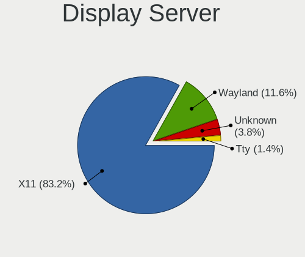

| Name    | Desktops | Percent |
|---------|----------|---------|
| X11     | 1121     | 87.24%  |
| Wayland | 90       | 7%      |
| Unknown | 54       | 4.2%    |
| Tty     | 20       | 1.56%   |

Display Manager
---------------

SDDM, LightDM, etc.

| Name    | Desktops | Percent |
|---------|----------|---------|
| Unknown | 373      | 28.21%  |
| KDM     | 366      | 27.69%  |
| SDDM    | 301      | 22.77%  |
| GDM     | 113      | 8.55%   |
| TDM     | 91       | 6.88%   |
| LightDM | 47       | 3.56%   |
| GDM3    | 13       | 0.98%   |
| MDM     | 6        | 0.45%   |
| XDM     | 4        | 0.3%    |
| SLiM    | 4        | 0.3%    |
| Ly      | 2        | 0.15%   |
| NODM    | 1        | 0.08%   |
| LXDM    | 1        | 0.08%   |

OS Lang
-------

Language

| Lang           | Desktops | Percent |
|----------------|----------|---------|
| Unknown        | 595      | 45.66%  |
| ru_RU          | 213      | 16.35%  |
| ru_UA          | 186      | 14.27%  |
| en_US          | 184      | 14.12%  |
| uk_UA          | 94       | 7.21%   |
| C              | 15       | 1.15%   |
| pl_PL          | 4        | 0.31%   |
| en_GB          | 4        | 0.31%   |
| es_ES          | 2        | 0.15%   |
| ru_RU.UTF_8    | 1        | 0.08%   |
| POSIX          | 1        | 0.08%   |
| hu_HU          | 1        | 0.08%   |
| en_US.US-ASCII | 1        | 0.08%   |
| en_CA          | 1        | 0.08%   |
| C.UTF8         | 1        | 0.08%   |

Boot Mode
---------

EFI or BIOS

| Mode | Desktops | Percent |
|------|----------|---------|
| BIOS | 940      | 73.96%  |
| EFI  | 331      | 26.04%  |

Filesystem
----------

Type of filesystem

| Type    | Desktops | Percent |
|---------|----------|---------|
| Ext4    | 795      | 61.11%  |
| Unknown | 334      | 25.67%  |
| Overlay | 81       | 6.23%   |
| Btrfs   | 58       | 4.46%   |
| Xfs     | 10       | 0.77%   |
| Ext2    | 9        | 0.69%   |
| Zfs     | 7        | 0.54%   |
| Ext3    | 4        | 0.31%   |
| Tmpfs   | 1        | 0.08%   |
| SAMSUNG | 1        | 0.08%   |
| Aufs    | 1        | 0.08%   |

Part. scheme
------------

Scheme of partitioning

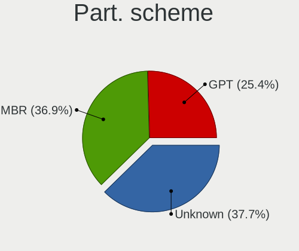

| Type    | Desktops | Percent |
|---------|----------|---------|
| Unknown | 518      | 39.42%  |
| MBR     | 502      | 38.2%   |
| GPT     | 294      | 22.37%  |

Dual Boot with Linux/BSD
------------------------

Hosting more than one Linux/BSD

| Dual boot | Desktops | Percent |
|-----------|----------|---------|
| No        | 1049     | 81.76%  |
| Yes       | 234      | 18.24%  |

Dual Boot (Win)
---------------

Hosting Linux and Windows

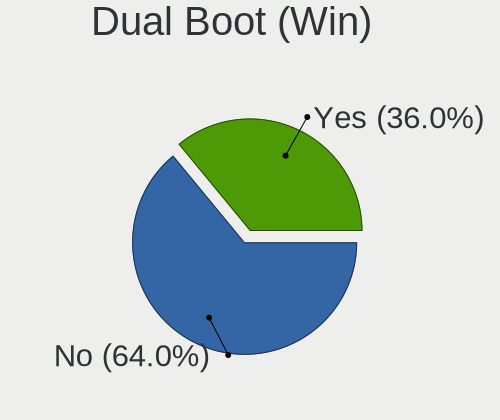

| Dual boot | Desktops | Percent |
|-----------|----------|---------|
| No        | 838      | 64.41%  |
| Yes       | 463      | 35.59%  |

Board
-----

Vendor
------

Motherboard manufacturer

| Name                | Desktops | Percent |
|---------------------|----------|---------|
| ASUSTek Computer    | 483      | 38.64%  |
| Gigabyte Technology | 214      | 17.12%  |
| ASRock              | 169      | 13.52%  |
| MSI                 | 135      | 10.8%   |
| Biostar             | 49       | 3.92%   |
| Hewlett-Packard     | 30       | 2.4%    |
| Intel               | 26       | 2.08%   |
| Dell                | 26       | 2.08%   |
| Unknown             | 17       | 1.36%   |
| Lenovo              | 16       | 1.28%   |
| ECS                 | 16       | 1.28%   |
| Acer                | 11       | 0.88%   |
| Fujitsu             | 9        | 0.72%   |
| Foxconn             | 9        | 0.72%   |
| Huanan              | 7        | 0.56%   |
| Pegatron            | 4        | 0.32%   |
| WinFast             | 3        | 0.24%   |
| Nvidia              | 3        | 0.24%   |
| Fujitsu Siemens     | 3        | 0.24%   |
| ZOTAC               | 2        | 0.16%   |
| Supermicro          | 2        | 0.16%   |
| Colorful Technology | 2        | 0.16%   |
| VIA Technologies    | 1        | 0.08%   |
| TYAN Computer       | 1        | 0.08%   |
| Seco                | 1        | 0.08%   |
| Sapphire            | 1        | 0.08%   |
| Packard Bell        | 1        | 0.08%   |
| NF-M2SV             | 1        | 0.08%   |
| Medion              | 1        | 0.08%   |
| Koloe               | 1        | 0.08%   |
| Jingsha/Kllisre     | 1        | 0.08%   |
| IBM                 | 1        | 0.08%   |
| Hardkernel          | 1        | 0.08%   |
| Compaq              | 1        | 0.08%   |
| ABIT                | 1        | 0.08%   |
| 3Q                  | 1        | 0.08%   |

Model
-----

Motherboard model

| Name                       | Desktops | Percent |
|----------------------------|----------|---------|
| ASUS All Series            | 24       | 1.92%   |
| Unknown                    | 17       | 1.36%   |
| ASUS M5A78L-M LX3          | 12       | 0.96%   |
| ASRock N68C-S UCC          | 12       | 0.96%   |
| ASUS M5A97 R2.0            | 9        | 0.72%   |
| Gigabyte G41M-Combo        | 7        | 0.56%   |
| ECS H61H2-M6               | 6        | 0.48%   |
| ASUS P5Q                   | 6        | 0.48%   |
| ASUS P5GC-MX/1333          | 6        | 0.48%   |
| MSI MS-7B86                | 5        | 0.4%    |
| MSI MS-7817                | 5        | 0.4%    |
| MSI MS-7788                | 5        | 0.4%    |
| Gigabyte B450M DS3H        | 5        | 0.4%    |
| Gigabyte 945GCMX-S2        | 5        | 0.4%    |
| ASUS PRIME B350-PLUS       | 5        | 0.4%    |
| ASUS P8H61-MX              | 5        | 0.4%    |
| ASUS M5A78L-M/USB3         | 5        | 0.4%    |
| ASUS Impression            | 5        | 0.4%    |
| ASUS H110M-R               | 5        | 0.4%    |
| ASRock FM2A68M-DG3+        | 5        | 0.4%    |
| MSI MS-7C52                | 4        | 0.32%   |
| MSI MS-7895                | 4        | 0.32%   |
| MSI MS-7721                | 4        | 0.32%   |
| MSI MS-7641                | 4        | 0.32%   |
| MSI MS-7592                | 4        | 0.32%   |
| Gigabyte H55M-S2V          | 4        | 0.32%   |
| Gigabyte F2A68HM-S1        | 4        | 0.32%   |
| Gigabyte B450M S2H         | 4        | 0.32%   |
| Gigabyte B450 AORUS ELITE  | 4        | 0.32%   |
| Gigabyte 970A-DS3P         | 4        | 0.32%   |
| Gigabyte 945GCM-S2L        | 4        | 0.32%   |
| ASUS TUF B450-PRO GAMING   | 4        | 0.32%   |
| ASUS PRIME B450M-A         | 4        | 0.32%   |
| ASUS PRIME A320M-K         | 4        | 0.32%   |
| ASUS P8B75-V               | 4        | 0.32%   |
| ASUS P5Q SE                | 4        | 0.32%   |
| ASUS P5P43TD               | 4        | 0.32%   |
| ASUS P5K SE/EPU            | 4        | 0.32%   |
| ASUS M4A77TD               | 4        | 0.32%   |
| ASUS M2A-VM                | 4        | 0.32%   |
| ASRock P4i65G              | 4        | 0.32%   |
| ASRock N68-VS3 UCC         | 4        | 0.32%   |
| ASRock H61M-VG3            | 4        | 0.32%   |
| MSI MS-7C02                | 3        | 0.24%   |
| MSI MS-7693                | 3        | 0.24%   |
| MSI MS-7680                | 3        | 0.24%   |
| MSI MS-7599                | 3        | 0.24%   |
| HP Z420 Workstation        | 3        | 0.24%   |
| Gigabyte H57M-USB3         | 3        | 0.24%   |
| Gigabyte GA-MA74GM-S2H     | 3        | 0.24%   |
| Gigabyte A320M-H           | 3        | 0.24%   |
| Dell OptiPlex 780          | 3        | 0.24%   |
| Dell OptiPlex 380          | 3        | 0.24%   |
| Biostar NF61S-M2A          | 3        | 0.24%   |
| Biostar N68S3B             | 3        | 0.24%   |
| Biostar G31D-M7            | 3        | 0.24%   |
| ASUS SABERTOOTH 990FX R2.0 | 3        | 0.24%   |
| ASUS PrimePC Solo30        | 3        | 0.24%   |
| ASUS PRIME Z390-P          | 3        | 0.24%   |
| ASUS PRIME H310M-R R2.0    | 3        | 0.24%   |

Model Family
------------

Motherboard model prefix

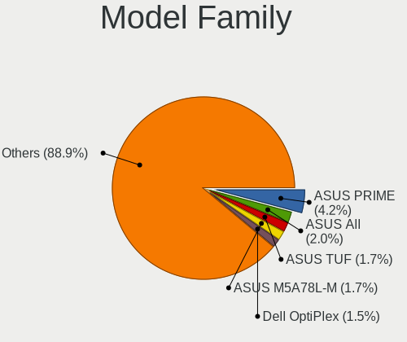

| Name                 | Desktops | Percent |
|----------------------|----------|---------|
| ASUS PRIME           | 48       | 3.84%   |
| ASUS M5A78L-M        | 24       | 1.92%   |
| ASUS All             | 24       | 1.92%   |
| Dell OptiPlex        | 20       | 1.6%    |
| ASUS M5A97           | 18       | 1.44%   |
| Unknown              | 17       | 1.36%   |
| ASUS TUF             | 16       | 1.28%   |
| HP Compaq            | 15       | 1.2%    |
| Gigabyte B450M       | 14       | 1.12%   |
| ASUS ROG             | 13       | 1.04%   |
| ASUS P8H61-M         | 12       | 0.96%   |
| ASUS P5Q             | 12       | 0.96%   |
| ASRock N68C-S        | 12       | 0.96%   |
| ASUS P8Z68-V         | 11       | 0.88%   |
| ASUS P5K             | 11       | 0.88%   |
| Lenovo ThinkCentre   | 9        | 0.72%   |
| ASUS P8Z77-V         | 8        | 0.64%   |
| ASUS P5G41T-M        | 8        | 0.64%   |
| Gigabyte G41M-Combo  | 7        | 0.56%   |
| Gigabyte B450        | 7        | 0.56%   |
| ASUS P5GC-MX         | 7        | 0.56%   |
| ASUS M2N-MX          | 7        | 0.56%   |
| Intel X79            | 6        | 0.48%   |
| Fujitsu ESPRIMO      | 6        | 0.48%   |
| ECS H61H2-M6         | 6        | 0.48%   |
| ASUS P8H61-MX        | 6        | 0.48%   |
| ASUS P5KPL-AM        | 6        | 0.48%   |
| Acer Aspire          | 6        | 0.48%   |
| MSI MS-7B86          | 5        | 0.4%    |
| MSI MS-7817          | 5        | 0.4%    |
| MSI MS-7788          | 5        | 0.4%    |
| Gigabyte 970A-DS3P   | 5        | 0.4%    |
| Gigabyte 945GCMX-S2  | 5        | 0.4%    |
| ASUS P8B75-M         | 5        | 0.4%    |
| ASUS M5A78L          | 5        | 0.4%    |
| ASUS M4A77TD         | 5        | 0.4%    |
| ASUS Impression      | 5        | 0.4%    |
| ASUS H110M-R         | 5        | 0.4%    |
| ASUS F1A55-M         | 5        | 0.4%    |
| ASRock X570          | 5        | 0.4%    |
| ASRock N68C-GS       | 5        | 0.4%    |
| ASRock FM2A68M-DG3+  | 5        | 0.4%    |
| MSI MS-7C52          | 4        | 0.32%   |
| MSI MS-7895          | 4        | 0.32%   |
| MSI MS-7721          | 4        | 0.32%   |
| MSI MS-7641          | 4        | 0.32%   |
| MSI MS-7592          | 4        | 0.32%   |
| Intel E5             | 4        | 0.32%   |
| Huanan X79           | 4        | 0.32%   |
| Gigabyte X570        | 4        | 0.32%   |
| Gigabyte H55M-S2V    | 4        | 0.32%   |
| Gigabyte GA-78LMT-S2 | 4        | 0.32%   |
| Gigabyte F2A68HM-S1  | 4        | 0.32%   |
| Gigabyte 945GCM-S2L  | 4        | 0.32%   |
| ASUS SABERTOOTH      | 4        | 0.32%   |
| ASUS PrimePC         | 4        | 0.32%   |
| ASUS P8B75-V         | 4        | 0.32%   |
| ASUS P7P55D          | 4        | 0.32%   |
| ASUS P7H55-M         | 4        | 0.32%   |
| ASUS P5P43TD         | 4        | 0.32%   |

MFG Year
--------

Motherboard manufacture year

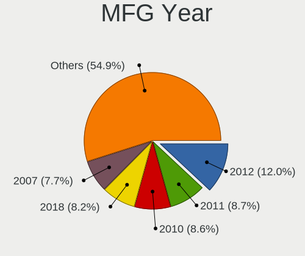

| Year    | Desktops | Percent |
|---------|----------|---------|
| 2012    | 150      | 12%     |
| 2010    | 117      | 9.36%   |
| 2011    | 114      | 9.12%   |
| 2018    | 104      | 8.32%   |
| 2007    | 99       | 7.92%   |
| 2009    | 93       | 7.44%   |
| 2008    | 73       | 5.84%   |
| 2013    | 68       | 5.44%   |
| 2017    | 66       | 5.28%   |
| 2006    | 63       | 5.04%   |
| 2014    | 59       | 4.72%   |
| 2016    | 56       | 4.48%   |
| 2015    | 46       | 3.68%   |
| 2019    | 45       | 3.6%    |
| 2020    | 39       | 3.12%   |
| 2005    | 31       | 2.48%   |
| 2021    | 15       | 1.2%    |
| 2004    | 5        | 0.4%    |
| 2003    | 3        | 0.24%   |
| 2002    | 2        | 0.16%   |
| 2022    | 1        | 0.08%   |
| Unknown | 1        | 0.08%   |

Form Factor
-----------

Physical design of the computer

| Name    | Desktops | Percent |
|---------|----------|---------|
| Desktop | 1250     | 100%    |

Secure Boot
-----------

Enabled or disabled

| State    | Desktops | Percent |
|----------|----------|---------|
| Disabled | 1243     | 99.36%  |
| Enabled  | 8        | 0.64%   |

Coreboot
--------

Have coreboot on board

| Used | Desktops | Percent |
|------|----------|---------|
| No   | 1250     | 100%    |

RAM Size
--------

Total RAM memory

| Size in GB      | Desktops | Percent |
|-----------------|----------|---------|
| 3.01-4.0        | 318      | 24.59%  |
| 8.01-16.0       | 279      | 21.58%  |
| 4.01-8.0        | 205      | 15.85%  |
| 16.01-24.0      | 195      | 15.08%  |
| 1.01-2.0        | 106      | 8.2%    |
| 32.01-64.0      | 71       | 5.49%   |
| 2.01-3.0        | 57       | 4.41%   |
| 0.51-1.0        | 28       | 2.17%   |
| 24.01-32.0      | 17       | 1.31%   |
| 64.01-256.0     | 15       | 1.16%   |
| More than 256.0 | 1        | 0.08%   |
| 0.01-0.5        | 1        | 0.08%   |

RAM Used
--------

Used RAM memory

| Used GB    | Desktops | Percent |
|------------|----------|---------|
| 1.01-2.0   | 528      | 37.47%  |
| 0.51-1.0   | 331      | 23.49%  |
| 2.01-3.0   | 225      | 15.97%  |
| 4.01-8.0   | 131      | 9.3%    |
| 3.01-4.0   | 109      | 7.74%   |
| 8.01-16.0  | 42       | 2.98%   |
| 0.01-0.5   | 36       | 2.56%   |
| 16.01-24.0 | 5        | 0.35%   |
| 24.01-32.0 | 2        | 0.14%   |

Total Drives
------------

Number of drives on board

| Drives | Desktops | Percent |
|--------|----------|---------|
| 1      | 623      | 47.52%  |
| 2      | 397      | 30.28%  |
| 3      | 179      | 13.65%  |
| 4      | 52       | 3.97%   |
| 5      | 30       | 2.29%   |
| 0      | 17       | 1.3%    |
| 6      | 8        | 0.61%   |
| 7      | 3        | 0.23%   |
| 8      | 2        | 0.15%   |

Has CD-ROM
----------

Has CD-ROM on board

| Presented | Desktops | Percent |
|-----------|----------|---------|
| No        | 725      | 57%     |
| Yes       | 547      | 43%     |

Has Ethernet
------------

Has Ethernet on board

| Presented | Desktops | Percent |
|-----------|----------|---------|
| Yes       | 1226     | 98.08%  |
| No        | 24       | 1.92%   |

Has WiFi
--------

Has WiFi module

| Presented | Desktops | Percent |
|-----------|----------|---------|
| No        | 961      | 75.79%  |
| Yes       | 307      | 24.21%  |

Has Bluetooth
-------------

Has Bluetooth module

| Presented | Desktops | Percent |
|-----------|----------|---------|
| No        | 1095     | 86.02%  |
| Yes       | 178      | 13.98%  |

Location
--------

Country
-------

Geographic location (country)

| Country | Desktops | Percent |
|---------|----------|---------|
| Ukraine | 1250     | 100%    |

City
----

Geographic location (city)

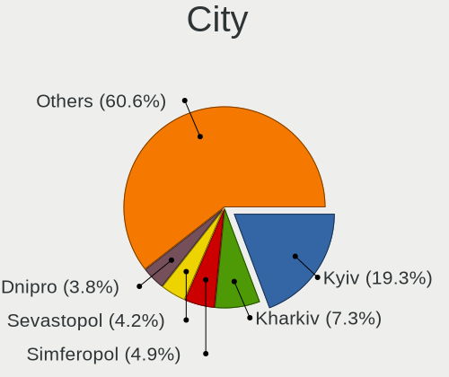

| City            | Desktops | Percent |
|-----------------|----------|---------|
| Kyiv            | 249      | 19.17%  |
| Kharkiv         | 98       | 7.54%   |
| Simferopol      | 56       | 4.31%   |
| Dnipro          | 54       | 4.16%   |
| Odessa          | 51       | 3.93%   |
| Sevastopol      | 49       | 3.77%   |
| Lviv            | 44       | 3.39%   |
| Donetsk         | 39       | 3%      |
| Mykolayiv       | 21       | 1.62%   |
| Zaporizhzhia    | 19       | 1.46%   |
| Mariupol        | 19       | 1.46%   |
| Kryvyi Rih      | 17       | 1.31%   |
| Zaporizhzhya    | 15       | 1.15%   |
| Novopskov       | 14       | 1.08%   |
| Kherson         | 14       | 1.08%   |
| Yasinovataya    | 13       | 1%      |
| Poltava         | 13       | 1%      |
| Luhansk         | 13       | 1%      |
| Horlivka        | 13       | 1%      |
| Lutsk           | 12       | 0.92%   |
| Uzhhorod        | 11       | 0.85%   |
| Bucha           | 11       | 0.85%   |
| Vinnytsia       | 10       | 0.77%   |
| Bila Tserkva    | 10       | 0.77%   |
| Makiivka        | 9        | 0.69%   |
| Kramatorsk      | 9        | 0.69%   |
| Chernihiv       | 9        | 0.69%   |
| Zhytomyr        | 8        | 0.62%   |
| Kremenchug      | 8        | 0.62%   |
| Chernivtsi      | 8        | 0.62%   |
| Cherkasy        | 8        | 0.62%   |
| Samsonove       | 7        | 0.54%   |
| Nova Kakhovka   | 7        | 0.54%   |
| Kerch           | 7        | 0.54%   |
| Vasylkiv        | 6        | 0.46%   |
| Syeverodonets'k | 6        | 0.46%   |
| Rivne           | 6        | 0.46%   |
| Khartsyzsk      | 6        | 0.46%   |
| Chystyakove     | 6        | 0.46%   |
| Brovary         | 6        | 0.46%   |
| Antratsit       | 6        | 0.46%   |
| Yevpatoriya     | 5        | 0.38%   |
| Ternopil        | 5        | 0.38%   |
| Kropyvnytskyi   | 5        | 0.38%   |
| Khmelnytskyi    | 5        | 0.38%   |
| Ivano-Frankivsk | 5        | 0.38%   |
| Feodosiya       | 5        | 0.38%   |
| Artemivs'k      | 5        | 0.38%   |
| Uman            | 4        | 0.31%   |
| Sumy            | 4        | 0.31%   |
| Rovenki         | 4        | 0.31%   |
| Pervomaysk      | 4        | 0.31%   |
| Pavlohrad       | 4        | 0.31%   |
| Novomoskovsk    | 4        | 0.31%   |
| Netishyn        | 4        | 0.31%   |
| Mykytyn Rog     | 4        | 0.31%   |
| Mala Danylivka  | 4        | 0.31%   |
| Kyzyl-Yar       | 4        | 0.31%   |
| Kostyantynivka  | 4        | 0.31%   |
| Kamianske       | 4        | 0.31%   |

Drives
------

Drive Vendor
------------

Hard drive vendors

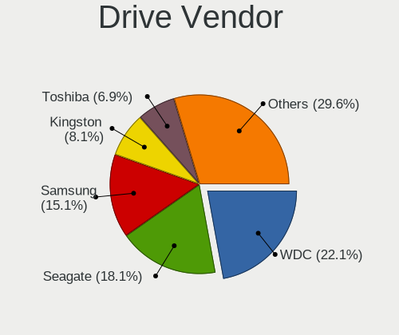

| Vendor                    | Desktops | Drives | Percent |
|---------------------------|----------|--------|---------|
| WDC                       | 468      | 730    | 22.93%  |
| Seagate                   | 387      | 563    | 18.96%  |
| Samsung Electronics       | 314      | 463    | 15.38%  |
| Kingston                  | 167      | 225    | 8.18%   |
| Toshiba                   | 138      | 174    | 6.76%   |
| Hitachi                   | 126      | 158    | 6.17%   |
| GOODRAM                   | 51       | 62     | 2.5%    |
| Patriot                   | 38       | 43     | 1.86%   |
| HGST                      | 27       | 45     | 1.32%   |
| Apacer                    | 24       | 25     | 1.18%   |
| A-DATA Technology         | 24       | 34     | 1.18%   |
| Team                      | 23       | 34     | 1.13%   |
| Crucial                   | 23       | 27     | 1.13%   |
| Maxtor                    | 20       | 23     | 0.98%   |
| SPCC                      | 18       | 20     | 0.88%   |
| SanDisk                   | 16       | 16     | 0.78%   |
| China                     | 16       | 18     | 0.78%   |
| Transcend                 | 14       | 23     | 0.69%   |
| Intel                     | 13       | 15     | 0.64%   |
| Silicon Motion            | 12       | 16     | 0.59%   |
| AMD                       | 11       | 32     | 0.54%   |
| Leven                     | 10       | 12     | 0.49%   |
| KingDian                  | 10       | 14     | 0.49%   |
| Unknown                   | 8        | 11     | 0.39%   |
| OCZ                       | 8        | 8      | 0.39%   |
| Plextor                   | 6        | 6      | 0.29%   |
| KingSpec                  | 5        | 5      | 0.24%   |
| Fujitsu                   | 5        | 5      | 0.24%   |
| Smartbuy                  | 4        | 5      | 0.2%    |
| Phison                    | 4        | 5      | 0.2%    |
| XPG                       | 3        | 3      | 0.15%   |
| JMicron Technology        | 3        | 7      | 0.15%   |
| HUAWEI                    | 3        | 3      | 0.15%   |
| Corsair                   | 3        | 3      | 0.15%   |
| Verbatim                  | 2        | 2      | 0.1%    |
| SK hynix                  | 2        | 2      | 0.1%    |
| Micron Technology         | 2        | 3      | 0.1%    |
| LITEONIT                  | 2        | 3      | 0.1%    |
| Indilinx                  | 2        | 2      | 0.1%    |
| CHN25SATAS1               | 2        | 6      | 0.1%    |
| ASMedia                   | 2        | 2      | 0.1%    |
| Zheino                    | 1        | 1      | 0.05%   |
| WALRAM                    | 1        | 1      | 0.05%   |
| TPH00100500GB             | 1        | 1      | 0.05%   |
| Super Talent              | 1        | 1      | 0.05%   |
| Reeinno                   | 1        | 1      | 0.05%   |
| PNY                       | 1        | 1      | 0.05%   |
| Pioneer                   | 1        | 1      | 0.05%   |
| Palit                     | 1        | 2      | 0.05%   |
| ORICO                     | 1        | 1      | 0.05%   |
| Micron/Crucial Technology | 1        | 3      | 0.05%   |
| KIOXIA-EXCERIA            | 1        | 2      | 0.05%   |
| Kingston Technologies     | 1        | 1      | 0.05%   |
| JIAWEI                    | 1        | 1      | 0.05%   |
| Intenso                   | 1        | 2      | 0.05%   |
| i-FlashDisk               | 1        | 1      | 0.05%   |
| Golden-Memory             | 1        | 1      | 0.05%   |
| GLOWAY                    | 1        | 1      | 0.05%   |
| Gigabyte Technology       | 1        | 1      | 0.05%   |
| GeIL                      | 1        | 1      | 0.05%   |

Drive Model
-----------

Hard drive models

| Model                              | Desktops | Percent |
|------------------------------------|----------|---------|
| Toshiba DT01ACA100 1TB             | 37       | 1.61%   |
| Seagate ST500DM002-1BD142 500GB    | 32       | 1.4%    |
| Toshiba DT01ACA050 500GB           | 31       | 1.35%   |
| Kingston SA400S37240G 240GB SSD    | 28       | 1.22%   |
| Kingston SA400S37120G 120GB SSD    | 28       | 1.22%   |
| Samsung SSD 860 EVO 250GB          | 25       | 1.09%   |
| Toshiba HDWD110 1TB                | 23       | 1%      |
| Seagate ST3500418AS 500GB          | 21       | 0.92%   |
| WDC WD10EZEX-08WN4A0 1TB           | 19       | 0.83%   |
| Kingston SV300S37A120G 120GB SSD   | 17       | 0.74%   |
| Patriot Burst 240GB SSD            | 15       | 0.65%   |
| Samsung HD103SJ 1TB                | 14       | 0.61%   |
| Seagate ST31000524AS 1TB           | 13       | 0.57%   |
| Seagate ST1000DM003-1CH162 1TB     | 13       | 0.57%   |
| Seagate ST1000DM010-2EP102 1TB     | 12       | 0.52%   |
| Samsung SSD 860 EVO 500GB          | 12       | 0.52%   |
| WDC WD5000AAKX-001CA0 500GB        | 11       | 0.48%   |
| WDC WD5000AADS-00S9B0 500GB        | 11       | 0.48%   |
| Toshiba DT01ACA200 2TB             | 11       | 0.48%   |
| Seagate ST3320620AS 320GB          | 11       | 0.48%   |
| Seagate ST2000DM008-2FR102 2TB     | 11       | 0.48%   |
| Kingston SA400S37480G 480GB SSD    | 11       | 0.48%   |
| WDC WD10EZEX-22MFCA0 1TB           | 10       | 0.44%   |
| Seagate ST3250410AS 250GB          | 10       | 0.44%   |
| Seagate ST31000528AS 1TB           | 10       | 0.44%   |
| Samsung SSD 850 EVO 250GB          | 10       | 0.44%   |
| Samsung HD321KJ 320GB              | 10       | 0.44%   |
| Samsung HD161HJ 160GB              | 10       | 0.44%   |
| Patriot Burst 120GB SSD            | 10       | 0.44%   |
| Hitachi HDS721010CLA332 1TB        | 10       | 0.44%   |
| WDC WD5000AAKX-00ERMA0 500GB       | 9        | 0.39%   |
| WDC WD10EZEX-00WN4A0 1TB           | 9        | 0.39%   |
| Seagate ST3250318AS 250GB          | 9        | 0.39%   |
| Samsung HD502HJ 500GB              | 9        | 0.39%   |
| Samsung HD160JJ 160GB              | 9        | 0.39%   |
| Samsung HD080HJ 80GB               | 9        | 0.39%   |
| Hitachi HDS721616PLA380 160GB      | 9        | 0.39%   |
| Hitachi HDS721050CLA362 500GB      | 9        | 0.39%   |
| WDC WD10EZRZ-00HTKB0 1TB           | 8        | 0.35%   |
| Seagate ST380815AS 80GB            | 8        | 0.35%   |
| Seagate ST250DM000-1BD141 250GB    | 8        | 0.35%   |
| Samsung SP0411N 40GB               | 8        | 0.35%   |
| Samsung HD403LJ 400GB              | 8        | 0.35%   |
| Samsung HD322HJ 320GB              | 8        | 0.35%   |
| Kingston SHFS37A120G 120GB SSD     | 8        | 0.35%   |
| GOODRAM SSDPR-CX400-128 128GB      | 8        | 0.35%   |
| WDC WD5000AAKS-00UU3A0 500GB       | 7        | 0.31%   |
| WDC WD3200AAJS-00L7A0 320GB        | 7        | 0.31%   |
| Seagate ST3500312CS 500GB          | 7        | 0.31%   |
| Seagate ST2000VX008-2E3164 2TB     | 7        | 0.31%   |
| Seagate ST1000LM024 HN-M101MBB 1TB | 7        | 0.31%   |
| Seagate ST1000DM003-9YN162 1TB     | 7        | 0.31%   |
| Samsung SP2004C 200GB              | 7        | 0.31%   |
| Hitachi HDP725050GLA360 500GB      | 7        | 0.31%   |
| AMD R3SL120G 120GB SSD             | 7        | 0.31%   |
| WDC WD800BB-00JHC0 80GB            | 6        | 0.26%   |
| WDC WD5000LPVX-22V0TT0 500GB       | 6        | 0.26%   |
| WDC WD5000AZRX-00A8LB0 500GB       | 6        | 0.26%   |
| WDC WD20EFRX-68EUZN0 2TB           | 6        | 0.26%   |
| WDC WD2000FYYZ-01UL1B1 2TB         | 6        | 0.26%   |

HDD Vendor
----------

Hard disk drive vendors

| Vendor              | Desktops | Drives | Percent |
|---------------------|----------|--------|---------|
| WDC                 | 458      | 711    | 33.31%  |
| Seagate             | 385      | 561    | 28%     |
| Samsung Electronics | 205      | 297    | 14.91%  |
| Toshiba             | 137      | 171    | 9.96%   |
| Hitachi             | 126      | 158    | 9.16%   |
| HGST                | 27       | 45     | 1.96%   |
| Maxtor              | 20       | 23     | 1.45%   |
| Fujitsu             | 5        | 5      | 0.36%   |
| Unknown             | 3        | 4      | 0.22%   |
| ASMedia             | 2        | 2      | 0.15%   |
| TPH00100500GB       | 1        | 1      | 0.07%   |
| JMicron Technology  | 1        | 3      | 0.07%   |
| Ext Hard            | 1        | 1      | 0.07%   |
| Config              | 1        | 1      | 0.07%   |
| China               | 1        | 1      | 0.07%   |
| ASMT                | 1        | 4      | 0.07%   |
| Apple               | 1        | 1      | 0.07%   |

SSD Vendor
----------

Solid state drive vendors

| Vendor              | Desktops | Drives | Percent |
|---------------------|----------|--------|---------|
| Kingston            | 155      | 204    | 27.15%  |
| Samsung Electronics | 83       | 119    | 14.54%  |
| GOODRAM             | 48       | 58     | 8.41%   |
| Patriot             | 38       | 43     | 6.65%   |
| Crucial             | 23       | 27     | 4.03%   |
| Team                | 22       | 30     | 3.85%   |
| Apacer              | 22       | 23     | 3.85%   |
| A-DATA Technology   | 19       | 29     | 3.33%   |
| SPCC                | 17       | 19     | 2.98%   |
| China               | 15       | 17     | 2.63%   |
| SanDisk             | 13       | 13     | 2.28%   |
| WDC                 | 12       | 13     | 2.1%    |
| Transcend           | 11       | 17     | 1.93%   |
| Intel               | 11       | 13     | 1.93%   |
| KingDian            | 10       | 14     | 1.75%   |
| AMD                 | 10       | 31     | 1.75%   |
| Leven               | 9        | 11     | 1.58%   |
| OCZ                 | 8        | 8      | 1.4%    |
| Plextor             | 5        | 5      | 0.88%   |
| KingSpec            | 5        | 5      | 0.88%   |
| Smartbuy            | 4        | 5      | 0.7%    |
| Toshiba             | 3        | 3      | 0.53%   |
| Corsair             | 3        | 3      | 0.53%   |
| Verbatim            | 2        | 2      | 0.35%   |
| LITEONIT            | 2        | 3      | 0.35%   |
| CHN25SATAS1         | 2        | 6      | 0.35%   |
| Zheino              | 1        | 1      | 0.18%   |
| WALRAM              | 1        | 1      | 0.18%   |
| Super Talent        | 1        | 1      | 0.18%   |
| Reeinno             | 1        | 1      | 0.18%   |
| PNY                 | 1        | 1      | 0.18%   |
| Pioneer             | 1        | 1      | 0.18%   |
| Palit               | 1        | 2      | 0.18%   |
| Micron Technology   | 1        | 1      | 0.18%   |
| KIOXIA-EXCERIA      | 1        | 2      | 0.18%   |
| JMicron Technology  | 1        | 1      | 0.18%   |
| JIAWEI              | 1        | 1      | 0.18%   |
| Intenso             | 1        | 2      | 0.18%   |
| i-FlashDisk         | 1        | 1      | 0.18%   |
| Golden-Memory       | 1        | 1      | 0.18%   |
| GLOWAY              | 1        | 1      | 0.18%   |
| Gigabyte Technology | 1        | 1      | 0.18%   |
| GeIL                | 1        | 1      | 0.18%   |
| FASTDISK            | 1        | 1      | 0.18%   |
| DeTech              | 1        | 1      | 0.18%   |

Drive Kind
----------

HDD or SSD

| Kind    | Desktops | Drives | Percent |
|---------|----------|--------|---------|
| HDD     | 1053     | 1989   | 63.36%  |
| SSD     | 502      | 743    | 30.2%   |
| NVMe    | 94       | 138    | 5.66%   |
| Unknown | 11       | 14     | 0.66%   |
| MMC     | 2        | 2      | 0.12%   |

Drive Connector
---------------

SATA, SAS, NVMe, etc.

| Type | Desktops | Drives | Percent |
|------|----------|--------|---------|
| SATA | 1215     | 2715   | 91.15%  |
| NVMe | 94       | 138    | 7.05%   |
| SAS  | 22       | 31     | 1.65%   |
| MMC  | 2        | 2      | 0.15%   |

Drive Size
----------

Size of hard drive

| Size in TB | Desktops | Drives | Percent |
|------------|----------|--------|---------|
| 0.01-0.5   | 1039     | 1877   | 64.61%  |
| 0.51-1.0   | 402      | 601    | 25%     |
| 1.01-2.0   | 104      | 153    | 6.47%   |
| 2.01-3.0   | 30       | 50     | 1.87%   |
| 3.01-4.0   | 21       | 37     | 1.31%   |
| 4.01-10.0  | 11       | 13     | 0.68%   |
| 10.01-20.0 | 1        | 1      | 0.06%   |

Space Total
-----------

Amount of disk space available on the file system

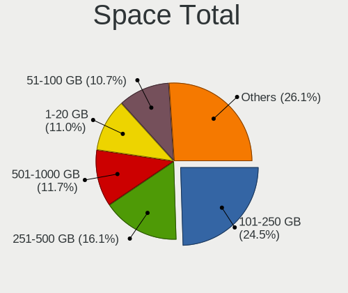

| Size in GB     | Desktops | Percent |
|----------------|----------|---------|
| 101-250        | 329      | 24.05%  |
| 251-500        | 220      | 16.08%  |
| 501-1000       | 158      | 11.55%  |
| 1-20           | 155      | 11.33%  |
| 51-100         | 152      | 11.11%  |
| 1001-2000      | 125      | 9.14%   |
| 21-50          | 116      | 8.48%   |
| More than 3000 | 44       | 3.22%   |
| 2001-3000      | 42       | 3.07%   |
| Unknown        | 27       | 1.97%   |

Space Used
----------

Amount of used disk space

| Used GB        | Desktops | Percent |
|----------------|----------|---------|
| 1-20           | 632      | 45.86%  |
| 101-250        | 171      | 12.41%  |
| 21-50          | 169      | 12.26%  |
| 51-100         | 114      | 8.27%   |
| 251-500        | 94       | 6.82%   |
| 501-1000       | 88       | 6.39%   |
| 1001-2000      | 49       | 3.56%   |
| Unknown        | 27       | 1.96%   |
| More than 3000 | 19       | 1.38%   |
| 2001-3000      | 15       | 1.09%   |

Malfunc. Drives
---------------

Drive models with a malfunction

| Model                             | Desktops | Drives | Percent |
|-----------------------------------|----------|--------|---------|
| Seagate ST500DM002-1BD142 500GB   | 11       | 13     | 2.22%   |
| Seagate ST3500418AS 500GB         | 9        | 10     | 1.82%   |
| Samsung Electronics HD321KJ 320GB | 8        | 11     | 1.62%   |
| WDC WD5000AADS-00S9B0 500GB       | 7        | 7      | 1.41%   |
| Seagate ST31000524AS 1TB          | 7        | 9      | 1.41%   |
| Seagate ST3250318AS 250GB         | 6        | 8      | 1.21%   |
| Samsung Electronics HD080HJ 80GB  | 6        | 6      | 1.21%   |
| WDC WD5000AAKX-001CA0 500GB       | 5        | 5      | 1.01%   |
| WDC WD10EZEX-60ZF5A0 1TB          | 5        | 6      | 1.01%   |
| Toshiba DT01ACA050 500GB          | 5        | 6      | 1.01%   |
| Seagate ST3320620AS 320GB         | 5        | 7      | 1.01%   |
| Seagate ST3160811AS 160GB         | 5        | 5      | 1.01%   |
| Samsung Electronics SP2514N 250GB | 5        | 6      | 1.01%   |
| Samsung Electronics SP2504C 250GB | 5        | 6      | 1.01%   |
| Samsung Electronics HD403LJ 400GB | 5        | 6      | 1.01%   |
| Samsung Electronics HD103SJ 1TB   | 5        | 7      | 1.01%   |
| Maxtor STM3250820AS 250GB         | 5        | 6      | 1.01%   |
| Toshiba DT01ACA100 1TB            | 4        | 6      | 0.81%   |
| Seagate ST3250410AS 250GB         | 4        | 7      | 0.81%   |
| Seagate ST3250310AS 250GB         | 4        | 5      | 0.81%   |
| Seagate ST1000DM003-1CH162 1TB    | 4        | 6      | 0.81%   |
| Samsung Electronics SP2004C 200GB | 4        | 4      | 0.81%   |
| Samsung Electronics SP0802N 80GB  | 4        | 4      | 0.81%   |
| Samsung Electronics HD322HJ 320GB | 4        | 4      | 0.81%   |
| Samsung Electronics HD200HJ 200GB | 4        | 5      | 0.81%   |
| Samsung Electronics HD160JJ 160GB | 4        | 6      | 0.81%   |
| Hitachi HDT725025VLA380 250GB     | 4        | 4      | 0.81%   |
| Hitachi HDS721616PLA380 160GB     | 4        | 4      | 0.81%   |
| Hitachi HDS721010DLE630 1TB       | 4        | 5      | 0.81%   |
| Hitachi HDP725025GLA380 250GB     | 4        | 5      | 0.81%   |
| WDC WD5000AAKX-00ERMA0 500GB      | 3        | 4      | 0.61%   |
| WDC WD5000AAKS-00V1A0 500GB       | 3        | 4      | 0.61%   |
| WDC WD5000AAKS-00UU3A0 500GB      | 3        | 3      | 0.61%   |
| WDC WD3200AAJS-00L7A0 320GB       | 3        | 3      | 0.61%   |
| Seagate ST9500325AS 500GB         | 3        | 3      | 0.61%   |
| Seagate ST380815AS 80GB           | 3        | 4      | 0.61%   |
| Seagate ST3500320AS 500GB         | 3        | 4      | 0.61%   |
| Seagate ST3320613AS 320GB         | 3        | 6      | 0.61%   |
| Samsung Electronics SP0842N 80GB  | 3        | 6      | 0.61%   |
| Samsung Electronics HD161HJ 160GB | 3        | 3      | 0.61%   |
| Samsung Electronics HD160HJ 160GB | 3        | 3      | 0.61%   |
| Samsung Electronics HD103UJ 1TB   | 3        | 3      | 0.61%   |
| Patriot Blast 240GB SSD           | 3        | 3      | 0.61%   |
| Hitachi HTS545050B9A300 500GB     | 3        | 4      | 0.61%   |
| Hitachi HTS542512K9A300 120GB     | 3        | 4      | 0.61%   |
| Hitachi HDS721680PLA380 80GB      | 3        | 3      | 0.61%   |
| WDC WD800BB-00JHC0 80GB           | 2        | 2      | 0.4%    |
| WDC WD6400AADS-00M2B0 640GB       | 2        | 4      | 0.4%    |
| WDC WD5000AAKS-60WWPA0 500GB      | 2        | 3      | 0.4%    |
| WDC WD5000AAKS-00A7B2 500GB       | 2        | 2      | 0.4%    |
| WDC WD3200AAJS-00B4A0 320GB       | 2        | 2      | 0.4%    |
| WDC WD2500JS-00NCB1 250GB         | 2        | 2      | 0.4%    |
| WDC WD2500AAKS-00L9A0 250GB       | 2        | 4      | 0.4%    |
| WDC WD2500AAKS-00B3A0 250GB       | 2        | 3      | 0.4%    |
| WDC WD2500AAJS-00VTA0 250GB       | 2        | 4      | 0.4%    |
| WDC WD15EARS-00Z5B1 1TB           | 2        | 2      | 0.4%    |
| WDC WD10EZEX-00RKKA0 1TB          | 2        | 2      | 0.4%    |
| Toshiba MK5065GSX 500GB           | 2        | 2      | 0.4%    |
| Toshiba HDWD110 1TB               | 2        | 3      | 0.4%    |
| Toshiba DT01ACA200 2TB            | 2        | 2      | 0.4%    |

Malfunc. Drive Vendor
---------------------

Vendors of faulty drives

| Vendor              | Desktops | Drives | Percent |
|---------------------|----------|--------|---------|
| Seagate             | 128      | 163    | 26.67%  |
| WDC                 | 122      | 148    | 25.42%  |
| Samsung Electronics | 103      | 124    | 21.46%  |
| Hitachi             | 55       | 70     | 11.46%  |
| Toshiba             | 22       | 26     | 4.58%   |
| Kingston            | 12       | 16     | 2.5%    |
| Maxtor              | 11       | 13     | 2.29%   |
| Intel               | 4        | 4      | 0.83%   |
| Patriot             | 3        | 3      | 0.63%   |
| A-DATA Technology   | 3        | 4      | 0.63%   |
| SPCC                | 2        | 3      | 0.42%   |
| SanDisk             | 2        | 2      | 0.42%   |
| Fujitsu             | 2        | 2      | 0.42%   |
| Transcend           | 1        | 1      | 0.21%   |
| TPH00100500GB       | 1        | 1      | 0.21%   |
| OCZ                 | 1        | 1      | 0.21%   |
| Micron Technology   | 1        | 1      | 0.21%   |
| JMicron Technology  | 1        | 1      | 0.21%   |
| JIAWEI              | 1        | 1      | 0.21%   |
| HGST                | 1        | 1      | 0.21%   |
| Goodram             | 1        | 1      | 0.21%   |
| Crucial             | 1        | 1      | 0.21%   |
| Corsair             | 1        | 1      | 0.21%   |
| Apple               | 1        | 1      | 0.21%   |

Malfunc. HDD Vendor
-------------------

Vendors of faulty HDD drives

| Vendor              | Desktops | Drives | Percent |
|---------------------|----------|--------|---------|
| Seagate             | 128      | 163    | 28.89%  |
| WDC                 | 122      | 148    | 27.54%  |
| Samsung Electronics | 100      | 121    | 22.57%  |
| Hitachi             | 55       | 70     | 12.42%  |
| Toshiba             | 22       | 26     | 4.97%   |
| Maxtor              | 11       | 13     | 2.48%   |
| Fujitsu             | 2        | 2      | 0.45%   |
| TPH00100500GB       | 1        | 1      | 0.23%   |
| HGST                | 1        | 1      | 0.23%   |
| Apple               | 1        | 1      | 0.23%   |

Malfunc. Drive Kind
-------------------

Kinds of faulty drives

| Kind | Desktops | Drives | Percent |
|------|----------|--------|---------|
| HDD  | 372      | 546    | 90.95%  |
| SSD  | 36       | 42     | 8.8%    |
| NVMe | 1        | 1      | 0.24%   |

Failed Drives
-------------

Failed drive models

| Model                             | Desktops | Drives | Percent |
|-----------------------------------|----------|--------|---------|
| WDC WD5000AAKS-00V1A0 500GB       | 1        | 2      | 5%      |
| WDC WD3200AAJS-60Z0A0 320GB       | 1        | 1      | 5%      |
| WDC WD2500JS-22NCB1 250GB         | 1        | 1      | 5%      |
| WDC WD1600AAJB-00WRA0 160GB       | 1        | 1      | 5%      |
| WDC WD1001FALS-00E8B0 1TB         | 1        | 1      | 5%      |
| Toshiba MK5065GSX 500GB           | 1        | 1      | 5%      |
| Seagate ST9250315AS 250GB         | 1        | 1      | 5%      |
| Seagate ST3750525AS 752GB         | 1        | 1      | 5%      |
| Seagate ST3500418AS 500GB         | 1        | 1      | 5%      |
| Seagate ST3500410AS 500GB         | 1        | 1      | 5%      |
| Seagate ST320DM001 HD322GJ 320GB  | 1        | 1      | 5%      |
| Seagate ST31000528AS 1TB          | 1        | 1      | 5%      |
| Seagate ST31000524AS 1TB          | 1        | 1      | 5%      |
| Seagate ST31000340NS 1TB          | 1        | 1      | 5%      |
| Samsung Electronics HM321HI 320GB | 1        | 1      | 5%      |
| Samsung Electronics HM251JI 250GB | 1        | 1      | 5%      |
| Samsung Electronics HD502HJ 500GB | 1        | 1      | 5%      |
| Samsung Electronics HD252HJ 250GB | 1        | 4      | 5%      |
| Hitachi HTS547575A9E384 752GB     | 1        | 1      | 5%      |
| Hitachi HDS721010DLE630 1TB       | 1        | 1      | 5%      |

Failed Drive Vendor
-------------------

Failed drive vendors

| Vendor              | Desktops | Drives | Percent |
|---------------------|----------|--------|---------|
| Seagate             | 8        | 8      | 40%     |
| WDC                 | 5        | 6      | 25%     |
| Samsung Electronics | 4        | 7      | 20%     |
| Hitachi             | 2        | 2      | 10%     |
| Toshiba             | 1        | 1      | 5%      |

Drive Status
------------

Number of failed and malfunc. drives

| Status   | Desktops | Drives | Percent |
|----------|----------|--------|---------|
| Works    | 658      | 1388   | 44.34%  |
| Detected | 409      | 885    | 27.56%  |
| Malfunc  | 397      | 589    | 26.75%  |
| Failed   | 20       | 24     | 1.35%   |

Storage controller
------------------

Storage Vendor
--------------

Storage controller vendors

| Vendor                           | Desktops | Percent |
|----------------------------------|----------|---------|
| Intel                            | 727      | 47.49%  |
| AMD                              | 386      | 25.21%  |
| Nvidia                           | 120      | 7.84%   |
| JMicron Technology               | 74       | 4.83%   |
| Marvell Technology Group         | 53       | 3.46%   |
| ASMedia Technology               | 40       | 2.61%   |
| Samsung Electronics              | 36       | 2.35%   |
| Silicon Motion                   | 18       | 1.18%   |
| VIA Technologies                 | 15       | 0.98%   |
| Kingston Technology Company      | 13       | 0.85%   |
| ADATA Technology                 | 8        | 0.52%   |
| SanDisk                          | 7        | 0.46%   |
| Phison Electronics               | 7        | 0.46%   |
| Silicon Image                    | 5        | 0.33%   |
| ULi Electronics                  | 3        | 0.2%    |
| Silicon Integrated Systems [SiS] | 3        | 0.2%    |
| Shenzhen Longsys Electronics     | 3        | 0.2%    |
| Integrated Technology Express    | 3        | 0.2%    |
| SK hynix                         | 2        | 0.13%   |
| Realtek Semiconductor            | 2        | 0.13%   |
| Broadcom / LSI                   | 2        | 0.13%   |
| Seagate Technology               | 1        | 0.07%   |
| Micron/Crucial Technology        | 1        | 0.07%   |
| Micron Technology                | 1        | 0.07%   |
| Lite-On Technology               | 1        | 0.07%   |

Storage Model
-------------

Storage controller models

| Model                                                                                   | Desktops | Percent |
|-----------------------------------------------------------------------------------------|----------|---------|
| AMD FCH SATA Controller [AHCI mode]                                                     | 166      | 7.49%   |
| AMD SB7x0/SB8x0/SB9x0 IDE Controller                                                    | 128      | 5.78%   |
| Intel NM10/ICH7 Family SATA Controller [IDE mode]                                       | 123      | 5.55%   |
| Intel 82801G (ICH7 Family) IDE Controller                                               | 104      | 4.7%    |
| AMD SB7x0/SB8x0/SB9x0 SATA Controller [IDE mode]                                        | 86       | 3.88%   |
| AMD SB7x0/SB8x0/SB9x0 SATA Controller [AHCI mode]                                       | 76       | 3.43%   |
| Nvidia MCP61 SATA Controller                                                            | 73       | 3.3%    |
| Intel 6 Series/C200 Series Chipset Family 6 port Desktop SATA AHCI Controller           | 73       | 3.3%    |
| Nvidia MCP61 IDE                                                                        | 68       | 3.07%   |
| AMD 400 Series Chipset SATA Controller                                                  | 56       | 2.53%   |
| Intel 8 Series/C220 Series Chipset Family 6-port SATA Controller 1 [AHCI mode]          | 53       | 2.39%   |
| Intel Q170/Q150/B150/H170/H110/Z170/CM236 Chipset SATA Controller [AHCI Mode]           | 49       | 2.21%   |
| Intel 6 Series/C200 Series Chipset Family Desktop SATA Controller (IDE mode, ports 4-5) | 48       | 2.17%   |
| Intel 6 Series/C200 Series Chipset Family Desktop SATA Controller (IDE mode, ports 0-3) | 48       | 2.17%   |
| Intel 200 Series PCH SATA controller [AHCI mode]                                        | 42       | 1.9%    |
| Intel 7 Series/C210 Series Chipset Family 6-port SATA Controller [AHCI mode]            | 41       | 1.85%   |
| ASMedia ASM1062 Serial ATA Controller                                                   | 39       | 1.76%   |
| Intel 82801I (ICH9 Family) 2 port SATA Controller [IDE mode]                            | 31       | 1.4%    |
| JMicron JMB368 IDE controller                                                           | 29       | 1.31%   |
| AMD FCH IDE Controller                                                                  | 28       | 1.26%   |
| Intel 82801JI (ICH10 Family) 4 port SATA IDE Controller #1                              | 27       | 1.22%   |
| Intel 82801JI (ICH10 Family) 2 port SATA IDE Controller #2                              | 27       | 1.22%   |
| Intel Cannon Lake PCH SATA AHCI Controller                                              | 26       | 1.17%   |
| JMicron JMB363 SATA/IDE Controller                                                      | 25       | 1.13%   |
| AMD FCH SATA Controller [IDE mode]                                                      | 24       | 1.08%   |
| Samsung NVMe SSD Controller SM981/PM981/PM983                                           | 20       | 0.9%    |
| AMD FCH SATA Controller D                                                               | 20       | 0.9%    |
| Intel 82801JI (ICH10 Family) SATA AHCI Controller                                       | 19       | 0.86%   |
| Intel 82801IB (ICH9) 2 port SATA Controller [IDE mode]                                  | 19       | 0.86%   |
| AMD 300 Series Chipset SATA Controller                                                  | 19       | 0.86%   |
| Marvell Group 88SE6111/6121 SATA II / PATA Controller                                   | 18       | 0.81%   |
| Intel SATA Controller [RAID mode]                                                       | 16       | 0.72%   |
| Intel 5 Series/3400 Series Chipset 6 port SATA AHCI Controller                          | 16       | 0.72%   |
| JMicron JMB362 SATA Controller                                                          | 15       | 0.68%   |
| AMD SB600 IDE                                                                           | 15       | 0.68%   |
| Marvell Group 88SE6101/6102 single-port PATA133 interface                               | 14       | 0.63%   |
| Intel 82801EB/ER (ICH5/ICH5R) IDE Controller                                            | 14       | 0.63%   |
| Silicon Motion SM2263EN/SM2263XT SSD Controller                                         | 13       | 0.59%   |
| Intel C600/X79 series chipset 6-Port SATA AHCI Controller                               | 13       | 0.59%   |
| Intel 5 Series/3400 Series Chipset 4 port SATA IDE Controller                           | 13       | 0.59%   |
| Intel 5 Series/3400 Series Chipset 2 port SATA IDE Controller                           | 13       | 0.59%   |
| AMD SB600 Non-Raid-5 SATA                                                               | 13       | 0.59%   |
| Intel 82801IR/IO/IH (ICH9R/DO/DH) 4 port SATA Controller [IDE mode]                     | 12       | 0.54%   |
| Nvidia MCP51 Serial ATA Controller                                                      | 11       | 0.5%    |
| Samsung NVMe SSD Controller PM9A1/PM9A3/980PRO                                          | 10       | 0.45%   |
| Intel 82801FB/FW (ICH6/ICH6W) SATA Controller                                           | 10       | 0.45%   |
| Intel 7 Series/C210 Series Chipset Family 4-port SATA Controller [IDE mode]             | 10       | 0.45%   |
| Intel 7 Series/C210 Series Chipset Family 2-port SATA Controller [IDE mode]             | 10       | 0.45%   |
| Nvidia MCP51 IDE                                                                        | 9        | 0.41%   |
| Nvidia CK804 Serial ATA Controller                                                      | 9        | 0.41%   |
| Nvidia CK804 IDE                                                                        | 9        | 0.41%   |
| Intel C610/X99 series chipset 6-Port SATA Controller [AHCI mode]                        | 9        | 0.41%   |
| Intel 9 Series Chipset Family SATA Controller [AHCI Mode]                               | 9        | 0.41%   |
| Intel 400 Series Chipset Family SATA AHCI Controller                                    | 9        | 0.41%   |
| Intel 4 Series Chipset PT IDER Controller                                               | 9        | 0.41%   |
| VIA VT6415 PATA IDE Host Controller                                                     | 8        | 0.36%   |
| Intel 82801FB/FBM/FR/FW/FRW (ICH6 Family) IDE Controller                                | 8        | 0.36%   |
| AMD 500 Series Chipset SATA Controller                                                  | 8        | 0.36%   |
| ADATA XPG SX8200 Pro PCIe Gen3x4 M.2 2280 Solid State Drive                             | 8        | 0.36%   |
| Kingston Company A2000 NVMe SSD                                                         | 7        | 0.32%   |

Storage Kind
------------

Kind of storage controller (IDE, SATA, NVMe, SAS, ...)

| Kind | Desktops | Percent |
|------|----------|---------|
| SATA | 807      | 50.88%  |
| IDE  | 646      | 40.73%  |
| NVMe | 94       | 5.93%   |
| RAID | 34       | 2.14%   |
| SAS  | 4        | 0.25%   |
| SCSI | 1        | 0.06%   |

Processor
---------

CPU Vendor
----------

Processor vendors

| Vendor | Desktops | Percent |
|--------|----------|---------|
| Intel  | 745      | 59.6%   |
| AMD    | 505      | 40.4%   |

CPU Model
---------

Processor models

| Model                                       | Desktops | Percent |
|---------------------------------------------|----------|---------|
| AMD Athlon II X2 250 Processor              | 26       | 2.06%   |
| Intel Core 2 Duo CPU E8400 @ 3.00GHz        | 17       | 1.35%   |
| AMD FX-8350 Eight-Core Processor            | 15       | 1.19%   |
| Intel Core i5-2400 CPU @ 3.10GHz            | 14       | 1.11%   |
| Intel Core i3-3220 CPU @ 3.30GHz            | 13       | 1.03%   |
| Intel Core i3-2100 CPU @ 3.10GHz            | 13       | 1.03%   |
| Intel Core i3 CPU 540 @ 3.07GHz             | 12       | 0.95%   |
| Intel Core 2 Duo CPU E8500 @ 3.16GHz        | 12       | 0.95%   |
| AMD Ryzen 5 1600 Six-Core Processor         | 11       | 0.87%   |
| AMD Ryzen 3 2200G with Radeon Vega Graphics | 11       | 0.87%   |
| AMD Athlon 64 X2 Dual Core Processor 4200+  | 11       | 0.87%   |
| Intel Core i5-3470 CPU @ 3.20GHz            | 10       | 0.79%   |
| Intel Core i3-8100 CPU @ 3.60GHz            | 10       | 0.79%   |
| Intel Core i3-2120 CPU @ 3.30GHz            | 10       | 0.79%   |
| Intel Core 2 Duo CPU E7500 @ 2.93GHz        | 10       | 0.79%   |
| Intel Pentium CPU G4400 @ 3.30GHz           | 9        | 0.71%   |
| Intel Pentium 4 CPU 3.00GHz                 | 9        | 0.71%   |
| AMD Ryzen 5 3600 6-Core Processor           | 9        | 0.71%   |
| AMD Ryzen 5 3400G with Radeon Vega Graphics | 9        | 0.71%   |
| AMD Ryzen 3 1200 Quad-Core Processor        | 9        | 0.71%   |
| AMD Phenom II X4 965 Processor              | 9        | 0.71%   |
| AMD Athlon II X2 240 Processor              | 9        | 0.71%   |
| Intel Pentium CPU G620 @ 2.60GHz            | 8        | 0.63%   |
| Intel Pentium CPU G3260 @ 3.30GHz           | 8        | 0.63%   |
| Intel Core i3-6100 CPU @ 3.70GHz            | 8        | 0.63%   |
| Intel Core 2 Quad CPU Q6600 @ 2.40GHz       | 8        | 0.63%   |
| AMD FX-8300 Eight-Core Processor            | 8        | 0.63%   |
| AMD FX-6300 Six-Core Processor              | 8        | 0.63%   |
| Intel Pentium Dual-Core CPU E6300 @ 2.80GHz | 7        | 0.55%   |
| Intel Pentium Dual CPU E2160 @ 1.80GHz      | 7        | 0.55%   |
| Intel Pentium D CPU 3.00GHz                 | 7        | 0.55%   |
| Intel Core i5-7400 CPU @ 3.00GHz            | 7        | 0.55%   |
| Intel Core i5-6400 CPU @ 2.70GHz            | 7        | 0.55%   |
| Intel Core i5-2500K CPU @ 3.30GHz           | 7        | 0.55%   |
| Intel Core 2 Duo CPU E6750 @ 2.66GHz        | 7        | 0.55%   |
| AMD Ryzen 7 2700X Eight-Core Processor      | 7        | 0.55%   |
| AMD Phenom II X4 955 Processor              | 7        | 0.55%   |
| AMD Athlon II X2 220 Processor              | 7        | 0.55%   |
| Intel Xeon CPU E5450 @ 3.00GHz              | 6        | 0.48%   |
| Intel Pentium 4 CPU 2.80GHz                 | 6        | 0.48%   |
| Intel Core i5-4670K CPU @ 3.40GHz           | 6        | 0.48%   |
| Intel Core i5-3570K CPU @ 3.40GHz           | 6        | 0.48%   |
| Intel Core i5 CPU 650 @ 3.20GHz             | 6        | 0.48%   |
| Intel Core i3-9100F CPU @ 3.60GHz           | 6        | 0.48%   |
| Intel Core 2 Duo CPU E7600 @ 3.06GHz        | 6        | 0.48%   |
| Intel Core 2 Duo CPU E7300 @ 2.66GHz        | 6        | 0.48%   |
| Intel Core 2 CPU 6400 @ 2.13GHz             | 6        | 0.48%   |
| Intel Celeron CPU G540 @ 2.50GHz            | 6        | 0.48%   |
| Intel Celeron CPU G1840 @ 2.80GHz           | 6        | 0.48%   |
| AMD Ryzen 7 3700X 8-Core Processor          | 6        | 0.48%   |
| AMD Ryzen 7 1700 Eight-Core Processor       | 6        | 0.48%   |
| AMD Ryzen 5 2600 Six-Core Processor         | 6        | 0.48%   |
| AMD FX-4100 Quad-Core Processor             | 6        | 0.48%   |
| AMD Athlon II X4 640 Processor              | 6        | 0.48%   |
| AMD Athlon 64 X2 Dual Core Processor 5200+  | 6        | 0.48%   |
| AMD Athlon 64 X2 Dual Core Processor 5000+  | 6        | 0.48%   |
| AMD Athlon 64 X2 Dual Core Processor 4400+  | 6        | 0.48%   |
| AMD Athlon 64 Processor 3000+               | 6        | 0.48%   |
| Intel Pentium Dual-Core CPU E5300 @ 2.60GHz | 5        | 0.4%    |
| Intel Core i7-3770 CPU @ 3.40GHz            | 5        | 0.4%    |

CPU Model Family
----------------

Processor model prefix

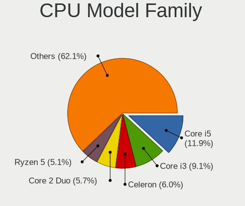

| Model                   | Desktops | Percent |
|-------------------------|----------|---------|
| Intel Core i5           | 146      | 11.6%   |
| Intel Core i3           | 115      | 9.13%   |
| Intel Celeron           | 80       | 6.35%   |
| Intel Core 2 Duo        | 78       | 6.2%    |
| AMD FX                  | 65       | 5.16%   |
| Intel Xeon              | 64       | 5.08%   |
| AMD Athlon II X2        | 64       | 5.08%   |
| Intel Pentium           | 56       | 4.45%   |
| AMD Athlon 64 X2        | 52       | 4.13%   |
| Intel Core i7           | 49       | 3.89%   |
| AMD Ryzen 5             | 49       | 3.89%   |
| AMD Phenom II X4        | 35       | 2.78%   |
| Intel Core 2 Quad       | 31       | 2.46%   |
| Intel Pentium 4         | 29       | 2.3%    |
| Intel Pentium Dual-Core | 27       | 2.14%   |
| AMD Ryzen 7             | 26       | 2.07%   |
| AMD Ryzen 3             | 22       | 1.75%   |
| AMD A4                  | 22       | 1.75%   |
| AMD Athlon II X4        | 21       | 1.67%   |
| Intel Core 2            | 18       | 1.43%   |
| AMD Athlon II X3        | 17       | 1.35%   |
| AMD Athlon              | 17       | 1.35%   |
| Intel Pentium D         | 16       | 1.27%   |
| AMD A8                  | 16       | 1.27%   |
| Intel Pentium Dual      | 15       | 1.19%   |
| AMD Sempron             | 14       | 1.11%   |
| AMD Athlon X4           | 13       | 1.03%   |
| AMD Athlon 64           | 11       | 0.87%   |
| Other                   | 10       | 0.79%   |
| AMD Ryzen 9             | 10       | 0.79%   |
| AMD A6                  | 10       | 0.79%   |
| AMD A10                 | 9        | 0.71%   |
| Intel Atom              | 8        | 0.64%   |
| Intel Genuine           | 6        | 0.48%   |
| AMD Ryzen Threadripper  | 5        | 0.4%    |
| Intel Pentium Gold      | 4        | 0.32%   |
| AMD Phenom II X6        | 4        | 0.32%   |
| AMD Athlon X2           | 3        | 0.24%   |
| AMD Turion 64 X2 Mobile | 2        | 0.16%   |
| AMD Ryzen 5 PRO         | 2        | 0.16%   |
| AMD Ryzen 3 PRO         | 2        | 0.16%   |
| AMD Phenom II X3        | 2        | 0.16%   |
| AMD Phenom              | 2        | 0.16%   |
| AMD E1                  | 2        | 0.16%   |
| AMD E                   | 2        | 0.16%   |
| AMD Athlon Dual Core    | 2        | 0.16%   |
| Intel Core i9           | 1        | 0.08%   |
| Intel Celeron D         | 1        | 0.08%   |
| AMD Ryzen Embedded      | 1        | 0.08%   |
| AMD Ryzen 7 PRO         | 1        | 0.08%   |
| AMD Phenom II X2        | 1        | 0.08%   |
| AMD Athlon XP           | 1        | 0.08%   |

CPU Cores
---------

Number of processor cores

| Number  | Desktops | Percent |
|---------|----------|---------|
| 2       | 525      | 41.05%  |
| 4       | 387      | 30.26%  |
| 6       | 99       | 7.74%   |
| 1       | 86       | 6.72%   |
| Unknown | 77       | 6.02%   |
| 8       | 45       | 3.52%   |
| 3       | 33       | 2.58%   |
| 12      | 13       | 1.02%   |
| 16      | 7        | 0.55%   |
| 10      | 3        | 0.23%   |
| 36      | 1        | 0.08%   |
| 32      | 1        | 0.08%   |
| 24      | 1        | 0.08%   |
| 14      | 1        | 0.08%   |

CPU Sockets
-----------

Number of sockets

| Number  | Desktops | Percent |
|---------|----------|---------|
| 1       | 1243     | 99.44%  |
| 2       | 6        | 0.48%   |
| Unknown | 1        | 0.08%   |

CPU Threads
-----------

Threads per core (Hyper-Threading)

| Number  | Desktops | Percent |
|---------|----------|---------|
| 1       | 752      | 58.84%  |
| 2       | 449      | 35.13%  |
| Unknown | 77       | 6.03%   |

CPU Op-Modes
------------

CPU Operation Modes (32-bit, 64-bit)

| Op mode        | Desktops | Percent |
|----------------|----------|---------|
| 32-bit, 64-bit | 1222     | 97.45%  |
| 32-bit         | 19       | 1.52%   |
| Unknown        | 13       | 1.04%   |

CPU Microcode
-------------

Microcode number

| Number     | Desktops | Percent |
|------------|----------|---------|
| Unknown    | 186      | 14.45%  |
| 0x1067a    | 95       | 7.38%   |
| 0x010000c8 | 94       | 7.3%    |
| 0x206a7    | 85       | 6.6%    |
| 0x306a9    | 66       | 5.13%   |
| 0x306c3    | 61       | 4.74%   |
| 0x506e3    | 38       | 2.95%   |
| 0x06001119 | 34       | 2.64%   |
| 0x906e9    | 29       | 2.25%   |
| 0x10676    | 29       | 2.25%   |
| 0x06000852 | 29       | 2.25%   |
| 0x906ea    | 23       | 1.79%   |
| 0x6fb      | 21       | 1.63%   |
| 0x6fd      | 20       | 1.55%   |
| 0x03000027 | 18       | 1.4%    |
| 0x010000c7 | 18       | 1.4%    |
| 0x906eb    | 17       | 1.32%   |
| 0x0800820d | 15       | 1.17%   |
| 0x08001137 | 15       | 1.17%   |
| 0x06003106 | 15       | 1.17%   |
| 0xf41      | 13       | 1.01%   |
| 0x20655    | 13       | 1.01%   |
| 0x08701013 | 13       | 1.01%   |
| 0x010000db | 13       | 1.01%   |
| 0x08108109 | 12       | 0.93%   |
| 0x08101016 | 12       | 0.93%   |
| 0x08001138 | 12       | 0.93%   |
| 0x0600084f | 12       | 0.93%   |
| 0x6f6      | 11       | 0.85%   |
| 0x6f2      | 11       | 0.85%   |
| 0x206d7    | 10       | 0.78%   |
| 0x08701021 | 10       | 0.78%   |
| 0x20652    | 9        | 0.7%    |
| 0x106e5    | 9        | 0.7%    |
| 0x0600063e | 9        | 0.7%    |
| 0xf65      | 8        | 0.62%   |
| 0xf49      | 8        | 0.62%   |
| 0x306e4    | 8        | 0.62%   |
| 0x0600063d | 8        | 0.62%   |
| 0xa0653    | 7        | 0.54%   |
| 0x906ed    | 7        | 0.54%   |
| 0x506c9    | 7        | 0.54%   |
| 0x306f2    | 7        | 0.54%   |
| 0x10677    | 6        | 0.47%   |
| 0x0810100b | 6        | 0.47%   |
| 0xf29      | 5        | 0.39%   |
| 0xa0671    | 5        | 0.39%   |
| 0x106ca    | 5        | 0.39%   |
| 0xf64      | 4        | 0.31%   |
| 0xf47      | 4        | 0.31%   |
| 0xa0655    | 4        | 0.31%   |
| 0x30678    | 4        | 0.31%   |
| 0x206c2    | 4        | 0.31%   |
| 0x0a201009 | 4        | 0.31%   |
| 0x0800820b | 4        | 0.31%   |
| 0x0600611a | 4        | 0.31%   |
| 0x010000dc | 4        | 0.31%   |
| 0x01000095 | 4        | 0.31%   |
| 0xf62      | 3        | 0.23%   |
| 0xf43      | 3        | 0.23%   |

CPU Microarch
-------------

Microarchitecture

| Name             | Desktops | Percent |
|------------------|----------|---------|
| K10              | 150      | 11.9%   |
| Penryn           | 136      | 10.79%  |
| SandyBridge      | 108      | 8.57%   |
| Piledriver       | 85       | 6.75%   |
| KabyLake         | 84       | 6.67%   |
| IvyBridge        | 82       | 6.51%   |
| K8 Hammer        | 80       | 6.35%   |
| Core             | 76       | 6.03%   |
| Haswell          | 74       | 5.87%   |
| Zen              | 55       | 4.37%   |
| NetBurst         | 55       | 4.37%   |
| Skylake          | 41       | 3.25%   |
| Zen+             | 35       | 2.78%   |
| Zen 2            | 30       | 2.38%   |
| Westmere         | 28       | 2.22%   |
| K10 Llano        | 18       | 1.43%   |
| Steamroller      | 16       | 1.27%   |
| Bulldozer        | 15       | 1.19%   |
| CometLake        | 14       | 1.11%   |
| Nehalem          | 13       | 1.03%   |
| Unknown          | 13       | 1.03%   |
| Silvermont       | 9        | 0.71%   |
| Zen 3            | 8        | 0.63%   |
| Goldmont         | 7        | 0.56%   |
| Bonnell          | 7        | 0.56%   |
| Excavator        | 6        | 0.48%   |
| Goldmont plus    | 4        | 0.32%   |
| Broadwell        | 3        | 0.24%   |
| Puma             | 2        | 0.16%   |
| Jaguar           | 2        | 0.16%   |
| K6               | 1        | 0.08%   |
| Icelake          | 1        | 0.08%   |
| Bobcat           | 1        | 0.08%   |
| Alderlake Hybrid | 1        | 0.08%   |

Graphics
--------

GPU Vendor
----------

Vendors of graphics cards

| Vendor                                       | Desktops | Percent |
|----------------------------------------------|----------|---------|
| Nvidia                                       | 585      | 44.25%  |
| AMD                                          | 420      | 31.77%  |
| Intel                                        | 313      | 23.68%  |
| XGI Technology (eXtreme Graphics Innovation) | 1        | 0.08%   |
| VIA Technologies                             | 1        | 0.08%   |
| Silicon Integrated Systems [SiS]             | 1        | 0.08%   |
| Matrox Electronics Systems                   | 1        | 0.08%   |

GPU Model
---------

Graphics card models

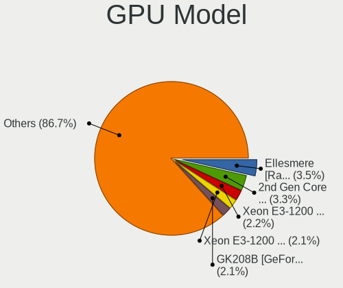

| Model                                                                       | Desktops | Percent |
|-----------------------------------------------------------------------------|----------|---------|
| Intel 2nd Generation Core Processor Family Integrated Graphics Controller   | 50       | 3.64%   |
| AMD Ellesmere [Radeon RX 470/480/570/570X/580/580X/590]                     | 45       | 3.27%   |
| Intel Xeon E3-1200 v3/4th Gen Core Processor Integrated Graphics Controller | 31       | 2.25%   |
| Nvidia GK208B [GeForce GT 710]                                              | 27       | 1.96%   |
| Intel Xeon E3-1200 v2/3rd Gen Core processor Graphics Controller            | 27       | 1.96%   |
| Nvidia GT218 [GeForce 210]                                                  | 26       | 1.89%   |
| Intel CoffeeLake-S GT2 [UHD Graphics 630]                                   | 24       | 1.75%   |
| Intel 4 Series Chipset Integrated Graphics Controller                       | 23       | 1.67%   |
| Nvidia GF108 [GeForce GT 440]                                               | 21       | 1.53%   |
| Nvidia GP107 [GeForce GTX 1050 Ti]                                          | 20       | 1.45%   |
| Nvidia G94 [GeForce 9600 GT]                                                | 20       | 1.45%   |
| AMD Cedar [Radeon HD 5000/6000/7350/8350 Series]                            | 19       | 1.38%   |
| Intel HD Graphics 530                                                       | 17       | 1.24%   |
| AMD Raven Ridge [Radeon Vega Series / Radeon Vega Mobile Series]            | 17       | 1.24%   |
| Nvidia GP108 [GeForce GT 1030]                                              | 16       | 1.16%   |
| Nvidia GP106 [GeForce GTX 1060 6GB]                                         | 16       | 1.16%   |
| Nvidia GK107 [GeForce GTX 650]                                              | 16       | 1.16%   |
| Nvidia GF108 [GeForce GT 630]                                               | 16       | 1.16%   |
| AMD RS780L [Radeon 3000]                                                    | 14       | 1.02%   |
| AMD Caicos [Radeon HD 6450/7450/8450 / R5 230 OEM]                          | 14       | 1.02%   |
| Nvidia GM107 [GeForce GTX 750 Ti]                                           | 13       | 0.95%   |
| Nvidia G96C [GeForce 9500 GT]                                               | 13       | 0.95%   |
| Nvidia G84 [GeForce 8600 GT]                                                | 13       | 0.95%   |
| Nvidia C61 [GeForce 7025 / nForce 630a]                                     | 13       | 0.95%   |
| Nvidia C61 [GeForce 6150SE nForce 430]                                      | 13       | 0.95%   |
| Intel 82945G/GZ Integrated Graphics Controller                              | 13       | 0.95%   |
| Nvidia GT215 [GeForce GT 240]                                               | 12       | 0.87%   |
| Nvidia GP107 [GeForce GTX 1050]                                             | 12       | 0.87%   |
| Nvidia GP106 [GeForce GTX 1060 3GB]                                         | 12       | 0.87%   |
| Nvidia GK208B [GeForce GT 730]                                              | 12       | 0.87%   |
| Nvidia GF108 [GeForce GT 430]                                               | 12       | 0.87%   |
| Intel Core Processor Integrated Graphics Controller                         | 12       | 0.87%   |
| AMD Turks XT [Radeon HD 6670/7670]                                          | 12       | 0.87%   |
| AMD Picasso/Raven 2 [Radeon Vega Series / Radeon Vega Mobile Series]        | 12       | 0.87%   |
| Nvidia GF119 [GeForce GT 610]                                               | 11       | 0.8%    |
| Nvidia GF116 [GeForce GTX 550 Ti]                                           | 11       | 0.8%    |
| Intel IvyBridge GT2 [HD Graphics 4000]                                      | 11       | 0.8%    |
| AMD Redwood XT [Radeon HD 5670/5690/5730]                                   | 11       | 0.8%    |
| Nvidia GF106 [GeForce GTS 450]                                              | 10       | 0.73%   |
| Nvidia G92 [GeForce 9800 GT]                                                | 10       | 0.73%   |
| Intel HD Graphics 630                                                       | 10       | 0.73%   |
| Intel 82G33/G31 Express Integrated Graphics Controller                      | 10       | 0.73%   |
| Nvidia GP104 [GeForce GTX 1070]                                             | 9        | 0.65%   |
| Nvidia GM206 [GeForce GTX 960]                                              | 9        | 0.65%   |
| Nvidia GK107 [GeForce GT 640]                                               | 9        | 0.65%   |
| Nvidia GF108 [GeForce GT 730]                                               | 9        | 0.65%   |
| Nvidia G86 [GeForce 8500 GT]                                                | 9        | 0.65%   |
| Intel 4th Generation Core Processor Family Integrated Graphics Controller   | 9        | 0.65%   |
| AMD Kaveri [Radeon R7 Graphics]                                             | 9        | 0.65%   |
| AMD Cape Verde XT [Radeon HD 7770/8760 / R7 250X]                           | 9        | 0.65%   |
| AMD Baffin [Radeon RX 550 640SP / RX 560/560X]                              | 9        | 0.65%   |
| AMD Baffin [Radeon RX 460/560D / Pro 450/455/460/555/555X/560/560X]         | 9        | 0.65%   |
| Nvidia GP102 [GeForce GTX 1080 Ti]                                          | 8        | 0.58%   |
| Nvidia GK106 [GeForce GTX 660]                                              | 8        | 0.58%   |
| AMD Cape Verde PRO [Radeon HD 7750/8740 / R7 250E]                          | 8        | 0.58%   |
| Nvidia GP104 [GeForce GTX 1080]                                             | 7        | 0.51%   |
| Nvidia GK104 [GeForce GTX 760]                                              | 7        | 0.51%   |
| Nvidia G92 [GeForce GTS 250]                                                | 7        | 0.51%   |
| Intel HD Graphics 510                                                       | 7        | 0.51%   |
| Intel CometLake-S GT2 [UHD Graphics 630]                                    | 7        | 0.51%   |

GPU Combo
---------

Combinations of graphics cards

| Name                   | Desktops | Percent |
|------------------------|----------|---------|
| 1 x Nvidia             | 569      | 44.56%  |
| 1 x AMD                | 375      | 29.37%  |
| 1 x Intel              | 270      | 21.14%  |
| 2 x AMD                | 33       | 2.58%   |
| Intel + AMD            | 8        | 0.63%   |
| Intel + Nvidia         | 7        | 0.55%   |
| AMD + Nvidia           | 4        | 0.31%   |
| 2 x Nvidia             | 2        | 0.16%   |
| Intel + 2 x Nvidia     | 2        | 0.16%   |
| 3 x Nvidia             | 1        | 0.08%   |
| 1 x XGI                | 1        | 0.08%   |
| 1 x VIA                | 1        | 0.08%   |
| 1 x SiS                | 1        | 0.08%   |
| 1 x Matrox             | 1        | 0.08%   |
| 1 x Intel + 7 x Nvidia | 1        | 0.08%   |
| Intel + 2 x AMD        | 1        | 0.08%   |

GPU Driver
----------

Free vs proprietary

| Driver      | Desktops | Percent |
|-------------|----------|---------|
| Free        | 935      | 72.26%  |
| Proprietary | 300      | 23.18%  |
| Unknown     | 59       | 4.56%   |

GPU Memory
----------

Total video memory

| Size in GB | Desktops | Percent |
|------------|----------|---------|
| Unknown    | 307      | 23.62%  |
| 0.01-0.5   | 300      | 23.08%  |
| 0.51-1.0   | 267      | 20.54%  |
| 1.01-2.0   | 217      | 16.69%  |
| 3.01-4.0   | 108      | 8.31%   |
| 7.01-8.0   | 47       | 3.62%   |
| 5.01-6.0   | 24       | 1.85%   |
| 2.01-3.0   | 21       | 1.62%   |
| 8.01-16.0  | 9        | 0.69%   |

Monitor
-------

Monitor Vendor
--------------

Monitor vendors

| Vendor                  | Desktops | Percent |
|-------------------------|----------|---------|
| Samsung Electronics     | 334      | 26.38%  |
| Goldstar                | 271      | 21.41%  |
| Philips                 | 129      | 10.19%  |
| Dell                    | 91       | 7.19%   |
| Acer                    | 74       | 5.85%   |
| Ancor Communications    | 61       | 4.82%   |
| BenQ                    | 49       | 3.87%   |
| AOC                     | 38       | 3%      |
| ViewSonic               | 25       | 1.97%   |
| Hewlett-Packard         | 23       | 1.82%   |
| Iiyama                  | 21       | 1.66%   |
| LG Electronics          | 20       | 1.58%   |
| NEC Computers           | 15       | 1.18%   |
| Sony                    | 11       | 0.87%   |
| Unknown                 | 9        | 0.71%   |
| ASUSTek Computer        | 9        | 0.71%   |
| Belinea                 | 6        | 0.47%   |
| ___                     | 4        | 0.32%   |
| Plain Tree Systems      | 4        | 0.32%   |
| Lenovo                  | 3        | 0.24%   |
| HannStar                | 3        | 0.24%   |
| XYK                     | 2        | 0.16%   |
| Xiaomi                  | 2        | 0.16%   |
| TCL                     | 2        | 0.16%   |
| SAC                     | 2        | 0.16%   |
| PNP                     | 2        | 0.16%   |
| NEW                     | 2        | 0.16%   |
| HannStar Display        | 2        | 0.16%   |
| Gigabyte Technology     | 2        | 0.16%   |
| Eizo                    | 2        | 0.16%   |
| Compaq Computer         | 2        | 0.16%   |
| Chi Mei Optoelectronics | 2        | 0.16%   |
| BBK                     | 2        | 0.16%   |
| Xerox                   | 1        | 0.08%   |
| VMO                     | 1        | 0.08%   |
| Unknown (ADA)           | 1        | 0.08%   |
| Toshiba                 | 1        | 0.08%   |
| SVT                     | 1        | 0.08%   |
| Sun                     | 1        | 0.08%   |
| SK hynix                | 1        | 0.08%   |
| Sharp                   | 1        | 0.08%   |
| SEL                     | 1        | 0.08%   |
| S2-Tek                  | 1        | 0.08%   |
| Princeton               | 1        | 0.08%   |
| Prestigio               | 1        | 0.08%   |
| Panasonic               | 1        | 0.08%   |
| OEM                     | 1        | 0.08%   |
| NCS                     | 1        | 0.08%   |
| MStar                   | 1        | 0.08%   |
| MSI                     | 1        | 0.08%   |
| MiTAC                   | 1        | 0.08%   |
| Mi                      | 1        | 0.08%   |
| Medion                  | 1        | 0.08%   |
| LSC                     | 1        | 0.08%   |
| LLL                     | 1        | 0.08%   |
| Lite-On                 | 1        | 0.08%   |
| LG Philips              | 1        | 0.08%   |
| KIV                     | 1        | 0.08%   |
| Idek Iiyama             | 1        | 0.08%   |
| HKC                     | 1        | 0.08%   |

Monitor Model
-------------

Monitor models

| Model                                                                 | Desktops | Percent |
|-----------------------------------------------------------------------|----------|---------|
| Goldstar LCD Monitor GSM5AB8 1920x1080 480x270mm 21.7-inch            | 19       | 1.43%   |
| Samsung Electronics SyncMaster SAM011E 1280x1024 338x270mm 17.0-inch  | 13       | 0.98%   |
| Goldstar W2243 GSM56FE 1920x1080 477x269mm 21.6-inch                  | 11       | 0.83%   |
| Goldstar IPS FULLHD GSM5AB6 1920x1080 480x270mm 21.7-inch             | 10       | 0.75%   |
| Samsung Electronics SyncMaster SAM01E1 1280x1024 376x301mm 19.0-inch  | 9        | 0.68%   |
| Samsung Electronics SyncMaster SAM01B7 1280x1024 338x270mm 17.0-inch  | 9        | 0.68%   |
| Philips PHL 243V7 PHLC155 1920x1080 527x296mm 23.8-inch               | 7        | 0.53%   |
| Philips 196VL PHLC07F 1366x768 409x230mm 18.5-inch                    | 7        | 0.53%   |
| Goldstar W1943 GSM4BAD 1360x768 406x229mm 18.4-inch                   | 7        | 0.53%   |
| Dell U2412M DELA07A 1920x1200 518x324mm 24.1-inch                     | 7        | 0.53%   |
| Samsung Electronics SyncMaster SAM0593 1920x1080 477x268mm 21.5-inch  | 6        | 0.45%   |
| Samsung Electronics SyncMaster SAM0108 1280x1024 312x234mm 15.4-inch  | 6        | 0.45%   |
| Samsung Electronics S22B300 SAM08AA 1920x1080 477x268mm 21.5-inch     | 6        | 0.45%   |
| Philips 226V4 PHLC0B1 1920x1080 477x268mm 21.5-inch                   | 6        | 0.45%   |
| Philips 220WS PHL0851 1680x1050 434x270mm 20.1-inch                   | 6        | 0.45%   |
| Goldstar L194W GSM4B6A 1440x900 408x255mm 18.9-inch                   | 6        | 0.45%   |
| Goldstar IPS234 GSM58D9 1920x1080 510x290mm 23.1-inch                 | 6        | 0.45%   |
| Samsung Electronics S24D300 SAM0B43 1920x1080 531x299mm 24.0-inch     | 5        | 0.38%   |
| Samsung Electronics S22F350 SAM0D1A 1920x1080 480x270mm 21.7-inch     | 5        | 0.38%   |
| Samsung Electronics LCD Monitor SyncMaster 1280x1024                  | 5        | 0.38%   |
| Samsung Electronics C24F390 SAM0D2C 1920x1080 520x290mm 23.4-inch     | 5        | 0.38%   |
| Philips PHL 246E9Q PHLC17C 1920x1080 527x296mm 23.8-inch              | 5        | 0.38%   |
| Philips 241E PHLC035 1920x1080 520x290mm 23.4-inch                    | 5        | 0.38%   |
| Goldstar ULTRAWIDE GSM59F1 2560x1080 673x284mm 28.8-inch              | 5        | 0.38%   |
| Goldstar L1953TR GSM4B43 1280x1024 338x270mm 17.0-inch                | 5        | 0.38%   |
| Goldstar L1953S GSM4B3E 1280x1024 376x301mm 19.0-inch                 | 5        | 0.38%   |
| Goldstar L1918S GSM4B31 1280x1024 376x301mm 19.0-inch                 | 5        | 0.38%   |
| Goldstar L1730S GSM438D 1280x1024 338x270mm 17.0-inch                 | 5        | 0.38%   |
| Goldstar FULL HD GSM5AB9 1920x1080 480x270mm 21.7-inch                | 5        | 0.38%   |
| Samsung Electronics SyncMaster SAM03C2 1680x1050 459x296mm 21.5-inch  | 4        | 0.3%    |
| Samsung Electronics SyncMaster SAM036E 1280x1024 376x301mm 19.0-inch  | 4        | 0.3%    |
| Samsung Electronics SyncMaster SAM0285 1440x900 410x257mm 19.1-inch   | 4        | 0.3%    |
| Samsung Electronics SyncMaster SAM027F 1680x1050 474x296mm 22.0-inch  | 4        | 0.3%    |
| Samsung Electronics SyncMaster SAM0259 1280x1024 380x300mm 19.1-inch  | 4        | 0.3%    |
| Samsung Electronics S22D300 SAM0B3B 1920x1080 477x268mm 21.5-inch     | 4        | 0.3%    |
| Philips PHL 223V5 PHLC0CF 1920x1080 477x268mm 21.5-inch               | 4        | 0.3%    |
| Goldstar L204WT GSM4E48 1680x1050 434x270mm 20.1-inch                 | 4        | 0.3%    |
| Goldstar HD GSM5ACB 1366x768 410x230mm 18.5-inch                      | 4        | 0.3%    |
| Goldstar FULL HD GSM5B55 1920x1080 480x270mm 21.7-inch                | 4        | 0.3%    |
| Goldstar 22EA53 GSM59A4 1920x1080 477x268mm 21.5-inch                 | 4        | 0.3%    |
| Dell U2412M DELA079 1920x1200 518x324mm 24.1-inch                     | 4        | 0.3%    |
| Dell U2312HM DEL4072 1920x1080 510x287mm 23.0-inch                    | 4        | 0.3%    |
| Dell U2212HM DELD047 1920x1080 475x267mm 21.5-inch                    | 4        | 0.3%    |
| BenQ GW2480 BNQ78E7 1920x1080 527x296mm 23.8-inch                     | 4        | 0.3%    |
| Ancor Communications ASUS VW193D ACI19D5 1440x900 408x255mm 18.9-inch | 4        | 0.3%    |
| Acer AL1916W ACRAD52 1440x900 408x255mm 18.9-inch                     | 4        | 0.3%    |
| Samsung Electronics SyncMaster SAM0594 1680x1050 459x296mm 21.5-inch  | 3        | 0.23%   |
| Samsung Electronics SyncMaster SAM03E5 1680x1050 474x296mm 22.0-inch  | 3        | 0.23%   |
| Samsung Electronics SyncMaster SAM03D1 1680x1050 433x271mm 20.1-inch  | 3        | 0.23%   |
| Samsung Electronics SyncMaster SAM0373 1680x1050 459x296mm 21.5-inch  | 3        | 0.23%   |
| Samsung Electronics SyncMaster SAM030D 1680x1050 474x296mm 22.0-inch  | 3        | 0.23%   |
| Samsung Electronics SyncMaster SAM0302 1680x1050 459x296mm 21.5-inch  | 3        | 0.23%   |
| Samsung Electronics SyncMaster SAM0248 1280x1024 380x300mm 19.1-inch  | 3        | 0.23%   |
| Samsung Electronics SyncMaster SAM022B 1280x1024 340x270mm 17.1-inch  | 3        | 0.23%   |
| Samsung Electronics SyncMaster SAM01F9 1280x1024 376x301mm 19.0-inch  | 3        | 0.23%   |
| Samsung Electronics SyncMaster SAM0192 1280x1024 338x270mm 17.0-inch  | 3        | 0.23%   |
| Samsung Electronics SyncMaster SAM011F 1280x1024 376x301mm 19.0-inch  | 3        | 0.23%   |
| Samsung Electronics SMS22A100 SAM0868 1920x1080 477x268mm 21.5-inch   | 3        | 0.23%   |
| Samsung Electronics SMB2230N SAM0635 1920x1080 477x268mm 21.5-inch    | 3        | 0.23%   |
| Samsung Electronics S24D590 SAM0B47 1920x1080 520x290mm 23.4-inch     | 3        | 0.23%   |

Monitor Resolution
------------------

Monitor screen resolution

| Resolution         | Desktops | Percent |
|--------------------|----------|---------|
| 1920x1080 (FHD)    | 526      | 42.15%  |
| 1280x1024 (SXGA)   | 230      | 18.43%  |
| 1680x1050 (WSXGA+) | 124      | 9.94%   |
| 1440x900 (WXGA+)   | 57       | 4.57%   |
| 1366x768 (WXGA)    | 56       | 4.49%   |
| 2560x1440 (QHD)    | 39       | 3.13%   |
| 3840x2160 (4K)     | 29       | 2.32%   |
| 1920x1200 (WUXGA)  | 29       | 2.32%   |
| 1600x900 (HD+)     | 26       | 2.08%   |
| 1360x768           | 20       | 1.6%    |
| 1600x1200          | 19       | 1.52%   |
| Unknown            | 19       | 1.52%   |
| 1024x768 (XGA)     | 15       | 1.2%    |
| 2560x1080          | 10       | 0.8%    |
| 3440x1440          | 5        | 0.4%    |
| 2048x1536          | 5        | 0.4%    |
| 1920x540           | 5        | 0.4%    |
| 3840x1080          | 4        | 0.32%   |
| 1400x1050          | 3        | 0.24%   |
| 4480x1440          | 2        | 0.16%   |
| 3200x1080          | 2        | 0.16%   |
| 2048x1152          | 2        | 0.16%   |
| 1280x960           | 2        | 0.16%   |
| 1280x720 (HD)      | 2        | 0.16%   |
| 7040x2160          | 1        | 0.08%   |
| 5520x1080          | 1        | 0.08%   |
| 5280x1200          | 1        | 0.08%   |
| 5120x1440          | 1        | 0.08%   |
| 4000x1440          | 1        | 0.08%   |
| 3926x1440          | 1        | 0.08%   |
| 3360x1080          | 1        | 0.08%   |
| 2960x1050          | 1        | 0.08%   |
| 2640x1024          | 1        | 0.08%   |
| 2560x1600          | 1        | 0.08%   |
| 2288x1287          | 1        | 0.08%   |
| 2048x768           | 1        | 0.08%   |
| 1920x1440          | 1        | 0.08%   |
| 1280x800 (WXGA)    | 1        | 0.08%   |
| 1280x768           | 1        | 0.08%   |
| 1152x864           | 1        | 0.08%   |
| 1024x600           | 1        | 0.08%   |

Monitor Diagonal
----------------

Diagonal size in inches

| Inches  | Desktops | Percent |
|---------|----------|---------|
| 21      | 220      | 17.46%  |
| 23      | 170      | 13.49%  |
| 19      | 152      | 12.06%  |
| 24      | 110      | 8.73%   |
| 17      | 103      | 8.17%   |
| Unknown | 100      | 7.94%   |
| 20      | 71       | 5.63%   |
| 27      | 68       | 5.4%    |
| 18      | 68       | 5.4%    |
| 22      | 62       | 4.92%   |
| 15      | 40       | 3.17%   |
| 31      | 15       | 1.19%   |
| 32      | 13       | 1.03%   |
| 34      | 11       | 0.87%   |
| 54      | 7        | 0.56%   |
| 16      | 7        | 0.56%   |
| 72      | 6        | 0.48%   |
| 42      | 5        | 0.4%    |
| 40      | 4        | 0.32%   |
| 25      | 4        | 0.32%   |
| 12      | 4        | 0.32%   |
| 48      | 2        | 0.16%   |
| 26      | 2        | 0.16%   |
| 13      | 2        | 0.16%   |
| 142     | 1        | 0.08%   |
| 75      | 1        | 0.08%   |
| 52      | 1        | 0.08%   |
| 47      | 1        | 0.08%   |
| 46      | 1        | 0.08%   |
| 43      | 1        | 0.08%   |
| 39      | 1        | 0.08%   |
| 37      | 1        | 0.08%   |
| 36      | 1        | 0.08%   |
| 29      | 1        | 0.08%   |
| 28      | 1        | 0.08%   |
| 14      | 1        | 0.08%   |
| 10      | 1        | 0.08%   |
| 7       | 1        | 0.08%   |

Monitor Width
-------------

Physical width

| Width in mm    | Desktops | Percent |
|----------------|----------|---------|
| 401-500        | 469      | 37.98%  |
| 501-600        | 323      | 26.15%  |
| 301-350        | 140      | 11.34%  |
| 351-400        | 115      | 9.31%   |
| Unknown        | 100      | 8.1%    |
| 701-800        | 25       | 2.02%   |
| 601-700        | 22       | 1.78%   |
| 1001-1500      | 12       | 0.97%   |
| 201-300        | 8        | 0.65%   |
| 1501-2000      | 7        | 0.57%   |
| 801-900        | 6        | 0.49%   |
| 901-1000       | 6        | 0.49%   |
| More than 2000 | 1        | 0.08%   |
| 101-200        | 1        | 0.08%   |

Aspect Ratio
------------

Proportional relationship between the width and the height

| Ratio   | Desktops | Percent |
|---------|----------|---------|
| 16/9    | 639      | 52.59%  |
| 5/4     | 198      | 16.3%   |
| 16/10   | 190      | 15.64%  |
| Unknown | 87       | 7.16%   |
| 4/3     | 68       | 5.6%    |
| 3/2     | 15       | 1.23%   |
| 21/9    | 11       | 0.91%   |
| 6/5     | 6        | 0.49%   |
| 1.00    | 1        | 0.08%   |

Monitor Area
------------

Area in inch

| Area in inch | Desktops | Percent |
|----------------|----------|---------|
| 201-250        | 486      | 39.13%  |
| 151-200        | 266      | 21.42%  |
| 141-150        | 154      | 12.4%   |
| Unknown        | 100      | 8.05%   |
| 301-350        | 70       | 5.64%   |
| 351-500        | 41       | 3.3%    |
| 251-300        | 32       | 2.58%   |
| 111-120        | 27       | 2.17%   |
| More than 1000 | 18       | 1.45%   |
| 501-1000       | 15       | 1.21%   |
| 101-110        | 14       | 1.13%   |
| 121-130        | 6        | 0.48%   |
| 131-140        | 5        | 0.4%    |
| 71-80          | 4        | 0.32%   |
| 81-90          | 1        | 0.08%   |
| 41-50          | 1        | 0.08%   |
| 1-40           | 1        | 0.08%   |
| 91-100         | 1        | 0.08%   |

Pixel Density
-------------

Pixels per inch

| Density | Desktops | Percent |
|---------|----------|---------|
| 51-100  | 791      | 65.81%  |
| 101-120 | 263      | 21.88%  |
| Unknown | 100      | 8.32%   |
| 1-50    | 21       | 1.75%   |
| 121-160 | 16       | 1.33%   |
| 161-240 | 11       | 0.92%   |

Multiple Monitors
-----------------

Total monitors connected

| Total | Desktops | Percent |
|-------|----------|---------|
| 1     | 1091     | 86.25%  |
| 2     | 107      | 8.46%   |
| 0     | 53       | 4.19%   |
| 3     | 14       | 1.11%   |

Network
-------

Net Controller Vendor
---------------------

Controller vendors

| Vendor                            | Desktops | Percent |
|-----------------------------------|----------|---------|
| Realtek Semiconductor             | 828      | 51.72%  |
| Intel                             | 216      | 13.49%  |
| Qualcomm Atheros                  | 157      | 9.81%   |
| Nvidia                            | 99       | 6.18%   |
| Ralink Technology                 | 72       | 4.5%    |
| Qualcomm Atheros Communications   | 31       | 1.94%   |
| TP-Link                           | 23       | 1.44%   |
| Broadcom                          | 18       | 1.12%   |
| VIA Technologies                  | 16       | 1%      |
| Marvell Technology Group          | 16       | 1%      |
| Ralink                            | 14       | 0.87%   |
| Huawei Technologies               | 13       | 0.81%   |
| Sundance Technology Inc / IC Plus | 10       | 0.62%   |
| D-Link System                     | 10       | 0.62%   |
| Broadcom Limited                  | 10       | 0.62%   |
| Xiaomi                            | 9        | 0.56%   |
| ASUSTek Computer                  | 8        | 0.5%    |
| Samsung Electronics               | 4        | 0.25%   |
| Aquantia                          | 4        | 0.25%   |
| Silicon Integrated Systems [SiS]  | 3        | 0.19%   |
| MediaTek                          | 3        | 0.19%   |
| IMC Networks                      | 3        | 0.19%   |
| D-Link                            | 3        | 0.19%   |
| Curitel Communications            | 3        | 0.19%   |
| Microsoft                         | 2        | 0.12%   |
| Linksys                           | 2        | 0.12%   |
| HMD Global                        | 2        | 0.12%   |
| Google                            | 2        | 0.12%   |
| Edimax Technology                 | 2        | 0.12%   |
| STMicroelectronics                | 1        | 0.06%   |
| Standard Microsystems [SMC]       | 1        | 0.06%   |
| Sitecom Europe                    | 1        | 0.06%   |
| Qualcomm                          | 1        | 0.06%   |
| OpenMoko                          | 1        | 0.06%   |
| NetGear                           | 1        | 0.06%   |
| Montage                           | 1        | 0.06%   |
| Microchip Technology              | 1        | 0.06%   |
| LSI                               | 1        | 0.06%   |
| LG Electronics                    | 1        | 0.06%   |
| ICS Advent                        | 1        | 0.06%   |
| HTC (High Tech Computer)          | 1        | 0.06%   |
| Hangzhou Silan Microelectronics   | 1        | 0.06%   |
| Gemtek                            | 1        | 0.06%   |
| DisplayLink                       | 1        | 0.06%   |
| Apple                             | 1        | 0.06%   |
| AMD                               | 1        | 0.06%   |
| ADMtek                            | 1        | 0.06%   |

Net Controller Model
--------------------

Controller models

| Model                                                                         | Desktops | Percent |
|-------------------------------------------------------------------------------|----------|---------|
| Realtek RTL8111/8168/8411 PCI Express Gigabit Ethernet Controller             | 664      | 39.06%  |
| Realtek RTL-8100/8101L/8139 PCI Fast Ethernet Adapter                         | 100      | 5.88%   |
| Nvidia MCP61 Ethernet                                                         | 62       | 3.65%   |
| Ralink MT7601U Wireless Adapter                                               | 42       | 2.47%   |
| Realtek RTL810xE PCI Express Fast Ethernet controller                         | 39       | 2.29%   |
| Intel I211 Gigabit Network Connection                                         | 30       | 1.76%   |
| Intel Ethernet Connection (2) I219-V                                          | 26       | 1.53%   |
| Qualcomm Atheros AR8151 v2.0 Gigabit Ethernet                                 | 25       | 1.47%   |
| Qualcomm Atheros AR9271 802.11n                                               | 24       | 1.41%   |
| Intel Wi-Fi 6 AX200                                                           | 23       | 1.35%   |
| Intel 82579V Gigabit Network Connection                                       | 20       | 1.18%   |
| Intel 82579LM Gigabit Network Connection (Lewisville)                         | 20       | 1.18%   |
| Qualcomm Atheros Attansic L1 Gigabit Ethernet                                 | 19       | 1.12%   |
| Qualcomm Atheros AR8121/AR8113/AR8114 Gigabit or Fast Ethernet                | 19       | 1.12%   |
| Realtek RTL8188EUS 802.11n Wireless Network Adapter                           | 15       | 0.88%   |
| Ralink RT5370 Wireless Adapter                                                | 15       | 0.88%   |
| Qualcomm Atheros Attansic L2 Fast Ethernet                                    | 13       | 0.76%   |
| Realtek RTL-8110SC/8169SC Gigabit Ethernet                                    | 12       | 0.71%   |
| VIA VT6105/VT6106S [Rhine-III]                                                | 11       | 0.65%   |
| Qualcomm Atheros QCA8171 Gigabit Ethernet                                     | 11       | 0.65%   |
| Nvidia MCP51 Ethernet Controller                                              | 11       | 0.65%   |
| TP-Link TL-WN722N v2                                                          | 10       | 0.59%   |
| Intel Ethernet Connection (7) I219-V                                          | 10       | 0.59%   |
| Intel 82567LM-3 Gigabit Network Connection                                    | 10       | 0.59%   |
| Realtek RTL8125 2.5GbE Controller                                             | 9        | 0.53%   |
| Ralink MT7610U ("Archer T2U" 2.4G+5G WLAN Adapter                             | 9        | 0.53%   |
| Qualcomm Atheros AR9227 Wireless Network Adapter                              | 9        | 0.53%   |
| Qualcomm Atheros AR8161 Gigabit Ethernet                                      | 9        | 0.53%   |
| Nvidia CK804 Ethernet Controller                                              | 9        | 0.53%   |
| Intel Ethernet Connection I217-V                                              | 9        | 0.53%   |
| Sundance Inc / IC Plus IC Plus IP100A Integrated 10/100 Ethernet MAC + PHY    | 8        | 0.47%   |
| Qualcomm Atheros AR9485 Wireless Network Adapter                              | 8        | 0.47%   |
| Qualcomm Atheros AR8131 Gigabit Ethernet                                      | 8        | 0.47%   |
| Intel Wireless-AC 9260                                                        | 8        | 0.47%   |
| Intel 82566DM-2 Gigabit Network Connection                                    | 7        | 0.41%   |
| Xiaomi Mi/Redmi series (RNDIS)                                                | 6        | 0.35%   |
| Realtek RTL8188CE 802.11b/g/n WiFi Adapter                                    | 6        | 0.35%   |
| Qualcomm Atheros Killer E220x Gigabit Ethernet Controller                     | 6        | 0.35%   |
| Intel Ethernet Connection (2) I218-V                                          | 6        | 0.35%   |
| VIA VT6102/VT6103 [Rhine-II]                                                  | 5        | 0.29%   |
| Ralink RT2870/RT3070 Wireless Adapter                                         | 5        | 0.29%   |
| Qualcomm Atheros AR8152 v2.0 Fast Ethernet                                    | 5        | 0.29%   |
| Nvidia MCP55 Ethernet                                                         | 5        | 0.29%   |
| Marvell Group 88E8053 PCI-E Gigabit Ethernet Controller                       | 5        | 0.29%   |
| Intel Ethernet Controller I225-V                                              | 5        | 0.29%   |
| Intel Ethernet Connection I217-LM                                             | 5        | 0.29%   |
| Huawei E353/E3131                                                             | 5        | 0.29%   |
| TP-Link AC600 wireless Realtek RTL8811AU [Archer T2U Nano]                    | 4        | 0.24%   |
| Realtek RTL8188CUS 802.11n WLAN Adapter                                       | 4        | 0.24%   |
| Realtek 802.11ac NIC                                                          | 4        | 0.24%   |
| Ralink RT2561/RT61 rev B 802.11g                                              | 4        | 0.24%   |
| Qualcomm Atheros AR5212/5213/2414 Wireless Network Adapter                    | 4        | 0.24%   |
| Qualcomm Atheros AR2413/AR2414 Wireless Network Adapter [AR5005G(S) 802.11bg] | 4        | 0.24%   |
| Nvidia MCP77 Ethernet                                                         | 4        | 0.24%   |
| Nvidia MCP67 Ethernet                                                         | 4        | 0.24%   |
| Marvell Group 88E8056 PCI-E Gigabit Ethernet Controller                       | 4        | 0.24%   |
| Marvell Group 88E8001 Gigabit Ethernet Controller                             | 4        | 0.24%   |
| Intel Dual Band Wireless-AC 3168NGW [Stone Peak]                              | 4        | 0.24%   |
| Intel 82574L Gigabit Network Connection                                       | 4        | 0.24%   |
| Intel 82573L Gigabit Ethernet Controller                                      | 4        | 0.24%   |

Wireless Vendor
---------------

Wireless vendors

| Vendor                          | Desktops | Percent |
|---------------------------------|----------|---------|
| Ralink Technology               | 72       | 22.15%  |
| Realtek Semiconductor           | 57       | 17.54%  |
| Intel                           | 48       | 14.77%  |
| Qualcomm Atheros                | 39       | 12%     |
| Qualcomm Atheros Communications | 31       | 9.54%   |
| TP-Link                         | 22       | 6.77%   |
| Ralink                          | 14       | 4.31%   |
| Broadcom                        | 8        | 2.46%   |
| ASUSTek Computer                | 8        | 2.46%   |
| D-Link System                   | 6        | 1.85%   |
| IMC Networks                    | 3        | 0.92%   |
| D-Link                          | 3        | 0.92%   |
| Microsoft                       | 2        | 0.62%   |
| Linksys                         | 2        | 0.62%   |
| Edimax Technology               | 2        | 0.62%   |
| Broadcom Limited                | 2        | 0.62%   |
| Xiaomi                          | 1        | 0.31%   |
| Sitecom Europe                  | 1        | 0.31%   |
| NetGear                         | 1        | 0.31%   |
| MediaTek                        | 1        | 0.31%   |
| LG Electronics                  | 1        | 0.31%   |
| Gemtek                          | 1        | 0.31%   |

Wireless Model
--------------

Wireless models

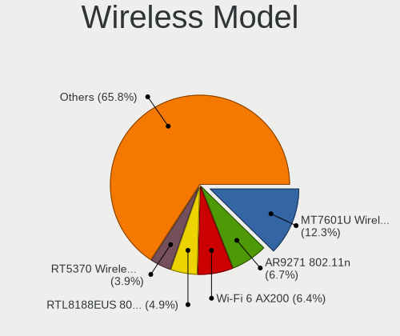

| Model                                                                                | Desktops | Percent |
|--------------------------------------------------------------------------------------|----------|---------|
| Ralink MT7601U Wireless Adapter                                                      | 42       | 12.84%  |
| Qualcomm Atheros AR9271 802.11n                                                      | 24       | 7.34%   |
| Intel Wi-Fi 6 AX200                                                                  | 23       | 7.03%   |
| Realtek RTL8188EUS 802.11n Wireless Network Adapter                                  | 15       | 4.59%   |
| Ralink RT5370 Wireless Adapter                                                       | 15       | 4.59%   |
| TP-Link TL-WN722N v2                                                                 | 10       | 3.06%   |
| Ralink MT7610U ("Archer T2U" 2.4G+5G WLAN Adapter                                    | 9        | 2.75%   |
| Qualcomm Atheros AR9227 Wireless Network Adapter                                     | 9        | 2.75%   |
| Qualcomm Atheros AR9485 Wireless Network Adapter                                     | 8        | 2.45%   |
| Intel Wireless-AC 9260                                                               | 8        | 2.45%   |
| Realtek RTL8188CE 802.11b/g/n WiFi Adapter                                           | 6        | 1.83%   |
| Ralink RT2870/RT3070 Wireless Adapter                                                | 5        | 1.53%   |
| TP-Link AC600 wireless Realtek RTL8811AU [Archer T2U Nano]                           | 4        | 1.22%   |
| Realtek RTL8188CUS 802.11n WLAN Adapter                                              | 4        | 1.22%   |
| Realtek 802.11ac NIC                                                                 | 4        | 1.22%   |
| Ralink RT2561/RT61 rev B 802.11g                                                     | 4        | 1.22%   |
| Qualcomm Atheros AR5212/5213/2414 Wireless Network Adapter                           | 4        | 1.22%   |
| Qualcomm Atheros AR2413/AR2414 Wireless Network Adapter [AR5005G(S) 802.11bg]        | 4        | 1.22%   |
| Intel Dual Band Wireless-AC 3168NGW [Stone Peak]                                     | 4        | 1.22%   |
| TP-Link TL-WN822N Version 4 RTL8192EU                                                | 3        | 0.92%   |
| TP-Link Archer T2U PLUS [RTL8821AU]                                                  | 3        | 0.92%   |
| Realtek RTL8822BE 802.11a/b/g/n/ac WiFi adapter                                      | 3        | 0.92%   |
| Realtek RTL8192CU 802.11n WLAN Adapter                                               | 3        | 0.92%   |
| Realtek RTL8192CE PCIe Wireless Network Adapter                                      | 3        | 0.92%   |
| Realtek 802.11ac WLAN Adapter                                                        | 3        | 0.92%   |
| Ralink RT3060 Wireless 802.11n 1T/1R                                                 | 3        | 0.92%   |
| Ralink RT2561/RT61 802.11g PCI                                                       | 3        | 0.92%   |
| Qualcomm Atheros TP-Link TL-WN821N v3 / TL-WN822N v2 802.11n [Atheros AR7010+AR9287] | 3        | 0.92%   |
| Qualcomm Atheros TP-Link TL-WN322G v3 / TL-WN422G v2 802.11g [Atheros AR9271]        | 3        | 0.92%   |
| Qualcomm Atheros AR93xx Wireless Network Adapter                                     | 3        | 0.92%   |
| Qualcomm Atheros AR9285 Wireless Network Adapter (PCI-Express)                       | 3        | 0.92%   |
| Broadcom BCM4360 802.11ac Wireless Network Adapter                                   | 3        | 0.92%   |
| ASUS USB-N10 802.11n Network Adapter [Realtek RTL8188SU]                             | 3        | 0.92%   |
| TP-Link TL-WN823N v2/v3 [Realtek RTL8192EU]                                          | 2        | 0.61%   |
| Realtek RTL88x2bu [AC1200 Techkey]                                                   | 2        | 0.61%   |
| Realtek RTL8192EE PCIe Wireless Network Adapter                                      | 2        | 0.61%   |
| Realtek RTL8188FTV 802.11b/g/n 1T1R 2.4G WLAN Adapter                                | 2        | 0.61%   |
| Realtek RTL8188EE Wireless Network Adapter                                           | 2        | 0.61%   |
| Realtek RTL8187 Wireless Adapter                                                     | 2        | 0.61%   |
| Ralink RT2790 Wireless 802.11n 1T/2R PCIe                                            | 2        | 0.61%   |
| Qualcomm Atheros QCA6174 802.11ac Wireless Network Adapter                           | 2        | 0.61%   |
| Qualcomm Atheros AR922X Wireless Network Adapter                                     | 2        | 0.61%   |
| Qualcomm Atheros AR2417 Wireless Network Adapter [AR5007G 802.11bg]                  | 2        | 0.61%   |
| Intel Wireless 8265 / 8275                                                           | 2        | 0.61%   |
| Intel Wireless 3160                                                                  | 2        | 0.61%   |
| Intel Wi-Fi 6 AX210/AX211/AX411 160MHz                                               | 2        | 0.61%   |
| Intel Gemini Lake PCH CNVi WiFi                                                      | 2        | 0.61%   |
| Intel Cannon Lake PCH CNVi WiFi                                                      | 2        | 0.61%   |
| D-Link System DWA-126 802.11n Wireless Adapter [Atheros AR9271]                      | 2        | 0.61%   |
| D-Link DWA-125 Wireless N 150 Adapter(rev.A3) [Ralink RT5370]                        | 2        | 0.61%   |
| Broadcom Limited BCM4311 802.11b/g WLAN                                              | 2        | 0.61%   |
| Broadcom BCM43228 802.11a/b/g/n                                                      | 2        | 0.61%   |
| Xiaomi MediaTek MT7601U [MI WiFi]                                                    | 1        | 0.31%   |
| TP-Link Archer T3U [Realtek RTL8812BU]                                               | 1        | 0.31%   |
| Sitecom Europe WLA-2000 v1.001 WLAN [RTL8191SU]                                      | 1        | 0.31%   |
| Realtek RTL8822CE 802.11ac PCIe Wireless Network Adapter                             | 1        | 0.31%   |
| Realtek RTL8821AE 802.11ac PCIe Wireless Network Adapter                             | 1        | 0.31%   |
| Realtek RTL8814AU 802.11a/b/g/n/ac Wireless Adapter                                  | 1        | 0.31%   |
| Realtek RTL8723BE PCIe Wireless Network Adapter                                      | 1        | 0.31%   |
| Realtek RTL8192EU 802.11b/g/n WLAN Adapter                                           | 1        | 0.31%   |

Ethernet Vendor
---------------

Ethernet vendors

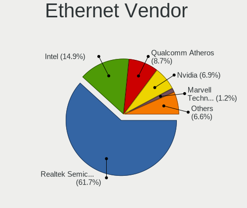

| Vendor                            | Desktops | Percent |
|-----------------------------------|----------|---------|
| Realtek Semiconductor             | 799      | 60.44%  |
| Intel                             | 193      | 14.6%   |
| Qualcomm Atheros                  | 123      | 9.3%    |
| Nvidia                            | 99       | 7.49%   |
| VIA Technologies                  | 16       | 1.21%   |
| Marvell Technology Group          | 16       | 1.21%   |
| Sundance Technology Inc / IC Plus | 10       | 0.76%   |
| Broadcom                          | 10       | 0.76%   |
| Huawei Technologies               | 9        | 0.68%   |
| Xiaomi                            | 8        | 0.61%   |
| Broadcom Limited                  | 8        | 0.61%   |
| Samsung Electronics               | 4        | 0.3%    |
| D-Link System                     | 4        | 0.3%    |
| Aquantia                          | 4        | 0.3%    |
| Silicon Integrated Systems [SiS]  | 3        | 0.23%   |
| HMD Global                        | 2        | 0.15%   |
| Google                            | 2        | 0.15%   |
| TP-Link                           | 1        | 0.08%   |
| Standard Microsystems [SMC]       | 1        | 0.08%   |
| Qualcomm                          | 1        | 0.08%   |
| Microchip Technology              | 1        | 0.08%   |
| MediaTek                          | 1        | 0.08%   |
| ICS Advent                        | 1        | 0.08%   |
| HTC (High Tech Computer)          | 1        | 0.08%   |
| Hangzhou Silan Microelectronics   | 1        | 0.08%   |
| DisplayLink                       | 1        | 0.08%   |
| Apple                             | 1        | 0.08%   |
| AMD                               | 1        | 0.08%   |
| ADMtek                            | 1        | 0.08%   |

Ethernet Model
--------------

Ethernet models

| Model                                                                      | Desktops | Percent |
|----------------------------------------------------------------------------|----------|---------|
| Realtek RTL8111/8168/8411 PCI Express Gigabit Ethernet Controller          | 664      | 48.79%  |
| Realtek RTL-8100/8101L/8139 PCI Fast Ethernet Adapter                      | 100      | 7.35%   |
| Nvidia MCP61 Ethernet                                                      | 62       | 4.56%   |
| Realtek RTL810xE PCI Express Fast Ethernet controller                      | 39       | 2.87%   |
| Intel I211 Gigabit Network Connection                                      | 30       | 2.2%    |
| Intel Ethernet Connection (2) I219-V                                       | 26       | 1.91%   |
| Qualcomm Atheros AR8151 v2.0 Gigabit Ethernet                              | 25       | 1.84%   |
| Intel 82579V Gigabit Network Connection                                    | 20       | 1.47%   |
| Intel 82579LM Gigabit Network Connection (Lewisville)                      | 20       | 1.47%   |
| Qualcomm Atheros Attansic L1 Gigabit Ethernet                              | 19       | 1.4%    |
| Qualcomm Atheros AR8121/AR8113/AR8114 Gigabit or Fast Ethernet             | 19       | 1.4%    |
| Qualcomm Atheros Attansic L2 Fast Ethernet                                 | 13       | 0.96%   |
| Realtek RTL-8110SC/8169SC Gigabit Ethernet                                 | 12       | 0.88%   |
| VIA VT6105/VT6106S [Rhine-III]                                             | 11       | 0.81%   |
| Qualcomm Atheros QCA8171 Gigabit Ethernet                                  | 11       | 0.81%   |
| Nvidia MCP51 Ethernet Controller                                           | 11       | 0.81%   |
| Intel Ethernet Connection (7) I219-V                                       | 10       | 0.73%   |
| Intel 82567LM-3 Gigabit Network Connection                                 | 10       | 0.73%   |
| Realtek RTL8125 2.5GbE Controller                                          | 9        | 0.66%   |
| Qualcomm Atheros AR8161 Gigabit Ethernet                                   | 9        | 0.66%   |
| Nvidia CK804 Ethernet Controller                                           | 9        | 0.66%   |
| Intel Ethernet Connection I217-V                                           | 9        | 0.66%   |
| Sundance Inc / IC Plus IC Plus IP100A Integrated 10/100 Ethernet MAC + PHY | 8        | 0.59%   |
| Qualcomm Atheros AR8131 Gigabit Ethernet                                   | 8        | 0.59%   |
| Intel 82566DM-2 Gigabit Network Connection                                 | 7        | 0.51%   |
| Xiaomi Mi/Redmi series (RNDIS)                                             | 6        | 0.44%   |
| Qualcomm Atheros Killer E220x Gigabit Ethernet Controller                  | 6        | 0.44%   |
| Intel Ethernet Connection (2) I218-V                                       | 6        | 0.44%   |
| VIA VT6102/VT6103 [Rhine-II]                                               | 5        | 0.37%   |
| Qualcomm Atheros AR8152 v2.0 Fast Ethernet                                 | 5        | 0.37%   |
| Nvidia MCP55 Ethernet                                                      | 5        | 0.37%   |
| Marvell Group 88E8053 PCI-E Gigabit Ethernet Controller                    | 5        | 0.37%   |
| Intel Ethernet Controller I225-V                                           | 5        | 0.37%   |
| Intel Ethernet Connection I217-LM                                          | 5        | 0.37%   |
| Huawei E353/E3131                                                          | 5        | 0.37%   |
| Nvidia MCP77 Ethernet                                                      | 4        | 0.29%   |
| Nvidia MCP67 Ethernet                                                      | 4        | 0.29%   |
| Marvell Group 88E8056 PCI-E Gigabit Ethernet Controller                    | 4        | 0.29%   |
| Marvell Group 88E8001 Gigabit Ethernet Controller                          | 4        | 0.29%   |
| Intel 82574L Gigabit Network Connection                                    | 4        | 0.29%   |
| Intel 82573L Gigabit Ethernet Controller                                   | 4        | 0.29%   |
| Huawei JNY-LX1                                                             | 4        | 0.29%   |
| Silicon Integrated Systems [SiS] SiS900 PCI Fast Ethernet                  | 3        | 0.22%   |
| Samsung Galaxy series, misc. (tethering mode)                              | 3        | 0.22%   |
| Realtek RTL8169 PCI Gigabit Ethernet Controller                            | 3        | 0.22%   |
| Qualcomm Atheros Killer E2500 Gigabit Ethernet Controller                  | 3        | 0.22%   |
| Intel I210 Gigabit Network Connection                                      | 3        | 0.22%   |
| Intel Ethernet Connection (12) I219-V                                      | 3        | 0.22%   |
| Intel 82578DM Gigabit Network Connection                                   | 3        | 0.22%   |
| Intel 82573E Gigabit Ethernet Controller (Copper)                          | 3        | 0.22%   |
| Intel 82541PI Gigabit Ethernet Controller                                  | 3        | 0.22%   |
| Intel 82540EM Gigabit Ethernet Controller                                  | 3        | 0.22%   |
| Broadcom NetLink BCM57780 Gigabit Ethernet PCIe                            | 3        | 0.22%   |
| Aquantia AQC107 NBase-T/IEEE 802.3bz Ethernet Controller [AQtion]          | 3        | 0.22%   |
| Xiaomi Mi/Redmi series (RNDIS + ADB)                                       | 2        | 0.15%   |
| Sundance Inc / IC Plus IP1000 Family Gigabit Ethernet                      | 2        | 0.15%   |
| Realtek RTL8153 Gigabit Ethernet Adapter                                   | 2        | 0.15%   |
| Qualcomm Atheros Killer E2400 Gigabit Ethernet Controller                  | 2        | 0.15%   |
| Qualcomm Atheros AR8132 Fast Ethernet                                      | 2        | 0.15%   |
| Nvidia CK8S Ethernet Controller                                            | 2        | 0.15%   |

Net Controller Kind
-------------------

Ethernet, WiFi or modem

| Kind     | Desktops | Percent |
|----------|----------|---------|
| Ethernet | 1224     | 79.38%  |
| WiFi     | 306      | 19.84%  |
| Modem    | 11       | 0.71%   |
| Unknown  | 1        | 0.06%   |

Used Controller
---------------

Currently used network controller

| Kind     | Desktops | Percent |
|----------|----------|---------|
| Ethernet | 1081     | 85.32%  |
| WiFi     | 186      | 14.68%  |

NICs
----

Total network controllers on board

| Total | Desktops | Percent |
|-------|----------|---------|
| 1     | 998      | 79.27%  |
| 2     | 210      | 16.68%  |
| 0     | 26       | 2.07%   |
| 3     | 23       | 1.83%   |
| 6     | 1        | 0.08%   |
| 4     | 1        | 0.08%   |

IPv6
----

IPv6 vs IPv4

| Used | Desktops | Percent |
|------|----------|---------|
| No   | 1245     | 99.52%  |
| Yes  | 6        | 0.48%   |

Bluetooth
---------

Bluetooth Vendor
----------------

Controller vendors

| Vendor                          | Desktops | Percent |
|---------------------------------|----------|---------|
| Cambridge Silicon Radio         | 82       | 45.56%  |
| Intel                           | 44       | 24.44%  |
| ASUSTek Computer                | 13       | 7.22%   |
| Qualcomm Atheros Communications | 12       | 6.67%   |
| Broadcom                        | 8        | 4.44%   |
| Realtek Semiconductor           | 6        | 3.33%   |
| IMC Networks                    | 3        | 1.67%   |
| Conwise Technology              | 3        | 1.67%   |
| D-Link                          | 2        | 1.11%   |
| Realtek                         | 1        | 0.56%   |
| Logitech                        | 1        | 0.56%   |
| Integrated System Solution      | 1        | 0.56%   |
| Hewlett-Packard                 | 1        | 0.56%   |
| Edimax Technology               | 1        | 0.56%   |
| D-Link System                   | 1        | 0.56%   |
| Apple                           | 1        | 0.56%   |

Bluetooth Model
---------------

Controller models

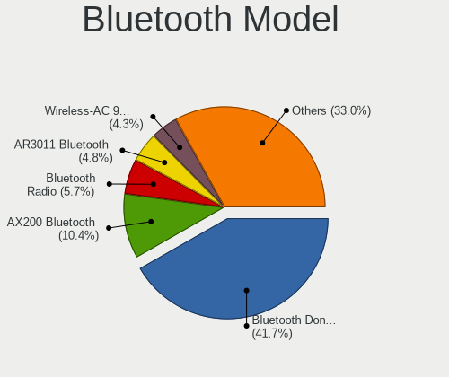

| Model                                                 | Desktops | Percent |
|-------------------------------------------------------|----------|---------|
| Cambridge Silicon Radio Bluetooth Dongle (HCI mode)   | 82       | 45.56%  |
| Intel AX200 Bluetooth                                 | 22       | 12.22%  |
| Qualcomm Atheros AR3011 Bluetooth                     | 10       | 5.56%   |
| Intel Wireless-AC 9260 Bluetooth Adapter              | 8        | 4.44%   |
| Realtek Bluetooth Radio                               | 6        | 3.33%   |
| Intel Bluetooth wireless interface                    | 5        | 2.78%   |
| ASUS Bluetooth Adapter                                | 5        | 2.78%   |
| Intel Bluetooth 9460/9560 Jefferson Peak (JfP)        | 4        | 2.22%   |
| Broadcom BCM2045 Bluetooth                            | 4        | 2.22%   |
| Intel Wireless-AC 3168 Bluetooth                      | 3        | 1.67%   |
| Conwise CW6622                                        | 3        | 1.67%   |
| ASUS BCM20702A0                                       | 3        | 1.67%   |
| Qualcomm Atheros  Bluetooth Device                    | 2        | 1.11%   |
| Intel AX210 Bluetooth                                 | 2        | 1.11%   |
| IMC Networks Bluetooth Radio                          | 2        | 1.11%   |
| D-Link DBT-122 Bluetooth adapter                      | 2        | 1.11%   |
| ASUS Qualcomm Bluetooth 4.1                           | 2        | 1.11%   |
| ASUS Bluetooth Radio                                  | 2        | 1.11%   |
| Realtek Bluetooth Radio                               | 1        | 0.56%   |
| Logitech BT Mini-Receiver (HCI mode)                  | 1        | 0.56%   |
| Integrated System Solution KY-BT100 Bluetooth Adapter | 1        | 0.56%   |
| IMC Networks Bluetooth Module                         | 1        | 0.56%   |
| HP Bluetooth 2.0 Interface [Broadcom BCM2045]         | 1        | 0.56%   |
| Edimax Bluetooth Adapter                              | 1        | 0.56%   |
| D-Link System DBT-122 Bluetooth                       | 1        | 0.56%   |
| Broadcom Bluetooth dongle                             | 1        | 0.56%   |
| Broadcom Bluetooth 3.0+HS USB Adapter                 | 1        | 0.56%   |
| Broadcom Bluetooth 2.0+eDR dongle                     | 1        | 0.56%   |
| Broadcom BCM92046DG-CL1ROM Bluetooth 2.1 Adapter      | 1        | 0.56%   |
| ASUS Broadcom BCM20702A0 Bluetooth                    | 1        | 0.56%   |
| Apple Bluetooth USB Host Controller                   | 1        | 0.56%   |

Sound
-----

Sound Vendor
------------

Sound card vendors

| Vendor                           | Desktops | Percent |
|----------------------------------|----------|---------|
| Intel                            | 699      | 35.75%  |
| AMD                              | 540      | 27.62%  |
| Nvidia                           | 520      | 26.6%   |
| C-Media Electronics              | 58       | 2.97%   |
| Creative Labs                    | 44       | 2.25%   |
| Logitech                         | 9        | 0.46%   |
| VIA Technologies                 | 8        | 0.41%   |
| ASUSTek Computer                 | 8        | 0.41%   |
| Generalplus Technology           | 6        | 0.31%   |
| JMTek                            | 5        | 0.26%   |
| Texas Instruments                | 4        | 0.2%    |
| Plantronics                      | 4        | 0.2%    |
| ULi Electronics                  | 3        | 0.15%   |
| Silicon Integrated Systems [SiS] | 3        | 0.15%   |
| Ensoniq                          | 3        | 0.15%   |
| Creative Technology              | 3        | 0.15%   |
| Yamaha                           | 2        | 0.1%    |
| Tenx Technology                  | 2        | 0.1%    |
| SteelSeries ApS                  | 2        | 0.1%    |
| Sennheiser Communications        | 2        | 0.1%    |
| SAVITECH                         | 2        | 0.1%    |
| Realtek Semiconductor            | 2        | 0.1%    |
| Razer USA                        | 2        | 0.1%    |
| BEHRINGER International          | 2        | 0.1%    |
| ZOOM                             | 1        | 0.05%   |
| Vitana                           | 1        | 0.05%   |
| ROCCAT                           | 1        | 0.05%   |
| Nokia Mobile Phones              | 1        | 0.05%   |
| No brand                         | 1        | 0.05%   |
| Microsoft                        | 1        | 0.05%   |
| M-Audio                          | 1        | 0.05%   |
| Kingston Technology              | 1        | 0.05%   |
| iConnectivity                    | 1        | 0.05%   |
| Hangzhou Worlde                  | 1        | 0.05%   |
| GYROCOM C&C                      | 1        | 0.05%   |
| Guillemot                        | 1        | 0.05%   |
| GN Netcom                        | 1        | 0.05%   |
| Giga-Byte Technology             | 1        | 0.05%   |
| Elite Silicon                    | 1        | 0.05%   |
| EGO SYStems                      | 1        | 0.05%   |
| DEXP BK-20                       | 1        | 0.05%   |
| Dell                             | 1        | 0.05%   |
| Corsair                          | 1        | 0.05%   |
| Cirrus Logic                     | 1        | 0.05%   |
| Aureal Semiconductor             | 1        | 0.05%   |
| AKAI Professional M.I.           | 1        | 0.05%   |

Sound Model
-----------

Sound card models

| Model                                                                             | Desktops | Percent |
|-----------------------------------------------------------------------------------|----------|---------|
| AMD SBx00 Azalia (Intel HDA)                                                      | 163      | 7.39%   |
| Intel NM10/ICH7 Family High Definition Audio Controller                           | 119      | 5.39%   |
| Intel 6 Series/C200 Series Chipset Family High Definition Audio Controller        | 116      | 5.26%   |
| AMD FCH Azalia Controller                                                         | 77       | 3.49%   |
| Nvidia MCP61 High Definition Audio                                                | 72       | 3.26%   |
| Nvidia GF108 High Definition Audio Controller                                     | 59       | 2.67%   |
| AMD Family 17h (Models 00h-0fh) HD Audio Controller                               | 55       | 2.49%   |
| Intel 8 Series/C220 Series Chipset High Definition Audio Controller               | 54       | 2.45%   |
| Intel 7 Series/C216 Chipset Family High Definition Audio Controller               | 52       | 2.36%   |
| Nvidia GK208 HDMI/DP Audio Controller                                             | 49       | 2.22%   |
| Intel 100 Series/C230 Series Chipset Family HD Audio Controller                   | 49       | 2.22%   |
| AMD Ellesmere HDMI Audio [Radeon RX 470/480 / 570/580/590]                        | 45       | 2.04%   |
| Intel 200 Series PCH HD Audio                                                     | 44       | 1.99%   |
| Nvidia High Definition Audio Controller                                           | 43       | 1.95%   |
| AMD Oland/Hainan/Cape Verde/Pitcairn HDMI Audio [Radeon HD 7000 Series]           | 43       | 1.95%   |
| Intel 82801JI (ICH10 Family) HD Audio Controller                                  | 42       | 1.9%    |
| Intel 82801I (ICH9 Family) HD Audio Controller                                    | 39       | 1.77%   |
| AMD Family 17h/19h HD Audio Controller                                            | 37       | 1.68%   |
| Intel Xeon E3-1200 v3/4th Gen Core Processor HD Audio Controller                  | 33       | 1.5%    |
| Nvidia GP107GL High Definition Audio Controller                                   | 32       | 1.45%   |
| AMD Starship/Matisse HD Audio Controller                                          | 32       | 1.45%   |
| Nvidia GK107 HDMI Audio Controller                                                | 30       | 1.36%   |
| Intel 5 Series/3400 Series Chipset High Definition Audio                          | 30       | 1.36%   |
| Intel Cannon Lake PCH cAVS                                                        | 29       | 1.31%   |
| Nvidia GP106 High Definition Audio Controller                                     | 28       | 1.27%   |
| AMD Raven/Raven2/Fenghuang HDMI/DP Audio Controller                               | 27       | 1.22%   |
| AMD Baffin HDMI/DP Audio [Radeon RX 550 640SP / RX 560/560X]                      | 24       | 1.09%   |
| Nvidia GP104 High Definition Audio Controller                                     | 23       | 1.04%   |
| AMD Turks HDMI Audio [Radeon HD 6500/6600 / 6700M Series]                         | 20       | 0.91%   |
| C-Media Electronics CMI8738/CMI8768 PCI Audio                                     | 19       | 0.86%   |
| AMD Redwood HDMI Audio [Radeon HD 5000 Series]                                    | 19       | 0.86%   |
| AMD Cedar HDMI Audio [Radeon HD 5400/6300/7300 Series]                            | 19       | 0.86%   |
| Nvidia GM107 High Definition Audio Controller [GeForce 940MX]                     | 18       | 0.82%   |
| Nvidia GF116 High Definition Audio Controller                                     | 17       | 0.77%   |
| AMD Caicos HDMI Audio [Radeon HD 6450 / 7450/8450/8490 OEM / R5 230/235/235X OEM] | 17       | 0.77%   |
| Nvidia TU116 High Definition Audio Controller                                     | 16       | 0.72%   |
| Nvidia GP108 High Definition Audio Controller                                     | 16       | 0.72%   |
| Nvidia GK106 HDMI Audio Controller                                                | 16       | 0.72%   |
| C-Media Electronics CMI8788 [Oxygen HD Audio]                                     | 16       | 0.72%   |
| AMD Trinity HDMI Audio Controller                                                 | 16       | 0.72%   |
| Nvidia GF119 HDMI Audio Controller                                                | 15       | 0.68%   |
| Intel C600/X79 series chipset High Definition Audio Controller                    | 15       | 0.68%   |
| Intel 82801EB/ER (ICH5/ICH5R) AC'97 Audio Controller                              | 15       | 0.68%   |
| AMD RV710/730 HDMI Audio [Radeon HD 4000 series]                                  | 14       | 0.63%   |
| Nvidia GF106 High Definition Audio Controller                                     | 12       | 0.54%   |
| Creative Labs EMU10k1 [Sound Blaster Live! Series]                                | 12       | 0.54%   |
| Nvidia GK104 HDMI Audio Controller                                                | 11       | 0.5%    |
| Intel 82801JD/DO (ICH10 Family) HD Audio Controller                               | 11       | 0.5%    |
| Nvidia GM206 High Definition Audio Controller                                     | 10       | 0.45%   |
| AMD RV630 HDMI Audio [Radeon HD 2600 PRO/XT / HD 3610]                            | 10       | 0.45%   |
| Intel Comet Lake PCH-V cAVS                                                       | 9        | 0.41%   |
| Intel C610/X99 series chipset HD Audio Controller                                 | 9        | 0.41%   |
| Intel 9 Series Chipset Family HD Audio Controller                                 | 9        | 0.41%   |
| AMD Juniper HDMI Audio [Radeon HD 5700 Series]                                    | 9        | 0.41%   |
| Nvidia GP102 HDMI Audio Controller                                                | 8        | 0.36%   |
| Intel 82801H (ICH8 Family) HD Audio Controller                                    | 8        | 0.36%   |
| Creative Labs EMU10k2/CA0100/CA0102/CA10200 [Sound Blaster Audigy Series]         | 8        | 0.36%   |
| AMD Tobago HDMI Audio [Radeon R7 360 / R9 360 OEM]                                | 8        | 0.36%   |
| AMD RV670/680 HDMI Audio [Radeon HD 3690/3800 Series]                             | 8        | 0.36%   |
| AMD RS780 HDMI Audio [Radeon 3000/3100 / HD 3200/3300]                            | 8        | 0.36%   |

Memory
------

Memory Vendor
-------------

Memory module vendors

| Vendor                     | Desktops | Percent |
|----------------------------|----------|---------|
| Unknown                    | 445      | 41.94%  |
| Kingston                   | 182      | 17.15%  |
| Samsung Electronics        | 56       | 5.28%   |
| SK hynix                   | 51       | 4.81%   |
| Crucial                    | 39       | 3.68%   |
| Goodram                    | 36       | 3.39%   |
| Team                       | 35       | 3.3%    |
| G.Skill                    | 27       | 2.54%   |
| Corsair                    | 24       | 2.26%   |
| Micron Technology          | 21       | 1.98%   |
| Transcend                  | 16       | 1.51%   |
| AMD                        | 16       | 1.51%   |
| Silicon Power              | 15       | 1.41%   |
| Patriot                    | 11       | 1.04%   |
| Exceleram                  | 11       | 1.04%   |
| Nanya Technology           | 8        | 0.75%   |
| Apacer                     | 7        | 0.66%   |
| GeIL                       | 6        | 0.57%   |
| Kllisre                    | 5        | 0.47%   |
| TwinMOS                    | 4        | 0.38%   |
| Elpida                     | 4        | 0.38%   |
| A-DATA Technology          | 4        | 0.38%   |
| TakeMS                     | 3        | 0.28%   |
| Swissbit                   | 3        | 0.28%   |
| Qumo                       | 2        | 0.19%   |
| Qimonda                    | 2        | 0.19%   |
| PNY                        | 2        | 0.19%   |
| Kingmax                    | 2        | 0.19%   |
| KETECH                     | 2        | 0.19%   |
| HMD                        | 2        | 0.19%   |
| Goldkey                    | 2        | 0.19%   |
| Unknown                    | 2        | 0.19%   |
| Wilk Elektronik            | 1        | 0.09%   |
| Wilk                       | 1        | 0.09%   |
| Unknown (ABCD)             | 1        | 0.09%   |
| Unknown (00FFFFFFFFFFFFFF) | 1        | 0.09%   |
| Unifosa                    | 1        | 0.09%   |
| Toshiba                    | 1        | 0.09%   |
| TOP MEDIA                  | 1        | 0.09%   |
| OCZ                        | 1        | 0.09%   |
| Melco                      | 1        | 0.09%   |
| MCI Computer               | 1        | 0.09%   |
| Hexon                      | 1        | 0.09%   |
| Foxline                    | 1        | 0.09%   |
| Carry                      | 1        | 0.09%   |
| Atermiter                  | 1        | 0.09%   |
| Apotop                     | 1        | 0.09%   |
| Aeneon                     | 1        | 0.09%   |

Memory Model
------------

Memory module models

| Model                                                | Desktops | Percent |
|------------------------------------------------------|----------|---------|
| Unknown RAM Module 2048MB DIMM DDR2 800MT/s          | 36       | 2.99%   |
| Unknown RAM Module 2048MB DIMM 1333MT/s              | 24       | 1.99%   |
| Unknown RAM Module 1024MB DIMM SDRAM                 | 23       | 1.91%   |
| Unknown RAM Module 2048MB DIMM 800MT/s               | 21       | 1.74%   |
| Unknown RAM Module 2048MB DIMM SDRAM                 | 19       | 1.58%   |
| Unknown RAM Module 4096MB DIMM 1333MT/s              | 16       | 1.33%   |
| Unknown RAM Module 4096MB DIMM 400MT/s               | 14       | 1.16%   |
| Unknown RAM Module 2048MB DIMM 667MT/s               | 12       | 1%      |
| Unknown RAM Module 1024MB DIMM DDR2 800MT/s          | 12       | 1%      |
| Unknown RAM Module 1024MB DIMM 667MT/s               | 12       | 1%      |
| Unknown RAM Module 1024MB DIMM                       | 12       | 1%      |
| Unknown RAM Module 4096MB DIMM DDR3 1333MT/s         | 10       | 0.83%   |
| Kingston RAM KHX3200C16D4/8GX 8GB DIMM DDR4 3600MT/s | 10       | 0.83%   |
| Unknown RAM Module 512MB DIMM SDRAM                  | 9        | 0.75%   |
| Unknown RAM Module 2048MB DIMM DDR3 1333MT/s         | 9        | 0.75%   |
| Unknown RAM Module 2048MB DIMM DDR2 667MT/s          | 9        | 0.75%   |
| Unknown RAM Module 2048MB DIMM 1066MT/s              | 9        | 0.75%   |
| Unknown RAM Module 512MB DIMM                        | 8        | 0.66%   |
| Unknown RAM Module 2048MB DIMM 400MT/s               | 8        | 0.66%   |
| Kingston RAM KHX2666C16/8G 8GB DIMM DDR4 3466MT/s    | 8        | 0.66%   |
| Unknown RAM Module 2GB DIMM 1333MT/s                 | 7        | 0.58%   |
| Unknown RAM Module 2048MB DIMM                       | 7        | 0.58%   |
| Unknown RAM Module 1024MB DIMM DDR2 333MT/s          | 7        | 0.58%   |
| Unknown RAM Module 1024MB DIMM DDR2                  | 7        | 0.58%   |
| Team RAM Elite-1600 8GB DIMM DDR3 1600MT/s           | 7        | 0.58%   |
| Unknown RAM Module 2048MB DIMM DDR2 333MT/s          | 6        | 0.5%    |
| SK hynix RAM HMT325U6BFR8C-H9 2GB DIMM DDR3 1333MT/s | 6        | 0.5%    |
| Kingston RAM KHX1600C10D3/8G 8GB DIMM DDR3 1600MT/s  | 6        | 0.5%    |
| Goodram RAM GR1333D364L9/2G 2GB DIMM DDR3 1333MT/s   | 6        | 0.5%    |
| Unknown RAM Module 4096MB DIMM 1600MT/s              | 5        | 0.42%   |
| Unknown RAM Module 2GB DIMM DDR2 800MT/s             | 5        | 0.42%   |
| Unknown RAM Module 2GB DIMM DDR2 667MT/s             | 5        | 0.42%   |
| Unknown RAM Module 1024MB DIMM DDR2 667MT/s          | 5        | 0.42%   |
| Team RAM Elite-1333 4GB DIMM DDR3 1333MT/s           | 5        | 0.42%   |
| Samsung RAM M378B5773CH0-CH9 2GB DIMM DDR3 1867MT/s  | 5        | 0.42%   |
| Kingston RAM KHX3200C18D4/8G 8GB DIMM DDR4 3333MT/s  | 5        | 0.42%   |
| Kingston RAM KHX1600C9D3/4GX 4GB DIMM DDR3 2400MT/s  | 5        | 0.42%   |
| Kingston RAM KHX1600C10D3/4G 4GB DIMM DDR3 1866MT/s  | 5        | 0.42%   |
| Goodram RAM GR1333D364L9/4G 4GB DIMM DDR3 1600MT/s   | 5        | 0.42%   |
| Unknown RAM Module 8GB DIMM DDR3 1333MT/s            | 4        | 0.33%   |
| Unknown RAM Module 4GB DIMM 1600MT/s                 | 4        | 0.33%   |
| Unknown RAM Module 4096MB DIMM DDR3 1600MT/s         | 4        | 0.33%   |
| Unknown RAM Module 4096MB DIMM 800MT/s               | 4        | 0.33%   |
| Unknown RAM Module 4096MB DIMM 667MT/s               | 4        | 0.33%   |
| Unknown RAM Module 2GB DIMM SDRAM                    | 4        | 0.33%   |
| Unknown RAM Module 2048MB DIMM DDR2 400MT/s          | 4        | 0.33%   |
| Unknown RAM Module 2048MB DIMM DDR 800MT/s           | 4        | 0.33%   |
| Unknown RAM Module 2048MB DIMM DDR 1333MT/s          | 4        | 0.33%   |
| Unknown RAM Module 1024MB DIMM 800MT/s               | 4        | 0.33%   |
| Team RAM TEAMGROUP-UD3-1600 8GB DIMM DDR3 1600MT/s   | 4        | 0.33%   |
| Kingston RAM KHX1866C10D3/8G 8GB DIMM DDR3 1867MT/s  | 4        | 0.33%   |
| Goodram RAM GR1600D364L11S/4G 4GB DIMM DDR3 1600MT/s | 4        | 0.33%   |
| Goodram RAM GR1333D364L9S/4G 4GB DIMM DDR3 1600MT/s  | 4        | 0.33%   |
| Unknown RAM Module 8192MB DIMM DDR3 1600MT/s         | 3        | 0.25%   |
| Unknown RAM Module 8192MB DIMM DDR3 1333MT/s         | 3        | 0.25%   |
| Unknown RAM Module 8192MB DIMM 1333MT/s              | 3        | 0.25%   |
| Unknown RAM Module 512MB DIMM DDR2 667MT/s           | 3        | 0.25%   |
| Unknown RAM Module 4GB DIMM DDR3 1333MT/s            | 3        | 0.25%   |
| Unknown RAM Module 4GB DIMM 1333MT/s                 | 3        | 0.25%   |
| Unknown RAM Module 4096MB DIMM DDR3 1067MT/s         | 3        | 0.25%   |

Memory Kind
-----------

Memory module kinds

| Kind    | Desktops | Percent |
|---------|----------|---------|
| DDR3    | 302      | 32.2%   |
| Unknown | 193      | 20.58%  |
| DDR4    | 189      | 20.15%  |
| DDR2    | 148      | 15.78%  |
| SDRAM   | 72       | 7.68%   |
| DDR     | 33       | 3.52%   |
| LPDDR4  | 1        | 0.11%   |

Memory Form Factor
------------------

Physical design of the memory module

| Name    | Desktops | Percent |
|---------|----------|---------|
| DIMM    | 900      | 97.72%  |
| SODIMM  | 19       | 2.06%   |
| RIMM    | 1        | 0.11%   |
| FB-DIMM | 1        | 0.11%   |

Memory Size
-----------

Memory module size

| Size  | Desktops | Percent |
|-------|----------|---------|
| 2048  | 317      | 29.6%   |
| 4096  | 271      | 25.3%   |
| 8192  | 238      | 22.22%  |
| 1024  | 142      | 13.26%  |
| 16384 | 45       | 4.2%    |
| 512   | 35       | 3.27%   |
| 32768 | 15       | 1.4%    |
| 256   | 8        | 0.75%   |

Memory Speed
------------

Memory module speed

| Speed   | Desktops | Percent |
|---------|----------|---------|
| 1333    | 166      | 16.24%  |
| 1600    | 164      | 16.05%  |
| 800     | 113      | 11.06%  |
| Unknown | 92       | 9%      |
| 667     | 78       | 7.63%   |
| 2400    | 47       | 4.6%    |
| 2133    | 45       | 4.4%    |
| 400     | 36       | 3.52%   |
| 3200    | 28       | 2.74%   |
| 2667    | 25       | 2.45%   |
| 1867    | 25       | 2.45%   |
| 3600    | 24       | 2.35%   |
| 1866    | 18       | 1.76%   |
| 1066    | 17       | 1.66%   |
| 333     | 17       | 1.66%   |
| 533     | 13       | 1.27%   |
| 3466    | 11       | 1.08%   |
| 3000    | 8        | 0.78%   |
| 1067    | 8        | 0.78%   |
| 2933    | 7        | 0.68%   |
| 1800    | 7        | 0.68%   |
| 3333    | 6        | 0.59%   |
| 3066    | 6        | 0.59%   |
| 1639    | 6        | 0.59%   |
| 266     | 6        | 0.59%   |
| 49926   | 4        | 0.39%   |
| 2866    | 4        | 0.39%   |
| 1400    | 4        | 0.39%   |
| 3866    | 3        | 0.29%   |
| 3400    | 3        | 0.29%   |
| 2666    | 3        | 0.29%   |
| 2134    | 3        | 0.29%   |
| 2048    | 3        | 0.29%   |
| 3800    | 2        | 0.2%    |
| 3334    | 2        | 0.2%    |
| 2800    | 2        | 0.2%    |
| 2465    | 2        | 0.2%    |
| 2000    | 2        | 0.2%    |
| 1334    | 2        | 0.2%    |
| 66      | 2        | 0.2%    |
| 65535   | 1        | 0.1%    |
| 4266    | 1        | 0.1%    |
| 3733    | 1        | 0.1%    |
| 3533    | 1        | 0.1%    |
| 3151    | 1        | 0.1%    |
| 3007    | 1        | 0.1%    |
| 2200    | 1        | 0.1%    |
| 2187    | 1        | 0.1%    |

Printers & scanners
-------------------

Printer Vendor
--------------

Printer device vendors

| Vendor                | Desktops | Percent |
|-----------------------|----------|---------|
| Canon                 | 22       | 33.33%  |
| Samsung Electronics   | 20       | 30.3%   |
| Hewlett-Packard       | 8        | 12.12%  |
| Seiko Epson           | 5        | 7.58%   |
| Brother Industries    | 3        | 4.55%   |
| WinChipHead           | 2        | 3.03%   |
| Prolific Technology   | 2        | 3.03%   |
| Zebra                 | 1        | 1.52%   |
| Xerox                 | 1        | 1.52%   |
| Oki Data              | 1        | 1.52%   |
| Lexmark International | 1        | 1.52%   |

Printer Model
-------------

Printer device models

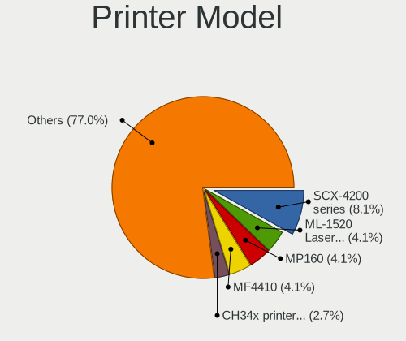

| Model                                         | Desktops | Percent |
|-----------------------------------------------|----------|---------|
| Samsung SCX-4200 series                       | 6        | 9.09%   |
| Samsung ML-1520 Laser Printer                 | 3        | 4.55%   |
| Canon MP160                                   | 3        | 4.55%   |
| Canon MF4410                                  | 3        | 4.55%   |
| WinChipHead CH34x printer adapter cable       | 2        | 3.03%   |
| Samsung Xerox Phaser 3117 Laser Printer       | 2        | 3.03%   |
| Samsung ML-1710 Printer                       | 2        | 3.03%   |
| Samsung M2070 Series                          | 2        | 3.03%   |
| Samsung M2020 Series                          | 2        | 3.03%   |
| Prolific PL2305 Parallel Port                 | 2        | 3.03%   |
| HP LaserJet 1020                              | 2        | 3.03%   |
| HP LaserJet 1012                              | 2        | 3.03%   |
| Canon MF4320-4350                             | 2        | 3.03%   |
| Canon iP2700 series                           | 2        | 3.03%   |
| Zebra ZTC S4M-200dpi ZPL                      | 1        | 1.52%   |
| Xerox Printing Support                        | 1        | 1.52%   |
| Seiko Epson XP-243 245 247 Series             | 1        | 1.52%   |
| Seiko Epson Printer                           | 1        | 1.52%   |
| Seiko Epson ME 340 Series/Stylus NX130 Series | 1        | 1.52%   |
| Seiko Epson L380 Series                       | 1        | 1.52%   |
| Seiko Epson L210 Series                       | 1        | 1.52%   |
| Samsung Xerox Phaser 3150                     | 1        | 1.52%   |
| Samsung SCX-4100 Scanner                      | 1        | 1.52%   |
| Samsung ML-1660 Series                        | 1        | 1.52%   |
| Oki Data USB Device                           | 1        | 1.52%   |
| Lexmark International 3300 series             | 1        | 1.52%   |
| HP LaserJet P1005                             | 1        | 1.52%   |
| HP LaserJet 1018                              | 1        | 1.52%   |
| HP LaserJet 1010                              | 1        | 1.52%   |
| HP DeskJet F2100 Printer series               | 1        | 1.52%   |
| Canon PIXMA MP280                             | 1        | 1.52%   |
| Canon PIXMA MP230                             | 1        | 1.52%   |
| Canon PIXMA MG3600 Series                     | 1        | 1.52%   |
| Canon PIXMA iP1800 Printer                    | 1        | 1.52%   |
| Canon MF4010 series                           | 1        | 1.52%   |
| Canon MF3110                                  | 1        | 1.52%   |
| Canon MF3010                                  | 1        | 1.52%   |
| Canon LBP6020                                 | 1        | 1.52%   |
| Canon LBP3010/LBP3018/LBP3050                 | 1        | 1.52%   |
| Canon LBP2900                                 | 1        | 1.52%   |
| Canon LaserShot LBP-1120 Printer              | 1        | 1.52%   |
| Canon G3000 series                            | 1        | 1.52%   |
| Brother HL-1210W series                       | 1        | 1.52%   |
| Brother HL-1110 series                        | 1        | 1.52%   |
| Brother DCP-1510                              | 1        | 1.52%   |

Scanner Vendor
--------------

Scanner device vendors

| Vendor             | Desktops | Percent |
|--------------------|----------|---------|
| Canon              | 6        | 31.58%  |
| Seiko Epson        | 5        | 26.32%  |
| Ultima Electronics | 3        | 15.79%  |
| Hewlett-Packard    | 3        | 15.79%  |
| Mustek Systems     | 2        | 10.53%  |

Scanner Model
-------------

Scanner device models

| Model                                                                                 | Desktops | Percent |
|---------------------------------------------------------------------------------------|----------|---------|
| Ultima Artec Ultima 2000 (GT6801 based)/Lifetec LT9385/ScanMagic 1200 UB Plus Scanner | 3        | 15.79%  |
| Canon CanoScan LIDE 25                                                                | 3        | 15.79%  |
| Seiko Epson GT-F500/GT-F550 [Perfection 2480/2580 PHOTO]                              | 2        | 10.53%  |
| Seiko Epson Scanner                                                                   | 1        | 5.26%   |
| Seiko Epson GT-F520/GT-F570 [Perfection 3590 PHOTO]                                   | 1        | 5.26%   |
| Seiko Epson GT-7300U [Perfection 1260/1260 PHOTO]                                     | 1        | 5.26%   |
| Mustek Systems SNAPSCAN e22                                                           | 1        | 5.26%   |
| Mustek Systems BearPaw 1200 CU Plus                                                   | 1        | 5.26%   |
| HP ScanJet 4400c                                                                      | 1        | 5.26%   |
| HP ScanJet 3800c                                                                      | 1        | 5.26%   |
| HP ScanJet 2400c                                                                      | 1        | 5.26%   |
| Canon CanoScan N670U/N676U/LiDE 20                                                    | 1        | 5.26%   |
| Canon CanoScan LiDE 60                                                                | 1        | 5.26%   |
| Canon CanoScan LiDE 110                                                               | 1        | 5.26%   |

Camera
------

Camera Vendor
-------------

Camera device vendors

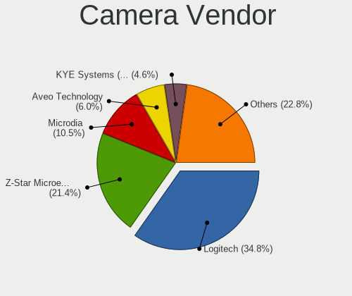

| Vendor                                 | Desktops | Percent |
|----------------------------------------|----------|---------|
| Logitech                               | 103      | 33.12%  |
| Z-Star Microelectronics                | 68       | 21.86%  |
| Microdia                               | 35       | 11.25%  |
| Aveo Technology                        | 18       | 5.79%   |
| KYE Systems (Mouse Systems)            | 16       | 5.14%   |
| Pixart Imaging                         | 10       | 3.22%   |
| Microsoft                              | 9        | 2.89%   |
| Cubeternet                             | 7        | 2.25%   |
| GEMBIRD                                | 6        | 1.93%   |
| Hewlett-Packard                        | 4        | 1.29%   |
| Arkmicro Technologies                  | 4        | 1.29%   |
| Apple                                  | 4        | 1.29%   |
| Silicon Motion                         | 3        | 0.96%   |
| Realtek Semiconductor                  | 3        | 0.96%   |
| Sunplus Innovation Technology          | 2        | 0.64%   |
| Samsung Electronics                    | 2        | 0.64%   |
| Google                                 | 2        | 0.64%   |
| Generalplus Technology                 | 2        | 0.64%   |
| Trust                                  | 1        | 0.32%   |
| Teslong Camera                         | 1        | 0.32%   |
| SJ-180517-N                            | 1        | 0.32%   |
| Novatek Microelectronics               | 1        | 0.32%   |
| lihappe8                               | 1        | 0.32%   |
| LG Electronics                         | 1        | 0.32%   |
| Jieli Technology                       | 1        | 0.32%   |
| IMC Networks                           | 1        | 0.32%   |
| HTC (High Tech Computer)               | 1        | 0.32%   |
| Chicony Electronics                    | 1        | 0.32%   |
| Cheng Uei Precision Industry (Foxlink) | 1        | 0.32%   |
| Alcor Micro                            | 1        | 0.32%   |
| Unknown                                | 1        | 0.32%   |

Camera Model
------------

Camera device models

| Model                                                 | Desktops | Percent |
|-------------------------------------------------------|----------|---------|
| Logitech Webcam C270                                  | 38       | 12.22%  |
| Z-Star Venus USB2.0 Camera                            | 32       | 10.29%  |
| Microdia Camera                                       | 17       | 5.47%   |
| Logitech Webcam C310                                  | 15       | 4.82%   |
| Z-Star A4 TECH USB2.0 PC Camera J                     | 13       | 4.18%   |
| Logitech Webcam C170                                  | 13       | 4.18%   |
| Z-Star A4 TECH USB2.0 PC Camera E                     | 12       | 3.86%   |
| Microdia Sonix USB 2.0 Camera                         | 11       | 3.54%   |
| Aveo Camera                                           | 11       | 3.54%   |
| Pixart Imaging GE 1.3 MP MiniCam Pro                  | 10       | 3.22%   |
| Z-Star A4 TECH HD PC Camera                           | 8        | 2.57%   |
| Microsoft LifeCam HD-3000                             | 7        | 2.25%   |
| Microdia USB 2.0 Camera                               | 7        | 2.25%   |
| Logitech Webcam C210                                  | 6        | 1.93%   |
| Logitech Logitech Webcam C100                         | 6        | 1.93%   |
| KYE Systems (Mouse Systems) iLook 320                 | 5        | 1.61%   |
| Logitech Webcam C200                                  | 4        | 1.29%   |
| Aveo USB2.0 Camera                                    | 4        | 1.29%   |
| Arkmicro USB2.0 PC CAMERA                             | 4        | 1.29%   |
| Realtek FULL HD 1080P Webcam                          | 3        | 0.96%   |
| Logitech HD Webcam C525                               | 3        | 0.96%   |
| Logitech HD Webcam B910                               | 3        | 0.96%   |
| KYE Systems (Mouse Systems) Genius FaceCam 320        | 3        | 0.96%   |
| GEMBIRD USB2.0 PC CAMERA                              | 3        | 0.96%   |
| GEMBIRD Generic UVC 1.00 camera [AppoTech AX2311]     | 3        | 0.96%   |
| Cubeternet WebCam                                     | 3        | 0.96%   |
| Apple iPhone 5/5C/5S/6/SE                             | 3        | 0.96%   |
| Z-Star Vimicro USB2.0 UVC PC Camera                   | 2        | 0.64%   |
| Silicon Motion SM731 Camera                           | 2        | 0.64%   |
| Samsung Galaxy series, misc. (MTP mode)               | 2        | 0.64%   |
| Logitech Webcam C600                                  | 2        | 0.64%   |
| Logitech Webcam C120                                  | 2        | 0.64%   |
| Logitech Webcam C110                                  | 2        | 0.64%   |
| Logitech Logitech Webcam C160                         | 2        | 0.64%   |
| Logitech HD Webcam C510                               | 2        | 0.64%   |
| KYE Systems (Mouse Systems) Genius iSlim 330          | 2        | 0.64%   |
| Google Nexus/Pixel Device (MTP + debug)               | 2        | 0.64%   |
| Cubeternet USB2.0 Camera                              | 2        | 0.64%   |
| Z-Star USB 2.0 PC Camera                              | 1        | 0.32%   |
| Trust Webcam                                          | 1        | 0.32%   |
| Teslong Camera                                        | 1        | 0.32%   |
| Sunplus HD 720P webcam                                | 1        | 0.32%   |
| Sunplus Full HD webcam                                | 1        | 0.32%   |
| SJ-180517-N 1080P Webcam                              | 1        | 0.32%   |
| Silicon Motion Silicon Motion Camera                  | 1        | 0.32%   |
| Novatek J1455                                         | 1        | 0.32%   |
| Microsoft LifeCam VX-5000                             | 1        | 0.32%   |
| Microsoft LifeCam Cinema                              | 1        | 0.32%   |
| Logitech Webcam C930e                                 | 1        | 0.32%   |
| Logitech Webcam C250                                  | 1        | 0.32%   |
| Logitech QuickCam Deluxe for Notebooks                | 1        | 0.32%   |
| Logitech QuickCam Communicate Deluxe                  | 1        | 0.32%   |
| Logitech Logi 4K Stream Edition                       | 1        | 0.32%   |
| lihappe8 USB 2.0 Camera                               | 1        | 0.32%   |
| LG LM-X420xxx/G2/G3 Android Phone (MTP/download mode) | 1        | 0.32%   |
| KYE Systems (Mouse Systems) iSlim 2000AF              | 1        | 0.32%   |
| KYE Systems (Mouse Systems) FaceCam 311               | 1        | 0.32%   |
| KYE Systems (Mouse Systems) FaceCam 2000              | 1        | 0.32%   |
| KYE Systems (Mouse Systems) FaceCam 1020              | 1        | 0.32%   |
| KYE Systems (Mouse Systems) FaceCam 1005              | 1        | 0.32%   |

Security
--------

Fingerprint Vendor
------------------

Fingerprint sensor vendors

Zero info for selected period =(

Fingerprint Model
-----------------

Fingerprint sensor models

Zero info for selected period =(

Chipcard Vendor
---------------

Chipcard module vendors

| Vendor                | Desktops | Percent |
|-----------------------|----------|---------|
| Avtor                 | 2        | 50%     |
| Alcor Micro           | 1        | 25%     |
| Advanced Card Systems | 1        | 25%     |

Chipcard Model
--------------

Chipcard module models

| Model                               | Desktops | Percent |
|-------------------------------------|----------|---------|
| Avtor SecureToken                   | 2        | 50%     |
| Alcor Micro AU9540 Smartcard Reader | 1        | 25%     |
| Advanced Card Systems ACR122U       | 1        | 25%     |

Unsupported
-----------

Unsupported Devices
-------------------

Total unsupported devices on board

| Total | Desktops | Percent |
|-------|----------|---------|
| 0     | 1130     | 88.91%  |
| 1     | 122      | 9.6%    |
| 2     | 16       | 1.26%   |
| 3     | 2        | 0.16%   |
| 7     | 1        | 0.08%   |

Unsupported Device Types
------------------------

Types of unsupported devices

| Type                     | Desktops | Percent |
|--------------------------|----------|---------|
| Graphics card            | 69       | 45.39%  |
| Net/wireless             | 26       | 17.11%  |
| Communication controller | 16       | 10.53%  |
| Unassigned class         | 10       | 6.58%   |
| Sound                    | 9        | 5.92%   |
| Camera                   | 6        | 3.95%   |
| Multimedia controller    | 4        | 2.63%   |
| Chipcard                 | 3        | 1.97%   |
| Bluetooth                | 3        | 1.97%   |
| Storage/ide              | 2        | 1.32%   |
| Storage/raid             | 1        | 0.66%   |
| Storage                  | 1        | 0.66%   |
| Modem                    | 1        | 0.66%   |
| Dvb card                 | 1        | 0.66%   |

