Linux in Ukraine - Tested Hardware & Statistics (Notebooks)
-----------------------------------------------------------

A project to collect tested hardware configurations for Linux in Ukraine.

Anyone can contribute to this report by the [hw-probe](https://github.com/linuxhw/hw-probe) tool:

    sudo -E hw-probe -all -upload

Please contribute! Especially if your hardware is rare.

Contents
--------

* [ Test Cases ](#test-cases)

* [ System ](#system)
  - [ OS                       ](#os)
  - [ OS Family                ](#os-family)
  - [ Kernel                   ](#kernel)
  - [ Kernel Family            ](#kernel-family)
  - [ Kernel Major Ver.        ](#kernel-major-ver)
  - [ Arch                     ](#arch)
  - [ DE                       ](#de)
  - [ Display Server           ](#display-server)
  - [ Display Manager          ](#display-manager)
  - [ OS Lang                  ](#os-lang)
  - [ Boot Mode                ](#boot-mode)
  - [ Filesystem               ](#filesystem)
  - [ Part. scheme             ](#part-scheme)
  - [ Dual Boot with Linux/BSD ](#dual-boot-with-linuxbsd)
  - [ Dual Boot (Win)          ](#dual-boot-win)

* [ Board ](#board)
  - [ Vendor                   ](#vendor)
  - [ Model                    ](#model)
  - [ Model Family             ](#model-family)
  - [ MFG Year                 ](#mfg-year)
  - [ Form Factor              ](#form-factor)
  - [ Secure Boot              ](#secure-boot)
  - [ Coreboot                 ](#coreboot)
  - [ RAM Size                 ](#ram-size)
  - [ RAM Used                 ](#ram-used)
  - [ Total Drives             ](#total-drives)
  - [ Has CD-ROM               ](#has-cd-rom)
  - [ Has Ethernet             ](#has-ethernet)
  - [ Has WiFi                 ](#has-wifi)
  - [ Has Bluetooth            ](#has-bluetooth)

* [ Location ](#location)
  - [ Country                  ](#country)
  - [ City                     ](#city)

* [ Drives ](#drives)
  - [ Drive Vendor             ](#drive-vendor)
  - [ Drive Model              ](#drive-model)
  - [ HDD Vendor               ](#hdd-vendor)
  - [ SSD Vendor               ](#ssd-vendor)
  - [ Drive Kind               ](#drive-kind)
  - [ Drive Connector          ](#drive-connector)
  - [ Drive Size               ](#drive-size)
  - [ Space Total              ](#space-total)
  - [ Space Used               ](#space-used)
  - [ Malfunc. Drives          ](#malfunc-drives)
  - [ Malfunc. Drive Vendor    ](#malfunc-drive-vendor)
  - [ Malfunc. HDD Vendor      ](#malfunc-hdd-vendor)
  - [ Malfunc. Drive Kind      ](#malfunc-drive-kind)
  - [ Failed Drives            ](#failed-drives)
  - [ Failed Drive Vendor      ](#failed-drive-vendor)
  - [ Drive Status             ](#drive-status)

* [ Storage controller ](#storage-controller)
  - [ Storage Vendor           ](#storage-vendor)
  - [ Storage Model            ](#storage-model)
  - [ Storage Kind             ](#storage-kind)

* [ Processor ](#processor)
  - [ CPU Vendor               ](#cpu-vendor)
  - [ CPU Model                ](#cpu-model)
  - [ CPU Model Family         ](#cpu-model-family)
  - [ CPU Cores                ](#cpu-cores)
  - [ CPU Sockets              ](#cpu-sockets)
  - [ CPU Threads              ](#cpu-threads)
  - [ CPU Op-Modes             ](#cpu-op-modes)
  - [ CPU Microcode            ](#cpu-microcode)
  - [ CPU Microarch            ](#cpu-microarch)

* [ Graphics ](#graphics)
  - [ GPU Vendor               ](#gpu-vendor)
  - [ GPU Model                ](#gpu-model)
  - [ GPU Combo                ](#gpu-combo)
  - [ GPU Driver               ](#gpu-driver)
  - [ GPU Memory               ](#gpu-memory)

* [ Monitor ](#monitor)
  - [ Monitor Vendor           ](#monitor-vendor)
  - [ Monitor Model            ](#monitor-model)
  - [ Monitor Resolution       ](#monitor-resolution)
  - [ Monitor Diagonal         ](#monitor-diagonal)
  - [ Monitor Width            ](#monitor-width)
  - [ Aspect Ratio             ](#aspect-ratio)
  - [ Monitor Area             ](#monitor-area)
  - [ Pixel Density            ](#pixel-density)
  - [ Multiple Monitors        ](#multiple-monitors)

* [ Network ](#network)
  - [ Net Controller Vendor    ](#net-controller-vendor)
  - [ Net Controller Model     ](#net-controller-model)
  - [ Wireless Vendor          ](#wireless-vendor)
  - [ Wireless Model           ](#wireless-model)
  - [ Ethernet Vendor          ](#ethernet-vendor)
  - [ Ethernet Model           ](#ethernet-model)
  - [ Net Controller Kind      ](#net-controller-kind)
  - [ Used Controller          ](#used-controller)
  - [ NICs                     ](#nics)
  - [ IPv6                     ](#ipv6)

* [ Bluetooth ](#bluetooth)
  - [ Bluetooth Vendor         ](#bluetooth-vendor)
  - [ Bluetooth Model          ](#bluetooth-model)

* [ Sound ](#sound)
  - [ Sound Vendor             ](#sound-vendor)
  - [ Sound Model              ](#sound-model)

* [ Memory ](#memory)
  - [ Memory Vendor            ](#memory-vendor)
  - [ Memory Model             ](#memory-model)
  - [ Memory Kind              ](#memory-kind)
  - [ Memory Form Factor       ](#memory-form-factor)
  - [ Memory Size              ](#memory-size)
  - [ Memory Speed             ](#memory-speed)

* [ Printers & scanners ](#printers--scanners)
  - [ Printer Vendor           ](#printer-vendor)
  - [ Printer Model            ](#printer-model)
  - [ Scanner Vendor           ](#scanner-vendor)
  - [ Scanner Model            ](#scanner-model)

* [ Camera ](#camera)
  - [ Camera Vendor            ](#camera-vendor)
  - [ Camera Model             ](#camera-model)

* [ Security ](#security)
  - [ Fingerprint Vendor       ](#fingerprint-vendor)
  - [ Fingerprint Model        ](#fingerprint-model)
  - [ Chipcard Vendor          ](#chipcard-vendor)
  - [ Chipcard Model           ](#chipcard-model)

* [ Unsupported ](#unsupported)
  - [ Unsupported Devices      ](#unsupported-devices)
  - [ Unsupported Device Types ](#unsupported-device-types)

Test Cases
----------

Total: 2459

| Vendor        | Model                       | Probe                                                      | Date         |
|---------------|-----------------------------|------------------------------------------------------------|--------------|
| HP            | ProBook 450 G5              | [7f8acf64cd](https://linux-hardware.org/?probe=7f8acf64cd) | May 31, 2022 |
| HP            | ProBook 455 G7              | [d95897f938](https://linux-hardware.org/?probe=d95897f938) | May 31, 2022 |
| HP            | ProBook 450 G5              | [2fbbe84744](https://linux-hardware.org/?probe=2fbbe84744) | May 31, 2022 |
| ASUSTek       | X75A1                       | [59159b4b05](https://linux-hardware.org/?probe=59159b4b05) | May 27, 2022 |
| Minix         | Z64 V1.2                    | [97525a1dc3](https://linux-hardware.org/?probe=97525a1dc3) | May 27, 2022 |
| HP            | Pavilion g6                 | [3972cb6508](https://linux-hardware.org/?probe=3972cb6508) | May 25, 2022 |
| HP            | Pavilion g7                 | [e038c828f9](https://linux-hardware.org/?probe=e038c828f9) | May 25, 2022 |
| Lenovo        | IdeaPad 330-15ARR 81D2      | [7200a39439](https://linux-hardware.org/?probe=7200a39439) | May 23, 2022 |
| HP            | Pavilion Laptop 15-eg0xx... | [377330c2b5](https://linux-hardware.org/?probe=377330c2b5) | May 23, 2022 |
| Dell          | Vostro 15 3515              | [90d9ac6bf3](https://linux-hardware.org/?probe=90d9ac6bf3) | May 18, 2022 |
| Lenovo        | ThinkPad X1 Carbon 6th 2... | [1e61b49f67](https://linux-hardware.org/?probe=1e61b49f67) | May 18, 2022 |
| Dell          | Precision M6800             | [65d5a77965](https://linux-hardware.org/?probe=65d5a77965) | May 14, 2022 |
| Irbis         | NB144                       | [abb6000f0b](https://linux-hardware.org/?probe=abb6000f0b) | May 14, 2022 |
| HP            | Pavilion Gaming Laptop 1... | [eb297f3c7b](https://linux-hardware.org/?probe=eb297f3c7b) | May 12, 2022 |
| Minix         | Z64 V1.2                    | [8796deded0](https://linux-hardware.org/?probe=8796deded0) | May 12, 2022 |
| Lenovo        | Unknown                     | [3cced8a4fa](https://linux-hardware.org/?probe=3cced8a4fa) | May 12, 2022 |
| Samsung       | R530/R730/P530              | [d209735fd8](https://linux-hardware.org/?probe=d209735fd8) | May 07, 2022 |
| Lenovo        | ThinkPad T470p 20J7S0BR0... | [ac2c2a5969](https://linux-hardware.org/?probe=ac2c2a5969) | May 06, 2022 |
| Lenovo        | ThinkPad X220 4290LD4       | [0a28279824](https://linux-hardware.org/?probe=0a28279824) | May 05, 2022 |
| Lenovo        | ThinkPad X1 Carbon 6th 2... | [26cfc77ab9](https://linux-hardware.org/?probe=26cfc77ab9) | May 02, 2022 |
| ICL           | RAYbook Si1507              | [eaf9bd7ea3](https://linux-hardware.org/?probe=eaf9bd7ea3) | May 02, 2022 |
| HP            | ProBook 4520s               | [ba430a31ae](https://linux-hardware.org/?probe=ba430a31ae) | May 01, 2022 |
| Lenovo        | G700 20251                  | [94272db5ec](https://linux-hardware.org/?probe=94272db5ec) | Apr 30, 2022 |
| ASUSTek       | UX31A                       | [59228e735e](https://linux-hardware.org/?probe=59228e735e) | Apr 30, 2022 |
| Acer          | TravelMate 2490             | [8cc2cf84f4](https://linux-hardware.org/?probe=8cc2cf84f4) | Apr 29, 2022 |
| Timi          | A35S                        | [8a3195e10c](https://linux-hardware.org/?probe=8a3195e10c) | Apr 27, 2022 |
| Timi          | RedmiBook Pro 15S           | [d060ed71c3](https://linux-hardware.org/?probe=d060ed71c3) | Apr 26, 2022 |
| HP            | ProBook 450 G8 Notebook ... | [4f92840d8c](https://linux-hardware.org/?probe=4f92840d8c) | Apr 26, 2022 |
| Lenovo        | G510 20238                  | [906f1626d7](https://linux-hardware.org/?probe=906f1626d7) | Apr 24, 2022 |
| Acer          | AOD257                      | [9b11649bce](https://linux-hardware.org/?probe=9b11649bce) | Apr 22, 2022 |
| Acer          | AOD257                      | [e321b17ef8](https://linux-hardware.org/?probe=e321b17ef8) | Apr 22, 2022 |
| Lenovo        | IdeaPad 5 15ALC05 82LN      | [76bb32f682](https://linux-hardware.org/?probe=76bb32f682) | Apr 20, 2022 |
| Lenovo        | ThinkPad T420 4180DV2       | [4ed718df3e](https://linux-hardware.org/?probe=4ed718df3e) | Apr 18, 2022 |
| Lenovo        | ThinkPad T420 4180DV2       | [402c31b107](https://linux-hardware.org/?probe=402c31b107) | Apr 18, 2022 |
| ASUSTek       | UX303LB                     | [104779add9](https://linux-hardware.org/?probe=104779add9) | Apr 17, 2022 |
| HP            | 250 G2                      | [eafcfe8215](https://linux-hardware.org/?probe=eafcfe8215) | Apr 17, 2022 |
| ASUSTek       | K50IJ                       | [ad5a24dbb3](https://linux-hardware.org/?probe=ad5a24dbb3) | Apr 15, 2022 |
| ASUSTek       | ROG Strix G713QC_G713QC     | [c54b458c01](https://linux-hardware.org/?probe=c54b458c01) | Apr 14, 2022 |
| Lenovo        | ThinkPad T420 4180DV2       | [9e8785fcdd](https://linux-hardware.org/?probe=9e8785fcdd) | Apr 14, 2022 |
| ASUSTek       | X75VCP                      | [21e0b65e1b](https://linux-hardware.org/?probe=21e0b65e1b) | Apr 13, 2022 |
| Lenovo        | G780 20138                  | [0cabea6484](https://linux-hardware.org/?probe=0cabea6484) | Apr 08, 2022 |
| Lenovo        | B570 HuronRiver Platform    | [cdb5f43cd7](https://linux-hardware.org/?probe=cdb5f43cd7) | Apr 07, 2022 |
| Timi          | A35                         | [90a30461d2](https://linux-hardware.org/?probe=90a30461d2) | Apr 03, 2022 |
| Lenovo        | IdeaPad L340-15API 81LW     | [262e4f8317](https://linux-hardware.org/?probe=262e4f8317) | Apr 02, 2022 |
| Lenovo        | ThinkPad E15 Gen 2 20TD0... | [27f986af8c](https://linux-hardware.org/?probe=27f986af8c) | Mar 30, 2022 |
| Insignia      | NS-P11W7100                 | [daa476af8c](https://linux-hardware.org/?probe=daa476af8c) | Mar 28, 2022 |
| Dell          | Latitude E6400              | [b431dc3d73](https://linux-hardware.org/?probe=b431dc3d73) | Mar 28, 2022 |
| HP            | ZBook 17 G3                 | [b016648f02](https://linux-hardware.org/?probe=b016648f02) | Mar 27, 2022 |
| Aquarius      | NS585 R32                   | [582389ca98](https://linux-hardware.org/?probe=582389ca98) | Mar 24, 2022 |
| ASUSTek       | X75VCP                      | [54e978fcca](https://linux-hardware.org/?probe=54e978fcca) | Mar 23, 2022 |
| Timi          | RedmiBook Pro 15            | [78f30b04b6](https://linux-hardware.org/?probe=78f30b04b6) | Mar 21, 2022 |
| Samsung       | R59P/R60P/R61P              | [2ec6236c3a](https://linux-hardware.org/?probe=2ec6236c3a) | Mar 20, 2022 |
| Insignia      | NS-P11W7100                 | [20aa266b33](https://linux-hardware.org/?probe=20aa266b33) | Mar 19, 2022 |
| Unknown       | Unknown                     | [58912ced73](https://linux-hardware.org/?probe=58912ced73) | Mar 18, 2022 |
| Lenovo        | IdeaPad 320-15IKB 81BG      | [4652b9e771](https://linux-hardware.org/?probe=4652b9e771) | Mar 17, 2022 |
| Lenovo        | IdeaPad 320-15IKB 81BG      | [091eb95750](https://linux-hardware.org/?probe=091eb95750) | Mar 17, 2022 |
| Lenovo        | IdeaPad Z580                | [80a27aca02](https://linux-hardware.org/?probe=80a27aca02) | Mar 17, 2022 |
| Insignia      | NS-P11W7100                 | [44de443312](https://linux-hardware.org/?probe=44de443312) | Mar 11, 2022 |
| HP            | ProBook 450 G7              | [5d73b6f2f7](https://linux-hardware.org/?probe=5d73b6f2f7) | Mar 08, 2022 |
| ASUSTek       | S301LP                      | [5c29218ebd](https://linux-hardware.org/?probe=5c29218ebd) | Mar 08, 2022 |
| Lenovo        | Unknown                     | [4308edfd8d](https://linux-hardware.org/?probe=4308edfd8d) | Mar 07, 2022 |
| Acer          | Swift SF314-43              | [6d16601f06](https://linux-hardware.org/?probe=6d16601f06) | Mar 07, 2022 |
| HP            | 250 G8 Notebook PC          | [11ca11b21d](https://linux-hardware.org/?probe=11ca11b21d) | Mar 03, 2022 |
| Dell          | Vostro 5470                 | [fda73ff759](https://linux-hardware.org/?probe=fda73ff759) | Mar 02, 2022 |
| ASUSTek       | ASUS TUF Gaming F15 FX50... | [1b5df98df2](https://linux-hardware.org/?probe=1b5df98df2) | Feb 28, 2022 |
| Dell          | Inspiron 15-3552            | [969cea89d7](https://linux-hardware.org/?probe=969cea89d7) | Feb 24, 2022 |
| HP            | ProBook 4540s               | [6bc6c84af5](https://linux-hardware.org/?probe=6bc6c84af5) | Feb 24, 2022 |
| ASUSTek       | ROG Strix G713IH_G713IH     | [72f330a117](https://linux-hardware.org/?probe=72f330a117) | Feb 23, 2022 |
| ASUSTek       | ROG Strix G513QC_G513QC     | [f6175c2b08](https://linux-hardware.org/?probe=f6175c2b08) | Feb 22, 2022 |
| Lenovo        | IdeaPad 100-15IBD 80QQ      | [a941fd5481](https://linux-hardware.org/?probe=a941fd5481) | Feb 21, 2022 |
| Timi          | RedmiBook Pro 15S           | [1998552d88](https://linux-hardware.org/?probe=1998552d88) | Feb 20, 2022 |
| Dell          | Inspiron 15 7000 Gaming     | [b4979c164c](https://linux-hardware.org/?probe=b4979c164c) | Feb 20, 2022 |
| Lenovo        | ThinkPad ThinkPad L14 20... | [369c625e43](https://linux-hardware.org/?probe=369c625e43) | Feb 20, 2022 |
| Acer          | Swift SF315-52              | [74009233c2](https://linux-hardware.org/?probe=74009233c2) | Feb 19, 2022 |
| HP            | Compaq CQ58                 | [6f67712b57](https://linux-hardware.org/?probe=6f67712b57) | Feb 19, 2022 |
| Timi          | RedmiBook Pro 15S           | [8b0dc90a9e](https://linux-hardware.org/?probe=8b0dc90a9e) | Feb 19, 2022 |
| ASUSTek       | K54L                        | [5850a8dd22](https://linux-hardware.org/?probe=5850a8dd22) | Feb 19, 2022 |
| ASUSTek       | ROG Strix G713IH_G713IH     | [489854bd7b](https://linux-hardware.org/?probe=489854bd7b) | Feb 18, 2022 |
| Lenovo        | ThinkPad Edge E531 68851... | [54269ad944](https://linux-hardware.org/?probe=54269ad944) | Feb 18, 2022 |
| ASUSTek       | ROG Strix G512LU_G512LU     | [3c30a8c6a1](https://linux-hardware.org/?probe=3c30a8c6a1) | Feb 18, 2022 |
| ASUSTek       | ROG Strix G513QY_G513QY     | [4fba279b51](https://linux-hardware.org/?probe=4fba279b51) | Feb 18, 2022 |
| ASUSTek       | ROG Strix G512LU_G512LU     | [42cf76ea1b](https://linux-hardware.org/?probe=42cf76ea1b) | Feb 18, 2022 |
| Dell          | Vostro 2521                 | [b4e4037c5e](https://linux-hardware.org/?probe=b4e4037c5e) | Feb 18, 2022 |
| Lenovo        | IdeaPad Z510 20287          | [d98a594e28](https://linux-hardware.org/?probe=d98a594e28) | Feb 18, 2022 |
| Samsung       | 535U4C                      | [f5f9256781](https://linux-hardware.org/?probe=f5f9256781) | Feb 16, 2022 |
| HP            | ProBook 440 G7              | [bf3d7b3f6c](https://linux-hardware.org/?probe=bf3d7b3f6c) | Feb 15, 2022 |
| Lenovo        | G500 20236                  | [725807db6f](https://linux-hardware.org/?probe=725807db6f) | Feb 15, 2022 |
| ASUSTek       | X553MA                      | [94ebaa5d9b](https://linux-hardware.org/?probe=94ebaa5d9b) | Feb 15, 2022 |
| HP            | Pavilion g6                 | [5601a4d596](https://linux-hardware.org/?probe=5601a4d596) | Feb 14, 2022 |
| MSI           | MS-16F1                     | [cd35935349](https://linux-hardware.org/?probe=cd35935349) | Feb 13, 2022 |
| Acer          | Extensa 5620                | [d56ce9d11a](https://linux-hardware.org/?probe=d56ce9d11a) | Feb 13, 2022 |
| ASUSTek       | X550VB                      | [0485b98343](https://linux-hardware.org/?probe=0485b98343) | Feb 13, 2022 |
| Lenovo        | ThinkPad Edge E531 68851... | [e82c11b42e](https://linux-hardware.org/?probe=e82c11b42e) | Feb 13, 2022 |
| Dell          | Latitude 5480               | [1804ba8af6](https://linux-hardware.org/?probe=1804ba8af6) | Feb 12, 2022 |
| Dell          | Latitude 5480               | [198846e977](https://linux-hardware.org/?probe=198846e977) | Feb 12, 2022 |
| HP            | ProBook 635 Aero G8 Note... | [42674c38b2](https://linux-hardware.org/?probe=42674c38b2) | Feb 12, 2022 |
| HP            | 250 G5 Notebook PC          | [1e1f5d2acb](https://linux-hardware.org/?probe=1e1f5d2acb) | Feb 11, 2022 |
| HP            | ProBook 635 Aero G8 Note... | [2cfb1f14b9](https://linux-hardware.org/?probe=2cfb1f14b9) | Feb 10, 2022 |
| ASUSTek       | VivoBook_ASUSLaptop X512... | [c4ac76b8e8](https://linux-hardware.org/?probe=c4ac76b8e8) | Feb 10, 2022 |
| Lenovo        | IdeaPad Z580                | [bfdd2f78ce](https://linux-hardware.org/?probe=bfdd2f78ce) | Feb 10, 2022 |
| HP            | Pavilion g6                 | [5d20c75fe1](https://linux-hardware.org/?probe=5d20c75fe1) | Feb 08, 2022 |
| Razer         | Blade Stealth               | [de6e279575](https://linux-hardware.org/?probe=de6e279575) | Feb 07, 2022 |
| Razer         | Blade Stealth               | [c85996c28c](https://linux-hardware.org/?probe=c85996c28c) | Feb 07, 2022 |
| ASUSTek       | ROG Strix G513QC_G513QC     | [1bbcbcc9a2](https://linux-hardware.org/?probe=1bbcbcc9a2) | Feb 07, 2022 |
| Acer          | Aspire E1-571               | [2de4d69854](https://linux-hardware.org/?probe=2de4d69854) | Feb 06, 2022 |
| Lenovo        | IdeaPad S110 20126          | [1d55b1f711](https://linux-hardware.org/?probe=1d55b1f711) | Feb 06, 2022 |
| ASUSTek       | N61Ja                       | [77e8b534fb](https://linux-hardware.org/?probe=77e8b534fb) | Feb 05, 2022 |
| Lenovo        | IdeaPad S110 20126          | [b7ae05b6a1](https://linux-hardware.org/?probe=b7ae05b6a1) | Feb 05, 2022 |
| ASUSTek       | N61Ja                       | [3fee6a87f0](https://linux-hardware.org/?probe=3fee6a87f0) | Feb 05, 2022 |
| HP            | EliteBook 840 G3            | [020d6c69c2](https://linux-hardware.org/?probe=020d6c69c2) | Feb 05, 2022 |
| Packard Be... | EasyNote_NJ66               | [11d3d91c9d](https://linux-hardware.org/?probe=11d3d91c9d) | Feb 04, 2022 |
| Packard Be... | EasyNote_NJ66               | [a686d7ec8d](https://linux-hardware.org/?probe=a686d7ec8d) | Feb 04, 2022 |
| ASUSTek       | ROG Strix G713IH_G713IH     | [b4c8891709](https://linux-hardware.org/?probe=b4c8891709) | Feb 03, 2022 |
| Lenovo        | Legion 5 15IMH05H 81Y6      | [d9cc5f0548](https://linux-hardware.org/?probe=d9cc5f0548) | Feb 03, 2022 |
| Timi          | RedmiBook 14-APCS           | [2f335a9d87](https://linux-hardware.org/?probe=2f335a9d87) | Feb 01, 2022 |
| HP            | ProBook 440 G5              | [0e27902494](https://linux-hardware.org/?probe=0e27902494) | Jan 31, 2022 |
| MSI           | GF63 Thin 10SC              | [6ff4bcaf7c](https://linux-hardware.org/?probe=6ff4bcaf7c) | Jan 31, 2022 |
| MSI           | GF63 Thin 10SC              | [be02f0bd97](https://linux-hardware.org/?probe=be02f0bd97) | Jan 31, 2022 |
| MSI           | GF63 Thin 10SC              | [4ffd0d7f19](https://linux-hardware.org/?probe=4ffd0d7f19) | Jan 31, 2022 |
| Lenovo        | IdeaPad Z500 20202          | [ebe757d792](https://linux-hardware.org/?probe=ebe757d792) | Jan 30, 2022 |
| HP            | ProBook 440 G5              | [930aa74ba2](https://linux-hardware.org/?probe=930aa74ba2) | Jan 30, 2022 |
| Lenovo        | ThinkPad X1 Extreme 20MF... | [d3f7315d42](https://linux-hardware.org/?probe=d3f7315d42) | Jan 30, 2022 |
| Lenovo        | IdeaPad 330S-15IKB 81F5     | [a1b813490a](https://linux-hardware.org/?probe=a1b813490a) | Jan 29, 2022 |
| Dell          | Vostro 3300                 | [4213d2a7a3](https://linux-hardware.org/?probe=4213d2a7a3) | Jan 29, 2022 |
| HP            | Laptop 14-cf3xxx            | [52d1ace9ee](https://linux-hardware.org/?probe=52d1ace9ee) | Jan 28, 2022 |
| Lenovo        | ThinkBook 15 G2 ITL 20VE    | [c573633ba7](https://linux-hardware.org/?probe=c573633ba7) | Jan 28, 2022 |
| Lenovo        | G500 20236                  | [5d49bf2ce4](https://linux-hardware.org/?probe=5d49bf2ce4) | Jan 27, 2022 |
| Lenovo        | G500 20236                  | [c346ce1a75](https://linux-hardware.org/?probe=c346ce1a75) | Jan 27, 2022 |
| ASUSTek       | ROG Strix G713IH_G713IH     | [c42d3ff769](https://linux-hardware.org/?probe=c42d3ff769) | Jan 27, 2022 |
| HP            | ProBook 6560b               | [e61fbcfd64](https://linux-hardware.org/?probe=e61fbcfd64) | Jan 27, 2022 |
| MSI           | Pulse GL66 11UDK            | [06d5ba6ef3](https://linux-hardware.org/?probe=06d5ba6ef3) | Jan 26, 2022 |
| HP            | Pavilion Laptop 14-dv0xx... | [d44db9ca0d](https://linux-hardware.org/?probe=d44db9ca0d) | Jan 24, 2022 |
| Timi          | RedmiBook Pro 15            | [6ed1fe66db](https://linux-hardware.org/?probe=6ed1fe66db) | Jan 24, 2022 |
| Lenovo        | ThinkPad E590 20NB0058RT    | [0b56eb1e6e](https://linux-hardware.org/?probe=0b56eb1e6e) | Jan 23, 2022 |
| ASUSTek       | ASUS EXPERTBOOK B1400CEA... | [06eb5b9d8d](https://linux-hardware.org/?probe=06eb5b9d8d) | Jan 23, 2022 |
| HP            | ProBook 4540s               | [4dea69e6af](https://linux-hardware.org/?probe=4dea69e6af) | Jan 23, 2022 |
| Dell          | Inspiron 5720               | [4dab658338](https://linux-hardware.org/?probe=4dab658338) | Jan 22, 2022 |
| ASUSTek       | ROG Strix G713IH_G713IH     | [ff7be689c1](https://linux-hardware.org/?probe=ff7be689c1) | Jan 19, 2022 |
| HUAWEI        | HVY-WXX9                    | [7926e3c998](https://linux-hardware.org/?probe=7926e3c998) | Jan 19, 2022 |
| Timi          | RedmiBook Pro 14            | [b243482994](https://linux-hardware.org/?probe=b243482994) | Jan 19, 2022 |
| HUAWEI        | HVY-WXX9                    | [49d5581480](https://linux-hardware.org/?probe=49d5581480) | Jan 19, 2022 |
| Shuttle       | DS68U                       | [5ac4aed9d9](https://linux-hardware.org/?probe=5ac4aed9d9) | Jan 19, 2022 |
| HP            | 250 G5 Notebook PC          | [677a43f9a4](https://linux-hardware.org/?probe=677a43f9a4) | Jan 18, 2022 |
| HP            | ZBook 15v G5                | [e21cdc9211](https://linux-hardware.org/?probe=e21cdc9211) | Jan 18, 2022 |
| Dell          | Latitude 7490               | [66984a4e2b](https://linux-hardware.org/?probe=66984a4e2b) | Jan 18, 2022 |
| HP            | 255 G8 Notebook PC          | [c1f8df4bbd](https://linux-hardware.org/?probe=c1f8df4bbd) | Jan 18, 2022 |
| ASUSTek       | ROG Strix G713IH_G713IH     | [a84625d725](https://linux-hardware.org/?probe=a84625d725) | Jan 18, 2022 |
| ASUSTek       | X553MA                      | [a748bb8955](https://linux-hardware.org/?probe=a748bb8955) | Jan 18, 2022 |
| ASUSTek       | X553MA                      | [08613587e8](https://linux-hardware.org/?probe=08613587e8) | Jan 18, 2022 |
| ASUSTek       | X553MA                      | [f5b0fd8e22](https://linux-hardware.org/?probe=f5b0fd8e22) | Jan 18, 2022 |
| Lenovo        | V580 20147                  | [b59112177d](https://linux-hardware.org/?probe=b59112177d) | Jan 17, 2022 |
| Fujitsu       | LIFEBOOK AH531/GFO          | [3b8acf9181](https://linux-hardware.org/?probe=3b8acf9181) | Jan 17, 2022 |
| Timi          | A18R                        | [37b8388616](https://linux-hardware.org/?probe=37b8388616) | Jan 16, 2022 |
| Lenovo        | IdeaPad Z580                | [abd0e9203d](https://linux-hardware.org/?probe=abd0e9203d) | Jan 13, 2022 |
| Packard Be... | EasyNote ENTE70BH           | [decd20a2d5](https://linux-hardware.org/?probe=decd20a2d5) | Jan 13, 2022 |
| HP            | Pavilion Laptop 14-dv0xx... | [7e083c332f](https://linux-hardware.org/?probe=7e083c332f) | Jan 12, 2022 |
| Timi          | RedmiBook 14-APCS           | [ea556dd23d](https://linux-hardware.org/?probe=ea556dd23d) | Jan 12, 2022 |
| Timi          | RedmiBook Pro 14            | [c115b553a2](https://linux-hardware.org/?probe=c115b553a2) | Jan 12, 2022 |
| Acer          | Aspire A515-56              | [4b9aea4afc](https://linux-hardware.org/?probe=4b9aea4afc) | Jan 11, 2022 |
| HP            | ProBook 440 G5              | [ff9bfac8e3](https://linux-hardware.org/?probe=ff9bfac8e3) | Jan 10, 2022 |
| HP            | ProBook 5310m               | [e3c8188e1e](https://linux-hardware.org/?probe=e3c8188e1e) | Jan 10, 2022 |
| HP            | Pavilion 15                 | [6e63d80da8](https://linux-hardware.org/?probe=6e63d80da8) | Jan 09, 2022 |
| HP            | ZBook 15v G5                | [f529eb1829](https://linux-hardware.org/?probe=f529eb1829) | Jan 08, 2022 |
| HP            | ZBook 15v G5                | [5d912e6781](https://linux-hardware.org/?probe=5d912e6781) | Jan 08, 2022 |
| ASUSTek       | ROG Strix G713IH_G713IH     | [bdfe615a8e](https://linux-hardware.org/?probe=bdfe615a8e) | Jan 08, 2022 |
| ASUSTek       | ROG Flow X13 GV301QE_GV3... | [b9751c3304](https://linux-hardware.org/?probe=b9751c3304) | Jan 07, 2022 |
| HP            | Laptop 14s-fq1xxx           | [5f51ec95e1](https://linux-hardware.org/?probe=5f51ec95e1) | Jan 05, 2022 |
| Lenovo        | ThinkBook 15 G3 ACL 21A4    | [65d859bfe1](https://linux-hardware.org/?probe=65d859bfe1) | Jan 05, 2022 |
| HP            | Pavilion Laptop 14-dv0xx... | [cd84c7dfde](https://linux-hardware.org/?probe=cd84c7dfde) | Jan 04, 2022 |
| HP            | Pavilion Laptop 14-dv0xx... | [7ed7ce0cb7](https://linux-hardware.org/?probe=7ed7ce0cb7) | Jan 04, 2022 |
| Lenovo        | ThinkPad E14 Gen 2 20T60... | [43f3abae3d](https://linux-hardware.org/?probe=43f3abae3d) | Jan 04, 2022 |
| ilife         | S806                        | [72d842b86c](https://linux-hardware.org/?probe=72d842b86c) | Jan 04, 2022 |
| Samsung       | R538/R578/R778              | [617d9d3835](https://linux-hardware.org/?probe=617d9d3835) | Jan 03, 2022 |
| HP            | Pavilion Gaming Laptop 1... | [08b04c15d3](https://linux-hardware.org/?probe=08b04c15d3) | Jan 03, 2022 |
| ASUSTek       | N55SF                       | [545345d609](https://linux-hardware.org/?probe=545345d609) | Jan 02, 2022 |
| ASUSTek       | ASUS EXPERTBOOK B1400CEA... | [86160c79c7](https://linux-hardware.org/?probe=86160c79c7) | Jan 01, 2022 |
| HP            | Cario CQ57                  | [5ac4e3101c](https://linux-hardware.org/?probe=5ac4e3101c) | Dec 31, 2021 |
| Acer          | Aspire E5-575G              | [f6d8856ace](https://linux-hardware.org/?probe=f6d8856ace) | Dec 30, 2021 |
| Timi          | A35                         | [253959bb70](https://linux-hardware.org/?probe=253959bb70) | Dec 30, 2021 |
| Lenovo        | Legion 5 15ARH05H 82B1      | [b744f2896b](https://linux-hardware.org/?probe=b744f2896b) | Dec 30, 2021 |
| HP            | Laptop 15s-eq1xxx           | [988270bc86](https://linux-hardware.org/?probe=988270bc86) | Dec 30, 2021 |
| Acer          | Aspire 1810TZ               | [0b7bd5c1fa](https://linux-hardware.org/?probe=0b7bd5c1fa) | Dec 30, 2021 |
| Acer          | Aspire 5715Z                | [d2074751d0](https://linux-hardware.org/?probe=d2074751d0) | Dec 29, 2021 |
| Lenovo        | B50-30 20382                | [896ea31fe5](https://linux-hardware.org/?probe=896ea31fe5) | Dec 28, 2021 |
| Acer          | Swift SF114-34              | [f3683a3e4e](https://linux-hardware.org/?probe=f3683a3e4e) | Dec 28, 2021 |
| Acer          | Swift SF114-34              | [891cb4d0fd](https://linux-hardware.org/?probe=891cb4d0fd) | Dec 28, 2021 |
| Dell          | Vostro 1510                 | [38a24e373f](https://linux-hardware.org/?probe=38a24e373f) | Dec 28, 2021 |
| Lenovo        | IdeaPad 320-15ISK 80XH      | [cc15a65a54](https://linux-hardware.org/?probe=cc15a65a54) | Dec 27, 2021 |
| Unknown       | Unknown                     | [d88cb8b5ae](https://linux-hardware.org/?probe=d88cb8b5ae) | Dec 27, 2021 |
| Google        | Barla                       | [61c74be569](https://linux-hardware.org/?probe=61c74be569) | Dec 26, 2021 |
| HP            | EliteBook 2570p             | [e17f3ed027](https://linux-hardware.org/?probe=e17f3ed027) | Dec 26, 2021 |
| Lenovo        | ThinkPad E14 Gen 2 20T60... | [43c784fc78](https://linux-hardware.org/?probe=43c784fc78) | Dec 25, 2021 |
| HP            | Presario CQ57               | [0294a92fd1](https://linux-hardware.org/?probe=0294a92fd1) | Dec 25, 2021 |
| ASUSTek       | N53SV                       | [cf07bb8280](https://linux-hardware.org/?probe=cf07bb8280) | Dec 25, 2021 |
| Timi          | A35                         | [66e9c6919d](https://linux-hardware.org/?probe=66e9c6919d) | Dec 24, 2021 |
| Dell          | Latitude E7470              | [e712cd258c](https://linux-hardware.org/?probe=e712cd258c) | Dec 24, 2021 |
| HP            | EliteBook 2570p             | [a02655b4b8](https://linux-hardware.org/?probe=a02655b4b8) | Dec 24, 2021 |
| HP            | EliteBook 2570p             | [6e08796257](https://linux-hardware.org/?probe=6e08796257) | Dec 24, 2021 |
| Acer          | Swift SF314-42              | [02cb3d9b90](https://linux-hardware.org/?probe=02cb3d9b90) | Dec 23, 2021 |
| ASUSTek       | E502NA                      | [66ade120a5](https://linux-hardware.org/?probe=66ade120a5) | Dec 23, 2021 |
| Samsung       | 300V3A/300V4A/300V5A/200... | [3a7331c884](https://linux-hardware.org/?probe=3a7331c884) | Dec 22, 2021 |
| Timi          | Mi Gaming Laptop 15.6       | [0001a4fb5e](https://linux-hardware.org/?probe=0001a4fb5e) | Dec 22, 2021 |
| Dell          | Precision M3800             | [ed44d9ac8c](https://linux-hardware.org/?probe=ed44d9ac8c) | Dec 21, 2021 |
| Acer          | Aspire A715-75G             | [f33ca54f97](https://linux-hardware.org/?probe=f33ca54f97) | Dec 19, 2021 |
| Timi          | RedmiBook 14 II             | [b6179a5282](https://linux-hardware.org/?probe=b6179a5282) | Dec 19, 2021 |
| Fujitsu       | CELSIUS H700                | [63c35d8f1d](https://linux-hardware.org/?probe=63c35d8f1d) | Dec 19, 2021 |
| Lenovo        | G585 20137                  | [7832d9f8f6](https://linux-hardware.org/?probe=7832d9f8f6) | Dec 19, 2021 |
| ASUSTek       | VivoBook 15_ASUS Laptop ... | [e8a4a4a5f4](https://linux-hardware.org/?probe=e8a4a4a5f4) | Dec 19, 2021 |
| MSI           | Prestige 14Evo A11M         | [2ebe52d75c](https://linux-hardware.org/?probe=2ebe52d75c) | Dec 19, 2021 |
| MSI           | Prestige 14Evo A11M         | [224bb4de1c](https://linux-hardware.org/?probe=224bb4de1c) | Dec 19, 2021 |
| HP            | 630                         | [027b9733fa](https://linux-hardware.org/?probe=027b9733fa) | Dec 18, 2021 |
| HP            | Pavilion Gaming Laptop 1... | [ce3508ebb4](https://linux-hardware.org/?probe=ce3508ebb4) | Dec 17, 2021 |
| Lenovo        | IdeaPad Z570 HuronRiver ... | [6ac6be1d38](https://linux-hardware.org/?probe=6ac6be1d38) | Dec 17, 2021 |
| Timi          | RedmiBook Pro 14            | [62be8931a0](https://linux-hardware.org/?probe=62be8931a0) | Dec 16, 2021 |
| Lenovo        | IdeaPad S340-14API 81NB     | [8218845f08](https://linux-hardware.org/?probe=8218845f08) | Dec 15, 2021 |
| Chuwi         | GemiBook                    | [9ed21194f5](https://linux-hardware.org/?probe=9ed21194f5) | Dec 15, 2021 |
| HP            | ProBook 430 G5              | [a0faef8a2b](https://linux-hardware.org/?probe=a0faef8a2b) | Dec 14, 2021 |
| HP            | 250 G5 Notebook PC          | [4e0a6f267e](https://linux-hardware.org/?probe=4e0a6f267e) | Dec 13, 2021 |
| Acer          | Extensa 5635ZG              | [d232d67b9e](https://linux-hardware.org/?probe=d232d67b9e) | Dec 13, 2021 |
| Dell          | Latitude 7290               | [8a2ecfe430](https://linux-hardware.org/?probe=8a2ecfe430) | Dec 12, 2021 |
| Lenovo        | G550 20023                  | [39aa70e7d6](https://linux-hardware.org/?probe=39aa70e7d6) | Dec 11, 2021 |
| ASUSTek       | ZenBook UX425EA_UX425EA     | [22eeff89e5](https://linux-hardware.org/?probe=22eeff89e5) | Dec 11, 2021 |
| ASUSTek       | X705UAR                     | [74b8b78444](https://linux-hardware.org/?probe=74b8b78444) | Dec 11, 2021 |
| Lenovo        | IdeaPad Z580                | [d801c31eda](https://linux-hardware.org/?probe=d801c31eda) | Dec 10, 2021 |
| Lenovo        | Legion Y540-17IRH 81Q4      | [8fa17a7ab6](https://linux-hardware.org/?probe=8fa17a7ab6) | Dec 10, 2021 |
| Toshiba       | Satellite L300              | [a676b11b67](https://linux-hardware.org/?probe=a676b11b67) | Dec 08, 2021 |
| HP            | Laptop 15t-dy200            | [b624d90ea8](https://linux-hardware.org/?probe=b624d90ea8) | Dec 08, 2021 |
| Lenovo        | IdeaPad Z580                | [c07a32f1c5](https://linux-hardware.org/?probe=c07a32f1c5) | Dec 08, 2021 |
| Apple         | MacBookPro8,3               | [11e7db0824](https://linux-hardware.org/?probe=11e7db0824) | Dec 06, 2021 |
| Apple         | MacBookPro8,3               | [cbc310d77b](https://linux-hardware.org/?probe=cbc310d77b) | Dec 06, 2021 |
| Dell          | Latitude E6430              | [eee07229a4](https://linux-hardware.org/?probe=eee07229a4) | Dec 05, 2021 |
| ASUSTek       | K84L                        | [dce2044275](https://linux-hardware.org/?probe=dce2044275) | Dec 05, 2021 |
| HP            | EliteBook 2760p             | [9efe885c4c](https://linux-hardware.org/?probe=9efe885c4c) | Dec 04, 2021 |
| Lenovo        | G500 20236                  | [8aadcee8ff](https://linux-hardware.org/?probe=8aadcee8ff) | Dec 04, 2021 |
| Chuwi         | GemiBook                    | [1e8e0ca774](https://linux-hardware.org/?probe=1e8e0ca774) | Dec 03, 2021 |
| HP            | Pavilion g6                 | [35f8ef913e](https://linux-hardware.org/?probe=35f8ef913e) | Dec 02, 2021 |
| HP            | Pavilion g6                 | [c009dd878b](https://linux-hardware.org/?probe=c009dd878b) | Dec 02, 2021 |
| Acer          | Swift SF314-43              | [dc17b5db95](https://linux-hardware.org/?probe=dc17b5db95) | Dec 01, 2021 |
| Acer          | Aspire 5630                 | [90453b887a](https://linux-hardware.org/?probe=90453b887a) | Dec 01, 2021 |
| Lenovo        | G500 20236                  | [f61434ecc0](https://linux-hardware.org/?probe=f61434ecc0) | Nov 30, 2021 |
| ASUSTek       | ASUS TUF Gaming A15 FA50... | [132b5eba42](https://linux-hardware.org/?probe=132b5eba42) | Nov 29, 2021 |
| Lenovo        | S10-3                       | [19cd43f2f7](https://linux-hardware.org/?probe=19cd43f2f7) | Nov 29, 2021 |
| Lenovo        | IdeaPad Z510 20287          | [b4a83f65e8](https://linux-hardware.org/?probe=b4a83f65e8) | Nov 27, 2021 |
| HP            | Pavilion Notebook 15-bc5... | [dc1f8255a1](https://linux-hardware.org/?probe=dc1f8255a1) | Nov 27, 2021 |
| Lenovo        | G500 20236                  | [c1dd144b77](https://linux-hardware.org/?probe=c1dd144b77) | Nov 27, 2021 |
| Timi          | A35                         | [d1461858c8](https://linux-hardware.org/?probe=d1461858c8) | Nov 27, 2021 |
| Lenovo        | IdeaPad S145-15IGM 81MX     | [1a6e8764f5](https://linux-hardware.org/?probe=1a6e8764f5) | Nov 27, 2021 |
| ASUSTek       | 1101HA                      | [a97c9a7464](https://linux-hardware.org/?probe=a97c9a7464) | Nov 25, 2021 |
| ASUSTek       | 1101HA                      | [c54c721669](https://linux-hardware.org/?probe=c54c721669) | Nov 25, 2021 |
| HP            | Presario CQ56               | [a9203b72bb](https://linux-hardware.org/?probe=a9203b72bb) | Nov 25, 2021 |
| Lenovo        | IdeaPad Z510 20287          | [9cffad20cd](https://linux-hardware.org/?probe=9cffad20cd) | Nov 25, 2021 |
| Timi          | A35                         | [ce66e74002](https://linux-hardware.org/?probe=ce66e74002) | Nov 25, 2021 |
| ASUSTek       | ASUS TUF Gaming A15 FA50... | [5f4fb6db3f](https://linux-hardware.org/?probe=5f4fb6db3f) | Nov 24, 2021 |
| Chuwi         | GemiBook Pro                | [1dc5d193a3](https://linux-hardware.org/?probe=1dc5d193a3) | Nov 24, 2021 |
| Timi          | RedmiBook Pro 15            | [342085ddb3](https://linux-hardware.org/?probe=342085ddb3) | Nov 24, 2021 |
| HP            | Presario CQ56               | [b50968704d](https://linux-hardware.org/?probe=b50968704d) | Nov 24, 2021 |
| Dell          | Inspiron 5558               | [772ca16963](https://linux-hardware.org/?probe=772ca16963) | Nov 23, 2021 |
| Lenovo        | ThinkPad E14 20RA0037RT     | [5a1e17caef](https://linux-hardware.org/?probe=5a1e17caef) | Nov 23, 2021 |
| ASUSTek       | VivoBook_ASUSLaptop X513... | [a8d3bc914a](https://linux-hardware.org/?probe=a8d3bc914a) | Nov 23, 2021 |
| HP            | ProBook 440 G7              | [7863ad05f4](https://linux-hardware.org/?probe=7863ad05f4) | Nov 23, 2021 |
| HP            | Pavilion Notebook           | [7045bece2c](https://linux-hardware.org/?probe=7045bece2c) | Nov 23, 2021 |
| Lenovo        | G510 20238                  | [46cddf1bf1](https://linux-hardware.org/?probe=46cddf1bf1) | Nov 21, 2021 |
| HP            | ProBook 4540s               | [5d7d756044](https://linux-hardware.org/?probe=5d7d756044) | Nov 20, 2021 |
| HP            | ProBook 450 G7              | [c80f09c408](https://linux-hardware.org/?probe=c80f09c408) | Nov 19, 2021 |
| ASUSTek       | ASUS TUF Gaming A15 FA50... | [c07f000594](https://linux-hardware.org/?probe=c07f000594) | Nov 19, 2021 |
| HP            | ZBook Power G7 Mobile Wo... | [55554fa68d](https://linux-hardware.org/?probe=55554fa68d) | Nov 18, 2021 |
| Apple         | MacBook4,1                  | [f9ee489abd](https://linux-hardware.org/?probe=f9ee489abd) | Nov 16, 2021 |
| Lenovo        | ThinkBook 15 G2 ARE 20VG    | [9fc64a9c41](https://linux-hardware.org/?probe=9fc64a9c41) | Nov 15, 2021 |
| Acer          | Aspire A715-71G             | [dd0bfcd823](https://linux-hardware.org/?probe=dd0bfcd823) | Nov 15, 2021 |
| Lenovo        | ThinkPad E450 20DCS01J00    | [ce5eb49ae7](https://linux-hardware.org/?probe=ce5eb49ae7) | Nov 14, 2021 |
| Lenovo        | IdeaPad 310-15IKB 80TV      | [8020390e6c](https://linux-hardware.org/?probe=8020390e6c) | Nov 12, 2021 |
| ASUSTek       | X750JB                      | [05e39baf5f](https://linux-hardware.org/?probe=05e39baf5f) | Nov 12, 2021 |
| ASUSTek       | 1011PX                      | [2d96503388](https://linux-hardware.org/?probe=2d96503388) | Nov 10, 2021 |
| HP            | Laptop 15s-eq2xxx           | [0ac3172f62](https://linux-hardware.org/?probe=0ac3172f62) | Nov 09, 2021 |
| Lenovo        | ThinkPad E450 20DCS01J00    | [ee83aa5751](https://linux-hardware.org/?probe=ee83aa5751) | Nov 08, 2021 |
| Apple         | MacBook4,1                  | [a87d85ac9f](https://linux-hardware.org/?probe=a87d85ac9f) | Nov 08, 2021 |
| Lenovo        | IdeaPad Z510 20287          | [0812e26e5a](https://linux-hardware.org/?probe=0812e26e5a) | Nov 08, 2021 |
| HP            | ProBook 450 G6              | [ded9086b7c](https://linux-hardware.org/?probe=ded9086b7c) | Nov 06, 2021 |
| Dell          | Latitude E6530              | [949bc94abe](https://linux-hardware.org/?probe=949bc94abe) | Nov 05, 2021 |
| Dell          | Latitude E6530              | [3160f800e5](https://linux-hardware.org/?probe=3160f800e5) | Nov 05, 2021 |
| Acer          | Swift SF114-33              | [9e177a92f3](https://linux-hardware.org/?probe=9e177a92f3) | Nov 05, 2021 |
| Lenovo        | ThinkPad T14 Gen 1 20UD0... | [dbe8d36249](https://linux-hardware.org/?probe=dbe8d36249) | Nov 04, 2021 |
| Lenovo        | PIWG1                       | [96ae269001](https://linux-hardware.org/?probe=96ae269001) | Nov 03, 2021 |
| HP            | Pavilion dv6                | [461518c8a8](https://linux-hardware.org/?probe=461518c8a8) | Nov 03, 2021 |
| Lenovo        | G710 20252                  | [6c197fdb65](https://linux-hardware.org/?probe=6c197fdb65) | Nov 02, 2021 |
| Dell          | Latitude 5520               | [51ae6048ea](https://linux-hardware.org/?probe=51ae6048ea) | Nov 01, 2021 |
| Dell          | Inspiron 5558               | [d876caae1e](https://linux-hardware.org/?probe=d876caae1e) | Oct 31, 2021 |
| Lenovo        | IdeaPad 320-15IKB 80XL      | [4eb6b00cac](https://linux-hardware.org/?probe=4eb6b00cac) | Oct 31, 2021 |
| Lenovo        | IdeaPad 320-15IKB 80XL      | [c9153e029e](https://linux-hardware.org/?probe=c9153e029e) | Oct 31, 2021 |
| Acer          | Swift SF114-34              | [84b1c46f3c](https://linux-hardware.org/?probe=84b1c46f3c) | Oct 31, 2021 |
| MSI           | GT72 6QD                    | [64f2d60b7e](https://linux-hardware.org/?probe=64f2d60b7e) | Oct 30, 2021 |
| HP            | ZBook 14u G6                | [a814284f0b](https://linux-hardware.org/?probe=a814284f0b) | Oct 29, 2021 |
| Lenovo        | V580c 20160                 | [779684e41d](https://linux-hardware.org/?probe=779684e41d) | Oct 29, 2021 |
| Lenovo        | IdeaPad Gaming 3 15IMH05... | [4770866d46](https://linux-hardware.org/?probe=4770866d46) | Oct 27, 2021 |
| Apple         | MacBookPro8,2               | [966b07a428](https://linux-hardware.org/?probe=966b07a428) | Oct 27, 2021 |
| ASUSTek       | ROG Strix G513QC_G513QC     | [cc4c888046](https://linux-hardware.org/?probe=cc4c888046) | Oct 27, 2021 |
| Dell          | Inspiron 5558               | [e22971aa36](https://linux-hardware.org/?probe=e22971aa36) | Oct 27, 2021 |
| Acer          | Nitro AN515-55              | [2b3ef0e291](https://linux-hardware.org/?probe=2b3ef0e291) | Oct 26, 2021 |
| Acer          | Nitro AN515-55              | [2d7ac3338d](https://linux-hardware.org/?probe=2d7ac3338d) | Oct 26, 2021 |
| Acer          | Swift SF314-59              | [1e4856a770](https://linux-hardware.org/?probe=1e4856a770) | Oct 24, 2021 |
| HP            | Pavilion Gaming Laptop 1... | [1c91bc1deb](https://linux-hardware.org/?probe=1c91bc1deb) | Oct 23, 2021 |
| Samsung       | R59P/R60P/R61P              | [fb06ae58f0](https://linux-hardware.org/?probe=fb06ae58f0) | Oct 22, 2021 |
| HP            | 255 G7 Notebook PC          | [318a6d484a](https://linux-hardware.org/?probe=318a6d484a) | Oct 22, 2021 |
| Timi          | TM1701                      | [6ee47924bd](https://linux-hardware.org/?probe=6ee47924bd) | Oct 22, 2021 |
| Dell          | Inspiron 5558               | [6ada321924](https://linux-hardware.org/?probe=6ada321924) | Oct 22, 2021 |
| Lenovo        | V580c 20160                 | [fbeb39e0ce](https://linux-hardware.org/?probe=fbeb39e0ce) | Oct 20, 2021 |
| ASUSTek       | TUF Gaming FX505DD_FX505... | [456b686d28](https://linux-hardware.org/?probe=456b686d28) | Oct 20, 2021 |
| HP            | ZBook Firefly 15 inch G8... | [25c0517a63](https://linux-hardware.org/?probe=25c0517a63) | Oct 20, 2021 |
| Sony          | VGN-CR19VN_B                | [409f7c6aed](https://linux-hardware.org/?probe=409f7c6aed) | Oct 19, 2021 |
| Shuttle       | DS57U                       | [780ca9b317](https://linux-hardware.org/?probe=780ca9b317) | Oct 19, 2021 |
| Timi          | RedmiBook Pro 14            | [0a5df275dd](https://linux-hardware.org/?probe=0a5df275dd) | Oct 18, 2021 |
| Framework     | Laptop                      | [591c9d1d8f](https://linux-hardware.org/?probe=591c9d1d8f) | Oct 18, 2021 |
| HP            | 255 G1                      | [d37ee677e9](https://linux-hardware.org/?probe=d37ee677e9) | Oct 17, 2021 |
| Acer          | Swift SF314-41              | [589beb7652](https://linux-hardware.org/?probe=589beb7652) | Oct 17, 2021 |
| Acer          | Aspire A315-55G             | [5b965ea234](https://linux-hardware.org/?probe=5b965ea234) | Oct 17, 2021 |
| Acer          | Aspire A315-55G             | [3a5976d4eb](https://linux-hardware.org/?probe=3a5976d4eb) | Oct 17, 2021 |
| HP            | ZBook Power G7 Mobile Wo... | [532cb2dfc8](https://linux-hardware.org/?probe=532cb2dfc8) | Oct 17, 2021 |
| Acer          | Aspire A315-42G             | [6134bf279a](https://linux-hardware.org/?probe=6134bf279a) | Oct 17, 2021 |
| eMachines     | eM350                       | [09b8fc981c](https://linux-hardware.org/?probe=09b8fc981c) | Oct 16, 2021 |
| Dell          | Latitude E6440              | [e6d39c35d6](https://linux-hardware.org/?probe=e6d39c35d6) | Oct 16, 2021 |
| Acer          | TravelMate P215-53          | [3d398d4b58](https://linux-hardware.org/?probe=3d398d4b58) | Oct 16, 2021 |
| Apple         | MacBookPro14,1              | [dc7e454319](https://linux-hardware.org/?probe=dc7e454319) | Oct 15, 2021 |
| Apple         | MacBookPro14,1              | [bf9482b190](https://linux-hardware.org/?probe=bf9482b190) | Oct 15, 2021 |
| ASUSTek       | ROG Strix G732LV_G732LV     | [3818b62208](https://linux-hardware.org/?probe=3818b62208) | Oct 15, 2021 |
| Lenovo        | IdeaPad Z580                | [6b1d1f059f](https://linux-hardware.org/?probe=6b1d1f059f) | Oct 15, 2021 |
| Lenovo        | IdeaPad Z580                | [661f69eb29](https://linux-hardware.org/?probe=661f69eb29) | Oct 15, 2021 |
| Acer          | Aspire A515-51G             | [af67b942ec](https://linux-hardware.org/?probe=af67b942ec) | Oct 14, 2021 |
| HP            | 250 G8 Notebook PC          | [7a564f9af9](https://linux-hardware.org/?probe=7a564f9af9) | Oct 14, 2021 |
| Dell          | Latitude E6440              | [a12ce4cf4a](https://linux-hardware.org/?probe=a12ce4cf4a) | Oct 13, 2021 |
| ASUSTek       | VivoBook_ASUS Laptop E21... | [08cda4fcb0](https://linux-hardware.org/?probe=08cda4fcb0) | Oct 13, 2021 |
| Lenovo        | S40-70 80GQ                 | [5515480ed0](https://linux-hardware.org/?probe=5515480ed0) | Oct 13, 2021 |
| ASUSTek       | VivoBook 15 ASUS Laptop ... | [89840aac65](https://linux-hardware.org/?probe=89840aac65) | Oct 13, 2021 |
| Lenovo        | IdeaPad S340-14API 81NB     | [139f682d03](https://linux-hardware.org/?probe=139f682d03) | Oct 12, 2021 |
| ASUSTek       | VivoBook 15 ASUS Laptop ... | [fcc9eab970](https://linux-hardware.org/?probe=fcc9eab970) | Oct 12, 2021 |
| Acer          | Aspire 6935                 | [93e47a1ab3](https://linux-hardware.org/?probe=93e47a1ab3) | Oct 12, 2021 |
| ASUSTek       | ROG Strix G513QC_G513QC     | [80718210cc](https://linux-hardware.org/?probe=80718210cc) | Oct 12, 2021 |
| Timi          | RedmiBook 13 R              | [e6c38e5b79](https://linux-hardware.org/?probe=e6c38e5b79) | Oct 10, 2021 |
| HP            | EliteBook 2760p             | [0b1f6a34ce](https://linux-hardware.org/?probe=0b1f6a34ce) | Oct 10, 2021 |
| Lenovo        | G710 20252                  | [61b036977b](https://linux-hardware.org/?probe=61b036977b) | Oct 10, 2021 |
| Dell          | System Inspiron 7720        | [6728cba5a1](https://linux-hardware.org/?probe=6728cba5a1) | Oct 09, 2021 |
| Lenovo        | IdeaPad Gaming 3 15ARH05... | [d36b70e744](https://linux-hardware.org/?probe=d36b70e744) | Oct 09, 2021 |
| Timi          | RedmiBook 16                | [23546f7a48](https://linux-hardware.org/?probe=23546f7a48) | Oct 07, 2021 |
| Dell          | Latitude E6430              | [c9b6be5ccb](https://linux-hardware.org/?probe=c9b6be5ccb) | Oct 07, 2021 |
| HP            | ProBook 455R G6             | [9cfde72e18](https://linux-hardware.org/?probe=9cfde72e18) | Oct 07, 2021 |
| HP            | ProBook 450 G7              | [b4488791d9](https://linux-hardware.org/?probe=b4488791d9) | Oct 07, 2021 |
| Lenovo        | ThinkPad T490s 20NX003NR... | [9ca00402e4](https://linux-hardware.org/?probe=9ca00402e4) | Oct 07, 2021 |
| Dell          | Precision 7510              | [c2bddf370f](https://linux-hardware.org/?probe=c2bddf370f) | Oct 05, 2021 |
| Lenovo        | G500 20236                  | [e3d2756797](https://linux-hardware.org/?probe=e3d2756797) | Oct 03, 2021 |
| ASUSTek       | K55VM                       | [848fef92f0](https://linux-hardware.org/?probe=848fef92f0) | Oct 02, 2021 |
| HP            | 255 G7 Notebook PC          | [472633cfb7](https://linux-hardware.org/?probe=472633cfb7) | Oct 02, 2021 |
| ASUSTek       | ROG Strix G732LV_G732LV     | [3a0cd09aa4](https://linux-hardware.org/?probe=3a0cd09aa4) | Oct 01, 2021 |
| ASUSTek       | ROG Strix G732LV_G732LV     | [c69f22bca8](https://linux-hardware.org/?probe=c69f22bca8) | Oct 01, 2021 |
| HP            | Laptop 15s-fq2xxx           | [b1066885ba](https://linux-hardware.org/?probe=b1066885ba) | Oct 01, 2021 |
| Lenovo        | ThinkPad T460p 20FWS0A60... | [fbcd17f6bc](https://linux-hardware.org/?probe=fbcd17f6bc) | Oct 01, 2021 |
| HP            | 250 G7 Notebook PC          | [20517ef47c](https://linux-hardware.org/?probe=20517ef47c) | Sep 30, 2021 |
| Lenovo        | G500 20236                  | [2e1b563aa1](https://linux-hardware.org/?probe=2e1b563aa1) | Sep 29, 2021 |
| Lenovo        | ThinkPad T460p 20FWS0A60... | [27c1d71909](https://linux-hardware.org/?probe=27c1d71909) | Sep 29, 2021 |
| Lenovo        | ThinkPad T490 20N20009RT    | [4d28ac0812](https://linux-hardware.org/?probe=4d28ac0812) | Sep 29, 2021 |
| ASUSTek       | X751SA                      | [9b5b69452d](https://linux-hardware.org/?probe=9b5b69452d) | Sep 29, 2021 |
| HP            | ENVY Laptop 15-ep0xxx       | [834c40e64f](https://linux-hardware.org/?probe=834c40e64f) | Sep 29, 2021 |
| ASUSTek       | 1000HE                      | [c002c44040](https://linux-hardware.org/?probe=c002c44040) | Sep 27, 2021 |
| ASUSTek       | ROG Strix G732LV_G732LV     | [591896b2ee](https://linux-hardware.org/?probe=591896b2ee) | Sep 27, 2021 |
| HP            | ProBook 450 G7              | [0696ed1853](https://linux-hardware.org/?probe=0696ed1853) | Sep 27, 2021 |
| HP            | ProBook 450 G7              | [dc36f3a40d](https://linux-hardware.org/?probe=dc36f3a40d) | Sep 27, 2021 |
| HP            | Pavilion dv6                | [ffc397f9f8](https://linux-hardware.org/?probe=ffc397f9f8) | Sep 26, 2021 |
| ASUSTek       | ROG Strix G732LV_G732LV     | [c4680da2f6](https://linux-hardware.org/?probe=c4680da2f6) | Sep 26, 2021 |
| HP            | Pavilion dv6                | [2a6a76f702](https://linux-hardware.org/?probe=2a6a76f702) | Sep 26, 2021 |
| HP            | 250 G7 Notebook PC          | [5fbac554c3](https://linux-hardware.org/?probe=5fbac554c3) | Sep 25, 2021 |
| Lenovo        | IdeaPad S340-14API 81NB     | [c248e4551a](https://linux-hardware.org/?probe=c248e4551a) | Sep 25, 2021 |
| Lenovo        | IdeaPad 110-15ACL 80TJ      | [de58749699](https://linux-hardware.org/?probe=de58749699) | Sep 25, 2021 |
| ASUSTek       | UX330UA                     | [175fc7f169](https://linux-hardware.org/?probe=175fc7f169) | Sep 25, 2021 |
| Acer          | TravelMate 8572G            | [dafac228b8](https://linux-hardware.org/?probe=dafac228b8) | Sep 25, 2021 |
| Acer          | Aspire 5250                 | [ae41600fd9](https://linux-hardware.org/?probe=ae41600fd9) | Sep 24, 2021 |
| Sony          | VPCS131FM                   | [b5bba0e07f](https://linux-hardware.org/?probe=b5bba0e07f) | Sep 22, 2021 |
| Sony          | VPCS131FM                   | [54923e2372](https://linux-hardware.org/?probe=54923e2372) | Sep 22, 2021 |
| Lenovo        | IdeaPad S340-14IWL 81N7     | [1b82bac47b](https://linux-hardware.org/?probe=1b82bac47b) | Sep 21, 2021 |
| MSI           | U270 series                 | [6b98f78732](https://linux-hardware.org/?probe=6b98f78732) | Sep 19, 2021 |
| MSI           | U270 series                 | [725e0a6a36](https://linux-hardware.org/?probe=725e0a6a36) | Sep 18, 2021 |
| Dell          | Inspiron 3543               | [030a6cb62d](https://linux-hardware.org/?probe=030a6cb62d) | Sep 18, 2021 |
| Acer          | Aspire 5560                 | [f35af81d19](https://linux-hardware.org/?probe=f35af81d19) | Sep 18, 2021 |
| Lenovo        | IdeaPad Z510 20287          | [3656e9b0ae](https://linux-hardware.org/?probe=3656e9b0ae) | Sep 18, 2021 |
| HP            | Laptop 15s-eq2xxx           | [0d59451bad](https://linux-hardware.org/?probe=0d59451bad) | Sep 16, 2021 |
| HP            | ZBook 17 G6                 | [dbebd11a10](https://linux-hardware.org/?probe=dbebd11a10) | Sep 16, 2021 |
| HP            | Laptop 15-db1xxx            | [c085ff8d88](https://linux-hardware.org/?probe=c085ff8d88) | Sep 15, 2021 |
| HP            | EliteBook 850 G7 Noteboo... | [dd10c770ed](https://linux-hardware.org/?probe=dd10c770ed) | Sep 15, 2021 |
| HP            | EliteBook 850 G7 Noteboo... | [c51f5529e4](https://linux-hardware.org/?probe=c51f5529e4) | Sep 15, 2021 |
| HUAWEI        | BOHK-WAX9X                  | [f55a8d5ce5](https://linux-hardware.org/?probe=f55a8d5ce5) | Sep 14, 2021 |
| Dell          | Inspiron 3595               | [14ac87b8bc](https://linux-hardware.org/?probe=14ac87b8bc) | Sep 14, 2021 |
| HP            | Laptop 15s-eq2xxx           | [1fbb778cec](https://linux-hardware.org/?probe=1fbb778cec) | Sep 12, 2021 |
| Samsung       | RF510/RF410/RF710           | [66ec4435e0](https://linux-hardware.org/?probe=66ec4435e0) | Sep 12, 2021 |
| Lenovo        | IdeaPad 320S-13IKB 81AK     | [3c2564d223](https://linux-hardware.org/?probe=3c2564d223) | Sep 11, 2021 |
| HP            | ProBook 455 G7              | [c3d2892b84](https://linux-hardware.org/?probe=c3d2892b84) | Sep 09, 2021 |
| Lenovo        | ThinkPad E14 Gen 2 20T60... | [0fc95e8662](https://linux-hardware.org/?probe=0fc95e8662) | Sep 09, 2021 |
| HP            | Pavilion Laptop 15-eg0xx... | [7787c87e7f](https://linux-hardware.org/?probe=7787c87e7f) | Sep 09, 2021 |
| HP            | Pavilion Laptop 14-dv0xx... | [3dca1ff09e](https://linux-hardware.org/?probe=3dca1ff09e) | Sep 09, 2021 |
| HP            | Pavilion Laptop 14-dv0xx... | [ca3a7ba56b](https://linux-hardware.org/?probe=ca3a7ba56b) | Sep 09, 2021 |
| ASUSTek       | VivoBook 15 ASUS Laptop ... | [422d6cdb0b](https://linux-hardware.org/?probe=422d6cdb0b) | Sep 08, 2021 |
| HP            | 250 G7 Notebook PC          | [2327ab2724](https://linux-hardware.org/?probe=2327ab2724) | Sep 07, 2021 |
| HP            | 250 G7 Notebook PC          | [52b780559c](https://linux-hardware.org/?probe=52b780559c) | Sep 07, 2021 |
| ASUSTek       | VivoBook_ASUSLaptop X509... | [9e4676c4a4](https://linux-hardware.org/?probe=9e4676c4a4) | Sep 07, 2021 |
| HP            | Laptop 15s-eq1xxx           | [9256f3fece](https://linux-hardware.org/?probe=9256f3fece) | Sep 06, 2021 |
| ASUSTek       | ROG Strix G732LV_G732LV     | [8bbaa65e84](https://linux-hardware.org/?probe=8bbaa65e84) | Sep 06, 2021 |
| Dell          | Vostro 3500                 | [9be94cd5b2](https://linux-hardware.org/?probe=9be94cd5b2) | Sep 06, 2021 |
| Lenovo        | G500 20236                  | [6da34b890e](https://linux-hardware.org/?probe=6da34b890e) | Sep 06, 2021 |
| Acer          | TravelMate 8572G            | [3cb180e970](https://linux-hardware.org/?probe=3cb180e970) | Sep 05, 2021 |
| Lenovo        | U310                        | [0be64d0c02](https://linux-hardware.org/?probe=0be64d0c02) | Sep 03, 2021 |
| HP            | Pavilion dv6                | [db6f843983](https://linux-hardware.org/?probe=db6f843983) | Sep 02, 2021 |
| Lenovo        | ThinkPad T490s 20NX003NR... | [972f2ce955](https://linux-hardware.org/?probe=972f2ce955) | Sep 02, 2021 |
| Dell          | Latitude 7400               | [a72ba74a3f](https://linux-hardware.org/?probe=a72ba74a3f) | Sep 02, 2021 |
| Lenovo        | IdeaPad Y580                | [e206f222ab](https://linux-hardware.org/?probe=e206f222ab) | Aug 31, 2021 |
| Dell          | Latitude 7400               | [256ab697f4](https://linux-hardware.org/?probe=256ab697f4) | Aug 31, 2021 |
| HP            | Pavilion g6                 | [5b26455c9d](https://linux-hardware.org/?probe=5b26455c9d) | Aug 30, 2021 |
| Intel         | SandyBridge Platform        | [cde550fde9](https://linux-hardware.org/?probe=cde550fde9) | Aug 30, 2021 |
| VINGA         | Iron S140                   | [8a48730847](https://linux-hardware.org/?probe=8a48730847) | Aug 29, 2021 |
| Lenovo        | G500 20236                  | [63cfcbea30](https://linux-hardware.org/?probe=63cfcbea30) | Aug 27, 2021 |
| Acer          | Swift SF314-59              | [c4ec7d7706](https://linux-hardware.org/?probe=c4ec7d7706) | Aug 27, 2021 |
| Intel         | SandyBridge Platform        | [3b2180f4ae](https://linux-hardware.org/?probe=3b2180f4ae) | Aug 26, 2021 |
| HP            | ProBook 4530s               | [2b4cab4d7c](https://linux-hardware.org/?probe=2b4cab4d7c) | Aug 25, 2021 |
| Lenovo        | IdeaPad 320-15IKB 80XL      | [54d26d998a](https://linux-hardware.org/?probe=54d26d998a) | Aug 25, 2021 |
| HP            | 630                         | [004d2b364d](https://linux-hardware.org/?probe=004d2b364d) | Aug 25, 2021 |
| HP            | Laptop 15s-fq2xxx           | [f755838fd8](https://linux-hardware.org/?probe=f755838fd8) | Aug 24, 2021 |
| HP            | 250 G4                      | [5d47aa9804](https://linux-hardware.org/?probe=5d47aa9804) | Aug 24, 2021 |
| Dell          | Inspiron 5559               | [bb902b38e1](https://linux-hardware.org/?probe=bb902b38e1) | Aug 24, 2021 |
| Lenovo        | ThinkPad X240 20AL00C6MZ    | [fb0a4dfc32](https://linux-hardware.org/?probe=fb0a4dfc32) | Aug 23, 2021 |
| Acer          | Aspire V3-551               | [9fd29f4a13](https://linux-hardware.org/?probe=9fd29f4a13) | Aug 23, 2021 |
| Acer          | Aspire V3-551               | [7952925c50](https://linux-hardware.org/?probe=7952925c50) | Aug 23, 2021 |
| Lenovo        | G500 20236                  | [a23cf0d12d](https://linux-hardware.org/?probe=a23cf0d12d) | Aug 22, 2021 |
| Acer          | Swift SF314-56G             | [5584375657](https://linux-hardware.org/?probe=5584375657) | Aug 20, 2021 |
| Packard Be... | EasyNote_NJ66               | [03c09865f3](https://linux-hardware.org/?probe=03c09865f3) | Aug 19, 2021 |
| ASUSTek       | G55VW                       | [7daa09d3c3](https://linux-hardware.org/?probe=7daa09d3c3) | Aug 19, 2021 |
| Dell          | Inspiron 3541               | [231f84ef9a](https://linux-hardware.org/?probe=231f84ef9a) | Aug 18, 2021 |
| HP            | 620                         | [c2402bee8f](https://linux-hardware.org/?probe=c2402bee8f) | Aug 18, 2021 |
| HP            | ProBook 650 G2              | [c78497a286](https://linux-hardware.org/?probe=c78497a286) | Aug 17, 2021 |
| HP            | 630                         | [a57ed15001](https://linux-hardware.org/?probe=a57ed15001) | Aug 15, 2021 |
| HP            | Laptop 15s-eq1xxx           | [31fcb375f4](https://linux-hardware.org/?probe=31fcb375f4) | Aug 15, 2021 |
| ASUSTek       | VivoBook 15_ASUS Laptop ... | [d2601ba1b4](https://linux-hardware.org/?probe=d2601ba1b4) | Aug 14, 2021 |
| ASUSTek       | VivoBook 15_ASUS Laptop ... | [92440ecd49](https://linux-hardware.org/?probe=92440ecd49) | Aug 14, 2021 |
| Lenovo        | G40-30 80FY                 | [883ec5e5c4](https://linux-hardware.org/?probe=883ec5e5c4) | Aug 14, 2021 |
| Dell          | Vostro 15-3568              | [7739bbdcc5](https://linux-hardware.org/?probe=7739bbdcc5) | Aug 13, 2021 |
| HP            | Compaq CQ58                 | [23b1aab5c3](https://linux-hardware.org/?probe=23b1aab5c3) | Aug 13, 2021 |
| Pixus         | Rise                        | [4479b88c1c](https://linux-hardware.org/?probe=4479b88c1c) | Aug 12, 2021 |
| Acer          | TravelMate 5360             | [f444dec794](https://linux-hardware.org/?probe=f444dec794) | Aug 12, 2021 |
| HP            | ProBook 4530s               | [14a78c65a1](https://linux-hardware.org/?probe=14a78c65a1) | Aug 12, 2021 |
| Dell          | Vostro 15-3568              | [fd1b17a77d](https://linux-hardware.org/?probe=fd1b17a77d) | Aug 11, 2021 |
| HP            | 250 G4                      | [5640b0689d](https://linux-hardware.org/?probe=5640b0689d) | Aug 10, 2021 |
| HP            | Laptop 15s-eq1xxx           | [4ce98656a4](https://linux-hardware.org/?probe=4ce98656a4) | Aug 10, 2021 |
| HP            | 250 G5 Notebook PC          | [99d6dd75ef](https://linux-hardware.org/?probe=99d6dd75ef) | Aug 09, 2021 |
| Lenovo        | G550 20023                  | [d997251cee](https://linux-hardware.org/?probe=d997251cee) | Aug 09, 2021 |
| HP            | EliteBook 8740w             | [3c345bc85c](https://linux-hardware.org/?probe=3c345bc85c) | Aug 09, 2021 |
| Dell          | Latitude E7470              | [1cc51aab6f](https://linux-hardware.org/?probe=1cc51aab6f) | Aug 09, 2021 |
| ASUSTek       | VivoBook 15_ASUS Laptop ... | [ca859cbf25](https://linux-hardware.org/?probe=ca859cbf25) | Aug 08, 2021 |
| HP            | Laptop 15s-fq2xxx           | [a89cdf06f5](https://linux-hardware.org/?probe=a89cdf06f5) | Aug 07, 2021 |
| HP            | 630                         | [428ee9672e](https://linux-hardware.org/?probe=428ee9672e) | Aug 07, 2021 |
| Lenovo        | IdeaPad 320-15ISK 80XH      | [2b7700c6d3](https://linux-hardware.org/?probe=2b7700c6d3) | Aug 07, 2021 |
| Dell          | XPS 15 9560                 | [cb3d844d9a](https://linux-hardware.org/?probe=cb3d844d9a) | Aug 06, 2021 |
| Lenovo        | ThinkPad X1 Carbon Gen 9... | [0db1faaeaf](https://linux-hardware.org/?probe=0db1faaeaf) | Aug 05, 2021 |
| HP            | Pavilion Gaming Laptop 1... | [268e93bc48](https://linux-hardware.org/?probe=268e93bc48) | Aug 05, 2021 |
| Timi          | TM1612                      | [9c80791f81](https://linux-hardware.org/?probe=9c80791f81) | Aug 04, 2021 |
| Lenovo        | ThinkPad X140e 20BLS0030... | [c4db4594bf](https://linux-hardware.org/?probe=c4db4594bf) | Aug 03, 2021 |
| HP            | Laptop 14-cf3xxx            | [0f4f35c2dc](https://linux-hardware.org/?probe=0f4f35c2dc) | Aug 02, 2021 |
| ASUSTek       | ASUS TUF Gaming A17 FA70... | [847bf89546](https://linux-hardware.org/?probe=847bf89546) | Aug 02, 2021 |
| Lenovo        | IdeaPad S530-13IWL 81J7     | [22790f2a7e](https://linux-hardware.org/?probe=22790f2a7e) | Aug 01, 2021 |
| Samsung       | RV408/RV508                 | [20dabc5192](https://linux-hardware.org/?probe=20dabc5192) | Jul 31, 2021 |
| HP            | ZBook 15v G5                | [49ecc85467](https://linux-hardware.org/?probe=49ecc85467) | Jul 30, 2021 |
| Lenovo        | ThinkPad X220 429053G       | [5f553465bf](https://linux-hardware.org/?probe=5f553465bf) | Jul 29, 2021 |
| ASUSTek       | VivoBook_ASUSLaptop X521... | [829ad54d2c](https://linux-hardware.org/?probe=829ad54d2c) | Jul 27, 2021 |
| Acer          | Aspire V3-551               | [3d4f4e38ce](https://linux-hardware.org/?probe=3d4f4e38ce) | Jul 27, 2021 |
| Acer          | Aspire V3-551               | [a86f57cf53](https://linux-hardware.org/?probe=a86f57cf53) | Jul 27, 2021 |
| Acer          | AOD270                      | [61e7dc1d25](https://linux-hardware.org/?probe=61e7dc1d25) | Jul 26, 2021 |
| ASUSTek       | 701                         | [db72d4004a](https://linux-hardware.org/?probe=db72d4004a) | Jul 26, 2021 |
| ASUSTek       | 1215B                       | [ce53b40511](https://linux-hardware.org/?probe=ce53b40511) | Jul 26, 2021 |
| Dell          | Latitude 7400               | [0ad7b49f7a](https://linux-hardware.org/?probe=0ad7b49f7a) | Jul 26, 2021 |
| ASUSTek       | X541NC                      | [500a26f588](https://linux-hardware.org/?probe=500a26f588) | Jul 26, 2021 |
| Dell          | Vostro 5481                 | [4b9f94e0d0](https://linux-hardware.org/?probe=4b9f94e0d0) | Jul 25, 2021 |
| HP            | Laptop 15-db1xxx            | [97b8085def](https://linux-hardware.org/?probe=97b8085def) | Jul 25, 2021 |
| LG Electro... | S525-L.ACO1R1               | [0af3286dbd](https://linux-hardware.org/?probe=0af3286dbd) | Jul 25, 2021 |
| Acer          | Extensa 7620                | [e0e9a2e532](https://linux-hardware.org/?probe=e0e9a2e532) | Jul 23, 2021 |
| Lenovo        | ThinkPad E14 Gen 2 20TA0... | [aeb61148cb](https://linux-hardware.org/?probe=aeb61148cb) | Jul 21, 2021 |
| HP            | ProBook 635 Aero G7 Note... | [c9a87ca2b2](https://linux-hardware.org/?probe=c9a87ca2b2) | Jul 21, 2021 |
| HP            | ProBook 635 Aero G7 Note... | [67727f3553](https://linux-hardware.org/?probe=67727f3553) | Jul 21, 2021 |
| Acer          | Aspire 7750                 | [1d55be6cb0](https://linux-hardware.org/?probe=1d55be6cb0) | Jul 21, 2021 |
| Samsung       | RV411/RV511/E3511/S3511/... | [be36333f4c](https://linux-hardware.org/?probe=be36333f4c) | Jul 20, 2021 |
| Samsung       | RV411/RV511/E3511/S3511/... | [06f084cc9f](https://linux-hardware.org/?probe=06f084cc9f) | Jul 20, 2021 |
| Dell          | Inspiron 15-3565            | [931f3dd3ce](https://linux-hardware.org/?probe=931f3dd3ce) | Jul 20, 2021 |
| Lenovo        | IdeaPad Z580                | [b6b62cb7e9](https://linux-hardware.org/?probe=b6b62cb7e9) | Jul 19, 2021 |
| ASUSTek       | X705UDR                     | [216de55d6c](https://linux-hardware.org/?probe=216de55d6c) | Jul 18, 2021 |
| Lenovo        | Y520-15IKBM 80YY            | [1ffbe324f9](https://linux-hardware.org/?probe=1ffbe324f9) | Jul 17, 2021 |
| Acer          | Aspire 7720                 | [4c7c08aef4](https://linux-hardware.org/?probe=4c7c08aef4) | Jul 17, 2021 |
| ASUSTek       | X550CL                      | [2ac04e226b](https://linux-hardware.org/?probe=2ac04e226b) | Jul 16, 2021 |
| ASUSTek       | X550CL                      | [86f477d984](https://linux-hardware.org/?probe=86f477d984) | Jul 16, 2021 |
| Acer          | AN515-52                    | [7b3eceebae](https://linux-hardware.org/?probe=7b3eceebae) | Jul 15, 2021 |
| Acer          | AN515-52                    | [f75a99b20b](https://linux-hardware.org/?probe=f75a99b20b) | Jul 15, 2021 |
| HP            | ProBook 440 G7              | [3e04f9763c](https://linux-hardware.org/?probe=3e04f9763c) | Jul 15, 2021 |
| Lenovo        | G500 20236                  | [23ba122f57](https://linux-hardware.org/?probe=23ba122f57) | Jul 15, 2021 |
| Acer          | Swift SF114-34              | [a27de08174](https://linux-hardware.org/?probe=a27de08174) | Jul 15, 2021 |
| Acer          | Aspire E5-575G              | [672a2b3117](https://linux-hardware.org/?probe=672a2b3117) | Jul 14, 2021 |
| HP            | ZBook Power G7 Mobile Wo... | [4967f4efec](https://linux-hardware.org/?probe=4967f4efec) | Jul 13, 2021 |
| ASUSTek       | A7U                         | [1fd194d456](https://linux-hardware.org/?probe=1fd194d456) | Jul 13, 2021 |
| Acer          | Aspire E1-532               | [435513eb8b](https://linux-hardware.org/?probe=435513eb8b) | Jul 12, 2021 |
| eMachines     | eM355                       | [683517b03e](https://linux-hardware.org/?probe=683517b03e) | Jul 12, 2021 |
| ASUSTek       | X441NA                      | [8e90e38d19](https://linux-hardware.org/?probe=8e90e38d19) | Jul 11, 2021 |
| Dell          | Latitude 5480               | [a0d1904129](https://linux-hardware.org/?probe=a0d1904129) | Jul 09, 2021 |
| HP            | ProBook 440 G7              | [23105ea565](https://linux-hardware.org/?probe=23105ea565) | Jul 09, 2021 |
| Dell          | Inspiron 3576               | [c5ac201e30](https://linux-hardware.org/?probe=c5ac201e30) | Jul 09, 2021 |
| eMachines     | eM350                       | [1124de4983](https://linux-hardware.org/?probe=1124de4983) | Jul 08, 2021 |
| Dell          | Inspiron 3576               | [58572f3e5a](https://linux-hardware.org/?probe=58572f3e5a) | Jul 08, 2021 |
| Dell          | XPS L501X                   | [a3d8e737a5](https://linux-hardware.org/?probe=a3d8e737a5) | Jul 08, 2021 |
| Lenovo        | Yoga Slim 7 14ARE05 82A2    | [9b525f7832](https://linux-hardware.org/?probe=9b525f7832) | Jul 06, 2021 |
| eMachines     | eM355                       | [01a11f0163](https://linux-hardware.org/?probe=01a11f0163) | Jul 06, 2021 |
| eMachines     | eM350                       | [eb388a1fdb](https://linux-hardware.org/?probe=eb388a1fdb) | Jul 06, 2021 |
| Acer          | Aspire A315-32              | [3a9edbefac](https://linux-hardware.org/?probe=3a9edbefac) | Jul 06, 2021 |
| Acer          | Aspire A315-32              | [09f71bed72](https://linux-hardware.org/?probe=09f71bed72) | Jul 06, 2021 |
| Acer          | TravelMate 5520             | [d5e520d7a5](https://linux-hardware.org/?probe=d5e520d7a5) | Jul 05, 2021 |
| HP            | Laptop 17-cp0xxx            | [0bb97c100d](https://linux-hardware.org/?probe=0bb97c100d) | Jul 03, 2021 |
| HP            | Laptop 17-cp0xxx            | [4d60d86596](https://linux-hardware.org/?probe=4d60d86596) | Jul 02, 2021 |
| HP            | 620                         | [d46db3418c](https://linux-hardware.org/?probe=d46db3418c) | Jul 02, 2021 |
| Samsung       | RV408/RV508                 | [9c6043e9e1](https://linux-hardware.org/?probe=9c6043e9e1) | Jul 01, 2021 |
| MSI           | GL63 8RD                    | [87b563bdd7](https://linux-hardware.org/?probe=87b563bdd7) | Jul 01, 2021 |
| HP            | Laptop 14-cf3xxx            | [15589bda23](https://linux-hardware.org/?probe=15589bda23) | Jun 30, 2021 |
| Lenovo        | IdeaPad Z580                | [6a9d31c8ef](https://linux-hardware.org/?probe=6a9d31c8ef) | Jun 29, 2021 |
| Samsung       | RF712                       | [535f6d5c8b](https://linux-hardware.org/?probe=535f6d5c8b) | Jun 28, 2021 |
| HP            | ProBook 440 G5              | [d7bcf08f6a](https://linux-hardware.org/?probe=d7bcf08f6a) | Jun 26, 2021 |
| ASUSTek       | X441NA                      | [c3916da9d8](https://linux-hardware.org/?probe=c3916da9d8) | Jun 26, 2021 |
| Acer          | Aspire 1551                 | [ce4a36f7f8](https://linux-hardware.org/?probe=ce4a36f7f8) | Jun 26, 2021 |
| HP            | Laptop 15s-eq1xxx           | [d1d2e34e3c](https://linux-hardware.org/?probe=d1d2e34e3c) | Jun 25, 2021 |
| HP            | Pavilion 15                 | [425cadcae4](https://linux-hardware.org/?probe=425cadcae4) | Jun 25, 2021 |
| Dell          | Inspiron 3558               | [1ff1af9090](https://linux-hardware.org/?probe=1ff1af9090) | Jun 24, 2021 |
| HP            | Pavilion g6                 | [c5340daa46](https://linux-hardware.org/?probe=c5340daa46) | Jun 23, 2021 |
| Lenovo        | G500 20236                  | [55d0bea92e](https://linux-hardware.org/?probe=55d0bea92e) | Jun 19, 2021 |
| HP            | ProBook 440 G5              | [e72ef1f580](https://linux-hardware.org/?probe=e72ef1f580) | Jun 19, 2021 |
| HP            | ZBook Studio G4             | [231843ea67](https://linux-hardware.org/?probe=231843ea67) | Jun 17, 2021 |
| HP            | ZBook Studio G4             | [4e20cbff63](https://linux-hardware.org/?probe=4e20cbff63) | Jun 17, 2021 |
| TrekStor      | Notebook Slim S130          | [312670a9e8](https://linux-hardware.org/?probe=312670a9e8) | Jun 16, 2021 |
| TrekStor      | Notebook Slim S130          | [c5bd6200eb](https://linux-hardware.org/?probe=c5bd6200eb) | Jun 16, 2021 |
| HP            | ZBook Firefly 15 inch G8... | [784bcf8ace](https://linux-hardware.org/?probe=784bcf8ace) | Jun 16, 2021 |
| Apple         | MacBookAir1,1               | [8492ea1603](https://linux-hardware.org/?probe=8492ea1603) | Jun 15, 2021 |
| ASUSTek       | K42Jr                       | [303da80ebc](https://linux-hardware.org/?probe=303da80ebc) | Jun 15, 2021 |
| Apple         | MacBookAir1,1               | [79b77baeb0](https://linux-hardware.org/?probe=79b77baeb0) | Jun 15, 2021 |
| HP            | Laptop 15s-eq1xxx           | [2ade296868](https://linux-hardware.org/?probe=2ade296868) | Jun 13, 2021 |
| Lenovo        | G575 20081                  | [9ff42cacec](https://linux-hardware.org/?probe=9ff42cacec) | Jun 13, 2021 |
| Lenovo        | G575 20081                  | [7c640d46ae](https://linux-hardware.org/?probe=7c640d46ae) | Jun 13, 2021 |
| HP            | Laptop 15-db1xxx            | [ab3536f2c6](https://linux-hardware.org/?probe=ab3536f2c6) | Jun 13, 2021 |
| VINGA         | Iron S140                   | [24d0a16acd](https://linux-hardware.org/?probe=24d0a16acd) | Jun 13, 2021 |
| ASUSTek       | VivoBook_ASUSLaptop X512... | [f6ba765876](https://linux-hardware.org/?probe=f6ba765876) | Jun 12, 2021 |
| Dell          | Latitude E7440              | [3f4df169bd](https://linux-hardware.org/?probe=3f4df169bd) | Jun 11, 2021 |
| HP            | Laptop 15-db1xxx            | [b012f183ba](https://linux-hardware.org/?probe=b012f183ba) | Jun 11, 2021 |
| ASUSTek       | X550EA                      | [71b07821f1](https://linux-hardware.org/?probe=71b07821f1) | Jun 10, 2021 |
| HP            | ZBook Studio G4             | [3eb6cb2692](https://linux-hardware.org/?probe=3eb6cb2692) | Jun 10, 2021 |
| Samsung       | 355V4C/356V4C/3445VC/354... | [ced0fe43f9](https://linux-hardware.org/?probe=ced0fe43f9) | Jun 10, 2021 |
| HP            | Pavilion 15                 | [e765081506](https://linux-hardware.org/?probe=e765081506) | Jun 10, 2021 |
| HP            | Laptop 15-db1xxx            | [d0192aebbf](https://linux-hardware.org/?probe=d0192aebbf) | Jun 09, 2021 |
| Samsung       | RV420/RV520/RV720/E3530/... | [420b42aff1](https://linux-hardware.org/?probe=420b42aff1) | Jun 08, 2021 |
| HP            | ProBook 640 G1              | [c1e0152d09](https://linux-hardware.org/?probe=c1e0152d09) | Jun 07, 2021 |
| Acer          | AOD270                      | [b688b70a31](https://linux-hardware.org/?probe=b688b70a31) | Jun 06, 2021 |
| HP            | ProBook 440 G5              | [da7cac1d47](https://linux-hardware.org/?probe=da7cac1d47) | Jun 06, 2021 |
| Lenovo        | IdeaPad 320-15IKB 80XL      | [5c16d903d3](https://linux-hardware.org/?probe=5c16d903d3) | Jun 05, 2021 |
| Samsung       | RV420/RV520/RV720/E3530/... | [866f4f571c](https://linux-hardware.org/?probe=866f4f571c) | Jun 04, 2021 |
| Toshiba       | Satellite R830              | [b4a3fd7cb5](https://linux-hardware.org/?probe=b4a3fd7cb5) | Jun 04, 2021 |
| Acer          | Swift SF314-51              | [9d864598e3](https://linux-hardware.org/?probe=9d864598e3) | Jun 04, 2021 |
| Lenovo        | ThinkPad X220 4290LD4       | [22bbadb3dd](https://linux-hardware.org/?probe=22bbadb3dd) | Jun 03, 2021 |
| HP            | 250 G5 Notebook PC          | [2af2de3d81](https://linux-hardware.org/?probe=2af2de3d81) | Jun 02, 2021 |
| Dell          | Latitude 5400               | [f9d1627578](https://linux-hardware.org/?probe=f9d1627578) | Jun 01, 2021 |
| ASUSTek       | N53SV                       | [438d785f0e](https://linux-hardware.org/?probe=438d785f0e) | May 31, 2021 |
| ASUSTek       | N53SV                       | [6cf318e0c6](https://linux-hardware.org/?probe=6cf318e0c6) | May 31, 2021 |
| Acer          | AO722                       | [8a6d18ebad](https://linux-hardware.org/?probe=8a6d18ebad) | May 30, 2021 |
| Acer          | AO722                       | [bc3de3323b](https://linux-hardware.org/?probe=bc3de3323b) | May 30, 2021 |
| HP            | 255 G4                      | [3b4e5a1eb8](https://linux-hardware.org/?probe=3b4e5a1eb8) | May 30, 2021 |
| HP            | 255 G4                      | [1752290f46](https://linux-hardware.org/?probe=1752290f46) | May 30, 2021 |
| Lenovo        | ThinkPad E520 1143RB2       | [daca4b86fc](https://linux-hardware.org/?probe=daca4b86fc) | May 30, 2021 |
| HP            | 250 G7 Notebook PC          | [fd62516fae](https://linux-hardware.org/?probe=fd62516fae) | May 27, 2021 |
| HP            | 250 G7 Notebook PC          | [13b8c23c4b](https://linux-hardware.org/?probe=13b8c23c4b) | May 27, 2021 |
| Lenovo        | ThinkPad T15p Gen 1 20TN... | [b477bcb60d](https://linux-hardware.org/?probe=b477bcb60d) | May 26, 2021 |
| Lenovo        | ThinkBook 15 G2 ITL 20VE    | [b108ce67c4](https://linux-hardware.org/?probe=b108ce67c4) | May 25, 2021 |
| HP            | Pavilion dv6                | [0ebad3acc3](https://linux-hardware.org/?probe=0ebad3acc3) | May 25, 2021 |
| Lenovo        | IdeaPad 320-15IKB 81BG      | [1daf88898e](https://linux-hardware.org/?probe=1daf88898e) | May 24, 2021 |
| HP            | Pavilion Gaming Laptop 1... | [e1cf7f4599](https://linux-hardware.org/?probe=e1cf7f4599) | May 24, 2021 |
| HP            | ProBook 440 G5              | [6f74cda1dd](https://linux-hardware.org/?probe=6f74cda1dd) | May 23, 2021 |
| ASUSTek       | VivoBook 15_ASUS Laptop ... | [887b6bc67e](https://linux-hardware.org/?probe=887b6bc67e) | May 22, 2021 |
| Dell          | Latitude 5480               | [c0b53e96ba](https://linux-hardware.org/?probe=c0b53e96ba) | May 22, 2021 |
| Dell          | Latitude 5480               | [d55095b7a4](https://linux-hardware.org/?probe=d55095b7a4) | May 22, 2021 |
| HP            | ProBook 440 G7              | [b249a9a615](https://linux-hardware.org/?probe=b249a9a615) | May 22, 2021 |
| HP            | Pavilion Gaming Laptop 1... | [e4abdb2d1c](https://linux-hardware.org/?probe=e4abdb2d1c) | May 21, 2021 |
| ASUSTek       | 1011PX                      | [2a34cdeec5](https://linux-hardware.org/?probe=2a34cdeec5) | May 20, 2021 |
| Acer          | Aspire A515-51G             | [ad8fffaf05](https://linux-hardware.org/?probe=ad8fffaf05) | May 20, 2021 |
| Lenovo        | ThinkPad P50 20EN0013US     | [88a08a450d](https://linux-hardware.org/?probe=88a08a450d) | May 20, 2021 |
| ASUSTek       | X75VD1                      | [86b1bacda3](https://linux-hardware.org/?probe=86b1bacda3) | May 19, 2021 |
| HP            | Laptop 15t-dy200            | [0f0078f0e3](https://linux-hardware.org/?probe=0f0078f0e3) | May 19, 2021 |
| HP            | 255 G4                      | [6484eef067](https://linux-hardware.org/?probe=6484eef067) | May 18, 2021 |
| HP            | Laptop 15t-dy200            | [9edadc2315](https://linux-hardware.org/?probe=9edadc2315) | May 18, 2021 |
| Dell          | Latitude 7400               | [660659882e](https://linux-hardware.org/?probe=660659882e) | May 17, 2021 |
| Dell          | Latitude 7400               | [4901f6b836](https://linux-hardware.org/?probe=4901f6b836) | May 17, 2021 |
| Dell          | Vostro 5568                 | [d7921837f3](https://linux-hardware.org/?probe=d7921837f3) | May 17, 2021 |
| Acer          | TravelMate 5744Z            | [07ab62ba49](https://linux-hardware.org/?probe=07ab62ba49) | May 16, 2021 |
| Lenovo        | IdeaPad 330S-15IKB GTX10... | [0f8a6b3dcf](https://linux-hardware.org/?probe=0f8a6b3dcf) | May 15, 2021 |
| HP            | Pavilion g6                 | [dab73003cd](https://linux-hardware.org/?probe=dab73003cd) | May 14, 2021 |
| HP            | Laptop 15s-eq0xxx           | [2ae02bc53f](https://linux-hardware.org/?probe=2ae02bc53f) | May 14, 2021 |
| Gateway       | NE71B                       | [aed5c08015](https://linux-hardware.org/?probe=aed5c08015) | May 11, 2021 |
| HP            | ProBook 440 G5              | [981f4b732a](https://linux-hardware.org/?probe=981f4b732a) | May 09, 2021 |
| Lenovo        | IdeaPad Z580                | [35eff85369](https://linux-hardware.org/?probe=35eff85369) | May 07, 2021 |
| HP            | 250 G6 Notebook PC          | [0193e32ca2](https://linux-hardware.org/?probe=0193e32ca2) | May 07, 2021 |
| HP            | 250 G6 Notebook PC          | [cee69d2935](https://linux-hardware.org/?probe=cee69d2935) | May 07, 2021 |
| Lenovo        | IdeaPad Z580                | [fc7dacb9ef](https://linux-hardware.org/?probe=fc7dacb9ef) | May 07, 2021 |
| ASUSTek       | VivoBook 15_ASUS Laptop ... | [76b5d51559](https://linux-hardware.org/?probe=76b5d51559) | May 04, 2021 |
| Dell          | Inspiron 5570               | [3c5ffb0a02](https://linux-hardware.org/?probe=3c5ffb0a02) | May 04, 2021 |
| Lenovo        | ThinkPad L14 Gen 1 20U50... | [54722d5819](https://linux-hardware.org/?probe=54722d5819) | May 03, 2021 |
| Samsung       | R540/SA41/E452              | [7f85c899f6](https://linux-hardware.org/?probe=7f85c899f6) | May 03, 2021 |
| Fujitsu Si... | ESPRIMO Mobile V5535        | [1b4de26693](https://linux-hardware.org/?probe=1b4de26693) | May 02, 2021 |
| Fujitsu Si... | ESPRIMO Mobile V5535        | [39ec986e73](https://linux-hardware.org/?probe=39ec986e73) | May 02, 2021 |
| Acer          | Aspire E5-575               | [b319f99046](https://linux-hardware.org/?probe=b319f99046) | May 02, 2021 |
| HP            | Pavilion Gaming Laptop 1... | [1d95f1feca](https://linux-hardware.org/?probe=1d95f1feca) | May 02, 2021 |
| Lenovo        | ThinkPad E480 20KN0061RT    | [6d6d654a5a](https://linux-hardware.org/?probe=6d6d654a5a) | May 01, 2021 |
| Lenovo        | ThinkPad Helix 36986RU      | [ab871dcbe2](https://linux-hardware.org/?probe=ab871dcbe2) | May 01, 2021 |
| ASUSTek       | X441NA                      | [5b1810687d](https://linux-hardware.org/?probe=5b1810687d) | May 01, 2021 |
| ASUSTek       | X441NA                      | [a834045a5b](https://linux-hardware.org/?probe=a834045a5b) | May 01, 2021 |
| Lenovo        | ThinkPad Helix 36986RU      | [f8bbdfd850](https://linux-hardware.org/?probe=f8bbdfd850) | Apr 30, 2021 |
| Lenovo        | ThinkPad Helix 36986RU      | [2df93a93d1](https://linux-hardware.org/?probe=2df93a93d1) | Apr 30, 2021 |
| HP            | EliteBook Folio 1040 G1     | [81557b6c6c](https://linux-hardware.org/?probe=81557b6c6c) | Apr 29, 2021 |
| ASUSTek       | K53SD                       | [90a91802d8](https://linux-hardware.org/?probe=90a91802d8) | Apr 29, 2021 |
| Dell          | Inspiron 3576               | [0613bd3e4e](https://linux-hardware.org/?probe=0613bd3e4e) | Apr 28, 2021 |
| Dell          | Inspiron 3576               | [4f2876e834](https://linux-hardware.org/?probe=4f2876e834) | Apr 25, 2021 |
| Dell          | Latitude E6420              | [5f2e342c1b](https://linux-hardware.org/?probe=5f2e342c1b) | Apr 25, 2021 |
| ASUSTek       | VivoBook 15 ASUS Laptop ... | [a56b8b2d6b](https://linux-hardware.org/?probe=a56b8b2d6b) | Apr 25, 2021 |
| ASUSTek       | VivoBook 15_ASUS Laptop ... | [746aa0778d](https://linux-hardware.org/?probe=746aa0778d) | Apr 24, 2021 |
| Acer          | Swift SF314-42              | [9c7eb05bfe](https://linux-hardware.org/?probe=9c7eb05bfe) | Apr 23, 2021 |
| Lenovo        | ThinkBook 14 G2 ARE 20VF    | [f2fbb53b7f](https://linux-hardware.org/?probe=f2fbb53b7f) | Apr 23, 2021 |
| HP            | Pavilion g7                 | [db5e74e7d2](https://linux-hardware.org/?probe=db5e74e7d2) | Apr 23, 2021 |
| Dell          | Vostro 2521                 | [8640ab8ed7](https://linux-hardware.org/?probe=8640ab8ed7) | Apr 22, 2021 |
| HP            | EliteBook 840 G2            | [78b9e9d4e7](https://linux-hardware.org/?probe=78b9e9d4e7) | Apr 21, 2021 |
| Samsung       | NC210/NC110                 | [25d1dcf4f4](https://linux-hardware.org/?probe=25d1dcf4f4) | Apr 21, 2021 |
| HP            | 255 G7 Notebook PC          | [b243c0380f](https://linux-hardware.org/?probe=b243c0380f) | Apr 21, 2021 |
| Lenovo        | IdeaPad 330-15IKB 81DE      | [2aaa8cd1b4](https://linux-hardware.org/?probe=2aaa8cd1b4) | Apr 21, 2021 |
| Acer          | Aspire V5-123               | [448b0afd35](https://linux-hardware.org/?probe=448b0afd35) | Apr 20, 2021 |
| HP            | Laptop 15-dw1xxx            | [1689aab845](https://linux-hardware.org/?probe=1689aab845) | Apr 20, 2021 |
| Acer          | Aspire E5-575G              | [fa66406257](https://linux-hardware.org/?probe=fa66406257) | Apr 19, 2021 |
| HP            | Pavilion Gaming Laptop 1... | [220b969c6d](https://linux-hardware.org/?probe=220b969c6d) | Apr 19, 2021 |
| HP            | Laptop 15-db1xxx            | [f24b728e59](https://linux-hardware.org/?probe=f24b728e59) | Apr 18, 2021 |
| Lenovo        | ThinkPad E14 20RA0074US     | [f7d46c1a49](https://linux-hardware.org/?probe=f7d46c1a49) | Apr 18, 2021 |
| Acer          | Extensa 5620                | [1932c3b26f](https://linux-hardware.org/?probe=1932c3b26f) | Apr 18, 2021 |
| HP            | EliteBook 8460p             | [16a4668384](https://linux-hardware.org/?probe=16a4668384) | Apr 18, 2021 |
| Lenovo        | G50-45 80E3                 | [8f143d9162](https://linux-hardware.org/?probe=8f143d9162) | Apr 16, 2021 |
| ASUSTek       | X542UN                      | [f1a37e9a7e](https://linux-hardware.org/?probe=f1a37e9a7e) | Apr 16, 2021 |
| Lenovo        | ThinkPad E15 Gen 2 20T80... | [11f9c55171](https://linux-hardware.org/?probe=11f9c55171) | Apr 15, 2021 |
| Dell          | Inspiron 15-3565            | [a0b384abf6](https://linux-hardware.org/?probe=a0b384abf6) | Apr 15, 2021 |
| ASUSTek       | X542UN                      | [e11b134319](https://linux-hardware.org/?probe=e11b134319) | Apr 14, 2021 |
| Acer          | Aspire A315-55G             | [907647d9a2](https://linux-hardware.org/?probe=907647d9a2) | Apr 13, 2021 |
| HP            | ProBook 440 G5              | [55e7ca45f4](https://linux-hardware.org/?probe=55e7ca45f4) | Apr 11, 2021 |
| HP            | ProBook 440 G5              | [1790f4c152](https://linux-hardware.org/?probe=1790f4c152) | Apr 11, 2021 |
| Dell          | Latitude E7440              | [f5329e62a2](https://linux-hardware.org/?probe=f5329e62a2) | Apr 10, 2021 |
| ASUSTek       | ASUS TUF Dash F15 FX516P... | [5f52a14994](https://linux-hardware.org/?probe=5f52a14994) | Apr 10, 2021 |
| HP            | ProBook 440 G3              | [e4eafd121f](https://linux-hardware.org/?probe=e4eafd121f) | Apr 10, 2021 |
| Lenovo        | IdeaPad 3 15IML05 81WB      | [ddc2874237](https://linux-hardware.org/?probe=ddc2874237) | Apr 10, 2021 |
| Lenovo        | IdeaPad 3 15IML05 81WB      | [d77816c092](https://linux-hardware.org/?probe=d77816c092) | Apr 10, 2021 |
| AMI           | Cherry Trail CR             | [a59406b41d](https://linux-hardware.org/?probe=a59406b41d) | Apr 10, 2021 |
| AMI           | Cherry Trail CR             | [43d335534a](https://linux-hardware.org/?probe=43d335534a) | Apr 10, 2021 |
| HP            | EliteBook 840 G2            | [9e89ab3c1e](https://linux-hardware.org/?probe=9e89ab3c1e) | Apr 09, 2021 |
| Acer          | Aspire V5-571G              | [bc54b9763a](https://linux-hardware.org/?probe=bc54b9763a) | Apr 08, 2021 |
| Dell          | Latitude E7450              | [3a553eafc9](https://linux-hardware.org/?probe=3a553eafc9) | Apr 08, 2021 |
| ASUSTek       | VivoBook_ASUSLaptop X509... | [e560e1a2f0](https://linux-hardware.org/?probe=e560e1a2f0) | Apr 07, 2021 |
| Dell          | Latitude E7450              | [6bbbb32ae9](https://linux-hardware.org/?probe=6bbbb32ae9) | Apr 06, 2021 |
| VINGA         | Iron S140                   | [79d4092056](https://linux-hardware.org/?probe=79d4092056) | Apr 06, 2021 |
| Lenovo        | IdeaPad 330-15IKB 81DE      | [36adf6ac49](https://linux-hardware.org/?probe=36adf6ac49) | Apr 06, 2021 |
| Lenovo        | IdeaPad 330-15IKB 81DE      | [14a8463341](https://linux-hardware.org/?probe=14a8463341) | Apr 06, 2021 |
| ASUSTek       | VivoBook_ASUSLaptop X509... | [4bebbe14ce](https://linux-hardware.org/?probe=4bebbe14ce) | Apr 06, 2021 |
| HP            | 250 G6 Notebook PC          | [d0d3aa7da3](https://linux-hardware.org/?probe=d0d3aa7da3) | Apr 03, 2021 |
| HP            | 250 G6 Notebook PC          | [2ca16685f0](https://linux-hardware.org/?probe=2ca16685f0) | Apr 03, 2021 |
| HP            | ZBook 14u G6                | [2cb933fdc6](https://linux-hardware.org/?probe=2cb933fdc6) | Apr 02, 2021 |
| HP            | Pavilion g7                 | [7a395c8ef9](https://linux-hardware.org/?probe=7a395c8ef9) | Apr 01, 2021 |
| HP            | ProBook 650 G1              | [f111c70b66](https://linux-hardware.org/?probe=f111c70b66) | Apr 01, 2021 |
| HP            | Pavilion g7                 | [a26ad05d6d](https://linux-hardware.org/?probe=a26ad05d6d) | Apr 01, 2021 |
| HP            | ProBook 4530s               | [cbf624d57d](https://linux-hardware.org/?probe=cbf624d57d) | Mar 31, 2021 |
| Lenovo        | G500 20236                  | [c59cad5523](https://linux-hardware.org/?probe=c59cad5523) | Mar 31, 2021 |
| Lenovo        | IdeaPad Z580                | [6224897fde](https://linux-hardware.org/?probe=6224897fde) | Mar 29, 2021 |
| Lenovo        | IdeaPad Z580                | [9f9c94ffea](https://linux-hardware.org/?probe=9f9c94ffea) | Mar 29, 2021 |
| HP            | Compaq nx7300 (GB850ES#A... | [eb46e32533](https://linux-hardware.org/?probe=eb46e32533) | Mar 29, 2021 |
| HP            | Laptop 15-ra0xx             | [dd41df6edf](https://linux-hardware.org/?probe=dd41df6edf) | Mar 28, 2021 |
| Dell          | Latitude E4200              | [e280d6c346](https://linux-hardware.org/?probe=e280d6c346) | Mar 28, 2021 |
| ASUSTek       | ROG Zephyrus G15 GA502IV... | [24bf0656a8](https://linux-hardware.org/?probe=24bf0656a8) | Mar 27, 2021 |
| Acer          | Aspire 1810T                | [adf6c4190f](https://linux-hardware.org/?probe=adf6c4190f) | Mar 27, 2021 |
| Lenovo        | G710 20252                  | [88496f6bc3](https://linux-hardware.org/?probe=88496f6bc3) | Mar 27, 2021 |
| ASUSTek       | E402SA                      | [6d0be39db6](https://linux-hardware.org/?probe=6d0be39db6) | Mar 26, 2021 |
| ASUSTek       | K61IC                       | [f1573db462](https://linux-hardware.org/?probe=f1573db462) | Mar 26, 2021 |
| Acer          | Aspire V5-123               | [a51265f87e](https://linux-hardware.org/?probe=a51265f87e) | Mar 25, 2021 |
| Acer          | Aspire A515-44G             | [cee95b2125](https://linux-hardware.org/?probe=cee95b2125) | Mar 23, 2021 |
| Lenovo        | ThinkPad E15 Gen 2 20TD0... | [6e56b0e48b](https://linux-hardware.org/?probe=6e56b0e48b) | Mar 23, 2021 |
| Lenovo        | IdeaPad 330-15IKB 81DE      | [a3612f55fe](https://linux-hardware.org/?probe=a3612f55fe) | Mar 22, 2021 |
| Lenovo        | Y50-70 20378                | [ae0a2ca711](https://linux-hardware.org/?probe=ae0a2ca711) | Mar 22, 2021 |
| Lenovo        | Y50-70 20378                | [9ce35e4cc6](https://linux-hardware.org/?probe=9ce35e4cc6) | Mar 22, 2021 |
| Dell          | Precision M2800             | [cd36f7ebe9](https://linux-hardware.org/?probe=cd36f7ebe9) | Mar 22, 2021 |
| Dell          | Inspiron 15-3552            | [b0d68e57c7](https://linux-hardware.org/?probe=b0d68e57c7) | Mar 21, 2021 |
| ASUSTek       | X75A1                       | [e37ae92a57](https://linux-hardware.org/?probe=e37ae92a57) | Mar 21, 2021 |
| HP            | Presario CQ57               | [d1a5344e41](https://linux-hardware.org/?probe=d1a5344e41) | Mar 20, 2021 |
| ASUSTek       | VivoBook_ASUSLaptop X580... | [6456eb3b2d](https://linux-hardware.org/?probe=6456eb3b2d) | Mar 20, 2021 |
| ASUSTek       | VivoBook_ASUSLaptop X580... | [1e86849416](https://linux-hardware.org/?probe=1e86849416) | Mar 20, 2021 |
| HP            | ENVY dv7                    | [d752368462](https://linux-hardware.org/?probe=d752368462) | Mar 20, 2021 |
| Lenovo        | IdeaPad 100-15IBD 80QQ      | [ba0b7fcc83](https://linux-hardware.org/?probe=ba0b7fcc83) | Mar 19, 2021 |
| Lenovo        | ThinkPad T460s 20FAS0UU0... | [54be62ea21](https://linux-hardware.org/?probe=54be62ea21) | Mar 19, 2021 |
| Lenovo        | ThinkPad 20L6S14YKZ         | [71165d6164](https://linux-hardware.org/?probe=71165d6164) | Mar 18, 2021 |
| Fujitsu Si... | ESPRIMO Mobile V6535        | [f24606b923](https://linux-hardware.org/?probe=f24606b923) | Mar 18, 2021 |
| ASUSTek       | K50IE                       | [cc01498ee9](https://linux-hardware.org/?probe=cc01498ee9) | Mar 18, 2021 |
| Dell          | Latitude E7440              | [550cc23684](https://linux-hardware.org/?probe=550cc23684) | Mar 18, 2021 |
| Dell          | Latitude E7440              | [8c76010722](https://linux-hardware.org/?probe=8c76010722) | Mar 18, 2021 |
| Lenovo        | IdeaPad Z510 20287          | [b379414d3c](https://linux-hardware.org/?probe=b379414d3c) | Mar 18, 2021 |
| Lenovo        | ThinkPad T460p 20FWCTO1W... | [38ab65a49b](https://linux-hardware.org/?probe=38ab65a49b) | Mar 18, 2021 |
| HP            | EliteBook 2760p             | [7884ca293a](https://linux-hardware.org/?probe=7884ca293a) | Mar 18, 2021 |
| Lenovo        | IdeaPad S340-14API 81NB     | [b39a7d0921](https://linux-hardware.org/?probe=b39a7d0921) | Mar 17, 2021 |
| HP            | Laptop 15-dw1xxx            | [2071038830](https://linux-hardware.org/?probe=2071038830) | Mar 17, 2021 |
| Dell          | Latitude 5590               | [ebea830199](https://linux-hardware.org/?probe=ebea830199) | Mar 17, 2021 |
| ASUSTek       | X75A1                       | [af2c8a87c0](https://linux-hardware.org/?probe=af2c8a87c0) | Mar 17, 2021 |
| Lenovo        | ThinkPad Edge E330 3354A... | [ef58ff5ea3](https://linux-hardware.org/?probe=ef58ff5ea3) | Mar 17, 2021 |
| Lenovo        | ThinkPad W500 4061AZ8       | [6aa8e126af](https://linux-hardware.org/?probe=6aa8e126af) | Mar 17, 2021 |
| HP            | ProBook 4730s               | [5809a45a9a](https://linux-hardware.org/?probe=5809a45a9a) | Mar 17, 2021 |
| Lenovo        | ThinkPad E14 Gen 2 20T60... | [06cab3c355](https://linux-hardware.org/?probe=06cab3c355) | Mar 17, 2021 |
| Lenovo        | ThinkPad T430 23426QU       | [ab035223a4](https://linux-hardware.org/?probe=ab035223a4) | Mar 17, 2021 |
| HP            | 255 G7 Notebook PC          | [54c388f031](https://linux-hardware.org/?probe=54c388f031) | Mar 17, 2021 |
| HP            | Pavilion g6                 | [5576cd981b](https://linux-hardware.org/?probe=5576cd981b) | Mar 17, 2021 |
| Acer          | Aspire A515-56              | [1919b6a57f](https://linux-hardware.org/?probe=1919b6a57f) | Mar 17, 2021 |
| Acer          | Nitro AN515-43              | [009a95412f](https://linux-hardware.org/?probe=009a95412f) | Mar 16, 2021 |
| Fujitsu       | LIFEBOOK U904               | [a0527d56b7](https://linux-hardware.org/?probe=a0527d56b7) | Mar 15, 2021 |
| Lenovo        | ThinkPad X220 4291EM4       | [22864947f9](https://linux-hardware.org/?probe=22864947f9) | Mar 14, 2021 |
| Acer          | Aspire E5-575               | [64ad1fc632](https://linux-hardware.org/?probe=64ad1fc632) | Mar 14, 2021 |
| Lenovo        | Z50-70 20354                | [2b6bf47548](https://linux-hardware.org/?probe=2b6bf47548) | Mar 12, 2021 |
| HP            | 255 G3                      | [2bf8d1ea52](https://linux-hardware.org/?probe=2bf8d1ea52) | Mar 12, 2021 |
| ASUSTek       | 1011PX                      | [662474202e](https://linux-hardware.org/?probe=662474202e) | Mar 12, 2021 |
| HP            | ProBook 450 G8 Notebook ... | [e26961f015](https://linux-hardware.org/?probe=e26961f015) | Mar 11, 2021 |
| Lenovo        | IdeaPad S540-15IWL 81NE     | [642a7a47ed](https://linux-hardware.org/?probe=642a7a47ed) | Mar 11, 2021 |
| Lenovo        | Y50-70 20378                | [cf5ada670f](https://linux-hardware.org/?probe=cf5ada670f) | Mar 10, 2021 |
| MSI           | P75 Creator 9SF             | [2fd46c8a50](https://linux-hardware.org/?probe=2fd46c8a50) | Mar 10, 2021 |
| HP            | ProBook 440 G6              | [3d561a8808](https://linux-hardware.org/?probe=3d561a8808) | Mar 10, 2021 |
| Acer          | Swift SF314-51              | [2ebea19cba](https://linux-hardware.org/?probe=2ebea19cba) | Mar 10, 2021 |
| Lenovo        | IdeaPad 320-17ISK 80XJ      | [96e03d9082](https://linux-hardware.org/?probe=96e03d9082) | Mar 09, 2021 |
| Fujitsu       | LIFEBOOK AH531/GFO          | [5f0376f8d5](https://linux-hardware.org/?probe=5f0376f8d5) | Mar 09, 2021 |
| ASUSTek       | X75A1                       | [59544bf4e3](https://linux-hardware.org/?probe=59544bf4e3) | Mar 08, 2021 |
| Lenovo        | G510 20238                  | [bb444bb552](https://linux-hardware.org/?probe=bb444bb552) | Mar 07, 2021 |
| Dell          | Inspiron 5480               | [545572f65c](https://linux-hardware.org/?probe=545572f65c) | Mar 07, 2021 |
| Samsung       | R528/R728                   | [eae26abfa5](https://linux-hardware.org/?probe=eae26abfa5) | Mar 07, 2021 |
| Lenovo        | B550 20053                  | [8eee0c3aae](https://linux-hardware.org/?probe=8eee0c3aae) | Mar 07, 2021 |
| HP            | Pavilion Laptop 15-eg0xx... | [0020768470](https://linux-hardware.org/?probe=0020768470) | Mar 07, 2021 |
| HP            | ZBook Create G7 Notebook... | [e27d0eee49](https://linux-hardware.org/?probe=e27d0eee49) | Mar 07, 2021 |
| ASUSTek       | 1011PX                      | [e417fdc81c](https://linux-hardware.org/?probe=e417fdc81c) | Mar 07, 2021 |
| Unknown       | Unknown                     | [110a0b4cae](https://linux-hardware.org/?probe=110a0b4cae) | Mar 05, 2021 |
| HP            | Pavilion Laptop 15-eg0xx... | [7397ea850f](https://linux-hardware.org/?probe=7397ea850f) | Mar 05, 2021 |
| Samsung       | R528/R728                   | [b5fe7c44c4](https://linux-hardware.org/?probe=b5fe7c44c4) | Mar 05, 2021 |
| Apple         | MacBookPro12,1              | [1f0c2465e2](https://linux-hardware.org/?probe=1f0c2465e2) | Mar 04, 2021 |
| HP            | Pavilion Gaming Laptop 1... | [eb357781c5](https://linux-hardware.org/?probe=eb357781c5) | Mar 04, 2021 |
| Dell          | Inspiron 15-3552            | [acc23577e3](https://linux-hardware.org/?probe=acc23577e3) | Mar 03, 2021 |
| Dell          | Latitude E6320              | [cd0043f845](https://linux-hardware.org/?probe=cd0043f845) | Mar 03, 2021 |
| ASUSTek       | ZenBook UX393EA_UX393EA     | [a08b50d50c](https://linux-hardware.org/?probe=a08b50d50c) | Mar 03, 2021 |
| Apple         | MacBookPro12,1              | [113cd7caee](https://linux-hardware.org/?probe=113cd7caee) | Mar 02, 2021 |
| VINGA         | Iron S140                   | [4205d6a6da](https://linux-hardware.org/?probe=4205d6a6da) | Feb 28, 2021 |
| Dell          | Inspiron 15-3552            | [dfac21899a](https://linux-hardware.org/?probe=dfac21899a) | Feb 28, 2021 |
| Fujitsu       | LIFEBOOK AH531/GFO          | [95f8bb8395](https://linux-hardware.org/?probe=95f8bb8395) | Feb 26, 2021 |
| HP            | Pavilion Sleekbook 15 PC    | [03ff9d761b](https://linux-hardware.org/?probe=03ff9d761b) | Feb 26, 2021 |
| HP            | Pavilion Sleekbook 15 PC    | [6dab345ba5](https://linux-hardware.org/?probe=6dab345ba5) | Feb 26, 2021 |
| Lenovo        | G70-80 80FF                 | [5ea5cadabd](https://linux-hardware.org/?probe=5ea5cadabd) | Feb 26, 2021 |
| MSI           | CR70 2M/CX70 2OC/CX70 2O... | [744852fa69](https://linux-hardware.org/?probe=744852fa69) | Feb 25, 2021 |
| MSI           | CR70 2M/CX70 2OC/CX70 2O... | [720734ca06](https://linux-hardware.org/?probe=720734ca06) | Feb 25, 2021 |
| Lenovo        | IdeaPad 5 14ITL05 82FE      | [14cffc8fef](https://linux-hardware.org/?probe=14cffc8fef) | Feb 24, 2021 |
| Timi          | Mi Laptop Pro 15 2020       | [690e384098](https://linux-hardware.org/?probe=690e384098) | Feb 23, 2021 |
| Pixus         | Rise                        | [8de1824af3](https://linux-hardware.org/?probe=8de1824af3) | Feb 22, 2021 |
| HP            | Compaq 8710w                | [b65b21f334](https://linux-hardware.org/?probe=b65b21f334) | Feb 22, 2021 |
| HP            | Compaq 8710w                | [c29370c73e](https://linux-hardware.org/?probe=c29370c73e) | Feb 22, 2021 |
| Lenovo        | IdeaPad 5 15IIL05 81YK      | [af18b1ab87](https://linux-hardware.org/?probe=af18b1ab87) | Feb 22, 2021 |
| Lenovo        | IdeaPad 5 15IIL05 81YK      | [05ca50f28a](https://linux-hardware.org/?probe=05ca50f28a) | Feb 22, 2021 |
| ASUSTek       | VivoBook_ASUSLaptop X512... | [bdedf5a7c7](https://linux-hardware.org/?probe=bdedf5a7c7) | Feb 22, 2021 |
| Lenovo        | G580 20150                  | [8f5eff7906](https://linux-hardware.org/?probe=8f5eff7906) | Feb 22, 2021 |
| Lenovo        | G580 20150                  | [b040deb387](https://linux-hardware.org/?probe=b040deb387) | Feb 22, 2021 |
| Lenovo        | ThinkPad L460 20FVS14T00    | [8348d962fe](https://linux-hardware.org/?probe=8348d962fe) | Feb 22, 2021 |
| Apple         | MacBookPro9,2               | [1f1b0af57e](https://linux-hardware.org/?probe=1f1b0af57e) | Feb 22, 2021 |
| Fujitsu       | LIFEBOOK AH531/GFO          | [31119f3ebf](https://linux-hardware.org/?probe=31119f3ebf) | Feb 21, 2021 |
| Lenovo        | ThinkPad X130e 0627RZ4      | [a2bf3143dc](https://linux-hardware.org/?probe=a2bf3143dc) | Feb 21, 2021 |
| Lenovo        | ThinkPad X130e 0627RZ4      | [4d8d506168](https://linux-hardware.org/?probe=4d8d506168) | Feb 21, 2021 |
| HP            | ProBook 455 G1              | [9f234b4c02](https://linux-hardware.org/?probe=9f234b4c02) | Feb 21, 2021 |
| HP            | ProBook 455 G1              | [93fe8fc674](https://linux-hardware.org/?probe=93fe8fc674) | Feb 21, 2021 |
| ASUSTek       | X550EP                      | [13e287661b](https://linux-hardware.org/?probe=13e287661b) | Feb 21, 2021 |
| ASUSTek       | VivoBook 15_ASUS Laptop ... | [fa3b7307bf](https://linux-hardware.org/?probe=fa3b7307bf) | Feb 21, 2021 |
| ASUSTek       | X550EP                      | [35d75dd761](https://linux-hardware.org/?probe=35d75dd761) | Feb 20, 2021 |
| ASUSTek       | VivoBook 15_ASUS Laptop ... | [62a927aa6a](https://linux-hardware.org/?probe=62a927aa6a) | Feb 20, 2021 |
| HP            | Pavilion Gaming Laptop 1... | [2da349f7ac](https://linux-hardware.org/?probe=2da349f7ac) | Feb 19, 2021 |
| Acer          | Aspire A315-53              | [f2a32b0652](https://linux-hardware.org/?probe=f2a32b0652) | Feb 18, 2021 |
| Toshiba       | TECRA M10                   | [e82f20e4b2](https://linux-hardware.org/?probe=e82f20e4b2) | Feb 18, 2021 |
| Fujitsu       | LIFEBOOK U904               | [b09217db26](https://linux-hardware.org/?probe=b09217db26) | Feb 17, 2021 |
| Lenovo        | Legion 5 15ARH05 82B5       | [78f566cd0e](https://linux-hardware.org/?probe=78f566cd0e) | Feb 17, 2021 |
| Lenovo        | Legion 5 15ARH05 82B5       | [4672390950](https://linux-hardware.org/?probe=4672390950) | Feb 17, 2021 |
| Lenovo        | IdeaPad Z580                | [b5192be9bf](https://linux-hardware.org/?probe=b5192be9bf) | Feb 16, 2021 |
| Lenovo        | IdeaPad Z510 20287          | [e653aaddbc](https://linux-hardware.org/?probe=e653aaddbc) | Feb 16, 2021 |
| Lenovo        | G505s 20255                 | [f7abd31195](https://linux-hardware.org/?probe=f7abd31195) | Feb 15, 2021 |
| Lenovo        | ThinkPad E14 Gen 2 20T60... | [9206500017](https://linux-hardware.org/?probe=9206500017) | Feb 15, 2021 |
| Dell          | Latitude E4310              | [37a49f8182](https://linux-hardware.org/?probe=37a49f8182) | Feb 15, 2021 |
| Acer          | Aspire V5-573G              | [b81a9aa66b](https://linux-hardware.org/?probe=b81a9aa66b) | Feb 14, 2021 |
| ASUSTek       | X550CC                      | [e54d6a8350](https://linux-hardware.org/?probe=e54d6a8350) | Feb 14, 2021 |
| HP            | Notebook                    | [2835b358ff](https://linux-hardware.org/?probe=2835b358ff) | Feb 14, 2021 |
| ASUSTek       | VivoBook_ASUSLaptop X509... | [c37d13876c](https://linux-hardware.org/?probe=c37d13876c) | Feb 14, 2021 |
| Acer          | Swift SF314-57G             | [f7d8168086](https://linux-hardware.org/?probe=f7d8168086) | Feb 13, 2021 |
| Dell          | Inspiron 3521               | [e07121b9bd](https://linux-hardware.org/?probe=e07121b9bd) | Feb 13, 2021 |
| Lenovo        | ThinkPad X220 42872VU       | [450fec21f7](https://linux-hardware.org/?probe=450fec21f7) | Feb 13, 2021 |
| HP            | ZBook Firefly 14 G7 Mobi... | [b10fa3d67a](https://linux-hardware.org/?probe=b10fa3d67a) | Feb 10, 2021 |
| Lenovo        | ThinkPad X201 3680PKG       | [c93bf320d7](https://linux-hardware.org/?probe=c93bf320d7) | Feb 10, 2021 |
| HP            | ProBook 470 G5              | [a7eccec1b5](https://linux-hardware.org/?probe=a7eccec1b5) | Feb 10, 2021 |
| Acer          | Unknown                     | [069c640b8e](https://linux-hardware.org/?probe=069c640b8e) | Feb 08, 2021 |
| ASUSTek       | X202E                       | [44647ea768](https://linux-hardware.org/?probe=44647ea768) | Feb 08, 2021 |
| HP            | ProBook 470 G1              | [c149e2d887](https://linux-hardware.org/?probe=c149e2d887) | Feb 08, 2021 |
| Dell          | Inspiron 1012               | [e5ec198a6d](https://linux-hardware.org/?probe=e5ec198a6d) | Feb 07, 2021 |
| Samsung       | 355V4C/356V4C/3445VC/354... | [cb87462cae](https://linux-hardware.org/?probe=cb87462cae) | Feb 07, 2021 |
| Lenovo        | Legion 5 15ARH05 82B5       | [44a037e6e0](https://linux-hardware.org/?probe=44a037e6e0) | Feb 07, 2021 |
| HP            | ProBook 470 G1              | [188329b056](https://linux-hardware.org/?probe=188329b056) | Feb 06, 2021 |
| ASUSTek       | VivoBook_ASUSLaptop X509... | [2a1e54967b](https://linux-hardware.org/?probe=2a1e54967b) | Feb 05, 2021 |
| ASUSTek       | VivoBook_ASUSLaptop X509... | [656d39b38c](https://linux-hardware.org/?probe=656d39b38c) | Feb 05, 2021 |
| Lenovo        | 3000 G530 4151/200          | [9bccdfbc03](https://linux-hardware.org/?probe=9bccdfbc03) | Feb 05, 2021 |
| Lenovo        | ThinkPad E14 Gen 2 20T60... | [6ddc718ce5](https://linux-hardware.org/?probe=6ddc718ce5) | Feb 05, 2021 |
| Lenovo        | IdeaPad L340-15IRH Gamin... | [df25c5cae5](https://linux-hardware.org/?probe=df25c5cae5) | Feb 04, 2021 |
| ASUSTek       | VivoBook 15_ASUS Laptop ... | [4a8f416d45](https://linux-hardware.org/?probe=4a8f416d45) | Feb 04, 2021 |
| Acer          | Nitro AN515-55              | [eb001a0c54](https://linux-hardware.org/?probe=eb001a0c54) | Feb 03, 2021 |
| Lenovo        | IdeaPad 510-15ISK 80SR      | [39ef4519f7](https://linux-hardware.org/?probe=39ef4519f7) | Feb 03, 2021 |
| HP            | ProBook 445 G7              | [2934d08c94](https://linux-hardware.org/?probe=2934d08c94) | Feb 03, 2021 |
| Lenovo        | Legion 5 15ARH05 82B5       | [5bdebd0cb0](https://linux-hardware.org/?probe=5bdebd0cb0) | Feb 02, 2021 |
| Lenovo        | IdeaPad 320S-13IKB 81AK     | [c9009b15f1](https://linux-hardware.org/?probe=c9009b15f1) | Feb 01, 2021 |
| Fujitsu       | LIFEBOOK AH531/GFO          | [ad179ed76f](https://linux-hardware.org/?probe=ad179ed76f) | Jan 31, 2021 |
| Dell          | Inspiron 3582               | [9573c862bf](https://linux-hardware.org/?probe=9573c862bf) | Jan 30, 2021 |
| HP            | Laptop 17-by2xxx            | [729abf0085](https://linux-hardware.org/?probe=729abf0085) | Jan 30, 2021 |
| HP            | Laptop 15s-eq1xxx           | [1f35ef37ff](https://linux-hardware.org/?probe=1f35ef37ff) | Jan 29, 2021 |
| Dell          | Latitude 5490               | [6516a60071](https://linux-hardware.org/?probe=6516a60071) | Jan 29, 2021 |
| HP            | 650                         | [655a506264](https://linux-hardware.org/?probe=655a506264) | Jan 27, 2021 |
| ASUSTek       | F5RL                        | [9cb8467d0f](https://linux-hardware.org/?probe=9cb8467d0f) | Jan 27, 2021 |
| HP            | Laptop 15-dw1xxx            | [fe844822aa](https://linux-hardware.org/?probe=fe844822aa) | Jan 26, 2021 |
| ASUSTek       | X401A1                      | [22e4706ad7](https://linux-hardware.org/?probe=22e4706ad7) | Jan 26, 2021 |
| Samsung       | 350V5C/351V5C/3540VC/344... | [4fafcc0a3b](https://linux-hardware.org/?probe=4fafcc0a3b) | Jan 26, 2021 |
| HP            | 650                         | [b3ddb1310c](https://linux-hardware.org/?probe=b3ddb1310c) | Jan 25, 2021 |
| HP            | Pavilion dv7                | [eea47ee3f6](https://linux-hardware.org/?probe=eea47ee3f6) | Jan 24, 2021 |
| HP            | ProBook 440 G5              | [48c40b0342](https://linux-hardware.org/?probe=48c40b0342) | Jan 23, 2021 |
| HP            | 255 G7 Notebook PC          | [23db72101b](https://linux-hardware.org/?probe=23db72101b) | Jan 22, 2021 |
| HP            | ProBook 450 G6              | [40e4f5d2fb](https://linux-hardware.org/?probe=40e4f5d2fb) | Jan 21, 2021 |
| Lenovo        | G500 20236                  | [ba6a60bdac](https://linux-hardware.org/?probe=ba6a60bdac) | Jan 20, 2021 |
| Lenovo        | ThinkPad E14 Gen 2 20T60... | [75da7d7aac](https://linux-hardware.org/?probe=75da7d7aac) | Jan 20, 2021 |
| HP            | EliteBook 840 G3            | [d5ba63aff6](https://linux-hardware.org/?probe=d5ba63aff6) | Jan 19, 2021 |
| Acer          | Aspire ES1-521              | [0b31adad06](https://linux-hardware.org/?probe=0b31adad06) | Jan 19, 2021 |
| HP            | Pavilion g7                 | [1d52f854ab](https://linux-hardware.org/?probe=1d52f854ab) | Jan 18, 2021 |
| HP            | ZBook Firefly 15 G7 Mobi... | [4ab2ac855c](https://linux-hardware.org/?probe=4ab2ac855c) | Jan 18, 2021 |
| Lenovo        | Legion 5 15ARH05 82B5       | [bcb2049631](https://linux-hardware.org/?probe=bcb2049631) | Jan 18, 2021 |
| HP            | ProBook 455 G7              | [e6c2f100b9](https://linux-hardware.org/?probe=e6c2f100b9) | Jan 18, 2021 |
| Sony          | VGN-TZ170N                  | [9872da34af](https://linux-hardware.org/?probe=9872da34af) | Jan 17, 2021 |
| Dell          | Inspiron 5758               | [4f86ee832f](https://linux-hardware.org/?probe=4f86ee832f) | Jan 17, 2021 |
| Sony          | VPCEJ2L1E                   | [4750f82629](https://linux-hardware.org/?probe=4750f82629) | Jan 17, 2021 |
| Lenovo        | IdeaPad 330-15ICH 81FK      | [7e8779afdd](https://linux-hardware.org/?probe=7e8779afdd) | Jan 16, 2021 |
| Lenovo        | Legion 5 15ARH05 82B5       | [9bf42518f0](https://linux-hardware.org/?probe=9bf42518f0) | Jan 16, 2021 |
| Lenovo        | Legion 5 15ARH05 82B5       | [f0a09651da](https://linux-hardware.org/?probe=f0a09651da) | Jan 15, 2021 |
| HP            | Pavilion Laptop 15-cw1xx... | [1957e22ef4](https://linux-hardware.org/?probe=1957e22ef4) | Jan 15, 2021 |
| Acer          | Aspire V3-551               | [a275465a82](https://linux-hardware.org/?probe=a275465a82) | Jan 15, 2021 |
| Lenovo        | G560 20042                  | [d06880ea34](https://linux-hardware.org/?probe=d06880ea34) | Jan 15, 2021 |
| Lenovo        | Legion 5 15ARH05 82B5       | [38ae7da02f](https://linux-hardware.org/?probe=38ae7da02f) | Jan 14, 2021 |
| Dell          | Latitude 5580               | [367a50c3aa](https://linux-hardware.org/?probe=367a50c3aa) | Jan 14, 2021 |
| ASUSTek       | VivoBook S15 X510UF         | [1f531d4364](https://linux-hardware.org/?probe=1f531d4364) | Jan 14, 2021 |
| HP            | Pavilion Gaming Laptop 1... | [6ff4876950](https://linux-hardware.org/?probe=6ff4876950) | Jan 13, 2021 |
| Dell          | Latitude 7400               | [a820381c6b](https://linux-hardware.org/?probe=a820381c6b) | Jan 13, 2021 |
| HP            | Pavilion 15                 | [9b5bb08154](https://linux-hardware.org/?probe=9b5bb08154) | Jan 11, 2021 |
| HP            | Pavilion 15                 | [30ba568da3](https://linux-hardware.org/?probe=30ba568da3) | Jan 11, 2021 |
| ASUSTek       | VivoBook 15_ASUS Laptop ... | [d19d6cbad6](https://linux-hardware.org/?probe=d19d6cbad6) | Jan 10, 2021 |
| Lenovo        | ThinkPad E570 20H500CTRT    | [94a6f1e6be](https://linux-hardware.org/?probe=94a6f1e6be) | Jan 10, 2021 |
| HP            | Pavilion Gaming Laptop 1... | [cdd73495b1](https://linux-hardware.org/?probe=cdd73495b1) | Jan 10, 2021 |
| Lenovo        | ThinkPad E570 20H500CTRT    | [e041b77f6e](https://linux-hardware.org/?probe=e041b77f6e) | Jan 10, 2021 |
| Dell          | Latitude E5470              | [8186e5bdd7](https://linux-hardware.org/?probe=8186e5bdd7) | Jan 08, 2021 |
| HP            | Notebook                    | [3d5b1d6ebc](https://linux-hardware.org/?probe=3d5b1d6ebc) | Jan 07, 2021 |
| HP            | ProBook 455 G1              | [7e08feac35](https://linux-hardware.org/?probe=7e08feac35) | Jan 07, 2021 |
| HP            | ProBook 450 G6              | [fb147091af](https://linux-hardware.org/?probe=fb147091af) | Jan 06, 2021 |
| Lenovo        | IdeaPad 320S-13IKB 81AK     | [1bddc81441](https://linux-hardware.org/?probe=1bddc81441) | Jan 06, 2021 |
| Lenovo        | IdeaPad 330-15IKB 81DC      | [7d0c878f95](https://linux-hardware.org/?probe=7d0c878f95) | Jan 05, 2021 |
| Acer          | Aspire xxxx                 | [c5ff31b6af](https://linux-hardware.org/?probe=c5ff31b6af) | Jan 05, 2021 |
| HP            | Pavilion Laptop 15-cw0xx... | [058c5153cc](https://linux-hardware.org/?probe=058c5153cc) | Jan 04, 2021 |
| Lenovo        | ThinkPad T14 Gen 1 20UD0... | [367d882a57](https://linux-hardware.org/?probe=367d882a57) | Jan 04, 2021 |
| HP            | Pavilion Gaming Laptop 1... | [61e05937a7](https://linux-hardware.org/?probe=61e05937a7) | Jan 03, 2021 |
| Lenovo        | ThinkPad E490 20N80017RT    | [fdd3c2aa7c](https://linux-hardware.org/?probe=fdd3c2aa7c) | Jan 02, 2021 |
| HP            | Laptop 15-da2xxx            | [540be2340c](https://linux-hardware.org/?probe=540be2340c) | Jan 02, 2021 |
| ASUSTek       | S301LP                      | [6be1280ae9](https://linux-hardware.org/?probe=6be1280ae9) | Dec 31, 2020 |
| Dell          | Inspiron 3541               | [dc6edaf97d](https://linux-hardware.org/?probe=dc6edaf97d) | Dec 29, 2020 |
| ASUSTek       | X541UVK                     | [c98f2f7fa8](https://linux-hardware.org/?probe=c98f2f7fa8) | Dec 28, 2020 |
| ASUSTek       | X556UQK                     | [6c8664d395](https://linux-hardware.org/?probe=6c8664d395) | Dec 28, 2020 |
| ASUSTek       | K42Jr                       | [044c884d77](https://linux-hardware.org/?probe=044c884d77) | Dec 27, 2020 |
| Toshiba       | Satellite P50-B-11L         | [4ae110b10d](https://linux-hardware.org/?probe=4ae110b10d) | Dec 27, 2020 |
| Acer          | Nitro AN515-54              | [cd0f0d57da](https://linux-hardware.org/?probe=cd0f0d57da) | Dec 25, 2020 |
| ASUSTek       | S301LP                      | [ee0ade2a3a](https://linux-hardware.org/?probe=ee0ade2a3a) | Dec 25, 2020 |
| ASUSTek       | X541UJ                      | [9ed7429cd6](https://linux-hardware.org/?probe=9ed7429cd6) | Dec 23, 2020 |
| ASUSTek       | X541UJ                      | [fcbb29a9cf](https://linux-hardware.org/?probe=fcbb29a9cf) | Dec 23, 2020 |
| Acer          | Extensa 215-31              | [d3dd4986ae](https://linux-hardware.org/?probe=d3dd4986ae) | Dec 23, 2020 |
| HP            | Laptop 15s-eq0xxx           | [901058ccf2](https://linux-hardware.org/?probe=901058ccf2) | Dec 21, 2020 |
| ASUSTek       | S301LP                      | [2a2b777737](https://linux-hardware.org/?probe=2a2b777737) | Dec 20, 2020 |
| Acer          | Aspire A515-44G             | [eb2ec87de1](https://linux-hardware.org/?probe=eb2ec87de1) | Dec 20, 2020 |
| ASUSTek       | TUF Gaming FX506LH_FX506... | [6b073e08fc](https://linux-hardware.org/?probe=6b073e08fc) | Dec 20, 2020 |
| Toshiba       | Satellite L20               | [fbaec7a912](https://linux-hardware.org/?probe=fbaec7a912) | Dec 20, 2020 |
| ASUSTek       | TUF Gaming FX506LH_FX506... | [aab7000b19](https://linux-hardware.org/?probe=aab7000b19) | Dec 20, 2020 |
| Lenovo        | IdeaPad 330-15ICH 81FK      | [b689620726](https://linux-hardware.org/?probe=b689620726) | Dec 19, 2020 |
| HP            | Laptop 15-db1xxx            | [a4a167f777](https://linux-hardware.org/?probe=a4a167f777) | Dec 19, 2020 |
| HP            | Pavilion dv6                | [b1ff701693](https://linux-hardware.org/?probe=b1ff701693) | Dec 19, 2020 |
| Lenovo        | IdeaPad 330-15ICH 81FK      | [a701e011d4](https://linux-hardware.org/?probe=a701e011d4) | Dec 17, 2020 |
| Acer          | Aspire E1-572               | [a06266ed7f](https://linux-hardware.org/?probe=a06266ed7f) | Dec 17, 2020 |
| HP            | ZBook 15v G5                | [68b1e7f6c1](https://linux-hardware.org/?probe=68b1e7f6c1) | Dec 16, 2020 |
| Acer          | Swift SF314-42              | [4b0a1f2102](https://linux-hardware.org/?probe=4b0a1f2102) | Dec 16, 2020 |
| Acer          | TravelMate P215-52          | [a8f38c7084](https://linux-hardware.org/?probe=a8f38c7084) | Dec 16, 2020 |
| Fujitsu Si... | LIFEBOOK S6410              | [ec54395d4b](https://linux-hardware.org/?probe=ec54395d4b) | Dec 15, 2020 |
| HP            | Pavilion Power Laptop 15... | [a7538b99d6](https://linux-hardware.org/?probe=a7538b99d6) | Dec 15, 2020 |
| Fujitsu Si... | LIFEBOOK S6410              | [344504a10b](https://linux-hardware.org/?probe=344504a10b) | Dec 15, 2020 |
| HP            | ProBook 4730s               | [5facea14a6](https://linux-hardware.org/?probe=5facea14a6) | Dec 13, 2020 |
| Lenovo        | IdeaPad 300-15IBR 80M3      | [d56bed57e3](https://linux-hardware.org/?probe=d56bed57e3) | Dec 12, 2020 |
| HP            | ProBook 4730s               | [fdab496c6d](https://linux-hardware.org/?probe=fdab496c6d) | Dec 12, 2020 |
| Acer          | Aspire 5630                 | [3833d0f90a](https://linux-hardware.org/?probe=3833d0f90a) | Dec 10, 2020 |
| Lenovo        | Legion 5 15ARH05 82B5       | [92fcd82cb6](https://linux-hardware.org/?probe=92fcd82cb6) | Dec 09, 2020 |
| Lenovo        | IdeaPad 520-15IKB 80YL      | [890c97c8da](https://linux-hardware.org/?probe=890c97c8da) | Dec 06, 2020 |
| Acer          | Swift SF314-58              | [686ee2952d](https://linux-hardware.org/?probe=686ee2952d) | Dec 06, 2020 |
| Lenovo        | IdeaPad Z570 HuronRiver ... | [d9f6d62f0d](https://linux-hardware.org/?probe=d9f6d62f0d) | Dec 06, 2020 |
| Lenovo        | IdeaPad S205 Brazos         | [6e30f18f1e](https://linux-hardware.org/?probe=6e30f18f1e) | Dec 06, 2020 |
| HP            | ProBook 450 G6              | [deaf511d28](https://linux-hardware.org/?probe=deaf511d28) | Dec 06, 2020 |
| HASEE Comp... | NH5x_7xRCx,RDx              | [1949b7856c](https://linux-hardware.org/?probe=1949b7856c) | Dec 05, 2020 |
| HP            | Laptop 15-db1xxx            | [fe781166d8](https://linux-hardware.org/?probe=fe781166d8) | Dec 04, 2020 |
| Acer          | Aspire 5630                 | [ce8aa59be7](https://linux-hardware.org/?probe=ce8aa59be7) | Dec 04, 2020 |
| Acer          | Aspire V3-551               | [31c0d6fe3b](https://linux-hardware.org/?probe=31c0d6fe3b) | Dec 03, 2020 |
| HP            | ProBook 440 G7              | [3f285304e0](https://linux-hardware.org/?probe=3f285304e0) | Dec 03, 2020 |
| Lenovo        | IdeaPad Z580                | [f31b40572a](https://linux-hardware.org/?probe=f31b40572a) | Dec 02, 2020 |
| Acer          | Nitro AN715-52              | [6f60177146](https://linux-hardware.org/?probe=6f60177146) | Dec 02, 2020 |
| Dell          | Inspiron 3582               | [096d27f730](https://linux-hardware.org/?probe=096d27f730) | Dec 02, 2020 |
| Lenovo        | IdeaPad S145-15API 81UT     | [0f52051051](https://linux-hardware.org/?probe=0f52051051) | Dec 01, 2020 |
| ASUSTek       | TUF Gaming FX505DY_FX505... | [1d59fc8fbc](https://linux-hardware.org/?probe=1d59fc8fbc) | Nov 30, 2020 |
| Dell          | XPS 15 9550                 | [1e03c081ed](https://linux-hardware.org/?probe=1e03c081ed) | Nov 30, 2020 |
| Dell          | XPS 15 9550                 | [234492ec58](https://linux-hardware.org/?probe=234492ec58) | Nov 29, 2020 |
| HP            | EliteBook 840 G4            | [8e0d100f3d](https://linux-hardware.org/?probe=8e0d100f3d) | Nov 28, 2020 |
| HP            | EliteBook Folio 9480m       | [5ceb056656](https://linux-hardware.org/?probe=5ceb056656) | Nov 28, 2020 |
| Acer          | Swift SF314-58              | [8f323a362d](https://linux-hardware.org/?probe=8f323a362d) | Nov 25, 2020 |
| HP            | ProBook 450 G7              | [51adb48b92](https://linux-hardware.org/?probe=51adb48b92) | Nov 25, 2020 |
| Dell          | Inspiron 5570               | [8d8b888ad2](https://linux-hardware.org/?probe=8d8b888ad2) | Nov 25, 2020 |
| Dell          | Inspiron 5570               | [f9878928f1](https://linux-hardware.org/?probe=f9878928f1) | Nov 25, 2020 |
| Acer          | Aspire E1-532               | [c4db9a001e](https://linux-hardware.org/?probe=c4db9a001e) | Nov 25, 2020 |
| ASUSTek       | N53SN                       | [0ed108f0b9](https://linux-hardware.org/?probe=0ed108f0b9) | Nov 23, 2020 |
| ASUSTek       | N53SN                       | [a018962258](https://linux-hardware.org/?probe=a018962258) | Nov 23, 2020 |
| HASEE Comp... | NH5x_7xRCx,RDx              | [428daf6af5](https://linux-hardware.org/?probe=428daf6af5) | Nov 22, 2020 |
| ASUSTek       | VivoBook 15_ASUS Laptop ... | [3223df8ea8](https://linux-hardware.org/?probe=3223df8ea8) | Nov 22, 2020 |
| ASUSTek       | VivoBook 15_ASUS Laptop ... | [80dc6fa561](https://linux-hardware.org/?probe=80dc6fa561) | Nov 22, 2020 |
| Acer          | Swift SF314-58              | [e21e5f5f26](https://linux-hardware.org/?probe=e21e5f5f26) | Nov 21, 2020 |
| Acer          | Aspire E1-570G              | [d8adc8e3f8](https://linux-hardware.org/?probe=d8adc8e3f8) | Nov 20, 2020 |
| HP            | 250 G7 Notebook PC          | [e7fd5ec102](https://linux-hardware.org/?probe=e7fd5ec102) | Nov 20, 2020 |
| Acer          | Swift SF314-58              | [a330169034](https://linux-hardware.org/?probe=a330169034) | Nov 20, 2020 |
| Lenovo        | IdeaPad 330-15AST 81D6      | [d4944e6851](https://linux-hardware.org/?probe=d4944e6851) | Nov 20, 2020 |
| Dell          | Inspiron 3537               | [f636c0a7a8](https://linux-hardware.org/?probe=f636c0a7a8) | Nov 20, 2020 |
| HP            | ProBook 455R G6             | [6768a1ee64](https://linux-hardware.org/?probe=6768a1ee64) | Nov 20, 2020 |
| eMachines     | eME642G                     | [63e2c3f36c](https://linux-hardware.org/?probe=63e2c3f36c) | Nov 20, 2020 |
| ASUSTek       | X541UAK                     | [3bd09b046e](https://linux-hardware.org/?probe=3bd09b046e) | Nov 20, 2020 |
| eMachines     | eME642G                     | [a1ce3dca3b](https://linux-hardware.org/?probe=a1ce3dca3b) | Nov 20, 2020 |
| ASUSTek       | X541UAK                     | [4d894cf44f](https://linux-hardware.org/?probe=4d894cf44f) | Nov 19, 2020 |
| HP            | 620                         | [cb6144666f](https://linux-hardware.org/?probe=cb6144666f) | Nov 19, 2020 |
| HP            | ProBook 440 G6              | [5e6a082e6a](https://linux-hardware.org/?probe=5e6a082e6a) | Nov 19, 2020 |
| eMachines     | eME642G                     | [5e6915cee0](https://linux-hardware.org/?probe=5e6915cee0) | Nov 18, 2020 |
| HP            | EliteBook Folio 1040 G3     | [b798c55947](https://linux-hardware.org/?probe=b798c55947) | Nov 16, 2020 |
| HP            | ProBook 470 G4              | [cb5562c225](https://linux-hardware.org/?probe=cb5562c225) | Nov 16, 2020 |
| HP            | ZBook Firefly 15 G7 Mobi... | [76e27d4e69](https://linux-hardware.org/?probe=76e27d4e69) | Nov 15, 2020 |
| HP            | Pavilion g6                 | [e0f0af24fb](https://linux-hardware.org/?probe=e0f0af24fb) | Nov 15, 2020 |
| Acer          | Aspire A515-41G             | [3243d352d5](https://linux-hardware.org/?probe=3243d352d5) | Nov 14, 2020 |
| ASUSTek       | TUF Gaming FX505DY_FX505... | [bd7f642de8](https://linux-hardware.org/?probe=bd7f642de8) | Nov 13, 2020 |
| Lenovo        | ThinkPad T430s 23539MU      | [52b1f1d052](https://linux-hardware.org/?probe=52b1f1d052) | Nov 12, 2020 |
| HP            | Pavilion Gaming Laptop 1... | [a175dbabc2](https://linux-hardware.org/?probe=a175dbabc2) | Nov 12, 2020 |
| HP            | 250 G6 Notebook PC          | [0ea3cfc66c](https://linux-hardware.org/?probe=0ea3cfc66c) | Nov 11, 2020 |
| Lenovo        | ThinkBook 13s-IML 20RR      | [56faf65173](https://linux-hardware.org/?probe=56faf65173) | Nov 11, 2020 |
| ASUSTek       | VivoBook 15_ASUS Laptop ... | [69ae773de7](https://linux-hardware.org/?probe=69ae773de7) | Nov 11, 2020 |
| ASUSTek       | VivoBook_ASUSLaptop X403... | [c2758eeabd](https://linux-hardware.org/?probe=c2758eeabd) | Nov 10, 2020 |
| ASUSTek       | VivoBook 15_ASUS Laptop ... | [71eff3d770](https://linux-hardware.org/?probe=71eff3d770) | Nov 10, 2020 |
| HP            | ProBook 4730s               | [76cf97349d](https://linux-hardware.org/?probe=76cf97349d) | Nov 09, 2020 |
| HP            | EliteBook Folio 1040 G1     | [fbe8776f75](https://linux-hardware.org/?probe=fbe8776f75) | Nov 08, 2020 |
| HP            | EliteBook Folio 1040 G1     | [d8a6f3824f](https://linux-hardware.org/?probe=d8a6f3824f) | Nov 08, 2020 |
| HP            | Pavilion Gaming Laptop 1... | [53efc559ad](https://linux-hardware.org/?probe=53efc559ad) | Nov 08, 2020 |
| Dell          | Latitude E6430              | [937ea2cb74](https://linux-hardware.org/?probe=937ea2cb74) | Nov 07, 2020 |
| Sony          | SVE1112M1RB                 | [5af4a85d3a](https://linux-hardware.org/?probe=5af4a85d3a) | Nov 07, 2020 |
| Acer          | Swift SF514-54T             | [55729d8e4c](https://linux-hardware.org/?probe=55729d8e4c) | Nov 05, 2020 |
| Acer          | AOD257                      | [a45ddcc3ab](https://linux-hardware.org/?probe=a45ddcc3ab) | Nov 03, 2020 |
| Acer          | AOD257                      | [3daaf2fdad](https://linux-hardware.org/?probe=3daaf2fdad) | Nov 02, 2020 |
| Samsung       | RV408/RV508                 | [208f929309](https://linux-hardware.org/?probe=208f929309) | Nov 02, 2020 |
| MSI           | GS66 Stealth 10SE           | [ed3ea3bd00](https://linux-hardware.org/?probe=ed3ea3bd00) | Nov 02, 2020 |
| HP            | Pavilion g6                 | [c2c8daa83f](https://linux-hardware.org/?probe=c2c8daa83f) | Nov 02, 2020 |
| Dell          | Latitude 5500               | [78af874f54](https://linux-hardware.org/?probe=78af874f54) | Nov 01, 2020 |
| Lenovo        | ThinkPad T410s 2924BA2      | [b54ac36657](https://linux-hardware.org/?probe=b54ac36657) | Nov 01, 2020 |
| ASUSTek       | K56CB                       | [913a11339e](https://linux-hardware.org/?probe=913a11339e) | Oct 30, 2020 |
| HP            | ProBook 6460b               | [21848dbea7](https://linux-hardware.org/?probe=21848dbea7) | Oct 29, 2020 |
| HP            | ZBook 15v G5                | [585c640887](https://linux-hardware.org/?probe=585c640887) | Oct 29, 2020 |
| Samsung       | R519/R719                   | [fc1eb4a5ac](https://linux-hardware.org/?probe=fc1eb4a5ac) | Oct 29, 2020 |
| Samsung       | R519/R719                   | [0ce3924965](https://linux-hardware.org/?probe=0ce3924965) | Oct 28, 2020 |
| HP            | Pavilion Gaming Laptop 1... | [7efee424a8](https://linux-hardware.org/?probe=7efee424a8) | Oct 28, 2020 |
| Dell          | System Vostro 3750          | [4ecdebeffe](https://linux-hardware.org/?probe=4ecdebeffe) | Oct 27, 2020 |
| ASUSTek       | VivoBook 15_ASUS Laptop ... | [5660b5312a](https://linux-hardware.org/?probe=5660b5312a) | Oct 27, 2020 |
| HP            | ProBook 440 G7              | [178977658f](https://linux-hardware.org/?probe=178977658f) | Oct 27, 2020 |
| HP            | 250 G7 Notebook PC          | [e0aa907264](https://linux-hardware.org/?probe=e0aa907264) | Oct 26, 2020 |
| Lenovo        | V570 HuronRiver Platform    | [62082c183e](https://linux-hardware.org/?probe=62082c183e) | Oct 26, 2020 |
| ASUSTek       | VivoBook_ASUS Laptop X50... | [f18b33a8f0](https://linux-hardware.org/?probe=f18b33a8f0) | Oct 25, 2020 |
| ASUSTek       | VivoBook_ASUS Laptop X50... | [acc8c4e663](https://linux-hardware.org/?probe=acc8c4e663) | Oct 25, 2020 |
| HP            | Notebook                    | [92da656432](https://linux-hardware.org/?probe=92da656432) | Oct 24, 2020 |
| ASUSTek       | TUF Gaming FX505DY_FX505... | [d85d6d5771](https://linux-hardware.org/?probe=d85d6d5771) | Oct 24, 2020 |
| HP            | Notebook                    | [f32d81a789](https://linux-hardware.org/?probe=f32d81a789) | Oct 24, 2020 |
| Lenovo        | IdeaPad S340-14API 81NB     | [ac21cb55bf](https://linux-hardware.org/?probe=ac21cb55bf) | Oct 23, 2020 |
| HP            | 630                         | [f5e6e95546](https://linux-hardware.org/?probe=f5e6e95546) | Oct 22, 2020 |
| Acer          | Swift SF314-42              | [05cd9cefbc](https://linux-hardware.org/?probe=05cd9cefbc) | Oct 22, 2020 |
| Acer          | Nitro AN515-42              | [ef432e16b6](https://linux-hardware.org/?probe=ef432e16b6) | Oct 21, 2020 |
| Lenovo        | Legion Y530-15ICH 81FV      | [8b528f1d9d](https://linux-hardware.org/?probe=8b528f1d9d) | Oct 21, 2020 |
| HP            | Pavilion dv6                | [221e0ba154](https://linux-hardware.org/?probe=221e0ba154) | Oct 21, 2020 |
| ASUSTek       | X751SA                      | [60dae23e71](https://linux-hardware.org/?probe=60dae23e71) | Oct 19, 2020 |
| ASUSTek       | X751SA                      | [e758465ec2](https://linux-hardware.org/?probe=e758465ec2) | Oct 19, 2020 |
| Lenovo        | IdeaPad 100-15IBY 80MJ      | [3d760d8461](https://linux-hardware.org/?probe=3d760d8461) | Oct 19, 2020 |
| Lenovo        | ThinkPad X140e 20BLS0030... | [c937f109cf](https://linux-hardware.org/?probe=c937f109cf) | Oct 19, 2020 |
| Samsung       | RV408/RV508                 | [af198b3bfc](https://linux-hardware.org/?probe=af198b3bfc) | Oct 19, 2020 |
| Lenovo        | ThinkPad T480s 20L7CTO1W... | [3d7a353ee3](https://linux-hardware.org/?probe=3d7a353ee3) | Oct 19, 2020 |
| Acer          | Swift SF314-42              | [af76b4c0d4](https://linux-hardware.org/?probe=af76b4c0d4) | Oct 18, 2020 |
| HP            | ProBook 640 G5              | [f6bf26aa25](https://linux-hardware.org/?probe=f6bf26aa25) | Oct 18, 2020 |
| HP            | Laptop 15-bw0xx             | [903768fc34](https://linux-hardware.org/?probe=903768fc34) | Oct 17, 2020 |
| Lenovo        | G710 20252                  | [9c0d749348](https://linux-hardware.org/?probe=9c0d749348) | Oct 17, 2020 |
| Lenovo        | Legion Y530-15ICH 81FV      | [341bd94c9a](https://linux-hardware.org/?probe=341bd94c9a) | Oct 17, 2020 |
| Lenovo        | Legion Y530-15ICH 81FV      | [83acd207c5](https://linux-hardware.org/?probe=83acd207c5) | Oct 16, 2020 |
| HP            | Pavilion Laptop 15-cw1xx... | [f8dbd9482f](https://linux-hardware.org/?probe=f8dbd9482f) | Oct 15, 2020 |
| eMachines     | eME640G                     | [a5176c2926](https://linux-hardware.org/?probe=a5176c2926) | Oct 15, 2020 |
| ASUSTek       | VivoBook 15_ASUS Laptop ... | [d68628de76](https://linux-hardware.org/?probe=d68628de76) | Oct 15, 2020 |
| ASUSTek       | VivoBook 15_ASUS Laptop ... | [dc923bef64](https://linux-hardware.org/?probe=dc923bef64) | Oct 15, 2020 |
| Samsung       | RV409/RV509/RV709           | [81c0bf9823](https://linux-hardware.org/?probe=81c0bf9823) | Oct 15, 2020 |
| Dell          | Latitude E6420              | [b6fb9e16e8](https://linux-hardware.org/?probe=b6fb9e16e8) | Oct 15, 2020 |
| Dell          | Latitude E6420              | [3c6d7f95bc](https://linux-hardware.org/?probe=3c6d7f95bc) | Oct 15, 2020 |
| Dell          | XPS 15 9575                 | [fc1be75c85](https://linux-hardware.org/?probe=fc1be75c85) | Oct 15, 2020 |
| Samsung       | N248P                       | [74486c5431](https://linux-hardware.org/?probe=74486c5431) | Oct 14, 2020 |
| HP            | Notebook                    | [45aef7a11f](https://linux-hardware.org/?probe=45aef7a11f) | Oct 14, 2020 |
| Lenovo        | IdeaPad 320-15IAP 80XR      | [b25184c6f8](https://linux-hardware.org/?probe=b25184c6f8) | Oct 14, 2020 |
| Lenovo        | ThinkPad X270 20HN0013MX    | [3dbb81e06d](https://linux-hardware.org/?probe=3dbb81e06d) | Oct 14, 2020 |
| Lenovo        | ThinkPad E595 20NF001YRT    | [88917533ce](https://linux-hardware.org/?probe=88917533ce) | Oct 14, 2020 |
| HP            | 255 G5                      | [03c9f01c42](https://linux-hardware.org/?probe=03c9f01c42) | Oct 14, 2020 |
| Lenovo        | ThinkPad T580 20L90024PB    | [8dc60fafaa](https://linux-hardware.org/?probe=8dc60fafaa) | Oct 13, 2020 |
| Acer          | Aspire A315-21G             | [949db7485c](https://linux-hardware.org/?probe=949db7485c) | Oct 13, 2020 |
| Dell          | Vostro 5481                 | [1a49fb04fc](https://linux-hardware.org/?probe=1a49fb04fc) | Oct 13, 2020 |
| Lenovo        | ThinkPad T580 20L90026RT    | [a814ed9bb5](https://linux-hardware.org/?probe=a814ed9bb5) | Oct 13, 2020 |
| HP            | Compaq 8510w                | [34a8df6f1a](https://linux-hardware.org/?probe=34a8df6f1a) | Oct 13, 2020 |
| Lenovo        | G510 20238                  | [27ff632c8e](https://linux-hardware.org/?probe=27ff632c8e) | Oct 11, 2020 |
| HP            | Compaq 6730b (GB988EA#AC... | [06eb15923b](https://linux-hardware.org/?probe=06eb15923b) | Oct 11, 2020 |
| HP            | ProBook 650 G5              | [771dba51c2](https://linux-hardware.org/?probe=771dba51c2) | Oct 10, 2020 |
| ASUSTek       | VivoBook 15_ASUS Laptop ... | [e0ce4bf693](https://linux-hardware.org/?probe=e0ce4bf693) | Oct 08, 2020 |
| Dell          | XPS L501X                   | [2973edbe75](https://linux-hardware.org/?probe=2973edbe75) | Oct 08, 2020 |
| Dell          | Vostro 15-3568              | [2cee8144b9](https://linux-hardware.org/?probe=2cee8144b9) | Oct 07, 2020 |
| ASUSTek       | N501JW                      | [f74674eb0e](https://linux-hardware.org/?probe=f74674eb0e) | Oct 06, 2020 |
| HP            | Laptop 15-db1xxx            | [c9cc20fb3e](https://linux-hardware.org/?probe=c9cc20fb3e) | Oct 06, 2020 |
| Lenovo        | IdeaPad Z570 HuronRiver ... | [2fb0e2a643](https://linux-hardware.org/?probe=2fb0e2a643) | Oct 04, 2020 |
| ASUSTek       | VivoBook 15_ASUS Laptop ... | [81bc905f23](https://linux-hardware.org/?probe=81bc905f23) | Oct 03, 2020 |
| HP            | Laptop 15-db1xxx            | [62aa9eb0b2](https://linux-hardware.org/?probe=62aa9eb0b2) | Oct 03, 2020 |
| HP            | Laptop 15-db1xxx            | [1307311f79](https://linux-hardware.org/?probe=1307311f79) | Oct 02, 2020 |
| ASUSTek       | X555QG                      | [ae5665efc4](https://linux-hardware.org/?probe=ae5665efc4) | Oct 02, 2020 |
| IBM           | ThinkPad T43 2668WEJ        | [c7508c3b5c](https://linux-hardware.org/?probe=c7508c3b5c) | Oct 02, 2020 |
| ASUSTek       | K53SJ                       | [43767c7b62](https://linux-hardware.org/?probe=43767c7b62) | Oct 02, 2020 |
| Dell          | Inspiron 5548               | [9ece6cecf1](https://linux-hardware.org/?probe=9ece6cecf1) | Oct 02, 2020 |
| Dell          | G5 5587                     | [c99b5f8c72](https://linux-hardware.org/?probe=c99b5f8c72) | Oct 02, 2020 |
| HP            | Pavilion g6                 | [a84a29644f](https://linux-hardware.org/?probe=a84a29644f) | Sep 30, 2020 |
| Samsung       | 305E4A/305E5A/305E7A        | [dc773c8027](https://linux-hardware.org/?probe=dc773c8027) | Sep 30, 2020 |
| Samsung       | 305E4A/305E5A/305E7A        | [875ed73389](https://linux-hardware.org/?probe=875ed73389) | Sep 30, 2020 |
| ASUSTek       | VivoBook 15_ASUS Laptop ... | [b69e9ab53a](https://linux-hardware.org/?probe=b69e9ab53a) | Sep 30, 2020 |
| MSI           | MS-1037                     | [2871ef194e](https://linux-hardware.org/?probe=2871ef194e) | Sep 28, 2020 |
| Samsung       | R540/SA41/E452              | [ea30502c3a](https://linux-hardware.org/?probe=ea30502c3a) | Sep 27, 2020 |
| Acer          | Aspire 5737Z                | [ef1412e297](https://linux-hardware.org/?probe=ef1412e297) | Sep 27, 2020 |
| Acer          | Aspire 5737Z                | [5cf586560f](https://linux-hardware.org/?probe=5cf586560f) | Sep 26, 2020 |
| HP            | Laptop 15-db1xxx            | [5b097226e3](https://linux-hardware.org/?probe=5b097226e3) | Sep 26, 2020 |
| MSI           | PS42 Modern 8MO             | [d313723c34](https://linux-hardware.org/?probe=d313723c34) | Sep 24, 2020 |
| ASUSTek       | K42Jr                       | [c969671962](https://linux-hardware.org/?probe=c969671962) | Sep 22, 2020 |
| ASUSTek       | VivoBook 15_ASUS Laptop ... | [513b61983c](https://linux-hardware.org/?probe=513b61983c) | Sep 22, 2020 |
| HP            | EliteBook Folio 1040 G3     | [b029aa8986](https://linux-hardware.org/?probe=b029aa8986) | Sep 22, 2020 |
| Lenovo        | IdeaPad 330S-14AST 81F8     | [5b88eaefbd](https://linux-hardware.org/?probe=5b88eaefbd) | Sep 21, 2020 |
| Dream Mach... | NP50DE_DB                   | [df88def469](https://linux-hardware.org/?probe=df88def469) | Sep 21, 2020 |
| HP            | Compaq 615                  | [6d35c88c72](https://linux-hardware.org/?probe=6d35c88c72) | Sep 21, 2020 |
| Dell          | Inspiron 14-3452            | [92dc9e3474](https://linux-hardware.org/?probe=92dc9e3474) | Sep 20, 2020 |
| Lenovo        | B50-30 20382                | [c8701bcf4f](https://linux-hardware.org/?probe=c8701bcf4f) | Sep 19, 2020 |
| ASUSTek       | VivoBook_ASUSLaptop X421... | [87374cb692](https://linux-hardware.org/?probe=87374cb692) | Sep 18, 2020 |
| Lenovo        | ThinkPad T60 2007WEH        | [0a9884caef](https://linux-hardware.org/?probe=0a9884caef) | Sep 17, 2020 |
| Lenovo        | ThinkPad T60 2007WEH        | [18c990da0e](https://linux-hardware.org/?probe=18c990da0e) | Sep 17, 2020 |
| MSI           | MS-1037                     | [bdd54c5e80](https://linux-hardware.org/?probe=bdd54c5e80) | Sep 17, 2020 |
| ASUSTek       | VivoBook_ASUSLaptop X403... | [461a4cc59f](https://linux-hardware.org/?probe=461a4cc59f) | Sep 16, 2020 |
| ASUSTek       | VivoBook_ASUSLaptop X403... | [c7bbfbc227](https://linux-hardware.org/?probe=c7bbfbc227) | Sep 16, 2020 |
| Dell          | Inspiron N5110              | [9009763c25](https://linux-hardware.org/?probe=9009763c25) | Sep 15, 2020 |
| Lenovo        | ThinkPad E470 20H1006XRT    | [935b8e46e9](https://linux-hardware.org/?probe=935b8e46e9) | Sep 12, 2020 |
| Lenovo        | ThinkPad E470 20H1006XRT    | [c8b15103e2](https://linux-hardware.org/?probe=c8b15103e2) | Sep 12, 2020 |
| Lenovo        | IdeaPad 320-15IAP 80XR      | [e456c825e7](https://linux-hardware.org/?probe=e456c825e7) | Sep 12, 2020 |
| ASUSTek       | M50Vc                       | [e0ffe99e8d](https://linux-hardware.org/?probe=e0ffe99e8d) | Sep 12, 2020 |
| Lenovo        | V370 HuronRiver Platform    | [4ee7092c59](https://linux-hardware.org/?probe=4ee7092c59) | Sep 12, 2020 |
| Lenovo        | ThinkPad Edge E440 20C5A... | [2f729ef2af](https://linux-hardware.org/?probe=2f729ef2af) | Sep 11, 2020 |
| Samsung       | R528/R728                   | [2b2e2b682e](https://linux-hardware.org/?probe=2b2e2b682e) | Sep 11, 2020 |
| Dell          | Inspiron 3521               | [8700004c49](https://linux-hardware.org/?probe=8700004c49) | Sep 11, 2020 |
| Lenovo        | ThinkPad X1 Carbon 6th 2... | [5658d72218](https://linux-hardware.org/?probe=5658d72218) | Sep 10, 2020 |
| Lenovo        | ThinkPad X1 Carbon 6th 2... | [0d121c6faa](https://linux-hardware.org/?probe=0d121c6faa) | Sep 10, 2020 |
| ASUSTek       | T100HAN                     | [d02cdeb7c6](https://linux-hardware.org/?probe=d02cdeb7c6) | Sep 09, 2020 |
| HP            | ProBook 4540s               | [c11c25601e](https://linux-hardware.org/?probe=c11c25601e) | Sep 09, 2020 |
| Lenovo        | Legion Y530-15ICH 81FV      | [673e04329d](https://linux-hardware.org/?probe=673e04329d) | Sep 08, 2020 |
| Lenovo        | ThinkBook 15-IIL 20SM       | [2d7a1f04bc](https://linux-hardware.org/?probe=2d7a1f04bc) | Sep 08, 2020 |
| Timi          | RedmiBook 14 II             | [d609a6c4a1](https://linux-hardware.org/?probe=d609a6c4a1) | Sep 07, 2020 |
| HP            | ProBook 4740s               | [399b0cb5d5](https://linux-hardware.org/?probe=399b0cb5d5) | Sep 06, 2020 |
| Lenovo        | IdeaPad 100-15IBD 80QQ      | [556c7c867c](https://linux-hardware.org/?probe=556c7c867c) | Sep 05, 2020 |
| HP            | Laptop 15-dw0xxx            | [5620109b66](https://linux-hardware.org/?probe=5620109b66) | Sep 04, 2020 |
| Dell          | Inspiron 3521               | [fd594898f8](https://linux-hardware.org/?probe=fd594898f8) | Sep 04, 2020 |
| Dell          | Latitude 7400               | [42c1dda796](https://linux-hardware.org/?probe=42c1dda796) | Sep 04, 2020 |
| ASUSTek       | P2440UQ                     | [6494e9ca9f](https://linux-hardware.org/?probe=6494e9ca9f) | Sep 03, 2020 |
| MSI           | Prestige 15 A10SC           | [be3c6f349d](https://linux-hardware.org/?probe=be3c6f349d) | Aug 31, 2020 |
| HP            | ProBook 440 G7              | [1114573617](https://linux-hardware.org/?probe=1114573617) | Aug 31, 2020 |
| HP            | ProBook 440 G7              | [35562010e6](https://linux-hardware.org/?probe=35562010e6) | Aug 31, 2020 |
| ASUSTek       | VivoBook 15_ASUS Laptop ... | [d815122623](https://linux-hardware.org/?probe=d815122623) | Aug 30, 2020 |
| HP            | Laptop 15-bw0xx             | [cae373d70b](https://linux-hardware.org/?probe=cae373d70b) | Aug 30, 2020 |
| HP            | Laptop 15-bw0xx             | [c77cf6f3fa](https://linux-hardware.org/?probe=c77cf6f3fa) | Aug 30, 2020 |
| HP            | Laptop 15-bw0xx             | [9ab67a9a17](https://linux-hardware.org/?probe=9ab67a9a17) | Aug 29, 2020 |
| ASUSTek       | X202E                       | [31ae5ac511](https://linux-hardware.org/?probe=31ae5ac511) | Aug 29, 2020 |
| ASUSTek       | X202E                       | [74ccf153c8](https://linux-hardware.org/?probe=74ccf153c8) | Aug 29, 2020 |
| Lenovo        | IdeaPad Y510P 20217         | [b5088ea9e8](https://linux-hardware.org/?probe=b5088ea9e8) | Aug 28, 2020 |
| HP            | Pavilion g6                 | [59b632b62d](https://linux-hardware.org/?probe=59b632b62d) | Aug 28, 2020 |
| ASUSTek       | X540LJ                      | [fc55d4968a](https://linux-hardware.org/?probe=fc55d4968a) | Aug 28, 2020 |
| ASUSTek       | VivoBook 15 ASUS Laptop ... | [2c978c4a28](https://linux-hardware.org/?probe=2c978c4a28) | Aug 28, 2020 |
| Dell          | Inspiron 3537               | [f49d076193](https://linux-hardware.org/?probe=f49d076193) | Aug 27, 2020 |
| Dell          | Inspiron 3537               | [3c4a1679e8](https://linux-hardware.org/?probe=3c4a1679e8) | Aug 27, 2020 |
| ASUSTek       | VivoBook 15_ASUS Laptop ... | [4266efe21d](https://linux-hardware.org/?probe=4266efe21d) | Aug 27, 2020 |
| ASUSTek       | VivoBook_ASUSLaptop X521... | [8ba61c5783](https://linux-hardware.org/?probe=8ba61c5783) | Aug 26, 2020 |
| ASUSTek       | VivoBook_ASUSLaptop X521... | [a879d40f1c](https://linux-hardware.org/?probe=a879d40f1c) | Aug 26, 2020 |
| Dell          | Precision 5540              | [5ad8c8e4e9](https://linux-hardware.org/?probe=5ad8c8e4e9) | Aug 26, 2020 |
| HP            | Laptop 15-dw0xxx            | [3a21f585fd](https://linux-hardware.org/?probe=3a21f585fd) | Aug 25, 2020 |
| HP            | Laptop 15-dw0xxx            | [217eb42aea](https://linux-hardware.org/?probe=217eb42aea) | Aug 25, 2020 |
| Samsung       | R538/R578/R778              | [9d4f63aa8a](https://linux-hardware.org/?probe=9d4f63aa8a) | Aug 25, 2020 |
| HP            | Pavilion Gaming Laptop 1... | [744c56e875](https://linux-hardware.org/?probe=744c56e875) | Aug 25, 2020 |
| HP            | Pavilion Gaming Laptop 1... | [a0960a7256](https://linux-hardware.org/?probe=a0960a7256) | Aug 25, 2020 |
| Lenovo        | V370 HuronRiver Platform    | [ef3597f6f2](https://linux-hardware.org/?probe=ef3597f6f2) | Aug 24, 2020 |
| ASUSTek       | X540LJ                      | [0c306b8f03](https://linux-hardware.org/?probe=0c306b8f03) | Aug 22, 2020 |
| HP            | ProBook 450 G7              | [caa355d2ed](https://linux-hardware.org/?probe=caa355d2ed) | Aug 21, 2020 |
| ASUSTek       | ZenBook UX534FTC_UX534FT    | [2c64a52714](https://linux-hardware.org/?probe=2c64a52714) | Aug 21, 2020 |
| ASUSTek       | VivoBook 15_ASUS Laptop ... | [949b856ce9](https://linux-hardware.org/?probe=949b856ce9) | Aug 20, 2020 |
| Lenovo        | IdeaPad U310                | [e7c298be2f](https://linux-hardware.org/?probe=e7c298be2f) | Aug 19, 2020 |
| ASUSTek       | X705UNR                     | [2fa8e43505](https://linux-hardware.org/?probe=2fa8e43505) | Aug 19, 2020 |
| HP            | 250 G4                      | [24615bedce](https://linux-hardware.org/?probe=24615bedce) | Aug 19, 2020 |
| HP            | 250 G4                      | [bdadaddd2d](https://linux-hardware.org/?probe=bdadaddd2d) | Aug 18, 2020 |
| HP            | ProBook 440 G5              | [2f165c7546](https://linux-hardware.org/?probe=2f165c7546) | Aug 17, 2020 |
| HP            | ProBook 4320s               | [88675ae07a](https://linux-hardware.org/?probe=88675ae07a) | Aug 17, 2020 |
| Lenovo        | ThinkBook 14-IIL 20SL       | [81a30f18e9](https://linux-hardware.org/?probe=81a30f18e9) | Aug 15, 2020 |
| HP            | Presario CQ56               | [da8e32f21e](https://linux-hardware.org/?probe=da8e32f21e) | Aug 14, 2020 |
| Acer          | Aspire 5253                 | [f3a3ce058f](https://linux-hardware.org/?probe=f3a3ce058f) | Aug 13, 2020 |
| Timi          | TM1701                      | [73d4d88ad5](https://linux-hardware.org/?probe=73d4d88ad5) | Aug 13, 2020 |
| Timi          | TM1701                      | [921c5d1ee9](https://linux-hardware.org/?probe=921c5d1ee9) | Aug 13, 2020 |
| Gigabyte      | U2442                       | [ab4dccfaa7](https://linux-hardware.org/?probe=ab4dccfaa7) | Aug 12, 2020 |
| Lenovo        | IdeaPad 330-15ARR 81D2      | [3e086d75b0](https://linux-hardware.org/?probe=3e086d75b0) | Aug 12, 2020 |
| Lenovo        | IdeaPad 330-15ARR 81D2      | [ab576b0cd8](https://linux-hardware.org/?probe=ab576b0cd8) | Aug 12, 2020 |
| ASUSTek       | X705UNR                     | [c34d0f913d](https://linux-hardware.org/?probe=c34d0f913d) | Aug 12, 2020 |
| MSI           | Prestige 14 A10SC           | [f003e129fd](https://linux-hardware.org/?probe=f003e129fd) | Aug 12, 2020 |
| ASUSTek       | X541SC                      | [df260fd55b](https://linux-hardware.org/?probe=df260fd55b) | Aug 11, 2020 |
| Dell          | Inspiron 3582               | [b413d9ea95](https://linux-hardware.org/?probe=b413d9ea95) | Aug 09, 2020 |
| Lenovo        | ThinkPad T490 20N2004FRT    | [ea371f687f](https://linux-hardware.org/?probe=ea371f687f) | Aug 08, 2020 |
| Lenovo        | ThinkPad T490 20N2004FRT    | [4219a30ad2](https://linux-hardware.org/?probe=4219a30ad2) | Aug 08, 2020 |
| HP            | Pavilion Gaming Laptop 1... | [4fe8ac3a02](https://linux-hardware.org/?probe=4fe8ac3a02) | Aug 08, 2020 |
| Lenovo        | IdeaPad Y510P 20217         | [c3e0922df4](https://linux-hardware.org/?probe=c3e0922df4) | Aug 07, 2020 |
| Acer          | TravelMate 5760G            | [0222199c89](https://linux-hardware.org/?probe=0222199c89) | Aug 07, 2020 |
| HP            | Pavilion Gaming Laptop 1... | [a7ae8a6f78](https://linux-hardware.org/?probe=a7ae8a6f78) | Aug 07, 2020 |
| Acer          | Aspire V3-571G              | [92978848d1](https://linux-hardware.org/?probe=92978848d1) | Aug 07, 2020 |
| ASUSTek       | X406UAR                     | [34160dfd3e](https://linux-hardware.org/?probe=34160dfd3e) | Aug 06, 2020 |
| ASUSTek       | X406UAR                     | [97f52734c2](https://linux-hardware.org/?probe=97f52734c2) | Aug 06, 2020 |
| Lenovo        | Y520-15IKBN 80WK            | [d67ba67beb](https://linux-hardware.org/?probe=d67ba67beb) | Aug 05, 2020 |
| Dell          | Inspiron N7010              | [49797465d8](https://linux-hardware.org/?probe=49797465d8) | Aug 05, 2020 |
| Lenovo        | ThinkPad T590 20N4000BRT    | [cfa73fa64e](https://linux-hardware.org/?probe=cfa73fa64e) | Aug 02, 2020 |
| Lenovo        | ThinkPad T590 20N4000BRT    | [93b279de71](https://linux-hardware.org/?probe=93b279de71) | Aug 02, 2020 |
| Acer          | AOA150                      | [413e0369d7](https://linux-hardware.org/?probe=413e0369d7) | Aug 02, 2020 |
| HP            | Laptop 15-bw0xx             | [81629b7ea0](https://linux-hardware.org/?probe=81629b7ea0) | Aug 01, 2020 |
| HP            | Pavilion Laptop 15-cw0xx... | [aeac337470](https://linux-hardware.org/?probe=aeac337470) | Aug 01, 2020 |
| HP            | Pavilion Laptop 15-cw0xx... | [d76c652279](https://linux-hardware.org/?probe=d76c652279) | Aug 01, 2020 |
| ASUSTek       | VivoBook 15_ASUS Laptop ... | [0300ce6467](https://linux-hardware.org/?probe=0300ce6467) | Jul 31, 2020 |
| Apple         | MacBookAir5,2               | [969b296ad7](https://linux-hardware.org/?probe=969b296ad7) | Jul 30, 2020 |
| HP            | ProBook 4330s               | [09a6856d51](https://linux-hardware.org/?probe=09a6856d51) | Jul 28, 2020 |
| HP            | ProBook 4330s               | [12ac8b0217](https://linux-hardware.org/?probe=12ac8b0217) | Jul 28, 2020 |
| Acer          | TravelMate 2410             | [f6a2c696c4](https://linux-hardware.org/?probe=f6a2c696c4) | Jul 27, 2020 |
| Dell          | Inspiron 3558               | [eb001ba903](https://linux-hardware.org/?probe=eb001ba903) | Jul 26, 2020 |
| Dell          | Latitude E6430              | [0a0e967623](https://linux-hardware.org/?probe=0a0e967623) | Jul 25, 2020 |
| Lenovo        | Y520-15IKBN 80WK            | [a235d0f3c3](https://linux-hardware.org/?probe=a235d0f3c3) | Jul 21, 2020 |
| ASUSTek       | K95VJ                       | [7556930de0](https://linux-hardware.org/?probe=7556930de0) | Jul 21, 2020 |
| ASUSTek       | K56CM                       | [8a28e87bfb](https://linux-hardware.org/?probe=8a28e87bfb) | Jul 20, 2020 |
| HP            | ProBook 440 G6              | [c70ffbfc47](https://linux-hardware.org/?probe=c70ffbfc47) | Jul 20, 2020 |
| ASUSTek       | K95VJ                       | [e287ef2e42](https://linux-hardware.org/?probe=e287ef2e42) | Jul 19, 2020 |
| ASUSTek       | K95VJ                       | [d26dcb1e2f](https://linux-hardware.org/?probe=d26dcb1e2f) | Jul 19, 2020 |
| Samsung       | R59P/R60P/R61P              | [183b3d460a](https://linux-hardware.org/?probe=183b3d460a) | Jul 19, 2020 |
| HP            | ProBook 4740s               | [3e7482d909](https://linux-hardware.org/?probe=3e7482d909) | Jul 17, 2020 |
| Dell          | Vostro 5470                 | [e7bacd2673](https://linux-hardware.org/?probe=e7bacd2673) | Jul 14, 2020 |
| Sony          | VPCX11Z1R                   | [0c40468f90](https://linux-hardware.org/?probe=0c40468f90) | Jul 14, 2020 |
| Dell          | Vostro 5470                 | [46718cca7b](https://linux-hardware.org/?probe=46718cca7b) | Jul 14, 2020 |
| HP            | ProBook 650 G4              | [9fdec7da60](https://linux-hardware.org/?probe=9fdec7da60) | Jul 13, 2020 |
| ASUSTek       | E502NA                      | [8e6864c4cd](https://linux-hardware.org/?probe=8e6864c4cd) | Jul 13, 2020 |
| HP            | ProBook 4545s               | [487cf6ceec](https://linux-hardware.org/?probe=487cf6ceec) | Jul 13, 2020 |
| HP            | ProBook 640 G1              | [f8280ef673](https://linux-hardware.org/?probe=f8280ef673) | Jul 08, 2020 |
| Acer          | Nitro AN515-54              | [a80459c446](https://linux-hardware.org/?probe=a80459c446) | Jul 07, 2020 |
| HP            | ProBook 650 G4              | [252d00422e](https://linux-hardware.org/?probe=252d00422e) | Jul 06, 2020 |
| ASUSTek       | U31SD                       | [599104c915](https://linux-hardware.org/?probe=599104c915) | Jul 06, 2020 |
| Dell          | Inspiron 5480               | [bf7bc8fb9e](https://linux-hardware.org/?probe=bf7bc8fb9e) | Jul 06, 2020 |
| ASUSTek       | TUF Gaming FX505GD_FX505... | [808ffa3a1e](https://linux-hardware.org/?probe=808ffa3a1e) | Jul 04, 2020 |
| Dell          | Precision 5530              | [7a6e0537c5](https://linux-hardware.org/?probe=7a6e0537c5) | Jul 04, 2020 |
| HP            | 250 G4                      | [40780811f8](https://linux-hardware.org/?probe=40780811f8) | Jul 03, 2020 |
| Dell          | Inspiron 5520               | [46b98cd0a4](https://linux-hardware.org/?probe=46b98cd0a4) | Jul 03, 2020 |
| Sony          | SVT1312M1RS                 | [ceceaf48fa](https://linux-hardware.org/?probe=ceceaf48fa) | Jul 02, 2020 |
| ASUSTek       | ROG Strix G531GV_G531GV     | [320fa53669](https://linux-hardware.org/?probe=320fa53669) | Jul 01, 2020 |
| TR            | ST Pro-KN                   | [e78b2937ef](https://linux-hardware.org/?probe=e78b2937ef) | Jul 01, 2020 |
| Medion        | Unknown                     | [994978528e](https://linux-hardware.org/?probe=994978528e) | Jun 30, 2020 |
| ASUSTek       | K56CB                       | [333e8dfeb4](https://linux-hardware.org/?probe=333e8dfeb4) | Jun 30, 2020 |
| Lenovo        | IdeaPad S340-14IWL 81N7     | [6485f9e7bd](https://linux-hardware.org/?probe=6485f9e7bd) | Jun 29, 2020 |
| ASUSTek       | X555LJ                      | [cef010bd9b](https://linux-hardware.org/?probe=cef010bd9b) | Jun 29, 2020 |
| HP            | ENVY Sleekbook 6 PC         | [b4678d4889](https://linux-hardware.org/?probe=b4678d4889) | Jun 29, 2020 |
| HP            | ENVY Sleekbook 6 PC         | [aa9335e337](https://linux-hardware.org/?probe=aa9335e337) | Jun 28, 2020 |
| HP            | ENVY Sleekbook 6 PC         | [8502e65ee5](https://linux-hardware.org/?probe=8502e65ee5) | Jun 28, 2020 |
| Acer          | AOA110                      | [001c69491a](https://linux-hardware.org/?probe=001c69491a) | Jun 25, 2020 |
| Acer          | AOA110                      | [dafef1a3c4](https://linux-hardware.org/?probe=dafef1a3c4) | Jun 25, 2020 |
| Dell          | XPS L501X                   | [33d5335d6c](https://linux-hardware.org/?probe=33d5335d6c) | Jun 25, 2020 |
| Lenovo        | IdeaPad 320-15IKB 81BG      | [71beca8605](https://linux-hardware.org/?probe=71beca8605) | Jun 25, 2020 |
| IP3 Tech      | AP1                         | [a169e7e015](https://linux-hardware.org/?probe=a169e7e015) | Jun 24, 2020 |
| IP3 Tech      | AP1                         | [89211cb15f](https://linux-hardware.org/?probe=89211cb15f) | Jun 24, 2020 |
| ASUSTek       | ZenBook UX431FA_UX431FA     | [9eac094251](https://linux-hardware.org/?probe=9eac094251) | Jun 24, 2020 |
| Dell          | Latitude 7400               | [910252fdf1](https://linux-hardware.org/?probe=910252fdf1) | Jun 23, 2020 |
| ASUSTek       | U31SD                       | [735691d999](https://linux-hardware.org/?probe=735691d999) | Jun 23, 2020 |
| Dell          | Latitude 7400               | [ce1bc7f67d](https://linux-hardware.org/?probe=ce1bc7f67d) | Jun 22, 2020 |
| HP            | Pavilion 15                 | [8e255d574b](https://linux-hardware.org/?probe=8e255d574b) | Jun 22, 2020 |
| HP            | EliteBook 820 G3            | [3bb00e6888](https://linux-hardware.org/?probe=3bb00e6888) | Jun 22, 2020 |
| Dell          | Latitude 5591               | [3bf4a1df1f](https://linux-hardware.org/?probe=3bf4a1df1f) | Jun 22, 2020 |
| Acer          | Swift SF114-32              | [90515766f4](https://linux-hardware.org/?probe=90515766f4) | Jun 21, 2020 |
| Acer          | TravelMate 6292             | [cd287a7c40](https://linux-hardware.org/?probe=cd287a7c40) | Jun 21, 2020 |
| HP            | EliteBook 820 G3            | [0e8c28df8e](https://linux-hardware.org/?probe=0e8c28df8e) | Jun 20, 2020 |
| Lenovo        | IdeaPad Z510 20287          | [700a97303d](https://linux-hardware.org/?probe=700a97303d) | Jun 20, 2020 |
| Lenovo        | IdeaPad Y700-15ISK 80NV     | [a4bbb239fe](https://linux-hardware.org/?probe=a4bbb239fe) | Jun 20, 2020 |
| HP            | ZBook 15v G5                | [88010936ca](https://linux-hardware.org/?probe=88010936ca) | Jun 18, 2020 |
| HP            | ProBook 650 G1              | [4255a847ad](https://linux-hardware.org/?probe=4255a847ad) | Jun 17, 2020 |
| Acer          | Aspire E5-575G              | [0afba23895](https://linux-hardware.org/?probe=0afba23895) | Jun 17, 2020 |
| HP            | Presario CQ56               | [211a5c9ec1](https://linux-hardware.org/?probe=211a5c9ec1) | Jun 17, 2020 |
| HP            | ProBook 450 G3              | [518b5029c3](https://linux-hardware.org/?probe=518b5029c3) | Jun 16, 2020 |
| Toshiba       | Satellite C660              | [e6aab7b97d](https://linux-hardware.org/?probe=e6aab7b97d) | Jun 14, 2020 |
| Lenovo        | B570e HuronRiver Platfor... | [5942936857](https://linux-hardware.org/?probe=5942936857) | Jun 14, 2020 |
| ASUSTek       | A6L                         | [f17f46e694](https://linux-hardware.org/?probe=f17f46e694) | Jun 13, 2020 |
| ASUSTek       | G752VL                      | [45c097db35](https://linux-hardware.org/?probe=45c097db35) | Jun 13, 2020 |
| ASUSTek       | A6L                         | [3812d48d01](https://linux-hardware.org/?probe=3812d48d01) | Jun 13, 2020 |
| Acer          | Swift SF314-51              | [b4c70b48c0](https://linux-hardware.org/?probe=b4c70b48c0) | Jun 12, 2020 |
| Acer          | Aspire 5560                 | [7877add1e3](https://linux-hardware.org/?probe=7877add1e3) | Jun 12, 2020 |
| Dell          | Latitude 5591               | [73a4ea6f77](https://linux-hardware.org/?probe=73a4ea6f77) | Jun 12, 2020 |
| ASUSTek       | VivoBook 15_ASUS Laptop ... | [bc3a313d17](https://linux-hardware.org/?probe=bc3a313d17) | Jun 12, 2020 |
| ASUSTek       | VivoBook 15_ASUS Laptop ... | [b58c093b31](https://linux-hardware.org/?probe=b58c093b31) | Jun 12, 2020 |
| Fujitsu       | LIFEBOOK S751               | [7583a28080](https://linux-hardware.org/?probe=7583a28080) | Jun 11, 2020 |
| Fujitsu       | LIFEBOOK S751               | [958d094890](https://linux-hardware.org/?probe=958d094890) | Jun 11, 2020 |
| ASUSTek       | VivoBook_ASUSLaptop X580... | [813e7b8747](https://linux-hardware.org/?probe=813e7b8747) | Jun 11, 2020 |
| HP            | Pavilion 17                 | [3f3e7bcdeb](https://linux-hardware.org/?probe=3f3e7bcdeb) | Jun 10, 2020 |
| Lenovo        | V570 HuronRiver Platform    | [e70c8cb7e8](https://linux-hardware.org/?probe=e70c8cb7e8) | Jun 09, 2020 |
| Lenovo        | V570 HuronRiver Platform    | [8f5a966271](https://linux-hardware.org/?probe=8f5a966271) | Jun 09, 2020 |
| Lenovo        | IdeaPad S206 20154          | [5c2d4f19c7](https://linux-hardware.org/?probe=5c2d4f19c7) | Jun 09, 2020 |
| Acer          | Aspire A315-21G             | [c92b7b9b31](https://linux-hardware.org/?probe=c92b7b9b31) | Jun 08, 2020 |
| HP            | Pavilion g6                 | [8dd5ccc130](https://linux-hardware.org/?probe=8dd5ccc130) | Jun 07, 2020 |
| HP            | ProBook 650 G1              | [85751feebe](https://linux-hardware.org/?probe=85751feebe) | Jun 06, 2020 |
| Acer          | Aspire A315-41G             | [7fef07b8f1](https://linux-hardware.org/?probe=7fef07b8f1) | Jun 06, 2020 |
| Acer          | Nitro AN515-54              | [4c810c7859](https://linux-hardware.org/?probe=4c810c7859) | Jun 06, 2020 |
| Lenovo        | IdeaPad S540-15IML 81NG     | [1bb59df9a7](https://linux-hardware.org/?probe=1bb59df9a7) | Jun 05, 2020 |
| HP            | EliteBook 2570p             | [b1cb0461cb](https://linux-hardware.org/?probe=b1cb0461cb) | Jun 04, 2020 |
| HP            | Laptop 15-ra0xx             | [906cdfef14](https://linux-hardware.org/?probe=906cdfef14) | Jun 03, 2020 |
| HP            | ProBook 450 G6              | [e61fb3c64c](https://linux-hardware.org/?probe=e61fb3c64c) | Jun 03, 2020 |
| Dell          | Latitude E6420              | [8e9e3e2ffd](https://linux-hardware.org/?probe=8e9e3e2ffd) | Jun 03, 2020 |
| Acer          | Aspire V5-573G              | [7e25f3d9c2](https://linux-hardware.org/?probe=7e25f3d9c2) | Jun 02, 2020 |
| HP            | EliteBook 2570p             | [6298773e5c](https://linux-hardware.org/?probe=6298773e5c) | Jun 01, 2020 |
| ASUSTek       | X756UA                      | [0b1969b3ab](https://linux-hardware.org/?probe=0b1969b3ab) | Jun 01, 2020 |
| ASUSTek       | M50Vc                       | [d410fd3909](https://linux-hardware.org/?probe=d410fd3909) | May 31, 2020 |
| Lenovo        | IdeaPad 330-15IKB 81DE      | [aaa30725ae](https://linux-hardware.org/?probe=aaa30725ae) | May 30, 2020 |
| HP            | ProBook 650 G1              | [ae90083390](https://linux-hardware.org/?probe=ae90083390) | May 30, 2020 |
| ASUSTek       | X541NA                      | [9e809ec715](https://linux-hardware.org/?probe=9e809ec715) | May 30, 2020 |
| HP            | ProBook 650 G1              | [dc44baa27d](https://linux-hardware.org/?probe=dc44baa27d) | May 30, 2020 |
| ASUSTek       | VivoBook S14 X430UN         | [c0c98f6534](https://linux-hardware.org/?probe=c0c98f6534) | May 29, 2020 |
| Lenovo        | G50-70 20351                | [15857fb3e9](https://linux-hardware.org/?probe=15857fb3e9) | May 29, 2020 |
| Dell          | Inspiron 5555               | [68028f6b39](https://linux-hardware.org/?probe=68028f6b39) | May 28, 2020 |
| Dell          | Inspiron 5555               | [0341d94ec0](https://linux-hardware.org/?probe=0341d94ec0) | May 28, 2020 |
| Dream Mach... | N85_N87,HJ,HJ1,HK1          | [4b5a476e0f](https://linux-hardware.org/?probe=4b5a476e0f) | May 27, 2020 |
| Acer          | Aspire V5-573G              | [76d36726a3](https://linux-hardware.org/?probe=76d36726a3) | May 27, 2020 |
| Lenovo        | G780 20138                  | [911202c6c0](https://linux-hardware.org/?probe=911202c6c0) | May 27, 2020 |
| ASUSTek       | 1011CX                      | [a9d93f65cc](https://linux-hardware.org/?probe=a9d93f65cc) | May 26, 2020 |
| ASUSTek       | X705UAR                     | [1b04054421](https://linux-hardware.org/?probe=1b04054421) | May 26, 2020 |
| Acer          | Swift SF315-41              | [48ce1a3f58](https://linux-hardware.org/?probe=48ce1a3f58) | May 26, 2020 |
| HP            | EliteBook 2570p             | [75d83ee826](https://linux-hardware.org/?probe=75d83ee826) | May 26, 2020 |
| Timi          | TM1613                      | [fa82d3ea96](https://linux-hardware.org/?probe=fa82d3ea96) | May 26, 2020 |
| ASUSTek       | K55VD                       | [ec73fab5b6](https://linux-hardware.org/?probe=ec73fab5b6) | May 25, 2020 |
| Lenovo        | ThinkPad T430 2347DE9       | [6840a80a36](https://linux-hardware.org/?probe=6840a80a36) | May 25, 2020 |
| ASUSTek       | TUF Gaming FX504GE_FX80G... | [fb71ef9a51](https://linux-hardware.org/?probe=fb71ef9a51) | May 25, 2020 |
| HP            | Notebook                    | [763c50b73e](https://linux-hardware.org/?probe=763c50b73e) | May 25, 2020 |
| HP            | Notebook                    | [e8c1e6fa5e](https://linux-hardware.org/?probe=e8c1e6fa5e) | May 25, 2020 |
| Dell          | Vostro 15-3568              | [61584380ce](https://linux-hardware.org/?probe=61584380ce) | May 25, 2020 |
| Alienware     | 17 R3                       | [5581a67240](https://linux-hardware.org/?probe=5581a67240) | May 25, 2020 |
| Lenovo        | Y50-70 Touch 20349          | [14cbd520be](https://linux-hardware.org/?probe=14cbd520be) | May 25, 2020 |
| HP            | ProBook 440 G5              | [17a6a2cda7](https://linux-hardware.org/?probe=17a6a2cda7) | May 25, 2020 |
| Dell          | Vostro 15-3568              | [b38929bc8a](https://linux-hardware.org/?probe=b38929bc8a) | May 25, 2020 |
| ASUSTek       | VivoBook_ASUSLaptop X509... | [75ba9b6a25](https://linux-hardware.org/?probe=75ba9b6a25) | May 24, 2020 |
| ASUSTek       | VivoBook_ASUSLaptop X509... | [fe7ae1362c](https://linux-hardware.org/?probe=fe7ae1362c) | May 24, 2020 |
| ASUSTek       | VivoBook_ASUSLaptop X509... | [6fc80da145](https://linux-hardware.org/?probe=6fc80da145) | May 24, 2020 |
| HP            | ZBook 14u G6                | [ccc73a511c](https://linux-hardware.org/?probe=ccc73a511c) | May 24, 2020 |
| Fujitsu       | LIFEBOOK UH552              | [8c2afb9baa](https://linux-hardware.org/?probe=8c2afb9baa) | May 24, 2020 |
| HP            | EliteBook 820 G3            | [f01c9a5e65](https://linux-hardware.org/?probe=f01c9a5e65) | May 23, 2020 |
| HP            | EliteBook 820 G3            | [28034db2bc](https://linux-hardware.org/?probe=28034db2bc) | May 23, 2020 |
| Lenovo        | ThinkPad SL510 2875RS2      | [a7c3def617](https://linux-hardware.org/?probe=a7c3def617) | May 23, 2020 |
| ASUSTek       | N55SL                       | [a405378374](https://linux-hardware.org/?probe=a405378374) | May 23, 2020 |
| ASUSTek       | N55SL                       | [4150f32305](https://linux-hardware.org/?probe=4150f32305) | May 23, 2020 |
| Acer          | Aspire A514-52              | [cd55281b56](https://linux-hardware.org/?probe=cd55281b56) | May 22, 2020 |
| HP            | ProBook 450 G6              | [d249e80282](https://linux-hardware.org/?probe=d249e80282) | May 22, 2020 |
| HP            | EliteBook 820 G3            | [93b518b916](https://linux-hardware.org/?probe=93b518b916) | May 22, 2020 |
| HP            | EliteBook 820 G3            | [319743ab64](https://linux-hardware.org/?probe=319743ab64) | May 22, 2020 |
| Dream Mach... | N85_N87,HJ,HJ1,HK1          | [23acd69555](https://linux-hardware.org/?probe=23acd69555) | May 22, 2020 |
| Lenovo        | G50-45 80E3                 | [2782223cd0](https://linux-hardware.org/?probe=2782223cd0) | May 21, 2020 |
| Dell          | Inspiron 3521               | [8c3def0d24](https://linux-hardware.org/?probe=8c3def0d24) | May 21, 2020 |
| ASUSTek       | X540NA                      | [db46bd6973](https://linux-hardware.org/?probe=db46bd6973) | May 20, 2020 |
| HP            | Laptop 15-da0xxx            | [766458ce29](https://linux-hardware.org/?probe=766458ce29) | May 20, 2020 |
| HP            | Laptop 15-da0xxx            | [1f7eeb765c](https://linux-hardware.org/?probe=1f7eeb765c) | May 20, 2020 |
| Acer          | Swift SF314-56              | [28f9ea8fdb](https://linux-hardware.org/?probe=28f9ea8fdb) | May 20, 2020 |
| HP            | Pavilion Laptop 15-cs2xx... | [a68c9e0a74](https://linux-hardware.org/?probe=a68c9e0a74) | May 18, 2020 |
| HP            | Laptop 17-ca0xxx            | [04091b844f](https://linux-hardware.org/?probe=04091b844f) | May 17, 2020 |
| ASUSTek       | X541SA                      | [ba43b48179](https://linux-hardware.org/?probe=ba43b48179) | May 17, 2020 |
| HP            | 255 G6 Notebook PC          | [51153c4b24](https://linux-hardware.org/?probe=51153c4b24) | May 17, 2020 |
| Dell          | Inspiron 15 7000 Gaming     | [07ceabbe41](https://linux-hardware.org/?probe=07ceabbe41) | May 16, 2020 |
| Lenovo        | 3000 G530 4151/200          | [be2cf964e4](https://linux-hardware.org/?probe=be2cf964e4) | May 15, 2020 |
| Samsung       | 900X5N                      | [8a2b72a9a1](https://linux-hardware.org/?probe=8a2b72a9a1) | May 14, 2020 |
| Lenovo        | ThinkBook 15-IML 20RW       | [c0cf69cb37](https://linux-hardware.org/?probe=c0cf69cb37) | May 13, 2020 |
| Acer          | Aspire E5-575               | [2db92c90ba](https://linux-hardware.org/?probe=2db92c90ba) | May 13, 2020 |
| Acer          | Aspire A315-21G             | [d32294d929](https://linux-hardware.org/?probe=d32294d929) | May 12, 2020 |
| Acer          | Aspire A315-21G             | [bd8c0f414b](https://linux-hardware.org/?probe=bd8c0f414b) | May 12, 2020 |
| Acer          | Swift SF315-52              | [8c635b4a8c](https://linux-hardware.org/?probe=8c635b4a8c) | May 11, 2020 |
| HP            | 255 G6 Notebook PC          | [d80d3d75b6](https://linux-hardware.org/?probe=d80d3d75b6) | May 10, 2020 |
| Lenovo        | ThinkPad Edge E530 3259B... | [0ed66a0bb5](https://linux-hardware.org/?probe=0ed66a0bb5) | May 08, 2020 |
| Dream Mach... | N85_N87,HJ,HJ1,HK1          | [4664c5ad3d](https://linux-hardware.org/?probe=4664c5ad3d) | May 08, 2020 |
| Acer          | Swift SF314-42              | [642385511c](https://linux-hardware.org/?probe=642385511c) | May 08, 2020 |
| Lenovo        | IdeaPad 320-15IKB 81BG      | [cc46da5991](https://linux-hardware.org/?probe=cc46da5991) | May 08, 2020 |
| ASUSTek       | K56CB                       | [c6c500d80d](https://linux-hardware.org/?probe=c6c500d80d) | May 08, 2020 |
| ASUSTek       | Zephyrus M GU502GV_GU502... | [ced37c08ff](https://linux-hardware.org/?probe=ced37c08ff) | May 07, 2020 |
| Acer          | Aspire ES1-524              | [827401233a](https://linux-hardware.org/?probe=827401233a) | May 07, 2020 |
| Dell          | Latitude E4310              | [be30b1a5f2](https://linux-hardware.org/?probe=be30b1a5f2) | May 07, 2020 |
| Lenovo        | G50-45 80E3                 | [f48a07ae19](https://linux-hardware.org/?probe=f48a07ae19) | May 06, 2020 |
| Lenovo        | ThinkPad X1 Carbon 5th 2... | [11ea4aeb04](https://linux-hardware.org/?probe=11ea4aeb04) | May 06, 2020 |
| ASUSTek       | N55SL                       | [8679335951](https://linux-hardware.org/?probe=8679335951) | May 04, 2020 |
| Dell          | Inspiron 5567               | [7eb357588a](https://linux-hardware.org/?probe=7eb357588a) | May 04, 2020 |
| ASUSTek       | N55SL                       | [22a78d519d](https://linux-hardware.org/?probe=22a78d519d) | May 04, 2020 |
| Lenovo        | ThinkPad Edge E540 20C6A... | [fdf243d089](https://linux-hardware.org/?probe=fdf243d089) | May 03, 2020 |
| Dream Mach... | N85_N87,HJ,HJ1,HK1          | [2a599d62eb](https://linux-hardware.org/?probe=2a599d62eb) | May 03, 2020 |
| Dell          | Latitude E6320              | [3b0b06b62e](https://linux-hardware.org/?probe=3b0b06b62e) | May 03, 2020 |
| Lenovo        | ThinkPad X201 Tablet 311... | [e68b6bc100](https://linux-hardware.org/?probe=e68b6bc100) | May 03, 2020 |
| HP            | EliteBook 2540p             | [48e17c097d](https://linux-hardware.org/?probe=48e17c097d) | May 03, 2020 |
| HP            | EliteBook 2540p             | [8758004d49](https://linux-hardware.org/?probe=8758004d49) | May 03, 2020 |
| Dell          | G3 3779                     | [2174ec211b](https://linux-hardware.org/?probe=2174ec211b) | May 03, 2020 |
| HP            | Pavilion dv7                | [d9418273df](https://linux-hardware.org/?probe=d9418273df) | May 02, 2020 |
| Acer          | Aspire A517-51G             | [cc90c28a28](https://linux-hardware.org/?probe=cc90c28a28) | May 02, 2020 |
| HP            | Pavilion dv7                | [2d1a447f43](https://linux-hardware.org/?probe=2d1a447f43) | May 02, 2020 |
| HP            | Pavilion dv7                | [fa57defcef](https://linux-hardware.org/?probe=fa57defcef) | May 02, 2020 |
| Acer          | Aspire A517-51G             | [157b18db83](https://linux-hardware.org/?probe=157b18db83) | May 02, 2020 |
| ASUSTek       | N750JV                      | [db353ee63a](https://linux-hardware.org/?probe=db353ee63a) | May 01, 2020 |
| ASUSTek       | VivoBook 15_ASUS Laptop ... | [e827ba7bff](https://linux-hardware.org/?probe=e827ba7bff) | Apr 30, 2020 |
| Lenovo        | G580 20150                  | [78646ff4bc](https://linux-hardware.org/?probe=78646ff4bc) | Apr 29, 2020 |
| Dell          | Inspiron 3543               | [7206ec40cb](https://linux-hardware.org/?probe=7206ec40cb) | Apr 28, 2020 |
| Dell          | Inspiron 3582               | [5c084f501c](https://linux-hardware.org/?probe=5c084f501c) | Apr 28, 2020 |
| Dell          | Vostro 5470                 | [6f3a7c8f0b](https://linux-hardware.org/?probe=6f3a7c8f0b) | Apr 27, 2020 |
| Dell          | Inspiron 3582               | [5f1815600c](https://linux-hardware.org/?probe=5f1815600c) | Apr 27, 2020 |
| Lenovo        | ThinkPad T60 2007WEH        | [480ce074b3](https://linux-hardware.org/?probe=480ce074b3) | Apr 27, 2020 |
| ASUSTek       | K50C                        | [a5093e9286](https://linux-hardware.org/?probe=a5093e9286) | Apr 27, 2020 |
| Lenovo        | ThinkPad T470s 20HGS22D1... | [65b23b52e3](https://linux-hardware.org/?probe=65b23b52e3) | Apr 26, 2020 |
| HP            | Pavilion Gaming Laptop 1... | [1e912b7bbe](https://linux-hardware.org/?probe=1e912b7bbe) | Apr 26, 2020 |
| Acer          | Swift SF314-56              | [3c441b6b80](https://linux-hardware.org/?probe=3c441b6b80) | Apr 26, 2020 |
| Acer          | Swift SF314-56              | [f6a4b985c9](https://linux-hardware.org/?probe=f6a4b985c9) | Apr 26, 2020 |
| Acer          | Swift SF314-56              | [f701b5176b](https://linux-hardware.org/?probe=f701b5176b) | Apr 26, 2020 |
| ASUSTek       | 1015PE                      | [1f061a6378](https://linux-hardware.org/?probe=1f061a6378) | Apr 26, 2020 |
| Acer          | Aspire 3830G                | [a109bd47d9](https://linux-hardware.org/?probe=a109bd47d9) | Apr 26, 2020 |
| Acer          | Aspire 3830G                | [d3d731fcde](https://linux-hardware.org/?probe=d3d731fcde) | Apr 25, 2020 |
| Lenovo        | IdeaPad Z570 10246ZG        | [0a0f078e76](https://linux-hardware.org/?probe=0a0f078e76) | Apr 25, 2020 |
| Dream Mach... | N85_N87,HJ,HJ1,HK1          | [65d11aef41](https://linux-hardware.org/?probe=65d11aef41) | Apr 24, 2020 |
| Dream Mach... | N85_N87,HJ,HJ1,HK1          | [a7beeee210](https://linux-hardware.org/?probe=a7beeee210) | Apr 24, 2020 |
| Acer          | Aspire V3-551               | [3cd355c870](https://linux-hardware.org/?probe=3cd355c870) | Apr 23, 2020 |
| Acer          | Aspire V3-551               | [9efb0ef629](https://linux-hardware.org/?probe=9efb0ef629) | Apr 23, 2020 |
| Dell          | Vostro 5470                 | [37bdcd742b](https://linux-hardware.org/?probe=37bdcd742b) | Apr 22, 2020 |
| ASUSTek       | X556UQK                     | [a3ce920b4a](https://linux-hardware.org/?probe=a3ce920b4a) | Apr 22, 2020 |
| HP            | ProBook 450 G6              | [2686f6d250](https://linux-hardware.org/?probe=2686f6d250) | Apr 21, 2020 |
| Notebook      | W35xSS_370SS                | [7b5233c88d](https://linux-hardware.org/?probe=7b5233c88d) | Apr 21, 2020 |
| Lenovo        | ThinkPad T420 4177R3U       | [b69c9fd29c](https://linux-hardware.org/?probe=b69c9fd29c) | Apr 20, 2020 |
| HP            | ZBook 14u G4                | [b84317e801](https://linux-hardware.org/?probe=b84317e801) | Apr 20, 2020 |
| HP            | Pavilion Gaming Laptop 1... | [613f7e7e84](https://linux-hardware.org/?probe=613f7e7e84) | Apr 20, 2020 |
| Dell          | Inspiron 3521               | [13775e79d6](https://linux-hardware.org/?probe=13775e79d6) | Apr 20, 2020 |
| Dell          | Inspiron 1501               | [c56e129e02](https://linux-hardware.org/?probe=c56e129e02) | Apr 19, 2020 |
| Dell          | Inspiron 1501               | [de55269fa9](https://linux-hardware.org/?probe=de55269fa9) | Apr 19, 2020 |
| Navigator     | ImPad W1102                 | [5cdf6f0873](https://linux-hardware.org/?probe=5cdf6f0873) | Apr 17, 2020 |
| ASUSTek       | UX490UA                     | [4604ecce36](https://linux-hardware.org/?probe=4604ecce36) | Apr 16, 2020 |
| HP            | 250 G6 Notebook PC          | [5a421444a5](https://linux-hardware.org/?probe=5a421444a5) | Apr 16, 2020 |
| ASUSTek       | VivoBook_ASUSLaptop X705... | [2093393185](https://linux-hardware.org/?probe=2093393185) | Apr 16, 2020 |
| Dell          | Inspiron 1501               | [855996fe8a](https://linux-hardware.org/?probe=855996fe8a) | Apr 15, 2020 |
| UnBranded     | UB-15MS10                   | [ef9d331068](https://linux-hardware.org/?probe=ef9d331068) | Apr 15, 2020 |
| Lenovo        | G50-45 80E3                 | [9c6d3da689](https://linux-hardware.org/?probe=9c6d3da689) | Apr 15, 2020 |
| ASUSTek       | VivoBook 15_ASUS Laptop ... | [a02a309bd4](https://linux-hardware.org/?probe=a02a309bd4) | Apr 15, 2020 |
| ASUSTek       | VivoBook 17_ASUS Laptop ... | [fd52113493](https://linux-hardware.org/?probe=fd52113493) | Apr 13, 2020 |
| ASUSTek       | VivoBook 17_ASUS Laptop ... | [161253935b](https://linux-hardware.org/?probe=161253935b) | Apr 13, 2020 |
| Lenovo        | V580c 20160                 | [cf80d267a7](https://linux-hardware.org/?probe=cf80d267a7) | Apr 12, 2020 |
| Toshiba       | Satellite L300              | [c294186204](https://linux-hardware.org/?probe=c294186204) | Apr 12, 2020 |
| Toshiba       | Portable PC                 | [b6d0428f39](https://linux-hardware.org/?probe=b6d0428f39) | Apr 11, 2020 |
| Toshiba       | Portable PC                 | [6c71de9757](https://linux-hardware.org/?probe=6c71de9757) | Apr 11, 2020 |
| Lenovo        | G570 20079                  | [af1e15f9d1](https://linux-hardware.org/?probe=af1e15f9d1) | Apr 11, 2020 |
| Acer          | Aspire E5-575G              | [07b1242112](https://linux-hardware.org/?probe=07b1242112) | Apr 11, 2020 |
| Dell          | Inspiron 3543               | [ce16025320](https://linux-hardware.org/?probe=ce16025320) | Apr 11, 2020 |
| Lenovo        | IdeaPad S340-15IWL 81N8     | [7cefec4f24](https://linux-hardware.org/?probe=7cefec4f24) | Apr 10, 2020 |
| Lenovo        | V580c 20160                 | [4ad8431dbd](https://linux-hardware.org/?probe=4ad8431dbd) | Apr 10, 2020 |
| HP            | ProBook 650 G1              | [283fd0cd7a](https://linux-hardware.org/?probe=283fd0cd7a) | Apr 10, 2020 |
| ASUSTek       | P53SJ                       | [cfdb0077e1](https://linux-hardware.org/?probe=cfdb0077e1) | Apr 10, 2020 |
| Fujitsu Si... | AMILO PRO V2030             | [67b8c113f9](https://linux-hardware.org/?probe=67b8c113f9) | Apr 10, 2020 |
| Fujitsu Si... | AMILO PRO V2030             | [432926e63e](https://linux-hardware.org/?probe=432926e63e) | Apr 10, 2020 |
| Lenovo        | ThinkPad T420 4177Q5U       | [779182dbde](https://linux-hardware.org/?probe=779182dbde) | Apr 09, 2020 |
| TUXEDO        | Unknown                     | [8d0e8f5126](https://linux-hardware.org/?probe=8d0e8f5126) | Apr 08, 2020 |
| Dell          | Inspiron 3543               | [1ee0427fb5](https://linux-hardware.org/?probe=1ee0427fb5) | Apr 08, 2020 |
| Lenovo        | IdeaPad 530S-15IKB 81EV     | [d567c6b8b8](https://linux-hardware.org/?probe=d567c6b8b8) | Apr 08, 2020 |
| HP            | ProBook 470 G1              | [f440b0000d](https://linux-hardware.org/?probe=f440b0000d) | Apr 07, 2020 |
| ASUSTek       | UX550VE                     | [772eb5924c](https://linux-hardware.org/?probe=772eb5924c) | Apr 06, 2020 |
| Acer          | Aspire E5-576G              | [153e74c073](https://linux-hardware.org/?probe=153e74c073) | Apr 06, 2020 |
| Acer          | Aspire E5-576G              | [f9da3c66ce](https://linux-hardware.org/?probe=f9da3c66ce) | Apr 06, 2020 |
| MSI           | MEGA BOOK M670              | [bb5381d738](https://linux-hardware.org/?probe=bb5381d738) | Apr 05, 2020 |
| Dell          | G3 3590                     | [9502111da5](https://linux-hardware.org/?probe=9502111da5) | Apr 04, 2020 |
| Samsung       | R530/R730/P530              | [912999267b](https://linux-hardware.org/?probe=912999267b) | Apr 03, 2020 |
| ASUSTek       | VivoBook 15 ASUS Laptop ... | [7f134445fa](https://linux-hardware.org/?probe=7f134445fa) | Apr 03, 2020 |
| ASUSTek       | VivoBook 15 ASUS Laptop ... | [68a7cce5da](https://linux-hardware.org/?probe=68a7cce5da) | Apr 03, 2020 |
| ASUSTek       | Strix 17 GL703GE            | [9e3ccad1cb](https://linux-hardware.org/?probe=9e3ccad1cb) | Apr 03, 2020 |
| Lenovo        | B570e HuronRiver Platfor... | [9cf82e3b6e](https://linux-hardware.org/?probe=9cf82e3b6e) | Apr 01, 2020 |
| Timi          | TM1613                      | [ba9d2b8af3](https://linux-hardware.org/?probe=ba9d2b8af3) | Apr 01, 2020 |
| Lenovo        | B570e HuronRiver Platfor... | [f83166fa8f](https://linux-hardware.org/?probe=f83166fa8f) | Mar 31, 2020 |
| Dell          | Latitude 5591               | [a8171cf414](https://linux-hardware.org/?probe=a8171cf414) | Mar 31, 2020 |
| Notebook      | N141CU                      | [ad94752f9a](https://linux-hardware.org/?probe=ad94752f9a) | Mar 30, 2020 |
| Lenovo        | IdeaPad 330-15ARR 81D2      | [237eca08fa](https://linux-hardware.org/?probe=237eca08fa) | Mar 29, 2020 |
| Lenovo        | ThinkPad Edge E540 20C6A... | [24d047ea47](https://linux-hardware.org/?probe=24d047ea47) | Mar 29, 2020 |
| ASUSTek       | G752VL                      | [93ce31f4b3](https://linux-hardware.org/?probe=93ce31f4b3) | Mar 29, 2020 |
| ASUSTek       | G752VL                      | [6ae0d2b4e5](https://linux-hardware.org/?probe=6ae0d2b4e5) | Mar 29, 2020 |
| ASUSTek       | VivoBook 15_ASUS Laptop ... | [bcbfe2da9a](https://linux-hardware.org/?probe=bcbfe2da9a) | Mar 28, 2020 |
| Lenovo        | ThinkPad X1 Carbon 7th 2... | [456e26c580](https://linux-hardware.org/?probe=456e26c580) | Mar 28, 2020 |
| HP            | Pavilion g6                 | [cfe67dc8eb](https://linux-hardware.org/?probe=cfe67dc8eb) | Mar 27, 2020 |
| HP            | Pavilion g6                 | [058cce86bb](https://linux-hardware.org/?probe=058cce86bb) | Mar 27, 2020 |
| Timi          | TM1709                      | [baa8c5fd79](https://linux-hardware.org/?probe=baa8c5fd79) | Mar 27, 2020 |
| Lenovo        | ThinkPad T60 2007WEH        | [5088b99fc6](https://linux-hardware.org/?probe=5088b99fc6) | Mar 26, 2020 |
| Dell          | Latitude 5591               | [b8337b4780](https://linux-hardware.org/?probe=b8337b4780) | Mar 26, 2020 |
| Dell          | Latitude 5591               | [20c02f36b8](https://linux-hardware.org/?probe=20c02f36b8) | Mar 26, 2020 |
| Dell          | Latitude 5401               | [a0486443d9](https://linux-hardware.org/?probe=a0486443d9) | Mar 25, 2020 |
| Acer          | Aspire 4720Z                | [c5c0f2f429](https://linux-hardware.org/?probe=c5c0f2f429) | Mar 25, 2020 |
| Lenovo        | ThinkPad T60 2007WEH        | [61f3897148](https://linux-hardware.org/?probe=61f3897148) | Mar 25, 2020 |
| Acer          | Aspire A515-52G             | [ce691a264f](https://linux-hardware.org/?probe=ce691a264f) | Mar 25, 2020 |
| Dell          | Latitude 5591               | [a65ca6a39b](https://linux-hardware.org/?probe=a65ca6a39b) | Mar 25, 2020 |
| ASUSTek       | X58C                        | [61ba563090](https://linux-hardware.org/?probe=61ba563090) | Mar 24, 2020 |
| Acer          | Aspire A515-52G             | [876fb8bf09](https://linux-hardware.org/?probe=876fb8bf09) | Mar 24, 2020 |
| Dell          | Inspiron N5010              | [8654fde26b](https://linux-hardware.org/?probe=8654fde26b) | Mar 24, 2020 |
| ASUSTek       | X58C                        | [77854b3720](https://linux-hardware.org/?probe=77854b3720) | Mar 24, 2020 |
| ASUSTek       | M50Vc                       | [1fc636b871](https://linux-hardware.org/?probe=1fc636b871) | Mar 24, 2020 |
| HP            | Pavilion Laptop 14-ce0xx... | [5c7d9ea30f](https://linux-hardware.org/?probe=5c7d9ea30f) | Mar 24, 2020 |
| HP            | Pavilion Laptop 14-ce0xx... | [b129e2e416](https://linux-hardware.org/?probe=b129e2e416) | Mar 24, 2020 |
| HP            | Pavilion Laptop 14-ce0xx... | [76c9608867](https://linux-hardware.org/?probe=76c9608867) | Mar 24, 2020 |
| HP            | Pavilion Laptop 14-ce0xx... | [81e20268cd](https://linux-hardware.org/?probe=81e20268cd) | Mar 24, 2020 |
| HP            | ZBook 14u G4                | [2843fde2a7](https://linux-hardware.org/?probe=2843fde2a7) | Mar 23, 2020 |
| ASUSTek       | X540SC                      | [dba0303a15](https://linux-hardware.org/?probe=dba0303a15) | Mar 23, 2020 |
| ASUSTek       | X540SC                      | [eefee76844](https://linux-hardware.org/?probe=eefee76844) | Mar 23, 2020 |
| HP            | Compaq 6720s                | [7a81993a9b](https://linux-hardware.org/?probe=7a81993a9b) | Mar 22, 2020 |
| Dell          | Precision 5510              | [e3c394b964](https://linux-hardware.org/?probe=e3c394b964) | Mar 20, 2020 |
| Lenovo        | V580c 20160                 | [2902af8eb2](https://linux-hardware.org/?probe=2902af8eb2) | Mar 18, 2020 |
| HP            | Pavilion g7                 | [01bd2fceb2](https://linux-hardware.org/?probe=01bd2fceb2) | Mar 18, 2020 |
| Acer          | Aspire A315-51              | [08bc7f9138](https://linux-hardware.org/?probe=08bc7f9138) | Mar 17, 2020 |
| HP            | Pavilion g7                 | [0dca6872fc](https://linux-hardware.org/?probe=0dca6872fc) | Mar 17, 2020 |
| ASUSTek       | VivoBook 17_ASUS Laptop ... | [c81178d09e](https://linux-hardware.org/?probe=c81178d09e) | Mar 17, 2020 |
| HP            | Laptop 15-da0xxx            | [fc892081b7](https://linux-hardware.org/?probe=fc892081b7) | Mar 17, 2020 |
| HP            | Laptop 15-da0xxx            | [fda6aacef8](https://linux-hardware.org/?probe=fda6aacef8) | Mar 17, 2020 |
| Samsung       | R520/R522/R620              | [fb9a1c667d](https://linux-hardware.org/?probe=fb9a1c667d) | Mar 17, 2020 |
| HP            | Laptop 15-da0xxx            | [93f9abb566](https://linux-hardware.org/?probe=93f9abb566) | Mar 17, 2020 |
| Lenovo        | IdeaPad 320-15IKB 81BG      | [47ec39e243](https://linux-hardware.org/?probe=47ec39e243) | Mar 17, 2020 |
| Dell          | Inspiron 7720               | [48907175a4](https://linux-hardware.org/?probe=48907175a4) | Mar 17, 2020 |
| HP            | Laptop 15-da0xxx            | [53f4543a2f](https://linux-hardware.org/?probe=53f4543a2f) | Mar 16, 2020 |
| Lenovo        | IdeaPad S206 20154          | [1eb94811fc](https://linux-hardware.org/?probe=1eb94811fc) | Mar 15, 2020 |
| Acer          | Aspire V3-571G              | [3e7f27bbc5](https://linux-hardware.org/?probe=3e7f27bbc5) | Mar 15, 2020 |
| Acer          | Aspire V3-571G              | [7f65a5bf1b](https://linux-hardware.org/?probe=7f65a5bf1b) | Mar 15, 2020 |
| Lenovo        | IdeaPad S206 20154          | [26a1201cbe](https://linux-hardware.org/?probe=26a1201cbe) | Mar 15, 2020 |
| Minix         | NEO Z83-4 V1.5              | [bb7a16c966](https://linux-hardware.org/?probe=bb7a16c966) | Mar 13, 2020 |
| HP            | ProBook 650 G1              | [5ef9416ca8](https://linux-hardware.org/?probe=5ef9416ca8) | Mar 12, 2020 |
| HP            | 250 G5 Notebook PC          | [e556ec8a8d](https://linux-hardware.org/?probe=e556ec8a8d) | Mar 12, 2020 |
| HP            | Unknown                     | [335a24bf19](https://linux-hardware.org/?probe=335a24bf19) | Mar 12, 2020 |
| Minix         | NEO Z83-4 V1.5              | [9b4591300c](https://linux-hardware.org/?probe=9b4591300c) | Mar 12, 2020 |
| HP            | Pavilion Gaming Laptop 1... | [dc5f54d769](https://linux-hardware.org/?probe=dc5f54d769) | Mar 10, 2020 |
| Acer          | Extensa 5620                | [8d74966b63](https://linux-hardware.org/?probe=8d74966b63) | Mar 06, 2020 |
| Samsung       | 350V5C/351V5C/3540VC/344... | [5dfee0a02d](https://linux-hardware.org/?probe=5dfee0a02d) | Mar 04, 2020 |
| ASUSTek       | X550LA                      | [977383d2e3](https://linux-hardware.org/?probe=977383d2e3) | Mar 02, 2020 |
| Dell          | Inspiron 5521               | [ece163f269](https://linux-hardware.org/?probe=ece163f269) | Mar 02, 2020 |
| ASUSTek       | UX301LAB                    | [aded8409b1](https://linux-hardware.org/?probe=aded8409b1) | Mar 02, 2020 |
| Lenovo        | ThinkPad Edge E330 3354A... | [eede124e5c](https://linux-hardware.org/?probe=eede124e5c) | Mar 01, 2020 |
| Dell          | Vostro 3700                 | [a6e85e10c7](https://linux-hardware.org/?probe=a6e85e10c7) | Mar 01, 2020 |
| HP            | EliteBook 850 G3            | [7c60c90294](https://linux-hardware.org/?probe=7c60c90294) | Mar 01, 2020 |
| Lenovo        | ThinkBook 15-IML 20RW       | [7fc61c9167](https://linux-hardware.org/?probe=7fc61c9167) | Feb 29, 2020 |
| Lenovo        | B575 Brazos                 | [d7c766da51](https://linux-hardware.org/?probe=d7c766da51) | Feb 29, 2020 |
| HP            | Pavilion Gaming Laptop 1... | [7afa41beb5](https://linux-hardware.org/?probe=7afa41beb5) | Feb 28, 2020 |
| HP            | Pavilion Gaming Laptop 1... | [7de1967897](https://linux-hardware.org/?probe=7de1967897) | Feb 28, 2020 |
| Acer          | Nitro AN515-52              | [3dc2239514](https://linux-hardware.org/?probe=3dc2239514) | Feb 28, 2020 |
| Acer          | Nitro AN515-52              | [fd0b8b8c7d](https://linux-hardware.org/?probe=fd0b8b8c7d) | Feb 27, 2020 |
| ASUSTek       | X750JB                      | [0cf978ddc9](https://linux-hardware.org/?probe=0cf978ddc9) | Feb 27, 2020 |
| Lenovo        | S10-3                       | [8e05f83ddd](https://linux-hardware.org/?probe=8e05f83ddd) | Feb 26, 2020 |
| HP            | ZBook 15 G2                 | [6677b5f6d0](https://linux-hardware.org/?probe=6677b5f6d0) | Feb 25, 2020 |
| Lenovo        | IdeaPad U310                | [cb1d9fde08](https://linux-hardware.org/?probe=cb1d9fde08) | Feb 24, 2020 |
| HP            | ZBook 15                    | [7c4aba1a06](https://linux-hardware.org/?probe=7c4aba1a06) | Feb 24, 2020 |
| HP            | ZBook 15                    | [1770024ed1](https://linux-hardware.org/?probe=1770024ed1) | Feb 24, 2020 |
| HP            | Pavilion g6                 | [6ff3a7bf6c](https://linux-hardware.org/?probe=6ff3a7bf6c) | Feb 23, 2020 |
| HP            | EliteBook 840 G6            | [0d60789987](https://linux-hardware.org/?probe=0d60789987) | Feb 22, 2020 |
| Lenovo        | IdeaPad Y500 20193          | [1eaec7e819](https://linux-hardware.org/?probe=1eaec7e819) | Feb 22, 2020 |
| Lenovo        | IdeaPad Y500 20193          | [001a0cca1a](https://linux-hardware.org/?probe=001a0cca1a) | Feb 22, 2020 |
| HP            | Pavilion g6                 | [bb17527f99](https://linux-hardware.org/?probe=bb17527f99) | Feb 21, 2020 |
| Lenovo        | ThinkPad T440p 20AWS0VK0... | [2ae929e678](https://linux-hardware.org/?probe=2ae929e678) | Feb 21, 2020 |
| ASUSTek       | ROG Strix G531GT_G531GT     | [d176f1487c](https://linux-hardware.org/?probe=d176f1487c) | Feb 20, 2020 |
| Toshiba       | TECRA S3                    | [270700ca22](https://linux-hardware.org/?probe=270700ca22) | Feb 18, 2020 |
| ASUSTek       | GL553VD                     | [56f42a1bc9](https://linux-hardware.org/?probe=56f42a1bc9) | Feb 18, 2020 |
| Acer          | Nitro AN515-52              | [f97921c9d6](https://linux-hardware.org/?probe=f97921c9d6) | Feb 17, 2020 |
| ASUSTek       | K72Jr                       | [dd4d38e615](https://linux-hardware.org/?probe=dd4d38e615) | Feb 16, 2020 |
| HP            | EliteBook 850 G3            | [90a8d90340](https://linux-hardware.org/?probe=90a8d90340) | Feb 16, 2020 |
| HP            | EliteBook 850 G3            | [07a6f9c59e](https://linux-hardware.org/?probe=07a6f9c59e) | Feb 16, 2020 |
| Dell          | Inspiron 3576               | [96859af1e6](https://linux-hardware.org/?probe=96859af1e6) | Feb 15, 2020 |
| ASUSTek       | X750JB                      | [a37f18cde2](https://linux-hardware.org/?probe=a37f18cde2) | Feb 15, 2020 |
| MSI           | MS-N014                     | [80fd924833](https://linux-hardware.org/?probe=80fd924833) | Feb 14, 2020 |
| Fujitsu       | LIFEBOOK AH531              | [752099191a](https://linux-hardware.org/?probe=752099191a) | Feb 14, 2020 |
| MSI           | MS-N014                     | [fbce70e679](https://linux-hardware.org/?probe=fbce70e679) | Feb 13, 2020 |
| Lenovo        | V130-15IKB 81HN             | [3d3e06d1ee](https://linux-hardware.org/?probe=3d3e06d1ee) | Feb 13, 2020 |
| Toshiba       | Satellite L70-A-K6S         | [bae3689320](https://linux-hardware.org/?probe=bae3689320) | Feb 12, 2020 |
| Dell          | Inspiron 5767               | [2616b32152](https://linux-hardware.org/?probe=2616b32152) | Feb 11, 2020 |
| Dell          | Inspiron 5767               | [ee30ff635b](https://linux-hardware.org/?probe=ee30ff635b) | Feb 11, 2020 |
| Acer          | Nitro AN515-31              | [d3811f6f80](https://linux-hardware.org/?probe=d3811f6f80) | Feb 11, 2020 |
| Acer          | Nitro AN515-31              | [670db32fd6](https://linux-hardware.org/?probe=670db32fd6) | Feb 11, 2020 |
| HP            | Pavilion m6                 | [448aa51b6c](https://linux-hardware.org/?probe=448aa51b6c) | Feb 11, 2020 |
| Lenovo        | IdeaPad Y510P 20217         | [66a8c3d8f8](https://linux-hardware.org/?probe=66a8c3d8f8) | Feb 11, 2020 |
| Lenovo        | IdeaPad L340-15IRH Gamin... | [849c82230d](https://linux-hardware.org/?probe=849c82230d) | Feb 10, 2020 |
| ASUSTek       | X55VD                       | [a02d29886a](https://linux-hardware.org/?probe=a02d29886a) | Feb 10, 2020 |
| Lenovo        | IdeaPad 100-14IBY 80MH      | [c3d0b98a86](https://linux-hardware.org/?probe=c3d0b98a86) | Feb 10, 2020 |
| Lenovo        | IdeaPad 100-14IBY 80MH      | [62b8978761](https://linux-hardware.org/?probe=62b8978761) | Feb 10, 2020 |
| Acer          | TravelMate 5744Z            | [8d994a2db0](https://linux-hardware.org/?probe=8d994a2db0) | Feb 09, 2020 |
| ASUSTek       | K42Jr                       | [220523e2dd](https://linux-hardware.org/?probe=220523e2dd) | Feb 09, 2020 |
| ASUSTek       | K52N                        | [5843c058ba](https://linux-hardware.org/?probe=5843c058ba) | Feb 08, 2020 |
| Lenovo        | ThinkPad Yoga 11e 20DAS1... | [b0ff378540](https://linux-hardware.org/?probe=b0ff378540) | Feb 08, 2020 |
| Acer          | Aspire A315-21              | [631fa2e3d9](https://linux-hardware.org/?probe=631fa2e3d9) | Feb 07, 2020 |
| Acer          | Nitro AN515-53              | [5ff773ecf5](https://linux-hardware.org/?probe=5ff773ecf5) | Feb 06, 2020 |
| Packard Be... | EasyNote_BU45               | [565d130bb6](https://linux-hardware.org/?probe=565d130bb6) | Feb 05, 2020 |
| Dell          | Studio 1747                 | [5eb6e1074a](https://linux-hardware.org/?probe=5eb6e1074a) | Feb 05, 2020 |
| HP            | ProBook 445R G6             | [89348a54f2](https://linux-hardware.org/?probe=89348a54f2) | Feb 05, 2020 |
| Lenovo        | ThinkBook 15-IML 20RW       | [00e62f0a24](https://linux-hardware.org/?probe=00e62f0a24) | Feb 04, 2020 |
| Samsung       | RV408/RV508                 | [ea999e1bad](https://linux-hardware.org/?probe=ea999e1bad) | Feb 04, 2020 |
| ASUSTek       | VivoBook_ASUSLaptop X705... | [85c77aad2c](https://linux-hardware.org/?probe=85c77aad2c) | Feb 03, 2020 |
| HP            | Pavilion g6                 | [69d42f54d1](https://linux-hardware.org/?probe=69d42f54d1) | Feb 02, 2020 |
| Dell          | G5 5587                     | [35dab211ca](https://linux-hardware.org/?probe=35dab211ca) | Feb 02, 2020 |
| Acer          | Extensa 5220                | [ff364aa480](https://linux-hardware.org/?probe=ff364aa480) | Feb 02, 2020 |
| HP            | Compaq 2510p                | [882550b189](https://linux-hardware.org/?probe=882550b189) | Feb 02, 2020 |
| Lenovo        | Legion Y540-15IRH 81SX      | [bb8f37fa4e](https://linux-hardware.org/?probe=bb8f37fa4e) | Feb 01, 2020 |
| Dell          | XPS 15 9550                 | [40ddc56d87](https://linux-hardware.org/?probe=40ddc56d87) | Feb 01, 2020 |
| Dell          | XPS 15 9550                 | [b8b3453b7f](https://linux-hardware.org/?probe=b8b3453b7f) | Feb 01, 2020 |
| Dell          | XPS 15 9550                 | [f71affb12b](https://linux-hardware.org/?probe=f71affb12b) | Feb 01, 2020 |
| Acer          | Extensa 2540                | [dda1f29bf6](https://linux-hardware.org/?probe=dda1f29bf6) | Jan 31, 2020 |
| Dell          | Vostro V131                 | [0c0aaaa9cc](https://linux-hardware.org/?probe=0c0aaaa9cc) | Jan 29, 2020 |
| Lenovo        | IdeaPad Y570 20091          | [1f34ddac6d](https://linux-hardware.org/?probe=1f34ddac6d) | Jan 28, 2020 |
| Lenovo        | IdeaPad Y570 20091          | [40add7f162](https://linux-hardware.org/?probe=40add7f162) | Jan 28, 2020 |
| Lenovo        | Legion Y540-15IRH 81SX      | [6cb81d39c6](https://linux-hardware.org/?probe=6cb81d39c6) | Jan 26, 2020 |
| Acer          | Aspire A715-72G             | [ab7755f79b](https://linux-hardware.org/?probe=ab7755f79b) | Jan 26, 2020 |
| Acer          | TravelMate 5760G            | [c10237bada](https://linux-hardware.org/?probe=c10237bada) | Jan 25, 2020 |
| ASUSTek       | X555QG                      | [e625df7a78](https://linux-hardware.org/?probe=e625df7a78) | Jan 25, 2020 |
| HP            | ProBook 430 G3              | [0b58417caf](https://linux-hardware.org/?probe=0b58417caf) | Jan 24, 2020 |
| Samsung       | RV409/RV509/RV709           | [9d96083f0e](https://linux-hardware.org/?probe=9d96083f0e) | Jan 24, 2020 |
| Acer          | Aspire E1-531               | [8ef6c55db3](https://linux-hardware.org/?probe=8ef6c55db3) | Jan 23, 2020 |
| Dell          | Vostro 15-3568              | [c49e8613e6](https://linux-hardware.org/?probe=c49e8613e6) | Jan 22, 2020 |
| Dell          | Venue 11 Pro 7130 vPro      | [facada03de](https://linux-hardware.org/?probe=facada03de) | Jan 22, 2020 |
| LG Electro... | C1-A577R1                   | [5d23fde981](https://linux-hardware.org/?probe=5d23fde981) | Jan 21, 2020 |
| Lenovo        | IdeaPad 100-15IBD 80QQ      | [bde9ae51d0](https://linux-hardware.org/?probe=bde9ae51d0) | Jan 20, 2020 |
| ASUSTek       | VivoBook 15_ASUS Laptop ... | [51ad1a1b1a](https://linux-hardware.org/?probe=51ad1a1b1a) | Jan 19, 2020 |
| Lenovo        | IdeaPad 520-15IKB 80YL      | [52a8c0c204](https://linux-hardware.org/?probe=52a8c0c204) | Jan 18, 2020 |
| Acer          | TravelMate 5744Z            | [ca7fb80015](https://linux-hardware.org/?probe=ca7fb80015) | Jan 14, 2020 |
| AMI           | Intel Education Tablet      | [0ecefbe8f1](https://linux-hardware.org/?probe=0ecefbe8f1) | Jan 13, 2020 |
| ASUSTek       | VivoBook 15_ASUS Laptop ... | [6dcbb25192](https://linux-hardware.org/?probe=6dcbb25192) | Jan 12, 2020 |
| ASUSTek       | VivoBook 15_ASUS Laptop ... | [6765b27ee4](https://linux-hardware.org/?probe=6765b27ee4) | Jan 12, 2020 |
| Samsung       | RV408/RV508                 | [d3da74c196](https://linux-hardware.org/?probe=d3da74c196) | Jan 11, 2020 |
| Lenovo        | IdeaPad 320-15IKB 80XL      | [e8bde43a66](https://linux-hardware.org/?probe=e8bde43a66) | Jan 10, 2020 |
| HP            | ProBook 440 G6              | [5fd250b9b6](https://linux-hardware.org/?probe=5fd250b9b6) | Jan 10, 2020 |
| Lenovo        | V130-15IKB 81HN             | [c941e1b7c9](https://linux-hardware.org/?probe=c941e1b7c9) | Jan 09, 2020 |
| Lenovo        | Legion Y540-15IRH 81SX      | [9805c5e520](https://linux-hardware.org/?probe=9805c5e520) | Jan 09, 2020 |
| ASUSTek       | X550MJ                      | [16470618ab](https://linux-hardware.org/?probe=16470618ab) | Jan 09, 2020 |
| Lenovo        | B590 20208                  | [0c035bcb98](https://linux-hardware.org/?probe=0c035bcb98) | Jan 09, 2020 |
| Lenovo        | B590 20208                  | [be082bf377](https://linux-hardware.org/?probe=be082bf377) | Jan 09, 2020 |
| Lenovo        | IdeaPad Z510 20287          | [c63ce0acd7](https://linux-hardware.org/?probe=c63ce0acd7) | Jan 08, 2020 |
| Lenovo        | IdeaPad Z510 20287          | [54fb780a95](https://linux-hardware.org/?probe=54fb780a95) | Jan 08, 2020 |
| Lenovo        | ThinkPad T460s 20FAS1A40... | [f9acbc3eff](https://linux-hardware.org/?probe=f9acbc3eff) | Jan 08, 2020 |
| Lenovo        | G570 PIWG1                  | [9f379c8a44](https://linux-hardware.org/?probe=9f379c8a44) | Jan 07, 2020 |
| Lenovo        | IdeaPad 330S-14IKB 81F4     | [2bd147f841](https://linux-hardware.org/?probe=2bd147f841) | Jan 07, 2020 |
| HP            | Laptop 15-dw0xxx            | [bf9dd3fa79](https://linux-hardware.org/?probe=bf9dd3fa79) | Jan 06, 2020 |
| ASUSTek       | VivoBook 15_ASUS Laptop ... | [cd4ab3272a](https://linux-hardware.org/?probe=cd4ab3272a) | Jan 06, 2020 |
| Lenovo        | ThinkPad T530 2429ES3       | [d3574758e0](https://linux-hardware.org/?probe=d3574758e0) | Jan 06, 2020 |
| Lenovo        | ThinkPad T530 2429ES3       | [4908c0f137](https://linux-hardware.org/?probe=4908c0f137) | Jan 06, 2020 |
| Apple         | MacBookPro12,1              | [7d80fa01db](https://linux-hardware.org/?probe=7d80fa01db) | Jan 04, 2020 |
| Samsung       | R59P/R60P/R61P              | [b2791dc8af](https://linux-hardware.org/?probe=b2791dc8af) | Jan 03, 2020 |
| HP            | Pavilion dv6                | [5fc523182a](https://linux-hardware.org/?probe=5fc523182a) | Jan 03, 2020 |
| Lenovo        | V580c 20160                 | [68d00acc72](https://linux-hardware.org/?probe=68d00acc72) | Dec 31, 2019 |
| Lenovo        | ThinkPad X131e 33722VU      | [f7a65f12b4](https://linux-hardware.org/?probe=f7a65f12b4) | Dec 31, 2019 |
| Acer          | Aspire A315-55G             | [ce7a727f59](https://linux-hardware.org/?probe=ce7a727f59) | Dec 29, 2019 |
| ASUSTek       | X550CA                      | [ebdec27548](https://linux-hardware.org/?probe=ebdec27548) | Dec 29, 2019 |
| ASUSTek       | X550CA                      | [9e461e362f](https://linux-hardware.org/?probe=9e461e362f) | Dec 29, 2019 |
| Lenovo        | ThinkPad E480 20KN004URT    | [a20dc14867](https://linux-hardware.org/?probe=a20dc14867) | Dec 28, 2019 |
| Lenovo        | ThinkPad E480 20KN004URT    | [5c551a6370](https://linux-hardware.org/?probe=5c551a6370) | Dec 28, 2019 |
| Lenovo        | ThinkPad E480 20KN004URT    | [286e26579c](https://linux-hardware.org/?probe=286e26579c) | Dec 28, 2019 |
| Lenovo        | IdeaPad 330S-14IKB 81F4     | [e5512219c1](https://linux-hardware.org/?probe=e5512219c1) | Dec 28, 2019 |
| Lenovo        | ThinkPad X131e 33681P3      | [221c0ff58e](https://linux-hardware.org/?probe=221c0ff58e) | Dec 27, 2019 |
| Lenovo        | B570e HuronRiver Platfor... | [2ef3b6707a](https://linux-hardware.org/?probe=2ef3b6707a) | Dec 27, 2019 |
| Lenovo        | ThinkPad E480 20KN005CRT    | [f4826c3a2a](https://linux-hardware.org/?probe=f4826c3a2a) | Dec 25, 2019 |
| Lenovo        | IdeaPad 520-15IKB 80YL      | [ad1f14d1a1](https://linux-hardware.org/?probe=ad1f14d1a1) | Dec 25, 2019 |
| ASUSTek       | Q550LF                      | [64edcecff8](https://linux-hardware.org/?probe=64edcecff8) | Dec 25, 2019 |
| Lenovo        | IdeaPad 330S-14IKB 81F4     | [442f0d1a5a](https://linux-hardware.org/?probe=442f0d1a5a) | Dec 25, 2019 |
| Lenovo        | IdeaPad 330S-14IKB 81F4     | [66b4657851](https://linux-hardware.org/?probe=66b4657851) | Dec 24, 2019 |
| ASUSTek       | X51R                        | [6c6a2138d2](https://linux-hardware.org/?probe=6c6a2138d2) | Dec 24, 2019 |
| ASUSTek       | K56CB                       | [a14ecca066](https://linux-hardware.org/?probe=a14ecca066) | Dec 22, 2019 |
| Lenovo        | IdeaPad 520-15IKB 80YL      | [317f20ac53](https://linux-hardware.org/?probe=317f20ac53) | Dec 22, 2019 |
| Dell          | Inspiron 1720               | [09bc8d2536](https://linux-hardware.org/?probe=09bc8d2536) | Dec 21, 2019 |
| ASUSTek       | K56CB                       | [2b723ea771](https://linux-hardware.org/?probe=2b723ea771) | Dec 21, 2019 |
| HP            | Pavilion dv6                | [0832cf2c69](https://linux-hardware.org/?probe=0832cf2c69) | Dec 19, 2019 |
| Acer          | Aspire A315-55G             | [de19deddb6](https://linux-hardware.org/?probe=de19deddb6) | Dec 19, 2019 |
| Acer          | Aspire A315-55G             | [87249be348](https://linux-hardware.org/?probe=87249be348) | Dec 19, 2019 |
| Acer          | Aspire A315-55G             | [2799a1441d](https://linux-hardware.org/?probe=2799a1441d) | Dec 19, 2019 |
| Acer          | Aspire A315-55G             | [28b05cb4ae](https://linux-hardware.org/?probe=28b05cb4ae) | Dec 19, 2019 |
| Lenovo        | G50-45 80E3                 | [363b08984a](https://linux-hardware.org/?probe=363b08984a) | Dec 14, 2019 |
| HP            | ProBook 650 G5              | [e3e622278c](https://linux-hardware.org/?probe=e3e622278c) | Dec 14, 2019 |
| Dell          | Inspiron N5110              | [df459bc2b0](https://linux-hardware.org/?probe=df459bc2b0) | Dec 13, 2019 |
| HP            | Pavilion g6                 | [4c72ce34fa](https://linux-hardware.org/?probe=4c72ce34fa) | Dec 11, 2019 |
| Medion        | WIM2120                     | [f265177b92](https://linux-hardware.org/?probe=f265177b92) | Dec 11, 2019 |
| Shinelon C... | W65KJ1_KK1                  | [924a887f7d](https://linux-hardware.org/?probe=924a887f7d) | Dec 09, 2019 |
| Lenovo        | IdeaPad 530S-14IKB 81EU     | [dbd9da9fac](https://linux-hardware.org/?probe=dbd9da9fac) | Dec 09, 2019 |
| Lenovo        | IdeaPad 100-15IBY 80MJ      | [dd09ccab2e](https://linux-hardware.org/?probe=dd09ccab2e) | Dec 09, 2019 |
| ASUSTek       | U31SD                       | [19d898f4db](https://linux-hardware.org/?probe=19d898f4db) | Dec 09, 2019 |
| MTC           | Montara-GML                 | [227bf1ba1d](https://linux-hardware.org/?probe=227bf1ba1d) | Dec 07, 2019 |
| Lenovo        | ThinkPad Edge E330 33543... | [053f8afe65](https://linux-hardware.org/?probe=053f8afe65) | Dec 05, 2019 |
| Lenovo        | B560                        | [3c20bda761](https://linux-hardware.org/?probe=3c20bda761) | Dec 04, 2019 |
| ASUSTek       | K55VD                       | [7dea034feb](https://linux-hardware.org/?probe=7dea034feb) | Dec 03, 2019 |
| Dell          | Inspiron 1501               | [17f0e8e41b](https://linux-hardware.org/?probe=17f0e8e41b) | Dec 03, 2019 |
| HP            | ProBook 440 G5              | [c6f64aaa2b](https://linux-hardware.org/?probe=c6f64aaa2b) | Dec 03, 2019 |
| LG Electro... | S525-L.ACO1R1               | [67111ca463](https://linux-hardware.org/?probe=67111ca463) | Dec 03, 2019 |
| Acer          | Aspire ES1-524              | [af870ddf65](https://linux-hardware.org/?probe=af870ddf65) | Dec 02, 2019 |
| Google        | Parrot                      | [868ec85e4c](https://linux-hardware.org/?probe=868ec85e4c) | Dec 02, 2019 |
| Lenovo        | ThinkPad T440p 20AN0069U... | [3021488d7b](https://linux-hardware.org/?probe=3021488d7b) | Dec 02, 2019 |
| HP            | EliteBook 8560p             | [0d2fe88be0](https://linux-hardware.org/?probe=0d2fe88be0) | Nov 29, 2019 |
| ASUSTek       | X51L                        | [f31d0d4e9a](https://linux-hardware.org/?probe=f31d0d4e9a) | Nov 24, 2019 |
| HP            | ProBook 430 G6              | [89e8751af4](https://linux-hardware.org/?probe=89e8751af4) | Nov 24, 2019 |
| ASUSTek       | K54HR                       | [f823d0b4c2](https://linux-hardware.org/?probe=f823d0b4c2) | Nov 20, 2019 |
| HP            | Pavilion dv6                | [10c6188426](https://linux-hardware.org/?probe=10c6188426) | Nov 20, 2019 |
| Lenovo        | ThinkPad T490 20N2000RRT    | [43db644853](https://linux-hardware.org/?probe=43db644853) | Nov 20, 2019 |
| HP            | Pavilion Laptop 15-cw0xx... | [ea1e118ad6](https://linux-hardware.org/?probe=ea1e118ad6) | Nov 19, 2019 |
| ASUSTek       | X551CAP                     | [4da3de9792](https://linux-hardware.org/?probe=4da3de9792) | Nov 17, 2019 |
| ASUSTek       | Q550LF                      | [c646359c2d](https://linux-hardware.org/?probe=c646359c2d) | Nov 17, 2019 |
| ASUSTek       | K54HR                       | [eaa02726cb](https://linux-hardware.org/?probe=eaa02726cb) | Nov 15, 2019 |
| ASUSTek       | N76VM                       | [3bde09f333](https://linux-hardware.org/?probe=3bde09f333) | Nov 15, 2019 |
| Dell          | Inspiron N5110              | [e693c5e3b9](https://linux-hardware.org/?probe=e693c5e3b9) | Nov 15, 2019 |
| ASUSTek       | K54HR                       | [fd62dedcf5](https://linux-hardware.org/?probe=fd62dedcf5) | Nov 14, 2019 |
| HP            | Notebook                    | [57f83ce98b](https://linux-hardware.org/?probe=57f83ce98b) | Nov 14, 2019 |
| HP            | Pavilion 15                 | [b6c26ede00](https://linux-hardware.org/?probe=b6c26ede00) | Nov 12, 2019 |
| HP            | Pavilion 15                 | [e14cb28ad0](https://linux-hardware.org/?probe=e14cb28ad0) | Nov 12, 2019 |
| Dell          | Precision 7510              | [5f15fedc3b](https://linux-hardware.org/?probe=5f15fedc3b) | Nov 11, 2019 |
| Dell          | Precision 7510              | [8d54e96b52](https://linux-hardware.org/?probe=8d54e96b52) | Nov 11, 2019 |
| Dell          | Precision 7510              | [55b50f122c](https://linux-hardware.org/?probe=55b50f122c) | Nov 11, 2019 |
| ASUSTek       | VivoBook 15_ASUS Laptop ... | [dae2da68c3](https://linux-hardware.org/?probe=dae2da68c3) | Nov 10, 2019 |
| Digma         | ES6021EW                    | [1edcb59c69](https://linux-hardware.org/?probe=1edcb59c69) | Nov 09, 2019 |
| Digma         | ES6021EW                    | [75b90bc18a](https://linux-hardware.org/?probe=75b90bc18a) | Nov 09, 2019 |
| ASUSTek       | VivoBook 15_ASUS Laptop ... | [ef193024ee](https://linux-hardware.org/?probe=ef193024ee) | Nov 09, 2019 |
| ASUSTek       | ROG Strix G531GT_G531GT     | [7ba8147fb7](https://linux-hardware.org/?probe=7ba8147fb7) | Nov 06, 2019 |
| ASUSTek       | ROG Strix G531GT_G531GT     | [9691546d96](https://linux-hardware.org/?probe=9691546d96) | Nov 06, 2019 |
| ASUSTek       | VivoBook 17_ASUS Laptop ... | [f361888c22](https://linux-hardware.org/?probe=f361888c22) | Nov 03, 2019 |
| ASUSTek       | VivoBook 17_ASUS Laptop ... | [76590c535d](https://linux-hardware.org/?probe=76590c535d) | Nov 03, 2019 |
| HP            | Notebook                    | [4a2b9c751f](https://linux-hardware.org/?probe=4a2b9c751f) | Nov 03, 2019 |
| ASUSTek       | V1J                         | [b2d7f1d3ec](https://linux-hardware.org/?probe=b2d7f1d3ec) | Nov 03, 2019 |
| ASUSTek       | V1J                         | [84384c7eea](https://linux-hardware.org/?probe=84384c7eea) | Nov 03, 2019 |
| ASUSTek       | X75VCP                      | [daad7be067](https://linux-hardware.org/?probe=daad7be067) | Nov 02, 2019 |
| Lenovo        | G565 20071                  | [5bd0975d5c](https://linux-hardware.org/?probe=5bd0975d5c) | Nov 01, 2019 |
| Lenovo        | G565 20071                  | [5306bc9a26](https://linux-hardware.org/?probe=5306bc9a26) | Nov 01, 2019 |
| ASUSTek       | K56CB                       | [db13a5fff3](https://linux-hardware.org/?probe=db13a5fff3) | Oct 31, 2019 |
| ASUSTek       | X541NC                      | [7031880f7a](https://linux-hardware.org/?probe=7031880f7a) | Oct 31, 2019 |
| Samsung       | N150/N210/N220              | [9040609d27](https://linux-hardware.org/?probe=9040609d27) | Oct 30, 2019 |
| Dell          | Inspiron 3537               | [2e1ed25b78](https://linux-hardware.org/?probe=2e1ed25b78) | Oct 30, 2019 |
| ASUSTek       | X75VCP                      | [a3aa78177b](https://linux-hardware.org/?probe=a3aa78177b) | Oct 29, 2019 |
| Samsung       | N150/N210/N220              | [4051a948ab](https://linux-hardware.org/?probe=4051a948ab) | Oct 28, 2019 |
| LG Electro... | C1-A577R1                   | [b0b1170c35](https://linux-hardware.org/?probe=b0b1170c35) | Oct 28, 2019 |
| Dell          | Inspiron 1546               | [f9629cf985](https://linux-hardware.org/?probe=f9629cf985) | Oct 27, 2019 |
| Lenovo        | ThinkPad T440 20B7S16800    | [09281f5a50](https://linux-hardware.org/?probe=09281f5a50) | Oct 26, 2019 |
| HP            | 620                         | [ba28bd6dfe](https://linux-hardware.org/?probe=ba28bd6dfe) | Oct 26, 2019 |
| Fujitsu       | LIFEBOOK U904               | [ac370f7595](https://linux-hardware.org/?probe=ac370f7595) | Oct 26, 2019 |
| ASUSTek       | K56CB                       | [f676bb3b70](https://linux-hardware.org/?probe=f676bb3b70) | Oct 24, 2019 |
| Lenovo        | Legion Y530-15ICH 81FV      | [b508e176ee](https://linux-hardware.org/?probe=b508e176ee) | Oct 23, 2019 |
| ASUSTek       | VivoBook 15_ASUS Laptop ... | [9d9a396447](https://linux-hardware.org/?probe=9d9a396447) | Oct 23, 2019 |
| HP            | 250 G6 Notebook PC          | [5f3fc0269f](https://linux-hardware.org/?probe=5f3fc0269f) | Oct 23, 2019 |
| Lenovo        | Legion Y530-15ICH 81FV      | [56c3a9afbc](https://linux-hardware.org/?probe=56c3a9afbc) | Oct 23, 2019 |
| ASUSTek       | K53SC                       | [6b0d8ca9f4](https://linux-hardware.org/?probe=6b0d8ca9f4) | Oct 23, 2019 |
| Lenovo        | G565 20071                  | [81c8a2fc42](https://linux-hardware.org/?probe=81c8a2fc42) | Oct 22, 2019 |
| Dell          | System Inspiron 7720        | [35fb98b552](https://linux-hardware.org/?probe=35fb98b552) | Oct 22, 2019 |
| Shuttle       | DS68U                       | [bc79425e74](https://linux-hardware.org/?probe=bc79425e74) | Oct 21, 2019 |
| Lenovo        | G565 20071                  | [9edda0e38f](https://linux-hardware.org/?probe=9edda0e38f) | Oct 21, 2019 |
| Lenovo        | G565 20071                  | [fae5503fc1](https://linux-hardware.org/?probe=fae5503fc1) | Oct 21, 2019 |
| Lenovo        | G565 20071                  | [c6a3e00054](https://linux-hardware.org/?probe=c6a3e00054) | Oct 20, 2019 |
| Lenovo        | IdeaPad 530S-14IKB 81EU     | [b1ab145b3e](https://linux-hardware.org/?probe=b1ab145b3e) | Oct 17, 2019 |
| ASUSTek       | X550CC                      | [7ff3d9802e](https://linux-hardware.org/?probe=7ff3d9802e) | Oct 16, 2019 |
| Lenovo        | IdeaPad 330-15IGM 81D1      | [3d1fee51dd](https://linux-hardware.org/?probe=3d1fee51dd) | Oct 14, 2019 |
| Lenovo        | IdeaPad S540-14IWL 81ND     | [7a301220f8](https://linux-hardware.org/?probe=7a301220f8) | Oct 13, 2019 |
| Samsung       | R540/SA41/E452              | [ebd590b573](https://linux-hardware.org/?probe=ebd590b573) | Oct 12, 2019 |
| Lenovo        | G570 20079                  | [b4c06f1ffb](https://linux-hardware.org/?probe=b4c06f1ffb) | Oct 10, 2019 |
| ASUSTek       | P50IJ                       | [0ab18634d8](https://linux-hardware.org/?probe=0ab18634d8) | Oct 08, 2019 |
| ASUSTek       | X553SA                      | [71ccebc0c1](https://linux-hardware.org/?probe=71ccebc0c1) | Oct 05, 2019 |
| ASUSTek       | X553SA                      | [fa9f85f0cd](https://linux-hardware.org/?probe=fa9f85f0cd) | Oct 03, 2019 |
| ASUSTek       | X553SA                      | [aa491ac0ba](https://linux-hardware.org/?probe=aa491ac0ba) | Oct 03, 2019 |
| ASUSTek       | X542UN                      | [d9b6def871](https://linux-hardware.org/?probe=d9b6def871) | Oct 02, 2019 |
| ASUSTek       | X542UN                      | [494240c980](https://linux-hardware.org/?probe=494240c980) | Oct 02, 2019 |
| ASUSTek       | X542UN                      | [23defb95c5](https://linux-hardware.org/?probe=23defb95c5) | Oct 02, 2019 |
| Toshiba       | Satellite M100              | [fba28b098b](https://linux-hardware.org/?probe=fba28b098b) | Sep 28, 2019 |
| Lenovo        | IdeaPad Z580                | [061b7cb6cb](https://linux-hardware.org/?probe=061b7cb6cb) | Sep 27, 2019 |
| ASUSTek       | VivoBook_ASUSLaptop X403... | [1bd0dabc2d](https://linux-hardware.org/?probe=1bd0dabc2d) | Sep 26, 2019 |
| Dell          | Inspiron 15-3567            | [ce6bf4462f](https://linux-hardware.org/?probe=ce6bf4462f) | Sep 25, 2019 |
| Lenovo        | G505s 20255                 | [00cd7e3d68](https://linux-hardware.org/?probe=00cd7e3d68) | Sep 22, 2019 |
| Lenovo        | ThinkPad E560 20EVS03R00    | [1b209a14b6](https://linux-hardware.org/?probe=1b209a14b6) | Sep 22, 2019 |
| Acer          | Swift SF114-32              | [9769474c48](https://linux-hardware.org/?probe=9769474c48) | Sep 22, 2019 |
| HP            | Laptop 15-bw0xx             | [121f04cb2b](https://linux-hardware.org/?probe=121f04cb2b) | Sep 20, 2019 |
| NEC Comput... | Versa M380                  | [43d96e36ab](https://linux-hardware.org/?probe=43d96e36ab) | Sep 19, 2019 |
| Acer          | Aspire one                  | [dc90ea4cd3](https://linux-hardware.org/?probe=dc90ea4cd3) | Sep 17, 2019 |
| HP            | EliteBook 820 G1            | [65bdf83eaf](https://linux-hardware.org/?probe=65bdf83eaf) | Sep 08, 2019 |
| HP            | EliteBook 820 G1            | [cacae9ec08](https://linux-hardware.org/?probe=cacae9ec08) | Sep 08, 2019 |
| Lenovo        | G500 20236                  | [584f44d7c3](https://linux-hardware.org/?probe=584f44d7c3) | Sep 05, 2019 |
| Dell          | Latitude E6430              | [57888d0667](https://linux-hardware.org/?probe=57888d0667) | Sep 05, 2019 |
| Acer          | Aspire A717-71G             | [02fa0edeb3](https://linux-hardware.org/?probe=02fa0edeb3) | Sep 04, 2019 |
| ASUSTek       | VivoBook S13 X330FL_S330... | [ca394770bd](https://linux-hardware.org/?probe=ca394770bd) | Sep 03, 2019 |
| ASUSTek       | N43SL                       | [5d70848ee6](https://linux-hardware.org/?probe=5d70848ee6) | Sep 03, 2019 |
| Acer          | Swift SF114-32              | [bc790a0daf](https://linux-hardware.org/?probe=bc790a0daf) | Sep 03, 2019 |
| HP            | Notebook                    | [0acf99a92a](https://linux-hardware.org/?probe=0acf99a92a) | Sep 02, 2019 |
| ASUSTek       | VivoBook 15_ASUS Laptop ... | [1fa79a436b](https://linux-hardware.org/?probe=1fa79a436b) | Sep 02, 2019 |
| Lenovo        | ThinkPad L430 24684XU       | [f904268121](https://linux-hardware.org/?probe=f904268121) | Sep 01, 2019 |
| HP            | Laptop 15-bs1xx             | [590889cde2](https://linux-hardware.org/?probe=590889cde2) | Aug 30, 2019 |
| HP            | Laptop 15-bs1xx             | [80cf5906d4](https://linux-hardware.org/?probe=80cf5906d4) | Aug 30, 2019 |
| HP            | ProBook 650 G1              | [e6579b03f4](https://linux-hardware.org/?probe=e6579b03f4) | Aug 30, 2019 |
| Samsung       | SR58P                       | [9a7f6fcf9e](https://linux-hardware.org/?probe=9a7f6fcf9e) | Aug 30, 2019 |
| Acer          | Aspire A315-41              | [2223712ea1](https://linux-hardware.org/?probe=2223712ea1) | Aug 28, 2019 |
| Fujitsu       | LIFEBOOK S762               | [8d4dc6413d](https://linux-hardware.org/?probe=8d4dc6413d) | Aug 27, 2019 |
| Dell          | Inspiron 15-3573            | [f2fa2c6647](https://linux-hardware.org/?probe=f2fa2c6647) | Aug 27, 2019 |
| ASUSTek       | E502NA                      | [20f72e715d](https://linux-hardware.org/?probe=20f72e715d) | Aug 27, 2019 |
| ASUSTek       | VivoBook 15_ASUS Laptop ... | [a09bc2b76a](https://linux-hardware.org/?probe=a09bc2b76a) | Aug 26, 2019 |
| Dell          | Inspiron 15-3573            | [ed812a053b](https://linux-hardware.org/?probe=ed812a053b) | Aug 26, 2019 |
| HP            | Cario CQ57                  | [d738bbdeae](https://linux-hardware.org/?probe=d738bbdeae) | Aug 25, 2019 |
| Dell          | Inspiron 3582               | [3abb088eff](https://linux-hardware.org/?probe=3abb088eff) | Aug 24, 2019 |
| Dell          | Inspiron 3580               | [d87566fa7a](https://linux-hardware.org/?probe=d87566fa7a) | Aug 23, 2019 |
| NEC Comput... | Versa M380                  | [5565fae789](https://linux-hardware.org/?probe=5565fae789) | Aug 23, 2019 |
| ASUSTek       | X51RL                       | [211463a9e9](https://linux-hardware.org/?probe=211463a9e9) | Aug 23, 2019 |
| Dell          | Inspiron 15-3573            | [29a92cb302](https://linux-hardware.org/?probe=29a92cb302) | Aug 22, 2019 |
| HP            | ProBook 650 G1              | [d63db2c546](https://linux-hardware.org/?probe=d63db2c546) | Aug 20, 2019 |
| Acer          | Aspire 6920                 | [649cb24583](https://linux-hardware.org/?probe=649cb24583) | Aug 20, 2019 |
| HP            | Laptop 15-bw0xx             | [53fa853fc2](https://linux-hardware.org/?probe=53fa853fc2) | Aug 20, 2019 |
| HP            | Laptop 15-bw0xx             | [277aba740a](https://linux-hardware.org/?probe=277aba740a) | Aug 20, 2019 |
| Apple         | MacBook2,1                  | [301fb35863](https://linux-hardware.org/?probe=301fb35863) | Aug 19, 2019 |
| ASUSTek       | VivoBook 15_ASUS Laptop ... | [9480361f31](https://linux-hardware.org/?probe=9480361f31) | Aug 19, 2019 |
| ASUSTek       | X553MA                      | [a6f5ff4905](https://linux-hardware.org/?probe=a6f5ff4905) | Aug 19, 2019 |
| Fujitsu       | LIFEBOOK A514               | [ba91c51e0c](https://linux-hardware.org/?probe=ba91c51e0c) | Aug 17, 2019 |
| Dell          | Precision 7510              | [47fb1c0f96](https://linux-hardware.org/?probe=47fb1c0f96) | Aug 14, 2019 |
| Lenovo        | IdeaPad 330-15IGM 81D1      | [60ad55a893](https://linux-hardware.org/?probe=60ad55a893) | Aug 13, 2019 |
| HP            | 250 G4                      | [4cc41789ce](https://linux-hardware.org/?probe=4cc41789ce) | Aug 13, 2019 |
| Dell          | Inspiron N5030              | [5dac492e0c](https://linux-hardware.org/?probe=5dac492e0c) | Aug 12, 2019 |
| ASUSTek       | VivoBook_ASUSLaptop X580... | [fc4fddfd3f](https://linux-hardware.org/?probe=fc4fddfd3f) | Aug 08, 2019 |
| Dell          | Inspiron 15-3573            | [d046c4f431](https://linux-hardware.org/?probe=d046c4f431) | Aug 06, 2019 |
| HP            | Laptop 15-bw0xx             | [dc044bd0df](https://linux-hardware.org/?probe=dc044bd0df) | Aug 04, 2019 |
| MAXDATA       | MS-7383                     | [c62115a3d6](https://linux-hardware.org/?probe=c62115a3d6) | Aug 04, 2019 |
| ASUSTek       | 1005P                       | [4ab9d3607e](https://linux-hardware.org/?probe=4ab9d3607e) | Jul 30, 2019 |
| Samsung       | 350U2A/350U2B/300U1A/351... | [4979c2c363](https://linux-hardware.org/?probe=4979c2c363) | Jul 30, 2019 |
| Samsung       | R40P/R41P                   | [7ff35efb28](https://linux-hardware.org/?probe=7ff35efb28) | Jul 30, 2019 |
| ASUSTek       | VivoBook 15_ASUS Laptop ... | [32ecfc34f0](https://linux-hardware.org/?probe=32ecfc34f0) | Jul 30, 2019 |
| ASUSTek       | X540SA                      | [5c30c26e19](https://linux-hardware.org/?probe=5c30c26e19) | Jul 28, 2019 |
| ASUSTek       | X540SA                      | [1eb762b41b](https://linux-hardware.org/?probe=1eb762b41b) | Jul 27, 2019 |
| Lenovo        | G575 20081                  | [f9f3745636](https://linux-hardware.org/?probe=f9f3745636) | Jul 27, 2019 |
| Lenovo        | G580 20150                  | [891002e8f2](https://linux-hardware.org/?probe=891002e8f2) | Jul 27, 2019 |
| Lenovo        | IdeaPad 330-15IGM 81D1      | [23c8f78d60](https://linux-hardware.org/?probe=23c8f78d60) | Jul 26, 2019 |
| ASUSTek       | ZenBook UX533FD_UX533FD     | [ea12327bdd](https://linux-hardware.org/?probe=ea12327bdd) | Jul 24, 2019 |
| Toshiba       | Satellite T110              | [dcdbb14f35](https://linux-hardware.org/?probe=dcdbb14f35) | Jul 23, 2019 |
| HP            | Laptop 15-bw0xx             | [5f12e9fed8](https://linux-hardware.org/?probe=5f12e9fed8) | Jul 22, 2019 |
| ASUSTek       | VivoBook 17_ASUS Laptop ... | [ab97b7b7fd](https://linux-hardware.org/?probe=ab97b7b7fd) | Jul 21, 2019 |
| ASUSTek       | K53SD                       | [6b25b8982d](https://linux-hardware.org/?probe=6b25b8982d) | Jul 20, 2019 |
| Toshiba       | Satellite L300              | [30865d7a41](https://linux-hardware.org/?probe=30865d7a41) | Jul 19, 2019 |
| ASUSTek       | VivoBook 14_ASUS Laptop ... | [22ac5b8ae1](https://linux-hardware.org/?probe=22ac5b8ae1) | Jul 19, 2019 |
| ASUSTek       | VivoBook 14_ASUS Laptop ... | [ee87648573](https://linux-hardware.org/?probe=ee87648573) | Jul 19, 2019 |
| Lenovo        | ThinkPad E480 20KN001NRT    | [ce2a6fb934](https://linux-hardware.org/?probe=ce2a6fb934) | Jul 17, 2019 |
| Lenovo        | ThinkPad E480 20KN001NRT    | [b5fd9e7b1f](https://linux-hardware.org/?probe=b5fd9e7b1f) | Jul 17, 2019 |
| Dell          | Latitude E6400              | [1f49a84f1f](https://linux-hardware.org/?probe=1f49a84f1f) | Jul 14, 2019 |
| HP            | Pavilion dv6                | [b0c685633f](https://linux-hardware.org/?probe=b0c685633f) | Jul 13, 2019 |
| Dell          | Inspiron 3580               | [dba1a06460](https://linux-hardware.org/?probe=dba1a06460) | Jul 11, 2019 |
| Dell          | Inspiron 7720               | [a3f8ec2423](https://linux-hardware.org/?probe=a3f8ec2423) | Jul 10, 2019 |
| Toshiba       | Satellite T110              | [eccdbd6e00](https://linux-hardware.org/?probe=eccdbd6e00) | Jul 10, 2019 |
| ASUSTek       | M50Vc                       | [96e310c22e](https://linux-hardware.org/?probe=96e310c22e) | Jul 09, 2019 |
| Acer          | AOD270                      | [2cd19d38c6](https://linux-hardware.org/?probe=2cd19d38c6) | Jul 09, 2019 |
| ASUSTek       | K54HR                       | [ea07b48eb4](https://linux-hardware.org/?probe=ea07b48eb4) | Jul 09, 2019 |
| ASUSTek       | P50IJ                       | [38190ad2e1](https://linux-hardware.org/?probe=38190ad2e1) | Jul 07, 2019 |
| Samsung       | R528/R728                   | [e027071cc1](https://linux-hardware.org/?probe=e027071cc1) | Jul 05, 2019 |
| Acer          | Aspire 5542                 | [47e2374f61](https://linux-hardware.org/?probe=47e2374f61) | Jul 04, 2019 |
| ASUSTek       | X541SA                      | [11c32dda05](https://linux-hardware.org/?probe=11c32dda05) | Jul 02, 2019 |
| Acer          | Aspire 5749Z                | [2f9b37cbea](https://linux-hardware.org/?probe=2f9b37cbea) | Jul 01, 2019 |
| Acer          | Aspire 5749Z                | [f14eaa084a](https://linux-hardware.org/?probe=f14eaa084a) | Jul 01, 2019 |
| ASUSTek       | K54HR                       | [a878c02342](https://linux-hardware.org/?probe=a878c02342) | Jul 01, 2019 |
| ASUSTek       | X555UB                      | [7fb357f371](https://linux-hardware.org/?probe=7fb357f371) | Jun 25, 2019 |
| HP            | ProBook 4545s               | [a6777fae90](https://linux-hardware.org/?probe=a6777fae90) | Jun 24, 2019 |
| HP            | ENVY dv7                    | [7081bda2cb](https://linux-hardware.org/?probe=7081bda2cb) | Jun 24, 2019 |
| Dell          | Latitude D630               | [e5de762918](https://linux-hardware.org/?probe=e5de762918) | Jun 24, 2019 |
| Dell          | Latitude D630               | [9e61c89efe](https://linux-hardware.org/?probe=9e61c89efe) | Jun 24, 2019 |
| Dell          | Inspiron N5030              | [f297786d32](https://linux-hardware.org/?probe=f297786d32) | Jun 23, 2019 |
| Acer          | Nitro AN515-31              | [06456a2d8d](https://linux-hardware.org/?probe=06456a2d8d) | Jun 22, 2019 |
| ASUSTek       | GL553VE                     | [6416557409](https://linux-hardware.org/?probe=6416557409) | Jun 22, 2019 |
| ASUSTek       | X555UB                      | [409910b5d6](https://linux-hardware.org/?probe=409910b5d6) | Jun 19, 2019 |
| ASUSTek       | K72Jr                       | [13d9e84e8d](https://linux-hardware.org/?probe=13d9e84e8d) | Jun 19, 2019 |
| ASUSTek       | K72Jr                       | [e86e258d39](https://linux-hardware.org/?probe=e86e258d39) | Jun 19, 2019 |
| Hampoo        | I2W6_AP135 Reserved         | [f92e526676](https://linux-hardware.org/?probe=f92e526676) | Jun 18, 2019 |
| HP            | ProBook 6570b               | [72d12a81d3](https://linux-hardware.org/?probe=72d12a81d3) | Jun 18, 2019 |
| Toshiba       | Satellite M100              | [92acb586d2](https://linux-hardware.org/?probe=92acb586d2) | Jun 16, 2019 |
| ASUSTek       | TUF Gaming FX505DY_TUF50... | [8e19e056cb](https://linux-hardware.org/?probe=8e19e056cb) | Jun 16, 2019 |
| Samsung       | R508                        | [86e2030e27](https://linux-hardware.org/?probe=86e2030e27) | Jun 16, 2019 |
| HP            | Compaq nc6220 (EG828EC#A... | [5da5847c6d](https://linux-hardware.org/?probe=5da5847c6d) | Jun 15, 2019 |
| Acer          | Aspire 8930                 | [47bfaa454b](https://linux-hardware.org/?probe=47bfaa454b) | Jun 15, 2019 |
| Lenovo        | IdeaPad 320-15IAP 80XR      | [2ce172a9f5](https://linux-hardware.org/?probe=2ce172a9f5) | Jun 08, 2019 |
| HP            | Pavilion g6                 | [937dd869fc](https://linux-hardware.org/?probe=937dd869fc) | Jun 06, 2019 |
| Acer          | Aspire A717-71G             | [e6c392b427](https://linux-hardware.org/?probe=e6c392b427) | Jun 06, 2019 |
| Lenovo        | ThinkPad T430 2349IN8       | [f6d954a869](https://linux-hardware.org/?probe=f6d954a869) | Jun 05, 2019 |
| ASUSTek       | VivoBook 17_ASUS Laptop ... | [bfacbe03e2](https://linux-hardware.org/?probe=bfacbe03e2) | Jun 05, 2019 |
| Lenovo        | ThinkPad T420s 4173RB5      | [8bd7fb1a0b](https://linux-hardware.org/?probe=8bd7fb1a0b) | Jun 04, 2019 |
| ASUSTek       | K55VD                       | [55cefcdc0b](https://linux-hardware.org/?probe=55cefcdc0b) | Jun 02, 2019 |
| ASUSTek       | UX550VE                     | [ac3061a7d3](https://linux-hardware.org/?probe=ac3061a7d3) | Jun 02, 2019 |
| Dell          | Inspiron 3542               | [c7c9017a3c](https://linux-hardware.org/?probe=c7c9017a3c) | Jun 01, 2019 |
| HP            | ProBook 4510s               | [b019afd4c1](https://linux-hardware.org/?probe=b019afd4c1) | May 29, 2019 |
| Lenovo        | G580                        | [234d6648bd](https://linux-hardware.org/?probe=234d6648bd) | May 28, 2019 |
| Fujitsu Si... | AMILO PRO V3515             | [19a4b7f9e2](https://linux-hardware.org/?probe=19a4b7f9e2) | May 28, 2019 |
| Samsung       | 355V4C/356V4C/3445VC/354... | [a06125bd54](https://linux-hardware.org/?probe=a06125bd54) | May 26, 2019 |
| ASUSTek       | X542UN                      | [f0d983564f](https://linux-hardware.org/?probe=f0d983564f) | May 25, 2019 |
| HP            | Pavilion g7                 | [32bed0f0c3](https://linux-hardware.org/?probe=32bed0f0c3) | May 23, 2019 |
| Shuttle       | DS57U                       | [e9d38c20de](https://linux-hardware.org/?probe=e9d38c20de) | May 22, 2019 |
| Dell          | XPS 15 9570                 | [b0d67376bf](https://linux-hardware.org/?probe=b0d67376bf) | May 22, 2019 |
| Dell          | Latitude E4300              | [ed4f91695c](https://linux-hardware.org/?probe=ed4f91695c) | May 21, 2019 |
| ASUSTek       | X542UN                      | [6cf6c07950](https://linux-hardware.org/?probe=6cf6c07950) | May 20, 2019 |
| ASUSTek       | K53SV                       | [4a4d727652](https://linux-hardware.org/?probe=4a4d727652) | May 20, 2019 |
| ASUSTek       | K53SV                       | [b4e6c975e0](https://linux-hardware.org/?probe=b4e6c975e0) | May 20, 2019 |
| ASUSTek       | X751SJ                      | [70de2f36ae](https://linux-hardware.org/?probe=70de2f36ae) | May 19, 2019 |
| ASUSTek       | X751SJ                      | [1c34da82a2](https://linux-hardware.org/?probe=1c34da82a2) | May 19, 2019 |
| ASUSTek       | X542UN                      | [f5a3b1da22](https://linux-hardware.org/?probe=f5a3b1da22) | May 18, 2019 |
| Dell          | Inspiron 5767               | [f15321f8f4](https://linux-hardware.org/?probe=f15321f8f4) | May 17, 2019 |
| HP            | 250 G6 Notebook PC          | [5ab92eef8e](https://linux-hardware.org/?probe=5ab92eef8e) | May 17, 2019 |
| Lenovo        | IdeaPad Z580                | [2723c698f1](https://linux-hardware.org/?probe=2723c698f1) | May 12, 2019 |
| Samsung       | 350V5C/350V5X/350V4C/350... | [07acc1ea45](https://linux-hardware.org/?probe=07acc1ea45) | May 11, 2019 |
| Dell          | Inspiron 5570               | [7fd746b8e1](https://linux-hardware.org/?probe=7fd746b8e1) | May 10, 2019 |
| Dell          | Vostro 3350                 | [3e87241168](https://linux-hardware.org/?probe=3e87241168) | May 08, 2019 |
| ASUSTek       | M50Vc                       | [37b037257f](https://linux-hardware.org/?probe=37b037257f) | May 08, 2019 |
| Lenovo        | B50-70 20384                | [81a189b163](https://linux-hardware.org/?probe=81a189b163) | May 02, 2019 |
| Lenovo        | IdeaPad Z580                | [4d85db18f1](https://linux-hardware.org/?probe=4d85db18f1) | May 01, 2019 |
| Lenovo        | G580 20157                  | [4bdf836856](https://linux-hardware.org/?probe=4bdf836856) | Apr 29, 2019 |
| Dell          | Inspiron 15-3552            | [c4cdc0cd82](https://linux-hardware.org/?probe=c4cdc0cd82) | Apr 28, 2019 |
| ASUSTek       | VivoBook_ASUS Laptop X50... | [754445f195](https://linux-hardware.org/?probe=754445f195) | Apr 27, 2019 |
| Acer          | Aspire 5920G                | [cfba4082bb](https://linux-hardware.org/?probe=cfba4082bb) | Apr 27, 2019 |
| ASUSTek       | 1001PX                      | [ddbc734d1c](https://linux-hardware.org/?probe=ddbc734d1c) | Apr 27, 2019 |
| Samsung       | N150/N210/N220              | [c0dd204231](https://linux-hardware.org/?probe=c0dd204231) | Apr 25, 2019 |
| Lenovo        | B50-70 20384                | [4f4037a176](https://linux-hardware.org/?probe=4f4037a176) | Apr 25, 2019 |
| Dell          | Inspiron 15-3552            | [b022009ec6](https://linux-hardware.org/?probe=b022009ec6) | Apr 25, 2019 |
| Dell          | XPS 13 9350                 | [10797c501f](https://linux-hardware.org/?probe=10797c501f) | Apr 23, 2019 |
| Acer          | Aspire E1-572G              | [b7ddb54f07](https://linux-hardware.org/?probe=b7ddb54f07) | Apr 23, 2019 |
| ASUSTek       | UX32LN                      | [c370427f60](https://linux-hardware.org/?probe=c370427f60) | Apr 22, 2019 |
| HUAWEI        | MateBook D                  | [cadd85346f](https://linux-hardware.org/?probe=cadd85346f) | Apr 21, 2019 |
| Acer          | Aspire 5920G                | [0dd4a2da84](https://linux-hardware.org/?probe=0dd4a2da84) | Apr 21, 2019 |
| Pegatron      | A17W8                       | [c4586bc09a](https://linux-hardware.org/?probe=c4586bc09a) | Apr 20, 2019 |
| AXDIA Inte... | WINPAD 12                   | [d5da9e6288](https://linux-hardware.org/?probe=d5da9e6288) | Apr 16, 2019 |
| Pegatron      | A17W8                       | [420a830ac1](https://linux-hardware.org/?probe=420a830ac1) | Apr 15, 2019 |
| Lenovo        | IdeaPad 100-15IBD 80QQ      | [bb1ef8bbbd](https://linux-hardware.org/?probe=bb1ef8bbbd) | Apr 15, 2019 |
| Fujitsu       | LIFEBOOK U904               | [c6f56a5676](https://linux-hardware.org/?probe=c6f56a5676) | Apr 14, 2019 |
| Dell          | Latitude XT3                | [d9f4490b79](https://linux-hardware.org/?probe=d9f4490b79) | Apr 13, 2019 |
| Acer          | TravelMate 2410             | [f47019c8ba](https://linux-hardware.org/?probe=f47019c8ba) | Apr 12, 2019 |
| Lenovo        | IdeaPad 110-15IBR 80T7      | [1952b1ccf3](https://linux-hardware.org/?probe=1952b1ccf3) | Apr 12, 2019 |
| Lenovo        | IdeaPad 110-15IBR 80T7      | [88308c907b](https://linux-hardware.org/?probe=88308c907b) | Apr 11, 2019 |
| Samsung       | R528/R728                   | [b5a9ba2e14](https://linux-hardware.org/?probe=b5a9ba2e14) | Apr 11, 2019 |
| Clevo         | W240EL/W250ELQ/W270ELQ      | [20ad6ea667](https://linux-hardware.org/?probe=20ad6ea667) | Apr 11, 2019 |
| Dell          | Inspiron N5010              | [d87f262565](https://linux-hardware.org/?probe=d87f262565) | Apr 10, 2019 |
| Acer          | Aspire E1-570G              | [78c47c909f](https://linux-hardware.org/?probe=78c47c909f) | Apr 09, 2019 |
| ASUSTek       | X541NC                      | [bb9d59fe99](https://linux-hardware.org/?probe=bb9d59fe99) | Apr 09, 2019 |
| ASUSTek       | X541NC                      | [5eb8ac127e](https://linux-hardware.org/?probe=5eb8ac127e) | Apr 08, 2019 |
| Dell          | Inspiron 3521               | [14acd96917](https://linux-hardware.org/?probe=14acd96917) | Apr 08, 2019 |
| Dell          | Inspiron 15-3552            | [19178f2608](https://linux-hardware.org/?probe=19178f2608) | Apr 08, 2019 |
| Timi          | TM1701                      | [7ac11dc300](https://linux-hardware.org/?probe=7ac11dc300) | Apr 08, 2019 |
| Timi          | TM1701                      | [8881222b62](https://linux-hardware.org/?probe=8881222b62) | Apr 08, 2019 |
| Lenovo        | ThinkPad T450s 20BX0018U... | [5ee7e54caa](https://linux-hardware.org/?probe=5ee7e54caa) | Apr 08, 2019 |
| Lenovo        | ThinkPad T450s 20BX0018U... | [ba52984d0d](https://linux-hardware.org/?probe=ba52984d0d) | Apr 08, 2019 |
| Timi          | TM1701                      | [7fd0bd6e3a](https://linux-hardware.org/?probe=7fd0bd6e3a) | Apr 08, 2019 |
| Lenovo        | Unknown                     | [105dcb0993](https://linux-hardware.org/?probe=105dcb0993) | Apr 04, 2019 |
| ASUSTek       | P53SJ                       | [c59e88b2b3](https://linux-hardware.org/?probe=c59e88b2b3) | Apr 04, 2019 |
| Dell          | XPS 13 9350                 | [47e408249e](https://linux-hardware.org/?probe=47e408249e) | Apr 03, 2019 |
| ASUSTek       | VivoBook 15_ASUS Laptop ... | [b9cddedef3](https://linux-hardware.org/?probe=b9cddedef3) | Apr 03, 2019 |
| Dell          | XPS 13 9350                 | [daa4ed0781](https://linux-hardware.org/?probe=daa4ed0781) | Apr 01, 2019 |
| ASUSTek       | VivoBook 15_ASUS Laptop ... | [037443b727](https://linux-hardware.org/?probe=037443b727) | Apr 01, 2019 |
| ASUSTek       | VivoBook 15_ASUS Laptop ... | [31d66dd5eb](https://linux-hardware.org/?probe=31d66dd5eb) | Mar 31, 2019 |
| Dell          | XPS 13 9350                 | [f12e05aee4](https://linux-hardware.org/?probe=f12e05aee4) | Mar 31, 2019 |
| ASUSTek       | K70IC                       | [14a1fec4ba](https://linux-hardware.org/?probe=14a1fec4ba) | Mar 31, 2019 |
| Samsung       | SR58P                       | [cfaf8ded63](https://linux-hardware.org/?probe=cfaf8ded63) | Mar 30, 2019 |
| Lenovo        | IdeaPad Z585 20152          | [ddd31fb081](https://linux-hardware.org/?probe=ddd31fb081) | Mar 30, 2019 |
| Dell          | Inspiron 5565               | [c9df0ef9cd](https://linux-hardware.org/?probe=c9df0ef9cd) | Mar 29, 2019 |
| ASUSTek       | X55VD                       | [19cdbf743c](https://linux-hardware.org/?probe=19cdbf743c) | Mar 29, 2019 |
| ASUSTek       | K70IC                       | [a65049ec9a](https://linux-hardware.org/?probe=a65049ec9a) | Mar 29, 2019 |
| Lenovo        | B570e HuronRiver Platfor... | [6c1315f82c](https://linux-hardware.org/?probe=6c1315f82c) | Mar 28, 2019 |
| ASUSTek       | VivoBook_ASUSLaptop X580... | [c52b0c9675](https://linux-hardware.org/?probe=c52b0c9675) | Mar 27, 2019 |
| Dell          | Vostro 1510                 | [f1235a8c4c](https://linux-hardware.org/?probe=f1235a8c4c) | Mar 27, 2019 |
| ASUSTek       | GL553VE                     | [b25ef300cf](https://linux-hardware.org/?probe=b25ef300cf) | Mar 27, 2019 |
| HP            | Pavilion 15                 | [2c7fa6a6d6](https://linux-hardware.org/?probe=2c7fa6a6d6) | Mar 23, 2019 |
| ASUSTek       | X75A1                       | [2d672e25e0](https://linux-hardware.org/?probe=2d672e25e0) | Mar 23, 2019 |
| Medion        | D15D                        | [833a10dba4](https://linux-hardware.org/?probe=833a10dba4) | Mar 22, 2019 |
| Acer          | Swift SF314-51              | [33742cffc7](https://linux-hardware.org/?probe=33742cffc7) | Mar 20, 2019 |
| Acer          | TravelMate 5520             | [5aafe28787](https://linux-hardware.org/?probe=5aafe28787) | Mar 19, 2019 |
| Lenovo        | G560 20042                  | [48275b49dd](https://linux-hardware.org/?probe=48275b49dd) | Mar 19, 2019 |
| HP            | ProBook 4525s               | [33969ddce8](https://linux-hardware.org/?probe=33969ddce8) | Mar 19, 2019 |
| ASUSTek       | U5F                         | [96e891d6ff](https://linux-hardware.org/?probe=96e891d6ff) | Mar 18, 2019 |
| ASUSTek       | X542UQ                      | [ea5862a6ba](https://linux-hardware.org/?probe=ea5862a6ba) | Mar 18, 2019 |
| Lenovo        | G560 20042                  | [4838c37e65](https://linux-hardware.org/?probe=4838c37e65) | Mar 16, 2019 |
| Lenovo        | G560 20042                  | [2bd6db1160](https://linux-hardware.org/?probe=2bd6db1160) | Mar 16, 2019 |
| HP            | Pavilion dv6                | [3359e9d92f](https://linux-hardware.org/?probe=3359e9d92f) | Mar 16, 2019 |
| Acer          | TravelMate 5520             | [bec26017ea](https://linux-hardware.org/?probe=bec26017ea) | Mar 16, 2019 |
| HP            | Cario CQ57                  | [01ce356619](https://linux-hardware.org/?probe=01ce356619) | Mar 15, 2019 |
| Dell          | Inspiron 7520               | [6ac2eabc80](https://linux-hardware.org/?probe=6ac2eabc80) | Mar 15, 2019 |
| ASUSTek       | X405URP                     | [2af3d74f54](https://linux-hardware.org/?probe=2af3d74f54) | Mar 14, 2019 |
| HP            | Pavilion g7                 | [7bb429c0c0](https://linux-hardware.org/?probe=7bb429c0c0) | Mar 14, 2019 |
| Lenovo        | HuronRiver Platform         | [894729dc91](https://linux-hardware.org/?probe=894729dc91) | Mar 13, 2019 |
| Acer          | Aspire E5-576G              | [a86eff9f67](https://linux-hardware.org/?probe=a86eff9f67) | Mar 13, 2019 |
| Acer          | Aspire E5-576G              | [9d235c3951](https://linux-hardware.org/?probe=9d235c3951) | Mar 13, 2019 |
| Acer          | Aspire 1551                 | [37efb54c3c](https://linux-hardware.org/?probe=37efb54c3c) | Mar 13, 2019 |
| Acer          | Aspire E5-774G              | [c12de3b658](https://linux-hardware.org/?probe=c12de3b658) | Mar 12, 2019 |
| Lenovo        | IdeaPad Z580                | [af66b65526](https://linux-hardware.org/?probe=af66b65526) | Mar 08, 2019 |
| Compal        | HEL80I                      | [5b4bafa432](https://linux-hardware.org/?probe=5b4bafa432) | Mar 08, 2019 |
| Samsung       | R528/R728                   | [6c08af5cac](https://linux-hardware.org/?probe=6c08af5cac) | Mar 06, 2019 |
| Acer          | Aspire E5-774G              | [2805457011](https://linux-hardware.org/?probe=2805457011) | Mar 05, 2019 |
| Dell          | Latitude E5430 non-vPro     | [7dea09c3ac](https://linux-hardware.org/?probe=7dea09c3ac) | Mar 03, 2019 |
| Dell          | Latitude E5430 non-vPro     | [3b5589d534](https://linux-hardware.org/?probe=3b5589d534) | Mar 03, 2019 |
| ASUSTek       | X541NA                      | [16f221365a](https://linux-hardware.org/?probe=16f221365a) | Feb 27, 2019 |
| ASUSTek       | X541NA                      | [d303431f51](https://linux-hardware.org/?probe=d303431f51) | Feb 27, 2019 |
| Acer          | Aspire E5-576G              | [2b8995a192](https://linux-hardware.org/?probe=2b8995a192) | Feb 26, 2019 |
| Lenovo        | ThinkPad T530 2392AQU       | [6dc3a8e5ec](https://linux-hardware.org/?probe=6dc3a8e5ec) | Feb 25, 2019 |
| HP            | EliteBook 8470p             | [e0d3edff1c](https://linux-hardware.org/?probe=e0d3edff1c) | Feb 25, 2019 |
| Lenovo        | ThinkPad T530 2392AQU       | [84ad6c90d9](https://linux-hardware.org/?probe=84ad6c90d9) | Feb 25, 2019 |
| Lenovo        | IdeaPad Z580                | [6ab8127078](https://linux-hardware.org/?probe=6ab8127078) | Feb 24, 2019 |
| Acer          | TravelMate 5520             | [0772d58905](https://linux-hardware.org/?probe=0772d58905) | Feb 24, 2019 |
| Fujitsu Si... | LIFEBOOK E8310              | [cc8859db0b](https://linux-hardware.org/?probe=cc8859db0b) | Feb 23, 2019 |
| Lenovo        | ThinkPad X230 2325DV5       | [80f2cc3584](https://linux-hardware.org/?probe=80f2cc3584) | Feb 23, 2019 |
| Acer          | Aspire ES1-522              | [24fdf6788d](https://linux-hardware.org/?probe=24fdf6788d) | Feb 22, 2019 |
| Acer          | Aspire ES1-522              | [655376dc4b](https://linux-hardware.org/?probe=655376dc4b) | Feb 22, 2019 |
| Acer          | Extensa 7620                | [0c44ab0c29](https://linux-hardware.org/?probe=0c44ab0c29) | Feb 21, 2019 |
| ASUSTek       | M50Vc                       | [e59c4eed5e](https://linux-hardware.org/?probe=e59c4eed5e) | Feb 21, 2019 |
| Fujitsu Si... | AMILO La1703                | [0efa653a26](https://linux-hardware.org/?probe=0efa653a26) | Feb 17, 2019 |
| ASUSTek       | K40AB                       | [31a49d09fd](https://linux-hardware.org/?probe=31a49d09fd) | Feb 17, 2019 |
| Dell          | Vostro 5471                 | [870d198a3d](https://linux-hardware.org/?probe=870d198a3d) | Feb 13, 2019 |
| Lenovo        | E43                         | [a940c3a950](https://linux-hardware.org/?probe=a940c3a950) | Feb 12, 2019 |
| Acer          | Aspire 5680                 | [bb65c9e8c1](https://linux-hardware.org/?probe=bb65c9e8c1) | Feb 10, 2019 |
| Packard Be... | EasyNote TS11SB             | [593eca45a2](https://linux-hardware.org/?probe=593eca45a2) | Feb 09, 2019 |
| HP            | 255 G6 Notebook PC          | [4c90b03f19](https://linux-hardware.org/?probe=4c90b03f19) | Feb 09, 2019 |
| MSI           | PR210                       | [6502446c70](https://linux-hardware.org/?probe=6502446c70) | Feb 07, 2019 |
| ASUSTek       | X510UAR                     | [791cb2281f](https://linux-hardware.org/?probe=791cb2281f) | Feb 06, 2019 |
| ASUSTek       | N76VM                       | [a520cd6936](https://linux-hardware.org/?probe=a520cd6936) | Feb 05, 2019 |
| HP            | 250 G5 Notebook PC          | [78249e2e3e](https://linux-hardware.org/?probe=78249e2e3e) | Feb 04, 2019 |
| Lenovo        | IdeaPad 110-15IBR 80T7      | [bac9167cdb](https://linux-hardware.org/?probe=bac9167cdb) | Feb 01, 2019 |
| HP            | EliteBook 850 G2            | [e61cbdcb62](https://linux-hardware.org/?probe=e61cbdcb62) | Jan 29, 2019 |
| ASUSTek       | K54C                        | [cc5caa66d0](https://linux-hardware.org/?probe=cc5caa66d0) | Jan 29, 2019 |
| HP            | Pavilion dv5                | [dca1a89a3f](https://linux-hardware.org/?probe=dca1a89a3f) | Jan 28, 2019 |
| Dell          | Latitude E6530              | [845089c5ac](https://linux-hardware.org/?probe=845089c5ac) | Jan 28, 2019 |
| Acer          | TravelMate B113             | [43d2ef8d7d](https://linux-hardware.org/?probe=43d2ef8d7d) | Jan 25, 2019 |
| HP            | 650                         | [941747a972](https://linux-hardware.org/?probe=941747a972) | Jan 25, 2019 |
| HP            | 650                         | [40e1df9ccd](https://linux-hardware.org/?probe=40e1df9ccd) | Jan 25, 2019 |
| ASUSTek       | M50Vc                       | [c468cade59](https://linux-hardware.org/?probe=c468cade59) | Jan 25, 2019 |
| Acer          | Aspire 5630                 | [42ba942a6d](https://linux-hardware.org/?probe=42ba942a6d) | Jan 24, 2019 |
| HP            | Laptop 15-bs0xx             | [12494330bd](https://linux-hardware.org/?probe=12494330bd) | Jan 22, 2019 |
| HP            | Pavilion g6                 | [344485ccc1](https://linux-hardware.org/?probe=344485ccc1) | Jan 20, 2019 |
| ASUSTek       | VivoBook S15 X510UF         | [9b33f5b865](https://linux-hardware.org/?probe=9b33f5b865) | Jan 20, 2019 |
| ASUSTek       | VivoBook S15 X510UF         | [78102cff27](https://linux-hardware.org/?probe=78102cff27) | Jan 20, 2019 |
| Samsung       | 355V4C/356V4C/3445VC/354... | [6f4bd0c0cb](https://linux-hardware.org/?probe=6f4bd0c0cb) | Jan 16, 2019 |
| ASUSTek       | VivoBook 15_ASUS Laptop ... | [5f275d4727](https://linux-hardware.org/?probe=5f275d4727) | Jan 16, 2019 |
| ASUSTek       | VivoBook S15 X510UF         | [12843dd3f3](https://linux-hardware.org/?probe=12843dd3f3) | Jan 14, 2019 |
| ASUSTek       | VivoBook S15 X510UF         | [60c91e9c1e](https://linux-hardware.org/?probe=60c91e9c1e) | Jan 13, 2019 |
| ASUSTek       | VivoBook S15 X510UF         | [8ba0e17f6b](https://linux-hardware.org/?probe=8ba0e17f6b) | Jan 13, 2019 |
| ASUSTek       | X540LA                      | [bbcc725552](https://linux-hardware.org/?probe=bbcc725552) | Jan 11, 2019 |
| ASUSTek       | X540SC                      | [f513215ec6](https://linux-hardware.org/?probe=f513215ec6) | Jan 09, 2019 |
| ASUSTek       | K53TA                       | [dfd13d33e8](https://linux-hardware.org/?probe=dfd13d33e8) | Jan 07, 2019 |
| eMachines     | eME729Z                     | [6ddf42431c](https://linux-hardware.org/?probe=6ddf42431c) | Jan 06, 2019 |
| Prestigio     | Smartbook PSB116A           | [2e7465d633](https://linux-hardware.org/?probe=2e7465d633) | Jan 06, 2019 |
| ASUSTek       | X55A                        | [347b6bfc6a](https://linux-hardware.org/?probe=347b6bfc6a) | Jan 05, 2019 |
| Lenovo        | IdeaPad 320-15ISK 80XH      | [8a83ab9417](https://linux-hardware.org/?probe=8a83ab9417) | Jan 04, 2019 |
| HP            | Presario CQ56               | [bbd582c774](https://linux-hardware.org/?probe=bbd582c774) | Jan 04, 2019 |
| MSI           | GS70 2QE                    | [bb7492d3a5](https://linux-hardware.org/?probe=bb7492d3a5) | Jan 03, 2019 |
| MSI           | GS70 2QE                    | [7b1fadf38c](https://linux-hardware.org/?probe=7b1fadf38c) | Jan 03, 2019 |
| HP            | 250 G5 Notebook PC          | [01c4bb08e8](https://linux-hardware.org/?probe=01c4bb08e8) | Dec 31, 2018 |
| Clevo         | W240EL/W250ELQ/W270ELQ      | [47aacc8967](https://linux-hardware.org/?probe=47aacc8967) | Dec 28, 2018 |
| Acer          | Aspire E1-570G              | [b14d700b2d](https://linux-hardware.org/?probe=b14d700b2d) | Dec 27, 2018 |
| Acer          | Aspire ES1-523              | [15ab2f9b58](https://linux-hardware.org/?probe=15ab2f9b58) | Dec 25, 2018 |
| Acer          | Aspire E1-531               | [d9d5c5e66d](https://linux-hardware.org/?probe=d9d5c5e66d) | Dec 25, 2018 |
| Acer          | Aspire 7738G                | [af5f3c10b8](https://linux-hardware.org/?probe=af5f3c10b8) | Dec 21, 2018 |
| Acer          | Aspire 7738G                | [bc0558e865](https://linux-hardware.org/?probe=bc0558e865) | Dec 21, 2018 |
| Packard Be... | EasyNote TS11SB             | [735b04a370](https://linux-hardware.org/?probe=735b04a370) | Dec 20, 2018 |
| Acer          | AOA110                      | [8169d60d35](https://linux-hardware.org/?probe=8169d60d35) | Dec 20, 2018 |
| Acer          | Aspire V3-571G              | [7817c3ac6b](https://linux-hardware.org/?probe=7817c3ac6b) | Dec 20, 2018 |
| ASUSTek       | U31SD                       | [63ce531bdc](https://linux-hardware.org/?probe=63ce531bdc) | Dec 19, 2018 |
| Acer          | Aspire E1-531               | [cbbf8c8315](https://linux-hardware.org/?probe=cbbf8c8315) | Dec 14, 2018 |
| Lenovo        | B570e HuronRiver Platfor... | [a75bf67a5d](https://linux-hardware.org/?probe=a75bf67a5d) | Dec 14, 2018 |
| Lenovo        | B570e HuronRiver Platfor... | [019046e92c](https://linux-hardware.org/?probe=019046e92c) | Dec 14, 2018 |
| Dell          | Precision M4600             | [441d60ea88](https://linux-hardware.org/?probe=441d60ea88) | Dec 13, 2018 |
| ASUSTek       | K56CB                       | [82b3768ec5](https://linux-hardware.org/?probe=82b3768ec5) | Dec 11, 2018 |
| Dell          | Studio 1745                 | [efa8ce8686](https://linux-hardware.org/?probe=efa8ce8686) | Dec 11, 2018 |
| Acer          | Aspire V3-571G              | [688c1dca41](https://linux-hardware.org/?probe=688c1dca41) | Dec 10, 2018 |
| Lenovo        | IdeaPad 110-15IBR 80T7      | [e252a495d4](https://linux-hardware.org/?probe=e252a495d4) | Dec 08, 2018 |
| Prestigio     | Smartbook PSB116A           | [62d524425f](https://linux-hardware.org/?probe=62d524425f) | Dec 06, 2018 |
| Acer          | Aspire A515-51G             | [03f556a1b2](https://linux-hardware.org/?probe=03f556a1b2) | Dec 05, 2018 |
| Acer          | Aspire A515-51G             | [abd468e426](https://linux-hardware.org/?probe=abd468e426) | Dec 05, 2018 |
| ASUSTek       | K70IC                       | [2f5f27f5da](https://linux-hardware.org/?probe=2f5f27f5da) | Dec 05, 2018 |
| Lenovo        | G575 20081                  | [550a0ea7f6](https://linux-hardware.org/?probe=550a0ea7f6) | Dec 03, 2018 |
| ASUSTek       | X507UB                      | [7338a7c630](https://linux-hardware.org/?probe=7338a7c630) | Dec 01, 2018 |
| ASUSTek       | X507UB                      | [7ce96b230c](https://linux-hardware.org/?probe=7ce96b230c) | Dec 01, 2018 |
| HP            | Pavilion dv6                | [6c20ec79d2](https://linux-hardware.org/?probe=6c20ec79d2) | Nov 29, 2018 |
| ASUSTek       | K52N                        | [8c66675ad7](https://linux-hardware.org/?probe=8c66675ad7) | Nov 28, 2018 |
| Acer          | AOD260                      | [2ceb5b38e3](https://linux-hardware.org/?probe=2ceb5b38e3) | Nov 27, 2018 |
| Lenovo        | ThinkPad X121e 305162G      | [08107ed3ec](https://linux-hardware.org/?probe=08107ed3ec) | Nov 25, 2018 |
| Acer          | Aspire 7540                 | [4912f0fbc5](https://linux-hardware.org/?probe=4912f0fbc5) | Nov 25, 2018 |
| Acer          | Aspire ES1-731G             | [4cb1aa9f9e](https://linux-hardware.org/?probe=4cb1aa9f9e) | Nov 24, 2018 |
| Lenovo        | G500 20236                  | [b609f16a5c](https://linux-hardware.org/?probe=b609f16a5c) | Nov 24, 2018 |
| Acer          | Aspire 7540                 | [a61379eef1](https://linux-hardware.org/?probe=a61379eef1) | Nov 23, 2018 |
| HP            | ProBook 450 G5              | [2f4aadf27c](https://linux-hardware.org/?probe=2f4aadf27c) | Nov 23, 2018 |
| HP            | ProBook 450 G5              | [dcd7ebd7b6](https://linux-hardware.org/?probe=dcd7ebd7b6) | Nov 23, 2018 |
| Lenovo        | G580 20157                  | [12d02c0e98](https://linux-hardware.org/?probe=12d02c0e98) | Nov 19, 2018 |
| eMachines     | eME729Z                     | [2d7c502e21](https://linux-hardware.org/?probe=2d7c502e21) | Nov 19, 2018 |
| HP            | Pavilion 15                 | [977f6b331e](https://linux-hardware.org/?probe=977f6b331e) | Nov 18, 2018 |
| Toshiba       | Satellite L670              | [447cd9e189](https://linux-hardware.org/?probe=447cd9e189) | Nov 16, 2018 |
| Acer          | Aspire V3-571G              | [b067a38f8b](https://linux-hardware.org/?probe=b067a38f8b) | Nov 16, 2018 |
| Samsung       | R528/R728                   | [6c49df6c62](https://linux-hardware.org/?probe=6c49df6c62) | Nov 15, 2018 |
| Acer          | Aspire 5935                 | [1df4bbefe9](https://linux-hardware.org/?probe=1df4bbefe9) | Nov 15, 2018 |
| Acer          | Aspire VX5-591G             | [da66293c6f](https://linux-hardware.org/?probe=da66293c6f) | Nov 14, 2018 |
| Acer          | Aspire VX5-591G             | [db8e990a3f](https://linux-hardware.org/?probe=db8e990a3f) | Nov 14, 2018 |
| HP            | Cario CQ57                  | [09ffa57612](https://linux-hardware.org/?probe=09ffa57612) | Nov 11, 2018 |
| Acer          | Aspire A515-41G             | [7404728bc2](https://linux-hardware.org/?probe=7404728bc2) | Nov 11, 2018 |
| HP            | ZBook 14 G2                 | [b4560e714b](https://linux-hardware.org/?probe=b4560e714b) | Nov 09, 2018 |
| ASUSTek       | K55VD                       | [ee73df8043](https://linux-hardware.org/?probe=ee73df8043) | Nov 09, 2018 |
| ASUSTek       | VivoBook 15 ASUS Laptop ... | [593d3f6dca](https://linux-hardware.org/?probe=593d3f6dca) | Nov 08, 2018 |
| Acer          | Aspire 5530                 | [5c4731f1ee](https://linux-hardware.org/?probe=5c4731f1ee) | Nov 07, 2018 |
| Acer          | AO725                       | [7b62f19180](https://linux-hardware.org/?probe=7b62f19180) | Nov 04, 2018 |
| Acer          | Aspire A515-41G             | [327cbd688e](https://linux-hardware.org/?probe=327cbd688e) | Nov 04, 2018 |
| Apple         | MacBookPro9,2               | [7759d1e683](https://linux-hardware.org/?probe=7759d1e683) | Nov 02, 2018 |
| Toshiba       | Satellite L300              | [582198338b](https://linux-hardware.org/?probe=582198338b) | Nov 02, 2018 |
| HP            | Pavilion g6                 | [ffc3c3463e](https://linux-hardware.org/?probe=ffc3c3463e) | Nov 01, 2018 |
| Clevo         | W240EL/W250ELQ/W270ELQ      | [7fb07d190d](https://linux-hardware.org/?probe=7fb07d190d) | Nov 01, 2018 |
| Acer          | Aspire E1-570G              | [1fd395671a](https://linux-hardware.org/?probe=1fd395671a) | Oct 31, 2018 |
| Samsung       | SR58P                       | [65e5a6becd](https://linux-hardware.org/?probe=65e5a6becd) | Oct 30, 2018 |
| ASUSTek       | VivoBook 17_ASUS Laptop ... | [d4bcb7a32b](https://linux-hardware.org/?probe=d4bcb7a32b) | Oct 29, 2018 |
| ASUSTek       | VivoBook 17_ASUS Laptop ... | [32df034b38](https://linux-hardware.org/?probe=32df034b38) | Oct 29, 2018 |
| Dell          | System XPS L702X            | [86869022fa](https://linux-hardware.org/?probe=86869022fa) | Oct 29, 2018 |
| ASUSTek       | 1001PXD                     | [1a4aa87d78](https://linux-hardware.org/?probe=1a4aa87d78) | Oct 29, 2018 |
| Lenovo        | IdeaPad Z510 20287          | [a91a253a4d](https://linux-hardware.org/?probe=a91a253a4d) | Oct 29, 2018 |
| HP            | ProBook 4310s               | [16676385cb](https://linux-hardware.org/?probe=16676385cb) | Oct 28, 2018 |
| HP            | ProBook 4310s               | [065a63e9f5](https://linux-hardware.org/?probe=065a63e9f5) | Oct 28, 2018 |
| Acer          | TravelMate 5360             | [b505c4b0f0](https://linux-hardware.org/?probe=b505c4b0f0) | Oct 27, 2018 |
| Acer          | TravelMate 5360             | [04a70a98b5](https://linux-hardware.org/?probe=04a70a98b5) | Oct 27, 2018 |
| Samsung       | 535U4C                      | [dfe3cb4757](https://linux-hardware.org/?probe=dfe3cb4757) | Oct 26, 2018 |
| Samsung       | 535U4C                      | [0164b40117](https://linux-hardware.org/?probe=0164b40117) | Oct 26, 2018 |
| Acer          | Extensa 5220                | [09638338c7](https://linux-hardware.org/?probe=09638338c7) | Oct 25, 2018 |
| Lenovo        | B590 20206                  | [a2066c32a9](https://linux-hardware.org/?probe=a2066c32a9) | Oct 25, 2018 |
| Dell          | Latitude E6230              | [4d0c5bf4d1](https://linux-hardware.org/?probe=4d0c5bf4d1) | Oct 22, 2018 |
| Lenovo        | IdeaPad U150 123            | [7830a85a68](https://linux-hardware.org/?probe=7830a85a68) | Oct 21, 2018 |
| Toshiba       | Satellite L300              | [ecdbcfaeca](https://linux-hardware.org/?probe=ecdbcfaeca) | Oct 16, 2018 |
| ASUSTek       | M50Vc                       | [74837fed81](https://linux-hardware.org/?probe=74837fed81) | Oct 14, 2018 |
| HP            | 250 G5 Notebook PC          | [e71006202a](https://linux-hardware.org/?probe=e71006202a) | Oct 12, 2018 |
| Panasonic     | CF-19RHRAG1M                | [ba912d76a5](https://linux-hardware.org/?probe=ba912d76a5) | Oct 09, 2018 |
| Lenovo        | G505s 20255                 | [ccf0e08d29](https://linux-hardware.org/?probe=ccf0e08d29) | Oct 07, 2018 |
| Lenovo        | IdeaPad 330-15IGM 81D1      | [53b3fad313](https://linux-hardware.org/?probe=53b3fad313) | Oct 06, 2018 |
| HP            | Pavilion 15                 | [93f1e7bab8](https://linux-hardware.org/?probe=93f1e7bab8) | Oct 06, 2018 |
| Samsung       | N148P/N208P/N218P/NB28P     | [7440ab4363](https://linux-hardware.org/?probe=7440ab4363) | Oct 05, 2018 |
| HP            | Compaq nc6400 (RM106AW#A... | [3604ef7ed6](https://linux-hardware.org/?probe=3604ef7ed6) | Oct 05, 2018 |
| ASUSTek       | X756UQK                     | [b5e6356dbf](https://linux-hardware.org/?probe=b5e6356dbf) | Oct 02, 2018 |
| ASUSTek       | X756UQK                     | [972267a166](https://linux-hardware.org/?probe=972267a166) | Oct 01, 2018 |
| ASUSTek       | X540SC                      | [bc104ce19f](https://linux-hardware.org/?probe=bc104ce19f) | Sep 30, 2018 |
| ASUSTek       | X540SC                      | [c8453de291](https://linux-hardware.org/?probe=c8453de291) | Sep 30, 2018 |
| HP            | ProBook 6450b               | [eee2748dba](https://linux-hardware.org/?probe=eee2748dba) | Sep 29, 2018 |
| HP            | 255 G6 Notebook PC          | [12f53fc0b9](https://linux-hardware.org/?probe=12f53fc0b9) | Sep 27, 2018 |
| ASUSTek       | K50ID                       | [87521d5b51](https://linux-hardware.org/?probe=87521d5b51) | Sep 27, 2018 |
| ASUSTek       | K50ID                       | [fb4edf871f](https://linux-hardware.org/?probe=fb4edf871f) | Sep 25, 2018 |
| Lenovo        | IdeaPad Z510 20287          | [2576969037](https://linux-hardware.org/?probe=2576969037) | Sep 25, 2018 |
| Lenovo        | G500 20236                  | [71e446022f](https://linux-hardware.org/?probe=71e446022f) | Sep 21, 2018 |
| Dell          | Inspiron 7720               | [d47e224386](https://linux-hardware.org/?probe=d47e224386) | Sep 19, 2018 |
| ASUSTek       | K53E                        | [095630861c](https://linux-hardware.org/?probe=095630861c) | Sep 18, 2018 |
| Dell          | Precision M4500             | [63655efec4](https://linux-hardware.org/?probe=63655efec4) | Sep 17, 2018 |
| Samsung       | RV410/RV510/S3510/E3510     | [6787ed38c1](https://linux-hardware.org/?probe=6787ed38c1) | Sep 17, 2018 |
| HP            | OMEN by Laptop 17-an0xx     | [142d7492c2](https://linux-hardware.org/?probe=142d7492c2) | Sep 16, 2018 |
| HP            | OMEN by Laptop 17-an0xx     | [65292e94a4](https://linux-hardware.org/?probe=65292e94a4) | Sep 16, 2018 |
| ASUSTek       | N550JV                      | [442a58c67d](https://linux-hardware.org/?probe=442a58c67d) | Sep 14, 2018 |
| ASUSTek       | N53SV                       | [b2b07d9e38](https://linux-hardware.org/?probe=b2b07d9e38) | Sep 13, 2018 |
| Unknown       | CherryTrail                 | [78735f2898](https://linux-hardware.org/?probe=78735f2898) | Sep 13, 2018 |
| Lenovo        | G500 20236                  | [038a439cff](https://linux-hardware.org/?probe=038a439cff) | Sep 12, 2018 |
| Unknown       | CherryTrail                 | [a7768456f8](https://linux-hardware.org/?probe=a7768456f8) | Sep 10, 2018 |
| Dell          | Inspiron 7720               | [b89d04a41b](https://linux-hardware.org/?probe=b89d04a41b) | Sep 08, 2018 |
| HP            | ProBook 4510s               | [dbc607e890](https://linux-hardware.org/?probe=dbc607e890) | Sep 08, 2018 |
| ASUSTek       | K50ID                       | [b87def6128](https://linux-hardware.org/?probe=b87def6128) | Sep 07, 2018 |
| Samsung       | SR58P                       | [63bf9f5977](https://linux-hardware.org/?probe=63bf9f5977) | Sep 06, 2018 |
| Lenovo        | IdeaPad Z575 Sabine         | [a60d50b378](https://linux-hardware.org/?probe=a60d50b378) | Sep 03, 2018 |
| ASUSTek       | K50ID                       | [564cad3991](https://linux-hardware.org/?probe=564cad3991) | Sep 02, 2018 |
| Acer          | Aspire 5630                 | [470b4c4001](https://linux-hardware.org/?probe=470b4c4001) | Sep 02, 2018 |
| ASUSTek       | P81IJ                       | [b994521f10](https://linux-hardware.org/?probe=b994521f10) | Sep 01, 2018 |
| ASUSTek       | M50Vc                       | [518e62aa60](https://linux-hardware.org/?probe=518e62aa60) | Sep 01, 2018 |
| Lenovo        | IdeaPad Z510 20287          | [fdeb34999c](https://linux-hardware.org/?probe=fdeb34999c) | Aug 31, 2018 |
| MSI           | GP62 7RD                    | [9f35db5da7](https://linux-hardware.org/?probe=9f35db5da7) | Aug 27, 2018 |
| MSI           | GP62 7RD                    | [43302812fa](https://linux-hardware.org/?probe=43302812fa) | Aug 27, 2018 |
| HP            | Pavilion dv6                | [82f4991c7c](https://linux-hardware.org/?probe=82f4991c7c) | Aug 26, 2018 |
| Dell          | Vostro 1510                 | [0ea5b69845](https://linux-hardware.org/?probe=0ea5b69845) | Aug 20, 2018 |
| ASUSTek       | K53TA                       | [551ea9288b](https://linux-hardware.org/?probe=551ea9288b) | Aug 17, 2018 |
| ASUSTek       | 1015BXO                     | [3584a36fb7](https://linux-hardware.org/?probe=3584a36fb7) | Aug 10, 2018 |
| Acer          | Aspire ES1-111M             | [18221633cc](https://linux-hardware.org/?probe=18221633cc) | Aug 06, 2018 |
| Acer          | Aspire 5630                 | [dbac8aebb3](https://linux-hardware.org/?probe=dbac8aebb3) | Aug 04, 2018 |
| Lenovo        | B580 20144                  | [cc6e5e488f](https://linux-hardware.org/?probe=cc6e5e488f) | Jul 28, 2018 |
| Lenovo        | B580 20144                  | [205392097f](https://linux-hardware.org/?probe=205392097f) | Jul 28, 2018 |
| Acer          | AOD270                      | [5fc6912683](https://linux-hardware.org/?probe=5fc6912683) | Jul 21, 2018 |
| Dell          | Inspiron 3542               | [e1dd052d67](https://linux-hardware.org/?probe=e1dd052d67) | Jul 11, 2018 |
| HP            | EliteBook 6930p             | [7939db8786](https://linux-hardware.org/?probe=7939db8786) | Jul 10, 2018 |
| HP            | G62                         | [002e479958](https://linux-hardware.org/?probe=002e479958) | Jul 10, 2018 |
| Acer          | Aspire 5737Z                | [f62e893532](https://linux-hardware.org/?probe=f62e893532) | Jul 07, 2018 |
| Acer          | Columbia                    | [25f3bf194f](https://linux-hardware.org/?probe=25f3bf194f) | Jul 05, 2018 |
| ASUSTek       | F5R                         | [fd4a17e1f1](https://linux-hardware.org/?probe=fd4a17e1f1) | Jul 04, 2018 |
| Sony          | VGN-TX3XP_B                 | [76350b5f91](https://linux-hardware.org/?probe=76350b5f91) | Jul 03, 2018 |
| Lenovo        | B590 20206                  | [b1ce46ca5e](https://linux-hardware.org/?probe=b1ce46ca5e) | Jun 30, 2018 |
| Lenovo        | B570e HuronRiver Platfor... | [e6029cdff6](https://linux-hardware.org/?probe=e6029cdff6) | Jun 20, 2018 |
| Lenovo        | IdeaPad 320-15IAP 80XR      | [cd5ee31a50](https://linux-hardware.org/?probe=cd5ee31a50) | Jun 19, 2018 |
| Dell          | Inspiron N5110              | [975dc20e66](https://linux-hardware.org/?probe=975dc20e66) | Jun 18, 2018 |
| Acer          | Dallen                      | [840d602ba8](https://linux-hardware.org/?probe=840d602ba8) | Jun 17, 2018 |
| Samsung       | 300V3A/300V4A/300V5A        | [ee696a9df9](https://linux-hardware.org/?probe=ee696a9df9) | Jun 16, 2018 |
| Acer          | Aspire 5560                 | [e0fd762505](https://linux-hardware.org/?probe=e0fd762505) | Jun 14, 2018 |
| ASUSTek       | 900                         | [8a3dbc8ef3](https://linux-hardware.org/?probe=8a3dbc8ef3) | Jun 14, 2018 |
| ASUSTek       | 900                         | [e635776648](https://linux-hardware.org/?probe=e635776648) | Jun 11, 2018 |
| ASUSTek       | 900                         | [ec8369e2cd](https://linux-hardware.org/?probe=ec8369e2cd) | Jun 11, 2018 |
| Toshiba       | Satellite L650              | [322874fcc3](https://linux-hardware.org/?probe=322874fcc3) | Jun 05, 2018 |
| Sony          | SVE1512G1RW                 | [c2fedd4c5a](https://linux-hardware.org/?probe=c2fedd4c5a) | Jun 02, 2018 |
| Lenovo        | V580c 20160                 | [01cf5b2f9c](https://linux-hardware.org/?probe=01cf5b2f9c) | Jun 02, 2018 |
| Lenovo        | V580c 20160                 | [3fb4ac2e25](https://linux-hardware.org/?probe=3fb4ac2e25) | May 31, 2018 |
| Lenovo        | ThinkPad T420s 4174CW8      | [3bacbdd5fb](https://linux-hardware.org/?probe=3bacbdd5fb) | May 27, 2018 |
| Lenovo        | S10-3                       | [0f4fb30e6f](https://linux-hardware.org/?probe=0f4fb30e6f) | May 25, 2018 |
| Toshiba       | Satellite L650              | [5cf656aa7e](https://linux-hardware.org/?probe=5cf656aa7e) | May 20, 2018 |
| Toshiba       | Satellite A500              | [17c890c4d4](https://linux-hardware.org/?probe=17c890c4d4) | May 18, 2018 |
| ASUSTek       | E402MA                      | [e99664dd6e](https://linux-hardware.org/?probe=e99664dd6e) | May 12, 2018 |
| Fujitsu Si... | AMILO Pi 2512               | [e6f08ebdea](https://linux-hardware.org/?probe=e6f08ebdea) | May 09, 2018 |
| HP            | 530                         | [9edb73dd0e](https://linux-hardware.org/?probe=9edb73dd0e) | May 07, 2018 |
| Acer          | Aspire 5552G                | [301e586113](https://linux-hardware.org/?probe=301e586113) | May 05, 2018 |
| Dell          | Inspiron 5721               | [2b475ec27b](https://linux-hardware.org/?probe=2b475ec27b) | May 05, 2018 |
| Dell          | Latitude D620               | [293bad8f02](https://linux-hardware.org/?probe=293bad8f02) | May 01, 2018 |
| Acer          | Aspire 5552G                | [53e959031b](https://linux-hardware.org/?probe=53e959031b) | Apr 30, 2018 |
| Acer          | Aspire 5552G                | [868af11062](https://linux-hardware.org/?probe=868af11062) | Apr 28, 2018 |
| Fujitsu Si... | AMILO Pi 2512               | [eb86a52afc](https://linux-hardware.org/?probe=eb86a52afc) | Apr 28, 2018 |
| Lenovo        | G575 20081                  | [ebe818a604](https://linux-hardware.org/?probe=ebe818a604) | Apr 28, 2018 |
| Acer          | Aspire V3-571G              | [70b652fce6](https://linux-hardware.org/?probe=70b652fce6) | Apr 24, 2018 |
| Acer          | Aspire 5738                 | [e9f841cb2d](https://linux-hardware.org/?probe=e9f841cb2d) | Apr 23, 2018 |
| Acer          | Aspire 5738                 | [7e91284602](https://linux-hardware.org/?probe=7e91284602) | Apr 23, 2018 |
| ASUSTek       | F5R                         | [69116c289d](https://linux-hardware.org/?probe=69116c289d) | Apr 23, 2018 |
| HP            | 620                         | [e39426daf2](https://linux-hardware.org/?probe=e39426daf2) | Apr 22, 2018 |
| Acer          | Aspire V3-771               | [ae01d7da81](https://linux-hardware.org/?probe=ae01d7da81) | Apr 21, 2018 |
| Acer          | Aspire ES1-512              | [1718cf1d36](https://linux-hardware.org/?probe=1718cf1d36) | Apr 20, 2018 |
| Xplore        | iX104C4                     | [94a25037d4](https://linux-hardware.org/?probe=94a25037d4) | Apr 19, 2018 |
| Fujitsu       | LIFEBOOK A514               | [82a733f2de](https://linux-hardware.org/?probe=82a733f2de) | Apr 18, 2018 |
| Lenovo        | IdeaPad S110 20126          | [6650b23430](https://linux-hardware.org/?probe=6650b23430) | Apr 16, 2018 |
| Acer          | Extensa 5220                | [b630f35bbf](https://linux-hardware.org/?probe=b630f35bbf) | Apr 15, 2018 |
| Acer          | Extensa 5635ZG              | [7ede2f757c](https://linux-hardware.org/?probe=7ede2f757c) | Apr 13, 2018 |
| Acer          | Extensa 5635ZG              | [e0904f3bf2](https://linux-hardware.org/?probe=e0904f3bf2) | Apr 13, 2018 |
| Acer          | Aspire 5737Z                | [102a64ed5d](https://linux-hardware.org/?probe=102a64ed5d) | Apr 11, 2018 |
| Acer          | Extensa 2519                | [d241549aec](https://linux-hardware.org/?probe=d241549aec) | Apr 11, 2018 |
| Acer          | Aspire 5820TG               | [5310d49b44](https://linux-hardware.org/?probe=5310d49b44) | Apr 06, 2018 |
| Samsung       | R59P/R60P/R61P              | [7dbadcd27f](https://linux-hardware.org/?probe=7dbadcd27f) | Apr 05, 2018 |
| Lenovo        | G500 20236                  | [89f989cdec](https://linux-hardware.org/?probe=89f989cdec) | Apr 04, 2018 |
| Lenovo        | V570 HuronRiver Platform    | [b0ebf85c1d](https://linux-hardware.org/?probe=b0ebf85c1d) | Apr 04, 2018 |
| ASUSTek       | X550CC                      | [41afb20354](https://linux-hardware.org/?probe=41afb20354) | Apr 02, 2018 |
| Acer          | Aspire V3-571G              | [7a8825b843](https://linux-hardware.org/?probe=7a8825b843) | Apr 02, 2018 |
| ASUSTek       | K54L                        | [2ab168b8b4](https://linux-hardware.org/?probe=2ab168b8b4) | Mar 31, 2018 |
| Lenovo        | ThinkPad T420 4236QS6       | [f49b8c983f](https://linux-hardware.org/?probe=f49b8c983f) | Mar 31, 2018 |
| Acer          | Aspire E1-531G              | [d43d409dd6](https://linux-hardware.org/?probe=d43d409dd6) | Mar 29, 2018 |
| Acer          | Aspire 5737Z                | [a7b24e1dc2](https://linux-hardware.org/?probe=a7b24e1dc2) | Mar 28, 2018 |
| Navigator     | ImPad W1001                 | [69b6953e51](https://linux-hardware.org/?probe=69b6953e51) | Mar 28, 2018 |
| ASUSTek       | X540SA                      | [67f06e7d6f](https://linux-hardware.org/?probe=67f06e7d6f) | Mar 27, 2018 |
| Lenovo        | G550 20023                  | [2267f145d5](https://linux-hardware.org/?probe=2267f145d5) | Mar 26, 2018 |
| ASUSTek       | K93SV                       | [e0799b827d](https://linux-hardware.org/?probe=e0799b827d) | Mar 25, 2018 |
| Lenovo        | G550 20023                  | [a03cb8b9b4](https://linux-hardware.org/?probe=a03cb8b9b4) | Mar 25, 2018 |
| Lenovo        | G505s 20255                 | [d322babab1](https://linux-hardware.org/?probe=d322babab1) | Mar 25, 2018 |
| Lenovo        | G505s 20255                 | [98046a24b2](https://linux-hardware.org/?probe=98046a24b2) | Mar 19, 2018 |
| HP            | Pavilion dv7                | [a644533c3d](https://linux-hardware.org/?probe=a644533c3d) | Mar 19, 2018 |
| ASUSTek       | X541NA                      | [9c2894bea0](https://linux-hardware.org/?probe=9c2894bea0) | Mar 18, 2018 |
| Lenovo        | IdeaPad 100-15IBY 80MJ      | [20ff9963de](https://linux-hardware.org/?probe=20ff9963de) | Mar 14, 2018 |
| Dell          | Inspiron 5521               | [81cbd5033d](https://linux-hardware.org/?probe=81cbd5033d) | Mar 12, 2018 |
| Dell          | Inspiron 5521               | [a6f60af67e](https://linux-hardware.org/?probe=a6f60af67e) | Mar 12, 2018 |
| Packard Be... | EasyNote TS11SB             | [3689ee7b19](https://linux-hardware.org/?probe=3689ee7b19) | Mar 10, 2018 |
| ASUSTek       | N76VM                       | [dfac2f18fc](https://linux-hardware.org/?probe=dfac2f18fc) | Mar 10, 2018 |
| ASUSTek       | K54L                        | [81082b87a8](https://linux-hardware.org/?probe=81082b87a8) | Mar 07, 2018 |
| Lenovo        | IdeaPad 100-15IBD 80QQ      | [7349832bfd](https://linux-hardware.org/?probe=7349832bfd) | Mar 06, 2018 |
| ASUSTek       | X541NA                      | [9808e809df](https://linux-hardware.org/?probe=9808e809df) | Mar 05, 2018 |
| Dell          | Latitude D620               | [0c0f616366](https://linux-hardware.org/?probe=0c0f616366) | Mar 04, 2018 |
| HP            | Pavilion g7                 | [2f903285b6](https://linux-hardware.org/?probe=2f903285b6) | Mar 01, 2018 |
| Lenovo        | G550 20023                  | [34e26c4ae9](https://linux-hardware.org/?probe=34e26c4ae9) | Mar 01, 2018 |
| Lenovo        | S40-70 80GQ                 | [746dd2eef8](https://linux-hardware.org/?probe=746dd2eef8) | Mar 01, 2018 |
| Lenovo        | IdeaPad Y700-17ISK 80Q0     | [2056fc5908](https://linux-hardware.org/?probe=2056fc5908) | Feb 27, 2018 |
| Acer          | Dallen                      | [bdea620606](https://linux-hardware.org/?probe=bdea620606) | Feb 27, 2018 |
| Acer          | Aspire 5552G                | [fd2b5b506f](https://linux-hardware.org/?probe=fd2b5b506f) | Feb 26, 2018 |
| HP            | Pavilion g7                 | [96db17a2eb](https://linux-hardware.org/?probe=96db17a2eb) | Feb 25, 2018 |
| Acer          | Dallen                      | [f8ae4fab23](https://linux-hardware.org/?probe=f8ae4fab23) | Feb 25, 2018 |
| HP            | 250 G4                      | [839e591ed2](https://linux-hardware.org/?probe=839e591ed2) | Feb 25, 2018 |
| ASUSTek       | X75VC                       | [a5abfda33a](https://linux-hardware.org/?probe=a5abfda33a) | Feb 23, 2018 |
| Lenovo        | G50-70 20351                | [3f0f26a3e0](https://linux-hardware.org/?probe=3f0f26a3e0) | Feb 22, 2018 |
| Lenovo        | B590 20206                  | [589f036993](https://linux-hardware.org/?probe=589f036993) | Feb 17, 2018 |
| Lenovo        | G580 20157                  | [018b572dfe](https://linux-hardware.org/?probe=018b572dfe) | Feb 17, 2018 |
| ASUSTek       | F3Sc                        | [3e09d35628](https://linux-hardware.org/?probe=3e09d35628) | Feb 16, 2018 |
| Dell          | Inspiron 5521               | [4571aead5b](https://linux-hardware.org/?probe=4571aead5b) | Feb 15, 2018 |
| Dell          | Inspiron 5521               | [da80b80ae2](https://linux-hardware.org/?probe=da80b80ae2) | Feb 15, 2018 |
| Acer          | TravelMate P238-M           | [a52a32c3d3](https://linux-hardware.org/?probe=a52a32c3d3) | Feb 15, 2018 |
| ASUSTek       | X756UQK                     | [064835ff6c](https://linux-hardware.org/?probe=064835ff6c) | Feb 14, 2018 |
| ASUSTek       | A8He                        | [422b505b82](https://linux-hardware.org/?probe=422b505b82) | Feb 14, 2018 |
| ASUSTek       | A8He                        | [3bbbcb5f99](https://linux-hardware.org/?probe=3bbbcb5f99) | Feb 13, 2018 |
| ASUSTek       | K54LY                       | [904929e5b1](https://linux-hardware.org/?probe=904929e5b1) | Feb 11, 2018 |
| ASUSTek       | K54LY                       | [2d603f65f3](https://linux-hardware.org/?probe=2d603f65f3) | Feb 09, 2018 |
| ASUSTek       | X756UQK                     | [884c6540f1](https://linux-hardware.org/?probe=884c6540f1) | Feb 09, 2018 |
| Lenovo        | S10-3                       | [c9e9b7f30e](https://linux-hardware.org/?probe=c9e9b7f30e) | Feb 07, 2018 |
| Acer          | Aspire ES1-522              | [b99772e83a](https://linux-hardware.org/?probe=b99772e83a) | Feb 06, 2018 |
| Acer          | Aspire 5630                 | [966608c867](https://linux-hardware.org/?probe=966608c867) | Feb 01, 2018 |
| Insyde        | i86c                        | [72562750bf](https://linux-hardware.org/?probe=72562750bf) | Jan 30, 2018 |
| Acer          | Aspire E1-522               | [c7e4a89d71](https://linux-hardware.org/?probe=c7e4a89d71) | Jan 30, 2018 |
| Acer          | Aspire E1-571G              | [7089ace2e4](https://linux-hardware.org/?probe=7089ace2e4) | Jan 29, 2018 |
| ASUSTek       | K56CB                       | [7344d1c628](https://linux-hardware.org/?probe=7344d1c628) | Jan 26, 2018 |
| Dell          | Vostro 1510                 | [67689dafa7](https://linux-hardware.org/?probe=67689dafa7) | Jan 23, 2018 |
| Packard Be... | EasyNote TS11SB             | [fbd2a11aed](https://linux-hardware.org/?probe=fbd2a11aed) | Jan 20, 2018 |
| Acer          | Aspire 1551                 | [affca27e05](https://linux-hardware.org/?probe=affca27e05) | Jan 18, 2018 |
| Packard Be... | EasyNote TS11SB             | [385da7cde0](https://linux-hardware.org/?probe=385da7cde0) | Jan 16, 2018 |
| Acer          | Aspire 5738                 | [380309d4e6](https://linux-hardware.org/?probe=380309d4e6) | Jan 16, 2018 |
| ASUSTek       | P52Jc                       | [bafa570ffc](https://linux-hardware.org/?probe=bafa570ffc) | Jan 16, 2018 |
| Lenovo        | IdeaPad 310-15ISK 80SM      | [af082fe468](https://linux-hardware.org/?probe=af082fe468) | Jan 13, 2018 |
| Acer          | Aspire 5253G                | [cd96bb382c](https://linux-hardware.org/?probe=cd96bb382c) | Jan 12, 2018 |
| Lenovo        | IdeaPad U310                | [9c0894f95c](https://linux-hardware.org/?probe=9c0894f95c) | Jan 12, 2018 |
| Lenovo        | ThinkPad X1 Carbon 2nd 2... | [7524652656](https://linux-hardware.org/?probe=7524652656) | Jan 10, 2018 |
| Acer          | Aspire V3-771               | [d9cbe26c32](https://linux-hardware.org/?probe=d9cbe26c32) | Jan 08, 2018 |
| Samsung       | RV408/RV508                 | [4ff12a3e19](https://linux-hardware.org/?probe=4ff12a3e19) | Jan 06, 2018 |
| Lenovo        | B590 20208                  | [de3a8a7ae6](https://linux-hardware.org/?probe=de3a8a7ae6) | Jan 04, 2018 |
| HP            | Pavilion 17                 | [6713838877](https://linux-hardware.org/?probe=6713838877) | Jan 02, 2018 |
| Lenovo        | B560                        | [e43995d877](https://linux-hardware.org/?probe=e43995d877) | Dec 31, 2017 |
| HP            | Pavilion dv6                | [d8002d20a0](https://linux-hardware.org/?probe=d8002d20a0) | Dec 30, 2017 |
| ASUSTek       | K53TA                       | [e59afd3ee6](https://linux-hardware.org/?probe=e59afd3ee6) | Dec 29, 2017 |
| ASUSTek       | X541NC                      | [e6285fd8c3](https://linux-hardware.org/?probe=e6285fd8c3) | Dec 28, 2017 |
| Lenovo        | V580c 20160                 | [588e698d81](https://linux-hardware.org/?probe=588e698d81) | Dec 27, 2017 |
| Hampoo        | Cherry Trail CR             | [d08f33c28b](https://linux-hardware.org/?probe=d08f33c28b) | Dec 26, 2017 |
| ASUSTek       | K50AB                       | [001fc621ef](https://linux-hardware.org/?probe=001fc621ef) | Dec 25, 2017 |
| Dell          | Vostro 1510                 | [84385c8330](https://linux-hardware.org/?probe=84385c8330) | Dec 25, 2017 |
| ASUSTek       | K50AB                       | [ba3d6f8ca1](https://linux-hardware.org/?probe=ba3d6f8ca1) | Dec 25, 2017 |
| ASUSTek       | 1000HE                      | [4307ae0440](https://linux-hardware.org/?probe=4307ae0440) | Dec 24, 2017 |
| ASUSTek       | X541NC                      | [0b41bc3b5f](https://linux-hardware.org/?probe=0b41bc3b5f) | Dec 24, 2017 |
| Acer          | Aspire 1551                 | [4c1aa35dff](https://linux-hardware.org/?probe=4c1aa35dff) | Dec 23, 2017 |
| ASUSTek       | 1015BXO                     | [7113ce8374](https://linux-hardware.org/?probe=7113ce8374) | Dec 20, 2017 |
| Toshiba       | QOSMIO F20                  | [962b523aeb](https://linux-hardware.org/?probe=962b523aeb) | Dec 18, 2017 |
| Lenovo        | S40-70 80GQ                 | [c847f57a4f](https://linux-hardware.org/?probe=c847f57a4f) | Dec 18, 2017 |
| Acer          | AO532h                      | [51e03d8535](https://linux-hardware.org/?probe=51e03d8535) | Dec 17, 2017 |
| Acer          | Aspire V5-123               | [fce5057f9e](https://linux-hardware.org/?probe=fce5057f9e) | Dec 16, 2017 |
| HP            | Pavilion 15                 | [ab8b8b2945](https://linux-hardware.org/?probe=ab8b8b2945) | Dec 16, 2017 |
| Hampoo        | Cherry Trail CR             | [9e6fd6bd96](https://linux-hardware.org/?probe=9e6fd6bd96) | Dec 15, 2017 |
| ASUSTek       | N53SN                       | [db21492fca](https://linux-hardware.org/?probe=db21492fca) | Dec 07, 2017 |
| HP            | Notebook                    | [bf757f5a40](https://linux-hardware.org/?probe=bf757f5a40) | Dec 07, 2017 |
| ASUSTek       | X541SA                      | [77ed11856b](https://linux-hardware.org/?probe=77ed11856b) | Dec 07, 2017 |
| Dell          | Latitude D610               | [e3d59c052d](https://linux-hardware.org/?probe=e3d59c052d) | Dec 05, 2017 |
| eMachines     | E525                        | [b2490605a5](https://linux-hardware.org/?probe=b2490605a5) | Dec 04, 2017 |
| ASUSTek       | 1015PN                      | [618cd53eba](https://linux-hardware.org/?probe=618cd53eba) | Dec 03, 2017 |
| HP            | Pavilion 15                 | [5162d8d7a4](https://linux-hardware.org/?probe=5162d8d7a4) | Dec 03, 2017 |
| Lenovo        | IdeaPad Y510                | [a913dfefee](https://linux-hardware.org/?probe=a913dfefee) | Dec 03, 2017 |
| Dell          | Latitude D610               | [44b377fb70](https://linux-hardware.org/?probe=44b377fb70) | Dec 02, 2017 |
| Dell          | Inspiron ME051              | [f789720dc4](https://linux-hardware.org/?probe=f789720dc4) | Nov 26, 2017 |
| Dell          | System Inspiron N7110       | [3bb5fc99cb](https://linux-hardware.org/?probe=3bb5fc99cb) | Nov 24, 2017 |
| HP            | Compaq Mini 110c-1100       | [1a62ab7e22](https://linux-hardware.org/?probe=1a62ab7e22) | Nov 24, 2017 |
| HP            | Compaq Mini 110c-1100       | [257d524fd0](https://linux-hardware.org/?probe=257d524fd0) | Nov 23, 2017 |
| ASUSTek       | X541SA                      | [0b388f106b](https://linux-hardware.org/?probe=0b388f106b) | Nov 16, 2017 |
| Dell          | Inspiron 3721               | [7e90379dc3](https://linux-hardware.org/?probe=7e90379dc3) | Nov 12, 2017 |
| Acer          | Aspire 5749Z                | [eb862290f9](https://linux-hardware.org/?probe=eb862290f9) | Nov 12, 2017 |
| ASUSTek       | N53SV                       | [df6a8c95ed](https://linux-hardware.org/?probe=df6a8c95ed) | Nov 04, 2017 |
| Lenovo        | G555 20045                  | [18aa354391](https://linux-hardware.org/?probe=18aa354391) | Nov 01, 2017 |
| Unknown       | Unknown                     | [3948d495f2](https://linux-hardware.org/?probe=3948d495f2) | Oct 30, 2017 |
| Samsung       | R59P/R60P/R61P              | [112b2ddab4](https://linux-hardware.org/?probe=112b2ddab4) | Oct 27, 2017 |
| Dell          | Vostro 1440                 | [40d48c06a1](https://linux-hardware.org/?probe=40d48c06a1) | Oct 26, 2017 |
| ASUSTek       | X553MA                      | [0ae7112104](https://linux-hardware.org/?probe=0ae7112104) | Oct 21, 2017 |
| Acer          | Aspire E1-521               | [f8de7cf5b3](https://linux-hardware.org/?probe=f8de7cf5b3) | Oct 20, 2017 |
| Lenovo        | G555 20045                  | [92b344c8ca](https://linux-hardware.org/?probe=92b344c8ca) | Oct 18, 2017 |
| ASUSTek       | U30Sd                       | [cddb1fb797](https://linux-hardware.org/?probe=cddb1fb797) | Oct 17, 2017 |
| HP            | Compaq 615                  | [efcb53f9b5](https://linux-hardware.org/?probe=efcb53f9b5) | Oct 17, 2017 |
| Lenovo        | G575 20081                  | [1169f339b7](https://linux-hardware.org/?probe=1169f339b7) | Oct 06, 2017 |
| Samsung       | R25P                        | [292459e12c](https://linux-hardware.org/?probe=292459e12c) | Sep 30, 2017 |
| Samsung       | R25P                        | [936c7dbf4b](https://linux-hardware.org/?probe=936c7dbf4b) | Sep 30, 2017 |
| Samsung       | R25P                        | [0477a0363e](https://linux-hardware.org/?probe=0477a0363e) | Sep 30, 2017 |
| Lenovo        | IdeaPad 110-15ACL 80TJ      | [a179a0a672](https://linux-hardware.org/?probe=a179a0a672) | Sep 30, 2017 |
| Lenovo        | IdeaPad 110-15ACL 80TJ      | [f0f90a6ef0](https://linux-hardware.org/?probe=f0f90a6ef0) | Sep 29, 2017 |
| ASUSTek       | X541SA                      | [b654f7f44f](https://linux-hardware.org/?probe=b654f7f44f) | Sep 28, 2017 |
| Sony          | VPCEA1S1E                   | [02ee104c14](https://linux-hardware.org/?probe=02ee104c14) | Sep 25, 2017 |
| ASUSTek       | K52Jc                       | [43d757594a](https://linux-hardware.org/?probe=43d757594a) | Sep 18, 2017 |
| Packard Be... | EasyNote TS11SB             | [48b6a74d81](https://linux-hardware.org/?probe=48b6a74d81) | Sep 18, 2017 |
| HP            | Pavilion 15                 | [0b18f01a8d](https://linux-hardware.org/?probe=0b18f01a8d) | Sep 17, 2017 |
| HP            | Pavilion g6                 | [e5de34d733](https://linux-hardware.org/?probe=e5de34d733) | Sep 17, 2017 |
| HP            | Pavilion g6                 | [2a65fc3947](https://linux-hardware.org/?probe=2a65fc3947) | Sep 14, 2017 |
| HP            | EliteBook 6930p             | [8107d69288](https://linux-hardware.org/?probe=8107d69288) | Sep 11, 2017 |
| Acer          | Aspire 5749Z                | [1c642876e8](https://linux-hardware.org/?probe=1c642876e8) | Sep 10, 2017 |
| Acer          | Aspire one                  | [6e2f42f7c2](https://linux-hardware.org/?probe=6e2f42f7c2) | Sep 08, 2017 |
| HP            | Pavilion g6                 | [054ac1e053](https://linux-hardware.org/?probe=054ac1e053) | Sep 06, 2017 |
| Lenovo        | 3000 G575 20079             | [efdc65045b](https://linux-hardware.org/?probe=efdc65045b) | Sep 06, 2017 |
| HP            | Pavilion g6                 | [e0a81f1b1f](https://linux-hardware.org/?probe=e0a81f1b1f) | Sep 06, 2017 |
| Lenovo        | G580 20150                  | [fdb66aa777](https://linux-hardware.org/?probe=fdb66aa777) | Sep 04, 2017 |
| ASUSTek       | K40AD                       | [2825d075b2](https://linux-hardware.org/?probe=2825d075b2) | Sep 02, 2017 |
| HP            | Compaq nw9440 (RL198UP#A... | [5be41e5f47](https://linux-hardware.org/?probe=5be41e5f47) | Aug 31, 2017 |
| Lenovo        | G450 20022                  | [3ddfbcfd9e](https://linux-hardware.org/?probe=3ddfbcfd9e) | Aug 27, 2017 |
| Dell          | System Inspiron N7110       | [afc113773a](https://linux-hardware.org/?probe=afc113773a) | Aug 24, 2017 |
| Lenovo        | ThinkPad E420 1141R79       | [7c1592cfc1](https://linux-hardware.org/?probe=7c1592cfc1) | Aug 23, 2017 |
| Acer          | Aspire V3-571G              | [fe6027c56d](https://linux-hardware.org/?probe=fe6027c56d) | Aug 16, 2017 |
| ASUSTek       | K40AD                       | [59bacb3124](https://linux-hardware.org/?probe=59bacb3124) | Aug 10, 2017 |
| ASUSTek       | K40AD                       | [7b5c39ea21](https://linux-hardware.org/?probe=7b5c39ea21) | Aug 10, 2017 |
| HP            | ProBook 5310m               | [055201b239](https://linux-hardware.org/?probe=055201b239) | Aug 01, 2017 |
| ASUSTek       | K53TA                       | [c79c18c472](https://linux-hardware.org/?probe=c79c18c472) | Jul 30, 2017 |
| Acer          | Aspire 2920                 | [d9e637911f](https://linux-hardware.org/?probe=d9e637911f) | Jul 29, 2017 |
| HP            | 250 G4                      | [bafa2fd80c](https://linux-hardware.org/?probe=bafa2fd80c) | Jul 24, 2017 |
| HP            | 15                          | [7d9b8d6759](https://linux-hardware.org/?probe=7d9b8d6759) | Jul 22, 2017 |
| ASUSTek       | F5SL                        | [e3ec764d89](https://linux-hardware.org/?probe=e3ec764d89) | Jul 18, 2017 |
| ASUSTek       | F5SL                        | [d03ab6f727](https://linux-hardware.org/?probe=d03ab6f727) | Jul 14, 2017 |
| Lenovo        | IdeaPad 100-15IBD 80QQ      | [949cee77f7](https://linux-hardware.org/?probe=949cee77f7) | Jul 14, 2017 |
| HP            | EliteBook 2560p             | [00d774f2d5](https://linux-hardware.org/?probe=00d774f2d5) | Jul 12, 2017 |
| ASUSTek       | K53TA                       | [8529120358](https://linux-hardware.org/?probe=8529120358) | Jul 12, 2017 |
| ASUSTek       | X51RL                       | [8d5760cb44](https://linux-hardware.org/?probe=8d5760cb44) | Jul 06, 2017 |
| ASUSTek       | X553MA                      | [be5382030a](https://linux-hardware.org/?probe=be5382030a) | Jul 05, 2017 |
| ASUSTek       | K75VM                       | [102c4065a8](https://linux-hardware.org/?probe=102c4065a8) | Jul 05, 2017 |
| Lenovo        | IdeaPadFlex 15 20309        | [1753573681](https://linux-hardware.org/?probe=1753573681) | Jul 03, 2017 |
| Fujitsu       | LIFEBOOK AH531/GFO          | [daa45bc118](https://linux-hardware.org/?probe=daa45bc118) | Jul 03, 2017 |
| MSI           | GP62 7RD                    | [ed328fc569](https://linux-hardware.org/?probe=ed328fc569) | Jul 02, 2017 |
| HP            | Compaq 6720s                | [3f58fc8d97](https://linux-hardware.org/?probe=3f58fc8d97) | Jul 02, 2017 |
| Acer          | Aspire 5750G                | [8e2ce1f004](https://linux-hardware.org/?probe=8e2ce1f004) | Jul 01, 2017 |
| HP            | Pavilion dm1                | [6f5f782a67](https://linux-hardware.org/?probe=6f5f782a67) | Jun 28, 2017 |
| eMachines     | eME732ZG                    | [5a37d107cd](https://linux-hardware.org/?probe=5a37d107cd) | Jun 27, 2017 |
| Dell          | Vostro 2521                 | [e72eab30c4](https://linux-hardware.org/?probe=e72eab30c4) | Jun 27, 2017 |
| ASUSTek       | X551CAP                     | [0827616914](https://linux-hardware.org/?probe=0827616914) | Jun 25, 2017 |
| Packard Be... | DOT S                       | [27c5cbfa55](https://linux-hardware.org/?probe=27c5cbfa55) | Jun 25, 2017 |
| Lenovo        | IdeaPad Z575 Sabine         | [85f44c881b](https://linux-hardware.org/?probe=85f44c881b) | Jun 23, 2017 |
| Lenovo        | IdeaPad Z575 Sabine         | [552893b727](https://linux-hardware.org/?probe=552893b727) | Jun 23, 2017 |
| Lenovo        | G550 20023                  | [a9e8bae01f](https://linux-hardware.org/?probe=a9e8bae01f) | Jun 23, 2017 |
| Dell          | Latitude E6430              | [ca06958903](https://linux-hardware.org/?probe=ca06958903) | Jun 22, 2017 |
| Lenovo        | G560 20042                  | [193dd9fa80](https://linux-hardware.org/?probe=193dd9fa80) | Jun 22, 2017 |
| ASUSTek       | K53U                        | [c78ce93fa7](https://linux-hardware.org/?probe=c78ce93fa7) | Jun 21, 2017 |
| Lenovo        | G560 20042                  | [2e908db130](https://linux-hardware.org/?probe=2e908db130) | Jun 20, 2017 |
| Dell          | Vostro 15-3568              | [cdef677359](https://linux-hardware.org/?probe=cdef677359) | Jun 19, 2017 |
| HP            | 620                         | [1c6ed02b1f](https://linux-hardware.org/?probe=1c6ed02b1f) | Jun 18, 2017 |
| Lenovo        | G505 20240                  | [16d760ba19](https://linux-hardware.org/?probe=16d760ba19) | Jun 17, 2017 |
| ASUSTek       | K84L                        | [eb86efed73](https://linux-hardware.org/?probe=eb86efed73) | Jun 13, 2017 |
| Lenovo        | G570 20079                  | [c2ccb79f1a](https://linux-hardware.org/?probe=c2ccb79f1a) | Jun 13, 2017 |
| HP            | Compaq Mini 110c-1100       | [d0131a9ae1](https://linux-hardware.org/?probe=d0131a9ae1) | Jun 13, 2017 |
| Acer          | Aspire 5630                 | [13d813f4dd](https://linux-hardware.org/?probe=13d813f4dd) | Jun 13, 2017 |
| Samsung       | N148P/N208P/N218P/NB28P     | [793764bde5](https://linux-hardware.org/?probe=793764bde5) | Jun 12, 2017 |
| eMachines     | eME732ZG                    | [895bc9b94f](https://linux-hardware.org/?probe=895bc9b94f) | Jun 11, 2017 |
| ASUSTek       | 1011PX                      | [757f6830e3](https://linux-hardware.org/?probe=757f6830e3) | Jun 10, 2017 |
| Lenovo        | B590 20206                  | [7a7db04f90](https://linux-hardware.org/?probe=7a7db04f90) | Jun 04, 2017 |
| Dell          | Vostro 1510                 | [04483b2703](https://linux-hardware.org/?probe=04483b2703) | Jun 04, 2017 |
| Lenovo        | G580 20157                  | [ccf5aa2081](https://linux-hardware.org/?probe=ccf5aa2081) | Jun 01, 2017 |
| Lenovo        | B560                        | [1c09b81048](https://linux-hardware.org/?probe=1c09b81048) | May 31, 2017 |
| ASUSTek       | F5R                         | [8ce67666c7](https://linux-hardware.org/?probe=8ce67666c7) | May 31, 2017 |
| Acer          | AOA150                      | [2cfff15dff](https://linux-hardware.org/?probe=2cfff15dff) | May 29, 2017 |
| Lenovo        | G510 20238                  | [0c41115445](https://linux-hardware.org/?probe=0c41115445) | May 28, 2017 |
| Lenovo        | G510 20238                  | [c47a2767d4](https://linux-hardware.org/?probe=c47a2767d4) | May 28, 2017 |
| Fujitsu       | LIFEBOOK AH530              | [b9e0f5bbca](https://linux-hardware.org/?probe=b9e0f5bbca) | May 22, 2017 |
| ASUSTek       | X51L                        | [d8a1a5e3f0](https://linux-hardware.org/?probe=d8a1a5e3f0) | May 20, 2017 |
| Lenovo        | ThinkPad L530 2478CA3       | [101f291c40](https://linux-hardware.org/?probe=101f291c40) | May 19, 2017 |
| Acer          | Aspire 5630                 | [af4e154b98](https://linux-hardware.org/?probe=af4e154b98) | May 15, 2017 |
| ASUSTek       | K53SC                       | [b0c202f9f8](https://linux-hardware.org/?probe=b0c202f9f8) | May 14, 2017 |
| ASUSTek       | X550CC                      | [d1cdab3074](https://linux-hardware.org/?probe=d1cdab3074) | May 14, 2017 |
| ASUSTek       | X550CC                      | [b5c827e7c9](https://linux-hardware.org/?probe=b5c827e7c9) | May 14, 2017 |
| eMachines     | eME730                      | [014c8fe70a](https://linux-hardware.org/?probe=014c8fe70a) | May 13, 2017 |
| Acer          | Aspire E1-571G              | [528adb04a4](https://linux-hardware.org/?probe=528adb04a4) | May 12, 2017 |
| HP            | 250 G4                      | [eb8b68b97d](https://linux-hardware.org/?probe=eb8b68b97d) | May 09, 2017 |
| Lenovo        | IdeaPad 100-15IBD 80QQ      | [fa861920b7](https://linux-hardware.org/?probe=fa861920b7) | May 09, 2017 |
| Lenovo        | IdeaPad Y580 20132          | [1bfadcd6a8](https://linux-hardware.org/?probe=1bfadcd6a8) | May 08, 2017 |
| ASUSTek       | K53SC                       | [a2302d7efa](https://linux-hardware.org/?probe=a2302d7efa) | May 08, 2017 |
| ASUSTek       | F5R                         | [dc2393133f](https://linux-hardware.org/?probe=dc2393133f) | May 07, 2017 |
| ASUSTek       | X551CAP                     | [a9a443d069](https://linux-hardware.org/?probe=a9a443d069) | May 06, 2017 |
| Toshiba       | Satellite A100              | [abd6383099](https://linux-hardware.org/?probe=abd6383099) | May 05, 2017 |
| Samsung       | R40P/R41P                   | [d3569735aa](https://linux-hardware.org/?probe=d3569735aa) | May 04, 2017 |
| Acer          | TravelMate P253             | [18b847b684](https://linux-hardware.org/?probe=18b847b684) | May 03, 2017 |
| HP            | Pavilion g6                 | [cfb5cacb7b](https://linux-hardware.org/?probe=cfb5cacb7b) | May 02, 2017 |
| HP            | Pavilion g6                 | [eb67aadc66](https://linux-hardware.org/?probe=eb67aadc66) | May 02, 2017 |
| ASUSTek       | A6J                         | [d9279b8a6d](https://linux-hardware.org/?probe=d9279b8a6d) | May 02, 2017 |
| Samsung       | RV410/RV510/S3510/E3510     | [86944554fc](https://linux-hardware.org/?probe=86944554fc) | May 01, 2017 |
| Samsung       | R59/R60/R61                 | [071d85046a](https://linux-hardware.org/?probe=071d85046a) | May 01, 2017 |
| Acer          | Aspire E5-521               | [852a471c30](https://linux-hardware.org/?probe=852a471c30) | Apr 30, 2017 |
| ASUSTek       | 1215B                       | [f961d89934](https://linux-hardware.org/?probe=f961d89934) | Apr 27, 2017 |
| Lenovo        | V580c 20160                 | [664b49d800](https://linux-hardware.org/?probe=664b49d800) | Apr 27, 2017 |
| Lenovo        | G580 20157                  | [099c79f5f5](https://linux-hardware.org/?probe=099c79f5f5) | Apr 26, 2017 |
| HP            | 635                         | [e9260bfcae](https://linux-hardware.org/?probe=e9260bfcae) | Apr 26, 2017 |
| Dell          | Vostro 1510                 | [90243c601f](https://linux-hardware.org/?probe=90243c601f) | Apr 23, 2017 |
| ASUSTek       | K53U                        | [e78a284ee7](https://linux-hardware.org/?probe=e78a284ee7) | Apr 23, 2017 |
| MSI           | MS-1688                     | [ad65e8d24f](https://linux-hardware.org/?probe=ad65e8d24f) | Apr 21, 2017 |
| Sony          | SVE1512G1RW                 | [f2a9b796d4](https://linux-hardware.org/?probe=f2a9b796d4) | Apr 18, 2017 |
| HP            | 650                         | [016c394a81](https://linux-hardware.org/?probe=016c394a81) | Apr 13, 2017 |
| Dell          | Latitude E6500              | [2b1ef8244a](https://linux-hardware.org/?probe=2b1ef8244a) | Apr 09, 2017 |
| Lenovo        | G580 20157                  | [c84c4b04e8](https://linux-hardware.org/?probe=c84c4b04e8) | Apr 07, 2017 |
| ASUSTek       | K50AB                       | [02c035e217](https://linux-hardware.org/?probe=02c035e217) | Apr 04, 2017 |
| Lenovo        | G500 20236                  | [70b6f60b0f](https://linux-hardware.org/?probe=70b6f60b0f) | Apr 03, 2017 |
| ASUSTek       | K50C                        | [46d8d980d3](https://linux-hardware.org/?probe=46d8d980d3) | Apr 03, 2017 |
| Lenovo        | G575 20081                  | [eb3e80b66b](https://linux-hardware.org/?probe=eb3e80b66b) | Apr 02, 2017 |
| HP            | CQ58-104ER                  | [f44928fc07](https://linux-hardware.org/?probe=f44928fc07) | Apr 02, 2017 |
| HP            | Pavilion dv1000 (EH438UA... | [14252a831e](https://linux-hardware.org/?probe=14252a831e) | Mar 30, 2017 |
| Acer          | Aspire 5541                 | [da35533b34](https://linux-hardware.org/?probe=da35533b34) | Mar 30, 2017 |
| Lenovo        | Z710 20250                  | [5dee55bab9](https://linux-hardware.org/?probe=5dee55bab9) | Mar 29, 2017 |
| Acer          | Aspire E1-531               | [5b7ee48547](https://linux-hardware.org/?probe=5b7ee48547) | Mar 27, 2017 |
| ASUSTek       | F5V                         | [5d7c8f0a01](https://linux-hardware.org/?probe=5d7c8f0a01) | Mar 22, 2017 |
| ASUSTek       | X101CH                      | [70a47ec0e8](https://linux-hardware.org/?probe=70a47ec0e8) | Mar 22, 2017 |
| Acer          | Aspire 5920G                | [38e65a9096](https://linux-hardware.org/?probe=38e65a9096) | Mar 21, 2017 |
| Toshiba       | Satellite A300              | [d1c5448ad2](https://linux-hardware.org/?probe=d1c5448ad2) | Mar 21, 2017 |
| Acer          | Extensa 5220                | [336f12e4f3](https://linux-hardware.org/?probe=336f12e4f3) | Mar 18, 2017 |
| HP            | Pavilion 15                 | [a2163d4a13](https://linux-hardware.org/?probe=a2163d4a13) | Mar 18, 2017 |
| Lenovo        | IdeaPad 310-15ISK 80SM      | [8b630f92a3](https://linux-hardware.org/?probe=8b630f92a3) | Mar 18, 2017 |
| Lenovo        | IdeaPad 310-15ISK 80SM      | [66b6f5c1b7](https://linux-hardware.org/?probe=66b6f5c1b7) | Mar 18, 2017 |
| Acer          | Aspire 5920G                | [17748bb0b3](https://linux-hardware.org/?probe=17748bb0b3) | Mar 14, 2017 |
| Acer          | Aspire 5920G                | [7a63978f78](https://linux-hardware.org/?probe=7a63978f78) | Mar 14, 2017 |
| Lenovo        | G780 20138                  | [cbb66189e9](https://linux-hardware.org/?probe=cbb66189e9) | Mar 14, 2017 |
| Lenovo        | IdeaPad 100-15IBY 80MJ      | [168db2d6eb](https://linux-hardware.org/?probe=168db2d6eb) | Mar 12, 2017 |
| HP            | Pavilion 15                 | [e3faa116cb](https://linux-hardware.org/?probe=e3faa116cb) | Mar 04, 2017 |
| Samsung       | RV410/RV510/S3510/E3510     | [80d117aa44](https://linux-hardware.org/?probe=80d117aa44) | Feb 26, 2017 |
| Dell          | Inspiron N5110              | [05c11fb6e2](https://linux-hardware.org/?probe=05c11fb6e2) | Feb 25, 2017 |
| Lenovo        | V580c 20160                 | [f60f00e67e](https://linux-hardware.org/?probe=f60f00e67e) | Feb 25, 2017 |
| Dell          | Inspiron N5010              | [fd6213280a](https://linux-hardware.org/?probe=fd6213280a) | Feb 20, 2017 |
| ASUSTek       | U31SD                       | [ff4c773937](https://linux-hardware.org/?probe=ff4c773937) | Feb 17, 2017 |
| ASUSTek       | U31SD                       | [505a7d2187](https://linux-hardware.org/?probe=505a7d2187) | Feb 14, 2017 |
| HP            | Pavilion 15                 | [18bddf5df6](https://linux-hardware.org/?probe=18bddf5df6) | Feb 10, 2017 |
| Lenovo        | B580 20144                  | [c3fc8fe44e](https://linux-hardware.org/?probe=c3fc8fe44e) | Feb 10, 2017 |
| ASUSTek       | X101CH                      | [1d5e623e3f](https://linux-hardware.org/?probe=1d5e623e3f) | Feb 09, 2017 |
| Acer          | Aspire 5541                 | [419cc5e4e7](https://linux-hardware.org/?probe=419cc5e4e7) | Feb 08, 2017 |
| Lenovo        | 3000 G575 20079             | [8cf1cc684f](https://linux-hardware.org/?probe=8cf1cc684f) | Feb 07, 2017 |
| ASUSTek       | X540LJ                      | [988058e555](https://linux-hardware.org/?probe=988058e555) | Feb 01, 2017 |
| Dell          | Vostro 1510                 | [1e865ff89b](https://linux-hardware.org/?probe=1e865ff89b) | Feb 01, 2017 |
| Dell          | Inspiron N5010              | [d1ab6f5fef](https://linux-hardware.org/?probe=d1ab6f5fef) | Jan 24, 2017 |
| ASUSTek       | F5Z                         | [e1ee5714ec](https://linux-hardware.org/?probe=e1ee5714ec) | Jan 24, 2017 |
| HP            | 250 G1                      | [b3f3b32930](https://linux-hardware.org/?probe=b3f3b32930) | Jan 24, 2017 |
| eMachines     | eME640G                     | [4b2d2a23b6](https://linux-hardware.org/?probe=4b2d2a23b6) | Jan 22, 2017 |
| Notebook      | W65_67SF                    | [492aa44464](https://linux-hardware.org/?probe=492aa44464) | Jan 22, 2017 |
| Dell          | Inspiron N5010              | [75673a4484](https://linux-hardware.org/?probe=75673a4484) | Jan 22, 2017 |
| Lenovo        | B590 20206                  | [70df64f514](https://linux-hardware.org/?probe=70df64f514) | Jan 21, 2017 |
| Lenovo        | IdeaPad Y560                | [a280c36434](https://linux-hardware.org/?probe=a280c36434) | Jan 21, 2017 |
| Acer          | Aspire 5553G                | [2ea861e643](https://linux-hardware.org/?probe=2ea861e643) | Jan 17, 2017 |
| Lenovo        | G560 20042                  | [657d8a85b3](https://linux-hardware.org/?probe=657d8a85b3) | Jan 13, 2017 |
| HP            | 620                         | [892fdc2406](https://linux-hardware.org/?probe=892fdc2406) | Jan 11, 2017 |
| ASUSTek       | K52JK                       | [cdc9a7cdb9](https://linux-hardware.org/?probe=cdc9a7cdb9) | Jan 10, 2017 |
| ASUSTek       | K52JK                       | [df6e60463d](https://linux-hardware.org/?probe=df6e60463d) | Jan 10, 2017 |
| HP            | 620                         | [ac3d2d4b02](https://linux-hardware.org/?probe=ac3d2d4b02) | Jan 10, 2017 |
| HP            | 530                         | [9c77f884b7](https://linux-hardware.org/?probe=9c77f884b7) | Jan 09, 2017 |
| HP            | Pavilion 15                 | [61b001c673](https://linux-hardware.org/?probe=61b001c673) | Jan 07, 2017 |
| Acer          | Extensa 7620                | [4247251d29](https://linux-hardware.org/?probe=4247251d29) | Jan 05, 2017 |
| Dell          | Inspiron N5010              | [26c4ef5fc2](https://linux-hardware.org/?probe=26c4ef5fc2) | Jan 03, 2017 |
| Samsung       | R59/R60/R61                 | [4f0891c6cf](https://linux-hardware.org/?probe=4f0891c6cf) | Jan 03, 2017 |
| HP            | Pavilion m6                 | [24f7797042](https://linux-hardware.org/?probe=24f7797042) | Jan 02, 2017 |
| Packard Be... | EasyNote TS11HR             | [ca5fa1ae69](https://linux-hardware.org/?probe=ca5fa1ae69) | Jan 01, 2017 |
| ASUSTek       | X58C                        | [ac477ea62c](https://linux-hardware.org/?probe=ac477ea62c) | Dec 30, 2016 |
| Toshiba       | Satellite L300D             | [cfaf234471](https://linux-hardware.org/?probe=cfaf234471) | Dec 28, 2016 |
| Samsung       | R528/R728                   | [ed64926214](https://linux-hardware.org/?probe=ed64926214) | Dec 26, 2016 |
| HP            | ProBook 6560b               | [d39275b174](https://linux-hardware.org/?probe=d39275b174) | Dec 22, 2016 |
| Packard Be... | EasyNote TS11HR             | [3ade9b2f82](https://linux-hardware.org/?probe=3ade9b2f82) | Dec 22, 2016 |
| ASUSTek       | K70AD                       | [00e2bfc98b](https://linux-hardware.org/?probe=00e2bfc98b) | Dec 21, 2016 |
| Toshiba       | Satellite L650              | [4a67d1baee](https://linux-hardware.org/?probe=4a67d1baee) | Dec 21, 2016 |
| Packard Be... | EasyNote TS11HR             | [8362aeb0bd](https://linux-hardware.org/?probe=8362aeb0bd) | Dec 20, 2016 |
| ASUSTek       | K53U                        | [16a45d939e](https://linux-hardware.org/?probe=16a45d939e) | Dec 20, 2016 |
| Dell          | Inspiron N5050              | [afc7bd032d](https://linux-hardware.org/?probe=afc7bd032d) | Dec 18, 2016 |
| HP            | 250 G1                      | [5c0bcb0583](https://linux-hardware.org/?probe=5c0bcb0583) | Dec 15, 2016 |
| HP            | Pavilion 15                 | [092118c74e](https://linux-hardware.org/?probe=092118c74e) | Dec 13, 2016 |
| Dell          | Inspiron N5050              | [d22640e9a4](https://linux-hardware.org/?probe=d22640e9a4) | Dec 13, 2016 |
| HP            | ENVY 15                     | [2519fac49e](https://linux-hardware.org/?probe=2519fac49e) | Dec 10, 2016 |
| Lenovo        | B590 20206                  | [1f3fdee89f](https://linux-hardware.org/?probe=1f3fdee89f) | Dec 09, 2016 |
| Lenovo        | IdeaPad 110-15IBR 80T7      | [5583104cec](https://linux-hardware.org/?probe=5583104cec) | Dec 06, 2016 |
| ASUSTek       | X402CA                      | [d8bb59eaaa](https://linux-hardware.org/?probe=d8bb59eaaa) | Dec 05, 2016 |
| Lenovo        | IdeaPad Y560                | [5fc0f103ae](https://linux-hardware.org/?probe=5fc0f103ae) | Dec 05, 2016 |
| Acer          | Extensa 5230                | [523a6567fd](https://linux-hardware.org/?probe=523a6567fd) | Dec 03, 2016 |
| ASUSTek       | K54LY                       | [97dea872d0](https://linux-hardware.org/?probe=97dea872d0) | Nov 28, 2016 |
| HP            | Pavilion g6                 | [07173d2d29](https://linux-hardware.org/?probe=07173d2d29) | Nov 27, 2016 |
| Lenovo        | B590 20206                  | [7c08673e81](https://linux-hardware.org/?probe=7c08673e81) | Nov 26, 2016 |
| Navigator     | Impad-1410 IP-M41.1B.21     | [a3a9b37eb8](https://linux-hardware.org/?probe=a3a9b37eb8) | Nov 26, 2016 |
| Lenovo        | G500 20236                  | [6546fa0946](https://linux-hardware.org/?probe=6546fa0946) | Nov 25, 2016 |
| HP            | Pavilion g6                 | [84b11ccc3e](https://linux-hardware.org/?probe=84b11ccc3e) | Nov 24, 2016 |
| HP            | Pavilion g6                 | [3b9144578e](https://linux-hardware.org/?probe=3b9144578e) | Nov 21, 2016 |
| Acer          | Aspire 1551                 | [b34d708de8](https://linux-hardware.org/?probe=b34d708de8) | Nov 17, 2016 |
| Acer          | Predator G9-791             | [d54f9eadc8](https://linux-hardware.org/?probe=d54f9eadc8) | Nov 16, 2016 |
| eMachines     | eME640                      | [4f2d30296e](https://linux-hardware.org/?probe=4f2d30296e) | Nov 15, 2016 |
| HP            | G62                         | [9f87e4eacd](https://linux-hardware.org/?probe=9f87e4eacd) | Nov 14, 2016 |
| HP            | Presario CQ57               | [cc6576927c](https://linux-hardware.org/?probe=cc6576927c) | Nov 09, 2016 |
| ASUSTek       | K50AB                       | [d4a77bf172](https://linux-hardware.org/?probe=d4a77bf172) | Nov 06, 2016 |
| ASUSTek       | K54HR                       | [016908da5b](https://linux-hardware.org/?probe=016908da5b) | Nov 06, 2016 |
| Lenovo        | IdeaPad Y500 20193          | [f50039d1b3](https://linux-hardware.org/?probe=f50039d1b3) | Nov 01, 2016 |
| Acer          | Aspire 1830T                | [7ab20f88d9](https://linux-hardware.org/?probe=7ab20f88d9) | Oct 31, 2016 |
| ASUSTek       | A6JC                        | [89c500791f](https://linux-hardware.org/?probe=89c500791f) | Oct 31, 2016 |
| Dell          | Vostro 2521                 | [86e23b45c5](https://linux-hardware.org/?probe=86e23b45c5) | Oct 30, 2016 |
| HP            | Compaq 6820s                | [7d645e9dd4](https://linux-hardware.org/?probe=7d645e9dd4) | Oct 28, 2016 |
| Lenovo        | IdeaPad Y510                | [d89e5e6ac5](https://linux-hardware.org/?probe=d89e5e6ac5) | Oct 28, 2016 |
| ASUSTek       | K50C                        | [f7ac8d2b57](https://linux-hardware.org/?probe=f7ac8d2b57) | Oct 27, 2016 |
| Lenovo        | V580c 20160                 | [947398c218](https://linux-hardware.org/?probe=947398c218) | Oct 15, 2016 |
| Lenovo        | B590 20206                  | [a4bc2205b1](https://linux-hardware.org/?probe=a4bc2205b1) | Sep 30, 2016 |

...

See full list of test cases in the file [Test_Cases.md](</Location/Ukraine/Notebook/Test_Cases.md>).

System
------

OS
--

Installed operating systems

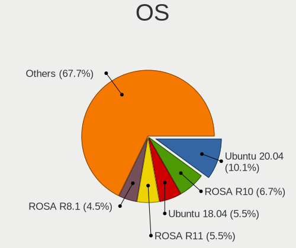

| Name                         | Notebooks | Percent |
|------------------------------|-----------|---------|
| Ubuntu 20.04                 | 210       | 11.56%  |
| ROSA R10                     | 142       | 7.82%   |
| Ubuntu 18.04                 | 119       | 6.55%   |
| ROSA R11                     | 117       | 6.44%   |
| ROSA R8.1                    | 97        | 5.34%   |
| ROSA R9                      | 72        | 3.96%   |
| ROSA R11.1                   | 62        | 3.41%   |
| ROSA R8                      | 61        | 3.36%   |
| OpenMandriva 4.2             | 31        | 1.71%   |
| Linux Mint 19.3              | 29        | 1.6%    |
| KDE neon 20.04               | 27        | 1.49%   |
| Arch                         | 25        | 1.38%   |
| Linux Mint 20                | 24        | 1.32%   |
| Manjaro                      | 23        | 1.27%   |
| Debian 11                    | 21        | 1.16%   |
| Linux Mint 20.2              | 20        | 1.1%    |
| Ubuntu 19.10                 | 19        | 1.05%   |
| Debian 10                    | 19        | 1.05%   |
| Ubuntu 21.10                 | 18        | 0.99%   |
| Linux Mint 20.1              | 17        | 0.94%   |
| Kubuntu 20.04                | 17        | 0.94%   |
| Fedora 34                    | 16        | 0.88%   |
| Ubuntu 19.04                 | 15        | 0.83%   |
| Linux Mint 19.2              | 15        | 0.83%   |
| Xubuntu 18.04                | 14        | 0.77%   |
| Ubuntu 21.04                 | 14        | 0.77%   |
| Linux Mint 19.1              | 13        | 0.72%   |
| Linux Mint 18.3              | 13        | 0.72%   |
| Arch Rolling                 | 13        | 0.72%   |
| Ubuntu 20.10                 | 12        | 0.66%   |
| Linux Mint 20.3              | 12        | 0.66%   |
| Fedora 33                    | 12        | 0.66%   |
| Xubuntu 20.04                | 11        | 0.61%   |
| ROSA 12.2                    | 11        | 0.61%   |
| ArcoLinux Rolling            | 11        | 0.61%   |
| Ubuntu 18.10                 | 10        | 0.55%   |
| Ubuntu 16.04                 | 10        | 0.55%   |
| Fedora 35                    | 10        | 0.55%   |
| Ubuntu MATE 20.04            | 9         | 0.5%    |
| ROSA 12                      | 9         | 0.5%    |
| Manjaro 20.2.1               | 9         | 0.5%    |
| Linux Mint 19                | 9         | 0.5%    |
| KDE neon 18.04               | 9         | 0.5%    |
| Fedora 32                    | 9         | 0.5%    |
| ROSA 12.1                    | 8         | 0.44%   |
| OpenMandriva 4.3             | 8         | 0.44%   |
| Pop!_OS 20.10                | 7         | 0.39%   |
| Endless 3.9.3                | 7         | 0.39%   |
| Zorin 15                     | 6         | 0.33%   |
| Pop!_OS 20.04                | 6         | 0.33%   |
| Manjaro 19.0.2               | 6         | 0.33%   |
| Kubuntu 21.10                | 6         | 0.33%   |
| Gentoo 2.7                   | 6         | 0.33%   |
| Gentoo 2.6                   | 6         | 0.33%   |
| Endless 3.3.19               | 6         | 0.33%   |
| openSUSE Tumbleweed-XXXXXXXX | 5         | 0.28%   |
| Manjaro 21.1.0               | 5         | 0.28%   |
| LMDE 4                       | 5         | 0.28%   |
| Fedora 31                    | 5         | 0.28%   |
| Endless 3.8.1                | 5         | 0.28%   |

OS Family
---------

OS without a version

| Name          | Notebooks | Percent |
|---------------|-----------|---------|
| ROSA          | 506       | 29.98%  |
| Ubuntu        | 417       | 24.7%   |
| Linux Mint    | 151       | 8.95%   |
| Endless       | 97        | 5.75%   |
| Manjaro       | 86        | 5.09%   |
| Fedora        | 50        | 2.96%   |
| Debian        | 49        | 2.9%    |
| OpenMandriva  | 42        | 2.49%   |
| Arch          | 38        | 2.25%   |
| KDE neon      | 36        | 2.13%   |
| Kubuntu       | 35        | 2.07%   |
| Xubuntu       | 28        | 1.66%   |
| Pop!_OS       | 16        | 0.95%   |
| ArcoLinux     | 12        | 0.71%   |
| Zorin         | 11        | 0.65%   |
| Gentoo        | 11        | 0.65%   |
| Ubuntu MATE   | 9         | 0.53%   |
| Lubuntu       | 8         | 0.47%   |
| Kali          | 8         | 0.47%   |
| Elementary    | 8         | 0.47%   |
| Clear Linux   | 8         | 0.47%   |
| openSUSE      | 7         | 0.41%   |
| LMDE          | 6         | 0.36%   |
| Void Linux    | 4         | 0.24%   |
| Ubuntu Budgie | 4         | 0.24%   |
| MX            | 4         | 0.24%   |
| Linux Lite    | 4         | 0.24%   |
| NixOS         | 3         | 0.18%   |
| EndeavourOS   | 3         | 0.18%   |
| Devuan        | 3         | 0.18%   |
| CentOS        | 3         | 0.18%   |
| Artix         | 3         | 0.18%   |
| UbuntuDDE     | 2         | 0.12%   |
| Solus         | 2         | 0.12%   |
| GNOME OS      | 2         | 0.12%   |
| Sonar         | 1         | 0.06%   |
| Regata OS     | 1         | 0.06%   |
| Red OS        | 1         | 0.06%   |
| PhoenixOS     | 1         | 0.06%   |
| Parabola      | 1         | 0.06%   |
| LinuxFX       | 1         | 0.06%   |
| Calculate     | 1         | 0.06%   |
| BunsenLabs    | 1         | 0.06%   |
| BlackPanther  | 1         | 0.06%   |
| antiX         | 1         | 0.06%   |
| antergos      | 1         | 0.06%   |
| ALT Linux     | 1         | 0.06%   |

Kernel
------

Version of the Linux kernel

| Version                             | Notebooks | Percent |
|-------------------------------------|-----------|---------|
| 4.9.60-nrj-desktop-1rosa-x86_64     | 57        | 2.95%   |
| 4.15.0-desktop-45.1rosa-x86_64      | 56        | 2.9%    |
| 4.9.20-nrj-desktop-1rosa-x86_64     | 43        | 2.23%   |
| 5.4.0-42-generic                    | 33        | 1.71%   |
| 5.10.14-desktop-1omv4002            | 31        | 1.61%   |
| 4.1.34-nrj-desktop-2rosa-x86_64     | 28        | 1.45%   |
| 4.9.60-nrj-desktop-1rosa-i586       | 26        | 1.35%   |
| 4.9.20-nrj-desktop-1rosa-i586       | 26        | 1.35%   |
| 4.9.9-nrj-desktop-1rosa-x86_64      | 21        | 1.09%   |
| 4.9.124-nrj-desktop-1rosa-x86_64    | 19        | 0.98%   |
| 5.8.0-14-generic                    | 18        | 0.93%   |
| 5.10.74-generic-2rosa2021.1-x86_64  | 16        | 0.83%   |
| 4.1.34-nrj-desktop-2rosa-i586       | 16        | 0.83%   |
| 5.4.0-58-generic                    | 15        | 0.78%   |
| 5.3.0-40-generic                    | 15        | 0.78%   |
| 4.9.41-nrj-desktop-1rosa-x86_64     | 15        | 0.78%   |
| 4.9.124-nrj-desktop-1rosa-i586      | 15        | 0.78%   |
| 4.18.0-15-generic                   | 15        | 0.78%   |
| 4.15.0-desktop-45.1rosa-i586        | 15        | 0.78%   |
| 4.1.38-nrj-desktop-2rosa-x86_64     | 15        | 0.78%   |
| 5.4.0-52-generic                    | 14        | 0.73%   |
| 4.9.76-nrj-desktop-1rosa-x86_64     | 14        | 0.73%   |
| 5.4.0-48-generic                    | 13        | 0.67%   |
| 4.9.9-nrj-desktop-1rosa-i586        | 13        | 0.67%   |
| 4.9.155-nrj-desktop-1rosa-x86_64    | 13        | 0.67%   |
| 4.15.0-desktop-122.124.1rosa-x86_64 | 13        | 0.67%   |
| 5.4.0-19-generic                    | 12        | 0.62%   |
| 5.3.0-28-generic                    | 12        | 0.62%   |
| 5.4.0-26-generic                    | 11        | 0.57%   |
| 5.3.0-46-generic                    | 11        | 0.57%   |
| 5.3.0-42-generic                    | 11        | 0.57%   |
| 5.0.0-32-generic                    | 11        | 0.57%   |
| 5.4.83-generic-2rosa-x86_64         | 10        | 0.52%   |
| 5.4.0-91-generic                    | 10        | 0.52%   |
| 5.4.0-65-generic                    | 10        | 0.52%   |
| 5.4.0-29-generic                    | 10        | 0.52%   |
| 5.3.0-51-generic                    | 10        | 0.52%   |
| 5.11.0-43-generic                   | 10        | 0.52%   |
| 5.0.0-25-generic                    | 10        | 0.52%   |
| 4.9.95-nrj-desktop-2rosa-x86_64     | 10        | 0.52%   |
| 4.15.0-desktop-94.1rosa-x86_64      | 10        | 0.52%   |
| 4.13.0-32-generic                   | 10        | 0.52%   |
| 5.8.0-50-generic                    | 9         | 0.47%   |
| 5.4.0-66-generic                    | 9         | 0.47%   |
| 5.4.0-54-generic                    | 9         | 0.47%   |
| 5.4.0-31-generic                    | 9         | 0.47%   |
| 5.11.0-37-generic                   | 9         | 0.47%   |
| 5.10.71-generic-1rosa2021.1-x86_64  | 9         | 0.47%   |
| 4.15.0-15-generic                   | 9         | 0.47%   |
| 5.8.0-59-generic                    | 8         | 0.41%   |
| 5.8.0-48-generic                    | 8         | 0.41%   |
| 5.8.0-45-generic                    | 8         | 0.41%   |
| 5.8.0-43-generic                    | 8         | 0.41%   |
| 5.4.0-47-generic                    | 8         | 0.41%   |
| 5.4.0-40-generic                    | 8         | 0.41%   |
| 5.4.0-33-generic                    | 8         | 0.41%   |
| 5.16.7-desktop-1omv4003             | 8         | 0.41%   |
| 5.13.0-27-generic                   | 8         | 0.41%   |
| 5.11.0-40-generic                   | 8         | 0.41%   |
| 5.10.0-8-amd64                      | 8         | 0.41%   |

Kernel Family
-------------

Linux kernel without a distro release

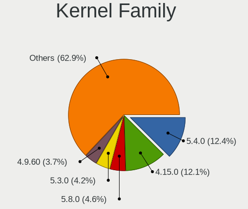

| Version | Notebooks | Percent |
|---------|-----------|---------|
| 5.4.0   | 268       | 14.33%  |
| 4.15.0  | 261       | 13.96%  |
| 5.8.0   | 100       | 5.35%   |
| 5.3.0   | 93        | 4.97%   |
| 4.9.60  | 83        | 4.44%   |
| 4.9.20  | 70        | 3.74%   |
| 5.11.0  | 68        | 3.64%   |
| 5.0.0   | 60        | 3.21%   |
| 4.18.0  | 45        | 2.41%   |
| 5.13.0  | 44        | 2.35%   |
| 4.1.34  | 44        | 2.35%   |
| 4.9.9   | 34        | 1.82%   |
| 4.9.124 | 34        | 1.82%   |
| 5.10.14 | 31        | 1.66%   |
| 5.10.0  | 27        | 1.44%   |
| 4.19.0  | 27        | 1.44%   |
| 4.1.38  | 27        | 1.44%   |
| 4.9.41  | 21        | 1.12%   |
| 4.9.76  | 20        | 1.07%   |
| 4.13.0  | 19        | 1.02%   |
| 5.10.74 | 18        | 0.96%   |
| 5.4.83  | 17        | 0.91%   |
| 4.9.155 | 16        | 0.86%   |
| 5.4.32  | 12        | 0.64%   |
| 5.16.7  | 11        | 0.59%   |
| 4.9.95  | 10        | 0.53%   |
| 5.10.71 | 9         | 0.48%   |
| 5.9.16  | 8         | 0.43%   |
| 4.1.25  | 8         | 0.43%   |
| 5.15.0  | 7         | 0.37%   |
| 5.8.11  | 6         | 0.32%   |
| 5.4.40  | 6         | 0.32%   |
| 4.9.111 | 6         | 0.32%   |
| 4.4.0   | 6         | 0.32%   |
| 5.6.0   | 5         | 0.27%   |
| 5.17.1  | 5         | 0.27%   |
| 5.10.16 | 5         | 0.27%   |
| 4.9.87  | 5         | 0.27%   |
| 4.9.0   | 5         | 0.27%   |
| 5.9.0   | 4         | 0.21%   |
| 5.8.18  | 4         | 0.21%   |
| 5.6.19  | 4         | 0.21%   |
| 5.6.14  | 4         | 0.21%   |
| 5.15.7  | 4         | 0.21%   |
| 5.14.8  | 4         | 0.21%   |
| 5.14.0  | 4         | 0.21%   |
| 5.10.42 | 4         | 0.21%   |
| 5.10.19 | 4         | 0.21%   |
| 4.9.14  | 4         | 0.21%   |
| 4.10.0  | 4         | 0.21%   |
| 5.9.11  | 3         | 0.16%   |
| 5.8.16  | 3         | 0.16%   |
| 5.8.14  | 3         | 0.16%   |
| 5.6.16  | 3         | 0.16%   |
| 5.6.11  | 3         | 0.16%   |
| 5.2.0   | 3         | 0.16%   |
| 5.16.10 | 3         | 0.16%   |
| 5.16.0  | 3         | 0.16%   |
| 5.14.7  | 3         | 0.16%   |
| 5.14.16 | 3         | 0.16%   |

Kernel Major Ver.
-----------------

Linux kernel major version

| Version | Notebooks | Percent |
|---------|-----------|---------|
| 5.4     | 316       | 17.41%  |
| 4.9     | 283       | 15.59%  |
| 4.15    | 261       | 14.38%  |
| 5.10    | 131       | 7.22%   |
| 5.8     | 127       | 7%      |
| 5.3     | 102       | 5.62%   |
| 5.11    | 84        | 4.63%   |
| 4.1     | 76        | 4.19%   |
| 5.13    | 62        | 3.42%   |
| 5.0     | 62        | 3.42%   |
| 4.18    | 46        | 2.53%   |
| 4.19    | 35        | 1.93%   |
| 5.15    | 26        | 1.43%   |
| 5.6     | 25        | 1.38%   |
| 5.16    | 24        | 1.32%   |
| 5.14    | 24        | 1.32%   |
| 4.13    | 20        | 1.1%    |
| 5.9     | 19        | 1.05%   |
| 5.12    | 16        | 0.88%   |
| 5.5     | 12        | 0.66%   |
| 5.17    | 10        | 0.55%   |
| 4.14    | 8         | 0.44%   |
| 5.7     | 7         | 0.39%   |
| 4.4     | 7         | 0.39%   |
| 5.2     | 4         | 0.22%   |
| 5.1     | 4         | 0.22%   |
| 4.8     | 4         | 0.22%   |
| 4.10    | 4         | 0.22%   |
| 4.7     | 3         | 0.17%   |
| 4.16    | 2         | 0.11%   |
| 4.12    | 2         | 0.11%   |
| 3.14    | 2         | 0.11%   |
| 4.5     | 1         | 0.06%   |
| 4.20    | 1         | 0.06%   |
| 3.8     | 1         | 0.06%   |
| 3.19    | 1         | 0.06%   |
| 3.16    | 1         | 0.06%   |
| 3.13    | 1         | 0.06%   |
| 3.10    | 1         | 0.06%   |

Arch
----

OS architecture (x86_64, i586, etc.)

| Name   | Notebooks | Percent |
|--------|-----------|---------|
| x86_64 | 1463      | 88.19%  |
| i686   | 196       | 11.81%  |

DE
--

Desktop Environment

| Name             | Notebooks | Percent |
|------------------|-----------|---------|
| GNOME            | 477       | 27.57%  |
| KDE4             | 361       | 20.87%  |
| KDE5             | 260       | 15.03%  |
| Unknown          | 226       | 13.06%  |
| XFCE             | 93        | 5.38%   |
| Cinnamon         | 59        | 3.41%   |
| X-Cinnamon       | 57        | 3.29%   |
| KDE              | 53        | 3.06%   |
| MATE             | 50        | 2.89%   |
| LXQt             | 39        | 2.25%   |
| i3               | 12        | 0.69%   |
| Unity            | 8         | 0.46%   |
| Pantheon         | 6         | 0.35%   |
| LXDE             | 6         | 0.35%   |
| GNOME Flashback  | 5         | 0.29%   |
| Budgie           | 5         | 0.29%   |
| Deepin           | 4         | 0.23%   |
| xmonad           | 2         | 0.12%   |
| GNOME Classic    | 2         | 0.12%   |
| qtile            | 1         | 0.06%   |
| Openbox          | 1         | 0.06%   |
| lightdm-xsession | 1         | 0.06%   |
| i3-with-shmlog   | 1         | 0.06%   |
| bspwm            | 1         | 0.06%   |

Display Server
--------------

X11 or Wayland

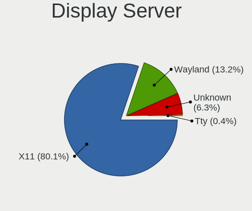

| Name    | Notebooks | Percent |
|---------|-----------|---------|
| X11     | 1425      | 84.72%  |
| Wayland | 129       | 7.67%   |
| Unknown | 122       | 7.25%   |
| Tty     | 6         | 0.36%   |

Display Manager
---------------

SDDM, LightDM, etc.

| Name    | Notebooks | Percent |
|---------|-----------|---------|
| Unknown | 634       | 36.69%  |
| KDM     | 364       | 21.06%  |
| SDDM    | 284       | 16.44%  |
| GDM     | 189       | 10.94%  |
| TDM     | 112       | 6.48%   |
| LightDM | 98        | 5.67%   |
| GDM3    | 33        | 1.91%   |
| MDM     | 6         | 0.35%   |
| XDM     | 5         | 0.29%   |
| SLiM    | 2         | 0.12%   |
| LXDM    | 1         | 0.06%   |

OS Lang
-------

Language

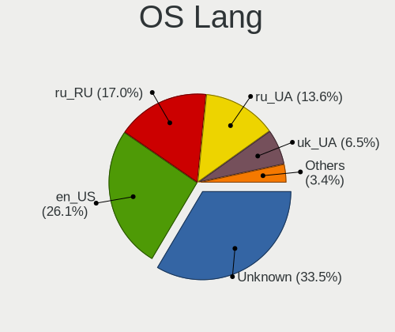

| Lang        | Notebooks | Percent |
|-------------|-----------|---------|
| Unknown     | 667       | 39.14%  |
| en_US       | 423       | 24.82%  |
| ru_UA       | 239       | 14.03%  |
| ru_RU       | 229       | 13.44%  |
| uk_UA       | 98        | 5.75%   |
| C           | 21        | 1.23%   |
| en_GB       | 12        | 0.7%    |
| ru_RU.UTF_8 | 7         | 0.41%   |
| POSIX       | 1         | 0.06%   |
| fr_FR       | 1         | 0.06%   |
| es_ES       | 1         | 0.06%   |
| en_ZA       | 1         | 0.06%   |
| en_IE       | 1         | 0.06%   |
| en_CA       | 1         | 0.06%   |
| de_DE       | 1         | 0.06%   |
| C.UTF8      | 1         | 0.06%   |

Boot Mode
---------

EFI or BIOS

| Mode | Notebooks | Percent |
|------|-----------|---------|
| BIOS | 921       | 54.79%  |
| EFI  | 760       | 45.21%  |

Filesystem
----------

Type of filesystem

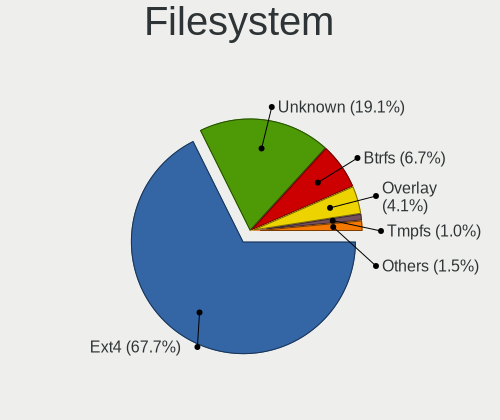

| Type    | Notebooks | Percent |
|---------|-----------|---------|
| Ext4    | 1162      | 68.27%  |
| Unknown | 381       | 22.39%  |
| Btrfs   | 75        | 4.41%   |
| Overlay | 62        | 3.64%   |
| Zfs     | 7         | 0.41%   |
| Ext3    | 6         | 0.35%   |
| Xfs     | 4         | 0.24%   |
| Ext2    | 3         | 0.18%   |
| F2fs    | 2         | 0.12%   |

Part. scheme
------------

Scheme of partitioning

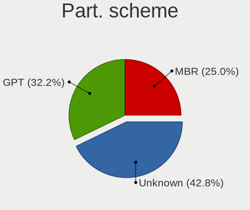

| Type    | Notebooks | Percent |
|---------|-----------|---------|
| Unknown | 784       | 45.93%  |
| GPT     | 468       | 27.42%  |
| MBR     | 455       | 26.65%  |

Dual Boot with Linux/BSD
------------------------

Hosting more than one Linux/BSD

| Dual boot | Notebooks | Percent |
|-----------|-----------|---------|
| No        | 1488      | 88.36%  |
| Yes       | 196       | 11.64%  |

Dual Boot (Win)
---------------

Hosting Linux and Windows

| Dual boot | Notebooks | Percent |
|-----------|-----------|---------|
| No        | 1232      | 72.39%  |
| Yes       | 470       | 27.61%  |

Board
-----

Vendor
------

Motherboard manufacturer

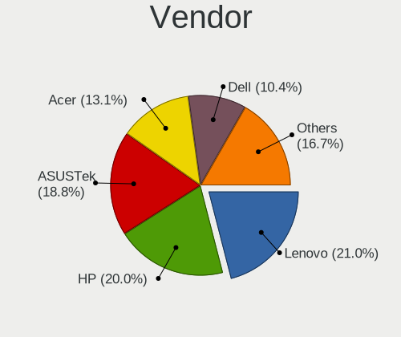

| Name                | Notebooks | Percent |
|---------------------|-----------|---------|
| Lenovo              | 356       | 21.58%  |
| Hewlett-Packard     | 346       | 20.97%  |
| ASUSTek Computer    | 315       | 19.09%  |
| Acer                | 212       | 12.85%  |
| Dell                | 174       | 10.55%  |
| Samsung Electronics | 55        | 3.33%   |
| Timi                | 22        | 1.33%   |
| MSI                 | 22        | 1.33%   |
| Toshiba             | 20        | 1.21%   |
| Fujitsu             | 11        | 0.67%   |
| Apple               | 11        | 0.67%   |
| Sony                | 10        | 0.61%   |
| eMachines           | 10        | 0.61%   |
| Fujitsu Siemens     | 8         | 0.48%   |
| Packard Bell        | 7         | 0.42%   |
| Unknown             | 5         | 0.3%    |
| VINGA               | 4         | 0.24%   |
| Shuttle             | 3         | 0.18%   |
| Notebook            | 3         | 0.18%   |
| Navigator           | 3         | 0.18%   |
| Medion              | 3         | 0.18%   |
| HUAWEI              | 3         | 0.18%   |
| Pixus               | 2         | 0.12%   |
| Minix               | 2         | 0.12%   |
| LG Electronics      | 2         | 0.12%   |
| Hampoo              | 2         | 0.12%   |
| Google              | 2         | 0.12%   |
| Dream Machines      | 2         | 0.12%   |
| Chuwi               | 2         | 0.12%   |
| AMI                 | 2         | 0.12%   |
| Xplore              | 1         | 0.06%   |
| UnBranded           | 1         | 0.06%   |
| TUXEDO              | 1         | 0.06%   |
| TrekStor            | 1         | 0.06%   |
| TR                  | 1         | 0.06%   |
| Shinelon Computer   | 1         | 0.06%   |
| Razer               | 1         | 0.06%   |
| Prestigio           | 1         | 0.06%   |
| Pegatron            | 1         | 0.06%   |
| Panasonic           | 1         | 0.06%   |
| NEC Computers       | 1         | 0.06%   |
| MTC                 | 1         | 0.06%   |
| MAXDATA             | 1         | 0.06%   |
| Irbis               | 1         | 0.06%   |
| IP3 Tech            | 1         | 0.06%   |
| Intel               | 1         | 0.06%   |
| Insyde              | 1         | 0.06%   |
| Insignia            | 1         | 0.06%   |
| ilife               | 1         | 0.06%   |
| ICL                 | 1         | 0.06%   |
| IBM                 | 1         | 0.06%   |
| HASEE Computer      | 1         | 0.06%   |
| Gigabyte Technology | 1         | 0.06%   |
| Gateway             | 1         | 0.06%   |
| Framework           | 1         | 0.06%   |
| Digma               | 1         | 0.06%   |
| Compal              | 1         | 0.06%   |
| Clevo               | 1         | 0.06%   |
| AXDIA International | 1         | 0.06%   |
| Aquarius            | 1         | 0.06%   |

Model
-----

Motherboard model

| Name                                       | Notebooks | Percent |
|--------------------------------------------|-----------|---------|
| HP Pavilion g6                             | 21        | 1.27%   |
| Lenovo G500 20236                          | 12        | 0.73%   |
| HP Pavilion 15                             | 12        | 0.73%   |
| ASUS VivoBook 15_ASUS Laptop X540MA_X543MA | 12        | 0.73%   |
| Unknown                                    | 12        | 0.73%   |
| HP Pavilion dv6                            | 11        | 0.67%   |
| Lenovo IdeaPad Z510 20287                  | 7         | 0.42%   |
| HP 250 G5 Notebook PC                      | 7         | 0.42%   |
| Samsung R59P/R60P/R61P                     | 6         | 0.36%   |
| Lenovo V580c 20160                         | 6         | 0.36%   |
| Lenovo IdeaPad Z580                        | 6         | 0.36%   |
| Lenovo G580 20157                          | 6         | 0.36%   |
| HP Pavilion g7                             | 6         | 0.36%   |
| HP Notebook                                | 6         | 0.36%   |
| HP Laptop 15-bw0xx                         | 6         | 0.36%   |
| HP 620                                     | 6         | 0.36%   |
| Acer Aspire V3-571G                        | 6         | 0.36%   |
| Samsung R528/R728                          | 5         | 0.3%    |
| Lenovo IdeaPad S340-14API 81NB             | 5         | 0.3%    |
| Lenovo IdeaPad 100-15IBD 80QQ              | 5         | 0.3%    |
| Lenovo G550 20023                          | 5         | 0.3%    |
| HP ZBook 15v G5                            | 5         | 0.3%    |
| HP ProBook 450 G6                          | 5         | 0.3%    |
| HP ProBook 440 G7                          | 5         | 0.3%    |
| HP Pavilion Gaming Laptop 15-cx0xxx        | 5         | 0.3%    |
| HP Laptop 15s-eq1xxx                       | 5         | 0.3%    |
| HP 250 G6 Notebook PC                      | 5         | 0.3%    |
| HP 250 G4                                  | 5         | 0.3%    |
| Dell Inspiron N5010                        | 5         | 0.3%    |
| Dell Inspiron 3582                         | 5         | 0.3%    |
| ASUS VivoBook 15_ASUS Laptop X540UBR       | 5         | 0.3%    |
| ASUS VivoBook 15_ASUS Laptop X540MB_X540MB | 5         | 0.3%    |
| ASUS K56CB                                 | 5         | 0.3%    |
| VINGA Iron S140                            | 4         | 0.24%   |
| Lenovo S10-3                               | 4         | 0.24%   |
| Lenovo IdeaPad 330-15IGM 81D1              | 4         | 0.24%   |
| Lenovo IdeaPad 320-15IKB 81BG              | 4         | 0.24%   |
| Lenovo IdeaPad 320-15IAP 80XR              | 4         | 0.24%   |
| Lenovo IdeaPad 110-15IBR 80T7              | 4         | 0.24%   |
| Lenovo IdeaPad 100-15IBY 80MJ              | 4         | 0.24%   |
| Lenovo G580 20150                          | 4         | 0.24%   |
| Lenovo G575 20081                          | 4         | 0.24%   |
| Lenovo G560 20042                          | 4         | 0.24%   |
| Lenovo G510 20238                          | 4         | 0.24%   |
| Lenovo G50-45 80E3                         | 4         | 0.24%   |
| Lenovo B590 20206                          | 4         | 0.24%   |
| Lenovo B570e HuronRiver Platform           | 4         | 0.24%   |
| HP ProBook 650 G1                          | 4         | 0.24%   |
| HP ProBook 450 G7                          | 4         | 0.24%   |
| HP ProBook 440 G6                          | 4         | 0.24%   |
| HP ProBook 440 G5                          | 4         | 0.24%   |
| HP Presario CQ56                           | 4         | 0.24%   |
| HP Pavilion Laptop 15-eg0xxx               | 4         | 0.24%   |
| HP 255 G7 Notebook PC                      | 4         | 0.24%   |
| HP 250 G7 Notebook PC                      | 4         | 0.24%   |
| Dell Vostro 15-3568                        | 4         | 0.24%   |
| Dell Latitude E6430                        | 4         | 0.24%   |
| Dell Inspiron N5110                        | 4         | 0.24%   |
| Dell Inspiron 3576                         | 4         | 0.24%   |
| Dell Inspiron 3521                         | 4         | 0.24%   |

Model Family
------------

Motherboard model prefix

| Name                  | Notebooks | Percent |
|-----------------------|-----------|---------|
| Acer Aspire           | 123       | 7.45%   |
| Lenovo IdeaPad        | 119       | 7.21%   |
| Lenovo ThinkPad       | 95        | 5.76%   |
| HP Pavilion           | 87        | 5.27%   |
| HP ProBook            | 82        | 4.97%   |
| Dell Inspiron         | 79        | 4.79%   |
| ASUS VivoBook         | 68        | 4.12%   |
| Dell Latitude         | 44        | 2.67%   |
| HP Laptop             | 37        | 2.24%   |
| Acer Swift            | 28        | 1.7%    |
| HP EliteBook          | 25        | 1.52%   |
| HP 250                | 25        | 1.52%   |
| HP ZBook              | 24        | 1.45%   |
| Dell Vostro           | 19        | 1.15%   |
| Toshiba Satellite     | 16        | 0.97%   |
| HP Compaq             | 16        | 0.97%   |
| Acer TravelMate       | 15        | 0.91%   |
| Acer Extensa          | 14        | 0.85%   |
| Acer Nitro            | 13        | 0.79%   |
| Lenovo G500           | 12        | 0.73%   |
| Unknown               | 12        | 0.73%   |
| Lenovo G580           | 11        | 0.67%   |
| HP 255                | 11        | 0.67%   |
| Dell Precision        | 11        | 0.67%   |
| ASUS ROG              | 11        | 0.67%   |
| Timi RedmiBook        | 10        | 0.61%   |
| Lenovo ThinkBook      | 10        | 0.61%   |
| Lenovo Legion         | 10        | 0.61%   |
| Fujitsu LIFEBOOK      | 10        | 0.61%   |
| Dell XPS              | 9         | 0.55%   |
| HP Presario           | 7         | 0.42%   |
| Samsung R59P          | 6         | 0.36%   |
| Packard Bell EasyNote | 6         | 0.36%   |
| Lenovo V580c          | 6         | 0.36%   |
| Lenovo B590           | 6         | 0.36%   |
| HP Notebook           | 6         | 0.36%   |
| HP 620                | 6         | 0.36%   |
| ASUS TUF              | 6         | 0.36%   |
| ASUS ASUS             | 6         | 0.36%   |
| Samsung R528          | 5         | 0.3%    |
| Lenovo G550           | 5         | 0.3%    |
| HP ENVY               | 5         | 0.3%    |
| Dell System           | 5         | 0.3%    |
| ASUS ZenBook          | 5         | 0.3%    |
| ASUS K56CB            | 5         | 0.3%    |
| VINGA Iron            | 4         | 0.24%   |
| Lenovo S10-3          | 4         | 0.24%   |
| Lenovo G575           | 4         | 0.24%   |
| Lenovo G570           | 4         | 0.24%   |
| Lenovo G560           | 4         | 0.24%   |
| Lenovo G510           | 4         | 0.24%   |
| Lenovo G50-45         | 4         | 0.24%   |
| Lenovo B570e          | 4         | 0.24%   |
| Fujitsu Siemens AMILO | 4         | 0.24%   |
| ASUS X553MA           | 4         | 0.24%   |
| ASUS X550CC           | 4         | 0.24%   |
| ASUS X542UN           | 4         | 0.24%   |
| ASUS N53SV            | 4         | 0.24%   |
| ASUS K54HR            | 4         | 0.24%   |
| ASUS 1011PX           | 4         | 0.24%   |

MFG Year
--------

Motherboard manufacture year

| Year | Notebooks | Percent |
|------|-----------|---------|
| 2011 | 189       | 11.45%  |
| 2012 | 164       | 9.94%   |
| 2019 | 153       | 9.27%   |
| 2018 | 147       | 8.91%   |
| 2013 | 135       | 8.18%   |
| 2017 | 132       | 8%      |
| 2010 | 116       | 7.03%   |
| 2020 | 106       | 6.42%   |
| 2016 | 93        | 5.64%   |
| 2015 | 90        | 5.45%   |
| 2009 | 71        | 4.3%    |
| 2007 | 63        | 3.82%   |
| 2008 | 59        | 3.58%   |
| 2014 | 49        | 2.97%   |
| 2021 | 48        | 2.91%   |
| 2006 | 23        | 1.39%   |
| 2005 | 11        | 0.67%   |
| 2022 | 1         | 0.06%   |

Form Factor
-----------

Physical design of the computer

| Name     | Notebooks | Percent |
|----------|-----------|---------|
| Notebook | 1650      | 100%    |

Secure Boot
-----------

Enabled or disabled

| State    | Notebooks | Percent |
|----------|-----------|---------|
| Disabled | 1558      | 93.91%  |
| Enabled  | 101       | 6.09%   |

Coreboot
--------

Have coreboot on board

| Used | Notebooks | Percent |
|------|-----------|---------|
| No   | 1646      | 99.76%  |
| Yes  | 4         | 0.24%   |

RAM Size
--------

Total RAM memory

| Size in GB  | Notebooks | Percent |
|-------------|-----------|---------|
| 4.01-8.0    | 436       | 26.08%  |
| 3.01-4.0    | 433       | 25.9%   |
| 8.01-16.0   | 244       | 14.59%  |
| 16.01-24.0  | 222       | 13.28%  |
| 1.01-2.0    | 161       | 9.63%   |
| 2.01-3.0    | 87        | 5.2%    |
| 32.01-64.0  | 49        | 2.93%   |
| 0.51-1.0    | 24        | 1.44%   |
| 24.01-32.0  | 9         | 0.54%   |
| 0.01-0.5    | 4         | 0.24%   |
| 64.01-256.0 | 3         | 0.18%   |

RAM Used
--------

Used RAM memory

| Used GB    | Notebooks | Percent |
|------------|-----------|---------|
| 1.01-2.0   | 620       | 34.03%  |
| 2.01-3.0   | 372       | 20.42%  |
| 0.51-1.0   | 319       | 17.51%  |
| 4.01-8.0   | 225       | 12.35%  |
| 3.01-4.0   | 175       | 9.6%    |
| 8.01-16.0  | 62        | 3.4%    |
| 0.01-0.5   | 43        | 2.36%   |
| 16.01-24.0 | 3         | 0.16%   |
| Unknown    | 2         | 0.11%   |
| 24.01-32.0 | 1         | 0.05%   |

Total Drives
------------

Number of drives on board

| Drives | Notebooks | Percent |
|--------|-----------|---------|
| 1      | 1297      | 77.48%  |
| 2      | 333       | 19.89%  |
| 3      | 30        | 1.79%   |
| 0      | 10        | 0.6%    |
| 4      | 3         | 0.18%   |
| 5      | 1         | 0.06%   |

Has CD-ROM
----------

Has CD-ROM on board

| Presented | Notebooks | Percent |
|-----------|-----------|---------|
| No        | 984       | 59.35%  |
| Yes       | 674       | 40.65%  |

Has Ethernet
------------

Has Ethernet on board

| Presented | Notebooks | Percent |
|-----------|-----------|---------|
| Yes       | 1416      | 85.66%  |
| No        | 237       | 14.34%  |

Has WiFi
--------

Has WiFi module

| Presented | Notebooks | Percent |
|-----------|-----------|---------|
| Yes       | 1622      | 98.3%   |
| No        | 28        | 1.7%    |

Has Bluetooth
-------------

Has Bluetooth module

| Presented | Notebooks | Percent |
|-----------|-----------|---------|
| Yes       | 1226      | 73.46%  |
| No        | 443       | 26.54%  |

Location
--------

Country
-------

Geographic location (country)

| Country | Notebooks | Percent |
|---------|-----------|---------|
| Ukraine | 1650      | 100%    |

City
----

Geographic location (city)

| City            | Notebooks | Percent |
|-----------------|-----------|---------|
| Kyiv            | 438       | 25.44%  |
| Kharkiv         | 111       | 6.45%   |
| Dnipro          | 80        | 4.65%   |
| Odessa          | 76        | 4.41%   |
| Lviv            | 74        | 4.3%    |
| Sevastopol      | 64        | 3.72%   |
| Simferopol      | 60        | 3.48%   |
| Donetsk         | 44        | 2.56%   |
| Vinnytsia       | 27        | 1.57%   |
| Cherkasy        | 24        | 1.39%   |
| Zaporizhzhya    | 23        | 1.34%   |
| Zaporizhzhia    | 23        | 1.34%   |
| Ternopil        | 21        | 1.22%   |
| Mykolayiv       | 21        | 1.22%   |
| Chernihiv       | 20        | 1.16%   |
| Poltava         | 19        | 1.1%    |
| Kryvyi Rih      | 19        | 1.1%    |
| Kherson         | 18        | 1.05%   |
| Ivano-Frankivsk | 15        | 0.87%   |
| Mariupol        | 14        | 0.81%   |
| Kremenchug      | 13        | 0.75%   |
| Zhytomyr        | 12        | 0.7%    |
| Yalta           | 12        | 0.7%    |
| Irpin           | 12        | 0.7%    |
| Horlivka        | 11        | 0.64%   |
| Yasinovataya    | 10        | 0.58%   |
| Rivne           | 10        | 0.58%   |
| Novopskov       | 10        | 0.58%   |
| Mykytyn Rog     | 10        | 0.58%   |
| Uzhhorod        | 9         | 0.52%   |
| Sumy            | 9         | 0.52%   |
| Pavlohrad       | 9         | 0.52%   |
| Syeverodonets'k | 8         | 0.46%   |
| Khartsyzsk      | 7         | 0.41%   |
| Kamianske       | 7         | 0.41%   |
| Izmail          | 7         | 0.41%   |
| Bucha           | 7         | 0.41%   |
| Yevpatoriya     | 6         | 0.35%   |
| Osipenko        | 6         | 0.35%   |
| Nova Kakhovka   | 6         | 0.35%   |
| Lutsk           | 6         | 0.35%   |
| Feodosiya       | 6         | 0.35%   |
| Luhansk         | 5         | 0.29%   |
| Kropyvnytskyi   | 5         | 0.29%   |
| Kerch           | 5         | 0.29%   |
| Brovary         | 5         | 0.29%   |
| Samsonove       | 4         | 0.23%   |
| Oleksandriya    | 4         | 0.23%   |
| Makiyivka       | 4         | 0.23%   |
| Makiivka        | 4         | 0.23%   |
| Krasnyi Luch    | 4         | 0.23%   |
| Kramatorsk      | 4         | 0.23%   |
| Horishni Plavni | 4         | 0.23%   |
| Chervonohrad    | 4         | 0.23%   |
| Chernivtsi      | 4         | 0.23%   |
| Yuzhnoukrainsk  | 3         | 0.17%   |
| Vasylkiv        | 3         | 0.17%   |
| Sudak           | 3         | 0.17%   |
| Sorokyne        | 3         | 0.17%   |
| Sloviansk       | 3         | 0.17%   |

Drives
------

Drive Vendor
------------

Hard drive vendors

| Vendor                      | Notebooks | Drives | Percent |
|-----------------------------|-----------|--------|---------|
| Seagate                     | 333       | 416    | 16.56%  |
| WDC                         | 302       | 350    | 15.02%  |
| Samsung Electronics         | 230       | 276    | 11.44%  |
| Toshiba                     | 198       | 250    | 9.85%   |
| Kingston                    | 131       | 156    | 6.51%   |
| Hitachi                     | 122       | 153    | 6.07%   |
| Unknown                     | 86        | 98     | 4.28%   |
| HGST                        | 85        | 107    | 4.23%   |
| SK Hynix                    | 72        | 87     | 3.58%   |
| SanDisk                     | 61        | 74     | 3.03%   |
| Intel                       | 56        | 70     | 2.78%   |
| Micron Technology           | 40        | 54     | 1.99%   |
| GOODRAM                     | 36        | 39     | 1.79%   |
| Transcend                   | 17        | 20     | 0.85%   |
| KIOXIA                      | 17        | 22     | 0.85%   |
| A-DATA Technology           | 17        | 19     | 0.85%   |
| SPCC                        | 16        | 21     | 0.8%    |
| Patriot                     | 16        | 19     | 0.8%    |
| Apacer                      | 16        | 17     | 0.8%    |
| Crucial                     | 15        | 16     | 0.75%   |
| LITEON                      | 13        | 15     | 0.65%   |
| Team                        | 11        | 11     | 0.55%   |
| China                       | 11        | 12     | 0.55%   |
| Fujitsu                     | 8         | 8      | 0.4%    |
| JMicron                     | 6         | 5      | 0.3%    |
| Apple                       | 6         | 7      | 0.3%    |
| StoreJet                    | 5         | 5      | 0.25%   |
| OCZ                         | 5         | 5      | 0.25%   |
| LITEONIT                    | 5         | 6      | 0.25%   |
| KingSpec                    | 5         | 5      | 0.25%   |
| PLEXTOR                     | 4         | 5      | 0.2%    |
| Phison                      | 4         | 6      | 0.2%    |
| AMD                         | 4         | 5      | 0.2%    |
| UMIS                        | 3         | 3      | 0.15%   |
| Leven                       | 3         | 3      | 0.15%   |
| Indilinx                    | 3         | 3      | 0.15%   |
| Yangtze Memory Technologies | 2         | 3      | 0.1%    |
| XPG                         | 2         | 2      | 0.1%    |
| Verbatim                    | 2         | 2      | 0.1%    |
| Silicon Motion              | 2         | 3      | 0.1%    |
| Lite-On                     | 2         | 2      | 0.1%    |
| KingDian                    | 2         | 2      | 0.1%    |
| HGST HTS                    | 2         | 2      | 0.1%    |
| Gigabyte Technology         | 2         | 2      | 0.1%    |
| YMTC                        | 1         | 1      | 0.05%   |
| V-Color                     | 1         | 1      | 0.05%   |
| USB3.0                      | 1         | 1      | 0.05%   |
| Union Memory (Shenzhen)     | 1         | 1      | 0.05%   |
| Union Memory                | 1         | 1      | 0.05%   |
| UNIC2                       | 1         | 1      | 0.05%   |
| Teclast                     | 1         | 1      | 0.05%   |
| SSSTC                       | 1         | 1      | 0.05%   |
| Space ke                    | 1         | 1      | 0.05%   |
| SILICONMOTION               | 1         | 1      | 0.05%   |
| ShineDisk                   | 1         | 2      | 0.05%   |
| Realtek Semiconductor       | 1         | 1      | 0.05%   |
| PNY                         | 1         | 1      | 0.05%   |
| NGFF                        | 1         | 1      | 0.05%   |
| Netac                       | 1         | 1      | 0.05%   |
| MyDigitalSSD                | 1         | 1      | 0.05%   |

Drive Model
-----------

Hard drive models

| Model                                   | Notebooks | Percent |
|-----------------------------------------|-----------|---------|
| Seagate ST1000LM035-1RK172 1TB          | 66        | 3.21%   |
| Seagate ST1000LM024 HN-M101MBB 1TB      | 50        | 2.43%   |
| Toshiba MQ01ABF050 500GB                | 44        | 2.14%   |
| Seagate ST9500325AS 500GB               | 30        | 1.46%   |
| Toshiba MQ01ABD100 1TB                  | 29        | 1.41%   |
| Seagate ST500LT012-1DG142 500GB         | 29        | 1.41%   |
| Toshiba MQ04ABF100 1TB                  | 20        | 0.97%   |
| Samsung NVMe SSD Drive 256GB            | 18        | 0.87%   |
| Kingston SA400S37240G 240GB SSD         | 17        | 0.83%   |
| HGST HTS545050A7E680 500GB              | 17        | 0.83%   |
| Seagate ST9320325AS 320GB               | 16        | 0.78%   |
| HGST HTS721010A9E630 1TB                | 16        | 0.78%   |
| Kingston SA400S37120G 120GB SSD         | 15        | 0.73%   |
| Seagate ST500LT012-9WS142 500GB         | 14        | 0.68%   |
| Hitachi HTS543232A7A384 320GB           | 14        | 0.68%   |
| Intel NVMe SSD Drive 512GB              | 13        | 0.63%   |
| Unknown MMC Card  64GB                  | 12        | 0.58%   |
| HGST HTS545050A7E380 500GB              | 12        | 0.58%   |
| WDC WD10SPZX-21Z10T0 1TB                | 11        | 0.53%   |
| SK Hynix NVMe SSD Drive 256GB           | 11        | 0.53%   |
| Seagate ST9250315AS 250GB               | 11        | 0.53%   |
| Samsung SSD 860 EVO 500GB               | 11        | 0.53%   |
| Samsung SSD 860 EVO 250GB               | 11        | 0.53%   |
| Hitachi HTS545032B9A300 320GB           | 11        | 0.53%   |
| HGST HTS541010A9E680 1TB                | 11        | 0.53%   |
| WDC WD5000LPCX-24VHAT0 500GB            | 10        | 0.49%   |
| WDC WD3200BPVT-22JJ5T0 320GB            | 10        | 0.49%   |
| Seagate ST500LM012 HN-M500MBB 500GB     | 10        | 0.49%   |
| Samsung NVMe SSD Drive 512GB            | 10        | 0.49%   |
| Micron 1100_MTFDDAV256TBN 256GB SSD     | 10        | 0.49%   |
| Hitachi HTS545050A7E380 500GB           | 10        | 0.49%   |
| WDC WD5000LPCX-21VHAT0 500GB            | 9         | 0.44%   |
| Unknown MMC Card  32GB                  | 9         | 0.44%   |
| SK Hynix NVMe SSD Drive 512GB           | 9         | 0.44%   |
| Sandisk NVMe SSD Drive 512GB            | 9         | 0.44%   |
| Sandisk NVMe SSD Drive 256GB            | 9         | 0.44%   |
| Kingston SUV400S37120G 120GB SSD        | 9         | 0.44%   |
| Hitachi HTS547550A9E384 500GB           | 9         | 0.44%   |
| Hitachi HTS545050B9A300 500GB           | 9         | 0.44%   |
| GOODRAM SSD 120GB                       | 9         | 0.44%   |
| WDC WD10JPCX-24UE4T0 1TB                | 8         | 0.39%   |
| Toshiba MQ01ABD050 500GB                | 8         | 0.39%   |
| Seagate ST9500420AS 500GB               | 8         | 0.39%   |
| Seagate ST750LM022 HN-M750MBB 752GB     | 8         | 0.39%   |
| Patriot Burst 120GB SSD                 | 8         | 0.39%   |
| Kingston SV300S37A120G 120GB SSD        | 8         | 0.39%   |
| Hitachi HTS547575A9E384 752GB           | 8         | 0.39%   |
| WDC WD3200BEVT-22ZCT0 320GB             | 7         | 0.34%   |
| Toshiba MQ01ABD075 752GB                | 7         | 0.34%   |
| Toshiba KBG30ZMS128G 128GB NVMe SSD     | 7         | 0.34%   |
| SK Hynix HFS128G39TND-N210A 128GB SSD   | 7         | 0.34%   |
| Samsung SSD 850 EVO 500GB               | 7         | 0.34%   |
| Intel SSDPEKNW512G8H 512GB              | 7         | 0.34%   |
| Intel SSDPEKKW256G7 256GB               | 7         | 0.34%   |
| Hitachi HTS542516K9SA00 160GB           | 7         | 0.34%   |
| HGST HTS541010B7E610 1TB                | 7         | 0.34%   |
| WDC WD5000BEVT-22A0RT0 500GB            | 6         | 0.29%   |
| SK Hynix BC511 HFM256GDJTNI-82A0A 256GB | 6         | 0.29%   |
| Seagate ST320LT020-9YG142 320GB         | 6         | 0.29%   |
| Seagate ST1000LM014-1EJ164 1TB          | 6         | 0.29%   |

HDD Vendor
----------

Hard disk drive vendors

| Vendor              | Notebooks | Drives | Percent |
|---------------------|-----------|--------|---------|
| Seagate             | 331       | 412    | 32.71%  |
| WDC                 | 259       | 292    | 25.59%  |
| Toshiba             | 168       | 212    | 16.6%   |
| Hitachi             | 122       | 153    | 12.06%  |
| HGST                | 85        | 107    | 8.4%    |
| Samsung Electronics | 30        | 37     | 2.96%   |
| Fujitsu             | 8         | 8      | 0.79%   |
| Unknown             | 2         | 3      | 0.2%    |
| HGST HTS            | 2         | 2      | 0.2%    |
| Apple               | 2         | 2      | 0.2%    |
| StoreJet            | 1         | 1      | 0.1%    |
| SILICONMOTION       | 1         | 1      | 0.1%    |
| IBM/Hitachi         | 1         | 1      | 0.1%    |

SSD Vendor
----------

Solid state drive vendors

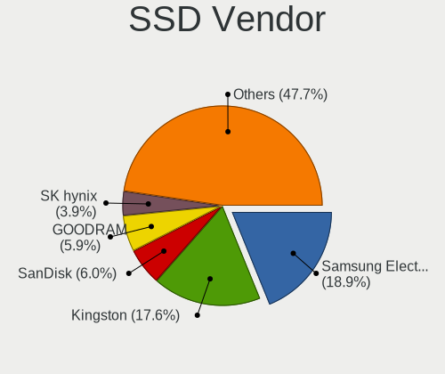

| Vendor              | Notebooks | Drives | Percent |
|---------------------|-----------|--------|---------|
| Samsung Electronics | 110       | 130    | 19.71%  |
| Kingston            | 102       | 122    | 18.28%  |
| SanDisk             | 39        | 48     | 6.99%   |
| GOODRAM             | 34        | 37     | 6.09%   |
| Micron Technology   | 23        | 27     | 4.12%   |
| SK Hynix            | 22        | 27     | 3.94%   |
| Transcend           | 17        | 20     | 3.05%   |
| Intel               | 17        | 20     | 3.05%   |
| SPCC                | 16        | 21     | 2.87%   |
| Patriot             | 16        | 19     | 2.87%   |
| Apacer              | 16        | 17     | 2.87%   |
| Crucial             | 15        | 16     | 2.69%   |
| A-DATA Technology   | 15        | 17     | 2.69%   |
| LITEON              | 12        | 14     | 2.15%   |
| Team                | 11        | 11     | 1.97%   |
| China               | 11        | 12     | 1.97%   |
| WDC                 | 10        | 12     | 1.79%   |
| Toshiba             | 8         | 13     | 1.43%   |
| OCZ                 | 5         | 5      | 0.9%    |
| LITEONIT            | 5         | 6      | 0.9%    |
| StoreJet            | 4         | 4      | 0.72%   |
| KingSpec            | 4         | 4      | 0.72%   |
| JMicron             | 4         | 4      | 0.72%   |
| PLEXTOR             | 3         | 4      | 0.54%   |
| Leven               | 3         | 3      | 0.54%   |
| Apple               | 3         | 3      | 0.54%   |
| AMD                 | 3         | 4      | 0.54%   |
| Verbatim            | 2         | 2      | 0.36%   |
| Unknown             | 2         | 2      | 0.36%   |
| KingDian            | 2         | 2      | 0.36%   |
| Indilinx            | 2         | 2      | 0.36%   |
| Gigabyte Technology | 2         | 2      | 0.36%   |
| USB3.0              | 1         | 1      | 0.18%   |
| UNIC2               | 1         | 1      | 0.18%   |
| Teclast             | 1         | 1      | 0.18%   |
| Seagate             | 1         | 1      | 0.18%   |
| PNY                 | 1         | 1      | 0.18%   |
| NGFF                | 1         | 1      | 0.18%   |
| MyDigitalSSD        | 1         | 1      | 0.18%   |
| Mushkin             | 1         | 1      | 0.18%   |
| MIXZA               | 1         | 1      | 0.18%   |
| Lenovo              | 1         | 1      | 0.18%   |
| KingFast            | 1         | 2      | 0.18%   |
| Kingchuxing         | 1         | 1      | 0.18%   |
| JDa                 | 1         | 1      | 0.18%   |
| Intenso             | 1         | 1      | 0.18%   |
| GeIL                | 1         | 1      | 0.18%   |
| Foxline             | 1         | 1      | 0.18%   |
| faspeed             | 1         | 1      | 0.18%   |
| DeTech              | 1         | 2      | 0.18%   |
| BHT                 | 1         | 1      | 0.18%   |
| ASUS-PHISON         | 1         | 1      | 0.18%   |

Drive Kind
----------

HDD or SSD

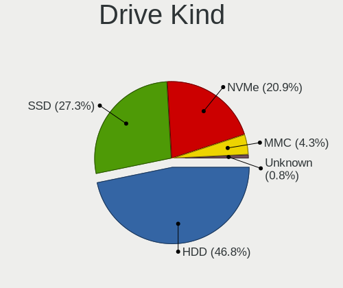

| Kind    | Notebooks | Drives | Percent |
|---------|-----------|--------|---------|
| HDD     | 989       | 1231   | 50.67%  |
| SSD     | 526       | 652    | 26.95%  |
| NVMe    | 342       | 432    | 17.52%  |
| MMC     | 79        | 93     | 4.05%   |
| Unknown | 16        | 16     | 0.82%   |

Drive Connector
---------------

SATA, SAS, NVMe, etc.

| Type | Notebooks | Drives | Percent |
|------|-----------|--------|---------|
| SATA | 1332      | 1863   | 74.46%  |
| NVMe | 342       | 432    | 19.12%  |
| MMC  | 79        | 93     | 4.42%   |
| SAS  | 36        | 36     | 2.01%   |

Drive Size
----------

Size of hard drive

| Size in TB | Notebooks | Drives | Percent |
|------------|-----------|--------|---------|
| 0.01-0.5   | 1056      | 1382   | 72.08%  |
| 0.51-1.0   | 391       | 479    | 26.69%  |
| 1.01-2.0   | 16        | 20     | 1.09%   |
| 3.01-4.0   | 1         | 1      | 0.07%   |
| 4.01-10.0  | 1         | 1      | 0.07%   |

Space Total
-----------

Amount of disk space available on the file system

| Size in GB     | Notebooks | Percent |
|----------------|-----------|---------|
| 101-250        | 502       | 28.54%  |
| 251-500        | 482       | 27.4%   |
| 501-1000       | 231       | 13.13%  |
| 51-100         | 157       | 8.93%   |
| 1-20           | 152       | 8.64%   |
| 21-50          | 137       | 7.79%   |
| 1001-2000      | 61        | 3.47%   |
| Unknown        | 24        | 1.36%   |
| More than 3000 | 9         | 0.51%   |
| 2001-3000      | 4         | 0.23%   |

Space Used
----------

Amount of used disk space

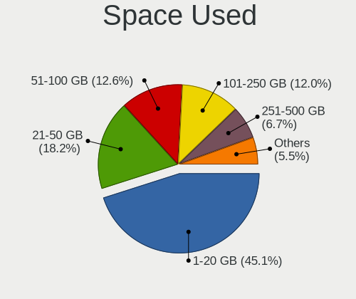

| Used GB        | Notebooks | Percent |
|----------------|-----------|---------|
| 1-20           | 815       | 45.68%  |
| 21-50          | 324       | 18.16%  |
| 101-250        | 225       | 12.61%  |
| 51-100         | 212       | 11.88%  |
| 251-500        | 115       | 6.45%   |
| 501-1000       | 55        | 3.08%   |
| Unknown        | 24        | 1.35%   |
| 1001-2000      | 10        | 0.56%   |
| More than 3000 | 3         | 0.17%   |
| 2001-3000      | 1         | 0.06%   |

Malfunc. Drives
---------------

Drive models with a malfunction

| Model                               | Notebooks | Drives | Percent |
|-------------------------------------|-----------|--------|---------|
| Seagate ST9500325AS 500GB           | 17        | 20     | 5.04%   |
| Seagate ST1000LM024 HN-M101MBB 1TB  | 14        | 22     | 4.15%   |
| Seagate ST9320325AS 320GB           | 11        | 11     | 3.26%   |
| Hitachi HTS543232A7A384 320GB       | 11        | 12     | 3.26%   |
| Seagate ST500LT012-1DG142 500GB     | 9         | 10     | 2.67%   |
| Seagate ST500LT012-9WS142 500GB     | 8         | 10     | 2.37%   |
| Seagate ST9250315AS 250GB           | 7         | 8      | 2.08%   |
| HGST HTS545050A7E680 500GB          | 6         | 8      | 1.78%   |
| Toshiba MQ01ABD100 1TB              | 5         | 5      | 1.48%   |
| Toshiba MQ01ABD050 500GB            | 5         | 7      | 1.48%   |
| Seagate ST1000LM035-1RK172 1TB      | 5         | 6      | 1.48%   |
| Hitachi HTS545032B9A300 320GB       | 5         | 7      | 1.48%   |
| Hitachi HTS542516K9SA00 160GB       | 5         | 5      | 1.48%   |
| HGST HTS545050A7E380 500GB          | 5         | 5      | 1.48%   |
| WDC WD3200BEVT-22A23T0 320GB        | 4         | 4      | 1.19%   |
| Seagate ST500LM012 HN-M500MBB 500GB | 4         | 6      | 1.19%   |
| Seagate ST320LT020-9YG142 320GB     | 4         | 5      | 1.19%   |
| Hitachi HTS545050B9A300 500GB       | 4         | 5      | 1.19%   |
| Hitachi HTS545050A7E380 500GB       | 4         | 4      | 1.19%   |
| WDC WD5000BEVT-22A0RT0 500GB        | 3         | 3      | 0.89%   |
| Seagate ST9500420AS 500GB           | 3         | 3      | 0.89%   |
| Seagate ST9160821AS 160GB           | 3         | 3      | 0.89%   |
| Seagate ST750LM022 HN-M750MBB 752GB | 3         | 3      | 0.89%   |
| Seagate ST1000LM014-1EJ164 1TB      | 3         | 4      | 0.89%   |
| Samsung Electronics HM160HI 160GB   | 3         | 3      | 0.89%   |
| Hitachi HTS541612J9SA00 120GB       | 3         | 3      | 0.89%   |
| HGST HTS541010A9E680 1TB            | 3         | 4      | 0.89%   |
| WDC WD6400BPVT-80HXZT3 640GB        | 2         | 2      | 0.59%   |
| WDC WD5000LPCX-60VHAT0 500GB        | 2         | 3      | 0.59%   |
| WDC WD5000LPCX-24C6HT0 500GB        | 2         | 2      | 0.59%   |
| WDC WD3200BPVT-22JJ5T0 320GB        | 2         | 2      | 0.59%   |
| WDC WD3200BEVT-60A23T0 320GB        | 2         | 2      | 0.59%   |
| WDC WD3200BEVT-22ZCT0 320GB         | 2         | 2      | 0.59%   |
| WDC WD2500BEVT-60A23T0 250GB        | 2         | 2      | 0.59%   |
| Toshiba MQ01ABF050 500GB            | 2         | 3      | 0.59%   |
| Toshiba MQ01ABD075 752GB            | 2         | 2      | 0.59%   |
| Toshiba MK7559GSXP 752GB            | 2         | 3      | 0.59%   |
| Toshiba MK5055GSX 500GB             | 2         | 2      | 0.59%   |
| Toshiba MK3259GSXP 320GB            | 2         | 4      | 0.59%   |
| Toshiba MK2555GSX 250GB             | 2         | 2      | 0.59%   |
| Toshiba MK1665GSX 160GB             | 2         | 2      | 0.59%   |
| Seagate ST980811AS 80GB             | 2         | 2      | 0.59%   |
| Seagate ST9500423AS 500GB           | 2         | 3      | 0.59%   |
| Seagate ST9160827AS 160GB           | 2         | 2      | 0.59%   |
| Seagate ST9160314AS 160GB           | 2         | 2      | 0.59%   |
| Seagate ST9160310AS 160GB           | 2         | 2      | 0.59%   |
| SanDisk SD9SN8W-128G-1006 128GB SSD | 2         | 2      | 0.59%   |
| Samsung Electronics HM501II 500GB   | 2         | 2      | 0.59%   |
| Samsung Electronics HM321HI 320GB   | 2         | 3      | 0.59%   |
| LITEON CV8-8E128-HP 128GB SSD       | 2         | 3      | 0.59%   |
| Hitachi HTS723232A7A364 320GB       | 2         | 2      | 0.59%   |
| Hitachi HTS723225A7A364 250GB       | 2         | 2      | 0.59%   |
| Hitachi HTS547575A9E384 752GB       | 2         | 4      | 0.59%   |
| Hitachi HTS547550A9E384 500GB       | 2         | 2      | 0.59%   |
| Hitachi HTS543232L9A300 320GB       | 2         | 3      | 0.59%   |
| Hitachi HTS543216L9A300 160GB       | 2         | 2      | 0.59%   |
| Hitachi HTS542512K9SA00 120GB       | 2         | 5      | 0.59%   |
| Hitachi HTS424040M9AT00 40GB        | 2         | 2      | 0.59%   |
| WDC WD7500BPVX-22JC3T0 752GB        | 1         | 1      | 0.3%    |
| WDC WD7500BPVT-60HXZT3 752GB        | 1         | 1      | 0.3%    |

Malfunc. Drive Vendor
---------------------

Vendors of faulty drives

| Vendor              | Notebooks | Drives | Percent |
|---------------------|-----------|--------|---------|
| Seagate             | 116       | 142    | 34.52%  |
| Hitachi             | 63        | 84     | 18.75%  |
| WDC                 | 59        | 65     | 17.56%  |
| Toshiba             | 39        | 50     | 11.61%  |
| HGST                | 16        | 20     | 4.76%   |
| Samsung Electronics | 14        | 15     | 4.17%   |
| SanDisk             | 5         | 7      | 1.49%   |
| A-DATA Technology   | 4         | 4      | 1.19%   |
| SK Hynix            | 3         | 3      | 0.89%   |
| Kingston            | 3         | 4      | 0.89%   |
| LITEON              | 2         | 3      | 0.6%    |
| Fujitsu             | 2         | 2      | 0.6%    |
| Team                | 1         | 1      | 0.3%    |
| OCZ                 | 1         | 1      | 0.3%    |
| Micron Technology   | 1         | 1      | 0.3%    |
| LITEONIT            | 1         | 1      | 0.3%    |
| KingSpec            | 1         | 1      | 0.3%    |
| JDa                 | 1         | 1      | 0.3%    |
| IBM/Hitachi         | 1         | 1      | 0.3%    |
| HGST HTS            | 1         | 1      | 0.3%    |
| Crucial             | 1         | 1      | 0.3%    |
| Apple               | 1         | 1      | 0.3%    |

Malfunc. HDD Vendor
-------------------

Vendors of faulty HDD drives

| Vendor              | Notebooks | Drives | Percent |
|---------------------|-----------|--------|---------|
| Seagate             | 116       | 142    | 37.54%  |
| Hitachi             | 63        | 84     | 20.39%  |
| WDC                 | 59        | 65     | 19.09%  |
| Toshiba             | 39        | 50     | 12.62%  |
| HGST                | 16        | 20     | 5.18%   |
| Samsung Electronics | 12        | 13     | 3.88%   |
| Fujitsu             | 2         | 2      | 0.65%   |
| IBM/Hitachi         | 1         | 1      | 0.32%   |
| HGST HTS            | 1         | 1      | 0.32%   |

Malfunc. Drive Kind
-------------------

Kinds of faulty drives

| Kind | Notebooks | Drives | Percent |
|------|-----------|--------|---------|
| HDD  | 303       | 378    | 91.82%  |
| SSD  | 25        | 29     | 7.58%   |
| NVMe | 2         | 2      | 0.61%   |

Failed Drives
-------------

Failed drive models

| Model                                 | Notebooks | Drives | Percent |
|---------------------------------------|-----------|--------|---------|
| Seagate ST9500325AS 500GB             | 2         | 3      | 22.22%  |
| WDC WD3200BEVT-24A23T0 320GB          | 1         | 1      | 11.11%  |
| WDC WD3200BEVT-22ZCT0 320GB           | 1         | 1      | 11.11%  |
| Toshiba MK1059GSM 1TB                 | 1         | 1      | 11.11%  |
| Seagate ST9250315AS 250GB             | 1         | 1      | 11.11%  |
| Seagate ST500LM012 HN-M500MBB 500GB   | 1         | 1      | 11.11%  |
| Samsung Electronics SSD PM800 TM 64GB | 1         | 1      | 11.11%  |
| Intel SSDSC2KB960G8 960GB             | 1         | 1      | 11.11%  |

Failed Drive Vendor
-------------------

Failed drive vendors

| Vendor              | Notebooks | Drives | Percent |
|---------------------|-----------|--------|---------|
| Seagate             | 4         | 5      | 44.44%  |
| WDC                 | 2         | 2      | 22.22%  |
| Toshiba             | 1         | 1      | 11.11%  |
| Samsung Electronics | 1         | 1      | 11.11%  |
| Intel               | 1         | 1      | 11.11%  |

Drive Status
------------

Number of failed and malfunc. drives

| Status   | Notebooks | Drives | Percent |
|----------|-----------|--------|---------|
| Works    | 742       | 1005   | 41.5%   |
| Detected | 710       | 1000   | 39.71%  |
| Malfunc  | 327       | 409    | 18.29%  |
| Failed   | 9         | 10     | 0.5%    |

Storage controller
------------------

Storage Vendor
--------------

Storage controller vendors

| Vendor                           | Notebooks | Percent |
|----------------------------------|-----------|---------|
| Intel                            | 1250      | 67.9%   |
| AMD                              | 251       | 13.63%  |
| Samsung Electronics              | 99        | 5.38%   |
| Sandisk                          | 51        | 2.77%   |
| SK Hynix                         | 48        | 2.61%   |
| Kingston Technology Company      | 29        | 1.58%   |
| Toshiba America Info Systems     | 23        | 1.25%   |
| KIOXIA                           | 18        | 0.98%   |
| Micron Technology                | 17        | 0.92%   |
| Union Memory (Shenzhen)          | 11        | 0.6%    |
| Nvidia                           | 9         | 0.49%   |
| Silicon Integrated Systems [SiS] | 7         | 0.38%   |
| Silicon Motion                   | 4         | 0.22%   |
| Phison Electronics               | 4         | 0.22%   |
| Lite-On Technology               | 4         | 0.22%   |
| ADATA Technology                 | 4         | 0.22%   |
| Yangtze Memory Technologies      | 3         | 0.16%   |
| VIA Technologies                 | 3         | 0.16%   |
| Realtek Semiconductor            | 2         | 0.11%   |
| Shenzhen Longsys Electronics     | 1         | 0.05%   |
| Micron/Crucial Technology        | 1         | 0.05%   |
| JMicron Technology               | 1         | 0.05%   |
| Apple                            | 1         | 0.05%   |

Storage Model
-------------

Storage controller models

| Model                                                                                  | Notebooks | Percent |
|----------------------------------------------------------------------------------------|-----------|---------|
| Intel 7 Series Chipset Family 6-port SATA Controller [AHCI mode]                       | 182       | 9.05%   |
| AMD FCH SATA Controller [AHCI mode]                                                    | 166       | 8.25%   |
| Intel Sunrise Point-LP SATA Controller [AHCI mode]                                     | 152       | 7.56%   |
| Intel 6 Series/C200 Series Chipset Family 6 port Mobile SATA AHCI Controller           | 116       | 5.77%   |
| Intel 82801 Mobile SATA Controller [RAID mode]                                         | 74        | 3.68%   |
| Intel 82801IBM/IEM (ICH9M/ICH9M-E) 4 port SATA Controller [AHCI mode]                  | 71        | 3.53%   |
| AMD SB7x0/SB8x0/SB9x0 SATA Controller [AHCI mode]                                      | 51        | 2.54%   |
| Intel Celeron/Pentium Silver Processor SATA Controller                                 | 49        | 2.44%   |
| Samsung NVMe SSD Controller SM981/PM981/PM983                                          | 46        | 2.29%   |
| Intel Cannon Lake Mobile PCH SATA AHCI Controller                                      | 43        | 2.14%   |
| Intel 8 Series/C220 Series Chipset Family 6-port SATA Controller 1 [AHCI mode]         | 43        | 2.14%   |
| Intel 5 Series/3400 Series Chipset 4 port SATA AHCI Controller                         | 38        | 1.89%   |
| Intel 8 Series SATA Controller 1 [AHCI mode]                                           | 37        | 1.84%   |
| Intel Atom/Celeron/Pentium Processor x5-E8000/J3xxx/N3xxx Series SATA Controller       | 35        | 1.74%   |
| Intel 82801HM/HEM (ICH8M/ICH8M-E) IDE Controller                                       | 35        | 1.74%   |
| Intel Wildcat Point-LP SATA Controller [AHCI Mode]                                     | 33        | 1.64%   |
| Intel NM10/ICH7 Family SATA Controller [AHCI mode]                                     | 33        | 1.64%   |
| Intel Cannon Point-LP SATA Controller [AHCI Mode]                                      | 33        | 1.64%   |
| Intel Volume Management Device NVMe RAID Controller                                    | 29        | 1.44%   |
| Samsung NVMe SSD Controller 980                                                        | 27        | 1.34%   |
| Intel HM170/QM170 Chipset SATA Controller [AHCI Mode]                                  | 27        | 1.34%   |
| Intel 82801HM/HEM (ICH8M/ICH8M-E) SATA Controller [AHCI mode]                          | 26        | 1.29%   |
| AMD SB600 Non-Raid-5 SATA                                                              | 25        | 1.24%   |
| AMD SB600 IDE                                                                          | 25        | 1.24%   |
| Intel SSD 660P Series                                                                  | 24        | 1.19%   |
| Intel 82801GBM/GHM (ICH7-M Family) SATA Controller [IDE mode]                          | 24        | 1.19%   |
| Intel 5 Series/3400 Series Chipset 6 port SATA AHCI Controller                         | 23        | 1.14%   |
| SK Hynix BC511                                                                         | 21        | 1.04%   |
| Samsung NVMe SSD Controller SM961/PM961/SM963                                          | 20        | 0.99%   |
| Intel Comet Lake SATA AHCI Controller                                                  | 20        | 0.99%   |
| Intel Celeron N3350/Pentium N4200/Atom E3900 Series SATA AHCI Controller               | 20        | 0.99%   |
| KIOXIA Non-Volatile memory controller                                                  | 18        | 0.9%    |
| Intel Atom Processor E3800 Series SATA AHCI Controller                                 | 18        | 0.9%    |
| Micron Non-Volatile memory controller                                                  | 17        | 0.85%   |
| Intel 82801G (ICH7 Family) IDE Controller                                              | 16        | 0.8%    |
| Kingston Company U-SNS8154P3 NVMe SSD                                                  | 14        | 0.7%    |
| Sandisk WD Blue SN500 / PC SN520 NVMe SSD                                              | 13        | 0.65%   |
| SK Hynix BC501 NVMe Solid State Drive                                                  | 12        | 0.6%    |
| Sandisk WD Blue SN550 NVMe SSD                                                         | 12        | 0.6%    |
| Intel 82801HM/HEM (ICH8M/ICH8M-E) SATA Controller [IDE mode]                           | 12        | 0.6%    |
| Union Memory (Shenzhen) Non-Volatile memory controller                                 | 11        | 0.55%   |
| Intel Tiger Lake-LP SATA Controller [AHCI mode]                                        | 11        | 0.55%   |
| Intel 82801GBM/GHM (ICH7-M Family) SATA Controller [AHCI mode]                         | 11        | 0.55%   |
| Intel 7 Series Chipset Family 4-port SATA Controller [IDE mode]                        | 10        | 0.5%    |
| Intel 7 Series Chipset Family 2-port SATA Controller [IDE mode]                        | 10        | 0.5%    |
| Intel 6 Series/C200 Series Chipset Family Mobile SATA Controller (IDE mode, ports 4-5) | 10        | 0.5%    |
| Intel 6 Series/C200 Series Chipset Family Mobile SATA Controller (IDE mode, ports 0-3) | 10        | 0.5%    |
| AMD SB7x0/SB8x0/SB9x0 IDE Controller                                                   | 10        | 0.5%    |
| Toshiba America Info Systems XG6 NVMe SSD Controller                                   | 9         | 0.45%   |
| Sandisk WD Black SN750 / PC SN730 NVMe SSD                                             | 9         | 0.45%   |
| Toshiba America Info Systems BG3 NVMe SSD Controller                                   | 8         | 0.4%    |
| Intel NM10/ICH7 Family SATA Controller [IDE mode]                                      | 8         | 0.4%    |
| Intel 82801FBM (ICH6M) SATA Controller                                                 | 8         | 0.4%    |
| Intel 400 Series Chipset Family SATA AHCI Controller                                   | 8         | 0.4%    |
| AMD SB7x0/SB8x0/SB9x0 SATA Controller [IDE mode]                                       | 8         | 0.4%    |
| Silicon Integrated Systems [SiS] SATA Controller / IDE mode                            | 7         | 0.35%   |
| Sandisk Non-Volatile memory controller                                                 | 7         | 0.35%   |
| Nvidia MCP79 AHCI Controller                                                           | 7         | 0.35%   |
| Kingston Company Company Non-Volatile memory controller                                | 7         | 0.35%   |
| Intel Q170/Q150/B150/H170/H110/Z170/CM236 Chipset SATA Controller [AHCI Mode]          | 7         | 0.35%   |

Storage Kind
------------

Kind of storage controller (IDE, SATA, NVMe, SAS, ...)

| Kind | Notebooks | Percent |
|------|-----------|---------|
| SATA | 1307      | 67.06%  |
| NVMe | 350       | 17.96%  |
| IDE  | 187       | 9.59%   |
| RAID | 105       | 5.39%   |

Processor
---------

CPU Vendor
----------

Processor vendors

| Vendor | Notebooks | Percent |
|--------|-----------|---------|
| Intel  | 1368      | 82.91%  |
| AMD    | 282       | 17.09%  |

CPU Model
---------

Processor models

| Model                                         | Notebooks | Percent |
|-----------------------------------------------|-----------|---------|
| Intel Core i5-8250U CPU @ 1.60GHz             | 34        | 2.06%   |
| Intel Core i7-8550U CPU @ 1.80GHz             | 29        | 1.76%   |
| Intel Core i5-8265U CPU @ 1.60GHz             | 26        | 1.57%   |
| Intel Celeron N4000 CPU @ 1.10GHz             | 25        | 1.51%   |
| Intel Core i5-3210M CPU @ 2.50GHz             | 23        | 1.39%   |
| Intel Core i7-8565U CPU @ 1.80GHz             | 22        | 1.33%   |
| Intel Core i5-8300H CPU @ 2.30GHz             | 22        | 1.33%   |
| Intel Core i5-7200U CPU @ 2.50GHz             | 21        | 1.27%   |
| Intel Pentium Silver N5000 CPU @ 1.10GHz      | 18        | 1.09%   |
| AMD Ryzen 5 3500U with Radeon Vega Mobile Gfx | 18        | 1.09%   |
| Intel Core i5-10210U CPU @ 1.60GHz            | 17        | 1.03%   |
| AMD Ryzen 7 4700U with Radeon Graphics        | 17        | 1.03%   |
| Intel Pentium CPU B960 @ 2.20GHz              | 16        | 0.97%   |
| Intel Core i7-7500U CPU @ 2.70GHz             | 15        | 0.91%   |
| Intel Core i3-7020U CPU @ 2.30GHz             | 14        | 0.85%   |
| Intel Core i3-6006U CPU @ 2.00GHz             | 14        | 0.85%   |
| Intel Core i3-3110M CPU @ 2.40GHz             | 14        | 0.85%   |
| Intel Celeron CPU N3060 @ 1.60GHz             | 14        | 0.85%   |
| Intel Pentium CPU B950 @ 2.10GHz              | 13        | 0.79%   |
| Intel Pentium CPU 2020M @ 2.40GHz             | 13        | 0.79%   |
| Intel Core i5-2410M CPU @ 2.30GHz             | 13        | 0.79%   |
| Intel Core i3-5005U CPU @ 2.00GHz             | 13        | 0.79%   |
| Intel Core i3-2350M CPU @ 2.30GHz             | 13        | 0.79%   |
| Intel Atom CPU N450 @ 1.66GHz                 | 13        | 0.79%   |
| Intel Pentium CPU N3710 @ 1.60GHz             | 12        | 0.73%   |
| Intel Core i5-6200U CPU @ 2.30GHz             | 12        | 0.73%   |
| Intel Core i5-3230M CPU @ 2.60GHz             | 12        | 0.73%   |
| Intel 11th Gen Core i5-1135G7 @ 2.40GHz       | 12        | 0.73%   |
| Intel Core i7-7700HQ CPU @ 2.80GHz            | 11        | 0.67%   |
| Intel Core i7-6700HQ CPU @ 2.60GHz            | 11        | 0.67%   |
| Intel Core i7-2670QM CPU @ 2.20GHz            | 11        | 0.67%   |
| Intel Core i3-3217U CPU @ 1.80GHz             | 11        | 0.67%   |
| Intel Core i3-2330M CPU @ 2.20GHz             | 11        | 0.67%   |
| Intel Core i7-8750H CPU @ 2.20GHz             | 10        | 0.61%   |
| Intel Core i7-3630QM CPU @ 2.40GHz            | 10        | 0.61%   |
| Intel Core i7-10510U CPU @ 1.80GHz            | 10        | 0.61%   |
| Intel Core i5-9300H CPU @ 2.40GHz             | 10        | 0.61%   |
| Intel Core i5-2450M CPU @ 2.50GHz             | 10        | 0.61%   |
| Intel 11th Gen Core i7-1165G7 @ 2.80GHz       | 10        | 0.61%   |
| Intel Pentium Dual-Core CPU T4500 @ 2.30GHz   | 9         | 0.54%   |
| Intel Pentium CPU N4200 @ 1.10GHz             | 9         | 0.54%   |
| Intel Core i5-2520M CPU @ 2.50GHz             | 9         | 0.54%   |
| Intel Core i5-10300H CPU @ 2.50GHz            | 9         | 0.54%   |
| Intel Core i3-7100U CPU @ 2.40GHz             | 9         | 0.54%   |
| Intel Atom CPU N455 @ 1.66GHz                 | 9         | 0.54%   |
| Intel Pentium CPU P6200 @ 2.13GHz             | 8         | 0.48%   |
| Intel Core i5-7300HQ CPU @ 2.50GHz            | 8         | 0.48%   |
| Intel Core i5-5200U CPU @ 2.20GHz             | 8         | 0.48%   |
| Intel Core i5-3320M CPU @ 2.60GHz             | 8         | 0.48%   |
| Intel Core i5-2430M CPU @ 2.40GHz             | 8         | 0.48%   |
| Intel Core i3-8145U CPU @ 2.10GHz             | 8         | 0.48%   |
| Intel Core i3-4000M CPU @ 2.40GHz             | 8         | 0.48%   |
| Intel Atom CPU N570 @ 1.66GHz                 | 8         | 0.48%   |
| Intel Atom CPU N2600 @ 1.60GHz                | 8         | 0.48%   |
| Intel 11th Gen Core i3-1115G4 @ 3.00GHz       | 8         | 0.48%   |
| AMD Ryzen 5 4500U with Radeon Graphics        | 8         | 0.48%   |
| AMD E-450 APU with Radeon HD Graphics         | 8         | 0.48%   |
| Intel Pentium Dual-Core CPU T4300 @ 2.10GHz   | 7         | 0.42%   |
| Intel Pentium CPU 4417U @ 2.30GHz             | 7         | 0.42%   |
| Intel Core i7-10750H CPU @ 2.60GHz            | 7         | 0.42%   |

CPU Model Family
----------------

Processor model prefix

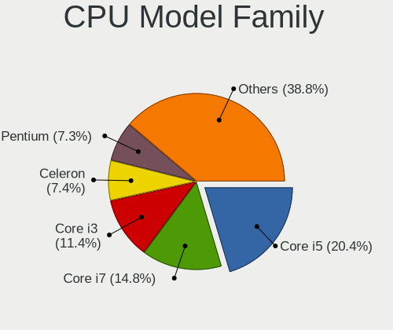

| Model                          | Notebooks | Percent |
|--------------------------------|-----------|---------|
| Intel Core i5                  | 353       | 21.37%  |
| Intel Core i7                  | 246       | 14.89%  |
| Intel Core i3                  | 193       | 11.68%  |
| Intel Celeron                  | 128       | 7.75%   |
| Intel Pentium                  | 126       | 7.63%   |
| Intel Atom                     | 68        | 4.12%   |
| Intel Core 2 Duo               | 67        | 4.06%   |
| AMD Ryzen 5                    | 51        | 3.09%   |
| Other                          | 46        | 2.78%   |
| AMD Ryzen 7                    | 36        | 2.18%   |
| Intel Pentium Dual-Core        | 27        | 1.63%   |
| AMD A6                         | 27        | 1.63%   |
| Intel Pentium Silver           | 22        | 1.33%   |
| Intel Core 2                   | 20        | 1.21%   |
| AMD E                          | 19        | 1.15%   |
| AMD A4                         | 18        | 1.09%   |
| AMD E1                         | 17        | 1.03%   |
| AMD A10                        | 15        | 0.91%   |
| Intel Pentium Dual             | 14        | 0.85%   |
| Intel Celeron Dual-Core        | 14        | 0.85%   |
| Intel Genuine                  | 13        | 0.79%   |
| Intel Celeron M                | 13        | 0.79%   |
| AMD Ryzen 3                    | 12        | 0.73%   |
| AMD E2                         | 12        | 0.73%   |
| AMD Athlon II                  | 12        | 0.73%   |
| AMD A8                         | 9         | 0.54%   |
| Intel Pentium M                | 7         | 0.42%   |
| Intel Core Duo                 | 7         | 0.42%   |
| AMD Athlon II Dual-Core        | 5         | 0.3%    |
| Intel Celeron D                | 4         | 0.24%   |
| AMD Turion 64 X2 Mobile        | 4         | 0.24%   |
| AMD C-50                       | 4         | 0.24%   |
| AMD Athlon X2                  | 4         | 0.24%   |
| AMD Athlon                     | 4         | 0.24%   |
| AMD Turion X2 Dual-Core Mobile | 3         | 0.18%   |
| AMD Ryzen 9                    | 3         | 0.18%   |
| AMD Athlon 64 X2               | 3         | 0.18%   |
| AMD A12                        | 3         | 0.18%   |
| Intel Xeon                     | 2         | 0.12%   |
| AMD Turion II                  | 2         | 0.12%   |
| AMD Turion                     | 2         | 0.12%   |
| AMD Ryzen 7 PRO                | 2         | 0.12%   |
| AMD C-60                       | 2         | 0.12%   |
| AMD Athlon II Neo              | 2         | 0.12%   |
| Intel Pentium Gold             | 1         | 0.06%   |
| Intel Core m3                  | 1         | 0.06%   |
| Intel Core i9                  | 1         | 0.06%   |
| Intel Core 2 Solo              | 1         | 0.06%   |
| Intel Core 2 Extreme           | 1         | 0.06%   |
| AMD Turion II Dual-Core        | 1         | 0.06%   |
| AMD Ryzen 5 PRO                | 1         | 0.06%   |
| AMD Phenom II                  | 1         | 0.06%   |
| AMD Mobile Sempron             | 1         | 0.06%   |
| AMD FX                         | 1         | 0.06%   |
| AMD C-30                       | 1         | 0.06%   |

CPU Cores
---------

Number of processor cores

| Number  | Notebooks | Percent |
|---------|-----------|---------|
| 2       | 980       | 59%     |
| 4       | 477       | 28.72%  |
| 1       | 75        | 4.52%   |
| 6       | 53        | 3.19%   |
| Unknown | 39        | 2.35%   |
| 8       | 36        | 2.17%   |
| 14      | 1         | 0.06%   |

CPU Sockets
-----------

Number of sockets

| Number  | Notebooks | Percent |
|---------|-----------|---------|
| 1       | 1647      | 99.82%  |
| 2       | 2         | 0.12%   |
| Unknown | 1         | 0.06%   |

CPU Threads
-----------

Threads per core (Hyper-Threading)

| Number  | Notebooks | Percent |
|---------|-----------|---------|
| 2       | 985       | 59.23%  |
| 1       | 639       | 38.42%  |
| Unknown | 39        | 2.35%   |

CPU Op-Modes
------------

CPU Operation Modes (32-bit, 64-bit)

| Op mode        | Notebooks | Percent |
|----------------|-----------|---------|
| 32-bit, 64-bit | 1542      | 93.12%  |
| Unknown        | 64        | 3.86%   |
| 32-bit         | 50        | 3.02%   |

CPU Microcode
-------------

Microcode number

| Number     | Notebooks | Percent |
|------------|-----------|---------|
| Unknown    | 198       | 11.79%  |
| 0x206a7    | 163       | 9.7%    |
| 0x306a9    | 141       | 8.39%   |
| 0x806ea    | 74        | 4.4%    |
| 0x1067a    | 68        | 4.05%   |
| 0x806ec    | 55        | 3.27%   |
| 0x806e9    | 52        | 3.1%    |
| 0x20655    | 45        | 2.68%   |
| 0x306c3    | 41        | 2.44%   |
| 0x906ea    | 40        | 2.38%   |
| 0x406e3    | 40        | 2.38%   |
| 0x6fd      | 38        | 2.26%   |
| 0x40651    | 37        | 2.2%    |
| 0x806c1    | 34        | 2.02%   |
| 0x306d4    | 33        | 1.96%   |
| 0x706a1    | 32        | 1.9%    |
| 0x106ca    | 30        | 1.79%   |
| 0x406c4    | 27        | 1.61%   |
| 0x06001119 | 26        | 1.55%   |
| 0x30678    | 25        | 1.49%   |
| 0x05000119 | 22        | 1.31%   |
| 0xa0652    | 18        | 1.07%   |
| 0x906e9    | 18        | 1.07%   |
| 0x506c9    | 18        | 1.07%   |
| 0x08600106 | 17        | 1.01%   |
| 0x08108102 | 17        | 1.01%   |
| 0x806eb    | 16        | 0.95%   |
| 0x08108109 | 16        | 0.95%   |
| 0x6d8      | 15        | 0.89%   |
| 0x506e3    | 15        | 0.89%   |
| 0x20652    | 15        | 0.89%   |
| 0x10676    | 15        | 0.89%   |
| 0x08600103 | 15        | 0.89%   |
| 0x406c3    | 14        | 0.83%   |
| 0x010000c8 | 14        | 0.83%   |
| 0x6f6      | 13        | 0.77%   |
| 0x03000027 | 13        | 0.77%   |
| 0x06006705 | 12        | 0.71%   |
| 0x106c2    | 11        | 0.65%   |
| 0x10661    | 11        | 0.65%   |
| 0x07030105 | 11        | 0.65%   |
| 0x30661    | 10        | 0.6%    |
| 0x6ec      | 9         | 0.54%   |
| 0x6e8      | 9         | 0.54%   |
| 0x06006704 | 9         | 0.54%   |
| 0x05000029 | 9         | 0.54%   |
| 0x0700010f | 7         | 0.42%   |
| 0x706e5    | 6         | 0.36%   |
| 0x6f2      | 6         | 0.36%   |
| 0x0a50000c | 6         | 0.36%   |
| 0x0810100b | 6         | 0.36%   |
| 0x906ed    | 5         | 0.3%    |
| 0x106e5    | 5         | 0.3%    |
| 0x08608103 | 5         | 0.3%    |
| 0xa0660    | 4         | 0.24%   |
| 0x706a8    | 4         | 0.24%   |
| 0x6fb      | 4         | 0.24%   |
| 0x08600104 | 4         | 0.24%   |
| 0x08600102 | 4         | 0.24%   |
| 0x08101007 | 4         | 0.24%   |

CPU Microarch
-------------

Microarchitecture

| Name             | Notebooks | Percent |
|------------------|-----------|---------|
| KabyLake         | 312       | 18.87%  |
| SandyBridge      | 177       | 10.71%  |
| IvyBridge        | 154       | 9.32%   |
| Penryn           | 88        | 5.32%   |
| Haswell          | 85        | 5.14%   |
| Core             | 78        | 4.72%   |
| Silvermont       | 72        | 4.36%   |
| Skylake          | 66        | 3.99%   |
| Westmere         | 64        | 3.87%   |
| Goldmont plus    | 49        | 2.96%   |
| Bonnell          | 49        | 2.96%   |
| Zen 2            | 44        | 2.66%   |
| TigerLake        | 41        | 2.48%   |
| Zen+             | 38        | 2.3%    |
| Broadwell        | 36        | 2.18%   |
| Bobcat           | 36        | 2.18%   |
| Piledriver       | 30        | 1.81%   |
| P6               | 29        | 1.75%   |
| Excavator        | 29        | 1.75%   |
| K10              | 23        | 1.39%   |
| CometLake        | 23        | 1.39%   |
| Unknown          | 21        | 1.27%   |
| Goldmont         | 20        | 1.21%   |
| Puma             | 15        | 0.91%   |
| K10 Llano        | 13        | 0.79%   |
| Zen              | 11        | 0.67%   |
| Jaguar           | 10        | 0.6%    |
| K8 & K10 hybrid  | 9         | 0.54%   |
| IceLake          | 9         | 0.54%   |
| Zen 3            | 8         | 0.48%   |
| K8 Hammer        | 6         | 0.36%   |
| Nehalem          | 5         | 0.3%    |
| Tremont          | 2         | 0.12%   |
| Alderlake Hybrid | 1         | 0.06%   |

Graphics
--------

GPU Vendor
----------

Vendors of graphics cards

| Vendor                           | Notebooks | Percent |
|----------------------------------|-----------|---------|
| Intel                            | 1212      | 54.99%  |
| Nvidia                           | 506       | 22.96%  |
| AMD                              | 476       | 21.6%   |
| Silicon Integrated Systems [SiS] | 5         | 0.23%   |
| VIA Technologies                 | 3         | 0.14%   |
| ATI Technologies                 | 2         | 0.09%   |

GPU Model
---------

Graphics card models

| Model                                                                                    | Notebooks | Percent |
|------------------------------------------------------------------------------------------|-----------|---------|
| Intel 2nd Generation Core Processor Family Integrated Graphics Controller                | 161       | 6.94%   |
| Intel 3rd Gen Core processor Graphics Controller                                         | 150       | 6.47%   |
| Intel UHD Graphics 620                                                                   | 73        | 3.15%   |
| Intel HD Graphics 620                                                                    | 60        | 2.59%   |
| Intel WhiskeyLake-U GT2 [UHD Graphics 620]                                               | 58        | 2.5%    |
| Intel Mobile 4 Series Chipset Integrated Graphics Controller                             | 54        | 2.33%   |
| Intel CoffeeLake-H GT2 [UHD Graphics 630]                                                | 52        | 2.24%   |
| Intel Atom/Celeron/Pentium Processor x5-E8000/J3xxx/N3xxx Integrated Graphics Controller | 46        | 1.98%   |
| Intel 4th Gen Core Processor Integrated Graphics Controller                              | 44        | 1.9%    |
| AMD Renoir                                                                               | 43        | 1.85%   |
| Intel Skylake GT2 [HD Graphics 520]                                                      | 38        | 1.64%   |
| AMD Picasso/Raven 2 [Radeon Vega Series / Radeon Vega Mobile Series]                     | 38        | 1.64%   |
| Intel Haswell-ULT Integrated Graphics Controller                                         | 37        | 1.59%   |
| Intel Core Processor Integrated Graphics Controller                                      | 32        | 1.38%   |
| AMD Sun XT [Radeon HD 8670A/8670M/8690M / R5 M330 / M430 / Radeon 520 Mobile]            | 31        | 1.34%   |
| Intel GeminiLake [UHD Graphics 600]                                                      | 30        | 1.29%   |
| Intel TigerLake-LP GT2 [Iris Xe Graphics]                                                | 29        | 1.25%   |
| Intel CometLake-U GT2 [UHD Graphics]                                                     | 29        | 1.25%   |
| Intel Atom Processor D4xx/D5xx/N4xx/N5xx Integrated Graphics Controller                  | 29        | 1.25%   |
| Intel HD Graphics 5500                                                                   | 28        | 1.21%   |
| Nvidia GP108M [GeForce MX150]                                                            | 27        | 1.16%   |
| AMD Thames [Radeon HD 7500M/7600M Series]                                                | 27        | 1.16%   |
| Nvidia GP107M [GeForce GTX 1050 Mobile]                                                  | 26        | 1.12%   |
| Intel Mobile 945GM/GMS/GME, 943/940GML Express Integrated Graphics Controller            | 26        | 1.12%   |
| Intel Atom Processor Z36xxx/Z37xxx Series Graphics & Display                             | 26        | 1.12%   |
| AMD Seymour [Radeon HD 6400M/7400M Series]                                               | 24        | 1.03%   |
| Nvidia GK208M [GeForce GT 740M]                                                          | 23        | 0.99%   |
| Nvidia GM108M [GeForce MX110]                                                            | 22        | 0.95%   |
| Nvidia GF117M [GeForce 610M/710M/810M/820M / GT 620M/625M/630M/720M]                     | 22        | 0.95%   |
| Intel Mobile GM965/GL960 Integrated Graphics Controller (secondary)                      | 22        | 0.95%   |
| Intel Mobile GM965/GL960 Integrated Graphics Controller (primary)                        | 22        | 0.95%   |
| Intel HD Graphics 630                                                                    | 22        | 0.95%   |
| AMD Stoney [Radeon R2/R3/R4/R5 Graphics]                                                 | 22        | 0.95%   |
| Nvidia GP107M [GeForce GTX 1050 Ti Mobile]                                               | 20        | 0.86%   |
| Nvidia GM108M [GeForce 940MX]                                                            | 19        | 0.82%   |
| Intel GeminiLake [UHD Graphics 605]                                                      | 19        | 0.82%   |
| AMD Topaz XT [Radeon R7 M260/M265 / M340/M360 / M440/M445 / 530/535 / 620/625 Mobile]    | 19        | 0.82%   |
| Intel CometLake-H GT2 [UHD Graphics]                                                     | 18        | 0.78%   |
| AMD Park [Mobility Radeon HD 5430/5450/5470]                                             | 18        | 0.78%   |
| Intel HD Graphics 530                                                                    | 17        | 0.73%   |
| Nvidia GM108M [GeForce MX130]                                                            | 16        | 0.69%   |
| AMD RV710/M92 [Mobility Radeon HD 4530/4570/545v]                                        | 16        | 0.69%   |
| AMD RS880M [Mobility Radeon HD 4225/4250]                                                | 15        | 0.65%   |
| Nvidia TU117M [GeForce GTX 1650 Mobile / Max-Q]                                          | 14        | 0.6%    |
| Nvidia GF119M [GeForce 610M]                                                             | 14        | 0.6%    |
| Intel Mobile 945GM/GMS, 943/940GML Express Integrated Graphics Controller                | 14        | 0.6%    |
| Nvidia GF108M [GeForce GT 620M/630M/635M/640M LE]                                        | 13        | 0.56%   |
| Nvidia GF108M [GeForce GT 540M]                                                          | 13        | 0.56%   |
| Nvidia GK208BM [GeForce 920M]                                                            | 12        | 0.52%   |
| Intel Tiger Lake UHD Graphics                                                            | 12        | 0.52%   |
| Intel Mobile 945GSE Express Integrated Graphics Controller                               | 12        | 0.52%   |
| AMD Madison [Mobility Radeon HD 5650/5750 / 6530M/6550M]                                 | 12        | 0.52%   |
| AMD Jet PRO [Radeon R5 M230 / R7 M260DX / Radeon 520 Mobile]                             | 12        | 0.52%   |
| Nvidia TU116M [GeForce GTX 1660 Ti Mobile]                                               | 11        | 0.47%   |
| Intel HD Graphics 500                                                                    | 11        | 0.47%   |
| AMD Wrestler [Radeon HD 6310]                                                            | 11        | 0.47%   |
| AMD Sun PRO [Radeon HD 8570A/8570M]                                                      | 11        | 0.47%   |
| AMD Raven Ridge [Radeon Vega Series / Radeon Vega Mobile Series]                         | 11        | 0.47%   |
| Intel Mobile 915GM/GMS/910GML Express Graphics Controller                                | 10        | 0.43%   |
| Intel Kaby Lake-U GT1 Integrated Graphics Controller                                     | 10        | 0.43%   |

GPU Combo
---------

Combinations of graphics cards

| Name           | Notebooks | Percent |
|----------------|-----------|---------|
| 1 x Intel      | 680       | 41.14%  |
| Intel + Nvidia | 415       | 25.11%  |
| 1 x AMD        | 272       | 16.45%  |
| Intel + AMD    | 117       | 7.08%   |
| 1 x Nvidia     | 70        | 4.23%   |
| 2 x AMD        | 68        | 4.11%   |
| AMD + Nvidia   | 21        | 1.27%   |
| 1 x SiS        | 5         | 0.3%    |
| 1 x VIA        | 3         | 0.18%   |
| Other          | 2         | 0.12%   |

GPU Driver
----------

Free vs proprietary

| Driver      | Notebooks | Percent |
|-------------|-----------|---------|
| Free        | 1400      | 83.63%  |
| Proprietary | 223       | 13.32%  |
| Unknown     | 51        | 3.05%   |

GPU Memory
----------

Total video memory

| Size in GB | Notebooks | Percent |
|------------|-----------|---------|
| Unknown    | 707       | 41.66%  |
| 1.01-2.0   | 425       | 25.04%  |
| 0.01-0.5   | 311       | 18.33%  |
| 0.51-1.0   | 119       | 7.01%   |
| 3.01-4.0   | 110       | 6.48%   |
| 5.01-6.0   | 14        | 0.82%   |
| 2.01-3.0   | 7         | 0.41%   |
| 7.01-8.0   | 3         | 0.18%   |
| 8.01-16.0  | 1         | 0.06%   |

Monitor
-------

Monitor Vendor
--------------

Monitor vendors

| Vendor                  | Notebooks | Percent |
|-------------------------|-----------|---------|
| AU Optronics            | 373       | 20.68%  |
| LG Display              | 314       | 17.41%  |
| Samsung Electronics     | 250       | 13.86%  |
| Chimei Innolux          | 217       | 12.03%  |
| BOE                     | 205       | 11.36%  |
| Chi Mei Optoelectronics | 85        | 4.71%   |
| Dell                    | 48        | 2.66%   |
| Goldstar                | 41        | 2.27%   |
| LG Philips              | 32        | 1.77%   |
| Philips                 | 26        | 1.44%   |
| Lenovo                  | 26        | 1.44%   |
| Sharp                   | 24        | 1.33%   |
| PANDA                   | 23        | 1.27%   |
| HannStar                | 18        | 1%      |
| Ancor Communications    | 13        | 0.72%   |
| Hewlett-Packard         | 12        | 0.67%   |
| Apple                   | 12        | 0.67%   |
| AOC                     | 10        | 0.55%   |
| CPT                     | 8         | 0.44%   |
| Acer                    | 8         | 0.44%   |
| BenQ                    | 6         | 0.33%   |
| ViewSonic               | 4         | 0.22%   |
| Toshiba                 | 4         | 0.22%   |
| TMX                     | 4         | 0.22%   |
| Quanta Display          | 4         | 0.22%   |
| InfoVision              | 4         | 0.22%   |
| LGD                     | 3         | 0.17%   |
| InnoLux Display         | 3         | 0.17%   |
| Sony                    | 2         | 0.11%   |
| Panasonic               | 2         | 0.11%   |
| MStar                   | 2         | 0.11%   |
| KTC                     | 2         | 0.11%   |
| CVT                     | 2         | 0.11%   |
| Belinea                 | 2         | 0.11%   |
| Xiaomi                  | 1         | 0.06%   |
| TCL                     | 1         | 0.06%   |
| SGT                     | 1         | 0.06%   |
| Seiko/Epson             | 1         | 0.06%   |
| RTK                     | 1         | 0.06%   |
| Plain Tree Systems      | 1         | 0.06%   |
| Nvidia                  | 1         | 0.06%   |
| NEC Computers           | 1         | 0.06%   |
| Iiyama                  | 1         | 0.06%   |
| IBM                     | 1         | 0.06%   |
| Hitachi                 | 1         | 0.06%   |
| DX@                     | 1         | 0.06%   |
| CSO                     | 1         | 0.06%   |
| BOE Technology Group    | 1         | 0.06%   |
| BLS                     | 1         | 0.06%   |

Monitor Model
-------------

Monitor models

| Model                                                                    | Notebooks | Percent |
|--------------------------------------------------------------------------|-----------|---------|
| AU Optronics LCD Monitor AUO38ED 1920x1080 344x193mm 15.5-inch           | 30        | 1.65%   |
| AU Optronics LCD Monitor AUO21ED 1920x1080 344x194mm 15.5-inch           | 26        | 1.43%   |
| LG Display LCD Monitor LGD02DC 1366x768 344x194mm 15.5-inch              | 22        | 1.21%   |
| AU Optronics LCD Monitor AUO22EC 1366x768 344x193mm 15.5-inch            | 22        | 1.21%   |
| Chimei Innolux LCD Monitor CMN15DB 1366x768 344x193mm 15.5-inch          | 21        | 1.15%   |
| Chi Mei Optoelectronics LCD Monitor CMO15A7 1366x768 344x193mm 15.5-inch | 21        | 1.15%   |
| Chimei Innolux LCD Monitor CMN15D5 1920x1080 344x193mm 15.5-inch         | 20        | 1.1%    |
| Chimei Innolux LCD Monitor CMN14D4 1920x1080 309x173mm 13.9-inch         | 20        | 1.1%    |
| Samsung Electronics LCD Monitor SEC3245 1280x800 331x207mm 15.4-inch     | 19        | 1.04%   |
| AU Optronics LCD Monitor AUO403D 1920x1080 309x174mm 14.0-inch           | 18        | 0.99%   |
| Samsung Electronics LCD Monitor SEC5441 1366x768 309x174mm 14.0-inch     | 16        | 0.88%   |
| BOE LCD Monitor BOE06A5 1366x768 344x194mm 15.5-inch                     | 16        | 0.88%   |
| AU Optronics LCD Monitor AUO45EC 1366x768 344x193mm 15.5-inch            | 16        | 0.88%   |
| LG Display LCD Monitor LGD033A 1366x768 344x194mm 15.5-inch              | 15        | 0.82%   |
| BOE LCD Monitor BOE0687 1920x1080 344x193mm 15.5-inch                    | 14        | 0.77%   |
| Samsung Electronics LCD Monitor SEC4252 1366x768 344x194mm 15.5-inch     | 13        | 0.71%   |
| Chimei Innolux LCD Monitor CMN15F5 1920x1080 344x193mm 15.5-inch         | 13        | 0.71%   |
| AU Optronics LCD Monitor AUO61ED 1920x1080 344x194mm 15.5-inch           | 12        | 0.66%   |
| LG Display LCD Monitor LGD038E 1366x768 344x194mm 15.5-inch              | 11        | 0.6%    |
| AU Optronics LCD Monitor AUO20EC 1366x768 344x193mm 15.5-inch            | 11        | 0.6%    |
| LG Display LCD Monitor LGD0384 1366x768 344x194mm 15.5-inch              | 10        | 0.55%   |
| Lenovo LCD Monitor LEN40B0 1366x768 345x194mm 15.6-inch                  | 10        | 0.55%   |
| BOE LCD Monitor BOE069C 1920x1080 344x193mm 15.5-inch                    | 10        | 0.55%   |
| AU Optronics LCD Monitor AUO23EC 1366x768 344x193mm 15.5-inch            | 10        | 0.55%   |
| Samsung Electronics LCD Monitor SEC324A 1366x768 344x194mm 15.5-inch     | 9         | 0.49%   |
| Samsung Electronics LCD Monitor SEC3152 1366x768 344x194mm 15.5-inch     | 8         | 0.44%   |
| LG Display LCD Monitor LGD05E5 1920x1080 344x194mm 15.5-inch             | 8         | 0.44%   |
| LG Display LCD Monitor LGD04E8 1920x1080 382x215mm 17.3-inch             | 8         | 0.44%   |
| Goldstar IPS FULLHD GSM5AB8 1920x1080 480x270mm 21.7-inch                | 8         | 0.44%   |
| Chimei Innolux LCD Monitor CMN15E7 1920x1080 344x193mm 15.5-inch         | 8         | 0.44%   |
| Chi Mei Optoelectronics LCD Monitor CMO1592 1366x768 344x193mm 15.5-inch | 8         | 0.44%   |
| BOE LCD Monitor BOE07A1 1920x1080 344x193mm 15.5-inch                    | 8         | 0.44%   |
| BOE LCD Monitor BOE06BA 1920x1080 344x193mm 15.5-inch                    | 8         | 0.44%   |
| AU Optronics LCD Monitor AUO26EC 1366x768 344x193mm 15.5-inch            | 8         | 0.44%   |
| LG Display LCD Monitor LGD02AC 1366x768 344x194mm 15.5-inch              | 7         | 0.38%   |
| HannStar LCD Monitor HSD03E9 1024x600 220x129mm 10.0-inch                | 7         | 0.38%   |
| Chimei Innolux LCD Monitor CMN1728 1600x900 382x215mm 17.3-inch          | 7         | 0.38%   |
| BOE LCD Monitor BOE0868 1920x1080 309x174mm 14.0-inch                    | 7         | 0.38%   |
| BOE LCD Monitor BOE0700 1920x1080 344x194mm 15.5-inch                    | 7         | 0.38%   |
| AU Optronics LCD Monitor AUO21EC 1366x768 344x193mm 15.5-inch            | 7         | 0.38%   |
| AU Optronics LCD Monitor AUO106C 1366x768 276x155mm 12.5-inch            | 7         | 0.38%   |
| Samsung Electronics LCD Monitor SEC334A 1366x768 344x194mm 15.5-inch     | 6         | 0.33%   |
| LG Display LCD Monitor LGD062E 1920x1080 344x194mm 15.5-inch             | 6         | 0.33%   |
| LG Display LCD Monitor LGD0573 1920x1080 344x194mm 15.5-inch             | 6         | 0.33%   |
| LG Display LCD Monitor LGD0456 1366x768 344x194mm 15.5-inch              | 6         | 0.33%   |
| Chimei Innolux LCD Monitor CMN15BE 1366x768 344x193mm 15.5-inch          | 6         | 0.33%   |
| Chimei Innolux LCD Monitor CMN1515 1920x1080 344x193mm 15.5-inch         | 6         | 0.33%   |
| Chi Mei Optoelectronics LCD Monitor CMO1018 1024x600 222x125mm 10.0-inch | 6         | 0.33%   |
| AU Optronics LCD Monitor AUO8174 1280x800 331x207mm 15.4-inch            | 6         | 0.33%   |
| AU Optronics LCD Monitor AUO70EC 1366x768 344x193mm 15.5-inch            | 6         | 0.33%   |
| AU Optronics LCD Monitor AUO61D2 1024x600 222x125mm 10.0-inch            | 6         | 0.33%   |
| AU Optronics LCD Monitor AUO2174 1280x800 331x207mm 15.4-inch            | 6         | 0.33%   |
| Samsung Electronics LCD Monitor SEC544B 1600x900 310x174mm 14.0-inch     | 5         | 0.27%   |
| Samsung Electronics LCD Monitor SEC325A 1366x768 344x194mm 15.5-inch     | 5         | 0.27%   |
| Samsung Electronics LCD Monitor SDC4752 1366x768 344x194mm 15.5-inch     | 5         | 0.27%   |
| LG Display LP156WH2-TLAA LGD0230 1366x768 344x194mm 15.5-inch            | 5         | 0.27%   |
| LG Display LCD Monitor LGD05EC 1920x1080 309x174mm 14.0-inch             | 5         | 0.27%   |
| LG Display LCD Monitor LGD0563 1920x1080 344x194mm 15.5-inch             | 5         | 0.27%   |
| LG Display LCD Monitor LGD02F2 1366x768 344x194mm 15.5-inch              | 5         | 0.27%   |
| Dell U2412M DELA07A 1920x1200 518x324mm 24.1-inch                        | 5         | 0.27%   |

Monitor Resolution
------------------

Monitor screen resolution

| Resolution         | Notebooks | Percent |
|--------------------|-----------|---------|
| 1920x1080 (FHD)    | 648       | 37.96%  |
| 1366x768 (WXGA)    | 637       | 37.32%  |
| 1600x900 (HD+)     | 121       | 7.09%   |
| 1280x800 (WXGA)    | 88        | 5.16%   |
| 1024x600           | 41        | 2.4%    |
| 3840x2160 (4K)     | 36        | 2.11%   |
| 1440x900 (WXGA+)   | 23        | 1.35%   |
| 1280x1024 (SXGA)   | 23        | 1.35%   |
| 2560x1440 (QHD)    | 22        | 1.29%   |
| 1680x1050 (WSXGA+) | 17        | 1%      |
| 1920x1200 (WUXGA)  | 12        | 0.7%    |
| 1024x768 (XGA)     | 8         | 0.47%   |
| 3200x2000          | 4         | 0.23%   |
| 2560x1600          | 4         | 0.23%   |
| 3200x1800 (QHD+)   | 3         | 0.18%   |
| 2560x1080          | 3         | 0.18%   |
| 1360x768           | 3         | 0.18%   |
| 1280x720 (HD)      | 3         | 0.18%   |
| 3456x2160          | 2         | 0.12%   |
| 2160x1440          | 2         | 0.12%   |
| 1600x1200          | 2         | 0.12%   |
| 2880x1800          | 1         | 0.06%   |
| 2256x1504          | 1         | 0.06%   |
| 1920x540           | 1         | 0.06%   |
| 1400x1050          | 1         | 0.06%   |
| 1280x768           | 1         | 0.06%   |

Monitor Diagonal
----------------

Diagonal size in inches

| Inches  | Notebooks | Percent |
|---------|-----------|---------|
| 15      | 1005      | 55.68%  |
| 14      | 155       | 8.59%   |
| 17      | 146       | 8.09%   |
| 13      | 141       | 7.81%   |
| 24      | 49        | 2.71%   |
| 21      | 47        | 2.6%    |
| 23      | 42        | 2.33%   |
| 10      | 39        | 2.16%   |
| 11      | 32        | 1.77%   |
| 27      | 28        | 1.55%   |
| 12      | 28        | 1.55%   |
| Unknown | 18        | 1%      |
| 19      | 15        | 0.83%   |
| 18      | 14        | 0.78%   |
| 22      | 8         | 0.44%   |
| 31      | 6         | 0.33%   |
| 20      | 5         | 0.28%   |
| 16      | 4         | 0.22%   |
| 8       | 4         | 0.22%   |
| 40      | 3         | 0.17%   |
| 34      | 3         | 0.17%   |
| 25      | 3         | 0.17%   |
| 52      | 2         | 0.11%   |
| 32      | 2         | 0.11%   |
| 84      | 1         | 0.06%   |
| 72      | 1         | 0.06%   |
| 54      | 1         | 0.06%   |
| 46      | 1         | 0.06%   |
| 43      | 1         | 0.06%   |
| 26      | 1         | 0.06%   |

Monitor Width
-------------

Physical width

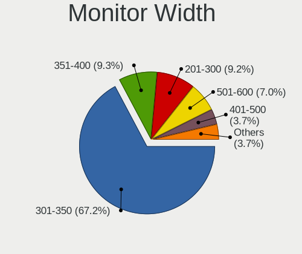

| Width in mm | Notebooks | Percent |
|-------------|-----------|---------|
| 301-350     | 1218      | 67.67%  |
| 351-400     | 175       | 9.72%   |
| 201-300     | 167       | 9.28%   |
| 501-600     | 118       | 6.56%   |
| 401-500     | 74        | 4.11%   |
| Unknown     | 18        | 1%      |
| 601-700     | 11        | 0.61%   |
| 701-800     | 5         | 0.28%   |
| 101-200     | 4         | 0.22%   |
| 1001-1500   | 4         | 0.22%   |
| 801-900     | 3         | 0.17%   |
| 1501-2000   | 2         | 0.11%   |
| 901-1000    | 1         | 0.06%   |

Aspect Ratio
------------

Proportional relationship between the width and the height

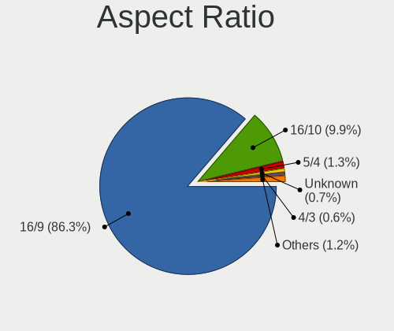

| Ratio   | Notebooks | Percent |
|---------|-----------|---------|
| 16/9    | 1421      | 86.7%   |
| 16/10   | 160       | 9.76%   |
| 5/4     | 24        | 1.46%   |
| 4/3     | 12        | 0.73%   |
| Unknown | 12        | 0.73%   |
| 3/2     | 6         | 0.37%   |
| 21/9    | 3         | 0.18%   |
| 32/9    | 1         | 0.06%   |

Monitor Area
------------

Area in inch

| Area in inch | Notebooks | Percent |
|----------------|-----------|---------|
| 101-110        | 1006      | 55.67%  |
| 81-90          | 236       | 13.06%  |
| 201-250        | 127       | 7.03%   |
| 121-130        | 113       | 6.25%   |
| 71-80          | 56        | 3.1%    |
| 41-50          | 39        | 2.16%   |
| 51-60          | 32        | 1.77%   |
| 151-200        | 29        | 1.6%    |
| 301-350        | 28        | 1.55%   |
| 61-70          | 27        | 1.49%   |
| 141-150        | 24        | 1.33%   |
| 131-140        | 23        | 1.27%   |
| Unknown        | 18        | 1%      |
| 251-300        | 14        | 0.77%   |
| 351-500        | 11        | 0.61%   |
| 91-100         | 8         | 0.44%   |
| More than 1000 | 5         | 0.28%   |
| 501-1000       | 5         | 0.28%   |
| 1-40           | 4         | 0.22%   |
| 111-120        | 2         | 0.11%   |

Pixel Density
-------------

Pixels per inch

| Density       | Notebooks | Percent |
|---------------|-----------|---------|
| 101-120       | 708       | 39.89%  |
| 121-160       | 655       | 36.9%   |
| 51-100        | 320       | 18.03%  |
| 161-240       | 45        | 2.54%   |
| More than 240 | 22        | 1.24%   |
| Unknown       | 18        | 1.01%   |
| 1-50          | 7         | 0.39%   |

Multiple Monitors
-----------------

Total monitors connected

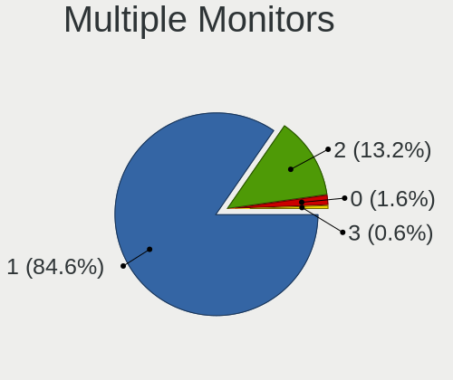

| Total | Notebooks | Percent |
|-------|-----------|---------|
| 1     | 1422      | 84.69%  |
| 2     | 218       | 12.98%  |
| 0     | 29        | 1.73%   |
| 3     | 10        | 0.6%    |

Network
-------

Net Controller Vendor
---------------------

Controller vendors

| Vendor                                 | Notebooks | Percent |
|----------------------------------------|-----------|---------|
| Realtek Semiconductor                  | 936       | 34.56%  |
| Intel                                  | 621       | 22.93%  |
| Qualcomm Atheros                       | 596       | 22.01%  |
| Broadcom                               | 242       | 8.94%   |
| Broadcom Limited                       | 61        | 2.25%   |
| Ralink                                 | 54        | 1.99%   |
| Marvell Technology Group               | 49        | 1.81%   |
| Ralink Technology                      | 18        | 0.66%   |
| MEDIATEK                               | 11        | 0.41%   |
| Attansic Technology                    | 11        | 0.41%   |
| Dell                                   | 10        | 0.37%   |
| Huawei Technologies                    | 9         | 0.33%   |
| Xiaomi                                 | 7         | 0.26%   |
| Samsung Electronics                    | 7         | 0.26%   |
| Qualcomm Atheros Communications        | 7         | 0.26%   |
| JMicron Technology                     | 7         | 0.26%   |
| Ericsson Business Mobile Networks      | 6         | 0.22%   |
| Hewlett-Packard                        | 5         | 0.18%   |
| VIA Technologies                       | 4         | 0.15%   |
| TP-Link                                | 4         | 0.15%   |
| Silicon Integrated Systems [SiS]       | 4         | 0.15%   |
| Sierra Wireless                        | 4         | 0.15%   |
| ICS Advent                             | 4         | 0.15%   |
| ASIX Electronics                       | 4         | 0.15%   |
| Spreadtrum Communications              | 2         | 0.07%   |
| Nokia Mobile Phones                    | 2         | 0.07%   |
| Lenovo                                 | 2         | 0.07%   |
| Fibocom                                | 2         | 0.07%   |
| D-Link System                          | 2         | 0.07%   |
| ASUSTek Computer                       | 2         | 0.07%   |
| ZyDAS                                  | 1         | 0.04%   |
| U-Blox                                 | 1         | 0.04%   |
| Toshiba                                | 1         | 0.04%   |
| Sony Ericsson Mobile Communications AB | 1         | 0.04%   |
| OPPO Electronics                       | 1         | 0.04%   |
| OKB SAPR                               | 1         | 0.04%   |
| Nvidia                                 | 1         | 0.04%   |
| Motorola PCS                           | 1         | 0.04%   |
| Microsoft                              | 1         | 0.04%   |
| LSI                                    | 1         | 0.04%   |
| Fujitsu Siemens Computers              | 1         | 0.04%   |
| Edimax Technology                      | 1         | 0.04%   |
| DisplayLink                            | 1         | 0.04%   |
| D-Link                                 | 1         | 0.04%   |
| Android                                | 1         | 0.04%   |

Net Controller Model
--------------------

Controller models

| Model                                                                   | Notebooks | Percent |
|-------------------------------------------------------------------------|-----------|---------|
| Realtek RTL8111/8168/8411 PCI Express Gigabit Ethernet Controller       | 568       | 17.95%  |
| Realtek RTL810xE PCI Express Fast Ethernet controller                   | 261       | 8.25%   |
| Qualcomm Atheros AR9285 Wireless Network Adapter (PCI-Express)          | 137       | 4.33%   |
| Qualcomm Atheros QCA9377 802.11ac Wireless Network Adapter              | 95        | 3%      |
| Broadcom BCM4313 802.11bgn Wireless Network Adapter                     | 85        | 2.69%   |
| Realtek RTL8821CE 802.11ac PCIe Wireless Network Adapter                | 82        | 2.59%   |
| Qualcomm Atheros QCA9565 / AR9565 Wireless Network Adapter              | 74        | 2.34%   |
| Qualcomm Atheros AR9485 Wireless Network Adapter                        | 73        | 2.31%   |
| Qualcomm Atheros AR242x / AR542x Wireless Network Adapter (PCI-Express) | 49        | 1.55%   |
| Intel Wireless 8265 / 8275                                              | 48        | 1.52%   |
| Intel Wireless 7260                                                     | 41        | 1.3%    |
| Intel Cannon Point-LP CNVi [Wireless-AC]                                | 41        | 1.3%    |
| Intel 82579LM Gigabit Network Connection (Lewisville)                   | 39        | 1.23%   |
| Intel Wi-Fi 6 AX200                                                     | 37        | 1.17%   |
| Ralink RT3290 Wireless 802.11n 1T/1R PCIe                               | 36        | 1.14%   |
| Realtek RTL8723BE PCIe Wireless Network Adapter                         | 35        | 1.11%   |
| Intel PRO/Wireless 3945ABG [Golan] Network Connection                   | 33        | 1.04%   |
| Broadcom BCM43142 802.11b/g/n                                           | 33        | 1.04%   |
| Qualcomm Atheros AR8151 v2.0 Gigabit Ethernet                           | 32        | 1.01%   |
| Intel Wi-Fi 6 AX201                                                     | 32        | 1.01%   |
| Intel Wireless 3165                                                     | 29        | 0.92%   |
| Realtek RTL8822BE 802.11a/b/g/n/ac WiFi adapter                         | 28        | 0.88%   |
| Intel Cannon Lake PCH CNVi WiFi                                         | 28        | 0.88%   |
| Qualcomm Atheros QCA6174 802.11ac Wireless Network Adapter              | 27        | 0.85%   |
| Intel Wireless 8260                                                     | 26        | 0.82%   |
| Intel Centrino Advanced-N 6205 [Taylor Peak]                            | 25        | 0.79%   |
| Realtek RTL8822CE 802.11ac PCIe Wireless Network Adapter                | 24        | 0.76%   |
| Intel Comet Lake PCH-LP CNVi WiFi                                       | 23        | 0.73%   |
| Intel Dual Band Wireless-AC 3168NGW [Stone Peak]                        | 22        | 0.7%    |
| Intel Centrino Wireless-N 2230                                          | 22        | 0.7%    |
| Realtek RTL8153 Gigabit Ethernet Adapter                                | 21        | 0.66%   |
| Qualcomm Atheros AR9462 Wireless Network Adapter                        | 21        | 0.66%   |
| Qualcomm Atheros QCA8172 Fast Ethernet                                  | 20        | 0.63%   |
| Broadcom BCM4312 802.11b/g LP-PHY                                       | 20        | 0.63%   |
| Qualcomm Atheros AR8162 Fast Ethernet                                   | 19        | 0.6%    |
| Marvell Group 88E8040 PCI-E Fast Ethernet Controller                    | 19        | 0.6%    |
| Intel Comet Lake PCH CNVi WiFi                                          | 19        | 0.6%    |
| Qualcomm Atheros AR8161 Gigabit Ethernet                                | 18        | 0.57%   |
| Intel Wireless 7265                                                     | 18        | 0.57%   |
| Intel Centrino Ultimate-N 6300                                          | 18        | 0.57%   |
| Broadcom Limited BCM4313 802.11bgn Wireless Network Adapter             | 18        | 0.57%   |
| Broadcom NetLink BCM57785 Gigabit Ethernet PCIe                         | 17        | 0.54%   |
| Realtek RTL8723DE Wireless Network Adapter                              | 16        | 0.51%   |
| Qualcomm Atheros AR9287 Wireless Network Adapter (PCI-Express)          | 16        | 0.51%   |
| Qualcomm Atheros AR8152 v2.0 Fast Ethernet                              | 15        | 0.47%   |
| Qualcomm Atheros AR8132 Fast Ethernet                                   | 15        | 0.47%   |
| Intel WiFi Link 5100                                                    | 15        | 0.47%   |
| Intel Dual Band Wireless-AC 3165 Plus Bluetooth                         | 15        | 0.47%   |
| Intel Ethernet Connection (6) I219-V                                    | 14        | 0.44%   |
| Broadcom NetLink BCM5787M Gigabit Ethernet PCI Express                  | 14        | 0.44%   |
| Realtek RTL-8100/8101L/8139 PCI Fast Ethernet Adapter                   | 12        | 0.38%   |
| Ralink RT3090 Wireless 802.11n 1T/1R PCIe                               | 12        | 0.38%   |
| Qualcomm Atheros AR928X Wireless Network Adapter (PCI-Express)          | 12        | 0.38%   |
| Realtek RTL8821AE 802.11ac PCIe Wireless Network Adapter                | 11        | 0.35%   |
| Qualcomm Atheros AR8121/AR8113/AR8114 Gigabit or Fast Ethernet          | 11        | 0.35%   |
| Attansic AR8152 v2.0 Fast Ethernet                                      | 11        | 0.35%   |
| Ralink MT7601U Wireless Adapter                                         | 10        | 0.32%   |
| Qualcomm Atheros AR8131 Gigabit Ethernet                                | 10        | 0.32%   |
| Intel PRO/Wireless 4965 AG or AGN [Kedron] Network Connection           | 10        | 0.32%   |
| Intel Ethernet Connection I217-LM                                       | 10        | 0.32%   |

Wireless Vendor
---------------

Wireless vendors

| Vendor                          | Notebooks | Percent |
|---------------------------------|-----------|---------|
| Intel                           | 592       | 35.36%  |
| Qualcomm Atheros                | 510       | 30.47%  |
| Realtek Semiconductor           | 235       | 14.04%  |
| Broadcom                        | 187       | 11.17%  |
| Ralink                          | 54        | 3.23%   |
| Broadcom Limited                | 36        | 2.15%   |
| Ralink Technology               | 18        | 1.08%   |
| MEDIATEK                        | 11        | 0.66%   |
| Qualcomm Atheros Communications | 7         | 0.42%   |
| Dell                            | 6         | 0.36%   |
| Sierra Wireless                 | 4         | 0.24%   |
| TP-Link                         | 3         | 0.18%   |
| Fibocom                         | 2         | 0.12%   |
| D-Link System                   | 2         | 0.12%   |
| ZyDAS                           | 1         | 0.06%   |
| Microsoft                       | 1         | 0.06%   |
| Hewlett-Packard                 | 1         | 0.06%   |
| Fujitsu Siemens Computers       | 1         | 0.06%   |
| Edimax Technology               | 1         | 0.06%   |
| D-Link                          | 1         | 0.06%   |
| ASUSTek Computer                | 1         | 0.06%   |

Wireless Model
--------------

Wireless models

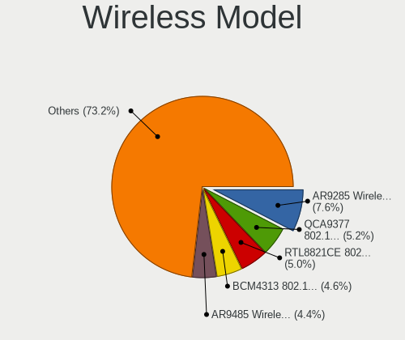

| Model                                                                   | Notebooks | Percent |
|-------------------------------------------------------------------------|-----------|---------|
| Qualcomm Atheros AR9285 Wireless Network Adapter (PCI-Express)          | 137       | 8.17%   |
| Qualcomm Atheros QCA9377 802.11ac Wireless Network Adapter              | 95        | 5.67%   |
| Broadcom BCM4313 802.11bgn Wireless Network Adapter                     | 85        | 5.07%   |
| Realtek RTL8821CE 802.11ac PCIe Wireless Network Adapter                | 82        | 4.89%   |
| Qualcomm Atheros QCA9565 / AR9565 Wireless Network Adapter              | 74        | 4.42%   |
| Qualcomm Atheros AR9485 Wireless Network Adapter                        | 73        | 4.36%   |
| Qualcomm Atheros AR242x / AR542x Wireless Network Adapter (PCI-Express) | 49        | 2.92%   |
| Intel Wireless 8265 / 8275                                              | 48        | 2.86%   |
| Intel Wireless 7260                                                     | 41        | 2.45%   |
| Intel Cannon Point-LP CNVi [Wireless-AC]                                | 41        | 2.45%   |
| Intel Wi-Fi 6 AX200                                                     | 37        | 2.21%   |
| Ralink RT3290 Wireless 802.11n 1T/1R PCIe                               | 36        | 2.15%   |
| Realtek RTL8723BE PCIe Wireless Network Adapter                         | 35        | 2.09%   |
| Intel PRO/Wireless 3945ABG [Golan] Network Connection                   | 33        | 1.97%   |
| Broadcom BCM43142 802.11b/g/n                                           | 33        | 1.97%   |
| Intel Wi-Fi 6 AX201                                                     | 32        | 1.91%   |
| Intel Wireless 3165                                                     | 29        | 1.73%   |
| Realtek RTL8822BE 802.11a/b/g/n/ac WiFi adapter                         | 28        | 1.67%   |
| Intel Cannon Lake PCH CNVi WiFi                                         | 28        | 1.67%   |
| Qualcomm Atheros QCA6174 802.11ac Wireless Network Adapter              | 27        | 1.61%   |
| Intel Wireless 8260                                                     | 26        | 1.55%   |
| Intel Centrino Advanced-N 6205 [Taylor Peak]                            | 25        | 1.49%   |
| Realtek RTL8822CE 802.11ac PCIe Wireless Network Adapter                | 24        | 1.43%   |
| Intel Comet Lake PCH-LP CNVi WiFi                                       | 23        | 1.37%   |
| Intel Dual Band Wireless-AC 3168NGW [Stone Peak]                        | 22        | 1.31%   |
| Intel Centrino Wireless-N 2230                                          | 22        | 1.31%   |
| Qualcomm Atheros AR9462 Wireless Network Adapter                        | 21        | 1.25%   |
| Broadcom BCM4312 802.11b/g LP-PHY                                       | 20        | 1.19%   |
| Intel Comet Lake PCH CNVi WiFi                                          | 19        | 1.13%   |
| Intel Wireless 7265                                                     | 18        | 1.07%   |
| Intel Centrino Ultimate-N 6300                                          | 18        | 1.07%   |
| Broadcom Limited BCM4313 802.11bgn Wireless Network Adapter             | 18        | 1.07%   |
| Realtek RTL8723DE Wireless Network Adapter                              | 16        | 0.95%   |
| Qualcomm Atheros AR9287 Wireless Network Adapter (PCI-Express)          | 16        | 0.95%   |
| Intel WiFi Link 5100                                                    | 15        | 0.89%   |
| Intel Dual Band Wireless-AC 3165 Plus Bluetooth                         | 15        | 0.89%   |
| Ralink RT3090 Wireless 802.11n 1T/1R PCIe                               | 12        | 0.72%   |
| Qualcomm Atheros AR928X Wireless Network Adapter (PCI-Express)          | 12        | 0.72%   |
| Realtek RTL8821AE 802.11ac PCIe Wireless Network Adapter                | 11        | 0.66%   |
| Ralink MT7601U Wireless Adapter                                         | 10        | 0.6%    |
| Intel PRO/Wireless 4965 AG or AGN [Kedron] Network Connection           | 10        | 0.6%    |
| Broadcom BCM43225 802.11b/g/n                                           | 10        | 0.6%    |
| Intel Centrino Wireless-N 1000 [Condor Peak]                            | 9         | 0.54%   |
| Intel Centrino Advanced-N 6235                                          | 9         | 0.54%   |
| Broadcom BCM4311 802.11b/g WLAN                                         | 9         | 0.54%   |
| Realtek RTL8188EE Wireless Network Adapter                              | 8         | 0.48%   |
| Intel Wireless 3160                                                     | 8         | 0.48%   |
| Intel Centrino Wireless-N 1030 [Rainbow Peak]                           | 8         | 0.48%   |
| MEDIATEK MT7921 802.11ax PCI Express Wireless Network Adapter           | 7         | 0.42%   |
| Intel Centrino Wireless-N 135                                           | 6         | 0.36%   |
| Broadcom Limited BCM4312 802.11b/g LP-PHY                               | 6         | 0.36%   |
| Realtek RTL8191SEvA Wireless LAN Controller                             | 5         | 0.3%    |
| Realtek RTL8188EUS 802.11n Wireless Network Adapter                     | 5         | 0.3%    |
| Realtek RTL8188CE 802.11b/g/n WiFi Adapter                              | 5         | 0.3%    |
| Qualcomm Atheros AR9271 802.11n                                         | 5         | 0.3%    |
| Intel Wireless-AC 9260                                                  | 5         | 0.3%    |
| Intel Ice Lake-LP PCH CNVi WiFi                                         | 5         | 0.3%    |
| Intel Centrino Wireless-N 100                                           | 5         | 0.3%    |
| Intel Centrino Advanced-N 6200                                          | 5         | 0.3%    |
| Broadcom BCM43228 802.11a/b/g/n                                         | 5         | 0.3%    |

Ethernet Vendor
---------------

Ethernet vendors

| Vendor                                 | Notebooks | Percent |
|----------------------------------------|-----------|---------|
| Realtek Semiconductor                  | 866       | 59.68%  |
| Intel                                  | 187       | 12.89%  |
| Qualcomm Atheros                       | 173       | 11.92%  |
| Broadcom                               | 78        | 5.38%   |
| Marvell Technology Group               | 49        | 3.38%   |
| Broadcom Limited                       | 26        | 1.79%   |
| Attansic Technology                    | 11        | 0.76%   |
| Xiaomi                                 | 7         | 0.48%   |
| Samsung Electronics                    | 7         | 0.48%   |
| JMicron Technology                     | 7         | 0.48%   |
| Huawei Technologies                    | 7         | 0.48%   |
| VIA Technologies                       | 4         | 0.28%   |
| Silicon Integrated Systems [SiS]       | 4         | 0.28%   |
| ICS Advent                             | 4         | 0.28%   |
| ASIX Electronics                       | 4         | 0.28%   |
| Hewlett-Packard                        | 3         | 0.21%   |
| Spreadtrum Communications              | 2         | 0.14%   |
| Lenovo                                 | 2         | 0.14%   |
| TP-Link                                | 1         | 0.07%   |
| Sony Ericsson Mobile Communications AB | 1         | 0.07%   |
| OPPO Electronics                       | 1         | 0.07%   |
| OKB SAPR                               | 1         | 0.07%   |
| Nvidia                                 | 1         | 0.07%   |
| Motorola PCS                           | 1         | 0.07%   |
| LSI                                    | 1         | 0.07%   |
| DisplayLink                            | 1         | 0.07%   |
| ASUSTek Computer                       | 1         | 0.07%   |
| Android                                | 1         | 0.07%   |

Ethernet Model
--------------

Ethernet models

| Model                                                                          | Notebooks | Percent |
|--------------------------------------------------------------------------------|-----------|---------|
| Realtek RTL8111/8168/8411 PCI Express Gigabit Ethernet Controller              | 568       | 38.9%   |
| Realtek RTL810xE PCI Express Fast Ethernet controller                          | 261       | 17.88%  |
| Intel 82579LM Gigabit Network Connection (Lewisville)                          | 39        | 2.67%   |
| Qualcomm Atheros AR8151 v2.0 Gigabit Ethernet                                  | 32        | 2.19%   |
| Realtek RTL8153 Gigabit Ethernet Adapter                                       | 21        | 1.44%   |
| Qualcomm Atheros QCA8172 Fast Ethernet                                         | 20        | 1.37%   |
| Qualcomm Atheros AR8162 Fast Ethernet                                          | 19        | 1.3%    |
| Marvell Group 88E8040 PCI-E Fast Ethernet Controller                           | 19        | 1.3%    |
| Qualcomm Atheros AR8161 Gigabit Ethernet                                       | 18        | 1.23%   |
| Broadcom NetLink BCM57785 Gigabit Ethernet PCIe                                | 17        | 1.16%   |
| Qualcomm Atheros AR8152 v2.0 Fast Ethernet                                     | 15        | 1.03%   |
| Qualcomm Atheros AR8132 Fast Ethernet                                          | 15        | 1.03%   |
| Intel Ethernet Connection (6) I219-V                                           | 14        | 0.96%   |
| Broadcom NetLink BCM5787M Gigabit Ethernet PCI Express                         | 14        | 0.96%   |
| Realtek RTL-8100/8101L/8139 PCI Fast Ethernet Adapter                          | 12        | 0.82%   |
| Qualcomm Atheros AR8121/AR8113/AR8114 Gigabit or Fast Ethernet                 | 11        | 0.75%   |
| Attansic AR8152 v2.0 Fast Ethernet                                             | 11        | 0.75%   |
| Qualcomm Atheros AR8131 Gigabit Ethernet                                       | 10        | 0.68%   |
| Intel Ethernet Connection I217-LM                                              | 10        | 0.68%   |
| Intel Ethernet Connection (4) I219-V                                           | 10        | 0.68%   |
| Intel 82577LM Gigabit Network Connection                                       | 10        | 0.68%   |
| Intel Ethernet Connection I218-LM                                              | 9         | 0.62%   |
| Intel Ethernet Connection (7) I219-LM                                          | 9         | 0.62%   |
| Intel 82567LM Gigabit Network Connection                                       | 9         | 0.62%   |
| Broadcom BCM4401-B0 100Base-TX                                                 | 9         | 0.62%   |
| Qualcomm Atheros QCA8171 Gigabit Ethernet                                      | 8         | 0.55%   |
| Marvell Group 88E8039 PCI-E Fast Ethernet Controller                           | 8         | 0.55%   |
| Intel Ethernet Connection I219-LM                                              | 8         | 0.55%   |
| Intel Ethernet Connection (4) I219-LM                                          | 8         | 0.55%   |
| Intel Ethernet Connection (2) I219-LM                                          | 8         | 0.55%   |
| JMicron JMC250 PCI Express Gigabit Ethernet Controller                         | 7         | 0.48%   |
| Intel Ethernet Connection (3) I218-LM                                          | 7         | 0.48%   |
| Broadcom NetLink BCM5906M Fast Ethernet PCI Express                            | 7         | 0.48%   |
| Xiaomi Mi/Redmi series (RNDIS)                                                 | 6         | 0.41%   |
| Samsung Galaxy series, misc. (tethering mode)                                  | 6         | 0.41%   |
| Qualcomm Atheros Attansic L2 Fast Ethernet                                     | 6         | 0.41%   |
| Intel 82579V Gigabit Network Connection                                        | 6         | 0.41%   |
| Broadcom NetXtreme BCM57786 Gigabit Ethernet PCIe                              | 6         | 0.41%   |
| Broadcom NetLink BCM5784M Gigabit Ethernet PCIe                                | 6         | 0.41%   |
| Broadcom NetLink BCM57780 Gigabit Ethernet PCIe                                | 6         | 0.41%   |
| Broadcom Limited NetLink BCM57780 Gigabit Ethernet PCIe                        | 6         | 0.41%   |
| Realtek RTL8152 Fast Ethernet Adapter                                          | 5         | 0.34%   |
| Qualcomm Atheros Killer E2400 Gigabit Ethernet Controller                      | 5         | 0.34%   |
| Qualcomm Atheros AR8152 v1.1 Fast Ethernet                                     | 5         | 0.34%   |
| Qualcomm Atheros AR8151 v1.0 Gigabit Ethernet                                  | 5         | 0.34%   |
| Marvell Group 88E8072 PCI-E Gigabit Ethernet Controller                        | 5         | 0.34%   |
| Broadcom Limited NetLink BCM57785 Gigabit Ethernet PCIe                        | 5         | 0.34%   |
| Silicon Integrated Systems [SiS] 191 Gigabit Ethernet Adapter                  | 4         | 0.27%   |
| Marvell Group Yukon Optima 88E8059 [PCIe Gigabit Ethernet Controller with AVB] | 4         | 0.27%   |
| Marvell Group 88E8055 PCI-E Gigabit Ethernet Controller                        | 4         | 0.27%   |
| Intel Ethernet Connection I219-V                                               | 4         | 0.27%   |
| Intel 82562ET/EZ/GT/GZ - PRO/100 VE (LOM) Ethernet Controller Mobile           | 4         | 0.27%   |
| ICS Advent DM9601 Fast Ethernet Adapter                                        | 4         | 0.27%   |
| Huawei MAR-LX1A                                                                | 4         | 0.27%   |
| Broadcom NetXtreme BCM57765 Gigabit Ethernet PCIe                              | 4         | 0.27%   |
| Broadcom Limited NetXtreme BCM5764M Gigabit Ethernet PCIe                      | 4         | 0.27%   |
| VIA VT6102/VT6103 [Rhine-II]                                                   | 3         | 0.21%   |
| Realtek Killer E2600 Gigabit Ethernet Controller                               | 3         | 0.21%   |
| Intel WiMAX Connection 2400m                                                   | 3         | 0.21%   |
| Intel I211 Gigabit Network Connection                                          | 3         | 0.21%   |

Net Controller Kind
-------------------

Ethernet, WiFi or modem

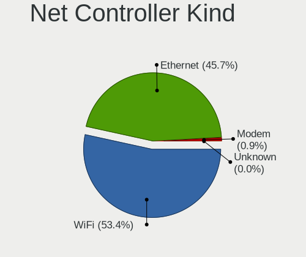

| Kind     | Notebooks | Percent |
|----------|-----------|---------|
| WiFi     | 1622      | 52.94%  |
| Ethernet | 1414      | 46.15%  |
| Modem    | 28        | 0.91%   |

Used Controller
---------------

Currently used network controller

| Kind     | Notebooks | Percent |
|----------|-----------|---------|
| WiFi     | 1368      | 78.22%  |
| Ethernet | 381       | 21.78%  |

NICs
----

Total network controllers on board

| Total | Notebooks | Percent |
|-------|-----------|---------|
| 2     | 1362      | 82.55%  |
| 1     | 270       | 16.36%  |
| 0     | 16        | 0.97%   |
| 3     | 2         | 0.12%   |

IPv6
----

IPv6 vs IPv4

| Used | Notebooks | Percent |
|------|-----------|---------|
| No   | 1647      | 99.82%  |
| Yes  | 3         | 0.18%   |

Bluetooth
---------

Bluetooth Vendor
----------------

Controller vendors

| Vendor                          | Notebooks | Percent |
|---------------------------------|-----------|---------|
| Intel                           | 422       | 34.17%  |
| Qualcomm Atheros Communications | 165       | 13.36%  |
| Realtek Semiconductor           | 143       | 11.58%  |
| IMC Networks                    | 120       | 9.72%   |
| Broadcom                        | 88        | 7.13%   |
| Lite-On Technology              | 80        | 6.48%   |
| Foxconn / Hon Hai               | 50        | 4.05%   |
| Ralink                          | 36        | 2.91%   |
| Hewlett-Packard                 | 28        | 2.27%   |
| ASUSTek Computer                | 19        | 1.54%   |
| Dell                            | 18        | 1.46%   |
| Cambridge Silicon Radio         | 13        | 1.05%   |
| Apple                           | 10        | 0.81%   |
| Ralink Technology               | 9         | 0.73%   |
| Toshiba                         | 8         | 0.65%   |
| Foxconn International           | 8         | 0.65%   |
| Alps Electric                   | 4         | 0.32%   |
| Realtek                         | 3         | 0.24%   |
| Taiyo Yuden                     | 2         | 0.16%   |
| Opticis                         | 2         | 0.16%   |
| Micro Star International        | 2         | 0.16%   |
| MediaTek                        | 2         | 0.16%   |
| Askey Computer                  | 2         | 0.16%   |
| Chicony Electronics             | 1         | 0.08%   |

Bluetooth Model
---------------

Controller models

| Model                                                  | Notebooks | Percent |
|--------------------------------------------------------|-----------|---------|
| Intel Bluetooth wireless interface                     | 165       | 13.36%  |
| Intel Bluetooth 9460/9560 Jefferson Peak (JfP)         | 84        | 6.8%    |
| Qualcomm Atheros  Bluetooth Device                     | 74        | 5.99%   |
| Intel AX201 Bluetooth                                  | 68        | 5.51%   |
| Realtek Bluetooth Radio                                | 65        | 5.26%   |
| Realtek  Bluetooth 4.2 Adapter                         | 49        | 3.97%   |
| IMC Networks Bluetooth Radio                           | 49        | 3.97%   |
| Qualcomm Atheros AR3011 Bluetooth                      | 44        | 3.56%   |
| IMC Networks Bluetooth Device                          | 38        | 3.08%   |
| Ralink RT3290 Bluetooth                                | 36        | 2.91%   |
| Intel AX200 Bluetooth                                  | 36        | 2.91%   |
| Intel Centrino Bluetooth Wireless Transceiver          | 34        | 2.75%   |
| Lite-On Bluetooth Device                               | 28        | 2.27%   |
| Qualcomm Atheros AR3012 Bluetooth 4.0                  | 27        | 2.19%   |
| Lite-On Qualcomm Atheros QCA9377 Bluetooth             | 24        | 1.94%   |
| Intel Wireless-AC 3168 Bluetooth                       | 21        | 1.7%    |
| IMC Networks Atheros AR3012 Bluetooth 4.0 Adapter      | 19        | 1.54%   |
| Foxconn / Hon Hai Bluetooth Device                     | 19        | 1.54%   |
| Realtek 802.11ac WLAN Adapter                          | 15        | 1.21%   |
| HP Broadcom 2070 Bluetooth Combo                       | 15        | 1.21%   |
| HP Bluetooth 2.0 Interface [Broadcom BCM2045]          | 13        | 1.05%   |
| Cambridge Silicon Radio Bluetooth Dongle (HCI mode)    | 13        | 1.05%   |
| Lite-On Atheros AR3012 Bluetooth                       | 12        | 0.97%   |
| Qualcomm Atheros Bluetooth                             | 11        | 0.89%   |
| Intel Centrino Advanced-N 6230 Bluetooth adapter       | 10        | 0.81%   |
| Foxconn / Hon Hai Broadcom Bluetooth 2.1 Device        | 10        | 0.81%   |
| Broadcom BCM2070 Bluetooth 2.1 + EDR                   | 10        | 0.81%   |
| Broadcom BCM2045B (BDC-2.1)                            | 10        | 0.81%   |
| Foxconn / Hon Hai Broadcom BCM20702 Bluetooth          | 9         | 0.73%   |
| Broadcom BCM20702A0                                    | 9         | 0.73%   |
| Broadcom BCM2045 Bluetooth                             | 9         | 0.73%   |
| ASUS BT-183 Bluetooth 2.0+EDR adapter                  | 9         | 0.73%   |
| Ralink Motorola BC4 Bluetooth 3.0+HS Adapter           | 8         | 0.65%   |
| Foxconn International BCM43142A0 Bluetooth module      | 8         | 0.65%   |
| Realtek RTL8723B Bluetooth                             | 7         | 0.57%   |
| Lite-On Broadcom BCM43142A0 Bluetooth Device           | 7         | 0.57%   |
| Broadcom BCM43142 Bluetooth 4.0                        | 7         | 0.57%   |
| Broadcom BCM20702 Bluetooth 4.0 [ThinkPad]             | 7         | 0.57%   |
| ASUS BT-270 Bluetooth Adapter                          | 7         | 0.57%   |
| Qualcomm Atheros QCA61x4 Bluetooth 4.0                 | 6         | 0.49%   |
| Dell Wireless 365 Bluetooth                            | 6         | 0.49%   |
| Broadcom HP Portable Valentine                         | 6         | 0.49%   |
| Broadcom BCM43142A0 Bluetooth 4.0                      | 6         | 0.49%   |
| Realtek RTL8822BE Bluetooth 4.2 Adapter                | 5         | 0.4%    |
| IMC Networks Wireless_Device                           | 5         | 0.4%    |
| Dell DW375 Bluetooth Module                            | 5         | 0.4%    |
| Toshiba Integrated Bluetooth HCI                       | 4         | 0.32%   |
| Intel Wireless-AC 9260 Bluetooth Adapter               | 4         | 0.32%   |
| IMC Networks Asus Integrated Bluetooth module [AR3011] | 4         | 0.32%   |
| Foxconn / Hon Hai Acer Bluetooth module                | 4         | 0.32%   |
| Broadcom BCM2070 Bluetooth Device                      | 4         | 0.32%   |
| Apple Bluetooth Host Controller                        | 4         | 0.32%   |
| Toshiba Askey Bluetooth Module                         | 3         | 0.24%   |
| Realtek Bluetooth Radio                                | 3         | 0.24%   |
| Lite-On Atheros Bluetooth                              | 3         | 0.24%   |
| Foxconn / Hon Hai BCM20702A0                           | 3         | 0.24%   |
| Dell BCM20702A0 Bluetooth Module                       | 3         | 0.24%   |
| Broadcom HP Portable SoftSailing                       | 3         | 0.24%   |
| ASUS BT-253 Bluetooth Adapter                          | 3         | 0.24%   |
| Apple Bluetooth USB Host Controller                    | 3         | 0.24%   |

Sound
-----

Sound Vendor
------------

Sound card vendors

| Vendor                           | Notebooks | Percent |
|----------------------------------|-----------|---------|
| Intel                            | 1314      | 69.34%  |
| AMD                              | 355       | 18.73%  |
| Nvidia                           | 163       | 8.6%    |
| Silicon Integrated Systems [SiS] | 7         | 0.37%   |
| C-Media Electronics              | 7         | 0.37%   |
| Logitech                         | 6         | 0.32%   |
| Plantronics                      | 5         | 0.26%   |
| Realtek Semiconductor            | 4         | 0.21%   |
| VIA Technologies                 | 3         | 0.16%   |
| Sennheiser Communications        | 3         | 0.16%   |
| Lenovo                           | 3         | 0.16%   |
| Hewlett-Packard                  | 3         | 0.16%   |
| GN Netcom                        | 3         | 0.16%   |
| Shenzhen Rapoo Technology        | 2         | 0.11%   |
| Kingston Technology              | 2         | 0.11%   |
| Trust                            | 1         | 0.05%   |
| Texas Instruments                | 1         | 0.05%   |
| SteelSeries ApS                  | 1         | 0.05%   |
| Razer USA                        | 1         | 0.05%   |
| Microsoft                        | 1         | 0.05%   |
| M-Audio                          | 1         | 0.05%   |
| JMTek                            | 1         | 0.05%   |
| iCreate Technologies             | 1         | 0.05%   |
| Google                           | 1         | 0.05%   |
| Generalplus Technology           | 1         | 0.05%   |
| Focusrite-Novation               | 1         | 0.05%   |
| Cirrus Logic                     | 1         | 0.05%   |
| BY EDIFIER                       | 1         | 0.05%   |
| Audio-Technica                   | 1         | 0.05%   |
| ASUSTek Computer                 | 1         | 0.05%   |

Sound Model
-----------

Sound card models

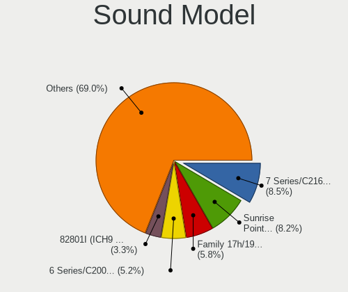

| Model                                                                                             | Notebooks | Percent |
|---------------------------------------------------------------------------------------------------|-----------|---------|
| Intel 7 Series/C216 Chipset Family High Definition Audio Controller                               | 201       | 8.89%   |
| Intel Sunrise Point-LP HD Audio                                                                   | 193       | 8.54%   |
| Intel 6 Series/C200 Series Chipset Family High Definition Audio Controller                        | 129       | 5.71%   |
| AMD Family 17h/19h HD Audio Controller                                                            | 108       | 4.78%   |
| AMD SBx00 Azalia (Intel HDA)                                                                      | 82        | 3.63%   |
| Intel NM10/ICH7 Family High Definition Audio Controller                                           | 80        | 3.54%   |
| Intel 82801I (ICH9 Family) HD Audio Controller                                                    | 79        | 3.5%    |
| AMD FCH Azalia Controller                                                                         | 78        | 3.45%   |
| Intel 5 Series/3400 Series Chipset High Definition Audio                                          | 69        | 3.05%   |
| Intel Cannon Point-LP High Definition Audio Controller                                            | 58        | 2.57%   |
| Intel Cannon Lake PCH cAVS                                                                        | 56        | 2.48%   |
| AMD Renoir Radeon High Definition Audio Controller                                                | 53        | 2.35%   |
| Intel Celeron/Pentium Silver Processor High Definition Audio                                      | 49        | 2.17%   |
| Intel 8 Series/C220 Series Chipset High Definition Audio Controller                               | 47        | 2.08%   |
| AMD Raven/Raven2/Fenghuang HDMI/DP Audio Controller                                               | 45        | 1.99%   |
| Intel Xeon E3-1200 v3/4th Gen Core Processor HD Audio Controller                                  | 44        | 1.95%   |
| Intel Tiger Lake-LP Smart Sound Technology Audio Controller                                       | 41        | 1.81%   |
| Intel Haswell-ULT HD Audio Controller                                                             | 38        | 1.68%   |
| Intel 82801H (ICH8 Family) HD Audio Controller                                                    | 38        | 1.68%   |
| Intel 8 Series HD Audio Controller                                                                | 38        | 1.68%   |
| Intel Wildcat Point-LP High Definition Audio Controller                                           | 36        | 1.59%   |
| Intel Broadwell-U Audio Controller                                                                | 36        | 1.59%   |
| Intel Atom/Celeron/Pentium Processor x5-E8000/J3xxx/N3xxx Series High Definition Audio Controller | 36        | 1.59%   |
| Intel Comet Lake PCH-LP cAVS                                                                      | 34        | 1.5%    |
| Nvidia GF108 High Definition Audio Controller                                                     | 33        | 1.46%   |
| AMD Kabini HDMI/DP Audio                                                                          | 32        | 1.42%   |
| AMD Trinity HDMI Audio Controller                                                                 | 30        | 1.33%   |
| AMD Wrestler HDMI Audio                                                                           | 28        | 1.24%   |
| AMD Family 15h (Models 60h-6fh) Audio Controller                                                  | 28        | 1.24%   |
| Nvidia GP107GL High Definition Audio Controller                                                   | 26        | 1.15%   |
| Intel CM238 HD Audio Controller                                                                   | 22        | 0.97%   |
| AMD High Definition Audio Controller                                                              | 22        | 0.97%   |
| Intel Celeron N3350/Pentium N4200/Atom E3900 Series Audio Cluster                                 | 20        | 0.88%   |
| Intel Comet Lake PCH cAVS                                                                         | 19        | 0.84%   |
| Intel Atom Processor Z36xxx/Z37xxx Series High Definition Audio Controller                        | 19        | 0.84%   |
| Intel 100 Series/C230 Series Chipset Family HD Audio Controller                                   | 19        | 0.84%   |
| AMD Cedar HDMI Audio [Radeon HD 5400/6300/7300 Series]                                            | 19        | 0.84%   |
| AMD RV710/730 HDMI Audio [Radeon HD 4000 series]                                                  | 16        | 0.71%   |
| Nvidia TU107 GeForce GTX 1650 High Definition Audio Controller                                    | 14        | 0.62%   |
| AMD Redwood HDMI Audio [Radeon HD 5000 Series]                                                    | 14        | 0.62%   |
| AMD BeaverCreek HDMI Audio [Radeon HD 6500D and 6400G-6600G series]                               | 13        | 0.58%   |
| Nvidia High Definition Audio Controller                                                           | 12        | 0.53%   |
| Nvidia TU116 High Definition Audio Controller                                                     | 10        | 0.44%   |
| Nvidia TU106 High Definition Audio Controller                                                     | 9         | 0.4%    |
| Intel 82801FB/FBM/FR/FW/FRW (ICH6 Family) AC'97 Audio Controller                                  | 9         | 0.4%    |
| AMD RS880 HDMI Audio [Radeon HD 4200 Series]                                                      | 9         | 0.4%    |
| Nvidia MCP79 High Definition Audio                                                                | 8         | 0.35%   |
| Nvidia GK107 HDMI Audio Controller                                                                | 8         | 0.35%   |
| Intel Ice Lake-LP Smart Sound Technology Audio Controller                                         | 8         | 0.35%   |
| AMD Caicos HDMI Audio [Radeon HD 6450 / 7450/8450/8490 OEM / R5 230/235/235X OEM]                 | 8         | 0.35%   |
| Silicon Integrated Systems [SiS] Azalia Audio Controller                                          | 7         | 0.31%   |
| Nvidia GT216 HDMI Audio Controller                                                                | 7         | 0.31%   |
| Nvidia GP106 High Definition Audio Controller                                                     | 7         | 0.31%   |
| Nvidia GF119 HDMI Audio Controller                                                                | 7         | 0.31%   |
| Nvidia GK208 HDMI/DP Audio Controller                                                             | 6         | 0.27%   |
| Realtek Semiconductor USB Audio                                                                   | 4         | 0.18%   |
| Nvidia GM107 High Definition Audio Controller [GeForce 940MX]                                     | 4         | 0.18%   |
| Nvidia Audio device                                                                               | 4         | 0.18%   |
| Intel Jasper Lake HD Audio                                                                        | 4         | 0.18%   |
| Intel 82801FB/FBM/FR/FW/FRW (ICH6 Family) High Definition Audio Controller                        | 4         | 0.18%   |

Memory
------

Memory Vendor
-------------

Memory module vendors

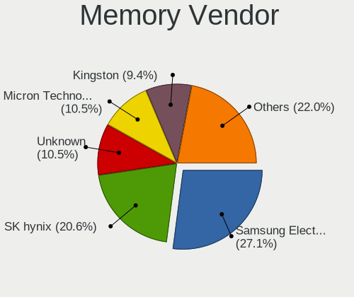

| Vendor              | Notebooks | Percent |
|---------------------|-----------|---------|
| Samsung Electronics | 355       | 26.35%  |
| SK Hynix            | 272       | 20.19%  |
| Unknown             | 145       | 10.76%  |
| Micron Technology   | 142       | 10.54%  |
| Kingston            | 125       | 9.28%   |
| Ramaxel Technology  | 58        | 4.31%   |
| Elpida              | 51        | 3.79%   |
| Nanya Technology    | 30        | 2.23%   |
| A-DATA Technology   | 30        | 2.23%   |
| GOODRAM             | 22        | 1.63%   |
| Team                | 16        | 1.19%   |
| Crucial             | 14        | 1.04%   |
| Transcend           | 10        | 0.74%   |
| Unknown (ABCD)      | 9         | 0.67%   |
| ASint Technology    | 9         | 0.67%   |
| 48spaces            | 8         | 0.59%   |
| SHARETRONIC         | 7         | 0.52%   |
| Apacer              | 6         | 0.45%   |
| AMD                 | 5         | 0.37%   |
| Qimonda             | 3         | 0.22%   |
| G.Skill             | 3         | 0.22%   |
| Unifosa             | 2         | 0.15%   |
| Toshiba             | 2         | 0.15%   |
| Silicon Power       | 2         | 0.15%   |
| Patriot             | 2         | 0.15%   |
| Goldkey             | 2         | 0.15%   |
| Exceleram           | 2         | 0.15%   |
| Corsair             | 2         | 0.15%   |
| Unknown (C289)      | 1         | 0.07%   |
| Unknown (768A)      | 1         | 0.07%   |
| Teikon              | 1         | 0.07%   |
| Qumo                | 1         | 0.07%   |
| Kreton              | 1         | 0.07%   |
| Kllisre             | 1         | 0.07%   |
| Kingmax             | 1         | 0.07%   |
| HEXON               | 1         | 0.07%   |
| GeIL                | 1         | 0.07%   |
| DeTech              | 1         | 0.07%   |
| BINFUL              | 1         | 0.07%   |
| B50711390119F885    | 1         | 0.07%   |
| Aeneon              | 1         | 0.07%   |

Memory Model
------------

Memory module models

| Model                                                                        | Notebooks | Percent |
|------------------------------------------------------------------------------|-----------|---------|
| SK Hynix RAM HMT351S6CFR8C-PB 4GB SODIMM DDR3 1600MT/s                       | 18        | 1.22%   |
| Samsung RAM M471B5273DH0-CH9 4GB SODIMM DDR3 1334MT/s                        | 18        | 1.22%   |
| Samsung RAM M471B5173QH0-YK0 4GB SODIMM DDR3 1600MT/s                        | 18        | 1.22%   |
| Samsung RAM M471A5244CB0-CRC 4GB SODIMM DDR4 2667MT/s                        | 16        | 1.09%   |
| Samsung RAM M471B5773DH0-CH9 2GB SODIMM DDR3 1600MT/s                        | 15        | 1.02%   |
| Samsung RAM M471B5173DB0-YK0 4GB SODIMM DDR3 1600MT/s                        | 15        | 1.02%   |
| Samsung RAM M471B5273DH0-CK0 4096MB SODIMM DDR3 1600MT/s                     | 14        | 0.95%   |
| Samsung RAM Module 16384MB SODIMM DDR4 2667MT/s                              | 13        | 0.88%   |
| Samsung RAM M471B5773DH0-CK0 2GB SODIMM DDR3 1600MT/s                        | 13        | 0.88%   |
| Samsung RAM M471B5273CH0-CH9 4GB SODIMM DDR3 1334MT/s                        | 13        | 0.88%   |
| Samsung RAM M471A5244CB0-CTD 4GB SODIMM DDR4 3266MT/s                        | 13        | 0.88%   |
| Samsung RAM M471B5173EB0-YK0 4GB SODIMM DDR3 1600MT/s                        | 12        | 0.81%   |
| Elpida RAM EBJ41UF8BCS0-DJ-F 4GB SODIMM DDR3 1334MT/s                        | 12        | 0.81%   |
| SK Hynix RAM HMT425S6AFR6A-PB 2GB SODIMM DDR3 1600MT/s                       | 11        | 0.75%   |
| Ramaxel RAM RMT3160ED58E9W1600 4GB SODIMM DDR3 1600MT/s                      | 11        | 0.75%   |
| Micron RAM 4ATF51264HZ-2G6E1 4GB SODIMM DDR4 2667MT/s                        | 11        | 0.75%   |
| Unknown RAM Module 2048MB SODIMM SDRAM                                       | 10        | 0.68%   |
| Unknown RAM Module 2048MB SODIMM DDR2 667MT/s                                | 10        | 0.68%   |
| SK Hynix RAM HMT451S6AFR8A-PB 4GB SODIMM DDR3 1600MT/s                       | 10        | 0.68%   |
| SK Hynix RAM HMT325S6BFR8C-H9 2GB SODIMM DDR3 1600MT/s                       | 10        | 0.68%   |
| Samsung RAM M471B5773CHS-CH9 2GB SODIMM DDR3 4199MT/s                        | 10        | 0.68%   |
| Samsung RAM M471A1K43DB1-CWE 8GB SODIMM DDR4 3200MT/s                        | 10        | 0.68%   |
| Unknown RAM Module 2048MB SODIMM DDR2                                        | 9         | 0.61%   |
| Unknown (ABCD) RAM 123456789012345678 2GB SODIMM DDR4 2400MT/s               | 9         | 0.61%   |
| Samsung RAM M471B5673FH0-CH9 2GB SODIMM DDR3 1334MT/s                        | 9         | 0.61%   |
| Samsung RAM M471A1K43CB1-CTD 8GB SODIMM DDR4 2667MT/s                        | 9         | 0.61%   |
| Ramaxel RAM RMT3150ED58E8W1600 2GB SODIMM DDR3 1600MT/s                      | 9         | 0.61%   |
| Unknown RAM Module 1024MB SODIMM DRAM                                        | 8         | 0.54%   |
| SK Hynix RAM HMT351S6BFR8C-H9 4GB SODIMM DDR3 1333MT/s                       | 8         | 0.54%   |
| SK Hynix RAM HMA851S6AFR6N-UH 4GB SODIMM DDR4 2667MT/s                       | 8         | 0.54%   |
| SK Hynix RAM HMA81GS6AFR8N-UH 8GB SODIMM DDR4 2667MT/s                       | 8         | 0.54%   |
| Nanya RAM NT2GC64B88B0NS-CG 2GB SODIMM DDR3 1334MT/s                         | 8         | 0.54%   |
| Micron RAM 4ATF51264HZ-2G3B1 4GB SODIMM DDR4 2400MT/s                        | 8         | 0.54%   |
| Micron RAM 4ATF1G64HZ-3G2E1 8GB SODIMM DDR4 3200MT/s                         | 8         | 0.54%   |
| Elpida RAM EBJ40UG8BBU0-GN-F 4GB SODIMM DDR3 1600MT/s                        | 8         | 0.54%   |
| Unknown RAM Module 1024MB SODIMM DDR2                                        | 7         | 0.47%   |
| SK Hynix RAM HMT451S6BFR8A-PB 4GB SODIMM DDR3 1600MT/s                       | 7         | 0.47%   |
| SK Hynix RAM HMT351S6CFR8C-H9 4096MB SODIMM DDR3 1334MT/s                    | 7         | 0.47%   |
| SK Hynix RAM HMT351S6CFR8C-H9 4096MB SODIMM DDR3 1333MT/s                    | 7         | 0.47%   |
| SK Hynix RAM HMT325S6CFR8C-PB 2GB SODIMM DDR3 1600MT/s                       | 7         | 0.47%   |
| SK Hynix RAM HMA81GS6CJR8N-VK 8192MB SODIMM DDR4 2667MT/s                    | 7         | 0.47%   |
| Samsung RAM M471B5673EH1-CF8 2GB SODIMM DDR3 4199MT/s                        | 7         | 0.47%   |
| Samsung RAM M471B1G73DB0-YK0 8192MB SODIMM DDR3 1600MT/s                     | 7         | 0.47%   |
| Ramaxel RAM RMT3170EB68F9W1600 4GB SODIMM DDR3 1600MT/s                      | 7         | 0.47%   |
| Nanya RAM NT4GC64B8HB0NS-CG 4GB SODIMM DDR3 1334MT/s                         | 7         | 0.47%   |
| Kingston RAM 99U5428-063.A00LF 8192MB SODIMM DDR3 1600MT/s                   | 7         | 0.47%   |
| Unknown RAM Module 1024MB SODIMM SDRAM                                       | 6         | 0.41%   |
| Unknown RAM Module 1024MB SODIMM DDR2 667MT/s                                | 6         | 0.41%   |
| Unknown RAM Module 1024MB SODIMM DDR                                         | 6         | 0.41%   |
| Team RAM Elite-1333 8GB SODIMM DDR3 1334MT/s                                 | 6         | 0.41%   |
| Samsung RAM M471A1K43CB1-CRC 8GB SODIMM DDR4 2667MT/s                        | 6         | 0.41%   |
| Samsung RAM M471A1K43BB1-CRC 8GB SODIMM DDR4 2667MT/s                        | 6         | 0.41%   |
| Ramaxel RAM RMSA3270ME86H9F-2666 4GB SODIMM DDR4 2667MT/s                    | 6         | 0.41%   |
| Micron RAM 8JSF25664HZ-1G4D1 2048MB SODIMM DDR3 1334MT/s                     | 6         | 0.41%   |
| Micron RAM 16JSF51264HZ-1G4D1 4GB SODIMM DDR3 1334MT/s                       | 6         | 0.41%   |
| 48spaces RAM 012345678901234567890123456789012345 2048MB SODIMM DDR2 667MT/s | 6         | 0.41%   |
| Unknown RAM Module 2048MB SODIMM DDR                                         | 5         | 0.34%   |
| SK Hynix RAM HMA851S6CJR6N-VK 4GB SODIMM DDR4 2667MT/s                       | 5         | 0.34%   |
| Samsung RAM Module 16GB SODIMM DDR4 2667MT/s                                 | 5         | 0.34%   |
| Samsung RAM M471B5673FH0-CF8 2048MB SODIMM DDR3 1067MT/s                     | 5         | 0.34%   |

Memory Kind
-----------

Memory module kinds

| Kind    | Notebooks | Percent |
|---------|-----------|---------|
| DDR3    | 555       | 48.77%  |
| DDR4    | 338       | 29.7%   |
| DDR2    | 98        | 8.61%   |
| SDRAM   | 59        | 5.18%   |
| LPDDR4  | 36        | 3.16%   |
| LPDDR3  | 14        | 1.23%   |
| DDR     | 14        | 1.23%   |
| DRAM    | 13        | 1.14%   |
| Unknown | 11        | 0.97%   |

Memory Form Factor
------------------

Physical design of the memory module

| Name         | Notebooks | Percent |
|--------------|-----------|---------|
| SODIMM       | 1068      | 95.96%  |
| Row Of Chips | 32        | 2.88%   |
| DIMM         | 8         | 0.72%   |
| Chip         | 5         | 0.45%   |

Memory Size
-----------

Memory module size

| Size  | Notebooks | Percent |
|-------|-----------|---------|
| 4096  | 478       | 36.83%  |
| 2048  | 318       | 24.5%   |
| 8192  | 278       | 21.42%  |
| 1024  | 105       | 8.09%   |
| 16384 | 92        | 7.09%   |
| 512   | 18        | 1.39%   |
| 32768 | 6         | 0.46%   |
| 256   | 3         | 0.23%   |

Memory Speed
------------

Memory module speed

| Speed   | Notebooks | Percent |
|---------|-----------|---------|
| 1600    | 353       | 28.11%  |
| 2667    | 180       | 14.33%  |
| 1334    | 129       | 10.27%  |
| 1333    | 89        | 7.09%   |
| 3200    | 88        | 7.01%   |
| 2400    | 79        | 6.29%   |
| Unknown | 63        | 5.02%   |
| 667     | 56        | 4.46%   |
| 2133    | 47        | 3.74%   |
| 1067    | 29        | 2.31%   |
| 4199    | 28        | 2.23%   |
| 800     | 20        | 1.59%   |
| 3266    | 13        | 1.04%   |
| 533     | 13        | 1.04%   |
| 1066    | 12        | 0.96%   |
| 2048    | 11        | 0.88%   |
| 1867    | 10        | 0.8%    |
| 4267    | 7         | 0.56%   |
| 4266    | 7         | 0.56%   |
| 400     | 7         | 0.56%   |
| 333     | 6         | 0.48%   |
| 975     | 4         | 0.32%   |
| 4800    | 1         | 0.08%   |
| 1866    | 1         | 0.08%   |
| 1776    | 1         | 0.08%   |
| 1639    | 1         | 0.08%   |
| 266     | 1         | 0.08%   |

Printers & scanners
-------------------

Printer Vendor
--------------

Printer device vendors

| Vendor              | Notebooks | Percent |
|---------------------|-----------|---------|
| Canon               | 12        | 60%     |
| Samsung Electronics | 3         | 15%     |
| Hewlett-Packard     | 2         | 10%     |
| Xiaomi              | 1         | 5%      |
| Seiko Epson         | 1         | 5%      |
| Dell                | 1         | 5%      |

Printer Model
-------------

Printer device models

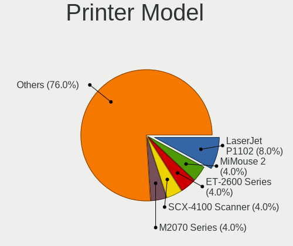

| Model                           | Notebooks | Percent |
|---------------------------------|-----------|---------|
| Xiaomi MiMouse 2                | 1         | 5%      |
| Seiko Epson L395 Series         | 1         | 5%      |
| Samsung M2070 Series            | 1         | 5%      |
| Samsung Laser Printer           | 1         | 5%      |
| Samsung CLX-3300 Series         | 1         | 5%      |
| HP Ink Tank Wireless 410 series | 1         | 5%      |
| HP Deskjet 3540 series          | 1         | 5%      |
| Dell AIO 810                    | 1         | 5%      |
| Canon PIXMA MP495               | 1         | 5%      |
| Canon PIXMA MP280               | 1         | 5%      |
| Canon MG2200 series             | 1         | 5%      |
| Canon MF4410                    | 1         | 5%      |
| Canon MF4010 series             | 1         | 5%      |
| Canon MF3010                    | 1         | 5%      |
| Canon LBP6030/6030B/6018L       | 1         | 5%      |
| Canon LBP6020                   | 1         | 5%      |
| Canon LBP6000                   | 1         | 5%      |
| Canon LBP3010/LBP3018/LBP3050   | 1         | 5%      |
| Canon G4010 series              | 1         | 5%      |
| Canon G2010 series              | 1         | 5%      |

Scanner Vendor
--------------

Scanner device vendors

| Vendor         | Notebooks | Percent |
|----------------|-----------|---------|
| Mustek Systems | 2         | 50%     |
| Seiko Epson    | 1         | 25%     |
| Canon          | 1         | 25%     |

Scanner Model
-------------

Scanner device models

| Model                                  | Notebooks | Percent |
|----------------------------------------|-----------|---------|
| Seiko Epson GT-9800F [Perfection 3200] | 1         | 25%     |
| Mustek Systems SNAPSCAN e22            | 1         | 25%     |
| Mustek Systems BearPaw 1200 CU Plus    | 1         | 25%     |
| Canon CanoScan LiDE 120                | 1         | 25%     |

Camera
------

Camera Vendor
-------------

Camera device vendors

| Vendor                                 | Notebooks | Percent |
|----------------------------------------|-----------|---------|
| Chicony Electronics                    | 377       | 25.52%  |
| IMC Networks                           | 215       | 14.56%  |
| Acer                                   | 130       | 8.8%    |
| Realtek Semiconductor                  | 98        | 6.64%   |
| Microdia                               | 96        | 6.5%    |
| Sunplus Innovation Technology          | 82        | 5.55%   |
| Suyin                                  | 76        | 5.15%   |
| Cheng Uei Precision Industry (Foxlink) | 75        | 5.08%   |
| Quanta                                 | 73        | 4.94%   |
| Syntek                                 | 44        | 2.98%   |
| Silicon Motion                         | 38        | 2.57%   |
| Alcor Micro                            | 33        | 2.23%   |
| Lite-On Technology                     | 31        | 2.1%    |
| Luxvisions Innotech Limited            | 17        | 1.15%   |
| Apple                                  | 17        | 1.15%   |
| Z-Star Microelectronics                | 14        | 0.95%   |
| Logitech                               | 12        | 0.81%   |
| DigiTech                               | 10        | 0.68%   |
| Primax Electronics                     | 7         | 0.47%   |
| Ricoh                                  | 6         | 0.41%   |
| ALi                                    | 5         | 0.34%   |
| Lenovo                                 | 4         | 0.27%   |
| Sunplus Technology                     | 3         | 0.2%    |
| Samsung Electronics                    | 2         | 0.14%   |
| Genesys Logic                          | 2         | 0.14%   |
| Sonix Technology                       | 1         | 0.07%   |
| OmniVision Technologies                | 1         | 0.07%   |
| Microsoft                              | 1         | 0.07%   |
| Intel                                  | 1         | 0.07%   |
| Importek                               | 1         | 0.07%   |
| Google                                 | 1         | 0.07%   |
| GEMBIRD                                | 1         | 0.07%   |
| eMPIA Technology                       | 1         | 0.07%   |
| Arkmicro Technologies                  | 1         | 0.07%   |
| Alpha Imaging Technology               | 1         | 0.07%   |

Camera Model
------------

Camera device models

| Model                                                                      | Notebooks | Percent |
|----------------------------------------------------------------------------|-----------|---------|
| IMC Networks USB2.0 VGA UVC WebCam                                         | 64        | 4.32%   |
| Chicony Integrated Camera                                                  | 38        | 2.57%   |
| Chicony Lenovo EasyCamera                                                  | 36        | 2.43%   |
| Chicony HD WebCam                                                          | 33        | 2.23%   |
| Acer Lenovo Integrated Webcam                                              | 30        | 2.03%   |
| Acer Lenovo EasyCamera                                                     | 30        | 2.03%   |
| IMC Networks USB2.0 HD UVC WebCam                                          | 27        | 1.82%   |
| Sunplus Integrated_Webcam_HD                                               | 25        | 1.69%   |
| Microdia Integrated_Webcam_HD                                              | 25        | 1.69%   |
| IMC Networks Integrated Camera                                             | 24        | 1.62%   |
| Chicony USB2.0 VGA UVC WebCam                                              | 24        | 1.62%   |
| Syntek Lenovo EasyCamera                                                   | 22        | 1.49%   |
| Quanta HD User Facing                                                      | 22        | 1.49%   |
| Realtek Integrated_Webcam_HD                                               | 21        | 1.42%   |
| Chicony HP HD Camera                                                       | 19        | 1.28%   |
| Lite-On HP HD Camera                                                       | 17        | 1.15%   |
| Chicony HP Webcam                                                          | 17        | 1.15%   |
| Acer Integrated Camera                                                     | 17        | 1.15%   |
| Sunplus HD WebCam                                                          | 15        | 1.01%   |
| IMC Networks Lenovo EasyCamera                                             | 15        | 1.01%   |
| Chicony HP Truevision HD                                                   | 14        | 0.95%   |
| Cheng Uei Precision Industry (Foxlink) HP Wide Vision HD Integrated Webcam | 14        | 0.95%   |
| Quanta HP TrueVision HD Camera                                             | 13        | 0.88%   |
| IMC Networks Integrated Webcam                                             | 13        | 0.88%   |
| Chicony HP Wide Vision HD Camera                                           | 13        | 0.88%   |
| Acer EasyCamera                                                            | 13        | 0.88%   |
| IMC Networks UVC VGA Webcam                                                | 12        | 0.81%   |
| Chicony EasyCamera                                                         | 12        | 0.81%   |
| Alcor Micro Asus Integrated Webcam                                         | 12        | 0.81%   |
| Suyin Acer/HP Integrated Webcam [CN0314]                                   | 11        | 0.74%   |
| Sunplus Asus Webcam                                                        | 11        | 0.74%   |
| Realtek USB2.0 VGA UVC WebCam                                              | 11        | 0.74%   |
| Quanta HD Webcam                                                           | 11        | 0.74%   |
| Microdia Laptop_Integrated_Webcam_HD                                       | 11        | 0.74%   |
| Lite-On Integrated Camera                                                  | 11        | 0.74%   |
| Chicony USB2.0 HD UVC WebCam                                               | 11        | 0.74%   |
| Chicony 2.0M UVC Webcam / CNF7129                                          | 11        | 0.74%   |
| Apple iPhone 5/5C/5S/6/SE                                                  | 11        | 0.74%   |
| Suyin Acer CrystalEye Webcam                                               | 10        | 0.68%   |
| Quanta HP HD Camera                                                        | 10        | 0.68%   |
| Syntek EasyCamera                                                          | 9         | 0.61%   |
| Suyin HP Truevision HD                                                     | 9         | 0.61%   |
| Silicon Motion Lenovo EasyCamera                                           | 9         | 0.61%   |
| Microdia Integrated Webcam                                                 | 9         | 0.61%   |
| DigiTech USB 2.0 PC Camera                                                 | 9         | 0.61%   |
| Chicony VGA WebCam                                                         | 9         | 0.61%   |
| Chicony HP TrueVision HD Camera                                            | 9         | 0.61%   |
| Syntek Integrated Camera                                                   | 8         | 0.54%   |
| Suyin HP TrueVision HD Integrated Webcam                                   | 8         | 0.54%   |
| Silicon Motion WebCam SCB-0355N                                            | 8         | 0.54%   |
| Quanta VGA WebCam                                                          | 8         | 0.54%   |
| IMC Networks HP TrueVision HD Camera                                       | 8         | 0.54%   |
| IMC Networks EasyCamera                                                    | 8         | 0.54%   |
| Chicony Integrated HP HD Webcam                                            | 8         | 0.54%   |
| Cheng Uei Precision Industry (Foxlink) HP Webcam-101                       | 8         | 0.54%   |
| Acer SunplusIT Integrated Camera                                           | 8         | 0.54%   |
| Suyin HD WebCam                                                            | 7         | 0.47%   |
| Realtek USB2.0 HD UVC WebCam                                               | 7         | 0.47%   |
| Realtek Integrated Webcam                                                  | 7         | 0.47%   |
| Luxvisions Innotech Limited HP TrueVision HD Camera                        | 7         | 0.47%   |

Security
--------

Fingerprint Vendor
------------------

Fingerprint sensor vendors

| Vendor                     | Notebooks | Percent |
|----------------------------|-----------|---------|
| Validity Sensors           | 88        | 35.2%   |
| Synaptics                  | 53        | 21.2%   |
| Upek                       | 26        | 10.4%   |
| LighTuning Technology      | 26        | 10.4%   |
| Shenzhen Goodix Technology | 19        | 7.6%    |
| Elan Microelectronics      | 16        | 6.4%    |
| AuthenTec                  | 15        | 6%      |
| STMicroelectronics         | 6         | 2.4%    |
| Samsung Electronics        | 1         | 0.4%    |

Fingerprint Model
-----------------

Fingerprint sensor models

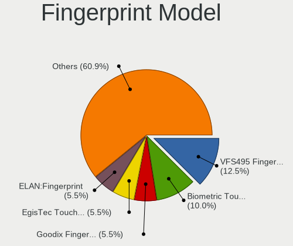

| Model                                                                      | Notebooks | Percent |
|----------------------------------------------------------------------------|-----------|---------|
| Validity Sensors VFS495 Fingerprint Reader                                 | 30        | 12%     |
| Upek Biometric Touchchip/Touchstrip Fingerprint Sensor                     | 26        | 10.4%   |
| LighTuning EgisTec Touch Fingerprint Sensor                                | 16        | 6.4%    |
| Elan ELAN:Fingerprint                                                      | 14        | 5.6%    |
| Validity Sensors VFS5011 Fingerprint Reader                                | 12        | 4.8%    |
| Synaptics  VFS7552 Touch Fingerprint Sensor with PurePrint                 | 12        | 4.8%    |
| Shenzhen Goodix  Fingerprint Device                                        | 12        | 4.8%    |
| Unknown                                                                    | 12        | 4.8%    |
| Validity Sensors Synaptics VFS7552 Touch Fingerprint Sensor with PurePrint | 10        | 4%      |
| Synaptics  FS7604 Touch Fingerprint Sensor with PurePrint                  | 9         | 3.6%    |
| Synaptics Prometheus MIS Touch Fingerprint Reader                          | 9         | 3.6%    |
| Validity Sensors VFS471 Fingerprint Reader                                 | 7         | 2.8%    |
| Shenzhen Goodix Fingerprint Reader                                         | 7         | 2.8%    |
| LighTuning ES603 Swipe Fingerprint Sensor                                  | 7         | 2.8%    |
| Validity Sensors Fingerprint scanner                                       | 6         | 2.4%    |
| Synaptics Metallica MOH Touch Fingerprint Reader                           | 6         | 2.4%    |
| STMicroelectronics Fingerprint Reader                                      | 6         | 2.4%    |
| AuthenTec AES2501 Fingerprint Sensor                                       | 6         | 2.4%    |
| Validity Sensors VFS7500 Touch Fingerprint Sensor                          | 5         | 2%      |
| AuthenTec AES1600                                                          | 5         | 2%      |
| Validity Sensors VFS101 Fingerprint Reader                                 | 4         | 1.6%    |
| Synaptics Metallica MIS Touch Fingerprint Reader                           | 4         | 1.6%    |
| Validity Sensors VFS 5011 fingerprint sensor                               | 3         | 1.2%    |
| Validity Sensors Synaptics WBDI                                            | 3         | 1.2%    |
| LighTuning Fingerprint Reader                                              | 3         | 1.2%    |
| AuthenTec AES2810                                                          | 3         | 1.2%    |
| Validity Sensors Swipe Fingerprint Sensor                                  | 2         | 0.8%    |
| Elan ELAN:ARM-M4                                                           | 2         | 0.8%    |
| Validity Sensors VFS7552 Touch Fingerprint Sensor                          | 1         | 0.4%    |
| Validity Sensors VFS491                                                    | 1         | 0.4%    |
| Validity Sensors VFS451 Fingerprint Reader                                 | 1         | 0.4%    |
| Validity Sensors VFS301 Fingerprint Reader                                 | 1         | 0.4%    |
| Validity Sensors VFS300 Fingerprint Reader                                 | 1         | 0.4%    |
| Validity Sensors VFS Fingerprint sensor                                    | 1         | 0.4%    |
| Synaptics  WBDI                                                            | 1         | 0.4%    |
| Samsung Fingerprint Device                                                 | 1         | 0.4%    |
| AuthenTec AES2550 Fingerprint Sensor                                       | 1         | 0.4%    |

Chipcard Vendor
---------------

Chipcard module vendors

| Vendor                    | Notebooks | Percent |
|---------------------------|-----------|---------|
| Broadcom                  | 34        | 53.97%  |
| Alcor Micro               | 17        | 26.98%  |
| O2 Micro                  | 5         | 7.94%   |
| Upek                      | 3         | 4.76%   |
| Lenovo                    | 2         | 3.17%   |
| Gemalto (was Gemplus)     | 1         | 1.59%   |
| Aladdin Knowledge Systems | 1         | 1.59%   |

Chipcard Model
--------------

Chipcard module models

| Model                                                                        | Notebooks | Percent |
|------------------------------------------------------------------------------|-----------|---------|
| Alcor Micro AU9540 Smartcard Reader                                          | 17        | 26.98%  |
| Broadcom BCM5880 Secure Applications Processor                               | 14        | 22.22%  |
| Broadcom 5880                                                                | 11        | 17.46%  |
| Broadcom BCM5880 Secure Applications Processor with fingerprint swipe sensor | 6         | 9.52%   |
| Upek TouchChip Fingerprint Coprocessor (WBF advanced mode)                   | 3         | 4.76%   |
| O2 Micro OZ776 CCID Smartcard Reader                                         | 3         | 4.76%   |
| Broadcom 58200                                                               | 3         | 4.76%   |
| O2 Micro Oz776 SmartCard Reader                                              | 2         | 3.17%   |
| Lenovo Integrated Smart Card Reader                                          | 2         | 3.17%   |
| Gemalto (was Gemplus) Compact Smart Card Reader Writer                       | 1         | 1.59%   |
| Aladdin Knowledge Systems Token JC                                           | 1         | 1.59%   |

Unsupported
-----------

Unsupported Devices
-------------------

Total unsupported devices on board

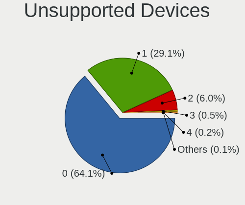

| Total | Notebooks | Percent |
|-------|-----------|---------|
| 0     | 1119      | 66.13%  |
| 1     | 469       | 27.72%  |
| 2     | 89        | 5.26%   |
| 3     | 10        | 0.59%   |
| 4     | 3         | 0.18%   |
| 6     | 1         | 0.06%   |
| 5     | 1         | 0.06%   |

Unsupported Device Types
------------------------

Types of unsupported devices

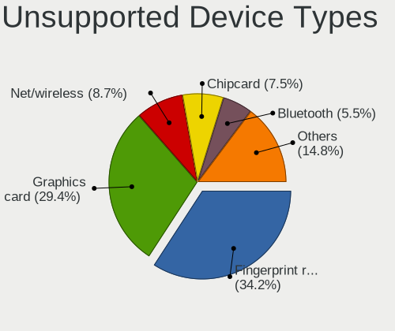

| Type                     | Notebooks | Percent |
|--------------------------|-----------|---------|
| Fingerprint reader       | 248       | 36.9%   |
| Graphics card            | 163       | 24.26%  |
| Net/wireless             | 60        | 8.93%   |
| Chipcard                 | 52        | 7.74%   |
| Bluetooth                | 44        | 6.55%   |
| Multimedia controller    | 29        | 4.32%   |
| Communication controller | 21        | 3.13%   |
| Storage                  | 12        | 1.79%   |
| Card reader              | 11        | 1.64%   |
| Camera                   | 10        | 1.49%   |
| Flash memory             | 7         | 1.04%   |
| Net/ethernet             | 5         | 0.74%   |
| Sound                    | 3         | 0.45%   |
| Modem                    | 3         | 0.45%   |
| Network                  | 2         | 0.3%    |
| Storage/ata              | 1         | 0.15%   |
| Firewire controller      | 1         | 0.15%   |

