Linux in Ukraine - Tested Hardware & Statistics (Notebooks)
-----------------------------------------------------------

A project to collect tested hardware configurations for Linux in Ukraine.

Anyone can contribute to this report by the [hw-probe](https://github.com/linuxhw/hw-probe) tool:

    sudo -E hw-probe -all -upload

Please contribute! Especially if your hardware is rare.

Contents
--------

* [ Test Cases ](#test-cases)

* [ System ](#system)
  - [ OS                       ](#os)
  - [ OS Family                ](#os-family)
  - [ Kernel                   ](#kernel)
  - [ Kernel Family            ](#kernel-family)
  - [ Kernel Major Ver.        ](#kernel-major-ver)
  - [ Arch                     ](#arch)
  - [ DE                       ](#de)
  - [ Display Server           ](#display-server)
  - [ Display Manager          ](#display-manager)
  - [ OS Lang                  ](#os-lang)
  - [ Boot Mode                ](#boot-mode)
  - [ Filesystem               ](#filesystem)
  - [ Part. scheme             ](#part-scheme)
  - [ Dual Boot with Linux/BSD ](#dual-boot-with-linuxbsd)
  - [ Dual Boot (Win)          ](#dual-boot-win)

* [ Board ](#board)
  - [ Vendor                   ](#vendor)
  - [ Model                    ](#model)
  - [ Model Family             ](#model-family)
  - [ MFG Year                 ](#mfg-year)
  - [ Form Factor              ](#form-factor)
  - [ Secure Boot              ](#secure-boot)
  - [ Coreboot                 ](#coreboot)
  - [ RAM Size                 ](#ram-size)
  - [ RAM Used                 ](#ram-used)
  - [ Total Drives             ](#total-drives)
  - [ Has CD-ROM               ](#has-cd-rom)
  - [ Has Ethernet             ](#has-ethernet)
  - [ Has WiFi                 ](#has-wifi)
  - [ Has Bluetooth            ](#has-bluetooth)

* [ Location ](#location)
  - [ Country                  ](#country)
  - [ City                     ](#city)

* [ Drives ](#drives)
  - [ Drive Vendor             ](#drive-vendor)
  - [ Drive Model              ](#drive-model)
  - [ HDD Vendor               ](#hdd-vendor)
  - [ SSD Vendor               ](#ssd-vendor)
  - [ Drive Kind               ](#drive-kind)
  - [ Drive Connector          ](#drive-connector)
  - [ Drive Size               ](#drive-size)
  - [ Space Total              ](#space-total)
  - [ Space Used               ](#space-used)
  - [ Malfunc. Drives          ](#malfunc-drives)
  - [ Malfunc. Drive Vendor    ](#malfunc-drive-vendor)
  - [ Malfunc. HDD Vendor      ](#malfunc-hdd-vendor)
  - [ Malfunc. Drive Kind      ](#malfunc-drive-kind)
  - [ Failed Drives            ](#failed-drives)
  - [ Failed Drive Vendor      ](#failed-drive-vendor)
  - [ Drive Status             ](#drive-status)

* [ Storage controller ](#storage-controller)
  - [ Storage Vendor           ](#storage-vendor)
  - [ Storage Model            ](#storage-model)
  - [ Storage Kind             ](#storage-kind)

* [ Processor ](#processor)
  - [ CPU Vendor               ](#cpu-vendor)
  - [ CPU Model                ](#cpu-model)
  - [ CPU Model Family         ](#cpu-model-family)
  - [ CPU Cores                ](#cpu-cores)
  - [ CPU Sockets              ](#cpu-sockets)
  - [ CPU Threads              ](#cpu-threads)
  - [ CPU Op-Modes             ](#cpu-op-modes)
  - [ CPU Microcode            ](#cpu-microcode)
  - [ CPU Microarch            ](#cpu-microarch)

* [ Graphics ](#graphics)
  - [ GPU Vendor               ](#gpu-vendor)
  - [ GPU Model                ](#gpu-model)
  - [ GPU Combo                ](#gpu-combo)
  - [ GPU Driver               ](#gpu-driver)
  - [ GPU Memory               ](#gpu-memory)

* [ Monitor ](#monitor)
  - [ Monitor Vendor           ](#monitor-vendor)
  - [ Monitor Model            ](#monitor-model)
  - [ Monitor Resolution       ](#monitor-resolution)
  - [ Monitor Diagonal         ](#monitor-diagonal)
  - [ Monitor Width            ](#monitor-width)
  - [ Aspect Ratio             ](#aspect-ratio)
  - [ Monitor Area             ](#monitor-area)
  - [ Pixel Density            ](#pixel-density)
  - [ Multiple Monitors        ](#multiple-monitors)

* [ Network ](#network)
  - [ Net Controller Vendor    ](#net-controller-vendor)
  - [ Net Controller Model     ](#net-controller-model)
  - [ Wireless Vendor          ](#wireless-vendor)
  - [ Wireless Model           ](#wireless-model)
  - [ Ethernet Vendor          ](#ethernet-vendor)
  - [ Ethernet Model           ](#ethernet-model)
  - [ Net Controller Kind      ](#net-controller-kind)
  - [ Used Controller          ](#used-controller)
  - [ NICs                     ](#nics)
  - [ IPv6                     ](#ipv6)

* [ Bluetooth ](#bluetooth)
  - [ Bluetooth Vendor         ](#bluetooth-vendor)
  - [ Bluetooth Model          ](#bluetooth-model)

* [ Sound ](#sound)
  - [ Sound Vendor             ](#sound-vendor)
  - [ Sound Model              ](#sound-model)

* [ Memory ](#memory)
  - [ Memory Vendor            ](#memory-vendor)
  - [ Memory Model             ](#memory-model)
  - [ Memory Kind              ](#memory-kind)
  - [ Memory Form Factor       ](#memory-form-factor)
  - [ Memory Size              ](#memory-size)
  - [ Memory Speed             ](#memory-speed)

* [ Printers & scanners ](#printers--scanners)
  - [ Printer Vendor           ](#printer-vendor)
  - [ Printer Model            ](#printer-model)
  - [ Scanner Vendor           ](#scanner-vendor)
  - [ Scanner Model            ](#scanner-model)

* [ Camera ](#camera)
  - [ Camera Vendor            ](#camera-vendor)
  - [ Camera Model             ](#camera-model)

* [ Security ](#security)
  - [ Fingerprint Vendor       ](#fingerprint-vendor)
  - [ Fingerprint Model        ](#fingerprint-model)
  - [ Chipcard Vendor          ](#chipcard-vendor)
  - [ Chipcard Model           ](#chipcard-model)

* [ Unsupported ](#unsupported)
  - [ Unsupported Devices      ](#unsupported-devices)
  - [ Unsupported Device Types ](#unsupported-device-types)

Test Cases
----------

Total: 2566

| Vendor        | Model                       | Probe                                                      | Date         |
|---------------|-----------------------------|------------------------------------------------------------|--------------|
| Dell          | Latitude D620               | [5337d0b0f9](https://linux-hardware.org/?probe=5337d0b0f9) | Dec 31, 2022 |
| Dell          | Latitude D620               | [ea81d9f6a5](https://linux-hardware.org/?probe=ea81d9f6a5) | Dec 31, 2022 |
| Lenovo        | ThinkBook 15p Gen 2 21B1    | [bc961748be](https://linux-hardware.org/?probe=bc961748be) | Dec 25, 2022 |
| Acer          | Aspire A315-53              | [e012bb5bc1](https://linux-hardware.org/?probe=e012bb5bc1) | Dec 25, 2022 |
| Dell          | Inspiron 7720               | [0a7621cb40](https://linux-hardware.org/?probe=0a7621cb40) | Dec 17, 2022 |
| Fujitsu       | LIFEBOOK E734               | [5ac5b0aaa8](https://linux-hardware.org/?probe=5ac5b0aaa8) | Dec 14, 2022 |
| Lenovo        | IdeaPad 3 15IIL05 81WE      | [50e8243e50](https://linux-hardware.org/?probe=50e8243e50) | Dec 11, 2022 |
| Acer          | Aspire A114-33              | [0bb6c29bb6](https://linux-hardware.org/?probe=0bb6c29bb6) | Dec 07, 2022 |
| HIPER Tech... | HTHLP-04R/i5-8279u          | [1ead815604](https://linux-hardware.org/?probe=1ead815604) | Dec 05, 2022 |
| Dell          | Latitude E7470              | [457187e169](https://linux-hardware.org/?probe=457187e169) | Dec 01, 2022 |
| Dell          | Latitude E7470              | [b24884fe44](https://linux-hardware.org/?probe=b24884fe44) | Dec 01, 2022 |
| Acer          | Aspire 5741G                | [0a336099ba](https://linux-hardware.org/?probe=0a336099ba) | Dec 01, 2022 |
| Samsung       | 355V4C/356V4C/3445VC/354... | [8a99ec717f](https://linux-hardware.org/?probe=8a99ec717f) | Nov 29, 2022 |
| Lenovo        | B590 20208                  | [b1551151f5](https://linux-hardware.org/?probe=b1551151f5) | Nov 24, 2022 |
| Acer          | Aspire A515-57              | [374b408342](https://linux-hardware.org/?probe=374b408342) | Nov 22, 2022 |
| Samsung       | R528/R728                   | [ea586efd66](https://linux-hardware.org/?probe=ea586efd66) | Nov 19, 2022 |
| Chuwi         | HeroBook Air                | [9749e5705a](https://linux-hardware.org/?probe=9749e5705a) | Nov 13, 2022 |
| HP            | Victus by Laptop 16-e0xx... | [c3612a66aa](https://linux-hardware.org/?probe=c3612a66aa) | Nov 10, 2022 |
| Lenovo        | IdeaPad C340-14API 81N6     | [40cce7a719](https://linux-hardware.org/?probe=40cce7a719) | Nov 09, 2022 |
| Dell          | Inspiron 7720               | [38d24e4b4a](https://linux-hardware.org/?probe=38d24e4b4a) | Nov 06, 2022 |
| MSI           | MS-1688                     | [21dad91aac](https://linux-hardware.org/?probe=21dad91aac) | Nov 05, 2022 |
| ASUSTek       | VivoBook_ASUS Laptop E21... | [cb2a07da11](https://linux-hardware.org/?probe=cb2a07da11) | Oct 30, 2022 |
| ASUSTek       | X501A1                      | [037e1402b1](https://linux-hardware.org/?probe=037e1402b1) | Oct 30, 2022 |
| Dell          | Inspiron 7720               | [f1478df888](https://linux-hardware.org/?probe=f1478df888) | Oct 30, 2022 |
| Acer          | Enduro EUN314-51W           | [2655b43e2b](https://linux-hardware.org/?probe=2655b43e2b) | Oct 25, 2022 |
| Acer          | Extensa 5630                | [bdc63e9670](https://linux-hardware.org/?probe=bdc63e9670) | Oct 25, 2022 |
| Timi          | RedmiBook Pro 14S           | [f81e674faf](https://linux-hardware.org/?probe=f81e674faf) | Oct 21, 2022 |
| Lenovo        | ThinkPad P15s Gen 2i 20W... | [2dd0b46420](https://linux-hardware.org/?probe=2dd0b46420) | Oct 16, 2022 |
| ASUSTek       | K53TA                       | [8759f9f39c](https://linux-hardware.org/?probe=8759f9f39c) | Oct 15, 2022 |
| ASUSTek       | K53TA                       | [dd95142fda](https://linux-hardware.org/?probe=dd95142fda) | Oct 14, 2022 |
| Lenovo        | IdeaPad Gaming 3 15ACH6 ... | [7af879de72](https://linux-hardware.org/?probe=7af879de72) | Oct 13, 2022 |
| HP            | Laptop 15-db0xxx            | [16bb04d1db](https://linux-hardware.org/?probe=16bb04d1db) | Oct 11, 2022 |
| ASUSTek       | VivoBook_ASUS Laptop E21... | [52c4e232f3](https://linux-hardware.org/?probe=52c4e232f3) | Oct 10, 2022 |
| HONOR         | BOD-WXX9                    | [26c4b5f06a](https://linux-hardware.org/?probe=26c4b5f06a) | Oct 06, 2022 |
| Apple         | MacBookPro9,2               | [bdc21c1bad](https://linux-hardware.org/?probe=bdc21c1bad) | Oct 04, 2022 |
| Apple         | MacBookPro9,2               | [50e50f0533](https://linux-hardware.org/?probe=50e50f0533) | Oct 04, 2022 |
| Sony          | VPCEB1M1R                   | [343feefe62](https://linux-hardware.org/?probe=343feefe62) | Oct 02, 2022 |
| Acer          | Aspire V3-571G              | [bfd8dc3c18](https://linux-hardware.org/?probe=bfd8dc3c18) | Oct 02, 2022 |
| Acer          | Enduro EN314-51W            | [46782cf8f5](https://linux-hardware.org/?probe=46782cf8f5) | Oct 01, 2022 |
| Dell          | Latitude E7240              | [75501a47b5](https://linux-hardware.org/?probe=75501a47b5) | Sep 24, 2022 |
| HP            | ENVY Notebook               | [1eef25f6d8](https://linux-hardware.org/?probe=1eef25f6d8) | Sep 22, 2022 |
| HP            | ENVY Notebook               | [b95a98e133](https://linux-hardware.org/?probe=b95a98e133) | Sep 22, 2022 |
| Acer          | Aspire A315-23              | [dd730980b1](https://linux-hardware.org/?probe=dd730980b1) | Sep 20, 2022 |
| HP            | Pavilion g6                 | [dfd4d1f4e2](https://linux-hardware.org/?probe=dfd4d1f4e2) | Sep 20, 2022 |
| ASUSTek       | VivoBook_ASUS Laptop E21... | [d9742b9445](https://linux-hardware.org/?probe=d9742b9445) | Sep 19, 2022 |
| ASUSTek       | VivoBook_ASUS Laptop E21... | [6c5e991427](https://linux-hardware.org/?probe=6c5e991427) | Sep 18, 2022 |
| Lenovo        | G580 20150                  | [fe325d1046](https://linux-hardware.org/?probe=fe325d1046) | Sep 18, 2022 |
| HP            | Pavilion dv6                | [9c9c531c6b](https://linux-hardware.org/?probe=9c9c531c6b) | Sep 15, 2022 |
| Timi          | RedmiBook Pro 14S           | [1662163cb8](https://linux-hardware.org/?probe=1662163cb8) | Sep 15, 2022 |
| Acer          | TravelMate 5744Z            | [f9846e0165](https://linux-hardware.org/?probe=f9846e0165) | Sep 13, 2022 |
| Lenovo        | Unknown                     | [b5842ca017](https://linux-hardware.org/?probe=b5842ca017) | Sep 10, 2022 |
| Timi          | TM1703                      | [5c30ece6ff](https://linux-hardware.org/?probe=5c30ece6ff) | Sep 08, 2022 |
| Timi          | TM1703                      | [fb7386017f](https://linux-hardware.org/?probe=fb7386017f) | Sep 06, 2022 |
| Lenovo        | G580 20150                  | [8dba025148](https://linux-hardware.org/?probe=8dba025148) | Sep 05, 2022 |
| Dell          | Latitude 5591               | [b860997149](https://linux-hardware.org/?probe=b860997149) | Sep 01, 2022 |
| Timi          | A35                         | [df50ea1876](https://linux-hardware.org/?probe=df50ea1876) | Aug 29, 2022 |
| Acer          | Aspire 5570Z                | [38fe74cbe3](https://linux-hardware.org/?probe=38fe74cbe3) | Aug 26, 2022 |
| Toshiba       | PORTEGE Z10t-A              | [ba23396754](https://linux-hardware.org/?probe=ba23396754) | Aug 25, 2022 |
| Lenovo        | Legion Y740-17IRHg 81UJ     | [b8859a4f21](https://linux-hardware.org/?probe=b8859a4f21) | Aug 23, 2022 |
| Lenovo        | Legion Y740-17IRHg 81UJ     | [ce734a061a](https://linux-hardware.org/?probe=ce734a061a) | Aug 23, 2022 |
| ASUSTek       | N56VZ                       | [e9e40a7df5](https://linux-hardware.org/?probe=e9e40a7df5) | Aug 20, 2022 |
| Timi          | A35                         | [cf89c68d08](https://linux-hardware.org/?probe=cf89c68d08) | Aug 19, 2022 |
| Acer          | Aspire ES1-532G             | [cf05c858ab](https://linux-hardware.org/?probe=cf05c858ab) | Aug 15, 2022 |
| ASUSTek       | VivoBook_ASUSLaptop X509... | [a533aea5e5](https://linux-hardware.org/?probe=a533aea5e5) | Aug 14, 2022 |
| Timi          | A35                         | [944f3f0942](https://linux-hardware.org/?probe=944f3f0942) | Aug 12, 2022 |
| Dell          | XPS 15 9550                 | [abf6de9a2d](https://linux-hardware.org/?probe=abf6de9a2d) | Aug 09, 2022 |
| Lenovo        | ThinkPad X230 Tablet 343... | [7594659719](https://linux-hardware.org/?probe=7594659719) | Aug 05, 2022 |
| ASUSTek       | X301A1                      | [60d9f2bc4d](https://linux-hardware.org/?probe=60d9f2bc4d) | Aug 02, 2022 |
| Acer          | Aspire A315-42              | [7d8e339d92](https://linux-hardware.org/?probe=7d8e339d92) | Aug 02, 2022 |
| HP            | 255 G7 Notebook PC          | [bc1a82a647](https://linux-hardware.org/?probe=bc1a82a647) | Jul 28, 2022 |
| Acer          | Iconia W700                 | [694887391c](https://linux-hardware.org/?probe=694887391c) | Jul 26, 2022 |
| Acer          | TravelMate 5744Z            | [aa1416d2e3](https://linux-hardware.org/?probe=aa1416d2e3) | Jul 26, 2022 |
| HP            | 255 G7 Notebook PC          | [8173942fbb](https://linux-hardware.org/?probe=8173942fbb) | Jul 25, 2022 |
| Dell          | XPS 15 9550                 | [b4691ae23b](https://linux-hardware.org/?probe=b4691ae23b) | Jul 22, 2022 |
| Fujitsu       | LIFEBOOK AH512              | [de59ca3757](https://linux-hardware.org/?probe=de59ca3757) | Jul 17, 2022 |
| Acer          | Iconia W700                 | [f290f68268](https://linux-hardware.org/?probe=f290f68268) | Jul 14, 2022 |
| Dell          | Latitude 7280               | [75ce6d31bc](https://linux-hardware.org/?probe=75ce6d31bc) | Jul 14, 2022 |
| Toshiba       | Satellite C660              | [fa23f41617](https://linux-hardware.org/?probe=fa23f41617) | Jul 13, 2022 |
| Lenovo        | Y50-70 Touch 20349          | [19209d1119](https://linux-hardware.org/?probe=19209d1119) | Jul 12, 2022 |
| MSI           | Bravo 17 A4DDK              | [9f9d1cac61](https://linux-hardware.org/?probe=9f9d1cac61) | Jul 09, 2022 |
| ASUSTek       | F3JR                        | [9a1e994bcb](https://linux-hardware.org/?probe=9a1e994bcb) | Jul 08, 2022 |
| Prestigio     | Multipad Visconte V         | [d582eea1af](https://linux-hardware.org/?probe=d582eea1af) | Jul 08, 2022 |
| MSI           | Prestige 14 A10SC           | [f1632a7901](https://linux-hardware.org/?probe=f1632a7901) | Jul 06, 2022 |
| Fujitsu       | LIFEBOOK E734               | [6494f9e1ef](https://linux-hardware.org/?probe=6494f9e1ef) | Jul 05, 2022 |
| ASUSTek       | TP501UB                     | [4cebce6bab](https://linux-hardware.org/?probe=4cebce6bab) | Jul 04, 2022 |
| ASUSTek       | TP501UB                     | [6ee62813e8](https://linux-hardware.org/?probe=6ee62813e8) | Jul 04, 2022 |
| ASUSTek       | VivoBook_ASUS Laptop E21... | [f63cb64736](https://linux-hardware.org/?probe=f63cb64736) | Jul 03, 2022 |
| Acer          | Aspire 5741G                | [228eb87fbc](https://linux-hardware.org/?probe=228eb87fbc) | Jul 02, 2022 |
| Lenovo        | G550 20023                  | [0a2aa10fd1](https://linux-hardware.org/?probe=0a2aa10fd1) | Jun 27, 2022 |
| Acer          | Swift SF314-41              | [735d7a92b5](https://linux-hardware.org/?probe=735d7a92b5) | Jun 18, 2022 |
| ASUSTek       | VivoBook_ASUSLaptop X350... | [6ebb8676bf](https://linux-hardware.org/?probe=6ebb8676bf) | Jun 16, 2022 |
| HP            | Pavilion g6                 | [c43a328a7d](https://linux-hardware.org/?probe=c43a328a7d) | Jun 13, 2022 |
| HP            | ProBook 455 G8 Notebook ... | [5c07fd1664](https://linux-hardware.org/?probe=5c07fd1664) | Jun 12, 2022 |
| HP            | ProBook 455 G8 Notebook ... | [44704fc87d](https://linux-hardware.org/?probe=44704fc87d) | Jun 12, 2022 |
| HP            | ProBook 455 G7              | [60bf6f8388](https://linux-hardware.org/?probe=60bf6f8388) | Jun 12, 2022 |
| HP            | Pavilion Gaming Laptop 1... | [29f2cd44d5](https://linux-hardware.org/?probe=29f2cd44d5) | Jun 11, 2022 |
| Acer          | Swift SF314-43              | [2a3a49ac86](https://linux-hardware.org/?probe=2a3a49ac86) | Jun 10, 2022 |
| Lenovo        | ThinkPad P52s 20LBS04700    | [96e3e051da](https://linux-hardware.org/?probe=96e3e051da) | Jun 09, 2022 |
| Lenovo        | ThinkPad P52s 20LBS04700    | [547e2586ca](https://linux-hardware.org/?probe=547e2586ca) | Jun 09, 2022 |
| eMachines     | eME528                      | [1a6f2ee67f](https://linux-hardware.org/?probe=1a6f2ee67f) | Jun 09, 2022 |
| Lenovo        | IdeaPad Y510P 20217         | [f0b7599192](https://linux-hardware.org/?probe=f0b7599192) | Jun 08, 2022 |
| Acer          | Aspire A315-32              | [a610c5537a](https://linux-hardware.org/?probe=a610c5537a) | Jun 07, 2022 |
| Lenovo        | G580 20150                  | [6cb0b47bb4](https://linux-hardware.org/?probe=6cb0b47bb4) | Jun 02, 2022 |
| HP            | Pavilion g6                 | [7c389588bb](https://linux-hardware.org/?probe=7c389588bb) | Jun 02, 2022 |
| HP            | ProBook 455 G7              | [658e8ce62f](https://linux-hardware.org/?probe=658e8ce62f) | Jun 02, 2022 |
| HP            | ProBook 450 G5              | [c4880f9bab](https://linux-hardware.org/?probe=c4880f9bab) | Jun 02, 2022 |
| HP            | ProBook 455 G8 Notebook ... | [5330a5aa11](https://linux-hardware.org/?probe=5330a5aa11) | Jun 02, 2022 |
| HP            | ProBook 450 G5              | [7f8acf64cd](https://linux-hardware.org/?probe=7f8acf64cd) | May 31, 2022 |
| HP            | ProBook 455 G7              | [d95897f938](https://linux-hardware.org/?probe=d95897f938) | May 31, 2022 |
| HP            | ProBook 450 G5              | [2fbbe84744](https://linux-hardware.org/?probe=2fbbe84744) | May 31, 2022 |
| ASUSTek       | X75A1                       | [59159b4b05](https://linux-hardware.org/?probe=59159b4b05) | May 27, 2022 |
| Minix         | Z64 V1.2                    | [97525a1dc3](https://linux-hardware.org/?probe=97525a1dc3) | May 27, 2022 |
| HP            | Pavilion g6                 | [3972cb6508](https://linux-hardware.org/?probe=3972cb6508) | May 25, 2022 |
| HP            | Pavilion g7                 | [e038c828f9](https://linux-hardware.org/?probe=e038c828f9) | May 25, 2022 |
| Lenovo        | IdeaPad 330-15ARR 81D2      | [7200a39439](https://linux-hardware.org/?probe=7200a39439) | May 23, 2022 |
| HP            | Pavilion Laptop 15-eg0xx... | [377330c2b5](https://linux-hardware.org/?probe=377330c2b5) | May 23, 2022 |
| Dell          | Vostro 15 3515              | [90d9ac6bf3](https://linux-hardware.org/?probe=90d9ac6bf3) | May 18, 2022 |
| Lenovo        | ThinkPad X1 Carbon 6th 2... | [1e61b49f67](https://linux-hardware.org/?probe=1e61b49f67) | May 18, 2022 |
| Dell          | Precision M6800             | [65d5a77965](https://linux-hardware.org/?probe=65d5a77965) | May 14, 2022 |
| Irbis         | NB144                       | [abb6000f0b](https://linux-hardware.org/?probe=abb6000f0b) | May 14, 2022 |
| HP            | Pavilion Gaming Laptop 1... | [eb297f3c7b](https://linux-hardware.org/?probe=eb297f3c7b) | May 12, 2022 |
| Minix         | Z64 V1.2                    | [8796deded0](https://linux-hardware.org/?probe=8796deded0) | May 12, 2022 |
| Lenovo        | Unknown                     | [3cced8a4fa](https://linux-hardware.org/?probe=3cced8a4fa) | May 12, 2022 |
| Samsung       | R530/R730/P530              | [d209735fd8](https://linux-hardware.org/?probe=d209735fd8) | May 07, 2022 |
| Lenovo        | ThinkPad T470p 20J7S0BR0... | [ac2c2a5969](https://linux-hardware.org/?probe=ac2c2a5969) | May 06, 2022 |
| Lenovo        | ThinkPad X220 4290LD4       | [0a28279824](https://linux-hardware.org/?probe=0a28279824) | May 05, 2022 |
| Lenovo        | ThinkPad X1 Carbon 6th 2... | [26cfc77ab9](https://linux-hardware.org/?probe=26cfc77ab9) | May 02, 2022 |
| ICL           | RAYbook Si1507              | [eaf9bd7ea3](https://linux-hardware.org/?probe=eaf9bd7ea3) | May 02, 2022 |
| HP            | ProBook 4520s               | [ba430a31ae](https://linux-hardware.org/?probe=ba430a31ae) | May 01, 2022 |
| Lenovo        | G700 20251                  | [94272db5ec](https://linux-hardware.org/?probe=94272db5ec) | Apr 30, 2022 |
| ASUSTek       | UX31A                       | [59228e735e](https://linux-hardware.org/?probe=59228e735e) | Apr 30, 2022 |
| Acer          | TravelMate 2490             | [8cc2cf84f4](https://linux-hardware.org/?probe=8cc2cf84f4) | Apr 29, 2022 |
| Timi          | A35S                        | [8a3195e10c](https://linux-hardware.org/?probe=8a3195e10c) | Apr 27, 2022 |
| Timi          | RedmiBook Pro 15S           | [d060ed71c3](https://linux-hardware.org/?probe=d060ed71c3) | Apr 26, 2022 |
| HP            | ProBook 450 G8 Notebook ... | [4f92840d8c](https://linux-hardware.org/?probe=4f92840d8c) | Apr 26, 2022 |
| Lenovo        | G510 20238                  | [906f1626d7](https://linux-hardware.org/?probe=906f1626d7) | Apr 24, 2022 |
| Acer          | AOD257                      | [9b11649bce](https://linux-hardware.org/?probe=9b11649bce) | Apr 22, 2022 |
| Acer          | AOD257                      | [e321b17ef8](https://linux-hardware.org/?probe=e321b17ef8) | Apr 22, 2022 |
| Lenovo        | IdeaPad 5 15ALC05 82LN      | [76bb32f682](https://linux-hardware.org/?probe=76bb32f682) | Apr 20, 2022 |
| Lenovo        | ThinkPad T420 4180DV2       | [4ed718df3e](https://linux-hardware.org/?probe=4ed718df3e) | Apr 18, 2022 |
| Lenovo        | ThinkPad T420 4180DV2       | [402c31b107](https://linux-hardware.org/?probe=402c31b107) | Apr 18, 2022 |
| ASUSTek       | UX303LB                     | [104779add9](https://linux-hardware.org/?probe=104779add9) | Apr 17, 2022 |
| HP            | 250 G2                      | [eafcfe8215](https://linux-hardware.org/?probe=eafcfe8215) | Apr 17, 2022 |
| ASUSTek       | K50IJ                       | [ad5a24dbb3](https://linux-hardware.org/?probe=ad5a24dbb3) | Apr 15, 2022 |
| ASUSTek       | ROG Strix G713QC_G713QC     | [c54b458c01](https://linux-hardware.org/?probe=c54b458c01) | Apr 14, 2022 |
| Lenovo        | ThinkPad T420 4180DV2       | [9e8785fcdd](https://linux-hardware.org/?probe=9e8785fcdd) | Apr 14, 2022 |
| ASUSTek       | X75VCP                      | [21e0b65e1b](https://linux-hardware.org/?probe=21e0b65e1b) | Apr 13, 2022 |
| Lenovo        | G780 20138                  | [0cabea6484](https://linux-hardware.org/?probe=0cabea6484) | Apr 08, 2022 |
| Lenovo        | B570 HuronRiver Platform    | [cdb5f43cd7](https://linux-hardware.org/?probe=cdb5f43cd7) | Apr 07, 2022 |
| Timi          | A35                         | [90a30461d2](https://linux-hardware.org/?probe=90a30461d2) | Apr 03, 2022 |
| Lenovo        | IdeaPad L340-15API 81LW     | [262e4f8317](https://linux-hardware.org/?probe=262e4f8317) | Apr 02, 2022 |
| Lenovo        | ThinkPad E15 Gen 2 20TD0... | [27f986af8c](https://linux-hardware.org/?probe=27f986af8c) | Mar 30, 2022 |
| Insignia      | NS-P11W7100                 | [daa476af8c](https://linux-hardware.org/?probe=daa476af8c) | Mar 28, 2022 |
| Dell          | Latitude E6400              | [b431dc3d73](https://linux-hardware.org/?probe=b431dc3d73) | Mar 28, 2022 |
| HP            | ZBook 17 G3                 | [b016648f02](https://linux-hardware.org/?probe=b016648f02) | Mar 27, 2022 |
| Aquarius      | NS585 R32                   | [582389ca98](https://linux-hardware.org/?probe=582389ca98) | Mar 24, 2022 |
| ASUSTek       | X75VCP                      | [54e978fcca](https://linux-hardware.org/?probe=54e978fcca) | Mar 23, 2022 |
| Timi          | RedmiBook Pro 15            | [78f30b04b6](https://linux-hardware.org/?probe=78f30b04b6) | Mar 21, 2022 |
| Samsung       | R59P/R60P/R61P              | [2ec6236c3a](https://linux-hardware.org/?probe=2ec6236c3a) | Mar 20, 2022 |
| Insignia      | NS-P11W7100                 | [20aa266b33](https://linux-hardware.org/?probe=20aa266b33) | Mar 19, 2022 |
| Unknown       | Unknown                     | [58912ced73](https://linux-hardware.org/?probe=58912ced73) | Mar 18, 2022 |
| Lenovo        | IdeaPad 320-15IKB 81BG      | [4652b9e771](https://linux-hardware.org/?probe=4652b9e771) | Mar 17, 2022 |
| Lenovo        | IdeaPad 320-15IKB 81BG      | [091eb95750](https://linux-hardware.org/?probe=091eb95750) | Mar 17, 2022 |
| Lenovo        | IdeaPad Z580                | [80a27aca02](https://linux-hardware.org/?probe=80a27aca02) | Mar 17, 2022 |
| Insignia      | NS-P11W7100                 | [44de443312](https://linux-hardware.org/?probe=44de443312) | Mar 11, 2022 |
| HP            | ProBook 450 G7              | [5d73b6f2f7](https://linux-hardware.org/?probe=5d73b6f2f7) | Mar 08, 2022 |
| ASUSTek       | S301LP                      | [5c29218ebd](https://linux-hardware.org/?probe=5c29218ebd) | Mar 08, 2022 |
| Lenovo        | Unknown                     | [4308edfd8d](https://linux-hardware.org/?probe=4308edfd8d) | Mar 07, 2022 |
| Acer          | Swift SF314-43              | [6d16601f06](https://linux-hardware.org/?probe=6d16601f06) | Mar 07, 2022 |
| HP            | 250 G8 Notebook PC          | [11ca11b21d](https://linux-hardware.org/?probe=11ca11b21d) | Mar 03, 2022 |
| Dell          | Vostro 5470                 | [fda73ff759](https://linux-hardware.org/?probe=fda73ff759) | Mar 02, 2022 |
| ASUSTek       | ASUS TUF Gaming F15 FX50... | [1b5df98df2](https://linux-hardware.org/?probe=1b5df98df2) | Feb 28, 2022 |
| Dell          | Inspiron 15-3552            | [969cea89d7](https://linux-hardware.org/?probe=969cea89d7) | Feb 24, 2022 |
| HP            | ProBook 4540s               | [6bc6c84af5](https://linux-hardware.org/?probe=6bc6c84af5) | Feb 24, 2022 |
| ASUSTek       | ROG Strix G713IH_G713IH     | [72f330a117](https://linux-hardware.org/?probe=72f330a117) | Feb 23, 2022 |
| ASUSTek       | ROG Strix G513QC_G513QC     | [f6175c2b08](https://linux-hardware.org/?probe=f6175c2b08) | Feb 22, 2022 |
| Lenovo        | IdeaPad 100-15IBD 80QQ      | [a941fd5481](https://linux-hardware.org/?probe=a941fd5481) | Feb 21, 2022 |
| Timi          | RedmiBook Pro 15S           | [1998552d88](https://linux-hardware.org/?probe=1998552d88) | Feb 20, 2022 |
| Dell          | Inspiron 15 7000 Gaming     | [b4979c164c](https://linux-hardware.org/?probe=b4979c164c) | Feb 20, 2022 |
| Lenovo        | ThinkPad ThinkPad L14 20... | [369c625e43](https://linux-hardware.org/?probe=369c625e43) | Feb 20, 2022 |
| Acer          | Swift SF315-52              | [74009233c2](https://linux-hardware.org/?probe=74009233c2) | Feb 19, 2022 |
| HP            | Compaq CQ58                 | [6f67712b57](https://linux-hardware.org/?probe=6f67712b57) | Feb 19, 2022 |
| Timi          | RedmiBook Pro 15S           | [8b0dc90a9e](https://linux-hardware.org/?probe=8b0dc90a9e) | Feb 19, 2022 |
| ASUSTek       | K54L                        | [5850a8dd22](https://linux-hardware.org/?probe=5850a8dd22) | Feb 19, 2022 |
| ASUSTek       | ROG Strix G713IH_G713IH     | [489854bd7b](https://linux-hardware.org/?probe=489854bd7b) | Feb 18, 2022 |
| Lenovo        | ThinkPad Edge E531 68851... | [54269ad944](https://linux-hardware.org/?probe=54269ad944) | Feb 18, 2022 |
| ASUSTek       | ROG Strix G512LU_G512LU     | [3c30a8c6a1](https://linux-hardware.org/?probe=3c30a8c6a1) | Feb 18, 2022 |
| ASUSTek       | ROG Strix G513QY_G513QY     | [4fba279b51](https://linux-hardware.org/?probe=4fba279b51) | Feb 18, 2022 |
| ASUSTek       | ROG Strix G512LU_G512LU     | [42cf76ea1b](https://linux-hardware.org/?probe=42cf76ea1b) | Feb 18, 2022 |
| Dell          | Vostro 2521                 | [b4e4037c5e](https://linux-hardware.org/?probe=b4e4037c5e) | Feb 18, 2022 |
| Lenovo        | IdeaPad Z510 20287          | [d98a594e28](https://linux-hardware.org/?probe=d98a594e28) | Feb 18, 2022 |
| Samsung       | 535U4C                      | [f5f9256781](https://linux-hardware.org/?probe=f5f9256781) | Feb 16, 2022 |
| HP            | ProBook 440 G7              | [bf3d7b3f6c](https://linux-hardware.org/?probe=bf3d7b3f6c) | Feb 15, 2022 |
| Lenovo        | G500 20236                  | [725807db6f](https://linux-hardware.org/?probe=725807db6f) | Feb 15, 2022 |
| ASUSTek       | X553MA                      | [94ebaa5d9b](https://linux-hardware.org/?probe=94ebaa5d9b) | Feb 15, 2022 |
| HP            | Pavilion g6                 | [5601a4d596](https://linux-hardware.org/?probe=5601a4d596) | Feb 14, 2022 |
| MSI           | MS-16F1                     | [cd35935349](https://linux-hardware.org/?probe=cd35935349) | Feb 13, 2022 |
| Acer          | Extensa 5620                | [d56ce9d11a](https://linux-hardware.org/?probe=d56ce9d11a) | Feb 13, 2022 |
| ASUSTek       | X550VB                      | [0485b98343](https://linux-hardware.org/?probe=0485b98343) | Feb 13, 2022 |
| Lenovo        | ThinkPad Edge E531 68851... | [e82c11b42e](https://linux-hardware.org/?probe=e82c11b42e) | Feb 13, 2022 |
| Dell          | Latitude 5480               | [1804ba8af6](https://linux-hardware.org/?probe=1804ba8af6) | Feb 12, 2022 |
| Dell          | Latitude 5480               | [198846e977](https://linux-hardware.org/?probe=198846e977) | Feb 12, 2022 |
| HP            | ProBook 635 Aero G8 Note... | [42674c38b2](https://linux-hardware.org/?probe=42674c38b2) | Feb 12, 2022 |
| HP            | 250 G5 Notebook PC          | [1e1f5d2acb](https://linux-hardware.org/?probe=1e1f5d2acb) | Feb 11, 2022 |
| HP            | ProBook 635 Aero G8 Note... | [2cfb1f14b9](https://linux-hardware.org/?probe=2cfb1f14b9) | Feb 10, 2022 |
| ASUSTek       | VivoBook_ASUSLaptop X512... | [c4ac76b8e8](https://linux-hardware.org/?probe=c4ac76b8e8) | Feb 10, 2022 |
| Lenovo        | IdeaPad Z580                | [bfdd2f78ce](https://linux-hardware.org/?probe=bfdd2f78ce) | Feb 10, 2022 |
| HP            | Pavilion g6                 | [5d20c75fe1](https://linux-hardware.org/?probe=5d20c75fe1) | Feb 08, 2022 |
| Razer         | Blade Stealth               | [de6e279575](https://linux-hardware.org/?probe=de6e279575) | Feb 07, 2022 |
| Razer         | Blade Stealth               | [c85996c28c](https://linux-hardware.org/?probe=c85996c28c) | Feb 07, 2022 |
| ASUSTek       | ROG Strix G513QC_G513QC     | [1bbcbcc9a2](https://linux-hardware.org/?probe=1bbcbcc9a2) | Feb 07, 2022 |
| Acer          | Aspire E1-571               | [2de4d69854](https://linux-hardware.org/?probe=2de4d69854) | Feb 06, 2022 |
| Lenovo        | IdeaPad S110 20126          | [1d55b1f711](https://linux-hardware.org/?probe=1d55b1f711) | Feb 06, 2022 |
| ASUSTek       | N61Ja                       | [77e8b534fb](https://linux-hardware.org/?probe=77e8b534fb) | Feb 05, 2022 |
| Lenovo        | IdeaPad S110 20126          | [b7ae05b6a1](https://linux-hardware.org/?probe=b7ae05b6a1) | Feb 05, 2022 |
| ASUSTek       | N61Ja                       | [3fee6a87f0](https://linux-hardware.org/?probe=3fee6a87f0) | Feb 05, 2022 |
| HP            | EliteBook 840 G3            | [020d6c69c2](https://linux-hardware.org/?probe=020d6c69c2) | Feb 05, 2022 |
| Packard Be... | EasyNote_NJ66               | [11d3d91c9d](https://linux-hardware.org/?probe=11d3d91c9d) | Feb 04, 2022 |
| Packard Be... | EasyNote_NJ66               | [a686d7ec8d](https://linux-hardware.org/?probe=a686d7ec8d) | Feb 04, 2022 |
| ASUSTek       | ROG Strix G713IH_G713IH     | [b4c8891709](https://linux-hardware.org/?probe=b4c8891709) | Feb 03, 2022 |
| Lenovo        | Legion 5 15IMH05H 81Y6      | [d9cc5f0548](https://linux-hardware.org/?probe=d9cc5f0548) | Feb 03, 2022 |
| Timi          | RedmiBook 14-APCS           | [2f335a9d87](https://linux-hardware.org/?probe=2f335a9d87) | Feb 01, 2022 |
| HP            | ProBook 440 G5              | [0e27902494](https://linux-hardware.org/?probe=0e27902494) | Jan 31, 2022 |
| MSI           | GF63 Thin 10SC              | [6ff4bcaf7c](https://linux-hardware.org/?probe=6ff4bcaf7c) | Jan 31, 2022 |
| MSI           | GF63 Thin 10SC              | [be02f0bd97](https://linux-hardware.org/?probe=be02f0bd97) | Jan 31, 2022 |
| MSI           | GF63 Thin 10SC              | [4ffd0d7f19](https://linux-hardware.org/?probe=4ffd0d7f19) | Jan 31, 2022 |
| Lenovo        | IdeaPad Z500 20202          | [ebe757d792](https://linux-hardware.org/?probe=ebe757d792) | Jan 30, 2022 |
| HP            | ProBook 440 G5              | [930aa74ba2](https://linux-hardware.org/?probe=930aa74ba2) | Jan 30, 2022 |
| Lenovo        | ThinkPad X1 Extreme 20MF... | [d3f7315d42](https://linux-hardware.org/?probe=d3f7315d42) | Jan 30, 2022 |
| Lenovo        | IdeaPad 330S-15IKB 81F5     | [a1b813490a](https://linux-hardware.org/?probe=a1b813490a) | Jan 29, 2022 |
| Dell          | Vostro 3300                 | [4213d2a7a3](https://linux-hardware.org/?probe=4213d2a7a3) | Jan 29, 2022 |
| HP            | Laptop 14-cf3xxx            | [52d1ace9ee](https://linux-hardware.org/?probe=52d1ace9ee) | Jan 28, 2022 |
| Lenovo        | ThinkBook 15 G2 ITL 20VE    | [c573633ba7](https://linux-hardware.org/?probe=c573633ba7) | Jan 28, 2022 |
| Lenovo        | G500 20236                  | [5d49bf2ce4](https://linux-hardware.org/?probe=5d49bf2ce4) | Jan 27, 2022 |
| Lenovo        | G500 20236                  | [c346ce1a75](https://linux-hardware.org/?probe=c346ce1a75) | Jan 27, 2022 |
| ASUSTek       | ROG Strix G713IH_G713IH     | [c42d3ff769](https://linux-hardware.org/?probe=c42d3ff769) | Jan 27, 2022 |
| HP            | ProBook 6560b               | [e61fbcfd64](https://linux-hardware.org/?probe=e61fbcfd64) | Jan 27, 2022 |
| MSI           | Pulse GL66 11UDK            | [06d5ba6ef3](https://linux-hardware.org/?probe=06d5ba6ef3) | Jan 26, 2022 |
| HP            | Pavilion Laptop 14-dv0xx... | [d44db9ca0d](https://linux-hardware.org/?probe=d44db9ca0d) | Jan 24, 2022 |
| Timi          | RedmiBook Pro 15            | [6ed1fe66db](https://linux-hardware.org/?probe=6ed1fe66db) | Jan 24, 2022 |
| Lenovo        | ThinkPad E590 20NB0058RT    | [0b56eb1e6e](https://linux-hardware.org/?probe=0b56eb1e6e) | Jan 23, 2022 |
| ASUSTek       | ASUS EXPERTBOOK B1400CEA... | [06eb5b9d8d](https://linux-hardware.org/?probe=06eb5b9d8d) | Jan 23, 2022 |
| HP            | ProBook 4540s               | [4dea69e6af](https://linux-hardware.org/?probe=4dea69e6af) | Jan 23, 2022 |
| Dell          | Inspiron 5720               | [4dab658338](https://linux-hardware.org/?probe=4dab658338) | Jan 22, 2022 |
| ASUSTek       | ROG Strix G713IH_G713IH     | [ff7be689c1](https://linux-hardware.org/?probe=ff7be689c1) | Jan 19, 2022 |
| HUAWEI        | HVY-WXX9                    | [7926e3c998](https://linux-hardware.org/?probe=7926e3c998) | Jan 19, 2022 |
| Timi          | RedmiBook Pro 14            | [b243482994](https://linux-hardware.org/?probe=b243482994) | Jan 19, 2022 |
| HUAWEI        | HVY-WXX9                    | [49d5581480](https://linux-hardware.org/?probe=49d5581480) | Jan 19, 2022 |
| Shuttle       | DS68U                       | [5ac4aed9d9](https://linux-hardware.org/?probe=5ac4aed9d9) | Jan 19, 2022 |
| HP            | 250 G5 Notebook PC          | [677a43f9a4](https://linux-hardware.org/?probe=677a43f9a4) | Jan 18, 2022 |
| HP            | ZBook 15v G5                | [e21cdc9211](https://linux-hardware.org/?probe=e21cdc9211) | Jan 18, 2022 |
| Dell          | Latitude 7490               | [66984a4e2b](https://linux-hardware.org/?probe=66984a4e2b) | Jan 18, 2022 |
| HP            | 255 G8 Notebook PC          | [c1f8df4bbd](https://linux-hardware.org/?probe=c1f8df4bbd) | Jan 18, 2022 |
| ASUSTek       | ROG Strix G713IH_G713IH     | [a84625d725](https://linux-hardware.org/?probe=a84625d725) | Jan 18, 2022 |
| ASUSTek       | X553MA                      | [a748bb8955](https://linux-hardware.org/?probe=a748bb8955) | Jan 18, 2022 |
| ASUSTek       | X553MA                      | [08613587e8](https://linux-hardware.org/?probe=08613587e8) | Jan 18, 2022 |
| ASUSTek       | X553MA                      | [f5b0fd8e22](https://linux-hardware.org/?probe=f5b0fd8e22) | Jan 18, 2022 |
| Lenovo        | V580 20147                  | [b59112177d](https://linux-hardware.org/?probe=b59112177d) | Jan 17, 2022 |
| Fujitsu       | LIFEBOOK AH531/GFO          | [3b8acf9181](https://linux-hardware.org/?probe=3b8acf9181) | Jan 17, 2022 |
| Timi          | A18R                        | [37b8388616](https://linux-hardware.org/?probe=37b8388616) | Jan 16, 2022 |
| Lenovo        | IdeaPad Z580                | [abd0e9203d](https://linux-hardware.org/?probe=abd0e9203d) | Jan 13, 2022 |
| Packard Be... | EasyNote ENTE70BH           | [decd20a2d5](https://linux-hardware.org/?probe=decd20a2d5) | Jan 13, 2022 |
| HP            | Pavilion Laptop 14-dv0xx... | [7e083c332f](https://linux-hardware.org/?probe=7e083c332f) | Jan 12, 2022 |
| Timi          | RedmiBook 14-APCS           | [ea556dd23d](https://linux-hardware.org/?probe=ea556dd23d) | Jan 12, 2022 |
| Timi          | RedmiBook Pro 14            | [c115b553a2](https://linux-hardware.org/?probe=c115b553a2) | Jan 12, 2022 |
| Acer          | Aspire A515-56              | [4b9aea4afc](https://linux-hardware.org/?probe=4b9aea4afc) | Jan 11, 2022 |
| HP            | ProBook 440 G5              | [ff9bfac8e3](https://linux-hardware.org/?probe=ff9bfac8e3) | Jan 10, 2022 |
| HP            | ProBook 5310m               | [e3c8188e1e](https://linux-hardware.org/?probe=e3c8188e1e) | Jan 10, 2022 |
| HP            | Pavilion 15                 | [6e63d80da8](https://linux-hardware.org/?probe=6e63d80da8) | Jan 09, 2022 |
| HP            | ZBook 15v G5                | [f529eb1829](https://linux-hardware.org/?probe=f529eb1829) | Jan 08, 2022 |
| HP            | ZBook 15v G5                | [5d912e6781](https://linux-hardware.org/?probe=5d912e6781) | Jan 08, 2022 |
| ASUSTek       | ROG Strix G713IH_G713IH     | [bdfe615a8e](https://linux-hardware.org/?probe=bdfe615a8e) | Jan 08, 2022 |
| ASUSTek       | ROG Flow X13 GV301QE_GV3... | [b9751c3304](https://linux-hardware.org/?probe=b9751c3304) | Jan 07, 2022 |
| HP            | Laptop 14s-fq1xxx           | [5f51ec95e1](https://linux-hardware.org/?probe=5f51ec95e1) | Jan 05, 2022 |
| Lenovo        | ThinkBook 15 G3 ACL 21A4    | [65d859bfe1](https://linux-hardware.org/?probe=65d859bfe1) | Jan 05, 2022 |
| HP            | Pavilion Laptop 14-dv0xx... | [cd84c7dfde](https://linux-hardware.org/?probe=cd84c7dfde) | Jan 04, 2022 |
| HP            | Pavilion Laptop 14-dv0xx... | [7ed7ce0cb7](https://linux-hardware.org/?probe=7ed7ce0cb7) | Jan 04, 2022 |
| Lenovo        | ThinkPad E14 Gen 2 20T60... | [43f3abae3d](https://linux-hardware.org/?probe=43f3abae3d) | Jan 04, 2022 |
| ilife         | S806                        | [72d842b86c](https://linux-hardware.org/?probe=72d842b86c) | Jan 04, 2022 |
| Samsung       | R538/R578/R778              | [617d9d3835](https://linux-hardware.org/?probe=617d9d3835) | Jan 03, 2022 |
| HP            | Pavilion Gaming Laptop 1... | [08b04c15d3](https://linux-hardware.org/?probe=08b04c15d3) | Jan 03, 2022 |
| ASUSTek       | N55SF                       | [545345d609](https://linux-hardware.org/?probe=545345d609) | Jan 02, 2022 |
| ASUSTek       | ASUS EXPERTBOOK B1400CEA... | [86160c79c7](https://linux-hardware.org/?probe=86160c79c7) | Jan 01, 2022 |
| HP            | Cario CQ57                  | [5ac4e3101c](https://linux-hardware.org/?probe=5ac4e3101c) | Dec 31, 2021 |
| Acer          | Aspire E5-575G              | [f6d8856ace](https://linux-hardware.org/?probe=f6d8856ace) | Dec 30, 2021 |
| Timi          | A35                         | [253959bb70](https://linux-hardware.org/?probe=253959bb70) | Dec 30, 2021 |
| Lenovo        | Legion 5 15ARH05H 82B1      | [b744f2896b](https://linux-hardware.org/?probe=b744f2896b) | Dec 30, 2021 |
| HP            | Laptop 15s-eq1xxx           | [988270bc86](https://linux-hardware.org/?probe=988270bc86) | Dec 30, 2021 |
| Acer          | Aspire 1810TZ               | [0b7bd5c1fa](https://linux-hardware.org/?probe=0b7bd5c1fa) | Dec 30, 2021 |
| Acer          | Aspire 5715Z                | [d2074751d0](https://linux-hardware.org/?probe=d2074751d0) | Dec 29, 2021 |
| Lenovo        | B50-30 20382                | [896ea31fe5](https://linux-hardware.org/?probe=896ea31fe5) | Dec 28, 2021 |
| Acer          | Swift SF114-34              | [f3683a3e4e](https://linux-hardware.org/?probe=f3683a3e4e) | Dec 28, 2021 |
| Acer          | Swift SF114-34              | [891cb4d0fd](https://linux-hardware.org/?probe=891cb4d0fd) | Dec 28, 2021 |
| Dell          | Vostro 1510                 | [38a24e373f](https://linux-hardware.org/?probe=38a24e373f) | Dec 28, 2021 |
| Lenovo        | IdeaPad 320-15ISK 80XH      | [cc15a65a54](https://linux-hardware.org/?probe=cc15a65a54) | Dec 27, 2021 |
| Unknown       | Unknown                     | [d88cb8b5ae](https://linux-hardware.org/?probe=d88cb8b5ae) | Dec 27, 2021 |
| Google        | Barla                       | [61c74be569](https://linux-hardware.org/?probe=61c74be569) | Dec 26, 2021 |
| HP            | EliteBook 2570p             | [e17f3ed027](https://linux-hardware.org/?probe=e17f3ed027) | Dec 26, 2021 |
| Lenovo        | ThinkPad E14 Gen 2 20T60... | [43c784fc78](https://linux-hardware.org/?probe=43c784fc78) | Dec 25, 2021 |
| HP            | Presario CQ57               | [0294a92fd1](https://linux-hardware.org/?probe=0294a92fd1) | Dec 25, 2021 |
| ASUSTek       | N53SV                       | [cf07bb8280](https://linux-hardware.org/?probe=cf07bb8280) | Dec 25, 2021 |
| Timi          | A35                         | [66e9c6919d](https://linux-hardware.org/?probe=66e9c6919d) | Dec 24, 2021 |
| Dell          | Latitude E7470              | [e712cd258c](https://linux-hardware.org/?probe=e712cd258c) | Dec 24, 2021 |
| HP            | EliteBook 2570p             | [a02655b4b8](https://linux-hardware.org/?probe=a02655b4b8) | Dec 24, 2021 |
| HP            | EliteBook 2570p             | [6e08796257](https://linux-hardware.org/?probe=6e08796257) | Dec 24, 2021 |
| Acer          | Swift SF314-42              | [02cb3d9b90](https://linux-hardware.org/?probe=02cb3d9b90) | Dec 23, 2021 |
| ASUSTek       | E502NA                      | [66ade120a5](https://linux-hardware.org/?probe=66ade120a5) | Dec 23, 2021 |
| Samsung       | 300V3A/300V4A/300V5A/200... | [3a7331c884](https://linux-hardware.org/?probe=3a7331c884) | Dec 22, 2021 |
| Timi          | Mi Gaming Laptop 15.6       | [0001a4fb5e](https://linux-hardware.org/?probe=0001a4fb5e) | Dec 22, 2021 |
| Dell          | Precision M3800             | [ed44d9ac8c](https://linux-hardware.org/?probe=ed44d9ac8c) | Dec 21, 2021 |
| Acer          | Aspire A715-75G             | [f33ca54f97](https://linux-hardware.org/?probe=f33ca54f97) | Dec 19, 2021 |
| Timi          | RedmiBook 14 II             | [b6179a5282](https://linux-hardware.org/?probe=b6179a5282) | Dec 19, 2021 |
| Fujitsu       | CELSIUS H700                | [63c35d8f1d](https://linux-hardware.org/?probe=63c35d8f1d) | Dec 19, 2021 |
| Lenovo        | G585 20137                  | [7832d9f8f6](https://linux-hardware.org/?probe=7832d9f8f6) | Dec 19, 2021 |
| ASUSTek       | VivoBook 15_ASUS Laptop ... | [e8a4a4a5f4](https://linux-hardware.org/?probe=e8a4a4a5f4) | Dec 19, 2021 |
| MSI           | Prestige 14Evo A11M         | [2ebe52d75c](https://linux-hardware.org/?probe=2ebe52d75c) | Dec 19, 2021 |
| MSI           | Prestige 14Evo A11M         | [224bb4de1c](https://linux-hardware.org/?probe=224bb4de1c) | Dec 19, 2021 |
| HP            | 630                         | [027b9733fa](https://linux-hardware.org/?probe=027b9733fa) | Dec 18, 2021 |
| HP            | Pavilion Gaming Laptop 1... | [ce3508ebb4](https://linux-hardware.org/?probe=ce3508ebb4) | Dec 17, 2021 |
| Lenovo        | IdeaPad Z570 HuronRiver ... | [6ac6be1d38](https://linux-hardware.org/?probe=6ac6be1d38) | Dec 17, 2021 |
| Timi          | RedmiBook Pro 14            | [62be8931a0](https://linux-hardware.org/?probe=62be8931a0) | Dec 16, 2021 |
| Lenovo        | IdeaPad S340-14API 81NB     | [8218845f08](https://linux-hardware.org/?probe=8218845f08) | Dec 15, 2021 |
| Chuwi         | GemiBook                    | [9ed21194f5](https://linux-hardware.org/?probe=9ed21194f5) | Dec 15, 2021 |
| HP            | ProBook 430 G5              | [a0faef8a2b](https://linux-hardware.org/?probe=a0faef8a2b) | Dec 14, 2021 |
| HP            | 250 G5 Notebook PC          | [4e0a6f267e](https://linux-hardware.org/?probe=4e0a6f267e) | Dec 13, 2021 |
| Acer          | Extensa 5635ZG              | [d232d67b9e](https://linux-hardware.org/?probe=d232d67b9e) | Dec 13, 2021 |
| Dell          | Latitude 7290               | [8a2ecfe430](https://linux-hardware.org/?probe=8a2ecfe430) | Dec 12, 2021 |
| Lenovo        | G550 20023                  | [39aa70e7d6](https://linux-hardware.org/?probe=39aa70e7d6) | Dec 11, 2021 |
| ASUSTek       | ZenBook UX425EA_UX425EA     | [22eeff89e5](https://linux-hardware.org/?probe=22eeff89e5) | Dec 11, 2021 |
| ASUSTek       | X705UAR                     | [74b8b78444](https://linux-hardware.org/?probe=74b8b78444) | Dec 11, 2021 |
| Lenovo        | IdeaPad Z580                | [d801c31eda](https://linux-hardware.org/?probe=d801c31eda) | Dec 10, 2021 |
| Lenovo        | Legion Y540-17IRH 81Q4      | [8fa17a7ab6](https://linux-hardware.org/?probe=8fa17a7ab6) | Dec 10, 2021 |
| Toshiba       | Satellite L300              | [a676b11b67](https://linux-hardware.org/?probe=a676b11b67) | Dec 08, 2021 |
| HP            | Laptop 15t-dy200            | [b624d90ea8](https://linux-hardware.org/?probe=b624d90ea8) | Dec 08, 2021 |
| Lenovo        | IdeaPad Z580                | [c07a32f1c5](https://linux-hardware.org/?probe=c07a32f1c5) | Dec 08, 2021 |
| Apple         | MacBookPro8,3               | [11e7db0824](https://linux-hardware.org/?probe=11e7db0824) | Dec 06, 2021 |
| Apple         | MacBookPro8,3               | [cbc310d77b](https://linux-hardware.org/?probe=cbc310d77b) | Dec 06, 2021 |
| Dell          | Latitude E6430              | [eee07229a4](https://linux-hardware.org/?probe=eee07229a4) | Dec 05, 2021 |
| ASUSTek       | K84L                        | [dce2044275](https://linux-hardware.org/?probe=dce2044275) | Dec 05, 2021 |
| HP            | EliteBook 2760p             | [9efe885c4c](https://linux-hardware.org/?probe=9efe885c4c) | Dec 04, 2021 |
| Lenovo        | G500 20236                  | [8aadcee8ff](https://linux-hardware.org/?probe=8aadcee8ff) | Dec 04, 2021 |
| Chuwi         | GemiBook                    | [1e8e0ca774](https://linux-hardware.org/?probe=1e8e0ca774) | Dec 03, 2021 |
| HP            | Pavilion g6                 | [35f8ef913e](https://linux-hardware.org/?probe=35f8ef913e) | Dec 02, 2021 |
| HP            | Pavilion g6                 | [c009dd878b](https://linux-hardware.org/?probe=c009dd878b) | Dec 02, 2021 |
| Acer          | Swift SF314-43              | [dc17b5db95](https://linux-hardware.org/?probe=dc17b5db95) | Dec 01, 2021 |
| Acer          | Aspire 5630                 | [90453b887a](https://linux-hardware.org/?probe=90453b887a) | Dec 01, 2021 |
| Lenovo        | G500 20236                  | [f61434ecc0](https://linux-hardware.org/?probe=f61434ecc0) | Nov 30, 2021 |
| ASUSTek       | ASUS TUF Gaming A15 FA50... | [132b5eba42](https://linux-hardware.org/?probe=132b5eba42) | Nov 29, 2021 |
| Lenovo        | S10-3                       | [19cd43f2f7](https://linux-hardware.org/?probe=19cd43f2f7) | Nov 29, 2021 |
| Lenovo        | IdeaPad Z510 20287          | [b4a83f65e8](https://linux-hardware.org/?probe=b4a83f65e8) | Nov 27, 2021 |
| HP            | Pavilion Notebook 15-bc5... | [dc1f8255a1](https://linux-hardware.org/?probe=dc1f8255a1) | Nov 27, 2021 |
| Lenovo        | G500 20236                  | [c1dd144b77](https://linux-hardware.org/?probe=c1dd144b77) | Nov 27, 2021 |
| Timi          | A35                         | [d1461858c8](https://linux-hardware.org/?probe=d1461858c8) | Nov 27, 2021 |
| Lenovo        | IdeaPad S145-15IGM 81MX     | [1a6e8764f5](https://linux-hardware.org/?probe=1a6e8764f5) | Nov 27, 2021 |
| ASUSTek       | 1101HA                      | [a97c9a7464](https://linux-hardware.org/?probe=a97c9a7464) | Nov 25, 2021 |
| ASUSTek       | 1101HA                      | [c54c721669](https://linux-hardware.org/?probe=c54c721669) | Nov 25, 2021 |
| HP            | Presario CQ56               | [a9203b72bb](https://linux-hardware.org/?probe=a9203b72bb) | Nov 25, 2021 |
| Lenovo        | IdeaPad Z510 20287          | [9cffad20cd](https://linux-hardware.org/?probe=9cffad20cd) | Nov 25, 2021 |
| Timi          | A35                         | [ce66e74002](https://linux-hardware.org/?probe=ce66e74002) | Nov 25, 2021 |
| ASUSTek       | ASUS TUF Gaming A15 FA50... | [5f4fb6db3f](https://linux-hardware.org/?probe=5f4fb6db3f) | Nov 24, 2021 |
| Chuwi         | GemiBook Pro                | [1dc5d193a3](https://linux-hardware.org/?probe=1dc5d193a3) | Nov 24, 2021 |
| Timi          | RedmiBook Pro 15            | [342085ddb3](https://linux-hardware.org/?probe=342085ddb3) | Nov 24, 2021 |
| HP            | Presario CQ56               | [b50968704d](https://linux-hardware.org/?probe=b50968704d) | Nov 24, 2021 |
| Dell          | Inspiron 5558               | [772ca16963](https://linux-hardware.org/?probe=772ca16963) | Nov 23, 2021 |
| Lenovo        | ThinkPad E14 20RA0037RT     | [5a1e17caef](https://linux-hardware.org/?probe=5a1e17caef) | Nov 23, 2021 |
| ASUSTek       | VivoBook_ASUSLaptop X513... | [a8d3bc914a](https://linux-hardware.org/?probe=a8d3bc914a) | Nov 23, 2021 |
| HP            | ProBook 440 G7              | [7863ad05f4](https://linux-hardware.org/?probe=7863ad05f4) | Nov 23, 2021 |
| HP            | Pavilion Notebook           | [7045bece2c](https://linux-hardware.org/?probe=7045bece2c) | Nov 23, 2021 |
| Lenovo        | G510 20238                  | [46cddf1bf1](https://linux-hardware.org/?probe=46cddf1bf1) | Nov 21, 2021 |
| HP            | ProBook 4540s               | [5d7d756044](https://linux-hardware.org/?probe=5d7d756044) | Nov 20, 2021 |
| HP            | ProBook 450 G7              | [c80f09c408](https://linux-hardware.org/?probe=c80f09c408) | Nov 19, 2021 |
| ASUSTek       | ASUS TUF Gaming A15 FA50... | [c07f000594](https://linux-hardware.org/?probe=c07f000594) | Nov 19, 2021 |
| HP            | ZBook Power G7 Mobile Wo... | [55554fa68d](https://linux-hardware.org/?probe=55554fa68d) | Nov 18, 2021 |
| Apple         | MacBook4,1                  | [f9ee489abd](https://linux-hardware.org/?probe=f9ee489abd) | Nov 16, 2021 |
| Lenovo        | ThinkBook 15 G2 ARE 20VG    | [9fc64a9c41](https://linux-hardware.org/?probe=9fc64a9c41) | Nov 15, 2021 |
| Acer          | Aspire A715-71G             | [dd0bfcd823](https://linux-hardware.org/?probe=dd0bfcd823) | Nov 15, 2021 |
| Lenovo        | ThinkPad E450 20DCS01J00    | [ce5eb49ae7](https://linux-hardware.org/?probe=ce5eb49ae7) | Nov 14, 2021 |
| Lenovo        | IdeaPad 310-15IKB 80TV      | [8020390e6c](https://linux-hardware.org/?probe=8020390e6c) | Nov 12, 2021 |
| ASUSTek       | X750JB                      | [05e39baf5f](https://linux-hardware.org/?probe=05e39baf5f) | Nov 12, 2021 |
| ASUSTek       | 1011PX                      | [2d96503388](https://linux-hardware.org/?probe=2d96503388) | Nov 10, 2021 |
| HP            | Laptop 15s-eq2xxx           | [0ac3172f62](https://linux-hardware.org/?probe=0ac3172f62) | Nov 09, 2021 |
| Lenovo        | ThinkPad E450 20DCS01J00    | [ee83aa5751](https://linux-hardware.org/?probe=ee83aa5751) | Nov 08, 2021 |
| Apple         | MacBook4,1                  | [a87d85ac9f](https://linux-hardware.org/?probe=a87d85ac9f) | Nov 08, 2021 |
| Lenovo        | IdeaPad Z510 20287          | [0812e26e5a](https://linux-hardware.org/?probe=0812e26e5a) | Nov 08, 2021 |
| HP            | ProBook 450 G6              | [ded9086b7c](https://linux-hardware.org/?probe=ded9086b7c) | Nov 06, 2021 |
| Dell          | Latitude E6530              | [949bc94abe](https://linux-hardware.org/?probe=949bc94abe) | Nov 05, 2021 |
| Dell          | Latitude E6530              | [3160f800e5](https://linux-hardware.org/?probe=3160f800e5) | Nov 05, 2021 |
| Acer          | Swift SF114-33              | [9e177a92f3](https://linux-hardware.org/?probe=9e177a92f3) | Nov 05, 2021 |
| Lenovo        | ThinkPad T14 Gen 1 20UD0... | [dbe8d36249](https://linux-hardware.org/?probe=dbe8d36249) | Nov 04, 2021 |
| Lenovo        | PIWG1                       | [96ae269001](https://linux-hardware.org/?probe=96ae269001) | Nov 03, 2021 |
| HP            | Pavilion dv6                | [461518c8a8](https://linux-hardware.org/?probe=461518c8a8) | Nov 03, 2021 |
| Lenovo        | G710 20252                  | [6c197fdb65](https://linux-hardware.org/?probe=6c197fdb65) | Nov 02, 2021 |
| Dell          | Latitude 5520               | [51ae6048ea](https://linux-hardware.org/?probe=51ae6048ea) | Nov 01, 2021 |
| Dell          | Inspiron 5558               | [d876caae1e](https://linux-hardware.org/?probe=d876caae1e) | Oct 31, 2021 |
| Lenovo        | IdeaPad 320-15IKB 80XL      | [4eb6b00cac](https://linux-hardware.org/?probe=4eb6b00cac) | Oct 31, 2021 |
| Lenovo        | IdeaPad 320-15IKB 80XL      | [c9153e029e](https://linux-hardware.org/?probe=c9153e029e) | Oct 31, 2021 |
| Acer          | Swift SF114-34              | [84b1c46f3c](https://linux-hardware.org/?probe=84b1c46f3c) | Oct 31, 2021 |
| MSI           | GT72 6QD                    | [64f2d60b7e](https://linux-hardware.org/?probe=64f2d60b7e) | Oct 30, 2021 |
| HP            | ZBook 14u G6                | [a814284f0b](https://linux-hardware.org/?probe=a814284f0b) | Oct 29, 2021 |
| Lenovo        | V580c 20160                 | [779684e41d](https://linux-hardware.org/?probe=779684e41d) | Oct 29, 2021 |
| Lenovo        | IdeaPad Gaming 3 15IMH05... | [4770866d46](https://linux-hardware.org/?probe=4770866d46) | Oct 27, 2021 |
| Apple         | MacBookPro8,2               | [966b07a428](https://linux-hardware.org/?probe=966b07a428) | Oct 27, 2021 |
| ASUSTek       | ROG Strix G513QC_G513QC     | [cc4c888046](https://linux-hardware.org/?probe=cc4c888046) | Oct 27, 2021 |
| Dell          | Inspiron 5558               | [e22971aa36](https://linux-hardware.org/?probe=e22971aa36) | Oct 27, 2021 |
| Acer          | Nitro AN515-55              | [2b3ef0e291](https://linux-hardware.org/?probe=2b3ef0e291) | Oct 26, 2021 |
| Acer          | Nitro AN515-55              | [2d7ac3338d](https://linux-hardware.org/?probe=2d7ac3338d) | Oct 26, 2021 |
| Acer          | Swift SF314-59              | [1e4856a770](https://linux-hardware.org/?probe=1e4856a770) | Oct 24, 2021 |
| HP            | Pavilion Gaming Laptop 1... | [1c91bc1deb](https://linux-hardware.org/?probe=1c91bc1deb) | Oct 23, 2021 |
| Samsung       | R59P/R60P/R61P              | [fb06ae58f0](https://linux-hardware.org/?probe=fb06ae58f0) | Oct 22, 2021 |
| HP            | 255 G7 Notebook PC          | [318a6d484a](https://linux-hardware.org/?probe=318a6d484a) | Oct 22, 2021 |
| Timi          | TM1701                      | [6ee47924bd](https://linux-hardware.org/?probe=6ee47924bd) | Oct 22, 2021 |
| Dell          | Inspiron 5558               | [6ada321924](https://linux-hardware.org/?probe=6ada321924) | Oct 22, 2021 |
| Lenovo        | V580c 20160                 | [fbeb39e0ce](https://linux-hardware.org/?probe=fbeb39e0ce) | Oct 20, 2021 |
| ASUSTek       | TUF Gaming FX505DD_FX505... | [456b686d28](https://linux-hardware.org/?probe=456b686d28) | Oct 20, 2021 |
| HP            | ZBook Firefly 15 inch G8... | [25c0517a63](https://linux-hardware.org/?probe=25c0517a63) | Oct 20, 2021 |
| Sony          | VGN-CR19VN_B                | [409f7c6aed](https://linux-hardware.org/?probe=409f7c6aed) | Oct 19, 2021 |
| Shuttle       | DS57U                       | [780ca9b317](https://linux-hardware.org/?probe=780ca9b317) | Oct 19, 2021 |
| Timi          | RedmiBook Pro 14            | [0a5df275dd](https://linux-hardware.org/?probe=0a5df275dd) | Oct 18, 2021 |
| Framework     | Laptop                      | [591c9d1d8f](https://linux-hardware.org/?probe=591c9d1d8f) | Oct 18, 2021 |
| HP            | 255 G1                      | [d37ee677e9](https://linux-hardware.org/?probe=d37ee677e9) | Oct 17, 2021 |
| Acer          | Swift SF314-41              | [589beb7652](https://linux-hardware.org/?probe=589beb7652) | Oct 17, 2021 |
| Acer          | Aspire A315-55G             | [5b965ea234](https://linux-hardware.org/?probe=5b965ea234) | Oct 17, 2021 |
| Acer          | Aspire A315-55G             | [3a5976d4eb](https://linux-hardware.org/?probe=3a5976d4eb) | Oct 17, 2021 |
| HP            | ZBook Power G7 Mobile Wo... | [532cb2dfc8](https://linux-hardware.org/?probe=532cb2dfc8) | Oct 17, 2021 |
| Acer          | Aspire A315-42G             | [6134bf279a](https://linux-hardware.org/?probe=6134bf279a) | Oct 17, 2021 |
| eMachines     | eM350                       | [09b8fc981c](https://linux-hardware.org/?probe=09b8fc981c) | Oct 16, 2021 |
| Dell          | Latitude E6440              | [e6d39c35d6](https://linux-hardware.org/?probe=e6d39c35d6) | Oct 16, 2021 |
| Acer          | TravelMate P215-53          | [3d398d4b58](https://linux-hardware.org/?probe=3d398d4b58) | Oct 16, 2021 |
| Apple         | MacBookPro14,1              | [dc7e454319](https://linux-hardware.org/?probe=dc7e454319) | Oct 15, 2021 |
| Apple         | MacBookPro14,1              | [bf9482b190](https://linux-hardware.org/?probe=bf9482b190) | Oct 15, 2021 |
| ASUSTek       | ROG Strix G732LV_G732LV     | [3818b62208](https://linux-hardware.org/?probe=3818b62208) | Oct 15, 2021 |
| Lenovo        | IdeaPad Z580                | [6b1d1f059f](https://linux-hardware.org/?probe=6b1d1f059f) | Oct 15, 2021 |
| Lenovo        | IdeaPad Z580                | [661f69eb29](https://linux-hardware.org/?probe=661f69eb29) | Oct 15, 2021 |
| Acer          | Aspire A515-51G             | [af67b942ec](https://linux-hardware.org/?probe=af67b942ec) | Oct 14, 2021 |
| HP            | 250 G8 Notebook PC          | [7a564f9af9](https://linux-hardware.org/?probe=7a564f9af9) | Oct 14, 2021 |
| Dell          | Latitude E6440              | [a12ce4cf4a](https://linux-hardware.org/?probe=a12ce4cf4a) | Oct 13, 2021 |
| ASUSTek       | VivoBook_ASUS Laptop E21... | [08cda4fcb0](https://linux-hardware.org/?probe=08cda4fcb0) | Oct 13, 2021 |
| Lenovo        | S40-70 80GQ                 | [5515480ed0](https://linux-hardware.org/?probe=5515480ed0) | Oct 13, 2021 |
| ASUSTek       | VivoBook 15 ASUS Laptop ... | [89840aac65](https://linux-hardware.org/?probe=89840aac65) | Oct 13, 2021 |
| Lenovo        | IdeaPad S340-14API 81NB     | [139f682d03](https://linux-hardware.org/?probe=139f682d03) | Oct 12, 2021 |
| ASUSTek       | VivoBook 15 ASUS Laptop ... | [fcc9eab970](https://linux-hardware.org/?probe=fcc9eab970) | Oct 12, 2021 |
| Acer          | Aspire 6935                 | [93e47a1ab3](https://linux-hardware.org/?probe=93e47a1ab3) | Oct 12, 2021 |
| ASUSTek       | ROG Strix G513QC_G513QC     | [80718210cc](https://linux-hardware.org/?probe=80718210cc) | Oct 12, 2021 |
| Timi          | RedmiBook 13 R              | [e6c38e5b79](https://linux-hardware.org/?probe=e6c38e5b79) | Oct 10, 2021 |
| HP            | EliteBook 2760p             | [0b1f6a34ce](https://linux-hardware.org/?probe=0b1f6a34ce) | Oct 10, 2021 |
| Lenovo        | G710 20252                  | [61b036977b](https://linux-hardware.org/?probe=61b036977b) | Oct 10, 2021 |
| Dell          | System Inspiron 7720        | [6728cba5a1](https://linux-hardware.org/?probe=6728cba5a1) | Oct 09, 2021 |
| Lenovo        | IdeaPad Gaming 3 15ARH05... | [d36b70e744](https://linux-hardware.org/?probe=d36b70e744) | Oct 09, 2021 |
| Timi          | RedmiBook 16                | [23546f7a48](https://linux-hardware.org/?probe=23546f7a48) | Oct 07, 2021 |
| Dell          | Latitude E6430              | [c9b6be5ccb](https://linux-hardware.org/?probe=c9b6be5ccb) | Oct 07, 2021 |
| HP            | ProBook 455R G6             | [9cfde72e18](https://linux-hardware.org/?probe=9cfde72e18) | Oct 07, 2021 |
| HP            | ProBook 450 G7              | [b4488791d9](https://linux-hardware.org/?probe=b4488791d9) | Oct 07, 2021 |
| Lenovo        | ThinkPad T490s 20NX003NR... | [9ca00402e4](https://linux-hardware.org/?probe=9ca00402e4) | Oct 07, 2021 |
| Dell          | Precision 7510              | [c2bddf370f](https://linux-hardware.org/?probe=c2bddf370f) | Oct 05, 2021 |
| Lenovo        | G500 20236                  | [e3d2756797](https://linux-hardware.org/?probe=e3d2756797) | Oct 03, 2021 |
| ASUSTek       | K55VM                       | [848fef92f0](https://linux-hardware.org/?probe=848fef92f0) | Oct 02, 2021 |
| HP            | 255 G7 Notebook PC          | [472633cfb7](https://linux-hardware.org/?probe=472633cfb7) | Oct 02, 2021 |
| ASUSTek       | ROG Strix G732LV_G732LV     | [3a0cd09aa4](https://linux-hardware.org/?probe=3a0cd09aa4) | Oct 01, 2021 |
| ASUSTek       | ROG Strix G732LV_G732LV     | [c69f22bca8](https://linux-hardware.org/?probe=c69f22bca8) | Oct 01, 2021 |
| HP            | Laptop 15s-fq2xxx           | [b1066885ba](https://linux-hardware.org/?probe=b1066885ba) | Oct 01, 2021 |
| Lenovo        | ThinkPad T460p 20FWS0A60... | [fbcd17f6bc](https://linux-hardware.org/?probe=fbcd17f6bc) | Oct 01, 2021 |
| HP            | 250 G7 Notebook PC          | [20517ef47c](https://linux-hardware.org/?probe=20517ef47c) | Sep 30, 2021 |
| Lenovo        | G500 20236                  | [2e1b563aa1](https://linux-hardware.org/?probe=2e1b563aa1) | Sep 29, 2021 |
| Lenovo        | ThinkPad T460p 20FWS0A60... | [27c1d71909](https://linux-hardware.org/?probe=27c1d71909) | Sep 29, 2021 |
| Lenovo        | ThinkPad T490 20N20009RT    | [4d28ac0812](https://linux-hardware.org/?probe=4d28ac0812) | Sep 29, 2021 |
| ASUSTek       | X751SA                      | [9b5b69452d](https://linux-hardware.org/?probe=9b5b69452d) | Sep 29, 2021 |
| HP            | ENVY Laptop 15-ep0xxx       | [834c40e64f](https://linux-hardware.org/?probe=834c40e64f) | Sep 29, 2021 |
| ASUSTek       | 1000HE                      | [c002c44040](https://linux-hardware.org/?probe=c002c44040) | Sep 27, 2021 |
| ASUSTek       | ROG Strix G732LV_G732LV     | [591896b2ee](https://linux-hardware.org/?probe=591896b2ee) | Sep 27, 2021 |
| HP            | ProBook 450 G7              | [0696ed1853](https://linux-hardware.org/?probe=0696ed1853) | Sep 27, 2021 |
| HP            | ProBook 450 G7              | [dc36f3a40d](https://linux-hardware.org/?probe=dc36f3a40d) | Sep 27, 2021 |
| HP            | Pavilion dv6                | [ffc397f9f8](https://linux-hardware.org/?probe=ffc397f9f8) | Sep 26, 2021 |
| ASUSTek       | ROG Strix G732LV_G732LV     | [c4680da2f6](https://linux-hardware.org/?probe=c4680da2f6) | Sep 26, 2021 |
| HP            | Pavilion dv6                | [2a6a76f702](https://linux-hardware.org/?probe=2a6a76f702) | Sep 26, 2021 |
| HP            | 250 G7 Notebook PC          | [5fbac554c3](https://linux-hardware.org/?probe=5fbac554c3) | Sep 25, 2021 |
| Lenovo        | IdeaPad S340-14API 81NB     | [c248e4551a](https://linux-hardware.org/?probe=c248e4551a) | Sep 25, 2021 |
| Lenovo        | IdeaPad 110-15ACL 80TJ      | [de58749699](https://linux-hardware.org/?probe=de58749699) | Sep 25, 2021 |
| ASUSTek       | UX330UA                     | [175fc7f169](https://linux-hardware.org/?probe=175fc7f169) | Sep 25, 2021 |
| Acer          | TravelMate 8572G            | [dafac228b8](https://linux-hardware.org/?probe=dafac228b8) | Sep 25, 2021 |
| Acer          | Aspire 5250                 | [ae41600fd9](https://linux-hardware.org/?probe=ae41600fd9) | Sep 24, 2021 |
| Sony          | VPCS131FM                   | [b5bba0e07f](https://linux-hardware.org/?probe=b5bba0e07f) | Sep 22, 2021 |
| Sony          | VPCS131FM                   | [54923e2372](https://linux-hardware.org/?probe=54923e2372) | Sep 22, 2021 |
| Lenovo        | IdeaPad S340-14IWL 81N7     | [1b82bac47b](https://linux-hardware.org/?probe=1b82bac47b) | Sep 21, 2021 |
| MSI           | U270 series                 | [6b98f78732](https://linux-hardware.org/?probe=6b98f78732) | Sep 19, 2021 |
| MSI           | U270 series                 | [725e0a6a36](https://linux-hardware.org/?probe=725e0a6a36) | Sep 18, 2021 |
| Dell          | Inspiron 3543               | [030a6cb62d](https://linux-hardware.org/?probe=030a6cb62d) | Sep 18, 2021 |
| Acer          | Aspire 5560                 | [f35af81d19](https://linux-hardware.org/?probe=f35af81d19) | Sep 18, 2021 |
| Lenovo        | IdeaPad Z510 20287          | [3656e9b0ae](https://linux-hardware.org/?probe=3656e9b0ae) | Sep 18, 2021 |
| HP            | Laptop 15s-eq2xxx           | [0d59451bad](https://linux-hardware.org/?probe=0d59451bad) | Sep 16, 2021 |
| HP            | ZBook 17 G6                 | [dbebd11a10](https://linux-hardware.org/?probe=dbebd11a10) | Sep 16, 2021 |
| HP            | Laptop 15-db1xxx            | [c085ff8d88](https://linux-hardware.org/?probe=c085ff8d88) | Sep 15, 2021 |
| HP            | EliteBook 850 G7 Noteboo... | [dd10c770ed](https://linux-hardware.org/?probe=dd10c770ed) | Sep 15, 2021 |
| HP            | EliteBook 850 G7 Noteboo... | [c51f5529e4](https://linux-hardware.org/?probe=c51f5529e4) | Sep 15, 2021 |
| HUAWEI        | BOHK-WAX9X                  | [f55a8d5ce5](https://linux-hardware.org/?probe=f55a8d5ce5) | Sep 14, 2021 |
| Dell          | Inspiron 3595               | [14ac87b8bc](https://linux-hardware.org/?probe=14ac87b8bc) | Sep 14, 2021 |
| HP            | Laptop 15s-eq2xxx           | [1fbb778cec](https://linux-hardware.org/?probe=1fbb778cec) | Sep 12, 2021 |
| Samsung       | RF510/RF410/RF710           | [66ec4435e0](https://linux-hardware.org/?probe=66ec4435e0) | Sep 12, 2021 |
| Lenovo        | IdeaPad 320S-13IKB 81AK     | [3c2564d223](https://linux-hardware.org/?probe=3c2564d223) | Sep 11, 2021 |
| HP            | ProBook 455 G7              | [c3d2892b84](https://linux-hardware.org/?probe=c3d2892b84) | Sep 09, 2021 |
| Lenovo        | ThinkPad E14 Gen 2 20T60... | [0fc95e8662](https://linux-hardware.org/?probe=0fc95e8662) | Sep 09, 2021 |
| HP            | Pavilion Laptop 15-eg0xx... | [7787c87e7f](https://linux-hardware.org/?probe=7787c87e7f) | Sep 09, 2021 |
| HP            | Pavilion Laptop 14-dv0xx... | [3dca1ff09e](https://linux-hardware.org/?probe=3dca1ff09e) | Sep 09, 2021 |
| HP            | Pavilion Laptop 14-dv0xx... | [ca3a7ba56b](https://linux-hardware.org/?probe=ca3a7ba56b) | Sep 09, 2021 |
| ASUSTek       | VivoBook 15 ASUS Laptop ... | [422d6cdb0b](https://linux-hardware.org/?probe=422d6cdb0b) | Sep 08, 2021 |
| HP            | 250 G7 Notebook PC          | [2327ab2724](https://linux-hardware.org/?probe=2327ab2724) | Sep 07, 2021 |
| HP            | 250 G7 Notebook PC          | [52b780559c](https://linux-hardware.org/?probe=52b780559c) | Sep 07, 2021 |
| ASUSTek       | VivoBook_ASUSLaptop X509... | [9e4676c4a4](https://linux-hardware.org/?probe=9e4676c4a4) | Sep 07, 2021 |
| HP            | Laptop 15s-eq1xxx           | [9256f3fece](https://linux-hardware.org/?probe=9256f3fece) | Sep 06, 2021 |
| ASUSTek       | ROG Strix G732LV_G732LV     | [8bbaa65e84](https://linux-hardware.org/?probe=8bbaa65e84) | Sep 06, 2021 |
| Dell          | Vostro 3500                 | [9be94cd5b2](https://linux-hardware.org/?probe=9be94cd5b2) | Sep 06, 2021 |
| Lenovo        | G500 20236                  | [6da34b890e](https://linux-hardware.org/?probe=6da34b890e) | Sep 06, 2021 |
| Acer          | TravelMate 8572G            | [3cb180e970](https://linux-hardware.org/?probe=3cb180e970) | Sep 05, 2021 |
| Lenovo        | U310                        | [0be64d0c02](https://linux-hardware.org/?probe=0be64d0c02) | Sep 03, 2021 |
| HP            | Pavilion dv6                | [db6f843983](https://linux-hardware.org/?probe=db6f843983) | Sep 02, 2021 |
| Lenovo        | ThinkPad T490s 20NX003NR... | [972f2ce955](https://linux-hardware.org/?probe=972f2ce955) | Sep 02, 2021 |
| Dell          | Latitude 7400               | [a72ba74a3f](https://linux-hardware.org/?probe=a72ba74a3f) | Sep 02, 2021 |
| Lenovo        | IdeaPad Y580                | [e206f222ab](https://linux-hardware.org/?probe=e206f222ab) | Aug 31, 2021 |
| Dell          | Latitude 7400               | [256ab697f4](https://linux-hardware.org/?probe=256ab697f4) | Aug 31, 2021 |
| HP            | Pavilion g6                 | [5b26455c9d](https://linux-hardware.org/?probe=5b26455c9d) | Aug 30, 2021 |
| Intel         | SandyBridge Platform        | [cde550fde9](https://linux-hardware.org/?probe=cde550fde9) | Aug 30, 2021 |
| VINGA         | Iron S140                   | [8a48730847](https://linux-hardware.org/?probe=8a48730847) | Aug 29, 2021 |
| Lenovo        | G500 20236                  | [63cfcbea30](https://linux-hardware.org/?probe=63cfcbea30) | Aug 27, 2021 |
| Acer          | Swift SF314-59              | [c4ec7d7706](https://linux-hardware.org/?probe=c4ec7d7706) | Aug 27, 2021 |
| Intel         | SandyBridge Platform        | [3b2180f4ae](https://linux-hardware.org/?probe=3b2180f4ae) | Aug 26, 2021 |
| HP            | ProBook 4530s               | [2b4cab4d7c](https://linux-hardware.org/?probe=2b4cab4d7c) | Aug 25, 2021 |
| Lenovo        | IdeaPad 320-15IKB 80XL      | [54d26d998a](https://linux-hardware.org/?probe=54d26d998a) | Aug 25, 2021 |
| HP            | 630                         | [004d2b364d](https://linux-hardware.org/?probe=004d2b364d) | Aug 25, 2021 |
| HP            | Laptop 15s-fq2xxx           | [f755838fd8](https://linux-hardware.org/?probe=f755838fd8) | Aug 24, 2021 |
| HP            | 250 G4                      | [5d47aa9804](https://linux-hardware.org/?probe=5d47aa9804) | Aug 24, 2021 |
| Dell          | Inspiron 5559               | [bb902b38e1](https://linux-hardware.org/?probe=bb902b38e1) | Aug 24, 2021 |
| Lenovo        | ThinkPad X240 20AL00C6MZ    | [fb0a4dfc32](https://linux-hardware.org/?probe=fb0a4dfc32) | Aug 23, 2021 |
| Acer          | Aspire V3-551               | [9fd29f4a13](https://linux-hardware.org/?probe=9fd29f4a13) | Aug 23, 2021 |
| Acer          | Aspire V3-551               | [7952925c50](https://linux-hardware.org/?probe=7952925c50) | Aug 23, 2021 |
| Lenovo        | G500 20236                  | [a23cf0d12d](https://linux-hardware.org/?probe=a23cf0d12d) | Aug 22, 2021 |
| Acer          | Swift SF314-56G             | [5584375657](https://linux-hardware.org/?probe=5584375657) | Aug 20, 2021 |
| Packard Be... | EasyNote_NJ66               | [03c09865f3](https://linux-hardware.org/?probe=03c09865f3) | Aug 19, 2021 |
| ASUSTek       | G55VW                       | [7daa09d3c3](https://linux-hardware.org/?probe=7daa09d3c3) | Aug 19, 2021 |
| Dell          | Inspiron 3541               | [231f84ef9a](https://linux-hardware.org/?probe=231f84ef9a) | Aug 18, 2021 |
| HP            | 620                         | [c2402bee8f](https://linux-hardware.org/?probe=c2402bee8f) | Aug 18, 2021 |
| HP            | ProBook 650 G2              | [c78497a286](https://linux-hardware.org/?probe=c78497a286) | Aug 17, 2021 |
| HP            | 630                         | [a57ed15001](https://linux-hardware.org/?probe=a57ed15001) | Aug 15, 2021 |
| HP            | Laptop 15s-eq1xxx           | [31fcb375f4](https://linux-hardware.org/?probe=31fcb375f4) | Aug 15, 2021 |
| ASUSTek       | VivoBook 15_ASUS Laptop ... | [d2601ba1b4](https://linux-hardware.org/?probe=d2601ba1b4) | Aug 14, 2021 |
| ASUSTek       | VivoBook 15_ASUS Laptop ... | [92440ecd49](https://linux-hardware.org/?probe=92440ecd49) | Aug 14, 2021 |
| Lenovo        | G40-30 80FY                 | [883ec5e5c4](https://linux-hardware.org/?probe=883ec5e5c4) | Aug 14, 2021 |
| Dell          | Vostro 15-3568              | [7739bbdcc5](https://linux-hardware.org/?probe=7739bbdcc5) | Aug 13, 2021 |
| HP            | Compaq CQ58                 | [23b1aab5c3](https://linux-hardware.org/?probe=23b1aab5c3) | Aug 13, 2021 |
| Pixus         | Rise                        | [4479b88c1c](https://linux-hardware.org/?probe=4479b88c1c) | Aug 12, 2021 |
| Acer          | TravelMate 5360             | [f444dec794](https://linux-hardware.org/?probe=f444dec794) | Aug 12, 2021 |
| HP            | ProBook 4530s               | [14a78c65a1](https://linux-hardware.org/?probe=14a78c65a1) | Aug 12, 2021 |
| Dell          | Vostro 15-3568              | [fd1b17a77d](https://linux-hardware.org/?probe=fd1b17a77d) | Aug 11, 2021 |
| HP            | 250 G4                      | [5640b0689d](https://linux-hardware.org/?probe=5640b0689d) | Aug 10, 2021 |
| HP            | Laptop 15s-eq1xxx           | [4ce98656a4](https://linux-hardware.org/?probe=4ce98656a4) | Aug 10, 2021 |
| HP            | 250 G5 Notebook PC          | [99d6dd75ef](https://linux-hardware.org/?probe=99d6dd75ef) | Aug 09, 2021 |
| Lenovo        | G550 20023                  | [d997251cee](https://linux-hardware.org/?probe=d997251cee) | Aug 09, 2021 |
| HP            | EliteBook 8740w             | [3c345bc85c](https://linux-hardware.org/?probe=3c345bc85c) | Aug 09, 2021 |
| Dell          | Latitude E7470              | [1cc51aab6f](https://linux-hardware.org/?probe=1cc51aab6f) | Aug 09, 2021 |
| ASUSTek       | VivoBook 15_ASUS Laptop ... | [ca859cbf25](https://linux-hardware.org/?probe=ca859cbf25) | Aug 08, 2021 |
| HP            | Laptop 15s-fq2xxx           | [a89cdf06f5](https://linux-hardware.org/?probe=a89cdf06f5) | Aug 07, 2021 |
| HP            | 630                         | [428ee9672e](https://linux-hardware.org/?probe=428ee9672e) | Aug 07, 2021 |
| Lenovo        | IdeaPad 320-15ISK 80XH      | [2b7700c6d3](https://linux-hardware.org/?probe=2b7700c6d3) | Aug 07, 2021 |
| Dell          | XPS 15 9560                 | [cb3d844d9a](https://linux-hardware.org/?probe=cb3d844d9a) | Aug 06, 2021 |
| Lenovo        | ThinkPad X1 Carbon Gen 9... | [0db1faaeaf](https://linux-hardware.org/?probe=0db1faaeaf) | Aug 05, 2021 |
| HP            | Pavilion Gaming Laptop 1... | [268e93bc48](https://linux-hardware.org/?probe=268e93bc48) | Aug 05, 2021 |
| Timi          | TM1612                      | [9c80791f81](https://linux-hardware.org/?probe=9c80791f81) | Aug 04, 2021 |
| Lenovo        | ThinkPad X140e 20BLS0030... | [c4db4594bf](https://linux-hardware.org/?probe=c4db4594bf) | Aug 03, 2021 |
| HP            | Laptop 14-cf3xxx            | [0f4f35c2dc](https://linux-hardware.org/?probe=0f4f35c2dc) | Aug 02, 2021 |
| ASUSTek       | ASUS TUF Gaming A17 FA70... | [847bf89546](https://linux-hardware.org/?probe=847bf89546) | Aug 02, 2021 |
| Lenovo        | IdeaPad S530-13IWL 81J7     | [22790f2a7e](https://linux-hardware.org/?probe=22790f2a7e) | Aug 01, 2021 |
| Samsung       | RV408/RV508                 | [20dabc5192](https://linux-hardware.org/?probe=20dabc5192) | Jul 31, 2021 |
| HP            | ZBook 15v G5                | [49ecc85467](https://linux-hardware.org/?probe=49ecc85467) | Jul 30, 2021 |
| Lenovo        | ThinkPad X220 429053G       | [5f553465bf](https://linux-hardware.org/?probe=5f553465bf) | Jul 29, 2021 |
| ASUSTek       | VivoBook_ASUSLaptop X521... | [829ad54d2c](https://linux-hardware.org/?probe=829ad54d2c) | Jul 27, 2021 |
| Acer          | Aspire V3-551               | [3d4f4e38ce](https://linux-hardware.org/?probe=3d4f4e38ce) | Jul 27, 2021 |
| Acer          | Aspire V3-551               | [a86f57cf53](https://linux-hardware.org/?probe=a86f57cf53) | Jul 27, 2021 |
| Acer          | AOD270                      | [61e7dc1d25](https://linux-hardware.org/?probe=61e7dc1d25) | Jul 26, 2021 |
| ASUSTek       | 701                         | [db72d4004a](https://linux-hardware.org/?probe=db72d4004a) | Jul 26, 2021 |
| ASUSTek       | 1215B                       | [ce53b40511](https://linux-hardware.org/?probe=ce53b40511) | Jul 26, 2021 |
| Dell          | Latitude 7400               | [0ad7b49f7a](https://linux-hardware.org/?probe=0ad7b49f7a) | Jul 26, 2021 |
| ASUSTek       | X541NC                      | [500a26f588](https://linux-hardware.org/?probe=500a26f588) | Jul 26, 2021 |
| Dell          | Vostro 5481                 | [4b9f94e0d0](https://linux-hardware.org/?probe=4b9f94e0d0) | Jul 25, 2021 |
| HP            | Laptop 15-db1xxx            | [97b8085def](https://linux-hardware.org/?probe=97b8085def) | Jul 25, 2021 |
| LG Electro... | S525-L.ACO1R1               | [0af3286dbd](https://linux-hardware.org/?probe=0af3286dbd) | Jul 25, 2021 |
| Acer          | Extensa 7620                | [e0e9a2e532](https://linux-hardware.org/?probe=e0e9a2e532) | Jul 23, 2021 |
| Lenovo        | ThinkPad E14 Gen 2 20TA0... | [aeb61148cb](https://linux-hardware.org/?probe=aeb61148cb) | Jul 21, 2021 |
| HP            | ProBook 635 Aero G7 Note... | [c9a87ca2b2](https://linux-hardware.org/?probe=c9a87ca2b2) | Jul 21, 2021 |
| HP            | ProBook 635 Aero G7 Note... | [67727f3553](https://linux-hardware.org/?probe=67727f3553) | Jul 21, 2021 |
| Acer          | Aspire 7750                 | [1d55be6cb0](https://linux-hardware.org/?probe=1d55be6cb0) | Jul 21, 2021 |
| Samsung       | RV411/RV511/E3511/S3511/... | [be36333f4c](https://linux-hardware.org/?probe=be36333f4c) | Jul 20, 2021 |
| Samsung       | RV411/RV511/E3511/S3511/... | [06f084cc9f](https://linux-hardware.org/?probe=06f084cc9f) | Jul 20, 2021 |
| Dell          | Inspiron 15-3565            | [931f3dd3ce](https://linux-hardware.org/?probe=931f3dd3ce) | Jul 20, 2021 |
| Lenovo        | IdeaPad Z580                | [b6b62cb7e9](https://linux-hardware.org/?probe=b6b62cb7e9) | Jul 19, 2021 |
| ASUSTek       | X705UDR                     | [216de55d6c](https://linux-hardware.org/?probe=216de55d6c) | Jul 18, 2021 |
| Lenovo        | Y520-15IKBM 80YY            | [1ffbe324f9](https://linux-hardware.org/?probe=1ffbe324f9) | Jul 17, 2021 |
| Acer          | Aspire 7720                 | [4c7c08aef4](https://linux-hardware.org/?probe=4c7c08aef4) | Jul 17, 2021 |
| ASUSTek       | X550CL                      | [2ac04e226b](https://linux-hardware.org/?probe=2ac04e226b) | Jul 16, 2021 |
| ASUSTek       | X550CL                      | [86f477d984](https://linux-hardware.org/?probe=86f477d984) | Jul 16, 2021 |
| Acer          | AN515-52                    | [7b3eceebae](https://linux-hardware.org/?probe=7b3eceebae) | Jul 15, 2021 |
| Acer          | AN515-52                    | [f75a99b20b](https://linux-hardware.org/?probe=f75a99b20b) | Jul 15, 2021 |
| HP            | ProBook 440 G7              | [3e04f9763c](https://linux-hardware.org/?probe=3e04f9763c) | Jul 15, 2021 |
| Lenovo        | G500 20236                  | [23ba122f57](https://linux-hardware.org/?probe=23ba122f57) | Jul 15, 2021 |
| Acer          | Swift SF114-34              | [a27de08174](https://linux-hardware.org/?probe=a27de08174) | Jul 15, 2021 |
| Acer          | Aspire E5-575G              | [672a2b3117](https://linux-hardware.org/?probe=672a2b3117) | Jul 14, 2021 |
| HP            | ZBook Power G7 Mobile Wo... | [4967f4efec](https://linux-hardware.org/?probe=4967f4efec) | Jul 13, 2021 |
| ASUSTek       | A7U                         | [1fd194d456](https://linux-hardware.org/?probe=1fd194d456) | Jul 13, 2021 |
| Acer          | Aspire E1-532               | [435513eb8b](https://linux-hardware.org/?probe=435513eb8b) | Jul 12, 2021 |
| eMachines     | eM355                       | [683517b03e](https://linux-hardware.org/?probe=683517b03e) | Jul 12, 2021 |
| ASUSTek       | X441NA                      | [8e90e38d19](https://linux-hardware.org/?probe=8e90e38d19) | Jul 11, 2021 |
| Dell          | Latitude 5480               | [a0d1904129](https://linux-hardware.org/?probe=a0d1904129) | Jul 09, 2021 |
| HP            | ProBook 440 G7              | [23105ea565](https://linux-hardware.org/?probe=23105ea565) | Jul 09, 2021 |
| Dell          | Inspiron 3576               | [c5ac201e30](https://linux-hardware.org/?probe=c5ac201e30) | Jul 09, 2021 |
| eMachines     | eM350                       | [1124de4983](https://linux-hardware.org/?probe=1124de4983) | Jul 08, 2021 |
| Dell          | Inspiron 3576               | [58572f3e5a](https://linux-hardware.org/?probe=58572f3e5a) | Jul 08, 2021 |
| Dell          | XPS L501X                   | [a3d8e737a5](https://linux-hardware.org/?probe=a3d8e737a5) | Jul 08, 2021 |
| Lenovo        | Yoga Slim 7 14ARE05 82A2    | [9b525f7832](https://linux-hardware.org/?probe=9b525f7832) | Jul 06, 2021 |
| eMachines     | eM355                       | [01a11f0163](https://linux-hardware.org/?probe=01a11f0163) | Jul 06, 2021 |
| eMachines     | eM350                       | [eb388a1fdb](https://linux-hardware.org/?probe=eb388a1fdb) | Jul 06, 2021 |
| Acer          | Aspire A315-32              | [3a9edbefac](https://linux-hardware.org/?probe=3a9edbefac) | Jul 06, 2021 |
| Acer          | Aspire A315-32              | [09f71bed72](https://linux-hardware.org/?probe=09f71bed72) | Jul 06, 2021 |
| Acer          | TravelMate 5520             | [d5e520d7a5](https://linux-hardware.org/?probe=d5e520d7a5) | Jul 05, 2021 |
| HP            | Laptop 17-cp0xxx            | [0bb97c100d](https://linux-hardware.org/?probe=0bb97c100d) | Jul 03, 2021 |
| HP            | Laptop 17-cp0xxx            | [4d60d86596](https://linux-hardware.org/?probe=4d60d86596) | Jul 02, 2021 |
| HP            | 620                         | [d46db3418c](https://linux-hardware.org/?probe=d46db3418c) | Jul 02, 2021 |
| Samsung       | RV408/RV508                 | [9c6043e9e1](https://linux-hardware.org/?probe=9c6043e9e1) | Jul 01, 2021 |
| MSI           | GL63 8RD                    | [87b563bdd7](https://linux-hardware.org/?probe=87b563bdd7) | Jul 01, 2021 |
| HP            | Laptop 14-cf3xxx            | [15589bda23](https://linux-hardware.org/?probe=15589bda23) | Jun 30, 2021 |
| Lenovo        | IdeaPad Z580                | [6a9d31c8ef](https://linux-hardware.org/?probe=6a9d31c8ef) | Jun 29, 2021 |
| Samsung       | RF712                       | [535f6d5c8b](https://linux-hardware.org/?probe=535f6d5c8b) | Jun 28, 2021 |
| HP            | ProBook 440 G5              | [d7bcf08f6a](https://linux-hardware.org/?probe=d7bcf08f6a) | Jun 26, 2021 |
| ASUSTek       | X441NA                      | [c3916da9d8](https://linux-hardware.org/?probe=c3916da9d8) | Jun 26, 2021 |
| Acer          | Aspire 1551                 | [ce4a36f7f8](https://linux-hardware.org/?probe=ce4a36f7f8) | Jun 26, 2021 |
| HP            | Laptop 15s-eq1xxx           | [d1d2e34e3c](https://linux-hardware.org/?probe=d1d2e34e3c) | Jun 25, 2021 |
| HP            | Pavilion 15                 | [425cadcae4](https://linux-hardware.org/?probe=425cadcae4) | Jun 25, 2021 |
| Dell          | Inspiron 3558               | [1ff1af9090](https://linux-hardware.org/?probe=1ff1af9090) | Jun 24, 2021 |
| HP            | Pavilion g6                 | [c5340daa46](https://linux-hardware.org/?probe=c5340daa46) | Jun 23, 2021 |
| Lenovo        | G500 20236                  | [55d0bea92e](https://linux-hardware.org/?probe=55d0bea92e) | Jun 19, 2021 |
| HP            | ProBook 440 G5              | [e72ef1f580](https://linux-hardware.org/?probe=e72ef1f580) | Jun 19, 2021 |
| HP            | ZBook Studio G4             | [231843ea67](https://linux-hardware.org/?probe=231843ea67) | Jun 17, 2021 |
| HP            | ZBook Studio G4             | [4e20cbff63](https://linux-hardware.org/?probe=4e20cbff63) | Jun 17, 2021 |
| TrekStor      | Notebook Slim S130          | [312670a9e8](https://linux-hardware.org/?probe=312670a9e8) | Jun 16, 2021 |
| TrekStor      | Notebook Slim S130          | [c5bd6200eb](https://linux-hardware.org/?probe=c5bd6200eb) | Jun 16, 2021 |
| HP            | ZBook Firefly 15 inch G8... | [784bcf8ace](https://linux-hardware.org/?probe=784bcf8ace) | Jun 16, 2021 |
| Apple         | MacBookAir1,1               | [8492ea1603](https://linux-hardware.org/?probe=8492ea1603) | Jun 15, 2021 |
| ASUSTek       | K42Jr                       | [303da80ebc](https://linux-hardware.org/?probe=303da80ebc) | Jun 15, 2021 |
| Apple         | MacBookAir1,1               | [79b77baeb0](https://linux-hardware.org/?probe=79b77baeb0) | Jun 15, 2021 |
| HP            | Laptop 15s-eq1xxx           | [2ade296868](https://linux-hardware.org/?probe=2ade296868) | Jun 13, 2021 |
| Lenovo        | G575 20081                  | [9ff42cacec](https://linux-hardware.org/?probe=9ff42cacec) | Jun 13, 2021 |
| Lenovo        | G575 20081                  | [7c640d46ae](https://linux-hardware.org/?probe=7c640d46ae) | Jun 13, 2021 |
| HP            | Laptop 15-db1xxx            | [ab3536f2c6](https://linux-hardware.org/?probe=ab3536f2c6) | Jun 13, 2021 |
| VINGA         | Iron S140                   | [24d0a16acd](https://linux-hardware.org/?probe=24d0a16acd) | Jun 13, 2021 |
| ASUSTek       | VivoBook_ASUSLaptop X512... | [f6ba765876](https://linux-hardware.org/?probe=f6ba765876) | Jun 12, 2021 |
| Dell          | Latitude E7440              | [3f4df169bd](https://linux-hardware.org/?probe=3f4df169bd) | Jun 11, 2021 |
| HP            | Laptop 15-db1xxx            | [b012f183ba](https://linux-hardware.org/?probe=b012f183ba) | Jun 11, 2021 |
| ASUSTek       | X550EA                      | [71b07821f1](https://linux-hardware.org/?probe=71b07821f1) | Jun 10, 2021 |
| HP            | ZBook Studio G4             | [3eb6cb2692](https://linux-hardware.org/?probe=3eb6cb2692) | Jun 10, 2021 |
| Samsung       | 355V4C/356V4C/3445VC/354... | [ced0fe43f9](https://linux-hardware.org/?probe=ced0fe43f9) | Jun 10, 2021 |
| HP            | Pavilion 15                 | [e765081506](https://linux-hardware.org/?probe=e765081506) | Jun 10, 2021 |
| HP            | Laptop 15-db1xxx            | [d0192aebbf](https://linux-hardware.org/?probe=d0192aebbf) | Jun 09, 2021 |
| Samsung       | RV420/RV520/RV720/E3530/... | [420b42aff1](https://linux-hardware.org/?probe=420b42aff1) | Jun 08, 2021 |
| HP            | ProBook 640 G1              | [c1e0152d09](https://linux-hardware.org/?probe=c1e0152d09) | Jun 07, 2021 |
| Acer          | AOD270                      | [b688b70a31](https://linux-hardware.org/?probe=b688b70a31) | Jun 06, 2021 |
| HP            | ProBook 440 G5              | [da7cac1d47](https://linux-hardware.org/?probe=da7cac1d47) | Jun 06, 2021 |
| Lenovo        | IdeaPad 320-15IKB 80XL      | [5c16d903d3](https://linux-hardware.org/?probe=5c16d903d3) | Jun 05, 2021 |
| Samsung       | RV420/RV520/RV720/E3530/... | [866f4f571c](https://linux-hardware.org/?probe=866f4f571c) | Jun 04, 2021 |
| Toshiba       | Satellite R830              | [b4a3fd7cb5](https://linux-hardware.org/?probe=b4a3fd7cb5) | Jun 04, 2021 |
| Acer          | Swift SF314-51              | [9d864598e3](https://linux-hardware.org/?probe=9d864598e3) | Jun 04, 2021 |
| Lenovo        | ThinkPad X220 4290LD4       | [22bbadb3dd](https://linux-hardware.org/?probe=22bbadb3dd) | Jun 03, 2021 |
| HP            | 250 G5 Notebook PC          | [2af2de3d81](https://linux-hardware.org/?probe=2af2de3d81) | Jun 02, 2021 |
| Dell          | Latitude 5400               | [f9d1627578](https://linux-hardware.org/?probe=f9d1627578) | Jun 01, 2021 |
| ASUSTek       | N53SV                       | [438d785f0e](https://linux-hardware.org/?probe=438d785f0e) | May 31, 2021 |
| ASUSTek       | N53SV                       | [6cf318e0c6](https://linux-hardware.org/?probe=6cf318e0c6) | May 31, 2021 |
| Acer          | AO722                       | [8a6d18ebad](https://linux-hardware.org/?probe=8a6d18ebad) | May 30, 2021 |
| Acer          | AO722                       | [bc3de3323b](https://linux-hardware.org/?probe=bc3de3323b) | May 30, 2021 |
| HP            | 255 G4                      | [3b4e5a1eb8](https://linux-hardware.org/?probe=3b4e5a1eb8) | May 30, 2021 |
| HP            | 255 G4                      | [1752290f46](https://linux-hardware.org/?probe=1752290f46) | May 30, 2021 |
| Lenovo        | ThinkPad E520 1143RB2       | [daca4b86fc](https://linux-hardware.org/?probe=daca4b86fc) | May 30, 2021 |
| HP            | 250 G7 Notebook PC          | [fd62516fae](https://linux-hardware.org/?probe=fd62516fae) | May 27, 2021 |
| HP            | 250 G7 Notebook PC          | [13b8c23c4b](https://linux-hardware.org/?probe=13b8c23c4b) | May 27, 2021 |
| Lenovo        | ThinkPad T15p Gen 1 20TN... | [b477bcb60d](https://linux-hardware.org/?probe=b477bcb60d) | May 26, 2021 |
| Lenovo        | ThinkBook 15 G2 ITL 20VE    | [b108ce67c4](https://linux-hardware.org/?probe=b108ce67c4) | May 25, 2021 |
| HP            | Pavilion dv6                | [0ebad3acc3](https://linux-hardware.org/?probe=0ebad3acc3) | May 25, 2021 |
| Lenovo        | IdeaPad 320-15IKB 81BG      | [1daf88898e](https://linux-hardware.org/?probe=1daf88898e) | May 24, 2021 |
| HP            | Pavilion Gaming Laptop 1... | [e1cf7f4599](https://linux-hardware.org/?probe=e1cf7f4599) | May 24, 2021 |
| HP            | ProBook 440 G5              | [6f74cda1dd](https://linux-hardware.org/?probe=6f74cda1dd) | May 23, 2021 |
| ASUSTek       | VivoBook 15_ASUS Laptop ... | [887b6bc67e](https://linux-hardware.org/?probe=887b6bc67e) | May 22, 2021 |
| Dell          | Latitude 5480               | [c0b53e96ba](https://linux-hardware.org/?probe=c0b53e96ba) | May 22, 2021 |
| Dell          | Latitude 5480               | [d55095b7a4](https://linux-hardware.org/?probe=d55095b7a4) | May 22, 2021 |
| HP            | ProBook 440 G7              | [b249a9a615](https://linux-hardware.org/?probe=b249a9a615) | May 22, 2021 |
| HP            | Pavilion Gaming Laptop 1... | [e4abdb2d1c](https://linux-hardware.org/?probe=e4abdb2d1c) | May 21, 2021 |
| ASUSTek       | 1011PX                      | [2a34cdeec5](https://linux-hardware.org/?probe=2a34cdeec5) | May 20, 2021 |
| Acer          | Aspire A515-51G             | [ad8fffaf05](https://linux-hardware.org/?probe=ad8fffaf05) | May 20, 2021 |
| Lenovo        | ThinkPad P50 20EN0013US     | [88a08a450d](https://linux-hardware.org/?probe=88a08a450d) | May 20, 2021 |
| ASUSTek       | X75VD1                      | [86b1bacda3](https://linux-hardware.org/?probe=86b1bacda3) | May 19, 2021 |
| HP            | Laptop 15t-dy200            | [0f0078f0e3](https://linux-hardware.org/?probe=0f0078f0e3) | May 19, 2021 |
| HP            | 255 G4                      | [6484eef067](https://linux-hardware.org/?probe=6484eef067) | May 18, 2021 |
| HP            | Laptop 15t-dy200            | [9edadc2315](https://linux-hardware.org/?probe=9edadc2315) | May 18, 2021 |
| Dell          | Latitude 7400               | [660659882e](https://linux-hardware.org/?probe=660659882e) | May 17, 2021 |
| Dell          | Latitude 7400               | [4901f6b836](https://linux-hardware.org/?probe=4901f6b836) | May 17, 2021 |
| Dell          | Vostro 5568                 | [d7921837f3](https://linux-hardware.org/?probe=d7921837f3) | May 17, 2021 |
| Acer          | TravelMate 5744Z            | [07ab62ba49](https://linux-hardware.org/?probe=07ab62ba49) | May 16, 2021 |
| Lenovo        | IdeaPad 330S-15IKB GTX10... | [0f8a6b3dcf](https://linux-hardware.org/?probe=0f8a6b3dcf) | May 15, 2021 |
| HP            | Pavilion g6                 | [dab73003cd](https://linux-hardware.org/?probe=dab73003cd) | May 14, 2021 |
| HP            | Laptop 15s-eq0xxx           | [2ae02bc53f](https://linux-hardware.org/?probe=2ae02bc53f) | May 14, 2021 |
| Gateway       | NE71B                       | [aed5c08015](https://linux-hardware.org/?probe=aed5c08015) | May 11, 2021 |
| HP            | ProBook 440 G5              | [981f4b732a](https://linux-hardware.org/?probe=981f4b732a) | May 09, 2021 |
| Lenovo        | IdeaPad Z580                | [35eff85369](https://linux-hardware.org/?probe=35eff85369) | May 07, 2021 |
| HP            | 250 G6 Notebook PC          | [0193e32ca2](https://linux-hardware.org/?probe=0193e32ca2) | May 07, 2021 |
| HP            | 250 G6 Notebook PC          | [cee69d2935](https://linux-hardware.org/?probe=cee69d2935) | May 07, 2021 |
| Lenovo        | IdeaPad Z580                | [fc7dacb9ef](https://linux-hardware.org/?probe=fc7dacb9ef) | May 07, 2021 |
| ASUSTek       | VivoBook 15_ASUS Laptop ... | [76b5d51559](https://linux-hardware.org/?probe=76b5d51559) | May 04, 2021 |
| Dell          | Inspiron 5570               | [3c5ffb0a02](https://linux-hardware.org/?probe=3c5ffb0a02) | May 04, 2021 |
| Lenovo        | ThinkPad L14 Gen 1 20U50... | [54722d5819](https://linux-hardware.org/?probe=54722d5819) | May 03, 2021 |
| Samsung       | R540/SA41/E452              | [7f85c899f6](https://linux-hardware.org/?probe=7f85c899f6) | May 03, 2021 |
| Fujitsu Si... | ESPRIMO Mobile V5535        | [1b4de26693](https://linux-hardware.org/?probe=1b4de26693) | May 02, 2021 |
| Fujitsu Si... | ESPRIMO Mobile V5535        | [39ec986e73](https://linux-hardware.org/?probe=39ec986e73) | May 02, 2021 |
| Acer          | Aspire E5-575               | [b319f99046](https://linux-hardware.org/?probe=b319f99046) | May 02, 2021 |
| HP            | Pavilion Gaming Laptop 1... | [1d95f1feca](https://linux-hardware.org/?probe=1d95f1feca) | May 02, 2021 |
| Lenovo        | ThinkPad E480 20KN0061RT    | [6d6d654a5a](https://linux-hardware.org/?probe=6d6d654a5a) | May 01, 2021 |
| Lenovo        | ThinkPad Helix 36986RU      | [ab871dcbe2](https://linux-hardware.org/?probe=ab871dcbe2) | May 01, 2021 |
| ASUSTek       | X441NA                      | [5b1810687d](https://linux-hardware.org/?probe=5b1810687d) | May 01, 2021 |
| ASUSTek       | X441NA                      | [a834045a5b](https://linux-hardware.org/?probe=a834045a5b) | May 01, 2021 |
| Lenovo        | ThinkPad Helix 36986RU      | [f8bbdfd850](https://linux-hardware.org/?probe=f8bbdfd850) | Apr 30, 2021 |
| Lenovo        | ThinkPad Helix 36986RU      | [2df93a93d1](https://linux-hardware.org/?probe=2df93a93d1) | Apr 30, 2021 |
| HP            | EliteBook Folio 1040 G1     | [81557b6c6c](https://linux-hardware.org/?probe=81557b6c6c) | Apr 29, 2021 |
| ASUSTek       | K53SD                       | [90a91802d8](https://linux-hardware.org/?probe=90a91802d8) | Apr 29, 2021 |
| Dell          | Inspiron 3576               | [0613bd3e4e](https://linux-hardware.org/?probe=0613bd3e4e) | Apr 28, 2021 |
| Dell          | Inspiron 3576               | [4f2876e834](https://linux-hardware.org/?probe=4f2876e834) | Apr 25, 2021 |
| Dell          | Latitude E6420              | [5f2e342c1b](https://linux-hardware.org/?probe=5f2e342c1b) | Apr 25, 2021 |
| ASUSTek       | VivoBook 15 ASUS Laptop ... | [a56b8b2d6b](https://linux-hardware.org/?probe=a56b8b2d6b) | Apr 25, 2021 |
| ASUSTek       | VivoBook 15_ASUS Laptop ... | [746aa0778d](https://linux-hardware.org/?probe=746aa0778d) | Apr 24, 2021 |
| Acer          | Swift SF314-42              | [9c7eb05bfe](https://linux-hardware.org/?probe=9c7eb05bfe) | Apr 23, 2021 |
| Lenovo        | ThinkBook 14 G2 ARE 20VF    | [f2fbb53b7f](https://linux-hardware.org/?probe=f2fbb53b7f) | Apr 23, 2021 |
| HP            | Pavilion g7                 | [db5e74e7d2](https://linux-hardware.org/?probe=db5e74e7d2) | Apr 23, 2021 |
| Dell          | Vostro 2521                 | [8640ab8ed7](https://linux-hardware.org/?probe=8640ab8ed7) | Apr 22, 2021 |
| HP            | EliteBook 840 G2            | [78b9e9d4e7](https://linux-hardware.org/?probe=78b9e9d4e7) | Apr 21, 2021 |
| Samsung       | NC210/NC110                 | [25d1dcf4f4](https://linux-hardware.org/?probe=25d1dcf4f4) | Apr 21, 2021 |
| HP            | 255 G7 Notebook PC          | [b243c0380f](https://linux-hardware.org/?probe=b243c0380f) | Apr 21, 2021 |
| Lenovo        | IdeaPad 330-15IKB 81DE      | [2aaa8cd1b4](https://linux-hardware.org/?probe=2aaa8cd1b4) | Apr 21, 2021 |
| Acer          | Aspire V5-123               | [448b0afd35](https://linux-hardware.org/?probe=448b0afd35) | Apr 20, 2021 |
| HP            | Laptop 15-dw1xxx            | [1689aab845](https://linux-hardware.org/?probe=1689aab845) | Apr 20, 2021 |
| Acer          | Aspire E5-575G              | [fa66406257](https://linux-hardware.org/?probe=fa66406257) | Apr 19, 2021 |
| HP            | Pavilion Gaming Laptop 1... | [220b969c6d](https://linux-hardware.org/?probe=220b969c6d) | Apr 19, 2021 |
| HP            | Laptop 15-db1xxx            | [f24b728e59](https://linux-hardware.org/?probe=f24b728e59) | Apr 18, 2021 |
| Lenovo        | ThinkPad E14 20RA0074US     | [f7d46c1a49](https://linux-hardware.org/?probe=f7d46c1a49) | Apr 18, 2021 |
| Acer          | Extensa 5620                | [1932c3b26f](https://linux-hardware.org/?probe=1932c3b26f) | Apr 18, 2021 |
| HP            | EliteBook 8460p             | [16a4668384](https://linux-hardware.org/?probe=16a4668384) | Apr 18, 2021 |
| Lenovo        | G50-45 80E3                 | [8f143d9162](https://linux-hardware.org/?probe=8f143d9162) | Apr 16, 2021 |
| ASUSTek       | X542UN                      | [f1a37e9a7e](https://linux-hardware.org/?probe=f1a37e9a7e) | Apr 16, 2021 |
| Lenovo        | ThinkPad E15 Gen 2 20T80... | [11f9c55171](https://linux-hardware.org/?probe=11f9c55171) | Apr 15, 2021 |
| Dell          | Inspiron 15-3565            | [a0b384abf6](https://linux-hardware.org/?probe=a0b384abf6) | Apr 15, 2021 |
| ASUSTek       | X542UN                      | [e11b134319](https://linux-hardware.org/?probe=e11b134319) | Apr 14, 2021 |
| Acer          | Aspire A315-55G             | [907647d9a2](https://linux-hardware.org/?probe=907647d9a2) | Apr 13, 2021 |
| HP            | ProBook 440 G5              | [55e7ca45f4](https://linux-hardware.org/?probe=55e7ca45f4) | Apr 11, 2021 |
| HP            | ProBook 440 G5              | [1790f4c152](https://linux-hardware.org/?probe=1790f4c152) | Apr 11, 2021 |
| Dell          | Latitude E7440              | [f5329e62a2](https://linux-hardware.org/?probe=f5329e62a2) | Apr 10, 2021 |
| ASUSTek       | ASUS TUF Dash F15 FX516P... | [5f52a14994](https://linux-hardware.org/?probe=5f52a14994) | Apr 10, 2021 |
| HP            | ProBook 440 G3              | [e4eafd121f](https://linux-hardware.org/?probe=e4eafd121f) | Apr 10, 2021 |
| Lenovo        | IdeaPad 3 15IML05 81WB      | [ddc2874237](https://linux-hardware.org/?probe=ddc2874237) | Apr 10, 2021 |
| Lenovo        | IdeaPad 3 15IML05 81WB      | [d77816c092](https://linux-hardware.org/?probe=d77816c092) | Apr 10, 2021 |
| AMI           | Cherry Trail CR             | [a59406b41d](https://linux-hardware.org/?probe=a59406b41d) | Apr 10, 2021 |
| AMI           | Cherry Trail CR             | [43d335534a](https://linux-hardware.org/?probe=43d335534a) | Apr 10, 2021 |
| HP            | EliteBook 840 G2            | [9e89ab3c1e](https://linux-hardware.org/?probe=9e89ab3c1e) | Apr 09, 2021 |
| Acer          | Aspire V5-571G              | [bc54b9763a](https://linux-hardware.org/?probe=bc54b9763a) | Apr 08, 2021 |
| Dell          | Latitude E7450              | [3a553eafc9](https://linux-hardware.org/?probe=3a553eafc9) | Apr 08, 2021 |
| ASUSTek       | VivoBook_ASUSLaptop X509... | [e560e1a2f0](https://linux-hardware.org/?probe=e560e1a2f0) | Apr 07, 2021 |
| Dell          | Latitude E7450              | [6bbbb32ae9](https://linux-hardware.org/?probe=6bbbb32ae9) | Apr 06, 2021 |
| VINGA         | Iron S140                   | [79d4092056](https://linux-hardware.org/?probe=79d4092056) | Apr 06, 2021 |
| Lenovo        | IdeaPad 330-15IKB 81DE      | [36adf6ac49](https://linux-hardware.org/?probe=36adf6ac49) | Apr 06, 2021 |
| Lenovo        | IdeaPad 330-15IKB 81DE      | [14a8463341](https://linux-hardware.org/?probe=14a8463341) | Apr 06, 2021 |
| ASUSTek       | VivoBook_ASUSLaptop X509... | [4bebbe14ce](https://linux-hardware.org/?probe=4bebbe14ce) | Apr 06, 2021 |
| HP            | 250 G6 Notebook PC          | [d0d3aa7da3](https://linux-hardware.org/?probe=d0d3aa7da3) | Apr 03, 2021 |
| HP            | 250 G6 Notebook PC          | [2ca16685f0](https://linux-hardware.org/?probe=2ca16685f0) | Apr 03, 2021 |
| HP            | ZBook 14u G6                | [2cb933fdc6](https://linux-hardware.org/?probe=2cb933fdc6) | Apr 02, 2021 |
| HP            | Pavilion g7                 | [7a395c8ef9](https://linux-hardware.org/?probe=7a395c8ef9) | Apr 01, 2021 |
| HP            | ProBook 650 G1              | [f111c70b66](https://linux-hardware.org/?probe=f111c70b66) | Apr 01, 2021 |
| HP            | Pavilion g7                 | [a26ad05d6d](https://linux-hardware.org/?probe=a26ad05d6d) | Apr 01, 2021 |
| HP            | ProBook 4530s               | [cbf624d57d](https://linux-hardware.org/?probe=cbf624d57d) | Mar 31, 2021 |
| Lenovo        | G500 20236                  | [c59cad5523](https://linux-hardware.org/?probe=c59cad5523) | Mar 31, 2021 |
| Lenovo        | IdeaPad Z580                | [6224897fde](https://linux-hardware.org/?probe=6224897fde) | Mar 29, 2021 |
| Lenovo        | IdeaPad Z580                | [9f9c94ffea](https://linux-hardware.org/?probe=9f9c94ffea) | Mar 29, 2021 |
| HP            | Compaq nx7300 (GB850ES#A... | [eb46e32533](https://linux-hardware.org/?probe=eb46e32533) | Mar 29, 2021 |
| HP            | Laptop 15-ra0xx             | [dd41df6edf](https://linux-hardware.org/?probe=dd41df6edf) | Mar 28, 2021 |
| Dell          | Latitude E4200              | [e280d6c346](https://linux-hardware.org/?probe=e280d6c346) | Mar 28, 2021 |
| ASUSTek       | ROG Zephyrus G15 GA502IV... | [24bf0656a8](https://linux-hardware.org/?probe=24bf0656a8) | Mar 27, 2021 |
| Acer          | Aspire 1810T                | [adf6c4190f](https://linux-hardware.org/?probe=adf6c4190f) | Mar 27, 2021 |
| Lenovo        | G710 20252                  | [88496f6bc3](https://linux-hardware.org/?probe=88496f6bc3) | Mar 27, 2021 |
| ASUSTek       | E402SA                      | [6d0be39db6](https://linux-hardware.org/?probe=6d0be39db6) | Mar 26, 2021 |
| ASUSTek       | K61IC                       | [f1573db462](https://linux-hardware.org/?probe=f1573db462) | Mar 26, 2021 |
| Acer          | Aspire V5-123               | [a51265f87e](https://linux-hardware.org/?probe=a51265f87e) | Mar 25, 2021 |
| Acer          | Aspire A515-44G             | [cee95b2125](https://linux-hardware.org/?probe=cee95b2125) | Mar 23, 2021 |
| Lenovo        | ThinkPad E15 Gen 2 20TD0... | [6e56b0e48b](https://linux-hardware.org/?probe=6e56b0e48b) | Mar 23, 2021 |
| Lenovo        | IdeaPad 330-15IKB 81DE      | [a3612f55fe](https://linux-hardware.org/?probe=a3612f55fe) | Mar 22, 2021 |
| Lenovo        | Y50-70 20378                | [ae0a2ca711](https://linux-hardware.org/?probe=ae0a2ca711) | Mar 22, 2021 |
| Lenovo        | Y50-70 20378                | [9ce35e4cc6](https://linux-hardware.org/?probe=9ce35e4cc6) | Mar 22, 2021 |
| Dell          | Precision M2800             | [cd36f7ebe9](https://linux-hardware.org/?probe=cd36f7ebe9) | Mar 22, 2021 |
| Dell          | Inspiron 15-3552            | [b0d68e57c7](https://linux-hardware.org/?probe=b0d68e57c7) | Mar 21, 2021 |
| ASUSTek       | X75A1                       | [e37ae92a57](https://linux-hardware.org/?probe=e37ae92a57) | Mar 21, 2021 |
| HP            | Presario CQ57               | [d1a5344e41](https://linux-hardware.org/?probe=d1a5344e41) | Mar 20, 2021 |
| ASUSTek       | VivoBook_ASUSLaptop X580... | [6456eb3b2d](https://linux-hardware.org/?probe=6456eb3b2d) | Mar 20, 2021 |
| ASUSTek       | VivoBook_ASUSLaptop X580... | [1e86849416](https://linux-hardware.org/?probe=1e86849416) | Mar 20, 2021 |
| HP            | ENVY dv7                    | [d752368462](https://linux-hardware.org/?probe=d752368462) | Mar 20, 2021 |
| Lenovo        | IdeaPad 100-15IBD 80QQ      | [ba0b7fcc83](https://linux-hardware.org/?probe=ba0b7fcc83) | Mar 19, 2021 |
| Lenovo        | ThinkPad T460s 20FAS0UU0... | [54be62ea21](https://linux-hardware.org/?probe=54be62ea21) | Mar 19, 2021 |
| Lenovo        | ThinkPad 20L6S14YKZ         | [71165d6164](https://linux-hardware.org/?probe=71165d6164) | Mar 18, 2021 |
| Fujitsu Si... | ESPRIMO Mobile V6535        | [f24606b923](https://linux-hardware.org/?probe=f24606b923) | Mar 18, 2021 |
| ASUSTek       | K50IE                       | [cc01498ee9](https://linux-hardware.org/?probe=cc01498ee9) | Mar 18, 2021 |
| Dell          | Latitude E7440              | [550cc23684](https://linux-hardware.org/?probe=550cc23684) | Mar 18, 2021 |
| Dell          | Latitude E7440              | [8c76010722](https://linux-hardware.org/?probe=8c76010722) | Mar 18, 2021 |
| Lenovo        | IdeaPad Z510 20287          | [b379414d3c](https://linux-hardware.org/?probe=b379414d3c) | Mar 18, 2021 |
| Lenovo        | ThinkPad T460p 20FWCTO1W... | [38ab65a49b](https://linux-hardware.org/?probe=38ab65a49b) | Mar 18, 2021 |
| HP            | EliteBook 2760p             | [7884ca293a](https://linux-hardware.org/?probe=7884ca293a) | Mar 18, 2021 |
| Lenovo        | IdeaPad S340-14API 81NB     | [b39a7d0921](https://linux-hardware.org/?probe=b39a7d0921) | Mar 17, 2021 |
| HP            | Laptop 15-dw1xxx            | [2071038830](https://linux-hardware.org/?probe=2071038830) | Mar 17, 2021 |
| Dell          | Latitude 5590               | [ebea830199](https://linux-hardware.org/?probe=ebea830199) | Mar 17, 2021 |
| ASUSTek       | X75A1                       | [af2c8a87c0](https://linux-hardware.org/?probe=af2c8a87c0) | Mar 17, 2021 |
| Lenovo        | ThinkPad Edge E330 3354A... | [ef58ff5ea3](https://linux-hardware.org/?probe=ef58ff5ea3) | Mar 17, 2021 |
| Lenovo        | ThinkPad W500 4061AZ8       | [6aa8e126af](https://linux-hardware.org/?probe=6aa8e126af) | Mar 17, 2021 |
| HP            | ProBook 4730s               | [5809a45a9a](https://linux-hardware.org/?probe=5809a45a9a) | Mar 17, 2021 |
| Lenovo        | ThinkPad E14 Gen 2 20T60... | [06cab3c355](https://linux-hardware.org/?probe=06cab3c355) | Mar 17, 2021 |
| Lenovo        | ThinkPad T430 23426QU       | [ab035223a4](https://linux-hardware.org/?probe=ab035223a4) | Mar 17, 2021 |
| HP            | 255 G7 Notebook PC          | [54c388f031](https://linux-hardware.org/?probe=54c388f031) | Mar 17, 2021 |
| HP            | Pavilion g6                 | [5576cd981b](https://linux-hardware.org/?probe=5576cd981b) | Mar 17, 2021 |
| Acer          | Aspire A515-56              | [1919b6a57f](https://linux-hardware.org/?probe=1919b6a57f) | Mar 17, 2021 |
| Acer          | Nitro AN515-43              | [009a95412f](https://linux-hardware.org/?probe=009a95412f) | Mar 16, 2021 |
| Fujitsu       | LIFEBOOK U904               | [a0527d56b7](https://linux-hardware.org/?probe=a0527d56b7) | Mar 15, 2021 |
| Lenovo        | ThinkPad X220 4291EM4       | [22864947f9](https://linux-hardware.org/?probe=22864947f9) | Mar 14, 2021 |
| Acer          | Aspire E5-575               | [64ad1fc632](https://linux-hardware.org/?probe=64ad1fc632) | Mar 14, 2021 |
| Lenovo        | Z50-70 20354                | [2b6bf47548](https://linux-hardware.org/?probe=2b6bf47548) | Mar 12, 2021 |
| HP            | 255 G3                      | [2bf8d1ea52](https://linux-hardware.org/?probe=2bf8d1ea52) | Mar 12, 2021 |
| ASUSTek       | 1011PX                      | [662474202e](https://linux-hardware.org/?probe=662474202e) | Mar 12, 2021 |
| HP            | ProBook 450 G8 Notebook ... | [e26961f015](https://linux-hardware.org/?probe=e26961f015) | Mar 11, 2021 |
| Lenovo        | IdeaPad S540-15IWL 81NE     | [642a7a47ed](https://linux-hardware.org/?probe=642a7a47ed) | Mar 11, 2021 |
| Lenovo        | Y50-70 20378                | [cf5ada670f](https://linux-hardware.org/?probe=cf5ada670f) | Mar 10, 2021 |
| MSI           | P75 Creator 9SF             | [2fd46c8a50](https://linux-hardware.org/?probe=2fd46c8a50) | Mar 10, 2021 |
| HP            | ProBook 440 G6              | [3d561a8808](https://linux-hardware.org/?probe=3d561a8808) | Mar 10, 2021 |
| Acer          | Swift SF314-51              | [2ebea19cba](https://linux-hardware.org/?probe=2ebea19cba) | Mar 10, 2021 |
| Lenovo        | IdeaPad 320-17ISK 80XJ      | [96e03d9082](https://linux-hardware.org/?probe=96e03d9082) | Mar 09, 2021 |
| Fujitsu       | LIFEBOOK AH531/GFO          | [5f0376f8d5](https://linux-hardware.org/?probe=5f0376f8d5) | Mar 09, 2021 |
| ASUSTek       | X75A1                       | [59544bf4e3](https://linux-hardware.org/?probe=59544bf4e3) | Mar 08, 2021 |
| Lenovo        | G510 20238                  | [bb444bb552](https://linux-hardware.org/?probe=bb444bb552) | Mar 07, 2021 |
| Dell          | Inspiron 5480               | [545572f65c](https://linux-hardware.org/?probe=545572f65c) | Mar 07, 2021 |
| Samsung       | R528/R728                   | [eae26abfa5](https://linux-hardware.org/?probe=eae26abfa5) | Mar 07, 2021 |
| Lenovo        | B550 20053                  | [8eee0c3aae](https://linux-hardware.org/?probe=8eee0c3aae) | Mar 07, 2021 |
| HP            | Pavilion Laptop 15-eg0xx... | [0020768470](https://linux-hardware.org/?probe=0020768470) | Mar 07, 2021 |
| HP            | ZBook Create G7 Notebook... | [e27d0eee49](https://linux-hardware.org/?probe=e27d0eee49) | Mar 07, 2021 |
| ASUSTek       | 1011PX                      | [e417fdc81c](https://linux-hardware.org/?probe=e417fdc81c) | Mar 07, 2021 |
| Unknown       | Unknown                     | [110a0b4cae](https://linux-hardware.org/?probe=110a0b4cae) | Mar 05, 2021 |
| HP            | Pavilion Laptop 15-eg0xx... | [7397ea850f](https://linux-hardware.org/?probe=7397ea850f) | Mar 05, 2021 |
| Samsung       | R528/R728                   | [b5fe7c44c4](https://linux-hardware.org/?probe=b5fe7c44c4) | Mar 05, 2021 |
| Apple         | MacBookPro12,1              | [1f0c2465e2](https://linux-hardware.org/?probe=1f0c2465e2) | Mar 04, 2021 |
| HP            | Pavilion Gaming Laptop 1... | [eb357781c5](https://linux-hardware.org/?probe=eb357781c5) | Mar 04, 2021 |
| Dell          | Inspiron 15-3552            | [acc23577e3](https://linux-hardware.org/?probe=acc23577e3) | Mar 03, 2021 |
| Dell          | Latitude E6320              | [cd0043f845](https://linux-hardware.org/?probe=cd0043f845) | Mar 03, 2021 |
| ASUSTek       | ZenBook UX393EA_UX393EA     | [a08b50d50c](https://linux-hardware.org/?probe=a08b50d50c) | Mar 03, 2021 |
| Apple         | MacBookPro12,1              | [113cd7caee](https://linux-hardware.org/?probe=113cd7caee) | Mar 02, 2021 |
| VINGA         | Iron S140                   | [4205d6a6da](https://linux-hardware.org/?probe=4205d6a6da) | Feb 28, 2021 |
| Dell          | Inspiron 15-3552            | [dfac21899a](https://linux-hardware.org/?probe=dfac21899a) | Feb 28, 2021 |
| Fujitsu       | LIFEBOOK AH531/GFO          | [95f8bb8395](https://linux-hardware.org/?probe=95f8bb8395) | Feb 26, 2021 |
| HP            | Pavilion Sleekbook 15 PC    | [03ff9d761b](https://linux-hardware.org/?probe=03ff9d761b) | Feb 26, 2021 |
| HP            | Pavilion Sleekbook 15 PC    | [6dab345ba5](https://linux-hardware.org/?probe=6dab345ba5) | Feb 26, 2021 |
| Lenovo        | G70-80 80FF                 | [5ea5cadabd](https://linux-hardware.org/?probe=5ea5cadabd) | Feb 26, 2021 |
| MSI           | CR70 2M/CX70 2OC/CX70 2O... | [744852fa69](https://linux-hardware.org/?probe=744852fa69) | Feb 25, 2021 |
| MSI           | CR70 2M/CX70 2OC/CX70 2O... | [720734ca06](https://linux-hardware.org/?probe=720734ca06) | Feb 25, 2021 |
| Lenovo        | IdeaPad 5 14ITL05 82FE      | [14cffc8fef](https://linux-hardware.org/?probe=14cffc8fef) | Feb 24, 2021 |
| Timi          | Mi Laptop Pro 15 2020       | [690e384098](https://linux-hardware.org/?probe=690e384098) | Feb 23, 2021 |
| Pixus         | Rise                        | [8de1824af3](https://linux-hardware.org/?probe=8de1824af3) | Feb 22, 2021 |
| HP            | Compaq 8710w                | [b65b21f334](https://linux-hardware.org/?probe=b65b21f334) | Feb 22, 2021 |
| HP            | Compaq 8710w                | [c29370c73e](https://linux-hardware.org/?probe=c29370c73e) | Feb 22, 2021 |
| Lenovo        | IdeaPad 5 15IIL05 81YK      | [af18b1ab87](https://linux-hardware.org/?probe=af18b1ab87) | Feb 22, 2021 |
| Lenovo        | IdeaPad 5 15IIL05 81YK      | [05ca50f28a](https://linux-hardware.org/?probe=05ca50f28a) | Feb 22, 2021 |
| ASUSTek       | VivoBook_ASUSLaptop X512... | [bdedf5a7c7](https://linux-hardware.org/?probe=bdedf5a7c7) | Feb 22, 2021 |
| Lenovo        | G580 20150                  | [8f5eff7906](https://linux-hardware.org/?probe=8f5eff7906) | Feb 22, 2021 |
| Lenovo        | G580 20150                  | [b040deb387](https://linux-hardware.org/?probe=b040deb387) | Feb 22, 2021 |
| Lenovo        | ThinkPad L460 20FVS14T00    | [8348d962fe](https://linux-hardware.org/?probe=8348d962fe) | Feb 22, 2021 |
| Apple         | MacBookPro9,2               | [1f1b0af57e](https://linux-hardware.org/?probe=1f1b0af57e) | Feb 22, 2021 |
| Fujitsu       | LIFEBOOK AH531/GFO          | [31119f3ebf](https://linux-hardware.org/?probe=31119f3ebf) | Feb 21, 2021 |
| Lenovo        | ThinkPad X130e 0627RZ4      | [a2bf3143dc](https://linux-hardware.org/?probe=a2bf3143dc) | Feb 21, 2021 |
| Lenovo        | ThinkPad X130e 0627RZ4      | [4d8d506168](https://linux-hardware.org/?probe=4d8d506168) | Feb 21, 2021 |
| HP            | ProBook 455 G1              | [9f234b4c02](https://linux-hardware.org/?probe=9f234b4c02) | Feb 21, 2021 |
| HP            | ProBook 455 G1              | [93fe8fc674](https://linux-hardware.org/?probe=93fe8fc674) | Feb 21, 2021 |
| ASUSTek       | X550EP                      | [13e287661b](https://linux-hardware.org/?probe=13e287661b) | Feb 21, 2021 |
| ASUSTek       | VivoBook 15_ASUS Laptop ... | [fa3b7307bf](https://linux-hardware.org/?probe=fa3b7307bf) | Feb 21, 2021 |
| ASUSTek       | X550EP                      | [35d75dd761](https://linux-hardware.org/?probe=35d75dd761) | Feb 20, 2021 |
| ASUSTek       | VivoBook 15_ASUS Laptop ... | [62a927aa6a](https://linux-hardware.org/?probe=62a927aa6a) | Feb 20, 2021 |
| HP            | Pavilion Gaming Laptop 1... | [2da349f7ac](https://linux-hardware.org/?probe=2da349f7ac) | Feb 19, 2021 |
| Acer          | Aspire A315-53              | [f2a32b0652](https://linux-hardware.org/?probe=f2a32b0652) | Feb 18, 2021 |
| Toshiba       | TECRA M10                   | [e82f20e4b2](https://linux-hardware.org/?probe=e82f20e4b2) | Feb 18, 2021 |
| Fujitsu       | LIFEBOOK U904               | [b09217db26](https://linux-hardware.org/?probe=b09217db26) | Feb 17, 2021 |
| Lenovo        | Legion 5 15ARH05 82B5       | [78f566cd0e](https://linux-hardware.org/?probe=78f566cd0e) | Feb 17, 2021 |
| Lenovo        | Legion 5 15ARH05 82B5       | [4672390950](https://linux-hardware.org/?probe=4672390950) | Feb 17, 2021 |
| Lenovo        | IdeaPad Z580                | [b5192be9bf](https://linux-hardware.org/?probe=b5192be9bf) | Feb 16, 2021 |
| Lenovo        | IdeaPad Z510 20287          | [e653aaddbc](https://linux-hardware.org/?probe=e653aaddbc) | Feb 16, 2021 |
| Lenovo        | G505s 20255                 | [f7abd31195](https://linux-hardware.org/?probe=f7abd31195) | Feb 15, 2021 |
| Lenovo        | ThinkPad E14 Gen 2 20T60... | [9206500017](https://linux-hardware.org/?probe=9206500017) | Feb 15, 2021 |
| Dell          | Latitude E4310              | [37a49f8182](https://linux-hardware.org/?probe=37a49f8182) | Feb 15, 2021 |
| Acer          | Aspire V5-573G              | [b81a9aa66b](https://linux-hardware.org/?probe=b81a9aa66b) | Feb 14, 2021 |
| ASUSTek       | X550CC                      | [e54d6a8350](https://linux-hardware.org/?probe=e54d6a8350) | Feb 14, 2021 |
| HP            | Notebook                    | [2835b358ff](https://linux-hardware.org/?probe=2835b358ff) | Feb 14, 2021 |
| ASUSTek       | VivoBook_ASUSLaptop X509... | [c37d13876c](https://linux-hardware.org/?probe=c37d13876c) | Feb 14, 2021 |
| Acer          | Swift SF314-57G             | [f7d8168086](https://linux-hardware.org/?probe=f7d8168086) | Feb 13, 2021 |
| Dell          | Inspiron 3521               | [e07121b9bd](https://linux-hardware.org/?probe=e07121b9bd) | Feb 13, 2021 |
| Lenovo        | ThinkPad X220 42872VU       | [450fec21f7](https://linux-hardware.org/?probe=450fec21f7) | Feb 13, 2021 |
| HP            | ZBook Firefly 14 G7 Mobi... | [b10fa3d67a](https://linux-hardware.org/?probe=b10fa3d67a) | Feb 10, 2021 |
| Lenovo        | ThinkPad X201 3680PKG       | [c93bf320d7](https://linux-hardware.org/?probe=c93bf320d7) | Feb 10, 2021 |
| HP            | ProBook 470 G5              | [a7eccec1b5](https://linux-hardware.org/?probe=a7eccec1b5) | Feb 10, 2021 |
| Acer          | Unknown                     | [069c640b8e](https://linux-hardware.org/?probe=069c640b8e) | Feb 08, 2021 |
| ASUSTek       | X202E                       | [44647ea768](https://linux-hardware.org/?probe=44647ea768) | Feb 08, 2021 |
| HP            | ProBook 470 G1              | [c149e2d887](https://linux-hardware.org/?probe=c149e2d887) | Feb 08, 2021 |
| Dell          | Inspiron 1012               | [e5ec198a6d](https://linux-hardware.org/?probe=e5ec198a6d) | Feb 07, 2021 |
| Samsung       | 355V4C/356V4C/3445VC/354... | [cb87462cae](https://linux-hardware.org/?probe=cb87462cae) | Feb 07, 2021 |
| Lenovo        | Legion 5 15ARH05 82B5       | [44a037e6e0](https://linux-hardware.org/?probe=44a037e6e0) | Feb 07, 2021 |
| HP            | ProBook 470 G1              | [188329b056](https://linux-hardware.org/?probe=188329b056) | Feb 06, 2021 |
| ASUSTek       | VivoBook_ASUSLaptop X509... | [2a1e54967b](https://linux-hardware.org/?probe=2a1e54967b) | Feb 05, 2021 |
| ASUSTek       | VivoBook_ASUSLaptop X509... | [656d39b38c](https://linux-hardware.org/?probe=656d39b38c) | Feb 05, 2021 |
| Lenovo        | 3000 G530 4151/200          | [9bccdfbc03](https://linux-hardware.org/?probe=9bccdfbc03) | Feb 05, 2021 |
| Lenovo        | ThinkPad E14 Gen 2 20T60... | [6ddc718ce5](https://linux-hardware.org/?probe=6ddc718ce5) | Feb 05, 2021 |
| Lenovo        | IdeaPad L340-15IRH Gamin... | [df25c5cae5](https://linux-hardware.org/?probe=df25c5cae5) | Feb 04, 2021 |
| ASUSTek       | VivoBook 15_ASUS Laptop ... | [4a8f416d45](https://linux-hardware.org/?probe=4a8f416d45) | Feb 04, 2021 |
| Acer          | Nitro AN515-55              | [eb001a0c54](https://linux-hardware.org/?probe=eb001a0c54) | Feb 03, 2021 |
| Lenovo        | IdeaPad 510-15ISK 80SR      | [39ef4519f7](https://linux-hardware.org/?probe=39ef4519f7) | Feb 03, 2021 |
| HP            | ProBook 445 G7              | [2934d08c94](https://linux-hardware.org/?probe=2934d08c94) | Feb 03, 2021 |
| Lenovo        | Legion 5 15ARH05 82B5       | [5bdebd0cb0](https://linux-hardware.org/?probe=5bdebd0cb0) | Feb 02, 2021 |
| Lenovo        | IdeaPad 320S-13IKB 81AK     | [c9009b15f1](https://linux-hardware.org/?probe=c9009b15f1) | Feb 01, 2021 |
| Fujitsu       | LIFEBOOK AH531/GFO          | [ad179ed76f](https://linux-hardware.org/?probe=ad179ed76f) | Jan 31, 2021 |
| Dell          | Inspiron 3582               | [9573c862bf](https://linux-hardware.org/?probe=9573c862bf) | Jan 30, 2021 |
| HP            | Laptop 17-by2xxx            | [729abf0085](https://linux-hardware.org/?probe=729abf0085) | Jan 30, 2021 |
| HP            | Laptop 15s-eq1xxx           | [1f35ef37ff](https://linux-hardware.org/?probe=1f35ef37ff) | Jan 29, 2021 |
| Dell          | Latitude 5490               | [6516a60071](https://linux-hardware.org/?probe=6516a60071) | Jan 29, 2021 |
| HP            | 650                         | [655a506264](https://linux-hardware.org/?probe=655a506264) | Jan 27, 2021 |
| ASUSTek       | F5RL                        | [9cb8467d0f](https://linux-hardware.org/?probe=9cb8467d0f) | Jan 27, 2021 |
| HP            | Laptop 15-dw1xxx            | [fe844822aa](https://linux-hardware.org/?probe=fe844822aa) | Jan 26, 2021 |
| ASUSTek       | X401A1                      | [22e4706ad7](https://linux-hardware.org/?probe=22e4706ad7) | Jan 26, 2021 |
| Samsung       | 350V5C/351V5C/3540VC/344... | [4fafcc0a3b](https://linux-hardware.org/?probe=4fafcc0a3b) | Jan 26, 2021 |
| HP            | 650                         | [b3ddb1310c](https://linux-hardware.org/?probe=b3ddb1310c) | Jan 25, 2021 |
| HP            | Pavilion dv7                | [eea47ee3f6](https://linux-hardware.org/?probe=eea47ee3f6) | Jan 24, 2021 |
| HP            | ProBook 440 G5              | [48c40b0342](https://linux-hardware.org/?probe=48c40b0342) | Jan 23, 2021 |
| HP            | 255 G7 Notebook PC          | [23db72101b](https://linux-hardware.org/?probe=23db72101b) | Jan 22, 2021 |
| HP            | ProBook 450 G6              | [40e4f5d2fb](https://linux-hardware.org/?probe=40e4f5d2fb) | Jan 21, 2021 |
| Lenovo        | G500 20236                  | [ba6a60bdac](https://linux-hardware.org/?probe=ba6a60bdac) | Jan 20, 2021 |
| Lenovo        | ThinkPad E14 Gen 2 20T60... | [75da7d7aac](https://linux-hardware.org/?probe=75da7d7aac) | Jan 20, 2021 |
| HP            | EliteBook 840 G3            | [d5ba63aff6](https://linux-hardware.org/?probe=d5ba63aff6) | Jan 19, 2021 |
| Acer          | Aspire ES1-521              | [0b31adad06](https://linux-hardware.org/?probe=0b31adad06) | Jan 19, 2021 |
| HP            | Pavilion g7                 | [1d52f854ab](https://linux-hardware.org/?probe=1d52f854ab) | Jan 18, 2021 |
| HP            | ZBook Firefly 15 G7 Mobi... | [4ab2ac855c](https://linux-hardware.org/?probe=4ab2ac855c) | Jan 18, 2021 |
| Lenovo        | Legion 5 15ARH05 82B5       | [bcb2049631](https://linux-hardware.org/?probe=bcb2049631) | Jan 18, 2021 |
| HP            | ProBook 455 G7              | [e6c2f100b9](https://linux-hardware.org/?probe=e6c2f100b9) | Jan 18, 2021 |
| Sony          | VGN-TZ170N                  | [9872da34af](https://linux-hardware.org/?probe=9872da34af) | Jan 17, 2021 |
| Dell          | Inspiron 5758               | [4f86ee832f](https://linux-hardware.org/?probe=4f86ee832f) | Jan 17, 2021 |
| Sony          | VPCEJ2L1E                   | [4750f82629](https://linux-hardware.org/?probe=4750f82629) | Jan 17, 2021 |
| Lenovo        | IdeaPad 330-15ICH 81FK      | [7e8779afdd](https://linux-hardware.org/?probe=7e8779afdd) | Jan 16, 2021 |
| Lenovo        | Legion 5 15ARH05 82B5       | [9bf42518f0](https://linux-hardware.org/?probe=9bf42518f0) | Jan 16, 2021 |
| Lenovo        | Legion 5 15ARH05 82B5       | [f0a09651da](https://linux-hardware.org/?probe=f0a09651da) | Jan 15, 2021 |
| HP            | Pavilion Laptop 15-cw1xx... | [1957e22ef4](https://linux-hardware.org/?probe=1957e22ef4) | Jan 15, 2021 |
| Acer          | Aspire V3-551               | [a275465a82](https://linux-hardware.org/?probe=a275465a82) | Jan 15, 2021 |
| Lenovo        | G560 20042                  | [d06880ea34](https://linux-hardware.org/?probe=d06880ea34) | Jan 15, 2021 |
| Lenovo        | Legion 5 15ARH05 82B5       | [38ae7da02f](https://linux-hardware.org/?probe=38ae7da02f) | Jan 14, 2021 |
| Dell          | Latitude 5580               | [367a50c3aa](https://linux-hardware.org/?probe=367a50c3aa) | Jan 14, 2021 |
| ASUSTek       | VivoBook S15 X510UF         | [1f531d4364](https://linux-hardware.org/?probe=1f531d4364) | Jan 14, 2021 |
| HP            | Pavilion Gaming Laptop 1... | [6ff4876950](https://linux-hardware.org/?probe=6ff4876950) | Jan 13, 2021 |
| Dell          | Latitude 7400               | [a820381c6b](https://linux-hardware.org/?probe=a820381c6b) | Jan 13, 2021 |
| HP            | Pavilion 15                 | [9b5bb08154](https://linux-hardware.org/?probe=9b5bb08154) | Jan 11, 2021 |
| HP            | Pavilion 15                 | [30ba568da3](https://linux-hardware.org/?probe=30ba568da3) | Jan 11, 2021 |
| ASUSTek       | VivoBook 15_ASUS Laptop ... | [d19d6cbad6](https://linux-hardware.org/?probe=d19d6cbad6) | Jan 10, 2021 |
| Lenovo        | ThinkPad E570 20H500CTRT    | [94a6f1e6be](https://linux-hardware.org/?probe=94a6f1e6be) | Jan 10, 2021 |
| HP            | Pavilion Gaming Laptop 1... | [cdd73495b1](https://linux-hardware.org/?probe=cdd73495b1) | Jan 10, 2021 |
| Lenovo        | ThinkPad E570 20H500CTRT    | [e041b77f6e](https://linux-hardware.org/?probe=e041b77f6e) | Jan 10, 2021 |
| Dell          | Latitude E5470              | [8186e5bdd7](https://linux-hardware.org/?probe=8186e5bdd7) | Jan 08, 2021 |
| HP            | Notebook                    | [3d5b1d6ebc](https://linux-hardware.org/?probe=3d5b1d6ebc) | Jan 07, 2021 |
| HP            | ProBook 455 G1              | [7e08feac35](https://linux-hardware.org/?probe=7e08feac35) | Jan 07, 2021 |
| HP            | ProBook 450 G6              | [fb147091af](https://linux-hardware.org/?probe=fb147091af) | Jan 06, 2021 |
| Lenovo        | IdeaPad 320S-13IKB 81AK     | [1bddc81441](https://linux-hardware.org/?probe=1bddc81441) | Jan 06, 2021 |
| Lenovo        | IdeaPad 330-15IKB 81DC      | [7d0c878f95](https://linux-hardware.org/?probe=7d0c878f95) | Jan 05, 2021 |
| Acer          | Aspire xxxx                 | [c5ff31b6af](https://linux-hardware.org/?probe=c5ff31b6af) | Jan 05, 2021 |
| HP            | Pavilion Laptop 15-cw0xx... | [058c5153cc](https://linux-hardware.org/?probe=058c5153cc) | Jan 04, 2021 |
| Lenovo        | ThinkPad T14 Gen 1 20UD0... | [367d882a57](https://linux-hardware.org/?probe=367d882a57) | Jan 04, 2021 |
| HP            | Pavilion Gaming Laptop 1... | [61e05937a7](https://linux-hardware.org/?probe=61e05937a7) | Jan 03, 2021 |
| Lenovo        | ThinkPad E490 20N80017RT    | [fdd3c2aa7c](https://linux-hardware.org/?probe=fdd3c2aa7c) | Jan 02, 2021 |
| HP            | Laptop 15-da2xxx            | [540be2340c](https://linux-hardware.org/?probe=540be2340c) | Jan 02, 2021 |
| ASUSTek       | S301LP                      | [6be1280ae9](https://linux-hardware.org/?probe=6be1280ae9) | Dec 31, 2020 |
| Dell          | Inspiron 3541               | [dc6edaf97d](https://linux-hardware.org/?probe=dc6edaf97d) | Dec 29, 2020 |
| ASUSTek       | X541UVK                     | [c98f2f7fa8](https://linux-hardware.org/?probe=c98f2f7fa8) | Dec 28, 2020 |
| ASUSTek       | X556UQK                     | [6c8664d395](https://linux-hardware.org/?probe=6c8664d395) | Dec 28, 2020 |
| ASUSTek       | K42Jr                       | [044c884d77](https://linux-hardware.org/?probe=044c884d77) | Dec 27, 2020 |
| Toshiba       | Satellite P50-B-11L         | [4ae110b10d](https://linux-hardware.org/?probe=4ae110b10d) | Dec 27, 2020 |
| Acer          | Nitro AN515-54              | [cd0f0d57da](https://linux-hardware.org/?probe=cd0f0d57da) | Dec 25, 2020 |
| ASUSTek       | S301LP                      | [ee0ade2a3a](https://linux-hardware.org/?probe=ee0ade2a3a) | Dec 25, 2020 |
| ASUSTek       | X541UJ                      | [fcbb29a9cf](https://linux-hardware.org/?probe=fcbb29a9cf) | Dec 23, 2020 |
| ASUSTek       | X541UJ                      | [9ed7429cd6](https://linux-hardware.org/?probe=9ed7429cd6) | Dec 23, 2020 |
| Acer          | Extensa 215-31              | [d3dd4986ae](https://linux-hardware.org/?probe=d3dd4986ae) | Dec 23, 2020 |
| HP            | Laptop 15s-eq0xxx           | [901058ccf2](https://linux-hardware.org/?probe=901058ccf2) | Dec 21, 2020 |
| ASUSTek       | S301LP                      | [2a2b777737](https://linux-hardware.org/?probe=2a2b777737) | Dec 20, 2020 |
| Acer          | Aspire A515-44G             | [eb2ec87de1](https://linux-hardware.org/?probe=eb2ec87de1) | Dec 20, 2020 |
| ASUSTek       | TUF Gaming FX506LH_FX506... | [6b073e08fc](https://linux-hardware.org/?probe=6b073e08fc) | Dec 20, 2020 |
| Toshiba       | Satellite L20               | [fbaec7a912](https://linux-hardware.org/?probe=fbaec7a912) | Dec 20, 2020 |
| ASUSTek       | TUF Gaming FX506LH_FX506... | [aab7000b19](https://linux-hardware.org/?probe=aab7000b19) | Dec 20, 2020 |
| Lenovo        | IdeaPad 330-15ICH 81FK      | [b689620726](https://linux-hardware.org/?probe=b689620726) | Dec 19, 2020 |
| HP            | Laptop 15-db1xxx            | [a4a167f777](https://linux-hardware.org/?probe=a4a167f777) | Dec 19, 2020 |
| HP            | Pavilion dv6                | [b1ff701693](https://linux-hardware.org/?probe=b1ff701693) | Dec 19, 2020 |
| Lenovo        | IdeaPad 330-15ICH 81FK      | [a701e011d4](https://linux-hardware.org/?probe=a701e011d4) | Dec 17, 2020 |
| Acer          | Aspire E1-572               | [a06266ed7f](https://linux-hardware.org/?probe=a06266ed7f) | Dec 17, 2020 |
| HP            | ZBook 15v G5                | [68b1e7f6c1](https://linux-hardware.org/?probe=68b1e7f6c1) | Dec 16, 2020 |

...

See full list of test cases in the file [Test_Cases.md](</Location/Ukraine/Notebook/Test_Cases.md>).

System
------

OS
--

Installed operating systems

| Name              | Notebooks | Percent |
|-------------------|-----------|---------|
| Ubuntu 20.04      | 212       | 11.18%  |
| ROSA R10          | 142       | 7.49%   |
| ROSA R11          | 117       | 6.17%   |
| Ubuntu 18.04      | 116       | 6.11%   |
| ROSA R8.1         | 97        | 5.11%   |
| ROSA R9           | 72        | 3.8%    |
| ROSA R11.1        | 66        | 3.48%   |
| ROSA R8           | 61        | 3.22%   |
| ROSA 12.2         | 31        | 1.63%   |
| OpenMandriva 4.2  | 31        | 1.63%   |
| Linux Mint 19.3   | 30        | 1.58%   |
| KDE neon 20.04    | 29        | 1.53%   |
| Arch              | 25        | 1.32%   |
| Linux Mint 20     | 24        | 1.27%   |
| Manjaro           | 23        | 1.21%   |
| Debian 11         | 21        | 1.11%   |
| Linux Mint 20.2   | 20        | 1.05%   |
| Debian 10         | 19        | 1%      |
| Ubuntu 19.10      | 18        | 0.95%   |
| Ubuntu 21.10      | 17        | 0.9%    |
| Linux Mint 20.1   | 17        | 0.9%    |
| Kubuntu 20.04     | 17        | 0.9%    |
| Fedora 34         | 16        | 0.84%   |
| Ubuntu 22.04      | 15        | 0.79%   |
| Ubuntu 19.04      | 15        | 0.79%   |
| OpenMandriva 4.3  | 15        | 0.79%   |
| Linux Mint 19.2   | 15        | 0.79%   |
| Xubuntu 18.04     | 14        | 0.74%   |
| Ubuntu 21.04      | 14        | 0.74%   |
| Linux Mint 20.3   | 14        | 0.74%   |
| Arch Rolling      | 14        | 0.74%   |
| Linux Mint 19.1   | 13        | 0.69%   |
| Linux Mint 18.3   | 13        | 0.69%   |
| Ubuntu 20.10      | 12        | 0.63%   |
| Fedora 33         | 12        | 0.63%   |
| Xubuntu 20.04     | 11        | 0.58%   |
| Fedora 35         | 11        | 0.58%   |
| ArcoLinux Rolling | 11        | 0.58%   |
| Ubuntu 18.10      | 10        | 0.53%   |
| ROSA 12           | 10        | 0.53%   |

OS Family
---------

OS without a version

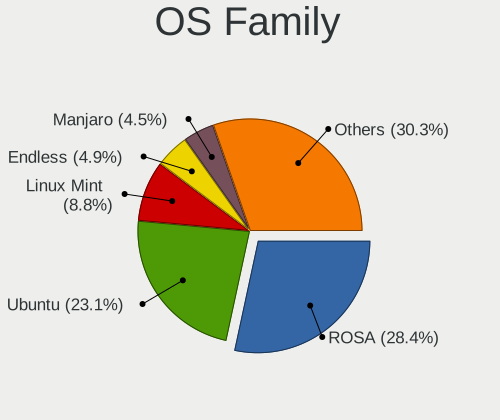

| Name          | Notebooks | Percent |
|---------------|-----------|---------|
| ROSA          | 529       | 30.02%  |
| Ubuntu        | 425       | 24.12%  |
| Linux Mint    | 156       | 8.85%   |
| Endless       | 98        | 5.56%   |
| Manjaro       | 88        | 4.99%   |
| Fedora        | 57        | 3.23%   |
| OpenMandriva  | 49        | 2.78%   |
| Debian        | 49        | 2.78%   |
| Arch          | 39        | 2.21%   |
| KDE neon      | 38        | 2.16%   |
| Kubuntu       | 36        | 2.04%   |
| Xubuntu       | 28        | 1.59%   |
| Pop!_OS       | 16        | 0.91%   |
| Zorin         | 12        | 0.68%   |
| ArcoLinux     | 12        | 0.68%   |
| Gentoo        | 11        | 0.62%   |
| Elementary    | 10        | 0.57%   |
| Ubuntu MATE   | 9         | 0.51%   |
| Ubuntu Unity  | 8         | 0.45%   |
| openSUSE      | 8         | 0.45%   |
| Lubuntu       | 8         | 0.45%   |
| Kali          | 8         | 0.45%   |
| Clear Linux   | 8         | 0.45%   |
| LMDE          | 6         | 0.34%   |
| EndeavourOS   | 5         | 0.28%   |
| Void Linux    | 4         | 0.23%   |
| Ubuntu Budgie | 4         | 0.23%   |
| MX            | 4         | 0.23%   |
| Linux Lite    | 4         | 0.23%   |
| Devuan        | 4         | 0.23%   |
| CentOS        | 4         | 0.23%   |
| NixOS         | 3         | 0.17%   |
| Artix         | 3         | 0.17%   |
| UbuntuDDE     | 2         | 0.11%   |
| Solus         | 2         | 0.11%   |
| GNOME OS      | 2         | 0.11%   |
| Sonar         | 1         | 0.06%   |
| RELD          | 1         | 0.06%   |
| Regata OS     | 1         | 0.06%   |
| Red OS        | 1         | 0.06%   |

Kernel
------

Version of the Linux kernel

| Version                             | Notebooks | Percent |
|-------------------------------------|-----------|---------|
| 4.9.60-nrj-desktop-1rosa-x86_64     | 57        | 2.83%   |
| 4.15.0-desktop-45.1rosa-x86_64      | 56        | 2.78%   |
| 4.9.20-nrj-desktop-1rosa-x86_64     | 43        | 2.14%   |
| 5.4.0-42-generic                    | 33        | 1.64%   |
| 5.10.14-desktop-1omv4002            | 31        | 1.54%   |
| 4.1.34-nrj-desktop-2rosa-x86_64     | 28        | 1.39%   |
| 4.9.60-nrj-desktop-1rosa-i586       | 26        | 1.29%   |
| 4.9.20-nrj-desktop-1rosa-i586       | 26        | 1.29%   |
| 5.10.74-generic-2rosa2021.1-x86_64  | 24        | 1.19%   |
| 4.9.9-nrj-desktop-1rosa-x86_64      | 21        | 1.04%   |
| 4.9.124-nrj-desktop-1rosa-x86_64    | 19        | 0.94%   |
| 5.8.0-14-generic                    | 18        | 0.9%    |
| 4.1.34-nrj-desktop-2rosa-i586       | 16        | 0.8%    |
| 5.4.0-58-generic                    | 15        | 0.75%   |
| 5.3.0-40-generic                    | 15        | 0.75%   |
| 4.9.41-nrj-desktop-1rosa-x86_64     | 15        | 0.75%   |
| 4.9.124-nrj-desktop-1rosa-i586      | 15        | 0.75%   |
| 4.18.0-15-generic                   | 15        | 0.75%   |
| 4.15.0-desktop-45.1rosa-i586        | 15        | 0.75%   |
| 4.1.38-nrj-desktop-2rosa-x86_64     | 15        | 0.75%   |
| 5.4.0-52-generic                    | 14        | 0.7%    |
| 5.16.7-desktop-1omv4003             | 14        | 0.7%    |
| 4.9.76-nrj-desktop-1rosa-x86_64     | 14        | 0.7%    |
| 4.15.0-desktop-122.124.1rosa-x86_64 | 14        | 0.7%    |
| 5.4.0-48-generic                    | 13        | 0.65%   |
| 4.9.9-nrj-desktop-1rosa-i586        | 13        | 0.65%   |
| 4.9.155-nrj-desktop-1rosa-x86_64    | 13        | 0.65%   |
| 5.4.0-19-generic                    | 12        | 0.6%    |
| 5.3.0-28-generic                    | 12        | 0.6%    |
| 5.4.0-26-generic                    | 11        | 0.55%   |
| 5.3.0-46-generic                    | 11        | 0.55%   |
| 5.3.0-42-generic                    | 11        | 0.55%   |
| 5.0.0-32-generic                    | 11        | 0.55%   |
| 5.4.83-generic-2rosa-x86_64         | 10        | 0.5%    |
| 5.4.0-91-generic                    | 10        | 0.5%    |
| 5.4.0-65-generic                    | 10        | 0.5%    |
| 5.4.0-29-generic                    | 10        | 0.5%    |
| 5.3.0-51-generic                    | 10        | 0.5%    |
| 5.11.0-43-generic                   | 10        | 0.5%    |
| 5.10.71-generic-1rosa2021.1-x86_64  | 10        | 0.5%    |

Kernel Family
-------------

Linux kernel without a distro release

| Version  | Notebooks | Percent |
|----------|-----------|---------|
| 5.4.0    | 269       | 13.79%  |
| 4.15.0   | 262       | 13.43%  |
| 5.8.0    | 100       | 5.13%   |
| 5.3.0    | 93        | 4.77%   |
| 4.9.60   | 83        | 4.25%   |
| 4.9.20   | 70        | 3.59%   |
| 5.11.0   | 69        | 3.54%   |
| 5.0.0    | 60        | 3.08%   |
| 5.13.0   | 47        | 2.41%   |
| 4.18.0   | 45        | 2.31%   |
| 4.1.34   | 44        | 2.26%   |
| 4.9.9    | 34        | 1.74%   |
| 4.9.124  | 34        | 1.74%   |
| 5.10.14  | 31        | 1.59%   |
| 5.15.0   | 28        | 1.44%   |
| 5.10.0   | 28        | 1.44%   |
| 5.10.74  | 27        | 1.38%   |
| 4.19.0   | 27        | 1.38%   |
| 4.1.38   | 27        | 1.38%   |
| 4.9.41   | 21        | 1.08%   |
| 4.9.76   | 20        | 1.03%   |
| 4.13.0   | 19        | 0.97%   |
| 5.4.83   | 18        | 0.92%   |
| 5.16.7   | 17        | 0.87%   |
| 4.9.155  | 16        | 0.82%   |
| 5.4.32   | 14        | 0.72%   |
| 5.10.71  | 10        | 0.51%   |
| 4.9.95   | 10        | 0.51%   |
| 5.10.118 | 9         | 0.46%   |
| 5.9.16   | 8         | 0.41%   |
| 4.1.25   | 8         | 0.41%   |
| 5.8.11   | 6         | 0.31%   |
| 5.4.40   | 6         | 0.31%   |
| 4.9.111  | 6         | 0.31%   |
| 4.4.0    | 6         | 0.31%   |
| 5.6.0    | 5         | 0.26%   |
| 5.17.1   | 5         | 0.26%   |
| 5.14.0   | 5         | 0.26%   |
| 5.10.16  | 5         | 0.26%   |
| 4.9.87   | 5         | 0.26%   |

Kernel Major Ver.
-----------------

Linux kernel major version

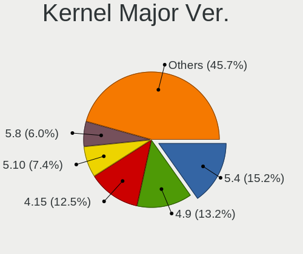

| Version | Notebooks | Percent |
|---------|-----------|---------|
| 5.4     | 320       | 16.9%   |
| 4.9     | 283       | 14.94%  |
| 4.15    | 262       | 13.83%  |
| 5.10    | 151       | 7.97%   |
| 5.8     | 127       | 6.71%   |
| 5.3     | 102       | 5.39%   |
| 5.11    | 85        | 4.49%   |
| 4.1     | 76        | 4.01%   |
| 5.13    | 65        | 3.43%   |
| 5.0     | 62        | 3.27%   |
| 5.15    | 52        | 2.75%   |
| 4.18    | 46        | 2.43%   |
| 4.19    | 35        | 1.85%   |
| 5.16    | 31        | 1.64%   |
| 5.6     | 25        | 1.32%   |
| 5.14    | 25        | 1.32%   |
| 4.13    | 20        | 1.06%   |
| 5.9     | 19        | 1%      |
| 5.12    | 16        | 0.84%   |
| 5.17    | 13        | 0.69%   |
| 5.5     | 12        | 0.63%   |
| 4.14    | 8         | 0.42%   |
| 5.7     | 7         | 0.37%   |
| 4.4     | 7         | 0.37%   |
| 5.18    | 5         | 0.26%   |
| 6.0     | 4         | 0.21%   |
| 5.2     | 4         | 0.21%   |
| 5.19    | 4         | 0.21%   |
| 5.1     | 4         | 0.21%   |
| 4.8     | 4         | 0.21%   |
| 4.10    | 4         | 0.21%   |
| 4.7     | 3         | 0.16%   |
| 4.16    | 2         | 0.11%   |
| 4.12    | 2         | 0.11%   |
| 3.14    | 2         | 0.11%   |
| 4.5     | 1         | 0.05%   |
| 4.20    | 1         | 0.05%   |
| 3.8     | 1         | 0.05%   |
| 3.19    | 1         | 0.05%   |
| 3.16    | 1         | 0.05%   |

Arch
----

OS architecture (x86_64, i586, etc.)

| Name   | Notebooks | Percent |
|--------|-----------|---------|
| x86_64 | 1534      | 88.57%  |
| i686   | 198       | 11.43%  |

DE
--

Desktop Environment

| Name             | Notebooks | Percent |
|------------------|-----------|---------|
| GNOME            | 512       | 28.32%  |
| KDE4             | 365       | 20.19%  |
| KDE5             | 283       | 15.65%  |
| Unknown          | 229       | 12.67%  |
| XFCE             | 94        | 5.2%    |
| X-Cinnamon       | 61        | 3.37%   |
| Cinnamon         | 59        | 3.26%   |
| KDE              | 53        | 2.93%   |
| MATE             | 52        | 2.88%   |
| LXQt             | 43        | 2.38%   |
| i3               | 12        | 0.66%   |
| Unity            | 8         | 0.44%   |
| Pantheon         | 8         | 0.44%   |
| LXDE             | 6         | 0.33%   |
| GNOME Flashback  | 5         | 0.28%   |
| Budgie           | 5         | 0.28%   |
| Deepin           | 4         | 0.22%   |
| xmonad           | 2         | 0.11%   |
| GNOME Classic    | 2         | 0.11%   |
| qtile            | 1         | 0.06%   |
| Openbox          | 1         | 0.06%   |
| lightdm-xsession | 1         | 0.06%   |
| i3-with-shmlog   | 1         | 0.06%   |
| bspwm            | 1         | 0.06%   |

Display Server
--------------

X11 or Wayland

| Name    | Notebooks | Percent |
|---------|-----------|---------|
| X11     | 1465      | 83.29%  |
| Wayland | 166       | 9.44%   |
| Unknown | 122       | 6.94%   |
| Tty     | 6         | 0.34%   |

Display Manager
---------------

SDDM, LightDM, etc.

| Name    | Notebooks | Percent |
|---------|-----------|---------|
| Unknown | 655       | 36.27%  |
| KDM     | 368       | 20.38%  |
| SDDM    | 301       | 16.67%  |
| GDM     | 209       | 11.57%  |
| TDM     | 112       | 6.2%    |
| LightDM | 102       | 5.65%   |
| GDM3    | 45        | 2.49%   |
| MDM     | 6         | 0.33%   |
| XDM     | 5         | 0.28%   |
| SLiM    | 2         | 0.11%   |
| LXDM    | 1         | 0.06%   |

OS Lang
-------

Language

| Lang        | Notebooks | Percent |
|-------------|-----------|---------|
| Unknown     | 669       | 37.63%  |
| en_US       | 443       | 24.92%  |
| ru_RU       | 260       | 14.62%  |
| ru_UA       | 251       | 14.12%  |
| uk_UA       | 106       | 5.96%   |
| C           | 21        | 1.18%   |
| en_GB       | 12        | 0.67%   |
| ru_RU.UTF_8 | 7         | 0.39%   |
| POSIX       | 1         | 0.06%   |
| fr_FR       | 1         | 0.06%   |
| es_ES       | 1         | 0.06%   |
| en_ZA       | 1         | 0.06%   |
| en_IE       | 1         | 0.06%   |
| en_CA       | 1         | 0.06%   |
| en_AG       | 1         | 0.06%   |
| de_DE       | 1         | 0.06%   |
| C.UTF8      | 1         | 0.06%   |

Boot Mode
---------

EFI or BIOS

| Mode | Notebooks | Percent |
|------|-----------|---------|
| BIOS | 954       | 54.3%   |
| EFI  | 803       | 45.7%   |

Filesystem
----------

Type of filesystem

| Type    | Notebooks | Percent |
|---------|-----------|---------|
| Ext4    | 1214      | 68.39%  |
| Unknown | 381       | 21.46%  |
| Btrfs   | 86        | 4.85%   |
| Overlay | 68        | 3.83%   |
| Zfs     | 8         | 0.45%   |
| Xfs     | 7         | 0.39%   |
| Ext3    | 6         | 0.34%   |
| Ext2    | 3         | 0.17%   |
| F2fs    | 2         | 0.11%   |

Part. scheme
------------

Scheme of partitioning

| Type    | Notebooks | Percent |
|---------|-----------|---------|
| Unknown | 805       | 45.2%   |
| GPT     | 508       | 28.52%  |
| MBR     | 468       | 26.28%  |

Dual Boot with Linux/BSD
------------------------

Hosting more than one Linux/BSD

| Dual boot | Notebooks | Percent |
|-----------|-----------|---------|
| No        | 1550      | 88.17%  |
| Yes       | 208       | 11.83%  |

Dual Boot (Win)
---------------

Hosting Linux and Windows

| Dual boot | Notebooks | Percent |
|-----------|-----------|---------|
| No        | 1289      | 72.5%   |
| Yes       | 489       | 27.5%   |

Board
-----

Vendor
------

Motherboard manufacturer

| Name                | Notebooks | Percent |
|---------------------|-----------|---------|
| Lenovo              | 371       | 21.53%  |
| Hewlett-Packard     | 355       | 20.6%   |
| ASUSTek Computer    | 325       | 18.86%  |
| Acer                | 227       | 13.17%  |
| Dell                | 181       | 10.5%   |
| Samsung Electronics | 56        | 3.25%   |
| Timi                | 25        | 1.45%   |
| MSI                 | 24        | 1.39%   |
| Toshiba             | 22        | 1.28%   |
| Fujitsu             | 13        | 0.75%   |
| Apple               | 12        | 0.7%    |
| Sony                | 11        | 0.64%   |
| eMachines           | 11        | 0.64%   |
| Fujitsu Siemens     | 8         | 0.46%   |
| Packard Bell        | 7         | 0.41%   |
| Unknown             | 5         | 0.29%   |
| VINGA               | 4         | 0.23%   |
| Shuttle             | 3         | 0.17%   |
| Notebook            | 3         | 0.17%   |
| Navigator           | 3         | 0.17%   |
| Medion              | 3         | 0.17%   |
| HUAWEI              | 3         | 0.17%   |
| Chuwi               | 3         | 0.17%   |
| Prestigio           | 2         | 0.12%   |
| Pixus               | 2         | 0.12%   |
| Minix               | 2         | 0.12%   |
| LG Electronics      | 2         | 0.12%   |
| Hampoo              | 2         | 0.12%   |
| Google              | 2         | 0.12%   |
| Dream Machines      | 2         | 0.12%   |
| AMI                 | 2         | 0.12%   |
| Xplore              | 1         | 0.06%   |
| UnBranded           | 1         | 0.06%   |
| TUXEDO              | 1         | 0.06%   |
| TrekStor            | 1         | 0.06%   |
| TR                  | 1         | 0.06%   |
| Shinelon Computer   | 1         | 0.06%   |
| Razer               | 1         | 0.06%   |
| Pegatron            | 1         | 0.06%   |
| Panasonic           | 1         | 0.06%   |

Model
-----

Motherboard model

| Name                                       | Notebooks | Percent |
|--------------------------------------------|-----------|---------|
| HP Pavilion g6                             | 22        | 1.28%   |
| Unknown                                    | 13        | 0.75%   |
| Lenovo G500 20236                          | 12        | 0.7%    |
| HP Pavilion dv6                            | 12        | 0.7%    |
| HP Pavilion 15                             | 12        | 0.7%    |
| ASUS VivoBook 15_ASUS Laptop X540MA_X543MA | 12        | 0.7%    |
| Lenovo IdeaPad Z510 20287                  | 7         | 0.41%   |
| HP 250 G5 Notebook PC                      | 7         | 0.41%   |
| Acer Aspire V3-571G                        | 7         | 0.41%   |
| Samsung R59P/R60P/R61P                     | 6         | 0.35%   |
| Samsung R528/R728                          | 6         | 0.35%   |
| Lenovo V580c 20160                         | 6         | 0.35%   |
| Lenovo IdeaPad Z580                        | 6         | 0.35%   |
| Lenovo G580 20157                          | 6         | 0.35%   |
| Lenovo G580 20150                          | 6         | 0.35%   |
| Lenovo G550 20023                          | 6         | 0.35%   |
| HP Pavilion g7                             | 6         | 0.35%   |
| HP Notebook                                | 6         | 0.35%   |
| HP Laptop 15-bw0xx                         | 6         | 0.35%   |
| HP 620                                     | 6         | 0.35%   |
| HP 255 G7 Notebook PC                      | 6         | 0.35%   |
| Lenovo IdeaPad S340-14API 81NB             | 5         | 0.29%   |
| Lenovo IdeaPad 100-15IBD 80QQ              | 5         | 0.29%   |
| HP ZBook 15v G5                            | 5         | 0.29%   |
| HP ProBook 450 G6                          | 5         | 0.29%   |
| HP ProBook 440 G7                          | 5         | 0.29%   |
| HP Pavilion Gaming Laptop 15-cx0xxx        | 5         | 0.29%   |
| HP Laptop 15s-eq1xxx                       | 5         | 0.29%   |
| HP 250 G6 Notebook PC                      | 5         | 0.29%   |
| HP 250 G4                                  | 5         | 0.29%   |
| Dell Inspiron N5010                        | 5         | 0.29%   |
| Dell Inspiron 3582                         | 5         | 0.29%   |
| ASUS VivoBook 15_ASUS Laptop X540UBR       | 5         | 0.29%   |
| ASUS VivoBook 15_ASUS Laptop X540MB_X540MB | 5         | 0.29%   |
| ASUS K56CB                                 | 5         | 0.29%   |
| VINGA Iron S140                            | 4         | 0.23%   |
| Lenovo S10-3                               | 4         | 0.23%   |
| Lenovo IdeaPad 330-15IGM 81D1              | 4         | 0.23%   |
| Lenovo IdeaPad 320-15IKB 81BG              | 4         | 0.23%   |
| Lenovo IdeaPad 320-15IAP 80XR              | 4         | 0.23%   |

Model Family
------------

Motherboard model prefix

| Name                  | Notebooks | Percent |
|-----------------------|-----------|---------|
| Acer Aspire           | 133       | 7.72%   |
| Lenovo IdeaPad        | 123       | 7.14%   |
| Lenovo ThinkPad       | 98        | 5.69%   |
| HP Pavilion           | 90        | 5.22%   |
| HP ProBook            | 83        | 4.82%   |
| Dell Inspiron         | 80        | 4.64%   |
| ASUS VivoBook         | 72        | 4.18%   |
| Dell Latitude         | 49        | 2.84%   |
| HP Laptop             | 38        | 2.21%   |
| Acer Swift            | 30        | 1.74%   |
| HP EliteBook          | 25        | 1.45%   |
| HP 250                | 25        | 1.45%   |
| HP ZBook              | 24        | 1.39%   |
| Dell Vostro           | 19        | 1.1%    |
| Toshiba Satellite     | 17        | 0.99%   |
| HP Compaq             | 16        | 0.93%   |
| Acer TravelMate       | 15        | 0.87%   |
| Acer Extensa          | 15        | 0.87%   |
| Lenovo G580           | 13        | 0.75%   |
| HP 255                | 13        | 0.75%   |
| Acer Nitro            | 13        | 0.75%   |
| Unknown               | 13        | 0.75%   |
| Timi RedmiBook        | 12        | 0.7%    |
| Lenovo G500           | 12        | 0.7%    |
| Fujitsu LIFEBOOK      | 12        | 0.7%    |
| Lenovo ThinkBook      | 11        | 0.64%   |
| Lenovo Legion         | 11        | 0.64%   |
| Dell Precision        | 11        | 0.64%   |
| ASUS ROG              | 11        | 0.64%   |
| Dell XPS              | 10        | 0.58%   |
| Lenovo B590           | 7         | 0.41%   |
| HP Presario           | 7         | 0.41%   |
| Samsung R59P          | 6         | 0.35%   |
| Samsung R528          | 6         | 0.35%   |
| Packard Bell EasyNote | 6         | 0.35%   |
| Lenovo V580c          | 6         | 0.35%   |
| Lenovo G550           | 6         | 0.35%   |
| HP Notebook           | 6         | 0.35%   |
| HP ENVY               | 6         | 0.35%   |
| HP 620                | 6         | 0.35%   |

MFG Year
--------

Motherboard manufacture year

| Year | Notebooks | Percent |
|------|-----------|---------|
| 2011 | 191       | 11.09%  |
| 2012 | 176       | 10.21%  |
| 2019 | 162       | 9.4%    |
| 2018 | 153       | 8.88%   |
| 2013 | 143       | 8.3%    |
| 2017 | 133       | 7.72%   |
| 2010 | 121       | 7.02%   |
| 2020 | 111       | 6.44%   |
| 2015 | 95        | 5.51%   |
| 2016 | 94        | 5.46%   |
| 2009 | 73        | 4.24%   |
| 2007 | 65        | 3.77%   |
| 2008 | 61        | 3.54%   |
| 2021 | 60        | 3.48%   |
| 2014 | 47        | 2.73%   |
| 2006 | 24        | 1.39%   |
| 2005 | 11        | 0.64%   |
| 2022 | 3         | 0.17%   |

Form Factor
-----------

Physical design of the computer

| Name     | Notebooks | Percent |
|----------|-----------|---------|
| Notebook | 1723      | 100%    |

Secure Boot
-----------

Enabled or disabled

| State    | Notebooks | Percent |
|----------|-----------|---------|
| Disabled | 1626      | 93.83%  |
| Enabled  | 107       | 6.17%   |

Coreboot
--------

Have coreboot on board

| Used | Notebooks | Percent |
|------|-----------|---------|
| No   | 1719      | 99.77%  |
| Yes  | 4         | 0.23%   |

RAM Size
--------

Total RAM memory

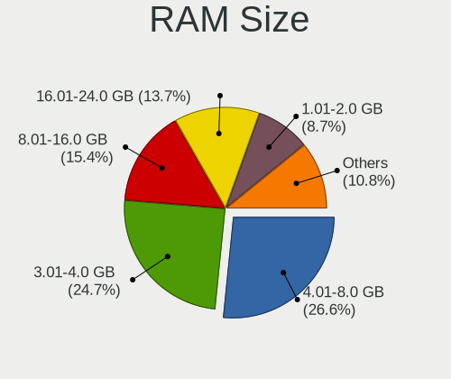

| Size in GB  | Notebooks | Percent |
|-------------|-----------|---------|
| 4.01-8.0    | 467       | 26.72%  |
| 3.01-4.0    | 447       | 25.57%  |
| 8.01-16.0   | 256       | 14.65%  |
| 16.01-24.0  | 232       | 13.27%  |
| 1.01-2.0    | 165       | 9.44%   |
| 2.01-3.0    | 88        | 5.03%   |
| 32.01-64.0  | 52        | 2.97%   |
| 0.51-1.0    | 24        | 1.37%   |
| 24.01-32.0  | 9         | 0.51%   |
| 64.01-256.0 | 4         | 0.23%   |
| 0.01-0.5    | 4         | 0.23%   |

RAM Used
--------

Used RAM memory

| Used GB    | Notebooks | Percent |
|------------|-----------|---------|
| 1.01-2.0   | 654       | 34.37%  |
| 2.01-3.0   | 386       | 20.28%  |
| 0.51-1.0   | 326       | 17.13%  |
| 4.01-8.0   | 238       | 12.51%  |
| 3.01-4.0   | 186       | 9.77%   |
| 8.01-16.0  | 64        | 3.36%   |
| 0.01-0.5   | 43        | 2.26%   |
| 16.01-24.0 | 3         | 0.16%   |
| Unknown    | 2         | 0.11%   |
| 24.01-32.0 | 1         | 0.05%   |

Total Drives
------------

Number of drives on board

| Drives | Notebooks | Percent |
|--------|-----------|---------|
| 1      | 1357      | 77.68%  |
| 2      | 345       | 19.75%  |
| 3      | 31        | 1.77%   |
| 0      | 10        | 0.57%   |
| 4      | 3         | 0.17%   |
| 5      | 1         | 0.06%   |

Has CD-ROM
----------

Has CD-ROM on board

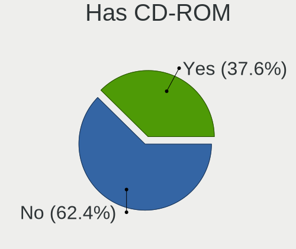

| Presented | Notebooks | Percent |
|-----------|-----------|---------|
| No        | 1041      | 60.03%  |
| Yes       | 693       | 39.97%  |

Has Ethernet
------------

Has Ethernet on board

| Presented | Notebooks | Percent |
|-----------|-----------|---------|
| Yes       | 1475      | 85.46%  |
| No        | 251       | 14.54%  |

Has WiFi
--------

Has WiFi module

| Presented | Notebooks | Percent |
|-----------|-----------|---------|
| Yes       | 1694      | 98.32%  |
| No        | 29        | 1.68%   |

Has Bluetooth
-------------

Has Bluetooth module

| Presented | Notebooks | Percent |
|-----------|-----------|---------|
| Yes       | 1284      | 73.67%  |
| No        | 459       | 26.33%  |

Location
--------

Country
-------

Geographic location (country)

| Country | Notebooks | Percent |
|---------|-----------|---------|
| Ukraine | 1723      | 100%    |

City
----

Geographic location (city)

| City            | Notebooks | Percent |
|-----------------|-----------|---------|
| Kyiv            | 450       | 25.01%  |
| Kharkiv         | 114       | 6.34%   |
| Odessa          | 84        | 4.67%   |
| Dnipro          | 81        | 4.5%    |
| Lviv            | 80        | 4.45%   |
| Sevastopol      | 71        | 3.95%   |
| Simferopol      | 69        | 3.84%   |
| Donetsk         | 47        | 2.61%   |
| Vinnytsia       | 27        | 1.5%    |
| Cherkasy        | 24        | 1.33%   |
| Zaporizhzhya    | 23        | 1.28%   |
| Zaporizhzhia    | 23        | 1.28%   |
| Ternopil        | 21        | 1.17%   |
| Mykolayiv       | 21        | 1.17%   |
| Poltava         | 20        | 1.11%   |
| Kryvyi Rih      | 20        | 1.11%   |
| Chernihiv       | 20        | 1.11%   |
| Kherson         | 18        | 1%      |
| Yalta           | 15        | 0.83%   |
| Ivano-Frankivsk | 15        | 0.83%   |
| Mariupol        | 14        | 0.78%   |
| Kremenchug      | 14        | 0.78%   |
| Zhytomyr        | 12        | 0.67%   |
| Yasinovataya    | 12        | 0.67%   |
| Irpin           | 12        | 0.67%   |
| Horlivka        | 12        | 0.67%   |
| Novopskov       | 11        | 0.61%   |
| Rivne           | 10        | 0.56%   |
| Mykytyn Rog     | 10        | 0.56%   |
| Yevpatoriya     | 9         | 0.5%    |
| Uzhhorod        | 9         | 0.5%    |
| Sumy            | 9         | 0.5%    |
| Pavlohrad       | 9         | 0.5%    |
| Syeverodonets'k | 8         | 0.44%   |
| Luhansk         | 7         | 0.39%   |
| Khartsyzsk      | 7         | 0.39%   |
| Kamianske       | 7         | 0.39%   |
| Izmail          | 7         | 0.39%   |
| Bucha           | 7         | 0.39%   |
| Osipenko        | 6         | 0.33%   |

Drives
------

Drive Vendor
------------

Hard drive vendors

| Vendor                      | Notebooks | Drives | Percent |
|-----------------------------|-----------|--------|---------|
| Seagate                     | 344       | 430    | 16.41%  |
| WDC                         | 312       | 364    | 14.89%  |
| Samsung Electronics         | 245       | 292    | 11.69%  |
| Toshiba                     | 204       | 257    | 9.73%   |
| Kingston                    | 135       | 160    | 6.44%   |
| Hitachi                     | 125       | 157    | 5.96%   |
| Unknown                     | 92        | 112    | 4.39%   |
| HGST                        | 86        | 108    | 4.1%    |
| SK hynix                    | 76        | 91     | 3.63%   |
| SanDisk                     | 61        | 74     | 2.91%   |
| Intel                       | 61        | 79     | 2.91%   |
| Micron Technology           | 42        | 56     | 2%      |
| GOODRAM                     | 37        | 40     | 1.77%   |
| Transcend                   | 19        | 23     | 0.91%   |
| KIOXIA                      | 19        | 25     | 0.91%   |
| Apacer                      | 18        | 19     | 0.86%   |
| SPCC                        | 17        | 22     | 0.81%   |
| A-DATA Technology           | 17        | 19     | 0.81%   |
| Patriot                     | 16        | 19     | 0.76%   |
| Crucial                     | 15        | 16     | 0.72%   |
| LITEON                      | 14        | 16     | 0.67%   |
| China                       | 12        | 13     | 0.57%   |
| Team                        | 11        | 11     | 0.52%   |
| Fujitsu                     | 8         | 8      | 0.38%   |
| LITEONIT                    | 6         | 7      | 0.29%   |
| JMicron Technology          | 6         | 5      | 0.29%   |
| Apple                       | 6         | 7      | 0.29%   |
| StoreJet                    | 5         | 5      | 0.24%   |
| OCZ                         | 5         | 5      | 0.24%   |
| KingSpec                    | 5         | 5      | 0.24%   |
| Plextor                     | 4         | 5      | 0.19%   |
| Phison                      | 4         | 6      | 0.19%   |
| AMD                         | 4         | 5      | 0.19%   |
| UMIS                        | 3         | 3      | 0.14%   |
| Silicon Motion              | 3         | 4      | 0.14%   |
| Leven                       | 3         | 3      | 0.14%   |
| Indilinx                    | 3         | 3      | 0.14%   |
| Gigabyte Technology         | 3         | 3      | 0.14%   |
| Yangtze Memory Technologies | 2         | 3      | 0.1%    |
| XPG                         | 2         | 2      | 0.1%    |

Drive Model
-----------

Hard drive models

| Model                                  | Notebooks | Percent |
|----------------------------------------|-----------|---------|
| Seagate ST1000LM035-1RK172 1TB         | 66        | 3.08%   |
| Seagate ST1000LM024 HN-M101MBB 1TB     | 51        | 2.38%   |
| Toshiba MQ01ABF050 500GB               | 44        | 2.05%   |
| Seagate ST9500325AS 500GB              | 32        | 1.49%   |
| Toshiba MQ01ABD100 1TB                 | 29        | 1.35%   |
| Seagate ST500LT012-1DG142 500GB        | 29        | 1.35%   |
| Toshiba MQ04ABF100 1TB                 | 20        | 0.93%   |
| Samsung SM963 2.5" NVMe PCIe SSD 256GB | 18        | 0.84%   |
| Kingston SA400S37240G 240GB SSD        | 17        | 0.79%   |
| Kingston SA400S37120G 120GB SSD        | 17        | 0.79%   |
| HGST HTS545050A7E680 500GB             | 17        | 0.79%   |
| Seagate ST9320325AS 320GB              | 16        | 0.75%   |
| HGST HTS721010A9E630 1TB               | 16        | 0.75%   |
| Seagate ST500LT012-9WS142 500GB        | 14        | 0.65%   |
| Hitachi HTS543232A7A384 320GB          | 14        | 0.65%   |
| Unknown MMC Card  64GB                 | 13        | 0.61%   |
| Intel NVMe SSD Drive 512GB             | 13        | 0.61%   |
| WDC WD10SPZX-21Z10T0 1TB               | 12        | 0.56%   |
| SK hynix NVMe SSD Drive 256GB          | 12        | 0.56%   |
| Seagate ST9250315AS 250GB              | 12        | 0.56%   |
| Samsung SSD 860 EVO 250GB              | 12        | 0.56%   |
| HGST HTS545050A7E380 500GB             | 12        | 0.56%   |
| Seagate ST500LM012 HN-M500MBB 500GB    | 11        | 0.51%   |
| Samsung SSD 860 EVO 500GB              | 11        | 0.51%   |
| Samsung NVMe SSD Drive 512GB           | 11        | 0.51%   |
| Hitachi HTS545032B9A300 320GB          | 11        | 0.51%   |
| HGST HTS541010A9E680 1TB               | 11        | 0.51%   |
| WDC WD5000LPCX-24VHAT0 500GB           | 10        | 0.47%   |
| WDC WD3200BPVT-22JJ5T0 320GB           | 10        | 0.47%   |
| Unknown MMC Card  32GB                 | 10        | 0.47%   |
| Micron 1100_MTFDDAV256TBN 256GB SSD    | 10        | 0.47%   |
| Hitachi HTS545050B9A300 500GB          | 10        | 0.47%   |
| Hitachi HTS545050A7E380 500GB          | 10        | 0.47%   |
| GOODRAM SSD 120GB                      | 10        | 0.47%   |
| WDC WD5000LPCX-21VHAT0 500GB           | 9         | 0.42%   |
| Toshiba MQ01ABD050 500GB               | 9         | 0.42%   |
| SK hynix NVMe SSD Drive 512GB          | 9         | 0.42%   |
| Seagate ST750LM022 HN-M750MBB 752GB    | 9         | 0.42%   |
| SanDisk NVMe SSD Drive 512GB           | 9         | 0.42%   |
| SanDisk NVMe SSD Drive 256GB           | 9         | 0.42%   |

HDD Vendor
----------

Hard disk drive vendors

| Vendor              | Notebooks | Drives | Percent |
|---------------------|-----------|--------|---------|
| Seagate             | 342       | 426    | 32.88%  |
| WDC                 | 266       | 302    | 25.58%  |
| Toshiba             | 171       | 215    | 16.44%  |
| Hitachi             | 125       | 157    | 12.02%  |
| HGST                | 86        | 108    | 8.27%   |
| Samsung Electronics | 31        | 38     | 2.98%   |
| Fujitsu             | 8         | 8      | 0.77%   |
| Unknown             | 2         | 3      | 0.19%   |
| HGST HTS            | 2         | 2      | 0.19%   |
| Apple               | 2         | 2      | 0.19%   |
| USB3.0              | 1         | 1      | 0.1%    |
| StoreJet            | 1         | 1      | 0.1%    |
| SILICONMOTION       | 1         | 1      | 0.1%    |
| JMicron Technology  | 1         | 1      | 0.1%    |
| IBM/Hitachi         | 1         | 1      | 0.1%    |

SSD Vendor
----------

Solid state drive vendors

| Vendor              | Notebooks | Drives | Percent |
|---------------------|-----------|--------|---------|
| Samsung Electronics | 115       | 136    | 19.76%  |
| Kingston            | 104       | 124    | 17.87%  |
| SanDisk             | 39        | 48     | 6.7%    |
| GOODRAM             | 35        | 38     | 6.01%   |
| SK hynix            | 24        | 29     | 4.12%   |
| Micron Technology   | 23        | 27     | 3.95%   |
| Transcend           | 19        | 23     | 3.26%   |
| Intel               | 19        | 24     | 3.26%   |
| Apacer              | 18        | 19     | 3.09%   |
| SPCC                | 17        | 22     | 2.92%   |
| Patriot             | 16        | 19     | 2.75%   |
| Crucial             | 15        | 16     | 2.58%   |
| A-DATA Technology   | 15        | 17     | 2.58%   |
| LITEON              | 13        | 15     | 2.23%   |
| China               | 12        | 13     | 2.06%   |
| WDC                 | 11        | 13     | 1.89%   |
| Team                | 11        | 11     | 1.89%   |
| Toshiba             | 9         | 14     | 1.55%   |
| LITEONIT            | 6         | 7      | 1.03%   |
| OCZ                 | 5         | 5      | 0.86%   |
| StoreJet            | 4         | 4      | 0.69%   |
| KingSpec            | 4         | 4      | 0.69%   |
| Plextor             | 3         | 4      | 0.52%   |
| Leven               | 3         | 3      | 0.52%   |
| JMicron Technology  | 3         | 3      | 0.52%   |
| Gigabyte Technology | 3         | 3      | 0.52%   |
| Apple               | 3         | 3      | 0.52%   |
| AMD                 | 3         | 4      | 0.52%   |
| Verbatim            | 2         | 2      | 0.34%   |
| Unknown             | 2         | 2      | 0.34%   |
| KingDian            | 2         | 2      | 0.34%   |
| Indilinx            | 2         | 2      | 0.34%   |
| UNIC2               | 1         | 1      | 0.17%   |
| Teclast             | 1         | 1      | 0.17%   |
| Seagate             | 1         | 1      | 0.17%   |
| Qumo                | 1         | 1      | 0.17%   |
| PNY                 | 1         | 1      | 0.17%   |
| NGFF                | 1         | 1      | 0.17%   |
| Netac               | 1         | 1      | 0.17%   |
| MyDigitalSSD        | 1         | 1      | 0.17%   |

Drive Kind
----------

HDD or SSD

| Kind    | Notebooks | Drives | Percent |
|---------|-----------|--------|---------|
| HDD     | 1015      | 1266   | 49.85%  |
| SSD     | 551       | 680    | 27.06%  |
| NVMe    | 369       | 464    | 18.12%  |
| MMC     | 85        | 107    | 4.17%   |
| Unknown | 16        | 16     | 0.79%   |

Drive Connector
---------------

SATA, SAS, NVMe, etc.

| Type | Notebooks | Drives | Percent |
|------|-----------|--------|---------|
| SATA | 1377      | 1926   | 73.75%  |
| NVMe | 369       | 464    | 19.76%  |
| MMC  | 85        | 107    | 4.55%   |
| SAS  | 36        | 36     | 1.93%   |

Drive Size
----------

Size of hard drive

| Size in TB | Notebooks | Drives | Percent |
|------------|-----------|--------|---------|
| 0.01-0.5   | 1094      | 1432   | 72.4%   |
| 0.51-1.0   | 399       | 492    | 26.41%  |
| 1.01-2.0   | 15        | 19     | 0.99%   |
| 3.01-4.0   | 2         | 2      | 0.13%   |
| 4.01-10.0  | 1         | 1      | 0.07%   |

Space Total
-----------

Amount of disk space available on the file system

| Size in GB     | Notebooks | Percent |
|----------------|-----------|---------|
| 101-250        | 530       | 28.87%  |
| 251-500        | 500       | 27.23%  |
| 501-1000       | 239       | 13.02%  |
| 51-100         | 163       | 8.88%   |
| 1-20           | 160       | 8.71%   |
| 21-50          | 141       | 7.68%   |
| 1001-2000      | 63        | 3.43%   |
| Unknown        | 26        | 1.42%   |
| More than 3000 | 10        | 0.54%   |
| 2001-3000      | 4         | 0.22%   |

Space Used
----------

Amount of used disk space

| Used GB        | Notebooks | Percent |
|----------------|-----------|---------|
| 1-20           | 856       | 45.9%   |
| 21-50          | 336       | 18.02%  |
| 101-250        | 230       | 12.33%  |
| 51-100         | 229       | 12.28%  |
| 251-500        | 118       | 6.33%   |
| 501-1000       | 55        | 2.95%   |
| Unknown        | 26        | 1.39%   |
| 1001-2000      | 10        | 0.54%   |
| More than 3000 | 4         | 0.21%   |
| 2001-3000      | 1         | 0.05%   |

Malfunc. Drives
---------------

Drive models with a malfunction

| Model                               | Notebooks | Drives | Percent |
|-------------------------------------|-----------|--------|---------|
| Seagate ST9500325AS 500GB           | 18        | 21     | 5.16%   |
| Seagate ST1000LM024 HN-M101MBB 1TB  | 14        | 22     | 4.01%   |
| Seagate ST9320325AS 320GB           | 11        | 11     | 3.15%   |
| Hitachi HTS543232A7A384 320GB       | 11        | 12     | 3.15%   |
| Seagate ST500LT012-1DG142 500GB     | 9         | 10     | 2.58%   |
| Seagate ST9250315AS 250GB           | 8         | 9      | 2.29%   |
| Seagate ST500LT012-9WS142 500GB     | 8         | 10     | 2.29%   |
| Toshiba MQ01ABD050 500GB            | 6         | 8      | 1.72%   |
| HGST HTS545050A7E680 500GB          | 6         | 8      | 1.72%   |
| Toshiba MQ01ABD100 1TB              | 5         | 5      | 1.43%   |
| Seagate ST1000LM035-1RK172 1TB      | 5         | 6      | 1.43%   |
| Hitachi HTS545032B9A300 320GB       | 5         | 7      | 1.43%   |
| Hitachi HTS542516K9SA00 160GB       | 5         | 5      | 1.43%   |
| HGST HTS545050A7E380 500GB          | 5         | 5      | 1.43%   |
| WDC WD5000BEVT-22A0RT0 500GB        | 4         | 5      | 1.15%   |
| WDC WD3200BEVT-22A23T0 320GB        | 4         | 4      | 1.15%   |
| Seagate ST750LM022 HN-M750MBB 752GB | 4         | 4      | 1.15%   |
| Seagate ST500LM012 HN-M500MBB 500GB | 4         | 7      | 1.15%   |
| Seagate ST320LT020-9YG142 320GB     | 4         | 5      | 1.15%   |
| Hitachi HTS545050B9A300 500GB       | 4         | 5      | 1.15%   |
| Hitachi HTS545050A7E380 500GB       | 4         | 4      | 1.15%   |
| Seagate ST9500420AS 500GB           | 3         | 3      | 0.86%   |
| Seagate ST9160821AS 160GB           | 3         | 3      | 0.86%   |
| Seagate ST1000LM014-1EJ164 1TB      | 3         | 4      | 0.86%   |
| Samsung Electronics HM160HI 160GB   | 3         | 3      | 0.86%   |
| Hitachi HTS541612J9SA00 120GB       | 3         | 3      | 0.86%   |
| HGST HTS541010A9E680 1TB            | 3         | 4      | 0.86%   |
| WDC WD6400BPVT-80HXZT3 640GB        | 2         | 2      | 0.57%   |
| WDC WD5000LPCX-60VHAT0 500GB        | 2         | 3      | 0.57%   |
| WDC WD5000LPCX-24C6HT0 500GB        | 2         | 2      | 0.57%   |
| WDC WD3200BPVT-22JJ5T0 320GB        | 2         | 2      | 0.57%   |
| WDC WD3200BPVT-16JJ5T0 320GB        | 2         | 2      | 0.57%   |
| WDC WD3200BEVT-60A23T0 320GB        | 2         | 2      | 0.57%   |
| WDC WD3200BEVT-22ZCT0 320GB         | 2         | 2      | 0.57%   |
| WDC WD2500BEVT-60A23T0 250GB        | 2         | 2      | 0.57%   |
| Toshiba MQ01ABF050 500GB            | 2         | 3      | 0.57%   |
| Toshiba MQ01ABD075 752GB            | 2         | 2      | 0.57%   |
| Toshiba MK7559GSXP 752GB            | 2         | 3      | 0.57%   |
| Toshiba MK5055GSX 500GB             | 2         | 2      | 0.57%   |
| Toshiba MK3259GSXP 320GB            | 2         | 4      | 0.57%   |

Malfunc. Drive Vendor
---------------------

Vendors of faulty drives

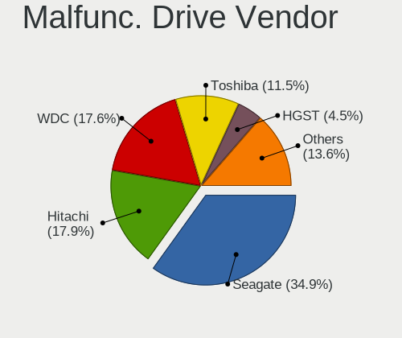

| Vendor              | Notebooks | Drives | Percent |
|---------------------|-----------|--------|---------|
| Seagate             | 122       | 149    | 35.06%  |
| Hitachi             | 64        | 86     | 18.39%  |
| WDC                 | 62        | 69     | 17.82%  |
| Toshiba             | 40        | 51     | 11.49%  |
| HGST                | 16        | 20     | 4.6%    |
| Samsung Electronics | 14        | 15     | 4.02%   |
| SanDisk             | 5         | 7      | 1.44%   |
| A-DATA Technology   | 4         | 4      | 1.15%   |
| SK hynix            | 3         | 3      | 0.86%   |
| Kingston            | 3         | 4      | 0.86%   |
| LITEON              | 2         | 3      | 0.57%   |
| Fujitsu             | 2         | 2      | 0.57%   |
| Team                | 1         | 1      | 0.29%   |
| OCZ                 | 1         | 1      | 0.29%   |
| Micron Technology   | 1         | 1      | 0.29%   |
| LITEONIT            | 1         | 1      | 0.29%   |
| KingSpec            | 1         | 1      | 0.29%   |
| JDa                 | 1         | 1      | 0.29%   |
| IBM/Hitachi         | 1         | 1      | 0.29%   |
| HGST HTS            | 1         | 1      | 0.29%   |
| Crucial             | 1         | 1      | 0.29%   |
| China               | 1         | 1      | 0.29%   |
| Apple               | 1         | 1      | 0.29%   |

Malfunc. HDD Vendor
-------------------

Vendors of faulty HDD drives

| Vendor              | Notebooks | Drives | Percent |
|---------------------|-----------|--------|---------|
| Seagate             | 122       | 149    | 38.13%  |
| Hitachi             | 64        | 86     | 20%     |
| WDC                 | 62        | 69     | 19.38%  |
| Toshiba             | 40        | 51     | 12.5%   |
| HGST                | 16        | 20     | 5%      |
| Samsung Electronics | 12        | 13     | 3.75%   |
| Fujitsu             | 2         | 2      | 0.63%   |
| IBM/Hitachi         | 1         | 1      | 0.31%   |
| HGST HTS            | 1         | 1      | 0.31%   |

Malfunc. Drive Kind
-------------------

Kinds of faulty drives

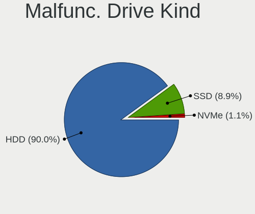

| Kind | Notebooks | Drives | Percent |
|------|-----------|--------|---------|
| HDD  | 314       | 392    | 91.81%  |
| SSD  | 26        | 30     | 7.6%    |
| NVMe | 2         | 2      | 0.58%   |

Failed Drives
-------------

Failed drive models

| Model                                 | Notebooks | Drives | Percent |
|---------------------------------------|-----------|--------|---------|
| Seagate ST9500325AS 500GB             | 2         | 3      | 22.22%  |
| WDC WD3200BEVT-24A23T0 320GB          | 1         | 1      | 11.11%  |
| WDC WD3200BEVT-22ZCT0 320GB           | 1         | 1      | 11.11%  |
| Toshiba MK1059GSM 1TB                 | 1         | 1      | 11.11%  |
| Seagate ST9250315AS 250GB             | 1         | 1      | 11.11%  |
| Seagate ST500LM012 HN-M500MBB 500GB   | 1         | 1      | 11.11%  |
| Samsung Electronics SSD PM800 TM 64GB | 1         | 1      | 11.11%  |
| Intel SSDSC2KB960G8 960GB             | 1         | 1      | 11.11%  |

Failed Drive Vendor
-------------------

Failed drive vendors

| Vendor              | Notebooks | Drives | Percent |
|---------------------|-----------|--------|---------|
| Seagate             | 4         | 5      | 44.44%  |
| WDC                 | 2         | 2      | 22.22%  |
| Toshiba             | 1         | 1      | 11.11%  |
| Samsung Electronics | 1         | 1      | 11.11%  |
| Intel               | 1         | 1      | 11.11%  |

Drive Status
------------

Number of failed and malfunc. drives

| Status   | Notebooks | Drives | Percent |
|----------|-----------|--------|---------|
| Works    | 779       | 1050   | 41.75%  |
| Detected | 739       | 1049   | 39.6%   |
| Malfunc  | 339       | 424    | 18.17%  |
| Failed   | 9         | 10     | 0.48%   |

Storage controller
------------------

Storage Vendor
--------------

Storage controller vendors

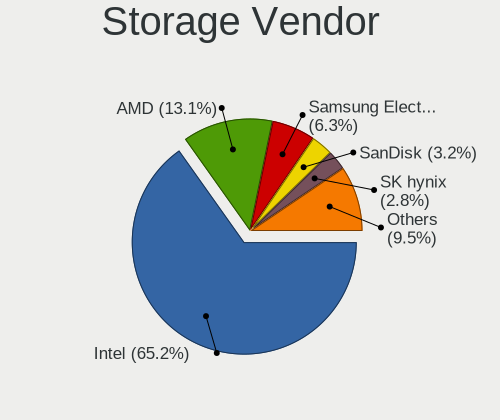

| Vendor                           | Notebooks | Percent |
|----------------------------------|-----------|---------|
| Intel                            | 1302      | 67.43%  |
| AMD                              | 265       | 13.72%  |
| Samsung Electronics              | 108       | 5.59%   |
| SanDisk                          | 53        | 2.74%   |
| SK hynix                         | 50        | 2.59%   |
| Kingston Technology Company      | 32        | 1.66%   |
| Toshiba America Info Systems     | 24        | 1.24%   |
| KIOXIA                           | 21        | 1.09%   |
| Micron Technology                | 19        | 0.98%   |
| Union Memory (Shenzhen)          | 11        | 0.57%   |
| Nvidia                           | 9         | 0.47%   |
| Silicon Integrated Systems [SiS] | 7         | 0.36%   |
| Silicon Motion                   | 5         | 0.26%   |
| Phison Electronics               | 4         | 0.21%   |
| Lite-On Technology               | 4         | 0.21%   |
| ADATA Technology                 | 4         | 0.21%   |
| Yangtze Memory Technologies      | 3         | 0.16%   |
| VIA Technologies                 | 3         | 0.16%   |
| Realtek Semiconductor            | 2         | 0.1%    |
| Solid State Storage Technology   | 1         | 0.05%   |
| Shenzhen Longsys Electronics     | 1         | 0.05%   |
| Micron/Crucial Technology        | 1         | 0.05%   |
| JMicron Technology               | 1         | 0.05%   |
| Apple                            | 1         | 0.05%   |

Storage Model
-------------

Storage controller models

| Model                                                                            | Notebooks | Percent |
|----------------------------------------------------------------------------------|-----------|---------|
| Intel 7 Series Chipset Family 6-port SATA Controller [AHCI mode]                 | 195       | 9.26%   |
| AMD FCH SATA Controller [AHCI mode]                                              | 179       | 8.5%    |
| Intel Sunrise Point-LP SATA Controller [AHCI mode]                               | 158       | 7.51%   |
| Intel 6 Series/C200 Series Chipset Family 6 port Mobile SATA AHCI Controller     | 116       | 5.51%   |
| Intel 82801IBM/IEM (ICH9M/ICH9M-E) 4 port SATA Controller [AHCI mode]            | 76        | 3.61%   |
| Intel 82801 Mobile SATA Controller [RAID mode]                                   | 74        | 3.52%   |
| Intel Celeron/Pentium Silver Processor SATA Controller                           | 53        | 2.52%   |
| AMD SB7x0/SB8x0/SB9x0 SATA Controller [AHCI mode]                                | 52        | 2.47%   |
| Samsung NVMe SSD Controller SM981/PM981/PM983                                    | 50        | 2.38%   |
| Intel 8 Series/C220 Series Chipset Family 6-port SATA Controller 1 [AHCI mode]   | 46        | 2.19%   |
| Intel Cannon Lake Mobile PCH SATA AHCI Controller                                | 45        | 2.14%   |
| Intel 5 Series/3400 Series Chipset 4 port SATA AHCI Controller                   | 42        | 2%      |
| Intel 8 Series SATA Controller 1 [AHCI mode]                                     | 38        | 1.81%   |
| Intel Atom/Celeron/Pentium Processor x5-E8000/J3xxx/N3xxx Series SATA Controller | 36        | 1.71%   |
| Intel 82801HM/HEM (ICH8M/ICH8M-E) IDE Controller                                 | 35        | 1.66%   |
| Intel Cannon Point-LP SATA Controller [AHCI Mode]                                | 34        | 1.62%   |
| Intel Wildcat Point-LP SATA Controller [AHCI Mode]                               | 33        | 1.57%   |
| Intel NM10/ICH7 Family SATA Controller [AHCI mode]                               | 33        | 1.57%   |
| Intel Volume Management Device NVMe RAID Controller                              | 31        | 1.47%   |
| Samsung NVMe SSD Controller 980                                                  | 30        | 1.43%   |
| Intel HM170/QM170 Chipset SATA Controller [AHCI Mode]                            | 28        | 1.33%   |
| Intel 82801GBM/GHM (ICH7-M Family) SATA Controller [IDE mode]                    | 27        | 1.28%   |
| Intel SSD 660P Series                                                            | 26        | 1.24%   |
| Intel 82801HM/HEM (ICH8M/ICH8M-E) SATA Controller [AHCI mode]                    | 26        | 1.24%   |
| AMD SB600 Non-Raid-5 SATA                                                        | 25        | 1.19%   |
| AMD SB600 IDE                                                                    | 25        | 1.19%   |
| Intel 5 Series/3400 Series Chipset 6 port SATA AHCI Controller                   | 23        | 1.09%   |
| SK hynix BC511                                                                   | 21        | 1%      |
| Samsung NVMe SSD Controller SM961/PM961/SM963                                    | 21        | 1%      |
| KIOXIA NVMe SSD Controller BG4                                                   | 21        | 1%      |
| Intel Comet Lake SATA AHCI Controller                                            | 21        | 1%      |
| Intel Celeron N3350/Pentium N4200/Atom E3900 Series SATA AHCI Controller         | 20        | 0.95%   |
| Micron Non-Volatile memory controller                                            | 19        | 0.9%    |
| Intel Atom Processor E3800 Series SATA AHCI Controller                           | 18        | 0.86%   |
| Intel 82801G (ICH7 Family) IDE Controller                                        | 16        | 0.76%   |
| Kingston Company U-SNS8154P3 NVMe SSD                                            | 15        | 0.71%   |
| SanDisk WD Blue SN500 / PC SN520 NVMe SSD                                        | 14        | 0.67%   |
| SanDisk WD Blue SN550 NVMe SSD                                                   | 13        | 0.62%   |
| SK hynix BC501 NVMe Solid State Drive                                            | 12        | 0.57%   |
| Intel 82801HM/HEM (ICH8M/ICH8M-E) SATA Controller [IDE mode]                     | 12        | 0.57%   |

Storage Kind
------------

Kind of storage controller (IDE, SATA, NVMe, SAS, ...)

| Kind | Notebooks | Percent |
|------|-----------|---------|
| SATA | 1366      | 66.9%   |
| NVMe | 377       | 18.46%  |
| IDE  | 191       | 9.35%   |
| RAID | 108       | 5.29%   |

Processor
---------

CPU Vendor
----------

Processor vendors

| Vendor | Notebooks | Percent |
|--------|-----------|---------|
| Intel  | 1422      | 82.53%  |
| AMD    | 301       | 17.47%  |

CPU Model
---------

Processor models

| Model                                         | Notebooks | Percent |
|-----------------------------------------------|-----------|---------|
| Intel Core i5-8250U CPU @ 1.60GHz             | 34        | 1.97%   |
| Intel Core i7-8550U CPU @ 1.80GHz             | 31        | 1.8%    |
| Intel Core i5-8265U CPU @ 1.60GHz             | 26        | 1.51%   |
| Intel Celeron N4000 CPU @ 1.10GHz             | 25        | 1.45%   |
| Intel Core i5-3210M CPU @ 2.50GHz             | 24        | 1.39%   |
| Intel Core i7-8565U CPU @ 1.80GHz             | 22        | 1.28%   |
| Intel Core i5-8300H CPU @ 2.30GHz             | 22        | 1.28%   |
| Intel Core i5-7200U CPU @ 2.50GHz             | 21        | 1.22%   |
| AMD Ryzen 5 3500U with Radeon Vega Mobile Gfx | 20        | 1.16%   |
| Intel Pentium Silver N5000 CPU @ 1.10GHz      | 19        | 1.1%    |
| Intel Core i5-10210U CPU @ 1.60GHz            | 17        | 0.99%   |
| AMD Ryzen 7 4700U with Radeon Graphics        | 17        | 0.99%   |
| Intel Pentium CPU B960 @ 2.20GHz              | 16        | 0.93%   |
| Intel Core i7-7500U CPU @ 2.70GHz             | 15        | 0.87%   |
| Intel Core i3-7020U CPU @ 2.30GHz             | 15        | 0.87%   |
| Intel Pentium CPU 2020M @ 2.40GHz             | 14        | 0.81%   |
| Intel Core i5-3230M CPU @ 2.60GHz             | 14        | 0.81%   |
| Intel Core i3-6006U CPU @ 2.00GHz             | 14        | 0.81%   |
| Intel Core i3-3110M CPU @ 2.40GHz             | 14        | 0.81%   |
| Intel Core i3-2350M CPU @ 2.30GHz             | 14        | 0.81%   |
| Intel Celeron CPU N3060 @ 1.60GHz             | 14        | 0.81%   |
| Intel 11th Gen Core i5-1135G7 @ 2.40GHz       | 14        | 0.81%   |
| Intel Pentium CPU N3710 @ 1.60GHz             | 13        | 0.75%   |
| Intel Pentium CPU B950 @ 2.10GHz              | 13        | 0.75%   |
| Intel Core i5-2410M CPU @ 2.30GHz             | 13        | 0.75%   |
| Intel Core i3-5005U CPU @ 2.00GHz             | 13        | 0.75%   |
| Intel Atom CPU N450 @ 1.66GHz                 | 13        | 0.75%   |
| Intel Core i7-6700HQ CPU @ 2.60GHz            | 12        | 0.7%    |
| Intel Core i5-6200U CPU @ 2.30GHz             | 12        | 0.7%    |
| Intel Core i7-7700HQ CPU @ 2.80GHz            | 11        | 0.64%   |
| Intel Core i7-2670QM CPU @ 2.20GHz            | 11        | 0.64%   |
| Intel Core i7-10510U CPU @ 1.80GHz            | 11        | 0.64%   |
| Intel Core i3-3217U CPU @ 1.80GHz             | 11        | 0.64%   |
| Intel Core i3-2330M CPU @ 2.20GHz             | 11        | 0.64%   |
| Intel Core i7-8750H CPU @ 2.20GHz             | 10        | 0.58%   |
| Intel Core i7-3630QM CPU @ 2.40GHz            | 10        | 0.58%   |
| Intel Core i5-9300H CPU @ 2.40GHz             | 10        | 0.58%   |
| Intel Core i5-2450M CPU @ 2.50GHz             | 10        | 0.58%   |
| Intel 11th Gen Core i7-1165G7 @ 2.80GHz       | 10        | 0.58%   |
| Intel Pentium Dual-Core CPU T4500 @ 2.30GHz   | 9         | 0.52%   |

CPU Model Family
----------------

Processor model prefix

| Model                          | Notebooks | Percent |
|--------------------------------|-----------|---------|
| Intel Core i5                  | 360       | 20.87%  |
| Intel Core i7                  | 262       | 15.19%  |
| Intel Core i3                  | 200       | 11.59%  |
| Intel Celeron                  | 132       | 7.65%   |
| Intel Pentium                  | 131       | 7.59%   |
| Intel Core 2 Duo               | 69        | 4%      |
| Intel Atom                     | 69        | 4%      |
| AMD Ryzen 5                    | 60        | 3.48%   |
| Other                          | 51        | 2.96%   |
| AMD Ryzen 7                    | 40        | 2.32%   |
| AMD A6                         | 28        | 1.62%   |
| Intel Pentium Dual-Core        | 27        | 1.57%   |
| Intel Pentium Silver           | 24        | 1.39%   |
| Intel Core 2                   | 21        | 1.22%   |
| AMD E                          | 19        | 1.1%    |
| AMD E1                         | 18        | 1.04%   |
| AMD A4                         | 18        | 1.04%   |
| Intel Celeron Dual-Core        | 16        | 0.93%   |
| Intel Genuine                  | 15        | 0.87%   |
| AMD Ryzen 3                    | 15        | 0.87%   |
| AMD A10                        | 15        | 0.87%   |
| Intel Pentium Dual             | 14        | 0.81%   |
| Intel Celeron M                | 13        | 0.75%   |
| AMD E2                         | 12        | 0.7%    |
| AMD Athlon II                  | 12        | 0.7%    |
| AMD A8                         | 9         | 0.52%   |
| Intel Pentium M                | 7         | 0.41%   |
| Intel Core Duo                 | 7         | 0.41%   |
| AMD Athlon II Dual-Core        | 5         | 0.29%   |
| Intel Celeron D                | 4         | 0.23%   |
| AMD Turion 64 X2 Mobile        | 4         | 0.23%   |
| AMD C-50                       | 4         | 0.23%   |
| AMD Athlon X2                  | 4         | 0.23%   |
| AMD Athlon                     | 4         | 0.23%   |
| AMD Turion X2 Dual-Core Mobile | 3         | 0.17%   |
| AMD Ryzen 9                    | 3         | 0.17%   |
| AMD Athlon 64 X2               | 3         | 0.17%   |
| AMD A12                        | 3         | 0.17%   |
| Intel Xeon                     | 2         | 0.12%   |
| AMD Turion II                  | 2         | 0.12%   |

CPU Cores
---------

Number of processor cores

| Number  | Notebooks | Percent |
|---------|-----------|---------|
| 2       | 1017      | 58.65%  |
| 4       | 501       | 28.89%  |
| 1       | 76        | 4.38%   |
| 6       | 59        | 3.4%    |
| 8       | 40        | 2.31%   |
| Unknown | 39        | 2.25%   |
| 14      | 1         | 0.06%   |
| 10      | 1         | 0.06%   |

CPU Sockets
-----------

Number of sockets

| Number  | Notebooks | Percent |
|---------|-----------|---------|
| 1       | 1720      | 99.83%  |
| 2       | 2         | 0.12%   |
| Unknown | 1         | 0.06%   |

CPU Threads
-----------

Threads per core (Hyper-Threading)

| Number  | Notebooks | Percent |
|---------|-----------|---------|
| 2       | 1035      | 59.62%  |
| 1       | 662       | 38.13%  |
| Unknown | 39        | 2.25%   |

CPU Op-Modes
------------

CPU Operation Modes (32-bit, 64-bit)

| Op mode        | Notebooks | Percent |
|----------------|-----------|---------|
| 32-bit, 64-bit | 1613      | 93.29%  |
| Unknown        | 64        | 3.7%    |
| 32-bit         | 52        | 3.01%   |

CPU Microcode
-------------

Microcode number

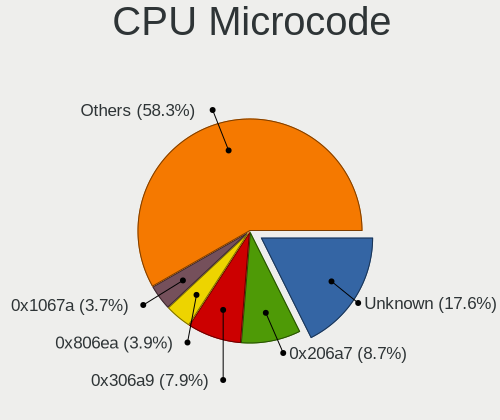

| Number     | Notebooks | Percent |
|------------|-----------|---------|
| Unknown    | 211       | 12.02%  |
| 0x206a7    | 168       | 9.57%   |
| 0x306a9    | 148       | 8.43%   |
| 0x806ea    | 76        | 4.33%   |
| 0x1067a    | 71        | 4.04%   |
| 0x806ec    | 55        | 3.13%   |
| 0x806e9    | 53        | 3.02%   |
| 0x20655    | 45        | 2.56%   |
| 0x306c3    | 44        | 2.51%   |
| 0x406e3    | 43        | 2.45%   |
| 0x906ea    | 42        | 2.39%   |
| 0x6fd      | 39        | 2.22%   |
| 0x40651    | 38        | 2.16%   |
| 0x806c1    | 37        | 2.11%   |
| 0x706a1    | 33        | 1.88%   |
| 0x306d4    | 33        | 1.88%   |
| 0x106ca    | 30        | 1.71%   |
| 0x406c4    | 28        | 1.59%   |
| 0x30678    | 26        | 1.48%   |
| 0x06001119 | 26        | 1.48%   |
| 0x05000119 | 22        | 1.25%   |
| 0x08108109 | 21        | 1.2%    |
| 0xa0652    | 18        | 1.03%   |
| 0x906e9    | 18        | 1.03%   |
| 0x506c9    | 18        | 1.03%   |
| 0x20652    | 17        | 0.97%   |
| 0x08600106 | 17        | 0.97%   |
| 0x08108102 | 17        | 0.97%   |
| 0x806eb    | 16        | 0.91%   |
| 0x506e3    | 16        | 0.91%   |
| 0x6d8      | 15        | 0.85%   |
| 0x10676    | 15        | 0.85%   |
| 0x08600103 | 15        | 0.85%   |
| 0x010000c8 | 15        | 0.85%   |
| 0x406c3    | 14        | 0.8%    |
| 0x03000027 | 14        | 0.8%    |
| 0x6f6      | 13        | 0.74%   |
| 0x07030105 | 12        | 0.68%   |
| 0x06006705 | 12        | 0.68%   |
| 0x6ec      | 11        | 0.63%   |

CPU Microarch
-------------

Microarchitecture

| Name             | Notebooks | Percent |
|------------------|-----------|---------|
| KabyLake         | 319       | 18.48%  |
| SandyBridge      | 182       | 10.54%  |
| IvyBridge        | 162       | 9.39%   |
| Penryn           | 92        | 5.33%   |
| Haswell          | 89        | 5.16%   |
| Core             | 80        | 4.63%   |
| Silvermont       | 74        | 4.29%   |
| Skylake          | 71        | 4.11%   |
| Westmere         | 68        | 3.94%   |
| Goldmont plus    | 53        | 3.07%   |
| Bonnell          | 49        | 2.84%   |
| Zen 2            | 45        | 2.61%   |
| Zen+             | 44        | 2.55%   |
| TigerLake        | 44        | 2.55%   |
| Broadwell        | 36        | 2.09%   |
| Bobcat           | 36        | 2.09%   |
| P6               | 31        | 1.8%    |
| Piledriver       | 30        | 1.74%   |
| Excavator        | 29        | 1.68%   |
| K10              | 24        | 1.39%   |
| Unknown          | 24        | 1.39%   |
| CometLake        | 23        | 1.33%   |
| Goldmont         | 20        | 1.16%   |
| Puma             | 16        | 0.93%   |
| Zen              | 14        | 0.81%   |
| K10 Llano        | 14        | 0.81%   |
| Zen 3            | 11        | 0.64%   |
| IceLake          | 11        | 0.64%   |
| Jaguar           | 10        | 0.58%   |
| K8 & K10 hybrid  | 9         | 0.52%   |
| K8 Hammer        | 6         | 0.35%   |
| Nehalem          | 5         | 0.29%   |
| Tremont          | 3         | 0.17%   |
| Alderlake Hybrid | 2         | 0.12%   |

Graphics
--------

GPU Vendor
----------

Vendors of graphics cards

| Vendor                           | Notebooks | Percent |
|----------------------------------|-----------|---------|
| Intel                            | 1261      | 54.87%  |
| Nvidia                           | 527       | 22.93%  |
| AMD                              | 500       | 21.76%  |
| Silicon Integrated Systems [SiS] | 5         | 0.22%   |
| VIA Technologies                 | 3         | 0.13%   |
| ATI Technologies                 | 2         | 0.09%   |

GPU Model
---------

Graphics card models

| Model                                                                                    | Notebooks | Percent |
|------------------------------------------------------------------------------------------|-----------|---------|
| Intel 2nd Generation Core Processor Family Integrated Graphics Controller                | 166       | 6.86%   |
| Intel 3rd Gen Core processor Graphics Controller                                         | 158       | 6.53%   |
| Intel UHD Graphics 620                                                                   | 75        | 3.1%    |
| Intel HD Graphics 620                                                                    | 63        | 2.6%    |
| Intel WhiskeyLake-U GT2 [UHD Graphics 620]                                               | 58        | 2.4%    |
| Intel Mobile 4 Series Chipset Integrated Graphics Controller                             | 58        | 2.4%    |
| Intel CoffeeLake-H GT2 [UHD Graphics 630]                                                | 54        | 2.23%   |
| Intel Atom/Celeron/Pentium Processor x5-E8000/J3xxx/N3xxx Integrated Graphics Controller | 47        | 1.94%   |
| Intel 4th Gen Core Processor Integrated Graphics Controller                              | 46        | 1.9%    |
| AMD Renoir                                                                               | 44        | 1.82%   |
| AMD Picasso/Raven 2 [Radeon Vega Series / Radeon Vega Mobile Series]                     | 44        | 1.82%   |
| Intel Skylake GT2 [HD Graphics 520]                                                      | 42        | 1.74%   |
| Intel Haswell-ULT Integrated Graphics Controller                                         | 38        | 1.57%   |
| Intel Core Processor Integrated Graphics Controller                                      | 34        | 1.4%    |
| Intel GeminiLake [UHD Graphics 600]                                                      | 33        | 1.36%   |
| Intel TigerLake-LP GT2 [Iris Xe Graphics]                                                | 32        | 1.32%   |
| AMD Sun XT [Radeon HD 8670A/8670M/8690M / R5 M330 / M430 / Radeon 520 Mobile]            | 31        | 1.28%   |
| Intel CometLake-U GT2 [UHD Graphics]                                                     | 30        | 1.24%   |
| Intel Atom Processor D4xx/D5xx/N4xx/N5xx Integrated Graphics Controller                  | 29        | 1.2%    |
| Intel Mobile 945GM/GMS/GME, 943/940GML Express Integrated Graphics Controller            | 28        | 1.16%   |
| Intel HD Graphics 5500                                                                   | 28        | 1.16%   |
| Nvidia GP108M [GeForce MX150]                                                            | 27        | 1.12%   |
| Intel Atom Processor Z36xxx/Z37xxx Series Graphics & Display                             | 27        | 1.12%   |
| AMD Thames [Radeon HD 7500M/7600M Series]                                                | 27        | 1.12%   |
| Nvidia GP107M [GeForce GTX 1050 Mobile]                                                  | 26        | 1.07%   |
| AMD Seymour [Radeon HD 6400M/7400M Series]                                               | 25        | 1.03%   |
| Nvidia GK208M [GeForce GT 740M]                                                          | 23        | 0.95%   |
| Nvidia GF117M [GeForce 610M/710M/810M/820M / GT 620M/625M/630M/720M]                     | 23        | 0.95%   |
| Nvidia GM108M [GeForce MX110]                                                            | 22        | 0.91%   |
| Intel Mobile GM965/GL960 Integrated Graphics Controller (secondary)                      | 22        | 0.91%   |
| Intel Mobile GM965/GL960 Integrated Graphics Controller (primary)                        | 22        | 0.91%   |
| Intel HD Graphics 630                                                                    | 22        | 0.91%   |
| AMD Stoney [Radeon R2/R3/R4/R5 Graphics]                                                 | 22        | 0.91%   |
| Nvidia GP107M [GeForce GTX 1050 Ti Mobile]                                               | 20        | 0.83%   |
| Intel GeminiLake [UHD Graphics 605]                                                      | 20        | 0.83%   |
| AMD Topaz XT [Radeon R7 M260/M265 / M340/M360 / M440/M445 / 530/535 / 620/625 Mobile]    | 20        | 0.83%   |
| AMD Park [Mobility Radeon HD 5430/5450/5470]                                             | 20        | 0.83%   |
| Nvidia GM108M [GeForce 940MX]                                                            | 19        | 0.79%   |
| Intel HD Graphics 530                                                                    | 18        | 0.74%   |
| Intel CometLake-H GT2 [UHD Graphics]                                                     | 18        | 0.74%   |

GPU Combo
---------

Combinations of graphics cards

| Name           | Notebooks | Percent |
|----------------|-----------|---------|
| 1 x Intel      | 711       | 41.19%  |
| Intel + Nvidia | 431       | 24.97%  |
| 1 x AMD        | 287       | 16.63%  |
| Intel + AMD    | 119       | 6.89%   |
| 2 x AMD        | 72        | 4.17%   |
| 1 x Nvidia     | 72        | 4.17%   |
| AMD + Nvidia   | 24        | 1.39%   |
| 1 x SiS        | 5         | 0.29%   |
| 1 x VIA        | 3         | 0.17%   |
| Other          | 2         | 0.12%   |

GPU Driver
----------

Free vs proprietary

| Driver      | Notebooks | Percent |
|-------------|-----------|---------|
| Free        | 1465      | 83.86%  |
| Proprietary | 231       | 13.22%  |
| Unknown     | 51        | 2.92%   |

GPU Memory
----------

Total video memory

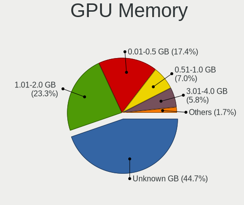

| Size in GB | Notebooks | Percent |
|------------|-----------|---------|
| Unknown    | 752       | 42.44%  |
| 1.01-2.0   | 440       | 24.83%  |
| 0.01-0.5   | 319       | 18%     |
| 0.51-1.0   | 124       | 7%      |
| 3.01-4.0   | 111       | 6.26%   |
| 5.01-6.0   | 14        | 0.79%   |
| 2.01-3.0   | 7         | 0.4%    |
| 7.01-8.0   | 4         | 0.23%   |
| 8.01-16.0  | 1         | 0.06%   |

Monitor
-------

Monitor Vendor
--------------

Monitor vendors

| Vendor                  | Notebooks | Percent |
|-------------------------|-----------|---------|
| AU Optronics            | 391       | 20.8%   |
| LG Display              | 323       | 17.18%  |
| Samsung Electronics     | 262       | 13.94%  |
| Chimei Innolux          | 224       | 11.91%  |
| BOE                     | 220       | 11.7%   |
| Chi Mei Optoelectronics | 88        | 4.68%   |
| Dell                    | 49        | 2.61%   |
| Goldstar                | 43        | 2.29%   |
| LG Philips              | 33        | 1.76%   |
| Lenovo                  | 27        | 1.44%   |
| Philips                 | 26        | 1.38%   |
| Sharp                   | 25        | 1.33%   |
| PANDA                   | 23        | 1.22%   |
| HannStar                | 18        | 0.96%   |
| Hewlett-Packard         | 13        | 0.69%   |
| Apple                   | 13        | 0.69%   |
| Ancor Communications    | 13        | 0.69%   |
| AOC                     | 10        | 0.53%   |
| CPT                     | 8         | 0.43%   |
| Acer                    | 8         | 0.43%   |
| BenQ                    | 7         | 0.37%   |
| ViewSonic               | 4         | 0.21%   |
| Toshiba                 | 4         | 0.21%   |
| TMX                     | 4         | 0.21%   |
| Quanta Display          | 4         | 0.21%   |
| InfoVision              | 4         | 0.21%   |
| Sony                    | 3         | 0.16%   |
| LGD                     | 3         | 0.16%   |
| InnoLux Display         | 3         | 0.16%   |
| Panasonic               | 2         | 0.11%   |
| MStar                   | 2         | 0.11%   |
| KTC                     | 2         | 0.11%   |
| CVT                     | 2         | 0.11%   |
| CSO                     | 2         | 0.11%   |
| Belinea                 | 2         | 0.11%   |
| Xiaomi                  | 1         | 0.05%   |
| TCL                     | 1         | 0.05%   |
| SGT                     | 1         | 0.05%   |
| Seiko/Epson             | 1         | 0.05%   |
| RTK                     | 1         | 0.05%   |

Monitor Model
-------------

Monitor models

| Model                                                                    | Notebooks | Percent |
|--------------------------------------------------------------------------|-----------|---------|
| AU Optronics LCD Monitor AUO38ED 1920x1080 344x193mm 15.5-inch           | 32        | 1.69%   |
| AU Optronics LCD Monitor AUO21ED 1920x1080 344x193mm 15.5-inch           | 27        | 1.42%   |
| AU Optronics LCD Monitor AUO22EC 1366x768 344x193mm 15.5-inch            | 24        | 1.26%   |
| LG Display LCD Monitor LGD02DC 1366x768 344x194mm 15.5-inch              | 23        | 1.21%   |
| Chimei Innolux LCD Monitor CMN15DB 1366x768 344x193mm 15.5-inch          | 21        | 1.11%   |
| Chimei Innolux LCD Monitor CMN14D4 1920x1080 309x173mm 13.9-inch         | 21        | 1.11%   |
| Chi Mei Optoelectronics LCD Monitor CMO15A7 1366x768 344x193mm 15.5-inch | 21        | 1.11%   |
| Samsung Electronics LCD Monitor SEC3245 1366x768 344x194mm 15.5-inch     | 20        | 1.05%   |
| Chimei Innolux LCD Monitor CMN15D5 1920x1080 344x193mm 15.5-inch         | 20        | 1.05%   |
| AU Optronics LCD Monitor AUO403D 1920x1080 309x173mm 13.9-inch           | 19        | 1%      |
| BOE LCD Monitor BOE0687 1920x1080 344x193mm 15.5-inch                    | 17        | 0.9%    |
| Samsung Electronics LCD Monitor SEC5441 1366x768 344x194mm 15.5-inch     | 16        | 0.84%   |
| BOE LCD Monitor BOE06A5 1366x768 344x194mm 15.5-inch                     | 16        | 0.84%   |
| AU Optronics LCD Monitor AUO45EC 1366x768 344x193mm 15.5-inch            | 16        | 0.84%   |
| LG Display LCD Monitor LGD033A 1366x768 344x194mm 15.5-inch              | 15        | 0.79%   |
| Samsung Electronics LCD Monitor SEC4252 1366x768 344x194mm 15.5-inch     | 14        | 0.74%   |
| Chimei Innolux LCD Monitor CMN15F5 1920x1080 344x193mm 15.5-inch         | 13        | 0.68%   |
| AU Optronics LCD Monitor AUO61ED 1920x1080 344x194mm 15.5-inch           | 13        | 0.68%   |
| LG Display LCD Monitor LGD038E 1366x768 344x194mm 15.5-inch              | 11        | 0.58%   |
| AU Optronics LCD Monitor AUO20EC 1366x768 344x193mm 15.5-inch            | 11        | 0.58%   |
| LG Display LCD Monitor LGD0384 1366x768 344x194mm 15.5-inch              | 10        | 0.53%   |
| Lenovo LCD Monitor LEN40B0 1366x768 344x193mm 15.5-inch                  | 10        | 0.53%   |
| BOE LCD Monitor BOE069C 1920x1080 344x193mm 15.5-inch                    | 10        | 0.53%   |
| AU Optronics LCD Monitor AUO23EC 1366x768 344x193mm 15.5-inch            | 10        | 0.53%   |
| Samsung Electronics LCD Monitor SEC324A 1366x768 344x194mm 15.5-inch     | 9         | 0.47%   |
| Chimei Innolux LCD Monitor CMN15E7 1920x1080 344x193mm 15.5-inch         | 9         | 0.47%   |
| Samsung Electronics LCD Monitor SEC3152 1366x768 344x194mm 15.5-inch     | 8         | 0.42%   |
| LG Display LCD Monitor LGD05E5 1920x1080 340x190mm 15.3-inch             | 8         | 0.42%   |
| LG Display LCD Monitor LGD04E8 1920x1080 382x215mm 17.3-inch             | 8         | 0.42%   |
| LG Display LCD Monitor LGD02AC 1366x768 344x194mm 15.5-inch              | 8         | 0.42%   |
| Goldstar IPS FULLHD GSM5AB8 1920x1080 480x270mm 21.7-inch                | 8         | 0.42%   |
| Chi Mei Optoelectronics LCD Monitor CMO1592 1366x768 344x193mm 15.5-inch | 8         | 0.42%   |
| BOE LCD Monitor BOE07A1 1920x1080 344x193mm 15.5-inch                    | 8         | 0.42%   |
| BOE LCD Monitor BOE0700 1920x1080 344x194mm 15.5-inch                    | 8         | 0.42%   |
| BOE LCD Monitor BOE06BA 1920x1080 344x193mm 15.5-inch                    | 8         | 0.42%   |
| AU Optronics LCD Monitor AUO26EC 1366x768 344x193mm 15.5-inch            | 8         | 0.42%   |
| HannStar HSD101PFW2 HSD03E9 1024x600 222x125mm 10.0-inch                 | 7         | 0.37%   |
| Chimei Innolux LCD Monitor CMN1728 1600x900 382x215mm 17.3-inch          | 7         | 0.37%   |
| Chimei Innolux LCD Monitor CMN1515 1920x1080 344x193mm 15.5-inch         | 7         | 0.37%   |
| BOE LCD Monitor BOE0868 1920x1080 309x174mm 14.0-inch                    | 7         | 0.37%   |

Monitor Resolution
------------------

Monitor screen resolution

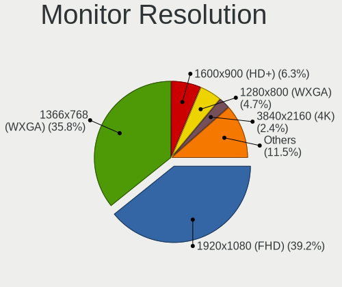

| Resolution         | Notebooks | Percent |
|--------------------|-----------|---------|
| 1920x1080 (FHD)    | 684       | 38.45%  |
| 1366x768 (WXGA)    | 662       | 37.21%  |
| 1600x900 (HD+)     | 121       | 6.8%    |
| 1280x800 (WXGA)    | 92        | 5.17%   |
| 1024x600           | 41        | 2.3%    |
| 3840x2160 (4K)     | 38        | 2.14%   |
| 1440x900 (WXGA+)   | 24        | 1.35%   |
| 2560x1440 (QHD)    | 23        | 1.29%   |
| 1280x1024 (SXGA)   | 23        | 1.29%   |
| 1680x1050 (WSXGA+) | 17        | 0.96%   |
| 1920x1200 (WUXGA)  | 12        | 0.67%   |
| 1024x768 (XGA)     | 8         | 0.45%   |
| 2560x1600          | 6         | 0.34%   |
| 3200x2000          | 4         | 0.22%   |
| 3200x1800 (QHD+)   | 3         | 0.17%   |
| 2560x1080          | 3         | 0.17%   |
| 1360x768           | 3         | 0.17%   |
| 1280x720 (HD)      | 3         | 0.17%   |
| 3456x2160          | 2         | 0.11%   |
| 2160x1440          | 2         | 0.11%   |
| 1600x1200          | 2         | 0.11%   |
| 3840x2400          | 1         | 0.06%   |
| 2880x1800          | 1         | 0.06%   |
| 2256x1504          | 1         | 0.06%   |
| 1920x540           | 1         | 0.06%   |
| 1400x1050          | 1         | 0.06%   |
| 1280x768           | 1         | 0.06%   |

Monitor Diagonal
----------------

Diagonal size in inches

| Inches  | Notebooks | Percent |
|---------|-----------|---------|
| 15      | 1048      | 55.72%  |
| 14      | 164       | 8.72%   |
| 17      | 149       | 7.92%   |
| 13      | 148       | 7.87%   |
| 24      | 52        | 2.76%   |
| 21      | 49        | 2.6%    |
| 23      | 42        | 2.23%   |
| 10      | 38        | 2.02%   |
| 11      | 37        | 1.97%   |
| 12      | 31        | 1.65%   |
| 27      | 28        | 1.49%   |
| Unknown | 18        | 0.96%   |
| 19      | 15        | 0.8%    |
| 18      | 14        | 0.74%   |
| 22      | 8         | 0.43%   |
| 31      | 6         | 0.32%   |
| 20      | 5         | 0.27%   |
| 16      | 5         | 0.27%   |
| 8       | 4         | 0.21%   |
| 34      | 3         | 0.16%   |
| 25      | 3         | 0.16%   |
| 52      | 2         | 0.11%   |
| 40      | 2         | 0.11%   |
| 32      | 2         | 0.11%   |
| 26      | 2         | 0.11%   |
| 84      | 1         | 0.05%   |
| 72      | 1         | 0.05%   |
| 58      | 1         | 0.05%   |
| 54      | 1         | 0.05%   |
| 46      | 1         | 0.05%   |
| 43      | 1         | 0.05%   |

Monitor Width
-------------

Physical width

| Width in mm | Notebooks | Percent |
|-------------|-----------|---------|
| 301-350     | 1273      | 67.86%  |
| 351-400     | 180       | 9.59%   |
| 201-300     | 177       | 9.43%   |
| 501-600     | 122       | 6.5%    |
| 401-500     | 76        | 4.05%   |
| Unknown     | 18        | 0.96%   |
| 601-700     | 11        | 0.59%   |
| 701-800     | 5         | 0.27%   |
| 1001-1500   | 5         | 0.27%   |
| 101-200     | 4         | 0.21%   |
| 801-900     | 2         | 0.11%   |
| 1501-2000   | 2         | 0.11%   |
| 901-1000    | 1         | 0.05%   |

Aspect Ratio
------------

Proportional relationship between the width and the height

| Ratio   | Notebooks | Percent |
|---------|-----------|---------|
| 16/9    | 1483      | 86.78%  |
| 16/10   | 168       | 9.83%   |
| 5/4     | 24        | 1.4%    |
| 4/3     | 12        | 0.7%    |
| Unknown | 12        | 0.7%    |
| 3/2     | 6         | 0.35%   |
| 21/9    | 3         | 0.18%   |
| 32/9    | 1         | 0.06%   |

Monitor Area
------------

Area in inch

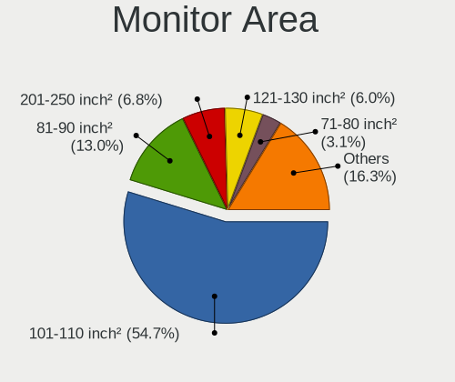

| Area in inch | Notebooks | Percent |
|----------------|-----------|---------|
| 101-110        | 1049      | 55.71%  |
| 81-90          | 250       | 13.28%  |
| 201-250        | 131       | 6.96%   |
| 121-130        | 116       | 6.16%   |
| 71-80          | 58        | 3.08%   |
| 41-50          | 38        | 2.02%   |
| 51-60          | 37        | 1.96%   |
| 61-70          | 30        | 1.59%   |
| 151-200        | 30        | 1.59%   |
| 301-350        | 28        | 1.49%   |
| 141-150        | 24        | 1.27%   |
| 131-140        | 23        | 1.22%   |
| Unknown        | 18        | 0.96%   |
| 251-300        | 15        | 0.8%    |
| 351-500        | 11        | 0.58%   |
| 91-100         | 9         | 0.48%   |
| More than 1000 | 6         | 0.32%   |
| 1-40           | 4         | 0.21%   |
| 501-1000       | 4         | 0.21%   |
| 111-120        | 2         | 0.11%   |

Pixel Density
-------------

Pixels per inch

| Density       | Notebooks | Percent |
|---------------|-----------|---------|
| 101-120       | 732       | 39.57%  |
| 121-160       | 690       | 37.3%   |
| 51-100        | 327       | 17.68%  |
| 161-240       | 51        | 2.76%   |
| More than 240 | 24        | 1.3%    |
| Unknown       | 18        | 0.97%   |
| 1-50          | 8         | 0.43%   |

Multiple Monitors
-----------------

Total monitors connected

| Total | Notebooks | Percent |
|-------|-----------|---------|
| 1     | 1488      | 84.93%  |
| 2     | 224       | 12.79%  |
| 0     | 30        | 1.71%   |
| 3     | 10        | 0.57%   |

Network
-------

Net Controller Vendor
---------------------

Controller vendors

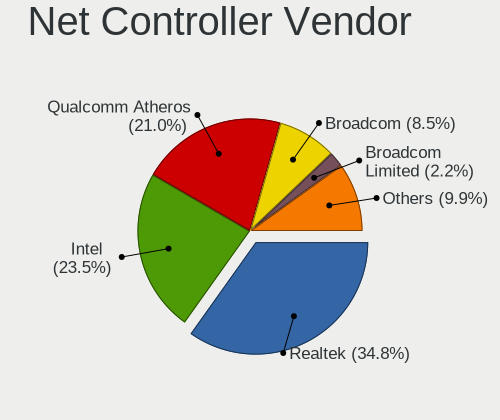

| Vendor                                 | Notebooks | Percent |
|----------------------------------------|-----------|---------|
| Realtek Semiconductor                  | 975       | 34.55%  |
| Intel                                  | 650       | 23.03%  |
| Qualcomm Atheros                       | 620       | 21.97%  |
| Broadcom                               | 250       | 8.86%   |
| Broadcom Limited                       | 63        | 2.23%   |
| Ralink                                 | 55        | 1.95%   |
| Marvell Technology Group               | 52        | 1.84%   |
| Ralink Technology                      | 18        | 0.64%   |
| MediaTek                               | 13        | 0.46%   |
| Attansic Technology                    | 11        | 0.39%   |
| Huawei Technologies                    | 10        | 0.35%   |
| Dell                                   | 10        | 0.35%   |
| Samsung Electronics                    | 9         | 0.32%   |
| Xiaomi                                 | 7         | 0.25%   |
| Qualcomm Atheros Communications        | 7         | 0.25%   |
| JMicron Technology                     | 7         | 0.25%   |
| Ericsson Business Mobile Networks      | 6         | 0.21%   |
| Sierra Wireless                        | 5         | 0.18%   |
| Hewlett-Packard                        | 5         | 0.18%   |
| ASIX Electronics                       | 5         | 0.18%   |
| VIA Technologies                       | 4         | 0.14%   |
| TP-Link                                | 4         | 0.14%   |
| Silicon Integrated Systems [SiS]       | 4         | 0.14%   |
| ICS Advent                             | 4         | 0.14%   |
| Fibocom                                | 3         | 0.11%   |
| Spreadtrum Communications              | 2         | 0.07%   |
| Nokia Mobile Phones                    | 2         | 0.07%   |
| Lenovo                                 | 2         | 0.07%   |
| D-Link System                          | 2         | 0.07%   |
| ASUSTek Computer                       | 2         | 0.07%   |
| ZyDAS                                  | 1         | 0.04%   |
| U-Blox                                 | 1         | 0.04%   |
| Toshiba                                | 1         | 0.04%   |
| Sony Ericsson Mobile Communications AB | 1         | 0.04%   |
| OPPO Electronics                       | 1         | 0.04%   |
| OKB SAPR                               | 1         | 0.04%   |
| Nvidia                                 | 1         | 0.04%   |
| Motorola PCS                           | 1         | 0.04%   |
| Microsoft                              | 1         | 0.04%   |
| LSI                                    | 1         | 0.04%   |

Net Controller Model
--------------------

Controller models

| Model                                                                   | Notebooks | Percent |
|-------------------------------------------------------------------------|-----------|---------|
| Realtek RTL8111/8168/8411 PCI Express Gigabit Ethernet Controller       | 597       | 18.1%   |
| Realtek RTL810xE PCI Express Fast Ethernet controller                   | 265       | 8.03%   |
| Qualcomm Atheros AR9285 Wireless Network Adapter (PCI-Express)          | 142       | 4.3%    |
| Qualcomm Atheros QCA9377 802.11ac Wireless Network Adapter              | 99        | 3%      |
| Realtek RTL8821CE 802.11ac PCIe Wireless Network Adapter                | 87        | 2.64%   |
| Broadcom BCM4313 802.11bgn Wireless Network Adapter                     | 86        | 2.61%   |
| Qualcomm Atheros AR9485 Wireless Network Adapter                        | 76        | 2.3%    |
| Qualcomm Atheros QCA9565 / AR9565 Wireless Network Adapter              | 75        | 2.27%   |
| Intel Wireless 8265 / 8275                                              | 51        | 1.55%   |
| Qualcomm Atheros AR242x / AR542x Wireless Network Adapter (PCI-Express) | 50        | 1.52%   |
| Intel Wireless 7260                                                     | 44        | 1.33%   |
| Intel Cannon Point-LP CNVi [Wireless-AC]                                | 41        | 1.24%   |
| Intel 82579LM Gigabit Network Connection (Lewisville)                   | 41        | 1.24%   |
| Intel Wi-Fi 6 AX200                                                     | 38        | 1.15%   |
| Ralink RT3290 Wireless 802.11n 1T/1R PCIe                               | 36        | 1.09%   |
| Realtek RTL8723BE PCIe Wireless Network Adapter                         | 35        | 1.06%   |
| Intel PRO/Wireless 3945ABG [Golan] Network Connection                   | 35        | 1.06%   |
| Intel Wi-Fi 6 AX201                                                     | 34        | 1.03%   |
| Broadcom BCM43142 802.11b/g/n                                           | 34        | 1.03%   |
| Qualcomm Atheros AR8151 v2.0 Gigabit Ethernet                           | 32        | 0.97%   |
| Intel Wireless 3165                                                     | 30        | 0.91%   |
| Intel Cannon Lake PCH CNVi WiFi                                         | 30        | 0.91%   |
| Qualcomm Atheros QCA6174 802.11ac Wireless Network Adapter              | 29        | 0.88%   |
| Realtek RTL8822BE 802.11a/b/g/n/ac WiFi adapter                         | 28        | 0.85%   |
| Realtek RTL8822CE 802.11ac PCIe Wireless Network Adapter                | 27        | 0.82%   |
| Intel Wireless 8260                                                     | 27        | 0.82%   |
| Intel Centrino Advanced-N 6205 [Taylor Peak]                            | 26        | 0.79%   |
| Qualcomm Atheros AR9462 Wireless Network Adapter                        | 24        | 0.73%   |
| Intel Dual Band Wireless-AC 3168NGW [Stone Peak]                        | 24        | 0.73%   |
| Intel Comet Lake PCH-LP CNVi WiFi                                       | 24        | 0.73%   |
| Intel Centrino Wireless-N 2230                                          | 23        | 0.7%    |
| Realtek RTL8153 Gigabit Ethernet Adapter                                | 21        | 0.64%   |
| Qualcomm Atheros AR8162 Fast Ethernet                                   | 21        | 0.64%   |
| Broadcom BCM4312 802.11b/g LP-PHY                                       | 21        | 0.64%   |
| Qualcomm Atheros QCA8172 Fast Ethernet                                  | 20        | 0.61%   |
| Marvell Group 88E8040 PCI-E Fast Ethernet Controller                    | 20        | 0.61%   |
| Intel Wireless 7265                                                     | 20        | 0.61%   |
| Broadcom Limited BCM4313 802.11bgn Wireless Network Adapter             | 20        | 0.61%   |
| Qualcomm Atheros AR8161 Gigabit Ethernet                                | 19        | 0.58%   |
| Intel Comet Lake PCH CNVi WiFi                                          | 19        | 0.58%   |

Wireless Vendor
---------------

Wireless vendors

| Vendor                          | Notebooks | Percent |
|---------------------------------|-----------|---------|
| Intel                           | 620       | 35.47%  |
| Qualcomm Atheros                | 531       | 30.38%  |
| Realtek Semiconductor           | 248       | 14.19%  |
| Broadcom                        | 192       | 10.98%  |
| Ralink                          | 55        | 3.15%   |
| Broadcom Limited                | 38        | 2.17%   |
| Ralink Technology               | 18        | 1.03%   |
| MediaTek                        | 13        | 0.74%   |
| Qualcomm Atheros Communications | 7         | 0.4%    |
| Dell                            | 6         | 0.34%   |
| Sierra Wireless                 | 5         | 0.29%   |
| TP-Link                         | 3         | 0.17%   |
| Fibocom                         | 3         | 0.17%   |
| D-Link System                   | 2         | 0.11%   |
| ZyDAS                           | 1         | 0.06%   |
| Microsoft                       | 1         | 0.06%   |
| Hewlett-Packard                 | 1         | 0.06%   |
| Fujitsu Siemens Computers       | 1         | 0.06%   |
| Edimax Technology               | 1         | 0.06%   |
| D-Link                          | 1         | 0.06%   |
| ASUSTek Computer                | 1         | 0.06%   |

Wireless Model
--------------

Wireless models

| Model                                                                   | Notebooks | Percent |
|-------------------------------------------------------------------------|-----------|---------|
| Qualcomm Atheros AR9285 Wireless Network Adapter (PCI-Express)          | 142       | 8.11%   |
| Qualcomm Atheros QCA9377 802.11ac Wireless Network Adapter              | 99        | 5.65%   |
| Realtek RTL8821CE 802.11ac PCIe Wireless Network Adapter                | 87        | 4.97%   |
| Broadcom BCM4313 802.11bgn Wireless Network Adapter                     | 86        | 4.91%   |
| Qualcomm Atheros AR9485 Wireless Network Adapter                        | 76        | 4.34%   |
| Qualcomm Atheros QCA9565 / AR9565 Wireless Network Adapter              | 75        | 4.28%   |
| Intel Wireless 8265 / 8275                                              | 51        | 2.91%   |
| Qualcomm Atheros AR242x / AR542x Wireless Network Adapter (PCI-Express) | 50        | 2.86%   |
| Intel Wireless 7260                                                     | 44        | 2.51%   |
| Intel Cannon Point-LP CNVi [Wireless-AC]                                | 41        | 2.34%   |
| Intel Wi-Fi 6 AX200                                                     | 38        | 2.17%   |
| Ralink RT3290 Wireless 802.11n 1T/1R PCIe                               | 36        | 2.06%   |
| Realtek RTL8723BE PCIe Wireless Network Adapter                         | 35        | 2%      |
| Intel PRO/Wireless 3945ABG [Golan] Network Connection                   | 35        | 2%      |
| Intel Wi-Fi 6 AX201                                                     | 34        | 1.94%   |
| Broadcom BCM43142 802.11b/g/n                                           | 34        | 1.94%   |
| Intel Wireless 3165                                                     | 30        | 1.71%   |
| Intel Cannon Lake PCH CNVi WiFi                                         | 30        | 1.71%   |
| Qualcomm Atheros QCA6174 802.11ac Wireless Network Adapter              | 29        | 1.66%   |
| Realtek RTL8822BE 802.11a/b/g/n/ac WiFi adapter                         | 28        | 1.6%    |
| Realtek RTL8822CE 802.11ac PCIe Wireless Network Adapter                | 27        | 1.54%   |
| Intel Wireless 8260                                                     | 27        | 1.54%   |
| Intel Centrino Advanced-N 6205 [Taylor Peak]                            | 26        | 1.48%   |
| Qualcomm Atheros AR9462 Wireless Network Adapter                        | 24        | 1.37%   |
| Intel Dual Band Wireless-AC 3168NGW [Stone Peak]                        | 24        | 1.37%   |
| Intel Comet Lake PCH-LP CNVi WiFi                                       | 24        | 1.37%   |
| Intel Centrino Wireless-N 2230                                          | 23        | 1.31%   |
| Broadcom BCM4312 802.11b/g LP-PHY                                       | 21        | 1.2%    |
| Intel Wireless 7265                                                     | 20        | 1.14%   |
| Broadcom Limited BCM4313 802.11bgn Wireless Network Adapter             | 20        | 1.14%   |
| Intel Comet Lake PCH CNVi WiFi                                          | 19        | 1.09%   |
| Intel Centrino Ultimate-N 6300                                          | 18        | 1.03%   |
| Realtek RTL8723DE Wireless Network Adapter                              | 17        | 0.97%   |
| Qualcomm Atheros AR9287 Wireless Network Adapter (PCI-Express)          | 17        | 0.97%   |
| Intel WiFi Link 5100                                                    | 15        | 0.86%   |
| Intel Dual Band Wireless-AC 3165 Plus Bluetooth                         | 15        | 0.86%   |
| Qualcomm Atheros AR928X Wireless Network Adapter (PCI-Express)          | 13        | 0.74%   |
| Ralink RT3090 Wireless 802.11n 1T/1R PCIe                               | 12        | 0.69%   |
| Realtek RTL8821AE 802.11ac PCIe Wireless Network Adapter                | 11        | 0.63%   |
| Broadcom BCM43225 802.11b/g/n                                           | 11        | 0.63%   |

Ethernet Vendor
---------------

Ethernet vendors

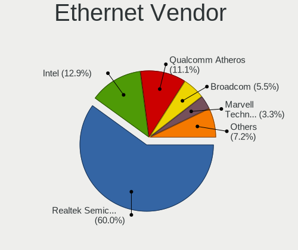

| Vendor                                 | Notebooks | Percent |
|----------------------------------------|-----------|---------|
| Realtek Semiconductor                  | 899       | 59.5%   |
| Intel                                  | 197       | 13.04%  |
| Qualcomm Atheros                       | 178       | 11.78%  |
| Broadcom                               | 83        | 5.49%   |
| Marvell Technology Group               | 52        | 3.44%   |
| Broadcom Limited                       | 26        | 1.72%   |
| Attansic Technology                    | 11        | 0.73%   |
| Samsung Electronics                    | 9         | 0.6%    |
| Huawei Technologies                    | 8         | 0.53%   |
| Xiaomi                                 | 7         | 0.46%   |
| JMicron Technology                     | 7         | 0.46%   |
| ASIX Electronics                       | 5         | 0.33%   |
| VIA Technologies                       | 4         | 0.26%   |
| Silicon Integrated Systems [SiS]       | 4         | 0.26%   |
| ICS Advent                             | 4         | 0.26%   |
| Hewlett-Packard                        | 3         | 0.2%    |
| Spreadtrum Communications              | 2         | 0.13%   |
| Lenovo                                 | 2         | 0.13%   |
| TP-Link                                | 1         | 0.07%   |
| Sony Ericsson Mobile Communications AB | 1         | 0.07%   |
| OPPO Electronics                       | 1         | 0.07%   |
| OKB SAPR                               | 1         | 0.07%   |
| Nvidia                                 | 1         | 0.07%   |
| Motorola PCS                           | 1         | 0.07%   |
| LSI                                    | 1         | 0.07%   |
| DisplayLink                            | 1         | 0.07%   |
| ASUSTek Computer                       | 1         | 0.07%   |
| Android                                | 1         | 0.07%   |

Ethernet Model
--------------

Ethernet models

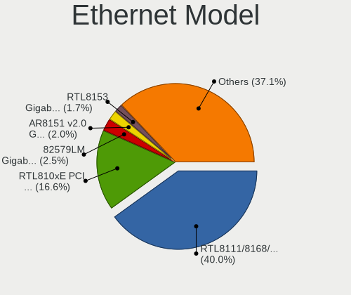

| Model                                                             | Notebooks | Percent |
|-------------------------------------------------------------------|-----------|---------|
| Realtek RTL8111/8168/8411 PCI Express Gigabit Ethernet Controller | 597       | 39.28%  |
| Realtek RTL810xE PCI Express Fast Ethernet controller             | 265       | 17.43%  |
| Intel 82579LM Gigabit Network Connection (Lewisville)             | 41        | 2.7%    |
| Qualcomm Atheros AR8151 v2.0 Gigabit Ethernet                     | 32        | 2.11%   |
| Realtek RTL8153 Gigabit Ethernet Adapter                          | 21        | 1.38%   |
| Qualcomm Atheros AR8162 Fast Ethernet                             | 21        | 1.38%   |
| Qualcomm Atheros QCA8172 Fast Ethernet                            | 20        | 1.32%   |
| Marvell Group 88E8040 PCI-E Fast Ethernet Controller              | 20        | 1.32%   |
| Qualcomm Atheros AR8161 Gigabit Ethernet                          | 19        | 1.25%   |
| Broadcom NetLink BCM57785 Gigabit Ethernet PCIe                   | 18        | 1.18%   |
| Qualcomm Atheros AR8152 v2.0 Fast Ethernet                        | 15        | 0.99%   |
| Qualcomm Atheros AR8132 Fast Ethernet                             | 15        | 0.99%   |
| Intel Ethernet Connection (6) I219-V                              | 15        | 0.99%   |
| Broadcom NetLink BCM5787M Gigabit Ethernet PCI Express            | 14        | 0.92%   |
| Realtek RTL-8100/8101L/8139 PCI Fast Ethernet Adapter             | 12        | 0.79%   |
| Qualcomm Atheros AR8131 Gigabit Ethernet                          | 11        | 0.72%   |
| Qualcomm Atheros AR8121/AR8113/AR8114 Gigabit or Fast Ethernet    | 11        | 0.72%   |
| Intel Ethernet Connection (4) I219-V                              | 11        | 0.72%   |
| Attansic AR8152 v2.0 Fast Ethernet                                | 11        | 0.72%   |
| Intel Ethernet Connection I218-LM                                 | 10        | 0.66%   |
| Intel Ethernet Connection I217-LM                                 | 10        | 0.66%   |
| Intel Ethernet Connection (7) I219-LM                             | 10        | 0.66%   |
| Intel 82577LM Gigabit Network Connection                          | 10        | 0.66%   |
| Qualcomm Atheros QCA8171 Gigabit Ethernet                         | 9         | 0.59%   |
| Intel Ethernet Connection I219-LM                                 | 9         | 0.59%   |
| Intel Ethernet Connection (4) I219-LM                             | 9         | 0.59%   |
| Intel 82567LM Gigabit Network Connection                          | 9         | 0.59%   |
| Broadcom BCM4401-B0 100Base-TX                                    | 9         | 0.59%   |
| Samsung Galaxy series, misc. (tethering mode)                     | 8         | 0.53%   |
| Marvell Group 88E8039 PCI-E Fast Ethernet Controller              | 8         | 0.53%   |
| Intel Ethernet Connection (2) I219-LM                             | 8         | 0.53%   |
| JMicron JMC250 PCI Express Gigabit Ethernet Controller            | 7         | 0.46%   |
| Intel Ethernet Connection (3) I218-LM                             | 7         | 0.46%   |
| Broadcom NetLink BCM5906M Fast Ethernet PCI Express               | 7         | 0.46%   |
| Broadcom NetLink BCM57780 Gigabit Ethernet PCIe                   | 7         | 0.46%   |
| Xiaomi Mi/Redmi series (RNDIS)                                    | 6         | 0.39%   |
| Qualcomm Atheros Attansic L2 Fast Ethernet                        | 6         | 0.39%   |
| Intel 82579V Gigabit Network Connection                           | 6         | 0.39%   |
| Broadcom NetXtreme BCM57786 Gigabit Ethernet PCIe                 | 6         | 0.39%   |
| Broadcom NetLink BCM5784M Gigabit Ethernet PCIe                   | 6         | 0.39%   |

Net Controller Kind
-------------------

Ethernet, WiFi or modem

| Kind     | Notebooks | Percent |
|----------|-----------|---------|
| WiFi     | 1694      | 53.02%  |
| Ethernet | 1473      | 46.1%   |
| Modem    | 28        | 0.88%   |

Used Controller
---------------

Currently used network controller

| Kind     | Notebooks | Percent |
|----------|-----------|---------|
| WiFi     | 1428      | 78.33%  |
| Ethernet | 395       | 21.67%  |

NICs
----

Total network controllers on board

| Total | Notebooks | Percent |
|-------|-----------|---------|
| 2     | 1418      | 82.3%   |
| 1     | 285       | 16.54%  |
| 0     | 18        | 1.04%   |
| 3     | 2         | 0.12%   |

IPv6
----

IPv6 vs IPv4

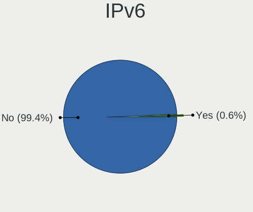

| Used | Notebooks | Percent |
|------|-----------|---------|
| No   | 1719      | 99.77%  |
| Yes  | 4         | 0.23%   |

Bluetooth
---------

Bluetooth Vendor
----------------

Controller vendors

| Vendor                          | Notebooks | Percent |
|---------------------------------|-----------|---------|
| Intel                           | 444       | 34.34%  |
| Qualcomm Atheros Communications | 170       | 13.15%  |
| Realtek Semiconductor           | 151       | 11.68%  |
| IMC Networks                    | 125       | 9.67%   |
| Broadcom                        | 89        | 6.88%   |
| Lite-On Technology              | 88        | 6.81%   |
| Foxconn / Hon Hai               | 53        | 4.1%    |
| Ralink                          | 36        | 2.78%   |
| Hewlett-Packard                 | 28        | 2.17%   |
| ASUSTek Computer                | 19        | 1.47%   |
| Dell                            | 18        | 1.39%   |
| Cambridge Silicon Radio         | 13        | 1.01%   |
| Apple                           | 11        | 0.85%   |
| Ralink Technology               | 10        | 0.77%   |
| Toshiba                         | 9         | 0.7%    |
| Foxconn International           | 8         | 0.62%   |
| Opticis                         | 4         | 0.31%   |
| Alps Electric                   | 4         | 0.31%   |
| Realtek                         | 3         | 0.23%   |
| Micro Star International        | 3         | 0.23%   |
| Taiyo Yuden                     | 2         | 0.15%   |
| MediaTek                        | 2         | 0.15%   |
| Askey Computer                  | 2         | 0.15%   |
| Chicony Electronics             | 1         | 0.08%   |

Bluetooth Model
---------------

Controller models

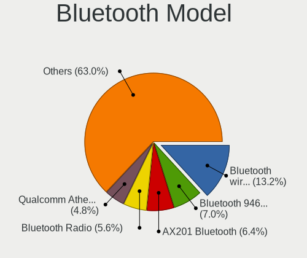

| Model                                               | Notebooks | Percent |
|-----------------------------------------------------|-----------|---------|
| Intel Bluetooth wireless interface                  | 174       | 13.46%  |
| Intel Bluetooth 9460/9560 Jefferson Peak (JfP)      | 88        | 6.81%   |
| Realtek Bluetooth Radio                             | 82        | 6.34%   |
| Intel AX201 Bluetooth                               | 71        | 5.49%   |
| Qualcomm Atheros  Bluetooth Device                  | 68        | 5.26%   |
| Realtek  Bluetooth 4.2 Adapter                      | 52        | 4.02%   |
| IMC Networks Bluetooth Radio                        | 52        | 4.02%   |
| Qualcomm Atheros AR3011 Bluetooth                   | 45        | 3.48%   |
| IMC Networks Bluetooth Device                       | 38        | 2.94%   |
| Intel AX200 Bluetooth                               | 37        | 2.86%   |
| Ralink RT3290 Bluetooth                             | 36        | 2.78%   |
| Intel Centrino Bluetooth Wireless Transceiver       | 36        | 2.78%   |
| Lite-On Bluetooth Device                            | 30        | 2.32%   |
| Qualcomm Atheros AR3012 Bluetooth 4.0               | 28        | 2.17%   |
| Lite-On Qualcomm Atheros QCA9377 Bluetooth          | 27        | 2.09%   |
| Intel Wireless-AC 3168 Bluetooth                    | 23        | 1.78%   |
| IMC Networks Atheros AR3012 Bluetooth 4.0 Adapter   | 21        | 1.62%   |
| Foxconn / Hon Hai Bluetooth Device                  | 20        | 1.55%   |
| HP Broadcom 2070 Bluetooth Combo                    | 15        | 1.16%   |
| HP Bluetooth 2.0 Interface [Broadcom BCM2045]       | 13        | 1.01%   |
| Cambridge Silicon Radio Bluetooth Dongle (HCI mode) | 13        | 1.01%   |
| Lite-On Atheros AR3012 Bluetooth                    | 12        | 0.93%   |
| Qualcomm Atheros Bluetooth                          | 11        | 0.85%   |
| Foxconn / Hon Hai Broadcom BCM20702 Bluetooth       | 11        | 0.85%   |
| Intel Centrino Advanced-N 6230 Bluetooth adapter    | 10        | 0.77%   |
| Foxconn / Hon Hai Broadcom Bluetooth 2.1 Device     | 10        | 0.77%   |
| Broadcom BCM2070 Bluetooth 2.1 + EDR                | 10        | 0.77%   |
| Broadcom BCM2045B (BDC-2.1)                         | 10        | 0.77%   |
| Broadcom BCM20702A0                                 | 9         | 0.7%    |
| Broadcom BCM2045 Bluetooth                          | 9         | 0.7%    |
| ASUS BT-183 Bluetooth 2.0+EDR adapter               | 9         | 0.7%    |
| Realtek RTL8821A Bluetooth                          | 8         | 0.62%   |
| Ralink Motorola BC4 Bluetooth 3.0+HS Adapter        | 8         | 0.62%   |
| Qualcomm Atheros AR9462 Bluetooth                   | 8         | 0.62%   |
| Lite-On Broadcom BCM43142A0 Bluetooth Device        | 8         | 0.62%   |
| Foxconn International BCM43142A0 Bluetooth module   | 8         | 0.62%   |
| Broadcom BCM20702 Bluetooth 4.0 [ThinkPad]          | 8         | 0.62%   |
| Realtek RTL8723B Bluetooth                          | 7         | 0.54%   |
| Qualcomm Atheros QCA61x4 Bluetooth 4.0              | 7         | 0.54%   |
| Broadcom BCM43142 Bluetooth 4.0                     | 7         | 0.54%   |

Sound
-----

Sound Vendor
------------

Sound card vendors

| Vendor                           | Notebooks | Percent |
|----------------------------------|-----------|---------|
| Intel                            | 1367      | 68.94%  |
| AMD                              | 378       | 19.06%  |
| Nvidia                           | 173       | 8.72%   |
| Silicon Integrated Systems [SiS] | 7         | 0.35%   |
| C-Media Electronics              | 7         | 0.35%   |
| Logitech                         | 6         | 0.3%    |
| Plantronics                      | 5         | 0.25%   |
| Realtek Semiconductor            | 4         | 0.2%    |
| VIA Technologies                 | 3         | 0.15%   |
| Lenovo                           | 3         | 0.15%   |
| Hewlett-Packard                  | 3         | 0.15%   |
| GN Netcom                        | 3         | 0.15%   |
| DSEA A/S                         | 3         | 0.15%   |
| Shenzhen Rapoo Technology        | 2         | 0.1%    |
| M-Audio                          | 2         | 0.1%    |
| Kingston Technology              | 2         | 0.1%    |
| Trust                            | 1         | 0.05%   |
| Texas Instruments                | 1         | 0.05%   |
| SteelSeries ApS                  | 1         | 0.05%   |
| Samsung Electronics              | 1         | 0.05%   |
| Razer USA                        | 1         | 0.05%   |
| Microsoft                        | 1         | 0.05%   |
| JMTek                            | 1         | 0.05%   |
| iCreate Technologies             | 1         | 0.05%   |
| Google                           | 1         | 0.05%   |
| Generalplus Technology           | 1         | 0.05%   |
| Focusrite-Novation               | 1         | 0.05%   |
| Cirrus Logic                     | 1         | 0.05%   |
| BY EDIFIER                       | 1         | 0.05%   |
| Audio-Technica                   | 1         | 0.05%   |
| ASUSTek Computer                 | 1         | 0.05%   |

Sound Model
-----------

Sound card models

| Model                                                                                             | Notebooks | Percent |
|---------------------------------------------------------------------------------------------------|-----------|---------|
| Intel 7 Series/C216 Chipset Family High Definition Audio Controller                               | 214       | 9.03%   |
| Intel Sunrise Point-LP HD Audio                                                                   | 200       | 8.44%   |
| Intel 6 Series/C200 Series Chipset Family High Definition Audio Controller                        | 129       | 5.45%   |
| AMD Family 17h/19h HD Audio Controller                                                            | 124       | 5.23%   |
| Intel 82801I (ICH9 Family) HD Audio Controller                                                    | 84        | 3.55%   |
| Intel NM10/ICH7 Family High Definition Audio Controller                                           | 83        | 3.5%    |
| AMD SBx00 Azalia (Intel HDA)                                                                      | 83        | 3.5%    |
| AMD FCH Azalia Controller                                                                         | 80        | 3.38%   |
| Intel 5 Series/3400 Series Chipset High Definition Audio                                          | 73        | 3.08%   |
| Intel Cannon Point-LP High Definition Audio Controller                                            | 59        | 2.49%   |
| AMD Renoir Radeon High Definition Audio Controller                                                | 59        | 2.49%   |
| Intel Cannon Lake PCH cAVS                                                                        | 58        | 2.45%   |
| Intel Celeron/Pentium Silver Processor High Definition Audio                                      | 53        | 2.24%   |
| AMD Raven/Raven2/Fenghuang HDMI/DP Audio Controller                                               | 53        | 2.24%   |
| Intel 8 Series/C220 Series Chipset High Definition Audio Controller                               | 50        | 2.11%   |
| Intel Xeon E3-1200 v3/4th Gen Core Processor HD Audio Controller                                  | 46        | 1.94%   |
| Intel Tiger Lake-LP Smart Sound Technology Audio Controller                                       | 44        | 1.86%   |
| Intel Haswell-ULT HD Audio Controller                                                             | 39        | 1.65%   |
| Intel 8 Series HD Audio Controller                                                                | 39        | 1.65%   |
| Intel 82801H (ICH8 Family) HD Audio Controller                                                    | 38        | 1.6%    |
| Intel Atom/Celeron/Pentium Processor x5-E8000/J3xxx/N3xxx Series High Definition Audio Controller | 37        | 1.56%   |
| Nvidia GF108 High Definition Audio Controller                                                     | 36        | 1.52%   |
| Intel Wildcat Point-LP High Definition Audio Controller                                           | 36        | 1.52%   |
| Intel Broadwell-U Audio Controller                                                                | 36        | 1.52%   |
| Intel Comet Lake PCH-LP cAVS                                                                      | 35        | 1.48%   |
| AMD Kabini HDMI/DP Audio                                                                          | 33        | 1.39%   |
| AMD Trinity HDMI Audio Controller                                                                 | 30        | 1.27%   |
| AMD Wrestler HDMI Audio                                                                           | 28        | 1.18%   |
| AMD Family 15h (Models 60h-6fh) Audio Controller                                                  | 28        | 1.18%   |
| Nvidia GP107GL High Definition Audio Controller                                                   | 26        | 1.1%    |
| Intel CM238 HD Audio Controller                                                                   | 22        | 0.93%   |
| AMD High Definition Audio Controller                                                              | 22        | 0.93%   |
| AMD Cedar HDMI Audio [Radeon HD 5400/6300/7300 Series]                                            | 21        | 0.89%   |
| Intel Celeron N3350/Pentium N4200/Atom E3900 Series Audio Cluster                                 | 20        | 0.84%   |
| Intel 100 Series/C230 Series Chipset Family HD Audio Controller                                   | 20        | 0.84%   |
| Intel Comet Lake PCH cAVS                                                                         | 19        | 0.8%    |
| Intel Atom Processor Z36xxx/Z37xxx Series High Definition Audio Controller                        | 19        | 0.8%    |
| Nvidia TU107 GeForce GTX 1650 High Definition Audio Controller                                    | 16        | 0.68%   |
| AMD RV710/730 HDMI Audio [Radeon HD 4000 series]                                                  | 16        | 0.68%   |
| AMD Redwood HDMI Audio [Radeon HD 5000 Series]                                                    | 16        | 0.68%   |

Memory
------

Memory Vendor
-------------

Memory module vendors

| Vendor              | Notebooks | Percent |
|---------------------|-----------|---------|
| Samsung Electronics | 376       | 26.72%  |
| SK hynix            | 281       | 19.97%  |
| Unknown             | 155       | 11.02%  |
| Micron Technology   | 146       | 10.38%  |
| Kingston            | 127       | 9.03%   |
| Ramaxel Technology  | 60        | 4.26%   |
| Elpida              | 52        | 3.7%    |
| Nanya Technology    | 30        | 2.13%   |
| A-DATA Technology   | 30        | 2.13%   |
| GOODRAM             | 22        | 1.56%   |
| Team                | 16        | 1.14%   |
| Crucial             | 16        | 1.14%   |
| Unknown (ABCD)      | 10        | 0.71%   |
| Transcend           | 10        | 0.71%   |
| ASint Technology    | 9         | 0.64%   |
| 48spaces            | 8         | 0.57%   |
| SHARETRONIC         | 7         | 0.5%    |
| AMD                 | 7         | 0.5%    |
| Apacer              | 6         | 0.43%   |
| Patriot             | 4         | 0.28%   |
| Toshiba             | 3         | 0.21%   |
| Qimonda             | 3         | 0.21%   |
| G.Skill             | 3         | 0.21%   |
| Unifosa             | 2         | 0.14%   |
| Silicon Power       | 2         | 0.14%   |
| Goldkey             | 2         | 0.14%   |
| Exceleram           | 2         | 0.14%   |
| Corsair             | 2         | 0.14%   |
| Unknown (C289)      | 1         | 0.07%   |
| Unknown (768A)      | 1         | 0.07%   |
| Teikon              | 1         | 0.07%   |
| Qumo                | 1         | 0.07%   |
| Kreton              | 1         | 0.07%   |
| Kllisre             | 1         | 0.07%   |
| Kingmax             | 1         | 0.07%   |
| Kembona             | 1         | 0.07%   |
| Hexon               | 1         | 0.07%   |
| GeIL                | 1         | 0.07%   |
| DeTech              | 1         | 0.07%   |
| BiNFUL              | 1         | 0.07%   |

Memory Model
------------

Memory module models

| Model                                                            | Notebooks | Percent |
|------------------------------------------------------------------|-----------|---------|
| SK hynix RAM HMT351S6CFR8C-PB 4GB SODIMM DDR3 1600MT/s           | 19        | 1.23%   |
| Samsung RAM M471B5273DH0-CH9 4096MB SODIMM DDR3 1334MT/s         | 19        | 1.23%   |
| Samsung RAM M471B5173QH0-YK0 4GB SODIMM DDR3 1600MT/s            | 18        | 1.17%   |
| Samsung RAM M471B5273DH0-CK0 4GB SODIMM DDR3 1600MT/s            | 16        | 1.04%   |
| Samsung RAM M471B5173DB0-YK0 4GB SODIMM DDR3 1600MT/s            | 16        | 1.04%   |
| Samsung RAM M471A5244CB0-CTD 4GB SODIMM DDR4 3266MT/s            | 16        | 1.04%   |
| Samsung RAM M471A5244CB0-CRC 4GB SODIMM DDR4 2667MT/s            | 16        | 1.04%   |
| Samsung RAM M471B5773DH0-CH9 2GB SODIMM DDR3 1600MT/s            | 15        | 0.97%   |
| Samsung RAM M471B5273CH0-CH9 4GB SODIMM DDR3 1334MT/s            | 14        | 0.91%   |
| Samsung RAM Module 16384MB SODIMM DDR4 2667MT/s                  | 13        | 0.84%   |
| Samsung RAM M471B5773DH0-CK0 2048MB SODIMM DDR3 1600MT/s         | 13        | 0.84%   |
| SK hynix RAM HMT351S6BFR8C-H9 4GB SODIMM DDR3 1333MT/s           | 12        | 0.78%   |
| Samsung RAM M471B5173EB0-YK0 4GB SODIMM DDR3 1600MT/s            | 12        | 0.78%   |
| Micron RAM 4ATF51264HZ-2G6E1 4GB SODIMM DDR4 2667MT/s            | 12        | 0.78%   |
| Elpida RAM EBJ41UF8BCS0-DJ-F 4GB SODIMM DDR3 1334MT/s            | 12        | 0.78%   |
| Ramaxel RAM RMT3160ED58E9W1600 4GB SODIMM DDR3 1600MT/s          | 11        | 0.71%   |
| Unknown RAM Module 2048MB SODIMM SDRAM                           | 10        | 0.65%   |
| Unknown RAM Module 2048MB SODIMM DDR2 667MT/s                    | 10        | 0.65%   |
| Unknown (ABCD) RAM 123456789012345678 2GB SODIMM LPDDR4 2400MT/s | 10        | 0.65%   |
| SK hynix RAM HMT451S6AFR8A-PB 4GB SODIMM DDR3 1600MT/s           | 10        | 0.65%   |
| SK hynix RAM HMT325S6BFR8C-H9 2GB SODIMM DDR3 1600MT/s           | 10        | 0.65%   |
| SK hynix RAM HMA851S6AFR6N-UH 2GB SODIMM LPDDR4 2667MT/s         | 10        | 0.65%   |
| Samsung RAM M471B5773CHS-CH9 2GB SODIMM DDR3 4199MT/s            | 10        | 0.65%   |
| Samsung RAM M471A1K43DB1-CWE 8GB SODIMM DDR4 3200MT/s            | 10        | 0.65%   |
| Ramaxel RAM RMT3150ED58E8W1600 2GB SODIMM DDR3 1600MT/s          | 10        | 0.65%   |
| Unknown RAM Module 2048MB SODIMM DDR2                            | 9         | 0.58%   |
| SK hynix RAM HMT325S6CFR8C-PB 2GB SODIMM DDR3 1600MT/s           | 9         | 0.58%   |
| SK hynix RAM HMA81GS6CJR8N-VK 8GB SODIMM DDR4 2667MT/s           | 9         | 0.58%   |
| SK hynix RAM HMA81GS6AFR8N-UH 8GB SODIMM DDR4 2667MT/s           | 9         | 0.58%   |
| Samsung RAM M471B5673FH0-CH9 2GB SODIMM DDR3 1334MT/s            | 9         | 0.58%   |
| Samsung RAM M471A1K43CB1-CTD 8GB SODIMM DDR4 2667MT/s            | 9         | 0.58%   |
| Unknown RAM Module 1024MB SODIMM DRAM                            | 8         | 0.52%   |
| SK hynix RAM HMT425S6AFR6A-PB 2GB SODIMM DDR3 1600MT/s           | 8         | 0.52%   |
| SK hynix RAM HMT351S6CFR8C-H9 4GB SODIMM DDR3 1334MT/s           | 8         | 0.52%   |
| Ramaxel RAM RMT3170EB68F9W1600 4GB SODIMM DDR3 1600MT/s          | 8         | 0.52%   |
| Nanya RAM NT2GC64B88B0NS-CG 2GB SODIMM DDR3 1334MT/s             | 8         | 0.52%   |
| Micron RAM 4ATF51264HZ-2G3B1 4GB SODIMM DDR4 2400MT/s            | 8         | 0.52%   |
| Micron RAM 4ATF1G64HZ-3G2E1 8GB SODIMM DDR4 3200MT/s             | 8         | 0.52%   |
| Elpida RAM EBJ40UG8BBU0-GN-F 4GB SODIMM DDR3 1600MT/s            | 8         | 0.52%   |
| Unknown RAM Module 1024MB SODIMM SDRAM                           | 7         | 0.45%   |

Memory Kind
-----------

Memory module kinds

| Kind    | Notebooks | Percent |
|---------|-----------|---------|
| DDR3    | 573       | 48.07%  |
| DDR4    | 363       | 30.45%  |
| DDR2    | 102       | 8.56%   |
| SDRAM   | 61        | 5.12%   |
| LPDDR4  | 39        | 3.27%   |
| DDR     | 15        | 1.26%   |
| LPDDR3  | 14        | 1.17%   |
| DRAM    | 13        | 1.09%   |
| Unknown | 12        | 1.01%   |

Memory Form Factor
------------------

Physical design of the memory module

| Name         | Notebooks | Percent |
|--------------|-----------|---------|
| SODIMM       | 1115      | 95.79%  |
| Row Of Chips | 35        | 3.01%   |
| DIMM         | 8         | 0.69%   |
| Chip         | 5         | 0.43%   |
| Unknown      | 1         | 0.09%   |

Memory Size
-----------

Memory module size

| Size  | Notebooks | Percent |
|-------|-----------|---------|
| 4096  | 494       | 36.43%  |
| 2048  | 318       | 23.45%  |
| 8192  | 309       | 22.79%  |
| 1024  | 106       | 7.82%   |
| 16384 | 102       | 7.52%   |
| 512   | 18        | 1.33%   |
| 32768 | 6         | 0.44%   |
| 256   | 3         | 0.22%   |

Memory Speed
------------

Memory module speed

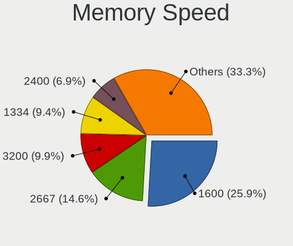

| Speed   | Notebooks | Percent |
|---------|-----------|---------|
| 1600    | 366       | 27.73%  |
| 2667    | 187       | 14.17%  |
| 1334    | 132       | 10%     |
| 3200    | 100       | 7.58%   |
| 1333    | 91        | 6.89%   |
| 2400    | 85        | 6.44%   |
| Unknown | 66        | 5%      |
| 667     | 58        | 4.39%   |
| 2133    | 48        | 3.64%   |
| 4199    | 29        | 2.2%    |
| 1067    | 29        | 2.2%    |
| 800     | 21        | 1.59%   |
| 3266    | 16        | 1.21%   |
| 1066    | 14        | 1.06%   |
| 533     | 13        | 0.98%   |
| 2048    | 11        | 0.83%   |
| 1867    | 10        | 0.76%   |
| 4267    | 7         | 0.53%   |
| 4266    | 7         | 0.53%   |
| 400     | 7         | 0.53%   |
| 333     | 6         | 0.45%   |
| 975     | 5         | 0.38%   |
| 8400    | 4         | 0.3%    |
| 2933    | 2         | 0.15%   |
| 4800    | 1         | 0.08%   |
| 1866    | 1         | 0.08%   |
| 1776    | 1         | 0.08%   |
| 1639    | 1         | 0.08%   |
| 666     | 1         | 0.08%   |
| 266     | 1         | 0.08%   |

Printers & scanners
-------------------

Printer Vendor
--------------

Printer device vendors

| Vendor              | Notebooks | Percent |
|---------------------|-----------|---------|
| Canon               | 13        | 59.09%  |
| Samsung Electronics | 3         | 13.64%  |
| Hewlett-Packard     | 2         | 9.09%   |
| Xiaomi              | 1         | 4.55%   |
| Seiko Epson         | 1         | 4.55%   |
| Pantum              | 1         | 4.55%   |
| Dell                | 1         | 4.55%   |

Printer Model
-------------

Printer device models

| Model                           | Notebooks | Percent |
|---------------------------------|-----------|---------|
| Xiaomi MiMouse 2                | 1         | 4.55%   |
| Seiko Epson ET-2600 Series      | 1         | 4.55%   |
| Samsung M2070 Series            | 1         | 4.55%   |
| Samsung Laser Printer           | 1         | 4.55%   |
| Samsung CLX-3300 Series         | 1         | 4.55%   |
| Pantum P2510 series             | 1         | 4.55%   |
| HP Ink Tank Wireless 410 series | 1         | 4.55%   |
| HP Deskjet 3540 series          | 1         | 4.55%   |
| Dell AIO 810                    | 1         | 4.55%   |
| Canon PIXMA MP495               | 1         | 4.55%   |
| Canon PIXMA MP280               | 1         | 4.55%   |
| Canon MG2200 series             | 1         | 4.55%   |
| Canon MF4410                    | 1         | 4.55%   |
| Canon MF4010 series             | 1         | 4.55%   |
| Canon MF3010                    | 1         | 4.55%   |
| Canon LBP6030w/6018w            | 1         | 4.55%   |
| Canon LBP6020                   | 1         | 4.55%   |
| Canon LBP6000                   | 1         | 4.55%   |
| Canon LBP3010/LBP3018/LBP3050   | 1         | 4.55%   |
| Canon LBP2900                   | 1         | 4.55%   |
| Canon G4010 series              | 1         | 4.55%   |
| Canon G2010 series              | 1         | 4.55%   |

Scanner Vendor
--------------

Scanner device vendors

| Vendor         | Notebooks | Percent |
|----------------|-----------|---------|
| Mustek Systems | 2         | 50%     |
| Seiko Epson    | 1         | 25%     |
| Canon          | 1         | 25%     |

Scanner Model
-------------

Scanner device models

| Model                                  | Notebooks | Percent |
|----------------------------------------|-----------|---------|
| Seiko Epson GT-9800F [Perfection 3200] | 1         | 25%     |
| Mustek Systems SNAPSCAN e22            | 1         | 25%     |
| Mustek Systems BearPaw 1200 CU Plus    | 1         | 25%     |
| Canon CanoScan LiDE 120                | 1         | 25%     |

Camera
------

Camera Vendor
-------------

Camera device vendors

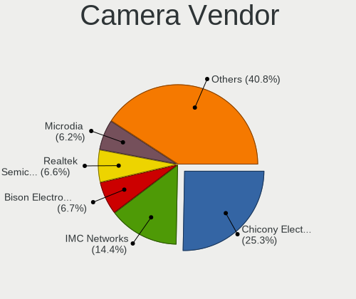

| Vendor                                 | Notebooks | Percent |
|----------------------------------------|-----------|---------|
| Chicony Electronics                    | 390       | 25.28%  |
| IMC Networks                           | 222       | 14.39%  |
| Acer                                   | 136       | 8.81%   |
| Realtek Semiconductor                  | 103       | 6.68%   |
| Microdia                               | 98        | 6.35%   |
| Sunplus Innovation Technology          | 90        | 5.83%   |
| Quanta                                 | 81        | 5.25%   |
| Suyin                                  | 79        | 5.12%   |
| Cheng Uei Precision Industry (Foxlink) | 78        | 5.06%   |
| Syntek                                 | 46        | 2.98%   |
| Silicon Motion                         | 39        | 2.53%   |
| Alcor Micro                            | 34        | 2.2%    |
| Lite-On Technology                     | 32        | 2.07%   |
| Apple                                  | 18        | 1.17%   |
| Luxvisions Innotech Limited            | 15        | 0.97%   |
| Z-Star Microelectronics                | 14        | 0.91%   |
| Logitech                               | 12        | 0.78%   |
| DigiTech                               | 11        | 0.71%   |
| Primax Electronics                     | 7         | 0.45%   |
| Ricoh                                  | 6         | 0.39%   |
| ALi                                    | 6         | 0.39%   |
| Lenovo                                 | 4         | 0.26%   |
| DJJHFA1BIF5595                         | 4         | 0.26%   |
| Sunplus Technology                     | 3         | 0.19%   |
| Samsung Electronics                    | 2         | 0.13%   |
| Genesys Logic                          | 2         | 0.13%   |
| USB Camera                             | 1         | 0.06%   |
| Sonix Technology                       | 1         | 0.06%   |
| OmniVision Technologies                | 1         | 0.06%   |
| Microsoft                              | 1         | 0.06%   |
| Intel                                  | 1         | 0.06%   |
| Importek                               | 1         | 0.06%   |
| Google                                 | 1         | 0.06%   |
| GEMBIRD                                | 1         | 0.06%   |
| eMPIA Technology                       | 1         | 0.06%   |
| Arkmicro Technologies                  | 1         | 0.06%   |
| Alpha Imaging Technology               | 1         | 0.06%   |

Camera Model
------------

Camera device models

| Model                                                                      | Notebooks | Percent |
|----------------------------------------------------------------------------|-----------|---------|
| IMC Networks USB2.0 VGA UVC WebCam                                         | 67        | 4.33%   |
| Chicony Integrated Camera                                                  | 40        | 2.58%   |
| Chicony Lenovo EasyCamera                                                  | 36        | 2.33%   |
| Acer Lenovo Integrated Webcam                                              | 35        | 2.26%   |
| Chicony HD WebCam                                                          | 33        | 2.13%   |
| IMC Networks USB2.0 HD UVC WebCam                                          | 28        | 1.81%   |
| Sunplus Integrated_Webcam_HD                                               | 27        | 1.74%   |
| Acer Lenovo EasyCamera                                                     | 27        | 1.74%   |
| Microdia Integrated_Webcam_HD                                              | 25        | 1.61%   |
| IMC Networks Integrated Camera                                             | 25        | 1.61%   |
| Syntek Lenovo EasyCamera                                                   | 24        | 1.55%   |
| Realtek Integrated_Webcam_HD                                               | 24        | 1.55%   |
| Chicony USB2.0 VGA UVC WebCam                                              | 24        | 1.55%   |
| Quanta HD User Facing                                                      | 23        | 1.49%   |
| Acer Integrated Camera                                                     | 20        | 1.29%   |
| Chicony HP HD Camera                                                       | 19        | 1.23%   |
| Chicony HP Webcam                                                          | 17        | 1.1%    |
| Sunplus HD WebCam                                                          | 15        | 0.97%   |
| Quanta HP TrueVision HD Camera                                             | 15        | 0.97%   |
| IMC Networks Lenovo EasyCamera                                             | 15        | 0.97%   |
| Chicony HP Wide Vision HD Camera                                           | 14        | 0.9%    |
| Chicony HP Truevision HD                                                   | 14        | 0.9%    |
| Cheng Uei Precision Industry (Foxlink) HP Wide Vision HD Integrated Webcam | 14        | 0.9%    |
| Lite-On HP HD Camera                                                       | 13        | 0.84%   |
| IMC Networks Integrated Webcam                                             | 13        | 0.84%   |
| Acer EasyCamera                                                            | 13        | 0.84%   |
| Suyin Acer/HP Integrated Webcam [CN0314]                                   | 12        | 0.78%   |
| Sunplus Asus Webcam                                                        | 12        | 0.78%   |
| Realtek USB2.0 VGA UVC WebCam                                              | 12        | 0.78%   |
| Quanta HD WebCam                                                           | 12        | 0.78%   |
| IMC Networks UVC VGA Webcam                                                | 12        | 0.78%   |
| Chicony VGA WebCam                                                         | 12        | 0.78%   |
| Chicony EasyCamera                                                         | 12        | 0.78%   |
| Alcor Micro Asus Integrated Webcam                                         | 12        | 0.78%   |
| Microdia Laptop_Integrated_Webcam_HD                                       | 11        | 0.71%   |
| Lite-On Integrated Camera                                                  | 11        | 0.71%   |
| Chicony USB2.0 HD UVC WebCam                                               | 11        | 0.71%   |
| Chicony 2.0M UVC Webcam / CNF7129                                          | 11        | 0.71%   |
| Apple iPhone5/5C/5S/6                                                      | 11        | 0.71%   |
| Suyin Acer CrystalEye Webcam                                               | 10        | 0.65%   |

Security
--------

Fingerprint Vendor
------------------

Fingerprint sensor vendors

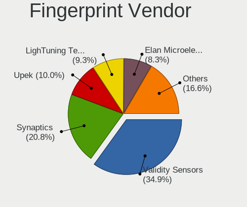

| Vendor                     | Notebooks | Percent |
|----------------------------|-----------|---------|
| Validity Sensors           | 90        | 35.16%  |
| Synaptics                  | 55        | 21.48%  |
| Upek                       | 26        | 10.16%  |
| LighTuning Technology      | 26        | 10.16%  |
| Shenzhen Goodix Technology | 20        | 7.81%   |
| Elan Microelectronics      | 17        | 6.64%   |
| AuthenTec                  | 15        | 5.86%   |
| STMicroelectronics         | 6         | 2.34%   |
| Samsung Electronics        | 1         | 0.39%   |

Fingerprint Model
-----------------

Fingerprint sensor models

| Model                                                                      | Notebooks | Percent |
|----------------------------------------------------------------------------|-----------|---------|
| Validity Sensors VFS495 Fingerprint Reader                                 | 30        | 11.72%  |
| Upek Biometric Touchchip/Touchstrip Fingerprint Sensor                     | 26        | 10.16%  |
| LighTuning EgisTec Touch Fingerprint Sensor                                | 16        | 6.25%   |
| Elan ELAN:Fingerprint                                                      | 15        | 5.86%   |
| Shenzhen Goodix  FingerPrint Device                                        | 13        | 5.08%   |
| Validity Sensors VFS5011 Fingerprint Reader                                | 12        | 4.69%   |
| Synaptics  VFS7552 Touch Fingerprint Sensor with PurePrint                 | 12        | 4.69%   |
| Unknown                                                                    | 12        | 4.69%   |
| Validity Sensors Synaptics VFS7552 Touch Fingerprint Sensor with PurePrint | 10        | 3.91%   |
| Synaptics Prometheus MIS Touch Fingerprint Reader                          | 10        | 3.91%   |
| Synaptics  FS7604 Touch Fingerprint Sensor with PurePrint                  | 9         | 3.52%   |
| Validity Sensors VFS471 Fingerprint Reader                                 | 7         | 2.73%   |
| Shenzhen Goodix Fingerprint Reader                                         | 7         | 2.73%   |
| LighTuning ES603 Swipe Fingerprint Sensor                                  | 7         | 2.73%   |
| Validity Sensors Fingerprint scanner                                       | 6         | 2.34%   |
| Synaptics Metallica MOH Touch Fingerprint Reader                           | 6         | 2.34%   |
| STMicroelectronics Fingerprint Reader                                      | 6         | 2.34%   |
| AuthenTec AES2501 Fingerprint Sensor                                       | 6         | 2.34%   |
| Validity Sensors VFS7500 Touch Fingerprint Sensor                          | 5         | 1.95%   |
| Synaptics Metallica MIS Touch Fingerprint Reader                           | 5         | 1.95%   |
| AuthenTec AES1600                                                          | 5         | 1.95%   |
| Validity Sensors VFS101 Fingerprint Reader                                 | 4         | 1.56%   |
| Validity Sensors Swipe Fingerprint Sensor                                  | 4         | 1.56%   |
| Validity Sensors VFS 5011 fingerprint sensor                               | 3         | 1.17%   |
| Validity Sensors Synaptics WBDI                                            | 3         | 1.17%   |
| LighTuning Fingerprint Reader                                              | 3         | 1.17%   |
| AuthenTec AES2810                                                          | 3         | 1.17%   |
| Elan ELAN:ARM-M4                                                           | 2         | 0.78%   |
| Validity Sensors VFS7552 Touch Fingerprint Sensor                          | 1         | 0.39%   |
| Validity Sensors VFS491                                                    | 1         | 0.39%   |
| Validity Sensors VFS451 Fingerprint Reader                                 | 1         | 0.39%   |
| Validity Sensors VFS301 Fingerprint Reader                                 | 1         | 0.39%   |
| Validity Sensors VFS300 Fingerprint Reader                                 | 1         | 0.39%   |
| Validity Sensors VFS Fingerprint sensor                                    | 1         | 0.39%   |
| Synaptics  WBDI                                                            | 1         | 0.39%   |
| Samsung Fingerprint Device                                                 | 1         | 0.39%   |
| AuthenTec AES2550 Fingerprint Sensor                                       | 1         | 0.39%   |

Chipcard Vendor
---------------

Chipcard module vendors

| Vendor                    | Notebooks | Percent |
|---------------------------|-----------|---------|
| Broadcom                  | 38        | 54.29%  |
| Alcor Micro               | 19        | 27.14%  |
| O2 Micro                  | 6         | 8.57%   |
| Upek                      | 3         | 4.29%   |
| Lenovo                    | 2         | 2.86%   |
| Gemalto (was Gemplus)     | 1         | 1.43%   |
| Aladdin Knowledge Systems | 1         | 1.43%   |

Chipcard Model
--------------

Chipcard module models

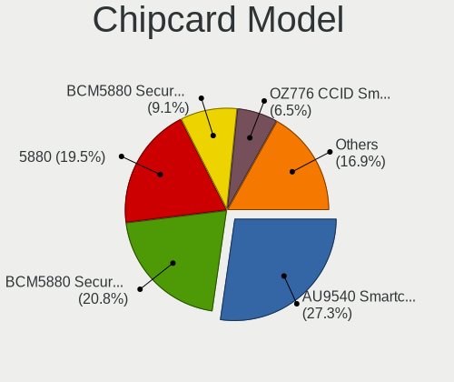

| Model                                                                        | Notebooks | Percent |
|------------------------------------------------------------------------------|-----------|---------|
| Alcor Micro AU9540 Smartcard Reader                                          | 19        | 27.14%  |
| Broadcom BCM5880 Secure Applications Processor                               | 14        | 20%     |
| Broadcom 5880                                                                | 14        | 20%     |
| Broadcom BCM5880 Secure Applications Processor with fingerprint swipe sensor | 7         | 10%     |
| Upek TouchChip Fingerprint Coprocessor (WBF advanced mode)                   | 3         | 4.29%   |
| O2 Micro Oz776 SmartCard Reader                                              | 3         | 4.29%   |
| O2 Micro OZ776 CCID Smartcard Reader                                         | 3         | 4.29%   |
| Broadcom 58200                                                               | 3         | 4.29%   |
| Lenovo Integrated Smart Card Reader                                          | 2         | 2.86%   |
| Gemalto (was Gemplus) Compact Smart Card Reader Writer                       | 1         | 1.43%   |
| Aladdin Knowledge Systems Token JC                                           | 1         | 1.43%   |

Unsupported
-----------

Unsupported Devices
-------------------

Total unsupported devices on board

| Total | Notebooks | Percent |
|-------|-----------|---------|
| 0     | 1162      | 65.84%  |
| 1     | 493       | 27.93%  |
| 2     | 95        | 5.38%   |
| 3     | 10        | 0.57%   |
| 4     | 3         | 0.17%   |
| 6     | 1         | 0.06%   |
| 5     | 1         | 0.06%   |

Unsupported Device Types
------------------------

Types of unsupported devices

| Type                     | Notebooks | Percent |
|--------------------------|-----------|---------|
| Fingerprint reader       | 254       | 35.88%  |
| Graphics card            | 179       | 25.28%  |
| Net/wireless             | 62        | 8.76%   |
| Chipcard                 | 58        | 8.19%   |
| Bluetooth                | 44        | 6.21%   |
| Multimedia controller    | 33        | 4.66%   |
| Communication controller | 21        | 2.97%   |
| Storage                  | 13        | 1.84%   |
| Card reader              | 11        | 1.55%   |
| Camera                   | 11        | 1.55%   |
| Flash memory             | 7         | 0.99%   |
| Net/ethernet             | 5         | 0.71%   |
| Sound                    | 3         | 0.42%   |
| Modem                    | 3         | 0.42%   |
| Network                  | 2         | 0.28%   |
| Storage/ata              | 1         | 0.14%   |
| Firewire controller      | 1         | 0.14%   |

