Linux in Ukraine - Tested Hardware & Statistics
-----------------------------------------------

A project to collect tested hardware configurations for Linux in Ukraine.

Anyone can contribute to this report by the [hw-probe](https://github.com/linuxhw/hw-probe) tool:

    sudo -E hw-probe -all -upload

Please contribute! Especially if your hardware is rare.

This is a report for all computer types. See also reports for [desktops](/Location/Ukraine/Desktop/README.md) and [notebooks](/Location/Ukraine/Notebook/README.md).

Contents
--------

* [ Test Cases ](#test-cases)

* [ System ](#system)
  - [ OS                       ](#os)
  - [ OS Family                ](#os-family)
  - [ Kernel                   ](#kernel)
  - [ Kernel Family            ](#kernel-family)
  - [ Kernel Major Ver.        ](#kernel-major-ver)
  - [ Arch                     ](#arch)
  - [ DE                       ](#de)
  - [ Display Server           ](#display-server)
  - [ Display Manager          ](#display-manager)
  - [ OS Lang                  ](#os-lang)
  - [ Boot Mode                ](#boot-mode)
  - [ Filesystem               ](#filesystem)
  - [ Part. scheme             ](#part-scheme)
  - [ Dual Boot with Linux/BSD ](#dual-boot-with-linuxbsd)
  - [ Dual Boot (Win)          ](#dual-boot-win)

* [ Board ](#board)
  - [ Vendor                   ](#vendor)
  - [ Model                    ](#model)
  - [ Model Family             ](#model-family)
  - [ MFG Year                 ](#mfg-year)
  - [ Form Factor              ](#form-factor)
  - [ Secure Boot              ](#secure-boot)
  - [ Coreboot                 ](#coreboot)
  - [ RAM Size                 ](#ram-size)
  - [ RAM Used                 ](#ram-used)
  - [ Total Drives             ](#total-drives)
  - [ Has CD-ROM               ](#has-cd-rom)
  - [ Has Ethernet             ](#has-ethernet)
  - [ Has WiFi                 ](#has-wifi)
  - [ Has Bluetooth            ](#has-bluetooth)

* [ Location ](#location)
  - [ Country                  ](#country)
  - [ City                     ](#city)

* [ Drives ](#drives)
  - [ Drive Vendor             ](#drive-vendor)
  - [ Drive Model              ](#drive-model)
  - [ HDD Vendor               ](#hdd-vendor)
  - [ SSD Vendor               ](#ssd-vendor)
  - [ Drive Kind               ](#drive-kind)
  - [ Drive Connector          ](#drive-connector)
  - [ Drive Size               ](#drive-size)
  - [ Space Total              ](#space-total)
  - [ Space Used               ](#space-used)
  - [ Malfunc. Drives          ](#malfunc-drives)
  - [ Malfunc. Drive Vendor    ](#malfunc-drive-vendor)
  - [ Malfunc. HDD Vendor      ](#malfunc-hdd-vendor)
  - [ Malfunc. Drive Kind      ](#malfunc-drive-kind)
  - [ Failed Drives            ](#failed-drives)
  - [ Failed Drive Vendor      ](#failed-drive-vendor)
  - [ Drive Status             ](#drive-status)

* [ Storage controller ](#storage-controller)
  - [ Storage Vendor           ](#storage-vendor)
  - [ Storage Model            ](#storage-model)
  - [ Storage Kind             ](#storage-kind)

* [ Processor ](#processor)
  - [ CPU Vendor               ](#cpu-vendor)
  - [ CPU Model                ](#cpu-model)
  - [ CPU Model Family         ](#cpu-model-family)
  - [ CPU Cores                ](#cpu-cores)
  - [ CPU Sockets              ](#cpu-sockets)
  - [ CPU Threads              ](#cpu-threads)
  - [ CPU Op-Modes             ](#cpu-op-modes)
  - [ CPU Microcode            ](#cpu-microcode)
  - [ CPU Microarch            ](#cpu-microarch)

* [ Graphics ](#graphics)
  - [ GPU Vendor               ](#gpu-vendor)
  - [ GPU Model                ](#gpu-model)
  - [ GPU Combo                ](#gpu-combo)
  - [ GPU Driver               ](#gpu-driver)
  - [ GPU Memory               ](#gpu-memory)

* [ Monitor ](#monitor)
  - [ Monitor Vendor           ](#monitor-vendor)
  - [ Monitor Model            ](#monitor-model)
  - [ Monitor Resolution       ](#monitor-resolution)
  - [ Monitor Diagonal         ](#monitor-diagonal)
  - [ Monitor Width            ](#monitor-width)
  - [ Aspect Ratio             ](#aspect-ratio)
  - [ Monitor Area             ](#monitor-area)
  - [ Pixel Density            ](#pixel-density)
  - [ Multiple Monitors        ](#multiple-monitors)

* [ Network ](#network)
  - [ Net Controller Vendor    ](#net-controller-vendor)
  - [ Net Controller Model     ](#net-controller-model)
  - [ Wireless Vendor          ](#wireless-vendor)
  - [ Wireless Model           ](#wireless-model)
  - [ Ethernet Vendor          ](#ethernet-vendor)
  - [ Ethernet Model           ](#ethernet-model)
  - [ Net Controller Kind      ](#net-controller-kind)
  - [ Used Controller          ](#used-controller)
  - [ NICs                     ](#nics)
  - [ IPv6                     ](#ipv6)

* [ Bluetooth ](#bluetooth)
  - [ Bluetooth Vendor         ](#bluetooth-vendor)
  - [ Bluetooth Model          ](#bluetooth-model)

* [ Sound ](#sound)
  - [ Sound Vendor             ](#sound-vendor)
  - [ Sound Model              ](#sound-model)

* [ Memory ](#memory)
  - [ Memory Vendor            ](#memory-vendor)
  - [ Memory Model             ](#memory-model)
  - [ Memory Kind              ](#memory-kind)
  - [ Memory Form Factor       ](#memory-form-factor)
  - [ Memory Size              ](#memory-size)
  - [ Memory Speed             ](#memory-speed)

* [ Printers & scanners ](#printers--scanners)
  - [ Printer Vendor           ](#printer-vendor)
  - [ Printer Model            ](#printer-model)
  - [ Scanner Vendor           ](#scanner-vendor)
  - [ Scanner Model            ](#scanner-model)

* [ Camera ](#camera)
  - [ Camera Vendor            ](#camera-vendor)
  - [ Camera Model             ](#camera-model)

* [ Security ](#security)
  - [ Fingerprint Vendor       ](#fingerprint-vendor)
  - [ Fingerprint Model        ](#fingerprint-model)
  - [ Chipcard Vendor          ](#chipcard-vendor)
  - [ Chipcard Model           ](#chipcard-model)

* [ Unsupported ](#unsupported)
  - [ Unsupported Devices      ](#unsupported-devices)
  - [ Unsupported Device Types ](#unsupported-device-types)

Test Cases
----------

Total: 5111

| Vendor        | Model                       | Form-Factor | Probe                                                      | Date         |
|---------------|-----------------------------|-------------|------------------------------------------------------------|--------------|
| ASUSTek       | ROG STRIX X670E-F GAMING... | Desktop     | [053a6288cb](https://linux-hardware.org/?probe=053a6288cb) | Jan 04, 2025 |
| ASUSTek       | H110I-PLUS                  | Desktop     | [5a05ac75d9](https://linux-hardware.org/?probe=5a05ac75d9) | Jan 03, 2025 |
| Lenovo        | V15 G2 IJL 82QY             | Notebook    | [cd9b055146](https://linux-hardware.org/?probe=cd9b055146) | Dec 31, 2024 |
| Lenovo        | Legion Pro 7 16IRX8H 82W... | Notebook    | [8e64cf40ca](https://linux-hardware.org/?probe=8e64cf40ca) | Dec 30, 2024 |
| ASUSTek       | PRIME A320M-K               | Desktop     | [dae8bf9671](https://linux-hardware.org/?probe=dae8bf9671) | Dec 29, 2024 |
| ASRock        | G31M-GS                     | Desktop     | [43edae3bca](https://linux-hardware.org/?probe=43edae3bca) | Dec 27, 2024 |
| ASUSTek       | M5A78L LE                   | Desktop     | [0705f8159c](https://linux-hardware.org/?probe=0705f8159c) | Dec 25, 2024 |
| Samsung       | SR58P                       | Notebook    | [70e6a978b7](https://linux-hardware.org/?probe=70e6a978b7) | Dec 23, 2024 |
| ASRock        | X399 Taichi                 | Desktop     | [fb9ee0f91d](https://linux-hardware.org/?probe=fb9ee0f91d) | Dec 22, 2024 |
| TECNO Mobi... | MEGABOOK T15DA              | Notebook    | [eb2b432d23](https://linux-hardware.org/?probe=eb2b432d23) | Dec 22, 2024 |
| ECS           | H61H2-M6                    | Desktop     | [ee83334d6e](https://linux-hardware.org/?probe=ee83334d6e) | Dec 21, 2024 |
| ASRock        | Z77 Pro4-M                  | Desktop     | [6f78f8b204](https://linux-hardware.org/?probe=6f78f8b204) | Dec 20, 2024 |
| Gigabyte      | F2A68HM-HD2                 | Desktop     | [69b82b01c8](https://linux-hardware.org/?probe=69b82b01c8) | Dec 16, 2024 |
| HP            | 250 G4                      | Notebook    | [0d0786ce85](https://linux-hardware.org/?probe=0d0786ce85) | Dec 13, 2024 |
| MSI           | MPG B550 GAMING PLUS        | Desktop     | [474d59def7](https://linux-hardware.org/?probe=474d59def7) | Dec 12, 2024 |
| ASRock        | G31M-GS                     | Desktop     | [769e2a4b35](https://linux-hardware.org/?probe=769e2a4b35) | Dec 11, 2024 |
| Lenovo        | MIIX 320-10ICR 80XF         | Tablet      | [53bab82fae](https://linux-hardware.org/?probe=53bab82fae) | Dec 10, 2024 |
| ASUSTek       | VivoBook_ASUSLaptop M150... | Notebook    | [f2663b158a](https://linux-hardware.org/?probe=f2663b158a) | Dec 09, 2024 |
| Lenovo        | G570 20079                  | Notebook    | [d7ca5ffb0b](https://linux-hardware.org/?probe=d7ca5ffb0b) | Dec 06, 2024 |
| ASUSTek       | PRIME B450-PLUS             | Desktop     | [3ac8b9ac4d](https://linux-hardware.org/?probe=3ac8b9ac4d) | Dec 05, 2024 |
| ASRock        | Z270M Extreme4              | Desktop     | [1759ae4e5c](https://linux-hardware.org/?probe=1759ae4e5c) | Dec 05, 2024 |
| Apple         | MacBookAir3,1               | Notebook    | [8517a48127](https://linux-hardware.org/?probe=8517a48127) | Dec 03, 2024 |
| MSI           | A88X-G43                    | Desktop     | [17b626db6d](https://linux-hardware.org/?probe=17b626db6d) | Dec 02, 2024 |
| Intel         | JSL MRD                     | Desktop     | [0f704c481a](https://linux-hardware.org/?probe=0f704c481a) | Nov 30, 2024 |
| Intel         | JSL MRD                     | Desktop     | [b9e83ac911](https://linux-hardware.org/?probe=b9e83ac911) | Nov 30, 2024 |
| ASRock        | G31M-S                      | Desktop     | [eb86f2cd39](https://linux-hardware.org/?probe=eb86f2cd39) | Nov 25, 2024 |
| ASUSTek       | TUF Gaming B450-PLUS II     | Desktop     | [9e94883925](https://linux-hardware.org/?probe=9e94883925) | Nov 24, 2024 |
| MSI           | A88X-G43                    | Desktop     | [0a4c2c7e14](https://linux-hardware.org/?probe=0a4c2c7e14) | Nov 23, 2024 |
| MSI           | A88X-G43                    | Desktop     | [144a4d42dc](https://linux-hardware.org/?probe=144a4d42dc) | Nov 23, 2024 |
| ASUSTek       | VivoBook_ASUSLaptop X150... | Notebook    | [e2e36578a2](https://linux-hardware.org/?probe=e2e36578a2) | Nov 22, 2024 |
| ASUSTek       | PRIME B360M-K               | Desktop     | [4f46a03b8f](https://linux-hardware.org/?probe=4f46a03b8f) | Nov 18, 2024 |
| Lenovo        | G500 20236                  | Notebook    | [7dcaf25e66](https://linux-hardware.org/?probe=7dcaf25e66) | Nov 17, 2024 |
| Gigabyte      | Z68MA-D2H-B3                | Desktop     | [461bc5c613](https://linux-hardware.org/?probe=461bc5c613) | Nov 16, 2024 |
| Timi          | A35S                        | Notebook    | [009b192f2b](https://linux-hardware.org/?probe=009b192f2b) | Nov 16, 2024 |
| Gigabyte      | Z68MA-D2H-B3                | Desktop     | [2bf1a8297a](https://linux-hardware.org/?probe=2bf1a8297a) | Nov 14, 2024 |
| Acer          | Aspire xxxx                 | Notebook    | [33a1540b7a](https://linux-hardware.org/?probe=33a1540b7a) | Nov 11, 2024 |
| HP            | ProBook 450 G5              | Notebook    | [022c2f84fc](https://linux-hardware.org/?probe=022c2f84fc) | Nov 10, 2024 |
| Acer          | Swift SF114-34              | Notebook    | [691b0eb5d2](https://linux-hardware.org/?probe=691b0eb5d2) | Nov 07, 2024 |
| Fujitsu       | D3430-U1 S26361-D3430-U1    | Desktop     | [b9654bc74b](https://linux-hardware.org/?probe=b9654bc74b) | Nov 05, 2024 |
| Acer          | Aspire A515-57              | Notebook    | [9eb047fb07](https://linux-hardware.org/?probe=9eb047fb07) | Nov 03, 2024 |
| Gigabyte      | GA-MA69G-S3H                | Desktop     | [155af677bf](https://linux-hardware.org/?probe=155af677bf) | Nov 03, 2024 |
| Google        | Pantheon                    | Notebook    | [41f0a72dc6](https://linux-hardware.org/?probe=41f0a72dc6) | Nov 02, 2024 |
| ASUSTek       | PRIME A320M-K               | Desktop     | [cb259b05e2](https://linux-hardware.org/?probe=cb259b05e2) | Nov 02, 2024 |
| ASUSTek       | PRIME A320M-K               | Desktop     | [5a5d4093a4](https://linux-hardware.org/?probe=5a5d4093a4) | Nov 02, 2024 |
| ASUSTek       | VivoBook_ASUSLaptop K550... | Notebook    | [98eb489724](https://linux-hardware.org/?probe=98eb489724) | Oct 31, 2024 |
| Timi          | TM1707                      | Notebook    | [6f1f7e4e34](https://linux-hardware.org/?probe=6f1f7e4e34) | Oct 30, 2024 |
| ASUSTek       | U31SD                       | Notebook    | [fe2a70f7fa](https://linux-hardware.org/?probe=fe2a70f7fa) | Oct 29, 2024 |
| Apple         | Mac-FFE5EF870D7BA81A iMa... | All in one  | [7a97ff29a8](https://linux-hardware.org/?probe=7a97ff29a8) | Oct 28, 2024 |
| HP            | Pavilion g6                 | Notebook    | [3033d9b319](https://linux-hardware.org/?probe=3033d9b319) | Oct 28, 2024 |
| Samsung       | R40P/R41P                   | Notebook    | [7055d764e4](https://linux-hardware.org/?probe=7055d764e4) | Oct 28, 2024 |
| Apple         | Mac-FFE5EF870D7BA81A iMa... | All in one  | [a3f29d92d6](https://linux-hardware.org/?probe=a3f29d92d6) | Oct 27, 2024 |
| Gigabyte      | B450 AORUS ELITE V2         | Desktop     | [65e4944972](https://linux-hardware.org/?probe=65e4944972) | Oct 25, 2024 |
| ASUSTek       | U31SD                       | Notebook    | [2c5c09f1df](https://linux-hardware.org/?probe=2c5c09f1df) | Oct 25, 2024 |
| Gigabyte      | F2A75M-D3H                  | Desktop     | [8cf1a27cdd](https://linux-hardware.org/?probe=8cf1a27cdd) | Oct 24, 2024 |
| Acer          | Aspire V5-551G              | Notebook    | [9193076b94](https://linux-hardware.org/?probe=9193076b94) | Oct 22, 2024 |
| Acer          | Aspire V5-551G              | Notebook    | [6f186ef3f1](https://linux-hardware.org/?probe=6f186ef3f1) | Oct 22, 2024 |
| ASUSTek       | K55VD                       | Notebook    | [55353ea5e1](https://linux-hardware.org/?probe=55353ea5e1) | Oct 21, 2024 |
| Razer         | Blade 16 - RZ09-0483        | Notebook    | [87977c5666](https://linux-hardware.org/?probe=87977c5666) | Oct 21, 2024 |
| MSI           | MPG B550 GAMING PLUS        | Desktop     | [38f2255ffb](https://linux-hardware.org/?probe=38f2255ffb) | Oct 18, 2024 |
| Gigabyte      | G5 GE                       | Notebook    | [26c1aed963](https://linux-hardware.org/?probe=26c1aed963) | Oct 17, 2024 |
| HP            | Laptop 15s-eq2xxx           | Notebook    | [d0ac53c68a](https://linux-hardware.org/?probe=d0ac53c68a) | Oct 16, 2024 |
| MSI           | MAG B560 TOMAHAWK WIFI      | Desktop     | [754ae30695](https://linux-hardware.org/?probe=754ae30695) | Oct 16, 2024 |
| Raspberry ... | Raspberry Pi 5 Model B R... | Soc         | [05e504a8d0](https://linux-hardware.org/?probe=05e504a8d0) | Oct 12, 2024 |
| Lenovo        | ThinkBook 15 G2 ITL 20VE    | Notebook    | [ab67f0f4c4](https://linux-hardware.org/?probe=ab67f0f4c4) | Oct 07, 2024 |
| Biostar       | N68S3                       | Desktop     | [1763cb7b1a](https://linux-hardware.org/?probe=1763cb7b1a) | Oct 07, 2024 |
| Lenovo        | ThinkBook 15 G2 ITL 20VE    | Notebook    | [8dfb3bab34](https://linux-hardware.org/?probe=8dfb3bab34) | Oct 07, 2024 |
| ASUSTek       | A55BM-K                     | Desktop     | [a10e7e5307](https://linux-hardware.org/?probe=a10e7e5307) | Oct 06, 2024 |
| MACHINIST     | E5-MR9A PRO V1.2            | Desktop     | [74c4c3fbbd](https://linux-hardware.org/?probe=74c4c3fbbd) | Oct 06, 2024 |
| Lenovo        | G580 20150                  | Notebook    | [21162c92b4](https://linux-hardware.org/?probe=21162c92b4) | Oct 05, 2024 |
| ASUSTek       | VivoBook_ASUSLaptop X571... | Notebook    | [23f6034531](https://linux-hardware.org/?probe=23f6034531) | Oct 04, 2024 |
| Valve         | Galileo                     | Notebook    | [a8bc5582e6](https://linux-hardware.org/?probe=a8bc5582e6) | Oct 03, 2024 |
| Raspberry ... | Raspberry Pi 5 Model B R... | Soc         | [3f4da3a3ef](https://linux-hardware.org/?probe=3f4da3a3ef) | Oct 02, 2024 |
| Biostar       | A68MHE                      | Desktop     | [89d56ae37c](https://linux-hardware.org/?probe=89d56ae37c) | Sep 30, 2024 |
| HP            | Pavilion g6                 | Notebook    | [810492a8e1](https://linux-hardware.org/?probe=810492a8e1) | Sep 30, 2024 |
| MSI           | H110M PRO-VD                | Desktop     | [82065600d6](https://linux-hardware.org/?probe=82065600d6) | Sep 30, 2024 |
| HP            | ProBook 450 G8 Notebook ... | Notebook    | [9dccdf1596](https://linux-hardware.org/?probe=9dccdf1596) | Sep 30, 2024 |
| Dell          | Inspiron 3542               | Notebook    | [1d55438162](https://linux-hardware.org/?probe=1d55438162) | Sep 29, 2024 |
| Gigabyte      | B365M D3H-RD-CF             | Desktop     | [6c23dcaf5c](https://linux-hardware.org/?probe=6c23dcaf5c) | Sep 29, 2024 |
| HP            | 655                         | Notebook    | [ce046ad965](https://linux-hardware.org/?probe=ce046ad965) | Sep 26, 2024 |
| Valve         | Galileo                     | Notebook    | [8ab5e110e2](https://linux-hardware.org/?probe=8ab5e110e2) | Sep 24, 2024 |
| ASUSTek       | P8H61-M LX3 R2.0            | Desktop     | [1966702f2f](https://linux-hardware.org/?probe=1966702f2f) | Sep 22, 2024 |
| Gigabyte      | GA-A55M-DS2                 | Desktop     | [f2f522b55b](https://linux-hardware.org/?probe=f2f522b55b) | Sep 20, 2024 |
| ASRock        | P4i65G                      | Desktop     | [4b8718c271](https://linux-hardware.org/?probe=4b8718c271) | Sep 20, 2024 |
| ASUSTek       | TUF Gaming B550M-PLUS       | Desktop     | [0cbaddaedf](https://linux-hardware.org/?probe=0cbaddaedf) | Sep 17, 2024 |
| Gigabyte      | M68MT-S2                    | Desktop     | [22af2f7840](https://linux-hardware.org/?probe=22af2f7840) | Sep 15, 2024 |
| Dell          | G3 3579                     | Notebook    | [1786c1ecdd](https://linux-hardware.org/?probe=1786c1ecdd) | Sep 15, 2024 |
| HP            | EliteBook 840 G1            | Notebook    | [f8dd4f91b9](https://linux-hardware.org/?probe=f8dd4f91b9) | Sep 12, 2024 |
| ASRock        | 970 Pro3 R2.0               | Desktop     | [414cce51f0](https://linux-hardware.org/?probe=414cce51f0) | Sep 12, 2024 |
| MSI           | A520M-A PRO                 | Desktop     | [bc07a3067b](https://linux-hardware.org/?probe=bc07a3067b) | Sep 09, 2024 |
| ASUSTek       | PRIME H610I-PLUS D4         | Desktop     | [27f0d99cec](https://linux-hardware.org/?probe=27f0d99cec) | Sep 09, 2024 |
| Gigabyte      | B450 I AORUS PRO WIFI-CF    | Desktop     | [5ac0a5a0cd](https://linux-hardware.org/?probe=5ac0a5a0cd) | Sep 08, 2024 |
| Valve         | Jupiter                     | Notebook    | [96d9e41b2c](https://linux-hardware.org/?probe=96d9e41b2c) | Sep 06, 2024 |
| ASRock        | 970 Pro3 R2.0               | Desktop     | [3d9822f68f](https://linux-hardware.org/?probe=3d9822f68f) | Sep 06, 2024 |
| ASRock        | 970 Pro3 R2.0               | Desktop     | [06bcd2a1a6](https://linux-hardware.org/?probe=06bcd2a1a6) | Sep 06, 2024 |
| ASUSTek       | ROG Strix G713PU_G713PU     | Notebook    | [0cf32a7c28](https://linux-hardware.org/?probe=0cf32a7c28) | Sep 03, 2024 |
| HP            | EliteBook 850 G1            | Notebook    | [c5f7728016](https://linux-hardware.org/?probe=c5f7728016) | Sep 01, 2024 |
| HP            | EliteBook 850 G1            | Notebook    | [ee85acc05d](https://linux-hardware.org/?probe=ee85acc05d) | Sep 01, 2024 |
| HP            | Laptop 15-da0xxx            | Notebook    | [19aa76bbf1](https://linux-hardware.org/?probe=19aa76bbf1) | Aug 30, 2024 |
| Gigabyte      | G5 GD                       | Notebook    | [2840fa5a43](https://linux-hardware.org/?probe=2840fa5a43) | Aug 27, 2024 |
| Apple         | Mac-FA842E06C61E91C5 iMa... | All in one  | [0156c25135](https://linux-hardware.org/?probe=0156c25135) | Aug 24, 2024 |
| Dell          | Vostro 5370                 | Notebook    | [ab603bbc81](https://linux-hardware.org/?probe=ab603bbc81) | Aug 24, 2024 |
| Dell          | Vostro 5370                 | Notebook    | [233641b58a](https://linux-hardware.org/?probe=233641b58a) | Aug 24, 2024 |
| Dell          | Precision 7530              | Notebook    | [67e1c5e840](https://linux-hardware.org/?probe=67e1c5e840) | Aug 24, 2024 |
| Lenovo        | ThinkPad X1 Yoga 2nd 20J... | Convertible | [3f778f0500](https://linux-hardware.org/?probe=3f778f0500) | Aug 22, 2024 |
| Gigabyte      | AERO 16 XE4                 | Notebook    | [491d0f5415](https://linux-hardware.org/?probe=491d0f5415) | Aug 22, 2024 |
| Dell          | Precision 7530              | Notebook    | [6dbff427a7](https://linux-hardware.org/?probe=6dbff427a7) | Aug 21, 2024 |
| Dell          | Precision 7530              | Notebook    | [f24cdeec73](https://linux-hardware.org/?probe=f24cdeec73) | Aug 18, 2024 |
| ASUSTek       | SABERTOOTH 990FX R2.0       | Desktop     | [ae6954169b](https://linux-hardware.org/?probe=ae6954169b) | Aug 16, 2024 |
| ASUSTek       | VivoBook_ASUSLaptop X515... | Notebook    | [252054bbbb](https://linux-hardware.org/?probe=252054bbbb) | Aug 14, 2024 |
| Lenovo        | Legion 5 17ACH6H 82JY       | Notebook    | [eaf1b08e39](https://linux-hardware.org/?probe=eaf1b08e39) | Aug 14, 2024 |
| ASUSTek       | VivoBook_ASUSLaptop M150... | Notebook    | [1647e0bf63](https://linux-hardware.org/?probe=1647e0bf63) | Aug 14, 2024 |
| Acer          | Aspire E1-530G              | Notebook    | [30fac12d0e](https://linux-hardware.org/?probe=30fac12d0e) | Aug 13, 2024 |
| ASUSTek       | ROG Strix G733QS_G733QS     | Notebook    | [af25c599ca](https://linux-hardware.org/?probe=af25c599ca) | Aug 12, 2024 |
| Lenovo        | ThinkPad E595 20NF001HRT    | Notebook    | [ed43fa321d](https://linux-hardware.org/?probe=ed43fa321d) | Aug 11, 2024 |
| Unknown       | Apple MacBook Pro (13-in... | Notebook    | [47a5c4679c](https://linux-hardware.org/?probe=47a5c4679c) | Aug 08, 2024 |
| ASUSTek       | PRIME A320M-K               | Desktop     | [c81b3df757](https://linux-hardware.org/?probe=c81b3df757) | Aug 05, 2024 |
| Lenovo        | S10-3                       | Notebook    | [64d128d74c](https://linux-hardware.org/?probe=64d128d74c) | Aug 04, 2024 |
| HP            | 339A                        | Desktop     | [e55b214c4e](https://linux-hardware.org/?probe=e55b214c4e) | Aug 04, 2024 |
| HP            | ProBook 450 G3              | Notebook    | [e0891897e9](https://linux-hardware.org/?probe=e0891897e9) | Aug 01, 2024 |
| Lenovo        | S10-3                       | Notebook    | [c25cc431f8](https://linux-hardware.org/?probe=c25cc431f8) | Aug 01, 2024 |
| Gigabyte      | B450M DS3H-CF               | Desktop     | [97eeb04e17](https://linux-hardware.org/?probe=97eeb04e17) | Jul 31, 2024 |
| HONOR         | BMH-WDX9                    | Notebook    | [34156676c7](https://linux-hardware.org/?probe=34156676c7) | Jul 28, 2024 |
| Lenovo        | LOQ 16APH8 82XU             | Notebook    | [6959309c2f](https://linux-hardware.org/?probe=6959309c2f) | Jul 28, 2024 |
| Gigabyte      | B450M GAMING                | Desktop     | [c6b8951769](https://linux-hardware.org/?probe=c6b8951769) | Jul 27, 2024 |
| ASUSTek       | H81M-K                      | Desktop     | [c972a50979](https://linux-hardware.org/?probe=c972a50979) | Jul 26, 2024 |
| Lenovo        | ThinkPad X1 Carbon 3rd 2... | Notebook    | [efd2967461](https://linux-hardware.org/?probe=efd2967461) | Jul 26, 2024 |
| HP            | Laptop 17-by0xxx            | Notebook    | [29acbbfa9a](https://linux-hardware.org/?probe=29acbbfa9a) | Jul 25, 2024 |
| ASUSTek       | Vivobook Go E1404FA_E140... | Notebook    | [926de0d0c1](https://linux-hardware.org/?probe=926de0d0c1) | Jul 22, 2024 |
| ASUSTek       | M4A78LT-M-LE                | Desktop     | [f4985cfd49](https://linux-hardware.org/?probe=f4985cfd49) | Jul 21, 2024 |
| Dell          | Latitude E4310              | Notebook    | [134a985afc](https://linux-hardware.org/?probe=134a985afc) | Jul 21, 2024 |
| Acer          | Aspire A315-58              | Notebook    | [2a5f95f23f](https://linux-hardware.org/?probe=2a5f95f23f) | Jul 20, 2024 |
| Apple         | MacBookAir4,2               | Notebook    | [9644df5e86](https://linux-hardware.org/?probe=9644df5e86) | Jul 19, 2024 |
| Fujitsu       | LIFEBOOK E734               | Notebook    | [f0cc03e825](https://linux-hardware.org/?probe=f0cc03e825) | Jul 15, 2024 |
| ASUSTek       | TUF B450-PRO GAMING         | Desktop     | [24d5092933](https://linux-hardware.org/?probe=24d5092933) | Jul 04, 2024 |
| Lenovo        | ThinkBook 16 G6 ABP 21KK    | Notebook    | [77fc74f4e0](https://linux-hardware.org/?probe=77fc74f4e0) | Jun 29, 2024 |
| Acer          | Aspire A515-58P             | Notebook    | [40becc9aaa](https://linux-hardware.org/?probe=40becc9aaa) | Jun 29, 2024 |
| Acer          | Nitro AN17-51               | Notebook    | [f208c4063a](https://linux-hardware.org/?probe=f208c4063a) | Jun 26, 2024 |
| HP            | Pavilion Gaming Laptop 1... | Notebook    | [c054b11de9](https://linux-hardware.org/?probe=c054b11de9) | Jun 21, 2024 |
| ASUSTek       | VivoBook_ASUSLaptop K350... | Notebook    | [e66c347a99](https://linux-hardware.org/?probe=e66c347a99) | Jun 21, 2024 |
| Lenovo        | IdeaPad Z580                | Notebook    | [3c9898faa1](https://linux-hardware.org/?probe=3c9898faa1) | Jun 20, 2024 |
| Lenovo        | IdeaPad Z580                | Notebook    | [50ac519b75](https://linux-hardware.org/?probe=50ac519b75) | Jun 20, 2024 |
| HP            | OMEN by Laptop 15-dh1xxx    | Notebook    | [3d565cd28e](https://linux-hardware.org/?probe=3d565cd28e) | Jun 18, 2024 |
| HP            | ProBook 450 G7              | Notebook    | [e984cb8d82](https://linux-hardware.org/?probe=e984cb8d82) | Jun 18, 2024 |
| Lenovo        | ThinkPad T490 20N2000LUK    | Notebook    | [d1053bfafb](https://linux-hardware.org/?probe=d1053bfafb) | Jun 15, 2024 |
| ASUSTek       | VivoBook_ASUSLaptop X515... | Notebook    | [12ee24bdf8](https://linux-hardware.org/?probe=12ee24bdf8) | Jun 14, 2024 |
| Acer          | Extensa 215-22              | Notebook    | [604d8cb84d](https://linux-hardware.org/?probe=604d8cb84d) | Jun 11, 2024 |
| HP            | OMEN by Laptop 15-dh1xxx    | Notebook    | [b50b6a8837](https://linux-hardware.org/?probe=b50b6a8837) | Jun 09, 2024 |
| HP            | Pavilion Gaming Laptop 1... | Notebook    | [91bb1074d9](https://linux-hardware.org/?probe=91bb1074d9) | Jun 09, 2024 |
| HP            | Pavilion Gaming Laptop 1... | Notebook    | [4892cf872e](https://linux-hardware.org/?probe=4892cf872e) | Jun 09, 2024 |
| Dell          | Studio 1537                 | Notebook    | [9c73780c05](https://linux-hardware.org/?probe=9c73780c05) | Jun 07, 2024 |
| Valve         | Galileo                     | Notebook    | [c1cd10e2c9](https://linux-hardware.org/?probe=c1cd10e2c9) | Jun 05, 2024 |
| ASUSTek       | M2N-E                       | Desktop     | [291f148ef6](https://linux-hardware.org/?probe=291f148ef6) | Jun 01, 2024 |
| HP            | 8062                        | Desktop     | [e3ffb51a35](https://linux-hardware.org/?probe=e3ffb51a35) | May 31, 2024 |
| THUNDEROBO... | 911S                        | Notebook    | [bcc5c0d77c](https://linux-hardware.org/?probe=bcc5c0d77c) | May 29, 2024 |
| ASRock        | A520M Pro4                  | Desktop     | [84ba0c3f89](https://linux-hardware.org/?probe=84ba0c3f89) | May 26, 2024 |
| Fujitsu       | LIFEBOOK E734               | Notebook    | [74c8e530ad](https://linux-hardware.org/?probe=74c8e530ad) | May 22, 2024 |
| Fujitsu       | LIFEBOOK E734               | Notebook    | [de96d1e8d8](https://linux-hardware.org/?probe=de96d1e8d8) | May 22, 2024 |
| Gigabyte      | B250M-DS3H-CF               | Desktop     | [bd144bdd4c](https://linux-hardware.org/?probe=bd144bdd4c) | May 22, 2024 |
| HP            | ProBook 450 G5              | Notebook    | [611c9b917e](https://linux-hardware.org/?probe=611c9b917e) | May 16, 2024 |
| Lenovo        | ThinkPad E14 Gen 3 20YE0... | Notebook    | [2dbc872484](https://linux-hardware.org/?probe=2dbc872484) | May 14, 2024 |
| Valve         | Jupiter                     | Notebook    | [23799f6a79](https://linux-hardware.org/?probe=23799f6a79) | May 13, 2024 |
| ASUSTek       | VivoBook_ASUSLaptop M160... | Notebook    | [29989717a9](https://linux-hardware.org/?probe=29989717a9) | May 09, 2024 |
| Intel         | X99H                        | Desktop     | [cad02cec7d](https://linux-hardware.org/?probe=cad02cec7d) | May 09, 2024 |
| Apple         | MacBookPro11,1              | Notebook    | [5d23c7ed6f](https://linux-hardware.org/?probe=5d23c7ed6f) | May 08, 2024 |
| Dell          | XPS 15 9530                 | Notebook    | [5aee2550ce](https://linux-hardware.org/?probe=5aee2550ce) | May 08, 2024 |
| ASUSTek       | VivoBook_ASUS Laptop X50... | Notebook    | [826e5c0fc6](https://linux-hardware.org/?probe=826e5c0fc6) | May 05, 2024 |
| Lenovo        | LOQ 15IRH8 82XV             | Notebook    | [2cc53cfafd](https://linux-hardware.org/?probe=2cc53cfafd) | May 05, 2024 |
| ASUSTek       | TUF Gaming B550M-PLUS WI... | Desktop     | [a671f5391b](https://linux-hardware.org/?probe=a671f5391b) | Apr 22, 2024 |
| ASUSTek       | TUF Gaming B550M-PLUS WI... | Desktop     | [eb6c0896d5](https://linux-hardware.org/?probe=eb6c0896d5) | Apr 17, 2024 |
| ASRock        | A520M Pro4                  | Desktop     | [9d7e14b058](https://linux-hardware.org/?probe=9d7e14b058) | Apr 14, 2024 |
| ASRock        | A520M Pro4                  | Desktop     | [03f2a575e4](https://linux-hardware.org/?probe=03f2a575e4) | Apr 12, 2024 |
| Packard Be... | EG43M                       | Desktop     | [4fc4ce3736](https://linux-hardware.org/?probe=4fc4ce3736) | Apr 08, 2024 |
| Acer          | Aspire A315-42              | Notebook    | [bff5263ba8](https://linux-hardware.org/?probe=bff5263ba8) | Apr 07, 2024 |
| HP            | EliteBook 8440p             | Notebook    | [d4fbc831bb](https://linux-hardware.org/?probe=d4fbc831bb) | Apr 07, 2024 |
| HP            | Stream 11 Pro G5            | Notebook    | [60dbf47721](https://linux-hardware.org/?probe=60dbf47721) | Apr 06, 2024 |
| ASRock        | A520M Pro4                  | Desktop     | [dd6acd4be2](https://linux-hardware.org/?probe=dd6acd4be2) | Apr 04, 2024 |
| Foxconn       | G31MX Series                | Desktop     | [283c7c622c](https://linux-hardware.org/?probe=283c7c622c) | Apr 03, 2024 |
| ASUSTek       | K54C                        | Notebook    | [d43311570d](https://linux-hardware.org/?probe=d43311570d) | Apr 01, 2024 |
| Apple         | Mac-FA842E06C61E91C5 iMa... | All in one  | [5cefaeeb6a](https://linux-hardware.org/?probe=5cefaeeb6a) | Mar 31, 2024 |
| HONOR         | BOHK-WAX9X                  | Notebook    | [90a8f20c20](https://linux-hardware.org/?probe=90a8f20c20) | Mar 28, 2024 |
| Acer          | Aspire E3-112               | Notebook    | [bba28f3708](https://linux-hardware.org/?probe=bba28f3708) | Mar 27, 2024 |
| Apple         | MacBook4,1                  | Notebook    | [a66fe7ad17](https://linux-hardware.org/?probe=a66fe7ad17) | Mar 22, 2024 |
| Apple         | MacBook4,1                  | Notebook    | [82eace2b3c](https://linux-hardware.org/?probe=82eace2b3c) | Mar 22, 2024 |
| ASUSTek       | PRIME X570-P                | Desktop     | [1f7d74bee8](https://linux-hardware.org/?probe=1f7d74bee8) | Mar 20, 2024 |
| Lenovo        | ThinkPad X270 W10DG 20K6... | Notebook    | [153f16ac8d](https://linux-hardware.org/?probe=153f16ac8d) | Mar 18, 2024 |
| DEXP          | C15-ICW300                  | Notebook    | [9965e88dba](https://linux-hardware.org/?probe=9965e88dba) | Mar 11, 2024 |
| DEXP          | C15-ICW300                  | Notebook    | [8d8494680f](https://linux-hardware.org/?probe=8d8494680f) | Mar 11, 2024 |
| Lenovo        | ThinkPad X1 Carbon 6th 2... | Notebook    | [15f6244fa0](https://linux-hardware.org/?probe=15f6244fa0) | Mar 11, 2024 |
| ASUSTek       | PRIME B560-PLUS             | Desktop     | [5dc203d476](https://linux-hardware.org/?probe=5dc203d476) | Mar 10, 2024 |
| HONOR         | BOD-WXX9                    | Notebook    | [a4942d27af](https://linux-hardware.org/?probe=a4942d27af) | Mar 09, 2024 |
| Acer          | Aspire A315-34              | Notebook    | [de7da2949d](https://linux-hardware.org/?probe=de7da2949d) | Mar 03, 2024 |
| Valve         | Jupiter                     | Notebook    | [a3062daa4e](https://linux-hardware.org/?probe=a3062daa4e) | Mar 01, 2024 |
| ASRock        | X470 Taichi                 | Desktop     | [798acc343c](https://linux-hardware.org/?probe=798acc343c) | Feb 29, 2024 |
| MSI           | KA780G                      | Desktop     | [fe87302b59](https://linux-hardware.org/?probe=fe87302b59) | Feb 27, 2024 |
| HP            | Pavilion dv6                | Notebook    | [ccc6fb70da](https://linux-hardware.org/?probe=ccc6fb70da) | Feb 25, 2024 |
| Gigabyte      | B450M DS3H V2               | Desktop     | [969b42aca3](https://linux-hardware.org/?probe=969b42aca3) | Feb 24, 2024 |
| Maibenben     | MaiBook M                   | Notebook    | [7f6b3c0f92](https://linux-hardware.org/?probe=7f6b3c0f92) | Feb 13, 2024 |
| ASUSTek       | M4A77TD                     | Desktop     | [75afd83494](https://linux-hardware.org/?probe=75afd83494) | Feb 11, 2024 |
| Lenovo        | ThinkPad X270 W10DG 20K6... | Notebook    | [f4930d0549](https://linux-hardware.org/?probe=f4930d0549) | Feb 09, 2024 |
| ASUSTek       | A68HM-PLUS                  | Desktop     | [b00734a23e](https://linux-hardware.org/?probe=b00734a23e) | Feb 01, 2024 |
| Valve         | Jupiter                     | Notebook    | [f3af706ee0](https://linux-hardware.org/?probe=f3af706ee0) | Jan 29, 2024 |
| Acer          | TravelMate P259-MG          | Notebook    | [0192eb7c53](https://linux-hardware.org/?probe=0192eb7c53) | Jan 28, 2024 |
| Acer          | Aspire A717-71G             | Notebook    | [b7fb65f8f0](https://linux-hardware.org/?probe=b7fb65f8f0) | Jan 24, 2024 |
| Biostar       | A770E                       | Desktop     | [a149b3aeb6](https://linux-hardware.org/?probe=a149b3aeb6) | Jan 17, 2024 |
| ASRock        | H81M-VG4 R2.0               | Desktop     | [4854968095](https://linux-hardware.org/?probe=4854968095) | Jan 15, 2024 |
| Valve         | Jupiter                     | Notebook    | [07ee2b0014](https://linux-hardware.org/?probe=07ee2b0014) | Jan 12, 2024 |
| ASRock        | H81M-VG4 R2.0               | Desktop     | [f13e1664ba](https://linux-hardware.org/?probe=f13e1664ba) | Jan 12, 2024 |
| HP            | EliteBook 8440p             | Notebook    | [889462ebed](https://linux-hardware.org/?probe=889462ebed) | Jan 10, 2024 |
| Samsung       | 300E4C/300E5C/300E7C        | Notebook    | [0350f7e562](https://linux-hardware.org/?probe=0350f7e562) | Jan 05, 2024 |
| Chuwi         | HeroBook Pro                | Notebook    | [97c2ff9710](https://linux-hardware.org/?probe=97c2ff9710) | Jan 01, 2024 |
| ASUSTek       | TUF Gaming B760M-PLUS WI... | Desktop     | [843542e7eb](https://linux-hardware.org/?probe=843542e7eb) | Dec 30, 2023 |
| HP            | ProBook 445 14 inch G9 N... | Notebook    | [d3e1c0dbdc](https://linux-hardware.org/?probe=d3e1c0dbdc) | Dec 25, 2023 |
| MSI           | EX610                       | Notebook    | [95fe9d0294](https://linux-hardware.org/?probe=95fe9d0294) | Dec 25, 2023 |
| Packard Be... | EasyNote TE11HC             | Notebook    | [2c88ade0b2](https://linux-hardware.org/?probe=2c88ade0b2) | Dec 23, 2023 |
| Gigabyte      | H57M-USB3                   | Desktop     | [38bb251f37](https://linux-hardware.org/?probe=38bb251f37) | Dec 15, 2023 |
| Teclast       | X6 plus                     | Tablet      | [ea768f654f](https://linux-hardware.org/?probe=ea768f654f) | Dec 15, 2023 |
| ASRock        | H570 Phantom Gaming 4       | Desktop     | [b942870c3a](https://linux-hardware.org/?probe=b942870c3a) | Dec 15, 2023 |
| Acer          | Aspire E5-571G              | Notebook    | [c136ca6eff](https://linux-hardware.org/?probe=c136ca6eff) | Dec 11, 2023 |
| TECNO Mobi... | MEGABOOK T15DA              | Notebook    | [afe1407fd9](https://linux-hardware.org/?probe=afe1407fd9) | Dec 08, 2023 |
| MSI           | B550M PRO-VDH               | Desktop     | [49e317cfc8](https://linux-hardware.org/?probe=49e317cfc8) | Dec 06, 2023 |
| ASUSTek       | M3A78-CM                    | Desktop     | [1ceb5c4792](https://linux-hardware.org/?probe=1ceb5c4792) | Dec 06, 2023 |
| ASUSTek       | VivoBook_ASUSLaptop X515... | Notebook    | [ac0fd4af39](https://linux-hardware.org/?probe=ac0fd4af39) | Dec 05, 2023 |
| Gigabyte      | Z68XP-UD4                   | Desktop     | [3cdd72e242](https://linux-hardware.org/?probe=3cdd72e242) | Dec 05, 2023 |
| Intel         | DP965LT AAD41694-207        | Desktop     | [fe8b5b0a62](https://linux-hardware.org/?probe=fe8b5b0a62) | Dec 04, 2023 |
| Gigabyte      | Z97-HD3                     | Desktop     | [e2c26c5e1f](https://linux-hardware.org/?probe=e2c26c5e1f) | Dec 03, 2023 |
| Lenovo        | IdeaPad 330-15ARR 81D2      | Notebook    | [a8192548ea](https://linux-hardware.org/?probe=a8192548ea) | Dec 03, 2023 |
| MSI           | Vector GP66 12UGS           | Notebook    | [9598e79260](https://linux-hardware.org/?probe=9598e79260) | Dec 01, 2023 |
| HP            | 255 15.6 inch G9 Noteboo... | Notebook    | [7d194a5396](https://linux-hardware.org/?probe=7d194a5396) | Dec 01, 2023 |
| HUAWEI        | RLEF-XX                     | Notebook    | [9b8fabda07](https://linux-hardware.org/?probe=9b8fabda07) | Nov 29, 2023 |
| Lenovo        | ThinkBook 16 G6 ABP 21KK    | Notebook    | [f5949df300](https://linux-hardware.org/?probe=f5949df300) | Nov 28, 2023 |
| Apple         | Mac-4BC72D62AD45599E Mac... | Mini pc     | [c179f18d96](https://linux-hardware.org/?probe=c179f18d96) | Nov 27, 2023 |
| Lenovo        | ThinkBook 16 G6 ABP 21KK    | Notebook    | [ee929504ae](https://linux-hardware.org/?probe=ee929504ae) | Nov 27, 2023 |
| Lenovo        | ThinkBook 16 G6 ABP 21KK    | Notebook    | [83d5ded7d9](https://linux-hardware.org/?probe=83d5ded7d9) | Nov 27, 2023 |
| ASUSTek       | PRIME A320M-K               | Desktop     | [aa7fb6a279](https://linux-hardware.org/?probe=aa7fb6a279) | Nov 26, 2023 |
| Acer          | Aspire A515-45G             | Notebook    | [d9f708d5f2](https://linux-hardware.org/?probe=d9f708d5f2) | Nov 26, 2023 |
| MSI           | Vector GP66 12UGS           | Notebook    | [0fd3c87878](https://linux-hardware.org/?probe=0fd3c87878) | Nov 24, 2023 |
| ASUSTek       | N750JV                      | Notebook    | [27e9669d13](https://linux-hardware.org/?probe=27e9669d13) | Nov 24, 2023 |
| Acer          | TravelMate P259-MG          | Notebook    | [9ab55a1799](https://linux-hardware.org/?probe=9ab55a1799) | Nov 23, 2023 |
| Acer          | TravelMate P259-MG          | Notebook    | [aea9b092e1](https://linux-hardware.org/?probe=aea9b092e1) | Nov 23, 2023 |
| MSI           | MAG B550 TOMAHAWK           | Desktop     | [cd2ed07d2e](https://linux-hardware.org/?probe=cd2ed07d2e) | Nov 22, 2023 |
| Acer          | Aspire E1-532G              | Notebook    | [986077984e](https://linux-hardware.org/?probe=986077984e) | Nov 18, 2023 |
| HP            | 845A                        | Desktop     | [ecda0525f3](https://linux-hardware.org/?probe=ecda0525f3) | Nov 17, 2023 |
| Samsung       | 355V4C/356V4C/3445VC/354... | Notebook    | [613acc55d8](https://linux-hardware.org/?probe=613acc55d8) | Nov 13, 2023 |
| Unknown       | Unknown                     | Notebook    | [66296a4edd](https://linux-hardware.org/?probe=66296a4edd) | Nov 12, 2023 |
| ASUSTek       | VivoBook_ASUSLaptop X160... | Notebook    | [daab2f9dc6](https://linux-hardware.org/?probe=daab2f9dc6) | Nov 11, 2023 |
| MSI           | MAG B550M MORTAR            | Desktop     | [b29f519183](https://linux-hardware.org/?probe=b29f519183) | Nov 10, 2023 |
| HP            | ProBook 640 G1              | Notebook    | [63a4283226](https://linux-hardware.org/?probe=63a4283226) | Nov 10, 2023 |
| MSI           | MAG B550M MORTAR            | Desktop     | [cf5ee36e07](https://linux-hardware.org/?probe=cf5ee36e07) | Nov 10, 2023 |
| Dynabook      | PORTEGE X30L-K              | Notebook    | [161674ce4a](https://linux-hardware.org/?probe=161674ce4a) | Nov 10, 2023 |
| ASUSTek       | TUF Gaming B550M-PLUS WI... | Desktop     | [f1d0c200c0](https://linux-hardware.org/?probe=f1d0c200c0) | Nov 09, 2023 |
| ASUSTek       | TUF Gaming B550M-PLUS WI... | Desktop     | [9d1f66b6c6](https://linux-hardware.org/?probe=9d1f66b6c6) | Nov 09, 2023 |
| Acer          | TravelMate P259-MG          | Notebook    | [b9429814ad](https://linux-hardware.org/?probe=b9429814ad) | Nov 07, 2023 |
| Dell          | 0CRH6C A02                  | Desktop     | [a1650d3328](https://linux-hardware.org/?probe=a1650d3328) | Nov 07, 2023 |
| HP            | Pavilion Gaming Laptop 1... | Notebook    | [ac8533d263](https://linux-hardware.org/?probe=ac8533d263) | Nov 06, 2023 |
| Lenovo        | IdeaPad 710S Plus-13ISK ... | Notebook    | [f143d09ba7](https://linux-hardware.org/?probe=f143d09ba7) | Nov 04, 2023 |
| Lenovo        | IdeaPad 320-17ABR 80YN      | Notebook    | [96bda876c8](https://linux-hardware.org/?probe=96bda876c8) | Nov 01, 2023 |
| ASUSTek       | VivoBook_ASUSLaptop K650... | Notebook    | [0a990e1165](https://linux-hardware.org/?probe=0a990e1165) | Oct 31, 2023 |
| ASRock        | G41M-VS3                    | Desktop     | [908b330ba2](https://linux-hardware.org/?probe=908b330ba2) | Oct 29, 2023 |
| ASUSTek       | VivoBook_ASUSLaptop M650... | Notebook    | [3d7ad8a1d6](https://linux-hardware.org/?probe=3d7ad8a1d6) | Oct 26, 2023 |
| Dell          | Latitude E6220              | Notebook    | [afc941b941](https://linux-hardware.org/?probe=afc941b941) | Oct 25, 2023 |
| HP            | ProBook 450 G8 Notebook ... | Notebook    | [e0a819cb8d](https://linux-hardware.org/?probe=e0a819cb8d) | Oct 25, 2023 |
| ASUSTek       | ASUS TUF Gaming A17 FA70... | Notebook    | [47186b8e71](https://linux-hardware.org/?probe=47186b8e71) | Oct 24, 2023 |
| ASUSTek       | ASUS EXPERTBOOK B9400CEA... | Notebook    | [817e0c8438](https://linux-hardware.org/?probe=817e0c8438) | Oct 23, 2023 |
| Acer          | Aspire V3-571G              | Notebook    | [5e50c3624b](https://linux-hardware.org/?probe=5e50c3624b) | Oct 15, 2023 |
| ASUSTek       | VivoBook 15_ASUS Laptop ... | Notebook    | [fbf9250075](https://linux-hardware.org/?probe=fbf9250075) | Oct 15, 2023 |
| Gigabyte      | Z87X-UD5H-CF                | Desktop     | [ff0a453a0e](https://linux-hardware.org/?probe=ff0a453a0e) | Oct 13, 2023 |
| Acer          | TravelMate 5744Z            | Notebook    | [38f2a731a5](https://linux-hardware.org/?probe=38f2a731a5) | Oct 13, 2023 |
| Acer          | Aspire A515-43              | Notebook    | [2b5409e1b5](https://linux-hardware.org/?probe=2b5409e1b5) | Oct 11, 2023 |
| Acer          | Aspire A515-43              | Notebook    | [66b780f57f](https://linux-hardware.org/?probe=66b780f57f) | Oct 11, 2023 |
| MSI           | MS-7309                     | Desktop     | [4cc166d943](https://linux-hardware.org/?probe=4cc166d943) | Oct 11, 2023 |
| Lenovo        | ThinkPad X270 W10DG 20K6... | Notebook    | [814f6c5c52](https://linux-hardware.org/?probe=814f6c5c52) | Oct 09, 2023 |
| ASRock        | P4i65G                      | Desktop     | [251a845634](https://linux-hardware.org/?probe=251a845634) | Oct 08, 2023 |
| MSI           | X299 RAIDER                 | Desktop     | [ec7eb75235](https://linux-hardware.org/?probe=ec7eb75235) | Oct 08, 2023 |
| HP            | ENVY x360 Convertible 13... | Convertible | [93e4a63cfa](https://linux-hardware.org/?probe=93e4a63cfa) | Oct 08, 2023 |
| HP            | ENVY x360 Convertible 13... | Convertible | [4ab4a75cc2](https://linux-hardware.org/?probe=4ab4a75cc2) | Oct 08, 2023 |
| HP            | 255 15.6 inch G9 Noteboo... | Notebook    | [a9fb0ad7d5](https://linux-hardware.org/?probe=a9fb0ad7d5) | Oct 06, 2023 |
| Dell          | 0YXT71 A03                  | Desktop     | [afcc6fb467](https://linux-hardware.org/?probe=afcc6fb467) | Oct 05, 2023 |
| ASUSTek       | PRIME H610M-K D4            | Desktop     | [5ff17db8f9](https://linux-hardware.org/?probe=5ff17db8f9) | Oct 03, 2023 |
| HP            | EliteBook 840 G8 Noteboo... | Notebook    | [30bf4415dc](https://linux-hardware.org/?probe=30bf4415dc) | Sep 30, 2023 |
| Valve         | Jupiter                     | Notebook    | [937f10463d](https://linux-hardware.org/?probe=937f10463d) | Sep 29, 2023 |
| ASRock        | A520M Pro4                  | Desktop     | [5a7da2e0de](https://linux-hardware.org/?probe=5a7da2e0de) | Sep 28, 2023 |
| Lenovo        | ThinkPad T490s 20NX003NR... | Notebook    | [0a38f1e9a4](https://linux-hardware.org/?probe=0a38f1e9a4) | Sep 26, 2023 |
| ASUSTek       | VivoBook 15_ASUS Laptop ... | Notebook    | [549941d843](https://linux-hardware.org/?probe=549941d843) | Sep 25, 2023 |
| ASRock        | P4i65G                      | Desktop     | [9f283a95d6](https://linux-hardware.org/?probe=9f283a95d6) | Sep 24, 2023 |
| Google        | Magpie                      | Notebook    | [3da6f69ed3](https://linux-hardware.org/?probe=3da6f69ed3) | Sep 24, 2023 |
| Lenovo        | G560 20042                  | Notebook    | [a8a67a12c7](https://linux-hardware.org/?probe=a8a67a12c7) | Sep 23, 2023 |
| MSI           | H110M PRO-VD                | Desktop     | [a13e4d4b27](https://linux-hardware.org/?probe=a13e4d4b27) | Sep 22, 2023 |
| ASUSTek       | X510UAR                     | Notebook    | [1253ebfcfb](https://linux-hardware.org/?probe=1253ebfcfb) | Sep 17, 2023 |
| HP            | Laptop 15-db0xxx            | Notebook    | [3cbd0bc118](https://linux-hardware.org/?probe=3cbd0bc118) | Sep 16, 2023 |
| Packard Be... | EasyNote TE11HC             | Notebook    | [7f6effbc07](https://linux-hardware.org/?probe=7f6effbc07) | Sep 16, 2023 |
| Packard Be... | EasyNote TE11HC             | Notebook    | [7b4955f7d2](https://linux-hardware.org/?probe=7b4955f7d2) | Sep 16, 2023 |
| HP            | OMEN by Gaming Laptop 16... | Notebook    | [175e57d54f](https://linux-hardware.org/?probe=175e57d54f) | Sep 15, 2023 |
| MSI           | MAG B460M MORTAR            | Desktop     | [c0980eee03](https://linux-hardware.org/?probe=c0980eee03) | Sep 13, 2023 |
| Gateway       | NV55C                       | Notebook    | [1086491e2c](https://linux-hardware.org/?probe=1086491e2c) | Sep 12, 2023 |
| ASUSTek       | X555LN                      | Notebook    | [d5d9b73baa](https://linux-hardware.org/?probe=d5d9b73baa) | Sep 11, 2023 |
| ASUSTek       | X555LN                      | Notebook    | [3aef7779ec](https://linux-hardware.org/?probe=3aef7779ec) | Sep 11, 2023 |
| Lenovo        | B570 HuronRiver Platform    | Notebook    | [bb0607322d](https://linux-hardware.org/?probe=bb0607322d) | Sep 09, 2023 |
| Lenovo        | V580c 20160                 | Notebook    | [87f8bad27d](https://linux-hardware.org/?probe=87f8bad27d) | Sep 07, 2023 |
| ASUSTek       | M3N78-VM                    | Desktop     | [0e8a4a2220](https://linux-hardware.org/?probe=0e8a4a2220) | Sep 05, 2023 |
| MSI           | H270 GAMING M3              | Desktop     | [1c93682de6](https://linux-hardware.org/?probe=1c93682de6) | Sep 05, 2023 |
| ASUSTek       | X541NC                      | Notebook    | [927ba04557](https://linux-hardware.org/?probe=927ba04557) | Sep 05, 2023 |
| ASUSTek       | VivoBook_ASUSLaptop X421... | Notebook    | [ceade9f24f](https://linux-hardware.org/?probe=ceade9f24f) | Sep 04, 2023 |
| MSI           | MAG B460M MORTAR            | Desktop     | [dd19cc0d48](https://linux-hardware.org/?probe=dd19cc0d48) | Sep 03, 2023 |
| MSI           | MAG B460M MORTAR            | Desktop     | [fc0731667e](https://linux-hardware.org/?probe=fc0731667e) | Sep 03, 2023 |
| MSI           | MAG B460M MORTAR            | Desktop     | [5e3f2f01d4](https://linux-hardware.org/?probe=5e3f2f01d4) | Sep 03, 2023 |
| Acer          | Nitro AN515-52              | Notebook    | [45e892a632](https://linux-hardware.org/?probe=45e892a632) | Sep 03, 2023 |
| Lenovo        | IdeaPad Slim 5 16IAH8 83... | Notebook    | [2cfbf5b20c](https://linux-hardware.org/?probe=2cfbf5b20c) | Sep 02, 2023 |
| Gigabyte      | GA-970A-D3                  | Desktop     | [193a173166](https://linux-hardware.org/?probe=193a173166) | Sep 02, 2023 |
| Dell          | Inspiron 5520               | Notebook    | [0aac344d78](https://linux-hardware.org/?probe=0aac344d78) | Sep 01, 2023 |
| Acer          | TravelMate 5744Z            | Notebook    | [6a875dbee6](https://linux-hardware.org/?probe=6a875dbee6) | Sep 01, 2023 |
| Samsung       | R518                        | Notebook    | [1869c33e8e](https://linux-hardware.org/?probe=1869c33e8e) | Aug 31, 2023 |
| ASUSTek       | Z97-K                       | Desktop     | [6d77cf1b8f](https://linux-hardware.org/?probe=6d77cf1b8f) | Aug 31, 2023 |
| ASUSTek       | P5KPL-AM                    | Desktop     | [a139f22d59](https://linux-hardware.org/?probe=a139f22d59) | Aug 27, 2023 |
| ASUSTek       | N76VZ                       | Notebook    | [096dcfdc21](https://linux-hardware.org/?probe=096dcfdc21) | Aug 27, 2023 |
| Dell          | Inspiron 5520               | Notebook    | [5b99637f66](https://linux-hardware.org/?probe=5b99637f66) | Aug 25, 2023 |
| MSI           | GS65 Stealth Thin 8RE       | Notebook    | [b53212efce](https://linux-hardware.org/?probe=b53212efce) | Aug 24, 2023 |
| Gigabyte      | B450 AORUS ELITE            | Desktop     | [73a003bf4b](https://linux-hardware.org/?probe=73a003bf4b) | Aug 22, 2023 |
| Lenovo        | ThinkPad E490 20N8001BUS    | Notebook    | [85d80ec89f](https://linux-hardware.org/?probe=85d80ec89f) | Aug 22, 2023 |
| Unknown       | Variscite DART-MX8M-MINI... | Soc         | [a185c83285](https://linux-hardware.org/?probe=a185c83285) | Aug 15, 2023 |
| HP            | 0AACh                       | Desktop     | [f65fb50f69](https://linux-hardware.org/?probe=f65fb50f69) | Aug 14, 2023 |
| HP            | 225E                        | Desktop     | [293a079528](https://linux-hardware.org/?probe=293a079528) | Aug 14, 2023 |
| HP            | 225E                        | Desktop     | [0a353f94ec](https://linux-hardware.org/?probe=0a353f94ec) | Aug 14, 2023 |
| MSI           | B450M-A PRO MAX             | Desktop     | [61908d704c](https://linux-hardware.org/?probe=61908d704c) | Aug 13, 2023 |
| MSI           | B360M PRO-VDH               | Desktop     | [e3cf4cec26](https://linux-hardware.org/?probe=e3cf4cec26) | Aug 09, 2023 |
| HP            | ProBook 650 G1              | Notebook    | [b176d8959a](https://linux-hardware.org/?probe=b176d8959a) | Aug 08, 2023 |
| Gigabyte      | B560M H                     | Desktop     | [663f9e62db](https://linux-hardware.org/?probe=663f9e62db) | Aug 08, 2023 |
| Acer          | TravelMate 5744Z            | Notebook    | [19297331fd](https://linux-hardware.org/?probe=19297331fd) | Aug 05, 2023 |
| Lenovo        | G580 20150                  | Notebook    | [00d2ac7698](https://linux-hardware.org/?probe=00d2ac7698) | Aug 01, 2023 |
| Acer          | Aspire E5-576G              | Notebook    | [eac04b4464](https://linux-hardware.org/?probe=eac04b4464) | Jul 29, 2023 |
| ASUSTek       | P8H77-V LE                  | Desktop     | [4800f23655](https://linux-hardware.org/?probe=4800f23655) | Jul 26, 2023 |
| ASUSTek       | VivoBook_ASUSLaptop K650... | Notebook    | [7a6a20b8ed](https://linux-hardware.org/?probe=7a6a20b8ed) | Jul 23, 2023 |
| Gigabyte      | Z87X-UD5H-CF                | Desktop     | [6f489ed497](https://linux-hardware.org/?probe=6f489ed497) | Jul 20, 2023 |
| Google        | Lillipup                    | Notebook    | [7f7ba76942](https://linux-hardware.org/?probe=7f7ba76942) | Jul 18, 2023 |
| MSI           | MS-7309                     | Desktop     | [16f6545b66](https://linux-hardware.org/?probe=16f6545b66) | Jul 10, 2023 |
| ASUSTek       | ASUS TUF Gaming F17 FX70... | Notebook    | [1367b103ae](https://linux-hardware.org/?probe=1367b103ae) | Jul 09, 2023 |
| ASUSTek       | N55SL                       | Notebook    | [1223d8b536](https://linux-hardware.org/?probe=1223d8b536) | Jul 07, 2023 |
| HP            | Laptop 14s-fq0xxx           | Notebook    | [638a590e01](https://linux-hardware.org/?probe=638a590e01) | Jul 05, 2023 |
| Chuwi         | HeroBook Pro                | Notebook    | [d1abb5f348](https://linux-hardware.org/?probe=d1abb5f348) | Jul 02, 2023 |
| Chuwi         | HeroBook Pro                | Notebook    | [c0238ceb53](https://linux-hardware.org/?probe=c0238ceb53) | Jul 02, 2023 |
| Dell          | System XPS L321X            | Notebook    | [abf6b8b341](https://linux-hardware.org/?probe=abf6b8b341) | Jun 29, 2023 |
| MSI           | Z87 MPOWER                  | Desktop     | [e34420b76e](https://linux-hardware.org/?probe=e34420b76e) | Jun 29, 2023 |
| MSI           | GE66 Dragonshield 10SF      | Notebook    | [42f6b46bb1](https://linux-hardware.org/?probe=42f6b46bb1) | Jun 28, 2023 |
| MSI           | MAG X570S TOMAHAWK MAX W... | Desktop     | [4b069e524d](https://linux-hardware.org/?probe=4b069e524d) | Jun 26, 2023 |
| MSI           | GE66 Dragonshield 10SF      | Notebook    | [00fd5b9706](https://linux-hardware.org/?probe=00fd5b9706) | Jun 26, 2023 |
| Acer          | Aspire A515-56              | Notebook    | [0ee45fd3e8](https://linux-hardware.org/?probe=0ee45fd3e8) | Jun 26, 2023 |
| Lenovo        | ThinkBook 14-IIL 20SL       | Notebook    | [d7ca07df46](https://linux-hardware.org/?probe=d7ca07df46) | Jun 22, 2023 |
| ASUSTek       | TUF B360-PRO GAMING WIFI    | Desktop     | [52e2d1b77a](https://linux-hardware.org/?probe=52e2d1b77a) | Jun 21, 2023 |
| ASUSTek       | PRIME B660M-A D4            | Desktop     | [eb9aad2d45](https://linux-hardware.org/?probe=eb9aad2d45) | Jun 18, 2023 |
| ASUSTek       | PRIME H510M-K               | Desktop     | [6ce49c3f6f](https://linux-hardware.org/?probe=6ce49c3f6f) | Jun 18, 2023 |
| ASUSTek       | H97-PLUS                    | Desktop     | [adc38f998a](https://linux-hardware.org/?probe=adc38f998a) | Jun 17, 2023 |
| Toshiba       | Satellite L45-B             | Notebook    | [85b5d49142](https://linux-hardware.org/?probe=85b5d49142) | Jun 13, 2023 |
| Samsung       | RV408/RV508                 | Notebook    | [4ec36cfa9e](https://linux-hardware.org/?probe=4ec36cfa9e) | Jun 13, 2023 |
| Lenovo        | IdeaPad 320-15IKB 80XL      | Notebook    | [fba7b6bdc0](https://linux-hardware.org/?probe=fba7b6bdc0) | Jun 12, 2023 |
| Valve         | Jupiter                     | Notebook    | [fab558feb4](https://linux-hardware.org/?probe=fab558feb4) | Jun 10, 2023 |
| Valve         | Jupiter                     | Notebook    | [06f5f2068f](https://linux-hardware.org/?probe=06f5f2068f) | Jun 09, 2023 |
| Acer          | Aspire V5-551G              | Notebook    | [7c55457a7e](https://linux-hardware.org/?probe=7c55457a7e) | Jun 06, 2023 |
| Lenovo        | ThinkPad E420 1141R79       | Notebook    | [7f66bf0045](https://linux-hardware.org/?probe=7f66bf0045) | Jun 03, 2023 |
| Lenovo        | IdeaPad Z570 HuronRiver ... | Notebook    | [7b5291c6f8](https://linux-hardware.org/?probe=7b5291c6f8) | Jun 02, 2023 |
| Acer          | TravelMate 5744Z            | Notebook    | [bde6d2f364](https://linux-hardware.org/?probe=bde6d2f364) | May 31, 2023 |
| Lenovo        | Legion Pro 7 16IRX8H 82W... | Notebook    | [0d31f94244](https://linux-hardware.org/?probe=0d31f94244) | May 30, 2023 |
| ASUSTek       | PRIME A320M-R               | Desktop     | [2881299761](https://linux-hardware.org/?probe=2881299761) | May 30, 2023 |
| ASRock        | H310CM-DVS                  | Desktop     | [a7e774154c](https://linux-hardware.org/?probe=a7e774154c) | May 29, 2023 |
| ASRock        | H110M-HDV R3.0              | Desktop     | [05a6cc11bb](https://linux-hardware.org/?probe=05a6cc11bb) | May 27, 2023 |
| MSI           | B560M PRO-VDH               | Desktop     | [b0435ce0dc](https://linux-hardware.org/?probe=b0435ce0dc) | May 27, 2023 |
| THUNDEROBO... | IGER F1                     | Notebook    | [d492356b33](https://linux-hardware.org/?probe=d492356b33) | May 25, 2023 |
| MSI           | MPG B550 GAMING PLUS        | Desktop     | [9c184f4251](https://linux-hardware.org/?probe=9c184f4251) | May 22, 2023 |
| ASUSTek       | P8Z68-V PRO                 | Desktop     | [875d854ec4](https://linux-hardware.org/?probe=875d854ec4) | May 18, 2023 |
| Gigabyte      | E2100N                      | Desktop     | [cce0e87f11](https://linux-hardware.org/?probe=cce0e87f11) | May 17, 2023 |
| Dell          | Vostro 15-3568              | Notebook    | [d80a3cd0b7](https://linux-hardware.org/?probe=d80a3cd0b7) | May 17, 2023 |
| Dell          | Vostro 15-3568              | Notebook    | [b4a9463feb](https://linux-hardware.org/?probe=b4a9463feb) | May 17, 2023 |
| ASUSTek       | P8Z68-V PRO                 | Desktop     | [84ee42ec2e](https://linux-hardware.org/?probe=84ee42ec2e) | May 17, 2023 |
| ASUSTek       | TUF Gaming X670E-PLUS WI... | Desktop     | [e814f06497](https://linux-hardware.org/?probe=e814f06497) | May 17, 2023 |
| ASUSTek       | H110-PLUS                   | Desktop     | [c0db0f99d2](https://linux-hardware.org/?probe=c0db0f99d2) | May 12, 2023 |
| ASUSTek       | ROG Zephyrus Duo 16 GX65... | Notebook    | [d30d7d859b](https://linux-hardware.org/?probe=d30d7d859b) | May 11, 2023 |
| Gigabyte      | H97M-D3H                    | Desktop     | [9c9461f26c](https://linux-hardware.org/?probe=9c9461f26c) | May 09, 2023 |
| HUAWEI        | BOM-WXX9                    | Notebook    | [8f910a1997](https://linux-hardware.org/?probe=8f910a1997) | May 09, 2023 |
| ASUSTek       | ROG STRIX X570-E GAMING     | Desktop     | [b9d976ae11](https://linux-hardware.org/?probe=b9d976ae11) | May 07, 2023 |
| MSI           | Z390-A PRO                  | Desktop     | [0501f3a43b](https://linux-hardware.org/?probe=0501f3a43b) | May 04, 2023 |
| Lenovo        | ThinkPad T470 20HES63400    | Notebook    | [6628ac6681](https://linux-hardware.org/?probe=6628ac6681) | May 03, 2023 |
| ASRock        | B550M-ITX/ac                | Desktop     | [77ef33da62](https://linux-hardware.org/?probe=77ef33da62) | May 02, 2023 |
| ASRock        | B550M-ITX/ac                | Desktop     | [1c158dca0e](https://linux-hardware.org/?probe=1c158dca0e) | May 02, 2023 |
| Apple         | MacBookAir3,2               | Notebook    | [e0f325b239](https://linux-hardware.org/?probe=e0f325b239) | May 01, 2023 |
| Gigabyte      | Z370M D3H-CF                | Desktop     | [68e3e9ca66](https://linux-hardware.org/?probe=68e3e9ca66) | May 01, 2023 |
| Lenovo        | G585 20137                  | Notebook    | [f0b4e5c5fd](https://linux-hardware.org/?probe=f0b4e5c5fd) | Apr 29, 2023 |
| Biostar       | A780L3C                     | Desktop     | [056ea662e6](https://linux-hardware.org/?probe=056ea662e6) | Apr 29, 2023 |
| Samsung       | R528/R728                   | Notebook    | [1e0b02f4c5](https://linux-hardware.org/?probe=1e0b02f4c5) | Apr 28, 2023 |
| MSI           | B450-A PRO                  | Desktop     | [9f88a0a110](https://linux-hardware.org/?probe=9f88a0a110) | Apr 28, 2023 |
| HP            | Laptop 17-ak0xx             | Notebook    | [6eed1fda15](https://linux-hardware.org/?probe=6eed1fda15) | Apr 27, 2023 |
| ASRock        | N68-VS3 UCC                 | Desktop     | [e30ee0a621](https://linux-hardware.org/?probe=e30ee0a621) | Apr 27, 2023 |
| Gigabyte      | B450 I AORUS PRO WIFI-CF    | Desktop     | [5ce448176d](https://linux-hardware.org/?probe=5ce448176d) | Apr 26, 2023 |
| Gigabyte      | B450 I AORUS PRO WIFI-CF    | Desktop     | [079c071335](https://linux-hardware.org/?probe=079c071335) | Apr 22, 2023 |
| Toshiba       | Satellite L45-B             | Notebook    | [6869e08d2d](https://linux-hardware.org/?probe=6869e08d2d) | Apr 18, 2023 |
| Dell          | Inspiron 5559               | Notebook    | [945c1a2fe3](https://linux-hardware.org/?probe=945c1a2fe3) | Apr 17, 2023 |
| Dell          | Inspiron 5559               | Notebook    | [a25bcc21e8](https://linux-hardware.org/?probe=a25bcc21e8) | Apr 17, 2023 |
| HP            | ProBook 450 G7              | Notebook    | [cccf1dadac](https://linux-hardware.org/?probe=cccf1dadac) | Apr 12, 2023 |
| HP            | 635                         | Notebook    | [416f1683f6](https://linux-hardware.org/?probe=416f1683f6) | Apr 12, 2023 |
| Timi          | TM1707                      | Notebook    | [0e015e68ec](https://linux-hardware.org/?probe=0e015e68ec) | Apr 12, 2023 |
| Timi          | TM1707                      | Notebook    | [b611ba24ed](https://linux-hardware.org/?probe=b611ba24ed) | Apr 12, 2023 |
| Gigabyte      | X570 AORUS ELITE            | Desktop     | [fa729987de](https://linux-hardware.org/?probe=fa729987de) | Apr 09, 2023 |
| Lenovo        | SKYBAY SDK0J40679 WIN 32... | All in one  | [810692eb45](https://linux-hardware.org/?probe=810692eb45) | Apr 09, 2023 |
| ASUSTek       | H110M-R                     | Desktop     | [d4e3e5d85c](https://linux-hardware.org/?probe=d4e3e5d85c) | Apr 07, 2023 |
| MSI           | MS-7253                     | Desktop     | [1b9074e1ac](https://linux-hardware.org/?probe=1b9074e1ac) | Apr 06, 2023 |
| Gigabyte      | G5 GD                       | Notebook    | [d9f6e45e3e](https://linux-hardware.org/?probe=d9f6e45e3e) | Apr 05, 2023 |
| Gigabyte      | F2A75M-HD2                  | Desktop     | [04694eb1f9](https://linux-hardware.org/?probe=04694eb1f9) | Apr 05, 2023 |
| ASUSTek       | N53SV                       | Notebook    | [5b2c0ea506](https://linux-hardware.org/?probe=5b2c0ea506) | Apr 02, 2023 |
| MSI           | P43T-C51                    | Desktop     | [d16b44b442](https://linux-hardware.org/?probe=d16b44b442) | Apr 01, 2023 |
| ASUSTek       | M4A79 Deluxe                | Desktop     | [59c5a88b80](https://linux-hardware.org/?probe=59c5a88b80) | Mar 29, 2023 |
| Maxtang       | FP30 V1.0                   | Desktop     | [e184bdb89c](https://linux-hardware.org/?probe=e184bdb89c) | Mar 29, 2023 |
| Lenovo        | NO DPK                      | Desktop     | [220c640743](https://linux-hardware.org/?probe=220c640743) | Mar 28, 2023 |
| Valve         | Jupiter                     | Notebook    | [1f2e4d7cd8](https://linux-hardware.org/?probe=1f2e4d7cd8) | Mar 26, 2023 |
| Gigabyte      | Z590 D                      | Desktop     | [095ade7803](https://linux-hardware.org/?probe=095ade7803) | Mar 26, 2023 |
| HP            | ProBook 5330m               | Notebook    | [6844efa448](https://linux-hardware.org/?probe=6844efa448) | Mar 24, 2023 |
| ASUSTek       | A68HM-K                     | Desktop     | [7c5033ad07](https://linux-hardware.org/?probe=7c5033ad07) | Mar 20, 2023 |
| Fujitsu       | LIFEBOOK E734               | Notebook    | [0c4119f8b3](https://linux-hardware.org/?probe=0c4119f8b3) | Mar 20, 2023 |
| ASRock        | B550 Steel Legend           | Desktop     | [8c50fc6c24](https://linux-hardware.org/?probe=8c50fc6c24) | Mar 19, 2023 |
| ASRock        | B550 Steel Legend           | Desktop     | [2283637069](https://linux-hardware.org/?probe=2283637069) | Mar 18, 2023 |
| ASRock        | B550 Steel Legend           | Desktop     | [d7d537c353](https://linux-hardware.org/?probe=d7d537c353) | Mar 18, 2023 |
| ASRock        | B550 Steel Legend           | Desktop     | [213f4f774f](https://linux-hardware.org/?probe=213f4f774f) | Mar 18, 2023 |
| HONOR         | BOD-WXX9                    | Notebook    | [9bca2e7122](https://linux-hardware.org/?probe=9bca2e7122) | Mar 18, 2023 |
| ASUSTek       | VivoBook_ASUS Laptop E21... | Notebook    | [613aec2276](https://linux-hardware.org/?probe=613aec2276) | Mar 17, 2023 |
| Gigabyte      | E350N WIN8                  | Desktop     | [fd71263100](https://linux-hardware.org/?probe=fd71263100) | Mar 14, 2023 |
| Lenovo        | ThinkPad Yoga 11e 3rd Ge... | Convertible | [462b15ab1b](https://linux-hardware.org/?probe=462b15ab1b) | Mar 13, 2023 |
| ASRock        | B550 Steel Legend           | Desktop     | [811704abe4](https://linux-hardware.org/?probe=811704abe4) | Mar 11, 2023 |
| MSI           | G31TM-P21                   | Desktop     | [262750077e](https://linux-hardware.org/?probe=262750077e) | Mar 10, 2023 |
| HP            | 212B                        | Desktop     | [566c269965](https://linux-hardware.org/?probe=566c269965) | Mar 10, 2023 |
| Fujitsu       | LIFEBOOK E734               | Notebook    | [9f02108ada](https://linux-hardware.org/?probe=9f02108ada) | Mar 09, 2023 |
| Fujitsu       | LIFEBOOK E734               | Notebook    | [5a0eb5bfed](https://linux-hardware.org/?probe=5a0eb5bfed) | Mar 09, 2023 |
| Huanan        | X79-ZD3 INTEL (INTEL Xeo... | Desktop     | [0e00a19a03](https://linux-hardware.org/?probe=0e00a19a03) | Mar 07, 2023 |
| Lenovo        | ThinkPad Yoga 11e 3rd Ge... | Convertible | [3ce9d7353f](https://linux-hardware.org/?probe=3ce9d7353f) | Mar 07, 2023 |
| Acer          | Aspire M3-581TG             | Notebook    | [2f8939e9ed](https://linux-hardware.org/?probe=2f8939e9ed) | Mar 06, 2023 |
| Acer          | Swift SFX16-52G             | Notebook    | [fb45390054](https://linux-hardware.org/?probe=fb45390054) | Mar 05, 2023 |
| Acer          | Swift SFX16-52G             | Notebook    | [b86acec192](https://linux-hardware.org/?probe=b86acec192) | Mar 05, 2023 |
| Toshiba       | Satellite A200              | Notebook    | [b9677c823b](https://linux-hardware.org/?probe=b9677c823b) | Mar 05, 2023 |
| Toshiba       | Satellite A200              | Notebook    | [47f08e4094](https://linux-hardware.org/?probe=47f08e4094) | Mar 04, 2023 |
| MSI           | B450 TOMAHAWK MAX           | Desktop     | [ce8df757cc](https://linux-hardware.org/?probe=ce8df757cc) | Mar 04, 2023 |
| Dell          | Vostro 3700                 | Notebook    | [ea14c47abb](https://linux-hardware.org/?probe=ea14c47abb) | Mar 04, 2023 |
| Intel         | H55                         | Desktop     | [e154e893d2](https://linux-hardware.org/?probe=e154e893d2) | Mar 04, 2023 |
| ASRock        | B550 Steel Legend           | Desktop     | [eadfad8fc8](https://linux-hardware.org/?probe=eadfad8fc8) | Mar 04, 2023 |
| MSI           | GF63 Thin 10SC              | Notebook    | [29fae9ef99](https://linux-hardware.org/?probe=29fae9ef99) | Mar 03, 2023 |
| MSI           | GF63 Thin 10SC              | Notebook    | [36078cfcb3](https://linux-hardware.org/?probe=36078cfcb3) | Mar 03, 2023 |
| MSI           | GF63 Thin 10SC              | Notebook    | [3603c7c3e9](https://linux-hardware.org/?probe=3603c7c3e9) | Mar 03, 2023 |
| Samsung       | 300E5EV/300E4EV/270E5EV/... | Notebook    | [e5b411431c](https://linux-hardware.org/?probe=e5b411431c) | Mar 02, 2023 |
| AMI           | Aptio CRB E220AQ-600        | Mini pc     | [f341b62f96](https://linux-hardware.org/?probe=f341b62f96) | Mar 02, 2023 |
| ASUSTek       | N550JK                      | Notebook    | [1a041d0aad](https://linux-hardware.org/?probe=1a041d0aad) | Mar 01, 2023 |
| HP            | ProBook 635 Aero G8 Note... | Notebook    | [93ee76f198](https://linux-hardware.org/?probe=93ee76f198) | Feb 28, 2023 |
| HP            | Laptop 15t-dy200            | Notebook    | [3ea4171270](https://linux-hardware.org/?probe=3ea4171270) | Feb 27, 2023 |
| MSI           | MAG B550M MORTAR            | Desktop     | [a9e3b8c2d2](https://linux-hardware.org/?probe=a9e3b8c2d2) | Feb 26, 2023 |
| Lenovo        | G505s 20255                 | Notebook    | [26548764cd](https://linux-hardware.org/?probe=26548764cd) | Feb 26, 2023 |
| Sony          | VGN-Z21WRN_B                | Notebook    | [c1b765e164](https://linux-hardware.org/?probe=c1b765e164) | Feb 26, 2023 |
| Dell          | Latitude E5430 non-vPro     | Notebook    | [67e31f8e42](https://linux-hardware.org/?probe=67e31f8e42) | Feb 25, 2023 |
| Dell          | Latitude E5430 non-vPro     | Notebook    | [2bb4e30118](https://linux-hardware.org/?probe=2bb4e30118) | Feb 25, 2023 |
| Gigabyte      | B75M-HD3                    | Desktop     | [29b1432f2c](https://linux-hardware.org/?probe=29b1432f2c) | Feb 25, 2023 |
| Acer          | AO725                       | Notebook    | [9c6719e733](https://linux-hardware.org/?probe=9c6719e733) | Feb 24, 2023 |
| Gigabyte      | Z590 GAMING X               | Desktop     | [d39a85e759](https://linux-hardware.org/?probe=d39a85e759) | Feb 24, 2023 |
| Biostar       | N68S3B                      | Desktop     | [4572b3d965](https://linux-hardware.org/?probe=4572b3d965) | Feb 23, 2023 |
| Lenovo        | Flex 2-14 20404             | Notebook    | [49445991dc](https://linux-hardware.org/?probe=49445991dc) | Feb 22, 2023 |
| ASUSTek       | VivoBook_ASUSLaptop X509... | Notebook    | [0dba794459](https://linux-hardware.org/?probe=0dba794459) | Feb 22, 2023 |
| HUAWEI        | CREF-XX                     | Notebook    | [e523c006bf](https://linux-hardware.org/?probe=e523c006bf) | Feb 22, 2023 |
| Timi          | TM1707                      | Notebook    | [9bc429fbd6](https://linux-hardware.org/?probe=9bc429fbd6) | Feb 22, 2023 |
| Acer          | Nitro AN515-52              | Notebook    | [9989903f85](https://linux-hardware.org/?probe=9989903f85) | Feb 21, 2023 |
| Acer          | EG43M                       | Desktop     | [080dfdf76f](https://linux-hardware.org/?probe=080dfdf76f) | Feb 19, 2023 |
| AMI           | Aptio CRB E220AQ-600        | Mini pc     | [b93e11cebc](https://linux-hardware.org/?probe=b93e11cebc) | Feb 13, 2023 |
| Lenovo        | ThinkPad T460p 20FWS0A60... | Notebook    | [c059bdf126](https://linux-hardware.org/?probe=c059bdf126) | Feb 12, 2023 |
| ASUSTek       | TUF Gaming B450-PLUS II     | Desktop     | [120404606a](https://linux-hardware.org/?probe=120404606a) | Feb 11, 2023 |
| Dell          | Inspiron 3576               | Notebook    | [a025641dfc](https://linux-hardware.org/?probe=a025641dfc) | Feb 09, 2023 |
| ASUSTek       | P5Q DELUXE                  | Desktop     | [6c056321fa](https://linux-hardware.org/?probe=6c056321fa) | Feb 08, 2023 |
| ASUSTek       | P552SJ                      | Notebook    | [314c83cb10](https://linux-hardware.org/?probe=314c83cb10) | Feb 06, 2023 |
| Dell          | Vostro 1015                 | Notebook    | [d93258a6f8](https://linux-hardware.org/?probe=d93258a6f8) | Feb 05, 2023 |
| Valve         | Jupiter                     | Notebook    | [f0309f442d](https://linux-hardware.org/?probe=f0309f442d) | Feb 03, 2023 |
| ASRock        | Q1900M                      | Desktop     | [872fb866c6](https://linux-hardware.org/?probe=872fb866c6) | Feb 02, 2023 |
| Raspberry ... | Raspberry Pi 3 Model B R... | Soc         | [42f1a36ace](https://linux-hardware.org/?probe=42f1a36ace) | Feb 01, 2023 |
| Raspberry ... | Raspberry Pi 3 Model B R... | Soc         | [b83b751380](https://linux-hardware.org/?probe=b83b751380) | Feb 01, 2023 |
| ASUSTek       | H110M-R                     | Desktop     | [c790793197](https://linux-hardware.org/?probe=c790793197) | Feb 01, 2023 |
| Gigabyte      | B450M DS3H V2               | Desktop     | [75a3416ebc](https://linux-hardware.org/?probe=75a3416ebc) | Jan 31, 2023 |
| ASRock        | 970 Pro3 R2.0               | Desktop     | [676f900958](https://linux-hardware.org/?probe=676f900958) | Jan 27, 2023 |
| Dell          | Latitude E5410              | Notebook    | [22df8731a9](https://linux-hardware.org/?probe=22df8731a9) | Jan 26, 2023 |
| ASUSTek       | TUF Gaming B450-PLUS II     | Desktop     | [df1811bf5d](https://linux-hardware.org/?probe=df1811bf5d) | Jan 26, 2023 |
| HP            | Laptop 15-db0xxx            | Notebook    | [a9dace6356](https://linux-hardware.org/?probe=a9dace6356) | Jan 24, 2023 |
| Lenovo        | G505s 20255                 | Notebook    | [4eb3c2afb3](https://linux-hardware.org/?probe=4eb3c2afb3) | Jan 23, 2023 |
| Biostar       | Hi-Fi A85W                  | Desktop     | [4da9f87ebb](https://linux-hardware.org/?probe=4da9f87ebb) | Jan 23, 2023 |
| Lenovo        | Legion 5 15ACH6H 82JU       | Notebook    | [082d1b40bc](https://linux-hardware.org/?probe=082d1b40bc) | Jan 21, 2023 |
| HONOR         | NBR-WAX9                    | Notebook    | [ca0282295b](https://linux-hardware.org/?probe=ca0282295b) | Jan 20, 2023 |
| Dell          | Venue 11 Pro 7139           | Notebook    | [6c3528d4c0](https://linux-hardware.org/?probe=6c3528d4c0) | Jan 20, 2023 |
| MSI           | B560M-A PRO                 | Desktop     | [b7771b2b5d](https://linux-hardware.org/?probe=b7771b2b5d) | Jan 19, 2023 |
| Intel         | DG41MJ AAE54659-206         | Desktop     | [98a0ca82de](https://linux-hardware.org/?probe=98a0ca82de) | Jan 18, 2023 |
| Lenovo        | IdeaPad Z580                | Notebook    | [f51c90cadc](https://linux-hardware.org/?probe=f51c90cadc) | Jan 15, 2023 |
| Irbis         | NB264                       | Notebook    | [ed534a1d30](https://linux-hardware.org/?probe=ed534a1d30) | Jan 15, 2023 |
| Acer          | Swift SFX16-52G             | Notebook    | [c8b31b22f8](https://linux-hardware.org/?probe=c8b31b22f8) | Jan 14, 2023 |
| Dell          | Inspiron 1012               | Notebook    | [ae34ca229c](https://linux-hardware.org/?probe=ae34ca229c) | Jan 13, 2023 |
| Lenovo        | IdeaPad Z510 20287          | Notebook    | [9ebcc90bcf](https://linux-hardware.org/?probe=9ebcc90bcf) | Jan 12, 2023 |
| Lenovo        | IdeaPad Gaming 3 15ARH05... | Notebook    | [322e6e6dbe](https://linux-hardware.org/?probe=322e6e6dbe) | Jan 10, 2023 |
| ASUSTek       | ROG STRIX Z370-F GAMING     | Desktop     | [aabe4a2438](https://linux-hardware.org/?probe=aabe4a2438) | Jan 10, 2023 |
| ASUSTek       | ROG Strix G512LI_G512LI     | Notebook    | [f75fea559f](https://linux-hardware.org/?probe=f75fea559f) | Jan 08, 2023 |
| ASUSTek       | ZenBook UX425QA_UM425QA     | Notebook    | [c721dc5ba1](https://linux-hardware.org/?probe=c721dc5ba1) | Jan 08, 2023 |
| ASUSTek       | W5Fe                        | Notebook    | [d56398aefd](https://linux-hardware.org/?probe=d56398aefd) | Jan 07, 2023 |
| Dell          | Vostro 15 3510              | Notebook    | [aaf276dad9](https://linux-hardware.org/?probe=aaf276dad9) | Jan 06, 2023 |
| MSI           | B450 GAMING PLUS MAX        | Desktop     | [406b407b64](https://linux-hardware.org/?probe=406b407b64) | Jan 06, 2023 |
| Acer          | Swift SFX16-52G             | Notebook    | [7ff6038cf3](https://linux-hardware.org/?probe=7ff6038cf3) | Jan 04, 2023 |
| Dell          | Latitude 5420               | Notebook    | [b7315d38e1](https://linux-hardware.org/?probe=b7315d38e1) | Jan 04, 2023 |
| ASRock        | H510M-HDV R2.0              | Desktop     | [f75b0a7e71](https://linux-hardware.org/?probe=f75b0a7e71) | Jan 03, 2023 |
| MSI           | H310M PRO-VDH PLUS          | Desktop     | [32e666defa](https://linux-hardware.org/?probe=32e666defa) | Jan 03, 2023 |
| ASRock        | H510M-HDV R2.0              | Desktop     | [ee31a67035](https://linux-hardware.org/?probe=ee31a67035) | Jan 03, 2023 |
| Acer          | Swift SFX16-52G             | Notebook    | [bd8403001c](https://linux-hardware.org/?probe=bd8403001c) | Jan 02, 2023 |
| Dell          | Latitude D620               | Notebook    | [5337d0b0f9](https://linux-hardware.org/?probe=5337d0b0f9) | Dec 31, 2022 |
| Dell          | Latitude D620               | Notebook    | [ea81d9f6a5](https://linux-hardware.org/?probe=ea81d9f6a5) | Dec 31, 2022 |
| ASUSTek       | M5A78L-M LX3                | Desktop     | [a6c0667059](https://linux-hardware.org/?probe=a6c0667059) | Dec 27, 2022 |
| ASUSTek       | M5A78L-M LX3                | Desktop     | [ad94a727ab](https://linux-hardware.org/?probe=ad94a727ab) | Dec 27, 2022 |
| Lenovo        | ThinkBook 15p Gen 2 21B1    | Notebook    | [bc961748be](https://linux-hardware.org/?probe=bc961748be) | Dec 25, 2022 |
| Acer          | Aspire A315-53              | Notebook    | [e012bb5bc1](https://linux-hardware.org/?probe=e012bb5bc1) | Dec 25, 2022 |
| ASRock        | H510M-HDV R2.0              | Desktop     | [70312467b7](https://linux-hardware.org/?probe=70312467b7) | Dec 24, 2022 |
| ASUSTek       | P5K                         | Desktop     | [e88b53b804](https://linux-hardware.org/?probe=e88b53b804) | Dec 20, 2022 |
| Dell          | Inspiron 7720               | Notebook    | [0a7621cb40](https://linux-hardware.org/?probe=0a7621cb40) | Dec 17, 2022 |
| Gigabyte      | B450M H                     | Desktop     | [c888c743e3](https://linux-hardware.org/?probe=c888c743e3) | Dec 15, 2022 |
| Fujitsu       | LIFEBOOK E734               | Notebook    | [5ac5b0aaa8](https://linux-hardware.org/?probe=5ac5b0aaa8) | Dec 14, 2022 |
| MSI           | K9N6PGM2-V2                 | Desktop     | [f09e3c0e19](https://linux-hardware.org/?probe=f09e3c0e19) | Dec 12, 2022 |
| Lenovo        | IdeaPad 3 15IIL05 81WE      | Notebook    | [50e8243e50](https://linux-hardware.org/?probe=50e8243e50) | Dec 11, 2022 |
| Acer          | Aspire A114-33              | Notebook    | [0bb6c29bb6](https://linux-hardware.org/?probe=0bb6c29bb6) | Dec 07, 2022 |
| Unknown       | Unknown                     | Desktop     | [7d63af1d84](https://linux-hardware.org/?probe=7d63af1d84) | Dec 07, 2022 |
| HIPER Tech... | HTHLP-04R/i5-8279u          | Notebook    | [1ead815604](https://linux-hardware.org/?probe=1ead815604) | Dec 05, 2022 |
| Unknown       | Unknown                     | Desktop     | [5ea265ad9a](https://linux-hardware.org/?probe=5ea265ad9a) | Dec 05, 2022 |
| Dell          | Latitude E7470              | Notebook    | [457187e169](https://linux-hardware.org/?probe=457187e169) | Dec 01, 2022 |
| HP            | 8184 X4                     | Desktop     | [2b5ea5e34c](https://linux-hardware.org/?probe=2b5ea5e34c) | Dec 01, 2022 |
| Dell          | Latitude E7470              | Notebook    | [b24884fe44](https://linux-hardware.org/?probe=b24884fe44) | Dec 01, 2022 |
| Acer          | Aspire 5741G                | Notebook    | [0a336099ba](https://linux-hardware.org/?probe=0a336099ba) | Dec 01, 2022 |
| Samsung       | 355V4C/356V4C/3445VC/354... | Notebook    | [8a99ec717f](https://linux-hardware.org/?probe=8a99ec717f) | Nov 29, 2022 |
| MSI           | K9N6PGM2-V2                 | Desktop     | [b2eb1eccbd](https://linux-hardware.org/?probe=b2eb1eccbd) | Nov 28, 2022 |
| HP            | 82F1                        | Desktop     | [17ed0cee6a](https://linux-hardware.org/?probe=17ed0cee6a) | Nov 28, 2022 |
| MSI           | K9N6PGM2-V2                 | Desktop     | [82b84f846b](https://linux-hardware.org/?probe=82b84f846b) | Nov 27, 2022 |
| Lenovo        | B590 20208                  | Notebook    | [b1551151f5](https://linux-hardware.org/?probe=b1551151f5) | Nov 24, 2022 |
| Acer          | Aspire A515-57              | Notebook    | [374b408342](https://linux-hardware.org/?probe=374b408342) | Nov 22, 2022 |
| ASUSTek       | M4A88TD-M EVO               | Desktop     | [e4514feafe](https://linux-hardware.org/?probe=e4514feafe) | Nov 20, 2022 |
| Samsung       | R528/R728                   | Notebook    | [ea586efd66](https://linux-hardware.org/?probe=ea586efd66) | Nov 19, 2022 |
| Huanan        | B75                         | Desktop     | [cfc1803ca1](https://linux-hardware.org/?probe=cfc1803ca1) | Nov 19, 2022 |
| ASUSTek       | P6T DELUXE V2               | Desktop     | [550bd99088](https://linux-hardware.org/?probe=550bd99088) | Nov 17, 2022 |
| Gigabyte      | GA-MA790FXT-UD5P            | Desktop     | [dd28f73303](https://linux-hardware.org/?probe=dd28f73303) | Nov 14, 2022 |
| MSI           | MS-7360                     | Desktop     | [4899c85a97](https://linux-hardware.org/?probe=4899c85a97) | Nov 14, 2022 |
| Chuwi         | HeroBook Air                | Notebook    | [9749e5705a](https://linux-hardware.org/?probe=9749e5705a) | Nov 13, 2022 |
| HP            | Victus by Laptop 16-e0xx... | Notebook    | [c3612a66aa](https://linux-hardware.org/?probe=c3612a66aa) | Nov 10, 2022 |
| Lenovo        | IdeaPad C340-14API 81N6     | Notebook    | [40cce7a719](https://linux-hardware.org/?probe=40cce7a719) | Nov 09, 2022 |
| Dell          | Inspiron 7720               | Notebook    | [38d24e4b4a](https://linux-hardware.org/?probe=38d24e4b4a) | Nov 06, 2022 |
| MSI           | MS-1688                     | Notebook    | [21dad91aac](https://linux-hardware.org/?probe=21dad91aac) | Nov 05, 2022 |
| ASUSTek       | VivoBook_ASUS Laptop E21... | Notebook    | [cb2a07da11](https://linux-hardware.org/?probe=cb2a07da11) | Oct 30, 2022 |
| ASUSTek       | X501A1                      | Notebook    | [037e1402b1](https://linux-hardware.org/?probe=037e1402b1) | Oct 30, 2022 |
| Dell          | Inspiron 7720               | Notebook    | [f1478df888](https://linux-hardware.org/?probe=f1478df888) | Oct 30, 2022 |
| Acer          | Enduro EUN314-51W           | Notebook    | [2655b43e2b](https://linux-hardware.org/?probe=2655b43e2b) | Oct 25, 2022 |
| Acer          | Extensa 5630                | Notebook    | [bdc63e9670](https://linux-hardware.org/?probe=bdc63e9670) | Oct 25, 2022 |
| ASUSTek       | P8H61-M LX3 PLUS R2.0       | Desktop     | [285e8cd1a5](https://linux-hardware.org/?probe=285e8cd1a5) | Oct 25, 2022 |
| Acer          | Aspire X3990                | Desktop     | [e741844a8f](https://linux-hardware.org/?probe=e741844a8f) | Oct 23, 2022 |
| Timi          | RedmiBook Pro 14S           | Notebook    | [f81e674faf](https://linux-hardware.org/?probe=f81e674faf) | Oct 21, 2022 |
| ASUSTek       | P8H61-M LX3 PLUS R2.0       | Desktop     | [03d7b75880](https://linux-hardware.org/?probe=03d7b75880) | Oct 21, 2022 |
| ASUSTek       | H97M-PLUS                   | Desktop     | [f094b82a05](https://linux-hardware.org/?probe=f094b82a05) | Oct 17, 2022 |
| Lenovo        | ThinkPad P15s Gen 2i 20W... | Notebook    | [2dd0b46420](https://linux-hardware.org/?probe=2dd0b46420) | Oct 16, 2022 |
| ASUSTek       | K53TA                       | Notebook    | [8759f9f39c](https://linux-hardware.org/?probe=8759f9f39c) | Oct 15, 2022 |
| ASUSTek       | K53TA                       | Notebook    | [dd95142fda](https://linux-hardware.org/?probe=dd95142fda) | Oct 14, 2022 |
| Lenovo        | 32C0 No DPK                 | All in one  | [231f210ff5](https://linux-hardware.org/?probe=231f210ff5) | Oct 13, 2022 |
| Lenovo        | IdeaPad Gaming 3 15ACH6 ... | Notebook    | [7af879de72](https://linux-hardware.org/?probe=7af879de72) | Oct 13, 2022 |
| Gigabyte      | Z87X-UD5H-CF                | Desktop     | [8d0d1ba821](https://linux-hardware.org/?probe=8d0d1ba821) | Oct 12, 2022 |
| HP            | Laptop 15-db0xxx            | Notebook    | [16bb04d1db](https://linux-hardware.org/?probe=16bb04d1db) | Oct 11, 2022 |
| ASUSTek       | VivoBook_ASUS Laptop E21... | Notebook    | [52c4e232f3](https://linux-hardware.org/?probe=52c4e232f3) | Oct 10, 2022 |
| Gigabyte      | B560M AORUS ELITE           | Desktop     | [81e6a3e257](https://linux-hardware.org/?probe=81e6a3e257) | Oct 09, 2022 |
| HP            | ENVY x360 Convertible 15... | Convertible | [d80b0be3f0](https://linux-hardware.org/?probe=d80b0be3f0) | Oct 06, 2022 |
| HONOR         | BOD-WXX9                    | Notebook    | [26c4b5f06a](https://linux-hardware.org/?probe=26c4b5f06a) | Oct 06, 2022 |
| ASUSTek       | H110M-R                     | Desktop     | [4a6d780641](https://linux-hardware.org/?probe=4a6d780641) | Oct 05, 2022 |
| MSI           | Z87 MPOWER                  | Desktop     | [75177d19fc](https://linux-hardware.org/?probe=75177d19fc) | Oct 04, 2022 |
| Apple         | MacBookPro9,2               | Notebook    | [bdc21c1bad](https://linux-hardware.org/?probe=bdc21c1bad) | Oct 04, 2022 |
| Apple         | MacBookPro9,2               | Notebook    | [50e50f0533](https://linux-hardware.org/?probe=50e50f0533) | Oct 04, 2022 |
| ASUSTek       | H110M-R                     | Desktop     | [ad1e756112](https://linux-hardware.org/?probe=ad1e756112) | Oct 03, 2022 |
| ASUSTek       | M4A88TD-M EVO               | Desktop     | [6e0ea7e989](https://linux-hardware.org/?probe=6e0ea7e989) | Oct 03, 2022 |
| MSI           | Z87 MPOWER                  | Desktop     | [092a0bd2e3](https://linux-hardware.org/?probe=092a0bd2e3) | Oct 02, 2022 |
| Sony          | VPCEB1M1R                   | Notebook    | [343feefe62](https://linux-hardware.org/?probe=343feefe62) | Oct 02, 2022 |
| Acer          | Aspire V3-571G              | Notebook    | [bfd8dc3c18](https://linux-hardware.org/?probe=bfd8dc3c18) | Oct 02, 2022 |
| Acer          | Enduro EN314-51W            | Notebook    | [46782cf8f5](https://linux-hardware.org/?probe=46782cf8f5) | Oct 01, 2022 |
| Dell          | Latitude E7240              | Notebook    | [75501a47b5](https://linux-hardware.org/?probe=75501a47b5) | Sep 24, 2022 |
| eMachines     | EZ1700                      | All in one  | [211c6e13f3](https://linux-hardware.org/?probe=211c6e13f3) | Sep 22, 2022 |
| MSI           | B560M PRO-VDH               | Desktop     | [34db101d55](https://linux-hardware.org/?probe=34db101d55) | Sep 22, 2022 |
| HP            | ENVY Notebook               | Notebook    | [1eef25f6d8](https://linux-hardware.org/?probe=1eef25f6d8) | Sep 22, 2022 |
| HP            | ENVY Notebook               | Notebook    | [b95a98e133](https://linux-hardware.org/?probe=b95a98e133) | Sep 22, 2022 |
| ASUSTek       | P8H61-M LX3 R2.0            | Desktop     | [5b22a32f45](https://linux-hardware.org/?probe=5b22a32f45) | Sep 20, 2022 |
| Acer          | Aspire A315-23              | Notebook    | [dd730980b1](https://linux-hardware.org/?probe=dd730980b1) | Sep 20, 2022 |
| HP            | Pavilion g6                 | Notebook    | [dfd4d1f4e2](https://linux-hardware.org/?probe=dfd4d1f4e2) | Sep 20, 2022 |
| ASUSTek       | VivoBook_ASUS Laptop E21... | Notebook    | [d9742b9445](https://linux-hardware.org/?probe=d9742b9445) | Sep 19, 2022 |
| ASUSTek       | VivoBook_ASUS Laptop E21... | Notebook    | [6c5e991427](https://linux-hardware.org/?probe=6c5e991427) | Sep 18, 2022 |
| Lenovo        | G580 20150                  | Notebook    | [fe325d1046](https://linux-hardware.org/?probe=fe325d1046) | Sep 18, 2022 |
| HP            | Pavilion dv6                | Notebook    | [9c9c531c6b](https://linux-hardware.org/?probe=9c9c531c6b) | Sep 15, 2022 |
| Timi          | RedmiBook Pro 14S           | Notebook    | [1662163cb8](https://linux-hardware.org/?probe=1662163cb8) | Sep 15, 2022 |
| ASUSTek       | M2A74-AM                    | Desktop     | [25c30e4e54](https://linux-hardware.org/?probe=25c30e4e54) | Sep 14, 2022 |
| ASUSTek       | M2A74-AM                    | Desktop     | [24e6ffe552](https://linux-hardware.org/?probe=24e6ffe552) | Sep 14, 2022 |
| Acer          | TravelMate 5744Z            | Notebook    | [f9846e0165](https://linux-hardware.org/?probe=f9846e0165) | Sep 13, 2022 |
| Gigabyte      | F2A55M-S1                   | Desktop     | [a5ce933202](https://linux-hardware.org/?probe=a5ce933202) | Sep 12, 2022 |
| ASUSTek       | PRIME Z390-P                | Desktop     | [80a20ec3fe](https://linux-hardware.org/?probe=80a20ec3fe) | Sep 11, 2022 |
| Lenovo        | Unknown                     | Notebook    | [b5842ca017](https://linux-hardware.org/?probe=b5842ca017) | Sep 10, 2022 |
| ECS           | H61H2-M6                    | Desktop     | [99f3146843](https://linux-hardware.org/?probe=99f3146843) | Sep 10, 2022 |
| ASRock        | G41M-VS3                    | Desktop     | [021bcda428](https://linux-hardware.org/?probe=021bcda428) | Sep 10, 2022 |
| Timi          | TM1703                      | Notebook    | [5c30ece6ff](https://linux-hardware.org/?probe=5c30ece6ff) | Sep 08, 2022 |
| Timi          | TM1703                      | Notebook    | [fb7386017f](https://linux-hardware.org/?probe=fb7386017f) | Sep 06, 2022 |
| Lenovo        | G580 20150                  | Notebook    | [8dba025148](https://linux-hardware.org/?probe=8dba025148) | Sep 05, 2022 |
| Gigabyte      | MSQ87TN-00                  | Desktop     | [af31e1b75a](https://linux-hardware.org/?probe=af31e1b75a) | Sep 04, 2022 |
| Gigabyte      | 970A-DS3P                   | Desktop     | [5ba20eb04b](https://linux-hardware.org/?probe=5ba20eb04b) | Sep 01, 2022 |
| Dell          | Latitude 5591               | Notebook    | [b860997149](https://linux-hardware.org/?probe=b860997149) | Sep 01, 2022 |
| Timi          | A35                         | Notebook    | [df50ea1876](https://linux-hardware.org/?probe=df50ea1876) | Aug 29, 2022 |
| ASUSTek       | F1A75-M-PRO R2.0            | Desktop     | [e7e057dd6d](https://linux-hardware.org/?probe=e7e057dd6d) | Aug 27, 2022 |
| Acer          | Aspire 5570Z                | Notebook    | [38fe74cbe3](https://linux-hardware.org/?probe=38fe74cbe3) | Aug 26, 2022 |
| Toshiba       | PORTEGE Z10t-A              | Notebook    | [ba23396754](https://linux-hardware.org/?probe=ba23396754) | Aug 25, 2022 |
| Lenovo        | Legion Y740-17IRHg 81UJ     | Notebook    | [b8859a4f21](https://linux-hardware.org/?probe=b8859a4f21) | Aug 23, 2022 |
| Lenovo        | Legion Y740-17IRHg 81UJ     | Notebook    | [ce734a061a](https://linux-hardware.org/?probe=ce734a061a) | Aug 23, 2022 |
| ASUSTek       | N56VZ                       | Notebook    | [e9e40a7df5](https://linux-hardware.org/?probe=e9e40a7df5) | Aug 20, 2022 |
| Timi          | A35                         | Notebook    | [cf89c68d08](https://linux-hardware.org/?probe=cf89c68d08) | Aug 19, 2022 |
| Acer          | Aspire ES1-532G             | Notebook    | [cf05c858ab](https://linux-hardware.org/?probe=cf05c858ab) | Aug 15, 2022 |
| ASRock        | 960GM-VGS3 FX               | Desktop     | [55c4e8059c](https://linux-hardware.org/?probe=55c4e8059c) | Aug 14, 2022 |
| ASUSTek       | VivoBook_ASUSLaptop X509... | Notebook    | [a533aea5e5](https://linux-hardware.org/?probe=a533aea5e5) | Aug 14, 2022 |
| Timi          | A35                         | Notebook    | [944f3f0942](https://linux-hardware.org/?probe=944f3f0942) | Aug 12, 2022 |
| Samsung       | GTA4XLWIFI EUR OPEN 04A ... | Soc         | [dcdd87e0cd](https://linux-hardware.org/?probe=dcdd87e0cd) | Aug 10, 2022 |
| Unknown       | Unknown                     | Soc         | [89a777ca81](https://linux-hardware.org/?probe=89a777ca81) | Aug 10, 2022 |
| ASUSTek       | M5A97 R2.0                  | Desktop     | [4b083cc768](https://linux-hardware.org/?probe=4b083cc768) | Aug 10, 2022 |
| Dell          | XPS 15 9550                 | Notebook    | [abf6de9a2d](https://linux-hardware.org/?probe=abf6de9a2d) | Aug 09, 2022 |
| ASUSTek       | H81M-K                      | Desktop     | [e115d77240](https://linux-hardware.org/?probe=e115d77240) | Aug 07, 2022 |
| ASUSTek       | Z170-P                      | Desktop     | [8ed3ede567](https://linux-hardware.org/?probe=8ed3ede567) | Aug 06, 2022 |
| Lenovo        | ThinkPad X230 Tablet 343... | Notebook    | [7594659719](https://linux-hardware.org/?probe=7594659719) | Aug 05, 2022 |
| Gigabyte      | X570 AORUS ELITE            | Desktop     | [e963ce265b](https://linux-hardware.org/?probe=e963ce265b) | Aug 04, 2022 |
| ASUSTek       | X301A1                      | Notebook    | [60d9f2bc4d](https://linux-hardware.org/?probe=60d9f2bc4d) | Aug 02, 2022 |
| Acer          | Aspire A315-42              | Notebook    | [7d8e339d92](https://linux-hardware.org/?probe=7d8e339d92) | Aug 02, 2022 |
| ASRock        | A780LM-S                    | Desktop     | [83b44b9bd6](https://linux-hardware.org/?probe=83b44b9bd6) | Jul 31, 2022 |
| ASRock        | A780LM-S                    | Desktop     | [2a1ce55c1b](https://linux-hardware.org/?probe=2a1ce55c1b) | Jul 31, 2022 |
| HP            | 255 G7 Notebook PC          | Notebook    | [bc1a82a647](https://linux-hardware.org/?probe=bc1a82a647) | Jul 28, 2022 |
| ASUSTek       | H81M-K                      | Desktop     | [46201e4773](https://linux-hardware.org/?probe=46201e4773) | Jul 27, 2022 |
| Acer          | Iconia W700                 | Notebook    | [694887391c](https://linux-hardware.org/?probe=694887391c) | Jul 26, 2022 |
| Acer          | TravelMate 5744Z            | Notebook    | [aa1416d2e3](https://linux-hardware.org/?probe=aa1416d2e3) | Jul 26, 2022 |
| HP            | 255 G7 Notebook PC          | Notebook    | [8173942fbb](https://linux-hardware.org/?probe=8173942fbb) | Jul 25, 2022 |
| ASUSTek       | M5A78L LE                   | Desktop     | [4ade852983](https://linux-hardware.org/?probe=4ade852983) | Jul 23, 2022 |
| HP            | 8715                        | Mini pc     | [75c873bb8e](https://linux-hardware.org/?probe=75c873bb8e) | Jul 23, 2022 |
| Dell          | XPS 15 9550                 | Notebook    | [b4691ae23b](https://linux-hardware.org/?probe=b4691ae23b) | Jul 22, 2022 |
| Gigabyte      | P31-DS3L                    | Desktop     | [3b8118fb89](https://linux-hardware.org/?probe=3b8118fb89) | Jul 19, 2022 |
| ASRock        | H61M                        | Desktop     | [6a10cdfa42](https://linux-hardware.org/?probe=6a10cdfa42) | Jul 18, 2022 |
| Fujitsu       | LIFEBOOK AH512              | Notebook    | [de59ca3757](https://linux-hardware.org/?probe=de59ca3757) | Jul 17, 2022 |
| ASRock        | N68-VS3 UCC                 | Desktop     | [37e5cc640d](https://linux-hardware.org/?probe=37e5cc640d) | Jul 14, 2022 |
| Acer          | Iconia W700                 | Notebook    | [f290f68268](https://linux-hardware.org/?probe=f290f68268) | Jul 14, 2022 |
| Dell          | Latitude 7280               | Notebook    | [75ce6d31bc](https://linux-hardware.org/?probe=75ce6d31bc) | Jul 14, 2022 |
| Toshiba       | Satellite C660              | Notebook    | [fa23f41617](https://linux-hardware.org/?probe=fa23f41617) | Jul 13, 2022 |
| Lenovo        | Y50-70 Touch 20349          | Notebook    | [19209d1119](https://linux-hardware.org/?probe=19209d1119) | Jul 12, 2022 |
| MSI           | Bravo 17 A4DDK              | Notebook    | [9f9d1cac61](https://linux-hardware.org/?probe=9f9d1cac61) | Jul 09, 2022 |
| ASUSTek       | F3JR                        | Notebook    | [9a1e994bcb](https://linux-hardware.org/?probe=9a1e994bcb) | Jul 08, 2022 |
| Prestigio     | Multipad Visconte V         | Notebook    | [d582eea1af](https://linux-hardware.org/?probe=d582eea1af) | Jul 08, 2022 |
| MSI           | Prestige 14 A10SC           | Notebook    | [f1632a7901](https://linux-hardware.org/?probe=f1632a7901) | Jul 06, 2022 |
| Fujitsu       | LIFEBOOK E734               | Notebook    | [6494f9e1ef](https://linux-hardware.org/?probe=6494f9e1ef) | Jul 05, 2022 |
| Gigabyte      | H310M H x.x                 | Desktop     | [41c609be91](https://linux-hardware.org/?probe=41c609be91) | Jul 05, 2022 |
| ASUSTek       | TP501UB                     | Notebook    | [4cebce6bab](https://linux-hardware.org/?probe=4cebce6bab) | Jul 04, 2022 |
| ASUSTek       | TP501UB                     | Notebook    | [6ee62813e8](https://linux-hardware.org/?probe=6ee62813e8) | Jul 04, 2022 |
| ASUSTek       | P8H61-M LX3 PLUS            | Desktop     | [df4856796e](https://linux-hardware.org/?probe=df4856796e) | Jul 04, 2022 |
| ASUSTek       | VivoBook_ASUS Laptop E21... | Notebook    | [f63cb64736](https://linux-hardware.org/?probe=f63cb64736) | Jul 03, 2022 |
| Acer          | Aspire 5741G                | Notebook    | [228eb87fbc](https://linux-hardware.org/?probe=228eb87fbc) | Jul 02, 2022 |
| Acer          | Aspire M3910                | Desktop     | [ad06b5a93e](https://linux-hardware.org/?probe=ad06b5a93e) | Jun 28, 2022 |
| ASUSTek       | M5A78L-M LX3                | Desktop     | [0ea9a6be3a](https://linux-hardware.org/?probe=0ea9a6be3a) | Jun 28, 2022 |
| Lenovo        | G550 20023                  | Notebook    | [0a2aa10fd1](https://linux-hardware.org/?probe=0a2aa10fd1) | Jun 27, 2022 |
| ASUSTek       | M2N-E                       | Desktop     | [47cddfb141](https://linux-hardware.org/?probe=47cddfb141) | Jun 25, 2022 |
| ASUSTek       | M2N-E                       | Desktop     | [ad5514340b](https://linux-hardware.org/?probe=ad5514340b) | Jun 25, 2022 |
| ASRock        | A320M-DVS R3.0              | Desktop     | [9244f4847e](https://linux-hardware.org/?probe=9244f4847e) | Jun 22, 2022 |
| Acer          | Swift SF314-41              | Notebook    | [735d7a92b5](https://linux-hardware.org/?probe=735d7a92b5) | Jun 18, 2022 |
| ASUSTek       | VivoBook_ASUSLaptop X350... | Notebook    | [6ebb8676bf](https://linux-hardware.org/?probe=6ebb8676bf) | Jun 16, 2022 |
| Gigabyte      | B450M DS3H V2               | Desktop     | [684cf228c4](https://linux-hardware.org/?probe=684cf228c4) | Jun 15, 2022 |
| ASRock        | B450M Pro4                  | Desktop     | [041f94473b](https://linux-hardware.org/?probe=041f94473b) | Jun 15, 2022 |
| HP            | Pavilion g6                 | Notebook    | [c43a328a7d](https://linux-hardware.org/?probe=c43a328a7d) | Jun 13, 2022 |
| HP            | ProBook 455 G8 Notebook ... | Notebook    | [5c07fd1664](https://linux-hardware.org/?probe=5c07fd1664) | Jun 12, 2022 |
| HP            | ProBook 455 G8 Notebook ... | Notebook    | [44704fc87d](https://linux-hardware.org/?probe=44704fc87d) | Jun 12, 2022 |
| HP            | ProBook 455 G7              | Notebook    | [60bf6f8388](https://linux-hardware.org/?probe=60bf6f8388) | Jun 12, 2022 |
| ASUSTek       | PRIME B560-PLUS             | Desktop     | [246525a65f](https://linux-hardware.org/?probe=246525a65f) | Jun 11, 2022 |
| Gigabyte      | EX58-UD5                    | Desktop     | [ffcbf35eec](https://linux-hardware.org/?probe=ffcbf35eec) | Jun 11, 2022 |
| HP            | Pavilion Gaming Laptop 1... | Notebook    | [29f2cd44d5](https://linux-hardware.org/?probe=29f2cd44d5) | Jun 11, 2022 |
| Intel         | DG33BU AAD79951-407         | Desktop     | [5df0f93da9](https://linux-hardware.org/?probe=5df0f93da9) | Jun 10, 2022 |
| Acer          | Swift SF314-43              | Notebook    | [2a3a49ac86](https://linux-hardware.org/?probe=2a3a49ac86) | Jun 10, 2022 |
| Lenovo        | ThinkPad P52s 20LBS04700    | Notebook    | [96e3e051da](https://linux-hardware.org/?probe=96e3e051da) | Jun 09, 2022 |
| Lenovo        | ThinkPad P52s 20LBS04700    | Notebook    | [547e2586ca](https://linux-hardware.org/?probe=547e2586ca) | Jun 09, 2022 |
| eMachines     | eME528                      | Notebook    | [1a6f2ee67f](https://linux-hardware.org/?probe=1a6f2ee67f) | Jun 09, 2022 |
| Lenovo        | IdeaPad Y510P 20217         | Notebook    | [f0b7599192](https://linux-hardware.org/?probe=f0b7599192) | Jun 08, 2022 |
| Acer          | Aspire A315-32              | Notebook    | [a610c5537a](https://linux-hardware.org/?probe=a610c5537a) | Jun 07, 2022 |
| ASRock        | Z87M Extreme4               | Desktop     | [5ca7bb09b0](https://linux-hardware.org/?probe=5ca7bb09b0) | Jun 05, 2022 |
| ASUSTek       | ROG STRIX Z590-F GAMING ... | Desktop     | [49c5364599](https://linux-hardware.org/?probe=49c5364599) | Jun 04, 2022 |
| Lenovo        | G580 20150                  | Notebook    | [6cb0b47bb4](https://linux-hardware.org/?probe=6cb0b47bb4) | Jun 02, 2022 |
| HP            | Pavilion g6                 | Notebook    | [7c389588bb](https://linux-hardware.org/?probe=7c389588bb) | Jun 02, 2022 |
| HP            | ProBook 455 G7              | Notebook    | [658e8ce62f](https://linux-hardware.org/?probe=658e8ce62f) | Jun 02, 2022 |
| HP            | ProBook 450 G5              | Notebook    | [c4880f9bab](https://linux-hardware.org/?probe=c4880f9bab) | Jun 02, 2022 |
| HP            | ProBook 455 G8 Notebook ... | Notebook    | [5330a5aa11](https://linux-hardware.org/?probe=5330a5aa11) | Jun 02, 2022 |
| HP            | ProBook 450 G5              | Notebook    | [7f8acf64cd](https://linux-hardware.org/?probe=7f8acf64cd) | May 31, 2022 |
| HP            | ProBook 455 G7              | Notebook    | [d95897f938](https://linux-hardware.org/?probe=d95897f938) | May 31, 2022 |
| HP            | ProBook 450 G5              | Notebook    | [2fbbe84744](https://linux-hardware.org/?probe=2fbbe84744) | May 31, 2022 |
| ASUSTek       | F1A75-M-PRO R2.0            | Desktop     | [070e59ce1e](https://linux-hardware.org/?probe=070e59ce1e) | May 30, 2022 |
| ASUSTek       | ROG STRIX Z590-F GAMING ... | Desktop     | [f1ed3c6a46](https://linux-hardware.org/?probe=f1ed3c6a46) | May 30, 2022 |
| ASUSTek       | ROG STRIX Z590-F GAMING ... | Desktop     | [bcc7398945](https://linux-hardware.org/?probe=bcc7398945) | May 29, 2022 |
| ASUSTek       | X75A1                       | Notebook    | [59159b4b05](https://linux-hardware.org/?probe=59159b4b05) | May 27, 2022 |
| Minix         | Z64 V1.2                    | Notebook    | [97525a1dc3](https://linux-hardware.org/?probe=97525a1dc3) | May 27, 2022 |
| ASUSTek       | B150-PLUS                   | Desktop     | [bdcda1dabc](https://linux-hardware.org/?probe=bdcda1dabc) | May 27, 2022 |
| Lenovo        | MIIX 320-10ICR 80XF         | Tablet      | [e4ccdee802](https://linux-hardware.org/?probe=e4ccdee802) | May 27, 2022 |
| HP            | Pavilion g6                 | Notebook    | [3972cb6508](https://linux-hardware.org/?probe=3972cb6508) | May 25, 2022 |
| HP            | Pavilion g7                 | Notebook    | [e038c828f9](https://linux-hardware.org/?probe=e038c828f9) | May 25, 2022 |
| Gigabyte      | EX58-UD5                    | Desktop     | [0b675c4390](https://linux-hardware.org/?probe=0b675c4390) | May 24, 2022 |
| Lenovo        | IdeaPad 330-15ARR 81D2      | Notebook    | [7200a39439](https://linux-hardware.org/?probe=7200a39439) | May 23, 2022 |
| HP            | Pavilion Laptop 15-eg0xx... | Notebook    | [377330c2b5](https://linux-hardware.org/?probe=377330c2b5) | May 23, 2022 |
| Dell          | Vostro 15 3515              | Notebook    | [90d9ac6bf3](https://linux-hardware.org/?probe=90d9ac6bf3) | May 18, 2022 |
| ASUSTek       | ROG STRIX X570-E GAMING     | Desktop     | [63acfbdc55](https://linux-hardware.org/?probe=63acfbdc55) | May 18, 2022 |
| HP            | 82A5                        | Mini pc     | [4390094fd8](https://linux-hardware.org/?probe=4390094fd8) | May 18, 2022 |
| Lenovo        | ThinkPad X1 Carbon 6th 2... | Notebook    | [1e61b49f67](https://linux-hardware.org/?probe=1e61b49f67) | May 18, 2022 |
| ASUSTek       | P5Q                         | Desktop     | [614f6cf0c6](https://linux-hardware.org/?probe=614f6cf0c6) | May 16, 2022 |
| Gigabyte      | Z97-HD3                     | Desktop     | [2c91bb6c51](https://linux-hardware.org/?probe=2c91bb6c51) | May 16, 2022 |
| Dell          | Precision M6800             | Notebook    | [65d5a77965](https://linux-hardware.org/?probe=65d5a77965) | May 14, 2022 |
| Irbis         | NB144                       | Notebook    | [abb6000f0b](https://linux-hardware.org/?probe=abb6000f0b) | May 14, 2022 |
| Gigabyte      | F2A55M-S1                   | Desktop     | [ecacfd48de](https://linux-hardware.org/?probe=ecacfd48de) | May 14, 2022 |
| Samsung       | 940X5N                      | Convertible | [5464750288](https://linux-hardware.org/?probe=5464750288) | May 13, 2022 |
| ASUSTek       | H110M-R                     | Desktop     | [adbb3eb389](https://linux-hardware.org/?probe=adbb3eb389) | May 12, 2022 |
| HP            | Pavilion Gaming Laptop 1... | Notebook    | [eb297f3c7b](https://linux-hardware.org/?probe=eb297f3c7b) | May 12, 2022 |
| Minix         | Z64 V1.2                    | Notebook    | [8796deded0](https://linux-hardware.org/?probe=8796deded0) | May 12, 2022 |
| Lenovo        | Unknown                     | Notebook    | [3cced8a4fa](https://linux-hardware.org/?probe=3cced8a4fa) | May 12, 2022 |
| ASUSTek       | Q170T                       | Desktop     | [7b142a9bf8](https://linux-hardware.org/?probe=7b142a9bf8) | May 10, 2022 |
| MSI           | X99A SLI PLUS               | Desktop     | [d329ab7f27](https://linux-hardware.org/?probe=d329ab7f27) | May 10, 2022 |
| Lenovo        | MAHOBAY NO DPK              | Desktop     | [1906da1cb4](https://linux-hardware.org/?probe=1906da1cb4) | May 08, 2022 |
| Samsung       | R530/R730/P530              | Notebook    | [d209735fd8](https://linux-hardware.org/?probe=d209735fd8) | May 07, 2022 |
| Lenovo        | ThinkPad T470p 20J7S0BR0... | Notebook    | [ac2c2a5969](https://linux-hardware.org/?probe=ac2c2a5969) | May 06, 2022 |
| Gigabyte      | H170-D3H-CF                 | Desktop     | [9f255eb7d5](https://linux-hardware.org/?probe=9f255eb7d5) | May 06, 2022 |
| Lenovo        | ThinkPad X220 4290LD4       | Notebook    | [0a28279824](https://linux-hardware.org/?probe=0a28279824) | May 05, 2022 |
| Gigabyte      | IMB1900N                    | Desktop     | [8ed8cb17d5](https://linux-hardware.org/?probe=8ed8cb17d5) | May 04, 2022 |
| Gigabyte      | B75-D3V                     | Desktop     | [08bd0f2662](https://linux-hardware.org/?probe=08bd0f2662) | May 04, 2022 |
| Gigabyte      | H57M-USB3                   | Desktop     | [2f061f5e18](https://linux-hardware.org/?probe=2f061f5e18) | May 03, 2022 |
| Lenovo        | ThinkPad X1 Carbon 6th 2... | Notebook    | [26cfc77ab9](https://linux-hardware.org/?probe=26cfc77ab9) | May 02, 2022 |
| ICL           | RAYbook Si1507              | Notebook    | [eaf9bd7ea3](https://linux-hardware.org/?probe=eaf9bd7ea3) | May 02, 2022 |
| HP            | ProBook 4520s               | Notebook    | [ba430a31ae](https://linux-hardware.org/?probe=ba430a31ae) | May 01, 2022 |
| Lenovo        | G700 20251                  | Notebook    | [94272db5ec](https://linux-hardware.org/?probe=94272db5ec) | Apr 30, 2022 |
| ASUSTek       | UX31A                       | Notebook    | [59228e735e](https://linux-hardware.org/?probe=59228e735e) | Apr 30, 2022 |
| Acer          | TravelMate 2490             | Notebook    | [8cc2cf84f4](https://linux-hardware.org/?probe=8cc2cf84f4) | Apr 29, 2022 |
| Intel         | X79 V2.72B                  | Desktop     | [396faf60b6](https://linux-hardware.org/?probe=396faf60b6) | Apr 29, 2022 |
| Timi          | A35S                        | Notebook    | [8a3195e10c](https://linux-hardware.org/?probe=8a3195e10c) | Apr 27, 2022 |
| Gigabyte      | X570 UD                     | Desktop     | [67f24b974b](https://linux-hardware.org/?probe=67f24b974b) | Apr 27, 2022 |
| Timi          | RedmiBook Pro 15S           | Notebook    | [d060ed71c3](https://linux-hardware.org/?probe=d060ed71c3) | Apr 26, 2022 |
| HP            | ProBook 450 G8 Notebook ... | Notebook    | [4f92840d8c](https://linux-hardware.org/?probe=4f92840d8c) | Apr 26, 2022 |
| Biostar       | G31M+                       | Desktop     | [b756b9bc9f](https://linux-hardware.org/?probe=b756b9bc9f) | Apr 26, 2022 |
| Lenovo        | G510 20238                  | Notebook    | [906f1626d7](https://linux-hardware.org/?probe=906f1626d7) | Apr 24, 2022 |
| Acer          | AOD257                      | Notebook    | [9b11649bce](https://linux-hardware.org/?probe=9b11649bce) | Apr 22, 2022 |
| Acer          | AOD257                      | Notebook    | [e321b17ef8](https://linux-hardware.org/?probe=e321b17ef8) | Apr 22, 2022 |
| MSI           | MS-7267                     | Desktop     | [d0d0dc78d5](https://linux-hardware.org/?probe=d0d0dc78d5) | Apr 22, 2022 |
| Lenovo        | IdeaPad 5 15ALC05 82LN      | Notebook    | [76bb32f682](https://linux-hardware.org/?probe=76bb32f682) | Apr 20, 2022 |
| Lenovo        | ThinkPad T420 4180DV2       | Notebook    | [4ed718df3e](https://linux-hardware.org/?probe=4ed718df3e) | Apr 18, 2022 |
| Lenovo        | ThinkPad T420 4180DV2       | Notebook    | [402c31b107](https://linux-hardware.org/?probe=402c31b107) | Apr 18, 2022 |
| ASUSTek       | UX303LB                     | Notebook    | [104779add9](https://linux-hardware.org/?probe=104779add9) | Apr 17, 2022 |
| HP            | 250 G2                      | Notebook    | [eafcfe8215](https://linux-hardware.org/?probe=eafcfe8215) | Apr 17, 2022 |
| ASUSTek       | K50IJ                       | Notebook    | [ad5a24dbb3](https://linux-hardware.org/?probe=ad5a24dbb3) | Apr 15, 2022 |
| Apple         | Mac-942B59F58194171B iMa... | All in one  | [c0b4f81509](https://linux-hardware.org/?probe=c0b4f81509) | Apr 15, 2022 |
| ASUSTek       | ROG Strix G713QC_G713QC     | Notebook    | [c54b458c01](https://linux-hardware.org/?probe=c54b458c01) | Apr 14, 2022 |
| Biostar       | H61MHV2                     | Desktop     | [e05349d6a0](https://linux-hardware.org/?probe=e05349d6a0) | Apr 14, 2022 |
| Lenovo        | ThinkPad T420 4180DV2       | Notebook    | [9e8785fcdd](https://linux-hardware.org/?probe=9e8785fcdd) | Apr 14, 2022 |
| ASUSTek       | X75VCP                      | Notebook    | [21e0b65e1b](https://linux-hardware.org/?probe=21e0b65e1b) | Apr 13, 2022 |
| MSI           | X99A SLI PLUS               | Desktop     | [eae6b5ed56](https://linux-hardware.org/?probe=eae6b5ed56) | Apr 12, 2022 |
| ASUSTek       | A88XM-PLUS                  | Desktop     | [54f7cac3d4](https://linux-hardware.org/?probe=54f7cac3d4) | Apr 11, 2022 |
| MSI           | X99A SLI PLUS               | Desktop     | [f0045560de](https://linux-hardware.org/?probe=f0045560de) | Apr 09, 2022 |
| Intel         | X79 (INTEL Xeon E5/Corei... | Desktop     | [263621f796](https://linux-hardware.org/?probe=263621f796) | Apr 08, 2022 |
| Lenovo        | G780 20138                  | Notebook    | [0cabea6484](https://linux-hardware.org/?probe=0cabea6484) | Apr 08, 2022 |
| ASRock        | Z270 Extreme4               | Desktop     | [526a5a16bd](https://linux-hardware.org/?probe=526a5a16bd) | Apr 07, 2022 |
| Lenovo        | B570 HuronRiver Platform    | Notebook    | [cdb5f43cd7](https://linux-hardware.org/?probe=cdb5f43cd7) | Apr 07, 2022 |
| Gigabyte      | H81M-S2H                    | Desktop     | [ac5d29c839](https://linux-hardware.org/?probe=ac5d29c839) | Apr 05, 2022 |
| Dell          | 0CT017                      | Desktop     | [27bdeec11d](https://linux-hardware.org/?probe=27bdeec11d) | Apr 04, 2022 |
| Timi          | A35                         | Notebook    | [90a30461d2](https://linux-hardware.org/?probe=90a30461d2) | Apr 03, 2022 |
| Lenovo        | IdeaPad L340-15API 81LW     | Notebook    | [262e4f8317](https://linux-hardware.org/?probe=262e4f8317) | Apr 02, 2022 |
| Lenovo        | ThinkPad E15 Gen 2 20TD0... | Notebook    | [27f986af8c](https://linux-hardware.org/?probe=27f986af8c) | Mar 30, 2022 |
| ASUSTek       | P8H61-I                     | Desktop     | [2e1b862b8b](https://linux-hardware.org/?probe=2e1b862b8b) | Mar 28, 2022 |
| Insignia      | NS-P11W7100                 | Notebook    | [daa476af8c](https://linux-hardware.org/?probe=daa476af8c) | Mar 28, 2022 |
| Dell          | Latitude E6400              | Notebook    | [b431dc3d73](https://linux-hardware.org/?probe=b431dc3d73) | Mar 28, 2022 |
| Gigabyte      | 945GCM-S2L                  | Desktop     | [c9cc022a93](https://linux-hardware.org/?probe=c9cc022a93) | Mar 28, 2022 |
| HP            | ZBook 17 G3                 | Notebook    | [b016648f02](https://linux-hardware.org/?probe=b016648f02) | Mar 27, 2022 |
| Aquarius      | NS585 R32                   | Notebook    | [582389ca98](https://linux-hardware.org/?probe=582389ca98) | Mar 24, 2022 |
| ASUSTek       | X75VCP                      | Notebook    | [54e978fcca](https://linux-hardware.org/?probe=54e978fcca) | Mar 23, 2022 |
| Timi          | RedmiBook Pro 15            | Notebook    | [78f30b04b6](https://linux-hardware.org/?probe=78f30b04b6) | Mar 21, 2022 |
| Gigabyte      | Z97-HD3                     | Desktop     | [46c12ec623](https://linux-hardware.org/?probe=46c12ec623) | Mar 21, 2022 |
| Samsung       | R59P/R60P/R61P              | Notebook    | [2ec6236c3a](https://linux-hardware.org/?probe=2ec6236c3a) | Mar 20, 2022 |
| Insignia      | NS-P11W7100                 | Notebook    | [20aa266b33](https://linux-hardware.org/?probe=20aa266b33) | Mar 19, 2022 |
| Fujitsu       | D3220-A1 S26361-D3220-A1    | Desktop     | [725c0249b8](https://linux-hardware.org/?probe=725c0249b8) | Mar 19, 2022 |
| Unknown       | Unknown                     | Notebook    | [58912ced73](https://linux-hardware.org/?probe=58912ced73) | Mar 18, 2022 |
| Lenovo        | IdeaPad 320-15IKB 81BG      | Notebook    | [4652b9e771](https://linux-hardware.org/?probe=4652b9e771) | Mar 17, 2022 |
| Lenovo        | IdeaPad 320-15IKB 81BG      | Notebook    | [091eb95750](https://linux-hardware.org/?probe=091eb95750) | Mar 17, 2022 |
| Lenovo        | IdeaPad Z580                | Notebook    | [80a27aca02](https://linux-hardware.org/?probe=80a27aca02) | Mar 17, 2022 |
| ASRock        | Z68 Pro3-M                  | Desktop     | [2a053f027f](https://linux-hardware.org/?probe=2a053f027f) | Mar 12, 2022 |
| Insignia      | NS-P11W7100                 | Notebook    | [44de443312](https://linux-hardware.org/?probe=44de443312) | Mar 11, 2022 |
| Gigabyte      | H410M H                     | Desktop     | [13a9aa4fb3](https://linux-hardware.org/?probe=13a9aa4fb3) | Mar 08, 2022 |
| HP            | ProBook 450 G7              | Notebook    | [5d73b6f2f7](https://linux-hardware.org/?probe=5d73b6f2f7) | Mar 08, 2022 |
| ASUSTek       | S301LP                      | Notebook    | [5c29218ebd](https://linux-hardware.org/?probe=5c29218ebd) | Mar 08, 2022 |
| Lenovo        | Unknown                     | Notebook    | [4308edfd8d](https://linux-hardware.org/?probe=4308edfd8d) | Mar 07, 2022 |
| Acer          | Swift SF314-43              | Notebook    | [6d16601f06](https://linux-hardware.org/?probe=6d16601f06) | Mar 07, 2022 |
| ASRock        | B450 Pro4                   | Desktop     | [9f1edfd714](https://linux-hardware.org/?probe=9f1edfd714) | Mar 07, 2022 |
| ASUSTek       | PRIME H270-PLUS             | Desktop     | [9e62e2e6d8](https://linux-hardware.org/?probe=9e62e2e6d8) | Mar 07, 2022 |
| ASUSTek       | P8H67-M LE                  | Desktop     | [be99e3e64a](https://linux-hardware.org/?probe=be99e3e64a) | Mar 07, 2022 |
| HP            | 250 G8 Notebook PC          | Notebook    | [11ca11b21d](https://linux-hardware.org/?probe=11ca11b21d) | Mar 03, 2022 |
| Dell          | Vostro 5470                 | Notebook    | [fda73ff759](https://linux-hardware.org/?probe=fda73ff759) | Mar 02, 2022 |
| ASUSTek       | P5P43TD                     | Desktop     | [c11fd047fb](https://linux-hardware.org/?probe=c11fd047fb) | Feb 28, 2022 |
| ASUSTek       | ASUS TUF Gaming F15 FX50... | Notebook    | [1b5df98df2](https://linux-hardware.org/?probe=1b5df98df2) | Feb 28, 2022 |
| Unknown       | TB-4000                     | Desktop     | [dc43686a5a](https://linux-hardware.org/?probe=dc43686a5a) | Feb 27, 2022 |
| ASRock        | P4i65G                      | Desktop     | [aa7a236464](https://linux-hardware.org/?probe=aa7a236464) | Feb 26, 2022 |
| Dell          | Inspiron 15-3552            | Notebook    | [969cea89d7](https://linux-hardware.org/?probe=969cea89d7) | Feb 24, 2022 |
| HP            | ProBook 4540s               | Notebook    | [6bc6c84af5](https://linux-hardware.org/?probe=6bc6c84af5) | Feb 24, 2022 |
| ASUSTek       | ROG Strix G713IH_G713IH     | Notebook    | [72f330a117](https://linux-hardware.org/?probe=72f330a117) | Feb 23, 2022 |
| ASRock        | J4005M                      | Desktop     | [bff0e9d532](https://linux-hardware.org/?probe=bff0e9d532) | Feb 22, 2022 |
| ASUSTek       | ROG Strix G513QC_G513QC     | Notebook    | [f6175c2b08](https://linux-hardware.org/?probe=f6175c2b08) | Feb 22, 2022 |
| Gigabyte      | H57M-USB3                   | Desktop     | [4c10662fd3](https://linux-hardware.org/?probe=4c10662fd3) | Feb 21, 2022 |
| Lenovo        | IdeaPad 100-15IBD 80QQ      | Notebook    | [a941fd5481](https://linux-hardware.org/?probe=a941fd5481) | Feb 21, 2022 |
| Pegatron      | EVE                         | Desktop     | [facec46bd5](https://linux-hardware.org/?probe=facec46bd5) | Feb 20, 2022 |
| ASRock        | J4005M                      | Desktop     | [aa149b39ea](https://linux-hardware.org/?probe=aa149b39ea) | Feb 20, 2022 |
| ASUSTek       | M5A78L-M LX3                | Desktop     | [90a12c2aa1](https://linux-hardware.org/?probe=90a12c2aa1) | Feb 20, 2022 |
| Timi          | RedmiBook Pro 15S           | Notebook    | [1998552d88](https://linux-hardware.org/?probe=1998552d88) | Feb 20, 2022 |
| Dell          | Inspiron 15 7000 Gaming     | Notebook    | [b4979c164c](https://linux-hardware.org/?probe=b4979c164c) | Feb 20, 2022 |
| Lenovo        | ThinkPad ThinkPad L14 20... | Notebook    | [369c625e43](https://linux-hardware.org/?probe=369c625e43) | Feb 20, 2022 |
| Acer          | Swift SF315-52              | Notebook    | [74009233c2](https://linux-hardware.org/?probe=74009233c2) | Feb 19, 2022 |
| HP            | Compaq CQ58                 | Notebook    | [6f67712b57](https://linux-hardware.org/?probe=6f67712b57) | Feb 19, 2022 |
| Timi          | RedmiBook Pro 15S           | Notebook    | [8b0dc90a9e](https://linux-hardware.org/?probe=8b0dc90a9e) | Feb 19, 2022 |
| ASUSTek       | K54L                        | Notebook    | [5850a8dd22](https://linux-hardware.org/?probe=5850a8dd22) | Feb 19, 2022 |
| Gigabyte      | H410M H                     | Desktop     | [7c32edcf20](https://linux-hardware.org/?probe=7c32edcf20) | Feb 18, 2022 |
| ASRock        | N68-VS3 UCC                 | Desktop     | [f5b5daa4cb](https://linux-hardware.org/?probe=f5b5daa4cb) | Feb 18, 2022 |
| ASUSTek       | ROG Strix G713IH_G713IH     | Notebook    | [489854bd7b](https://linux-hardware.org/?probe=489854bd7b) | Feb 18, 2022 |
| Lenovo        | ThinkPad Edge E531 68851... | Notebook    | [54269ad944](https://linux-hardware.org/?probe=54269ad944) | Feb 18, 2022 |
| ASUSTek       | ROG Strix G512LU_G512LU     | Notebook    | [3c30a8c6a1](https://linux-hardware.org/?probe=3c30a8c6a1) | Feb 18, 2022 |
| ASUSTek       | ROG Strix G513QY_G513QY     | Notebook    | [4fba279b51](https://linux-hardware.org/?probe=4fba279b51) | Feb 18, 2022 |
| ASUSTek       | ROG Strix G512LU_G512LU     | Notebook    | [42cf76ea1b](https://linux-hardware.org/?probe=42cf76ea1b) | Feb 18, 2022 |
| Dell          | Vostro 2521                 | Notebook    | [b4e4037c5e](https://linux-hardware.org/?probe=b4e4037c5e) | Feb 18, 2022 |
| Lenovo        | IdeaPad Z510 20287          | Notebook    | [d98a594e28](https://linux-hardware.org/?probe=d98a594e28) | Feb 18, 2022 |
| ASUSTek       | PRIME A320M-K               | Desktop     | [e6cca953ed](https://linux-hardware.org/?probe=e6cca953ed) | Feb 18, 2022 |
| ASRock        | H61M-VS                     | Desktop     | [20a40d4eea](https://linux-hardware.org/?probe=20a40d4eea) | Feb 17, 2022 |
| Gigabyte      | AB350M-DS3H V2-CF           | Desktop     | [e3f921b6a5](https://linux-hardware.org/?probe=e3f921b6a5) | Feb 17, 2022 |
| Dell          | 0FXD80 A00                  | Desktop     | [46450d22d3](https://linux-hardware.org/?probe=46450d22d3) | Feb 17, 2022 |
| ASUSTek       | F1A55-M LX PLUS             | Desktop     | [7de981a63c](https://linux-hardware.org/?probe=7de981a63c) | Feb 17, 2022 |
| Samsung       | 535U4C                      | Notebook    | [f5f9256781](https://linux-hardware.org/?probe=f5f9256781) | Feb 16, 2022 |
| Lenovo        | MAHOBAY NOK                 | Desktop     | [4e3b8bfbb1](https://linux-hardware.org/?probe=4e3b8bfbb1) | Feb 16, 2022 |
| HP            | ProBook 440 G7              | Notebook    | [bf3d7b3f6c](https://linux-hardware.org/?probe=bf3d7b3f6c) | Feb 15, 2022 |
| Lenovo        | G500 20236                  | Notebook    | [725807db6f](https://linux-hardware.org/?probe=725807db6f) | Feb 15, 2022 |
| ASUSTek       | X553MA                      | Notebook    | [94ebaa5d9b](https://linux-hardware.org/?probe=94ebaa5d9b) | Feb 15, 2022 |
| MSI           | 870A-G54                    | Desktop     | [3aa654a3fe](https://linux-hardware.org/?probe=3aa654a3fe) | Feb 14, 2022 |
| HP            | Pavilion g6                 | Notebook    | [5601a4d596](https://linux-hardware.org/?probe=5601a4d596) | Feb 14, 2022 |
| ASUSTek       | P5QL/EPU                    | Desktop     | [2a5bcaeec9](https://linux-hardware.org/?probe=2a5bcaeec9) | Feb 14, 2022 |
| MSI           | MS-16F1                     | Notebook    | [cd35935349](https://linux-hardware.org/?probe=cd35935349) | Feb 13, 2022 |
| Acer          | Extensa 5620                | Notebook    | [d56ce9d11a](https://linux-hardware.org/?probe=d56ce9d11a) | Feb 13, 2022 |
| ASUSTek       | X550VB                      | Notebook    | [0485b98343](https://linux-hardware.org/?probe=0485b98343) | Feb 13, 2022 |
| ASUSTek       | P5K SE/EPU                  | Desktop     | [003f3cafc0](https://linux-hardware.org/?probe=003f3cafc0) | Feb 13, 2022 |
| ASRock        | 970A-G                      | Desktop     | [7b3694013f](https://linux-hardware.org/?probe=7b3694013f) | Feb 13, 2022 |
| ASUSTek       | M5A78L-M LE                 | Desktop     | [341f21c92c](https://linux-hardware.org/?probe=341f21c92c) | Feb 13, 2022 |
| Lenovo        | ThinkPad Edge E531 68851... | Notebook    | [e82c11b42e](https://linux-hardware.org/?probe=e82c11b42e) | Feb 13, 2022 |
| Lenovo        | MAHOBAY NO DPK              | Desktop     | [2038767b43](https://linux-hardware.org/?probe=2038767b43) | Feb 12, 2022 |
| ASUSTek       | PRIME A320M-K               | Desktop     | [5f4de1e2b0](https://linux-hardware.org/?probe=5f4de1e2b0) | Feb 12, 2022 |
| Dell          | Latitude 5480               | Notebook    | [1804ba8af6](https://linux-hardware.org/?probe=1804ba8af6) | Feb 12, 2022 |
| Dell          | Latitude 5480               | Notebook    | [198846e977](https://linux-hardware.org/?probe=198846e977) | Feb 12, 2022 |
| Gigabyte      | B450 I AORUS PRO WIFI-CF    | Desktop     | [a98c8db3ad](https://linux-hardware.org/?probe=a98c8db3ad) | Feb 12, 2022 |
| ASUSTek       | P8Z68-V PRO GEN3            | Desktop     | [9637033a52](https://linux-hardware.org/?probe=9637033a52) | Feb 12, 2022 |
| MSI           | B450 TOMAHAWK MAX II        | Desktop     | [c2a1175605](https://linux-hardware.org/?probe=c2a1175605) | Feb 12, 2022 |
| HP            | ProBook 635 Aero G8 Note... | Notebook    | [42674c38b2](https://linux-hardware.org/?probe=42674c38b2) | Feb 12, 2022 |
| HP            | 250 G5 Notebook PC          | Notebook    | [1e1f5d2acb](https://linux-hardware.org/?probe=1e1f5d2acb) | Feb 11, 2022 |
| HP            | ProBook 635 Aero G8 Note... | Notebook    | [2cfb1f14b9](https://linux-hardware.org/?probe=2cfb1f14b9) | Feb 10, 2022 |
| ASUSTek       | VivoBook_ASUSLaptop X512... | Notebook    | [c4ac76b8e8](https://linux-hardware.org/?probe=c4ac76b8e8) | Feb 10, 2022 |
| Gigabyte      | EP45-DS3L                   | Desktop     | [9829aba3d7](https://linux-hardware.org/?probe=9829aba3d7) | Feb 10, 2022 |
| ASUSTek       | P8H61                       | Desktop     | [ee693a0a41](https://linux-hardware.org/?probe=ee693a0a41) | Feb 10, 2022 |
| Lenovo        | IdeaPad Z580                | Notebook    | [bfdd2f78ce](https://linux-hardware.org/?probe=bfdd2f78ce) | Feb 10, 2022 |
| ASUSTek       | PRIME B450M-K               | Desktop     | [dbb1d3b9dd](https://linux-hardware.org/?probe=dbb1d3b9dd) | Feb 09, 2022 |
| ASRock        | N68C-GS UCC                 | Desktop     | [42dfb79217](https://linux-hardware.org/?probe=42dfb79217) | Feb 09, 2022 |
| HP            | Pavilion g6                 | Notebook    | [5d20c75fe1](https://linux-hardware.org/?probe=5d20c75fe1) | Feb 08, 2022 |
| ASUSTek       | P8B75-V                     | Desktop     | [fd04c0293f](https://linux-hardware.org/?probe=fd04c0293f) | Feb 08, 2022 |
| Lenovo        | Aptio CRB NOK               | Mini pc     | [03220f70d0](https://linux-hardware.org/?probe=03220f70d0) | Feb 08, 2022 |
| Acer          | Aspire TC-780               | Desktop     | [96ab8fecfb](https://linux-hardware.org/?probe=96ab8fecfb) | Feb 08, 2022 |
| ASUSTek       | M4A78L-M LE                 | Desktop     | [06fca38713](https://linux-hardware.org/?probe=06fca38713) | Feb 08, 2022 |
| ASUSTek       | H81M-K                      | Desktop     | [e362930c92](https://linux-hardware.org/?probe=e362930c92) | Feb 08, 2022 |
| Gigabyte      | B450M GAMING                | Desktop     | [16aaa53716](https://linux-hardware.org/?probe=16aaa53716) | Feb 07, 2022 |
| Razer         | Blade Stealth               | Notebook    | [de6e279575](https://linux-hardware.org/?probe=de6e279575) | Feb 07, 2022 |
| Raspberry ... | Raspberry Pi 4 Model B R... | Soc         | [bac2b2959d](https://linux-hardware.org/?probe=bac2b2959d) | Feb 07, 2022 |
| Razer         | Blade Stealth               | Notebook    | [c85996c28c](https://linux-hardware.org/?probe=c85996c28c) | Feb 07, 2022 |
| ASUSTek       | M2NPV-VM                    | Desktop     | [2d4a85af0e](https://linux-hardware.org/?probe=2d4a85af0e) | Feb 07, 2022 |
| ASUSTek       | ROG Strix G513QC_G513QC     | Notebook    | [1bbcbcc9a2](https://linux-hardware.org/?probe=1bbcbcc9a2) | Feb 07, 2022 |
| ASUSTek       | P5K SE                      | Desktop     | [4c53e240bc](https://linux-hardware.org/?probe=4c53e240bc) | Feb 07, 2022 |
| ASUSTek       | TUF Gaming B550M-PLUS       | Desktop     | [72a1b5ae56](https://linux-hardware.org/?probe=72a1b5ae56) | Feb 07, 2022 |
| Acer          | Aspire E1-571               | Notebook    | [2de4d69854](https://linux-hardware.org/?probe=2de4d69854) | Feb 06, 2022 |
| Foxconn       | M61PMV FAB A1               | Desktop     | [1a31d1ca9f](https://linux-hardware.org/?probe=1a31d1ca9f) | Feb 06, 2022 |
| MSI           | Z77A-GD65 GAMING            | Desktop     | [8d2cf11a20](https://linux-hardware.org/?probe=8d2cf11a20) | Feb 06, 2022 |
| Lenovo        | IdeaPad S110 20126          | Notebook    | [1d55b1f711](https://linux-hardware.org/?probe=1d55b1f711) | Feb 06, 2022 |
| ASUSTek       | N61Ja                       | Notebook    | [77e8b534fb](https://linux-hardware.org/?probe=77e8b534fb) | Feb 05, 2022 |
| Lenovo        | IdeaPad S110 20126          | Notebook    | [b7ae05b6a1](https://linux-hardware.org/?probe=b7ae05b6a1) | Feb 05, 2022 |
| MSI           | B450-A PRO MAX              | Desktop     | [95c601fd3e](https://linux-hardware.org/?probe=95c601fd3e) | Feb 05, 2022 |
| ASUSTek       | N61Ja                       | Notebook    | [3fee6a87f0](https://linux-hardware.org/?probe=3fee6a87f0) | Feb 05, 2022 |
| HP            | EliteBook 840 G3            | Notebook    | [020d6c69c2](https://linux-hardware.org/?probe=020d6c69c2) | Feb 05, 2022 |
| Packard Be... | EasyNote_NJ66               | Notebook    | [11d3d91c9d](https://linux-hardware.org/?probe=11d3d91c9d) | Feb 04, 2022 |
| Packard Be... | EasyNote_NJ66               | Notebook    | [a686d7ec8d](https://linux-hardware.org/?probe=a686d7ec8d) | Feb 04, 2022 |
| ASUSTek       | ROG Strix G713IH_G713IH     | Notebook    | [b4c8891709](https://linux-hardware.org/?probe=b4c8891709) | Feb 03, 2022 |
| Lenovo        | Legion 5 15IMH05H 81Y6      | Notebook    | [d9cc5f0548](https://linux-hardware.org/?probe=d9cc5f0548) | Feb 03, 2022 |
| ASUSTek       | P5L1394                     | Desktop     | [4969e4fecb](https://linux-hardware.org/?probe=4969e4fecb) | Feb 02, 2022 |
| MSI           | MPG B550 GAMING PLUS        | Desktop     | [f1062af79c](https://linux-hardware.org/?probe=f1062af79c) | Feb 01, 2022 |
| Timi          | RedmiBook 14-APCS           | Notebook    | [2f335a9d87](https://linux-hardware.org/?probe=2f335a9d87) | Feb 01, 2022 |
| Biostar       | NF560-A2G                   | Desktop     | [49802d698d](https://linux-hardware.org/?probe=49802d698d) | Feb 01, 2022 |
| Seco          | C40 C                       | Desktop     | [acbee1977b](https://linux-hardware.org/?probe=acbee1977b) | Feb 01, 2022 |
| HP            | ProBook 440 G5              | Notebook    | [0e27902494](https://linux-hardware.org/?probe=0e27902494) | Jan 31, 2022 |
| MSI           | GF63 Thin 10SC              | Notebook    | [6ff4bcaf7c](https://linux-hardware.org/?probe=6ff4bcaf7c) | Jan 31, 2022 |
| MSI           | GF63 Thin 10SC              | Notebook    | [be02f0bd97](https://linux-hardware.org/?probe=be02f0bd97) | Jan 31, 2022 |
| MSI           | GF63 Thin 10SC              | Notebook    | [4ffd0d7f19](https://linux-hardware.org/?probe=4ffd0d7f19) | Jan 31, 2022 |
| Lenovo        | IdeaPad Z500 20202          | Notebook    | [ebe757d792](https://linux-hardware.org/?probe=ebe757d792) | Jan 30, 2022 |
| HP            | ProBook 440 G5              | Notebook    | [930aa74ba2](https://linux-hardware.org/?probe=930aa74ba2) | Jan 30, 2022 |
| Lenovo        | ThinkPad X1 Extreme 20MF... | Notebook    | [d3f7315d42](https://linux-hardware.org/?probe=d3f7315d42) | Jan 30, 2022 |
| MSI           | MAG B550M MORTAR WIFI       | Desktop     | [f54779e17e](https://linux-hardware.org/?probe=f54779e17e) | Jan 30, 2022 |
| ASRock        | H81M-DGS                    | Desktop     | [05fc3bd63b](https://linux-hardware.org/?probe=05fc3bd63b) | Jan 29, 2022 |
| Lenovo        | IdeaPad 330S-15IKB 81F5     | Notebook    | [a1b813490a](https://linux-hardware.org/?probe=a1b813490a) | Jan 29, 2022 |
| ASUSTek       | P8Z68-V PRO                 | Desktop     | [c8c3cf77c4](https://linux-hardware.org/?probe=c8c3cf77c4) | Jan 29, 2022 |
| Dell          | Vostro 3300                 | Notebook    | [4213d2a7a3](https://linux-hardware.org/?probe=4213d2a7a3) | Jan 29, 2022 |
| HP            | Laptop 14-cf3xxx            | Notebook    | [52d1ace9ee](https://linux-hardware.org/?probe=52d1ace9ee) | Jan 28, 2022 |
| Lenovo        | ThinkBook 15 G2 ITL 20VE    | Notebook    | [c573633ba7](https://linux-hardware.org/?probe=c573633ba7) | Jan 28, 2022 |
| ASUSTek       | P5QL/EPU                    | Desktop     | [c1e858090a](https://linux-hardware.org/?probe=c1e858090a) | Jan 28, 2022 |
| ASUSTek       | TUF Gaming B550M-PLUS       | Desktop     | [83cdfa61a4](https://linux-hardware.org/?probe=83cdfa61a4) | Jan 28, 2022 |
| Lenovo        | G500 20236                  | Notebook    | [5d49bf2ce4](https://linux-hardware.org/?probe=5d49bf2ce4) | Jan 27, 2022 |
| Lenovo        | G500 20236                  | Notebook    | [c346ce1a75](https://linux-hardware.org/?probe=c346ce1a75) | Jan 27, 2022 |
| ASUSTek       | TUF Gaming B550M-PLUS       | Desktop     | [4ba7714220](https://linux-hardware.org/?probe=4ba7714220) | Jan 27, 2022 |
| ASUSTek       | ROG Strix G713IH_G713IH     | Notebook    | [c42d3ff769](https://linux-hardware.org/?probe=c42d3ff769) | Jan 27, 2022 |
| HP            | ProBook 6560b               | Notebook    | [e61fbcfd64](https://linux-hardware.org/?probe=e61fbcfd64) | Jan 27, 2022 |
| ASUSTek       | M5A78L-M LX3                | Desktop     | [f34ec65c4f](https://linux-hardware.org/?probe=f34ec65c4f) | Jan 27, 2022 |
| MSI           | Pulse GL66 11UDK            | Notebook    | [06d5ba6ef3](https://linux-hardware.org/?probe=06d5ba6ef3) | Jan 26, 2022 |
| ASUSTek       | M5A97 LE R2.0               | Desktop     | [2aff79c6af](https://linux-hardware.org/?probe=2aff79c6af) | Jan 25, 2022 |
| Gigabyte      | H57M-USB3                   | Desktop     | [6210f4db07](https://linux-hardware.org/?probe=6210f4db07) | Jan 25, 2022 |
| Lenovo        | 3717 NO DPK                 | Desktop     | [7c0b9aaab5](https://linux-hardware.org/?probe=7c0b9aaab5) | Jan 24, 2022 |
| HP            | Pavilion Laptop 14-dv0xx... | Notebook    | [d44db9ca0d](https://linux-hardware.org/?probe=d44db9ca0d) | Jan 24, 2022 |
| Timi          | RedmiBook Pro 15            | Notebook    | [6ed1fe66db](https://linux-hardware.org/?probe=6ed1fe66db) | Jan 24, 2022 |
| Lenovo        | ThinkPad E590 20NB0058RT    | Notebook    | [0b56eb1e6e](https://linux-hardware.org/?probe=0b56eb1e6e) | Jan 23, 2022 |
| ASUSTek       | ASUS EXPERTBOOK B1400CEA... | Notebook    | [06eb5b9d8d](https://linux-hardware.org/?probe=06eb5b9d8d) | Jan 23, 2022 |
| Apple         | Mac-942B59F58194171B iMa... | All in one  | [c2bf4bf5b9](https://linux-hardware.org/?probe=c2bf4bf5b9) | Jan 23, 2022 |
| Foxconn       | 2ABF                        | Desktop     | [e5723eaa42](https://linux-hardware.org/?probe=e5723eaa42) | Jan 23, 2022 |
| HP            | ProBook 4540s               | Notebook    | [4dea69e6af](https://linux-hardware.org/?probe=4dea69e6af) | Jan 23, 2022 |
| ASUSTek       | H81M-R                      | Desktop     | [d324ae2959](https://linux-hardware.org/?probe=d324ae2959) | Jan 22, 2022 |
| Dell          | Inspiron 5720               | Notebook    | [4dab658338](https://linux-hardware.org/?probe=4dab658338) | Jan 22, 2022 |
| Foxconn       | 2ABF                        | Desktop     | [af38735785](https://linux-hardware.org/?probe=af38735785) | Jan 22, 2022 |
| ASRock        | H310CM-HDV                  | Desktop     | [39cfe3259d](https://linux-hardware.org/?probe=39cfe3259d) | Jan 22, 2022 |
| ASRock        | H310CM-HDV                  | Desktop     | [2bae4483c9](https://linux-hardware.org/?probe=2bae4483c9) | Jan 21, 2022 |
| MSI           | PRO Z690-A DDR4             | Desktop     | [b69ed1da65](https://linux-hardware.org/?probe=b69ed1da65) | Jan 20, 2022 |
| ASUSTek       | ROG Strix G713IH_G713IH     | Notebook    | [ff7be689c1](https://linux-hardware.org/?probe=ff7be689c1) | Jan 19, 2022 |
| HUAWEI        | HVY-WXX9                    | Notebook    | [7926e3c998](https://linux-hardware.org/?probe=7926e3c998) | Jan 19, 2022 |
| Timi          | RedmiBook Pro 14            | Notebook    | [b243482994](https://linux-hardware.org/?probe=b243482994) | Jan 19, 2022 |
| HUAWEI        | HVY-WXX9                    | Notebook    | [49d5581480](https://linux-hardware.org/?probe=49d5581480) | Jan 19, 2022 |
| Shuttle       | DS68U                       | Notebook    | [5ac4aed9d9](https://linux-hardware.org/?probe=5ac4aed9d9) | Jan 19, 2022 |
| ASUSTek       | Q170T                       | Desktop     | [5712025f97](https://linux-hardware.org/?probe=5712025f97) | Jan 19, 2022 |
| HP            | 250 G5 Notebook PC          | Notebook    | [677a43f9a4](https://linux-hardware.org/?probe=677a43f9a4) | Jan 18, 2022 |
| HP            | ZBook 15v G5                | Notebook    | [e21cdc9211](https://linux-hardware.org/?probe=e21cdc9211) | Jan 18, 2022 |
| Dell          | Latitude 7490               | Notebook    | [66984a4e2b](https://linux-hardware.org/?probe=66984a4e2b) | Jan 18, 2022 |
| HP            | 255 G8 Notebook PC          | Notebook    | [c1f8df4bbd](https://linux-hardware.org/?probe=c1f8df4bbd) | Jan 18, 2022 |
| ASUSTek       | ROG Strix G713IH_G713IH     | Notebook    | [a84625d725](https://linux-hardware.org/?probe=a84625d725) | Jan 18, 2022 |
| ASUSTek       | X553MA                      | Notebook    | [a748bb8955](https://linux-hardware.org/?probe=a748bb8955) | Jan 18, 2022 |
| ASUSTek       | X553MA                      | Notebook    | [08613587e8](https://linux-hardware.org/?probe=08613587e8) | Jan 18, 2022 |
| ASUSTek       | X553MA                      | Notebook    | [f5b0fd8e22](https://linux-hardware.org/?probe=f5b0fd8e22) | Jan 18, 2022 |
| Lenovo        | V580 20147                  | Notebook    | [b59112177d](https://linux-hardware.org/?probe=b59112177d) | Jan 17, 2022 |
| Fujitsu       | LIFEBOOK AH531/GFO          | Notebook    | [3b8acf9181](https://linux-hardware.org/?probe=3b8acf9181) | Jan 17, 2022 |
| ASUSTek       | H81M-E                      | Desktop     | [0cf59407cd](https://linux-hardware.org/?probe=0cf59407cd) | Jan 17, 2022 |
| ASUSTek       | P5KPL-AM                    | Desktop     | [4f313ddd6a](https://linux-hardware.org/?probe=4f313ddd6a) | Jan 17, 2022 |
| Timi          | A18R                        | Notebook    | [37b8388616](https://linux-hardware.org/?probe=37b8388616) | Jan 16, 2022 |
| ASUSTek       | Q170T                       | Desktop     | [6538d8f8be](https://linux-hardware.org/?probe=6538d8f8be) | Jan 15, 2022 |
| ASRock        | FM2A88X Pro3+               | Desktop     | [3b7ba9382f](https://linux-hardware.org/?probe=3b7ba9382f) | Jan 15, 2022 |
| Lenovo        | IdeaPad Z580                | Notebook    | [abd0e9203d](https://linux-hardware.org/?probe=abd0e9203d) | Jan 13, 2022 |
| Gigabyte      | Z390 UD V2                  | Desktop     | [e9207f1244](https://linux-hardware.org/?probe=e9207f1244) | Jan 13, 2022 |
| Packard Be... | EasyNote ENTE70BH           | Notebook    | [decd20a2d5](https://linux-hardware.org/?probe=decd20a2d5) | Jan 13, 2022 |
| MSI           | PRO Z690-A DDR4             | Desktop     | [8b1d1eb56c](https://linux-hardware.org/?probe=8b1d1eb56c) | Jan 12, 2022 |
| HP            | Pavilion Laptop 14-dv0xx... | Notebook    | [7e083c332f](https://linux-hardware.org/?probe=7e083c332f) | Jan 12, 2022 |
| Timi          | RedmiBook 14-APCS           | Notebook    | [ea556dd23d](https://linux-hardware.org/?probe=ea556dd23d) | Jan 12, 2022 |
| Timi          | RedmiBook Pro 14            | Notebook    | [c115b553a2](https://linux-hardware.org/?probe=c115b553a2) | Jan 12, 2022 |
| ASUSTek       | M5A78L-M LX3                | Desktop     | [9046bc1e4a](https://linux-hardware.org/?probe=9046bc1e4a) | Jan 11, 2022 |
| Acer          | Aspire A515-56              | Notebook    | [4b9aea4afc](https://linux-hardware.org/?probe=4b9aea4afc) | Jan 11, 2022 |
| HP            | ProBook 440 G5              | Notebook    | [ff9bfac8e3](https://linux-hardware.org/?probe=ff9bfac8e3) | Jan 10, 2022 |
| HP            | ProBook 5310m               | Notebook    | [e3c8188e1e](https://linux-hardware.org/?probe=e3c8188e1e) | Jan 10, 2022 |
| HP            | Pavilion 15                 | Notebook    | [6e63d80da8](https://linux-hardware.org/?probe=6e63d80da8) | Jan 09, 2022 |
| Dell          | 0D6H9T A01                  | Desktop     | [8bc2b6cc7c](https://linux-hardware.org/?probe=8bc2b6cc7c) | Jan 09, 2022 |
| HP            | Spectre x360 Convertible... | Convertible | [3ffe489f19](https://linux-hardware.org/?probe=3ffe489f19) | Jan 08, 2022 |
| HP            | ZBook 15v G5                | Notebook    | [f529eb1829](https://linux-hardware.org/?probe=f529eb1829) | Jan 08, 2022 |
| HP            | ZBook 15v G5                | Notebook    | [5d912e6781](https://linux-hardware.org/?probe=5d912e6781) | Jan 08, 2022 |
| ASUSTek       | ROG Strix G713IH_G713IH     | Notebook    | [bdfe615a8e](https://linux-hardware.org/?probe=bdfe615a8e) | Jan 08, 2022 |
| ASUSTek       | PRIME A320M-K               | Desktop     | [e5b5e85b94](https://linux-hardware.org/?probe=e5b5e85b94) | Jan 07, 2022 |
| ASUSTek       | ROG Flow X13 GV301QE_GV3... | Notebook    | [b9751c3304](https://linux-hardware.org/?probe=b9751c3304) | Jan 07, 2022 |
| HP            | Laptop 14s-fq1xxx           | Notebook    | [5f51ec95e1](https://linux-hardware.org/?probe=5f51ec95e1) | Jan 05, 2022 |
| ASUSTek       | H110M-R                     | Desktop     | [fb66ba0eeb](https://linux-hardware.org/?probe=fb66ba0eeb) | Jan 05, 2022 |
| Lenovo        | ThinkBook 15 G3 ACL 21A4    | Notebook    | [65d859bfe1](https://linux-hardware.org/?probe=65d859bfe1) | Jan 05, 2022 |
| Gigabyte      | Z87X-UD5H-CF                | Desktop     | [a1a7854f7a](https://linux-hardware.org/?probe=a1a7854f7a) | Jan 04, 2022 |
| HP            | Pavilion Laptop 14-dv0xx... | Notebook    | [cd84c7dfde](https://linux-hardware.org/?probe=cd84c7dfde) | Jan 04, 2022 |
| HP            | Pavilion Laptop 14-dv0xx... | Notebook    | [7ed7ce0cb7](https://linux-hardware.org/?probe=7ed7ce0cb7) | Jan 04, 2022 |
| Lenovo        | ThinkPad E14 Gen 2 20T60... | Notebook    | [43f3abae3d](https://linux-hardware.org/?probe=43f3abae3d) | Jan 04, 2022 |
| ilife         | S806                        | Notebook    | [72d842b86c](https://linux-hardware.org/?probe=72d842b86c) | Jan 04, 2022 |
| Samsung       | R538/R578/R778              | Notebook    | [617d9d3835](https://linux-hardware.org/?probe=617d9d3835) | Jan 03, 2022 |
| Gigabyte      | 970A-DS3P FX                | Desktop     | [c6baa48783](https://linux-hardware.org/?probe=c6baa48783) | Jan 03, 2022 |
| HP            | Pavilion Gaming Laptop 1... | Notebook    | [08b04c15d3](https://linux-hardware.org/?probe=08b04c15d3) | Jan 03, 2022 |
| ASUSTek       | N55SF                       | Notebook    | [545345d609](https://linux-hardware.org/?probe=545345d609) | Jan 02, 2022 |
| ASUSTek       | ASUS EXPERTBOOK B1400CEA... | Notebook    | [86160c79c7](https://linux-hardware.org/?probe=86160c79c7) | Jan 01, 2022 |
| ASUSTek       | P5G41T-M LX3                | Desktop     | [2a3dbdc07a](https://linux-hardware.org/?probe=2a3dbdc07a) | Jan 01, 2022 |
| HP            | Cario CQ57                  | Notebook    | [5ac4e3101c](https://linux-hardware.org/?probe=5ac4e3101c) | Dec 31, 2021 |
| Acer          | Aspire E5-575G              | Notebook    | [f6d8856ace](https://linux-hardware.org/?probe=f6d8856ace) | Dec 30, 2021 |
| Timi          | A35                         | Notebook    | [253959bb70](https://linux-hardware.org/?probe=253959bb70) | Dec 30, 2021 |
| Lenovo        | Legion 5 15ARH05H 82B1      | Notebook    | [b744f2896b](https://linux-hardware.org/?probe=b744f2896b) | Dec 30, 2021 |
| HP            | Laptop 15s-eq1xxx           | Notebook    | [988270bc86](https://linux-hardware.org/?probe=988270bc86) | Dec 30, 2021 |
| MSI           | 970 GAMING                  | Desktop     | [c5797ca176](https://linux-hardware.org/?probe=c5797ca176) | Dec 30, 2021 |
| Dell          | 0DFRFW A00                  | Desktop     | [f27e8a7f9e](https://linux-hardware.org/?probe=f27e8a7f9e) | Dec 30, 2021 |
| Acer          | Aspire 1810TZ               | Notebook    | [0b7bd5c1fa](https://linux-hardware.org/?probe=0b7bd5c1fa) | Dec 30, 2021 |
| Acer          | Aspire 5715Z                | Notebook    | [d2074751d0](https://linux-hardware.org/?probe=d2074751d0) | Dec 29, 2021 |
| ASRock        | J4105M                      | Desktop     | [37f37bbbfd](https://linux-hardware.org/?probe=37f37bbbfd) | Dec 28, 2021 |
| Lenovo        | B50-30 20382                | Notebook    | [896ea31fe5](https://linux-hardware.org/?probe=896ea31fe5) | Dec 28, 2021 |
| Acer          | Swift SF114-34              | Notebook    | [f3683a3e4e](https://linux-hardware.org/?probe=f3683a3e4e) | Dec 28, 2021 |
| Acer          | Swift SF114-34              | Notebook    | [891cb4d0fd](https://linux-hardware.org/?probe=891cb4d0fd) | Dec 28, 2021 |
| ASUSTek       | TUF Gaming X570-PLUS        | Desktop     | [425784d870](https://linux-hardware.org/?probe=425784d870) | Dec 28, 2021 |
| Gigabyte      | Z97-HD3                     | Desktop     | [6b3bff90d6](https://linux-hardware.org/?probe=6b3bff90d6) | Dec 28, 2021 |
| Dell          | Vostro 1510                 | Notebook    | [38a24e373f](https://linux-hardware.org/?probe=38a24e373f) | Dec 28, 2021 |
| Biostar       | H55A+                       | Desktop     | [0a4141bcc2](https://linux-hardware.org/?probe=0a4141bcc2) | Dec 28, 2021 |
| Lenovo        | IdeaPad 320-15ISK 80XH      | Notebook    | [cc15a65a54](https://linux-hardware.org/?probe=cc15a65a54) | Dec 27, 2021 |
| Fanless Mi... | Rev GMLR1                   | Mini pc     | [d88cb8b5ae](https://linux-hardware.org/?probe=d88cb8b5ae) | Dec 27, 2021 |
| Google        | Barla                       | Notebook    | [61c74be569](https://linux-hardware.org/?probe=61c74be569) | Dec 26, 2021 |
| HP            | EliteBook 2570p             | Notebook    | [e17f3ed027](https://linux-hardware.org/?probe=e17f3ed027) | Dec 26, 2021 |
| Lenovo        | ThinkPad E14 Gen 2 20T60... | Notebook    | [43c784fc78](https://linux-hardware.org/?probe=43c784fc78) | Dec 25, 2021 |
| HP            | Presario CQ57               | Notebook    | [0294a92fd1](https://linux-hardware.org/?probe=0294a92fd1) | Dec 25, 2021 |

...

See full list of test cases in the file [Test_Cases.md](</Location/Ukraine/All/Test_Cases.md>).

System
------

OS
--

Installed operating systems

| Name              | Computers | Percent |
|-------------------|-----------|---------|
| Ubuntu 20.04      | 319       | 8.36%   |
| ROSA R10          | 282       | 7.39%   |
| ROSA R11          | 241       | 6.32%   |
| ROSA R8.1         | 203       | 5.32%   |
| Ubuntu 18.04      | 200       | 5.24%   |
| ROSA R9           | 146       | 3.83%   |
| ROSA R8           | 136       | 3.56%   |
| ROSA R11.1        | 136       | 3.56%   |
| OpenMandriva 4.2  | 74        | 1.94%   |
| ROSA 12.2         | 59        | 1.55%   |
| KDE neon 20.04    | 56        | 1.47%   |
| Arch Rolling      | 54        | 1.42%   |
| Arch              | 53        | 1.39%   |
| Debian 11         | 51        | 1.34%   |
| OpenMandriva 4.3  | 48        | 1.26%   |
| Linux Mint 19.3   | 46        | 1.21%   |
| Linux Mint 20     | 44        | 1.15%   |
| Manjaro           | 42        | 1.1%    |
| Ubuntu 22.04      | 41        | 1.07%   |
| Linux Mint 20.2   | 37        | 0.97%   |
| ROSA 12.4         | 35        | 0.92%   |
| Linux Mint 20.1   | 32        | 0.84%   |
| Kubuntu 20.04     | 32        | 0.84%   |
| Debian 10         | 31        | 0.81%   |
| Ubuntu 19.10      | 29        | 0.76%   |
| Ubuntu 20.10      | 26        | 0.68%   |
| Xubuntu 18.04     | 25        | 0.66%   |
| Linux Mint 19.1   | 25        | 0.66%   |
| Fedora 34         | 25        | 0.66%   |
| ArcoLinux Rolling | 25        | 0.66%   |
| Ubuntu 21.10      | 24        | 0.63%   |
| Ubuntu 19.04      | 24        | 0.63%   |
| Linux Mint 19.2   | 24        | 0.63%   |
| Ubuntu 21.04      | 23        | 0.6%    |
| Linux Mint 18.3   | 23        | 0.6%    |
| Fedora 33         | 23        | 0.6%    |
| Xubuntu 20.04     | 22        | 0.58%   |
| Linux Mint 20.3   | 21        | 0.55%   |
| ROSA 12.5.1       | 20        | 0.52%   |
| ROSA 12.1         | 20        | 0.52%   |

OS Family
---------

OS without a version

| Name          | Computers | Percent |
|---------------|-----------|---------|
| ROSA          | 1140      | 32.27%  |
| Ubuntu        | 722       | 20.44%  |
| Linux Mint    | 294       | 8.32%   |
| OpenMandriva  | 171       | 4.84%   |
| Manjaro       | 148       | 4.19%   |
| Fedora        | 125       | 3.54%   |
| Debian        | 118       | 3.34%   |
| Endless       | 116       | 3.28%   |
| Arch          | 106       | 3%      |
| KDE neon      | 74        | 2.09%   |
| Kubuntu       | 66        | 1.87%   |
| Xubuntu       | 60        | 1.7%    |
| Pop!_OS       | 37        | 1.05%   |
| ArcoLinux     | 26        | 0.74%   |
| Gentoo        | 25        | 0.71%   |
| Zorin         | 23        | 0.65%   |
| Kali          | 22        | 0.62%   |
| openSUSE      | 20        | 0.57%   |
| Elementary    | 20        | 0.57%   |
| Ubuntu MATE   | 16        | 0.45%   |
| LMDE          | 15        | 0.42%   |
| Ubuntu Unity  | 14        | 0.4%    |
| Lubuntu       | 12        | 0.34%   |
| SteamOS       | 10        | 0.28%   |
| Clear Linux   | 10        | 0.28%   |
| CentOS        | 10        | 0.28%   |
| Devuan        | 9         | 0.25%   |
| Ubuntu Budgie | 8         | 0.23%   |
| NixOS         | 8         | 0.23%   |
| MX            | 8         | 0.23%   |
| EndeavourOS   | 8         | 0.23%   |
| BlackPanther  | 6         | 0.17%   |
| Android       | 6         | 0.17%   |
| ALT Linux     | 6         | 0.17%   |
| Linux Lite    | 5         | 0.14%   |
| Artix         | 5         | 0.14%   |
| Void Linux    | 4         | 0.11%   |
| RELS          | 4         | 0.11%   |
| Nobara        | 4         | 0.11%   |
| UbuntuDDE     | 3         | 0.08%   |

Kernel
------

Version of the Linux kernel

| Version                             | Computers | Percent |
|-------------------------------------|-----------|---------|
| 4.9.60-nrj-desktop-1rosa-x86_64     | 115       | 2.84%   |
| 4.15.0-desktop-45.1rosa-x86_64      | 102       | 2.52%   |
| 4.9.20-nrj-desktop-1rosa-x86_64     | 96        | 2.37%   |
| 5.10.14-desktop-1omv4002            | 73        | 1.8%    |
| 4.1.34-nrj-desktop-2rosa-x86_64     | 65        | 1.6%    |
| 5.10.74-generic-2rosa2021.1-x86_64  | 56        | 1.38%   |
| 5.4.0-42-generic                    | 54        | 1.33%   |
| 4.9.60-nrj-desktop-1rosa-i586       | 48        | 1.18%   |
| 4.9.20-nrj-desktop-1rosa-i586       | 47        | 1.16%   |
| 5.16.7-desktop-1omv4003             | 43        | 1.06%   |
| 4.1.38-nrj-desktop-2rosa-x86_64     | 43        | 1.06%   |
| 4.1.34-nrj-desktop-2rosa-i586       | 41        | 1.01%   |
| 4.9.9-nrj-desktop-1rosa-x86_64      | 40        | 0.99%   |
| 4.9.124-nrj-desktop-1rosa-x86_64    | 36        | 0.89%   |
| 4.15.0-desktop-45.1rosa-i586        | 34        | 0.84%   |
| 4.9.76-nrj-desktop-1rosa-x86_64     | 31        | 0.76%   |
| 4.9.41-nrj-desktop-1rosa-x86_64     | 31        | 0.76%   |
| 5.3.0-40-generic                    | 29        | 0.72%   |
| 4.15.0-desktop-122.124.1rosa-x86_64 | 29        | 0.72%   |
| 4.9.155-nrj-desktop-1rosa-x86_64    | 28        | 0.69%   |
| 5.4.0-48-generic                    | 26        | 0.64%   |
| 4.9.9-nrj-desktop-1rosa-i586        | 26        | 0.64%   |
| 5.4.0-58-generic                    | 25        | 0.62%   |
| 5.8.0-14-generic                    | 23        | 0.57%   |
| 5.4.83-generic-2rosa-x86_64         | 23        | 0.57%   |
| 5.4.0-52-generic                    | 23        | 0.57%   |
| 4.15.0-desktop-94.1rosa-x86_64      | 23        | 0.57%   |
| 4.1.38-nrj-desktop-2rosa-i586       | 23        | 0.57%   |
| 4.18.0-15-generic                   | 21        | 0.52%   |
| 5.8.0-50-generic                    | 20        | 0.49%   |
| 5.4.32-generic-2rosa-x86_64         | 20        | 0.49%   |
| 5.4.0-66-generic                    | 20        | 0.49%   |
| 5.4.0-65-generic                    | 20        | 0.49%   |
| 4.9.95-nrj-desktop-2rosa-x86_64     | 20        | 0.49%   |
| 4.9.124-nrj-desktop-1rosa-i586      | 20        | 0.49%   |
| 4.15.0-desktop-47.2rosa-x86_64      | 20        | 0.49%   |
| 5.10.71-generic-1rosa2021.1-x86_64  | 19        | 0.47%   |
| 4.15.0-desktop-68.5rosa-x86_64      | 19        | 0.47%   |
| 5.4.0-54-generic                    | 18        | 0.44%   |
| 5.3.0-28-generic                    | 18        | 0.44%   |

Kernel Family
-------------

Linux kernel without a distro release

| Version  | Computers | Percent |
|----------|-----------|---------|
| 4.15.0   | 480       | 12.24%  |
| 5.4.0    | 452       | 11.53%  |
| 4.9.60   | 162       | 4.13%   |
| 5.8.0    | 160       | 4.08%   |
| 5.3.0    | 149       | 3.8%    |
| 4.9.20   | 145       | 3.7%    |
| 5.11.0   | 110       | 2.81%   |
| 4.1.34   | 105       | 2.68%   |
| 5.0.0    | 100       | 2.55%   |
| 4.1.38   | 75        | 1.91%   |
| 5.15.0   | 74        | 1.89%   |
| 5.10.14  | 74        | 1.89%   |
| 5.13.0   | 72        | 1.84%   |
| 4.18.0   | 68        | 1.73%   |
| 4.9.9    | 65        | 1.66%   |
| 5.10.0   | 64        | 1.63%   |
| 5.10.74  | 60        | 1.53%   |
| 4.9.124  | 56        | 1.43%   |
| 4.19.0   | 48        | 1.22%   |
| 5.16.7   | 46        | 1.17%   |
| 4.9.76   | 42        | 1.07%   |
| 4.9.41   | 41        | 1.05%   |
| 5.4.83   | 34        | 0.87%   |
| 4.9.155  | 32        | 0.82%   |
| 5.4.32   | 29        | 0.74%   |
| 6.8.0    | 28        | 0.71%   |
| 4.9.95   | 24        | 0.61%   |
| 4.13.0   | 24        | 0.61%   |
| 6.1.0    | 21        | 0.54%   |
| 5.19.0   | 21        | 0.54%   |
| 5.10.71  | 19        | 0.48%   |
| 6.2.0    | 17        | 0.43%   |
| 6.1.20   | 16        | 0.41%   |
| 4.4.0    | 15        | 0.38%   |
| 5.10.118 | 14        | 0.36%   |
| 5.9.16   | 13        | 0.33%   |
| 4.9.111  | 13        | 0.33%   |
| 5.6.14   | 12        | 0.31%   |
| 5.15.75  | 11        | 0.28%   |
| 4.9.87   | 11        | 0.28%   |

Kernel Major Ver.
-----------------

Linux kernel major version

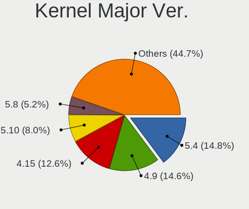

| Version | Computers | Percent |
|---------|-----------|---------|
| 5.4     | 562       | 14.8%   |
| 4.9     | 556       | 14.64%  |
| 4.15    | 480       | 12.64%  |
| 5.10    | 304       | 8%      |
| 5.8     | 199       | 5.24%   |
| 4.1     | 182       | 4.79%   |
| 5.3     | 165       | 4.34%   |
| 5.15    | 143       | 3.77%   |
| 5.11    | 140       | 3.69%   |
| 5.0     | 104       | 2.74%   |
| 5.13    | 98        | 2.58%   |
| 6.1     | 75        | 1.97%   |
| 4.18    | 75        | 1.97%   |
| 5.16    | 70        | 1.84%   |
| 4.19    | 62        | 1.63%   |
| 6.6     | 47        | 1.24%   |
| 5.6     | 44        | 1.16%   |
| 6.8     | 39        | 1.03%   |
| 5.14    | 37        | 0.97%   |
| 6.2     | 36        | 0.95%   |
| 5.9     | 36        | 0.95%   |
| 5.12    | 33        | 0.87%   |
| 4.13    | 25        | 0.66%   |
| 5.19    | 24        | 0.63%   |
| 6.4     | 21        | 0.55%   |
| 6.5     | 20        | 0.53%   |
| 5.7     | 20        | 0.53%   |
| 6.10    | 18        | 0.47%   |
| 5.5     | 18        | 0.47%   |
| 5.17    | 18        | 0.47%   |
| 4.4     | 17        | 0.45%   |
| 4.14    | 15        | 0.39%   |
| 6.11    | 12        | 0.32%   |
| 6.0     | 11        | 0.29%   |
| 4.8     | 10        | 0.26%   |
| 6.9     | 8         | 0.21%   |
| 5.18    | 8         | 0.21%   |
| 4.10    | 8         | 0.21%   |
| 5.2     | 6         | 0.16%   |
| 6.7     | 5         | 0.13%   |

Arch
----

OS architecture (x86_64, i586, etc.)

| Name    | Computers | Percent |
|---------|-----------|---------|
| x86_64  | 3063      | 88.5%   |
| i686    | 377       | 10.89%  |
| aarch64 | 16        | 0.46%   |
| armv7l  | 5         | 0.14%   |

DE
--

Desktop Environment

| Name             | Computers | Percent |
|------------------|-----------|---------|
| GNOME            | 927       | 25.55%  |
| KDE4             | 738       | 20.34%  |
| KDE5             | 719       | 19.82%  |
| Unknown          | 382       | 10.53%  |
| XFCE             | 207       | 5.71%   |
| X-Cinnamon       | 134       | 3.69%   |
| MATE             | 110       | 3.03%   |
| Cinnamon         | 103       | 2.84%   |
| KDE              | 98        | 2.7%    |
| LXQt             | 73        | 2.01%   |
| i3               | 22        | 0.61%   |
| Pantheon         | 19        | 0.52%   |
| KDE6             | 16        | 0.44%   |
| Unity            | 14        | 0.39%   |
| LXDE             | 13        | 0.36%   |
| Budgie           | 11        | 0.3%    |
| Deepin           | 10        | 0.28%   |
| GNOME Flashback  | 9         | 0.25%   |
| GNOME Classic    | 5         | 0.14%   |
| Openbox          | 3         | 0.08%   |
| xmonad           | 2         | 0.06%   |
| none+i3          | 2         | 0.06%   |
| Hyprland         | 2         | 0.06%   |
| bspwm            | 2         | 0.06%   |
| wlroots          | 1         | 0.03%   |
| Trinity          | 1         | 0.03%   |
| qtile            | 1         | 0.03%   |
| lightdm-xsession | 1         | 0.03%   |
| i3-with-shmlog   | 1         | 0.03%   |
| fluxbox          | 1         | 0.03%   |
| Enlightenment    | 1         | 0.03%   |

Display Server
--------------

X11 or Wayland

| Name    | Computers | Percent |
|---------|-----------|---------|
| X11     | 2851      | 80.99%  |
| Wayland | 441       | 12.53%  |
| Unknown | 194       | 5.51%   |
| Tty     | 34        | 0.97%   |

Display Manager
---------------

SDDM, LightDM, etc.

| Name    | Computers | Percent |
|---------|-----------|---------|
| Unknown | 1175      | 32.51%  |
| KDM     | 744       | 20.59%  |
| SDDM    | 733       | 20.28%  |
| GDM     | 398       | 11.01%  |
| LightDM | 218       | 6.03%   |
| TDM     | 203       | 5.62%   |
| GDM3    | 108       | 2.99%   |
| MDM     | 12        | 0.33%   |
| XDM     | 9         | 0.25%   |
| SLiM    | 6         | 0.17%   |
| Ly      | 2         | 0.06%   |
| LXDM    | 2         | 0.06%   |
| GREETD  | 2         | 0.06%   |
| NODM    | 1         | 0.03%   |
| LY-DM   | 1         | 0.03%   |

OS Lang
-------

Language

| Lang           | Computers | Percent |
|----------------|-----------|---------|
| Unknown        | 1288      | 36.19%  |
| en_US          | 782       | 21.97%  |
| ru_RU          | 646       | 18.15%  |
| ru_UA          | 484       | 13.6%   |
| uk_UA          | 245       | 6.88%   |
| C              | 55        | 1.55%   |
| en_GB          | 24        | 0.67%   |
| ru_RU.UTF_8    | 8         | 0.22%   |
| pl_PL          | 4         | 0.11%   |
| es_ES          | 4         | 0.11%   |
| hu_HU          | 3         | 0.08%   |
| en_CA          | 3         | 0.08%   |
| POSIX          | 2         | 0.06%   |
| C.UTF8         | 2         | 0.06%   |
| UTF-8          | 1         | 0.03%   |
| it_IT          | 1         | 0.03%   |
| fr_FR          | 1         | 0.03%   |
| en_ZA          | 1         | 0.03%   |
| en_US.US-ASCII | 1         | 0.03%   |
| en_NZ          | 1         | 0.03%   |
| en_IE          | 1         | 0.03%   |
| en_AG          | 1         | 0.03%   |
| de_DE          | 1         | 0.03%   |

Boot Mode
---------

EFI or BIOS

| Mode | Computers | Percent |
|------|-----------|---------|
| BIOS | 2132      | 60.91%  |
| EFI  | 1368      | 39.09%  |

Filesystem
----------

Type of filesystem

| Type    | Computers | Percent |
|---------|-----------|---------|
| Ext4    | 2322      | 65.24%  |
| Unknown | 727       | 20.43%  |
| Btrfs   | 223       | 6.27%   |
| Overlay | 182       | 5.11%   |
| Tmpfs   | 34        | 0.96%   |
| Xfs     | 25        | 0.7%    |
| Zfs     | 17        | 0.48%   |
| Ext3    | 12        | 0.34%   |
| Ext2    | 12        | 0.34%   |
| F2fs    | 3         | 0.08%   |
| SAMSUNG | 1         | 0.03%   |
| Aufs    | 1         | 0.03%   |

Part. scheme
------------

Scheme of partitioning

| Type    | Computers | Percent |
|---------|-----------|---------|
| Unknown | 1465      | 41%     |
| MBR     | 1060      | 29.67%  |
| GPT     | 1048      | 29.33%  |

Dual Boot with Linux/BSD
------------------------

Hosting more than one Linux/BSD

| Dual boot | Computers | Percent |
|-----------|-----------|---------|
| No        | 2993      | 85.17%  |
| Yes       | 521       | 14.83%  |

Dual Boot (Win)
---------------

Hosting Linux and Windows

| Dual boot | Computers | Percent |
|-----------|-----------|---------|
| No        | 2451      | 68.95%  |
| Yes       | 1104      | 31.05%  |

Board
-----

Vendor
------

Motherboard manufacturer

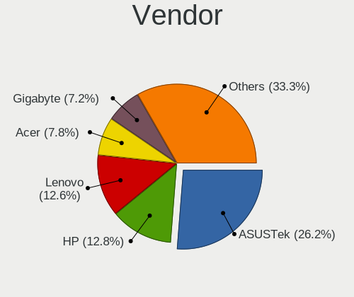

| Name                    | Computers | Percent |
|-------------------------|-----------|---------|
| ASUSTek Computer        | 901       | 26.24%  |
| Hewlett-Packard         | 440       | 12.81%  |
| Lenovo                  | 434       | 12.64%  |
| Acer                    | 269       | 7.83%   |
| Gigabyte Technology     | 247       | 7.19%   |
| Dell                    | 236       | 6.87%   |
| MSI                     | 198       | 5.77%   |
| ASRock                  | 187       | 5.45%   |
| Samsung Electronics     | 66        | 1.92%   |
| Biostar                 | 55        | 1.6%    |
| Intel                   | 36        | 1.05%   |
| Unknown                 | 33        | 0.96%   |
| Timi                    | 29        | 0.84%   |
| Toshiba                 | 24        | 0.7%    |
| Fujitsu                 | 23        | 0.67%   |
| Apple                   | 23        | 0.67%   |
| ECS                     | 18        | 0.52%   |
| Sony                    | 12        | 0.35%   |
| eMachines               | 12        | 0.35%   |
| Fujitsu Siemens         | 11        | 0.32%   |
| Valve                   | 10        | 0.29%   |
| Raspberry Pi Foundation | 10        | 0.29%   |
| Packard Bell            | 10        | 0.29%   |
| Foxconn                 | 10        | 0.29%   |
| Huanan                  | 9         | 0.26%   |
| Pegatron                | 6         | 0.17%   |
| HUAWEI                  | 6         | 0.17%   |
| Google                  | 6         | 0.17%   |
| AMI                     | 5         | 0.15%   |
| VINGA                   | 4         | 0.12%   |
| Medion                  | 4         | 0.12%   |
| HONOR                   | 4         | 0.12%   |
| Chuwi                   | 4         | 0.12%   |
| WinFast                 | 3         | 0.09%   |
| Supermicro              | 3         | 0.09%   |
| Shuttle                 | 3         | 0.09%   |
| Nvidia                  | 3         | 0.09%   |
| Notebook                | 3         | 0.09%   |
| Navigator               | 3         | 0.09%   |
| ZOTAC                   | 2         | 0.06%   |

Model
-----

Motherboard model

| Name                                       | Computers | Percent |
|--------------------------------------------|-----------|---------|
| Unknown                                    | 41        | 1.19%   |
| ASUS All Series                            | 28        | 0.82%   |
| HP Pavilion g6                             | 24        | 0.7%    |
| Lenovo G500 20236                          | 13        | 0.38%   |
| HP Pavilion dv6                            | 12        | 0.35%   |
| HP Pavilion 15                             | 12        | 0.35%   |
| ASUS VivoBook 15_ASUS Laptop X540MA_X543MA | 12        | 0.35%   |
| ASUS M5A78L-M LX3                          | 12        | 0.35%   |
| ASRock N68C-S UCC                          | 12        | 0.35%   |
| ASUS M5A97 R2.0                            | 9         | 0.26%   |
| ECS H61H2-M6                               | 8         | 0.23%   |
| ASUS PRIME A320M-K                         | 8         | 0.23%   |
| Acer Aspire V3-571G                        | 8         | 0.23%   |
| Valve Jupiter                              | 7         | 0.2%    |
| MSI MS-7B86                                | 7         | 0.2%    |
| Lenovo V580c 20160                         | 7         | 0.2%    |
| Lenovo IdeaPad Z580                        | 7         | 0.2%    |
| Lenovo IdeaPad Z510 20287                  | 7         | 0.2%    |
| Lenovo G580 20150                          | 7         | 0.2%    |
| HP 250 G5 Notebook PC                      | 7         | 0.2%    |
| Gigabyte G41M-Combo                        | 7         | 0.2%    |
| Samsung R59P/R60P/R61P                     | 6         | 0.17%   |
| Samsung R528/R728                          | 6         | 0.17%   |
| Lenovo G580 20157                          | 6         | 0.17%   |
| Lenovo G550 20023                          | 6         | 0.17%   |
| HP Pavilion Gaming Laptop 15-cx0xxx        | 6         | 0.17%   |
| HP Pavilion g7                             | 6         | 0.17%   |
| HP Notebook                                | 6         | 0.17%   |
| HP Laptop 15-bw0xx                         | 6         | 0.17%   |
| HP 620                                     | 6         | 0.17%   |
| HP 255 G7 Notebook PC                      | 6         | 0.17%   |
| HP 250 G4                                  | 6         | 0.17%   |
| Gigabyte B450M DS3H                        | 6         | 0.17%   |
| ASUS VivoBook 15_ASUS Laptop X540UBR       | 6         | 0.17%   |
| ASUS P5Q                                   | 6         | 0.17%   |
| ASUS P5GC-MX/1333                          | 6         | 0.17%   |
| MSI MS-7C52                                | 5         | 0.15%   |
| MSI MS-7817                                | 5         | 0.15%   |
| MSI MS-7788                                | 5         | 0.15%   |
| Lenovo S10-3                               | 5         | 0.15%   |

Model Family
------------

Motherboard model prefix

| Name              | Computers | Percent |
|-------------------|-----------|---------|
| Acer Aspire       | 160       | 4.66%   |
| Lenovo IdeaPad    | 129       | 3.76%   |
| Lenovo ThinkPad   | 110       | 3.2%    |
| HP Pavilion       | 95        | 2.77%   |
| HP ProBook        | 93        | 2.71%   |
| ASUS VivoBook     | 91        | 2.65%   |
| Dell Inspiron     | 88        | 2.56%   |
| ASUS PRIME        | 59        | 1.72%   |
| Dell Latitude     | 54        | 1.57%   |
| HP Laptop         | 44        | 1.28%   |
| Unknown           | 41        | 1.19%   |
| HP Compaq         | 33        | 0.96%   |
| Acer Swift        | 32        | 0.93%   |
| ASUS TUF          | 30        | 0.87%   |
| ASUS ROG          | 30        | 0.87%   |
| HP EliteBook      | 29        | 0.84%   |
| ASUS All          | 28        | 0.82%   |
| HP 250            | 26        | 0.76%   |
| Dell Vostro       | 26        | 0.76%   |
| HP ZBook          | 24        | 0.7%    |
| ASUS M5A78L-M     | 24        | 0.7%    |
| Dell OptiPlex     | 21        | 0.61%   |
| Toshiba Satellite | 19        | 0.55%   |
| Gigabyte B450M    | 18        | 0.52%   |
| ASUS M5A97        | 18        | 0.52%   |
| Acer TravelMate   | 18        | 0.52%   |
| Acer Nitro        | 17        | 0.5%    |
| Lenovo Legion     | 16        | 0.47%   |
| Acer Extensa      | 16        | 0.47%   |
| Dell Precision    | 15        | 0.44%   |
| Lenovo ThinkBook  | 14        | 0.41%   |
| Lenovo G580       | 14        | 0.41%   |
| HP 255            | 14        | 0.41%   |
| Dell XPS          | 14        | 0.41%   |
| Lenovo G500       | 13        | 0.38%   |
| ASUS P8H61-M      | 13        | 0.38%   |
| ASUS P5Q          | 13        | 0.38%   |
| Timi RedmiBook    | 12        | 0.35%   |
| Fujitsu LIFEBOOK  | 12        | 0.35%   |
| ASUS P8Z68-V      | 12        | 0.35%   |

MFG Year
--------

Motherboard manufacture year

| Year    | Computers | Percent |
|---------|-----------|---------|
| 2012    | 376       | 10.95%  |
| 2011    | 326       | 9.49%   |
| 2018    | 302       | 8.79%   |
| 2010    | 254       | 7.4%    |
| 2019    | 230       | 6.7%    |
| 2017    | 227       | 6.61%   |
| 2013    | 223       | 6.49%   |
| 2020    | 185       | 5.39%   |
| 2009    | 184       | 5.36%   |
| 2007    | 175       | 5.1%    |
| 2016    | 158       | 4.6%    |
| 2015    | 154       | 4.48%   |
| 2008    | 147       | 4.28%   |
| 2014    | 144       | 4.19%   |
| 2021    | 122       | 3.55%   |
| 2006    | 93        | 2.71%   |
| 2005    | 42        | 1.22%   |
| 2022    | 31        | 0.9%    |
| 2023    | 29        | 0.84%   |
| Unknown | 18        | 0.52%   |
| 2004    | 5         | 0.15%   |
| 2024    | 4         | 0.12%   |
| 2003    | 3         | 0.09%   |
| 2002    | 2         | 0.06%   |

Form Factor
-----------

Physical design of the computer

| Name           | Computers | Percent |
|----------------|-----------|---------|
| Notebook       | 1935      | 56.35%  |
| Desktop        | 1411      | 41.09%  |
| All in one     | 21        | 0.61%   |
| Convertible    | 19        | 0.55%   |
| Mini pc        | 18        | 0.52%   |
| System on chip | 15        | 0.44%   |
| Tablet         | 7         | 0.2%    |
| Phone          | 4         | 0.12%   |
| Server         | 4         | 0.12%   |

Secure Boot
-----------

Enabled or disabled

| State    | Computers | Percent |
|----------|-----------|---------|
| Disabled | 3308      | 96%     |
| Enabled  | 138       | 4%      |

Coreboot
--------

Have coreboot on board

| Used | Computers | Percent |
|------|-----------|---------|
| No   | 3427      | 99.8%   |
| Yes  | 7         | 0.2%    |

RAM Size
--------

Total RAM memory

| Size in GB      | Computers | Percent |
|-----------------|-----------|---------|
| 3.01-4.0        | 853       | 24.29%  |
| 4.01-8.0        | 773       | 22.01%  |
| 8.01-16.0       | 628       | 17.88%  |
| 16.01-24.0      | 520       | 14.81%  |
| 1.01-2.0        | 287       | 8.17%   |
| 32.01-64.0      | 172       | 4.9%    |
| 2.01-3.0        | 156       | 4.44%   |
| 0.51-1.0        | 56        | 1.59%   |
| 24.01-32.0      | 33        | 0.94%   |
| 64.01-256.0     | 28        | 0.8%    |
| 0.01-0.5        | 5         | 0.14%   |
| More than 256.0 | 1         | 0.03%   |

RAM Used
--------

Used RAM memory

| Used GB    | Computers | Percent |
|------------|-----------|---------|
| 1.01-2.0   | 1321      | 34.6%   |
| 2.01-3.0   | 729       | 19.09%  |
| 0.51-1.0   | 717       | 18.78%  |
| 4.01-8.0   | 440       | 11.52%  |
| 3.01-4.0   | 367       | 9.61%   |
| 8.01-16.0  | 137       | 3.59%   |
| 0.01-0.5   | 86        | 2.25%   |
| 16.01-24.0 | 13        | 0.34%   |
| 24.01-32.0 | 4         | 0.1%    |
| Unknown    | 3         | 0.08%   |
| 32.01-64.0 | 1         | 0.03%   |

Total Drives
------------

Number of drives on board

| Drives | Computers | Percent |
|--------|-----------|---------|
| 1      | 2255      | 63.79%  |
| 2      | 861       | 24.36%  |
| 3      | 251       | 7.1%    |
| 4      | 83        | 2.35%   |
| 5      | 37        | 1.05%   |
| 0      | 32        | 0.91%   |
| 6      | 9         | 0.25%   |
| 8      | 4         | 0.11%   |
| 7      | 3         | 0.08%   |

Has CD-ROM
----------

Has CD-ROM on board

| Presented | Computers | Percent |
|-----------|-----------|---------|
| No        | 2155      | 62.12%  |
| Yes       | 1314      | 37.88%  |

Has Ethernet
------------

Has Ethernet on board

| Presented | Computers | Percent |
|-----------|-----------|---------|
| Yes       | 3067      | 89.18%  |
| No        | 372       | 10.82%  |

Has WiFi
--------

Has WiFi module

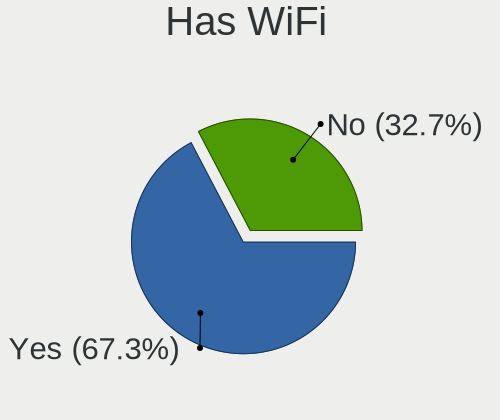

| Presented | Computers | Percent |
|-----------|-----------|---------|
| Yes       | 2328      | 67.32%  |
| No        | 1130      | 32.68%  |

Has Bluetooth
-------------

Has Bluetooth module

| Presented | Computers | Percent |
|-----------|-----------|---------|
| Yes       | 1744      | 50.03%  |
| No        | 1742      | 49.97%  |

Location
--------

Country
-------

Geographic location (country)

| Country | Computers | Percent |
|---------|-----------|---------|
| Ukraine | 3434      | 100%    |

City
----

Geographic location (city)

| City            | Computers | Percent |
|-----------------|-----------|---------|
| Kyiv            | 808       | 22.59%  |
| Kharkiv         | 235       | 6.57%   |
| Simferopol      | 167       | 4.67%   |
| Lviv            | 146       | 4.08%   |
| Dnipro          | 146       | 4.08%   |
| Sevastopol      | 143       | 4%      |
| Odessa          | 139       | 3.89%   |
| Donetsk         | 114       | 3.19%   |
| Mykolayiv       | 47        | 1.31%   |
| Zaporizhzhya    | 44        | 1.23%   |
| Mariupol        | 44        | 1.23%   |
| Zaporizhzhia    | 43        | 1.2%    |
| Vinnytsia       | 39        | 1.09%   |
| Kryvyi Rih      | 37        | 1.03%   |
| Poltava         | 35        | 0.98%   |
| Kherson         | 34        | 0.95%   |
| Ternopil        | 33        | 0.92%   |
| Chernihiv       | 33        | 0.92%   |
| Odesa           | 32        | 0.89%   |
| Luhansk         | 32        | 0.89%   |
| Cherkasy        | 32        | 0.89%   |
| Yasinovataya    | 26        | 0.73%   |
| Novopskov       | 26        | 0.73%   |
| Kremenchug      | 26        | 0.73%   |
| Ivano-Frankivsk | 26        | 0.73%   |
| Horlivka        | 26        | 0.73%   |
| Yalta           | 23        | 0.64%   |
| Uzhhorod        | 22        | 0.62%   |
| Zhytomyr        | 21        | 0.59%   |
| Rivne           | 19        | 0.53%   |
| Lutsk           | 19        | 0.53%   |
| Kramatorsk      | 18        | 0.5%    |
| Bucha           | 18        | 0.5%    |
| Makiivka        | 17        | 0.48%   |
| Kerch           | 17        | 0.48%   |
| Sumy            | 16        | 0.45%   |
| Irpin           | 16        | 0.45%   |
| Yevpatoriya     | 15        | 0.42%   |
| Syeverodonets'k | 15        | 0.42%   |
| Brovary         | 15        | 0.42%   |

Drives
------

Drive Vendor
------------

Hard drive vendors

| Vendor                      | Computers | Drives | Percent |
|-----------------------------|-----------|--------|---------|
| WDC                         | 868       | 1219   | 17.88%  |
| Seagate                     | 807       | 1098   | 16.62%  |
| Samsung Electronics         | 661       | 890    | 13.61%  |
| Toshiba                     | 391       | 492    | 8.05%   |
| Kingston                    | 348       | 453    | 7.17%   |
| Hitachi                     | 267       | 338    | 5.5%    |
| Unknown                     | 137       | 168    | 2.82%   |
| HGST                        | 122       | 172    | 2.51%   |
| SanDisk                     | 99        | 116    | 2.04%   |
| GOODRAM                     | 99        | 116    | 2.04%   |
| SK hynix                    | 96        | 113    | 1.98%   |
| Intel                       | 86        | 110    | 1.77%   |
| Patriot                     | 66        | 76     | 1.36%   |
| Apacer                      | 65        | 70     | 1.34%   |
| Micron Technology           | 55        | 72     | 1.13%   |
| Crucial                     | 55        | 61     | 1.13%   |
| A-DATA Technology           | 48        | 61     | 0.99%   |
| SPCC                        | 43        | 53     | 0.89%   |
| China                       | 41        | 46     | 0.84%   |
| Transcend                   | 38        | 54     | 0.78%   |
| Team                        | 38        | 50     | 0.78%   |
| KIOXIA                      | 27        | 33     | 0.56%   |
| Silicon Motion              | 23        | 28     | 0.47%   |
| Maxtor                      | 21        | 24     | 0.43%   |
| AMD                         | 18        | 40     | 0.37%   |
| OCZ                         | 15        | 15     | 0.31%   |
| JMicron Technology          | 15        | 20     | 0.31%   |
| Apple                       | 15        | 18     | 0.31%   |
| LITEON                      | 14        | 16     | 0.29%   |
| Kingston Technology Company | 14        | 16     | 0.29%   |
| Leven                       | 13        | 15     | 0.27%   |
| Fujitsu                     | 13        | 13     | 0.27%   |
| KingDian                    | 12        | 16     | 0.25%   |
| KingSpec                    | 11        | 11     | 0.23%   |
| Plextor                     | 10        | 11     | 0.21%   |
| Phison Electronics          | 10        | 10     | 0.21%   |
| Gigabyte Technology         | 10        | 11     | 0.21%   |
| Phison                      | 9         | 12     | 0.19%   |
| LITEONIT                    | 9         | 11     | 0.19%   |
| StoreJet                    | 7         | 7      | 0.14%   |

Drive Model
-----------

Hard drive models

| Model                                               | Computers | Percent |
|-----------------------------------------------------|-----------|---------|
| Seagate ST1000LM035-1RK172 1TB                      | 74        | 1.42%   |
| Seagate ST1000LM024 HN-M101MBB 1TB                  | 59        | 1.13%   |
| Kingston SA400S37240G 240GB SSD                     | 55        | 1.06%   |
| Kingston SA400S37120G 120GB SSD                     | 51        | 0.98%   |
| Toshiba MQ01ABF050 500GB                            | 49        | 0.94%   |
| Seagate ST9500325AS 500GB                           | 42        | 0.81%   |
| Samsung SSD 860 EVO 250GB                           | 42        | 0.81%   |
| Toshiba DT01ACA100 1TB                              | 40        | 0.77%   |
| Seagate ST500DM002-1BD142 500GB                     | 40        | 0.77%   |
| Toshiba DT01ACA050 500GB                            | 38        | 0.73%   |
| Seagate ST500LT012-1DG142 500GB                     | 34        | 0.65%   |
| Toshiba MQ01ABD100 1TB                              | 33        | 0.63%   |
| Toshiba HDWD110 1TB                                 | 29        | 0.56%   |
| Toshiba MQ04ABF100 1TB                              | 25        | 0.48%   |
| Samsung SSD 860 EVO 500GB                           | 25        | 0.48%   |
| Kingston SV300S37A120G 120GB SSD                    | 25        | 0.48%   |
| HGST HTS545050A7E680 500GB                          | 25        | 0.48%   |
| WDC WD10EZEX-08WN4A0 1TB                            | 24        | 0.46%   |
| Patriot Burst 120GB SSD                             | 23        | 0.44%   |
| HGST HTS721010A9E630 1TB                            | 23        | 0.44%   |
| Seagate ST3500418AS 500GB                           | 22        | 0.42%   |
| Samsung NVMe SSD Drive 256GB                        | 21        | 0.4%    |
| Seagate ST9320325AS 320GB                           | 19        | 0.36%   |
| Kingston SA400S37480G 480GB SSD                     | 19        | 0.36%   |
| Seagate ST500LT012-9WS142 500GB                     | 18        | 0.35%   |
| Seagate ST1000DM003-1CH162 1TB                      | 18        | 0.35%   |
| Patriot Burst 240GB SSD                             | 18        | 0.35%   |
| GOODRAM SSD 120GB                                   | 18        | 0.35%   |
| Unknown MMC Card  64GB                              | 16        | 0.31%   |
| Unknown MMC Card  32GB                              | 15        | 0.29%   |
| Samsung SSD 850 EVO 250GB                           | 15        | 0.29%   |
| Intel NVMe SSD Drive 512GB                          | 15        | 0.29%   |
| Hitachi HTS543232A7A384 320GB                       | 15        | 0.29%   |
| HGST HTS541010A9E680 1TB                            | 15        | 0.29%   |
| WDC WD5000AAKX-001CA0 500GB                         | 14        | 0.27%   |
| SK hynix NVMe SSD Drive 256GB                       | 14        | 0.27%   |
| Seagate ST9250315AS 250GB                           | 14        | 0.27%   |
| Seagate ST31000524AS 1TB                            | 14        | 0.27%   |
| Samsung NVMe SSD Controller SM981/PM981/PM983 512GB | 14        | 0.27%   |
| Samsung HD103SJ 1TB                                 | 14        | 0.27%   |

HDD Vendor
----------

Hard disk drive vendors

| Vendor              | Computers | Drives | Percent |
|---------------------|-----------|--------|---------|
| Seagate             | 801       | 1089   | 30.16%  |
| WDC                 | 799       | 1123   | 30.08%  |
| Toshiba             | 349       | 436    | 13.14%  |
| Hitachi             | 267       | 338    | 10.05%  |
| Samsung Electronics | 250       | 351    | 9.41%   |
| HGST                | 122       | 172    | 4.59%   |
| Maxtor              | 21        | 24     | 0.79%   |
| Fujitsu             | 13        | 13     | 0.49%   |
| JMicron Technology  | 9         | 13     | 0.34%   |
| Unknown             | 6         | 8      | 0.23%   |
| Apple               | 4         | 4      | 0.15%   |
| StoreJet            | 2         | 2      | 0.08%   |
| HGST HTS            | 2         | 2      | 0.08%   |
| ASMT                | 2         | 6      | 0.08%   |
| USB                 | 1         | 1      | 0.04%   |
| TPH00100500GB       | 1         | 1      | 0.04%   |
| SILICONMOTION       | 1         | 1      | 0.04%   |
| SAGE                | 1         | 1      | 0.04%   |
| IBM/Hitachi         | 1         | 1      | 0.04%   |
| External            | 1         | 2      | 0.04%   |
| Ext Hard            | 1         | 1      | 0.04%   |
| Config              | 1         | 1      | 0.04%   |
| China               | 1         | 1      | 0.04%   |

SSD Vendor
----------

Solid state drive vendors

| Vendor              | Computers | Drives | Percent |
|---------------------|-----------|--------|---------|
| Kingston            | 300       | 388    | 21.58%  |
| Samsung Electronics | 230       | 301    | 16.55%  |
| GOODRAM             | 94        | 110    | 6.76%   |
| Patriot             | 65        | 75     | 4.68%   |
| Apacer              | 62        | 67     | 4.46%   |
| SanDisk             | 58        | 67     | 4.17%   |
| Crucial             | 54        | 60     | 3.88%   |
| China               | 40        | 45     | 2.88%   |
| A-DATA Technology   | 40        | 53     | 2.88%   |
| SPCC                | 39        | 47     | 2.81%   |
| Team                | 37        | 46     | 2.66%   |
| Transcend           | 34        | 47     | 2.45%   |
| Intel               | 33        | 40     | 2.37%   |
| WDC                 | 29        | 33     | 2.09%   |
| SK hynix            | 27        | 33     | 1.94%   |
| Micron Technology   | 27        | 31     | 1.94%   |
| AMD                 | 16        | 38     | 1.15%   |
| Toshiba             | 15        | 21     | 1.08%   |
| OCZ                 | 15        | 15     | 1.08%   |
| LITEON              | 13        | 15     | 0.94%   |
| Leven               | 12        | 14     | 0.86%   |
| KingDian            | 12        | 16     | 0.86%   |
| Gigabyte Technology | 10        | 11     | 0.72%   |
| LITEONIT            | 9         | 11     | 0.65%   |
| KingSpec            | 9         | 9      | 0.65%   |
| Plextor             | 8         | 9      | 0.58%   |
| Apple               | 8         | 8      | 0.58%   |
| StoreJet            | 5         | 5      | 0.36%   |
| DeTech              | 5         | 6      | 0.36%   |
| Verbatim            | 4         | 4      | 0.29%   |
| Smartbuy            | 4         | 5      | 0.29%   |
| Netac               | 3         | 3      | 0.22%   |
| Corsair             | 3         | 3      | 0.22%   |
| USB3.0              | 2         | 2      | 0.14%   |
| Unknown             | 2         | 2      | 0.14%   |
| Teclast             | 2         | 2      | 0.14%   |
| PNY                 | 2         | 2      | 0.14%   |
| Pioneer             | 2         | 2      | 0.14%   |
| KIOXIA-EXCERIA      | 2         | 3      | 0.14%   |
| KCG                 | 2         | 2      | 0.14%   |

Drive Kind
----------

HDD or SSD

| Kind    | Computers | Drives | Percent |
|---------|-----------|--------|---------|
| HDD     | 2269      | 3591   | 52.35%  |
| SSD     | 1257      | 1717   | 29%     |
| NVMe    | 650       | 842    | 15%     |
| MMC     | 122       | 151    | 2.81%   |
| Unknown | 36        | 40     | 0.83%   |

Drive Connector
---------------

SATA, SAS, NVMe, etc.

| Type | Computers | Drives | Percent |
|------|-----------|--------|---------|
| SATA | 2895      | 5251   | 77.34%  |
| NVMe | 649       | 841    | 17.34%  |
| MMC  | 122       | 151    | 3.26%   |
| SAS  | 77        | 98     | 2.06%   |

Drive Size
----------

Size of hard drive

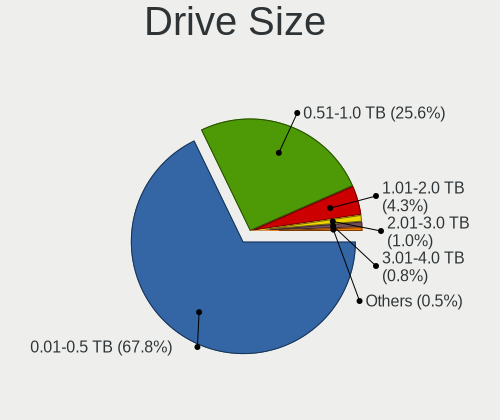

| Size in TB | Computers | Drives | Percent |
|------------|-----------|--------|---------|
| 0.01-0.5   | 2386      | 3716   | 67.82%  |
| 0.51-1.0   | 901       | 1254   | 25.61%  |
| 1.01-2.0   | 150       | 211    | 4.26%   |
| 2.01-3.0   | 34        | 54     | 0.97%   |
| 3.01-4.0   | 28        | 47     | 0.8%    |
| 4.01-10.0  | 19        | 26     | 0.54%   |

Space Total
-----------

Amount of disk space available on the file system

| Size in GB     | Computers | Percent |
|----------------|-----------|---------|
| 101-250        | 1004      | 27.16%  |
| 251-500        | 831       | 22.48%  |
| 501-1000       | 457       | 12.36%  |
| 1-20           | 357       | 9.66%   |
| 51-100         | 350       | 9.47%   |
| 21-50          | 274       | 7.41%   |
| 1001-2000      | 222       | 6%      |
| More than 3000 | 69        | 1.87%   |
| Unknown        | 67        | 1.81%   |
| 2001-3000      | 66        | 1.79%   |

Space Used
----------

Amount of used disk space

| Used GB        | Computers | Percent |
|----------------|-----------|---------|
| 1-20           | 1671      | 44.58%  |
| 21-50          | 593       | 15.82%  |
| 101-250        | 454       | 12.11%  |
| 51-100         | 409       | 10.91%  |
| 251-500        | 251       | 6.7%    |
| 501-1000       | 181       | 4.83%   |
| 1001-2000      | 73        | 1.95%   |
| Unknown        | 67        | 1.79%   |
| More than 3000 | 26        | 0.69%   |
| 2001-3000      | 22        | 0.59%   |
| 0              | 1         | 0.03%   |

Malfunc. Drives
---------------

Drive models with a malfunction

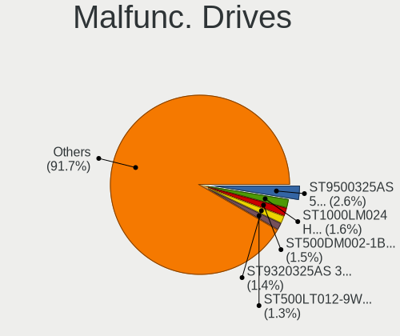

| Model                              | Computers | Drives | Percent |
|------------------------------------|-----------|--------|---------|
| Seagate ST9500325AS 500GB          | 24        | 27     | 2.57%   |
| Seagate ST1000LM024 HN-M101MBB 1TB | 15        | 23     | 1.6%    |
| Seagate ST500DM002-1BD142 500GB    | 14        | 18     | 1.5%    |
| Seagate ST9320325AS 320GB          | 13        | 16     | 1.39%   |
| Seagate ST500LT012-9WS142 500GB    | 12        | 14     | 1.28%   |
| Seagate ST500LT012-1DG142 500GB    | 11        | 12     | 1.18%   |
| Hitachi HTS543232A7A384 320GB      | 11        | 12     | 1.18%   |
| Seagate ST3500418AS 500GB          | 10        | 11     | 1.07%   |
| HGST HTS545050A7E680 500GB         | 9         | 14     | 0.96%   |
| Seagate ST9250315AS 250GB          | 8         | 9      | 0.86%   |
| Samsung Electronics HD321KJ 320GB  | 8         | 11     | 0.86%   |
| Samsung Electronics HD080HJ/ 80GB  | 8         | 8      | 0.86%   |
| WDC WD5000AADS-00S9B0 500GB        | 7         | 7      | 0.75%   |
| Toshiba MQ01ABD100 1TB             | 7         | 7      | 0.75%   |
| Toshiba MQ01ABD050 500GB           | 7         | 9      | 0.75%   |
| Toshiba DT01ACA050 500GB           | 7         | 8      | 0.75%   |
| Seagate ST31000524AS 1TB           | 7         | 9      | 0.75%   |
| Hitachi HTS545050B9A300 500GB      | 7         | 9      | 0.75%   |
| WDC WD5000AAKX-001CA0 500GB        | 6         | 6      | 0.64%   |
| Seagate ST3320620AS 320GB          | 6         | 8      | 0.64%   |
| Seagate ST3250318AS 250GB          | 6         | 8      | 0.64%   |
| Seagate ST320LT020-9YG142 320GB    | 6         | 7      | 0.64%   |
| Seagate ST1000LM035-1RK172 1TB     | 6         | 7      | 0.64%   |
| Hitachi HTS542516K9SA00 160GB      | 6         | 6      | 0.64%   |
| WDC WD3200BEVT-22A23T0 320GB       | 5         | 5      | 0.53%   |
| WDC WD10EZEX-60ZF5A0 1TB           | 5         | 6      | 0.53%   |
| Seagate ST3250410AS 250GB          | 5         | 8      | 0.53%   |
| Seagate ST3250310AS 250GB          | 5         | 6      | 0.53%   |
| Seagate ST3160811AS 160GB          | 5         | 5      | 0.53%   |
| Seagate ST1000DM003-1CH162 1TB     | 5         | 7      | 0.53%   |
| Samsung Electronics SP2514N 250GB  | 5         | 6      | 0.53%   |
| Samsung Electronics SP2504C 250GB  | 5         | 6      | 0.53%   |
| Samsung Electronics SP2004C 200GB  | 5         | 5      | 0.53%   |
| Samsung Electronics HD403LJ 400GB  | 5         | 6      | 0.53%   |
| Samsung Electronics HD160JJ 160GB  | 5         | 7      | 0.53%   |
| Samsung Electronics HD103SJ 1TB    | 5         | 7      | 0.53%   |
| Maxtor STM3250820AS 250GB          | 5         | 6      | 0.53%   |
| Hitachi HTS545050A7E380 500GB      | 5         | 5      | 0.53%   |
| Hitachi HTS545032B9A300 320GB      | 5         | 7      | 0.53%   |
| Hitachi HTS542512K9A300 120GB      | 5         | 6      | 0.53%   |

Malfunc. Drive Vendor
---------------------

Vendors of faulty drives

| Vendor                      | Computers | Drives | Percent |
|-----------------------------|-----------|--------|---------|
| Seagate                     | 275       | 343    | 30.05%  |
| WDC                         | 204       | 239    | 22.3%   |
| Samsung Electronics         | 127       | 150    | 13.88%  |
| Hitachi                     | 126       | 166    | 13.77%  |
| Toshiba                     | 69        | 84     | 7.54%   |
| HGST                        | 20        | 27     | 2.19%   |
| Kingston                    | 18        | 24     | 1.97%   |
| Maxtor                      | 12        | 14     | 1.31%   |
| SanDisk                     | 7         | 9      | 0.77%   |
| A-DATA Technology           | 7         | 8      | 0.77%   |
| SK hynix                    | 4         | 4      | 0.44%   |
| Intel                       | 4         | 4      | 0.44%   |
| Fujitsu                     | 4         | 4      | 0.44%   |
| Patriot                     | 3         | 3      | 0.33%   |
| OCZ                         | 3         | 3      | 0.33%   |
| Micron Technology           | 3         | 3      | 0.33%   |
| China                       | 3         | 3      | 0.33%   |
| SPCC                        | 2         | 3      | 0.22%   |
| LITEON                      | 2         | 3      | 0.22%   |
| Crucial                     | 2         | 2      | 0.22%   |
| Apple                       | 2         | 2      | 0.22%   |
| Apacer                      | 2         | 4      | 0.22%   |
| Transcend                   | 1         | 1      | 0.11%   |
| TPH00100500GB               | 1         | 1      | 0.11%   |
| Team                        | 1         | 1      | 0.11%   |
| Netac                       | 1         | 1      | 0.11%   |
| MAXIO Technology (Hangzhou) | 1         | 1      | 0.11%   |
| LS                          | 1         | 1      | 0.11%   |
| LITEONIT                    | 1         | 1      | 0.11%   |
| KingSpec                    | 1         | 1      | 0.11%   |
| JMicron Technology          | 1         | 1      | 0.11%   |
| JIAWEI                      | 1         | 1      | 0.11%   |
| JDa                         | 1         | 1      | 0.11%   |
| IBM/Hitachi                 | 1         | 1      | 0.11%   |
| HGST HTS                    | 1         | 1      | 0.11%   |
| GOODRAM                     | 1         | 1      | 0.11%   |
| DeTech                      | 1         | 1      | 0.11%   |
| Corsair                     | 1         | 1      | 0.11%   |

Malfunc. HDD Vendor
-------------------

Vendors of faulty HDD drives

| Vendor              | Computers | Drives | Percent |
|---------------------|-----------|--------|---------|
| Seagate             | 275       | 343    | 33.05%  |
| WDC                 | 202       | 237    | 24.28%  |
| Hitachi             | 126       | 166    | 15.14%  |
| Samsung Electronics | 119       | 142    | 14.3%   |
| Toshiba             | 69        | 84     | 8.29%   |
| HGST                | 20        | 27     | 2.4%    |
| Maxtor              | 12        | 14     | 1.44%   |
| Fujitsu             | 4         | 4      | 0.48%   |
| TPH00100500GB       | 1         | 1      | 0.12%   |
| JMicron Technology  | 1         | 1      | 0.12%   |
| IBM/Hitachi         | 1         | 1      | 0.12%   |
| HGST HTS            | 1         | 1      | 0.12%   |
| Apple               | 1         | 1      | 0.12%   |

Malfunc. Drive Kind
-------------------

Kinds of faulty drives

| Kind | Computers | Drives | Percent |
|------|-----------|--------|---------|
| HDD  | 750       | 1022   | 90.04%  |
| SSD  | 77        | 90     | 9.24%   |
| NVMe | 6         | 6      | 0.72%   |

Failed Drives
-------------

Failed drive models

| Model                                 | Computers | Drives | Percent |
|---------------------------------------|-----------|--------|---------|
| Seagate ST9500325AS 500GB             | 2         | 4      | 6.06%   |
| Seagate ST9250315AS 250GB             | 2         | 2      | 6.06%   |
| Seagate ST31000528AS 1TB              | 2         | 2      | 6.06%   |
| WDC WD5000AAKS-00V1A0 500GB           | 1         | 2      | 3.03%   |
| WDC WD3200BEVT-24A23T0 320GB          | 1         | 1      | 3.03%   |
| WDC WD3200BEVT-22ZCT0 320GB           | 1         | 1      | 3.03%   |
| WDC WD3200AAJS-60Z0A0 320GB           | 1         | 1      | 3.03%   |
| WDC WD2500JS-22NCB1 250GB             | 1         | 1      | 3.03%   |
| WDC WD2500AAKS-00F0A0 250GB           | 1         | 1      | 3.03%   |
| WDC WD1600AAJB-00WRA0 160GB           | 1         | 1      | 3.03%   |
| WDC WD1001FALS-00E8B0 1TB             | 1         | 1      | 3.03%   |
| Toshiba MK5065GSX 500GB               | 1         | 1      | 3.03%   |
| Toshiba MK1059GSM 1TB                 | 1         | 1      | 3.03%   |
| Seagate ST500LM012 HN-M500MBB 500GB   | 1         | 1      | 3.03%   |
| Seagate ST3750525AS 752GB             | 1         | 1      | 3.03%   |
| Seagate ST3500418AS 500GB             | 1         | 1      | 3.03%   |
| Seagate ST3500410AS 500GB             | 1         | 1      | 3.03%   |
| Seagate ST320DM001 HD322GJ 320GB      | 1         | 1      | 3.03%   |
| Seagate ST31000524AS 1TB              | 1         | 1      | 3.03%   |
| Seagate ST31000340NS 1TB              | 1         | 1      | 3.03%   |
| Samsung Electronics SSD PM800 TM 64GB | 1         | 1      | 3.03%   |
| Samsung Electronics HM321HI 320GB     | 1         | 1      | 3.03%   |
| Samsung Electronics HM251JI 250GB     | 1         | 1      | 3.03%   |
| Samsung Electronics HD502IJ 500GB     | 1         | 1      | 3.03%   |
| Samsung Electronics HD502HJ 500GB     | 1         | 1      | 3.03%   |
| Samsung Electronics HD252HJ 250GB     | 1         | 4      | 3.03%   |
| Intel SSDSC2KB960G8 960GB             | 1         | 1      | 3.03%   |
| Hitachi HTS547575A9E384 752GB         | 1         | 1      | 3.03%   |
| Hitachi HDS721010DLE630 1TB           | 1         | 1      | 3.03%   |
| Hitachi HDS721010CLA332 1TB           | 1         | 1      | 3.03%   |

Failed Drive Vendor
-------------------

Failed drive vendors

| Vendor              | Computers | Drives | Percent |
|---------------------|-----------|--------|---------|
| Seagate             | 13        | 15     | 39.39%  |
| WDC                 | 8         | 9      | 24.24%  |
| Samsung Electronics | 6         | 9      | 18.18%  |
| Hitachi             | 3         | 3      | 9.09%   |
| Toshiba             | 2         | 2      | 6.06%   |
| Intel               | 1         | 1      | 3.03%   |

Drive Status
------------

Number of failed and malfunc. drives

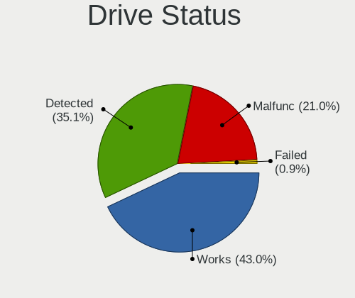

| Status   | Computers | Drives | Percent |
|----------|-----------|--------|---------|
| Works    | 1667      | 2879   | 42.97%  |
| Detected | 1363      | 2305   | 35.14%  |
| Malfunc  | 816       | 1118   | 21.04%  |
| Failed   | 33        | 39     | 0.85%   |

Storage controller
------------------

Storage Vendor
--------------

Storage controller vendors

| Vendor                           | Computers | Percent |
|----------------------------------|-----------|---------|
| Intel                            | 2290      | 56.73%  |
| AMD                              | 747       | 18.5%   |
| Samsung Electronics              | 204       | 5.05%   |
| Nvidia                           | 137       | 3.39%   |
| SanDisk                          | 83        | 2.06%   |
| JMicron Technology               | 79        | 1.96%   |
| SK hynix                         | 67        | 1.66%   |
| Kingston Technology Company      | 62        | 1.54%   |
| Marvell Technology Group         | 58        | 1.44%   |
| ASMedia Technology               | 45        | 1.11%   |
| Silicon Motion                   | 32        | 0.79%   |
| KIOXIA                           | 31        | 0.77%   |
| Toshiba America Info Systems     | 30        | 0.74%   |
| Micron Technology                | 29        | 0.72%   |
| Phison Electronics               | 27        | 0.67%   |
| VIA Technologies                 | 21        | 0.52%   |
| ADATA Technology                 | 17        | 0.42%   |
| Union Memory (Shenzhen)          | 12        | 0.3%    |
| Silicon Integrated Systems [SiS] | 10        | 0.25%   |
| Shenzhen Longsys Electronics     | 7         | 0.17%   |
| Realtek Semiconductor            | 6         | 0.15%   |
| Yangtze Memory Technologies      | 5         | 0.12%   |
| Silicon Image                    | 5         | 0.12%   |
| MAXIO Technology (Hangzhou)      | 5         | 0.12%   |
| Lite-On Technology               | 5         | 0.12%   |
| Micron/Crucial Technology        | 4         | 0.1%    |
| ULi Electronics                  | 3         | 0.07%   |
| Solid State Storage Technology   | 3         | 0.07%   |
| Integrated Technology Express    | 3         | 0.07%   |
| Netac Technology                 | 2         | 0.05%   |
| Broadcom / LSI                   | 2         | 0.05%   |
| Apple                            | 2         | 0.05%   |
| Transcend                        | 1         | 0.02%   |
| Seagate Technology               | 1         | 0.02%   |
| LSI Logic / Symbios Logic        | 1         | 0.02%   |
| Biwin Storage Technology         | 1         | 0.02%   |

Storage Model
-------------

Storage controller models

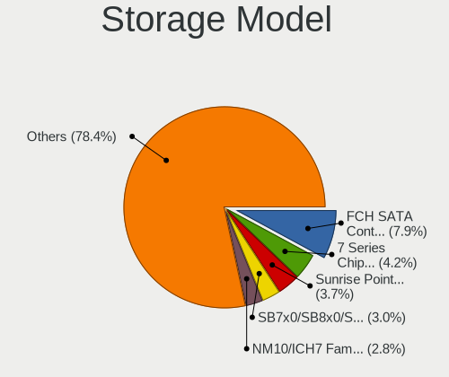

| Model                                                                                   | Computers | Percent |
|-----------------------------------------------------------------------------------------|-----------|---------|
| AMD FCH SATA Controller [AHCI mode]                                                     | 394       | 7.9%    |
| Intel 7 Series Chipset Family 6-port SATA Controller [AHCI mode]                        | 212       | 4.25%   |
| Intel Sunrise Point-LP SATA Controller [AHCI mode]                                      | 183       | 3.67%   |
| AMD SB7x0/SB8x0/SB9x0 IDE Controller                                                    | 150       | 3.01%   |
| Intel NM10/ICH7 Family SATA Controller [IDE mode]                                       | 139       | 2.79%   |
| AMD SB7x0/SB8x0/SB9x0 SATA Controller [AHCI mode]                                       | 138       | 2.77%   |
| Intel 82801G (ICH7 Family) IDE Controller                                               | 128       | 2.57%   |
| Intel 6 Series/C200 Series Chipset Family 6 port Mobile SATA AHCI Controller            | 123       | 2.47%   |
| Intel 8 Series/C220 Series Chipset Family 6-port SATA Controller 1 [AHCI mode]          | 110       | 2.2%    |
| AMD SB7x0/SB8x0/SB9x0 SATA Controller [IDE mode]                                        | 101       | 2.02%   |
| Samsung NVMe SSD Controller SM981/PM981/PM983                                           | 90        | 1.8%    |
| Intel 82801 Mobile SATA Controller [RAID mode]                                          | 90        | 1.8%    |
| Intel 6 Series/C200 Series Chipset Family 6 port Desktop SATA AHCI Controller           | 85        | 1.7%    |
| Intel 82801IBM/IEM (ICH9M/ICH9M-E) 4 port SATA Controller [AHCI mode]                   | 81        | 1.62%   |
| Nvidia MCP61 SATA Controller                                                            | 77        | 1.54%   |
| AMD 400 Series Chipset SATA Controller                                                  | 73        | 1.46%   |
| Nvidia MCP61 IDE                                                                        | 72        | 1.44%   |
| Intel Celeron/Pentium Silver Processor SATA Controller                                  | 67        | 1.34%   |
| Intel Q170/Q150/B150/H170/H110/Z170/CM236 Chipset SATA Controller [AHCI Mode]           | 65        | 1.3%    |
| Intel 6 Series/C200 Series Chipset Family Desktop SATA Controller (IDE mode, ports 4-5) | 50        | 1%      |
| Intel 6 Series/C200 Series Chipset Family Desktop SATA Controller (IDE mode, ports 0-3) | 50        | 1%      |
| Intel 200 Series PCH SATA controller [AHCI mode]                                        | 50        | 1%      |
| Intel 7 Series/C210 Series Chipset Family 6-port SATA Controller [AHCI mode]            | 48        | 0.96%   |
| Samsung NVMe SSD Controller 980 (DRAM-less)                                             | 47        | 0.94%   |
| Intel Volume Management Device NVMe RAID Controller                                     | 47        | 0.94%   |
| Intel Cannon Lake Mobile PCH SATA AHCI Controller                                       | 47        | 0.94%   |
| Intel 8 Series SATA Controller 1 [AHCI mode]                                            | 46        | 0.92%   |
| Intel 5 Series/3400 Series Chipset 4 port SATA AHCI Controller                          | 45        | 0.9%    |
| AMD SB600 IDE                                                                           | 44        | 0.88%   |
| Intel 5 Series/3400 Series Chipset 6 port SATA AHCI Controller                          | 43        | 0.86%   |
| ASMedia ASM1061/ASM1062 Serial ATA Controller                                           | 43        | 0.86%   |
| Intel Atom/Celeron/Pentium Processor x5-E8000/J3xxx/N3xxx Series SATA Controller        | 42        | 0.84%   |
| AMD SB600 Non-Raid-5 SATA                                                               | 42        | 0.84%   |
| Intel NM10/ICH7 Family SATA Controller [AHCI mode]                                      | 39        | 0.78%   |
| Intel 82801HM/HEM (ICH8M/ICH8M-E) IDE Controller                                        | 39        | 0.78%   |
| Intel Wildcat Point-LP SATA Controller [AHCI Mode]                                      | 38        | 0.76%   |
| Intel Cannon Point-LP SATA Controller [AHCI Mode]                                       | 35        | 0.7%    |
| Intel 82801I (ICH9 Family) 2 port SATA Controller [IDE mode]                            | 34        | 0.68%   |
| AMD FCH IDE Controller                                                                  | 34        | 0.68%   |
| Intel Cannon Lake PCH SATA AHCI Controller                                              | 32        | 0.64%   |

Storage Kind
------------

Kind of storage controller (IDE, SATA, NVMe, SAS, ...)

| Kind | Computers | Percent |
|------|-----------|---------|
| SATA | 2472      | 58.68%  |
| IDE  | 893       | 21.2%   |
| NVMe | 656       | 15.57%  |
| RAID | 186       | 4.41%   |
| SAS  | 5         | 0.12%   |
| SCSI | 1         | 0.02%   |

Processor
---------

CPU Vendor
----------

Processor vendors

| Vendor       | Computers | Percent |
|--------------|-----------|---------|
| Intel        | 2471      | 71.96%  |
| AMD          | 940       | 27.37%  |
| ARM          | 19        | 0.55%   |
| CentaurHauls | 2         | 0.06%   |
| Unknown      | 2         | 0.06%   |

CPU Model
---------

Processor models

| Model                                         | Computers | Percent |
|-----------------------------------------------|-----------|---------|
| Intel Core i7-8550U CPU @ 1.80GHz             | 39        | 1.13%   |
| Intel Core i5-8250U CPU @ 1.60GHz             | 37        | 1.07%   |
| Intel Core i5-8265U CPU @ 1.60GHz             | 29        | 0.84%   |
| AMD Athlon II X2 250 Processor                | 27        | 0.78%   |
| Intel Core i5-8300H CPU @ 2.30GHz             | 26        | 0.75%   |
| Intel Celeron N4000 CPU @ 1.10GHz             | 26        | 0.75%   |
| Intel Core i5-3210M CPU @ 2.50GHz             | 25        | 0.72%   |
| Intel Core i7-8565U CPU @ 1.80GHz             | 24        | 0.69%   |
| Intel Core i5-7200U CPU @ 2.50GHz             | 23        | 0.67%   |
| AMD Ryzen 5 3500U with Radeon Vega Mobile Gfx | 23        | 0.67%   |
| Intel Pentium Silver N5000 CPU @ 1.10GHz      | 21        | 0.61%   |
| Intel 11th Gen Core i5-1135G7 @ 2.40GHz       | 21        | 0.61%   |
| Intel Core i3-6006U CPU @ 2.00GHz             | 19        | 0.55%   |
| Intel Pentium CPU B960 @ 2.20GHz              | 18        | 0.52%   |
| Intel Core i5-10210U CPU @ 1.60GHz            | 18        | 0.52%   |
| Intel Core i7-7500U CPU @ 2.70GHz             | 17        | 0.49%   |
| Intel Core i3-7020U CPU @ 2.30GHz             | 17        | 0.49%   |
| Intel Core 2 Duo CPU E8400 @ 3.00GHz          | 17        | 0.49%   |
| AMD Ryzen 7 4700U with Radeon Graphics        | 17        | 0.49%   |
| Intel Pentium CPU 2020M @ 2.40GHz             | 16        | 0.46%   |
| Intel Core i3-3220 CPU @ 3.30GHz              | 16        | 0.46%   |
| AMD Ryzen 5 3600 6-Core Processor             | 16        | 0.46%   |
| AMD FX-8350 Eight-Core Processor              | 16        | 0.46%   |
| Intel Core i7-10510U CPU @ 1.80GHz            | 15        | 0.43%   |
| Intel Core i5-2410M CPU @ 2.30GHz             | 15        | 0.43%   |
| Intel Core i3-5005U CPU @ 2.00GHz             | 15        | 0.43%   |
| Intel Core i3-2350M CPU @ 2.30GHz             | 15        | 0.43%   |
| AMD Ryzen 3 2200G with Radeon Vega Graphics   | 15        | 0.43%   |
| Intel Core i5-3230M CPU @ 2.60GHz             | 14        | 0.41%   |
| Intel Core i5-2400 CPU @ 3.10GHz              | 14        | 0.41%   |
| Intel Core i3-3110M CPU @ 2.40GHz             | 14        | 0.41%   |
| Intel Celeron CPU N3060 @ 1.60GHz             | 14        | 0.41%   |
| Intel Atom CPU N450 @ 1.66GHz                 | 14        | 0.41%   |
| Intel Pentium CPU N3710 @ 1.60GHz             | 13        | 0.38%   |
| Intel Pentium CPU B950 @ 2.10GHz              | 13        | 0.38%   |
| Intel Core i7-6700HQ CPU @ 2.60GHz            | 13        | 0.38%   |
| Intel Core i5-6200U CPU @ 2.30GHz             | 13        | 0.38%   |
| Intel Core i3-2100 CPU @ 3.10GHz              | 13        | 0.38%   |
| Intel 11th Gen Core i7-1165G7 @ 2.80GHz       | 13        | 0.38%   |
| Intel Core i7-8750H CPU @ 2.20GHz             | 12        | 0.35%   |

CPU Model Family
----------------

Processor model prefix

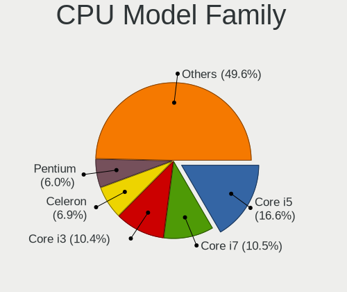

| Model                   | Computers | Percent |
|-------------------------|-----------|---------|
| Intel Core i5           | 572       | 16.58%  |
| Intel Core i7           | 361       | 10.47%  |
| Intel Core i3           | 359       | 10.41%  |
| Intel Celeron           | 239       | 6.93%   |
| Intel Pentium           | 206       | 5.97%   |
| Intel Core 2 Duo        | 158       | 4.58%   |
| AMD Ryzen 5             | 148       | 4.29%   |
| Other                   | 132       | 3.83%   |
| Intel Atom              | 85        | 2.46%   |
| AMD Ryzen 7             | 82        | 2.38%   |
| Intel Xeon              | 79        | 2.29%   |
| AMD FX                  | 69        | 2%      |
| AMD Athlon II X2        | 68        | 1.97%   |
| Intel Pentium Dual-Core | 57        | 1.65%   |
| AMD Athlon 64 X2        | 57        | 1.65%   |
| AMD Ryzen 3             | 44        | 1.28%   |
| Intel Core 2            | 41        | 1.19%   |
| AMD A4                  | 41        | 1.19%   |
| AMD Phenom II X4        | 40        | 1.16%   |
| AMD A6                  | 40        | 1.16%   |
| Intel Core 2 Quad       | 37        | 1.07%   |
| AMD A8                  | 31        | 0.9%    |
| Intel Pentium Dual      | 30        | 0.87%   |
| AMD A10                 | 30        | 0.87%   |
| Intel Pentium Silver    | 29        | 0.84%   |
| Intel Pentium 4         | 29        | 0.84%   |
| AMD Athlon II X4        | 24        | 0.7%    |
| AMD E                   | 23        | 0.67%   |
| AMD E1                  | 22        | 0.64%   |
| AMD Athlon              | 22        | 0.64%   |
| Intel Genuine           | 21        | 0.61%   |
| AMD Ryzen 9             | 20        | 0.58%   |
| Intel Celeron Dual-Core | 17        | 0.49%   |
| AMD Athlon II X3        | 17        | 0.49%   |
| Intel Pentium D         | 16        | 0.46%   |
| AMD Athlon X4           | 16        | 0.46%   |
| AMD Sempron             | 15        | 0.43%   |
| Intel Celeron M         | 13        | 0.38%   |
| AMD E2                  | 13        | 0.38%   |
| AMD Athlon II           | 12        | 0.35%   |

CPU Cores
---------

Number of processor cores

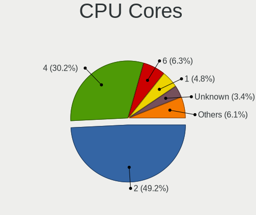

| Number  | Computers | Percent |
|---------|-----------|---------|
| 2       | 1711      | 49.22%  |
| 4       | 1049      | 30.18%  |
| 6       | 220       | 6.33%   |
| 1       | 168       | 4.83%   |
| Unknown | 117       | 3.37%   |
| 8       | 114       | 3.28%   |
| 3       | 34        | 0.98%   |
| 12      | 30        | 0.86%   |
| 16      | 12        | 0.35%   |
| 14      | 8         | 0.23%   |
| 24      | 5         | 0.14%   |
| 10      | 5         | 0.14%   |
| 36      | 1         | 0.03%   |
| 32      | 1         | 0.03%   |
| 20      | 1         | 0.03%   |

CPU Sockets
-----------

Number of sockets

| Number  | Computers | Percent |
|---------|-----------|---------|
| 1       | 3416      | 99.48%  |
| 2       | 14        | 0.41%   |
| Unknown | 3         | 0.09%   |
| 4       | 1         | 0.03%   |

CPU Threads
-----------

Threads per core (Hyper-Threading)

| Number  | Computers | Percent |
|---------|-----------|---------|
| 2       | 1775      | 51.04%  |
| 1       | 1586      | 45.6%   |
| Unknown | 117       | 3.36%   |

CPU Op-Modes
------------

CPU Operation Modes (32-bit, 64-bit)

| Op mode        | Computers | Percent |
|----------------|-----------|---------|
| 32-bit, 64-bit | 3284      | 95.3%   |
| Unknown        | 89        | 2.58%   |
| 32-bit         | 71        | 2.06%   |
| 64-bit         | 2         | 0.06%   |

CPU Microcode
-------------

Microcode number

| Number     | Computers | Percent |
|------------|-----------|---------|
| Unknown    | 654       | 18.55%  |
| 0x206a7    | 259       | 7.35%   |
| 0x306a9    | 232       | 6.58%   |
| 0x1067a    | 170       | 4.82%   |
| 0x306c3    | 115       | 3.26%   |
| 0x010000c8 | 113       | 3.2%    |
| 0x806ea    | 83        | 2.35%   |
| 0x906ea    | 68        | 1.93%   |
| 0x06001119 | 65        | 1.84%   |
| 0x20655    | 63        | 1.79%   |
| 0x806ec    | 62        | 1.76%   |
| 0x6fd      | 62        | 1.76%   |
| 0x806e9    | 56        | 1.59%   |
| 0x506e3    | 56        | 1.59%   |
| 0x906e9    | 54        | 1.53%   |
| 0x406e3    | 49        | 1.39%   |
| 0x10676    | 46        | 1.3%    |
| 0x806c1    | 41        | 1.16%   |
| 0x40651    | 41        | 1.16%   |
| 0x706a1    | 38        | 1.08%   |
| 0x106ca    | 38        | 1.08%   |
| 0x08108109 | 37        | 1.05%   |
| 0x306d4    | 35        | 0.99%   |
| 0x30678    | 35        | 0.99%   |
| 0x03000027 | 32        | 0.91%   |
| 0x406c4    | 31        | 0.88%   |
| 0x06000852 | 29        | 0.82%   |
| 0x6fb      | 28        | 0.79%   |
| 0x506c9    | 27        | 0.77%   |
| 0x20652    | 26        | 0.74%   |
| 0x6f6      | 24        | 0.68%   |
| 0x05000119 | 23        | 0.65%   |
| 0xa0652    | 21        | 0.6%    |
| 0x406c3    | 20        | 0.57%   |
| 0x906eb    | 19        | 0.54%   |
| 0x08600106 | 19        | 0.54%   |
| 0x08108102 | 19        | 0.54%   |
| 0x010000c7 | 19        | 0.54%   |
| 0x6f2      | 18        | 0.51%   |
| 0x06003106 | 18        | 0.51%   |

CPU Microarch
-------------

Microarchitecture

| Name             | Computers | Percent |
|------------------|-----------|---------|
| KabyLake         | 467       | 13.52%  |
| SandyBridge      | 312       | 9.04%   |
| IvyBridge        | 270       | 7.82%   |
| Penryn           | 243       | 7.04%   |
| Haswell          | 192       | 5.56%   |
| K10              | 190       | 5.5%    |
| Core             | 169       | 4.89%   |
| Skylake          | 132       | 3.82%   |
| Piledriver       | 123       | 3.56%   |
| Westmere         | 106       | 3.07%   |
| Unknown          | 100       | 2.9%    |
| Silvermont       | 96        | 2.78%   |
| K8 Hammer        | 91        | 2.64%   |
| Zen 2            | 90        | 2.61%   |
| Zen+             | 89        | 2.58%   |
| Zen              | 76        | 2.2%    |
| Goldmont plus    | 68        | 1.97%   |
| Bonnell          | 59        | 1.71%   |
| TigerLake        | 58        | 1.68%   |
| NetBurst         | 55        | 1.59%   |
| Zen 3            | 49        | 1.42%   |
| CometLake        | 48        | 1.39%   |
| Broadwell        | 44        | 1.27%   |
| Bobcat           | 43        | 1.25%   |
| Excavator        | 41        | 1.19%   |
| K10 Llano        | 33        | 0.96%   |
| P6               | 31        | 0.9%    |
| Goldmont         | 30        | 0.87%   |
| Icelake          | 24        | 0.7%    |
| Steamroller      | 21        | 0.61%   |
| Alderlake Hybrid | 20        | 0.58%   |
| Nehalem          | 19        | 0.55%   |
| Puma             | 18        | 0.52%   |
| Bulldozer        | 17        | 0.49%   |
| Jaguar           | 13        | 0.38%   |
| K8 & K10 hybrid  | 9         | 0.26%   |
| Tremont          | 6         | 0.17%   |
| K6               | 1         | 0.03%   |

Graphics
--------

GPU Vendor
----------

Vendors of graphics cards

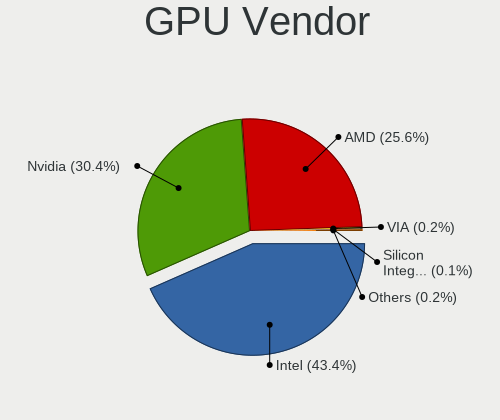

| Vendor                                       | Computers | Percent |
|----------------------------------------------|-----------|---------|
| Intel                                        | 1811      | 43.41%  |
| Nvidia                                       | 1269      | 30.42%  |
| AMD                                          | 1069      | 25.62%  |
| VIA Technologies                             | 7         | 0.17%   |
| Silicon Integrated Systems [SiS]             | 6         | 0.14%   |
| ATI Technologies                             | 6         | 0.14%   |
| ASPEED Technology                            | 2         | 0.05%   |
| XGI Technology (eXtreme Graphics Innovation) | 1         | 0.02%   |
| Matrox Electronics Systems                   | 1         | 0.02%   |

GPU Model
---------

Graphics card models

| Model                                                                                    | Computers | Percent |
|------------------------------------------------------------------------------------------|-----------|---------|
| Intel 2nd Generation Core Processor Family Integrated Graphics Controller                | 237       | 5.43%   |
| Intel 3rd Gen Core processor Graphics Controller                                         | 167       | 3.83%   |
| Intel UHD Graphics 620                                                                   | 88        | 2.02%   |
| Intel HD Graphics 620                                                                    | 70        | 1.6%    |
| Intel WhiskeyLake-U GT2 [UHD Graphics 620]                                               | 63        | 1.44%   |
| AMD Picasso/Raven 2 [Radeon Vega Series / Radeon Vega Mobile Series]                     | 63        | 1.44%   |
| Intel Mobile 4 Series Chipset Integrated Graphics Controller                             | 62        | 1.42%   |
| Intel CoffeeLake-H GT2 [UHD Graphics 630]                                                | 62        | 1.42%   |
| Intel Atom/Celeron/Pentium Processor x5-E8000/J3xxx/N3xxx Integrated Graphics Controller | 58        | 1.33%   |
| AMD Ellesmere [Radeon RX 470/480/570/570X/580/580X/590]                                  | 57        | 1.31%   |
| Intel Skylake GT2 [HD Graphics 520]                                                      | 53        | 1.21%   |
| AMD Renoir [Radeon Vega Series / Radeon Vega Mobile Series]                              | 52        | 1.19%   |
| Intel 4th Gen Core Processor Integrated Graphics Controller                              | 50        | 1.15%   |
| Intel Core Processor Integrated Graphics Controller                                      | 49        | 1.12%   |
| Intel Haswell-ULT Integrated Graphics Controller                                         | 47        | 1.08%   |
| Intel GeminiLake [UHD Graphics 600]                                                      | 44        | 1.01%   |
| Intel TigerLake-LP GT2 [Iris Xe Graphics]                                                | 43        | 0.98%   |
| Intel HD Graphics 530                                                                    | 40        | 0.92%   |
| Intel HD Graphics 630                                                                    | 39        | 0.89%   |
| Intel Xeon E3-1200 v2/3rd Gen Core processor Graphics Controller                         | 37        | 0.85%   |
| Intel Atom Processor Z36xxx/Z37xxx Series Graphics & Display                             | 37        | 0.85%   |
| Intel Xeon E3-1200 v3/4th Gen Core Processor Integrated Graphics Controller              | 36        | 0.82%   |
| Intel CometLake-U GT2 [UHD Graphics]                                                     | 36        | 0.82%   |
| Intel Atom Processor D4xx/D5xx/N4xx/N5xx Integrated Graphics Controller                  | 36        | 0.82%   |
| AMD Raven Ridge [Radeon Vega Series / Radeon Vega Mobile Series]                         | 36        | 0.82%   |
| AMD Sun XT [Radeon HD 8670A/8670M/8690M / R5 M330 / M430 / Radeon 520 Mobile]            | 34        | 0.78%   |
| Nvidia GP107M [GeForce GTX 1050 Mobile]                                                  | 32        | 0.73%   |
| Nvidia GK208B [GeForce GT 710]                                                           | 32        | 0.73%   |
| Intel HD Graphics 5500                                                                   | 32        | 0.73%   |
| Nvidia GP108M [GeForce MX150]                                                            | 29        | 0.66%   |
| Intel Mobile 945GM/GMS/GME, 943/940GML Express Integrated Graphics Controller            | 29        | 0.66%   |
| Intel CoffeeLake-S GT2 [UHD Graphics 630]                                                | 29        | 0.66%   |
| AMD Thames [Radeon HD 7500M/7600M Series]                                                | 29        | 0.66%   |
| Nvidia GF117M [GeForce 610M/710M/810M/820M / GT 620M/625M/630M/720M]                     | 28        | 0.64%   |
| Nvidia GT218 [GeForce 210]                                                               | 27        | 0.62%   |
| Nvidia GM108M [GeForce MX110]                                                            | 27        | 0.62%   |
| Nvidia TU117M [GeForce GTX 1650 Mobile / Max-Q]                                          | 26        | 0.6%    |
| AMD Seymour [Radeon HD 6400M/7400M Series]                                               | 26        | 0.6%    |
| Nvidia GM108M [GeForce 940MX]                                                            | 25        | 0.57%   |
| Intel 4 Series Chipset Integrated Graphics Controller                                    | 25        | 0.57%   |

GPU Combo
---------

Combinations of graphics cards

| Name                   | Computers | Percent |
|------------------------|-----------|---------|
| 1 x Intel              | 1120      | 32.29%  |
| 1 x AMD                | 777       | 22.4%   |
| 1 x Nvidia             | 709       | 20.44%  |
| Intel + Nvidia         | 512       | 14.76%  |
| Intel + AMD            | 143       | 4.12%   |
| 2 x AMD                | 115       | 3.32%   |
| AMD + Nvidia           | 41        | 1.18%   |
| Other                  | 23        | 0.66%   |
| 1 x VIA                | 7         | 0.2%    |
| 1 x SiS                | 6         | 0.17%   |
| 2 x Nvidia             | 4         | 0.12%   |
| 2 x Intel              | 3         | 0.09%   |
| Intel + 2 x Nvidia     | 2         | 0.06%   |
| 3 x Nvidia             | 1         | 0.03%   |
| 1 x XGI                | 1         | 0.03%   |
| Nvidia + ASPEED        | 1         | 0.03%   |
| 1 x Matrox             | 1         | 0.03%   |
| 1 x Intel + 7 x Nvidia | 1         | 0.03%   |
| Intel + 2 x AMD        | 1         | 0.03%   |
| 1 x ASPEED             | 1         | 0.03%   |

GPU Driver
----------

Free vs proprietary

| Driver      | Computers | Percent |
|-------------|-----------|---------|
| Free        | 2766      | 78.85%  |
| Proprietary | 592       | 16.88%  |
| Unknown     | 150       | 4.28%   |

GPU Memory
----------

Total video memory

| Size in GB | Computers | Percent |
|------------|-----------|---------|
| Unknown    | 1329      | 37.45%  |
| 1.01-2.0   | 710       | 20.01%  |
| 0.01-0.5   | 666       | 18.77%  |
| 0.51-1.0   | 428       | 12.06%  |
| 3.01-4.0   | 249       | 7.02%   |
| 7.01-8.0   | 75        | 2.11%   |
| 5.01-6.0   | 46        | 1.3%    |
| 2.01-3.0   | 29        | 0.82%   |
| 8.01-16.0  | 17        | 0.48%   |

Monitor
-------

Monitor Vendor
--------------

Monitor vendors

| Vendor                  | Computers | Percent |
|-------------------------|-----------|---------|
| Samsung Electronics     | 659       | 18.26%  |
| AU Optronics            | 434       | 12.03%  |
| LG Display              | 355       | 9.84%   |
| Goldstar                | 353       | 9.78%   |
| Chimei Innolux          | 266       | 7.37%   |
| BOE                     | 260       | 7.2%    |
| Philips                 | 175       | 4.85%   |
| Dell                    | 171       | 4.74%   |
| Acer                    | 98        | 2.72%   |
| Chi Mei Optoelectronics | 93        | 2.58%   |
| Ancor Communications    | 80        | 2.22%   |
| BenQ                    | 66        | 1.83%   |
| AOC                     | 60        | 1.66%   |
| Hewlett-Packard         | 48        | 1.33%   |
| Lenovo                  | 39        | 1.08%   |
| LG Philips              | 35        | 0.97%   |
| Sharp                   | 33        | 0.91%   |
| ViewSonic               | 32        | 0.89%   |
| PANDA                   | 27        | 0.75%   |
| Iiyama                  | 24        | 0.67%   |
| Apple                   | 24        | 0.67%   |
| LG Electronics          | 22        | 0.61%   |
| HannStar                | 21        | 0.58%   |
| Sony                    | 17        | 0.47%   |
| NEC Computers           | 17        | 0.47%   |
| ASUSTek Computer        | 15        | 0.42%   |
| Unknown                 | 12        | 0.33%   |
| Valve                   | 10        | 0.28%   |
| CPT                     | 10        | 0.28%   |
| Belinea                 | 8         | 0.22%   |
| Xiaomi                  | 5         | 0.14%   |
| Toshiba                 | 5         | 0.14%   |
| Plain Tree Systems      | 5         | 0.14%   |
| Mi                      | 5         | 0.14%   |
| InfoVision              | 5         | 0.14%   |
| ___                     | 4         | 0.11%   |
| TMX                     | 4         | 0.11%   |
| Quanta Display          | 4         | 0.11%   |
| Panasonic               | 4         | 0.11%   |
| MStar                   | 4         | 0.11%   |

Monitor Model
-------------

Monitor models

| Model                                                                    | Computers | Percent |
|--------------------------------------------------------------------------|-----------|---------|
| AU Optronics LCD Monitor AUO38ED 1920x1080 344x193mm 15.5-inch           | 34        | 0.92%   |
| AU Optronics LCD Monitor AUO21ED 1920x1080 344x193mm 15.5-inch           | 29        | 0.78%   |
| Goldstar IPS FULLHD GSM5AB8 1920x1080 480x270mm 21.7-inch                | 27        | 0.73%   |
| Chimei Innolux LCD Monitor CMN14D4 1920x1080 309x173mm 13.9-inch         | 27        | 0.73%   |
| LG Display LCD Monitor LGD02DC 1366x768 344x194mm 15.5-inch              | 24        | 0.65%   |
| AU Optronics LCD Monitor AUO22EC 1366x768 344x193mm 15.5-inch            | 24        | 0.65%   |
| Chimei Innolux LCD Monitor CMN15DB 1366x768 344x193mm 15.5-inch          | 22        | 0.6%    |
| Samsung Electronics LCD Monitor SEC3245 1366x768 344x194mm 15.5-inch     | 21        | 0.57%   |
| Chi Mei Optoelectronics LCD Monitor CMO15A7 1366x768 344x193mm 15.5-inch | 21        | 0.57%   |
| Chimei Innolux LCD Monitor CMN15D5 1920x1080 344x193mm 15.5-inch         | 20        | 0.54%   |
| AU Optronics LCD Monitor AUO403D 1920x1080 309x174mm 14.0-inch           | 20        | 0.54%   |
| Samsung Electronics LCD Monitor SEC5441 1280x800 286x179mm 13.3-inch     | 18        | 0.49%   |
| LG Display LCD Monitor LGD033A 1366x768 340x190mm 15.3-inch              | 18        | 0.49%   |
| BOE LCD Monitor BOE06A5 1366x768 344x194mm 15.5-inch                     | 18        | 0.49%   |
| BOE LCD Monitor BOE0687 1920x1080 344x193mm 15.5-inch                    | 17        | 0.46%   |
| AU Optronics LCD Monitor AUO45EC 1366x768 344x193mm 15.5-inch            | 16        | 0.43%   |
| Samsung Electronics SyncMaster SAM011E 1280x1024 338x270mm 17.0-inch     | 15        | 0.41%   |
| Dell U2412M DELA07A 1920x1200 518x324mm 24.1-inch                        | 15        | 0.41%   |
| Chimei Innolux LCD Monitor CMN15F5 1920x1080 344x193mm 15.5-inch         | 15        | 0.41%   |
| Chimei Innolux LCD Monitor CMN15E7 1920x1080 344x193mm 15.5-inch         | 15        | 0.41%   |
| Samsung Electronics LCD Monitor SEC4252 1366x768 344x194mm 15.5-inch     | 14        | 0.38%   |
| Goldstar IPS FULLHD GSM5AB6 1920x1080 480x270mm 21.7-inch                | 13        | 0.35%   |
| Philips PHL 243V7 PHLC155 1920x1080 527x296mm 23.8-inch                  | 12        | 0.32%   |
| LG Display LCD Monitor LGD038E 1366x768 344x194mm 15.5-inch              | 12        | 0.32%   |
| Lenovo LCD Monitor LEN40B0 1366x768 345x194mm 15.6-inch                  | 12        | 0.32%   |
| Goldstar W2243 GSM56FE 1920x1080 477x268mm 21.5-inch                     | 12        | 0.32%   |
| Samsung Electronics SyncMaster SAM01B7 1280x1024 338x270mm 17.0-inch     | 11        | 0.3%    |
| AU Optronics LCD Monitor AUO26EC 1366x768 344x193mm 15.5-inch            | 11        | 0.3%    |
| AU Optronics LCD Monitor AUO21EC 1366x768 344x193mm 15.5-inch            | 11        | 0.3%    |
| AU Optronics LCD Monitor AUO20EC 1366x768 344x193mm 15.5-inch            | 11        | 0.3%    |
| Samsung Electronics SyncMaster SAM01E1 1280x1024 376x301mm 19.0-inch     | 10        | 0.27%   |
| LG Display LCD Monitor LGD0384 1366x768 344x194mm 15.5-inch              | 10        | 0.27%   |
| Chi Mei Optoelectronics LCD Monitor CMO1592 1366x768 350x190mm 15.7-inch | 10        | 0.27%   |
| BOE LCD Monitor BOE069C 1920x1080 344x193mm 15.5-inch                    | 10        | 0.27%   |
| AU Optronics LCD Monitor AUO23EC 1366x768 344x193mm 15.5-inch            | 10        | 0.27%   |
| Samsung Electronics LCD Monitor SEC324A 1366x768 344x194mm 15.5-inch     | 9         | 0.24%   |
| Samsung Electronics LCD Monitor SEC3152 1366x768 344x194mm 15.5-inch     | 9         | 0.24%   |
| LG Display LCD Monitor LGD05E5 1920x1080 344x194mm 15.5-inch             | 9         | 0.24%   |
| Goldstar FULL HD GSM5B55 1920x1080 480x270mm 21.7-inch                   | 9         | 0.24%   |
| Philips 196VL PHLC07F 1366x768 409x230mm 18.5-inch                       | 8         | 0.22%   |

Monitor Resolution
------------------

Monitor screen resolution

| Resolution         | Computers | Percent |
|--------------------|-----------|---------|
| 1920x1080 (FHD)    | 1423      | 40.93%  |
| 1366x768 (WXGA)    | 779       | 22.4%   |
| 1280x1024 (SXGA)   | 272       | 7.82%   |
| 1600x900 (HD+)     | 159       | 4.57%   |
| 1680x1050 (WSXGA+) | 157       | 4.52%   |
| 3840x2160 (4K)     | 102       | 2.93%   |
| 1280x800 (WXGA)    | 96        | 2.76%   |
| 1440x900 (WXGA+)   | 90        | 2.59%   |
| 2560x1440 (QHD)    | 79        | 2.27%   |
| 1920x1200 (WUXGA)  | 54        | 1.55%   |
| 1024x600           | 43        | 1.24%   |
| 1360x768           | 25        | 0.72%   |
| 1024x768 (XGA)     | 24        | 0.69%   |
| Unknown            | 23        | 0.66%   |
| 1600x1200          | 21        | 0.6%    |
| 2560x1080          | 17        | 0.49%   |
| 2560x1600          | 14        | 0.4%    |
| 800x1280           | 10        | 0.29%   |
| 3440x1440          | 8         | 0.23%   |
| 1920x540           | 7         | 0.2%    |
| 3840x1080          | 6         | 0.17%   |
| 2048x1536          | 5         | 0.14%   |
| 1280x720 (HD)      | 5         | 0.14%   |
| 3456x2160          | 4         | 0.12%   |
| 3200x2000          | 4         | 0.12%   |
| 2288x1287          | 4         | 0.12%   |
| 1400x1050          | 4         | 0.12%   |
| 3840x2400          | 3         | 0.09%   |
| 3200x1800 (QHD+)   | 3         | 0.09%   |
| 2048x1152          | 3         | 0.09%   |
| 5520x1080          | 2         | 0.06%   |
| 4480x1440          | 2         | 0.06%   |
| 3200x1080          | 2         | 0.06%   |
| 2880x1620          | 2         | 0.06%   |
| 2160x1440          | 2         | 0.06%   |
| 1280x960           | 2         | 0.06%   |
| 1280x768           | 2         | 0.06%   |
| 7040x2160          | 1         | 0.03%   |
| 5280x1200          | 1         | 0.03%   |
| 5120x1440          | 1         | 0.03%   |

Monitor Diagonal
----------------

Diagonal size in inches

| Inches  | Computers | Percent |
|---------|-----------|---------|
| 15      | 1208      | 33.5%   |
| 21      | 285       | 7.9%    |
| 17      | 276       | 7.65%   |
| 23      | 260       | 7.21%   |
| 24      | 204       | 5.66%   |
| 14      | 180       | 4.99%   |
| 19      | 179       | 4.96%   |
| 13      | 176       | 4.88%   |
| Unknown | 129       | 3.58%   |
| 27      | 119       | 3.3%    |
| 18      | 90        | 2.5%    |
| 20      | 87        | 2.41%   |
| 22      | 79        | 2.19%   |
| 31      | 41        | 1.14%   |
| 11      | 41        | 1.14%   |
| 10      | 40        | 1.11%   |
| 12      | 39        | 1.08%   |
| 16      | 30        | 0.83%   |
| 32      | 27        | 0.75%   |
| 34      | 19        | 0.53%   |
| 7       | 11        | 0.31%   |
| 72      | 10        | 0.28%   |
| 54      | 10        | 0.28%   |
| 25      | 10        | 0.28%   |
| 26      | 7         | 0.19%   |
| 42      | 6         | 0.17%   |
| 40      | 6         | 0.17%   |
| 46      | 5         | 0.14%   |
| 142     | 4         | 0.11%   |
| 52      | 4         | 0.11%   |
| 8       | 4         | 0.11%   |
| 84      | 3         | 0.08%   |
| 65      | 3         | 0.08%   |
| 48      | 2         | 0.06%   |
| 47      | 2         | 0.06%   |
| 43      | 2         | 0.06%   |
| 75      | 1         | 0.03%   |
| 58      | 1         | 0.03%   |
| 57      | 1         | 0.03%   |
| 39      | 1         | 0.03%   |

Monitor Width
-------------

Physical width

| Width in mm    | Computers | Percent |
|----------------|-----------|---------|
| 301-350        | 1585      | 44.4%   |
| 401-500        | 597       | 16.72%  |
| 501-600        | 556       | 15.57%  |
| 351-400        | 317       | 8.88%   |
| 201-300        | 207       | 5.8%    |
| Unknown        | 129       | 3.61%   |
| 601-700        | 55        | 1.54%   |
| 701-800        | 46        | 1.29%   |
| 1001-1500      | 28        | 0.78%   |
| 1501-2000      | 14        | 0.39%   |
| 1-100          | 10        | 0.28%   |
| 801-900        | 9         | 0.25%   |
| 901-1000       | 8         | 0.22%   |
| 101-200        | 5         | 0.14%   |
| More than 2000 | 4         | 0.11%   |

Aspect Ratio
------------

Proportional relationship between the width and the height

| Ratio   | Computers | Percent |
|---------|-----------|---------|
| 16/9    | 2453      | 73.16%  |
| 16/10   | 404       | 12.05%  |
| 5/4     | 241       | 7.19%   |
| Unknown | 105       | 3.13%   |
| 4/3     | 82        | 2.45%   |
| 3/2     | 25        | 0.75%   |
| 21/9    | 20        | 0.6%    |
| 0.67    | 7         | 0.21%   |
| 6/5     | 6         | 0.18%   |
| 1.00    | 4         | 0.12%   |
| 0.62    | 3         | 0.09%   |
| 32/9    | 1         | 0.03%   |
| 3.40    | 1         | 0.03%   |
| 0.89    | 1         | 0.03%   |

Monitor Area
------------

Area in inch

| Area in inch | Computers | Percent |
|----------------|-----------|---------|
| 101-110        | 1183      | 33.01%  |
| 201-250        | 710       | 19.81%  |
| 151-200        | 328       | 9.15%   |
| 81-90          | 282       | 7.87%   |
| 141-150        | 195       | 5.44%   |
| 121-130        | 135       | 3.77%   |
| Unknown        | 129       | 3.6%    |
| 301-350        | 122       | 3.4%    |
| 351-500        | 89        | 2.48%   |
| 71-80          | 72        | 2.01%   |
| 251-300        | 64        | 1.79%   |
| 111-120        | 43        | 1.2%    |
| 51-60          | 42        | 1.17%   |
| 41-50          | 40        | 1.12%   |
| More than 1000 | 39        | 1.09%   |
| 61-70          | 33        | 0.92%   |
| 131-140        | 29        | 0.81%   |
| 501-1000       | 23        | 0.64%   |
| 1-40           | 15        | 0.42%   |
| 91-100         | 11        | 0.31%   |

Pixel Density
-------------

Pixels per inch

| Density       | Computers | Percent |
|---------------|-----------|---------|
| 51-100        | 1302      | 37.27%  |
| 101-120       | 1080      | 30.92%  |
| 121-160       | 814       | 23.3%   |
| Unknown       | 129       | 3.69%   |
| 161-240       | 96        | 2.75%   |
| 1-50          | 39        | 1.12%   |
| More than 240 | 33        | 0.94%   |

Multiple Monitors
-----------------

Total monitors connected

| Total | Computers | Percent |
|-------|-----------|---------|
| 1     | 2940      | 84.34%  |
| 2     | 397       | 11.39%  |
| 0     | 117       | 3.36%   |
| 3     | 32        | 0.92%   |

Network
-------

Net Controller Vendor
---------------------

Controller vendors

| Vendor                            | Computers | Percent |
|-----------------------------------|-----------|---------|
| Realtek Semiconductor             | 2088      | 41.03%  |
| Intel                             | 1035      | 20.34%  |
| Qualcomm Atheros                  | 845       | 16.6%   |
| Broadcom                          | 302       | 5.93%   |
| Ralink Technology                 | 105       | 2.06%   |
| Nvidia                            | 104       | 2.04%   |
| Broadcom Limited                  | 81        | 1.59%   |
| Marvell Technology Group          | 75        | 1.47%   |
| Ralink                            | 70        | 1.38%   |
| Qualcomm Atheros Communications   | 40        | 0.79%   |
| TP-Link                           | 37        | 0.73%   |
| MediaTek                          | 37        | 0.73%   |
| Huawei Technologies               | 25        | 0.49%   |
| Xiaomi                            | 22        | 0.43%   |
| VIA Technologies                  | 21        | 0.41%   |
| Samsung Electronics               | 17        | 0.33%   |
| ASUSTek Computer                  | 13        | 0.26%   |
| Dell                              | 12        | 0.24%   |
| D-Link System                     | 12        | 0.24%   |
| Sundance Technology Inc / IC Plus | 11        | 0.22%   |
| Attansic Technology               | 11        | 0.22%   |
| ASIX Electronics                  | 9         | 0.18%   |
| Silicon Integrated Systems [SiS]  | 7         | 0.14%   |
| JMicron Technology                | 7         | 0.14%   |
| Sierra Wireless                   | 6         | 0.12%   |
| Qualcomm                          | 6         | 0.12%   |
| ICS Advent                        | 6         | 0.12%   |
| Ericsson Business Mobile Networks | 6         | 0.12%   |
| D-Link                            | 6         | 0.12%   |
| Hewlett-Packard                   | 5         | 0.1%    |
| Microsoft                         | 4         | 0.08%   |
| DisplayLink                       | 4         | 0.08%   |
| Aquantia                          | 4         | 0.08%   |
| IMC Networks                      | 3         | 0.06%   |
| Fibocom                           | 3         | 0.06%   |
| Edimax Technology                 | 3         | 0.06%   |
| Curitel Communications            | 3         | 0.06%   |
| Spreadtrum Communications         | 2         | 0.04%   |
| Raspberry Pi                      | 2         | 0.04%   |
| Nokia Mobile Phones               | 2         | 0.04%   |

Net Controller Model
--------------------

Controller models

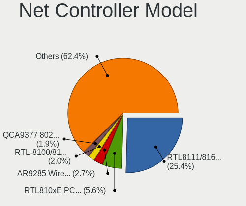

| Model                                                                   | Computers | Percent |
|-------------------------------------------------------------------------|-----------|---------|
| Realtek RTL8111/8168/8211/8411 PCI Express Gigabit Ethernet Controller  | 1463      | 25.45%  |
| Realtek RTL810xE PCI Express Fast Ethernet controller                   | 324       | 5.64%   |
| Qualcomm Atheros AR9285 Wireless Network Adapter (PCI-Express)          | 154       | 2.68%   |
| Realtek RTL-8100/8101L/8139 PCI Fast Ethernet Adapter                   | 116       | 2.02%   |
| Qualcomm Atheros QCA9377 802.11ac Wireless Network Adapter              | 107       | 1.86%   |
| Realtek RTL8821CE 802.11ac PCIe Wireless Network Adapter                | 105       | 1.83%   |
| Qualcomm Atheros AR9485 Wireless Network Adapter                        | 96        | 1.67%   |
| Broadcom BCM4313 802.11bgn Wireless Network Adapter                     | 94        | 1.64%   |
| Qualcomm Atheros QCA9565 / AR9565 Wireless Network Adapter              | 84        | 1.46%   |
| Intel Wireless 8265 / 8275                                              | 67        | 1.17%   |
| Intel Wi-Fi 6 AX200                                                     | 65        | 1.13%   |
| Intel 82579LM Gigabit Network Connection (Lewisville)                   | 65        | 1.13%   |
| Nvidia MCP61 Ethernet                                                   | 64        | 1.11%   |
| Ralink MT7601U Wireless Adapter                                         | 63        | 1.1%    |
| Qualcomm Atheros AR8151 v2.0 Gigabit Ethernet                           | 59        | 1.03%   |
| Qualcomm Atheros AR242x / AR542x Wireless Network Adapter (PCI-Express) | 52        | 0.9%    |
| Intel Wireless 7260                                                     | 51        | 0.89%   |
| Intel Wi-Fi 6 AX201                                                     | 46        | 0.8%    |
| Intel Cannon Point-LP CNVi [Wireless-AC]                                | 46        | 0.8%    |
| Realtek RTL8822CE 802.11ac PCIe Wireless Network Adapter                | 41        | 0.71%   |
| Intel Cannon Lake PCH CNVi WiFi                                         | 39        | 0.68%   |
| Realtek RTL8153 Gigabit Ethernet Adapter                                | 38        | 0.66%   |
| Qualcomm Atheros QCA6174 802.11ac Wireless Network Adapter              | 38        | 0.66%   |
| Intel I211 Gigabit Network Connection                                   | 38        | 0.66%   |
| Realtek RTL8723BE PCIe Wireless Network Adapter                         | 37        | 0.64%   |
| Intel PRO/Wireless 3945ABG [Golan] Network Connection                   | 37        | 0.64%   |
| Ralink RT3290 Wireless 802.11n 1T/1R PCIe                               | 36        | 0.63%   |
| Intel Wireless 3165                                                     | 36        | 0.63%   |
| Broadcom BCM43142 802.11b/g/n                                           | 36        | 0.63%   |
| Intel Dual Band Wireless-AC 3168NGW [Stone Peak]                        | 35        | 0.61%   |
| Realtek RTL8822BE 802.11a/b/g/n/ac WiFi adapter                         | 33        | 0.57%   |
| Qualcomm Atheros AR9271 802.11n                                         | 31        | 0.54%   |
| Intel Ethernet Connection (2) I219-V                                    | 31        | 0.54%   |
| Qualcomm Atheros AR8161 Gigabit Ethernet                                | 30        | 0.52%   |
| Qualcomm Atheros AR8121/AR8113/AR8114 Gigabit or Fast Ethernet          | 30        | 0.52%   |
| Intel Wireless 8260                                                     | 30        | 0.52%   |
| Qualcomm Atheros AR9462 Wireless Network Adapter                        | 29        | 0.5%    |
| Intel Comet Lake PCH-LP CNVi WiFi                                       | 29        | 0.5%    |
| Realtek RTL8125 2.5GbE Controller                                       | 28        | 0.49%   |
| Intel Centrino Advanced-N 6205 [Taylor Peak]                            | 28        | 0.49%   |

Wireless Vendor
---------------

Wireless vendors

| Vendor                          | Computers | Percent |
|---------------------------------|-----------|---------|
| Intel                           | 807       | 33.39%  |
| Qualcomm Atheros                | 627       | 25.94%  |
| Realtek Semiconductor           | 369       | 15.27%  |
| Broadcom                        | 218       | 9.02%   |
| Ralink Technology               | 105       | 4.34%   |
| Ralink                          | 70        | 2.9%    |
| Broadcom Limited                | 47        | 1.94%   |
| Qualcomm Atheros Communications | 40        | 1.65%   |
| TP-Link                         | 34        | 1.41%   |
| MediaTek                        | 34        | 1.41%   |
| ASUSTek Computer                | 10        | 0.41%   |
| Dell                            | 8         | 0.33%   |
| D-Link System                   | 8         | 0.33%   |
| Sierra Wireless                 | 6         | 0.25%   |
| D-Link                          | 6         | 0.25%   |
| Qualcomm                        | 4         | 0.17%   |
| Microsoft                       | 4         | 0.17%   |
| IMC Networks                    | 3         | 0.12%   |
| Fibocom                         | 3         | 0.12%   |
| Edimax Technology               | 3         | 0.12%   |
| Linksys                         | 2         | 0.08%   |
| ZyDAS                           | 1         | 0.04%   |
| Xiaomi                          | 1         | 0.04%   |
| Sitecom Europe                  | 1         | 0.04%   |
| NetGear                         | 1         | 0.04%   |
| Mercucys                        | 1         | 0.04%   |
| LG Electronics                  | 1         | 0.04%   |
| Hewlett-Packard                 | 1         | 0.04%   |
| Gemtek                          | 1         | 0.04%   |
| Fujitsu Siemens Computers       | 1         | 0.04%   |

Wireless Model
--------------

Wireless models

| Model                                                                   | Computers | Percent |
|-------------------------------------------------------------------------|-----------|---------|
| Qualcomm Atheros AR9285 Wireless Network Adapter (PCI-Express)          | 154       | 6.35%   |
| Qualcomm Atheros QCA9377 802.11ac Wireless Network Adapter              | 107       | 4.41%   |
| Realtek RTL8821CE 802.11ac PCIe Wireless Network Adapter                | 105       | 4.33%   |
| Qualcomm Atheros AR9485 Wireless Network Adapter                        | 96        | 3.96%   |
| Broadcom BCM4313 802.11bgn Wireless Network Adapter                     | 94        | 3.88%   |
| Qualcomm Atheros QCA9565 / AR9565 Wireless Network Adapter              | 84        | 3.47%   |
| Intel Wireless 8265 / 8275                                              | 67        | 2.76%   |
| Intel Wi-Fi 6 AX200                                                     | 65        | 2.68%   |
| Ralink MT7601U Wireless Adapter                                         | 63        | 2.6%    |
| Qualcomm Atheros AR242x / AR542x Wireless Network Adapter (PCI-Express) | 52        | 2.15%   |
| Intel Wireless 7260                                                     | 51        | 2.1%    |
| Intel Wi-Fi 6 AX201                                                     | 46        | 1.9%    |
| Intel Cannon Point-LP CNVi [Wireless-AC]                                | 46        | 1.9%    |
| Realtek RTL8822CE 802.11ac PCIe Wireless Network Adapter                | 41        | 1.69%   |
| Intel Cannon Lake PCH CNVi WiFi                                         | 39        | 1.61%   |
| Qualcomm Atheros QCA6174 802.11ac Wireless Network Adapter              | 38        | 1.57%   |
| Realtek RTL8723BE PCIe Wireless Network Adapter                         | 37        | 1.53%   |
| Intel PRO/Wireless 3945ABG [Golan] Network Connection                   | 37        | 1.53%   |
| Ralink RT3290 Wireless 802.11n 1T/1R PCIe                               | 36        | 1.49%   |
| Intel Wireless 3165                                                     | 36        | 1.49%   |
| Broadcom BCM43142 802.11b/g/n                                           | 36        | 1.49%   |
| Intel Dual Band Wireless-AC 3168NGW [Stone Peak]                        | 35        | 1.44%   |
| Realtek RTL8822BE 802.11a/b/g/n/ac WiFi adapter                         | 33        | 1.36%   |
| Qualcomm Atheros AR9271 802.11n                                         | 31        | 1.28%   |
| Intel Wireless 8260                                                     | 30        | 1.24%   |
| Qualcomm Atheros AR9462 Wireless Network Adapter                        | 29        | 1.2%    |
| Intel Comet Lake PCH-LP CNVi WiFi                                       | 29        | 1.2%    |
| Intel Centrino Advanced-N 6205 [Taylor Peak]                            | 28        | 1.16%   |
| Realtek RTL8188EUS 802.11n Wireless Network Adapter                     | 27        | 1.11%   |
| Intel Wireless 7265                                                     | 27        | 1.11%   |
| Intel Centrino Wireless-N 2230                                          | 25        | 1.03%   |
| Intel Comet Lake PCH CNVi WiFi                                          | 24        | 0.99%   |
| Broadcom BCM4312 802.11b/g LP-PHY                                       | 21        | 0.87%   |
| Realtek RTL8723DE Wireless Network Adapter                              | 20        | 0.83%   |
| Ralink RT5370 Wireless Adapter                                          | 20        | 0.83%   |
| Broadcom Limited BCM4313 802.11bgn Wireless Network Adapter             | 20        | 0.83%   |
| Intel Dual Band Wireless-AC 3165 Plus Bluetooth                         | 19        | 0.78%   |
| Qualcomm Atheros AR9287 Wireless Network Adapter (PCI-Express)          | 18        | 0.74%   |
| Intel Centrino Ultimate-N 6300                                          | 18        | 0.74%   |
| MediaTek MT7921 802.11ax PCI Express Wireless Network Adapter           | 17        | 0.7%    |

Ethernet Vendor
---------------

Ethernet vendors

| Vendor                                 | Computers | Percent |
|----------------------------------------|-----------|---------|
| Realtek Semiconductor                  | 1956      | 60.75%  |
| Intel                                  | 446       | 13.85%  |
| Qualcomm Atheros                       | 316       | 9.81%   |
| Broadcom                               | 112       | 3.48%   |
| Nvidia                                 | 104       | 3.23%   |
| Marvell Technology Group               | 75        | 2.33%   |
| Broadcom Limited                       | 36        | 1.12%   |
| Xiaomi                                 | 21        | 0.65%   |
| VIA Technologies                       | 21        | 0.65%   |
| Huawei Technologies                    | 19        | 0.59%   |
| Samsung Electronics                    | 13        | 0.4%    |
| Sundance Technology Inc / IC Plus      | 11        | 0.34%   |
| Attansic Technology                    | 11        | 0.34%   |
| ASIX Electronics                       | 9         | 0.28%   |
| Silicon Integrated Systems [SiS]       | 7         | 0.22%   |
| JMicron Technology                     | 7         | 0.22%   |
| ICS Advent                             | 6         | 0.19%   |
| DisplayLink                            | 4         | 0.12%   |
| D-Link System                          | 4         | 0.12%   |
| Aquantia                               | 4         | 0.12%   |
| TP-Link                                | 3         | 0.09%   |
| Hewlett-Packard                        | 3         | 0.09%   |
| ASUSTek Computer                       | 3         | 0.09%   |
| Spreadtrum Communications              | 2         | 0.06%   |
| Raspberry Pi                           | 2         | 0.06%   |
| Qualcomm                               | 2         | 0.06%   |
| Microchip Technology                   | 2         | 0.06%   |
| MediaTek                               | 2         | 0.06%   |
| Lenovo                                 | 2         | 0.06%   |
| HMD Global                             | 2         | 0.06%   |
| Google                                 | 2         | 0.06%   |
| Tehuti Networks                        | 1         | 0.03%   |
| Standard Microsystems [SMC]            | 1         | 0.03%   |
| Sony Ericsson Mobile Communications AB | 1         | 0.03%   |
| OPPO Electronics                       | 1         | 0.03%   |
| OKB SAPR                               | 1         | 0.03%   |
| Motorola PCS                           | 1         | 0.03%   |
| LSI                                    | 1         | 0.03%   |
| HTC (High Tech Computer)               | 1         | 0.03%   |
| Hangzhou Silan Microelectronics        | 1         | 0.03%   |

Ethernet Model
--------------

Ethernet models

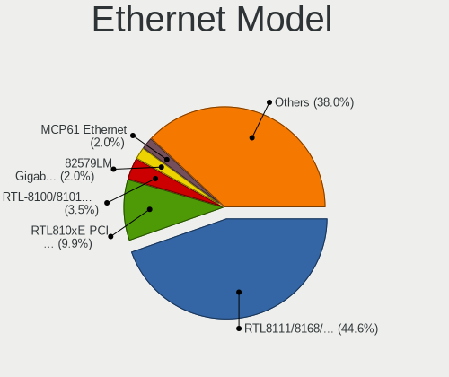

| Model                                                                  | Computers | Percent |
|------------------------------------------------------------------------|-----------|---------|
| Realtek RTL8111/8168/8211/8411 PCI Express Gigabit Ethernet Controller | 1463      | 44.63%  |
| Realtek RTL810xE PCI Express Fast Ethernet controller                  | 324       | 9.88%   |
| Realtek RTL-8100/8101L/8139 PCI Fast Ethernet Adapter                  | 116       | 3.54%   |
| Intel 82579LM Gigabit Network Connection (Lewisville)                  | 65        | 1.98%   |
| Nvidia MCP61 Ethernet                                                  | 64        | 1.95%   |
| Qualcomm Atheros AR8151 v2.0 Gigabit Ethernet                          | 59        | 1.8%    |
| Realtek RTL8153 Gigabit Ethernet Adapter                               | 38        | 1.16%   |
| Intel I211 Gigabit Network Connection                                  | 38        | 1.16%   |
| Intel Ethernet Connection (2) I219-V                                   | 31        | 0.95%   |
| Qualcomm Atheros AR8161 Gigabit Ethernet                               | 30        | 0.92%   |
| Qualcomm Atheros AR8121/AR8113/AR8114 Gigabit or Fast Ethernet         | 30        | 0.92%   |
| Realtek RTL8125 2.5GbE Controller                                      | 28        | 0.85%   |
| Intel 82579V Gigabit Network Connection                                | 28        | 0.85%   |
| Qualcomm Atheros AR8152 v2.0 Fast Ethernet                             | 23        | 0.7%    |
| Qualcomm Atheros QCA8172 Fast Ethernet                                 | 22        | 0.67%   |
| Qualcomm Atheros AR8162 Fast Ethernet                                  | 22        | 0.67%   |
| Qualcomm Atheros Attansic L1 Gigabit Ethernet                          | 21        | 0.64%   |
| Marvell Group 88E8040 PCI-E Fast Ethernet Controller                   | 21        | 0.64%   |
| Qualcomm Atheros QCA8171 Gigabit Ethernet                              | 20        | 0.61%   |
| Qualcomm Atheros AR8131 Gigabit Ethernet                               | 20        | 0.61%   |
| Broadcom NetLink BCM57785 Gigabit Ethernet PCIe                        | 20        | 0.61%   |
| Qualcomm Atheros Attansic L2 Fast Ethernet                             | 19        | 0.58%   |
| Xiaomi Mi/Redmi series (RNDIS)                                         | 17        | 0.52%   |
| Qualcomm Atheros AR8132 Fast Ethernet                                  | 17        | 0.52%   |
| Intel Ethernet Connection (6) I219-V                                   | 17        | 0.52%   |
| Intel Ethernet Connection I217-LM                                      | 16        | 0.49%   |
| Intel Ethernet Connection I217-V                                       | 15        | 0.46%   |
| Broadcom NetLink BCM5787M Gigabit Ethernet PCI Express                 | 15        | 0.46%   |
| Samsung Galaxy series, misc. (tethering mode)                          | 13        | 0.4%    |
| Realtek RTL-8110SC/8169SC Gigabit Ethernet                             | 13        | 0.4%    |
| Intel Ethernet Connection (7) I219-V                                   | 13        | 0.4%    |
| Intel Ethernet Connection (4) I219-V                                   | 13        | 0.4%    |
| Broadcom NetLink BCM57780 Gigabit Ethernet PCIe                        | 13        | 0.4%    |
| VIA VT6105/VT6106S [Rhine-III]                                         | 12        | 0.37%   |
| Nvidia MCP51 Ethernet Controller                                       | 12        | 0.37%   |
| Intel Ethernet Connection I218-LM                                      | 12        | 0.37%   |
| Intel Ethernet Connection (7) I219-LM                                  | 12        | 0.37%   |
| Intel 82577LM Gigabit Network Connection                               | 12        | 0.37%   |
| Intel Ethernet Connection I219-LM                                      | 11        | 0.34%   |
| Intel Ethernet Connection (2) I219-LM                                  | 11        | 0.34%   |

Net Controller Kind
-------------------

Ethernet, WiFi or modem

| Kind     | Computers | Percent |
|----------|-----------|---------|
| Ethernet | 3062      | 56.32%  |
| WiFi     | 2328      | 42.82%  |
| Modem    | 45        | 0.83%   |
| Unknown  | 2         | 0.04%   |

Used Controller
---------------

Currently used network controller

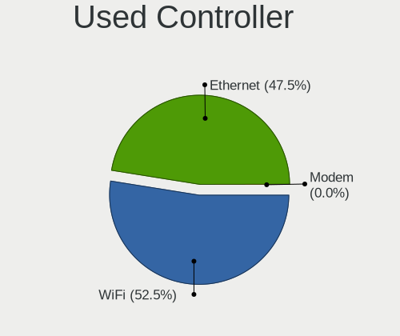

| Kind     | Computers | Percent |
|----------|-----------|---------|
| WiFi     | 1866      | 52.52%  |
| Ethernet | 1686      | 47.45%  |
| Modem    | 1         | 0.03%   |

NICs
----

Total network controllers on board

| Total | Computers | Percent |
|-------|-----------|---------|
| 2     | 1840      | 53.4%   |
| 1     | 1507      | 43.73%  |
| 0     | 66        | 1.92%   |
| 3     | 31        | 0.9%    |
| 6     | 1         | 0.03%   |
| 4     | 1         | 0.03%   |

IPv6
----

IPv6 vs IPv4

| Used | Computers | Percent |
|------|-----------|---------|
| No   | 3408      | 99.16%  |
| Yes  | 29        | 0.84%   |

Bluetooth
---------

Bluetooth Vendor
----------------

Controller vendors

| Vendor                          | Computers | Percent |
|---------------------------------|-----------|---------|
| Intel                           | 614       | 35.01%  |
| Qualcomm Atheros Communications | 198       | 11.29%  |
| Realtek Semiconductor           | 186       | 10.6%   |
| IMC Networks                    | 160       | 9.12%   |
| Cambridge Silicon Radio         | 111       | 6.33%   |
| Lite-On Technology              | 101       | 5.76%   |
| Broadcom                        | 101       | 5.76%   |
| Foxconn / Hon Hai               | 69        | 3.93%   |
| Ralink                          | 36        | 2.05%   |
| ASUSTek Computer                | 35        | 2%      |
| Hewlett-Packard                 | 30        | 1.71%   |
| Apple                           | 24        | 1.37%   |
| Dell                            | 21        | 1.2%    |
| Toshiba                         | 10        | 0.57%   |
| Ralink Technology               | 10        | 0.57%   |
| Foxconn International           | 9         | 0.51%   |
| Realtek                         | 6         | 0.34%   |
| Opticis                         | 4         | 0.23%   |
| MediaTek                        | 4         | 0.23%   |
| Alps Electric                   | 4         | 0.23%   |
| Micro Star International        | 3         | 0.17%   |
| Conwise Technology              | 3         | 0.17%   |
| Taiyo Yuden                     | 2         | 0.11%   |
| Edimax Technology               | 2         | 0.11%   |
| D-Link                          | 2         | 0.11%   |
| Askey Computer                  | 2         | 0.11%   |
| Roper                           | 1         | 0.06%   |
| Logitech                        | 1         | 0.06%   |
| Integrated System Solution      | 1         | 0.06%   |
| Fujitsu                         | 1         | 0.06%   |
| D-Link System                   | 1         | 0.06%   |
| Chicony Electronics             | 1         | 0.06%   |
| Unknown                         | 1         | 0.06%   |

Bluetooth Model
---------------

Controller models

| Model                                               | Computers | Percent |
|-----------------------------------------------------|-----------|---------|
| Intel Bluetooth wireless interface                  | 216       | 12.31%  |
| Intel Bluetooth 9460/9560 Jefferson Peak (JfP)      | 114       | 6.5%    |
| Cambridge Silicon Radio Bluetooth Dongle (HCI mode) | 111       | 6.33%   |
| Intel AX201 Bluetooth                               | 100       | 5.7%    |
| Realtek Bluetooth Radio                             | 96        | 5.47%   |
| Qualcomm Atheros  Bluetooth Device                  | 73        | 4.16%   |
| IMC Networks Bluetooth Radio                        | 66        | 3.76%   |
| Intel AX200 Bluetooth                               | 63        | 3.59%   |
| Realtek  Bluetooth 4.2 Adapter                      | 58        | 3.31%   |
| Qualcomm Atheros AR3011 Bluetooth                   | 58        | 3.31%   |
| IMC Networks Bluetooth Device                       | 44        | 2.51%   |
| Intel Centrino Bluetooth Wireless Transceiver       | 39        | 2.22%   |
| Ralink RT3290 Bluetooth                             | 36        | 2.05%   |
| Lite-On Bluetooth Device                            | 35        | 2%      |
| Qualcomm Atheros AR3012 Bluetooth 4.0               | 34        | 1.94%   |
| Intel Wireless-AC 3168 Bluetooth                    | 32        | 1.82%   |
| Foxconn / Hon Hai Bluetooth Device                  | 28        | 1.6%    |
| Lite-On Qualcomm Atheros QCA9377 Bluetooth          | 27        | 1.54%   |
| IMC Networks Atheros AR3012 Bluetooth 4.0 Adapter   | 22        | 1.25%   |
| Intel Wireless-AC 9260 Bluetooth Adapter            | 16        | 0.91%   |
| IMC Networks Wireless_Device                        | 16        | 0.91%   |
| HP Broadcom 2070 Bluetooth Combo                    | 16        | 0.91%   |
| Lite-On Atheros AR3012 Bluetooth                    | 15        | 0.86%   |
| HP Bluetooth 2.0 Interface [Broadcom BCM2045]       | 14        | 0.8%    |
| Broadcom BCM2045 Bluetooth                          | 13        | 0.74%   |
| Qualcomm Atheros Bluetooth                          | 12        | 0.68%   |
| Intel Centrino Advanced-N 6230 Bluetooth adapter    | 12        | 0.68%   |
| Foxconn / Hon Hai Broadcom BCM20702 Bluetooth       | 12        | 0.68%   |
| Intel AX211 Bluetooth                               | 11        | 0.63%   |
| Intel AX210 Bluetooth                               | 11        | 0.63%   |
| Foxconn / Hon Hai Broadcom Bluetooth 2.1 Device     | 11        | 0.63%   |
| Realtek RTL8821A Bluetooth                          | 10        | 0.57%   |
| Broadcom BCM2070 Bluetooth 2.1 + EDR                | 10        | 0.57%   |
| Broadcom BCM2045B (BDC-2.1)                         | 10        | 0.57%   |
| Qualcomm Atheros AR9462 Bluetooth                   | 9         | 0.51%   |
| Lite-On Broadcom BCM43142A0 Bluetooth Device        | 9         | 0.51%   |
| Foxconn International BCM43142A0 Bluetooth module   | 9         | 0.51%   |
| Broadcom BCM20702A0                                 | 9         | 0.51%   |
| ASUS BT-183 Bluetooth 2.0+EDR adapter               | 9         | 0.51%   |
| Apple Bluetooth Host Controller                     | 9         | 0.51%   |

Sound
-----

Sound Vendor
------------

Sound card vendors

| Vendor                           | Computers | Percent |
|----------------------------------|-----------|---------|
| Intel                            | 2360      | 51.93%  |
| AMD                              | 1070      | 23.54%  |
| Nvidia                           | 804       | 17.69%  |
| C-Media Electronics              | 73        | 1.61%   |
| Creative Labs                    | 46        | 1.01%   |
| Logitech                         | 23        | 0.51%   |
| VIA Technologies                 | 14        | 0.31%   |
| Silicon Integrated Systems [SiS] | 10        | 0.22%   |
| JMTek                            | 10        | 0.22%   |
| ASUSTek Computer                 | 10        | 0.22%   |
| Plantronics                      | 9         | 0.2%    |
| Generalplus Technology           | 9         | 0.2%    |
| Realtek Semiconductor            | 8         | 0.18%   |
| Texas Instruments                | 7         | 0.15%   |
| SteelSeries ApS                  | 6         | 0.13%   |
| DSEA A/S                         | 6         | 0.13%   |
| Lenovo                           | 4         | 0.09%   |
| GN Netcom                        | 4         | 0.09%   |
| Yamaha                           | 3         | 0.07%   |
| ULi Electronics                  | 3         | 0.07%   |
| SAVITECH                         | 3         | 0.07%   |
| Razer USA                        | 3         | 0.07%   |
| M-Audio                          | 3         | 0.07%   |
| Kingston Technology              | 3         | 0.07%   |
| Hewlett-Packard                  | 3         | 0.07%   |
| Ensoniq                          | 3         | 0.07%   |
| Creative Technology              | 3         | 0.07%   |
| Tenx Technology                  | 2         | 0.04%   |
| Sony                             | 2         | 0.04%   |
| Shenzhen Rapoo Technology        | 2         | 0.04%   |
| Microsoft                        | 2         | 0.04%   |
| KTMicro                          | 2         | 0.04%   |
| Focusrite-Novation               | 2         | 0.04%   |
| Cirrus Logic                     | 2         | 0.04%   |
| BEHRINGER International          | 2         | 0.04%   |
| ZOOM                             | 1         | 0.02%   |
| Vitana                           | 1         | 0.02%   |
| Trust                            | 1         | 0.02%   |
| Samsung Electronics              | 1         | 0.02%   |
| ROCCAT                           | 1         | 0.02%   |

Sound Model
-----------

Sound card models

| Model                                                                                             | Computers | Percent |
|---------------------------------------------------------------------------------------------------|-----------|---------|
| Intel 7 Series/C216 Chipset Family High Definition Audio Controller                               | 289       | 5.45%   |
| Intel 6 Series/C200 Series Chipset Family High Definition Audio Controller                        | 269       | 5.07%   |
| AMD SBx00 Azalia (Intel HDA)                                                                      | 267       | 5.03%   |
| Intel Sunrise Point-LP HD Audio                                                                   | 235       | 4.43%   |
| Intel NM10/ICH7 Family High Definition Audio Controller                                           | 213       | 4.02%   |
| AMD Family 17h/19h/1ah HD Audio Controller                                                        | 209       | 3.94%   |
| AMD FCH Azalia Controller                                                                         | 175       | 3.3%    |
| Intel 82801I (ICH9 Family) HD Audio Controller                                                    | 130       | 2.45%   |
| Intel 8 Series/C220 Series Chipset High Definition Audio Controller                               | 117       | 2.21%   |
| Intel 5 Series/3400 Series Chipset High Definition Audio                                          | 111       | 2.09%   |
| Nvidia GF108 High Definition Audio Controller                                                     | 102       | 1.92%   |
| Intel Cannon Lake PCH cAVS                                                                        | 100       | 1.89%   |
| AMD Raven/Raven2/Fenghuang HDMI/DP Audio Controller                                               | 91        | 1.72%   |
| Intel Xeon E3-1200 v3/4th Gen Core Processor HD Audio Controller                                  | 89        | 1.68%   |
| AMD Renoir Radeon High Definition Audio Controller                                                | 88        | 1.66%   |
| Intel 100 Series/C230 Series Chipset Family HD Audio Controller                                   | 79        | 1.49%   |
| Nvidia MCP61 High Definition Audio                                                                | 76        | 1.43%   |
| Intel Celeron/Pentium Silver Processor High Definition Audio                                      | 68        | 1.28%   |
| Nvidia GP107GL High Definition Audio Controller                                                   | 66        | 1.24%   |
| Intel Cannon Point-LP High Definition Audio Controller                                            | 65        | 1.23%   |
| Nvidia GK208 HDMI/DP Audio Controller                                                             | 63        | 1.19%   |
| Nvidia High Definition Audio Controller                                                           | 60        | 1.13%   |
| AMD Family 17h (Models 00h-0fh) HD Audio Controller                                               | 59        | 1.11%   |
| Intel Tiger Lake-LP Smart Sound Technology Audio Controller                                       | 58        | 1.09%   |
| AMD Ellesmere HDMI Audio [Radeon RX 470/480 / 570/580/590]                                        | 57        | 1.07%   |
| Intel 200 Series PCH HD Audio                                                                     | 53        | 1%      |
| AMD Trinity HDMI Audio Controller                                                                 | 51        | 0.96%   |
| AMD Starship/Matisse HD Audio Controller                                                          | 51        | 0.96%   |
| Intel 82801H (ICH8 Family) HD Audio Controller                                                    | 50        | 0.94%   |
| AMD Oland/Hainan/Cape Verde/Pitcairn HDMI Audio [Radeon HD 7000 Series]                           | 50        | 0.94%   |
| Intel Haswell-ULT HD Audio Controller                                                             | 49        | 0.92%   |
| Intel 82801JI (ICH10 Family) HD Audio Controller                                                  | 49        | 0.92%   |
| Intel 8 Series HD Audio Controller                                                                | 49        | 0.92%   |
| Nvidia GK107 HDMI Audio Controller                                                                | 46        | 0.87%   |
| Intel Atom/Celeron/Pentium Processor x5-E8000/J3xxx/N3xxx Series High Definition Audio Controller | 44        | 0.83%   |
| AMD Kabini HDMI/DP Audio                                                                          | 44        | 0.83%   |
| AMD Cedar HDMI Audio [Radeon HD 5400/6300/7300 Series]                                            | 44        | 0.83%   |
| Intel Broadwell-U Audio Controller                                                                | 42        | 0.79%   |
| Nvidia GP106 High Definition Audio Controller                                                     | 41        | 0.77%   |
| Intel Wildcat Point-LP High Definition Audio Controller                                           | 41        | 0.77%   |

Memory
------

Memory Vendor
-------------

Memory module vendors

| Vendor              | Computers | Percent |
|---------------------|-----------|---------|
| Unknown             | 645       | 22.81%  |
| Samsung Electronics | 505       | 17.86%  |
| SK hynix            | 393       | 13.9%   |
| Kingston            | 364       | 12.87%  |
| Micron Technology   | 196       | 6.93%   |
| Crucial             | 67        | 2.37%   |
| GOODRAM             | 66        | 2.33%   |
| Ramaxel Technology  | 63        | 2.23%   |
| Elpida              | 60        | 2.12%   |
| Team                | 57        | 2.02%   |
| Nanya Technology    | 41        | 1.45%   |
| A-DATA Technology   | 40        | 1.41%   |
| G.Skill             | 35        | 1.24%   |
| Corsair             | 31        | 1.1%    |
| AMD                 | 31        | 1.1%    |
| Transcend           | 28        | 0.99%   |
| Silicon Power       | 19        | 0.67%   |
| Patriot             | 18        | 0.64%   |
| Exceleram           | 15        | 0.53%   |
| Apacer              | 15        | 0.53%   |
| Unknown (ABCD)      | 14        | 0.5%    |
| ASint Technology    | 9         | 0.32%   |
| Kllisre             | 8         | 0.28%   |
| 48spaces            | 8         | 0.28%   |
| SHARETRONIC         | 7         | 0.25%   |
| GeIL                | 7         | 0.25%   |
| Unknown             | 7         | 0.25%   |
| Qimonda             | 6         | 0.21%   |
| Goldkey             | 5         | 0.18%   |
| Unifosa             | 4         | 0.14%   |
| TwinMOS             | 4         | 0.14%   |
| Toshiba             | 4         | 0.14%   |
| Kingmax             | 4         | 0.14%   |
| Wilk                | 3         | 0.11%   |
| TakeMS              | 3         | 0.11%   |
| Swissbit            | 3         | 0.11%   |
| Qumo                | 3         | 0.11%   |
| KingSpec            | 3         | 0.11%   |
| Foxline             | 3         | 0.11%   |
| PNY                 | 2         | 0.07%   |

Memory Model
------------

Memory module models

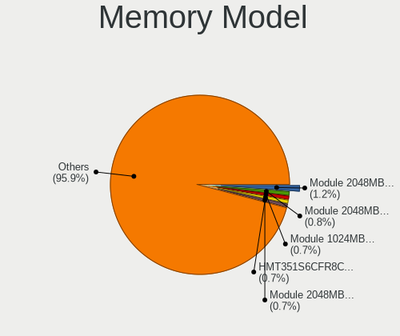

| Model                                                            | Computers | Percent |
|------------------------------------------------------------------|-----------|---------|
| Unknown RAM Module 2048MB DIMM DDR2 800MT/s                      | 36        | 1.15%   |
| Unknown RAM Module 2048MB DIMM 1333MT/s                          | 25        | 0.8%    |
| Unknown RAM Module 1024MB DIMM SDRAM                             | 23        | 0.74%   |
| SK hynix RAM HMT351S6CFR8C-PB 4GB SODIMM DDR3 1600MT/s           | 22        | 0.7%    |
| Unknown RAM Module 2048MB DIMM 800MT/s                           | 21        | 0.67%   |
| Unknown RAM Module 2048MB DIMM SDRAM                             | 20        | 0.64%   |
| Samsung RAM M471B5173QH0-YK0 4GB SODIMM DDR3 1600MT/s            | 20        | 0.64%   |
| Samsung RAM M471A5244CB0-CRC 4GB SODIMM DDR4 2667MT/s            | 20        | 0.64%   |
| Samsung RAM M471B5273DH0-CH9 4GB SODIMM DDR3 1334MT/s            | 19        | 0.61%   |
| Samsung RAM M471B5273DH0-CK0 4GB SODIMM DDR3 2400MT/s            | 18        | 0.58%   |
| Unknown RAM Module 4096MB DIMM 1333MT/s                          | 17        | 0.54%   |
| Samsung RAM M471B5173DB0-YK0 4GB SODIMM DDR3 1600MT/s            | 17        | 0.54%   |
| Samsung RAM M471B5773DH0-CH9 2GB SODIMM DDR3 1600MT/s            | 16        | 0.51%   |
| Samsung RAM M471A5244CB0-CTD 4GB SODIMM DDR4 3266MT/s            | 16        | 0.51%   |
| Samsung RAM M471B5273CH0-CH9 4GB SODIMM DDR3 1334MT/s            | 15        | 0.48%   |
| Unknown RAM Module 4096MB DIMM 400MT/s                           | 14        | 0.45%   |
| SK hynix RAM HMT351S6BFR8C-H9 4GB SODIMM DDR3 1333MT/s           | 14        | 0.45%   |
| Samsung RAM M471B5773DH0-CK0 2GB SODIMM DDR3 1600MT/s            | 14        | 0.45%   |
| Unknown (ABCD) RAM 123456789012345678 2GB SODIMM LPDDR3 2400MT/s | 13        | 0.42%   |
| Samsung RAM Module 16384MB SODIMM DDR4 2667MT/s                  | 13        | 0.42%   |
| Samsung RAM M471B5773CHS-CH9 2GB SODIMM DDR3 4199MT/s            | 13        | 0.42%   |
| Samsung RAM M471A1K43DB1-CWE 8GB SODIMM DDR4 3200MT/s            | 13        | 0.42%   |
| Micron RAM 4ATF51264HZ-2G6E1 4GB SODIMM DDR4 2667MT/s            | 13        | 0.42%   |
| Elpida RAM EBJ41UF8BCS0-DJ-F 4GB SODIMM DDR3 1334MT/s            | 13        | 0.42%   |
| Unknown RAM Module 2048MB DIMM 667MT/s                           | 12        | 0.38%   |
| Unknown RAM Module 1024MB DIMM DDR2 800MT/s                      | 12        | 0.38%   |
| Unknown RAM Module 1024MB DIMM 667MT/s                           | 12        | 0.38%   |
| Unknown RAM Module 1024MB DIMM                                   | 12        | 0.38%   |
| SK hynix RAM HMT451S6AFR8A-PB 4GB SODIMM DDR3 1600MT/s           | 12        | 0.38%   |
| SK hynix RAM HMT325S6BFR8C-H9 2048MB SODIMM DDR3 1600MT/s        | 12        | 0.38%   |
| Samsung RAM M471B5173EB0-YK0 4GB SODIMM DDR3 1600MT/s            | 12        | 0.38%   |
| SK hynix RAM HMA851S6AFR6N-UH 4GB SODIMM DDR4 2667MT/s           | 11        | 0.35%   |
| SK hynix RAM HMA81GS6CJR8N-VK 8GB SODIMM DDR4 2667MT/s           | 11        | 0.35%   |
| SK hynix RAM HMA81GS6AFR8N-UH 8GB SODIMM DDR4 2667MT/s           | 11        | 0.35%   |
| Samsung RAM M471A1K43CB1-CTD 8GB SODIMM DDR4 2667MT/s            | 11        | 0.35%   |
| Ramaxel RAM RMT3160ED58E9W1600 4GB SODIMM DDR3 1600MT/s          | 11        | 0.35%   |
| Kingston RAM KHX3200C16D4/8GX 8GB DIMM DDR4 3733MT/s             | 11        | 0.35%   |
| Unknown RAM Module 4096MB DIMM DDR3 1333MT/s                     | 10        | 0.32%   |
| Unknown RAM Module 2048MB SODIMM SDRAM                           | 10        | 0.32%   |
| Unknown RAM Module 2048MB SODIMM DDR2 667MT/s                    | 10        | 0.32%   |

Memory Kind
-----------

Memory module kinds

| Kind    | Computers | Percent |
|---------|-----------|---------|
| DDR3    | 957       | 39.08%  |
| DDR4    | 706       | 28.83%  |
| DDR2    | 266       | 10.86%  |
| Unknown | 214       | 8.74%   |
| SDRAM   | 151       | 6.17%   |
| LPDDR4  | 54        | 2.2%    |
| DDR     | 49        | 2%      |
| LPDDR3  | 17        | 0.69%   |
| DRAM    | 16        | 0.65%   |
| DDR5    | 11        | 0.45%   |
| LPDDR5  | 6         | 0.24%   |
| EEPROM  | 2         | 0.08%   |

Memory Form Factor
------------------

Physical design of the memory module

| Name         | Computers | Percent |
|--------------|-----------|---------|
| SODIMM       | 1295      | 54.27%  |
| DIMM         | 1023      | 42.88%  |
| Row Of Chips | 56        | 2.35%   |
| Chip         | 9         | 0.38%   |
| RIMM         | 1         | 0.04%   |
| FB-DIMM      | 1         | 0.04%   |
| Unknown      | 1         | 0.04%   |

Memory Size
-----------

Memory module size

| Size  | Computers | Percent |
|-------|-----------|---------|
| 4096  | 825       | 29.55%  |
| 8192  | 700       | 25.07%  |
| 2048  | 681       | 24.39%  |
| 1024  | 262       | 9.38%   |
| 16384 | 215       | 7.7%    |
| 512   | 53        | 1.9%    |
| 32768 | 43        | 1.54%   |
| 256   | 11        | 0.39%   |
| 1     | 2         | 0.07%   |

Memory Speed
------------

Memory module speed

| Speed   | Computers | Percent |
|---------|-----------|---------|
| 1600    | 589       | 21.89%  |
| 1333    | 272       | 10.11%  |
| 2667    | 253       | 9.4%    |
| 3200    | 194       | 7.21%   |
| Unknown | 169       | 6.28%   |
| 2400    | 161       | 5.98%   |
| 1334    | 144       | 5.35%   |
| 800     | 143       | 5.31%   |
| 667     | 142       | 5.28%   |
| 2133    | 103       | 3.83%   |
| 400     | 44        | 1.64%   |
| 1867    | 40        | 1.49%   |
| 1067    | 38        | 1.41%   |
| 4199    | 33        | 1.23%   |
| 1066    | 30        | 1.11%   |
| 533     | 27        | 1%      |
| 333     | 24        | 0.89%   |
| 1866    | 20        | 0.74%   |
| 3600    | 17        | 0.63%   |
| 3266    | 17        | 0.63%   |
| 2048    | 17        | 0.63%   |
| 3733    | 16        | 0.59%   |
| 3400    | 14        | 0.52%   |
| 4267    | 12        | 0.45%   |
| 1800    | 12        | 0.45%   |
| 4266    | 10        | 0.37%   |
| 3466    | 10        | 0.37%   |
| 3333    | 9         | 0.33%   |
| 3800    | 8         | 0.3%    |
| 3000    | 8         | 0.3%    |
| 1639    | 8         | 0.3%    |
| 2933    | 7         | 0.26%   |
| 975     | 7         | 0.26%   |
| 266     | 7         | 0.26%   |
| 4800    | 6         | 0.22%   |
| 3066    | 6         | 0.22%   |
| 2666    | 6         | 0.22%   |
| 6400    | 5         | 0.19%   |
| 5600    | 5         | 0.19%   |
| 4000    | 5         | 0.19%   |

Printers & scanners
-------------------

Printer Vendor
--------------

Printer device vendors

| Vendor                | Computers | Percent |
|-----------------------|-----------|---------|
| Canon                 | 37        | 37%     |
| Samsung Electronics   | 27        | 27%     |
| Hewlett-Packard       | 14        | 14%     |
| Seiko Epson           | 7         | 7%      |
| Brother Industries    | 3         | 3%      |
| WinChipHead           | 2         | 2%      |
| Prolific Technology   | 2         | 2%      |
| Pantum                | 2         | 2%      |
| Zebra                 | 1         | 1%      |
| Xiaomi                | 1         | 1%      |
| Xerox                 | 1         | 1%      |
| Oki Data              | 1         | 1%      |
| Lexmark International | 1         | 1%      |
| Dell                  | 1         | 1%      |

Printer Model
-------------

Printer device models

| Model                                         | Computers | Percent |
|-----------------------------------------------|-----------|---------|
| Samsung SCX-4200 series                       | 6         | 6%      |
| Canon MF4410                                  | 4         | 4%      |
| Samsung SCX-4100 Scanner                      | 3         | 3%      |
| Samsung ML-1520 Laser Printer                 | 3         | 3%      |
| Samsung M2070 Series                          | 3         | 3%      |
| Canon MP160                                   | 3         | 3%      |
| WinChipHead CH34x printer adapter cable       | 2         | 2%      |
| Seiko Epson L210 Series                       | 2         | 2%      |
| Samsung Xerox Phaser 3117 Laser Printer       | 2         | 2%      |
| Samsung ML-1710 Printer                       | 2         | 2%      |
| Samsung M2020 Series                          | 2         | 2%      |
| Prolific PL2305 Parallel Port                 | 2         | 2%      |
| HP LaserJet P1102                             | 2         | 2%      |
| HP LaserJet P1005                             | 2         | 2%      |
| HP LaserJet 1020                              | 2         | 2%      |
| HP LaserJet 1012                              | 2         | 2%      |
| Canon PIXMA MP280                             | 2         | 2%      |
| Canon MF4320-4350                             | 2         | 2%      |
| Canon MF4010 series                           | 2         | 2%      |
| Canon MF3010                                  | 2         | 2%      |
| Canon LBP3010/LBP3018/LBP3050                 | 2         | 2%      |
| Canon LBP2900                                 | 2         | 2%      |
| Canon LaserShot LBP-1120 Printer              | 2         | 2%      |
| Canon iP2700 series                           | 2         | 2%      |
| Canon CAPT USB Device                         | 2         | 2%      |
| Zebra ZTC S4M-200dpi ZPL                      | 1         | 1%      |
| Xiaomi MiMouse 2                              | 1         | 1%      |
| Xerox Printing Support                        | 1         | 1%      |
| Seiko Epson XP-243 245 247 Series             | 1         | 1%      |
| Seiko Epson Printer                           | 1         | 1%      |
| Seiko Epson ME 340 Series/Stylus NX130 Series | 1         | 1%      |
| Seiko Epson L382 Series                       | 1         | 1%      |
| Seiko Epson ET-2600 Series                    | 1         | 1%      |
| Samsung Xerox Phaser 3150                     | 1         | 1%      |
| Samsung SCX-4216F Scanner                     | 1         | 1%      |
| Samsung Phaser 3121                           | 1         | 1%      |
| Samsung ML-1660 Series                        | 1         | 1%      |
| Samsung Laser Printer                         | 1         | 1%      |
| Samsung CLX-3300 Series                       | 1         | 1%      |
| Pantum P2510 series                           | 1         | 1%      |

Scanner Vendor
--------------

Scanner device vendors

| Vendor             | Computers | Percent |
|--------------------|-----------|---------|
| Canon              | 7         | 30.43%  |
| Seiko Epson        | 6         | 26.09%  |
| Mustek Systems     | 4         | 17.39%  |
| Ultima Electronics | 3         | 13.04%  |
| Hewlett-Packard    | 3         | 13.04%  |

Scanner Model
-------------

Scanner device models

| Model                                                                                 | Computers | Percent |
|---------------------------------------------------------------------------------------|-----------|---------|
| Ultima Artec Ultima 2000 (GT6801 based)/Lifetec LT9385/ScanMagic 1200 UB Plus Scanner | 3         | 13.04%  |
| Canon CanoScan LIDE 25                                                                | 3         | 13.04%  |
| Seiko Epson GT-F500/GT-F550 [Perfection 2480/2580 PHOTO]                              | 2         | 8.7%    |
| Mustek Systems SNAPSCAN e22                                                           | 2         | 8.7%    |
| Mustek Systems BearPaw 1200 CU Plus                                                   | 2         | 8.7%    |
| Seiko Epson Scanner                                                                   | 1         | 4.35%   |
| Seiko Epson GT-F520/GT-F570 [Perfection 3590 PHOTO]                                   | 1         | 4.35%   |
| Seiko Epson GT-9800F [Perfection 3200]                                                | 1         | 4.35%   |
| Seiko Epson GT-7300U [Perfection 1260/1260 PHOTO]                                     | 1         | 4.35%   |
| HP ScanJet 4400c                                                                      | 1         | 4.35%   |
| HP ScanJet 3800c                                                                      | 1         | 4.35%   |
| HP ScanJet 2400c                                                                      | 1         | 4.35%   |
| Canon CanoScan N670U/N676U/LiDE 20                                                    | 1         | 4.35%   |
| Canon CanoScan LiDE 60                                                                | 1         | 4.35%   |
| Canon CanoScan LiDE 120                                                               | 1         | 4.35%   |
| Canon CanoScan LiDE 110                                                               | 1         | 4.35%   |

Camera
------

Camera Vendor
-------------

Camera device vendors

| Vendor                                 | Computers | Percent |
|----------------------------------------|-----------|---------|
| Chicony Electronics                    | 443       | 20.84%  |
| IMC Networks                           | 257       | 12.09%  |
| Microdia                               | 149       | 7.01%   |
| Logitech                               | 136       | 6.4%    |
| Realtek Semiconductor                  | 123       | 5.79%   |
| Bison Electronics                      | 118       | 5.55%   |
| Quanta                                 | 105       | 4.94%   |
| Sunplus Innovation Technology          | 99        | 4.66%   |
| Z-Star Microelectronics                | 93        | 4.37%   |
| Suyin                                  | 84        | 3.95%   |
| Cheng Uei Precision Industry (Foxlink) | 84        | 3.95%   |
| Syntek                                 | 55        | 2.59%   |
| Silicon Motion                         | 45        | 2.12%   |
| Alcor Micro                            | 38        | 1.79%   |
| Lite-On Technology                     | 34        | 1.6%    |
| Apple                                  | 32        | 1.51%   |
| Acer                                   | 30        | 1.41%   |
| Luxvisions Innotech Limited            | 22        | 1.03%   |
| Aveo Technology                        | 21        | 0.99%   |
| KYE Systems (Mouse Systems)            | 16        | 0.75%   |
| DigiTech                               | 11        | 0.52%   |
| Pixart Imaging                         | 10        | 0.47%   |
| Microsoft                              | 10        | 0.47%   |
| GEMBIRD                                | 9         | 0.42%   |
| Sonix Technology                       | 8         | 0.38%   |
| Ricoh                                  | 8         | 0.38%   |
| Primax Electronics                     | 7         | 0.33%   |
| Cubeternet                             | 7         | 0.33%   |
| Arkmicro Technologies                  | 7         | 0.33%   |
| ALi                                    | 7         | 0.33%   |
| Samsung Electronics                    | 6         | 0.28%   |
| Lenovo                                 | 4         | 0.19%   |
| Hewlett-Packard                        | 4         | 0.19%   |
| SunplusIT                              | 3         | 0.14%   |
| Sunplus Technology                     | 3         | 0.14%   |
| Google                                 | 3         | 0.14%   |
| Generalplus Technology                 | 3         | 0.14%   |
| Unknown                                | 2         | 0.09%   |
| ShineTech                              | 2         | 0.09%   |
| Jieli Technology                       | 2         | 0.09%   |

Camera Model
------------

Camera device models

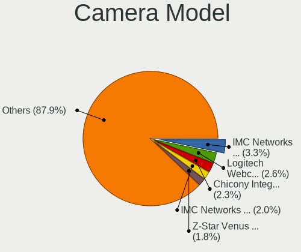

| Model                                                                      | Computers | Percent |
|----------------------------------------------------------------------------|-----------|---------|
| IMC Networks USB2.0 VGA UVC WebCam                                         | 71        | 3.33%   |
| Logitech Webcam C270                                                       | 56        | 2.62%   |
| Chicony Integrated Camera                                                  | 50        | 2.34%   |
| IMC Networks USB2.0 HD UVC WebCam                                          | 42        | 1.97%   |
| Z-Star Venus USB2.0 Camera                                                 | 39        | 1.83%   |
| Chicony Lenovo EasyCamera                                                  | 38        | 1.78%   |
| Chicony HD WebCam                                                          | 30        | 1.41%   |
| IMC Networks Integrated Camera                                             | 29        | 1.36%   |
| Bison Lenovo Integrated Webcam                                             | 29        | 1.36%   |
| Microdia Integrated_Webcam_HD                                              | 28        | 1.31%   |
| Sunplus Integrated_Webcam_HD                                               | 27        | 1.26%   |
| Chicony USB2.0 VGA UVC WebCam                                              | 27        | 1.26%   |
| Realtek Integrated_Webcam_HD                                               | 26        | 1.22%   |
| Quanta HD User Facing                                                      | 26        | 1.22%   |
| Syntek Lenovo EasyCamera                                                   | 25        | 1.17%   |
| Chicony HP HD Camera                                                       | 22        | 1.03%   |
| Bison Lenovo EasyCamera                                                    | 22        | 1.03%   |
| Logitech Webcam C310                                                       | 21        | 0.98%   |
| Bison Integrated Camera                                                    | 21        | 0.98%   |
| Quanta HP TrueVision HD Camera                                             | 19        | 0.89%   |
| Microdia Camera                                                            | 18        | 0.84%   |
| Chicony HP Webcam                                                          | 18        | 0.84%   |
| Apple iPhone 5/5C/5S/6/SE/7/8/X/XR                                         | 18        | 0.84%   |
| Microdia Sonix USB 2.0 Camera                                              | 17        | 0.8%    |
| Sunplus HD WebCam                                                          | 16        | 0.75%   |
| Logitech Webcam C170                                                       | 16        | 0.75%   |
| Chicony HP Wide Vision HD Camera                                           | 16        | 0.75%   |
| IMC Networks Lenovo EasyCamera                                             | 15        | 0.7%    |
| Cheng Uei Precision Industry (Foxlink) HP Wide Vision HD Integrated Webcam | 15        | 0.7%    |
| Z-Star A4 TECH USB2.0 PC Camera J                                          | 14        | 0.66%   |
| Sunplus Asus Webcam                                                        | 14        | 0.66%   |
| Quanta HD WebCam                                                           | 14        | 0.66%   |
| Chicony HP Truevision HD                                                   | 14        | 0.66%   |
| Syntek Integrated Camera                                                   | 13        | 0.61%   |
| Lite-On Integrated Camera                                                  | 13        | 0.61%   |
| Lite-On HP HD Camera                                                       | 13        | 0.61%   |
| IMC Networks UVC VGA Webcam                                                | 13        | 0.61%   |
| IMC Networks Integrated Webcam                                             | 13        | 0.61%   |
| Aveo Camera                                                                | 13        | 0.61%   |
| Z-Star Vimicro USB Camera (Altair)                                         | 12        | 0.56%   |

Security
--------

Fingerprint Vendor
------------------

Fingerprint sensor vendors

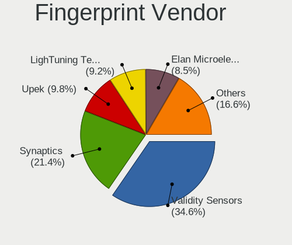

| Vendor                             | Computers | Percent |
|------------------------------------|-----------|---------|
| Validity Sensors                   | 102       | 34.58%  |
| Synaptics                          | 63        | 21.36%  |
| Upek                               | 29        | 9.83%   |
| LighTuning Technology              | 27        | 9.15%   |
| Elan Microelectronics              | 25        | 8.47%   |
| Shenzhen Goodix Technology         | 23        | 7.8%    |
| AuthenTec                          | 15        | 5.08%   |
| STMicroelectronics                 | 6         | 2.03%   |
| Samsung Electronics                | 2         | 0.68%   |
| FocalTech                          | 2         | 0.68%   |
| Realtek USB2.0 Finger Print Bridge | 1         | 0.34%   |

Fingerprint Model
-----------------

Fingerprint sensor models

| Model                                                                      | Computers | Percent |
|----------------------------------------------------------------------------|-----------|---------|
| Validity Sensors VFS495 Fingerprint Reader                                 | 36        | 12.2%   |
| Upek Biometric Touchchip/Touchstrip Fingerprint Sensor                     | 29        | 9.83%   |
| Shenzhen Goodix  Fingerprint Device                                        | 16        | 5.42%   |
| LighTuning EgisTec Touch Fingerprint Sensor                                | 16        | 5.42%   |
| Elan ELAN:Fingerprint                                                      | 16        | 5.42%   |
| Validity Sensors VFS5011 Fingerprint Reader                                | 12        | 4.07%   |
| Synaptics Fingerprint reader [HP G6]                                       | 12        | 4.07%   |
| Synaptics Prometheus MIS Touch Fingerprint Reader                          | 11        | 3.73%   |
| Validity Sensors Synaptics VFS7552 Touch Fingerprint Sensor with PurePrint | 10        | 3.39%   |
| Synaptics  FS7604 Touch Fingerprint Sensor with PurePrint                  | 10        | 3.39%   |
| Validity Sensors VFS471 Fingerprint Reader                                 | 8         | 2.71%   |
| LighTuning ES603 Swipe Fingerprint Sensor                                  | 8         | 2.71%   |
| Synaptics Metallica MOH Touch Fingerprint Reader                           | 7         | 2.37%   |
| Shenzhen Goodix Fingerprint Reader                                         | 7         | 2.37%   |
| Validity Sensors VFS7500 Touch Fingerprint Sensor                          | 6         | 2.03%   |
| Validity Sensors Fingerprint scanner                                       | 6         | 2.03%   |
| Synaptics Metallica MIS Touch Fingerprint Reader                           | 6         | 2.03%   |
| Synaptics FS7604 Touch Fingerprint Sensor with PurePrint                   | 6         | 2.03%   |
| STMicroelectronics Fingerprint Reader                                      | 6         | 2.03%   |
| Elan WBF Fingerprint Sensor                                                | 6         | 2.03%   |
| AuthenTec AES2501 Fingerprint Sensor                                       | 6         | 2.03%   |
| Validity Sensors Synaptics WBDI                                            | 5         | 1.69%   |
| Synaptics WBDI Fingerprint Reader USB 086                                  | 5         | 1.69%   |
| AuthenTec AES1600                                                          | 5         | 1.69%   |
| Validity Sensors VFS101 Fingerprint Reader                                 | 4         | 1.36%   |
| Validity Sensors VFS 5011 fingerprint sensor                               | 4         | 1.36%   |
| Validity Sensors Swipe Fingerprint Sensor                                  | 4         | 1.36%   |
| Synaptics UWP WBDI                                                         | 3         | 1.02%   |
| LighTuning Fingerprint Reader                                              | 3         | 1.02%   |
| Elan ELAN:ARM-M4                                                           | 3         | 1.02%   |
| AuthenTec AES2810                                                          | 3         | 1.02%   |
| Validity Sensors VFS451 Fingerprint Reader                                 | 2         | 0.68%   |
| FocalTech FocalTech Fingerprint Device                                     | 2         | 0.68%   |
| Validity Sensors VFS7552 Touch Fingerprint Sensor                          | 1         | 0.34%   |
| Validity Sensors VFS491                                                    | 1         | 0.34%   |
| Validity Sensors VFS301 Fingerprint Reader                                 | 1         | 0.34%   |
| Validity Sensors VFS300 Fingerprint Reader                                 | 1         | 0.34%   |
| Validity Sensors VFS Fingerprint sensor                                    | 1         | 0.34%   |
| Synaptics WBDI                                                             | 1         | 0.34%   |
| Synaptics  WBDI                                                            | 1         | 0.34%   |

Chipcard Vendor
---------------

Chipcard module vendors

| Vendor                    | Computers | Percent |
|---------------------------|-----------|---------|
| Broadcom                  | 41        | 50%     |
| Alcor Micro               | 22        | 26.83%  |
| O2 Micro                  | 8         | 9.76%   |
| Upek                      | 3         | 3.66%   |
| Avtor                     | 3         | 3.66%   |
| Lenovo                    | 2         | 2.44%   |
| Gemalto (was Gemplus)     | 1         | 1.22%   |
| Aladdin Knowledge Systems | 1         | 1.22%   |
| Advanced Card Systems     | 1         | 1.22%   |

Chipcard Model
--------------

Chipcard module models

| Model                                                                        | Computers | Percent |
|------------------------------------------------------------------------------|-----------|---------|
| Alcor Micro AU9540 Smartcard Reader                                          | 22        | 26.83%  |
| Broadcom BCM5880 Secure Applications Processor                               | 16        | 19.51%  |
| Broadcom 5880                                                                | 15        | 18.29%  |
| Broadcom BCM5880 Secure Applications Processor with fingerprint swipe sensor | 7         | 8.54%   |
| O2 Micro OZ776 CCID Smartcard Reader                                         | 5         | 6.1%    |
| Upek TouchChip Fingerprint Coprocessor (WBF advanced mode)                   | 3         | 3.66%   |
| O2 Micro Oz776 SmartCard Reader                                              | 3         | 3.66%   |
| Broadcom 58200                                                               | 3         | 3.66%   |
| Avtor SecureToken                                                            | 3         | 3.66%   |
| Lenovo Integrated Smart Card Reader                                          | 2         | 2.44%   |
| Gemalto (was Gemplus) Compact Smart Card Reader Writer                       | 1         | 1.22%   |
| Aladdin Knowledge Systems Token JC                                           | 1         | 1.22%   |
| Advanced Card Systems ACR122U                                                | 1         | 1.22%   |

Unsupported
-----------

Unsupported Devices
-------------------

Total unsupported devices on board

| Total | Computers | Percent |
|-------|-----------|---------|
| 0     | 2590      | 73.87%  |
| 1     | 752       | 21.45%  |
| 2     | 141       | 4.02%   |
| 3     | 13        | 0.37%   |
| 4     | 7         | 0.2%    |
| 7     | 1         | 0.03%   |
| 6     | 1         | 0.03%   |
| 5     | 1         | 0.03%   |

Unsupported Device Types
------------------------

Types of unsupported devices

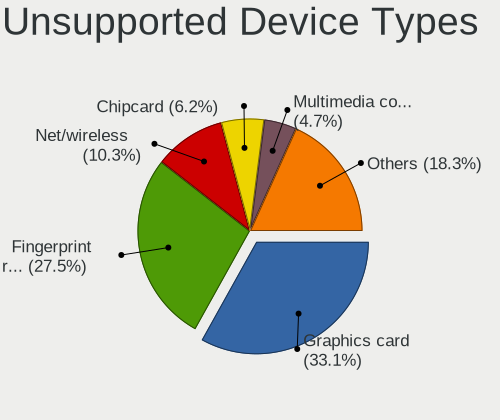

| Type                     | Computers | Percent |
|--------------------------|-----------|---------|
| Graphics card            | 353       | 33.08%  |
| Fingerprint reader       | 293       | 27.46%  |
| Net/wireless             | 110       | 10.31%  |
| Chipcard                 | 66        | 6.19%   |
| Multimedia controller    | 50        | 4.69%   |
| Bluetooth                | 49        | 4.59%   |
| Communication controller | 43        | 4.03%   |
| Camera                   | 20        | 1.87%   |
| Storage                  | 15        | 1.41%   |
| Unassigned class         | 14        | 1.31%   |
| Sound                    | 12        | 1.12%   |
| Card reader              | 12        | 1.12%   |
| Net/ethernet             | 8         | 0.75%   |
| Flash memory             | 7         | 0.66%   |
| Modem                    | 4         | 0.37%   |
| Storage/ide              | 3         | 0.28%   |
| Network                  | 3         | 0.28%   |
| Storage/raid             | 2         | 0.19%   |
| Storage/ata              | 1         | 0.09%   |
| Firewire controller      | 1         | 0.09%   |
| Dvb card                 | 1         | 0.09%   |

