Linux in Uruguay - Tested Hardware & Statistics
-----------------------------------------------

A project to collect tested hardware configurations for Linux in Uruguay.

Anyone can contribute to this report by the [hw-probe](https://github.com/linuxhw/hw-probe) tool:

    sudo -E hw-probe -all -upload

Please contribute! Especially if your hardware is rare.

This is a report for all computer types. See also reports for [desktops](/Location/Uruguay/Desktop/README.md) and [notebooks](/Location/Uruguay/Notebook/README.md).

Contents
--------

* [ Test Cases ](#test-cases)

* [ System ](#system)
  - [ OS                       ](#os)
  - [ OS Family                ](#os-family)
  - [ Kernel                   ](#kernel)
  - [ Kernel Family            ](#kernel-family)
  - [ Kernel Major Ver.        ](#kernel-major-ver)
  - [ Arch                     ](#arch)
  - [ DE                       ](#de)
  - [ Display Server           ](#display-server)
  - [ Display Manager          ](#display-manager)
  - [ OS Lang                  ](#os-lang)
  - [ Boot Mode                ](#boot-mode)
  - [ Filesystem               ](#filesystem)
  - [ Part. scheme             ](#part-scheme)
  - [ Dual Boot with Linux/BSD ](#dual-boot-with-linuxbsd)
  - [ Dual Boot (Win)          ](#dual-boot-win)

* [ Board ](#board)
  - [ Vendor                   ](#vendor)
  - [ Model                    ](#model)
  - [ Model Family             ](#model-family)
  - [ MFG Year                 ](#mfg-year)
  - [ Form Factor              ](#form-factor)
  - [ Secure Boot              ](#secure-boot)
  - [ Coreboot                 ](#coreboot)
  - [ RAM Size                 ](#ram-size)
  - [ RAM Used                 ](#ram-used)
  - [ Total Drives             ](#total-drives)
  - [ Has CD-ROM               ](#has-cd-rom)
  - [ Has Ethernet             ](#has-ethernet)
  - [ Has WiFi                 ](#has-wifi)
  - [ Has Bluetooth            ](#has-bluetooth)

* [ Location ](#location)
  - [ Country                  ](#country)
  - [ City                     ](#city)

* [ Drives ](#drives)
  - [ Drive Vendor             ](#drive-vendor)
  - [ Drive Model              ](#drive-model)
  - [ HDD Vendor               ](#hdd-vendor)
  - [ SSD Vendor               ](#ssd-vendor)
  - [ Drive Kind               ](#drive-kind)
  - [ Drive Connector          ](#drive-connector)
  - [ Drive Size               ](#drive-size)
  - [ Space Total              ](#space-total)
  - [ Space Used               ](#space-used)
  - [ Malfunc. Drives          ](#malfunc-drives)
  - [ Malfunc. Drive Vendor    ](#malfunc-drive-vendor)
  - [ Malfunc. HDD Vendor      ](#malfunc-hdd-vendor)
  - [ Malfunc. Drive Kind      ](#malfunc-drive-kind)
  - [ Failed Drives            ](#failed-drives)
  - [ Failed Drive Vendor      ](#failed-drive-vendor)
  - [ Drive Status             ](#drive-status)

* [ Storage controller ](#storage-controller)
  - [ Storage Vendor           ](#storage-vendor)
  - [ Storage Model            ](#storage-model)
  - [ Storage Kind             ](#storage-kind)

* [ Processor ](#processor)
  - [ CPU Vendor               ](#cpu-vendor)
  - [ CPU Model                ](#cpu-model)
  - [ CPU Model Family         ](#cpu-model-family)
  - [ CPU Cores                ](#cpu-cores)
  - [ CPU Sockets              ](#cpu-sockets)
  - [ CPU Threads              ](#cpu-threads)
  - [ CPU Op-Modes             ](#cpu-op-modes)
  - [ CPU Microcode            ](#cpu-microcode)
  - [ CPU Microarch            ](#cpu-microarch)

* [ Graphics ](#graphics)
  - [ GPU Vendor               ](#gpu-vendor)
  - [ GPU Model                ](#gpu-model)
  - [ GPU Combo                ](#gpu-combo)
  - [ GPU Driver               ](#gpu-driver)
  - [ GPU Memory               ](#gpu-memory)

* [ Monitor ](#monitor)
  - [ Monitor Vendor           ](#monitor-vendor)
  - [ Monitor Model            ](#monitor-model)
  - [ Monitor Resolution       ](#monitor-resolution)
  - [ Monitor Diagonal         ](#monitor-diagonal)
  - [ Monitor Width            ](#monitor-width)
  - [ Aspect Ratio             ](#aspect-ratio)
  - [ Monitor Area             ](#monitor-area)
  - [ Pixel Density            ](#pixel-density)
  - [ Multiple Monitors        ](#multiple-monitors)

* [ Network ](#network)
  - [ Net Controller Vendor    ](#net-controller-vendor)
  - [ Net Controller Model     ](#net-controller-model)
  - [ Wireless Vendor          ](#wireless-vendor)
  - [ Wireless Model           ](#wireless-model)
  - [ Ethernet Vendor          ](#ethernet-vendor)
  - [ Ethernet Model           ](#ethernet-model)
  - [ Net Controller Kind      ](#net-controller-kind)
  - [ Used Controller          ](#used-controller)
  - [ NICs                     ](#nics)
  - [ IPv6                     ](#ipv6)

* [ Bluetooth ](#bluetooth)
  - [ Bluetooth Vendor         ](#bluetooth-vendor)
  - [ Bluetooth Model          ](#bluetooth-model)

* [ Sound ](#sound)
  - [ Sound Vendor             ](#sound-vendor)
  - [ Sound Model              ](#sound-model)

* [ Memory ](#memory)
  - [ Memory Vendor            ](#memory-vendor)
  - [ Memory Model             ](#memory-model)
  - [ Memory Kind              ](#memory-kind)
  - [ Memory Form Factor       ](#memory-form-factor)
  - [ Memory Size              ](#memory-size)
  - [ Memory Speed             ](#memory-speed)

* [ Printers & scanners ](#printers--scanners)
  - [ Printer Vendor           ](#printer-vendor)
  - [ Printer Model            ](#printer-model)
  - [ Scanner Vendor           ](#scanner-vendor)
  - [ Scanner Model            ](#scanner-model)

* [ Camera ](#camera)
  - [ Camera Vendor            ](#camera-vendor)
  - [ Camera Model             ](#camera-model)

* [ Security ](#security)
  - [ Fingerprint Vendor       ](#fingerprint-vendor)
  - [ Fingerprint Model        ](#fingerprint-model)
  - [ Chipcard Vendor          ](#chipcard-vendor)
  - [ Chipcard Model           ](#chipcard-model)

* [ Unsupported ](#unsupported)
  - [ Unsupported Devices      ](#unsupported-devices)
  - [ Unsupported Device Types ](#unsupported-device-types)

Test Cases
----------

Total: 627

| Vendor        | Model                       | Form-Factor | Probe                                                      | Date         |
|---------------|-----------------------------|-------------|------------------------------------------------------------|--------------|
| Gigabyte      | B760M DS3H DDR4             | Desktop     | [ef66edb387](https://linux-hardware.org/?probe=ef66edb387) | Dec 28, 2025 |
| HP            | OMEN by Laptop              | Notebook    | [0bd5286a7b](https://linux-hardware.org/?probe=0bd5286a7b) | Dec 26, 2025 |
| Gigabyte      | A320M-HD2-CF                | Desktop     | [d2c6a6bd77](https://linux-hardware.org/?probe=d2c6a6bd77) | Dec 21, 2025 |
| ASRock        | B450 Steel Legend           | Desktop     | [5ae08ad5d8](https://linux-hardware.org/?probe=5ae08ad5d8) | Dec 06, 2025 |
| HP            | Laptop 17-ca1xxx            | Notebook    | [3d419fcada](https://linux-hardware.org/?probe=3d419fcada) | Nov 30, 2025 |
| HP            | Laptop 17-ca1xxx            | Notebook    | [06ebe83264](https://linux-hardware.org/?probe=06ebe83264) | Nov 29, 2025 |
| HP            | OMEN by Laptop 15t-dc100    | Notebook    | [0c8c8897cd](https://linux-hardware.org/?probe=0c8c8897cd) | Nov 25, 2025 |
| Acer          | Aspire 5736Z                | Notebook    | [a1f8c828e4](https://linux-hardware.org/?probe=a1f8c828e4) | Nov 23, 2025 |
| MSI           | MPG X570 GAMING PRO CARB... | Desktop     | [ecbf4fb3fc](https://linux-hardware.org/?probe=ecbf4fb3fc) | Nov 18, 2025 |
| Dell          | Latitude E6420              | Notebook    | [b2fc183035](https://linux-hardware.org/?probe=b2fc183035) | Nov 13, 2025 |
| Gigabyte      | H81M-S1                     | Desktop     | [d8c8a4f18b](https://linux-hardware.org/?probe=d8c8a4f18b) | Nov 06, 2025 |
| Dell          | 0HN7XN A01                  | Desktop     | [b78cbb506c](https://linux-hardware.org/?probe=b78cbb506c) | Nov 03, 2025 |
| HP            | Laptop 17z-cp300            | Notebook    | [c0dc830c0e](https://linux-hardware.org/?probe=c0dc830c0e) | Oct 28, 2025 |
| HP            | Laptop 17z-cp300            | Notebook    | [80b34c767f](https://linux-hardware.org/?probe=80b34c767f) | Oct 28, 2025 |
| Lenovo        | ThinkPad T14 Gen 1 20UES... | Notebook    | [9b656f44e8](https://linux-hardware.org/?probe=9b656f44e8) | Oct 24, 2025 |
| ASUSTek       | ZenBook UX434FLC_UX433FL... | Notebook    | [813d8cbb49](https://linux-hardware.org/?probe=813d8cbb49) | Oct 19, 2025 |
| Apple         | MacBookAir6,2               | Notebook    | [14a2c7e967](https://linux-hardware.org/?probe=14a2c7e967) | Oct 17, 2025 |
| ASRock        | H61M-VG3                    | Desktop     | [819b1bf9c1](https://linux-hardware.org/?probe=819b1bf9c1) | Oct 16, 2025 |
| Dell          | 07N90W A00                  | Desktop     | [5f2dd0fe56](https://linux-hardware.org/?probe=5f2dd0fe56) | Oct 15, 2025 |
| Foxconn       | G31MV/G31MV-K FAB           | Desktop     | [6d0a9115bc](https://linux-hardware.org/?probe=6d0a9115bc) | Oct 15, 2025 |
| HP            | Compaq Presario CQ40        | Notebook    | [06fa762ed5](https://linux-hardware.org/?probe=06fa762ed5) | Oct 15, 2025 |
| JP-IK         | T140J_Sargas_2025           | Notebook    | [53844ab999](https://linux-hardware.org/?probe=53844ab999) | Oct 14, 2025 |
| ASUSTek       | ROG STRIX B550-F GAMING     | Desktop     | [41b2f0a4f1](https://linux-hardware.org/?probe=41b2f0a4f1) | Oct 09, 2025 |
| ASUSTek       | ZenBook UX434FLC_UX433FL... | Notebook    | [7a2d4bbfcc](https://linux-hardware.org/?probe=7a2d4bbfcc) | Oct 08, 2025 |
| Acer          | AOA110                      | Notebook    | [f94c7585be](https://linux-hardware.org/?probe=f94c7585be) | Oct 07, 2025 |
| Chuwi         | Hi10 X                      | Tablet      | [460fc8eec4](https://linux-hardware.org/?probe=460fc8eec4) | Oct 07, 2025 |
| Lenovo        | N23 80UR                    | Convertible | [cff7072340](https://linux-hardware.org/?probe=cff7072340) | Oct 06, 2025 |
| HP            | Laptop 17-ca1xxx            | Notebook    | [77bb292fd1](https://linux-hardware.org/?probe=77bb292fd1) | Oct 04, 2025 |
| ASUSTek       | ZenBook UX325EA_UX325EA     | Notebook    | [637b1aa13a](https://linux-hardware.org/?probe=637b1aa13a) | Oct 03, 2025 |
| Apple         | MacBookAir6,2               | Notebook    | [695f6312db](https://linux-hardware.org/?probe=695f6312db) | Oct 01, 2025 |
| HP            | Stream Laptop 14-ax1xxx     | Notebook    | [cc9cb53cc6](https://linux-hardware.org/?probe=cc9cb53cc6) | Sep 28, 2025 |
| Lenovo        | Y50-70 20378                | Notebook    | [2dbf085806](https://linux-hardware.org/?probe=2dbf085806) | Sep 22, 2025 |
| ECS           | SF20PA2                     | Notebook    | [acf2b0e1ee](https://linux-hardware.org/?probe=acf2b0e1ee) | Sep 21, 2025 |
| Dell          | 0773VG A02                  | Desktop     | [28c4292b93](https://linux-hardware.org/?probe=28c4292b93) | Sep 18, 2025 |
| Dell          | 0KRC95 A00                  | Desktop     | [0307880310](https://linux-hardware.org/?probe=0307880310) | Sep 14, 2025 |
| Gigabyte      | B450M DS3H V2               | Desktop     | [5b51f1186c](https://linux-hardware.org/?probe=5b51f1186c) | Sep 11, 2025 |
| Gigabyte      | B450M DS3H V2               | Desktop     | [9c8f89fda5](https://linux-hardware.org/?probe=9c8f89fda5) | Sep 11, 2025 |
| Dell          | Latitude 5414               | Notebook    | [8e97fe3379](https://linux-hardware.org/?probe=8e97fe3379) | Sep 09, 2025 |
| MSI           | B550 GAMING GEN3            | Desktop     | [10eb009459](https://linux-hardware.org/?probe=10eb009459) | Sep 04, 2025 |
| ECS           | SF20GM3                     | Notebook    | [bef6128257](https://linux-hardware.org/?probe=bef6128257) | Aug 21, 2025 |
| Unknown       | H719-Acrab                  | Notebook    | [6e1a61db62](https://linux-hardware.org/?probe=6e1a61db62) | Aug 21, 2025 |
| Positivo      | 11Cle2-N2840 V1.0           | Notebook    | [71cbce8939](https://linux-hardware.org/?probe=71cbce8939) | Aug 19, 2025 |
| ASRock        | B450M-HDV R4.0              | Desktop     | [645ece661c](https://linux-hardware.org/?probe=645ece661c) | Aug 19, 2025 |
| Dell          | Latitude 5420               | Notebook    | [8d40a3eef5](https://linux-hardware.org/?probe=8d40a3eef5) | Aug 16, 2025 |
| Dell          | Latitude 5420               | Notebook    | [213dd91e0a](https://linux-hardware.org/?probe=213dd91e0a) | Aug 16, 2025 |
| HP            | Laptop 15-bw0xx             | Notebook    | [088d3d5a46](https://linux-hardware.org/?probe=088d3d5a46) | Aug 13, 2025 |
| ASUSTek       | Vivobook Go E1504FA_E150... | Notebook    | [4f51734688](https://linux-hardware.org/?probe=4f51734688) | Aug 04, 2025 |
| Gigabyte      | X670E AORUS PRO X           | Desktop     | [e65a3637c2](https://linux-hardware.org/?probe=e65a3637c2) | Aug 04, 2025 |
| Lenovo        | Unknown                     | Notebook    | [f3da4bd328](https://linux-hardware.org/?probe=f3da4bd328) | Aug 04, 2025 |
| HP            | Laptop 14-dq1xxx            | Notebook    | [8418059ec1](https://linux-hardware.org/?probe=8418059ec1) | Aug 02, 2025 |
| HP            | Laptop 17-ca1xxx            | Notebook    | [1d96ad3429](https://linux-hardware.org/?probe=1d96ad3429) | Jul 31, 2025 |
| HP            | Laptop 17-ca1xxx            | Notebook    | [ee3f956ec4](https://linux-hardware.org/?probe=ee3f956ec4) | Jul 31, 2025 |
| Apple         | Mac-942B59F58194171B iMa... | All in one  | [a34764b151](https://linux-hardware.org/?probe=a34764b151) | Jul 16, 2025 |
| Apple         | Mac-942B59F58194171B iMa... | All in one  | [829b32563c](https://linux-hardware.org/?probe=829b32563c) | Jul 15, 2025 |
| Toshiba       | Satellite C55-C             | Notebook    | [7c309f6e91](https://linux-hardware.org/?probe=7c309f6e91) | Jul 08, 2025 |
| ASRock        | B450M Steel Legend          | Desktop     | [be967feadb](https://linux-hardware.org/?probe=be967feadb) | Jun 28, 2025 |
| Dell          | Inspiron 15-7568            | Notebook    | [201fe1ec71](https://linux-hardware.org/?probe=201fe1ec71) | Jun 26, 2025 |
| Dell          | Inspiron 15-7568            | Notebook    | [014f834099](https://linux-hardware.org/?probe=014f834099) | Jun 26, 2025 |
| HP            | Casablanca H710             | Notebook    | [b8efd38b1f](https://linux-hardware.org/?probe=b8efd38b1f) | Jun 24, 2025 |
| HP            | Casablanca H710             | Notebook    | [16148a0270](https://linux-hardware.org/?probe=16148a0270) | Jun 24, 2025 |
| Gigabyte      | AB350-Gaming-CF             | Desktop     | [60ff5ee3c2](https://linux-hardware.org/?probe=60ff5ee3c2) | Jun 14, 2025 |
| ASUSTek       | ASUS Vivobook S 14 S5406... | Notebook    | [a1c0fb52f6](https://linux-hardware.org/?probe=a1c0fb52f6) | Jun 07, 2025 |
| Lenovo        | SHARKBAY SDK0E50510 WIN     | Desktop     | [bd4ae26f90](https://linux-hardware.org/?probe=bd4ae26f90) | Jun 07, 2025 |
| Toshiba       | Satellite B40-A             | Notebook    | [b8abf8dc1b](https://linux-hardware.org/?probe=b8abf8dc1b) | Jun 07, 2025 |
| Toshiba       | Satellite B40-A             | Notebook    | [491c21c514](https://linux-hardware.org/?probe=491c21c514) | Jun 07, 2025 |
| Acer          | Swift SF314-54              | Notebook    | [e0e15b04f9](https://linux-hardware.org/?probe=e0e15b04f9) | Jun 04, 2025 |
| Acer          | Swift SF314-54              | Notebook    | [57c318855f](https://linux-hardware.org/?probe=57c318855f) | Jun 04, 2025 |
| MSI           | A520M-A PRO                 | Desktop     | [3709a0cb69](https://linux-hardware.org/?probe=3709a0cb69) | May 31, 2025 |
| Dell          | G16 7620                    | Notebook    | [2a1ef16376](https://linux-hardware.org/?probe=2a1ef16376) | May 25, 2025 |
| Dell          | G16 7620                    | Notebook    | [102110ffb7](https://linux-hardware.org/?probe=102110ffb7) | May 25, 2025 |
| Lenovo        | ThinkBook 16p Gen 2 20YM    | Notebook    | [1142416d54](https://linux-hardware.org/?probe=1142416d54) | May 11, 2025 |
| Acer          | Aspire 5736Z                | Notebook    | [47c8b608b1](https://linux-hardware.org/?probe=47c8b608b1) | May 08, 2025 |
| MSI           | Delta 15 A5EFK              | Notebook    | [921f6813c9](https://linux-hardware.org/?probe=921f6813c9) | May 06, 2025 |
| MSI           | Delta 15 A5EFK              | Notebook    | [57b8a4c1d3](https://linux-hardware.org/?probe=57b8a4c1d3) | May 06, 2025 |
| ASRock        | B450M Pro4 R2.0             | Desktop     | [3a9f8fff17](https://linux-hardware.org/?probe=3a9f8fff17) | May 04, 2025 |
| ASUSTek       | X550CA                      | Notebook    | [d4f47ba8c1](https://linux-hardware.org/?probe=d4f47ba8c1) | Apr 29, 2025 |
| Unknown       | HU-MNPC07                   | Mini pc     | [b7ee955e0e](https://linux-hardware.org/?probe=b7ee955e0e) | Apr 29, 2025 |
| HP            | EliteBook 820 G3            | Notebook    | [13861ad53e](https://linux-hardware.org/?probe=13861ad53e) | Apr 28, 2025 |
| ASUSTek       | VivoBook_ASUSLaptop X712... | Notebook    | [f15b63d1e6](https://linux-hardware.org/?probe=f15b63d1e6) | Apr 25, 2025 |
| Unknown       | MediaTek kodama sku16       | Soc         | [e7d56ffcdf](https://linux-hardware.org/?probe=e7d56ffcdf) | Apr 25, 2025 |
| Dell          | 0D441T A01                  | Desktop     | [906db48198](https://linux-hardware.org/?probe=906db48198) | Apr 24, 2025 |
| ASUSTek       | PRIME H310M-E               | Desktop     | [491598da00](https://linux-hardware.org/?probe=491598da00) | Apr 23, 2025 |
| HP            | Pavilion dm1                | Notebook    | [9cabc1f3cd](https://linux-hardware.org/?probe=9cabc1f3cd) | Apr 23, 2025 |
| ASUSTek       | PRIME H310M-E               | Desktop     | [e94faac0f1](https://linux-hardware.org/?probe=e94faac0f1) | Apr 22, 2025 |
| Toshiba       | Satellite P55W-C            | Notebook    | [bb22092e1a](https://linux-hardware.org/?probe=bb22092e1a) | Apr 20, 2025 |
| Dell          | 042P49 A02                  | Desktop     | [748d6f2188](https://linux-hardware.org/?probe=748d6f2188) | Apr 19, 2025 |
| ASRock        | H510M-HVS R2.0              | Desktop     | [42b360015d](https://linux-hardware.org/?probe=42b360015d) | Apr 18, 2025 |
| Lenovo        | 0B98401 PRO                 | Notebook    | [7f4b27be29](https://linux-hardware.org/?probe=7f4b27be29) | Apr 06, 2025 |
| Gigabyte      | B450M DS3H V2               | Desktop     | [8699e5c8bf](https://linux-hardware.org/?probe=8699e5c8bf) | Mar 29, 2025 |
| Gigabyte      | B450M DS3H V2               | Desktop     | [75b00e87a3](https://linux-hardware.org/?probe=75b00e87a3) | Mar 18, 2025 |
| HP            | Stream Notebook PC 11       | Notebook    | [d5d92fe1a4](https://linux-hardware.org/?probe=d5d92fe1a4) | Mar 14, 2025 |
| Dell          | 0WR7PY A01                  | Desktop     | [0fb9d45e19](https://linux-hardware.org/?probe=0fb9d45e19) | Mar 14, 2025 |
| HP            | 339A                        | Desktop     | [97696fbb25](https://linux-hardware.org/?probe=97696fbb25) | Mar 13, 2025 |
| Dell          | 0WR7PY A01                  | Desktop     | [bc518988ab](https://linux-hardware.org/?probe=bc518988ab) | Mar 12, 2025 |
| ASUSTek       | TUF Gaming B650M-PLUS WI... | Desktop     | [4529bb2d21](https://linux-hardware.org/?probe=4529bb2d21) | Feb 27, 2025 |
| Lenovo        | ThinkPad A275 20KCS08300    | Notebook    | [5ac7159c57](https://linux-hardware.org/?probe=5ac7159c57) | Feb 18, 2025 |
| ASUSTek       | K84L                        | Notebook    | [6cac2213fa](https://linux-hardware.org/?probe=6cac2213fa) | Feb 17, 2025 |
| ASUSTek       | ASUS Zenbook 14 UX3405MA... | Notebook    | [05245028f4](https://linux-hardware.org/?probe=05245028f4) | Feb 16, 2025 |
| Lenovo        | G405 20239                  | Notebook    | [6d50623b26](https://linux-hardware.org/?probe=6d50623b26) | Feb 15, 2025 |
| Lenovo        | G405 20239                  | Notebook    | [3e072dbeae](https://linux-hardware.org/?probe=3e072dbeae) | Feb 15, 2025 |
| Dell          | 0V8WGR A02                  | Desktop     | [6e65bd3379](https://linux-hardware.org/?probe=6e65bd3379) | Feb 15, 2025 |
| HP            | Laptop 15-ef2xxx            | Notebook    | [5028af90ab](https://linux-hardware.org/?probe=5028af90ab) | Feb 14, 2025 |
| ASRock        | H61M-VG4                    | Desktop     | [791ca65f8f](https://linux-hardware.org/?probe=791ca65f8f) | Feb 03, 2025 |
| Dell          | 0F6X5P A00                  | Desktop     | [95a1eef874](https://linux-hardware.org/?probe=95a1eef874) | Jan 25, 2025 |
| HP            | Dragonfly Pro ONE           | Notebook    | [7da644cb5b](https://linux-hardware.org/?probe=7da644cb5b) | Jan 18, 2025 |
| ASUSTek       | TUF Gaming FX505DV_FX505... | Notebook    | [6093c31e0a](https://linux-hardware.org/?probe=6093c31e0a) | Jan 13, 2025 |
| ECS           | SF20PA2                     | Notebook    | [2c29a0d94a](https://linux-hardware.org/?probe=2c29a0d94a) | Jan 13, 2025 |
| Dell          | Latitude 3340               | Notebook    | [458695801e](https://linux-hardware.org/?probe=458695801e) | Jan 07, 2025 |
| Dell          | Latitude 3340               | Notebook    | [083c2f79ec](https://linux-hardware.org/?probe=083c2f79ec) | Jan 05, 2025 |
| Lenovo        | MAHOBAY NOK                 | Desktop     | [d8587c000b](https://linux-hardware.org/?probe=d8587c000b) | Dec 14, 2024 |
| HP            | Dragonfly Pro ONE           | Notebook    | [b5d99e3a51](https://linux-hardware.org/?probe=b5d99e3a51) | Dec 14, 2024 |
| Dell          | Inspiron 15-3567            | Notebook    | [e1b919328b](https://linux-hardware.org/?probe=e1b919328b) | Dec 13, 2024 |
| Dell          | Inspiron 15-3567            | Notebook    | [618266a26d](https://linux-hardware.org/?probe=618266a26d) | Dec 12, 2024 |
| Dell          | 0HC3G4 A00                  | Mini pc     | [b779fddaf2](https://linux-hardware.org/?probe=b779fddaf2) | Dec 07, 2024 |
| ASUSTek       | VivoBook 15_ASUS Laptop ... | Notebook    | [49f7b2645e](https://linux-hardware.org/?probe=49f7b2645e) | Nov 28, 2024 |
| HP            | Dragonfly Pro ONE           | Notebook    | [dbd0482a3f](https://linux-hardware.org/?probe=dbd0482a3f) | Nov 26, 2024 |
| HP            | Laptop 17z-cp300            | Notebook    | [be49e0c290](https://linux-hardware.org/?probe=be49e0c290) | Nov 23, 2024 |
| HP            | Laptop 17z-cp300            | Notebook    | [4090b82a10](https://linux-hardware.org/?probe=4090b82a10) | Nov 23, 2024 |
| HP            | Dragonfly Pro ONE           | Notebook    | [fa88478d29](https://linux-hardware.org/?probe=fa88478d29) | Nov 21, 2024 |
| ASUSTek       | VivoBook_ASUS Laptop E21... | Notebook    | [2ba55cd21c](https://linux-hardware.org/?probe=2ba55cd21c) | Nov 12, 2024 |
| Acer          | Aspire A515-52G             | Notebook    | [9493eace9d](https://linux-hardware.org/?probe=9493eace9d) | Nov 11, 2024 |
| MSI           | 760GM-P23                   | Desktop     | [2729dc6c3e](https://linux-hardware.org/?probe=2729dc6c3e) | Nov 08, 2024 |
| HP            | EliteBook 820 G3            | Notebook    | [abbc44e591](https://linux-hardware.org/?probe=abbc44e591) | Nov 06, 2024 |
| MSI           | B350 PC MATE                | Desktop     | [768d4c8ec6](https://linux-hardware.org/?probe=768d4c8ec6) | Nov 03, 2024 |
| GMKtec        | NucBox5                     | Notebook    | [3d6b2c6fe2](https://linux-hardware.org/?probe=3d6b2c6fe2) | Oct 23, 2024 |
| ASUSTek       | P8B75-M LX PLUS             | Desktop     | [84f8b8a516](https://linux-hardware.org/?probe=84f8b8a516) | Oct 19, 2024 |
| Chuwi         | CoreBook X                  | Notebook    | [1cdcd982f9](https://linux-hardware.org/?probe=1cdcd982f9) | Oct 13, 2024 |
| Lenovo        | ThinkPad X1 Carbon Gen 1... | Notebook    | [0126b569bf](https://linux-hardware.org/?probe=0126b569bf) | Oct 01, 2024 |
| Lenovo        | ThinkPad X1 Carbon Gen 1... | Notebook    | [95bc0c90e1](https://linux-hardware.org/?probe=95bc0c90e1) | Sep 23, 2024 |
| Chuwi         | Unknown                     | Notebook    | [45922bbe51](https://linux-hardware.org/?probe=45922bbe51) | Sep 19, 2024 |
| HP            | Dragonfly Pro ONE           | Notebook    | [ea5a903bc7](https://linux-hardware.org/?probe=ea5a903bc7) | Sep 13, 2024 |
| HP            | Dragonfly Pro ONE           | Notebook    | [816005b8fa](https://linux-hardware.org/?probe=816005b8fa) | Sep 10, 2024 |
| Google        | Dragonair                   | Notebook    | [0d92bf03a8](https://linux-hardware.org/?probe=0d92bf03a8) | Sep 06, 2024 |
| Pegatron      | JESSE                       | Desktop     | [1e3f996dc4](https://linux-hardware.org/?probe=1e3f996dc4) | Aug 30, 2024 |
| HP            | Dragonfly Pro ONE           | Notebook    | [24e3709aa5](https://linux-hardware.org/?probe=24e3709aa5) | Aug 29, 2024 |
| Gigabyte      | B450 GAMING X               | Desktop     | [587cdb384a](https://linux-hardware.org/?probe=587cdb384a) | Aug 25, 2024 |
| Toshiba       | Satellite L755              | Notebook    | [87f617e4d9](https://linux-hardware.org/?probe=87f617e4d9) | Aug 25, 2024 |
| HP            | Laptop 15-bw0xx             | Notebook    | [08d216ac0e](https://linux-hardware.org/?probe=08d216ac0e) | Aug 20, 2024 |
| Lenovo        | IdeaPad 3 15ITL6 82H8       | Notebook    | [5a5474a9d8](https://linux-hardware.org/?probe=5a5474a9d8) | Aug 19, 2024 |
| Lenovo        | 0x36C4 SDK0J40679 WIN 32... | All in one  | [321fd04e93](https://linux-hardware.org/?probe=321fd04e93) | Aug 19, 2024 |
| HP            | Dragonfly Pro ONE           | Notebook    | [1728bcdfbe](https://linux-hardware.org/?probe=1728bcdfbe) | Aug 16, 2024 |
| Lenovo        | IdeaPad 5 15IAL7 82SF       | Notebook    | [8c59185bfa](https://linux-hardware.org/?probe=8c59185bfa) | Aug 16, 2024 |
| Lenovo        | IdeaPad 5 15IAL7 82SF       | Notebook    | [9153a53950](https://linux-hardware.org/?probe=9153a53950) | Aug 16, 2024 |
| JP-IK         | T140J_Sargas_2024           | Notebook    | [1e8afe45e8](https://linux-hardware.org/?probe=1e8afe45e8) | Aug 16, 2024 |
| JP-IK         | T140J_Sargas_2024           | Notebook    | [db3b8125ed](https://linux-hardware.org/?probe=db3b8125ed) | Aug 15, 2024 |
| Lenovo        | ThinkPad T480 20L5000UUS    | Notebook    | [e7ab69fde0](https://linux-hardware.org/?probe=e7ab69fde0) | Aug 11, 2024 |
| HP            | Dragonfly Pro ONE           | Notebook    | [49b1242209](https://linux-hardware.org/?probe=49b1242209) | Aug 08, 2024 |
| Acer          | Aspire 5715Z                | Notebook    | [32b3360c63](https://linux-hardware.org/?probe=32b3360c63) | Aug 07, 2024 |
| Acer          | Aspire 5715Z                | Notebook    | [387c8e5fe4](https://linux-hardware.org/?probe=387c8e5fe4) | Aug 07, 2024 |
| HP            | Dragonfly Pro ONE           | Notebook    | [5ff11d8bb4](https://linux-hardware.org/?probe=5ff11d8bb4) | Aug 06, 2024 |
| HP            | EliteBook x360 1030 G2      | Convertible | [ea0f9e742e](https://linux-hardware.org/?probe=ea0f9e742e) | Aug 02, 2024 |
| Dell          | 0V8WGR A02                  | Desktop     | [3799a88355](https://linux-hardware.org/?probe=3799a88355) | Jul 31, 2024 |
| Acer          | Aspire A315-59              | Notebook    | [1dfe36ecd9](https://linux-hardware.org/?probe=1dfe36ecd9) | Jul 26, 2024 |
| ASRock        | A320M-HDV R4.0              | Desktop     | [0498a1fafd](https://linux-hardware.org/?probe=0498a1fafd) | Jul 18, 2024 |
| Dell          | 040DDP A01                  | Desktop     | [bf9438a172](https://linux-hardware.org/?probe=bf9438a172) | Jul 17, 2024 |
| Intel         | H81                         | Desktop     | [22d5bf41a9](https://linux-hardware.org/?probe=22d5bf41a9) | Jul 17, 2024 |
| Lenovo        | IdeaPad Y700-15ISK 80NV     | Notebook    | [73cc6974f3](https://linux-hardware.org/?probe=73cc6974f3) | Jul 13, 2024 |
| Dell          | Inspiron 15 3520            | Notebook    | [d721bec9c8](https://linux-hardware.org/?probe=d721bec9c8) | Jul 06, 2024 |
| Lenovo        | ThinkPad T61 7660A25        | Notebook    | [d9474a6035](https://linux-hardware.org/?probe=d9474a6035) | Jul 06, 2024 |
| ASRock        | A320M-HDV R4.0              | Desktop     | [e9ba7d256e](https://linux-hardware.org/?probe=e9ba7d256e) | Jul 05, 2024 |
| Lenovo        | IdeaPad S340-15IIL 81VW     | Notebook    | [02da08cbf1](https://linux-hardware.org/?probe=02da08cbf1) | Jul 02, 2024 |
| Lenovo        | ThinkPad T420 4236NUG       | Notebook    | [bd25a31252](https://linux-hardware.org/?probe=bd25a31252) | Jun 30, 2024 |
| Lenovo        | ThinkPad T61 7660A25        | Notebook    | [e8e9fb2bf7](https://linux-hardware.org/?probe=e8e9fb2bf7) | Jun 24, 2024 |
| HP            | Pavilion dv2000 (GM691LA... | Notebook    | [de1b028bbb](https://linux-hardware.org/?probe=de1b028bbb) | Jun 24, 2024 |
| Dell          | Inspiron 14 5425            | Notebook    | [3fb17595e8](https://linux-hardware.org/?probe=3fb17595e8) | Jun 16, 2024 |
| ASUSTek       | P8B75-M LX PLUS             | Desktop     | [fdb14858e0](https://linux-hardware.org/?probe=fdb14858e0) | Jun 05, 2024 |
| Lenovo        | IdeaPad S340-15IIL 81VW     | Notebook    | [36a8060749](https://linux-hardware.org/?probe=36a8060749) | Jun 03, 2024 |
| Lenovo        | Legion Y540-15IRH 81SX      | Notebook    | [58495c89d8](https://linux-hardware.org/?probe=58495c89d8) | May 25, 2024 |
| Dell          | Latitude 5531               | Notebook    | [e562f11ed3](https://linux-hardware.org/?probe=e562f11ed3) | May 20, 2024 |
| Microsoft     | Surface Pro 4               | Tablet      | [97cf40bd89](https://linux-hardware.org/?probe=97cf40bd89) | May 11, 2024 |
| Google        | Phaser                      | Notebook    | [feb45bf2a2](https://linux-hardware.org/?probe=feb45bf2a2) | May 02, 2024 |
| Lenovo        | ThinkPad T14s Gen 3 21BS... | Notebook    | [859396f855](https://linux-hardware.org/?probe=859396f855) | Apr 30, 2024 |
| ASRock        | Z68 Pro3 Gen3               | Desktop     | [2e1897982e](https://linux-hardware.org/?probe=2e1897982e) | Apr 24, 2024 |
| ASRock        | Z68 Pro3 Gen3               | Desktop     | [2383a2962f](https://linux-hardware.org/?probe=2383a2962f) | Apr 24, 2024 |
| ASUSTek       | H81M-E                      | Desktop     | [7af65eace4](https://linux-hardware.org/?probe=7af65eace4) | Apr 13, 2024 |
| ASRock        | H510M-HDV R2.0              | Desktop     | [5b213df28c](https://linux-hardware.org/?probe=5b213df28c) | Apr 12, 2024 |
| Samsung       | RV411/RV511/E3511/S3511/... | Notebook    | [4d6a9bb700](https://linux-hardware.org/?probe=4d6a9bb700) | Apr 12, 2024 |
| Samsung       | RV411/RV511/E3511/S3511/... | Notebook    | [e108ca29d2](https://linux-hardware.org/?probe=e108ca29d2) | Apr 12, 2024 |
| HP            | Presario V6000 (GH918EA#... | Notebook    | [19c9124453](https://linux-hardware.org/?probe=19c9124453) | Apr 10, 2024 |
| ASUSTek       | TUF Gaming B650M-PLUS WI... | Desktop     | [75f2fd247a](https://linux-hardware.org/?probe=75f2fd247a) | Apr 08, 2024 |
| Dell          | 0V8WGR A02                  | Desktop     | [c8eb38c52c](https://linux-hardware.org/?probe=c8eb38c52c) | Apr 07, 2024 |
| Dell          | 0CU395                      | Desktop     | [0ba3773be8](https://linux-hardware.org/?probe=0ba3773be8) | Apr 03, 2024 |
| Dell          | 0XFWHV A00                  | Desktop     | [ea24de6920](https://linux-hardware.org/?probe=ea24de6920) | Apr 02, 2024 |
| ASRock        | B75M                        | Desktop     | [de41218e15](https://linux-hardware.org/?probe=de41218e15) | Mar 30, 2024 |
| Lenovo        | MAHOBAY                     | Desktop     | [e55de04b3d](https://linux-hardware.org/?probe=e55de04b3d) | Mar 28, 2024 |
| MSI           | Unknown                     | Notebook    | [a975d469da](https://linux-hardware.org/?probe=a975d469da) | Mar 19, 2024 |
| ASUSTek       | TUF Gaming B650M-PLUS WI... | Desktop     | [40f761e062](https://linux-hardware.org/?probe=40f761e062) | Mar 14, 2024 |
| Gigabyte      | B450M DS3H V2               | Desktop     | [d74df494d7](https://linux-hardware.org/?probe=d74df494d7) | Mar 12, 2024 |
| Lenovo        | ThinkPad T480 20L5000UUS    | Notebook    | [0e8d4b681b](https://linux-hardware.org/?probe=0e8d4b681b) | Mar 11, 2024 |
| Gigabyte      | B450M DS3H V2               | Desktop     | [e31b3a8c12](https://linux-hardware.org/?probe=e31b3a8c12) | Mar 08, 2024 |
| HP            | Pavilion Sleekbook 14 PC    | Notebook    | [225e16d7af](https://linux-hardware.org/?probe=225e16d7af) | Mar 05, 2024 |
| Valve         | Jupiter                     | Notebook    | [30c94fd159](https://linux-hardware.org/?probe=30c94fd159) | Feb 29, 2024 |
| ASUSTek       | Zenbook UM3402YAR_UM3402... | Notebook    | [0973b9cfb2](https://linux-hardware.org/?probe=0973b9cfb2) | Feb 29, 2024 |
| ASUSTek       | TUF Gaming B650M-PLUS WI... | Desktop     | [cc638a70e5](https://linux-hardware.org/?probe=cc638a70e5) | Feb 21, 2024 |
| Lenovo        | G480 20156                  | Notebook    | [8ffe1342b1](https://linux-hardware.org/?probe=8ffe1342b1) | Feb 16, 2024 |
| Gigabyte      | B450M DS3H V2               | Desktop     | [a78e0bbe6b](https://linux-hardware.org/?probe=a78e0bbe6b) | Feb 10, 2024 |
| Acer          | Aspire A315-59              | Notebook    | [51886537be](https://linux-hardware.org/?probe=51886537be) | Feb 09, 2024 |
| ASUSTek       | ASUS TUF Gaming A15 FA50... | Notebook    | [1fcf02a6c3](https://linux-hardware.org/?probe=1fcf02a6c3) | Feb 06, 2024 |
| HP            | Stream Laptop 14-ax0XX      | Notebook    | [d83dd7b361](https://linux-hardware.org/?probe=d83dd7b361) | Feb 05, 2024 |
| ASUSTek       | ROG Zephyrus G14 GA402XV... | Notebook    | [33e55cd5c5](https://linux-hardware.org/?probe=33e55cd5c5) | Feb 03, 2024 |
| HP            | Laptop 15-bw0xx             | Notebook    | [118dcfd484](https://linux-hardware.org/?probe=118dcfd484) | Jan 28, 2024 |
| ASUSTek       | VivoBook_ASUSLaptop X150... | Notebook    | [88f29ebedf](https://linux-hardware.org/?probe=88f29ebedf) | Jan 24, 2024 |
| Gigabyte      | B550M K                     | Desktop     | [39f7c51de0](https://linux-hardware.org/?probe=39f7c51de0) | Jan 05, 2024 |
| Lenovo        | IdeaPad 5 15IAL7 82SF       | Notebook    | [da8a8d5994](https://linux-hardware.org/?probe=da8a8d5994) | Dec 28, 2023 |
| Lenovo        | IdeaPad 5 15IAL7 82SF       | Notebook    | [418992da4d](https://linux-hardware.org/?probe=418992da4d) | Dec 27, 2023 |
| Dell          | Inspiron 1564               | Notebook    | [a1945990cc](https://linux-hardware.org/?probe=a1945990cc) | Dec 24, 2023 |
| Dell          | Inspiron 1564               | Notebook    | [e02428db4a](https://linux-hardware.org/?probe=e02428db4a) | Dec 24, 2023 |
| Lenovo        | ThinkPad T14 Gen 2i 20W1... | Notebook    | [0f2cad4391](https://linux-hardware.org/?probe=0f2cad4391) | Dec 22, 2023 |
| Standard      | SF20BA2                     | Notebook    | [431580b18d](https://linux-hardware.org/?probe=431580b18d) | Dec 19, 2023 |
| Gigabyte      | H310M A-CF                  | Desktop     | [cdf7a1ffd4](https://linux-hardware.org/?probe=cdf7a1ffd4) | Dec 15, 2023 |
| ASRock        | 760GM-HDV                   | Desktop     | [c1403f5d52](https://linux-hardware.org/?probe=c1403f5d52) | Dec 15, 2023 |
| HP            | Pavilion Notebook           | Notebook    | [81baeeb4c6](https://linux-hardware.org/?probe=81baeeb4c6) | Dec 12, 2023 |
| ASUSTek       | PRIME A320M-K               | Desktop     | [58e1501577](https://linux-hardware.org/?probe=58e1501577) | Dec 06, 2023 |
| ASUSTek       | UX305CA                     | Notebook    | [6bac81f943](https://linux-hardware.org/?probe=6bac81f943) | Dec 06, 2023 |
| ASRock        | H110M-DVS R3.0              | Desktop     | [21e6cb8e9b](https://linux-hardware.org/?probe=21e6cb8e9b) | Dec 05, 2023 |
| Lenovo        | IdeaPad S340-15IIL 81VW     | Notebook    | [248ac55d99](https://linux-hardware.org/?probe=248ac55d99) | Nov 29, 2023 |
| HP            | Laptop 15-dy2xxx            | Notebook    | [858c641fcf](https://linux-hardware.org/?probe=858c641fcf) | Nov 26, 2023 |
| Dell          | 0V8WGR A01                  | Desktop     | [b44e627796](https://linux-hardware.org/?probe=b44e627796) | Nov 26, 2023 |
| MSI           | H310M PRO-VDH PLUS          | Desktop     | [6cdf6e663e](https://linux-hardware.org/?probe=6cdf6e663e) | Nov 26, 2023 |
| Lenovo        | IdeaPad S340-15IIL 81VW     | Notebook    | [2188d0c4b8](https://linux-hardware.org/?probe=2188d0c4b8) | Nov 25, 2023 |
| Samsung       | 550P5C/550P7C               | Notebook    | [b7294ed55c](https://linux-hardware.org/?probe=b7294ed55c) | Nov 20, 2023 |
| HP            | 1495                        | Desktop     | [9f7eca2710](https://linux-hardware.org/?probe=9f7eca2710) | Nov 17, 2023 |
| HP            | 1495                        | Desktop     | [9a299e543d](https://linux-hardware.org/?probe=9a299e543d) | Nov 16, 2023 |
| Lenovo        | IdeaPad S145-15IGM 81MX     | Notebook    | [eb4b6a5c65](https://linux-hardware.org/?probe=eb4b6a5c65) | Nov 15, 2023 |
| Lenovo        | IdeaPad S145-15IGM 81MX     | Notebook    | [339062b95b](https://linux-hardware.org/?probe=339062b95b) | Nov 15, 2023 |
| Lenovo        | ThinkPad T420 42361H7       | Notebook    | [0f1bd55fbf](https://linux-hardware.org/?probe=0f1bd55fbf) | Nov 09, 2023 |
| Razer         | Blade                       | Notebook    | [e9ad529ed4](https://linux-hardware.org/?probe=e9ad529ed4) | Nov 01, 2023 |
| HP            | Laptop 14-ck0xxx            | Notebook    | [8ef0f47332](https://linux-hardware.org/?probe=8ef0f47332) | Oct 20, 2023 |
| GPU Compan... | GWTN156-2BK                 | Notebook    | [f4eec82fb9](https://linux-hardware.org/?probe=f4eec82fb9) | Oct 09, 2023 |
| Gigabyte      | H81M-H                      | Desktop     | [a775bc4b08](https://linux-hardware.org/?probe=a775bc4b08) | Oct 05, 2023 |
| Razer         | Blade                       | Notebook    | [b3b2eb7db8](https://linux-hardware.org/?probe=b3b2eb7db8) | Sep 24, 2023 |
| ASUSTek       | VivoBook_ASUSLaptop X515... | Notebook    | [4398558915](https://linux-hardware.org/?probe=4398558915) | Sep 19, 2023 |
| ASUSTek       | X542UQ                      | Notebook    | [6793d8c052](https://linux-hardware.org/?probe=6793d8c052) | Sep 16, 2023 |
| MSI           | B85M-E45                    | Desktop     | [d454b67226](https://linux-hardware.org/?probe=d454b67226) | Sep 13, 2023 |
| ASUSTek       | ROG Zephyrus G14 GA402XV... | Notebook    | [a51361ebb2](https://linux-hardware.org/?probe=a51361ebb2) | Sep 12, 2023 |
| ASUSTek       | ROG Zephyrus G14 GA402XV... | Notebook    | [00cbde2fb9](https://linux-hardware.org/?probe=00cbde2fb9) | Sep 12, 2023 |
| Gigabyte      | Z87X-UD4H-CF                | Desktop     | [213b7c59de](https://linux-hardware.org/?probe=213b7c59de) | Sep 02, 2023 |
| GPU Compan... | GWTN156-9                   | Notebook    | [4c8ea16ab2](https://linux-hardware.org/?probe=4c8ea16ab2) | Aug 30, 2023 |
| Dell          | 0V8WGR A01                  | Desktop     | [9e5ed52b45](https://linux-hardware.org/?probe=9e5ed52b45) | Aug 29, 2023 |
| Chuwi         | GemiBook Pro                | Notebook    | [62b31c86bb](https://linux-hardware.org/?probe=62b31c86bb) | Aug 22, 2023 |
| ASUSTek       | ZenBook UX325EA_UX325EA     | Notebook    | [a435538cb2](https://linux-hardware.org/?probe=a435538cb2) | Aug 20, 2023 |
| Lenovo        | IdeaPad S145-15IGM 81MX     | Notebook    | [0dc75dae26](https://linux-hardware.org/?probe=0dc75dae26) | Aug 18, 2023 |
| HP            | 14                          | Notebook    | [8692626574](https://linux-hardware.org/?probe=8692626574) | Aug 09, 2023 |
| Gigabyte      | Z790 AORUS ELITE AX DDR4    | Desktop     | [025bd1edae](https://linux-hardware.org/?probe=025bd1edae) | Aug 04, 2023 |
| Lenovo        | Legion 5 15IMH05H 81Y6      | Notebook    | [46ca3ef1f4](https://linux-hardware.org/?probe=46ca3ef1f4) | Aug 01, 2023 |
| HP            | Laptop 15-dy2xxx            | Notebook    | [bbe4e49261](https://linux-hardware.org/?probe=bbe4e49261) | Aug 01, 2023 |
| ASUSTek       | PRIME A320M-K               | Desktop     | [a4d7919584](https://linux-hardware.org/?probe=a4d7919584) | Jul 29, 2023 |
| HP            | 1497                        | Desktop     | [370799b635](https://linux-hardware.org/?probe=370799b635) | Jul 26, 2023 |
| Gigabyte      | Z370 AORUS Gaming 7         | Desktop     | [01cfac81b4](https://linux-hardware.org/?probe=01cfac81b4) | Jul 24, 2023 |
| Lenovo        | ThinkPad X1 Carbon 3rd 2... | Notebook    | [d16a211675](https://linux-hardware.org/?probe=d16a211675) | Jul 21, 2023 |
| Dell          | Latitude E5420              | Notebook    | [be15c1e3d1](https://linux-hardware.org/?probe=be15c1e3d1) | Jul 20, 2023 |
| ASRock        | H510M-HDV R2.0              | Desktop     | [cacf2d88c9](https://linux-hardware.org/?probe=cacf2d88c9) | Jul 19, 2023 |
| ASUSTek       | PRIME A320M-K               | Desktop     | [6776e11ac9](https://linux-hardware.org/?probe=6776e11ac9) | Jul 14, 2023 |
| Lenovo        | ThinkPad T14 Gen 2a 20XL... | Notebook    | [0fc498ccfb](https://linux-hardware.org/?probe=0fc498ccfb) | Jul 06, 2023 |
| Acer          | Aspire E1-571               | Notebook    | [d0258b4ca5](https://linux-hardware.org/?probe=d0258b4ca5) | Jul 06, 2023 |
| Dell          | 0K240Y A02                  | Desktop     | [7d1d71b0fe](https://linux-hardware.org/?probe=7d1d71b0fe) | Jul 06, 2023 |
| ASUSTek       | ZenBook UX434FAC_UX434FA    | Notebook    | [ad76ecf5a9](https://linux-hardware.org/?probe=ad76ecf5a9) | Jul 01, 2023 |
| ASUSTek       | ZenBook UX434FAC_UX434FA    | Notebook    | [b8bab5a2e6](https://linux-hardware.org/?probe=b8bab5a2e6) | Jul 01, 2023 |
| Acer          | One S1002                   | Notebook    | [f7b8d25603](https://linux-hardware.org/?probe=f7b8d25603) | Jun 21, 2023 |
| Intel         | H61                         | Desktop     | [ac2b137243](https://linux-hardware.org/?probe=ac2b137243) | Jun 15, 2023 |
| Dell          | 0V8WGR A02                  | Desktop     | [448fd1711d](https://linux-hardware.org/?probe=448fd1711d) | Jun 12, 2023 |
| Fujitsu       | LIFEBOOK E734               | Notebook    | [3742e80123](https://linux-hardware.org/?probe=3742e80123) | Jun 09, 2023 |
| Lenovo        | ThinkPad T14 Gen 2a 20XL... | Notebook    | [3cfa2bccb7](https://linux-hardware.org/?probe=3cfa2bccb7) | Jun 08, 2023 |
| HP            | Pavilion g6                 | Notebook    | [12b1174ce8](https://linux-hardware.org/?probe=12b1174ce8) | Jun 08, 2023 |
| HP            | 0A60h                       | Desktop     | [f0498c1a54](https://linux-hardware.org/?probe=f0498c1a54) | Jun 07, 2023 |
| Lenovo        | 30D2 SDK0J40697 WIN 3305... | Desktop     | [624a84a2fc](https://linux-hardware.org/?probe=624a84a2fc) | Jun 06, 2023 |
| Gigabyte      | Z390 AORUS ELITE-CF         | Desktop     | [75c4e47bea](https://linux-hardware.org/?probe=75c4e47bea) | Jun 01, 2023 |
| Toshiba       | Satellite C645D             | Notebook    | [085994472d](https://linux-hardware.org/?probe=085994472d) | May 28, 2023 |
| HP            | Stream Notebook             | Notebook    | [74d40533fc](https://linux-hardware.org/?probe=74d40533fc) | May 24, 2023 |
| Apple         | MacBookPro9,2               | Notebook    | [6855a79270](https://linux-hardware.org/?probe=6855a79270) | May 23, 2023 |
| Acer          | Aspire 4315                 | Notebook    | [8a25a16dfa](https://linux-hardware.org/?probe=8a25a16dfa) | May 22, 2023 |
| ASUSTek       | VivoBook_ASUSLaptop M140... | Notebook    | [7af74c5864](https://linux-hardware.org/?probe=7af74c5864) | May 18, 2023 |
| Lenovo        | ThinkPad T14s Gen 3 21BS... | Notebook    | [0fd753db6d](https://linux-hardware.org/?probe=0fd753db6d) | May 16, 2023 |
| MSI           | 760GM-P23                   | Desktop     | [970443eea3](https://linux-hardware.org/?probe=970443eea3) | May 14, 2023 |
| HP            | Notebook                    | Notebook    | [c14e7a41cf](https://linux-hardware.org/?probe=c14e7a41cf) | May 13, 2023 |
| HP            | Notebook                    | Notebook    | [726fa4fcd1](https://linux-hardware.org/?probe=726fa4fcd1) | May 13, 2023 |
| Dell          | Latitude 5530               | Notebook    | [ade218e4fa](https://linux-hardware.org/?probe=ade218e4fa) | May 11, 2023 |
| ASRock        | N68-S3 UCC                  | Desktop     | [8a1fbe8e3c](https://linux-hardware.org/?probe=8a1fbe8e3c) | May 09, 2023 |
| Lenovo        | MAHOBAY                     | Desktop     | [97cc4e0a84](https://linux-hardware.org/?probe=97cc4e0a84) | May 01, 2023 |
| Gigabyte      | A320M-S2H V2-CF             | Desktop     | [cf6a478eb1](https://linux-hardware.org/?probe=cf6a478eb1) | May 01, 2023 |
| Toshiba       | Satellite L45-B             | Notebook    | [8f1db96b6f](https://linux-hardware.org/?probe=8f1db96b6f) | Apr 29, 2023 |
| HP            | 240 G4                      | Notebook    | [997e6e6a0b](https://linux-hardware.org/?probe=997e6e6a0b) | Apr 24, 2023 |
| HP            | 240 G4                      | Notebook    | [887b406c56](https://linux-hardware.org/?probe=887b406c56) | Apr 22, 2023 |
| ASRock        | H61M-DGS                    | Desktop     | [e0b2a066ee](https://linux-hardware.org/?probe=e0b2a066ee) | Apr 15, 2023 |
| Standard      | SF20BA2                     | Notebook    | [17763324b6](https://linux-hardware.org/?probe=17763324b6) | Apr 08, 2023 |
| Intel         | EF20                        | Notebook    | [120257faca](https://linux-hardware.org/?probe=120257faca) | Apr 04, 2023 |
| Lenovo        | 0x36C4 SDK0J40679 WIN 32... | All in one  | [5d5eb8d675](https://linux-hardware.org/?probe=5d5eb8d675) | Apr 01, 2023 |
| Gigabyte      | H61M-S1                     | Desktop     | [9af85c78cb](https://linux-hardware.org/?probe=9af85c78cb) | Mar 28, 2023 |
| MSI           | A68HM-E33 V2                | Desktop     | [1531761af6](https://linux-hardware.org/?probe=1531761af6) | Mar 26, 2023 |
| Acer          | Aspire 4315                 | Notebook    | [0bf18c8c90](https://linux-hardware.org/?probe=0bf18c8c90) | Mar 26, 2023 |
| ASUSTek       | PRIME A320M-K               | Desktop     | [f0f20a06ef](https://linux-hardware.org/?probe=f0f20a06ef) | Mar 19, 2023 |
| Toshiba       | Satellite C75D-B            | Notebook    | [1ff56ed31f](https://linux-hardware.org/?probe=1ff56ed31f) | Mar 19, 2023 |
| MSI           | H310M PRO-VDH PLUS          | Desktop     | [2a1291ac22](https://linux-hardware.org/?probe=2a1291ac22) | Mar 18, 2023 |
| Dell          | Latitude 7310               | Notebook    | [6b5de5fe3c](https://linux-hardware.org/?probe=6b5de5fe3c) | Mar 17, 2023 |
| Standard      | SF20BA                      | Notebook    | [e85dc022b5](https://linux-hardware.org/?probe=e85dc022b5) | Mar 15, 2023 |
| Gigabyte      | B450M DS3H WIFI-CF          | Desktop     | [b94932937e](https://linux-hardware.org/?probe=b94932937e) | Mar 14, 2023 |
| HP            | Laptop 17-ak0xx             | Notebook    | [7d35815562](https://linux-hardware.org/?probe=7d35815562) | Mar 13, 2023 |
| HP            | EliteBook 840 G3            | Notebook    | [41bf4fb877](https://linux-hardware.org/?probe=41bf4fb877) | Mar 10, 2023 |
| AZW           | MINI S                      | Desktop     | [cb0b08973d](https://linux-hardware.org/?probe=cb0b08973d) | Mar 06, 2023 |
| Dell          | Latitude 3150               | Notebook    | [f1554a5df0](https://linux-hardware.org/?probe=f1554a5df0) | Mar 05, 2023 |
| Acer          | Swift SF314-54              | Notebook    | [62defb89e3](https://linux-hardware.org/?probe=62defb89e3) | Mar 02, 2023 |
| ECS           | SF20PA2                     | Notebook    | [f0ad83686f](https://linux-hardware.org/?probe=f0ad83686f) | Feb 21, 2023 |
| HP            | 15 Notebook PC              | Notebook    | [c5256638eb](https://linux-hardware.org/?probe=c5256638eb) | Feb 20, 2023 |
| Lenovo        | ThinkPad P50 20EQS14H00     | Notebook    | [de5c7ac3f6](https://linux-hardware.org/?probe=de5c7ac3f6) | Feb 19, 2023 |
| Unknown       | Unknown                     | Notebook    | [e8183bc042](https://linux-hardware.org/?probe=e8183bc042) | Feb 16, 2023 |
| MSI           | H61M-P31/W8                 | Desktop     | [163991dfae](https://linux-hardware.org/?probe=163991dfae) | Feb 03, 2023 |
| MSI           | H61M-P31/W8                 | Desktop     | [a08e60bb31](https://linux-hardware.org/?probe=a08e60bb31) | Feb 03, 2023 |
| MSI           | H61M-P31/W8                 | Desktop     | [d6829621d7](https://linux-hardware.org/?probe=d6829621d7) | Feb 03, 2023 |
| Lenovo        | 14w 81MQ00AVCL              | Notebook    | [bd59f68ce8](https://linux-hardware.org/?probe=bd59f68ce8) | Feb 03, 2023 |
| ECS           | SF20PA2                     | Notebook    | [30df19ca2e](https://linux-hardware.org/?probe=30df19ca2e) | Feb 02, 2023 |
| Gateway       | LT41P                       | Notebook    | [1684d937e7](https://linux-hardware.org/?probe=1684d937e7) | Feb 02, 2023 |
| HP            | 3115-AEC13432GR1            | Notebook    | [98eb70341a](https://linux-hardware.org/?probe=98eb70341a) | Jan 30, 2023 |
| HP            | 339A                        | Desktop     | [5d86fd4411](https://linux-hardware.org/?probe=5d86fd4411) | Jan 20, 2023 |
| Valve         | Jupiter                     | Notebook    | [4bda80131d](https://linux-hardware.org/?probe=4bda80131d) | Jan 15, 2023 |
| ASUSTek       | H170 PRO GAMING             | Desktop     | [4cf36f7404](https://linux-hardware.org/?probe=4cf36f7404) | Jan 13, 2023 |
| Valve         | Jupiter                     | Notebook    | [dc137d0d08](https://linux-hardware.org/?probe=dc137d0d08) | Jan 09, 2023 |
| Toshiba       | Satellite C75D-B            | Notebook    | [d5380976a2](https://linux-hardware.org/?probe=d5380976a2) | Jan 03, 2023 |
| Toshiba       | Satellite C75D-B            | Notebook    | [04282775ba](https://linux-hardware.org/?probe=04282775ba) | Dec 24, 2022 |
| MSI           | 2A9C                        | Desktop     | [57c14b82bd](https://linux-hardware.org/?probe=57c14b82bd) | Nov 23, 2022 |
| ASUSTek       | Z97-C                       | Desktop     | [733140c078](https://linux-hardware.org/?probe=733140c078) | Nov 20, 2022 |
| ECS           | SF20PA2                     | Notebook    | [2e0892ec48](https://linux-hardware.org/?probe=2e0892ec48) | Nov 18, 2022 |
| Acer          | Aspire one 1-431            | Notebook    | [c27978fdc4](https://linux-hardware.org/?probe=c27978fdc4) | Nov 18, 2022 |
| Apple         | MacBookPro9,2               | Notebook    | [e974c2ceff](https://linux-hardware.org/?probe=e974c2ceff) | Nov 12, 2022 |
| Alienware     | 14                          | Notebook    | [0c11295ebe](https://linux-hardware.org/?probe=0c11295ebe) | Nov 03, 2022 |
| Toshiba       | Satellite L45-B             | Notebook    | [e2f30e0f1e](https://linux-hardware.org/?probe=e2f30e0f1e) | Oct 26, 2022 |
| ASRock        | H310CM-HDV                  | Desktop     | [afe54b52c9](https://linux-hardware.org/?probe=afe54b52c9) | Oct 21, 2022 |
| ASUSTek       | H170 PRO GAMING             | Desktop     | [cb86d1ba99](https://linux-hardware.org/?probe=cb86d1ba99) | Oct 18, 2022 |
| ASRock        | H310CM-HDV                  | Desktop     | [2426012acb](https://linux-hardware.org/?probe=2426012acb) | Oct 18, 2022 |
| Dell          | 0XFWHV A00                  | Desktop     | [4a5716d169](https://linux-hardware.org/?probe=4a5716d169) | Oct 16, 2022 |
| MSI           | 2A9C                        | Desktop     | [74482fb396](https://linux-hardware.org/?probe=74482fb396) | Oct 16, 2022 |
| HP            | Laptop 17-ak0xx             | Notebook    | [67fbbc4074](https://linux-hardware.org/?probe=67fbbc4074) | Oct 11, 2022 |
| ASUSTek       | ROG STRIX X570-E GAMING     | Desktop     | [d006fa9a19](https://linux-hardware.org/?probe=d006fa9a19) | Oct 11, 2022 |
| MSI           | 2A9C                        | Desktop     | [1c1d20a1ac](https://linux-hardware.org/?probe=1c1d20a1ac) | Oct 09, 2022 |
| MSI           | 2A9C                        | Desktop     | [98ff35e2a7](https://linux-hardware.org/?probe=98ff35e2a7) | Oct 09, 2022 |
| Acer          | Aspire ES1-572              | Notebook    | [1bd18c9a15](https://linux-hardware.org/?probe=1bd18c9a15) | Oct 04, 2022 |
| ASUSTek       | ROG STRIX X570-E GAMING     | Desktop     | [adde8098e4](https://linux-hardware.org/?probe=adde8098e4) | Oct 04, 2022 |
| Huanan        | X79 (INTEL Xeon E5/Corei... | Desktop     | [a40d59533c](https://linux-hardware.org/?probe=a40d59533c) | Sep 29, 2022 |
| Biostar       | H410MH S2                   | Desktop     | [b03e32f37d](https://linux-hardware.org/?probe=b03e32f37d) | Sep 29, 2022 |
| Biostar       | H410MH S2                   | Desktop     | [fbba79fc43](https://linux-hardware.org/?probe=fbba79fc43) | Sep 28, 2022 |
| Lenovo        | ThinkPad Edge E531 68852... | Notebook    | [5e91cc6f07](https://linux-hardware.org/?probe=5e91cc6f07) | Sep 21, 2022 |
| Toshiba       | Satellite C855              | Notebook    | [bd34f35e50](https://linux-hardware.org/?probe=bd34f35e50) | Sep 15, 2022 |
| HP            | 8265                        | Desktop     | [2b74e032bd](https://linux-hardware.org/?probe=2b74e032bd) | Sep 06, 2022 |
| HP            | 8265                        | Desktop     | [f7f460fb43](https://linux-hardware.org/?probe=f7f460fb43) | Sep 05, 2022 |
| Dell          | Latitude 3150               | Notebook    | [6bc88c696c](https://linux-hardware.org/?probe=6bc88c696c) | Sep 04, 2022 |
| Gigabyte      | Z87X-UD4H-CF                | Desktop     | [8ffe312747](https://linux-hardware.org/?probe=8ffe312747) | Sep 04, 2022 |
| ASRock        | N68-S                       | Desktop     | [df5d34428a](https://linux-hardware.org/?probe=df5d34428a) | Sep 01, 2022 |
| ASRock        | N68-S                       | Desktop     | [6aabf89438](https://linux-hardware.org/?probe=6aabf89438) | Aug 30, 2022 |
| ASRock        | FM2A58M-VG3+ R2.0           | Desktop     | [422af9d6b5](https://linux-hardware.org/?probe=422af9d6b5) | Aug 29, 2022 |
| ASRock        | N68-S                       | Desktop     | [4fff0a6104](https://linux-hardware.org/?probe=4fff0a6104) | Aug 29, 2022 |
| ASUSTek       | ROG Zephyrus G15 GA503QR... | Notebook    | [1e79d17c85](https://linux-hardware.org/?probe=1e79d17c85) | Aug 23, 2022 |
| ECS           | SF20PA2                     | Notebook    | [67dd8af18f](https://linux-hardware.org/?probe=67dd8af18f) | Aug 23, 2022 |
| Lenovo        | IdeaPad 500S-14ISK 80Q3     | Notebook    | [fdbec5aab2](https://linux-hardware.org/?probe=fdbec5aab2) | Aug 22, 2022 |
| HP            | 3048h                       | Desktop     | [34e0bbc168](https://linux-hardware.org/?probe=34e0bbc168) | Aug 20, 2022 |
| Gigabyte      | B460M DS3H                  | Desktop     | [2b97e09efa](https://linux-hardware.org/?probe=2b97e09efa) | Aug 17, 2022 |
| Biostar       | B550MH                      | Desktop     | [228a44e3f0](https://linux-hardware.org/?probe=228a44e3f0) | Aug 06, 2022 |
| ASRock        | B75M                        | Desktop     | [78fbdcd0f7](https://linux-hardware.org/?probe=78fbdcd0f7) | Aug 05, 2022 |
| Gateway       | NV55C                       | Notebook    | [cc3c8d23e4](https://linux-hardware.org/?probe=cc3c8d23e4) | Aug 03, 2022 |
| Dell          | Latitude 3150               | Notebook    | [aecf1fe543](https://linux-hardware.org/?probe=aecf1fe543) | Aug 01, 2022 |
| MACHINIST     | X79 (INTEL Xeon E5/Corei... | Desktop     | [e83fe522d7](https://linux-hardware.org/?probe=e83fe522d7) | Jul 31, 2022 |
| Gigabyte      | Z170X-Gaming 3              | Desktop     | [a3c2fdccfc](https://linux-hardware.org/?probe=a3c2fdccfc) | Jul 27, 2022 |
| HP            | Laptop 14-dk1xxx            | Notebook    | [4eb7e0d085](https://linux-hardware.org/?probe=4eb7e0d085) | Jul 22, 2022 |
| ASRock        | FM2A58M-VG3+ R2.0           | Desktop     | [04affeedf7](https://linux-hardware.org/?probe=04affeedf7) | Jul 18, 2022 |
| GPU Compan... | GWTN156-9                   | Notebook    | [df5c4b480d](https://linux-hardware.org/?probe=df5c4b480d) | Jul 15, 2022 |
| HP            | 1632                        | Desktop     | [d2582aff1d](https://linux-hardware.org/?probe=d2582aff1d) | Jul 12, 2022 |
| Gigabyte      | H410M H V3                  | Desktop     | [0d26f198ff](https://linux-hardware.org/?probe=0d26f198ff) | Jul 06, 2022 |
| MSI           | MPG X570 GAMING PLUS        | Desktop     | [5fa355f7ec](https://linux-hardware.org/?probe=5fa355f7ec) | Jun 26, 2022 |
| Acer          | Swift SF314-54              | Notebook    | [47420af7dc](https://linux-hardware.org/?probe=47420af7dc) | Jun 23, 2022 |
| iClever       | IC-T01                      | Notebook    | [f82c34c612](https://linux-hardware.org/?probe=f82c34c612) | Jun 17, 2022 |
| Apple         | Mac-F65AE981FFA204ED Mac... | Mini pc     | [6abbac5ca2](https://linux-hardware.org/?probe=6abbac5ca2) | Jun 15, 2022 |
| HP            | Pavilion g4                 | Notebook    | [193875edcc](https://linux-hardware.org/?probe=193875edcc) | Jun 15, 2022 |
| Acer          | Swift SF314-54              | Notebook    | [06bccc3696](https://linux-hardware.org/?probe=06bccc3696) | Jun 14, 2022 |
| Gigabyte      | B450 GAMING X               | Desktop     | [34e884bb50](https://linux-hardware.org/?probe=34e884bb50) | Jun 08, 2022 |
| Dell          | XPS 15 7590                 | Notebook    | [482ed9f535](https://linux-hardware.org/?probe=482ed9f535) | May 29, 2022 |
| Acer          | Swift SF314-54              | Notebook    | [39f85b46d7](https://linux-hardware.org/?probe=39f85b46d7) | May 23, 2022 |
| Acer          | Swift SF314-54              | Notebook    | [fc1233f258](https://linux-hardware.org/?probe=fc1233f258) | May 22, 2022 |
| Acer          | Swift SF314-54              | Notebook    | [478550abf1](https://linux-hardware.org/?probe=478550abf1) | May 21, 2022 |
| Gigabyte      | Z390 AORUS ELITE-CF         | Desktop     | [95ac26b654](https://linux-hardware.org/?probe=95ac26b654) | May 19, 2022 |
| Acer          | Swift SF314-54              | Notebook    | [a31c36956a](https://linux-hardware.org/?probe=a31c36956a) | May 13, 2022 |
| Acer          | Swift SF314-54              | Notebook    | [cc3411e0b4](https://linux-hardware.org/?probe=cc3411e0b4) | May 10, 2022 |
| HP            | Laptop 14-dk1xxx            | Notebook    | [fa6da4906f](https://linux-hardware.org/?probe=fa6da4906f) | May 07, 2022 |
| Toshiba       | Satellite C645D             | Notebook    | [53153cb65d](https://linux-hardware.org/?probe=53153cb65d) | May 04, 2022 |
| Acer          | Aspire ES1-572              | Notebook    | [25f9b83c30](https://linux-hardware.org/?probe=25f9b83c30) | Apr 28, 2022 |
| Lenovo        | B50-45 20388                | Notebook    | [7ad45f257f](https://linux-hardware.org/?probe=7ad45f257f) | Apr 20, 2022 |
| HP            | EliteBook 840 G1            | Notebook    | [d2e2811388](https://linux-hardware.org/?probe=d2e2811388) | Apr 20, 2022 |
| Dell          | Inspiron 5585               | Notebook    | [2c6e96d91f](https://linux-hardware.org/?probe=2c6e96d91f) | Apr 18, 2022 |
| Dell          | Inspiron 15-3567            | Notebook    | [73be944f6c](https://linux-hardware.org/?probe=73be944f6c) | Apr 14, 2022 |
| Dell          | Precision 7550              | Notebook    | [4619da9502](https://linux-hardware.org/?probe=4619da9502) | Apr 14, 2022 |
| Lenovo        | G405 20239                  | Notebook    | [ab55cb1e13](https://linux-hardware.org/?probe=ab55cb1e13) | Apr 13, 2022 |
| HP            | Laptop 14-dq1xxx            | Notebook    | [7d203f8bc0](https://linux-hardware.org/?probe=7d203f8bc0) | Apr 02, 2022 |
| ASUSTek       | ROG Zephyrus G14 GA401IV... | Notebook    | [d895af2b46](https://linux-hardware.org/?probe=d895af2b46) | Mar 29, 2022 |
| HP            | Laptop 14-dq1xxx            | Notebook    | [9bf7ed495b](https://linux-hardware.org/?probe=9bf7ed495b) | Mar 28, 2022 |
| Lenovo        | ThinkPad L14 Gen 2 20X2S... | Notebook    | [d9afd858b4](https://linux-hardware.org/?probe=d9afd858b4) | Mar 23, 2022 |
| Foxconn       | G31MX Series                | Desktop     | [911987151a](https://linux-hardware.org/?probe=911987151a) | Mar 23, 2022 |
| Foxconn       | G31MX Series                | Desktop     | [7d9cc6ac07](https://linux-hardware.org/?probe=7d9cc6ac07) | Mar 22, 2022 |
| HP            | ZBook 14u G4                | Notebook    | [cc637b12de](https://linux-hardware.org/?probe=cc637b12de) | Mar 10, 2022 |
| HP            | Pavilion dv5                | Notebook    | [81371d4535](https://linux-hardware.org/?probe=81371d4535) | Mar 04, 2022 |
| GPU Compan... | GWTN156-4                   | Notebook    | [89e7b9fa39](https://linux-hardware.org/?probe=89e7b9fa39) | Mar 02, 2022 |
| Gigabyte      | Z370 AORUS Gaming 7         | Desktop     | [9699b8889c](https://linux-hardware.org/?probe=9699b8889c) | Feb 27, 2022 |
| ASUSTek       | TUF Gaming B460M-PLUS       | Desktop     | [37231251ed](https://linux-hardware.org/?probe=37231251ed) | Feb 21, 2022 |
| ASRock        | FM2A55M-HD+                 | Desktop     | [52ca8c0d7c](https://linux-hardware.org/?probe=52ca8c0d7c) | Feb 13, 2022 |
| ECS           | SF20PA2                     | Notebook    | [3bddc7e08a](https://linux-hardware.org/?probe=3bddc7e08a) | Feb 11, 2022 |
| HP            | 3047h                       | Desktop     | [ee6260c5f4](https://linux-hardware.org/?probe=ee6260c5f4) | Feb 10, 2022 |
| MSI           | GS63VR 6RF                  | Notebook    | [4873365af6](https://linux-hardware.org/?probe=4873365af6) | Jan 30, 2022 |
| Gigabyte      | GA-970A-D3                  | Desktop     | [0fe418c7b1](https://linux-hardware.org/?probe=0fe418c7b1) | Jan 07, 2022 |
| HP            | 0AA8h                       | Desktop     | [9abf55a71f](https://linux-hardware.org/?probe=9abf55a71f) | Jan 05, 2022 |
| HP            | 0AA8h                       | Desktop     | [44c9ba4231](https://linux-hardware.org/?probe=44c9ba4231) | Jan 03, 2022 |
| Biostar       | Z490A-SILVER                | Desktop     | [b5e7622be0](https://linux-hardware.org/?probe=b5e7622be0) | Jan 02, 2022 |
| Dell          | 06D7TR A00                  | Desktop     | [90f509fc24](https://linux-hardware.org/?probe=90f509fc24) | Dec 09, 2021 |
| Sony          | SVF14211CLB                 | Notebook    | [d25b1846ff](https://linux-hardware.org/?probe=d25b1846ff) | Dec 07, 2021 |
| Sony          | SVF14211CLB                 | Notebook    | [41bfe6e292](https://linux-hardware.org/?probe=41bfe6e292) | Dec 06, 2021 |
| ASUSTek       | ZenBook UX391FA_UX391FA     | Notebook    | [5fb4f1b6a6](https://linux-hardware.org/?probe=5fb4f1b6a6) | Nov 29, 2021 |
| HP            | Stream Laptop 14-ax0XX      | Notebook    | [a664218f29](https://linux-hardware.org/?probe=a664218f29) | Nov 28, 2021 |
| Acer          | Aspire 5733Z                | Notebook    | [324f0d898e](https://linux-hardware.org/?probe=324f0d898e) | Nov 16, 2021 |
| Gigabyte      | H81M-DS2                    | Desktop     | [44b341f68d](https://linux-hardware.org/?probe=44b341f68d) | Nov 10, 2021 |
| Acer          | Swift SF314-54              | Notebook    | [b506625dc2](https://linux-hardware.org/?probe=b506625dc2) | Nov 05, 2021 |
| Acer          | Swift SF314-54              | Notebook    | [4e606c817f](https://linux-hardware.org/?probe=4e606c817f) | Nov 04, 2021 |
| ASRock        | N68-S                       | Desktop     | [eac798f714](https://linux-hardware.org/?probe=eac798f714) | Nov 01, 2021 |
| Gigabyte      | X570 GAMING X               | Desktop     | [174875a3d4](https://linux-hardware.org/?probe=174875a3d4) | Oct 25, 2021 |
| MSI           | X570-A PRO                  | Desktop     | [357ea9ab5d](https://linux-hardware.org/?probe=357ea9ab5d) | Oct 22, 2021 |
| Samsung       | N102SP/N100SP/N101SP        | Notebook    | [c04d448530](https://linux-hardware.org/?probe=c04d448530) | Oct 21, 2021 |
| ASUSTek       | Q324UAK                     | Convertible | [a8334894c5](https://linux-hardware.org/?probe=a8334894c5) | Oct 19, 2021 |
| Lenovo        | B51-30 80LK                 | Notebook    | [dea10156c6](https://linux-hardware.org/?probe=dea10156c6) | Sep 20, 2021 |
| Haitech       | H7141A                      | Notebook    | [496c0eb316](https://linux-hardware.org/?probe=496c0eb316) | Sep 18, 2021 |
| ECS           | SF20PA2                     | Notebook    | [6d17cf08ad](https://linux-hardware.org/?probe=6d17cf08ad) | Sep 12, 2021 |
| ASRock        | B450M Steel Legend          | Desktop     | [fea193c839](https://linux-hardware.org/?probe=fea193c839) | Sep 10, 2021 |
| Gigabyte      | Z390 AORUS ELITE-CF         | Desktop     | [dbeb8785e6](https://linux-hardware.org/?probe=dbeb8785e6) | Sep 01, 2021 |
| ASRock        | FM2A55M-VG3+                | Desktop     | [c2e1837665](https://linux-hardware.org/?probe=c2e1837665) | Aug 24, 2021 |
| HP            | ENVY x360 m6 Convertible    | Convertible | [fef0710fbd](https://linux-hardware.org/?probe=fef0710fbd) | Aug 24, 2021 |
| Panasonic     | CF-31JEGAX1M                | Notebook    | [c5acecef3a](https://linux-hardware.org/?probe=c5acecef3a) | Aug 22, 2021 |
| Lenovo        | ThinkPad L490 20Q6S0NF00    | Notebook    | [a8f222614b](https://linux-hardware.org/?probe=a8f222614b) | Aug 11, 2021 |
| Lenovo        | ThinkPad T450 20BUS0G91F    | Notebook    | [8db659cf12](https://linux-hardware.org/?probe=8db659cf12) | Aug 09, 2021 |
| Lenovo        | ThinkPad S1 Yoga 20CDS02... | Notebook    | [4781e962e7](https://linux-hardware.org/?probe=4781e962e7) | Aug 09, 2021 |
| ASUSTek       | ASUS TUF Gaming A15 FA50... | Notebook    | [393c8e4faa](https://linux-hardware.org/?probe=393c8e4faa) | Aug 05, 2021 |
| HP            | Pavilion 15                 | Notebook    | [ec0019224a](https://linux-hardware.org/?probe=ec0019224a) | Jul 28, 2021 |
| ECS           | SF20PA2                     | Notebook    | [2016dfe42c](https://linux-hardware.org/?probe=2016dfe42c) | Jul 26, 2021 |
| HP            | Laptop 15-bs0xx             | Notebook    | [c84d445008](https://linux-hardware.org/?probe=c84d445008) | Jul 18, 2021 |
| Acer          | Aspire E5-521               | Notebook    | [d4629ecbed](https://linux-hardware.org/?probe=d4629ecbed) | Jul 18, 2021 |
| ASUSTek       | M5A99X EVO R2.0             | Desktop     | [b6c401b55e](https://linux-hardware.org/?probe=b6c401b55e) | Jul 15, 2021 |
| Lenovo        | ThinkPad E15 20RES31K00     | Notebook    | [6d359d339e](https://linux-hardware.org/?probe=6d359d339e) | Jul 02, 2021 |
| HP            | Laptop 15-bs0xx             | Notebook    | [27582e9e17](https://linux-hardware.org/?probe=27582e9e17) | Jun 21, 2021 |
| Acer          | TravelMate 5730             | Notebook    | [4a21735ce1](https://linux-hardware.org/?probe=4a21735ce1) | Jun 17, 2021 |
| ASUSTek       | TUF Gaming B550-PLUS        | Desktop     | [38ee95b416](https://linux-hardware.org/?probe=38ee95b416) | Jun 02, 2021 |
| Acer          | Acadia V1.45                | Notebook    | [9357025bc9](https://linux-hardware.org/?probe=9357025bc9) | Jun 01, 2021 |
| ASUSTek       | PRIME B450M-A II            | Desktop     | [ab4b1b7a15](https://linux-hardware.org/?probe=ab4b1b7a15) | May 31, 2021 |
| HP            | ENVY TS 15                  | Notebook    | [8369c42ce2](https://linux-hardware.org/?probe=8369c42ce2) | May 31, 2021 |
| ASRock        | FM2A55M-VG3+                | Desktop     | [d9065ac8d1](https://linux-hardware.org/?probe=d9065ac8d1) | May 30, 2021 |
| Positivo      | Serie AT300                 | Notebook    | [38a0173a4a](https://linux-hardware.org/?probe=38a0173a4a) | May 28, 2021 |
| HP            | Pavilion 17                 | Notebook    | [f12450cc62](https://linux-hardware.org/?probe=f12450cc62) | May 28, 2021 |
| Lenovo        | ThinkPad T590 20N5S2GP05    | Notebook    | [2444839350](https://linux-hardware.org/?probe=2444839350) | May 25, 2021 |
| Dell          | Latitude E5470              | Notebook    | [212d434e24](https://linux-hardware.org/?probe=212d434e24) | May 25, 2021 |
| Positivo      | Serie AT300                 | Notebook    | [a021ecf0dd](https://linux-hardware.org/?probe=a021ecf0dd) | May 24, 2021 |
| Acer          | Aspire 5715Z                | Notebook    | [24040eecb6](https://linux-hardware.org/?probe=24040eecb6) | May 23, 2021 |
| Toshiba       | Satellite C45-A             | Notebook    | [cb57bbefd0](https://linux-hardware.org/?probe=cb57bbefd0) | May 22, 2021 |
| Toshiba       | Satellite C45-A             | Notebook    | [297e5b458a](https://linux-hardware.org/?probe=297e5b458a) | May 21, 2021 |
| ASUSTek       | ROG Zephyrus G14 GA401IV... | Notebook    | [883f67612b](https://linux-hardware.org/?probe=883f67612b) | May 19, 2021 |
| ASRock        | A320M-HDV R3.0              | Desktop     | [0ed78505e8](https://linux-hardware.org/?probe=0ed78505e8) | May 19, 2021 |
| Standard      | SF20BA2                     | Notebook    | [e0fdbc36a2](https://linux-hardware.org/?probe=e0fdbc36a2) | May 16, 2021 |
| ASRock        | FM2A55M-VG3+                | Desktop     | [41e6c088d2](https://linux-hardware.org/?probe=41e6c088d2) | May 16, 2021 |
| Acer          | Acadia V1.45                | Notebook    | [321e5159ac](https://linux-hardware.org/?probe=321e5159ac) | May 15, 2021 |
| ECS           | SF20PA2                     | Notebook    | [f3cc58b0e4](https://linux-hardware.org/?probe=f3cc58b0e4) | May 13, 2021 |
| ASRock        | FM2A55M-VG3+                | Desktop     | [ada1c4a259](https://linux-hardware.org/?probe=ada1c4a259) | May 12, 2021 |
| Dell          | Inspiron N5110              | Notebook    | [6f67fbb9d4](https://linux-hardware.org/?probe=6f67fbb9d4) | May 08, 2021 |
| ECS           | SF20PA2                     | Notebook    | [cfbd36f40b](https://linux-hardware.org/?probe=cfbd36f40b) | May 07, 2021 |
| Acer          | Aspire E5-521               | Notebook    | [d1c6c7309a](https://linux-hardware.org/?probe=d1c6c7309a) | May 03, 2021 |
| ASUSTek       | N46VJ                       | Notebook    | [0d6e007969](https://linux-hardware.org/?probe=0d6e007969) | Apr 28, 2021 |
| Standard      | SF20BA2                     | Notebook    | [d51e9f653f](https://linux-hardware.org/?probe=d51e9f653f) | Apr 26, 2021 |
| ASRock        | N68-VS3 FX                  | Desktop     | [bcee870f79](https://linux-hardware.org/?probe=bcee870f79) | Apr 24, 2021 |
| ASRock        | N68-VS3 FX                  | Desktop     | [b92a431094](https://linux-hardware.org/?probe=b92a431094) | Apr 24, 2021 |
| ASUSTek       | M5A78L-M/USB3               | Desktop     | [7d28bb0ba2](https://linux-hardware.org/?probe=7d28bb0ba2) | Apr 23, 2021 |
| Standard      | SF20BA2                     | Notebook    | [a568b21782](https://linux-hardware.org/?probe=a568b21782) | Apr 23, 2021 |
| Standard      | SF20BA2                     | Notebook    | [e454415213](https://linux-hardware.org/?probe=e454415213) | Apr 23, 2021 |
| Gigabyte      | Z390 AORUS ELITE-CF         | Desktop     | [5042e6d421](https://linux-hardware.org/?probe=5042e6d421) | Apr 20, 2021 |
| Lenovo        | G50-70 20351                | Notebook    | [44e6cc36ce](https://linux-hardware.org/?probe=44e6cc36ce) | Apr 20, 2021 |
| Lenovo        | V15-ADA 82C7                | Notebook    | [9065c52996](https://linux-hardware.org/?probe=9065c52996) | Apr 17, 2021 |
| Dell          | Inspiron 5565               | Notebook    | [8f75eda1de](https://linux-hardware.org/?probe=8f75eda1de) | Apr 16, 2021 |
| Lenovo        | ThinkBook 15-IML 20RW       | Notebook    | [4e23f3b6b5](https://linux-hardware.org/?probe=4e23f3b6b5) | Apr 16, 2021 |
| Lenovo        | ThinkBook 15-IML 20RW       | Notebook    | [18ee0d2d64](https://linux-hardware.org/?probe=18ee0d2d64) | Apr 16, 2021 |
| HP            | 240 G7                      | Notebook    | [721c4c3dbd](https://linux-hardware.org/?probe=721c4c3dbd) | Apr 14, 2021 |
| Apple         | MacBookAir7,1               | Notebook    | [2296b37506](https://linux-hardware.org/?probe=2296b37506) | Apr 12, 2021 |
| Acer          | Aspire 5715Z                | Notebook    | [9a7aa83895](https://linux-hardware.org/?probe=9a7aa83895) | Apr 07, 2021 |
| Acer          | Aspire 5715Z                | Notebook    | [30729baf7a](https://linux-hardware.org/?probe=30729baf7a) | Apr 07, 2021 |
| ASUSTek       | P8H77-V                     | Desktop     | [9b0d9c1623](https://linux-hardware.org/?probe=9b0d9c1623) | Apr 05, 2021 |
| ASUSTek       | ROG Zephyrus G14 GA401IV... | Notebook    | [118abf533e](https://linux-hardware.org/?probe=118abf533e) | Mar 28, 2021 |
| Supermicro    | P4DMS                       | Desktop     | [34867ad122](https://linux-hardware.org/?probe=34867ad122) | Mar 22, 2021 |
| Panasonic     | CF-31JEGAX1M                | Notebook    | [4636e611d8](https://linux-hardware.org/?probe=4636e611d8) | Mar 14, 2021 |
| Supermicro    | P4DMS                       | Desktop     | [9de21bc6ec](https://linux-hardware.org/?probe=9de21bc6ec) | Mar 14, 2021 |
| MSI           | GL65 Leopard 10SCXR         | Notebook    | [8497db47ab](https://linux-hardware.org/?probe=8497db47ab) | Mar 09, 2021 |
| HP            | Laptop 14-df0xxx            | Notebook    | [c1d21b6940](https://linux-hardware.org/?probe=c1d21b6940) | Mar 01, 2021 |
| Lenovo        | MAHOBAY NOK                 | Desktop     | [901fd74eaa](https://linux-hardware.org/?probe=901fd74eaa) | Feb 20, 2021 |
| ASUSTek       | PRIME B450M-A II            | Desktop     | [7f1fc20897](https://linux-hardware.org/?probe=7f1fc20897) | Feb 19, 2021 |
| ASUSTek       | PRIME B450M-A II            | Desktop     | [9527a6802e](https://linux-hardware.org/?probe=9527a6802e) | Feb 19, 2021 |
| Dell          | XPS 13 9370                 | Notebook    | [f51dac04a1](https://linux-hardware.org/?probe=f51dac04a1) | Feb 17, 2021 |
| Dell          | XPS 13 9370                 | Notebook    | [bea8cc11d5](https://linux-hardware.org/?probe=bea8cc11d5) | Feb 17, 2021 |
| Gigabyte      | H81M-DS2                    | Desktop     | [9473725930](https://linux-hardware.org/?probe=9473725930) | Feb 15, 2021 |
| Unknown       | Unknown                     | Phone       | [d561348222](https://linux-hardware.org/?probe=d561348222) | Feb 14, 2021 |
| Dell          | 0C522T A03                  | Desktop     | [0b52890aaf](https://linux-hardware.org/?probe=0b52890aaf) | Jan 29, 2021 |
| Dell          | 0C522T A03                  | Desktop     | [3a777180a1](https://linux-hardware.org/?probe=3a777180a1) | Jan 29, 2021 |
| Intel         | H61M-DS2                    | Desktop     | [930418d2da](https://linux-hardware.org/?probe=930418d2da) | Jan 23, 2021 |
| Gigabyte      | H81M-DS2                    | Desktop     | [4b7df9598e](https://linux-hardware.org/?probe=4b7df9598e) | Jan 20, 2021 |
| MSI           | GL65 Leopard 10SCXR         | Notebook    | [ac71737361](https://linux-hardware.org/?probe=ac71737361) | Jan 16, 2021 |
| Intel         | H61M-DS2                    | Desktop     | [53bde98202](https://linux-hardware.org/?probe=53bde98202) | Jan 09, 2021 |
| Acer          | Aspire 5733                 | Notebook    | [1f4e4d7fbc](https://linux-hardware.org/?probe=1f4e4d7fbc) | Jan 08, 2021 |
| Toshiba       | Satellite L55t-B            | Notebook    | [ab3b576bd1](https://linux-hardware.org/?probe=ab3b576bd1) | Jan 07, 2021 |
| Toshiba       | Satellite L55t-B            | Notebook    | [6fc9533a15](https://linux-hardware.org/?probe=6fc9533a15) | Jan 06, 2021 |
| ECS           | SF20PA2                     | Notebook    | [f26e0bf23f](https://linux-hardware.org/?probe=f26e0bf23f) | Jan 04, 2021 |
| HP            | 2000                        | Notebook    | [99481f08e3](https://linux-hardware.org/?probe=99481f08e3) | Dec 31, 2020 |
| Panasonic     | CF-31JEGAX1M                | Notebook    | [c0745f5a94](https://linux-hardware.org/?probe=c0745f5a94) | Dec 31, 2020 |
| HP            | Notebook                    | Notebook    | [213a94eab7](https://linux-hardware.org/?probe=213a94eab7) | Dec 28, 2020 |
| HP            | Notebook                    | Notebook    | [bb3749dd61](https://linux-hardware.org/?probe=bb3749dd61) | Dec 28, 2020 |
| MSI           | A55M-P33                    | Desktop     | [43267cc6f4](https://linux-hardware.org/?probe=43267cc6f4) | Dec 16, 2020 |
| ASUSTek       | VivoBook 15_ASUS Laptop ... | Notebook    | [f55e2642ef](https://linux-hardware.org/?probe=f55e2642ef) | Dec 15, 2020 |
| ASRock        | H310CM-HDV                  | Desktop     | [729161e56a](https://linux-hardware.org/?probe=729161e56a) | Dec 08, 2020 |
| ASRock        | H310CM-HDV                  | Desktop     | [37f7b460d4](https://linux-hardware.org/?probe=37f7b460d4) | Dec 08, 2020 |
| Toshiba       | Satellite C75D-C            | Notebook    | [f158fc821a](https://linux-hardware.org/?probe=f158fc821a) | Nov 10, 2020 |
| Lenovo        | IdeaPad 330S-15ARR 81FB     | Notebook    | [5a8d4603be](https://linux-hardware.org/?probe=5a8d4603be) | Nov 03, 2020 |
| ASUSTek       | VivoBook 15_ASUS Laptop ... | Notebook    | [19081a3c58](https://linux-hardware.org/?probe=19081a3c58) | Oct 27, 2020 |
| Dell          | Latitude E6430              | Notebook    | [8ea63ec090](https://linux-hardware.org/?probe=8ea63ec090) | Oct 23, 2020 |
| ASRock        | A320M-HDV                   | Desktop     | [912852805f](https://linux-hardware.org/?probe=912852805f) | Oct 22, 2020 |
| HP            | Pavilion dm4                | Notebook    | [21a3ef42e0](https://linux-hardware.org/?probe=21a3ef42e0) | Oct 13, 2020 |
| ASUSTek       | VivoBook 15_ASUS Laptop ... | Notebook    | [64e95b4174](https://linux-hardware.org/?probe=64e95b4174) | Oct 10, 2020 |
| ASUSTek       | VivoBook 15_ASUS Laptop ... | Notebook    | [0ffffb855b](https://linux-hardware.org/?probe=0ffffb855b) | Oct 04, 2020 |
| ASUSTek       | VivoBook 15_ASUS Laptop ... | Notebook    | [7ddfb80220](https://linux-hardware.org/?probe=7ddfb80220) | Oct 04, 2020 |
| Dell          | 0C27VV A00                  | Desktop     | [fd9547e219](https://linux-hardware.org/?probe=fd9547e219) | Oct 01, 2020 |
| Toshiba       | Satellite C75D-C            | Notebook    | [12c65e3222](https://linux-hardware.org/?probe=12c65e3222) | Sep 25, 2020 |
| Unknown       | Unknown                     | Phone       | [6ff556bf54](https://linux-hardware.org/?probe=6ff556bf54) | Sep 06, 2020 |
| MSI           | GE62 6QD                    | Notebook    | [cf444064fc](https://linux-hardware.org/?probe=cf444064fc) | Sep 03, 2020 |
| Acer          | One S1003                   | Tablet      | [c89be38d5c](https://linux-hardware.org/?probe=c89be38d5c) | Aug 29, 2020 |
| HP            | Casablanca H710             | Notebook    | [2061828542](https://linux-hardware.org/?probe=2061828542) | Aug 26, 2020 |
| HP            | Casablanca H710             | Notebook    | [f566c52ffd](https://linux-hardware.org/?probe=f566c52ffd) | Aug 26, 2020 |
| Samsung       | NC208/NC108                 | Notebook    | [f425b1dc48](https://linux-hardware.org/?probe=f425b1dc48) | Aug 17, 2020 |
| Samsung       | NC208/NC108                 | Notebook    | [759ee832fb](https://linux-hardware.org/?probe=759ee832fb) | Aug 17, 2020 |
| Gigabyte      | H310M A-CF                  | Desktop     | [ff30e910c4](https://linux-hardware.org/?probe=ff30e910c4) | Aug 12, 2020 |
| Intel         | DP35DP AAD81073-208         | Desktop     | [0009968f3b](https://linux-hardware.org/?probe=0009968f3b) | Aug 05, 2020 |
| Gigabyte      | GA-78LMT-S2                 | Desktop     | [71c07410ee](https://linux-hardware.org/?probe=71c07410ee) | Jul 25, 2020 |
| Lenovo        | IdeaPad S145-15AST 81N3     | Notebook    | [3c55f58986](https://linux-hardware.org/?probe=3c55f58986) | Jul 03, 2020 |
| ASUSTek       | PRIME B450-PLUS             | Desktop     | [d4c35c226e](https://linux-hardware.org/?probe=d4c35c226e) | Jul 01, 2020 |
| ASUSTek       | PRIME B450-PLUS             | Desktop     | [178da315d2](https://linux-hardware.org/?probe=178da315d2) | Jul 01, 2020 |
| Fujitsu       | D3064-A1 S26361-D3064-A1    | Desktop     | [6a4b069ed8](https://linux-hardware.org/?probe=6a4b069ed8) | Jun 30, 2020 |
| HP            | Presario CQ43               | Notebook    | [bba4f49ed1](https://linux-hardware.org/?probe=bba4f49ed1) | Jun 23, 2020 |
| Acer          | Aspire A715-72G             | Notebook    | [70acf4ea22](https://linux-hardware.org/?probe=70acf4ea22) | Jun 18, 2020 |
| HP            | Presario CQ43               | Notebook    | [3af51e5df2](https://linux-hardware.org/?probe=3af51e5df2) | Jun 13, 2020 |
| MSI           | H81M-E33                    | Desktop     | [9f2577531a](https://linux-hardware.org/?probe=9f2577531a) | Jun 10, 2020 |
| ECS           | SF20PA2                     | Notebook    | [fc1653c118](https://linux-hardware.org/?probe=fc1653c118) | Jun 10, 2020 |
| Dell          | Inspiron 5748               | Notebook    | [d7010adabe](https://linux-hardware.org/?probe=d7010adabe) | Jun 09, 2020 |
| OEM           | V40SI2                      | Notebook    | [e2ad8d9479](https://linux-hardware.org/?probe=e2ad8d9479) | Jun 06, 2020 |
| Lenovo        | IdeaPad S340-15IWL 81N8     | Notebook    | [13b3a46069](https://linux-hardware.org/?probe=13b3a46069) | May 27, 2020 |
| ASUSTek       | X555LAB                     | Notebook    | [7e4107b1b4](https://linux-hardware.org/?probe=7e4107b1b4) | May 26, 2020 |
| MSI           | B85-G43 GAMING              | Desktop     | [0a5437ade3](https://linux-hardware.org/?probe=0a5437ade3) | May 22, 2020 |
| ASUSTek       | P8H67-M LX                  | Desktop     | [0ba192cc01](https://linux-hardware.org/?probe=0ba192cc01) | May 22, 2020 |
| Lenovo        | ThinkPad Edge E540 20C60... | Notebook    | [7e4e3c078f](https://linux-hardware.org/?probe=7e4e3c078f) | May 20, 2020 |
| ASUSTek       | Rampage IV EXTREME          | Desktop     | [627fed813d](https://linux-hardware.org/?probe=627fed813d) | May 18, 2020 |
| Gigabyte      | H61M-S1                     | Desktop     | [493ce118d1](https://linux-hardware.org/?probe=493ce118d1) | May 16, 2020 |
| ASUSTek       | K8V-X SE                    | Desktop     | [154224ff78](https://linux-hardware.org/?probe=154224ff78) | May 16, 2020 |
| ASUSTek       | K8V-X SE                    | Desktop     | [173008c9ff](https://linux-hardware.org/?probe=173008c9ff) | May 16, 2020 |
| Gigabyte      | H61M-S1                     | Desktop     | [98a86c1397](https://linux-hardware.org/?probe=98a86c1397) | May 15, 2020 |
| MSI           | GL63 8RD                    | Notebook    | [7e41ab8d71](https://linux-hardware.org/?probe=7e41ab8d71) | May 15, 2020 |
| ASUSTek       | Rampage IV EXTREME          | Desktop     | [1beb748dc0](https://linux-hardware.org/?probe=1beb748dc0) | May 12, 2020 |
| Samsung       | 300E4C/300E5C/300E7C        | Notebook    | [3b397b64f7](https://linux-hardware.org/?probe=3b397b64f7) | May 06, 2020 |
| HP            | Laptop 15-bs0xx             | Notebook    | [a9832cd92e](https://linux-hardware.org/?probe=a9832cd92e) | May 05, 2020 |
| HP            | 090Ch                       | Desktop     | [c471684991](https://linux-hardware.org/?probe=c471684991) | May 04, 2020 |
| HP            | 090Ch                       | Desktop     | [6f88fbc1ad](https://linux-hardware.org/?probe=6f88fbc1ad) | May 04, 2020 |
| HP            | Laptop 15-bs0xx             | Notebook    | [a8857822b2](https://linux-hardware.org/?probe=a8857822b2) | May 03, 2020 |
| Samsung       | 300E4C/300E5C/300E7C        | Notebook    | [8609a3503d](https://linux-hardware.org/?probe=8609a3503d) | May 02, 2020 |
| HP            | Laptop 15-bs0xx             | Notebook    | [7fdc3c7af9](https://linux-hardware.org/?probe=7fdc3c7af9) | May 02, 2020 |
| MSI           | B85-G43 GAMING              | Desktop     | [1532d55ba0](https://linux-hardware.org/?probe=1532d55ba0) | May 01, 2020 |
| MSI           | B85-G43 GAMING              | Desktop     | [c931341a8c](https://linux-hardware.org/?probe=c931341a8c) | May 01, 2020 |
| ASRock        | G41M-VS3                    | Desktop     | [e52c07ce77](https://linux-hardware.org/?probe=e52c07ce77) | May 01, 2020 |
| Lenovo        | ThinkPad X240 20AMS72901    | Notebook    | [ad1e10654b](https://linux-hardware.org/?probe=ad1e10654b) | Apr 30, 2020 |
| Gateway       | DX4375                      | Desktop     | [1470b063f3](https://linux-hardware.org/?probe=1470b063f3) | Apr 28, 2020 |
| Standard      | EF20EA                      | Notebook    | [11882357e0](https://linux-hardware.org/?probe=11882357e0) | Apr 26, 2020 |
| ECS           | H310H5-M2                   | Desktop     | [b1aaebf57b](https://linux-hardware.org/?probe=b1aaebf57b) | Apr 19, 2020 |
| Dell          | Inspiron N5110              | Notebook    | [3be039900b](https://linux-hardware.org/?probe=3be039900b) | Apr 17, 2020 |
| Dell          | Inspiron N5110              | Notebook    | [cf6e400de0](https://linux-hardware.org/?probe=cf6e400de0) | Apr 17, 2020 |
| Dell          | Inspiron N5110              | Notebook    | [bb8bd669f6](https://linux-hardware.org/?probe=bb8bd669f6) | Apr 17, 2020 |
| Dell          | Inspiron N5110              | Notebook    | [f1caefcea5](https://linux-hardware.org/?probe=f1caefcea5) | Apr 17, 2020 |
| ASRock        | ALiveNF6P-VSTA              | Desktop     | [3036b319ab](https://linux-hardware.org/?probe=3036b319ab) | Apr 16, 2020 |
| ASRock        | ALiveNF6P-VSTA              | Desktop     | [ebd210c2af](https://linux-hardware.org/?probe=ebd210c2af) | Apr 16, 2020 |
| HP            | 620                         | Notebook    | [812b274fd4](https://linux-hardware.org/?probe=812b274fd4) | Apr 13, 2020 |
| HP            | 620                         | Notebook    | [ca26b96168](https://linux-hardware.org/?probe=ca26b96168) | Apr 13, 2020 |
| Acer          | One S1003                   | Tablet      | [f1cf80584b](https://linux-hardware.org/?probe=f1cf80584b) | Apr 07, 2020 |
| ASRock        | Z68 Pro3 Gen3               | Desktop     | [7534350893](https://linux-hardware.org/?probe=7534350893) | Mar 28, 2020 |
| HP            | 1497                        | Desktop     | [973b170ac6](https://linux-hardware.org/?probe=973b170ac6) | Mar 23, 2020 |
| Lenovo        | 312D NOK                    | Mini pc     | [36cb7c6a75](https://linux-hardware.org/?probe=36cb7c6a75) | Mar 23, 2020 |
| HP            | 1497                        | Desktop     | [26d8104c5e](https://linux-hardware.org/?probe=26d8104c5e) | Mar 02, 2020 |
| ECS           | SF20PA2                     | Notebook    | [d685560200](https://linux-hardware.org/?probe=d685560200) | Feb 01, 2020 |
| MSI           | A68HM-E33 V2                | Desktop     | [743f3ff81c](https://linux-hardware.org/?probe=743f3ff81c) | Dec 22, 2019 |
| MSI           | A68HM-E33 V2                | Desktop     | [1d3a9ef0d2](https://linux-hardware.org/?probe=1d3a9ef0d2) | Dec 22, 2019 |
| MSI           | A68HM-E33 V2                | Desktop     | [806c1e6d78](https://linux-hardware.org/?probe=806c1e6d78) | Dec 22, 2019 |
| ECS           | SF20PA2                     | Notebook    | [e6212ece14](https://linux-hardware.org/?probe=e6212ece14) | Nov 27, 2019 |
| ECS           | SF20PA2                     | Notebook    | [1d4a07f181](https://linux-hardware.org/?probe=1d4a07f181) | Nov 19, 2019 |
| Toshiba       | Satellite C55-B             | Notebook    | [1fab0cb871](https://linux-hardware.org/?probe=1fab0cb871) | Nov 16, 2019 |
| Gigabyte      | Z390 AORUS ELITE-CF         | Desktop     | [c28821415f](https://linux-hardware.org/?probe=c28821415f) | Nov 15, 2019 |
| ECS           | SF20PA2                     | Notebook    | [063490d972](https://linux-hardware.org/?probe=063490d972) | Nov 03, 2019 |
| Gigabyte      | H81M-DS2                    | Desktop     | [273463747b](https://linux-hardware.org/?probe=273463747b) | Oct 29, 2019 |
| Gigabyte      | H81M-DS2                    | Desktop     | [dfda14135d](https://linux-hardware.org/?probe=dfda14135d) | Oct 28, 2019 |
| Gigabyte      | H81M-DS2                    | Desktop     | [3418011c79](https://linux-hardware.org/?probe=3418011c79) | Oct 27, 2019 |
| Gigabyte      | H81M-DS2                    | Desktop     | [cb622d3902](https://linux-hardware.org/?probe=cb622d3902) | Oct 27, 2019 |
| HP            | Laptop 14-dk0xxx            | Notebook    | [623c96ec6e](https://linux-hardware.org/?probe=623c96ec6e) | Oct 07, 2019 |
| Lenovo        | IdeaPad 320-17IKB 81BJ      | Notebook    | [0925f5642c](https://linux-hardware.org/?probe=0925f5642c) | Sep 24, 2019 |
| ECS           | SF20PA2                     | Notebook    | [3c9b29c0c7](https://linux-hardware.org/?probe=3c9b29c0c7) | Sep 20, 2019 |
| ECS           | SF20PA2                     | Notebook    | [6d35e092fa](https://linux-hardware.org/?probe=6d35e092fa) | Sep 16, 2019 |
| Dell          | Inspiron 13-5368            | Notebook    | [0dab5b3510](https://linux-hardware.org/?probe=0dab5b3510) | Sep 15, 2019 |
| Lenovo        | 0x36C4 SDK0J40679 WIN 32... | All in one  | [00a1738003](https://linux-hardware.org/?probe=00a1738003) | Aug 14, 2019 |
| ECS           | SF20PA2                     | Notebook    | [80d3b6b8cf](https://linux-hardware.org/?probe=80d3b6b8cf) | Aug 04, 2019 |
| ECS           | SF20PA2                     | Notebook    | [a7b095e2f0](https://linux-hardware.org/?probe=a7b095e2f0) | Jul 30, 2019 |
| Intel         | NUC5CPYB H61145-404         | Mini pc     | [001551b002](https://linux-hardware.org/?probe=001551b002) | Jul 22, 2019 |
| ECS           | SF20PA2                     | Notebook    | [01cad0b14a](https://linux-hardware.org/?probe=01cad0b14a) | Jul 10, 2019 |
| Acer          | TravelMate P249-G2-M        | Notebook    | [0e1338db33](https://linux-hardware.org/?probe=0e1338db33) | Jul 01, 2019 |
| Lenovo        | 0x36C4 SDK0J40679 WIN 32... | All in one  | [30ff6dab9f](https://linux-hardware.org/?probe=30ff6dab9f) | Jun 13, 2019 |
| Lenovo        | IdeaPad 300-15ISK 80RS      | Notebook    | [08c0f291e9](https://linux-hardware.org/?probe=08c0f291e9) | Jun 13, 2019 |
| Lenovo        | IdeaPad 320-17IKB 81BJ      | Notebook    | [5619d594fa](https://linux-hardware.org/?probe=5619d594fa) | Jun 10, 2019 |
| ASUSTek       | M5A87                       | Desktop     | [cead36d312](https://linux-hardware.org/?probe=cead36d312) | May 18, 2019 |
| ASUSTek       | M5A87                       | Desktop     | [6dfdec0635](https://linux-hardware.org/?probe=6dfdec0635) | May 18, 2019 |
| Dell          | Inspiron N5040              | Notebook    | [b8f0a4691d](https://linux-hardware.org/?probe=b8f0a4691d) | May 17, 2019 |
| HP            | 1998                        | Desktop     | [0ae1b2ac01](https://linux-hardware.org/?probe=0ae1b2ac01) | May 13, 2019 |
| Samsung       | 700T                        | Notebook    | [dcf693f16f](https://linux-hardware.org/?probe=dcf693f16f) | May 11, 2019 |
| HP            | Pavilion dv6                | Notebook    | [36299cef92](https://linux-hardware.org/?probe=36299cef92) | Apr 17, 2019 |
| HP            | Laptop 15-db0xxx            | Notebook    | [b26531074c](https://linux-hardware.org/?probe=b26531074c) | Apr 16, 2019 |
| Gigabyte      | AX370-Gaming 5              | Desktop     | [547801f07c](https://linux-hardware.org/?probe=547801f07c) | Apr 15, 2019 |
| Lenovo        | IdeaPad 300-15ISK 80RS      | Notebook    | [7d9905cfe7](https://linux-hardware.org/?probe=7d9905cfe7) | Mar 27, 2019 |
| ASUSTek       | TP300LAB                    | Notebook    | [538b5e5d24](https://linux-hardware.org/?probe=538b5e5d24) | Mar 26, 2019 |
| Gigabyte      | AX370-Gaming 5              | Desktop     | [859c76fdf7](https://linux-hardware.org/?probe=859c76fdf7) | Mar 17, 2019 |
| ASRock        | ALiveNF6P-VSTA              | Desktop     | [4684e2d239](https://linux-hardware.org/?probe=4684e2d239) | Dec 04, 2018 |
| ASRock        | ALiveNF6P-VSTA              | Desktop     | [a26c805e14](https://linux-hardware.org/?probe=a26c805e14) | Dec 04, 2018 |
| MSI           | G41M-P26                    | Desktop     | [59c7d54670](https://linux-hardware.org/?probe=59c7d54670) | Nov 10, 2018 |
| HP            | Pavilion 15                 | Notebook    | [7376903dca](https://linux-hardware.org/?probe=7376903dca) | May 13, 2018 |
| HP            | Pavilion 15                 | Notebook    | [2cc0124d5d](https://linux-hardware.org/?probe=2cc0124d5d) | May 13, 2018 |

...

See full list of test cases in the file [Test_Cases.md](</Location/Uruguay/All/Test_Cases.md>).

System
------

OS
--

Installed operating systems

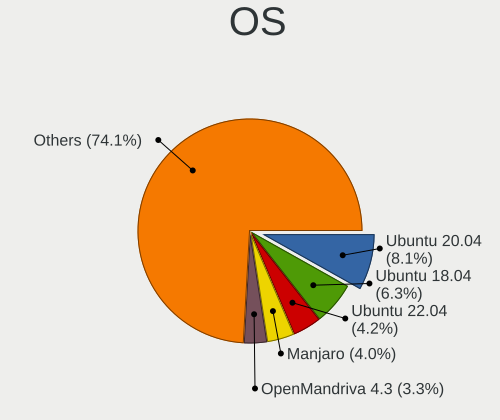

| Name                         | Computers | Percent |
|------------------------------|-----------|---------|
| Ubuntu 20.04                 | 39        | 8.14%   |
| Ubuntu 18.04                 | 30        | 6.26%   |
| Ubuntu 22.04                 | 20        | 4.18%   |
| Manjaro                      | 19        | 3.97%   |
| OpenMandriva 4.3             | 16        | 3.34%   |
| Arch Rolling                 | 14        | 2.92%   |
| ArcoLinux Rolling            | 11        | 2.3%    |
| OpenMandriva 25.90           | 10        | 2.09%   |
| Debian 12                    | 10        | 2.09%   |
| Linux Mint 21.2              | 8         | 1.67%   |
| KDE neon 20.04               | 8         | 1.67%   |
| OpenMandriva 4.2             | 7         | 1.46%   |
| OpenMandriva 23.08           | 7         | 1.46%   |
| OpenMandriva 23.03           | 7         | 1.46%   |
| Fedora 40                    | 7         | 1.46%   |
| Zorin 17                     | 6         | 1.25%   |
| Ubuntu 24.04                 | 6         | 1.25%   |
| Linux Mint 21.3              | 6         | 1.25%   |
| Linux Mint 19.3              | 6         | 1.25%   |
| Debian 11                    | 6         | 1.25%   |
| Zorin 16                     | 5         | 1.04%   |
| Xubuntu 20.04                | 5         | 1.04%   |
| Ubuntu 19.04                 | 5         | 1.04%   |
| Pop!_OS 22.04                | 5         | 1.04%   |
| OpenMandriva 23.01           | 5         | 1.04%   |
| Fedora 42                    | 5         | 1.04%   |
| Fedora 39                    | 5         | 1.04%   |
| Ubuntu 21.10                 | 4         | 0.84%   |
| Ubuntu 18.10                 | 4         | 0.84%   |
| OpenMandriva 25.06           | 4         | 0.84%   |
| Linux Mint 21.1              | 4         | 0.84%   |
| Linux Mint 19.1              | 4         | 0.84%   |
| Fedora 38                    | 4         | 0.84%   |
| Fedora 36                    | 4         | 0.84%   |
| Zorin 18                     | 3         | 0.63%   |
| Xubuntu 18.04                | 3         | 0.63%   |
| Ubuntu 23.10                 | 3         | 0.63%   |
| ROSA R11.1                   | 3         | 0.63%   |
| openSUSE Tumbleweed-XXXXXXXX | 3         | 0.63%   |
| OpenMandriva 5.0             | 3         | 0.63%   |

OS Family
---------

OS without a version

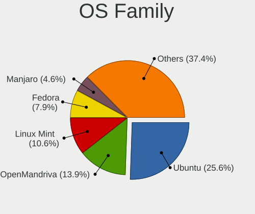

| Name         | Computers | Percent |
|--------------|-----------|---------|
| Ubuntu       | 116       | 25.55%  |
| OpenMandriva | 63        | 13.88%  |
| Linux Mint   | 48        | 10.57%  |
| Fedora       | 36        | 7.93%   |
| Manjaro      | 21        | 4.63%   |
| Zorin        | 16        | 3.52%   |
| Debian       | 16        | 3.52%   |
| Arch         | 16        | 3.52%   |
| KDE neon     | 13        | 2.86%   |
| Xubuntu      | 12        | 2.64%   |
| ArcoLinux    | 12        | 2.64%   |
| Pop!_OS      | 8         | 1.76%   |
| ROSA         | 6         | 1.32%   |
| Lubuntu      | 6         | 1.32%   |
| Kubuntu      | 6         | 1.32%   |
| Endless      | 6         | 1.32%   |
| openSUSE     | 4         | 0.88%   |
| NixOS        | 4         | 0.88%   |
| LMDE         | 4         | 0.88%   |
| EndeavourOS  | 4         | 0.88%   |
| Bazzite      | 4         | 0.88%   |
| SteamOS      | 3         | 0.66%   |
| Kali         | 3         | 0.66%   |
| Elementary   | 3         | 0.66%   |
| BlackPanther | 3         | 0.66%   |
| Void Linux   | 2         | 0.44%   |
| Ubuntu MATE  | 2         | 0.44%   |
| Archcraft    | 2         | 0.44%   |
| antiX        | 2         | 0.44%   |
| Android      | 2         | 0.44%   |
| UbuntuDDE    | 1         | 0.22%   |
| PostmarketOS | 1         | 0.22%   |
| Nobara       | 1         | 0.22%   |
| MX           | 1         | 0.22%   |
| LinuxFX      | 1         | 0.22%   |
| Gentoo       | 1         | 0.22%   |
| Garuda Linux | 1         | 0.22%   |
| Feren OS     | 1         | 0.22%   |
| blendOS      | 1         | 0.22%   |
| Artix        | 1         | 0.22%   |

Kernel
------

Version of the Linux kernel

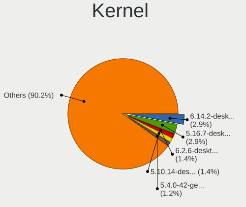

| Version                  | Computers | Percent |
|--------------------------|-----------|---------|
| 6.14.2-desktop-3omv2590  | 15        | 2.94%   |
| 5.16.7-desktop-1omv4003  | 15        | 2.94%   |
| 6.2.6-desktop-1omv2390   | 7         | 1.37%   |
| 5.10.14-desktop-1omv4002 | 7         | 1.37%   |
| 5.4.0-42-generic         | 6         | 1.18%   |
| 4.16.18-pa2-2bp1         | 6         | 1.18%   |
| 6.4.8-desktop-2omv2390   | 5         | 0.98%   |
| 6.1.1-desktop-1omv2290   | 5         | 0.98%   |
| 5.11.0-38-generic        | 5         | 0.98%   |
| 4.16.18-pa2-1bp5         | 5         | 0.98%   |
| 6.5.0-41-generic         | 4         | 0.78%   |
| 5.8.0-53-generic         | 4         | 0.78%   |
| 5.5.19-bp0               | 4         | 0.78%   |
| 5.4.0-52-generic         | 4         | 0.78%   |
| 5.3.0-46-generic         | 4         | 0.78%   |
| 5.13.0-39-generic        | 4         | 0.78%   |
| 6.6.2-desktop-1omv2390   | 3         | 0.59%   |
| 6.4.11-desktop-1omv2390  | 3         | 0.59%   |
| 6.14.0-29-generic        | 3         | 0.59%   |
| 6.1.0-26-amd64           | 3         | 0.59%   |
| 5.4.0-73-generic         | 3         | 0.59%   |
| 5.4.0-72-generic         | 3         | 0.59%   |
| 5.4.0-65-generic         | 3         | 0.59%   |
| 5.4.0-58-generic         | 3         | 0.59%   |
| 5.15.0-67-generic        | 3         | 0.59%   |
| 5.15.0-46-generic        | 3         | 0.59%   |
| 5.10.0-21-amd64          | 3         | 0.59%   |
| 5.0.0-32-generic         | 3         | 0.59%   |
| 4.18.16-desktop-1bP      | 3         | 0.59%   |
| 6.9.12-3-MANJARO         | 2         | 0.39%   |
| 6.8.0-79-generic         | 2         | 0.39%   |
| 6.8.0-53-generic         | 2         | 0.39%   |
| 6.8.0-45-generic         | 2         | 0.39%   |
| 6.8.0-40-generic         | 2         | 0.39%   |
| 6.5.12-300.fc39.x86_64   | 2         | 0.39%   |
| 6.5.0-45-generic         | 2         | 0.39%   |
| 6.5.0-17-generic         | 2         | 0.39%   |
| 6.5.0-15-generic         | 2         | 0.39%   |
| 6.4.7-arch1-1            | 2         | 0.39%   |
| 6.3.9-zen1-1-zen         | 2         | 0.39%   |

Kernel Family
-------------

Linux kernel without a distro release

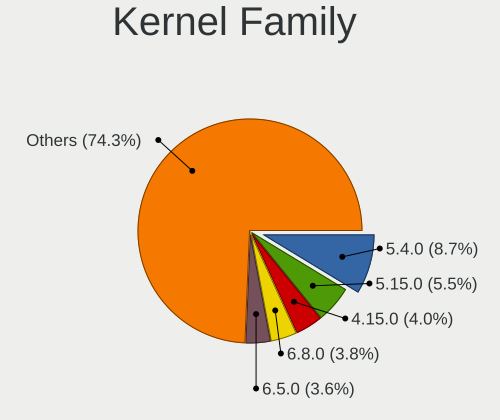

| Version | Computers | Percent |
|---------|-----------|---------|
| 5.4.0   | 43        | 8.69%   |
| 5.15.0  | 27        | 5.45%   |
| 4.15.0  | 20        | 4.04%   |
| 6.8.0   | 19        | 3.84%   |
| 6.5.0   | 18        | 3.64%   |
| 6.14.2  | 17        | 3.43%   |
| 5.16.7  | 15        | 3.03%   |
| 5.13.0  | 15        | 3.03%   |
| 5.8.0   | 13        | 2.63%   |
| 5.11.0  | 12        | 2.42%   |
| 6.1.0   | 11        | 2.22%   |
| 5.3.0   | 11        | 2.22%   |
| 4.16.18 | 11        | 2.22%   |
| 5.0.0   | 10        | 2.02%   |
| 6.14.0  | 9         | 1.82%   |
| 6.2.0   | 8         | 1.62%   |
| 4.18.0  | 8         | 1.62%   |
| 6.2.6   | 7         | 1.41%   |
| 5.19.0  | 7         | 1.41%   |
| 5.10.14 | 7         | 1.41%   |
| 5.10.0  | 7         | 1.41%   |
| 6.4.8   | 5         | 1.01%   |
| 6.1.1   | 5         | 1.01%   |
| 6.4.11  | 4         | 0.81%   |
| 5.5.19  | 4         | 0.81%   |
| 6.9.12  | 3         | 0.61%   |
| 6.6.2   | 3         | 0.61%   |
| 6.12.9  | 3         | 0.61%   |
| 6.11.0  | 3         | 0.61%   |
| 5.17.5  | 3         | 0.61%   |
| 4.18.16 | 3         | 0.61%   |
| 6.8.5   | 2         | 0.4%    |
| 6.7.9   | 2         | 0.4%    |
| 6.5.5   | 2         | 0.4%    |
| 6.5.12  | 2         | 0.4%    |
| 6.4.7   | 2         | 0.4%    |
| 6.3.9   | 2         | 0.4%    |
| 6.3.4   | 2         | 0.4%    |
| 6.2.12  | 2         | 0.4%    |
| 6.17.1  | 2         | 0.4%    |

Kernel Major Ver.
-----------------

Linux kernel major version

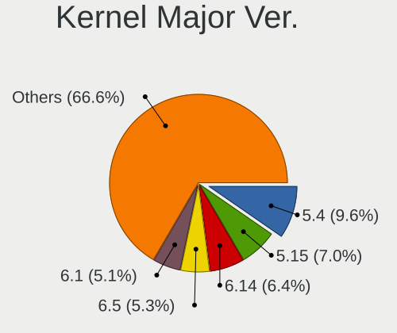

| Version | Computers | Percent |
|---------|-----------|---------|
| 5.4     | 47        | 9.63%   |
| 5.15    | 34        | 6.97%   |
| 6.14    | 31        | 6.35%   |
| 6.5     | 26        | 5.33%   |
| 6.1     | 25        | 5.12%   |
| 6.8     | 24        | 4.92%   |
| 5.10    | 20        | 4.1%    |
| 4.15    | 20        | 4.1%    |
| 6.2     | 19        | 3.89%   |
| 5.16    | 19        | 3.89%   |
| 5.11    | 18        | 3.69%   |
| 6.6     | 17        | 3.48%   |
| 5.13    | 16        | 3.28%   |
| 5.8     | 15        | 3.07%   |
| 6.4     | 14        | 2.87%   |
| 6.12    | 12        | 2.46%   |
| 5.3     | 12        | 2.46%   |
| 4.16    | 12        | 2.46%   |
| 4.18    | 11        | 2.25%   |
| 5.19    | 10        | 2.05%   |
| 5.0     | 10        | 2.05%   |
| 6.15    | 8         | 1.64%   |
| 6.11    | 7         | 1.43%   |
| 6.3     | 6         | 1.23%   |
| 5.17    | 6         | 1.23%   |
| 6.17    | 5         | 1.02%   |
| 6.0     | 5         | 1.02%   |
| 5.18    | 5         | 1.02%   |
| 6.9     | 4         | 0.82%   |
| 6.10    | 4         | 0.82%   |
| 5.5     | 4         | 0.82%   |
| 5.12    | 4         | 0.82%   |
| 6.13    | 3         | 0.61%   |
| 6.7     | 2         | 0.41%   |
| 5.6     | 2         | 0.41%   |
| 5.14    | 2         | 0.41%   |
| 4.9     | 2         | 0.41%   |
| 6.18    | 1         | 0.2%    |
| 5.2     | 1         | 0.2%    |
| 4.8     | 1         | 0.2%    |

Arch
----

OS architecture (x86_64, i586, etc.)

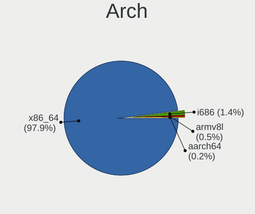

| Name    | Computers | Percent |
|---------|-----------|---------|
| x86_64  | 422       | 97.91%  |
| i686    | 6         | 1.39%   |
| armv8l  | 2         | 0.46%   |
| aarch64 | 1         | 0.23%   |

DE
--

Desktop Environment

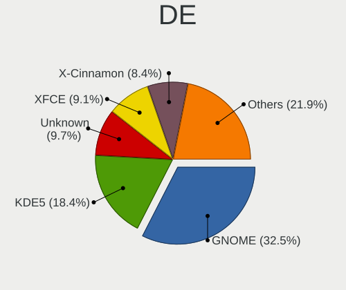

| Name            | Computers | Percent |
|-----------------|-----------|---------|
| GNOME           | 147       | 32.52%  |
| KDE5            | 83        | 18.36%  |
| Unknown         | 44        | 9.73%   |
| XFCE            | 41        | 9.07%   |
| X-Cinnamon      | 38        | 8.41%   |
| KDE6            | 31        | 6.86%   |
| GNOME Flashback | 13        | 2.88%   |
| KDE             | 9         | 1.99%   |
| LXQt            | 8         | 1.77%   |
| MATE            | 7         | 1.55%   |
| LXDE            | 5         | 1.11%   |
| Cinnamon        | 5         | 1.11%   |
| Pantheon        | 3         | 0.66%   |
| i3              | 3         | 0.66%   |
| openbox         | 2         | 0.44%   |
| KDE4            | 2         | 0.44%   |
| ICEWM           | 2         | 0.44%   |
| bspwm           | 2         | 0.44%   |
| sway            | 1         | 0.22%   |
| qtile           | 1         | 0.22%   |
| LeftWM          | 1         | 0.22%   |
| Hyprland        | 1         | 0.22%   |
| Enlightenment   | 1         | 0.22%   |
| Endless:GNOME   | 1         | 0.22%   |
| Deepin          | 1         | 0.22%   |

Display Server
--------------

X11 or Wayland

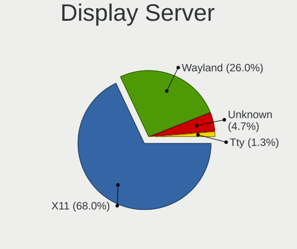

| Name    | Computers | Percent |
|---------|-----------|---------|
| X11     | 306       | 68%     |
| Wayland | 117       | 26%     |
| Unknown | 21        | 4.67%   |
| Tty     | 6         | 1.33%   |

Display Manager
---------------

SDDM, LightDM, etc.

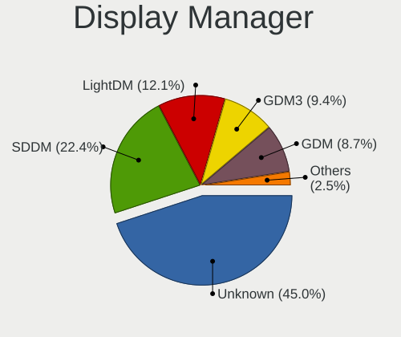

| Name    | Computers | Percent |
|---------|-----------|---------|
| Unknown | 201       | 44.97%  |
| SDDM    | 100       | 22.37%  |
| LightDM | 54        | 12.08%  |
| GDM3    | 42        | 9.4%    |
| GDM     | 39        | 8.72%   |
| TDM     | 4         | 0.89%   |
| LY-DM   | 2         | 0.45%   |
| KDM     | 2         | 0.45%   |
| XDM     | 1         | 0.22%   |
| SLIMSKI | 1         | 0.22%   |
| GREETD  | 1         | 0.22%   |

OS Lang
-------

Language

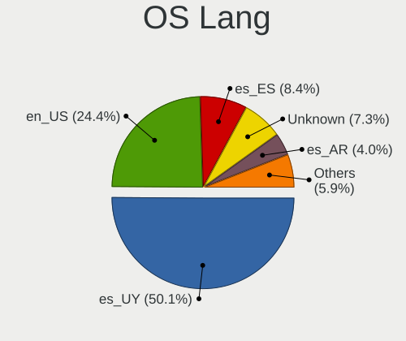

| Lang       | Computers | Percent |
|------------|-----------|---------|
| es_UY      | 228       | 50.11%  |
| en_US      | 111       | 24.4%   |
| es_ES      | 38        | 8.35%   |
| Unknown    | 33        | 7.25%   |
| es_AR      | 18        | 3.96%   |
| es_MX      | 8         | 1.76%   |
| C          | 8         | 1.76%   |
| en_GB      | 4         | 0.88%   |
| es_UY.UTF8 | 2         | 0.44%   |
| en_CA      | 2         | 0.44%   |
| UTF-8      | 1         | 0.22%   |
| pt_BR      | 1         | 0.22%   |
| POSIX      | 1         | 0.22%   |

Boot Mode
---------

EFI or BIOS

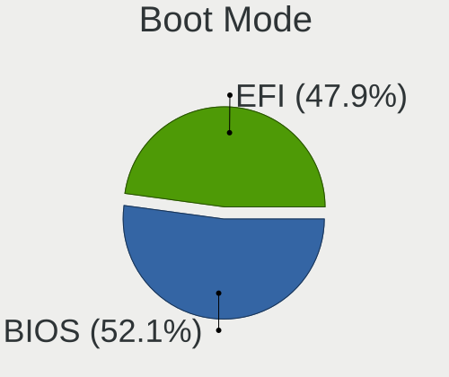

| Mode | Computers | Percent |
|------|-----------|---------|
| BIOS | 231       | 52.14%  |
| EFI  | 212       | 47.86%  |

Filesystem
----------

Type of filesystem

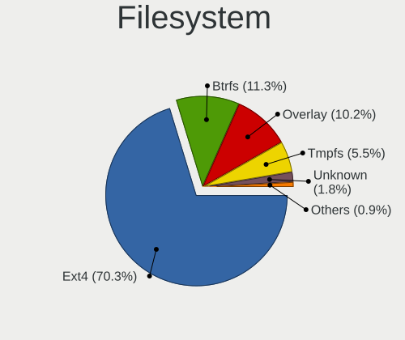

| Type    | Computers | Percent |
|---------|-----------|---------|
| Ext4    | 317       | 70.29%  |
| Btrfs   | 51        | 11.31%  |
| Overlay | 46        | 10.2%   |
| Tmpfs   | 25        | 5.54%   |
| Unknown | 8         | 1.77%   |
| Xfs     | 3         | 0.67%   |
| Ext3    | 1         | 0.22%   |

Part. scheme
------------

Scheme of partitioning

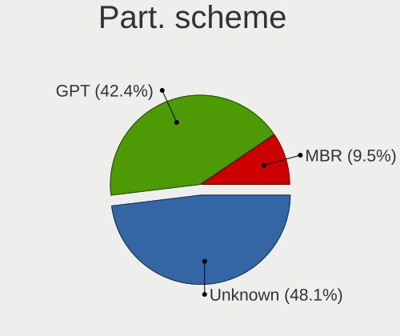

| Type    | Computers | Percent |
|---------|-----------|---------|
| Unknown | 213       | 48.08%  |
| GPT     | 188       | 42.44%  |
| MBR     | 42        | 9.48%   |

Dual Boot with Linux/BSD
------------------------

Hosting more than one Linux/BSD

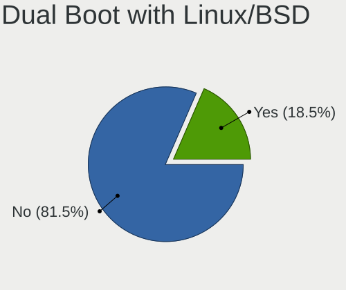

| Dual boot | Computers | Percent |
|-----------|-----------|---------|
| No        | 357       | 81.51%  |
| Yes       | 81        | 18.49%  |

Dual Boot (Win)
---------------

Hosting Linux and Windows

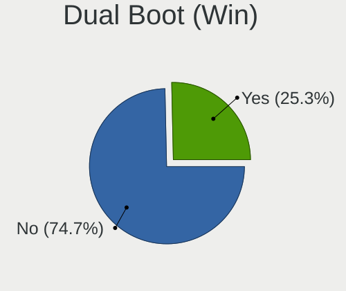

| Dual boot | Computers | Percent |
|-----------|-----------|---------|
| No        | 330       | 74.66%  |
| Yes       | 112       | 25.34%  |

Board
-----

Vendor
------

Motherboard manufacturer

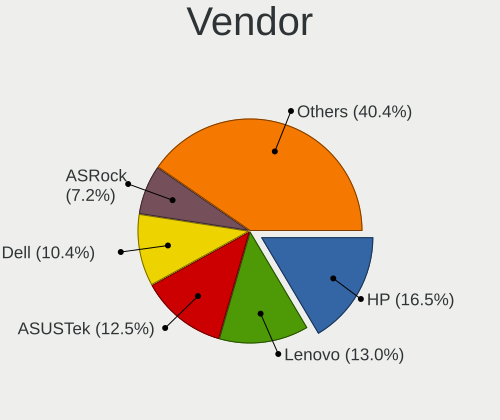

| Name                | Computers | Percent |
|---------------------|-----------|---------|
| Hewlett-Packard     | 71        | 16.47%  |
| Lenovo              | 56        | 12.99%  |
| ASUSTek Computer    | 54        | 12.53%  |
| Dell                | 45        | 10.44%  |
| ASRock              | 31        | 7.19%   |
| Gigabyte Technology | 30        | 6.96%   |
| MSI                 | 23        | 5.34%   |
| ECS                 | 20        | 4.64%   |
| Acer                | 20        | 4.64%   |
| Toshiba             | 13        | 3.02%   |
| Standard            | 6         | 1.39%   |
| Samsung Electronics | 6         | 1.39%   |
| Intel               | 6         | 1.39%   |
| Unknown             | 6         | 1.39%   |
| Apple               | 5         | 1.16%   |
| Chuwi               | 4         | 0.93%   |
| GPU Company         | 3         | 0.7%    |
| Gateway             | 3         | 0.7%    |
| Biostar             | 3         | 0.7%    |
| Valve               | 2         | 0.46%   |
| Positivo            | 2         | 0.46%   |
| JP-IK               | 2         | 0.46%   |
| Google              | 2         | 0.46%   |
| Fujitsu             | 2         | 0.46%   |
| Foxconn             | 2         | 0.46%   |
| Supermicro          | 1         | 0.23%   |
| Sony                | 1         | 0.23%   |
| Razer               | 1         | 0.23%   |
| Pegatron            | 1         | 0.23%   |
| Panasonic           | 1         | 0.23%   |
| OEM                 | 1         | 0.23%   |
| Microsoft           | 1         | 0.23%   |
| MACHINIST           | 1         | 0.23%   |
| iClever             | 1         | 0.23%   |
| Huanan              | 1         | 0.23%   |
| Haitech             | 1         | 0.23%   |
| GMKtec              | 1         | 0.23%   |
| AZW                 | 1         | 0.23%   |
| Alienware           | 1         | 0.23%   |

Model
-----

Motherboard model

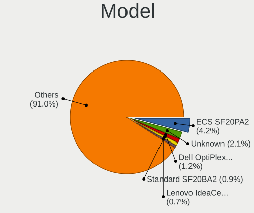

| Name                                       | Computers | Percent |
|--------------------------------------------|-----------|---------|
| ECS SF20PA2                                | 18        | 4.18%   |
| Unknown                                    | 9         | 2.09%   |
| Dell OptiPlex 7010                         | 5         | 1.16%   |
| Standard SF20BA2                           | 4         | 0.93%   |
| Lenovo IdeaCentre AIO 310-20IAP F0CL0014LD | 3         | 0.7%    |
| HP Dragonfly Pro ONE                       | 3         | 0.7%    |
| ASUS ROG Zephyrus G14 GA401IV_GA401IV      | 3         | 0.7%    |
| Valve Jupiter                              | 2         | 0.46%   |
| Toshiba Satellite L55t-B                   | 2         | 0.46%   |
| MSI MS-7C37                                | 2         | 0.46%   |
| MSI MS-7817                                | 2         | 0.46%   |
| MSI MS-7721                                | 2         | 0.46%   |
| Lenovo G405 20239                          | 2         | 0.46%   |
| HP Stream Laptop 14-ax0XX                  | 2         | 0.46%   |
| HP Pavilion 15                             | 2         | 0.46%   |
| HP Notebook                                | 2         | 0.46%   |
| HP Laptop 15-bw0xx                         | 2         | 0.46%   |
| HP Laptop 15-bs0xx                         | 2         | 0.46%   |
| HP Laptop 14-dq1xxx                        | 2         | 0.46%   |
| HP Compaq Pro 6300 SFF                     | 2         | 0.46%   |
| HP Compaq 6200 Pro SFF PC                  | 2         | 0.46%   |
| Gigabyte Z390 AORUS ELITE                  | 2         | 0.46%   |
| Gigabyte Z370 AORUS Gaming 7               | 2         | 0.46%   |
| Gigabyte H61M-S1                           | 2         | 0.46%   |
| Gigabyte H310M A                           | 2         | 0.46%   |
| Gigabyte B450 GAMING X                     | 2         | 0.46%   |
| Dell OptiPlex 980                          | 2         | 0.46%   |
| Dell Inspiron 15-3567                      | 2         | 0.46%   |
| ASUS ZenBook UX434FLC_UX433FLC             | 2         | 0.46%   |
| ASUS ZenBook UX325EA_UX325EA               | 2         | 0.46%   |
| ASUS TUF Gaming B650M-PLUS WIFI            | 2         | 0.46%   |
| ASUS PRIME A320M-K                         | 2         | 0.46%   |
| ASUS All Series                            | 2         | 0.46%   |
| ASRock N68-S                               | 2         | 0.46%   |
| ASRock H310CM-HDV                          | 2         | 0.46%   |
| ASRock FM2A58M-VG3+ R2.0                   | 2         | 0.46%   |
| ASRock B450M Steel Legend                  | 2         | 0.46%   |
| ASRock ALiveNF6P-VSTA                      | 2         | 0.46%   |
| ASRock A320M-HDV R4.0                      | 2         | 0.46%   |
| Acer Aspire A315-59                        | 2         | 0.46%   |

Model Family
------------

Motherboard model prefix

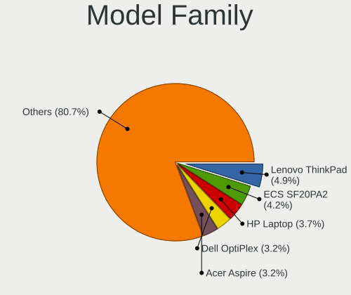

| Name               | Computers | Percent |
|--------------------|-----------|---------|
| Lenovo ThinkPad    | 21        | 4.87%   |
| ECS SF20PA2        | 18        | 4.18%   |
| HP Laptop          | 16        | 3.71%   |
| Dell OptiPlex      | 14        | 3.25%   |
| Acer Aspire        | 14        | 3.25%   |
| Toshiba Satellite  | 13        | 3.02%   |
| HP Pavilion        | 12        | 2.78%   |
| Dell Inspiron      | 12        | 2.78%   |
| Lenovo IdeaPad     | 11        | 2.55%   |
| Dell Latitude      | 11        | 2.55%   |
| HP Compaq          | 10        | 2.32%   |
| Unknown            | 9         | 2.09%   |
| ASUS VivoBook      | 8         | 1.86%   |
| ASUS Zenbook       | 7         | 1.62%   |
| ASUS ROG           | 7         | 1.62%   |
| Lenovo ThinkCentre | 6         | 1.39%   |
| HP Stream          | 5         | 1.16%   |
| ASUS TUF           | 5         | 1.16%   |
| ASUS PRIME         | 5         | 1.16%   |
| Standard SF20BA2   | 4         | 0.93%   |
| HP EliteBook       | 4         | 0.93%   |
| ASRock A320M-HDV   | 4         | 0.93%   |
| Lenovo IdeaCentre  | 3         | 0.7%    |
| HP Dragonfly       | 3         | 0.7%    |
| ASUS ASUS          | 3         | 0.7%    |
| ASRock B450M       | 3         | 0.7%    |
| Valve Jupiter      | 2         | 0.46%   |
| MSI MS-7C37        | 2         | 0.46%   |
| MSI MS-7817        | 2         | 0.46%   |
| MSI MS-7721        | 2         | 0.46%   |
| Lenovo ThinkBook   | 2         | 0.46%   |
| Lenovo Legion      | 2         | 0.46%   |
| Lenovo G405        | 2         | 0.46%   |
| JP-IK T140J        | 2         | 0.46%   |
| HP Presario        | 2         | 0.46%   |
| HP OMEN            | 2         | 0.46%   |
| HP Notebook        | 2         | 0.46%   |
| HP ENVY            | 2         | 0.46%   |
| HP EliteDesk       | 2         | 0.46%   |
| HP 240             | 2         | 0.46%   |

MFG Year
--------

Motherboard manufacture year

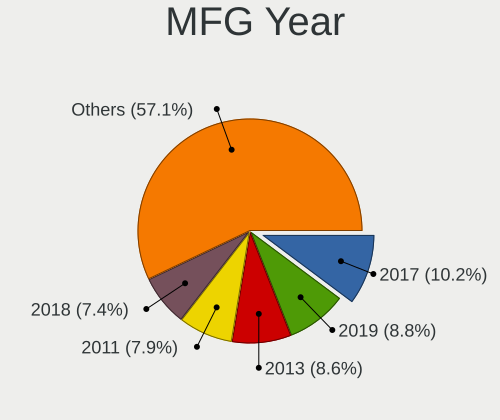

| Year    | Computers | Percent |
|---------|-----------|---------|
| 2017    | 44        | 10.21%  |
| 2019    | 38        | 8.82%   |
| 2013    | 37        | 8.58%   |
| 2011    | 34        | 7.89%   |
| 2018    | 32        | 7.42%   |
| 2020    | 31        | 7.19%   |
| 2012    | 31        | 7.19%   |
| 2015    | 30        | 6.96%   |
| 2016    | 23        | 5.34%   |
| 2014    | 23        | 5.34%   |
| 2021    | 20        | 4.64%   |
| 2022    | 18        | 4.18%   |
| 2023    | 14        | 3.25%   |
| 2009    | 13        | 3.02%   |
| 2010    | 11        | 2.55%   |
| 2007    | 9         | 2.09%   |
| 2008    | 8         | 1.86%   |
| 2024    | 7         | 1.62%   |
| Unknown | 3         | 0.7%    |
| 2025    | 1         | 0.23%   |
| 2006    | 1         | 0.23%   |
| 2005    | 1         | 0.23%   |
| 2004    | 1         | 0.23%   |
| 2003    | 1         | 0.23%   |

Form Factor
-----------

Physical design of the computer

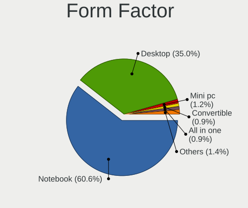

| Name           | Computers | Percent |
|----------------|-----------|---------|
| Notebook       | 261       | 60.56%  |
| Desktop        | 151       | 35.03%  |
| Mini pc        | 5         | 1.16%   |
| Convertible    | 4         | 0.93%   |
| All in one     | 4         | 0.93%   |
| Tablet         | 3         | 0.7%    |
| Phone          | 2         | 0.46%   |
| System on chip | 1         | 0.23%   |

Secure Boot
-----------

Enabled or disabled

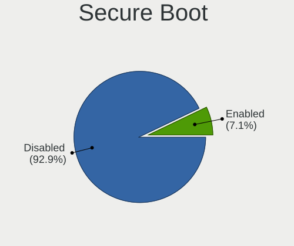

| State    | Computers | Percent |
|----------|-----------|---------|
| Disabled | 404       | 92.87%  |
| Enabled  | 31        | 7.13%   |

Coreboot
--------

Have coreboot on board

| Used | Computers | Percent |
|------|-----------|---------|
| No   | 428       | 99.3%   |
| Yes  | 3         | 0.7%    |

RAM Size
--------

Total RAM memory

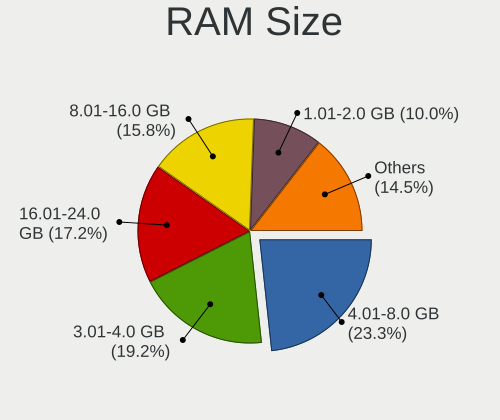

| Size in GB  | Computers | Percent |
|-------------|-----------|---------|
| 4.01-8.0    | 103       | 23.3%   |
| 3.01-4.0    | 85        | 19.23%  |
| 16.01-24.0  | 76        | 17.19%  |
| 8.01-16.0   | 70        | 15.84%  |
| 1.01-2.0    | 44        | 9.95%   |
| 32.01-64.0  | 38        | 8.6%    |
| 24.01-32.0  | 14        | 3.17%   |
| 64.01-256.0 | 6         | 1.36%   |
| 2.01-3.0    | 3         | 0.68%   |
| 0.01-0.5    | 2         | 0.45%   |
| 0.51-1.0    | 1         | 0.23%   |

RAM Used
--------

Used RAM memory

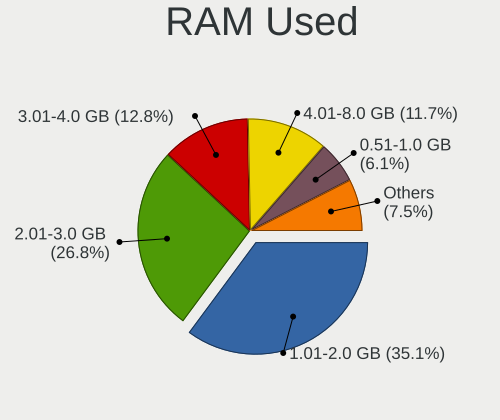

| Used GB    | Computers | Percent |
|------------|-----------|---------|
| 1.01-2.0   | 168       | 35.15%  |
| 2.01-3.0   | 128       | 26.78%  |
| 3.01-4.0   | 61        | 12.76%  |
| 4.01-8.0   | 56        | 11.72%  |
| 0.51-1.0   | 29        | 6.07%   |
| 8.01-16.0  | 22        | 4.6%    |
| 0.01-0.5   | 8         | 1.67%   |
| 16.01-24.0 | 6         | 1.26%   |

Total Drives
------------

Number of drives on board

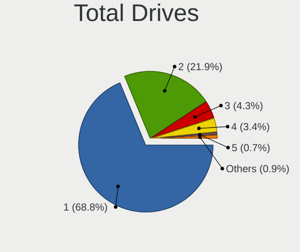

| Drives | Computers | Percent |
|--------|-----------|---------|
| 1      | 304       | 68.78%  |
| 2      | 97        | 21.95%  |
| 3      | 19        | 4.3%    |
| 4      | 15        | 3.39%   |
| 5      | 3         | 0.68%   |
| 0      | 2         | 0.45%   |
| 7      | 1         | 0.23%   |
| 6      | 1         | 0.23%   |

Has CD-ROM
----------

Has CD-ROM on board

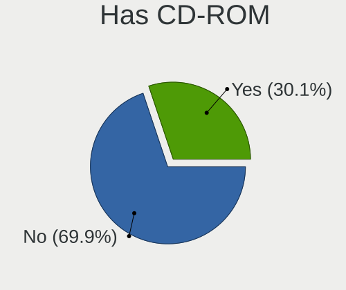

| Presented | Computers | Percent |
|-----------|-----------|---------|
| No        | 306       | 69.86%  |
| Yes       | 132       | 30.14%  |

Has Ethernet
------------

Has Ethernet on board

| Presented | Computers | Percent |
|-----------|-----------|---------|
| Yes       | 326       | 75.46%  |
| No        | 106       | 24.54%  |

Has WiFi
--------

Has WiFi module

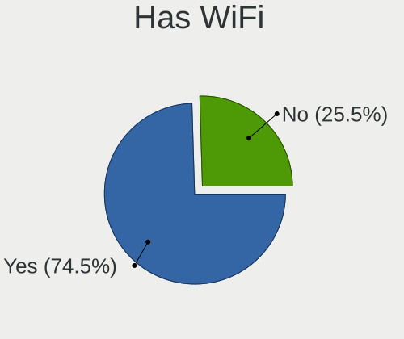

| Presented | Computers | Percent |
|-----------|-----------|---------|
| Yes       | 325       | 74.54%  |
| No        | 111       | 25.46%  |

Has Bluetooth
-------------

Has Bluetooth module

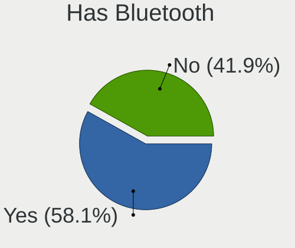

| Presented | Computers | Percent |
|-----------|-----------|---------|
| Yes       | 251       | 58.1%   |
| No        | 181       | 41.9%   |

Location
--------

Country
-------

Geographic location (country)

| Country | Computers | Percent |
|---------|-----------|---------|
| Uruguay | 431       | 100%    |

City
----

Geographic location (city)

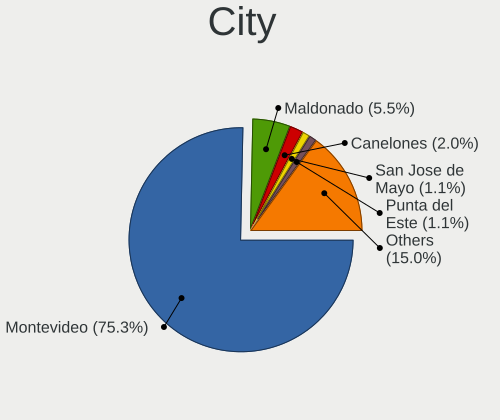

| City                | Computers | Percent |
|---------------------|-----------|---------|
| Montevideo          | 342       | 75.33%  |
| Maldonado           | 25        | 5.51%   |
| Canelones           | 9         | 1.98%   |
| San Jose de Mayo    | 5         | 1.1%    |
| Punta del Este      | 5         | 1.1%    |
| Paysandú           | 5         | 1.1%    |
| Minas               | 4         | 0.88%   |
| Las Piedras         | 4         | 0.88%   |
| La Paz              | 3         | 0.66%   |
| Florida             | 3         | 0.66%   |
| Ciudad del Plata    | 3         | 0.66%   |
| Centro              | 3         | 0.66%   |
| Buceo               | 3         | 0.66%   |
| Sayago              | 2         | 0.44%   |
| Salto               | 2         | 0.44%   |
| Rocha               | 2         | 0.44%   |
| Punta Gorda         | 2         | 0.44%   |
| Pocitos             | 2         | 0.44%   |
| Parque Rodo         | 2         | 0.44%   |
| Nueva Helvecia      | 2         | 0.44%   |
| El Pinar            | 2         | 0.44%   |
| Durazno             | 2         | 0.44%   |
| Cordon              | 2         | 0.44%   |
| Chui                | 2         | 0.44%   |
| Solymar             | 1         | 0.22%   |
| Pinamar             | 1         | 0.22%   |
| Nuevo Paris         | 1         | 0.22%   |
| Melo                | 1         | 0.22%   |
| Melilla             | 1         | 0.22%   |
| Maronas             | 1         | 0.22%   |
| Malvin Norte        | 1         | 0.22%   |
| Las Flores          | 1         | 0.22%   |
| La Barra            | 1         | 0.22%   |
| Joaquin Suarez      | 1         | 0.22%   |
| El Tesoro           | 1         | 0.22%   |
| Colonia Rosario     | 1         | 0.22%   |
| Colonia Nicolich    | 1         | 0.22%   |
| Castellanos         | 1         | 0.22%   |
| Barrancas Coloradas | 1         | 0.22%   |
| Atlantida           | 1         | 0.22%   |

Drives
------

Drive Vendor
------------

Hard drive vendors

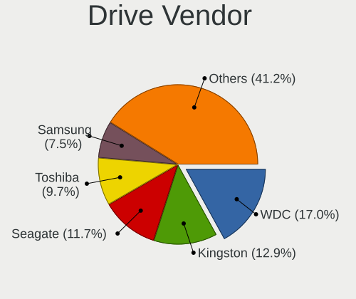

| Vendor                      | Computers | Drives | Percent |
|-----------------------------|-----------|--------|---------|
| WDC                         | 100       | 128    | 17.01%  |
| Kingston                    | 76        | 100    | 12.93%  |
| Seagate                     | 69        | 90     | 11.73%  |
| Toshiba                     | 57        | 72     | 9.69%   |
| Samsung Electronics         | 44        | 48     | 7.48%   |
| Unknown                     | 43        | 54     | 7.31%   |
| Sandisk                     | 24        | 32     | 4.08%   |
| Hitachi                     | 14        | 22     | 2.38%   |
| SK hynix                    | 13        | 16     | 2.21%   |
| HGST                        | 12        | 13     | 2.04%   |
| Crucial                     | 12        | 17     | 2.04%   |
| Netac                       | 10        | 12     | 1.7%    |
| Micron Technology           | 10        | 11     | 1.7%    |
| Intel                       | 9         | 10     | 1.53%   |
| Kingston Technology Company | 7         | 8      | 1.19%   |
| Biostar                     | 7         | 8      | 1.19%   |
| Realtek Semiconductor       | 6         | 6      | 1.02%   |
| Hewlett-Packard             | 5         | 5      | 0.85%   |
| Dahua                       | 5         | 8      | 0.85%   |
| China                       | 5         | 5      | 0.85%   |
| Phison                      | 4         | 8      | 0.68%   |
| Patriot                     | 4         | 5      | 0.68%   |
| HS-SSD-C100                 | 4         | 6      | 0.68%   |
| Gigabyte Technology         | 4         | 6      | 0.68%   |
| Silicon Motion              | 3         | 3      | 0.51%   |
| Phison Electronics          | 3         | 3      | 0.51%   |
| Maxtor                      | 3         | 4      | 0.51%   |
| MAXIO Technology (Hangzhou) | 3         | 4      | 0.51%   |
| KIOXIA                      | 3         | 5      | 0.51%   |
| Micron/Crucial Technology   | 2         | 3      | 0.34%   |
| LITEON                      | 2         | 3      | 0.34%   |
| Apple                       | 2         | 2      | 0.34%   |
| A-DATA Technology           | 2         | 2      | 0.34%   |
| W800SH                      | 1         | 1      | 0.17%   |
| Union Memory (Shenzhen)     | 1         | 2      | 0.17%   |
| Team                        | 1         | 1      | 0.17%   |
| SCY                         | 1         | 1      | 0.17%   |
| SAGE                        | 1         | 2      | 0.17%   |
| NGFF                        | 1         | 1      | 0.17%   |
| Lexar                       | 1         | 1      | 0.17%   |

Drive Model
-----------

Hard drive models

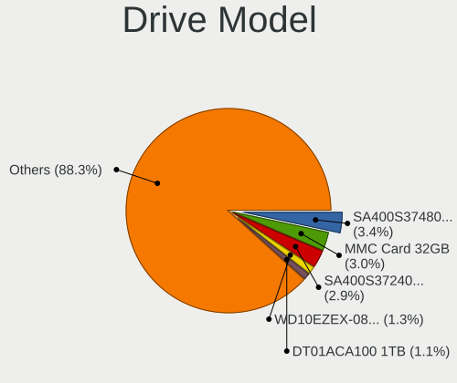

| Model                               | Computers | Percent |
|-------------------------------------|-----------|---------|
| Kingston SA400S37480G 480GB SSD     | 21        | 3.37%   |
| Unknown MMC Card  32GB              | 19        | 3.04%   |
| Kingston SA400S37240G 240GB SSD     | 18        | 2.88%   |
| WDC WD10EZEX-08WN4A0 1TB            | 8         | 1.28%   |
| Toshiba DT01ACA100 1TB              | 7         | 1.12%   |
| Toshiba DT01ACA300 3TB              | 6         | 0.96%   |
| Seagate ST1000LM035-1RK172 1TB      | 6         | 0.96%   |
| Seagate ST1000LM024 HN-M101MBB 1TB  | 6         | 0.96%   |
| Unknown MMC Card  64GB              | 5         | 0.8%    |
| Unknown DA4032  32GB                | 5         | 0.8%    |
| Toshiba MQ01ABF050 500GB            | 5         | 0.8%    |
| Toshiba MQ01ABD075 752GB            | 5         | 0.8%    |
| Seagate ST500LM012 HN-M500MBB 500GB | 5         | 0.8%    |
| Seagate ST500DM002-1BD142 500GB     | 5         | 0.8%    |
| Samsung HD161HJ 160GB               | 5         | 0.8%    |
| Kingston SV300S37A120G 120GB SSD    | 5         | 0.8%    |
| Kingston SA400S37120G 120GB SSD     | 5         | 0.8%    |
| WDC WD5000AAKX-00ERMA0 500GB        | 4         | 0.64%   |
| Unknown MMC Card  128GB             | 4         | 0.64%   |
| Toshiba MQ04ABF100 1TB              | 4         | 0.64%   |
| Toshiba MQ01ABD100 1TB              | 4         | 0.64%   |
| Toshiba HDWK105 500GB               | 4         | 0.64%   |
| Seagate ST250DM000-1BD141 250GB     | 4         | 0.64%   |
| Seagate ST1000DM010-2EP102 1TB      | 4         | 0.64%   |
| SanDisk DF4032  32GB                | 4         | 0.64%   |
| Kingston SA400S37960G 960GB SSD     | 4         | 0.64%   |
| WDC WDS240G2G0B-00EPW0 240GB SSD    | 3         | 0.48%   |
| WDC WDS240G2G0A-00JH30 240GB SSD    | 3         | 0.48%   |
| WDC WDS120G2G0A-00JH30 120GB SSD    | 3         | 0.48%   |
| WDC WD5000BEKT-60KA9T0 500GB        | 3         | 0.48%   |
| WDC WD10EZEX-21WN4A0 1TB            | 3         | 0.48%   |
| WDC WD10EZEX-00BBHA0 1TB            | 3         | 0.48%   |
| Seagate ST1000DM003-1CH162 1TB      | 3         | 0.48%   |
| SanDisk NVMe SSD Drive 1TB          | 3         | 0.48%   |
| Samsung SSD 860 EVO 500GB           | 3         | 0.48%   |
| Phison PSEIB001TABBMC0 1TB          | 3         | 0.48%   |
| Netac SSD 256GB                     | 3         | 0.48%   |
| Kingston SV300S37A480G 480GB SSD    | 3         | 0.48%   |
| Dahua C800 2.5 inch SATA 512GB SSD  | 3         | 0.48%   |
| Biostar S100-120GB SSD              | 3         | 0.48%   |

HDD Vendor
----------

Hard disk drive vendors

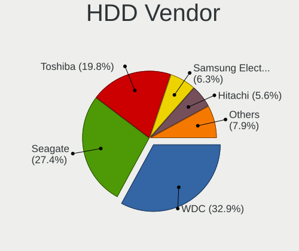

| Vendor              | Computers | Drives | Percent |
|---------------------|-----------|--------|---------|
| WDC                 | 83        | 106    | 32.94%  |
| Seagate             | 69        | 90     | 27.38%  |
| Toshiba             | 50        | 65     | 19.84%  |
| Samsung Electronics | 16        | 17     | 6.35%   |
| Hitachi             | 14        | 22     | 5.56%   |
| HGST                | 12        | 13     | 4.76%   |
| Maxtor              | 3         | 4      | 1.19%   |
| Unknown             | 2         | 2      | 0.79%   |
| SAGE                | 1         | 2      | 0.4%    |
| JMicron Technology  | 1         | 2      | 0.4%    |
| ExcelStor           | 1         | 1      | 0.4%    |

SSD Vendor
----------

Solid state drive vendors

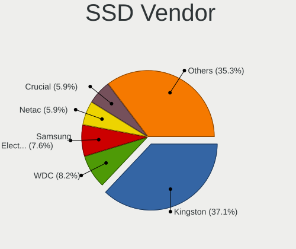

| Vendor              | Computers | Drives | Percent |
|---------------------|-----------|--------|---------|
| Kingston            | 63        | 75     | 37.06%  |
| WDC                 | 14        | 15     | 8.24%   |
| Samsung Electronics | 13        | 14     | 7.65%   |
| Netac               | 10        | 12     | 5.88%   |
| Crucial             | 10        | 13     | 5.88%   |
| Biostar             | 7         | 8      | 4.12%   |
| SanDisk             | 6         | 8      | 3.53%   |
| Dahua               | 5         | 8      | 2.94%   |
| China               | 5         | 5      | 2.94%   |
| Hewlett-Packard     | 4         | 4      | 2.35%   |
| SK hynix            | 3         | 3      | 1.76%   |
| Patriot             | 3         | 4      | 1.76%   |
| Micron Technology   | 3         | 4      | 1.76%   |
| Intel               | 3         | 3      | 1.76%   |
| Gigabyte Technology | 3         | 5      | 1.76%   |
| Toshiba             | 2         | 2      | 1.18%   |
| HS-SSD-C100         | 2         | 2      | 1.18%   |
| A-DATA Technology   | 2         | 2      | 1.18%   |
| W800SH              | 1         | 1      | 0.59%   |
| SCY                 | 1         | 1      | 0.59%   |
| NGFF                | 1         | 1      | 0.59%   |
| LITEON              | 1         | 1      | 0.59%   |
| KingSpec            | 1         | 1      | 0.59%   |
| Hikvision           | 1         | 1      | 0.59%   |
| Gateway             | 1         | 1      | 0.59%   |
| BIWIN               | 1         | 1      | 0.59%   |
| BHT                 | 1         | 1      | 0.59%   |
| ASMT                | 1         | 1      | 0.59%   |
| Apple               | 1         | 1      | 0.59%   |
| Acer                | 1         | 1      | 0.59%   |

Drive Kind
----------

HDD or SSD

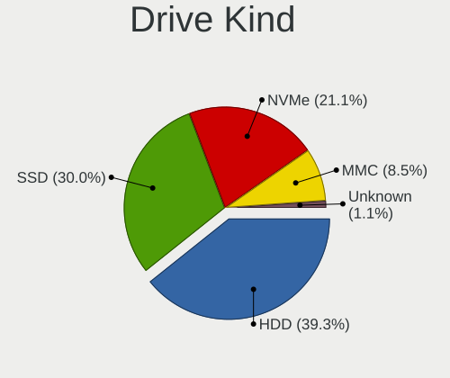

| Kind    | Computers | Drives | Percent |
|---------|-----------|--------|---------|
| HDD     | 207       | 324    | 39.28%  |
| SSD     | 158       | 199    | 29.98%  |
| NVMe    | 111       | 155    | 21.06%  |
| MMC     | 45        | 55     | 8.54%   |
| Unknown | 6         | 10     | 1.14%   |

Drive Connector
---------------

SATA, SAS, NVMe, etc.

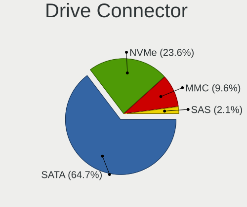

| Type | Computers | Drives | Percent |
|------|-----------|--------|---------|
| SATA | 304       | 518    | 64.68%  |
| NVMe | 111       | 155    | 23.62%  |
| MMC  | 45        | 55     | 9.57%   |
| SAS  | 10        | 15     | 2.13%   |

Drive Size
----------

Size of hard drive

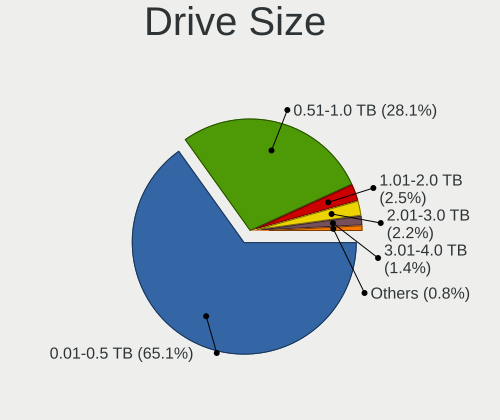

| Size in TB | Computers | Drives | Percent |
|------------|-----------|--------|---------|
| 0.01-0.5   | 239       | 339    | 65.12%  |
| 0.51-1.0   | 103       | 155    | 28.07%  |
| 1.01-2.0   | 9         | 10     | 2.45%   |
| 2.01-3.0   | 8         | 10     | 2.18%   |
| 3.01-4.0   | 5         | 6      | 1.36%   |
| 4.01-10.0  | 3         | 3      | 0.82%   |

Space Total
-----------

Amount of disk space available on the file system

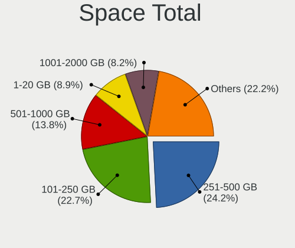

| Size in GB     | Computers | Percent |
|----------------|-----------|---------|
| 251-500        | 112       | 24.19%  |
| 101-250        | 105       | 22.68%  |
| 501-1000       | 64        | 13.82%  |
| 1-20           | 41        | 8.86%   |
| 1001-2000      | 38        | 8.21%   |
| 21-50          | 35        | 7.56%   |
| 51-100         | 29        | 6.26%   |
| Unknown        | 17        | 3.67%   |
| More than 3000 | 12        | 2.59%   |
| 2001-3000      | 10        | 2.16%   |

Space Used
----------

Amount of used disk space

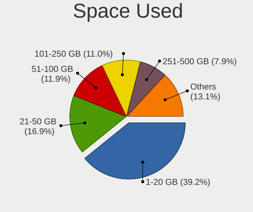

| Used GB        | Computers | Percent |
|----------------|-----------|---------|
| 1-20           | 188       | 39.17%  |
| 21-50          | 81        | 16.88%  |
| 51-100         | 57        | 11.88%  |
| 101-250        | 53        | 11.04%  |
| 251-500        | 38        | 7.92%   |
| 501-1000       | 23        | 4.79%   |
| Unknown        | 17        | 3.54%   |
| 1001-2000      | 13        | 2.71%   |
| More than 3000 | 4         | 0.83%   |
| 2001-3000      | 4         | 0.83%   |
| 0              | 2         | 0.42%   |

Malfunc. Drives
---------------

Drive models with a malfunction

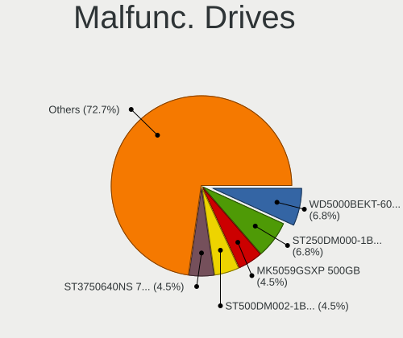

| Model                                                         | Computers | Drives | Percent |
|---------------------------------------------------------------|-----------|--------|---------|
| WDC WD5000BEKT-60KA9T0 500GB                                  | 3         | 3      | 6.82%   |
| Seagate ST250DM000-1BD141 250GB                               | 3         | 3      | 6.82%   |
| Toshiba MK5059GSXP 500GB                                      | 2         | 3      | 4.55%   |
| Seagate ST500DM002-1BD142 500GB                               | 2         | 2      | 4.55%   |
| Seagate ST3750640NS 752GB                                     | 2         | 7      | 4.55%   |
| WDC WDS120G2G0A-00JH30 120GB SSD                              | 1         | 1      | 2.27%   |
| WDC WD800BD-00LRA1 80GB                                       | 1         | 1      | 2.27%   |
| WDC WD5000LPCX-24C6HT0 500GB                                  | 1         | 1      | 2.27%   |
| WDC WD5000AAKX-75U6AA0 500GB                                  | 1         | 2      | 2.27%   |
| WDC WD5000AAJS-00A8B0 500GB                                   | 1         | 1      | 2.27%   |
| WDC WD3200BEVT-26ZCT0 320GB                                   | 1         | 1      | 2.27%   |
| WDC WD2500AVJS-63B6A0 250GB                                   | 1         | 1      | 2.27%   |
| WDC WD10SPCX-24HWST1 1TB                                      | 1         | 1      | 2.27%   |
| WDC WD10EZEX-08WN4A0 1TB                                      | 1         | 1      | 2.27%   |
| WDC WD10EARS-22Y5B1 1TB                                       | 1         | 1      | 2.27%   |
| Toshiba MQ01ABD075 752GB                                      | 1         | 1      | 2.27%   |
| Toshiba MK3276GSX 320GB                                       | 1         | 1      | 2.27%   |
| Toshiba MK3265GSX 320GB                                       | 1         | 1      | 2.27%   |
| Toshiba MK3259GSXP 320GB                                      | 1         | 1      | 2.27%   |
| Toshiba MK2555GSX 250GB                                       | 1         | 1      | 2.27%   |
| Toshiba DT01ACA100 1TB                                        | 1         | 1      | 2.27%   |
| Seagate ST980811AS 80GB                                       | 1         | 2      | 2.27%   |
| Seagate ST9120821AS 120GB                                     | 1         | 1      | 2.27%   |
| Seagate ST500LM021-1KJ152 500GB                               | 1         | 1      | 2.27%   |
| Seagate ST500DM005 HD502HJ 500GB                              | 1         | 1      | 2.27%   |
| Seagate ST3250310CS 250GB                                     | 1         | 1      | 2.27%   |
| Seagate ST320LT012-1DG14C 320GB                               | 1         | 1      | 2.27%   |
| Seagate ST3200827AS 200GB                                     | 1         | 1      | 2.27%   |
| Seagate ST1000LM035-1RK172 1TB                                | 1         | 1      | 2.27%   |
| Seagate ST1000LM024 HN-M101MBB 1TB                            | 1         | 1      | 2.27%   |
| Seagate ST1000DM010-2EP102 1TB                                | 1         | 1      | 2.27%   |
| SanDisk SD9SN8W-128G-1006 128GB SSD                           | 1         | 1      | 2.27%   |
| Samsung Electronics NVMe SSD Controller SM981/PM981/PM983 1TB | 1         | 2      | 2.27%   |
| Kingston SA400S37480G 480GB SSD                               | 1         | 2      | 2.27%   |
| HS-SSD-C100 SSD 240G                                          | 1         | 1      | 2.27%   |
| Hitachi HTS547564A9E384 640GB                                 | 1         | 1      | 2.27%   |
| HGST HTS545032A7E380 320GB                                    | 1         | 1      | 2.27%   |

Malfunc. Drive Vendor
---------------------

Vendors of faulty drives

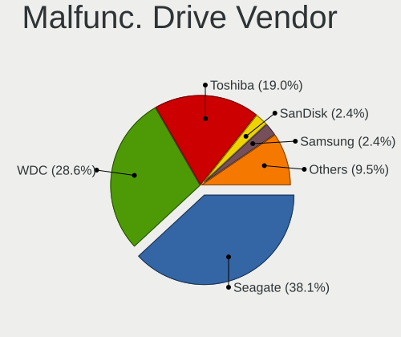

| Vendor              | Computers | Drives | Percent |
|---------------------|-----------|--------|---------|
| Seagate             | 16        | 23     | 38.1%   |
| WDC                 | 12        | 14     | 28.57%  |
| Toshiba             | 8         | 9      | 19.05%  |
| SanDisk             | 1         | 1      | 2.38%   |
| Samsung Electronics | 1         | 2      | 2.38%   |
| Kingston            | 1         | 2      | 2.38%   |
| HS-SSD-C100         | 1         | 1      | 2.38%   |
| Hitachi             | 1         | 1      | 2.38%   |
| HGST                | 1         | 1      | 2.38%   |

Malfunc. HDD Vendor
-------------------

Vendors of faulty HDD drives

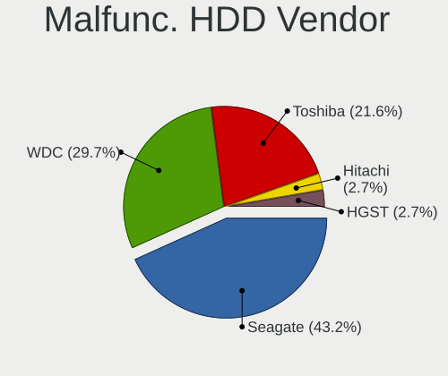

| Vendor  | Computers | Drives | Percent |
|---------|-----------|--------|---------|
| Seagate | 16        | 23     | 43.24%  |
| WDC     | 11        | 13     | 29.73%  |
| Toshiba | 8         | 9      | 21.62%  |
| Hitachi | 1         | 1      | 2.7%    |
| HGST    | 1         | 1      | 2.7%    |

Malfunc. Drive Kind
-------------------

Kinds of faulty drives

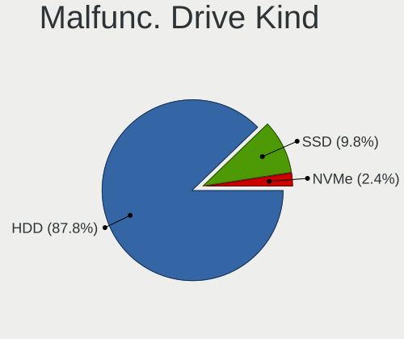

| Kind | Computers | Drives | Percent |
|------|-----------|--------|---------|
| HDD  | 36        | 47     | 87.8%   |
| SSD  | 4         | 5      | 9.76%   |
| NVMe | 1         | 2      | 2.44%   |

Failed Drives
-------------

Failed drive models

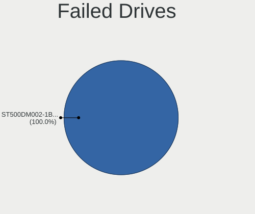

| Model                           | Computers | Drives | Percent |
|---------------------------------|-----------|--------|---------|
| Seagate ST500DM002-1BD142 500GB | 1         | 1      | 100%    |

Failed Drive Vendor
-------------------

Failed drive vendors

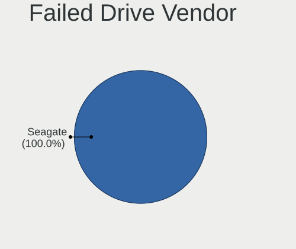

| Vendor  | Computers | Drives | Percent |
|---------|-----------|--------|---------|
| Seagate | 1         | 1      | 100%    |

Drive Status
------------

Number of failed and malfunc. drives

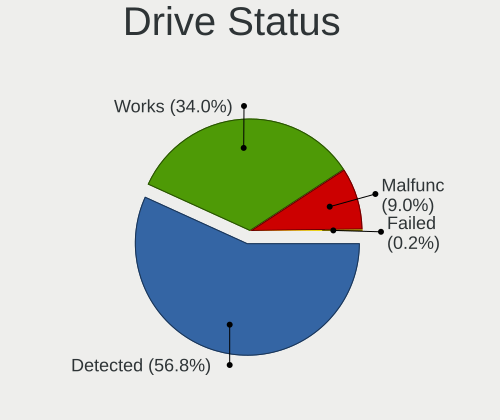

| Status   | Computers | Drives | Percent |
|----------|-----------|--------|---------|
| Detected | 259       | 428    | 56.8%   |
| Works    | 155       | 260    | 33.99%  |
| Malfunc  | 41        | 54     | 8.99%   |
| Failed   | 1         | 1      | 0.22%   |

Storage controller
------------------

Storage Vendor
--------------

Storage controller vendors

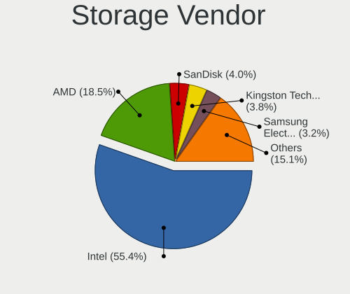

| Vendor                           | Computers | Percent |
|----------------------------------|-----------|---------|
| Intel                            | 278       | 55.38%  |
| AMD                              | 93        | 18.53%  |
| SanDisk                          | 20        | 3.98%   |
| Kingston Technology Company      | 19        | 3.78%   |
| Samsung Electronics              | 16        | 3.19%   |
| SK hynix                         | 9         | 1.79%   |
| Phison Electronics               | 8         | 1.59%   |
| Micron Technology                | 7         | 1.39%   |
| ASMedia Technology               | 7         | 1.39%   |
| Toshiba America Info Systems     | 6         | 1.2%    |
| Silicon Motion                   | 6         | 1.2%    |
| Realtek Semiconductor            | 6         | 1.2%    |
| Nvidia                           | 6         | 1.2%    |
| Micron/Crucial Technology        | 4         | 0.8%    |
| MAXIO Technology (Hangzhou)      | 3         | 0.6%    |
| Marvell Technology Group         | 3         | 0.6%    |
| KIOXIA                           | 2         | 0.4%    |
| VIA Technologies                 | 1         | 0.2%    |
| Union Memory (Shenzhen)          | 1         | 0.2%    |
| Silicon Integrated Systems [SiS] | 1         | 0.2%    |
| Shenzhen Longsys Electronics     | 1         | 0.2%    |
| Lite-On Technology               | 1         | 0.2%    |
| INNOGRIT                         | 1         | 0.2%    |
| Apple                            | 1         | 0.2%    |
| ADATA Technology                 | 1         | 0.2%    |
| Adaptec                          | 1         | 0.2%    |

Storage Model
-------------

Storage controller models

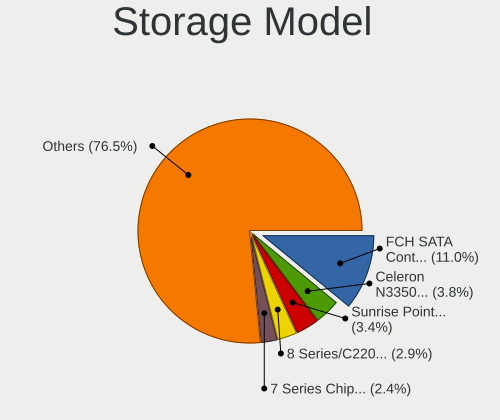

| Model                                                                                   | Computers | Percent |
|-----------------------------------------------------------------------------------------|-----------|---------|
| AMD FCH SATA Controller [AHCI mode]                                                     | 64        | 10.96%  |
| Intel Celeron N3350/Pentium N4200/Atom E3900 Series SATA AHCI Controller                | 22        | 3.77%   |
| Intel Sunrise Point-LP SATA Controller [AHCI mode]                                      | 20        | 3.42%   |
| Intel 8 Series/C220 Series Chipset Family 6-port SATA Controller 1 [AHCI mode]          | 17        | 2.91%   |
| Intel 7 Series Chipset Family 6-port SATA Controller [AHCI mode]                        | 14        | 2.4%    |
| Intel 6 Series/C200 Series Chipset Family 6 port Desktop SATA AHCI Controller           | 12        | 2.05%   |
| Intel Volume Management Device NVMe RAID Controller                                     | 11        | 1.88%   |
| Intel 82801 Mobile SATA Controller [RAID mode]                                          | 11        | 1.88%   |
| Intel 7 Series/C210 Series Chipset Family 6-port SATA Controller [AHCI mode]            | 11        | 1.88%   |
| AMD SB7x0/SB8x0/SB9x0 SATA Controller [AHCI mode]                                       | 11        | 1.88%   |
| AMD 400 Series Chipset SATA Controller                                                  | 11        | 1.88%   |
| Intel Atom/Celeron/Pentium Processor x5-E8000/J3xxx/N3xxx Series SATA Controller        | 10        | 1.71%   |
| Intel 6 Series/C200 Series Chipset Family 6 port Mobile SATA AHCI Controller            | 10        | 1.71%   |
| Intel 82801G (ICH7 Family) IDE Controller                                               | 8         | 1.37%   |
| Intel 8 Series SATA Controller 1 [AHCI mode]                                            | 8         | 1.37%   |
| Intel Wildcat Point-LP SATA Controller [AHCI Mode]                                      | 7         | 1.2%    |
| Intel NM10/ICH7 Family SATA Controller [IDE mode]                                       | 7         | 1.2%    |
| Intel Celeron/Pentium Silver Processor SATA Controller                                  | 7         | 1.2%    |
| Intel Cannon Lake PCH SATA AHCI Controller                                              | 7         | 1.2%    |
| Intel 6 Series/C200 Series Chipset Family Desktop SATA Controller (IDE mode, ports 4-5) | 7         | 1.2%    |
| Intel 6 Series/C200 Series Chipset Family Desktop SATA Controller (IDE mode, ports 0-3) | 7         | 1.2%    |
| ASMedia ASM1061/ASM1062 Serial ATA Controller                                           | 7         | 1.2%    |
| AMD SB7x0/SB8x0/SB9x0 IDE Controller                                                    | 7         | 1.2%    |
| AMD A320 Chipset SATA Controller [AHCI mode]                                            | 7         | 1.2%    |
| Nvidia MCP61 SATA Controller                                                            | 6         | 1.03%   |
| Intel Q170/Q150/B150/H170/H110/Z170/CM236 Chipset SATA Controller [AHCI Mode]           | 6         | 1.03%   |
| Intel Jasper Lake SATA AHCI Controller                                                  | 6         | 1.03%   |
| Intel 5 Series/3400 Series Chipset 4 port SATA AHCI Controller                          | 6         | 1.03%   |
| AMD 500 Series Chipset SATA Controller                                                  | 6         | 1.03%   |
| SK hynix Gold P31/BC711/PC711 NVMe Solid State Drive                                    | 5         | 0.86%   |
| SanDisk Ultra 3D / WD PC SN530, IX SN530, Blue SN550 NVMe SSD (DRAM-less)               | 5         | 0.86%   |
| Samsung NVMe SSD Controller SM981/PM981/PM983                                           | 5         | 0.86%   |
| Realtek RTS5765DL NVMe SSD Controller (DRAM-less)                                       | 5         | 0.86%   |
| Nvidia MCP61 IDE                                                                        | 5         | 0.86%   |
| Kingston Company NV2 NVMe SSD [SM2267XT] (DRAM-less)                                    | 5         | 0.86%   |
| Intel HM170/QM170 Chipset SATA Controller [AHCI Mode]                                   | 5         | 0.86%   |
| Intel Atom Processor E3800 Series SATA AHCI Controller                                  | 5         | 0.86%   |
| Intel Alder Lake-P SATA AHCI Controller                                                 | 5         | 0.86%   |
| Intel 200 Series PCH SATA controller [AHCI mode]                                        | 5         | 0.86%   |
| AMD FCH IDE Controller                                                                  | 5         | 0.86%   |

Storage Kind
------------

Kind of storage controller (IDE, SATA, NVMe, SAS, ...)

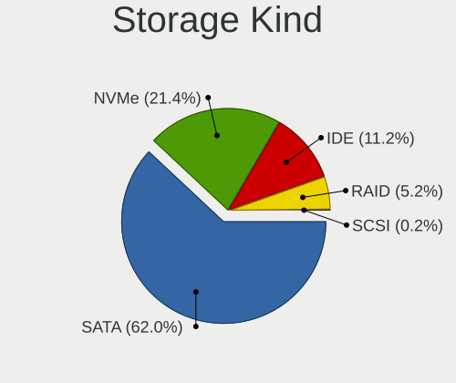

| Kind | Computers | Percent |
|------|-----------|---------|
| SATA | 321       | 61.97%  |
| NVMe | 111       | 21.43%  |
| IDE  | 58        | 11.2%   |
| RAID | 27        | 5.21%   |
| SCSI | 1         | 0.19%   |

Processor
---------

CPU Vendor
----------

Processor vendors

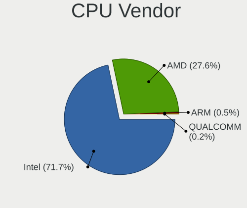

| Vendor   | Computers | Percent |
|----------|-----------|---------|
| Intel    | 309       | 71.69%  |
| AMD      | 119       | 27.61%  |
| ARM      | 2         | 0.46%   |
| QUALCOMM | 1         | 0.23%   |

CPU Model
---------

Processor models

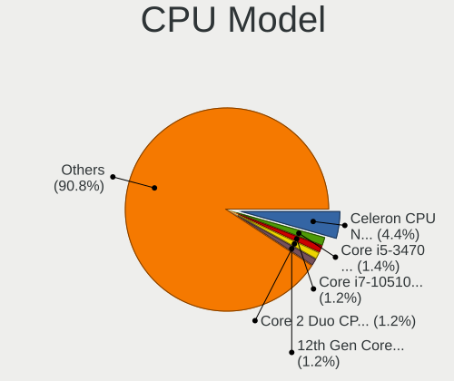

| Model                                   | Computers | Percent |
|-----------------------------------------|-----------|---------|
| Intel Celeron CPU N3350 @ 1.10GHz       | 19        | 4.39%   |
| Intel Core i5-3470 CPU @ 3.20GHz        | 6         | 1.39%   |
| Intel Core i7-10510U CPU @ 1.80GHz      | 5         | 1.15%   |
| Intel Core 2 Duo CPU E7500 @ 2.93GHz    | 5         | 1.15%   |
| Intel 12th Gen Core i7-1255U            | 5         | 1.15%   |
| Intel Core i7-9750H CPU @ 2.60GHz       | 4         | 0.92%   |
| Intel Core i7-8565U CPU @ 1.80GHz       | 4         | 0.92%   |
| Intel Core i7-6700HQ CPU @ 2.60GHz      | 4         | 0.92%   |
| Intel Core i7-4790 CPU @ 3.60GHz        | 4         | 0.92%   |
| Intel Core i7-3770 CPU @ 3.40GHz        | 4         | 0.92%   |
| Intel Core i5-8400 CPU @ 2.80GHz        | 4         | 0.92%   |
| Intel Core i5-7200U CPU @ 2.50GHz       | 4         | 0.92%   |
| Intel Core i3-4170 CPU @ 3.70GHz        | 4         | 0.92%   |
| Intel Celeron CPU N3160 @ 1.60GHz       | 4         | 0.92%   |
| Intel Celeron CPU N3060 @ 1.60GHz       | 4         | 0.92%   |
| Intel Celeron CPU N3050 @ 1.60GHz       | 4         | 0.92%   |
| Intel Core i7-6500U CPU @ 2.50GHz       | 3         | 0.69%   |
| Intel Core i7-10750H CPU @ 2.60GHz      | 3         | 0.69%   |
| Intel Core i7-1065G7 CPU @ 1.30GHz      | 3         | 0.69%   |
| Intel Core i5-8250U CPU @ 1.60GHz       | 3         | 0.69%   |
| Intel Core i5-6300U CPU @ 2.40GHz       | 3         | 0.69%   |
| Intel Core i5-5200U CPU @ 2.20GHz       | 3         | 0.69%   |
| Intel Core i5-2520M CPU @ 2.50GHz       | 3         | 0.69%   |
| Intel Core i5-10400 CPU @ 2.90GHz       | 3         | 0.69%   |
| Intel Core i3-2120 CPU @ 3.30GHz        | 3         | 0.69%   |
| Intel Celeron N4500 @ 1.10GHz           | 3         | 0.69%   |
| Intel Celeron N4020 CPU @ 1.10GHz       | 3         | 0.69%   |
| Intel Celeron N4000 CPU @ 1.10GHz       | 3         | 0.69%   |
| Intel Celeron CPU J3355 @ 2.00GHz       | 3         | 0.69%   |
| Intel Atom x5-Z8350 CPU @ 1.44GHz       | 3         | 0.69%   |
| Intel 11th Gen Core i7-1165G7 @ 2.80GHz | 3         | 0.69%   |
| Intel 11th Gen Core i5-1135G7 @ 2.40GHz | 3         | 0.69%   |
| AMD Ryzen 9 4900HS with Radeon Graphics | 3         | 0.69%   |
| AMD Ryzen 7 7736U with Radeon Graphics  | 3         | 0.69%   |
| AMD Ryzen 5 1600 Six-Core Processor     | 3         | 0.69%   |
| AMD E-300 APU with Radeon HD Graphics   | 3         | 0.69%   |
| Intel Pentium CPU P6200 @ 2.13GHz       | 2         | 0.46%   |
| Intel Pentium CPU N3710 @ 1.60GHz       | 2         | 0.46%   |
| Intel Pentium CPU 2117U @ 1.80GHz       | 2         | 0.46%   |
| Intel Core i7-8750H CPU @ 2.20GHz       | 2         | 0.46%   |

CPU Model Family
----------------

Processor model prefix

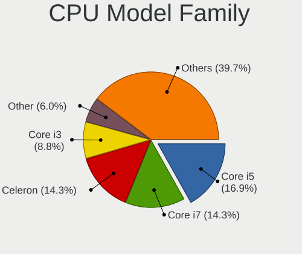

| Model                   | Computers | Percent |
|-------------------------|-----------|---------|
| Intel Core i5           | 73        | 16.86%  |
| Intel Core i7           | 62        | 14.32%  |
| Intel Celeron           | 62        | 14.32%  |
| Intel Core i3           | 38        | 8.78%   |
| Other                   | 26        | 6%      |
| AMD Ryzen 7             | 22        | 5.08%   |
| AMD Ryzen 5             | 22        | 5.08%   |
| Intel Core 2 Duo        | 13        | 3%      |
| Intel Pentium           | 12        | 2.77%   |
| Intel Atom              | 9         | 2.08%   |
| AMD A6                  | 9         | 2.08%   |
| AMD Ryzen 3             | 8         | 1.85%   |
| AMD Ryzen 9             | 6         | 1.39%   |
| AMD Athlon II X2        | 6         | 1.39%   |
| AMD FX                  | 5         | 1.15%   |
| Intel Xeon              | 4         | 0.92%   |
| AMD E                   | 4         | 0.92%   |
| AMD A10                 | 4         | 0.92%   |
| Intel Genuine           | 3         | 0.69%   |
| Intel Core 2 Quad       | 3         | 0.69%   |
| Intel Core              | 3         | 0.69%   |
| AMD Phenom II X6        | 3         | 0.69%   |
| AMD E2                  | 3         | 0.69%   |
| AMD E1                  | 3         | 0.69%   |
| AMD Athlon              | 3         | 0.69%   |
| AMD A8                  | 3         | 0.69%   |
| AMD A4                  | 3         | 0.69%   |
| Intel Core 2            | 2         | 0.46%   |
| AMD Ryzen 5 PRO         | 2         | 0.46%   |
| AMD PRO A10             | 2         | 0.46%   |
| QUALCOMM AArch64        | 1         | 0.23%   |
| Intel Pentium Silver    | 1         | 0.23%   |
| Intel Pentium Dual-Core | 1         | 0.23%   |
| Intel Pentium Dual      | 1         | 0.23%   |
| Intel Pentium 4         | 1         | 0.23%   |
| Intel Core m3           | 1         | 0.23%   |
| Intel Core i9           | 1         | 0.23%   |
| Intel Celeron Dual-Core | 1         | 0.23%   |
| ARM AArch64             | 1         | 0.23%   |
| AMD Ryzen 3 PRO         | 1         | 0.23%   |

CPU Cores
---------

Number of processor cores

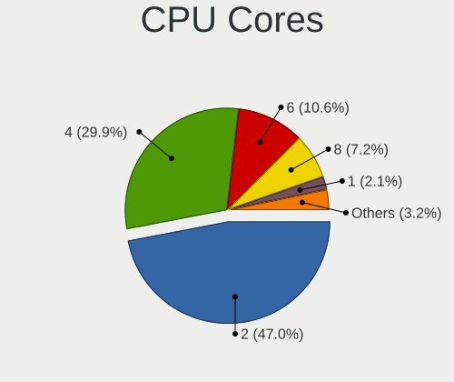

| Number | Computers | Percent |
|--------|-----------|---------|
| 2      | 203       | 46.99%  |
| 4      | 129       | 29.86%  |
| 6      | 46        | 10.65%  |
| 8      | 31        | 7.18%   |
| 1      | 9         | 2.08%   |
| 10     | 6         | 1.39%   |
| 14     | 3         | 0.69%   |
| 12     | 3         | 0.69%   |
| 16     | 2         | 0.46%   |

CPU Sockets
-----------

Number of sockets

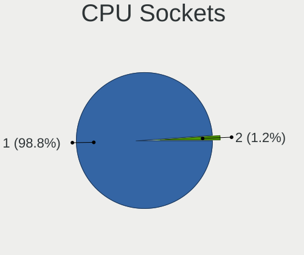

| Number | Computers | Percent |
|--------|-----------|---------|
| 1      | 427       | 98.84%  |
| 2      | 5         | 1.16%   |

CPU Threads
-----------

Threads per core (Hyper-Threading)

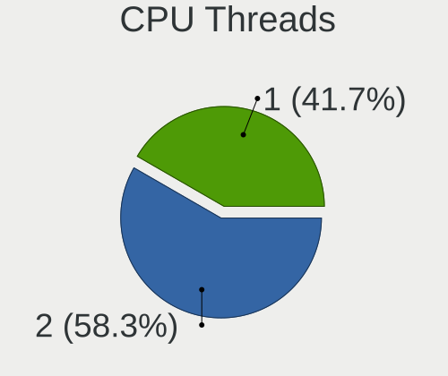

| Number | Computers | Percent |
|--------|-----------|---------|
| 2      | 252       | 58.33%  |
| 1      | 180       | 41.67%  |

CPU Op-Modes
------------

CPU Operation Modes (32-bit, 64-bit)

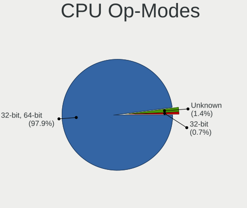

| Op mode        | Computers | Percent |
|----------------|-----------|---------|
| 32-bit, 64-bit | 422       | 97.91%  |
| Unknown        | 6         | 1.39%   |
| 32-bit         | 3         | 0.7%    |

CPU Microcode
-------------

Microcode number

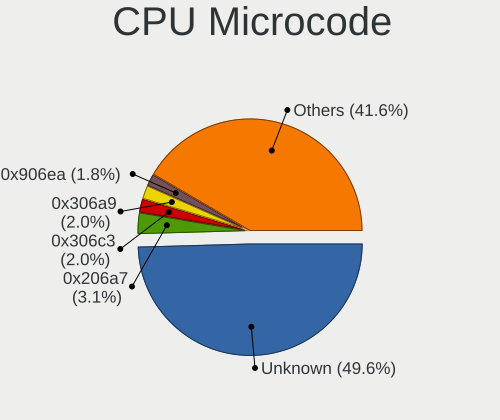

| Number     | Computers | Percent |
|------------|-----------|---------|
| Unknown    | 224       | 49.56%  |
| 0x206a7    | 14        | 3.1%    |
| 0x306c3    | 9         | 1.99%   |
| 0x306a9    | 9         | 1.99%   |
| 0x906ea    | 8         | 1.77%   |
| 0x506c9    | 8         | 1.77%   |
| 0x406c4    | 8         | 1.77%   |
| 0x20655    | 8         | 1.77%   |
| 0x40651    | 7         | 1.55%   |
| 0x1067a    | 7         | 1.55%   |
| 0x08108109 | 7         | 1.55%   |
| 0x806e9    | 6         | 1.33%   |
| 0x806ec    | 5         | 1.11%   |
| 0x406e3    | 5         | 1.11%   |
| 0x406c3    | 5         | 1.11%   |
| 0x306d4    | 5         | 1.11%   |
| 0x806ea    | 4         | 0.88%   |
| 0x6fd      | 4         | 0.88%   |
| 0x506e3    | 4         | 0.88%   |
| 0x30678    | 4         | 0.88%   |
| 0x08701021 | 4         | 0.88%   |
| 0x06006705 | 4         | 0.88%   |
| 0x806c1    | 3         | 0.66%   |
| 0x706e5    | 3         | 0.66%   |
| 0x706a1    | 3         | 0.66%   |
| 0x0a50000d | 3         | 0.66%   |
| 0x0a50000c | 3         | 0.66%   |
| 0x06001119 | 3         | 0.66%   |
| 0x06000852 | 3         | 0.66%   |
| 0xa0655    | 2         | 0.44%   |
| 0xa0653    | 2         | 0.44%   |
| 0x906eb    | 2         | 0.44%   |
| 0x806eb    | 2         | 0.44%   |
| 0x206d7    | 2         | 0.44%   |
| 0x10676    | 2         | 0.44%   |
| 0x08600104 | 2         | 0.44%   |
| 0x0810100b | 2         | 0.44%   |
| 0x0800820d | 2         | 0.44%   |
| 0x08001138 | 2         | 0.44%   |
| 0x07030105 | 2         | 0.44%   |

CPU Microarch
-------------

Microarchitecture

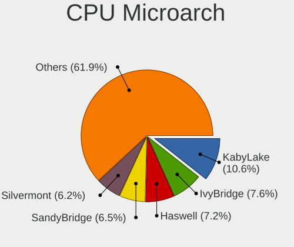

| Name              | Computers | Percent |
|-------------------|-----------|---------|
| KabyLake          | 46        | 10.62%  |
| IvyBridge         | 33        | 7.62%   |
| Haswell           | 31        | 7.16%   |
| SandyBridge       | 28        | 6.47%   |
| Silvermont        | 27        | 6.24%   |
| Unknown           | 24        | 5.54%   |
| Goldmont          | 22        | 5.08%   |
| Skylake           | 20        | 4.62%   |
| Zen 3             | 17        | 3.93%   |
| Zen 2             | 16        | 3.7%    |
| Zen+              | 14        | 3.23%   |
| Penryn            | 13        | 3%      |
| K10               | 12        | 2.77%   |
| Excavator         | 11        | 2.54%   |
| Core              | 11        | 2.54%   |
| Westmere          | 10        | 2.31%   |
| CometLake         | 10        | 2.31%   |
| TigerLake         | 9         | 2.08%   |
| Goldmont plus     | 9         | 2.08%   |
| Zen               | 8         | 1.85%   |
| Piledriver        | 8         | 1.85%   |
| Broadwell         | 8         | 1.85%   |
| IceLake           | 7         | 1.62%   |
| Puma              | 6         | 1.39%   |
| Alderlake Hybrid  | 6         | 1.39%   |
| Bobcat            | 5         | 1.15%   |
| Tremont           | 4         | 0.92%   |
| Steamroller       | 4         | 0.92%   |
| Jaguar            | 4         | 0.92%   |
| Bonnell           | 3         | 0.69%   |
| NetBurst          | 2         | 0.46%   |
| K8 Hammer         | 2         | 0.46%   |
| Nehalem           | 1         | 0.23%   |
| Meteorlake Hybrid | 1         | 0.23%   |
| K10 Llano         | 1         | 0.23%   |

Graphics
--------

GPU Vendor
----------

Vendors of graphics cards

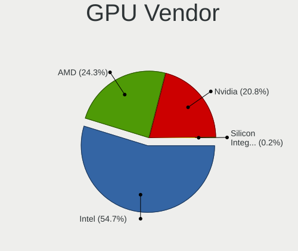

| Vendor                           | Computers | Percent |
|----------------------------------|-----------|---------|
| Intel                            | 266       | 54.73%  |
| AMD                              | 118       | 24.28%  |
| Nvidia                           | 101       | 20.78%  |
| Silicon Integrated Systems [SiS] | 1         | 0.21%   |

GPU Model
---------

Graphics card models

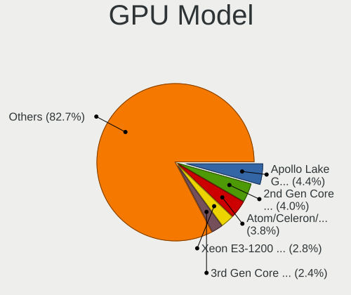

| Model                                                                                    | Computers | Percent |
|------------------------------------------------------------------------------------------|-----------|---------|
| Intel Apollo Lake GT1 [HD Graphics 500]                                                  | 22        | 4.37%   |
| Intel 2nd Generation Core Processor Family Integrated Graphics Controller                | 20        | 3.98%   |
| Intel Atom/Celeron/Pentium Processor x5-E8000/J3xxx/N3xxx Integrated Graphics Controller | 19        | 3.78%   |
| Intel Xeon E3-1200 v2/3rd Gen Core processor Graphics Controller                         | 14        | 2.78%   |
| Intel 3rd Gen Core processor Graphics Controller                                         | 12        | 2.39%   |
| Intel Skylake-U GT2 [HD Graphics 520]                                                    | 10        | 1.99%   |
| Intel Haswell-ULT Integrated Graphics Controller                                         | 10        | 1.99%   |
| AMD Renoir [Radeon Vega Series / Radeon Vega Mobile Series]                              | 10        | 1.99%   |
| AMD Picasso/Raven 2 [Radeon Vega Series / Radeon Vega Mobile Series]                     | 9         | 1.79%   |
| AMD Ellesmere [Radeon RX 470/480/570/570X/580/580X/590]                                  | 9         | 1.79%   |
| Intel Kaby Lake-U GT2 [HD Graphics 620]                                                  | 8         | 1.59%   |
| Intel GeminiLake [UHD Graphics 600]                                                      | 8         | 1.59%   |
| Intel Core Processor Integrated Graphics Controller                                      | 8         | 1.59%   |
| Intel Atom Processor Z36xxx/Z37xxx Series Graphics & Display                             | 8         | 1.59%   |
| AMD Cezanne [Radeon Vega Series / Radeon Vega Mobile Series]                             | 8         | 1.59%   |
| Intel TigerLake-LP GT2 [Iris Xe Graphics]                                                | 7         | 1.39%   |
| Intel CometLake-U GT2 [UHD Graphics]                                                     | 7         | 1.39%   |
| Intel Broadwell-U GT2 [HD Graphics 5500]                                                 | 7         | 1.39%   |
| AMD Stoney [Radeon R2/R3/R4/R5 Graphics]                                                 | 7         | 1.39%   |
| Intel Xeon E3-1200 v3/4th Gen Core Processor Integrated Graphics Controller              | 6         | 1.19%   |
| Intel Skylake-H GT2 [HD Graphics 530]                                                    | 6         | 1.19%   |
| Intel Kaby Lake-R GT2 [UHD Graphics 620]                                                 | 6         | 1.19%   |
| Intel JasperLake [UHD Graphics]                                                          | 6         | 1.19%   |
| Intel CoffeeLake-S GT2 [UHD Graphics 630]                                                | 6         | 1.19%   |
| Nvidia GP107 [GeForce GTX 1050 Ti]                                                       | 5         | 0.99%   |
| Intel WhiskeyLake-U GT2 [UHD Graphics 620]                                               | 5         | 0.99%   |
| Intel CoffeeLake-H GT2 [UHD Graphics 630]                                                | 5         | 0.99%   |
| Intel Alder Lake-UP3 GT2 [Iris Xe Graphics]                                              | 5         | 0.99%   |
| Intel 4th Gen Core Processor Integrated Graphics Controller                              | 5         | 0.99%   |
| Nvidia TU117M [GeForce GTX 1650 Mobile / Max-Q]                                          | 4         | 0.8%    |
| Nvidia GT218 [GeForce 210]                                                               | 4         | 0.8%    |
| Intel Mobile GM965/GL960 Integrated Graphics Controller (secondary)                      | 4         | 0.8%    |
| Intel Mobile GM965/GL960 Integrated Graphics Controller (primary)                        | 4         | 0.8%    |
| Intel Mobile 4 Series Chipset Integrated Graphics Controller                             | 4         | 0.8%    |
| Intel CometLake-S GT2 [UHD Graphics 630]                                                 | 4         | 0.8%    |
| AMD Wrestler [Radeon HD 6310]                                                            | 4         | 0.8%    |
| AMD Wani [Radeon R5/R6/R7 Graphics]                                                      | 4         | 0.8%    |
| AMD Topaz XT [Radeon R7 M260/M265 / M340/M360 / M440/M445 / 530/535 / 620/625 Mobile]    | 4         | 0.8%    |
| AMD Mullins [Radeon R4/R5 Graphics]                                                      | 4         | 0.8%    |
| AMD Kaveri [Radeon R7 Graphics]                                                          | 4         | 0.8%    |

GPU Combo
---------

Combinations of graphics cards

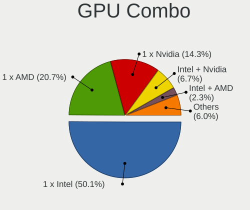

| Name           | Computers | Percent |
|----------------|-----------|---------|
| 1 x Intel      | 218       | 50.11%  |
| 1 x AMD        | 90        | 20.69%  |
| 1 x Nvidia     | 62        | 14.25%  |
| Intel + Nvidia | 29        | 6.67%   |
| Intel + AMD    | 10        | 2.3%    |
| AMD + Nvidia   | 10        | 2.3%    |
| 2 x AMD        | 8         | 1.84%   |
| Other          | 4         | 0.92%   |
| 2 x Intel      | 3         | 0.69%   |
| 1 x SiS        | 1         | 0.23%   |

GPU Driver
----------

Free vs proprietary

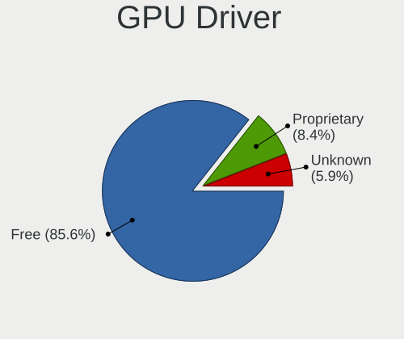

| Driver      | Computers | Percent |
|-------------|-----------|---------|
| Free        | 376       | 85.65%  |
| Proprietary | 37        | 8.43%   |
| Unknown     | 26        | 5.92%   |

GPU Memory
----------

Total video memory

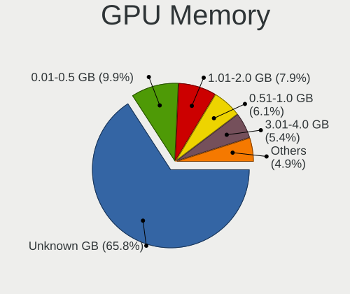

| Size in GB | Computers | Percent |
|------------|-----------|---------|
| Unknown    | 293       | 65.84%  |
| 0.01-0.5   | 44        | 9.89%   |
| 1.01-2.0   | 35        | 7.87%   |
| 0.51-1.0   | 27        | 6.07%   |
| 3.01-4.0   | 24        | 5.39%   |
| 7.01-8.0   | 9         | 2.02%   |
| 5.01-6.0   | 7         | 1.57%   |
| 8.01-16.0  | 4         | 0.9%    |
| 2.01-3.0   | 1         | 0.22%   |
| 16.01-24.0 | 1         | 0.22%   |

Monitor
-------

Monitor Vendor
--------------

Monitor vendors

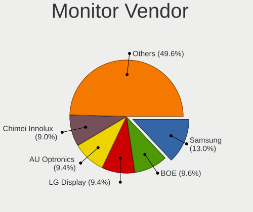

| Vendor                  | Computers | Percent |
|-------------------------|-----------|---------|
| Samsung Electronics     | 58        | 13%     |
| BOE                     | 43        | 9.64%   |
| LG Display              | 42        | 9.42%   |
| AU Optronics            | 42        | 9.42%   |
| Chimei Innolux          | 40        | 8.97%   |
| ViewSonic               | 30        | 6.73%   |
| AOC                     | 24        | 5.38%   |
| Goldstar                | 14        | 3.14%   |
| KTC                     | 13        | 2.91%   |
| Lenovo                  | 10        | 2.24%   |
| Acer                    | 10        | 2.24%   |
| Hewlett-Packard         | 9         | 2.02%   |
| PANDA                   | 8         | 1.79%   |
| KDC                     | 8         | 1.79%   |
| InfoVision              | 8         | 1.79%   |
| Dell                    | 6         | 1.35%   |
| Chi Mei Optoelectronics | 6         | 1.35%   |
| Unknown                 | 5         | 1.12%   |
| Sharp                   | 5         | 1.12%   |
| Philips                 | 5         | 1.12%   |
| Mi                      | 5         | 1.12%   |
| Apple                   | 5         | 1.12%   |
| Toshiba                 | 3         | 0.67%   |
| JRY                     | 3         | 0.67%   |
| Hitachi                 | 3         | 0.67%   |
| BenQ                    | 3         | 0.67%   |
| Ancor Communications    | 3         | 0.67%   |
| Valve                   | 2         | 0.45%   |
| Sony                    | 2         | 0.45%   |
| MYS                     | 2         | 0.45%   |
| LG Philips              | 2         | 0.45%   |
| HSI                     | 2         | 0.45%   |
| HKC                     | 2         | 0.45%   |
| Gigabyte Technology     | 2         | 0.45%   |
| WSD                     | 1         | 0.22%   |
| VIZTA                   | 1         | 0.22%   |
| TXD                     | 1         | 0.22%   |
| TopView                 | 1         | 0.22%   |
| TMX                     | 1         | 0.22%   |
| Sun                     | 1         | 0.22%   |

Monitor Model
-------------

Monitor models

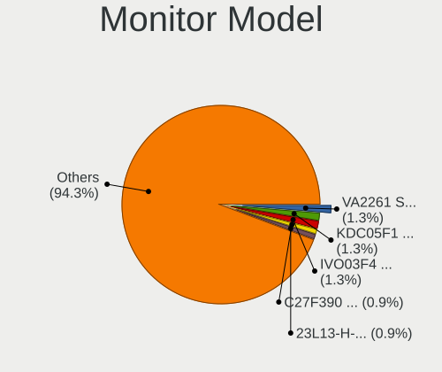

| Model                                                                 | Computers | Percent |
|-----------------------------------------------------------------------|-----------|---------|
| ViewSonic VA2261 Series VSC0F30 1920x1080 477x268mm 21.5-inch         | 6         | 1.31%   |
| KDC LCD Monitor KDC05F1 1366x768 344x193mm 15.5-inch                  | 6         | 1.31%   |
| InfoVision LCD Monitor IVO03F4 1920x1080 309x173mm 13.9-inch          | 6         | 1.31%   |
| Samsung Electronics C27F390 SAM0D32 1920x1080 598x336mm 27.0-inch     | 4         | 0.88%   |
| KTC 23L13-H-AN KTC2302 1920x1080 510x287mm 23.0-inch                  | 4         | 0.88%   |
| BOE LCD Monitor BOE0696 1366x768 309x173mm 13.9-inch                  | 4         | 0.88%   |
| AOC 1950W AOC1950 1366x768 410x230mm 18.5-inch                        | 4         | 0.88%   |
| ViewSonic VA2405-FHD VSCA939 1920x1080 527x296mm 23.8-inch            | 3         | 0.66%   |
| Toshiba ScreenXpert TSB8888 1080x2160                                 | 3         | 0.66%   |
| Samsung Electronics C24F390 SAM0D2C 1920x1080 521x293mm 23.5-inch     | 3         | 0.66%   |
| LG Display LCD Monitor LGD04A7 1920x1080 344x194mm 15.5-inch          | 3         | 0.66%   |
| LG Display LCD Monitor LGD02DC 1366x768 344x194mm 15.5-inch           | 3         | 0.66%   |
| Lenovo LEN-AIO-330-E LEN0017 1440x900 420x270mm 19.7-inch             | 3         | 0.66%   |
| JRY VIZTA JRY2700 1920x1080 598x336mm 27.0-inch                       | 3         | 0.66%   |
| Chimei Innolux LCD Monitor CMN15E6 1366x768 344x193mm 15.5-inch       | 3         | 0.66%   |
| Chimei Innolux LCD Monitor CMN1130 1366x768 256x144mm 11.6-inch       | 3         | 0.66%   |
| AU Optronics LCD Monitor AUOA49A 1920x1200 301x188mm 14.0-inch        | 3         | 0.66%   |
| AU Optronics LCD Monitor AUO22EC 1366x768 344x193mm 15.5-inch         | 3         | 0.66%   |
| Valve ANX7530 U VLV3001 800x1280 100x150mm 7.1-inch                   | 2         | 0.44%   |
| Unknown MS306 0030 1920x1080 708x398mm 32.0-inch                      | 2         | 0.44%   |
| Sharp LQ140M1JW46 SHP14F1 1920x1080 309x174mm 14.0-inch               | 2         | 0.44%   |
| Samsung Electronics SyncMaster SAM02E3 1440x900 367x229mm 17.0-inch   | 2         | 0.44%   |
| Samsung Electronics S24F350 SAM0D20 1920x1080 521x293mm 23.5-inch     | 2         | 0.44%   |
| Samsung Electronics S24D390 SAM0B65 1920x1080 521x293mm 23.5-inch     | 2         | 0.44%   |
| Samsung Electronics S22F350 SAM0D1B 1920x1080 477x268mm 21.5-inch     | 2         | 0.44%   |
| Samsung Electronics S22D300 SAM0B3F 1920x1080 477x268mm 21.5-inch     | 2         | 0.44%   |
| Samsung Electronics LCD Monitor SEC5441 1280x800 331x207mm 15.4-inch  | 2         | 0.44%   |
| Samsung Electronics LCD Monitor SEC4145 1366x768 309x174mm 14.0-inch  | 2         | 0.44%   |
| Samsung Electronics LCD Monitor SDC4651 1366x768 344x194mm 15.5-inch  | 2         | 0.44%   |
| Samsung Electronics LCD Monitor SDC41A0 1920x1200 302x189mm 14.0-inch | 2         | 0.44%   |
| Samsung Electronics LCD Monitor SDC4158 1920x1080 294x165mm 13.3-inch | 2         | 0.44%   |
| Samsung Electronics LCD Monitor SDC4146 1366x768 344x194mm 15.5-inch  | 2         | 0.44%   |
| Philips FTV PHL04C3 1920x1080 1440x810mm 65.0-inch                    | 2         | 0.44%   |
| PANDA LCD Monitor NCP0046 1920x1080 344x194mm 15.5-inch               | 2         | 0.44%   |
| PANDA LCD Monitor NCP0036 1920x1080 344x194mm 15.5-inch               | 2         | 0.44%   |
| MYS MYS1900 MYS1900 1440x900 400x270mm 19.0-inch                      | 2         | 0.44%   |
| LG Display LCD Monitor LGD03ED 1366x768 277x156mm 12.5-inch           | 2         | 0.44%   |
| LG Display LCD Monitor LGD0396 1600x900 382x215mm 17.3-inch           | 2         | 0.44%   |
| Lenovo LEN C32q-20 LEN65F8 2560x1440 698x393mm 31.5-inch              | 2         | 0.44%   |
| KTC W9023S5 KTC1852 1360x768 410x230mm 18.5-inch                      | 2         | 0.44%   |

Monitor Resolution
------------------

Monitor screen resolution

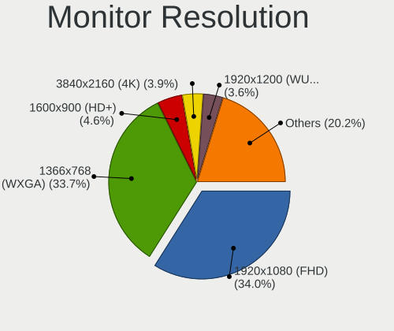

| Resolution         | Computers | Percent |
|--------------------|-----------|---------|
| 1920x1080 (FHD)    | 141       | 33.98%  |
| 1366x768 (WXGA)    | 140       | 33.73%  |
| 1600x900 (HD+)     | 19        | 4.58%   |
| 3840x2160 (4K)     | 16        | 3.86%   |
| 1920x1200 (WUXGA)  | 15        | 3.61%   |
| 1440x900 (WXGA+)   | 15        | 3.61%   |
| 2560x1440 (QHD)    | 10        | 2.41%   |
| 1280x800 (WXGA)    | 7         | 1.69%   |
| 1280x1024 (SXGA)   | 6         | 1.45%   |
| 2560x1600          | 5         | 1.2%    |
| 1360x768           | 5         | 1.2%    |
| Unknown            | 5         | 1.2%    |
| 1680x1050 (WSXGA+) | 4         | 0.96%   |
| 3440x1440          | 3         | 0.72%   |
| 800x1280           | 2         | 0.48%   |
| 2960x900           | 2         | 0.48%   |
| 2288x1287          | 2         | 0.48%   |
| 2160x1440          | 2         | 0.48%   |
| 1920x540           | 2         | 0.48%   |
| 1280x720 (HD)      | 2         | 0.48%   |
| 1024x600           | 2         | 0.48%   |
| 3840x1080          | 1         | 0.24%   |
| 3600x1080          | 1         | 0.24%   |
| 3200x1800 (QHD+)   | 1         | 0.24%   |
| 2944x1080          | 1         | 0.24%   |
| 2880x1800          | 1         | 0.24%   |
| 2736x1824          | 1         | 0.24%   |
| 2560x1080          | 1         | 0.24%   |
| 1680x945           | 1         | 0.24%   |
| 1280x768           | 1         | 0.24%   |
| 1024x768 (XGA)     | 1         | 0.24%   |

Monitor Diagonal
----------------

Diagonal size in inches

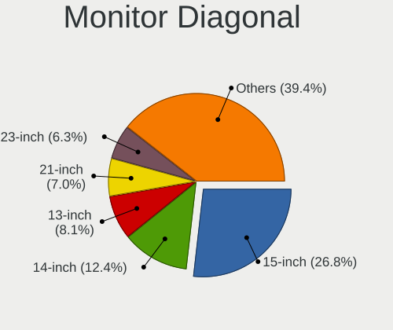

| Inches  | Computers | Percent |
|---------|-----------|---------|
| 15      | 119       | 26.8%   |
| 14      | 55        | 12.39%  |
| 13      | 36        | 8.11%   |
| 21      | 31        | 6.98%   |
| 23      | 28        | 6.31%   |
| 18      | 25        | 5.63%   |
| 24      | 17        | 3.83%   |
| 11      | 17        | 3.83%   |
| 17      | 16        | 3.6%    |
| 19      | 14        | 3.15%   |
| 27      | 13        | 2.93%   |
| Unknown | 10        | 2.25%   |
| 34      | 6         | 1.35%   |
| 31      | 6         | 1.35%   |
| 20      | 6         | 1.35%   |
| 12      | 6         | 1.35%   |
| 40      | 5         | 1.13%   |
| 48      | 4         | 0.9%    |
| 86      | 3         | 0.68%   |
| 32      | 3         | 0.68%   |
| 22      | 3         | 0.68%   |
| 16      | 3         | 0.68%   |
| 84      | 2         | 0.45%   |
| 65      | 2         | 0.45%   |
| 44      | 2         | 0.45%   |
| 10      | 2         | 0.45%   |
| 7       | 2         | 0.45%   |
| 142     | 1         | 0.23%   |
| 57      | 1         | 0.23%   |
| 52      | 1         | 0.23%   |
| 47      | 1         | 0.23%   |
| 46      | 1         | 0.23%   |
| 29      | 1         | 0.23%   |
| 26      | 1         | 0.23%   |
| 8       | 1         | 0.23%   |

Monitor Width
-------------

Physical width

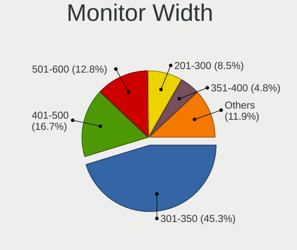

| Width in mm    | Computers | Percent |
|----------------|-----------|---------|
| 301-350        | 198       | 45.31%  |
| 401-500        | 73        | 16.7%   |
| 501-600        | 56        | 12.81%  |
| 201-300        | 37        | 8.47%   |
| 351-400        | 21        | 4.81%   |
| 1001-1500      | 13        | 2.97%   |
| Unknown        | 10        | 2.29%   |
| 701-800        | 8         | 1.83%   |
| 601-700        | 7         | 1.6%    |
| 801-900        | 6         | 1.37%   |
| 1501-2000      | 2         | 0.46%   |
| 901-1000       | 2         | 0.46%   |
| 1-100          | 2         | 0.46%   |
| More than 2000 | 1         | 0.23%   |
| 101-200        | 1         | 0.23%   |

Aspect Ratio
------------

Proportional relationship between the width and the height

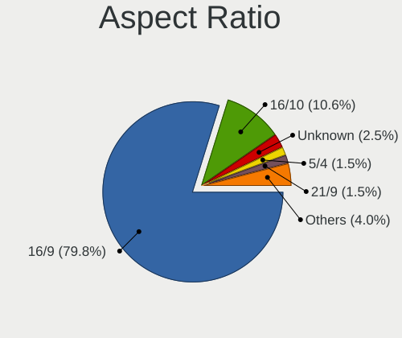

| Ratio   | Computers | Percent |
|---------|-----------|---------|
| 16/9    | 316       | 79.8%   |
| 16/10   | 42        | 10.61%  |
| Unknown | 10        | 2.53%   |
| 5/4     | 6         | 1.52%   |
| 21/9    | 6         | 1.52%   |
| 3/2     | 5         | 1.26%   |
| 0.56    | 3         | 0.76%   |
| 4/3     | 2         | 0.51%   |
| 1.96    | 2         | 0.51%   |
| 0.67    | 2         | 0.51%   |
| 32/9    | 1         | 0.25%   |
| 1.00    | 1         | 0.25%   |

Monitor Area
------------

Area in inch²

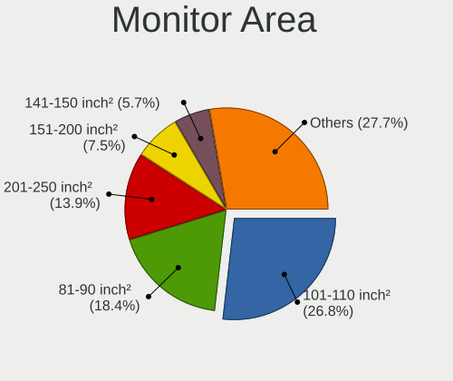

| Area in inch² | Computers | Percent |
|----------------|-----------|---------|
| 101-110        | 118       | 26.82%  |
| 81-90          | 81        | 18.41%  |
| 201-250        | 61        | 13.86%  |
| 151-200        | 33        | 7.5%    |
| 141-150        | 25        | 5.68%   |
| 51-60          | 17        | 3.86%   |
| 351-500        | 15        | 3.41%   |
| 301-350        | 14        | 3.18%   |
| 501-1000       | 12        | 2.73%   |
| More than 1000 | 11        | 2.5%    |
| 71-80          | 11        | 2.5%    |
| 121-130        | 11        | 2.5%    |
| Unknown        | 10        | 2.27%   |
| 251-300        | 6         | 1.36%   |
| 61-70          | 4         | 0.91%   |
| 1-40           | 3         | 0.68%   |
| 131-140        | 3         | 0.68%   |
| 41-50          | 2         | 0.45%   |
| 111-120        | 2         | 0.45%   |
| 91-100         | 1         | 0.23%   |

Pixel Density
-------------

Pixels per inch

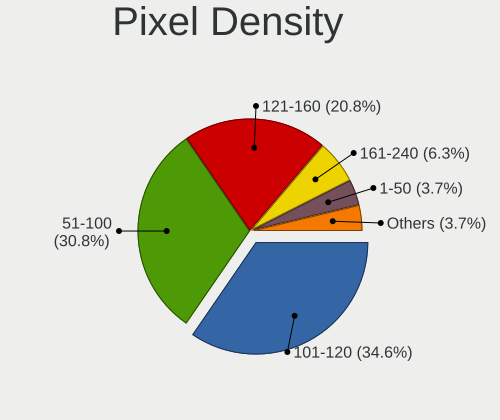

| Density       | Computers | Percent |
|---------------|-----------|---------|
| 101-120       | 148       | 34.58%  |
| 51-100        | 132       | 30.84%  |
| 121-160       | 89        | 20.79%  |
| 161-240       | 27        | 6.31%   |
| 1-50          | 16        | 3.74%   |
| Unknown       | 10        | 2.34%   |
| More than 240 | 6         | 1.4%    |

Multiple Monitors
-----------------

Total monitors connected

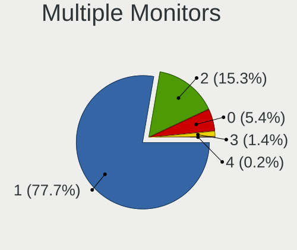

| Total | Computers | Percent |
|-------|-----------|---------|
| 1     | 345       | 77.7%   |
| 2     | 68        | 15.32%  |
| 0     | 24        | 5.41%   |
| 3     | 6         | 1.35%   |
| 4     | 1         | 0.23%   |

Network
-------

Net Controller Vendor
---------------------

Controller vendors

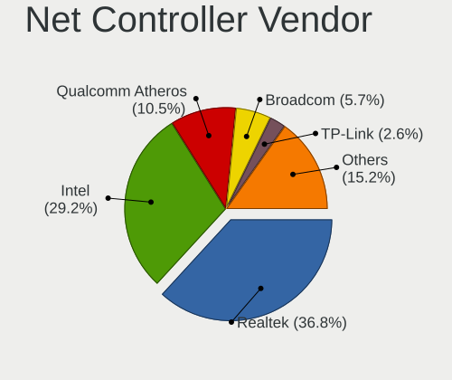

| Vendor                            | Computers | Percent |
|-----------------------------------|-----------|---------|
| Realtek Semiconductor             | 228       | 36.83%  |
| Intel                             | 181       | 29.24%  |
| Qualcomm Atheros                  | 65        | 10.5%   |
| Broadcom                          | 35        | 5.65%   |
| TP-Link                           | 16        | 2.58%   |
| Ralink Technology                 | 15        | 2.42%   |
| MediaTek                          | 14        | 2.26%   |
| Broadcom Limited                  | 9         | 1.45%   |
| Samsung Electronics               | 7         | 1.13%   |
| Ralink                            | 7         | 1.13%   |
| Nvidia                            | 6         | 0.97%   |
| Huawei Technologies               | 5         | 0.81%   |
| Xiaomi                            | 4         | 0.65%   |
| Mercucys                          | 4         | 0.65%   |
| ASIX Electronics                  | 4         | 0.65%   |
| Qualcomm Technologies             | 3         | 0.48%   |
| Qualcomm Atheros Communications   | 2         | 0.32%   |
| Marvell Technology Group          | 2         | 0.32%   |
| VIA Technologies                  | 1         | 0.16%   |
| Texas Instruments                 | 1         | 0.16%   |
| T & A Mobile Phones               | 1         | 0.16%   |
| Sundance Technology Inc / IC Plus | 1         | 0.16%   |
| Silicon Integrated Systems [SiS]  | 1         | 0.16%   |
| Sierra Wireless                   | 1         | 0.16%   |
| Shenzhen Goodix Technology        | 1         | 0.16%   |
| Qualcomm                          | 1         | 0.16%   |
| Motorola PCS                      | 1         | 0.16%   |
| Lenovo                            | 1         | 0.16%   |
| DisplayLink                       | 1         | 0.16%   |
| Belkin Components                 | 1         | 0.16%   |

Net Controller Model
--------------------

Controller models

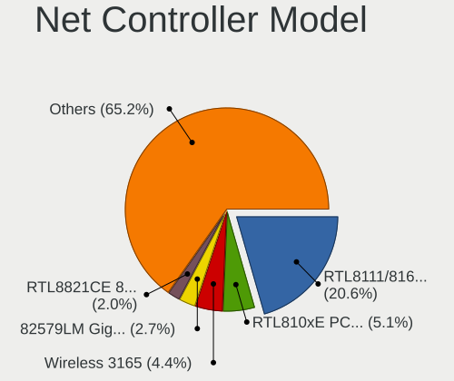

| Model                                                                  | Computers | Percent |
|------------------------------------------------------------------------|-----------|---------|
| Realtek RTL8111/8168/8211/8411 PCI Express Gigabit Ethernet Controller | 145       | 20.57%  |
| Realtek RTL810xE PCI Express Fast Ethernet controller                  | 36        | 5.11%   |
| Intel Wireless 3165                                                    | 31        | 4.4%    |
| Intel 82579LM Gigabit Network Connection (Lewisville)                  | 19        | 2.7%    |
| Realtek RTL8821CE 802.11ac PCIe Wireless Network Adapter               | 14        | 1.99%   |
| Intel Wi-Fi 6 AX200                                                    | 14        | 1.99%   |
| Realtek RTL8188EUS 802.11n Wireless Network Adapter                    | 12        | 1.7%    |
| Qualcomm Atheros QCA9377 802.11ac Wireless Network Adapter             | 12        | 1.7%    |
| Intel Wireless 7265                                                    | 12        | 1.7%    |
| Broadcom BCM43142 802.11b/g/n                                          | 10        | 1.42%   |
| Qualcomm Atheros QCA9565 / AR9565 Wireless Network Adapter             | 9         | 1.28%   |
| Realtek RTL8822CE 802.11ac PCIe Wireless Network Adapter               | 8         | 1.13%   |
| Ralink MT7601U Wireless Adapter                                        | 8         | 1.13%   |
| Qualcomm Atheros AR9485 Wireless Network Adapter                       | 8         | 1.13%   |
| Intel Wireless 8260                                                    | 8         | 1.13%   |
| Intel Wireless 7260                                                    | 8         | 1.13%   |
| Broadcom BCM4313 802.11bgn Wireless Network Adapter                    | 8         | 1.13%   |
| Realtek RTL8188EE Wireless Network Adapter                             | 7         | 0.99%   |
| MediaTek MT7921 802.11ax PCIe Wireless Network Adapter [Filogic 330]   | 7         | 0.99%   |
| Intel Comet Lake PCH-LP CNVi WiFi                                      | 7         | 0.99%   |
| TP-Link 802.11ac NIC                                                   | 6         | 0.85%   |
| Realtek RTL8723DE Wireless Network Adapter                             | 6         | 0.85%   |
| Realtek RTL8125 2.5GbE Controller                                      | 6         | 0.85%   |
| Nvidia MCP61 Ethernet                                                  | 6         | 0.85%   |
| Intel Wi-Fi 6 AX201                                                    | 6         | 0.85%   |
| Intel Alder Lake-P PCH CNVi WiFi                                       | 6         | 0.85%   |
| Realtek RTL8822BE 802.11a/b/g/n/ac WiFi adapter                        | 5         | 0.71%   |
| Intel Ethernet Connection (7) I219-V                                   | 5         | 0.71%   |
| Xiaomi Mi/Redmi series (RNDIS)                                         | 4         | 0.57%   |
| Samsung Galaxy series, misc. (tethering mode)                          | 4         | 0.57%   |
| Realtek RTL8723BE PCIe Wireless Network Adapter                        | 4         | 0.57%   |
| Realtek RTL8192EU 802.11b/g/n WLAN Adapter                             | 4         | 0.57%   |
| Realtek RTL8153 Gigabit Ethernet Adapter                               | 4         | 0.57%   |
| Qualcomm Atheros QCA6174 802.11ac Wireless Network Adapter             | 4         | 0.57%   |
| Qualcomm Atheros Killer E2500 Gigabit Ethernet Controller              | 4         | 0.57%   |
| Mercucys 802.11n NIC                                                   | 4         | 0.57%   |
| Intel Wireless 8265 / 8275                                             | 4         | 0.57%   |
| Intel Ethernet Connection (2) I219-V                                   | 4         | 0.57%   |
| Intel Dual Band Wireless-AC 3165 Plus Bluetooth                        | 4         | 0.57%   |
| Huawei E353/E3131                                                      | 4         | 0.57%   |

Wireless Vendor
---------------

Wireless vendors

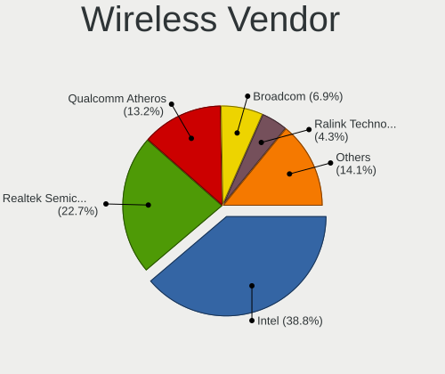

| Vendor                          | Computers | Percent |
|---------------------------------|-----------|---------|
| Intel                           | 135       | 38.79%  |
| Realtek Semiconductor           | 79        | 22.7%   |
| Qualcomm Atheros                | 46        | 13.22%  |
| Broadcom                        | 24        | 6.9%    |
| Ralink Technology               | 15        | 4.31%   |
| TP-Link                         | 14        | 4.02%   |
| MediaTek                        | 12        | 3.45%   |
| Ralink                          | 7         | 2.01%   |
| Mercucys                        | 4         | 1.15%   |
| Broadcom Limited                | 4         | 1.15%   |
| Qualcomm Technologies           | 3         | 0.86%   |
| Qualcomm Atheros Communications | 2         | 0.57%   |
| Sierra Wireless                 | 1         | 0.29%   |
| Marvell Technology Group        | 1         | 0.29%   |
| Belkin Components               | 1         | 0.29%   |

Wireless Model
--------------

Wireless models

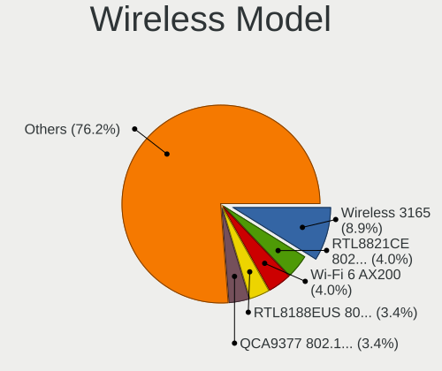

| Model                                                                   | Computers | Percent |
|-------------------------------------------------------------------------|-----------|---------|
| Intel Wireless 3165                                                     | 31        | 8.88%   |
| Realtek RTL8821CE 802.11ac PCIe Wireless Network Adapter                | 14        | 4.01%   |
| Intel Wi-Fi 6 AX200                                                     | 14        | 4.01%   |
| Realtek RTL8188EUS 802.11n Wireless Network Adapter                     | 12        | 3.44%   |
| Qualcomm Atheros QCA9377 802.11ac Wireless Network Adapter              | 12        | 3.44%   |
| Intel Wireless 7265                                                     | 12        | 3.44%   |
| Broadcom BCM43142 802.11b/g/n                                           | 10        | 2.87%   |
| Qualcomm Atheros QCA9565 / AR9565 Wireless Network Adapter              | 9         | 2.58%   |
| Realtek RTL8822CE 802.11ac PCIe Wireless Network Adapter                | 8         | 2.29%   |
| Ralink MT7601U Wireless Adapter                                         | 8         | 2.29%   |
| Qualcomm Atheros AR9485 Wireless Network Adapter                        | 8         | 2.29%   |
| Intel Wireless 8260                                                     | 8         | 2.29%   |
| Intel Wireless 7260                                                     | 8         | 2.29%   |
| Broadcom BCM4313 802.11bgn Wireless Network Adapter                     | 8         | 2.29%   |
| Realtek RTL8188EE Wireless Network Adapter                              | 7         | 2.01%   |
| MediaTek MT7921 802.11ax PCIe Wireless Network Adapter [Filogic 330]    | 7         | 2.01%   |
| Intel Comet Lake PCH-LP CNVi WiFi                                       | 7         | 2.01%   |
| TP-Link 802.11ac NIC                                                    | 6         | 1.72%   |
| Realtek RTL8723DE Wireless Network Adapter                              | 6         | 1.72%   |
| Intel Wi-Fi 6 AX201                                                     | 6         | 1.72%   |
| Realtek RTL8822BE 802.11a/b/g/n/ac WiFi adapter                         | 5         | 1.43%   |
| Realtek RTL8723BE PCIe Wireless Network Adapter                         | 4         | 1.15%   |
| Realtek RTL8192EU 802.11b/g/n WLAN Adapter                              | 4         | 1.15%   |
| Qualcomm Atheros QCA6174 802.11ac Wireless Network Adapter              | 4         | 1.15%   |
| Mercucys 802.11n NIC                                                    | 4         | 1.15%   |
| Intel Wireless 8265 / 8275                                              | 4         | 1.15%   |
| Intel Dual Band Wireless-AC 3165 Plus Bluetooth                         | 4         | 1.15%   |
| Intel Alder Lake-P PCH CNVi WiFi                                        | 4         | 1.15%   |
| TP-Link TL-WN823N v2/v3 [Realtek RTL8192EU]                             | 3         | 0.86%   |
| TP-Link AC600 wireless Realtek RTL8811AU [Archer T2U Nano]              | 3         | 0.86%   |
| Realtek RTL8188CE 802.11b/g/n WiFi Adapter                              | 3         | 0.86%   |
| Realtek 802.11ac NIC                                                    | 3         | 0.86%   |
| Ralink RT2870/RT3070 Wireless Adapter                                   | 3         | 0.86%   |
| Ralink RT3290 Wireless 802.11n 1T/1R PCIe                               | 3         | 0.86%   |
| Qualcomm QCNFA765 Wireless Network Adapter                              | 3         | 0.86%   |
| Qualcomm Atheros AR9287 Wireless Network Adapter (PCI-Express)          | 3         | 0.86%   |
| Qualcomm Atheros AR9285 Wireless Network Adapter (PCI-Express)          | 3         | 0.86%   |
| Qualcomm Atheros AR242x / AR542x Wireless Network Adapter (PCI-Express) | 3         | 0.86%   |
| MediaTek MT7902 802.11ax PCIe Wireless Network Adapter [Filogic 310]    | 3         | 0.86%   |
| Intel Wireless 3160                                                     | 3         | 0.86%   |

Ethernet Vendor
---------------

Ethernet vendors

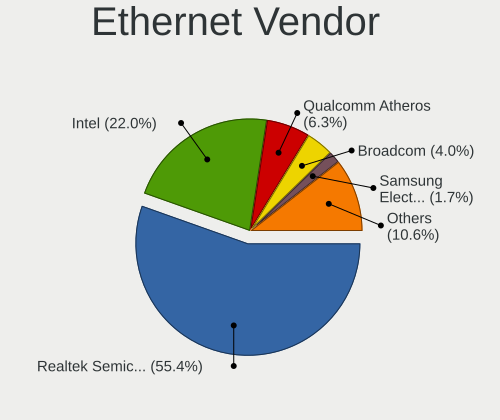

| Vendor                            | Computers | Percent |
|-----------------------------------|-----------|---------|
| Realtek Semiconductor             | 194       | 55.43%  |
| Intel                             | 77        | 22%     |
| Qualcomm Atheros                  | 22        | 6.29%   |
| Broadcom                          | 14        | 4%      |
| Samsung Electronics               | 6         | 1.71%   |
| Nvidia                            | 6         | 1.71%   |
| Huawei Technologies               | 5         | 1.43%   |
| Broadcom Limited                  | 5         | 1.43%   |
| Xiaomi                            | 4         | 1.14%   |
| ASIX Electronics                  | 4         | 1.14%   |
| TP-Link                           | 2         | 0.57%   |
| MediaTek                          | 2         | 0.57%   |
| VIA Technologies                  | 1         | 0.29%   |
| T & A Mobile Phones               | 1         | 0.29%   |
| Sundance Technology Inc / IC Plus | 1         | 0.29%   |
| Silicon Integrated Systems [SiS]  | 1         | 0.29%   |
| Qualcomm                          | 1         | 0.29%   |
| Motorola PCS                      | 1         | 0.29%   |
| Marvell Technology Group          | 1         | 0.29%   |
| Lenovo                            | 1         | 0.29%   |
| DisplayLink                       | 1         | 0.29%   |

Ethernet Model
--------------

Ethernet models

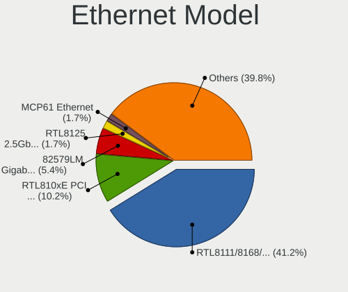

| Model                                                                  | Computers | Percent |
|------------------------------------------------------------------------|-----------|---------|
| Realtek RTL8111/8168/8211/8411 PCI Express Gigabit Ethernet Controller | 145       | 41.19%  |
| Realtek RTL810xE PCI Express Fast Ethernet controller                  | 36        | 10.23%  |
| Intel 82579LM Gigabit Network Connection (Lewisville)                  | 19        | 5.4%    |
| Realtek RTL8125 2.5GbE Controller                                      | 6         | 1.7%    |
| Nvidia MCP61 Ethernet                                                  | 6         | 1.7%    |
| Intel Ethernet Connection (7) I219-V                                   | 5         | 1.42%   |
| Xiaomi Mi/Redmi series (RNDIS)                                         | 4         | 1.14%   |
| Samsung Galaxy series, misc. (tethering mode)                          | 4         | 1.14%   |
| Realtek RTL8153 Gigabit Ethernet Adapter                               | 4         | 1.14%   |
| Qualcomm Atheros Killer E2500 Gigabit Ethernet Controller              | 4         | 1.14%   |
| Intel Ethernet Connection (2) I219-V                                   | 4         | 1.14%   |
| Huawei E353/E3131                                                      | 4         | 1.14%   |
| Broadcom NetLink BCM57780 Gigabit Ethernet PCIe                        | 4         | 1.14%   |
| Qualcomm Atheros Killer E220x Gigabit Ethernet Controller              | 3         | 0.85%   |
| Qualcomm Atheros AR8162 Fast Ethernet                                  | 3         | 0.85%   |
| Qualcomm Atheros AR8161 Gigabit Ethernet                               | 3         | 0.85%   |
| Qualcomm Atheros AR8152 v2.0 Fast Ethernet                             | 3         | 0.85%   |
| Intel I211 Gigabit Network Connection                                  | 3         | 0.85%   |
| Intel Ethernet Controller I225-V                                       | 3         | 0.85%   |
| Intel Ethernet Connection I219-LM                                      | 3         | 0.85%   |
| Intel Ethernet Connection I218-LM                                      | 3         | 0.85%   |
| Intel Ethernet Connection I217-LM                                      | 3         | 0.85%   |
| ASIX AX88179 Gigabit Ethernet                                          | 3         | 0.85%   |
| TP-Link UE300 10/100/1000 LAN (ethernet mode) [Realtek RTL8153]        | 2         | 0.57%   |
| Samsung GT-I9070 (network tethering, USB debugging enabled)            | 2         | 0.57%   |
| Qualcomm Atheros QCA8172 Fast Ethernet                                 | 2         | 0.57%   |
| Qualcomm Atheros Killer E2400 Gigabit Ethernet Controller              | 2         | 0.57%   |
| Intel PRO/100 VE Network Connection                                    | 2         | 0.57%   |
| Intel Ethernet Connection I217-V                                       | 2         | 0.57%   |
| Intel Ethernet Connection (6) I219-V                                   | 2         | 0.57%   |
| Intel Ethernet Connection (4) I219-V                                   | 2         | 0.57%   |
| Intel Ethernet Connection (3) I218-LM                                  | 2         | 0.57%   |
| Intel Ethernet Connection (2) I219-LM                                  | 2         | 0.57%   |
| Intel Ethernet Connection (13) I219-V                                  | 2         | 0.57%   |
| Intel Alder Lake-P PCH CNVi WiFi                                       | 2         | 0.57%   |
| Intel 82579V Gigabit Network Connection                                | 2         | 0.57%   |
| Intel 82578DM Gigabit Network Connection                               | 2         | 0.57%   |
| Intel 82557/8/9/0/1 Ethernet Pro 100                                   | 2         | 0.57%   |
| Broadcom NetXtreme BCM57765 Gigabit Ethernet PCIe                      | 2         | 0.57%   |
| Broadcom NetLink BCM5906M Fast Ethernet PCI Express                    | 2         | 0.57%   |

Net Controller Kind
-------------------

Ethernet, WiFi or modem

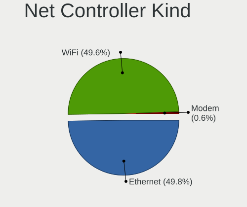

| Kind     | Computers | Percent |
|----------|-----------|---------|
| Ethernet | 326       | 49.77%  |
| WiFi     | 325       | 49.62%  |
| Modem    | 4         | 0.61%   |

Used Controller
---------------

Currently used network controller

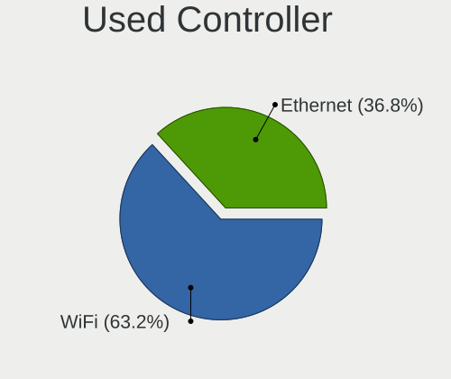

| Kind     | Computers | Percent |
|----------|-----------|---------|
| WiFi     | 271       | 63.17%  |
| Ethernet | 158       | 36.83%  |

NICs
----

Total network controllers on board

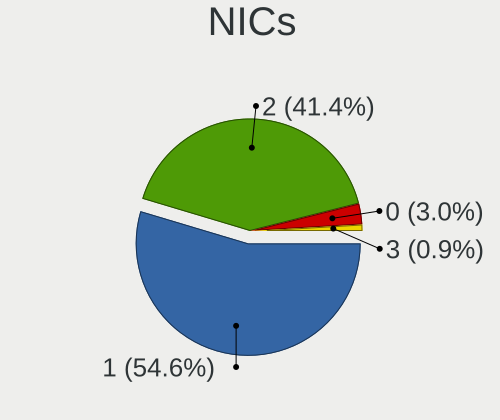

| Total | Computers | Percent |
|-------|-----------|---------|
| 1     | 236       | 54.63%  |
| 2     | 179       | 41.44%  |
| 0     | 13        | 3.01%   |
| 3     | 4         | 0.93%   |

IPv6
----

IPv6 vs IPv4

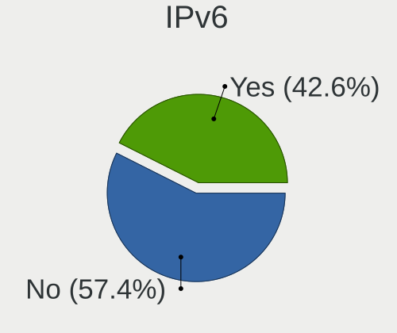

| Used | Computers | Percent |
|------|-----------|---------|
| No   | 255       | 57.43%  |
| Yes  | 189       | 42.57%  |

Bluetooth
---------

Bluetooth Vendor
----------------

Controller vendors

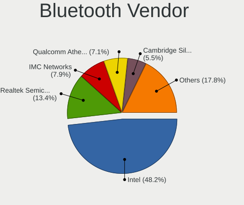

| Vendor                          | Computers | Percent |
|---------------------------------|-----------|---------|
| Intel                           | 122       | 48.22%  |
| Realtek Semiconductor           | 34        | 13.44%  |
| IMC Networks                    | 20        | 7.91%   |
| Qualcomm Atheros Communications | 18        | 7.11%   |
| Cambridge Silicon Radio         | 14        | 5.53%   |
| Toshiba                         | 8         | 3.16%   |
| Foxconn / Hon Hai               | 7         | 2.77%   |
| Broadcom                        | 6         | 2.37%   |
| Lite-On Technology              | 5         | 1.98%   |
| Apple                           | 5         | 1.98%   |
| USI                             | 3         | 1.19%   |
| TP-Link                         | 3         | 1.19%   |
| Ralink                          | 3         | 1.19%   |
| Ralink Technology               | 2         | 0.79%   |
| Foxconn International           | 1         | 0.4%    |
| ASUSTek Computer                | 1         | 0.4%    |
| Alps Electric                   | 1         | 0.4%    |

Bluetooth Model
---------------

Controller models

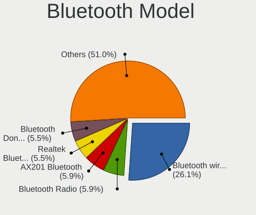

| Model                                               | Computers | Percent |
|-----------------------------------------------------|-----------|---------|
| Intel Bluetooth wireless interface                  | 66        | 26.09%  |
| Realtek Bluetooth Radio                             | 15        | 5.93%   |
| Intel AX201 Bluetooth                               | 15        | 5.93%   |
| Realtek  Bluetooth 4.2 Adapter                      | 14        | 5.53%   |
| Cambridge Silicon Radio Bluetooth Dongle (HCI mode) | 14        | 5.53%   |
| Intel AX200 Bluetooth                               | 13        | 5.14%   |
| Qualcomm Atheros  Bluetooth Device                  | 12        | 4.74%   |
| Intel Bluetooth 9460/9560 Jefferson Peak (JfP)      | 12        | 4.74%   |
| IMC Networks Wireless_Device                        | 8         | 3.16%   |
| IMC Networks Bluetooth Radio                        | 8         | 3.16%   |
| Intel Bluetooth Device                              | 7         | 2.77%   |
| Toshiba BCM43142A0                                  | 4         | 1.58%   |
| Apple Bluetooth USB Host Controller                 | 4         | 1.58%   |
| USI Bluetooth Device                                | 3         | 1.19%   |
| TP-Link TP-T@- UB500 Adapter                        | 3         | 1.19%   |
| Toshiba Bluetooth Device                            | 3         | 1.19%   |
| Ralink RT3290 Bluetooth                             | 3         | 1.19%   |
| Qualcomm Atheros AR3012 Bluetooth 4.0               | 3         | 1.19%   |
| Intel Centrino Bluetooth Wireless Transceiver       | 3         | 1.19%   |
| Realtek RTL8822BE Bluetooth 4.2 Adapter             | 2         | 0.79%   |
| Realtek 802.11ac WLAN Adapter                       | 2         | 0.79%   |
| Qualcomm Atheros QCA61x4 Bluetooth 4.0              | 2         | 0.79%   |
| Lite-On Bluetooth Device                            | 2         | 0.79%   |
| Lite-On Atheros AR3012 Bluetooth                    | 2         | 0.79%   |
| Intel Wireless-AC 3168 Bluetooth                    | 2         | 0.79%   |
| Intel Centrino Advanced-N 6230 Bluetooth adapter    | 2         | 0.79%   |
| Intel AX210 Bluetooth                               | 2         | 0.79%   |
| Foxconn / Hon Hai MediaTek Bluetooth Adapter        | 2         | 0.79%   |
| Foxconn / Hon Hai Bluetooth Device                  | 2         | 0.79%   |
| Broadcom BCM43142A0 Bluetooth 4.0                   | 2         | 0.79%   |
| Toshiba Bluetooth Radio                             | 1         | 0.4%    |
| Realtek RTL8723B Bluetooth                          | 1         | 0.4%    |
| Ralink Motorola BC4 Bluetooth 3.0+HS Adapter        | 1         | 0.4%    |
| Ralink CSR BS8510                                   | 1         | 0.4%    |
| Qualcomm Atheros AR3011 Bluetooth                   | 1         | 0.4%    |
| Lite-On Qualcomm Atheros QCA9377 Bluetooth          | 1         | 0.4%    |
| IMC Networks Bluetooth Device                       | 1         | 0.4%    |
| IMC Networks Bluetooth                              | 1         | 0.4%    |
| IMC Networks Atheros AR3012 Bluetooth 4.0 Adapter   | 1         | 0.4%    |
| IMC Networks Atheros AR3012 Bluetooth               | 1         | 0.4%    |

Sound
-----

Sound Vendor
------------

Sound card vendors

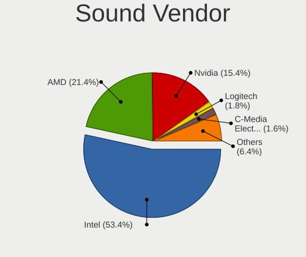

| Vendor                                       | Computers | Percent |
|----------------------------------------------|-----------|---------|
| Intel                                        | 299       | 53.39%  |
| AMD                                          | 120       | 21.43%  |
| Nvidia                                       | 86        | 15.36%  |
| Logitech                                     | 10        | 1.79%   |
| C-Media Electronics                          | 9         | 1.61%   |
| Generalplus Technology                       | 4         | 0.71%   |
| Texas Instruments                            | 3         | 0.54%   |
| Razer USA                                    | 3         | 0.54%   |
| Kingston Technology                          | 3         | 0.54%   |
| VIA Technologies                             | 2         | 0.36%   |
| Samson Technologies                          | 2         | 0.36%   |
| Focusrite-Novation                           | 2         | 0.36%   |
| Creative Labs                                | 2         | 0.36%   |
| Zoran Co. Personal Media Division (Nogatech) | 1         | 0.18%   |
| Thesycon Systemsoftware & Consulting         | 1         | 0.18%   |
| Tenx Technology                              | 1         | 0.18%   |
| SteelSeries ApS                              | 1         | 0.18%   |
| Sony                                         | 1         | 0.18%   |
| Silicon Integrated Systems [SiS]             | 1         | 0.18%   |
| Rockwell International                       | 1         | 0.18%   |
| KTMicro                                      | 1         | 0.18%   |
| JMTek                                        | 1         | 0.18%   |
| GN Netcom                                    | 1         | 0.18%   |
| Elgato Systems                               | 1         | 0.18%   |
| Edifier Technology                           | 1         | 0.18%   |
| DSEA A/S                                     | 1         | 0.18%   |
| Creative Technology                          | 1         | 0.18%   |
| ASUSTek Computer                             | 1         | 0.18%   |

Sound Model
-----------

Sound card models

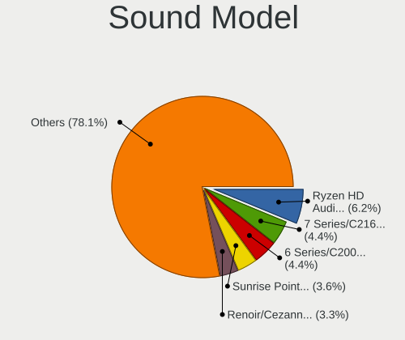

| Model                                                                                             | Computers | Percent |
|---------------------------------------------------------------------------------------------------|-----------|---------|
| AMD Ryzen HD Audio Controller                                                                     | 43        | 6.24%   |
| Intel 7 Series/C216 Chipset Family High Definition Audio Controller                               | 30        | 4.35%   |
| Intel 6 Series/C200 Series Chipset Family High Definition Audio Controller                        | 30        | 4.35%   |
| Intel Sunrise Point-LP HD Audio                                                                   | 25        | 3.63%   |
| AMD Renoir/Cezanne HDMI/DP Audio Controller                                                       | 23        | 3.34%   |
| Intel Celeron N3350/Pentium N4200/Atom E3900 Series Audio Cluster                                 | 22        | 3.19%   |
| AMD FCH Azalia Controller                                                                         | 22        | 3.19%   |
| Intel 8 Series/C220 Series Chipset High Definition Audio Controller                               | 18        | 2.61%   |
| Intel Atom/Celeron/Pentium Processor x5-E8000/J3xxx/N3xxx Series High Definition Audio Controller | 15        | 2.18%   |
| Intel Xeon E3-1200 v3/4th Gen Core Processor HD Audio Controller                                  | 14        | 2.03%   |
| AMD SBx00 Azalia (Intel HDA)                                                                      | 14        | 2.03%   |
| AMD Kabini HDMI/DP Audio                                                                          | 14        | 2.03%   |
| Intel Cannon Lake PCH cAVS                                                                        | 13        | 1.89%   |
| Intel NM10/ICH7 Family High Definition Audio Controller                                           | 12        | 1.74%   |
| Intel 5 Series/3400 Series Chipset High Definition Audio                                          | 11        | 1.6%    |
| AMD Family 15h (Models 60h-6fh) Audio Controller                                                  | 11        | 1.6%    |
| Nvidia GF108 High Definition Audio Controller                                                     | 10        | 1.45%   |
| Intel Haswell-ULT HD Audio Controller                                                             | 10        | 1.45%   |
| Intel 8 Series HD Audio Controller                                                                | 10        | 1.45%   |
| Intel 100 Series/C230 Series Chipset Family HD Audio Controller                                   | 10        | 1.45%   |
| AMD Raven/Raven2/Fenghuang HDMI/DP Audio Controller                                               | 10        | 1.45%   |
| Intel Tiger Lake-LP Smart Sound Technology Audio Controller                                       | 9         | 1.31%   |
| Intel Celeron/Pentium Silver Processor High Definition Audio                                      | 9         | 1.31%   |
| Intel Alder Lake PCH-P High Definition Audio Controller                                           | 9         | 1.31%   |
| AMD Radeon High Definition Audio Controller                                                       | 9         | 1.31%   |
| AMD Ellesmere HDMI Audio [Radeon RX 470/480 / 570/580/590]                                        | 9         | 1.31%   |
| Nvidia GP107GL High Definition Audio Controller                                                   | 8         | 1.16%   |
| Intel Wildcat Point-LP High Definition Audio Controller                                           | 8         | 1.16%   |
| Intel Broadwell-U Audio Controller                                                                | 8         | 1.16%   |
| AMD Starship/Matisse HD Audio Controller                                                          | 8         | 1.16%   |
| AMD Family 17h (Models 00h-0fh) HD Audio Controller                                               | 8         | 1.16%   |
| Nvidia TU106 High Definition Audio Controller                                                     | 7         | 1.02%   |
| Nvidia High Definition Audio Controller                                                           | 7         | 1.02%   |
| Intel Ice Lake-LP Smart Sound Technology Audio Controller                                         | 7         | 1.02%   |
| Intel Comet Lake PCH-LP cAVS                                                                      | 7         | 1.02%   |
| AMD High Definition Audio Controller                                                              | 7         | 1.02%   |
| Nvidia MCP61 High Definition Audio                                                                | 6         | 0.87%   |
| Nvidia GM107 High Definition Audio Controller [GeForce 940MX]                                     | 6         | 0.87%   |
| Nvidia GK208 HDMI/DP Audio Controller                                                             | 6         | 0.87%   |
| Intel Jasper Lake HD Audio                                                                        | 6         | 0.87%   |

Memory
------

Memory Vendor
-------------

Memory module vendors

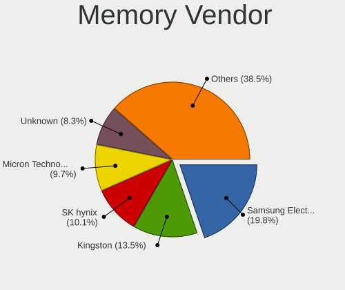

| Vendor                       | Computers | Percent |
|------------------------------|-----------|---------|
| Samsung Electronics          | 57        | 19.79%  |
| Kingston                     | 39        | 13.54%  |
| SK hynix                     | 29        | 10.07%  |
| Micron Technology            | 28        | 9.72%   |
| Unknown                      | 24        | 8.33%   |
| Crucial                      | 22        | 7.64%   |
| Ramaxel Technology           | 13        | 4.51%   |
| A-DATA Technology            | 10        | 3.47%   |
| Goldkey                      | 8         | 2.78%   |
| Elpida                       | 8         | 2.78%   |
| Team                         | 7         | 2.43%   |
| Nanya Technology             | 6         | 2.08%   |
| Hikvision                    | 6         | 2.08%   |
| Corsair                      | 4         | 1.39%   |
| Unknown (89F7)               | 3         | 1.04%   |
| Patriot                      | 3         | 1.04%   |
| Unknown                      | 3         | 1.04%   |
| Unknown (2C0B)               | 2         | 0.69%   |
| Avant                        | 2         | 0.69%   |
| Wodposit                     | 1         | 0.35%   |
| Unknown (ABCD)               | 1         | 0.35%   |
| Unknown (8AD6)               | 1         | 0.35%   |
| Unknown (0x8A02)             | 1         | 0.35%   |
| Unknown (0x5846)             | 1         | 0.35%   |
| Smart                        | 1         | 0.35%   |
| Patriot Memory (PDP Systems) | 1         | 0.35%   |
| Netac                        | 1         | 0.35%   |
| Mushkin                      | 1         | 0.35%   |
| KLEVV                        | 1         | 0.35%   |
| Infineon                     | 1         | 0.35%   |
| GeIL                         | 1         | 0.35%   |
| ff                           | 1         | 0.35%   |
| 4ea5                         | 1         | 0.35%   |

Memory Model
------------

Memory module models

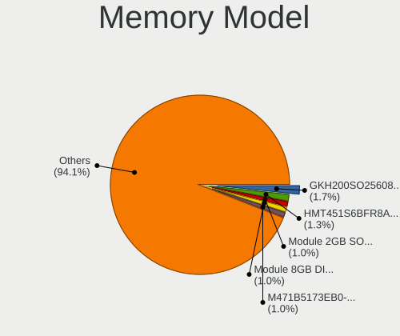

| Model                                                         | Computers | Percent |
|---------------------------------------------------------------|-----------|---------|
| Goldkey RAM GKH200SO25608-1600 2GB SODIMM DDR3 1600MT/s       | 5         | 1.65%   |
| SK hynix RAM HMT451S6BFR8A-PB 4GB SODIMM DDR3 1600MT/s        | 4         | 1.32%   |
| Unknown RAM Module 2GB SODIMM DDR3 1333MT/s                   | 3         | 0.99%   |
| Unknown (89F7) RAM Module 8GB DIMM DDR3 1600MT/s              | 3         | 0.99%   |
| Samsung RAM M471B5173EB0-YK0 4GB SODIMM DDR3 1600MT/s         | 3         | 0.99%   |
| Samsung RAM M471A5244CB0-CTD 4GB SODIMM DDR4 3266MT/s         | 3         | 0.99%   |
| Samsung RAM K3LK6K60BM-BGCP 8GB LPDDR5 6400MT/s               | 3         | 0.99%   |
| Ramaxel RAM RMT3170ME68F9F1600 4GB SODIMM DDR3 1600MT/s       | 3         | 0.99%   |
| Micron RAM 8ATF1G64HZ-3G2J1 8GB SODIMM DDR4 3200MT/s          | 3         | 0.99%   |
| Kingston RAM KHX3200C16D4/16GX 16GB DIMM DDR4 3600MT/s        | 3         | 0.99%   |
| Goldkey RAM GKH400SO25608-1600 4GB SODIMM DDR3 1600MT/s       | 3         | 0.99%   |
| Crucial RAM BLS4G3D1609DS1S00. 4GB DIMM DDR3 1600MT/s         | 3         | 0.99%   |
| Unknown                                                       | 3         | 0.99%   |
| Unknown RAM Module 8192MB SODIMM DDR3 1600MT/s                | 2         | 0.66%   |
| Unknown RAM Module 512MB SODIMM DDR2 533MT/s                  | 2         | 0.66%   |
| Unknown RAM Module 2048MB DIMM DDR3 1333MT/s                  | 2         | 0.66%   |
| Team RAM TEAMGROUP-UD4-3200 8GB DIMM DDR4 3733MT/s            | 2         | 0.66%   |
| Team RAM TEAMGROUP-UD3-1600 8GB DIMM DDR3 1866MT/s            | 2         | 0.66%   |
| Samsung RAM UBE3D4AA-MGCR 2GB Row Of Chips LPDDR4 4267MT/s    | 2         | 0.66%   |
| Samsung RAM Module 8GB SODIMM DDR4 2133MT/s                   | 2         | 0.66%   |
| Samsung RAM Module 4GB DIMM DDR3 1066MT/s                     | 2         | 0.66%   |
| Samsung RAM M471B5773DH0-CK0 2GB SODIMM DDR3 1600MT/s         | 2         | 0.66%   |
| Samsung RAM M471B5773CHS-CH9 2GB SODIMM DDR3 4199MT/s         | 2         | 0.66%   |
| Samsung RAM M471A5244CB0-CRC 4GB SODIMM DDR4 2667MT/s         | 2         | 0.66%   |
| Samsung RAM M471A1K43CB1-CTD 8GB SODIMM DDR4 3200MT/s         | 2         | 0.66%   |
| Samsung RAM K4EBE304ED-EGCG 8GB Row Of Chips LPDDR3 2133MT/s  | 2         | 0.66%   |
| Ramaxel RAM RMSA3260ME78HAF-2666 8GB SODIMM DDR4 2667MT/s     | 2         | 0.66%   |
| Nanya RAM NT4GC64B8HG0NF-DI 4GB DIMM DDR3 1600MT/s            | 2         | 0.66%   |
| Micron RAM MT52L1G32D4PG-093 8GB Row Of Chips LPDDR3 2133MT/s | 2         | 0.66%   |
| Micron RAM 8JTF25664AZ-1G4M1 2GB DIMM DDR3 1333MT/s           | 2         | 0.66%   |
| Kingston RAM KHX2666C16/8G 8GiB DIMM DDR4 3466MT/s            | 2         | 0.66%   |
| Kingston RAM KF552C40-16 16GB DIMM DDR5 5400MT/s              | 2         | 0.66%   |
| Kingston RAM 9905700-101.A00G 16GB SODIMM DDR4 3200MT/s       | 2         | 0.66%   |
| Elpida RAM EBJ21UE8BFU0-DJ-F 2GB SODIMM DDR3 1334MT/s         | 2         | 0.66%   |
| Wodposit RAM WPBH26D408SWA-8G 8GB SODIMM DDR4 2667MT/s        | 1         | 0.33%   |
| Unknown RAM Module 8GB SODIMM DDR4 2667MT/s                   | 1         | 0.33%   |
| Unknown RAM Module 8GB SODIMM DDR3 1333MT/s                   | 1         | 0.33%   |
| Unknown RAM Module 8GB DIMM DDR4 2400MT/s                     | 1         | 0.33%   |
| Unknown RAM Module 8GB DIMM DDR3 1333MT/s                     | 1         | 0.33%   |
| Unknown RAM Module 8GB DIMM 1600MT/s                          | 1         | 0.33%   |

Memory Kind
-----------

Memory module kinds

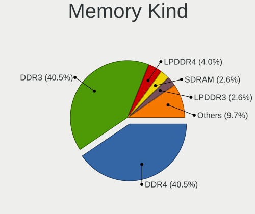

| Kind    | Computers | Percent |
|---------|-----------|---------|
| DDR4    | 92        | 40.53%  |
| DDR3    | 92        | 40.53%  |
| LPDDR4  | 9         | 3.96%   |
| SDRAM   | 6         | 2.64%   |
| LPDDR3  | 6         | 2.64%   |
| DDR5    | 6         | 2.64%   |
| DDR2    | 6         | 2.64%   |
| LPDDR5  | 4         | 1.76%   |
| Unknown | 4         | 1.76%   |
| DDR     | 2         | 0.88%   |

Memory Form Factor
------------------

Physical design of the memory module

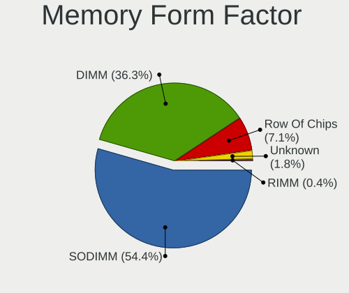

| Name         | Computers | Percent |
|--------------|-----------|---------|
| SODIMM       | 123       | 54.42%  |
| DIMM         | 82        | 36.28%  |
| Row Of Chips | 16        | 7.08%   |
| Unknown      | 4         | 1.77%   |
| RIMM         | 1         | 0.44%   |

Memory Size
-----------

Memory module size

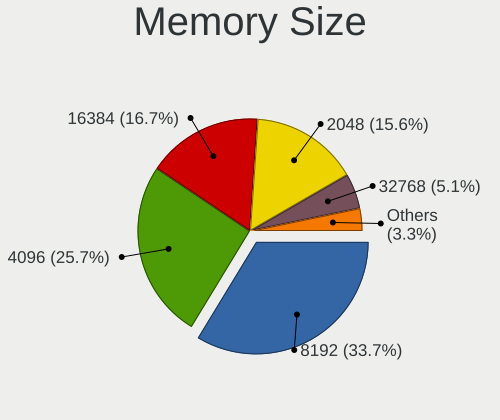

| Size  | Computers | Percent |
|-------|-----------|---------|
| 8192  | 93        | 33.7%   |
| 4096  | 71        | 25.72%  |
| 16384 | 46        | 16.67%  |
| 2048  | 43        | 15.58%  |
| 32768 | 14        | 5.07%   |
| 1024  | 5         | 1.81%   |
| 512   | 3         | 1.09%   |
| 256   | 1         | 0.36%   |

Memory Speed
------------

Memory module speed

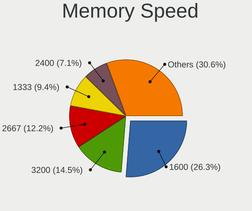

| Speed | Computers | Percent |
|-------|-----------|---------|
| 1600  | 67        | 26.27%  |
| 3200  | 37        | 14.51%  |
| 2667  | 31        | 12.16%  |
| 1333  | 24        | 9.41%   |
| 2400  | 18        | 7.06%   |
| 2133  | 13        | 5.1%    |
| 1334  | 6         | 2.35%   |
| 533   | 6         | 2.35%   |
| 3600  | 4         | 1.57%   |
| 6400  | 3         | 1.18%   |
| 4800  | 3         | 1.18%   |
| 3733  | 3         | 1.18%   |
| 3266  | 3         | 1.18%   |
| 1867  | 3         | 1.18%   |
| 1866  | 3         | 1.18%   |
| 5400  | 2         | 0.78%   |
| 4267  | 2         | 0.78%   |
| 4199  | 2         | 0.78%   |
| 3800  | 2         | 0.78%   |
| 3466  | 2         | 0.78%   |
| 3000  | 2         | 0.78%   |
| 2666  | 2         | 0.78%   |
| 1067  | 2         | 0.78%   |
| 1066  | 2         | 0.78%   |
| 50410 | 1         | 0.39%   |
| 7500  | 1         | 0.39%   |
| 6000  | 1         | 0.39%   |
| 4266  | 1         | 0.39%   |
| 3500  | 1         | 0.39%   |
| 3400  | 1         | 0.39%   |
| 3001  | 1         | 0.39%   |
| 2473  | 1         | 0.39%   |
| 2048  | 1         | 0.39%   |
| 1800  | 1         | 0.39%   |
| 667   | 1         | 0.39%   |
| 333   | 1         | 0.39%   |
| 266   | 1         | 0.39%   |

Printers & scanners
-------------------

Printer Vendor
--------------

Printer device vendors

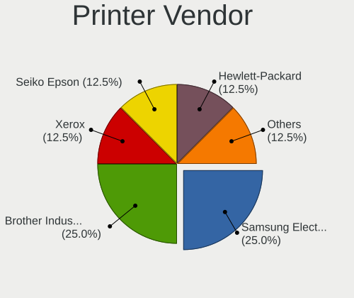

| Vendor              | Computers | Percent |
|---------------------|-----------|---------|
| Samsung Electronics | 2         | 25%     |
| Brother Industries  | 2         | 25%     |
| Xerox               | 1         | 12.5%   |
| Seiko Epson         | 1         | 12.5%   |
| Hewlett-Packard     | 1         | 12.5%   |
| Canon               | 1         | 12.5%   |

Printer Model
-------------

Printer device models

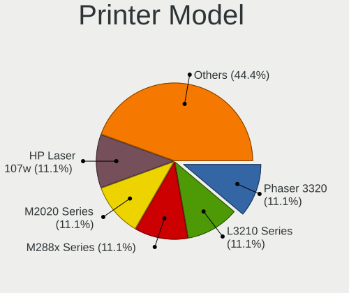

| Model                    | Computers | Percent |
|--------------------------|-----------|---------|
| Xerox Phaser 3320        | 1         | 11.11%  |
| Seiko Epson L3210 Series | 1         | 11.11%  |
| Samsung M288x Series     | 1         | 11.11%  |
| Samsung M2020 Series     | 1         | 11.11%  |
| HP HP Laser 107w         | 1         | 11.11%  |
| Canon PIXMA MP250        | 1         | 11.11%  |
| Brother DCP-T500W        | 1         | 11.11%  |
| Brother DCP-T420W        | 1         | 11.11%  |
| Brother DCP-J152W        | 1         | 11.11%  |

Scanner Vendor
--------------

Scanner device vendors

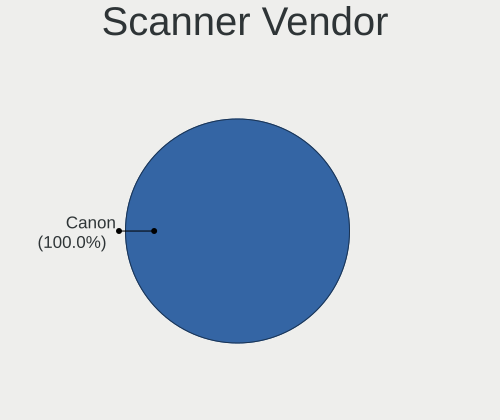

| Vendor | Computers | Percent |
|--------|-----------|---------|
| Canon  | 2         | 100%    |

Scanner Model
-------------

Scanner device models

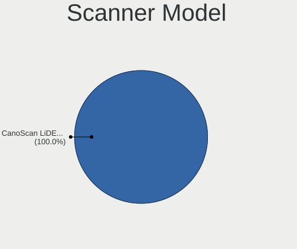

| Model                   | Computers | Percent |
|-------------------------|-----------|---------|
| Canon CanoScan LiDE 110 | 2         | 100%    |

Camera
------

Camera Vendor
-------------

Camera device vendors

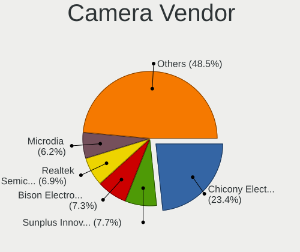

| Vendor                                 | Computers | Percent |
|----------------------------------------|-----------|---------|
| Chicony Electronics                    | 64        | 23.36%  |
| Sunplus Innovation Technology          | 21        | 7.66%   |
| Bison Electronics                      | 20        | 7.3%    |
| Realtek Semiconductor                  | 19        | 6.93%   |
| Microdia                               | 17        | 6.2%    |
| Cheng Uei Precision Industry (Foxlink) | 17        | 6.2%    |
| IMC Networks                           | 15        | 5.47%   |
| Logitech                               | 12        | 4.38%   |
| Quanta                                 | 11        | 4.01%   |
| Suyin                                  | 10        | 3.65%   |
| Unknown                                | 6         | 2.19%   |
| Syntek                                 | 6         | 2.19%   |
| Sonix Technology                       | 6         | 2.19%   |
| Silicon Motion                         | 6         | 2.19%   |
| Lite-On Technology                     | 6         | 2.19%   |
| Apple                                  | 5         | 1.82%   |
| Samsung Electronics                    | 4         | 1.46%   |
| Luxvisions Innotech Limited            | 4         | 1.46%   |
| Importek                               | 4         | 1.46%   |
| Alcor Micro                            | 4         | 1.46%   |
| SunplusIT                              | 2         | 0.73%   |
| Shinetech                              | 2         | 0.73%   |
| Acer                                   | 2         | 0.73%   |
| Sony                                   | 1         | 0.36%   |
| Primax Electronics                     | 1         | 0.36%   |
| OYT Tech                               | 1         | 0.36%   |
| Novatek Microelectronics               | 1         | 0.36%   |
| Mimaki Engineering                     | 1         | 0.36%   |
| Microsoft                              | 1         | 0.36%   |
| MacroSilicon                           | 1         | 0.36%   |
| GEMBIRD                                | 1         | 0.36%   |
| DigiTech                               | 1         | 0.36%   |
| Aveo Technology                        | 1         | 0.36%   |
| A4Tech                                 | 1         | 0.36%   |

Camera Model
------------

Camera device models

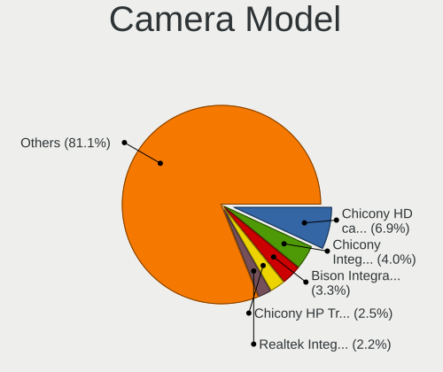

| Model                                                          | Computers | Percent |
|----------------------------------------------------------------|-----------|---------|
| Chicony HD camera                                              | 19        | 6.91%   |
| Chicony Integrated Camera                                      | 11        | 4%      |
| Bison Integrated Camera                                        | 9         | 3.27%   |
| Chicony HP TrueVision HD                                       | 7         | 2.55%   |
| Realtek Integrated_Webcam_HD                                   | 6         | 2.18%   |
| Chicony TOSHIBA Web Camera - HD                                | 6         | 2.18%   |
| Unknown USB Camera                                             | 5         | 1.82%   |
| Microdia Integrated_Webcam_HD                                  | 5         | 1.82%   |
| Logitech Webcam C270                                           | 5         | 1.82%   |
| IMC Networks USB2.0 HD UVC WebCam                              | 5         | 1.82%   |
| Sunplus Integrated_Webcam_HD                                   | 4         | 1.45%   |
| Samsung Galaxy series, misc. (MTP mode)                        | 4         | 1.45%   |
| Realtek Lenovo EasyCamera                                      | 4         | 1.45%   |
| Quanta HD Webcam                                               | 4         | 1.45%   |
| Microdia USB 2.0 Camera                                        | 4         | 1.45%   |
| Cheng Uei Precision Industry (Foxlink) HP Webcam               | 4         | 1.45%   |
| Bison HD Webcam                                                | 4         | 1.45%   |
| Syntek Integrated Camera                                       | 3         | 1.09%   |
| Sunplus HP X Camera                                            | 3         | 1.09%   |
| Sonix USB2.0 HD UVC WebCam                                     | 3         | 1.09%   |
| Quanta HP TrueVision HD Camera                                 | 3         | 1.09%   |
| Lite-On HP Webcam                                              | 3         | 1.09%   |
| IMC Networks USB2.0 HD IR UVC WebCam                           | 3         | 1.09%   |
| IMC Networks Integrated Camera                                 | 3         | 1.09%   |
| Chicony Lenovo EasyCamera                                      | 3         | 1.09%   |
| Chicony HP Webcam                                              | 3         | 1.09%   |
| Chicony HD WebCam                                              | 3         | 1.09%   |
| Cheng Uei Precision Industry (Foxlink) HP TrueVision HD Camera | 3         | 1.09%   |
| Cheng Uei Precision Industry (Foxlink) HP Truevision HD        | 3         | 1.09%   |
| Cheng Uei Precision Industry (Foxlink) HP HD Camera            | 3         | 1.09%   |
| Apple iPhone 5/5C/5S/6/SE/7/8/X                                | 3         | 1.09%   |
| Alcor Micro USB 2.0 Camera                                     | 3         | 1.09%   |
| Suyin HP Truevision HD                                         | 2         | 0.73%   |
| Suyin Asus Integrated Webcam                                   | 2         | 0.73%   |
| Sunplus SPCA2281 Web Camera                                    | 2         | 0.73%   |
| Sunplus Laptop Integrated Webcam HD                            | 2         | 0.73%   |
| Sunplus HP Wide Vision HD                                      | 2         | 0.73%   |
| Sonix USB2.0 FHD UVC WebCam                                    | 2         | 0.73%   |
| Silicon Motion WebCam SC-13HDL11939N                           | 2         | 0.73%   |
| Silicon Motion WebCam SC-0311139N                              | 2         | 0.73%   |

Security
--------

Fingerprint Vendor
------------------

Fingerprint sensor vendors

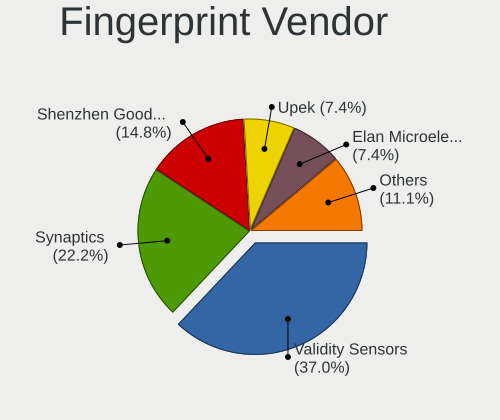

| Vendor                     | Computers | Percent |
|----------------------------|-----------|---------|
| Validity Sensors           | 10        | 37.04%  |
| Synaptics                  | 6         | 22.22%  |
| Shenzhen Goodix Technology | 4         | 14.81%  |
| Upek                       | 2         | 7.41%   |
| Elan Microelectronics      | 2         | 7.41%   |
| LighTuning Technology      | 1         | 3.7%    |
| Focal-systems.Corp         | 1         | 3.7%    |
| AuthenTec                  | 1         | 3.7%    |

Fingerprint Model
-----------------

Fingerprint sensor models

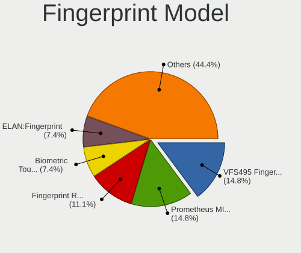

| Model                                                       | Computers | Percent |
|-------------------------------------------------------------|-----------|---------|
| Validity Sensors VFS495 Fingerprint Reader                  | 4         | 14.81%  |
| Synaptics Prometheus MIS Touch Fingerprint Reader           | 4         | 14.81%  |
| Shenzhen Goodix Fingerprint Reader                          | 3         | 11.11%  |
| Upek Biometric Touchchip/Touchstrip Fingerprint Sensor      | 2         | 7.41%   |
| Elan ELAN:Fingerprint                                       | 2         | 7.41%   |
| Validity Sensors VFS7500 Touch Fingerprint Sensor           | 1         | 3.7%    |
| Validity Sensors VFS5011 Fingerprint Reader                 | 1         | 3.7%    |
| Validity Sensors VFS 5011 fingerprint sensor                | 1         | 3.7%    |
| Validity Sensors Synaptics VFS7552 Touch Fingerprint Sensor | 1         | 3.7%    |
| Validity Sensors Swipe Fingerprint Sensor                   | 1         | 3.7%    |
| Validity Sensors Fingerprint scanner                        | 1         | 3.7%    |
| Synaptics UWP WBDI Device                                   | 1         | 3.7%    |
| Synaptics Metallica MIS Touch Fingerprint Reader            | 1         | 3.7%    |
| Shenzhen Goodix  FingerPrint Device                         | 1         | 3.7%    |
| LighTuning EgisTec Touch Fingerprint Sensor                 | 1         | 3.7%    |
| Focal-systems.Corp FT9201Fingerprint.                       | 1         | 3.7%    |
| AuthenTec Fingerprint Sensor                                | 1         | 3.7%    |

Chipcard Vendor
---------------

Chipcard module vendors

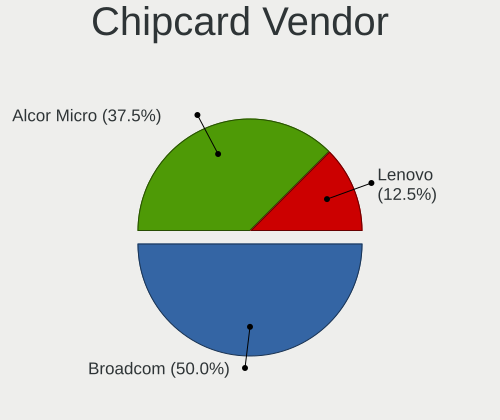

| Vendor      | Computers | Percent |
|-------------|-----------|---------|
| Broadcom    | 4         | 50%     |
| Alcor Micro | 3         | 37.5%   |
| Lenovo      | 1         | 12.5%   |

Chipcard Model
--------------

Chipcard module models

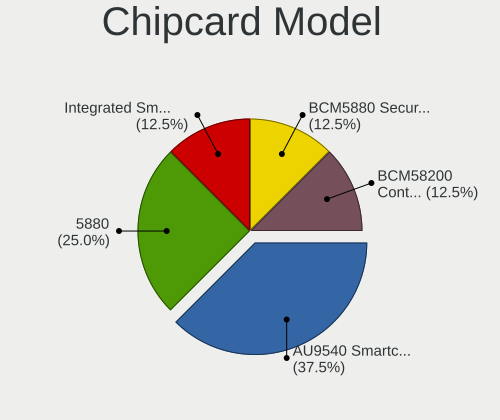

| Model                                                                       | Computers | Percent |
|-----------------------------------------------------------------------------|-----------|---------|
| Alcor Micro AU9540 Smartcard Reader                                         | 3         | 37.5%   |
| Broadcom 5880                                                               | 2         | 25%     |
| Lenovo Integrated Smart Card Reader                                         | 1         | 12.5%   |
| Broadcom BCM5880 Secure Applications Processor                              | 1         | 12.5%   |
| Broadcom BCM58200 ControlVault 3 (FingerPrint sensor + Contacted SmartCard) | 1         | 12.5%   |

Unsupported
-----------

Unsupported Devices
-------------------

Total unsupported devices on board

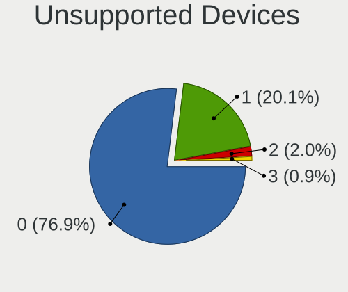

| Total | Computers | Percent |
|-------|-----------|---------|
| 0     | 340       | 76.92%  |
| 1     | 89        | 20.14%  |
| 2     | 9         | 2.04%   |
| 3     | 4         | 0.9%    |

Unsupported Device Types
------------------------

Types of unsupported devices

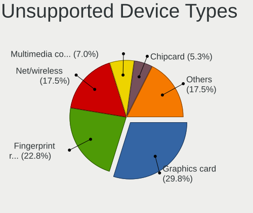

| Type                     | Computers | Percent |
|--------------------------|-----------|---------|
| Graphics card            | 34        | 29.82%  |
| Fingerprint reader       | 26        | 22.81%  |
| Net/wireless             | 20        | 17.54%  |
| Multimedia controller    | 8         | 7.02%   |
| Chipcard                 | 6         | 5.26%   |
| Sound                    | 5         | 4.39%   |
| Storage                  | 3         | 2.63%   |
| Communication controller | 3         | 2.63%   |
| Bluetooth                | 3         | 2.63%   |
| Unassigned class         | 2         | 1.75%   |
| Camera                   | 2         | 1.75%   |
| Storage/ide              | 1         | 0.88%   |
| Modem                    | 1         | 0.88%   |

