Linux in Uruguay - Tested Hardware & Statistics (Desktops)
----------------------------------------------------------

A project to collect tested hardware configurations for Linux in Uruguay.

Anyone can contribute to this report by the [hw-probe](https://github.com/linuxhw/hw-probe) tool:

    sudo -E hw-probe -all -upload

Please contribute! Especially if your hardware is rare.

Contents
--------

* [ Test Cases ](#test-cases)

* [ System ](#system)
  - [ OS                       ](#os)
  - [ OS Family                ](#os-family)
  - [ Kernel                   ](#kernel)
  - [ Kernel Family            ](#kernel-family)
  - [ Kernel Major Ver.        ](#kernel-major-ver)
  - [ Arch                     ](#arch)
  - [ DE                       ](#de)
  - [ Display Server           ](#display-server)
  - [ Display Manager          ](#display-manager)
  - [ OS Lang                  ](#os-lang)
  - [ Boot Mode                ](#boot-mode)
  - [ Filesystem               ](#filesystem)
  - [ Part. scheme             ](#part-scheme)
  - [ Dual Boot with Linux/BSD ](#dual-boot-with-linuxbsd)
  - [ Dual Boot (Win)          ](#dual-boot-win)

* [ Board ](#board)
  - [ Vendor                   ](#vendor)
  - [ Model                    ](#model)
  - [ Model Family             ](#model-family)
  - [ MFG Year                 ](#mfg-year)
  - [ Form Factor              ](#form-factor)
  - [ Secure Boot              ](#secure-boot)
  - [ Coreboot                 ](#coreboot)
  - [ RAM Size                 ](#ram-size)
  - [ RAM Used                 ](#ram-used)
  - [ Total Drives             ](#total-drives)
  - [ Has CD-ROM               ](#has-cd-rom)
  - [ Has Ethernet             ](#has-ethernet)
  - [ Has WiFi                 ](#has-wifi)
  - [ Has Bluetooth            ](#has-bluetooth)

* [ Location ](#location)
  - [ Country                  ](#country)
  - [ City                     ](#city)

* [ Drives ](#drives)
  - [ Drive Vendor             ](#drive-vendor)
  - [ Drive Model              ](#drive-model)
  - [ HDD Vendor               ](#hdd-vendor)
  - [ SSD Vendor               ](#ssd-vendor)
  - [ Drive Kind               ](#drive-kind)
  - [ Drive Connector          ](#drive-connector)
  - [ Drive Size               ](#drive-size)
  - [ Space Total              ](#space-total)
  - [ Space Used               ](#space-used)
  - [ Malfunc. Drives          ](#malfunc-drives)
  - [ Malfunc. Drive Vendor    ](#malfunc-drive-vendor)
  - [ Malfunc. HDD Vendor      ](#malfunc-hdd-vendor)
  - [ Malfunc. Drive Kind      ](#malfunc-drive-kind)
  - [ Failed Drives            ](#failed-drives)
  - [ Failed Drive Vendor      ](#failed-drive-vendor)
  - [ Drive Status             ](#drive-status)

* [ Storage controller ](#storage-controller)
  - [ Storage Vendor           ](#storage-vendor)
  - [ Storage Model            ](#storage-model)
  - [ Storage Kind             ](#storage-kind)

* [ Processor ](#processor)
  - [ CPU Vendor               ](#cpu-vendor)
  - [ CPU Model                ](#cpu-model)
  - [ CPU Model Family         ](#cpu-model-family)
  - [ CPU Cores                ](#cpu-cores)
  - [ CPU Sockets              ](#cpu-sockets)
  - [ CPU Threads              ](#cpu-threads)
  - [ CPU Op-Modes             ](#cpu-op-modes)
  - [ CPU Microcode            ](#cpu-microcode)
  - [ CPU Microarch            ](#cpu-microarch)

* [ Graphics ](#graphics)
  - [ GPU Vendor               ](#gpu-vendor)
  - [ GPU Model                ](#gpu-model)
  - [ GPU Combo                ](#gpu-combo)
  - [ GPU Driver               ](#gpu-driver)
  - [ GPU Memory               ](#gpu-memory)

* [ Monitor ](#monitor)
  - [ Monitor Vendor           ](#monitor-vendor)
  - [ Monitor Model            ](#monitor-model)
  - [ Monitor Resolution       ](#monitor-resolution)
  - [ Monitor Diagonal         ](#monitor-diagonal)
  - [ Monitor Width            ](#monitor-width)
  - [ Aspect Ratio             ](#aspect-ratio)
  - [ Monitor Area             ](#monitor-area)
  - [ Pixel Density            ](#pixel-density)
  - [ Multiple Monitors        ](#multiple-monitors)

* [ Network ](#network)
  - [ Net Controller Vendor    ](#net-controller-vendor)
  - [ Net Controller Model     ](#net-controller-model)
  - [ Wireless Vendor          ](#wireless-vendor)
  - [ Wireless Model           ](#wireless-model)
  - [ Ethernet Vendor          ](#ethernet-vendor)
  - [ Ethernet Model           ](#ethernet-model)
  - [ Net Controller Kind      ](#net-controller-kind)
  - [ Used Controller          ](#used-controller)
  - [ NICs                     ](#nics)
  - [ IPv6                     ](#ipv6)

* [ Bluetooth ](#bluetooth)
  - [ Bluetooth Vendor         ](#bluetooth-vendor)
  - [ Bluetooth Model          ](#bluetooth-model)

* [ Sound ](#sound)
  - [ Sound Vendor             ](#sound-vendor)
  - [ Sound Model              ](#sound-model)

* [ Memory ](#memory)
  - [ Memory Vendor            ](#memory-vendor)
  - [ Memory Model             ](#memory-model)
  - [ Memory Kind              ](#memory-kind)
  - [ Memory Form Factor       ](#memory-form-factor)
  - [ Memory Size              ](#memory-size)
  - [ Memory Speed             ](#memory-speed)

* [ Printers & scanners ](#printers--scanners)
  - [ Printer Vendor           ](#printer-vendor)
  - [ Printer Model            ](#printer-model)
  - [ Scanner Vendor           ](#scanner-vendor)
  - [ Scanner Model            ](#scanner-model)

* [ Camera ](#camera)
  - [ Camera Vendor            ](#camera-vendor)
  - [ Camera Model             ](#camera-model)

* [ Security ](#security)
  - [ Fingerprint Vendor       ](#fingerprint-vendor)
  - [ Fingerprint Model        ](#fingerprint-model)
  - [ Chipcard Vendor          ](#chipcard-vendor)
  - [ Chipcard Model           ](#chipcard-model)

* [ Unsupported ](#unsupported)
  - [ Unsupported Devices      ](#unsupported-devices)
  - [ Unsupported Device Types ](#unsupported-device-types)

Test Cases
----------

Total: 150

| Vendor     | Model                       | Probe                                                      | Date         |
|------------|-----------------------------|------------------------------------------------------------|--------------|
| Gigabyte   | Z790 AORUS ELITE AX DDR4    | [025bd1edae](https://linux-hardware.org/?probe=025bd1edae) | Aug 04, 2023 |
| ASUSTek    | PRIME A320M-K               | [a4d7919584](https://linux-hardware.org/?probe=a4d7919584) | Jul 29, 2023 |
| HP         | 1497                        | [370799b635](https://linux-hardware.org/?probe=370799b635) | Jul 26, 2023 |
| Gigabyte   | Z370 AORUS Gaming 7         | [01cfac81b4](https://linux-hardware.org/?probe=01cfac81b4) | Jul 24, 2023 |
| ASRock     | H510M-HDV R2.0              | [cacf2d88c9](https://linux-hardware.org/?probe=cacf2d88c9) | Jul 19, 2023 |
| ASUSTek    | PRIME A320M-K               | [6776e11ac9](https://linux-hardware.org/?probe=6776e11ac9) | Jul 14, 2023 |
| Dell       | 0K240Y A02                  | [7d1d71b0fe](https://linux-hardware.org/?probe=7d1d71b0fe) | Jul 06, 2023 |
| Intel      | H61                         | [ac2b137243](https://linux-hardware.org/?probe=ac2b137243) | Jun 15, 2023 |
| Dell       | 0V8WGR A02                  | [448fd1711d](https://linux-hardware.org/?probe=448fd1711d) | Jun 12, 2023 |
| HP         | 0A60h                       | [f0498c1a54](https://linux-hardware.org/?probe=f0498c1a54) | Jun 07, 2023 |
| Lenovo     | 30D2 SDK0J40697 WIN 3305... | [624a84a2fc](https://linux-hardware.org/?probe=624a84a2fc) | Jun 06, 2023 |
| Gigabyte   | Z390 AORUS ELITE-CF         | [75c4e47bea](https://linux-hardware.org/?probe=75c4e47bea) | Jun 01, 2023 |
| MSI        | 760GM-P23                   | [970443eea3](https://linux-hardware.org/?probe=970443eea3) | May 14, 2023 |
| ASRock     | N68-S3 UCC                  | [8a1fbe8e3c](https://linux-hardware.org/?probe=8a1fbe8e3c) | May 09, 2023 |
| Lenovo     | MAHOBAY                     | [97cc4e0a84](https://linux-hardware.org/?probe=97cc4e0a84) | May 01, 2023 |
| Gigabyte   | A320M-S2H V2-CF             | [cf6a478eb1](https://linux-hardware.org/?probe=cf6a478eb1) | May 01, 2023 |
| ASRock     | H61M-DGS                    | [e0b2a066ee](https://linux-hardware.org/?probe=e0b2a066ee) | Apr 15, 2023 |
| Gigabyte   | H61M-S1                     | [9af85c78cb](https://linux-hardware.org/?probe=9af85c78cb) | Mar 28, 2023 |
| MSI        | A68HM-E33 V2                | [1531761af6](https://linux-hardware.org/?probe=1531761af6) | Mar 26, 2023 |
| ASUSTek    | PRIME A320M-K               | [f0f20a06ef](https://linux-hardware.org/?probe=f0f20a06ef) | Mar 19, 2023 |
| MSI        | H310M PRO-VDH PLUS          | [2a1291ac22](https://linux-hardware.org/?probe=2a1291ac22) | Mar 18, 2023 |
| Gigabyte   | B450M DS3H WIFI-CF          | [b94932937e](https://linux-hardware.org/?probe=b94932937e) | Mar 14, 2023 |
| AZW        | MINI S                      | [cb0b08973d](https://linux-hardware.org/?probe=cb0b08973d) | Mar 06, 2023 |
| MSI        | H61M-P31/W8                 | [163991dfae](https://linux-hardware.org/?probe=163991dfae) | Feb 03, 2023 |
| MSI        | H61M-P31/W8                 | [a08e60bb31](https://linux-hardware.org/?probe=a08e60bb31) | Feb 03, 2023 |
| MSI        | H61M-P31/W8                 | [d6829621d7](https://linux-hardware.org/?probe=d6829621d7) | Feb 03, 2023 |
| HP         | 339A                        | [5d86fd4411](https://linux-hardware.org/?probe=5d86fd4411) | Jan 20, 2023 |
| ASUSTek    | H170 PRO GAMING             | [4cf36f7404](https://linux-hardware.org/?probe=4cf36f7404) | Jan 13, 2023 |
| MSI        | 2A9C                        | [57c14b82bd](https://linux-hardware.org/?probe=57c14b82bd) | Nov 23, 2022 |
| ASUSTek    | Z97-C                       | [733140c078](https://linux-hardware.org/?probe=733140c078) | Nov 20, 2022 |
| ASRock     | H310CM-HDV                  | [afe54b52c9](https://linux-hardware.org/?probe=afe54b52c9) | Oct 21, 2022 |
| ASUSTek    | H170 PRO GAMING             | [cb86d1ba99](https://linux-hardware.org/?probe=cb86d1ba99) | Oct 18, 2022 |
| ASRock     | H310CM-HDV                  | [2426012acb](https://linux-hardware.org/?probe=2426012acb) | Oct 18, 2022 |
| Dell       | 0XFWHV A00                  | [4a5716d169](https://linux-hardware.org/?probe=4a5716d169) | Oct 16, 2022 |
| MSI        | 2A9C                        | [74482fb396](https://linux-hardware.org/?probe=74482fb396) | Oct 16, 2022 |
| ASUSTek    | ROG STRIX X570-E GAMING     | [d006fa9a19](https://linux-hardware.org/?probe=d006fa9a19) | Oct 11, 2022 |
| MSI        | 2A9C                        | [1c1d20a1ac](https://linux-hardware.org/?probe=1c1d20a1ac) | Oct 09, 2022 |
| MSI        | 2A9C                        | [98ff35e2a7](https://linux-hardware.org/?probe=98ff35e2a7) | Oct 09, 2022 |
| ASUSTek    | ROG STRIX X570-E GAMING     | [adde8098e4](https://linux-hardware.org/?probe=adde8098e4) | Oct 04, 2022 |
| Huanan     | X79 (INTEL Xeon E5/Corei... | [a40d59533c](https://linux-hardware.org/?probe=a40d59533c) | Sep 29, 2022 |
| Biostar    | H410MH S2                   | [b03e32f37d](https://linux-hardware.org/?probe=b03e32f37d) | Sep 29, 2022 |
| Biostar    | H410MH S2                   | [fbba79fc43](https://linux-hardware.org/?probe=fbba79fc43) | Sep 28, 2022 |
| HP         | 8265                        | [2b74e032bd](https://linux-hardware.org/?probe=2b74e032bd) | Sep 06, 2022 |
| HP         | 8265                        | [f7f460fb43](https://linux-hardware.org/?probe=f7f460fb43) | Sep 05, 2022 |
| Gigabyte   | Z87X-UD4H-CF                | [8ffe312747](https://linux-hardware.org/?probe=8ffe312747) | Sep 04, 2022 |
| ASRock     | N68-S                       | [df5d34428a](https://linux-hardware.org/?probe=df5d34428a) | Sep 01, 2022 |
| ASRock     | N68-S                       | [6aabf89438](https://linux-hardware.org/?probe=6aabf89438) | Aug 30, 2022 |
| ASRock     | FM2A58M-VG3+ R2.0           | [422af9d6b5](https://linux-hardware.org/?probe=422af9d6b5) | Aug 29, 2022 |
| ASRock     | N68-S                       | [4fff0a6104](https://linux-hardware.org/?probe=4fff0a6104) | Aug 29, 2022 |
| HP         | 3048h                       | [34e0bbc168](https://linux-hardware.org/?probe=34e0bbc168) | Aug 20, 2022 |
| Gigabyte   | B460M DS3H                  | [2b97e09efa](https://linux-hardware.org/?probe=2b97e09efa) | Aug 17, 2022 |
| Biostar    | B550MH                      | [228a44e3f0](https://linux-hardware.org/?probe=228a44e3f0) | Aug 06, 2022 |
| ASRock     | B75M                        | [78fbdcd0f7](https://linux-hardware.org/?probe=78fbdcd0f7) | Aug 05, 2022 |
| MACHINIST  | X79 (INTEL Xeon E5/Corei... | [e83fe522d7](https://linux-hardware.org/?probe=e83fe522d7) | Jul 31, 2022 |
| Gigabyte   | Z170X-Gaming 3              | [a3c2fdccfc](https://linux-hardware.org/?probe=a3c2fdccfc) | Jul 27, 2022 |
| ASRock     | FM2A58M-VG3+ R2.0           | [04affeedf7](https://linux-hardware.org/?probe=04affeedf7) | Jul 18, 2022 |
| HP         | 1632                        | [d2582aff1d](https://linux-hardware.org/?probe=d2582aff1d) | Jul 12, 2022 |
| Gigabyte   | H410M H V3                  | [0d26f198ff](https://linux-hardware.org/?probe=0d26f198ff) | Jul 06, 2022 |
| MSI        | MPG X570 GAMING PLUS        | [5fa355f7ec](https://linux-hardware.org/?probe=5fa355f7ec) | Jun 26, 2022 |
| Gigabyte   | B450 GAMING X               | [34e884bb50](https://linux-hardware.org/?probe=34e884bb50) | Jun 08, 2022 |
| Gigabyte   | Z390 AORUS ELITE-CF         | [95ac26b654](https://linux-hardware.org/?probe=95ac26b654) | May 19, 2022 |
| Foxconn    | G31MX Series                | [911987151a](https://linux-hardware.org/?probe=911987151a) | Mar 23, 2022 |
| Foxconn    | G31MX Series                | [7d9cc6ac07](https://linux-hardware.org/?probe=7d9cc6ac07) | Mar 22, 2022 |
| Gigabyte   | Z370 AORUS Gaming 7         | [9699b8889c](https://linux-hardware.org/?probe=9699b8889c) | Feb 27, 2022 |
| ASUSTek    | TUF Gaming B460M-PLUS       | [37231251ed](https://linux-hardware.org/?probe=37231251ed) | Feb 21, 2022 |
| ASRock     | FM2A55M-HD+                 | [52ca8c0d7c](https://linux-hardware.org/?probe=52ca8c0d7c) | Feb 13, 2022 |
| HP         | 3047h                       | [ee6260c5f4](https://linux-hardware.org/?probe=ee6260c5f4) | Feb 10, 2022 |
| Gigabyte   | GA-970A-D3                  | [0fe418c7b1](https://linux-hardware.org/?probe=0fe418c7b1) | Jan 07, 2022 |
| HP         | 0AA8h                       | [9abf55a71f](https://linux-hardware.org/?probe=9abf55a71f) | Jan 05, 2022 |
| HP         | 0AA8h                       | [44c9ba4231](https://linux-hardware.org/?probe=44c9ba4231) | Jan 03, 2022 |
| Biostar    | Z490A-SILVER                | [b5e7622be0](https://linux-hardware.org/?probe=b5e7622be0) | Jan 02, 2022 |
| Dell       | 06D7TR A00                  | [90f509fc24](https://linux-hardware.org/?probe=90f509fc24) | Dec 09, 2021 |
| Gigabyte   | H81M-DS2                    | [44b341f68d](https://linux-hardware.org/?probe=44b341f68d) | Nov 10, 2021 |
| ASRock     | N68-S                       | [eac798f714](https://linux-hardware.org/?probe=eac798f714) | Nov 01, 2021 |
| Gigabyte   | X570 GAMING X               | [174875a3d4](https://linux-hardware.org/?probe=174875a3d4) | Oct 25, 2021 |
| MSI        | X570-A PRO                  | [357ea9ab5d](https://linux-hardware.org/?probe=357ea9ab5d) | Oct 22, 2021 |
| ASRock     | B450M Steel Legend          | [fea193c839](https://linux-hardware.org/?probe=fea193c839) | Sep 10, 2021 |
| Gigabyte   | Z390 AORUS ELITE-CF         | [dbeb8785e6](https://linux-hardware.org/?probe=dbeb8785e6) | Sep 01, 2021 |
| ASRock     | FM2A55M-VG3+                | [c2e1837665](https://linux-hardware.org/?probe=c2e1837665) | Aug 24, 2021 |
| ASUSTek    | M5A99X EVO R2.0             | [b6c401b55e](https://linux-hardware.org/?probe=b6c401b55e) | Jul 15, 2021 |
| ASUSTek    | TUF Gaming B550-PLUS        | [38ee95b416](https://linux-hardware.org/?probe=38ee95b416) | Jun 02, 2021 |
| ASUSTek    | PRIME B450M-A II            | [ab4b1b7a15](https://linux-hardware.org/?probe=ab4b1b7a15) | May 31, 2021 |
| ASRock     | FM2A55M-VG3+                | [d9065ac8d1](https://linux-hardware.org/?probe=d9065ac8d1) | May 30, 2021 |
| ASRock     | A320M-HDV R3.0              | [0ed78505e8](https://linux-hardware.org/?probe=0ed78505e8) | May 19, 2021 |
| ASRock     | FM2A55M-VG3+                | [41e6c088d2](https://linux-hardware.org/?probe=41e6c088d2) | May 16, 2021 |
| ASRock     | FM2A55M-VG3+                | [ada1c4a259](https://linux-hardware.org/?probe=ada1c4a259) | May 12, 2021 |
| ASRock     | N68-VS3 FX                  | [bcee870f79](https://linux-hardware.org/?probe=bcee870f79) | Apr 24, 2021 |
| ASRock     | N68-VS3 FX                  | [b92a431094](https://linux-hardware.org/?probe=b92a431094) | Apr 24, 2021 |
| ASUSTek    | M5A78L-M/USB3               | [7d28bb0ba2](https://linux-hardware.org/?probe=7d28bb0ba2) | Apr 23, 2021 |
| Gigabyte   | Z390 AORUS ELITE-CF         | [5042e6d421](https://linux-hardware.org/?probe=5042e6d421) | Apr 20, 2021 |
| ASUSTek    | P8H77-V                     | [9b0d9c1623](https://linux-hardware.org/?probe=9b0d9c1623) | Apr 05, 2021 |
| Supermicro | P4DMS                       | [34867ad122](https://linux-hardware.org/?probe=34867ad122) | Mar 22, 2021 |
| Supermicro | P4DMS                       | [9de21bc6ec](https://linux-hardware.org/?probe=9de21bc6ec) | Mar 14, 2021 |
| Lenovo     | MAHOBAY NOK                 | [901fd74eaa](https://linux-hardware.org/?probe=901fd74eaa) | Feb 20, 2021 |
| ASUSTek    | PRIME B450M-A II            | [7f1fc20897](https://linux-hardware.org/?probe=7f1fc20897) | Feb 19, 2021 |
| ASUSTek    | PRIME B450M-A II            | [9527a6802e](https://linux-hardware.org/?probe=9527a6802e) | Feb 19, 2021 |
| Gigabyte   | H81M-DS2                    | [9473725930](https://linux-hardware.org/?probe=9473725930) | Feb 15, 2021 |
| Dell       | 0C522T A03                  | [0b52890aaf](https://linux-hardware.org/?probe=0b52890aaf) | Jan 29, 2021 |
| Dell       | 0C522T A03                  | [3a777180a1](https://linux-hardware.org/?probe=3a777180a1) | Jan 29, 2021 |
| Intel      | H61M-DS2                    | [930418d2da](https://linux-hardware.org/?probe=930418d2da) | Jan 23, 2021 |
| Gigabyte   | H81M-DS2                    | [4b7df9598e](https://linux-hardware.org/?probe=4b7df9598e) | Jan 20, 2021 |
| Intel      | H61M-DS2                    | [53bde98202](https://linux-hardware.org/?probe=53bde98202) | Jan 09, 2021 |
| MSI        | A55M-P33                    | [43267cc6f4](https://linux-hardware.org/?probe=43267cc6f4) | Dec 16, 2020 |
| ASRock     | H310CM-HDV                  | [729161e56a](https://linux-hardware.org/?probe=729161e56a) | Dec 08, 2020 |
| ASRock     | H310CM-HDV                  | [37f7b460d4](https://linux-hardware.org/?probe=37f7b460d4) | Dec 08, 2020 |
| ASRock     | A320M-HDV                   | [912852805f](https://linux-hardware.org/?probe=912852805f) | Oct 22, 2020 |
| Dell       | 0C27VV A00                  | [fd9547e219](https://linux-hardware.org/?probe=fd9547e219) | Oct 01, 2020 |
| Gigabyte   | H310M A-CF                  | [ff30e910c4](https://linux-hardware.org/?probe=ff30e910c4) | Aug 12, 2020 |
| Intel      | DP35DP AAD81073-208         | [0009968f3b](https://linux-hardware.org/?probe=0009968f3b) | Aug 05, 2020 |
| Gigabyte   | GA-78LMT-S2                 | [71c07410ee](https://linux-hardware.org/?probe=71c07410ee) | Jul 25, 2020 |
| ASUSTek    | PRIME B450-PLUS             | [d4c35c226e](https://linux-hardware.org/?probe=d4c35c226e) | Jul 01, 2020 |
| ASUSTek    | PRIME B450-PLUS             | [178da315d2](https://linux-hardware.org/?probe=178da315d2) | Jul 01, 2020 |
| Fujitsu    | D3064-A1 S26361-D3064-A1    | [6a4b069ed8](https://linux-hardware.org/?probe=6a4b069ed8) | Jun 30, 2020 |
| MSI        | H81M-E33                    | [9f2577531a](https://linux-hardware.org/?probe=9f2577531a) | Jun 10, 2020 |
| MSI        | B85-G43 GAMING              | [0a5437ade3](https://linux-hardware.org/?probe=0a5437ade3) | May 22, 2020 |
| ASUSTek    | P8H67-M LX                  | [0ba192cc01](https://linux-hardware.org/?probe=0ba192cc01) | May 22, 2020 |
| ASUSTek    | Rampage IV EXTREME          | [627fed813d](https://linux-hardware.org/?probe=627fed813d) | May 18, 2020 |
| Gigabyte   | H61M-S1                     | [493ce118d1](https://linux-hardware.org/?probe=493ce118d1) | May 16, 2020 |
| ASUSTek    | K8V-X SE                    | [154224ff78](https://linux-hardware.org/?probe=154224ff78) | May 16, 2020 |
| ASUSTek    | K8V-X SE                    | [173008c9ff](https://linux-hardware.org/?probe=173008c9ff) | May 16, 2020 |
| Gigabyte   | H61M-S1                     | [98a86c1397](https://linux-hardware.org/?probe=98a86c1397) | May 15, 2020 |
| ASUSTek    | Rampage IV EXTREME          | [1beb748dc0](https://linux-hardware.org/?probe=1beb748dc0) | May 12, 2020 |
| HP         | 090Ch                       | [c471684991](https://linux-hardware.org/?probe=c471684991) | May 04, 2020 |
| HP         | 090Ch                       | [6f88fbc1ad](https://linux-hardware.org/?probe=6f88fbc1ad) | May 04, 2020 |
| MSI        | B85-G43 GAMING              | [1532d55ba0](https://linux-hardware.org/?probe=1532d55ba0) | May 01, 2020 |
| MSI        | B85-G43 GAMING              | [c931341a8c](https://linux-hardware.org/?probe=c931341a8c) | May 01, 2020 |
| ASRock     | G41M-VS3                    | [e52c07ce77](https://linux-hardware.org/?probe=e52c07ce77) | May 01, 2020 |
| Gateway    | DX4375                      | [1470b063f3](https://linux-hardware.org/?probe=1470b063f3) | Apr 28, 2020 |
| ECS        | H310H5-M2                   | [b1aaebf57b](https://linux-hardware.org/?probe=b1aaebf57b) | Apr 19, 2020 |
| ASRock     | ALiveNF6P-VSTA              | [3036b319ab](https://linux-hardware.org/?probe=3036b319ab) | Apr 16, 2020 |
| ASRock     | ALiveNF6P-VSTA              | [ebd210c2af](https://linux-hardware.org/?probe=ebd210c2af) | Apr 16, 2020 |
| MSI        | G31M2                       | [7534350893](https://linux-hardware.org/?probe=7534350893) | Mar 28, 2020 |
| HP         | 1497                        | [973b170ac6](https://linux-hardware.org/?probe=973b170ac6) | Mar 23, 2020 |
| HP         | 1497                        | [26d8104c5e](https://linux-hardware.org/?probe=26d8104c5e) | Mar 02, 2020 |
| MSI        | A68HM-E33 V2                | [743f3ff81c](https://linux-hardware.org/?probe=743f3ff81c) | Dec 22, 2019 |
| MSI        | A68HM-E33 V2                | [1d3a9ef0d2](https://linux-hardware.org/?probe=1d3a9ef0d2) | Dec 22, 2019 |
| MSI        | A68HM-E33 V2                | [806c1e6d78](https://linux-hardware.org/?probe=806c1e6d78) | Dec 22, 2019 |
| Gigabyte   | Z390 AORUS ELITE-CF         | [c28821415f](https://linux-hardware.org/?probe=c28821415f) | Nov 15, 2019 |
| Gigabyte   | H81M-DS2                    | [273463747b](https://linux-hardware.org/?probe=273463747b) | Oct 29, 2019 |
| Gigabyte   | H81M-DS2                    | [dfda14135d](https://linux-hardware.org/?probe=dfda14135d) | Oct 28, 2019 |
| Gigabyte   | H81M-DS2                    | [3418011c79](https://linux-hardware.org/?probe=3418011c79) | Oct 27, 2019 |
| Gigabyte   | H81M-DS2                    | [cb622d3902](https://linux-hardware.org/?probe=cb622d3902) | Oct 27, 2019 |
| ASUSTek    | M5A87                       | [cead36d312](https://linux-hardware.org/?probe=cead36d312) | May 18, 2019 |
| ASUSTek    | M5A87                       | [6dfdec0635](https://linux-hardware.org/?probe=6dfdec0635) | May 18, 2019 |
| HP         | 1998                        | [0ae1b2ac01](https://linux-hardware.org/?probe=0ae1b2ac01) | May 13, 2019 |
| Gigabyte   | AX370-Gaming 5              | [547801f07c](https://linux-hardware.org/?probe=547801f07c) | Apr 15, 2019 |
| Gigabyte   | AX370-Gaming 5              | [859c76fdf7](https://linux-hardware.org/?probe=859c76fdf7) | Mar 17, 2019 |
| ASRock     | ALiveNF6P-VSTA              | [4684e2d239](https://linux-hardware.org/?probe=4684e2d239) | Dec 04, 2018 |
| ASRock     | ALiveNF6P-VSTA              | [a26c805e14](https://linux-hardware.org/?probe=a26c805e14) | Dec 04, 2018 |
| MSI        | G41M-P26                    | [59c7d54670](https://linux-hardware.org/?probe=59c7d54670) | Nov 10, 2018 |

System
------

OS
--

Installed operating systems

| Name               | Desktops | Percent |
|--------------------|----------|---------|
| Ubuntu 20.04       | 12       | 11.21%  |
| OpenMandriva 4.3   | 11       | 10.28%  |
| Manjaro            | 8        | 7.48%   |
| Ubuntu 18.04       | 7        | 6.54%   |
| Xubuntu 20.04      | 4        | 3.74%   |
| ArcoLinux Rolling  | 4        | 3.74%   |
| Ubuntu 22.04       | 3        | 2.8%    |
| OpenMandriva 23.01 | 3        | 2.8%    |
| Linux Mint 19.3    | 3        | 2.8%    |
| Debian 11          | 3        | 2.8%    |
| Ubuntu 18.10       | 2        | 1.87%   |
| ROSA R11.1         | 2        | 1.87%   |
| Pop!_OS 20.04      | 2        | 1.87%   |
| OpenMandriva 23.03 | 2        | 1.87%   |
| Linux Mint 20      | 2        | 1.87%   |
| Linux Mint 19.1    | 2        | 1.87%   |
| KDE neon 20.04     | 2        | 1.87%   |
| BlackPanther 18.1  | 2        | 1.87%   |
| Arch               | 2        | 1.87%   |
| Zorin 16           | 1        | 0.93%   |
| Zorin 15           | 1        | 0.93%   |
| Xubuntu 21.04      | 1        | 0.93%   |
| Xubuntu 18.04      | 1        | 0.93%   |
| Ubuntu 21.10       | 1        | 0.93%   |
| Ubuntu 19.04       | 1        | 0.93%   |
| ROSA 12.4          | 1        | 0.93%   |
| Pop!_OS 22.04      | 1        | 0.93%   |
| Pop!_OS 21.10      | 1        | 0.93%   |
| OpenMandriva 4.90  | 1        | 0.93%   |
| OpenMandriva 4.50  | 1        | 0.93%   |
| OpenMandriva 4.2   | 1        | 0.93%   |
| Lubuntu 18.04      | 1        | 0.93%   |
| Lubuntu 16.10      | 1        | 0.93%   |
| LMDE 4             | 1        | 0.93%   |
| LinuxFX 11.1       | 1        | 0.93%   |
| Linux Mint 21.2    | 1        | 0.93%   |
| Linux Mint 21.1    | 1        | 0.93%   |
| Linux Mint 21      | 1        | 0.93%   |
| Linux Mint 20.3    | 1        | 0.93%   |
| Linux Mint 20.2    | 1        | 0.93%   |

OS Family
---------

OS without a version

| Name         | Desktops | Percent |
|--------------|----------|---------|
| Ubuntu       | 25       | 23.81%  |
| OpenMandriva | 18       | 17.14%  |
| Linux Mint   | 12       | 11.43%  |
| Manjaro      | 8        | 7.62%   |
| Xubuntu      | 6        | 5.71%   |
| Fedora       | 5        | 4.76%   |
| Pop!_OS      | 4        | 3.81%   |
| KDE neon     | 4        | 3.81%   |
| Debian       | 4        | 3.81%   |
| ArcoLinux    | 4        | 3.81%   |
| ROSA         | 3        | 2.86%   |
| Arch         | 3        | 2.86%   |
| Zorin        | 2        | 1.9%    |
| Lubuntu      | 2        | 1.9%    |
| BlackPanther | 2        | 1.9%    |
| LMDE         | 1        | 0.95%   |
| LinuxFX      | 1        | 0.95%   |
| Endless      | 1        | 0.95%   |

Kernel
------

Version of the Linux kernel

| Version                           | Desktops | Percent |
|-----------------------------------|----------|---------|
| 5.16.7-desktop-1omv4003           | 11       | 9.73%   |
| 5.4.0-42-generic                  | 4        | 3.54%   |
| 6.1.1-desktop-1omv2290            | 3        | 2.65%   |
| 5.3.0-46-generic                  | 3        | 2.65%   |
| 6.2.6-desktop-1omv2390            | 2        | 1.77%   |
| 6.1.26-1-MANJARO                  | 2        | 1.77%   |
| 5.4.83-generic-2rosa-x86_64       | 2        | 1.77%   |
| 5.4.0-65-generic                  | 2        | 1.77%   |
| 5.15.60-1-MANJARO                 | 2        | 1.77%   |
| 5.15.0-67-generic                 | 2        | 1.77%   |
| 5.15.0-48-generic                 | 2        | 1.77%   |
| 5.11.0-38-generic                 | 2        | 1.77%   |
| 5.10.0-21-amd64                   | 2        | 1.77%   |
| 5.0.0-32-generic                  | 2        | 1.77%   |
| 4.18.16-desktop-1bP               | 2        | 1.77%   |
| 6.3.8-arch1-1                     | 1        | 0.88%   |
| 6.3.7-arch1-1                     | 1        | 0.88%   |
| 6.2.12-1-MANJARO                  | 1        | 0.88%   |
| 6.1.20-generic-2rosa2021.1-x86_64 | 1        | 0.88%   |
| 6.1.11-arch1-1                    | 1        | 0.88%   |
| 6.0.18-300.fc37.x86_64            | 1        | 0.88%   |
| 6.0.0-1-MANJARO                   | 1        | 0.88%   |
| 5.6.0-2-amd64                     | 1        | 0.88%   |
| 5.4.0-92-lowlatency               | 1        | 0.88%   |
| 5.4.0-91-generic                  | 1        | 0.88%   |
| 5.4.0-72-generic                  | 1        | 0.88%   |
| 5.4.0-62-generic                  | 1        | 0.88%   |
| 5.4.0-56-generic                  | 1        | 0.88%   |
| 5.4.0-52-generic                  | 1        | 0.88%   |
| 5.4.0-39-generic                  | 1        | 0.88%   |
| 5.4.0-33-generic                  | 1        | 0.88%   |
| 5.4.0-29-generic                  | 1        | 0.88%   |
| 5.4.0-26-generic                  | 1        | 0.88%   |
| 5.4.0-150-generic                 | 1        | 0.88%   |
| 5.4.0-137-lowlatency              | 1        | 0.88%   |
| 5.4.0-0.bpo.4-amd64               | 1        | 0.88%   |
| 5.3.0-51-generic                  | 1        | 0.88%   |
| 5.3.0-40-generic                  | 1        | 0.88%   |
| 5.19.16-2-MANJARO                 | 1        | 0.88%   |
| 5.19.0-50-generic                 | 1        | 0.88%   |

Kernel Family
-------------

Linux kernel without a distro release

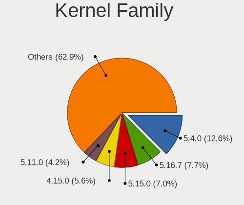

| Version | Desktops | Percent |
|---------|----------|---------|
| 5.4.0   | 18       | 16.36%  |
| 5.16.7  | 11       | 10%     |
| 5.15.0  | 9        | 8.18%   |
| 4.15.0  | 8        | 7.27%   |
| 5.11.0  | 6        | 5.45%   |
| 5.3.0   | 5        | 4.55%   |
| 6.1.1   | 3        | 2.73%   |
| 5.13.0  | 3        | 2.73%   |
| 5.10.0  | 3        | 2.73%   |
| 5.0.0   | 3        | 2.73%   |
| 4.18.0  | 3        | 2.73%   |
| 6.2.6   | 2        | 1.82%   |
| 6.1.26  | 2        | 1.82%   |
| 5.4.83  | 2        | 1.82%   |
| 5.19.0  | 2        | 1.82%   |
| 5.18.12 | 2        | 1.82%   |
| 5.15.60 | 2        | 1.82%   |
| 4.18.16 | 2        | 1.82%   |
| 6.3.8   | 1        | 0.91%   |
| 6.3.7   | 1        | 0.91%   |
| 6.2.12  | 1        | 0.91%   |
| 6.1.20  | 1        | 0.91%   |
| 6.1.11  | 1        | 0.91%   |
| 6.0.18  | 1        | 0.91%   |
| 6.0.0   | 1        | 0.91%   |
| 5.6.0   | 1        | 0.91%   |
| 5.19.16 | 1        | 0.91%   |
| 5.18.10 | 1        | 0.91%   |
| 5.17.5  | 1        | 0.91%   |
| 5.17.12 | 1        | 0.91%   |
| 5.15.74 | 1        | 0.91%   |
| 5.15.23 | 1        | 0.91%   |
| 5.13.12 | 1        | 0.91%   |
| 5.12.8  | 1        | 0.91%   |
| 5.12.4  | 1        | 0.91%   |
| 5.12.3  | 1        | 0.91%   |
| 5.12.15 | 1        | 0.91%   |
| 5.11.18 | 1        | 0.91%   |
| 5.11.15 | 1        | 0.91%   |
| 5.10.16 | 1        | 0.91%   |

Kernel Major Ver.
-----------------

Linux kernel major version

| Version | Desktops | Percent |
|---------|----------|---------|
| 5.4     | 20       | 18.18%  |
| 5.15    | 13       | 11.82%  |
| 5.16    | 11       | 10%     |
| 5.11    | 8        | 7.27%   |
| 4.15    | 8        | 7.27%   |
| 6.1     | 7        | 6.36%   |
| 5.3     | 5        | 4.55%   |
| 5.10    | 5        | 4.55%   |
| 4.18    | 5        | 4.55%   |
| 5.13    | 4        | 3.64%   |
| 5.12    | 4        | 3.64%   |
| 6.2     | 3        | 2.73%   |
| 5.19    | 3        | 2.73%   |
| 5.18    | 3        | 2.73%   |
| 5.0     | 3        | 2.73%   |
| 6.3     | 2        | 1.82%   |
| 6.0     | 2        | 1.82%   |
| 5.17    | 2        | 1.82%   |
| 5.6     | 1        | 0.91%   |
| 4.8     | 1        | 0.91%   |

Arch
----

OS architecture (x86_64, i586, etc.)

| Name   | Desktops | Percent |
|--------|----------|---------|
| x86_64 | 98       | 97.03%  |
| i686   | 3        | 2.97%   |

DE
--

Desktop Environment

| Name       | Desktops | Percent |
|------------|----------|---------|
| KDE5       | 32       | 30.77%  |
| GNOME      | 30       | 28.85%  |
| XFCE       | 11       | 10.58%  |
| X-Cinnamon | 10       | 9.62%   |
| Unknown    | 8        | 7.69%   |
| LXDE       | 3        | 2.88%   |
| MATE       | 2        | 1.92%   |
| KDE4       | 2        | 1.92%   |
| KDE        | 2        | 1.92%   |
| Cinnamon   | 2        | 1.92%   |
| qtile      | 1        | 0.96%   |
| ICEWM      | 1        | 0.96%   |

Display Server
--------------

X11 or Wayland

| Name    | Desktops | Percent |
|---------|----------|---------|
| X11     | 90       | 85.71%  |
| Wayland | 9        | 8.57%   |
| Unknown | 4        | 3.81%   |
| Tty     | 2        | 1.9%    |

Display Manager
---------------

SDDM, LightDM, etc.

| Name    | Desktops | Percent |
|---------|----------|---------|
| Unknown | 50       | 48.54%  |
| SDDM    | 26       | 25.24%  |
| LightDM | 14       | 13.59%  |
| GDM     | 6        | 5.83%   |
| GDM3    | 4        | 3.88%   |
| KDM     | 2        | 1.94%   |
| TDM     | 1        | 0.97%   |

OS Lang
-------

Language

| Lang       | Desktops | Percent |
|------------|----------|---------|
| es_UY      | 57       | 54.81%  |
| en_US      | 18       | 17.31%  |
| es_ES      | 12       | 11.54%  |
| Unknown    | 8        | 7.69%   |
| es_AR      | 4        | 3.85%   |
| C          | 3        | 2.88%   |
| es_UY.UTF8 | 1        | 0.96%   |
| en_GB      | 1        | 0.96%   |

Boot Mode
---------

EFI or BIOS

| Mode | Desktops | Percent |
|------|----------|---------|
| BIOS | 65       | 62.5%   |
| EFI  | 39       | 37.5%   |

Filesystem
----------

Type of filesystem

| Type    | Desktops | Percent |
|---------|----------|---------|
| Ext4    | 77       | 74.04%  |
| Overlay | 20       | 19.23%  |
| Btrfs   | 3        | 2.88%   |
| Tmpfs   | 2        | 1.92%   |
| Xfs     | 1        | 0.96%   |
| Unknown | 1        | 0.96%   |

Part. scheme
------------

Scheme of partitioning

| Type    | Desktops | Percent |
|---------|----------|---------|
| Unknown | 52       | 50.49%  |
| GPT     | 36       | 34.95%  |
| MBR     | 15       | 14.56%  |

Dual Boot with Linux/BSD
------------------------

Hosting more than one Linux/BSD

| Dual boot | Desktops | Percent |
|-----------|----------|---------|
| No        | 77       | 76.24%  |
| Yes       | 24       | 23.76%  |

Dual Boot (Win)
---------------

Hosting Linux and Windows

| Dual boot | Desktops | Percent |
|-----------|----------|---------|
| No        | 62       | 60.19%  |
| Yes       | 41       | 39.81%  |

Board
-----

Vendor
------

Motherboard manufacturer

| Name                | Desktops | Percent |
|---------------------|----------|---------|
| Gigabyte Technology | 20       | 19.8%   |
| ASRock              | 19       | 18.81%  |
| ASUSTek Computer    | 15       | 14.85%  |
| MSI                 | 13       | 12.87%  |
| Hewlett-Packard     | 11       | 10.89%  |
| Dell                | 6        | 5.94%   |
| Lenovo              | 3        | 2.97%   |
| Intel               | 3        | 2.97%   |
| Biostar             | 3        | 2.97%   |
| Supermicro          | 1        | 0.99%   |
| MACHINIST           | 1        | 0.99%   |
| Huanan              | 1        | 0.99%   |
| Gateway             | 1        | 0.99%   |
| Fujitsu             | 1        | 0.99%   |
| Foxconn             | 1        | 0.99%   |
| ECS                 | 1        | 0.99%   |
| AZW                 | 1        | 0.99%   |

Model
-----

Motherboard model

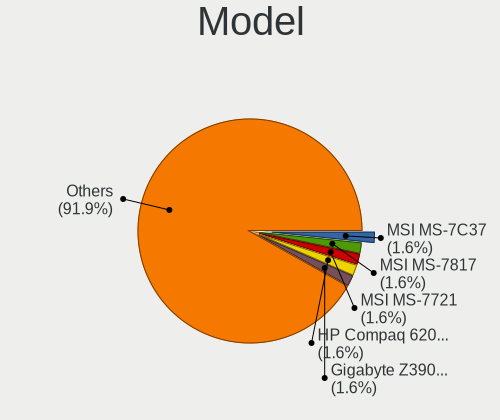

| Name                                                             | Desktops | Percent |
|------------------------------------------------------------------|----------|---------|
| MSI MS-7C37                                                      | 2        | 1.98%   |
| MSI MS-7721                                                      | 2        | 1.98%   |
| HP Compaq 6200 Pro SFF PC                                        | 2        | 1.98%   |
| Gigabyte Z390 AORUS ELITE                                        | 2        | 1.98%   |
| Gigabyte Z370 AORUS Gaming 7                                     | 2        | 1.98%   |
| Gigabyte H61M-S1                                                 | 2        | 1.98%   |
| ASRock N68-S                                                     | 2        | 1.98%   |
| ASRock H310CM-HDV                                                | 2        | 1.98%   |
| ASRock FM2A58M-VG3+ R2.0                                         | 2        | 1.98%   |
| ASRock ALiveNF6P-VSTA                                            | 2        | 1.98%   |
| Supermicro P4DMS                                                 | 1        | 0.99%   |
| MSI Pro 3130 Microtower PC                                       | 1        | 0.99%   |
| MSI MS-7C09                                                      | 1        | 0.99%   |
| MSI MS-7817                                                      | 1        | 0.99%   |
| MSI MS-7816                                                      | 1        | 0.99%   |
| MSI MS-7788                                                      | 1        | 0.99%   |
| MSI MS-7786                                                      | 1        | 0.99%   |
| MSI MS-7641                                                      | 1        | 0.99%   |
| MSI MS-7592                                                      | 1        | 0.99%   |
| MSI MS-7383                                                      | 1        | 0.99%   |
| MACHINIST X79 (INTEL Xeon E5/Corei7 DMI2 - C600/C200 Cipset V309 | 1        | 0.99%   |
| Lenovo ThinkCentre M92p 3238BK7                                  | 1        | 0.99%   |
| Lenovo ThinkCentre M82 3392C4S                                   | 1        | 0.99%   |
| Lenovo ThinkCentre M700 10HYA06700                               | 1        | 0.99%   |
| Intel H61M-DS2                                                   | 1        | 0.99%   |
| Intel H61                                                        | 1        | 0.99%   |
| Intel DP35DP AAD81073-208                                        | 1        | 0.99%   |
| Huanan X79 (INTEL Xeon E5/Corei7 DMI2 - C600/C200 Cipset V3.3    | 1        | 0.99%   |
| HP rp5800                                                        | 1        | 0.99%   |
| HP EliteDesk 800 G1 SFF                                          | 1        | 0.99%   |
| HP EliteDesk 705 G3 SFF                                          | 1        | 0.99%   |
| HP dc5000 SFF(DX854AV)                                           | 1        | 0.99%   |
| HP Compaq Pro 6300 SFF                                           | 1        | 0.99%   |
| HP Compaq dc7800p Small Form Factor                              | 1        | 0.99%   |
| HP Compaq dc5700 Microtower                                      | 1        | 0.99%   |
| HP Compaq 6005 Pro MT PC                                         | 1        | 0.99%   |
| HP Compaq 6000 Pro SFF PC                                        | 1        | 0.99%   |
| Gigabyte Z87X-UD4H                                               | 1        | 0.99%   |
| Gigabyte Z790 AORUS ELITE AX DDR4                                | 1        | 0.99%   |
| Gigabyte Z170X-Gaming 3                                          | 1        | 0.99%   |

Model Family
------------

Motherboard model prefix

| Name                  | Desktops | Percent |
|-----------------------|----------|---------|
| HP Compaq             | 7        | 6.93%   |
| Dell OptiPlex         | 4        | 3.96%   |
| Lenovo ThinkCentre    | 3        | 2.97%   |
| ASUS PRIME            | 3        | 2.97%   |
| MSI MS-7C37           | 2        | 1.98%   |
| MSI MS-7721           | 2        | 1.98%   |
| HP EliteDesk          | 2        | 1.98%   |
| Gigabyte Z390         | 2        | 1.98%   |
| Gigabyte Z370         | 2        | 1.98%   |
| Gigabyte H61M-S1      | 2        | 1.98%   |
| ASUS TUF              | 2        | 1.98%   |
| ASRock N68-S          | 2        | 1.98%   |
| ASRock H310CM-HDV     | 2        | 1.98%   |
| ASRock FM2A58M-VG3+   | 2        | 1.98%   |
| ASRock ALiveNF6P-VSTA | 2        | 1.98%   |
| ASRock A320M-HDV      | 2        | 1.98%   |
| Supermicro P4DMS      | 1        | 0.99%   |
| MSI Pro               | 1        | 0.99%   |
| MSI MS-7C09           | 1        | 0.99%   |
| MSI MS-7817           | 1        | 0.99%   |
| MSI MS-7816           | 1        | 0.99%   |
| MSI MS-7788           | 1        | 0.99%   |
| MSI MS-7786           | 1        | 0.99%   |
| MSI MS-7641           | 1        | 0.99%   |
| MSI MS-7592           | 1        | 0.99%   |
| MSI MS-7383           | 1        | 0.99%   |
| MACHINIST X79         | 1        | 0.99%   |
| Intel H61M-DS2        | 1        | 0.99%   |
| Intel H61             | 1        | 0.99%   |
| Intel DP35DP          | 1        | 0.99%   |
| Huanan X79            | 1        | 0.99%   |
| HP rp5800             | 1        | 0.99%   |
| HP dc5000             | 1        | 0.99%   |
| Gigabyte Z87X-UD4H    | 1        | 0.99%   |
| Gigabyte Z790         | 1        | 0.99%   |
| Gigabyte Z170X-Gaming | 1        | 0.99%   |
| Gigabyte X570         | 1        | 0.99%   |
| Gigabyte H81M-DS2     | 1        | 0.99%   |
| Gigabyte H410M        | 1        | 0.99%   |
| Gigabyte H310M        | 1        | 0.99%   |

MFG Year
--------

Motherboard manufacture year

| Year | Desktops | Percent |
|------|----------|---------|
| 2011 | 13       | 12.87%  |
| 2012 | 12       | 11.88%  |
| 2019 | 11       | 10.89%  |
| 2013 | 9        | 8.91%   |
| 2017 | 7        | 6.93%   |
| 2021 | 6        | 5.94%   |
| 2018 | 6        | 5.94%   |
| 2009 | 6        | 5.94%   |
| 2015 | 5        | 4.95%   |
| 2020 | 4        | 3.96%   |
| 2014 | 4        | 3.96%   |
| 2010 | 4        | 3.96%   |
| 2007 | 4        | 3.96%   |
| 2022 | 3        | 2.97%   |
| 2023 | 1        | 0.99%   |
| 2016 | 1        | 0.99%   |
| 2008 | 1        | 0.99%   |
| 2006 | 1        | 0.99%   |
| 2005 | 1        | 0.99%   |
| 2004 | 1        | 0.99%   |
| 2003 | 1        | 0.99%   |

Form Factor
-----------

Physical design of the computer

| Name    | Desktops | Percent |
|---------|----------|---------|
| Desktop | 101      | 100%    |

Secure Boot
-----------

Enabled or disabled

| State    | Desktops | Percent |
|----------|----------|---------|
| Disabled | 101      | 100%    |

Coreboot
--------

Have coreboot on board

| Used | Desktops | Percent |
|------|----------|---------|
| No   | 101      | 100%    |

RAM Size
--------

Total RAM memory

| Size in GB  | Desktops | Percent |
|-------------|----------|---------|
| 4.01-8.0    | 26       | 25%     |
| 8.01-16.0   | 19       | 18.27%  |
| 16.01-24.0  | 18       | 17.31%  |
| 3.01-4.0    | 17       | 16.35%  |
| 32.01-64.0  | 8        | 7.69%   |
| 24.01-32.0  | 6        | 5.77%   |
| 1.01-2.0    | 5        | 4.81%   |
| 64.01-256.0 | 3        | 2.88%   |
| 0.51-1.0    | 1        | 0.96%   |
| 0.01-0.5    | 1        | 0.96%   |

RAM Used
--------

Used RAM memory

| Used GB   | Desktops | Percent |
|-----------|----------|---------|
| 1.01-2.0  | 45       | 41.28%  |
| 2.01-3.0  | 25       | 22.94%  |
| 3.01-4.0  | 16       | 14.68%  |
| 4.01-8.0  | 7        | 6.42%   |
| 0.51-1.0  | 7        | 6.42%   |
| 8.01-16.0 | 5        | 4.59%   |
| 0.01-0.5  | 4        | 3.67%   |

Total Drives
------------

Number of drives on board

| Drives | Desktops | Percent |
|--------|----------|---------|
| 1      | 50       | 47.62%  |
| 2      | 28       | 26.67%  |
| 3      | 13       | 12.38%  |
| 4      | 10       | 9.52%   |
| 5      | 3        | 2.86%   |
| 7      | 1        | 0.95%   |

Has CD-ROM
----------

Has CD-ROM on board

| Presented | Desktops | Percent |
|-----------|----------|---------|
| No        | 57       | 55.88%  |
| Yes       | 45       | 44.12%  |

Has Ethernet
------------

Has Ethernet on board

| Presented | Desktops | Percent |
|-----------|----------|---------|
| Yes       | 99       | 98.02%  |
| No        | 2        | 1.98%   |

Has WiFi
--------

Has WiFi module

| Presented | Desktops | Percent |
|-----------|----------|---------|
| No        | 60       | 58.25%  |
| Yes       | 43       | 41.75%  |

Has Bluetooth
-------------

Has Bluetooth module

| Presented | Desktops | Percent |
|-----------|----------|---------|
| No        | 83       | 82.18%  |
| Yes       | 18       | 17.82%  |

Location
--------

Country
-------

Geographic location (country)

| Country | Desktops | Percent |
|---------|----------|---------|
| Uruguay | 101      | 100%    |

City
----

Geographic location (city)

| City             | Desktops | Percent |
|------------------|----------|---------|
| Montevideo       | 83       | 79.81%  |
| Maldonado        | 4        | 3.85%   |
| Florida          | 3        | 2.88%   |
| San Jose de Mayo | 2        | 1.92%   |
| Las Piedras      | 2        | 1.92%   |
| Nuevo Paris      | 1        | 0.96%   |
| Nueva Helvecia   | 1        | 0.96%   |
| Minas            | 1        | 0.96%   |
| Melo             | 1        | 0.96%   |
| Malvin Norte     | 1        | 0.96%   |
| La Paz           | 1        | 0.96%   |
| Durazno          | 1        | 0.96%   |
| Ciudad del Plata | 1        | 0.96%   |
| Centro           | 1        | 0.96%   |
| Unknown          | 1        | 0.96%   |

Drives
------

Drive Vendor
------------

Hard drive vendors

| Vendor                      | Desktops | Drives | Percent |
|-----------------------------|----------|--------|---------|
| WDC                         | 48       | 62     | 27.27%  |
| Seagate                     | 31       | 43     | 17.61%  |
| Kingston                    | 22       | 25     | 12.5%   |
| Samsung Electronics         | 21       | 22     | 11.93%  |
| Toshiba                     | 16       | 22     | 9.09%   |
| Crucial                     | 6        | 9      | 3.41%   |
| Hitachi                     | 3        | 6      | 1.7%    |
| Biostar                     | 3        | 4      | 1.7%    |
| Patriot                     | 2        | 2      | 1.14%   |
| Micron/Crucial Technology   | 2        | 3      | 1.14%   |
| Maxtor                      | 2        | 3      | 1.14%   |
| HS-SSD-C100                 | 2        | 3      | 1.14%   |
| Hewlett-Packard             | 2        | 2      | 1.14%   |
| Unknown                     | 1        | 2      | 0.57%   |
| SK hynix                    | 1        | 1      | 0.57%   |
| Silicon Motion              | 1        | 1      | 0.57%   |
| Sandisk                     | 1        | 2      | 0.57%   |
| Realtek Semiconductor       | 1        | 1      | 0.57%   |
| Phison Electronics          | 1        | 1      | 0.57%   |
| Phison                      | 1        | 1      | 0.57%   |
| NGFF                        | 1        | 1      | 0.57%   |
| Netac                       | 1        | 2      | 0.57%   |
| Micron Technology           | 1        | 1      | 0.57%   |
| MAXIO Technology (Hangzhou) | 1        | 2      | 0.57%   |
| IBM-ESXS                    | 1        | 1      | 0.57%   |
| HGST                        | 1        | 1      | 0.57%   |
| Gigabyte Technology         | 1        | 1      | 0.57%   |
| ExcelStor                   | 1        | 1      | 0.57%   |
| A-DATA Technology           | 1        | 1      | 0.57%   |

Drive Model
-----------

Hard drive models

| Model                            | Desktops | Percent |
|----------------------------------|----------|---------|
| Toshiba DT01ACA300 3TB           | 6        | 3.11%   |
| Kingston SA400S37240G 240GB SSD  | 6        | 3.11%   |
| WDC WD10EZEX-08WN4A0 1TB         | 5        | 2.59%   |
| Toshiba DT01ACA100 1TB           | 5        | 2.59%   |
| Samsung HD161HJ 160GB            | 5        | 2.59%   |
| WDC WD5000AAKX-00ERMA0 500GB     | 4        | 2.07%   |
| Seagate ST1000DM010-2EP102 1TB   | 4        | 2.07%   |
| Seagate ST500DM002-1BD142 500GB  | 3        | 1.55%   |
| Kingston SV300S37A480G 480GB SSD | 3        | 1.55%   |
| Kingston SA400S37120G 120GB SSD  | 3        | 1.55%   |
| WDC WDS240G2G0B-00EPW0 240GB SSD | 2        | 1.04%   |
| WDC WD5000AAKX-75U6AA0 500GB     | 2        | 1.04%   |
| WDC WD10EFRX-68FYTN0 1TB         | 2        | 1.04%   |
| Seagate ST500DM005 HD502HJ 500GB | 2        | 1.04%   |
| Seagate ST3750640NS 752GB        | 2        | 1.04%   |
| Seagate ST3250312AS 250GB        | 2        | 1.04%   |
| Seagate ST3160318AS 160GB        | 2        | 1.04%   |
| Seagate ST250DM000-1BD141 250GB  | 2        | 1.04%   |
| Seagate ST1000DM003-1CH162 1TB   | 2        | 1.04%   |
| Samsung SSD 860 EVO 500GB        | 2        | 1.04%   |
| Samsung HD103SJ 1TB              | 2        | 1.04%   |
| Kingston SV300S37A120G 120GB SSD | 2        | 1.04%   |
| Kingston SNVS1000G 1TB           | 2        | 1.04%   |
| Kingston SA400S37480G 480GB SSD  | 2        | 1.04%   |
| Kingston SA2000M81000G 1TB       | 2        | 1.04%   |
| Biostar S100-120GB SSD           | 2        | 1.04%   |
| WDC WDS512G1X0C-00ENX0 512GB     | 1        | 0.52%   |
| WDC WDS500G3X0C-00SJG0 500GB     | 1        | 0.52%   |
| WDC WDS500G2B0A-00SM50 500GB SSD | 1        | 0.52%   |
| WDC WDS250G2B0B-00YS70 250GB SSD | 1        | 0.52%   |
| WDC WDS240G2G0A-00JH30 240GB SSD | 1        | 0.52%   |
| WDC WDS120G2G0A-00JH30 120GB SSD | 1        | 0.52%   |
| WDC WDS100T3X0C-00SJG0 1TB       | 1        | 0.52%   |
| WDC WD800JD-60LSA5 80GB          | 1        | 0.52%   |
| WDC WD5000LPVX-22V0TT0 500GB     | 1        | 0.52%   |
| WDC WD5000LPVT-24G33T1 500GB     | 1        | 0.52%   |
| WDC WD5000BEVT-22A0RT0 500GB     | 1        | 0.52%   |
| WDC WD5000BEKT-60KA9T0 500GB     | 1        | 0.52%   |
| WDC WD5000AZLX-00ZR6A0 500GB     | 1        | 0.52%   |
| WDC WD5000AVVS-63ZWB0 500GB      | 1        | 0.52%   |

HDD Vendor
----------

Hard disk drive vendors

| Vendor              | Desktops | Drives | Percent |
|---------------------|----------|--------|---------|
| WDC                 | 42       | 53     | 37.84%  |
| Seagate             | 31       | 43     | 27.93%  |
| Toshiba             | 16       | 22     | 14.41%  |
| Samsung Electronics | 15       | 15     | 13.51%  |
| Hitachi             | 3        | 6      | 2.7%    |
| Maxtor              | 2        | 3      | 1.8%    |
| HGST                | 1        | 1      | 0.9%    |
| ExcelStor           | 1        | 1      | 0.9%    |

SSD Vendor
----------

Solid state drive vendors

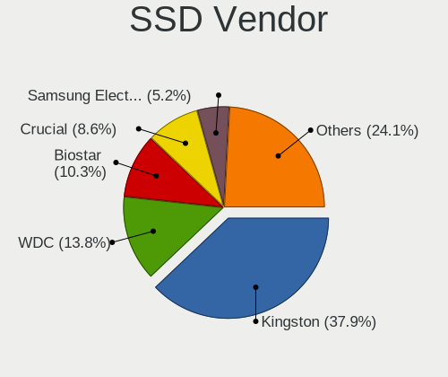

| Vendor              | Desktops | Drives | Percent |
|---------------------|----------|--------|---------|
| Kingston            | 18       | 20     | 42.86%  |
| WDC                 | 6        | 6      | 14.29%  |
| Crucial             | 5        | 6      | 11.9%   |
| Samsung Electronics | 3        | 4      | 7.14%   |
| Biostar             | 2        | 3      | 4.76%   |
| Patriot             | 1        | 1      | 2.38%   |
| NGFF                | 1        | 1      | 2.38%   |
| Netac               | 1        | 2      | 2.38%   |
| Micron Technology   | 1        | 1      | 2.38%   |
| HS-SSD-C100         | 1        | 1      | 2.38%   |
| Hewlett-Packard     | 1        | 1      | 2.38%   |
| Gigabyte Technology | 1        | 1      | 2.38%   |
| A-DATA Technology   | 1        | 1      | 2.38%   |

Drive Kind
----------

HDD or SSD

| Kind    | Desktops | Drives | Percent |
|---------|----------|--------|---------|
| HDD     | 82       | 144    | 56.55%  |
| SSD     | 41       | 48     | 28.28%  |
| NVMe    | 18       | 28     | 12.41%  |
| Unknown | 4        | 6      | 2.76%   |

Drive Connector
---------------

SATA, SAS, NVMe, etc.

| Type | Desktops | Drives | Percent |
|------|----------|--------|---------|
| SATA | 96       | 194    | 82.05%  |
| NVMe | 18       | 28     | 15.38%  |
| SAS  | 3        | 4      | 2.56%   |

Drive Size
----------

Size of hard drive

| Size in TB | Desktops | Drives | Percent |
|------------|----------|--------|---------|
| 0.01-0.5   | 76       | 107    | 59.38%  |
| 0.51-1.0   | 36       | 65     | 28.13%  |
| 2.01-3.0   | 8        | 10     | 6.25%   |
| 1.01-2.0   | 5        | 6      | 3.91%   |
| 3.01-4.0   | 3        | 4      | 2.34%   |

Space Total
-----------

Amount of disk space available on the file system

| Size in GB     | Desktops | Percent |
|----------------|----------|---------|
| 101-250        | 27       | 25.47%  |
| 251-500        | 22       | 20.75%  |
| 501-1000       | 13       | 12.26%  |
| 1001-2000      | 12       | 11.32%  |
| 1-20           | 12       | 11.32%  |
| 21-50          | 5        | 4.72%   |
| 2001-3000      | 5        | 4.72%   |
| Unknown        | 5        | 4.72%   |
| 51-100         | 3        | 2.83%   |
| More than 3000 | 2        | 1.89%   |

Space Used
----------

Amount of used disk space

| Used GB   | Desktops | Percent |
|-----------|----------|---------|
| 1-20      | 41       | 38.68%  |
| 21-50     | 16       | 15.09%  |
| 101-250   | 10       | 9.43%   |
| 51-100    | 10       | 9.43%   |
| 501-1000  | 9        | 8.49%   |
| 251-500   | 6        | 5.66%   |
| 1001-2000 | 6        | 5.66%   |
| Unknown   | 5        | 4.72%   |
| 2001-3000 | 3        | 2.83%   |

Malfunc. Drives
---------------

Drive models with a malfunction

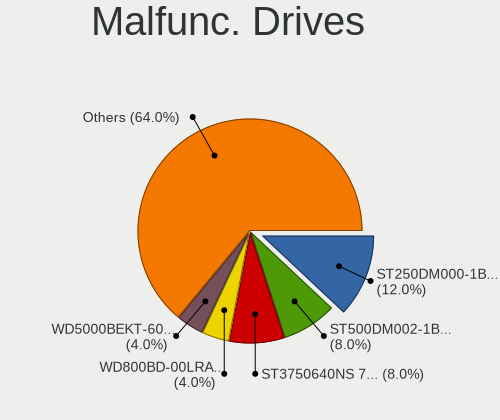

| Model                            | Desktops | Drives | Percent |
|----------------------------------|----------|--------|---------|
| Seagate ST500DM002-1BD142 500GB  | 2        | 2      | 10%     |
| Seagate ST3750640NS 752GB        | 2        | 7      | 10%     |
| Seagate ST250DM000-1BD141 250GB  | 2        | 2      | 10%     |
| WDC WD5000BEKT-60KA9T0 500GB     | 1        | 1      | 5%      |
| WDC WD5000AAKX-75U6AA0 500GB     | 1        | 1      | 5%      |
| WDC WD5000AAJS-00A8B0 500GB      | 1        | 1      | 5%      |
| WDC WD10EARS-22Y5B1 1TB          | 1        | 1      | 5%      |
| Toshiba MQ01ABD075 752GB         | 1        | 1      | 5%      |
| Toshiba MK5059GSXP 500GB         | 1        | 1      | 5%      |
| Toshiba MK3276GSX 320GB          | 1        | 1      | 5%      |
| Toshiba DT01ACA100 1TB           | 1        | 1      | 5%      |
| Seagate ST500LM021-1KJ152 500GB  | 1        | 1      | 5%      |
| Seagate ST500DM005 HD502HJ 500GB | 1        | 1      | 5%      |
| Seagate ST3250310CS 250GB        | 1        | 1      | 5%      |
| Seagate ST3200827AS 200GB        | 1        | 1      | 5%      |
| Seagate ST1000DM010-2EP102 1TB   | 1        | 1      | 5%      |
| HS-SSD-C100 SSD 240G             | 1        | 1      | 5%      |

Malfunc. Drive Vendor
---------------------

Vendors of faulty drives

| Vendor      | Desktops | Drives | Percent |
|-------------|----------|--------|---------|
| Seagate     | 10       | 16     | 52.63%  |
| WDC         | 4        | 4      | 21.05%  |
| Toshiba     | 4        | 4      | 21.05%  |
| HS-SSD-C100 | 1        | 1      | 5.26%   |

Malfunc. HDD Vendor
-------------------

Vendors of faulty HDD drives

| Vendor  | Desktops | Drives | Percent |
|---------|----------|--------|---------|
| Seagate | 10       | 16     | 55.56%  |
| WDC     | 4        | 4      | 22.22%  |
| Toshiba | 4        | 4      | 22.22%  |

Malfunc. Drive Kind
-------------------

Kinds of faulty drives

| Kind | Desktops | Drives | Percent |
|------|----------|--------|---------|
| HDD  | 18       | 24     | 94.74%  |
| SSD  | 1        | 1      | 5.26%   |

Failed Drives
-------------

Failed drive models

Zero info for selected period =(

Failed Drive Vendor
-------------------

Failed drive vendors

Zero info for selected period =(

Drive Status
------------

Number of failed and malfunc. drives

| Status   | Desktops | Drives | Percent |
|----------|----------|--------|---------|
| Detected | 58       | 126    | 50%     |
| Works    | 39       | 75     | 33.62%  |
| Malfunc  | 19       | 25     | 16.38%  |

Storage controller
------------------

Storage Vendor
--------------

Storage controller vendors

| Vendor                      | Desktops | Percent |
|-----------------------------|----------|---------|
| Intel                       | 62       | 47.33%  |
| AMD                         | 32       | 24.43%  |
| Nvidia                      | 6        | 4.58%   |
| ASMedia Technology          | 5        | 3.82%   |
| SanDisk                     | 4        | 3.05%   |
| Kingston Technology Company | 4        | 3.05%   |
| Silicon Motion              | 3        | 2.29%   |
| Samsung Electronics         | 3        | 2.29%   |
| Micron/Crucial Technology   | 3        | 2.29%   |
| Phison Electronics          | 2        | 1.53%   |
| Marvell Technology Group    | 2        | 1.53%   |
| VIA Technologies            | 1        | 0.76%   |
| SK hynix                    | 1        | 0.76%   |
| Realtek Semiconductor       | 1        | 0.76%   |
| MAXIO Technology (Hangzhou) | 1        | 0.76%   |
| Adaptec                     | 1        | 0.76%   |

Storage Model
-------------

Storage controller models

| Model                                                                                   | Desktops | Percent |
|-----------------------------------------------------------------------------------------|----------|---------|
| AMD FCH SATA Controller [AHCI mode]                                                     | 18       | 10.53%  |
| Intel 7 Series/C210 Series Chipset Family 6-port SATA Controller [AHCI mode]            | 7        | 4.09%   |
| Intel 6 Series/C200 Series Chipset Family 6 port Desktop SATA AHCI Controller           | 7        | 4.09%   |
| Nvidia MCP61 SATA Controller                                                            | 6        | 3.51%   |
| Nvidia MCP61 IDE                                                                        | 5        | 2.92%   |
| Intel 6 Series/C200 Series Chipset Family Desktop SATA Controller (IDE mode, ports 4-5) | 5        | 2.92%   |
| Intel 6 Series/C200 Series Chipset Family Desktop SATA Controller (IDE mode, ports 0-3) | 5        | 2.92%   |
| Intel 200 Series PCH SATA controller [AHCI mode]                                        | 5        | 2.92%   |
| ASMedia ASM1062 Serial ATA Controller                                                   | 5        | 2.92%   |
| AMD SB7x0/SB8x0/SB9x0 SATA Controller [AHCI mode]                                       | 5        | 2.92%   |
| AMD SB7x0/SB8x0/SB9x0 IDE Controller                                                    | 5        | 2.92%   |
| AMD FCH IDE Controller                                                                  | 5        | 2.92%   |
| AMD 400 Series Chipset SATA Controller                                                  | 5        | 2.92%   |
| Intel NM10/ICH7 Family SATA Controller [IDE mode]                                       | 4        | 2.34%   |
| Intel Cannon Lake PCH SATA AHCI Controller                                              | 4        | 2.34%   |
| Intel 82801G (ICH7 Family) IDE Controller                                               | 4        | 2.34%   |
| Intel 8 Series/C220 Series Chipset Family 6-port SATA Controller 1 [AHCI mode]          | 4        | 2.34%   |
| Intel Q170/Q150/B150/H170/H110/Z170/CM236 Chipset SATA Controller [AHCI Mode]           | 3        | 1.75%   |
| Intel 500 Series Chipset Family SATA AHCI Controller                                    | 3        | 1.75%   |
| AMD FCH SATA Controller D                                                               | 3        | 1.75%   |
| Silicon Motion SM2262/SM2262EN SSD Controller                                           | 2        | 1.17%   |
| SanDisk WD Black 2018/SN750 / PC SN720 NVMe SSD                                         | 2        | 1.17%   |
| Micron/Crucial P2 [Nick P2] / P3 / P3 Plus NVMe PCIe SSD (DRAM-less)                    | 2        | 1.17%   |
| Kingston Company NVMe Controller                                                        | 2        | 1.17%   |
| Kingston Company A2000 NVMe SSD                                                         | 2        | 1.17%   |
| Intel SATA Controller [RAID mode]                                                       | 2        | 1.17%   |
| Intel 400 Series Chipset Family SATA AHCI Controller                                    | 2        | 1.17%   |
| AMD SB7x0/SB8x0/SB9x0 SATA Controller [IDE mode]                                        | 2        | 1.17%   |
| AMD 500 Series Chipset SATA Controller                                                  | 2        | 1.17%   |
| AMD 300 Series Chipset SATA Controller                                                  | 2        | 1.17%   |
| VIA VT82C586A/B/VT82C686/A/B/VT823x/A/C PIPC Bus Master IDE                             | 1        | 0.58%   |
| VIA VIA VT6420 SATA RAID Controller                                                     | 1        | 0.58%   |
| SK hynix BC501 NVMe Solid State Drive                                                   | 1        | 0.58%   |
| Silicon Motion SM2263EN/SM2263XT (DRAM-less) NVMe SSD Controllers                       | 1        | 0.58%   |
| SanDisk WD Green SN350 NVMe SSD 1 TB (DRAM-less)                                        | 1        | 0.58%   |
| SanDisk WD Black NVMe SSD                                                               | 1        | 0.58%   |
| Samsung NVMe SSD Controller SM981/PM981/PM983                                           | 1        | 0.58%   |
| Samsung NVMe SSD Controller SM961/PM961/SM963                                           | 1        | 0.58%   |
| Samsung NVMe SSD Controller 980                                                         | 1        | 0.58%   |
| Realtek RTS5763DL NVMe SSD Controller                                                   | 1        | 0.58%   |

Storage Kind
------------

Kind of storage controller (IDE, SATA, NVMe, SAS, ...)

| Kind | Desktops | Percent |
|------|----------|---------|
| SATA | 78       | 57.35%  |
| IDE  | 35       | 25.74%  |
| NVMe | 18       | 13.24%  |
| RAID | 4        | 2.94%   |
| SCSI | 1        | 0.74%   |

Processor
---------

CPU Vendor
----------

Processor vendors

| Vendor | Desktops | Percent |
|--------|----------|---------|
| Intel  | 62       | 61.39%  |
| AMD    | 39       | 38.61%  |

CPU Model
---------

Processor models

| Model                                           | Desktops | Percent |
|-------------------------------------------------|----------|---------|
| Intel Core 2 Duo CPU E7500 @ 2.93GHz            | 3        | 2.97%   |
| AMD Ryzen 5 1600 Six-Core Processor             | 3        | 2.97%   |
| Intel Core i7-4790 CPU @ 3.60GHz                | 2        | 1.98%   |
| Intel Core i7-3770 CPU @ 3.40GHz                | 2        | 1.98%   |
| Intel Core i5-8400 CPU @ 2.80GHz                | 2        | 1.98%   |
| Intel Core i5-3470 CPU @ 3.20GHz                | 2        | 1.98%   |
| Intel Core i5-10400 CPU @ 2.90GHz               | 2        | 1.98%   |
| Intel Core i3-2120 CPU @ 3.30GHz                | 2        | 1.98%   |
| AMD Ryzen 7 3700X 8-Core Processor              | 2        | 1.98%   |
| AMD Phenom II X6 1055T Processor                | 2        | 1.98%   |
| AMD Athlon II X2 250 Processor                  | 2        | 1.98%   |
| AMD Athlon 3000G with Radeon Vega Graphics      | 2        | 1.98%   |
| AMD A10-7860K Radeon R7, 12 Compute Cores 4C+8G | 2        | 1.98%   |
| Intel Xeon CPU E5-2689 0 @ 2.60GHz              | 1        | 0.99%   |
| Intel Xeon CPU E5-2420 0 @ 1.90GHz              | 1        | 0.99%   |
| Intel Xeon CPU E5-1620 v3 @ 3.50GHz             | 1        | 0.99%   |
| Intel Xeon CPU 2.40GHz                          | 1        | 0.99%   |
| Intel Pentium CPU G870 @ 3.10GHz                | 1        | 0.99%   |
| Intel Pentium CPU G2030 @ 3.00GHz               | 1        | 0.99%   |
| Intel Pentium 4 CPU 2.80GHz                     | 1        | 0.99%   |
| Intel Core i9-9900KF CPU @ 3.60GHz              | 1        | 0.99%   |
| Intel Core i7-9700 CPU @ 3.00GHz                | 1        | 0.99%   |
| Intel Core i7-8700K CPU @ 3.70GHz               | 1        | 0.99%   |
| Intel Core i7-8700 CPU @ 3.20GHz                | 1        | 0.99%   |
| Intel Core i7-6700 CPU @ 3.40GHz                | 1        | 0.99%   |
| Intel Core i7-4930K CPU @ 3.40GHz               | 1        | 0.99%   |
| Intel Core i7-2600K CPU @ 3.40GHz               | 1        | 0.99%   |
| Intel Core i7-2600 CPU @ 3.40GHz                | 1        | 0.99%   |
| Intel Core i7-10700F CPU @ 2.90GHz              | 1        | 0.99%   |
| Intel Core i5-9400F CPU @ 2.90GHz               | 1        | 0.99%   |
| Intel Core i5-9400 CPU @ 2.90GHz                | 1        | 0.99%   |
| Intel Core i5-6400 CPU @ 2.70GHz                | 1        | 0.99%   |
| Intel Core i5-4670K CPU @ 3.40GHz               | 1        | 0.99%   |
| Intel Core i5-4570 CPU @ 3.20GHz                | 1        | 0.99%   |
| Intel Core i5-3570S CPU @ 3.10GHz               | 1        | 0.99%   |
| Intel Core i5-3470T CPU @ 2.90GHz               | 1        | 0.99%   |
| Intel Core i5-2500S CPU @ 2.70GHz               | 1        | 0.99%   |
| Intel Core i5-2400S CPU @ 2.50GHz               | 1        | 0.99%   |
| Intel Core i5-10400F CPU @ 2.90GHz              | 1        | 0.99%   |
| Intel Core i5 CPU 650 @ 3.20GHz                 | 1        | 0.99%   |

CPU Model Family
----------------

Processor model prefix

| Model             | Desktops | Percent |
|-------------------|----------|---------|
| Intel Core i5     | 17       | 16.83%  |
| Intel Core i7     | 12       | 11.88%  |
| Intel Core i3     | 11       | 10.89%  |
| AMD Ryzen 5       | 7        | 6.93%   |
| Intel Core 2 Duo  | 6        | 5.94%   |
| AMD Ryzen 7       | 5        | 4.95%   |
| AMD Athlon II X2  | 5        | 4.95%   |
| Intel Xeon        | 4        | 3.96%   |
| Intel Celeron     | 4        | 3.96%   |
| Intel Core 2 Quad | 3        | 2.97%   |
| AMD Phenom II X6  | 3        | 2.97%   |
| AMD FX            | 3        | 2.97%   |
| AMD A10           | 3        | 2.97%   |
| Intel Pentium     | 2        | 1.98%   |
| AMD Ryzen 3       | 2        | 1.98%   |
| AMD Athlon        | 2        | 1.98%   |
| AMD A6            | 2        | 1.98%   |
| AMD A4            | 2        | 1.98%   |
| Other             | 1        | 0.99%   |
| Intel Pentium 4   | 1        | 0.99%   |
| Intel Core i9     | 1        | 0.99%   |
| AMD PRO A10       | 1        | 0.99%   |
| AMD Phenom        | 1        | 0.99%   |
| AMD Athlon 64 X2  | 1        | 0.99%   |
| AMD Athlon 64     | 1        | 0.99%   |
| AMD A8            | 1        | 0.99%   |

CPU Cores
---------

Number of processor cores

| Number | Desktops | Percent |
|--------|----------|---------|
| 2      | 38       | 37.62%  |
| 4      | 29       | 28.71%  |
| 6      | 20       | 19.8%   |
| 8      | 9        | 8.91%   |
| 1      | 4        | 3.96%   |
| 14     | 1        | 0.99%   |

CPU Sockets
-----------

Number of sockets

| Number | Desktops | Percent |
|--------|----------|---------|
| 1      | 100      | 99.01%  |
| 2      | 1        | 0.99%   |

CPU Threads
-----------

Threads per core (Hyper-Threading)

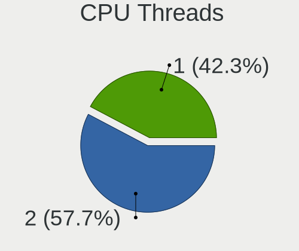

| Number | Desktops | Percent |
|--------|----------|---------|
| 2      | 57       | 56.44%  |
| 1      | 44       | 43.56%  |

CPU Op-Modes
------------

CPU Operation Modes (32-bit, 64-bit)

| Op mode        | Desktops | Percent |
|----------------|----------|---------|
| 32-bit, 64-bit | 98       | 97.03%  |
| 32-bit         | 2        | 1.98%   |
| Unknown        | 1        | 0.99%   |

CPU Microcode
-------------

Microcode number

| Number     | Desktops | Percent |
|------------|----------|---------|
| Unknown    | 29       | 27.62%  |
| 0x206a7    | 7        | 6.67%   |
| 0x306c3    | 6        | 5.71%   |
| 0x306a9    | 6        | 5.71%   |
| 0x906ea    | 5        | 4.76%   |
| 0x1067a    | 5        | 4.76%   |
| 0x08701021 | 4        | 3.81%   |
| 0x06000852 | 3        | 2.86%   |
| 0xa0655    | 2        | 1.9%    |
| 0xa0653    | 2        | 1.9%    |
| 0x506e3    | 2        | 1.9%    |
| 0x206d7    | 2        | 1.9%    |
| 0x20655    | 2        | 1.9%    |
| 0x08108109 | 2        | 1.9%    |
| 0x08001138 | 2        | 1.9%    |
| 0x06003106 | 2        | 1.9%    |
| 0x06001119 | 2        | 1.9%    |
| 0x010000dc | 2        | 1.9%    |
| 0xf33      | 1        | 0.95%   |
| 0xf27      | 1        | 0.95%   |
| 0x906ed    | 1        | 0.95%   |
| 0x906ec    | 1        | 0.95%   |
| 0x906eb    | 1        | 0.95%   |
| 0x906c0    | 1        | 0.95%   |
| 0x6fd      | 1        | 0.95%   |
| 0x10677    | 1        | 0.95%   |
| 0x10676    | 1        | 0.95%   |
| 0x0a50000d | 1        | 0.95%   |
| 0x0a50000c | 1        | 0.95%   |
| 0x08108102 | 1        | 0.95%   |
| 0x0800820d | 1        | 0.95%   |
| 0x08001137 | 1        | 0.95%   |
| 0x0600611a | 1        | 0.95%   |
| 0x03000027 | 1        | 0.95%   |
| 0x010000c8 | 1        | 0.95%   |
| 0x010000b6 | 1        | 0.95%   |
| 0x01000083 | 1        | 0.95%   |
| 0x00000000 | 1        | 0.95%   |

CPU Microarch
-------------

Microarchitecture

| Name        | Desktops | Percent |
|-------------|----------|---------|
| SandyBridge | 11       | 10.89%  |
| IvyBridge   | 11       | 10.89%  |
| KabyLake    | 9        | 8.91%   |
| K10         | 9        | 8.91%   |
| Penryn      | 7        | 6.93%   |
| Haswell     | 7        | 6.93%   |
| CometLake   | 6        | 5.94%   |
| Zen+        | 5        | 4.95%   |
| Piledriver  | 5        | 4.95%   |
| Zen 3       | 4        | 3.96%   |
| Zen 2       | 4        | 3.96%   |
| Steamroller | 4        | 3.96%   |
| Zen         | 3        | 2.97%   |
| Skylake     | 3        | 2.97%   |
| Westmere    | 2        | 1.98%   |
| NetBurst    | 2        | 1.98%   |
| K8 Hammer   | 2        | 1.98%   |
| Core        | 2        | 1.98%   |
| Tremont     | 1        | 0.99%   |
| K10 Llano   | 1        | 0.99%   |
| Jaguar      | 1        | 0.99%   |
| Excavator   | 1        | 0.99%   |
| Unknown     | 1        | 0.99%   |

Graphics
--------

GPU Vendor
----------

Vendors of graphics cards

| Vendor | Desktops | Percent |
|--------|----------|---------|
| Nvidia | 45       | 41.67%  |
| Intel  | 35       | 32.41%  |
| AMD    | 28       | 25.93%  |

GPU Model
---------

Graphics card models

| Model                                                                       | Desktops | Percent |
|-----------------------------------------------------------------------------|----------|---------|
| Intel Xeon E3-1200 v2/3rd Gen Core processor Graphics Controller            | 8        | 7.27%   |
| Intel 2nd Generation Core Processor Family Integrated Graphics Controller   | 5        | 4.55%   |
| Nvidia GT218 [GeForce 210]                                                  | 4        | 3.64%   |
| Intel CoffeeLake-S GT2 [UHD Graphics 630]                                   | 4        | 3.64%   |
| AMD Kaveri [Radeon R7 Graphics]                                             | 4        | 3.64%   |
| Nvidia GT218 [GeForce 8400 GS Rev. 3]                                       | 3        | 2.73%   |
| Nvidia GK208B [GeForce GT 730]                                              | 3        | 2.73%   |
| Intel Xeon E3-1200 v3/4th Gen Core Processor Integrated Graphics Controller | 3        | 2.73%   |
| Intel CometLake-S GT2 [UHD Graphics 630]                                    | 3        | 2.73%   |
| AMD Picasso/Raven 2 [Radeon Vega Series / Radeon Vega Mobile Series]        | 3        | 2.73%   |
| Nvidia TU117 [GeForce GTX 1650]                                             | 2        | 1.82%   |
| Nvidia TU116 [GeForce GTX 1650 SUPER]                                       | 2        | 1.82%   |
| Nvidia GP107 [GeForce GTX 1050]                                             | 2        | 1.82%   |
| Nvidia GA106 [GeForce RTX 3060 Lite Hash Rate]                              | 2        | 1.82%   |
| Nvidia C61 [GeForce 7025 / nForce 630a]                                     | 2        | 1.82%   |
| Intel HD Graphics 530                                                       | 2        | 1.82%   |
| AMD Ellesmere [Radeon RX 470/480/570/570X/580/580X/590]                     | 2        | 1.82%   |
| AMD Cezanne [Radeon Vega Series / Radeon Vega Mobile Series]                | 2        | 1.82%   |
| Nvidia TU116 [GeForce GTX 1660 Ti]                                          | 1        | 0.91%   |
| Nvidia TU106 [GeForce RTX 2060 Rev. A]                                      | 1        | 0.91%   |
| Nvidia NV34 [GeForce FX 5200]                                               | 1        | 0.91%   |
| Nvidia GT216 [GeForce 210]                                                  | 1        | 0.91%   |
| Nvidia GP108 [GeForce GT 1030]                                              | 1        | 0.91%   |
| Nvidia GP107 [GeForce GTX 1050 Ti]                                          | 1        | 0.91%   |
| Nvidia GP106 [GeForce GTX 1060 6GB]                                         | 1        | 0.91%   |
| Nvidia GP106 [GeForce GTX 1060 3GB]                                         | 1        | 0.91%   |
| Nvidia GP104 [GeForce GTX 1080]                                             | 1        | 0.91%   |
| Nvidia GM206 [GeForce GTX 960]                                              | 1        | 0.91%   |
| Nvidia GM204 [GeForce GTX 970]                                              | 1        | 0.91%   |
| Nvidia GM107 [GeForce GTX 750]                                              | 1        | 0.91%   |
| Nvidia GM107 [GeForce GTX 750 Ti]                                           | 1        | 0.91%   |
| Nvidia GK208B [GeForce GT 720]                                              | 1        | 0.91%   |
| Nvidia GK208B [GeForce GT 710]                                              | 1        | 0.91%   |
| Nvidia GK107GL [Quadro K600]                                                | 1        | 0.91%   |
| Nvidia GF119 [GeForce GT 610]                                               | 1        | 0.91%   |
| Nvidia GF108 [GeForce GT 630]                                               | 1        | 0.91%   |
| Nvidia GF108 [GeForce GT 620]                                               | 1        | 0.91%   |
| Nvidia GF108 [GeForce GT 430]                                               | 1        | 0.91%   |
| Nvidia GF100 [GeForce GTX 470]                                              | 1        | 0.91%   |
| Nvidia GA104 [GeForce RTX 3070 Lite Hash Rate]                              | 1        | 0.91%   |

GPU Combo
---------

Combinations of graphics cards

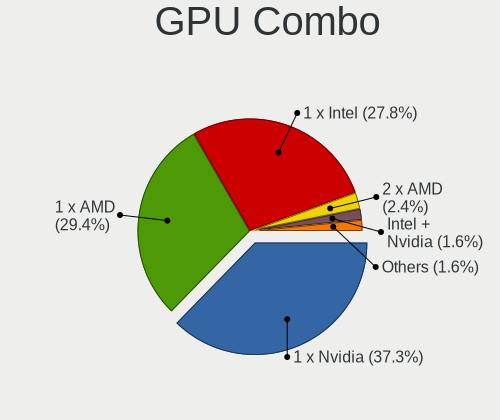

| Name           | Desktops | Percent |
|----------------|----------|---------|
| 1 x Nvidia     | 42       | 41.58%  |
| 1 x Intel      | 29       | 28.71%  |
| 1 x AMD        | 25       | 24.75%  |
| 2 x AMD        | 2        | 1.98%   |
| Intel + Nvidia | 2        | 1.98%   |
| AMD + Nvidia   | 1        | 0.99%   |

GPU Driver
----------

Free vs proprietary

| Driver      | Desktops | Percent |
|-------------|----------|---------|
| Free        | 78       | 76.47%  |
| Proprietary | 17       | 16.67%  |
| Unknown     | 7        | 6.86%   |

GPU Memory
----------

Total video memory

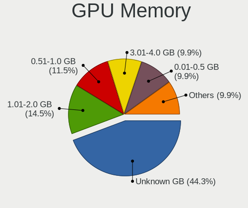

| Size in GB | Desktops | Percent |
|------------|----------|---------|
| Unknown    | 45       | 42.86%  |
| 1.01-2.0   | 17       | 16.19%  |
| 0.51-1.0   | 15       | 14.29%  |
| 0.01-0.5   | 11       | 10.48%  |
| 3.01-4.0   | 9        | 8.57%   |
| 7.01-8.0   | 3        | 2.86%   |
| 5.01-6.0   | 3        | 2.86%   |
| 2.01-3.0   | 1        | 0.95%   |
| 8.01-16.0  | 1        | 0.95%   |

Monitor
-------

Monitor Vendor
--------------

Monitor vendors

| Vendor                  | Desktops | Percent |
|-------------------------|----------|---------|
| AOC                     | 17       | 18.68%  |
| ViewSonic               | 14       | 15.38%  |
| Samsung Electronics     | 12       | 13.19%  |
| KTC                     | 8        | 8.79%   |
| Goldstar                | 7        | 7.69%   |
| Acer                    | 5        | 5.49%   |
| Unknown                 | 4        | 4.4%    |
| Hewlett-Packard         | 4        | 4.4%    |
| Lenovo                  | 3        | 3.3%    |
| Dell                    | 2        | 2.2%    |
| Ancor Communications    | 2        | 2.2%    |
| Sony                    | 1        | 1.1%    |
| RIS                     | 1        | 1.1%    |
| Philips                 | 1        | 1.1%    |
| Panasonic               | 1        | 1.1%    |
| LG Electronics          | 1        | 1.1%    |
| Lenovo Group Limited    | 1        | 1.1%    |
| KOA                     | 1        | 1.1%    |
| HKC                     | 1        | 1.1%    |
| Hitachi                 | 1        | 1.1%    |
| Envision                | 1        | 1.1%    |
| CVT                     | 1        | 1.1%    |
| Chi Mei Optoelectronics | 1        | 1.1%    |
| BenQ                    | 1        | 1.1%    |

Monitor Model
-------------

Monitor models

| Model                                                                 | Desktops | Percent |
|-----------------------------------------------------------------------|----------|---------|
| KTC 23L13-H-AN KTC2302 1920x1080 510x287mm 23.0-inch                  | 3        | 3.09%   |
| ViewSonic VA2405-FHD VSCA939 1920x1080 527x296mm 23.8-inch            | 2        | 2.06%   |
| ViewSonic VA2261 Series VSC0F30 1920x1080 477x268mm 21.5-inch         | 2        | 2.06%   |
| Unknown MS306 0030 1920x1080 708x398mm 32.0-inch                      | 2        | 2.06%   |
| Samsung Electronics SyncMaster SAM02E3 1440x900 367x229mm 17.0-inch   | 2        | 2.06%   |
| Samsung Electronics S22F350 SAM0D1B 1920x1080 477x268mm 21.5-inch     | 2        | 2.06%   |
| Lenovo LEN C32q-20 LEN65F8 2560x1440 698x393mm 31.5-inch              | 2        | 2.06%   |
| KTC W9023S5 KTC1852 1360x768 410x230mm 18.5-inch                      | 2        | 2.06%   |
| AOC 2369M AOC2369 1920x1080 509x286mm 23.0-inch                       | 2        | 2.06%   |
| AOC 1970W AOC1970 1366x768 410x230mm 18.5-inch                        | 2        | 2.06%   |
| AOC 1950W AOC1950 1366x768 410x230mm 18.5-inch                        | 2        | 2.06%   |
| AOC 1621w AOC1621 1366x768 344x194mm 15.5-inch                        | 2        | 2.06%   |
| ViewSonic XG2405 VSC0D39 1920x1080 527x296mm 23.8-inch                | 1        | 1.03%   |
| ViewSonic VX2478 Series VSCE032 2560x1440 526x296mm 23.8-inch         | 1        | 1.03%   |
| ViewSonic VX2452 Series VSCDE2E 1920x1080 520x290mm 23.4-inch         | 1        | 1.03%   |
| ViewSonic VX2240w VSC6B20 1680x1050 495x291mm 22.6-inch               | 1        | 1.03%   |
| ViewSonic VX1935wm VSC2A1E 1440x900 408x255mm 18.9-inch               | 1        | 1.03%   |
| ViewSonic VA703-3Series VSC631E 1280x1024 338x270mm 17.0-inch         | 1        | 1.03%   |
| ViewSonic VA702 SERIES VSC231C 1280x1024 338x270mm 17.0-inch          | 1        | 1.03%   |
| ViewSonic VA2415-FHD VSC533C 1920x1080 527x296mm 23.8-inch            | 1        | 1.03%   |
| ViewSonic VA2248 SERIES VSC0E28 1920x1080 480x270mm 21.7-inch         | 1        | 1.03%   |
| ViewSonic VA1903a VSC8A31 1366x768 410x230mm 18.5-inch                | 1        | 1.03%   |
| ViewSonic LCD Monitor VX2240w 3600x1080                               | 1        | 1.03%   |
| ViewSonic LCD Monitor VA2261                                          | 1        | 1.03%   |
| Unknown LCD Monitor XXX AAA 1920x1080                                 | 1        | 1.03%   |
| Unknown LCD Monitor RTK 2944x1080                                     | 1        | 1.03%   |
| Sony LCD Monitor TV                                                   | 1        | 1.03%   |
| Samsung Electronics SyncMaster SAM0546 1920x1080 510x287mm 23.0-inch  | 1        | 1.03%   |
| Samsung Electronics SyncMaster SAM0286 1280x720 372x209mm 16.8-inch   | 1        | 1.03%   |
| Samsung Electronics SM2333TN SAM06FC 1920x1080 477x268mm 21.5-inch    | 1        | 1.03%   |
| Samsung Electronics SA300/SA350 SAM0788 1366x768 410x230mm 18.5-inch  | 1        | 1.03%   |
| Samsung Electronics S20B300 SAM08A8 1600x900 443x249mm 20.0-inch      | 1        | 1.03%   |
| Samsung Electronics LCD Monitor SAM7016 3840x2160 950x540mm 43.0-inch | 1        | 1.03%   |
| Samsung Electronics C24FG70 SAM0D58 1920x1080 532x304mm 24.1-inch     | 1        | 1.03%   |
| Samsung Electronics C24F390 SAM0D2C 1920x1080 521x293mm 23.5-inch     | 1        | 1.03%   |
| RIS HD915L RIS0709 1360x768 410x230mm 18.5-inch                       | 1        | 1.03%   |
| Philips PHL 272V8 PHLC21A 1920x1080 598x336mm 27.0-inch               | 1        | 1.03%   |
| Panasonic LCD Monitor TV                                              | 1        | 1.03%   |
| LG Electronics LCD Monitor LG ULTRAGEAR 2560x1440                     | 1        | 1.03%   |
| Lenovo LEN T2254pC LEN60CC 1680x1050 474x296mm 22.0-inch              | 1        | 1.03%   |

Monitor Resolution
------------------

Monitor screen resolution

| Resolution         | Desktops | Percent |
|--------------------|----------|---------|
| 1920x1080 (FHD)    | 33       | 37.08%  |
| 1366x768 (WXGA)    | 12       | 13.48%  |
| 1600x900 (HD+)     | 6        | 6.74%   |
| 1280x1024 (SXGA)   | 5        | 5.62%   |
| Unknown            | 5        | 5.62%   |
| 3840x2160 (4K)     | 4        | 4.49%   |
| 2560x1440 (QHD)    | 4        | 4.49%   |
| 1440x900 (WXGA+)   | 4        | 4.49%   |
| 1360x768           | 4        | 4.49%   |
| 1680x1050 (WSXGA+) | 3        | 3.37%   |
| 2960x900           | 2        | 2.25%   |
| 1280x720 (HD)      | 2        | 2.25%   |
| 3600x1080          | 1        | 1.12%   |
| 3440x1440          | 1        | 1.12%   |
| 2944x1080          | 1        | 1.12%   |
| 2560x1080          | 1        | 1.12%   |
| 1280x768           | 1        | 1.12%   |

Monitor Diagonal
----------------

Diagonal size in inches

| Inches  | Desktops | Percent |
|---------|----------|---------|
| 23      | 15       | 16.67%  |
| 21      | 14       | 15.56%  |
| 18      | 11       | 12.22%  |
| Unknown | 10       | 11.11%  |
| 19      | 6        | 6.67%   |
| 15      | 6        | 6.67%   |
| 24      | 4        | 4.44%   |
| 17      | 4        | 4.44%   |
| 32      | 3        | 3.33%   |
| 31      | 3        | 3.33%   |
| 20      | 3        | 3.33%   |
| 84      | 2        | 2.22%   |
| 44      | 2        | 2.22%   |
| 34      | 2        | 2.22%   |
| 27      | 2        | 2.22%   |
| 22      | 2        | 2.22%   |
| 16      | 1        | 1.11%   |

Monitor Width
-------------

Physical width

| Width in mm | Desktops | Percent |
|-------------|----------|---------|
| 401-500     | 33       | 37.5%   |
| 501-600     | 19       | 21.59%  |
| Unknown     | 10       | 11.36%  |
| 301-350     | 8        | 9.09%   |
| 351-400     | 6        | 6.82%   |
| 701-800     | 5        | 5.68%   |
| 601-700     | 3        | 3.41%   |
| 1501-2000   | 2        | 2.27%   |
| 901-1000    | 2        | 2.27%   |

Aspect Ratio
------------

Proportional relationship between the width and the height

| Ratio   | Desktops | Percent |
|---------|----------|---------|
| 16/9    | 59       | 71.08%  |
| Unknown | 10       | 12.05%  |
| 16/10   | 7        | 8.43%   |
| 5/4     | 5        | 6.02%   |
| 21/9    | 2        | 2.41%   |

Monitor Area
------------

Area in inch

| Area in inch | Desktops | Percent |
|----------------|----------|---------|
| 201-250        | 27       | 31.4%   |
| 151-200        | 16       | 18.6%   |
| 141-150        | 10       | 11.63%  |
| Unknown        | 10       | 11.63%  |
| 351-500        | 7        | 8.14%   |
| 101-110        | 5        | 5.81%   |
| More than 1000 | 2        | 2.33%   |
| 301-350        | 2        | 2.33%   |
| 131-140        | 2        | 2.33%   |
| 501-1000       | 2        | 2.33%   |
| 251-300        | 1        | 1.16%   |
| 121-130        | 1        | 1.16%   |
| 91-100         | 1        | 1.16%   |

Pixel Density
-------------

Pixels per inch

| Density | Desktops | Percent |
|---------|----------|---------|
| 51-100  | 54       | 64.29%  |
| 101-120 | 14       | 16.67%  |
| Unknown | 10       | 11.9%   |
| 1-50    | 3        | 3.57%   |
| 121-160 | 2        | 2.38%   |
| 161-240 | 1        | 1.19%   |

Multiple Monitors
-----------------

Total monitors connected

| Total | Desktops | Percent |
|-------|----------|---------|
| 1     | 77       | 74.76%  |
| 2     | 16       | 15.53%  |
| 0     | 9        | 8.74%   |
| 4     | 1        | 0.97%   |

Network
-------

Net Controller Vendor
---------------------

Controller vendors

| Vendor                | Desktops | Percent |
|-----------------------|----------|---------|
| Realtek Semiconductor | 60       | 41.67%  |
| Intel                 | 36       | 25%     |
| Qualcomm Atheros      | 12       | 8.33%   |
| Ralink Technology     | 7        | 4.86%   |
| TP-Link               | 6        | 4.17%   |
| Nvidia                | 6        | 4.17%   |
| Broadcom              | 4        | 2.78%   |
| Xiaomi                | 2        | 1.39%   |
| Mercucys              | 2        | 1.39%   |
| Huawei Technologies   | 2        | 1.39%   |
| Broadcom Limited      | 2        | 1.39%   |
| VIA Technologies      | 1        | 0.69%   |
| Texas Instruments     | 1        | 0.69%   |
| Samsung Electronics   | 1        | 0.69%   |
| Ralink                | 1        | 0.69%   |
| Qualcomm              | 1        | 0.69%   |

Net Controller Model
--------------------

Controller models

| Model                                                                                         | Desktops | Percent |
|-----------------------------------------------------------------------------------------------|----------|---------|
| Realtek RTL8111/8168/8411 PCI Express Gigabit Ethernet Controller                             | 50       | 30.49%  |
| Intel 82579LM Gigabit Network Connection (Lewisville)                                         | 8        | 4.88%   |
| Realtek RTL8188EUS 802.11n Wireless Network Adapter                                           | 6        | 3.66%   |
| Nvidia MCP61 Ethernet                                                                         | 6        | 3.66%   |
| Realtek RTL8192EU 802.11b/g/n WLAN Adapter                                                    | 4        | 2.44%   |
| Intel Ethernet Connection (2) I219-V                                                          | 4        | 2.44%   |
| TP-Link 802.11ac NIC                                                                          | 3        | 1.83%   |
| Realtek RTL8125 2.5GbE Controller                                                             | 3        | 1.83%   |
| Ralink MT7601U Wireless Adapter                                                               | 3        | 1.83%   |
| Qualcomm Atheros Killer E2500 Gigabit Ethernet Controller                                     | 3        | 1.83%   |
| Intel Wi-Fi 6 AX200                                                                           | 3        | 1.83%   |
| Intel Ethernet Connection (7) I219-V                                                          | 3        | 1.83%   |
| Xiaomi Mi/Redmi series (RNDIS)                                                                | 2        | 1.22%   |
| TP-Link TL-WN722N v2/v3 [Realtek RTL8188EUS]                                                  | 2        | 1.22%   |
| Realtek 802.11ac NIC                                                                          | 2        | 1.22%   |
| Ralink RT2870/RT3070 Wireless Adapter                                                         | 2        | 1.22%   |
| Qualcomm Atheros Killer E220x Gigabit Ethernet Controller                                     | 2        | 1.22%   |
| Mercucys 802.11n NIC                                                                          | 2        | 1.22%   |
| Intel I211 Gigabit Network Connection                                                         | 2        | 1.22%   |
| Intel Ethernet Connection I217-LM                                                             | 2        | 1.22%   |
| Intel 82579V Gigabit Network Connection                                                       | 2        | 1.22%   |
| Intel 82557/8/9/0/1 Ethernet Pro 100                                                          | 2        | 1.22%   |
| Huawei E353/E3131                                                                             | 2        | 1.22%   |
| Broadcom BCM4360 802.11ac Wireless Network Adapter                                            | 2        | 1.22%   |
| VIA VT6102/VT6103 [Rhine-II]                                                                  | 1        | 0.61%   |
| VIA AC'97 Modem Controller                                                                    | 1        | 0.61%   |
| TP-Link TL-WN823N v2/v3 [Realtek RTL8192EU]                                                   | 1        | 0.61%   |
| Texas Instruments CC2531 ZigBee                                                               | 1        | 0.61%   |
| Samsung Galaxy series, misc. (tethering mode)                                                 | 1        | 0.61%   |
| Realtek RTL8812AE 802.11ac PCIe Wireless Network Adapter                                      | 1        | 0.61%   |
| Realtek RTL8811AU 802.11a/b/g/n/ac WLAN Adapter                                               | 1        | 0.61%   |
| Realtek RTL8192CU 802.11n WLAN Adapter                                                        | 1        | 0.61%   |
| Realtek RTL8188SU 802.11n WLAN Adapter                                                        | 1        | 0.61%   |
| Realtek RTL8188FTV 802.11b/g/n 1T1R 2.4G WLAN Adapter                                         | 1        | 0.61%   |
| Realtek RTL8187B Wireless 802.11g 54Mbps Network Adapter                                      | 1        | 0.61%   |
| Realtek RTL8153 Gigabit Ethernet Adapter                                                      | 1        | 0.61%   |
| Realtek RTL810xE PCI Express Fast Ethernet controller                                         | 1        | 0.61%   |
| Realtek RTL-8100/8101L/8139 PCI Fast Ethernet Adapter                                         | 1        | 0.61%   |
| Realtek Realtek 8812AU/8821AU 802.11ac WLAN Adapter [USB Wireless Dual-Band Adapter 2.4/5Ghz] | 1        | 0.61%   |
| Ralink RT2070 Wireless Adapter                                                                | 1        | 0.61%   |

Wireless Vendor
---------------

Wireless vendors

| Vendor                | Desktops | Percent |
|-----------------------|----------|---------|
| Realtek Semiconductor | 19       | 39.58%  |
| Ralink Technology     | 7        | 14.58%  |
| Intel                 | 7        | 14.58%  |
| TP-Link               | 6        | 12.5%   |
| Qualcomm Atheros      | 4        | 8.33%   |
| Mercucys              | 2        | 4.17%   |
| Broadcom              | 2        | 4.17%   |
| Ralink                | 1        | 2.08%   |

Wireless Model
--------------

Wireless models

| Model                                                                                         | Desktops | Percent |
|-----------------------------------------------------------------------------------------------|----------|---------|
| Realtek RTL8188EUS 802.11n Wireless Network Adapter                                           | 6        | 12.5%   |
| Realtek RTL8192EU 802.11b/g/n WLAN Adapter                                                    | 4        | 8.33%   |
| TP-Link 802.11ac NIC                                                                          | 3        | 6.25%   |
| Ralink MT7601U Wireless Adapter                                                               | 3        | 6.25%   |
| Intel Wi-Fi 6 AX200                                                                           | 3        | 6.25%   |
| TP-Link TL-WN722N v2/v3 [Realtek RTL8188EUS]                                                  | 2        | 4.17%   |
| Realtek 802.11ac NIC                                                                          | 2        | 4.17%   |
| Ralink RT2870/RT3070 Wireless Adapter                                                         | 2        | 4.17%   |
| Mercucys 802.11n NIC                                                                          | 2        | 4.17%   |
| Broadcom BCM4360 802.11ac Wireless Network Adapter                                            | 2        | 4.17%   |
| TP-Link TL-WN823N v2/v3 [Realtek RTL8192EU]                                                   | 1        | 2.08%   |
| Realtek RTL8812AE 802.11ac PCIe Wireless Network Adapter                                      | 1        | 2.08%   |
| Realtek RTL8811AU 802.11a/b/g/n/ac WLAN Adapter                                               | 1        | 2.08%   |
| Realtek RTL8192CU 802.11n WLAN Adapter                                                        | 1        | 2.08%   |
| Realtek RTL8188SU 802.11n WLAN Adapter                                                        | 1        | 2.08%   |
| Realtek RTL8188FTV 802.11b/g/n 1T1R 2.4G WLAN Adapter                                         | 1        | 2.08%   |
| Realtek RTL8187B Wireless 802.11g 54Mbps Network Adapter                                      | 1        | 2.08%   |
| Realtek Realtek 8812AU/8821AU 802.11ac WLAN Adapter [USB Wireless Dual-Band Adapter 2.4/5Ghz] | 1        | 2.08%   |
| Ralink RT2070 Wireless Adapter                                                                | 1        | 2.08%   |
| Ralink MT7610U ("Archer T2U" 2.4G+5G WLAN Adapter                                             | 1        | 2.08%   |
| Ralink RT2561/RT61 802.11g PCI                                                                | 1        | 2.08%   |
| Qualcomm Atheros AR9485 Wireless Network Adapter                                              | 1        | 2.08%   |
| Qualcomm Atheros AR9287 Wireless Network Adapter (PCI-Express)                                | 1        | 2.08%   |
| Qualcomm Atheros AR9285 Wireless Network Adapter (PCI-Express)                                | 1        | 2.08%   |
| Qualcomm Atheros AR9227 Wireless Network Adapter                                              | 1        | 2.08%   |
| Intel Wireless 8260                                                                           | 1        | 2.08%   |
| Intel Wireless 3165                                                                           | 1        | 2.08%   |
| Intel Dual Band Wireless-AC 3168NGW [Stone Peak]                                              | 1        | 2.08%   |
| Intel 700 Series Chipset Family Wi-Fi                                                         | 1        | 2.08%   |

Ethernet Vendor
---------------

Ethernet vendors

| Vendor                | Desktops | Percent |
|-----------------------|----------|---------|
| Realtek Semiconductor | 55       | 49.11%  |
| Intel                 | 32       | 28.57%  |
| Qualcomm Atheros      | 8        | 7.14%   |
| Nvidia                | 6        | 5.36%   |
| Xiaomi                | 2        | 1.79%   |
| Huawei Technologies   | 2        | 1.79%   |
| Broadcom Limited      | 2        | 1.79%   |
| Broadcom              | 2        | 1.79%   |
| VIA Technologies      | 1        | 0.89%   |
| Samsung Electronics   | 1        | 0.89%   |
| Qualcomm              | 1        | 0.89%   |

Ethernet Model
--------------

Ethernet models

| Model                                                             | Desktops | Percent |
|-------------------------------------------------------------------|----------|---------|
| Realtek RTL8111/8168/8411 PCI Express Gigabit Ethernet Controller | 50       | 43.86%  |
| Intel 82579LM Gigabit Network Connection (Lewisville)             | 8        | 7.02%   |
| Nvidia MCP61 Ethernet                                             | 6        | 5.26%   |
| Intel Ethernet Connection (2) I219-V                              | 4        | 3.51%   |
| Realtek RTL8125 2.5GbE Controller                                 | 3        | 2.63%   |
| Qualcomm Atheros Killer E2500 Gigabit Ethernet Controller         | 3        | 2.63%   |
| Intel Ethernet Connection (7) I219-V                              | 3        | 2.63%   |
| Xiaomi Mi/Redmi series (RNDIS)                                    | 2        | 1.75%   |
| Qualcomm Atheros Killer E220x Gigabit Ethernet Controller         | 2        | 1.75%   |
| Intel I211 Gigabit Network Connection                             | 2        | 1.75%   |
| Intel Ethernet Connection I217-LM                                 | 2        | 1.75%   |
| Intel 82579V Gigabit Network Connection                           | 2        | 1.75%   |
| Intel 82557/8/9/0/1 Ethernet Pro 100                              | 2        | 1.75%   |
| Huawei E353/E3131                                                 | 2        | 1.75%   |
| VIA VT6102/VT6103 [Rhine-II]                                      | 1        | 0.88%   |
| Samsung Galaxy series, misc. (tethering mode)                     | 1        | 0.88%   |
| Realtek RTL8153 Gigabit Ethernet Adapter                          | 1        | 0.88%   |
| Realtek RTL810xE PCI Express Fast Ethernet controller             | 1        | 0.88%   |
| Realtek RTL-8100/8101L/8139 PCI Fast Ethernet Adapter             | 1        | 0.88%   |
| Qualcomm Redmi Note 8                                             | 1        | 0.88%   |
| Qualcomm Atheros AR8161 Gigabit Ethernet                          | 1        | 0.88%   |
| Qualcomm Atheros AR8152 v2.0 Fast Ethernet                        | 1        | 0.88%   |
| Qualcomm Atheros AR8132 Fast Ethernet                             | 1        | 0.88%   |
| Intel Ethernet Connection I217-V                                  | 1        | 0.88%   |
| Intel Ethernet Connection (2) I218-V                              | 1        | 0.88%   |
| Intel Ethernet Connection (14) I219-V                             | 1        | 0.88%   |
| Intel Ethernet Connection (12) I219-V                             | 1        | 0.88%   |
| Intel Ethernet Connection (11) I219-V                             | 1        | 0.88%   |
| Intel 82578DM Gigabit Network Connection                          | 1        | 0.88%   |
| Intel 82567LM-3 Gigabit Network Connection                        | 1        | 0.88%   |
| Intel 82566DM-2 Gigabit Network Connection                        | 1        | 0.88%   |
| Intel 82566DC-2 Gigabit Network Connection                        | 1        | 0.88%   |
| Intel 82544GC Gigabit Ethernet Controller (LOM)                   | 1        | 0.88%   |
| Broadcom NetXtreme BCM5762 Gigabit Ethernet PCIe                  | 1        | 0.88%   |
| Broadcom NetXtreme BCM5761 Gigabit Ethernet PCIe                  | 1        | 0.88%   |
| Broadcom Limited NetXtreme BCM5782 Gigabit Ethernet               | 1        | 0.88%   |
| Broadcom Limited NetXtreme BCM5755 Gigabit Ethernet PCI Express   | 1        | 0.88%   |

Net Controller Kind
-------------------

Ethernet, WiFi or modem

| Kind     | Desktops | Percent |
|----------|----------|---------|
| Ethernet | 99       | 68.75%  |
| WiFi     | 43       | 29.86%  |
| Modem    | 2        | 1.39%   |

Used Controller
---------------

Currently used network controller

| Kind     | Desktops | Percent |
|----------|----------|---------|
| Ethernet | 73       | 72.28%  |
| WiFi     | 28       | 27.72%  |

NICs
----

Total network controllers on board

| Total | Desktops | Percent |
|-------|----------|---------|
| 1     | 77       | 76.24%  |
| 2     | 20       | 19.8%   |
| 3     | 2        | 1.98%   |
| 0     | 2        | 1.98%   |

IPv6
----

IPv6 vs IPv4

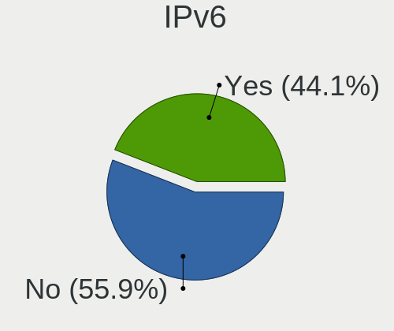

| Used | Desktops | Percent |
|------|----------|---------|
| No   | 67       | 65.05%  |
| Yes  | 36       | 34.95%  |

Bluetooth
---------

Bluetooth Vendor
----------------

Controller vendors

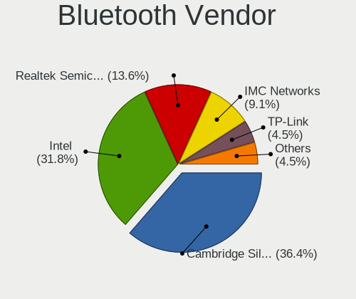

| Vendor                          | Desktops | Percent |
|---------------------------------|----------|---------|
| Intel                           | 7        | 38.89%  |
| Cambridge Silicon Radio         | 7        | 38.89%  |
| Realtek Semiconductor           | 2        | 11.11%  |
| TP-Link                         | 1        | 5.56%   |
| Qualcomm Atheros Communications | 1        | 5.56%   |

Bluetooth Model
---------------

Controller models

| Model                                               | Desktops | Percent |
|-----------------------------------------------------|----------|---------|
| Cambridge Silicon Radio Bluetooth Dongle (HCI mode) | 7        | 38.89%  |
| Intel AX200 Bluetooth                               | 3        | 16.67%  |
| Realtek Bluetooth Radio                             | 2        | 11.11%  |
| Intel Bluetooth wireless interface                  | 2        | 11.11%  |
| TP-Link UB500 Adapter                               | 1        | 5.56%   |
| Qualcomm Atheros AR3011 Bluetooth                   | 1        | 5.56%   |
| Intel Wireless-AC 3168 Bluetooth                    | 1        | 5.56%   |
| Intel Bluetooth Device                              | 1        | 5.56%   |

Sound
-----

Sound Vendor
------------

Sound card vendors

| Vendor                 | Desktops | Percent |
|------------------------|----------|---------|
| Intel                  | 61       | 38.36%  |
| Nvidia                 | 42       | 26.42%  |
| AMD                    | 35       | 22.01%  |
| Logitech               | 4        | 2.52%   |
| VIA Technologies       | 2        | 1.26%   |
| Samson Technologies    | 2        | 1.26%   |
| Focusrite-Novation     | 2        | 1.26%   |
| Creative Labs          | 2        | 1.26%   |
| C-Media Electronics    | 2        | 1.26%   |
| Texas Instruments      | 1        | 0.63%   |
| Rockwell International | 1        | 0.63%   |
| KTMicro                | 1        | 0.63%   |
| Kingston Technology    | 1        | 0.63%   |
| JMTek                  | 1        | 0.63%   |
| Elgato Systems         | 1        | 0.63%   |
| Creative Technology    | 1        | 0.63%   |

Sound Model
-----------

Sound card models

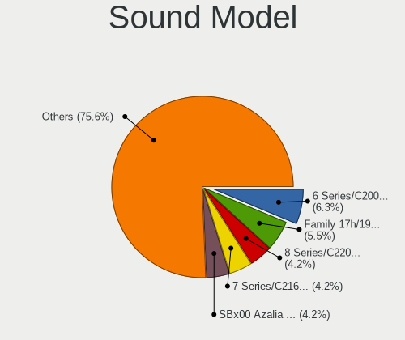

| Model                                                                                           | Desktops | Percent |
|-------------------------------------------------------------------------------------------------|----------|---------|
| Intel 6 Series/C200 Series Chipset Family High Definition Audio Controller                      | 13       | 6.95%   |
| Intel 7 Series/C216 Chipset Family High Definition Audio Controller                             | 8        | 4.28%   |
| AMD FCH Azalia Controller                                                                       | 8        | 4.28%   |
| Nvidia High Definition Audio Controller                                                         | 7        | 3.74%   |
| AMD SBx00 Azalia (Intel HDA)                                                                    | 7        | 3.74%   |
| AMD Family 17h/19h HD Audio Controller                                                          | 7        | 3.74%   |
| Nvidia MCP61 High Definition Audio                                                              | 6        | 3.21%   |
| Nvidia GK208 HDMI/DP Audio Controller                                                           | 5        | 2.67%   |
| Intel 8 Series/C220 Series Chipset High Definition Audio Controller                             | 5        | 2.67%   |
| Intel 200 Series PCH HD Audio                                                                   | 5        | 2.67%   |
| Intel Xeon E3-1200 v3/4th Gen Core Processor HD Audio Controller                                | 4        | 2.14%   |
| Intel NM10/ICH7 Family High Definition Audio Controller                                         | 4        | 2.14%   |
| Intel Cannon Lake PCH cAVS                                                                      | 4        | 2.14%   |
| AMD Family 17h (Models 00h-0fh) HD Audio Controller                                             | 4        | 2.14%   |
| Nvidia TU116 High Definition Audio Controller                                                   | 3        | 1.6%    |
| Nvidia GP107GL High Definition Audio Controller                                                 | 3        | 1.6%    |
| Nvidia GF108 High Definition Audio Controller                                                   | 3        | 1.6%    |
| Intel Smart Sound Technology (SST) Audio Controller                                             | 3        | 1.6%    |
| Intel 100 Series/C230 Series Chipset Family HD Audio Controller                                 | 3        | 1.6%    |
| AMD Starship/Matisse HD Audio Controller                                                        | 3        | 1.6%    |
| AMD Renoir Radeon High Definition Audio Controller                                              | 3        | 1.6%    |
| AMD Raven/Raven2/Fenghuang HDMI/DP Audio Controller                                             | 3        | 1.6%    |
| AMD Oland/Hainan/Cape Verde/Pitcairn HDMI Audio [Radeon HD 7000 Series]                         | 3        | 1.6%    |
| Nvidia TU107 GeForce GTX 1650 High Definition Audio Controller                                  | 2        | 1.07%   |
| Nvidia GP106 High Definition Audio Controller                                                   | 2        | 1.07%   |
| Nvidia GM107 High Definition Audio Controller [GeForce 940MX]                                   | 2        | 1.07%   |
| Nvidia GA106 High Definition Audio Controller                                                   | 2        | 1.07%   |
| Nvidia GA104 High Definition Audio Controller                                                   | 2        | 1.07%   |
| Intel Comet Lake PCH-V cAVS                                                                     | 2        | 1.07%   |
| Intel 82801JD/DO (ICH10 Family) HD Audio Controller                                             | 2        | 1.07%   |
| Intel 82801I (ICH9 Family) HD Audio Controller                                                  | 2        | 1.07%   |
| Intel 5 Series/3400 Series Chipset High Definition Audio                                        | 2        | 1.07%   |
| Creative Labs CA0132 Sound Core3D [Sound Blaster Recon3D / Z-Series / Sound BlasterX AE-5 Plus] | 2        | 1.07%   |
| AMD Navi 10 HDMI Audio                                                                          | 2        | 1.07%   |
| AMD Kaveri HDMI/DP Audio Controller                                                             | 2        | 1.07%   |
| AMD Kabini HDMI/DP Audio                                                                        | 2        | 1.07%   |
| AMD Ellesmere HDMI Audio [Radeon RX 470/480 / 570/580/590]                                      | 2        | 1.07%   |
| AMD Baffin HDMI/DP Audio [Radeon RX 550 640SP / RX 560/560X]                                    | 2        | 1.07%   |
| VIA Technologies VT8233/A/8235/8237 AC97 Audio Controller                                       | 1        | 0.53%   |
| VIA Technologies VT1720/24 [Envy24PT/HT] PCI Multi-Channel Audio Controller                     | 1        | 0.53%   |

Memory
------

Memory Vendor
-------------

Memory module vendors

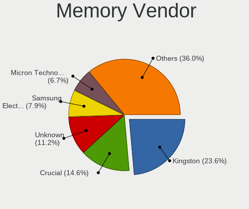

| Vendor                       | Desktops | Percent |
|------------------------------|----------|---------|
| Kingston                     | 16       | 21.05%  |
| Crucial                      | 12       | 15.79%  |
| Unknown                      | 9        | 11.84%  |
| Samsung Electronics          | 6        | 7.89%   |
| Micron Technology            | 5        | 6.58%   |
| SK hynix                     | 4        | 5.26%   |
| Hikvision                    | 3        | 3.95%   |
| Team                         | 2        | 2.63%   |
| Patriot                      | 2        | 2.63%   |
| Nanya Technology             | 2        | 2.63%   |
| Corsair                      | 2        | 2.63%   |
| A-DATA Technology            | 2        | 2.63%   |
| Unknown (2C0B)               | 1        | 1.32%   |
| Unknown (0x5846)             | 1        | 1.32%   |
| Smart                        | 1        | 1.32%   |
| Patriot Memory (PDP Systems) | 1        | 1.32%   |
| Netac                        | 1        | 1.32%   |
| KLEVV                        | 1        | 1.32%   |
| Infineon                     | 1        | 1.32%   |
| GeIL                         | 1        | 1.32%   |
| Elpida                       | 1        | 1.32%   |
| Avant                        | 1        | 1.32%   |
| Unknown                      | 1        | 1.32%   |

Memory Model
------------

Memory module models

| Model                                                                | Desktops | Percent |
|----------------------------------------------------------------------|----------|---------|
| Kingston RAM KHX3200C16D4/16GX 16GB DIMM DDR4 3600MT/s               | 3        | 3.7%    |
| Crucial RAM BLS4G3D1609DS1S00. 4GB DIMM DDR3                         | 3        | 3.7%    |
| Micron RAM 8JTF25664AZ-1G4M1 2GB DIMM DDR3 1333MT/s                  | 2        | 2.47%   |
| Unknown RAM Module 8GB DIMM DDR4 2400MT/s                            | 1        | 1.23%   |
| Unknown RAM Module 8GB DIMM DDR3 1333MT/s                            | 1        | 1.23%   |
| Unknown RAM Module 8GB DIMM 1600MT/s                                 | 1        | 1.23%   |
| Unknown RAM Module 4GB DIMM 1600MT/s                                 | 1        | 1.23%   |
| Unknown RAM Module 4096MB DIMM DDR3 1333MT/s                         | 1        | 1.23%   |
| Unknown RAM Module 4096MB DIMM 1333MT/s                              | 1        | 1.23%   |
| Unknown RAM Module 2048MB DIMM DDR3 1333MT/s                         | 1        | 1.23%   |
| Unknown RAM Module 2048MB DIMM 1333MT/s                              | 1        | 1.23%   |
| Unknown RAM Module 1GB DIMM DDR2 533MT/s                             | 1        | 1.23%   |
| Unknown RAM 3200 C18 Series 16384MB DIMM DDR4 2400MT/s               | 1        | 1.23%   |
| Unknown (2C0B) RAM Module 8GB DIMM DDR4 2400MT/s                     | 1        | 1.23%   |
| Unknown (0x5846) RAM DDR4 NB 8G 2666 8GB SODIMM DDR4 2667MT/s        | 1        | 1.23%   |
| Team RAM TEAMGROUP-UD4-3200 16GB DIMM DDR4 3733MT/s                  | 1        | 1.23%   |
| Team RAM Elite-1333 4GB DIMM 1333MT/s                                | 1        | 1.23%   |
| Smart RAM SM5643285D8N6CHIBH 256MB DIMM DDR 266MT/s                  | 1        | 1.23%   |
| SK hynix RAM Module 2GB DIMM DDR3 1333MT/s                           | 1        | 1.23%   |
| SK hynix RAM HMT351S6EFR8A-PB 4GB SODIMM DDR3 1600MT/s               | 1        | 1.23%   |
| SK hynix RAM HMT325U6CFR8C-PB 2GB DIMM DDR3 1600MT/s                 | 1        | 1.23%   |
| SK hynix RAM HMA451R7MFR8N-TF 4GB RIMM DDR4 2133MT/s                 | 1        | 1.23%   |
| Samsung RAM Module 4GB DIMM DDR3 1066MT/s                            | 1        | 1.23%   |
| Samsung RAM M471B5173EB0-YK0 4GB SODIMM DDR3 1600MT/s                | 1        | 1.23%   |
| Samsung RAM M471A5244CB0-CRC 4GB SODIMM DDR4 2667MT/s                | 1        | 1.23%   |
| Samsung RAM M393B5170GB0 4GB DIMM DDR3 1866MT/s                      | 1        | 1.23%   |
| Samsung RAM M378B5773DH0-CH9 2GB DIMM DDR3 1333MT/s                  | 1        | 1.23%   |
| Samsung RAM M378B5673EH1-CF8 2GB DIMM DDR3 1067MT/s                  | 1        | 1.23%   |
| Samsung RAM M378A1K43CB2-CRC 8GB DIMM DDR4 3500MT/s                  | 1        | 1.23%   |
| Patriot RAM PSD48G320081 8GB DIMM DDR4 3200MT/s                      | 1        | 1.23%   |
| Patriot RAM PSD416G26662 16GB DIMM DDR4 2667MT/s                     | 1        | 1.23%   |
| Patriot Memory (PDP Systems) RAM PSD48G266681 8GB DIMM DDR4 2667MT/s | 1        | 1.23%   |
| Netac RAM Module 16GB DIMM DDR4 2667MT/s                             | 1        | 1.23%   |
| Nanya RAM NT4GC64B8HG0NF-DI 4GB DIMM DDR3 1600MT/s                   | 1        | 1.23%   |
| Nanya RAM M2F4G64CB8HG5N-CG 4GB DIMM DDR3 1600MT/s                   | 1        | 1.23%   |
| Micron RAM Module 2GB DIMM DDR3 1333MT/s                             | 1        | 1.23%   |
| Micron RAM 8KTF25664AZ-1G4M1 2GB DIMM DDR3 1333MT/s                  | 1        | 1.23%   |
| Micron RAM 8JTF51264AZ-1G6E1 4GB DIMM DDR3 1600MT/s                  | 1        | 1.23%   |
| KLEVV RAM KD48GU880-32A160U 8GB DIMM DDR4 3800MT/s                   | 1        | 1.23%   |
| Kingston RAM Module 4GB DIMM DDR3 1333MT/s                           | 1        | 1.23%   |

Memory Kind
-----------

Memory module kinds

| Kind    | Desktops | Percent |
|---------|----------|---------|
| DDR3    | 27       | 47.37%  |
| DDR4    | 24       | 42.11%  |
| Unknown | 3        | 5.26%   |
| SDRAM   | 1        | 1.75%   |
| DDR2    | 1        | 1.75%   |
| DDR     | 1        | 1.75%   |

Memory Form Factor
------------------

Physical design of the memory module

| Name   | Desktops | Percent |
|--------|----------|---------|
| DIMM   | 52       | 92.86%  |
| SODIMM | 3        | 5.36%   |
| RIMM   | 1        | 1.79%   |

Memory Size
-----------

Memory module size

| Size  | Desktops | Percent |
|-------|----------|---------|
| 8192  | 22       | 30.56%  |
| 4096  | 19       | 26.39%  |
| 16384 | 15       | 20.83%  |
| 2048  | 11       | 15.28%  |
| 32768 | 3        | 4.17%   |
| 1024  | 1        | 1.39%   |
| 256   | 1        | 1.39%   |

Memory Speed
------------

Memory module speed

| Speed | Desktops | Percent |
|-------|----------|---------|
| 1333  | 14       | 20.9%   |
| 1600  | 13       | 19.4%   |
| 2667  | 9        | 13.43%  |
| 3600  | 4        | 5.97%   |
| 3200  | 3        | 4.48%   |
| 2133  | 3        | 4.48%   |
| 3800  | 2        | 2.99%   |
| 3000  | 2        | 2.99%   |
| 2400  | 2        | 2.99%   |
| 3733  | 1        | 1.49%   |
| 3500  | 1        | 1.49%   |
| 3466  | 1        | 1.49%   |
| 3400  | 1        | 1.49%   |
| 2666  | 1        | 1.49%   |
| 2473  | 1        | 1.49%   |
| 2176  | 1        | 1.49%   |
| 1867  | 1        | 1.49%   |
| 1866  | 1        | 1.49%   |
| 1800  | 1        | 1.49%   |
| 1067  | 1        | 1.49%   |
| 1066  | 1        | 1.49%   |
| 533   | 1        | 1.49%   |
| 333   | 1        | 1.49%   |
| 266   | 1        | 1.49%   |

Printers & scanners
-------------------

Printer Vendor
--------------

Printer device vendors

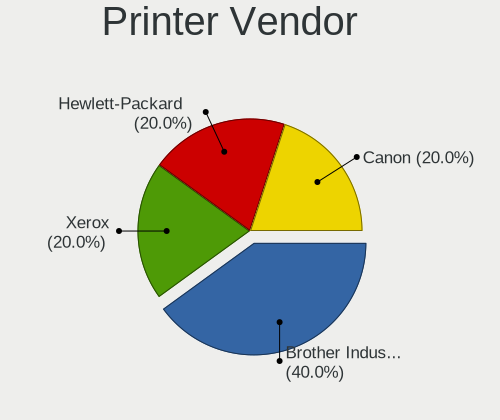

| Vendor             | Desktops | Percent |
|--------------------|----------|---------|
| Xerox              | 1        | 33.33%  |
| Hewlett-Packard    | 1        | 33.33%  |
| Brother Industries | 1        | 33.33%  |

Printer Model
-------------

Printer device models

| Model             | Desktops | Percent |
|-------------------|----------|---------|
| Xerox Phaser 3040 | 1        | 25%     |
| HP Laser 107w     | 1        | 25%     |
| Brother DCP-T500W | 1        | 25%     |
| Brother DCP-T420W | 1        | 25%     |

Scanner Vendor
--------------

Scanner device vendors

| Vendor | Desktops | Percent |
|--------|----------|---------|
| Canon  | 1        | 100%    |

Scanner Model
-------------

Scanner device models

| Model                   | Desktops | Percent |
|-------------------------|----------|---------|
| Canon CanoScan LiDE 110 | 1        | 100%    |

Camera
------

Camera Vendor
-------------

Camera device vendors

| Vendor                                 | Desktops | Percent |
|----------------------------------------|----------|---------|
| Logitech                               | 7        | 41.18%  |
| Apple                                  | 2        | 11.76%  |
| Unknown                                | 1        | 5.88%   |
| Sony                                   | 1        | 5.88%   |
| Samsung Electronics                    | 1        | 5.88%   |
| Microdia                               | 1        | 5.88%   |
| GEMBIRD                                | 1        | 5.88%   |
| Cheng Uei Precision Industry (Foxlink) | 1        | 5.88%   |
| Aveo Technology                        | 1        | 5.88%   |
| A4Tech                                 | 1        | 5.88%   |

Camera Model
------------

Camera device models

| Model                                             | Desktops | Percent |
|---------------------------------------------------|----------|---------|
| Logitech Webcam C270                              | 2        | 11.76%  |
| Apple iPhone 5/5C/5S/6/SE/7/8/X                   | 2        | 11.76%  |
| Unknown HD camera                                 | 1        | 5.88%   |
| Sony CEVCECM                                      | 1        | 5.88%   |
| Samsung Galaxy series, misc. (MTP mode)           | 1        | 5.88%   |
| Microdia USB 2.0 Camera                           | 1        | 5.88%   |
| Logitech Webcam C930e                             | 1        | 5.88%   |
| Logitech Webcam C925e                             | 1        | 5.88%   |
| Logitech Webcam C110                              | 1        | 5.88%   |
| Logitech C922 Pro Stream Webcam                   | 1        | 5.88%   |
| Logitech C505e HD Webcam                          | 1        | 5.88%   |
| GEMBIRD USB2.0 PC CAMERA                          | 1        | 5.88%   |
| Cheng Uei Precision Industry (Foxlink) FS13FF-183 | 1        | 5.88%   |
| Aveo USB2.0 Camera                                | 1        | 5.88%   |
| A4Tech HD 720P PC Camera                          | 1        | 5.88%   |

Security
--------

Fingerprint Vendor
------------------

Fingerprint sensor vendors

Zero info for selected period =(

Fingerprint Model
-----------------

Fingerprint sensor models

Zero info for selected period =(

Chipcard Vendor
---------------

Chipcard module vendors

Zero info for selected period =(

Chipcard Model
--------------

Chipcard module models

Zero info for selected period =(

Unsupported
-----------

Unsupported Devices
-------------------

Total unsupported devices on board

| Total | Desktops | Percent |
|-------|----------|---------|
| 0     | 84       | 81.55%  |
| 1     | 16       | 15.53%  |
| 2     | 2        | 1.94%   |
| 3     | 1        | 0.97%   |

Unsupported Device Types
------------------------

Types of unsupported devices

| Type                     | Desktops | Percent |
|--------------------------|----------|---------|
| Graphics card            | 9        | 42.86%  |
| Net/wireless             | 8        | 38.1%   |
| Unassigned class         | 2        | 9.52%   |
| Sound                    | 1        | 4.76%   |
| Communication controller | 1        | 4.76%   |

