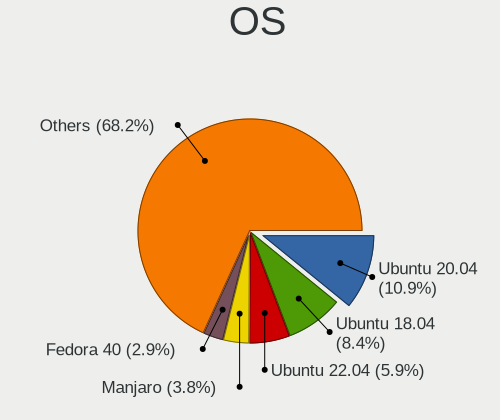
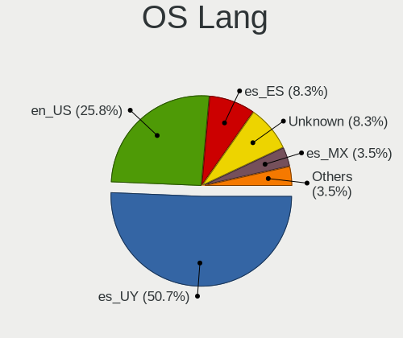
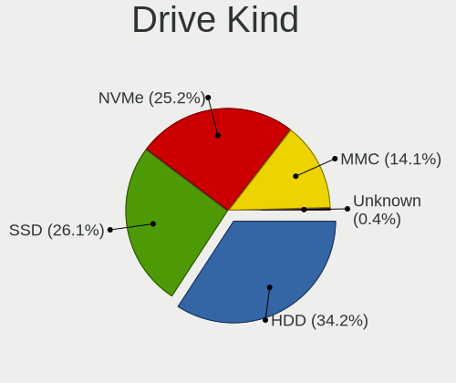
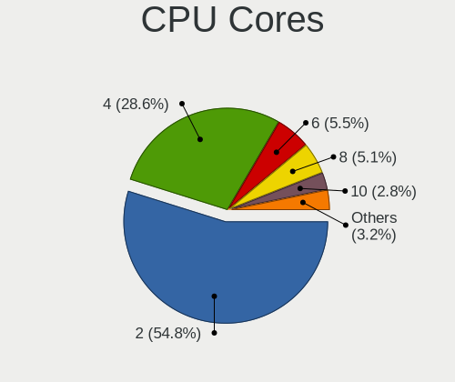
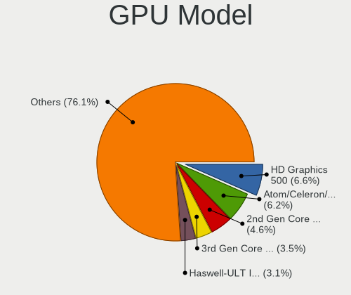
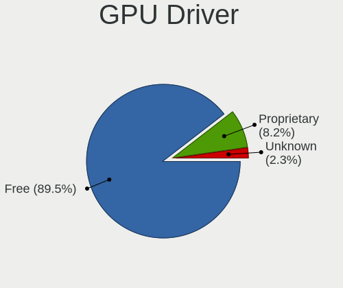
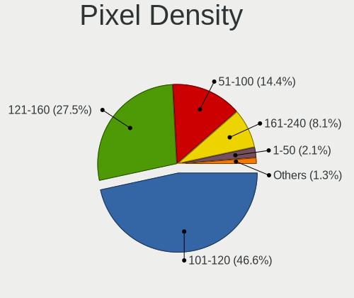
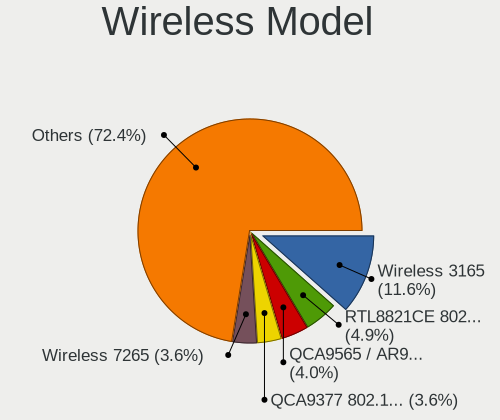
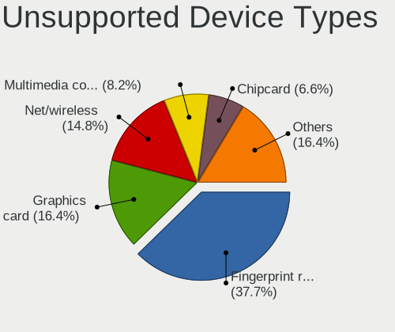

Linux in Uruguay - Tested Hardware & Statistics (Notebooks)
-----------------------------------------------------------

A project to collect tested hardware configurations for Linux in Uruguay.

Anyone can contribute to this report by the [hw-probe](https://github.com/linuxhw/hw-probe) tool:

    sudo -E hw-probe -all -upload

Please contribute! Especially if your hardware is rare.

Contents
--------

* [ Test Cases ](#test-cases)

* [ System ](#system)
  - [ OS                       ](#os)
  - [ OS Family                ](#os-family)
  - [ Kernel                   ](#kernel)
  - [ Kernel Family            ](#kernel-family)
  - [ Kernel Major Ver.        ](#kernel-major-ver)
  - [ Arch                     ](#arch)
  - [ DE                       ](#de)
  - [ Display Server           ](#display-server)
  - [ Display Manager          ](#display-manager)
  - [ OS Lang                  ](#os-lang)
  - [ Boot Mode                ](#boot-mode)
  - [ Filesystem               ](#filesystem)
  - [ Part. scheme             ](#part-scheme)
  - [ Dual Boot with Linux/BSD ](#dual-boot-with-linuxbsd)
  - [ Dual Boot (Win)          ](#dual-boot-win)

* [ Board ](#board)
  - [ Vendor                   ](#vendor)
  - [ Model                    ](#model)
  - [ Model Family             ](#model-family)
  - [ MFG Year                 ](#mfg-year)
  - [ Form Factor              ](#form-factor)
  - [ Secure Boot              ](#secure-boot)
  - [ Coreboot                 ](#coreboot)
  - [ RAM Size                 ](#ram-size)
  - [ RAM Used                 ](#ram-used)
  - [ Total Drives             ](#total-drives)
  - [ Has CD-ROM               ](#has-cd-rom)
  - [ Has Ethernet             ](#has-ethernet)
  - [ Has WiFi                 ](#has-wifi)
  - [ Has Bluetooth            ](#has-bluetooth)

* [ Location ](#location)
  - [ Country                  ](#country)
  - [ City                     ](#city)

* [ Drives ](#drives)
  - [ Drive Vendor             ](#drive-vendor)
  - [ Drive Model              ](#drive-model)
  - [ HDD Vendor               ](#hdd-vendor)
  - [ SSD Vendor               ](#ssd-vendor)
  - [ Drive Kind               ](#drive-kind)
  - [ Drive Connector          ](#drive-connector)
  - [ Drive Size               ](#drive-size)
  - [ Space Total              ](#space-total)
  - [ Space Used               ](#space-used)
  - [ Malfunc. Drives          ](#malfunc-drives)
  - [ Malfunc. Drive Vendor    ](#malfunc-drive-vendor)
  - [ Malfunc. HDD Vendor      ](#malfunc-hdd-vendor)
  - [ Malfunc. Drive Kind      ](#malfunc-drive-kind)
  - [ Failed Drives            ](#failed-drives)
  - [ Failed Drive Vendor      ](#failed-drive-vendor)
  - [ Drive Status             ](#drive-status)

* [ Storage controller ](#storage-controller)
  - [ Storage Vendor           ](#storage-vendor)
  - [ Storage Model            ](#storage-model)
  - [ Storage Kind             ](#storage-kind)

* [ Processor ](#processor)
  - [ CPU Vendor               ](#cpu-vendor)
  - [ CPU Model                ](#cpu-model)
  - [ CPU Model Family         ](#cpu-model-family)
  - [ CPU Cores                ](#cpu-cores)
  - [ CPU Sockets              ](#cpu-sockets)
  - [ CPU Threads              ](#cpu-threads)
  - [ CPU Op-Modes             ](#cpu-op-modes)
  - [ CPU Microcode            ](#cpu-microcode)
  - [ CPU Microarch            ](#cpu-microarch)

* [ Graphics ](#graphics)
  - [ GPU Vendor               ](#gpu-vendor)
  - [ GPU Model                ](#gpu-model)
  - [ GPU Combo                ](#gpu-combo)
  - [ GPU Driver               ](#gpu-driver)
  - [ GPU Memory               ](#gpu-memory)

* [ Monitor ](#monitor)
  - [ Monitor Vendor           ](#monitor-vendor)
  - [ Monitor Model            ](#monitor-model)
  - [ Monitor Resolution       ](#monitor-resolution)
  - [ Monitor Diagonal         ](#monitor-diagonal)
  - [ Monitor Width            ](#monitor-width)
  - [ Aspect Ratio             ](#aspect-ratio)
  - [ Monitor Area             ](#monitor-area)
  - [ Pixel Density            ](#pixel-density)
  - [ Multiple Monitors        ](#multiple-monitors)

* [ Network ](#network)
  - [ Net Controller Vendor    ](#net-controller-vendor)
  - [ Net Controller Model     ](#net-controller-model)
  - [ Wireless Vendor          ](#wireless-vendor)
  - [ Wireless Model           ](#wireless-model)
  - [ Ethernet Vendor          ](#ethernet-vendor)
  - [ Ethernet Model           ](#ethernet-model)
  - [ Net Controller Kind      ](#net-controller-kind)
  - [ Used Controller          ](#used-controller)
  - [ NICs                     ](#nics)
  - [ IPv6                     ](#ipv6)

* [ Bluetooth ](#bluetooth)
  - [ Bluetooth Vendor         ](#bluetooth-vendor)
  - [ Bluetooth Model          ](#bluetooth-model)

* [ Sound ](#sound)
  - [ Sound Vendor             ](#sound-vendor)
  - [ Sound Model              ](#sound-model)

* [ Memory ](#memory)
  - [ Memory Vendor            ](#memory-vendor)
  - [ Memory Model             ](#memory-model)
  - [ Memory Kind              ](#memory-kind)
  - [ Memory Form Factor       ](#memory-form-factor)
  - [ Memory Size              ](#memory-size)
  - [ Memory Speed             ](#memory-speed)

* [ Printers & scanners ](#printers--scanners)
  - [ Printer Vendor           ](#printer-vendor)
  - [ Printer Model            ](#printer-model)
  - [ Scanner Vendor           ](#scanner-vendor)
  - [ Scanner Model            ](#scanner-model)

* [ Camera ](#camera)
  - [ Camera Vendor            ](#camera-vendor)
  - [ Camera Model             ](#camera-model)

* [ Security ](#security)
  - [ Fingerprint Vendor       ](#fingerprint-vendor)
  - [ Fingerprint Model        ](#fingerprint-model)
  - [ Chipcard Vendor          ](#chipcard-vendor)
  - [ Chipcard Model           ](#chipcard-model)

* [ Unsupported ](#unsupported)
  - [ Unsupported Devices      ](#unsupported-devices)
  - [ Unsupported Device Types ](#unsupported-device-types)

Test Cases
----------

Total: 313

| Vendor        | Model                       | Probe                                                      | Date         |
|---------------|-----------------------------|------------------------------------------------------------|--------------|
| Dell          | Latitude 3340               | [083c2f79ec](https://linux-hardware.org/?probe=083c2f79ec) | Jan 05, 2025 |
| HP            | Dragonfly Pro ONE           | [b5d99e3a51](https://linux-hardware.org/?probe=b5d99e3a51) | Dec 14, 2024 |
| Dell          | Inspiron 15-3567            | [e1b919328b](https://linux-hardware.org/?probe=e1b919328b) | Dec 13, 2024 |
| Dell          | Inspiron 15-3567            | [618266a26d](https://linux-hardware.org/?probe=618266a26d) | Dec 12, 2024 |
| ASUSTek       | VivoBook 15_ASUS Laptop ... | [49f7b2645e](https://linux-hardware.org/?probe=49f7b2645e) | Nov 28, 2024 |
| HP            | Dragonfly Pro ONE           | [dbd0482a3f](https://linux-hardware.org/?probe=dbd0482a3f) | Nov 26, 2024 |
| HP            | Laptop 17z-cp300            | [be49e0c290](https://linux-hardware.org/?probe=be49e0c290) | Nov 23, 2024 |
| HP            | Laptop 17z-cp300            | [4090b82a10](https://linux-hardware.org/?probe=4090b82a10) | Nov 23, 2024 |
| HP            | Dragonfly Pro ONE           | [fa88478d29](https://linux-hardware.org/?probe=fa88478d29) | Nov 21, 2024 |
| ASUSTek       | VivoBook_ASUS Laptop E21... | [2ba55cd21c](https://linux-hardware.org/?probe=2ba55cd21c) | Nov 12, 2024 |
| Acer          | Aspire A515-52G             | [9493eace9d](https://linux-hardware.org/?probe=9493eace9d) | Nov 11, 2024 |
| HP            | EliteBook 820 G3            | [abbc44e591](https://linux-hardware.org/?probe=abbc44e591) | Nov 06, 2024 |
| GMKtec        | NucBox5                     | [3d6b2c6fe2](https://linux-hardware.org/?probe=3d6b2c6fe2) | Oct 23, 2024 |
| Chuwi         | CoreBook X                  | [1cdcd982f9](https://linux-hardware.org/?probe=1cdcd982f9) | Oct 13, 2024 |
| Lenovo        | ThinkPad X1 Carbon Gen 1... | [0126b569bf](https://linux-hardware.org/?probe=0126b569bf) | Oct 01, 2024 |
| Lenovo        | ThinkPad X1 Carbon Gen 1... | [95bc0c90e1](https://linux-hardware.org/?probe=95bc0c90e1) | Sep 23, 2024 |
| Chuwi         | Unknown                     | [45922bbe51](https://linux-hardware.org/?probe=45922bbe51) | Sep 19, 2024 |
| HP            | Dragonfly Pro ONE           | [ea5a903bc7](https://linux-hardware.org/?probe=ea5a903bc7) | Sep 13, 2024 |
| HP            | Dragonfly Pro ONE           | [816005b8fa](https://linux-hardware.org/?probe=816005b8fa) | Sep 10, 2024 |
| Google        | Dragonair                   | [0d92bf03a8](https://linux-hardware.org/?probe=0d92bf03a8) | Sep 06, 2024 |
| HP            | Dragonfly Pro ONE           | [24e3709aa5](https://linux-hardware.org/?probe=24e3709aa5) | Aug 29, 2024 |
| Toshiba       | Satellite L755              | [87f617e4d9](https://linux-hardware.org/?probe=87f617e4d9) | Aug 25, 2024 |
| HP            | Laptop 15-bw0xx             | [08d216ac0e](https://linux-hardware.org/?probe=08d216ac0e) | Aug 20, 2024 |
| Lenovo        | IdeaPad 3 15ITL6 82H8       | [5a5474a9d8](https://linux-hardware.org/?probe=5a5474a9d8) | Aug 19, 2024 |
| HP            | Dragonfly Pro ONE           | [1728bcdfbe](https://linux-hardware.org/?probe=1728bcdfbe) | Aug 16, 2024 |
| Lenovo        | IdeaPad 5 15IAL7 82SF       | [8c59185bfa](https://linux-hardware.org/?probe=8c59185bfa) | Aug 16, 2024 |
| Lenovo        | IdeaPad 5 15IAL7 82SF       | [9153a53950](https://linux-hardware.org/?probe=9153a53950) | Aug 16, 2024 |
| JP-IK         | T140J_Sargas_2024           | [1e8afe45e8](https://linux-hardware.org/?probe=1e8afe45e8) | Aug 16, 2024 |
| JP-IK         | T140J_Sargas_2024           | [db3b8125ed](https://linux-hardware.org/?probe=db3b8125ed) | Aug 15, 2024 |
| Lenovo        | ThinkPad T480 20L5000UUS    | [e7ab69fde0](https://linux-hardware.org/?probe=e7ab69fde0) | Aug 11, 2024 |
| HP            | Dragonfly Pro ONE           | [49b1242209](https://linux-hardware.org/?probe=49b1242209) | Aug 08, 2024 |
| Acer          | Aspire 5715Z                | [32b3360c63](https://linux-hardware.org/?probe=32b3360c63) | Aug 07, 2024 |
| Acer          | Aspire 5715Z                | [387c8e5fe4](https://linux-hardware.org/?probe=387c8e5fe4) | Aug 07, 2024 |
| HP            | Dragonfly Pro ONE           | [5ff11d8bb4](https://linux-hardware.org/?probe=5ff11d8bb4) | Aug 06, 2024 |
| Acer          | Aspire A315-59              | [1dfe36ecd9](https://linux-hardware.org/?probe=1dfe36ecd9) | Jul 26, 2024 |
| Lenovo        | IdeaPad Y700-15ISK 80NV     | [73cc6974f3](https://linux-hardware.org/?probe=73cc6974f3) | Jul 13, 2024 |
| Dell          | Inspiron 15 3520            | [d721bec9c8](https://linux-hardware.org/?probe=d721bec9c8) | Jul 06, 2024 |
| Lenovo        | ThinkPad T61 7660A25        | [d9474a6035](https://linux-hardware.org/?probe=d9474a6035) | Jul 06, 2024 |
| Lenovo        | IdeaPad S340-15IIL 81VW     | [02da08cbf1](https://linux-hardware.org/?probe=02da08cbf1) | Jul 02, 2024 |
| Lenovo        | ThinkPad T420 4236NUG       | [bd25a31252](https://linux-hardware.org/?probe=bd25a31252) | Jun 30, 2024 |
| Lenovo        | ThinkPad T61 7660A25        | [e8e9fb2bf7](https://linux-hardware.org/?probe=e8e9fb2bf7) | Jun 24, 2024 |
| HP            | Pavilion dv2000 (GM691LA... | [de1b028bbb](https://linux-hardware.org/?probe=de1b028bbb) | Jun 24, 2024 |
| Dell          | Inspiron 14 5425            | [3fb17595e8](https://linux-hardware.org/?probe=3fb17595e8) | Jun 16, 2024 |
| Lenovo        | IdeaPad S340-15IIL 81VW     | [36a8060749](https://linux-hardware.org/?probe=36a8060749) | Jun 03, 2024 |
| Lenovo        | Legion Y540-15IRH 81SX      | [58495c89d8](https://linux-hardware.org/?probe=58495c89d8) | May 25, 2024 |
| Dell          | Latitude 5531               | [e562f11ed3](https://linux-hardware.org/?probe=e562f11ed3) | May 20, 2024 |
| Google        | Phaser                      | [feb45bf2a2](https://linux-hardware.org/?probe=feb45bf2a2) | May 02, 2024 |
| Lenovo        | ThinkPad T14s Gen 3 21BS... | [859396f855](https://linux-hardware.org/?probe=859396f855) | Apr 30, 2024 |
| Samsung       | RV411/RV511/E3511/S3511/... | [4d6a9bb700](https://linux-hardware.org/?probe=4d6a9bb700) | Apr 12, 2024 |
| Samsung       | RV411/RV511/E3511/S3511/... | [e108ca29d2](https://linux-hardware.org/?probe=e108ca29d2) | Apr 12, 2024 |
| HP            | Presario V6000 (GH918EA#... | [19c9124453](https://linux-hardware.org/?probe=19c9124453) | Apr 10, 2024 |
| MSI           | Unknown                     | [a975d469da](https://linux-hardware.org/?probe=a975d469da) | Mar 19, 2024 |
| Lenovo        | ThinkPad T480 20L5000UUS    | [0e8d4b681b](https://linux-hardware.org/?probe=0e8d4b681b) | Mar 11, 2024 |
| HP            | Pavilion Sleekbook 14 PC    | [225e16d7af](https://linux-hardware.org/?probe=225e16d7af) | Mar 05, 2024 |
| Valve         | Jupiter                     | [30c94fd159](https://linux-hardware.org/?probe=30c94fd159) | Feb 29, 2024 |
| ASUSTek       | Zenbook UM3402YAR_UM3402... | [0973b9cfb2](https://linux-hardware.org/?probe=0973b9cfb2) | Feb 29, 2024 |
| Lenovo        | G480 20156                  | [8ffe1342b1](https://linux-hardware.org/?probe=8ffe1342b1) | Feb 16, 2024 |
| Acer          | Aspire A315-59              | [51886537be](https://linux-hardware.org/?probe=51886537be) | Feb 09, 2024 |
| ASUSTek       | ASUS TUF Gaming A15 FA50... | [1fcf02a6c3](https://linux-hardware.org/?probe=1fcf02a6c3) | Feb 06, 2024 |
| HP            | Stream Laptop 14-ax0XX      | [d83dd7b361](https://linux-hardware.org/?probe=d83dd7b361) | Feb 05, 2024 |
| ASUSTek       | ROG Zephyrus G14 GA402XV... | [33e55cd5c5](https://linux-hardware.org/?probe=33e55cd5c5) | Feb 03, 2024 |
| HP            | Laptop 15-bw0xx             | [118dcfd484](https://linux-hardware.org/?probe=118dcfd484) | Jan 28, 2024 |
| ASUSTek       | VivoBook_ASUSLaptop X150... | [88f29ebedf](https://linux-hardware.org/?probe=88f29ebedf) | Jan 24, 2024 |
| Lenovo        | IdeaPad 5 15IAL7 82SF       | [da8a8d5994](https://linux-hardware.org/?probe=da8a8d5994) | Dec 28, 2023 |
| Lenovo        | IdeaPad 5 15IAL7 82SF       | [418992da4d](https://linux-hardware.org/?probe=418992da4d) | Dec 27, 2023 |
| Dell          | Inspiron 1564               | [a1945990cc](https://linux-hardware.org/?probe=a1945990cc) | Dec 24, 2023 |
| Dell          | Inspiron 1564               | [e02428db4a](https://linux-hardware.org/?probe=e02428db4a) | Dec 24, 2023 |
| Lenovo        | ThinkPad T14 Gen 2i 20W1... | [0f2cad4391](https://linux-hardware.org/?probe=0f2cad4391) | Dec 22, 2023 |
| Standard      | SF20BA2                     | [431580b18d](https://linux-hardware.org/?probe=431580b18d) | Dec 19, 2023 |
| HP            | Pavilion Notebook           | [81baeeb4c6](https://linux-hardware.org/?probe=81baeeb4c6) | Dec 12, 2023 |
| ASUSTek       | UX305CA                     | [6bac81f943](https://linux-hardware.org/?probe=6bac81f943) | Dec 06, 2023 |
| Lenovo        | IdeaPad S340-15IIL 81VW     | [248ac55d99](https://linux-hardware.org/?probe=248ac55d99) | Nov 29, 2023 |
| HP            | Laptop 15-dy2xxx            | [858c641fcf](https://linux-hardware.org/?probe=858c641fcf) | Nov 26, 2023 |
| Lenovo        | IdeaPad S340-15IIL 81VW     | [2188d0c4b8](https://linux-hardware.org/?probe=2188d0c4b8) | Nov 25, 2023 |
| Samsung       | 550P5C/550P7C               | [b7294ed55c](https://linux-hardware.org/?probe=b7294ed55c) | Nov 20, 2023 |
| Lenovo        | IdeaPad S145-15IGM 81MX     | [eb4b6a5c65](https://linux-hardware.org/?probe=eb4b6a5c65) | Nov 15, 2023 |
| Lenovo        | IdeaPad S145-15IGM 81MX     | [339062b95b](https://linux-hardware.org/?probe=339062b95b) | Nov 15, 2023 |
| Lenovo        | ThinkPad T420 42361H7       | [0f1bd55fbf](https://linux-hardware.org/?probe=0f1bd55fbf) | Nov 09, 2023 |
| Razer         | Blade                       | [e9ad529ed4](https://linux-hardware.org/?probe=e9ad529ed4) | Nov 01, 2023 |
| HP            | Laptop 14-ck0xxx            | [8ef0f47332](https://linux-hardware.org/?probe=8ef0f47332) | Oct 20, 2023 |
| GPU Compan... | GWTN156-2BK                 | [f4eec82fb9](https://linux-hardware.org/?probe=f4eec82fb9) | Oct 09, 2023 |
| Razer         | Blade                       | [b3b2eb7db8](https://linux-hardware.org/?probe=b3b2eb7db8) | Sep 24, 2023 |
| ASUSTek       | VivoBook_ASUSLaptop X515... | [4398558915](https://linux-hardware.org/?probe=4398558915) | Sep 19, 2023 |
| ASUSTek       | X542UQ                      | [6793d8c052](https://linux-hardware.org/?probe=6793d8c052) | Sep 16, 2023 |
| ASUSTek       | ROG Zephyrus G14 GA402XV... | [a51361ebb2](https://linux-hardware.org/?probe=a51361ebb2) | Sep 12, 2023 |
| ASUSTek       | ROG Zephyrus G14 GA402XV... | [00cbde2fb9](https://linux-hardware.org/?probe=00cbde2fb9) | Sep 12, 2023 |
| GPU Compan... | GWTN156-9                   | [4c8ea16ab2](https://linux-hardware.org/?probe=4c8ea16ab2) | Aug 30, 2023 |
| Chuwi         | GemiBook Pro                | [62b31c86bb](https://linux-hardware.org/?probe=62b31c86bb) | Aug 22, 2023 |
| ASUSTek       | ZenBook UX325EA_UX325EA     | [a435538cb2](https://linux-hardware.org/?probe=a435538cb2) | Aug 20, 2023 |
| Lenovo        | IdeaPad S145-15IGM 81MX     | [0dc75dae26](https://linux-hardware.org/?probe=0dc75dae26) | Aug 18, 2023 |
| HP            | 14                          | [8692626574](https://linux-hardware.org/?probe=8692626574) | Aug 09, 2023 |
| Lenovo        | Legion 5 15IMH05H 81Y6      | [46ca3ef1f4](https://linux-hardware.org/?probe=46ca3ef1f4) | Aug 01, 2023 |
| HP            | Laptop 15-dy2xxx            | [bbe4e49261](https://linux-hardware.org/?probe=bbe4e49261) | Aug 01, 2023 |
| Lenovo        | ThinkPad X1 Carbon 3rd 2... | [d16a211675](https://linux-hardware.org/?probe=d16a211675) | Jul 21, 2023 |
| Dell          | Latitude E5420              | [be15c1e3d1](https://linux-hardware.org/?probe=be15c1e3d1) | Jul 20, 2023 |
| Lenovo        | ThinkPad T14 Gen 2a 20XL... | [0fc498ccfb](https://linux-hardware.org/?probe=0fc498ccfb) | Jul 06, 2023 |
| Acer          | Aspire E1-571               | [d0258b4ca5](https://linux-hardware.org/?probe=d0258b4ca5) | Jul 06, 2023 |
| ASUSTek       | ZenBook UX434FAC_UX434FA    | [ad76ecf5a9](https://linux-hardware.org/?probe=ad76ecf5a9) | Jul 01, 2023 |
| ASUSTek       | ZenBook UX434FAC_UX434FA    | [b8bab5a2e6](https://linux-hardware.org/?probe=b8bab5a2e6) | Jul 01, 2023 |
| Acer          | One S1002                   | [f7b8d25603](https://linux-hardware.org/?probe=f7b8d25603) | Jun 21, 2023 |
| Fujitsu       | LIFEBOOK E734               | [3742e80123](https://linux-hardware.org/?probe=3742e80123) | Jun 09, 2023 |
| Lenovo        | ThinkPad T14 Gen 2a 20XL... | [3cfa2bccb7](https://linux-hardware.org/?probe=3cfa2bccb7) | Jun 08, 2023 |
| HP            | Pavilion g6                 | [12b1174ce8](https://linux-hardware.org/?probe=12b1174ce8) | Jun 08, 2023 |
| Toshiba       | Satellite C645D             | [085994472d](https://linux-hardware.org/?probe=085994472d) | May 28, 2023 |
| HP            | Stream Notebook             | [74d40533fc](https://linux-hardware.org/?probe=74d40533fc) | May 24, 2023 |
| Apple         | MacBookPro9,2               | [6855a79270](https://linux-hardware.org/?probe=6855a79270) | May 23, 2023 |
| Acer          | Aspire 4315                 | [8a25a16dfa](https://linux-hardware.org/?probe=8a25a16dfa) | May 22, 2023 |
| ASUSTek       | VivoBook_ASUSLaptop M140... | [7af74c5864](https://linux-hardware.org/?probe=7af74c5864) | May 18, 2023 |
| Lenovo        | ThinkPad T14s Gen 3 21BS... | [0fd753db6d](https://linux-hardware.org/?probe=0fd753db6d) | May 16, 2023 |
| HP            | Notebook                    | [c14e7a41cf](https://linux-hardware.org/?probe=c14e7a41cf) | May 13, 2023 |
| HP            | Notebook                    | [726fa4fcd1](https://linux-hardware.org/?probe=726fa4fcd1) | May 13, 2023 |
| Dell          | Latitude 5530               | [ade218e4fa](https://linux-hardware.org/?probe=ade218e4fa) | May 11, 2023 |
| Toshiba       | Satellite L45-B             | [8f1db96b6f](https://linux-hardware.org/?probe=8f1db96b6f) | Apr 29, 2023 |
| HP            | 240 G4                      | [997e6e6a0b](https://linux-hardware.org/?probe=997e6e6a0b) | Apr 24, 2023 |
| HP            | 240 G4                      | [887b406c56](https://linux-hardware.org/?probe=887b406c56) | Apr 22, 2023 |
| Standard      | SF20BA2                     | [17763324b6](https://linux-hardware.org/?probe=17763324b6) | Apr 08, 2023 |
| Intel         | EF20                        | [120257faca](https://linux-hardware.org/?probe=120257faca) | Apr 04, 2023 |
| Acer          | Aspire 4315                 | [0bf18c8c90](https://linux-hardware.org/?probe=0bf18c8c90) | Mar 26, 2023 |
| Toshiba       | Satellite C75D-B            | [1ff56ed31f](https://linux-hardware.org/?probe=1ff56ed31f) | Mar 19, 2023 |
| Dell          | Latitude 7310               | [6b5de5fe3c](https://linux-hardware.org/?probe=6b5de5fe3c) | Mar 17, 2023 |
| Standard      | SF20BA                      | [e85dc022b5](https://linux-hardware.org/?probe=e85dc022b5) | Mar 15, 2023 |
| HP            | Laptop 17-ak0xx             | [7d35815562](https://linux-hardware.org/?probe=7d35815562) | Mar 13, 2023 |
| HP            | EliteBook 840 G3            | [41bf4fb877](https://linux-hardware.org/?probe=41bf4fb877) | Mar 10, 2023 |
| Dell          | Latitude 3150               | [f1554a5df0](https://linux-hardware.org/?probe=f1554a5df0) | Mar 05, 2023 |
| Acer          | Swift SF314-54              | [62defb89e3](https://linux-hardware.org/?probe=62defb89e3) | Mar 02, 2023 |
| ECS           | SF20PA2                     | [f0ad83686f](https://linux-hardware.org/?probe=f0ad83686f) | Feb 21, 2023 |
| HP            | 15 Notebook PC              | [c5256638eb](https://linux-hardware.org/?probe=c5256638eb) | Feb 20, 2023 |
| Lenovo        | ThinkPad P50 20EQS14H00     | [de5c7ac3f6](https://linux-hardware.org/?probe=de5c7ac3f6) | Feb 19, 2023 |
| Unknown       | Unknown                     | [e8183bc042](https://linux-hardware.org/?probe=e8183bc042) | Feb 16, 2023 |
| Lenovo        | 14w 81MQ00AVCL              | [bd59f68ce8](https://linux-hardware.org/?probe=bd59f68ce8) | Feb 03, 2023 |
| ECS           | SF20PA2                     | [30df19ca2e](https://linux-hardware.org/?probe=30df19ca2e) | Feb 02, 2023 |
| Gateway       | LT41P                       | [1684d937e7](https://linux-hardware.org/?probe=1684d937e7) | Feb 02, 2023 |
| HP            | 3115-AEC13432GR1            | [98eb70341a](https://linux-hardware.org/?probe=98eb70341a) | Jan 30, 2023 |
| Valve         | Jupiter                     | [4bda80131d](https://linux-hardware.org/?probe=4bda80131d) | Jan 15, 2023 |
| Valve         | Jupiter                     | [dc137d0d08](https://linux-hardware.org/?probe=dc137d0d08) | Jan 09, 2023 |
| Toshiba       | Satellite C75D-B            | [d5380976a2](https://linux-hardware.org/?probe=d5380976a2) | Jan 03, 2023 |
| Toshiba       | Satellite C75D-B            | [04282775ba](https://linux-hardware.org/?probe=04282775ba) | Dec 24, 2022 |
| ECS           | SF20PA2                     | [2e0892ec48](https://linux-hardware.org/?probe=2e0892ec48) | Nov 18, 2022 |
| Acer          | Aspire one 1-431            | [c27978fdc4](https://linux-hardware.org/?probe=c27978fdc4) | Nov 18, 2022 |
| Apple         | MacBookPro9,2               | [e974c2ceff](https://linux-hardware.org/?probe=e974c2ceff) | Nov 12, 2022 |
| Alienware     | 14                          | [0c11295ebe](https://linux-hardware.org/?probe=0c11295ebe) | Nov 03, 2022 |
| Toshiba       | Satellite L45-B             | [e2f30e0f1e](https://linux-hardware.org/?probe=e2f30e0f1e) | Oct 26, 2022 |
| HP            | Laptop 17-ak0xx             | [67fbbc4074](https://linux-hardware.org/?probe=67fbbc4074) | Oct 11, 2022 |
| Acer          | Aspire ES1-572              | [1bd18c9a15](https://linux-hardware.org/?probe=1bd18c9a15) | Oct 04, 2022 |
| Lenovo        | ThinkPad Edge E531 68852... | [5e91cc6f07](https://linux-hardware.org/?probe=5e91cc6f07) | Sep 21, 2022 |
| Toshiba       | Satellite C855              | [bd34f35e50](https://linux-hardware.org/?probe=bd34f35e50) | Sep 15, 2022 |
| Dell          | Latitude 3150               | [6bc88c696c](https://linux-hardware.org/?probe=6bc88c696c) | Sep 04, 2022 |
| ASUSTek       | ROG Zephyrus G15 GA503QR... | [1e79d17c85](https://linux-hardware.org/?probe=1e79d17c85) | Aug 23, 2022 |
| ECS           | SF20PA2                     | [67dd8af18f](https://linux-hardware.org/?probe=67dd8af18f) | Aug 23, 2022 |
| Lenovo        | IdeaPad 500S-14ISK 80Q3     | [fdbec5aab2](https://linux-hardware.org/?probe=fdbec5aab2) | Aug 22, 2022 |
| Gateway       | NV55C                       | [cc3c8d23e4](https://linux-hardware.org/?probe=cc3c8d23e4) | Aug 03, 2022 |
| Dell          | Latitude 3150               | [aecf1fe543](https://linux-hardware.org/?probe=aecf1fe543) | Aug 01, 2022 |
| HP            | Laptop 14-dk1xxx            | [4eb7e0d085](https://linux-hardware.org/?probe=4eb7e0d085) | Jul 22, 2022 |
| GPU Compan... | GWTN156-9                   | [df5c4b480d](https://linux-hardware.org/?probe=df5c4b480d) | Jul 15, 2022 |
| Acer          | Swift SF314-54              | [47420af7dc](https://linux-hardware.org/?probe=47420af7dc) | Jun 23, 2022 |
| iClever       | IC-T01                      | [f82c34c612](https://linux-hardware.org/?probe=f82c34c612) | Jun 17, 2022 |
| HP            | Pavilion g4                 | [193875edcc](https://linux-hardware.org/?probe=193875edcc) | Jun 15, 2022 |
| Acer          | Swift SF314-54              | [06bccc3696](https://linux-hardware.org/?probe=06bccc3696) | Jun 14, 2022 |
| Dell          | XPS 15 7590                 | [482ed9f535](https://linux-hardware.org/?probe=482ed9f535) | May 29, 2022 |
| Acer          | Swift SF314-54              | [39f85b46d7](https://linux-hardware.org/?probe=39f85b46d7) | May 23, 2022 |
| Acer          | Swift SF314-54              | [fc1233f258](https://linux-hardware.org/?probe=fc1233f258) | May 22, 2022 |
| Acer          | Swift SF314-54              | [478550abf1](https://linux-hardware.org/?probe=478550abf1) | May 21, 2022 |
| Acer          | Swift SF314-54              | [a31c36956a](https://linux-hardware.org/?probe=a31c36956a) | May 13, 2022 |
| Acer          | Swift SF314-54              | [cc3411e0b4](https://linux-hardware.org/?probe=cc3411e0b4) | May 10, 2022 |
| HP            | Laptop 14-dk1xxx            | [fa6da4906f](https://linux-hardware.org/?probe=fa6da4906f) | May 07, 2022 |
| Toshiba       | Satellite C645D             | [53153cb65d](https://linux-hardware.org/?probe=53153cb65d) | May 04, 2022 |
| Acer          | Aspire ES1-572              | [25f9b83c30](https://linux-hardware.org/?probe=25f9b83c30) | Apr 28, 2022 |
| Lenovo        | B50-45 20388                | [7ad45f257f](https://linux-hardware.org/?probe=7ad45f257f) | Apr 20, 2022 |
| HP            | EliteBook 840 G1            | [d2e2811388](https://linux-hardware.org/?probe=d2e2811388) | Apr 20, 2022 |
| Dell          | Inspiron 5585               | [2c6e96d91f](https://linux-hardware.org/?probe=2c6e96d91f) | Apr 18, 2022 |
| Dell          | Inspiron 15-3567            | [73be944f6c](https://linux-hardware.org/?probe=73be944f6c) | Apr 14, 2022 |
| Dell          | Precision 7550              | [4619da9502](https://linux-hardware.org/?probe=4619da9502) | Apr 14, 2022 |
| Lenovo        | G405 20239                  | [ab55cb1e13](https://linux-hardware.org/?probe=ab55cb1e13) | Apr 13, 2022 |
| HP            | Laptop 14-dq1xxx            | [7d203f8bc0](https://linux-hardware.org/?probe=7d203f8bc0) | Apr 02, 2022 |
| ASUSTek       | ROG Zephyrus G14 GA401IV... | [d895af2b46](https://linux-hardware.org/?probe=d895af2b46) | Mar 29, 2022 |
| HP            | Laptop 14-dq1xxx            | [9bf7ed495b](https://linux-hardware.org/?probe=9bf7ed495b) | Mar 28, 2022 |
| Lenovo        | ThinkPad L14 Gen 2 20X2S... | [d9afd858b4](https://linux-hardware.org/?probe=d9afd858b4) | Mar 23, 2022 |
| HP            | ZBook 14u G4                | [cc637b12de](https://linux-hardware.org/?probe=cc637b12de) | Mar 10, 2022 |
| HP            | Pavilion dv5                | [81371d4535](https://linux-hardware.org/?probe=81371d4535) | Mar 04, 2022 |
| GPU Compan... | GWTN156-4                   | [89e7b9fa39](https://linux-hardware.org/?probe=89e7b9fa39) | Mar 02, 2022 |
| ECS           | SF20PA2                     | [3bddc7e08a](https://linux-hardware.org/?probe=3bddc7e08a) | Feb 11, 2022 |
| MSI           | GS63VR 6RF                  | [4873365af6](https://linux-hardware.org/?probe=4873365af6) | Jan 30, 2022 |
| Sony          | SVF14211CLB                 | [d25b1846ff](https://linux-hardware.org/?probe=d25b1846ff) | Dec 07, 2021 |
| Sony          | SVF14211CLB                 | [41bfe6e292](https://linux-hardware.org/?probe=41bfe6e292) | Dec 06, 2021 |
| ASUSTek       | ZenBook UX391FA_UX391FA     | [5fb4f1b6a6](https://linux-hardware.org/?probe=5fb4f1b6a6) | Nov 29, 2021 |
| HP            | Stream Laptop 14-ax0XX      | [a664218f29](https://linux-hardware.org/?probe=a664218f29) | Nov 28, 2021 |
| Acer          | Aspire 5733Z                | [324f0d898e](https://linux-hardware.org/?probe=324f0d898e) | Nov 16, 2021 |
| Acer          | Swift SF314-54              | [b506625dc2](https://linux-hardware.org/?probe=b506625dc2) | Nov 05, 2021 |
| Acer          | Swift SF314-54              | [4e606c817f](https://linux-hardware.org/?probe=4e606c817f) | Nov 04, 2021 |
| Samsung       | N102SP/N100SP/N101SP        | [c04d448530](https://linux-hardware.org/?probe=c04d448530) | Oct 21, 2021 |
| Lenovo        | B51-30 80LK                 | [dea10156c6](https://linux-hardware.org/?probe=dea10156c6) | Sep 20, 2021 |
| Haitech       | H7141A                      | [496c0eb316](https://linux-hardware.org/?probe=496c0eb316) | Sep 18, 2021 |
| ECS           | SF20PA2                     | [6d17cf08ad](https://linux-hardware.org/?probe=6d17cf08ad) | Sep 12, 2021 |
| Panasonic     | CF-31JEGAX1M                | [c5acecef3a](https://linux-hardware.org/?probe=c5acecef3a) | Aug 22, 2021 |
| Lenovo        | ThinkPad L490 20Q6S0NF00    | [a8f222614b](https://linux-hardware.org/?probe=a8f222614b) | Aug 11, 2021 |
| Lenovo        | ThinkPad T450 20BUS0G91F    | [8db659cf12](https://linux-hardware.org/?probe=8db659cf12) | Aug 09, 2021 |
| Lenovo        | ThinkPad S1 Yoga 20CDS02... | [4781e962e7](https://linux-hardware.org/?probe=4781e962e7) | Aug 09, 2021 |
| ASUSTek       | ASUS TUF Gaming A15 FA50... | [393c8e4faa](https://linux-hardware.org/?probe=393c8e4faa) | Aug 05, 2021 |
| HP            | Pavilion 15                 | [ec0019224a](https://linux-hardware.org/?probe=ec0019224a) | Jul 28, 2021 |
| ECS           | SF20PA2                     | [2016dfe42c](https://linux-hardware.org/?probe=2016dfe42c) | Jul 26, 2021 |
| HP            | Laptop 15-bs0xx             | [c84d445008](https://linux-hardware.org/?probe=c84d445008) | Jul 18, 2021 |
| Acer          | Aspire E5-521               | [d4629ecbed](https://linux-hardware.org/?probe=d4629ecbed) | Jul 18, 2021 |
| Lenovo        | ThinkPad E15 20RES31K00     | [6d359d339e](https://linux-hardware.org/?probe=6d359d339e) | Jul 02, 2021 |
| HP            | Laptop 15-bs0xx             | [27582e9e17](https://linux-hardware.org/?probe=27582e9e17) | Jun 21, 2021 |
| Acer          | TravelMate 5730             | [4a21735ce1](https://linux-hardware.org/?probe=4a21735ce1) | Jun 17, 2021 |
| Acer          | Acadia V1.45                | [9357025bc9](https://linux-hardware.org/?probe=9357025bc9) | Jun 01, 2021 |
| HP            | ENVY TS 15                  | [8369c42ce2](https://linux-hardware.org/?probe=8369c42ce2) | May 31, 2021 |
| Positivo      | Serie AT300                 | [38a0173a4a](https://linux-hardware.org/?probe=38a0173a4a) | May 28, 2021 |
| HP            | Pavilion 17                 | [f12450cc62](https://linux-hardware.org/?probe=f12450cc62) | May 28, 2021 |
| Lenovo        | ThinkPad T590 20N5S2GP05    | [2444839350](https://linux-hardware.org/?probe=2444839350) | May 25, 2021 |
| Dell          | Latitude E5470              | [212d434e24](https://linux-hardware.org/?probe=212d434e24) | May 25, 2021 |
| Positivo      | Serie AT300                 | [a021ecf0dd](https://linux-hardware.org/?probe=a021ecf0dd) | May 24, 2021 |
| Acer          | Aspire 5715Z                | [24040eecb6](https://linux-hardware.org/?probe=24040eecb6) | May 23, 2021 |
| Toshiba       | Satellite C45-A             | [cb57bbefd0](https://linux-hardware.org/?probe=cb57bbefd0) | May 22, 2021 |
| Toshiba       | Satellite C45-A             | [297e5b458a](https://linux-hardware.org/?probe=297e5b458a) | May 21, 2021 |
| ASUSTek       | ROG Zephyrus G14 GA401IV... | [883f67612b](https://linux-hardware.org/?probe=883f67612b) | May 19, 2021 |
| Standard      | SF20BA2                     | [e0fdbc36a2](https://linux-hardware.org/?probe=e0fdbc36a2) | May 16, 2021 |
| Acer          | Acadia V1.45                | [321e5159ac](https://linux-hardware.org/?probe=321e5159ac) | May 15, 2021 |
| ECS           | SF20PA2                     | [f3cc58b0e4](https://linux-hardware.org/?probe=f3cc58b0e4) | May 13, 2021 |
| Dell          | Inspiron N5110              | [6f67fbb9d4](https://linux-hardware.org/?probe=6f67fbb9d4) | May 08, 2021 |
| ECS           | SF20PA2                     | [cfbd36f40b](https://linux-hardware.org/?probe=cfbd36f40b) | May 07, 2021 |
| Acer          | Aspire E5-521               | [d1c6c7309a](https://linux-hardware.org/?probe=d1c6c7309a) | May 03, 2021 |
| ASUSTek       | N46VJ                       | [0d6e007969](https://linux-hardware.org/?probe=0d6e007969) | Apr 28, 2021 |
| Standard      | SF20BA2                     | [d51e9f653f](https://linux-hardware.org/?probe=d51e9f653f) | Apr 26, 2021 |
| Standard      | SF20BA2                     | [a568b21782](https://linux-hardware.org/?probe=a568b21782) | Apr 23, 2021 |
| Standard      | SF20BA2                     | [e454415213](https://linux-hardware.org/?probe=e454415213) | Apr 23, 2021 |
| Lenovo        | G50-70 20351                | [44e6cc36ce](https://linux-hardware.org/?probe=44e6cc36ce) | Apr 20, 2021 |
| Lenovo        | V15-ADA 82C7                | [9065c52996](https://linux-hardware.org/?probe=9065c52996) | Apr 17, 2021 |
| Dell          | Inspiron 5565               | [8f75eda1de](https://linux-hardware.org/?probe=8f75eda1de) | Apr 16, 2021 |
| Lenovo        | ThinkBook 15-IML 20RW       | [4e23f3b6b5](https://linux-hardware.org/?probe=4e23f3b6b5) | Apr 16, 2021 |
| Lenovo        | ThinkBook 15-IML 20RW       | [18ee0d2d64](https://linux-hardware.org/?probe=18ee0d2d64) | Apr 16, 2021 |
| HP            | 240 G7                      | [721c4c3dbd](https://linux-hardware.org/?probe=721c4c3dbd) | Apr 14, 2021 |
| Apple         | MacBookAir7,1               | [2296b37506](https://linux-hardware.org/?probe=2296b37506) | Apr 12, 2021 |
| Acer          | Aspire 5715Z                | [9a7aa83895](https://linux-hardware.org/?probe=9a7aa83895) | Apr 07, 2021 |
| Acer          | Aspire 5715Z                | [30729baf7a](https://linux-hardware.org/?probe=30729baf7a) | Apr 07, 2021 |
| ASUSTek       | ROG Zephyrus G14 GA401IV... | [118abf533e](https://linux-hardware.org/?probe=118abf533e) | Mar 28, 2021 |
| Panasonic     | CF-31JEGAX1M                | [4636e611d8](https://linux-hardware.org/?probe=4636e611d8) | Mar 14, 2021 |
| MSI           | GL65 Leopard 10SCXR         | [8497db47ab](https://linux-hardware.org/?probe=8497db47ab) | Mar 09, 2021 |
| HP            | Laptop 14-df0xxx            | [c1d21b6940](https://linux-hardware.org/?probe=c1d21b6940) | Mar 01, 2021 |
| Dell          | XPS 13 9370                 | [f51dac04a1](https://linux-hardware.org/?probe=f51dac04a1) | Feb 17, 2021 |
| Dell          | XPS 13 9370                 | [bea8cc11d5](https://linux-hardware.org/?probe=bea8cc11d5) | Feb 17, 2021 |
| MSI           | GL65 Leopard 10SCXR         | [ac71737361](https://linux-hardware.org/?probe=ac71737361) | Jan 16, 2021 |
| Acer          | Aspire 5733                 | [1f4e4d7fbc](https://linux-hardware.org/?probe=1f4e4d7fbc) | Jan 08, 2021 |
| Toshiba       | Satellite L55t-B            | [ab3b576bd1](https://linux-hardware.org/?probe=ab3b576bd1) | Jan 07, 2021 |
| Toshiba       | Satellite L55t-B            | [6fc9533a15](https://linux-hardware.org/?probe=6fc9533a15) | Jan 06, 2021 |
| ECS           | SF20PA2                     | [f26e0bf23f](https://linux-hardware.org/?probe=f26e0bf23f) | Jan 04, 2021 |
| HP            | 2000                        | [99481f08e3](https://linux-hardware.org/?probe=99481f08e3) | Dec 31, 2020 |
| Panasonic     | CF-31JEGAX1M                | [c0745f5a94](https://linux-hardware.org/?probe=c0745f5a94) | Dec 31, 2020 |
| HP            | Notebook                    | [213a94eab7](https://linux-hardware.org/?probe=213a94eab7) | Dec 28, 2020 |
| HP            | Notebook                    | [bb3749dd61](https://linux-hardware.org/?probe=bb3749dd61) | Dec 28, 2020 |
| ASUSTek       | VivoBook 15_ASUS Laptop ... | [f55e2642ef](https://linux-hardware.org/?probe=f55e2642ef) | Dec 15, 2020 |
| Toshiba       | Satellite C75D-C            | [f158fc821a](https://linux-hardware.org/?probe=f158fc821a) | Nov 10, 2020 |
| Lenovo        | IdeaPad 330S-15ARR 81FB     | [5a8d4603be](https://linux-hardware.org/?probe=5a8d4603be) | Nov 03, 2020 |
| ASUSTek       | VivoBook 15_ASUS Laptop ... | [19081a3c58](https://linux-hardware.org/?probe=19081a3c58) | Oct 27, 2020 |
| Dell          | Latitude E6430              | [8ea63ec090](https://linux-hardware.org/?probe=8ea63ec090) | Oct 23, 2020 |
| HP            | Pavilion dm4                | [21a3ef42e0](https://linux-hardware.org/?probe=21a3ef42e0) | Oct 13, 2020 |
| ASUSTek       | VivoBook 15_ASUS Laptop ... | [64e95b4174](https://linux-hardware.org/?probe=64e95b4174) | Oct 10, 2020 |
| ASUSTek       | VivoBook 15_ASUS Laptop ... | [0ffffb855b](https://linux-hardware.org/?probe=0ffffb855b) | Oct 04, 2020 |
| ASUSTek       | VivoBook 15_ASUS Laptop ... | [7ddfb80220](https://linux-hardware.org/?probe=7ddfb80220) | Oct 04, 2020 |
| Toshiba       | Satellite C75D-C            | [12c65e3222](https://linux-hardware.org/?probe=12c65e3222) | Sep 25, 2020 |
| MSI           | GE62 6QD                    | [cf444064fc](https://linux-hardware.org/?probe=cf444064fc) | Sep 03, 2020 |
| HP            | Casablanca H710             | [2061828542](https://linux-hardware.org/?probe=2061828542) | Aug 26, 2020 |
| HP            | Casablanca H710             | [f566c52ffd](https://linux-hardware.org/?probe=f566c52ffd) | Aug 26, 2020 |
| Samsung       | NC208/NC108                 | [f425b1dc48](https://linux-hardware.org/?probe=f425b1dc48) | Aug 17, 2020 |
| Samsung       | NC208/NC108                 | [759ee832fb](https://linux-hardware.org/?probe=759ee832fb) | Aug 17, 2020 |
| Lenovo        | IdeaPad S145-15AST 81N3     | [3c55f58986](https://linux-hardware.org/?probe=3c55f58986) | Jul 03, 2020 |
| HP            | Presario CQ43               | [bba4f49ed1](https://linux-hardware.org/?probe=bba4f49ed1) | Jun 23, 2020 |
| Acer          | Aspire A715-72G             | [70acf4ea22](https://linux-hardware.org/?probe=70acf4ea22) | Jun 18, 2020 |
| HP            | Presario CQ43               | [3af51e5df2](https://linux-hardware.org/?probe=3af51e5df2) | Jun 13, 2020 |
| ECS           | SF20PA2                     | [fc1653c118](https://linux-hardware.org/?probe=fc1653c118) | Jun 10, 2020 |
| Dell          | Inspiron 5748               | [d7010adabe](https://linux-hardware.org/?probe=d7010adabe) | Jun 09, 2020 |
| OEM           | V40SI2                      | [e2ad8d9479](https://linux-hardware.org/?probe=e2ad8d9479) | Jun 06, 2020 |
| Lenovo        | IdeaPad S340-15IWL 81N8     | [13b3a46069](https://linux-hardware.org/?probe=13b3a46069) | May 27, 2020 |
| ASUSTek       | X555LAB                     | [7e4107b1b4](https://linux-hardware.org/?probe=7e4107b1b4) | May 26, 2020 |
| Lenovo        | ThinkPad Edge E540 20C60... | [7e4e3c078f](https://linux-hardware.org/?probe=7e4e3c078f) | May 20, 2020 |
| MSI           | GL63 8RD                    | [7e41ab8d71](https://linux-hardware.org/?probe=7e41ab8d71) | May 15, 2020 |
| Samsung       | 300E4C/300E5C/300E7C        | [3b397b64f7](https://linux-hardware.org/?probe=3b397b64f7) | May 06, 2020 |
| HP            | Laptop 15-bs0xx             | [a9832cd92e](https://linux-hardware.org/?probe=a9832cd92e) | May 05, 2020 |
| HP            | Laptop 15-bs0xx             | [a8857822b2](https://linux-hardware.org/?probe=a8857822b2) | May 03, 2020 |
| Samsung       | 300E4C/300E5C/300E7C        | [8609a3503d](https://linux-hardware.org/?probe=8609a3503d) | May 02, 2020 |
| HP            | Laptop 15-bs0xx             | [7fdc3c7af9](https://linux-hardware.org/?probe=7fdc3c7af9) | May 02, 2020 |
| Lenovo        | ThinkPad X240 20AMS72901    | [ad1e10654b](https://linux-hardware.org/?probe=ad1e10654b) | Apr 30, 2020 |
| Standard      | EF20EA                      | [11882357e0](https://linux-hardware.org/?probe=11882357e0) | Apr 26, 2020 |
| Dell          | Inspiron N5110              | [3be039900b](https://linux-hardware.org/?probe=3be039900b) | Apr 17, 2020 |
| Dell          | Inspiron N5110              | [cf6e400de0](https://linux-hardware.org/?probe=cf6e400de0) | Apr 17, 2020 |
| Dell          | Inspiron N5110              | [bb8bd669f6](https://linux-hardware.org/?probe=bb8bd669f6) | Apr 17, 2020 |
| Dell          | Inspiron N5110              | [f1caefcea5](https://linux-hardware.org/?probe=f1caefcea5) | Apr 17, 2020 |
| HP            | 620                         | [812b274fd4](https://linux-hardware.org/?probe=812b274fd4) | Apr 13, 2020 |
| HP            | 620                         | [ca26b96168](https://linux-hardware.org/?probe=ca26b96168) | Apr 13, 2020 |
| ECS           | SF20PA2                     | [d685560200](https://linux-hardware.org/?probe=d685560200) | Feb 01, 2020 |
| ECS           | SF20PA2                     | [e6212ece14](https://linux-hardware.org/?probe=e6212ece14) | Nov 27, 2019 |
| ECS           | SF20PA2                     | [1d4a07f181](https://linux-hardware.org/?probe=1d4a07f181) | Nov 19, 2019 |
| Toshiba       | Satellite C55-B             | [1fab0cb871](https://linux-hardware.org/?probe=1fab0cb871) | Nov 16, 2019 |
| ECS           | SF20PA2                     | [063490d972](https://linux-hardware.org/?probe=063490d972) | Nov 03, 2019 |
| HP            | Laptop 14-dk0xxx            | [623c96ec6e](https://linux-hardware.org/?probe=623c96ec6e) | Oct 07, 2019 |
| Lenovo        | IdeaPad 320-17IKB 81BJ      | [0925f5642c](https://linux-hardware.org/?probe=0925f5642c) | Sep 24, 2019 |
| ECS           | SF20PA2                     | [3c9b29c0c7](https://linux-hardware.org/?probe=3c9b29c0c7) | Sep 20, 2019 |
| ECS           | SF20PA2                     | [6d35e092fa](https://linux-hardware.org/?probe=6d35e092fa) | Sep 16, 2019 |
| Dell          | Inspiron 13-5368            | [0dab5b3510](https://linux-hardware.org/?probe=0dab5b3510) | Sep 15, 2019 |
| ECS           | SF20PA2                     | [80d3b6b8cf](https://linux-hardware.org/?probe=80d3b6b8cf) | Aug 04, 2019 |
| ECS           | SF20PA2                     | [a7b095e2f0](https://linux-hardware.org/?probe=a7b095e2f0) | Jul 30, 2019 |
| ECS           | SF20PA2                     | [01cad0b14a](https://linux-hardware.org/?probe=01cad0b14a) | Jul 10, 2019 |
| Acer          | TravelMate P249-G2-M        | [0e1338db33](https://linux-hardware.org/?probe=0e1338db33) | Jul 01, 2019 |
| Lenovo        | IdeaPad 300-15ISK 80RS      | [08c0f291e9](https://linux-hardware.org/?probe=08c0f291e9) | Jun 13, 2019 |
| Lenovo        | IdeaPad 320-17IKB 81BJ      | [5619d594fa](https://linux-hardware.org/?probe=5619d594fa) | Jun 10, 2019 |
| Dell          | Inspiron N5040              | [b8f0a4691d](https://linux-hardware.org/?probe=b8f0a4691d) | May 17, 2019 |
| Samsung       | 700T                        | [dcf693f16f](https://linux-hardware.org/?probe=dcf693f16f) | May 11, 2019 |
| HP            | Pavilion dv6                | [36299cef92](https://linux-hardware.org/?probe=36299cef92) | Apr 17, 2019 |
| HP            | Laptop 15-db0xxx            | [b26531074c](https://linux-hardware.org/?probe=b26531074c) | Apr 16, 2019 |
| Lenovo        | IdeaPad 300-15ISK 80RS      | [7d9905cfe7](https://linux-hardware.org/?probe=7d9905cfe7) | Mar 27, 2019 |
| ASUSTek       | TP300LAB                    | [538b5e5d24](https://linux-hardware.org/?probe=538b5e5d24) | Mar 26, 2019 |
| HP            | Pavilion 15                 | [7376903dca](https://linux-hardware.org/?probe=7376903dca) | May 13, 2018 |
| HP            | Pavilion 15                 | [2cc0124d5d](https://linux-hardware.org/?probe=2cc0124d5d) | May 13, 2018 |

System
------

OS
--

Installed operating systems

| Name               | Notebooks | Percent |
|--------------------|-----------|---------|
| Ubuntu 20.04       | 26        | 10.88%  |
| Ubuntu 18.04       | 20        | 8.37%   |
| Ubuntu 22.04       | 14        | 5.86%   |
| Manjaro            | 9         | 3.77%   |
| Fedora 40          | 7         | 2.93%   |
| Arch Rolling       | 7         | 2.93%   |
| OpenMandriva 4.2   | 6         | 2.51%   |
| KDE neon 20.04     | 6         | 2.51%   |
| Debian 12          | 6         | 2.51%   |
| OpenMandriva 4.3   | 5         | 2.09%   |
| Zorin 16           | 4         | 1.67%   |
| OpenMandriva 23.03 | 4         | 1.67%   |
| Linux Mint 21.2    | 4         | 1.67%   |
| Fedora 38          | 4         | 1.67%   |
| Zorin 17           | 3         | 1.26%   |
| Ubuntu 21.10       | 3         | 1.26%   |
| Ubuntu 19.04       | 3         | 1.26%   |
| Linux Mint 21.3    | 3         | 1.26%   |
| Linux Mint 21.1    | 3         | 1.26%   |
| Linux Mint 19.3    | 3         | 1.26%   |
| Fedora 39          | 3         | 1.26%   |
| Fedora 36          | 3         | 1.26%   |
| Debian 11          | 3         | 1.26%   |
| ArcoLinux Rolling  | 3         | 1.26%   |
| Xubuntu 18.04      | 2         | 0.84%   |
| Ubuntu 23.10       | 2         | 0.84%   |
| Ubuntu 23.04       | 2         | 0.84%   |
| Ubuntu 21.04       | 2         | 0.84%   |
| Ubuntu 18.10       | 2         | 0.84%   |
| Pop!_OS 22.04      | 2         | 0.84%   |
| OpenMandriva 23.01 | 2         | 0.84%   |
| Linux Mint 20.3    | 2         | 0.84%   |
| Linux Mint 20.1    | 2         | 0.84%   |
| Linux Mint 19.1    | 2         | 0.84%   |
| Kubuntu 18.04      | 2         | 0.84%   |
| Zorin 15           | 1         | 0.42%   |
| Xubuntu 24.10      | 1         | 0.42%   |
| Xubuntu 23.10      | 1         | 0.42%   |
| Xubuntu 22.04      | 1         | 0.42%   |
| Xubuntu 20.04      | 1         | 0.42%   |

OS Family
---------

OS without a version

| Name         | Notebooks | Percent |
|--------------|-----------|---------|
| Ubuntu       | 76        | 33.78%  |
| Linux Mint   | 25        | 11.11%  |
| Fedora       | 19        | 8.44%   |
| OpenMandriva | 17        | 7.56%   |
| Manjaro      | 11        | 4.89%   |
| Debian       | 9         | 4%      |
| Zorin        | 8         | 3.56%   |
| Arch         | 7         | 3.11%   |
| KDE neon     | 6         | 2.67%   |
| Xubuntu      | 5         | 2.22%   |
| Kubuntu      | 5         | 2.22%   |
| Endless      | 5         | 2.22%   |
| ArcoLinux    | 4         | 1.78%   |
| Elementary   | 3         | 1.33%   |
| SteamOS      | 2         | 0.89%   |
| Pop!_OS      | 2         | 0.89%   |
| openSUSE     | 2         | 0.89%   |
| NixOS        | 2         | 0.89%   |
| Lubuntu      | 2         | 0.89%   |
| EndeavourOS  | 2         | 0.89%   |
| Archcraft    | 2         | 0.89%   |
| Void Linux   | 1         | 0.44%   |
| UbuntuDDE    | 1         | 0.44%   |
| Ubuntu MATE  | 1         | 0.44%   |
| ROSA         | 1         | 0.44%   |
| MX           | 1         | 0.44%   |
| LMDE         | 1         | 0.44%   |
| Gentoo       | 1         | 0.44%   |
| Feren OS     | 1         | 0.44%   |
| blendOS      | 1         | 0.44%   |
| BlackPanther | 1         | 0.44%   |
| antiX        | 1         | 0.44%   |

Kernel
------

Version of the Linux kernel

| Version                  | Notebooks | Percent |
|--------------------------|-----------|---------|
| 5.10.14-desktop-1omv4002 | 6         | 2.33%   |
| 4.16.18-pa2-2bp1         | 6         | 2.33%   |
| 4.16.18-pa2-1bp5         | 5         | 1.95%   |
| 6.2.6-desktop-1omv2390   | 4         | 1.56%   |
| 5.8.0-53-generic         | 4         | 1.56%   |
| 5.5.19-bp0               | 4         | 1.56%   |
| 5.16.7-desktop-1omv4003  | 4         | 1.56%   |
| 5.13.0-39-generic        | 4         | 1.56%   |
| 5.4.0-73-generic         | 3         | 1.17%   |
| 5.4.0-58-generic         | 3         | 1.17%   |
| 5.4.0-52-generic         | 3         | 1.17%   |
| 5.11.0-38-generic        | 3         | 1.17%   |
| 6.9.12-3-MANJARO         | 2         | 0.78%   |
| 6.8.0-40-generic         | 2         | 0.78%   |
| 6.5.12-300.fc39.x86_64   | 2         | 0.78%   |
| 6.5.0-45-generic         | 2         | 0.78%   |
| 6.5.0-41-generic         | 2         | 0.78%   |
| 6.5.0-17-generic         | 2         | 0.78%   |
| 6.5.0-15-generic         | 2         | 0.78%   |
| 6.4.7-arch1-1            | 2         | 0.78%   |
| 6.3.9-zen1-1-zen         | 2         | 0.78%   |
| 6.2.0-39-generic         | 2         | 0.78%   |
| 6.10.4-200.fc40.x86_64   | 2         | 0.78%   |
| 6.1.1-desktop-1omv2290   | 2         | 0.78%   |
| 6.1.0-26-amd64           | 2         | 0.78%   |
| 6.1.0-18-amd64           | 2         | 0.78%   |
| 5.8.0-50-generic         | 2         | 0.78%   |
| 5.8.0-43-generic         | 2         | 0.78%   |
| 5.4.0-72-generic         | 2         | 0.78%   |
| 5.4.0-42-generic         | 2         | 0.78%   |
| 5.3.0-28-generic         | 2         | 0.78%   |
| 5.19.0-41-generic        | 2         | 0.78%   |
| 5.19.0-35-generic        | 2         | 0.78%   |
| 5.16.13-desktop-1omv4003 | 2         | 0.78%   |
| 5.15.0-46-generic        | 2         | 0.78%   |
| 5.15.0-41-generic        | 2         | 0.78%   |
| 5.13.0-40-generic        | 2         | 0.78%   |
| 5.13.0-37-generic        | 2         | 0.78%   |
| 5.13.0-30-generic        | 2         | 0.78%   |
| 5.11.12-desktop-1omv4002 | 2         | 0.78%   |

Kernel Family
-------------

Linux kernel without a distro release

| Version | Notebooks | Percent |
|---------|-----------|---------|
| 5.4.0   | 25        | 10.04%  |
| 5.15.0  | 15        | 6.02%   |
| 5.8.0   | 13        | 5.22%   |
| 5.13.0  | 12        | 4.82%   |
| 6.5.0   | 11        | 4.42%   |
| 4.16.18 | 11        | 4.42%   |
| 4.15.0  | 9         | 3.61%   |
| 6.8.0   | 6         | 2.41%   |
| 6.2.0   | 6         | 2.41%   |
| 6.1.0   | 6         | 2.41%   |
| 5.11.0  | 6         | 2.41%   |
| 5.10.14 | 6         | 2.41%   |
| 5.0.0   | 6         | 2.41%   |
| 5.3.0   | 5         | 2.01%   |
| 5.19.0  | 5         | 2.01%   |
| 6.2.6   | 4         | 1.61%   |
| 5.5.19  | 4         | 1.61%   |
| 5.16.7  | 4         | 1.61%   |
| 5.10.0  | 4         | 1.61%   |
| 4.18.0  | 4         | 1.61%   |
| 6.9.12  | 3         | 1.2%    |
| 6.5.12  | 2         | 0.8%    |
| 6.4.7   | 2         | 0.8%    |
| 6.3.9   | 2         | 0.8%    |
| 6.3.4   | 2         | 0.8%    |
| 6.10.4  | 2         | 0.8%    |
| 6.1.1   | 2         | 0.8%    |
| 5.19.12 | 2         | 0.8%    |
| 5.16.13 | 2         | 0.8%    |
| 5.11.12 | 2         | 0.8%    |
| 6.9.7   | 1         | 0.4%    |
| 6.8.5   | 1         | 0.4%    |
| 6.8.12  | 1         | 0.4%    |
| 6.7.9   | 1         | 0.4%    |
| 6.6.6   | 1         | 0.4%    |
| 6.6.44  | 1         | 0.4%    |
| 6.6.31  | 1         | 0.4%    |
| 6.6.16  | 1         | 0.4%    |
| 6.6.13  | 1         | 0.4%    |
| 6.6.10  | 1         | 0.4%    |

Kernel Major Ver.
-----------------

Linux kernel major version

| Version | Notebooks | Percent |
|---------|-----------|---------|
| 5.4     | 27        | 11.11%  |
| 6.5     | 17        | 7%      |
| 5.15    | 17        | 7%      |
| 5.8     | 15        | 6.17%   |
| 5.10    | 14        | 5.76%   |
| 6.1     | 13        | 5.35%   |
| 6.2     | 12        | 4.94%   |
| 5.13    | 12        | 4.94%   |
| 4.16    | 12        | 4.94%   |
| 5.11    | 10        | 4.12%   |
| 4.15    | 9         | 3.7%    |
| 6.8     | 8         | 3.29%   |
| 5.16    | 8         | 3.29%   |
| 5.19    | 7         | 2.88%   |
| 6.6     | 6         | 2.47%   |
| 6.4     | 6         | 2.47%   |
| 5.0     | 6         | 2.47%   |
| 5.3     | 5         | 2.06%   |
| 4.18    | 5         | 2.06%   |
| 6.9     | 4         | 1.65%   |
| 6.3     | 4         | 1.65%   |
| 5.5     | 4         | 1.65%   |
| 6.11    | 3         | 1.23%   |
| 6.10    | 3         | 1.23%   |
| 6.0     | 3         | 1.23%   |
| 5.17    | 3         | 1.23%   |
| 5.18    | 2         | 0.82%   |
| 6.7     | 1         | 0.41%   |
| 5.6     | 1         | 0.41%   |
| 5.2     | 1         | 0.41%   |
| 5.14    | 1         | 0.41%   |
| 4.9     | 1         | 0.41%   |
| 4.17    | 1         | 0.41%   |
| 4.13    | 1         | 0.41%   |
| 4.12    | 1         | 0.41%   |

Arch
----

OS architecture (x86_64, i586, etc.)

| Name   | Notebooks | Percent |
|--------|-----------|---------|
| x86_64 | 215       | 99.08%  |
| i686   | 2         | 0.92%   |

DE
--

Desktop Environment

| Name            | Notebooks | Percent |
|-----------------|-----------|---------|
| GNOME           | 79        | 34.8%   |
| KDE5            | 38        | 16.74%  |
| Unknown         | 24        | 10.57%  |
| XFCE            | 22        | 9.69%   |
| X-Cinnamon      | 20        | 8.81%   |
| GNOME Flashback | 13        | 5.73%   |
| KDE             | 6         | 2.64%   |
| Pantheon        | 3         | 1.32%   |
| MATE            | 3         | 1.32%   |
| LXQt            | 3         | 1.32%   |
| KDE6            | 3         | 1.32%   |
| openbox         | 2         | 0.88%   |
| LXDE            | 2         | 0.88%   |
| i3              | 2         | 0.88%   |
| Cinnamon        | 2         | 0.88%   |
| sway            | 1         | 0.44%   |
| LeftWM          | 1         | 0.44%   |
| Enlightenment   | 1         | 0.44%   |
| Endless:GNOME   | 1         | 0.44%   |
| Deepin          | 1         | 0.44%   |

Display Server
--------------

X11 or Wayland

| Name    | Notebooks | Percent |
|---------|-----------|---------|
| X11     | 158       | 71.17%  |
| Wayland | 51        | 22.97%  |
| Unknown | 11        | 4.95%   |
| Tty     | 2         | 0.9%    |

Display Manager
---------------

SDDM, LightDM, etc.

| Name    | Notebooks | Percent |
|---------|-----------|---------|
| Unknown | 102       | 44.74%  |
| SDDM    | 37        | 16.23%  |
| LightDM | 29        | 12.72%  |
| GDM3    | 28        | 12.28%  |
| GDM     | 27        | 11.84%  |
| TDM     | 3         | 1.32%   |
| XDM     | 1         | 0.44%   |
| GREETD  | 1         | 0.44%   |

OS Lang
-------

Language

| Lang       | Notebooks | Percent |
|------------|-----------|---------|
| es_UY      | 116       | 50.66%  |
| en_US      | 59        | 25.76%  |
| es_ES      | 19        | 8.3%    |
| Unknown    | 19        | 8.3%    |
| es_MX      | 8         | 3.49%   |
| es_AR      | 2         | 0.87%   |
| en_CA      | 2         | 0.87%   |
| C          | 2         | 0.87%   |
| pt_BR      | 1         | 0.44%   |
| es_UY.UTF8 | 1         | 0.44%   |

Boot Mode
---------

EFI or BIOS

| Mode | Notebooks | Percent |
|------|-----------|---------|
| EFI  | 123       | 55.16%  |
| BIOS | 100       | 44.84%  |

Filesystem
----------

Type of filesystem

| Type    | Notebooks | Percent |
|---------|-----------|---------|
| Ext4    | 167       | 74.22%  |
| Btrfs   | 23        | 10.22%  |
| Overlay | 16        | 7.11%   |
| Tmpfs   | 13        | 5.78%   |
| Unknown | 4         | 1.78%   |
| Xfs     | 1         | 0.44%   |
| Ext3    | 1         | 0.44%   |

Part. scheme
------------

Scheme of partitioning

| Type    | Notebooks | Percent |
|---------|-----------|---------|
| Unknown | 114       | 51.12%  |
| GPT     | 89        | 39.91%  |
| MBR     | 20        | 8.97%   |

Dual Boot with Linux/BSD
------------------------

Hosting more than one Linux/BSD

| Dual boot | Notebooks | Percent |
|-----------|-----------|---------|
| No        | 184       | 84.02%  |
| Yes       | 35        | 15.98%  |

Dual Boot (Win)
---------------

Hosting Linux and Windows

| Dual boot | Notebooks | Percent |
|-----------|-----------|---------|
| No        | 173       | 77.58%  |
| Yes       | 50        | 22.42%  |

Board
-----

Vendor
------

Motherboard manufacturer

| Name                | Notebooks | Percent |
|---------------------|-----------|---------|
| Hewlett-Packard     | 47        | 21.66%  |
| Lenovo              | 40        | 18.43%  |
| Dell                | 22        | 10.14%  |
| ASUSTek Computer    | 21        | 9.68%   |
| Acer                | 17        | 7.83%   |
| ECS                 | 16        | 7.37%   |
| Toshiba             | 10        | 4.61%   |
| Standard            | 6         | 2.76%   |
| Samsung Electronics | 6         | 2.76%   |
| MSI                 | 5         | 2.3%    |
| GPU Company         | 3         | 1.38%   |
| Chuwi               | 3         | 1.38%   |
| Valve               | 2         | 0.92%   |
| Google              | 2         | 0.92%   |
| Gateway             | 2         | 0.92%   |
| Apple               | 2         | 0.92%   |
| Sony                | 1         | 0.46%   |
| Razer               | 1         | 0.46%   |
| Positivo            | 1         | 0.46%   |
| Panasonic           | 1         | 0.46%   |
| OEM                 | 1         | 0.46%   |
| JP-IK               | 1         | 0.46%   |
| Intel               | 1         | 0.46%   |
| iClever             | 1         | 0.46%   |
| Haitech             | 1         | 0.46%   |
| GMKtec              | 1         | 0.46%   |
| Fujitsu             | 1         | 0.46%   |
| Alienware           | 1         | 0.46%   |
| Unknown             | 1         | 0.46%   |

Model
-----

Motherboard model

| Name                                        | Notebooks | Percent |
|---------------------------------------------|-----------|---------|
| ECS SF20PA2                                 | 16        | 7.37%   |
| Standard SF20BA2                            | 4         | 1.84%   |
| HP Dragonfly Pro ONE                        | 3         | 1.38%   |
| ASUS ROG Zephyrus G14 GA401IV_GA401IV       | 3         | 1.38%   |
| Unknown                                     | 3         | 1.38%   |
| Valve Jupiter                               | 2         | 0.92%   |
| Toshiba Satellite L55t-B                    | 2         | 0.92%   |
| HP Stream Laptop 14-ax0XX                   | 2         | 0.92%   |
| HP Pavilion 15                              | 2         | 0.92%   |
| HP Notebook                                 | 2         | 0.92%   |
| HP Laptop 15-bw0xx                          | 2         | 0.92%   |
| HP Laptop 15-bs0xx                          | 2         | 0.92%   |
| Dell Inspiron 15-3567                       | 2         | 0.92%   |
| Acer Aspire A315-59                         | 2         | 0.92%   |
| Toshiba Satellite L755                      | 1         | 0.46%   |
| Toshiba Satellite L45-B                     | 1         | 0.46%   |
| Toshiba Satellite C855                      | 1         | 0.46%   |
| Toshiba Satellite C75D-C                    | 1         | 0.46%   |
| Toshiba Satellite C75D-B                    | 1         | 0.46%   |
| Toshiba Satellite C645D                     | 1         | 0.46%   |
| Toshiba Satellite C55-B                     | 1         | 0.46%   |
| Toshiba Satellite C45-A                     | 1         | 0.46%   |
| Standard SF20BA                             | 1         | 0.46%   |
| Standard EF20EA                             | 1         | 0.46%   |
| Sony SVF14211CLB                            | 1         | 0.46%   |
| Samsung RV411/RV511/E3511/S3511/RV711/E3411 | 1         | 0.46%   |
| Samsung NC208/NC108                         | 1         | 0.46%   |
| Samsung N102SP/N100SP/N101SP                | 1         | 0.46%   |
| Samsung 700T                                | 1         | 0.46%   |
| Samsung 550P5C/550P7C                       | 1         | 0.46%   |
| Samsung 300E4C/300E5C/300E7C                | 1         | 0.46%   |
| Razer Blade                                 | 1         | 0.46%   |
| Positivo Serie AT300                        | 1         | 0.46%   |
| Panasonic CF-31JEGAX1M                      | 1         | 0.46%   |
| OEM V40SI2                                  | 1         | 0.46%   |
| MSI GS63VR 6RF                              | 1         | 0.46%   |
| MSI GL65 Leopard 10SCXR                     | 1         | 0.46%   |
| MSI GL63 8RD                                | 1         | 0.46%   |
| MSI GE62 6QD                                | 1         | 0.46%   |
| Lenovo V15-ADA 82C7                         | 1         | 0.46%   |

Model Family
------------

Motherboard model prefix

| Name                   | Notebooks | Percent |
|------------------------|-----------|---------|
| Lenovo ThinkPad        | 19        | 8.76%   |
| ECS SF20PA2            | 16        | 7.37%   |
| HP Laptop              | 13        | 5.99%   |
| Acer Aspire            | 13        | 5.99%   |
| Lenovo IdeaPad         | 11        | 5.07%   |
| HP Pavilion            | 11        | 5.07%   |
| Dell Inspiron          | 11        | 5.07%   |
| Toshiba Satellite      | 10        | 4.61%   |
| Dell Latitude          | 8         | 3.69%   |
| ASUS VivoBook          | 6         | 2.76%   |
| ASUS ROG               | 5         | 2.3%    |
| Standard SF20BA2       | 4         | 1.84%   |
| ASUS Zenbook           | 4         | 1.84%   |
| HP Stream              | 3         | 1.38%   |
| HP EliteBook           | 3         | 1.38%   |
| HP Dragonfly           | 3         | 1.38%   |
| Unknown                | 3         | 1.38%   |
| Valve Jupiter          | 2         | 0.92%   |
| Lenovo Legion          | 2         | 0.92%   |
| HP Presario            | 2         | 0.92%   |
| HP Notebook            | 2         | 0.92%   |
| HP 240                 | 2         | 0.92%   |
| Dell XPS               | 2         | 0.92%   |
| Acer TravelMate        | 2         | 0.92%   |
| Standard SF20BA        | 1         | 0.46%   |
| Standard EF20EA        | 1         | 0.46%   |
| Sony SVF14211CLB       | 1         | 0.46%   |
| Samsung RV411          | 1         | 0.46%   |
| Samsung NC208          | 1         | 0.46%   |
| Samsung N102SP         | 1         | 0.46%   |
| Samsung 700T           | 1         | 0.46%   |
| Samsung 550P5C         | 1         | 0.46%   |
| Samsung 300E4C         | 1         | 0.46%   |
| Razer Blade            | 1         | 0.46%   |
| Positivo Serie         | 1         | 0.46%   |
| Panasonic CF-31JEGAX1M | 1         | 0.46%   |
| OEM V40SI2             | 1         | 0.46%   |
| MSI GS63VR             | 1         | 0.46%   |
| MSI GL65               | 1         | 0.46%   |
| MSI GL63               | 1         | 0.46%   |

MFG Year
--------

Motherboard manufacture year

| Year | Notebooks | Percent |
|------|-----------|---------|
| 2017 | 29        | 13.36%  |
| 2020 | 19        | 8.76%   |
| 2015 | 18        | 8.29%   |
| 2019 | 17        | 7.83%   |
| 2018 | 16        | 7.37%   |
| 2011 | 16        | 7.37%   |
| 2014 | 15        | 6.91%   |
| 2013 | 15        | 6.91%   |
| 2016 | 14        | 6.45%   |
| 2012 | 13        | 5.99%   |
| 2022 | 10        | 4.61%   |
| 2021 | 9         | 4.15%   |
| 2023 | 6         | 2.76%   |
| 2024 | 5         | 2.3%    |
| 2007 | 5         | 2.3%    |
| 2010 | 4         | 1.84%   |
| 2008 | 4         | 1.84%   |
| 2009 | 2         | 0.92%   |

Form Factor
-----------

Physical design of the computer

| Name     | Notebooks | Percent |
|----------|-----------|---------|
| Notebook | 217       | 100%    |

Secure Boot
-----------

Enabled or disabled

| State    | Notebooks | Percent |
|----------|-----------|---------|
| Disabled | 195       | 88.24%  |
| Enabled  | 26        | 11.76%  |

Coreboot
--------

Have coreboot on board

| Used | Notebooks | Percent |
|------|-----------|---------|
| No   | 214       | 98.62%  |
| Yes  | 3         | 1.38%   |

RAM Size
--------

Total RAM memory

| Size in GB  | Notebooks | Percent |
|-------------|-----------|---------|
| 4.01-8.0    | 54        | 24.43%  |
| 3.01-4.0    | 49        | 22.17%  |
| 8.01-16.0   | 32        | 14.48%  |
| 16.01-24.0  | 30        | 13.57%  |
| 1.01-2.0    | 30        | 13.57%  |
| 32.01-64.0  | 15        | 6.79%   |
| 24.01-32.0  | 7         | 3.17%   |
| 2.01-3.0    | 2         | 0.9%    |
| 64.01-256.0 | 1         | 0.45%   |
| 0.01-0.5    | 1         | 0.45%   |

RAM Used
--------

Used RAM memory

| Used GB    | Notebooks | Percent |
|------------|-----------|---------|
| 1.01-2.0   | 88        | 36.07%  |
| 2.01-3.0   | 68        | 27.87%  |
| 4.01-8.0   | 28        | 11.48%  |
| 3.01-4.0   | 28        | 11.48%  |
| 0.51-1.0   | 15        | 6.15%   |
| 8.01-16.0  | 11        | 4.51%   |
| 16.01-24.0 | 4         | 1.64%   |
| 0.01-0.5   | 2         | 0.82%   |

Total Drives
------------

Number of drives on board

| Drives | Notebooks | Percent |
|--------|-----------|---------|
| 1      | 181       | 82.65%  |
| 2      | 37        | 16.89%  |
| 0      | 1         | 0.46%   |

Has CD-ROM
----------

Has CD-ROM on board

| Presented | Notebooks | Percent |
|-----------|-----------|---------|
| No        | 158       | 72.15%  |
| Yes       | 61        | 27.85%  |

Has Ethernet
------------

Has Ethernet on board

| Presented | Notebooks | Percent |
|-----------|-----------|---------|
| Yes       | 137       | 63.13%  |
| No        | 80        | 36.87%  |

Has WiFi
--------

Has WiFi module

| Presented | Notebooks | Percent |
|-----------|-----------|---------|
| Yes       | 209       | 96.31%  |
| No        | 8         | 3.69%   |

Has Bluetooth
-------------

Has Bluetooth module

| Presented | Notebooks | Percent |
|-----------|-----------|---------|
| Yes       | 173       | 79.72%  |
| No        | 44        | 20.28%  |

Location
--------

Country
-------

Geographic location (country)

| Country | Notebooks | Percent |
|---------|-----------|---------|
| Uruguay | 217       | 100%    |

City
----

Geographic location (city)

| City                   | Notebooks | Percent |
|------------------------|-----------|---------|
| Montevideo             | 167       | 72.61%  |
| Maldonado              | 11        | 4.78%   |
| Canelones              | 9         | 3.91%   |
| Punta del Este         | 4         | 1.74%   |
| Buceo                  | 3         | 1.3%    |
| Salto                  | 2         | 0.87%   |
| Rocha                  | 2         | 0.87%   |
| Punta Gorda            | 2         | 0.87%   |
| Paysand              | 2         | 0.87%   |
| Las Piedras            | 2         | 0.87%   |
| El Pinar               | 2         | 0.87%   |
| Ciudad del Plata       | 2         | 0.87%   |
| Solymar                | 1         | 0.43%   |
| Sayago                 | 1         | 0.43%   |
| San Jose de Mayo       | 1         | 0.43%   |
| Pocitos                | 1         | 0.43%   |
| Pinamar                | 1         | 0.43%   |
| Parque Rodo            | 1         | 0.43%   |
| Nueva Helvecia         | 1         | 0.43%   |
| Minas                  | 1         | 0.43%   |
| Melilla                | 1         | 0.43%   |
| Maronas                | 1         | 0.43%   |
| Las Flores             | 1         | 0.43%   |
| La Paz                 | 1         | 0.43%   |
| Joaquin Suarez         | 1         | 0.43%   |
| El Tesoro              | 1         | 0.43%   |
| Durazno                | 1         | 0.43%   |
| Colonia Rosario        | 1         | 0.43%   |
| Colonia Nicolich       | 1         | 0.43%   |
| Chui                   | 1         | 0.43%   |
| Centro                 | 1         | 0.43%   |
| Barrancas Coloradas    | 1         | 0.43%   |
| Atlantida              | 1         | 0.43%   |
| Arenas de Jose Ignacio | 1         | 0.43%   |

Drives
------

Drive Vendor
------------

Hard drive vendors

| Vendor                      | Notebooks | Drives | Percent |
|-----------------------------|-----------|--------|---------|
| Unknown                     | 31        | 39     | 12.92%  |
| Kingston                    | 30        | 40     | 12.5%   |
| Toshiba                     | 28        | 33     | 11.67%  |
| WDC                         | 25        | 30     | 10.42%  |
| Seagate                     | 20        | 24     | 8.33%   |
| SanDisk                     | 18        | 24     | 7.5%    |
| Samsung Electronics         | 14        | 15     | 5.83%   |
| SK hynix                    | 9         | 12     | 3.75%   |
| Hitachi                     | 9         | 13     | 3.75%   |
| Micron Technology           | 7         | 7      | 2.92%   |
| Intel                       | 6         | 7      | 2.5%    |
| HGST                        | 6         | 6      | 2.5%    |
| Netac                       | 5         | 6      | 2.08%   |
| Phison                      | 3         | 6      | 1.25%   |
| KIOXIA                      | 3         | 5      | 1.25%   |
| Kingston Technology Company | 3         | 3      | 1.25%   |
| Hewlett-Packard             | 3         | 3      | 1.25%   |
| China                       | 3         | 3      | 1.25%   |
| Dahua                       | 2         | 3      | 0.83%   |
| Crucial                     | 2         | 3      | 0.83%   |
| W800SH                      | 1         | 1      | 0.42%   |
| Union Memory (Shenzhen)     | 1         | 2      | 0.42%   |
| SAGE                        | 1         | 2      | 0.42%   |
| Phison Electronics          | 1         | 1      | 0.42%   |
| LITEON                      | 1         | 2      | 0.42%   |
| KingFast                    | 1         | 1      | 0.42%   |
| JMicron Technology          | 1         | 2      | 0.42%   |
| Hikvision                   | 1         | 1      | 0.42%   |
| Gateway                     | 1         | 1      | 0.42%   |
| BIWIN                       | 1         | 1      | 0.42%   |
| BHT                         | 1         | 1      | 0.42%   |
| Apple                       | 1         | 1      | 0.42%   |
| AirDisk                     | 1         | 1      | 0.42%   |

Drive Model
-----------

Hard drive models

| Model                                   | Notebooks | Percent |
|-----------------------------------------|-----------|---------|
| Unknown MMC Card  32GB                  | 15        | 6.02%   |
| Kingston SA400S37480G 480GB SSD         | 9         | 3.61%   |
| Kingston SA400S37240G 240GB SSD         | 9         | 3.61%   |
| Unknown DA4032  32GB                    | 5         | 2.01%   |
| Seagate ST1000LM024 HN-M101MBB 1TB      | 5         | 2.01%   |
| Toshiba MQ01ABF050 500GB                | 4         | 1.61%   |
| Toshiba MQ01ABD075 752GB                | 4         | 1.61%   |
| Toshiba HDWK105 500GB                   | 4         | 1.61%   |
| Seagate ST500LM012 HN-M500MBB 500GB     | 4         | 1.61%   |
| Seagate ST1000LM035-1RK172 1TB          | 4         | 1.61%   |
| Toshiba MQ01ABD100 1TB                  | 3         | 1.2%    |
| SanDisk DF4032  32GB                    | 3         | 1.2%    |
| Phison PSEIB001TABBMC0 1TB              | 3         | 1.2%    |
| Netac SSD 256GB                         | 3         | 1.2%    |
| WDC WDS500G2B0B-00YS70 500GB SSD        | 2         | 0.8%    |
| WDC WD5000BEKT-60KA9T0 500GB            | 2         | 0.8%    |
| Unknown SD/MMC/MS PRO 128GB             | 2         | 0.8%    |
| Unknown MMC Card  64GB                  | 2         | 0.8%    |
| Unknown MMC Card  128GB                 | 2         | 0.8%    |
| Unknown DA4064  64GB                    | 2         | 0.8%    |
| SK hynix SKHynix_HFS512GDE9X081N 512GB  | 2         | 0.8%    |
| SanDisk SSD U100 8GB                    | 2         | 0.8%    |
| SanDisk NVMe SSD Drive 256GB            | 2         | 0.8%    |
| SanDisk NVMe SSD Drive 1TB              | 2         | 0.8%    |
| SanDisk NVMe SSD Drive 1024GB           | 2         | 0.8%    |
| Netac SSD 480GB                         | 2         | 0.8%    |
| Micron 2450_MTFDKBA512TFK 512GB         | 2         | 0.8%    |
| Kingston Company OM3PDP3 NVMe SSD 512GB | 2         | 0.8%    |
| Hitachi HTS547564A9E384 640GB           | 2         | 0.8%    |
| Hitachi HTS545032B9A300 320GB           | 2         | 0.8%    |
| HGST HTS545050A7E680 500GB              | 2         | 0.8%    |
| WDC WDS250G2X0C-00L350 250GB            | 1         | 0.4%    |
| WDC WDS120G2G0A-00JH30 120GB SSD        | 1         | 0.4%    |
| WDC WD7500BPVX-22JC3T0 752GB            | 1         | 0.4%    |
| WDC WD6400BPVT-75HXZT1 640GB            | 1         | 0.4%    |
| WDC WD5000LPVX-22V0TT0 500GB            | 1         | 0.4%    |
| WDC WD5000LPVX-00V0TT0 500GB            | 1         | 0.4%    |
| WDC WD5000LPVT-24G33T1 500GB            | 1         | 0.4%    |
| WDC WD5000LPCX-75VHAT0 500GB            | 1         | 0.4%    |
| WDC WD5000LPCX-60VHAT0 500GB            | 1         | 0.4%    |

HDD Vendor
----------

Hard disk drive vendors

| Vendor             | Notebooks | Drives | Percent |
|--------------------|-----------|--------|---------|
| Toshiba            | 24        | 29     | 29.27%  |
| Seagate            | 20        | 24     | 24.39%  |
| WDC                | 19        | 24     | 23.17%  |
| Hitachi            | 9         | 13     | 10.98%  |
| HGST               | 6         | 6      | 7.32%   |
| Unknown            | 2         | 2      | 2.44%   |
| SAGE               | 1         | 2      | 1.22%   |
| JMicron Technology | 1         | 2      | 1.22%   |

SSD Vendor
----------

Solid state drive vendors

| Vendor              | Notebooks | Drives | Percent |
|---------------------|-----------|--------|---------|
| Kingston            | 24        | 29     | 38.1%   |
| Samsung Electronics | 6         | 6      | 9.52%   |
| SanDisk             | 5         | 7      | 7.94%   |
| Netac               | 5         | 6      | 7.94%   |
| WDC                 | 3         | 3      | 4.76%   |
| Hewlett-Packard     | 3         | 3      | 4.76%   |
| China               | 3         | 3      | 4.76%   |
| SK hynix            | 2         | 2      | 3.17%   |
| Intel               | 2         | 2      | 3.17%   |
| Dahua               | 2         | 3      | 3.17%   |
| W800SH              | 1         | 1      | 1.59%   |
| Toshiba             | 1         | 1      | 1.59%   |
| Micron Technology   | 1         | 1      | 1.59%   |
| Hikvision           | 1         | 1      | 1.59%   |
| Gateway             | 1         | 1      | 1.59%   |
| Crucial             | 1         | 2      | 1.59%   |
| BIWIN               | 1         | 1      | 1.59%   |
| BHT                 | 1         | 1      | 1.59%   |

Drive Kind
----------

HDD or SSD

| Kind    | Notebooks | Drives | Percent |
|---------|-----------|--------|---------|
| HDD     | 80        | 102    | 34.19%  |
| SSD     | 61        | 73     | 26.07%  |
| NVMe    | 59        | 81     | 25.21%  |
| MMC     | 33        | 42     | 14.1%   |
| Unknown | 1         | 1      | 0.43%   |

Drive Connector
---------------

SATA, SAS, NVMe, etc.

| Type | Notebooks | Drives | Percent |
|------|-----------|--------|---------|
| SATA | 130       | 169    | 57.27%  |
| NVMe | 59        | 81     | 25.99%  |
| MMC  | 33        | 42     | 14.54%  |
| SAS  | 5         | 7      | 2.2%    |

Drive Size
----------

Size of hard drive

| Size in TB | Notebooks | Drives | Percent |
|------------|-----------|--------|---------|
| 0.01-0.5   | 97        | 124    | 70.8%   |
| 0.51-1.0   | 39        | 50     | 28.47%  |
| 1.01-2.0   | 1         | 1      | 0.73%   |

Space Total
-----------

Amount of disk space available on the file system

| Size in GB     | Notebooks | Percent |
|----------------|-----------|---------|
| 251-500        | 61        | 26.41%  |
| 101-250        | 55        | 23.81%  |
| 501-1000       | 33        | 14.29%  |
| 21-50          | 24        | 10.39%  |
| 1-20           | 22        | 9.52%   |
| 51-100         | 15        | 6.49%   |
| 1001-2000      | 13        | 5.63%   |
| Unknown        | 5         | 2.16%   |
| 2001-3000      | 2         | 0.87%   |
| More than 3000 | 1         | 0.43%   |

Space Used
----------

Amount of used disk space

| Used GB        | Notebooks | Percent |
|----------------|-----------|---------|
| 1-20           | 103       | 42.04%  |
| 21-50          | 49        | 20%     |
| 51-100         | 29        | 11.84%  |
| 101-250        | 27        | 11.02%  |
| 251-500        | 21        | 8.57%   |
| 501-1000       | 8         | 3.27%   |
| Unknown        | 5         | 2.04%   |
| 1001-2000      | 2         | 0.82%   |
| More than 3000 | 1         | 0.41%   |

Malfunc. Drives
---------------

Drive models with a malfunction

| Model                                                           | Notebooks | Drives | Percent |
|-----------------------------------------------------------------|-----------|--------|---------|
| WDC WD5000BEKT-60KA9T0 500GB                                    | 2         | 2      | 11.76%  |
| WDC WD5000LPCX-24C6HT0 500GB                                    | 1         | 1      | 5.88%   |
| WDC WD3200BEVT-26ZCT0 320GB                                     | 1         | 1      | 5.88%   |
| WDC WD10SPCX-24HWST1 1TB                                        | 1         | 1      | 5.88%   |
| Toshiba MK5059GSXP 500GB                                        | 1         | 2      | 5.88%   |
| Toshiba MK3265GSX 320GB                                         | 1         | 1      | 5.88%   |
| Toshiba MK3259GSXP 320GB                                        | 1         | 1      | 5.88%   |
| Toshiba MK2555GSX 250GB                                         | 1         | 1      | 5.88%   |
| Seagate ST980811AS 80GB                                         | 1         | 2      | 5.88%   |
| Seagate ST9120821AS 120GB                                       | 1         | 1      | 5.88%   |
| Seagate ST1000LM035-1RK172 1TB                                  | 1         | 1      | 5.88%   |
| Seagate ST1000LM024 HN-M101MBB 1TB                              | 1         | 1      | 5.88%   |
| SanDisk SD9SN8W-128G-1006 128GB SSD                             | 1         | 1      | 5.88%   |
| Samsung Electronics NVMe SSD Controller SM981/PM981/PM983 512GB | 1         | 2      | 5.88%   |
| Hitachi HTS547564A9E384 640GB                                   | 1         | 1      | 5.88%   |
| HGST HTS545032A7E380 320GB                                      | 1         | 1      | 5.88%   |

Malfunc. Drive Vendor
---------------------

Vendors of faulty drives

| Vendor              | Notebooks | Drives | Percent |
|---------------------|-----------|--------|---------|
| WDC                 | 4         | 5      | 25%     |
| Toshiba             | 4         | 5      | 25%     |
| Seagate             | 4         | 5      | 25%     |
| SanDisk             | 1         | 1      | 6.25%   |
| Samsung Electronics | 1         | 2      | 6.25%   |
| Hitachi             | 1         | 1      | 6.25%   |
| HGST                | 1         | 1      | 6.25%   |

Malfunc. HDD Vendor
-------------------

Vendors of faulty HDD drives

| Vendor  | Notebooks | Drives | Percent |
|---------|-----------|--------|---------|
| WDC     | 4         | 5      | 28.57%  |
| Toshiba | 4         | 5      | 28.57%  |
| Seagate | 4         | 5      | 28.57%  |
| Hitachi | 1         | 1      | 7.14%   |
| HGST    | 1         | 1      | 7.14%   |

Malfunc. Drive Kind
-------------------

Kinds of faulty drives

| Kind | Notebooks | Drives | Percent |
|------|-----------|--------|---------|
| HDD  | 14        | 17     | 87.5%   |
| NVMe | 1         | 2      | 6.25%   |
| SSD  | 1         | 1      | 6.25%   |

Failed Drives
-------------

Failed drive models

Zero info for selected period =(

Failed Drive Vendor
-------------------

Failed drive vendors

Zero info for selected period =(

Drive Status
------------

Number of failed and malfunc. drives

| Status   | Notebooks | Drives | Percent |
|----------|-----------|--------|---------|
| Detected | 138       | 184    | 61.88%  |
| Works    | 69        | 95     | 30.94%  |
| Malfunc  | 16        | 20     | 7.17%   |

Storage controller
------------------

Storage Vendor
--------------

Storage controller vendors

| Vendor                           | Notebooks | Percent |
|----------------------------------|-----------|---------|
| Intel                            | 148       | 62.18%  |
| AMD                              | 33        | 13.87%  |
| Sandisk                          | 13        | 5.46%   |
| Samsung Electronics              | 8         | 3.36%   |
| Kingston Technology Company      | 8         | 3.36%   |
| SK hynix                         | 6         | 2.52%   |
| Micron Technology                | 6         | 2.52%   |
| Toshiba America Info Systems     | 4         | 1.68%   |
| Phison Electronics               | 4         | 1.68%   |
| KIOXIA                           | 2         | 0.84%   |
| Union Memory (Shenzhen)          | 1         | 0.42%   |
| Silicon Motion                   | 1         | 0.42%   |
| Silicon Integrated Systems [SiS] | 1         | 0.42%   |
| Micron/Crucial Technology        | 1         | 0.42%   |
| Lite-On Technology               | 1         | 0.42%   |
| Apple                            | 1         | 0.42%   |

Storage Model
-------------

Storage controller models

| Model                                                                            | Notebooks | Percent |
|----------------------------------------------------------------------------------|-----------|---------|
| AMD FCH SATA Controller [AHCI mode]                                              | 30        | 11.81%  |
| Intel Celeron N3350/Pentium N4200/Atom E3900 Series SATA AHCI Controller         | 17        | 6.69%   |
| Intel Sunrise Point-LP SATA Controller [AHCI mode]                               | 15        | 5.91%   |
| Intel 7 Series Chipset Family 6-port SATA Controller [AHCI mode]                 | 10        | 3.94%   |
| Intel 82801 Mobile SATA Controller [RAID mode]                                   | 9         | 3.54%   |
| Intel Volume Management Device NVMe RAID Controller                              | 8         | 3.15%   |
| Intel Atom/Celeron/Pentium Processor x5-E8000/J3xxx/N3xxx Series SATA Controller | 8         | 3.15%   |
| Intel 6 Series/C200 Series Chipset Family 6 port Mobile SATA AHCI Controller     | 8         | 3.15%   |
| Intel Wildcat Point-LP SATA Controller [AHCI Mode]                               | 7         | 2.76%   |
| Intel 8 Series SATA Controller 1 [AHCI mode]                                     | 7         | 2.76%   |
| Intel 5 Series/3400 Series Chipset 4 port SATA AHCI Controller                   | 6         | 2.36%   |
| SanDisk Ultra 3D / WD PC SN530, IX SN530, Blue SN550 NVMe SSD (DRAM-less)        | 5         | 1.97%   |
| Intel Alder Lake-P SATA AHCI Controller                                          | 5         | 1.97%   |
| Intel 8 Series/C220 Series Chipset Family 6-port SATA Controller 1 [AHCI mode]   | 5         | 1.97%   |
| SK hynix Gold P31/BC711/PC711 NVMe Solid State Drive                             | 4         | 1.57%   |
| Intel HM170/QM170 Chipset SATA Controller [AHCI Mode]                            | 4         | 1.57%   |
| Intel Celeron/Pentium Silver Processor SATA Controller                           | 4         | 1.57%   |
| Intel Atom Processor E3800 Series SATA AHCI Controller                           | 4         | 1.57%   |
| Intel 82801HM/HEM (ICH8M/ICH8M-E) IDE Controller                                 | 4         | 1.57%   |
| Samsung NVMe SSD Controller SM981/PM981/PM983                                    | 3         | 1.18%   |
| Phison E18 PCIe4 NVMe Controller                                                 | 3         | 1.18%   |
| Intel SSD 660P Series                                                            | 3         | 1.18%   |
| Intel Jasper Lake SATA AHCI Controller                                           | 3         | 1.18%   |
| Intel Comet Lake SATA AHCI Controller                                            | 3         | 1.18%   |
| Intel Cannon Lake Mobile PCH SATA AHCI Controller                                | 3         | 1.18%   |
| Intel 82801HM/HEM (ICH8M/ICH8M-E) SATA Controller [AHCI mode]                    | 3         | 1.18%   |
| AMD SB7x0/SB8x0/SB9x0 SATA Controller [AHCI mode]                                | 3         | 1.18%   |
| Toshiba America Info Systems XG6 NVMe SSD Controller                             | 2         | 0.79%   |
| Toshiba America Info Systems XG5 NVMe SSD Controller                             | 2         | 0.79%   |
| SanDisk PC SN520 x2 M.2 2242 NVMe SSD                                            | 2         | 0.79%   |
| Samsung NVMe SSD Controller PM9A1/PM9A3/980PRO                                   | 2         | 0.79%   |
| Samsung NVMe SSD Controller 980 (DRAM-less)                                      | 2         | 0.79%   |
| Micron 2450 NVMe SSD [HendrixV] (DRAM-less)                                      | 2         | 0.79%   |
| Micron 2400 NVMe SSD (DRAM-less)                                                 | 2         | 0.79%   |
| Micron 2210 NVMe SSD [Cobain]                                                    | 2         | 0.79%   |
| Kingston Company OM3PDP3 NVMe SSD                                                | 2         | 0.79%   |
| Kingston Company NV1 NVMe SSD [E13T] (DRAM-less)                                 | 2         | 0.79%   |
| Intel Tiger Lake-LP SATA Controller                                              | 2         | 0.79%   |
| Intel Q170/Q150/B150/H170/H110/Z170/CM236 Chipset SATA Controller [AHCI Mode]    | 2         | 0.79%   |
| Intel NM10/ICH7 Family SATA Controller [AHCI mode]                               | 2         | 0.79%   |

Storage Kind
------------

Kind of storage controller (IDE, SATA, NVMe, SAS, ...)

| Kind | Notebooks | Percent |
|------|-----------|---------|
| SATA | 163       | 65.46%  |
| NVMe | 59        | 23.69%  |
| RAID | 17        | 6.83%   |
| IDE  | 10        | 4.02%   |

Processor
---------

CPU Vendor
----------

Processor vendors

| Vendor | Notebooks | Percent |
|--------|-----------|---------|
| Intel  | 170       | 78.34%  |
| AMD    | 47        | 21.66%  |

CPU Model
---------

Processor models

| Model                                   | Notebooks | Percent |
|-----------------------------------------|-----------|---------|
| Intel Celeron CPU N3350 @ 1.10GHz       | 17        | 7.8%    |
| Intel 12th Gen Core i7-1255U            | 5         | 2.29%   |
| Intel Core i7-8565U CPU @ 1.80GHz       | 4         | 1.83%   |
| Intel Celeron CPU N3160 @ 1.60GHz       | 4         | 1.83%   |
| Intel Core i7-9750H CPU @ 2.60GHz       | 3         | 1.38%   |
| Intel Core i7-6700HQ CPU @ 2.60GHz      | 3         | 1.38%   |
| Intel Core i7-10750H CPU @ 2.60GHz      | 3         | 1.38%   |
| Intel Core i7-10510U CPU @ 1.80GHz      | 3         | 1.38%   |
| Intel Core i5-8250U CPU @ 1.60GHz       | 3         | 1.38%   |
| Intel Core i5-7200U CPU @ 2.50GHz       | 3         | 1.38%   |
| Intel Core i5-5200U CPU @ 2.20GHz       | 3         | 1.38%   |
| Intel Celeron CPU N3060 @ 1.60GHz       | 3         | 1.38%   |
| Intel Celeron CPU N3050 @ 1.60GHz       | 3         | 1.38%   |
| Intel 11th Gen Core i5-1135G7 @ 2.40GHz | 3         | 1.38%   |
| AMD Ryzen 9 4900HS with Radeon Graphics | 3         | 1.38%   |
| AMD Ryzen 7 7736U with Radeon Graphics  | 3         | 1.38%   |
| AMD E-300 APU with Radeon HD Graphics   | 3         | 1.38%   |
| Intel Pentium CPU P6200 @ 2.13GHz       | 2         | 0.92%   |
| Intel Pentium CPU N3710 @ 1.60GHz       | 2         | 0.92%   |
| Intel Core i7-8750H CPU @ 2.20GHz       | 2         | 0.92%   |
| Intel Core i7-8550U CPU @ 1.80GHz       | 2         | 0.92%   |
| Intel Core i7-6820HQ CPU @ 2.70GHz      | 2         | 0.92%   |
| Intel Core i7-1065G7 CPU @ 1.30GHz      | 2         | 0.92%   |
| Intel Core i5-6300U CPU @ 2.40GHz       | 2         | 0.92%   |
| Intel Core i5-6200U CPU @ 2.30GHz       | 2         | 0.92%   |
| Intel Core i5-5300U CPU @ 2.30GHz       | 2         | 0.92%   |
| Intel Core i5-4200M CPU @ 2.50GHz       | 2         | 0.92%   |
| Intel Core i5-3230M CPU @ 2.60GHz       | 2         | 0.92%   |
| Intel Core i5-3210M CPU @ 2.50GHz       | 2         | 0.92%   |
| Intel Core i5-2520M CPU @ 2.50GHz       | 2         | 0.92%   |
| Intel Core i5-1035G1 CPU @ 1.00GHz      | 2         | 0.92%   |
| Intel Core i3-7100U CPU @ 2.40GHz       | 2         | 0.92%   |
| Intel Core i3 CPU M 380 @ 2.53GHz       | 2         | 0.92%   |
| Intel Core 2 CPU T5300 @ 1.73GHz        | 2         | 0.92%   |
| Intel Celeron N4020 CPU @ 1.10GHz       | 2         | 0.92%   |
| Intel Celeron N4000 CPU @ 1.10GHz       | 2         | 0.92%   |
| Intel Celeron CPU N2830 @ 2.16GHz       | 2         | 0.92%   |
| Intel Atom x5-Z8350 CPU @ 1.44GHz       | 2         | 0.92%   |
| Intel Atom CPU Z3735F @ 1.33GHz         | 2         | 0.92%   |
| Intel 11th Gen Core i7-1165G7 @ 2.80GHz | 2         | 0.92%   |

CPU Model Family
----------------

Processor model prefix

| Model              | Notebooks | Percent |
|--------------------|-----------|---------|
| Intel Celeron      | 42        | 19.27%  |
| Intel Core i5      | 36        | 16.51%  |
| Intel Core i7      | 34        | 15.6%   |
| Intel Core i3      | 19        | 8.72%   |
| Other              | 18        | 8.26%   |
| Intel Pentium      | 8         | 3.67%   |
| Intel Atom         | 7         | 3.21%   |
| AMD Ryzen 7        | 7         | 3.21%   |
| AMD A6             | 7         | 3.21%   |
| AMD Ryzen 9        | 5         | 2.29%   |
| AMD Ryzen 5        | 5         | 2.29%   |
| Intel Core 2 Duo   | 4         | 1.83%   |
| AMD E2             | 3         | 1.38%   |
| AMD E              | 3         | 1.38%   |
| Intel Genuine      | 2         | 0.92%   |
| Intel Core 2       | 2         | 0.92%   |
| AMD Ryzen 3        | 2         | 0.92%   |
| AMD E1             | 2         | 0.92%   |
| AMD A8             | 2         | 0.92%   |
| Intel Pentium Dual | 1         | 0.46%   |
| Intel Core m3      | 1         | 0.46%   |
| Intel Core         | 1         | 0.46%   |
| AMD Ryzen 5 PRO    | 1         | 0.46%   |
| AMD Phenom II      | 1         | 0.46%   |
| AMD FX             | 1         | 0.46%   |
| AMD Athlon II      | 1         | 0.46%   |
| AMD Athlon         | 1         | 0.46%   |
| AMD A4             | 1         | 0.46%   |
| AMD A10            | 1         | 0.46%   |

CPU Cores
---------

Number of processor cores

| Number | Notebooks | Percent |
|--------|-----------|---------|
| 2      | 119       | 54.84%  |
| 4      | 62        | 28.57%  |
| 6      | 12        | 5.53%   |
| 8      | 11        | 5.07%   |
| 10     | 6         | 2.76%   |
| 1      | 4         | 1.84%   |
| 12     | 2         | 0.92%   |
| 16     | 1         | 0.46%   |

CPU Sockets
-----------

Number of sockets

| Number | Notebooks | Percent |
|--------|-----------|---------|
| 1      | 217       | 100%    |

CPU Threads
-----------

Threads per core (Hyper-Threading)

| Number | Notebooks | Percent |
|--------|-----------|---------|
| 2      | 131       | 60.37%  |
| 1      | 86        | 39.63%  |

CPU Op-Modes
------------

CPU Operation Modes (32-bit, 64-bit)

| Op mode        | Notebooks | Percent |
|----------------|-----------|---------|
| 32-bit, 64-bit | 214       | 98.62%  |
| Unknown        | 3         | 1.38%   |

CPU Microcode
-------------

Microcode number

| Number     | Notebooks | Percent |
|------------|-----------|---------|
| Unknown    | 91        | 40.44%  |
| 0x406c4    | 7         | 3.11%   |
| 0x40651    | 7         | 3.11%   |
| 0x206a7    | 7         | 3.11%   |
| 0x506c9    | 6         | 2.67%   |
| 0x20655    | 6         | 2.67%   |
| 0x806ec    | 5         | 2.22%   |
| 0x406e3    | 5         | 2.22%   |
| 0x306d4    | 5         | 2.22%   |
| 0x806ea    | 4         | 1.78%   |
| 0x806e9    | 4         | 1.78%   |
| 0x406c3    | 4         | 1.78%   |
| 0x30678    | 4         | 1.78%   |
| 0x06006705 | 4         | 1.78%   |
| 0x906ea    | 3         | 1.33%   |
| 0x806c1    | 3         | 1.33%   |
| 0x706e5    | 3         | 1.33%   |
| 0x706a1    | 3         | 1.33%   |
| 0x6fd      | 3         | 1.33%   |
| 0x306c3    | 3         | 1.33%   |
| 0x306a9    | 3         | 1.33%   |
| 0x08108109 | 3         | 1.33%   |
| 0x806eb    | 2         | 0.89%   |
| 0x506e3    | 2         | 0.89%   |
| 0x0a50000c | 2         | 0.89%   |
| 0x08600104 | 2         | 0.89%   |
| 0x0810100b | 2         | 0.89%   |
| 0x07030105 | 2         | 0.89%   |
| 0x07030104 | 2         | 0.89%   |
| 0x0700010f | 2         | 0.89%   |
| 0x05000119 | 2         | 0.89%   |
| 0xa0652    | 1         | 0.44%   |
| 0x906a4    | 1         | 0.44%   |
| 0x706a8    | 1         | 0.44%   |
| 0x6f2      | 1         | 0.44%   |
| 0x30673    | 1         | 0.44%   |
| 0x30661    | 1         | 0.44%   |
| 0x106e5    | 1         | 0.44%   |
| 0x106ca    | 1         | 0.44%   |
| 0x1067a    | 1         | 0.44%   |

CPU Microarch
-------------

Microarchitecture

| Name              | Notebooks | Percent |
|-------------------|-----------|---------|
| KabyLake          | 27        | 12.39%  |
| Silvermont        | 22        | 10.09%  |
| Goldmont          | 17        | 7.8%    |
| Haswell           | 13        | 5.96%   |
| Skylake           | 12        | 5.5%    |
| SandyBridge       | 12        | 5.5%    |
| Unknown           | 12        | 5.5%    |
| IvyBridge         | 9         | 4.13%   |
| Excavator         | 8         | 3.67%   |
| Broadwell         | 8         | 3.67%   |
| Westmere          | 7         | 3.21%   |
| Core              | 7         | 3.21%   |
| Zen 2             | 6         | 2.75%   |
| TigerLake         | 6         | 2.75%   |
| Puma              | 6         | 2.75%   |
| Zen 3             | 5         | 2.29%   |
| IceLake           | 5         | 2.29%   |
| Goldmont plus     | 5         | 2.29%   |
| Zen+              | 4         | 1.83%   |
| Bobcat            | 4         | 1.83%   |
| Alderlake Hybrid  | 4         | 1.83%   |
| CometLake         | 3         | 1.38%   |
| Zen               | 2         | 0.92%   |
| Tremont           | 2         | 0.92%   |
| Piledriver        | 2         | 0.92%   |
| Penryn            | 2         | 0.92%   |
| K10               | 2         | 0.92%   |
| Jaguar            | 2         | 0.92%   |
| Bonnell           | 2         | 0.92%   |
| Nehalem           | 1         | 0.46%   |
| Meteorlake Hybrid | 1         | 0.46%   |

Graphics
--------

GPU Vendor
----------

Vendors of graphics cards

| Vendor                           | Notebooks | Percent |
|----------------------------------|-----------|---------|
| Intel                            | 167       | 66.53%  |
| AMD                              | 55        | 21.91%  |
| Nvidia                           | 28        | 11.16%  |
| Silicon Integrated Systems [SiS] | 1         | 0.4%    |

GPU Model
---------

Graphics card models

| Model                                                                                    | Notebooks | Percent |
|------------------------------------------------------------------------------------------|-----------|---------|
| Intel HD Graphics 500                                                                    | 17        | 6.56%   |
| Intel Atom/Celeron/Pentium Processor x5-E8000/J3xxx/N3xxx Integrated Graphics Controller | 16        | 6.18%   |
| Intel 2nd Generation Core Processor Family Integrated Graphics Controller                | 12        | 4.63%   |
| Intel 3rd Gen Core processor Graphics Controller                                         | 9         | 3.47%   |
| Intel Haswell-ULT Integrated Graphics Controller                                         | 8         | 3.09%   |
| Intel HD Graphics 5500                                                                   | 7         | 2.7%    |
| Intel Core Processor Integrated Graphics Controller                                      | 7         | 2.7%    |
| Intel UHD Graphics 620                                                                   | 6         | 2.32%   |
| Intel Skylake GT2 [HD Graphics 520]                                                      | 6         | 2.32%   |
| Intel Atom Processor Z36xxx/Z37xxx Series Graphics & Display                             | 6         | 2.32%   |
| AMD Stoney [Radeon R2/R3/R4/R5 Graphics]                                                 | 6         | 2.32%   |
| AMD Renoir [Radeon Vega Series / Radeon Vega Mobile Series]                              | 6         | 2.32%   |
| Intel WhiskeyLake-U GT2 [UHD Graphics 620]                                               | 5         | 1.93%   |
| Intel TigerLake-LP GT2 [Iris Xe Graphics]                                                | 5         | 1.93%   |
| Intel HD Graphics 620                                                                    | 5         | 1.93%   |
| Intel HD Graphics 530                                                                    | 5         | 1.93%   |
| Intel GeminiLake [UHD Graphics 600]                                                      | 5         | 1.93%   |
| Intel CometLake-U GT2 [UHD Graphics]                                                     | 5         | 1.93%   |
| Intel Alder Lake-UP3 GT2 [Iris Xe Graphics]                                              | 5         | 1.93%   |
| Intel Mobile GM965/GL960 Integrated Graphics Controller (secondary)                      | 4         | 1.54%   |
| Intel Mobile GM965/GL960 Integrated Graphics Controller (primary)                        | 4         | 1.54%   |
| Intel CoffeeLake-H GT2 [UHD Graphics 630]                                                | 4         | 1.54%   |
| Intel 4th Gen Core Processor Integrated Graphics Controller                              | 4         | 1.54%   |
| AMD Picasso/Raven 2 [Radeon Vega Series / Radeon Vega Mobile Series]                     | 4         | 1.54%   |
| AMD Mullins [Radeon R4/R5 Graphics]                                                      | 4         | 1.54%   |
| Nvidia TU117M [GeForce GTX 1650 Mobile / Max-Q]                                          | 3         | 1.16%   |
| Nvidia TU106M [GeForce RTX 2060 Max-Q]                                                   | 3         | 1.16%   |
| Intel JasperLake [UHD Graphics]                                                          | 3         | 1.16%   |
| Intel CometLake-H GT2 [UHD Graphics]                                                     | 3         | 1.16%   |
| AMD Wrestler [Radeon HD 6310]                                                            | 3         | 1.16%   |
| AMD Topaz XT [Radeon R7 M260/M265 / M340/M360 / M440/M445 / 530/535 / 620/625 Mobile]    | 3         | 1.16%   |
| AMD Sun XT [Radeon HD 8670A/8670M/8690M / R5 M330 / M430 / Radeon 520 Mobile]            | 3         | 1.16%   |
| AMD Rembrandt [Radeon 680M]                                                              | 3         | 1.16%   |
| AMD Barcelo                                                                              | 3         | 1.16%   |
| Nvidia TU106M [GeForce RTX 2060 Mobile]                                                  | 2         | 0.77%   |
| Nvidia GP106M [GeForce GTX 1060 Mobile]                                                  | 2         | 0.77%   |
| Nvidia GM107M [GeForce GTX 960M]                                                         | 2         | 0.77%   |
| Intel Mobile 945GM/GMS/GME, 943/940GML Express Integrated Graphics Controller            | 2         | 0.77%   |
| Intel Mobile 945GM/GMS, 943/940GML Express Integrated Graphics Controller                | 2         | 0.77%   |
| Intel Mobile 4 Series Chipset Integrated Graphics Controller                             | 2         | 0.77%   |

GPU Combo
---------

Combinations of graphics cards

| Name           | Notebooks | Percent |
|----------------|-----------|---------|
| 1 x Intel      | 140       | 64.52%  |
| 1 x AMD        | 38        | 17.51%  |
| Intel + Nvidia | 19        | 8.76%   |
| Intel + AMD    | 8         | 3.69%   |
| AMD + Nvidia   | 7         | 3.23%   |
| 2 x AMD        | 2         | 0.92%   |
| 1 x Nvidia     | 2         | 0.92%   |
| 1 x SiS        | 1         | 0.46%   |

GPU Driver
----------

Free vs proprietary

| Driver      | Notebooks | Percent |
|-------------|-----------|---------|
| Free        | 197       | 89.55%  |
| Proprietary | 18        | 8.18%   |
| Unknown     | 5         | 2.27%   |

GPU Memory
----------

Total video memory

| Size in GB | Notebooks | Percent |
|------------|-----------|---------|
| Unknown    | 163       | 73.76%  |
| 0.01-0.5   | 25        | 11.31%  |
| 1.01-2.0   | 11        | 4.98%   |
| 0.51-1.0   | 11        | 4.98%   |
| 3.01-4.0   | 6         | 2.71%   |
| 5.01-6.0   | 4         | 1.81%   |
| 7.01-8.0   | 1         | 0.45%   |

Monitor
-------

Monitor Vendor
--------------

Monitor vendors

| Vendor                  | Notebooks | Percent |
|-------------------------|-----------|---------|
| BOE                     | 37        | 15.55%  |
| LG Display              | 36        | 15.13%  |
| Chimei Innolux          | 34        | 14.29%  |
| AU Optronics            | 31        | 13.03%  |
| Samsung Electronics     | 27        | 11.34%  |
| KDC                     | 8         | 3.36%   |
| InfoVision              | 8         | 3.36%   |
| PANDA                   | 7         | 2.94%   |
| ViewSonic               | 5         | 2.1%    |
| Sharp                   | 4         | 1.68%   |
| Dell                    | 4         | 1.68%   |
| Chi Mei Optoelectronics | 4         | 1.68%   |
| Acer                    | 3         | 1.26%   |
| Valve                   | 2         | 0.84%   |
| LG Philips              | 2         | 0.84%   |
| KTC                     | 2         | 0.84%   |
| HSI                     | 2         | 0.84%   |
| Hewlett-Packard         | 2         | 0.84%   |
| Apple                   | 2         | 0.84%   |
| Toshiba                 | 1         | 0.42%   |
| TopView                 | 1         | 0.42%   |
| TMX                     | 1         | 0.42%   |
| Sun                     | 1         | 0.42%   |
| Sony                    | 1         | 0.42%   |
| Quanta Display          | 1         | 0.42%   |
| Philips                 | 1         | 0.42%   |
| Mi                      | 1         | 0.42%   |
| Lenovo                  | 1         | 0.42%   |
| Konka                   | 1         | 0.42%   |
| JDI                     | 1         | 0.42%   |
| InnoLux Display         | 1         | 0.42%   |
| HKC                     | 1         | 0.42%   |
| Goldstar                | 1         | 0.42%   |
| CPT                     | 1         | 0.42%   |
| AOC                     | 1         | 0.42%   |
| Ancor Communications    | 1         | 0.42%   |
| AGO                     | 1         | 0.42%   |

Monitor Model
-------------

Monitor models

| Model                                                                | Notebooks | Percent |
|----------------------------------------------------------------------|-----------|---------|
| KDC LCD Monitor KDC05F1 1366x768 344x193mm 15.5-inch                 | 6         | 2.47%   |
| InfoVision LCD Monitor IVO03F4 1920x1080 309x173mm 13.9-inch         | 6         | 2.47%   |
| BOE LCD Monitor BOE0696 1366x768 309x173mm 13.9-inch                 | 4         | 1.65%   |
| LG Display LCD Monitor LGD04A7 1920x1080 344x194mm 15.5-inch         | 3         | 1.23%   |
| LG Display LCD Monitor LGD02DC 1366x768 344x194mm 15.5-inch          | 3         | 1.23%   |
| Chimei Innolux LCD Monitor CMN15E6 1366x768 344x193mm 15.5-inch      | 3         | 1.23%   |
| AU Optronics LCD Monitor AUOA49A 1920x1200 301x188mm 14.0-inch       | 3         | 1.23%   |
| AU Optronics LCD Monitor AUO22EC 1366x768 344x193mm 15.5-inch        | 3         | 1.23%   |
| ViewSonic VA2261 Series VSC0F30 1920x1080 477x268mm 21.5-inch        | 2         | 0.82%   |
| Valve ANX7530 U VLV3001 800x1280 100x150mm 7.1-inch                  | 2         | 0.82%   |
| Sharp LQ140M1JW46 SHP14F1 1920x1080 309x174mm 14.0-inch              | 2         | 0.82%   |
| Samsung Electronics S22D300 SAM0B3F 1920x1080 477x268mm 21.5-inch    | 2         | 0.82%   |
| Samsung Electronics LCD Monitor SDC4651 1366x768 344x194mm 15.5-inch | 2         | 0.82%   |
| Samsung Electronics LCD Monitor SDC4146 1366x768 344x194mm 15.5-inch | 2         | 0.82%   |
| Samsung Electronics C27F390 SAM0D32 1920x1080 600x340mm 27.2-inch    | 2         | 0.82%   |
| Samsung Electronics C24F390 SAM0D2C 1920x1080 521x293mm 23.5-inch    | 2         | 0.82%   |
| PANDA LCD Monitor NCP0046 1920x1080 344x194mm 15.5-inch              | 2         | 0.82%   |
| LG Display LCD Monitor LGD03ED 1366x768 277x156mm 12.5-inch          | 2         | 0.82%   |
| LG Display LCD Monitor LGD0396 1600x900 382x215mm 17.3-inch          | 2         | 0.82%   |
| KDC LCD Monitor KDC0109 1366x768 256x144mm 11.6-inch                 | 2         | 0.82%   |
| HSI LED-TV HSI0001 1920x1200 708x398mm 32.0-inch                     | 2         | 0.82%   |
| Dell P2219H DELA115 1920x1080 476x267mm 21.5-inch                    | 2         | 0.82%   |
| Chimei Innolux LCD Monitor CMN15BF 1366x768 344x193mm 15.5-inch      | 2         | 0.82%   |
| Chimei Innolux LCD Monitor CMN15AB 1366x768 344x193mm 15.5-inch      | 2         | 0.82%   |
| Chimei Innolux LCD Monitor CMN1132 1366x768 256x144mm 11.6-inch      | 2         | 0.82%   |
| Chimei Innolux LCD Monitor CMN1130 1366x768 256x144mm 11.6-inch      | 2         | 0.82%   |
| BOE LCD Monitor BOE0A56 1920x1080 344x194mm 15.5-inch                | 2         | 0.82%   |
| BOE LCD Monitor BOE08C2 1920x1080 344x194mm 15.5-inch                | 2         | 0.82%   |
| BOE LCD Monitor BOE06A4 1366x768 344x194mm 15.5-inch                 | 2         | 0.82%   |
| AU Optronics LCD Monitor AUO46EC 1366x768 344x193mm 15.5-inch        | 2         | 0.82%   |
| AU Optronics LCD Monitor AUO2E3C 1366x768 309x173mm 13.9-inch        | 2         | 0.82%   |
| ViewSonic XG2402 SERIES VSC1B35 1920x1080 531x299mm 24.0-inch        | 1         | 0.41%   |
| ViewSonic VSD220 VSC2CB2 1920x1080 477x268mm 21.5-inch               | 1         | 0.41%   |
| ViewSonic VA2407 Series VSC8C31 1920x1080 521x293mm 23.5-inch        | 1         | 0.41%   |
| Toshiba ScreenXpert TSB8888 1080x2160                                | 1         | 0.41%   |
| TopView HDMI TOP0814 1600x900 430x270mm 20.0-inch                    | 1         | 0.41%   |
| TMX TL140ADXP02-0 TMX1401 2560x1600 301x188mm 14.0-inch              | 1         | 0.41%   |
| Sun SCEI MONITOR SCE0301 1920x1080 522x294mm 23.6-inch               | 1         | 0.41%   |
| Sony TV SNY3002 1920x1080 886x498mm 40.0-inch                        | 1         | 0.41%   |
| Sharp LCD Monitor SHP14BA 1920x1080 344x194mm 15.5-inch              | 1         | 0.41%   |

Monitor Resolution
------------------

Monitor screen resolution

| Resolution        | Notebooks | Percent |
|-------------------|-----------|---------|
| 1366x768 (WXGA)   | 102       | 47%     |
| 1920x1080 (FHD)   | 64        | 29.49%  |
| 1920x1200 (WUXGA) | 12        | 5.53%   |
| 1600x900 (HD+)    | 10        | 4.61%   |
| 1280x800 (WXGA)   | 6         | 2.76%   |
| 3840x2160 (4K)    | 5         | 2.3%    |
| 2560x1440 (QHD)   | 4         | 1.84%   |
| 2560x1600         | 3         | 1.38%   |
| 800x1280          | 2         | 0.92%   |
| 2160x1440         | 2         | 0.92%   |
| 3200x1800 (QHD+)  | 1         | 0.46%   |
| 2880x1800         | 1         | 0.46%   |
| 2288x1287         | 1         | 0.46%   |
| 1680x945          | 1         | 0.46%   |
| 1440x900 (WXGA+)  | 1         | 0.46%   |
| 1360x768          | 1         | 0.46%   |
| 1024x600          | 1         | 0.46%   |

Monitor Diagonal
----------------

Diagonal size in inches

| Inches | Notebooks | Percent |
|--------|-----------|---------|
| 15     | 99        | 41.25%  |
| 14     | 44        | 18.33%  |
| 13     | 30        | 12.5%   |
| 11     | 11        | 4.58%   |
| 17     | 9         | 3.75%   |
| 23     | 8         | 3.33%   |
| 21     | 8         | 3.33%   |
| 24     | 5         | 2.08%   |
| 18     | 4         | 1.67%   |
| 12     | 4         | 1.67%   |
| 40     | 2         | 0.83%   |
| 34     | 2         | 0.83%   |
| 27     | 2         | 0.83%   |
| 10     | 2         | 0.83%   |
| 7      | 2         | 0.83%   |
| 86     | 1         | 0.42%   |
| 57     | 1         | 0.42%   |
| 52     | 1         | 0.42%   |
| 47     | 1         | 0.42%   |
| 46     | 1         | 0.42%   |
| 29     | 1         | 0.42%   |
| 26     | 1         | 0.42%   |
| 20     | 1         | 0.42%   |

Monitor Width
-------------

Physical width

| Width in mm | Notebooks | Percent |
|-------------|-----------|---------|
| 301-350     | 161       | 67.93%  |
| 201-300     | 25        | 10.55%  |
| 501-600     | 16        | 6.75%   |
| 401-500     | 13        | 5.49%   |
| 351-400     | 10        | 4.22%   |
| 1001-1500   | 5         | 2.11%   |
| 801-900     | 2         | 0.84%   |
| 701-800     | 2         | 0.84%   |
| 1-100       | 2         | 0.84%   |
| 601-700     | 1         | 0.42%   |

Aspect Ratio
------------

Proportional relationship between the width and the height

| Ratio | Notebooks | Percent |
|-------|-----------|---------|
| 16/9  | 181       | 87.02%  |
| 16/10 | 19        | 9.13%   |
| 3/2   | 2         | 0.96%   |
| 21/9  | 2         | 0.96%   |
| 0.67  | 2         | 0.96%   |
| 4/3   | 1         | 0.48%   |
| 0.56  | 1         | 0.48%   |

Monitor Area
------------

Area in inch

| Area in inch | Notebooks | Percent |
|----------------|-----------|---------|
| 101-110        | 99        | 41.25%  |
| 81-90          | 68        | 28.33%  |
| 201-250        | 20        | 8.33%   |
| 51-60          | 11        | 4.58%   |
| 121-130        | 8         | 3.33%   |
| 71-80          | 7         | 2.92%   |
| 141-150        | 4         | 1.67%   |
| 501-1000       | 4         | 1.67%   |
| More than 1000 | 3         | 1.25%   |
| 351-500        | 3         | 1.25%   |
| 301-350        | 3         | 1.25%   |
| 151-200        | 3         | 1.25%   |
| 61-70          | 2         | 0.83%   |
| 41-50          | 2         | 0.83%   |
| 1-40           | 2         | 0.83%   |
| 131-140        | 1         | 0.42%   |

Pixel Density
-------------

Pixels per inch

| Density       | Notebooks | Percent |
|---------------|-----------|---------|
| 101-120       | 110       | 46.61%  |
| 121-160       | 65        | 27.54%  |
| 51-100        | 34        | 14.41%  |
| 161-240       | 19        | 8.05%   |
| 1-50          | 5         | 2.12%   |
| More than 240 | 3         | 1.27%   |

Multiple Monitors
-----------------

Total monitors connected

| Total | Notebooks | Percent |
|-------|-----------|---------|
| 1     | 180       | 81.08%  |
| 2     | 35        | 15.77%  |
| 3     | 4         | 1.8%    |
| 0     | 3         | 1.35%   |

Network
-------

Net Controller Vendor
---------------------

Controller vendors

| Vendor                           | Notebooks | Percent |
|----------------------------------|-----------|---------|
| Intel                            | 104       | 32.5%   |
| Realtek Semiconductor            | 103       | 32.19%  |
| Qualcomm Atheros                 | 42        | 13.13%  |
| Broadcom                         | 23        | 7.19%   |
| MediaTek                         | 11        | 3.44%   |
| Ralink Technology                | 5         | 1.56%   |
| Ralink                           | 4         | 1.25%   |
| Broadcom Limited                 | 4         | 1.25%   |
| TP-Link                          | 3         | 0.94%   |
| Samsung Electronics              | 3         | 0.94%   |
| Qualcomm Technologies            | 3         | 0.94%   |
| ASIX Electronics                 | 3         | 0.94%   |
| Qualcomm Atheros Communications  | 2         | 0.63%   |
| Huawei Technologies              | 2         | 0.63%   |
| Xiaomi                           | 1         | 0.31%   |
| T & A Mobile Phones              | 1         | 0.31%   |
| Silicon Integrated Systems [SiS] | 1         | 0.31%   |
| Sierra Wireless                  | 1         | 0.31%   |
| Motorola PCS                     | 1         | 0.31%   |
| Marvell Technology Group         | 1         | 0.31%   |
| Lenovo                           | 1         | 0.31%   |
| DisplayLink                      | 1         | 0.31%   |

Net Controller Model
--------------------

Controller models

| Model                                                                  | Notebooks | Percent |
|------------------------------------------------------------------------|-----------|---------|
| Realtek RTL8111/8168/8211/8411 PCI Express Gigabit Ethernet Controller | 50        | 13.4%   |
| Realtek RTL810xE PCI Express Fast Ethernet controller                  | 30        | 8.04%   |
| Intel Wireless 3165                                                    | 26        | 6.97%   |
| Realtek RTL8821CE 802.11ac PCIe Wireless Network Adapter               | 11        | 2.95%   |
| Qualcomm Atheros QCA9565 / AR9565 Wireless Network Adapter             | 9         | 2.41%   |
| Qualcomm Atheros QCA9377 802.11ac Wireless Network Adapter             | 8         | 2.14%   |
| Intel Wireless 7265                                                    | 8         | 2.14%   |
| Broadcom BCM43142 802.11b/g/n                                          | 8         | 2.14%   |
| Intel Wi-Fi 6 AX200                                                    | 7         | 1.88%   |
| Broadcom BCM4313 802.11bgn Wireless Network Adapter                    | 7         | 1.88%   |
| Realtek RTL8723DE Wireless Network Adapter                             | 6         | 1.61%   |
| Realtek RTL8188EE Wireless Network Adapter                             | 6         | 1.61%   |
| Qualcomm Atheros AR9485 Wireless Network Adapter                       | 6         | 1.61%   |
| MediaTek MT7921 802.11ax PCI Express Wireless Network Adapter          | 6         | 1.61%   |
| Intel Wireless 7260                                                    | 6         | 1.61%   |
| Intel Wireless 8260                                                    | 5         | 1.34%   |
| Intel Comet Lake PCH-LP CNVi WiFi                                      | 5         | 1.34%   |
| Intel Alder Lake-P PCH CNVi WiFi                                       | 5         | 1.34%   |
| Realtek RTL8822CE 802.11ac PCIe Wireless Network Adapter               | 4         | 1.07%   |
| Realtek RTL8188EUS 802.11n Wireless Network Adapter                    | 4         | 1.07%   |
| Ralink MT7601U Wireless Adapter                                        | 4         | 1.07%   |
| Qualcomm Atheros QCA6174 802.11ac Wireless Network Adapter             | 4         | 1.07%   |
| Intel 82579LM Gigabit Network Connection (Lewisville)                  | 4         | 1.07%   |
| Realtek RTL8822BE 802.11a/b/g/n/ac WiFi adapter                        | 3         | 0.8%    |
| Realtek RTL8723BE PCIe Wireless Network Adapter                        | 3         | 0.8%    |
| Realtek RTL8188CE 802.11b/g/n WiFi Adapter                             | 3         | 0.8%    |
| Ralink RT3290 Wireless 802.11n 1T/1R PCIe                              | 3         | 0.8%    |
| Qualcomm QCNFA765 Wireless Network Adapter                             | 3         | 0.8%    |
| Qualcomm Atheros AR8162 Fast Ethernet                                  | 3         | 0.8%    |
| Intel Wireless 8265 / 8275                                             | 3         | 0.8%    |
| Intel Wi-Fi 6 AX201                                                    | 3         | 0.8%    |
| Intel Ethernet Connection I218-LM                                      | 3         | 0.8%    |
| Intel Dual Band Wireless-AC 3165 Plus Bluetooth                        | 3         | 0.8%    |
| Intel Comet Lake PCH CNVi WiFi                                         | 3         | 0.8%    |
| Intel Centrino Advanced-N 6205 [Taylor Peak]                           | 3         | 0.8%    |
| Broadcom NetLink BCM57780 Gigabit Ethernet PCIe                        | 3         | 0.8%    |
| Samsung GT-I9070 (network tethering, USB debugging enabled)            | 2         | 0.54%   |
| Realtek RTL8153 Gigabit Ethernet Adapter                               | 2         | 0.54%   |
| Qualcomm Atheros Killer E2400 Gigabit Ethernet Controller              | 2         | 0.54%   |
| Qualcomm Atheros AR9271 802.11n                                        | 2         | 0.54%   |

Wireless Vendor
---------------

Wireless vendors

| Vendor                          | Notebooks | Percent |
|---------------------------------|-----------|---------|
| Intel                           | 101       | 45.09%  |
| Realtek Semiconductor           | 43        | 19.2%   |
| Qualcomm Atheros                | 33        | 14.73%  |
| Broadcom                        | 17        | 7.59%   |
| MediaTek                        | 10        | 4.46%   |
| Ralink Technology               | 5         | 2.23%   |
| Ralink                          | 4         | 1.79%   |
| Qualcomm Technologies           | 3         | 1.34%   |
| Broadcom Limited                | 3         | 1.34%   |
| TP-Link                         | 2         | 0.89%   |
| Qualcomm Atheros Communications | 2         | 0.89%   |
| Sierra Wireless                 | 1         | 0.45%   |

Wireless Model
--------------

Wireless models

| Model                                                                   | Notebooks | Percent |
|-------------------------------------------------------------------------|-----------|---------|
| Intel Wireless 3165                                                     | 26        | 11.56%  |
| Realtek RTL8821CE 802.11ac PCIe Wireless Network Adapter                | 11        | 4.89%   |
| Qualcomm Atheros QCA9565 / AR9565 Wireless Network Adapter              | 9         | 4%      |
| Qualcomm Atheros QCA9377 802.11ac Wireless Network Adapter              | 8         | 3.56%   |
| Intel Wireless 7265                                                     | 8         | 3.56%   |
| Broadcom BCM43142 802.11b/g/n                                           | 8         | 3.56%   |
| Intel Wi-Fi 6 AX200                                                     | 7         | 3.11%   |
| Broadcom BCM4313 802.11bgn Wireless Network Adapter                     | 7         | 3.11%   |
| Realtek RTL8723DE Wireless Network Adapter                              | 6         | 2.67%   |
| Realtek RTL8188EE Wireless Network Adapter                              | 6         | 2.67%   |
| Qualcomm Atheros AR9485 Wireless Network Adapter                        | 6         | 2.67%   |
| MediaTek MT7921 802.11ax PCI Express Wireless Network Adapter           | 6         | 2.67%   |
| Intel Wireless 7260                                                     | 6         | 2.67%   |
| Intel Wireless 8260                                                     | 5         | 2.22%   |
| Intel Comet Lake PCH-LP CNVi WiFi                                       | 5         | 2.22%   |
| Intel Alder Lake-P PCH CNVi WiFi                                        | 5         | 2.22%   |
| Realtek RTL8822CE 802.11ac PCIe Wireless Network Adapter                | 4         | 1.78%   |
| Realtek RTL8188EUS 802.11n Wireless Network Adapter                     | 4         | 1.78%   |
| Ralink MT7601U Wireless Adapter                                         | 4         | 1.78%   |
| Qualcomm Atheros QCA6174 802.11ac Wireless Network Adapter              | 4         | 1.78%   |
| Realtek RTL8822BE 802.11a/b/g/n/ac WiFi adapter                         | 3         | 1.33%   |
| Realtek RTL8723BE PCIe Wireless Network Adapter                         | 3         | 1.33%   |
| Realtek RTL8188CE 802.11b/g/n WiFi Adapter                              | 3         | 1.33%   |
| Ralink RT3290 Wireless 802.11n 1T/1R PCIe                               | 3         | 1.33%   |
| Qualcomm QCNFA765 Wireless Network Adapter                              | 3         | 1.33%   |
| Intel Wireless 8265 / 8275                                              | 3         | 1.33%   |
| Intel Wi-Fi 6 AX201                                                     | 3         | 1.33%   |
| Intel Dual Band Wireless-AC 3165 Plus Bluetooth                         | 3         | 1.33%   |
| Intel Comet Lake PCH CNVi WiFi                                          | 3         | 1.33%   |
| Intel Centrino Advanced-N 6205 [Taylor Peak]                            | 3         | 1.33%   |
| Qualcomm Atheros AR9271 802.11n                                         | 2         | 0.89%   |
| Qualcomm Atheros AR9462 Wireless Network Adapter                        | 2         | 0.89%   |
| Qualcomm Atheros AR242x / AR542x Wireless Network Adapter (PCI-Express) | 2         | 0.89%   |
| MediaTek Wi-Fi 6E MT7902 Wireless Network Adapter                       | 2         | 0.89%   |
| MediaTek MT7922 802.11ax PCI Express Wireless Network Adapter           | 2         | 0.89%   |
| Intel Wireless 3160                                                     | 2         | 0.89%   |
| Intel PRO/Wireless 4965 AG or AGN [Kedron] Network Connection           | 2         | 0.89%   |
| Intel Ice Lake-LP PCH CNVi WiFi                                         | 2         | 0.89%   |
| Intel Centrino Wireless-N 2230                                          | 2         | 0.89%   |
| Intel Cannon Point-LP CNVi [Wireless-AC]                                | 2         | 0.89%   |

Ethernet Vendor
---------------

Ethernet vendors

| Vendor                           | Notebooks | Percent |
|----------------------------------|-----------|---------|
| Realtek Semiconductor            | 84        | 57.93%  |
| Intel                            | 26        | 17.93%  |
| Qualcomm Atheros                 | 12        | 8.28%   |
| Broadcom                         | 8         | 5.52%   |
| ASIX Electronics                 | 3         | 2.07%   |
| Huawei Technologies              | 2         | 1.38%   |
| Xiaomi                           | 1         | 0.69%   |
| TP-Link                          | 1         | 0.69%   |
| T & A Mobile Phones              | 1         | 0.69%   |
| Silicon Integrated Systems [SiS] | 1         | 0.69%   |
| Motorola PCS                     | 1         | 0.69%   |
| MediaTek                         | 1         | 0.69%   |
| Marvell Technology Group         | 1         | 0.69%   |
| Lenovo                           | 1         | 0.69%   |
| DisplayLink                      | 1         | 0.69%   |
| Broadcom Limited                 | 1         | 0.69%   |

Ethernet Model
--------------

Ethernet models

| Model                                                                  | Notebooks | Percent |
|------------------------------------------------------------------------|-----------|---------|
| Realtek RTL8111/8168/8211/8411 PCI Express Gigabit Ethernet Controller | 50        | 34.48%  |
| Realtek RTL810xE PCI Express Fast Ethernet controller                  | 30        | 20.69%  |
| Intel 82579LM Gigabit Network Connection (Lewisville)                  | 4         | 2.76%   |
| Qualcomm Atheros AR8162 Fast Ethernet                                  | 3         | 2.07%   |
| Intel Ethernet Connection I218-LM                                      | 3         | 2.07%   |
| Broadcom NetLink BCM57780 Gigabit Ethernet PCIe                        | 3         | 2.07%   |
| Realtek RTL8153 Gigabit Ethernet Adapter                               | 2         | 1.38%   |
| Qualcomm Atheros Killer E2400 Gigabit Ethernet Controller              | 2         | 1.38%   |
| Qualcomm Atheros AR8152 v2.0 Fast Ethernet                             | 2         | 1.38%   |
| Intel PRO/100 VE Network Connection                                    | 2         | 1.38%   |
| Intel Ethernet Connection I219-LM                                      | 2         | 1.38%   |
| Intel Ethernet Connection (6) I219-V                                   | 2         | 1.38%   |
| Intel Ethernet Connection (4) I219-V                                   | 2         | 1.38%   |
| Intel Ethernet Connection (3) I218-LM                                  | 2         | 1.38%   |
| Intel Ethernet Connection (2) I219-LM                                  | 2         | 1.38%   |
| Intel Ethernet Connection (13) I219-V                                  | 2         | 1.38%   |
| Broadcom NetLink BCM5906M Fast Ethernet PCI Express                    | 2         | 1.38%   |
| ASIX AX88179 Gigabit Ethernet                                          | 2         | 1.38%   |
| Xiaomi Mi/Redmi series (RNDIS)                                         | 1         | 0.69%   |
| TP-Link UE300 10/100/1000 LAN (ethernet mode) [Realtek RTL8153]        | 1         | 0.69%   |
| T & A Mobile Phones TCL 30 Z                                           | 1         | 0.69%   |
| Silicon Integrated Systems [SiS] 191 Gigabit Ethernet Adapter          | 1         | 0.69%   |
| Realtek RTL8852BE PCIe 802.11ax Wireless Network Controller [1T1R]     | 1         | 0.69%   |
| Realtek PCIe GbE Family Controller                                     | 1         | 0.69%   |
| Qualcomm Atheros QCA8172 Fast Ethernet                                 | 1         | 0.69%   |
| Qualcomm Atheros QCA8171 Gigabit Ethernet                              | 1         | 0.69%   |
| Qualcomm Atheros Killer E2500 Gigabit Ethernet Controller              | 1         | 0.69%   |
| Qualcomm Atheros Killer E220x Gigabit Ethernet Controller              | 1         | 0.69%   |
| Qualcomm Atheros AR8161 Gigabit Ethernet                               | 1         | 0.69%   |
| Motorola PCS moto g84 5G                                               | 1         | 0.69%   |
| MediaTek Infinix SMART 5                                               | 1         | 0.69%   |
| Marvell Group 88E8039 PCI-E Fast Ethernet Controller                   | 1         | 0.69%   |
| Lenovo Lenovo USB-C to LAN                                             | 1         | 0.69%   |
| Intel Ethernet Connection I217-V                                       | 1         | 0.69%   |
| Intel Ethernet Connection (16) I219-V                                  | 1         | 0.69%   |
| Intel Ethernet Connection (16) I219-LM                                 | 1         | 0.69%   |
| Intel Ethernet Connection (11) I219-LM                                 | 1         | 0.69%   |
| Intel 82566MM Gigabit Network Connection                               | 1         | 0.69%   |
| Huawei FOA-LX9                                                         | 1         | 0.69%   |
| Huawei E353/E3131                                                      | 1         | 0.69%   |

Net Controller Kind
-------------------

Ethernet, WiFi or modem

| Kind     | Notebooks | Percent |
|----------|-----------|---------|
| WiFi     | 209       | 59.89%  |
| Ethernet | 137       | 39.26%  |
| Modem    | 3         | 0.86%   |

Used Controller
---------------

Currently used network controller

| Kind     | Notebooks | Percent |
|----------|-----------|---------|
| WiFi     | 188       | 85.84%  |
| Ethernet | 31        | 14.16%  |

NICs
----

Total network controllers on board

| Total | Notebooks | Percent |
|-------|-----------|---------|
| 2     | 124       | 57.14%  |
| 1     | 87        | 40.09%  |
| 0     | 5         | 2.3%    |
| 3     | 1         | 0.46%   |

IPv6
----

IPv6 vs IPv4

| Used | Notebooks | Percent |
|------|-----------|---------|
| No   | 141       | 63.23%  |
| Yes  | 82        | 36.77%  |

Bluetooth
---------

Bluetooth Vendor
----------------

Controller vendors

| Vendor                          | Notebooks | Percent |
|---------------------------------|-----------|---------|
| Intel                           | 87        | 49.71%  |
| Realtek Semiconductor           | 22        | 12.57%  |
| IMC Networks                    | 15        | 8.57%   |
| Qualcomm Atheros Communications | 13        | 7.43%   |
| Toshiba                         | 7         | 4%      |
| Foxconn / Hon Hai               | 6         | 3.43%   |
| Broadcom                        | 6         | 3.43%   |
| Lite-On Technology              | 5         | 2.86%   |
| USI                             | 3         | 1.71%   |
| Ralink                          | 3         | 1.71%   |
| Cambridge Silicon Radio         | 3         | 1.71%   |
| Apple                           | 2         | 1.14%   |
| Ralink Technology               | 1         | 0.57%   |
| Foxconn International           | 1         | 0.57%   |
| Alps Electric                   | 1         | 0.57%   |

Bluetooth Model
---------------

Controller models

| Model                                               | Notebooks | Percent |
|-----------------------------------------------------|-----------|---------|
| Intel Bluetooth wireless interface                  | 49        | 28%     |
| Realtek  Bluetooth 4.2 Adapter                      | 12        | 6.86%   |
| Intel AX201 Bluetooth                               | 11        | 6.29%   |
| Intel Bluetooth 9460/9560 Jefferson Peak (JfP)      | 9         | 5.14%   |
| Realtek Bluetooth Radio                             | 8         | 4.57%   |
| Qualcomm Atheros  Bluetooth Device                  | 8         | 4.57%   |
| Intel AX200 Bluetooth                               | 7         | 4%      |
| IMC Networks Wireless_Device                        | 6         | 3.43%   |
| IMC Networks Bluetooth Radio                        | 5         | 2.86%   |
| Intel AX211 Bluetooth                               | 4         | 2.29%   |
| USI Bluetooth Device                                | 3         | 1.71%   |
| Toshiba Bluetooth Device                            | 3         | 1.71%   |
| Toshiba BCM43142A0                                  | 3         | 1.71%   |
| Ralink RT3290 Bluetooth                             | 3         | 1.71%   |
| Qualcomm Atheros AR3012 Bluetooth 4.0               | 3         | 1.71%   |
| Intel Centrino Bluetooth Wireless Transceiver       | 3         | 1.71%   |
| Cambridge Silicon Radio Bluetooth Dongle (HCI mode) | 3         | 1.71%   |
| Qualcomm Atheros QCA61x4 Bluetooth 4.0              | 2         | 1.14%   |
| Lite-On Bluetooth Device                            | 2         | 1.14%   |
| Lite-On Atheros AR3012 Bluetooth                    | 2         | 1.14%   |
| Intel Centrino Advanced-N 6230 Bluetooth adapter    | 2         | 1.14%   |
| Foxconn / Hon Hai MediaTek Bluetooth Adapter        | 2         | 1.14%   |
| Broadcom BCM43142A0 Bluetooth 4.0                   | 2         | 1.14%   |
| Apple Bluetooth USB Host Controller                 | 2         | 1.14%   |
| Toshiba Bluetooth Radio                             | 1         | 0.57%   |
| Realtek RTL8822BE Bluetooth 4.2 Adapter             | 1         | 0.57%   |
| Realtek RTL8723B Bluetooth                          | 1         | 0.57%   |
| Ralink Motorola BC4 Bluetooth 3.0+HS Adapter        | 1         | 0.57%   |
| Lite-On Qualcomm Atheros QCA9377 Bluetooth          | 1         | 0.57%   |
| Intel Wireless-AC 3168 Bluetooth                    | 1         | 0.57%   |
| Intel AX210 Bluetooth                               | 1         | 0.57%   |
| IMC Networks Bluetooth Device                       | 1         | 0.57%   |
| IMC Networks Bluetooth                              | 1         | 0.57%   |
| IMC Networks Atheros AR3012 Bluetooth 4.0 Adapter   | 1         | 0.57%   |
| IMC Networks Atheros AR3012 Bluetooth               | 1         | 0.57%   |
| Foxconn International BCM43142A0 Bluetooth module   | 1         | 0.57%   |
| Foxconn / Hon Hai Wireless_Device                   | 1         | 0.57%   |
| Foxconn / Hon Hai MediaTek MT7921 Bluetooth         | 1         | 0.57%   |
| Foxconn / Hon Hai Bluetooth Device                  | 1         | 0.57%   |
| Foxconn / Hon Hai BCM43142A0                        | 1         | 0.57%   |

Sound
-----

Sound Vendor
------------

Sound card vendors

| Vendor                                       | Notebooks | Percent |
|----------------------------------------------|-----------|---------|
| Intel                                        | 164       | 66.94%  |
| AMD                                          | 47        | 19.18%  |
| Nvidia                                       | 18        | 7.35%   |
| Logitech                                     | 5         | 2.04%   |
| Generalplus Technology                       | 2         | 0.82%   |
| C-Media Electronics                          | 2         | 0.82%   |
| Zoran Co. Personal Media Division (Nogatech) | 1         | 0.41%   |
| Thesycon Systemsoftware & Consulting         | 1         | 0.41%   |
| Texas Instruments                            | 1         | 0.41%   |
| Silicon Integrated Systems [SiS]             | 1         | 0.41%   |
| Kingston Technology                          | 1         | 0.41%   |
| DSEA A/S                                     | 1         | 0.41%   |
| ASUSTek Computer                             | 1         | 0.41%   |

Sound Model
-----------

Sound card models

| Model                                                                                             | Notebooks | Percent |
|---------------------------------------------------------------------------------------------------|-----------|---------|
| Intel Sunrise Point-LP HD Audio                                                                   | 18        | 5.88%   |
| AMD Family 17h/19h/1ah HD Audio Controller                                                        | 18        | 5.88%   |
| Intel Celeron N3350/Pentium N4200/Atom E3900 Series Audio Cluster                                 | 17        | 5.56%   |
| Intel Atom/Celeron/Pentium Processor x5-E8000/J3xxx/N3xxx Series High Definition Audio Controller | 13        | 4.25%   |
| Intel 7 Series/C216 Chipset Family High Definition Audio Controller                               | 13        | 4.25%   |
| AMD FCH Azalia Controller                                                                         | 13        | 4.25%   |
| AMD Renoir Radeon High Definition Audio Controller                                                | 10        | 3.27%   |
| AMD Kabini HDMI/DP Audio                                                                          | 10        | 3.27%   |
| Intel Wildcat Point-LP High Definition Audio Controller                                           | 8         | 2.61%   |
| Intel Haswell-ULT HD Audio Controller                                                             | 8         | 2.61%   |
| Intel Broadwell-U Audio Controller                                                                | 8         | 2.61%   |
| Intel Alder Lake PCH-P High Definition Audio Controller                                           | 8         | 2.61%   |
| Intel 8 Series HD Audio Controller                                                                | 8         | 2.61%   |
| Intel 6 Series/C200 Series Chipset Family High Definition Audio Controller                        | 8         | 2.61%   |
| Intel 5 Series/3400 Series Chipset High Definition Audio                                          | 8         | 2.61%   |
| AMD Family 15h (Models 60h-6fh) Audio Controller                                                  | 8         | 2.61%   |
| Intel Tiger Lake-LP Smart Sound Technology Audio Controller                                       | 6         | 1.96%   |
| AMD Rembrandt Radeon High Definition Audio Controller                                             | 6         | 1.96%   |
| AMD Raven/Raven2/Fenghuang HDMI/DP Audio Controller                                               | 6         | 1.96%   |
| AMD High Definition Audio Controller                                                              | 6         | 1.96%   |
| Nvidia TU106 High Definition Audio Controller                                                     | 5         | 1.63%   |
| Intel Xeon E3-1200 v3/4th Gen Core Processor HD Audio Controller                                  | 5         | 1.63%   |
| Intel Ice Lake-LP Smart Sound Technology Audio Controller                                         | 5         | 1.63%   |
| Intel Comet Lake PCH-LP cAVS                                                                      | 5         | 1.63%   |
| Intel Celeron/Pentium Silver Processor High Definition Audio                                      | 5         | 1.63%   |
| Intel Cannon Point-LP High Definition Audio Controller                                            | 5         | 1.63%   |
| Intel Cannon Lake PCH cAVS                                                                        | 5         | 1.63%   |
| Intel 8 Series/C220 Series Chipset High Definition Audio Controller                               | 5         | 1.63%   |
| Intel 100 Series/C230 Series Chipset Family HD Audio Controller                                   | 5         | 1.63%   |
| Intel NM10/ICH7 Family High Definition Audio Controller                                           | 4         | 1.31%   |
| Intel Atom Processor Z36xxx/Z37xxx Series High Definition Audio Controller                        | 4         | 1.31%   |
| Intel 82801H (ICH8 Family) HD Audio Controller                                                    | 4         | 1.31%   |
| Intel Jasper Lake HD Audio                                                                        | 3         | 0.98%   |
| Intel Comet Lake PCH cAVS                                                                         | 3         | 0.98%   |
| AMD Wrestler HDMI Audio                                                                           | 3         | 0.98%   |
| AMD SBx00 Azalia (Intel HDA)                                                                      | 3         | 0.98%   |
| Nvidia TU107 GeForce GTX 1650 High Definition Audio Controller                                    | 2         | 0.65%   |
| Nvidia GP106 High Definition Audio Controller                                                     | 2         | 0.65%   |
| Nvidia GF108 High Definition Audio Controller                                                     | 2         | 0.65%   |
| Logitech H390 headset with microphone                                                             | 2         | 0.65%   |

Memory
------

Memory Vendor
-------------

Memory module vendors

| Vendor              | Notebooks | Percent |
|---------------------|-----------|---------|
| Samsung Electronics | 38        | 28.57%  |
| SK hynix            | 18        | 13.53%  |
| Micron Technology   | 15        | 11.28%  |
| Ramaxel Technology  | 10        | 7.52%   |
| Kingston            | 10        | 7.52%   |
| Unknown             | 9         | 6.77%   |
| Goldkey             | 7         | 5.26%   |
| Crucial             | 6         | 4.51%   |
| A-DATA Technology   | 6         | 4.51%   |
| Elpida              | 4         | 3.01%   |
| Nanya Technology    | 2         | 1.5%    |
| Unknown (8AD6)      | 1         | 0.75%   |
| Unknown (2C0B)      | 1         | 0.75%   |
| Team                | 1         | 0.75%   |
| Patriot             | 1         | 0.75%   |
| Hikvision           | 1         | 0.75%   |
| ff                  | 1         | 0.75%   |
| 4ea5                | 1         | 0.75%   |
| Unknown             | 1         | 0.75%   |

Memory Model
------------

Memory module models

| Model                                                         | Notebooks | Percent |
|---------------------------------------------------------------|-----------|---------|
| Goldkey RAM GKH200SO25608-1600 2GB SODIMM DDR3 1600MT/s       | 4         | 2.9%    |
| Samsung RAM M471A5244CB0-CTD 4GB SODIMM DDR4 3266MT/s         | 3         | 2.17%   |
| Samsung RAM K3LK6K60BM-BGCP 8GB LPDDR5 6400MT/s               | 3         | 2.17%   |
| Goldkey RAM GKH400SO25608-1600 4GB SODIMM DDR3 1600MT/s       | 3         | 2.17%   |
| Unknown RAM Module 8192MB SODIMM DDR3 1600MT/s                | 2         | 1.45%   |
| Unknown RAM Module 512MB SODIMM DDR2 533MT/s                  | 2         | 1.45%   |
| Unknown RAM Module 2GB SODIMM DDR3 1333MT/s                   | 2         | 1.45%   |
| SK hynix RAM HMT451S6BFR8A-PB 4096MB SODIMM DDR3 1600MT/s     | 2         | 1.45%   |
| Samsung RAM Module 8GB SODIMM DDR4 2133MT/s                   | 2         | 1.45%   |
| Samsung RAM M471B5773DH0-CK0 2GB SODIMM DDR3 1600MT/s         | 2         | 1.45%   |
| Samsung RAM M471B5773CHS-CH9 2GB SODIMM DDR3 4199MT/s         | 2         | 1.45%   |
| Samsung RAM M471B5173EB0-YK0 4GB SODIMM DDR3 1600MT/s         | 2         | 1.45%   |
| Ramaxel RAM RMT3170ME68F9F1600 4GB SODIMM DDR3 1600MT/s       | 2         | 1.45%   |
| Ramaxel RAM RMSA3260ME78HAF-2666 8GB SODIMM DDR4 2667MT/s     | 2         | 1.45%   |
| Micron RAM MT52L1G32D4PG-093 8GB Row Of Chips LPDDR3 2133MT/s | 2         | 1.45%   |
| Micron RAM 8ATF1G64HZ-3G2J1 8GB SODIMM DDR4 3200MT/s          | 2         | 1.45%   |
| Kingston RAM 9905700-101.A00G 16GB SODIMM DDR4 3200MT/s       | 2         | 1.45%   |
| Elpida RAM EBJ21UE8BFU0-DJ-F 2GB SODIMM DDR3 1333MT/s         | 2         | 1.45%   |
| Unknown RAM Module 4GB SODIMM DDR4 2667MT/s                   | 1         | 0.72%   |
| Unknown RAM Module 4GB SODIMM DDR4 2400MT/s                   | 1         | 0.72%   |
| Unknown RAM Module 2GB SODIMM DDR2 533MT/s                    | 1         | 0.72%   |
| Unknown RAM Module 2048MB DIMM DDR3 1333MT/s                  | 1         | 0.72%   |
| Unknown (8AD6) RAM FD4AS3200CQGZZ 16GB SODIMM DDR4 3200MT/s   | 1         | 0.72%   |
| Unknown (2C0B) RAM Module 16GB SODIMM DDR4 2133MT/s           | 1         | 0.72%   |
| Team RAM TEAMGROUP-SD4-2666 16GB SODIMM DDR4 2667MT/s         | 1         | 0.72%   |
| SK hynix RAM Module 1GB SODIMM DDR2 533MT/s                   | 1         | 0.72%   |
| SK hynix RAM HMT451S6BFR8A-PB 4GB SODIMM DDR3 1600MT/s        | 1         | 0.72%   |
| SK hynix RAM HMT451S6AFR8A-PB 4GB SODIMM DDR3 1600MT/s        | 1         | 0.72%   |
| SK hynix RAM HMT351S6CFR8C-H9 4GB SODIMM DDR3 1334MT/s        | 1         | 0.72%   |
| SK hynix RAM HMT351S6CFR8A-PB 4GB SODIMM DDR3 1600MT/s        | 1         | 0.72%   |
| SK hynix RAM HMAA2GS6CJR8N-XN 16GB SODIMM DDR4 3200MT/s       | 1         | 0.72%   |
| SK hynix RAM HMAA1GS6CMR6N-VK 8GB SODIMM DDR4 2667MT/s        | 1         | 0.72%   |
| SK hynix RAM HMAA1GS6CJR6N-XN 8GB SODIMM DDR4 3200MT/s        | 1         | 0.72%   |
| SK hynix RAM HMA851S6DJR6N-XN 4GB SODIMM DDR4 3200MT/s        | 1         | 0.72%   |
| SK hynix RAM HMA851S6CJR6N-VK 4GB SODIMM DDR4 2667MT/s        | 1         | 0.72%   |
| SK hynix RAM HMA82GS6DJR8N-XN 16GB SODIMM DDR4 3200MT/s       | 1         | 0.72%   |
| SK hynix RAM HMA81GS6DJR8N-XN 8GB SODIMM DDR4 3200MT/s        | 1         | 0.72%   |
| SK hynix RAM HMA81GS6CJR8N-VK 8GB SODIMM DDR4 2400MT/s        | 1         | 0.72%   |
| SK hynix RAM HMA81GS6AFR8N-UH 8GB SODIMM DDR4 2667MT/s        | 1         | 0.72%   |
| SK hynix RAM HMA41GS6AFR8N-TF 8GB SODIMM DDR4 2667MT/s        | 1         | 0.72%   |

Memory Kind
-----------

Memory module kinds

| Kind   | Notebooks | Percent |
|--------|-----------|---------|
| DDR4   | 45        | 41.67%  |
| DDR3   | 42        | 38.89%  |
| LPDDR4 | 6         | 5.56%   |
| LPDDR5 | 4         | 3.7%    |
| DDR2   | 4         | 3.7%    |
| LPDDR3 | 3         | 2.78%   |
| SDRAM  | 2         | 1.85%   |
| DDR5   | 2         | 1.85%   |

Memory Form Factor
------------------

Physical design of the memory module

| Name         | Notebooks | Percent |
|--------------|-----------|---------|
| SODIMM       | 90        | 84.11%  |
| Row Of Chips | 11        | 10.28%  |
| Unknown      | 4         | 3.74%   |
| DIMM         | 2         | 1.87%   |

Memory Size
-----------

Memory module size

| Size  | Notebooks | Percent |
|-------|-----------|---------|
| 8192  | 40        | 31.01%  |
| 4096  | 38        | 29.46%  |
| 16384 | 22        | 17.05%  |
| 2048  | 18        | 13.95%  |
| 32768 | 6         | 4.65%   |
| 1024  | 3         | 2.33%   |
| 512   | 2         | 1.55%   |

Memory Speed
------------

Memory module speed

| Speed | Notebooks | Percent |
|-------|-----------|---------|
| 1600  | 36        | 30.77%  |
| 2667  | 20        | 17.09%  |
| 3200  | 19        | 16.24%  |
| 2400  | 8         | 6.84%   |
| 1334  | 6         | 5.13%   |
| 2133  | 5         | 4.27%   |
| 533   | 4         | 3.42%   |
| 6400  | 3         | 2.56%   |
| 3266  | 3         | 2.56%   |
| 1333  | 3         | 2.56%   |
| 4800  | 2         | 1.71%   |
| 4199  | 2         | 1.71%   |
| 7500  | 1         | 0.85%   |
| 4267  | 1         | 0.85%   |
| 4266  | 1         | 0.85%   |
| 3733  | 1         | 0.85%   |
| 1867  | 1         | 0.85%   |
| 1067  | 1         | 0.85%   |

Printers & scanners
-------------------

Printer Vendor
--------------

Printer device vendors

| Vendor              | Notebooks | Percent |
|---------------------|-----------|---------|
| Samsung Electronics | 1         | 100%    |

Printer Model
-------------

Printer device models

| Model                | Notebooks | Percent |
|----------------------|-----------|---------|
| Samsung M2020 Series | 1         | 100%    |

Scanner Vendor
--------------

Scanner device vendors

Zero info for selected period =(

Scanner Model
-------------

Scanner device models

Zero info for selected period =(

Camera
------

Camera Vendor
-------------

Camera device vendors

| Vendor                                 | Notebooks | Percent |
|----------------------------------------|-----------|---------|
| Chicony Electronics                    | 51        | 25.76%  |
| Realtek Semiconductor                  | 18        | 9.09%   |
| Bison Electronics                      | 16        | 8.08%   |
| Sunplus Innovation Technology          | 15        | 7.58%   |
| Cheng Uei Precision Industry (Foxlink) | 15        | 7.58%   |
| Microdia                               | 13        | 6.57%   |
| Quanta                                 | 9         | 4.55%   |
| Suyin                                  | 8         | 4.04%   |
| IMC Networks                           | 8         | 4.04%   |
| Silicon Motion                         | 6         | 3.03%   |
| Unknown                                | 5         | 2.53%   |
| Sonix Technology                       | 5         | 2.53%   |
| Lite-On Technology                     | 5         | 2.53%   |
| Alcor Micro                            | 4         | 2.02%   |
| Samsung Electronics                    | 3         | 1.52%   |
| Luxvisions Innotech Limited            | 3         | 1.52%   |
| Importek                               | 3         | 1.52%   |
| Syntek                                 | 2         | 1.01%   |
| Logitech                               | 2         | 1.01%   |
| Acer                                   | 2         | 1.01%   |
| SunplusIT                              | 1         | 0.51%   |
| Primax Electronics                     | 1         | 0.51%   |
| Novatek Microelectronics               | 1         | 0.51%   |
| DigiTech                               | 1         | 0.51%   |
| Apple                                  | 1         | 0.51%   |

Camera Model
------------

Camera device models

| Model                                                          | Notebooks | Percent |
|----------------------------------------------------------------|-----------|---------|
| Chicony HD camera                                              | 17        | 8.59%   |
| Chicony Integrated Camera                                      | 10        | 5.05%   |
| Bison Integrated Camera                                        | 7         | 3.54%   |
| Realtek Integrated_Webcam_HD                                   | 6         | 3.03%   |
| Chicony HP Truevision HD                                       | 6         | 3.03%   |
| Unknown USB Camera                                             | 5         | 2.53%   |
| Microdia Integrated_Webcam_HD                                  | 4         | 2.02%   |
| Chicony TOSHIBA Web Camera - HD                                | 4         | 2.02%   |
| Cheng Uei Precision Industry (Foxlink) HP Webcam               | 4         | 2.02%   |
| Sunplus Integrated_Webcam_HD                                   | 3         | 1.52%   |
| Sunplus HP X Camera                                            | 3         | 1.52%   |
| Sonix USB2.0 HD UVC WebCam                                     | 3         | 1.52%   |
| Samsung Galaxy series, misc. (MTP mode)                        | 3         | 1.52%   |
| Realtek Lenovo EasyCamera                                      | 3         | 1.52%   |
| Chicony HD WebCam                                              | 3         | 1.52%   |
| Cheng Uei Precision Industry (Foxlink) HP TrueVision HD Camera | 3         | 1.52%   |
| Cheng Uei Precision Industry (Foxlink) HP Truevision HD        | 3         | 1.52%   |
| Bison HD Webcam                                                | 3         | 1.52%   |
| Suyin Asus Integrated Webcam                                   | 2         | 1.01%   |
| Sunplus HD WebCam                                              | 2         | 1.01%   |
| Silicon Motion WebCam SC-13HDL11939N                           | 2         | 1.01%   |
| Silicon Motion WebCam SC-0311139N                              | 2         | 1.01%   |
| Realtek Integrated Webcam HD                                   | 2         | 1.01%   |
| Quanta HP TrueVision HD Camera                                 | 2         | 1.01%   |
| Quanta HD Webcam                                               | 2         | 1.01%   |
| Quanta ACER HD User Facing                                     | 2         | 1.01%   |
| Luxvisions Innotech Limited Integrated Camera                  | 2         | 1.01%   |
| Logitech Webcam C270                                           | 2         | 1.01%   |
| Lite-On Integrated Camera                                      | 2         | 1.01%   |
| Lite-On HP Webcam                                              | 2         | 1.01%   |
| Importek TOSHIBA Web Camera                                    | 2         | 1.01%   |
| IMC Networks USB2.0 VGA UVC WebCam                             | 2         | 1.01%   |
| IMC Networks USB2.0 HD UVC WebCam                              | 2         | 1.01%   |
| IMC Networks Integrated Camera                                 | 2         | 1.01%   |
| Chicony USB2.0 VGA UVC WebCam                                  | 2         | 1.01%   |
| Chicony Lenovo EasyCamera                                      | 2         | 1.01%   |
| Chicony HP Webcam                                              | 2         | 1.01%   |
| Cheng Uei Precision Industry (Foxlink) HP HD Camera            | 2         | 1.01%   |
| Bison NEC HD WebCam                                            | 2         | 1.01%   |
| Bison Lenovo EasyCamera                                        | 2         | 1.01%   |

Security
--------

Fingerprint Vendor
------------------

Fingerprint sensor vendors

| Vendor                     | Notebooks | Percent |
|----------------------------|-----------|---------|
| Validity Sensors           | 9         | 37.5%   |
| Synaptics                  | 5         | 20.83%  |
| Shenzhen Goodix Technology | 4         | 16.67%  |
| Upek                       | 2         | 8.33%   |
| LighTuning Technology      | 1         | 4.17%   |
| Focal-systems.Corp         | 1         | 4.17%   |
| Elan Microelectronics      | 1         | 4.17%   |
| AuthenTec                  | 1         | 4.17%   |

Fingerprint Model
-----------------

Fingerprint sensor models

| Model                                                  | Notebooks | Percent |
|--------------------------------------------------------|-----------|---------|
| Validity Sensors VFS495 Fingerprint Reader             | 4         | 16.67%  |
| Synaptics Prometheus MIS Touch Fingerprint Reader      | 3         | 12.5%   |
| Shenzhen Goodix Fingerprint Reader                     | 3         | 12.5%   |
| Upek Biometric Touchchip/Touchstrip Fingerprint Sensor | 2         | 8.33%   |
| Validity Sensors VFS7500 Touch Fingerprint Sensor      | 1         | 4.17%   |
| Validity Sensors VFS5011 Fingerprint Reader            | 1         | 4.17%   |
| Validity Sensors VFS 5011 fingerprint sensor           | 1         | 4.17%   |
| Validity Sensors Swipe Fingerprint Sensor              | 1         | 4.17%   |
| Validity Sensors Fingerprint scanner                   | 1         | 4.17%   |
| Synaptics UWP WBDI Device                              | 1         | 4.17%   |
| Synaptics Metallica MIS Touch Fingerprint Reader       | 1         | 4.17%   |
| Shenzhen Goodix  FingerPrint Device                    | 1         | 4.17%   |
| LighTuning EgisTec Touch Fingerprint Sensor            | 1         | 4.17%   |
| Focal-systems.Corp FT9201Fingerprint.              | 1         | 4.17%   |
| Elan WBF Fingerprint Sensor                            | 1         | 4.17%   |
| AuthenTec Fingerprint Sensor                           | 1         | 4.17%   |

Chipcard Vendor
---------------

Chipcard module vendors

| Vendor      | Notebooks | Percent |
|-------------|-----------|---------|
| Broadcom    | 2         | 40%     |
| Alcor Micro | 2         | 40%     |
| Lenovo      | 1         | 20%     |

Chipcard Model
--------------

Chipcard module models

| Model                               | Notebooks | Percent |
|-------------------------------------|-----------|---------|
| Alcor Micro AU9540 Smartcard Reader | 2         | 40%     |
| Lenovo Integrated Smart Card Reader | 1         | 20%     |
| Broadcom 5880                       | 1         | 20%     |
| Broadcom 58200                      | 1         | 20%     |

Unsupported
-----------

Unsupported Devices
-------------------

Total unsupported devices on board

| Total | Notebooks | Percent |
|-------|-----------|---------|
| 0     | 166       | 74.77%  |
| 1     | 51        | 22.97%  |
| 2     | 3         | 1.35%   |
| 3     | 2         | 0.9%    |

Unsupported Device Types
------------------------

Types of unsupported devices

| Type                  | Notebooks | Percent |
|-----------------------|-----------|---------|
| Fingerprint reader    | 23        | 37.7%   |
| Graphics card         | 10        | 16.39%  |
| Net/wireless          | 9         | 14.75%  |
| Multimedia controller | 5         | 8.2%    |
| Chipcard              | 4         | 6.56%   |
| Bluetooth             | 3         | 4.92%   |
| Storage               | 2         | 3.28%   |
| Camera                | 2         | 3.28%   |
| Storage/ide           | 1         | 1.64%   |
| Sound                 | 1         | 1.64%   |
| Modem                 | 1         | 1.64%   |

