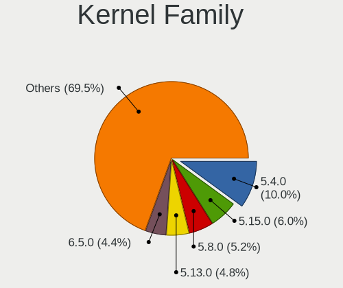
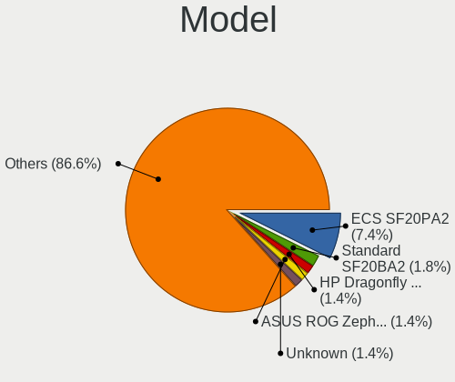
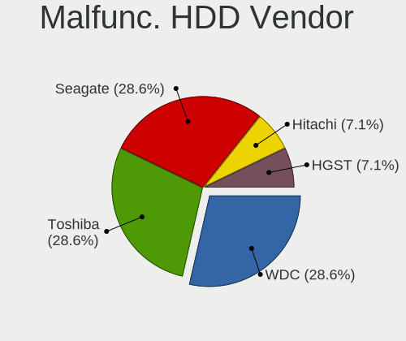
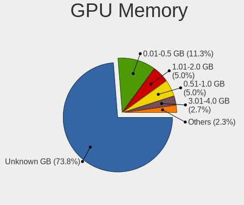

Linux in Uruguay - Tested Hardware & Statistics (Notebooks)
-----------------------------------------------------------

A project to collect tested hardware configurations for Linux in Uruguay.

Anyone can contribute to this report by the [hw-probe](https://github.com/linuxhw/hw-probe) tool:

    sudo -E hw-probe -all -upload

Please contribute! Especially if your hardware is rare.

Contents
--------

* [ Test Cases ](#test-cases)

* [ System ](#system)
  - [ OS                       ](#os)
  - [ OS Family                ](#os-family)
  - [ Kernel                   ](#kernel)
  - [ Kernel Family            ](#kernel-family)
  - [ Kernel Major Ver.        ](#kernel-major-ver)
  - [ Arch                     ](#arch)
  - [ DE                       ](#de)
  - [ Display Server           ](#display-server)
  - [ Display Manager          ](#display-manager)
  - [ OS Lang                  ](#os-lang)
  - [ Boot Mode                ](#boot-mode)
  - [ Filesystem               ](#filesystem)
  - [ Part. scheme             ](#part-scheme)
  - [ Dual Boot with Linux/BSD ](#dual-boot-with-linuxbsd)
  - [ Dual Boot (Win)          ](#dual-boot-win)

* [ Board ](#board)
  - [ Vendor                   ](#vendor)
  - [ Model                    ](#model)
  - [ Model Family             ](#model-family)
  - [ MFG Year                 ](#mfg-year)
  - [ Form Factor              ](#form-factor)
  - [ Secure Boot              ](#secure-boot)
  - [ Coreboot                 ](#coreboot)
  - [ RAM Size                 ](#ram-size)
  - [ RAM Used                 ](#ram-used)
  - [ Total Drives             ](#total-drives)
  - [ Has CD-ROM               ](#has-cd-rom)
  - [ Has Ethernet             ](#has-ethernet)
  - [ Has WiFi                 ](#has-wifi)
  - [ Has Bluetooth            ](#has-bluetooth)

* [ Location ](#location)
  - [ Country                  ](#country)
  - [ City                     ](#city)

* [ Drives ](#drives)
  - [ Drive Vendor             ](#drive-vendor)
  - [ Drive Model              ](#drive-model)
  - [ HDD Vendor               ](#hdd-vendor)
  - [ SSD Vendor               ](#ssd-vendor)
  - [ Drive Kind               ](#drive-kind)
  - [ Drive Connector          ](#drive-connector)
  - [ Drive Size               ](#drive-size)
  - [ Space Total              ](#space-total)
  - [ Space Used               ](#space-used)
  - [ Malfunc. Drives          ](#malfunc-drives)
  - [ Malfunc. Drive Vendor    ](#malfunc-drive-vendor)
  - [ Malfunc. HDD Vendor      ](#malfunc-hdd-vendor)
  - [ Malfunc. Drive Kind      ](#malfunc-drive-kind)
  - [ Failed Drives            ](#failed-drives)
  - [ Failed Drive Vendor      ](#failed-drive-vendor)
  - [ Drive Status             ](#drive-status)

* [ Storage controller ](#storage-controller)
  - [ Storage Vendor           ](#storage-vendor)
  - [ Storage Model            ](#storage-model)
  - [ Storage Kind             ](#storage-kind)

* [ Processor ](#processor)
  - [ CPU Vendor               ](#cpu-vendor)
  - [ CPU Model                ](#cpu-model)
  - [ CPU Model Family         ](#cpu-model-family)
  - [ CPU Cores                ](#cpu-cores)
  - [ CPU Sockets              ](#cpu-sockets)
  - [ CPU Threads              ](#cpu-threads)
  - [ CPU Op-Modes             ](#cpu-op-modes)
  - [ CPU Microcode            ](#cpu-microcode)
  - [ CPU Microarch            ](#cpu-microarch)

* [ Graphics ](#graphics)
  - [ GPU Vendor               ](#gpu-vendor)
  - [ GPU Model                ](#gpu-model)
  - [ GPU Combo                ](#gpu-combo)
  - [ GPU Driver               ](#gpu-driver)
  - [ GPU Memory               ](#gpu-memory)

* [ Monitor ](#monitor)
  - [ Monitor Vendor           ](#monitor-vendor)
  - [ Monitor Model            ](#monitor-model)
  - [ Monitor Resolution       ](#monitor-resolution)
  - [ Monitor Diagonal         ](#monitor-diagonal)
  - [ Monitor Width            ](#monitor-width)
  - [ Aspect Ratio             ](#aspect-ratio)
  - [ Monitor Area             ](#monitor-area)
  - [ Pixel Density            ](#pixel-density)
  - [ Multiple Monitors        ](#multiple-monitors)

* [ Network ](#network)
  - [ Net Controller Vendor    ](#net-controller-vendor)
  - [ Net Controller Model     ](#net-controller-model)
  - [ Wireless Vendor          ](#wireless-vendor)
  - [ Wireless Model           ](#wireless-model)
  - [ Ethernet Vendor          ](#ethernet-vendor)
  - [ Ethernet Model           ](#ethernet-model)
  - [ Net Controller Kind      ](#net-controller-kind)
  - [ Used Controller          ](#used-controller)
  - [ NICs                     ](#nics)
  - [ IPv6                     ](#ipv6)

* [ Bluetooth ](#bluetooth)
  - [ Bluetooth Vendor         ](#bluetooth-vendor)
  - [ Bluetooth Model          ](#bluetooth-model)

* [ Sound ](#sound)
  - [ Sound Vendor             ](#sound-vendor)
  - [ Sound Model              ](#sound-model)

* [ Memory ](#memory)
  - [ Memory Vendor            ](#memory-vendor)
  - [ Memory Model             ](#memory-model)
  - [ Memory Kind              ](#memory-kind)
  - [ Memory Form Factor       ](#memory-form-factor)
  - [ Memory Size              ](#memory-size)
  - [ Memory Speed             ](#memory-speed)

* [ Printers & scanners ](#printers--scanners)
  - [ Printer Vendor           ](#printer-vendor)
  - [ Printer Model            ](#printer-model)
  - [ Scanner Vendor           ](#scanner-vendor)
  - [ Scanner Model            ](#scanner-model)

* [ Camera ](#camera)
  - [ Camera Vendor            ](#camera-vendor)
  - [ Camera Model             ](#camera-model)

* [ Security ](#security)
  - [ Fingerprint Vendor       ](#fingerprint-vendor)
  - [ Fingerprint Model        ](#fingerprint-model)
  - [ Chipcard Vendor          ](#chipcard-vendor)
  - [ Chipcard Model           ](#chipcard-model)

* [ Unsupported ](#unsupported)
  - [ Unsupported Devices      ](#unsupported-devices)
  - [ Unsupported Device Types ](#unsupported-device-types)

Test Cases
----------

Total: 177

| Vendor        | Model                       | Probe                                                      | Date         |
|---------------|-----------------------------|------------------------------------------------------------|--------------|
| Toshiba       | Satellite C75D-B            | [04282775ba](https://linux-hardware.org/?probe=04282775ba) | Dec 24, 2022 |
| ECS           | SF20PA2                     | [2e0892ec48](https://linux-hardware.org/?probe=2e0892ec48) | Nov 18, 2022 |
| Acer          | Aspire one 1-431            | [c27978fdc4](https://linux-hardware.org/?probe=c27978fdc4) | Nov 18, 2022 |
| Apple         | MacBookPro9,2               | [e974c2ceff](https://linux-hardware.org/?probe=e974c2ceff) | Nov 12, 2022 |
| Alienware     | 14                          | [0c11295ebe](https://linux-hardware.org/?probe=0c11295ebe) | Nov 03, 2022 |
| Toshiba       | Satellite L45-B             | [e2f30e0f1e](https://linux-hardware.org/?probe=e2f30e0f1e) | Oct 26, 2022 |
| HP            | Laptop 17-ak0xx             | [67fbbc4074](https://linux-hardware.org/?probe=67fbbc4074) | Oct 11, 2022 |
| Acer          | Aspire ES1-572              | [1bd18c9a15](https://linux-hardware.org/?probe=1bd18c9a15) | Oct 04, 2022 |
| Lenovo        | ThinkPad Edge E531 68852... | [5e91cc6f07](https://linux-hardware.org/?probe=5e91cc6f07) | Sep 21, 2022 |
| Toshiba       | Satellite C855              | [bd34f35e50](https://linux-hardware.org/?probe=bd34f35e50) | Sep 15, 2022 |
| Dell          | Latitude 3150               | [6bc88c696c](https://linux-hardware.org/?probe=6bc88c696c) | Sep 04, 2022 |
| ASUSTek       | ROG Zephyrus G15 GA503QR... | [1e79d17c85](https://linux-hardware.org/?probe=1e79d17c85) | Aug 23, 2022 |
| ECS           | SF20PA2                     | [67dd8af18f](https://linux-hardware.org/?probe=67dd8af18f) | Aug 23, 2022 |
| Lenovo        | IdeaPad 500S-14ISK 80Q3     | [fdbec5aab2](https://linux-hardware.org/?probe=fdbec5aab2) | Aug 22, 2022 |
| Gateway       | NV55C                       | [cc3c8d23e4](https://linux-hardware.org/?probe=cc3c8d23e4) | Aug 03, 2022 |
| Dell          | Latitude 3150               | [aecf1fe543](https://linux-hardware.org/?probe=aecf1fe543) | Aug 01, 2022 |
| HP            | Laptop 14-dk1xxx            | [4eb7e0d085](https://linux-hardware.org/?probe=4eb7e0d085) | Jul 22, 2022 |
| GPU Compan... | GWTN156-9                   | [df5c4b480d](https://linux-hardware.org/?probe=df5c4b480d) | Jul 15, 2022 |
| Acer          | Swift SF314-54              | [47420af7dc](https://linux-hardware.org/?probe=47420af7dc) | Jun 23, 2022 |
| iClever       | IC-T01                      | [f82c34c612](https://linux-hardware.org/?probe=f82c34c612) | Jun 17, 2022 |
| HP            | Pavilion g4                 | [193875edcc](https://linux-hardware.org/?probe=193875edcc) | Jun 15, 2022 |
| Acer          | Swift SF314-54              | [06bccc3696](https://linux-hardware.org/?probe=06bccc3696) | Jun 14, 2022 |
| Dell          | XPS 15 7590                 | [482ed9f535](https://linux-hardware.org/?probe=482ed9f535) | May 29, 2022 |
| Acer          | Swift SF314-54              | [39f85b46d7](https://linux-hardware.org/?probe=39f85b46d7) | May 23, 2022 |
| Acer          | Swift SF314-54              | [fc1233f258](https://linux-hardware.org/?probe=fc1233f258) | May 22, 2022 |
| Acer          | Swift SF314-54              | [478550abf1](https://linux-hardware.org/?probe=478550abf1) | May 21, 2022 |
| Acer          | Swift SF314-54              | [a31c36956a](https://linux-hardware.org/?probe=a31c36956a) | May 13, 2022 |
| Acer          | Swift SF314-54              | [cc3411e0b4](https://linux-hardware.org/?probe=cc3411e0b4) | May 10, 2022 |
| HP            | Laptop 14-dk1xxx            | [fa6da4906f](https://linux-hardware.org/?probe=fa6da4906f) | May 07, 2022 |
| Toshiba       | Satellite C645D             | [53153cb65d](https://linux-hardware.org/?probe=53153cb65d) | May 04, 2022 |
| Acer          | Aspire ES1-572              | [25f9b83c30](https://linux-hardware.org/?probe=25f9b83c30) | Apr 28, 2022 |
| Lenovo        | B50-45 20388                | [7ad45f257f](https://linux-hardware.org/?probe=7ad45f257f) | Apr 20, 2022 |
| HP            | EliteBook 840 G1            | [d2e2811388](https://linux-hardware.org/?probe=d2e2811388) | Apr 20, 2022 |
| Dell          | Inspiron 5585               | [2c6e96d91f](https://linux-hardware.org/?probe=2c6e96d91f) | Apr 18, 2022 |
| Dell          | Inspiron 15-3567            | [73be944f6c](https://linux-hardware.org/?probe=73be944f6c) | Apr 14, 2022 |
| Dell          | Precision 7550              | [4619da9502](https://linux-hardware.org/?probe=4619da9502) | Apr 14, 2022 |
| Lenovo        | G405 20239                  | [ab55cb1e13](https://linux-hardware.org/?probe=ab55cb1e13) | Apr 13, 2022 |
| HP            | Laptop 14-dq1xxx            | [7d203f8bc0](https://linux-hardware.org/?probe=7d203f8bc0) | Apr 02, 2022 |
| ASUSTek       | ROG Zephyrus G14 GA401IV... | [d895af2b46](https://linux-hardware.org/?probe=d895af2b46) | Mar 29, 2022 |
| HP            | Laptop 14-dq1xxx            | [9bf7ed495b](https://linux-hardware.org/?probe=9bf7ed495b) | Mar 28, 2022 |
| Lenovo        | ThinkPad L14 Gen 2 20X2S... | [d9afd858b4](https://linux-hardware.org/?probe=d9afd858b4) | Mar 23, 2022 |
| HP            | ZBook 14u G4                | [cc637b12de](https://linux-hardware.org/?probe=cc637b12de) | Mar 10, 2022 |
| HP            | Pavilion dv5                | [81371d4535](https://linux-hardware.org/?probe=81371d4535) | Mar 04, 2022 |
| GPU Compan... | GWTN156-4                   | [89e7b9fa39](https://linux-hardware.org/?probe=89e7b9fa39) | Mar 02, 2022 |
| ECS           | SF20PA2                     | [3bddc7e08a](https://linux-hardware.org/?probe=3bddc7e08a) | Feb 11, 2022 |
| MSI           | GS63VR 6RF                  | [4873365af6](https://linux-hardware.org/?probe=4873365af6) | Jan 30, 2022 |
| Sony          | SVF14211CLB                 | [d25b1846ff](https://linux-hardware.org/?probe=d25b1846ff) | Dec 07, 2021 |
| Sony          | SVF14211CLB                 | [41bfe6e292](https://linux-hardware.org/?probe=41bfe6e292) | Dec 06, 2021 |
| ASUSTek       | ZenBook UX391FA_UX391FA     | [5fb4f1b6a6](https://linux-hardware.org/?probe=5fb4f1b6a6) | Nov 29, 2021 |
| HP            | Stream Laptop 14-ax0XX      | [a664218f29](https://linux-hardware.org/?probe=a664218f29) | Nov 28, 2021 |
| Acer          | Aspire 5733Z                | [324f0d898e](https://linux-hardware.org/?probe=324f0d898e) | Nov 16, 2021 |
| Acer          | Swift SF314-54              | [b506625dc2](https://linux-hardware.org/?probe=b506625dc2) | Nov 05, 2021 |
| Acer          | Swift SF314-54              | [4e606c817f](https://linux-hardware.org/?probe=4e606c817f) | Nov 04, 2021 |
| Samsung       | N102SP/N100SP/N101SP        | [c04d448530](https://linux-hardware.org/?probe=c04d448530) | Oct 21, 2021 |
| Lenovo        | B51-30 80LK                 | [dea10156c6](https://linux-hardware.org/?probe=dea10156c6) | Sep 20, 2021 |
| Haitech       | H7141A                      | [496c0eb316](https://linux-hardware.org/?probe=496c0eb316) | Sep 18, 2021 |
| ECS           | SF20PA2                     | [6d17cf08ad](https://linux-hardware.org/?probe=6d17cf08ad) | Sep 12, 2021 |
| Panasonic     | CF-31JEGAX1M                | [c5acecef3a](https://linux-hardware.org/?probe=c5acecef3a) | Aug 22, 2021 |
| Lenovo        | ThinkPad L490 20Q6S0NF00    | [a8f222614b](https://linux-hardware.org/?probe=a8f222614b) | Aug 11, 2021 |
| Lenovo        | ThinkPad T450 20BUS0G91F    | [8db659cf12](https://linux-hardware.org/?probe=8db659cf12) | Aug 09, 2021 |
| Lenovo        | ThinkPad S1 Yoga 20CDS02... | [4781e962e7](https://linux-hardware.org/?probe=4781e962e7) | Aug 09, 2021 |
| ASUSTek       | ASUS TUF Gaming A15 FA50... | [393c8e4faa](https://linux-hardware.org/?probe=393c8e4faa) | Aug 05, 2021 |
| HP            | Pavilion 15                 | [ec0019224a](https://linux-hardware.org/?probe=ec0019224a) | Jul 28, 2021 |
| ECS           | SF20PA2                     | [2016dfe42c](https://linux-hardware.org/?probe=2016dfe42c) | Jul 26, 2021 |
| HP            | Laptop 15-bs0xx             | [c84d445008](https://linux-hardware.org/?probe=c84d445008) | Jul 18, 2021 |
| Acer          | Aspire E5-521               | [d4629ecbed](https://linux-hardware.org/?probe=d4629ecbed) | Jul 18, 2021 |
| Lenovo        | ThinkPad E15 20RES31K00     | [6d359d339e](https://linux-hardware.org/?probe=6d359d339e) | Jul 02, 2021 |
| HP            | Laptop 15-bs0xx             | [27582e9e17](https://linux-hardware.org/?probe=27582e9e17) | Jun 21, 2021 |
| Acer          | TravelMate 5730             | [4a21735ce1](https://linux-hardware.org/?probe=4a21735ce1) | Jun 17, 2021 |
| Acer          | Acadia V1.45                | [9357025bc9](https://linux-hardware.org/?probe=9357025bc9) | Jun 01, 2021 |
| HP            | ENVY TS 15                  | [8369c42ce2](https://linux-hardware.org/?probe=8369c42ce2) | May 31, 2021 |
| Positivo      | Serie AT300                 | [38a0173a4a](https://linux-hardware.org/?probe=38a0173a4a) | May 28, 2021 |
| HP            | Pavilion 17                 | [f12450cc62](https://linux-hardware.org/?probe=f12450cc62) | May 28, 2021 |
| Lenovo        | ThinkPad T590 20N5S2GP05    | [2444839350](https://linux-hardware.org/?probe=2444839350) | May 25, 2021 |
| Dell          | Latitude E5470              | [212d434e24](https://linux-hardware.org/?probe=212d434e24) | May 25, 2021 |
| Positivo      | Serie AT300                 | [a021ecf0dd](https://linux-hardware.org/?probe=a021ecf0dd) | May 24, 2021 |
| Acer          | Aspire 5715Z                | [24040eecb6](https://linux-hardware.org/?probe=24040eecb6) | May 23, 2021 |
| Toshiba       | Satellite C45-A             | [cb57bbefd0](https://linux-hardware.org/?probe=cb57bbefd0) | May 22, 2021 |
| Toshiba       | Satellite C45-A             | [297e5b458a](https://linux-hardware.org/?probe=297e5b458a) | May 21, 2021 |
| ASUSTek       | ROG Zephyrus G14 GA401IV... | [883f67612b](https://linux-hardware.org/?probe=883f67612b) | May 19, 2021 |
| Standard      | SF20BA2                     | [e0fdbc36a2](https://linux-hardware.org/?probe=e0fdbc36a2) | May 16, 2021 |
| Acer          | Acadia V1.45                | [321e5159ac](https://linux-hardware.org/?probe=321e5159ac) | May 15, 2021 |
| ECS           | SF20PA2                     | [f3cc58b0e4](https://linux-hardware.org/?probe=f3cc58b0e4) | May 13, 2021 |
| Dell          | Inspiron N5110              | [6f67fbb9d4](https://linux-hardware.org/?probe=6f67fbb9d4) | May 08, 2021 |
| ECS           | SF20PA2                     | [cfbd36f40b](https://linux-hardware.org/?probe=cfbd36f40b) | May 07, 2021 |
| Acer          | Aspire E5-521               | [d1c6c7309a](https://linux-hardware.org/?probe=d1c6c7309a) | May 03, 2021 |
| ASUSTek       | N46VJ                       | [0d6e007969](https://linux-hardware.org/?probe=0d6e007969) | Apr 28, 2021 |
| Standard      | SF20BA2                     | [d51e9f653f](https://linux-hardware.org/?probe=d51e9f653f) | Apr 26, 2021 |
| Standard      | SF20BA2                     | [a568b21782](https://linux-hardware.org/?probe=a568b21782) | Apr 23, 2021 |
| Standard      | SF20BA2                     | [e454415213](https://linux-hardware.org/?probe=e454415213) | Apr 23, 2021 |
| Lenovo        | G50-70 20351                | [44e6cc36ce](https://linux-hardware.org/?probe=44e6cc36ce) | Apr 20, 2021 |
| Lenovo        | V15-ADA 82C7                | [9065c52996](https://linux-hardware.org/?probe=9065c52996) | Apr 17, 2021 |
| Dell          | Inspiron 5565               | [8f75eda1de](https://linux-hardware.org/?probe=8f75eda1de) | Apr 16, 2021 |
| Lenovo        | ThinkBook 15-IML 20RW       | [4e23f3b6b5](https://linux-hardware.org/?probe=4e23f3b6b5) | Apr 16, 2021 |
| Lenovo        | ThinkBook 15-IML 20RW       | [18ee0d2d64](https://linux-hardware.org/?probe=18ee0d2d64) | Apr 16, 2021 |
| HP            | 240 G7                      | [721c4c3dbd](https://linux-hardware.org/?probe=721c4c3dbd) | Apr 14, 2021 |
| Apple         | MacBookAir7,1               | [2296b37506](https://linux-hardware.org/?probe=2296b37506) | Apr 12, 2021 |
| Acer          | Aspire 5715Z                | [9a7aa83895](https://linux-hardware.org/?probe=9a7aa83895) | Apr 07, 2021 |
| Acer          | Aspire 5715Z                | [30729baf7a](https://linux-hardware.org/?probe=30729baf7a) | Apr 07, 2021 |
| ASUSTek       | ROG Zephyrus G14 GA401IV... | [118abf533e](https://linux-hardware.org/?probe=118abf533e) | Mar 28, 2021 |
| Panasonic     | CF-31JEGAX1M                | [4636e611d8](https://linux-hardware.org/?probe=4636e611d8) | Mar 14, 2021 |
| MSI           | GL65 Leopard 10SCXR         | [8497db47ab](https://linux-hardware.org/?probe=8497db47ab) | Mar 09, 2021 |
| HP            | Laptop 14-df0xxx            | [c1d21b6940](https://linux-hardware.org/?probe=c1d21b6940) | Mar 01, 2021 |
| Dell          | XPS 13 9370                 | [f51dac04a1](https://linux-hardware.org/?probe=f51dac04a1) | Feb 17, 2021 |
| Dell          | XPS 13 9370                 | [bea8cc11d5](https://linux-hardware.org/?probe=bea8cc11d5) | Feb 17, 2021 |
| MSI           | GL65 Leopard 10SCXR         | [ac71737361](https://linux-hardware.org/?probe=ac71737361) | Jan 16, 2021 |
| Acer          | Aspire 5733                 | [1f4e4d7fbc](https://linux-hardware.org/?probe=1f4e4d7fbc) | Jan 08, 2021 |
| Toshiba       | Satellite L55t-B            | [ab3b576bd1](https://linux-hardware.org/?probe=ab3b576bd1) | Jan 07, 2021 |
| Toshiba       | Satellite L55t-B            | [6fc9533a15](https://linux-hardware.org/?probe=6fc9533a15) | Jan 06, 2021 |
| ECS           | SF20PA2                     | [f26e0bf23f](https://linux-hardware.org/?probe=f26e0bf23f) | Jan 04, 2021 |
| HP            | 2000                        | [99481f08e3](https://linux-hardware.org/?probe=99481f08e3) | Dec 31, 2020 |
| Panasonic     | CF-31JEGAX1M                | [c0745f5a94](https://linux-hardware.org/?probe=c0745f5a94) | Dec 31, 2020 |
| HP            | Notebook                    | [213a94eab7](https://linux-hardware.org/?probe=213a94eab7) | Dec 28, 2020 |
| HP            | Notebook                    | [bb3749dd61](https://linux-hardware.org/?probe=bb3749dd61) | Dec 28, 2020 |
| ASUSTek       | VivoBook 15_ASUS Laptop ... | [f55e2642ef](https://linux-hardware.org/?probe=f55e2642ef) | Dec 15, 2020 |
| Toshiba       | Satellite C75D-C            | [f158fc821a](https://linux-hardware.org/?probe=f158fc821a) | Nov 10, 2020 |
| Lenovo        | IdeaPad 330S-15ARR 81FB     | [5a8d4603be](https://linux-hardware.org/?probe=5a8d4603be) | Nov 03, 2020 |
| ASUSTek       | VivoBook 15_ASUS Laptop ... | [19081a3c58](https://linux-hardware.org/?probe=19081a3c58) | Oct 27, 2020 |
| Dell          | Latitude E6430              | [8ea63ec090](https://linux-hardware.org/?probe=8ea63ec090) | Oct 23, 2020 |
| HP            | Pavilion dm4                | [21a3ef42e0](https://linux-hardware.org/?probe=21a3ef42e0) | Oct 13, 2020 |
| ASUSTek       | VivoBook 15_ASUS Laptop ... | [64e95b4174](https://linux-hardware.org/?probe=64e95b4174) | Oct 10, 2020 |
| ASUSTek       | VivoBook 15_ASUS Laptop ... | [0ffffb855b](https://linux-hardware.org/?probe=0ffffb855b) | Oct 04, 2020 |
| ASUSTek       | VivoBook 15_ASUS Laptop ... | [7ddfb80220](https://linux-hardware.org/?probe=7ddfb80220) | Oct 04, 2020 |
| Toshiba       | Satellite C75D-C            | [12c65e3222](https://linux-hardware.org/?probe=12c65e3222) | Sep 25, 2020 |
| MSI           | GE62 6QD                    | [cf444064fc](https://linux-hardware.org/?probe=cf444064fc) | Sep 03, 2020 |
| HP            | Casablanca H710             | [2061828542](https://linux-hardware.org/?probe=2061828542) | Aug 26, 2020 |
| HP            | Casablanca H710             | [f566c52ffd](https://linux-hardware.org/?probe=f566c52ffd) | Aug 26, 2020 |
| Samsung       | NC208/NC108                 | [f425b1dc48](https://linux-hardware.org/?probe=f425b1dc48) | Aug 17, 2020 |
| Samsung       | NC208/NC108                 | [759ee832fb](https://linux-hardware.org/?probe=759ee832fb) | Aug 17, 2020 |
| Lenovo        | IdeaPad S145-15AST 81N3     | [3c55f58986](https://linux-hardware.org/?probe=3c55f58986) | Jul 03, 2020 |
| HP            | Presario CQ43               | [bba4f49ed1](https://linux-hardware.org/?probe=bba4f49ed1) | Jun 23, 2020 |
| Acer          | Aspire A715-72G             | [70acf4ea22](https://linux-hardware.org/?probe=70acf4ea22) | Jun 18, 2020 |
| HP            | Presario CQ43               | [3af51e5df2](https://linux-hardware.org/?probe=3af51e5df2) | Jun 13, 2020 |
| ECS           | SF20PA2                     | [fc1653c118](https://linux-hardware.org/?probe=fc1653c118) | Jun 10, 2020 |
| Dell          | Inspiron 5748               | [d7010adabe](https://linux-hardware.org/?probe=d7010adabe) | Jun 09, 2020 |
| OEM           | V40SI2                      | [e2ad8d9479](https://linux-hardware.org/?probe=e2ad8d9479) | Jun 06, 2020 |
| Lenovo        | IdeaPad S340-15IWL 81N8     | [13b3a46069](https://linux-hardware.org/?probe=13b3a46069) | May 27, 2020 |
| ASUSTek       | X555LAB                     | [7e4107b1b4](https://linux-hardware.org/?probe=7e4107b1b4) | May 26, 2020 |
| Lenovo        | ThinkPad Edge E540 20C60... | [7e4e3c078f](https://linux-hardware.org/?probe=7e4e3c078f) | May 20, 2020 |
| MSI           | GL63 8RD                    | [7e41ab8d71](https://linux-hardware.org/?probe=7e41ab8d71) | May 15, 2020 |
| Samsung       | 300E4C/300E5C/300E7C        | [3b397b64f7](https://linux-hardware.org/?probe=3b397b64f7) | May 06, 2020 |
| HP            | Laptop 15-bs0xx             | [a9832cd92e](https://linux-hardware.org/?probe=a9832cd92e) | May 05, 2020 |
| HP            | Laptop 15-bs0xx             | [a8857822b2](https://linux-hardware.org/?probe=a8857822b2) | May 03, 2020 |
| Samsung       | 300E4C/300E5C/300E7C        | [8609a3503d](https://linux-hardware.org/?probe=8609a3503d) | May 02, 2020 |
| HP            | Laptop 15-bs0xx             | [7fdc3c7af9](https://linux-hardware.org/?probe=7fdc3c7af9) | May 02, 2020 |
| Lenovo        | ThinkPad X240 20AMS72901    | [ad1e10654b](https://linux-hardware.org/?probe=ad1e10654b) | Apr 30, 2020 |
| Standard      | EF20EA                      | [11882357e0](https://linux-hardware.org/?probe=11882357e0) | Apr 26, 2020 |
| Dell          | Inspiron N5110              | [3be039900b](https://linux-hardware.org/?probe=3be039900b) | Apr 17, 2020 |
| Dell          | Inspiron N5110              | [cf6e400de0](https://linux-hardware.org/?probe=cf6e400de0) | Apr 17, 2020 |
| Dell          | Inspiron N5110              | [bb8bd669f6](https://linux-hardware.org/?probe=bb8bd669f6) | Apr 17, 2020 |
| Dell          | Inspiron N5110              | [f1caefcea5](https://linux-hardware.org/?probe=f1caefcea5) | Apr 17, 2020 |
| HP            | 620                         | [812b274fd4](https://linux-hardware.org/?probe=812b274fd4) | Apr 13, 2020 |
| HP            | 620                         | [ca26b96168](https://linux-hardware.org/?probe=ca26b96168) | Apr 13, 2020 |
| ECS           | SF20PA2                     | [d685560200](https://linux-hardware.org/?probe=d685560200) | Feb 01, 2020 |
| ECS           | SF20PA2                     | [e6212ece14](https://linux-hardware.org/?probe=e6212ece14) | Nov 27, 2019 |
| ECS           | SF20PA2                     | [1d4a07f181](https://linux-hardware.org/?probe=1d4a07f181) | Nov 19, 2019 |
| Toshiba       | Satellite C55-B             | [1fab0cb871](https://linux-hardware.org/?probe=1fab0cb871) | Nov 16, 2019 |
| ECS           | SF20PA2                     | [063490d972](https://linux-hardware.org/?probe=063490d972) | Nov 03, 2019 |
| HP            | Laptop 14-dk0xxx            | [623c96ec6e](https://linux-hardware.org/?probe=623c96ec6e) | Oct 07, 2019 |
| Lenovo        | IdeaPad 320-17IKB 81BJ      | [0925f5642c](https://linux-hardware.org/?probe=0925f5642c) | Sep 24, 2019 |
| ECS           | SF20PA2                     | [3c9b29c0c7](https://linux-hardware.org/?probe=3c9b29c0c7) | Sep 20, 2019 |
| ECS           | SF20PA2                     | [6d35e092fa](https://linux-hardware.org/?probe=6d35e092fa) | Sep 16, 2019 |
| Dell          | Inspiron 13-5368            | [0dab5b3510](https://linux-hardware.org/?probe=0dab5b3510) | Sep 15, 2019 |
| ECS           | SF20PA2                     | [80d3b6b8cf](https://linux-hardware.org/?probe=80d3b6b8cf) | Aug 04, 2019 |
| ECS           | SF20PA2                     | [a7b095e2f0](https://linux-hardware.org/?probe=a7b095e2f0) | Jul 30, 2019 |
| ECS           | SF20PA2                     | [01cad0b14a](https://linux-hardware.org/?probe=01cad0b14a) | Jul 10, 2019 |
| Acer          | TravelMate P249-G2-M        | [0e1338db33](https://linux-hardware.org/?probe=0e1338db33) | Jul 01, 2019 |
| Lenovo        | IdeaPad 300-15ISK 80RS      | [08c0f291e9](https://linux-hardware.org/?probe=08c0f291e9) | Jun 13, 2019 |
| Lenovo        | IdeaPad 320-17IKB 81BJ      | [5619d594fa](https://linux-hardware.org/?probe=5619d594fa) | Jun 10, 2019 |
| Dell          | Inspiron N5040              | [b8f0a4691d](https://linux-hardware.org/?probe=b8f0a4691d) | May 17, 2019 |
| Samsung       | 700T                        | [dcf693f16f](https://linux-hardware.org/?probe=dcf693f16f) | May 11, 2019 |
| HP            | Pavilion dv6                | [36299cef92](https://linux-hardware.org/?probe=36299cef92) | Apr 17, 2019 |
| HP            | Laptop 15-db0xxx            | [b26531074c](https://linux-hardware.org/?probe=b26531074c) | Apr 16, 2019 |
| Lenovo        | IdeaPad 300-15ISK 80RS      | [7d9905cfe7](https://linux-hardware.org/?probe=7d9905cfe7) | Mar 27, 2019 |
| ASUSTek       | TP300LAB                    | [538b5e5d24](https://linux-hardware.org/?probe=538b5e5d24) | Mar 26, 2019 |
| HP            | Pavilion 15                 | [7376903dca](https://linux-hardware.org/?probe=7376903dca) | May 13, 2018 |
| HP            | Pavilion 15                 | [2cc0124d5d](https://linux-hardware.org/?probe=2cc0124d5d) | May 13, 2018 |

System
------

OS
--

Installed operating systems

| Name                         | Notebooks | Percent |
|------------------------------|-----------|---------|
| Ubuntu 20.04                 | 25        | 18.52%  |
| Ubuntu 18.04                 | 19        | 14.07%  |
| OpenMandriva 4.2             | 6         | 4.44%   |
| KDE neon 20.04               | 6         | 4.44%   |
| Manjaro                      | 5         | 3.7%    |
| OpenMandriva 4.3             | 4         | 2.96%   |
| Ubuntu 21.10                 | 3         | 2.22%   |
| Ubuntu 19.04                 | 3         | 2.22%   |
| Linux Mint 19.3              | 3         | 2.22%   |
| Fedora 36                    | 3         | 2.22%   |
| Arch Rolling                 | 3         | 2.22%   |
| Zorin 16                     | 2         | 1.48%   |
| Xubuntu 18.04                | 2         | 1.48%   |
| Ubuntu 21.04                 | 2         | 1.48%   |
| Ubuntu 18.10                 | 2         | 1.48%   |
| Linux Mint 20.1              | 2         | 1.48%   |
| Linux Mint 19.1              | 2         | 1.48%   |
| Kubuntu 18.04                | 2         | 1.48%   |
| Debian 11                    | 2         | 1.48%   |
| Zorin 15                     | 1         | 0.74%   |
| Xubuntu 20.04                | 1         | 0.74%   |
| Ubuntu MATE 20.04            | 1         | 0.74%   |
| Ubuntu 22.04                 | 1         | 0.74%   |
| Ubuntu 20.10                 | 1         | 0.74%   |
| Ubuntu 19.10                 | 1         | 0.74%   |
| Ubuntu 17.10                 | 1         | 0.74%   |
| ROSA R11.1                   | 1         | 0.74%   |
| Pop!_OS 22.04                | 1         | 0.74%   |
| openSUSE Leap-15.1           | 1         | 0.74%   |
| OpenMandriva 4.50            | 1         | 0.74%   |
| NixOS 21.05.4384.4f37689c8a2 | 1         | 0.74%   |
| MX 21                        | 1         | 0.74%   |
| Manjaro 21.2.0               | 1         | 0.74%   |
| Lubuntu 20.04                | 1         | 0.74%   |
| Lubuntu 19.10                | 1         | 0.74%   |
| Linux Mint 20.3              | 1         | 0.74%   |
| Linux Mint 20.2              | 1         | 0.74%   |
| Linux Mint 20                | 1         | 0.74%   |
| Linux Mint 19.2              | 1         | 0.74%   |
| Linux Mint 19                | 1         | 0.74%   |

OS Family
---------

OS without a version

| Name         | Notebooks | Percent |
|--------------|-----------|---------|
| Ubuntu       | 56        | 42.42%  |
| Linux Mint   | 12        | 9.09%   |
| OpenMandriva | 11        | 8.33%   |
| Manjaro      | 6         | 4.55%   |
| KDE neon     | 6         | 4.55%   |
| Fedora       | 6         | 4.55%   |
| Kubuntu      | 4         | 3.03%   |
| Endless      | 4         | 3.03%   |
| Zorin        | 3         | 2.27%   |
| Xubuntu      | 3         | 2.27%   |
| Arch         | 3         | 2.27%   |
| Lubuntu      | 2         | 1.52%   |
| Elementary   | 2         | 1.52%   |
| Debian       | 2         | 1.52%   |
| ArcoLinux    | 2         | 1.52%   |
| Ubuntu MATE  | 1         | 0.76%   |
| ROSA         | 1         | 0.76%   |
| Pop!_OS      | 1         | 0.76%   |
| openSUSE     | 1         | 0.76%   |
| NixOS        | 1         | 0.76%   |
| MX           | 1         | 0.76%   |
| Gentoo       | 1         | 0.76%   |
| Feren OS     | 1         | 0.76%   |
| EndeavourOS  | 1         | 0.76%   |
| BlackPanther | 1         | 0.76%   |

Kernel
------

Version of the Linux kernel

| Version                     | Notebooks | Percent |
|-----------------------------|-----------|---------|
| 5.10.14-desktop-1omv4002    | 6         | 4.23%   |
| 4.16.18-pa2-2bp1            | 6         | 4.23%   |
| 4.16.18-pa2-1bp5            | 5         | 3.52%   |
| 5.8.0-53-generic            | 4         | 2.82%   |
| 5.5.19-bp0                  | 4         | 2.82%   |
| 5.13.0-39-generic           | 4         | 2.82%   |
| 5.4.0-73-generic            | 3         | 2.11%   |
| 5.4.0-58-generic            | 3         | 2.11%   |
| 5.4.0-52-generic            | 3         | 2.11%   |
| 5.16.7-desktop-1omv4003     | 3         | 2.11%   |
| 5.11.0-38-generic           | 3         | 2.11%   |
| 5.8.0-50-generic            | 2         | 1.41%   |
| 5.8.0-43-generic            | 2         | 1.41%   |
| 5.4.0-72-generic            | 2         | 1.41%   |
| 5.4.0-42-generic            | 2         | 1.41%   |
| 5.3.0-28-generic            | 2         | 1.41%   |
| 5.15.0-46-generic           | 2         | 1.41%   |
| 5.15.0-41-generic           | 2         | 1.41%   |
| 5.13.0-40-generic           | 2         | 1.41%   |
| 5.13.0-37-generic           | 2         | 1.41%   |
| 5.13.0-30-generic           | 2         | 1.41%   |
| 5.11.12-desktop-1omv4002    | 2         | 1.41%   |
| 5.0.0-13-generic            | 2         | 1.41%   |
| 4.15.0-51-generic           | 2         | 1.41%   |
| 4.15.0-20-generic           | 2         | 1.41%   |
| 4.15.0-101-generic          | 2         | 1.41%   |
| 6.0.6-arch1-1               | 1         | 0.7%    |
| 6.0.12-200.fc36.x86_64      | 1         | 0.7%    |
| 5.8.11-1-MANJARO            | 1         | 0.7%    |
| 5.8.1-3-MANJARO             | 1         | 0.7%    |
| 5.8.0-49-generic            | 1         | 0.7%    |
| 5.8.0-48-generic            | 1         | 0.7%    |
| 5.8.0-44-generic            | 1         | 0.7%    |
| 5.8.0-34-generic            | 1         | 0.7%    |
| 5.6.8-1-MANJARO             | 1         | 0.7%    |
| 5.4.60-1-lts                | 1         | 0.7%    |
| 5.4.32-generic-2rosa-x86_64 | 1         | 0.7%    |
| 5.4.0-80-generic            | 1         | 0.7%    |
| 5.4.0-70-generic            | 1         | 0.7%    |
| 5.4.0-65-generic            | 1         | 0.7%    |

Kernel Family
-------------

Linux kernel without a distro release

| Version | Notebooks | Percent |
|---------|-----------|---------|
| 5.4.0   | 22        | 15.83%  |
| 5.8.0   | 12        | 8.63%   |
| 5.13.0  | 11        | 7.91%   |
| 4.16.18 | 11        | 7.91%   |
| 4.15.0  | 9         | 6.47%   |
| 5.11.0  | 6         | 4.32%   |
| 5.10.14 | 6         | 4.32%   |
| 5.0.0   | 6         | 4.32%   |
| 5.3.0   | 5         | 3.6%    |
| 5.5.19  | 4         | 2.88%   |
| 5.15.0  | 4         | 2.88%   |
| 4.18.0  | 4         | 2.88%   |
| 5.16.7  | 3         | 2.16%   |
| 5.10.0  | 3         | 2.16%   |
| 5.19.12 | 2         | 1.44%   |
| 5.11.12 | 2         | 1.44%   |
| 6.0.6   | 1         | 0.72%   |
| 6.0.12  | 1         | 0.72%   |
| 5.8.11  | 1         | 0.72%   |
| 5.8.1   | 1         | 0.72%   |
| 5.6.8   | 1         | 0.72%   |
| 5.4.60  | 1         | 0.72%   |
| 5.4.32  | 1         | 0.72%   |
| 5.2.13  | 1         | 0.72%   |
| 5.18.18 | 1         | 0.72%   |
| 5.18.13 | 1         | 0.72%   |
| 5.17.5  | 1         | 0.72%   |
| 5.17.4  | 1         | 0.72%   |
| 5.16.16 | 1         | 0.72%   |
| 5.16.13 | 1         | 0.72%   |
| 5.16.12 | 1         | 0.72%   |
| 5.16.0  | 1         | 0.72%   |
| 5.15.65 | 1         | 0.72%   |
| 5.15.3  | 1         | 0.72%   |
| 5.14.18 | 1         | 0.72%   |
| 5.11.20 | 1         | 0.72%   |
| 5.11.11 | 1         | 0.72%   |
| 5.10.4  | 1         | 0.72%   |
| 5.10.31 | 1         | 0.72%   |
| 5.10.30 | 1         | 0.72%   |

Kernel Major Ver.
-----------------

Linux kernel major version

| Version | Notebooks | Percent |
|---------|-----------|---------|
| 5.4     | 24        | 17.27%  |
| 5.8     | 14        | 10.07%  |
| 5.10    | 12        | 8.63%   |
| 4.16    | 12        | 8.63%   |
| 5.13    | 11        | 7.91%   |
| 5.11    | 10        | 7.19%   |
| 4.15    | 9         | 6.47%   |
| 5.16    | 7         | 5.04%   |
| 5.15    | 6         | 4.32%   |
| 5.0     | 6         | 4.32%   |
| 5.3     | 5         | 3.6%    |
| 4.18    | 5         | 3.6%    |
| 5.5     | 4         | 2.88%   |
| 6.0     | 2         | 1.44%   |
| 5.19    | 2         | 1.44%   |
| 5.18    | 2         | 1.44%   |
| 5.17    | 2         | 1.44%   |
| 5.6     | 1         | 0.72%   |
| 5.2     | 1         | 0.72%   |
| 5.14    | 1         | 0.72%   |
| 4.17    | 1         | 0.72%   |
| 4.13    | 1         | 0.72%   |
| 4.12    | 1         | 0.72%   |

Arch
----

OS architecture (x86_64, i586, etc.)

| Name   | Notebooks | Percent |
|--------|-----------|---------|
| x86_64 | 126       | 98.44%  |
| i686   | 2         | 1.56%   |

DE
--

Desktop Environment

| Name            | Notebooks | Percent |
|-----------------|-----------|---------|
| GNOME           | 42        | 32.06%  |
| KDE5            | 23        | 17.56%  |
| Unknown         | 21        | 16.03%  |
| GNOME Flashback | 12        | 9.16%   |
| XFCE            | 10        | 7.63%   |
| X-Cinnamon      | 7         | 5.34%   |
| KDE             | 5         | 3.82%   |
| MATE            | 3         | 2.29%   |
| LXQt            | 3         | 2.29%   |
| Pantheon        | 2         | 1.53%   |
| Cinnamon        | 2         | 1.53%   |
| sway            | 1         | 0.76%   |

Display Server
--------------

X11 or Wayland

| Name    | Notebooks | Percent |
|---------|-----------|---------|
| X11     | 103       | 80.47%  |
| Wayland | 15        | 11.72%  |
| Unknown | 9         | 7.03%   |
| Tty     | 1         | 0.78%   |

Display Manager
---------------

SDDM, LightDM, etc.

| Name    | Notebooks | Percent |
|---------|-----------|---------|
| Unknown | 65        | 50.39%  |
| SDDM    | 23        | 17.83%  |
| GDM     | 22        | 17.05%  |
| LightDM | 8         | 6.2%    |
| GDM3    | 7         | 5.43%   |
| TDM     | 3         | 2.33%   |
| GREETD  | 1         | 0.78%   |

OS Lang
-------

Language

| Lang    | Notebooks | Percent |
|---------|-----------|---------|
| es_UY   | 66        | 49.62%  |
| en_US   | 26        | 19.55%  |
| Unknown | 18        | 13.53%  |
| es_ES   | 15        | 11.28%  |
| es_MX   | 3         | 2.26%   |
| es_AR   | 2         | 1.5%    |
| pt_BR   | 1         | 0.75%   |
| en_CA   | 1         | 0.75%   |
| C       | 1         | 0.75%   |

Boot Mode
---------

EFI or BIOS

| Mode | Notebooks | Percent |
|------|-----------|---------|
| EFI  | 70        | 53.85%  |
| BIOS | 60        | 46.15%  |

Filesystem
----------

Type of filesystem

| Type    | Notebooks | Percent |
|---------|-----------|---------|
| Ext4    | 110       | 84.62%  |
| Overlay | 10        | 7.69%   |
| Btrfs   | 5         | 3.85%   |
| Unknown | 4         | 3.08%   |
| Ext3    | 1         | 0.77%   |

Part. scheme
------------

Scheme of partitioning

| Type    | Notebooks | Percent |
|---------|-----------|---------|
| Unknown | 79        | 61.72%  |
| GPT     | 37        | 28.91%  |
| MBR     | 12        | 9.38%   |

Dual Boot with Linux/BSD
------------------------

Hosting more than one Linux/BSD

| Dual boot | Notebooks | Percent |
|-----------|-----------|---------|
| No        | 105       | 82.03%  |
| Yes       | 23        | 17.97%  |

Dual Boot (Win)
---------------

Hosting Linux and Windows

| Dual boot | Notebooks | Percent |
|-----------|-----------|---------|
| No        | 95        | 73.64%  |
| Yes       | 34        | 26.36%  |

Board
-----

Vendor
------

Motherboard manufacturer

| Name                | Notebooks | Percent |
|---------------------|-----------|---------|
| Hewlett-Packard     | 25        | 19.53%  |
| Lenovo              | 21        | 16.41%  |
| ECS                 | 15        | 11.72%  |
| Dell                | 13        | 10.16%  |
| ASUSTek Computer    | 11        | 8.59%   |
| Acer                | 11        | 8.59%   |
| Toshiba             | 9         | 7.03%   |
| Samsung Electronics | 4         | 3.13%   |
| MSI                 | 4         | 3.13%   |
| Standard            | 3         | 2.34%   |
| GPU Company         | 2         | 1.56%   |
| Apple               | 2         | 1.56%   |
| Sony                | 1         | 0.78%   |
| Positivo            | 1         | 0.78%   |
| Panasonic           | 1         | 0.78%   |
| OEM                 | 1         | 0.78%   |
| iClever             | 1         | 0.78%   |
| Haitech             | 1         | 0.78%   |
| Gateway             | 1         | 0.78%   |
| Alienware           | 1         | 0.78%   |

Model
-----

Motherboard model

| Name                                  | Notebooks | Percent |
|---------------------------------------|-----------|---------|
| ECS SF20PA2                           | 15        | 11.72%  |
| ASUS ROG Zephyrus G14 GA401IV_GA401IV | 3         | 2.34%   |
| Toshiba Satellite L55t-B              | 2         | 1.56%   |
| Standard SF20BA2                      | 2         | 1.56%   |
| HP Pavilion 15                        | 2         | 1.56%   |
| HP Laptop 15-bs0xx                    | 2         | 1.56%   |
| Toshiba Satellite L45-B               | 1         | 0.78%   |
| Toshiba Satellite C855                | 1         | 0.78%   |
| Toshiba Satellite C75D-C              | 1         | 0.78%   |
| Toshiba Satellite C75D-B              | 1         | 0.78%   |
| Toshiba Satellite C645D               | 1         | 0.78%   |
| Toshiba Satellite C55-B               | 1         | 0.78%   |
| Toshiba Satellite C45-A               | 1         | 0.78%   |
| Standard EF20EA                       | 1         | 0.78%   |
| Sony SVF14211CLB                      | 1         | 0.78%   |
| Samsung NC208/NC108                   | 1         | 0.78%   |
| Samsung N102SP/N100SP/N101SP          | 1         | 0.78%   |
| Samsung 700T                          | 1         | 0.78%   |
| Samsung 300E4C/300E5C/300E7C          | 1         | 0.78%   |
| Positivo Serie AT300                  | 1         | 0.78%   |
| Panasonic CF-31JEGAX1M                | 1         | 0.78%   |
| OEM V40SI2                            | 1         | 0.78%   |
| MSI GS63VR 6RF                        | 1         | 0.78%   |
| MSI GL65 Leopard 10SCXR               | 1         | 0.78%   |
| MSI GL63 8RD                          | 1         | 0.78%   |
| MSI GE62 6QD                          | 1         | 0.78%   |
| Lenovo V15-ADA 82C7                   | 1         | 0.78%   |
| Lenovo ThinkPad X240 20AMS72901       | 1         | 0.78%   |
| Lenovo ThinkPad T590 20N5S2GP05       | 1         | 0.78%   |
| Lenovo ThinkPad T450 20BUS0G91F       | 1         | 0.78%   |
| Lenovo ThinkPad S1 Yoga 20CDS02V00    | 1         | 0.78%   |
| Lenovo ThinkPad L490 20Q6S0NF00       | 1         | 0.78%   |
| Lenovo ThinkPad L14 Gen 2 20X2S2HG00  | 1         | 0.78%   |
| Lenovo ThinkPad Edge E540 20C6005CLS  | 1         | 0.78%   |
| Lenovo ThinkPad Edge E531 68852BS     | 1         | 0.78%   |
| Lenovo ThinkPad E15 20RES31K00        | 1         | 0.78%   |
| Lenovo ThinkBook 15-IML 20RW          | 1         | 0.78%   |
| Lenovo IdeaPad S340-15IWL 81N8        | 1         | 0.78%   |
| Lenovo IdeaPad S145-15AST 81N3        | 1         | 0.78%   |
| Lenovo IdeaPad 500S-14ISK 80Q3        | 1         | 0.78%   |

Model Family
------------

Motherboard model prefix

| Name                   | Notebooks | Percent |
|------------------------|-----------|---------|
| ECS SF20PA2            | 15        | 11.72%  |
| Toshiba Satellite      | 9         | 7.03%   |
| Lenovo ThinkPad        | 9         | 7.03%   |
| HP Laptop              | 8         | 6.25%   |
| Acer Aspire            | 8         | 6.25%   |
| HP Pavilion            | 7         | 5.47%   |
| Dell Inspiron          | 7         | 5.47%   |
| Lenovo IdeaPad         | 6         | 4.69%   |
| ASUS ROG               | 4         | 3.13%   |
| Dell Latitude          | 3         | 2.34%   |
| Standard SF20BA2       | 2         | 1.56%   |
| Dell XPS               | 2         | 1.56%   |
| ASUS VivoBook          | 2         | 1.56%   |
| Acer TravelMate        | 2         | 1.56%   |
| Standard EF20EA        | 1         | 0.78%   |
| Sony SVF14211CLB       | 1         | 0.78%   |
| Samsung NC208          | 1         | 0.78%   |
| Samsung N102SP         | 1         | 0.78%   |
| Samsung 700T           | 1         | 0.78%   |
| Samsung 300E4C         | 1         | 0.78%   |
| Positivo Serie         | 1         | 0.78%   |
| Panasonic CF-31JEGAX1M | 1         | 0.78%   |
| OEM V40SI2             | 1         | 0.78%   |
| MSI GS63VR             | 1         | 0.78%   |
| MSI GL65               | 1         | 0.78%   |
| MSI GL63               | 1         | 0.78%   |
| MSI GE62               | 1         | 0.78%   |
| Lenovo V15-ADA         | 1         | 0.78%   |
| Lenovo ThinkBook       | 1         | 0.78%   |
| Lenovo G50-70          | 1         | 0.78%   |
| Lenovo G405            | 1         | 0.78%   |
| Lenovo B51-30          | 1         | 0.78%   |
| Lenovo B50-45          | 1         | 0.78%   |
| iClever IC-T01         | 1         | 0.78%   |
| HP ZBook               | 1         | 0.78%   |
| HP Stream              | 1         | 0.78%   |
| HP Presario            | 1         | 0.78%   |
| HP Notebook            | 1         | 0.78%   |
| HP ENVY                | 1         | 0.78%   |
| HP EliteBook           | 1         | 0.78%   |

MFG Year
--------

Motherboard manufacture year

| Year | Notebooks | Percent |
|------|-----------|---------|
| 2017 | 23        | 17.97%  |
| 2019 | 14        | 10.94%  |
| 2013 | 13        | 10.16%  |
| 2020 | 11        | 8.59%   |
| 2018 | 11        | 8.59%   |
| 2014 | 11        | 8.59%   |
| 2011 | 10        | 7.81%   |
| 2016 | 9         | 7.03%   |
| 2015 | 7         | 5.47%   |
| 2012 | 7         | 5.47%   |
| 2010 | 4         | 3.13%   |
| 2008 | 3         | 2.34%   |
| 2021 | 2         | 1.56%   |
| 2007 | 2         | 1.56%   |
| 2009 | 1         | 0.78%   |

Form Factor
-----------

Physical design of the computer

| Name     | Notebooks | Percent |
|----------|-----------|---------|
| Notebook | 128       | 100%    |

Secure Boot
-----------

Enabled or disabled

| State    | Notebooks | Percent |
|----------|-----------|---------|
| Disabled | 115       | 89.15%  |
| Enabled  | 14        | 10.85%  |

Coreboot
--------

Have coreboot on board

| Used | Notebooks | Percent |
|------|-----------|---------|
| No   | 128       | 100%    |

RAM Size
--------

Total RAM memory

| Size in GB  | Notebooks | Percent |
|-------------|-----------|---------|
| 3.01-4.0    | 35        | 26.92%  |
| 4.01-8.0    | 32        | 24.62%  |
| 1.01-2.0    | 22        | 16.92%  |
| 8.01-16.0   | 19        | 14.62%  |
| 16.01-24.0  | 11        | 8.46%   |
| 32.01-64.0  | 6         | 4.62%   |
| 24.01-32.0  | 3         | 2.31%   |
| 2.01-3.0    | 1         | 0.77%   |
| 64.01-256.0 | 1         | 0.77%   |

RAM Used
--------

Used RAM memory

| Used GB   | Notebooks | Percent |
|-----------|-----------|---------|
| 1.01-2.0  | 63        | 45.99%  |
| 2.01-3.0  | 27        | 19.71%  |
| 4.01-8.0  | 16        | 11.68%  |
| 3.01-4.0  | 13        | 9.49%   |
| 0.51-1.0  | 12        | 8.76%   |
| 8.01-16.0 | 5         | 3.65%   |
| 0.01-0.5  | 1         | 0.73%   |

Total Drives
------------

Number of drives on board

| Drives | Notebooks | Percent |
|--------|-----------|---------|
| 1      | 105       | 82.03%  |
| 2      | 22        | 17.19%  |
| 0      | 1         | 0.78%   |

Has CD-ROM
----------

Has CD-ROM on board

| Presented | Notebooks | Percent |
|-----------|-----------|---------|
| No        | 86        | 66.67%  |
| Yes       | 43        | 33.33%  |

Has Ethernet
------------

Has Ethernet on board

| Presented | Notebooks | Percent |
|-----------|-----------|---------|
| Yes       | 86        | 67.19%  |
| No        | 42        | 32.81%  |

Has WiFi
--------

Has WiFi module

| Presented | Notebooks | Percent |
|-----------|-----------|---------|
| Yes       | 125       | 97.66%  |
| No        | 3         | 2.34%   |

Has Bluetooth
-------------

Has Bluetooth module

| Presented | Notebooks | Percent |
|-----------|-----------|---------|
| Yes       | 103       | 80.47%  |
| No        | 25        | 19.53%  |

Location
--------

Country
-------

Geographic location (country)

| Country | Notebooks | Percent |
|---------|-----------|---------|
| Uruguay | 128       | 100%    |

City
----

Geographic location (city)

| City                   | Notebooks | Percent |
|------------------------|-----------|---------|
| Montevideo             | 90        | 66.18%  |
| Canelones              | 8         | 5.88%   |
| Maldonado              | 7         | 5.15%   |
| Punta del Este         | 3         | 2.21%   |
| Buceo                  | 3         | 2.21%   |
| Salto                  | 2         | 1.47%   |
| Rocha                  | 2         | 1.47%   |
| Punta Gorda            | 2         | 1.47%   |
| Las Piedras            | 2         | 1.47%   |
| Ciudad del Plata       | 2         | 1.47%   |
| Solymar                | 1         | 0.74%   |
| San Jose de Mayo       | 1         | 0.74%   |
| Pinamar                | 1         | 0.74%   |
| Paysand              | 1         | 0.74%   |
| Parque Rodo            | 1         | 0.74%   |
| Melilla                | 1         | 0.74%   |
| Maronas                | 1         | 0.74%   |
| Las Flores             | 1         | 0.74%   |
| La Paz                 | 1         | 0.74%   |
| Joaquin Suarez         | 1         | 0.74%   |
| El Tesoro              | 1         | 0.74%   |
| El Pinar               | 1         | 0.74%   |
| Durazno                | 1         | 0.74%   |
| Barrancas Coloradas    | 1         | 0.74%   |
| Arenas de Jose Ignacio | 1         | 0.74%   |

Drives
------

Drive Vendor
------------

Hard drive vendors

| Vendor              | Notebooks | Drives | Percent |
|---------------------|-----------|--------|---------|
| WDC                 | 22        | 26     | 15.6%   |
| Unknown             | 19        | 24     | 13.48%  |
| Toshiba             | 19        | 21     | 13.48%  |
| Seagate             | 15        | 17     | 10.64%  |
| Kingston            | 15        | 21     | 10.64%  |
| SanDisk             | 11        | 13     | 7.8%    |
| Samsung Electronics | 9         | 9      | 6.38%   |
| Hitachi             | 6         | 8      | 4.26%   |
| SK hynix            | 5         | 5      | 3.55%   |
| Intel               | 4         | 4      | 2.84%   |
| HGST                | 3         | 3      | 2.13%   |
| Hewlett-Packard     | 3         | 3      | 2.13%   |
| Crucial             | 2         | 3      | 1.42%   |
| W800SH              | 1         | 1      | 0.71%   |
| Netac               | 1         | 1      | 0.71%   |
| LITEON              | 1         | 2      | 0.71%   |
| Dahua               | 1         | 1      | 0.71%   |
| China               | 1         | 1      | 0.71%   |
| BIWIN               | 1         | 1      | 0.71%   |
| BHT                 | 1         | 1      | 0.71%   |
| Apple               | 1         | 1      | 0.71%   |

Drive Model
-----------

Hard drive models

| Model                                | Notebooks | Percent |
|--------------------------------------|-----------|---------|
| Unknown MMC Card  32GB               | 10        | 6.94%   |
| Kingston SA400S37240G 240GB SSD      | 6         | 4.17%   |
| Unknown DA4032  32GB                 | 5         | 3.47%   |
| Toshiba MQ01ABD075 752GB             | 4         | 2.78%   |
| Seagate ST1000LM035-1RK172 1TB       | 4         | 2.78%   |
| Seagate ST1000LM024 HN-M101MBB 1TB   | 4         | 2.78%   |
| Toshiba MQ01ABF050 500GB             | 3         | 2.08%   |
| Seagate ST500LM012 HN-M500MBB 500GB  | 3         | 2.08%   |
| SanDisk DF4032  32GB                 | 3         | 2.08%   |
| Kingston SA400S37480G 480GB SSD      | 3         | 2.08%   |
| WDC WD5000BEKT-60KA9T0 500GB         | 2         | 1.39%   |
| Unknown SD/MMC/MS PRO 64GB           | 2         | 1.39%   |
| Toshiba HDWK105 500GB                | 2         | 1.39%   |
| SanDisk NVMe SSD Drive 256GB         | 2         | 1.39%   |
| SanDisk NVMe SSD Drive 1024GB        | 2         | 1.39%   |
| WDC WDS500G2B0B-00YS70 500GB SSD     | 1         | 0.69%   |
| WDC WDS250G2X0C-00L350 250GB         | 1         | 0.69%   |
| WDC WDS120G2G0A-00JH30 120GB SSD     | 1         | 0.69%   |
| WDC WD7500BPVX-22JC3T0 752GB         | 1         | 0.69%   |
| WDC WD6400BPVT-75HXZT1 640GB         | 1         | 0.69%   |
| WDC WD5000LPVX-00V0TT0 500GB         | 1         | 0.69%   |
| WDC WD5000LPVT-24G33T1 500GB         | 1         | 0.69%   |
| WDC WD5000LPCX-60VHAT0 500GB         | 1         | 0.69%   |
| WDC WD5000LPCX-24VHAT0 500GB         | 1         | 0.69%   |
| WDC WD5000LPCX-24C6HT0 500GB         | 1         | 0.69%   |
| WDC WD3200LPCX-24C6HT0 320GB         | 1         | 0.69%   |
| WDC WD3200BPVT-22ZEST0 320GB         | 1         | 0.69%   |
| WDC WD10SPZX-60Z10T0 1TB             | 1         | 0.69%   |
| WDC WD10SPZX-08Z10 1TB               | 1         | 0.69%   |
| WDC WD10SPCX-24HWST1 1TB             | 1         | 0.69%   |
| WDC WD10JPVX-75JC3T0 1TB             | 1         | 0.69%   |
| WDC WD10JPVX-60JC3T1 1TB             | 1         | 0.69%   |
| WDC WD10JPCX-24UE4T0 1TB             | 1         | 0.69%   |
| WDC PC SN730 SDBQNTY-512G-1001 512GB | 1         | 0.69%   |
| WDC PC SN530 SDBPNPZ-1T00-1002 1TB   | 1         | 0.69%   |
| W800SH 512GB SSD                     | 1         | 0.69%   |
| Unknown SD64G  64GB                  | 1         | 0.69%   |
| Unknown NCard  32GB                  | 1         | 0.69%   |
| Unknown MMC Card  64GB               | 1         | 0.69%   |
| Unknown MMC Card  4GB                | 1         | 0.69%   |

HDD Vendor
----------

Hard disk drive vendors

| Vendor  | Notebooks | Drives | Percent |
|---------|-----------|--------|---------|
| WDC     | 17        | 21     | 29.31%  |
| Toshiba | 15        | 17     | 25.86%  |
| Seagate | 15        | 17     | 25.86%  |
| Hitachi | 6         | 8      | 10.34%  |
| HGST    | 3         | 3      | 5.17%   |
| Unknown | 2         | 2      | 3.45%   |

SSD Vendor
----------

Solid state drive vendors

| Vendor              | Notebooks | Drives | Percent |
|---------------------|-----------|--------|---------|
| Kingston            | 12        | 15     | 32.43%  |
| Samsung Electronics | 5         | 5      | 13.51%  |
| SanDisk             | 3         | 3      | 8.11%   |
| Hewlett-Packard     | 3         | 3      | 8.11%   |
| WDC                 | 2         | 2      | 5.41%   |
| SK hynix            | 2         | 2      | 5.41%   |
| Intel               | 2         | 2      | 5.41%   |
| W800SH              | 1         | 1      | 2.7%    |
| Toshiba             | 1         | 1      | 2.7%    |
| Netac               | 1         | 1      | 2.7%    |
| Dahua               | 1         | 1      | 2.7%    |
| Crucial             | 1         | 2      | 2.7%    |
| China               | 1         | 1      | 2.7%    |
| BIWIN               | 1         | 1      | 2.7%    |
| BHT                 | 1         | 1      | 2.7%    |

Drive Kind
----------

HDD or SSD

| Kind | Notebooks | Drives | Percent |
|------|-----------|--------|---------|
| HDD  | 56        | 68     | 40.58%  |
| SSD  | 36        | 41     | 26.09%  |
| NVMe | 25        | 30     | 18.12%  |
| MMC  | 21        | 27     | 15.22%  |

Drive Connector
---------------

SATA, SAS, NVMe, etc.

| Type | Notebooks | Drives | Percent |
|------|-----------|--------|---------|
| SATA | 85        | 106    | 63.43%  |
| NVMe | 25        | 30     | 18.66%  |
| MMC  | 21        | 27     | 15.67%  |
| SAS  | 3         | 3      | 2.24%   |

Drive Size
----------

Size of hard drive

| Size in TB | Notebooks | Drives | Percent |
|------------|-----------|--------|---------|
| 0.01-0.5   | 60        | 71     | 65.93%  |
| 0.51-1.0   | 29        | 36     | 31.87%  |
| 3.01-4.0   | 1         | 1      | 1.1%    |
| 1.01-2.0   | 1         | 1      | 1.1%    |

Space Total
-----------

Amount of disk space available on the file system

| Size in GB     | Notebooks | Percent |
|----------------|-----------|---------|
| 101-250        | 31        | 23.48%  |
| 251-500        | 30        | 22.73%  |
| 501-1000       | 20        | 15.15%  |
| 21-50          | 19        | 14.39%  |
| 1-20           | 16        | 12.12%  |
| 51-100         | 7         | 5.3%    |
| 1001-2000      | 5         | 3.79%   |
| Unknown        | 3         | 2.27%   |
| More than 3000 | 1         | 0.76%   |

Space Used
----------

Amount of used disk space

| Used GB        | Notebooks | Percent |
|----------------|-----------|---------|
| 1-20           | 69        | 50%     |
| 21-50          | 24        | 17.39%  |
| 251-500        | 13        | 9.42%   |
| 101-250        | 11        | 7.97%   |
| 51-100         | 11        | 7.97%   |
| 501-1000       | 5         | 3.62%   |
| Unknown        | 3         | 2.17%   |
| More than 3000 | 1         | 0.72%   |
| 1001-2000      | 1         | 0.72%   |

Malfunc. Drives
---------------

Drive models with a malfunction

| Model                               | Notebooks | Drives | Percent |
|-------------------------------------|-----------|--------|---------|
| WDC WD5000BEKT-60KA9T0 500GB        | 2         | 2      | 18.18%  |
| WDC WD5000LPCX-24C6HT0 500GB        | 1         | 1      | 9.09%   |
| WDC WD10SPCX-24HWST1 1TB            | 1         | 1      | 9.09%   |
| Toshiba MK5059GSXP 500GB            | 1         | 2      | 9.09%   |
| Toshiba MK3265GSX 320GB             | 1         | 1      | 9.09%   |
| Toshiba MK3259GSXP 320GB            | 1         | 1      | 9.09%   |
| Seagate ST1000LM035-1RK172 1TB      | 1         | 1      | 9.09%   |
| Seagate ST1000LM024 HN-M101MBB 1TB  | 1         | 1      | 9.09%   |
| SanDisk SD9SN8W-128G-1006 128GB SSD | 1         | 1      | 9.09%   |
| Hitachi HTS547564A9E384 640GB       | 1         | 1      | 9.09%   |

Malfunc. Drive Vendor
---------------------

Vendors of faulty drives

| Vendor  | Notebooks | Drives | Percent |
|---------|-----------|--------|---------|
| WDC     | 4         | 4      | 36.36%  |
| Toshiba | 3         | 4      | 27.27%  |
| Seagate | 2         | 2      | 18.18%  |
| SanDisk | 1         | 1      | 9.09%   |
| Hitachi | 1         | 1      | 9.09%   |

Malfunc. HDD Vendor
-------------------

Vendors of faulty HDD drives

| Vendor  | Notebooks | Drives | Percent |
|---------|-----------|--------|---------|
| WDC     | 4         | 4      | 40%     |
| Toshiba | 3         | 4      | 30%     |
| Seagate | 2         | 2      | 20%     |
| Hitachi | 1         | 1      | 10%     |

Malfunc. Drive Kind
-------------------

Kinds of faulty drives

| Kind | Notebooks | Drives | Percent |
|------|-----------|--------|---------|
| HDD  | 10        | 11     | 90.91%  |
| SSD  | 1         | 1      | 9.09%   |

Failed Drives
-------------

Failed drive models

Zero info for selected period =(

Failed Drive Vendor
-------------------

Failed drive vendors

Zero info for selected period =(

Drive Status
------------

Number of failed and malfunc. drives

| Status   | Notebooks | Drives | Percent |
|----------|-----------|--------|---------|
| Detected | 81        | 106    | 62.79%  |
| Works    | 37        | 48     | 28.68%  |
| Malfunc  | 11        | 12     | 8.53%   |

Storage controller
------------------

Storage Vendor
--------------

Storage controller vendors

| Vendor                           | Notebooks | Percent |
|----------------------------------|-----------|---------|
| Intel                            | 89        | 64.96%  |
| AMD                              | 24        | 17.52%  |
| SanDisk                          | 8         | 5.84%   |
| Samsung Electronics              | 4         | 2.92%   |
| Toshiba America Info Systems     | 3         | 2.19%   |
| Kingston Technology Company      | 3         | 2.19%   |
| SK hynix                         | 2         | 1.46%   |
| Silicon Integrated Systems [SiS] | 1         | 0.73%   |
| Micron/Crucial Technology        | 1         | 0.73%   |
| Lite-On Technology               | 1         | 0.73%   |
| Apple                            | 1         | 0.73%   |

Storage Model
-------------

Storage controller models

| Model                                                                            | Notebooks | Percent |
|----------------------------------------------------------------------------------|-----------|---------|
| AMD FCH SATA Controller [AHCI mode]                                              | 21        | 14.69%  |
| Intel Celeron N3350/Pentium N4200/Atom E3900 Series SATA AHCI Controller         | 16        | 11.19%  |
| Intel Sunrise Point-LP SATA Controller [AHCI mode]                               | 9         | 6.29%   |
| Intel 82801 Mobile SATA Controller [RAID mode]                                   | 6         | 4.2%    |
| Intel 7 Series Chipset Family 6-port SATA Controller [AHCI mode]                 | 6         | 4.2%    |
| Intel Wildcat Point-LP SATA Controller [AHCI Mode]                               | 5         | 3.5%    |
| Intel Atom/Celeron/Pentium Processor x5-E8000/J3xxx/N3xxx Series SATA Controller | 5         | 3.5%    |
| Intel 8 Series SATA Controller 1 [AHCI mode]                                     | 5         | 3.5%    |
| SanDisk WD Blue SN550 NVMe SSD                                                   | 4         | 2.8%    |
| Intel 6 Series/C200 Series Chipset Family 6 port Mobile SATA AHCI Controller     | 4         | 2.8%    |
| Intel 5 Series/3400 Series Chipset 4 port SATA AHCI Controller                   | 4         | 2.8%    |
| Intel Atom Processor E3800 Series SATA AHCI Controller                           | 3         | 2.1%    |
| Intel 8 Series/C220 Series Chipset Family 6-port SATA Controller 1 [AHCI mode]   | 3         | 2.1%    |
| AMD SB7x0/SB8x0/SB9x0 SATA Controller [AHCI mode]                                | 3         | 2.1%    |
| Toshiba America Info Systems XG5 NVMe SSD Controller                             | 2         | 1.4%    |
| Samsung NVMe SSD Controller SM981/PM981/PM983                                    | 2         | 1.4%    |
| Intel SSD 660P Series                                                            | 2         | 1.4%    |
| Intel NM10/ICH7 Family SATA Controller [AHCI mode]                               | 2         | 1.4%    |
| Intel HM170/QM170 Chipset SATA Controller [AHCI Mode]                            | 2         | 1.4%    |
| Intel Comet Lake SATA AHCI Controller                                            | 2         | 1.4%    |
| Intel Cannon Point-LP SATA Controller [AHCI Mode]                                | 2         | 1.4%    |
| Intel Cannon Lake Mobile PCH SATA AHCI Controller                                | 2         | 1.4%    |
| Intel 82801IBM/IEM (ICH9M/ICH9M-E) 4 port SATA Controller [AHCI mode]            | 2         | 1.4%    |
| Intel 82801HM/HEM (ICH8M/ICH8M-E) SATA Controller [AHCI mode]                    | 2         | 1.4%    |
| Intel 82801HM/HEM (ICH8M/ICH8M-E) IDE Controller                                 | 2         | 1.4%    |
| Intel 5 Series/3400 Series Chipset 6 port SATA AHCI Controller                   | 2         | 1.4%    |
| Toshiba America Info Systems XG6 NVMe SSD Controller                             | 1         | 0.7%    |
| SK hynix Gold P31/PC711 NVMe Solid State Drive                                   | 1         | 0.7%    |
| SK hynix BC501 NVMe Solid State Drive                                            | 1         | 0.7%    |
| Silicon Integrated Systems [SiS] SATA Controller / IDE mode                      | 1         | 0.7%    |
| SanDisk WD Black SN750 / PC SN730 NVMe SSD                                       | 1         | 0.7%    |
| SanDisk WD Black 2018/SN750 / PC SN720 NVMe SSD                                  | 1         | 0.7%    |
| SanDisk PC SN520 NVMe SSD                                                        | 1         | 0.7%    |
| SanDisk Non-Volatile memory controller                                           | 1         | 0.7%    |
| Samsung NVMe SSD Controller SM951/PM951                                          | 1         | 0.7%    |
| Samsung NVMe SSD Controller PM9A1/PM9A3/980PRO                                   | 1         | 0.7%    |
| Micron/Crucial P2 NVMe PCIe SSD                                                  | 1         | 0.7%    |
| Lite-On NVMe Controller                                                          | 1         | 0.7%    |
| Kingston Company U-SNS8154P3 NVMe SSD                                            | 1         | 0.7%    |
| Kingston Company SNVS2000G [NV1 NVMe PCIe SSD 2TB]                               | 1         | 0.7%    |

Storage Kind
------------

Kind of storage controller (IDE, SATA, NVMe, SAS, ...)

| Kind | Notebooks | Percent |
|------|-----------|---------|
| SATA | 104       | 73.76%  |
| NVMe | 25        | 17.73%  |
| RAID | 6         | 4.26%   |
| IDE  | 6         | 4.26%   |

Processor
---------

CPU Vendor
----------

Processor vendors

| Vendor | Notebooks | Percent |
|--------|-----------|---------|
| Intel  | 100       | 78.13%  |
| AMD    | 28        | 21.88%  |

CPU Model
---------

Processor models

| Model                                        | Notebooks | Percent |
|----------------------------------------------|-----------|---------|
| Intel Celeron CPU N3350 @ 1.10GHz            | 16        | 12.5%   |
| Intel Core i7-8565U CPU @ 1.80GHz            | 3         | 2.34%   |
| Intel Core i5-5200U CPU @ 2.20GHz            | 3         | 2.34%   |
| AMD Ryzen 9 4900HS with Radeon Graphics      | 3         | 2.34%   |
| Intel Pentium CPU N3710 @ 1.60GHz            | 2         | 1.56%   |
| Intel Core i7-8750H CPU @ 2.20GHz            | 2         | 1.56%   |
| Intel Core i7-6700HQ CPU @ 2.60GHz           | 2         | 1.56%   |
| Intel Core i7-10750H CPU @ 2.60GHz           | 2         | 1.56%   |
| Intel Core i7-10510U CPU @ 1.80GHz           | 2         | 1.56%   |
| Intel Core i5-8250U CPU @ 1.60GHz            | 2         | 1.56%   |
| Intel Core i5-7200U CPU @ 2.50GHz            | 2         | 1.56%   |
| Intel Core i5-6200U CPU @ 2.30GHz            | 2         | 1.56%   |
| Intel Core i5-4200M CPU @ 2.50GHz            | 2         | 1.56%   |
| Intel Core i5-3210M CPU @ 2.50GHz            | 2         | 1.56%   |
| Intel Core i3 CPU M 380 @ 2.53GHz            | 2         | 1.56%   |
| Intel Celeron CPU N3160 @ 1.60GHz            | 2         | 1.56%   |
| Intel Celeron CPU N2830 @ 2.16GHz            | 2         | 1.56%   |
| Intel Atom x5-Z8350 CPU @ 1.44GHz            | 2         | 1.56%   |
| Intel 11th Gen Core i5-1135G7 @ 2.40GHz      | 2         | 1.56%   |
| AMD E-300 APU with Radeon HD Graphics        | 2         | 1.56%   |
| AMD A9-9425 RADEON R5, 5 COMPUTE CORES 2C+3G | 2         | 1.56%   |
| Intel Pentium Dual CPU T2370 @ 1.73GHz       | 1         | 0.78%   |
| Intel Pentium CPU P6200 @ 2.13GHz            | 1         | 0.78%   |
| Intel Pentium CPU N3700 @ 1.60GHz            | 1         | 0.78%   |
| Intel Pentium CPU N3540 @ 2.16GHz            | 1         | 0.78%   |
| Intel Pentium CPU B970 @ 2.30GHz             | 1         | 0.78%   |
| Intel Pentium CPU 2117U @ 1.80GHz            | 1         | 0.78%   |
| Intel Genuine CPU T1600 @ 1.66GHz            | 1         | 0.78%   |
| Intel Genuine CPU T1400 @ 1.73GHz            | 1         | 0.78%   |
| Intel Core i7-9750H CPU @ 2.60GHz            | 1         | 0.78%   |
| Intel Core i7-8550U CPU @ 1.80GHz            | 1         | 0.78%   |
| Intel Core i7-6820HQ CPU @ 2.70GHz           | 1         | 0.78%   |
| Intel Core i7-6500U CPU @ 2.50GHz            | 1         | 0.78%   |
| Intel Core i7-4702MQ CPU @ 2.20GHz           | 1         | 0.78%   |
| Intel Core i7-4600U CPU @ 2.10GHz            | 1         | 0.78%   |
| Intel Core i7-4510U CPU @ 2.00GHz            | 1         | 0.78%   |
| Intel Core i7-3630QM CPU @ 2.40GHz           | 1         | 0.78%   |
| Intel Core i7-1065G7 CPU @ 1.30GHz           | 1         | 0.78%   |
| Intel Core i7 CPU Q 720 @ 1.60GHz            | 1         | 0.78%   |
| Intel Core i5-8265U CPU @ 1.60GHz            | 1         | 0.78%   |

CPU Model Family
----------------

Processor model prefix

| Model              | Notebooks | Percent |
|--------------------|-----------|---------|
| Intel Core i5      | 25        | 19.53%  |
| Intel Celeron      | 24        | 18.75%  |
| Intel Core i7      | 21        | 16.41%  |
| Intel Core i3      | 11        | 8.59%   |
| Intel Pentium      | 7         | 5.47%   |
| Intel Atom         | 5         | 3.91%   |
| Other              | 4         | 3.13%   |
| AMD Ryzen 9        | 4         | 3.13%   |
| AMD A6             | 4         | 3.13%   |
| Intel Genuine      | 2         | 1.56%   |
| Intel Core 2 Duo   | 2         | 1.56%   |
| AMD Ryzen 7        | 2         | 1.56%   |
| AMD Ryzen 5        | 2         | 1.56%   |
| AMD Ryzen 3        | 2         | 1.56%   |
| AMD E1             | 2         | 1.56%   |
| AMD E              | 2         | 1.56%   |
| Intel Pentium Dual | 1         | 0.78%   |
| AMD Phenom II      | 1         | 0.78%   |
| AMD FX             | 1         | 0.78%   |
| AMD E2             | 1         | 0.78%   |
| AMD Athlon II      | 1         | 0.78%   |
| AMD Athlon         | 1         | 0.78%   |
| AMD A8             | 1         | 0.78%   |
| AMD A4             | 1         | 0.78%   |
| AMD A10            | 1         | 0.78%   |

CPU Cores
---------

Number of processor cores

| Number | Notebooks | Percent |
|--------|-----------|---------|
| 2      | 78        | 60.94%  |
| 4      | 37        | 28.91%  |
| 8      | 5         | 3.91%   |
| 6      | 5         | 3.91%   |
| 1      | 3         | 2.34%   |

CPU Sockets
-----------

Number of sockets

| Number | Notebooks | Percent |
|--------|-----------|---------|
| 1      | 128       | 100%    |

CPU Threads
-----------

Threads per core (Hyper-Threading)

| Number | Notebooks | Percent |
|--------|-----------|---------|
| 2      | 73        | 57.03%  |
| 1      | 55        | 42.97%  |

CPU Op-Modes
------------

CPU Operation Modes (32-bit, 64-bit)

| Op mode        | Notebooks | Percent |
|----------------|-----------|---------|
| 32-bit, 64-bit | 125       | 97.66%  |
| Unknown        | 3         | 2.34%   |

CPU Microcode
-------------

Microcode number

| Number     | Notebooks | Percent |
|------------|-----------|---------|
| Unknown    | 27        | 20.77%  |
| 0x206a7    | 7         | 5.38%   |
| 0x406c4    | 6         | 4.62%   |
| 0x40651    | 6         | 4.62%   |
| 0x506c9    | 5         | 3.85%   |
| 0x306d4    | 5         | 3.85%   |
| 0x20655    | 5         | 3.85%   |
| 0x806ec    | 4         | 3.08%   |
| 0x806ea    | 4         | 3.08%   |
| 0x406e3    | 4         | 3.08%   |
| 0x30678    | 4         | 3.08%   |
| 0x906ea    | 3         | 2.31%   |
| 0x806e9    | 3         | 2.31%   |
| 0x6fd      | 3         | 2.31%   |
| 0x306a9    | 3         | 2.31%   |
| 0x08108109 | 3         | 2.31%   |
| 0x806c1    | 2         | 1.54%   |
| 0x706e5    | 2         | 1.54%   |
| 0x406c3    | 2         | 1.54%   |
| 0x306c3    | 2         | 1.54%   |
| 0x08600104 | 2         | 1.54%   |
| 0x0810100b | 2         | 1.54%   |
| 0x07030105 | 2         | 1.54%   |
| 0x07030104 | 2         | 1.54%   |
| 0x0700010f | 2         | 1.54%   |
| 0x06006705 | 2         | 1.54%   |
| 0xa0652    | 1         | 0.77%   |
| 0x806eb    | 1         | 0.77%   |
| 0x706a1    | 1         | 0.77%   |
| 0x506e3    | 1         | 0.77%   |
| 0x30661    | 1         | 0.77%   |
| 0x106e5    | 1         | 0.77%   |
| 0x106ca    | 1         | 0.77%   |
| 0x1067a    | 1         | 0.77%   |
| 0x10676    | 1         | 0.77%   |
| 0x0a50000c | 1         | 0.77%   |
| 0x08600102 | 1         | 0.77%   |
| 0x07030106 | 1         | 0.77%   |
| 0x06006118 | 1         | 0.77%   |
| 0x06001119 | 1         | 0.77%   |

CPU Microarch
-------------

Microarchitecture

| Name          | Notebooks | Percent |
|---------------|-----------|---------|
| KabyLake      | 16        | 12.5%   |
| Goldmont      | 16        | 12.5%   |
| Silvermont    | 13        | 10.16%  |
| Haswell       | 9         | 7.03%   |
| Skylake       | 7         | 5.47%   |
| SandyBridge   | 7         | 5.47%   |
| IvyBridge     | 6         | 4.69%   |
| Broadwell     | 6         | 4.69%   |
| Westmere      | 5         | 3.91%   |
| Puma          | 5         | 3.91%   |
| Excavator     | 5         | 3.91%   |
| Zen+          | 4         | 3.13%   |
| Zen 2         | 4         | 3.13%   |
| Core          | 3         | 2.34%   |
| Zen           | 2         | 1.56%   |
| TigerLake     | 2         | 1.56%   |
| Penryn        | 2         | 1.56%   |
| K10           | 2         | 1.56%   |
| Jaguar        | 2         | 1.56%   |
| IceLake       | 2         | 1.56%   |
| CometLake     | 2         | 1.56%   |
| Bonnell       | 2         | 1.56%   |
| Bobcat        | 2         | 1.56%   |
| Zen 3         | 1         | 0.78%   |
| Piledriver    | 1         | 0.78%   |
| Nehalem       | 1         | 0.78%   |
| Goldmont plus | 1         | 0.78%   |

Graphics
--------

GPU Vendor
----------

Vendors of graphics cards

| Vendor                           | Notebooks | Percent |
|----------------------------------|-----------|---------|
| Intel                            | 98        | 64.9%   |
| AMD                              | 36        | 23.84%  |
| Nvidia                           | 16        | 10.6%   |
| Silicon Integrated Systems [SiS] | 1         | 0.66%   |

GPU Model
---------

Graphics card models

| Model                                                                                    | Notebooks | Percent |
|------------------------------------------------------------------------------------------|-----------|---------|
| Intel HD Graphics 500                                                                    | 16        | 10.32%  |
| Intel Atom/Celeron/Pentium Processor x5-E8000/J3xxx/N3xxx Integrated Graphics Controller | 9         | 5.81%   |
| Intel 2nd Generation Core Processor Family Integrated Graphics Controller                | 7         | 4.52%   |
| Intel Haswell-ULT Integrated Graphics Controller                                         | 6         | 3.87%   |
| Intel 3rd Gen Core processor Graphics Controller                                         | 6         | 3.87%   |
| Intel HD Graphics 5500                                                                   | 5         | 3.23%   |
| Intel Core Processor Integrated Graphics Controller                                      | 5         | 3.23%   |
| Intel WhiskeyLake-U GT2 [UHD Graphics 620]                                               | 4         | 2.58%   |
| Intel UHD Graphics 620                                                                   | 4         | 2.58%   |
| Intel Skylake GT2 [HD Graphics 520]                                                      | 4         | 2.58%   |
| Intel Atom Processor Z36xxx/Z37xxx Series Graphics & Display                             | 4         | 2.58%   |
| AMD Renoir                                                                               | 4         | 2.58%   |
| AMD Picasso/Raven 2 [Radeon Vega Series / Radeon Vega Mobile Series]                     | 4         | 2.58%   |
| Nvidia TU106M [GeForce RTX 2060 Max-Q]                                                   | 3         | 1.94%   |
| Intel HD Graphics 620                                                                    | 3         | 1.94%   |
| Intel HD Graphics 530                                                                    | 3         | 1.94%   |
| Intel CoffeeLake-H GT2 [UHD Graphics 630]                                                | 3         | 1.94%   |
| Intel 4th Gen Core Processor Integrated Graphics Controller                              | 3         | 1.94%   |
| AMD Topaz XT [Radeon R7 M260/M265 / M340/M360 / M440/M445 / 530/535 / 620/625 Mobile]    | 3         | 1.94%   |
| AMD Sun XT [Radeon HD 8670A/8670M/8690M / R5 M330 / M430 / Radeon 520 Mobile]            | 3         | 1.94%   |
| AMD Stoney [Radeon R2/R3/R4/R5 Graphics]                                                 | 3         | 1.94%   |
| AMD Mullins [Radeon R4/R5 Graphics]                                                      | 3         | 1.94%   |
| Intel TigerLake-LP GT2 [Iris Xe Graphics]                                                | 2         | 1.29%   |
| Intel Mobile GM965/GL960 Integrated Graphics Controller (secondary)                      | 2         | 1.29%   |
| Intel Mobile GM965/GL960 Integrated Graphics Controller (primary)                        | 2         | 1.29%   |
| Intel Mobile 4 Series Chipset Integrated Graphics Controller                             | 2         | 1.29%   |
| Intel CometLake-U GT2 [UHD Graphics]                                                     | 2         | 1.29%   |
| Intel CometLake-H GT2 [UHD Graphics]                                                     | 2         | 1.29%   |
| AMD Wrestler [Radeon HD 6310]                                                            | 2         | 1.29%   |
| AMD Wani [Radeon R5/R6/R7 Graphics]                                                      | 2         | 1.29%   |
| AMD RS880M [Mobility Radeon HD 4225/4250]                                                | 2         | 1.29%   |
| AMD Raven Ridge [Radeon Vega Series / Radeon Vega Mobile Series]                         | 2         | 1.29%   |
| AMD Mullins [Radeon R2 Graphics]                                                         | 2         | 1.29%   |
| Silicon Integrated Systems [SiS] 771/671 PCIE VGA Display Adapter                        | 1         | 0.65%   |
| Nvidia TU117M [GeForce GTX 1650 Mobile / Max-Q]                                          | 1         | 0.65%   |
| Nvidia TU117M                                                                            | 1         | 0.65%   |
| Nvidia TU117GLM [Quadro T1000 Mobile]                                                    | 1         | 0.65%   |
| Nvidia TU106M [GeForce RTX 2060 Mobile]                                                  | 1         | 0.65%   |
| Nvidia GT216M [GeForce GT 230M]                                                          | 1         | 0.65%   |
| Nvidia GP107M [GeForce GTX 1050 Ti Mobile]                                               | 1         | 0.65%   |

GPU Combo
---------

Combinations of graphics cards

| Name           | Notebooks | Percent |
|----------------|-----------|---------|
| 1 x Intel      | 80        | 62.5%   |
| 1 x AMD        | 21        | 16.41%  |
| Intel + Nvidia | 10        | 7.81%   |
| Intel + AMD    | 8         | 6.25%   |
| AMD + Nvidia   | 5         | 3.91%   |
| 2 x AMD        | 2         | 1.56%   |
| 1 x SiS        | 1         | 0.78%   |
| 1 x Nvidia     | 1         | 0.78%   |

GPU Driver
----------

Free vs proprietary

| Driver      | Notebooks | Percent |
|-------------|-----------|---------|
| Free        | 117       | 91.41%  |
| Proprietary | 10        | 7.81%   |
| Unknown     | 1         | 0.78%   |

GPU Memory
----------

Total video memory

| Size in GB | Notebooks | Percent |
|------------|-----------|---------|
| Unknown    | 90        | 69.77%  |
| 0.01-0.5   | 12        | 9.3%    |
| 0.51-1.0   | 11        | 8.53%   |
| 1.01-2.0   | 9         | 6.98%   |
| 3.01-4.0   | 5         | 3.88%   |
| 5.01-6.0   | 2         | 1.55%   |

Monitor
-------

Monitor Vendor
--------------

Monitor vendors

| Vendor                  | Notebooks | Percent |
|-------------------------|-----------|---------|
| LG Display              | 22        | 16.06%  |
| Chimei Innolux          | 19        | 13.87%  |
| AU Optronics            | 19        | 13.87%  |
| BOE                     | 18        | 13.14%  |
| Samsung Electronics     | 14        | 10.22%  |
| InfoVision              | 7         | 5.11%   |
| KDC                     | 6         | 4.38%   |
| Sharp                   | 4         | 2.92%   |
| PANDA                   | 4         | 2.92%   |
| Chi Mei Optoelectronics | 4         | 2.92%   |
| ViewSonic               | 3         | 2.19%   |
| Acer                    | 3         | 2.19%   |
| KTC                     | 2         | 1.46%   |
| Apple                   | 2         | 1.46%   |
| Sun                     | 1         | 0.73%   |
| LG Philips              | 1         | 0.73%   |
| JDI                     | 1         | 0.73%   |
| InnoLux Display         | 1         | 0.73%   |
| HSI                     | 1         | 0.73%   |
| HKC                     | 1         | 0.73%   |
| Hewlett-Packard         | 1         | 0.73%   |
| Dell                    | 1         | 0.73%   |
| CPT                     | 1         | 0.73%   |
| AOC                     | 1         | 0.73%   |

Monitor Model
-------------

Monitor models

| Model                                                                 | Notebooks | Percent |
|-----------------------------------------------------------------------|-----------|---------|
| InfoVision LCD Monitor IVO03F4 1024x600 223x125mm 10.1-inch           | 6         | 4.32%   |
| KDC LCD Monitor KDC05F1 1366x768 256x144mm 11.6-inch                  | 4         | 2.88%   |
| AU Optronics LCD Monitor AUO22EC 1366x768 344x193mm 15.5-inch         | 3         | 2.16%   |
| ViewSonic VA2261 VSC0F30 1920x1080 477x268mm 21.5-inch                | 2         | 1.44%   |
| Sharp LQ140M1JW46 SHP14F1 1920x1080 309x174mm 14.0-inch               | 2         | 1.44%   |
| Samsung Electronics LCD Monitor SDC4651 1366x768 344x194mm 15.5-inch  | 2         | 1.44%   |
| Samsung Electronics LCD Monitor SDC4146 1366x768 344x194mm 15.5-inch  | 2         | 1.44%   |
| Samsung Electronics C27F390 SAM0D32 1920x1080 598x336mm 27.0-inch     | 2         | 1.44%   |
| LG Display LCD Monitor LGD03ED 1366x768 277x156mm 12.5-inch           | 2         | 1.44%   |
| LG Display LCD Monitor LGD0396 1600x900 382x215mm 17.3-inch           | 2         | 1.44%   |
| LG Display LCD Monitor LGD02DC 1366x768 344x194mm 15.5-inch           | 2         | 1.44%   |
| KDC LCD Monitor KDC0109 1366x768 256x144mm 11.6-inch                  | 2         | 1.44%   |
| Chimei Innolux LCD Monitor CMN15E6 1366x768 344x193mm 15.5-inch       | 2         | 1.44%   |
| Chimei Innolux LCD Monitor CMN15BF 1366x768 344x193mm 15.5-inch       | 2         | 1.44%   |
| Chimei Innolux LCD Monitor CMN15AB 1366x768 344x194mm 15.5-inch       | 2         | 1.44%   |
| BOE LCD Monitor BOE0696 1366x768 309x173mm 13.9-inch                  | 2         | 1.44%   |
| AU Optronics LCD Monitor AUO46EC 1366x768 344x193mm 15.5-inch         | 2         | 1.44%   |
| AU Optronics LCD Monitor AUO2E3C 1366x768 309x173mm 13.9-inch         | 2         | 1.44%   |
| ViewSonic LCD Monitor VSC1B35 1920x1080 530x300mm 24.0-inch           | 1         | 0.72%   |
| Sun SCEI MONITOR SCE0301 1920x1080 522x294mm 23.6-inch                | 1         | 0.72%   |
| Sharp LCD Monitor SHP14BA 1920x1080 344x194mm 15.5-inch               | 1         | 0.72%   |
| Sharp LCD Monitor SHP1484 1920x1080 294x165mm 13.3-inch               | 1         | 0.72%   |
| Samsung Electronics S24D390 SAM0B65 1920x1080 521x293mm 23.5-inch     | 1         | 0.72%   |
| Samsung Electronics S24D300 SAM0B42 1920x1080 531x299mm 24.0-inch     | 1         | 0.72%   |
| Samsung Electronics LCD Monitor SEC5441 1366x768 344x194mm 15.5-inch  | 1         | 0.72%   |
| Samsung Electronics LCD Monitor SEC4145 1366x768 310x170mm 13.9-inch  | 1         | 0.72%   |
| Samsung Electronics LCD Monitor SEC3741 1280x800 331x207mm 15.4-inch  | 1         | 0.72%   |
| Samsung Electronics LCD Monitor SEC3242 1920x1080 235x132mm 10.6-inch | 1         | 0.72%   |
| Samsung Electronics LCD Monitor SEC315A 1366x768 344x194mm 15.5-inch  | 1         | 0.72%   |
| Samsung Electronics LCD Monitor SDC8B4F 1920x1080 344x194mm 15.5-inch | 1         | 0.72%   |
| Samsung Electronics C24F390 SAM0D2C 1920x1080 521x293mm 23.5-inch     | 1         | 0.72%   |
| PANDA LM156LF1L03 NCP001C 1920x1080 344x194mm 15.5-inch               | 1         | 0.72%   |
| PANDA LCD Monitor NCP0050 1920x1080 309x174mm 14.0-inch               | 1         | 0.72%   |
| PANDA LCD Monitor NCP004D 1920x1080 344x194mm 15.5-inch               | 1         | 0.72%   |
| PANDA LCD Monitor NCP0046 1920x1080 344x194mm 15.5-inch               | 1         | 0.72%   |
| LG Philips LCD Monitor LPLE100 1280x800 331x207mm 15.4-inch           | 1         | 0.72%   |
| LG Display LCD Monitor LGDD801 1366x768 344x194mm 15.5-inch           | 1         | 0.72%   |
| LG Display LCD Monitor LGD05F6 1920x1080 309x174mm 14.0-inch          | 1         | 0.72%   |
| LG Display LCD Monitor LGD05F2 1920x1080 344x194mm 15.5-inch          | 1         | 0.72%   |
| LG Display LCD Monitor LGD05E5 1920x1080 340x190mm 15.3-inch          | 1         | 0.72%   |

Monitor Resolution
------------------

Monitor screen resolution

| Resolution        | Notebooks | Percent |
|-------------------|-----------|---------|
| 1366x768 (WXGA)   | 69        | 55.2%   |
| 1920x1080 (FHD)   | 33        | 26.4%   |
| 1600x900 (HD+)    | 7         | 5.6%    |
| 1920x1200 (WUXGA) | 6         | 4.8%    |
| 1280x800 (WXGA)   | 4         | 3.2%    |
| 3840x2160 (4K)    | 2         | 1.6%    |
| 2560x1440 (QHD)   | 2         | 1.6%    |
| 1360x768          | 1         | 0.8%    |
| 1024x600          | 1         | 0.8%    |

Monitor Diagonal
----------------

Diagonal size in inches

| Inches | Notebooks | Percent |
|--------|-----------|---------|
| 15     | 65        | 47.45%  |
| 13     | 22        | 16.06%  |
| 14     | 18        | 13.14%  |
| 17     | 6         | 4.38%   |
| 11     | 6         | 4.38%   |
| 24     | 4         | 2.92%   |
| 23     | 4         | 2.92%   |
| 27     | 3         | 2.19%   |
| 21     | 2         | 1.46%   |
| 18     | 2         | 1.46%   |
| 12     | 2         | 1.46%   |
| 57     | 1         | 0.73%   |
| 34     | 1         | 0.73%   |
| 10     | 1         | 0.73%   |

Monitor Width
-------------

Physical width

| Width in mm | Notebooks | Percent |
|-------------|-----------|---------|
| 301-350     | 98        | 72.06%  |
| 201-300     | 14        | 10.29%  |
| 501-600     | 11        | 8.09%   |
| 351-400     | 7         | 5.15%   |
| 401-500     | 4         | 2.94%   |
| 701-800     | 1         | 0.74%   |
| 1001-1500   | 1         | 0.74%   |

Aspect Ratio
------------

Proportional relationship between the width and the height

| Ratio | Notebooks | Percent |
|-------|-----------|---------|
| 16/9  | 113       | 94.96%  |
| 16/10 | 5         | 4.2%    |
| 21/9  | 1         | 0.84%   |

Monitor Area
------------

Area in inch

| Area in inch | Notebooks | Percent |
|----------------|-----------|---------|
| 101-110        | 65        | 47.45%  |
| 81-90          | 36        | 26.28%  |
| 201-250        | 8         | 5.84%   |
| 51-60          | 6         | 4.38%   |
| 121-130        | 6         | 4.38%   |
| 71-80          | 4         | 2.92%   |
| 301-350        | 3         | 2.19%   |
| 61-70          | 2         | 1.46%   |
| 151-200        | 2         | 1.46%   |
| 141-150        | 2         | 1.46%   |
| More than 1000 | 1         | 0.73%   |
| 351-500        | 1         | 0.73%   |
| 41-50          | 1         | 0.73%   |

Pixel Density
-------------

Pixels per inch

| Density       | Notebooks | Percent |
|---------------|-----------|---------|
| 101-120       | 71        | 52.59%  |
| 121-160       | 35        | 25.93%  |
| 51-100        | 24        | 17.78%  |
| 161-240       | 3         | 2.22%   |
| More than 240 | 1         | 0.74%   |
| 1-50          | 1         | 0.74%   |

Multiple Monitors
-----------------

Total monitors connected

| Total | Notebooks | Percent |
|-------|-----------|---------|
| 1     | 108       | 83.08%  |
| 2     | 18        | 13.85%  |
| 3     | 2         | 1.54%   |
| 0     | 2         | 1.54%   |

Network
-------

Net Controller Vendor
---------------------

Controller vendors

| Vendor                           | Notebooks | Percent |
|----------------------------------|-----------|---------|
| Realtek Semiconductor            | 64        | 32.82%  |
| Intel                            | 60        | 30.77%  |
| Qualcomm Atheros                 | 31        | 15.9%   |
| Broadcom                         | 17        | 8.72%   |
| Ralink Technology                | 3         | 1.54%   |
| Ralink                           | 3         | 1.54%   |
| MediaTek                         | 3         | 1.54%   |
| TP-Link                          | 2         | 1.03%   |
| Broadcom Limited                 | 2         | 1.03%   |
| Xiaomi                           | 1         | 0.51%   |
| T & A Mobile Phones              | 1         | 0.51%   |
| Silicon Integrated Systems [SiS] | 1         | 0.51%   |
| Sierra Wireless                  | 1         | 0.51%   |
| Samsung Electronics              | 1         | 0.51%   |
| Qualcomm Atheros Communications  | 1         | 0.51%   |
| Lenovo                           | 1         | 0.51%   |
| Huawei Technologies              | 1         | 0.51%   |
| DisplayLink                      | 1         | 0.51%   |
| ASIX Electronics                 | 1         | 0.51%   |

Net Controller Model
--------------------

Controller models

| Model                                                                   | Notebooks | Percent |
|-------------------------------------------------------------------------|-----------|---------|
| Realtek RTL8111/8168/8411 PCI Express Gigabit Ethernet Controller       | 34        | 15.11%  |
| Realtek RTL810xE PCI Express Fast Ethernet controller                   | 21        | 9.33%   |
| Intel Wireless 3165                                                     | 21        | 9.33%   |
| Realtek RTL8821CE 802.11ac PCIe Wireless Network Adapter                | 7         | 3.11%   |
| Qualcomm Atheros QCA9565 / AR9565 Wireless Network Adapter              | 6         | 2.67%   |
| Qualcomm Atheros QCA9377 802.11ac Wireless Network Adapter              | 6         | 2.67%   |
| Broadcom BCM43142 802.11b/g/n                                           | 6         | 2.67%   |
| Qualcomm Atheros AR9485 Wireless Network Adapter                        | 5         | 2.22%   |
| Intel Wireless 7265                                                     | 5         | 2.22%   |
| Broadcom BCM4313 802.11bgn Wireless Network Adapter                     | 5         | 2.22%   |
| Intel Wireless 7260                                                     | 4         | 1.78%   |
| Intel Wi-Fi 6 AX200                                                     | 4         | 1.78%   |
| Realtek RTL8723DE Wireless Network Adapter                              | 3         | 1.33%   |
| Realtek RTL8723BE PCIe Wireless Network Adapter                         | 3         | 1.33%   |
| Realtek RTL8188CE 802.11b/g/n WiFi Adapter                              | 3         | 1.33%   |
| Qualcomm Atheros QCA6174 802.11ac Wireless Network Adapter              | 3         | 1.33%   |
| Broadcom NetLink BCM57780 Gigabit Ethernet PCIe                         | 3         | 1.33%   |
| Realtek RTL8822BE 802.11a/b/g/n/ac WiFi adapter                         | 2         | 0.89%   |
| Realtek RTL8188EE Wireless Network Adapter                              | 2         | 0.89%   |
| Ralink MT7601U Wireless Adapter                                         | 2         | 0.89%   |
| Ralink RT3290 Wireless 802.11n 1T/1R PCIe                               | 2         | 0.89%   |
| Qualcomm Atheros Killer E2400 Gigabit Ethernet Controller               | 2         | 0.89%   |
| Qualcomm Atheros AR9462 Wireless Network Adapter                        | 2         | 0.89%   |
| Qualcomm Atheros AR8162 Fast Ethernet                                   | 2         | 0.89%   |
| Qualcomm Atheros AR242x / AR542x Wireless Network Adapter (PCI-Express) | 2         | 0.89%   |
| MediaTek MT7921 802.11ax PCI Express Wireless Network Adapter           | 2         | 0.89%   |
| Intel Wireless 8260                                                     | 2         | 0.89%   |
| Intel Wireless 3160                                                     | 2         | 0.89%   |
| Intel Ethernet Connection I218-LM                                       | 2         | 0.89%   |
| Intel Ethernet Connection (6) I219-V                                    | 2         | 0.89%   |
| Intel Dual Band Wireless-AC 3165 Plus Bluetooth                         | 2         | 0.89%   |
| Intel Comet Lake PCH-LP CNVi WiFi                                       | 2         | 0.89%   |
| Intel Comet Lake PCH CNVi WiFi                                          | 2         | 0.89%   |
| Intel Centrino Wireless-N 2230                                          | 2         | 0.89%   |
| Intel Centrino Advanced-N 6205 [Taylor Peak]                            | 2         | 0.89%   |
| Intel Cannon Point-LP CNVi [Wireless-AC]                                | 2         | 0.89%   |
| Intel 82579LM Gigabit Network Connection (Lewisville)                   | 2         | 0.89%   |
| Broadcom NetLink BCM5906M Fast Ethernet PCI Express                     | 2         | 0.89%   |
| Xiaomi Mi/Redmi series (RNDIS)                                          | 1         | 0.44%   |
| TP-Link UE300 10/100/1000 LAN (ethernet mode) [Realtek RTL8153]         | 1         | 0.44%   |

Wireless Vendor
---------------

Wireless vendors

| Vendor                          | Notebooks | Percent |
|---------------------------------|-----------|---------|
| Intel                           | 58        | 44.27%  |
| Qualcomm Atheros                | 25        | 19.08%  |
| Realtek Semiconductor           | 23        | 17.56%  |
| Broadcom                        | 12        | 9.16%   |
| Ralink Technology               | 3         | 2.29%   |
| Ralink                          | 3         | 2.29%   |
| MediaTek                        | 2         | 1.53%   |
| Broadcom Limited                | 2         | 1.53%   |
| TP-Link                         | 1         | 0.76%   |
| Sierra Wireless                 | 1         | 0.76%   |
| Qualcomm Atheros Communications | 1         | 0.76%   |

Wireless Model
--------------

Wireless models

| Model                                                                   | Notebooks | Percent |
|-------------------------------------------------------------------------|-----------|---------|
| Intel Wireless 3165                                                     | 21        | 15.91%  |
| Realtek RTL8821CE 802.11ac PCIe Wireless Network Adapter                | 7         | 5.3%    |
| Qualcomm Atheros QCA9565 / AR9565 Wireless Network Adapter              | 6         | 4.55%   |
| Qualcomm Atheros QCA9377 802.11ac Wireless Network Adapter              | 6         | 4.55%   |
| Broadcom BCM43142 802.11b/g/n                                           | 6         | 4.55%   |
| Qualcomm Atheros AR9485 Wireless Network Adapter                        | 5         | 3.79%   |
| Intel Wireless 7265                                                     | 5         | 3.79%   |
| Broadcom BCM4313 802.11bgn Wireless Network Adapter                     | 5         | 3.79%   |
| Intel Wireless 7260                                                     | 4         | 3.03%   |
| Intel Wi-Fi 6 AX200                                                     | 4         | 3.03%   |
| Realtek RTL8723DE Wireless Network Adapter                              | 3         | 2.27%   |
| Realtek RTL8723BE PCIe Wireless Network Adapter                         | 3         | 2.27%   |
| Realtek RTL8188CE 802.11b/g/n WiFi Adapter                              | 3         | 2.27%   |
| Qualcomm Atheros QCA6174 802.11ac Wireless Network Adapter              | 3         | 2.27%   |
| Realtek RTL8822BE 802.11a/b/g/n/ac WiFi adapter                         | 2         | 1.52%   |
| Realtek RTL8188EE Wireless Network Adapter                              | 2         | 1.52%   |
| Ralink MT7601U Wireless Adapter                                         | 2         | 1.52%   |
| Ralink RT3290 Wireless 802.11n 1T/1R PCIe                               | 2         | 1.52%   |
| Qualcomm Atheros AR9462 Wireless Network Adapter                        | 2         | 1.52%   |
| Qualcomm Atheros AR242x / AR542x Wireless Network Adapter (PCI-Express) | 2         | 1.52%   |
| MediaTek MT7921 802.11ax PCI Express Wireless Network Adapter           | 2         | 1.52%   |
| Intel Wireless 8260                                                     | 2         | 1.52%   |
| Intel Wireless 3160                                                     | 2         | 1.52%   |
| Intel Dual Band Wireless-AC 3165 Plus Bluetooth                         | 2         | 1.52%   |
| Intel Comet Lake PCH-LP CNVi WiFi                                       | 2         | 1.52%   |
| Intel Comet Lake PCH CNVi WiFi                                          | 2         | 1.52%   |
| Intel Centrino Wireless-N 2230                                          | 2         | 1.52%   |
| Intel Centrino Advanced-N 6205 [Taylor Peak]                            | 2         | 1.52%   |
| Intel Cannon Point-LP CNVi [Wireless-AC]                                | 2         | 1.52%   |
| TP-Link TL-WN823N v2/v3 [Realtek RTL8192EU]                             | 1         | 0.76%   |
| Sierra Wireless EM7345 4G LTE                                           | 1         | 0.76%   |
| Realtek RTL8822CE 802.11ac PCIe Wireless Network Adapter                | 1         | 0.76%   |
| Realtek RTL8188EUS 802.11n Wireless Network Adapter                     | 1         | 0.76%   |
| Realtek RTL8187B Wireless 802.11g 54Mbps Network Adapter                | 1         | 0.76%   |
| Ralink RT2501/RT2573 Wireless Adapter                                   | 1         | 0.76%   |
| Ralink RT3090 Wireless 802.11n 1T/1R PCIe                               | 1         | 0.76%   |
| Qualcomm Atheros AR9271 802.11n                                         | 1         | 0.76%   |
| Qualcomm Atheros AR9287 Wireless Network Adapter (PCI-Express)          | 1         | 0.76%   |
| Intel Wireless 8265 / 8275                                              | 1         | 0.76%   |
| Intel WiFi Link 5100                                                    | 1         | 0.76%   |

Ethernet Vendor
---------------

Ethernet vendors

| Vendor                           | Notebooks | Percent |
|----------------------------------|-----------|---------|
| Realtek Semiconductor            | 57        | 61.96%  |
| Intel                            | 11        | 11.96%  |
| Qualcomm Atheros                 | 8         | 8.7%    |
| Broadcom                         | 7         | 7.61%   |
| Xiaomi                           | 1         | 1.09%   |
| TP-Link                          | 1         | 1.09%   |
| Silicon Integrated Systems [SiS] | 1         | 1.09%   |
| Samsung Electronics              | 1         | 1.09%   |
| MediaTek                         | 1         | 1.09%   |
| Lenovo                           | 1         | 1.09%   |
| Huawei Technologies              | 1         | 1.09%   |
| DisplayLink                      | 1         | 1.09%   |
| ASIX Electronics                 | 1         | 1.09%   |

Ethernet Model
--------------

Ethernet models

| Model                                                             | Notebooks | Percent |
|-------------------------------------------------------------------|-----------|---------|
| Realtek RTL8111/8168/8411 PCI Express Gigabit Ethernet Controller | 34        | 36.96%  |
| Realtek RTL810xE PCI Express Fast Ethernet controller             | 21        | 22.83%  |
| Broadcom NetLink BCM57780 Gigabit Ethernet PCIe                   | 3         | 3.26%   |
| Qualcomm Atheros Killer E2400 Gigabit Ethernet Controller         | 2         | 2.17%   |
| Qualcomm Atheros AR8162 Fast Ethernet                             | 2         | 2.17%   |
| Intel Ethernet Connection I218-LM                                 | 2         | 2.17%   |
| Intel Ethernet Connection (6) I219-V                              | 2         | 2.17%   |
| Intel 82579LM Gigabit Network Connection (Lewisville)             | 2         | 2.17%   |
| Broadcom NetLink BCM5906M Fast Ethernet PCI Express               | 2         | 2.17%   |
| Xiaomi Mi/Redmi series (RNDIS)                                    | 1         | 1.09%   |
| TP-Link UE300 10/100/1000 LAN (ethernet mode) [Realtek RTL8153]   | 1         | 1.09%   |
| Silicon Integrated Systems [SiS] 191 Gigabit Ethernet Adapter     | 1         | 1.09%   |
| Samsung Kiera                                                     | 1         | 1.09%   |
| Realtek RTL8153 Gigabit Ethernet Adapter                          | 1         | 1.09%   |
| Realtek Realtek Ethernet controller                               | 1         | 1.09%   |
| Qualcomm Atheros QCA8172 Fast Ethernet                            | 1         | 1.09%   |
| Qualcomm Atheros QCA8171 Gigabit Ethernet                         | 1         | 1.09%   |
| Qualcomm Atheros Killer E220x Gigabit Ethernet Controller         | 1         | 1.09%   |
| Qualcomm Atheros AR8152 v2.0 Fast Ethernet                        | 1         | 1.09%   |
| MediaTek Infinix NOTE 11                                          | 1         | 1.09%   |
| Lenovo USB-C to LAN                                               | 1         | 1.09%   |
| Intel Ethernet Connection (4) I219-V                              | 1         | 1.09%   |
| Intel Ethernet Connection (3) I218-LM                             | 1         | 1.09%   |
| Intel Ethernet Connection (2) I219-LM                             | 1         | 1.09%   |
| Intel Ethernet Connection (13) I219-V                             | 1         | 1.09%   |
| Intel Ethernet Connection (11) I219-LM                            | 1         | 1.09%   |
| Huawei E353/E3131                                                 | 1         | 1.09%   |
| DisplayLink Plugable UD-3900                                      | 1         | 1.09%   |
| Broadcom NetXtreme BCM57765 Gigabit Ethernet PCIe                 | 1         | 1.09%   |
| Broadcom NetXtreme BCM5764M Gigabit Ethernet PCIe                 | 1         | 1.09%   |
| ASIX AX88772B Fast Ethernet Controller                            | 1         | 1.09%   |

Net Controller Kind
-------------------

Ethernet, WiFi or modem

| Kind     | Notebooks | Percent |
|----------|-----------|---------|
| WiFi     | 125       | 58.96%  |
| Ethernet | 86        | 40.57%  |
| Unknown  | 1         | 0.47%   |

Used Controller
---------------

Currently used network controller

| Kind     | Notebooks | Percent |
|----------|-----------|---------|
| WiFi     | 113       | 86.26%  |
| Ethernet | 18        | 13.74%  |

NICs
----

Total network controllers on board

| Total | Notebooks | Percent |
|-------|-----------|---------|
| 2     | 81        | 63.28%  |
| 1     | 44        | 34.38%  |
| 0     | 3         | 2.34%   |

IPv6
----

IPv6 vs IPv4

| Used | Notebooks | Percent |
|------|-----------|---------|
| No   | 103       | 80.47%  |
| Yes  | 25        | 19.53%  |

Bluetooth
---------

Bluetooth Vendor
----------------

Controller vendors

| Vendor                          | Notebooks | Percent |
|---------------------------------|-----------|---------|
| Intel                           | 50        | 48.08%  |
| Realtek Semiconductor           | 13        | 12.5%   |
| Qualcomm Atheros Communications | 10        | 9.62%   |
| Toshiba                         | 7         | 6.73%   |
| IMC Networks                    | 6         | 5.77%   |
| Foxconn / Hon Hai               | 3         | 2.88%   |
| Cambridge Silicon Radio         | 3         | 2.88%   |
| Broadcom                        | 3         | 2.88%   |
| Ralink                          | 2         | 1.92%   |
| Lite-On Technology              | 2         | 1.92%   |
| Apple                           | 2         | 1.92%   |
| Ralink Technology               | 1         | 0.96%   |
| Foxconn International           | 1         | 0.96%   |
| Alps Electric                   | 1         | 0.96%   |

Bluetooth Model
---------------

Controller models

| Model                                               | Notebooks | Percent |
|-----------------------------------------------------|-----------|---------|
| Intel Bluetooth wireless interface                  | 33        | 31.73%  |
| Realtek  Bluetooth 4.2 Adapter                      | 8         | 7.69%   |
| Qualcomm Atheros  Bluetooth Device                  | 6         | 5.77%   |
| Intel Bluetooth 9460/9560 Jefferson Peak (JfP)      | 6         | 5.77%   |
| Realtek Bluetooth Radio                             | 4         | 3.85%   |
| Intel AX200 Bluetooth                               | 4         | 3.85%   |
| Toshiba Bluetooth Device                            | 3         | 2.88%   |
| Toshiba BCM43142A0                                  | 3         | 2.88%   |
| Qualcomm Atheros AR3012 Bluetooth 4.0               | 3         | 2.88%   |
| Cambridge Silicon Radio Bluetooth Dongle (HCI mode) | 3         | 2.88%   |
| Ralink RT3290 Bluetooth                             | 2         | 1.92%   |
| Intel Centrino Bluetooth Wireless Transceiver       | 2         | 1.92%   |
| Intel Centrino Advanced-N 6230 Bluetooth adapter    | 2         | 1.92%   |
| Intel AX201 Bluetooth                               | 2         | 1.92%   |
| IMC Networks Bluetooth Radio                        | 2         | 1.92%   |
| Apple Bluetooth USB Host Controller                 | 2         | 1.92%   |
| Toshiba Bluetooth Radio                             | 1         | 0.96%   |
| Realtek RTL8723B Bluetooth                          | 1         | 0.96%   |
| Ralink Motorola BC4 Bluetooth 3.0+HS Adapter        | 1         | 0.96%   |
| Qualcomm Atheros QCA61x4 Bluetooth 4.0              | 1         | 0.96%   |
| Lite-On Bluetooth Device                            | 1         | 0.96%   |
| Lite-On Atheros AR3012 Bluetooth                    | 1         | 0.96%   |
| Intel Wireless-AC 3168 Bluetooth                    | 1         | 0.96%   |
| IMC Networks Wireless_Device                        | 1         | 0.96%   |
| IMC Networks Bluetooth Device                       | 1         | 0.96%   |
| IMC Networks Atheros AR3012 Bluetooth 4.0 Adapter   | 1         | 0.96%   |
| IMC Networks Atheros AR3012 Bluetooth               | 1         | 0.96%   |
| Foxconn International BCM43142A0 Bluetooth module   | 1         | 0.96%   |
| Foxconn / Hon Hai Wireless_Device                   | 1         | 0.96%   |
| Foxconn / Hon Hai Bluetooth Device                  | 1         | 0.96%   |
| Foxconn / Hon Hai BCM43142A0                        | 1         | 0.96%   |
| Broadcom BCM43142 Bluetooth 4.0                     | 1         | 0.96%   |
| Broadcom BCM2070 Bluetooth Device                   | 1         | 0.96%   |
| Broadcom BCM2070 Bluetooth 2.1 + EDR                | 1         | 0.96%   |
| Alps Electric UGTZ4 Bluetooth                       | 1         | 0.96%   |

Sound
-----

Sound Vendor
------------

Sound card vendors

| Vendor                               | Notebooks | Percent |
|--------------------------------------|-----------|---------|
| Intel                                | 96        | 67.13%  |
| AMD                                  | 28        | 19.58%  |
| Nvidia                               | 10        | 6.99%   |
| Logitech                             | 3         | 2.1%    |
| Generalplus Technology               | 2         | 1.4%    |
| Thesycon Systemsoftware & Consulting | 1         | 0.7%    |
| Texas Instruments                    | 1         | 0.7%    |
| Silicon Integrated Systems [SiS]     | 1         | 0.7%    |
| C-Media Electronics                  | 1         | 0.7%    |

Sound Model
-----------

Sound card models

| Model                                                                                             | Notebooks | Percent |
|---------------------------------------------------------------------------------------------------|-----------|---------|
| Intel Celeron N3350/Pentium N4200/Atom E3900 Series Audio Cluster                                 | 16        | 8.65%   |
| Intel Sunrise Point-LP HD Audio                                                                   | 11        | 5.95%   |
| AMD Family 17h/19h HD Audio Controller                                                            | 11        | 5.95%   |
| Intel 7 Series/C216 Chipset Family High Definition Audio Controller                               | 9         | 4.86%   |
| AMD Kabini HDMI/DP Audio                                                                          | 9         | 4.86%   |
| AMD FCH Azalia Controller                                                                         | 9         | 4.86%   |
| Intel Atom/Celeron/Pentium Processor x5-E8000/J3xxx/N3xxx Series High Definition Audio Controller | 7         | 3.78%   |
| Intel Wildcat Point-LP High Definition Audio Controller                                           | 6         | 3.24%   |
| Intel Haswell-ULT HD Audio Controller                                                             | 6         | 3.24%   |
| Intel Broadwell-U Audio Controller                                                                | 6         | 3.24%   |
| Intel 8 Series HD Audio Controller                                                                | 6         | 3.24%   |
| Intel 5 Series/3400 Series Chipset High Definition Audio                                          | 6         | 3.24%   |
| AMD Raven/Raven2/Fenghuang HDMI/DP Audio Controller                                               | 6         | 3.24%   |
| AMD Renoir Radeon High Definition Audio Controller                                                | 5         | 2.7%    |
| AMD Family 15h (Models 60h-6fh) Audio Controller                                                  | 5         | 2.7%    |
| Nvidia TU106 High Definition Audio Controller                                                     | 4         | 2.16%   |
| Intel Cannon Point-LP High Definition Audio Controller                                            | 4         | 2.16%   |
| Intel 6 Series/C200 Series Chipset Family High Definition Audio Controller                        | 4         | 2.16%   |
| Intel Xeon E3-1200 v3/4th Gen Core Processor HD Audio Controller                                  | 3         | 1.62%   |
| Intel Cannon Lake PCH cAVS                                                                        | 3         | 1.62%   |
| Intel Atom Processor Z36xxx/Z37xxx Series High Definition Audio Controller                        | 3         | 1.62%   |
| Intel 8 Series/C220 Series Chipset High Definition Audio Controller                               | 3         | 1.62%   |
| Intel 100 Series/C230 Series Chipset Family HD Audio Controller                                   | 3         | 1.62%   |
| AMD SBx00 Azalia (Intel HDA)                                                                      | 3         | 1.62%   |
| AMD High Definition Audio Controller                                                              | 3         | 1.62%   |
| Logitech H390 headset with microphone                                                             | 2         | 1.08%   |
| Intel Tiger Lake-LP Smart Sound Technology Audio Controller                                       | 2         | 1.08%   |
| Intel NM10/ICH7 Family High Definition Audio Controller                                           | 2         | 1.08%   |
| Intel Ice Lake-LP Smart Sound Technology Audio Controller                                         | 2         | 1.08%   |
| Intel Comet Lake PCH-LP cAVS                                                                      | 2         | 1.08%   |
| Intel Comet Lake PCH cAVS                                                                         | 2         | 1.08%   |
| Intel 82801I (ICH9 Family) HD Audio Controller                                                    | 2         | 1.08%   |
| Intel 82801H (ICH8 Family) HD Audio Controller                                                    | 2         | 1.08%   |
| Generalplus Technology USB Audio Device                                                           | 2         | 1.08%   |
| AMD RS880 HDMI Audio [Radeon HD 4200 Series]                                                      | 2         | 1.08%   |
| Thesycon Systemsoftware & Consulting MX5                                                          | 1         | 0.54%   |
| Texas Instruments PCM2902 Audio Codec                                                             | 1         | 0.54%   |
| Silicon Integrated Systems [SiS] Azalia Audio Controller                                          | 1         | 0.54%   |
| Nvidia TU107 GeForce GTX 1650 High Definition Audio Controller                                    | 1         | 0.54%   |
| Nvidia GT216 HDMI Audio Controller                                                                | 1         | 0.54%   |

Memory
------

Memory Vendor
-------------

Memory module vendors

| Vendor              | Notebooks | Percent |
|---------------------|-----------|---------|
| Samsung Electronics | 21        | 27.63%  |
| SK hynix            | 14        | 18.42%  |
| Micron Technology   | 9         | 11.84%  |
| Ramaxel Technology  | 7         | 9.21%   |
| Kingston            | 5         | 6.58%   |
| Unknown             | 4         | 5.26%   |
| Goldkey             | 4         | 5.26%   |
| Crucial             | 4         | 5.26%   |
| Elpida              | 3         | 3.95%   |
| Nanya Technology    | 2         | 2.63%   |
| A-DATA Technology   | 2         | 2.63%   |
| Patriot             | 1         | 1.32%   |

Memory Model
------------

Memory module models

| Model                                                           | Notebooks | Percent |
|-----------------------------------------------------------------|-----------|---------|
| SK hynix RAM HMT451S6BFR8A-PB 4GB SODIMM DDR3 1600MT/s          | 3         | 3.8%    |
| Goldkey RAM GKH200SO25608-1600 2GB SODIMM DDR3 1600MT/s         | 3         | 3.8%    |
| Unknown RAM Module 8192MB SODIMM DDR3 1600MT/s                  | 2         | 2.53%   |
| Samsung RAM M471B5773DH0-CK0 2048MB SODIMM DDR3 1600MT/s        | 2         | 2.53%   |
| Samsung RAM M471B5773CHS-CH9 2GB SODIMM DDR3 4199MT/s           | 2         | 2.53%   |
| Samsung RAM M471B5173EB0-YK0 4GB SODIMM DDR3 1600MT/s           | 2         | 2.53%   |
| Samsung RAM M471A5244CB0-CTD 4GB SODIMM DDR4 3266MT/s           | 2         | 2.53%   |
| Ramaxel RAM RMT3170ME68F9F1600 4GB SODIMM DDR3 1600MT/s         | 2         | 2.53%   |
| Micron RAM 8ATF1G64HZ-3G2J1 8GB SODIMM DDR4 3200MT/s            | 2         | 2.53%   |
| Elpida RAM EBJ21UE8BFU0-DJ-F 2GB SODIMM DDR3 1334MT/s           | 2         | 2.53%   |
| Unknown RAM Module 2GB SODIMM DDR3 1333MT/s                     | 1         | 1.27%   |
| Unknown RAM Module 2048MB DIMM DDR3 1333MT/s                    | 1         | 1.27%   |
| SK hynix RAM Module 1GB SODIMM DDR2 533MT/s                     | 1         | 1.27%   |
| SK hynix RAM HMT451S6AFR8A-PB 4GB SODIMM DDR3 1600MT/s          | 1         | 1.27%   |
| SK hynix RAM HMT351S6CFR8C-H9 4GB SODIMM DDR3 1334MT/s          | 1         | 1.27%   |
| SK hynix RAM HMAA2GS6CJR8N-XN 16GB SODIMM DDR4 3200MT/s         | 1         | 1.27%   |
| SK hynix RAM HMAA1GS6CMR6N-VK 8GB SODIMM DDR4 2667MT/s          | 1         | 1.27%   |
| SK hynix RAM HMA851S6CJR6N-VK 4GB SODIMM DDR4 2667MT/s          | 1         | 1.27%   |
| SK hynix RAM HMA82GS6DJR8N-XN 16GB SODIMM DDR4 3200MT/s         | 1         | 1.27%   |
| SK hynix RAM HMA81GS6DJR8N-XN 8GB SODIMM DDR4 3200MT/s          | 1         | 1.27%   |
| SK hynix RAM HMA81GS6CJR8N-VK 8GB SODIMM DDR4 2400MT/s          | 1         | 1.27%   |
| SK hynix RAM HMA81GS6AFR8N-UH 8GB SODIMM DDR4 2667MT/s          | 1         | 1.27%   |
| SK hynix RAM HMA41GS6AFR8N-TF 8GB SODIMM DDR4 2667MT/s          | 1         | 1.27%   |
| SK hynix RAM H5TC4G63CFR-PBA 2GB SODIMM DDR3 1600MT/s           | 1         | 1.27%   |
| Samsung RAM Module 8GB SODIMM DDR4 2133MT/s                     | 1         | 1.27%   |
| Samsung RAM Module 4096MB SODIMM DDR3 1600MT/s                  | 1         | 1.27%   |
| Samsung RAM Module 2GB DIMM DDR2 533MT/s                        | 1         | 1.27%   |
| Samsung RAM Module 1GB DIMM DDR2 533MT/s                        | 1         | 1.27%   |
| Samsung RAM M471B5673FH0-CF8 2GB SODIMM DDR3 1067MT/s           | 1         | 1.27%   |
| Samsung RAM M471B5273DH0-CH9 4096MB SODIMM DDR3 1334MT/s        | 1         | 1.27%   |
| Samsung RAM M471B5273CH0-CH9 4GB SODIMM DDR3 1334MT/s           | 1         | 1.27%   |
| Samsung RAM M471B5173QH0-YK0 4GB SODIMM DDR3 1600MT/s           | 1         | 1.27%   |
| Samsung RAM M471B1G73DB0-YK0 8GB SODIMM DDR3 1600MT/s           | 1         | 1.27%   |
| Samsung RAM M471A2G44AM0-CTD 16GB SODIMM DDR4 2667MT/s          | 1         | 1.27%   |
| Samsung RAM M471A1K43DB1-CTD 8GB SODIMM DDR4 2667MT/s           | 1         | 1.27%   |
| Samsung RAM M471A1K43CB1-CTD 8GB SODIMM DDR4 2667MT/s           | 1         | 1.27%   |
| Samsung RAM M471A1K43BB1-CTD 8GB SODIMM DDR4 2667MT/s           | 1         | 1.27%   |
| Samsung RAM M471A1K43BB1-CRC 8192MB SODIMM DDR4 2667MT/s        | 1         | 1.27%   |
| Samsung RAM K4E6E304EB-EGCF 4096MB Row Of Chips LPDDR3 1867MT/s | 1         | 1.27%   |
| Ramaxel RAM RMT3170MN68F9F1600 4096MB SODIMM DDR3 1600MT/s      | 1         | 1.27%   |

Memory Kind
-----------

Memory module kinds

| Kind   | Notebooks | Percent |
|--------|-----------|---------|
| DDR3   | 33        | 53.23%  |
| DDR4   | 22        | 35.48%  |
| SDRAM  | 2         | 3.23%   |
| LPDDR3 | 2         | 3.23%   |
| DDR2   | 2         | 3.23%   |
| LPDDR4 | 1         | 1.61%   |

Memory Form Factor
------------------

Physical design of the memory module

| Name         | Notebooks | Percent |
|--------------|-----------|---------|
| SODIMM       | 55        | 91.67%  |
| Row Of Chips | 3         | 5%      |
| DIMM         | 2         | 3.33%   |

Memory Size
-----------

Memory module size

| Size  | Notebooks | Percent |
|-------|-----------|---------|
| 4096  | 25        | 35.71%  |
| 8192  | 19        | 27.14%  |
| 2048  | 14        | 20%     |
| 16384 | 8         | 11.43%  |
| 32768 | 2         | 2.86%   |
| 1024  | 2         | 2.86%   |

Memory Speed
------------

Memory module speed

| Speed | Notebooks | Percent |
|-------|-----------|---------|
| 1600  | 29        | 40.85%  |
| 2667  | 13        | 18.31%  |
| 3200  | 6         | 8.45%   |
| 2400  | 6         | 8.45%   |
| 1334  | 5         | 7.04%   |
| 4199  | 2         | 2.82%   |
| 3266  | 2         | 2.82%   |
| 2133  | 2         | 2.82%   |
| 1333  | 2         | 2.82%   |
| 533   | 2         | 2.82%   |
| 1867  | 1         | 1.41%   |
| 1067  | 1         | 1.41%   |

Printers & scanners
-------------------

Printer Vendor
--------------

Printer device vendors

Zero info for selected period =(

Printer Model
-------------

Printer device models

Zero info for selected period =(

Scanner Vendor
--------------

Scanner device vendors

Zero info for selected period =(

Scanner Model
-------------

Scanner device models

Zero info for selected period =(

Camera
------

Camera Vendor
-------------

Camera device vendors

| Vendor                                 | Notebooks | Percent |
|----------------------------------------|-----------|---------|
| Chicony Electronics                    | 33        | 27.73%  |
| Realtek Semiconductor                  | 14        | 11.76%  |
| Acer                                   | 10        | 8.4%    |
| Cheng Uei Precision Industry (Foxlink) | 9         | 7.56%   |
| Microdia                               | 8         | 6.72%   |
| Sunplus Innovation Technology          | 7         | 5.88%   |
| Suyin                                  | 6         | 5.04%   |
| Unknown                                | 5         | 4.2%    |
| Silicon Motion                         | 4         | 3.36%   |
| IMC Networks                           | 4         | 3.36%   |
| Quanta                                 | 3         | 2.52%   |
| Importek                               | 3         | 2.52%   |
| Alcor Micro                            | 3         | 2.52%   |
| Syntek                                 | 2         | 1.68%   |
| Lite-On Technology                     | 2         | 1.68%   |
| Samsung Electronics                    | 1         | 0.84%   |
| Primax Electronics                     | 1         | 0.84%   |
| Luxvisions Innotech Limited            | 1         | 0.84%   |
| Logitech                               | 1         | 0.84%   |
| DigiTech                               | 1         | 0.84%   |
| Apple                                  | 1         | 0.84%   |

Camera Model
------------

Camera device models

| Model                                                          | Notebooks | Percent |
|----------------------------------------------------------------|-----------|---------|
| Chicony HD camera                                              | 12        | 10.08%  |
| Unknown USB Camera                                             | 5         | 4.2%    |
| Chicony HP Truevision HD                                       | 5         | 4.2%    |
| Microdia Integrated_Webcam_HD                                  | 4         | 3.36%   |
| Chicony TOSHIBA Web Camera - HD                                | 4         | 3.36%   |
| Chicony Integrated Camera                                      | 4         | 3.36%   |
| Acer Integrated Camera                                         | 4         | 3.36%   |
| Realtek Lenovo EasyCamera                                      | 3         | 2.52%   |
| Realtek Integrated_Webcam_HD                                   | 3         | 2.52%   |
| Cheng Uei Precision Industry (Foxlink) HP TrueVision HD Camera | 3         | 2.52%   |
| Silicon Motion WebCam SC-0311139N                              | 2         | 1.68%   |
| Realtek Integrated Webcam HD                                   | 2         | 1.68%   |
| Quanta HP TrueVision HD Camera                                 | 2         | 1.68%   |
| Importek TOSHIBA Web Camera                                    | 2         | 1.68%   |
| IMC Networks USB2.0 HD UVC WebCam                              | 2         | 1.68%   |
| Chicony USB2.0 VGA UVC WebCam                                  | 2         | 1.68%   |
| Chicony HD WebCam                                              | 2         | 1.68%   |
| Alcor Micro USB 2.0 Camera                                     | 2         | 1.68%   |
| Acer Lenovo EasyCamera                                         | 2         | 1.68%   |
| Acer HD Webcam                                                 | 2         | 1.68%   |
| Syntek Integrated Camera                                       | 1         | 0.84%   |
| Syntek EasyCamera                                              | 1         | 0.84%   |
| Suyin VGA Webcam                                               | 1         | 0.84%   |
| Suyin HP Truevision HD                                         | 1         | 0.84%   |
| Suyin HP Integrated Webcam                                     | 1         | 0.84%   |
| Suyin Asus Integrated Webcam                                   | 1         | 0.84%   |
| Suyin Acer/HP Integrated Webcam [CN0314]                       | 1         | 0.84%   |
| Suyin 1.3M WebCam (notebook emachines E730, Acer sub-brand)    | 1         | 0.84%   |
| Sunplus MTD camera                                             | 1         | 0.84%   |
| Sunplus Laptop Integrated Webcam HD                            | 1         | 0.84%   |
| Sunplus Laptop Integrated Webcam FHD                           | 1         | 0.84%   |
| Sunplus HP TrueVision HD Camera                                | 1         | 0.84%   |
| Sunplus HD WebCam                                              | 1         | 0.84%   |
| Sunplus Asus Webcam                                            | 1         | 0.84%   |
| Sunplus 1.3M HD WebCam                                         | 1         | 0.84%   |
| Silicon Motion WebCam SC-20FHM11347N                           | 1         | 0.84%   |
| Silicon Motion WebCam SC-13HDL11939N                           | 1         | 0.84%   |
| Samsung Galaxy A5 (MTP)                                        | 1         | 0.84%   |
| Realtek USB2.0 camera                                          | 1         | 0.84%   |
| Realtek USB Camera                                             | 1         | 0.84%   |

Security
--------

Fingerprint Vendor
------------------

Fingerprint sensor vendors

| Vendor                     | Notebooks | Percent |
|----------------------------|-----------|---------|
| Validity Sensors           | 5         | 35.71%  |
| Shenzhen Goodix Technology | 3         | 21.43%  |
| Upek                       | 1         | 7.14%   |
| Synaptics                  | 1         | 7.14%   |
| LighTuning Technology      | 1         | 7.14%   |
| Focal-systems.Corp         | 1         | 7.14%   |
| Elan Microelectronics      | 1         | 7.14%   |
| AuthenTec                  | 1         | 7.14%   |

Fingerprint Model
-----------------

Fingerprint sensor models

| Model                                                  | Notebooks | Percent |
|--------------------------------------------------------|-----------|---------|
| Shenzhen Goodix Fingerprint Reader                     | 3         | 21.43%  |
| Validity Sensors VFS495 Fingerprint Reader             | 2         | 14.29%  |
| Validity Sensors VFS5011 Fingerprint Reader            | 1         | 7.14%   |
| Validity Sensors Swipe Fingerprint Sensor              | 1         | 7.14%   |
| Validity Sensors Fingerprint scanner                   | 1         | 7.14%   |
| Upek Biometric Touchchip/Touchstrip Fingerprint Sensor | 1         | 7.14%   |
| Synaptics Prometheus MIS Touch Fingerprint Reader      | 1         | 7.14%   |
| LighTuning EgisTec Touch Fingerprint Sensor            | 1         | 7.14%   |
| Focal-systems.Corp FT9201Fingerprint.                  | 1         | 7.14%   |
| Elan ELAN:Fingerprint                                  | 1         | 7.14%   |
| AuthenTec Fingerprint Sensor                           | 1         | 7.14%   |

Chipcard Vendor
---------------

Chipcard module vendors

| Vendor      | Notebooks | Percent |
|-------------|-----------|---------|
| Broadcom    | 1         | 50%     |
| Alcor Micro | 1         | 50%     |

Chipcard Model
--------------

Chipcard module models

| Model                               | Notebooks | Percent |
|-------------------------------------|-----------|---------|
| Broadcom 5880                       | 1         | 50%     |
| Alcor Micro AU9540 Smartcard Reader | 1         | 50%     |

Unsupported
-----------

Unsupported Devices
-------------------

Total unsupported devices on board

| Total | Notebooks | Percent |
|-------|-----------|---------|
| 0     | 99        | 76.74%  |
| 1     | 28        | 21.71%  |
| 2     | 2         | 1.55%   |

Unsupported Device Types
------------------------

Types of unsupported devices

| Type                  | Notebooks | Percent |
|-----------------------|-----------|---------|
| Fingerprint reader    | 13        | 40.63%  |
| Net/wireless          | 6         | 18.75%  |
| Multimedia controller | 5         | 15.63%  |
| Graphics card         | 2         | 6.25%   |
| Chipcard              | 2         | 6.25%   |
| Bluetooth             | 2         | 6.25%   |
| Storage               | 1         | 3.13%   |
| Modem                 | 1         | 3.13%   |

