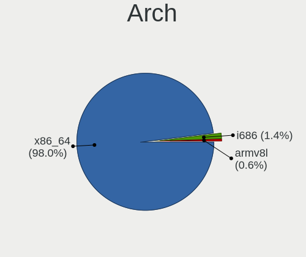
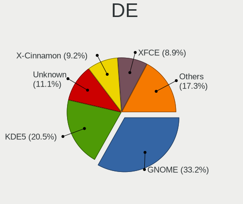
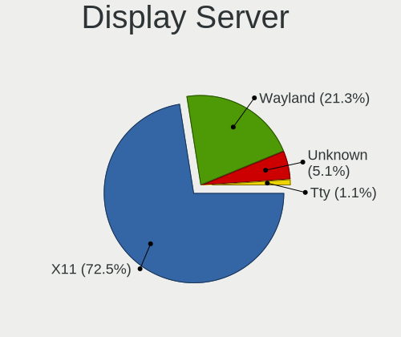
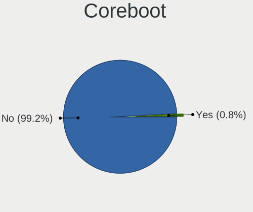
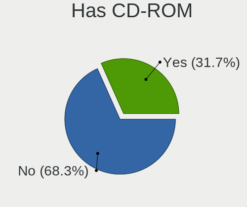
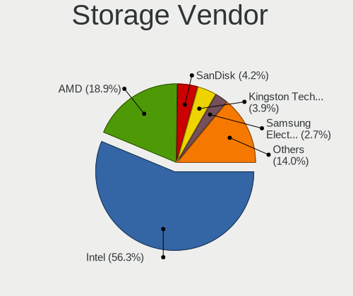
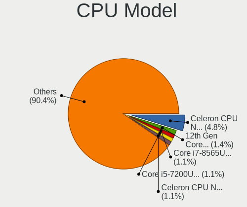
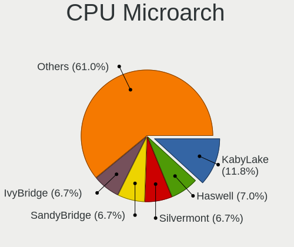
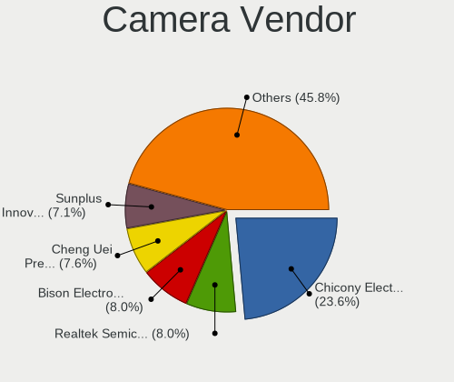
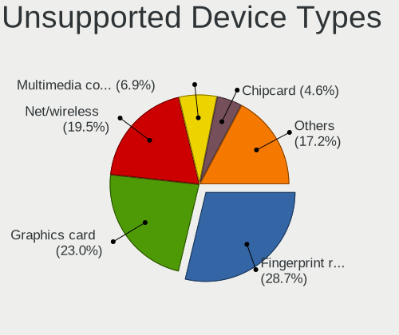

Linux in Uruguay - Tested Hardware & Statistics
-----------------------------------------------

A project to collect tested hardware configurations for Linux in Uruguay.

Anyone can contribute to this report by the [hw-probe](https://github.com/linuxhw/hw-probe) tool:

    sudo -E hw-probe -all -upload

Please contribute! Especially if your hardware is rare.

This is a report for all computer types. See also reports for [desktops](/Location/Uruguay/Desktop/README.md) and [notebooks](/Location/Uruguay/Notebook/README.md).

Contents
--------

* [ Test Cases ](#test-cases)

* [ System ](#system)
  - [ OS                       ](#os)
  - [ OS Family                ](#os-family)
  - [ Kernel                   ](#kernel)
  - [ Kernel Family            ](#kernel-family)
  - [ Kernel Major Ver.        ](#kernel-major-ver)
  - [ Arch                     ](#arch)
  - [ DE                       ](#de)
  - [ Display Server           ](#display-server)
  - [ Display Manager          ](#display-manager)
  - [ OS Lang                  ](#os-lang)
  - [ Boot Mode                ](#boot-mode)
  - [ Filesystem               ](#filesystem)
  - [ Part. scheme             ](#part-scheme)
  - [ Dual Boot with Linux/BSD ](#dual-boot-with-linuxbsd)
  - [ Dual Boot (Win)          ](#dual-boot-win)

* [ Board ](#board)
  - [ Vendor                   ](#vendor)
  - [ Model                    ](#model)
  - [ Model Family             ](#model-family)
  - [ MFG Year                 ](#mfg-year)
  - [ Form Factor              ](#form-factor)
  - [ Secure Boot              ](#secure-boot)
  - [ Coreboot                 ](#coreboot)
  - [ RAM Size                 ](#ram-size)
  - [ RAM Used                 ](#ram-used)
  - [ Total Drives             ](#total-drives)
  - [ Has CD-ROM               ](#has-cd-rom)
  - [ Has Ethernet             ](#has-ethernet)
  - [ Has WiFi                 ](#has-wifi)
  - [ Has Bluetooth            ](#has-bluetooth)

* [ Location ](#location)
  - [ Country                  ](#country)
  - [ City                     ](#city)

* [ Drives ](#drives)
  - [ Drive Vendor             ](#drive-vendor)
  - [ Drive Model              ](#drive-model)
  - [ HDD Vendor               ](#hdd-vendor)
  - [ SSD Vendor               ](#ssd-vendor)
  - [ Drive Kind               ](#drive-kind)
  - [ Drive Connector          ](#drive-connector)
  - [ Drive Size               ](#drive-size)
  - [ Space Total              ](#space-total)
  - [ Space Used               ](#space-used)
  - [ Malfunc. Drives          ](#malfunc-drives)
  - [ Malfunc. Drive Vendor    ](#malfunc-drive-vendor)
  - [ Malfunc. HDD Vendor      ](#malfunc-hdd-vendor)
  - [ Malfunc. Drive Kind      ](#malfunc-drive-kind)
  - [ Failed Drives            ](#failed-drives)
  - [ Failed Drive Vendor      ](#failed-drive-vendor)
  - [ Drive Status             ](#drive-status)

* [ Storage controller ](#storage-controller)
  - [ Storage Vendor           ](#storage-vendor)
  - [ Storage Model            ](#storage-model)
  - [ Storage Kind             ](#storage-kind)

* [ Processor ](#processor)
  - [ CPU Vendor               ](#cpu-vendor)
  - [ CPU Model                ](#cpu-model)
  - [ CPU Model Family         ](#cpu-model-family)
  - [ CPU Cores                ](#cpu-cores)
  - [ CPU Sockets              ](#cpu-sockets)
  - [ CPU Threads              ](#cpu-threads)
  - [ CPU Op-Modes             ](#cpu-op-modes)
  - [ CPU Microcode            ](#cpu-microcode)
  - [ CPU Microarch            ](#cpu-microarch)

* [ Graphics ](#graphics)
  - [ GPU Vendor               ](#gpu-vendor)
  - [ GPU Model                ](#gpu-model)
  - [ GPU Combo                ](#gpu-combo)
  - [ GPU Driver               ](#gpu-driver)
  - [ GPU Memory               ](#gpu-memory)

* [ Monitor ](#monitor)
  - [ Monitor Vendor           ](#monitor-vendor)
  - [ Monitor Model            ](#monitor-model)
  - [ Monitor Resolution       ](#monitor-resolution)
  - [ Monitor Diagonal         ](#monitor-diagonal)
  - [ Monitor Width            ](#monitor-width)
  - [ Aspect Ratio             ](#aspect-ratio)
  - [ Monitor Area             ](#monitor-area)
  - [ Pixel Density            ](#pixel-density)
  - [ Multiple Monitors        ](#multiple-monitors)

* [ Network ](#network)
  - [ Net Controller Vendor    ](#net-controller-vendor)
  - [ Net Controller Model     ](#net-controller-model)
  - [ Wireless Vendor          ](#wireless-vendor)
  - [ Wireless Model           ](#wireless-model)
  - [ Ethernet Vendor          ](#ethernet-vendor)
  - [ Ethernet Model           ](#ethernet-model)
  - [ Net Controller Kind      ](#net-controller-kind)
  - [ Used Controller          ](#used-controller)
  - [ NICs                     ](#nics)
  - [ IPv6                     ](#ipv6)

* [ Bluetooth ](#bluetooth)
  - [ Bluetooth Vendor         ](#bluetooth-vendor)
  - [ Bluetooth Model          ](#bluetooth-model)

* [ Sound ](#sound)
  - [ Sound Vendor             ](#sound-vendor)
  - [ Sound Model              ](#sound-model)

* [ Memory ](#memory)
  - [ Memory Vendor            ](#memory-vendor)
  - [ Memory Model             ](#memory-model)
  - [ Memory Kind              ](#memory-kind)
  - [ Memory Form Factor       ](#memory-form-factor)
  - [ Memory Size              ](#memory-size)
  - [ Memory Speed             ](#memory-speed)

* [ Printers & scanners ](#printers--scanners)
  - [ Printer Vendor           ](#printer-vendor)
  - [ Printer Model            ](#printer-model)
  - [ Scanner Vendor           ](#scanner-vendor)
  - [ Scanner Model            ](#scanner-model)

* [ Camera ](#camera)
  - [ Camera Vendor            ](#camera-vendor)
  - [ Camera Model             ](#camera-model)

* [ Security ](#security)
  - [ Fingerprint Vendor       ](#fingerprint-vendor)
  - [ Fingerprint Model        ](#fingerprint-model)
  - [ Chipcard Vendor          ](#chipcard-vendor)
  - [ Chipcard Model           ](#chipcard-model)

* [ Unsupported ](#unsupported)
  - [ Unsupported Devices      ](#unsupported-devices)
  - [ Unsupported Device Types ](#unsupported-device-types)

Test Cases
----------

Total: 262

| Vendor        | Model                       | Form-Factor | Probe                                                      | Date         |
|---------------|-----------------------------|-------------|------------------------------------------------------------|--------------|
| MSI           | MPG X570 GAMING PLUS        | Desktop     | [5fa355f7ec](https://linux-hardware.org/?probe=5fa355f7ec) | Jun 26, 2022 |
| Acer          | Swift SF314-54              | Notebook    | [47420af7dc](https://linux-hardware.org/?probe=47420af7dc) | Jun 23, 2022 |
| iClever       | IC-T01                      | Notebook    | [f82c34c612](https://linux-hardware.org/?probe=f82c34c612) | Jun 17, 2022 |
| Apple         | Mac-F65AE981FFA204ED Mac... | Mini pc     | [6abbac5ca2](https://linux-hardware.org/?probe=6abbac5ca2) | Jun 15, 2022 |
| HP            | Pavilion g4                 | Notebook    | [193875edcc](https://linux-hardware.org/?probe=193875edcc) | Jun 15, 2022 |
| Acer          | Swift SF314-54              | Notebook    | [06bccc3696](https://linux-hardware.org/?probe=06bccc3696) | Jun 14, 2022 |
| Gigabyte      | B450 GAMING X               | Desktop     | [34e884bb50](https://linux-hardware.org/?probe=34e884bb50) | Jun 08, 2022 |
| Dell          | XPS 15 7590                 | Notebook    | [482ed9f535](https://linux-hardware.org/?probe=482ed9f535) | May 29, 2022 |
| Acer          | Swift SF314-54              | Notebook    | [39f85b46d7](https://linux-hardware.org/?probe=39f85b46d7) | May 23, 2022 |
| Acer          | Swift SF314-54              | Notebook    | [fc1233f258](https://linux-hardware.org/?probe=fc1233f258) | May 22, 2022 |
| Acer          | Swift SF314-54              | Notebook    | [478550abf1](https://linux-hardware.org/?probe=478550abf1) | May 21, 2022 |
| Gigabyte      | Z390 AORUS ELITE-CF         | Desktop     | [95ac26b654](https://linux-hardware.org/?probe=95ac26b654) | May 19, 2022 |
| Acer          | Swift SF314-54              | Notebook    | [a31c36956a](https://linux-hardware.org/?probe=a31c36956a) | May 13, 2022 |
| Acer          | Swift SF314-54              | Notebook    | [cc3411e0b4](https://linux-hardware.org/?probe=cc3411e0b4) | May 10, 2022 |
| HP            | Laptop 14-dk1xxx            | Notebook    | [fa6da4906f](https://linux-hardware.org/?probe=fa6da4906f) | May 07, 2022 |
| Toshiba       | Satellite C645D             | Notebook    | [53153cb65d](https://linux-hardware.org/?probe=53153cb65d) | May 04, 2022 |
| Acer          | Aspire ES1-572              | Notebook    | [25f9b83c30](https://linux-hardware.org/?probe=25f9b83c30) | Apr 28, 2022 |
| Lenovo        | B50-45 20388                | Notebook    | [7ad45f257f](https://linux-hardware.org/?probe=7ad45f257f) | Apr 20, 2022 |
| HP            | EliteBook 840 G1            | Notebook    | [d2e2811388](https://linux-hardware.org/?probe=d2e2811388) | Apr 20, 2022 |
| Dell          | Inspiron 5585               | Notebook    | [2c6e96d91f](https://linux-hardware.org/?probe=2c6e96d91f) | Apr 18, 2022 |
| Dell          | Inspiron 15-3567            | Notebook    | [73be944f6c](https://linux-hardware.org/?probe=73be944f6c) | Apr 14, 2022 |
| Dell          | Precision 7550              | Notebook    | [4619da9502](https://linux-hardware.org/?probe=4619da9502) | Apr 14, 2022 |
| Lenovo        | G405 20239                  | Notebook    | [ab55cb1e13](https://linux-hardware.org/?probe=ab55cb1e13) | Apr 13, 2022 |
| HP            | Laptop 14-dq1xxx            | Notebook    | [7d203f8bc0](https://linux-hardware.org/?probe=7d203f8bc0) | Apr 02, 2022 |
| ASUSTek       | ROG Zephyrus G14 GA401IV... | Notebook    | [d895af2b46](https://linux-hardware.org/?probe=d895af2b46) | Mar 29, 2022 |
| HP            | Laptop 14-dq1xxx            | Notebook    | [9bf7ed495b](https://linux-hardware.org/?probe=9bf7ed495b) | Mar 28, 2022 |
| Lenovo        | ThinkPad L14 Gen 2 20X2S... | Notebook    | [d9afd858b4](https://linux-hardware.org/?probe=d9afd858b4) | Mar 23, 2022 |
| Foxconn       | G31MX Series                | Desktop     | [911987151a](https://linux-hardware.org/?probe=911987151a) | Mar 23, 2022 |
| Foxconn       | G31MX Series                | Desktop     | [7d9cc6ac07](https://linux-hardware.org/?probe=7d9cc6ac07) | Mar 22, 2022 |
| HP            | ZBook 14u G4                | Notebook    | [cc637b12de](https://linux-hardware.org/?probe=cc637b12de) | Mar 10, 2022 |
| HP            | Pavilion dv5                | Notebook    | [81371d4535](https://linux-hardware.org/?probe=81371d4535) | Mar 04, 2022 |
| GPU Compan... | GWTN156-4                   | Notebook    | [89e7b9fa39](https://linux-hardware.org/?probe=89e7b9fa39) | Mar 02, 2022 |
| Gigabyte      | Z370 AORUS Gaming 7         | Desktop     | [9699b8889c](https://linux-hardware.org/?probe=9699b8889c) | Feb 27, 2022 |
| ASUSTek       | TUF Gaming B460M-PLUS       | Desktop     | [37231251ed](https://linux-hardware.org/?probe=37231251ed) | Feb 21, 2022 |
| ASRock        | FM2A55M-HD+                 | Desktop     | [52ca8c0d7c](https://linux-hardware.org/?probe=52ca8c0d7c) | Feb 13, 2022 |
| ECS           | SF20PA2                     | Notebook    | [3bddc7e08a](https://linux-hardware.org/?probe=3bddc7e08a) | Feb 11, 2022 |
| HP            | 3047h                       | Desktop     | [ee6260c5f4](https://linux-hardware.org/?probe=ee6260c5f4) | Feb 10, 2022 |
| MSI           | GS63VR 6RF                  | Notebook    | [4873365af6](https://linux-hardware.org/?probe=4873365af6) | Jan 30, 2022 |
| Gigabyte      | GA-970A-D3                  | Desktop     | [0fe418c7b1](https://linux-hardware.org/?probe=0fe418c7b1) | Jan 07, 2022 |
| HP            | 0AA8h                       | Desktop     | [9abf55a71f](https://linux-hardware.org/?probe=9abf55a71f) | Jan 05, 2022 |
| HP            | 0AA8h                       | Desktop     | [44c9ba4231](https://linux-hardware.org/?probe=44c9ba4231) | Jan 03, 2022 |
| Biostar       | Z490A-SILVER                | Desktop     | [b5e7622be0](https://linux-hardware.org/?probe=b5e7622be0) | Jan 02, 2022 |
| Dell          | 06D7TR A00                  | Desktop     | [90f509fc24](https://linux-hardware.org/?probe=90f509fc24) | Dec 09, 2021 |
| Sony          | SVF14211CLB                 | Notebook    | [d25b1846ff](https://linux-hardware.org/?probe=d25b1846ff) | Dec 07, 2021 |
| Sony          | SVF14211CLB                 | Notebook    | [41bfe6e292](https://linux-hardware.org/?probe=41bfe6e292) | Dec 06, 2021 |
| ASUSTek       | ZenBook UX391FA_UX391FA     | Notebook    | [5fb4f1b6a6](https://linux-hardware.org/?probe=5fb4f1b6a6) | Nov 29, 2021 |
| HP            | Stream Laptop 14-ax0XX      | Notebook    | [a664218f29](https://linux-hardware.org/?probe=a664218f29) | Nov 28, 2021 |
| Acer          | Aspire 5733Z                | Notebook    | [324f0d898e](https://linux-hardware.org/?probe=324f0d898e) | Nov 16, 2021 |
| Gigabyte      | H81M-DS2                    | Desktop     | [44b341f68d](https://linux-hardware.org/?probe=44b341f68d) | Nov 10, 2021 |
| Acer          | Swift SF314-54              | Notebook    | [b506625dc2](https://linux-hardware.org/?probe=b506625dc2) | Nov 05, 2021 |
| Acer          | Swift SF314-54              | Notebook    | [4e606c817f](https://linux-hardware.org/?probe=4e606c817f) | Nov 04, 2021 |
| ASRock        | N68-S                       | Desktop     | [eac798f714](https://linux-hardware.org/?probe=eac798f714) | Nov 01, 2021 |
| Gigabyte      | X570 GAMING X               | Desktop     | [174875a3d4](https://linux-hardware.org/?probe=174875a3d4) | Oct 25, 2021 |
| MSI           | X570-A PRO                  | Desktop     | [357ea9ab5d](https://linux-hardware.org/?probe=357ea9ab5d) | Oct 22, 2021 |
| Samsung       | N102SP/N100SP/N101SP        | Notebook    | [c04d448530](https://linux-hardware.org/?probe=c04d448530) | Oct 21, 2021 |
| ASUSTek       | Q324UAK                     | Convertible | [a8334894c5](https://linux-hardware.org/?probe=a8334894c5) | Oct 19, 2021 |
| Lenovo        | B51-30 80LK                 | Notebook    | [dea10156c6](https://linux-hardware.org/?probe=dea10156c6) | Sep 20, 2021 |
| Haitech       | H7141A                      | Notebook    | [496c0eb316](https://linux-hardware.org/?probe=496c0eb316) | Sep 18, 2021 |
| ECS           | SF20PA2                     | Notebook    | [6d17cf08ad](https://linux-hardware.org/?probe=6d17cf08ad) | Sep 12, 2021 |
| ASRock        | B450M Steel Legend          | Desktop     | [fea193c839](https://linux-hardware.org/?probe=fea193c839) | Sep 10, 2021 |
| Gigabyte      | Z390 AORUS ELITE-CF         | Desktop     | [dbeb8785e6](https://linux-hardware.org/?probe=dbeb8785e6) | Sep 01, 2021 |
| ASRock        | FM2A55M-VG3+                | Desktop     | [c2e1837665](https://linux-hardware.org/?probe=c2e1837665) | Aug 24, 2021 |
| HP            | ENVY x360 m6 Convertible    | Convertible | [fef0710fbd](https://linux-hardware.org/?probe=fef0710fbd) | Aug 24, 2021 |
| Panasonic     | CF-31JEGAX1M                | Notebook    | [c5acecef3a](https://linux-hardware.org/?probe=c5acecef3a) | Aug 22, 2021 |
| Lenovo        | ThinkPad L490 20Q6S0NF00    | Notebook    | [a8f222614b](https://linux-hardware.org/?probe=a8f222614b) | Aug 11, 2021 |
| Lenovo        | ThinkPad T450 20BUS0G91F    | Notebook    | [8db659cf12](https://linux-hardware.org/?probe=8db659cf12) | Aug 09, 2021 |
| Lenovo        | ThinkPad S1 Yoga 20CDS02... | Notebook    | [4781e962e7](https://linux-hardware.org/?probe=4781e962e7) | Aug 09, 2021 |
| ASUSTek       | ASUS TUF Gaming A15 FA50... | Notebook    | [393c8e4faa](https://linux-hardware.org/?probe=393c8e4faa) | Aug 05, 2021 |
| HP            | Pavilion 15                 | Notebook    | [ec0019224a](https://linux-hardware.org/?probe=ec0019224a) | Jul 28, 2021 |
| ECS           | SF20PA2                     | Notebook    | [2016dfe42c](https://linux-hardware.org/?probe=2016dfe42c) | Jul 26, 2021 |
| HP            | Laptop 15-bs0xx             | Notebook    | [c84d445008](https://linux-hardware.org/?probe=c84d445008) | Jul 18, 2021 |
| Acer          | Aspire E5-521               | Notebook    | [d4629ecbed](https://linux-hardware.org/?probe=d4629ecbed) | Jul 18, 2021 |
| ASUSTek       | M5A99X EVO R2.0             | Desktop     | [b6c401b55e](https://linux-hardware.org/?probe=b6c401b55e) | Jul 15, 2021 |
| Lenovo        | ThinkPad E15 20RES31K00     | Notebook    | [6d359d339e](https://linux-hardware.org/?probe=6d359d339e) | Jul 02, 2021 |
| HP            | Laptop 15-bs0xx             | Notebook    | [27582e9e17](https://linux-hardware.org/?probe=27582e9e17) | Jun 21, 2021 |
| Acer          | TravelMate 5730             | Notebook    | [4a21735ce1](https://linux-hardware.org/?probe=4a21735ce1) | Jun 17, 2021 |
| ASUSTek       | TUF Gaming B550-PLUS        | Desktop     | [38ee95b416](https://linux-hardware.org/?probe=38ee95b416) | Jun 02, 2021 |
| Acer          | Acadia V1.45                | Notebook    | [9357025bc9](https://linux-hardware.org/?probe=9357025bc9) | Jun 01, 2021 |
| ASUSTek       | PRIME B450M-A II            | Desktop     | [ab4b1b7a15](https://linux-hardware.org/?probe=ab4b1b7a15) | May 31, 2021 |
| HP            | ENVY TS 15                  | Notebook    | [8369c42ce2](https://linux-hardware.org/?probe=8369c42ce2) | May 31, 2021 |
| ASRock        | FM2A55M-VG3+                | Desktop     | [d9065ac8d1](https://linux-hardware.org/?probe=d9065ac8d1) | May 30, 2021 |
| Positivo      | Serie AT300                 | Notebook    | [38a0173a4a](https://linux-hardware.org/?probe=38a0173a4a) | May 28, 2021 |
| HP            | Pavilion 17                 | Notebook    | [f12450cc62](https://linux-hardware.org/?probe=f12450cc62) | May 28, 2021 |
| Lenovo        | ThinkPad T590 20N5S2GP05    | Notebook    | [2444839350](https://linux-hardware.org/?probe=2444839350) | May 25, 2021 |
| Dell          | Latitude E5470              | Notebook    | [212d434e24](https://linux-hardware.org/?probe=212d434e24) | May 25, 2021 |
| Positivo      | Serie AT300                 | Notebook    | [a021ecf0dd](https://linux-hardware.org/?probe=a021ecf0dd) | May 24, 2021 |
| Acer          | Aspire 5715Z                | Notebook    | [24040eecb6](https://linux-hardware.org/?probe=24040eecb6) | May 23, 2021 |
| Toshiba       | Satellite C45-A             | Notebook    | [cb57bbefd0](https://linux-hardware.org/?probe=cb57bbefd0) | May 22, 2021 |
| Toshiba       | Satellite C45-A             | Notebook    | [297e5b458a](https://linux-hardware.org/?probe=297e5b458a) | May 21, 2021 |
| ASUSTek       | ROG Zephyrus G14 GA401IV... | Notebook    | [883f67612b](https://linux-hardware.org/?probe=883f67612b) | May 19, 2021 |
| ASRock        | A320M-HDV R3.0              | Desktop     | [0ed78505e8](https://linux-hardware.org/?probe=0ed78505e8) | May 19, 2021 |
| Standard      | SF20BA2                     | Notebook    | [e0fdbc36a2](https://linux-hardware.org/?probe=e0fdbc36a2) | May 16, 2021 |
| ASRock        | FM2A55M-VG3+                | Desktop     | [41e6c088d2](https://linux-hardware.org/?probe=41e6c088d2) | May 16, 2021 |
| Acer          | Acadia V1.45                | Notebook    | [321e5159ac](https://linux-hardware.org/?probe=321e5159ac) | May 15, 2021 |
| ECS           | SF20PA2                     | Notebook    | [f3cc58b0e4](https://linux-hardware.org/?probe=f3cc58b0e4) | May 13, 2021 |
| ASRock        | FM2A55M-VG3+                | Desktop     | [ada1c4a259](https://linux-hardware.org/?probe=ada1c4a259) | May 12, 2021 |
| Dell          | Inspiron N5110              | Notebook    | [6f67fbb9d4](https://linux-hardware.org/?probe=6f67fbb9d4) | May 08, 2021 |
| ECS           | SF20PA2                     | Notebook    | [cfbd36f40b](https://linux-hardware.org/?probe=cfbd36f40b) | May 07, 2021 |
| Acer          | Aspire E5-521               | Notebook    | [d1c6c7309a](https://linux-hardware.org/?probe=d1c6c7309a) | May 03, 2021 |
| ASUSTek       | N46VJ                       | Notebook    | [0d6e007969](https://linux-hardware.org/?probe=0d6e007969) | Apr 28, 2021 |
| Standard      | SF20BA2                     | Notebook    | [d51e9f653f](https://linux-hardware.org/?probe=d51e9f653f) | Apr 26, 2021 |
| ASRock        | N68-VS3 FX                  | Desktop     | [bcee870f79](https://linux-hardware.org/?probe=bcee870f79) | Apr 24, 2021 |
| ASRock        | N68-VS3 FX                  | Desktop     | [b92a431094](https://linux-hardware.org/?probe=b92a431094) | Apr 24, 2021 |
| ASUSTek       | M5A78L-M/USB3               | Desktop     | [7d28bb0ba2](https://linux-hardware.org/?probe=7d28bb0ba2) | Apr 23, 2021 |
| Standard      | SF20BA2                     | Notebook    | [a568b21782](https://linux-hardware.org/?probe=a568b21782) | Apr 23, 2021 |
| Standard      | SF20BA2                     | Notebook    | [e454415213](https://linux-hardware.org/?probe=e454415213) | Apr 23, 2021 |
| Gigabyte      | Z390 AORUS ELITE-CF         | Desktop     | [5042e6d421](https://linux-hardware.org/?probe=5042e6d421) | Apr 20, 2021 |
| Lenovo        | G50-70 20351                | Notebook    | [44e6cc36ce](https://linux-hardware.org/?probe=44e6cc36ce) | Apr 20, 2021 |
| Lenovo        | V15-ADA 82C7                | Notebook    | [9065c52996](https://linux-hardware.org/?probe=9065c52996) | Apr 17, 2021 |
| Dell          | Inspiron 5565               | Notebook    | [8f75eda1de](https://linux-hardware.org/?probe=8f75eda1de) | Apr 16, 2021 |
| Lenovo        | ThinkBook 15-IML 20RW       | Notebook    | [4e23f3b6b5](https://linux-hardware.org/?probe=4e23f3b6b5) | Apr 16, 2021 |
| Lenovo        | ThinkBook 15-IML 20RW       | Notebook    | [18ee0d2d64](https://linux-hardware.org/?probe=18ee0d2d64) | Apr 16, 2021 |
| HP            | 240 G7                      | Notebook    | [721c4c3dbd](https://linux-hardware.org/?probe=721c4c3dbd) | Apr 14, 2021 |
| Apple         | MacBookAir7,1               | Notebook    | [2296b37506](https://linux-hardware.org/?probe=2296b37506) | Apr 12, 2021 |
| Acer          | Aspire 5715Z                | Notebook    | [9a7aa83895](https://linux-hardware.org/?probe=9a7aa83895) | Apr 07, 2021 |
| Acer          | Aspire 5715Z                | Notebook    | [30729baf7a](https://linux-hardware.org/?probe=30729baf7a) | Apr 07, 2021 |
| ASUSTek       | P8H77-V                     | Desktop     | [9b0d9c1623](https://linux-hardware.org/?probe=9b0d9c1623) | Apr 05, 2021 |
| ASUSTek       | ROG Zephyrus G14 GA401IV... | Notebook    | [118abf533e](https://linux-hardware.org/?probe=118abf533e) | Mar 28, 2021 |
| Supermicro    | P4DMS                       | Desktop     | [34867ad122](https://linux-hardware.org/?probe=34867ad122) | Mar 22, 2021 |
| Panasonic     | CF-31JEGAX1M                | Notebook    | [4636e611d8](https://linux-hardware.org/?probe=4636e611d8) | Mar 14, 2021 |
| Supermicro    | P4DMS                       | Desktop     | [9de21bc6ec](https://linux-hardware.org/?probe=9de21bc6ec) | Mar 14, 2021 |
| MSI           | GL65 Leopard 10SCXR         | Notebook    | [8497db47ab](https://linux-hardware.org/?probe=8497db47ab) | Mar 09, 2021 |
| HP            | Laptop 14-df0xxx            | Notebook    | [c1d21b6940](https://linux-hardware.org/?probe=c1d21b6940) | Mar 01, 2021 |
| Lenovo        | MAHOBAY NOK                 | Desktop     | [901fd74eaa](https://linux-hardware.org/?probe=901fd74eaa) | Feb 20, 2021 |
| ASUSTek       | PRIME B450M-A II            | Desktop     | [7f1fc20897](https://linux-hardware.org/?probe=7f1fc20897) | Feb 19, 2021 |
| ASUSTek       | PRIME B450M-A II            | Desktop     | [9527a6802e](https://linux-hardware.org/?probe=9527a6802e) | Feb 19, 2021 |
| Dell          | XPS 13 9370                 | Notebook    | [f51dac04a1](https://linux-hardware.org/?probe=f51dac04a1) | Feb 17, 2021 |
| Dell          | XPS 13 9370                 | Notebook    | [bea8cc11d5](https://linux-hardware.org/?probe=bea8cc11d5) | Feb 17, 2021 |
| Gigabyte      | H81M-DS2                    | Desktop     | [9473725930](https://linux-hardware.org/?probe=9473725930) | Feb 15, 2021 |
| Unknown       | Unknown                     | Phone       | [d561348222](https://linux-hardware.org/?probe=d561348222) | Feb 14, 2021 |
| Dell          | 0C522T A03                  | Desktop     | [0b52890aaf](https://linux-hardware.org/?probe=0b52890aaf) | Jan 29, 2021 |
| Dell          | 0C522T A03                  | Desktop     | [3a777180a1](https://linux-hardware.org/?probe=3a777180a1) | Jan 29, 2021 |
| Intel         | H61M-DS2                    | Desktop     | [930418d2da](https://linux-hardware.org/?probe=930418d2da) | Jan 23, 2021 |
| Gigabyte      | H81M-DS2                    | Desktop     | [4b7df9598e](https://linux-hardware.org/?probe=4b7df9598e) | Jan 20, 2021 |
| MSI           | GL65 Leopard 10SCXR         | Notebook    | [ac71737361](https://linux-hardware.org/?probe=ac71737361) | Jan 16, 2021 |
| Intel         | H61M-DS2                    | Desktop     | [53bde98202](https://linux-hardware.org/?probe=53bde98202) | Jan 09, 2021 |
| Acer          | Aspire 5733                 | Notebook    | [1f4e4d7fbc](https://linux-hardware.org/?probe=1f4e4d7fbc) | Jan 08, 2021 |
| Toshiba       | Satellite L55t-B            | Notebook    | [ab3b576bd1](https://linux-hardware.org/?probe=ab3b576bd1) | Jan 07, 2021 |
| Toshiba       | Satellite L55t-B            | Notebook    | [6fc9533a15](https://linux-hardware.org/?probe=6fc9533a15) | Jan 06, 2021 |
| ECS           | SF20PA2                     | Notebook    | [f26e0bf23f](https://linux-hardware.org/?probe=f26e0bf23f) | Jan 04, 2021 |
| HP            | 2000                        | Notebook    | [99481f08e3](https://linux-hardware.org/?probe=99481f08e3) | Dec 31, 2020 |
| Panasonic     | CF-31JEGAX1M                | Notebook    | [c0745f5a94](https://linux-hardware.org/?probe=c0745f5a94) | Dec 31, 2020 |
| HP            | Notebook                    | Notebook    | [213a94eab7](https://linux-hardware.org/?probe=213a94eab7) | Dec 28, 2020 |
| HP            | Notebook                    | Notebook    | [bb3749dd61](https://linux-hardware.org/?probe=bb3749dd61) | Dec 28, 2020 |
| MSI           | A55M-P33                    | Desktop     | [43267cc6f4](https://linux-hardware.org/?probe=43267cc6f4) | Dec 16, 2020 |
| ASUSTek       | VivoBook 15_ASUS Laptop ... | Notebook    | [f55e2642ef](https://linux-hardware.org/?probe=f55e2642ef) | Dec 15, 2020 |
| ASRock        | H310CM-HDV                  | Desktop     | [729161e56a](https://linux-hardware.org/?probe=729161e56a) | Dec 08, 2020 |
| ASRock        | H310CM-HDV                  | Desktop     | [37f7b460d4](https://linux-hardware.org/?probe=37f7b460d4) | Dec 08, 2020 |
| Toshiba       | Satellite C75D-C            | Notebook    | [f158fc821a](https://linux-hardware.org/?probe=f158fc821a) | Nov 10, 2020 |
| Lenovo        | IdeaPad 330S-15ARR 81FB     | Notebook    | [5a8d4603be](https://linux-hardware.org/?probe=5a8d4603be) | Nov 03, 2020 |
| ASUSTek       | VivoBook 15_ASUS Laptop ... | Notebook    | [19081a3c58](https://linux-hardware.org/?probe=19081a3c58) | Oct 27, 2020 |
| Dell          | Latitude E6430              | Notebook    | [8ea63ec090](https://linux-hardware.org/?probe=8ea63ec090) | Oct 23, 2020 |
| ASRock        | A320M-HDV                   | Desktop     | [912852805f](https://linux-hardware.org/?probe=912852805f) | Oct 22, 2020 |
| HP            | Pavilion dm4                | Notebook    | [21a3ef42e0](https://linux-hardware.org/?probe=21a3ef42e0) | Oct 13, 2020 |
| ASUSTek       | VivoBook 15_ASUS Laptop ... | Notebook    | [64e95b4174](https://linux-hardware.org/?probe=64e95b4174) | Oct 10, 2020 |
| ASUSTek       | VivoBook 15_ASUS Laptop ... | Notebook    | [0ffffb855b](https://linux-hardware.org/?probe=0ffffb855b) | Oct 04, 2020 |
| ASUSTek       | VivoBook 15_ASUS Laptop ... | Notebook    | [7ddfb80220](https://linux-hardware.org/?probe=7ddfb80220) | Oct 04, 2020 |
| Dell          | 0C27VV A00                  | Desktop     | [fd9547e219](https://linux-hardware.org/?probe=fd9547e219) | Oct 01, 2020 |
| Toshiba       | Satellite C75D-C            | Notebook    | [12c65e3222](https://linux-hardware.org/?probe=12c65e3222) | Sep 25, 2020 |
| Unknown       | Unknown                     | Phone       | [6ff556bf54](https://linux-hardware.org/?probe=6ff556bf54) | Sep 06, 2020 |
| MSI           | GE62 6QD                    | Notebook    | [cf444064fc](https://linux-hardware.org/?probe=cf444064fc) | Sep 03, 2020 |
| Acer          | One S1003                   | Tablet      | [c89be38d5c](https://linux-hardware.org/?probe=c89be38d5c) | Aug 29, 2020 |
| HP            | Casablanca H710             | Notebook    | [2061828542](https://linux-hardware.org/?probe=2061828542) | Aug 26, 2020 |
| HP            | Casablanca H710             | Notebook    | [f566c52ffd](https://linux-hardware.org/?probe=f566c52ffd) | Aug 26, 2020 |
| Samsung       | NC208/NC108                 | Notebook    | [f425b1dc48](https://linux-hardware.org/?probe=f425b1dc48) | Aug 17, 2020 |
| Samsung       | NC208/NC108                 | Notebook    | [759ee832fb](https://linux-hardware.org/?probe=759ee832fb) | Aug 17, 2020 |
| Gigabyte      | H310M A-CF                  | Desktop     | [ff30e910c4](https://linux-hardware.org/?probe=ff30e910c4) | Aug 12, 2020 |
| Intel         | DP35DP AAD81073-208         | Desktop     | [0009968f3b](https://linux-hardware.org/?probe=0009968f3b) | Aug 05, 2020 |
| Gigabyte      | GA-78LMT-S2                 | Desktop     | [71c07410ee](https://linux-hardware.org/?probe=71c07410ee) | Jul 25, 2020 |
| Lenovo        | IdeaPad S145-15AST 81N3     | Notebook    | [3c55f58986](https://linux-hardware.org/?probe=3c55f58986) | Jul 03, 2020 |
| ASUSTek       | PRIME B450-PLUS             | Desktop     | [d4c35c226e](https://linux-hardware.org/?probe=d4c35c226e) | Jul 01, 2020 |
| ASUSTek       | PRIME B450-PLUS             | Desktop     | [178da315d2](https://linux-hardware.org/?probe=178da315d2) | Jul 01, 2020 |
| Fujitsu       | D3064-A1 S26361-D3064-A1    | Desktop     | [6a4b069ed8](https://linux-hardware.org/?probe=6a4b069ed8) | Jun 30, 2020 |
| HP            | Presario CQ43               | Notebook    | [bba4f49ed1](https://linux-hardware.org/?probe=bba4f49ed1) | Jun 23, 2020 |
| Acer          | Aspire A715-72G             | Notebook    | [70acf4ea22](https://linux-hardware.org/?probe=70acf4ea22) | Jun 18, 2020 |
| HP            | Presario CQ43               | Notebook    | [3af51e5df2](https://linux-hardware.org/?probe=3af51e5df2) | Jun 13, 2020 |
| MSI           | H81M-E33                    | Desktop     | [9f2577531a](https://linux-hardware.org/?probe=9f2577531a) | Jun 10, 2020 |
| ECS           | SF20PA2                     | Notebook    | [fc1653c118](https://linux-hardware.org/?probe=fc1653c118) | Jun 10, 2020 |
| Dell          | Inspiron 5748               | Notebook    | [d7010adabe](https://linux-hardware.org/?probe=d7010adabe) | Jun 09, 2020 |
| OEM           | V40SI2                      | Notebook    | [e2ad8d9479](https://linux-hardware.org/?probe=e2ad8d9479) | Jun 06, 2020 |
| Lenovo        | IdeaPad S340-15IWL 81N8     | Notebook    | [13b3a46069](https://linux-hardware.org/?probe=13b3a46069) | May 27, 2020 |
| ASUSTek       | X555LAB                     | Notebook    | [7e4107b1b4](https://linux-hardware.org/?probe=7e4107b1b4) | May 26, 2020 |
| MSI           | B85-G43 GAMING              | Desktop     | [0a5437ade3](https://linux-hardware.org/?probe=0a5437ade3) | May 22, 2020 |
| ASUSTek       | P8H67-M LX                  | Desktop     | [0ba192cc01](https://linux-hardware.org/?probe=0ba192cc01) | May 22, 2020 |
| Lenovo        | ThinkPad Edge E540 20C60... | Notebook    | [7e4e3c078f](https://linux-hardware.org/?probe=7e4e3c078f) | May 20, 2020 |
| ASUSTek       | Rampage IV EXTREME          | Desktop     | [627fed813d](https://linux-hardware.org/?probe=627fed813d) | May 18, 2020 |
| Gigabyte      | H61M-S1                     | Desktop     | [493ce118d1](https://linux-hardware.org/?probe=493ce118d1) | May 16, 2020 |
| ASUSTek       | K8V-X SE                    | Desktop     | [154224ff78](https://linux-hardware.org/?probe=154224ff78) | May 16, 2020 |
| ASUSTek       | K8V-X SE                    | Desktop     | [173008c9ff](https://linux-hardware.org/?probe=173008c9ff) | May 16, 2020 |
| Gigabyte      | H61M-S1                     | Desktop     | [98a86c1397](https://linux-hardware.org/?probe=98a86c1397) | May 15, 2020 |
| MSI           | GL63 8RD                    | Notebook    | [7e41ab8d71](https://linux-hardware.org/?probe=7e41ab8d71) | May 15, 2020 |
| ASUSTek       | Rampage IV EXTREME          | Desktop     | [1beb748dc0](https://linux-hardware.org/?probe=1beb748dc0) | May 12, 2020 |
| Samsung       | 300E4C/300E5C/300E7C        | Notebook    | [3b397b64f7](https://linux-hardware.org/?probe=3b397b64f7) | May 06, 2020 |
| HP            | Laptop 15-bs0xx             | Notebook    | [a9832cd92e](https://linux-hardware.org/?probe=a9832cd92e) | May 05, 2020 |
| HP            | 090Ch                       | Desktop     | [c471684991](https://linux-hardware.org/?probe=c471684991) | May 04, 2020 |
| HP            | 090Ch                       | Desktop     | [6f88fbc1ad](https://linux-hardware.org/?probe=6f88fbc1ad) | May 04, 2020 |
| HP            | Laptop 15-bs0xx             | Notebook    | [a8857822b2](https://linux-hardware.org/?probe=a8857822b2) | May 03, 2020 |
| Samsung       | 300E4C/300E5C/300E7C        | Notebook    | [8609a3503d](https://linux-hardware.org/?probe=8609a3503d) | May 02, 2020 |
| HP            | Laptop 15-bs0xx             | Notebook    | [7fdc3c7af9](https://linux-hardware.org/?probe=7fdc3c7af9) | May 02, 2020 |
| MSI           | B85-G43 GAMING              | Desktop     | [1532d55ba0](https://linux-hardware.org/?probe=1532d55ba0) | May 01, 2020 |
| MSI           | B85-G43 GAMING              | Desktop     | [c931341a8c](https://linux-hardware.org/?probe=c931341a8c) | May 01, 2020 |
| ASRock        | G41M-VS3                    | Desktop     | [e52c07ce77](https://linux-hardware.org/?probe=e52c07ce77) | May 01, 2020 |
| Lenovo        | ThinkPad X240 20AMS72901    | Notebook    | [ad1e10654b](https://linux-hardware.org/?probe=ad1e10654b) | Apr 30, 2020 |
| Gateway       | DX4375                      | Desktop     | [1470b063f3](https://linux-hardware.org/?probe=1470b063f3) | Apr 28, 2020 |
| Standard      | EF20EA                      | Notebook    | [11882357e0](https://linux-hardware.org/?probe=11882357e0) | Apr 26, 2020 |
| ECS           | H310H5-M2                   | Desktop     | [b1aaebf57b](https://linux-hardware.org/?probe=b1aaebf57b) | Apr 19, 2020 |
| Dell          | Inspiron N5110              | Notebook    | [3be039900b](https://linux-hardware.org/?probe=3be039900b) | Apr 17, 2020 |
| Dell          | Inspiron N5110              | Notebook    | [cf6e400de0](https://linux-hardware.org/?probe=cf6e400de0) | Apr 17, 2020 |
| Dell          | Inspiron N5110              | Notebook    | [bb8bd669f6](https://linux-hardware.org/?probe=bb8bd669f6) | Apr 17, 2020 |
| Dell          | Inspiron N5110              | Notebook    | [f1caefcea5](https://linux-hardware.org/?probe=f1caefcea5) | Apr 17, 2020 |
| ASRock        | ALiveNF6P-VSTA              | Desktop     | [3036b319ab](https://linux-hardware.org/?probe=3036b319ab) | Apr 16, 2020 |
| ASRock        | ALiveNF6P-VSTA              | Desktop     | [ebd210c2af](https://linux-hardware.org/?probe=ebd210c2af) | Apr 16, 2020 |
| HP            | 620                         | Notebook    | [812b274fd4](https://linux-hardware.org/?probe=812b274fd4) | Apr 13, 2020 |
| HP            | 620                         | Notebook    | [ca26b96168](https://linux-hardware.org/?probe=ca26b96168) | Apr 13, 2020 |
| Acer          | One S1003                   | Tablet      | [f1cf80584b](https://linux-hardware.org/?probe=f1cf80584b) | Apr 07, 2020 |
| MSI           | G31M2                       | Desktop     | [7534350893](https://linux-hardware.org/?probe=7534350893) | Mar 28, 2020 |
| HP            | 1497                        | Desktop     | [973b170ac6](https://linux-hardware.org/?probe=973b170ac6) | Mar 23, 2020 |
| Lenovo        | 312D NOK                    | Mini pc     | [36cb7c6a75](https://linux-hardware.org/?probe=36cb7c6a75) | Mar 23, 2020 |
| HP            | 1497                        | Desktop     | [26d8104c5e](https://linux-hardware.org/?probe=26d8104c5e) | Mar 02, 2020 |
| ECS           | SF20PA2                     | Notebook    | [d685560200](https://linux-hardware.org/?probe=d685560200) | Feb 01, 2020 |
| MSI           | A68HM-E33 V2                | Desktop     | [743f3ff81c](https://linux-hardware.org/?probe=743f3ff81c) | Dec 22, 2019 |
| MSI           | A68HM-E33 V2                | Desktop     | [1d3a9ef0d2](https://linux-hardware.org/?probe=1d3a9ef0d2) | Dec 22, 2019 |
| MSI           | A68HM-E33 V2                | Desktop     | [806c1e6d78](https://linux-hardware.org/?probe=806c1e6d78) | Dec 22, 2019 |
| ECS           | SF20PA2                     | Notebook    | [e6212ece14](https://linux-hardware.org/?probe=e6212ece14) | Nov 27, 2019 |
| ECS           | SF20PA2                     | Notebook    | [1d4a07f181](https://linux-hardware.org/?probe=1d4a07f181) | Nov 19, 2019 |
| Toshiba       | Satellite C55-B             | Notebook    | [1fab0cb871](https://linux-hardware.org/?probe=1fab0cb871) | Nov 16, 2019 |
| Gigabyte      | Z390 AORUS ELITE-CF         | Desktop     | [c28821415f](https://linux-hardware.org/?probe=c28821415f) | Nov 15, 2019 |
| ECS           | SF20PA2                     | Notebook    | [063490d972](https://linux-hardware.org/?probe=063490d972) | Nov 03, 2019 |
| Gigabyte      | H81M-DS2                    | Desktop     | [273463747b](https://linux-hardware.org/?probe=273463747b) | Oct 29, 2019 |
| Gigabyte      | H81M-DS2                    | Desktop     | [dfda14135d](https://linux-hardware.org/?probe=dfda14135d) | Oct 28, 2019 |
| Gigabyte      | H81M-DS2                    | Desktop     | [3418011c79](https://linux-hardware.org/?probe=3418011c79) | Oct 27, 2019 |
| Gigabyte      | H81M-DS2                    | Desktop     | [cb622d3902](https://linux-hardware.org/?probe=cb622d3902) | Oct 27, 2019 |
| HP            | Laptop 14-dk0xxx            | Notebook    | [623c96ec6e](https://linux-hardware.org/?probe=623c96ec6e) | Oct 07, 2019 |
| Lenovo        | IdeaPad 320-17IKB 81BJ      | Notebook    | [0925f5642c](https://linux-hardware.org/?probe=0925f5642c) | Sep 24, 2019 |
| ECS           | SF20PA2                     | Notebook    | [3c9b29c0c7](https://linux-hardware.org/?probe=3c9b29c0c7) | Sep 20, 2019 |
| ECS           | SF20PA2                     | Notebook    | [6d35e092fa](https://linux-hardware.org/?probe=6d35e092fa) | Sep 16, 2019 |
| Dell          | Inspiron 13-5368            | Notebook    | [0dab5b3510](https://linux-hardware.org/?probe=0dab5b3510) | Sep 15, 2019 |
| Lenovo        | 0x36C4 SDK0J40679 WIN 32... | All in one  | [00a1738003](https://linux-hardware.org/?probe=00a1738003) | Aug 14, 2019 |
| ECS           | SF20PA2                     | Notebook    | [80d3b6b8cf](https://linux-hardware.org/?probe=80d3b6b8cf) | Aug 04, 2019 |
| ECS           | SF20PA2                     | Notebook    | [a7b095e2f0](https://linux-hardware.org/?probe=a7b095e2f0) | Jul 30, 2019 |
| Intel         | NUC5CPYB H61145-404         | Mini pc     | [001551b002](https://linux-hardware.org/?probe=001551b002) | Jul 22, 2019 |
| ECS           | SF20PA2                     | Notebook    | [01cad0b14a](https://linux-hardware.org/?probe=01cad0b14a) | Jul 10, 2019 |
| Acer          | TravelMate P249-G2-M        | Notebook    | [0e1338db33](https://linux-hardware.org/?probe=0e1338db33) | Jul 01, 2019 |
| Lenovo        | 0x36C4 SDK0J40679 WIN 32... | All in one  | [30ff6dab9f](https://linux-hardware.org/?probe=30ff6dab9f) | Jun 13, 2019 |
| Lenovo        | IdeaPad 300-15ISK 80RS      | Notebook    | [08c0f291e9](https://linux-hardware.org/?probe=08c0f291e9) | Jun 13, 2019 |
| Lenovo        | IdeaPad 320-17IKB 81BJ      | Notebook    | [5619d594fa](https://linux-hardware.org/?probe=5619d594fa) | Jun 10, 2019 |
| ASUSTek       | M5A87                       | Desktop     | [cead36d312](https://linux-hardware.org/?probe=cead36d312) | May 18, 2019 |
| ASUSTek       | M5A87                       | Desktop     | [6dfdec0635](https://linux-hardware.org/?probe=6dfdec0635) | May 18, 2019 |
| Dell          | Inspiron N5040              | Notebook    | [b8f0a4691d](https://linux-hardware.org/?probe=b8f0a4691d) | May 17, 2019 |
| HP            | 1998                        | Desktop     | [0ae1b2ac01](https://linux-hardware.org/?probe=0ae1b2ac01) | May 13, 2019 |
| Samsung       | 700T                        | Notebook    | [dcf693f16f](https://linux-hardware.org/?probe=dcf693f16f) | May 11, 2019 |
| HP            | Pavilion dv6                | Notebook    | [36299cef92](https://linux-hardware.org/?probe=36299cef92) | Apr 17, 2019 |
| HP            | Laptop 15-db0xxx            | Notebook    | [b26531074c](https://linux-hardware.org/?probe=b26531074c) | Apr 16, 2019 |
| Gigabyte      | AX370-Gaming 5              | Desktop     | [547801f07c](https://linux-hardware.org/?probe=547801f07c) | Apr 15, 2019 |
| Lenovo        | IdeaPad 300-15ISK 80RS      | Notebook    | [7d9905cfe7](https://linux-hardware.org/?probe=7d9905cfe7) | Mar 27, 2019 |
| ASUSTek       | TP300LAB                    | Notebook    | [538b5e5d24](https://linux-hardware.org/?probe=538b5e5d24) | Mar 26, 2019 |
| Gigabyte      | AX370-Gaming 5              | Desktop     | [859c76fdf7](https://linux-hardware.org/?probe=859c76fdf7) | Mar 17, 2019 |
| ASRock        | ALiveNF6P-VSTA              | Desktop     | [4684e2d239](https://linux-hardware.org/?probe=4684e2d239) | Dec 04, 2018 |
| ASRock        | ALiveNF6P-VSTA              | Desktop     | [a26c805e14](https://linux-hardware.org/?probe=a26c805e14) | Dec 04, 2018 |
| MSI           | G41M-P26                    | Desktop     | [59c7d54670](https://linux-hardware.org/?probe=59c7d54670) | Nov 10, 2018 |
| HP            | Pavilion 15                 | Notebook    | [7376903dca](https://linux-hardware.org/?probe=7376903dca) | May 13, 2018 |
| HP            | Pavilion 15                 | Notebook    | [2cc0124d5d](https://linux-hardware.org/?probe=2cc0124d5d) | May 13, 2018 |

System
------

OS
--

Installed operating systems

| Name                         | Computers | Percent |
|------------------------------|-----------|---------|
| Ubuntu 20.04                 | 33        | 17.28%  |
| Ubuntu 18.04                 | 28        | 14.66%  |
| OpenMandriva 4.2             | 7         | 3.66%   |
| KDE neon 20.04               | 7         | 3.66%   |
| OpenMandriva 4.3             | 6         | 3.14%   |
| Linux Mint 19.3              | 6         | 3.14%   |
| Ubuntu 19.04                 | 5         | 2.62%   |
| Xubuntu 20.04                | 4         | 2.09%   |
| Ubuntu 21.10                 | 4         | 2.09%   |
| Ubuntu 18.10                 | 4         | 2.09%   |
| Manjaro                      | 4         | 2.09%   |
| Xubuntu 18.04                | 3         | 1.57%   |
| ROSA R11.1                   | 3         | 1.57%   |
| Linux Mint 20                | 3         | 1.57%   |
| Linux Mint 19.1              | 3         | 1.57%   |
| BlackPanther 18.1            | 3         | 1.57%   |
| Arch Rolling                 | 3         | 1.57%   |
| Arch                         | 3         | 1.57%   |
| Zorin 15                     | 2         | 1.05%   |
| Ubuntu 21.04                 | 2         | 1.05%   |
| Ubuntu 19.10                 | 2         | 1.05%   |
| Pop!_OS 22.04                | 2         | 1.05%   |
| Pop!_OS 20.04                | 2         | 1.05%   |
| Linux Mint 20.2              | 2         | 1.05%   |
| Linux Mint 20.1              | 2         | 1.05%   |
| Linux Mint 19.2              | 2         | 1.05%   |
| Kubuntu 18.04                | 2         | 1.05%   |
| Fedora 35                    | 2         | 1.05%   |
| Fedora 34                    | 2         | 1.05%   |
| Android                      | 2         | 1.05%   |
| Zorin 16                     | 1         | 0.52%   |
| Xubuntu 21.04                | 1         | 0.52%   |
| Ubuntu MATE 20.04            | 1         | 0.52%   |
| Ubuntu 22.04                 | 1         | 0.52%   |
| Ubuntu 20.10                 | 1         | 0.52%   |
| Ubuntu 17.10                 | 1         | 0.52%   |
| Pop!_OS 21.10                | 1         | 0.52%   |
| openSUSE Tumbleweed-XXXXXXXX | 1         | 0.52%   |
| openSUSE Leap-15.1           | 1         | 0.52%   |
| OpenMandriva 4.50            | 1         | 0.52%   |
| NixOS 21.05.4384.4f37689c8a2 | 1         | 0.52%   |
| Manjaro 21.2.0               | 1         | 0.52%   |
| Lubuntu 20.04                | 1         | 0.52%   |
| Lubuntu 19.10                | 1         | 0.52%   |
| Lubuntu 18.04                | 1         | 0.52%   |
| Lubuntu 16.10                | 1         | 0.52%   |
| LMDE 4                       | 1         | 0.52%   |
| Linux Mint 20.3              | 1         | 0.52%   |
| Linux Mint 19                | 1         | 0.52%   |
| Kubuntu 20.10                | 1         | 0.52%   |
| Kubuntu 20.04                | 1         | 0.52%   |
| KDE neon 18.04               | 1         | 0.52%   |
| Gentoo 2.8                   | 1         | 0.52%   |
| Feren OS 18.04               | 1         | 0.52%   |
| Fedora 33                    | 1         | 0.52%   |
| Fedora 31                    | 1         | 0.52%   |
| Fedora 30                    | 1         | 0.52%   |
| Endless 3.8.7                | 1         | 0.52%   |
| Endless 3.8.6                | 1         | 0.52%   |
| Endless 3.7.8                | 1         | 0.52%   |

OS Family
---------

OS without a version

| Name         | Computers | Percent |
|--------------|-----------|---------|
| Ubuntu       | 78        | 41.49%  |
| Linux Mint   | 20        | 10.64%  |
| OpenMandriva | 14        | 7.45%   |
| Xubuntu      | 8         | 4.26%   |
| KDE neon     | 8         | 4.26%   |
| Fedora       | 7         | 3.72%   |
| Arch         | 6         | 3.19%   |
| Pop!_OS      | 5         | 2.66%   |
| Manjaro      | 5         | 2.66%   |
| Endless      | 5         | 2.66%   |
| Lubuntu      | 4         | 2.13%   |
| Kubuntu      | 4         | 2.13%   |
| Zorin        | 3         | 1.6%    |
| ROSA         | 3         | 1.6%    |
| BlackPanther | 3         | 1.6%    |
| openSUSE     | 2         | 1.06%   |
| Elementary   | 2         | 1.06%   |
| Debian       | 2         | 1.06%   |
| Android      | 2         | 1.06%   |
| Ubuntu MATE  | 1         | 0.53%   |
| NixOS        | 1         | 0.53%   |
| LMDE         | 1         | 0.53%   |
| Gentoo       | 1         | 0.53%   |
| Feren OS     | 1         | 0.53%   |
| EndeavourOS  | 1         | 0.53%   |
| ArcoLinux    | 1         | 0.53%   |

Kernel
------

Version of the Linux kernel

| Version                     | Computers | Percent |
|-----------------------------|-----------|---------|
| 5.10.14-desktop-1omv4002    | 7         | 3.48%   |
| 5.4.0-42-generic            | 6         | 2.99%   |
| 4.16.18-pa2-2bp1            | 6         | 2.99%   |
| 5.16.7-desktop-1omv4003     | 5         | 2.49%   |
| 5.11.0-38-generic           | 5         | 2.49%   |
| 4.16.18-pa2-1bp5            | 5         | 2.49%   |
| 5.8.0-53-generic            | 4         | 1.99%   |
| 5.4.0-52-generic            | 4         | 1.99%   |
| 5.3.0-46-generic            | 4         | 1.99%   |
| 5.13.0-39-generic           | 4         | 1.99%   |
| 5.4.0-73-generic            | 3         | 1.49%   |
| 5.4.0-72-generic            | 3         | 1.49%   |
| 5.4.0-65-generic            | 3         | 1.49%   |
| 5.4.0-58-generic            | 3         | 1.49%   |
| 5.0.0-32-generic            | 3         | 1.49%   |
| 4.18.16-desktop-1bP         | 3         | 1.49%   |
| 5.8.0-50-generic            | 2         | 1%      |
| 5.8.0-43-generic            | 2         | 1%      |
| 5.5.19-bp0                  | 2         | 1%      |
| 5.4.83-generic-2rosa-x86_64 | 2         | 1%      |
| 5.4.0-62-generic            | 2         | 1%      |
| 5.4.0-39-generic            | 2         | 1%      |
| 5.3.0-51-generic            | 2         | 1%      |
| 5.3.0-28-generic            | 2         | 1%      |
| 5.17.5-76051705-generic     | 2         | 1%      |
| 5.13.0-40-generic           | 2         | 1%      |
| 5.13.0-37-generic           | 2         | 1%      |
| 5.13.0-30-generic           | 2         | 1%      |
| 5.13.0-22-generic           | 2         | 1%      |
| 5.11.12-desktop-1omv4002    | 2         | 1%      |
| 5.0.0-13-generic            | 2         | 1%      |
| 4.18.0-17-generic           | 2         | 1%      |
| 4.18.0-15-generic           | 2         | 1%      |
| 4.15.0-99-generic           | 2         | 1%      |
| 4.15.0-51-generic           | 2         | 1%      |
| 4.15.0-20-generic           | 2         | 1%      |
| 4.15.0-101-generic          | 2         | 1%      |
| 5.8.11-1-MANJARO            | 1         | 0.5%    |
| 5.8.1-3-MANJARO             | 1         | 0.5%    |
| 5.8.0-49-generic            | 1         | 0.5%    |
| 5.8.0-48-generic            | 1         | 0.5%    |
| 5.8.0-44-generic            | 1         | 0.5%    |
| 5.8.0-34-generic            | 1         | 0.5%    |
| 5.6.8-1-MANJARO             | 1         | 0.5%    |
| 5.6.0-2-amd64               | 1         | 0.5%    |
| 5.4.60-1-lts                | 1         | 0.5%    |
| 5.4.32-generic-2rosa-x86_64 | 1         | 0.5%    |
| 5.4.0-92-lowlatency         | 1         | 0.5%    |
| 5.4.0-91-generic            | 1         | 0.5%    |
| 5.4.0-80-generic            | 1         | 0.5%    |
| 5.4.0-70-generic            | 1         | 0.5%    |
| 5.4.0-59-generic            | 1         | 0.5%    |
| 5.4.0-56-generic            | 1         | 0.5%    |
| 5.4.0-37-generic            | 1         | 0.5%    |
| 5.4.0-33-generic            | 1         | 0.5%    |
| 5.4.0-29-generic            | 1         | 0.5%    |
| 5.4.0-28-generic            | 1         | 0.5%    |
| 5.4.0-26-generic            | 1         | 0.5%    |
| 5.4.0-120-generic           | 1         | 0.5%    |
| 5.4.0-0.bpo.4-amd64         | 1         | 0.5%    |

Kernel Family
-------------

Linux kernel without a distro release

| Version | Computers | Percent |
|---------|-----------|---------|
| 5.4.0   | 38        | 19.29%  |
| 4.15.0  | 19        | 9.64%   |
| 5.13.0  | 13        | 6.6%    |
| 5.8.0   | 12        | 6.09%   |
| 5.11.0  | 12        | 6.09%   |
| 5.3.0   | 11        | 5.58%   |
| 4.16.18 | 11        | 5.58%   |
| 5.0.0   | 10        | 5.08%   |
| 4.18.0  | 8         | 4.06%   |
| 5.10.14 | 7         | 3.55%   |
| 5.16.7  | 5         | 2.54%   |
| 4.18.16 | 3         | 1.52%   |
| 5.5.19  | 2         | 1.02%   |
| 5.4.83  | 2         | 1.02%   |
| 5.17.5  | 2         | 1.02%   |
| 5.11.12 | 2         | 1.02%   |
| 5.8.11  | 1         | 0.51%   |
| 5.8.1   | 1         | 0.51%   |
| 5.6.8   | 1         | 0.51%   |
| 5.6.0   | 1         | 0.51%   |
| 5.4.60  | 1         | 0.51%   |
| 5.4.32  | 1         | 0.51%   |
| 5.3.7   | 1         | 0.51%   |
| 5.2.13  | 1         | 0.51%   |
| 5.17.4  | 1         | 0.51%   |
| 5.17.12 | 1         | 0.51%   |
| 5.16.16 | 1         | 0.51%   |
| 5.16.13 | 1         | 0.51%   |
| 5.16.12 | 1         | 0.51%   |
| 5.16.0  | 1         | 0.51%   |
| 5.15.3  | 1         | 0.51%   |
| 5.15.23 | 1         | 0.51%   |
| 5.15.0  | 1         | 0.51%   |
| 5.14.18 | 1         | 0.51%   |
| 5.14.11 | 1         | 0.51%   |
| 5.13.12 | 1         | 0.51%   |
| 5.12.8  | 1         | 0.51%   |
| 5.12.4  | 1         | 0.51%   |
| 5.12.3  | 1         | 0.51%   |
| 5.12.15 | 1         | 0.51%   |
| 5.11.20 | 1         | 0.51%   |
| 5.11.18 | 1         | 0.51%   |
| 5.11.15 | 1         | 0.51%   |
| 5.11.11 | 1         | 0.51%   |
| 5.10.4  | 1         | 0.51%   |
| 5.10.31 | 1         | 0.51%   |
| 5.10.30 | 1         | 0.51%   |
| 5.10.16 | 1         | 0.51%   |
| 5.10.0  | 1         | 0.51%   |
| 4.9.234 | 1         | 0.51%   |
| 4.8.0   | 1         | 0.51%   |
| 4.4.247 | 1         | 0.51%   |
| 4.17.19 | 1         | 0.51%   |
| 4.16.0  | 1         | 0.51%   |
| 4.13.0  | 1         | 0.51%   |
| 4.12.14 | 1         | 0.51%   |

Kernel Major Ver.
-----------------

Linux kernel major version

| Version | Computers | Percent |
|---------|-----------|---------|
| 5.4     | 42        | 21.32%  |
| 4.15    | 19        | 9.64%   |
| 5.11    | 18        | 9.14%   |
| 5.8     | 14        | 7.11%   |
| 5.13    | 14        | 7.11%   |
| 5.3     | 12        | 6.09%   |
| 5.10    | 12        | 6.09%   |
| 4.16    | 12        | 6.09%   |
| 4.18    | 11        | 5.58%   |
| 5.0     | 10        | 5.08%   |
| 5.16    | 9         | 4.57%   |
| 5.17    | 4         | 2.03%   |
| 5.12    | 4         | 2.03%   |
| 5.15    | 3         | 1.52%   |
| 5.6     | 2         | 1.02%   |
| 5.5     | 2         | 1.02%   |
| 5.14    | 2         | 1.02%   |
| 5.2     | 1         | 0.51%   |
| 4.9     | 1         | 0.51%   |
| 4.8     | 1         | 0.51%   |
| 4.4     | 1         | 0.51%   |
| 4.17    | 1         | 0.51%   |
| 4.13    | 1         | 0.51%   |
| 4.12    | 1         | 0.51%   |

Arch
----

OS architecture (x86_64, i586, etc.)

| Name   | Computers | Percent |
|--------|-----------|---------|
| x86_64 | 174       | 96.13%  |
| i686   | 5         | 2.76%   |
| armv8l | 2         | 1.1%    |

DE
--

Desktop Environment

| Name            | Computers | Percent |
|-----------------|-----------|---------|
| GNOME           | 61        | 32.45%  |
| Unknown         | 34        | 18.09%  |
| KDE5            | 31        | 16.49%  |
| XFCE            | 13        | 6.91%   |
| X-Cinnamon      | 12        | 6.38%   |
| GNOME Flashback | 11        | 5.85%   |
| KDE             | 7         | 3.72%   |
| MATE            | 5         | 2.66%   |
| LXQt            | 3         | 1.6%    |
| LXDE            | 3         | 1.6%    |
| Cinnamon        | 3         | 1.6%    |
| Pantheon        | 2         | 1.06%   |
| KDE4            | 2         | 1.06%   |
| sway            | 1         | 0.53%   |

Display Server
--------------

X11 or Wayland

| Name    | Computers | Percent |
|---------|-----------|---------|
| X11     | 150       | 81.52%  |
| Unknown | 17        | 9.24%   |
| Wayland | 16        | 8.7%    |
| Tty     | 1         | 0.54%   |

Display Manager
---------------

SDDM, LightDM, etc.

| Name    | Computers | Percent |
|---------|-----------|---------|
| Unknown | 102       | 55.43%  |
| SDDM    | 29        | 15.76%  |
| GDM     | 28        | 15.22%  |
| LightDM | 11        | 5.98%   |
| GDM3    | 7         | 3.8%    |
| TDM     | 4         | 2.17%   |
| KDM     | 2         | 1.09%   |
| GREETD  | 1         | 0.54%   |

OS Lang
-------

Language

| Lang    | Computers | Percent |
|---------|-----------|---------|
| es_UY   | 87        | 46.03%  |
| en_US   | 37        | 19.58%  |
| Unknown | 31        | 16.4%   |
| es_ES   | 20        | 10.58%  |
| es_AR   | 6         | 3.17%   |
| es_MX   | 3         | 1.59%   |
| C       | 3         | 1.59%   |
| POSIX   | 1         | 0.53%   |
| en_CA   | 1         | 0.53%   |

Boot Mode
---------

EFI or BIOS

| Mode | Computers | Percent |
|------|-----------|---------|
| BIOS | 94        | 51.37%  |
| EFI  | 89        | 48.63%  |

Filesystem
----------

Type of filesystem

| Type    | Computers | Percent |
|---------|-----------|---------|
| Ext4    | 154       | 83.7%   |
| Overlay | 16        | 8.7%    |
| Unknown | 8         | 4.35%   |
| Btrfs   | 4         | 2.17%   |
| Xfs     | 1         | 0.54%   |
| Ext3    | 1         | 0.54%   |

Part. scheme
------------

Scheme of partitioning

| Type    | Computers | Percent |
|---------|-----------|---------|
| Unknown | 117       | 63.93%  |
| GPT     | 47        | 25.68%  |
| MBR     | 19        | 10.38%  |

Dual Boot with Linux/BSD
------------------------

Hosting more than one Linux/BSD

| Dual boot | Computers | Percent |
|-----------|-----------|---------|
| No        | 146       | 80.22%  |
| Yes       | 36        | 19.78%  |

Dual Boot (Win)
---------------

Hosting Linux and Windows

| Dual boot | Computers | Percent |
|-----------|-----------|---------|
| No        | 119       | 65.03%  |
| Yes       | 64        | 34.97%  |

Board
-----

Vendor
------

Motherboard manufacturer

| Name                | Computers | Percent |
|---------------------|-----------|---------|
| Hewlett-Packard     | 30        | 16.57%  |
| Lenovo              | 23        | 12.71%  |
| ASUSTek Computer    | 22        | 12.15%  |
| Dell                | 15        | 8.29%   |
| ECS                 | 14        | 7.73%   |
| MSI                 | 12        | 6.63%   |
| Gigabyte Technology | 11        | 6.08%   |
| ASRock              | 11        | 6.08%   |
| Acer                | 11        | 6.08%   |
| Toshiba             | 6         | 3.31%   |
| Samsung Electronics | 4         | 2.21%   |
| Standard            | 3         | 1.66%   |
| Intel               | 3         | 1.66%   |
| Apple               | 2         | 1.1%    |
| Unknown             | 2         | 1.1%    |
| Supermicro          | 1         | 0.55%   |
| Sony                | 1         | 0.55%   |
| Positivo            | 1         | 0.55%   |
| Panasonic           | 1         | 0.55%   |
| OEM                 | 1         | 0.55%   |
| iClever             | 1         | 0.55%   |
| Haitech             | 1         | 0.55%   |
| GPU Company         | 1         | 0.55%   |
| Gateway             | 1         | 0.55%   |
| Fujitsu             | 1         | 0.55%   |
| Foxconn             | 1         | 0.55%   |
| Biostar             | 1         | 0.55%   |

Model
-----

Motherboard model

| Name                                       | Computers | Percent |
|--------------------------------------------|-----------|---------|
| ECS SF20PA2                                | 13        | 7.18%   |
| ASUS ROG Zephyrus G14 GA401IV_GA401IV      | 3         | 1.66%   |
| Toshiba Satellite L55t-B                   | 2         | 1.1%    |
| Standard SF20BA2                           | 2         | 1.1%    |
| MSI MS-7C37                                | 2         | 1.1%    |
| Lenovo IdeaCentre AIO 310-20IAP F0CL0014LD | 2         | 1.1%    |
| HP Pavilion 15                             | 2         | 1.1%    |
| HP Laptop 15-bs0xx                         | 2         | 1.1%    |
| Gigabyte Z390 AORUS ELITE                  | 2         | 1.1%    |
| ASRock ALiveNF6P-VSTA                      | 2         | 1.1%    |
| Unknown                                    | 2         | 1.1%    |
| Toshiba Satellite C75D-C                   | 1         | 0.55%   |
| Toshiba Satellite C645D                    | 1         | 0.55%   |
| Toshiba Satellite C55-B                    | 1         | 0.55%   |
| Toshiba Satellite C45-A                    | 1         | 0.55%   |
| Supermicro P4DMS                           | 1         | 0.55%   |
| Standard EF20EA                            | 1         | 0.55%   |
| Sony SVF14211CLB                           | 1         | 0.55%   |
| Samsung NC208/NC108                        | 1         | 0.55%   |
| Samsung N102SP/N100SP/N101SP               | 1         | 0.55%   |
| Samsung 700T                               | 1         | 0.55%   |
| Samsung 300E4C/300E5C/300E7C               | 1         | 0.55%   |
| Positivo Serie AT300                       | 1         | 0.55%   |
| Panasonic CF-31JEGAX1M                     | 1         | 0.55%   |
| OEM V40SI2                                 | 1         | 0.55%   |
| MSI MS-7817                                | 1         | 0.55%   |
| MSI MS-7816                                | 1         | 0.55%   |
| MSI MS-7786                                | 1         | 0.55%   |
| MSI MS-7721                                | 1         | 0.55%   |
| MSI MS-7592                                | 1         | 0.55%   |
| MSI MS-7383                                | 1         | 0.55%   |
| MSI GS63VR 6RF                             | 1         | 0.55%   |
| MSI GL65 Leopard 10SCXR                    | 1         | 0.55%   |
| MSI GL63 8RD                               | 1         | 0.55%   |
| MSI GE62 6QD                               | 1         | 0.55%   |
| Lenovo V15-ADA 82C7                        | 1         | 0.55%   |
| Lenovo ThinkPad X240 20AMS72901            | 1         | 0.55%   |
| Lenovo ThinkPad T590 20N5S2GP05            | 1         | 0.55%   |
| Lenovo ThinkPad T450 20BUS0G91F            | 1         | 0.55%   |
| Lenovo ThinkPad S1 Yoga 20CDS02V00         | 1         | 0.55%   |
| Lenovo ThinkPad L490 20Q6S0NF00            | 1         | 0.55%   |
| Lenovo ThinkPad L14 Gen 2 20X2S2HG00       | 1         | 0.55%   |
| Lenovo ThinkPad Edge E540 20C6005CLS       | 1         | 0.55%   |
| Lenovo ThinkPad E15 20RES31K00             | 1         | 0.55%   |
| Lenovo ThinkCentre M92p 3238BK7            | 1         | 0.55%   |
| Lenovo ThinkCentre M720q 10T8S32P00        | 1         | 0.55%   |
| Lenovo ThinkBook 15-IML 20RW               | 1         | 0.55%   |
| Lenovo IdeaPad S340-15IWL 81N8             | 1         | 0.55%   |
| Lenovo IdeaPad S145-15AST 81N3             | 1         | 0.55%   |
| Lenovo IdeaPad 330S-15ARR 81FB             | 1         | 0.55%   |
| Lenovo IdeaPad 320-17IKB 81BJ              | 1         | 0.55%   |
| Lenovo IdeaPad 300-15ISK 80RS              | 1         | 0.55%   |
| Lenovo G50-70 20351                        | 1         | 0.55%   |
| Lenovo G405 20239                          | 1         | 0.55%   |
| Lenovo B51-30 80LK                         | 1         | 0.55%   |
| Lenovo B50-45 20388                        | 1         | 0.55%   |
| Intel NUC5CPYB H61145-404                  | 1         | 0.55%   |
| Intel H61M-DS2                             | 1         | 0.55%   |
| Intel DP35DP AAD81073-208                  | 1         | 0.55%   |
| iClever IC-T01                             | 1         | 0.55%   |

Model Family
------------

Motherboard model prefix

| Name                   | Computers | Percent |
|------------------------|-----------|---------|
| ECS SF20PA2            | 13        | 7.18%   |
| Lenovo ThinkPad        | 8         | 4.42%   |
| HP Pavilion            | 7         | 3.87%   |
| HP Laptop              | 7         | 3.87%   |
| Dell Inspiron          | 7         | 3.87%   |
| Acer Aspire            | 7         | 3.87%   |
| Toshiba Satellite      | 6         | 3.31%   |
| Lenovo IdeaPad         | 5         | 2.76%   |
| HP Compaq              | 3         | 1.66%   |
| Dell OptiPlex          | 3         | 1.66%   |
| ASUS ROG               | 3         | 1.66%   |
| Standard SF20BA2       | 2         | 1.1%    |
| MSI MS-7C37            | 2         | 1.1%    |
| Lenovo ThinkCentre     | 2         | 1.1%    |
| Lenovo IdeaCentre      | 2         | 1.1%    |
| HP ENVY                | 2         | 1.1%    |
| Gigabyte Z390          | 2         | 1.1%    |
| Dell XPS               | 2         | 1.1%    |
| Dell Latitude          | 2         | 1.1%    |
| ASUS VivoBook          | 2         | 1.1%    |
| ASUS TUF               | 2         | 1.1%    |
| ASUS PRIME             | 2         | 1.1%    |
| ASRock ALiveNF6P-VSTA  | 2         | 1.1%    |
| ASRock A320M-HDV       | 2         | 1.1%    |
| Acer TravelMate        | 2         | 1.1%    |
| Unknown                | 2         | 1.1%    |
| Supermicro P4DMS       | 1         | 0.55%   |
| Standard EF20EA        | 1         | 0.55%   |
| Sony SVF14211CLB       | 1         | 0.55%   |
| Samsung NC208          | 1         | 0.55%   |
| Samsung N102SP         | 1         | 0.55%   |
| Samsung 700T           | 1         | 0.55%   |
| Samsung 300E4C         | 1         | 0.55%   |
| Positivo Serie         | 1         | 0.55%   |
| Panasonic CF-31JEGAX1M | 1         | 0.55%   |
| OEM V40SI2             | 1         | 0.55%   |
| MSI MS-7817            | 1         | 0.55%   |
| MSI MS-7816            | 1         | 0.55%   |
| MSI MS-7786            | 1         | 0.55%   |
| MSI MS-7721            | 1         | 0.55%   |
| MSI MS-7592            | 1         | 0.55%   |
| MSI MS-7383            | 1         | 0.55%   |
| MSI GS63VR             | 1         | 0.55%   |
| MSI GL65               | 1         | 0.55%   |
| MSI GL63               | 1         | 0.55%   |
| MSI GE62               | 1         | 0.55%   |
| Lenovo V15-ADA         | 1         | 0.55%   |
| Lenovo ThinkBook       | 1         | 0.55%   |
| Lenovo G50-70          | 1         | 0.55%   |
| Lenovo G405            | 1         | 0.55%   |
| Lenovo B51-30          | 1         | 0.55%   |
| Lenovo B50-45          | 1         | 0.55%   |
| Intel NUC5CPYB         | 1         | 0.55%   |
| Intel H61M-DS2         | 1         | 0.55%   |
| Intel DP35DP           | 1         | 0.55%   |
| iClever IC-T01         | 1         | 0.55%   |
| HP ZBook               | 1         | 0.55%   |
| HP Stream              | 1         | 0.55%   |
| HP Presario            | 1         | 0.55%   |
| HP Notebook            | 1         | 0.55%   |

MFG Year
--------

Motherboard manufacture year

| Year    | Computers | Percent |
|---------|-----------|---------|
| 2017    | 24        | 13.26%  |
| 2019    | 23        | 12.71%  |
| 2011    | 20        | 11.05%  |
| 2013    | 18        | 9.94%   |
| 2018    | 15        | 8.29%   |
| 2020    | 14        | 7.73%   |
| 2016    | 12        | 6.63%   |
| 2014    | 10        | 5.52%   |
| 2012    | 10        | 5.52%   |
| 2015    | 9         | 4.97%   |
| 2007    | 6         | 3.31%   |
| 2010    | 5         | 2.76%   |
| 2009    | 5         | 2.76%   |
| 2008    | 4         | 2.21%   |
| Unknown | 2         | 1.1%    |
| 2021    | 1         | 0.55%   |
| 2005    | 1         | 0.55%   |
| 2004    | 1         | 0.55%   |
| 2003    | 1         | 0.55%   |

Form Factor
-----------

Physical design of the computer

| Name        | Computers | Percent |
|-------------|-----------|---------|
| Notebook    | 113       | 62.43%  |
| Desktop     | 58        | 32.04%  |
| Mini pc     | 3         | 1.66%   |
| Phone       | 2         | 1.1%    |
| Convertible | 2         | 1.1%    |
| All in one  | 2         | 1.1%    |
| Tablet      | 1         | 0.55%   |

Secure Boot
-----------

Enabled or disabled

| State    | Computers | Percent |
|----------|-----------|---------|
| Disabled | 168       | 92.31%  |
| Enabled  | 14        | 7.69%   |

Coreboot
--------

Have coreboot on board

| Used | Computers | Percent |
|------|-----------|---------|
| No   | 181       | 100%    |

RAM Size
--------

Total RAM memory

| Size in GB  | Computers | Percent |
|-------------|-----------|---------|
| 3.01-4.0    | 45        | 24.19%  |
| 4.01-8.0    | 41        | 22.04%  |
| 8.01-16.0   | 30        | 16.13%  |
| 1.01-2.0    | 24        | 12.9%   |
| 16.01-24.0  | 23        | 12.37%  |
| 32.01-64.0  | 10        | 5.38%   |
| 24.01-32.0  | 5         | 2.69%   |
| 64.01-256.0 | 4         | 2.15%   |
| 2.01-3.0    | 2         | 1.08%   |
| 0.51-1.0    | 1         | 0.54%   |
| 0.01-0.5    | 1         | 0.54%   |

RAM Used
--------

Used RAM memory

| Used GB   | Computers | Percent |
|-----------|-----------|---------|
| 1.01-2.0  | 79        | 41.15%  |
| 2.01-3.0  | 42        | 21.88%  |
| 4.01-8.0  | 20        | 10.42%  |
| 3.01-4.0  | 19        | 9.9%    |
| 0.51-1.0  | 19        | 9.9%    |
| 8.01-16.0 | 9         | 4.69%   |
| 0.01-0.5  | 4         | 2.08%   |

Total Drives
------------

Number of drives on board

| Drives | Computers | Percent |
|--------|-----------|---------|
| 1      | 126       | 68.48%  |
| 2      | 37        | 20.11%  |
| 3      | 10        | 5.43%   |
| 4      | 7         | 3.8%    |
| 5      | 2         | 1.09%   |
| 0      | 2         | 1.09%   |

Has CD-ROM
----------

Has CD-ROM on board

| Presented | Computers | Percent |
|-----------|-----------|---------|
| No        | 113       | 62.43%  |
| Yes       | 68        | 37.57%  |

Has Ethernet
------------

Has Ethernet on board

| Presented | Computers | Percent |
|-----------|-----------|---------|
| Yes       | 137       | 75.69%  |
| No        | 44        | 24.31%  |

Has WiFi
--------

Has WiFi module

| Presented | Computers | Percent |
|-----------|-----------|---------|
| Yes       | 139       | 75.96%  |
| No        | 44        | 24.04%  |

Has Bluetooth
-------------

Has Bluetooth module

| Presented | Computers | Percent |
|-----------|-----------|---------|
| Yes       | 107       | 59.12%  |
| No        | 74        | 40.88%  |

Location
--------

Country
-------

Geographic location (country)

| Country | Computers | Percent |
|---------|-----------|---------|
| Uruguay | 181       | 100%    |

City
----

Geographic location (city)

| City                   | Computers | Percent |
|------------------------|-----------|---------|
| Montevideo             | 129       | 67.89%  |
| Maldonado              | 9         | 4.74%   |
| Canelones              | 8         | 4.21%   |
| San Jose de Mayo       | 4         | 2.11%   |
| Las Piedras            | 4         | 2.11%   |
| Punta del Este         | 3         | 1.58%   |
| Salto                  | 2         | 1.05%   |
| Rocha                  | 2         | 1.05%   |
| Punta Gorda            | 2         | 1.05%   |
| Parque Rodo            | 2         | 1.05%   |
| La Paz                 | 2         | 1.05%   |
| Florida                | 2         | 1.05%   |
| Durazno                | 2         | 1.05%   |
| Ciudad del Plata       | 2         | 1.05%   |
| Buceo                  | 2         | 1.05%   |
| Solymar                | 1         | 0.53%   |
| Paysand              | 1         | 0.53%   |
| Nuevo Paris            | 1         | 0.53%   |
| Melo                   | 1         | 0.53%   |
| Melilla                | 1         | 0.53%   |
| Maronas                | 1         | 0.53%   |
| Malvin Norte           | 1         | 0.53%   |
| Las Flores             | 1         | 0.53%   |
| La Barra               | 1         | 0.53%   |
| Joaquin Suarez         | 1         | 0.53%   |
| El Tesoro              | 1         | 0.53%   |
| El Pinar               | 1         | 0.53%   |
| Centro                 | 1         | 0.53%   |
| Barrancas Coloradas    | 1         | 0.53%   |
| Arenas de Jose Ignacio | 1         | 0.53%   |

Drives
------

Drive Vendor
------------

Hard drive vendors

| Vendor                    | Computers | Drives | Percent |
|---------------------------|-----------|--------|---------|
| WDC                       | 53        | 67     | 22.18%  |
| Seagate                   | 30        | 38     | 12.55%  |
| Kingston                  | 30        | 38     | 12.55%  |
| Samsung Electronics       | 27        | 28     | 11.3%   |
| Toshiba                   | 25        | 31     | 10.46%  |
| Unknown                   | 19        | 25     | 7.95%   |
| SanDisk                   | 11        | 12     | 4.6%    |
| Hitachi                   | 9         | 14     | 3.77%   |
| Crucial                   | 6         | 8      | 2.51%   |
| Intel                     | 4         | 4      | 1.67%   |
| HGST                      | 4         | 4      | 1.67%   |
| SK hynix                  | 3         | 3      | 1.26%   |
| Hewlett-Packard           | 3         | 3      | 1.26%   |
| Netac                     | 2         | 2      | 0.84%   |
| Micron/Crucial Technology | 2         | 3      | 0.84%   |
| Silicon Motion            | 1         | 1      | 0.42%   |
| Phison                    | 1         | 1      | 0.42%   |
| Micron Technology         | 1         | 1      | 0.42%   |
| Maxtor                    | 1         | 2      | 0.42%   |
| LITEON                    | 1         | 2      | 0.42%   |
| IBM-ESXS                  | 1         | 1      | 0.42%   |
| ExcelStor                 | 1         | 1      | 0.42%   |
| China                     | 1         | 1      | 0.42%   |
| BIWIN                     | 1         | 1      | 0.42%   |
| BHT                       | 1         | 1      | 0.42%   |
| Apple                     | 1         | 1      | 0.42%   |

Drive Model
-----------

Hard drive models

| Model                               | Computers | Percent |
|-------------------------------------|-----------|---------|
| Unknown MMC Card  32GB              | 10        | 3.92%   |
| Kingston SA400S37240G 240GB SSD     | 9         | 3.53%   |
| Unknown DA4032  32GB                | 5         | 1.96%   |
| Toshiba DT01ACA100 1TB              | 5         | 1.96%   |
| Seagate ST1000LM035-1RK172 1TB      | 5         | 1.96%   |
| Samsung HD161HJ 160GB               | 5         | 1.96%   |
| Toshiba MQ01ABD075 752GB            | 4         | 1.57%   |
| Seagate ST500LM012 HN-M500MBB 500GB | 4         | 1.57%   |
| Kingston SA400S37480G 480GB SSD     | 4         | 1.57%   |
| Kingston SA400S37120G 120GB SSD     | 4         | 1.57%   |
| WDC WD5000BEKT-60KA9T0 500GB        | 3         | 1.18%   |
| WDC WD5000AAKX-00ERMA0 500GB        | 3         | 1.18%   |
| WDC WD10EZEX-08WN4A0 1TB            | 3         | 1.18%   |
| Toshiba DT01ACA300 3TB              | 3         | 1.18%   |
| Seagate ST1000LM024 HN-M101MBB 1TB  | 3         | 1.18%   |
| Seagate ST1000DM010-2EP102 1TB      | 3         | 1.18%   |
| Kingston SV300S37A120G 120GB SSD    | 3         | 1.18%   |
| WDC WDS120G2G0A-00JH30 120GB SSD    | 2         | 0.78%   |
| WDC WD5000LPVT-24G33T1 500GB        | 2         | 0.78%   |
| WDC WD10EFRX-68FYTN0 1TB            | 2         | 0.78%   |
| Unknown SD/MMC/MS PRO 128GB         | 2         | 0.78%   |
| Toshiba MQ01ABF050 500GB            | 2         | 0.78%   |
| Toshiba MQ01ABD100 1TB              | 2         | 0.78%   |
| Toshiba HDWK105 500GB               | 2         | 0.78%   |
| Seagate ST500DM002-1BD142 500GB     | 2         | 0.78%   |
| Seagate ST3250312AS 250GB           | 2         | 0.78%   |
| SanDisk NVMe SSD Drive 256GB        | 2         | 0.78%   |
| SanDisk NVMe SSD Drive 1024GB       | 2         | 0.78%   |
| SanDisk DF4032  32GB                | 2         | 0.78%   |
| Samsung SSD 860 EVO 500GB           | 2         | 0.78%   |
| Samsung HD103SJ 1TB                 | 2         | 0.78%   |
| Kingston SA2000M81000G 1TB          | 2         | 0.78%   |
| Crucial CT500P2SSD8 500GB           | 2         | 0.78%   |
| WDC WDS512G1X0C-00ENX0 512GB        | 1         | 0.39%   |
| WDC WDS500G2B0B-00YS70 500GB SSD    | 1         | 0.39%   |
| WDC WDS500G2B0A-00SM50 500GB SSD    | 1         | 0.39%   |
| WDC WDS250G2X0C-00L350 250GB        | 1         | 0.39%   |
| WDC WDS250G2B0B-00YS70 250GB SSD    | 1         | 0.39%   |
| WDC WDS240G2G0B-00EPW0 240GB SSD    | 1         | 0.39%   |
| WDC WDS240G2G0A-00JH30 240GB SSD    | 1         | 0.39%   |
| WDC WDS100T3X0C-00SJG0 1TB          | 1         | 0.39%   |
| WDC WD800JD-60LSA5 80GB             | 1         | 0.39%   |
| WDC WD7500BPVX-22JC3T0 752GB        | 1         | 0.39%   |
| WDC WD6400BPVT-75HXZT1 640GB        | 1         | 0.39%   |
| WDC WD5000LPVX-22V0TT0 500GB        | 1         | 0.39%   |
| WDC WD5000LPVX-00V0TT0 500GB        | 1         | 0.39%   |
| WDC WD5000LPCX-60VHAT0 500GB        | 1         | 0.39%   |
| WDC WD5000LPCX-24VHAT0 500GB        | 1         | 0.39%   |
| WDC WD5000LPCX-24C6HT0 500GB        | 1         | 0.39%   |
| WDC WD5000AZLX-00ZR6A0 500GB        | 1         | 0.39%   |
| WDC WD5000AVVS-63ZWB0 500GB         | 1         | 0.39%   |
| WDC WD5000AAKS-00A7B2 500GB         | 1         | 0.39%   |
| WDC WD5000AAJS-00A8B0 500GB         | 1         | 0.39%   |
| WDC WD40EZRZ-00GXCB0 4TB            | 1         | 0.39%   |
| WDC WD400BB-00DEA0 40GB             | 1         | 0.39%   |
| WDC WD3200LPCX-24C6HT0 320GB        | 1         | 0.39%   |
| WDC WD2500JS-58NCB1 250GB           | 1         | 0.39%   |
| WDC WD2500AAKX-603CA0 250GB         | 1         | 0.39%   |
| WDC WD2500AAKX-07U6AA0 250GB        | 1         | 0.39%   |
| WDC WD20EZRZ-00Z5HB0 2TB            | 1         | 0.39%   |

HDD Vendor
----------

Hard disk drive vendors

| Vendor              | Computers | Drives | Percent |
|---------------------|-----------|--------|---------|
| WDC                 | 43        | 55     | 34.4%   |
| Seagate             | 30        | 38     | 24%     |
| Toshiba             | 21        | 27     | 16.8%   |
| Samsung Electronics | 14        | 14     | 11.2%   |
| Hitachi             | 9         | 14     | 7.2%    |
| HGST                | 4         | 4      | 3.2%    |
| Unknown             | 2         | 2      | 1.6%    |
| Maxtor              | 1         | 2      | 0.8%    |
| ExcelStor           | 1         | 1      | 0.8%    |

SSD Vendor
----------

Solid state drive vendors

| Vendor              | Computers | Drives | Percent |
|---------------------|-----------|--------|---------|
| Kingston            | 24        | 28     | 40.68%  |
| WDC                 | 7         | 7      | 11.86%  |
| Samsung Electronics | 7         | 8      | 11.86%  |
| SanDisk             | 4         | 4      | 6.78%   |
| Crucial             | 4         | 5      | 6.78%   |
| SK hynix            | 2         | 2      | 3.39%   |
| Netac               | 2         | 2      | 3.39%   |
| Intel               | 2         | 2      | 3.39%   |
| Hewlett-Packard     | 2         | 2      | 3.39%   |
| Toshiba             | 1         | 1      | 1.69%   |
| Micron Technology   | 1         | 1      | 1.69%   |
| China               | 1         | 1      | 1.69%   |
| BIWIN               | 1         | 1      | 1.69%   |
| BHT                 | 1         | 1      | 1.69%   |

Drive Kind
----------

HDD or SSD

| Kind    | Computers | Drives | Percent |
|---------|-----------|--------|---------|
| HDD     | 101       | 157    | 47.2%   |
| SSD     | 58        | 65     | 27.1%   |
| NVMe    | 35        | 44     | 16.36%  |
| MMC     | 19        | 26     | 8.88%   |
| Unknown | 1         | 1      | 0.47%   |

Drive Connector
---------------

SATA, SAS, NVMe, etc.

| Type | Computers | Drives | Percent |
|------|-----------|--------|---------|
| SATA | 136       | 218    | 69.74%  |
| NVMe | 35        | 44     | 17.95%  |
| MMC  | 19        | 26     | 9.74%   |
| SAS  | 5         | 5      | 2.56%   |

Drive Size
----------

Size of hard drive

| Size in TB | Computers | Drives | Percent |
|------------|-----------|--------|---------|
| 0.01-0.5   | 104       | 136    | 64.6%   |
| 0.51-1.0   | 50        | 79     | 31.06%  |
| 2.01-3.0   | 4         | 4      | 2.48%   |
| 1.01-2.0   | 2         | 2      | 1.24%   |
| 3.01-4.0   | 1         | 1      | 0.62%   |

Space Total
-----------

Amount of disk space available on the file system

| Size in GB     | Computers | Percent |
|----------------|-----------|---------|
| 101-250        | 48        | 25.67%  |
| 251-500        | 38        | 20.32%  |
| 501-1000       | 30        | 16.04%  |
| 21-50          | 21        | 11.23%  |
| 1-20           | 20        | 10.7%   |
| 1001-2000      | 9         | 4.81%   |
| 51-100         | 9         | 4.81%   |
| Unknown        | 7         | 3.74%   |
| More than 3000 | 3         | 1.6%    |
| 2001-3000      | 2         | 1.07%   |

Space Used
----------

Amount of used disk space

| Used GB        | Computers | Percent |
|----------------|-----------|---------|
| 1-20           | 87        | 45.31%  |
| 21-50          | 33        | 17.19%  |
| 251-500        | 18        | 9.38%   |
| 101-250        | 16        | 8.33%   |
| 51-100         | 16        | 8.33%   |
| 501-1000       | 10        | 5.21%   |
| Unknown        | 7         | 3.65%   |
| More than 3000 | 2         | 1.04%   |
| 1001-2000      | 2         | 1.04%   |
| 2001-3000      | 1         | 0.52%   |

Malfunc. Drives
---------------

Drive models with a malfunction

| Model                               | Computers | Drives | Percent |
|-------------------------------------|-----------|--------|---------|
| WDC WD5000BEKT-60KA9T0 500GB        | 3         | 3      | 14.29%  |
| WDC WD5000LPCX-24C6HT0 500GB        | 1         | 1      | 4.76%   |
| WDC WD5000AAJS-00A8B0 500GB         | 1         | 1      | 4.76%   |
| Toshiba MQ01ABD075 752GB            | 1         | 1      | 4.76%   |
| Toshiba MK5059GSXP 500GB            | 1         | 2      | 4.76%   |
| Toshiba MK3265GSX 320GB             | 1         | 1      | 4.76%   |
| Toshiba MK3259GSXP 320GB            | 1         | 1      | 4.76%   |
| Toshiba DT01ACA100 1TB              | 1         | 1      | 4.76%   |
| Seagate ST500DM005 HD502HJ 500GB    | 1         | 1      | 4.76%   |
| Seagate ST500DM002-1BD142 500GB     | 1         | 1      | 4.76%   |
| Seagate ST3750640NS 752GB           | 1         | 6      | 4.76%   |
| Seagate ST3250310CS 250GB           | 1         | 1      | 4.76%   |
| Seagate ST3200827AS 200GB           | 1         | 1      | 4.76%   |
| Seagate ST250DM000-1BD141 250GB     | 1         | 1      | 4.76%   |
| Seagate ST1000LM035-1RK172 1TB      | 1         | 1      | 4.76%   |
| Seagate ST1000LM024 HN-M101MBB 1TB  | 1         | 1      | 4.76%   |
| Seagate ST1000DM010-2EP102 1TB      | 1         | 1      | 4.76%   |
| SanDisk SD9SN8W-128G-1006 128GB SSD | 1         | 1      | 4.76%   |
| Hitachi HTS547564A9E384 640GB       | 1         | 1      | 4.76%   |

Malfunc. Drive Vendor
---------------------

Vendors of faulty drives

| Vendor  | Computers | Drives | Percent |
|---------|-----------|--------|---------|
| Seagate | 8         | 14     | 40%     |
| WDC     | 5         | 5      | 25%     |
| Toshiba | 5         | 6      | 25%     |
| SanDisk | 1         | 1      | 5%      |
| Hitachi | 1         | 1      | 5%      |

Malfunc. HDD Vendor
-------------------

Vendors of faulty HDD drives

| Vendor  | Computers | Drives | Percent |
|---------|-----------|--------|---------|
| Seagate | 8         | 14     | 42.11%  |
| WDC     | 5         | 5      | 26.32%  |
| Toshiba | 5         | 6      | 26.32%  |
| Hitachi | 1         | 1      | 5.26%   |

Malfunc. Drive Kind
-------------------

Kinds of faulty drives

| Kind | Computers | Drives | Percent |
|------|-----------|--------|---------|
| HDD  | 19        | 26     | 95%     |
| SSD  | 1         | 1      | 5%      |

Failed Drives
-------------

Failed drive models

Zero info for selected period =(

Failed Drive Vendor
-------------------

Failed drive vendors

Zero info for selected period =(

Drive Status
------------

Number of failed and malfunc. drives

| Status   | Computers | Drives | Percent |
|----------|-----------|--------|---------|
| Detected | 116       | 180    | 60.73%  |
| Works    | 55        | 86     | 28.8%   |
| Malfunc  | 20        | 27     | 10.47%  |

Storage controller
------------------

Storage Vendor
--------------

Storage controller vendors

| Vendor                           | Computers | Percent |
|----------------------------------|-----------|---------|
| Intel                            | 116       | 56.04%  |
| AMD                              | 44        | 21.26%  |
| SanDisk                          | 10        | 4.83%   |
| Samsung Electronics              | 6         | 2.9%    |
| Kingston Technology Company      | 6         | 2.9%    |
| Nvidia                           | 4         | 1.93%   |
| Micron/Crucial Technology        | 4         | 1.93%   |
| ASMedia Technology               | 4         | 1.93%   |
| Toshiba America Info Systems     | 3         | 1.45%   |
| Silicon Motion                   | 2         | 0.97%   |
| VIA Technologies                 | 1         | 0.48%   |
| SK hynix                         | 1         | 0.48%   |
| Silicon Integrated Systems [SiS] | 1         | 0.48%   |
| Phison Electronics               | 1         | 0.48%   |
| Marvell Technology Group         | 1         | 0.48%   |
| Lite-On Technology               | 1         | 0.48%   |
| Apple                            | 1         | 0.48%   |
| Adaptec                          | 1         | 0.48%   |

Storage Model
-------------

Storage controller models

| Model                                                                                   | Computers | Percent |
|-----------------------------------------------------------------------------------------|-----------|---------|
| AMD FCH SATA Controller [AHCI mode]                                                     | 32        | 13.22%  |
| Intel Celeron N3350/Pentium N4200/Atom E3900 Series SATA AHCI Controller                | 16        | 6.61%   |
| Intel Sunrise Point-LP SATA Controller [AHCI mode]                                      | 10        | 4.13%   |
| AMD SB7x0/SB8x0/SB9x0 SATA Controller [AHCI mode]                                       | 7         | 2.89%   |
| Intel Atom/Celeron/Pentium Processor x5-E8000/J3xxx/N3xxx Series SATA Controller        | 6         | 2.48%   |
| Intel 82801 Mobile SATA Controller [RAID mode]                                          | 6         | 2.48%   |
| Intel 8 Series/C220 Series Chipset Family 6-port SATA Controller 1 [AHCI mode]          | 6         | 2.48%   |
| Intel Wildcat Point-LP SATA Controller [AHCI Mode]                                      | 5         | 2.07%   |
| Intel Cannon Lake PCH SATA AHCI Controller                                              | 5         | 2.07%   |
| Intel 8 Series SATA Controller 1 [AHCI mode]                                            | 5         | 2.07%   |
| Intel 7 Series Chipset Family 6-port SATA Controller [AHCI mode]                        | 5         | 2.07%   |
| AMD SB7x0/SB8x0/SB9x0 IDE Controller                                                    | 5         | 2.07%   |
| SanDisk WD Blue SN550 NVMe SSD                                                          | 4         | 1.65%   |
| Nvidia MCP61 SATA Controller                                                            | 4         | 1.65%   |
| Nvidia MCP61 IDE                                                                        | 4         | 1.65%   |
| Intel NM10/ICH7 Family SATA Controller [IDE mode]                                       | 4         | 1.65%   |
| Intel 82801G (ICH7 Family) IDE Controller                                               | 4         | 1.65%   |
| Intel 6 Series/C200 Series Chipset Family 6 port Mobile SATA AHCI Controller            | 4         | 1.65%   |
| ASMedia ASM1062 Serial ATA Controller                                                   | 4         | 1.65%   |
| AMD 400 Series Chipset SATA Controller                                                  | 4         | 1.65%   |
| Samsung NVMe SSD Controller SM981/PM981/PM983                                           | 3         | 1.24%   |
| Micron/Crucial P2 NVMe PCIe SSD                                                         | 3         | 1.24%   |
| Kingston Company A2000 NVMe SSD                                                         | 3         | 1.24%   |
| Intel Comet Lake SATA AHCI Controller                                                   | 3         | 1.24%   |
| Intel 6 Series/C200 Series Chipset Family Desktop SATA Controller (IDE mode, ports 4-5) | 3         | 1.24%   |
| Intel 6 Series/C200 Series Chipset Family Desktop SATA Controller (IDE mode, ports 0-3) | 3         | 1.24%   |
| Intel 5 Series/3400 Series Chipset 4 port SATA AHCI Controller                          | 3         | 1.24%   |
| AMD FCH IDE Controller                                                                  | 3         | 1.24%   |
| Toshiba America Info Systems Toshiba America Info Non-Volatile memory controller        | 2         | 0.83%   |
| Silicon Motion SM2262/SM2262EN SSD Controller                                           | 2         | 0.83%   |
| SanDisk WD Black 2018/SN750 / PC SN720 NVMe SSD                                         | 2         | 0.83%   |
| Kingston Company SNVS2000G [NV1 NVMe PCIe SSD 2TB]                                      | 2         | 0.83%   |
| Intel SSD 660P Series                                                                   | 2         | 0.83%   |
| Intel SATA Controller [RAID mode]                                                       | 2         | 0.83%   |
| Intel NM10/ICH7 Family SATA Controller [AHCI mode]                                      | 2         | 0.83%   |
| Intel HM170/QM170 Chipset SATA Controller [AHCI Mode]                                   | 2         | 0.83%   |
| Intel Cannon Point-LP SATA Controller [AHCI Mode]                                       | 2         | 0.83%   |
| Intel Cannon Lake Mobile PCH SATA AHCI Controller                                       | 2         | 0.83%   |
| Intel 82801IBM/IEM (ICH9M/ICH9M-E) 4 port SATA Controller [AHCI mode]                   | 2         | 0.83%   |
| Intel 82801HM/HEM (ICH8M/ICH8M-E) SATA Controller [AHCI mode]                           | 2         | 0.83%   |
| Intel 82801HM/HEM (ICH8M/ICH8M-E) IDE Controller                                        | 2         | 0.83%   |
| Intel 7 Series/C210 Series Chipset Family 6-port SATA Controller [AHCI mode]            | 2         | 0.83%   |
| Intel 6 Series/C200 Series Chipset Family 6 port Desktop SATA AHCI Controller           | 2         | 0.83%   |
| Intel 5 Series/3400 Series Chipset 6 port SATA AHCI Controller                          | 2         | 0.83%   |
| Intel 400 Series Chipset Family SATA AHCI Controller                                    | 2         | 0.83%   |
| Intel 200 Series PCH SATA controller [AHCI mode]                                        | 2         | 0.83%   |
| AMD SB7x0/SB8x0/SB9x0 SATA Controller [IDE mode]                                        | 2         | 0.83%   |
| AMD FCH SATA Controller D                                                               | 2         | 0.83%   |
| VIA VT82C586A/B/VT82C686/A/B/VT823x/A/C PIPC Bus Master IDE                             | 1         | 0.41%   |
| VIA VIA VT6420 SATA RAID Controller                                                     | 1         | 0.41%   |
| Toshiba America Info Systems XG6 NVMe SSD Controller                                    | 1         | 0.41%   |
| SK hynix BC501 NVMe Solid State Drive                                                   | 1         | 0.41%   |
| Silicon Integrated Systems [SiS] SATA Controller / IDE mode                             | 1         | 0.41%   |
| SanDisk WD Black SN750 / PC SN730 NVMe SSD                                              | 1         | 0.41%   |
| SanDisk WD Black NVMe SSD                                                               | 1         | 0.41%   |
| SanDisk PC SN520 NVMe SSD                                                               | 1         | 0.41%   |
| SanDisk Non-Volatile memory controller                                                  | 1         | 0.41%   |
| Samsung NVMe SSD Controller SM961/PM961/SM963                                           | 1         | 0.41%   |
| Samsung NVMe SSD Controller SM951/PM951                                                 | 1         | 0.41%   |
| Samsung NVMe SSD Controller PM9A1/PM9A3/980PRO                                          | 1         | 0.41%   |

Storage Kind
------------

Kind of storage controller (IDE, SATA, NVMe, SAS, ...)

| Kind | Computers | Percent |
|------|-----------|---------|
| SATA | 140       | 65.12%  |
| NVMe | 35        | 16.28%  |
| IDE  | 30        | 13.95%  |
| RAID | 9         | 4.19%   |
| SCSI | 1         | 0.47%   |

Processor
---------

CPU Vendor
----------

Processor vendors

| Vendor   | Computers | Percent |
|----------|-----------|---------|
| Intel    | 127       | 70.17%  |
| AMD      | 52        | 28.73%  |
| QUALCOMM | 1         | 0.55%   |
| ARM      | 1         | 0.55%   |

CPU Model
---------

Processor models

| Model                                        | Computers | Percent |
|----------------------------------------------|-----------|---------|
| Intel Celeron CPU N3350 @ 1.10GHz            | 14        | 7.73%   |
| Intel Core i7-8565U CPU @ 1.80GHz            | 3         | 1.66%   |
| Intel Core i5-5200U CPU @ 2.20GHz            | 3         | 1.66%   |
| Intel Atom x5-Z8350 CPU @ 1.44GHz            | 3         | 1.66%   |
| AMD Ryzen 9 4900HS with Radeon Graphics      | 3         | 1.66%   |
| AMD Ryzen 5 1600 Six-Core Processor          | 3         | 1.66%   |
| Intel Pentium CPU N3710 @ 1.60GHz            | 2         | 1.1%    |
| Intel Core i7-8750H CPU @ 2.20GHz            | 2         | 1.1%    |
| Intel Core i7-7500U CPU @ 2.70GHz            | 2         | 1.1%    |
| Intel Core i7-6700HQ CPU @ 2.60GHz           | 2         | 1.1%    |
| Intel Core i7-4790 CPU @ 3.60GHz             | 2         | 1.1%    |
| Intel Core i7-10750H CPU @ 2.60GHz           | 2         | 1.1%    |
| Intel Core i7-10510U CPU @ 1.80GHz           | 2         | 1.1%    |
| Intel Core i5-8400 CPU @ 2.80GHz             | 2         | 1.1%    |
| Intel Core i5-8250U CPU @ 1.60GHz            | 2         | 1.1%    |
| Intel Core i5-7200U CPU @ 2.50GHz            | 2         | 1.1%    |
| Intel Core i5-6200U CPU @ 2.30GHz            | 2         | 1.1%    |
| Intel Core i3 CPU M 380 @ 2.53GHz            | 2         | 1.1%    |
| Intel Core 2 Duo CPU E7500 @ 2.93GHz         | 2         | 1.1%    |
| Intel Celeron CPU N3160 @ 1.60GHz            | 2         | 1.1%    |
| Intel Celeron CPU J3355 @ 2.00GHz            | 2         | 1.1%    |
| AMD Ryzen 7 3700X 8-Core Processor           | 2         | 1.1%    |
| AMD E-300 APU with Radeon HD Graphics        | 2         | 1.1%    |
| AMD A9-9425 RADEON R5, 5 COMPUTE CORES 2C+3G | 2         | 1.1%    |
| AMD A6-5200 APU with Radeon HD Graphics      | 2         | 1.1%    |
| QUALCOMM AArch64 Processor rev 1 (aarch64)   | 1         | 0.55%   |
| Intel Xeon CPU 2.40GHz                       | 1         | 0.55%   |
| Intel Pentium Dual CPU T2370 @ 1.73GHz       | 1         | 0.55%   |
| Intel Pentium CPU P6200 @ 2.13GHz            | 1         | 0.55%   |
| Intel Pentium CPU N3700 @ 1.60GHz            | 1         | 0.55%   |
| Intel Pentium CPU B970 @ 2.30GHz             | 1         | 0.55%   |
| Intel Pentium CPU 2117U @ 1.80GHz            | 1         | 0.55%   |
| Intel Pentium 4 CPU 2.80GHz                  | 1         | 0.55%   |
| Intel Genuine CPU T1600 @ 1.66GHz            | 1         | 0.55%   |
| Intel Genuine CPU T1400 @ 1.73GHz            | 1         | 0.55%   |
| Intel Core i9-9900KF CPU @ 3.60GHz           | 1         | 0.55%   |
| Intel Core i7-9750H CPU @ 2.60GHz            | 1         | 0.55%   |
| Intel Core i7-8700K CPU @ 3.70GHz            | 1         | 0.55%   |
| Intel Core i7-8550U CPU @ 1.80GHz            | 1         | 0.55%   |
| Intel Core i7-6820HQ CPU @ 2.70GHz           | 1         | 0.55%   |
| Intel Core i7-4930K CPU @ 3.40GHz            | 1         | 0.55%   |
| Intel Core i7-4702MQ CPU @ 2.20GHz           | 1         | 0.55%   |
| Intel Core i7-4600U CPU @ 2.10GHz            | 1         | 0.55%   |
| Intel Core i7-4510U CPU @ 2.00GHz            | 1         | 0.55%   |
| Intel Core i7-3770 CPU @ 3.40GHz             | 1         | 0.55%   |
| Intel Core i7-3630QM CPU @ 2.40GHz           | 1         | 0.55%   |
| Intel Core i7-3615QM CPU @ 2.30GHz           | 1         | 0.55%   |
| Intel Core i7-2600K CPU @ 3.40GHz            | 1         | 0.55%   |
| Intel Core i7-2600 CPU @ 3.40GHz             | 1         | 0.55%   |
| Intel Core i7-10700F CPU @ 2.90GHz           | 1         | 0.55%   |
| Intel Core i7-1065G7 CPU @ 1.30GHz           | 1         | 0.55%   |
| Intel Core i7 CPU Q 720 @ 1.60GHz            | 1         | 0.55%   |
| Intel Core i5-9400F CPU @ 2.90GHz            | 1         | 0.55%   |
| Intel Core i5-8265U CPU @ 1.60GHz            | 1         | 0.55%   |
| Intel Core i5-5300U CPU @ 2.30GHz            | 1         | 0.55%   |
| Intel Core i5-5250U CPU @ 1.60GHz            | 1         | 0.55%   |
| Intel Core i5-4570 CPU @ 3.20GHz             | 1         | 0.55%   |
| Intel Core i5-4300U CPU @ 1.90GHz            | 1         | 0.55%   |
| Intel Core i5-4200U CPU @ 1.60GHz            | 1         | 0.55%   |
| Intel Core i5-4200M CPU @ 2.50GHz            | 1         | 0.55%   |

CPU Model Family
----------------

Processor model prefix

| Model              | Computers | Percent |
|--------------------|-----------|---------|
| Intel Core i7      | 31        | 17.13%  |
| Intel Core i5      | 30        | 16.57%  |
| Intel Celeron      | 24        | 13.26%  |
| Intel Core i3      | 14        | 7.73%   |
| AMD Ryzen 5        | 7         | 3.87%   |
| Intel Pentium      | 6         | 3.31%   |
| Intel Core 2 Duo   | 6         | 3.31%   |
| Intel Atom         | 6         | 3.31%   |
| AMD Ryzen 7        | 6         | 3.31%   |
| AMD A6             | 5         | 2.76%   |
| AMD FX             | 4         | 2.21%   |
| Other              | 3         | 1.66%   |
| Intel Core 2 Quad  | 3         | 1.66%   |
| AMD Ryzen 9        | 3         | 1.66%   |
| AMD Ryzen 3        | 3         | 1.66%   |
| AMD Athlon II X2   | 3         | 1.66%   |
| AMD A4             | 3         | 1.66%   |
| Intel Genuine      | 2         | 1.1%    |
| AMD Phenom II X6   | 2         | 1.1%    |
| AMD E1             | 2         | 1.1%    |
| AMD E              | 2         | 1.1%    |
| AMD Athlon         | 2         | 1.1%    |
| QUALCOMM AArch64   | 1         | 0.55%   |
| Intel Xeon         | 1         | 0.55%   |
| Intel Pentium Dual | 1         | 0.55%   |
| Intel Pentium 4    | 1         | 0.55%   |
| Intel Core i9      | 1         | 0.55%   |
| ARM AArch64        | 1         | 0.55%   |
| AMD Phenom II      | 1         | 0.55%   |
| AMD Phenom         | 1         | 0.55%   |
| AMD E2             | 1         | 0.55%   |
| AMD Athlon II      | 1         | 0.55%   |
| AMD Athlon 64 X2   | 1         | 0.55%   |
| AMD Athlon 64      | 1         | 0.55%   |
| AMD A8             | 1         | 0.55%   |
| AMD A10            | 1         | 0.55%   |

CPU Cores
---------

Number of processor cores

| Number | Computers | Percent |
|--------|-----------|---------|
| 2      | 91        | 50.28%  |
| 4      | 54        | 29.83%  |
| 6      | 17        | 9.39%   |
| 8      | 12        | 6.63%   |
| 1      | 7         | 3.87%   |

CPU Sockets
-----------

Number of sockets

| Number | Computers | Percent |
|--------|-----------|---------|
| 1      | 178       | 98.34%  |
| 2      | 3         | 1.66%   |

CPU Threads
-----------

Threads per core (Hyper-Threading)

| Number | Computers | Percent |
|--------|-----------|---------|
| 2      | 100       | 55.25%  |
| 1      | 81        | 44.75%  |

CPU Op-Modes
------------

CPU Operation Modes (32-bit, 64-bit)

| Op mode        | Computers | Percent |
|----------------|-----------|---------|
| 32-bit, 64-bit | 174       | 96.13%  |
| Unknown        | 5         | 2.76%   |
| 32-bit         | 2         | 1.1%    |

CPU Microcode
-------------

Microcode number

| Number     | Computers | Percent |
|------------|-----------|---------|
| Unknown    | 35        | 19.34%  |
| 0x206a7    | 10        | 5.52%   |
| 0x906ea    | 7         | 3.87%   |
| 0x406c4    | 7         | 3.87%   |
| 0x40651    | 6         | 3.31%   |
| 0x306c3    | 6         | 3.31%   |
| 0x806e9    | 5         | 2.76%   |
| 0x506c9    | 5         | 2.76%   |
| 0x306d4    | 5         | 2.76%   |
| 0x20655    | 5         | 2.76%   |
| 0x1067a    | 5         | 2.76%   |
| 0x806ec    | 4         | 2.21%   |
| 0x806ea    | 4         | 2.21%   |
| 0x08701021 | 4         | 2.21%   |
| 0x08108109 | 4         | 2.21%   |
| 0x6fd      | 3         | 1.66%   |
| 0x406e3    | 3         | 1.66%   |
| 0x306a9    | 3         | 1.66%   |
| 0x06001119 | 3         | 1.66%   |
| 0x06000852 | 3         | 1.66%   |
| 0x906eb    | 2         | 1.1%    |
| 0x706e5    | 2         | 1.1%    |
| 0x406c3    | 2         | 1.1%    |
| 0x30678    | 2         | 1.1%    |
| 0x10676    | 2         | 1.1%    |
| 0x08600104 | 2         | 1.1%    |
| 0x0810100b | 2         | 1.1%    |
| 0x08001138 | 2         | 1.1%    |
| 0x07030104 | 2         | 1.1%    |
| 0x0700010f | 2         | 1.1%    |
| 0x06006705 | 2         | 1.1%    |
| 0x010000dc | 2         | 1.1%    |
| 0x010000c8 | 2         | 1.1%    |
| 0x010000b6 | 2         | 1.1%    |
| 0xf33      | 1         | 0.55%   |
| 0xf27      | 1         | 0.55%   |
| 0xa0655    | 1         | 0.55%   |
| 0xa0652    | 1         | 0.55%   |
| 0x906ec    | 1         | 0.55%   |
| 0x806eb    | 1         | 0.55%   |
| 0x806c1    | 1         | 0.55%   |
| 0x706a1    | 1         | 0.55%   |
| 0x506e3    | 1         | 0.55%   |
| 0x30661    | 1         | 0.55%   |
| 0x106e5    | 1         | 0.55%   |
| 0x106ca    | 1         | 0.55%   |
| 0x10677    | 1         | 0.55%   |
| 0x08600102 | 1         | 0.55%   |
| 0x08108102 | 1         | 0.55%   |
| 0x0800820d | 1         | 0.55%   |
| 0x08001137 | 1         | 0.55%   |
| 0x07030106 | 1         | 0.55%   |
| 0x07030105 | 1         | 0.55%   |
| 0x06006118 | 1         | 0.55%   |
| 0x06003106 | 1         | 0.55%   |
| 0x05000119 | 1         | 0.55%   |
| 0x05000101 | 1         | 0.55%   |
| 0x03000027 | 1         | 0.55%   |
| 0x01000083 | 1         | 0.55%   |
| 0x00000000 | 1         | 0.55%   |

CPU Microarch
-------------

Microarchitecture

| Name          | Computers | Percent |
|---------------|-----------|---------|
| KabyLake      | 25        | 13.81%  |
| Goldmont      | 16        | 8.84%   |
| Silvermont    | 12        | 6.63%   |
| SandyBridge   | 12        | 6.63%   |
| Haswell       | 12        | 6.63%   |
| Zen 2         | 8         | 4.42%   |
| Penryn        | 8         | 4.42%   |
| K10           | 8         | 4.42%   |
| IvyBridge     | 8         | 4.42%   |
| Zen+          | 7         | 3.87%   |
| Skylake       | 6         | 3.31%   |
| Piledriver    | 6         | 3.31%   |
| Broadwell     | 6         | 3.31%   |
| Zen           | 5         | 2.76%   |
| Westmere      | 5         | 2.76%   |
| Puma          | 4         | 2.21%   |
| Excavator     | 4         | 2.21%   |
| Core          | 4         | 2.21%   |
| CometLake     | 4         | 2.21%   |
| Jaguar        | 3         | 1.66%   |
| NetBurst      | 2         | 1.1%    |
| K8 Hammer     | 2         | 1.1%    |
| IceLake       | 2         | 1.1%    |
| Bonnell       | 2         | 1.1%    |
| Bobcat        | 2         | 1.1%    |
| Unknown       | 2         | 1.1%    |
| Zen 3         | 1         | 0.55%   |
| TigerLake     | 1         | 0.55%   |
| Steamroller   | 1         | 0.55%   |
| Nehalem       | 1         | 0.55%   |
| K10 Llano     | 1         | 0.55%   |
| Goldmont plus | 1         | 0.55%   |

Graphics
--------

GPU Vendor
----------

Vendors of graphics cards

| Vendor                           | Computers | Percent |
|----------------------------------|-----------|---------|
| Intel                            | 107       | 52.71%  |
| AMD                              | 52        | 25.62%  |
| Nvidia                           | 43        | 21.18%  |
| Silicon Integrated Systems [SiS] | 1         | 0.49%   |

GPU Model
---------

Graphics card models

| Model                                                                                    | Computers | Percent |
|------------------------------------------------------------------------------------------|-----------|---------|
| Intel HD Graphics 500                                                                    | 16        | 7.69%   |
| Intel Atom/Celeron/Pentium Processor x5-E8000/J3xxx/N3xxx Integrated Graphics Controller | 10        | 4.81%   |
| Intel 2nd Generation Core Processor Family Integrated Graphics Controller                | 9         | 4.33%   |
| Intel Haswell-ULT Integrated Graphics Controller                                         | 6         | 2.88%   |
| AMD Picasso/Raven 2 [Radeon Vega Series / Radeon Vega Mobile Series]                     | 6         | 2.88%   |
| Intel HD Graphics 620                                                                    | 5         | 2.4%    |
| Intel HD Graphics 5500                                                                   | 5         | 2.4%    |
| Intel Core Processor Integrated Graphics Controller                                      | 5         | 2.4%    |
| Intel 3rd Gen Core processor Graphics Controller                                         | 5         | 2.4%    |
| Intel WhiskeyLake-U GT2 [UHD Graphics 620]                                               | 4         | 1.92%   |
| Intel UHD Graphics 620                                                                   | 4         | 1.92%   |
| AMD Renoir                                                                               | 4         | 1.92%   |
| Nvidia TU106M [GeForce RTX 2060 Max-Q]                                                   | 3         | 1.44%   |
| Nvidia GT218 [GeForce 8400 GS Rev. 3]                                                    | 3         | 1.44%   |
| Intel Skylake GT2 [HD Graphics 520]                                                      | 3         | 1.44%   |
| Intel HD Graphics 530                                                                    | 3         | 1.44%   |
| Intel CoffeeLake-S GT2 [UHD Graphics 630]                                                | 3         | 1.44%   |
| Intel CoffeeLake-H GT2 [UHD Graphics 630]                                                | 3         | 1.44%   |
| AMD Sun XT [Radeon HD 8670A/8670M/8690M / R5 M330 / M430 / Radeon 520 Mobile]            | 3         | 1.44%   |
| AMD Stoney [Radeon R2/R3/R4/R5 Graphics]                                                 | 3         | 1.44%   |
| Nvidia TU116 [GeForce GTX 1650 SUPER]                                                    | 2         | 0.96%   |
| Nvidia GT218 [GeForce 210]                                                               | 2         | 0.96%   |
| Nvidia GK208B [GeForce GT 730]                                                           | 2         | 0.96%   |
| Nvidia GA106 [GeForce RTX 3060 Lite Hash Rate]                                           | 2         | 0.96%   |
| Nvidia C61 [GeForce 7025 / nForce 630a]                                                  | 2         | 0.96%   |
| Intel Xeon E3-1200 v3/4th Gen Core Processor Integrated Graphics Controller              | 2         | 0.96%   |
| Intel Mobile GM965/GL960 Integrated Graphics Controller (secondary)                      | 2         | 0.96%   |
| Intel Mobile GM965/GL960 Integrated Graphics Controller (primary)                        | 2         | 0.96%   |
| Intel Mobile 4 Series Chipset Integrated Graphics Controller                             | 2         | 0.96%   |
| Intel CometLake-U GT2 [UHD Graphics]                                                     | 2         | 0.96%   |
| Intel CometLake-H GT2 [UHD Graphics]                                                     | 2         | 0.96%   |
| Intel Atom Processor Z36xxx/Z37xxx Series Graphics & Display                             | 2         | 0.96%   |
| Intel 4th Gen Core Processor Integrated Graphics Controller                              | 2         | 0.96%   |
| AMD Wrestler [Radeon HD 6310]                                                            | 2         | 0.96%   |
| AMD Topaz XT [Radeon R7 M260/M265 / M340/M360 / M440/M445 / 530/535 / 620/625 Mobile]    | 2         | 0.96%   |
| AMD RS880M [Mobility Radeon HD 4225/4250]                                                | 2         | 0.96%   |
| AMD Raven Ridge [Radeon Vega Series / Radeon Vega Mobile Series]                         | 2         | 0.96%   |
| AMD Mullins [Radeon R4/R5 Graphics]                                                      | 2         | 0.96%   |
| AMD Mullins [Radeon R2 Graphics]                                                         | 2         | 0.96%   |
| AMD Kabini [Radeon HD 8400 / R3 Series]                                                  | 2         | 0.96%   |
| AMD Ellesmere [Radeon RX 470/480/570/570X/580/580X/590]                                  | 2         | 0.96%   |
| Silicon Integrated Systems [SiS] 771/671 PCIE VGA Display Adapter                        | 1         | 0.48%   |
| Nvidia TU117M [GeForce GTX 1650 Mobile / Max-Q]                                          | 1         | 0.48%   |
| Nvidia TU117M                                                                            | 1         | 0.48%   |
| Nvidia TU117GLM [Quadro T1000 Mobile]                                                    | 1         | 0.48%   |
| Nvidia TU116 [GeForce GTX 1660 Ti]                                                       | 1         | 0.48%   |
| Nvidia TU106M [GeForce RTX 2060 Mobile]                                                  | 1         | 0.48%   |
| Nvidia NV34 [GeForce FX 5200]                                                            | 1         | 0.48%   |
| Nvidia GT216M [GeForce GT 230M]                                                          | 1         | 0.48%   |
| Nvidia GT216 [GeForce 210]                                                               | 1         | 0.48%   |
| Nvidia GP108 [GeForce GT 1030]                                                           | 1         | 0.48%   |
| Nvidia GP107M [GeForce GTX 1050 Ti Mobile]                                               | 1         | 0.48%   |
| Nvidia GP107M [GeForce GTX 1050 Mobile]                                                  | 1         | 0.48%   |
| Nvidia GP107 [GeForce GTX 1050 Ti]                                                       | 1         | 0.48%   |
| Nvidia GP106M [GeForce GTX 1060 Mobile]                                                  | 1         | 0.48%   |
| Nvidia GP106 [GeForce GTX 1060 6GB]                                                      | 1         | 0.48%   |
| Nvidia GM206 [GeForce GTX 960]                                                           | 1         | 0.48%   |
| Nvidia GM204 [GeForce GTX 970]                                                           | 1         | 0.48%   |
| Nvidia GM108M [GeForce 840M]                                                             | 1         | 0.48%   |
| Nvidia GM107M [GeForce GTX 960M]                                                         | 1         | 0.48%   |

GPU Combo
---------

Combinations of graphics cards

| Name           | Computers | Percent |
|----------------|-----------|---------|
| 1 x Intel      | 88        | 48.62%  |
| 1 x AMD        | 36        | 19.89%  |
| 1 x Nvidia     | 28        | 15.47%  |
| Intel + Nvidia | 10        | 5.52%   |
| Intel + AMD    | 8         | 4.42%   |
| AMD + Nvidia   | 5         | 2.76%   |
| 2 x AMD        | 3         | 1.66%   |
| Other          | 2         | 1.1%    |
| 1 x SiS        | 1         | 0.55%   |

GPU Driver
----------

Free vs proprietary

| Driver      | Computers | Percent |
|-------------|-----------|---------|
| Free        | 155       | 85.16%  |
| Proprietary | 19        | 10.44%  |
| Unknown     | 8         | 4.4%    |

GPU Memory
----------

Total video memory

| Size in GB | Computers | Percent |
|------------|-----------|---------|
| Unknown    | 104       | 56.52%  |
| 1.01-2.0   | 21        | 11.41%  |
| 0.51-1.0   | 20        | 10.87%  |
| 0.01-0.5   | 19        | 10.33%  |
| 3.01-4.0   | 13        | 7.07%   |
| 5.01-6.0   | 4         | 2.17%   |
| 7.01-8.0   | 2         | 1.09%   |
| 8.01-16.0  | 1         | 0.54%   |

Monitor
-------

Monitor Vendor
--------------

Monitor vendors

| Vendor                  | Computers | Percent |
|-------------------------|-----------|---------|
| Samsung Electronics     | 21        | 11.11%  |
| LG Display              | 18        | 9.52%   |
| AU Optronics            | 18        | 9.52%   |
| Chimei Innolux          | 17        | 8.99%   |
| BOE                     | 17        | 8.99%   |
| AOC                     | 14        | 7.41%   |
| ViewSonic               | 12        | 6.35%   |
| KTC                     | 6         | 3.17%   |
| KDC                     | 6         | 3.17%   |
| InfoVision              | 6         | 3.17%   |
| Acer                    | 6         | 3.17%   |
| Lenovo                  | 5         | 2.65%   |
| Sharp                   | 4         | 2.12%   |
| Hewlett-Packard         | 4         | 2.12%   |
| Goldstar                | 4         | 2.12%   |
| Chi Mei Optoelectronics | 4         | 2.12%   |
| PANDA                   | 3         | 1.59%   |
| Dell                    | 3         | 1.59%   |
| Unknown                 | 2         | 1.06%   |
| Sun                     | 1         | 0.53%   |
| Sony                    | 1         | 0.53%   |
| RIS                     | 1         | 0.53%   |
| Panasonic               | 1         | 0.53%   |
| LG Philips              | 1         | 0.53%   |
| Lenovo Group Limited    | 1         | 0.53%   |
| KVM                     | 1         | 0.53%   |
| KOA                     | 1         | 0.53%   |
| JDI                     | 1         | 0.53%   |
| InnoLux Display         | 1         | 0.53%   |
| HSI                     | 1         | 0.53%   |
| HKC                     | 1         | 0.53%   |
| Hitachi                 | 1         | 0.53%   |
| Envision                | 1         | 0.53%   |
| CVT                     | 1         | 0.53%   |
| CPT                     | 1         | 0.53%   |
| BenQ                    | 1         | 0.53%   |
| Apple                   | 1         | 0.53%   |
| Ancor Communications    | 1         | 0.53%   |

Monitor Model
-------------

Monitor models

| Model                                                                    | Computers | Percent |
|--------------------------------------------------------------------------|-----------|---------|
| InfoVision LCD Monitor IVO03F4 1024x600 223x125mm 10.1-inch              | 5         | 2.58%   |
| ViewSonic VA2261 Series VSC0F30 1920x1080 477x268mm 21.5-inch            | 4         | 2.06%   |
| KDC LCD Monitor KDC05F1 1366x768 344x193mm 15.5-inch                     | 4         | 2.06%   |
| AU Optronics LCD Monitor AUO22EC 1366x768 344x193mm 15.5-inch            | 3         | 1.55%   |
| Sharp LQ140M1JW46 SHP14F1 1920x1080 309x174mm 14.0-inch                  | 2         | 1.03%   |
| Samsung Electronics LCD Monitor SDC4651 1366x768 344x194mm 15.5-inch     | 2         | 1.03%   |
| Samsung Electronics LCD Monitor SDC4146 1366x768 344x194mm 15.5-inch     | 2         | 1.03%   |
| Samsung Electronics C27F390 SAM0D32 1920x1080 598x336mm 27.0-inch        | 2         | 1.03%   |
| LG Display LCD Monitor LGD03ED 1366x768 277x156mm 12.5-inch              | 2         | 1.03%   |
| LG Display LCD Monitor LGD02DC 1366x768 344x194mm 15.5-inch              | 2         | 1.03%   |
| Lenovo LEN-AIO-330-E LEN0017 1440x900 420x270mm 19.7-inch                | 2         | 1.03%   |
| Lenovo LEN C32q-20 LEN65F8 2560x1440 698x393mm 31.5-inch                 | 2         | 1.03%   |
| KDC LCD Monitor KDC0109 1366x768 256x144mm 11.6-inch                     | 2         | 1.03%   |
| Chimei Innolux LCD Monitor CMN15E6 1366x768 344x193mm 15.5-inch          | 2         | 1.03%   |
| Chimei Innolux LCD Monitor CMN15BF 1366x768 344x194mm 15.5-inch          | 2         | 1.03%   |
| Chimei Innolux LCD Monitor CMN15AB 1366x768 344x194mm 15.5-inch          | 2         | 1.03%   |
| Chi Mei Optoelectronics LCD Monitor CMO15A2 1366x768 344x193mm 15.5-inch | 2         | 1.03%   |
| BOE LCD Monitor BOE0696 1366x768 309x173mm 13.9-inch                     | 2         | 1.03%   |
| AOC 2461W AOC2461 1920x1080 521x293mm 23.5-inch                          | 2         | 1.03%   |
| AOC 2369M AOC2369 1920x1080 509x286mm 23.0-inch                          | 2         | 1.03%   |
| AOC 1970W AOC1970 1366x768 410x230mm 18.5-inch                           | 2         | 1.03%   |
| AOC 1950W AOC1950 1366x768 410x230mm 18.5-inch                           | 2         | 1.03%   |
| AOC 1621w AOC1621 1366x768 344x194mm 15.5-inch                           | 2         | 1.03%   |
| ViewSonic XG2405 VSC0D39 1920x1080 530x300mm 24.0-inch                   | 1         | 0.52%   |
| ViewSonic VX2478 Series VSCE032 2560x1440 526x296mm 23.8-inch            | 1         | 0.52%   |
| ViewSonic VX2452 Series VSCDE2E 1920x1080 521x293mm 23.5-inch            | 1         | 0.52%   |
| ViewSonic VX1935wm VSC2A1E 1440x900 408x255mm 18.9-inch                  | 1         | 0.52%   |
| ViewSonic VA702b VSC231C 1280x1024 338x270mm 17.0-inch                   | 1         | 0.52%   |
| ViewSonic VA2415-FHD VSC533C 1920x1080 527x296mm 23.8-inch               | 1         | 0.52%   |
| ViewSonic VA1903a VSC8A31 1366x768 410x230mm 18.5-inch                   | 1         | 0.52%   |
| ViewSonic LCD Monitor VX2240w 3600x1080                                  | 1         | 0.52%   |
| ViewSonic LCD Monitor VSC1B35 1920x1080 530x300mm 24.0-inch              | 1         | 0.52%   |
| ViewSonic LCD Monitor VA2261                                             | 1         | 0.52%   |
| Unknown MS306 0030 1920x1080 708x398mm 32.0-inch                         | 1         | 0.52%   |
| Unknown LCD Monitor RTK 2944x1080                                        | 1         | 0.52%   |
| Sun SCEI MONITOR SCE0301 1920x1080 522x294mm 23.6-inch                   | 1         | 0.52%   |
| Sony LCD Monitor TV                                                      | 1         | 0.52%   |
| Sharp LCD Monitor SHP14BA 1920x1080 344x194mm 15.5-inch                  | 1         | 0.52%   |
| Sharp LCD Monitor SHP1484 1920x1080 294x165mm 13.3-inch                  | 1         | 0.52%   |
| Samsung Electronics SyncMaster SAM0546 1920x1080 510x287mm 23.0-inch     | 1         | 0.52%   |
| Samsung Electronics SyncMaster SAM0286 1280x720 372x209mm 16.8-inch      | 1         | 0.52%   |
| Samsung Electronics SA300/SA350 SAM0788 1366x768 410x230mm 18.5-inch     | 1         | 0.52%   |
| Samsung Electronics S24D390 SAM0B65 1920x1080 521x293mm 23.5-inch        | 1         | 0.52%   |
| Samsung Electronics S24D300 SAM0B42 1920x1080 531x299mm 24.0-inch        | 1         | 0.52%   |
| Samsung Electronics S22F350 SAM0D1B 1920x1080 477x268mm 21.5-inch        | 1         | 0.52%   |
| Samsung Electronics S20B300 SAM08A8 1600x900 443x249mm 20.0-inch         | 1         | 0.52%   |
| Samsung Electronics LCD Monitor SEC5441 1366x768 344x194mm 15.5-inch     | 1         | 0.52%   |
| Samsung Electronics LCD Monitor SEC4145 1366x768 309x174mm 14.0-inch     | 1         | 0.52%   |
| Samsung Electronics LCD Monitor SEC3741 1366x768 309x174mm 14.0-inch     | 1         | 0.52%   |
| Samsung Electronics LCD Monitor SEC3242 1920x1080 235x132mm 10.6-inch    | 1         | 0.52%   |
| Samsung Electronics LCD Monitor SEC315A 1366x768 344x194mm 15.5-inch     | 1         | 0.52%   |
| Samsung Electronics LCD Monitor SDC8B4F 1920x1080 344x194mm 15.5-inch    | 1         | 0.52%   |
| Samsung Electronics LCD Monitor SAM7016 3840x2160 950x540mm 43.0-inch    | 1         | 0.52%   |
| Samsung Electronics LCD Monitor SAM0AC6 1920x1080 700x390mm 31.5-inch    | 1         | 0.52%   |
| Samsung Electronics C24F390 SAM0D2C 1920x1080 521x293mm 23.5-inch        | 1         | 0.52%   |
| RIS V19aLm RIS0709 1360x768 410x230mm 18.5-inch                          | 1         | 0.52%   |
| PANDA LM156LF1L03 NCP001C 1920x1080 344x194mm 15.5-inch                  | 1         | 0.52%   |
| PANDA LCD Monitor NCP0050 1920x1080 309x174mm 14.0-inch                  | 1         | 0.52%   |
| PANDA LCD Monitor NCP004D 1920x1080 344x194mm 15.5-inch                  | 1         | 0.52%   |
| Panasonic LCD Monitor TV                                                 | 1         | 0.52%   |

Monitor Resolution
------------------

Monitor screen resolution

| Resolution         | Computers | Percent |
|--------------------|-----------|---------|
| 1366x768 (WXGA)    | 71        | 40.8%   |
| 1920x1080 (FHD)    | 52        | 29.89%  |
| 1600x900 (HD+)     | 11        | 6.32%   |
| 3840x2160 (4K)     | 5         | 2.87%   |
| 1920x1200 (WUXGA)  | 5         | 2.87%   |
| 2560x1440 (QHD)    | 4         | 2.3%    |
| 1440x900 (WXGA+)   | 4         | 2.3%    |
| 1280x1024 (SXGA)   | 4         | 2.3%    |
| 1360x768           | 3         | 1.72%   |
| 1280x800 (WXGA)    | 3         | 1.72%   |
| Unknown            | 3         | 1.72%   |
| 1680x1050 (WSXGA+) | 2         | 1.15%   |
| 1280x720 (HD)      | 2         | 1.15%   |
| 3600x1080          | 1         | 0.57%   |
| 2944x1080          | 1         | 0.57%   |
| 2560x1080          | 1         | 0.57%   |
| 1280x768           | 1         | 0.57%   |
| 1024x600           | 1         | 0.57%   |

Monitor Diagonal
----------------

Diagonal size in inches

| Inches  | Computers | Percent |
|---------|-----------|---------|
| 15      | 66        | 35.29%  |
| 13      | 20        | 10.7%   |
| 14      | 15        | 8.02%   |
| 23      | 13        | 6.95%   |
| 18      | 10        | 5.35%   |
| 21      | 9         | 4.81%   |
| 24      | 8         | 4.28%   |
| 27      | 5         | 2.67%   |
| 19      | 5         | 2.67%   |
| 17      | 5         | 2.67%   |
| 11      | 5         | 2.67%   |
| Unknown | 5         | 2.67%   |
| 20      | 3         | 1.6%    |
| 84      | 2         | 1.07%   |
| 44      | 2         | 1.07%   |
| 34      | 2         | 1.07%   |
| 32      | 2         | 1.07%   |
| 31      | 2         | 1.07%   |
| 12      | 2         | 1.07%   |
| 10      | 2         | 1.07%   |
| 57      | 1         | 0.53%   |
| 40      | 1         | 0.53%   |
| 22      | 1         | 0.53%   |
| 16      | 1         | 0.53%   |

Monitor Width
-------------

Physical width

| Width in mm | Computers | Percent |
|-------------|-----------|---------|
| 301-350     | 95        | 51.63%  |
| 401-500     | 25        | 13.59%  |
| 501-600     | 24        | 13.04%  |
| 201-300     | 14        | 7.61%   |
| 351-400     | 9         | 4.89%   |
| Unknown     | 5         | 2.72%   |
| 701-800     | 4         | 2.17%   |
| 601-700     | 2         | 1.09%   |
| 1501-2000   | 2         | 1.09%   |
| 901-1000    | 2         | 1.09%   |
| 801-900     | 1         | 0.54%   |
| 1001-1500   | 1         | 0.54%   |

Aspect Ratio
------------

Proportional relationship between the width and the height

| Ratio   | Computers | Percent |
|---------|-----------|---------|
| 16/9    | 141       | 86.5%   |
| 16/10   | 11        | 6.75%   |
| Unknown | 5         | 3.07%   |
| 5/4     | 4         | 2.45%   |
| 21/9    | 2         | 1.23%   |

Monitor Area
------------

Area in inch

| Area in inch | Computers | Percent |
|----------------|-----------|---------|
| 101-110        | 65        | 35.52%  |
| 81-90          | 30        | 16.39%  |
| 201-250        | 21        | 11.48%  |
| 151-200        | 16        | 8.74%   |
| 141-150        | 8         | 4.37%   |
| 71-80          | 5         | 2.73%   |
| 51-60          | 5         | 2.73%   |
| 351-500        | 5         | 2.73%   |
| 301-350        | 5         | 2.73%   |
| 121-130        | 5         | 2.73%   |
| Unknown        | 5         | 2.73%   |
| More than 1000 | 3         | 1.64%   |
| 501-1000       | 3         | 1.64%   |
| 61-70          | 2         | 1.09%   |
| 41-50          | 2         | 1.09%   |
| 251-300        | 2         | 1.09%   |
| 91-100         | 1         | 0.55%   |

Pixel Density
-------------

Pixels per inch

| Density       | Computers | Percent |
|---------------|-----------|---------|
| 101-120       | 69        | 38.55%  |
| 51-100        | 60        | 33.52%  |
| 121-160       | 35        | 19.55%  |
| 161-240       | 5         | 2.79%   |
| Unknown       | 5         | 2.79%   |
| 1-50          | 4         | 2.23%   |
| More than 240 | 1         | 0.56%   |

Multiple Monitors
-----------------

Total monitors connected

| Total | Computers | Percent |
|-------|-----------|---------|
| 1     | 142       | 76.76%  |
| 2     | 29        | 15.68%  |
| 0     | 11        | 5.95%   |
| 3     | 2         | 1.08%   |
| 4     | 1         | 0.54%   |

Network
-------

Net Controller Vendor
---------------------

Controller vendors

| Vendor                           | Computers | Percent |
|----------------------------------|-----------|---------|
| Realtek Semiconductor            | 91        | 34.73%  |
| Intel                            | 76        | 29.01%  |
| Qualcomm Atheros                 | 38        | 14.5%   |
| Broadcom                         | 17        | 6.49%   |
| Ralink Technology                | 8         | 3.05%   |
| TP-Link                          | 4         | 1.53%   |
| Ralink                           | 4         | 1.53%   |
| Nvidia                           | 4         | 1.53%   |
| Xiaomi                           | 3         | 1.15%   |
| Broadcom Limited                 | 3         | 1.15%   |
| MediaTek                         | 2         | 0.76%   |
| VIA Technologies                 | 1         | 0.38%   |
| T & A Mobile Phones              | 1         | 0.38%   |
| Silicon Integrated Systems [SiS] | 1         | 0.38%   |
| Sierra Wireless                  | 1         | 0.38%   |
| Samsung Electronics              | 1         | 0.38%   |
| Realtek                          | 1         | 0.38%   |
| Qualcomm Atheros Communications  | 1         | 0.38%   |
| Qualcomm                         | 1         | 0.38%   |
| Lenovo                           | 1         | 0.38%   |
| Huawei Technologies              | 1         | 0.38%   |
| DisplayLink                      | 1         | 0.38%   |
| ASIX Electronics                 | 1         | 0.38%   |

Net Controller Model
--------------------

Controller models

| Model                                                                   | Computers | Percent |
|-------------------------------------------------------------------------|-----------|---------|
| Realtek RTL8111/8168/8411 PCI Express Gigabit Ethernet Controller       | 60        | 20%     |
| Intel Wireless 3165                                                     | 20        | 6.67%   |
| Realtek RTL810xE PCI Express Fast Ethernet controller                   | 19        | 6.33%   |
| Qualcomm Atheros QCA9377 802.11ac Wireless Network Adapter              | 8         | 2.67%   |
| Realtek RTL8821CE 802.11ac PCIe Wireless Network Adapter                | 7         | 2.33%   |
| Intel Wi-Fi 6 AX200                                                     | 6         | 2%      |
| Qualcomm Atheros QCA9565 / AR9565 Wireless Network Adapter              | 5         | 1.67%   |
| Qualcomm Atheros AR9485 Wireless Network Adapter                        | 5         | 1.67%   |
| Intel Wireless 7265                                                     | 5         | 1.67%   |
| Intel 82579LM Gigabit Network Connection (Lewisville)                   | 5         | 1.67%   |
| Broadcom BCM43142 802.11b/g/n                                           | 5         | 1.67%   |
| Broadcom BCM4313 802.11bgn Wireless Network Adapter                     | 5         | 1.67%   |
| Ralink MT7601U Wireless Adapter                                         | 4         | 1.33%   |
| Nvidia MCP61 Ethernet                                                   | 4         | 1.33%   |
| Intel Wireless 7260                                                     | 4         | 1.33%   |
| Intel Ethernet Connection (7) I219-V                                    | 4         | 1.33%   |
| Xiaomi Mi/Redmi series (RNDIS)                                          | 3         | 1%      |
| Realtek RTL8723DE Wireless Network Adapter                              | 3         | 1%      |
| Realtek RTL8723BE PCIe Wireless Network Adapter                         | 3         | 1%      |
| Realtek RTL8188EUS 802.11n Wireless Network Adapter                     | 3         | 1%      |
| Qualcomm Atheros QCA6174 802.11ac Wireless Network Adapter              | 3         | 1%      |
| Intel Wireless 8260                                                     | 3         | 1%      |
| TP-Link TL-WN722N v2/v3 [Realtek RTL8188EUS]                            | 2         | 0.67%   |
| Realtek RTL8822BE 802.11a/b/g/n/ac WiFi adapter                         | 2         | 0.67%   |
| Realtek RTL8188EE Wireless Network Adapter                              | 2         | 0.67%   |
| Realtek RTL8188CE 802.11b/g/n WiFi Adapter                              | 2         | 0.67%   |
| Realtek RTL8187B Wireless 802.11g 54Mbps Network Adapter                | 2         | 0.67%   |
| Ralink RT3290 Wireless 802.11n 1T/1R PCIe                               | 2         | 0.67%   |
| Qualcomm Atheros Killer E2500 Gigabit Ethernet Controller               | 2         | 0.67%   |
| Qualcomm Atheros Killer E2400 Gigabit Ethernet Controller               | 2         | 0.67%   |
| Qualcomm Atheros AR8152 v2.0 Fast Ethernet                              | 2         | 0.67%   |
| Qualcomm Atheros AR242x / AR542x Wireless Network Adapter (PCI-Express) | 2         | 0.67%   |
| Intel Ethernet Connection I218-LM                                       | 2         | 0.67%   |
| Intel Ethernet Connection (6) I219-V                                    | 2         | 0.67%   |
| Intel Dual Band Wireless-AC 3165 Plus Bluetooth                         | 2         | 0.67%   |
| Intel Comet Lake PCH-LP CNVi WiFi                                       | 2         | 0.67%   |
| Intel Comet Lake PCH CNVi WiFi                                          | 2         | 0.67%   |
| Intel Centrino Advanced-N 6205 [Taylor Peak]                            | 2         | 0.67%   |
| Intel Cannon Point-LP CNVi [Wireless-AC]                                | 2         | 0.67%   |
| Intel 82579V Gigabit Network Connection                                 | 2         | 0.67%   |
| Intel 82557/8/9/0/1 Ethernet Pro 100                                    | 2         | 0.67%   |
| Broadcom NetLink BCM5906M Fast Ethernet PCI Express                     | 2         | 0.67%   |
| Broadcom NetLink BCM57780 Gigabit Ethernet PCIe                         | 2         | 0.67%   |
| VIA VT6102/VT6103 [Rhine-II]                                            | 1         | 0.33%   |
| VIA AC'97 Modem Controller                                              | 1         | 0.33%   |
| TP-Link UE300 10/100/1000 LAN (ethernet mode) [Realtek RTL8153]         | 1         | 0.33%   |
| TP-Link TL-WN823N v2/v3 [Realtek RTL8192EU]                             | 1         | 0.33%   |
| T & A Mobile Phones A509DL                                              | 1         | 0.33%   |
| Silicon Integrated Systems [SiS] 191 Gigabit Ethernet Adapter           | 1         | 0.33%   |
| Sierra Wireless EM7345 4G LTE                                           | 1         | 0.33%   |
| Samsung Kiera                                                           | 1         | 0.33%   |
| Realtek RTL8822CE 802.11ac PCIe Wireless Network Adapter                | 1         | 0.33%   |
| Realtek RTL8811AU 802.11a/b/g/n/ac WLAN Adapter                         | 1         | 0.33%   |
| Realtek RTL8192EU 802.11b/g/n WLAN Adapter                              | 1         | 0.33%   |
| Realtek RTL8192CU 802.11n WLAN Adapter                                  | 1         | 0.33%   |
| Realtek RTL8188SU 802.11n WLAN Adapter                                  | 1         | 0.33%   |
| Realtek RTL8188FTV 802.11b/g/n 1T1R 2.4G WLAN Adapter                   | 1         | 0.33%   |
| Realtek RTL8153 Gigabit Ethernet Adapter                                | 1         | 0.33%   |
| Realtek RTL8125 2.5GbE Controller                                       | 1         | 0.33%   |
| Realtek RTL-8100/8101L/8139 PCI Fast Ethernet Adapter                   | 1         | 0.33%   |

Wireless Vendor
---------------

Wireless vendors

| Vendor                          | Computers | Percent |
|---------------------------------|-----------|---------|
| Intel                           | 56        | 38.36%  |
| Realtek Semiconductor           | 30        | 20.55%  |
| Qualcomm Atheros                | 27        | 18.49%  |
| Broadcom                        | 12        | 8.22%   |
| Ralink Technology               | 8         | 5.48%   |
| Ralink                          | 4         | 2.74%   |
| TP-Link                         | 3         | 2.05%   |
| Broadcom Limited                | 2         | 1.37%   |
| Sierra Wireless                 | 1         | 0.68%   |
| Realtek                         | 1         | 0.68%   |
| Qualcomm Atheros Communications | 1         | 0.68%   |
| MediaTek                        | 1         | 0.68%   |

Wireless Model
--------------

Wireless models

| Model                                                                   | Computers | Percent |
|-------------------------------------------------------------------------|-----------|---------|
| Intel Wireless 3165                                                     | 20        | 13.61%  |
| Qualcomm Atheros QCA9377 802.11ac Wireless Network Adapter              | 8         | 5.44%   |
| Realtek RTL8821CE 802.11ac PCIe Wireless Network Adapter                | 7         | 4.76%   |
| Intel Wi-Fi 6 AX200                                                     | 6         | 4.08%   |
| Qualcomm Atheros QCA9565 / AR9565 Wireless Network Adapter              | 5         | 3.4%    |
| Qualcomm Atheros AR9485 Wireless Network Adapter                        | 5         | 3.4%    |
| Intel Wireless 7265                                                     | 5         | 3.4%    |
| Broadcom BCM43142 802.11b/g/n                                           | 5         | 3.4%    |
| Broadcom BCM4313 802.11bgn Wireless Network Adapter                     | 5         | 3.4%    |
| Ralink MT7601U Wireless Adapter                                         | 4         | 2.72%   |
| Intel Wireless 7260                                                     | 4         | 2.72%   |
| Realtek RTL8723DE Wireless Network Adapter                              | 3         | 2.04%   |
| Realtek RTL8723BE PCIe Wireless Network Adapter                         | 3         | 2.04%   |
| Realtek RTL8188EUS 802.11n Wireless Network Adapter                     | 3         | 2.04%   |
| Qualcomm Atheros QCA6174 802.11ac Wireless Network Adapter              | 3         | 2.04%   |
| Intel Wireless 8260                                                     | 3         | 2.04%   |
| TP-Link TL-WN722N v2/v3 [Realtek RTL8188EUS]                            | 2         | 1.36%   |
| Realtek RTL8822BE 802.11a/b/g/n/ac WiFi adapter                         | 2         | 1.36%   |
| Realtek RTL8188EE Wireless Network Adapter                              | 2         | 1.36%   |
| Realtek RTL8188CE 802.11b/g/n WiFi Adapter                              | 2         | 1.36%   |
| Realtek RTL8187B Wireless 802.11g 54Mbps Network Adapter                | 2         | 1.36%   |
| Ralink RT3290 Wireless 802.11n 1T/1R PCIe                               | 2         | 1.36%   |
| Qualcomm Atheros AR242x / AR542x Wireless Network Adapter (PCI-Express) | 2         | 1.36%   |
| Intel Dual Band Wireless-AC 3165 Plus Bluetooth                         | 2         | 1.36%   |
| Intel Comet Lake PCH-LP CNVi WiFi                                       | 2         | 1.36%   |
| Intel Comet Lake PCH CNVi WiFi                                          | 2         | 1.36%   |
| Intel Centrino Advanced-N 6205 [Taylor Peak]                            | 2         | 1.36%   |
| Intel Cannon Point-LP CNVi [Wireless-AC]                                | 2         | 1.36%   |
| TP-Link TL-WN823N v2/v3 [Realtek RTL8192EU]                             | 1         | 0.68%   |
| Sierra Wireless EM7345 4G LTE                                           | 1         | 0.68%   |
| Realtek RTL8822CE 802.11ac PCIe Wireless Network Adapter                | 1         | 0.68%   |
| Realtek RTL8811AU 802.11a/b/g/n/ac WLAN Adapter                         | 1         | 0.68%   |
| Realtek RTL8192EU 802.11b/g/n WLAN Adapter                              | 1         | 0.68%   |
| Realtek RTL8192CU 802.11n WLAN Adapter                                  | 1         | 0.68%   |
| Realtek RTL8188SU 802.11n WLAN Adapter                                  | 1         | 0.68%   |
| Realtek RTL8188FTV 802.11b/g/n 1T1R 2.4G WLAN Adapter                   | 1         | 0.68%   |
| Realtek 802.11n NIC                                                     | 1         | 0.68%   |
| Ralink RT2870/RT3070 Wireless Adapter                                   | 1         | 0.68%   |
| Ralink RT2501/RT2573 Wireless Adapter                                   | 1         | 0.68%   |
| Ralink RT2070 Wireless Adapter                                          | 1         | 0.68%   |
| Ralink MT7610U ("Archer T2U" 2.4G+5G WLAN Adapter                       | 1         | 0.68%   |
| Ralink RT3090 Wireless 802.11n 1T/1R PCIe                               | 1         | 0.68%   |
| Ralink RT2561/RT61 802.11g PCI                                          | 1         | 0.68%   |
| Qualcomm Atheros AR9271 802.11n                                         | 1         | 0.68%   |
| Qualcomm Atheros AR9462 Wireless Network Adapter                        | 1         | 0.68%   |
| Qualcomm Atheros AR9287 Wireless Network Adapter (PCI-Express)          | 1         | 0.68%   |
| Qualcomm Atheros AR9285 Wireless Network Adapter (PCI-Express)          | 1         | 0.68%   |
| Qualcomm Atheros AR9227 Wireless Network Adapter                        | 1         | 0.68%   |
| MediaTek MT7921 802.11ax PCI Express Wireless Network Adapter           | 1         | 0.68%   |
| Intel Wireless 8265 / 8275                                              | 1         | 0.68%   |
| Intel Wireless 3160                                                     | 1         | 0.68%   |
| Intel WiFi Link 5100                                                    | 1         | 0.68%   |
| Intel Centrino Wireless-N 2230                                          | 1         | 0.68%   |
| Intel Centrino Wireless-N 130                                           | 1         | 0.68%   |
| Intel Centrino Wireless-N 1030 [Rainbow Peak]                           | 1         | 0.68%   |
| Intel Centrino Wireless-N + WiMAX 6150                                  | 1         | 0.68%   |
| Intel Centrino Advanced-N 6230 [Rainbow Peak]                           | 1         | 0.68%   |
| Intel Cannon Lake PCH CNVi WiFi                                         | 1         | 0.68%   |
| Broadcom Limited BCM4360 802.11ac Wireless Network Adapter              | 1         | 0.68%   |
| Broadcom Limited BCM43225 802.11b/g/n                                   | 1         | 0.68%   |

Ethernet Vendor
---------------

Ethernet vendors

| Vendor                           | Computers | Percent |
|----------------------------------|-----------|---------|
| Realtek Semiconductor            | 82        | 54.67%  |
| Intel                            | 31        | 20.67%  |
| Qualcomm Atheros                 | 12        | 8%      |
| Broadcom                         | 7         | 4.67%   |
| Nvidia                           | 4         | 2.67%   |
| Xiaomi                           | 3         | 2%      |
| VIA Technologies                 | 1         | 0.67%   |
| TP-Link                          | 1         | 0.67%   |
| Silicon Integrated Systems [SiS] | 1         | 0.67%   |
| Samsung Electronics              | 1         | 0.67%   |
| Qualcomm                         | 1         | 0.67%   |
| MediaTek                         | 1         | 0.67%   |
| Lenovo                           | 1         | 0.67%   |
| Huawei Technologies              | 1         | 0.67%   |
| DisplayLink                      | 1         | 0.67%   |
| Broadcom Limited                 | 1         | 0.67%   |
| ASIX Electronics                 | 1         | 0.67%   |

Ethernet Model
--------------

Ethernet models

| Model                                                             | Computers | Percent |
|-------------------------------------------------------------------|-----------|---------|
| Realtek RTL8111/8168/8411 PCI Express Gigabit Ethernet Controller | 60        | 39.74%  |
| Realtek RTL810xE PCI Express Fast Ethernet controller             | 19        | 12.58%  |
| Intel 82579LM Gigabit Network Connection (Lewisville)             | 5         | 3.31%   |
| Nvidia MCP61 Ethernet                                             | 4         | 2.65%   |
| Intel Ethernet Connection (7) I219-V                              | 4         | 2.65%   |
| Xiaomi Mi/Redmi series (RNDIS)                                    | 3         | 1.99%   |
| Qualcomm Atheros Killer E2500 Gigabit Ethernet Controller         | 2         | 1.32%   |
| Qualcomm Atheros Killer E2400 Gigabit Ethernet Controller         | 2         | 1.32%   |
| Qualcomm Atheros AR8152 v2.0 Fast Ethernet                        | 2         | 1.32%   |
| Intel Ethernet Connection I218-LM                                 | 2         | 1.32%   |
| Intel Ethernet Connection (6) I219-V                              | 2         | 1.32%   |
| Intel 82579V Gigabit Network Connection                           | 2         | 1.32%   |
| Intel 82557/8/9/0/1 Ethernet Pro 100                              | 2         | 1.32%   |
| Broadcom NetLink BCM5906M Fast Ethernet PCI Express               | 2         | 1.32%   |
| Broadcom NetLink BCM57780 Gigabit Ethernet PCIe                   | 2         | 1.32%   |
| VIA VT6102/VT6103 [Rhine-II]                                      | 1         | 0.66%   |
| TP-Link UE300 10/100/1000 LAN (ethernet mode) [Realtek RTL8153]   | 1         | 0.66%   |
| Silicon Integrated Systems [SiS] 191 Gigabit Ethernet Adapter     | 1         | 0.66%   |
| Samsung Kiera                                                     | 1         | 0.66%   |
| Realtek RTL8153 Gigabit Ethernet Adapter                          | 1         | 0.66%   |
| Realtek RTL8125 2.5GbE Controller                                 | 1         | 0.66%   |
| Realtek RTL-8100/8101L/8139 PCI Fast Ethernet Adapter             | 1         | 0.66%   |
| Qualcomm Redmi 9T                                                 | 1         | 0.66%   |
| Qualcomm Atheros QCA8172 Fast Ethernet                            | 1         | 0.66%   |
| Qualcomm Atheros QCA8171 Gigabit Ethernet                         | 1         | 0.66%   |
| Qualcomm Atheros Killer E220x Gigabit Ethernet Controller         | 1         | 0.66%   |
| Qualcomm Atheros AR8162 Fast Ethernet                             | 1         | 0.66%   |
| Qualcomm Atheros AR8161 Gigabit Ethernet                          | 1         | 0.66%   |
| Qualcomm Atheros AR8132 Fast Ethernet                             | 1         | 0.66%   |
| MediaTek TECNO SPARK 3                                            | 1         | 0.66%   |
| Lenovo USB-C to LAN                                               | 1         | 0.66%   |
| Intel I211 Gigabit Network Connection                             | 1         | 0.66%   |
| Intel Ethernet Connection I217-LM                                 | 1         | 0.66%   |
| Intel Ethernet Connection (4) I219-V                              | 1         | 0.66%   |
| Intel Ethernet Connection (3) I218-LM                             | 1         | 0.66%   |
| Intel Ethernet Connection (2) I219-V                              | 1         | 0.66%   |
| Intel Ethernet Connection (2) I219-LM                             | 1         | 0.66%   |
| Intel Ethernet Connection (13) I219-V                             | 1         | 0.66%   |
| Intel Ethernet Connection (12) I219-V                             | 1         | 0.66%   |
| Intel Ethernet Connection (11) I219-V                             | 1         | 0.66%   |
| Intel Ethernet Connection (11) I219-LM                            | 1         | 0.66%   |
| Intel 82578DM Gigabit Network Connection                          | 1         | 0.66%   |
| Intel 82567LM-3 Gigabit Network Connection                        | 1         | 0.66%   |
| Intel 82566DM-2 Gigabit Network Connection                        | 1         | 0.66%   |
| Intel 82566DC-2 Gigabit Network Connection                        | 1         | 0.66%   |
| Intel 82544GC Gigabit Ethernet Controller (LOM)                   | 1         | 0.66%   |
| Huawei E353/E3131                                                 | 1         | 0.66%   |
| DisplayLink Plugable UD-3900H                                     | 1         | 0.66%   |
| Broadcom NetXtreme BCM57766 Gigabit Ethernet PCIe                 | 1         | 0.66%   |
| Broadcom NetXtreme BCM5764M Gigabit Ethernet PCIe                 | 1         | 0.66%   |
| Broadcom NetXtreme BCM5761 Gigabit Ethernet PCIe                  | 1         | 0.66%   |
| Broadcom Limited NetXtreme BCM5782 Gigabit Ethernet               | 1         | 0.66%   |
| ASIX AX88772B Fast Ethernet Controller                            | 1         | 0.66%   |

Net Controller Kind
-------------------

Ethernet, WiFi or modem

| Kind     | Computers | Percent |
|----------|-----------|---------|
| WiFi     | 139       | 50%     |
| Ethernet | 137       | 49.28%  |
| Modem    | 1         | 0.36%   |
| Unknown  | 1         | 0.36%   |

Used Controller
---------------

Currently used network controller

| Kind     | Computers | Percent |
|----------|-----------|---------|
| WiFi     | 120       | 66.67%  |
| Ethernet | 60        | 33.33%  |

NICs
----

Total network controllers on board

| Total | Computers | Percent |
|-------|-----------|---------|
| 1     | 87        | 48.07%  |
| 2     | 86        | 47.51%  |
| 0     | 7         | 3.87%   |
| 3     | 1         | 0.55%   |

IPv6
----

IPv6 vs IPv4

| Used | Computers | Percent |
|------|-----------|---------|
| No   | 157       | 85.79%  |
| Yes  | 26        | 14.21%  |

Bluetooth
---------

Bluetooth Vendor
----------------

Controller vendors

| Vendor                          | Computers | Percent |
|---------------------------------|-----------|---------|
| Intel                           | 49        | 45.37%  |
| Realtek Semiconductor           | 14        | 12.96%  |
| Qualcomm Atheros Communications | 12        | 11.11%  |
| Cambridge Silicon Radio         | 8         | 7.41%   |
| Toshiba                         | 5         | 4.63%   |
| IMC Networks                    | 5         | 4.63%   |
| Foxconn / Hon Hai               | 3         | 2.78%   |
| Broadcom                        | 3         | 2.78%   |
| Ralink                          | 2         | 1.85%   |
| Lite-On Technology              | 2         | 1.85%   |
| Apple                           | 2         | 1.85%   |
| Ralink Technology               | 1         | 0.93%   |
| Foxconn International           | 1         | 0.93%   |
| Alps Electric                   | 1         | 0.93%   |

Bluetooth Model
---------------

Controller models

| Model                                               | Computers | Percent |
|-----------------------------------------------------|-----------|---------|
| Intel Bluetooth wireless interface                  | 33        | 30.56%  |
| Realtek  Bluetooth 4.2 Adapter                      | 8         | 7.41%   |
| Qualcomm Atheros  Bluetooth Device                  | 8         | 7.41%   |
| Cambridge Silicon Radio Bluetooth Dongle (HCI mode) | 8         | 7.41%   |
| Intel AX200 Bluetooth                               | 6         | 5.56%   |
| Intel Bluetooth 9460/9560 Jefferson Peak (JfP)      | 5         | 4.63%   |
| Realtek Bluetooth Radio                             | 4         | 3.7%    |
| Toshiba Bluetooth Device                            | 2         | 1.85%   |
| Toshiba BCM43142A0                                  | 2         | 1.85%   |
| Ralink RT3290 Bluetooth                             | 2         | 1.85%   |
| Qualcomm Atheros AR3012 Bluetooth 4.0               | 2         | 1.85%   |
| Intel Centrino Advanced-N 6230 Bluetooth adapter    | 2         | 1.85%   |
| Intel Bluetooth Device                              | 2         | 1.85%   |
| IMC Networks Bluetooth Radio                        | 2         | 1.85%   |
| Apple Bluetooth USB Host Controller                 | 2         | 1.85%   |
| Toshiba Bluetooth Radio                             | 1         | 0.93%   |
| Realtek RTL8822BE Bluetooth 4.2 Adapter             | 1         | 0.93%   |
| Realtek RTL8723B Bluetooth                          | 1         | 0.93%   |
| Ralink Motorola BC4 Bluetooth 3.0+HS Adapter        | 1         | 0.93%   |
| Qualcomm Atheros QCA61x4 Bluetooth 4.0              | 1         | 0.93%   |
| Qualcomm Atheros AR3011 Bluetooth                   | 1         | 0.93%   |
| Lite-On Bluetooth Device                            | 1         | 0.93%   |
| Lite-On Atheros AR3012 Bluetooth                    | 1         | 0.93%   |
| Intel Centrino Bluetooth Wireless Transceiver       | 1         | 0.93%   |
| IMC Networks Bluetooth Device                       | 1         | 0.93%   |
| IMC Networks Atheros AR3012 Bluetooth 4.0 Adapter   | 1         | 0.93%   |
| IMC Networks Atheros AR3012 Bluetooth               | 1         | 0.93%   |
| Foxconn International BCM43142A0 Bluetooth module   | 1         | 0.93%   |
| Foxconn / Hon Hai Wireless_Device                   | 1         | 0.93%   |
| Foxconn / Hon Hai Bluetooth Device                  | 1         | 0.93%   |
| Foxconn / Hon Hai BCM43142A0                        | 1         | 0.93%   |
| Broadcom BCM43142 Bluetooth 4.0                     | 1         | 0.93%   |
| Broadcom BCM2070 Bluetooth Device                   | 1         | 0.93%   |
| Broadcom BCM2070 Bluetooth 2.1 + EDR                | 1         | 0.93%   |
| Alps Electric UGTZ4 Bluetooth                       | 1         | 0.93%   |

Sound
-----

Sound Vendor
------------

Sound card vendors

| Vendor                               | Computers | Percent |
|--------------------------------------|-----------|---------|
| Intel                                | 121       | 53.54%  |
| AMD                                  | 48        | 21.24%  |
| Nvidia                               | 34        | 15.04%  |
| Logitech                             | 6         | 2.65%   |
| VIA Technologies                     | 2         | 0.88%   |
| Samson Technologies                  | 2         | 0.88%   |
| Generalplus Technology               | 2         | 0.88%   |
| Creative Labs                        | 2         | 0.88%   |
| C-Media Electronics                  | 2         | 0.88%   |
| Thesycon Systemsoftware & Consulting | 1         | 0.44%   |
| Texas Instruments                    | 1         | 0.44%   |
| Silicon Integrated Systems [SiS]     | 1         | 0.44%   |
| Rockwell International               | 1         | 0.44%   |
| Focusrite-Novation                   | 1         | 0.44%   |
| Elgato Systems                       | 1         | 0.44%   |
| Creative Technology                  | 1         | 0.44%   |

Sound Model
-----------

Sound card models

| Model                                                                                             | Computers | Percent |
|---------------------------------------------------------------------------------------------------|-----------|---------|
| Intel Celeron N3350/Pentium N4200/Atom E3900 Series Audio Cluster                                 | 16        | 5.65%   |
| AMD FCH Azalia Controller                                                                         | 13        | 4.59%   |
| AMD Family 17h/19h HD Audio Controller                                                            | 13        | 4.59%   |
| Intel Sunrise Point-LP HD Audio                                                                   | 12        | 4.24%   |
| Intel 6 Series/C200 Series Chipset Family High Definition Audio Controller                        | 10        | 3.53%   |
| Intel 7 Series/C216 Chipset Family High Definition Audio Controller                               | 9         | 3.18%   |
| AMD SBx00 Azalia (Intel HDA)                                                                      | 9         | 3.18%   |
| Intel Cannon Lake PCH cAVS                                                                        | 8         | 2.83%   |
| AMD Raven/Raven2/Fenghuang HDMI/DP Audio Controller                                               | 8         | 2.83%   |
| AMD Kabini HDMI/DP Audio                                                                          | 8         | 2.83%   |
| Intel Atom/Celeron/Pentium Processor x5-E8000/J3xxx/N3xxx Series High Definition Audio Controller | 7         | 2.47%   |
| Intel Wildcat Point-LP High Definition Audio Controller                                           | 6         | 2.12%   |
| Intel NM10/ICH7 Family High Definition Audio Controller                                           | 6         | 2.12%   |
| Intel Haswell-ULT HD Audio Controller                                                             | 6         | 2.12%   |
| Intel Broadwell-U Audio Controller                                                                | 6         | 2.12%   |
| Intel 8 Series/C220 Series Chipset High Definition Audio Controller                               | 6         | 2.12%   |
| Intel 8 Series HD Audio Controller                                                                | 6         | 2.12%   |
| Intel 5 Series/3400 Series Chipset High Definition Audio                                          | 6         | 2.12%   |
| Nvidia High Definition Audio Controller                                                           | 5         | 1.77%   |
| Intel Xeon E3-1200 v3/4th Gen Core Processor HD Audio Controller                                  | 5         | 1.77%   |
| AMD Renoir Radeon High Definition Audio Controller                                                | 5         | 1.77%   |
| Nvidia TU106 High Definition Audio Controller                                                     | 4         | 1.41%   |
| Nvidia MCP61 High Definition Audio                                                                | 4         | 1.41%   |
| Intel Cannon Point-LP High Definition Audio Controller                                            | 4         | 1.41%   |
| Intel 82801I (ICH9 Family) HD Audio Controller                                                    | 4         | 1.41%   |
| AMD Family 17h (Models 00h-0fh) HD Audio Controller                                               | 4         | 1.41%   |
| AMD Family 15h (Models 60h-6fh) Audio Controller                                                  | 4         | 1.41%   |
| Nvidia TU116 High Definition Audio Controller                                                     | 3         | 1.06%   |
| Logitech USB Headset                                                                              | 3         | 1.06%   |
| Intel Comet Lake PCH cAVS                                                                         | 3         | 1.06%   |
| Intel 100 Series/C230 Series Chipset Family HD Audio Controller                                   | 3         | 1.06%   |
| AMD High Definition Audio Controller                                                              | 3         | 1.06%   |
| Nvidia GT216 HDMI Audio Controller                                                                | 2         | 0.71%   |
| Nvidia GP106 High Definition Audio Controller                                                     | 2         | 0.71%   |
| Nvidia GM107 High Definition Audio Controller [GeForce 940MX]                                     | 2         | 0.71%   |
| Nvidia GK208 HDMI/DP Audio Controller                                                             | 2         | 0.71%   |
| Nvidia GF108 High Definition Audio Controller                                                     | 2         | 0.71%   |
| Nvidia Audio device                                                                               | 2         | 0.71%   |
| Logitech Headset H390                                                                             | 2         | 0.71%   |
| Intel Ice Lake-LP Smart Sound Technology Audio Controller                                         | 2         | 0.71%   |
| Intel Comet Lake PCH-LP cAVS                                                                      | 2         | 0.71%   |
| Intel 82801H (ICH8 Family) HD Audio Controller                                                    | 2         | 0.71%   |
| Intel 200 Series PCH HD Audio                                                                     | 2         | 0.71%   |
| Generalplus Technology IMYB 7.1 Channel                                                           | 2         | 0.71%   |
| Creative Labs Sound Core3D [Sound Blaster Recon3D / Z-Series]                                     | 2         | 0.71%   |
| AMD Trinity HDMI Audio Controller                                                                 | 2         | 0.71%   |
| AMD Starship/Matisse HD Audio Controller                                                          | 2         | 0.71%   |
| AMD RS880 HDMI Audio [Radeon HD 4200 Series]                                                      | 2         | 0.71%   |
| AMD Oland/Hainan/Cape Verde/Pitcairn HDMI Audio [Radeon HD 7000 Series]                           | 2         | 0.71%   |
| AMD Navi 10 HDMI Audio                                                                            | 2         | 0.71%   |
| AMD Ellesmere HDMI Audio [Radeon RX 470/480 / 570/580/590]                                        | 2         | 0.71%   |
| AMD Baffin HDMI/DP Audio [Radeon RX 550 640SP / RX 560/560X]                                      | 2         | 0.71%   |
| VIA Technologies VT8233/A/8235/8237 AC97 Audio Controller                                         | 1         | 0.35%   |
| VIA Technologies VT1720/24 [Envy24PT/HT] PCI Multi-Channel Audio Controller                       | 1         | 0.35%   |
| Thesycon Systemsoftware & Consulting E30                                                          | 1         | 0.35%   |
| Texas Instruments PCM2902 Audio Codec                                                             | 1         | 0.35%   |
| Silicon Integrated Systems [SiS] Azalia Audio Controller                                          | 1         | 0.35%   |
| Samson Technologies Meteor condenser microphone                                                   | 1         | 0.35%   |
| Samson Technologies C03U multi-pattern microphone                                                 | 1         | 0.35%   |
| Rockwell International Riptide Bus / Firmware Downloader [PCI Audio]                              | 1         | 0.35%   |

Memory
------

Memory Vendor
-------------

Memory module vendors

| Vendor              | Computers | Percent |
|---------------------|-----------|---------|
| Samsung Electronics | 23        | 21.7%   |
| SK hynix            | 15        | 14.15%  |
| Kingston            | 15        | 14.15%  |
| Unknown             | 13        | 12.26%  |
| Micron Technology   | 11        | 10.38%  |
| Crucial             | 6         | 5.66%   |
| Ramaxel Technology  | 5         | 4.72%   |
| A-DATA Technology   | 4         | 3.77%   |
| Elpida              | 3         | 2.83%   |
| Team                | 2         | 1.89%   |
| Nanya Technology    | 2         | 1.89%   |
| Goldkey             | 2         | 1.89%   |
| Smart               | 1         | 0.94%   |
| Patriot             | 1         | 0.94%   |
| Infineon            | 1         | 0.94%   |
| Corsair             | 1         | 0.94%   |
| Avant               | 1         | 0.94%   |

Memory Model
------------

Memory module models

| Model                                                        | Computers | Percent |
|--------------------------------------------------------------|-----------|---------|
| Samsung RAM M471B5173EB0-YK0 4GB SODIMM DDR3 1600MT/s        | 3         | 2.7%    |
| Kingston RAM KHX3200C16D4/16GX 16GB DIMM DDR4 3600MT/s       | 3         | 2.7%    |
| Unknown RAM Module 8192MB SODIMM DDR3 1600MT/s               | 2         | 1.8%    |
| Unknown RAM Module 2048MB DIMM DDR3 1333MT/s                 | 2         | 1.8%    |
| SK hynix RAM HMT451S6BFR8A-PB 4096MB SODIMM DDR3 1600MT/s    | 2         | 1.8%    |
| Samsung RAM M471B5773DH0-CK0 2GB SODIMM DDR3 1600MT/s        | 2         | 1.8%    |
| Samsung RAM M471B5773CHS-CH9 2GB SODIMM DDR3 4199MT/s        | 2         | 1.8%    |
| Ramaxel RAM RMT3170ME68F9F1600 4GB SODIMM DDR3 1600MT/s      | 2         | 1.8%    |
| Micron RAM 8ATF1G64HZ-3G2J1 8GB SODIMM DDR4 3200MT/s         | 2         | 1.8%    |
| Elpida RAM EBJ21UE8BFU0-DJ-F 2GB SODIMM DDR3 1334MT/s        | 2         | 1.8%    |
| Unknown RAM Module 8GB DIMM DDR4 2400MT/s                    | 1         | 0.9%    |
| Unknown RAM Module 8GB DIMM 1600MT/s                         | 1         | 0.9%    |
| Unknown RAM Module 4GB DIMM 1600MT/s                         | 1         | 0.9%    |
| Unknown RAM Module 4096MB DIMM DDR3 1333MT/s                 | 1         | 0.9%    |
| Unknown RAM Module 4096MB DIMM 1333MT/s                      | 1         | 0.9%    |
| Unknown RAM Module 2GB SODIMM DDR3 1333MT/s                  | 1         | 0.9%    |
| Unknown RAM Module 2048MB SODIMM DDR3 1600MT/s               | 1         | 0.9%    |
| Unknown RAM Module 2048MB DIMM 1333MT/s                      | 1         | 0.9%    |
| Unknown RAM Module 1GB DIMM DDR2 533MT/s                     | 1         | 0.9%    |
| Unknown RAM 3200 C18 Series 16384MB DIMM DDR4 2400MT/s       | 1         | 0.9%    |
| Team RAM TEAMGROUP-UD4-3200 8GB DIMM DDR4 3733MT/s           | 1         | 0.9%    |
| Team RAM Elite-1333 4GB DIMM DDR3 1333MT/s                   | 1         | 0.9%    |
| Smart RAM SM5643285D8N6CHIBH 256MB DIMM DDR 266MT/s          | 1         | 0.9%    |
| SK hynix RAM Module 1GB SODIMM DDR2 533MT/s                  | 1         | 0.9%    |
| SK hynix RAM HMT451S6BFR8A-PB 4GB SODIMM DDR3 1600MT/s       | 1         | 0.9%    |
| SK hynix RAM HMT451S6AFR8A-PB 4GB SODIMM DDR3 1600MT/s       | 1         | 0.9%    |
| SK hynix RAM HMT351S6EFR8A-PB 4096MB SODIMM DDR3 1600MT/s    | 1         | 0.9%    |
| SK hynix RAM HMT351S6CFR8C-H9 4GB SODIMM DDR3 1334MT/s       | 1         | 0.9%    |
| SK hynix RAM HMT325U6CFR8C-PB 2GB DIMM DDR3 1600MT/s         | 1         | 0.9%    |
| SK hynix RAM HMAA2GS6CJR8N-XN 16384MB SODIMM DDR4 3200MT/s   | 1         | 0.9%    |
| SK hynix RAM HMAA1GS6CMR6N-VK 8GB SODIMM DDR4 2667MT/s       | 1         | 0.9%    |
| SK hynix RAM HMA851S6CJR6N-VK 4GB SODIMM DDR4 2667MT/s       | 1         | 0.9%    |
| SK hynix RAM HMA82GS6DJR8N-XN 16GB SODIMM DDR4 3200MT/s      | 1         | 0.9%    |
| SK hynix RAM HMA81GS6DJR8N-XN 8192MB SODIMM DDR4 3200MT/s    | 1         | 0.9%    |
| SK hynix RAM HMA81GS6CJR8N-VK 8192MB SODIMM DDR4 2400MT/s    | 1         | 0.9%    |
| SK hynix RAM HMA81GS6AFR8N-UH 8GB SODIMM DDR4 2667MT/s       | 1         | 0.9%    |
| SK hynix RAM HMA41GS6AFR8N-TF 8GB SODIMM DDR4 2667MT/s       | 1         | 0.9%    |
| Samsung RAM Module 8GB SODIMM DDR4 2133MT/s                  | 1         | 0.9%    |
| Samsung RAM Module 4096MB SODIMM DDR3 1600MT/s               | 1         | 0.9%    |
| Samsung RAM Module 2GB DIMM DDR2 533MT/s                     | 1         | 0.9%    |
| Samsung RAM Module 1GB DIMM DDR2 533MT/s                     | 1         | 0.9%    |
| Samsung RAM M471B5673FH0-CF8 2GB SODIMM DDR3 1067MT/s        | 1         | 0.9%    |
| Samsung RAM M471B5273DH0-CH9 4GB SODIMM DDR3 1334MT/s        | 1         | 0.9%    |
| Samsung RAM M471B5273CH0-CH9 4GB SODIMM DDR3 1334MT/s        | 1         | 0.9%    |
| Samsung RAM M471B1G73DB0-YK0 8GB SODIMM DDR3 1600MT/s        | 1         | 0.9%    |
| Samsung RAM M471A5244CB0-CTD 4GB SODIMM DDR4 3266MT/s        | 1         | 0.9%    |
| Samsung RAM M471A2G44AM0-CTD 16GB SODIMM DDR4 2667MT/s       | 1         | 0.9%    |
| Samsung RAM M471A1K43DB1-CTD 8GB SODIMM DDR4 2667MT/s        | 1         | 0.9%    |
| Samsung RAM M471A1K43CB1-CTD 8GB SODIMM DDR4 2667MT/s        | 1         | 0.9%    |
| Samsung RAM M471A1K43BB1-CTD 8GB SODIMM DDR4 2667MT/s        | 1         | 0.9%    |
| Samsung RAM M471A1K43BB1-CRC 8GB SODIMM DDR4 2667MT/s        | 1         | 0.9%    |
| Samsung RAM M471A1K43BB0-CPB 8192MB SODIMM DDR4 2133MT/s     | 1         | 0.9%    |
| Samsung RAM M378B5773DH0-CH9 2048MB DIMM DDR3 1333MT/s       | 1         | 0.9%    |
| Samsung RAM M378A1K43CB2-CRC 8GB DIMM DDR4 3500MT/s          | 1         | 0.9%    |
| Samsung RAM K4E6E304EB-EGCF 4GB Row Of Chips LPDDR3 1867MT/s | 1         | 0.9%    |
| Ramaxel RAM RMT3170MN68F9F1600 4GB SODIMM DDR3 1600MT/s      | 1         | 0.9%    |
| Ramaxel RAM RMSA3300ME78HBF-2666 16GB SODIMM DDR4 2667MT/s   | 1         | 0.9%    |
| Ramaxel RAM RMSA3270ME86H9F-2666 4GB SODIMM DDR4 2667MT/s    | 1         | 0.9%    |
| Patriot RAM PSD416G26662 16GB DIMM DDR4 2667MT/s             | 1         | 0.9%    |
| Nanya RAM NT2GC64B88G0NS-CG 2GB SODIMM DDR3 1600MT/s         | 1         | 0.9%    |

Memory Kind
-----------

Memory module kinds

| Kind    | Computers | Percent |
|---------|-----------|---------|
| DDR3    | 40        | 46.51%  |
| DDR4    | 33        | 38.37%  |
| SDRAM   | 3         | 3.49%   |
| LPDDR3  | 3         | 3.49%   |
| DDR2    | 3         | 3.49%   |
| Unknown | 3         | 3.49%   |
| DDR     | 1         | 1.16%   |

Memory Form Factor
------------------

Physical design of the memory module

| Name         | Computers | Percent |
|--------------|-----------|---------|
| SODIMM       | 50        | 60.24%  |
| DIMM         | 30        | 36.14%  |
| Row Of Chips | 3         | 3.61%   |

Memory Size
-----------

Memory module size

| Size  | Computers | Percent |
|-------|-----------|---------|
| 8192  | 29        | 29.59%  |
| 4096  | 28        | 28.57%  |
| 2048  | 19        | 19.39%  |
| 16384 | 14        | 14.29%  |
| 32768 | 4         | 4.08%   |
| 1024  | 3         | 3.06%   |
| 256   | 1         | 1.02%   |

Memory Speed
------------

Memory module speed

| Speed | Computers | Percent |
|-------|-----------|---------|
| 1600  | 30        | 30%     |
| 2667  | 15        | 15%     |
| 1333  | 10        | 10%     |
| 2400  | 8         | 8%      |
| 3200  | 5         | 5%      |
| 2133  | 5         | 5%      |
| 1334  | 5         | 5%      |
| 3600  | 3         | 3%      |
| 1867  | 3         | 3%      |
| 533   | 3         | 3%      |
| 4199  | 2         | 2%      |
| 3000  | 2         | 2%      |
| 3733  | 1         | 1%      |
| 3500  | 1         | 1%      |
| 3400  | 1         | 1%      |
| 3266  | 1         | 1%      |
| 2933  | 1         | 1%      |
| 2176  | 1         | 1%      |
| 1067  | 1         | 1%      |
| 333   | 1         | 1%      |
| 266   | 1         | 1%      |

Printers & scanners
-------------------

Printer Vendor
--------------

Printer device vendors

| Vendor              | Computers | Percent |
|---------------------|-----------|---------|
| Xerox               | 1         | 33.33%  |
| Samsung Electronics | 1         | 33.33%  |
| Brother Industries  | 1         | 33.33%  |

Printer Model
-------------

Printer device models

| Model                | Computers | Percent |
|----------------------|-----------|---------|
| Xerox Phaser 3040    | 1         | 25%     |
| Samsung M288x Series | 1         | 25%     |
| Brother DCP-T500W    | 1         | 25%     |
| Brother DCP-T420W    | 1         | 25%     |

Scanner Vendor
--------------

Scanner device vendors

| Vendor | Computers | Percent |
|--------|-----------|---------|
| Canon  | 1         | 100%    |

Scanner Model
-------------

Scanner device models

| Model                   | Computers | Percent |
|-------------------------|-----------|---------|
| Canon CanoScan LiDE 110 | 1         | 100%    |

Camera
------

Camera Vendor
-------------

Camera device vendors

| Vendor                                 | Computers | Percent |
|----------------------------------------|-----------|---------|
| Chicony Electronics                    | 32        | 25.6%   |
| Realtek Semiconductor                  | 13        | 10.4%   |
| Acer                                   | 9         | 7.2%    |
| Microdia                               | 8         | 6.4%    |
| Logitech                               | 8         | 6.4%    |
| Cheng Uei Precision Industry (Foxlink) | 8         | 6.4%    |
| Unknown                                | 6         | 4.8%    |
| Sunplus Innovation Technology          | 6         | 4.8%    |
| Suyin                                  | 4         | 3.2%    |
| Silicon Motion                         | 4         | 3.2%    |
| IMC Networks                           | 4         | 3.2%    |
| Syntek                                 | 3         | 2.4%    |
| Quanta                                 | 3         | 2.4%    |
| Alcor Micro                            | 3         | 2.4%    |
| Samsung Electronics                    | 2         | 1.6%    |
| Lite-On Technology                     | 2         | 1.6%    |
| Importek                               | 2         | 1.6%    |
| Sony                                   | 1         | 0.8%    |
| Primax Electronics                     | 1         | 0.8%    |
| Luxvisions Innotech Limited            | 1         | 0.8%    |
| GEMBIRD                                | 1         | 0.8%    |
| DigiTech                               | 1         | 0.8%    |
| Aveo Technology                        | 1         | 0.8%    |
| Apple                                  | 1         | 0.8%    |
| A4Tech                                 | 1         | 0.8%    |

Camera Model
------------

Camera device models

| Model                                                          | Computers | Percent |
|----------------------------------------------------------------|-----------|---------|
| Chicony HD camera                                              | 11        | 8.8%    |
| Unknown USB Camera                                             | 5         | 4%      |
| Chicony HP Truevision HD                                       | 5         | 4%      |
| Microdia Integrated_Webcam_HD                                  | 4         | 3.2%    |
| Chicony Integrated Camera                                      | 4         | 3.2%    |
| Acer Integrated Camera                                         | 4         | 3.2%    |
| Realtek Lenovo EasyCamera                                      | 3         | 2.4%    |
| Realtek Integrated_Webcam_HD                                   | 3         | 2.4%    |
| Logitech Webcam C270                                           | 3         | 2.4%    |
| Chicony TOSHIBA Web Camera - HD                                | 3         | 2.4%    |
| Syntek Integrated Camera                                       | 2         | 1.6%    |
| Sunplus HP TrueVision HD Camera                                | 2         | 1.6%    |
| Silicon Motion WebCam SC-0311139N                              | 2         | 1.6%    |
| Samsung Galaxy series, misc. (MTP mode)                        | 2         | 1.6%    |
| Realtek Integrated Webcam HD                                   | 2         | 1.6%    |
| Quanta HP TrueVision HD Camera                                 | 2         | 1.6%    |
| IMC Networks USB2.0 HD UVC WebCam                              | 2         | 1.6%    |
| Chicony USB2.0 VGA UVC WebCam                                  | 2         | 1.6%    |
| Chicony HD WebCam                                              | 2         | 1.6%    |
| Cheng Uei Precision Industry (Foxlink) HP TrueVision HD Camera | 2         | 1.6%    |
| Alcor Micro USB 2.0 Camera                                     | 2         | 1.6%    |
| Acer HD Webcam                                                 | 2         | 1.6%    |
| Unknown HD camera                                              | 1         | 0.8%    |
| Syntek EasyCamera                                              | 1         | 0.8%    |
| Suyin HP Truevision HD                                         | 1         | 0.8%    |
| Suyin HP Integrated Webcam                                     | 1         | 0.8%    |
| Suyin Asus Integrated Webcam                                   | 1         | 0.8%    |
| Suyin Acer/HP Integrated Webcam [CN0314]                       | 1         | 0.8%    |
| Sunplus HP Wide Vision HD                                      | 1         | 0.8%    |
| Sunplus HD WebCam                                              | 1         | 0.8%    |
| Sunplus Asus Webcam                                            | 1         | 0.8%    |
| Sunplus 1.3M HD WebCam                                         | 1         | 0.8%    |
| Sony CEVCECM                                                   | 1         | 0.8%    |
| Silicon Motion WebCam SC-20FHM11347N                           | 1         | 0.8%    |
| Silicon Motion WebCam SC-13HDL11939N                           | 1         | 0.8%    |
| Realtek USB Camera                                             | 1         | 0.8%    |
| Realtek Integrated Camera                                      | 1         | 0.8%    |
| Realtek HD WebCam                                              | 1         | 0.8%    |
| Realtek Front Camera                                           | 1         | 0.8%    |
| Realtek Acer 640 x 480 laptop camera                           | 1         | 0.8%    |
| Quanta HD Webcam                                               | 1         | 0.8%    |
| Primax webcam                                                  | 1         | 0.8%    |
| Microdia USB 2.0 Camera                                        | 1         | 0.8%    |
| Microdia Laptop_Integrated_Webcam_HD                           | 1         | 0.8%    |
| Microdia Laptop_Integrated_Webcam_0.3M                         | 1         | 0.8%    |
| Microdia HP Webcam                                             | 1         | 0.8%    |
| Luxvisions Innotech Limited Integrated Camera                  | 1         | 0.8%    |
| Logitech Webcam C930e                                          | 1         | 0.8%    |
| Logitech Webcam C925e                                          | 1         | 0.8%    |
| Logitech Webcam C110                                           | 1         | 0.8%    |
| Logitech C922 Pro Stream Webcam                                | 1         | 0.8%    |
| Logitech C505e HD Webcam                                       | 1         | 0.8%    |
| Lite-On Integrated Camera                                      | 1         | 0.8%    |
| Lite-On HP Webcam                                              | 1         | 0.8%    |
| Importek TOSHIBA Web Camera                                    | 1         | 0.8%    |
| Importek HP Webcam                                             | 1         | 0.8%    |
| IMC Networks TOSHIBA Web Camera - HD                           | 1         | 0.8%    |
| IMC Networks Integrated Camera                                 | 1         | 0.8%    |
| GEMBIRD USB2.0 PC CAMERA                                       | 1         | 0.8%    |
| DigiTech WebCam SC-30AFL11449M                                 | 1         | 0.8%    |

Security
--------

Fingerprint Vendor
------------------

Fingerprint sensor vendors

| Vendor                     | Computers | Percent |
|----------------------------|-----------|---------|
| Validity Sensors           | 5         | 33.33%  |
| Shenzhen Goodix Technology | 3         | 20%     |
| Elan Microelectronics      | 2         | 13.33%  |
| Upek                       | 1         | 6.67%   |
| Synaptics                  | 1         | 6.67%   |
| LighTuning Technology      | 1         | 6.67%   |
| Focal-systems.Corp         | 1         | 6.67%   |
| AuthenTec                  | 1         | 6.67%   |

Fingerprint Model
-----------------

Fingerprint sensor models

| Model                                                  | Computers | Percent |
|--------------------------------------------------------|-----------|---------|
| Shenzhen Goodix Fingerprint Reader                     | 3         | 20%     |
| Validity Sensors VFS495 Fingerprint Reader             | 2         | 13.33%  |
| Elan ELAN:Fingerprint                                  | 2         | 13.33%  |
| Validity Sensors VFS5011 Fingerprint Reader            | 1         | 6.67%   |
| Validity Sensors Swipe Fingerprint Sensor              | 1         | 6.67%   |
| Validity Sensors Fingerprint scanner                   | 1         | 6.67%   |
| Upek Biometric Touchchip/Touchstrip Fingerprint Sensor | 1         | 6.67%   |
| Synaptics Prometheus MIS Touch Fingerprint Reader      | 1         | 6.67%   |
| LighTuning EgisTec Touch Fingerprint Sensor            | 1         | 6.67%   |
| Focal-systems.Corp FT9201Fingerprint.                  | 1         | 6.67%   |
| AuthenTec Fingerprint Sensor                           | 1         | 6.67%   |

Chipcard Vendor
---------------

Chipcard module vendors

| Vendor      | Computers | Percent |
|-------------|-----------|---------|
| Broadcom    | 1         | 50%     |
| Alcor Micro | 1         | 50%     |

Chipcard Model
--------------

Chipcard module models

| Model                               | Computers | Percent |
|-------------------------------------|-----------|---------|
| Broadcom 5880                       | 1         | 50%     |
| Alcor Micro AU9540 Smartcard Reader | 1         | 50%     |

Unsupported
-----------

Unsupported Devices
-------------------

Total unsupported devices on board

| Total | Computers | Percent |
|-------|-----------|---------|
| 0     | 143       | 77.72%  |
| 1     | 37        | 20.11%  |
| 2     | 3         | 1.63%   |
| 3     | 1         | 0.54%   |

Unsupported Device Types
------------------------

Types of unsupported devices

| Type                     | Computers | Percent |
|--------------------------|-----------|---------|
| Fingerprint reader       | 14        | 31.11%  |
| Graphics card            | 9         | 20%     |
| Net/wireless             | 8         | 17.78%  |
| Multimedia controller    | 5         | 11.11%  |
| Chipcard                 | 2         | 4.44%   |
| Bluetooth                | 2         | 4.44%   |
| Unassigned class         | 1         | 2.22%   |
| Storage                  | 1         | 2.22%   |
| Sound                    | 1         | 2.22%   |
| Modem                    | 1         | 2.22%   |
| Communication controller | 1         | 2.22%   |

