Linux in Uruguay - Tested Hardware & Statistics
-----------------------------------------------

A project to collect tested hardware configurations for Linux in Uruguay.

Anyone can contribute to this report by the [hw-probe](https://github.com/linuxhw/hw-probe) tool:

    sudo -E hw-probe -all -upload

Please contribute! Especially if your hardware is rare.

This is a report for all computer types. See also reports for [desktops](/Location/Uruguay/Desktop/README.md) and [notebooks](/Location/Uruguay/Notebook/README.md).

Contents
--------

* [ Test Cases ](#test-cases)

* [ System ](#system)
  - [ OS                       ](#os)
  - [ OS Family                ](#os-family)
  - [ Kernel                   ](#kernel)
  - [ Kernel Family            ](#kernel-family)
  - [ Kernel Major Ver.        ](#kernel-major-ver)
  - [ Arch                     ](#arch)
  - [ DE                       ](#de)
  - [ Display Server           ](#display-server)
  - [ Display Manager          ](#display-manager)
  - [ OS Lang                  ](#os-lang)
  - [ Boot Mode                ](#boot-mode)
  - [ Filesystem               ](#filesystem)
  - [ Part. scheme             ](#part-scheme)
  - [ Dual Boot with Linux/BSD ](#dual-boot-with-linuxbsd)
  - [ Dual Boot (Win)          ](#dual-boot-win)

* [ Board ](#board)
  - [ Vendor                   ](#vendor)
  - [ Model                    ](#model)
  - [ Model Family             ](#model-family)
  - [ MFG Year                 ](#mfg-year)
  - [ Form Factor              ](#form-factor)
  - [ Secure Boot              ](#secure-boot)
  - [ Coreboot                 ](#coreboot)
  - [ RAM Size                 ](#ram-size)
  - [ RAM Used                 ](#ram-used)
  - [ Total Drives             ](#total-drives)
  - [ Has CD-ROM               ](#has-cd-rom)
  - [ Has Ethernet             ](#has-ethernet)
  - [ Has WiFi                 ](#has-wifi)
  - [ Has Bluetooth            ](#has-bluetooth)

* [ Location ](#location)
  - [ Country                  ](#country)
  - [ City                     ](#city)

* [ Drives ](#drives)
  - [ Drive Vendor             ](#drive-vendor)
  - [ Drive Model              ](#drive-model)
  - [ HDD Vendor               ](#hdd-vendor)
  - [ SSD Vendor               ](#ssd-vendor)
  - [ Drive Kind               ](#drive-kind)
  - [ Drive Connector          ](#drive-connector)
  - [ Drive Size               ](#drive-size)
  - [ Space Total              ](#space-total)
  - [ Space Used               ](#space-used)
  - [ Malfunc. Drives          ](#malfunc-drives)
  - [ Malfunc. Drive Vendor    ](#malfunc-drive-vendor)
  - [ Malfunc. HDD Vendor      ](#malfunc-hdd-vendor)
  - [ Malfunc. Drive Kind      ](#malfunc-drive-kind)
  - [ Failed Drives            ](#failed-drives)
  - [ Failed Drive Vendor      ](#failed-drive-vendor)
  - [ Drive Status             ](#drive-status)

* [ Storage controller ](#storage-controller)
  - [ Storage Vendor           ](#storage-vendor)
  - [ Storage Model            ](#storage-model)
  - [ Storage Kind             ](#storage-kind)

* [ Processor ](#processor)
  - [ CPU Vendor               ](#cpu-vendor)
  - [ CPU Model                ](#cpu-model)
  - [ CPU Model Family         ](#cpu-model-family)
  - [ CPU Cores                ](#cpu-cores)
  - [ CPU Sockets              ](#cpu-sockets)
  - [ CPU Threads              ](#cpu-threads)
  - [ CPU Op-Modes             ](#cpu-op-modes)
  - [ CPU Microcode            ](#cpu-microcode)
  - [ CPU Microarch            ](#cpu-microarch)

* [ Graphics ](#graphics)
  - [ GPU Vendor               ](#gpu-vendor)
  - [ GPU Model                ](#gpu-model)
  - [ GPU Combo                ](#gpu-combo)
  - [ GPU Driver               ](#gpu-driver)
  - [ GPU Memory               ](#gpu-memory)

* [ Monitor ](#monitor)
  - [ Monitor Vendor           ](#monitor-vendor)
  - [ Monitor Model            ](#monitor-model)
  - [ Monitor Resolution       ](#monitor-resolution)
  - [ Monitor Diagonal         ](#monitor-diagonal)
  - [ Monitor Width            ](#monitor-width)
  - [ Aspect Ratio             ](#aspect-ratio)
  - [ Monitor Area             ](#monitor-area)
  - [ Pixel Density            ](#pixel-density)
  - [ Multiple Monitors        ](#multiple-monitors)

* [ Network ](#network)
  - [ Net Controller Vendor    ](#net-controller-vendor)
  - [ Net Controller Model     ](#net-controller-model)
  - [ Wireless Vendor          ](#wireless-vendor)
  - [ Wireless Model           ](#wireless-model)
  - [ Ethernet Vendor          ](#ethernet-vendor)
  - [ Ethernet Model           ](#ethernet-model)
  - [ Net Controller Kind      ](#net-controller-kind)
  - [ Used Controller          ](#used-controller)
  - [ NICs                     ](#nics)
  - [ IPv6                     ](#ipv6)

* [ Bluetooth ](#bluetooth)
  - [ Bluetooth Vendor         ](#bluetooth-vendor)
  - [ Bluetooth Model          ](#bluetooth-model)

* [ Sound ](#sound)
  - [ Sound Vendor             ](#sound-vendor)
  - [ Sound Model              ](#sound-model)

* [ Memory ](#memory)
  - [ Memory Vendor            ](#memory-vendor)
  - [ Memory Model             ](#memory-model)
  - [ Memory Kind              ](#memory-kind)
  - [ Memory Form Factor       ](#memory-form-factor)
  - [ Memory Size              ](#memory-size)
  - [ Memory Speed             ](#memory-speed)

* [ Printers & scanners ](#printers--scanners)
  - [ Printer Vendor           ](#printer-vendor)
  - [ Printer Model            ](#printer-model)
  - [ Scanner Vendor           ](#scanner-vendor)
  - [ Scanner Model            ](#scanner-model)

* [ Camera ](#camera)
  - [ Camera Vendor            ](#camera-vendor)
  - [ Camera Model             ](#camera-model)

* [ Security ](#security)
  - [ Fingerprint Vendor       ](#fingerprint-vendor)
  - [ Fingerprint Model        ](#fingerprint-model)
  - [ Chipcard Vendor          ](#chipcard-vendor)
  - [ Chipcard Model           ](#chipcard-model)

* [ Unsupported ](#unsupported)
  - [ Unsupported Devices      ](#unsupported-devices)
  - [ Unsupported Device Types ](#unsupported-device-types)

Test Cases
----------

Total: 348

| Vendor        | Model                       | Form-Factor | Probe                                                      | Date         |
|---------------|-----------------------------|-------------|------------------------------------------------------------|--------------|
| Gigabyte      | A320M-S2H V2-CF             | Desktop     | [cf6a478eb1](https://linux-hardware.org/?probe=cf6a478eb1) | May 01, 2023 |
| Toshiba       | Satellite L45-B             | Notebook    | [8f1db96b6f](https://linux-hardware.org/?probe=8f1db96b6f) | Apr 29, 2023 |
| HP            | 240 G4                      | Notebook    | [997e6e6a0b](https://linux-hardware.org/?probe=997e6e6a0b) | Apr 24, 2023 |
| HP            | 240 G4                      | Notebook    | [887b406c56](https://linux-hardware.org/?probe=887b406c56) | Apr 22, 2023 |
| ASRock        | H61M-DGS                    | Desktop     | [e0b2a066ee](https://linux-hardware.org/?probe=e0b2a066ee) | Apr 15, 2023 |
| Standard      | SF20BA2                     | Notebook    | [17763324b6](https://linux-hardware.org/?probe=17763324b6) | Apr 08, 2023 |
| Intel         | EF20                        | Notebook    | [120257faca](https://linux-hardware.org/?probe=120257faca) | Apr 04, 2023 |
| Lenovo        | 0x36C4 SDK0J40679 WIN 32... | All in one  | [5d5eb8d675](https://linux-hardware.org/?probe=5d5eb8d675) | Apr 01, 2023 |
| Gigabyte      | H61M-S1                     | Desktop     | [9af85c78cb](https://linux-hardware.org/?probe=9af85c78cb) | Mar 28, 2023 |
| MSI           | A68HM-E33 V2                | Desktop     | [1531761af6](https://linux-hardware.org/?probe=1531761af6) | Mar 26, 2023 |
| Acer          | Aspire 4315                 | Notebook    | [0bf18c8c90](https://linux-hardware.org/?probe=0bf18c8c90) | Mar 26, 2023 |
| ASUSTek       | PRIME A320M-K               | Desktop     | [f0f20a06ef](https://linux-hardware.org/?probe=f0f20a06ef) | Mar 19, 2023 |
| Toshiba       | Satellite C75D-B            | Notebook    | [1ff56ed31f](https://linux-hardware.org/?probe=1ff56ed31f) | Mar 19, 2023 |
| MSI           | H310M PRO-VDH PLUS          | Desktop     | [2a1291ac22](https://linux-hardware.org/?probe=2a1291ac22) | Mar 18, 2023 |
| Dell          | Latitude 7310               | Notebook    | [6b5de5fe3c](https://linux-hardware.org/?probe=6b5de5fe3c) | Mar 17, 2023 |
| Standard      | SF20BA                      | Notebook    | [e85dc022b5](https://linux-hardware.org/?probe=e85dc022b5) | Mar 15, 2023 |
| Gigabyte      | B450M DS3H WIFI-CF          | Desktop     | [b94932937e](https://linux-hardware.org/?probe=b94932937e) | Mar 14, 2023 |
| HP            | Laptop 17-ak0xx             | Notebook    | [7d35815562](https://linux-hardware.org/?probe=7d35815562) | Mar 13, 2023 |
| HP            | EliteBook 840 G3            | Notebook    | [41bf4fb877](https://linux-hardware.org/?probe=41bf4fb877) | Mar 10, 2023 |
| AZW           | MINI S                      | Desktop     | [cb0b08973d](https://linux-hardware.org/?probe=cb0b08973d) | Mar 06, 2023 |
| Dell          | Latitude 3150               | Notebook    | [f1554a5df0](https://linux-hardware.org/?probe=f1554a5df0) | Mar 05, 2023 |
| Acer          | Swift SF314-54              | Notebook    | [62defb89e3](https://linux-hardware.org/?probe=62defb89e3) | Mar 02, 2023 |
| ECS           | SF20PA2                     | Notebook    | [f0ad83686f](https://linux-hardware.org/?probe=f0ad83686f) | Feb 21, 2023 |
| HP            | 15 Notebook PC              | Notebook    | [c5256638eb](https://linux-hardware.org/?probe=c5256638eb) | Feb 20, 2023 |
| Lenovo        | ThinkPad P50 20EQS14H00     | Notebook    | [de5c7ac3f6](https://linux-hardware.org/?probe=de5c7ac3f6) | Feb 19, 2023 |
| Unknown       | Unknown                     | Notebook    | [e8183bc042](https://linux-hardware.org/?probe=e8183bc042) | Feb 16, 2023 |
| MSI           | H61M-P31/W8                 | Desktop     | [163991dfae](https://linux-hardware.org/?probe=163991dfae) | Feb 03, 2023 |
| MSI           | H61M-P31/W8                 | Desktop     | [a08e60bb31](https://linux-hardware.org/?probe=a08e60bb31) | Feb 03, 2023 |
| MSI           | H61M-P31/W8                 | Desktop     | [d6829621d7](https://linux-hardware.org/?probe=d6829621d7) | Feb 03, 2023 |
| Lenovo        | 14w 81MQ00AVCL              | Notebook    | [bd59f68ce8](https://linux-hardware.org/?probe=bd59f68ce8) | Feb 03, 2023 |
| ECS           | SF20PA2                     | Notebook    | [30df19ca2e](https://linux-hardware.org/?probe=30df19ca2e) | Feb 02, 2023 |
| Gateway       | LT41P                       | Notebook    | [1684d937e7](https://linux-hardware.org/?probe=1684d937e7) | Feb 02, 2023 |
| HP            | 3115-AEC13432GR1            | Notebook    | [98eb70341a](https://linux-hardware.org/?probe=98eb70341a) | Jan 30, 2023 |
| HP            | 339A                        | Desktop     | [5d86fd4411](https://linux-hardware.org/?probe=5d86fd4411) | Jan 20, 2023 |
| Valve         | Jupiter                     | Notebook    | [4bda80131d](https://linux-hardware.org/?probe=4bda80131d) | Jan 15, 2023 |
| ASUSTek       | H170 PRO GAMING             | Desktop     | [4cf36f7404](https://linux-hardware.org/?probe=4cf36f7404) | Jan 13, 2023 |
| Valve         | Jupiter                     | Notebook    | [dc137d0d08](https://linux-hardware.org/?probe=dc137d0d08) | Jan 09, 2023 |
| Toshiba       | Satellite C75D-B            | Notebook    | [d5380976a2](https://linux-hardware.org/?probe=d5380976a2) | Jan 03, 2023 |
| Toshiba       | Satellite C75D-B            | Notebook    | [04282775ba](https://linux-hardware.org/?probe=04282775ba) | Dec 24, 2022 |
| MSI           | 2A9C                        | Desktop     | [57c14b82bd](https://linux-hardware.org/?probe=57c14b82bd) | Nov 23, 2022 |
| ASUSTek       | Z97-C                       | Desktop     | [733140c078](https://linux-hardware.org/?probe=733140c078) | Nov 20, 2022 |
| ECS           | SF20PA2                     | Notebook    | [2e0892ec48](https://linux-hardware.org/?probe=2e0892ec48) | Nov 18, 2022 |
| Acer          | Aspire one 1-431            | Notebook    | [c27978fdc4](https://linux-hardware.org/?probe=c27978fdc4) | Nov 18, 2022 |
| Apple         | MacBookPro9,2               | Notebook    | [e974c2ceff](https://linux-hardware.org/?probe=e974c2ceff) | Nov 12, 2022 |
| Alienware     | 14                          | Notebook    | [0c11295ebe](https://linux-hardware.org/?probe=0c11295ebe) | Nov 03, 2022 |
| Toshiba       | Satellite L45-B             | Notebook    | [e2f30e0f1e](https://linux-hardware.org/?probe=e2f30e0f1e) | Oct 26, 2022 |
| ASRock        | H310CM-HDV                  | Desktop     | [afe54b52c9](https://linux-hardware.org/?probe=afe54b52c9) | Oct 21, 2022 |
| ASUSTek       | H170 PRO GAMING             | Desktop     | [cb86d1ba99](https://linux-hardware.org/?probe=cb86d1ba99) | Oct 18, 2022 |
| ASRock        | H310CM-HDV                  | Desktop     | [2426012acb](https://linux-hardware.org/?probe=2426012acb) | Oct 18, 2022 |
| Dell          | 0XFWHV A00                  | Desktop     | [4a5716d169](https://linux-hardware.org/?probe=4a5716d169) | Oct 16, 2022 |
| MSI           | 2A9C                        | Desktop     | [74482fb396](https://linux-hardware.org/?probe=74482fb396) | Oct 16, 2022 |
| HP            | Laptop 17-ak0xx             | Notebook    | [67fbbc4074](https://linux-hardware.org/?probe=67fbbc4074) | Oct 11, 2022 |
| ASUSTek       | ROG STRIX X570-E GAMING     | Desktop     | [d006fa9a19](https://linux-hardware.org/?probe=d006fa9a19) | Oct 11, 2022 |
| MSI           | 2A9C                        | Desktop     | [1c1d20a1ac](https://linux-hardware.org/?probe=1c1d20a1ac) | Oct 09, 2022 |
| MSI           | 2A9C                        | Desktop     | [98ff35e2a7](https://linux-hardware.org/?probe=98ff35e2a7) | Oct 09, 2022 |
| Acer          | Aspire ES1-572              | Notebook    | [1bd18c9a15](https://linux-hardware.org/?probe=1bd18c9a15) | Oct 04, 2022 |
| ASUSTek       | ROG STRIX X570-E GAMING     | Desktop     | [adde8098e4](https://linux-hardware.org/?probe=adde8098e4) | Oct 04, 2022 |
| Huanan        | X79 (INTEL Xeon E5/Corei... | Desktop     | [a40d59533c](https://linux-hardware.org/?probe=a40d59533c) | Sep 29, 2022 |
| Biostar       | H410MH S2                   | Desktop     | [b03e32f37d](https://linux-hardware.org/?probe=b03e32f37d) | Sep 29, 2022 |
| Biostar       | H410MH S2                   | Desktop     | [fbba79fc43](https://linux-hardware.org/?probe=fbba79fc43) | Sep 28, 2022 |
| Lenovo        | ThinkPad Edge E531 68852... | Notebook    | [5e91cc6f07](https://linux-hardware.org/?probe=5e91cc6f07) | Sep 21, 2022 |
| Toshiba       | Satellite C855              | Notebook    | [bd34f35e50](https://linux-hardware.org/?probe=bd34f35e50) | Sep 15, 2022 |
| HP            | 8265                        | Desktop     | [2b74e032bd](https://linux-hardware.org/?probe=2b74e032bd) | Sep 06, 2022 |
| HP            | 8265                        | Desktop     | [f7f460fb43](https://linux-hardware.org/?probe=f7f460fb43) | Sep 05, 2022 |
| Dell          | Latitude 3150               | Notebook    | [6bc88c696c](https://linux-hardware.org/?probe=6bc88c696c) | Sep 04, 2022 |
| Gigabyte      | Z87X-UD4H-CF                | Desktop     | [8ffe312747](https://linux-hardware.org/?probe=8ffe312747) | Sep 04, 2022 |
| ASRock        | N68-S                       | Desktop     | [df5d34428a](https://linux-hardware.org/?probe=df5d34428a) | Sep 01, 2022 |
| ASRock        | N68-S                       | Desktop     | [6aabf89438](https://linux-hardware.org/?probe=6aabf89438) | Aug 30, 2022 |
| ASRock        | FM2A58M-VG3+ R2.0           | Desktop     | [422af9d6b5](https://linux-hardware.org/?probe=422af9d6b5) | Aug 29, 2022 |
| ASRock        | N68-S                       | Desktop     | [4fff0a6104](https://linux-hardware.org/?probe=4fff0a6104) | Aug 29, 2022 |
| ASUSTek       | ROG Zephyrus G15 GA503QR... | Notebook    | [1e79d17c85](https://linux-hardware.org/?probe=1e79d17c85) | Aug 23, 2022 |
| ECS           | SF20PA2                     | Notebook    | [67dd8af18f](https://linux-hardware.org/?probe=67dd8af18f) | Aug 23, 2022 |
| Lenovo        | IdeaPad 500S-14ISK 80Q3     | Notebook    | [fdbec5aab2](https://linux-hardware.org/?probe=fdbec5aab2) | Aug 22, 2022 |
| HP            | 3048h                       | Desktop     | [34e0bbc168](https://linux-hardware.org/?probe=34e0bbc168) | Aug 20, 2022 |
| Gigabyte      | B460M DS3H                  | Desktop     | [2b97e09efa](https://linux-hardware.org/?probe=2b97e09efa) | Aug 17, 2022 |
| Biostar       | B550MH                      | Desktop     | [228a44e3f0](https://linux-hardware.org/?probe=228a44e3f0) | Aug 06, 2022 |
| ASRock        | B75M                        | Desktop     | [78fbdcd0f7](https://linux-hardware.org/?probe=78fbdcd0f7) | Aug 05, 2022 |
| Gateway       | NV55C                       | Notebook    | [cc3c8d23e4](https://linux-hardware.org/?probe=cc3c8d23e4) | Aug 03, 2022 |
| Dell          | Latitude 3150               | Notebook    | [aecf1fe543](https://linux-hardware.org/?probe=aecf1fe543) | Aug 01, 2022 |
| MACHINIST     | X79 (INTEL Xeon E5/Corei... | Desktop     | [e83fe522d7](https://linux-hardware.org/?probe=e83fe522d7) | Jul 31, 2022 |
| Gigabyte      | Z170X-Gaming 3              | Desktop     | [a3c2fdccfc](https://linux-hardware.org/?probe=a3c2fdccfc) | Jul 27, 2022 |
| HP            | Laptop 14-dk1xxx            | Notebook    | [4eb7e0d085](https://linux-hardware.org/?probe=4eb7e0d085) | Jul 22, 2022 |
| ASRock        | FM2A58M-VG3+ R2.0           | Desktop     | [04affeedf7](https://linux-hardware.org/?probe=04affeedf7) | Jul 18, 2022 |
| GPU Compan... | GWTN156-9                   | Notebook    | [df5c4b480d](https://linux-hardware.org/?probe=df5c4b480d) | Jul 15, 2022 |
| HP            | 1632                        | Desktop     | [d2582aff1d](https://linux-hardware.org/?probe=d2582aff1d) | Jul 12, 2022 |
| Gigabyte      | H410M H V3                  | Desktop     | [0d26f198ff](https://linux-hardware.org/?probe=0d26f198ff) | Jul 06, 2022 |
| MSI           | MPG X570 GAMING PLUS        | Desktop     | [5fa355f7ec](https://linux-hardware.org/?probe=5fa355f7ec) | Jun 26, 2022 |
| Acer          | Swift SF314-54              | Notebook    | [47420af7dc](https://linux-hardware.org/?probe=47420af7dc) | Jun 23, 2022 |
| iClever       | IC-T01                      | Notebook    | [f82c34c612](https://linux-hardware.org/?probe=f82c34c612) | Jun 17, 2022 |
| Apple         | Mac-F65AE981FFA204ED Mac... | Mini pc     | [6abbac5ca2](https://linux-hardware.org/?probe=6abbac5ca2) | Jun 15, 2022 |
| HP            | Pavilion g4                 | Notebook    | [193875edcc](https://linux-hardware.org/?probe=193875edcc) | Jun 15, 2022 |
| Acer          | Swift SF314-54              | Notebook    | [06bccc3696](https://linux-hardware.org/?probe=06bccc3696) | Jun 14, 2022 |
| Gigabyte      | B450 GAMING X               | Desktop     | [34e884bb50](https://linux-hardware.org/?probe=34e884bb50) | Jun 08, 2022 |
| Dell          | XPS 15 7590                 | Notebook    | [482ed9f535](https://linux-hardware.org/?probe=482ed9f535) | May 29, 2022 |
| Acer          | Swift SF314-54              | Notebook    | [39f85b46d7](https://linux-hardware.org/?probe=39f85b46d7) | May 23, 2022 |
| Acer          | Swift SF314-54              | Notebook    | [fc1233f258](https://linux-hardware.org/?probe=fc1233f258) | May 22, 2022 |
| Acer          | Swift SF314-54              | Notebook    | [478550abf1](https://linux-hardware.org/?probe=478550abf1) | May 21, 2022 |
| Gigabyte      | Z390 AORUS ELITE-CF         | Desktop     | [95ac26b654](https://linux-hardware.org/?probe=95ac26b654) | May 19, 2022 |
| Acer          | Swift SF314-54              | Notebook    | [a31c36956a](https://linux-hardware.org/?probe=a31c36956a) | May 13, 2022 |
| Acer          | Swift SF314-54              | Notebook    | [cc3411e0b4](https://linux-hardware.org/?probe=cc3411e0b4) | May 10, 2022 |
| HP            | Laptop 14-dk1xxx            | Notebook    | [fa6da4906f](https://linux-hardware.org/?probe=fa6da4906f) | May 07, 2022 |
| Toshiba       | Satellite C645D             | Notebook    | [53153cb65d](https://linux-hardware.org/?probe=53153cb65d) | May 04, 2022 |
| Acer          | Aspire ES1-572              | Notebook    | [25f9b83c30](https://linux-hardware.org/?probe=25f9b83c30) | Apr 28, 2022 |
| Lenovo        | B50-45 20388                | Notebook    | [7ad45f257f](https://linux-hardware.org/?probe=7ad45f257f) | Apr 20, 2022 |
| HP            | EliteBook 840 G1            | Notebook    | [d2e2811388](https://linux-hardware.org/?probe=d2e2811388) | Apr 20, 2022 |
| Dell          | Inspiron 5585               | Notebook    | [2c6e96d91f](https://linux-hardware.org/?probe=2c6e96d91f) | Apr 18, 2022 |
| Dell          | Inspiron 15-3567            | Notebook    | [73be944f6c](https://linux-hardware.org/?probe=73be944f6c) | Apr 14, 2022 |
| Dell          | Precision 7550              | Notebook    | [4619da9502](https://linux-hardware.org/?probe=4619da9502) | Apr 14, 2022 |
| Lenovo        | G405 20239                  | Notebook    | [ab55cb1e13](https://linux-hardware.org/?probe=ab55cb1e13) | Apr 13, 2022 |
| HP            | Laptop 14-dq1xxx            | Notebook    | [7d203f8bc0](https://linux-hardware.org/?probe=7d203f8bc0) | Apr 02, 2022 |
| ASUSTek       | ROG Zephyrus G14 GA401IV... | Notebook    | [d895af2b46](https://linux-hardware.org/?probe=d895af2b46) | Mar 29, 2022 |
| HP            | Laptop 14-dq1xxx            | Notebook    | [9bf7ed495b](https://linux-hardware.org/?probe=9bf7ed495b) | Mar 28, 2022 |
| Lenovo        | ThinkPad L14 Gen 2 20X2S... | Notebook    | [d9afd858b4](https://linux-hardware.org/?probe=d9afd858b4) | Mar 23, 2022 |
| Foxconn       | G31MX Series                | Desktop     | [911987151a](https://linux-hardware.org/?probe=911987151a) | Mar 23, 2022 |
| Foxconn       | G31MX Series                | Desktop     | [7d9cc6ac07](https://linux-hardware.org/?probe=7d9cc6ac07) | Mar 22, 2022 |
| HP            | ZBook 14u G4                | Notebook    | [cc637b12de](https://linux-hardware.org/?probe=cc637b12de) | Mar 10, 2022 |
| HP            | Pavilion dv5                | Notebook    | [81371d4535](https://linux-hardware.org/?probe=81371d4535) | Mar 04, 2022 |
| GPU Compan... | GWTN156-4                   | Notebook    | [89e7b9fa39](https://linux-hardware.org/?probe=89e7b9fa39) | Mar 02, 2022 |
| Gigabyte      | Z370 AORUS Gaming 7         | Desktop     | [9699b8889c](https://linux-hardware.org/?probe=9699b8889c) | Feb 27, 2022 |
| ASUSTek       | TUF Gaming B460M-PLUS       | Desktop     | [37231251ed](https://linux-hardware.org/?probe=37231251ed) | Feb 21, 2022 |
| ASRock        | FM2A55M-HD+                 | Desktop     | [52ca8c0d7c](https://linux-hardware.org/?probe=52ca8c0d7c) | Feb 13, 2022 |
| ECS           | SF20PA2                     | Notebook    | [3bddc7e08a](https://linux-hardware.org/?probe=3bddc7e08a) | Feb 11, 2022 |
| HP            | 3047h                       | Desktop     | [ee6260c5f4](https://linux-hardware.org/?probe=ee6260c5f4) | Feb 10, 2022 |
| MSI           | GS63VR 6RF                  | Notebook    | [4873365af6](https://linux-hardware.org/?probe=4873365af6) | Jan 30, 2022 |
| Gigabyte      | GA-970A-D3                  | Desktop     | [0fe418c7b1](https://linux-hardware.org/?probe=0fe418c7b1) | Jan 07, 2022 |
| HP            | 0AA8h                       | Desktop     | [9abf55a71f](https://linux-hardware.org/?probe=9abf55a71f) | Jan 05, 2022 |
| HP            | 0AA8h                       | Desktop     | [44c9ba4231](https://linux-hardware.org/?probe=44c9ba4231) | Jan 03, 2022 |
| Biostar       | Z490A-SILVER                | Desktop     | [b5e7622be0](https://linux-hardware.org/?probe=b5e7622be0) | Jan 02, 2022 |
| Dell          | 06D7TR A00                  | Desktop     | [90f509fc24](https://linux-hardware.org/?probe=90f509fc24) | Dec 09, 2021 |
| Sony          | SVF14211CLB                 | Notebook    | [d25b1846ff](https://linux-hardware.org/?probe=d25b1846ff) | Dec 07, 2021 |
| Sony          | SVF14211CLB                 | Notebook    | [41bfe6e292](https://linux-hardware.org/?probe=41bfe6e292) | Dec 06, 2021 |
| ASUSTek       | ZenBook UX391FA_UX391FA     | Notebook    | [5fb4f1b6a6](https://linux-hardware.org/?probe=5fb4f1b6a6) | Nov 29, 2021 |
| HP            | Stream Laptop 14-ax0XX      | Notebook    | [a664218f29](https://linux-hardware.org/?probe=a664218f29) | Nov 28, 2021 |
| Acer          | Aspire 5733Z                | Notebook    | [324f0d898e](https://linux-hardware.org/?probe=324f0d898e) | Nov 16, 2021 |
| Gigabyte      | H81M-DS2                    | Desktop     | [44b341f68d](https://linux-hardware.org/?probe=44b341f68d) | Nov 10, 2021 |
| Acer          | Swift SF314-54              | Notebook    | [b506625dc2](https://linux-hardware.org/?probe=b506625dc2) | Nov 05, 2021 |
| Acer          | Swift SF314-54              | Notebook    | [4e606c817f](https://linux-hardware.org/?probe=4e606c817f) | Nov 04, 2021 |
| ASRock        | N68-S                       | Desktop     | [eac798f714](https://linux-hardware.org/?probe=eac798f714) | Nov 01, 2021 |
| Gigabyte      | X570 GAMING X               | Desktop     | [174875a3d4](https://linux-hardware.org/?probe=174875a3d4) | Oct 25, 2021 |
| MSI           | X570-A PRO                  | Desktop     | [357ea9ab5d](https://linux-hardware.org/?probe=357ea9ab5d) | Oct 22, 2021 |
| Samsung       | N102SP/N100SP/N101SP        | Notebook    | [c04d448530](https://linux-hardware.org/?probe=c04d448530) | Oct 21, 2021 |
| ASUSTek       | Q324UAK                     | Convertible | [a8334894c5](https://linux-hardware.org/?probe=a8334894c5) | Oct 19, 2021 |
| Lenovo        | B51-30 80LK                 | Notebook    | [dea10156c6](https://linux-hardware.org/?probe=dea10156c6) | Sep 20, 2021 |
| Haitech       | H7141A                      | Notebook    | [496c0eb316](https://linux-hardware.org/?probe=496c0eb316) | Sep 18, 2021 |
| ECS           | SF20PA2                     | Notebook    | [6d17cf08ad](https://linux-hardware.org/?probe=6d17cf08ad) | Sep 12, 2021 |
| ASRock        | B450M Steel Legend          | Desktop     | [fea193c839](https://linux-hardware.org/?probe=fea193c839) | Sep 10, 2021 |
| Gigabyte      | Z390 AORUS ELITE-CF         | Desktop     | [dbeb8785e6](https://linux-hardware.org/?probe=dbeb8785e6) | Sep 01, 2021 |
| ASRock        | FM2A55M-VG3+                | Desktop     | [c2e1837665](https://linux-hardware.org/?probe=c2e1837665) | Aug 24, 2021 |
| HP            | ENVY x360 m6 Convertible    | Convertible | [fef0710fbd](https://linux-hardware.org/?probe=fef0710fbd) | Aug 24, 2021 |
| Panasonic     | CF-31JEGAX1M                | Notebook    | [c5acecef3a](https://linux-hardware.org/?probe=c5acecef3a) | Aug 22, 2021 |
| Lenovo        | ThinkPad L490 20Q6S0NF00    | Notebook    | [a8f222614b](https://linux-hardware.org/?probe=a8f222614b) | Aug 11, 2021 |
| Lenovo        | ThinkPad T450 20BUS0G91F    | Notebook    | [8db659cf12](https://linux-hardware.org/?probe=8db659cf12) | Aug 09, 2021 |
| Lenovo        | ThinkPad S1 Yoga 20CDS02... | Notebook    | [4781e962e7](https://linux-hardware.org/?probe=4781e962e7) | Aug 09, 2021 |
| ASUSTek       | ASUS TUF Gaming A15 FA50... | Notebook    | [393c8e4faa](https://linux-hardware.org/?probe=393c8e4faa) | Aug 05, 2021 |
| HP            | Pavilion 15                 | Notebook    | [ec0019224a](https://linux-hardware.org/?probe=ec0019224a) | Jul 28, 2021 |
| ECS           | SF20PA2                     | Notebook    | [2016dfe42c](https://linux-hardware.org/?probe=2016dfe42c) | Jul 26, 2021 |
| HP            | Laptop 15-bs0xx             | Notebook    | [c84d445008](https://linux-hardware.org/?probe=c84d445008) | Jul 18, 2021 |
| Acer          | Aspire E5-521               | Notebook    | [d4629ecbed](https://linux-hardware.org/?probe=d4629ecbed) | Jul 18, 2021 |
| ASUSTek       | M5A99X EVO R2.0             | Desktop     | [b6c401b55e](https://linux-hardware.org/?probe=b6c401b55e) | Jul 15, 2021 |
| Lenovo        | ThinkPad E15 20RES31K00     | Notebook    | [6d359d339e](https://linux-hardware.org/?probe=6d359d339e) | Jul 02, 2021 |
| HP            | Laptop 15-bs0xx             | Notebook    | [27582e9e17](https://linux-hardware.org/?probe=27582e9e17) | Jun 21, 2021 |
| Acer          | TravelMate 5730             | Notebook    | [4a21735ce1](https://linux-hardware.org/?probe=4a21735ce1) | Jun 17, 2021 |
| ASUSTek       | TUF Gaming B550-PLUS        | Desktop     | [38ee95b416](https://linux-hardware.org/?probe=38ee95b416) | Jun 02, 2021 |
| Acer          | Acadia V1.45                | Notebook    | [9357025bc9](https://linux-hardware.org/?probe=9357025bc9) | Jun 01, 2021 |
| ASUSTek       | PRIME B450M-A II            | Desktop     | [ab4b1b7a15](https://linux-hardware.org/?probe=ab4b1b7a15) | May 31, 2021 |
| HP            | ENVY TS 15                  | Notebook    | [8369c42ce2](https://linux-hardware.org/?probe=8369c42ce2) | May 31, 2021 |
| ASRock        | FM2A55M-VG3+                | Desktop     | [d9065ac8d1](https://linux-hardware.org/?probe=d9065ac8d1) | May 30, 2021 |
| Positivo      | Serie AT300                 | Notebook    | [38a0173a4a](https://linux-hardware.org/?probe=38a0173a4a) | May 28, 2021 |
| HP            | Pavilion 17                 | Notebook    | [f12450cc62](https://linux-hardware.org/?probe=f12450cc62) | May 28, 2021 |
| Lenovo        | ThinkPad T590 20N5S2GP05    | Notebook    | [2444839350](https://linux-hardware.org/?probe=2444839350) | May 25, 2021 |
| Dell          | Latitude E5470              | Notebook    | [212d434e24](https://linux-hardware.org/?probe=212d434e24) | May 25, 2021 |
| Positivo      | Serie AT300                 | Notebook    | [a021ecf0dd](https://linux-hardware.org/?probe=a021ecf0dd) | May 24, 2021 |
| Acer          | Aspire 5715Z                | Notebook    | [24040eecb6](https://linux-hardware.org/?probe=24040eecb6) | May 23, 2021 |
| Toshiba       | Satellite C45-A             | Notebook    | [cb57bbefd0](https://linux-hardware.org/?probe=cb57bbefd0) | May 22, 2021 |
| Toshiba       | Satellite C45-A             | Notebook    | [297e5b458a](https://linux-hardware.org/?probe=297e5b458a) | May 21, 2021 |
| ASUSTek       | ROG Zephyrus G14 GA401IV... | Notebook    | [883f67612b](https://linux-hardware.org/?probe=883f67612b) | May 19, 2021 |
| ASRock        | A320M-HDV R3.0              | Desktop     | [0ed78505e8](https://linux-hardware.org/?probe=0ed78505e8) | May 19, 2021 |
| Standard      | SF20BA2                     | Notebook    | [e0fdbc36a2](https://linux-hardware.org/?probe=e0fdbc36a2) | May 16, 2021 |
| ASRock        | FM2A55M-VG3+                | Desktop     | [41e6c088d2](https://linux-hardware.org/?probe=41e6c088d2) | May 16, 2021 |
| Acer          | Acadia V1.45                | Notebook    | [321e5159ac](https://linux-hardware.org/?probe=321e5159ac) | May 15, 2021 |
| ECS           | SF20PA2                     | Notebook    | [f3cc58b0e4](https://linux-hardware.org/?probe=f3cc58b0e4) | May 13, 2021 |
| ASRock        | FM2A55M-VG3+                | Desktop     | [ada1c4a259](https://linux-hardware.org/?probe=ada1c4a259) | May 12, 2021 |
| Dell          | Inspiron N5110              | Notebook    | [6f67fbb9d4](https://linux-hardware.org/?probe=6f67fbb9d4) | May 08, 2021 |
| ECS           | SF20PA2                     | Notebook    | [cfbd36f40b](https://linux-hardware.org/?probe=cfbd36f40b) | May 07, 2021 |
| Acer          | Aspire E5-521               | Notebook    | [d1c6c7309a](https://linux-hardware.org/?probe=d1c6c7309a) | May 03, 2021 |
| ASUSTek       | N46VJ                       | Notebook    | [0d6e007969](https://linux-hardware.org/?probe=0d6e007969) | Apr 28, 2021 |
| Standard      | SF20BA2                     | Notebook    | [d51e9f653f](https://linux-hardware.org/?probe=d51e9f653f) | Apr 26, 2021 |
| ASRock        | N68-VS3 FX                  | Desktop     | [bcee870f79](https://linux-hardware.org/?probe=bcee870f79) | Apr 24, 2021 |
| ASRock        | N68-VS3 FX                  | Desktop     | [b92a431094](https://linux-hardware.org/?probe=b92a431094) | Apr 24, 2021 |
| ASUSTek       | M5A78L-M/USB3               | Desktop     | [7d28bb0ba2](https://linux-hardware.org/?probe=7d28bb0ba2) | Apr 23, 2021 |
| Standard      | SF20BA2                     | Notebook    | [a568b21782](https://linux-hardware.org/?probe=a568b21782) | Apr 23, 2021 |
| Standard      | SF20BA2                     | Notebook    | [e454415213](https://linux-hardware.org/?probe=e454415213) | Apr 23, 2021 |
| Gigabyte      | Z390 AORUS ELITE-CF         | Desktop     | [5042e6d421](https://linux-hardware.org/?probe=5042e6d421) | Apr 20, 2021 |
| Lenovo        | G50-70 20351                | Notebook    | [44e6cc36ce](https://linux-hardware.org/?probe=44e6cc36ce) | Apr 20, 2021 |
| Lenovo        | V15-ADA 82C7                | Notebook    | [9065c52996](https://linux-hardware.org/?probe=9065c52996) | Apr 17, 2021 |
| Dell          | Inspiron 5565               | Notebook    | [8f75eda1de](https://linux-hardware.org/?probe=8f75eda1de) | Apr 16, 2021 |
| Lenovo        | ThinkBook 15-IML 20RW       | Notebook    | [4e23f3b6b5](https://linux-hardware.org/?probe=4e23f3b6b5) | Apr 16, 2021 |
| Lenovo        | ThinkBook 15-IML 20RW       | Notebook    | [18ee0d2d64](https://linux-hardware.org/?probe=18ee0d2d64) | Apr 16, 2021 |
| HP            | 240 G7                      | Notebook    | [721c4c3dbd](https://linux-hardware.org/?probe=721c4c3dbd) | Apr 14, 2021 |
| Apple         | MacBookAir7,1               | Notebook    | [2296b37506](https://linux-hardware.org/?probe=2296b37506) | Apr 12, 2021 |
| Acer          | Aspire 5715Z                | Notebook    | [9a7aa83895](https://linux-hardware.org/?probe=9a7aa83895) | Apr 07, 2021 |
| Acer          | Aspire 5715Z                | Notebook    | [30729baf7a](https://linux-hardware.org/?probe=30729baf7a) | Apr 07, 2021 |
| ASUSTek       | P8H77-V                     | Desktop     | [9b0d9c1623](https://linux-hardware.org/?probe=9b0d9c1623) | Apr 05, 2021 |
| ASUSTek       | ROG Zephyrus G14 GA401IV... | Notebook    | [118abf533e](https://linux-hardware.org/?probe=118abf533e) | Mar 28, 2021 |
| Supermicro    | P4DMS                       | Desktop     | [34867ad122](https://linux-hardware.org/?probe=34867ad122) | Mar 22, 2021 |
| Panasonic     | CF-31JEGAX1M                | Notebook    | [4636e611d8](https://linux-hardware.org/?probe=4636e611d8) | Mar 14, 2021 |
| Supermicro    | P4DMS                       | Desktop     | [9de21bc6ec](https://linux-hardware.org/?probe=9de21bc6ec) | Mar 14, 2021 |
| MSI           | GL65 Leopard 10SCXR         | Notebook    | [8497db47ab](https://linux-hardware.org/?probe=8497db47ab) | Mar 09, 2021 |
| HP            | Laptop 14-df0xxx            | Notebook    | [c1d21b6940](https://linux-hardware.org/?probe=c1d21b6940) | Mar 01, 2021 |
| Lenovo        | MAHOBAY NOK                 | Desktop     | [901fd74eaa](https://linux-hardware.org/?probe=901fd74eaa) | Feb 20, 2021 |
| ASUSTek       | PRIME B450M-A II            | Desktop     | [7f1fc20897](https://linux-hardware.org/?probe=7f1fc20897) | Feb 19, 2021 |
| ASUSTek       | PRIME B450M-A II            | Desktop     | [9527a6802e](https://linux-hardware.org/?probe=9527a6802e) | Feb 19, 2021 |
| Dell          | XPS 13 9370                 | Notebook    | [f51dac04a1](https://linux-hardware.org/?probe=f51dac04a1) | Feb 17, 2021 |
| Dell          | XPS 13 9370                 | Notebook    | [bea8cc11d5](https://linux-hardware.org/?probe=bea8cc11d5) | Feb 17, 2021 |
| Gigabyte      | H81M-DS2                    | Desktop     | [9473725930](https://linux-hardware.org/?probe=9473725930) | Feb 15, 2021 |
| Unknown       | Unknown                     | Phone       | [d561348222](https://linux-hardware.org/?probe=d561348222) | Feb 14, 2021 |
| Dell          | 0C522T A03                  | Desktop     | [0b52890aaf](https://linux-hardware.org/?probe=0b52890aaf) | Jan 29, 2021 |
| Dell          | 0C522T A03                  | Desktop     | [3a777180a1](https://linux-hardware.org/?probe=3a777180a1) | Jan 29, 2021 |
| Intel         | H61M-DS2                    | Desktop     | [930418d2da](https://linux-hardware.org/?probe=930418d2da) | Jan 23, 2021 |
| Gigabyte      | H81M-DS2                    | Desktop     | [4b7df9598e](https://linux-hardware.org/?probe=4b7df9598e) | Jan 20, 2021 |
| MSI           | GL65 Leopard 10SCXR         | Notebook    | [ac71737361](https://linux-hardware.org/?probe=ac71737361) | Jan 16, 2021 |
| Intel         | H61M-DS2                    | Desktop     | [53bde98202](https://linux-hardware.org/?probe=53bde98202) | Jan 09, 2021 |
| Acer          | Aspire 5733                 | Notebook    | [1f4e4d7fbc](https://linux-hardware.org/?probe=1f4e4d7fbc) | Jan 08, 2021 |
| Toshiba       | Satellite L55t-B            | Notebook    | [ab3b576bd1](https://linux-hardware.org/?probe=ab3b576bd1) | Jan 07, 2021 |
| Toshiba       | Satellite L55t-B            | Notebook    | [6fc9533a15](https://linux-hardware.org/?probe=6fc9533a15) | Jan 06, 2021 |
| ECS           | SF20PA2                     | Notebook    | [f26e0bf23f](https://linux-hardware.org/?probe=f26e0bf23f) | Jan 04, 2021 |
| HP            | 2000                        | Notebook    | [99481f08e3](https://linux-hardware.org/?probe=99481f08e3) | Dec 31, 2020 |
| Panasonic     | CF-31JEGAX1M                | Notebook    | [c0745f5a94](https://linux-hardware.org/?probe=c0745f5a94) | Dec 31, 2020 |
| HP            | Notebook                    | Notebook    | [213a94eab7](https://linux-hardware.org/?probe=213a94eab7) | Dec 28, 2020 |
| HP            | Notebook                    | Notebook    | [bb3749dd61](https://linux-hardware.org/?probe=bb3749dd61) | Dec 28, 2020 |
| MSI           | A55M-P33                    | Desktop     | [43267cc6f4](https://linux-hardware.org/?probe=43267cc6f4) | Dec 16, 2020 |
| ASUSTek       | VivoBook 15_ASUS Laptop ... | Notebook    | [f55e2642ef](https://linux-hardware.org/?probe=f55e2642ef) | Dec 15, 2020 |
| ASRock        | H310CM-HDV                  | Desktop     | [729161e56a](https://linux-hardware.org/?probe=729161e56a) | Dec 08, 2020 |
| ASRock        | H310CM-HDV                  | Desktop     | [37f7b460d4](https://linux-hardware.org/?probe=37f7b460d4) | Dec 08, 2020 |
| Toshiba       | Satellite C75D-C            | Notebook    | [f158fc821a](https://linux-hardware.org/?probe=f158fc821a) | Nov 10, 2020 |
| Lenovo        | IdeaPad 330S-15ARR 81FB     | Notebook    | [5a8d4603be](https://linux-hardware.org/?probe=5a8d4603be) | Nov 03, 2020 |
| ASUSTek       | VivoBook 15_ASUS Laptop ... | Notebook    | [19081a3c58](https://linux-hardware.org/?probe=19081a3c58) | Oct 27, 2020 |
| Dell          | Latitude E6430              | Notebook    | [8ea63ec090](https://linux-hardware.org/?probe=8ea63ec090) | Oct 23, 2020 |
| ASRock        | A320M-HDV                   | Desktop     | [912852805f](https://linux-hardware.org/?probe=912852805f) | Oct 22, 2020 |
| HP            | Pavilion dm4                | Notebook    | [21a3ef42e0](https://linux-hardware.org/?probe=21a3ef42e0) | Oct 13, 2020 |
| ASUSTek       | VivoBook 15_ASUS Laptop ... | Notebook    | [64e95b4174](https://linux-hardware.org/?probe=64e95b4174) | Oct 10, 2020 |
| ASUSTek       | VivoBook 15_ASUS Laptop ... | Notebook    | [0ffffb855b](https://linux-hardware.org/?probe=0ffffb855b) | Oct 04, 2020 |
| ASUSTek       | VivoBook 15_ASUS Laptop ... | Notebook    | [7ddfb80220](https://linux-hardware.org/?probe=7ddfb80220) | Oct 04, 2020 |
| Dell          | 0C27VV A00                  | Desktop     | [fd9547e219](https://linux-hardware.org/?probe=fd9547e219) | Oct 01, 2020 |
| Toshiba       | Satellite C75D-C            | Notebook    | [12c65e3222](https://linux-hardware.org/?probe=12c65e3222) | Sep 25, 2020 |
| Unknown       | Unknown                     | Phone       | [6ff556bf54](https://linux-hardware.org/?probe=6ff556bf54) | Sep 06, 2020 |
| MSI           | GE62 6QD                    | Notebook    | [cf444064fc](https://linux-hardware.org/?probe=cf444064fc) | Sep 03, 2020 |
| Acer          | One S1003                   | Tablet      | [c89be38d5c](https://linux-hardware.org/?probe=c89be38d5c) | Aug 29, 2020 |
| HP            | Casablanca H710             | Notebook    | [2061828542](https://linux-hardware.org/?probe=2061828542) | Aug 26, 2020 |
| HP            | Casablanca H710             | Notebook    | [f566c52ffd](https://linux-hardware.org/?probe=f566c52ffd) | Aug 26, 2020 |
| Samsung       | NC208/NC108                 | Notebook    | [f425b1dc48](https://linux-hardware.org/?probe=f425b1dc48) | Aug 17, 2020 |
| Samsung       | NC208/NC108                 | Notebook    | [759ee832fb](https://linux-hardware.org/?probe=759ee832fb) | Aug 17, 2020 |
| Gigabyte      | H310M A-CF                  | Desktop     | [ff30e910c4](https://linux-hardware.org/?probe=ff30e910c4) | Aug 12, 2020 |
| Intel         | DP35DP AAD81073-208         | Desktop     | [0009968f3b](https://linux-hardware.org/?probe=0009968f3b) | Aug 05, 2020 |
| Gigabyte      | GA-78LMT-S2                 | Desktop     | [71c07410ee](https://linux-hardware.org/?probe=71c07410ee) | Jul 25, 2020 |
| Lenovo        | IdeaPad S145-15AST 81N3     | Notebook    | [3c55f58986](https://linux-hardware.org/?probe=3c55f58986) | Jul 03, 2020 |
| ASUSTek       | PRIME B450-PLUS             | Desktop     | [d4c35c226e](https://linux-hardware.org/?probe=d4c35c226e) | Jul 01, 2020 |
| ASUSTek       | PRIME B450-PLUS             | Desktop     | [178da315d2](https://linux-hardware.org/?probe=178da315d2) | Jul 01, 2020 |
| Fujitsu       | D3064-A1 S26361-D3064-A1    | Desktop     | [6a4b069ed8](https://linux-hardware.org/?probe=6a4b069ed8) | Jun 30, 2020 |
| HP            | Presario CQ43               | Notebook    | [bba4f49ed1](https://linux-hardware.org/?probe=bba4f49ed1) | Jun 23, 2020 |
| Acer          | Aspire A715-72G             | Notebook    | [70acf4ea22](https://linux-hardware.org/?probe=70acf4ea22) | Jun 18, 2020 |
| HP            | Presario CQ43               | Notebook    | [3af51e5df2](https://linux-hardware.org/?probe=3af51e5df2) | Jun 13, 2020 |
| MSI           | H81M-E33                    | Desktop     | [9f2577531a](https://linux-hardware.org/?probe=9f2577531a) | Jun 10, 2020 |
| ECS           | SF20PA2                     | Notebook    | [fc1653c118](https://linux-hardware.org/?probe=fc1653c118) | Jun 10, 2020 |
| Dell          | Inspiron 5748               | Notebook    | [d7010adabe](https://linux-hardware.org/?probe=d7010adabe) | Jun 09, 2020 |
| OEM           | V40SI2                      | Notebook    | [e2ad8d9479](https://linux-hardware.org/?probe=e2ad8d9479) | Jun 06, 2020 |
| Lenovo        | IdeaPad S340-15IWL 81N8     | Notebook    | [13b3a46069](https://linux-hardware.org/?probe=13b3a46069) | May 27, 2020 |
| ASUSTek       | X555LAB                     | Notebook    | [7e4107b1b4](https://linux-hardware.org/?probe=7e4107b1b4) | May 26, 2020 |
| MSI           | B85-G43 GAMING              | Desktop     | [0a5437ade3](https://linux-hardware.org/?probe=0a5437ade3) | May 22, 2020 |
| ASUSTek       | P8H67-M LX                  | Desktop     | [0ba192cc01](https://linux-hardware.org/?probe=0ba192cc01) | May 22, 2020 |
| Lenovo        | ThinkPad Edge E540 20C60... | Notebook    | [7e4e3c078f](https://linux-hardware.org/?probe=7e4e3c078f) | May 20, 2020 |
| ASUSTek       | Rampage IV EXTREME          | Desktop     | [627fed813d](https://linux-hardware.org/?probe=627fed813d) | May 18, 2020 |
| Gigabyte      | H61M-S1                     | Desktop     | [493ce118d1](https://linux-hardware.org/?probe=493ce118d1) | May 16, 2020 |
| ASUSTek       | K8V-X SE                    | Desktop     | [154224ff78](https://linux-hardware.org/?probe=154224ff78) | May 16, 2020 |
| ASUSTek       | K8V-X SE                    | Desktop     | [173008c9ff](https://linux-hardware.org/?probe=173008c9ff) | May 16, 2020 |
| Gigabyte      | H61M-S1                     | Desktop     | [98a86c1397](https://linux-hardware.org/?probe=98a86c1397) | May 15, 2020 |
| MSI           | GL63 8RD                    | Notebook    | [7e41ab8d71](https://linux-hardware.org/?probe=7e41ab8d71) | May 15, 2020 |
| ASUSTek       | Rampage IV EXTREME          | Desktop     | [1beb748dc0](https://linux-hardware.org/?probe=1beb748dc0) | May 12, 2020 |
| Samsung       | 300E4C/300E5C/300E7C        | Notebook    | [3b397b64f7](https://linux-hardware.org/?probe=3b397b64f7) | May 06, 2020 |
| HP            | Laptop 15-bs0xx             | Notebook    | [a9832cd92e](https://linux-hardware.org/?probe=a9832cd92e) | May 05, 2020 |
| HP            | 090Ch                       | Desktop     | [c471684991](https://linux-hardware.org/?probe=c471684991) | May 04, 2020 |
| HP            | 090Ch                       | Desktop     | [6f88fbc1ad](https://linux-hardware.org/?probe=6f88fbc1ad) | May 04, 2020 |
| HP            | Laptop 15-bs0xx             | Notebook    | [a8857822b2](https://linux-hardware.org/?probe=a8857822b2) | May 03, 2020 |
| Samsung       | 300E4C/300E5C/300E7C        | Notebook    | [8609a3503d](https://linux-hardware.org/?probe=8609a3503d) | May 02, 2020 |
| HP            | Laptop 15-bs0xx             | Notebook    | [7fdc3c7af9](https://linux-hardware.org/?probe=7fdc3c7af9) | May 02, 2020 |
| MSI           | B85-G43 GAMING              | Desktop     | [1532d55ba0](https://linux-hardware.org/?probe=1532d55ba0) | May 01, 2020 |
| MSI           | B85-G43 GAMING              | Desktop     | [c931341a8c](https://linux-hardware.org/?probe=c931341a8c) | May 01, 2020 |
| ASRock        | G41M-VS3                    | Desktop     | [e52c07ce77](https://linux-hardware.org/?probe=e52c07ce77) | May 01, 2020 |
| Lenovo        | ThinkPad X240 20AMS72901    | Notebook    | [ad1e10654b](https://linux-hardware.org/?probe=ad1e10654b) | Apr 30, 2020 |
| Gateway       | DX4375                      | Desktop     | [1470b063f3](https://linux-hardware.org/?probe=1470b063f3) | Apr 28, 2020 |
| Standard      | EF20EA                      | Notebook    | [11882357e0](https://linux-hardware.org/?probe=11882357e0) | Apr 26, 2020 |
| ECS           | H310H5-M2                   | Desktop     | [b1aaebf57b](https://linux-hardware.org/?probe=b1aaebf57b) | Apr 19, 2020 |
| Dell          | Inspiron N5110              | Notebook    | [3be039900b](https://linux-hardware.org/?probe=3be039900b) | Apr 17, 2020 |
| Dell          | Inspiron N5110              | Notebook    | [cf6e400de0](https://linux-hardware.org/?probe=cf6e400de0) | Apr 17, 2020 |
| Dell          | Inspiron N5110              | Notebook    | [bb8bd669f6](https://linux-hardware.org/?probe=bb8bd669f6) | Apr 17, 2020 |
| Dell          | Inspiron N5110              | Notebook    | [f1caefcea5](https://linux-hardware.org/?probe=f1caefcea5) | Apr 17, 2020 |
| ASRock        | ALiveNF6P-VSTA              | Desktop     | [3036b319ab](https://linux-hardware.org/?probe=3036b319ab) | Apr 16, 2020 |
| ASRock        | ALiveNF6P-VSTA              | Desktop     | [ebd210c2af](https://linux-hardware.org/?probe=ebd210c2af) | Apr 16, 2020 |
| HP            | 620                         | Notebook    | [812b274fd4](https://linux-hardware.org/?probe=812b274fd4) | Apr 13, 2020 |
| HP            | 620                         | Notebook    | [ca26b96168](https://linux-hardware.org/?probe=ca26b96168) | Apr 13, 2020 |
| Acer          | One S1003                   | Tablet      | [f1cf80584b](https://linux-hardware.org/?probe=f1cf80584b) | Apr 07, 2020 |
| MSI           | G31M2                       | Desktop     | [7534350893](https://linux-hardware.org/?probe=7534350893) | Mar 28, 2020 |
| HP            | 1497                        | Desktop     | [973b170ac6](https://linux-hardware.org/?probe=973b170ac6) | Mar 23, 2020 |
| Lenovo        | 312D NOK                    | Mini pc     | [36cb7c6a75](https://linux-hardware.org/?probe=36cb7c6a75) | Mar 23, 2020 |
| HP            | 1497                        | Desktop     | [26d8104c5e](https://linux-hardware.org/?probe=26d8104c5e) | Mar 02, 2020 |
| ECS           | SF20PA2                     | Notebook    | [d685560200](https://linux-hardware.org/?probe=d685560200) | Feb 01, 2020 |
| MSI           | A68HM-E33 V2                | Desktop     | [743f3ff81c](https://linux-hardware.org/?probe=743f3ff81c) | Dec 22, 2019 |
| MSI           | A68HM-E33 V2                | Desktop     | [1d3a9ef0d2](https://linux-hardware.org/?probe=1d3a9ef0d2) | Dec 22, 2019 |
| MSI           | A68HM-E33 V2                | Desktop     | [806c1e6d78](https://linux-hardware.org/?probe=806c1e6d78) | Dec 22, 2019 |
| ECS           | SF20PA2                     | Notebook    | [e6212ece14](https://linux-hardware.org/?probe=e6212ece14) | Nov 27, 2019 |
| ECS           | SF20PA2                     | Notebook    | [1d4a07f181](https://linux-hardware.org/?probe=1d4a07f181) | Nov 19, 2019 |
| Toshiba       | Satellite C55-B             | Notebook    | [1fab0cb871](https://linux-hardware.org/?probe=1fab0cb871) | Nov 16, 2019 |
| Gigabyte      | Z390 AORUS ELITE-CF         | Desktop     | [c28821415f](https://linux-hardware.org/?probe=c28821415f) | Nov 15, 2019 |
| ECS           | SF20PA2                     | Notebook    | [063490d972](https://linux-hardware.org/?probe=063490d972) | Nov 03, 2019 |
| Gigabyte      | H81M-DS2                    | Desktop     | [273463747b](https://linux-hardware.org/?probe=273463747b) | Oct 29, 2019 |
| Gigabyte      | H81M-DS2                    | Desktop     | [dfda14135d](https://linux-hardware.org/?probe=dfda14135d) | Oct 28, 2019 |
| Gigabyte      | H81M-DS2                    | Desktop     | [3418011c79](https://linux-hardware.org/?probe=3418011c79) | Oct 27, 2019 |
| Gigabyte      | H81M-DS2                    | Desktop     | [cb622d3902](https://linux-hardware.org/?probe=cb622d3902) | Oct 27, 2019 |
| HP            | Laptop 14-dk0xxx            | Notebook    | [623c96ec6e](https://linux-hardware.org/?probe=623c96ec6e) | Oct 07, 2019 |
| Lenovo        | IdeaPad 320-17IKB 81BJ      | Notebook    | [0925f5642c](https://linux-hardware.org/?probe=0925f5642c) | Sep 24, 2019 |
| ECS           | SF20PA2                     | Notebook    | [3c9b29c0c7](https://linux-hardware.org/?probe=3c9b29c0c7) | Sep 20, 2019 |
| ECS           | SF20PA2                     | Notebook    | [6d35e092fa](https://linux-hardware.org/?probe=6d35e092fa) | Sep 16, 2019 |
| Dell          | Inspiron 13-5368            | Notebook    | [0dab5b3510](https://linux-hardware.org/?probe=0dab5b3510) | Sep 15, 2019 |
| Lenovo        | 0x36C4 SDK0J40679 WIN 32... | All in one  | [00a1738003](https://linux-hardware.org/?probe=00a1738003) | Aug 14, 2019 |
| ECS           | SF20PA2                     | Notebook    | [80d3b6b8cf](https://linux-hardware.org/?probe=80d3b6b8cf) | Aug 04, 2019 |
| ECS           | SF20PA2                     | Notebook    | [a7b095e2f0](https://linux-hardware.org/?probe=a7b095e2f0) | Jul 30, 2019 |
| Intel         | NUC5CPYB H61145-404         | Mini pc     | [001551b002](https://linux-hardware.org/?probe=001551b002) | Jul 22, 2019 |
| ECS           | SF20PA2                     | Notebook    | [01cad0b14a](https://linux-hardware.org/?probe=01cad0b14a) | Jul 10, 2019 |
| Acer          | TravelMate P249-G2-M        | Notebook    | [0e1338db33](https://linux-hardware.org/?probe=0e1338db33) | Jul 01, 2019 |
| Lenovo        | 0x36C4 SDK0J40679 WIN 32... | All in one  | [30ff6dab9f](https://linux-hardware.org/?probe=30ff6dab9f) | Jun 13, 2019 |
| Lenovo        | IdeaPad 300-15ISK 80RS      | Notebook    | [08c0f291e9](https://linux-hardware.org/?probe=08c0f291e9) | Jun 13, 2019 |
| Lenovo        | IdeaPad 320-17IKB 81BJ      | Notebook    | [5619d594fa](https://linux-hardware.org/?probe=5619d594fa) | Jun 10, 2019 |
| ASUSTek       | M5A87                       | Desktop     | [cead36d312](https://linux-hardware.org/?probe=cead36d312) | May 18, 2019 |
| ASUSTek       | M5A87                       | Desktop     | [6dfdec0635](https://linux-hardware.org/?probe=6dfdec0635) | May 18, 2019 |
| Dell          | Inspiron N5040              | Notebook    | [b8f0a4691d](https://linux-hardware.org/?probe=b8f0a4691d) | May 17, 2019 |
| HP            | 1998                        | Desktop     | [0ae1b2ac01](https://linux-hardware.org/?probe=0ae1b2ac01) | May 13, 2019 |
| Samsung       | 700T                        | Notebook    | [dcf693f16f](https://linux-hardware.org/?probe=dcf693f16f) | May 11, 2019 |
| HP            | Pavilion dv6                | Notebook    | [36299cef92](https://linux-hardware.org/?probe=36299cef92) | Apr 17, 2019 |
| HP            | Laptop 15-db0xxx            | Notebook    | [b26531074c](https://linux-hardware.org/?probe=b26531074c) | Apr 16, 2019 |
| Gigabyte      | AX370-Gaming 5              | Desktop     | [547801f07c](https://linux-hardware.org/?probe=547801f07c) | Apr 15, 2019 |
| Lenovo        | IdeaPad 300-15ISK 80RS      | Notebook    | [7d9905cfe7](https://linux-hardware.org/?probe=7d9905cfe7) | Mar 27, 2019 |
| ASUSTek       | TP300LAB                    | Notebook    | [538b5e5d24](https://linux-hardware.org/?probe=538b5e5d24) | Mar 26, 2019 |
| Gigabyte      | AX370-Gaming 5              | Desktop     | [859c76fdf7](https://linux-hardware.org/?probe=859c76fdf7) | Mar 17, 2019 |
| ASRock        | ALiveNF6P-VSTA              | Desktop     | [4684e2d239](https://linux-hardware.org/?probe=4684e2d239) | Dec 04, 2018 |
| ASRock        | ALiveNF6P-VSTA              | Desktop     | [a26c805e14](https://linux-hardware.org/?probe=a26c805e14) | Dec 04, 2018 |
| MSI           | G41M-P26                    | Desktop     | [59c7d54670](https://linux-hardware.org/?probe=59c7d54670) | Nov 10, 2018 |
| HP            | Pavilion 15                 | Notebook    | [7376903dca](https://linux-hardware.org/?probe=7376903dca) | May 13, 2018 |
| HP            | Pavilion 15                 | Notebook    | [2cc0124d5d](https://linux-hardware.org/?probe=2cc0124d5d) | May 13, 2018 |

System
------

OS
--

Installed operating systems

| Name               | Computers | Percent |
|--------------------|-----------|---------|
| Ubuntu 20.04       | 36        | 14.06%  |
| Ubuntu 18.04       | 29        | 11.33%  |
| OpenMandriva 4.3   | 16        | 6.25%   |
| Manjaro            | 11        | 4.3%    |
| KDE neon 20.04     | 8         | 3.13%   |
| Ubuntu 22.04       | 7         | 2.73%   |
| OpenMandriva 4.2   | 7         | 2.73%   |
| Linux Mint 19.3    | 6         | 2.34%   |
| Xubuntu 20.04      | 5         | 1.95%   |
| Ubuntu 19.04       | 5         | 1.95%   |
| Debian 11          | 5         | 1.95%   |
| Arch Rolling       | 5         | 1.95%   |
| Zorin 16           | 4         | 1.56%   |
| Ubuntu 21.10       | 4         | 1.56%   |
| Ubuntu 18.10       | 4         | 1.56%   |
| OpenMandriva 23.01 | 4         | 1.56%   |
| Fedora 36          | 4         | 1.56%   |
| Xubuntu 18.04      | 3         | 1.17%   |
| ROSA R11.1         | 3         | 1.17%   |
| Pop!_OS 22.04      | 3         | 1.17%   |
| Linux Mint 20      | 3         | 1.17%   |
| Linux Mint 19.1    | 3         | 1.17%   |
| BlackPanther 18.1  | 3         | 1.17%   |
| ArcoLinux Rolling  | 3         | 1.17%   |
| Arch               | 3         | 1.17%   |
| Zorin 15           | 2         | 0.78%   |
| Ubuntu 21.04       | 2         | 0.78%   |
| Ubuntu 19.10       | 2         | 0.78%   |
| Pop!_OS 20.04      | 2         | 0.78%   |
| OpenMandriva 4.50  | 2         | 0.78%   |
| OpenMandriva 23.03 | 2         | 0.78%   |
| Linux Mint 21.1    | 2         | 0.78%   |
| Linux Mint 21      | 2         | 0.78%   |
| Linux Mint 20.3    | 2         | 0.78%   |
| Linux Mint 20.2    | 2         | 0.78%   |
| Linux Mint 20.1    | 2         | 0.78%   |
| Linux Mint 19.2    | 2         | 0.78%   |
| Kubuntu 18.04      | 2         | 0.78%   |
| Fedora 37          | 2         | 0.78%   |
| Fedora 35          | 2         | 0.78%   |

OS Family
---------

OS without a version

| Name         | Computers | Percent |
|--------------|-----------|---------|
| Ubuntu       | 88        | 35.06%  |
| OpenMandriva | 32        | 12.75%  |
| Linux Mint   | 25        | 9.96%   |
| Manjaro      | 12        | 4.78%   |
| Fedora       | 12        | 4.78%   |
| Xubuntu      | 9         | 3.59%   |
| KDE neon     | 9         | 3.59%   |
| Arch         | 7         | 2.79%   |
| Zorin        | 6         | 2.39%   |
| Pop!_OS      | 6         | 2.39%   |
| Debian       | 6         | 2.39%   |
| Endless      | 5         | 1.99%   |
| Lubuntu      | 4         | 1.59%   |
| Kubuntu      | 4         | 1.59%   |
| ArcoLinux    | 4         | 1.59%   |
| ROSA         | 3         | 1.2%    |
| BlackPanther | 3         | 1.2%    |
| openSUSE     | 2         | 0.8%    |
| Elementary   | 2         | 0.8%    |
| Android      | 2         | 0.8%    |
| Ubuntu MATE  | 1         | 0.4%    |
| SteamOS      | 1         | 0.4%    |
| NixOS        | 1         | 0.4%    |
| MX           | 1         | 0.4%    |
| LMDE         | 1         | 0.4%    |
| LinuxFX      | 1         | 0.4%    |
| Gentoo       | 1         | 0.4%    |
| Feren OS     | 1         | 0.4%    |
| EndeavourOS  | 1         | 0.4%    |
| antiX        | 1         | 0.4%    |

Kernel
------

Version of the Linux kernel

| Version                     | Computers | Percent |
|-----------------------------|-----------|---------|
| 5.16.7-desktop-1omv4003     | 15        | 5.47%   |
| 5.10.14-desktop-1omv4002    | 7         | 2.55%   |
| 5.4.0-42-generic            | 6         | 2.19%   |
| 4.16.18-pa2-2bp1            | 6         | 2.19%   |
| 5.11.0-38-generic           | 5         | 1.82%   |
| 4.16.18-pa2-1bp5            | 5         | 1.82%   |
| 6.1.1-desktop-1omv2290      | 4         | 1.46%   |
| 5.8.0-53-generic            | 4         | 1.46%   |
| 5.5.19-bp0                  | 4         | 1.46%   |
| 5.4.0-52-generic            | 4         | 1.46%   |
| 5.3.0-46-generic            | 4         | 1.46%   |
| 5.13.0-39-generic           | 4         | 1.46%   |
| 5.4.0-73-generic            | 3         | 1.09%   |
| 5.4.0-72-generic            | 3         | 1.09%   |
| 5.4.0-65-generic            | 3         | 1.09%   |
| 5.4.0-58-generic            | 3         | 1.09%   |
| 5.15.0-67-generic           | 3         | 1.09%   |
| 5.15.0-46-generic           | 3         | 1.09%   |
| 5.10.0-21-amd64             | 3         | 1.09%   |
| 5.0.0-32-generic            | 3         | 1.09%   |
| 4.18.16-desktop-1bP         | 3         | 1.09%   |
| 6.2.6-desktop-1omv2390      | 2         | 0.73%   |
| 5.8.0-50-generic            | 2         | 0.73%   |
| 5.8.0-43-generic            | 2         | 0.73%   |
| 5.4.83-generic-2rosa-x86_64 | 2         | 0.73%   |
| 5.4.0-62-generic            | 2         | 0.73%   |
| 5.4.0-39-generic            | 2         | 0.73%   |
| 5.3.0-51-generic            | 2         | 0.73%   |
| 5.3.0-28-generic            | 2         | 0.73%   |
| 5.19.0-35-generic           | 2         | 0.73%   |
| 5.17.5-76051705-generic     | 2         | 0.73%   |
| 5.16.13-desktop-1omv4003    | 2         | 0.73%   |
| 5.15.60-1-MANJARO           | 2         | 0.73%   |
| 5.15.0-48-generic           | 2         | 0.73%   |
| 5.15.0-41-generic           | 2         | 0.73%   |
| 5.13.0-44-generic           | 2         | 0.73%   |
| 5.13.0-40-generic           | 2         | 0.73%   |
| 5.13.0-37-generic           | 2         | 0.73%   |
| 5.13.0-30-generic           | 2         | 0.73%   |
| 5.13.0-22-generic           | 2         | 0.73%   |

Kernel Family
-------------

Linux kernel without a distro release

| Version | Computers | Percent |
|---------|-----------|---------|
| 5.4.0   | 40        | 15.04%  |
| 4.15.0  | 19        | 7.14%   |
| 5.16.7  | 15        | 5.64%   |
| 5.13.0  | 15        | 5.64%   |
| 5.15.0  | 14        | 5.26%   |
| 5.8.0   | 12        | 4.51%   |
| 5.11.0  | 12        | 4.51%   |
| 5.3.0   | 11        | 4.14%   |
| 4.16.18 | 11        | 4.14%   |
| 5.0.0   | 10        | 3.76%   |
| 4.18.0  | 8         | 3.01%   |
| 5.10.14 | 7         | 2.63%   |
| 5.10.0  | 6         | 2.26%   |
| 6.1.1   | 4         | 1.5%    |
| 5.5.19  | 4         | 1.5%    |
| 5.19.0  | 3         | 1.13%   |
| 5.17.5  | 3         | 1.13%   |
| 4.18.16 | 3         | 1.13%   |
| 6.2.6   | 2         | 0.75%   |
| 6.2.12  | 2         | 0.75%   |
| 6.1.11  | 2         | 0.75%   |
| 5.4.83  | 2         | 0.75%   |
| 5.19.12 | 2         | 0.75%   |
| 5.18.12 | 2         | 0.75%   |
| 5.16.13 | 2         | 0.75%   |
| 5.15.60 | 2         | 0.75%   |
| 5.11.12 | 2         | 0.75%   |
| 6.1.18  | 1         | 0.38%   |
| 6.0.6   | 1         | 0.38%   |
| 6.0.18  | 1         | 0.38%   |
| 6.0.15  | 1         | 0.38%   |
| 6.0.12  | 1         | 0.38%   |
| 6.0.0   | 1         | 0.38%   |
| 5.8.11  | 1         | 0.38%   |
| 5.8.1   | 1         | 0.38%   |
| 5.6.8   | 1         | 0.38%   |
| 5.6.0   | 1         | 0.38%   |
| 5.4.60  | 1         | 0.38%   |
| 5.4.32  | 1         | 0.38%   |
| 5.3.7   | 1         | 0.38%   |

Kernel Major Ver.
-----------------

Linux kernel major version

| Version | Computers | Percent |
|---------|-----------|---------|
| 5.4     | 44        | 16.67%  |
| 5.15    | 20        | 7.58%   |
| 5.16    | 19        | 7.2%    |
| 4.15    | 19        | 7.2%    |
| 5.11    | 18        | 6.82%   |
| 5.10    | 17        | 6.44%   |
| 5.13    | 16        | 6.06%   |
| 5.8     | 14        | 5.3%    |
| 5.3     | 12        | 4.55%   |
| 4.16    | 12        | 4.55%   |
| 4.18    | 11        | 4.17%   |
| 5.0     | 10        | 3.79%   |
| 6.1     | 7         | 2.65%   |
| 5.19    | 6         | 2.27%   |
| 5.17    | 6         | 2.27%   |
| 5.18    | 5         | 1.89%   |
| 6.2     | 4         | 1.52%   |
| 6.0     | 4         | 1.52%   |
| 5.5     | 4         | 1.52%   |
| 5.12    | 4         | 1.52%   |
| 5.6     | 2         | 0.76%   |
| 5.14    | 2         | 0.76%   |
| 4.9     | 2         | 0.76%   |
| 5.2     | 1         | 0.38%   |
| 4.8     | 1         | 0.38%   |
| 4.4     | 1         | 0.38%   |
| 4.17    | 1         | 0.38%   |
| 4.13    | 1         | 0.38%   |
| 4.12    | 1         | 0.38%   |

Arch
----

OS architecture (x86_64, i586, etc.)

| Name   | Computers | Percent |
|--------|-----------|---------|
| x86_64 | 236       | 97.12%  |
| i686   | 5         | 2.06%   |
| armv8l | 2         | 0.82%   |

DE
--

Desktop Environment

| Name            | Computers | Percent |
|-----------------|-----------|---------|
| GNOME           | 79        | 31.6%   |
| KDE5            | 58        | 23.2%   |
| Unknown         | 36        | 14.4%   |
| XFCE            | 19        | 7.6%    |
| X-Cinnamon      | 17        | 6.8%    |
| GNOME Flashback | 13        | 5.2%    |
| KDE             | 7         | 2.8%    |
| MATE            | 5         | 2%      |
| LXQt            | 3         | 1.2%    |
| LXDE            | 3         | 1.2%    |
| Cinnamon        | 3         | 1.2%    |
| Pantheon        | 2         | 0.8%    |
| KDE4            | 2         | 0.8%    |
| sway            | 1         | 0.4%    |
| qtile           | 1         | 0.4%    |
| ICEWM           | 1         | 0.4%    |

Display Server
--------------

X11 or Wayland

| Name    | Computers | Percent |
|---------|-----------|---------|
| X11     | 201       | 81.38%  |
| Wayland | 26        | 10.53%  |
| Unknown | 17        | 6.88%   |
| Tty     | 3         | 1.21%   |

Display Manager
---------------

SDDM, LightDM, etc.

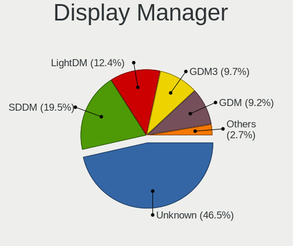

| Name    | Computers | Percent |
|---------|-----------|---------|
| Unknown | 125       | 50.61%  |
| SDDM    | 52        | 21.05%  |
| GDM     | 28        | 11.34%  |
| LightDM | 20        | 8.1%    |
| GDM3    | 14        | 5.67%   |
| TDM     | 4         | 1.62%   |
| KDM     | 2         | 0.81%   |
| XDM     | 1         | 0.4%    |
| GREETD  | 1         | 0.4%    |

OS Lang
-------

Language

| Lang       | Computers | Percent |
|------------|-----------|---------|
| es_UY      | 125       | 49.6%   |
| en_US      | 51        | 20.24%  |
| Unknown    | 31        | 12.3%   |
| es_ES      | 26        | 10.32%  |
| es_AR      | 6         | 2.38%   |
| C          | 5         | 1.98%   |
| es_MX      | 3         | 1.19%   |
| pt_BR      | 1         | 0.4%    |
| POSIX      | 1         | 0.4%    |
| es_UY.UTF8 | 1         | 0.4%    |
| en_GB      | 1         | 0.4%    |
| en_CA      | 1         | 0.4%    |

Boot Mode
---------

EFI or BIOS

| Mode | Computers | Percent |
|------|-----------|---------|
| BIOS | 128       | 51.61%  |
| EFI  | 120       | 48.39%  |

Filesystem
----------

Type of filesystem

| Type    | Computers | Percent |
|---------|-----------|---------|
| Ext4    | 194       | 78.54%  |
| Overlay | 33        | 13.36%  |
| Btrfs   | 10        | 4.05%   |
| Unknown | 8         | 3.24%   |
| Xfs     | 1         | 0.4%    |
| Ext3    | 1         | 0.4%    |

Part. scheme
------------

Scheme of partitioning

| Type    | Computers | Percent |
|---------|-----------|---------|
| Unknown | 141       | 57.09%  |
| GPT     | 77        | 31.17%  |
| MBR     | 29        | 11.74%  |

Dual Boot with Linux/BSD
------------------------

Hosting more than one Linux/BSD

| Dual boot | Computers | Percent |
|-----------|-----------|---------|
| No        | 193       | 79.1%   |
| Yes       | 51        | 20.9%   |

Dual Boot (Win)
---------------

Hosting Linux and Windows

| Dual boot | Computers | Percent |
|-----------|-----------|---------|
| No        | 171       | 69.8%   |
| Yes       | 74        | 30.2%   |

Board
-----

Vendor
------

Motherboard manufacturer

| Name                | Computers | Percent |
|---------------------|-----------|---------|
| Hewlett-Packard     | 39        | 16.05%  |
| Lenovo              | 28        | 11.52%  |
| ASUSTek Computer    | 27        | 11.11%  |
| Gigabyte Technology | 18        | 7.41%   |
| Dell                | 18        | 7.41%   |
| ECS                 | 17        | 7%      |
| ASRock              | 17        | 7%      |
| MSI                 | 16        | 6.58%   |
| Acer                | 13        | 5.35%   |
| Toshiba             | 9         | 3.7%    |
| Standard            | 5         | 2.06%   |
| Samsung Electronics | 4         | 1.65%   |
| Intel               | 4         | 1.65%   |
| Gateway             | 3         | 1.23%   |
| Biostar             | 3         | 1.23%   |
| Apple               | 3         | 1.23%   |
| Unknown             | 3         | 1.23%   |
| GPU Company         | 2         | 0.82%   |
| Valve               | 1         | 0.41%   |
| Supermicro          | 1         | 0.41%   |
| Sony                | 1         | 0.41%   |
| Positivo            | 1         | 0.41%   |
| Panasonic           | 1         | 0.41%   |
| OEM                 | 1         | 0.41%   |
| MACHINIST           | 1         | 0.41%   |
| iClever             | 1         | 0.41%   |
| Huanan              | 1         | 0.41%   |
| Haitech             | 1         | 0.41%   |
| Fujitsu             | 1         | 0.41%   |
| Foxconn             | 1         | 0.41%   |
| AZW                 | 1         | 0.41%   |
| Alienware           | 1         | 0.41%   |

Model
-----

Motherboard model

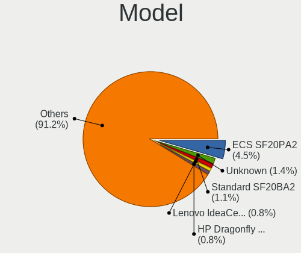

| Name                                       | Computers | Percent |
|--------------------------------------------|-----------|---------|
| ECS SF20PA2                                | 16        | 6.58%   |
| Standard SF20BA2                           | 3         | 1.23%   |
| Lenovo IdeaCentre AIO 310-20IAP F0CL0014LD | 3         | 1.23%   |
| ASUS ROG Zephyrus G14 GA401IV_GA401IV      | 3         | 1.23%   |
| Unknown                                    | 3         | 1.23%   |
| Toshiba Satellite L55t-B                   | 2         | 0.82%   |
| MSI MS-7C37                                | 2         | 0.82%   |
| MSI MS-7721                                | 2         | 0.82%   |
| HP Pavilion 15                             | 2         | 0.82%   |
| HP Laptop 15-bs0xx                         | 2         | 0.82%   |
| Gigabyte Z390 AORUS ELITE                  | 2         | 0.82%   |
| Gigabyte H61M-S1                           | 2         | 0.82%   |
| ASRock N68-S                               | 2         | 0.82%   |
| ASRock H310CM-HDV                          | 2         | 0.82%   |
| ASRock FM2A58M-VG3+ R2.0                   | 2         | 0.82%   |
| ASRock ALiveNF6P-VSTA                      | 2         | 0.82%   |
| Valve Jupiter                              | 1         | 0.41%   |
| Toshiba Satellite L45-B                    | 1         | 0.41%   |
| Toshiba Satellite C855                     | 1         | 0.41%   |
| Toshiba Satellite C75D-C                   | 1         | 0.41%   |
| Toshiba Satellite C75D-B                   | 1         | 0.41%   |
| Toshiba Satellite C645D                    | 1         | 0.41%   |
| Toshiba Satellite C55-B                    | 1         | 0.41%   |
| Toshiba Satellite C45-A                    | 1         | 0.41%   |
| Supermicro P4DMS                           | 1         | 0.41%   |
| Standard SF20BA                            | 1         | 0.41%   |
| Standard EF20EA                            | 1         | 0.41%   |
| Sony SVF14211CLB                           | 1         | 0.41%   |
| Samsung NC208/NC108                        | 1         | 0.41%   |
| Samsung N102SP/N100SP/N101SP               | 1         | 0.41%   |
| Samsung 700T                               | 1         | 0.41%   |
| Samsung 300E4C/300E5C/300E7C               | 1         | 0.41%   |
| Positivo Serie AT300                       | 1         | 0.41%   |
| Panasonic CF-31JEGAX1M                     | 1         | 0.41%   |
| OEM V40SI2                                 | 1         | 0.41%   |
| MSI Pro 3130 Microtower PC                 | 1         | 0.41%   |
| MSI MS-7C09                                | 1         | 0.41%   |
| MSI MS-7817                                | 1         | 0.41%   |
| MSI MS-7816                                | 1         | 0.41%   |
| MSI MS-7788                                | 1         | 0.41%   |

Model Family
------------

Motherboard model prefix

| Name                  | Computers | Percent |
|-----------------------|-----------|---------|
| ECS SF20PA2           | 16        | 6.58%   |
| Lenovo ThinkPad       | 10        | 4.12%   |
| Toshiba Satellite     | 9         | 3.7%    |
| Acer Aspire           | 9         | 3.7%    |
| HP Laptop             | 8         | 3.29%   |
| HP Pavilion           | 7         | 2.88%   |
| Dell Inspiron         | 7         | 2.88%   |
| Lenovo IdeaPad        | 6         | 2.47%   |
| HP Compaq             | 5         | 2.06%   |
| ASUS ROG              | 5         | 2.06%   |
| Dell Latitude         | 4         | 1.65%   |
| Standard SF20BA2      | 3         | 1.23%   |
| Lenovo IdeaCentre     | 3         | 1.23%   |
| Dell OptiPlex         | 3         | 1.23%   |
| ASUS PRIME            | 3         | 1.23%   |
| Unknown               | 3         | 1.23%   |
| MSI MS-7C37           | 2         | 0.82%   |
| MSI MS-7721           | 2         | 0.82%   |
| Lenovo ThinkCentre    | 2         | 0.82%   |
| HP ENVY               | 2         | 0.82%   |
| HP EliteDesk          | 2         | 0.82%   |
| HP EliteBook          | 2         | 0.82%   |
| HP 240                | 2         | 0.82%   |
| Gigabyte Z390         | 2         | 0.82%   |
| Gigabyte H61M-S1      | 2         | 0.82%   |
| Dell XPS              | 2         | 0.82%   |
| ASUS VivoBook         | 2         | 0.82%   |
| ASUS TUF              | 2         | 0.82%   |
| ASRock N68-S          | 2         | 0.82%   |
| ASRock H310CM-HDV     | 2         | 0.82%   |
| ASRock FM2A58M-VG3+   | 2         | 0.82%   |
| ASRock ALiveNF6P-VSTA | 2         | 0.82%   |
| ASRock A320M-HDV      | 2         | 0.82%   |
| Acer TravelMate       | 2         | 0.82%   |
| Valve Jupiter         | 1         | 0.41%   |
| Supermicro P4DMS      | 1         | 0.41%   |
| Standard SF20BA       | 1         | 0.41%   |
| Standard EF20EA       | 1         | 0.41%   |
| Sony SVF14211CLB      | 1         | 0.41%   |
| Samsung NC208         | 1         | 0.41%   |

MFG Year
--------

Motherboard manufacture year

| Year    | Computers | Percent |
|---------|-----------|---------|
| 2017    | 32        | 13.17%  |
| 2019    | 26        | 10.7%   |
| 2013    | 23        | 9.47%   |
| 2011    | 21        | 8.64%   |
| 2015    | 18        | 7.41%   |
| 2020    | 17        | 7%      |
| 2018    | 17        | 7%      |
| 2012    | 17        | 7%      |
| 2014    | 16        | 6.58%   |
| 2016    | 15        | 6.17%   |
| 2010    | 7         | 2.88%   |
| 2009    | 7         | 2.88%   |
| 2007    | 7         | 2.88%   |
| 2021    | 6         | 2.47%   |
| 2022    | 4         | 1.65%   |
| 2008    | 4         | 1.65%   |
| Unknown | 2         | 0.82%   |
| 2023    | 1         | 0.41%   |
| 2005    | 1         | 0.41%   |
| 2004    | 1         | 0.41%   |
| 2003    | 1         | 0.41%   |

Form Factor
-----------

Physical design of the computer

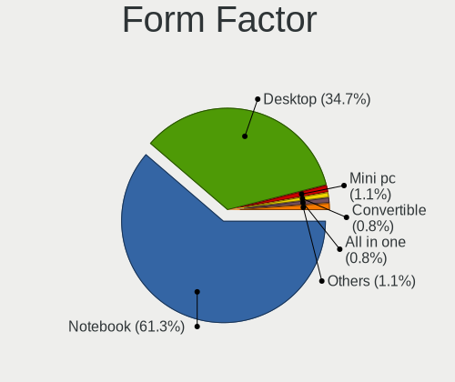

| Name        | Computers | Percent |
|-------------|-----------|---------|
| Notebook    | 143       | 58.85%  |
| Desktop     | 89        | 36.63%  |
| Mini pc     | 3         | 1.23%   |
| All in one  | 3         | 1.23%   |
| Phone       | 2         | 0.82%   |
| Convertible | 2         | 0.82%   |
| Tablet      | 1         | 0.41%   |

Secure Boot
-----------

Enabled or disabled

| State    | Computers | Percent |
|----------|-----------|---------|
| Disabled | 229       | 93.85%  |
| Enabled  | 15        | 6.15%   |

Coreboot
--------

Have coreboot on board

| Used | Computers | Percent |
|------|-----------|---------|
| No   | 243       | 100%    |

RAM Size
--------

Total RAM memory

| Size in GB  | Computers | Percent |
|-------------|-----------|---------|
| 4.01-8.0    | 60        | 24.19%  |
| 3.01-4.0    | 55        | 22.18%  |
| 8.01-16.0   | 41        | 16.53%  |
| 1.01-2.0    | 31        | 12.5%   |
| 16.01-24.0  | 30        | 12.1%   |
| 32.01-64.0  | 14        | 5.65%   |
| 24.01-32.0  | 8         | 3.23%   |
| 64.01-256.0 | 4         | 1.61%   |
| 2.01-3.0    | 2         | 0.81%   |
| 0.01-0.5    | 2         | 0.81%   |
| 0.51-1.0    | 1         | 0.4%    |

RAM Used
--------

Used RAM memory

| Used GB   | Computers | Percent |
|-----------|-----------|---------|
| 1.01-2.0  | 113       | 42.97%  |
| 2.01-3.0  | 60        | 22.81%  |
| 3.01-4.0  | 29        | 11.03%  |
| 4.01-8.0  | 26        | 9.89%   |
| 0.51-1.0  | 20        | 7.6%    |
| 8.01-16.0 | 9         | 3.42%   |
| 0.01-0.5  | 6         | 2.28%   |

Total Drives
------------

Number of drives on board

| Drives | Computers | Percent |
|--------|-----------|---------|
| 1      | 169       | 68.42%  |
| 2      | 51        | 20.65%  |
| 3      | 13        | 5.26%   |
| 4      | 10        | 4.05%   |
| 5      | 2         | 0.81%   |
| 0      | 2         | 0.81%   |

Has CD-ROM
----------

Has CD-ROM on board

| Presented | Computers | Percent |
|-----------|-----------|---------|
| No        | 153       | 62.45%  |
| Yes       | 92        | 37.55%  |

Has Ethernet
------------

Has Ethernet on board

| Presented | Computers | Percent |
|-----------|-----------|---------|
| Yes       | 186       | 76.54%  |
| No        | 57        | 23.46%  |

Has WiFi
--------

Has WiFi module

| Presented | Computers | Percent |
|-----------|-----------|---------|
| Yes       | 185       | 75.51%  |
| No        | 60        | 24.49%  |

Has Bluetooth
-------------

Has Bluetooth module

| Presented | Computers | Percent |
|-----------|-----------|---------|
| Yes       | 138       | 56.79%  |
| No        | 105       | 43.21%  |

Location
--------

Country
-------

Geographic location (country)

| Country | Computers | Percent |
|---------|-----------|---------|
| Uruguay | 243       | 100%    |

City
----

Geographic location (city)

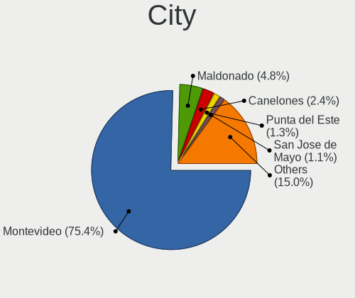

| City                   | Computers | Percent |
|------------------------|-----------|---------|
| Montevideo             | 178       | 69.53%  |
| Maldonado              | 12        | 4.69%   |
| Canelones              | 8         | 3.13%   |
| Las Piedras            | 6         | 2.34%   |
| San Jose de Mayo       | 4         | 1.56%   |
| Punta del Este         | 4         | 1.56%   |
| Florida                | 3         | 1.17%   |
| Ciudad del Plata       | 3         | 1.17%   |
| Buceo                  | 3         | 1.17%   |
| Salto                  | 2         | 0.78%   |
| Rocha                  | 2         | 0.78%   |
| Punta Gorda            | 2         | 0.78%   |
| Paysand              | 2         | 0.78%   |
| Parque Rodo            | 2         | 0.78%   |
| Nueva Helvecia         | 2         | 0.78%   |
| Libertad               | 2         | 0.78%   |
| La Paz                 | 2         | 0.78%   |
| Durazno                | 2         | 0.78%   |
| Solymar                | 1         | 0.39%   |
| Pocitos                | 1         | 0.39%   |
| Pinamar                | 1         | 0.39%   |
| Nuevo Paris            | 1         | 0.39%   |
| Melo                   | 1         | 0.39%   |
| Melilla                | 1         | 0.39%   |
| Maronas                | 1         | 0.39%   |
| Malvin Norte           | 1         | 0.39%   |
| Las Flores             | 1         | 0.39%   |
| La Barra               | 1         | 0.39%   |
| Joaquin Suarez         | 1         | 0.39%   |
| El Tesoro              | 1         | 0.39%   |
| El Pinar               | 1         | 0.39%   |
| Centro                 | 1         | 0.39%   |
| Barrancas Coloradas    | 1         | 0.39%   |
| Arenas de Jose Ignacio | 1         | 0.39%   |
| Unknown                | 1         | 0.39%   |

Drives
------

Drive Vendor
------------

Hard drive vendors

| Vendor                      | Computers | Drives | Percent |
|-----------------------------|-----------|--------|---------|
| WDC                         | 71        | 88     | 21.78%  |
| Seagate                     | 46        | 58     | 14.11%  |
| Kingston                    | 40        | 50     | 12.27%  |
| Toshiba                     | 35        | 44     | 10.74%  |
| Samsung Electronics         | 29        | 30     | 8.9%    |
| Unknown                     | 26        | 33     | 7.98%   |
| SanDisk                     | 13        | 16     | 3.99%   |
| Hitachi                     | 9         | 14     | 2.76%   |
| Crucial                     | 8         | 11     | 2.45%   |
| SK hynix                    | 6         | 6      | 1.84%   |
| HGST                        | 6         | 6      | 1.84%   |
| Hewlett-Packard             | 5         | 5      | 1.53%   |
| Intel                       | 4         | 4      | 1.23%   |
| Netac                       | 2         | 2      | 0.61%   |
| Micron/Crucial Technology   | 2         | 3      | 0.61%   |
| Maxtor                      | 2         | 3      | 0.61%   |
| Kingston Technology Company | 2         | 2      | 0.61%   |
| Biostar                     | 2         | 3      | 0.61%   |
| W800SH                      | 1         | 1      | 0.31%   |
| Silicon Motion              | 1         | 1      | 0.31%   |
| Phison                      | 1         | 1      | 0.31%   |
| Patriot                     | 1         | 1      | 0.31%   |
| NGFF                        | 1         | 1      | 0.31%   |
| Micron Technology           | 1         | 1      | 0.31%   |
| LITEON                      | 1         | 2      | 0.31%   |
| KIOXIA                      | 1         | 1      | 0.31%   |
| IBM-ESXS                    | 1         | 1      | 0.31%   |
| HS-SSD-C100                 | 1         | 1      | 0.31%   |
| Gigabyte Technology         | 1         | 1      | 0.31%   |
| ExcelStor                   | 1         | 1      | 0.31%   |
| Dahua                       | 1         | 1      | 0.31%   |
| China                       | 1         | 1      | 0.31%   |
| BIWIN                       | 1         | 1      | 0.31%   |
| BHT                         | 1         | 1      | 0.31%   |
| Apple                       | 1         | 1      | 0.31%   |
| A-DATA Technology           | 1         | 1      | 0.31%   |

Drive Model
-----------

Hard drive models

| Model                               | Computers | Percent |
|-------------------------------------|-----------|---------|
| Kingston SA400S37240G 240GB SSD     | 14        | 4.05%   |
| Unknown MMC Card  32GB              | 13        | 3.76%   |
| Kingston SA400S37480G 480GB SSD     | 7         | 2.02%   |
| Seagate ST1000LM035-1RK172 970GB    | 6         | 1.73%   |
| WDC WD10EZEX-08WN4A0 1TB            | 5         | 1.45%   |
| Unknown DA4032  32GB                | 5         | 1.45%   |
| Toshiba MQ01ABD075 752GB            | 5         | 1.45%   |
| Toshiba DT01ACA100 1TB              | 5         | 1.45%   |
| Seagate ST1000LM024 HN-M101MBB 1TB  | 5         | 1.45%   |
| Samsung HD161HJ 160GB               | 5         | 1.45%   |
| WDC WD5000AAKX-00ERMA0 500GB        | 4         | 1.16%   |
| Toshiba DT01ACA300 3TB              | 4         | 1.16%   |
| Seagate ST500LM012 HN-M500MBB 500GB | 4         | 1.16%   |
| Seagate ST1000DM010-2EP102 1TB      | 4         | 1.16%   |
| Kingston SA400S37120G 120GB SSD     | 4         | 1.16%   |
| WDC WD5000BEKT-60KA9T0 500GB        | 3         | 0.87%   |
| Toshiba MQ01ABF050 500GB            | 3         | 0.87%   |
| Toshiba HDWK105 500GB               | 3         | 0.87%   |
| Seagate ST500DM002-1BD142 500GB     | 3         | 0.87%   |
| SanDisk DF4032  32GB                | 3         | 0.87%   |
| Kingston SV300S37A120G 120GB SSD    | 3         | 0.87%   |
| WDC WDS500G2B0B-00YS70 500GB SSD    | 2         | 0.58%   |
| WDC WDS240G2G0B-00EPW0 240GB SSD    | 2         | 0.58%   |
| WDC WDS120G2G0A-00JH30 120GB SSD    | 2         | 0.58%   |
| WDC WD5000LPVX-22V0TT0 500GB        | 2         | 0.58%   |
| WDC WD5000LPVT-24G33T1 500GB        | 2         | 0.58%   |
| WDC WD5000AAKX-75U6AA0 500GB        | 2         | 0.58%   |
| WDC WD10EFRX-68FYTN0 1TB            | 2         | 0.58%   |
| Unknown SD/MMC/MS PRO 249GB         | 2         | 0.58%   |
| Toshiba MQ01ABD100 1TB              | 2         | 0.58%   |
| Toshiba MK5059GSXP 500GB            | 2         | 0.58%   |
| Seagate ST3750640NS 752GB           | 2         | 0.58%   |
| Seagate ST3250312AS 250GB           | 2         | 0.58%   |
| Seagate ST3160318AS 160GB           | 2         | 0.58%   |
| Seagate ST250DM000-1BD141 250GB     | 2         | 0.58%   |
| Seagate ST1000DM003-1CH162 1TB      | 2         | 0.58%   |
| SanDisk NVMe SSD Drive 256GB        | 2         | 0.58%   |
| SanDisk NVMe SSD Drive 1024GB       | 2         | 0.58%   |
| Samsung SSD 860 EVO 500GB           | 2         | 0.58%   |
| Samsung HD103SJ 1TB                 | 2         | 0.58%   |

HDD Vendor
----------

Hard disk drive vendors

| Vendor              | Computers | Drives | Percent |
|---------------------|-----------|--------|---------|
| WDC                 | 59        | 73     | 34.71%  |
| Seagate             | 46        | 58     | 27.06%  |
| Toshiba             | 31        | 40     | 18.24%  |
| Samsung Electronics | 14        | 14     | 8.24%   |
| Hitachi             | 9         | 14     | 5.29%   |
| HGST                | 6         | 6      | 3.53%   |
| Unknown             | 2         | 2      | 1.18%   |
| Maxtor              | 2         | 3      | 1.18%   |
| ExcelStor           | 1         | 1      | 0.59%   |

SSD Vendor
----------

Solid state drive vendors

| Vendor              | Computers | Drives | Percent |
|---------------------|-----------|--------|---------|
| Kingston            | 33        | 39     | 40.74%  |
| WDC                 | 9         | 9      | 11.11%  |
| Samsung Electronics | 8         | 9      | 9.88%   |
| Crucial             | 6         | 8      | 7.41%   |
| SanDisk             | 4         | 4      | 4.94%   |
| Hewlett-Packard     | 4         | 4      | 4.94%   |
| SK hynix            | 2         | 2      | 2.47%   |
| Netac               | 2         | 2      | 2.47%   |
| Intel               | 2         | 2      | 2.47%   |
| W800SH              | 1         | 1      | 1.23%   |
| Toshiba             | 1         | 1      | 1.23%   |
| NGFF                | 1         | 1      | 1.23%   |
| Micron Technology   | 1         | 1      | 1.23%   |
| Gigabyte Technology | 1         | 1      | 1.23%   |
| Dahua               | 1         | 1      | 1.23%   |
| China               | 1         | 1      | 1.23%   |
| BIWIN               | 1         | 1      | 1.23%   |
| Biostar             | 1         | 2      | 1.23%   |
| BHT                 | 1         | 1      | 1.23%   |
| A-DATA Technology   | 1         | 1      | 1.23%   |

Drive Kind
----------

HDD or SSD

| Kind    | Computers | Drives | Percent |
|---------|-----------|--------|---------|
| HDD     | 139       | 211    | 47.6%   |
| SSD     | 79        | 91     | 27.05%  |
| NVMe    | 43        | 56     | 14.73%  |
| MMC     | 28        | 36     | 9.59%   |
| Unknown | 3         | 3      | 1.03%   |

Drive Connector
---------------

SATA, SAS, NVMe, etc.

| Type | Computers | Drives | Percent |
|------|-----------|--------|---------|
| SATA | 187       | 300    | 71.1%   |
| NVMe | 43        | 56     | 16.35%  |
| MMC  | 28        | 36     | 10.65%  |
| SAS  | 5         | 5      | 1.9%    |

Drive Size
----------

Size of hard drive

| Size in TB | Computers | Drives | Percent |
|------------|-----------|--------|---------|
| 0.01-0.5   | 141       | 186    | 63.51%  |
| 0.51-1.0   | 68        | 101    | 30.63%  |
| 2.01-3.0   | 5         | 6      | 2.25%   |
| 1.01-2.0   | 5         | 5      | 2.25%   |
| 3.01-4.0   | 3         | 4      | 1.35%   |

Space Total
-----------

Amount of disk space available on the file system

| Size in GB     | Computers | Percent |
|----------------|-----------|---------|
| 101-250        | 58        | 23.02%  |
| 251-500        | 57        | 22.62%  |
| 501-1000       | 35        | 13.89%  |
| 1-20           | 32        | 12.7%   |
| 21-50          | 27        | 10.71%  |
| 1001-2000      | 16        | 6.35%   |
| 51-100         | 12        | 4.76%   |
| Unknown        | 9         | 3.57%   |
| More than 3000 | 4         | 1.59%   |
| 2001-3000      | 2         | 0.79%   |

Space Used
----------

Amount of used disk space

| Used GB        | Computers | Percent |
|----------------|-----------|---------|
| 1-20           | 120       | 45.98%  |
| 21-50          | 44        | 16.86%  |
| 51-100         | 25        | 9.58%   |
| 251-500        | 21        | 8.05%   |
| 101-250        | 21        | 8.05%   |
| 501-1000       | 14        | 5.36%   |
| Unknown        | 9         | 3.45%   |
| 1001-2000      | 4         | 1.53%   |
| More than 3000 | 2         | 0.77%   |
| 2001-3000      | 1         | 0.38%   |

Malfunc. Drives
---------------

Drive models with a malfunction

| Model                               | Computers | Drives | Percent |
|-------------------------------------|-----------|--------|---------|
| WDC WD5000BEKT-60KA9T0 500GB        | 3         | 3      | 9.68%   |
| Toshiba MK5059GSXP 500GB            | 2         | 3      | 6.45%   |
| Seagate ST500DM002-1BD142 500GB     | 2         | 2      | 6.45%   |
| Seagate ST3750640NS 752GB           | 2         | 7      | 6.45%   |
| Seagate ST250DM000-1BD141 250GB     | 2         | 2      | 6.45%   |
| WDC WD5000LPCX-24C6HT0 500GB        | 1         | 1      | 3.23%   |
| WDC WD5000AAKX-75U6AA0 500GB        | 1         | 1      | 3.23%   |
| WDC WD5000AAJS-00A8B0 500GB         | 1         | 1      | 3.23%   |
| WDC WD10SPCX-24HWST1 1TB            | 1         | 1      | 3.23%   |
| WDC WD10EARS-22Y5B1 1TB             | 1         | 1      | 3.23%   |
| Toshiba MQ01ABD075 752GB            | 1         | 1      | 3.23%   |
| Toshiba MK3276GSX 320GB             | 1         | 1      | 3.23%   |
| Toshiba MK3265GSX 320GB             | 1         | 1      | 3.23%   |
| Toshiba MK3259GSXP 320GB            | 1         | 1      | 3.23%   |
| Toshiba DT01ACA100 1TB              | 1         | 1      | 3.23%   |
| Seagate ST980811AS 80GB             | 1         | 1      | 3.23%   |
| Seagate ST500DM005 HD502HJ 500GB    | 1         | 1      | 3.23%   |
| Seagate ST3250310CS 250GB           | 1         | 1      | 3.23%   |
| Seagate ST3200827AS 200GB           | 1         | 1      | 3.23%   |
| Seagate ST1000LM035-1RK172 970GB    | 1         | 1      | 3.23%   |
| Seagate ST1000LM024 HN-M101MBB 1TB  | 1         | 1      | 3.23%   |
| Seagate ST1000DM010-2EP102 1TB      | 1         | 1      | 3.23%   |
| SanDisk SD9SN8W-128G-1006 128GB SSD | 1         | 1      | 3.23%   |
| Hitachi HTS547564A9E384 640GB       | 1         | 1      | 3.23%   |
| HGST HTS545032A7E380 320GB          | 1         | 1      | 3.23%   |

Malfunc. Drive Vendor
---------------------

Vendors of faulty drives

| Vendor  | Computers | Drives | Percent |
|---------|-----------|--------|---------|
| Seagate | 12        | 18     | 40%     |
| WDC     | 8         | 8      | 26.67%  |
| Toshiba | 7         | 8      | 23.33%  |
| SanDisk | 1         | 1      | 3.33%   |
| Hitachi | 1         | 1      | 3.33%   |
| HGST    | 1         | 1      | 3.33%   |

Malfunc. HDD Vendor
-------------------

Vendors of faulty HDD drives

| Vendor  | Computers | Drives | Percent |
|---------|-----------|--------|---------|
| Seagate | 12        | 18     | 41.38%  |
| WDC     | 8         | 8      | 27.59%  |
| Toshiba | 7         | 8      | 24.14%  |
| Hitachi | 1         | 1      | 3.45%   |
| HGST    | 1         | 1      | 3.45%   |

Malfunc. Drive Kind
-------------------

Kinds of faulty drives

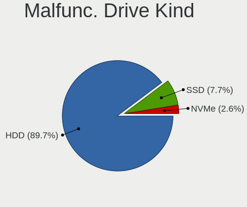

| Kind | Computers | Drives | Percent |
|------|-----------|--------|---------|
| HDD  | 29        | 36     | 96.67%  |
| SSD  | 1         | 1      | 3.33%   |

Failed Drives
-------------

Failed drive models

Zero info for selected period =(

Failed Drive Vendor
-------------------

Failed drive vendors

Zero info for selected period =(

Drive Status
------------

Number of failed and malfunc. drives

| Status   | Computers | Drives | Percent |
|----------|-----------|--------|---------|
| Detected | 150       | 238    | 58.37%  |
| Works    | 77        | 122    | 29.96%  |
| Malfunc  | 30        | 37     | 11.67%  |

Storage controller
------------------

Storage Vendor
--------------

Storage controller vendors

| Vendor                           | Computers | Percent |
|----------------------------------|-----------|---------|
| Intel                            | 158       | 57.66%  |
| AMD                              | 57        | 20.8%   |
| SanDisk                          | 12        | 4.38%   |
| Kingston Technology Company      | 8         | 2.92%   |
| Samsung Electronics              | 7         | 2.55%   |
| Nvidia                           | 5         | 1.82%   |
| ASMedia Technology               | 5         | 1.82%   |
| Toshiba America Info Systems     | 4         | 1.46%   |
| Micron/Crucial Technology        | 4         | 1.46%   |
| SK hynix                         | 3         | 1.09%   |
| Silicon Motion                   | 3         | 1.09%   |
| Marvell Technology Group         | 2         | 0.73%   |
| VIA Technologies                 | 1         | 0.36%   |
| Silicon Integrated Systems [SiS] | 1         | 0.36%   |
| Phison Electronics               | 1         | 0.36%   |
| Lite-On Technology               | 1         | 0.36%   |
| Apple                            | 1         | 0.36%   |
| Adaptec                          | 1         | 0.36%   |

Storage Model
-------------

Storage controller models

| Model                                                                                   | Computers | Percent |
|-----------------------------------------------------------------------------------------|-----------|---------|
| AMD FCH SATA Controller [AHCI mode]                                                     | 41        | 12.89%  |
| Intel Celeron N3350/Pentium N4200/Atom E3900 Series SATA AHCI Controller                | 20        | 6.29%   |
| Intel Sunrise Point-LP SATA Controller [AHCI mode]                                      | 12        | 3.77%   |
| Intel Atom/Celeron/Pentium Processor x5-E8000/J3xxx/N3xxx Series SATA Controller        | 8         | 2.52%   |
| Intel 8 Series/C220 Series Chipset Family 6-port SATA Controller 1 [AHCI mode]          | 8         | 2.52%   |
| Intel 7 Series Chipset Family 6-port SATA Controller [AHCI mode]                        | 8         | 2.52%   |
| AMD SB7x0/SB8x0/SB9x0 SATA Controller [AHCI mode]                                       | 7         | 2.2%    |
| Intel Wildcat Point-LP SATA Controller [AHCI Mode]                                      | 6         | 1.89%   |
| Intel 82801 Mobile SATA Controller [RAID mode]                                          | 6         | 1.89%   |
| Nvidia MCP61 SATA Controller                                                            | 5         | 1.57%   |
| Intel Cannon Lake PCH SATA AHCI Controller                                              | 5         | 1.57%   |
| Intel 8 Series SATA Controller 1 [AHCI mode]                                            | 5         | 1.57%   |
| Intel 7 Series/C210 Series Chipset Family 6-port SATA Controller [AHCI mode]            | 5         | 1.57%   |
| Intel 6 Series/C200 Series Chipset Family Desktop SATA Controller (IDE mode, ports 4-5) | 5         | 1.57%   |
| Intel 6 Series/C200 Series Chipset Family Desktop SATA Controller (IDE mode, ports 0-3) | 5         | 1.57%   |
| Intel 6 Series/C200 Series Chipset Family 6 port Desktop SATA AHCI Controller           | 5         | 1.57%   |
| ASMedia ASM1062 Serial ATA Controller                                                   | 5         | 1.57%   |
| AMD SB7x0/SB8x0/SB9x0 IDE Controller                                                    | 5         | 1.57%   |
| AMD FCH IDE Controller                                                                  | 5         | 1.57%   |
| AMD 400 Series Chipset SATA Controller                                                  | 5         | 1.57%   |
| SanDisk WD Blue SN550 NVMe SSD                                                          | 4         | 1.26%   |
| Nvidia MCP61 IDE                                                                        | 4         | 1.26%   |
| Intel Q170/Q150/B150/H170/H110/Z170/CM236 Chipset SATA Controller [AHCI Mode]           | 4         | 1.26%   |
| Intel NM10/ICH7 Family SATA Controller [IDE mode]                                       | 4         | 1.26%   |
| Intel Atom Processor E3800 Series SATA AHCI Controller                                  | 4         | 1.26%   |
| Intel 82801G (ICH7 Family) IDE Controller                                               | 4         | 1.26%   |
| Intel 6 Series/C200 Series Chipset Family 6 port Mobile SATA AHCI Controller            | 4         | 1.26%   |
| Intel 5 Series/3400 Series Chipset 4 port SATA AHCI Controller                          | 4         | 1.26%   |
| Intel 200 Series PCH SATA controller [AHCI mode]                                        | 4         | 1.26%   |
| SanDisk WD Black 2018/SN750 / PC SN720 NVMe SSD                                         | 3         | 0.94%   |
| Samsung NVMe SSD Controller SM981/PM981/PM983                                           | 3         | 0.94%   |
| Micron/Crucial P2 NVMe PCIe SSD                                                         | 3         | 0.94%   |
| Kingston Company A2000 NVMe SSD                                                         | 3         | 0.94%   |
| Intel Comet Lake SATA AHCI Controller                                                   | 3         | 0.94%   |
| Intel 82801HM/HEM (ICH8M/ICH8M-E) IDE Controller                                        | 3         | 0.94%   |
| Intel 5 Series/3400 Series Chipset 6 port SATA AHCI Controller                          | 3         | 0.94%   |
| Intel 400 Series Chipset Family SATA AHCI Controller                                    | 3         | 0.94%   |
| AMD FCH SATA Controller D                                                               | 3         | 0.94%   |
| Toshiba America Info Systems XG6 NVMe SSD Controller                                    | 2         | 0.63%   |
| Toshiba America Info Systems XG5 NVMe SSD Controller                                    | 2         | 0.63%   |

Storage Kind
------------

Kind of storage controller (IDE, SATA, NVMe, SAS, ...)

| Kind | Computers | Percent |
|------|-----------|---------|
| SATA | 190       | 67.14%  |
| NVMe | 43        | 15.19%  |
| IDE  | 39        | 13.78%  |
| RAID | 10        | 3.53%   |
| SCSI | 1         | 0.35%   |

Processor
---------

CPU Vendor
----------

Processor vendors

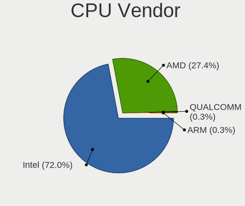

| Vendor   | Computers | Percent |
|----------|-----------|---------|
| Intel    | 173       | 71.19%  |
| AMD      | 68        | 27.98%  |
| QUALCOMM | 1         | 0.41%   |
| ARM      | 1         | 0.41%   |

CPU Model
---------

Processor models

| Model                                           | Computers | Percent |
|-------------------------------------------------|-----------|---------|
| Intel Celeron CPU N3350 @ 1.10GHz               | 17        | 7%      |
| Intel Core i7-8565U CPU @ 1.80GHz               | 3         | 1.23%   |
| Intel Core i5-5200U CPU @ 2.20GHz               | 3         | 1.23%   |
| Intel Core 2 Duo CPU E7500 @ 2.93GHz            | 3         | 1.23%   |
| Intel Celeron CPU N3160 @ 1.60GHz               | 3         | 1.23%   |
| Intel Celeron CPU N3050 @ 1.60GHz               | 3         | 1.23%   |
| Intel Celeron CPU J3355 @ 2.00GHz               | 3         | 1.23%   |
| Intel Atom x5-Z8350 CPU @ 1.44GHz               | 3         | 1.23%   |
| AMD Ryzen 9 4900HS with Radeon Graphics         | 3         | 1.23%   |
| AMD Ryzen 5 1600 Six-Core Processor             | 3         | 1.23%   |
| AMD E-300 APU with Radeon HD Graphics           | 3         | 1.23%   |
| Intel Pentium CPU N3710 @ 1.60GHz               | 2         | 0.82%   |
| Intel Core i7-8750H CPU @ 2.20GHz               | 2         | 0.82%   |
| Intel Core i7-7500U CPU @ 2.70GHz               | 2         | 0.82%   |
| Intel Core i7-6820HQ CPU @ 2.70GHz              | 2         | 0.82%   |
| Intel Core i7-6700HQ CPU @ 2.60GHz              | 2         | 0.82%   |
| Intel Core i7-4790 CPU @ 3.60GHz                | 2         | 0.82%   |
| Intel Core i7-10750H CPU @ 2.60GHz              | 2         | 0.82%   |
| Intel Core i7-10510U CPU @ 1.80GHz              | 2         | 0.82%   |
| Intel Core i5-8400 CPU @ 2.80GHz                | 2         | 0.82%   |
| Intel Core i5-8250U CPU @ 1.60GHz               | 2         | 0.82%   |
| Intel Core i5-7200U CPU @ 2.50GHz               | 2         | 0.82%   |
| Intel Core i5-6200U CPU @ 2.30GHz               | 2         | 0.82%   |
| Intel Core i5-4200M CPU @ 2.50GHz               | 2         | 0.82%   |
| Intel Core i5-3210M CPU @ 2.50GHz               | 2         | 0.82%   |
| Intel Core i5-10400 CPU @ 2.90GHz               | 2         | 0.82%   |
| Intel Core i3-2120 CPU @ 3.30GHz                | 2         | 0.82%   |
| Intel Core i3 CPU M 380 @ 2.53GHz               | 2         | 0.82%   |
| Intel Celeron CPU N3060 @ 1.60GHz               | 2         | 0.82%   |
| Intel Celeron CPU N2830 @ 2.16GHz               | 2         | 0.82%   |
| Intel 11th Gen Core i5-1135G7 @ 2.40GHz         | 2         | 0.82%   |
| AMD Ryzen 7 3700X 8-Core Processor              | 2         | 0.82%   |
| AMD Athlon 3000G with Radeon Vega Graphics      | 2         | 0.82%   |
| AMD A9-9425 RADEON R5, 5 COMPUTE CORES 2C+3G    | 2         | 0.82%   |
| AMD A6-5200 APU with Radeon HD Graphics         | 2         | 0.82%   |
| AMD A10-7860K Radeon R7, 12 Compute Cores 4C+8G | 2         | 0.82%   |
| QUALCOMM AArch64 Processor rev 1 (aarch64)      | 1         | 0.41%   |
| Intel Xeon CPU E5-2689 0 @ 2.60GHz              | 1         | 0.41%   |
| Intel Xeon CPU E5-2420 0 @ 1.90GHz              | 1         | 0.41%   |
| Intel Xeon CPU 2.40GHz                          | 1         | 0.41%   |

CPU Model Family
----------------

Processor model prefix

| Model              | Computers | Percent |
|--------------------|-----------|---------|
| Intel Core i5      | 41        | 16.87%  |
| Intel Celeron      | 38        | 15.64%  |
| Intel Core i7      | 36        | 14.81%  |
| Intel Core i3      | 23        | 9.47%   |
| AMD Ryzen 5        | 9         | 3.7%    |
| Intel Pentium      | 8         | 3.29%   |
| Intel Core 2 Duo   | 7         | 2.88%   |
| Intel Atom         | 7         | 2.88%   |
| AMD Ryzen 7        | 7         | 2.88%   |
| AMD A6             | 7         | 2.88%   |
| Other              | 5         | 2.06%   |
| AMD Ryzen 9        | 4         | 1.65%   |
| AMD Ryzen 3        | 4         | 1.65%   |
| AMD FX             | 4         | 1.65%   |
| AMD Athlon II X2   | 4         | 1.65%   |
| AMD A10            | 4         | 1.65%   |
| Intel Xeon         | 3         | 1.23%   |
| Intel Core 2 Quad  | 3         | 1.23%   |
| AMD E              | 3         | 1.23%   |
| AMD Athlon         | 3         | 1.23%   |
| AMD A4             | 3         | 1.23%   |
| Intel Genuine      | 2         | 0.82%   |
| AMD Phenom II X6   | 2         | 0.82%   |
| AMD E1             | 2         | 0.82%   |
| AMD A8             | 2         | 0.82%   |
| QUALCOMM AArch64   | 1         | 0.41%   |
| Intel Pentium Dual | 1         | 0.41%   |
| Intel Pentium 4    | 1         | 0.41%   |
| Intel Core i9      | 1         | 0.41%   |
| ARM AArch64        | 1         | 0.41%   |
| AMD PRO A10        | 1         | 0.41%   |
| AMD Phenom II      | 1         | 0.41%   |
| AMD Phenom         | 1         | 0.41%   |
| AMD E2             | 1         | 0.41%   |
| AMD Athlon II      | 1         | 0.41%   |
| AMD Athlon 64 X2   | 1         | 0.41%   |
| AMD Athlon 64      | 1         | 0.41%   |

CPU Cores
---------

Number of processor cores

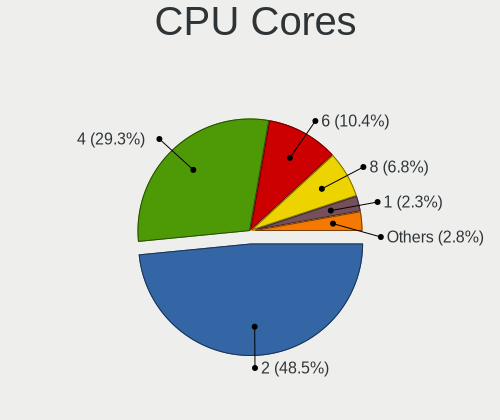

| Number | Computers | Percent |
|--------|-----------|---------|
| 2      | 126       | 51.85%  |
| 4      | 70        | 28.81%  |
| 6      | 23        | 9.47%   |
| 8      | 16        | 6.58%   |
| 1      | 8         | 3.29%   |

CPU Sockets
-----------

Number of sockets

| Number | Computers | Percent |
|--------|-----------|---------|
| 1      | 240       | 98.77%  |
| 2      | 3         | 1.23%   |

CPU Threads
-----------

Threads per core (Hyper-Threading)

| Number | Computers | Percent |
|--------|-----------|---------|
| 2      | 133       | 54.73%  |
| 1      | 110       | 45.27%  |

CPU Op-Modes
------------

CPU Operation Modes (32-bit, 64-bit)

| Op mode        | Computers | Percent |
|----------------|-----------|---------|
| 32-bit, 64-bit | 236       | 97.12%  |
| Unknown        | 5         | 2.06%   |
| 32-bit         | 2         | 0.82%   |

CPU Microcode
-------------

Microcode number

| Number     | Computers | Percent |
|------------|-----------|---------|
| Unknown    | 56        | 22.49%  |
| 0x206a7    | 13        | 5.22%   |
| 0x306c3    | 9         | 3.61%   |
| 0x506c9    | 8         | 3.21%   |
| 0x406c4    | 8         | 3.21%   |
| 0x306a9    | 8         | 3.21%   |
| 0x906ea    | 7         | 2.81%   |
| 0x20655    | 7         | 2.81%   |
| 0x40651    | 6         | 2.41%   |
| 0x1067a    | 6         | 2.41%   |
| 0x806ec    | 5         | 2.01%   |
| 0x806e9    | 5         | 2.01%   |
| 0x406e3    | 5         | 2.01%   |
| 0x306d4    | 5         | 2.01%   |
| 0x08108109 | 5         | 2.01%   |
| 0x806ea    | 4         | 1.61%   |
| 0x406c3    | 4         | 1.61%   |
| 0x30678    | 4         | 1.61%   |
| 0x08701021 | 4         | 1.61%   |
| 0x6fd      | 3         | 1.2%    |
| 0x506e3    | 3         | 1.2%    |
| 0x06006705 | 3         | 1.2%    |
| 0x06001119 | 3         | 1.2%    |
| 0x06000852 | 3         | 1.2%    |
| 0xa0655    | 2         | 0.8%    |
| 0xa0653    | 2         | 0.8%    |
| 0x906eb    | 2         | 0.8%    |
| 0x806c1    | 2         | 0.8%    |
| 0x706e5    | 2         | 0.8%    |
| 0x206d7    | 2         | 0.8%    |
| 0x10676    | 2         | 0.8%    |
| 0x0a50000c | 2         | 0.8%    |
| 0x08600104 | 2         | 0.8%    |
| 0x0810100b | 2         | 0.8%    |
| 0x08001138 | 2         | 0.8%    |
| 0x07030105 | 2         | 0.8%    |
| 0x07030104 | 2         | 0.8%    |
| 0x0700010f | 2         | 0.8%    |
| 0x0600611a | 2         | 0.8%    |
| 0x06003106 | 2         | 0.8%    |

CPU Microarch
-------------

Microarchitecture

| Name          | Computers | Percent |
|---------------|-----------|---------|
| KabyLake      | 28        | 11.52%  |
| Silvermont    | 20        | 8.23%   |
| Goldmont      | 20        | 8.23%   |
| SandyBridge   | 17        | 7%      |
| Haswell       | 16        | 6.58%   |
| IvyBridge     | 15        | 6.17%   |
| Skylake       | 11        | 4.53%   |
| Zen+          | 9         | 3.7%    |
| Penryn        | 9         | 3.7%    |
| K10           | 9         | 3.7%    |
| Zen 2         | 8         | 3.29%   |
| Westmere      | 7         | 2.88%   |
| Excavator     | 7         | 2.88%   |
| CometLake     | 7         | 2.88%   |
| Broadwell     | 7         | 2.88%   |
| Piledriver    | 6         | 2.47%   |
| Zen 3         | 5         | 2.06%   |
| Zen           | 5         | 2.06%   |
| Puma          | 5         | 2.06%   |
| Core          | 5         | 2.06%   |
| Steamroller   | 4         | 1.65%   |
| Jaguar        | 3         | 1.23%   |
| Bobcat        | 3         | 1.23%   |
| Unknown       | 3         | 1.23%   |
| TigerLake     | 2         | 0.82%   |
| NetBurst      | 2         | 0.82%   |
| K8 Hammer     | 2         | 0.82%   |
| IceLake       | 2         | 0.82%   |
| Bonnell       | 2         | 0.82%   |
| Tremont       | 1         | 0.41%   |
| Nehalem       | 1         | 0.41%   |
| K10 Llano     | 1         | 0.41%   |
| Goldmont plus | 1         | 0.41%   |

Graphics
--------

GPU Vendor
----------

Vendors of graphics cards

| Vendor                           | Computers | Percent |
|----------------------------------|-----------|---------|
| Intel                            | 146       | 53.87%  |
| AMD                              | 67        | 24.72%  |
| Nvidia                           | 57        | 21.03%  |
| Silicon Integrated Systems [SiS] | 1         | 0.37%   |

GPU Model
---------

Graphics card models

| Model                                                                                    | Computers | Percent |
|------------------------------------------------------------------------------------------|-----------|---------|
| Intel HD Graphics 500                                                                    | 20        | 7.19%   |
| Intel Atom/Celeron/Pentium Processor x5-E8000/J3xxx/N3xxx Integrated Graphics Controller | 15        | 5.4%    |
| Intel 2nd Generation Core Processor Family Integrated Graphics Controller                | 11        | 3.96%   |
| Intel 3rd Gen Core processor Graphics Controller                                         | 7         | 2.52%   |
| AMD Picasso/Raven 2 [Radeon Vega Series / Radeon Vega Mobile Series]                     | 7         | 2.52%   |
| Intel Xeon E3-1200 v2/3rd Gen Core processor Graphics Controller                         | 6         | 2.16%   |
| Intel HD Graphics 5500                                                                   | 6         | 2.16%   |
| Intel Haswell-ULT Integrated Graphics Controller                                         | 6         | 2.16%   |
| Intel Core Processor Integrated Graphics Controller                                      | 6         | 2.16%   |
| Intel Skylake GT2 [HD Graphics 520]                                                      | 5         | 1.8%    |
| Intel HD Graphics 620                                                                    | 5         | 1.8%    |
| Intel HD Graphics 530                                                                    | 5         | 1.8%    |
| Intel CoffeeLake-S GT2 [UHD Graphics 630]                                                | 5         | 1.8%    |
| Intel Atom Processor Z36xxx/Z37xxx Series Graphics & Display                             | 5         | 1.8%    |
| Nvidia GT218 [GeForce 210]                                                               | 4         | 1.44%   |
| Intel WhiskeyLake-U GT2 [UHD Graphics 620]                                               | 4         | 1.44%   |
| Intel UHD Graphics 620                                                                   | 4         | 1.44%   |
| AMD Stoney [Radeon R2/R3/R4/R5 Graphics]                                                 | 4         | 1.44%   |
| AMD Renoir                                                                               | 4         | 1.44%   |
| AMD Kaveri [Radeon R7 Graphics]                                                          | 4         | 1.44%   |
| Nvidia TU106M [GeForce RTX 2060 Max-Q]                                                   | 3         | 1.08%   |
| Nvidia GT218 [GeForce 8400 GS Rev. 3]                                                    | 3         | 1.08%   |
| Nvidia GK208B [GeForce GT 730]                                                           | 3         | 1.08%   |
| Intel Xeon E3-1200 v3/4th Gen Core Processor Integrated Graphics Controller              | 3         | 1.08%   |
| Intel Mobile GM965/GL960 Integrated Graphics Controller (secondary)                      | 3         | 1.08%   |
| Intel Mobile GM965/GL960 Integrated Graphics Controller (primary)                        | 3         | 1.08%   |
| Intel CometLake-U GT2 [UHD Graphics]                                                     | 3         | 1.08%   |
| Intel CometLake-S GT2 [UHD Graphics 630]                                                 | 3         | 1.08%   |
| Intel CoffeeLake-H GT2 [UHD Graphics 630]                                                | 3         | 1.08%   |
| Intel 4th Gen Core Processor Integrated Graphics Controller                              | 3         | 1.08%   |
| AMD Wrestler [Radeon HD 6310]                                                            | 3         | 1.08%   |
| AMD Wani [Radeon R5/R6/R7 Graphics]                                                      | 3         | 1.08%   |
| AMD Topaz XT [Radeon R7 M260/M265 / M340/M360 / M440/M445 / 530/535 / 620/625 Mobile]    | 3         | 1.08%   |
| AMD Sun XT [Radeon HD 8670A/8670M/8690M / R5 M330 / M430 / Radeon 520 Mobile]            | 3         | 1.08%   |
| AMD Mullins [Radeon R4/R5 Graphics]                                                      | 3         | 1.08%   |
| AMD Cezanne [Radeon Vega Series / Radeon Vega Mobile Series]                             | 3         | 1.08%   |
| Nvidia TU116 [GeForce GTX 1650 SUPER]                                                    | 2         | 0.72%   |
| Nvidia GA106 [GeForce RTX 3060 Lite Hash Rate]                                           | 2         | 0.72%   |
| Nvidia C61 [GeForce 7025 / nForce 630a]                                                  | 2         | 0.72%   |
| Intel TigerLake-LP GT2 [Iris Xe Graphics]                                                | 2         | 0.72%   |

GPU Combo
---------

Combinations of graphics cards

| Name           | Computers | Percent |
|----------------|-----------|---------|
| 1 x Intel      | 122       | 50.21%  |
| 1 x AMD        | 49        | 20.16%  |
| 1 x Nvidia     | 39        | 16.05%  |
| Intel + Nvidia | 12        | 4.94%   |
| Intel + AMD    | 8         | 3.29%   |
| AMD + Nvidia   | 6         | 2.47%   |
| 2 x AMD        | 4         | 1.65%   |
| Other          | 2         | 0.82%   |
| 1 x SiS        | 1         | 0.41%   |

GPU Driver
----------

Free vs proprietary

| Driver      | Computers | Percent |
|-------------|-----------|---------|
| Free        | 209       | 85.66%  |
| Proprietary | 25        | 10.25%  |
| Unknown     | 10        | 4.1%    |

GPU Memory
----------

Total video memory

| Size in GB | Computers | Percent |
|------------|-----------|---------|
| Unknown    | 148       | 59.44%  |
| 1.01-2.0   | 26        | 10.44%  |
| 0.51-1.0   | 25        | 10.04%  |
| 0.01-0.5   | 25        | 10.04%  |
| 3.01-4.0   | 15        | 6.02%   |
| 5.01-6.0   | 5         | 2.01%   |
| 7.01-8.0   | 3         | 1.2%    |
| 2.01-3.0   | 1         | 0.4%    |
| 8.01-16.0  | 1         | 0.4%    |

Monitor
-------

Monitor Vendor
--------------

Monitor vendors

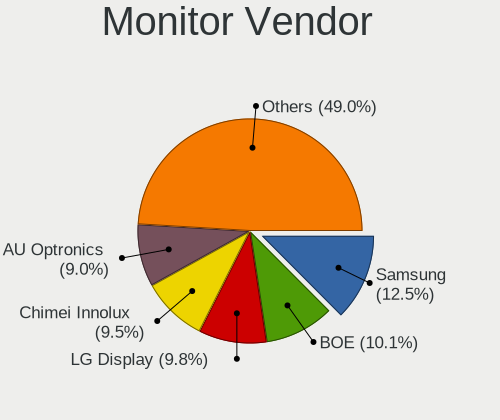

| Vendor                  | Computers | Percent |
|-------------------------|-----------|---------|
| Samsung Electronics     | 26        | 10.66%  |
| LG Display              | 25        | 10.25%  |
| AU Optronics            | 24        | 9.84%   |
| Chimei Innolux          | 23        | 9.43%   |
| BOE                     | 18        | 7.38%   |
| ViewSonic               | 16        | 6.56%   |
| AOC                     | 16        | 6.56%   |
| KTC                     | 10        | 4.1%    |
| Acer                    | 8         | 3.28%   |
| KDC                     | 7         | 2.87%   |
| InfoVision              | 7         | 2.87%   |
| Goldstar                | 7         | 2.87%   |
| Lenovo                  | 6         | 2.46%   |
| Chi Mei Optoelectronics | 5         | 2.05%   |
| Sharp                   | 4         | 1.64%   |
| PANDA                   | 4         | 1.64%   |
| Hewlett-Packard         | 4         | 1.64%   |
| Dell                    | 4         | 1.64%   |
| Unknown                 | 3         | 1.23%   |
| LG Philips              | 2         | 0.82%   |
| HSI                     | 2         | 0.82%   |
| HKC                     | 2         | 0.82%   |
| Apple                   | 2         | 0.82%   |
| Valve                   | 1         | 0.41%   |
| Sun                     | 1         | 0.41%   |
| Sony                    | 1         | 0.41%   |
| RIS                     | 1         | 0.41%   |
| Philips                 | 1         | 0.41%   |
| Panasonic               | 1         | 0.41%   |
| LG Electronics          | 1         | 0.41%   |
| Lenovo Group Limited    | 1         | 0.41%   |
| KVM                     | 1         | 0.41%   |
| Konka                   | 1         | 0.41%   |
| KOA                     | 1         | 0.41%   |
| JDI                     | 1         | 0.41%   |
| InnoLux Display         | 1         | 0.41%   |
| Hitachi                 | 1         | 0.41%   |
| Envision                | 1         | 0.41%   |
| CVT                     | 1         | 0.41%   |
| CPT                     | 1         | 0.41%   |

Monitor Model
-------------

Monitor models

| Model                                                                    | Computers | Percent |
|--------------------------------------------------------------------------|-----------|---------|
| InfoVision LCD Monitor IVO03F4 1024x600 223x125mm 10.1-inch              | 6         | 2.4%    |
| KDC LCD Monitor KDC05F1 1366x768 344x193mm 15.5-inch                     | 5         | 2%      |
| ViewSonic VA2261 Series VSC0F30 1920x1080 477x268mm 21.5-inch            | 4         | 1.6%    |
| Lenovo LEN-AIO-330-E LEN0017 1440x900 420x270mm 19.7-inch                | 3         | 1.2%    |
| KTC 23L13-H-AN KTC2302 1920x1080 510x287mm 23.0-inch                     | 3         | 1.2%    |
| AU Optronics LCD Monitor AUO22EC 1366x768 344x193mm 15.5-inch            | 3         | 1.2%    |
| ViewSonic VA2405-FHD VSCA939 1920x1080 527x296mm 23.8-inch               | 2         | 0.8%    |
| Sharp LQ140M1JW46 SHP14F1 1920x1080 309x174mm 14.0-inch                  | 2         | 0.8%    |
| Samsung Electronics SyncMaster SAM02E3 1440x900 367x229mm 17.0-inch      | 2         | 0.8%    |
| Samsung Electronics LCD Monitor SDC4651 1366x768 344x194mm 15.5-inch     | 2         | 0.8%    |
| Samsung Electronics LCD Monitor SDC4146 1366x768 344x194mm 15.5-inch     | 2         | 0.8%    |
| Samsung Electronics C27F390 SAM0D32 1920x1080 598x336mm 27.0-inch        | 2         | 0.8%    |
| Samsung Electronics C24F390 SAM0D2C 1920x1080 521x293mm 23.5-inch        | 2         | 0.8%    |
| LG Display LCD Monitor LGD04A7 1920x1080 344x194mm 15.5-inch             | 2         | 0.8%    |
| LG Display LCD Monitor LGD03ED 1366x768 277x156mm 12.5-inch              | 2         | 0.8%    |
| LG Display LCD Monitor LGD0396 1600x900 382x215mm 17.3-inch              | 2         | 0.8%    |
| LG Display LCD Monitor LGD02DC 1366x768 344x194mm 15.5-inch              | 2         | 0.8%    |
| Lenovo LEN C32q-20 LEN65F8 2560x1440 698x393mm 31.5-inch                 | 2         | 0.8%    |
| KTC W9023S5 KTC1852 1360x768 410x230mm 18.5-inch                         | 2         | 0.8%    |
| KDC LCD Monitor KDC0109 1366x768 256x144mm 11.6-inch                     | 2         | 0.8%    |
| HSI LED-TV HSI0001 1920x1080 708x398mm 32.0-inch                         | 2         | 0.8%    |
| HKC LCD Monitor HKC1850 1360x768 304x228mm 15.0-inch                     | 2         | 0.8%    |
| Chimei Innolux LCD Monitor CMN15E6 1366x768 344x193mm 15.5-inch          | 2         | 0.8%    |
| Chimei Innolux LCD Monitor CMN15BF 1366x768 344x193mm 15.5-inch          | 2         | 0.8%    |
| Chimei Innolux LCD Monitor CMN15AB 1366x768 344x193mm 15.5-inch          | 2         | 0.8%    |
| Chimei Innolux LCD Monitor CMN1130 1366x768 256x144mm 11.6-inch          | 2         | 0.8%    |
| Chi Mei Optoelectronics LCD Monitor CMO15A2 1366x768 344x193mm 15.5-inch | 2         | 0.8%    |
| BOE LCD Monitor BOE0696 1366x768 309x173mm 13.9-inch                     | 2         | 0.8%    |
| AU Optronics LCD Monitor AUO46EC 1366x768 344x193mm 15.5-inch            | 2         | 0.8%    |
| AU Optronics LCD Monitor AUO2E3C 1366x768 309x173mm 13.9-inch            | 2         | 0.8%    |
| AOC 2461W AOC2461 1920x1080 521x293mm 23.5-inch                          | 2         | 0.8%    |
| AOC 2369M AOC2369 1920x1080 509x286mm 23.0-inch                          | 2         | 0.8%    |
| AOC 1970W-1 AOC1970 1366x768 410x230mm 18.5-inch                         | 2         | 0.8%    |
| AOC 1950W AOC1950 1366x768 410x230mm 18.5-inch                           | 2         | 0.8%    |
| AOC 1621Wb AOC1621 1366x768 344x194mm 15.5-inch                          | 2         | 0.8%    |
| ViewSonic XG2405 VSC0D39 1920x1080 527x296mm 23.8-inch                   | 1         | 0.4%    |
| ViewSonic XG2402 SERIES VSC1B35 1920x1080 531x299mm 24.0-inch            | 1         | 0.4%    |
| ViewSonic VX2478 Series VSCE032 2560x1440 526x296mm 23.8-inch            | 1         | 0.4%    |
| ViewSonic VX2452 Series VSCDE2E 1920x1080 521x293mm 23.5-inch            | 1         | 0.4%    |
| ViewSonic VX2240w VSC6B20 1680x1050 495x291mm 22.6-inch                  | 1         | 0.4%    |

Monitor Resolution
------------------

Monitor screen resolution

| Resolution         | Computers | Percent |
|--------------------|-----------|---------|
| 1366x768 (WXGA)    | 88        | 38.77%  |
| 1920x1080 (FHD)    | 72        | 31.72%  |
| 1600x900 (HD+)     | 13        | 5.73%   |
| 3840x2160 (4K)     | 7         | 3.08%   |
| 1440x900 (WXGA+)   | 7         | 3.08%   |
| 2560x1440 (QHD)    | 6         | 2.64%   |
| 1920x1200 (WUXGA)  | 6         | 2.64%   |
| 1360x768           | 5         | 2.2%    |
| 1280x800 (WXGA)    | 4         | 1.76%   |
| 1280x1024 (SXGA)   | 4         | 1.76%   |
| 1680x1050 (WSXGA+) | 3         | 1.32%   |
| Unknown            | 3         | 1.32%   |
| 1280x720 (HD)      | 2         | 0.88%   |
| 800x1280           | 1         | 0.44%   |
| 3600x1080          | 1         | 0.44%   |
| 2944x1080          | 1         | 0.44%   |
| 2560x1080          | 1         | 0.44%   |
| 2288x1287          | 1         | 0.44%   |
| 1280x768           | 1         | 0.44%   |
| 1024x600           | 1         | 0.44%   |

Monitor Diagonal
----------------

Diagonal size in inches

| Inches  | Computers | Percent |
|---------|-----------|---------|
| 15      | 77        | 31.69%  |
| 13      | 26        | 10.7%   |
| 23      | 20        | 8.23%   |
| 14      | 20        | 8.23%   |
| 21      | 15        | 6.17%   |
| 18      | 12        | 4.94%   |
| 24      | 11        | 4.53%   |
| 17      | 9         | 3.7%    |
| Unknown | 8         | 3.29%   |
| 11      | 7         | 2.88%   |
| 19      | 6         | 2.47%   |
| 27      | 4         | 1.65%   |
| 40      | 3         | 1.23%   |
| 34      | 3         | 1.23%   |
| 31      | 3         | 1.23%   |
| 20      | 3         | 1.23%   |
| 84      | 2         | 0.82%   |
| 44      | 2         | 0.82%   |
| 32      | 2         | 0.82%   |
| 22      | 2         | 0.82%   |
| 12      | 2         | 0.82%   |
| 10      | 2         | 0.82%   |
| 57      | 1         | 0.41%   |
| 52      | 1         | 0.41%   |
| 16      | 1         | 0.41%   |
| 7       | 1         | 0.41%   |

Monitor Width
-------------

Physical width

| Width in mm | Computers | Percent |
|-------------|-----------|---------|
| 301-350     | 115       | 47.92%  |
| 401-500     | 35        | 14.58%  |
| 501-600     | 33        | 13.75%  |
| 201-300     | 18        | 7.5%    |
| 351-400     | 13        | 5.42%   |
| Unknown     | 8         | 3.33%   |
| 701-800     | 5         | 2.08%   |
| 801-900     | 3         | 1.25%   |
| 601-700     | 3         | 1.25%   |
| 1501-2000   | 2         | 0.83%   |
| 1001-1500   | 2         | 0.83%   |
| 901-1000    | 2         | 0.83%   |
| 1-100       | 1         | 0.42%   |

Aspect Ratio
------------

Proportional relationship between the width and the height

| Ratio   | Computers | Percent |
|---------|-----------|---------|
| 16/9    | 184       | 85.19%  |
| 16/10   | 16        | 7.41%   |
| Unknown | 8         | 3.7%    |
| 5/4     | 4         | 1.85%   |
| 21/9    | 3         | 1.39%   |
| 0.67    | 1         | 0.46%   |

Monitor Area
------------

Area in inch

| Area in inch | Computers | Percent |
|----------------|-----------|---------|
| 101-110        | 76        | 31.8%   |
| 81-90          | 40        | 16.74%  |
| 201-250        | 34        | 14.23%  |
| 151-200        | 19        | 7.95%   |
| 141-150        | 10        | 4.18%   |
| Unknown        | 8         | 3.35%   |
| 51-60          | 7         | 2.93%   |
| 351-500        | 7         | 2.93%   |
| 121-130        | 7         | 2.93%   |
| 71-80          | 6         | 2.51%   |
| 501-1000       | 5         | 2.09%   |
| More than 1000 | 4         | 1.67%   |
| 301-350        | 4         | 1.67%   |
| 251-300        | 4         | 1.67%   |
| 61-70          | 2         | 0.84%   |
| 41-50          | 2         | 0.84%   |
| 131-140        | 2         | 0.84%   |
| 1-40           | 1         | 0.42%   |
| 91-100         | 1         | 0.42%   |

Pixel Density
-------------

Pixels per inch

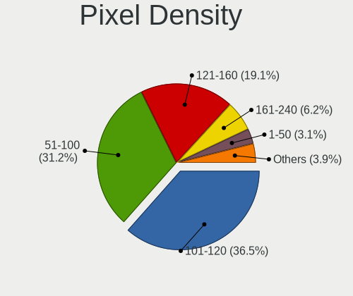

| Density       | Computers | Percent |
|---------------|-----------|---------|
| 101-120       | 90        | 38.3%   |
| 51-100        | 82        | 34.89%  |
| 121-160       | 42        | 17.87%  |
| Unknown       | 8         | 3.4%    |
| 161-240       | 7         | 2.98%   |
| 1-50          | 5         | 2.13%   |
| More than 240 | 1         | 0.43%   |

Multiple Monitors
-----------------

Total monitors connected

| Total | Computers | Percent |
|-------|-----------|---------|
| 1     | 198       | 79.2%   |
| 2     | 36        | 14.4%   |
| 0     | 13        | 5.2%    |
| 3     | 2         | 0.8%    |
| 4     | 1         | 0.4%    |

Network
-------

Net Controller Vendor
---------------------

Controller vendors

| Vendor                           | Computers | Percent |
|----------------------------------|-----------|---------|
| Realtek Semiconductor            | 127       | 36.08%  |
| Intel                            | 99        | 28.13%  |
| Qualcomm Atheros                 | 49        | 13.92%  |
| Broadcom                         | 24        | 6.82%   |
| Ralink Technology                | 9         | 2.56%   |
| TP-Link                          | 8         | 2.27%   |
| Nvidia                           | 5         | 1.42%   |
| Ralink                           | 4         | 1.14%   |
| Xiaomi                           | 3         | 0.85%   |
| MediaTek                         | 3         | 0.85%   |
| Huawei Technologies              | 3         | 0.85%   |
| Broadcom Limited                 | 3         | 0.85%   |
| Samsung Electronics              | 2         | 0.57%   |
| Mercucys                         | 2         | 0.57%   |
| VIA Technologies                 | 1         | 0.28%   |
| Texas Instruments                | 1         | 0.28%   |
| T & A Mobile Phones              | 1         | 0.28%   |
| Silicon Integrated Systems [SiS] | 1         | 0.28%   |
| Sierra Wireless                  | 1         | 0.28%   |
| Qualcomm Atheros Communications  | 1         | 0.28%   |
| Qualcomm                         | 1         | 0.28%   |
| Marvell Technology Group         | 1         | 0.28%   |
| Lenovo                           | 1         | 0.28%   |
| DisplayLink                      | 1         | 0.28%   |
| ASIX Electronics                 | 1         | 0.28%   |

Net Controller Model
--------------------

Controller models

| Model                                                             | Computers | Percent |
|-------------------------------------------------------------------|-----------|---------|
| Realtek RTL8111/8168/8411 PCI Express Gigabit Ethernet Controller | 86        | 21.29%  |
| Intel Wireless 3165                                               | 26        | 6.44%   |
| Realtek RTL810xE PCI Express Fast Ethernet controller             | 23        | 5.69%   |
| Qualcomm Atheros QCA9377 802.11ac Wireless Network Adapter        | 9         | 2.23%   |
| Realtek RTL8821CE 802.11ac PCIe Wireless Network Adapter          | 7         | 1.73%   |
| Qualcomm Atheros QCA9565 / AR9565 Wireless Network Adapter        | 7         | 1.73%   |
| Qualcomm Atheros AR9485 Wireless Network Adapter                  | 7         | 1.73%   |
| Intel Wi-Fi 6 AX200                                               | 7         | 1.73%   |
| Intel 82579LM Gigabit Network Connection (Lewisville)             | 7         | 1.73%   |
| Broadcom BCM43142 802.11b/g/n                                     | 7         | 1.73%   |
| Realtek RTL8188EUS 802.11n Wireless Network Adapter               | 6         | 1.49%   |
| Intel Wireless 7265                                               | 6         | 1.49%   |
| Nvidia MCP61 Ethernet                                             | 5         | 1.24%   |
| Intel Wireless 8260                                               | 5         | 1.24%   |
| Broadcom BCM4313 802.11bgn Wireless Network Adapter               | 5         | 1.24%   |
| Ralink MT7601U Wireless Adapter                                   | 4         | 0.99%   |
| Qualcomm Atheros QCA6174 802.11ac Wireless Network Adapter        | 4         | 0.99%   |
| Intel Wireless 7260                                               | 4         | 0.99%   |
| Intel Ethernet Connection (7) I219-V                              | 4         | 0.99%   |
| Xiaomi Mi/Redmi series (RNDIS)                                    | 3         | 0.74%   |
| TP-Link 802.11ac NIC                                              | 3         | 0.74%   |
| Realtek RTL8723DE Wireless Network Adapter                        | 3         | 0.74%   |
| Realtek RTL8723BE PCIe Wireless Network Adapter                   | 3         | 0.74%   |
| Realtek RTL8192EU 802.11b/g/n WLAN Adapter                        | 3         | 0.74%   |
| Realtek RTL8188EE Wireless Network Adapter                        | 3         | 0.74%   |
| Realtek RTL8188CE 802.11b/g/n WiFi Adapter                        | 3         | 0.74%   |
| Qualcomm Atheros Killer E220x Gigabit Ethernet Controller         | 3         | 0.74%   |
| Intel Dual Band Wireless-AC 3165 Plus Bluetooth                   | 3         | 0.74%   |
| Intel Comet Lake PCH-LP CNVi WiFi                                 | 3         | 0.74%   |
| Huawei E353/E3131                                                 | 3         | 0.74%   |
| Broadcom NetLink BCM57780 Gigabit Ethernet PCIe                   | 3         | 0.74%   |
| TP-Link TL-WN823N v2/v3 [Realtek RTL8192EU]                       | 2         | 0.5%    |
| TP-Link TL-WN722N v2/v3 [Realtek RTL8188EUS]                      | 2         | 0.5%    |
| Realtek RTL8822CE 802.11ac PCIe Wireless Network Adapter          | 2         | 0.5%    |
| Realtek RTL8822BE 802.11a/b/g/n/ac WiFi adapter                   | 2         | 0.5%    |
| Realtek RTL8187B Wireless 802.11g 54Mbps Network Adapter          | 2         | 0.5%    |
| Realtek RTL8125 2.5GbE Controller                                 | 2         | 0.5%    |
| Realtek 802.11ac NIC                                              | 2         | 0.5%    |
| Ralink RT2870/RT3070 Wireless Adapter                             | 2         | 0.5%    |
| Ralink RT3290 Wireless 802.11n 1T/1R PCIe                         | 2         | 0.5%    |

Wireless Vendor
---------------

Wireless vendors

| Vendor                          | Computers | Percent |
|---------------------------------|-----------|---------|
| Intel                           | 73        | 37.44%  |
| Realtek Semiconductor           | 43        | 22.05%  |
| Qualcomm Atheros                | 35        | 17.95%  |
| Broadcom                        | 17        | 8.72%   |
| Ralink Technology               | 9         | 4.62%   |
| TP-Link                         | 7         | 3.59%   |
| Ralink                          | 4         | 2.05%   |
| Mercucys                        | 2         | 1.03%   |
| MediaTek                        | 2         | 1.03%   |
| Broadcom Limited                | 2         | 1.03%   |
| Qualcomm Atheros Communications | 1         | 0.51%   |

Wireless Model
--------------

Wireless models

| Model                                                                   | Computers | Percent |
|-------------------------------------------------------------------------|-----------|---------|
| Intel Wireless 3165                                                     | 26        | 13.27%  |
| Qualcomm Atheros QCA9377 802.11ac Wireless Network Adapter              | 9         | 4.59%   |
| Realtek RTL8821CE 802.11ac PCIe Wireless Network Adapter                | 7         | 3.57%   |
| Qualcomm Atheros QCA9565 / AR9565 Wireless Network Adapter              | 7         | 3.57%   |
| Qualcomm Atheros AR9485 Wireless Network Adapter                        | 7         | 3.57%   |
| Intel Wi-Fi 6 AX200                                                     | 7         | 3.57%   |
| Broadcom BCM43142 802.11b/g/n                                           | 7         | 3.57%   |
| Realtek RTL8188EUS 802.11n Wireless Network Adapter                     | 6         | 3.06%   |
| Intel Wireless 7265                                                     | 6         | 3.06%   |
| Intel Wireless 8260                                                     | 5         | 2.55%   |
| Broadcom BCM4313 802.11bgn Wireless Network Adapter                     | 5         | 2.55%   |
| Ralink MT7601U Wireless Adapter                                         | 4         | 2.04%   |
| Qualcomm Atheros QCA6174 802.11ac Wireless Network Adapter              | 4         | 2.04%   |
| Intel Wireless 7260                                                     | 4         | 2.04%   |
| TP-Link 802.11ac NIC                                                    | 3         | 1.53%   |
| Realtek RTL8723DE Wireless Network Adapter                              | 3         | 1.53%   |
| Realtek RTL8723BE PCIe Wireless Network Adapter                         | 3         | 1.53%   |
| Realtek RTL8192EU 802.11b/g/n WLAN Adapter                              | 3         | 1.53%   |
| Realtek RTL8188EE Wireless Network Adapter                              | 3         | 1.53%   |
| Realtek RTL8188CE 802.11b/g/n WiFi Adapter                              | 3         | 1.53%   |
| Intel Dual Band Wireless-AC 3165 Plus Bluetooth                         | 3         | 1.53%   |
| Intel Comet Lake PCH-LP CNVi WiFi                                       | 3         | 1.53%   |
| TP-Link TL-WN823N v2/v3 [Realtek RTL8192EU]                             | 2         | 1.02%   |
| TP-Link TL-WN722N v2/v3 [Realtek RTL8188EUS]                            | 2         | 1.02%   |
| Realtek RTL8822CE 802.11ac PCIe Wireless Network Adapter                | 2         | 1.02%   |
| Realtek RTL8822BE 802.11a/b/g/n/ac WiFi adapter                         | 2         | 1.02%   |
| Realtek RTL8187B Wireless 802.11g 54Mbps Network Adapter                | 2         | 1.02%   |
| Realtek 802.11ac NIC                                                    | 2         | 1.02%   |
| Ralink RT2870/RT3070 Wireless Adapter                                   | 2         | 1.02%   |
| Ralink RT3290 Wireless 802.11n 1T/1R PCIe                               | 2         | 1.02%   |
| Qualcomm Atheros AR9462 Wireless Network Adapter                        | 2         | 1.02%   |
| Qualcomm Atheros AR9287 Wireless Network Adapter (PCI-Express)          | 2         | 1.02%   |
| Qualcomm Atheros AR242x / AR542x Wireless Network Adapter (PCI-Express) | 2         | 1.02%   |
| Mercucys 802.11n NIC                                                    | 2         | 1.02%   |
| MediaTek MT7921 802.11ax PCI Express Wireless Network Adapter           | 2         | 1.02%   |
| Intel Wireless 3160                                                     | 2         | 1.02%   |
| Intel Dual Band Wireless-AC 3168NGW [Stone Peak]                        | 2         | 1.02%   |
| Intel Comet Lake PCH CNVi WiFi                                          | 2         | 1.02%   |
| Intel Centrino Wireless-N 2230                                          | 2         | 1.02%   |
| Intel Centrino Advanced-N 6205 [Taylor Peak]                            | 2         | 1.02%   |

Ethernet Vendor
---------------

Ethernet vendors

| Vendor                           | Computers | Percent |
|----------------------------------|-----------|---------|
| Realtek Semiconductor            | 114       | 55.88%  |
| Intel                            | 40        | 19.61%  |
| Qualcomm Atheros                 | 16        | 7.84%   |
| Broadcom                         | 10        | 4.9%    |
| Nvidia                           | 5         | 2.45%   |
| Xiaomi                           | 3         | 1.47%   |
| Huawei Technologies              | 3         | 1.47%   |
| Samsung Electronics              | 2         | 0.98%   |
| VIA Technologies                 | 1         | 0.49%   |
| TP-Link                          | 1         | 0.49%   |
| Silicon Integrated Systems [SiS] | 1         | 0.49%   |
| Sierra Wireless                  | 1         | 0.49%   |
| Qualcomm                         | 1         | 0.49%   |
| MediaTek                         | 1         | 0.49%   |
| Marvell Technology Group         | 1         | 0.49%   |
| Lenovo                           | 1         | 0.49%   |
| DisplayLink                      | 1         | 0.49%   |
| Broadcom Limited                 | 1         | 0.49%   |
| ASIX Electronics                 | 1         | 0.49%   |

Ethernet Model
--------------

Ethernet models

| Model                                                             | Computers | Percent |
|-------------------------------------------------------------------|-----------|---------|
| Realtek RTL8111/8168/8411 PCI Express Gigabit Ethernet Controller | 86        | 41.95%  |
| Realtek RTL810xE PCI Express Fast Ethernet controller             | 23        | 11.22%  |
| Intel 82579LM Gigabit Network Connection (Lewisville)             | 7         | 3.41%   |
| Nvidia MCP61 Ethernet                                             | 5         | 2.44%   |
| Intel Ethernet Connection (7) I219-V                              | 4         | 1.95%   |
| Xiaomi Mi/Redmi series (RNDIS)                                    | 3         | 1.46%   |
| Qualcomm Atheros Killer E220x Gigabit Ethernet Controller         | 3         | 1.46%   |
| Huawei E353/E3131                                                 | 3         | 1.46%   |
| Broadcom NetLink BCM57780 Gigabit Ethernet PCIe                   | 3         | 1.46%   |
| Realtek RTL8125 2.5GbE Controller                                 | 2         | 0.98%   |
| Qualcomm Atheros Killer E2500 Gigabit Ethernet Controller         | 2         | 0.98%   |
| Qualcomm Atheros Killer E2400 Gigabit Ethernet Controller         | 2         | 0.98%   |
| Qualcomm Atheros AR8162 Fast Ethernet                             | 2         | 0.98%   |
| Qualcomm Atheros AR8161 Gigabit Ethernet                          | 2         | 0.98%   |
| Qualcomm Atheros AR8152 v2.0 Fast Ethernet                        | 2         | 0.98%   |
| Intel I211 Gigabit Network Connection                             | 2         | 0.98%   |
| Intel Ethernet Connection I218-LM                                 | 2         | 0.98%   |
| Intel Ethernet Connection (6) I219-V                              | 2         | 0.98%   |
| Intel Ethernet Connection (2) I219-V                              | 2         | 0.98%   |
| Intel Ethernet Connection (2) I219-LM                             | 2         | 0.98%   |
| Intel 82579V Gigabit Network Connection                           | 2         | 0.98%   |
| Intel 82557/8/9/0/1 Ethernet Pro 100                              | 2         | 0.98%   |
| Broadcom NetLink BCM5906M Fast Ethernet PCI Express               | 2         | 0.98%   |
| VIA VT6102/VT6103 [Rhine-II]                                      | 1         | 0.49%   |
| TP-Link UE300 10/100/1000 LAN (ethernet mode) [Realtek RTL8153]   | 1         | 0.49%   |
| Silicon Integrated Systems [SiS] 191 Gigabit Ethernet Adapter     | 1         | 0.49%   |
| Sierra Wireless EM7345 4G LTE                                     | 1         | 0.49%   |
| Samsung Kiera                                                     | 1         | 0.49%   |
| Samsung Galaxy series, misc. (tethering mode)                     | 1         | 0.49%   |
| Realtek RTL8153 Gigabit Ethernet Adapter                          | 1         | 0.49%   |
| Realtek RTL-8100/8101L/8139 PCI Fast Ethernet Adapter             | 1         | 0.49%   |
| Realtek PCIe GbE Family Controller                                | 1         | 0.49%   |
| Qualcomm Nokia XR20                                               | 1         | 0.49%   |
| Qualcomm Atheros QCA8172 Fast Ethernet                            | 1         | 0.49%   |
| Qualcomm Atheros QCA8171 Gigabit Ethernet                         | 1         | 0.49%   |
| Qualcomm Atheros AR8132 Fast Ethernet                             | 1         | 0.49%   |
| MediaTek PRESIDENT_GOLD_10                                        | 1         | 0.49%   |
| Marvell Group 88E8039 PCI-E Fast Ethernet Controller              | 1         | 0.49%   |
| Lenovo USB-C to LAN                                               | 1         | 0.49%   |
| Intel Ethernet Connection I219-LM                                 | 1         | 0.49%   |

Net Controller Kind
-------------------

Ethernet, WiFi or modem

| Kind     | Computers | Percent |
|----------|-----------|---------|
| Ethernet | 186       | 49.73%  |
| WiFi     | 185       | 49.47%  |
| Modem    | 2         | 0.53%   |
| Unknown  | 1         | 0.27%   |

Used Controller
---------------

Currently used network controller

| Kind     | Computers | Percent |
|----------|-----------|---------|
| WiFi     | 156       | 64.46%  |
| Ethernet | 86        | 35.54%  |

NICs
----

Total network controllers on board

| Total | Computers | Percent |
|-------|-----------|---------|
| 1     | 122       | 50.21%  |
| 2     | 110       | 45.27%  |
| 0     | 9         | 3.7%    |
| 3     | 2         | 0.82%   |

IPv6
----

IPv6 vs IPv4

| Used | Computers | Percent |
|------|-----------|---------|
| No   | 178       | 72.36%  |
| Yes  | 68        | 27.64%  |

Bluetooth
---------

Bluetooth Vendor
----------------

Controller vendors

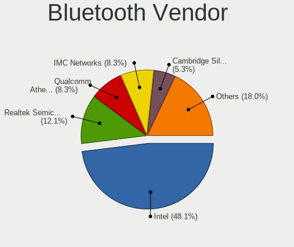

| Vendor                          | Computers | Percent |
|---------------------------------|-----------|---------|
| Intel                           | 65        | 46.76%  |
| Realtek Semiconductor           | 15        | 10.79%  |
| Qualcomm Atheros Communications | 15        | 10.79%  |
| Cambridge Silicon Radio         | 10        | 7.19%   |
| IMC Networks                    | 8         | 5.76%   |
| Toshiba                         | 7         | 5.04%   |
| Broadcom                        | 4         | 2.88%   |
| Lite-On Technology              | 3         | 2.16%   |
| Foxconn / Hon Hai               | 3         | 2.16%   |
| Apple                           | 3         | 2.16%   |
| Ralink                          | 2         | 1.44%   |
| TP-Link                         | 1         | 0.72%   |
| Ralink Technology               | 1         | 0.72%   |
| Foxconn International           | 1         | 0.72%   |
| Alps Electric                   | 1         | 0.72%   |

Bluetooth Model
---------------

Controller models

| Model                                               | Computers | Percent |
|-----------------------------------------------------|-----------|---------|
| Intel Bluetooth wireless interface                  | 43        | 30.94%  |
| Qualcomm Atheros  Bluetooth Device                  | 11        | 7.91%   |
| Cambridge Silicon Radio Bluetooth Dongle (HCI mode) | 10        | 7.19%   |
| Realtek  Bluetooth 4.2 Adapter                      | 8         | 5.76%   |
| Intel AX200 Bluetooth                               | 7         | 5.04%   |
| Intel Bluetooth 9460/9560 Jefferson Peak (JfP)      | 6         | 4.32%   |
| Realtek Bluetooth Radio                             | 5         | 3.6%    |
| Toshiba Bluetooth Device                            | 3         | 2.16%   |
| Toshiba BCM43142A0                                  | 3         | 2.16%   |
| Qualcomm Atheros AR3012 Bluetooth 4.0               | 3         | 2.16%   |
| Intel AX201 Bluetooth                               | 3         | 2.16%   |
| IMC Networks Bluetooth Radio                        | 3         | 2.16%   |
| Apple Bluetooth USB Host Controller                 | 3         | 2.16%   |
| Ralink RT3290 Bluetooth                             | 2         | 1.44%   |
| Lite-On Atheros AR3012 Bluetooth                    | 2         | 1.44%   |
| Intel Wireless-AC 3168 Bluetooth                    | 2         | 1.44%   |
| Intel Centrino Bluetooth Wireless Transceiver       | 2         | 1.44%   |
| Intel Centrino Advanced-N 6230 Bluetooth adapter    | 2         | 1.44%   |
| TP-Link UB500 Adapter                               | 1         | 0.72%   |
| Toshiba Bluetooth Radio                             | 1         | 0.72%   |
| Realtek RTL8822BE Bluetooth 4.2 Adapter             | 1         | 0.72%   |
| Realtek RTL8723B Bluetooth                          | 1         | 0.72%   |
| Ralink Motorola BC4 Bluetooth 3.0+HS Adapter        | 1         | 0.72%   |
| Qualcomm Atheros AR3011 Bluetooth                   | 1         | 0.72%   |
| Lite-On Bluetooth Device                            | 1         | 0.72%   |
| IMC Networks Wireless_Device                        | 1         | 0.72%   |
| IMC Networks Bluetooth Device                       | 1         | 0.72%   |
| IMC Networks Bluetooth                              | 1         | 0.72%   |
| IMC Networks Atheros AR3012 Bluetooth 4.0 Adapter   | 1         | 0.72%   |
| IMC Networks Atheros AR3012 Bluetooth               | 1         | 0.72%   |
| Foxconn International BCM43142A0 Bluetooth module   | 1         | 0.72%   |
| Foxconn / Hon Hai Wireless_Device                   | 1         | 0.72%   |
| Foxconn / Hon Hai Bluetooth Device                  | 1         | 0.72%   |
| Foxconn / Hon Hai BCM43142A0                        | 1         | 0.72%   |
| Broadcom BCM43142A0 Bluetooth 4.0                   | 1         | 0.72%   |
| Broadcom BCM43142 Bluetooth 4.0                     | 1         | 0.72%   |
| Broadcom BCM2070 Bluetooth Device                   | 1         | 0.72%   |
| Broadcom BCM2070 Bluetooth 2.1 + EDR                | 1         | 0.72%   |
| Alps Electric UGTZ4 Bluetooth                       | 1         | 0.72%   |

Sound
-----

Sound Vendor
------------

Sound card vendors

| Vendor                               | Computers | Percent |
|--------------------------------------|-----------|---------|
| Intel                                | 166       | 53.72%  |
| AMD                                  | 65        | 21.04%  |
| Nvidia                               | 48        | 15.53%  |
| Logitech                             | 8         | 2.59%   |
| C-Media Electronics                  | 3         | 0.97%   |
| VIA Technologies                     | 2         | 0.65%   |
| Texas Instruments                    | 2         | 0.65%   |
| Samson Technologies                  | 2         | 0.65%   |
| Generalplus Technology               | 2         | 0.65%   |
| Creative Labs                        | 2         | 0.65%   |
| Thesycon Systemsoftware & Consulting | 1         | 0.32%   |
| Silicon Integrated Systems [SiS]     | 1         | 0.32%   |
| Rockwell International               | 1         | 0.32%   |
| KTMicro                              | 1         | 0.32%   |
| Kingston Technology                  | 1         | 0.32%   |
| JMTek                                | 1         | 0.32%   |
| Focusrite-Novation                   | 1         | 0.32%   |
| Elgato Systems                       | 1         | 0.32%   |
| Creative Technology                  | 1         | 0.32%   |

Sound Model
-----------

Sound card models

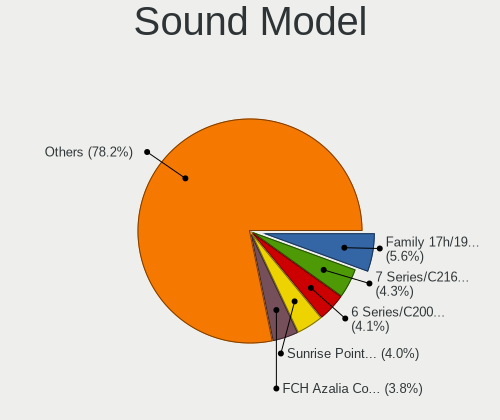

| Model                                                                                             | Computers | Percent |
|---------------------------------------------------------------------------------------------------|-----------|---------|
| Intel Celeron N3350/Pentium N4200/Atom E3900 Series Audio Cluster                                 | 20        | 5.24%   |
| AMD FCH Azalia Controller                                                                         | 18        | 4.71%   |
| AMD Family 17h/19h HD Audio Controller                                                            | 18        | 4.71%   |
| Intel 7 Series/C216 Chipset Family High Definition Audio Controller                               | 16        | 4.19%   |
| Intel 6 Series/C200 Series Chipset Family High Definition Audio Controller                        | 15        | 3.93%   |
| Intel Sunrise Point-LP HD Audio                                                                   | 14        | 3.66%   |
| Intel Atom/Celeron/Pentium Processor x5-E8000/J3xxx/N3xxx Series High Definition Audio Controller | 11        | 2.88%   |
| AMD Kabini HDMI/DP Audio                                                                          | 11        | 2.88%   |
| Intel 8 Series/C220 Series Chipset High Definition Audio Controller                               | 9         | 2.36%   |
| AMD SBx00 Azalia (Intel HDA)                                                                      | 9         | 2.36%   |
| AMD Raven/Raven2/Fenghuang HDMI/DP Audio Controller                                               | 9         | 2.36%   |
| Intel Xeon E3-1200 v3/4th Gen Core Processor HD Audio Controller                                  | 8         | 2.09%   |
| Intel Cannon Lake PCH cAVS                                                                        | 8         | 2.09%   |
| Intel 5 Series/3400 Series Chipset High Definition Audio                                          | 8         | 2.09%   |
| AMD Renoir Radeon High Definition Audio Controller                                                | 8         | 2.09%   |
| Nvidia High Definition Audio Controller                                                           | 7         | 1.83%   |
| Intel Wildcat Point-LP High Definition Audio Controller                                           | 7         | 1.83%   |
| Intel Broadwell-U Audio Controller                                                                | 7         | 1.83%   |
| AMD Family 15h (Models 60h-6fh) Audio Controller                                                  | 7         | 1.83%   |
| Intel NM10/ICH7 Family High Definition Audio Controller                                           | 6         | 1.57%   |
| Intel Haswell-ULT HD Audio Controller                                                             | 6         | 1.57%   |
| Intel 8 Series HD Audio Controller                                                                | 6         | 1.57%   |
| Intel 100 Series/C230 Series Chipset Family HD Audio Controller                                   | 6         | 1.57%   |
| Nvidia TU106 High Definition Audio Controller                                                     | 5         | 1.31%   |
| Nvidia MCP61 High Definition Audio                                                                | 5         | 1.31%   |
| Nvidia GK208 HDMI/DP Audio Controller                                                             | 5         | 1.31%   |
| Intel Cannon Point-LP High Definition Audio Controller                                            | 4         | 1.05%   |
| Intel Atom Processor Z36xxx/Z37xxx Series High Definition Audio Controller                        | 4         | 1.05%   |
| Intel 82801I (ICH9 Family) HD Audio Controller                                                    | 4         | 1.05%   |
| Intel 200 Series PCH HD Audio                                                                     | 4         | 1.05%   |
| AMD High Definition Audio Controller                                                              | 4         | 1.05%   |
| AMD Family 17h (Models 00h-0fh) HD Audio Controller                                               | 4         | 1.05%   |
| Nvidia TU116 High Definition Audio Controller                                                     | 3         | 0.79%   |
| Nvidia GP106 High Definition Audio Controller                                                     | 3         | 0.79%   |
| Nvidia GM107 High Definition Audio Controller [GeForce 940MX]                                     | 3         | 0.79%   |
| Nvidia GF108 High Definition Audio Controller                                                     | 3         | 0.79%   |
| Logitech H390 headset with microphone                                                             | 3         | 0.79%   |
| Intel Comet Lake PCH-LP cAVS                                                                      | 3         | 0.79%   |
| Intel Comet Lake PCH cAVS                                                                         | 3         | 0.79%   |
| Intel 82801H (ICH8 Family) HD Audio Controller                                                    | 3         | 0.79%   |

Memory
------

Memory Vendor
-------------

Memory module vendors

| Vendor              | Computers | Percent |
|---------------------|-----------|---------|
| Samsung Electronics | 31        | 20.13%  |
| Kingston            | 20        | 12.99%  |
| SK hynix            | 18        | 11.69%  |
| Unknown             | 15        | 9.74%   |
| Micron Technology   | 15        | 9.74%   |
| Crucial             | 13        | 8.44%   |
| Ramaxel Technology  | 7         | 4.55%   |
| Goldkey             | 6         | 3.9%    |
| Elpida              | 4         | 2.6%    |
| A-DATA Technology   | 4         | 2.6%    |
| Patriot             | 3         | 1.95%   |
| Nanya Technology    | 3         | 1.95%   |
| Hikvision           | 3         | 1.95%   |
| Team                | 2         | 1.3%    |
| Corsair             | 2         | 1.3%    |
| Unknown (2C0B)      | 1         | 0.65%   |
| Unknown (0x5846)    | 1         | 0.65%   |
| Smart               | 1         | 0.65%   |
| Netac               | 1         | 0.65%   |
| KLEVV               | 1         | 0.65%   |
| Infineon            | 1         | 0.65%   |
| GeIL                | 1         | 0.65%   |
| Avant               | 1         | 0.65%   |

Memory Model
------------

Memory module models

| Model                                                         | Computers | Percent |
|---------------------------------------------------------------|-----------|---------|
| Goldkey RAM GKH200SO25608-1600 2GB SODIMM DDR3 1600MT/s       | 4         | 2.47%   |
| SK hynix RAM HMT451S6BFR8A-PB 4GB SODIMM DDR3 1600MT/s        | 3         | 1.85%   |
| Samsung RAM M471B5173EB0-YK0 4GB SODIMM DDR3 1600MT/s         | 3         | 1.85%   |
| Samsung RAM M471A5244CB0-CTD 4GB SODIMM DDR4 3266MT/s         | 3         | 1.85%   |
| Kingston RAM KHX3200C16D4/16GX 16GB DIMM DDR4 3600MT/s        | 3         | 1.85%   |
| Unknown RAM Module 8192MB SODIMM DDR3 1600MT/s                | 2         | 1.23%   |
| Unknown RAM Module 2048MB DIMM DDR3 1333MT/s                  | 2         | 1.23%   |
| Samsung RAM Module 8GB SODIMM DDR4 2133MT/s                   | 2         | 1.23%   |
| Samsung RAM M471B5773DH0-CK0 2GB SODIMM DDR3 1600MT/s         | 2         | 1.23%   |
| Samsung RAM M471B5773CHS-CH9 2GB SODIMM DDR3 4199MT/s         | 2         | 1.23%   |
| Ramaxel RAM RMT3170ME68F9F1600 4GB SODIMM DDR3 1600MT/s       | 2         | 1.23%   |
| Micron RAM 8JTF25664AZ-1G4M1 2GB DIMM DDR3 1333MT/s           | 2         | 1.23%   |
| Micron RAM 8ATF1G64HZ-3G2J1 8GB SODIMM DDR4 3200MT/s          | 2         | 1.23%   |
| Goldkey RAM GKH400SO25608-1600 4GB SODIMM DDR3 1600MT/s       | 2         | 1.23%   |
| Elpida RAM EBJ21UE8BFU0-DJ-F 2048MB SODIMM DDR3 1334MT/s      | 2         | 1.23%   |
| Crucial RAM BLS4G3D1609DS1S00. 4GB DIMM DDR3 1600MT/s         | 2         | 1.23%   |
| Unknown RAM Module 8GB DIMM DDR4 2400MT/s                     | 1         | 0.62%   |
| Unknown RAM Module 8GB DIMM DDR3 1333MT/s                     | 1         | 0.62%   |
| Unknown RAM Module 8GB DIMM 1600MT/s                          | 1         | 0.62%   |
| Unknown RAM Module 512MB SODIMM DDR2 533MT/s                  | 1         | 0.62%   |
| Unknown RAM Module 4GB DIMM 1600MT/s                          | 1         | 0.62%   |
| Unknown RAM Module 4096MB DIMM DDR3 1333MT/s                  | 1         | 0.62%   |
| Unknown RAM Module 4096MB DIMM 1333MT/s                       | 1         | 0.62%   |
| Unknown RAM Module 2GB SODIMM DDR3 1333MT/s                   | 1         | 0.62%   |
| Unknown RAM Module 2048MB SODIMM DDR3 1600MT/s                | 1         | 0.62%   |
| Unknown RAM Module 2048MB DIMM 1333MT/s                       | 1         | 0.62%   |
| Unknown RAM Module 1GB DIMM DDR2 533MT/s                      | 1         | 0.62%   |
| Unknown RAM 3200 C18 Series 16384MB DIMM DDR4 2400MT/s        | 1         | 0.62%   |
| Unknown (2C0B) RAM Module 8GB DIMM DDR4 2400MT/s              | 1         | 0.62%   |
| Unknown (0x5846) RAM DDR4 NB 8G 2666 8GB SODIMM DDR4 2667MT/s | 1         | 0.62%   |
| Team RAM TEAMGROUP-UD4-3200 8GB DIMM DDR4 3733MT/s            | 1         | 0.62%   |
| Team RAM Elite-1333 4GB DIMM DDR3 1333MT/s                    | 1         | 0.62%   |
| Smart RAM SM5643285D8N6CHIBH 256MB DIMM DDR 266MT/s           | 1         | 0.62%   |
| SK hynix RAM Module 2GB DIMM DDR3 1333MT/s                    | 1         | 0.62%   |
| SK hynix RAM Module 1GB SODIMM DDR2 533MT/s                   | 1         | 0.62%   |
| SK hynix RAM HMT451S6AFR8A-PB 4GB SODIMM DDR3 1600MT/s        | 1         | 0.62%   |
| SK hynix RAM HMT351S6EFR8A-PB 4GB SODIMM DDR3 1600MT/s        | 1         | 0.62%   |
| SK hynix RAM HMT351S6CFR8C-H9 4GB SODIMM DDR3 1334MT/s        | 1         | 0.62%   |
| SK hynix RAM HMT351S6CFR8A-PB 4GB SODIMM DDR3 1600MT/s        | 1         | 0.62%   |
| SK hynix RAM HMT325U6CFR8C-PB 2GB DIMM DDR3 1600MT/s          | 1         | 0.62%   |

Memory Kind
-----------

Memory module kinds

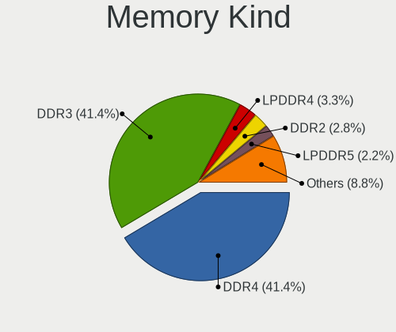

| Kind    | Computers | Percent |
|---------|-----------|---------|
| DDR3    | 63        | 50.81%  |
| DDR4    | 46        | 37.1%   |
| DDR2    | 4         | 3.23%   |
| SDRAM   | 3         | 2.42%   |
| LPDDR3  | 3         | 2.42%   |
| Unknown | 3         | 2.42%   |
| LPDDR4  | 1         | 0.81%   |
| DDR     | 1         | 0.81%   |

Memory Form Factor
------------------

Physical design of the memory module

| Name         | Computers | Percent |
|--------------|-----------|---------|
| SODIMM       | 67        | 55.37%  |
| DIMM         | 49        | 40.5%   |
| Row Of Chips | 5         | 4.13%   |

Memory Size
-----------

Memory module size

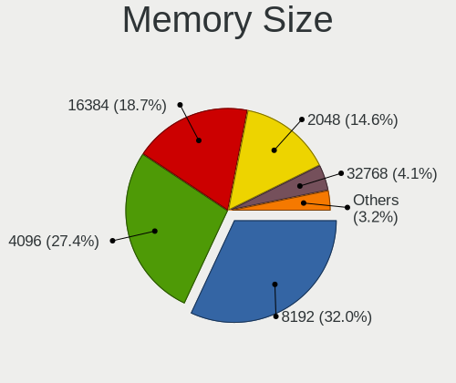

| Size  | Computers | Percent |
|-------|-----------|---------|
| 4096  | 44        | 30.14%  |
| 8192  | 43        | 29.45%  |
| 2048  | 27        | 18.49%  |
| 16384 | 22        | 15.07%  |
| 32768 | 5         | 3.42%   |
| 1024  | 3         | 2.05%   |
| 512   | 1         | 0.68%   |
| 256   | 1         | 0.68%   |

Memory Speed
------------

Memory module speed

| Speed | Computers | Percent |
|-------|-----------|---------|
| 1600  | 47        | 32.87%  |
| 2667  | 21        | 14.69%  |
| 1333  | 15        | 10.49%  |
| 3200  | 9         | 6.29%   |
| 2400  | 8         | 5.59%   |
| 2133  | 6         | 4.2%    |
| 1334  | 5         | 3.5%    |
| 3600  | 4         | 2.8%    |
| 533   | 4         | 2.8%    |
| 3266  | 3         | 2.1%    |
| 1867  | 3         | 2.1%    |
| 4199  | 2         | 1.4%    |
| 3800  | 2         | 1.4%    |
| 3000  | 2         | 1.4%    |
| 1067  | 2         | 1.4%    |
| 3733  | 1         | 0.7%    |
| 3500  | 1         | 0.7%    |
| 3466  | 1         | 0.7%    |
| 3400  | 1         | 0.7%    |
| 2666  | 1         | 0.7%    |
| 2176  | 1         | 0.7%    |
| 1866  | 1         | 0.7%    |
| 1066  | 1         | 0.7%    |
| 333   | 1         | 0.7%    |
| 266   | 1         | 0.7%    |

Printers & scanners
-------------------

Printer Vendor
--------------

Printer device vendors

| Vendor              | Computers | Percent |
|---------------------|-----------|---------|
| Xerox               | 1         | 33.33%  |
| Samsung Electronics | 1         | 33.33%  |
| Brother Industries  | 1         | 33.33%  |

Printer Model
-------------

Printer device models

| Model                | Computers | Percent |
|----------------------|-----------|---------|
| Xerox Phaser 3040    | 1         | 25%     |
| Samsung M288x Series | 1         | 25%     |
| Brother DCP-T500W    | 1         | 25%     |
| Brother DCP-T420W    | 1         | 25%     |

Scanner Vendor
--------------

Scanner device vendors

| Vendor | Computers | Percent |
|--------|-----------|---------|
| Canon  | 1         | 100%    |

Scanner Model
-------------

Scanner device models

| Model                   | Computers | Percent |
|-------------------------|-----------|---------|
| Canon CanoScan LiDE 110 | 1         | 100%    |

Camera
------

Camera Vendor
-------------

Camera device vendors

| Vendor                                 | Computers | Percent |
|----------------------------------------|-----------|---------|
| Chicony Electronics                    | 39        | 25.49%  |
| Realtek Semiconductor                  | 15        | 9.8%    |
| Cheng Uei Precision Industry (Foxlink) | 14        | 9.15%   |
| Acer                                   | 9         | 5.88%   |
| Sunplus Innovation Technology          | 8         | 5.23%   |
| Microdia                               | 8         | 5.23%   |
| Logitech                               | 8         | 5.23%   |
| Suyin                                  | 7         | 4.58%   |
| Unknown                                | 6         | 3.92%   |
| Silicon Motion                         | 4         | 2.61%   |
| IMC Networks                           | 4         | 2.61%   |
| Bison Electronics                      | 4         | 2.61%   |
| Syntek                                 | 3         | 1.96%   |
| Quanta                                 | 3         | 1.96%   |
| Importek                               | 3         | 1.96%   |
| Apple                                  | 3         | 1.96%   |
| Alcor Micro                            | 3         | 1.96%   |
| Samsung Electronics                    | 2         | 1.31%   |
| Lite-On Technology                     | 2         | 1.31%   |
| Sony                                   | 1         | 0.65%   |
| Primax Electronics                     | 1         | 0.65%   |
| Novatek Microelectronics               | 1         | 0.65%   |
| Luxvisions Innotech Limited            | 1         | 0.65%   |
| GEMBIRD                                | 1         | 0.65%   |
| DigiTech                               | 1         | 0.65%   |
| Aveo Technology                        | 1         | 0.65%   |
| A4Tech                                 | 1         | 0.65%   |

Camera Model
------------

Camera device models

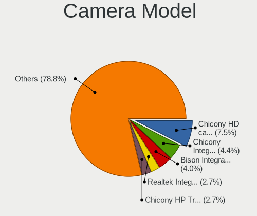

| Model                                                          | Computers | Percent |
|----------------------------------------------------------------|-----------|---------|
| Chicony HD camera                                              | 16        | 10.46%  |
| Acer Integrated Camera                                         | 6         | 3.92%   |
| Unknown USB Camera                                             | 5         | 3.27%   |
| Chicony Integrated Camera                                      | 5         | 3.27%   |
| Chicony HP Truevision HD                                       | 5         | 3.27%   |
| Realtek Integrated_Webcam_HD                                   | 4         | 2.61%   |
| Microdia Integrated_Webcam_HD                                  | 4         | 2.61%   |
| Chicony TOSHIBA Web Camera - HD                                | 4         | 2.61%   |
| Realtek Lenovo EasyCamera                                      | 3         | 1.96%   |
| Logitech Webcam C270                                           | 3         | 1.96%   |
| Cheng Uei Precision Industry (Foxlink) HP Webcam               | 3         | 1.96%   |
| Cheng Uei Precision Industry (Foxlink) HP TrueVision HD Camera | 3         | 1.96%   |
| Syntek Integrated Camera                                       | 2         | 1.31%   |
| Silicon Motion WebCam SC-0311139N                              | 2         | 1.31%   |
| Samsung Galaxy series, misc. (MTP mode)                        | 2         | 1.31%   |
| Realtek Integrated Webcam HD                                   | 2         | 1.31%   |
| Quanta HP TrueVision HD Camera                                 | 2         | 1.31%   |
| Importek TOSHIBA Web Camera                                    | 2         | 1.31%   |
| IMC Networks USB2.0 HD UVC WebCam                              | 2         | 1.31%   |
| Chicony USB2.0 VGA UVC WebCam                                  | 2         | 1.31%   |
| Chicony HD WebCam                                              | 2         | 1.31%   |
| Cheng Uei Precision Industry (Foxlink) HP Truevision HD        | 2         | 1.31%   |
| Cheng Uei Precision Industry (Foxlink) HP HD Camera            | 2         | 1.31%   |
| Apple iPhone 5/5C/5S/6/SE/7/8/X                                | 2         | 1.31%   |
| Acer Lenovo EasyCamera                                         | 2         | 1.31%   |
| Unknown HD camera                                              | 1         | 0.65%   |
| Syntek EasyCamera                                              | 1         | 0.65%   |
| Suyin VGA Webcam                                               | 1         | 0.65%   |
| Suyin HP Truevision HD                                         | 1         | 0.65%   |
| Suyin HP Integrated Webcam                                     | 1         | 0.65%   |
| Suyin HD WebCam                                                | 1         | 0.65%   |
| Suyin Asus Integrated Webcam                                   | 1         | 0.65%   |
| Suyin Acer/HP Integrated Webcam [CN0314]                       | 1         | 0.65%   |
| Suyin 1.3M WebCam (notebook emachines E730, Acer sub-brand)    | 1         | 0.65%   |
| Sunplus MTD camera                                             | 1         | 0.65%   |
| Sunplus Laptop Integrated Webcam HD                            | 1         | 0.65%   |
| Sunplus Laptop Integrated Webcam FHD                           | 1         | 0.65%   |
| Sunplus HP Wide Vision HD                                      | 1         | 0.65%   |
| Sunplus HP TrueVision HD Camera                                | 1         | 0.65%   |
| Sunplus HD Webcam                                              | 1         | 0.65%   |

Security
--------

Fingerprint Vendor
------------------

Fingerprint sensor vendors

| Vendor                     | Computers | Percent |
|----------------------------|-----------|---------|
| Validity Sensors           | 7         | 41.18%  |
| Shenzhen Goodix Technology | 3         | 17.65%  |
| Elan Microelectronics      | 2         | 11.76%  |
| Upek                       | 1         | 5.88%   |
| Synaptics                  | 1         | 5.88%   |
| LighTuning Technology      | 1         | 5.88%   |
| Focal-systems.Corp         | 1         | 5.88%   |
| AuthenTec                  | 1         | 5.88%   |

Fingerprint Model
-----------------

Fingerprint sensor models

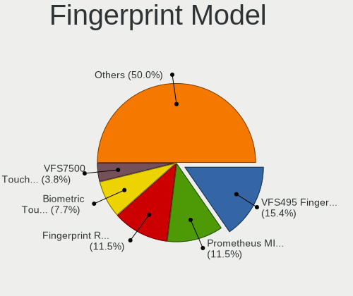

| Model                                                  | Computers | Percent |
|--------------------------------------------------------|-----------|---------|
| Validity Sensors VFS495 Fingerprint Reader             | 3         | 17.65%  |
| Shenzhen Goodix Fingerprint Reader                     | 3         | 17.65%  |
| Elan ELAN:Fingerprint                                  | 2         | 11.76%  |
| Validity Sensors VFS7500 Touch Fingerprint Sensor      | 1         | 5.88%   |
| Validity Sensors VFS5011 Fingerprint Reader            | 1         | 5.88%   |
| Validity Sensors Swipe Fingerprint Sensor              | 1         | 5.88%   |
| Validity Sensors Fingerprint scanner                   | 1         | 5.88%   |
| Upek Biometric Touchchip/Touchstrip Fingerprint Sensor | 1         | 5.88%   |
| Synaptics Prometheus MIS Touch Fingerprint Reader      | 1         | 5.88%   |
| LighTuning EgisTec Touch Fingerprint Sensor            | 1         | 5.88%   |
| Focal-systems.Corp FT9201Fingerprint.                  | 1         | 5.88%   |
| AuthenTec Fingerprint Sensor                           | 1         | 5.88%   |

Chipcard Vendor
---------------

Chipcard module vendors

| Vendor      | Computers | Percent |
|-------------|-----------|---------|
| Broadcom    | 2         | 66.67%  |
| Alcor Micro | 1         | 33.33%  |

Chipcard Model
--------------

Chipcard module models

| Model                               | Computers | Percent |
|-------------------------------------|-----------|---------|
| Broadcom 5880                       | 1         | 33.33%  |
| Broadcom 58200                      | 1         | 33.33%  |
| Alcor Micro AU9540 Smartcard Reader | 1         | 33.33%  |

Unsupported
-----------

Unsupported Devices
-------------------

Total unsupported devices on board

| Total | Computers | Percent |
|-------|-----------|---------|
| 0     | 193       | 78.14%  |
| 1     | 50        | 20.24%  |
| 2     | 3         | 1.21%   |
| 3     | 1         | 0.4%    |

Unsupported Device Types
------------------------

Types of unsupported devices

| Type                     | Computers | Percent |
|--------------------------|-----------|---------|
| Fingerprint reader       | 16        | 27.59%  |
| Net/wireless             | 14        | 24.14%  |
| Graphics card            | 12        | 20.69%  |
| Multimedia controller    | 6         | 10.34%  |
| Chipcard                 | 3         | 5.17%   |
| Bluetooth                | 2         | 3.45%   |
| Unassigned class         | 1         | 1.72%   |
| Storage                  | 1         | 1.72%   |
| Sound                    | 1         | 1.72%   |
| Modem                    | 1         | 1.72%   |
| Communication controller | 1         | 1.72%   |

