Linux in Venezuela - Tested Hardware & Statistics (Desktops)
------------------------------------------------------------

A project to collect tested hardware configurations for Linux in Venezuela.

Anyone can contribute to this report by the [hw-probe](https://github.com/linuxhw/hw-probe) tool:

    sudo -E hw-probe -all -upload

Please contribute! Especially if your hardware is rare.

Contents
--------

* [ Test Cases ](#test-cases)

* [ System ](#system)
  - [ OS                       ](#os)
  - [ OS Family                ](#os-family)
  - [ Kernel                   ](#kernel)
  - [ Kernel Family            ](#kernel-family)
  - [ Kernel Major Ver.        ](#kernel-major-ver)
  - [ Arch                     ](#arch)
  - [ DE                       ](#de)
  - [ Display Server           ](#display-server)
  - [ Display Manager          ](#display-manager)
  - [ OS Lang                  ](#os-lang)
  - [ Boot Mode                ](#boot-mode)
  - [ Filesystem               ](#filesystem)
  - [ Part. scheme             ](#part-scheme)
  - [ Dual Boot with Linux/BSD ](#dual-boot-with-linuxbsd)
  - [ Dual Boot (Win)          ](#dual-boot-win)

* [ Board ](#board)
  - [ Vendor                   ](#vendor)
  - [ Model                    ](#model)
  - [ Model Family             ](#model-family)
  - [ MFG Year                 ](#mfg-year)
  - [ Form Factor              ](#form-factor)
  - [ Secure Boot              ](#secure-boot)
  - [ Coreboot                 ](#coreboot)
  - [ RAM Size                 ](#ram-size)
  - [ RAM Used                 ](#ram-used)
  - [ Total Drives             ](#total-drives)
  - [ Has CD-ROM               ](#has-cd-rom)
  - [ Has Ethernet             ](#has-ethernet)
  - [ Has WiFi                 ](#has-wifi)
  - [ Has Bluetooth            ](#has-bluetooth)

* [ Location ](#location)
  - [ Country                  ](#country)
  - [ City                     ](#city)

* [ Drives ](#drives)
  - [ Drive Vendor             ](#drive-vendor)
  - [ Drive Model              ](#drive-model)
  - [ HDD Vendor               ](#hdd-vendor)
  - [ SSD Vendor               ](#ssd-vendor)
  - [ Drive Kind               ](#drive-kind)
  - [ Drive Connector          ](#drive-connector)
  - [ Drive Size               ](#drive-size)
  - [ Space Total              ](#space-total)
  - [ Space Used               ](#space-used)
  - [ Malfunc. Drives          ](#malfunc-drives)
  - [ Malfunc. Drive Vendor    ](#malfunc-drive-vendor)
  - [ Malfunc. HDD Vendor      ](#malfunc-hdd-vendor)
  - [ Malfunc. Drive Kind      ](#malfunc-drive-kind)
  - [ Failed Drives            ](#failed-drives)
  - [ Failed Drive Vendor      ](#failed-drive-vendor)
  - [ Drive Status             ](#drive-status)

* [ Storage controller ](#storage-controller)
  - [ Storage Vendor           ](#storage-vendor)
  - [ Storage Model            ](#storage-model)
  - [ Storage Kind             ](#storage-kind)

* [ Processor ](#processor)
  - [ CPU Vendor               ](#cpu-vendor)
  - [ CPU Model                ](#cpu-model)
  - [ CPU Model Family         ](#cpu-model-family)
  - [ CPU Cores                ](#cpu-cores)
  - [ CPU Sockets              ](#cpu-sockets)
  - [ CPU Threads              ](#cpu-threads)
  - [ CPU Op-Modes             ](#cpu-op-modes)
  - [ CPU Microcode            ](#cpu-microcode)
  - [ CPU Microarch            ](#cpu-microarch)

* [ Graphics ](#graphics)
  - [ GPU Vendor               ](#gpu-vendor)
  - [ GPU Model                ](#gpu-model)
  - [ GPU Combo                ](#gpu-combo)
  - [ GPU Driver               ](#gpu-driver)
  - [ GPU Memory               ](#gpu-memory)

* [ Monitor ](#monitor)
  - [ Monitor Vendor           ](#monitor-vendor)
  - [ Monitor Model            ](#monitor-model)
  - [ Monitor Resolution       ](#monitor-resolution)
  - [ Monitor Diagonal         ](#monitor-diagonal)
  - [ Monitor Width            ](#monitor-width)
  - [ Aspect Ratio             ](#aspect-ratio)
  - [ Monitor Area             ](#monitor-area)
  - [ Pixel Density            ](#pixel-density)
  - [ Multiple Monitors        ](#multiple-monitors)

* [ Network ](#network)
  - [ Net Controller Vendor    ](#net-controller-vendor)
  - [ Net Controller Model     ](#net-controller-model)
  - [ Wireless Vendor          ](#wireless-vendor)
  - [ Wireless Model           ](#wireless-model)
  - [ Ethernet Vendor          ](#ethernet-vendor)
  - [ Ethernet Model           ](#ethernet-model)
  - [ Net Controller Kind      ](#net-controller-kind)
  - [ Used Controller          ](#used-controller)
  - [ NICs                     ](#nics)
  - [ IPv6                     ](#ipv6)

* [ Bluetooth ](#bluetooth)
  - [ Bluetooth Vendor         ](#bluetooth-vendor)
  - [ Bluetooth Model          ](#bluetooth-model)

* [ Sound ](#sound)
  - [ Sound Vendor             ](#sound-vendor)
  - [ Sound Model              ](#sound-model)

* [ Memory ](#memory)
  - [ Memory Vendor            ](#memory-vendor)
  - [ Memory Model             ](#memory-model)
  - [ Memory Kind              ](#memory-kind)
  - [ Memory Form Factor       ](#memory-form-factor)
  - [ Memory Size              ](#memory-size)
  - [ Memory Speed             ](#memory-speed)

* [ Printers & scanners ](#printers--scanners)
  - [ Printer Vendor           ](#printer-vendor)
  - [ Printer Model            ](#printer-model)
  - [ Scanner Vendor           ](#scanner-vendor)
  - [ Scanner Model            ](#scanner-model)

* [ Camera ](#camera)
  - [ Camera Vendor            ](#camera-vendor)
  - [ Camera Model             ](#camera-model)

* [ Security ](#security)
  - [ Fingerprint Vendor       ](#fingerprint-vendor)
  - [ Fingerprint Model        ](#fingerprint-model)
  - [ Chipcard Vendor          ](#chipcard-vendor)
  - [ Chipcard Model           ](#chipcard-model)

* [ Unsupported ](#unsupported)
  - [ Unsupported Devices      ](#unsupported-devices)
  - [ Unsupported Device Types ](#unsupported-device-types)

Test Cases
----------

Total: 460

| Vendor   | Model                       | Probe                                                      | Date         |
|----------|-----------------------------|------------------------------------------------------------|--------------|
| Dell     | 0M9KCM A00                  | [864df65a57](https://linux-hardware.org/?probe=864df65a57) | Jan 03, 2026 |
| JGINYUE  | X99M GAMING D4/ARGB V2.1    | [393c4f4fae](https://linux-hardware.org/?probe=393c4f4fae) | Dec 21, 2025 |
| Biostar  | A520MHP                     | [7d41d5e71c](https://linux-hardware.org/?probe=7d41d5e71c) | Dec 19, 2025 |
| Biostar  | A520MHP                     | [3ed2f518d3](https://linux-hardware.org/?probe=3ed2f518d3) | Dec 19, 2025 |
| Biostar  | H61MGV3                     | [d19e951ae0](https://linux-hardware.org/?probe=d19e951ae0) | Dec 10, 2025 |
| Biostar  | H61MGV3                     | [9ba348b79b](https://linux-hardware.org/?probe=9ba348b79b) | Dec 10, 2025 |
| Intel    | H61                         | [0ffd0a3ece](https://linux-hardware.org/?probe=0ffd0a3ece) | Dec 07, 2025 |
| Dell     | 03NVJ6 A01                  | [456e0cc198](https://linux-hardware.org/?probe=456e0cc198) | Dec 05, 2025 |
| Dell     | 0VHXCD A01                  | [21709989c4](https://linux-hardware.org/?probe=21709989c4) | Nov 28, 2025 |
| HP       | 3646h                       | [0f60ba194a](https://linux-hardware.org/?probe=0f60ba194a) | Nov 27, 2025 |
| Dell     | 0VHXCD A01                  | [6c81105476](https://linux-hardware.org/?probe=6c81105476) | Nov 24, 2025 |
| Foxconn  | A74MX-S/A74MX-K             | [d86e6f4e5e](https://linux-hardware.org/?probe=d86e6f4e5e) | Nov 16, 2025 |
| ASUSTek  | PRIME B250M-C               | [c366671f4a](https://linux-hardware.org/?probe=c366671f4a) | Nov 12, 2025 |
| Lenovo   | ThinkCentre A58 7515A33     | [7563257e2c](https://linux-hardware.org/?probe=7563257e2c) | Nov 11, 2025 |
| Intel    | H61                         | [5da2620c2b](https://linux-hardware.org/?probe=5da2620c2b) | Nov 07, 2025 |
| ASRock   | N68C-S UCC                  | [57be21485a](https://linux-hardware.org/?probe=57be21485a) | Nov 03, 2025 |
| ASRock   | H110M-HDV R3.0              | [397b339076](https://linux-hardware.org/?probe=397b339076) | Nov 01, 2025 |
| ASUSTek  | PRIME Z390-A                | [37669f2443](https://linux-hardware.org/?probe=37669f2443) | Oct 27, 2025 |
| Intel    | H61                         | [fe817c094e](https://linux-hardware.org/?probe=fe817c094e) | Oct 25, 2025 |
| ECS      | H77H2-EM                    | [8d4738790b](https://linux-hardware.org/?probe=8d4738790b) | Oct 25, 2025 |
| Dell     | 0T7D40 A01                  | [453b4d9149](https://linux-hardware.org/?probe=453b4d9149) | Oct 20, 2025 |
| Dell     | 0478VN A00                  | [40ccbb1ce1](https://linux-hardware.org/?probe=40ccbb1ce1) | Oct 20, 2025 |
| Dell     | 06D7TR A00                  | [4dbdb5fb9d](https://linux-hardware.org/?probe=4dbdb5fb9d) | Oct 18, 2025 |
| Biostar  | A780L3B                     | [a28fad1fd3](https://linux-hardware.org/?probe=a28fad1fd3) | Oct 17, 2025 |
| ASUSTek  | PRIME B250M-C               | [7f716623a2](https://linux-hardware.org/?probe=7f716623a2) | Oct 12, 2025 |
| Lenovo   | MAHOBAY NO DPK              | [53ea16a521](https://linux-hardware.org/?probe=53ea16a521) | Oct 07, 2025 |
| HP       | 1905                        | [a5322407cd](https://linux-hardware.org/?probe=a5322407cd) | Oct 06, 2025 |
| ECS      | H77H2-EM                    | [f5dbaf25b9](https://linux-hardware.org/?probe=f5dbaf25b9) | Oct 05, 2025 |
| HP       | 3047h                       | [d7ce1c9c31](https://linux-hardware.org/?probe=d7ce1c9c31) | Sep 28, 2025 |
| HP       | 1632                        | [00ed9072b8](https://linux-hardware.org/?probe=00ed9072b8) | Sep 23, 2025 |
| HP       | 1632                        | [b037ec4134](https://linux-hardware.org/?probe=b037ec4134) | Sep 23, 2025 |
| Intel    | H61                         | [d67dea4dee](https://linux-hardware.org/?probe=d67dea4dee) | Sep 21, 2025 |
| Intel    | H61                         | [567598414f](https://linux-hardware.org/?probe=567598414f) | Sep 21, 2025 |
| ECS      | H61H2-CM                    | [d881771c43](https://linux-hardware.org/?probe=d881771c43) | Sep 21, 2025 |
| HP       | 1632                        | [06796c3574](https://linux-hardware.org/?probe=06796c3574) | Sep 20, 2025 |
| Lenovo   | SKYBAY SDK0J40705 WIN 34... | [af06c0b6b1](https://linux-hardware.org/?probe=af06c0b6b1) | Sep 18, 2025 |
| Lenovo   | ThinkCentre A57 9702AB7     | [24b214202f](https://linux-hardware.org/?probe=24b214202f) | Sep 18, 2025 |
| ASRock   | 960GC-GS FX                 | [d0a6aa5dfe](https://linux-hardware.org/?probe=d0a6aa5dfe) | Sep 15, 2025 |
| Lenovo   | 3098                        | [f2d565d1d6](https://linux-hardware.org/?probe=f2d565d1d6) | Sep 11, 2025 |
| ECS      | H61H2-CM                    | [9b479b22f4](https://linux-hardware.org/?probe=9b479b22f4) | Sep 05, 2025 |
| Unknown  | Unknown                     | [6481efee4c](https://linux-hardware.org/?probe=6481efee4c) | Sep 04, 2025 |
| HP       | 82A2                        | [60418cab31](https://linux-hardware.org/?probe=60418cab31) | Sep 03, 2025 |
| Dell     | 0WR7PY A01                  | [5ab4499def](https://linux-hardware.org/?probe=5ab4499def) | Aug 28, 2025 |
| Dell     | 05XGC8 A01                  | [18b7b065f7](https://linux-hardware.org/?probe=18b7b065f7) | Aug 11, 2025 |
| HP       | 0A5Ch                       | [ff7c5c8326](https://linux-hardware.org/?probe=ff7c5c8326) | Aug 06, 2025 |
| HP       | 0A5Ch                       | [9bfdcb288b](https://linux-hardware.org/?probe=9bfdcb288b) | Aug 06, 2025 |
| HP       | 0A60h                       | [1feddbe07f](https://linux-hardware.org/?probe=1feddbe07f) | Aug 06, 2025 |
| langchao | IPM41-D3                    | [6ae1a79d4b](https://linux-hardware.org/?probe=6ae1a79d4b) | Jul 30, 2025 |
| Biostar  | G31D-M7                     | [8341abe0b2](https://linux-hardware.org/?probe=8341abe0b2) | Jul 24, 2025 |
| ECS      | P43G                        | [399e8e60fa](https://linux-hardware.org/?probe=399e8e60fa) | Jul 22, 2025 |
| Foxconn  | 2ABF                        | [b246a7a350](https://linux-hardware.org/?probe=b246a7a350) | Jul 21, 2025 |
| langchao | 12345                       | [76546a99e2](https://linux-hardware.org/?probe=76546a99e2) | Jul 21, 2025 |
| HP       | 8265                        | [22575b8a34](https://linux-hardware.org/?probe=22575b8a34) | Jul 19, 2025 |
| Dell     | 0FDY5C A00                  | [932b1448fe](https://linux-hardware.org/?probe=932b1448fe) | Jul 17, 2025 |
| Biostar  | N68S3B                      | [747eeb7a79](https://linux-hardware.org/?probe=747eeb7a79) | Jul 09, 2025 |
| Biostar  | N68S3B                      | [5ecb6e52f5](https://linux-hardware.org/?probe=5ecb6e52f5) | Jul 08, 2025 |
| Biostar  | H61MHV3                     | [d01a56645d](https://linux-hardware.org/?probe=d01a56645d) | Jul 05, 2025 |
| Dell     | 0NW6H5 A00                  | [4a933f1452](https://linux-hardware.org/?probe=4a933f1452) | Jul 04, 2025 |
| Biostar  | H61MHV3                     | [fa26376abf](https://linux-hardware.org/?probe=fa26376abf) | Jul 03, 2025 |
| Lenovo   | 3098                        | [9cf48cc19d](https://linux-hardware.org/?probe=9cf48cc19d) | Jun 30, 2025 |
| Dell     | 0N4YC8 A00                  | [2a4025a763](https://linux-hardware.org/?probe=2a4025a763) | Jun 29, 2025 |
| Dell     | 0N4YC8 A00                  | [251caa7aa3](https://linux-hardware.org/?probe=251caa7aa3) | Jun 29, 2025 |
| langchao | IPM41-D3                    | [9081a50f70](https://linux-hardware.org/?probe=9081a50f70) | Jun 27, 2025 |
| ASRock   | AM2NF6G-VSTA                | [1c270e181a](https://linux-hardware.org/?probe=1c270e181a) | Jun 22, 2025 |
| ASRock   | AM2NF6G-VSTA                | [c7a89953e3](https://linux-hardware.org/?probe=c7a89953e3) | Jun 20, 2025 |
| Lenovo   | SHARKBAY 0B98401 WIN        | [9d4ccb3bcc](https://linux-hardware.org/?probe=9d4ccb3bcc) | Jun 15, 2025 |
| Lenovo   | ThinkCentre M72e 3597A56    | [e62e0c4961](https://linux-hardware.org/?probe=e62e0c4961) | Jun 10, 2025 |
| ECS      | H61H2-CM                    | [9541786163](https://linux-hardware.org/?probe=9541786163) | Jun 09, 2025 |
| Lenovo   | ThinkCentre A58 7515A47     | [c8ca3c3f65](https://linux-hardware.org/?probe=c8ca3c3f65) | Jun 06, 2025 |
| Dell     | 0M9KCM A00                  | [cba692129f](https://linux-hardware.org/?probe=cba692129f) | Jun 06, 2025 |
| Inspur   | ST1020M4                    | [5efbd59fe5](https://linux-hardware.org/?probe=5efbd59fe5) | Jun 04, 2025 |
| Dell     | 088DT1 A01                  | [5f4c5a9314](https://linux-hardware.org/?probe=5f4c5a9314) | Jun 02, 2025 |
| Dell     | 0F3KHR A00                  | [19915fbad5](https://linux-hardware.org/?probe=19915fbad5) | Jun 01, 2025 |
| ASUSTek  | P8H61-M LE/CSM R2.0         | [7703fbf09d](https://linux-hardware.org/?probe=7703fbf09d) | May 26, 2025 |
| Lenovo   | 312A SDK0J40697 WIN 3305... | [25be2ab8a0](https://linux-hardware.org/?probe=25be2ab8a0) | May 21, 2025 |
| HP       | 8054                        | [a694496054](https://linux-hardware.org/?probe=a694496054) | May 17, 2025 |
| HP       | 8299                        | [b6fafbd173](https://linux-hardware.org/?probe=b6fafbd173) | May 16, 2025 |
| Lenovo   | 3102 SDK0J40697 WIN 3305... | [3a1a177bf9](https://linux-hardware.org/?probe=3a1a177bf9) | May 14, 2025 |
| Gigabyte | H61M-DS2                    | [dc3af083dc](https://linux-hardware.org/?probe=dc3af083dc) | May 03, 2025 |
| Dell     | 0D28YY A00                  | [4e746e5bbc](https://linux-hardware.org/?probe=4e746e5bbc) | Apr 27, 2025 |
| Intel    | H61                         | [681fdc570a](https://linux-hardware.org/?probe=681fdc570a) | Apr 27, 2025 |
| Intel    | H61                         | [24f02a9901](https://linux-hardware.org/?probe=24f02a9901) | Apr 27, 2025 |
| Lenovo   | ThinkServer TS140           | [50b6de9558](https://linux-hardware.org/?probe=50b6de9558) | Apr 25, 2025 |
| Gigabyte | H61M-DS2                    | [1de6267a2c](https://linux-hardware.org/?probe=1de6267a2c) | Apr 19, 2025 |
| ASUSTek  | H81M-A                      | [a0bde2a6dd](https://linux-hardware.org/?probe=a0bde2a6dd) | Apr 15, 2025 |
| Biostar  | G31-M7 TE                   | [3954c3e085](https://linux-hardware.org/?probe=3954c3e085) | Apr 12, 2025 |
| Dell     | 0GXM1W A02                  | [8999687bf2](https://linux-hardware.org/?probe=8999687bf2) | Apr 08, 2025 |
| Biostar  | G31-M7 TE                   | [51e2e5ab72](https://linux-hardware.org/?probe=51e2e5ab72) | Apr 05, 2025 |
| ARKTEK   | H110 Ver:2.33               | [33064020d9](https://linux-hardware.org/?probe=33064020d9) | Mar 31, 2025 |
| ECS      | H77H2-EM                    | [d0e77c8ccb](https://linux-hardware.org/?probe=d0e77c8ccb) | Mar 31, 2025 |
| ECS      | H77H2-EM                    | [b34c8ec4d3](https://linux-hardware.org/?probe=b34c8ec4d3) | Mar 31, 2025 |
| Biostar  | N68S3+                      | [e431255761](https://linux-hardware.org/?probe=e431255761) | Mar 26, 2025 |
| HP       | 0AACh                       | [f0a4b8f425](https://linux-hardware.org/?probe=f0a4b8f425) | Mar 26, 2025 |
| Intel    | H81                         | [bdaf6da90f](https://linux-hardware.org/?probe=bdaf6da90f) | Mar 18, 2025 |
| Intel    | X99-P4 V5.11                | [75c6531501](https://linux-hardware.org/?probe=75c6531501) | Mar 15, 2025 |
| ASUSTek  | P8H61-M LE/CSM R2.0         | [514494f41c](https://linux-hardware.org/?probe=514494f41c) | Mar 07, 2025 |
| Dell     | 042P49 A02                  | [15c299aaec](https://linux-hardware.org/?probe=15c299aaec) | Mar 06, 2025 |
| Gigabyte | H61M-DS2                    | [a49a41ee14](https://linux-hardware.org/?probe=a49a41ee14) | Feb 23, 2025 |
| Gigabyte | H61M-DS2                    | [eb2e7762c9](https://linux-hardware.org/?probe=eb2e7762c9) | Feb 21, 2025 |
| ASRock   | B550M Pro4                  | [ddd9be3edf](https://linux-hardware.org/?probe=ddd9be3edf) | Feb 20, 2025 |
| ASRock   | H61M-DGS                    | [6ecd09fd4b](https://linux-hardware.org/?probe=6ecd09fd4b) | Feb 12, 2025 |
| Dell     | 0FDY5C A00                  | [31ec58b92c](https://linux-hardware.org/?probe=31ec58b92c) | Feb 09, 2025 |
| Biostar  | G31-M7 TE                   | [51eb2aaed1](https://linux-hardware.org/?probe=51eb2aaed1) | Feb 05, 2025 |
| Biostar  | G31-M7 TE                   | [d1f76a6a93](https://linux-hardware.org/?probe=d1f76a6a93) | Feb 04, 2025 |
| Dell     | 07WP95 A02                  | [b710001ce5](https://linux-hardware.org/?probe=b710001ce5) | Jan 27, 2025 |
| Gigabyte | B760M AORUS ELITE AX        | [e4ba99acd1](https://linux-hardware.org/?probe=e4ba99acd1) | Jan 13, 2025 |
| Lenovo   | MAHOBAY NOK                 | [f698dc75d4](https://linux-hardware.org/?probe=f698dc75d4) | Jan 13, 2025 |
| Intel    | D925XECV2 AAC83685-205      | [329eef4c80](https://linux-hardware.org/?probe=329eef4c80) | Jan 12, 2025 |
| Foxconn  | P4M900-8237A                | [861a2b8a1d](https://linux-hardware.org/?probe=861a2b8a1d) | Dec 29, 2024 |
| MSI      | 970 GAMING                  | [f54e09e66e](https://linux-hardware.org/?probe=f54e09e66e) | Dec 26, 2024 |
| Biostar  | G41D3                       | [cdc2e02364](https://linux-hardware.org/?probe=cdc2e02364) | Dec 21, 2024 |
| MSI      | H61M-P20                    | [f15424c030](https://linux-hardware.org/?probe=f15424c030) | Dec 19, 2024 |
| HP       | 8054                        | [ab28ff6e7c](https://linux-hardware.org/?probe=ab28ff6e7c) | Dec 19, 2024 |
| Biostar  | H510MHP                     | [6aca496f13](https://linux-hardware.org/?probe=6aca496f13) | Dec 15, 2024 |
| Dell     | 0F6X5P A00                  | [059cf0cd47](https://linux-hardware.org/?probe=059cf0cd47) | Dec 15, 2024 |
| Dell     | 0F6X5P A00                  | [f9eae65d13](https://linux-hardware.org/?probe=f9eae65d13) | Dec 14, 2024 |
| Dell     | 02YYK5 A01                  | [ce9189a198](https://linux-hardware.org/?probe=ce9189a198) | Dec 13, 2024 |
| ASRock   | H61M-DGS                    | [8bec785ad2](https://linux-hardware.org/?probe=8bec785ad2) | Dec 11, 2024 |
| MSI      | Z97 PC Mate                 | [767c9d535d](https://linux-hardware.org/?probe=767c9d535d) | Nov 30, 2024 |
| Foxconn  | 2AB7                        | [974b516304](https://linux-hardware.org/?probe=974b516304) | Nov 05, 2024 |
| Gigabyte | GA-E350N-USB3               | [7225d38fe2](https://linux-hardware.org/?probe=7225d38fe2) | Oct 25, 2024 |
| Gigabyte | GA-E350N-USB3               | [95f022084d](https://linux-hardware.org/?probe=95f022084d) | Oct 25, 2024 |
| HP       | 8056                        | [35e6ca7c18](https://linux-hardware.org/?probe=35e6ca7c18) | Oct 22, 2024 |
| MSI      | MS-7071                     | [6cf8497c89](https://linux-hardware.org/?probe=6cf8497c89) | Oct 16, 2024 |
| ECS      | H61H2-CM                    | [f61d208d37](https://linux-hardware.org/?probe=f61d208d37) | Oct 15, 2024 |
| ECS      | H61H2-CM                    | [ccc66822bb](https://linux-hardware.org/?probe=ccc66822bb) | Oct 15, 2024 |
| Foxconn  | 2AB7                        | [02962e01b7](https://linux-hardware.org/?probe=02962e01b7) | Oct 15, 2024 |
| langchao | IPM41-D3                    | [e4d59a71f7](https://linux-hardware.org/?probe=e4d59a71f7) | Oct 03, 2024 |
| JGINYUE  | H61M-H V2.1                 | [a787ad78be](https://linux-hardware.org/?probe=a787ad78be) | Sep 19, 2024 |
| ASUSTek  | PRIME B560M-A AC            | [39388eabb2](https://linux-hardware.org/?probe=39388eabb2) | Sep 17, 2024 |
| JGINYUE  | H61M-H V2.1                 | [2d83d05c41](https://linux-hardware.org/?probe=2d83d05c41) | Sep 12, 2024 |
| ASUSTek  | Rampage IV EXTREME          | [9fa3766008](https://linux-hardware.org/?probe=9fa3766008) | Sep 04, 2024 |
| langchao | IPM41-D3                    | [04b83f5ac9](https://linux-hardware.org/?probe=04b83f5ac9) | Sep 02, 2024 |
| Lenovo   | ThinkCentre M57e 9482CP1    | [e4fb5c4a3d](https://linux-hardware.org/?probe=e4fb5c4a3d) | Aug 29, 2024 |
| Dell     | 0KV62T A02                  | [1639a61d9e](https://linux-hardware.org/?probe=1639a61d9e) | Aug 20, 2024 |
| ASRock   | G41M-VS3                    | [552d12bdb3](https://linux-hardware.org/?probe=552d12bdb3) | Aug 08, 2024 |
| Gigabyte | GA-A75M-UD2H                | [3476d0940e](https://linux-hardware.org/?probe=3476d0940e) | Jul 30, 2024 |
| Apple    | Mac-F221BEC8                | [86964648e4](https://linux-hardware.org/?probe=86964648e4) | Jul 07, 2024 |
| Apple    | Mac-F221BEC8                | [71135286a0](https://linux-hardware.org/?probe=71135286a0) | Jul 07, 2024 |
| Lenovo   | ThinkServer TS140           | [b3c5f15f82](https://linux-hardware.org/?probe=b3c5f15f82) | Jul 05, 2024 |
| Intel    | H61                         | [b2b27a6e2f](https://linux-hardware.org/?probe=b2b27a6e2f) | Jul 04, 2024 |
| Intel    | H61                         | [dbdd8fce44](https://linux-hardware.org/?probe=dbdd8fce44) | Jul 04, 2024 |
| Intel    | H61                         | [9b38e848e2](https://linux-hardware.org/?probe=9b38e848e2) | Jul 04, 2024 |
| Intel    | H61                         | [53ca9b056d](https://linux-hardware.org/?probe=53ca9b056d) | Jul 04, 2024 |
| Intel    | H61                         | [37c8512569](https://linux-hardware.org/?probe=37c8512569) | Jun 28, 2024 |
| HP       | 805A                        | [7da9603ff0](https://linux-hardware.org/?probe=7da9603ff0) | Jun 26, 2024 |
| Foxconn  | 45GM/45CM/45CM-S            | [8acebd9a23](https://linux-hardware.org/?probe=8acebd9a23) | Jun 20, 2024 |
| ASUSTek  | P8H61-M LE/CSM R2.0         | [0b8369d85f](https://linux-hardware.org/?probe=0b8369d85f) | Jun 18, 2024 |
| Inspur   | ST1020M4                    | [17bafd5383](https://linux-hardware.org/?probe=17bafd5383) | Jun 11, 2024 |
| ASUSTek  | PRIME B550-PLUS             | [8597764147](https://linux-hardware.org/?probe=8597764147) | Jun 04, 2024 |
| HP       | 805D                        | [2da284fffd](https://linux-hardware.org/?probe=2da284fffd) | May 24, 2024 |
| Foxconn  | H61MXE/-S/-V/-K             | [5b9993415a](https://linux-hardware.org/?probe=5b9993415a) | May 20, 2024 |
| Foxconn  | H61MXE/-S/-V/-K             | [2a5e6f7189](https://linux-hardware.org/?probe=2a5e6f7189) | May 16, 2024 |
| HP       | ProLiant MicroServer        | [b281402ccb](https://linux-hardware.org/?probe=b281402ccb) | May 15, 2024 |
| HP       | 8054                        | [29c27e6732](https://linux-hardware.org/?probe=29c27e6732) | May 10, 2024 |
| ECS      | H61H2-CM                    | [65f99c7e8d](https://linux-hardware.org/?probe=65f99c7e8d) | May 08, 2024 |
| Gigabyte | GA-970A-D3                  | [1ee81eb650](https://linux-hardware.org/?probe=1ee81eb650) | May 05, 2024 |
| Gigabyte | GA-970A-D3                  | [4fa09a0b8e](https://linux-hardware.org/?probe=4fa09a0b8e) | May 04, 2024 |
| MSI      | Z97 PC Mate                 | [277b1dc273](https://linux-hardware.org/?probe=277b1dc273) | May 04, 2024 |
| Dell     | 0WR7PY A04                  | [b48e977e84](https://linux-hardware.org/?probe=b48e977e84) | May 03, 2024 |
| Dell     | 040DDP A01                  | [7eea0dc663](https://linux-hardware.org/?probe=7eea0dc663) | Apr 25, 2024 |
| Gigabyte | 970A-DS3P                   | [1cc02514fd](https://linux-hardware.org/?probe=1cc02514fd) | Apr 23, 2024 |
| ASRock   | H61M-VG3                    | [caf43c2754](https://linux-hardware.org/?probe=caf43c2754) | Apr 14, 2024 |
| Pegatron | 2A73h                       | [941a2d0e0d](https://linux-hardware.org/?probe=941a2d0e0d) | Apr 10, 2024 |
| MSI      | NF725M-P43                  | [ff3656c7c8](https://linux-hardware.org/?probe=ff3656c7c8) | Apr 10, 2024 |
| ASRock   | H61M-VG3                    | [82fa2b1397](https://linux-hardware.org/?probe=82fa2b1397) | Apr 04, 2024 |
| Pegatron | 2A73h                       | [193e8e5cb1](https://linux-hardware.org/?probe=193e8e5cb1) | Mar 26, 2024 |
| ASRock   | H510M/ac                    | [37ecfed47c](https://linux-hardware.org/?probe=37ecfed47c) | Mar 25, 2024 |
| Foxconn  | 45GM/45CM/45CM-S            | [4ed069d496](https://linux-hardware.org/?probe=4ed069d496) | Mar 09, 2024 |
| HP       | 18E7                        | [a0f611e1dc](https://linux-hardware.org/?probe=a0f611e1dc) | Mar 04, 2024 |
| ASUSTek  | PRIME B450M-A II            | [e053d06a2d](https://linux-hardware.org/?probe=e053d06a2d) | Mar 04, 2024 |
| HP       | 805D                        | [a4e341ef12](https://linux-hardware.org/?probe=a4e341ef12) | Feb 27, 2024 |
| langchao | IPM41-D3                    | [7f1319de8d](https://linux-hardware.org/?probe=7f1319de8d) | Feb 25, 2024 |
| MSI      | PRO H610M-G DDR4            | [8ba60b265f](https://linux-hardware.org/?probe=8ba60b265f) | Feb 24, 2024 |
| Foxconn  | 45GM/45CM/45CM-S            | [1dab02eb79](https://linux-hardware.org/?probe=1dab02eb79) | Feb 24, 2024 |
| HP       | 805D                        | [bfe43c8f6f](https://linux-hardware.org/?probe=bfe43c8f6f) | Feb 22, 2024 |
| ASRock   | N68-VS3 UCC                 | [24a8cd9e6e](https://linux-hardware.org/?probe=24a8cd9e6e) | Feb 13, 2024 |
| ASRock   | N73V-S                      | [91167398d3](https://linux-hardware.org/?probe=91167398d3) | Feb 11, 2024 |
| ASRock   | H61M-VG3                    | [de284cc9b2](https://linux-hardware.org/?probe=de284cc9b2) | Feb 10, 2024 |
| Biostar  | P4M900-M7 FE Ver:1.0        | [f5699d9598](https://linux-hardware.org/?probe=f5699d9598) | Feb 04, 2024 |
| HP       | 3397                        | [f5180bd918](https://linux-hardware.org/?probe=f5180bd918) | Feb 02, 2024 |
| Dell     | 0YF8P5 A00                  | [c3510619ed](https://linux-hardware.org/?probe=c3510619ed) | Feb 01, 2024 |
| ECS      | H61H2-CM                    | [c439ae84ce](https://linux-hardware.org/?probe=c439ae84ce) | Jan 26, 2024 |
| Gigabyte | H61M-S2-B3                  | [cf56455a29](https://linux-hardware.org/?probe=cf56455a29) | Jan 15, 2024 |
| HP       | 8767 A                      | [88f6719b01](https://linux-hardware.org/?probe=88f6719b01) | Jan 10, 2024 |
| HP       | 8767 A                      | [b8a28f8c5f](https://linux-hardware.org/?probe=b8a28f8c5f) | Jan 10, 2024 |
| HP       | 1998                        | [8eb25518c4](https://linux-hardware.org/?probe=8eb25518c4) | Dec 23, 2023 |
| MSI      | Z97 PC Mate                 | [23a0828c28](https://linux-hardware.org/?probe=23a0828c28) | Dec 07, 2023 |
| ASRock   | H61M-VG3                    | [acf5ffd938](https://linux-hardware.org/?probe=acf5ffd938) | Dec 06, 2023 |
| ASRock   | H61M-VG3                    | [8b7f6c2f5f](https://linux-hardware.org/?probe=8b7f6c2f5f) | Nov 27, 2023 |
| ASRock   | N68C-S UCC                  | [a5b04f6fdb](https://linux-hardware.org/?probe=a5b04f6fdb) | Nov 24, 2023 |
| ASRock   | N68-VS3 FX                  | [2248b23cde](https://linux-hardware.org/?probe=2248b23cde) | Nov 22, 2023 |
| Inspur   | H110H4-EM                   | [cd9931b178](https://linux-hardware.org/?probe=cd9931b178) | Nov 22, 2023 |
| HP       | 3647h                       | [9b0451eab9](https://linux-hardware.org/?probe=9b0451eab9) | Nov 15, 2023 |
| HP       | 3647h                       | [d6de3838ec](https://linux-hardware.org/?probe=d6de3838ec) | Nov 15, 2023 |
| ASRock   | N68-VS3 FX                  | [4d61ab4747](https://linux-hardware.org/?probe=4d61ab4747) | Nov 14, 2023 |
| ASRock   | AM2NF6G-VSTA                | [6ea7323880](https://linux-hardware.org/?probe=6ea7323880) | Nov 11, 2023 |
| ASRock   | AM2NF6G-VSTA                | [71a3f3197c](https://linux-hardware.org/?probe=71a3f3197c) | Nov 11, 2023 |
| ECS      | A890GXM-A2                  | [0b51da062f](https://linux-hardware.org/?probe=0b51da062f) | Nov 06, 2023 |
| ECS      | A890GXM-A2                  | [3e5d819c23](https://linux-hardware.org/?probe=3e5d819c23) | Nov 03, 2023 |
| ECS      | A890GXM-A2                  | [9fb5c6d4d3](https://linux-hardware.org/?probe=9fb5c6d4d3) | Nov 03, 2023 |
| ASRock   | D1800M                      | [d31fadd4a5](https://linux-hardware.org/?probe=d31fadd4a5) | Oct 23, 2023 |
| HP       | 18E5                        | [95cc2c3a9c](https://linux-hardware.org/?probe=95cc2c3a9c) | Oct 22, 2023 |
| Gigabyte | B75M-D3H                    | [eb8522ff13](https://linux-hardware.org/?probe=eb8522ff13) | Oct 21, 2023 |
| Gigabyte | B75M-D3H                    | [deb1dc3eaa](https://linux-hardware.org/?probe=deb1dc3eaa) | Oct 21, 2023 |
| ASRock   | N68-VGS3 FX                 | [2a39f005cb](https://linux-hardware.org/?probe=2a39f005cb) | Oct 17, 2023 |
| Intel    | DH55HC AAE70933-501         | [447110886e](https://linux-hardware.org/?probe=447110886e) | Oct 14, 2023 |
| Lenovo   | ThinkCentre A57 9702AB7     | [3237019933](https://linux-hardware.org/?probe=3237019933) | Oct 07, 2023 |
| ECS      | H61H2-MV                    | [51ec04551f](https://linux-hardware.org/?probe=51ec04551f) | Oct 04, 2023 |
| ASUSTek  | Rampage IV EXTREME          | [def181c0e4](https://linux-hardware.org/?probe=def181c0e4) | Sep 26, 2023 |
| Gigabyte | Z68X-UD3H-B3                | [92e5dde8b3](https://linux-hardware.org/?probe=92e5dde8b3) | Sep 23, 2023 |
| ASUSTek  | PRIME B450M-A II            | [adff9fb2a8](https://linux-hardware.org/?probe=adff9fb2a8) | Sep 14, 2023 |
| Lenovo   | NO DPK                      | [0a25a3d2af](https://linux-hardware.org/?probe=0a25a3d2af) | Sep 12, 2023 |
| Biostar  | G41D3                       | [0d4f48c335](https://linux-hardware.org/?probe=0d4f48c335) | Aug 31, 2023 |
| Pegatron | 2A73h                       | [390b033780](https://linux-hardware.org/?probe=390b033780) | Aug 29, 2023 |
| Intel    | DG41TY AAE47335-301         | [1f8897e1a2](https://linux-hardware.org/?probe=1f8897e1a2) | Aug 29, 2023 |
| langchao | IPM41-D3                    | [a6b482f110](https://linux-hardware.org/?probe=a6b482f110) | Aug 27, 2023 |
| Pegatron | IPM41-D3                    | [b67fbfb529](https://linux-hardware.org/?probe=b67fbfb529) | Aug 26, 2023 |
| ASRock   | Wolfdale1333-D667           | [7dfa16eab4](https://linux-hardware.org/?probe=7dfa16eab4) | Aug 26, 2023 |
| Biostar  | G41D3C                      | [5e2c852104](https://linux-hardware.org/?probe=5e2c852104) | Aug 26, 2023 |
| Lenovo   | ThinkCentre M72e 3597A56    | [6b6d2e95f9](https://linux-hardware.org/?probe=6b6d2e95f9) | Aug 24, 2023 |
| Inspur   | H110H4-EM                   | [75ce94f0f9](https://linux-hardware.org/?probe=75ce94f0f9) | Aug 21, 2023 |
| MSI      | Z97 PC Mate                 | [bee6142eee](https://linux-hardware.org/?probe=bee6142eee) | Aug 17, 2023 |
| ECS      | H61H2-CM                    | [7e33e0f06c](https://linux-hardware.org/?probe=7e33e0f06c) | Aug 13, 2023 |
| ECS      | H61H2-CM                    | [2656581f21](https://linux-hardware.org/?probe=2656581f21) | Aug 13, 2023 |
| ECS      | H61H2-CM                    | [e2b9ff65d7](https://linux-hardware.org/?probe=e2b9ff65d7) | Aug 06, 2023 |
| Dell     | 0NKW6Y A02                  | [09ae57bb9a](https://linux-hardware.org/?probe=09ae57bb9a) | Aug 05, 2023 |
| Dell     | 0NKW6Y A02                  | [21460cac53](https://linux-hardware.org/?probe=21460cac53) | Aug 05, 2023 |
| ASRock   | N68-VS3 UCC                 | [c163ae3710](https://linux-hardware.org/?probe=c163ae3710) | Aug 04, 2023 |
| MSI      | B450M BAZOOKA V2            | [f37f2f707b](https://linux-hardware.org/?probe=f37f2f707b) | Aug 02, 2023 |
| Gigabyte | 970A-DS3P                   | [566421a903](https://linux-hardware.org/?probe=566421a903) | Jul 21, 2023 |
| Gigabyte | 970A-DS3P                   | [be9d638406](https://linux-hardware.org/?probe=be9d638406) | Jul 21, 2023 |
| Gigabyte | B450M DS3H V2               | [67db76ffed](https://linux-hardware.org/?probe=67db76ffed) | Jul 19, 2023 |
| Foxconn  | A74MX-S/A74MX-K             | [90a2c4e2d0](https://linux-hardware.org/?probe=90a2c4e2d0) | Jul 18, 2023 |
| HP       | 0A80h                       | [54635d0b1b](https://linux-hardware.org/?probe=54635d0b1b) | Jul 05, 2023 |
| Foxconn  | G41S/G41S-K                 | [21adb87fbd](https://linux-hardware.org/?probe=21adb87fbd) | Jul 04, 2023 |
| HP       | 0A80h                       | [83691b49d2](https://linux-hardware.org/?probe=83691b49d2) | Jul 03, 2023 |
| Intel    | D845GRG AAA84341-206        | [1863434dc7](https://linux-hardware.org/?probe=1863434dc7) | Jul 01, 2023 |
| Intel    | D845GRG AAA84341-206        | [7734dda00e](https://linux-hardware.org/?probe=7734dda00e) | Jun 30, 2023 |
| Pegatron | IPMIP-H55-INSPUR            | [176a1c3e01](https://linux-hardware.org/?probe=176a1c3e01) | Jun 21, 2023 |
| ECS      | A890GXM-A2                  | [722b363829](https://linux-hardware.org/?probe=722b363829) | Jun 17, 2023 |
| ASRock   | N68C-S UCC                  | [ef4a96955c](https://linux-hardware.org/?probe=ef4a96955c) | Jun 01, 2023 |
| ASRock   | N68C-S UCC                  | [a106c6a98a](https://linux-hardware.org/?probe=a106c6a98a) | Jun 01, 2023 |
| ECS      | A890GXM-A2                  | [c207b5f41c](https://linux-hardware.org/?probe=c207b5f41c) | May 31, 2023 |
| ASRock   | G41M-VS3                    | [166031ba4d](https://linux-hardware.org/?probe=166031ba4d) | May 31, 2023 |
| ASRock   | G41M-VS3                    | [8f55c9aa98](https://linux-hardware.org/?probe=8f55c9aa98) | May 31, 2023 |
| Foxconn  | G41MXE-V                    | [ffc74ae329](https://linux-hardware.org/?probe=ffc74ae329) | May 21, 2023 |
| langchao | IPM41-D3                    | [2f659faa92](https://linux-hardware.org/?probe=2f659faa92) | May 20, 2023 |
| Lenovo   | ThinkCentre A57 9702AB7     | [f045709958](https://linux-hardware.org/?probe=f045709958) | May 12, 2023 |
| Intel    | H55AD17                     | [7d393c3814](https://linux-hardware.org/?probe=7d393c3814) | May 11, 2023 |
| ASRock   | N68-VS3 FX                  | [974c00cb61](https://linux-hardware.org/?probe=974c00cb61) | May 09, 2023 |
| ASRock   | 945GCM-S                    | [940d88bfce](https://linux-hardware.org/?probe=940d88bfce) | May 06, 2023 |
| Foxconn  | G41S/G41S-K                 | [946a95c594](https://linux-hardware.org/?probe=946a95c594) | Apr 30, 2023 |
| Foxconn  | G41S/G41S-K                 | [58cebf39d1](https://linux-hardware.org/?probe=58cebf39d1) | Apr 30, 2023 |
| HP       | 18E7                        | [26ca79a633](https://linux-hardware.org/?probe=26ca79a633) | Apr 26, 2023 |
| Dell     | 0D6H9T A00                  | [fa6f088b8d](https://linux-hardware.org/?probe=fa6f088b8d) | Apr 24, 2023 |
| ECS      | H61H2-CM                    | [4396b0b045](https://linux-hardware.org/?probe=4396b0b045) | Apr 19, 2023 |
| ASRock   | H61M-DGS R2.0               | [695446a864](https://linux-hardware.org/?probe=695446a864) | Apr 17, 2023 |
| HP       | 1998                        | [8f0fef0b77](https://linux-hardware.org/?probe=8f0fef0b77) | Apr 12, 2023 |
| Biostar  | H61MHV                      | [13b4632c72](https://linux-hardware.org/?probe=13b4632c72) | Apr 10, 2023 |
| Dell     | 0KC9NP A01                  | [fdb331baab](https://linux-hardware.org/?probe=fdb331baab) | Apr 10, 2023 |
| Pegatron | 2A73h                       | [5de48bf7df](https://linux-hardware.org/?probe=5de48bf7df) | Apr 09, 2023 |
| Biostar  | G41D3                       | [969695eafd](https://linux-hardware.org/?probe=969695eafd) | Apr 06, 2023 |
| ASUSTek  | P8H61-M LX                  | [df6a8a3453](https://linux-hardware.org/?probe=df6a8a3453) | Apr 06, 2023 |
| ASRock   | A55M-HVS                    | [426d150c30](https://linux-hardware.org/?probe=426d150c30) | Apr 03, 2023 |
| Dell     | 0J3C2F A02                  | [cb6e3973c8](https://linux-hardware.org/?probe=cb6e3973c8) | Mar 23, 2023 |
| Intel    | DH67BL AAG10189-208         | [420f476f82](https://linux-hardware.org/?probe=420f476f82) | Mar 19, 2023 |
| Soncview | G41D3C                      | [877ff67a70](https://linux-hardware.org/?probe=877ff67a70) | Mar 13, 2023 |
| Gigabyte | Z690 AERO G DDR4            | [615409e462](https://linux-hardware.org/?probe=615409e462) | Mar 12, 2023 |
| Gigabyte | Z690 AERO G DDR4            | [cc778f466a](https://linux-hardware.org/?probe=cc778f466a) | Mar 11, 2023 |
| HP       | 18E5                        | [d94d167f13](https://linux-hardware.org/?probe=d94d167f13) | Mar 11, 2023 |
| ASRock   | Wolfdale1333-D667           | [7dd4939e64](https://linux-hardware.org/?probe=7dd4939e64) | Mar 03, 2023 |
| Gigabyte | A520M DS3H                  | [9a9f442174](https://linux-hardware.org/?probe=9a9f442174) | Mar 03, 2023 |
| ASRock   | N68-VGS3 FX                 | [b9fbaca53d](https://linux-hardware.org/?probe=b9fbaca53d) | Feb 23, 2023 |
| HP       | 1495                        | [627c584065](https://linux-hardware.org/?probe=627c584065) | Feb 09, 2023 |
| Dell     | 0YF8P5 A00                  | [4bb4dd8a98](https://linux-hardware.org/?probe=4bb4dd8a98) | Feb 06, 2023 |
| ASRock   | G41M-VS3                    | [d6cea67f50](https://linux-hardware.org/?probe=d6cea67f50) | Feb 05, 2023 |
| Dell     | 0J3C2F A02                  | [7cd66ad148](https://linux-hardware.org/?probe=7cd66ad148) | Feb 03, 2023 |
| ECS      | G31T-M7                     | [76be6a1404](https://linux-hardware.org/?probe=76be6a1404) | Feb 01, 2023 |
| ECS      | G31T-M7                     | [9b0f53b46c](https://linux-hardware.org/?probe=9b0f53b46c) | Feb 01, 2023 |
| Gigabyte | EP35-DS3L                   | [5be0362f3e](https://linux-hardware.org/?probe=5be0362f3e) | Jan 23, 2023 |
| Dell     | 0KC9NP A01                  | [c48a8fe525](https://linux-hardware.org/?probe=c48a8fe525) | Jan 17, 2023 |
| HP       | 1495                        | [28c3cf967d](https://linux-hardware.org/?probe=28c3cf967d) | Jan 16, 2023 |
| ASUSTek  | P5G41T-M LX V2              | [36a8e226c5](https://linux-hardware.org/?probe=36a8e226c5) | Jan 12, 2023 |
| Gigabyte | Z68XP-UD3                   | [e2f62062de](https://linux-hardware.org/?probe=e2f62062de) | Jan 09, 2023 |
| ASUSTek  | PRIME A320M-K               | [61b7eaac72](https://linux-hardware.org/?probe=61b7eaac72) | Dec 22, 2022 |
| ASRock   | N68C-S UCC                  | [279e1eacf6](https://linux-hardware.org/?probe=279e1eacf6) | Dec 22, 2022 |
| ASRock   | N68C-S UCC                  | [8d8716cdca](https://linux-hardware.org/?probe=8d8716cdca) | Dec 21, 2022 |
| ASUSTek  | PRIME A320M-K               | [de0a127527](https://linux-hardware.org/?probe=de0a127527) | Dec 16, 2022 |
| ASUSTek  | PRIME A320M-K               | [515785c9c4](https://linux-hardware.org/?probe=515785c9c4) | Dec 16, 2022 |
| ASUSTek  | PRIME A320M-K               | [a656b96d5f](https://linux-hardware.org/?probe=a656b96d5f) | Dec 05, 2022 |
| SIRAGON  | AIO-5150                    | [90476603fa](https://linux-hardware.org/?probe=90476603fa) | Dec 04, 2022 |
| ASUSTek  | PRIME A320M-K               | [6275a6ee8f](https://linux-hardware.org/?probe=6275a6ee8f) | Dec 02, 2022 |
| ASUSTek  | PRIME A320M-K               | [e1a4335a71](https://linux-hardware.org/?probe=e1a4335a71) | Dec 01, 2022 |
| ASUSTek  | PRIME A320M-K               | [906ad9a3c1](https://linux-hardware.org/?probe=906ad9a3c1) | Nov 25, 2022 |
| Biostar  | H61MGV3                     | [b252a902f4](https://linux-hardware.org/?probe=b252a902f4) | Nov 24, 2022 |
| Gigabyte | GA-78LMT-USB3               | [3469b1e624](https://linux-hardware.org/?probe=3469b1e624) | Nov 07, 2022 |
| Gigabyte | B560M DS3H V2               | [36612b5e01](https://linux-hardware.org/?probe=36612b5e01) | Nov 02, 2022 |
| Intel    | H61                         | [326fa40958](https://linux-hardware.org/?probe=326fa40958) | Nov 01, 2022 |
| ECS      | H61H2-CM                    | [792ce0e34e](https://linux-hardware.org/?probe=792ce0e34e) | Oct 31, 2022 |
| ASRock   | N68-VS3 UCC                 | [82afa0e5bc](https://linux-hardware.org/?probe=82afa0e5bc) | Oct 24, 2022 |
| Dell     | 0200DY A02                  | [8fd4b48b80](https://linux-hardware.org/?probe=8fd4b48b80) | Oct 23, 2022 |
| ECS      | A890GXM-A2                  | [d6f77b12c2](https://linux-hardware.org/?probe=d6f77b12c2) | Oct 09, 2022 |
| ECS      | H61H2-CM                    | [13ad69a13e](https://linux-hardware.org/?probe=13ad69a13e) | Sep 23, 2022 |
| ASRock   | G41M-VS3                    | [21cfcdcbdd](https://linux-hardware.org/?probe=21cfcdcbdd) | Sep 23, 2022 |
| ASRock   | 960GM-VGS3 FX               | [7c89dc4342](https://linux-hardware.org/?probe=7c89dc4342) | Sep 19, 2022 |
| ASRock   | H61M-DGS                    | [51b15f6d34](https://linux-hardware.org/?probe=51b15f6d34) | Sep 06, 2022 |
| Gigabyte | M68MT-S2                    | [b3b173a476](https://linux-hardware.org/?probe=b3b173a476) | Sep 04, 2022 |
| ASRock   | N68-VS3 UCC                 | [688dcf88c9](https://linux-hardware.org/?probe=688dcf88c9) | Aug 30, 2022 |
| ASRock   | N68-VS3 UCC                 | [4ccef99860](https://linux-hardware.org/?probe=4ccef99860) | Aug 30, 2022 |
| HP       | 0A60h                       | [d801f7cb0c](https://linux-hardware.org/?probe=d801f7cb0c) | Aug 30, 2022 |
| ASUSTek  | P5G41T-M LX V2              | [3c63953ca6](https://linux-hardware.org/?probe=3c63953ca6) | Aug 27, 2022 |
| HP       | 1497                        | [82e518a338](https://linux-hardware.org/?probe=82e518a338) | Aug 26, 2022 |
| ASUSTek  | P8H77-V LE                  | [4bd2fabdc7](https://linux-hardware.org/?probe=4bd2fabdc7) | Aug 26, 2022 |
| ASRock   | G41M-VS3                    | [659ccaca6e](https://linux-hardware.org/?probe=659ccaca6e) | Aug 22, 2022 |
| Biostar  | A780L3B                     | [62782d600f](https://linux-hardware.org/?probe=62782d600f) | Aug 14, 2022 |
| ECS      | H61H2-MV                    | [6b2a77a281](https://linux-hardware.org/?probe=6b2a77a281) | Aug 02, 2022 |
| HP       | 339A                        | [c19f3d1361](https://linux-hardware.org/?probe=c19f3d1361) | Jul 29, 2022 |
| Lenovo   | ThinkCentre M91 7516AD1     | [19660ae71a](https://linux-hardware.org/?probe=19660ae71a) | Jul 11, 2022 |
| MSI      | H81M-E33                    | [737e14fea7](https://linux-hardware.org/?probe=737e14fea7) | Jul 01, 2022 |
| Pegatron | IPPSB-DB                    | [a63cdffc5b](https://linux-hardware.org/?probe=a63cdffc5b) | Jun 26, 2022 |
| ECS      | H61H2-MV                    | [6035d3cf75](https://linux-hardware.org/?probe=6035d3cf75) | Jun 22, 2022 |
| ASRock   | H370M-HDV                   | [4d6a88cd74](https://linux-hardware.org/?probe=4d6a88cd74) | Jun 16, 2022 |
| langchao | IPM41-D3                    | [bb1a55c140](https://linux-hardware.org/?probe=bb1a55c140) | Jun 13, 2022 |
| Dell     | 0N4YC8 A00                  | [5d8aa17afc](https://linux-hardware.org/?probe=5d8aa17afc) | Jun 10, 2022 |
| Dell     | 0N4YC8 A00                  | [a502ed154f](https://linux-hardware.org/?probe=a502ed154f) | Jun 10, 2022 |
| Lenovo   | 11051CS ThinkServer TS13... | [48e6a5501d](https://linux-hardware.org/?probe=48e6a5501d) | May 26, 2022 |
| ECS      | H61H2-MV                    | [13918cd2b7](https://linux-hardware.org/?probe=13918cd2b7) | May 23, 2022 |
| IP3 Tech | TB20                        | [1cf2be0840](https://linux-hardware.org/?probe=1cf2be0840) | May 16, 2022 |
| Intel    | H61                         | [28277b5d5a](https://linux-hardware.org/?probe=28277b5d5a) | May 10, 2022 |
| ECS      | H61H2-CM                    | [00620504c7](https://linux-hardware.org/?probe=00620504c7) | Apr 27, 2022 |
| ASRock   | A320M-DGS                   | [b7df060840](https://linux-hardware.org/?probe=b7df060840) | Apr 19, 2022 |
| ASRock   | A320M-DGS                   | [70fe08376f](https://linux-hardware.org/?probe=70fe08376f) | Apr 19, 2022 |
| Intel    | MAHOBAY                     | [47119856f6](https://linux-hardware.org/?probe=47119856f6) | Apr 09, 2022 |
| ASRock   | G31M-S                      | [33737ec5ba](https://linux-hardware.org/?probe=33737ec5ba) | Apr 01, 2022 |
| Intel    | D945GCCR AAD78647-300       | [c3d1b55376](https://linux-hardware.org/?probe=c3d1b55376) | Mar 27, 2022 |
| ASRock   | H370M-HDV                   | [9945efc3fa](https://linux-hardware.org/?probe=9945efc3fa) | Mar 20, 2022 |
| Inspur   | Computer All in one PC V... | [5c419895c5](https://linux-hardware.org/?probe=5c419895c5) | Mar 18, 2022 |
| MSI      | 3664h                       | [e5eaec6553](https://linux-hardware.org/?probe=e5eaec6553) | Mar 08, 2022 |
| Pegatron | IPM41-D3                    | [0e8fbc26f1](https://linux-hardware.org/?probe=0e8fbc26f1) | Mar 01, 2022 |
| Pegatron | 2ACC                        | [c1127626c5](https://linux-hardware.org/?probe=c1127626c5) | Mar 01, 2022 |
| Dell     | 0PTTT9 A01                  | [89cecb62bc](https://linux-hardware.org/?probe=89cecb62bc) | Feb 17, 2022 |
| ECS      | KAM1-I                      | [be38f855ff](https://linux-hardware.org/?probe=be38f855ff) | Feb 10, 2022 |
| ASRock   | A55M-HVS                    | [c4c68e7dd1](https://linux-hardware.org/?probe=c4c68e7dd1) | Feb 08, 2022 |
| ASUSTek  | P6X58-E PRO                 | [9ee8e1ecdf](https://linux-hardware.org/?probe=9ee8e1ecdf) | Jan 30, 2022 |
| Intel    | DG41TY AAE47335-203         | [01ec1ff569](https://linux-hardware.org/?probe=01ec1ff569) | Jan 26, 2022 |
| Dell     | 0GDG8Y A00                  | [8700fd1193](https://linux-hardware.org/?probe=8700fd1193) | Jan 11, 2022 |
| ASRock   | N68-VS3 UCC                 | [b6cffe86a0](https://linux-hardware.org/?probe=b6cffe86a0) | Dec 23, 2021 |
| Gigabyte | H110M-H-CF                  | [8d19cd079a](https://linux-hardware.org/?probe=8d19cd079a) | Dec 09, 2021 |
| Gigabyte | H110M-H-CF                  | [ecd0add9b3](https://linux-hardware.org/?probe=ecd0add9b3) | Dec 09, 2021 |
| HP       | 3398                        | [5ae73e1468](https://linux-hardware.org/?probe=5ae73e1468) | Dec 07, 2021 |
| ECS      | H61H2-CM                    | [525be50825](https://linux-hardware.org/?probe=525be50825) | Nov 28, 2021 |
| Intel    | DG35EC AAE29266-205         | [89c665e43d](https://linux-hardware.org/?probe=89c665e43d) | Nov 02, 2021 |
| Intel    | DG35EC AAE29266-205         | [1046b28a41](https://linux-hardware.org/?probe=1046b28a41) | Nov 02, 2021 |
| Biostar  | P4M90-M7A Ver:1.0           | [d8875918ac](https://linux-hardware.org/?probe=d8875918ac) | Oct 16, 2021 |
| Gigabyte | Z97N-WIFI                   | [1ec421714e](https://linux-hardware.org/?probe=1ec421714e) | Oct 02, 2021 |
| HP       | 1495                        | [64cbb112e2](https://linux-hardware.org/?probe=64cbb112e2) | Oct 01, 2021 |
| ECS      | H61H2-CM                    | [4571e36b80](https://linux-hardware.org/?probe=4571e36b80) | Sep 26, 2021 |
| Foxconn  | M61PMV FAB                  | [290d3e0fd5](https://linux-hardware.org/?probe=290d3e0fd5) | Sep 14, 2021 |
| ASRock   | N68C-S UCC                  | [3da0d57fd5](https://linux-hardware.org/?probe=3da0d57fd5) | Aug 01, 2021 |
| ECS      | H61H2-M12                   | [42050ab984](https://linux-hardware.org/?probe=42050ab984) | Jul 28, 2021 |
| Foxconn  | ELA01                       | [13bcd06d5f](https://linux-hardware.org/?probe=13bcd06d5f) | Jul 23, 2021 |
| Foxconn  | ELA01                       | [a73982649a](https://linux-hardware.org/?probe=a73982649a) | Jul 22, 2021 |
| ASUSTek  | Rampage III GENE            | [ab44db5647](https://linux-hardware.org/?probe=ab44db5647) | Jul 18, 2021 |
| Lenovo   | ThinkCentre M71e 3157G6S    | [89217c2643](https://linux-hardware.org/?probe=89217c2643) | Jul 14, 2021 |
| ASUSTek  | Rampage III GENE            | [60c62c33f8](https://linux-hardware.org/?probe=60c62c33f8) | Jul 14, 2021 |
| Biostar  | G41D3                       | [673d4faa98](https://linux-hardware.org/?probe=673d4faa98) | Jul 12, 2021 |
| HP       | 3397                        | [f1a6d10d78](https://linux-hardware.org/?probe=f1a6d10d78) | Jul 08, 2021 |
| HP       | 3397                        | [e087e03e0b](https://linux-hardware.org/?probe=e087e03e0b) | Jul 08, 2021 |
| ASRock   | G41M-S3                     | [a57f28921c](https://linux-hardware.org/?probe=a57f28921c) | Jul 05, 2021 |
| ECS      | Livermore                   | [b471a4666c](https://linux-hardware.org/?probe=b471a4666c) | Jun 30, 2021 |
| Biostar  | P4M900-M7 FE Ver:1.0        | [a82bafec08](https://linux-hardware.org/?probe=a82bafec08) | Jun 29, 2021 |
| ECS      | Livermore                   | [91b29dad17](https://linux-hardware.org/?probe=91b29dad17) | Jun 23, 2021 |
| ASRock   | H61M-VS                     | [cb1c07fa68](https://linux-hardware.org/?probe=cb1c07fa68) | Jun 17, 2021 |
| langchao | IPM41-D3                    | [512537c402](https://linux-hardware.org/?probe=512537c402) | Jun 17, 2021 |
| langchao | IPM41-D3                    | [9773736b0f](https://linux-hardware.org/?probe=9773736b0f) | Jun 17, 2021 |
| ECS      | G31T-M7                     | [01ed8410e9](https://linux-hardware.org/?probe=01ed8410e9) | Jun 15, 2021 |
| Lenovo   | ThinkCentre M55E 9645BN2    | [ef91279611](https://linux-hardware.org/?probe=ef91279611) | Jun 15, 2021 |
| Biostar  | G41D3C                      | [263491c02a](https://linux-hardware.org/?probe=263491c02a) | Jun 07, 2021 |
| ECS      | H61H2-CM                    | [42960896cb](https://linux-hardware.org/?probe=42960896cb) | May 20, 2021 |
| ECS      | H61H2-CM                    | [4856303cbe](https://linux-hardware.org/?probe=4856303cbe) | May 20, 2021 |
| ASRock   | H61M-VS                     | [9e701873b1](https://linux-hardware.org/?probe=9e701873b1) | May 09, 2021 |
| ASRock   | H61M-VS                     | [59a6774cd5](https://linux-hardware.org/?probe=59a6774cd5) | May 09, 2021 |
| Pegatron | 2A73h                       | [8d84f6dc9e](https://linux-hardware.org/?probe=8d84f6dc9e) | Apr 25, 2021 |
| ASUSTek  | P5Q                         | [db04624ac3](https://linux-hardware.org/?probe=db04624ac3) | Apr 20, 2021 |
| Intel    | DG31PR AAD97573-302         | [330f034c61](https://linux-hardware.org/?probe=330f034c61) | Apr 04, 2021 |
| Intel    | DG31PR AAD97573-302         | [4cf71fac35](https://linux-hardware.org/?probe=4cf71fac35) | Apr 04, 2021 |
| Gigabyte | Z68X-UD3H-B3                | [7f2618efb7](https://linux-hardware.org/?probe=7f2618efb7) | Mar 12, 2021 |
| HP       | 1495                        | [248af9611e](https://linux-hardware.org/?probe=248af9611e) | Mar 11, 2021 |
| Dell     | 0GX297                      | [6ac3da669a](https://linux-hardware.org/?probe=6ac3da669a) | Mar 09, 2021 |
| langchao | IPM41-D3                    | [543e8d3501](https://linux-hardware.org/?probe=543e8d3501) | Mar 07, 2021 |
| langchao | IPM41-D3                    | [892f3e6658](https://linux-hardware.org/?probe=892f3e6658) | Mar 07, 2021 |
| Pegatron | NARRA5                      | [e7550259a4](https://linux-hardware.org/?probe=e7550259a4) | Mar 06, 2021 |
| Pegatron | NARRA5                      | [294b1c19fb](https://linux-hardware.org/?probe=294b1c19fb) | Feb 20, 2021 |
| ASRock   | G41M-VS3                    | [9e6a12d9e1](https://linux-hardware.org/?probe=9e6a12d9e1) | Feb 15, 2021 |
| Gigabyte | G1.Sniper B5-CF             | [e4d1cc65bc](https://linux-hardware.org/?probe=e4d1cc65bc) | Jan 27, 2021 |
| HP       | 1493                        | [febb5aee31](https://linux-hardware.org/?probe=febb5aee31) | Jan 15, 2021 |
| ASRock   | G41M-VS3                    | [e1217b1871](https://linux-hardware.org/?probe=e1217b1871) | Jan 02, 2021 |
| Pegatron | IPM41-D3                    | [4e0489bdb0](https://linux-hardware.org/?probe=4e0489bdb0) | Dec 05, 2020 |
| ASRock   | AM2NF6G-VSTA                | [5751926628](https://linux-hardware.org/?probe=5751926628) | Nov 23, 2020 |
| ASRock   | AM2NF6G-VSTA                | [812b2188d4](https://linux-hardware.org/?probe=812b2188d4) | Nov 23, 2020 |
| Biostar  | A55MLC2                     | [e195f622e4](https://linux-hardware.org/?probe=e195f622e4) | Nov 22, 2020 |
| Biostar  | A55MLC2                     | [a0456b9ad3](https://linux-hardware.org/?probe=a0456b9ad3) | Nov 22, 2020 |
| HP       | 1495                        | [72bdee2784](https://linux-hardware.org/?probe=72bdee2784) | Nov 19, 2020 |
| Foxconn  | M61PMV FAB A1               | [cb7568786f](https://linux-hardware.org/?probe=cb7568786f) | Oct 05, 2020 |
| ASUSTek  | P5G41T-M LX                 | [db328c3c01](https://linux-hardware.org/?probe=db328c3c01) | Sep 29, 2020 |
| ECS      | H61H2-CM                    | [8ae7ffac0b](https://linux-hardware.org/?probe=8ae7ffac0b) | Sep 28, 2020 |
| Unknown  | 4CoreDX90-VSTA              | [31dbedff45](https://linux-hardware.org/?probe=31dbedff45) | Sep 10, 2020 |
| Pegatron | 2A73h                       | [5f5f0bd2cf](https://linux-hardware.org/?probe=5f5f0bd2cf) | Aug 29, 2020 |
| Biostar  | N68S3B                      | [1e4d89cafe](https://linux-hardware.org/?probe=1e4d89cafe) | Aug 27, 2020 |
| MSI      | FM2-A75MA-E35               | [7f40a96159](https://linux-hardware.org/?probe=7f40a96159) | Aug 20, 2020 |
| Gigabyte | 970A-DS3P                   | [8445b18759](https://linux-hardware.org/?probe=8445b18759) | Aug 20, 2020 |
| ECS      | H61H2-CM                    | [43d0144f0a](https://linux-hardware.org/?probe=43d0144f0a) | Aug 06, 2020 |
| MSI      | K9N2 Diamond                | [07a001660f](https://linux-hardware.org/?probe=07a001660f) | Aug 04, 2020 |
| Intel    | DG31PR AAD97573-302         | [56ad5a6a22](https://linux-hardware.org/?probe=56ad5a6a22) | Jul 29, 2020 |
| ASRock   | G41M-VS3                    | [a2e742ec36](https://linux-hardware.org/?probe=a2e742ec36) | Jul 27, 2020 |
| ASRock   | G41M-VS3                    | [6786c103d7](https://linux-hardware.org/?probe=6786c103d7) | Jul 27, 2020 |
| Intel    | DG31PR AAD97573-302         | [8081f20c91](https://linux-hardware.org/?probe=8081f20c91) | Jul 25, 2020 |
| ASRock   | G41M-VS3                    | [39510acc74](https://linux-hardware.org/?probe=39510acc74) | Jul 06, 2020 |
| ASRock   | G41M-VS3                    | [eff9ad2c7d](https://linux-hardware.org/?probe=eff9ad2c7d) | Jul 05, 2020 |
| langchao | IPM41-D3                    | [a1e610807e](https://linux-hardware.org/?probe=a1e610807e) | Jun 30, 2020 |
| langchao | IPM41-D3                    | [e8c521f7e8](https://linux-hardware.org/?probe=e8c521f7e8) | Jun 25, 2020 |
| Intel    | DG33BU AAD79951-407         | [cd52689b0a](https://linux-hardware.org/?probe=cd52689b0a) | May 25, 2020 |
| Intel    | DG33BU AAD79951-407         | [d48d360c14](https://linux-hardware.org/?probe=d48d360c14) | May 25, 2020 |
| Lenovo   | ThinkCentre A55 8705AV4     | [18c81b7e8b](https://linux-hardware.org/?probe=18c81b7e8b) | May 19, 2020 |
| Lenovo   | ThinkCentre A55 8705AV4     | [cce631f67b](https://linux-hardware.org/?probe=cce631f67b) | May 19, 2020 |
| Intel    | DG41TX AAE78178-303         | [084641dbc1](https://linux-hardware.org/?probe=084641dbc1) | May 17, 2020 |
| Gigabyte | 970A-DS3P                   | [97e5a8c8da](https://linux-hardware.org/?probe=97e5a8c8da) | Apr 26, 2020 |
| Pegatron | 2A73h                       | [b3436f0ec6](https://linux-hardware.org/?probe=b3436f0ec6) | Apr 11, 2020 |
| langchao | IPM41-D3                    | [841ded939f](https://linux-hardware.org/?probe=841ded939f) | Mar 31, 2020 |
| Lenovo   | ThinkCentre A58 7515A33     | [75be0ab7ac](https://linux-hardware.org/?probe=75be0ab7ac) | Mar 26, 2020 |
| Pegatron | 2A73h                       | [1d140aa76c](https://linux-hardware.org/?probe=1d140aa76c) | Mar 07, 2020 |
| ASUSTek  | M5A99X EVO                  | [2859756e56](https://linux-hardware.org/?probe=2859756e56) | Feb 29, 2020 |
| Lenovo   | ThinkCentre XXXX 8705A84    | [b824441963](https://linux-hardware.org/?probe=b824441963) | Feb 23, 2020 |
| Lenovo   | ThinkServer TS140           | [33fc6022df](https://linux-hardware.org/?probe=33fc6022df) | Feb 06, 2020 |
| ASUSTek  | Leonite2                    | [d0d56d5609](https://linux-hardware.org/?probe=d0d56d5609) | Jan 23, 2020 |
| Lenovo   | ThinkCentre M55E 9632BU8    | [209a9171b1](https://linux-hardware.org/?probe=209a9171b1) | Dec 04, 2019 |
| Pegatron | 2A73h                       | [2371d130d0](https://linux-hardware.org/?probe=2371d130d0) | Nov 30, 2019 |
| IBM      | 8188LS4                     | [3d775f418d](https://linux-hardware.org/?probe=3d775f418d) | Oct 08, 2019 |
| Foxconn  | 8657MF-series               | [8ce7f69a15](https://linux-hardware.org/?probe=8ce7f69a15) | Oct 05, 2019 |
| IBM      | 8188LS4                     | [3fc14db446](https://linux-hardware.org/?probe=3fc14db446) | Oct 05, 2019 |
| IBM      | 8188LS4                     | [af840eb366](https://linux-hardware.org/?probe=af840eb366) | Oct 04, 2019 |
| Pegatron | 2AAE                        | [f80cb4a7f2](https://linux-hardware.org/?probe=f80cb4a7f2) | Aug 17, 2019 |
| Dell     | 0RK936                      | [060c60558b](https://linux-hardware.org/?probe=060c60558b) | Aug 08, 2019 |
| ASUSTek  | P8H61-M PRO                 | [e107cafe33](https://linux-hardware.org/?probe=e107cafe33) | Jun 07, 2019 |
| ASRock   | H67M-GE                     | [65dd091a6f](https://linux-hardware.org/?probe=65dd091a6f) | May 13, 2019 |
| Pegatron | 2AF0                        | [bebc187dbd](https://linux-hardware.org/?probe=bebc187dbd) | May 05, 2019 |
| Intel    | DG35EC AAE29266-205         | [1ddb0e459f](https://linux-hardware.org/?probe=1ddb0e459f) | Apr 26, 2019 |
| Pegatron | IPPEL-DB                    | [c73b25ed21](https://linux-hardware.org/?probe=c73b25ed21) | Apr 24, 2019 |
| Pegatron | IPPEL-DB                    | [d1941d4619](https://linux-hardware.org/?probe=d1941d4619) | Apr 24, 2019 |
| Lenovo   | H220 10028                  | [9b6593e8c6](https://linux-hardware.org/?probe=9b6593e8c6) | Apr 21, 2019 |
| ASRock   | N68C-S UCC                  | [ac39e69311](https://linux-hardware.org/?probe=ac39e69311) | Apr 21, 2019 |
| ASRock   | H67M-GE                     | [282ee52768](https://linux-hardware.org/?probe=282ee52768) | Apr 19, 2019 |
| Intel    | DH77EB AAG39073-304         | [e054fab57c](https://linux-hardware.org/?probe=e054fab57c) | Nov 24, 2018 |
| Intel    | DH77EB AAG39073-304         | [d3d5ff2e54](https://linux-hardware.org/?probe=d3d5ff2e54) | Nov 24, 2018 |
| Intel    | D946GZIS AAD66165-302       | [8d884b92fa](https://linux-hardware.org/?probe=8d884b92fa) | Sep 16, 2017 |
| Intel    | D946GZIS AAD66165-302       | [17af4fce47](https://linux-hardware.org/?probe=17af4fce47) | Sep 03, 2017 |
| Intel    | D946GZIS AAD66165-302       | [c501aaa553](https://linux-hardware.org/?probe=c501aaa553) | Sep 01, 2017 |
| ASRock   | 945GCM-S                    | [009791bef2](https://linux-hardware.org/?probe=009791bef2) | Jun 25, 2017 |
| ASRock   | ALiveNF6P-VSTA              | [270499b92c](https://linux-hardware.org/?probe=270499b92c) | Dec 29, 2016 |

System
------

OS
--

Installed operating systems

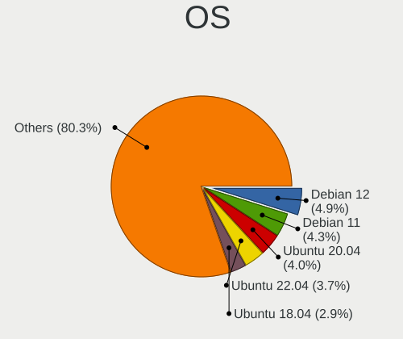

| Name               | Desktops | Percent |
|--------------------|----------|---------|
| Debian 12          | 17       | 4.86%   |
| Debian 11          | 15       | 4.29%   |
| Ubuntu 20.04       | 14       | 4%      |
| Ubuntu 22.04       | 13       | 3.71%   |
| Ubuntu 18.04       | 10       | 2.86%   |
| OpenMandriva 4.3   | 10       | 2.86%   |
| OpenMandriva 25.90 | 10       | 2.86%   |
| OpenMandriva 23.08 | 10       | 2.86%   |
| OpenMandriva 23.03 | 9        | 2.57%   |
| Zorin 17           | 8        | 2.29%   |
| Arch Rolling       | 8        | 2.29%   |
| Zorin 18           | 7        | 2%      |
| Zorin 16           | 7        | 2%      |
| OpenMandriva 4.2   | 7        | 2%      |
| Pop!_OS 22.04      | 6        | 1.71%   |
| Ubuntu 24.04       | 5        | 1.43%   |
| OpenMandriva 24.12 | 5        | 1.43%   |
| OpenMandriva 23.01 | 5        | 1.43%   |
| Manjaro            | 5        | 1.43%   |
| Linux Mint 22.1    | 5        | 1.43%   |
| Linux Mint 21.1    | 5        | 1.43%   |
| Linux Mint 20.3    | 5        | 1.43%   |
| Xubuntu 18.04      | 4        | 1.14%   |
| ROSA R11           | 4        | 1.14%   |
| OpenMandriva 6.0   | 4        | 1.14%   |
| MX 21              | 4        | 1.14%   |
| Linux Mint 21.3    | 4        | 1.14%   |
| Linux Mint 21.2    | 4        | 1.14%   |
| Linux Mint 20.1    | 4        | 1.14%   |
| Fedora 41          | 4        | 1.14%   |
| OpenMandriva 4.50  | 3        | 0.86%   |
| Linux Mint 22.2    | 3        | 0.86%   |
| Linux Mint 20      | 3        | 0.86%   |
| Linux Mint 19.3    | 3        | 0.86%   |
| Kubuntu 22.04      | 3        | 0.86%   |
| KDE neon 20.04     | 3        | 0.86%   |
| Fedora 42          | 3        | 0.86%   |
| Fedora 40          | 3        | 0.86%   |
| Fedora 38          | 3        | 0.86%   |
| Debian 10          | 3        | 0.86%   |

OS Family
---------

OS without a version

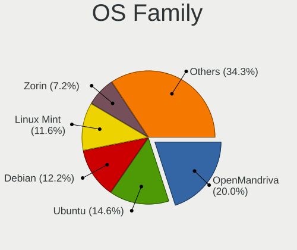

| Name         | Desktops | Percent |
|--------------|----------|---------|
| OpenMandriva | 67       | 20%     |
| Ubuntu       | 49       | 14.63%  |
| Debian       | 41       | 12.24%  |
| Linux Mint   | 39       | 11.64%  |
| Zorin        | 24       | 7.16%   |
| Fedora       | 16       | 4.78%   |
| ROSA         | 12       | 3.58%   |
| Arch         | 9        | 2.69%   |
| KDE neon     | 8        | 2.39%   |
| Pop!_OS      | 7        | 2.09%   |
| Xubuntu      | 6        | 1.79%   |
| Manjaro      | 6        | 1.79%   |
| Kubuntu      | 6        | 1.79%   |
| Nobara       | 5        | 1.49%   |
| MX           | 5        | 1.49%   |
| Elementary   | 5        | 1.49%   |
| Garuda Linux | 3        | 0.9%    |
| Bazzite      | 3        | 0.9%    |
| ArcoLinux    | 3        | 0.9%    |
| Ubuntu MATE  | 2        | 0.6%    |
| Lubuntu      | 2        | 0.6%    |
| LMDE         | 2        | 0.6%    |
| Xero         | 1        | 0.3%    |
| Void Linux   | 1        | 0.3%    |
| Ubuntu Unity | 1        | 0.3%    |
| Sparky       | 1        | 0.3%    |
| Solus        | 1        | 0.3%    |
| Q4OS         | 1        | 0.3%    |
| Pikaos       | 1        | 0.3%    |
| PCLinuxOS    | 1        | 0.3%    |
| Kali         | 1        | 0.3%    |
| Frnsf        | 1        | 0.3%    |
| Feren OS     | 1        | 0.3%    |
| Endless      | 1        | 0.3%    |
| EndeavourOS  | 1        | 0.3%    |
| Ctlos        | 1        | 0.3%    |
| Canaima      | 1        | 0.3%    |

Kernel
------

Version of the Linux kernel

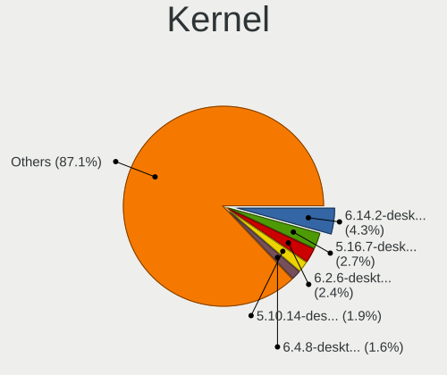

| Version                  | Desktops | Percent |
|--------------------------|----------|---------|
| 6.14.2-desktop-3omv2590  | 16       | 4.3%    |
| 5.16.7-desktop-1omv4003  | 10       | 2.69%   |
| 6.2.6-desktop-1omv2390   | 9        | 2.42%   |
| 5.10.14-desktop-1omv4002 | 7        | 1.88%   |
| 6.4.8-desktop-2omv2390   | 6        | 1.61%   |
| 6.14.0-33-generic        | 5        | 1.34%   |
| 6.12.1-desktop-1omv2490  | 5        | 1.34%   |
| 6.1.1-desktop-1omv2290   | 5        | 1.34%   |
| 6.8.0-60-generic         | 4        | 1.08%   |
| 6.4.11-desktop-1omv2390  | 4        | 1.08%   |
| 5.4.0-42-generic         | 4        | 1.08%   |
| 6.8.0-64-generic         | 3        | 0.81%   |
| 6.8.0-40-generic         | 3        | 0.81%   |
| 6.6.2-desktop-1omv2390   | 3        | 0.81%   |
| 6.12.10-76061203-generic | 3        | 0.81%   |
| 6.1.0-37-amd64           | 3        | 0.81%   |
| 6.8.0-51-generic         | 2        | 0.54%   |
| 6.5.0-28-generic         | 2        | 0.54%   |
| 6.5.0-21-generic         | 2        | 0.54%   |
| 6.2.0-32-generic         | 2        | 0.54%   |
| 6.2.0-26-generic         | 2        | 0.54%   |
| 6.16.3-76061603-generic  | 2        | 0.54%   |
| 6.14.6-300.fc42.x86_64   | 2        | 0.54%   |
| 6.14.0-36-generic        | 2        | 0.54%   |
| 6.14.0-35-generic        | 2        | 0.54%   |
| 6.14.0-29-generic        | 2        | 0.54%   |
| 6.1.0-26-amd64           | 2        | 0.54%   |
| 6.1.0-21-amd64           | 2        | 0.54%   |
| 6.1.0-18-amd64           | 2        | 0.54%   |
| 5.8.0-55-generic         | 2        | 0.54%   |
| 5.4.0-77-generic         | 2        | 0.54%   |
| 5.4.0-74-generic         | 2        | 0.54%   |
| 5.4.0-54-generic         | 2        | 0.54%   |
| 5.4.0-26-generic         | 2        | 0.54%   |
| 5.4.0-166-generic        | 2        | 0.54%   |
| 5.3.0-40-generic         | 2        | 0.54%   |
| 5.19.0-41-generic        | 2        | 0.54%   |
| 5.19.0-35-generic        | 2        | 0.54%   |
| 5.15.0-89-generic        | 2        | 0.54%   |
| 5.15.0-76-generic        | 2        | 0.54%   |

Kernel Family
-------------

Linux kernel without a distro release

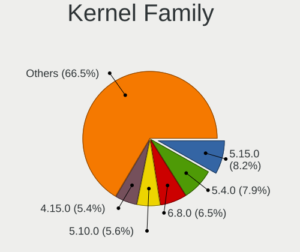

| Version | Desktops | Percent |
|---------|----------|---------|
| 5.15.0  | 29       | 8.17%   |
| 5.4.0   | 28       | 7.89%   |
| 6.8.0   | 23       | 6.48%   |
| 5.10.0  | 20       | 5.63%   |
| 4.15.0  | 19       | 5.35%   |
| 6.14.2  | 18       | 5.07%   |
| 6.1.0   | 16       | 4.51%   |
| 6.14.0  | 13       | 3.66%   |
| 5.16.7  | 10       | 2.82%   |
| 6.2.6   | 9        | 2.54%   |
| 6.5.0   | 7        | 1.97%   |
| 5.10.14 | 7        | 1.97%   |
| 6.4.8   | 6        | 1.69%   |
| 5.8.0   | 6        | 1.69%   |
| 5.13.0  | 6        | 1.69%   |
| 6.2.0   | 5        | 1.41%   |
| 6.12.1  | 5        | 1.41%   |
| 6.1.1   | 5        | 1.41%   |
| 5.3.0   | 5        | 1.41%   |
| 5.19.0  | 5        | 1.41%   |
| 6.4.11  | 4        | 1.13%   |
| 6.6.2   | 3        | 0.85%   |
| 6.14.6  | 3        | 0.85%   |
| 6.12.10 | 3        | 0.85%   |
| 5.11.0  | 3        | 0.85%   |
| 5.0.0   | 3        | 0.85%   |
| 4.19.0  | 3        | 0.85%   |
| 6.4.6   | 2        | 0.56%   |
| 6.4.3   | 2        | 0.56%   |
| 6.2.12  | 2        | 0.56%   |
| 6.17.7  | 2        | 0.56%   |
| 6.16.3  | 2        | 0.56%   |
| 5.10.74 | 2        | 0.56%   |
| 4.9.20  | 2        | 0.56%   |
| 4.9.0   | 2        | 0.56%   |
| 6.9.7   | 1        | 0.28%   |
| 6.9.3   | 1        | 0.28%   |
| 6.9.12  | 1        | 0.28%   |
| 6.8.9   | 1        | 0.28%   |
| 6.8.5   | 1        | 0.28%   |

Kernel Major Ver.
-----------------

Linux kernel major version

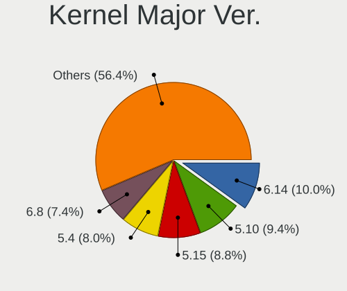

| Version | Desktops | Percent |
|---------|----------|---------|
| 6.14    | 35       | 9.97%   |
| 5.10    | 33       | 9.4%    |
| 5.15    | 31       | 8.83%   |
| 5.4     | 28       | 7.98%   |
| 6.8     | 26       | 7.41%   |
| 6.1     | 21       | 5.98%   |
| 4.15    | 19       | 5.41%   |
| 6.2     | 16       | 4.56%   |
| 6.4     | 15       | 4.27%   |
| 6.12    | 15       | 4.27%   |
| 5.16    | 11       | 3.13%   |
| 6.6     | 9        | 2.56%   |
| 6.5     | 9        | 2.56%   |
| 5.8     | 8        | 2.28%   |
| 5.19    | 8        | 2.28%   |
| 5.13    | 8        | 2.28%   |
| 6.17    | 5        | 1.42%   |
| 5.3     | 5        | 1.42%   |
| 6.16    | 4        | 1.14%   |
| 6.13    | 4        | 1.14%   |
| 6.11    | 4        | 1.14%   |
| 4.9     | 4        | 1.14%   |
| 6.9     | 3        | 0.85%   |
| 6.15    | 3        | 0.85%   |
| 6.10    | 3        | 0.85%   |
| 5.11    | 3        | 0.85%   |
| 5.0     | 3        | 0.85%   |
| 4.19    | 3        | 0.85%   |
| 6.3     | 2        | 0.57%   |
| 6.0     | 2        | 0.57%   |
| 6.7     | 1        | 0.28%   |
| 6       | 1        | 0.28%   |
| 5.9     | 1        | 0.28%   |
| 5.6     | 1        | 0.28%   |
| 5.18    | 1        | 0.28%   |
| 5.14    | 1        | 0.28%   |
| 5.12    | 1        | 0.28%   |
| 4.4     | 1        | 0.28%   |
| 4.18    | 1        | 0.28%   |
| 4.13    | 1        | 0.28%   |

Arch
----

OS architecture (x86_64, i586, etc.)

| Name   | Desktops | Percent |
|--------|----------|---------|
| x86_64 | 311      | 94.53%  |
| i686   | 18       | 5.47%   |

DE
--

Desktop Environment

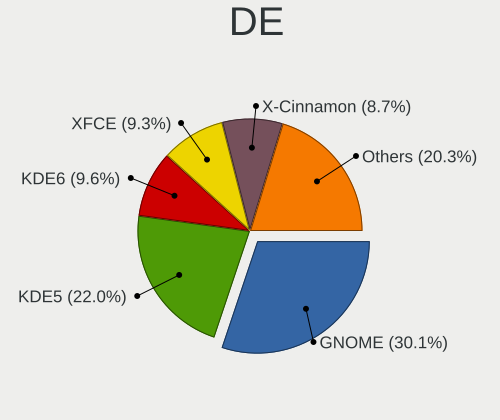

| Name            | Desktops | Percent |
|-----------------|----------|---------|
| GNOME           | 104      | 30.14%  |
| KDE5            | 76       | 22.03%  |
| KDE6            | 33       | 9.57%   |
| XFCE            | 32       | 9.28%   |
| X-Cinnamon      | 30       | 8.7%    |
| Unknown         | 16       | 4.64%   |
| MATE            | 11       | 3.19%   |
| LXQt            | 7        | 2.03%   |
| KDE             | 7        | 2.03%   |
| LXDE            | 6        | 1.74%   |
| Pantheon        | 4        | 1.16%   |
| KDE4            | 4        | 1.16%   |
| Cinnamon        | 4        | 1.16%   |
| Trinity         | 3        | 0.87%   |
| xmonad          | 1        | 0.29%   |
| Unity           | 1        | 0.29%   |
| i3              | 1        | 0.29%   |
| GNOME Flashback | 1        | 0.29%   |
| GNOME Classic   | 1        | 0.29%   |
| Budgie          | 1        | 0.29%   |
| bspwm           | 1        | 0.29%   |
| awesome         | 1        | 0.29%   |

Display Server
--------------

X11 or Wayland

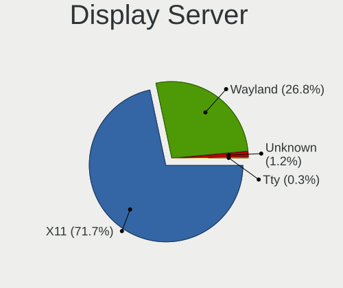

| Name    | Desktops | Percent |
|---------|----------|---------|
| X11     | 243      | 71.68%  |
| Wayland | 91       | 26.84%  |
| Unknown | 4        | 1.18%   |
| Tty     | 1        | 0.29%   |

Display Manager
---------------

SDDM, LightDM, etc.

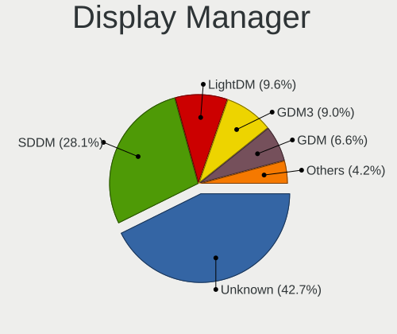

| Name    | Desktops | Percent |
|---------|----------|---------|
| Unknown | 143      | 42.69%  |
| SDDM    | 94       | 28.06%  |
| LightDM | 32       | 9.55%   |
| GDM3    | 30       | 8.96%   |
| GDM     | 22       | 6.57%   |
| TDM     | 7        | 2.09%   |
| KDM     | 4        | 1.19%   |
| SLiM    | 2        | 0.6%    |
| LY-DM   | 1        | 0.3%    |

OS Lang
-------

Language

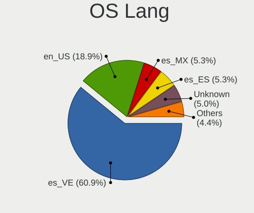

| Lang    | Desktops | Percent |
|---------|----------|---------|
| es_VE   | 206      | 60.95%  |
| en_US   | 64       | 18.93%  |
| es_MX   | 18       | 5.33%   |
| es_ES   | 18       | 5.33%   |
| Unknown | 17       | 5.03%   |
| C       | 7        | 2.07%   |
| es_CO   | 4        | 1.18%   |
| es_US   | 2        | 0.59%   |
| es_AR   | 1        | 0.3%    |
| de_DE   | 1        | 0.3%    |

Boot Mode
---------

EFI or BIOS

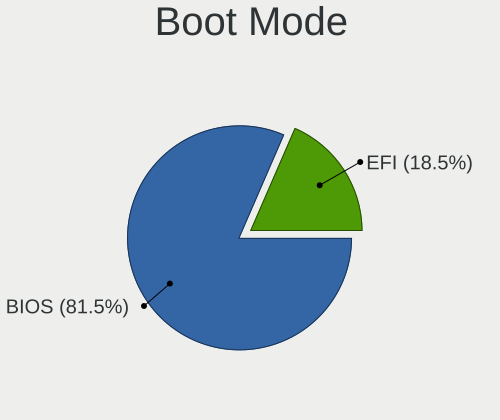

| Mode | Desktops | Percent |
|------|----------|---------|
| BIOS | 269      | 81.52%  |
| EFI  | 61       | 18.48%  |

Filesystem
----------

Type of filesystem

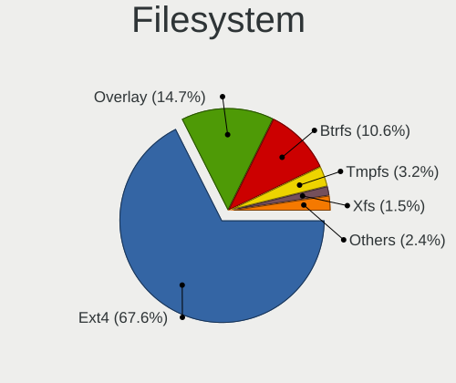

| Type    | Desktops | Percent |
|---------|----------|---------|
| Ext4    | 229      | 67.55%  |
| Overlay | 50       | 14.75%  |
| Btrfs   | 36       | 10.62%  |
| Tmpfs   | 11       | 3.24%   |
| Xfs     | 5        | 1.47%   |
| Unknown | 5        | 1.47%   |
| Ext3    | 2        | 0.59%   |
| Ext2    | 1        | 0.29%   |

Part. scheme
------------

Scheme of partitioning

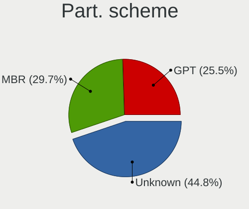

| Type    | Desktops | Percent |
|---------|----------|---------|
| Unknown | 151      | 44.81%  |
| MBR     | 100      | 29.67%  |
| GPT     | 86       | 25.52%  |

Dual Boot with Linux/BSD
------------------------

Hosting more than one Linux/BSD

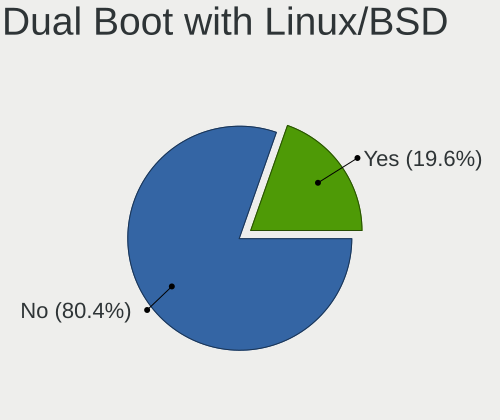

| Dual boot | Desktops | Percent |
|-----------|----------|---------|
| No        | 266      | 80.36%  |
| Yes       | 65       | 19.64%  |

Dual Boot (Win)
---------------

Hosting Linux and Windows

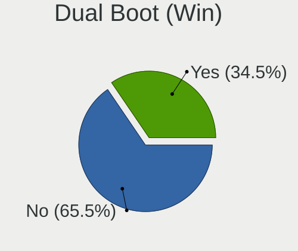

| Dual boot | Desktops | Percent |
|-----------|----------|---------|
| No        | 218      | 65.47%  |
| Yes       | 115      | 34.53%  |

Board
-----

Vendor
------

Motherboard manufacturer

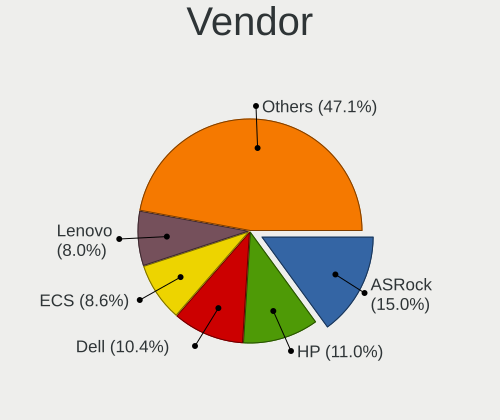

| Name                | Desktops | Percent |
|---------------------|----------|---------|
| ASRock              | 49       | 14.98%  |
| Hewlett-Packard     | 36       | 11.01%  |
| Dell                | 34       | 10.4%   |
| ECS                 | 28       | 8.56%   |
| Lenovo              | 26       | 7.95%   |
| Intel               | 25       | 7.65%   |
| Gigabyte Technology | 22       | 6.73%   |
| Biostar             | 22       | 6.73%   |
| ASUSTek Computer    | 20       | 6.12%   |
| Pegatron            | 15       | 4.59%   |
| Foxconn             | 13       | 3.98%   |
| MSI                 | 11       | 3.36%   |
| langchao            | 11       | 3.36%   |
| Inspur              | 5        | 1.53%   |
| JGINYUE             | 2        | 0.61%   |
| Unknown             | 2        | 0.61%   |
| Soncview            | 1        | 0.31%   |
| SIRAGON             | 1        | 0.31%   |
| IP3 Tech            | 1        | 0.31%   |
| IBM                 | 1        | 0.31%   |
| ARKTEK              | 1        | 0.31%   |
| Apple               | 1        | 0.31%   |

Model
-----

Motherboard model

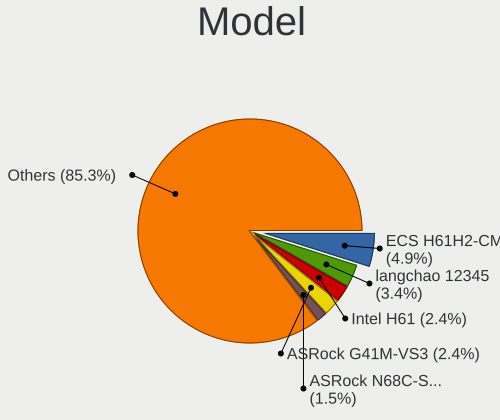

| Name                                | Desktops | Percent |
|-------------------------------------|----------|---------|
| ECS H61H2-CM                        | 16       | 4.89%   |
| langchao 12345                      | 11       | 3.36%   |
| Intel H61                           | 8        | 2.45%   |
| ASRock G41M-VS3                     | 8        | 2.45%   |
| ASRock N68C-S UCC                   | 5        | 1.53%   |
| Pegatron Compaq dx2400 Microtower   | 4        | 1.22%   |
| ASRock N68-VS3 UCC                  | 4        | 1.22%   |
| ASRock H61M-VG3                     | 4        | 1.22%   |
| Lenovo ThinkCentre A57 9702AB7      | 3        | 0.92%   |
| HP EliteDesk 800 G2 SFF             | 3        | 0.92%   |
| HP Compaq 8200 Elite SFF PC         | 3        | 0.92%   |
| Gigabyte 970A-DS3P                  | 3        | 0.92%   |
| ECS H77H2-EM                        | 3        | 0.92%   |
| Dell OptiPlex 9020                  | 3        | 0.92%   |
| Dell OptiPlex 9010                  | 3        | 0.92%   |
| Dell OptiPlex 790                   | 3        | 0.92%   |
| Dell OptiPlex 7010                  | 3        | 0.92%   |
| Biostar G41D3                       | 3        | 0.92%   |
| ASRock H61M-DGS                     | 3        | 0.92%   |
| ASRock AM2NF6G-VSTA                 | 3        | 0.92%   |
| Pegatron IPM41-D3                   | 2        | 0.61%   |
| Lenovo ThinkCentre A58 7515A33      | 2        | 0.61%   |
| Lenovo 70A4000HUX ThinkServer TS140 | 2        | 0.61%   |
| Inspur VIT E2250                    | 2        | 0.61%   |
| Inspur ST1020M4                     | 2        | 0.61%   |
| HP rp5800                           | 2        | 0.61%   |
| HP ProDesk 600 G1 SFF               | 2        | 0.61%   |
| HP EliteDesk 800 G1 USDT            | 2        | 0.61%   |
| HP EliteDesk 800 G1 SFF             | 2        | 0.61%   |
| HP Compaq Elite 8300 SFF            | 2        | 0.61%   |
| Foxconn A74MX-S/A74MX-K             | 2        | 0.61%   |
| ECS H61H2-MV                        | 2        | 0.61%   |
| ECS G31T-M7                         | 2        | 0.61%   |
| Dell OptiPlex 990                   | 2        | 0.61%   |
| Dell OptiPlex 780                   | 2        | 0.61%   |
| Dell Inspiron 3891                  | 2        | 0.61%   |
| Biostar P4M900-M7 FE                | 2        | 0.61%   |
| Biostar N68S3B                      | 2        | 0.61%   |
| Biostar H61MGV3                     | 2        | 0.61%   |
| Biostar G41D3C                      | 2        | 0.61%   |

Model Family
------------

Motherboard model prefix

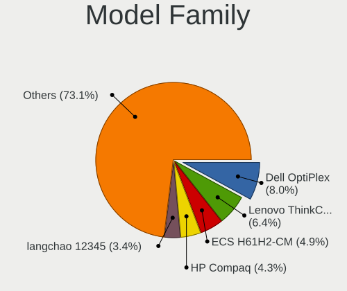

| Name                     | Desktops | Percent |
|--------------------------|----------|---------|
| Dell OptiPlex            | 26       | 7.95%   |
| Lenovo ThinkCentre       | 21       | 6.42%   |
| ECS H61H2-CM             | 16       | 4.89%   |
| HP Compaq                | 14       | 4.28%   |
| langchao 12345           | 11       | 3.36%   |
| HP EliteDesk             | 11       | 3.36%   |
| Intel H61                | 8        | 2.45%   |
| ASRock G41M-VS3          | 8        | 2.45%   |
| ASUS PRIME               | 6        | 1.83%   |
| Pegatron Compaq          | 5        | 1.53%   |
| ASRock N68C-S            | 5        | 1.53%   |
| ASRock N68-VS3           | 5        | 1.53%   |
| HP ProDesk               | 4        | 1.22%   |
| Dell Inspiron            | 4        | 1.22%   |
| ASUS P8H61-M             | 4        | 1.22%   |
| ASRock H61M-VG3          | 4        | 1.22%   |
| ASRock H61M-DGS          | 4        | 1.22%   |
| Gigabyte 970A-DS3P       | 3        | 0.92%   |
| ECS H77H2-EM             | 3        | 0.92%   |
| Biostar G41D3            | 3        | 0.92%   |
| ASRock AM2NF6G-VSTA      | 3        | 0.92%   |
| Pegatron IPM41-D3        | 2        | 0.61%   |
| Lenovo 70A4000HUX        | 2        | 0.61%   |
| Intel DG41TY             | 2        | 0.61%   |
| Inspur VIT               | 2        | 0.61%   |
| Inspur ST1020M4          | 2        | 0.61%   |
| HP rp5800                | 2        | 0.61%   |
| Foxconn A74MX-S          | 2        | 0.61%   |
| ECS H61H2-MV             | 2        | 0.61%   |
| ECS G31T-M7              | 2        | 0.61%   |
| Dell Vostro              | 2        | 0.61%   |
| Biostar P4M900-M7        | 2        | 0.61%   |
| Biostar N68S3B           | 2        | 0.61%   |
| Biostar H61MGV3          | 2        | 0.61%   |
| Biostar G41D3C           | 2        | 0.61%   |
| Biostar A780L3B          | 2        | 0.61%   |
| ASUS Rampage             | 2        | 0.61%   |
| ASUS P5G41T-M            | 2        | 0.61%   |
| ASRock Wolfdale1333-D667 | 2        | 0.61%   |
| ASRock 945GCM-S          | 2        | 0.61%   |

MFG Year
--------

Motherboard manufacture year

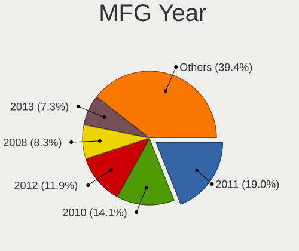

| Year | Desktops | Percent |
|------|----------|---------|
| 2011 | 62       | 18.96%  |
| 2010 | 46       | 14.07%  |
| 2012 | 39       | 11.93%  |
| 2008 | 27       | 8.26%   |
| 2013 | 24       | 7.34%   |
| 2009 | 24       | 7.34%   |
| 2007 | 16       | 4.89%   |
| 2014 | 13       | 3.98%   |
| 2006 | 11       | 3.36%   |
| 2016 | 10       | 3.06%   |
| 2021 | 9        | 2.75%   |
| 2020 | 9        | 2.75%   |
| 2015 | 9        | 2.75%   |
| 2017 | 8        | 2.45%   |
| 2024 | 4        | 1.22%   |
| 2019 | 4        | 1.22%   |
| 2018 | 4        | 1.22%   |
| 2022 | 3        | 0.92%   |
| 2025 | 1        | 0.31%   |
| 2023 | 1        | 0.31%   |
| 2005 | 1        | 0.31%   |
| 2004 | 1        | 0.31%   |
| 2002 | 1        | 0.31%   |

Form Factor
-----------

Physical design of the computer

| Name    | Desktops | Percent |
|---------|----------|---------|
| Desktop | 327      | 100%    |

Secure Boot
-----------

Enabled or disabled

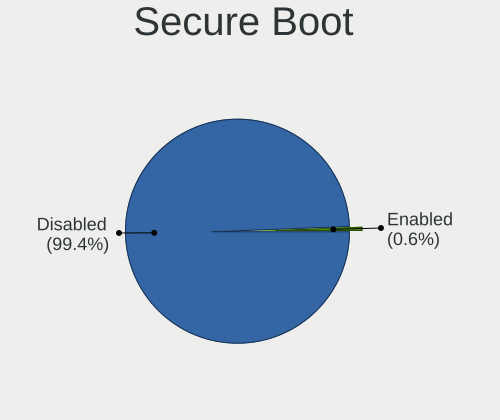

| State    | Desktops | Percent |
|----------|----------|---------|
| Disabled | 325      | 99.39%  |
| Enabled  | 2        | 0.61%   |

Coreboot
--------

Have coreboot on board

| Used | Desktops | Percent |
|------|----------|---------|
| No   | 327      | 100%    |

RAM Size
--------

Total RAM memory

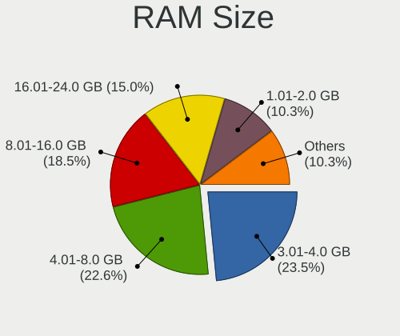

| Size in GB  | Desktops | Percent |
|-------------|----------|---------|
| 3.01-4.0    | 80       | 23.46%  |
| 4.01-8.0    | 77       | 22.58%  |
| 8.01-16.0   | 63       | 18.48%  |
| 16.01-24.0  | 51       | 14.96%  |
| 1.01-2.0    | 35       | 10.26%  |
| 2.01-3.0    | 15       | 4.4%    |
| 32.01-64.0  | 8        | 2.35%   |
| 24.01-32.0  | 6        | 1.76%   |
| 64.01-256.0 | 3        | 0.88%   |
| 0.51-1.0    | 3        | 0.88%   |

RAM Used
--------

Used RAM memory

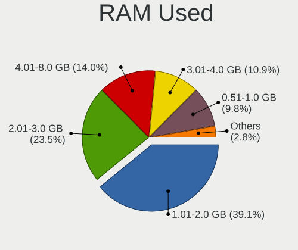

| Used GB   | Desktops | Percent |
|-----------|----------|---------|
| 1.01-2.0  | 140      | 39.11%  |
| 2.01-3.0  | 84       | 23.46%  |
| 4.01-8.0  | 50       | 13.97%  |
| 3.01-4.0  | 39       | 10.89%  |
| 0.51-1.0  | 35       | 9.78%   |
| 0.01-0.5  | 7        | 1.96%   |
| 8.01-16.0 | 3        | 0.84%   |

Total Drives
------------

Number of drives on board

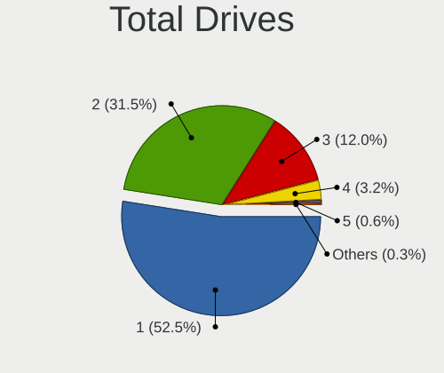

| Drives | Desktops | Percent |
|--------|----------|---------|
| 1      | 180      | 52.48%  |
| 2      | 108      | 31.49%  |
| 3      | 41       | 11.95%  |
| 4      | 11       | 3.21%   |
| 5      | 2        | 0.58%   |
| 0      | 1        | 0.29%   |

Has CD-ROM
----------

Has CD-ROM on board

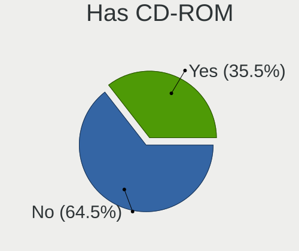

| Presented | Desktops | Percent |
|-----------|----------|---------|
| No        | 216      | 64.48%  |
| Yes       | 119      | 35.52%  |

Has Ethernet
------------

Has Ethernet on board

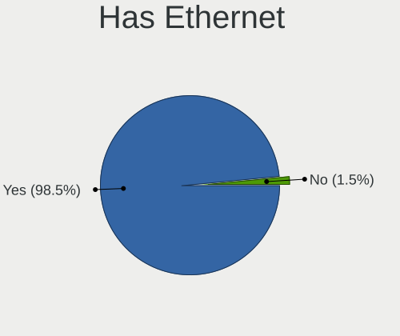

| Presented | Desktops | Percent |
|-----------|----------|---------|
| Yes       | 322      | 98.47%  |
| No        | 5        | 1.53%   |

Has WiFi
--------

Has WiFi module

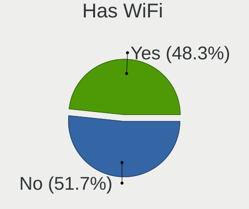

| Presented | Desktops | Percent |
|-----------|----------|---------|
| No        | 172      | 51.65%  |
| Yes       | 161      | 48.35%  |

Has Bluetooth
-------------

Has Bluetooth module

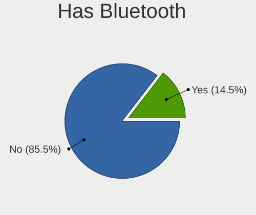

| Presented | Desktops | Percent |
|-----------|----------|---------|
| No        | 282      | 85.45%  |
| Yes       | 48       | 14.55%  |

Location
--------

Country
-------

Geographic location (country)

| Country   | Desktops | Percent |
|-----------|----------|---------|
| Venezuela | 327      | 100%    |

City
----

Geographic location (city)

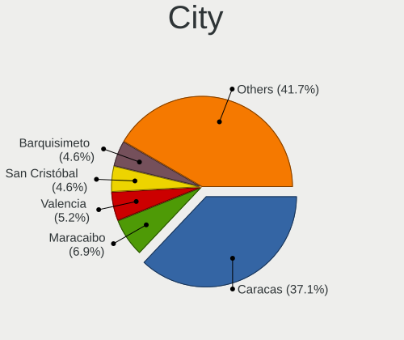

| City                       | Desktops | Percent |
|----------------------------|----------|---------|
| Caracas                    | 129      | 37.07%  |
| Maracaibo                  | 24       | 6.9%    |
| Valencia                   | 18       | 5.17%   |
| San Cristóbal             | 16       | 4.6%    |
| Barquisimeto               | 16       | 4.6%    |
| Mérida                    | 12       | 3.45%   |
| Maracay                    | 12       | 3.45%   |
| San Carlos del Zulia       | 8        | 2.3%    |
| Barcelona                  | 8        | 2.3%    |
| Vigia                      | 7        | 2.01%   |
| Barinas                    | 7        | 2.01%   |
| Porlamar                   | 6        | 1.72%   |
| Maturín                   | 5        | 1.44%   |
| San Antonio de Los Altos   | 4        | 1.15%   |
| Los Teques                 | 4        | 1.15%   |
| Ciudad Guayana             | 4        | 1.15%   |
| Ciudad Bolívar            | 4        | 1.15%   |
| Miranda                    | 3        | 0.86%   |
| La Guaira                  | 3        | 0.86%   |
| Cumaná                    | 3        | 0.86%   |
| Carrizal                   | 3        | 0.86%   |
| Cabimas                    | 3        | 0.86%   |
| Araure                     | 3        | 0.86%   |
| Acarigua                   | 3        | 0.86%   |
| Turmero                    | 2        | 0.57%   |
| San Carlos                 | 2        | 0.57%   |
| Maiquetía                 | 2        | 0.57%   |
| Lecherias                  | 2        | 0.57%   |
| Distrito Federal           | 2        | 0.57%   |
| Coro                       | 2        | 0.57%   |
| Zulia                      | 1        | 0.29%   |
| Valle de La Pascua         | 1        | 0.29%   |
| Tucupita                   | 1        | 0.29%   |
| Santa Teresa del Tuy       | 1        | 0.29%   |
| San Juan Bautista          | 1        | 0.29%   |
| San Francisco              | 1        | 0.29%   |
| San Felipe                 | 1        | 0.29%   |
| Punto Fijo                 | 1        | 0.29%   |
| Puerto Ordaz and San Felix | 1        | 0.29%   |
| Puerto Ayacucho            | 1        | 0.29%   |

Drives
------

Drive Vendor
------------

Hard drive vendors

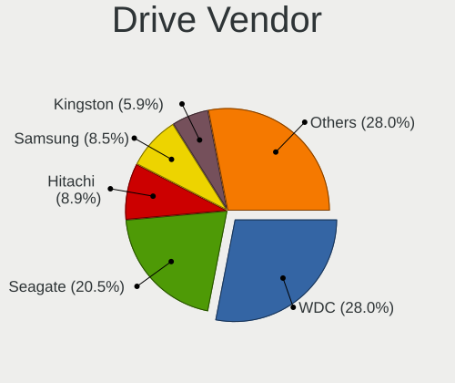

| Vendor                      | Desktops | Drives | Percent |
|-----------------------------|----------|--------|---------|
| WDC                         | 138      | 193    | 28.05%  |
| Seagate                     | 101      | 141    | 20.53%  |
| Hitachi                     | 44       | 52     | 8.94%   |
| Samsung Electronics         | 42       | 47     | 8.54%   |
| Kingston                    | 29       | 35     | 5.89%   |
| Toshiba                     | 26       | 30     | 5.28%   |
| Patriot                     | 13       | 16     | 2.64%   |
| addlink                     | 11       | 14     | 2.24%   |
| Maxtor                      | 8        | 9      | 1.63%   |
| PNY                         | 7        | 10     | 1.42%   |
| Crucial                     | 5        | 8      | 1.02%   |
| SK hynix                    | 4        | 4      | 0.81%   |
| Silicon Motion              | 4        | 4      | 0.81%   |
| Sandisk                     | 4        | 5      | 0.81%   |
| SPCC                        | 3        | 4      | 0.61%   |
| Micron Technology           | 3        | 5      | 0.61%   |
| HGST                        | 3        | 3      | 0.61%   |
| Dahua                       | 3        | 3      | 0.61%   |
| A-DATA Technology           | 3        | 3      | 0.61%   |
| Team                        | 2        | 3      | 0.41%   |
| Phison Electronics          | 2        | 3      | 0.41%   |
| Mushkin                     | 2        | 2      | 0.41%   |
| JMicron Technology          | 2        | 2      | 0.41%   |
| Intel                       | 2        | 2      | 0.41%   |
| Golden                      | 2        | 2      | 0.41%   |
| Fujitsu                     | 2        | 2      | 0.41%   |
| ExcelStor                   | 2        | 2      | 0.41%   |
| China                       | 2        | 2      | 0.41%   |
| ACCLAMATOR                  | 2        | 2      | 0.41%   |
| USB3.0                      | 1        | 1      | 0.2%    |
| Unknown                     | 1        | 1      | 0.2%    |
| T-FORCE                     | 1        | 1      | 0.2%    |
| RRINTEC                     | 1        | 1      | 0.2%    |
| REECHO                      | 1        | 2      | 0.2%    |
| Realtek Semiconductor       | 1        | 1      | 0.2%    |
| Realtek                     | 1        | 1      | 0.2%    |
| Netac                       | 1        | 1      | 0.2%    |
| Kingston Technology Company | 1        | 1      | 0.2%    |
| IBM/Hitachi                 | 1        | 2      | 0.2%    |
| HS-SSD-WAVE(N)              | 1        | 1      | 0.2%    |

Drive Model
-----------

Hard drive models

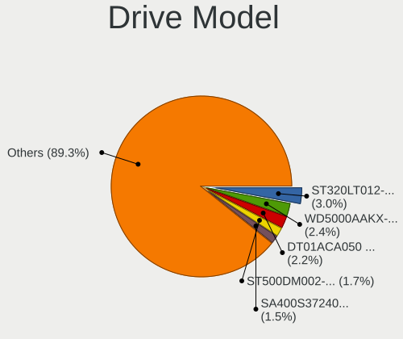

| Model                                                 | Desktops | Percent |
|-------------------------------------------------------|----------|---------|
| Seagate ST320LT012-1DG14C 320GB                       | 16       | 2.96%   |
| WDC WD5000AAKX-22ERMA0 500GB                          | 13       | 2.4%    |
| Toshiba DT01ACA050 500GB                              | 12       | 2.22%   |
| Seagate ST500DM002-1BD142 500GB                       | 9        | 1.66%   |
| Kingston SA400S37240G 240GB SSD                       | 8        | 1.48%   |
| WDC WD5000AAKX-221CA1 500GB                           | 7        | 1.29%   |
| Samsung HD502HJ 500GB                                 | 7        | 1.29%   |
| Patriot Burst Elite 120GB SSD                         | 6        | 1.11%   |
| Kingston SA400S37120G 120GB SSD                       | 6        | 1.11%   |
| WDC WD5000AAKX-001CA0 500GB                           | 5        | 0.92%   |
| WDC WD3200AAJS-08L7A0 320GB                           | 5        | 0.92%   |
| WDC WD3200AAJS-00L7A0 320GB                           | 5        | 0.92%   |
| Seagate ST3320418AS 320GB                             | 5        | 0.92%   |
| Seagate ST320LM000 HM321HI 320GB                      | 5        | 0.92%   |
| Samsung HD322HJ 320GB                                 | 5        | 0.92%   |
| Samsung HD161HJ 160GB                                 | 5        | 0.92%   |
| Kingston SA400S37480G 480GB SSD                       | 5        | 0.92%   |
| WDC WD5000AAKS-00UU3A0 500GB                          | 4        | 0.74%   |
| WDC WD10EZEX-08M2NA0 1TB                              | 4        | 0.74%   |
| Silicon Motion SM2263EN/SM2263XT SSD Controller 512GB | 4        | 0.74%   |
| Seagate ST500DM002-1BC142 500GB                       | 4        | 0.74%   |
| Seagate ST3500414CS 500GB                             | 4        | 0.74%   |
| Seagate ST320LM001 HN-M320MBB 320GB                   | 4        | 0.74%   |
| Seagate ST3160815AS 160GB                             | 4        | 0.74%   |
| Seagate ST1000DM010-2EP102 1TB                        | 4        | 0.74%   |
| Samsung HD161GJ 160GB                                 | 4        | 0.74%   |
| Hitachi HTS543225L9A300 250GB                         | 4        | 0.74%   |
| addlink SATA SSD 512GB                                | 4        | 0.74%   |
| addlink SATA SSD 256GB                                | 4        | 0.74%   |
| WDC WD5000LPVX-22V0TT0 500GB                          | 3        | 0.55%   |
| WDC WD5000AAKX-60U6AA0 500GB                          | 3        | 0.55%   |
| WDC WD5000AAKX-00ERMA0 500GB                          | 3        | 0.55%   |
| WDC WD5000AAKS-00A7B0 500GB                           | 3        | 0.55%   |
| WDC WD1600AABS-00PRA0 160GB                           | 3        | 0.55%   |
| WDC WD10EZEX-60ZF5A0 1TB                              | 3        | 0.55%   |
| WDC WD10EZEX-22RKKA0 1TB                              | 3        | 0.55%   |
| Seagate ST4000DM000-1F2168 4TB                        | 3        | 0.55%   |
| Seagate ST3160215ACE 160GB                            | 3        | 0.55%   |
| Patriot Burst Elite 240GB SSD                         | 3        | 0.55%   |
| Maxtor STM3160215AS 160GB                             | 3        | 0.55%   |

HDD Vendor
----------

Hard disk drive vendors

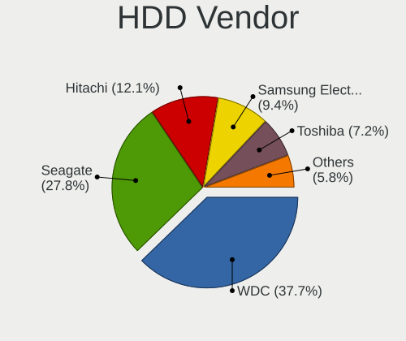

| Vendor              | Desktops | Drives | Percent |
|---------------------|----------|--------|---------|
| WDC                 | 137      | 192    | 37.74%  |
| Seagate             | 101      | 140    | 27.82%  |
| Hitachi             | 44       | 52     | 12.12%  |
| Samsung Electronics | 34       | 38     | 9.37%   |
| Toshiba             | 26       | 30     | 7.16%   |
| Maxtor              | 8        | 9      | 2.2%    |
| HGST                | 3        | 3      | 0.83%   |
| JMicron Technology  | 2        | 2      | 0.55%   |
| Fujitsu             | 2        | 2      | 0.55%   |
| ExcelStor           | 2        | 2      | 0.55%   |
| USB3.0              | 1        | 1      | 0.28%   |
| T-FORCE             | 1        | 1      | 0.28%   |
| IBM/Hitachi         | 1        | 2      | 0.28%   |
| HPE                 | 1        | 1      | 0.28%   |

SSD Vendor
----------

Solid state drive vendors

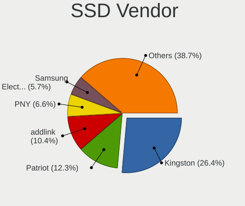

| Vendor              | Desktops | Drives | Percent |
|---------------------|----------|--------|---------|
| Kingston            | 28       | 33     | 26.42%  |
| Patriot             | 13       | 16     | 12.26%  |
| addlink             | 11       | 14     | 10.38%  |
| PNY                 | 7        | 10     | 6.6%    |
| Samsung Electronics | 6        | 7      | 5.66%   |
| Crucial             | 5        | 8      | 4.72%   |
| SPCC                | 3        | 4      | 2.83%   |
| SK hynix            | 3        | 3      | 2.83%   |
| SanDisk             | 3        | 3      | 2.83%   |
| Dahua               | 3        | 3      | 2.83%   |
| A-DATA Technology   | 3        | 3      | 2.83%   |
| Team                | 2        | 3      | 1.89%   |
| Micron Technology   | 2        | 4      | 1.89%   |
| Intel               | 2        | 2      | 1.89%   |
| China               | 2        | 2      | 1.89%   |
| WDC                 | 1        | 1      | 0.94%   |
| RRINTEC             | 1        | 1      | 0.94%   |
| Netac               | 1        | 1      | 0.94%   |
| Mushkin             | 1        | 1      | 0.94%   |
| HS-SSD-E100         | 1        | 1      | 0.94%   |
| Hewlett-Packard     | 1        | 1      | 0.94%   |
| Golden              | 1        | 1      | 0.94%   |
| Gigabyte Technology | 1        | 1      | 0.94%   |
| Emtec               | 1        | 1      | 0.94%   |
| Dogfish             | 1        | 1      | 0.94%   |
| AirDisk             | 1        | 1      | 0.94%   |
| Acer                | 1        | 1      | 0.94%   |
| ACCLAMATOR          | 1        | 1      | 0.94%   |

Drive Kind
----------

HDD or SSD

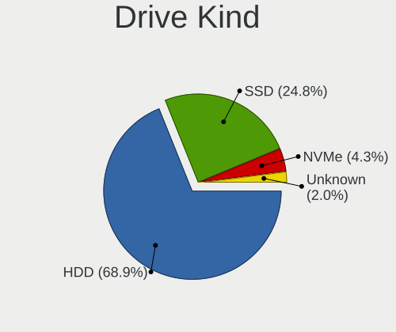

| Kind    | Desktops | Drives | Percent |
|---------|----------|--------|---------|
| HDD     | 275      | 475    | 68.92%  |
| SSD     | 99       | 128    | 24.81%  |
| NVMe    | 17       | 20     | 4.26%   |
| Unknown | 8        | 9      | 2.01%   |

Drive Connector
---------------

SATA, SAS, NVMe, etc.

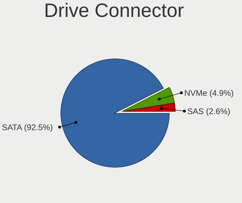

| Type | Desktops | Drives | Percent |
|------|----------|--------|---------|
| SATA | 321      | 604    | 92.51%  |
| NVMe | 17       | 19     | 4.9%    |
| SAS  | 9        | 9      | 2.59%   |

Drive Size
----------

Size of hard drive

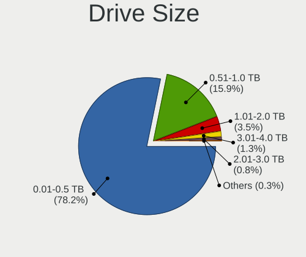

| Size in TB | Desktops | Drives | Percent |
|------------|----------|--------|---------|
| 0.01-0.5   | 291      | 493    | 78.23%  |
| 0.51-1.0   | 59       | 82     | 15.86%  |
| 1.01-2.0   | 13       | 14     | 3.49%   |
| 3.01-4.0   | 5        | 9      | 1.34%   |
| 2.01-3.0   | 3        | 4      | 0.81%   |
| 4.01-10.0  | 1        | 1      | 0.27%   |

Space Total
-----------

Amount of disk space available on the file system

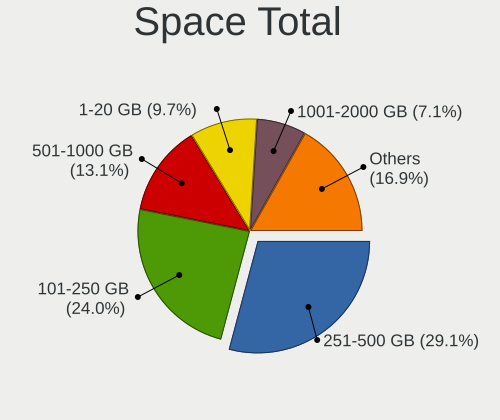

| Size in GB     | Desktops | Percent |
|----------------|----------|---------|
| 251-500        | 102      | 29.14%  |
| 101-250        | 84       | 24%     |
| 501-1000       | 46       | 13.14%  |
| 1-20           | 34       | 9.71%   |
| 1001-2000      | 25       | 7.14%   |
| 51-100         | 23       | 6.57%   |
| 21-50          | 12       | 3.43%   |
| Unknown        | 9        | 2.57%   |
| More than 3000 | 8        | 2.29%   |
| 2001-3000      | 7        | 2%      |

Space Used
----------

Amount of used disk space

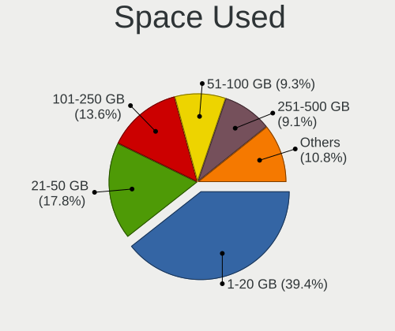

| Used GB        | Desktops | Percent |
|----------------|----------|---------|
| 1-20           | 139      | 39.38%  |
| 21-50          | 63       | 17.85%  |
| 101-250        | 48       | 13.6%   |
| 51-100         | 33       | 9.35%   |
| 251-500        | 32       | 9.07%   |
| 501-1000       | 15       | 4.25%   |
| 1001-2000      | 9        | 2.55%   |
| Unknown        | 9        | 2.55%   |
| 2001-3000      | 4        | 1.13%   |
| More than 3000 | 1        | 0.28%   |

Malfunc. Drives
---------------

Drive models with a malfunction

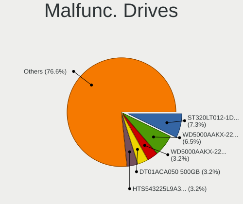

| Model                             | Desktops | Drives | Percent |
|-----------------------------------|----------|--------|---------|
| Seagate ST320LT012-1DG14C 320GB   | 9        | 11     | 7.26%   |
| WDC WD5000AAKX-22ERMA0 500GB      | 8        | 12     | 6.45%   |
| WDC WD5000AAKX-221CA1 500GB       | 4        | 4      | 3.23%   |
| Toshiba DT01ACA050 500GB          | 4        | 6      | 3.23%   |
| Hitachi HTS543225L9A300 250GB     | 4        | 4      | 3.23%   |
| Hitachi HDS721616PLA380 160GB     | 3        | 3      | 2.42%   |
| WDC WD5000AAKS-00A7B0 500GB       | 2        | 2      | 1.61%   |
| WDC WD3200AAJS-08L7A0 320GB       | 2        | 3      | 1.61%   |
| Toshiba MK3275GSX 320GB           | 2        | 2      | 1.61%   |
| Seagate ST500DM002-1BD142 500GB   | 2        | 2      | 1.61%   |
| Seagate ST3500312CS 500GB         | 2        | 2      | 1.61%   |
| Seagate ST3160215ACE 160GB        | 2        | 2      | 1.61%   |
| Samsung Electronics HD161GJ 160GB | 2        | 3      | 1.61%   |
| Maxtor STM3160215AS 160GB         | 2        | 2      | 1.61%   |
| Hitachi HDS728080PLA380 80GB      | 2        | 2      | 1.61%   |
| Hitachi HDS721032CLA362 320GB     | 2        | 2      | 1.61%   |
| WDC WD800JD-75JNA0 80GB           | 1        | 1      | 0.81%   |
| WDC WD800BD-08MRA1 80GB           | 1        | 1      | 0.81%   |
| WDC WD800BB-22JHC0 80GB           | 1        | 1      | 0.81%   |
| WDC WD5000LPVX-22V0TT0 500GB      | 1        | 1      | 0.81%   |
| WDC WD5000AAKX-75U6AA0 500GB      | 1        | 1      | 0.81%   |
| WDC WD5000AAKX-60U6AA0 500GB      | 1        | 1      | 0.81%   |
| WDC WD5000AAKX-08U6AA0 500GB      | 1        | 1      | 0.81%   |
| WDC WD5000AAKX-08ERMA0 500GB      | 1        | 2      | 0.81%   |
| WDC WD5000AAKX-00ERMA0 500GB      | 1        | 1      | 0.81%   |
| WDC WD5000AAKS-00UU3A0 500GB      | 1        | 1      | 0.81%   |
| WDC WD5000AACS-00ZUB0 500GB       | 1        | 1      | 0.81%   |
| WDC WD3200LPVX-22V0TT0 320GB      | 1        | 1      | 0.81%   |
| WDC WD3200BEKT-22F3T0 320GB       | 1        | 1      | 0.81%   |
| WDC WD3200BEKT-08PVMT1 320GB      | 1        | 1      | 0.81%   |
| WDC WD2500JS-22MHB0 250GB         | 1        | 1      | 0.81%   |
| WDC WD2500BEVT-60ZCT1 250GB       | 1        | 1      | 0.81%   |
| WDC WD2003FYPS-27Y2B0 2TB         | 1        | 1      | 0.81%   |
| WDC WD1600AAJS-08L7A0 160GB       | 1        | 1      | 0.81%   |
| WDC WD1600AABS-00H4A0 160GB       | 1        | 1      | 0.81%   |
| WDC WD10EZEX-60ZF5A0 1TB          | 1        | 1      | 0.81%   |
| WDC WD10EZEX-22RKKA0 1TB          | 1        | 1      | 0.81%   |
| WDC WD10EZEX-08M2NA0 1TB          | 1        | 1      | 0.81%   |
| WDC WD10EZEX-00RKKA0 1TB          | 1        | 1      | 0.81%   |
| WDC WD1003FZEX-00MK2A0 1TB        | 1        | 1      | 0.81%   |

Malfunc. Drive Vendor
---------------------

Vendors of faulty drives

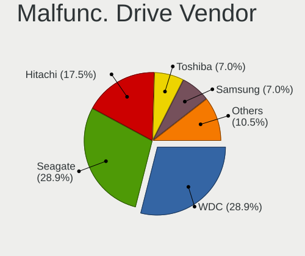

| Vendor              | Desktops | Drives | Percent |
|---------------------|----------|--------|---------|
| WDC                 | 33       | 46     | 28.95%  |
| Seagate             | 33       | 37     | 28.95%  |
| Hitachi             | 20       | 20     | 17.54%  |
| Toshiba             | 8        | 12     | 7.02%   |
| Samsung Electronics | 8        | 10     | 7.02%   |
| Maxtor              | 3        | 3      | 2.63%   |
| PNY                 | 1        | 2      | 0.88%   |
| Micron Technology   | 1        | 1      | 0.88%   |
| Kingston            | 1        | 1      | 0.88%   |
| JMicron Technology  | 1        | 1      | 0.88%   |
| Intel               | 1        | 1      | 0.88%   |
| IBM/Hitachi         | 1        | 2      | 0.88%   |
| HGST                | 1        | 1      | 0.88%   |
| ExcelStor           | 1        | 1      | 0.88%   |
| addlink             | 1        | 1      | 0.88%   |

Malfunc. HDD Vendor
-------------------

Vendors of faulty HDD drives

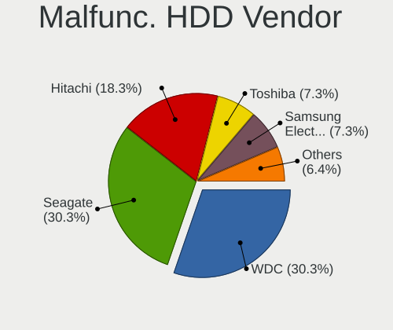

| Vendor              | Desktops | Drives | Percent |
|---------------------|----------|--------|---------|
| WDC                 | 33       | 46     | 30.28%  |
| Seagate             | 33       | 37     | 30.28%  |
| Hitachi             | 20       | 20     | 18.35%  |
| Toshiba             | 8        | 12     | 7.34%   |
| Samsung Electronics | 8        | 10     | 7.34%   |
| Maxtor              | 3        | 3      | 2.75%   |
| JMicron Technology  | 1        | 1      | 0.92%   |
| IBM/Hitachi         | 1        | 2      | 0.92%   |
| HGST                | 1        | 1      | 0.92%   |
| ExcelStor           | 1        | 1      | 0.92%   |

Malfunc. Drive Kind
-------------------

Kinds of faulty drives

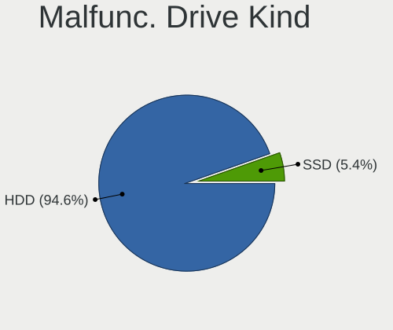

| Kind | Desktops | Drives | Percent |
|------|----------|--------|---------|
| HDD  | 88       | 133    | 94.62%  |
| SSD  | 5        | 6      | 5.38%   |

Failed Drives
-------------

Failed drive models

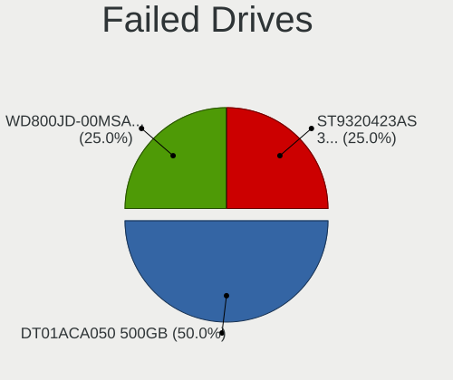

| Model                     | Desktops | Drives | Percent |
|---------------------------|----------|--------|---------|
| Toshiba DT01ACA050 500GB  | 2        | 2      | 50%     |
| WDC WD800JD-00MSA1 80GB   | 1        | 1      | 25%     |
| Seagate ST9320423AS 320GB | 1        | 1      | 25%     |

Failed Drive Vendor
-------------------

Failed drive vendors

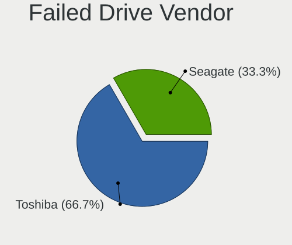

| Vendor  | Desktops | Drives | Percent |
|---------|----------|--------|---------|
| Toshiba | 2        | 2      | 50%     |
| WDC     | 1        | 1      | 25%     |
| Seagate | 1        | 1      | 25%     |

Drive Status
------------

Number of failed and malfunc. drives

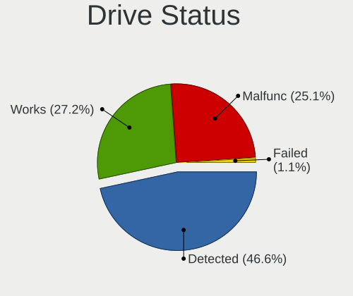

| Status   | Desktops | Drives | Percent |
|----------|----------|--------|---------|
| Detected | 173      | 327    | 46.63%  |
| Works    | 101      | 162    | 27.22%  |
| Malfunc  | 93       | 139    | 25.07%  |
| Failed   | 4        | 4      | 1.08%   |

Storage controller
------------------

Storage Vendor
--------------

Storage controller vendors

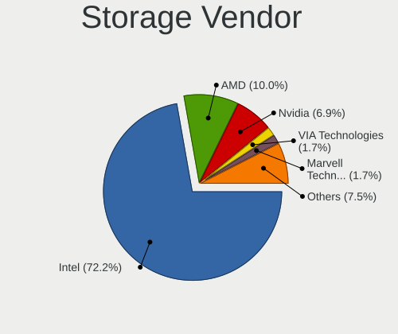

| Vendor                      | Desktops | Percent |
|-----------------------------|----------|---------|
| Intel                       | 260      | 72.22%  |
| AMD                         | 36       | 10%     |
| Nvidia                      | 25       | 6.94%   |
| VIA Technologies            | 6        | 1.67%   |
| Marvell Technology Group    | 6        | 1.67%   |
| JMicron Technology          | 6        | 1.67%   |
| Silicon Motion              | 5        | 1.39%   |
| ASMedia Technology          | 3        | 0.83%   |
| SanDisk                     | 2        | 0.56%   |
| Samsung Electronics         | 2        | 0.56%   |
| Phison Electronics          | 2        | 0.56%   |
| Kingston Technology Company | 2        | 0.56%   |
| SK hynix                    | 1        | 0.28%   |
| Realtek Semiconductor       | 1        | 0.28%   |
| Micron Technology           | 1        | 0.28%   |
| Jiangsu Huacun Elec.        | 1        | 0.28%   |
| Adaptec                     | 1        | 0.28%   |

Storage Model
-------------

Storage controller models

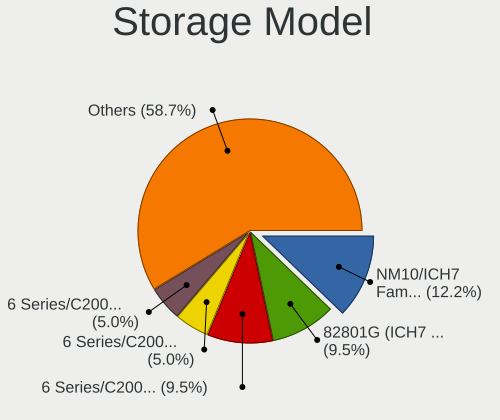

| Model                                                                                   | Desktops | Percent |
|-----------------------------------------------------------------------------------------|----------|---------|
| Intel NM10/ICH7 Family SATA Controller [IDE mode]                                       | 63       | 12.21%  |
| Intel 82801G (ICH7 Family) IDE Controller                                               | 49       | 9.5%    |
| Intel 6 Series/C200 Series Chipset Family 6 port Desktop SATA AHCI Controller           | 49       | 9.5%    |
| Intel 6 Series/C200 Series Chipset Family Desktop SATA Controller (IDE mode, ports 4-5) | 26       | 5.04%   |
| Intel 6 Series/C200 Series Chipset Family Desktop SATA Controller (IDE mode, ports 0-3) | 26       | 5.04%   |
| Nvidia MCP61 SATA Controller                                                            | 23       | 4.46%   |
| Nvidia MCP61 IDE                                                                        | 21       | 4.07%   |
| Intel 8 Series/C220 Series Chipset Family 6-port SATA Controller 1 [AHCI mode]          | 19       | 3.68%   |
| Intel Q170/Q150/B150/H170/H110/Z170/CM236 Chipset SATA Controller [AHCI Mode]           | 14       | 2.71%   |
| Intel 7 Series/C210 Series Chipset Family 6-port SATA Controller [AHCI mode]            | 14       | 2.71%   |
| Intel SATA Controller [RAID mode]                                                       | 12       | 2.33%   |
| AMD SB7x0/SB8x0/SB9x0 IDE Controller                                                    | 12       | 2.33%   |
| AMD SB7x0/SB8x0/SB9x0 SATA Controller [AHCI mode]                                       | 11       | 2.13%   |
| AMD FCH SATA Controller [AHCI mode]                                                     | 10       | 1.94%   |
| Intel 82801IR/IO/IH (ICH9R/DO/DH) 4 port SATA Controller [IDE mode]                     | 9        | 1.74%   |
| Intel 82801I (ICH9 Family) 2 port SATA Controller [IDE mode]                            | 9        | 1.74%   |
| AMD SB7x0/SB8x0/SB9x0 SATA Controller [IDE mode]                                        | 8        | 1.55%   |
| Intel 200 Series PCH SATA controller [AHCI mode]                                        | 7        | 1.36%   |
| VIA VT82C586A/B/VT82C686/A/B/VT823x/A/C PIPC Bus Master IDE                             | 6        | 1.16%   |
| Intel 500 Series Chipset Family SATA AHCI Controller                                    | 6        | 1.16%   |
| Intel 82801JI (ICH10 Family) 4 port SATA IDE Controller #1                              | 5        | 0.97%   |
| Intel 82801JI (ICH10 Family) 2 port SATA IDE Controller #2                              | 5        | 0.97%   |
| VIA VT8237A Integrated SATA Controller                                                  | 4        | 0.78%   |
| Silicon Motion SM2263EN/SM2263XT (DRAM-less) NVMe SSD Controllers                       | 4        | 0.78%   |
| Intel 82801H (ICH8 Family) 4 port SATA Controller [IDE mode]                            | 4        | 0.78%   |
| Intel 4 Series Chipset PT IDER Controller                                               | 4        | 0.78%   |
| AMD 500 Series Chipset SATA Controller                                                  | 4        | 0.78%   |
| Intel Cannon Lake PCH SATA AHCI Controller                                              | 3        | 0.58%   |
| Intel 82801HR/HO/HH (ICH8R/DO/DH) 2 port SATA Controller [IDE mode]                     | 3        | 0.58%   |
| AMD 400 Series Chipset SATA Controller                                                  | 3        | 0.58%   |
| JMicron JMB368 IDE controller                                                           | 2        | 0.39%   |
| JMicron JMB363 SATA/IDE Controller                                                      | 2        | 0.39%   |
| JMicron JMB362 SATA Controller                                                          | 2        | 0.39%   |
| Intel C610/X99 series chipset 6-Port SATA Controller [AHCI mode]                        | 2        | 0.39%   |
| Intel C600/X79 series chipset 6-Port SATA AHCI Controller                               | 2        | 0.39%   |
| Intel Alder Lake-S PCH SATA Controller [AHCI Mode]                                      | 2        | 0.39%   |
| Intel 9 Series Chipset Family SATA Controller [AHCI Mode]                               | 2        | 0.39%   |
| Intel 82801JD/DO (ICH10 Family) SATA AHCI Controller                                    | 2        | 0.39%   |
| Intel 82801JD/DO (ICH10 Family) 4-port SATA IDE Controller                              | 2        | 0.39%   |
| Intel 82801JD/DO (ICH10 Family) 2-port SATA IDE Controller                              | 2        | 0.39%   |

Storage Kind
------------

Kind of storage controller (IDE, SATA, NVMe, SAS, ...)

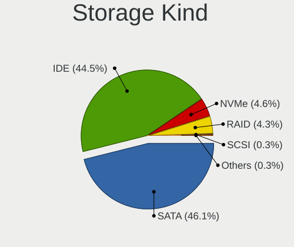

| Kind | Desktops | Percent |
|------|----------|---------|
| SATA | 171      | 46.09%  |
| IDE  | 165      | 44.47%  |
| NVMe | 17       | 4.58%   |
| RAID | 16       | 4.31%   |
| SAS  | 1        | 0.27%   |
| SCSI | 1        | 0.27%   |

Processor
---------

CPU Vendor
----------

Processor vendors

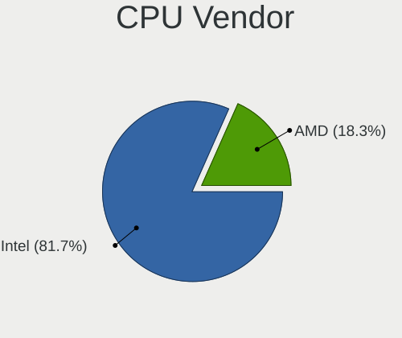

| Vendor | Desktops | Percent |
|--------|----------|---------|
| Intel  | 267      | 81.65%  |
| AMD    | 60       | 18.35%  |

CPU Model
---------

Processor models

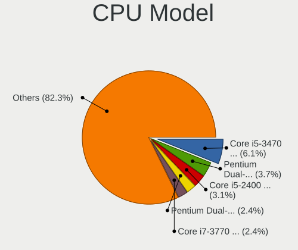

| Model                                       | Desktops | Percent |
|---------------------------------------------|----------|---------|
| Intel Core i5-3470 CPU @ 3.20GHz            | 20       | 6.12%   |
| Intel Pentium Dual-Core CPU E5300 @ 2.60GHz | 12       | 3.67%   |
| Intel Core i5-2400 CPU @ 3.10GHz            | 10       | 3.06%   |
| Intel Pentium Dual-Core CPU E5700 @ 3.00GHz | 8        | 2.45%   |
| Intel Core i7-3770 CPU @ 3.40GHz            | 8        | 2.45%   |
| Intel Core i5-6500 CPU @ 3.20GHz            | 8        | 2.45%   |
| Intel Pentium Dual-Core CPU E5800 @ 3.20GHz | 7        | 2.14%   |
| Intel Pentium 4 CPU 3.00GHz                 | 6        | 1.83%   |
| Intel Core i3-2120 CPU @ 3.30GHz            | 6        | 1.83%   |
| Intel Core 2 Duo CPU E7500 @ 2.93GHz        | 5        | 1.53%   |
| Intel Pentium Dual-Core CPU E6600 @ 3.06GHz | 4        | 1.22%   |
| Intel Pentium Dual CPU E2180 @ 2.00GHz      | 4        | 1.22%   |
| Intel Pentium CPU G620 @ 2.60GHz            | 4        | 1.22%   |
| Intel Pentium CPU G2030 @ 3.00GHz           | 4        | 1.22%   |
| Intel Core i7-4790 CPU @ 3.60GHz            | 4        | 1.22%   |
| Intel Core i5-3330 CPU @ 3.00GHz            | 4        | 1.22%   |
| Intel Core i5-2500 CPU @ 3.30GHz            | 4        | 1.22%   |
| Intel Core 2 Duo CPU E8400 @ 3.00GHz        | 4        | 1.22%   |
| Intel Pentium Dual-Core CPU E5500 @ 2.80GHz | 3        | 0.92%   |
| Intel Pentium Dual-Core CPU E5200 @ 2.50GHz | 3        | 0.92%   |
| Intel Pentium CPU G640 @ 2.80GHz            | 3        | 0.92%   |
| Intel Pentium CPU G630 @ 2.70GHz            | 3        | 0.92%   |
| Intel Pentium CPU G2010 @ 2.80GHz           | 3        | 0.92%   |
| Intel Core i7-2600 CPU @ 3.40GHz            | 3        | 0.92%   |
| Intel Core i5-6600 CPU @ 3.30GHz            | 3        | 0.92%   |
| Intel Core i5-4570 CPU @ 3.20GHz            | 3        | 0.92%   |
| Intel Core i5-10400 CPU @ 2.90GHz           | 3        | 0.92%   |
| Intel Core i3-4130 CPU @ 3.40GHz            | 3        | 0.92%   |
| Intel Core i3-3220 CPU @ 3.30GHz            | 3        | 0.92%   |
| Intel Core i3-2100 CPU @ 3.10GHz            | 3        | 0.92%   |
| Intel Core 2 Quad CPU Q8400 @ 2.66GHz       | 3        | 0.92%   |
| Intel Core 2 Quad CPU Q6600 @ 2.40GHz       | 3        | 0.92%   |
| Intel 12th Gen Core i5-12400                | 3        | 0.92%   |
| AMD Sempron 145 Processor                   | 3        | 0.92%   |
| AMD Sempron 140 Processor                   | 3        | 0.92%   |
| AMD FX-6300 Six-Core Processor              | 3        | 0.92%   |
| AMD FX-6100 Six-Core Processor              | 3        | 0.92%   |
| AMD Athlon II X2 250 Processor              | 3        | 0.92%   |
| Intel Xeon CPU E3-1220 v5 @ 3.00GHz         | 2        | 0.61%   |
| Intel Pentium Dual-Core CPU E5400 @ 2.70GHz | 2        | 0.61%   |

CPU Model Family
----------------

Processor model prefix

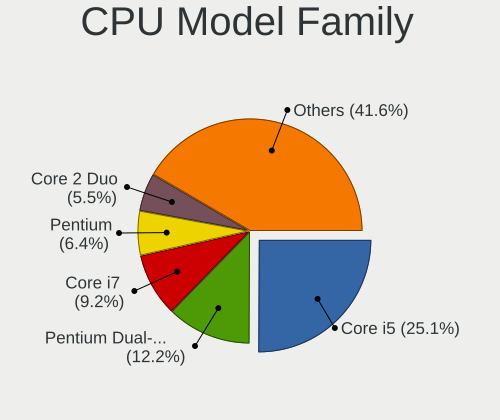

| Model                   | Desktops | Percent |
|-------------------------|----------|---------|
| Intel Core i5           | 82       | 25.08%  |
| Intel Pentium Dual-Core | 40       | 12.23%  |
| Intel Core i7           | 30       | 9.17%   |
| Intel Pentium           | 21       | 6.42%   |
| Intel Core 2 Duo        | 18       | 5.5%    |
| Intel Core i3           | 17       | 5.2%    |
| Other                   | 12       | 3.67%   |
| Intel Pentium Dual      | 10       | 3.06%   |
| Intel Xeon              | 9        | 2.75%   |
| Intel Pentium 4         | 9        | 2.75%   |
| AMD Sempron             | 8        | 2.45%   |
| Intel Core 2 Quad       | 7        | 2.14%   |
| AMD FX                  | 7        | 2.14%   |
| AMD Athlon II X2        | 7        | 2.14%   |
| Intel Core 2            | 5        | 1.53%   |
| AMD Ryzen 5             | 5        | 1.53%   |
| Intel Celeron           | 4        | 1.22%   |
| AMD Phenom II X4        | 4        | 1.22%   |
| AMD Athlon II X4        | 4        | 1.22%   |
| AMD Athlon 64 X2        | 4        | 1.22%   |
| Intel Pentium D         | 3        | 0.92%   |
| Intel Genuine           | 2        | 0.61%   |
| AMD Ryzen 7             | 2        | 0.61%   |
| AMD Phenom II X2        | 2        | 0.61%   |
| AMD Phenom              | 2        | 0.61%   |
| AMD Athlon              | 2        | 0.61%   |
| AMD A8                  | 2        | 0.61%   |
| Intel Atom              | 1        | 0.31%   |
| AMD Turion II Neo       | 1        | 0.31%   |
| AMD Ryzen 3             | 1        | 0.31%   |
| AMD Phenom II X6        | 1        | 0.31%   |
| AMD E1                  | 1        | 0.31%   |
| AMD E                   | 1        | 0.31%   |
| AMD Athlon II           | 1        | 0.31%   |
| AMD A6                  | 1        | 0.31%   |
| AMD A4                  | 1        | 0.31%   |

CPU Cores
---------

Number of processor cores

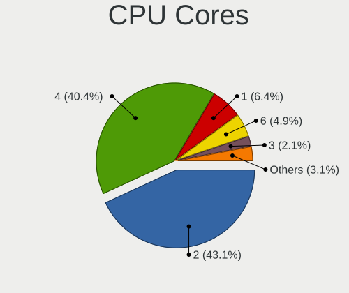

| Number  | Desktops | Percent |
|---------|----------|---------|
| 2       | 141      | 43.12%  |
| 4       | 132      | 40.37%  |
| 1       | 21       | 6.42%   |
| 6       | 16       | 4.89%   |
| 3       | 7        | 2.14%   |
| 8       | 6        | 1.83%   |
| Unknown | 2        | 0.61%   |
| 14      | 1        | 0.31%   |
| 10      | 1        | 0.31%   |

CPU Sockets
-----------

Number of sockets

| Number | Desktops | Percent |
|--------|----------|---------|
| 1      | 326      | 99.69%  |
| 2      | 1        | 0.31%   |

CPU Threads
-----------

Threads per core (Hyper-Threading)

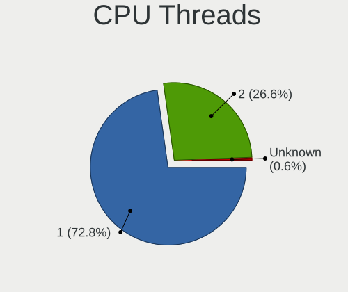

| Number  | Desktops | Percent |
|---------|----------|---------|
| 1       | 238      | 72.78%  |
| 2       | 87       | 26.61%  |
| Unknown | 2        | 0.61%   |

CPU Op-Modes
------------

CPU Operation Modes (32-bit, 64-bit)

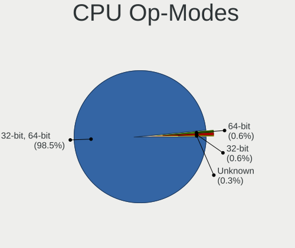

| Op mode        | Desktops | Percent |
|----------------|----------|---------|
| 32-bit, 64-bit | 322      | 98.47%  |
| 64-bit         | 2        | 0.61%   |
| 32-bit         | 2        | 0.61%   |
| Unknown        | 1        | 0.31%   |

CPU Microcode
-------------

Microcode number

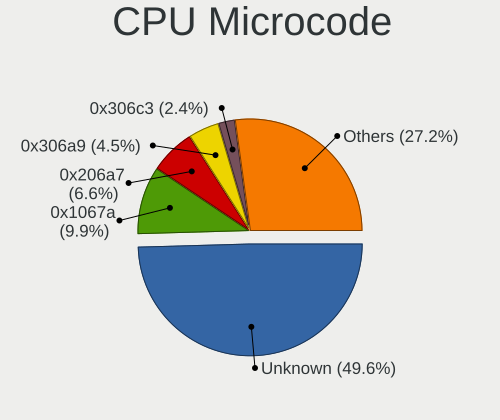

| Number     | Desktops | Percent |
|------------|----------|---------|
| Unknown    | 166      | 49.55%  |
| 0x1067a    | 33       | 9.85%   |
| 0x206a7    | 22       | 6.57%   |
| 0x306a9    | 15       | 4.48%   |
| 0x306c3    | 8        | 2.39%   |
| 0x6fd      | 7        | 2.09%   |
| 0x010000c8 | 6        | 1.79%   |
| 0x6fb      | 5        | 1.49%   |
| 0xf65      | 4        | 1.19%   |
| 0x6f2      | 4        | 1.19%   |
| 0x506e3    | 4        | 1.19%   |
| 0x010000c7 | 4        | 1.19%   |
| 0x010000b6 | 4        | 1.19%   |
| 0xa0671    | 3        | 0.9%    |
| 0x10676    | 3        | 0.9%    |
| 0x06000852 | 3        | 0.9%    |
| 0x0600063e | 3        | 0.9%    |
| 0x03000027 | 3        | 0.9%    |
| 0xf41      | 2        | 0.6%    |
| 0x906e9    | 2        | 0.6%    |
| 0x206d7    | 2        | 0.6%    |
| 0x106a5    | 2        | 0.6%    |
| 0x010000db | 2        | 0.6%    |
| 0xf49      | 1        | 0.3%    |
| 0xf47      | 1        | 0.3%    |
| 0xf43      | 1        | 0.3%    |
| 0xf12      | 1        | 0.3%    |
| 0xa0653    | 1        | 0.3%    |
| 0x906eb    | 1        | 0.3%    |
| 0x806c1    | 1        | 0.3%    |
| 0x6f6      | 1        | 0.3%    |
| 0x20652    | 1        | 0.3%    |
| 0x106e5    | 1        | 0.3%    |
| 0x106ca    | 1        | 0.3%    |
| 0x10661    | 1        | 0.3%    |
| 0x0a50000f | 1        | 0.3%    |
| 0x0a50000d | 1        | 0.3%    |
| 0x0a50000c | 1        | 0.3%    |
| 0x08701030 | 1        | 0.3%    |
| 0x0810100b | 1        | 0.3%    |

CPU Microarch
-------------

Microarchitecture

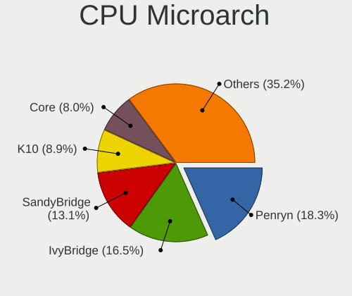

| Name             | Desktops | Percent |
|------------------|----------|---------|
| Penryn           | 60       | 18.35%  |
| IvyBridge        | 54       | 16.51%  |
| SandyBridge      | 43       | 13.15%  |
| K10              | 29       | 8.87%   |
| Core             | 26       | 7.95%   |
| Haswell          | 24       | 7.34%   |
| Skylake          | 16       | 4.89%   |
| NetBurst         | 12       | 3.67%   |
| KabyLake         | 10       | 3.06%   |
| K8 Hammer        | 6        | 1.83%   |
| Zen 3            | 5        | 1.53%   |
| Piledriver       | 4        | 1.22%   |
| Bulldozer        | 4        | 1.22%   |
| Westmere         | 3        | 0.92%   |
| Nehalem          | 3        | 0.92%   |
| K10 Llano        | 3        | 0.92%   |
| CometLake        | 3        | 0.92%   |
| Unknown          | 3        | 0.92%   |
| Zen+             | 2        | 0.61%   |
| Icelake          | 2        | 0.61%   |
| Broadwell        | 2        | 0.61%   |
| Bobcat           | 2        | 0.61%   |
| Alderlake Hybrid | 2        | 0.61%   |
| Zen 2            | 1        | 0.31%   |
| Zen              | 1        | 0.31%   |
| TigerLake        | 1        | 0.31%   |
| Steamroller      | 1        | 0.31%   |
| Silvermont       | 1        | 0.31%   |
| Jaguar           | 1        | 0.31%   |
| Gracemont        | 1        | 0.31%   |
| Excavator        | 1        | 0.31%   |
| Bonnell          | 1        | 0.31%   |

Graphics
--------

GPU Vendor
----------

Vendors of graphics cards

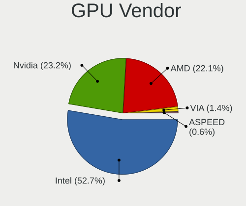

| Vendor            | Desktops | Percent |
|-------------------|----------|---------|
| Intel             | 186      | 52.69%  |
| Nvidia            | 82       | 23.23%  |
| AMD               | 78       | 22.1%   |
| VIA Technologies  | 5        | 1.42%   |
| ASPEED Technology | 2        | 0.57%   |

GPU Model
---------

Graphics card models

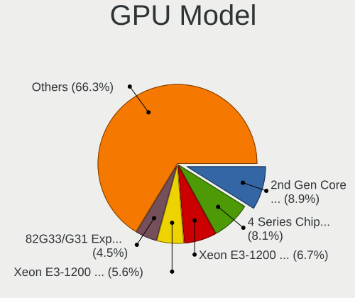

| Model                                                                       | Desktops | Percent |
|-----------------------------------------------------------------------------|----------|---------|
| Intel 2nd Generation Core Processor Family Integrated Graphics Controller   | 32       | 8.91%   |
| Intel 4 Series Chipset Integrated Graphics Controller                       | 29       | 8.08%   |
| Intel Xeon E3-1200 v2/3rd Gen Core processor Graphics Controller            | 24       | 6.69%   |
| Intel Xeon E3-1200 v3/4th Gen Core Processor Integrated Graphics Controller | 20       | 5.57%   |
| Intel 82G33/G31 Express Integrated Graphics Controller                      | 16       | 4.46%   |
| Intel Skylake-S GT2 [HD Graphics 530]                                       | 12       | 3.34%   |
| AMD Cedar [Radeon HD 5000/6000/7350/8350 Series]                            | 12       | 3.34%   |
| AMD Ellesmere [Radeon RX 470/480/570/570X/580/580X/590]                     | 10       | 2.79%   |
| Nvidia C61 [GeForce 7025 / nForce 630a]                                     | 9        | 2.51%   |
| Intel IvyBridge GT2 [HD Graphics 4000]                                      | 8        | 2.23%   |
| AMD Oland [Radeon HD 8570 / R5 430 OEM / R7 240/340 / Radeon 520 OEM]       | 8        | 2.23%   |
| Nvidia GF119 [GeForce GT 610]                                               | 7        | 1.95%   |
| AMD Oland XT [Radeon HD 8670 / R5 340X OEM / R7 250/350/350X OEM]           | 7        | 1.95%   |
| Nvidia GT218 [GeForce 210]                                                  | 6        | 1.67%   |
| Intel Kaby Lake-S GT2 [HD Graphics 630]                                     | 6        | 1.67%   |
| Nvidia GK208B [GeForce GT 730]                                              | 5        | 1.39%   |
| Intel 82945G/GZ Integrated Graphics Controller                              | 5        | 1.39%   |
| VIA Technologies CN896/VN896/P4M900 [Chrome 9 HC]                           | 4        | 1.11%   |
| Nvidia GF119 [GeForce GT 520]                                               | 4        | 1.11%   |
| Nvidia G96C [GeForce 9500 GT]                                               | 4        | 1.11%   |
| Intel 82Q963/Q965 Integrated Graphics Controller                            | 4        | 1.11%   |
| Intel 82946GZ/GL Integrated Graphics Controller                             | 4        | 1.11%   |
| AMD Cezanne [Radeon Vega Series / Radeon Vega Mobile Series]                | 4        | 1.11%   |
| Nvidia GM107GL [Quadro K620]                                                | 3        | 0.84%   |
| Nvidia GK208B [GeForce GT 710]                                              | 3        | 0.84%   |
| Nvidia GF106 [GeForce GTS 450]                                              | 3        | 0.84%   |
| Nvidia G86 [GeForce 8500 GT]                                                | 3        | 0.84%   |
| Intel CoffeeLake-S GT2 [UHD Graphics 630]                                   | 3        | 0.84%   |
| Intel Alder Lake-S GT1 [UHD Graphics 730]                                   | 3        | 0.84%   |
| Intel 4th Generation Core Processor Family Integrated Graphics Controller   | 3        | 0.84%   |
| AMD Turks XT [Radeon HD 6670/7670]                                          | 3        | 0.84%   |
| AMD RS780L [Radeon 3000]                                                    | 3        | 0.84%   |
| Nvidia NV44 [GeForce 6200 LE]                                               | 2        | 0.56%   |
| Nvidia GF119 [GeForce 605]                                                  | 2        | 0.56%   |
| Nvidia GF108 [GeForce GT 630]                                               | 2        | 0.56%   |
| Nvidia G98 [GeForce 8400 GS Rev. 2]                                         | 2        | 0.56%   |
| Nvidia C61 [GeForce 6150SE nForce 430]                                      | 2        | 0.56%   |
| Nvidia C61 [GeForce 6100 nForce 405]                                        | 2        | 0.56%   |
| Intel RocketLake-S GT1 [UHD Graphics 730]                                   | 2        | 0.56%   |
| Intel CometLake-S GT2 [UHD Graphics 630]                                    | 2        | 0.56%   |

GPU Combo
---------

Combinations of graphics cards

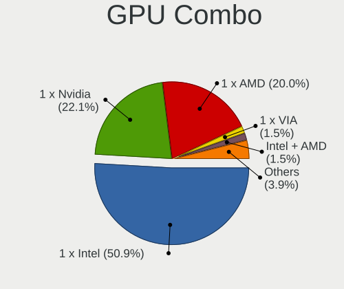

| Name            | Desktops | Percent |
|-----------------|----------|---------|
| 1 x Intel       | 168      | 50.91%  |
| 1 x Nvidia      | 73       | 22.12%  |
| 1 x AMD         | 66       | 20%     |
| 1 x VIA         | 5        | 1.52%   |
| Intel + AMD     | 5        | 1.52%   |
| Intel + Nvidia  | 4        | 1.21%   |
| AMD + Nvidia    | 4        | 1.21%   |
| 2 x AMD         | 3        | 0.91%   |
| Nvidia + ASPEED | 2        | 0.61%   |

GPU Driver
----------

Free vs proprietary

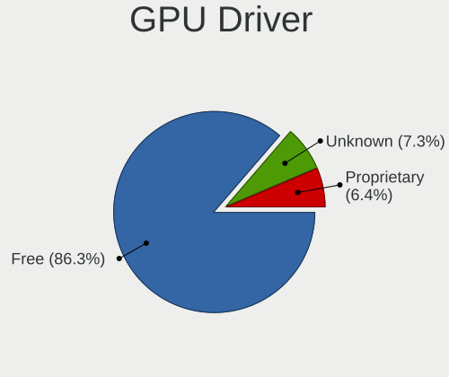

| Driver      | Desktops | Percent |
|-------------|----------|---------|
| Free        | 284      | 86.32%  |
| Unknown     | 24       | 7.29%   |
| Proprietary | 21       | 6.38%   |

GPU Memory
----------

Total video memory

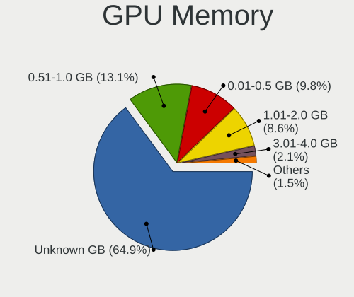

| Size in GB | Desktops | Percent |
|------------|----------|---------|
| Unknown    | 218      | 64.88%  |
| 0.51-1.0   | 44       | 13.1%   |
| 0.01-0.5   | 33       | 9.82%   |
| 1.01-2.0   | 29       | 8.63%   |
| 3.01-4.0   | 7        | 2.08%   |
| 7.01-8.0   | 4        | 1.19%   |
| 8.01-16.0  | 1        | 0.3%    |

Monitor
-------

Monitor Vendor
--------------

Monitor vendors

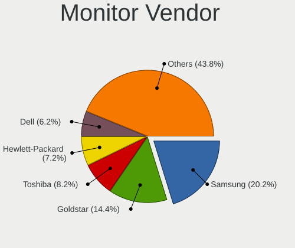

| Vendor                                | Desktops | Percent |
|---------------------------------------|----------|---------|
| Samsung Electronics                   | 59       | 20.21%  |
| Goldstar                              | 42       | 14.38%  |
| Toshiba                               | 24       | 8.22%   |
| Hewlett-Packard                       | 21       | 7.19%   |
| Dell                                  | 18       | 6.16%   |
| Acer                                  | 16       | 5.48%   |
| Lenovo                                | 13       | 4.45%   |
| AOC                                   | 13       | 4.45%   |
| Vita                                  | 8        | 2.74%   |
| BenQ                                  | 5        | 1.71%   |
| ___                                   | 3        | 1.03%   |
| Unknown (XXX)                         | 3        | 1.03%   |
| Sony                                  | 3        | 1.03%   |
| SKG                                   | 3        | 1.03%   |
| MSI                                   | 3        | 1.03%   |
| LG Electronics                        | 3        | 1.03%   |
| Envision                              | 3        | 1.03%   |
| CHO                                   | 3        | 1.03%   |
| ViewSonic                             | 2        | 0.68%   |
| Unknown                               | 2        | 0.68%   |
| Skyworth                              | 2        | 0.68%   |
| NEC Computers                         | 2        | 0.68%   |
| LED                                   | 2        | 0.68%   |
| KTC                                   | 2        | 0.68%   |
| ITE                                   | 2        | 0.68%   |
| IBM                                   | 2        | 0.68%   |
| HKC                                   | 2        | 0.68%   |
| CVT                                   | 2        | 0.68%   |
| Ancor Communications                  | 2        | 0.68%   |
| VIZTA                                 | 1        | 0.34%   |
| VIE                                   | 1        | 0.34%   |
| Toshiba Matsushita Display Technology | 1        | 0.34%   |
| TCL                                   | 1        | 0.34%   |
| Sun                                   | 1        | 0.34%   |
| SKW                                   | 1        | 0.34%   |
| SGT                                   | 1        | 0.34%   |
| RTK                                   | 1        | 0.34%   |
| RGT                                   | 1        | 0.34%   |
| PXO                                   | 1        | 0.34%   |
| Plain Tree Systems                    | 1        | 0.34%   |

Monitor Model
-------------

Monitor models

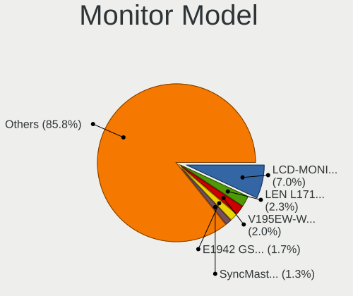

| Model                                                                | Desktops | Percent |
|----------------------------------------------------------------------|----------|---------|
| Toshiba LCD-MONITOR LCDE980 1440x900 408x255mm 18.9-inch             | 21       | 6.95%   |
| Lenovo LEN L171 LEN240B 1280x1024 337x270mm 17.0-inch                | 7        | 2.32%   |
| Vita V195EW-W VIT1950 1600x900 432x240mm 19.5-inch                   | 6        | 1.99%   |
| Goldstar E1942 GSM4C09 1366x768 410x230mm 18.5-inch                  | 5        | 1.66%   |
| Samsung Electronics SyncMaster SAM01B7 1280x1024 340x270mm 17.1-inch | 4        | 1.32%   |
| Goldstar W1943 GSM4BAD 1360x768 406x229mm 18.4-inch                  | 4        | 1.32%   |
| Goldstar HD GSM5ACD 1366x768 410x230mm 18.5-inch                     | 4        | 1.32%   |
| Goldstar 505G GSM3B91 1024x768 270x200mm 13.2-inch                   | 4        | 1.32%   |
| Toshiba TV TSB0206 1920x1080                                         | 3        | 0.99%   |
| Samsung Electronics SMB1930N SAM0632 1366x768 410x230mm 18.5-inch    | 3        | 0.99%   |
| Hewlett-Packard L1710 HWP26EB 1280x1024 340x270mm 17.1-inch          | 3        | 0.99%   |
| CHO Smart TV CHO0030 1920x1080 1390x780mm 62.8-inch                  | 3        | 0.99%   |
| Vita L195WA-V VIT1120 1440x900 373x280mm 18.4-inch                   | 2        | 0.66%   |
| Unknown (XXX) L9W XXX076E 1440x900 410x256mm 19.0-inch               | 2        | 0.66%   |
| SKG DEXP DF24N2 SKG2413 1920x1080 597x336mm 27.0-inch                | 2        | 0.66%   |
| Samsung Electronics SyncMaster SAM0598 1360x768 410x230mm 18.5-inch  | 2        | 0.66%   |
| Samsung Electronics SyncMaster SAM0472 1440x900 367x229mm 17.0-inch  | 2        | 0.66%   |
| Samsung Electronics SyncMaster SAM0370 1680x1050 459x296mm 21.5-inch | 2        | 0.66%   |
| Samsung Electronics SyncMaster SAM0364 1360x768 344x194mm 15.5-inch  | 2        | 0.66%   |
| Samsung Electronics SA300/SA350 SAM0788 1366x768 410x230mm 18.5-inch | 2        | 0.66%   |
| Samsung Electronics S19A10N SAM083E 1366x768 410x230mm 18.5-inch     | 2        | 0.66%   |
| MSI G273 MSI3CA7 1920x1080 597x336mm 27.0-inch                       | 2        | 0.66%   |
| Lenovo LEN L151 LEN23CD 1024x768 304x228mm 15.0-inch                 | 2        | 0.66%   |
| Lenovo LEN D186wA LEN0A14 1366x768 410x230mm 18.5-inch               | 2        | 0.66%   |
| Lenovo L197 Wide LEN1152 1440x900 410x257mm 19.1-inch                | 2        | 0.66%   |
| Hewlett-Packard S1933 HWP2933 1366x768 413x234mm 18.7-inch           | 2        | 0.66%   |
| Goldstar L194W GSM4B6A 1440x900 408x255mm 18.9-inch                  | 2        | 0.66%   |
| Goldstar L192WS GSM4B32 1440x900 410x256mm 19.0-inch                 | 2        | 0.66%   |
| Goldstar 19EN33 GSM4C18 1366x768 410x230mm 18.5-inch                 | 2        | 0.66%   |
| Dell E170S DELA04A 1280x1024 340x270mm 17.1-inch                     | 2        | 0.66%   |
| AOC F19 AOC1900 1366x768 410x230mm 18.5-inch                         | 2        | 0.66%   |
| Acer V246HQL ACR0424 1920x1080 521x293mm 23.5-inch                   | 2        | 0.66%   |
| Acer B193W ACR001E 1440x900 408x255mm 18.9-inch                      | 2        | 0.66%   |
| Acer AL1916W ACRAD80 1440x900 410x256mm 19.0-inch                    | 2        | 0.66%   |
| ___ LCD TV ___9000 1360x768                                          | 1        | 0.33%   |
| ___ LCD TV ___0101 1360x768                                          | 1        | 0.33%   |
| ___ LCD Monitor ___F770 1280x1024 320x240mm 15.7-inch                | 1        | 0.33%   |
| VIZTA LCD MONITOR JRY3219 1360x768 430x254mm 19.7-inch               | 1        | 0.33%   |
| ViewSonic VX2245wm VSCBB1E 1680x1050 474x296mm 22.0-inch             | 1        | 0.33%   |
| ViewSonic VA2448 SERIES VSC3828 1920x1080 521x293mm 23.5-inch        | 1        | 0.33%   |

Monitor Resolution
------------------

Monitor screen resolution

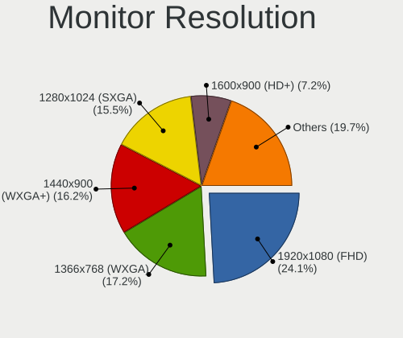

| Resolution         | Desktops | Percent |
|--------------------|----------|---------|
| 1920x1080 (FHD)    | 70       | 24.14%  |
| 1366x768 (WXGA)    | 50       | 17.24%  |
| 1440x900 (WXGA+)   | 47       | 16.21%  |
| 1280x1024 (SXGA)   | 45       | 15.52%  |
| 1600x900 (HD+)     | 21       | 7.24%   |
| 1360x768           | 16       | 5.52%   |
| 1024x768 (XGA)     | 12       | 4.14%   |
| 1680x1050 (WSXGA+) | 8        | 2.76%   |
| 3840x2160 (4K)     | 7        | 2.41%   |
| 2560x1440 (QHD)    | 4        | 1.38%   |
| 1280x720 (HD)      | 3        | 1.03%   |
| 1920x1200 (WUXGA)  | 2        | 0.69%   |
| Unknown            | 2        | 0.69%   |
| 3840x1080          | 1        | 0.34%   |
| 1600x1200          | 1        | 0.34%   |
| 1152x864           | 1        | 0.34%   |

Monitor Diagonal
----------------

Diagonal size in inches

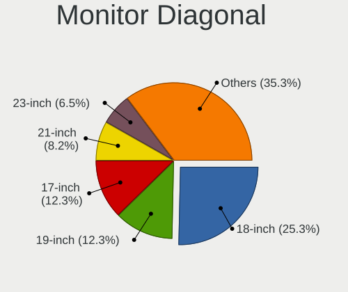

| Inches  | Desktops | Percent |
|---------|----------|---------|
| 18      | 74       | 25.34%  |
| 19      | 36       | 12.33%  |
| 17      | 36       | 12.33%  |
| 21      | 24       | 8.22%   |
| 23      | 19       | 6.51%   |
| 15      | 17       | 5.82%   |
| Unknown | 15       | 5.14%   |
| 20      | 14       | 4.79%   |
| 27      | 8        | 2.74%   |
| 22      | 6        | 2.05%   |
| 13      | 6        | 2.05%   |
| 72      | 5        | 1.71%   |
| 32      | 4        | 1.37%   |
| 31      | 4        | 1.37%   |
| 74      | 3        | 1.03%   |
| 63      | 3        | 1.03%   |
| 16      | 3        | 1.03%   |
| 40      | 2        | 0.68%   |
| 25      | 2        | 0.68%   |
| 57      | 1        | 0.34%   |
| 54      | 1        | 0.34%   |
| 52      | 1        | 0.34%   |
| 49      | 1        | 0.34%   |
| 46      | 1        | 0.34%   |
| 42      | 1        | 0.34%   |
| 39      | 1        | 0.34%   |
| 33      | 1        | 0.34%   |
| 24      | 1        | 0.34%   |
| 14      | 1        | 0.34%   |
| 12      | 1        | 0.34%   |

Monitor Width
-------------

Physical width

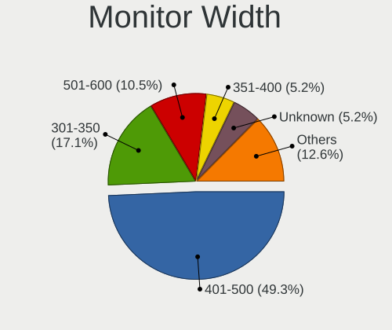

| Width in mm | Desktops | Percent |
|-------------|----------|---------|
| 401-500     | 141      | 49.3%   |
| 301-350     | 49       | 17.13%  |
| 501-600     | 30       | 10.49%  |
| 351-400     | 15       | 5.24%   |
| Unknown     | 15       | 5.24%   |
| 1501-2000   | 8        | 2.8%    |
| 1001-1500   | 8        | 2.8%    |
| 201-300     | 7        | 2.45%   |
| 701-800     | 5        | 1.75%   |
| 601-700     | 4        | 1.4%    |
| 801-900     | 3        | 1.05%   |
| 901-1000    | 1        | 0.35%   |

Aspect Ratio
------------

Proportional relationship between the width and the height

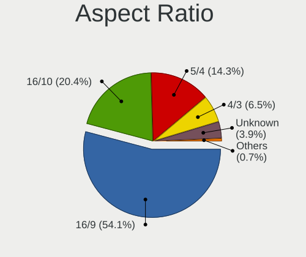

| Ratio   | Desktops | Percent |
|---------|----------|---------|
| 16/9    | 151      | 54.12%  |
| 16/10   | 57       | 20.43%  |
| 5/4     | 40       | 14.34%  |
| 4/3     | 18       | 6.45%   |
| Unknown | 11       | 3.94%   |
| 32/9    | 1        | 0.36%   |
| 3/2     | 1        | 0.36%   |

Monitor Area
------------

Area in inch²

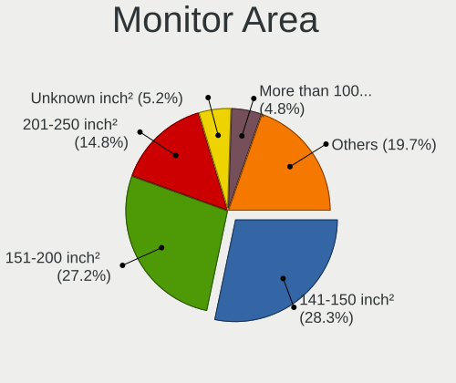

| Area in inch² | Desktops | Percent |
|----------------|----------|---------|
| 141-150        | 82       | 28.28%  |
| 151-200        | 79       | 27.24%  |
| 201-250        | 43       | 14.83%  |
| Unknown        | 15       | 5.17%   |
| More than 1000 | 14       | 4.83%   |
| 101-110        | 14       | 4.83%   |
| 351-500        | 9        | 3.1%    |
| 301-350        | 8        | 2.76%   |
| 501-1000       | 6        | 2.07%   |
| 81-90          | 5        | 1.72%   |
| 131-140        | 4        | 1.38%   |
| 111-120        | 4        | 1.38%   |
| 121-130        | 3        | 1.03%   |
| 251-300        | 2        | 0.69%   |
| 71-80          | 1        | 0.34%   |
| 91-100         | 1        | 0.34%   |

Pixel Density
-------------

Pixels per inch

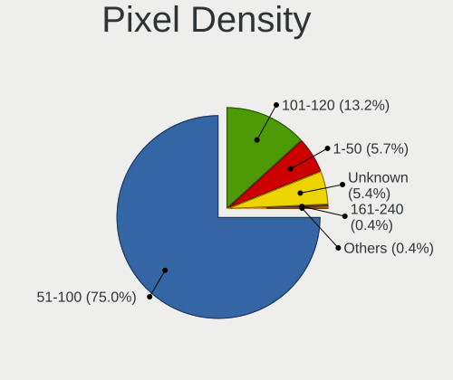

| Density | Desktops | Percent |
|---------|----------|---------|
| 51-100  | 210      | 75%     |
| 101-120 | 37       | 13.21%  |
| 1-50    | 16       | 5.71%   |
| Unknown | 15       | 5.36%   |
| 161-240 | 1        | 0.36%   |
| 121-160 | 1        | 0.36%   |

Multiple Monitors
-----------------

Total monitors connected

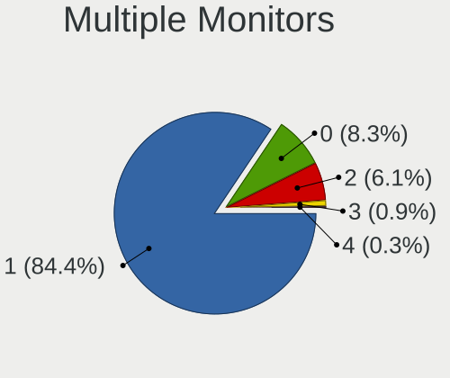

| Total | Desktops | Percent |
|-------|----------|---------|
| 1     | 276      | 84.4%   |
| 0     | 27       | 8.26%   |
| 2     | 20       | 6.12%   |
| 3     | 3        | 0.92%   |
| 4     | 1        | 0.31%   |

Network
-------

Net Controller Vendor
---------------------

Controller vendors

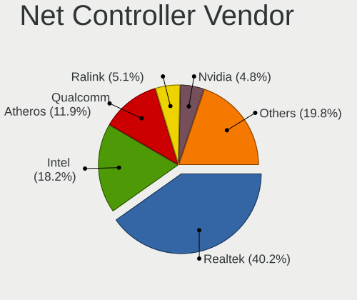

| Vendor                                 | Desktops | Percent |
|----------------------------------------|----------|---------|
| Realtek Semiconductor                  | 199      | 40.2%   |
| Intel                                  | 90       | 18.18%  |
| Qualcomm Atheros                       | 59       | 11.92%  |
| Ralink                                 | 25       | 5.05%   |
| Nvidia                                 | 24       | 4.85%   |
| Ralink Technology                      | 15       | 3.03%   |
| Broadcom                               | 15       | 3.03%   |
| TP-Link                                | 10       | 2.02%   |
| Xiaomi                                 | 9        | 1.82%   |
| Marvell Technology Group               | 7        | 1.41%   |
| VIA Technologies                       | 6        | 1.21%   |
| Qualcomm Atheros Communications        | 5        | 1.01%   |
| Mercucys                               | 5        | 1.01%   |
| MediaTek                               | 3        | 0.61%   |
| D-Link System                          | 3        | 0.61%   |
| Sundance Technology Inc / IC Plus      | 2        | 0.4%    |
| Samsung Electronics                    | 2        | 0.4%    |
| Broadcom Limited                       | 2        | 0.4%    |
| ZTopInc                                | 1        | 0.2%    |
| ZTE WCDMA Technologies MSM             | 1        | 0.2%    |
| Trendchip Technologies                 | 1        | 0.2%    |
| Suzhou Motorcomm Electronic Technology | 1        | 0.2%    |
| QinHeng Electronics                    | 1        | 0.2%    |
| National Semiconductor                 | 1        | 0.2%    |
| Motorola PCS                           | 1        | 0.2%    |
| Motorola BCS                           | 1        | 0.2%    |
| JMicron Technology                     | 1        | 0.2%    |
| ICS Advent                             | 1        | 0.2%    |
| Davicom Semiconductor                  | 1        | 0.2%    |
| ASIX Electronics                       | 1        | 0.2%    |
| ADMtek                                 | 1        | 0.2%    |
| Accton Technology                      | 1        | 0.2%    |

Net Controller Model
--------------------

Controller models

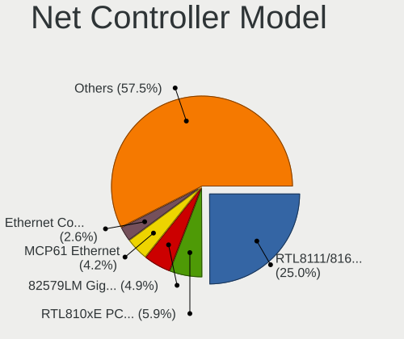

| Model                                                                          | Desktops | Percent |
|--------------------------------------------------------------------------------|----------|---------|
| Realtek RTL8111/8168/8211/8411 PCI Express Gigabit Ethernet Controller         | 132      | 24.95%  |
| Realtek RTL810xE PCI Express Fast Ethernet controller                          | 31       | 5.86%   |
| Intel 82579LM Gigabit Network Connection (Lewisville)                          | 26       | 4.91%   |
| Nvidia MCP61 Ethernet                                                          | 22       | 4.16%   |
| Intel Ethernet Connection I217-LM                                              | 14       | 2.65%   |
| Qualcomm Atheros AR8152 v2.0 Fast Ethernet                                     | 11       | 2.08%   |
| Qualcomm Atheros AR5212/5213/2414 Wireless Network Adapter                     | 10       | 1.89%   |
| Ralink RT3090 Wireless 802.11n 1T/1R PCIe                                      | 9        | 1.7%    |
| Realtek RTL8188FTV 802.11b/g/n 1T1R 2.4G WLAN Adapter                          | 8        | 1.51%   |
| Realtek RTL-8100/8101L/8139 PCI Fast Ethernet Adapter                          | 8        | 1.51%   |
| Qualcomm Atheros AR9485 Wireless Network Adapter                               | 8        | 1.51%   |
| Realtek RTL8188EUS 802.11n Wireless Network Adapter                            | 7        | 1.32%   |
| Ralink MT7601U Wireless Adapter                                                | 7        | 1.32%   |
| Intel Ethernet Connection (2) I219-LM                                          | 7        | 1.32%   |
| Xiaomi Mi/Redmi series (RNDIS)                                                 | 6        | 1.13%   |
| Ralink RT2870/RT3070 Wireless Adapter                                          | 6        | 1.13%   |
| Ralink RT5390 Wireless 802.11n 1T/1R PCIe                                      | 6        | 1.13%   |
| Ralink RT2790 Wireless 802.11n 1T/2R PCIe                                      | 6        | 1.13%   |
| VIA VT6102/VT6103 [Rhine-II]                                                   | 5        | 0.95%   |
| Realtek RTL8192EU 802.11b/g/n WLAN Adapter                                     | 5        | 0.95%   |
| Qualcomm Atheros AR9285 Wireless Network Adapter (PCI-Express)                 | 5        | 0.95%   |
| Qualcomm Atheros AR2413/AR2414 Wireless Network Adapter [AR5005G(S) 802.11bg]  | 5        | 0.95%   |
| Realtek RTL88x2bu [AC1200 Techkey]                                             | 4        | 0.76%   |
| Qualcomm Atheros AR9271 802.11n                                                | 4        | 0.76%   |
| Marvell Group 88E8056 PCI-E Gigabit Ethernet Controller                        | 4        | 0.76%   |
| Intel 82567LM-3 Gigabit Network Connection                                     | 4        | 0.76%   |
| Broadcom NetLink BCM5786 Gigabit Ethernet PCI Express                          | 4        | 0.76%   |
| TP-Link TL-WN823N v2/v3 [Realtek RTL8192EU]                                    | 3        | 0.57%   |
| Realtek RTL8192CU 802.11n WLAN Adapter                                         | 3        | 0.57%   |
| Realtek RTL8188EE Wireless Network Adapter                                     | 3        | 0.57%   |
| Realtek RTL8188CUS 802.11n WLAN Adapter                                        | 3        | 0.57%   |
| Realtek RTL8169 PCI Gigabit Ethernet Controller                                | 3        | 0.57%   |
| Realtek 802.11ac NIC                                                           | 3        | 0.57%   |
| Qualcomm Atheros AR922X Wireless Network Adapter                               | 3        | 0.57%   |
| Qualcomm Atheros AR8151 v2.0 Gigabit Ethernet                                  | 3        | 0.57%   |
| Qualcomm Atheros AR5413/AR5414 Wireless Network Adapter [AR5006X(S) 802.11abg] | 3        | 0.57%   |
| Mercucys 802.11n NIC                                                           | 3        | 0.57%   |
| MediaTek Infinix HOT 50i                                                       | 3        | 0.57%   |
| Marvell Group 88E8057 PCI-E Gigabit Ethernet Controller                        | 3        | 0.57%   |
| Intel Tiger Lake PCH CNVi WiFi                                                 | 3        | 0.57%   |

Wireless Vendor
---------------

Wireless vendors

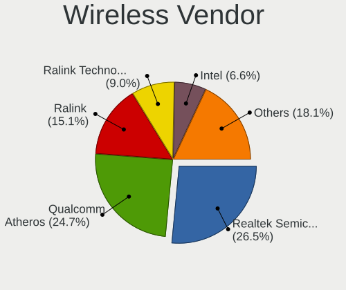

| Vendor                          | Desktops | Percent |
|---------------------------------|----------|---------|
| Realtek Semiconductor           | 44       | 26.51%  |
| Qualcomm Atheros                | 41       | 24.7%   |
| Ralink                          | 25       | 15.06%  |
| Ralink Technology               | 15       | 9.04%   |
| Intel                           | 11       | 6.63%   |
| TP-Link                         | 10       | 6.02%   |
| Qualcomm Atheros Communications | 5        | 3.01%   |
| Mercucys                        | 5        | 3.01%   |
| Broadcom                        | 4        | 2.41%   |
| D-Link System                   | 3        | 1.81%   |
| ZTopInc                         | 1        | 0.6%    |
| Xiaomi                          | 1        | 0.6%    |
| Broadcom Limited                | 1        | 0.6%    |

Wireless Model
--------------

Wireless models

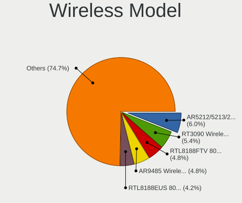

| Model                                                                          | Desktops | Percent |
|--------------------------------------------------------------------------------|----------|---------|
| Qualcomm Atheros AR5212/5213/2414 Wireless Network Adapter                     | 10       | 6.02%   |
| Ralink RT3090 Wireless 802.11n 1T/1R PCIe                                      | 9        | 5.42%   |
| Realtek RTL8188FTV 802.11b/g/n 1T1R 2.4G WLAN Adapter                          | 8        | 4.82%   |
| Qualcomm Atheros AR9485 Wireless Network Adapter                               | 8        | 4.82%   |
| Realtek RTL8188EUS 802.11n Wireless Network Adapter                            | 7        | 4.22%   |
| Ralink MT7601U Wireless Adapter                                                | 7        | 4.22%   |
| Ralink RT2870/RT3070 Wireless Adapter                                          | 6        | 3.61%   |
| Ralink RT5390 Wireless 802.11n 1T/1R PCIe                                      | 6        | 3.61%   |
| Ralink RT2790 Wireless 802.11n 1T/2R PCIe                                      | 6        | 3.61%   |
| Realtek RTL8192EU 802.11b/g/n WLAN Adapter                                     | 5        | 3.01%   |
| Qualcomm Atheros AR9285 Wireless Network Adapter (PCI-Express)                 | 5        | 3.01%   |
| Qualcomm Atheros AR2413/AR2414 Wireless Network Adapter [AR5005G(S) 802.11bg]  | 5        | 3.01%   |
| Realtek RTL88x2bu [AC1200 Techkey]                                             | 4        | 2.41%   |
| Qualcomm Atheros AR9271 802.11n                                                | 4        | 2.41%   |
| TP-Link TL-WN823N v2/v3 [Realtek RTL8192EU]                                    | 3        | 1.81%   |
| Realtek RTL8192CU 802.11n WLAN Adapter                                         | 3        | 1.81%   |
| Realtek RTL8188EE Wireless Network Adapter                                     | 3        | 1.81%   |
| Realtek RTL8188CUS 802.11n WLAN Adapter                                        | 3        | 1.81%   |
| Realtek 802.11ac NIC                                                           | 3        | 1.81%   |
| Qualcomm Atheros AR922X Wireless Network Adapter                               | 3        | 1.81%   |
| Qualcomm Atheros AR5413/AR5414 Wireless Network Adapter [AR5006X(S) 802.11abg] | 3        | 1.81%   |
| Mercucys 802.11n NIC                                                           | 3        | 1.81%   |
| Intel Tiger Lake PCH CNVi WiFi                                                 | 3        | 1.81%   |
| TP-Link AC600 wireless Realtek RTL8811AU [Archer T2U Nano]                     | 2        | 1.2%    |
| TP-Link 802.11n NIC                                                            | 2        | 1.2%    |
| Realtek RTL8192EE PCIe Wireless Network Adapter                                | 2        | 1.2%    |
| Realtek RTL-8185 IEEE 802.11a/b/g Wireless LAN Controller                      | 2        | 1.2%    |
| Ralink RT2561/RT61 802.11g PCI                                                 | 2        | 1.2%    |
| Qualcomm Atheros AR9227 Wireless Network Adapter                               | 2        | 1.2%    |
| Mercucys MW300UM RTL8192EU wifi                                                | 2        | 1.2%    |
| Intel Wi-Fi 6 AX200                                                            | 2        | 1.2%    |
| D-Link System DWA-110 Wireless G Adapter(rev.A1) [Ralink RT2571W]              | 2        | 1.2%    |
| Broadcom BCM43225 802.11b/g/n                                                  | 2        | 1.2%    |
| ZTopInc 802.11n NIC                                                            | 1        | 0.6%    |
| Xiaomi MediaTek MT7601U [MI WiFi]                                              | 1        | 0.6%    |
| TP-Link RTL8812AU Archer T4U 802.11ac                                          | 1        | 0.6%    |
| TP-Link Archer T4U ver.3                                                       | 1        | 0.6%    |
| TP-Link Archer T3U [Realtek RTL8812BU]                                         | 1        | 0.6%    |
| Realtek RTL8821CE 802.11ac PCIe Wireless Network Adapter                       | 1        | 0.6%    |
| Realtek RTL8188GU 802.11n WLAN Adapter (After Modeswitch)                      | 1        | 0.6%    |

Ethernet Vendor
---------------

Ethernet vendors

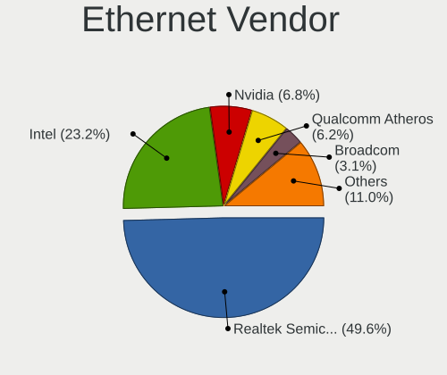

| Vendor                                 | Desktops | Percent |
|----------------------------------------|----------|---------|
| Realtek Semiconductor                  | 175      | 49.58%  |
| Intel                                  | 82       | 23.23%  |
| Nvidia                                 | 24       | 6.8%    |
| Qualcomm Atheros                       | 22       | 6.23%   |
| Broadcom                               | 11       | 3.12%   |
| Xiaomi                                 | 8        | 2.27%   |
| Marvell Technology Group               | 7        | 1.98%   |
| VIA Technologies                       | 6        | 1.7%    |
| MediaTek                               | 3        | 0.85%   |
| Sundance Technology Inc / IC Plus      | 2        | 0.57%   |
| Samsung Electronics                    | 2        | 0.57%   |
| Trendchip Technologies                 | 1        | 0.28%   |
| Suzhou Motorcomm Electronic Technology | 1        | 0.28%   |
| National Semiconductor                 | 1        | 0.28%   |
| Motorola PCS                           | 1        | 0.28%   |
| Motorola BCS                           | 1        | 0.28%   |
| JMicron Technology                     | 1        | 0.28%   |
| ICS Advent                             | 1        | 0.28%   |
| Davicom Semiconductor                  | 1        | 0.28%   |
| Broadcom Limited                       | 1        | 0.28%   |
| ASIX Electronics                       | 1        | 0.28%   |
| ADMtek                                 | 1        | 0.28%   |

Ethernet Model
--------------

Ethernet models

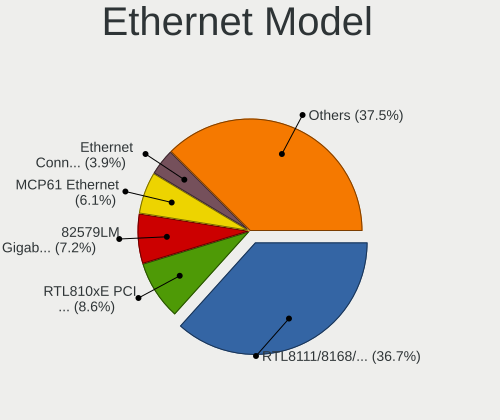

| Model                                                                      | Desktops | Percent |
|----------------------------------------------------------------------------|----------|---------|
| Realtek RTL8111/8168/8211/8411 PCI Express Gigabit Ethernet Controller     | 132      | 36.67%  |
| Realtek RTL810xE PCI Express Fast Ethernet controller                      | 31       | 8.61%   |
| Intel 82579LM Gigabit Network Connection (Lewisville)                      | 26       | 7.22%   |
| Nvidia MCP61 Ethernet                                                      | 22       | 6.11%   |
| Intel Ethernet Connection I217-LM                                          | 14       | 3.89%   |
| Qualcomm Atheros AR8152 v2.0 Fast Ethernet                                 | 11       | 3.06%   |
| Realtek RTL-8100/8101L/8139 PCI Fast Ethernet Adapter                      | 8        | 2.22%   |
| Intel Ethernet Connection (2) I219-LM                                      | 7        | 1.94%   |
| Xiaomi Mi/Redmi series (RNDIS)                                             | 6        | 1.67%   |
| VIA VT6102/VT6103 [Rhine-II]                                               | 5        | 1.39%   |
| Marvell Group 88E8056 PCI-E Gigabit Ethernet Controller                    | 4        | 1.11%   |
| Intel 82567LM-3 Gigabit Network Connection                                 | 4        | 1.11%   |
| Broadcom NetLink BCM5786 Gigabit Ethernet PCI Express                      | 4        | 1.11%   |
| Realtek RTL8169 PCI Gigabit Ethernet Controller                            | 3        | 0.83%   |
| Qualcomm Atheros AR8151 v2.0 Gigabit Ethernet                              | 3        | 0.83%   |
| MediaTek Infinix HOT 50i                                                   | 3        | 0.83%   |
| Marvell Group 88E8057 PCI-E Gigabit Ethernet Controller                    | 3        | 0.83%   |
| Intel Ethernet Connection (14) I219-V                                      | 3        | 0.83%   |
| Xiaomi Mi/Redmi series (RNDIS + ADB)                                       | 2        | 0.56%   |
| Realtek RTL8125 2.5GbE Controller                                          | 2        | 0.56%   |
| Realtek RTL-8110SC/8169SC Gigabit Ethernet                                 | 2        | 0.56%   |
| Qualcomm Atheros Attansic L2 Fast Ethernet                                 | 2        | 0.56%   |
| Intel PRO/100 VE Network Connection                                        | 2        | 0.56%   |
| Intel I210 Gigabit Network Connection                                      | 2        | 0.56%   |
| Intel Ethernet Connection I217-V                                           | 2        | 0.56%   |
| Intel Ethernet Connection (7) I219-V                                       | 2        | 0.56%   |
| Intel Ethernet Connection (5) I219-LM                                      | 2        | 0.56%   |
| Intel Ethernet Connection (2) I219-V                                       | 2        | 0.56%   |
| Intel 82579V Gigabit Network Connection                                    | 2        | 0.56%   |
| Intel 82567V-2 Gigabit Network Connection                                  | 2        | 0.56%   |
| Broadcom NetXtreme BCM5762 Gigabit Ethernet PCIe                           | 2        | 0.56%   |
| VIA VT6105/VT6106S [Rhine-III]                                             | 1        | 0.28%   |
| Trendchip Ethernet controller                                              | 1        | 0.28%   |
| Suzhou Motorcomm Electronic YT6801 Gigabit Ethernet Controller             | 1        | 0.28%   |
| Sundance Inc / IC Plus IP1000 Family Gigabit Ethernet                      | 1        | 0.28%   |
| Sundance Inc / IC Plus IC Plus IP100A Integrated 10/100 Ethernet MAC + PHY | 1        | 0.28%   |
| Samsung GT-I9070 (network tethering, USB debugging enabled)                | 1        | 0.28%   |
| Samsung Galaxy series, misc. (tethering mode)                              | 1        | 0.28%   |
| Realtek RTL8153 Gigabit Ethernet Adapter                                   | 1        | 0.28%   |
| Realtek Realtek Ethernet controller                                        | 1        | 0.28%   |

Net Controller Kind
-------------------

Ethernet, WiFi or modem

| Kind     | Desktops | Percent |
|----------|----------|---------|
| Ethernet | 322      | 66.26%  |
| WiFi     | 161      | 33.13%  |
| Modem    | 2        | 0.41%   |
| Unknown  | 1        | 0.21%   |

Used Controller
---------------

Currently used network controller

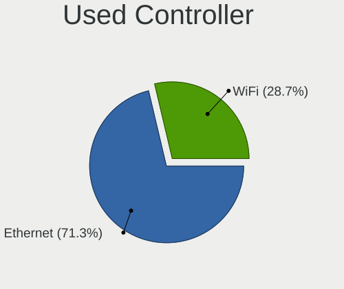

| Kind     | Desktops | Percent |
|----------|----------|---------|
| Ethernet | 241      | 71.3%   |
| WiFi     | 97       | 28.7%   |

NICs
----

Total network controllers on board

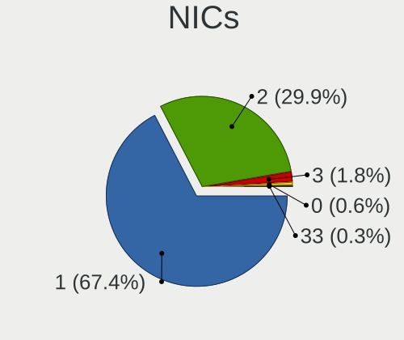

| Total | Desktops | Percent |
|-------|----------|---------|
| 1     | 223      | 67.37%  |
| 2     | 99       | 29.91%  |
| 3     | 6        | 1.81%   |
| 0     | 2        | 0.6%    |
| 33    | 1        | 0.3%    |

IPv6
----

IPv6 vs IPv4

| Used | Desktops | Percent |
|------|----------|---------|
| No   | 323      | 98.18%  |
| Yes  | 6        | 1.82%   |

Bluetooth
---------

Bluetooth Vendor
----------------

Controller vendors

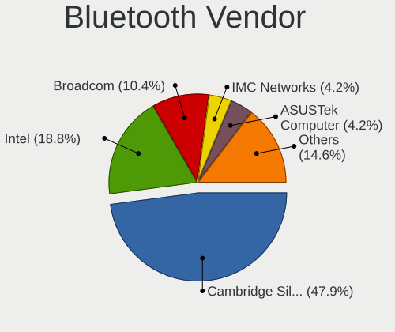

| Vendor                          | Desktops | Percent |
|---------------------------------|----------|---------|
| Cambridge Silicon Radio         | 23       | 47.92%  |
| Intel                           | 9        | 18.75%  |
| Broadcom                        | 5        | 10.42%  |
| IMC Networks                    | 2        | 4.17%   |
| ASUSTek Computer                | 2        | 4.17%   |
| Unknown                         | 2        | 4.17%   |
| Realtek Semiconductor           | 1        | 2.08%   |
| Qualcomm Atheros Communications | 1        | 2.08%   |
| Hewlett-Packard                 | 1        | 2.08%   |
| Conwise Technology              | 1        | 2.08%   |
| Apple                           | 1        | 2.08%   |

Bluetooth Model
---------------

Controller models

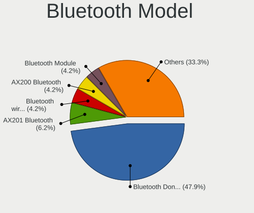

| Model                                               | Desktops | Percent |
|-----------------------------------------------------|----------|---------|
| Cambridge Silicon Radio Bluetooth Dongle (HCI mode) | 23       | 47.92%  |
| Intel AX201 Bluetooth                               | 3        | 6.25%   |
| Intel Bluetooth wireless interface                  | 2        | 4.17%   |
| Intel AX200 Bluetooth                               | 2        | 4.17%   |
| IMC Networks Bluetooth Module                       | 2        | 4.17%   |
| Broadcom BCM92046DG-CL1ROM Bluetooth 2.1 UHE Dongle | 2        | 4.17%   |
| Unknown                                             | 2        | 4.17%   |
| Realtek Bluetooth Radio                             | 1        | 2.08%   |
| Qualcomm Atheros AR9462 Bluetooth                   | 1        | 2.08%   |
| Intel Bluetooth Device                              | 1        | 2.08%   |
| Intel Bluetooth 9460/9560 Jefferson Peak (JfP)      | 1        | 2.08%   |
| HP Bluetooth 1.2 Interface [Broadcom BCM2035]       | 1        | 2.08%   |
| Conwise CW6622                                      | 1        | 2.08%   |
| Broadcom BCM2070 Bluetooth Device                   | 1        | 2.08%   |
| Broadcom BCM2045 Bluetooth                          | 1        | 2.08%   |
| Broadcom BCM2035B3 Bluetooth Adapter                | 1        | 2.08%   |
| ASUS Broadcom BCM20702A0 Bluetooth                  | 1        | 2.08%   |
| ASUS Bluetooth Adapter                              | 1        | 2.08%   |
| Apple Built-in Bluetooth 2.0+EDR HCI                | 1        | 2.08%   |

Sound
-----

Sound Vendor
------------

Sound card vendors

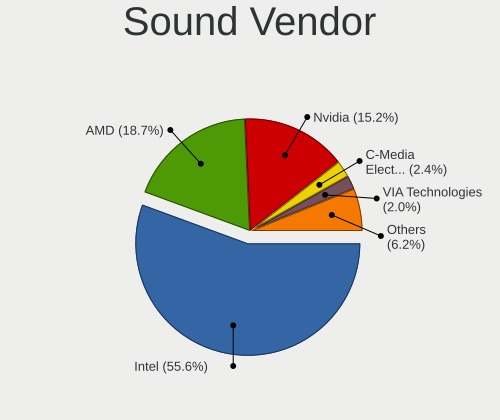

| Vendor                 | Desktops | Percent |
|------------------------|----------|---------|
| Intel                  | 253      | 55.6%   |
| AMD                    | 85       | 18.68%  |
| Nvidia                 | 69       | 15.16%  |
| C-Media Electronics    | 11       | 2.42%   |
| VIA Technologies       | 9        | 1.98%   |
| Creative Labs          | 6        | 1.32%   |
| JMTek                  | 5        | 1.1%    |
| Generalplus Technology | 4        | 0.88%   |
| Logitech               | 2        | 0.44%   |
| Unknown                | 1        | 0.22%   |
| Texas Instruments      | 1        | 0.22%   |
| Microsoft              | 1        | 0.22%   |
| Megawin Technology     | 1        | 0.22%   |
| M-Audio                | 1        | 0.22%   |
| Jieli Technology       | 1        | 0.22%   |
| Giga-Byte Technology   | 1        | 0.22%   |
| Genesys Logic          | 1        | 0.22%   |
| Corsair                | 1        | 0.22%   |
| Cirrus Logic           | 1        | 0.22%   |
| Aureal Semiconductor   | 1        | 0.22%   |

Sound Model
-----------

Sound card models

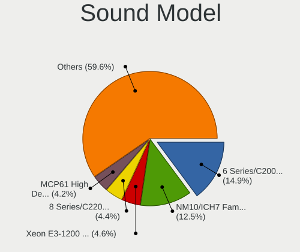

| Model                                                                             | Desktops | Percent |
|-----------------------------------------------------------------------------------|----------|---------|
| Intel 6 Series/C200 Series Chipset Family High Definition Audio Controller        | 75       | 14.85%  |
| Intel NM10/ICH7 Family High Definition Audio Controller                           | 63       | 12.48%  |
| Intel Xeon E3-1200 v3/4th Gen Core Processor HD Audio Controller                  | 23       | 4.55%   |
| Intel 8 Series/C220 Series Chipset High Definition Audio Controller               | 22       | 4.36%   |
| Nvidia MCP61 High Definition Audio                                                | 21       | 4.16%   |
| Intel 7 Series/C216 Chipset Family High Definition Audio Controller               | 19       | 3.76%   |
| AMD Oland/Hainan/Cape Verde/Pitcairn HDMI Audio [Radeon HD 7000 Series]           | 18       | 3.56%   |
| AMD SBx00 Azalia (Intel HDA)                                                      | 17       | 3.37%   |
| Nvidia GF119 HDMI Audio Controller                                                | 13       | 2.57%   |
| Intel 100 Series/C230 Series Chipset Family HD Audio Controller                   | 13       | 2.57%   |
| AMD Cedar HDMI Audio [Radeon HD 5400/6300/7300 Series]                            | 12       | 2.38%   |
| AMD Ellesmere HDMI Audio [Radeon RX 470/480 / 570/580/590]                        | 10       | 1.98%   |
| Nvidia High Definition Audio Controller                                           | 8        | 1.58%   |
| Nvidia GK208 HDMI/DP Audio Controller                                             | 8        | 1.58%   |
| Intel 82801I (ICH9 Family) HD Audio Controller                                    | 8        | 1.58%   |
| Intel 200 Series PCH HD Audio                                                     | 7        | 1.39%   |
| AMD FCH Azalia Controller                                                         | 7        | 1.39%   |
| Intel 82801JI (ICH10 Family) HD Audio Controller                                  | 6        | 1.19%   |
| AMD Ryzen HD Audio Controller                                                     | 6        | 1.19%   |
| VIA Technologies VX900/VT8xxx High Definition Audio Controller                    | 5        | 0.99%   |
| Intel 82801JD/DO (ICH10 Family) HD Audio Controller                               | 5        | 0.99%   |
| Intel 82801H (ICH8 Family) HD Audio Controller                                    | 5        | 0.99%   |
| Nvidia GM107 High Definition Audio Controller [GeForce 940MX]                     | 4        | 0.79%   |
| Nvidia GF108 High Definition Audio Controller                                     | 4        | 0.79%   |
| Intel Tiger Lake-H HD Audio Controller                                            | 4        | 0.79%   |
| Intel Cannon Lake PCH cAVS                                                        | 4        | 0.79%   |
| Generalplus Technology USB Audio Device                                           | 4        | 0.79%   |
| AMD Turks HDMI Audio [Radeon HD 6500/6600 / 6700M Series]                         | 4        | 0.79%   |
| AMD Renoir/Cezanne HDMI/DP Audio Controller                                       | 4        | 0.79%   |
| AMD Caicos HDMI Audio [Radeon HD 6450 / 7450/8450/8490 OEM / R5 230/235/235X OEM] | 4        | 0.79%   |
| VIA Technologies VT1720/24 [Envy24PT/HT] PCI Multi-Channel Audio Controller       | 3        | 0.59%   |
| Nvidia GF106 High Definition Audio Controller                                     | 3        | 0.59%   |
| JMTek USB Speaker                                                                 | 3        | 0.59%   |
| Intel 5 Series/3400 Series Chipset High Definition Audio                          | 3        | 0.59%   |
| C-Media Electronics CM108 Audio Controller                                        | 3        | 0.59%   |
| Nvidia GK107 HDMI Audio Controller                                                | 2        | 0.4%    |
| Nvidia GF116 High Definition Audio Controller                                     | 2        | 0.4%    |
| Intel Smart Sound Technology (SST) Audio Controller                               | 2        | 0.4%    |
| Intel C610/X99 series chipset HD Audio Controller                                 | 2        | 0.4%    |
| Intel C600/X79 series chipset High Definition Audio Controller                    | 2        | 0.4%    |

Memory
------

Memory Vendor
-------------

Memory module vendors

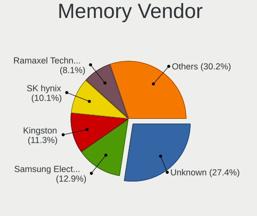

| Vendor                     | Desktops | Percent |
|----------------------------|----------|---------|
| Unknown                    | 68       | 27.42%  |
| Samsung Electronics        | 32       | 12.9%   |
| Kingston                   | 28       | 11.29%  |
| SK hynix                   | 25       | 10.08%  |
| Ramaxel Technology         | 20       | 8.06%   |
| Micron Technology          | 14       | 5.65%   |
| Corsair                    | 14       | 5.65%   |
| Crucial                    | 10       | 4.03%   |
| A-DATA Technology          | 5        | 2.02%   |
| PNY                        | 4        | 1.61%   |
| Nanya Technology           | 4        | 1.61%   |
| Unknown                    | 4        | 1.61%   |
| Team                       | 3        | 1.21%   |
| Avant                      | 3        | 1.21%   |
| Mushkin                    | 2        | 0.81%   |
| Kreton                     | 2        | 0.81%   |
| Elpida                     | 2        | 0.81%   |
| Unknown (FFFF000000000000) | 1        | 0.4%    |
| Unknown (7F7F7F7F7F7F7F83) | 1        | 0.4%    |
| Unknown (0x0CBA)           | 1        | 0.4%    |
| Super Talent               | 1        | 0.4%    |
| Qimonda                    | 1        | 0.4%    |
| Patriot                    | 1        | 0.4%    |
| OCZ                        | 1        | 0.4%    |
| Hikvision                  | 1        | 0.4%    |

Memory Model
------------

Memory module models

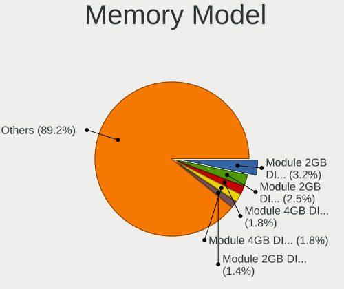

| Model                                                 | Desktops | Percent |
|-------------------------------------------------------|----------|---------|
| Unknown RAM Module 2GB DIMM SDRAM                     | 9        | 3.24%   |
| Unknown RAM Module 2GB DIMM DDR2                      | 7        | 2.52%   |
| Unknown RAM Module 4GB DIMM SDRAM                     | 5        | 1.8%    |
| Unknown RAM Module 4GB DIMM 400MT/s                   | 5        | 1.8%    |
| Unknown RAM Module 2GB DIMM DDR3 1066MT/s             | 4        | 1.44%   |
| Samsung RAM M378B5173QH0-CK0 4GB DIMM DDR3            | 4        | 1.44%   |
| Ramaxel RAM RMR5040ED58E9W1600 4GB DIMM DDR3 1600MT/s | 4        | 1.44%   |
| Ramaxel RAM RMR5030ME68F9F1600 4GB DIMM DDR3 1600MT/s | 4        | 1.44%   |
| Ramaxel RAM RMR5030ED58E8W1600 2GB DIMM DDR3 1600MT/s | 4        | 1.44%   |
| Unknown                                               | 4        | 1.44%   |
| Unknown RAM Module 4GB DIMM 1333MT/s                  | 3        | 1.08%   |
| Unknown RAM Module 2GB DIMM 400MT/s                   | 3        | 1.08%   |
| Unknown RAM Module 2048MB DIMM DDR2                   | 3        | 1.08%   |
| Unknown RAM Module 1024MB DIMM DDR2                   | 3        | 1.08%   |
| SK hynix RAM HMT451U6BFR8A-PB 4GB DIMM DDR3 1600MT/s  | 3        | 1.08%   |
| Unknown RAM Module 8GB DIMM 1333MT/s                  | 2        | 0.72%   |
| Unknown RAM Module 4GB DIMM DDR3 1333MT/s             | 2        | 0.72%   |
| Unknown RAM Module 4GB DIMM 1066MT/s                  | 2        | 0.72%   |
| Unknown RAM Module 2048MB DIMM SDRAM                  | 2        | 0.72%   |
| Unknown RAM Module 1GB DIMM DDR2 667MT/s              | 2        | 0.72%   |
| Unknown RAM Module 1024MB DIMM SDRAM                  | 2        | 0.72%   |
| Unknown RAM Module 1024MB DIMM DDR2 533MT/s           | 2        | 0.72%   |
| SK hynix RAM HMT451U6BFR8C-PB 4GB DIMM DDR3 1600MT/s  | 2        | 0.72%   |
| SK hynix RAM HMT351U6EFR8C-PB 4GB DIMM DDR3 1600MT/s  | 2        | 0.72%   |
| SK hynix RAM HMT351U6CFR8C-PB 4GB DIMM DDR3 1800MT/s  | 2        | 0.72%   |
| Samsung RAM Module 2GB DIMM DDR3 1333MT/s             | 2        | 0.72%   |
| Samsung RAM M378B5273DH0-CH9 4GB DIMM DDR3 2133MT/s   | 2        | 0.72%   |
| Samsung RAM M378B5273CH0-CH9 4GB DIMM DDR3 1867MT/s   | 2        | 0.72%   |
| Samsung RAM M378B5173QH0-YK0 4GB DIMM DDR3 1600MT/s   | 2        | 0.72%   |
| Ramaxel RAM RMR5030EF68F9W1600 4GB DIMM DDR3 1600MT/s | 2        | 0.72%   |
| Ramaxel RAM RMR1870EF48E8W1333 2GB DIMM DDR3 1333MT/s | 2        | 0.72%   |
| Ramaxel RAM RMR1870EC58E9F1333 4GB DIMM DDR3 1333MT/s | 2        | 0.72%   |
| PNY RAM Module 8GB DIMM DDR3 1333MT/s                 | 2        | 0.72%   |
| Nanya RAM NT2GT64U8HD0BY-AD 2GB DIMM DDR2 2048MT/s    | 2        | 0.72%   |
| Mushkin RAM MRX4U320NNNF16G 16GB DIMM DDR4 3200MT/s   | 2        | 0.72%   |
| Micron RAM 8JTF51264AZ-1G6E1 4GB DIMM DDR3 1600MT/s   | 2        | 0.72%   |
| Micron RAM 4ATF51264AZ-3G2R1 4GB DIMM DDR4 3200MT/s   | 2        | 0.72%   |
| Kingston RAM KHX1600C10D3/8G 8GB DIMM DDR3 2133MT/s   | 2        | 0.72%   |
| Crucial RAM BLS4G3D1609DS 4GB DIMM DDR3 1600MT/s      | 2        | 0.72%   |
| Unknown RAM Module 8GB DIMM 1600MT/s                  | 1        | 0.36%   |

Memory Kind
-----------

Memory module kinds

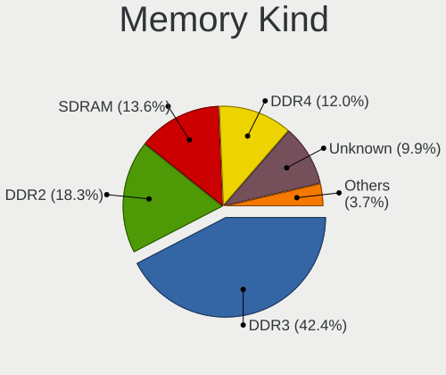

| Kind    | Desktops | Percent |
|---------|----------|---------|
| DDR3    | 81       | 42.41%  |
| DDR2    | 35       | 18.32%  |
| SDRAM   | 26       | 13.61%  |
| DDR4    | 23       | 12.04%  |
| Unknown | 19       | 9.95%   |
| DDR     | 5        | 2.62%   |
| LPDDR5  | 1        | 0.52%   |
| DDR5    | 1        | 0.52%   |

Memory Form Factor
------------------

Physical design of the memory module

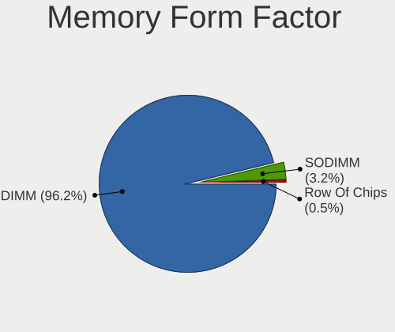

| Name         | Desktops | Percent |
|--------------|----------|---------|
| DIMM         | 179      | 96.24%  |
| SODIMM       | 6        | 3.23%   |
| Row Of Chips | 1        | 0.54%   |

Memory Size
-----------

Memory module size

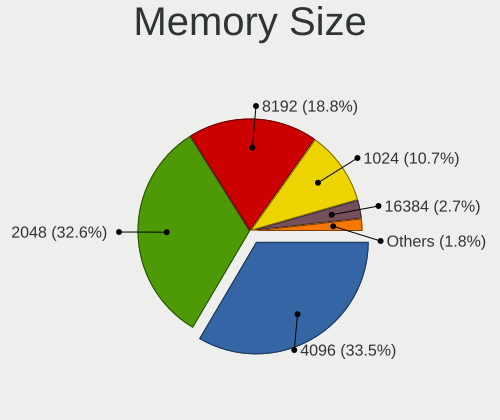

| Size  | Desktops | Percent |
|-------|----------|---------|
| 4096  | 75       | 33.48%  |
| 2048  | 73       | 32.59%  |
| 8192  | 42       | 18.75%  |
| 1024  | 24       | 10.71%  |
| 16384 | 6        | 2.68%   |
| 32768 | 2        | 0.89%   |
| 512   | 2        | 0.89%   |

Memory Speed
------------

Memory module speed

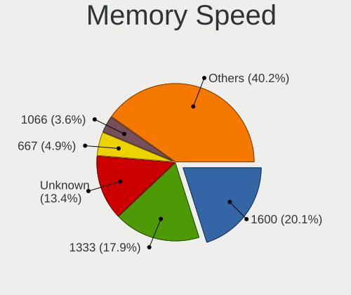

| Speed   | Desktops | Percent |
|---------|----------|---------|
| 1600    | 45       | 20.09%  |
| 1333    | 40       | 17.86%  |
| Unknown | 30       | 13.39%  |
| 667     | 11       | 4.91%   |
| 1066    | 8        | 3.57%   |
| 800     | 8        | 3.57%   |
| 400     | 8        | 3.57%   |
| 2133    | 7        | 3.13%   |
| 533     | 7        | 3.13%   |
| 3200    | 5        | 2.23%   |
| 2400    | 5        | 2.23%   |
| 1866    | 5        | 2.23%   |
| 1639    | 5        | 2.23%   |
| 2667    | 4        | 1.79%   |
| 1800    | 4        | 1.79%   |
| 3733    | 3        | 1.34%   |
| 3600    | 3        | 1.34%   |
| 1648    | 3        | 1.34%   |
| 1067    | 3        | 1.34%   |
| 133     | 3        | 1.34%   |
| 2048    | 2        | 0.89%   |
| 1867    | 2        | 0.89%   |
| 1334    | 2        | 0.89%   |
| 52217   | 1        | 0.45%   |
| 6400    | 1        | 0.45%   |
| 5200    | 1        | 0.45%   |
| 3800    | 1        | 0.45%   |
| 3334    | 1        | 0.45%   |
| 3066    | 1        | 0.45%   |
| 2933    | 1        | 0.45%   |
| 2734    | 1        | 0.45%   |
| 2000    | 1        | 0.45%   |
| 1024    | 1        | 0.45%   |
| 266     | 1        | 0.45%   |

Printers & scanners
-------------------

Printer Vendor
--------------

Printer device vendors

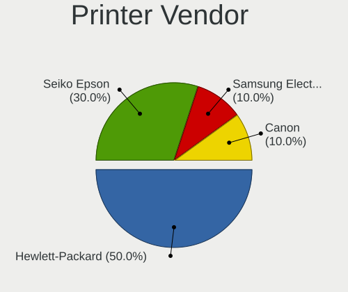

| Vendor              | Desktops | Percent |
|---------------------|----------|---------|
| Hewlett-Packard     | 5        | 50%     |
| Seiko Epson         | 3        | 30%     |
| Samsung Electronics | 1        | 10%     |
| Canon               | 1        | 10%     |

Printer Model
-------------

Printer device models

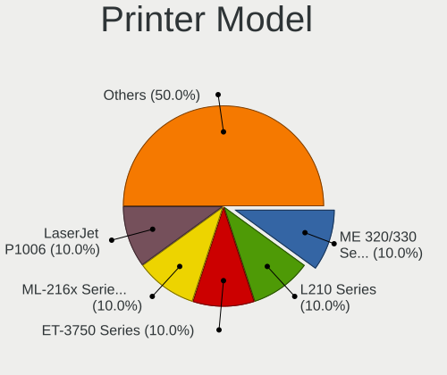

| Model                                        | Desktops | Percent |
|----------------------------------------------|----------|---------|
| Seiko Epson ME 320/330 Series [Stylus SX125] | 1        | 10%     |
| Seiko Epson L210 Series                      | 1        | 10%     |
| Seiko Epson ET-3750 Series                   | 1        | 10%     |
| Samsung ML-216x Series Laser Printer         | 1        | 10%     |
| HP LaserJet P1006                            | 1        | 10%     |
| HP LaserJet P1005                            | 1        | 10%     |
| HP DeskJet F4100 Printer series              | 1        | 10%     |
| HP Deskjet 2050 J510                         | 1        | 10%     |
| HP Color LaserJet CP1215                     | 1        | 10%     |
| Canon PIXMA MP250                            | 1        | 10%     |

Scanner Vendor
--------------

Scanner device vendors

| Vendor                      | Desktops | Percent |
|-----------------------------|----------|---------|
| KYE Systems (Mouse Systems) | 1        | 33.33%  |
| Hewlett-Packard             | 1        | 33.33%  |
| Canon                       | 1        | 33.33%  |

Scanner Model
-------------

Scanner device models

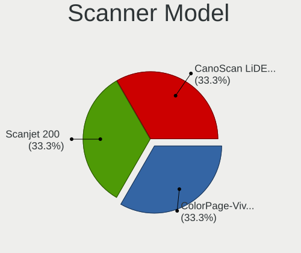

| Model                                               | Desktops | Percent |
|-----------------------------------------------------|----------|---------|
| KYE Systems (Mouse Systems) ColorPage-Vivid 1200 XE | 1        | 33.33%  |
| HP Scanjet 200                                      | 1        | 33.33%  |
| Canon CanoScan LiDE 110                             | 1        | 33.33%  |

Camera
------

Camera Vendor
-------------

Camera device vendors

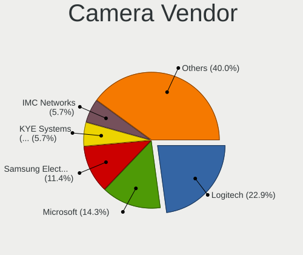

| Vendor                        | Desktops | Percent |
|-------------------------------|----------|---------|
| Logitech                      | 8        | 22.86%  |
| Microsoft                     | 5        | 14.29%  |
| Samsung Electronics           | 4        | 11.43%  |
| KYE Systems (Mouse Systems)   | 2        | 5.71%   |
| IMC Networks                  | 2        | 5.71%   |
| Cubeternet                    | 2        | 5.71%   |
| Z-Star Microelectronics       | 1        | 2.86%   |
| Suyin                         | 1        | 2.86%   |
| Sunplus Innovation Technology | 1        | 2.86%   |
| SN0002                        | 1        | 2.86%   |
| SiGma Micro                   | 1        | 2.86%   |
| Realtek Semiconductor         | 1        | 2.86%   |
| Microdia                      | 1        | 2.86%   |
| LG Electronics                | 1        | 2.86%   |
| KYE Systems                   | 1        | 2.86%   |
| Jieli Technology              | 1        | 2.86%   |
| Chicony Electronics           | 1        | 2.86%   |
| Aveo Technology               | 1        | 2.86%   |

Camera Model
------------

Camera device models

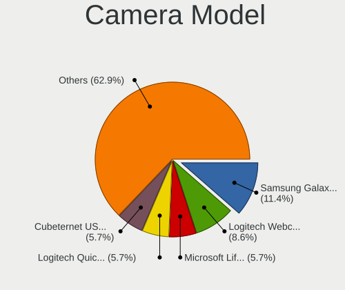

| Model                                                 | Desktops | Percent |
|-------------------------------------------------------|----------|---------|
| Samsung Galaxy series, misc. (MTP mode)               | 4        | 11.43%  |
| Logitech Webcam C270                                  | 3        | 8.57%   |
| Microsoft LifeCam HD-3000                             | 2        | 5.71%   |
| Logitech QuickCam Communicate MP/S5500                | 2        | 5.71%   |
| Cubeternet USB2.0 Camera                              | 2        | 5.71%   |
| Z-Star Venus USB2.0 Camera                            | 1        | 2.86%   |
| Suyin HP Webcam                                       | 1        | 2.86%   |
| Sunplus SPCA2281 Web Camera                           | 1        | 2.86%   |
| SN0002 1080P Web Camera                               | 1        | 2.86%   |
| SiGma Micro WebCam SiGma Micro                        | 1        | 2.86%   |
| Realtek HP 1.0MP High Definition Webcam               | 1        | 2.86%   |
| Microsoft Microsoft LifeCam HD-6000 for Notebooks     | 1        | 2.86%   |
| Microsoft LifeCam VX-5000                             | 1        | 2.86%   |
| Microsoft LifeCam Studio                              | 1        | 2.86%   |
| Microdia Webcam Vitade AF                             | 1        | 2.86%   |
| Logitech Webcam Pro 9000                              | 1        | 2.86%   |
| Logitech HD Pro Webcam C920                           | 1        | 2.86%   |
| Logitech C922 Pro Stream Webcam                       | 1        | 2.86%   |
| LG LM-X420xxx/G2/G3 Android Phone (MTP/download mode) | 1        | 2.86%   |
| KYE Systems FaceCam 1320                              | 1        | 2.86%   |
| KYE Systems (Mouse Systems) Slim 1322AF               | 1        | 2.86%   |
| KYE Systems (Mouse Systems) eFace 2025                | 1        | 2.86%   |
| Jieli USB PHY 2.0                                     | 1        | 2.86%   |
| IMC Networks USB2.0 UVC 1.3M WebCam                   | 1        | 2.86%   |
| IMC Networks USB 2.0 Camera                           | 1        | 2.86%   |
| Chicony HD Webcam                                     | 1        | 2.86%   |
| Aveo USB2.0 Camera                                    | 1        | 2.86%   |

Security
--------

Fingerprint Vendor
------------------

Fingerprint sensor vendors

| Vendor  | Desktops | Percent |
|---------|----------|---------|
| Suprema | 1        | 100%    |

Fingerprint Model
-----------------

Fingerprint sensor models

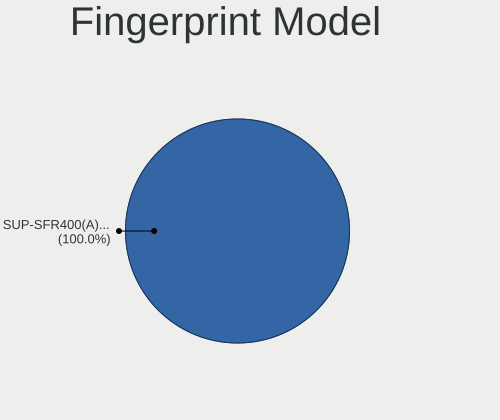

| Model                                            | Desktops | Percent |
|--------------------------------------------------|----------|---------|
| Suprema SUP-SFR400(A) BioMini Fingerprint Reader | 1        | 100%    |

Chipcard Vendor
---------------

Chipcard module vendors

Zero info for selected period =(

Chipcard Model
--------------

Chipcard module models

Zero info for selected period =(

Unsupported
-----------

Unsupported Devices
-------------------

Total unsupported devices on board

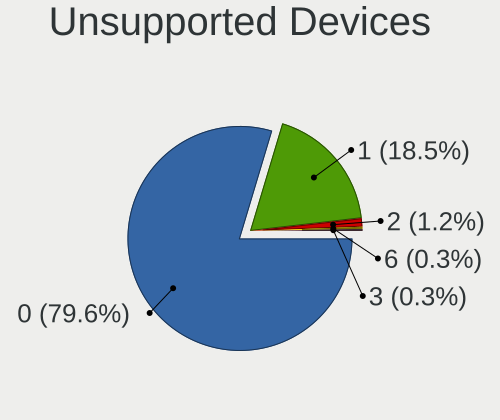

| Total | Desktops | Percent |
|-------|----------|---------|
| 0     | 262      | 79.64%  |
| 1     | 61       | 18.54%  |
| 2     | 4        | 1.22%   |
| 6     | 1        | 0.3%    |
| 3     | 1        | 0.3%    |

Unsupported Device Types
------------------------

Types of unsupported devices

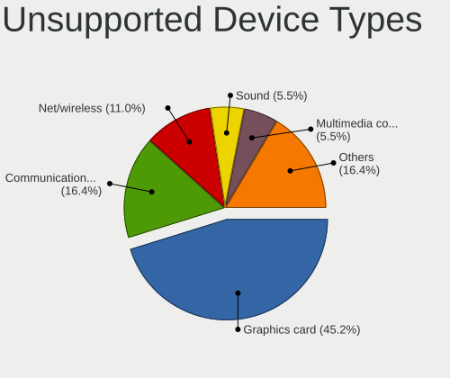

| Type                     | Desktops | Percent |
|--------------------------|----------|---------|
| Graphics card            | 33       | 45.21%  |
| Communication controller | 12       | 16.44%  |
| Net/wireless             | 8        | 10.96%  |
| Sound                    | 4        | 5.48%   |
| Multimedia controller    | 4        | 5.48%   |
| Unassigned class         | 3        | 4.11%   |
| Net/ethernet             | 2        | 2.74%   |
| Firewire controller      | 2        | 2.74%   |
| Video                    | 1        | 1.37%   |
| Storage/ide              | 1        | 1.37%   |
| Fingerprint reader       | 1        | 1.37%   |
| Card reader              | 1        | 1.37%   |
| Camera                   | 1        | 1.37%   |

