Linux in Venezuela - Tested Hardware & Statistics (Desktops)
------------------------------------------------------------

A project to collect tested hardware configurations for Linux in Venezuela.

Anyone can contribute to this report by the [hw-probe](https://github.com/linuxhw/hw-probe) tool:

    sudo -E hw-probe -all -upload

Please contribute! Especially if your hardware is rare.

Contents
--------

* [ Test Cases ](#test-cases)

* [ System ](#system)
  - [ OS                       ](#os)
  - [ OS Family                ](#os-family)
  - [ Kernel                   ](#kernel)
  - [ Kernel Family            ](#kernel-family)
  - [ Kernel Major Ver.        ](#kernel-major-ver)
  - [ Arch                     ](#arch)
  - [ DE                       ](#de)
  - [ Display Server           ](#display-server)
  - [ Display Manager          ](#display-manager)
  - [ OS Lang                  ](#os-lang)
  - [ Boot Mode                ](#boot-mode)
  - [ Filesystem               ](#filesystem)
  - [ Part. scheme             ](#part-scheme)
  - [ Dual Boot with Linux/BSD ](#dual-boot-with-linuxbsd)
  - [ Dual Boot (Win)          ](#dual-boot-win)

* [ Board ](#board)
  - [ Vendor                   ](#vendor)
  - [ Model                    ](#model)
  - [ Model Family             ](#model-family)
  - [ MFG Year                 ](#mfg-year)
  - [ Form Factor              ](#form-factor)
  - [ Secure Boot              ](#secure-boot)
  - [ Coreboot                 ](#coreboot)
  - [ RAM Size                 ](#ram-size)
  - [ RAM Used                 ](#ram-used)
  - [ Total Drives             ](#total-drives)
  - [ Has CD-ROM               ](#has-cd-rom)
  - [ Has Ethernet             ](#has-ethernet)
  - [ Has WiFi                 ](#has-wifi)
  - [ Has Bluetooth            ](#has-bluetooth)

* [ Location ](#location)
  - [ Country                  ](#country)
  - [ City                     ](#city)

* [ Drives ](#drives)
  - [ Drive Vendor             ](#drive-vendor)
  - [ Drive Model              ](#drive-model)
  - [ HDD Vendor               ](#hdd-vendor)
  - [ SSD Vendor               ](#ssd-vendor)
  - [ Drive Kind               ](#drive-kind)
  - [ Drive Connector          ](#drive-connector)
  - [ Drive Size               ](#drive-size)
  - [ Space Total              ](#space-total)
  - [ Space Used               ](#space-used)
  - [ Malfunc. Drives          ](#malfunc-drives)
  - [ Malfunc. Drive Vendor    ](#malfunc-drive-vendor)
  - [ Malfunc. HDD Vendor      ](#malfunc-hdd-vendor)
  - [ Malfunc. Drive Kind      ](#malfunc-drive-kind)
  - [ Failed Drives            ](#failed-drives)
  - [ Failed Drive Vendor      ](#failed-drive-vendor)
  - [ Drive Status             ](#drive-status)

* [ Storage controller ](#storage-controller)
  - [ Storage Vendor           ](#storage-vendor)
  - [ Storage Model            ](#storage-model)
  - [ Storage Kind             ](#storage-kind)

* [ Processor ](#processor)
  - [ CPU Vendor               ](#cpu-vendor)
  - [ CPU Model                ](#cpu-model)
  - [ CPU Model Family         ](#cpu-model-family)
  - [ CPU Cores                ](#cpu-cores)
  - [ CPU Sockets              ](#cpu-sockets)
  - [ CPU Threads              ](#cpu-threads)
  - [ CPU Op-Modes             ](#cpu-op-modes)
  - [ CPU Microcode            ](#cpu-microcode)
  - [ CPU Microarch            ](#cpu-microarch)

* [ Graphics ](#graphics)
  - [ GPU Vendor               ](#gpu-vendor)
  - [ GPU Model                ](#gpu-model)
  - [ GPU Combo                ](#gpu-combo)
  - [ GPU Driver               ](#gpu-driver)
  - [ GPU Memory               ](#gpu-memory)

* [ Monitor ](#monitor)
  - [ Monitor Vendor           ](#monitor-vendor)
  - [ Monitor Model            ](#monitor-model)
  - [ Monitor Resolution       ](#monitor-resolution)
  - [ Monitor Diagonal         ](#monitor-diagonal)
  - [ Monitor Width            ](#monitor-width)
  - [ Aspect Ratio             ](#aspect-ratio)
  - [ Monitor Area             ](#monitor-area)
  - [ Pixel Density            ](#pixel-density)
  - [ Multiple Monitors        ](#multiple-monitors)

* [ Network ](#network)
  - [ Net Controller Vendor    ](#net-controller-vendor)
  - [ Net Controller Model     ](#net-controller-model)
  - [ Wireless Vendor          ](#wireless-vendor)
  - [ Wireless Model           ](#wireless-model)
  - [ Ethernet Vendor          ](#ethernet-vendor)
  - [ Ethernet Model           ](#ethernet-model)
  - [ Net Controller Kind      ](#net-controller-kind)
  - [ Used Controller          ](#used-controller)
  - [ NICs                     ](#nics)
  - [ IPv6                     ](#ipv6)

* [ Bluetooth ](#bluetooth)
  - [ Bluetooth Vendor         ](#bluetooth-vendor)
  - [ Bluetooth Model          ](#bluetooth-model)

* [ Sound ](#sound)
  - [ Sound Vendor             ](#sound-vendor)
  - [ Sound Model              ](#sound-model)

* [ Memory ](#memory)
  - [ Memory Vendor            ](#memory-vendor)
  - [ Memory Model             ](#memory-model)
  - [ Memory Kind              ](#memory-kind)
  - [ Memory Form Factor       ](#memory-form-factor)
  - [ Memory Size              ](#memory-size)
  - [ Memory Speed             ](#memory-speed)

* [ Printers & scanners ](#printers--scanners)
  - [ Printer Vendor           ](#printer-vendor)
  - [ Printer Model            ](#printer-model)
  - [ Scanner Vendor           ](#scanner-vendor)
  - [ Scanner Model            ](#scanner-model)

* [ Camera ](#camera)
  - [ Camera Vendor            ](#camera-vendor)
  - [ Camera Model             ](#camera-model)

* [ Security ](#security)
  - [ Fingerprint Vendor       ](#fingerprint-vendor)
  - [ Fingerprint Model        ](#fingerprint-model)
  - [ Chipcard Vendor          ](#chipcard-vendor)
  - [ Chipcard Model           ](#chipcard-model)

* [ Unsupported ](#unsupported)
  - [ Unsupported Devices      ](#unsupported-devices)
  - [ Unsupported Device Types ](#unsupported-device-types)

Test Cases
----------

Total: 187

| Vendor   | Model                       | Probe                                                      | Date         |
|----------|-----------------------------|------------------------------------------------------------|--------------|
| ASRock   | N68-VGS3 FX                 | [b9fbaca53d](https://linux-hardware.org/?probe=b9fbaca53d) | Feb 23, 2023 |
| HP       | 1495                        | [627c584065](https://linux-hardware.org/?probe=627c584065) | Feb 09, 2023 |
| Dell     | 0YF8P5 A00                  | [4bb4dd8a98](https://linux-hardware.org/?probe=4bb4dd8a98) | Feb 06, 2023 |
| ASRock   | G41M-VS3                    | [d6cea67f50](https://linux-hardware.org/?probe=d6cea67f50) | Feb 05, 2023 |
| Dell     | 0J3C2F A02                  | [7cd66ad148](https://linux-hardware.org/?probe=7cd66ad148) | Feb 03, 2023 |
| ECS      | G31T-M7                     | [76be6a1404](https://linux-hardware.org/?probe=76be6a1404) | Feb 01, 2023 |
| ECS      | G31T-M7                     | [9b0f53b46c](https://linux-hardware.org/?probe=9b0f53b46c) | Feb 01, 2023 |
| Gigabyte | EP35-DS3L                   | [5be0362f3e](https://linux-hardware.org/?probe=5be0362f3e) | Jan 23, 2023 |
| Dell     | 0KC9NP A01                  | [c48a8fe525](https://linux-hardware.org/?probe=c48a8fe525) | Jan 17, 2023 |
| HP       | 1495                        | [28c3cf967d](https://linux-hardware.org/?probe=28c3cf967d) | Jan 16, 2023 |
| ASUSTek  | P5G41T-M LX V2              | [36a8e226c5](https://linux-hardware.org/?probe=36a8e226c5) | Jan 12, 2023 |
| Gigabyte | Z68XP-UD3                   | [e2f62062de](https://linux-hardware.org/?probe=e2f62062de) | Jan 09, 2023 |
| ASUSTek  | PRIME A320M-K               | [61b7eaac72](https://linux-hardware.org/?probe=61b7eaac72) | Dec 22, 2022 |
| ASRock   | N68C-S UCC                  | [279e1eacf6](https://linux-hardware.org/?probe=279e1eacf6) | Dec 22, 2022 |
| ASRock   | N68C-S UCC                  | [8d8716cdca](https://linux-hardware.org/?probe=8d8716cdca) | Dec 21, 2022 |
| ASUSTek  | PRIME A320M-K               | [de0a127527](https://linux-hardware.org/?probe=de0a127527) | Dec 16, 2022 |
| ASUSTek  | PRIME A320M-K               | [515785c9c4](https://linux-hardware.org/?probe=515785c9c4) | Dec 16, 2022 |
| ASUSTek  | PRIME A320M-K               | [a656b96d5f](https://linux-hardware.org/?probe=a656b96d5f) | Dec 05, 2022 |
| SIRAGON  | AIO-5150                    | [90476603fa](https://linux-hardware.org/?probe=90476603fa) | Dec 04, 2022 |
| ASUSTek  | PRIME A320M-K               | [6275a6ee8f](https://linux-hardware.org/?probe=6275a6ee8f) | Dec 02, 2022 |
| ASUSTek  | PRIME A320M-K               | [e1a4335a71](https://linux-hardware.org/?probe=e1a4335a71) | Dec 01, 2022 |
| ASUSTek  | PRIME A320M-K               | [906ad9a3c1](https://linux-hardware.org/?probe=906ad9a3c1) | Nov 25, 2022 |
| Biostar  | H61MGV3                     | [b252a902f4](https://linux-hardware.org/?probe=b252a902f4) | Nov 24, 2022 |
| Gigabyte | GA-78LMT-USB3               | [3469b1e624](https://linux-hardware.org/?probe=3469b1e624) | Nov 07, 2022 |
| Gigabyte | B560M DS3H V2               | [36612b5e01](https://linux-hardware.org/?probe=36612b5e01) | Nov 02, 2022 |
| Intel    | H61                         | [326fa40958](https://linux-hardware.org/?probe=326fa40958) | Nov 01, 2022 |
| ECS      | H61H2-CM                    | [792ce0e34e](https://linux-hardware.org/?probe=792ce0e34e) | Oct 31, 2022 |
| ASRock   | N68-VS3 UCC                 | [82afa0e5bc](https://linux-hardware.org/?probe=82afa0e5bc) | Oct 24, 2022 |
| Dell     | 0200DY A02                  | [8fd4b48b80](https://linux-hardware.org/?probe=8fd4b48b80) | Oct 23, 2022 |
| ECS      | A890GXM-A2                  | [d6f77b12c2](https://linux-hardware.org/?probe=d6f77b12c2) | Oct 09, 2022 |
| ECS      | H61H2-CM                    | [13ad69a13e](https://linux-hardware.org/?probe=13ad69a13e) | Sep 23, 2022 |
| ASRock   | G41M-VS3                    | [21cfcdcbdd](https://linux-hardware.org/?probe=21cfcdcbdd) | Sep 23, 2022 |
| ASRock   | 960GM-VGS3 FX               | [7c89dc4342](https://linux-hardware.org/?probe=7c89dc4342) | Sep 19, 2022 |
| ASRock   | H61M-DGS                    | [51b15f6d34](https://linux-hardware.org/?probe=51b15f6d34) | Sep 06, 2022 |
| Gigabyte | M68MT-S2                    | [b3b173a476](https://linux-hardware.org/?probe=b3b173a476) | Sep 04, 2022 |
| ASRock   | N68-VS3 UCC                 | [688dcf88c9](https://linux-hardware.org/?probe=688dcf88c9) | Aug 30, 2022 |
| ASRock   | N68-VS3 UCC                 | [4ccef99860](https://linux-hardware.org/?probe=4ccef99860) | Aug 30, 2022 |
| HP       | 0A60h                       | [d801f7cb0c](https://linux-hardware.org/?probe=d801f7cb0c) | Aug 30, 2022 |
| ASUSTek  | P5G41T-M LX V2              | [3c63953ca6](https://linux-hardware.org/?probe=3c63953ca6) | Aug 27, 2022 |
| HP       | 1497                        | [82e518a338](https://linux-hardware.org/?probe=82e518a338) | Aug 26, 2022 |
| ASUSTek  | P8H77-V LE                  | [4bd2fabdc7](https://linux-hardware.org/?probe=4bd2fabdc7) | Aug 26, 2022 |
| ASRock   | G41M-VS3                    | [659ccaca6e](https://linux-hardware.org/?probe=659ccaca6e) | Aug 22, 2022 |
| Biostar  | A780L3B                     | [62782d600f](https://linux-hardware.org/?probe=62782d600f) | Aug 14, 2022 |
| ECS      | H61H2-MV                    | [6b2a77a281](https://linux-hardware.org/?probe=6b2a77a281) | Aug 02, 2022 |
| HP       | 339A                        | [c19f3d1361](https://linux-hardware.org/?probe=c19f3d1361) | Jul 29, 2022 |
| Lenovo   | ThinkCentre M91 7516AD1     | [19660ae71a](https://linux-hardware.org/?probe=19660ae71a) | Jul 11, 2022 |
| MSI      | H81M-E33                    | [737e14fea7](https://linux-hardware.org/?probe=737e14fea7) | Jul 01, 2022 |
| Pegatron | IPPSB-DB                    | [a63cdffc5b](https://linux-hardware.org/?probe=a63cdffc5b) | Jun 26, 2022 |
| ECS      | H61H2-MV                    | [6035d3cf75](https://linux-hardware.org/?probe=6035d3cf75) | Jun 22, 2022 |
| ASRock   | H370M-HDV                   | [4d6a88cd74](https://linux-hardware.org/?probe=4d6a88cd74) | Jun 16, 2022 |
| langchao | IPM41-D3                    | [bb1a55c140](https://linux-hardware.org/?probe=bb1a55c140) | Jun 13, 2022 |
| Dell     | 0N4YC8 A00                  | [5d8aa17afc](https://linux-hardware.org/?probe=5d8aa17afc) | Jun 10, 2022 |
| Dell     | 0N4YC8 A00                  | [a502ed154f](https://linux-hardware.org/?probe=a502ed154f) | Jun 10, 2022 |
| Lenovo   | 11051CS ThinkServer TS13... | [48e6a5501d](https://linux-hardware.org/?probe=48e6a5501d) | May 26, 2022 |
| ECS      | H61H2-MV                    | [13918cd2b7](https://linux-hardware.org/?probe=13918cd2b7) | May 23, 2022 |
| IP3 Tech | TB20                        | [1cf2be0840](https://linux-hardware.org/?probe=1cf2be0840) | May 16, 2022 |
| Intel    | H61                         | [28277b5d5a](https://linux-hardware.org/?probe=28277b5d5a) | May 10, 2022 |
| ECS      | H61H2-CM                    | [00620504c7](https://linux-hardware.org/?probe=00620504c7) | Apr 27, 2022 |
| ASRock   | A320M-DGS                   | [b7df060840](https://linux-hardware.org/?probe=b7df060840) | Apr 19, 2022 |
| ASRock   | A320M-DGS                   | [70fe08376f](https://linux-hardware.org/?probe=70fe08376f) | Apr 19, 2022 |
| Intel    | MAHOBAY                     | [47119856f6](https://linux-hardware.org/?probe=47119856f6) | Apr 09, 2022 |
| ASRock   | G31M-S                      | [33737ec5ba](https://linux-hardware.org/?probe=33737ec5ba) | Apr 01, 2022 |
| Intel    | D945GCCR AAD78647-300       | [c3d1b55376](https://linux-hardware.org/?probe=c3d1b55376) | Mar 27, 2022 |
| ASRock   | H370M-HDV                   | [9945efc3fa](https://linux-hardware.org/?probe=9945efc3fa) | Mar 20, 2022 |
| Inspur   | Computer All in one PC V... | [5c419895c5](https://linux-hardware.org/?probe=5c419895c5) | Mar 18, 2022 |
| MSI      | 3664h                       | [e5eaec6553](https://linux-hardware.org/?probe=e5eaec6553) | Mar 08, 2022 |
| Pegatron | IPM41-D3                    | [0e8fbc26f1](https://linux-hardware.org/?probe=0e8fbc26f1) | Mar 01, 2022 |
| Pegatron | 2ACC                        | [c1127626c5](https://linux-hardware.org/?probe=c1127626c5) | Mar 01, 2022 |
| Dell     | 0PTTT9 A01                  | [89cecb62bc](https://linux-hardware.org/?probe=89cecb62bc) | Feb 17, 2022 |
| ECS      | KAM1-I                      | [be38f855ff](https://linux-hardware.org/?probe=be38f855ff) | Feb 10, 2022 |
| ASRock   | A55M-HVS                    | [c4c68e7dd1](https://linux-hardware.org/?probe=c4c68e7dd1) | Feb 08, 2022 |
| ASUSTek  | P6X58-E PRO                 | [9ee8e1ecdf](https://linux-hardware.org/?probe=9ee8e1ecdf) | Jan 30, 2022 |
| Intel    | DG41TY AAE47335-203         | [01ec1ff569](https://linux-hardware.org/?probe=01ec1ff569) | Jan 26, 2022 |
| Dell     | 0GDG8Y A00                  | [8700fd1193](https://linux-hardware.org/?probe=8700fd1193) | Jan 11, 2022 |
| ASRock   | N68-VS3 UCC                 | [b6cffe86a0](https://linux-hardware.org/?probe=b6cffe86a0) | Dec 23, 2021 |
| Gigabyte | H110M-H-CF                  | [8d19cd079a](https://linux-hardware.org/?probe=8d19cd079a) | Dec 09, 2021 |
| Gigabyte | H110M-H-CF                  | [ecd0add9b3](https://linux-hardware.org/?probe=ecd0add9b3) | Dec 09, 2021 |
| HP       | 3398                        | [5ae73e1468](https://linux-hardware.org/?probe=5ae73e1468) | Dec 07, 2021 |
| ECS      | H61H2-CM                    | [525be50825](https://linux-hardware.org/?probe=525be50825) | Nov 28, 2021 |
| Intel    | DG35EC AAE29266-205         | [89c665e43d](https://linux-hardware.org/?probe=89c665e43d) | Nov 02, 2021 |
| Intel    | DG35EC AAE29266-205         | [1046b28a41](https://linux-hardware.org/?probe=1046b28a41) | Nov 02, 2021 |
| Biostar  | P4M90-M7A Ver:1.0           | [d8875918ac](https://linux-hardware.org/?probe=d8875918ac) | Oct 16, 2021 |
| Gigabyte | Z97N-WIFI                   | [1ec421714e](https://linux-hardware.org/?probe=1ec421714e) | Oct 02, 2021 |
| HP       | 1495                        | [64cbb112e2](https://linux-hardware.org/?probe=64cbb112e2) | Oct 01, 2021 |
| ECS      | H61H2-CM                    | [4571e36b80](https://linux-hardware.org/?probe=4571e36b80) | Sep 26, 2021 |
| Foxconn  | M61PMV FAB                  | [290d3e0fd5](https://linux-hardware.org/?probe=290d3e0fd5) | Sep 14, 2021 |
| ASRock   | N68C-S UCC                  | [3da0d57fd5](https://linux-hardware.org/?probe=3da0d57fd5) | Aug 01, 2021 |
| ECS      | H61H2-M12                   | [42050ab984](https://linux-hardware.org/?probe=42050ab984) | Jul 28, 2021 |
| Foxconn  | ELA01                       | [13bcd06d5f](https://linux-hardware.org/?probe=13bcd06d5f) | Jul 23, 2021 |
| Foxconn  | ELA01                       | [a73982649a](https://linux-hardware.org/?probe=a73982649a) | Jul 22, 2021 |
| ASUSTek  | Rampage III GENE            | [ab44db5647](https://linux-hardware.org/?probe=ab44db5647) | Jul 18, 2021 |
| Lenovo   | ThinkCentre M71e 3157G6S    | [89217c2643](https://linux-hardware.org/?probe=89217c2643) | Jul 14, 2021 |
| ASUSTek  | Rampage III GENE            | [60c62c33f8](https://linux-hardware.org/?probe=60c62c33f8) | Jul 14, 2021 |
| Biostar  | G41D3                       | [673d4faa98](https://linux-hardware.org/?probe=673d4faa98) | Jul 12, 2021 |
| HP       | 3397                        | [f1a6d10d78](https://linux-hardware.org/?probe=f1a6d10d78) | Jul 08, 2021 |
| HP       | 3397                        | [e087e03e0b](https://linux-hardware.org/?probe=e087e03e0b) | Jul 08, 2021 |
| ASRock   | G41M-S3                     | [a57f28921c](https://linux-hardware.org/?probe=a57f28921c) | Jul 05, 2021 |
| ECS      | Livermore                   | [b471a4666c](https://linux-hardware.org/?probe=b471a4666c) | Jun 30, 2021 |
| Biostar  | P4M900-M7 FE Ver:1.0        | [a82bafec08](https://linux-hardware.org/?probe=a82bafec08) | Jun 29, 2021 |
| ECS      | Livermore                   | [91b29dad17](https://linux-hardware.org/?probe=91b29dad17) | Jun 23, 2021 |
| ASRock   | H61M-VS                     | [cb1c07fa68](https://linux-hardware.org/?probe=cb1c07fa68) | Jun 17, 2021 |
| langchao | IPM41-D3                    | [512537c402](https://linux-hardware.org/?probe=512537c402) | Jun 17, 2021 |
| langchao | IPM41-D3                    | [9773736b0f](https://linux-hardware.org/?probe=9773736b0f) | Jun 17, 2021 |
| ECS      | G31T-M7                     | [01ed8410e9](https://linux-hardware.org/?probe=01ed8410e9) | Jun 15, 2021 |
| Lenovo   | ThinkCentre M55E 9645BN2    | [ef91279611](https://linux-hardware.org/?probe=ef91279611) | Jun 15, 2021 |
| Biostar  | G41D3C                      | [263491c02a](https://linux-hardware.org/?probe=263491c02a) | Jun 07, 2021 |
| ECS      | H61H2-CM                    | [42960896cb](https://linux-hardware.org/?probe=42960896cb) | May 20, 2021 |
| ECS      | H61H2-CM                    | [4856303cbe](https://linux-hardware.org/?probe=4856303cbe) | May 20, 2021 |
| ASRock   | H61M-VS                     | [9e701873b1](https://linux-hardware.org/?probe=9e701873b1) | May 09, 2021 |
| ASRock   | H61M-VS                     | [59a6774cd5](https://linux-hardware.org/?probe=59a6774cd5) | May 09, 2021 |
| Pegatron | 2A73h                       | [8d84f6dc9e](https://linux-hardware.org/?probe=8d84f6dc9e) | Apr 25, 2021 |
| ASUSTek  | P5Q                         | [db04624ac3](https://linux-hardware.org/?probe=db04624ac3) | Apr 20, 2021 |
| Intel    | DG31PR AAD97573-302         | [330f034c61](https://linux-hardware.org/?probe=330f034c61) | Apr 04, 2021 |
| Intel    | DG31PR AAD97573-302         | [4cf71fac35](https://linux-hardware.org/?probe=4cf71fac35) | Apr 04, 2021 |
| Gigabyte | Z68X-UD3H-B3                | [7f2618efb7](https://linux-hardware.org/?probe=7f2618efb7) | Mar 12, 2021 |
| HP       | 1495                        | [248af9611e](https://linux-hardware.org/?probe=248af9611e) | Mar 11, 2021 |
| Dell     | 0GX297                      | [6ac3da669a](https://linux-hardware.org/?probe=6ac3da669a) | Mar 09, 2021 |
| langchao | IPM41-D3                    | [543e8d3501](https://linux-hardware.org/?probe=543e8d3501) | Mar 07, 2021 |
| langchao | IPM41-D3                    | [892f3e6658](https://linux-hardware.org/?probe=892f3e6658) | Mar 07, 2021 |
| Pegatron | NARRA5                      | [e7550259a4](https://linux-hardware.org/?probe=e7550259a4) | Mar 06, 2021 |
| Pegatron | NARRA5                      | [294b1c19fb](https://linux-hardware.org/?probe=294b1c19fb) | Feb 20, 2021 |
| ASRock   | G41M-VS3                    | [9e6a12d9e1](https://linux-hardware.org/?probe=9e6a12d9e1) | Feb 15, 2021 |
| Gigabyte | G1.Sniper B5-CF             | [e4d1cc65bc](https://linux-hardware.org/?probe=e4d1cc65bc) | Jan 27, 2021 |
| HP       | 1493                        | [febb5aee31](https://linux-hardware.org/?probe=febb5aee31) | Jan 15, 2021 |
| ASRock   | G41M-VS3                    | [e1217b1871](https://linux-hardware.org/?probe=e1217b1871) | Jan 02, 2021 |
| Pegatron | IPM41-D3                    | [4e0489bdb0](https://linux-hardware.org/?probe=4e0489bdb0) | Dec 05, 2020 |
| ASRock   | AM2NF6G-VSTA                | [5751926628](https://linux-hardware.org/?probe=5751926628) | Nov 23, 2020 |
| ASRock   | AM2NF6G-VSTA                | [812b2188d4](https://linux-hardware.org/?probe=812b2188d4) | Nov 23, 2020 |
| Biostar  | A55MLC2                     | [e195f622e4](https://linux-hardware.org/?probe=e195f622e4) | Nov 22, 2020 |
| Biostar  | A55MLC2                     | [a0456b9ad3](https://linux-hardware.org/?probe=a0456b9ad3) | Nov 22, 2020 |
| HP       | 1495                        | [72bdee2784](https://linux-hardware.org/?probe=72bdee2784) | Nov 19, 2020 |
| Foxconn  | M61PMV FAB A1               | [cb7568786f](https://linux-hardware.org/?probe=cb7568786f) | Oct 05, 2020 |
| ASUSTek  | P5G41T-M LX                 | [db328c3c01](https://linux-hardware.org/?probe=db328c3c01) | Sep 29, 2020 |
| ECS      | H61H2-CM                    | [8ae7ffac0b](https://linux-hardware.org/?probe=8ae7ffac0b) | Sep 28, 2020 |
| Unknown  | 4CoreDX90-VSTA              | [31dbedff45](https://linux-hardware.org/?probe=31dbedff45) | Sep 10, 2020 |
| Pegatron | 2A73h                       | [5f5f0bd2cf](https://linux-hardware.org/?probe=5f5f0bd2cf) | Aug 29, 2020 |
| Biostar  | N68S3B                      | [1e4d89cafe](https://linux-hardware.org/?probe=1e4d89cafe) | Aug 27, 2020 |
| MSI      | FM2-A75MA-E35               | [7f40a96159](https://linux-hardware.org/?probe=7f40a96159) | Aug 20, 2020 |
| Gigabyte | 970A-DS3P                   | [8445b18759](https://linux-hardware.org/?probe=8445b18759) | Aug 20, 2020 |
| ECS      | H61H2-CM                    | [43d0144f0a](https://linux-hardware.org/?probe=43d0144f0a) | Aug 06, 2020 |
| MSI      | K9N2 Diamond                | [07a001660f](https://linux-hardware.org/?probe=07a001660f) | Aug 04, 2020 |
| Intel    | DG31PR AAD97573-302         | [56ad5a6a22](https://linux-hardware.org/?probe=56ad5a6a22) | Jul 29, 2020 |
| ASRock   | G41M-VS3                    | [a2e742ec36](https://linux-hardware.org/?probe=a2e742ec36) | Jul 27, 2020 |
| ASRock   | G41M-VS3                    | [6786c103d7](https://linux-hardware.org/?probe=6786c103d7) | Jul 27, 2020 |
| Intel    | DG31PR AAD97573-302         | [8081f20c91](https://linux-hardware.org/?probe=8081f20c91) | Jul 25, 2020 |
| ASRock   | G41M-VS3                    | [39510acc74](https://linux-hardware.org/?probe=39510acc74) | Jul 06, 2020 |
| ASRock   | G41M-VS3                    | [eff9ad2c7d](https://linux-hardware.org/?probe=eff9ad2c7d) | Jul 05, 2020 |
| langchao | IPM41-D3                    | [a1e610807e](https://linux-hardware.org/?probe=a1e610807e) | Jun 30, 2020 |
| langchao | IPM41-D3                    | [e8c521f7e8](https://linux-hardware.org/?probe=e8c521f7e8) | Jun 25, 2020 |
| Intel    | DG33BU AAD79951-407         | [cd52689b0a](https://linux-hardware.org/?probe=cd52689b0a) | May 25, 2020 |
| Intel    | DG33BU AAD79951-407         | [d48d360c14](https://linux-hardware.org/?probe=d48d360c14) | May 25, 2020 |
| Lenovo   | ThinkCentre A55 8705AV4     | [18c81b7e8b](https://linux-hardware.org/?probe=18c81b7e8b) | May 19, 2020 |
| Lenovo   | ThinkCentre A55 8705AV4     | [cce631f67b](https://linux-hardware.org/?probe=cce631f67b) | May 19, 2020 |
| Intel    | DG41TX AAE78178-303         | [084641dbc1](https://linux-hardware.org/?probe=084641dbc1) | May 17, 2020 |
| Gigabyte | 970A-DS3P                   | [97e5a8c8da](https://linux-hardware.org/?probe=97e5a8c8da) | Apr 26, 2020 |
| Pegatron | 2A73h                       | [b3436f0ec6](https://linux-hardware.org/?probe=b3436f0ec6) | Apr 11, 2020 |
| langchao | IPM41-D3                    | [841ded939f](https://linux-hardware.org/?probe=841ded939f) | Mar 31, 2020 |
| Lenovo   | ThinkCentre A58 7515A33     | [75be0ab7ac](https://linux-hardware.org/?probe=75be0ab7ac) | Mar 26, 2020 |
| Pegatron | 2A73h                       | [1d140aa76c](https://linux-hardware.org/?probe=1d140aa76c) | Mar 07, 2020 |
| ASUSTek  | M5A99X EVO                  | [2859756e56](https://linux-hardware.org/?probe=2859756e56) | Feb 29, 2020 |
| Lenovo   | ThinkCentre XXXX 8705A84    | [b824441963](https://linux-hardware.org/?probe=b824441963) | Feb 23, 2020 |
| Lenovo   | ThinkServer TS140           | [33fc6022df](https://linux-hardware.org/?probe=33fc6022df) | Feb 06, 2020 |
| ASUSTek  | Leonite2                    | [d0d56d5609](https://linux-hardware.org/?probe=d0d56d5609) | Jan 23, 2020 |
| Lenovo   | ThinkCentre M55E 9632BU8    | [209a9171b1](https://linux-hardware.org/?probe=209a9171b1) | Dec 04, 2019 |
| Pegatron | 2A73h                       | [2371d130d0](https://linux-hardware.org/?probe=2371d130d0) | Nov 30, 2019 |
| IBM      | 8188LS4                     | [3d775f418d](https://linux-hardware.org/?probe=3d775f418d) | Oct 08, 2019 |
| Foxconn  | 8657MF-series               | [8ce7f69a15](https://linux-hardware.org/?probe=8ce7f69a15) | Oct 05, 2019 |
| IBM      | 8188LS4                     | [3fc14db446](https://linux-hardware.org/?probe=3fc14db446) | Oct 05, 2019 |
| IBM      | 8188LS4                     | [af840eb366](https://linux-hardware.org/?probe=af840eb366) | Oct 04, 2019 |
| Pegatron | 2AAE                        | [f80cb4a7f2](https://linux-hardware.org/?probe=f80cb4a7f2) | Aug 17, 2019 |
| Dell     | 0RK936                      | [060c60558b](https://linux-hardware.org/?probe=060c60558b) | Aug 08, 2019 |
| ASUSTek  | P8H61-M PRO                 | [e107cafe33](https://linux-hardware.org/?probe=e107cafe33) | Jun 07, 2019 |
| ASRock   | H67M-GE                     | [65dd091a6f](https://linux-hardware.org/?probe=65dd091a6f) | May 13, 2019 |
| Pegatron | 2AF0                        | [bebc187dbd](https://linux-hardware.org/?probe=bebc187dbd) | May 05, 2019 |
| Intel    | DG35EC AAE29266-205         | [1ddb0e459f](https://linux-hardware.org/?probe=1ddb0e459f) | Apr 26, 2019 |
| Pegatron | IPPEL-DB                    | [c73b25ed21](https://linux-hardware.org/?probe=c73b25ed21) | Apr 24, 2019 |
| Pegatron | IPPEL-DB                    | [d1941d4619](https://linux-hardware.org/?probe=d1941d4619) | Apr 24, 2019 |
| Lenovo   | H220 10028                  | [9b6593e8c6](https://linux-hardware.org/?probe=9b6593e8c6) | Apr 21, 2019 |
| ASRock   | N68C-S UCC                  | [ac39e69311](https://linux-hardware.org/?probe=ac39e69311) | Apr 21, 2019 |
| ASRock   | H67M-GE                     | [282ee52768](https://linux-hardware.org/?probe=282ee52768) | Apr 19, 2019 |
| Intel    | DH77EB AAG39073-304         | [e054fab57c](https://linux-hardware.org/?probe=e054fab57c) | Nov 24, 2018 |
| Intel    | DH77EB AAG39073-304         | [d3d5ff2e54](https://linux-hardware.org/?probe=d3d5ff2e54) | Nov 24, 2018 |
| Intel    | D946GZIS AAD66165-302       | [8d884b92fa](https://linux-hardware.org/?probe=8d884b92fa) | Sep 16, 2017 |
| Intel    | D946GZIS AAD66165-302       | [17af4fce47](https://linux-hardware.org/?probe=17af4fce47) | Sep 03, 2017 |
| Intel    | D946GZIS AAD66165-302       | [c501aaa553](https://linux-hardware.org/?probe=c501aaa553) | Sep 01, 2017 |
| ASRock   | 945GCM-S                    | [009791bef2](https://linux-hardware.org/?probe=009791bef2) | Jun 25, 2017 |
| ASRock   | ALiveNF6P-VSTA              | [270499b92c](https://linux-hardware.org/?probe=270499b92c) | Dec 29, 2016 |

System
------

OS
--

Installed operating systems

| Name               | Desktops | Percent |
|--------------------|----------|---------|
| Ubuntu 20.04       | 12       | 8.57%   |
| Debian 11          | 11       | 7.86%   |
| Ubuntu 18.04       | 10       | 7.14%   |
| OpenMandriva 4.3   | 10       | 7.14%   |
| OpenMandriva 4.2   | 7        | 5%      |
| Zorin 16           | 4        | 2.86%   |
| Xubuntu 18.04      | 4        | 2.86%   |
| Ubuntu 22.04       | 4        | 2.86%   |
| ROSA R11           | 4        | 2.86%   |
| OpenMandriva 23.01 | 4        | 2.86%   |
| Linux Mint 20.3    | 4        | 2.86%   |
| Linux Mint 20      | 3        | 2.14%   |
| Linux Mint 19.3    | 3        | 2.14%   |
| KDE neon 20.04     | 3        | 2.14%   |
| Debian 10          | 3        | 2.14%   |
| Arch Rolling       | 3        | 2.14%   |
| Xubuntu 16.04      | 2        | 1.43%   |
| Ubuntu 20.10       | 2        | 1.43%   |
| ROSA R9            | 2        | 1.43%   |
| OpenMandriva 4.50  | 2        | 1.43%   |
| MX 21              | 2        | 1.43%   |
| Linux Mint 20.1    | 2        | 1.43%   |
| Kubuntu 20.04      | 2        | 1.43%   |
| Zorin 15           | 1        | 0.71%   |
| Xubuntu 20.04      | 1        | 0.71%   |
| Ubuntu Unity 18.04 | 1        | 0.71%   |
| Ubuntu MATE 19.10  | 1        | 0.71%   |
| Ubuntu 21.10       | 1        | 0.71%   |
| Ubuntu 19.10       | 1        | 0.71%   |
| Ubuntu 19.04       | 1        | 0.71%   |
| Sparky 5.12        | 1        | 0.71%   |
| Solus 4.3          | 1        | 0.71%   |
| ROSA R8            | 1        | 0.71%   |
| ROSA R11.1         | 1        | 0.71%   |
| ROSA 12.1          | 1        | 0.71%   |
| ROSA 12            | 1        | 0.71%   |
| Pop!_OS 20.04      | 1        | 0.71%   |
| PCLinuxOS 2022     | 1        | 0.71%   |
| Nobara 36          | 1        | 0.71%   |
| Manjaro 20.2.1     | 1        | 0.71%   |

OS Family
---------

OS without a version

| Name         | Desktops | Percent |
|--------------|----------|---------|
| Ubuntu       | 30       | 21.9%   |
| OpenMandriva | 23       | 16.79%  |
| Debian       | 17       | 12.41%  |
| Linux Mint   | 15       | 10.95%  |
| ROSA         | 10       | 7.3%    |
| Xubuntu      | 6        | 4.38%   |
| Zorin        | 5        | 3.65%   |
| KDE neon     | 4        | 2.92%   |
| Arch         | 4        | 2.92%   |
| Fedora       | 3        | 2.19%   |
| MX           | 2        | 1.46%   |
| Manjaro      | 2        | 1.46%   |
| Kubuntu      | 2        | 1.46%   |
| Elementary   | 2        | 1.46%   |
| Ubuntu Unity | 1        | 0.73%   |
| Ubuntu MATE  | 1        | 0.73%   |
| Sparky       | 1        | 0.73%   |
| Solus        | 1        | 0.73%   |
| Pop!_OS      | 1        | 0.73%   |
| PCLinuxOS    | 1        | 0.73%   |
| Nobara       | 1        | 0.73%   |
| LMDE         | 1        | 0.73%   |
| Kali         | 1        | 0.73%   |
| Garuda Linux | 1        | 0.73%   |
| Feren OS     | 1        | 0.73%   |
| Endless      | 1        | 0.73%   |

Kernel
------

Version of the Linux kernel

| Version                        | Desktops | Percent |
|--------------------------------|----------|---------|
| 5.16.7-desktop-1omv4003        | 10       | 6.71%   |
| 5.10.14-desktop-1omv4002       | 7        | 4.7%    |
| 6.1.1-desktop-1omv2290         | 4        | 2.68%   |
| 5.4.0-42-generic               | 4        | 2.68%   |
| 5.8.0-55-generic               | 2        | 1.34%   |
| 5.4.0-77-generic               | 2        | 1.34%   |
| 5.4.0-74-generic               | 2        | 1.34%   |
| 5.4.0-54-generic               | 2        | 1.34%   |
| 5.4.0-26-generic               | 2        | 1.34%   |
| 5.3.0-40-generic               | 2        | 1.34%   |
| 5.15.0-56-generic              | 2        | 1.34%   |
| 5.15.0-53-generic              | 2        | 1.34%   |
| 5.15.0-46-generic              | 2        | 1.34%   |
| 5.13.0-27-generic              | 2        | 1.34%   |
| 5.10.0-8-amd64                 | 2        | 1.34%   |
| 5.10.0-16-amd64                | 2        | 1.34%   |
| 5.10.0-14-amd64                | 2        | 1.34%   |
| 5.10.0-11-amd64                | 2        | 1.34%   |
| 4.15.0-desktop-45.1rosa-x86_64 | 2        | 1.34%   |
| 4.15.0-48-generic              | 2        | 1.34%   |
| 4.15.0-112-generic             | 2        | 1.34%   |
| 6.0.5-201.fsync.fc36.x86_64    | 1        | 0.67%   |
| 6.0.0-2-amd64                  | 1        | 0.67%   |
| 5.9.16-1-MANJARO               | 1        | 0.67%   |
| 5.8.11-arch1-1                 | 1        | 0.67%   |
| 5.8.10-17-tkg-bmq              | 1        | 0.67%   |
| 5.8.0-63-generic               | 1        | 0.67%   |
| 5.8.0-59-generic               | 1        | 0.67%   |
| 5.8.0-44-generic               | 1        | 0.67%   |
| 5.8.0-40-generic               | 1        | 0.67%   |
| 5.6.0-1-amd64                  | 1        | 0.67%   |
| 5.4.0-96-generic               | 1        | 0.67%   |
| 5.4.0-88-generic               | 1        | 0.67%   |
| 5.4.0-7634-generic             | 1        | 0.67%   |
| 5.4.0-72-generic               | 1        | 0.67%   |
| 5.4.0-66-generic               | 1        | 0.67%   |
| 5.4.0-47-generic               | 1        | 0.67%   |
| 5.4.0-42-lowlatency            | 1        | 0.67%   |
| 5.4.0-31-generic               | 1        | 0.67%   |
| 5.4.0-29-generic               | 1        | 0.67%   |

Kernel Family
-------------

Linux kernel without a distro release

| Version | Desktops | Percent |
|---------|----------|---------|
| 5.4.0   | 24       | 17.02%  |
| 4.15.0  | 19       | 13.48%  |
| 5.10.0  | 13       | 9.22%   |
| 5.16.7  | 10       | 7.09%   |
| 5.15.0  | 9        | 6.38%   |
| 5.10.14 | 7        | 4.96%   |
| 5.8.0   | 6        | 4.26%   |
| 5.13.0  | 6        | 4.26%   |
| 5.3.0   | 5        | 3.55%   |
| 6.1.1   | 4        | 2.84%   |
| 5.11.0  | 3        | 2.13%   |
| 5.0.0   | 3        | 2.13%   |
| 4.19.0  | 3        | 2.13%   |
| 4.9.20  | 2        | 1.42%   |
| 4.9.0   | 2        | 1.42%   |
| 6.0.5   | 1        | 0.71%   |
| 6.0.0   | 1        | 0.71%   |
| 5.9.16  | 1        | 0.71%   |
| 5.8.11  | 1        | 0.71%   |
| 5.8.10  | 1        | 0.71%   |
| 5.6.0   | 1        | 0.71%   |
| 5.19.9  | 1        | 0.71%   |
| 5.19.5  | 1        | 0.71%   |
| 5.19.0  | 1        | 0.71%   |
| 5.18.7  | 1        | 0.71%   |
| 5.16.14 | 1        | 0.71%   |
| 5.15.6  | 1        | 0.71%   |
| 5.15.57 | 1        | 0.71%   |
| 5.15.48 | 1        | 0.71%   |
| 5.14.10 | 1        | 0.71%   |
| 5.13.16 | 1        | 0.71%   |
| 5.13.1  | 1        | 0.71%   |
| 5.12.4  | 1        | 0.71%   |
| 5.10.74 | 1        | 0.71%   |
| 5.10.71 | 1        | 0.71%   |
| 5.10.3  | 1        | 0.71%   |
| 4.4.0   | 1        | 0.71%   |
| 4.18.0  | 1        | 0.71%   |
| 4.13.0  | 1        | 0.71%   |
| 4.1.15  | 1        | 0.71%   |

Kernel Major Ver.
-----------------

Linux kernel major version

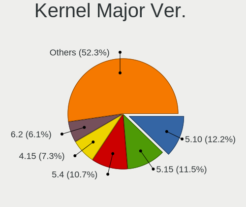

| Version | Desktops | Percent |
|---------|----------|---------|
| 5.4     | 24       | 17.14%  |
| 5.10    | 23       | 16.43%  |
| 4.15    | 19       | 13.57%  |
| 5.16    | 11       | 7.86%   |
| 5.15    | 11       | 7.86%   |
| 5.8     | 8        | 5.71%   |
| 5.13    | 8        | 5.71%   |
| 5.3     | 5        | 3.57%   |
| 6.1     | 4        | 2.86%   |
| 4.9     | 4        | 2.86%   |
| 5.19    | 3        | 2.14%   |
| 5.11    | 3        | 2.14%   |
| 5.0     | 3        | 2.14%   |
| 4.19    | 3        | 2.14%   |
| 6.0     | 2        | 1.43%   |
| 5.9     | 1        | 0.71%   |
| 5.6     | 1        | 0.71%   |
| 5.18    | 1        | 0.71%   |
| 5.14    | 1        | 0.71%   |
| 5.12    | 1        | 0.71%   |
| 4.4     | 1        | 0.71%   |
| 4.18    | 1        | 0.71%   |
| 4.13    | 1        | 0.71%   |
| 4.1     | 1        | 0.71%   |

Arch
----

OS architecture (x86_64, i586, etc.)

| Name   | Desktops | Percent |
|--------|----------|---------|
| x86_64 | 121      | 88.97%  |
| i686   | 15       | 11.03%  |

DE
--

Desktop Environment

| Name            | Desktops | Percent |
|-----------------|----------|---------|
| GNOME           | 39       | 27.86%  |
| KDE5            | 37       | 26.43%  |
| Unknown         | 15       | 10.71%  |
| XFCE            | 14       | 10%     |
| X-Cinnamon      | 7        | 5%      |
| MATE            | 6        | 4.29%   |
| KDE             | 5        | 3.57%   |
| LXDE            | 4        | 2.86%   |
| KDE4            | 4        | 2.86%   |
| Cinnamon        | 3        | 2.14%   |
| xmonad          | 1        | 0.71%   |
| Unity           | 1        | 0.71%   |
| Pantheon        | 1        | 0.71%   |
| LXQt            | 1        | 0.71%   |
| GNOME Flashback | 1        | 0.71%   |
| Budgie          | 1        | 0.71%   |

Display Server
--------------

X11 or Wayland

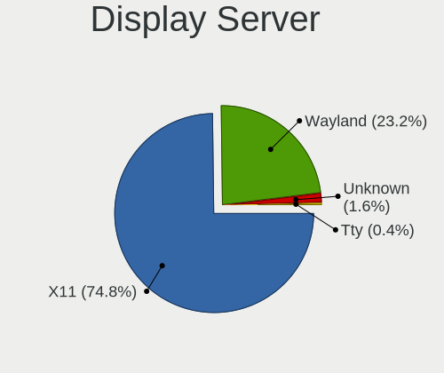

| Name    | Desktops | Percent |
|---------|----------|---------|
| X11     | 116      | 85.93%  |
| Wayland | 14       | 10.37%  |
| Unknown | 4        | 2.96%   |
| Tty     | 1        | 0.74%   |

Display Manager
---------------

SDDM, LightDM, etc.

| Name    | Desktops | Percent |
|---------|----------|---------|
| Unknown | 55       | 40.15%  |
| SDDM    | 36       | 26.28%  |
| LightDM | 14       | 10.22%  |
| GDM     | 14       | 10.22%  |
| TDM     | 6        | 4.38%   |
| GDM3    | 6        | 4.38%   |
| KDM     | 4        | 2.92%   |
| SLiM    | 2        | 1.46%   |

OS Lang
-------

Language

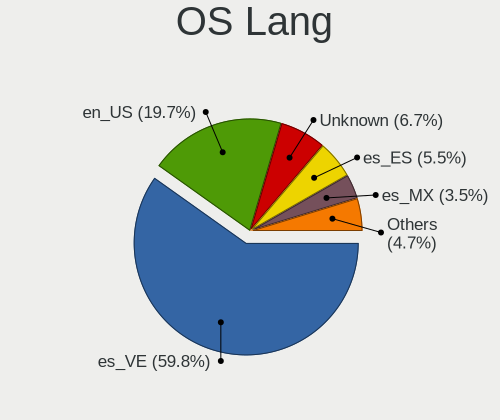

| Lang    | Desktops | Percent |
|---------|----------|---------|
| es_VE   | 79       | 58.09%  |
| en_US   | 29       | 21.32%  |
| Unknown | 17       | 12.5%   |
| es_ES   | 6        | 4.41%   |
| es_US   | 2        | 1.47%   |
| C       | 2        | 1.47%   |
| de_DE   | 1        | 0.74%   |

Boot Mode
---------

EFI or BIOS

| Mode | Desktops | Percent |
|------|----------|---------|
| BIOS | 117      | 87.31%  |
| EFI  | 17       | 12.69%  |

Filesystem
----------

Type of filesystem

| Type    | Desktops | Percent |
|---------|----------|---------|
| Ext4    | 100      | 73.53%  |
| Overlay | 23       | 16.91%  |
| Btrfs   | 6        | 4.41%   |
| Unknown | 5        | 3.68%   |
| Xfs     | 1        | 0.74%   |
| Ext2    | 1        | 0.74%   |

Part. scheme
------------

Scheme of partitioning

| Type    | Desktops | Percent |
|---------|----------|---------|
| Unknown | 62       | 45.93%  |
| MBR     | 51       | 37.78%  |
| GPT     | 22       | 16.3%   |

Dual Boot with Linux/BSD
------------------------

Hosting more than one Linux/BSD

| Dual boot | Desktops | Percent |
|-----------|----------|---------|
| No        | 106      | 78.52%  |
| Yes       | 29       | 21.48%  |

Dual Boot (Win)
---------------

Hosting Linux and Windows

| Dual boot | Desktops | Percent |
|-----------|----------|---------|
| No        | 77       | 57.04%  |
| Yes       | 58       | 42.96%  |

Board
-----

Vendor
------

Motherboard manufacturer

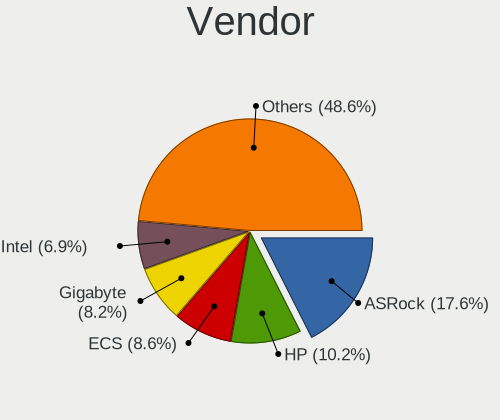

| Name                | Desktops | Percent |
|---------------------|----------|---------|
| ASRock              | 25       | 18.66%  |
| ECS                 | 15       | 11.19%  |
| Intel               | 11       | 8.21%   |
| Pegatron            | 10       | 7.46%   |
| Lenovo              | 10       | 7.46%   |
| Gigabyte Technology | 10       | 7.46%   |
| ASUSTek Computer    | 10       | 7.46%   |
| Hewlett-Packard     | 9        | 6.72%   |
| Dell                | 9        | 6.72%   |
| Biostar             | 8        | 5.97%   |
| MSI                 | 4        | 2.99%   |
| langchao            | 4        | 2.99%   |
| Foxconn             | 4        | 2.99%   |
| SIRAGON             | 1        | 0.75%   |
| IP3 Tech            | 1        | 0.75%   |
| Inspur              | 1        | 0.75%   |
| IBM                 | 1        | 0.75%   |
| Unknown             | 1        | 0.75%   |

Model
-----

Motherboard model

| Name                                 | Desktops | Percent |
|--------------------------------------|----------|---------|
| ECS H61H2-CM                         | 8        | 5.97%   |
| ASRock G41M-VS3                      | 6        | 4.48%   |
| langchao 12345                       | 4        | 2.99%   |
| HP Compaq 8200 Elite SFF PC          | 3        | 2.24%   |
| ASRock N68C-S UCC                    | 3        | 2.24%   |
| ASRock N68-VS3 UCC                   | 3        | 2.24%   |
| Pegatron Compaq dx2400 Microtower    | 2        | 1.49%   |
| Intel H61                            | 2        | 1.49%   |
| ECS G31T-M7                          | 2        | 1.49%   |
| Dell OptiPlex 9020                   | 2        | 1.49%   |
| SIRAGON AIO-5150                     | 1        | 0.75%   |
| Pegatron PEGATRON                    | 1        | 0.75%   |
| Pegatron IPPEL-DB                    | 1        | 0.75%   |
| Pegatron IPM41-D3                    | 1        | 0.75%   |
| Pegatron CQ1507LA                    | 1        | 0.75%   |
| Pegatron Compaq dx2400 Microtower PC | 1        | 0.75%   |
| Pegatron BM411AA-ABA CQ5600F         | 1        | 0.75%   |
| Pegatron 20-b010                     | 1        | 0.75%   |
| Pegatron 100-5010la                  | 1        | 0.75%   |
| MSI Pro 3000 Microtower PC           | 1        | 0.75%   |
| MSI MS-7817                          | 1        | 0.75%   |
| MSI MS-7721                          | 1        | 0.75%   |
| MSI MS-7375                          | 1        | 0.75%   |
| Lenovo ThinkCentre XXXX 8705A84      | 1        | 0.75%   |
| Lenovo ThinkCentre M91 7516AD1       | 1        | 0.75%   |
| Lenovo ThinkCentre M71e 3157G6S      | 1        | 0.75%   |
| Lenovo ThinkCentre M55E 9645BN2      | 1        | 0.75%   |
| Lenovo ThinkCentre M55E 9632BU8      | 1        | 0.75%   |
| Lenovo ThinkCentre A58 7515A33       | 1        | 0.75%   |
| Lenovo ThinkCentre A55 8705AV4       | 1        | 0.75%   |
| Lenovo H220 10028                    | 1        | 0.75%   |
| Lenovo 70A4000HUX ThinkServer TS140  | 1        | 0.75%   |
| Lenovo 11051CS ThinkServer TS130     | 1        | 0.75%   |
| IP3 Tech TB20                        | 1        | 0.75%   |
| Intel MAHOBAY                        | 1        | 0.75%   |
| Intel DH77EB AAG39073-304            | 1        | 0.75%   |
| Intel DG41TY AAE47335-203            | 1        | 0.75%   |
| Intel DG41TX AAE78178-303            | 1        | 0.75%   |
| Intel DG35EC AAE29266-205            | 1        | 0.75%   |
| Intel DG33BU AAD79951-407            | 1        | 0.75%   |

Model Family
------------

Motherboard model prefix

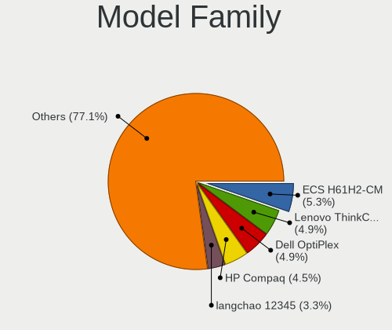

| Name                 | Desktops | Percent |
|----------------------|----------|---------|
| HP Compaq            | 9        | 6.72%   |
| ECS H61H2-CM         | 8        | 5.97%   |
| Lenovo ThinkCentre   | 7        | 5.22%   |
| ASRock G41M-VS3      | 6        | 4.48%   |
| Dell OptiPlex        | 5        | 3.73%   |
| langchao 12345       | 4        | 2.99%   |
| Pegatron Compaq      | 3        | 2.24%   |
| ASRock N68C-S        | 3        | 2.24%   |
| ASRock N68-VS3       | 3        | 2.24%   |
| Intel H61            | 2        | 1.49%   |
| ECS G31T-M7          | 2        | 1.49%   |
| Dell Vostro          | 2        | 1.49%   |
| ASUS P5G41T-M        | 2        | 1.49%   |
| SIRAGON AIO-5150     | 1        | 0.75%   |
| Pegatron PEGATRON    | 1        | 0.75%   |
| Pegatron IPPEL-DB    | 1        | 0.75%   |
| Pegatron IPM41-D3    | 1        | 0.75%   |
| Pegatron CQ1507LA    | 1        | 0.75%   |
| Pegatron BM411AA-ABA | 1        | 0.75%   |
| Pegatron 20-b010     | 1        | 0.75%   |
| Pegatron 100-5010la  | 1        | 0.75%   |
| MSI Pro              | 1        | 0.75%   |
| MSI MS-7817          | 1        | 0.75%   |
| MSI MS-7721          | 1        | 0.75%   |
| MSI MS-7375          | 1        | 0.75%   |
| Lenovo H220          | 1        | 0.75%   |
| Lenovo 70A4000HUX    | 1        | 0.75%   |
| Lenovo 11051CS       | 1        | 0.75%   |
| IP3 Tech TB20        | 1        | 0.75%   |
| Intel MAHOBAY        | 1        | 0.75%   |
| Intel DH77EB         | 1        | 0.75%   |
| Intel DG41TY         | 1        | 0.75%   |
| Intel DG41TX         | 1        | 0.75%   |
| Intel DG35EC         | 1        | 0.75%   |
| Intel DG33BU         | 1        | 0.75%   |
| Intel DG31PR         | 1        | 0.75%   |
| Intel D946GZIS       | 1        | 0.75%   |
| Intel D945GCCR       | 1        | 0.75%   |
| Inspur               | 1        | 0.75%   |
| IBM 8188LS4          | 1        | 0.75%   |

MFG Year
--------

Motherboard manufacture year

| Year | Desktops | Percent |
|------|----------|---------|
| 2011 | 34       | 25.37%  |
| 2010 | 29       | 21.64%  |
| 2012 | 15       | 11.19%  |
| 2008 | 15       | 11.19%  |
| 2007 | 10       | 7.46%   |
| 2006 | 7        | 5.22%   |
| 2014 | 5        | 3.73%   |
| 2017 | 4        | 2.99%   |
| 2013 | 4        | 2.99%   |
| 2021 | 3        | 2.24%   |
| 2015 | 2        | 1.49%   |
| 2009 | 2        | 1.49%   |
| 2020 | 1        | 0.75%   |
| 2019 | 1        | 0.75%   |
| 2016 | 1        | 0.75%   |
| 2005 | 1        | 0.75%   |

Form Factor
-----------

Physical design of the computer

| Name    | Desktops | Percent |
|---------|----------|---------|
| Desktop | 134      | 100%    |

Secure Boot
-----------

Enabled or disabled

| State    | Desktops | Percent |
|----------|----------|---------|
| Disabled | 134      | 100%    |

Coreboot
--------

Have coreboot on board

| Used | Desktops | Percent |
|------|----------|---------|
| No   | 134      | 100%    |

RAM Size
--------

Total RAM memory

| Size in GB  | Desktops | Percent |
|-------------|----------|---------|
| 3.01-4.0    | 43       | 31.39%  |
| 4.01-8.0    | 29       | 21.17%  |
| 8.01-16.0   | 22       | 16.06%  |
| 1.01-2.0    | 19       | 13.87%  |
| 16.01-24.0  | 12       | 8.76%   |
| 2.01-3.0    | 4        | 2.92%   |
| 24.01-32.0  | 3        | 2.19%   |
| 32.01-64.0  | 2        | 1.46%   |
| 0.51-1.0    | 2        | 1.46%   |
| 64.01-256.0 | 1        | 0.73%   |

RAM Used
--------

Used RAM memory

| Used GB  | Desktops | Percent |
|----------|----------|---------|
| 1.01-2.0 | 58       | 40.28%  |
| 2.01-3.0 | 37       | 25.69%  |
| 0.51-1.0 | 21       | 14.58%  |
| 4.01-8.0 | 14       | 9.72%   |
| 3.01-4.0 | 10       | 6.94%   |
| 0.01-0.5 | 4        | 2.78%   |

Total Drives
------------

Number of drives on board

| Drives | Desktops | Percent |
|--------|----------|---------|
| 1      | 80       | 57.97%  |
| 2      | 44       | 31.88%  |
| 3      | 12       | 8.7%    |
| 4      | 2        | 1.45%   |

Has CD-ROM
----------

Has CD-ROM on board

| Presented | Desktops | Percent |
|-----------|----------|---------|
| No        | 78       | 56.52%  |
| Yes       | 60       | 43.48%  |

Has Ethernet
------------

Has Ethernet on board

| Presented | Desktops | Percent |
|-----------|----------|---------|
| Yes       | 132      | 98.51%  |
| No        | 2        | 1.49%   |

Has WiFi
--------

Has WiFi module

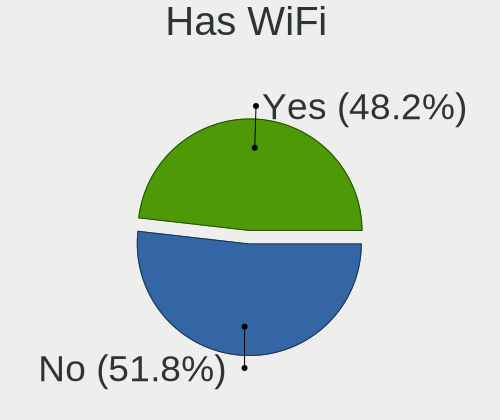

| Presented | Desktops | Percent |
|-----------|----------|---------|
| No        | 68       | 50.37%  |
| Yes       | 67       | 49.63%  |

Has Bluetooth
-------------

Has Bluetooth module

| Presented | Desktops | Percent |
|-----------|----------|---------|
| No        | 121      | 89.63%  |
| Yes       | 14       | 10.37%  |

Location
--------

Country
-------

Geographic location (country)

| Country   | Desktops | Percent |
|-----------|----------|---------|
| Venezuela | 134      | 100%    |

City
----

Geographic location (city)

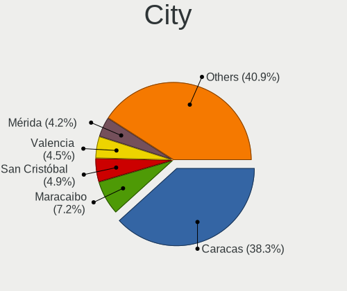

| City                     | Desktops | Percent |
|--------------------------|----------|---------|
| Caracas                  | 67       | 46.53%  |
| Valencia                 | 8        | 5.56%   |
| Maracay                  | 8        | 5.56%   |
| Barquisimeto             | 7        | 4.86%   |
| San Cristóbal           | 5        | 3.47%   |
| Maturín                 | 5        | 3.47%   |
| Maracaibo                | 4        | 2.78%   |
| San Carlos del Zulia     | 3        | 2.08%   |
| Carrizal                 | 3        | 2.08%   |
| Barcelona                | 3        | 2.08%   |
| San Antonio de Los Altos | 2        | 1.39%   |
| Mérida                  | 2        | 1.39%   |
| Los Teques               | 2        | 1.39%   |
| Ciudad Guayana           | 2        | 1.39%   |
| Ciudad Bolívar          | 2        | 1.39%   |
| Barinas                  | 2        | 1.39%   |
| Acarigua                 | 2        | 1.39%   |
| Valle de La Pascua       | 1        | 0.69%   |
| Tucupita                 | 1        | 0.69%   |
| San Juan Bautista        | 1        | 0.69%   |
| San Francisco            | 1        | 0.69%   |
| Porlamar                 | 1        | 0.69%   |
| Parroquia El Recreo      | 1        | 0.69%   |
| Mene Grande              | 1        | 0.69%   |
| Los Palos Grandes        | 1        | 0.69%   |
| Lecherias                | 1        | 0.69%   |
| Las Vegas                | 1        | 0.69%   |
| Guatire                  | 1        | 0.69%   |
| Guarenas                 | 1        | 0.69%   |
| Cua                      | 1        | 0.69%   |
| Carora                   | 1        | 0.69%   |
| Campo de Carabobo        | 1        | 0.69%   |
| Cabimas                  | 1        | 0.69%   |
| Baruta                   | 1        | 0.69%   |

Drives
------

Drive Vendor
------------

Hard drive vendors

| Vendor              | Desktops | Drives | Percent |
|---------------------|----------|--------|---------|
| WDC                 | 57       | 80     | 30.98%  |
| Seagate             | 46       | 64     | 25%     |
| Hitachi             | 26       | 31     | 14.13%  |
| Samsung Electronics | 17       | 21     | 9.24%   |
| Toshiba             | 11       | 12     | 5.98%   |
| Kingston            | 8        | 8      | 4.35%   |
| Maxtor              | 4        | 4      | 2.17%   |
| PNY                 | 3        | 4      | 1.63%   |
| Patriot             | 2        | 2      | 1.09%   |
| HGST                | 2        | 2      | 1.09%   |
| Unknown             | 1        | 1      | 0.54%   |
| Team                | 1        | 1      | 0.54%   |
| SPCC                | 1        | 1      | 0.54%   |
| SK hynix            | 1        | 1      | 0.54%   |
| SanDisk             | 1        | 1      | 0.54%   |
| Fujitsu             | 1        | 1      | 0.54%   |
| ExcelStor           | 1        | 1      | 0.54%   |
| Dogfish             | 1        | 1      | 0.54%   |

Drive Model
-----------

Hard drive models

| Model                               | Desktops | Percent |
|-------------------------------------|----------|---------|
| Seagate ST320LT012-1DG14C 320GB     | 11       | 5.29%   |
| Toshiba DT01ACA050 500GB            | 7        | 3.37%   |
| WDC WD5000AAKX-22ERMA0 500GB        | 6        | 2.88%   |
| Seagate ST500DM002-1BD142 500GB     | 4        | 1.92%   |
| Seagate ST3320418AS 320GB           | 4        | 1.92%   |
| Samsung HD502HJ 500GB               | 4        | 1.92%   |
| WDC WD5000AAKX-221CA1 500GB         | 3        | 1.44%   |
| WDC WD5000AAKX-001CA0 500GB         | 3        | 1.44%   |
| WDC WD5000AAKS-00A7B0 500GB         | 3        | 1.44%   |
| WDC WD3200AAJS-08L7A0 320GB         | 3        | 1.44%   |
| WDC WD3200AAJS-00L7A0 320GB         | 3        | 1.44%   |
| Seagate ST320LM000 HM321HI 320GB    | 3        | 1.44%   |
| Samsung HD161HJ 160GB               | 3        | 1.44%   |
| Kingston SA400S37240G 240GB SSD     | 3        | 1.44%   |
| Hitachi HTS542580K9SA00 80GB        | 3        | 1.44%   |
| Hitachi HDS728080PLA380 82GB        | 3        | 1.44%   |
| WDC WD800BD-22MRA1 80GB             | 2        | 0.96%   |
| WDC WD800BB-22JHC0 80GB             | 2        | 0.96%   |
| WDC WD5000LPVX-22V0TT0 500GB        | 2        | 0.96%   |
| WDC WD5000AAKS-00UU3A0 500GB        | 2        | 0.96%   |
| WDC WD2500AAJS-60B4A0 250GB         | 2        | 0.96%   |
| WDC WD1600BEVT-22ZCT0 160GB         | 2        | 0.96%   |
| Seagate ST500DM005 HD502HJ 500GB    | 2        | 0.96%   |
| Seagate ST500DM002-1BC142 500GB     | 2        | 0.96%   |
| Seagate ST3250310AS 250GB           | 2        | 0.96%   |
| Seagate ST320LM001 HN-M320MBB 320GB | 2        | 0.96%   |
| Seagate ST2000DM001-1CH164 2TB      | 2        | 0.96%   |
| Kingston SA400S37120G 120GB SSD     | 2        | 0.96%   |
| Hitachi HTS545032B9A300 320GB       | 2        | 0.96%   |
| Hitachi HDS721616PLA380 160GB       | 2        | 0.96%   |
| Hitachi HDS721032CLA362 320GB       | 2        | 0.96%   |
| WDC WD800JD-60LSA5 80GB             | 1        | 0.48%   |
| WDC WD800BD-08MRA1 80GB             | 1        | 0.48%   |
| WDC WD5000AVCS-632DY1 500GB         | 1        | 0.48%   |
| WDC WD5000AAKX-753CA1 500GB         | 1        | 0.48%   |
| WDC WD5000AAKX-08U6AA0 500GB        | 1        | 0.48%   |
| WDC WD5000AAKX-08ERMA0 500GB        | 1        | 0.48%   |
| WDC WD5000AAKS-00A7B2 500GB         | 1        | 0.48%   |
| WDC WD5000AAJS-08A8B0 500GB         | 1        | 0.48%   |
| WDC WD5000AACS-61M6B2 500GB         | 1        | 0.48%   |

HDD Vendor
----------

Hard disk drive vendors

| Vendor              | Desktops | Drives | Percent |
|---------------------|----------|--------|---------|
| WDC                 | 57       | 80     | 34.97%  |
| Seagate             | 46       | 64     | 28.22%  |
| Hitachi             | 26       | 31     | 15.95%  |
| Samsung Electronics | 15       | 18     | 9.2%    |
| Toshiba             | 11       | 12     | 6.75%   |
| Maxtor              | 4        | 4      | 2.45%   |
| HGST                | 2        | 2      | 1.23%   |
| Fujitsu             | 1        | 1      | 0.61%   |
| ExcelStor           | 1        | 1      | 0.61%   |

SSD Vendor
----------

Solid state drive vendors

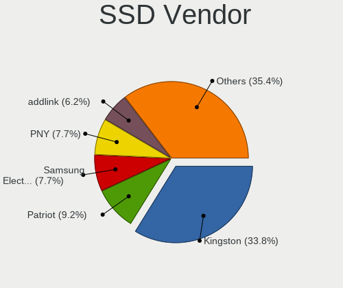

| Vendor              | Desktops | Drives | Percent |
|---------------------|----------|--------|---------|
| Kingston            | 8        | 8      | 44.44%  |
| PNY                 | 3        | 4      | 16.67%  |
| Samsung Electronics | 2        | 3      | 11.11%  |
| Patriot             | 2        | 2      | 11.11%  |
| Team                | 1        | 1      | 5.56%   |
| SPCC                | 1        | 1      | 5.56%   |
| Dogfish             | 1        | 1      | 5.56%   |

Drive Kind
----------

HDD or SSD

| Kind | Desktops | Drives | Percent |
|------|----------|--------|---------|
| HDD  | 120      | 213    | 85.71%  |
| SSD  | 17       | 20     | 12.14%  |
| NVMe | 3        | 3      | 2.14%   |

Drive Connector
---------------

SATA, SAS, NVMe, etc.

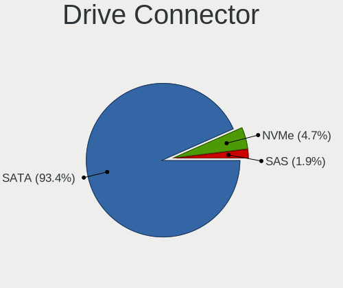

| Type | Desktops | Drives | Percent |
|------|----------|--------|---------|
| SATA | 132      | 233    | 97.78%  |
| NVMe | 3        | 3      | 2.22%   |

Drive Size
----------

Size of hard drive

| Size in TB | Desktops | Drives | Percent |
|------------|----------|--------|---------|
| 0.01-0.5   | 123      | 201    | 80.39%  |
| 0.51-1.0   | 17       | 17     | 11.11%  |
| 1.01-2.0   | 9        | 10     | 5.88%   |
| 3.01-4.0   | 2        | 2      | 1.31%   |
| 2.01-3.0   | 2        | 3      | 1.31%   |

Space Total
-----------

Amount of disk space available on the file system

| Size in GB     | Desktops | Percent |
|----------------|----------|---------|
| 251-500        | 48       | 33.57%  |
| 101-250        | 31       | 21.68%  |
| 1-20           | 19       | 13.29%  |
| 501-1000       | 18       | 12.59%  |
| 51-100         | 12       | 8.39%   |
| 1001-2000      | 5        | 3.5%    |
| 21-50          | 3        | 2.1%    |
| 2001-3000      | 3        | 2.1%    |
| Unknown        | 3        | 2.1%    |
| More than 3000 | 1        | 0.7%    |

Space Used
----------

Amount of used disk space

| Used GB        | Desktops | Percent |
|----------------|----------|---------|
| 1-20           | 63       | 44.37%  |
| 21-50          | 21       | 14.79%  |
| 101-250        | 21       | 14.79%  |
| 251-500        | 15       | 10.56%  |
| 51-100         | 11       | 7.75%   |
| 501-1000       | 4        | 2.82%   |
| Unknown        | 3        | 2.11%   |
| 2001-3000      | 2        | 1.41%   |
| More than 3000 | 1        | 0.7%    |
| 1001-2000      | 1        | 0.7%    |

Malfunc. Drives
---------------

Drive models with a malfunction

| Model                             | Desktops | Drives | Percent |
|-----------------------------------|----------|--------|---------|
| Seagate ST320LT012-1DG14C 320GB   | 6        | 7      | 9.68%   |
| WDC WD5000AAKX-22ERMA0 500GB      | 4        | 5      | 6.45%   |
| Toshiba DT01ACA050 500GB          | 3        | 4      | 4.84%   |
| WDC WD5000AAKX-221CA1 500GB       | 2        | 2      | 3.23%   |
| WDC WD5000AAKS-00A7B0 500GB       | 2        | 2      | 3.23%   |
| Seagate ST500DM002-1BD142 500GB   | 2        | 2      | 3.23%   |
| Hitachi HDS728080PLA380 82GB      | 2        | 2      | 3.23%   |
| Hitachi HDS721616PLA380 160GB     | 2        | 2      | 3.23%   |
| WDC WD800BD-08MRA1 80GB           | 1        | 1      | 1.61%   |
| WDC WD800BB-22JHC0 80GB           | 1        | 1      | 1.61%   |
| WDC WD5000LPVX-22V0TT0 500GB      | 1        | 1      | 1.61%   |
| WDC WD5000AAKX-08U6AA0 500GB      | 1        | 1      | 1.61%   |
| WDC WD5000AAKX-08ERMA0 500GB      | 1        | 2      | 1.61%   |
| WDC WD5000AACS-00ZUB0 500GB       | 1        | 1      | 1.61%   |
| WDC WD3200BEKT-22F3T0 320GB       | 1        | 1      | 1.61%   |
| WDC WD3200BEKT-08PVMT1 320GB      | 1        | 1      | 1.61%   |
| WDC WD3200AAJS-08L7A0 320GB       | 1        | 2      | 1.61%   |
| WDC WD2003FYPS-27Y2B0 2TB         | 1        | 1      | 1.61%   |
| WDC WD10EZEX-22RKKA0 1TB          | 1        | 1      | 1.61%   |
| WDC WD1003FZEX-00MK2A0 1TB        | 1        | 1      | 1.61%   |
| Seagate ST500DM005 HD502HJ 500GB  | 1        | 1      | 1.61%   |
| Seagate ST3500630AS 500GB         | 1        | 1      | 1.61%   |
| Seagate ST3500418AS 500GB         | 1        | 1      | 1.61%   |
| Seagate ST3500413AS 500GB         | 1        | 1      | 1.61%   |
| Seagate ST3500312CS 500GB         | 1        | 1      | 1.61%   |
| Seagate ST340014AS 40GB           | 1        | 1      | 1.61%   |
| Seagate ST3320418AS 320GB         | 1        | 2      | 1.61%   |
| Seagate ST3250318AS 250GB         | 1        | 1      | 1.61%   |
| Seagate ST3250310AS 250GB         | 1        | 1      | 1.61%   |
| Seagate ST3160215ACE 160GB        | 1        | 1      | 1.61%   |
| Seagate ST3160212SCE 160GB        | 1        | 1      | 1.61%   |
| Seagate ST31000525SV 1TB          | 1        | 1      | 1.61%   |
| Seagate ST2000DM001-1CH164 2TB    | 1        | 1      | 1.61%   |
| Samsung Electronics HM321HI 320GB | 1        | 1      | 1.61%   |
| Samsung Electronics HD161HJ 160GB | 1        | 2      | 1.61%   |
| Samsung Electronics HD161GJ 160GB | 1        | 1      | 1.61%   |
| Samsung Electronics HD155UI 1TB   | 1        | 1      | 1.61%   |
| Maxtor STM3250310AS 250GB         | 1        | 1      | 1.61%   |
| Maxtor STM3160215AS 160GB         | 1        | 1      | 1.61%   |
| Hitachi HUA722020ALA331 2TB       | 1        | 1      | 1.61%   |

Malfunc. Drive Vendor
---------------------

Vendors of faulty drives

| Vendor              | Desktops | Drives | Percent |
|---------------------|----------|--------|---------|
| Seagate             | 20       | 23     | 36.36%  |
| WDC                 | 14       | 23     | 25.45%  |
| Hitachi             | 10       | 10     | 18.18%  |
| Samsung Electronics | 4        | 5      | 7.27%   |
| Toshiba             | 3        | 4      | 5.45%   |
| Maxtor              | 2        | 2      | 3.64%   |
| HGST                | 1        | 1      | 1.82%   |
| ExcelStor           | 1        | 1      | 1.82%   |

Malfunc. HDD Vendor
-------------------

Vendors of faulty HDD drives

| Vendor              | Desktops | Drives | Percent |
|---------------------|----------|--------|---------|
| Seagate             | 20       | 23     | 36.36%  |
| WDC                 | 14       | 23     | 25.45%  |
| Hitachi             | 10       | 10     | 18.18%  |
| Samsung Electronics | 4        | 5      | 7.27%   |
| Toshiba             | 3        | 4      | 5.45%   |
| Maxtor              | 2        | 2      | 3.64%   |
| HGST                | 1        | 1      | 1.82%   |
| ExcelStor           | 1        | 1      | 1.82%   |

Malfunc. Drive Kind
-------------------

Kinds of faulty drives

| Kind | Desktops | Drives | Percent |
|------|----------|--------|---------|
| HDD  | 43       | 69     | 100%    |

Failed Drives
-------------

Failed drive models

| Model                    | Desktops | Drives | Percent |
|--------------------------|----------|--------|---------|
| Toshiba DT01ACA050 500GB | 2        | 2      | 100%    |

Failed Drive Vendor
-------------------

Failed drive vendors

| Vendor  | Desktops | Drives | Percent |
|---------|----------|--------|---------|
| Toshiba | 2        | 2      | 100%    |

Drive Status
------------

Number of failed and malfunc. drives

| Status   | Desktops | Drives | Percent |
|----------|----------|--------|---------|
| Detected | 67       | 114    | 45.27%  |
| Malfunc  | 43       | 69     | 29.05%  |
| Works    | 36       | 51     | 24.32%  |
| Failed   | 2        | 2      | 1.35%   |

Storage controller
------------------

Storage Vendor
--------------

Storage controller vendors

| Vendor                   | Desktops | Percent |
|--------------------------|----------|---------|
| Intel                    | 102      | 67.55%  |
| Nvidia                   | 15       | 9.93%   |
| AMD                      | 14       | 9.27%   |
| Marvell Technology Group | 6        | 3.97%   |
| JMicron Technology       | 6        | 3.97%   |
| VIA Technologies         | 3        | 1.99%   |
| SK hynix                 | 1        | 0.66%   |
| SanDisk                  | 1        | 0.66%   |
| Jiangsu Huacun Elec.     | 1        | 0.66%   |
| ASMedia Technology       | 1        | 0.66%   |
| Adaptec                  | 1        | 0.66%   |

Storage Model
-------------

Storage controller models

| Model                                                                                   | Desktops | Percent |
|-----------------------------------------------------------------------------------------|----------|---------|
| Intel NM10/ICH7 Family SATA Controller [IDE mode]                                       | 33       | 14.16%  |
| Intel 82801G (ICH7 Family) IDE Controller                                               | 25       | 10.73%  |
| Intel 6 Series/C200 Series Chipset Family 6 port Desktop SATA AHCI Controller           | 16       | 6.87%   |
| Intel 6 Series/C200 Series Chipset Family Desktop SATA Controller (IDE mode, ports 4-5) | 15       | 6.44%   |
| Intel 6 Series/C200 Series Chipset Family Desktop SATA Controller (IDE mode, ports 0-3) | 15       | 6.44%   |
| Nvidia MCP61 SATA Controller                                                            | 14       | 6.01%   |
| Nvidia MCP61 IDE                                                                        | 12       | 5.15%   |
| Intel 82801JI (ICH10 Family) 4 port SATA IDE Controller #1                              | 5        | 2.15%   |
| Intel 82801JI (ICH10 Family) 2 port SATA IDE Controller #2                              | 5        | 2.15%   |
| Intel 82801IR/IO/IH (ICH9R/DO/DH) 4 port SATA Controller [IDE mode]                     | 5        | 2.15%   |
| Intel 82801I (ICH9 Family) 2 port SATA Controller [IDE mode]                            | 5        | 2.15%   |
| Intel 8 Series/C220 Series Chipset Family 6-port SATA Controller 1 [AHCI mode]          | 5        | 2.15%   |
| AMD FCH SATA Controller [AHCI mode]                                                     | 5        | 2.15%   |
| Intel 7 Series/C210 Series Chipset Family 6-port SATA Controller [AHCI mode]            | 4        | 1.72%   |
| AMD SB7x0/SB8x0/SB9x0 SATA Controller [AHCI mode]                                       | 4        | 1.72%   |
| AMD SB7x0/SB8x0/SB9x0 IDE Controller                                                    | 4        | 1.72%   |
| VIA VT82C586A/B/VT82C686/A/B/VT823x/A/C PIPC Bus Master IDE                             | 3        | 1.29%   |
| Intel 82801HR/HO/HH (ICH8R/DO/DH) 2 port SATA Controller [IDE mode]                     | 3        | 1.29%   |
| Intel 82801H (ICH8 Family) 4 port SATA Controller [IDE mode]                            | 3        | 1.29%   |
| AMD SB7x0/SB8x0/SB9x0 SATA Controller [IDE mode]                                        | 3        | 1.29%   |
| VIA Serial ATA Controller                                                               | 2        | 0.86%   |
| JMicron JMB368 IDE controller                                                           | 2        | 0.86%   |
| JMicron JMB363 SATA/IDE Controller                                                      | 2        | 0.86%   |
| JMicron JMB362 SATA Controller                                                          | 2        | 0.86%   |
| Intel 82801JD/DO (ICH10 Family) SATA AHCI Controller                                    | 2        | 0.86%   |
| Intel 82801EB (ICH5) SATA Controller                                                    | 2        | 0.86%   |
| Intel 500 Series Chipset Family SATA AHCI Controller                                    | 2        | 0.86%   |
| AMD FCH SATA Controller [IDE mode]                                                      | 2        | 0.86%   |
| AMD FCH SATA Controller D                                                               | 2        | 0.86%   |
| AMD FCH IDE Controller                                                                  | 2        | 0.86%   |
| VIA VT8237A SATA 2-Port Controller                                                      | 1        | 0.43%   |
| SK hynix Gold P31/PC711 NVMe Solid State Drive                                          | 1        | 0.43%   |
| SanDisk Non-Volatile memory controller                                                  | 1        | 0.43%   |
| Nvidia MCP78S [GeForce 8200] SATA Controller (non-AHCI mode)                            | 1        | 0.43%   |
| Nvidia MCP78S [GeForce 8200] IDE                                                        | 1        | 0.43%   |
| Marvell Group 88SE91A3 SATA-600 Controller                                              | 1        | 0.43%   |
| Marvell Group 88SE9172 SATA III 6Gb/s RAID Controller                                   | 1        | 0.43%   |
| Marvell Group 88SE9172 SATA 6Gb/s Controller                                            | 1        | 0.43%   |
| Marvell Group 88SE9128 PCIe SATA 6 Gb/s RAID controller with HyperDuo                   | 1        | 0.43%   |
| Marvell Group 88SE6111/6121 SATA II / PATA Controller                                   | 1        | 0.43%   |

Storage Kind
------------

Kind of storage controller (IDE, SATA, NVMe, SAS, ...)

| Kind | Desktops | Percent |
|------|----------|---------|
| IDE  | 91       | 59.87%  |
| SATA | 53       | 34.87%  |
| RAID | 3        | 1.97%   |
| NVMe | 3        | 1.97%   |
| SAS  | 1        | 0.66%   |
| SCSI | 1        | 0.66%   |

Processor
---------

CPU Vendor
----------

Processor vendors

| Vendor | Desktops | Percent |
|--------|----------|---------|
| Intel  | 105      | 78.36%  |
| AMD    | 29       | 21.64%  |

CPU Model
---------

Processor models

| Model                                       | Desktops | Percent |
|---------------------------------------------|----------|---------|
| Intel Pentium Dual-Core CPU E5700 @ 3.00GHz | 6        | 4.48%   |
| Intel Pentium Dual-Core CPU E5300 @ 2.60GHz | 6        | 4.48%   |
| Intel Pentium CPU G620 @ 2.60GHz            | 4        | 2.99%   |
| Intel Core i5-2400 CPU @ 3.10GHz            | 4        | 2.99%   |
| Intel Core i3-2120 CPU @ 3.30GHz            | 4        | 2.99%   |
| Intel Pentium Dual-Core CPU E6600 @ 3.06GHz | 3        | 2.24%   |
| Intel Pentium Dual-Core CPU E5800 @ 3.20GHz | 3        | 2.24%   |
| Intel Pentium Dual CPU E2180 @ 2.00GHz      | 3        | 2.24%   |
| Intel Pentium 4 CPU 3.00GHz                 | 3        | 2.24%   |
| Intel Core i5-3470 CPU @ 3.20GHz            | 3        | 2.24%   |
| Intel Core i3-2100 CPU @ 3.10GHz            | 3        | 2.24%   |
| Intel Core 2 Quad CPU Q6600 @ 2.40GHz       | 3        | 2.24%   |
| AMD Sempron 145 Processor                   | 3        | 2.24%   |
| Intel Pentium Dual-Core CPU E5500 @ 2.80GHz | 2        | 1.49%   |
| Intel Pentium Dual CPU E2220 @ 2.40GHz      | 2        | 1.49%   |
| Intel Pentium CPU G640 @ 2.80GHz            | 2        | 1.49%   |
| Intel Core i7-3770 CPU @ 3.40GHz            | 2        | 1.49%   |
| Intel Core i5-3330 CPU @ 3.00GHz            | 2        | 1.49%   |
| Intel Core i5-2500 CPU @ 3.30GHz            | 2        | 1.49%   |
| Intel Core 2 Quad CPU Q8400 @ 2.66GHz       | 2        | 1.49%   |
| Intel Core 2 Duo CPU E8400 @ 3.00GHz        | 2        | 1.49%   |
| Intel Core 2 Duo CPU E7400 @ 2.80GHz        | 2        | 1.49%   |
| AMD Sempron 140 Processor                   | 2        | 1.49%   |
| AMD FX-6100 Six-Core Processor              | 2        | 1.49%   |
| AMD Athlon II X2 250 Processor              | 2        | 1.49%   |
| Intel Xeon CPU X3220 @ 2.40GHz              | 1        | 0.75%   |
| Intel Xeon CPU E5450 @ 3.00GHz              | 1        | 0.75%   |
| Intel Xeon CPU E5-1607 0 @ 3.00GHz          | 1        | 0.75%   |
| Intel Xeon CPU E31225 @ 3.10GHz             | 1        | 0.75%   |
| Intel Pentium Dual-Core CPU E5200 @ 2.50GHz | 1        | 0.75%   |
| Intel Pentium Dual CPU E2160 @ 1.80GHz      | 1        | 0.75%   |
| Intel Pentium D CPU 2.80GHz                 | 1        | 0.75%   |
| Intel Pentium CPU G3250 @ 3.20GHz           | 1        | 0.75%   |
| Intel Pentium CPU G3220 @ 3.00GHz           | 1        | 0.75%   |
| Intel Pentium CPU G2030 @ 3.00GHz           | 1        | 0.75%   |
| Intel Pentium CPU E5800 @ 3.20GHz           | 1        | 0.75%   |
| Intel Pentium CPU 2030M @ 2.50GHz           | 1        | 0.75%   |
| Intel Pentium 4 CPU 3.20GHz                 | 1        | 0.75%   |
| Intel Core i7-4790 CPU @ 3.60GHz            | 1        | 0.75%   |
| Intel Core i7-3770K CPU @ 3.50GHz           | 1        | 0.75%   |

CPU Model Family
----------------

Processor model prefix

| Model                   | Desktops | Percent |
|-------------------------|----------|---------|
| Intel Pentium Dual-Core | 21       | 15.67%  |
| Intel Core i5           | 18       | 13.43%  |
| Intel Pentium           | 11       | 8.21%   |
| Intel Core i3           | 9        | 6.72%   |
| Intel Core i7           | 8        | 5.97%   |
| Intel Core 2 Duo        | 8        | 5.97%   |
| AMD Sempron             | 7        | 5.22%   |
| Intel Pentium Dual      | 6        | 4.48%   |
| Intel Core 2 Quad       | 5        | 3.73%   |
| Intel Xeon              | 4        | 2.99%   |
| Intel Pentium 4         | 4        | 2.99%   |
| Intel Core 2            | 4        | 2.99%   |
| Other                   | 3        | 2.24%   |
| AMD FX                  | 3        | 2.24%   |
| AMD Athlon II X2        | 3        | 2.24%   |
| Intel Celeron           | 2        | 1.49%   |
| AMD Phenom II X4        | 2        | 1.49%   |
| AMD Phenom              | 2        | 1.49%   |
| AMD Athlon II X4        | 2        | 1.49%   |
| AMD Athlon              | 2        | 1.49%   |
| Intel Pentium D         | 1        | 0.75%   |
| Intel Atom              | 1        | 0.75%   |
| AMD Ryzen 3             | 1        | 0.75%   |
| AMD Phenom II X2        | 1        | 0.75%   |
| AMD E1                  | 1        | 0.75%   |
| AMD Athlon II           | 1        | 0.75%   |
| AMD Athlon 64 X2        | 1        | 0.75%   |
| AMD A8                  | 1        | 0.75%   |
| AMD A6                  | 1        | 0.75%   |
| AMD A4                  | 1        | 0.75%   |

CPU Cores
---------

Number of processor cores

| Number  | Desktops | Percent |
|---------|----------|---------|
| 2       | 69       | 51.49%  |
| 4       | 44       | 32.84%  |
| 1       | 13       | 9.7%    |
| 3       | 4        | 2.99%   |
| Unknown | 2        | 1.49%   |
| 8       | 1        | 0.75%   |
| 6       | 1        | 0.75%   |

CPU Sockets
-----------

Number of sockets

| Number | Desktops | Percent |
|--------|----------|---------|
| 1      | 134      | 100%    |

CPU Threads
-----------

Threads per core (Hyper-Threading)

| Number  | Desktops | Percent |
|---------|----------|---------|
| 1       | 103      | 76.87%  |
| 2       | 29       | 21.64%  |
| Unknown | 2        | 1.49%   |

CPU Op-Modes
------------

CPU Operation Modes (32-bit, 64-bit)

| Op mode        | Desktops | Percent |
|----------------|----------|---------|
| 32-bit, 64-bit | 130      | 97.01%  |
| 64-bit         | 2        | 1.49%   |
| 32-bit         | 1        | 0.75%   |
| Unknown        | 1        | 0.75%   |

CPU Microcode
-------------

Microcode number

| Number     | Desktops | Percent |
|------------|----------|---------|
| 0x1067a    | 27       | 20.15%  |
| 0x206a7    | 19       | 14.18%  |
| Unknown    | 19       | 14.18%  |
| 0x306a9    | 9        | 6.72%   |
| 0x306c3    | 6        | 4.48%   |
| 0x6fd      | 5        | 3.73%   |
| 0x010000c8 | 5        | 3.73%   |
| 0x6fb      | 4        | 2.99%   |
| 0xf65      | 3        | 2.24%   |
| 0x6f2      | 3        | 2.24%   |
| 0x10676    | 3        | 2.24%   |
| 0x010000c7 | 3        | 2.24%   |
| 0xa0671    | 2        | 1.49%   |
| 0x106a5    | 2        | 1.49%   |
| 0x0600063e | 2        | 1.49%   |
| 0x010000b6 | 2        | 1.49%   |
| 0xf47      | 1        | 0.75%   |
| 0xf41      | 1        | 0.75%   |
| 0x906eb    | 1        | 0.75%   |
| 0x906e9    | 1        | 0.75%   |
| 0x806c1    | 1        | 0.75%   |
| 0x6f6      | 1        | 0.75%   |
| 0x206d7    | 1        | 0.75%   |
| 0x106ca    | 1        | 0.75%   |
| 0x10661    | 1        | 0.75%   |
| 0x0810100b | 1        | 0.75%   |
| 0x0700010b | 1        | 0.75%   |
| 0x06001119 | 1        | 0.75%   |
| 0x06000852 | 1        | 0.75%   |
| 0x05000119 | 1        | 0.75%   |
| 0x03000027 | 1        | 0.75%   |
| 0x03000014 | 1        | 0.75%   |
| 0x010000db | 1        | 0.75%   |
| 0x010000c6 | 1        | 0.75%   |
| 0x01000095 | 1        | 0.75%   |
| 0x01000065 | 1        | 0.75%   |

CPU Microarch
-------------

Microarchitecture

| Name        | Desktops | Percent |
|-------------|----------|---------|
| Penryn      | 32       | 23.88%  |
| SandyBridge | 24       | 17.91%  |
| K10         | 16       | 11.94%  |
| Core        | 16       | 11.94%  |
| IvyBridge   | 13       | 9.7%    |
| Haswell     | 7        | 5.22%   |
| NetBurst    | 5        | 3.73%   |
| K8 Hammer   | 3        | 2.24%   |
| Piledriver  | 2        | 1.49%   |
| Nehalem     | 2        | 1.49%   |
| KabyLake    | 2        | 1.49%   |
| K10 Llano   | 2        | 1.49%   |
| Bulldozer   | 2        | 1.49%   |
| Zen+        | 1        | 0.75%   |
| Zen         | 1        | 0.75%   |
| TigerLake   | 1        | 0.75%   |
| Jaguar      | 1        | 0.75%   |
| Icelake     | 1        | 0.75%   |
| Bonnell     | 1        | 0.75%   |
| Bobcat      | 1        | 0.75%   |
| Unknown     | 1        | 0.75%   |

Graphics
--------

GPU Vendor
----------

Vendors of graphics cards

| Vendor           | Desktops | Percent |
|------------------|----------|---------|
| Intel            | 78       | 54.55%  |
| Nvidia           | 34       | 23.78%  |
| AMD              | 28       | 19.58%  |
| VIA Technologies | 3        | 2.1%    |

GPU Model
---------

Graphics card models

| Model                                                                       | Desktops | Percent |
|-----------------------------------------------------------------------------|----------|---------|
| Intel 2nd Generation Core Processor Family Integrated Graphics Controller   | 20       | 13.79%  |
| Intel 4 Series Chipset Integrated Graphics Controller                       | 16       | 11.03%  |
| Intel 82G33/G31 Express Integrated Graphics Controller                      | 8        | 5.52%   |
| Intel Xeon E3-1200 v3/4th Gen Core Processor Integrated Graphics Controller | 6        | 4.14%   |
| AMD Cedar [Radeon HD 5000/6000/7350/8350 Series]                            | 6        | 4.14%   |
| Nvidia GF119 [GeForce GT 520]                                               | 4        | 2.76%   |
| Nvidia C61 [GeForce 7025 / nForce 630a]                                     | 4        | 2.76%   |
| Intel Xeon E3-1200 v2/3rd Gen Core processor Graphics Controller            | 4        | 2.76%   |
| Intel IvyBridge GT2 [HD Graphics 4000]                                      | 4        | 2.76%   |
| Intel 82946GZ/GL Integrated Graphics Controller                             | 4        | 2.76%   |
| VIA Technologies CN896/VN896/P4M900 [Chrome 9 HC]                           | 3        | 2.07%   |
| Nvidia GT218 [GeForce 210]                                                  | 3        | 2.07%   |
| Nvidia GF106 [GeForce GTS 450]                                              | 3        | 2.07%   |
| Nvidia GK208B [GeForce GT 710]                                              | 2        | 1.38%   |
| Nvidia GF119 [GeForce GT 610]                                               | 2        | 1.38%   |
| Nvidia G86 [GeForce 8500 GT]                                                | 2        | 1.38%   |
| Nvidia C61 [GeForce 6150SE nForce 430]                                      | 2        | 1.38%   |
| Intel 82Q963/Q965 Integrated Graphics Controller                            | 2        | 1.38%   |
| Intel 82945G/GZ Integrated Graphics Controller                              | 2        | 1.38%   |
| Intel 82865G Integrated Graphics Controller                                 | 2        | 1.38%   |
| AMD RV670 [Radeon HD 3870]                                                  | 2        | 1.38%   |
| AMD RS780L [Radeon 3000]                                                    | 2        | 1.38%   |
| AMD Oland XT [Radeon HD 8670 / R5 340X OEM / R7 250/350/350X OEM]           | 2        | 1.38%   |
| Nvidia NV44 [GeForce 7100 GS]                                               | 1        | 0.69%   |
| Nvidia NV44 [GeForce 6200 LE]                                               | 1        | 0.69%   |
| Nvidia GT218 [GeForce 405]                                                  | 1        | 0.69%   |
| Nvidia GK208B [GeForce GT 730]                                              | 1        | 0.69%   |
| Nvidia GK107 [GeForce GT 640]                                               | 1        | 0.69%   |
| Nvidia GK104GL [Quadro K4200]                                               | 1        | 0.69%   |
| Nvidia GF119 [GeForce 605]                                                  | 1        | 0.69%   |
| Nvidia GF116 [GeForce GTX 550 Ti]                                           | 1        | 0.69%   |
| Nvidia GF114 [GeForce GTX 560]                                              | 1        | 0.69%   |
| Nvidia GF104 [GeForce GTX 460]                                              | 1        | 0.69%   |
| Nvidia G96C [GeForce 9500 GT]                                               | 1        | 0.69%   |
| Nvidia G96C [GeForce 9400 GT]                                               | 1        | 0.69%   |
| Intel Xeon E3-1200 Processor Family Integrated Graphics Controller          | 1        | 0.69%   |
| Intel TigerLake-LP GT2 [Iris Xe Graphics]                                   | 1        | 0.69%   |
| Intel RocketLake-S GT1 [UHD Graphics 750]                                   | 1        | 0.69%   |
| Intel RocketLake-S GT1 [UHD Graphics 730]                                   | 1        | 0.69%   |
| Intel HD Graphics 630                                                       | 1        | 0.69%   |

GPU Combo
---------

Combinations of graphics cards

| Name         | Desktops | Percent |
|--------------|----------|---------|
| 1 x Intel    | 72       | 53.33%  |
| 1 x Nvidia   | 32       | 23.7%   |
| 1 x AMD      | 23       | 17.04%  |
| 1 x VIA      | 3        | 2.22%   |
| 2 x AMD      | 2        | 1.48%   |
| AMD + Nvidia | 2        | 1.48%   |
| Intel + AMD  | 1        | 0.74%   |

GPU Driver
----------

Free vs proprietary

| Driver      | Desktops | Percent |
|-------------|----------|---------|
| Free        | 112      | 82.96%  |
| Proprietary | 12       | 8.89%   |
| Unknown     | 11       | 8.15%   |

GPU Memory
----------

Total video memory

| Size in GB | Desktops | Percent |
|------------|----------|---------|
| Unknown    | 72       | 52.55%  |
| 0.51-1.0   | 24       | 17.52%  |
| 0.01-0.5   | 23       | 16.79%  |
| 1.01-2.0   | 14       | 10.22%  |
| 3.01-4.0   | 4        | 2.92%   |

Monitor
-------

Monitor Vendor
--------------

Monitor vendors

| Vendor                                | Desktops | Percent |
|---------------------------------------|----------|---------|
| Samsung Electronics                   | 35       | 29.66%  |
| Hewlett-Packard                       | 12       | 10.17%  |
| Goldstar                              | 12       | 10.17%  |
| Toshiba                               | 9        | 7.63%   |
| Lenovo                                | 8        | 6.78%   |
| Dell                                  | 8        | 6.78%   |
| AOC                                   | 7        | 5.93%   |
| Acer                                  | 6        | 5.08%   |
| BenQ                                  | 3        | 2.54%   |
| Vita                                  | 2        | 1.69%   |
| Sony                                  | 2        | 1.69%   |
| Envision                              | 2        | 1.69%   |
| ViewSonic                             | 1        | 0.85%   |
| Unknown (XXX)                         | 1        | 0.85%   |
| Toshiba Matsushita Display Technology | 1        | 0.85%   |
| TCL                                   | 1        | 0.85%   |
| Plain Tree Systems                    | 1        | 0.85%   |
| PEGA                                  | 1        | 0.85%   |
| Parker                                | 1        | 0.85%   |
| MStar                                 | 1        | 0.85%   |
| LSC                                   | 1        | 0.85%   |
| LG Electronics                        | 1        | 0.85%   |
| IBM                                   | 1        | 0.85%   |
| CVT                                   | 1        | 0.85%   |

Monitor Model
-------------

Monitor models

| Model                                                                 | Desktops | Percent |
|-----------------------------------------------------------------------|----------|---------|
| Toshiba LCD-MONITOR LCDE980 1440x900 408x255mm 18.9-inch              | 6        | 4.92%   |
| Samsung Electronics SyncMaster SAM01B7 1280x1024 338x270mm 17.0-inch  | 4        | 3.28%   |
| Lenovo LEN L174 LEN240B 1280x1024 340x270mm 17.1-inch                 | 4        | 3.28%   |
| Toshiba TV TSB0206 1920x1080 886x498mm 40.0-inch                      | 3        | 2.46%   |
| Vita V195EW-W VIT1950 1600x900 432x240mm 19.5-inch                    | 2        | 1.64%   |
| Samsung Electronics SyncMaster SAM0370 1680x1050 459x296mm 21.5-inch  | 2        | 1.64%   |
| Samsung Electronics SA300/SA350 SAM0788 1366x768 410x230mm 18.5-inch  | 2        | 1.64%   |
| Samsung Electronics S19A10N SAM083E 1366x768 410x230mm 18.5-inch      | 2        | 1.64%   |
| Hewlett-Packard L1710 HWP26EB 1280x1024 340x270mm 17.1-inch           | 2        | 1.64%   |
| Acer B193W ACR001E 1440x900 408x255mm 18.9-inch                       | 2        | 1.64%   |
| ViewSonic VA2448 SERIES VSC3828 1920x1080 521x293mm 23.5-inch         | 1        | 0.82%   |
| Unknown (XXX) 1772ED XXX1772 1280x1024 320x250mm 16.0-inch            | 1        | 0.82%   |
| Unknown (XXX) 1772E XXX1772 1280x1024 320x250mm 16.0-inch             | 1        | 0.82%   |
| Toshiba Matsushita Display Technology LCD Monitor LCD-MONITOR         | 1        | 0.82%   |
| TCL T-7005L TCL1770 1280x1024 338x270mm 17.0-inch                     | 1        | 0.82%   |
| Sony TV SNYEB01 1360x768                                              | 1        | 0.82%   |
| Sony TV SNYEA01 1920x1080                                             | 1        | 0.82%   |
| Sony TV SNYDC01 1360x768                                              | 1        | 0.82%   |
| Samsung Electronics T22C301 SAM0AD2 1920x1080 477x268mm 21.5-inch     | 1        | 0.82%   |
| Samsung Electronics SyncMaster SAM0598 1360x768 410x230mm 18.5-inch   | 1        | 0.82%   |
| Samsung Electronics SyncMaster SAM0564 1360x768 410x230mm 18.5-inch   | 1        | 0.82%   |
| Samsung Electronics SyncMaster SAM049C 1920x1080 477x268mm 21.5-inch  | 1        | 0.82%   |
| Samsung Electronics SyncMaster SAM0499 1600x900 443x249mm 20.0-inch   | 1        | 0.82%   |
| Samsung Electronics SyncMaster SAM0472 1440x900 367x229mm 17.0-inch   | 1        | 0.82%   |
| Samsung Electronics SyncMaster SAM03F5 1920x1200                      | 1        | 0.82%   |
| Samsung Electronics SyncMaster SAM03F4 1920x1200 518x324mm 24.1-inch  | 1        | 0.82%   |
| Samsung Electronics SyncMaster SAM0364 1360x768 344x194mm 15.5-inch   | 1        | 0.82%   |
| Samsung Electronics SyncMaster SAM02AD 1440x900 410x257mm 19.1-inch   | 1        | 0.82%   |
| Samsung Electronics SyncMaster SAM0286 1280x720 372x209mm 16.8-inch   | 1        | 0.82%   |
| Samsung Electronics SyncMaster SAM0285 1440x900 410x257mm 19.1-inch   | 1        | 0.82%   |
| Samsung Electronics SyncMaster SAM01F9 1280x1024 376x301mm 19.0-inch  | 1        | 0.82%   |
| Samsung Electronics SyncMaster SAM011E 1280x1024 338x270mm 17.0-inch  | 1        | 0.82%   |
| Samsung Electronics SMBX2050N SAM0719 1600x900 443x249mm 20.0-inch    | 1        | 0.82%   |
| Samsung Electronics SMB2330H SAM064A 1920x1080 509x286mm 23.0-inch    | 1        | 0.82%   |
| Samsung Electronics SMB1930N SAM0632 1366x768 410x230mm 18.5-inch     | 1        | 0.82%   |
| Samsung Electronics SA300/SA350 SAM0849 1920x1080 477x268mm 21.5-inch | 1        | 0.82%   |
| Samsung Electronics SA300/SA350 SAM0789 1366x768 410x230mm 18.5-inch  | 1        | 0.82%   |
| Samsung Electronics S19A33x SAM7120 1366x768 410x230mm 18.5-inch      | 1        | 0.82%   |
| Samsung Electronics S19A33x SAM711F 1366x768 410x230mm 18.5-inch      | 1        | 0.82%   |
| Samsung Electronics Monitor SAM1057 1280x1024 306x230mm 15.1-inch     | 1        | 0.82%   |

Monitor Resolution
------------------

Monitor screen resolution

| Resolution         | Desktops | Percent |
|--------------------|----------|---------|
| 1280x1024 (SXGA)   | 26       | 22.03%  |
| 1920x1080 (FHD)    | 24       | 20.34%  |
| 1366x768 (WXGA)    | 22       | 18.64%  |
| 1440x900 (WXGA+)   | 16       | 13.56%  |
| 1600x900 (HD+)     | 9        | 7.63%   |
| 1360x768           | 5        | 4.24%   |
| 1680x1050 (WSXGA+) | 4        | 3.39%   |
| 1280x720 (HD)      | 3        | 2.54%   |
| 1024x768 (XGA)     | 3        | 2.54%   |
| 1920x1200 (WUXGA)  | 2        | 1.69%   |
| Unknown            | 2        | 1.69%   |
| 3840x2160 (4K)     | 1        | 0.85%   |
| 3840x1080          | 1        | 0.85%   |

Monitor Diagonal
----------------

Diagonal size in inches

| Inches  | Desktops | Percent |
|---------|----------|---------|
| 18      | 30       | 25.42%  |
| 17      | 20       | 16.95%  |
| 21      | 14       | 11.86%  |
| 19      | 13       | 11.02%  |
| Unknown | 8        | 6.78%   |
| 20      | 7        | 5.93%   |
| 15      | 7        | 5.93%   |
| 23      | 5        | 4.24%   |
| 74      | 3        | 2.54%   |
| 16      | 3        | 2.54%   |
| 72      | 2        | 1.69%   |
| 22      | 2        | 1.69%   |
| 52      | 1        | 0.85%   |
| 39      | 1        | 0.85%   |
| 24      | 1        | 0.85%   |
| 13      | 1        | 0.85%   |

Monitor Width
-------------

Physical width

| Width in mm | Desktops | Percent |
|-------------|----------|---------|
| 401-500     | 61       | 52.14%  |
| 301-350     | 27       | 23.08%  |
| Unknown     | 8        | 6.84%   |
| 351-400     | 7        | 5.98%   |
| 501-600     | 6        | 5.13%   |
| 1501-2000   | 5        | 4.27%   |
| 801-900     | 1        | 0.85%   |
| 201-300     | 1        | 0.85%   |
| 1001-1500   | 1        | 0.85%   |

Aspect Ratio
------------

Proportional relationship between the width and the height

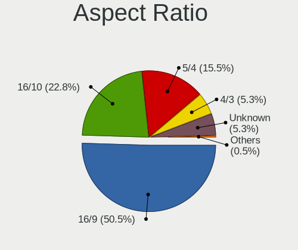

| Ratio   | Desktops | Percent |
|---------|----------|---------|
| 16/9    | 55       | 47.83%  |
| 16/10   | 25       | 21.74%  |
| 5/4     | 24       | 20.87%  |
| Unknown | 6        | 5.22%   |
| 4/3     | 4        | 3.48%   |
| 3/2     | 1        | 0.87%   |

Monitor Area
------------

Area in inch²

| Area in inch² | Desktops | Percent |
|----------------|----------|---------|
| 141-150        | 41       | 34.75%  |
| 151-200        | 32       | 27.12%  |
| 201-250        | 17       | 14.41%  |
| Unknown        | 8        | 6.78%   |
| 101-110        | 7        | 5.93%   |
| More than 1000 | 6        | 5.08%   |
| 121-130        | 3        | 2.54%   |
| 251-300        | 1        | 0.85%   |
| 131-140        | 1        | 0.85%   |
| 501-1000       | 1        | 0.85%   |
| 91-100         | 1        | 0.85%   |

Pixel Density
-------------

Pixels per inch

| Density | Desktops | Percent |
|---------|----------|---------|
| 51-100  | 85       | 72.65%  |
| 101-120 | 17       | 14.53%  |
| Unknown | 8        | 6.84%   |
| 1-50    | 6        | 5.13%   |
| 121-160 | 1        | 0.85%   |

Multiple Monitors
-----------------

Total monitors connected

| Total | Desktops | Percent |
|-------|----------|---------|
| 1     | 113      | 84.33%  |
| 0     | 12       | 8.96%   |
| 2     | 8        | 5.97%   |
| 3     | 1        | 0.75%   |

Network
-------

Net Controller Vendor
---------------------

Controller vendors

| Vendor                            | Desktops | Percent |
|-----------------------------------|----------|---------|
| Realtek Semiconductor             | 77       | 36.49%  |
| Intel                             | 32       | 15.17%  |
| Qualcomm Atheros                  | 31       | 14.69%  |
| Nvidia                            | 15       | 7.11%   |
| Ralink                            | 14       | 6.64%   |
| Broadcom                          | 9        | 4.27%   |
| Ralink Technology                 | 6        | 2.84%   |
| Xiaomi                            | 4        | 1.9%    |
| Qualcomm Atheros Communications   | 4        | 1.9%    |
| VIA Technologies                  | 3        | 1.42%   |
| Sundance Technology Inc / IC Plus | 2        | 0.95%   |
| Mercucys                          | 2        | 0.95%   |
| D-Link System                     | 2        | 0.95%   |
| ZTE WCDMA Technologies MSM        | 1        | 0.47%   |
| Trendchip Technologies            | 1        | 0.47%   |
| Samsung Electronics               | 1        | 0.47%   |
| National Semiconductor            | 1        | 0.47%   |
| Motorola PCS                      | 1        | 0.47%   |
| Motorola BCS                      | 1        | 0.47%   |
| Marvell Technology Group          | 1        | 0.47%   |
| JMicron Technology                | 1        | 0.47%   |
| ICS Advent                        | 1        | 0.47%   |
| Broadcom Limited                  | 1        | 0.47%   |

Net Controller Model
--------------------

Controller models

| Model                                                                          | Desktops | Percent |
|--------------------------------------------------------------------------------|----------|---------|
| Realtek RTL8111/8168/8411 PCI Express Gigabit Ethernet Controller              | 50       | 22.52%  |
| Realtek RTL810xE PCI Express Fast Ethernet controller                          | 14       | 6.31%   |
| Nvidia MCP61 Ethernet                                                          | 14       | 6.31%   |
| Intel 82579LM Gigabit Network Connection (Lewisville)                          | 11       | 4.95%   |
| Qualcomm Atheros AR8152 v2.0 Fast Ethernet                                     | 7        | 3.15%   |
| Qualcomm Atheros AR5212/5213/2414 Wireless Network Adapter                     | 6        | 2.7%    |
| Ralink RT3090 Wireless 802.11n 1T/1R PCIe                                      | 5        | 2.25%   |
| Realtek RTL8188EUS 802.11n Wireless Network Adapter                            | 4        | 1.8%    |
| Ralink RT2790 Wireless 802.11n 1T/2R PCIe                                      | 4        | 1.8%    |
| Broadcom NetLink BCM5786 Gigabit Ethernet PCI Express                          | 4        | 1.8%    |
| Xiaomi Mi/Redmi series (RNDIS)                                                 | 3        | 1.35%   |
| VIA VT6102/VT6103 [Rhine-II]                                                   | 3        | 1.35%   |
| Realtek RTL8192EU 802.11b/g/n WLAN Adapter                                     | 3        | 1.35%   |
| Realtek RTL-8100/8101L/8139 PCI Fast Ethernet Adapter                          | 3        | 1.35%   |
| Ralink RT2870/RT3070 Wireless Adapter                                          | 3        | 1.35%   |
| Ralink RT5390 Wireless 802.11n 1T/1R PCIe                                      | 3        | 1.35%   |
| Qualcomm Atheros AR9271 802.11n                                                | 3        | 1.35%   |
| Qualcomm Atheros AR5413/AR5414 Wireless Network Adapter [AR5006X(S) 802.11abg] | 3        | 1.35%   |
| Qualcomm Atheros AR2413/AR2414 Wireless Network Adapter [AR5005G(S) 802.11bg]  | 3        | 1.35%   |
| Intel Ethernet Connection I217-LM                                              | 3        | 1.35%   |
| Realtek RTL8192CU 802.11n WLAN Adapter                                         | 2        | 0.9%    |
| Realtek RTL8188FTV 802.11b/g/n 1T1R 2.4G WLAN Adapter                          | 2        | 0.9%    |
| Ralink MT7601U Wireless Adapter                                                | 2        | 0.9%    |
| Qualcomm Atheros AR9485 Wireless Network Adapter                               | 2        | 0.9%    |
| Qualcomm Atheros AR9285 Wireless Network Adapter (PCI-Express)                 | 2        | 0.9%    |
| Qualcomm Atheros AR922X Wireless Network Adapter                               | 2        | 0.9%    |
| Qualcomm Atheros AR9227 Wireless Network Adapter                               | 2        | 0.9%    |
| Qualcomm Atheros AR8151 v2.0 Gigabit Ethernet                                  | 2        | 0.9%    |
| Mercucys MW300UM RTL8192EU wifi                                                | 2        | 0.9%    |
| Intel PRO/100 VE Network Connection                                            | 2        | 0.9%    |
| Intel Ethernet Connection I217-V                                               | 2        | 0.9%    |
| Intel 82567V-2 Gigabit Network Connection                                      | 2        | 0.9%    |
| Broadcom BCM43225 802.11b/g/n                                                  | 2        | 0.9%    |
| ZTE WCDMA MSM ZXIC Mobile Boardband                                            | 1        | 0.45%   |
| Xiaomi Mi/Redmi series (RNDIS + ADB)                                           | 1        | 0.45%   |
| Trendchip Ethernet controller                                                  | 1        | 0.45%   |
| Sundance Inc / IC Plus IP1000 Family Gigabit Ethernet                          | 1        | 0.45%   |
| Sundance Inc / IC Plus IC Plus IP100A Integrated 10/100 Ethernet MAC + PHY     | 1        | 0.45%   |
| Samsung GT-I9070 (network tethering, USB debugging enabled)                    | 1        | 0.45%   |
| Realtek RTL8188EE Wireless Network Adapter                                     | 1        | 0.45%   |

Wireless Vendor
---------------

Wireless vendors

| Vendor                          | Desktops | Percent |
|---------------------------------|----------|---------|
| Qualcomm Atheros                | 21       | 29.58%  |
| Realtek Semiconductor           | 14       | 19.72%  |
| Ralink                          | 14       | 19.72%  |
| Ralink Technology               | 6        | 8.45%   |
| Intel                           | 5        | 7.04%   |
| Qualcomm Atheros Communications | 4        | 5.63%   |
| Broadcom                        | 3        | 4.23%   |
| Mercucys                        | 2        | 2.82%   |
| D-Link System                   | 2        | 2.82%   |

Wireless Model
--------------

Wireless models

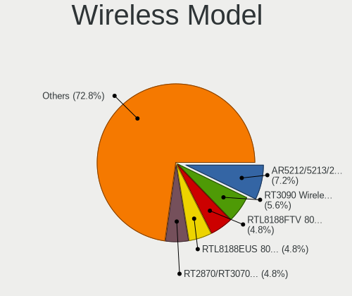

| Model                                                                          | Desktops | Percent |
|--------------------------------------------------------------------------------|----------|---------|
| Qualcomm Atheros AR5212/5213/2414 Wireless Network Adapter                     | 6        | 8.45%   |
| Ralink RT3090 Wireless 802.11n 1T/1R PCIe                                      | 5        | 7.04%   |
| Realtek RTL8188EUS 802.11n Wireless Network Adapter                            | 4        | 5.63%   |
| Ralink RT2790 Wireless 802.11n 1T/2R PCIe                                      | 4        | 5.63%   |
| Realtek RTL8192EU 802.11b/g/n WLAN Adapter                                     | 3        | 4.23%   |
| Ralink RT2870/RT3070 Wireless Adapter                                          | 3        | 4.23%   |
| Ralink RT5390 Wireless 802.11n 1T/1R PCIe                                      | 3        | 4.23%   |
| Qualcomm Atheros AR9271 802.11n                                                | 3        | 4.23%   |
| Qualcomm Atheros AR5413/AR5414 Wireless Network Adapter [AR5006X(S) 802.11abg] | 3        | 4.23%   |
| Qualcomm Atheros AR2413/AR2414 Wireless Network Adapter [AR5005G(S) 802.11bg]  | 3        | 4.23%   |
| Realtek RTL8192CU 802.11n WLAN Adapter                                         | 2        | 2.82%   |
| Realtek RTL8188FTV 802.11b/g/n 1T1R 2.4G WLAN Adapter                          | 2        | 2.82%   |
| Ralink MT7601U Wireless Adapter                                                | 2        | 2.82%   |
| Qualcomm Atheros AR9485 Wireless Network Adapter                               | 2        | 2.82%   |
| Qualcomm Atheros AR9285 Wireless Network Adapter (PCI-Express)                 | 2        | 2.82%   |
| Qualcomm Atheros AR922X Wireless Network Adapter                               | 2        | 2.82%   |
| Qualcomm Atheros AR9227 Wireless Network Adapter                               | 2        | 2.82%   |
| Mercucys MW300UM RTL8192EU wifi                                                | 2        | 2.82%   |
| Broadcom BCM43225 802.11b/g/n                                                  | 2        | 2.82%   |
| Realtek RTL8188EE Wireless Network Adapter                                     | 1        | 1.41%   |
| Realtek RTL8188CUS 802.11n WLAN Adapter                                        | 1        | 1.41%   |
| Realtek RTL-8185 IEEE 802.11a/b/g Wireless LAN Controller                      | 1        | 1.41%   |
| Ralink RT5372 Wireless Adapter                                                 | 1        | 1.41%   |
| Ralink RT5390R 802.11bgn PCIe Wireless Network Adapter                         | 1        | 1.41%   |
| Ralink RT2561/RT61 802.11g PCI                                                 | 1        | 1.41%   |
| Qualcomm Atheros AR5523                                                        | 1        | 1.41%   |
| Qualcomm Atheros AR2417 Wireless Network Adapter [AR5007G 802.11bg]            | 1        | 1.41%   |
| Intel Wireless 7265                                                            | 1        | 1.41%   |
| Intel Wireless 7260                                                            | 1        | 1.41%   |
| Intel Wi-Fi 6 AX200                                                            | 1        | 1.41%   |
| Intel Tiger Lake PCH CNVi WiFi                                                 | 1        | 1.41%   |
| Intel Centrino Wireless-N 105                                                  | 1        | 1.41%   |
| D-Link System DWA-125 Wireless N 150 Adapter(rev.A2) [Ralink RT3070]           | 1        | 1.41%   |
| D-Link System DWA-110 Wireless G Adapter(rev.A1) [Ralink RT2571W]              | 1        | 1.41%   |
| Broadcom BCM4313 802.11bgn Wireless Network Adapter                            | 1        | 1.41%   |

Ethernet Vendor
---------------

Ethernet vendors

| Vendor                            | Desktops | Percent |
|-----------------------------------|----------|---------|
| Realtek Semiconductor             | 68       | 45.64%  |
| Intel                             | 28       | 18.79%  |
| Nvidia                            | 15       | 10.07%  |
| Qualcomm Atheros                  | 14       | 9.4%    |
| Broadcom                          | 6        | 4.03%   |
| Xiaomi                            | 4        | 2.68%   |
| VIA Technologies                  | 3        | 2.01%   |
| Sundance Technology Inc / IC Plus | 2        | 1.34%   |
| Trendchip Technologies            | 1        | 0.67%   |
| Samsung Electronics               | 1        | 0.67%   |
| National Semiconductor            | 1        | 0.67%   |
| Motorola PCS                      | 1        | 0.67%   |
| Motorola BCS                      | 1        | 0.67%   |
| Marvell Technology Group          | 1        | 0.67%   |
| JMicron Technology                | 1        | 0.67%   |
| ICS Advent                        | 1        | 0.67%   |
| Broadcom Limited                  | 1        | 0.67%   |

Ethernet Model
--------------

Ethernet models

| Model                                                                      | Desktops | Percent |
|----------------------------------------------------------------------------|----------|---------|
| Realtek RTL8111/8168/8411 PCI Express Gigabit Ethernet Controller          | 50       | 33.33%  |
| Realtek RTL810xE PCI Express Fast Ethernet controller                      | 14       | 9.33%   |
| Nvidia MCP61 Ethernet                                                      | 14       | 9.33%   |
| Intel 82579LM Gigabit Network Connection (Lewisville)                      | 11       | 7.33%   |
| Qualcomm Atheros AR8152 v2.0 Fast Ethernet                                 | 7        | 4.67%   |
| Broadcom NetLink BCM5786 Gigabit Ethernet PCI Express                      | 4        | 2.67%   |
| Xiaomi Mi/Redmi series (RNDIS)                                             | 3        | 2%      |
| VIA VT6102/VT6103 [Rhine-II]                                               | 3        | 2%      |
| Realtek RTL-8100/8101L/8139 PCI Fast Ethernet Adapter                      | 3        | 2%      |
| Intel Ethernet Connection I217-LM                                          | 3        | 2%      |
| Qualcomm Atheros AR8151 v2.0 Gigabit Ethernet                              | 2        | 1.33%   |
| Intel PRO/100 VE Network Connection                                        | 2        | 1.33%   |
| Intel Ethernet Connection I217-V                                           | 2        | 1.33%   |
| Intel 82567V-2 Gigabit Network Connection                                  | 2        | 1.33%   |
| Xiaomi Mi/Redmi series (RNDIS + ADB)                                       | 1        | 0.67%   |
| Trendchip Ethernet controller                                              | 1        | 0.67%   |
| Sundance Inc / IC Plus IP1000 Family Gigabit Ethernet                      | 1        | 0.67%   |
| Sundance Inc / IC Plus IC Plus IP100A Integrated 10/100 Ethernet MAC + PHY | 1        | 0.67%   |
| Samsung GT-I9070 (network tethering, USB debugging enabled)                | 1        | 0.67%   |
| Realtek RTL8169 PCI Gigabit Ethernet Controller                            | 1        | 0.67%   |
| Realtek RTL8153 Gigabit Ethernet Adapter                                   | 1        | 0.67%   |
| Qualcomm Atheros Attansic L2 Fast Ethernet                                 | 1        | 0.67%   |
| Qualcomm Atheros AR8161 Gigabit Ethernet                                   | 1        | 0.67%   |
| Qualcomm Atheros AR8132 Fast Ethernet                                      | 1        | 0.67%   |
| Qualcomm Atheros AR8131 Gigabit Ethernet                                   | 1        | 0.67%   |
| Qualcomm Atheros AR8121/AR8113/AR8114 Gigabit or Fast Ethernet             | 1        | 0.67%   |
| Nvidia MCP77 Ethernet                                                      | 1        | 0.67%   |
| National DP83815 (MacPhyter) Ethernet Controller                           | 1        | 0.67%   |
| Motorola PCS moto g(8) plus                                                | 1        | 0.67%   |
| Motorola BCS SurfBoard SB5100 Cable Modem                                  | 1        | 0.67%   |
| Marvell Group 88E8057 PCI-E Gigabit Ethernet Controller                    | 1        | 0.67%   |
| JMicron JMC250 PCI Express Gigabit Ethernet Controller                     | 1        | 0.67%   |
| Intel NM10/ICH7 Family LAN Controller                                      | 1        | 0.67%   |
| Intel 82579V Gigabit Network Connection                                    | 1        | 0.67%   |
| Intel 82567V-4 Gigabit Network Connection                                  | 1        | 0.67%   |
| Intel 82567LM-3 Gigabit Network Connection                                 | 1        | 0.67%   |
| Intel 82566DC-2 Gigabit Network Connection                                 | 1        | 0.67%   |
| Intel 82566DC Gigabit Network Connection                                   | 1        | 0.67%   |
| Intel 82562V-2 10/100 Network Connection                                   | 1        | 0.67%   |
| Intel 82557/8/9/0/1 Ethernet Pro 100                                       | 1        | 0.67%   |

Net Controller Kind
-------------------

Ethernet, WiFi or modem

| Kind     | Desktops | Percent |
|----------|----------|---------|
| Ethernet | 132      | 66%     |
| WiFi     | 67       | 33.5%   |
| Modem    | 1        | 0.5%    |

Used Controller
---------------

Currently used network controller

| Kind     | Desktops | Percent |
|----------|----------|---------|
| Ethernet | 95       | 68.84%  |
| WiFi     | 43       | 31.16%  |

NICs
----

Total network controllers on board

| Total | Desktops | Percent |
|-------|----------|---------|
| 1     | 84       | 62.22%  |
| 2     | 47       | 34.81%  |
| 3     | 3        | 2.22%   |
| 0     | 1        | 0.74%   |

IPv6
----

IPv6 vs IPv4

| Used | Desktops | Percent |
|------|----------|---------|
| No   | 134      | 100%    |

Bluetooth
---------

Bluetooth Vendor
----------------

Controller vendors

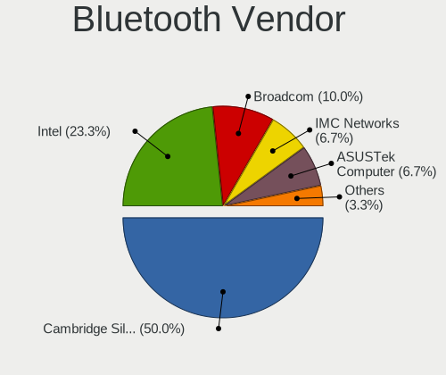

| Vendor                  | Desktops | Percent |
|-------------------------|----------|---------|
| Cambridge Silicon Radio | 5        | 35.71%  |
| Intel                   | 3        | 21.43%  |
| IMC Networks            | 2        | 14.29%  |
| Broadcom                | 2        | 14.29%  |
| ASUSTek Computer        | 2        | 14.29%  |

Bluetooth Model
---------------

Controller models

| Model                                               | Desktops | Percent |
|-----------------------------------------------------|----------|---------|
| Cambridge Silicon Radio Bluetooth Dongle (HCI mode) | 5        | 35.71%  |
| IMC Networks Bluetooth Module                       | 2        | 14.29%  |
| Intel Bluetooth wireless interface                  | 1        | 7.14%   |
| Intel AX201 Bluetooth                               | 1        | 7.14%   |
| Intel AX200 Bluetooth                               | 1        | 7.14%   |
| Broadcom BCM2070 Bluetooth Device                   | 1        | 7.14%   |
| Broadcom BCM2035B3 Bluetooth Adapter                | 1        | 7.14%   |
| ASUS Broadcom BCM20702A0 Bluetooth                  | 1        | 7.14%   |
| ASUS Bluetooth Adapter                              | 1        | 7.14%   |

Sound
-----

Sound Vendor
------------

Sound card vendors

| Vendor                 | Desktops | Percent |
|------------------------|----------|---------|
| Intel                  | 101      | 55.19%  |
| Nvidia                 | 31       | 16.94%  |
| AMD                    | 30       | 16.39%  |
| C-Media Electronics    | 6        | 3.28%   |
| VIA Technologies       | 4        | 2.19%   |
| Creative Labs          | 3        | 1.64%   |
| Logitech               | 2        | 1.09%   |
| JMTek                  | 2        | 1.09%   |
| Unknown                | 1        | 0.55%   |
| Microsoft              | 1        | 0.55%   |
| Megawin Technology     | 1        | 0.55%   |
| Generalplus Technology | 1        | 0.55%   |

Sound Model
-----------

Sound card models

| Model                                                                             | Desktops | Percent |
|-----------------------------------------------------------------------------------|----------|---------|
| Intel NM10/ICH7 Family High Definition Audio Controller                           | 35       | 17.41%  |
| Intel 6 Series/C200 Series Chipset Family High Definition Audio Controller        | 30       | 14.93%  |
| Nvidia MCP61 High Definition Audio                                                | 12       | 5.97%   |
| Nvidia GF119 HDMI Audio Controller                                                | 7        | 3.48%   |
| Intel Xeon E3-1200 v3/4th Gen Core Processor HD Audio Controller                  | 7        | 3.48%   |
| Intel 8 Series/C220 Series Chipset High Definition Audio Controller               | 6        | 2.99%   |
| Intel 7 Series/C216 Chipset Family High Definition Audio Controller               | 6        | 2.99%   |
| AMD SBx00 Azalia (Intel HDA)                                                      | 6        | 2.99%   |
| AMD Cedar HDMI Audio [Radeon HD 5400/6300/7300 Series]                            | 6        | 2.99%   |
| Intel 82801JI (ICH10 Family) HD Audio Controller                                  | 5        | 2.49%   |
| Intel 82801I (ICH9 Family) HD Audio Controller                                    | 5        | 2.49%   |
| AMD FCH Azalia Controller                                                         | 5        | 2.49%   |
| Nvidia High Definition Audio Controller                                           | 4        | 1.99%   |
| AMD Oland/Hainan/Cape Verde/Pitcairn HDMI Audio [Radeon HD 7000 Series]           | 4        | 1.99%   |
| VIA Technologies VX900/VT8xxx High Definition Audio Controller                    | 3        | 1.49%   |
| Nvidia GK208 HDMI/DP Audio Controller                                             | 3        | 1.49%   |
| Nvidia GF106 High Definition Audio Controller                                     | 3        | 1.49%   |
| Intel 82801H (ICH8 Family) HD Audio Controller                                    | 3        | 1.49%   |
| Intel Tiger Lake-H HD Audio Controller                                            | 2        | 1%      |
| Intel 82801JD/DO (ICH10 Family) HD Audio Controller                               | 2        | 1%      |
| Intel 82801EB/ER (ICH5/ICH5R) AC'97 Audio Controller                              | 2        | 1%      |
| C-Media Electronics CMI8738/CMI8768 PCI Audio                                     | 2        | 1%      |
| C-Media Electronics CM108 Audio Controller                                        | 2        | 1%      |
| AMD RV710/730 HDMI Audio [Radeon HD 4000 series]                                  | 2        | 1%      |
| AMD RV670/680 HDMI Audio [Radeon HD 3690/3800 Series]                             | 2        | 1%      |
| AMD Raven/Raven2/Fenghuang HDMI/DP Audio Controller                               | 2        | 1%      |
| AMD Family 17h/19h HD Audio Controller                                            | 2        | 1%      |
| AMD Caicos HDMI Audio [Radeon HD 6450 / 7450/8450/8490 OEM / R5 230/235/235X OEM] | 2        | 1%      |
| AMD BeaverCreek HDMI Audio [Radeon HD 6500D and 6400G-6600G series]               | 2        | 1%      |
| VIA Technologies VT1720/24 [Envy24PT/HT] PCI Multi-Channel Audio Controller       | 1        | 0.5%    |
| Unknown Audio device                                                              | 1        | 0.5%    |
| Nvidia MCP72XE/MCP72P/MCP78U/MCP78S High Definition Audio                         | 1        | 0.5%    |
| Nvidia GK107 HDMI Audio Controller                                                | 1        | 0.5%    |
| Nvidia GK104 HDMI Audio Controller                                                | 1        | 0.5%    |
| Nvidia GF116 High Definition Audio Controller                                     | 1        | 0.5%    |
| Nvidia GF114 HDMI Audio Controller                                                | 1        | 0.5%    |
| Nvidia GF104 High Definition Audio Controller                                     | 1        | 0.5%    |
| Microsoft LifeChat LX-6000 Headset                                                | 1        | 0.5%    |
| Megawin Technology USB Audio Device                                               | 1        | 0.5%    |
| Logitech V20 portable speakers (USB powered)                                      | 1        | 0.5%    |

Memory
------

Memory Vendor
-------------

Memory module vendors

| Vendor              | Desktops | Percent |
|---------------------|----------|---------|
| Unknown             | 41       | 35.96%  |
| Kingston            | 13       | 11.4%   |
| Samsung Electronics | 12       | 10.53%  |
| SK hynix            | 7        | 6.14%   |
| Ramaxel Technology  | 7        | 6.14%   |
| Corsair             | 7        | 6.14%   |
| Micron Technology   | 5        | 4.39%   |
| Crucial             | 5        | 4.39%   |
| Nanya Technology    | 3        | 2.63%   |
| Team                | 2        | 1.75%   |
| Elpida              | 2        | 1.75%   |
| Avant               | 2        | 1.75%   |
| A-DATA Technology   | 2        | 1.75%   |
| Unknown (0x0CBA)    | 1        | 0.88%   |
| Qimonda             | 1        | 0.88%   |
| PNY                 | 1        | 0.88%   |
| OCZ                 | 1        | 0.88%   |
| Kreton              | 1        | 0.88%   |
| Unknown             | 1        | 0.88%   |

Memory Model
------------

Memory module models

| Model                                                       | Desktops | Percent |
|-------------------------------------------------------------|----------|---------|
| Unknown RAM Module 4GB DIMM 400MT/s                         | 3        | 2.33%   |
| Unknown RAM Module 2048MB DIMM DDR2                         | 3        | 2.33%   |
| Unknown RAM Module 1024MB DIMM DDR2                         | 3        | 2.33%   |
| Unknown RAM Module 4GB DIMM SDRAM                           | 2        | 1.55%   |
| Unknown RAM Module 4GB DIMM DDR3 1333MT/s                   | 2        | 1.55%   |
| Unknown RAM Module 4GB DIMM 1066MT/s                        | 2        | 1.55%   |
| Unknown RAM Module 2GB DIMM SDRAM                           | 2        | 1.55%   |
| Unknown RAM Module 2GB DIMM DDR3 1066MT/s                   | 2        | 1.55%   |
| Unknown RAM Module 2GB DIMM DDR2                            | 2        | 1.55%   |
| Unknown RAM Module 2GB DIMM 400MT/s                         | 2        | 1.55%   |
| Unknown RAM Module 2048MB DIMM SDRAM                        | 2        | 1.55%   |
| Unknown RAM Module 1024MB DIMM SDRAM                        | 2        | 1.55%   |
| Unknown RAM Module 1024MB DIMM DDR2 533MT/s                 | 2        | 1.55%   |
| Samsung RAM Module 2GB DIMM DDR3 1333MT/s                   | 2        | 1.55%   |
| Ramaxel RAM RMR5030ME68F9F1600 4GB DIMM DDR3 1600MT/s       | 2        | 1.55%   |
| Ramaxel RAM RMR5030ED58E8W1600 2GB DIMM DDR3 1600MT/s       | 2        | 1.55%   |
| Nanya RAM NT2GT64U8HD0BY-AD 2GB DIMM DDR2 2048MT/s          | 2        | 1.55%   |
| Unknown RAM Module 8GB DIMM 1600MT/s                        | 1        | 0.78%   |
| Unknown RAM Module 512MB DIMM DDR2                          | 1        | 0.78%   |
| Unknown RAM Module 4GB DIMM 667MT/s                         | 1        | 0.78%   |
| Unknown RAM Module 4GB DIMM 1333MT/s                        | 1        | 0.78%   |
| Unknown RAM Module 4096MB DIMM SDRAM                        | 1        | 0.78%   |
| Unknown RAM Module 4096MB DIMM DDR3 1333MT/s                | 1        | 0.78%   |
| Unknown RAM Module 4096MB DIMM                              | 1        | 0.78%   |
| Unknown RAM Module 2GB DIMM DDR2 667MT/s                    | 1        | 0.78%   |
| Unknown RAM Module 2GB DIMM DDR 800MT/s                     | 1        | 0.78%   |
| Unknown RAM Module 2GB DIMM 800MT/s                         | 1        | 0.78%   |
| Unknown RAM Module 2048MB DIMM SDRAM 800MT/s                | 1        | 0.78%   |
| Unknown RAM Module 2048MB DIMM DDR3 1066MT/s                | 1        | 0.78%   |
| Unknown RAM Module 2048MB DIMM DDR2 533MT/s                 | 1        | 0.78%   |
| Unknown RAM Module 2048MB DIMM DDR2 1639MT/s                | 1        | 0.78%   |
| Unknown RAM Module 2048MB DIMM DDR 800MT/s                  | 1        | 0.78%   |
| Unknown RAM Module 2048MB DIMM DDR 133MT/s                  | 1        | 0.78%   |
| Unknown RAM Module 2048MB DIMM 1066MT/s                     | 1        | 0.78%   |
| Unknown RAM Module 1GB DIMM DDR 133MT/s                     | 1        | 0.78%   |
| Unknown RAM Module 1024MB DIMM DDR 133MT/s                  | 1        | 0.78%   |
| Unknown (0x0CBA) RAM JC4S8GB26C03D 8GB SODIMM DDR4 2667MT/s | 1        | 0.78%   |
| Team RAM TEAMGROUP-UD4-3200 16384MB DIMM DDR4 3733MT/s      | 1        | 0.78%   |
| Team RAM TEAMGROUP-UD3-1333 4GB DIMM DDR3 1333MT/s          | 1        | 0.78%   |
| SK hynix RAM Module 4GB DIMM DDR3 1333MT/s                  | 1        | 0.78%   |

Memory Kind
-----------

Memory module kinds

| Kind    | Desktops | Percent |
|---------|----------|---------|
| DDR3    | 35       | 38.04%  |
| DDR2    | 21       | 22.83%  |
| SDRAM   | 13       | 14.13%  |
| Unknown | 13       | 14.13%  |
| DDR4    | 6        | 6.52%   |
| DDR     | 4        | 4.35%   |

Memory Form Factor
------------------

Physical design of the memory module

| Name   | Desktops | Percent |
|--------|----------|---------|
| DIMM   | 85       | 95.51%  |
| SODIMM | 4        | 4.49%   |

Memory Size
-----------

Memory module size

| Size  | Desktops | Percent |
|-------|----------|---------|
| 2048  | 43       | 39.81%  |
| 4096  | 33       | 30.56%  |
| 1024  | 16       | 14.81%  |
| 8192  | 11       | 10.19%  |
| 16384 | 2        | 1.85%   |
| 512   | 2        | 1.85%   |
| 32768 | 1        | 0.93%   |

Memory Speed
------------

Memory module speed

| Speed   | Desktops | Percent |
|---------|----------|---------|
| 1600    | 21       | 20.79%  |
| 1333    | 18       | 17.82%  |
| Unknown | 16       | 15.84%  |
| 800     | 7        | 6.93%   |
| 667     | 6        | 5.94%   |
| 1066    | 5        | 4.95%   |
| 400     | 5        | 4.95%   |
| 533     | 4        | 3.96%   |
| 1639    | 3        | 2.97%   |
| 133     | 3        | 2.97%   |
| 3200    | 2        | 1.98%   |
| 2048    | 2        | 1.98%   |
| 3733    | 1        | 0.99%   |
| 3600    | 1        | 0.99%   |
| 3000    | 1        | 0.99%   |
| 2667    | 1        | 0.99%   |
| 2400    | 1        | 0.99%   |
| 2133    | 1        | 0.99%   |
| 1867    | 1        | 0.99%   |
| 1067    | 1        | 0.99%   |
| 1024    | 1        | 0.99%   |

Printers & scanners
-------------------

Printer Vendor
--------------

Printer device vendors

| Vendor              | Desktops | Percent |
|---------------------|----------|---------|
| Hewlett-Packard     | 3        | 50%     |
| Seiko Epson         | 2        | 33.33%  |
| Samsung Electronics | 1        | 16.67%  |

Printer Model
-------------

Printer device models

| Model                                        | Desktops | Percent |
|----------------------------------------------|----------|---------|
| Seiko Epson ME 320/330 Series [Stylus SX125] | 1        | 16.67%  |
| Seiko Epson L210 Series                      | 1        | 16.67%  |
| Samsung ML-216x Series Laser Printer         | 1        | 16.67%  |
| HP LaserJet P1006                            | 1        | 16.67%  |
| HP LaserJet P1005                            | 1        | 16.67%  |
| HP Color LaserJet CP1215                     | 1        | 16.67%  |

Scanner Vendor
--------------

Scanner device vendors

| Vendor          | Desktops | Percent |
|-----------------|----------|---------|
| Hewlett-Packard | 1        | 50%     |
| Canon           | 1        | 50%     |

Scanner Model
-------------

Scanner device models

| Model                   | Desktops | Percent |
|-------------------------|----------|---------|
| HP Scanjet 200          | 1        | 50%     |
| Canon CanoScan LiDE 110 | 1        | 50%     |

Camera
------

Camera Vendor
-------------

Camera device vendors

| Vendor                      | Desktops | Percent |
|-----------------------------|----------|---------|
| Logitech                    | 5        | 25%     |
| Samsung Electronics         | 2        | 10%     |
| Microsoft                   | 2        | 10%     |
| KYE Systems (Mouse Systems) | 2        | 10%     |
| IMC Networks                | 2        | 10%     |
| Suyin                       | 1        | 5%      |
| SiGma Micro                 | 1        | 5%      |
| Realtek Semiconductor       | 1        | 5%      |
| LG Electronics              | 1        | 5%      |
| Cubeternet                  | 1        | 5%      |
| Chicony Electronics         | 1        | 5%      |
| Aveo Technology             | 1        | 5%      |

Camera Model
------------

Camera device models

| Model                                                 | Desktops | Percent |
|-------------------------------------------------------|----------|---------|
| Logitech Webcam C270                                  | 3        | 15%     |
| Samsung Galaxy A5 (MTP)                               | 2        | 10%     |
| Suyin HP Webcam                                       | 1        | 5%      |
| SiGma Micro WebCam SiGma Micro                        | 1        | 5%      |
| Realtek HP 1.0MP High Definition Webcam               | 1        | 5%      |
| Microsoft LifeCam VX-5000                             | 1        | 5%      |
| Microsoft LifeCam Studio                              | 1        | 5%      |
| Logitech QuickCam Communicate MP/S5500                | 1        | 5%      |
| Logitech C922 Pro Stream Webcam                       | 1        | 5%      |
| LG LM-X420xxx/G2/G3 Android Phone (MTP/download mode) | 1        | 5%      |
| KYE Systems (Mouse Systems) FaceCam 1320              | 1        | 5%      |
| KYE Systems (Mouse Systems) eFace 2025                | 1        | 5%      |
| IMC Networks USB2.0 UVC 1.3M WebCam                   | 1        | 5%      |
| IMC Networks USB 2.0 Camera                           | 1        | 5%      |
| Cubeternet USB2.0 Camera                              | 1        | 5%      |
| Chicony HD Webcam                                     | 1        | 5%      |
| Aveo USB2.0 Camera                                    | 1        | 5%      |

Security
--------

Fingerprint Vendor
------------------

Fingerprint sensor vendors

Zero info for selected period =(

Fingerprint Model
-----------------

Fingerprint sensor models

Zero info for selected period =(

Chipcard Vendor
---------------

Chipcard module vendors

Zero info for selected period =(

Chipcard Model
--------------

Chipcard module models

Zero info for selected period =(

Unsupported
-----------

Unsupported Devices
-------------------

Total unsupported devices on board

| Total | Desktops | Percent |
|-------|----------|---------|
| 0     | 107      | 79.85%  |
| 1     | 25       | 18.66%  |
| 2     | 2        | 1.49%   |

Unsupported Device Types
------------------------

Types of unsupported devices

| Type                     | Desktops | Percent |
|--------------------------|----------|---------|
| Graphics card            | 14       | 50%     |
| Communication controller | 10       | 35.71%  |
| Sound                    | 2        | 7.14%   |
| Net/wireless             | 2        | 7.14%   |

