Linux in Venezuela - Tested Hardware & Statistics (Notebooks)
-------------------------------------------------------------

A project to collect tested hardware configurations for Linux in Venezuela.

Anyone can contribute to this report by the [hw-probe](https://github.com/linuxhw/hw-probe) tool:

    sudo -E hw-probe -all -upload

Please contribute! Especially if your hardware is rare.

Contents
--------

* [ Test Cases ](#test-cases)

* [ System ](#system)
  - [ OS                       ](#os)
  - [ OS Family                ](#os-family)
  - [ Kernel                   ](#kernel)
  - [ Kernel Family            ](#kernel-family)
  - [ Kernel Major Ver.        ](#kernel-major-ver)
  - [ Arch                     ](#arch)
  - [ DE                       ](#de)
  - [ Display Server           ](#display-server)
  - [ Display Manager          ](#display-manager)
  - [ OS Lang                  ](#os-lang)
  - [ Boot Mode                ](#boot-mode)
  - [ Filesystem               ](#filesystem)
  - [ Part. scheme             ](#part-scheme)
  - [ Dual Boot with Linux/BSD ](#dual-boot-with-linuxbsd)
  - [ Dual Boot (Win)          ](#dual-boot-win)

* [ Board ](#board)
  - [ Vendor                   ](#vendor)
  - [ Model                    ](#model)
  - [ Model Family             ](#model-family)
  - [ MFG Year                 ](#mfg-year)
  - [ Form Factor              ](#form-factor)
  - [ Secure Boot              ](#secure-boot)
  - [ Coreboot                 ](#coreboot)
  - [ RAM Size                 ](#ram-size)
  - [ RAM Used                 ](#ram-used)
  - [ Total Drives             ](#total-drives)
  - [ Has CD-ROM               ](#has-cd-rom)
  - [ Has Ethernet             ](#has-ethernet)
  - [ Has WiFi                 ](#has-wifi)
  - [ Has Bluetooth            ](#has-bluetooth)

* [ Location ](#location)
  - [ Country                  ](#country)
  - [ City                     ](#city)

* [ Drives ](#drives)
  - [ Drive Vendor             ](#drive-vendor)
  - [ Drive Model              ](#drive-model)
  - [ HDD Vendor               ](#hdd-vendor)
  - [ SSD Vendor               ](#ssd-vendor)
  - [ Drive Kind               ](#drive-kind)
  - [ Drive Connector          ](#drive-connector)
  - [ Drive Size               ](#drive-size)
  - [ Space Total              ](#space-total)
  - [ Space Used               ](#space-used)
  - [ Malfunc. Drives          ](#malfunc-drives)
  - [ Malfunc. Drive Vendor    ](#malfunc-drive-vendor)
  - [ Malfunc. HDD Vendor      ](#malfunc-hdd-vendor)
  - [ Malfunc. Drive Kind      ](#malfunc-drive-kind)
  - [ Failed Drives            ](#failed-drives)
  - [ Failed Drive Vendor      ](#failed-drive-vendor)
  - [ Drive Status             ](#drive-status)

* [ Storage controller ](#storage-controller)
  - [ Storage Vendor           ](#storage-vendor)
  - [ Storage Model            ](#storage-model)
  - [ Storage Kind             ](#storage-kind)

* [ Processor ](#processor)
  - [ CPU Vendor               ](#cpu-vendor)
  - [ CPU Model                ](#cpu-model)
  - [ CPU Model Family         ](#cpu-model-family)
  - [ CPU Cores                ](#cpu-cores)
  - [ CPU Sockets              ](#cpu-sockets)
  - [ CPU Threads              ](#cpu-threads)
  - [ CPU Op-Modes             ](#cpu-op-modes)
  - [ CPU Microcode            ](#cpu-microcode)
  - [ CPU Microarch            ](#cpu-microarch)

* [ Graphics ](#graphics)
  - [ GPU Vendor               ](#gpu-vendor)
  - [ GPU Model                ](#gpu-model)
  - [ GPU Combo                ](#gpu-combo)
  - [ GPU Driver               ](#gpu-driver)
  - [ GPU Memory               ](#gpu-memory)

* [ Monitor ](#monitor)
  - [ Monitor Vendor           ](#monitor-vendor)
  - [ Monitor Model            ](#monitor-model)
  - [ Monitor Resolution       ](#monitor-resolution)
  - [ Monitor Diagonal         ](#monitor-diagonal)
  - [ Monitor Width            ](#monitor-width)
  - [ Aspect Ratio             ](#aspect-ratio)
  - [ Monitor Area             ](#monitor-area)
  - [ Pixel Density            ](#pixel-density)
  - [ Multiple Monitors        ](#multiple-monitors)

* [ Network ](#network)
  - [ Net Controller Vendor    ](#net-controller-vendor)
  - [ Net Controller Model     ](#net-controller-model)
  - [ Wireless Vendor          ](#wireless-vendor)
  - [ Wireless Model           ](#wireless-model)
  - [ Ethernet Vendor          ](#ethernet-vendor)
  - [ Ethernet Model           ](#ethernet-model)
  - [ Net Controller Kind      ](#net-controller-kind)
  - [ Used Controller          ](#used-controller)
  - [ NICs                     ](#nics)
  - [ IPv6                     ](#ipv6)

* [ Bluetooth ](#bluetooth)
  - [ Bluetooth Vendor         ](#bluetooth-vendor)
  - [ Bluetooth Model          ](#bluetooth-model)

* [ Sound ](#sound)
  - [ Sound Vendor             ](#sound-vendor)
  - [ Sound Model              ](#sound-model)

* [ Memory ](#memory)
  - [ Memory Vendor            ](#memory-vendor)
  - [ Memory Model             ](#memory-model)
  - [ Memory Kind              ](#memory-kind)
  - [ Memory Form Factor       ](#memory-form-factor)
  - [ Memory Size              ](#memory-size)
  - [ Memory Speed             ](#memory-speed)

* [ Printers & scanners ](#printers--scanners)
  - [ Printer Vendor           ](#printer-vendor)
  - [ Printer Model            ](#printer-model)
  - [ Scanner Vendor           ](#scanner-vendor)
  - [ Scanner Model            ](#scanner-model)

* [ Camera ](#camera)
  - [ Camera Vendor            ](#camera-vendor)
  - [ Camera Model             ](#camera-model)

* [ Security ](#security)
  - [ Fingerprint Vendor       ](#fingerprint-vendor)
  - [ Fingerprint Model        ](#fingerprint-model)
  - [ Chipcard Vendor          ](#chipcard-vendor)
  - [ Chipcard Model           ](#chipcard-model)

* [ Unsupported ](#unsupported)
  - [ Unsupported Devices      ](#unsupported-devices)
  - [ Unsupported Device Types ](#unsupported-device-types)

Test Cases
----------

Total: 236

| Vendor        | Model                       | Probe                                                      | Date         |
|---------------|-----------------------------|------------------------------------------------------------|--------------|
| Siragon       | MN-50                       | [8eafa43cb5](https://linux-hardware.org/?probe=8eafa43cb5) | Aug 09, 2023 |
| Dell          | Inspiron 3531               | [f011e5c6cf](https://linux-hardware.org/?probe=f011e5c6cf) | Aug 03, 2023 |
| Shanghai Z... | ZXE CRB                     | [da6bb4265c](https://linux-hardware.org/?probe=da6bb4265c) | Jul 20, 2023 |
| Acer          | Aspire 4750                 | [d1ef43e488](https://linux-hardware.org/?probe=d1ef43e488) | Jul 16, 2023 |
| SIRAGON       | LM-C100                     | [daef084233](https://linux-hardware.org/?probe=daef084233) | Jul 16, 2023 |
| Dell          | Inspiron 3531               | [0e7f83761f](https://linux-hardware.org/?probe=0e7f83761f) | Jul 15, 2023 |
| Dell          | Inspiron 3531               | [d73dcbb938](https://linux-hardware.org/?probe=d73dcbb938) | Jul 15, 2023 |
| ASUSTek       | ASUS TUF Gaming F15 FX50... | [2f2887fc32](https://linux-hardware.org/?probe=2f2887fc32) | Jul 15, 2023 |
| Lenovo        | G570 4334                   | [27a207ead6](https://linux-hardware.org/?probe=27a207ead6) | Jul 12, 2023 |
| Lenovo        | IdeaPad 1 14IGL7 82V6       | [c1da8fb79e](https://linux-hardware.org/?probe=c1da8fb79e) | Jul 08, 2023 |
| Dell          | Inspiron N4050              | [d5fa70cfda](https://linux-hardware.org/?probe=d5fa70cfda) | Jul 08, 2023 |
| Dell          | Latitude 7490               | [3734a0a9bf](https://linux-hardware.org/?probe=3734a0a9bf) | Jul 07, 2023 |
| Acer          | Aspire 6930                 | [772d3d7f4a](https://linux-hardware.org/?probe=772d3d7f4a) | Jul 04, 2023 |
| VIT           | P2423                       | [19242b2ddb](https://linux-hardware.org/?probe=19242b2ddb) | Jun 23, 2023 |
| Intel         | powered classmate PC        | [e530f037c6](https://linux-hardware.org/?probe=e530f037c6) | Jun 09, 2023 |
| VIT           | P2402                       | [5ea93f652a](https://linux-hardware.org/?probe=5ea93f652a) | Jun 09, 2023 |
| VIT           | P2400                       | [dca6cca8a2](https://linux-hardware.org/?probe=dca6cca8a2) | May 26, 2023 |
| Acer          | Aspire A514-55              | [17996395f4](https://linux-hardware.org/?probe=17996395f4) | May 25, 2023 |
| HP            | Laptop 14-dq1xxx            | [dddde1dc45](https://linux-hardware.org/?probe=dddde1dc45) | May 25, 2023 |
| HP            | Laptop 14-dq1xxx            | [d8261039f8](https://linux-hardware.org/?probe=d8261039f8) | May 24, 2023 |
| HP            | Laptop 17-cp0xxx            | [7f1bc5a99c](https://linux-hardware.org/?probe=7f1bc5a99c) | May 06, 2023 |
| ASUSTek       | ASUS TUF Gaming F17 FX70... | [701fb0df1b](https://linux-hardware.org/?probe=701fb0df1b) | Apr 26, 2023 |
| HP            | Laptop 17-cp0xxx            | [7ba77e1842](https://linux-hardware.org/?probe=7ba77e1842) | Apr 23, 2023 |
| Dell          | Latitude E6430              | [e844bce31c](https://linux-hardware.org/?probe=e844bce31c) | Apr 23, 2023 |
| Notebook      | NL40_50CU                   | [069a675d2a](https://linux-hardware.org/?probe=069a675d2a) | Apr 19, 2023 |
| Notebook      | NL40_50CU                   | [e58c3ad9d7](https://linux-hardware.org/?probe=e58c3ad9d7) | Apr 19, 2023 |
| Samsung       | 905S3G/906S3G/915S3G        | [54af26ce93](https://linux-hardware.org/?probe=54af26ce93) | Apr 19, 2023 |
| Notebook      | NL40_50CU                   | [85c7be8d12](https://linux-hardware.org/?probe=85c7be8d12) | Apr 19, 2023 |
| Lenovo        | IdeaPad 1 15ALC7 82R4       | [98121ef614](https://linux-hardware.org/?probe=98121ef614) | Apr 14, 2023 |
| Lenovo        | 3000 V200 07642XU           | [365e3a50d2](https://linux-hardware.org/?probe=365e3a50d2) | Apr 10, 2023 |
| VIT           | P2402                       | [1c25795c2f](https://linux-hardware.org/?probe=1c25795c2f) | Apr 07, 2023 |
| Lenovo        | IdeaPad 330-15AST 81D6      | [edd397551c](https://linux-hardware.org/?probe=edd397551c) | Apr 05, 2023 |
| HP            | EliteBook 840 G3            | [36f4574fd4](https://linux-hardware.org/?probe=36f4574fd4) | Apr 03, 2023 |
| Notebook      | W54BL                       | [5e3ba9b128](https://linux-hardware.org/?probe=5e3ba9b128) | Apr 01, 2023 |
| Intel         | powered classmate PC        | [0d64280b6d](https://linux-hardware.org/?probe=0d64280b6d) | Mar 22, 2023 |
| Pegatron      | H36Y                        | [1757156f40](https://linux-hardware.org/?probe=1757156f40) | Mar 11, 2023 |
| Acer          | Aspire A715-76              | [c0c0d5447d](https://linux-hardware.org/?probe=c0c0d5447d) | Mar 09, 2023 |
| Pegatron      | H36Y                        | [8d9c3ebbc8](https://linux-hardware.org/?probe=8d9c3ebbc8) | Mar 09, 2023 |
| MSI           | GL73 9SD                    | [0913746f16](https://linux-hardware.org/?probe=0913746f16) | Mar 07, 2023 |
| VIT           | P1400                       | [3d31270e0d](https://linux-hardware.org/?probe=3d31270e0d) | Mar 07, 2023 |
| VIT           | P1400                       | [bed6aed6fa](https://linux-hardware.org/?probe=bed6aed6fa) | Mar 07, 2023 |
| Acer          | Aspire A715-76              | [b9f52dc0f3](https://linux-hardware.org/?probe=b9f52dc0f3) | Feb 27, 2023 |
| Shanghai Z... | ZXE CRB                     | [478a4b921f](https://linux-hardware.org/?probe=478a4b921f) | Feb 24, 2023 |
| Dell          | Latitude E6430              | [23c0ff9281](https://linux-hardware.org/?probe=23c0ff9281) | Feb 19, 2023 |
| Dell          | Latitude E6430              | [d97087b55f](https://linux-hardware.org/?probe=d97087b55f) | Feb 19, 2023 |
| Lenovo        | Legion 5 15ARH05H 82B1      | [7fd55795a0](https://linux-hardware.org/?probe=7fd55795a0) | Feb 15, 2023 |
| Google        | Candy                       | [b2f2862759](https://linux-hardware.org/?probe=b2f2862759) | Feb 13, 2023 |
| Dell          | Latitude E5450              | [693f8c9c36](https://linux-hardware.org/?probe=693f8c9c36) | Feb 11, 2023 |
| Acer          | Aspire 4739Z                | [cc795627da](https://linux-hardware.org/?probe=cc795627da) | Feb 10, 2023 |
| Lenovo        | Legion 5 15IMH05 82AU       | [c20b6ee7d2](https://linux-hardware.org/?probe=c20b6ee7d2) | Feb 04, 2023 |
| Dell          | Latitude E6430              | [10b3b0cfbb](https://linux-hardware.org/?probe=10b3b0cfbb) | Feb 03, 2023 |
| Dell          | Latitude E6430              | [55c398146b](https://linux-hardware.org/?probe=55c398146b) | Feb 01, 2023 |
| Lenovo        | ThinkPad SL 2743A65         | [89f744ff83](https://linux-hardware.org/?probe=89f744ff83) | Jan 22, 2023 |
| Dell          | Vostro 1220                 | [6cd42b6be3](https://linux-hardware.org/?probe=6cd42b6be3) | Jan 19, 2023 |
| Dell          | Inspiron 5502               | [43c4f532aa](https://linux-hardware.org/?probe=43c4f532aa) | Jan 17, 2023 |
| Pegatron      | B74                         | [3e721dbe13](https://linux-hardware.org/?probe=3e721dbe13) | Jan 12, 2023 |
| Lenovo        | IdeaPad Z580                | [6cb922bbdf](https://linux-hardware.org/?probe=6cb922bbdf) | Jan 09, 2023 |
| Lenovo        | ThinkPad T14 Gen 1 20S1S... | [8e885883c6](https://linux-hardware.org/?probe=8e885883c6) | Jan 03, 2023 |
| HP            | Compaq Presario C700        | [20a055c383](https://linux-hardware.org/?probe=20a055c383) | Dec 29, 2022 |
| HP            | Compaq Presario C700        | [a4d55d44ed](https://linux-hardware.org/?probe=a4d55d44ed) | Dec 28, 2022 |
| HP            | Pavilion Laptop 15-cw1xx... | [e0584a11c0](https://linux-hardware.org/?probe=e0584a11c0) | Dec 10, 2022 |
| Acer          | Aspire A315-42              | [68f683d29e](https://linux-hardware.org/?probe=68f683d29e) | Dec 06, 2022 |
| HP            | Mini 110-1100               | [8f28854dfa](https://linux-hardware.org/?probe=8f28854dfa) | Nov 28, 2022 |
| Lenovo        | 3000 N500 42336DS           | [f3d917b782](https://linux-hardware.org/?probe=f3d917b782) | Nov 26, 2022 |
| Intel         | powered classmate PC        | [d74f69f66a](https://linux-hardware.org/?probe=d74f69f66a) | Nov 22, 2022 |
| Dell          | Vostro 3550                 | [a195c7598f](https://linux-hardware.org/?probe=a195c7598f) | Nov 14, 2022 |
| Dell          | Vostro 3550                 | [2176ff6bc0](https://linux-hardware.org/?probe=2176ff6bc0) | Nov 14, 2022 |
| Acer          | Aspire 4739Z                | [d3ef4a43db](https://linux-hardware.org/?probe=d3ef4a43db) | Nov 06, 2022 |
| ASUSTek       | ASUS TUF Gaming F17 FX70... | [ada4cec1b7](https://linux-hardware.org/?probe=ada4cec1b7) | Oct 27, 2022 |
| Google        | Candy                       | [af2c0be6ca](https://linux-hardware.org/?probe=af2c0be6ca) | Oct 17, 2022 |
| Google        | Candy                       | [ec740507fd](https://linux-hardware.org/?probe=ec740507fd) | Oct 17, 2022 |
| Dell          | Inspiron 5502               | [41fb5ecf07](https://linux-hardware.org/?probe=41fb5ecf07) | Oct 14, 2022 |
| Shanghai Z... | ZXE CRB                     | [479f3d24f2](https://linux-hardware.org/?probe=479f3d24f2) | Oct 06, 2022 |
| Shanghai Z... | ZXE CRB                     | [5bacb77f8b](https://linux-hardware.org/?probe=5bacb77f8b) | Oct 06, 2022 |
| Shanghai Z... | ZXE CRB                     | [b981993409](https://linux-hardware.org/?probe=b981993409) | Oct 04, 2022 |
| Unknown       | NB-7000                     | [1713526cff](https://linux-hardware.org/?probe=1713526cff) | Sep 25, 2022 |
| VIT           | P2402                       | [0242b6bb07](https://linux-hardware.org/?probe=0242b6bb07) | Sep 24, 2022 |
| Toshiba       | ENCORE 2 WT8-B              | [b9cd7b49d3](https://linux-hardware.org/?probe=b9cd7b49d3) | Sep 23, 2022 |
| HP            | EliteBook 8760w             | [858fd4f09e](https://linux-hardware.org/?probe=858fd4f09e) | Sep 20, 2022 |
| Gateway       | NV57H                       | [8fb75d738c](https://linux-hardware.org/?probe=8fb75d738c) | Sep 20, 2022 |
| Clevo         | W54xEU                      | [bd0c5962bd](https://linux-hardware.org/?probe=bd0c5962bd) | Sep 15, 2022 |
| Acer          | Aspire A515-44              | [ac687f4dcd](https://linux-hardware.org/?probe=ac687f4dcd) | Sep 14, 2022 |
| Dell          | Inspiron 5585               | [2f391f6793](https://linux-hardware.org/?probe=2f391f6793) | Sep 14, 2022 |
| Lenovo        | IdeaPad 1 14IGL05 81VU      | [e8b9bc90f3](https://linux-hardware.org/?probe=e8b9bc90f3) | Sep 02, 2022 |
| Dell          | Latitude E6420              | [3e7ce84c59](https://linux-hardware.org/?probe=3e7ce84c59) | Aug 17, 2022 |
| Dell          | Inspiron 3180               | [d4dbaf9ec8](https://linux-hardware.org/?probe=d4dbaf9ec8) | Aug 14, 2022 |
| ASUSTek       | ASUS TUF Dash F15 FX516P... | [63a6df97b9](https://linux-hardware.org/?probe=63a6df97b9) | Aug 09, 2022 |
| VIT           | P2402                       | [895454e84f](https://linux-hardware.org/?probe=895454e84f) | Aug 03, 2022 |
| HP            | ProBook 440 G1              | [fc4f66c2de](https://linux-hardware.org/?probe=fc4f66c2de) | Aug 02, 2022 |
| Dell          | Latitude 5490               | [743422e837](https://linux-hardware.org/?probe=743422e837) | Aug 02, 2022 |
| Dell          | Latitude 5490               | [78bde5c7cc](https://linux-hardware.org/?probe=78bde5c7cc) | Aug 02, 2022 |
| VIT           | P2402                       | [fd1ab8ad90](https://linux-hardware.org/?probe=fd1ab8ad90) | Aug 01, 2022 |
| HP            | ProBook 440 G1              | [a0ebe8cf5a](https://linux-hardware.org/?probe=a0ebe8cf5a) | Jul 20, 2022 |
| Lenovo        | IdeaPad 1 14IGL05 81VU      | [e3a3e1cac2](https://linux-hardware.org/?probe=e3a3e1cac2) | Jul 13, 2022 |
| Lenovo        | IdeaPad 1 14IGL05 81VU      | [9e604c2dcc](https://linux-hardware.org/?probe=9e604c2dcc) | Jul 12, 2022 |
| ASUSTek       | VivoBook 14_ASUS Laptop ... | [b846c98a96](https://linux-hardware.org/?probe=b846c98a96) | Jul 08, 2022 |
| ASUSTek       | ASUS TUF Dash F15 FX516P... | [dee20b535f](https://linux-hardware.org/?probe=dee20b535f) | Jul 04, 2022 |
| ASUSTek       | ASUS TUF Gaming F17 FX70... | [eef50332e8](https://linux-hardware.org/?probe=eef50332e8) | Jul 02, 2022 |
| HP            | EliteBook 840 G3            | [d7282a0f61](https://linux-hardware.org/?probe=d7282a0f61) | Jun 29, 2022 |
| Dell          | Inspiron 5502               | [c3e90d4ebd](https://linux-hardware.org/?probe=c3e90d4ebd) | Jun 26, 2022 |
| Google        | Cyan                        | [7b82520717](https://linux-hardware.org/?probe=7b82520717) | Jun 13, 2022 |
| VIT           | M2420                       | [8152d4c61b](https://linux-hardware.org/?probe=8152d4c61b) | Jun 08, 2022 |
| VIT           | M2420                       | [d09de8cbd7](https://linux-hardware.org/?probe=d09de8cbd7) | Jun 07, 2022 |
| VIT           | M2420                       | [c2ea650175](https://linux-hardware.org/?probe=c2ea650175) | Jun 01, 2022 |
| Dell          | Precision 7710              | [befe390051](https://linux-hardware.org/?probe=befe390051) | May 28, 2022 |
| Acer          | TravelMate 5742Z            | [fd6407ece1](https://linux-hardware.org/?probe=fd6407ece1) | May 26, 2022 |
| Dell          | Inspiron 5520               | [0e7bf88677](https://linux-hardware.org/?probe=0e7bf88677) | May 19, 2022 |
| Dell          | XPS 15 7590                 | [8dc1b9cd87](https://linux-hardware.org/?probe=8dc1b9cd87) | May 14, 2022 |
| Unknown       | Unknown                     | [ff32f84c4e](https://linux-hardware.org/?probe=ff32f84c4e) | Apr 23, 2022 |
| Dell          | Inspiron 1545               | [8869defd9c](https://linux-hardware.org/?probe=8869defd9c) | Apr 22, 2022 |
| ASUSTek       | ASUS TUF Dash F15 FX516P... | [8510a8836c](https://linux-hardware.org/?probe=8510a8836c) | Apr 18, 2022 |
| ASUSTek       | ASUS TUF Dash F15 FX516P... | [6c3ed980a1](https://linux-hardware.org/?probe=6c3ed980a1) | Apr 18, 2022 |
| Clevo         | W54xEU                      | [cb4036a7dc](https://linux-hardware.org/?probe=cb4036a7dc) | Apr 18, 2022 |
| Dell          | Latitude 5590               | [ade3f33fb9](https://linux-hardware.org/?probe=ade3f33fb9) | Apr 16, 2022 |
| HP            | Pavilion dv5                | [22aa828b2f](https://linux-hardware.org/?probe=22aa828b2f) | Apr 16, 2022 |
| HP            | Compaq Presario C700        | [4f723964d5](https://linux-hardware.org/?probe=4f723964d5) | Apr 15, 2022 |
| Clevo         | W54xEU                      | [0a8ddf1dff](https://linux-hardware.org/?probe=0a8ddf1dff) | Apr 14, 2022 |
| Lenovo        | IdeaPad 330-15ARR 81D2      | [3f66b1cb5c](https://linux-hardware.org/?probe=3f66b1cb5c) | Apr 13, 2022 |
| Dell          | Latitude 5590               | [1638db9ad7](https://linux-hardware.org/?probe=1638db9ad7) | Apr 13, 2022 |
| HP            | EliteBook 840 G3            | [659999d04a](https://linux-hardware.org/?probe=659999d04a) | Apr 11, 2022 |
| HP            | EliteBook 840 G3            | [227c3936b8](https://linux-hardware.org/?probe=227c3936b8) | Apr 09, 2022 |
| Dell          | Vostro 5402                 | [6cb82accd9](https://linux-hardware.org/?probe=6cb82accd9) | Apr 07, 2022 |
| Gateway       | NV57H                       | [ce2e78a407](https://linux-hardware.org/?probe=ce2e78a407) | Mar 31, 2022 |
| HP            | Laptop 15-ef2xxx            | [a245ae2e74](https://linux-hardware.org/?probe=a245ae2e74) | Mar 29, 2022 |
| VIT           | P2402                       | [5d9e3733ea](https://linux-hardware.org/?probe=5d9e3733ea) | Mar 21, 2022 |
| Dell          | Inspiron 5502               | [3dcc73772f](https://linux-hardware.org/?probe=3dcc73772f) | Mar 12, 2022 |
| Lenovo        | IdeaPad 5 14ALC05 82LM      | [5fa0d18666](https://linux-hardware.org/?probe=5fa0d18666) | Mar 04, 2022 |
| VIT           | P3400                       | [6075d8d8b2](https://linux-hardware.org/?probe=6075d8d8b2) | Feb 28, 2022 |
| VIT           | P3400                       | [b90c32748d](https://linux-hardware.org/?probe=b90c32748d) | Feb 18, 2022 |
| Lenovo        | ThinkPad X201 3680AE2       | [cb777c91bc](https://linux-hardware.org/?probe=cb777c91bc) | Feb 13, 2022 |
| HP            | Pavilion dv6500             | [16dbcf63f1](https://linux-hardware.org/?probe=16dbcf63f1) | Feb 12, 2022 |
| Gateway       | NV57H                       | [9d59228f90](https://linux-hardware.org/?probe=9d59228f90) | Feb 09, 2022 |
| Samsung       | 355V4C/356V4C/3445VC/354... | [ac9ed3224d](https://linux-hardware.org/?probe=ac9ed3224d) | Feb 01, 2022 |
| MSI           | MS-1454                     | [1cb9a056e7](https://linux-hardware.org/?probe=1cb9a056e7) | Jan 14, 2022 |
| VIT           | M2421                       | [c6cc8a474d](https://linux-hardware.org/?probe=c6cc8a474d) | Jan 10, 2022 |
| UNIQCELL      | Q15.6                       | [d21e7048e1](https://linux-hardware.org/?probe=d21e7048e1) | Dec 20, 2021 |
| GPU Compan... | GWTN156-11                  | [3700827ecd](https://linux-hardware.org/?probe=3700827ecd) | Dec 19, 2021 |
| AVITA         | NS14A1US                    | [e20bf09217](https://linux-hardware.org/?probe=e20bf09217) | Dec 16, 2021 |
| Intel         | powered classmate PC        | [0585f5b715](https://linux-hardware.org/?probe=0585f5b715) | Dec 12, 2021 |
| Intel         | powered classmate PC        | [9416f348e4](https://linux-hardware.org/?probe=9416f348e4) | Dec 12, 2021 |
| Lenovo        | B40-70 20392                | [4f4458d61a](https://linux-hardware.org/?probe=4f4458d61a) | Nov 23, 2021 |
| HP            | Pavilion dv6                | [2f83ccbc4f](https://linux-hardware.org/?probe=2f83ccbc4f) | Nov 21, 2021 |
| HP            | Pavilion dv6                | [a492e3e1ff](https://linux-hardware.org/?probe=a492e3e1ff) | Nov 21, 2021 |
| Unknown       | Unknown                     | [381b31199f](https://linux-hardware.org/?probe=381b31199f) | Nov 18, 2021 |
| Dell          | Inspiron 14-3467            | [ebe54808c2](https://linux-hardware.org/?probe=ebe54808c2) | Nov 13, 2021 |
| ASUSTek       | VivoBook_ASUS Laptop X50... | [b37e3324e3](https://linux-hardware.org/?probe=b37e3324e3) | Nov 05, 2021 |
| VIT           | P3400                       | [58cc91aba3](https://linux-hardware.org/?probe=58cc91aba3) | Oct 30, 2021 |
| Lenovo        | G570 4334                   | [d1d57448c4](https://linux-hardware.org/?probe=d1d57448c4) | Oct 29, 2021 |
| Lenovo        | G570 4334                   | [f5112dbf47](https://linux-hardware.org/?probe=f5112dbf47) | Oct 29, 2021 |
| Dell          | Latitude E7450              | [9cbd7f01e8](https://linux-hardware.org/?probe=9cbd7f01e8) | Oct 18, 2021 |
| Dell          | Latitude E6420              | [027441e6d4](https://linux-hardware.org/?probe=027441e6d4) | Oct 18, 2021 |
| Lenovo        | IdeaPad 3 15IIL05 81WE      | [e5391d41e0](https://linux-hardware.org/?probe=e5391d41e0) | Oct 14, 2021 |
| Lenovo        | IdeaPad 3 15IIL05 81WE      | [3f6e406107](https://linux-hardware.org/?probe=3f6e406107) | Oct 14, 2021 |
| ASUSTek       | X555DA                      | [903dc4ef05](https://linux-hardware.org/?probe=903dc4ef05) | Oct 13, 2021 |
| Clevo         | W54xEU                      | [a6732ab721](https://linux-hardware.org/?probe=a6732ab721) | Sep 30, 2021 |
| VIT           | P3400                       | [22260810d1](https://linux-hardware.org/?probe=22260810d1) | Sep 27, 2021 |
| ASUSTek       | TUF Gaming FA506IH_FA506... | [5854fbcaed](https://linux-hardware.org/?probe=5854fbcaed) | Sep 17, 2021 |
| Pegatron      | T14AF                       | [46067ec02a](https://linux-hardware.org/?probe=46067ec02a) | Sep 07, 2021 |
| Lenovo        | ThinkPad Edge 01962AS       | [8ccb24d0d8](https://linux-hardware.org/?probe=8ccb24d0d8) | Aug 24, 2021 |
| VIT           | P2400                       | [f844ffff09](https://linux-hardware.org/?probe=f844ffff09) | Aug 11, 2021 |
| Acer          | Aspire VX5-591G             | [c726cd767b](https://linux-hardware.org/?probe=c726cd767b) | Jul 19, 2021 |
| ASUSTek       | VivoBook_ASUS Laptop X50... | [c468ca84d3](https://linux-hardware.org/?probe=c468ca84d3) | Jun 30, 2021 |
| HP            | Pavilion dv6700             | [93c6a703a7](https://linux-hardware.org/?probe=93c6a703a7) | Jun 27, 2021 |
| HP            | Pavilion dv6700             | [f7e407b14c](https://linux-hardware.org/?probe=f7e407b14c) | Jun 27, 2021 |
| Samsung       | 355V4C/356V4C/3445VC/354... | [fc58981ecd](https://linux-hardware.org/?probe=fc58981ecd) | Jun 27, 2021 |
| Samsung       | 355V4C/356V4C/3445VC/354... | [bce9c74edb](https://linux-hardware.org/?probe=bce9c74edb) | Jun 27, 2021 |
| VIT           | P2400                       | [295d4d5a47](https://linux-hardware.org/?probe=295d4d5a47) | Jun 17, 2021 |
| VIT           | P1400                       | [129d543695](https://linux-hardware.org/?probe=129d543695) | Jun 13, 2021 |
| ASUSTek       | VivoBook_ASUS Laptop X50... | [423b514d2b](https://linux-hardware.org/?probe=423b514d2b) | May 30, 2021 |
| VIT           | P2400                       | [f39537fca1](https://linux-hardware.org/?probe=f39537fca1) | May 28, 2021 |
| Lenovo        | ThinkPad E560 20EV002FUS    | [0f12ef1983](https://linux-hardware.org/?probe=0f12ef1983) | May 25, 2021 |
| VIT           | P2400                       | [4fa6d109de](https://linux-hardware.org/?probe=4fa6d109de) | May 25, 2021 |
| Sony          | VGN-FW510F                  | [1a9761824e](https://linux-hardware.org/?probe=1a9761824e) | May 20, 2021 |
| Intel         | powered classmate PC        | [a3b0d4e33e](https://linux-hardware.org/?probe=a3b0d4e33e) | May 12, 2021 |
| Lenovo        | G570 4334                   | [f16304ca03](https://linux-hardware.org/?probe=f16304ca03) | May 04, 2021 |
| Lenovo        | G570 4334                   | [8eca6b6f79](https://linux-hardware.org/?probe=8eca6b6f79) | May 04, 2021 |
| Lenovo        | G570 4334                   | [bef0f33897](https://linux-hardware.org/?probe=bef0f33897) | May 02, 2021 |
| Acer          | Aspire 4935                 | [cbe6a288f1](https://linux-hardware.org/?probe=cbe6a288f1) | Apr 06, 2021 |
| Toshiba       | Satellite E55t-A            | [e1a3602d7b](https://linux-hardware.org/?probe=e1a3602d7b) | Mar 28, 2021 |
| Dell          | Vostro 1500                 | [76ade477e8](https://linux-hardware.org/?probe=76ade477e8) | Mar 28, 2021 |
| ASUSTek       | X555DA                      | [28996604f4](https://linux-hardware.org/?probe=28996604f4) | Mar 27, 2021 |
| ASUSTek       | X555DA                      | [e90c94fd9d](https://linux-hardware.org/?probe=e90c94fd9d) | Mar 27, 2021 |
| Dell          | Inspiron 5437               | [918f841c61](https://linux-hardware.org/?probe=918f841c61) | Mar 12, 2021 |
| HP            | 2000                        | [736561e497](https://linux-hardware.org/?probe=736561e497) | Mar 07, 2021 |
| Dell          | Inspiron 5437               | [4883c81a02](https://linux-hardware.org/?probe=4883c81a02) | Feb 07, 2021 |
| AVITA         | NS14A1US                    | [63ab85aac6](https://linux-hardware.org/?probe=63ab85aac6) | Feb 05, 2021 |
| Dell          | Inspiron 1018               | [570fb5f20b](https://linux-hardware.org/?probe=570fb5f20b) | Jan 27, 2021 |
| Dell          | Inspiron 1018               | [b481e5f8d2](https://linux-hardware.org/?probe=b481e5f8d2) | Jan 27, 2021 |
| Dell          | Inspiron 3180               | [4b05b65d0e](https://linux-hardware.org/?probe=4b05b65d0e) | Dec 16, 2020 |
| Dell          | Inspiron 3180               | [0bc140f6f6](https://linux-hardware.org/?probe=0bc140f6f6) | Dec 16, 2020 |
| HP            | Pavilion dv6000 (RV216UA... | [d07adf47aa](https://linux-hardware.org/?probe=d07adf47aa) | Nov 11, 2020 |
| HP            | Pavilion dv6000 (RV216UA... | [1d1e7e6236](https://linux-hardware.org/?probe=1d1e7e6236) | Nov 07, 2020 |
| Dell          | Inspiron 1545               | [31fa456854](https://linux-hardware.org/?probe=31fa456854) | Nov 07, 2020 |
| Exo           | AIO A210                    | [2082cc5386](https://linux-hardware.org/?probe=2082cc5386) | Nov 02, 2020 |
| Lenovo        | IdeaPad S110 20126          | [c172177266](https://linux-hardware.org/?probe=c172177266) | Oct 31, 2020 |
| ASUSTek       | X553MA                      | [8de08ff7ac](https://linux-hardware.org/?probe=8de08ff7ac) | Oct 24, 2020 |
| ASUSTek       | X553MA                      | [46849fa419](https://linux-hardware.org/?probe=46849fa419) | Oct 24, 2020 |
| Dell          | Inspiron 5437               | [0fa1b76517](https://linux-hardware.org/?probe=0fa1b76517) | Oct 15, 2020 |
| Lenovo        | G460 20041                  | [6944572eca](https://linux-hardware.org/?probe=6944572eca) | Oct 02, 2020 |
| Lenovo        | G460 20041                  | [1f4ffcafa7](https://linux-hardware.org/?probe=1f4ffcafa7) | Oct 02, 2020 |
| Dell          | Inspiron 5570               | [0d9041893c](https://linux-hardware.org/?probe=0d9041893c) | Sep 15, 2020 |
| Unknown       | Unknown                     | [922d1c2533](https://linux-hardware.org/?probe=922d1c2533) | Sep 11, 2020 |
| Unknown       | Unknown                     | [f56d6dcffd](https://linux-hardware.org/?probe=f56d6dcffd) | Sep 11, 2020 |
| HP            | Presario V2000 (EW997LA#... | [77a2a0c00f](https://linux-hardware.org/?probe=77a2a0c00f) | Aug 15, 2020 |
| Alienware     | 17 R4                       | [c1a871b29b](https://linux-hardware.org/?probe=c1a871b29b) | Aug 14, 2020 |
| VIT           | M2421                       | [451969e0fc](https://linux-hardware.org/?probe=451969e0fc) | Jul 27, 2020 |
| Intel         | powered classmate PC        | [1ffa275c8b](https://linux-hardware.org/?probe=1ffa275c8b) | Jul 12, 2020 |
| Intel         | powered classmate PC        | [49442bdbca](https://linux-hardware.org/?probe=49442bdbca) | Jul 11, 2020 |
| HP            | Presario C700               | [6b50a4fad1](https://linux-hardware.org/?probe=6b50a4fad1) | Jun 26, 2020 |
| Unknown       | Unknown                     | [e8a608f296](https://linux-hardware.org/?probe=e8a608f296) | May 23, 2020 |
| VIT           | P3400                       | [48c981187d](https://linux-hardware.org/?probe=48c981187d) | May 18, 2020 |
| VIT           | P3400                       | [f9be2de38c](https://linux-hardware.org/?probe=f9be2de38c) | May 14, 2020 |
| HP            | Pavilion dv4                | [2efd349a3f](https://linux-hardware.org/?probe=2efd349a3f) | May 13, 2020 |
| VIT           | P2402                       | [bacbeb66bd](https://linux-hardware.org/?probe=bacbeb66bd) | May 07, 2020 |
| VIT           | P3400                       | [cd75b7e2c3](https://linux-hardware.org/?probe=cd75b7e2c3) | Apr 24, 2020 |
| VIT           | P2400                       | [4acb382140](https://linux-hardware.org/?probe=4acb382140) | Apr 23, 2020 |
| VIT           | M2420                       | [a7535d12dc](https://linux-hardware.org/?probe=a7535d12dc) | Apr 13, 2020 |
| Lenovo        | ThinkPad SL400 2743A48      | [ebbf8f7b4e](https://linux-hardware.org/?probe=ebbf8f7b4e) | Mar 20, 2020 |
| Lenovo        | ThinkPad SL400 2743A48      | [e39e92a6f9](https://linux-hardware.org/?probe=e39e92a6f9) | Mar 20, 2020 |
| Lenovo        | ThinkPad SL400 2743A48      | [b9d2e7e174](https://linux-hardware.org/?probe=b9d2e7e174) | Mar 20, 2020 |
| VIT           | P2402                       | [9f90b82033](https://linux-hardware.org/?probe=9f90b82033) | Mar 10, 2020 |
| VIT           | P2402                       | [ea6b959930](https://linux-hardware.org/?probe=ea6b959930) | Mar 03, 2020 |
| Lenovo        | Z50-75 80EC                 | [79f0a68dd3](https://linux-hardware.org/?probe=79f0a68dd3) | Feb 26, 2020 |
| Lenovo        | IdeaPad S100c 20194         | [d1a4bff183](https://linux-hardware.org/?probe=d1a4bff183) | Feb 15, 2020 |
| Dell          | Inspiron 3421               | [17f334232d](https://linux-hardware.org/?probe=17f334232d) | Jan 01, 2020 |
| Intel         | powered classmate PC        | [b772cf9349](https://linux-hardware.org/?probe=b772cf9349) | Dec 11, 2019 |
| Intel         | powered classmate PC        | [b66f15db35](https://linux-hardware.org/?probe=b66f15db35) | Dec 11, 2019 |
| Lenovo        | IdeaPad S100c 20194         | [7c2893dba4](https://linux-hardware.org/?probe=7c2893dba4) | Nov 15, 2019 |
| Lenovo        | IdeaPad S100c 20194         | [530c41513b](https://linux-hardware.org/?probe=530c41513b) | Sep 20, 2019 |
| Lenovo        | G480 20150                  | [1b7e674c82](https://linux-hardware.org/?probe=1b7e674c82) | May 08, 2019 |
| Lenovo        | G480 20150                  | [99198fbcfa](https://linux-hardware.org/?probe=99198fbcfa) | May 08, 2019 |
| HP            | Pavilion dv4                | [e59414c439](https://linux-hardware.org/?probe=e59414c439) | Apr 11, 2019 |
| Intel         | powered classmate PC        | [405f76133d](https://linux-hardware.org/?probe=405f76133d) | Oct 11, 2017 |
| Intel         | powered classmate PC        | [e79ec0466f](https://linux-hardware.org/?probe=e79ec0466f) | Oct 01, 2017 |
| Lenovo        | 3000 N200 0769ARS           | [1ada6660c3](https://linux-hardware.org/?probe=1ada6660c3) | Aug 15, 2017 |
| Lenovo        | 3000 N200 0769ARS           | [5548cd964f](https://linux-hardware.org/?probe=5548cd964f) | Jul 28, 2017 |

System
------

OS
--

Installed operating systems

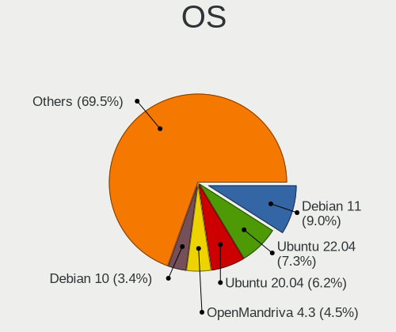

| Name                         | Notebooks | Percent |
|------------------------------|-----------|---------|
| Debian 11                    | 15        | 8.88%   |
| Ubuntu 22.04                 | 13        | 7.69%   |
| Ubuntu 20.04                 | 11        | 6.51%   |
| OpenMandriva 4.3             | 8         | 4.73%   |
| Debian 10                    | 6         | 3.55%   |
| Zorin 16                     | 5         | 2.96%   |
| Ubuntu 18.04                 | 5         | 2.96%   |
| KDE neon 20.04               | 5         | 2.96%   |
| Linux Mint 21.1              | 4         | 2.37%   |
| Kubuntu 20.04                | 4         | 2.37%   |
| Debian 12                    | 4         | 2.37%   |
| Xubuntu 18.04                | 3         | 1.78%   |
| ROSA R9                      | 3         | 1.78%   |
| OpenMandriva 4.2             | 3         | 1.78%   |
| OpenMandriva 23.03           | 3         | 1.78%   |
| Linux Mint 20.3              | 3         | 1.78%   |
| KDE neon 22.04               | 3         | 1.78%   |
| Zorin 15                     | 2         | 1.18%   |
| Xubuntu 22.04                | 2         | 1.18%   |
| Ubuntu Unity 16.04           | 2         | 1.18%   |
| Ubuntu 21.10                 | 2         | 1.18%   |
| Ubuntu 19.10                 | 2         | 1.18%   |
| Pop!_OS 22.04                | 2         | 1.18%   |
| Pop!_OS 21.04                | 2         | 1.18%   |
| OpenMandriva 23.01           | 2         | 1.18%   |
| Manjaro                      | 2         | 1.18%   |
| Linux Mint 20                | 2         | 1.18%   |
| Fedora 37                    | 2         | 1.18%   |
| Fedora 36                    | 2         | 1.18%   |
| Fedora 35                    | 2         | 1.18%   |
| ArcoLinux Rolling            | 2         | 1.18%   |
| Xubuntu 21.10                | 1         | 0.59%   |
| Xubuntu 20.04                | 1         | 0.59%   |
| Ubuntu MATE 20.04            | 1         | 0.59%   |
| Ubuntu MATE 19.10            | 1         | 0.59%   |
| Ubuntu 16.04                 | 1         | 0.59%   |
| Solus 4.1                    | 1         | 0.59%   |
| ROSA R11                     | 1         | 0.59%   |
| Q4OS 4                       | 1         | 0.59%   |
| openSUSE Tumbleweed-XXXXXXXX | 1         | 0.59%   |

OS Family
---------

OS without a version

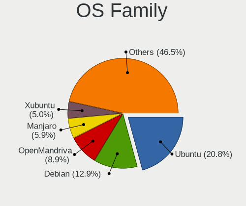

| Name         | Notebooks | Percent |
|--------------|-----------|---------|
| Ubuntu       | 32        | 19.88%  |
| Debian       | 23        | 14.29%  |
| OpenMandriva | 17        | 10.56%  |
| Linux Mint   | 11        | 6.83%   |
| KDE neon     | 9         | 5.59%   |
| Zorin        | 7         | 4.35%   |
| Xubuntu      | 7         | 4.35%   |
| Fedora       | 7         | 4.35%   |
| Manjaro      | 6         | 3.73%   |
| Kubuntu      | 6         | 3.73%   |
| ROSA         | 4         | 2.48%   |
| Pop!_OS      | 4         | 2.48%   |
| Ubuntu Unity | 2         | 1.24%   |
| Ubuntu MATE  | 2         | 1.24%   |
| MX           | 2         | 1.24%   |
| LMDE         | 2         | 1.24%   |
| Kali         | 2         | 1.24%   |
| ArcoLinux    | 2         | 1.24%   |
| Arch         | 2         | 1.24%   |
| Solus        | 1         | 0.62%   |
| Q4OS         | 1         | 0.62%   |
| openSUSE     | 1         | 0.62%   |
| Nobara       | 1         | 0.62%   |
| Lubuntu      | 1         | 0.62%   |
| Linux Lite   | 1         | 0.62%   |
| Garuda Linux | 1         | 0.62%   |
| Feren OS     | 1         | 0.62%   |
| EndeavourOS  | 1         | 0.62%   |
| Elementary   | 1         | 0.62%   |
| Deepin       | 1         | 0.62%   |
| BunsenLabs   | 1         | 0.62%   |
| Alpine       | 1         | 0.62%   |
| AlmaLinux    | 1         | 0.62%   |

Kernel
------

Version of the Linux kernel

| Version                         | Notebooks | Percent |
|---------------------------------|-----------|---------|
| 5.16.7-desktop-1omv4003         | 8         | 4.26%   |
| 5.4.0-42-generic                | 4         | 2.13%   |
| 5.15.0-56-generic               | 4         | 2.13%   |
| 5.15.0-46-generic               | 4         | 2.13%   |
| 5.10.0-23-amd64                 | 4         | 2.13%   |
| 6.2.6-desktop-1omv2390          | 3         | 1.6%    |
| 5.4.0-73-generic                | 3         | 1.6%    |
| 5.4.0-52-generic                | 3         | 1.6%    |
| 5.3.0-40-generic                | 3         | 1.6%    |
| 5.13.0-39-generic               | 3         | 1.6%    |
| 5.10.14-desktop-1omv4002        | 3         | 1.6%    |
| 5.10.0-13-amd64                 | 3         | 1.6%    |
| 4.9.20-nrj-desktop-1rosa-x86_64 | 3         | 1.6%    |
| 4.19.0-17-amd64                 | 3         | 1.6%    |
| 6.1.1-desktop-1omv2290          | 2         | 1.06%   |
| 5.4.0-89-generic                | 2         | 1.06%   |
| 5.4.0-77-generic                | 2         | 1.06%   |
| 5.4.0-48-generic                | 2         | 1.06%   |
| 5.4.0-107-generic               | 2         | 1.06%   |
| 5.19.0-41-generic               | 2         | 1.06%   |
| 5.19.0-40-generic               | 2         | 1.06%   |
| 5.19.0-2-amd64                  | 2         | 1.06%   |
| 5.15.0-76-generic               | 2         | 1.06%   |
| 5.15.0-67-generic               | 2         | 1.06%   |
| 5.15.0-60-generic               | 2         | 1.06%   |
| 5.15.0-48-generic               | 2         | 1.06%   |
| 5.15.0-43-generic               | 2         | 1.06%   |
| 5.11.0-37-generic               | 2         | 1.06%   |
| 5.10.0-21-amd64                 | 2         | 1.06%   |
| 5.10.0-18-amd64                 | 2         | 1.06%   |
| 5.10.0-11-amd64                 | 2         | 1.06%   |
| 5.10.0-10-amd64                 | 2         | 1.06%   |
| 5.0.0-37-generic                | 2         | 1.06%   |
| 6.4.2-edwardron-amd64           | 1         | 0.53%   |
| 6.4.2-arch1-1                   | 1         | 0.53%   |
| 6.3.6-zen1-1-zen                | 1         | 0.53%   |
| 6.3.5-desktop-3omv2390          | 1         | 0.53%   |
| 6.2.12-300.fc38.x86_64          | 1         | 0.53%   |
| 6.2.0-26-generic                | 1         | 0.53%   |
| 6.2.0-060200-generic            | 1         | 0.53%   |

Kernel Family
-------------

Linux kernel without a distro release

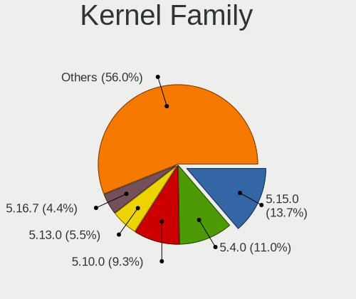

| Version | Notebooks | Percent |
|---------|-----------|---------|
| 5.15.0  | 25        | 14.37%  |
| 5.4.0   | 20        | 11.49%  |
| 5.10.0  | 17        | 9.77%   |
| 5.13.0  | 10        | 5.75%   |
| 5.16.7  | 8         | 4.6%    |
| 4.19.0  | 8         | 4.6%    |
| 5.19.0  | 7         | 4.02%   |
| 5.11.0  | 6         | 3.45%   |
| 5.3.0   | 5         | 2.87%   |
| 5.8.0   | 4         | 2.3%    |
| 4.15.0  | 4         | 2.3%    |
| 6.2.6   | 3         | 1.72%   |
| 6.1.0   | 3         | 1.72%   |
| 5.10.14 | 3         | 1.72%   |
| 4.9.20  | 3         | 1.72%   |
| 6.4.2   | 2         | 1.15%   |
| 6.2.0   | 2         | 1.15%   |
| 6.1.1   | 2         | 1.15%   |
| 5.18.0  | 2         | 1.15%   |
| 5.15.2  | 2         | 1.15%   |
| 5.14.10 | 2         | 1.15%   |
| 5.0.0   | 2         | 1.15%   |
| 6.3.6   | 1         | 0.57%   |
| 6.3.5   | 1         | 0.57%   |
| 6.2.12  | 1         | 0.57%   |
| 6.1.8   | 1         | 0.57%   |
| 6.1.14  | 1         | 0.57%   |
| 6.1.10  | 1         | 0.57%   |
| 6.0.8   | 1         | 0.57%   |
| 6.0.2   | 1         | 0.57%   |
| 5.9.0   | 1         | 0.57%   |
| 5.8.6   | 1         | 0.57%   |
| 5.6.6   | 1         | 0.57%   |
| 5.6.18  | 1         | 0.57%   |
| 5.5.4   | 1         | 0.57%   |
| 5.4.83  | 1         | 0.57%   |
| 5.4.105 | 1         | 0.57%   |
| 5.17.2  | 1         | 0.57%   |
| 5.17.15 | 1         | 0.57%   |
| 5.17.12 | 1         | 0.57%   |

Kernel Major Ver.
-----------------

Linux kernel major version

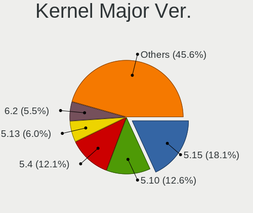

| Version | Notebooks | Percent |
|---------|-----------|---------|
| 5.15    | 33        | 19.19%  |
| 5.10    | 23        | 13.37%  |
| 5.4     | 22        | 12.79%  |
| 5.13    | 11        | 6.4%    |
| 6.1     | 8         | 4.65%   |
| 5.16    | 8         | 4.65%   |
| 4.19    | 8         | 4.65%   |
| 5.19    | 7         | 4.07%   |
| 6.2     | 6         | 3.49%   |
| 5.11    | 6         | 3.49%   |
| 5.8     | 5         | 2.91%   |
| 5.3     | 5         | 2.91%   |
| 5.17    | 4         | 2.33%   |
| 4.15    | 4         | 2.33%   |
| 4.9     | 3         | 1.74%   |
| 6.4     | 2         | 1.16%   |
| 6.3     | 2         | 1.16%   |
| 6.0     | 2         | 1.16%   |
| 5.6     | 2         | 1.16%   |
| 5.18    | 2         | 1.16%   |
| 5.14    | 2         | 1.16%   |
| 5.12    | 2         | 1.16%   |
| 5.0     | 2         | 1.16%   |
| 5.9     | 1         | 0.58%   |
| 5.5     | 1         | 0.58%   |
| 4.18    | 1         | 0.58%   |

Arch
----

OS architecture (x86_64, i586, etc.)

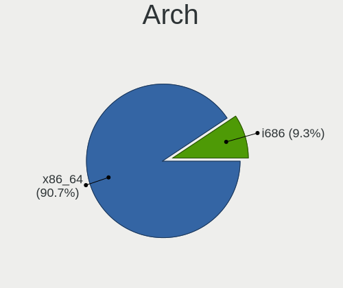

| Name   | Notebooks | Percent |
|--------|-----------|---------|
| x86_64 | 142       | 92.21%  |
| i686   | 12        | 7.79%   |

DE
--

Desktop Environment

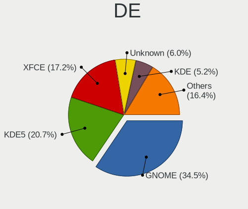

| Name          | Notebooks | Percent |
|---------------|-----------|---------|
| GNOME         | 55        | 33.33%  |
| KDE5          | 38        | 23.03%  |
| XFCE          | 27        | 16.36%  |
| X-Cinnamon    | 10        | 6.06%   |
| Unknown       | 10        | 6.06%   |
| KDE           | 6         | 3.64%   |
| MATE          | 4         | 2.42%   |
| LXQt          | 3         | 1.82%   |
| KDE4          | 3         | 1.82%   |
| Unity         | 2         | 1.21%   |
| Cinnamon      | 2         | 1.21%   |
| Pantheon      | 1         | 0.61%   |
| Openbox       | 1         | 0.61%   |
| GNOME Classic | 1         | 0.61%   |
| Deepin        | 1         | 0.61%   |
| Budgie        | 1         | 0.61%   |

Display Server
--------------

X11 or Wayland

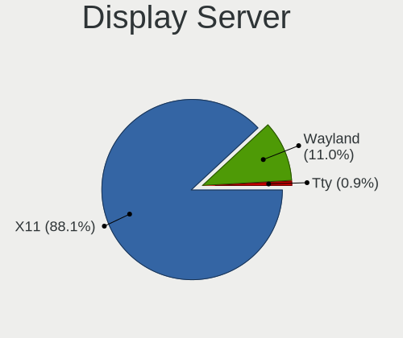

| Name    | Notebooks | Percent |
|---------|-----------|---------|
| X11     | 134       | 85.35%  |
| Wayland | 22        | 14.01%  |
| Tty     | 1         | 0.64%   |

Display Manager
---------------

SDDM, LightDM, etc.

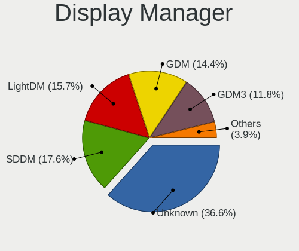

| Name    | Notebooks | Percent |
|---------|-----------|---------|
| Unknown | 57        | 34.97%  |
| SDDM    | 29        | 17.79%  |
| LightDM | 28        | 17.18%  |
| GDM     | 22        | 13.5%   |
| GDM3    | 21        | 12.88%  |
| TDM     | 3         | 1.84%   |
| KDM     | 3         | 1.84%   |

OS Lang
-------

Language

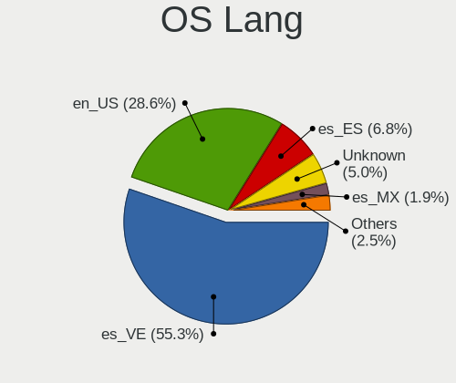

| Lang    | Notebooks | Percent |
|---------|-----------|---------|
| es_VE   | 89        | 55.28%  |
| en_US   | 46        | 28.57%  |
| es_ES   | 11        | 6.83%   |
| Unknown | 8         | 4.97%   |
| es_MX   | 3         | 1.86%   |
| es_US   | 2         | 1.24%   |
| en_CA   | 1         | 0.62%   |
| C       | 1         | 0.62%   |

Boot Mode
---------

EFI or BIOS

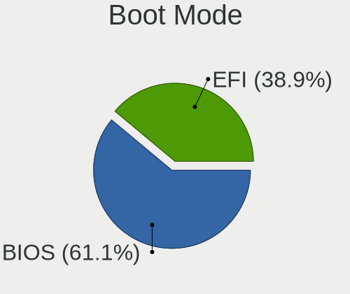

| Mode | Notebooks | Percent |
|------|-----------|---------|
| BIOS | 101       | 63.92%  |
| EFI  | 57        | 36.08%  |

Filesystem
----------

Type of filesystem

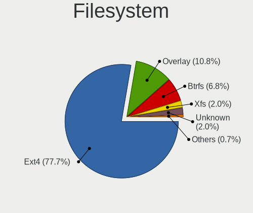

| Type    | Notebooks | Percent |
|---------|-----------|---------|
| Ext4    | 120       | 76.43%  |
| Overlay | 17        | 10.83%  |
| Btrfs   | 11        | 7.01%   |
| Xfs     | 3         | 1.91%   |
| Tmpfs   | 3         | 1.91%   |
| Unknown | 3         | 1.91%   |

Part. scheme
------------

Scheme of partitioning

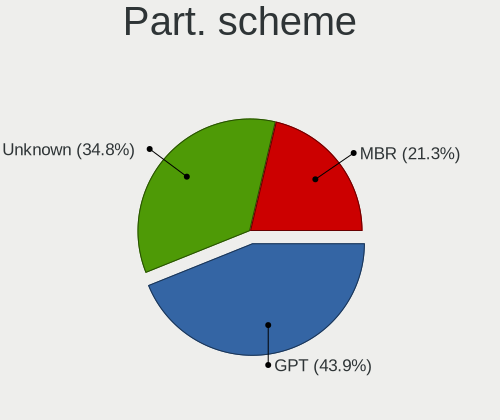

| Type    | Notebooks | Percent |
|---------|-----------|---------|
| Unknown | 65        | 40.63%  |
| GPT     | 56        | 35%     |
| MBR     | 39        | 24.38%  |

Dual Boot with Linux/BSD
------------------------

Hosting more than one Linux/BSD

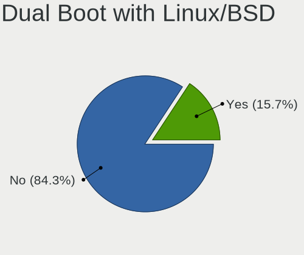

| Dual boot | Notebooks | Percent |
|-----------|-----------|---------|
| No        | 132       | 81.99%  |
| Yes       | 29        | 18.01%  |

Dual Boot (Win)
---------------

Hosting Linux and Windows

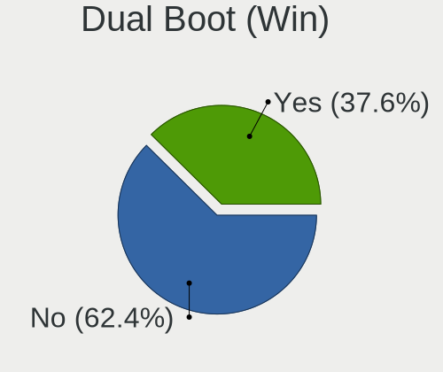

| Dual boot | Notebooks | Percent |
|-----------|-----------|---------|
| No        | 95        | 61.29%  |
| Yes       | 60        | 38.71%  |

Board
-----

Vendor
------

Motherboard manufacturer

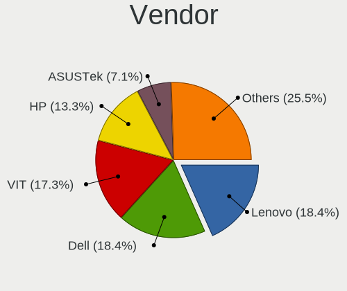

| Name                           | Notebooks | Percent |
|--------------------------------|-----------|---------|
| Lenovo                         | 28        | 18.18%  |
| Dell                           | 26        | 16.88%  |
| VIT                            | 21        | 13.64%  |
| Hewlett-Packard                | 19        | 12.34%  |
| Acer                           | 11        | 7.14%   |
| ASUSTek Computer               | 9         | 5.84%   |
| Intel                          | 8         | 5.19%   |
| Unknown                        | 5         | 3.25%   |
| Shanghai Zhaoxin Semiconductor | 3         | 1.95%   |
| Pegatron                       | 3         | 1.95%   |
| Google                         | 3         | 1.95%   |
| Toshiba                        | 2         | 1.3%    |
| Siragon                        | 2         | 1.3%    |
| Samsung Electronics            | 2         | 1.3%    |
| Notebook                       | 2         | 1.3%    |
| MSI                            | 2         | 1.3%    |
| UNIQCELL                       | 1         | 0.65%   |
| Sony                           | 1         | 0.65%   |
| GPU Company                    | 1         | 0.65%   |
| Gateway                        | 1         | 0.65%   |
| Exo                            | 1         | 0.65%   |
| Clevo                          | 1         | 0.65%   |
| AVITA                          | 1         | 0.65%   |
| Alienware                      | 1         | 0.65%   |

Model
-----

Motherboard model

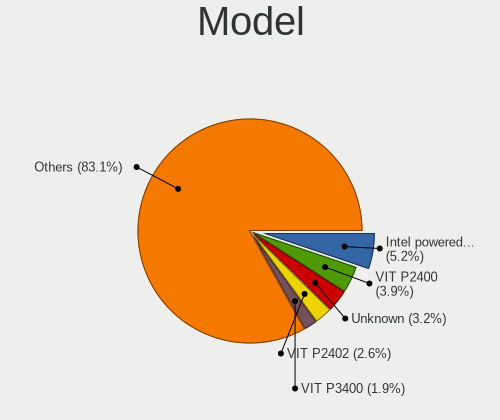

| Name                                      | Notebooks | Percent |
|-------------------------------------------|-----------|---------|
| Intel powered classmate PC                | 8         | 5.19%   |
| VIT P2400                                 | 6         | 3.9%    |
| Unknown                                   | 5         | 3.25%   |
| VIT P2402                                 | 4         | 2.6%    |
| VIT P3400                                 | 3         | 1.95%   |
| VIT M2420                                 | 3         | 1.95%   |
| Shanghai Zhaoxin ZXE CRB                  | 3         | 1.95%   |
| VIT P1400                                 | 2         | 1.3%    |
| VIT M2421                                 | 2         | 1.3%    |
| Lenovo IdeaPad S100c 20194                | 2         | 1.3%    |
| Lenovo 3000 N200 0769ARS                  | 2         | 1.3%    |
| HP Compaq Presario C700                   | 2         | 1.3%    |
| Google Candy                              | 2         | 1.3%    |
| Dell Inspiron 1545                        | 2         | 1.3%    |
| ASUS ASUS TUF Gaming F17 FX706HM_TUF706HM | 2         | 1.3%    |
| Acer Aspire 4739Z                         | 2         | 1.3%    |
| VIT P2423                                 | 1         | 0.65%   |
| UNIQCELL Q15.6                            | 1         | 0.65%   |
| Toshiba Satellite E55t-A                  | 1         | 0.65%   |
| Toshiba ENCORE 2 WT8-B                    | 1         | 0.65%   |
| Sony VGN-FW510F                           | 1         | 0.65%   |
| Siragon MN-50                             | 1         | 0.65%   |
| SIRAGON LM-C100                           | 1         | 0.65%   |
| Samsung 905S3G/906S3G/915S3G              | 1         | 0.65%   |
| Samsung 355V4C/356V4C/3445VC/3545VC       | 1         | 0.65%   |
| Pegatron T14AF                            | 1         | 0.65%   |
| Pegatron H36Y                             | 1         | 0.65%   |
| Pegatron B74                              | 1         | 0.65%   |
| Notebook W54BL                            | 1         | 0.65%   |
| Notebook NL40_50CU                        | 1         | 0.65%   |
| MSI MS-1454                               | 1         | 0.65%   |
| MSI GL73 9SD                              | 1         | 0.65%   |
| Lenovo Z50-75 80EC                        | 1         | 0.65%   |
| Lenovo ThinkPad X201 3680AE2              | 1         | 0.65%   |
| Lenovo ThinkPad T14 Gen 1 20S1S2FB00      | 1         | 0.65%   |
| Lenovo ThinkPad SL400 2743A48             | 1         | 0.65%   |
| Lenovo ThinkPad SL 2743A65                | 1         | 0.65%   |
| Lenovo ThinkPad Edge 01962AS              | 1         | 0.65%   |
| Lenovo ThinkPad E560 20EV002FUS           | 1         | 0.65%   |
| Lenovo Legion 5 15IMH05 82AU              | 1         | 0.65%   |

Model Family
------------

Motherboard model prefix

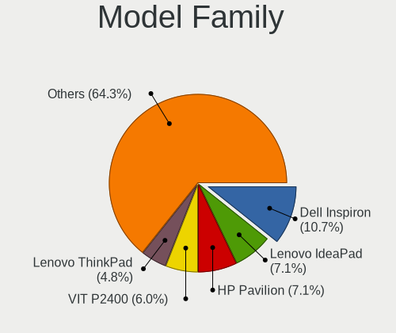

| Name                 | Notebooks | Percent |
|----------------------|-----------|---------|
| Dell Inspiron        | 13        | 8.44%   |
| Lenovo IdeaPad       | 11        | 7.14%   |
| Acer Aspire          | 10        | 6.49%   |
| Intel powered        | 8         | 5.19%   |
| HP Pavilion          | 7         | 4.55%   |
| Dell Latitude        | 7         | 4.55%   |
| VIT P2400            | 6         | 3.9%    |
| Lenovo ThinkPad      | 6         | 3.9%    |
| Unknown              | 5         | 3.25%   |
| VIT P2402            | 4         | 2.6%    |
| Lenovo 3000          | 4         | 2.6%    |
| Dell Vostro          | 4         | 2.6%    |
| ASUS ASUS            | 4         | 2.6%    |
| VIT P3400            | 3         | 1.95%   |
| VIT M2420            | 3         | 1.95%   |
| Shanghai Zhaoxin ZXE | 3         | 1.95%   |
| HP Laptop            | 3         | 1.95%   |
| VIT P1400            | 2         | 1.3%    |
| VIT M2421            | 2         | 1.3%    |
| Lenovo Legion        | 2         | 1.3%    |
| HP Presario          | 2         | 1.3%    |
| HP EliteBook         | 2         | 1.3%    |
| HP Compaq            | 2         | 1.3%    |
| Google Candy         | 2         | 1.3%    |
| ASUS VivoBook        | 2         | 1.3%    |
| VIT P2423            | 1         | 0.65%   |
| UNIQCELL Q15.6       | 1         | 0.65%   |
| Toshiba Satellite    | 1         | 0.65%   |
| Toshiba ENCORE       | 1         | 0.65%   |
| Sony VGN-FW510F      | 1         | 0.65%   |
| Siragon MN-50        | 1         | 0.65%   |
| SIRAGON LM-C100      | 1         | 0.65%   |
| Samsung 905S3G       | 1         | 0.65%   |
| Samsung 355V4C       | 1         | 0.65%   |
| Pegatron T14AF       | 1         | 0.65%   |
| Pegatron H36Y        | 1         | 0.65%   |
| Pegatron B74         | 1         | 0.65%   |
| Notebook W54BL       | 1         | 0.65%   |
| Notebook NL40        | 1         | 0.65%   |
| MSI MS-1454          | 1         | 0.65%   |

MFG Year
--------

Motherboard manufacture year

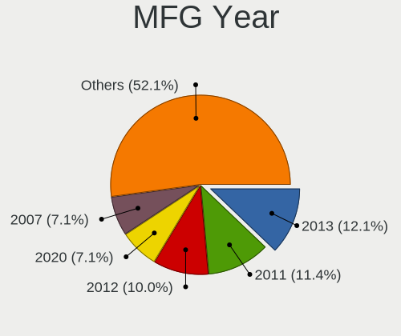

| Year    | Notebooks | Percent |
|---------|-----------|---------|
| 2011    | 20        | 12.99%  |
| 2013    | 18        | 11.69%  |
| 2012    | 15        | 9.74%   |
| 2022    | 11        | 7.14%   |
| 2020    | 10        | 6.49%   |
| 2007    | 10        | 6.49%   |
| 2018    | 9         | 5.84%   |
| 2014    | 9         | 5.84%   |
| 2010    | 9         | 5.84%   |
| 2019    | 8         | 5.19%   |
| 2008    | 8         | 5.19%   |
| 2021    | 7         | 4.55%   |
| 2009    | 6         | 3.9%    |
| 2017    | 4         | 2.6%    |
| 2015    | 4         | 2.6%    |
| 2016    | 2         | 1.3%    |
| Unknown | 2         | 1.3%    |
| 2023    | 1         | 0.65%   |
| 2006    | 1         | 0.65%   |

Form Factor
-----------

Physical design of the computer

| Name     | Notebooks | Percent |
|----------|-----------|---------|
| Notebook | 154       | 100%    |

Secure Boot
-----------

Enabled or disabled

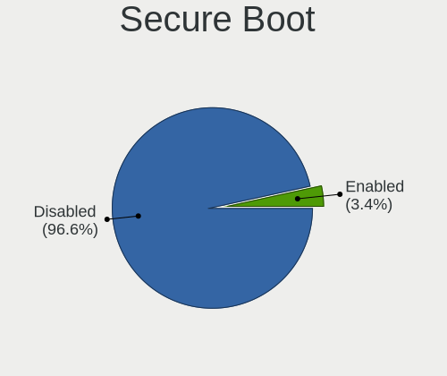

| State    | Notebooks | Percent |
|----------|-----------|---------|
| Disabled | 149       | 96.75%  |
| Enabled  | 5         | 3.25%   |

Coreboot
--------

Have coreboot on board

| Used | Notebooks | Percent |
|------|-----------|---------|
| No   | 151       | 98.05%  |
| Yes  | 3         | 1.95%   |

RAM Size
--------

Total RAM memory

| Size in GB | Notebooks | Percent |
|------------|-----------|---------|
| 3.01-4.0   | 45        | 28.85%  |
| 4.01-8.0   | 38        | 24.36%  |
| 1.01-2.0   | 28        | 17.95%  |
| 8.01-16.0  | 20        | 12.82%  |
| 16.01-24.0 | 12        | 7.69%   |
| 2.01-3.0   | 7         | 4.49%   |
| 32.01-64.0 | 4         | 2.56%   |
| 24.01-32.0 | 1         | 0.64%   |
| 0.51-1.0   | 1         | 0.64%   |

RAM Used
--------

Used RAM memory

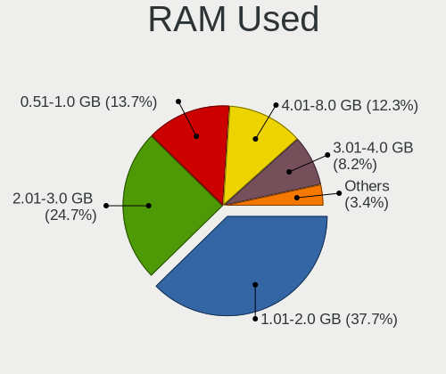

| Used GB    | Notebooks | Percent |
|------------|-----------|---------|
| 1.01-2.0   | 62        | 35.63%  |
| 2.01-3.0   | 44        | 25.29%  |
| 4.01-8.0   | 24        | 13.79%  |
| 0.51-1.0   | 23        | 13.22%  |
| 3.01-4.0   | 16        | 9.2%    |
| 8.01-16.0  | 4         | 2.3%    |
| 16.01-24.0 | 1         | 0.57%   |

Total Drives
------------

Number of drives on board

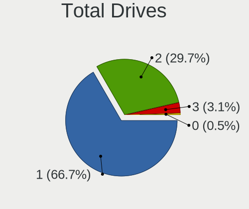

| Drives | Notebooks | Percent |
|--------|-----------|---------|
| 1      | 103       | 65.61%  |
| 2      | 49        | 31.21%  |
| 3      | 4         | 2.55%   |
| 0      | 1         | 0.64%   |

Has CD-ROM
----------

Has CD-ROM on board

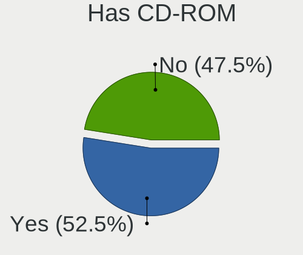

| Presented | Notebooks | Percent |
|-----------|-----------|---------|
| No        | 80        | 51.95%  |
| Yes       | 74        | 48.05%  |

Has Ethernet
------------

Has Ethernet on board

| Presented | Notebooks | Percent |
|-----------|-----------|---------|
| Yes       | 131       | 83.97%  |
| No        | 25        | 16.03%  |

Has WiFi
--------

Has WiFi module

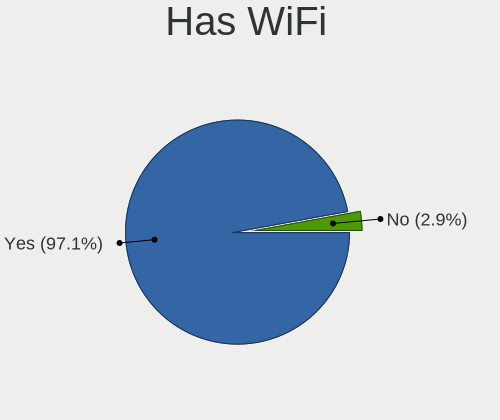

| Presented | Notebooks | Percent |
|-----------|-----------|---------|
| Yes       | 149       | 96.75%  |
| No        | 5         | 3.25%   |

Has Bluetooth
-------------

Has Bluetooth module

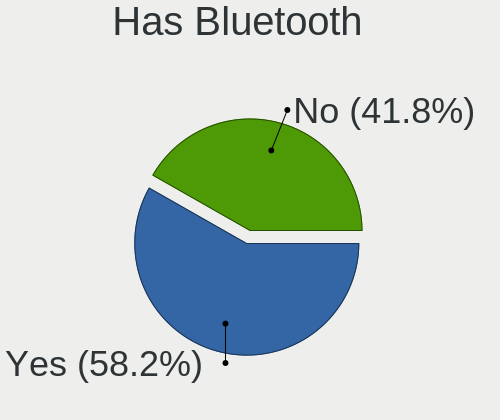

| Presented | Notebooks | Percent |
|-----------|-----------|---------|
| Yes       | 92        | 59.35%  |
| No        | 63        | 40.65%  |

Location
--------

Country
-------

Geographic location (country)

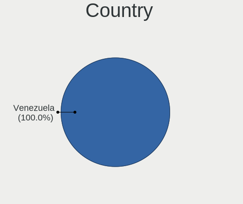

| Country   | Notebooks | Percent |
|-----------|-----------|---------|
| Venezuela | 154       | 100%    |

City
----

Geographic location (city)

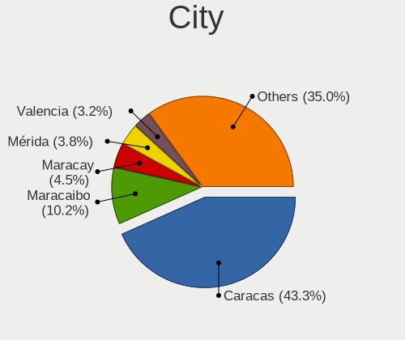

| City                       | Notebooks | Percent |
|----------------------------|-----------|---------|
| Caracas                    | 70        | 41.92%  |
| Maracaibo                  | 19        | 11.38%  |
| Maracay                    | 8         | 4.79%   |
| Mérida                    | 6         | 3.59%   |
| Valencia                   | 5         | 2.99%   |
| Barquisimeto               | 5         | 2.99%   |
| Barcelona                  | 5         | 2.99%   |
| Maturín                   | 3         | 1.8%    |
| Ciudad Guayana             | 3         | 1.8%    |
| San Cristóbal             | 2         | 1.2%    |
| San Carlos del Zulia       | 2         | 1.2%    |
| Porlamar                   | 2         | 1.2%    |
| Lecherias                  | 2         | 1.2%    |
| La Guaira                  | 2         | 1.2%    |
| Guatire                    | 2         | 1.2%    |
| Anaco                      | 2         | 1.2%    |
| Villa de Cura              | 1         | 0.6%    |
| Tucape                     | 1         | 0.6%    |
| San Juan Bautista          | 1         | 0.6%    |
| San Felipe                 | 1         | 0.6%    |
| San Diego                  | 1         | 0.6%    |
| San Antonio de Los Altos   | 1         | 0.6%    |
| Punto Fijo                 | 1         | 0.6%    |
| Puerto Ordaz and San Felix | 1         | 0.6%    |
| Puerto Cumarebo            | 1         | 0.6%    |
| Puerto Cruz                | 1         | 0.6%    |
| Parroquia El Recreo        | 1         | 0.6%    |
| Naguanagua                 | 1         | 0.6%    |
| Mariara                    | 1         | 0.6%    |
| Maiquetia                  | 1         | 0.6%    |
| Los Palos Grandes          | 1         | 0.6%    |
| Las Vegas                  | 1         | 0.6%    |
| Las Tienditas              | 1         | 0.6%    |
| Guarenas                   | 1         | 0.6%    |
| Guanare                    | 1         | 0.6%    |
| El Hatillo Municipality    | 1         | 0.6%    |
| Ejido                      | 1         | 0.6%    |
| Ciudad Bolívar            | 1         | 0.6%    |
| Charallave                 | 1         | 0.6%    |
| Capacho Nuevo              | 1         | 0.6%    |

Drives
------

Drive Vendor
------------

Hard drive vendors

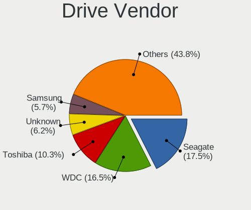

| Vendor                    | Notebooks | Drives | Percent |
|---------------------------|-----------|--------|---------|
| Seagate                   | 34        | 36     | 18.38%  |
| WDC                       | 31        | 42     | 16.76%  |
| Toshiba                   | 18        | 19     | 9.73%   |
| Unknown                   | 12        | 17     | 6.49%   |
| Samsung Electronics       | 11        | 11     | 5.95%   |
| Hitachi                   | 9         | 10     | 4.86%   |
| SanDisk                   | 6         | 10     | 3.24%   |
| Intel                     | 6         | 9      | 3.24%   |
| Micron Technology         | 5         | 8      | 2.7%    |
| HGST                      | 5         | 5      | 2.7%    |
| Crucial                   | 5         | 7      | 2.7%    |
| SK hynix                  | 4         | 5      | 2.16%   |
| LITEONIT                  | 4         | 8      | 2.16%   |
| Kingston                  | 4         | 6      | 2.16%   |
| SPCC                      | 3         | 6      | 1.62%   |
| PNY                       | 3         | 3      | 1.62%   |
| addlink                   | 3         | 3      | 1.62%   |
| Team                      | 2         | 2      | 1.08%   |
| Silicon Motion            | 2         | 2      | 1.08%   |
| HUAWEI                    | 2         | 2      | 1.08%   |
| Fujitsu                   | 2         | 2      | 1.08%   |
| BIWIN                     | 2         | 3      | 1.08%   |
| Vaseky                    | 1         | 1      | 0.54%   |
| PUSKILL                   | 1         | 1      | 0.54%   |
| Phison                    | 1         | 1      | 0.54%   |
| Patriot                   | 1         | 1      | 0.54%   |
| Micron/Crucial Technology | 1         | 1      | 0.54%   |
| Lexar                     | 1         | 1      | 0.54%   |
| KingFast                  | 1         | 3      | 0.54%   |
| Intenso                   | 1         | 1      | 0.54%   |
| Dell                      | 1         | 2      | 0.54%   |
| China                     | 1         | 1      | 0.54%   |
| Apacer                    | 1         | 1      | 0.54%   |
| A-DATA Technology         | 1         | 1      | 0.54%   |

Drive Model
-----------

Hard drive models

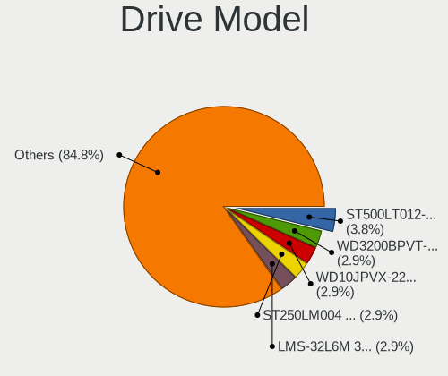

| Model                               | Notebooks | Percent |
|-------------------------------------|-----------|---------|
| Seagate ST500LT012-9WS142 500GB     | 4         | 2.11%   |
| WDC WD3200BPVT-22JJ5T0 320GB        | 3         | 1.58%   |
| WDC WD10JPVX-22JC3T0 1TB            | 3         | 1.58%   |
| Unknown NVMe SSD Drive 512GB        | 3         | 1.58%   |
| Seagate ST320LT012-9WS14C 320GB     | 3         | 1.58%   |
| Seagate ST320LT012-1DG14C 320GB     | 3         | 1.58%   |
| Seagate ST250LM004 HN-M250MBB 250GB | 3         | 1.58%   |
| LITEONIT LMS-32L6M 32GB SSD         | 3         | 1.58%   |
| WDC WD5000LPVX-22V0TT0 500GB        | 2         | 1.05%   |
| WDC WD5000LPVT-08G33T1 500GB        | 2         | 1.05%   |
| WDC WD3200BEVT-00A0RT0 320GB        | 2         | 1.05%   |
| WDC WD1600BEVT-22ZCT0 160GB         | 2         | 1.05%   |
| WDC WD1200BEVS-60UST0 120GB         | 2         | 1.05%   |
| Unknown MMC Card  16GB              | 2         | 1.05%   |
| Toshiba MQ04ABF100 1TB              | 2         | 1.05%   |
| Toshiba MQ01ABF050 500GB            | 2         | 1.05%   |
| Toshiba MQ01ABF032 320GB            | 2         | 1.05%   |
| Toshiba MQ01ABD050 500GB            | 2         | 1.05%   |
| Toshiba MK3275GSX 320GB             | 2         | 1.05%   |
| SK hynix HFM001TD3JX013N 1TB        | 2         | 1.05%   |
| Seagate ST9500325AS 500GB           | 2         | 1.05%   |
| Seagate ST9320325AS 320GB           | 2         | 1.05%   |
| Seagate ST500LM021-1KJ152 500GB     | 2         | 1.05%   |
| Seagate ST320LM001 HN-M320MBB 320GB | 2         | 1.05%   |
| Seagate ST320LM000 HM321HI 320GB    | 2         | 1.05%   |
| Seagate ST1000LM024 HN-M101MBB 1TB  | 2         | 1.05%   |
| SanDisk NVMe SSD Drive 1TB          | 2         | 1.05%   |
| PNY CS900 1TB SSD                   | 2         | 1.05%   |
| Micron 2450_MTFDKBA512TFK 512GB     | 2         | 1.05%   |
| HUAWEI SD Storage 33GB              | 2         | 1.05%   |
| Hitachi HTS725050A9A364 500GB       | 2         | 1.05%   |
| HGST HTS721010A9E630 1TB            | 2         | 1.05%   |
| HGST HTS545050A7E380 500GB          | 2         | 1.05%   |
| Crucial CT480BX500SSD1 480GB        | 2         | 1.05%   |
| addlink M.2 PCIE G3x4 NVMe 512GB    | 2         | 1.05%   |
| WDC WDS500G2B0C-00PXH0 500GB        | 1         | 0.53%   |
| WDC WD5000LPVX-75V0TT0 500GB        | 1         | 0.53%   |
| WDC WD5000LPCX-22VHAT0 500GB        | 1         | 0.53%   |
| WDC WD5000BPVT-24HXZT3 500GB        | 1         | 0.53%   |
| WDC WD3200LPVX-22V0TT0 320GB        | 1         | 0.53%   |

HDD Vendor
----------

Hard disk drive vendors

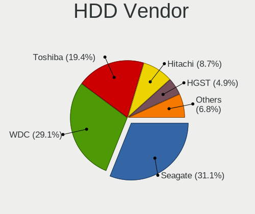

| Vendor              | Notebooks | Drives | Percent |
|---------------------|-----------|--------|---------|
| Seagate             | 31        | 33     | 31.96%  |
| WDC                 | 29        | 37     | 29.9%   |
| Toshiba             | 17        | 18     | 17.53%  |
| Hitachi             | 9         | 10     | 9.28%   |
| HGST                | 5         | 5      | 5.15%   |
| Unknown             | 2         | 2      | 2.06%   |
| Samsung Electronics | 2         | 2      | 2.06%   |
| Fujitsu             | 2         | 2      | 2.06%   |

SSD Vendor
----------

Solid state drive vendors

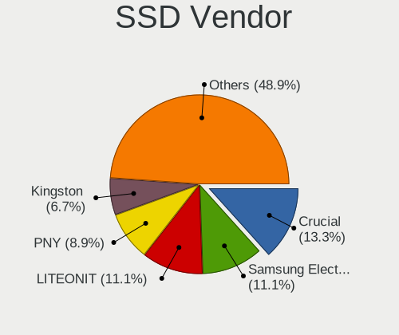

| Vendor              | Notebooks | Drives | Percent |
|---------------------|-----------|--------|---------|
| Samsung Electronics | 5         | 5      | 12.82%  |
| Crucial             | 5         | 7      | 12.82%  |
| LITEONIT            | 4         | 8      | 10.26%  |
| PNY                 | 3         | 3      | 7.69%   |
| Kingston            | 3         | 5      | 7.69%   |
| SPCC                | 2         | 4      | 5.13%   |
| SanDisk             | 2         | 3      | 5.13%   |
| Vaseky              | 1         | 1      | 2.56%   |
| Toshiba             | 1         | 1      | 2.56%   |
| Team                | 1         | 1      | 2.56%   |
| PUSKILL             | 1         | 1      | 2.56%   |
| Patriot             | 1         | 1      | 2.56%   |
| Micron Technology   | 1         | 3      | 2.56%   |
| Lexar               | 1         | 1      | 2.56%   |
| KingFast            | 1         | 3      | 2.56%   |
| Intenso             | 1         | 1      | 2.56%   |
| Intel               | 1         | 1      | 2.56%   |
| Dell                | 1         | 2      | 2.56%   |
| China               | 1         | 1      | 2.56%   |
| BIWIN               | 1         | 2      | 2.56%   |
| addlink             | 1         | 1      | 2.56%   |
| A-DATA Technology   | 1         | 1      | 2.56%   |

Drive Kind
----------

HDD or SSD

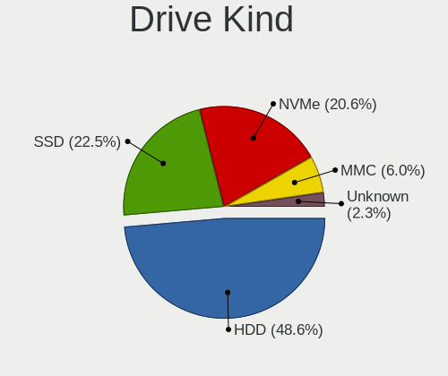

| Kind    | Notebooks | Drives | Percent |
|---------|-----------|--------|---------|
| HDD     | 95        | 109    | 53.37%  |
| SSD     | 38        | 56     | 21.35%  |
| NVMe    | 32        | 50     | 17.98%  |
| MMC     | 8         | 11     | 4.49%   |
| Unknown | 5         | 5      | 2.81%   |

Drive Connector
---------------

SATA, SAS, NVMe, etc.

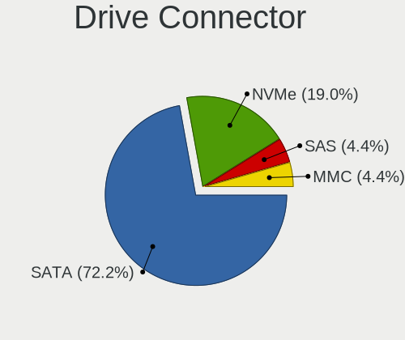

| Type | Notebooks | Drives | Percent |
|------|-----------|--------|---------|
| SATA | 121       | 163    | 72.02%  |
| NVMe | 32        | 50     | 19.05%  |
| MMC  | 8         | 11     | 4.76%   |
| SAS  | 7         | 7      | 4.17%   |

Drive Size
----------

Size of hard drive

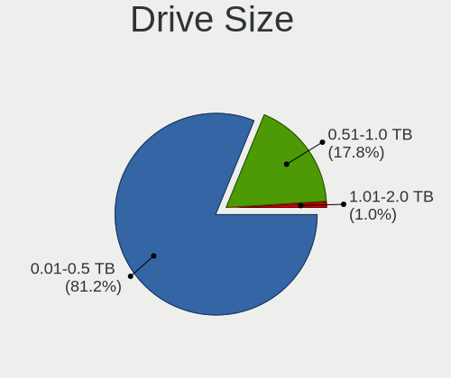

| Size in TB | Notebooks | Drives | Percent |
|------------|-----------|--------|---------|
| 0.01-0.5   | 105       | 133    | 81.4%   |
| 0.51-1.0   | 23        | 31     | 17.83%  |
| 1.01-2.0   | 1         | 1      | 0.78%   |

Space Total
-----------

Amount of disk space available on the file system

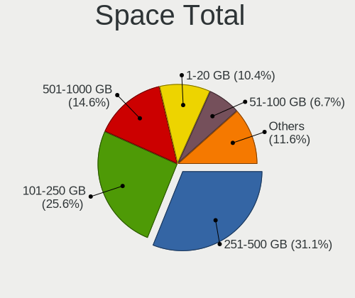

| Size in GB     | Notebooks | Percent |
|----------------|-----------|---------|
| 251-500        | 51        | 31.1%   |
| 101-250        | 42        | 25.61%  |
| 501-1000       | 24        | 14.63%  |
| 1-20           | 17        | 10.37%  |
| 51-100         | 11        | 6.71%   |
| 21-50          | 10        | 6.1%    |
| 1001-2000      | 4         | 2.44%   |
| 2001-3000      | 2         | 1.22%   |
| Unknown        | 2         | 1.22%   |
| More than 3000 | 1         | 0.61%   |

Space Used
----------

Amount of used disk space

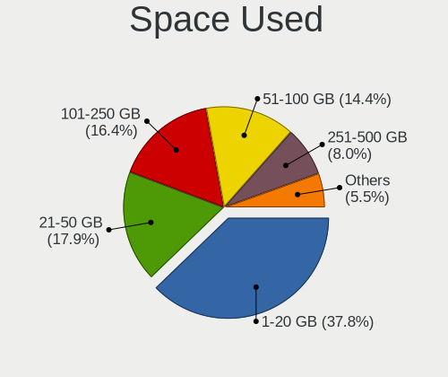

| Used GB   | Notebooks | Percent |
|-----------|-----------|---------|
| 1-20      | 63        | 36.42%  |
| 21-50     | 32        | 18.5%   |
| 101-250   | 29        | 16.76%  |
| 51-100    | 25        | 14.45%  |
| 251-500   | 13        | 7.51%   |
| 501-1000  | 8         | 4.62%   |
| Unknown   | 2         | 1.16%   |
| 2001-3000 | 1         | 0.58%   |

Malfunc. Drives
---------------

Drive models with a malfunction

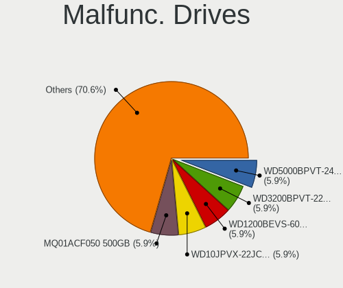

| Model                                | Notebooks | Drives | Percent |
|--------------------------------------|-----------|--------|---------|
| WDC WD1200BEVS-60UST0 120GB          | 2         | 2      | 7.14%   |
| Seagate ST9500325AS 500GB            | 2         | 2      | 7.14%   |
| Hitachi HTS725050A9A364 500GB        | 2         | 2      | 7.14%   |
| WDC WD5000BPVT-24HXZT3 500GB         | 1         | 1      | 3.57%   |
| WDC WD3200BPVT-22JJ5T0 320GB         | 1         | 1      | 3.57%   |
| WDC WD3200BEVT-00A0RT0 320GB         | 1         | 1      | 3.57%   |
| WDC WD10JPVX-22JC3T0 1TB             | 1         | 2      | 3.57%   |
| Toshiba MQ01ACF050 500GB             | 1         | 1      | 3.57%   |
| Toshiba MQ01ABD050 500GB             | 1         | 1      | 3.57%   |
| Toshiba MK3276GSX 320GB              | 1         | 1      | 3.57%   |
| Toshiba MK3275GSX 320GB              | 1         | 1      | 3.57%   |
| Toshiba MK2565GSX 250GB              | 1         | 1      | 3.57%   |
| Seagate ST9320325AS 320GB            | 1         | 1      | 3.57%   |
| Seagate ST9160314AS 160GB            | 1         | 1      | 3.57%   |
| Seagate ST500LT012-9WS142 500GB      | 1         | 1      | 3.57%   |
| Seagate ST500LM021-1KJ152 500GB      | 1         | 1      | 3.57%   |
| Samsung Electronics HN-M320MBB 320GB | 1         | 1      | 3.57%   |
| Samsung Electronics HM250HI 250GB    | 1         | 1      | 3.57%   |
| Intel SSDPEKKW256G7 256GB            | 1         | 1      | 3.57%   |
| Intel SSDPEKKF512G7L 512GB           | 1         | 1      | 3.57%   |
| Hitachi HTS543232L9A300 320GB        | 1         | 1      | 3.57%   |
| Hitachi HTS543225L9SA00 250GB        | 1         | 1      | 3.57%   |
| Hitachi HTS542525K9SA00 250GB        | 1         | 1      | 3.57%   |
| HGST HTS545050A7E380 500GB           | 1         | 1      | 3.57%   |
| HGST HTS541010A7E630 1TB             | 1         | 1      | 3.57%   |

Malfunc. Drive Vendor
---------------------

Vendors of faulty drives

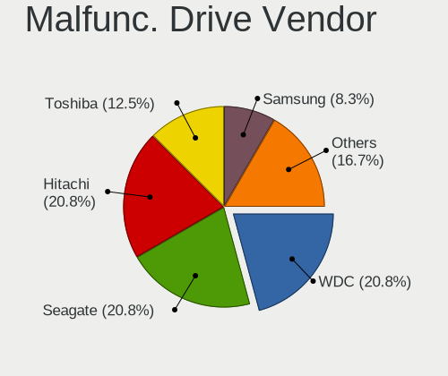

| Vendor              | Notebooks | Drives | Percent |
|---------------------|-----------|--------|---------|
| WDC                 | 6         | 7      | 21.43%  |
| Seagate             | 6         | 6      | 21.43%  |
| Toshiba             | 5         | 5      | 17.86%  |
| Hitachi             | 5         | 5      | 17.86%  |
| Samsung Electronics | 2         | 2      | 7.14%   |
| Intel               | 2         | 2      | 7.14%   |
| HGST                | 2         | 2      | 7.14%   |

Malfunc. HDD Vendor
-------------------

Vendors of faulty HDD drives

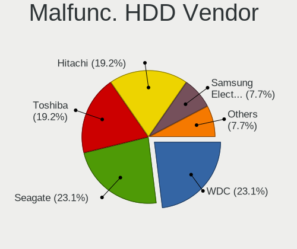

| Vendor              | Notebooks | Drives | Percent |
|---------------------|-----------|--------|---------|
| WDC                 | 6         | 7      | 23.08%  |
| Seagate             | 6         | 6      | 23.08%  |
| Toshiba             | 5         | 5      | 19.23%  |
| Hitachi             | 5         | 5      | 19.23%  |
| Samsung Electronics | 2         | 2      | 7.69%   |
| HGST                | 2         | 2      | 7.69%   |

Malfunc. Drive Kind
-------------------

Kinds of faulty drives

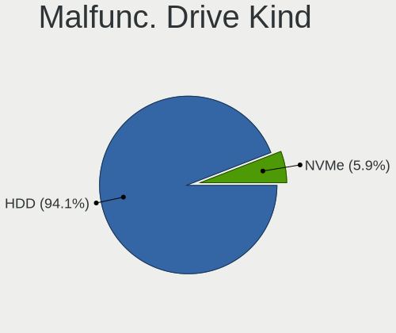

| Kind | Notebooks | Drives | Percent |
|------|-----------|--------|---------|
| HDD  | 26        | 27     | 92.86%  |
| NVMe | 2         | 2      | 7.14%   |

Failed Drives
-------------

Failed drive models

Zero info for selected period =(

Failed Drive Vendor
-------------------

Failed drive vendors

Zero info for selected period =(

Drive Status
------------

Number of failed and malfunc. drives

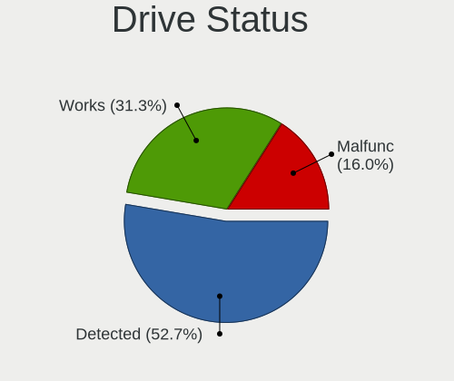

| Status   | Notebooks | Drives | Percent |
|----------|-----------|--------|---------|
| Detected | 84        | 124    | 50.6%   |
| Works    | 54        | 78     | 32.53%  |
| Malfunc  | 28        | 29     | 16.87%  |

Storage controller
------------------

Storage Vendor
--------------

Storage controller vendors

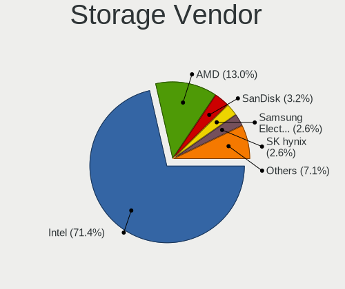

| Vendor                      | Notebooks | Percent |
|-----------------------------|-----------|---------|
| Intel                       | 123       | 71.51%  |
| AMD                         | 20        | 11.63%  |
| SanDisk                     | 5         | 2.91%   |
| SK hynix                    | 4         | 2.33%   |
| Samsung Electronics         | 4         | 2.33%   |
| Micron Technology           | 4         | 2.33%   |
| Silicon Motion              | 3         | 1.74%   |
| Phison Electronics          | 3         | 1.74%   |
| Jiangsu Huacun Elec.        | 3         | 1.74%   |
| Micron/Crucial Technology   | 1         | 0.58%   |
| MAXIO Technology (Hangzhou) | 1         | 0.58%   |
| Kingston Technology Company | 1         | 0.58%   |

Storage Model
-------------

Storage controller models

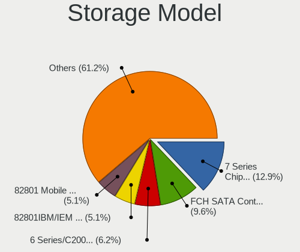

| Model                                                                          | Notebooks | Percent |
|--------------------------------------------------------------------------------|-----------|---------|
| Intel 7 Series Chipset Family 6-port SATA Controller [AHCI mode]               | 23        | 12.17%  |
| AMD FCH SATA Controller [AHCI mode]                                            | 17        | 8.99%   |
| Intel 6 Series/C200 Series Chipset Family 6 port Mobile SATA AHCI Controller   | 14        | 7.41%   |
| Intel 82801IBM/IEM (ICH9M/ICH9M-E) 4 port SATA Controller [AHCI mode]          | 10        | 5.29%   |
| Intel 82801 Mobile SATA Controller [RAID mode]                                 | 9         | 4.76%   |
| Intel 82801HM/HEM (ICH8M/ICH8M-E) IDE Controller                               | 8         | 4.23%   |
| Intel 5 Series/3400 Series Chipset 4 port SATA AHCI Controller                 | 8         | 4.23%   |
| Intel Volume Management Device NVMe RAID Controller                            | 6         | 3.17%   |
| Intel Sunrise Point-LP SATA Controller [AHCI mode]                             | 6         | 3.17%   |
| Intel NM10/ICH7 Family SATA Controller [AHCI mode]                             | 6         | 3.17%   |
| Intel 82801HM/HEM (ICH8M/ICH8M-E) SATA Controller [AHCI mode]                  | 5         | 2.65%   |
| Intel Atom Processor E3800 Series SATA AHCI Controller                         | 4         | 2.12%   |
| Intel 82801HM/HEM (ICH8M/ICH8M-E) SATA Controller [IDE mode]                   | 4         | 2.12%   |
| Silicon Motion SM2263EN/SM2263XT (DRAM-less) NVMe SSD Controllers              | 3         | 1.59%   |
| Samsung NVMe SSD Controller 980                                                | 3         | 1.59%   |
| Jiangsu Huacun Elec. Non-Volatile memory controller                            | 3         | 1.59%   |
| Intel 8 Series SATA Controller 1 [AHCI mode]                                   | 3         | 1.59%   |
| SK hynix Gold P31/BC711/PC711 NVMe Solid State Drive                           | 2         | 1.06%   |
| SanDisk WD Green SN350 NVMe SSD 240GB (DRAM-less)                              | 2         | 1.06%   |
| SanDisk WD Blue SN500 / PC SN520 NVMe SSD                                      | 2         | 1.06%   |
| Phison PS5013 E13 NVMe Controller                                              | 2         | 1.06%   |
| Micron 2450 NVMe SSD [HendrixV] (DRAM-less)                                    | 2         | 1.06%   |
| Intel SSD 670p Series [Keystone Harbor]                                        | 2         | 1.06%   |
| Intel SSD 600P Series                                                          | 2         | 1.06%   |
| Intel SATA Controller [RAID mode]                                              | 2         | 1.06%   |
| Intel NM10/ICH7 Family SATA Controller [IDE mode]                              | 2         | 1.06%   |
| Intel Celeron/Pentium Silver Processor SATA Controller                         | 2         | 1.06%   |
| Intel Cannon Lake Mobile PCH SATA AHCI Controller                              | 2         | 1.06%   |
| Intel 82801IBM/IEM (ICH9M/ICH9M-E) 2 port SATA Controller [IDE mode]           | 2         | 1.06%   |
| Intel 82801GBM/GHM (ICH7-M Family) SATA Controller [AHCI mode]                 | 2         | 1.06%   |
| Intel 8 Series/C220 Series Chipset Family 6-port SATA Controller 1 [AHCI mode] | 2         | 1.06%   |
| Intel 400 Series Chipset Family SATA AHCI Controller                           | 2         | 1.06%   |
| SK hynix BC511 NVMe SSD                                                        | 1         | 0.53%   |
| SK hynix BC501 NVMe Solid State Drive                                          | 1         | 0.53%   |
| SanDisk WD Blue SN570 NVMe SSD 1TB                                             | 1         | 0.53%   |
| SanDisk WD Blue SN550 NVMe SSD                                                 | 1         | 0.53%   |
| Samsung NVMe SSD Controller SM981/PM981/PM983                                  | 1         | 0.53%   |
| Phison PS5021-E21 PCIe4 NVMe Controller (DRAM-less)                            | 1         | 0.53%   |
| Micron/Crucial P2 [Nick P2] / P3 / P3 Plus NVMe PCIe SSD (DRAM-less)           | 1         | 0.53%   |
| Micron 2210 NVMe SSD [Cobain]                                                  | 1         | 0.53%   |

Storage Kind
------------

Kind of storage controller (IDE, SATA, NVMe, SAS, ...)

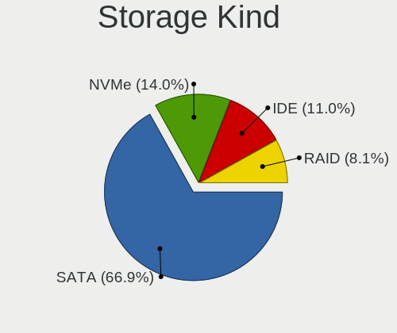

| Kind | Notebooks | Percent |
|------|-----------|---------|
| SATA | 115       | 63.19%  |
| NVMe | 32        | 17.58%  |
| IDE  | 18        | 9.89%   |
| RAID | 17        | 9.34%   |

Processor
---------

CPU Vendor
----------

Processor vendors

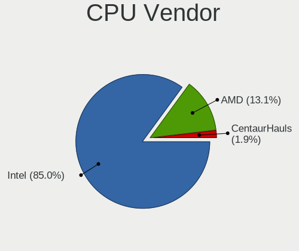

| Vendor       | Notebooks | Percent |
|--------------|-----------|---------|
| Intel        | 129       | 83.77%  |
| AMD          | 22        | 14.29%  |
| CentaurHauls | 3         | 1.95%   |

CPU Model
---------

Processor models

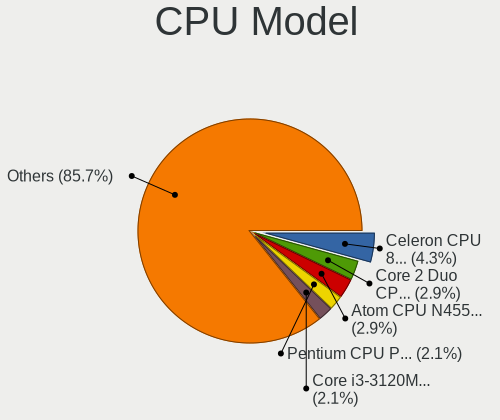

| Model                                          | Notebooks | Percent |
|------------------------------------------------|-----------|---------|
| Intel Celeron CPU 847 @ 1.10GHz                | 7         | 4.55%   |
| Intel Atom CPU N455 @ 1.66GHz                  | 5         | 3.25%   |
| Intel Core i3-3110M CPU @ 2.40GHz              | 4         | 2.6%    |
| Intel Core 2 Duo CPU T6570 @ 2.10GHz           | 4         | 2.6%    |
| Intel Pentium CPU P6200 @ 2.13GHz              | 3         | 1.95%   |
| Intel Core i5-2450M CPU @ 2.50GHz              | 3         | 1.95%   |
| Intel Core i5-2430M CPU @ 2.40GHz              | 3         | 1.95%   |
| Intel Core i3-3120M CPU @ 2.50GHz              | 3         | 1.95%   |
| Intel Core 2 Duo CPU T6600 @ 2.20GHz           | 3         | 1.95%   |
| CentaurHauls ZHAOXIN KaiXian KX-6640MA@2.2+GHz | 3         | 1.95%   |
| Intel Pentium Dual-Core CPU T4300 @ 2.10GHz    | 2         | 1.3%    |
| Intel Pentium Dual CPU T2370 @ 1.73GHz         | 2         | 1.3%    |
| Intel Core i7-9750H CPU @ 2.60GHz              | 2         | 1.3%    |
| Intel Core i5-7300U CPU @ 2.60GHz              | 2         | 1.3%    |
| Intel Core i5-3337U CPU @ 1.80GHz              | 2         | 1.3%    |
| Intel Core i5-3230M CPU @ 2.60GHz              | 2         | 1.3%    |
| Intel Core i5-1035G1 CPU @ 1.00GHz             | 2         | 1.3%    |
| Intel Core i3-4000M CPU @ 2.40GHz              | 2         | 1.3%    |
| Intel Core i3-2350M CPU @ 2.30GHz              | 2         | 1.3%    |
| Intel Core i3 CPU M 330 @ 2.13GHz              | 2         | 1.3%    |
| Intel Core 2 Duo CPU T5550 @ 1.83GHz           | 2         | 1.3%    |
| Intel Core 2 Duo CPU T5250 @ 1.50GHz           | 2         | 1.3%    |
| Intel Celeron N4020 CPU @ 1.10GHz              | 2         | 1.3%    |
| Intel Celeron CPU N2840 @ 2.16GHz              | 2         | 1.3%    |
| Intel Celeron CPU N2805 @ 1.46GHz              | 2         | 1.3%    |
| Intel Atom CPU N570 @ 1.66GHz                  | 2         | 1.3%    |
| Intel 11th Gen Core i7-11800H @ 2.30GHz        | 2         | 1.3%    |
| Intel 11th Gen Core i5-1135G7 @ 2.40GHz        | 2         | 1.3%    |
| AMD Ryzen 7 5700U with Radeon Graphics         | 2         | 1.3%    |
| AMD Ryzen 5 5500U with Radeon Graphics         | 2         | 1.3%    |
| AMD Ryzen 5 3500U with Radeon Vega Mobile Gfx  | 2         | 1.3%    |
| Intel Pentium Silver N5030 CPU @ 1.10GHz       | 1         | 0.65%   |
| Intel Pentium Dual CPU T3400 @ 2.16GHz         | 1         | 0.65%   |
| Intel Pentium CPU B940 @ 2.00GHz               | 1         | 0.65%   |
| Intel Pentium CPU 6405U @ 2.40GHz              | 1         | 0.65%   |
| Intel Pentium CPU 2030M @ 2.50GHz              | 1         | 0.65%   |
| Intel Genuine CPU U7300 @ 1.30GHz              | 1         | 0.65%   |
| Intel Genuine CPU T2080 @ 1.73GHz              | 1         | 0.65%   |
| Intel Core i7-8550U CPU @ 1.80GHz              | 1         | 0.65%   |
| Intel Core i7-7820HK CPU @ 2.90GHz             | 1         | 0.65%   |

CPU Model Family
----------------

Processor model prefix

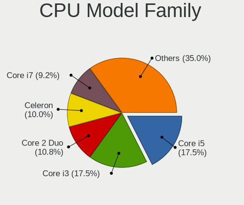

| Model                          | Notebooks | Percent |
|--------------------------------|-----------|---------|
| Intel Core i5                  | 28        | 18.18%  |
| Intel Core i3                  | 24        | 15.58%  |
| Intel Celeron                  | 18        | 11.69%  |
| Intel Core 2 Duo               | 15        | 9.74%   |
| Intel Core i7                  | 13        | 8.44%   |
| Other                          | 11        | 7.14%   |
| Intel Atom                     | 10        | 6.49%   |
| AMD Ryzen 5                    | 7         | 4.55%   |
| Intel Pentium                  | 6         | 3.9%    |
| AMD Ryzen 7                    | 4         | 2.6%    |
| Intel Pentium Dual             | 3         | 1.95%   |
| Intel Pentium Dual-Core        | 2         | 1.3%    |
| Intel Genuine                  | 2         | 1.3%    |
| AMD A10                        | 2         | 1.3%    |
| Intel Pentium Silver           | 1         | 0.65%   |
| AMD Turion X2 Dual-Core Mobile | 1         | 0.65%   |
| AMD Ryzen 3                    | 1         | 0.65%   |
| AMD Quad-Core                  | 1         | 0.65%   |
| AMD Mobile Sempron             | 1         | 0.65%   |
| AMD E1                         | 1         | 0.65%   |
| AMD E                          | 1         | 0.65%   |
| AMD C-70                       | 1         | 0.65%   |
| AMD A6                         | 1         | 0.65%   |

CPU Cores
---------

Number of processor cores

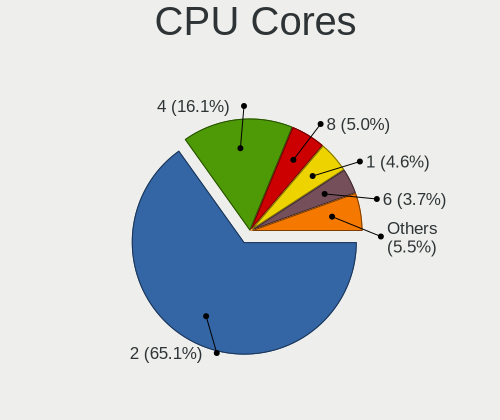

| Number  | Notebooks | Percent |
|---------|-----------|---------|
| 2       | 105       | 68.18%  |
| 4       | 25        | 16.23%  |
| 1       | 8         | 5.19%   |
| 6       | 7         | 4.55%   |
| 8       | 5         | 3.25%   |
| Unknown | 2         | 1.3%    |
| 14      | 1         | 0.65%   |
| 10      | 1         | 0.65%   |

CPU Sockets
-----------

Number of sockets

| Number | Notebooks | Percent |
|--------|-----------|---------|
| 1      | 154       | 100%    |

CPU Threads
-----------

Threads per core (Hyper-Threading)

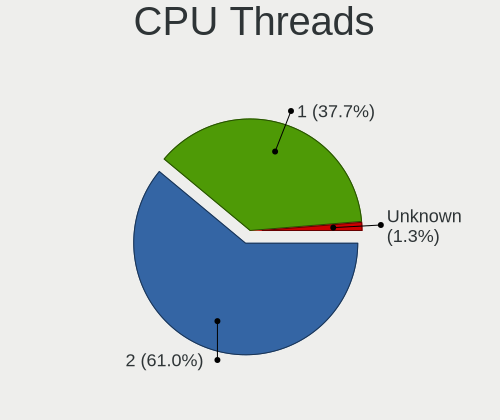

| Number  | Notebooks | Percent |
|---------|-----------|---------|
| 2       | 94        | 61.04%  |
| 1       | 58        | 37.66%  |
| Unknown | 2         | 1.3%    |

CPU Op-Modes
------------

CPU Operation Modes (32-bit, 64-bit)

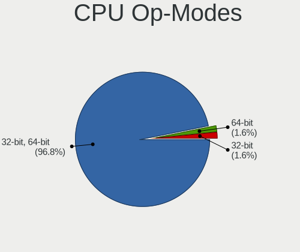

| Op mode        | Notebooks | Percent |
|----------------|-----------|---------|
| 32-bit, 64-bit | 148       | 96.1%   |
| 64-bit         | 3         | 1.95%   |
| 32-bit         | 3         | 1.95%   |

CPU Microcode
-------------

Microcode number

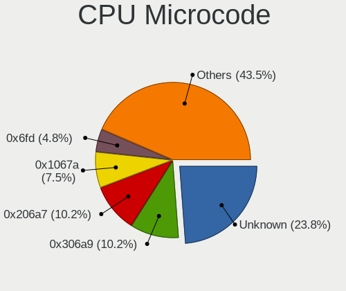

| Number     | Notebooks | Percent |
|------------|-----------|---------|
| Unknown    | 42        | 25.93%  |
| 0x206a7    | 17        | 10.49%  |
| 0x306a9    | 16        | 9.88%   |
| 0x1067a    | 11        | 6.79%   |
| 0x6fd      | 7         | 4.32%   |
| 0x106ca    | 6         | 3.7%    |
| 0x806e9    | 5         | 3.09%   |
| 0x30678    | 5         | 3.09%   |
| 0x20655    | 4         | 2.47%   |
| 0x806c1    | 3         | 1.85%   |
| 0x406e3    | 3         | 1.85%   |
| 0x40651    | 3         | 1.85%   |
| 0x806ec    | 2         | 1.23%   |
| 0x806ea    | 2         | 1.23%   |
| 0x806d1    | 2         | 1.23%   |
| 0x306d4    | 2         | 1.23%   |
| 0x306c3    | 2         | 1.23%   |
| 0x30673    | 2         | 1.23%   |
| 0x08608103 | 2         | 1.23%   |
| 0x08108102 | 2         | 1.23%   |
| 0x05000119 | 2         | 1.23%   |
| 0x906ea    | 1         | 0.62%   |
| 0x906e9    | 1         | 0.62%   |
| 0x906a4    | 1         | 0.62%   |
| 0x706e5    | 1         | 0.62%   |
| 0x706a8    | 1         | 0.62%   |
| 0x6ec      | 1         | 0.62%   |
| 0x506e3    | 1         | 0.62%   |
| 0x406c4    | 1         | 0.62%   |
| 0x30661    | 1         | 0.62%   |
| 0x20652    | 1         | 0.62%   |
| 0x106c2    | 1         | 0.62%   |
| 0x08600104 | 1         | 0.62%   |
| 0x08600103 | 1         | 0.62%   |
| 0x08600102 | 1         | 0.62%   |
| 0x0810100b | 1         | 0.62%   |
| 0x08101007 | 1         | 0.62%   |
| 0x06006705 | 1         | 0.62%   |
| 0x06006704 | 1         | 0.62%   |
| 0x06006118 | 1         | 0.62%   |

CPU Microarch
-------------

Microarchitecture

| Name             | Notebooks | Percent |
|------------------|-----------|---------|
| SandyBridge      | 23        | 14.94%  |
| IvyBridge        | 18        | 11.69%  |
| KabyLake         | 13        | 8.44%   |
| Core             | 11        | 7.14%   |
| Penryn           | 10        | 6.49%   |
| Westmere         | 9         | 5.84%   |
| Bonnell          | 9         | 5.84%   |
| Silvermont       | 8         | 5.19%   |
| Unknown          | 7         | 4.55%   |
| Haswell          | 5         | 3.25%   |
| Skylake          | 4         | 2.6%    |
| IceLake          | 4         | 2.6%    |
| Zen+             | 3         | 1.95%   |
| Zen 2            | 3         | 1.95%   |
| TigerLake        | 3         | 1.95%   |
| Goldmont plus    | 3         | 1.95%   |
| Excavator        | 3         | 1.95%   |
| Broadwell        | 3         | 1.95%   |
| Bobcat           | 3         | 1.95%   |
| Zen              | 2         | 1.3%    |
| CometLake        | 2         | 1.3%    |
| Alderlake Hybrid | 2         | 1.3%    |
| Steamroller      | 1         | 0.65%   |
| P6               | 1         | 0.65%   |
| K8 Hammer        | 1         | 0.65%   |
| K8 & K10 hybrid  | 1         | 0.65%   |
| Jaguar           | 1         | 0.65%   |
| Goldmont         | 1         | 0.65%   |

Graphics
--------

GPU Vendor
----------

Vendors of graphics cards

| Vendor  | Notebooks | Percent |
|---------|-----------|---------|
| Intel   | 125       | 76.22%  |
| AMD     | 23        | 14.02%  |
| Nvidia  | 13        | 7.93%   |
| Zhaoxin | 3         | 1.83%   |

GPU Model
---------

Graphics card models

| Model                                                                         | Notebooks | Percent |
|-------------------------------------------------------------------------------|-----------|---------|
| Intel 2nd Generation Core Processor Family Integrated Graphics Controller     | 22        | 12.57%  |
| Intel 3rd Gen Core processor Graphics Controller                              | 17        | 9.71%   |
| Intel Mobile 4 Series Chipset Integrated Graphics Controller                  | 11        | 6.29%   |
| Intel Mobile GM965/GL960 Integrated Graphics Controller (secondary)           | 9         | 5.14%   |
| Intel Mobile GM965/GL960 Integrated Graphics Controller (primary)             | 9         | 5.14%   |
| Intel Core Processor Integrated Graphics Controller                           | 9         | 5.14%   |
| Intel Atom Processor Z36xxx/Z37xxx Series Graphics & Display                  | 7         | 4%      |
| Intel Atom Processor D4xx/D5xx/N4xx/N5xx Integrated Graphics Controller       | 7         | 4%      |
| Intel HD Graphics 620                                                         | 4         | 2.29%   |
| AMD Lucienne                                                                  | 4         | 2.29%   |
| Zhaoxin ZX-E C-960 GPU                                                        | 3         | 1.71%   |
| Intel TigerLake-LP GT2 [Iris Xe Graphics]                                     | 3         | 1.71%   |
| Intel Skylake GT2 [HD Graphics 520]                                           | 3         | 1.71%   |
| Intel HD Graphics 5500                                                        | 3         | 1.71%   |
| Intel Haswell-ULT Integrated Graphics Controller                              | 3         | 1.71%   |
| AMD Picasso/Raven 2 [Radeon Vega Series / Radeon Vega Mobile Series]          | 3         | 1.71%   |
| Nvidia TU117M                                                                 | 2         | 1.14%   |
| Nvidia GA106M [GeForce RTX 3060 Mobile / Max-Q]                               | 2         | 1.14%   |
| Intel UHD Graphics 620                                                        | 2         | 1.14%   |
| Intel TigerLake-H GT1 [UHD Graphics]                                          | 2         | 1.14%   |
| Intel Mobile 945GM/GMS/GME, 943/940GML Express Integrated Graphics Controller | 2         | 1.14%   |
| Intel Iris Plus Graphics G1 (Ice Lake)                                        | 2         | 1.14%   |
| Intel HD Graphics 630                                                         | 2         | 1.14%   |
| Intel GeminiLake [UHD Graphics 600]                                           | 2         | 1.14%   |
| Intel CoffeeLake-H GT2 [UHD Graphics 630]                                     | 2         | 1.14%   |
| Intel 4th Gen Core Processor Integrated Graphics Controller                   | 2         | 1.14%   |
| AMD Stoney [Radeon R2/R3/R4/R5 Graphics]                                      | 2         | 1.14%   |
| AMD Renoir                                                                    | 2         | 1.14%   |
| AMD Raven Ridge [Radeon Vega Series / Radeon Vega Mobile Series]              | 2         | 1.14%   |
| Nvidia TU117M [GeForce GTX 1650 Mobile / Max-Q]                               | 1         | 0.57%   |
| Nvidia TU116M [GeForce GTX 1660 Ti Mobile]                                    | 1         | 0.57%   |
| Nvidia TU106M [GeForce RTX 2060 Mobile]                                       | 1         | 0.57%   |
| Nvidia GP107M [GeForce GTX 1050 Ti Mobile]                                    | 1         | 0.57%   |
| Nvidia GP104BM [GeForce GTX 1070 Mobile]                                      | 1         | 0.57%   |
| Nvidia GM204GLM [Quadro M3000M]                                               | 1         | 0.57%   |
| Nvidia GF108GLM [NVS 5200M]                                                   | 1         | 0.57%   |
| Nvidia GF104GLM [Quadro 3000M]                                                | 1         | 0.57%   |
| Nvidia GA107M [GeForce RTX 3050 Ti Mobile]                                    | 1         | 0.57%   |
| Intel Mobile 945GSE Express Integrated Graphics Controller                    | 1         | 0.57%   |
| Intel Mobile 945GM/GMS, 943/940GML Express Integrated Graphics Controller     | 1         | 0.57%   |

GPU Combo
---------

Combinations of graphics cards

| Name           | Notebooks | Percent |
|----------------|-----------|---------|
| 1 x Intel      | 113       | 73.38%  |
| 1 x AMD        | 21        | 13.64%  |
| Intel + Nvidia | 7         | 4.55%   |
| 1 x Nvidia     | 5         | 3.25%   |
| 2 x Intel      | 3         | 1.95%   |
| 1 x Zhaoxin    | 3         | 1.95%   |
| Intel + AMD    | 1         | 0.65%   |
| AMD + Nvidia   | 1         | 0.65%   |

GPU Driver
----------

Free vs proprietary

| Driver      | Notebooks | Percent |
|-------------|-----------|---------|
| Free        | 141       | 90.97%  |
| Proprietary | 8         | 5.16%   |
| Unknown     | 6         | 3.87%   |

GPU Memory
----------

Total video memory

| Size in GB | Notebooks | Percent |
|------------|-----------|---------|
| Unknown    | 127       | 81.41%  |
| 0.01-0.5   | 15        | 9.62%   |
| 1.01-2.0   | 6         | 3.85%   |
| 3.01-4.0   | 3         | 1.92%   |
| 0.51-1.0   | 3         | 1.92%   |
| 5.01-6.0   | 2         | 1.28%   |

Monitor
-------

Monitor Vendor
--------------

Monitor vendors

| Vendor                  | Notebooks | Percent |
|-------------------------|-----------|---------|
| AU Optronics            | 28        | 16.77%  |
| Samsung Electronics     | 26        | 15.57%  |
| BOE                     | 26        | 15.57%  |
| LG Display              | 21        | 12.57%  |
| Chimei Innolux          | 17        | 10.18%  |
| Chi Mei Optoelectronics | 7         | 4.19%   |
| Lenovo                  | 6         | 3.59%   |
| InfoVision              | 6         | 3.59%   |
| LG Philips              | 5         | 2.99%   |
| Hewlett-Packard         | 5         | 2.99%   |
| HannStar                | 4         | 2.4%    |
| Goldstar                | 3         | 1.8%    |
| PANDA                   | 2         | 1.2%    |
| Dell                    | 2         | 1.2%    |
| Vizio                   | 1         | 0.6%    |
| ViewSonic               | 1         | 0.6%    |
| Sharp                   | 1         | 0.6%    |
| Sceptre Tech            | 1         | 0.6%    |
| MStar                   | 1         | 0.6%    |
| KTC                     | 1         | 0.6%    |
| InnoLux Display         | 1         | 0.6%    |
| ASUSTek Computer        | 1         | 0.6%    |
| Acer                    | 1         | 0.6%    |

Monitor Model
-------------

Monitor models

| Model                                                                 | Notebooks | Percent |
|-----------------------------------------------------------------------|-----------|---------|
| Samsung Electronics LCD Monitor SEC3030 1024x600 223x125mm 10.1-inch  | 6         | 3.57%   |
| Chimei Innolux LCD Monitor CMN1475 1366x768 309x174mm 14.0-inch       | 5         | 2.98%   |
| AU Optronics LCD Monitor AUO1B3C 1366x768 309x173mm 13.9-inch         | 4         | 2.38%   |
| HannStar LCD Monitor HSD03E9 1024x600 220x129mm 10.0-inch             | 3         | 1.79%   |
| BOE LCD Monitor BOE05C7 1366x768 309x173mm 13.9-inch                  | 3         | 1.79%   |
| Samsung Electronics S22F350 SAM0D1A 1920x1080 477x268mm 21.5-inch     | 2         | 1.19%   |
| Samsung Electronics LCD Monitor SEC5441 1366x768 344x194mm 15.5-inch  | 2         | 1.19%   |
| PANDA LCD Monitor NCP004D 1920x1080 344x194mm 15.5-inch               | 2         | 1.19%   |
| LG Display LCD Monitor LGD045E 1366x768 310x174mm 14.0-inch           | 2         | 1.19%   |
| LG Display LCD Monitor LGD0385 1366x768 309x174mm 14.0-inch           | 2         | 1.19%   |
| LG Display LCD Monitor LGD02F8 1366x768 309x174mm 14.0-inch           | 2         | 1.19%   |
| LG Display LCD Monitor LGD02DF 1600x900 310x174mm 14.0-inch           | 2         | 1.19%   |
| InfoVision M140NWR2 R1 IVO057A 1366x768 309x174mm 14.0-inch           | 2         | 1.19%   |
| InfoVision LCD Monitor IVO03FA 1366x768 223x125mm 10.1-inch           | 2         | 1.19%   |
| Chimei Innolux LCD Monitor CMN14D6 1366x768 309x173mm 13.9-inch       | 2         | 1.19%   |
| BOE LCD Monitor BOE07B4 1366x768 344x194mm 15.5-inch                  | 2         | 1.19%   |
| BOE LCD Monitor BOE05B1 1366x768 309x173mm 13.9-inch                  | 2         | 1.19%   |
| BOE LCD Monitor BOE059F 1366x768 309x173mm 13.9-inch                  | 2         | 1.19%   |
| AU Optronics LCD Monitor AUO8294 1920x1080 382x215mm 17.3-inch        | 2         | 1.19%   |
| Vizio E3D320VX VIZ0079 1920x1080 698x393mm 31.5-inch                  | 1         | 0.6%    |
| ViewSonic VA2252 SERIES VSC7731 1920x1080 476x268mm 21.5-inch         | 1         | 0.6%    |
| Sharp LCD Monitor SHP14B9 3840x2160 344x194mm 15.5-inch               | 1         | 0.6%    |
| Sceptre Tech Sceptre F24 SPT09AB 1920x1080 521x293mm 23.5-inch        | 1         | 0.6%    |
| Samsung Electronics T22C301 SAM0AD2 1920x1080 477x268mm 21.5-inch     | 1         | 0.6%    |
| Samsung Electronics SyncMaster SAM04DF 1360x768 410x230mm 18.5-inch   | 1         | 0.6%    |
| Samsung Electronics SyncMaster SAM0426 1920x1200                      | 1         | 0.6%    |
| Samsung Electronics LCD Monitor SEC4D42 1280x800 303x190mm 14.1-inch  | 1         | 0.6%    |
| Samsung Electronics LCD Monitor SEC4545 1280x800 331x207mm 15.4-inch  | 1         | 0.6%    |
| Samsung Electronics LCD Monitor SEC4241 1280x800 261x163mm 12.1-inch  | 1         | 0.6%    |
| Samsung Electronics LCD Monitor SEC3741 1280x800 331x207mm 15.4-inch  | 1         | 0.6%    |
| Samsung Electronics LCD Monitor SEC3633 1280x800 331x207mm 15.4-inch  | 1         | 0.6%    |
| Samsung Electronics LCD Monitor SEC3345 1280x800 331x207mm 15.4-inch  | 1         | 0.6%    |
| Samsung Electronics LCD Monitor SEC315A 1366x768 344x194mm 15.5-inch  | 1         | 0.6%    |
| Samsung Electronics LCD Monitor SEC3157 1280x800 303x190mm 14.1-inch  | 1         | 0.6%    |
| Samsung Electronics LCD Monitor SEC304C 1366x768 309x174mm 14.0-inch  | 1         | 0.6%    |
| Samsung Electronics LCD Monitor SDC8151 1920x1080 382x214mm 17.2-inch | 1         | 0.6%    |
| Samsung Electronics LCD Monitor SDC5441 1366x768 309x174mm 14.0-inch  | 1         | 0.6%    |
| Samsung Electronics LCD Monitor SDC4147 1366x768 344x194mm 15.5-inch  | 1         | 0.6%    |
| Samsung Electronics LCD Monitor SAM0A7C 1366x768 698x393mm 31.5-inch  | 1         | 0.6%    |
| Samsung Electronics LCD Monitor SAM07BD 1280x720                      | 1         | 0.6%    |

Monitor Resolution
------------------

Monitor screen resolution

| Resolution        | Notebooks | Percent |
|-------------------|-----------|---------|
| 1366x768 (WXGA)   | 85        | 54.84%  |
| 1920x1080 (FHD)   | 36        | 23.23%  |
| 1280x800 (WXGA)   | 14        | 9.03%   |
| 3840x2160 (4K)    | 3         | 1.94%   |
| 1600x900 (HD+)    | 3         | 1.94%   |
| 1024x600          | 3         | 1.94%   |
| 2560x1440 (QHD)   | 2         | 1.29%   |
| 1920x1200 (WUXGA) | 2         | 1.29%   |
| 1440x900 (WXGA+)  | 2         | 1.29%   |
| 1360x768          | 2         | 1.29%   |
| 1280x1024 (SXGA)  | 2         | 1.29%   |
| 1280x720 (HD)     | 1         | 0.65%   |

Monitor Diagonal
----------------

Diagonal size in inches

| Inches  | Notebooks | Percent |
|---------|-----------|---------|
| 15      | 58        | 34.94%  |
| 14      | 35        | 21.08%  |
| 13      | 29        | 17.47%  |
| 17      | 8         | 4.82%   |
| 21      | 6         | 3.61%   |
| 10      | 6         | 3.61%   |
| 11      | 5         | 3.01%   |
| 23      | 3         | 1.81%   |
| 18      | 3         | 1.81%   |
| 32      | 2         | 1.2%    |
| 27      | 2         | 1.2%    |
| 12      | 2         | 1.2%    |
| Unknown | 2         | 1.2%    |
| 54      | 1         | 0.6%    |
| 52      | 1         | 0.6%    |
| 31      | 1         | 0.6%    |
| 24      | 1         | 0.6%    |
| 19      | 1         | 0.6%    |

Monitor Width
-------------

Physical width

| Width in mm | Notebooks | Percent |
|-------------|-----------|---------|
| 301-350     | 118       | 71.52%  |
| 201-300     | 15        | 9.09%   |
| 401-500     | 10        | 6.06%   |
| 351-400     | 10        | 6.06%   |
| 501-600     | 5         | 3.03%   |
| 701-800     | 2         | 1.21%   |
| 1001-1500   | 2         | 1.21%   |
| Unknown     | 2         | 1.21%   |
| 601-700     | 1         | 0.61%   |

Aspect Ratio
------------

Proportional relationship between the width and the height

| Ratio | Notebooks | Percent |
|-------|-----------|---------|
| 16/9  | 126       | 85.71%  |
| 16/10 | 18        | 12.24%  |
| 5/4   | 2         | 1.36%   |
| 3/2   | 1         | 0.68%   |

Monitor Area
------------

Area in inch²

| Area in inch² | Notebooks | Percent |
|----------------|-----------|---------|
| 81-90          | 62        | 37.35%  |
| 101-110        | 58        | 34.94%  |
| 201-250        | 8         | 4.82%   |
| 121-130        | 7         | 4.22%   |
| 41-50          | 6         | 3.61%   |
| 51-60          | 5         | 3.01%   |
| 141-150        | 4         | 2.41%   |
| 351-500        | 3         | 1.81%   |
| More than 1000 | 2         | 1.2%    |
| 71-80          | 2         | 1.2%    |
| 61-70          | 2         | 1.2%    |
| 301-350        | 2         | 1.2%    |
| 151-200        | 2         | 1.2%    |
| Unknown        | 2         | 1.2%    |
| 251-300        | 1         | 0.6%    |

Pixel Density
-------------

Pixels per inch

| Density       | Notebooks | Percent |
|---------------|-----------|---------|
| 101-120       | 80        | 49.08%  |
| 121-160       | 45        | 27.61%  |
| 51-100        | 29        | 17.79%  |
| 1-50          | 4         | 2.45%   |
| 161-240       | 2         | 1.23%   |
| Unknown       | 2         | 1.23%   |
| More than 240 | 1         | 0.61%   |

Multiple Monitors
-----------------

Total monitors connected

| Total | Notebooks | Percent |
|-------|-----------|---------|
| 1     | 130       | 81.76%  |
| 2     | 22        | 13.84%  |
| 0     | 5         | 3.14%   |
| 3     | 2         | 1.26%   |

Network
-------

Net Controller Vendor
---------------------

Controller vendors

| Vendor                          | Notebooks | Percent |
|---------------------------------|-----------|---------|
| Realtek Semiconductor           | 101       | 39.61%  |
| Qualcomm Atheros                | 53        | 20.78%  |
| Intel                           | 53        | 20.78%  |
| Broadcom                        | 16        | 6.27%   |
| MediaTek                        | 6         | 2.35%   |
| Broadcom Limited                | 5         | 1.96%   |
| Xiaomi                          | 3         | 1.18%   |
| TP-Link                         | 3         | 1.18%   |
| Marvell Technology Group        | 3         | 1.18%   |
| Samsung Electronics             | 2         | 0.78%   |
| Qualcomm Atheros Communications | 2         | 0.78%   |
| JMicron Technology              | 2         | 0.78%   |
| ZyXEL Communications            | 1         | 0.39%   |
| Trendchip Technologies          | 1         | 0.39%   |
| Ralink Technology               | 1         | 0.39%   |
| Huawei Technologies             | 1         | 0.39%   |
| ASIX Electronics                | 1         | 0.39%   |
| AMD                             | 1         | 0.39%   |

Net Controller Model
--------------------

Controller models

| Model                                                                   | Notebooks | Percent |
|-------------------------------------------------------------------------|-----------|---------|
| Realtek RTL8111/8168/8411 PCI Express Gigabit Ethernet Controller       | 53        | 17.97%  |
| Realtek RTL810xE PCI Express Fast Ethernet controller                   | 23        | 7.8%    |
| Qualcomm Atheros AR9485 Wireless Network Adapter                        | 15        | 5.08%   |
| Realtek RTL8188CE 802.11b/g/n WiFi Adapter                              | 10        | 3.39%   |
| Qualcomm Atheros AR9285 Wireless Network Adapter (PCI-Express)          | 9         | 3.05%   |
| Realtek RTL8723AE PCIe Wireless Network Adapter                         | 8         | 2.71%   |
| Intel Wireless 7265                                                     | 7         | 2.37%   |
| Realtek RTL8821CE 802.11ac PCIe Wireless Network Adapter                | 6         | 2.03%   |
| Qualcomm Atheros AR8161 Gigabit Ethernet                                | 6         | 2.03%   |
| Qualcomm Atheros QCA9565 / AR9565 Wireless Network Adapter              | 5         | 1.69%   |
| MediaTek MT7921 802.11ax PCI Express Wireless Network Adapter           | 5         | 1.69%   |
| Realtek RTL8191SEvB Wireless LAN Controller                             | 4         | 1.36%   |
| Realtek RTL-8100/8101L/8139 PCI Fast Ethernet Adapter                   | 4         | 1.36%   |
| Qualcomm Atheros QCA6174 802.11ac Wireless Network Adapter              | 4         | 1.36%   |
| Qualcomm Atheros AR8151 v2.0 Gigabit Ethernet                           | 4         | 1.36%   |
| Qualcomm Atheros AR242x / AR542x Wireless Network Adapter (PCI-Express) | 4         | 1.36%   |
| Intel Wireless 8265 / 8275                                              | 4         | 1.36%   |
| Intel Wireless 7260                                                     | 4         | 1.36%   |
| Intel WiFi Link 5100                                                    | 4         | 1.36%   |
| Broadcom BCM4311 802.11b/g WLAN                                         | 4         | 1.36%   |
| Realtek RTL8822CE 802.11ac PCIe Wireless Network Adapter                | 3         | 1.02%   |
| Realtek RTL8723BE PCIe Wireless Network Adapter                         | 3         | 1.02%   |
| Intel Wireless 3165                                                     | 3         | 1.02%   |
| Intel PRO/Wireless 4965 AG or AGN [Kedron] Network Connection           | 3         | 1.02%   |
| Intel Ethernet Connection (4) I219-LM                                   | 3         | 1.02%   |
| Intel Centrino Wireless-N 105                                           | 3         | 1.02%   |
| Intel Centrino Ultimate-N 6300                                          | 3         | 1.02%   |
| Intel 82579LM Gigabit Network Connection (Lewisville)                   | 3         | 1.02%   |
| Broadcom BCM4313 802.11bgn Wireless Network Adapter                     | 3         | 1.02%   |
| Broadcom BCM4312 802.11b/g LP-PHY                                       | 3         | 1.02%   |
| TP-Link AC600 wireless Realtek RTL8811AU [Archer T2U Nano]              | 2         | 0.68%   |
| Samsung GT-I9070 (network tethering, USB debugging enabled)             | 2         | 0.68%   |
| Realtek RTL8153 Gigabit Ethernet Adapter                                | 2         | 0.68%   |
| Qualcomm Atheros AR8121/AR8113/AR8114 Gigabit or Fast Ethernet          | 2         | 0.68%   |
| Marvell Group 88E8040 PCI-E Fast Ethernet Controller                    | 2         | 0.68%   |
| Intel Wireless 8260                                                     | 2         | 0.68%   |
| Intel Wi-Fi 6 AX201                                                     | 2         | 0.68%   |
| Intel Wi-Fi 6 AX200                                                     | 2         | 0.68%   |
| Intel Ethernet Connection (3) I218-LM                                   | 2         | 0.68%   |
| Intel Comet Lake PCH-LP CNVi WiFi                                       | 2         | 0.68%   |

Wireless Vendor
---------------

Wireless vendors

| Vendor                          | Notebooks | Percent |
|---------------------------------|-----------|---------|
| Intel                           | 52        | 33.33%  |
| Realtek Semiconductor           | 39        | 25%     |
| Qualcomm Atheros                | 39        | 25%     |
| Broadcom                        | 12        | 7.69%   |
| MediaTek                        | 6         | 3.85%   |
| TP-Link                         | 2         | 1.28%   |
| Qualcomm Atheros Communications | 2         | 1.28%   |
| Broadcom Limited                | 2         | 1.28%   |
| Xiaomi                          | 1         | 0.64%   |
| Ralink Technology               | 1         | 0.64%   |

Wireless Model
--------------

Wireless models

| Model                                                                                | Notebooks | Percent |
|--------------------------------------------------------------------------------------|-----------|---------|
| Qualcomm Atheros AR9485 Wireless Network Adapter                                     | 15        | 9.62%   |
| Realtek RTL8188CE 802.11b/g/n WiFi Adapter                                           | 10        | 6.41%   |
| Qualcomm Atheros AR9285 Wireless Network Adapter (PCI-Express)                       | 9         | 5.77%   |
| Realtek RTL8723AE PCIe Wireless Network Adapter                                      | 8         | 5.13%   |
| Intel Wireless 7265                                                                  | 7         | 4.49%   |
| Realtek RTL8821CE 802.11ac PCIe Wireless Network Adapter                             | 6         | 3.85%   |
| Qualcomm Atheros QCA9565 / AR9565 Wireless Network Adapter                           | 5         | 3.21%   |
| MediaTek MT7921 802.11ax PCI Express Wireless Network Adapter                        | 5         | 3.21%   |
| Realtek RTL8191SEvB Wireless LAN Controller                                          | 4         | 2.56%   |
| Qualcomm Atheros QCA6174 802.11ac Wireless Network Adapter                           | 4         | 2.56%   |
| Qualcomm Atheros AR242x / AR542x Wireless Network Adapter (PCI-Express)              | 4         | 2.56%   |
| Intel Wireless 8265 / 8275                                                           | 4         | 2.56%   |
| Intel Wireless 7260                                                                  | 4         | 2.56%   |
| Intel WiFi Link 5100                                                                 | 4         | 2.56%   |
| Broadcom BCM4311 802.11b/g WLAN                                                      | 4         | 2.56%   |
| Realtek RTL8822CE 802.11ac PCIe Wireless Network Adapter                             | 3         | 1.92%   |
| Realtek RTL8723BE PCIe Wireless Network Adapter                                      | 3         | 1.92%   |
| Intel Wireless 3165                                                                  | 3         | 1.92%   |
| Intel PRO/Wireless 4965 AG or AGN [Kedron] Network Connection                        | 3         | 1.92%   |
| Intel Centrino Wireless-N 105                                                        | 3         | 1.92%   |
| Intel Centrino Ultimate-N 6300                                                       | 3         | 1.92%   |
| Broadcom BCM4313 802.11bgn Wireless Network Adapter                                  | 3         | 1.92%   |
| Broadcom BCM4312 802.11b/g LP-PHY                                                    | 3         | 1.92%   |
| TP-Link AC600 wireless Realtek RTL8811AU [Archer T2U Nano]                           | 2         | 1.28%   |
| Intel Wireless 8260                                                                  | 2         | 1.28%   |
| Intel Wi-Fi 6 AX201                                                                  | 2         | 1.28%   |
| Intel Wi-Fi 6 AX200                                                                  | 2         | 1.28%   |
| Intel Comet Lake PCH-LP CNVi WiFi                                                    | 2         | 1.28%   |
| Intel Centrino Wireless-N 1030 [Rainbow Peak]                                        | 2         | 1.28%   |
| Intel Centrino Wireless-N 1000 [Condor Peak]                                         | 2         | 1.28%   |
| Broadcom Limited BCM4312 802.11b/g LP-PHY                                            | 2         | 1.28%   |
| Xiaomi MediaTek MT7601U [MI WiFi]                                                    | 1         | 0.64%   |
| Realtek RTL8852BE PCIe 802.11ax Wireless Network Controller                          | 1         | 0.64%   |
| Realtek RTL8723BU 802.11b/g/n WLAN Adapter                                           | 1         | 0.64%   |
| Realtek RTL8192EU 802.11b/g/n WLAN Adapter                                           | 1         | 0.64%   |
| Realtek RTL8191SU 802.11n WLAN Adapter                                               | 1         | 0.64%   |
| Realtek 802.11n WLAN Adapter                                                         | 1         | 0.64%   |
| Ralink MT7601U Wireless Adapter                                                      | 1         | 0.64%   |
| Qualcomm Atheros QCA9377 802.11ac Wireless Network Adapter                           | 1         | 0.64%   |
| Qualcomm Atheros TP-Link TL-WN821N v3 / TL-WN822N v2 802.11n [Atheros AR7010+AR9287] | 1         | 0.64%   |

Ethernet Vendor
---------------

Ethernet vendors

| Vendor                   | Notebooks | Percent |
|--------------------------|-----------|---------|
| Realtek Semiconductor    | 82        | 61.19%  |
| Qualcomm Atheros         | 19        | 14.18%  |
| Intel                    | 14        | 10.45%  |
| Broadcom                 | 5         | 3.73%   |
| Marvell Technology Group | 3         | 2.24%   |
| Broadcom Limited         | 3         | 2.24%   |
| Xiaomi                   | 2         | 1.49%   |
| JMicron Technology       | 2         | 1.49%   |
| ZyXEL Communications     | 1         | 0.75%   |
| Trendchip Technologies   | 1         | 0.75%   |
| TP-Link                  | 1         | 0.75%   |
| ASIX Electronics         | 1         | 0.75%   |

Ethernet Model
--------------

Ethernet models

| Model                                                             | Notebooks | Percent |
|-------------------------------------------------------------------|-----------|---------|
| Realtek RTL8111/8168/8411 PCI Express Gigabit Ethernet Controller | 53        | 39.26%  |
| Realtek RTL810xE PCI Express Fast Ethernet controller             | 23        | 17.04%  |
| Qualcomm Atheros AR8161 Gigabit Ethernet                          | 6         | 4.44%   |
| Realtek RTL-8100/8101L/8139 PCI Fast Ethernet Adapter             | 4         | 2.96%   |
| Qualcomm Atheros AR8151 v2.0 Gigabit Ethernet                     | 4         | 2.96%   |
| Intel Ethernet Connection (4) I219-LM                             | 3         | 2.22%   |
| Intel 82579LM Gigabit Network Connection (Lewisville)             | 3         | 2.22%   |
| Realtek RTL8153 Gigabit Ethernet Adapter                          | 2         | 1.48%   |
| Qualcomm Atheros AR8121/AR8113/AR8114 Gigabit or Fast Ethernet    | 2         | 1.48%   |
| Marvell Group 88E8040 PCI-E Fast Ethernet Controller              | 2         | 1.48%   |
| Intel Ethernet Connection (3) I218-LM                             | 2         | 1.48%   |
| Broadcom NetLink BCM5906M Fast Ethernet PCI Express               | 2         | 1.48%   |
| Broadcom NetLink BCM57785 Gigabit Ethernet PCIe                   | 2         | 1.48%   |
| Broadcom Limited NetLink BCM5906M Fast Ethernet PCI Express       | 2         | 1.48%   |
| ZyXEL ADSL Modem Prestige 600 series                              | 1         | 0.74%   |
| Xiaomi Mi/Redmi series (RNDIS)                                    | 1         | 0.74%   |
| Xiaomi Mi/Redmi series (RNDIS + ADB)                              | 1         | 0.74%   |
| Trendchip Ethernet controller                                     | 1         | 0.74%   |
| TP-Link M7200                                                     | 1         | 0.74%   |
| Realtek PCIe GbE Family Controller                                | 1         | 0.74%   |
| Qualcomm Atheros QCA8171 Gigabit Ethernet                         | 1         | 0.74%   |
| Qualcomm Atheros Killer E2500 Gigabit Ethernet Controller         | 1         | 0.74%   |
| Qualcomm Atheros Killer E2400 Gigabit Ethernet Controller         | 1         | 0.74%   |
| Qualcomm Atheros AR8162 Fast Ethernet                             | 1         | 0.74%   |
| Qualcomm Atheros AR8152 v2.0 Fast Ethernet                        | 1         | 0.74%   |
| Qualcomm Atheros AR8132 Fast Ethernet                             | 1         | 0.74%   |
| Qualcomm Atheros AR8131 Gigabit Ethernet                          | 1         | 0.74%   |
| Marvell Group 88E8055 PCI-E Gigabit Ethernet Controller           | 1         | 0.74%   |
| JMicron JMC260 PCI Express Fast Ethernet Controller               | 1         | 0.74%   |
| JMicron JMC250 PCI Express Gigabit Ethernet Controller            | 1         | 0.74%   |
| Intel PRO/100 VE Network Connection                               | 1         | 0.74%   |
| Intel Ethernet Connection I219-V                                  | 1         | 0.74%   |
| Intel Ethernet Connection I219-LM                                 | 1         | 0.74%   |
| Intel Ethernet Connection (2) I219-LM                             | 1         | 0.74%   |
| Intel Ethernet Connection (10) I219-LM                            | 1         | 0.74%   |
| Intel 82577LM Gigabit Network Connection                          | 1         | 0.74%   |
| Broadcom NetLink BCM57780 Gigabit Ethernet PCIe                   | 1         | 0.74%   |
| Broadcom Limited BCM4401-B0 100Base-TX                            | 1         | 0.74%   |
| ASIX AX88179 Gigabit Ethernet                                     | 1         | 0.74%   |

Net Controller Kind
-------------------

Ethernet, WiFi or modem

| Kind     | Notebooks | Percent |
|----------|-----------|---------|
| WiFi     | 149       | 52.65%  |
| Ethernet | 130       | 45.94%  |
| Modem    | 4         | 1.41%   |

Used Controller
---------------

Currently used network controller

| Kind     | Notebooks | Percent |
|----------|-----------|---------|
| WiFi     | 118       | 73.29%  |
| Ethernet | 43        | 26.71%  |

NICs
----

Total network controllers on board

| Total | Notebooks | Percent |
|-------|-----------|---------|
| 2     | 121       | 78.57%  |
| 1     | 31        | 20.13%  |
| 0     | 2         | 1.3%    |

IPv6
----

IPv6 vs IPv4

| Used | Notebooks | Percent |
|------|-----------|---------|
| No   | 153       | 98.71%  |
| Yes  | 2         | 1.29%   |

Bluetooth
---------

Bluetooth Vendor
----------------

Controller vendors

| Vendor                          | Notebooks | Percent |
|---------------------------------|-----------|---------|
| Intel                           | 33        | 35.48%  |
| Qualcomm Atheros Communications | 15        | 16.13%  |
| IMC Networks                    | 13        | 13.98%  |
| Realtek Semiconductor           | 12        | 12.9%   |
| Broadcom                        | 6         | 6.45%   |
| Lite-On Technology              | 5         | 5.38%   |
| Cambridge Silicon Radio         | 4         | 4.3%    |
| Hewlett-Packard                 | 2         | 2.15%   |
| Foxconn / Hon Hai               | 1         | 1.08%   |
| Dell                            | 1         | 1.08%   |
| ASUSTek Computer                | 1         | 1.08%   |

Bluetooth Model
---------------

Controller models

| Model                                                       | Notebooks | Percent |
|-------------------------------------------------------------|-----------|---------|
| Intel Bluetooth wireless interface                          | 20        | 21.51%  |
| Realtek Bluetooth Radio                                     | 7         | 7.53%   |
| Qualcomm Atheros  Bluetooth Device                          | 5         | 5.38%   |
| Qualcomm Atheros AR3011 Bluetooth                           | 5         | 5.38%   |
| Intel Bluetooth 9460/9560 Jefferson Peak (JfP)              | 4         | 4.3%    |
| Intel AX201 Bluetooth                                       | 4         | 4.3%    |
| IMC Networks Bluetooth                                      | 4         | 4.3%    |
| IMC Networks Atheros AR3012 Bluetooth 4.0 Adapter           | 4         | 4.3%    |
| Cambridge Silicon Radio Bluetooth Dongle (HCI mode)         | 4         | 4.3%    |
| Realtek RTL8723B Bluetooth                                  | 3         | 3.23%   |
| Qualcomm Atheros AR3012 Bluetooth 4.0                       | 3         | 3.23%   |
| IMC Networks Wireless_Device                                | 3         | 3.23%   |
| Broadcom BCM2045 Bluetooth                                  | 3         | 3.23%   |
| Lite-On Wireless_Device                                     | 2         | 2.15%   |
| Intel Centrino Advanced-N 6230 Bluetooth adapter            | 2         | 2.15%   |
| Intel AX200 Bluetooth                                       | 2         | 2.15%   |
| IMC Networks Bluetooth Radio                                | 2         | 2.15%   |
| Realtek RTL8723A Bluetooth                                  | 1         | 1.08%   |
| Realtek  Bluetooth 4.2 Adapter                              | 1         | 1.08%   |
| Qualcomm Atheros Bluetooth (AR3011)                         | 1         | 1.08%   |
| Qualcomm Atheros AR3012 Bluetooth                           | 1         | 1.08%   |
| Lite-On Qualcomm Atheros QCA9377 Bluetooth                  | 1         | 1.08%   |
| Lite-On Bluetooth Device                                    | 1         | 1.08%   |
| Lite-On BCM20702A0                                          | 1         | 1.08%   |
| Intel Centrino Bluetooth Wireless Transceiver               | 1         | 1.08%   |
| HP Integrated Module with Bluetooth 2.1 Wireless technology | 1         | 1.08%   |
| HP Broadcom 2070 Bluetooth Combo                            | 1         | 1.08%   |
| Foxconn / Hon Hai MediaTek Bluetooth Adapter                | 1         | 1.08%   |
| Dell BCM20702A0 Bluetooth Module                            | 1         | 1.08%   |
| Broadcom HP Portable Valentine                              | 1         | 1.08%   |
| Broadcom BCM43142 Bluetooth 4.0                             | 1         | 1.08%   |
| Broadcom BCM2045B (BDC-2.1) [Bluetooth Controller]          | 1         | 1.08%   |
| ASUS BT-253 Bluetooth Adapter                               | 1         | 1.08%   |

Sound
-----

Sound Vendor
------------

Sound card vendors

| Vendor                | Notebooks | Percent |
|-----------------------|-----------|---------|
| Intel                 | 129       | 76.79%  |
| AMD                   | 23        | 13.69%  |
| Nvidia                | 10        | 5.95%   |
| Zhaoxin               | 3         | 1.79%   |
| Realtek Semiconductor | 1         | 0.6%    |
| Microsoft             | 1         | 0.6%    |
| Logitech              | 1         | 0.6%    |

Sound Model
-----------

Sound card models

| Model                                                                      | Notebooks | Percent |
|----------------------------------------------------------------------------|-----------|---------|
| Intel 7 Series/C216 Chipset Family High Definition Audio Controller        | 27        | 13.57%  |
| Intel 6 Series/C200 Series Chipset Family High Definition Audio Controller | 14        | 7.04%   |
| Intel 82801I (ICH9 Family) HD Audio Controller                             | 12        | 6.03%   |
| AMD Family 17h/19h HD Audio Controller                                     | 12        | 6.03%   |
| Intel Sunrise Point-LP HD Audio                                            | 10        | 5.03%   |
| Intel NM10/ICH7 Family High Definition Audio Controller                    | 10        | 5.03%   |
| Intel 82801H (ICH8 Family) HD Audio Controller                             | 9         | 4.52%   |
| Intel 5 Series/3400 Series Chipset High Definition Audio                   | 9         | 4.52%   |
| Intel Atom Processor Z36xxx/Z37xxx Series High Definition Audio Controller | 6         | 3.02%   |
| AMD Renoir Radeon High Definition Audio Controller                         | 6         | 3.02%   |
| AMD Raven/Raven2/Fenghuang HDMI/DP Audio Controller                        | 5         | 2.51%   |
| AMD FCH Azalia Controller                                                  | 5         | 2.51%   |
| Zhaoxin ZX-E High Definition Audio Controller                              | 3         | 1.51%   |
| Zhaoxin ZX-100/KX-5000/KX-6000/KX-6000G High Definition Audio Controller   | 3         | 1.51%   |
| Intel Wildcat Point-LP High Definition Audio Controller                    | 3         | 1.51%   |
| Intel Tiger Lake-LP Smart Sound Technology Audio Controller                | 3         | 1.51%   |
| Intel Haswell-ULT HD Audio Controller                                      | 3         | 1.51%   |
| Intel Celeron/Pentium Silver Processor High Definition Audio               | 3         | 1.51%   |
| Intel Broadwell-U Audio Controller                                         | 3         | 1.51%   |
| Intel 8 Series HD Audio Controller                                         | 3         | 1.51%   |
| AMD Wrestler HDMI Audio                                                    | 3         | 1.51%   |
| AMD Family 15h (Models 60h-6fh) Audio Controller                           | 3         | 1.51%   |
| Nvidia TU107 GeForce GTX 1650 High Definition Audio Controller             | 2         | 1.01%   |
| Nvidia GA106 High Definition Audio Controller                              | 2         | 1.01%   |
| Intel Xeon E3-1200 v3/4th Gen Core Processor HD Audio Controller           | 2         | 1.01%   |
| Intel Tiger Lake-H HD Audio Controller                                     | 2         | 1.01%   |
| Intel Ice Lake-LP Smart Sound Technology Audio Controller                  | 2         | 1.01%   |
| Intel Comet Lake PCH-LP cAVS                                               | 2         | 1.01%   |
| Intel Comet Lake PCH cAVS                                                  | 2         | 1.01%   |
| Intel CM238 HD Audio Controller                                            | 2         | 1.01%   |
| Intel Cannon Lake PCH cAVS                                                 | 2         | 1.01%   |
| Intel Alder Lake PCH-P High Definition Audio Controller                    | 2         | 1.01%   |
| Intel 8 Series/C220 Series Chipset High Definition Audio Controller        | 2         | 1.01%   |
| AMD Kabini HDMI/DP Audio                                                   | 2         | 1.01%   |
| AMD High Definition Audio Controller                                       | 2         | 1.01%   |
| Realtek Semiconductor USB Audio                                            | 1         | 0.5%    |
| Nvidia TU116 High Definition Audio Controller                              | 1         | 0.5%    |
| Nvidia TU106 High Definition Audio Controller                              | 1         | 0.5%    |
| Nvidia GM204 High Definition Audio Controller                              | 1         | 0.5%    |
| Nvidia GF108 High Definition Audio Controller                              | 1         | 0.5%    |

Memory
------

Memory Vendor
-------------

Memory module vendors

| Vendor              | Notebooks | Percent |
|---------------------|-----------|---------|
| SK hynix            | 27        | 21.26%  |
| Samsung Electronics | 23        | 18.11%  |
| Unknown             | 16        | 12.6%   |
| Ramaxel Technology  | 14        | 11.02%  |
| Micron Technology   | 12        | 9.45%   |
| Crucial             | 7         | 5.51%   |
| Kingston            | 6         | 4.72%   |
| Elpida              | 4         | 3.15%   |
| Unknown (ABCD)      | 2         | 1.57%   |
| Shenzhen WODPOSIT   | 2         | 1.57%   |
| Qimonda             | 2         | 1.57%   |
| Memox               | 2         | 1.57%   |
| Unknown             | 2         | 1.57%   |
| Unknown (081A)      | 1         | 0.79%   |
| Unknown (07F7)      | 1         | 0.79%   |
| Team                | 1         | 0.79%   |
| Hikvision           | 1         | 0.79%   |
| Gold Key            | 1         | 0.79%   |
| Corsair             | 1         | 0.79%   |
| A-DATA Technology   | 1         | 0.79%   |
| <Invalid>           | 1         | 0.79%   |

Memory Model
------------

Memory module models

| Model                                                             | Notebooks | Percent |
|-------------------------------------------------------------------|-----------|---------|
| Unknown RAM Module 2GB SODIMM DDR2 667MT/s                        | 4         | 2.96%   |
| Ramaxel RAM RMT3170ME68F9F1600 4GB SODIMM DDR3 1600MT/s           | 4         | 2.96%   |
| SK hynix RAM HMT351S6CFR8C-PB 4GB SODIMM DDR3 1600MT/s            | 3         | 2.22%   |
| Ramaxel RAM RMT3160ED58E9W1600 4GB SODIMM DDR3 1600MT/s           | 3         | 2.22%   |
| Ramaxel RAM RMT3150ED58E8W1600 2GB SODIMM DDR3 1600MT/s           | 3         | 2.22%   |
| Ramaxel RAM RMT3010EC58E8F1333 2GB SODIMM DDR3 1600MT/s           | 3         | 2.22%   |
| Unknown RAM Module 1GB SODIMM DDR2 667MT/s                        | 2         | 1.48%   |
| SK hynix RAM HYMP125S64CP8-S6 2GB SODIMM DDR 975MT/s              | 2         | 1.48%   |
| SK hynix RAM HMT325S6BFR8C-H9 2GB SODIMM 1600MT/s                 | 2         | 1.48%   |
| SK hynix RAM HMAA1GS6CMR6N-VK 8GB SODIMM DDR4 2667MT/s            | 2         | 1.48%   |
| SK hynix RAM HMAA1GS6CJR6N-XN 8GB SODIMM DDR4 3200MT/s            | 2         | 1.48%   |
| SK hynix RAM HMA851S6DJR6N-XN 4GB SODIMM DDR4 3200MT/s            | 2         | 1.48%   |
| SK hynix RAM HMA82GS6DJR8N-VK 16GB SODIMM DDR4 2667MT/s           | 2         | 1.48%   |
| SK hynix RAM HMA81GS6AFR8N-UH 8GB SODIMM DDR4 2667MT/s            | 2         | 1.48%   |
| Shenzhen WODPOSIT RAM Module 8GB SODIMM DDR4 2666MT/s             | 2         | 1.48%   |
| Samsung RAM M471B5674QH0-YK0 2GB SODIMM DDR3 1600MT/s             | 2         | 1.48%   |
| Samsung RAM M471A1K43DB1-CWE 8192MB SODIMM DDR4 3200MT/s          | 2         | 1.48%   |
| Samsung RAM 4GB DDR3 HYNIX 4GB SODIMM DDR3 1333MT/s               | 2         | 1.48%   |
| Micron RAM 4ATF1G64HZ-3G2E2 8GB SODIMM DDR4 3200MT/s              | 2         | 1.48%   |
| Micron RAM 16JSF25664HZ-1G1F1 2GB SODIMM DDR3 1067MT/s            | 2         | 1.48%   |
| Elpida RAM EBJ21UE8BDS0-DJ-F 2GB SODIMM DDR3 1334MT/s             | 2         | 1.48%   |
| Crucial RAM CT25664BF160B.D8FE 2GB SODIMM DDR3 1600MT/s           | 2         | 1.48%   |
| Unknown                                                           | 2         | 1.48%   |
| Unknown RAM Module 8GB SODIMM DDR3 1600MT/s                       | 1         | 0.74%   |
| Unknown RAM Module 8192MB SODIMM DDR3 1600MT/s                    | 1         | 0.74%   |
| Unknown RAM Module 4GB SODIMM DDR3 1333MT/s                       | 1         | 0.74%   |
| Unknown RAM Module 4096MB SODIMM DDR3 1333MT/s                    | 1         | 0.74%   |
| Unknown RAM Module 2GB SODIMM SDRAM                               | 1         | 0.74%   |
| Unknown RAM Module 2GB SODIMM DDR3 1066MT/s                       | 1         | 0.74%   |
| Unknown RAM Module 2GB SODIMM DDR2                                | 1         | 0.74%   |
| Unknown RAM Module 2GB SODIMM DDR 800MT/s                         | 1         | 0.74%   |
| Unknown RAM Module 2048MB SODIMM DDR3 1333MT/s                    | 1         | 0.74%   |
| Unknown RAM Module 2048MB SODIMM DDR2 667MT/s                     | 1         | 0.74%   |
| Unknown RAM Module 2048MB SODIMM DDR2                             | 1         | 0.74%   |
| Unknown RAM Module 16384MB SODIMM DDR4 2667MT/s                   | 1         | 0.74%   |
| Unknown RAM Module 1024MB SODIMM DDR2 533MT/s                     | 1         | 0.74%   |
| Unknown (ABCD) RAM 123456789012345678 2GB SODIMM LPDDR4 2400MT/s  | 1         | 0.74%   |
| Unknown (ABCD) RAM 123456789012345678 1536MB DIMM LPDDR4 2400MT/s | 1         | 0.74%   |
| Unknown (081A) RAM HXMSH2GS03A2F1CL16 2GB SODIMM DDR3 1600MT/s    | 1         | 0.74%   |
| Unknown (07F7) RAM CMB6-5FAA1BAR01B00 4096MB SODIMM DDR4 2667MT/s | 1         | 0.74%   |

Memory Kind
-----------

Memory module kinds

| Kind   | Notebooks | Percent |
|--------|-----------|---------|
| DDR4   | 37        | 38.14%  |
| DDR3   | 36        | 37.11%  |
| DDR2   | 15        | 15.46%  |
| SDRAM  | 5         | 5.15%   |
| LPDDR4 | 3         | 3.09%   |
| DDR    | 1         | 1.03%   |

Memory Form Factor
------------------

Physical design of the memory module

| Name         | Notebooks | Percent |
|--------------|-----------|---------|
| SODIMM       | 90        | 94.74%  |
| Row Of Chips | 4         | 4.21%   |
| DIMM         | 1         | 1.05%   |

Memory Size
-----------

Memory module size

| Size  | Notebooks | Percent |
|-------|-----------|---------|
| 8192  | 36        | 32.43%  |
| 2048  | 33        | 29.73%  |
| 4096  | 29        | 26.13%  |
| 16384 | 6         | 5.41%   |
| 1024  | 6         | 5.41%   |
| 32768 | 1         | 0.9%    |

Memory Speed
------------

Memory module speed

| Speed   | Notebooks | Percent |
|---------|-----------|---------|
| 1600    | 28        | 25.69%  |
| 3200    | 15        | 13.76%  |
| 2667    | 15        | 13.76%  |
| 2400    | 8         | 7.34%   |
| 667     | 8         | 7.34%   |
| 1333    | 7         | 6.42%   |
| 1334    | 5         | 4.59%   |
| 2666    | 3         | 2.75%   |
| 533     | 3         | 2.75%   |
| Unknown | 3         | 2.75%   |
| 4199    | 2         | 1.83%   |
| 2048    | 2         | 1.83%   |
| 1067    | 2         | 1.83%   |
| 975     | 2         | 1.83%   |
| 800     | 2         | 1.83%   |
| 3266    | 1         | 0.92%   |
| 2133    | 1         | 0.92%   |
| 1867    | 1         | 0.92%   |
| 1066    | 1         | 0.92%   |

Printers & scanners
-------------------

Printer Vendor
--------------

Printer device vendors

| Vendor              | Notebooks | Percent |
|---------------------|-----------|---------|
| Hewlett-Packard     | 2         | 66.67%  |
| Samsung Electronics | 1         | 33.33%  |

Printer Model
-------------

Printer device models

| Model                  | Notebooks | Percent |
|------------------------|-----------|---------|
| Samsung ML-1865        | 1         | 33.33%  |
| HP LaserJet 1018       | 1         | 33.33%  |
| HP DeskJet 2300 series | 1         | 33.33%  |

Scanner Vendor
--------------

Scanner device vendors

Zero info for selected period =(

Scanner Model
-------------

Scanner device models

Zero info for selected period =(

Camera
------

Camera Vendor
-------------

Camera device vendors

| Vendor                                 | Notebooks | Percent |
|----------------------------------------|-----------|---------|
| Chicony Electronics                    | 25        | 20.66%  |
| Microdia                               | 15        | 12.4%   |
| Realtek Semiconductor                  | 10        | 8.26%   |
| IMC Networks                           | 10        | 8.26%   |
| Bison Electronics                      | 10        | 8.26%   |
| Suyin                                  | 8         | 6.61%   |
| Quanta                                 | 6         | 4.96%   |
| Sunplus Innovation Technology          | 5         | 4.13%   |
| Syntek                                 | 4         | 3.31%   |
| Cheng Uei Precision Industry (Foxlink) | 4         | 3.31%   |
| Acer                                   | 4         | 3.31%   |
| Sonix Technology                       | 3         | 2.48%   |
| Ricoh                                  | 3         | 2.48%   |
| ALi                                    | 3         | 2.48%   |
| Lite-On Technology                     | 2         | 1.65%   |
| Importek                               | 2         | 1.65%   |
| Tobii Technology AB                    | 1         | 0.83%   |
| Silicon Motion                         | 1         | 0.83%   |
| Luxvisions Innotech Limited            | 1         | 0.83%   |
| Lenovo                                 | 1         | 0.83%   |
| icSpring                               | 1         | 0.83%   |
| Apple                                  | 1         | 0.83%   |
| Alcor Micro                            | 1         | 0.83%   |

Camera Model
------------

Camera device models

| Model                                                         | Notebooks | Percent |
|---------------------------------------------------------------|-----------|---------|
| Chicony USB 2.0 Camera                                        | 7         | 5.79%   |
| Microdia USB 2.0 Camera                                       | 5         | 4.13%   |
| Realtek Integrated_Webcam_HD                                  | 4         | 3.31%   |
| Chicony Lenovo EasyCamera                                     | 4         | 3.31%   |
| Chicony Integrated Camera                                     | 4         | 3.31%   |
| Sunplus Integrated_Webcam_HD                                  | 3         | 2.48%   |
| Sonix USB2.0 HD UVC WebCam                                    | 3         | 2.48%   |
| IMC Networks XHC Camera                                       | 3         | 2.48%   |
| Cheng Uei Precision Industry (Foxlink) USB2.0 UVC 1.3M Webcam | 3         | 2.48%   |
| Bison BisonCam, NB Pro                                        | 3         | 2.48%   |
| Suyin Webcam-101                                              | 2         | 1.65%   |
| Suyin Integrated_Webcam_HD                                    | 2         | 1.65%   |
| Ricoh Laptop_Integrated_Webcam_FHD                            | 2         | 1.65%   |
| Realtek USB Camera                                            | 2         | 1.65%   |
| Realtek Integrated Webcam HD                                  | 2         | 1.65%   |
| Quanta ACER HD User Facing                                    | 2         | 1.65%   |
| Microdia Integrated_Webcam_HD                                 | 2         | 1.65%   |
| Microdia Integrated_Webcam_1.3M                               | 2         | 1.65%   |
| IMC Networks Lenovo EasyCamera                                | 2         | 1.65%   |
| IMC Networks Integrated Camera                                | 2         | 1.65%   |
| Chicony HD WebCam                                             | 2         | 1.65%   |
| Bison Lenovo EasyCamera                                       | 2         | 1.65%   |
| Bison HD Webcam                                               | 2         | 1.65%   |
| ALi WebCam                                                    | 2         | 1.65%   |
| Tobii AB EyeChip                                              | 1         | 0.83%   |
| Syntek USB Camera Device                                      | 1         | 0.83%   |
| Syntek Integrated Webcam                                      | 1         | 0.83%   |
| Syntek Integrated Camera                                      | 1         | 0.83%   |
| Syntek EasyCamera                                             | 1         | 0.83%   |
| Suyin USB2.0 UVC 1.3M WebCam                                  | 1         | 0.83%   |
| Suyin Integrated Webcam                                       | 1         | 0.83%   |
| Suyin Acer HD Crystal Eye webcam                              | 1         | 0.83%   |
| Suyin Acer CrystalEye Webcam                                  | 1         | 0.83%   |
| Sunplus Lenovo EasyCamera                                     | 1         | 0.83%   |
| Sunplus Camera                                                | 1         | 0.83%   |
| Silicon Motion WebCam SC-10HDD13335N                          | 1         | 0.83%   |
| Ricoh Sony Vaio Integrated Webcam                             | 1         | 0.83%   |
| Realtek Integrated Webcam                                     | 1         | 0.83%   |
| Realtek EasyCamera                                            | 1         | 0.83%   |
| Quanta VGA WebCam                                             | 1         | 0.83%   |

Security
--------

Fingerprint Vendor
------------------

Fingerprint sensor vendors

| Vendor                     | Notebooks | Percent |
|----------------------------|-----------|---------|
| Validity Sensors           | 7         | 46.67%  |
| AuthenTec                  | 3         | 20%     |
| Upek                       | 1         | 6.67%   |
| Synaptics                  | 1         | 6.67%   |
| Shenzhen Goodix Technology | 1         | 6.67%   |
| Futronic Technology        | 1         | 6.67%   |
| Elan Microelectronics      | 1         | 6.67%   |

Fingerprint Model
-----------------

Fingerprint sensor models

| Model                                                  | Notebooks | Percent |
|--------------------------------------------------------|-----------|---------|
| Validity Sensors VFS5011 Fingerprint Reader            | 3         | 20%     |
| Validity Sensors VFS495 Fingerprint Reader             | 2         | 13.33%  |
| AuthenTec AES2501 Fingerprint Sensor                   | 2         | 13.33%  |
| Validity Sensors VFS471 Fingerprint Reader             | 1         | 6.67%   |
| Validity Sensors Fingerprint scanner                   | 1         | 6.67%   |
| Upek Biometric Touchchip/Touchstrip Fingerprint Sensor | 1         | 6.67%   |
| Synaptics Prometheus MIS Touch Fingerprint Reader      | 1         | 6.67%   |
| Shenzhen Goodix Fingerprint Reader                     | 1         | 6.67%   |
| Futronic Fingerprint Scanner Model FS88                | 1         | 6.67%   |
| Elan ELAN:ARM-M4                                       | 1         | 6.67%   |
| AuthenTec AES1600                                      | 1         | 6.67%   |

Chipcard Vendor
---------------

Chipcard module vendors

| Vendor      | Notebooks | Percent |
|-------------|-----------|---------|
| Broadcom    | 5         | 83.33%  |
| Alcor Micro | 1         | 16.67%  |

Chipcard Model
--------------

Chipcard module models

| Model                                          | Notebooks | Percent |
|------------------------------------------------|-----------|---------|
| Broadcom 5880                                  | 3         | 50%     |
| Broadcom BCM5880 Secure Applications Processor | 2         | 33.33%  |
| Alcor Micro AU9540 Smartcard Reader            | 1         | 16.67%  |

Unsupported
-----------

Unsupported Devices
-------------------

Total unsupported devices on board

| Total | Notebooks | Percent |
|-------|-----------|---------|
| 0     | 112       | 71.79%  |
| 1     | 34        | 21.79%  |
| 2     | 9         | 5.77%   |
| 5     | 1         | 0.64%   |

Unsupported Device Types
------------------------

Types of unsupported devices

| Type                     | Notebooks | Percent |
|--------------------------|-----------|---------|
| Graphics card            | 20        | 35.71%  |
| Fingerprint reader       | 15        | 26.79%  |
| Chipcard                 | 6         | 10.71%  |
| Net/wireless             | 5         | 8.93%   |
| Sound                    | 4         | 7.14%   |
| Camera                   | 4         | 7.14%   |
| Storage                  | 1         | 1.79%   |
| Communication controller | 1         | 1.79%   |

