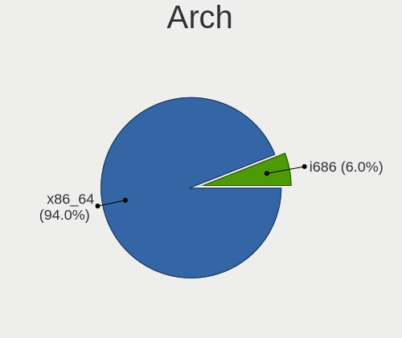
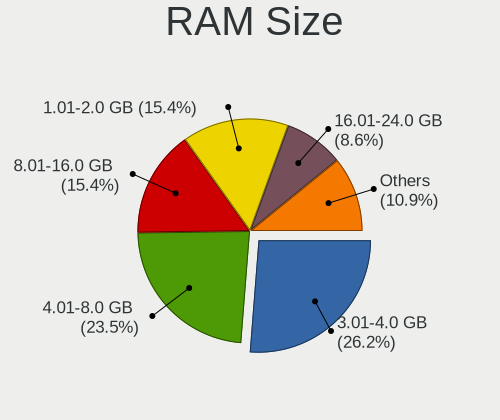
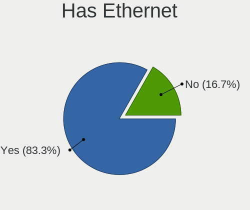
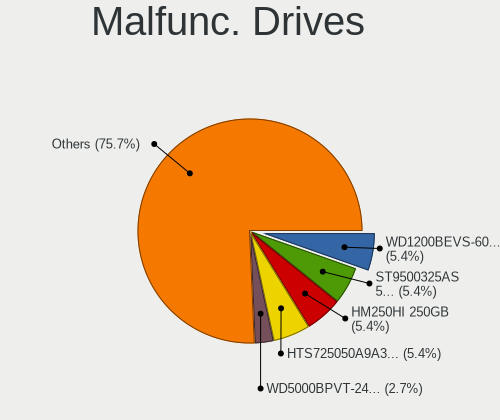
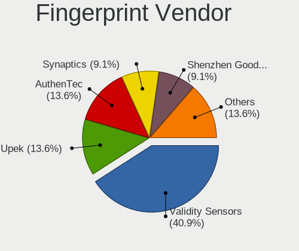
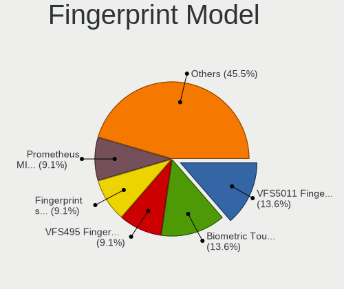

Linux in Venezuela - Tested Hardware & Statistics (Notebooks)
-------------------------------------------------------------

A project to collect tested hardware configurations for Linux in Venezuela.

Anyone can contribute to this report by the [hw-probe](https://github.com/linuxhw/hw-probe) tool:

    sudo -E hw-probe -all -upload

Please contribute! Especially if your hardware is rare.

Contents
--------

* [ Test Cases ](#test-cases)

* [ System ](#system)
  - [ OS                       ](#os)
  - [ OS Family                ](#os-family)
  - [ Kernel                   ](#kernel)
  - [ Kernel Family            ](#kernel-family)
  - [ Kernel Major Ver.        ](#kernel-major-ver)
  - [ Arch                     ](#arch)
  - [ DE                       ](#de)
  - [ Display Server           ](#display-server)
  - [ Display Manager          ](#display-manager)
  - [ OS Lang                  ](#os-lang)
  - [ Boot Mode                ](#boot-mode)
  - [ Filesystem               ](#filesystem)
  - [ Part. scheme             ](#part-scheme)
  - [ Dual Boot with Linux/BSD ](#dual-boot-with-linuxbsd)
  - [ Dual Boot (Win)          ](#dual-boot-win)

* [ Board ](#board)
  - [ Vendor                   ](#vendor)
  - [ Model                    ](#model)
  - [ Model Family             ](#model-family)
  - [ MFG Year                 ](#mfg-year)
  - [ Form Factor              ](#form-factor)
  - [ Secure Boot              ](#secure-boot)
  - [ Coreboot                 ](#coreboot)
  - [ RAM Size                 ](#ram-size)
  - [ RAM Used                 ](#ram-used)
  - [ Total Drives             ](#total-drives)
  - [ Has CD-ROM               ](#has-cd-rom)
  - [ Has Ethernet             ](#has-ethernet)
  - [ Has WiFi                 ](#has-wifi)
  - [ Has Bluetooth            ](#has-bluetooth)

* [ Location ](#location)
  - [ Country                  ](#country)
  - [ City                     ](#city)

* [ Drives ](#drives)
  - [ Drive Vendor             ](#drive-vendor)
  - [ Drive Model              ](#drive-model)
  - [ HDD Vendor               ](#hdd-vendor)
  - [ SSD Vendor               ](#ssd-vendor)
  - [ Drive Kind               ](#drive-kind)
  - [ Drive Connector          ](#drive-connector)
  - [ Drive Size               ](#drive-size)
  - [ Space Total              ](#space-total)
  - [ Space Used               ](#space-used)
  - [ Malfunc. Drives          ](#malfunc-drives)
  - [ Malfunc. Drive Vendor    ](#malfunc-drive-vendor)
  - [ Malfunc. HDD Vendor      ](#malfunc-hdd-vendor)
  - [ Malfunc. Drive Kind      ](#malfunc-drive-kind)
  - [ Failed Drives            ](#failed-drives)
  - [ Failed Drive Vendor      ](#failed-drive-vendor)
  - [ Drive Status             ](#drive-status)

* [ Storage controller ](#storage-controller)
  - [ Storage Vendor           ](#storage-vendor)
  - [ Storage Model            ](#storage-model)
  - [ Storage Kind             ](#storage-kind)

* [ Processor ](#processor)
  - [ CPU Vendor               ](#cpu-vendor)
  - [ CPU Model                ](#cpu-model)
  - [ CPU Model Family         ](#cpu-model-family)
  - [ CPU Cores                ](#cpu-cores)
  - [ CPU Sockets              ](#cpu-sockets)
  - [ CPU Threads              ](#cpu-threads)
  - [ CPU Op-Modes             ](#cpu-op-modes)
  - [ CPU Microcode            ](#cpu-microcode)
  - [ CPU Microarch            ](#cpu-microarch)

* [ Graphics ](#graphics)
  - [ GPU Vendor               ](#gpu-vendor)
  - [ GPU Model                ](#gpu-model)
  - [ GPU Combo                ](#gpu-combo)
  - [ GPU Driver               ](#gpu-driver)
  - [ GPU Memory               ](#gpu-memory)

* [ Monitor ](#monitor)
  - [ Monitor Vendor           ](#monitor-vendor)
  - [ Monitor Model            ](#monitor-model)
  - [ Monitor Resolution       ](#monitor-resolution)
  - [ Monitor Diagonal         ](#monitor-diagonal)
  - [ Monitor Width            ](#monitor-width)
  - [ Aspect Ratio             ](#aspect-ratio)
  - [ Monitor Area             ](#monitor-area)
  - [ Pixel Density            ](#pixel-density)
  - [ Multiple Monitors        ](#multiple-monitors)

* [ Network ](#network)
  - [ Net Controller Vendor    ](#net-controller-vendor)
  - [ Net Controller Model     ](#net-controller-model)
  - [ Wireless Vendor          ](#wireless-vendor)
  - [ Wireless Model           ](#wireless-model)
  - [ Ethernet Vendor          ](#ethernet-vendor)
  - [ Ethernet Model           ](#ethernet-model)
  - [ Net Controller Kind      ](#net-controller-kind)
  - [ Used Controller          ](#used-controller)
  - [ NICs                     ](#nics)
  - [ IPv6                     ](#ipv6)

* [ Bluetooth ](#bluetooth)
  - [ Bluetooth Vendor         ](#bluetooth-vendor)
  - [ Bluetooth Model          ](#bluetooth-model)

* [ Sound ](#sound)
  - [ Sound Vendor             ](#sound-vendor)
  - [ Sound Model              ](#sound-model)

* [ Memory ](#memory)
  - [ Memory Vendor            ](#memory-vendor)
  - [ Memory Model             ](#memory-model)
  - [ Memory Kind              ](#memory-kind)
  - [ Memory Form Factor       ](#memory-form-factor)
  - [ Memory Size              ](#memory-size)
  - [ Memory Speed             ](#memory-speed)

* [ Printers & scanners ](#printers--scanners)
  - [ Printer Vendor           ](#printer-vendor)
  - [ Printer Model            ](#printer-model)
  - [ Scanner Vendor           ](#scanner-vendor)
  - [ Scanner Model            ](#scanner-model)

* [ Camera ](#camera)
  - [ Camera Vendor            ](#camera-vendor)
  - [ Camera Model             ](#camera-model)

* [ Security ](#security)
  - [ Fingerprint Vendor       ](#fingerprint-vendor)
  - [ Fingerprint Model        ](#fingerprint-model)
  - [ Chipcard Vendor          ](#chipcard-vendor)
  - [ Chipcard Model           ](#chipcard-model)

* [ Unsupported ](#unsupported)
  - [ Unsupported Devices      ](#unsupported-devices)
  - [ Unsupported Device Types ](#unsupported-device-types)

Test Cases
----------

Total: 146

| Vendor        | Model                       | Probe                                                      | Date         |
|---------------|-----------------------------|------------------------------------------------------------|--------------|
| VIT           | P2402                       | [fd1ab8ad90](https://linux-hardware.org/?probe=fd1ab8ad90) | Aug 01, 2022 |
| HP            | ProBook 440 G1              | [a0ebe8cf5a](https://linux-hardware.org/?probe=a0ebe8cf5a) | Jul 20, 2022 |
| Lenovo        | IdeaPad 1 14IGL05 81VU      | [e3a3e1cac2](https://linux-hardware.org/?probe=e3a3e1cac2) | Jul 13, 2022 |
| Lenovo        | IdeaPad 1 14IGL05 81VU      | [9e604c2dcc](https://linux-hardware.org/?probe=9e604c2dcc) | Jul 12, 2022 |
| ASUSTek       | VivoBook 14_ASUS Laptop ... | [b846c98a96](https://linux-hardware.org/?probe=b846c98a96) | Jul 08, 2022 |
| ASUSTek       | ASUS TUF Dash F15 FX516P... | [dee20b535f](https://linux-hardware.org/?probe=dee20b535f) | Jul 04, 2022 |
| ASUSTek       | ASUS TUF Gaming F17 FX70... | [eef50332e8](https://linux-hardware.org/?probe=eef50332e8) | Jul 02, 2022 |
| HP            | EliteBook 840 G3            | [d7282a0f61](https://linux-hardware.org/?probe=d7282a0f61) | Jun 29, 2022 |
| HP            | EliteBook 840 G3            | [e4dd9b130e](https://linux-hardware.org/?probe=e4dd9b130e) | Jun 29, 2022 |
| Dell          | Inspiron 5502               | [c3e90d4ebd](https://linux-hardware.org/?probe=c3e90d4ebd) | Jun 26, 2022 |
| Google        | Cyan                        | [7b82520717](https://linux-hardware.org/?probe=7b82520717) | Jun 13, 2022 |
| VIT           | M2420                       | [8152d4c61b](https://linux-hardware.org/?probe=8152d4c61b) | Jun 08, 2022 |
| VIT           | M2420                       | [d09de8cbd7](https://linux-hardware.org/?probe=d09de8cbd7) | Jun 07, 2022 |
| VIT           | M2420                       | [c2ea650175](https://linux-hardware.org/?probe=c2ea650175) | Jun 01, 2022 |
| Dell          | Precision 7710              | [befe390051](https://linux-hardware.org/?probe=befe390051) | May 28, 2022 |
| Acer          | TravelMate 5742Z            | [fd6407ece1](https://linux-hardware.org/?probe=fd6407ece1) | May 26, 2022 |
| Dell          | Inspiron 5520               | [0e7bf88677](https://linux-hardware.org/?probe=0e7bf88677) | May 19, 2022 |
| Dell          | XPS 15 7590                 | [8dc1b9cd87](https://linux-hardware.org/?probe=8dc1b9cd87) | May 14, 2022 |
| Unknown       | Unknown                     | [ff32f84c4e](https://linux-hardware.org/?probe=ff32f84c4e) | Apr 23, 2022 |
| Dell          | Inspiron 1545               | [8869defd9c](https://linux-hardware.org/?probe=8869defd9c) | Apr 22, 2022 |
| ASUSTek       | ASUS TUF Dash F15 FX516P... | [8510a8836c](https://linux-hardware.org/?probe=8510a8836c) | Apr 18, 2022 |
| ASUSTek       | ASUS TUF Dash F15 FX516P... | [6c3ed980a1](https://linux-hardware.org/?probe=6c3ed980a1) | Apr 18, 2022 |
| Clevo         | W54xEU                      | [cb4036a7dc](https://linux-hardware.org/?probe=cb4036a7dc) | Apr 18, 2022 |
| Dell          | Latitude 5590               | [ade3f33fb9](https://linux-hardware.org/?probe=ade3f33fb9) | Apr 16, 2022 |
| HP            | Pavilion dv5                | [22aa828b2f](https://linux-hardware.org/?probe=22aa828b2f) | Apr 16, 2022 |
| HP            | Compaq Presario C700        | [4f723964d5](https://linux-hardware.org/?probe=4f723964d5) | Apr 15, 2022 |
| Clevo         | W54xEU                      | [0a8ddf1dff](https://linux-hardware.org/?probe=0a8ddf1dff) | Apr 14, 2022 |
| Lenovo        | IdeaPad 330-15ARR 81D2      | [3f66b1cb5c](https://linux-hardware.org/?probe=3f66b1cb5c) | Apr 13, 2022 |
| Dell          | Latitude 5590               | [1638db9ad7](https://linux-hardware.org/?probe=1638db9ad7) | Apr 13, 2022 |
| HP            | EliteBook 840 G3            | [659999d04a](https://linux-hardware.org/?probe=659999d04a) | Apr 11, 2022 |
| HP            | EliteBook 840 G3            | [227c3936b8](https://linux-hardware.org/?probe=227c3936b8) | Apr 09, 2022 |
| Dell          | Vostro 5402                 | [6cb82accd9](https://linux-hardware.org/?probe=6cb82accd9) | Apr 07, 2022 |
| Gateway       | NV57H                       | [ce2e78a407](https://linux-hardware.org/?probe=ce2e78a407) | Mar 31, 2022 |
| HP            | Laptop 15-ef2xxx            | [a245ae2e74](https://linux-hardware.org/?probe=a245ae2e74) | Mar 29, 2022 |
| VIT           | P2402                       | [5d9e3733ea](https://linux-hardware.org/?probe=5d9e3733ea) | Mar 21, 2022 |
| Dell          | Inspiron 5502               | [3dcc73772f](https://linux-hardware.org/?probe=3dcc73772f) | Mar 12, 2022 |
| Lenovo        | IdeaPad 5 14ALC05 82LM      | [5fa0d18666](https://linux-hardware.org/?probe=5fa0d18666) | Mar 04, 2022 |
| VIT           | P3400                       | [6075d8d8b2](https://linux-hardware.org/?probe=6075d8d8b2) | Feb 28, 2022 |
| VIT           | P3400                       | [b90c32748d](https://linux-hardware.org/?probe=b90c32748d) | Feb 18, 2022 |
| Lenovo        | ThinkPad X201 3680AE2       | [cb777c91bc](https://linux-hardware.org/?probe=cb777c91bc) | Feb 13, 2022 |
| HP            | Pavilion dv6500             | [16dbcf63f1](https://linux-hardware.org/?probe=16dbcf63f1) | Feb 12, 2022 |
| Gateway       | NV57H                       | [9d59228f90](https://linux-hardware.org/?probe=9d59228f90) | Feb 09, 2022 |
| Samsung       | 355V4C/356V4C/3445VC/354... | [ac9ed3224d](https://linux-hardware.org/?probe=ac9ed3224d) | Feb 01, 2022 |
| MSI           | MS-1454                     | [1cb9a056e7](https://linux-hardware.org/?probe=1cb9a056e7) | Jan 14, 2022 |
| VIT           | M2421                       | [c6cc8a474d](https://linux-hardware.org/?probe=c6cc8a474d) | Jan 10, 2022 |
| UNIQCELL      | Q15.6                       | [d21e7048e1](https://linux-hardware.org/?probe=d21e7048e1) | Dec 20, 2021 |
| GPU Compan... | GWTN156-11                  | [3700827ecd](https://linux-hardware.org/?probe=3700827ecd) | Dec 19, 2021 |
| AVITA         | NS14A1US                    | [e20bf09217](https://linux-hardware.org/?probe=e20bf09217) | Dec 16, 2021 |
| Intel         | powered classmate PC        | [0585f5b715](https://linux-hardware.org/?probe=0585f5b715) | Dec 12, 2021 |
| Intel         | powered classmate PC        | [9416f348e4](https://linux-hardware.org/?probe=9416f348e4) | Dec 12, 2021 |
| Lenovo        | B40-70 20392                | [4f4458d61a](https://linux-hardware.org/?probe=4f4458d61a) | Nov 23, 2021 |
| HP            | Pavilion dv6                | [2f83ccbc4f](https://linux-hardware.org/?probe=2f83ccbc4f) | Nov 21, 2021 |
| HP            | Pavilion dv6                | [a492e3e1ff](https://linux-hardware.org/?probe=a492e3e1ff) | Nov 21, 2021 |
| Unknown       | Unknown                     | [381b31199f](https://linux-hardware.org/?probe=381b31199f) | Nov 18, 2021 |
| Dell          | Inspiron 14-3467            | [ebe54808c2](https://linux-hardware.org/?probe=ebe54808c2) | Nov 13, 2021 |
| ASUSTek       | VivoBook_ASUS Laptop X50... | [b37e3324e3](https://linux-hardware.org/?probe=b37e3324e3) | Nov 05, 2021 |
| VIT           | P3400                       | [58cc91aba3](https://linux-hardware.org/?probe=58cc91aba3) | Oct 30, 2021 |
| Lenovo        | G570 4334                   | [d1d57448c4](https://linux-hardware.org/?probe=d1d57448c4) | Oct 29, 2021 |
| Lenovo        | G570 4334                   | [f5112dbf47](https://linux-hardware.org/?probe=f5112dbf47) | Oct 29, 2021 |
| Dell          | Latitude E7450              | [9cbd7f01e8](https://linux-hardware.org/?probe=9cbd7f01e8) | Oct 18, 2021 |
| Dell          | Latitude E6420              | [027441e6d4](https://linux-hardware.org/?probe=027441e6d4) | Oct 18, 2021 |
| Lenovo        | IdeaPad 3 15IIL05 81WE      | [e5391d41e0](https://linux-hardware.org/?probe=e5391d41e0) | Oct 14, 2021 |
| Lenovo        | IdeaPad 3 15IIL05 81WE      | [3f6e406107](https://linux-hardware.org/?probe=3f6e406107) | Oct 14, 2021 |
| ASUSTek       | X555DA                      | [903dc4ef05](https://linux-hardware.org/?probe=903dc4ef05) | Oct 13, 2021 |
| Clevo         | W54xEU                      | [a6732ab721](https://linux-hardware.org/?probe=a6732ab721) | Sep 30, 2021 |
| VIT           | P3400                       | [22260810d1](https://linux-hardware.org/?probe=22260810d1) | Sep 27, 2021 |
| ASUSTek       | TUF Gaming FA506IH_FA506... | [5854fbcaed](https://linux-hardware.org/?probe=5854fbcaed) | Sep 17, 2021 |
| Pegatron      | T14AF                       | [46067ec02a](https://linux-hardware.org/?probe=46067ec02a) | Sep 07, 2021 |
| Lenovo        | ThinkPad Edge 01962AS       | [8ccb24d0d8](https://linux-hardware.org/?probe=8ccb24d0d8) | Aug 24, 2021 |
| VIT           | P2400                       | [f844ffff09](https://linux-hardware.org/?probe=f844ffff09) | Aug 11, 2021 |
| Acer          | Aspire VX5-591G             | [c726cd767b](https://linux-hardware.org/?probe=c726cd767b) | Jul 19, 2021 |
| ASUSTek       | VivoBook_ASUS Laptop X50... | [c468ca84d3](https://linux-hardware.org/?probe=c468ca84d3) | Jun 30, 2021 |
| HP            | Pavilion dv6700             | [93c6a703a7](https://linux-hardware.org/?probe=93c6a703a7) | Jun 27, 2021 |
| HP            | Pavilion dv6700             | [f7e407b14c](https://linux-hardware.org/?probe=f7e407b14c) | Jun 27, 2021 |
| Samsung       | 355V4C/356V4C/3445VC/354... | [fc58981ecd](https://linux-hardware.org/?probe=fc58981ecd) | Jun 27, 2021 |
| Samsung       | 355V4C/356V4C/3445VC/354... | [bce9c74edb](https://linux-hardware.org/?probe=bce9c74edb) | Jun 27, 2021 |
| VIT           | P2400                       | [295d4d5a47](https://linux-hardware.org/?probe=295d4d5a47) | Jun 17, 2021 |
| VIT           | P1400                       | [129d543695](https://linux-hardware.org/?probe=129d543695) | Jun 13, 2021 |
| ASUSTek       | VivoBook_ASUS Laptop X50... | [423b514d2b](https://linux-hardware.org/?probe=423b514d2b) | May 30, 2021 |
| VIT           | P2400                       | [f39537fca1](https://linux-hardware.org/?probe=f39537fca1) | May 28, 2021 |
| Lenovo        | ThinkPad E560 20EV002FUS    | [0f12ef1983](https://linux-hardware.org/?probe=0f12ef1983) | May 25, 2021 |
| VIT           | P2400                       | [4fa6d109de](https://linux-hardware.org/?probe=4fa6d109de) | May 25, 2021 |
| Sony          | VGN-FW510F                  | [1a9761824e](https://linux-hardware.org/?probe=1a9761824e) | May 20, 2021 |
| Intel         | powered classmate PC        | [a3b0d4e33e](https://linux-hardware.org/?probe=a3b0d4e33e) | May 12, 2021 |
| Lenovo        | G570 4334                   | [f16304ca03](https://linux-hardware.org/?probe=f16304ca03) | May 04, 2021 |
| Lenovo        | G570 4334                   | [8eca6b6f79](https://linux-hardware.org/?probe=8eca6b6f79) | May 04, 2021 |
| Lenovo        | G570 4334                   | [bef0f33897](https://linux-hardware.org/?probe=bef0f33897) | May 02, 2021 |
| Acer          | Aspire 4935                 | [cbe6a288f1](https://linux-hardware.org/?probe=cbe6a288f1) | Apr 06, 2021 |
| Toshiba       | Satellite E55t-A            | [e1a3602d7b](https://linux-hardware.org/?probe=e1a3602d7b) | Mar 28, 2021 |
| Dell          | Vostro 1500                 | [76ade477e8](https://linux-hardware.org/?probe=76ade477e8) | Mar 28, 2021 |
| ASUSTek       | X555DA                      | [28996604f4](https://linux-hardware.org/?probe=28996604f4) | Mar 27, 2021 |
| ASUSTek       | X555DA                      | [e90c94fd9d](https://linux-hardware.org/?probe=e90c94fd9d) | Mar 27, 2021 |
| Dell          | Inspiron 5437               | [918f841c61](https://linux-hardware.org/?probe=918f841c61) | Mar 12, 2021 |
| HP            | 2000                        | [736561e497](https://linux-hardware.org/?probe=736561e497) | Mar 07, 2021 |
| Dell          | Inspiron 5437               | [4883c81a02](https://linux-hardware.org/?probe=4883c81a02) | Feb 07, 2021 |
| AVITA         | NS14A1US                    | [63ab85aac6](https://linux-hardware.org/?probe=63ab85aac6) | Feb 05, 2021 |
| Dell          | Inspiron 1018               | [570fb5f20b](https://linux-hardware.org/?probe=570fb5f20b) | Jan 27, 2021 |
| Dell          | Inspiron 1018               | [b481e5f8d2](https://linux-hardware.org/?probe=b481e5f8d2) | Jan 27, 2021 |
| Dell          | Inspiron 3180               | [4b05b65d0e](https://linux-hardware.org/?probe=4b05b65d0e) | Dec 16, 2020 |
| Dell          | Inspiron 3180               | [0bc140f6f6](https://linux-hardware.org/?probe=0bc140f6f6) | Dec 16, 2020 |
| HP            | Pavilion dv6000 (RV216UA... | [d07adf47aa](https://linux-hardware.org/?probe=d07adf47aa) | Nov 11, 2020 |
| HP            | Pavilion dv6000 (RV216UA... | [1d1e7e6236](https://linux-hardware.org/?probe=1d1e7e6236) | Nov 07, 2020 |
| Dell          | Inspiron 1545               | [31fa456854](https://linux-hardware.org/?probe=31fa456854) | Nov 07, 2020 |
| Exo           | AIO A210                    | [2082cc5386](https://linux-hardware.org/?probe=2082cc5386) | Nov 02, 2020 |
| Lenovo        | IdeaPad S110 20126          | [c172177266](https://linux-hardware.org/?probe=c172177266) | Oct 31, 2020 |
| ASUSTek       | X553MA                      | [8de08ff7ac](https://linux-hardware.org/?probe=8de08ff7ac) | Oct 24, 2020 |
| ASUSTek       | X553MA                      | [46849fa419](https://linux-hardware.org/?probe=46849fa419) | Oct 24, 2020 |
| Dell          | Inspiron 5437               | [0fa1b76517](https://linux-hardware.org/?probe=0fa1b76517) | Oct 15, 2020 |
| Lenovo        | G460 20041                  | [6944572eca](https://linux-hardware.org/?probe=6944572eca) | Oct 02, 2020 |
| Lenovo        | G460 20041                  | [1f4ffcafa7](https://linux-hardware.org/?probe=1f4ffcafa7) | Oct 02, 2020 |
| Dell          | Inspiron 5570               | [0d9041893c](https://linux-hardware.org/?probe=0d9041893c) | Sep 15, 2020 |
| Unknown       | Unknown                     | [922d1c2533](https://linux-hardware.org/?probe=922d1c2533) | Sep 11, 2020 |
| Unknown       | Unknown                     | [f56d6dcffd](https://linux-hardware.org/?probe=f56d6dcffd) | Sep 11, 2020 |
| HP            | Presario V2000 (EW997LA#... | [77a2a0c00f](https://linux-hardware.org/?probe=77a2a0c00f) | Aug 15, 2020 |
| Alienware     | 17 R4                       | [c1a871b29b](https://linux-hardware.org/?probe=c1a871b29b) | Aug 14, 2020 |
| VIT           | M2421                       | [451969e0fc](https://linux-hardware.org/?probe=451969e0fc) | Jul 27, 2020 |
| Intel         | powered classmate PC        | [1ffa275c8b](https://linux-hardware.org/?probe=1ffa275c8b) | Jul 12, 2020 |
| Intel         | powered classmate PC        | [49442bdbca](https://linux-hardware.org/?probe=49442bdbca) | Jul 11, 2020 |
| HP            | Presario C700               | [6b50a4fad1](https://linux-hardware.org/?probe=6b50a4fad1) | Jun 26, 2020 |
| Unknown       | Unknown                     | [e8a608f296](https://linux-hardware.org/?probe=e8a608f296) | May 23, 2020 |
| VIT           | P3400                       | [48c981187d](https://linux-hardware.org/?probe=48c981187d) | May 18, 2020 |
| VIT           | P3400                       | [f9be2de38c](https://linux-hardware.org/?probe=f9be2de38c) | May 14, 2020 |
| HP            | Pavilion dv4                | [2efd349a3f](https://linux-hardware.org/?probe=2efd349a3f) | May 13, 2020 |
| VIT           | P2402                       | [bacbeb66bd](https://linux-hardware.org/?probe=bacbeb66bd) | May 07, 2020 |
| VIT           | P3400                       | [cd75b7e2c3](https://linux-hardware.org/?probe=cd75b7e2c3) | Apr 24, 2020 |
| VIT           | P2400                       | [4acb382140](https://linux-hardware.org/?probe=4acb382140) | Apr 23, 2020 |
| VIT           | M2420                       | [a7535d12dc](https://linux-hardware.org/?probe=a7535d12dc) | Apr 13, 2020 |
| Lenovo        | ThinkPad SL400 2743A48      | [ebbf8f7b4e](https://linux-hardware.org/?probe=ebbf8f7b4e) | Mar 20, 2020 |
| Lenovo        | ThinkPad SL400 2743A48      | [e39e92a6f9](https://linux-hardware.org/?probe=e39e92a6f9) | Mar 20, 2020 |
| Lenovo        | ThinkPad SL400 2743A48      | [b9d2e7e174](https://linux-hardware.org/?probe=b9d2e7e174) | Mar 20, 2020 |
| VIT           | P2402                       | [9f90b82033](https://linux-hardware.org/?probe=9f90b82033) | Mar 10, 2020 |
| VIT           | P2402                       | [ea6b959930](https://linux-hardware.org/?probe=ea6b959930) | Mar 03, 2020 |
| Lenovo        | Z50-75 80EC                 | [79f0a68dd3](https://linux-hardware.org/?probe=79f0a68dd3) | Feb 26, 2020 |
| Lenovo        | IdeaPad S100c 20194         | [d1a4bff183](https://linux-hardware.org/?probe=d1a4bff183) | Feb 15, 2020 |
| Dell          | Inspiron 3421               | [17f334232d](https://linux-hardware.org/?probe=17f334232d) | Jan 01, 2020 |
| Intel         | powered classmate PC        | [b772cf9349](https://linux-hardware.org/?probe=b772cf9349) | Dec 11, 2019 |
| Intel         | powered classmate PC        | [b66f15db35](https://linux-hardware.org/?probe=b66f15db35) | Dec 11, 2019 |
| Lenovo        | IdeaPad S100c 20194         | [7c2893dba4](https://linux-hardware.org/?probe=7c2893dba4) | Nov 15, 2019 |
| Lenovo        | IdeaPad S100c 20194         | [530c41513b](https://linux-hardware.org/?probe=530c41513b) | Sep 20, 2019 |
| Lenovo        | G480 20150                  | [1b7e674c82](https://linux-hardware.org/?probe=1b7e674c82) | May 08, 2019 |
| Lenovo        | G480 20150                  | [99198fbcfa](https://linux-hardware.org/?probe=99198fbcfa) | May 08, 2019 |
| HP            | Pavilion dv4                | [e59414c439](https://linux-hardware.org/?probe=e59414c439) | Apr 11, 2019 |
| Intel         | powered classmate PC        | [405f76133d](https://linux-hardware.org/?probe=405f76133d) | Oct 11, 2017 |
| Intel         | powered classmate PC        | [e79ec0466f](https://linux-hardware.org/?probe=e79ec0466f) | Oct 01, 2017 |
| Lenovo        | 3000 N200 0769ARS           | [1ada6660c3](https://linux-hardware.org/?probe=1ada6660c3) | Aug 15, 2017 |
| Lenovo        | 3000 N200 0769ARS           | [5548cd964f](https://linux-hardware.org/?probe=5548cd964f) | Jul 28, 2017 |

System
------

OS
--

Installed operating systems

| Name                         | Notebooks | Percent |
|------------------------------|-----------|---------|
| Ubuntu 20.04                 | 9         | 8.74%   |
| Debian 11                    | 7         | 6.8%    |
| Debian 10                    | 6         | 5.83%   |
| Ubuntu 18.04                 | 5         | 4.85%   |
| OpenMandriva 4.3             | 5         | 4.85%   |
| Kubuntu 20.04                | 4         | 3.88%   |
| KDE neon 20.04               | 4         | 3.88%   |
| Xubuntu 18.04                | 3         | 2.91%   |
| ROSA R9                      | 3         | 2.91%   |
| OpenMandriva 4.2             | 3         | 2.91%   |
| Zorin 16                     | 2         | 1.94%   |
| Zorin 15                     | 2         | 1.94%   |
| Ubuntu 22.04                 | 2         | 1.94%   |
| Ubuntu 21.10                 | 2         | 1.94%   |
| Ubuntu 19.10                 | 2         | 1.94%   |
| Ubuntu 16.04                 | 2         | 1.94%   |
| Pop!_OS 22.04                | 2         | 1.94%   |
| Pop!_OS 21.04                | 2         | 1.94%   |
| Manjaro                      | 2         | 1.94%   |
| Linux Mint 20.3              | 2         | 1.94%   |
| Linux Mint 20                | 2         | 1.94%   |
| Fedora 36                    | 2         | 1.94%   |
| Fedora 35                    | 2         | 1.94%   |
| Xubuntu 21.10                | 1         | 0.97%   |
| Xubuntu 20.04                | 1         | 0.97%   |
| Ubuntu MATE 20.04            | 1         | 0.97%   |
| Ubuntu MATE 19.10            | 1         | 0.97%   |
| Solus 4.1                    | 1         | 0.97%   |
| ROSA R11                     | 1         | 0.97%   |
| Q4OS 4                       | 1         | 0.97%   |
| openSUSE Tumbleweed-XXXXXXXX | 1         | 0.97%   |
| OpenMandriva 4.50            | 1         | 0.97%   |
| MX 20                        | 1         | 0.97%   |
| Manjaro 21.2.0               | 1         | 0.97%   |
| Manjaro 21.1.0               | 1         | 0.97%   |
| Manjaro 21.0                 | 1         | 0.97%   |
| Manjaro 20.1                 | 1         | 0.97%   |
| Lubuntu 18.04                | 1         | 0.97%   |
| LMDE 4                       | 1         | 0.97%   |
| Linux Mint 19.3              | 1         | 0.97%   |
| Linux Lite 5.6               | 1         | 0.97%   |
| KDE neon 18.04               | 1         | 0.97%   |
| Garuda Linux Soaring         | 1         | 0.97%   |
| Feren OS 18.04               | 1         | 0.97%   |
| Fedora 34                    | 1         | 0.97%   |
| Fedora 33                    | 1         | 0.97%   |
| Deepin                       | 1         | 0.97%   |
| ArcoLinux Rolling            | 1         | 0.97%   |
| Arch                         | 1         | 0.97%   |
| Alpine 3.13.0_alpha20200917  | 1         | 0.97%   |
| AlmaLinux 8.5                | 1         | 0.97%   |

OS Family
---------

OS without a version

| Name         | Notebooks | Percent |
|--------------|-----------|---------|
| Ubuntu       | 21        | 21%     |
| Debian       | 12        | 12%     |
| OpenMandriva | 9         | 9%      |
| Manjaro      | 6         | 6%      |
| Xubuntu      | 5         | 5%      |
| Linux Mint   | 5         | 5%      |
| KDE neon     | 5         | 5%      |
| Fedora       | 5         | 5%      |
| Zorin        | 4         | 4%      |
| ROSA         | 4         | 4%      |
| Pop!_OS      | 4         | 4%      |
| Kubuntu      | 4         | 4%      |
| Ubuntu MATE  | 2         | 2%      |
| Solus        | 1         | 1%      |
| Q4OS         | 1         | 1%      |
| openSUSE     | 1         | 1%      |
| MX           | 1         | 1%      |
| Lubuntu      | 1         | 1%      |
| LMDE         | 1         | 1%      |
| Linux Lite   | 1         | 1%      |
| Garuda Linux | 1         | 1%      |
| Feren OS     | 1         | 1%      |
| Deepin       | 1         | 1%      |
| ArcoLinux    | 1         | 1%      |
| Arch         | 1         | 1%      |
| Alpine       | 1         | 1%      |
| AlmaLinux    | 1         | 1%      |

Kernel
------

Version of the Linux kernel

| Version                                  | Notebooks | Percent |
|------------------------------------------|-----------|---------|
| 5.16.7-desktop-1omv4003                  | 5         | 4.35%   |
| 5.4.0-42-generic                         | 4         | 3.48%   |
| 5.4.0-73-generic                         | 3         | 2.61%   |
| 5.4.0-52-generic                         | 3         | 2.61%   |
| 5.3.0-40-generic                         | 3         | 2.61%   |
| 5.13.0-39-generic                        | 3         | 2.61%   |
| 5.10.14-desktop-1omv4002                 | 3         | 2.61%   |
| 5.10.0-13-amd64                          | 3         | 2.61%   |
| 4.9.20-nrj-desktop-1rosa-x86_64          | 3         | 2.61%   |
| 4.19.0-17-amd64                          | 3         | 2.61%   |
| 5.4.0-89-generic                         | 2         | 1.74%   |
| 5.4.0-77-generic                         | 2         | 1.74%   |
| 5.4.0-48-generic                         | 2         | 1.74%   |
| 5.4.0-107-generic                        | 2         | 1.74%   |
| 5.11.0-37-generic                        | 2         | 1.74%   |
| 5.10.0-15-amd64                          | 2         | 1.74%   |
| 5.10.0-11-amd64                          | 2         | 1.74%   |
| 5.0.0-37-generic                         | 2         | 1.74%   |
| 5.9.0-5-amd64                            | 1         | 0.87%   |
| 5.8.6-1-MANJARO                          | 1         | 0.87%   |
| 5.8.0-53-generic                         | 1         | 0.87%   |
| 5.8.0-45-generic                         | 1         | 0.87%   |
| 5.8.0-44-generic                         | 1         | 0.87%   |
| 5.8.0-41-generic                         | 1         | 0.87%   |
| 5.6.6-1-default                          | 1         | 0.87%   |
| 5.6.18-155.current                       | 1         | 0.87%   |
| 5.5.4-linux-xanmod-1-rosa-x86_64-xanmod3 | 1         | 0.87%   |
| 5.4.83-0-lts                             | 1         | 0.87%   |
| 5.4.105-1-MANJARO                        | 1         | 0.87%   |
| 5.4.0-91-generic                         | 1         | 0.87%   |
| 5.4.0-86-generic                         | 1         | 0.87%   |
| 5.4.0-70-generic                         | 1         | 0.87%   |
| 5.4.0-31-generic                         | 1         | 0.87%   |
| 5.3.0-42-generic                         | 1         | 0.87%   |
| 5.3.0-29-generic                         | 1         | 0.87%   |
| 5.17.2-xanmod1                           | 1         | 0.87%   |
| 5.17.15-76051715-generic                 | 1         | 0.87%   |
| 5.17.12-300.fc36.x86_64                  | 1         | 0.87%   |
| 5.17.11-300.fc36.x86_64                  | 1         | 0.87%   |
| 5.15.8-200.fc35.x86_64                   | 1         | 0.87%   |
| 5.15.6-2-MANJARO                         | 1         | 0.87%   |
| 5.15.28-1-MANJARO                        | 1         | 0.87%   |
| 5.15.2-2-MANJARO                         | 1         | 0.87%   |
| 5.15.19-1-MANJARO                        | 1         | 0.87%   |
| 5.15.13-xanmod1                          | 1         | 0.87%   |
| 5.15.10-zen1-1-zen                       | 1         | 0.87%   |
| 5.15.0-41-generic                        | 1         | 0.87%   |
| 5.15.0-40-generic                        | 1         | 0.87%   |
| 5.15.0-33-generic                        | 1         | 0.87%   |
| 5.14.10-300.fc35.x86_64                  | 1         | 0.87%   |
| 5.14.10-200.fc34.x86_64                  | 1         | 0.87%   |
| 5.13.13-arch1-1                          | 1         | 0.87%   |
| 5.13.0-51-generic                        | 1         | 0.87%   |
| 5.13.0-48-generic                        | 1         | 0.87%   |
| 5.13.0-41-generic                        | 1         | 0.87%   |
| 5.13.0-37-generic                        | 1         | 0.87%   |
| 5.13.0-30-generic                        | 1         | 0.87%   |
| 5.13.0-28-generic                        | 1         | 0.87%   |
| 5.13.0-19-generic                        | 1         | 0.87%   |
| 5.12.4-desktop-1omv4050                  | 1         | 0.87%   |

Kernel Family
-------------

Linux kernel without a distro release

| Version | Notebooks | Percent |
|---------|-----------|---------|
| 5.4.0   | 20        | 18.87%  |
| 5.13.0  | 10        | 9.43%   |
| 4.19.0  | 8         | 7.55%   |
| 5.10.0  | 7         | 6.6%    |
| 5.11.0  | 6         | 5.66%   |
| 5.3.0   | 5         | 4.72%   |
| 5.16.7  | 5         | 4.72%   |
| 4.15.0  | 4         | 3.77%   |
| 5.8.0   | 3         | 2.83%   |
| 5.15.0  | 3         | 2.83%   |
| 5.10.14 | 3         | 2.83%   |
| 4.9.20  | 3         | 2.83%   |
| 5.14.10 | 2         | 1.89%   |
| 5.0.0   | 2         | 1.89%   |
| 5.9.0   | 1         | 0.94%   |
| 5.8.6   | 1         | 0.94%   |
| 5.6.6   | 1         | 0.94%   |
| 5.6.18  | 1         | 0.94%   |
| 5.5.4   | 1         | 0.94%   |
| 5.4.83  | 1         | 0.94%   |
| 5.4.105 | 1         | 0.94%   |
| 5.17.2  | 1         | 0.94%   |
| 5.17.15 | 1         | 0.94%   |
| 5.17.12 | 1         | 0.94%   |
| 5.17.11 | 1         | 0.94%   |
| 5.15.8  | 1         | 0.94%   |
| 5.15.6  | 1         | 0.94%   |
| 5.15.28 | 1         | 0.94%   |
| 5.15.2  | 1         | 0.94%   |
| 5.15.19 | 1         | 0.94%   |
| 5.15.13 | 1         | 0.94%   |
| 5.15.10 | 1         | 0.94%   |
| 5.13.13 | 1         | 0.94%   |
| 5.12.4  | 1         | 0.94%   |
| 5.12.19 | 1         | 0.94%   |
| 5.10.5  | 1         | 0.94%   |
| 5.10.11 | 1         | 0.94%   |
| 5.10.10 | 1         | 0.94%   |
| 4.18.0  | 1         | 0.94%   |

Kernel Major Ver.
-----------------

Linux kernel major version

| Version | Notebooks | Percent |
|---------|-----------|---------|
| 5.4     | 22        | 20.95%  |
| 5.10    | 13        | 12.38%  |
| 5.13    | 11        | 10.48%  |
| 5.15    | 9         | 8.57%   |
| 4.19    | 8         | 7.62%   |
| 5.11    | 6         | 5.71%   |
| 5.3     | 5         | 4.76%   |
| 5.16    | 5         | 4.76%   |
| 5.8     | 4         | 3.81%   |
| 5.17    | 4         | 3.81%   |
| 4.15    | 4         | 3.81%   |
| 4.9     | 3         | 2.86%   |
| 5.6     | 2         | 1.9%    |
| 5.14    | 2         | 1.9%    |
| 5.12    | 2         | 1.9%    |
| 5.0     | 2         | 1.9%    |
| 5.9     | 1         | 0.95%   |
| 5.5     | 1         | 0.95%   |
| 4.18    | 1         | 0.95%   |

Arch
----

OS architecture (x86_64, i586, etc.)

| Name   | Notebooks | Percent |
|--------|-----------|---------|
| x86_64 | 87        | 89.69%  |
| i686   | 10        | 10.31%  |

DE
--

Desktop Environment

| Name          | Notebooks | Percent |
|---------------|-----------|---------|
| GNOME         | 33        | 32.04%  |
| KDE5          | 21        | 20.39%  |
| XFCE          | 19        | 18.45%  |
| Unknown       | 7         | 6.8%    |
| KDE           | 6         | 5.83%   |
| MATE          | 4         | 3.88%   |
| KDE4          | 3         | 2.91%   |
| X-Cinnamon    | 2         | 1.94%   |
| Unity         | 2         | 1.94%   |
| Cinnamon      | 2         | 1.94%   |
| LXQt          | 1         | 0.97%   |
| GNOME Classic | 1         | 0.97%   |
| Deepin        | 1         | 0.97%   |
| Budgie        | 1         | 0.97%   |

Display Server
--------------

X11 or Wayland

| Name    | Notebooks | Percent |
|---------|-----------|---------|
| X11     | 87        | 89.69%  |
| Wayland | 9         | 9.28%   |
| Tty     | 1         | 1.03%   |

Display Manager
---------------

SDDM, LightDM, etc.

| Name    | Notebooks | Percent |
|---------|-----------|---------|
| Unknown | 43        | 42.16%  |
| SDDM    | 17        | 16.67%  |
| GDM     | 15        | 14.71%  |
| LightDM | 13        | 12.75%  |
| GDM3    | 8         | 7.84%   |
| TDM     | 3         | 2.94%   |
| KDM     | 3         | 2.94%   |

OS Lang
-------

Language

| Lang    | Notebooks | Percent |
|---------|-----------|---------|
| es_VE   | 55        | 54.46%  |
| en_US   | 31        | 30.69%  |
| es_ES   | 8         | 7.92%   |
| Unknown | 6         | 5.94%   |
| en_CA   | 1         | 0.99%   |

Boot Mode
---------

EFI or BIOS

| Mode | Notebooks | Percent |
|------|-----------|---------|
| BIOS | 69        | 69.7%   |
| EFI  | 30        | 30.3%   |

Filesystem
----------

Type of filesystem

| Type    | Notebooks | Percent |
|---------|-----------|---------|
| Ext4    | 78        | 79.59%  |
| Overlay | 8         | 8.16%   |
| Btrfs   | 6         | 6.12%   |
| Xfs     | 3         | 3.06%   |
| Unknown | 3         | 3.06%   |

Part. scheme
------------

Scheme of partitioning

| Type    | Notebooks | Percent |
|---------|-----------|---------|
| Unknown | 54        | 53.47%  |
| MBR     | 24        | 23.76%  |
| GPT     | 23        | 22.77%  |

Dual Boot with Linux/BSD
------------------------

Hosting more than one Linux/BSD

| Dual boot | Notebooks | Percent |
|-----------|-----------|---------|
| No        | 87        | 87%     |
| Yes       | 13        | 13%     |

Dual Boot (Win)
---------------

Hosting Linux and Windows

| Dual boot | Notebooks | Percent |
|-----------|-----------|---------|
| No        | 63        | 64.29%  |
| Yes       | 35        | 35.71%  |

Board
-----

Vendor
------

Motherboard manufacturer

| Name                | Notebooks | Percent |
|---------------------|-----------|---------|
| Lenovo              | 18        | 18.56%  |
| VIT                 | 17        | 17.53%  |
| Dell                | 17        | 17.53%  |
| Hewlett-Packard     | 13        | 13.4%   |
| ASUSTek Computer    | 7         | 7.22%   |
| Intel               | 5         | 5.15%   |
| Unknown             | 4         | 4.12%   |
| Acer                | 3         | 3.09%   |
| UNIQCELL            | 1         | 1.03%   |
| Toshiba             | 1         | 1.03%   |
| Sony                | 1         | 1.03%   |
| Samsung Electronics | 1         | 1.03%   |
| Pegatron            | 1         | 1.03%   |
| MSI                 | 1         | 1.03%   |
| GPU Company         | 1         | 1.03%   |
| Google              | 1         | 1.03%   |
| Gateway             | 1         | 1.03%   |
| Exo                 | 1         | 1.03%   |
| Clevo               | 1         | 1.03%   |
| AVITA               | 1         | 1.03%   |
| Alienware           | 1         | 1.03%   |

Model
-----

Motherboard model

| Name                                | Notebooks | Percent |
|-------------------------------------|-----------|---------|
| VIT P2400                           | 5         | 5.15%   |
| Intel powered classmate PC          | 5         | 5.15%   |
| Unknown                             | 4         | 4.12%   |
| VIT P3400                           | 3         | 3.09%   |
| VIT P2402                           | 3         | 3.09%   |
| VIT M2420                           | 3         | 3.09%   |
| VIT M2421                           | 2         | 2.06%   |
| Lenovo IdeaPad S100c 20194          | 2         | 2.06%   |
| Lenovo 3000 N200 0769ARS            | 2         | 2.06%   |
| Dell Inspiron 1545                  | 2         | 2.06%   |
| VIT P1400                           | 1         | 1.03%   |
| UNIQCELL Q15.6                      | 1         | 1.03%   |
| Toshiba Satellite E55t-A            | 1         | 1.03%   |
| Sony VGN-FW510F                     | 1         | 1.03%   |
| Samsung 355V4C/356V4C/3445VC/3545VC | 1         | 1.03%   |
| Pegatron T14AF                      | 1         | 1.03%   |
| MSI MS-1454                         | 1         | 1.03%   |
| Lenovo Z50-75 80EC                  | 1         | 1.03%   |
| Lenovo ThinkPad X201 3680AE2        | 1         | 1.03%   |
| Lenovo ThinkPad SL400 2743A48       | 1         | 1.03%   |
| Lenovo ThinkPad Edge 01962AS        | 1         | 1.03%   |
| Lenovo ThinkPad E560 20EV002FUS     | 1         | 1.03%   |
| Lenovo IdeaPad S110 20126           | 1         | 1.03%   |
| Lenovo IdeaPad 5 14ALC05 82LM       | 1         | 1.03%   |
| Lenovo IdeaPad 330-15ARR 81D2       | 1         | 1.03%   |
| Lenovo IdeaPad 3 15IIL05 81WE       | 1         | 1.03%   |
| Lenovo IdeaPad 1 14IGL05 81VU       | 1         | 1.03%   |
| Lenovo G570 4334                    | 1         | 1.03%   |
| Lenovo G480 20150                   | 1         | 1.03%   |
| Lenovo G460 20041                   | 1         | 1.03%   |
| Lenovo B40-70 20392                 | 1         | 1.03%   |
| HP ProBook 440 G1                   | 1         | 1.03%   |
| HP Presario V2000 (EW997LA#ABM)     | 1         | 1.03%   |
| HP Presario C700                    | 1         | 1.03%   |
| HP Pavilion dv6700                  | 1         | 1.03%   |
| HP Pavilion dv6500                  | 1         | 1.03%   |
| HP Pavilion dv6000 (RV216UA#ABA)    | 1         | 1.03%   |
| HP Pavilion dv6                     | 1         | 1.03%   |
| HP Pavilion dv5                     | 1         | 1.03%   |
| HP Pavilion dv4                     | 1         | 1.03%   |
| HP Laptop 15-ef2xxx                 | 1         | 1.03%   |
| HP EliteBook 840 G3                 | 1         | 1.03%   |
| HP Compaq Presario C700             | 1         | 1.03%   |
| HP 2000                             | 1         | 1.03%   |
| GPU Company GWTN156-11              | 1         | 1.03%   |
| Google Cyan                         | 1         | 1.03%   |
| Gateway NV57H                       | 1         | 1.03%   |
| Exo AIO A210                        | 1         | 1.03%   |
| Dell XPS 15 7590                    | 1         | 1.03%   |
| Dell Vostro 5402                    | 1         | 1.03%   |
| Dell Vostro 1500                    | 1         | 1.03%   |
| Dell Precision 7710                 | 1         | 1.03%   |
| Dell Latitude E7450                 | 1         | 1.03%   |
| Dell Latitude E6420                 | 1         | 1.03%   |
| Dell Latitude 5590                  | 1         | 1.03%   |
| Dell Inspiron 5570                  | 1         | 1.03%   |
| Dell Inspiron 5520                  | 1         | 1.03%   |
| Dell Inspiron 5502                  | 1         | 1.03%   |
| Dell Inspiron 5437                  | 1         | 1.03%   |
| Dell Inspiron 3421                  | 1         | 1.03%   |

Model Family
------------

Motherboard model prefix

| Name                   | Notebooks | Percent |
|------------------------|-----------|---------|
| Dell Inspiron          | 10        | 10.31%  |
| Lenovo IdeaPad         | 7         | 7.22%   |
| HP Pavilion            | 6         | 6.19%   |
| VIT P2400              | 5         | 5.15%   |
| Intel powered          | 5         | 5.15%   |
| Lenovo ThinkPad        | 4         | 4.12%   |
| Unknown                | 4         | 4.12%   |
| VIT P3400              | 3         | 3.09%   |
| VIT P2402              | 3         | 3.09%   |
| VIT M2420              | 3         | 3.09%   |
| Dell Latitude          | 3         | 3.09%   |
| VIT M2421              | 2         | 2.06%   |
| Lenovo 3000            | 2         | 2.06%   |
| HP Presario            | 2         | 2.06%   |
| Dell Vostro            | 2         | 2.06%   |
| ASUS VivoBook          | 2         | 2.06%   |
| ASUS ASUS              | 2         | 2.06%   |
| Acer Aspire            | 2         | 2.06%   |
| VIT P1400              | 1         | 1.03%   |
| UNIQCELL Q15.6         | 1         | 1.03%   |
| Toshiba Satellite      | 1         | 1.03%   |
| Sony VGN-FW510F        | 1         | 1.03%   |
| Samsung 355V4C         | 1         | 1.03%   |
| Pegatron T14AF         | 1         | 1.03%   |
| MSI MS-1454            | 1         | 1.03%   |
| Lenovo Z50-75          | 1         | 1.03%   |
| Lenovo G570            | 1         | 1.03%   |
| Lenovo G480            | 1         | 1.03%   |
| Lenovo G460            | 1         | 1.03%   |
| Lenovo B40-70          | 1         | 1.03%   |
| HP ProBook             | 1         | 1.03%   |
| HP Laptop              | 1         | 1.03%   |
| HP EliteBook           | 1         | 1.03%   |
| HP Compaq              | 1         | 1.03%   |
| HP 2000                | 1         | 1.03%   |
| GPU Company GWTN156-11 | 1         | 1.03%   |
| Google Cyan            | 1         | 1.03%   |
| Gateway NV57H          | 1         | 1.03%   |
| Exo AIO                | 1         | 1.03%   |
| Dell XPS               | 1         | 1.03%   |
| Dell Precision         | 1         | 1.03%   |
| Clevo W54xEU           | 1         | 1.03%   |
| AVITA NS14A1US         | 1         | 1.03%   |
| ASUS X555DA            | 1         | 1.03%   |
| ASUS X553MA            | 1         | 1.03%   |
| ASUS TUF               | 1         | 1.03%   |
| Alienware 17           | 1         | 1.03%   |
| Acer TravelMate        | 1         | 1.03%   |

MFG Year
--------

Motherboard manufacture year

| Year    | Notebooks | Percent |
|---------|-----------|---------|
| 2013    | 13        | 13.4%   |
| 2011    | 12        | 12.37%  |
| 2012    | 11        | 11.34%  |
| 2010    | 8         | 8.25%   |
| 2007    | 8         | 8.25%   |
| 2018    | 6         | 6.19%   |
| 2014    | 6         | 6.19%   |
| 2008    | 6         | 6.19%   |
| 2021    | 5         | 5.15%   |
| 2020    | 5         | 5.15%   |
| 2017    | 4         | 4.12%   |
| 2015    | 3         | 3.09%   |
| 2009    | 3         | 3.09%   |
| 2022    | 2         | 2.06%   |
| 2019    | 2         | 2.06%   |
| 2016    | 1         | 1.03%   |
| 2006    | 1         | 1.03%   |
| Unknown | 1         | 1.03%   |

Form Factor
-----------

Physical design of the computer

| Name     | Notebooks | Percent |
|----------|-----------|---------|
| Notebook | 97        | 100%    |

Secure Boot
-----------

Enabled or disabled

| State    | Notebooks | Percent |
|----------|-----------|---------|
| Disabled | 93        | 95.88%  |
| Enabled  | 4         | 4.12%   |

Coreboot
--------

Have coreboot on board

| Used | Notebooks | Percent |
|------|-----------|---------|
| No   | 96        | 98.97%  |
| Yes  | 1         | 1.03%   |

RAM Size
--------

Total RAM memory

| Size in GB | Notebooks | Percent |
|------------|-----------|---------|
| 3.01-4.0   | 27        | 27.55%  |
| 4.01-8.0   | 22        | 22.45%  |
| 1.01-2.0   | 22        | 22.45%  |
| 8.01-16.0  | 14        | 14.29%  |
| 16.01-24.0 | 6         | 6.12%   |
| 2.01-3.0   | 4         | 4.08%   |
| 32.01-64.0 | 2         | 2.04%   |
| 0.51-1.0   | 1         | 1.02%   |

RAM Used
--------

Used RAM memory

| Used GB    | Notebooks | Percent |
|------------|-----------|---------|
| 1.01-2.0   | 44        | 41.9%   |
| 2.01-3.0   | 25        | 23.81%  |
| 0.51-1.0   | 16        | 15.24%  |
| 4.01-8.0   | 10        | 9.52%   |
| 3.01-4.0   | 8         | 7.62%   |
| 16.01-24.0 | 1         | 0.95%   |
| 8.01-16.0  | 1         | 0.95%   |

Total Drives
------------

Number of drives on board

| Drives | Notebooks | Percent |
|--------|-----------|---------|
| 1      | 69        | 69.7%   |
| 2      | 26        | 26.26%  |
| 3      | 4         | 4.04%   |

Has CD-ROM
----------

Has CD-ROM on board

| Presented | Notebooks | Percent |
|-----------|-----------|---------|
| Yes       | 55        | 56.7%   |
| No        | 42        | 43.3%   |

Has Ethernet
------------

Has Ethernet on board

| Presented | Notebooks | Percent |
|-----------|-----------|---------|
| Yes       | 87        | 88.78%  |
| No        | 11        | 11.22%  |

Has WiFi
--------

Has WiFi module

| Presented | Notebooks | Percent |
|-----------|-----------|---------|
| Yes       | 95        | 97.94%  |
| No        | 2         | 2.06%   |

Has Bluetooth
-------------

Has Bluetooth module

| Presented | Notebooks | Percent |
|-----------|-----------|---------|
| Yes       | 50        | 51.02%  |
| No        | 48        | 48.98%  |

Location
--------

Country
-------

Geographic location (country)

| Country   | Notebooks | Percent |
|-----------|-----------|---------|
| Venezuela | 97        | 100%    |

City
----

Geographic location (city)

| City                       | Notebooks | Percent |
|----------------------------|-----------|---------|
| Caracas                    | 43        | 41.35%  |
| Maracaibo                  | 13        | 12.5%   |
| Mrida                    | 6         | 5.77%   |
| Maracay                    | 6         | 5.77%   |
| Barquisimeto               | 4         | 3.85%   |
| Barcelona                  | 4         | 3.85%   |
| Valencia                   | 2         | 1.92%   |
| Maturn                   | 2         | 1.92%   |
| Lecherias                  | 2         | 1.92%   |
| Tucape                     | 1         | 0.96%   |
| San Juan Bautista          | 1         | 0.96%   |
| San Diego                  | 1         | 0.96%   |
| San Cristbal             | 1         | 0.96%   |
| San Carlos del Zulia       | 1         | 0.96%   |
| Puerto Ordaz and San Felix | 1         | 0.96%   |
| Puerto Cumarebo            | 1         | 0.96%   |
| Puerto Cruz                | 1         | 0.96%   |
| Porlamar                   | 1         | 0.96%   |
| Parroquia El Recreo        | 1         | 0.96%   |
| Mariara                    | 1         | 0.96%   |
| Los Palos Grandes          | 1         | 0.96%   |
| Las Vegas                  | 1         | 0.96%   |
| Guatire                    | 1         | 0.96%   |
| Guarenas                   | 1         | 0.96%   |
| Guanare                    | 1         | 0.96%   |
| El Hatillo Municipality    | 1         | 0.96%   |
| Ciudad Guayana             | 1         | 0.96%   |
| Ciudad Bolvar            | 1         | 0.96%   |
| Charallave                 | 1         | 0.96%   |
| Cagua                      | 1         | 0.96%   |
| Barinas                    | 1         | 0.96%   |

Drives
------

Drive Vendor
------------

Hard drive vendors

| Vendor              | Notebooks | Drives | Percent |
|---------------------|-----------|--------|---------|
| Seagate             | 26        | 28     | 23.64%  |
| WDC                 | 22        | 30     | 20%     |
| Toshiba             | 11        | 11     | 10%     |
| Samsung Electronics | 7         | 7      | 6.36%   |
| Unknown             | 5         | 7      | 4.55%   |
| Hitachi             | 5         | 5      | 4.55%   |
| SanDisk             | 4         | 4      | 3.64%   |
| LITEONIT            | 4         | 7      | 3.64%   |
| Crucial             | 4         | 5      | 3.64%   |
| Kingston            | 3         | 4      | 2.73%   |
| Intel               | 3         | 5      | 2.73%   |
| SPCC                | 2         | 3      | 1.82%   |
| HGST                | 2         | 2      | 1.82%   |
| Fujitsu             | 2         | 2      | 1.82%   |
| Vaseky              | 1         | 1      | 0.91%   |
| SK hynix            | 1         | 1      | 0.91%   |
| Silicon Motion      | 1         | 1      | 0.91%   |
| PNY                 | 1         | 1      | 0.91%   |
| Micron Technology   | 1         | 3      | 0.91%   |
| KingFast            | 1         | 2      | 0.91%   |
| Intenso             | 1         | 1      | 0.91%   |
| Dell                | 1         | 1      | 0.91%   |
| BIWIN               | 1         | 2      | 0.91%   |
| Apacer              | 1         | 1      | 0.91%   |

Drive Model
-----------

Hard drive models

| Model                               | Notebooks | Percent |
|-------------------------------------|-----------|---------|
| Seagate ST500LT012-9WS142 500GB     | 4         | 3.54%   |
| WDC WD3200BPVT-22JJ5T0 320GB        | 3         | 2.65%   |
| WDC WD10JPVX-22JC3T0 1TB            | 3         | 2.65%   |
| Seagate ST250LM004 HN-M250MBB 250GB | 3         | 2.65%   |
| LITEONIT LMS-32L6M 32GB SSD         | 3         | 2.65%   |
| WDC WD5000LPVT-08G33T1 500GB        | 2         | 1.77%   |
| WDC WD1600BEVT-22ZCT0 160GB         | 2         | 1.77%   |
| Toshiba MQ01ABF050 500GB            | 2         | 1.77%   |
| Toshiba MQ01ABF032 320GB            | 2         | 1.77%   |
| Toshiba MQ01ABD050 500GB            | 2         | 1.77%   |
| Seagate ST320LM001 HN-M320MBB 320GB | 2         | 1.77%   |
| Seagate ST320LM000 HM321HI 320GB    | 2         | 1.77%   |
| Seagate ST1000LM024 HN-M101MBB 1TB  | 2         | 1.77%   |
| SanDisk NVMe SSD Drive 1TB          | 2         | 1.77%   |
| HGST HTS721010A9E630 1TB            | 2         | 1.77%   |
| WDC WDS500G2B0C-00PXH0 500GB        | 1         | 0.88%   |
| WDC WD5000LPVX-22V0TT0 500GB        | 1         | 0.88%   |
| WDC WD5000BPVT-24HXZT3 500GB        | 1         | 0.88%   |
| WDC WD3200LPVX-22V0TT0 320GB        | 1         | 0.88%   |
| WDC WD3200BPVT-24JJ5T0 320GB        | 1         | 0.88%   |
| WDC WD3200BEVT-22A23T0 320GB        | 1         | 0.88%   |
| WDC WD3200BEVT-00A0RT0 320GB        | 1         | 0.88%   |
| WDC WD3200BEKT-60F3T1 320GB         | 1         | 0.88%   |
| WDC WD1600BEVT-88ZCT0 160GB         | 1         | 0.88%   |
| WDC WD1600BEVS-22RST0 160GB         | 1         | 0.88%   |
| WDC WD1200BEVS-60UST0 120GB         | 1         | 0.88%   |
| WDC WD10JPVX-75JC3T0 1TB            | 1         | 0.88%   |
| Vaseky V800/128G 128GB              | 1         | 0.88%   |
| Unknown USDU1  32GB                 | 1         | 0.88%   |
| Unknown SD/MMC/MS PRO 64GB          | 1         | 0.88%   |
| Unknown MMC128  128GB               | 1         | 0.88%   |
| Unknown MMC Card  64GB              | 1         | 0.88%   |
| Unknown MMC Card  16GB              | 1         | 0.88%   |
| Unknown External 320GB              | 1         | 0.88%   |
| Unknown DA4064  64GB                | 1         | 0.88%   |
| Toshiba THNSNH256GBST SSD           | 1         | 0.88%   |
| Toshiba MQ01ACF050 500GB            | 1         | 0.88%   |
| Toshiba MQ01ABD075 752GB            | 1         | 0.88%   |
| Toshiba MK3275GSX 320GB             | 1         | 0.88%   |
| Toshiba MK1652GSX 160GB             | 1         | 0.88%   |
| SPCC Solid State Disk 512GB         | 1         | 0.88%   |
| SPCC Solid State Disk 128GB         | 1         | 0.88%   |
| SK hynix HFM001TD3JX013N 1TB        | 1         | 0.88%   |
| Silicon Motion NVME SSD 512GB       | 1         | 0.88%   |
| Seagate ST9500325AS 500GB           | 1         | 0.88%   |
| Seagate ST9320423AS 320GB           | 1         | 0.88%   |
| Seagate ST9320325AS 320GB           | 1         | 0.88%   |
| Seagate ST9160314AS 160GB           | 1         | 0.88%   |
| Seagate ST750LM022 HN-M750MBB 752GB | 1         | 0.88%   |
| Seagate ST500LT012-1DG142 500GB     | 1         | 0.88%   |
| Seagate ST500LM021-1KJ152 500GB     | 1         | 0.88%   |
| Seagate ST320LT012-9WS14C 320GB     | 1         | 0.88%   |
| Seagate ST320LT012-1DG14C 320GB     | 1         | 0.88%   |
| Seagate ST2000LM007-1R8174 2TB      | 1         | 0.88%   |
| Seagate ST1000LM035-1RK172 1TB      | 1         | 0.88%   |
| Seagate Backup+ SL 1TB              | 1         | 0.88%   |
| Seagate BACKUP+ Mac 500GB           | 1         | 0.88%   |
| SanDisk SSD PLUS 480GB              | 1         | 0.88%   |
| SanDisk SSD PLUS 240GB              | 1         | 0.88%   |
| Samsung SSD PM871b M.2 2280 128GB   | 1         | 0.88%   |

HDD Vendor
----------

Hard disk drive vendors

| Vendor              | Notebooks | Drives | Percent |
|---------------------|-----------|--------|---------|
| Seagate             | 24        | 26     | 35.29%  |
| WDC                 | 21        | 28     | 30.88%  |
| Toshiba             | 10        | 10     | 14.71%  |
| Hitachi             | 5         | 5      | 7.35%   |
| Unknown             | 2         | 2      | 2.94%   |
| Samsung Electronics | 2         | 2      | 2.94%   |
| HGST                | 2         | 2      | 2.94%   |
| Fujitsu             | 2         | 2      | 2.94%   |

SSD Vendor
----------

Solid state drive vendors

| Vendor              | Notebooks | Drives | Percent |
|---------------------|-----------|--------|---------|
| LITEONIT            | 4         | 7      | 16%     |
| Crucial             | 4         | 5      | 16%     |
| Samsung Electronics | 3         | 3      | 12%     |
| SPCC                | 2         | 3      | 8%      |
| SanDisk             | 2         | 2      | 8%      |
| Kingston            | 2         | 3      | 8%      |
| Vaseky              | 1         | 1      | 4%      |
| Toshiba             | 1         | 1      | 4%      |
| PNY                 | 1         | 1      | 4%      |
| Micron Technology   | 1         | 3      | 4%      |
| KingFast            | 1         | 2      | 4%      |
| Intenso             | 1         | 1      | 4%      |
| Dell                | 1         | 1      | 4%      |
| BIWIN               | 1         | 2      | 4%      |

Drive Kind
----------

HDD or SSD

| Kind    | Notebooks | Drives | Percent |
|---------|-----------|--------|---------|
| HDD     | 66        | 77     | 61.68%  |
| SSD     | 24        | 35     | 22.43%  |
| NVMe    | 11        | 15     | 10.28%  |
| MMC     | 4         | 5      | 3.74%   |
| Unknown | 2         | 2      | 1.87%   |

Drive Connector
---------------

SATA, SAS, NVMe, etc.

| Type | Notebooks | Drives | Percent |
|------|-----------|--------|---------|
| SATA | 84        | 110    | 81.55%  |
| NVMe | 11        | 15     | 10.68%  |
| SAS  | 4         | 4      | 3.88%   |
| MMC  | 4         | 5      | 3.88%   |

Drive Size
----------

Size of hard drive

| Size in TB | Notebooks | Drives | Percent |
|------------|-----------|--------|---------|
| 0.01-0.5   | 75        | 90     | 83.33%  |
| 0.51-1.0   | 14        | 21     | 15.56%  |
| 1.01-2.0   | 1         | 1      | 1.11%   |

Space Total
-----------

Amount of disk space available on the file system

| Size in GB | Notebooks | Percent |
|------------|-----------|---------|
| 251-500    | 30        | 29.13%  |
| 101-250    | 27        | 26.21%  |
| 501-1000   | 18        | 17.48%  |
| 21-50      | 9         | 8.74%   |
| 1-20       | 8         | 7.77%   |
| 51-100     | 7         | 6.8%    |
| 1001-2000  | 3         | 2.91%   |
| 2001-3000  | 1         | 0.97%   |

Space Used
----------

Amount of used disk space

| Used GB  | Notebooks | Percent |
|----------|-----------|---------|
| 1-20     | 39        | 37.5%   |
| 21-50    | 22        | 21.15%  |
| 101-250  | 14        | 13.46%  |
| 51-100   | 14        | 13.46%  |
| 251-500  | 9         | 8.65%   |
| 501-1000 | 6         | 5.77%   |

Malfunc. Drives
---------------

Drive models with a malfunction

| Model                                | Notebooks | Drives | Percent |
|--------------------------------------|-----------|--------|---------|
| WDC WD5000BPVT-24HXZT3 500GB         | 1         | 1      | 5.88%   |
| WDC WD3200BPVT-22JJ5T0 320GB         | 1         | 1      | 5.88%   |
| WDC WD1200BEVS-60UST0 120GB          | 1         | 1      | 5.88%   |
| WDC WD10JPVX-22JC3T0 1TB             | 1         | 2      | 5.88%   |
| Toshiba MQ01ACF050 500GB             | 1         | 1      | 5.88%   |
| Toshiba MQ01ABD050 500GB             | 1         | 1      | 5.88%   |
| Seagate ST9500325AS 500GB            | 1         | 1      | 5.88%   |
| Seagate ST9320325AS 320GB            | 1         | 1      | 5.88%   |
| Seagate ST9160314AS 160GB            | 1         | 1      | 5.88%   |
| Seagate ST500LT012-9WS142 500GB      | 1         | 1      | 5.88%   |
| Seagate ST500LM021-1KJ152 500GB      | 1         | 1      | 5.88%   |
| Samsung Electronics HN-M320MBB 320GB | 1         | 1      | 5.88%   |
| Samsung Electronics HM250HI 250GB    | 1         | 1      | 5.88%   |
| Intel SSDPEKKW256G7 256GB            | 1         | 1      | 5.88%   |
| Hitachi HTS543232L9A300 320GB        | 1         | 1      | 5.88%   |
| Hitachi HTS543225L9SA00 250GB        | 1         | 1      | 5.88%   |
| Hitachi HTS542525K9SA00 250GB        | 1         | 1      | 5.88%   |

Malfunc. Drive Vendor
---------------------

Vendors of faulty drives

| Vendor              | Notebooks | Drives | Percent |
|---------------------|-----------|--------|---------|
| Seagate             | 5         | 5      | 29.41%  |
| WDC                 | 4         | 5      | 23.53%  |
| Hitachi             | 3         | 3      | 17.65%  |
| Toshiba             | 2         | 2      | 11.76%  |
| Samsung Electronics | 2         | 2      | 11.76%  |
| Intel               | 1         | 1      | 5.88%   |

Malfunc. HDD Vendor
-------------------

Vendors of faulty HDD drives

| Vendor              | Notebooks | Drives | Percent |
|---------------------|-----------|--------|---------|
| Seagate             | 5         | 5      | 31.25%  |
| WDC                 | 4         | 5      | 25%     |
| Hitachi             | 3         | 3      | 18.75%  |
| Toshiba             | 2         | 2      | 12.5%   |
| Samsung Electronics | 2         | 2      | 12.5%   |

Malfunc. Drive Kind
-------------------

Kinds of faulty drives

| Kind | Notebooks | Drives | Percent |
|------|-----------|--------|---------|
| HDD  | 16        | 17     | 94.12%  |
| NVMe | 1         | 1      | 5.88%   |

Failed Drives
-------------

Failed drive models

Zero info for selected period =(

Failed Drive Vendor
-------------------

Failed drive vendors

Zero info for selected period =(

Drive Status
------------

Number of failed and malfunc. drives

| Status   | Notebooks | Drives | Percent |
|----------|-----------|--------|---------|
| Detected | 56        | 78     | 53.85%  |
| Works    | 31        | 38     | 29.81%  |
| Malfunc  | 17        | 18     | 16.35%  |

Storage controller
------------------

Storage Vendor
--------------

Storage controller vendors

| Vendor                      | Notebooks | Percent |
|-----------------------------|-----------|---------|
| Intel                       | 82        | 81.19%  |
| AMD                         | 11        | 10.89%  |
| SanDisk                     | 2         | 1.98%   |
| Samsung Electronics         | 2         | 1.98%   |
| SK hynix                    | 1         | 0.99%   |
| Silicon Motion              | 1         | 0.99%   |
| Phison Electronics          | 1         | 0.99%   |
| Kingston Technology Company | 1         | 0.99%   |

Storage Model
-------------

Storage controller models

| Model                                                                          | Notebooks | Percent |
|--------------------------------------------------------------------------------|-----------|---------|
| Intel 7 Series Chipset Family 6-port SATA Controller [AHCI mode]               | 16        | 14.04%  |
| Intel 6 Series/C200 Series Chipset Family 6 port Mobile SATA AHCI Controller   | 9         | 7.89%   |
| AMD FCH SATA Controller [AHCI mode]                                            | 9         | 7.89%   |
| Intel 82801IBM/IEM (ICH9M/ICH9M-E) 4 port SATA Controller [AHCI mode]          | 7         | 6.14%   |
| Intel NM10/ICH7 Family SATA Controller [AHCI mode]                             | 6         | 5.26%   |
| Intel 82801HM/HEM (ICH8M/ICH8M-E) IDE Controller                               | 6         | 5.26%   |
| Intel 82801 Mobile SATA Controller [RAID mode]                                 | 6         | 5.26%   |
| Intel 5 Series/3400 Series Chipset 4 port SATA AHCI Controller                 | 5         | 4.39%   |
| Intel Sunrise Point-LP SATA Controller [AHCI mode]                             | 4         | 3.51%   |
| Intel 82801HM/HEM (ICH8M/ICH8M-E) SATA Controller [IDE mode]                   | 4         | 3.51%   |
| Intel Volume Management Device NVMe RAID Controller                            | 3         | 2.63%   |
| Intel 82801HM/HEM (ICH8M/ICH8M-E) SATA Controller [AHCI mode]                  | 3         | 2.63%   |
| Intel 8 Series SATA Controller 1 [AHCI mode]                                   | 3         | 2.63%   |
| Samsung NVMe SSD Controller 980                                                | 2         | 1.75%   |
| Intel SATA Controller [RAID mode]                                              | 2         | 1.75%   |
| Intel Atom Processor E3800 Series SATA AHCI Controller                         | 2         | 1.75%   |
| Intel 8 Series/C220 Series Chipset Family 6-port SATA Controller 1 [AHCI mode] | 2         | 1.75%   |
| SK hynix Gold P31 SSD                                                          | 1         | 0.88%   |
| Silicon Motion SM2263EN/SM2263XT SSD Controller                                | 1         | 0.88%   |
| SanDisk WD Blue SN570 NVMe SSD                                                 | 1         | 0.88%   |
| SanDisk WD Blue SN550 NVMe SSD                                                 | 1         | 0.88%   |
| SanDisk Non-Volatile memory controller                                         | 1         | 0.88%   |
| Phison PS5013 E13 NVMe Controller                                              | 1         | 0.88%   |
| Kingston Company Company Non-Volatile memory controller                        | 1         | 0.88%   |
| Intel SSD Pro 7600p/760p/E 6100p Series                                        | 1         | 0.88%   |
| Intel SSD 600P Series                                                          | 1         | 0.88%   |
| Intel Non-Volatile memory controller                                           | 1         | 0.88%   |
| Intel NM10/ICH7 Family SATA Controller [IDE mode]                              | 1         | 0.88%   |
| Intel Ice Lake-LP SATA Controller [AHCI mode]                                  | 1         | 0.88%   |
| Intel HM170/QM170 Chipset SATA Controller [AHCI Mode]                          | 1         | 0.88%   |
| Intel Celeron/Pentium Silver Processor SATA Controller                         | 1         | 0.88%   |
| Intel Celeron N3350/Pentium N4200/Atom E3900 Series SATA AHCI Controller       | 1         | 0.88%   |
| Intel Cannon Lake Mobile PCH SATA AHCI Controller                              | 1         | 0.88%   |
| Intel 82801IBM/IEM (ICH9M/ICH9M-E) 2 port SATA Controller [IDE mode]           | 1         | 0.88%   |
| Intel 82801GBM/GHM (ICH7-M Family) SATA Controller [AHCI mode]                 | 1         | 0.88%   |
| Intel 82801G (ICH7 Family) IDE Controller                                      | 1         | 0.88%   |
| Intel 7 Series Chipset Family 4-port SATA Controller [IDE mode]                | 1         | 0.88%   |
| Intel 7 Series Chipset Family 2-port SATA Controller [IDE mode]                | 1         | 0.88%   |
| Intel 5 Series/3400 Series Chipset 6 port SATA AHCI Controller                 | 1         | 0.88%   |
| AMD SB7x0/SB8x0/SB9x0 SATA Controller [AHCI mode]                              | 1         | 0.88%   |
| AMD SB7x0/SB8x0/SB9x0 IDE Controller                                           | 1         | 0.88%   |
| AMD IXP SB4x0 IDE Controller                                                   | 1         | 0.88%   |

Storage Kind
------------

Kind of storage controller (IDE, SATA, NVMe, SAS, ...)

| Kind | Notebooks | Percent |
|------|-----------|---------|
| SATA | 74        | 67.89%  |
| IDE  | 13        | 11.93%  |
| RAID | 11        | 10.09%  |
| NVMe | 11        | 10.09%  |

Processor
---------

CPU Vendor
----------

Processor vendors

| Vendor | Notebooks | Percent |
|--------|-----------|---------|
| Intel  | 85        | 87.63%  |
| AMD    | 12        | 12.37%  |

CPU Model
---------

Processor models

| Model                                       | Notebooks | Percent |
|---------------------------------------------|-----------|---------|
| Intel Celeron CPU 847 @ 1.10GHz             | 4         | 4.12%   |
| Intel Atom CPU N455 @ 1.66GHz               | 4         | 4.12%   |
| Intel Core i3-3110M CPU @ 2.40GHz           | 3         | 3.09%   |
| Intel Core 2 Duo CPU T6600 @ 2.20GHz        | 3         | 3.09%   |
| Intel Core 2 Duo CPU T6570 @ 2.10GHz        | 3         | 3.09%   |
| Intel Pentium Dual-Core CPU T4300 @ 2.10GHz | 2         | 2.06%   |
| Intel Core i5-3337U CPU @ 1.80GHz           | 2         | 2.06%   |
| Intel Core i5-3230M CPU @ 2.60GHz           | 2         | 2.06%   |
| Intel Core i5-2450M CPU @ 2.50GHz           | 2         | 2.06%   |
| Intel Core i5-2430M CPU @ 2.40GHz           | 2         | 2.06%   |
| Intel Core i3-4000M CPU @ 2.40GHz           | 2         | 2.06%   |
| Intel Core i3-2350M CPU @ 2.30GHz           | 2         | 2.06%   |
| Intel Core i3 CPU M 330 @ 2.13GHz           | 2         | 2.06%   |
| Intel Core 2 Duo CPU T5250 @ 1.50GHz        | 2         | 2.06%   |
| Intel Atom CPU N570 @ 1.66GHz               | 2         | 2.06%   |
| Intel 11th Gen Core i5-1135G7 @ 2.40GHz     | 2         | 2.06%   |
| Intel Pentium Silver N5030 CPU @ 1.10GHz    | 1         | 1.03%   |
| Intel Pentium Dual CPU T2370 @ 1.73GHz      | 1         | 1.03%   |
| Intel Pentium CPU P6200 @ 2.13GHz           | 1         | 1.03%   |
| Intel Pentium CPU 2030M @ 2.50GHz           | 1         | 1.03%   |
| Intel Genuine CPU U7300 @ 1.30GHz           | 1         | 1.03%   |
| Intel Genuine CPU T2080 @ 1.73GHz           | 1         | 1.03%   |
| Intel Core i7-9750H CPU @ 2.60GHz           | 1         | 1.03%   |
| Intel Core i7-8550U CPU @ 1.80GHz           | 1         | 1.03%   |
| Intel Core i7-7820HK CPU @ 2.90GHz          | 1         | 1.03%   |
| Intel Core i7-6820HQ CPU @ 2.70GHz          | 1         | 1.03%   |
| Intel Core i7-5600U CPU @ 2.60GHz           | 1         | 1.03%   |
| Intel Core i7-4500U CPU @ 1.80GHz           | 1         | 1.03%   |
| Intel Core i7-3632QM CPU @ 2.20GHz          | 1         | 1.03%   |
| Intel Core i7-3537U CPU @ 2.00GHz           | 1         | 1.03%   |
| Intel Core i7-2640M CPU @ 2.80GHz           | 1         | 1.03%   |
| Intel Core i5-7Y54 CPU @ 1.20GHz            | 1         | 1.03%   |
| Intel Core i5-7300U CPU @ 2.60GHz           | 1         | 1.03%   |
| Intel Core i5-7300HQ CPU @ 2.50GHz          | 1         | 1.03%   |
| Intel Core i5-7200U CPU @ 2.50GHz           | 1         | 1.03%   |
| Intel Core i5-6300U CPU @ 2.40GHz           | 1         | 1.03%   |
| Intel Core i5-6200U CPU @ 2.30GHz           | 1         | 1.03%   |
| Intel Core i5-4200U CPU @ 1.60GHz           | 1         | 1.03%   |
| Intel Core i5-3210M CPU @ 2.50GHz           | 1         | 1.03%   |
| Intel Core i5-1035G1 CPU @ 1.00GHz          | 1         | 1.03%   |
| Intel Core i5 CPU M 560 @ 2.67GHz           | 1         | 1.03%   |
| Intel Core i3-7020U CPU @ 2.30GHz           | 1         | 1.03%   |
| Intel Core i3-4005U CPU @ 1.70GHz           | 1         | 1.03%   |
| Intel Core i3-3120M CPU @ 2.50GHz           | 1         | 1.03%   |
| Intel Core i3-2375M CPU @ 1.50GHz           | 1         | 1.03%   |
| Intel Core i3-2370M CPU @ 2.40GHz           | 1         | 1.03%   |
| Intel Core i3-2330M CPU @ 2.20GHz           | 1         | 1.03%   |
| Intel Core i3-2310M CPU @ 2.10GHz           | 1         | 1.03%   |
| Intel Core i3 CPU M 390 @ 2.67GHz           | 1         | 1.03%   |
| Intel Core i3 CPU M 380 @ 2.53GHz           | 1         | 1.03%   |
| Intel Core 2 Duo CPU T6400 @ 2.00GHz        | 1         | 1.03%   |
| Intel Core 2 Duo CPU T5550 @ 1.83GHz        | 1         | 1.03%   |
| Intel Core 2 Duo CPU T5270 @ 1.40GHz        | 1         | 1.03%   |
| Intel Celeron N4020 CPU @ 1.10GHz           | 1         | 1.03%   |
| Intel Celeron CPU N3060 @ 1.60GHz           | 1         | 1.03%   |
| Intel Celeron CPU N2930 @ 1.83GHz           | 1         | 1.03%   |
| Intel Celeron CPU N2805 @ 1.46GHz           | 1         | 1.03%   |
| Intel Celeron CPU J3455 @ 1.50GHz           | 1         | 1.03%   |
| Intel Celeron CPU 1000M @ 1.80GHz           | 1         | 1.03%   |
| Intel Atom CPU N2800 @ 1.86GHz              | 1         | 1.03%   |

CPU Model Family
----------------

Processor model prefix

| Model                          | Notebooks | Percent |
|--------------------------------|-----------|---------|
| Intel Core i5                  | 18        | 18.56%  |
| Intel Core i3                  | 18        | 18.56%  |
| Intel Core 2 Duo               | 11        | 11.34%  |
| Intel Celeron                  | 10        | 10.31%  |
| Intel Core i7                  | 9         | 9.28%   |
| Intel Atom                     | 7         | 7.22%   |
| Other                          | 4         | 4.12%   |
| AMD Ryzen 5                    | 3         | 3.09%   |
| Intel Pentium Dual-Core        | 2         | 2.06%   |
| Intel Pentium                  | 2         | 2.06%   |
| Intel Genuine                  | 2         | 2.06%   |
| AMD A10                        | 2         | 2.06%   |
| Intel Pentium Silver           | 1         | 1.03%   |
| Intel Pentium Dual             | 1         | 1.03%   |
| AMD Turion X2 Dual-Core Mobile | 1         | 1.03%   |
| AMD Ryzen 7                    | 1         | 1.03%   |
| AMD Ryzen 3                    | 1         | 1.03%   |
| AMD Mobile Sempron             | 1         | 1.03%   |
| AMD E1                         | 1         | 1.03%   |
| AMD E                          | 1         | 1.03%   |
| AMD A6                         | 1         | 1.03%   |

CPU Cores
---------

Number of processor cores

| Number  | Notebooks | Percent |
|---------|-----------|---------|
| 2       | 72        | 74.23%  |
| 4       | 13        | 13.4%   |
| 1       | 5         | 5.15%   |
| 6       | 3         | 3.09%   |
| 8       | 2         | 2.06%   |
| Unknown | 2         | 2.06%   |

CPU Sockets
-----------

Number of sockets

| Number | Notebooks | Percent |
|--------|-----------|---------|
| 1      | 97        | 100%    |

CPU Threads
-----------

Threads per core (Hyper-Threading)

| Number  | Notebooks | Percent |
|---------|-----------|---------|
| 2       | 62        | 63.92%  |
| 1       | 33        | 34.02%  |
| Unknown | 2         | 2.06%   |

CPU Op-Modes
------------

CPU Operation Modes (32-bit, 64-bit)

| Op mode        | Notebooks | Percent |
|----------------|-----------|---------|
| 32-bit, 64-bit | 92        | 94.85%  |
| 64-bit         | 3         | 3.09%   |
| 32-bit         | 2         | 2.06%   |

CPU Microcode
-------------

Microcode number

| Number     | Notebooks | Percent |
|------------|-----------|---------|
| Unknown    | 18        | 17.82%  |
| 0x306a9    | 12        | 11.88%  |
| 0x206a7    | 11        | 10.89%  |
| 0x1067a    | 9         | 8.91%   |
| 0x6fd      | 5         | 4.95%   |
| 0x106ca    | 5         | 4.95%   |
| 0x806e9    | 4         | 3.96%   |
| 0x806c1    | 3         | 2.97%   |
| 0x40651    | 3         | 2.97%   |
| 0x20655    | 3         | 2.97%   |
| 0x406e3    | 2         | 1.98%   |
| 0x306c3    | 2         | 1.98%   |
| 0x08608103 | 2         | 1.98%   |
| 0x05000119 | 2         | 1.98%   |
| 0x906e9    | 1         | 0.99%   |
| 0x806ea    | 1         | 0.99%   |
| 0x806d1    | 1         | 0.99%   |
| 0x706e5    | 1         | 0.99%   |
| 0x706a8    | 1         | 0.99%   |
| 0x6ec      | 1         | 0.99%   |
| 0x506e3    | 1         | 0.99%   |
| 0x406c4    | 1         | 0.99%   |
| 0x306d4    | 1         | 0.99%   |
| 0x30678    | 1         | 0.99%   |
| 0x30673    | 1         | 0.99%   |
| 0x30661    | 1         | 0.99%   |
| 0x20652    | 1         | 0.99%   |
| 0x08600102 | 1         | 0.99%   |
| 0x0810100b | 1         | 0.99%   |
| 0x08101007 | 1         | 0.99%   |
| 0x06006704 | 1         | 0.99%   |
| 0x06006118 | 1         | 0.99%   |
| 0x06003106 | 1         | 0.99%   |
| 0x02000057 | 1         | 0.99%   |

CPU Microarch
-------------

Microarchitecture

| Name            | Notebooks | Percent |
|-----------------|-----------|---------|
| SandyBridge     | 15        | 15.46%  |
| IvyBridge       | 13        | 13.4%   |
| Penryn          | 8         | 8.25%   |
| KabyLake        | 8         | 8.25%   |
| Core            | 7         | 7.22%   |
| Bonnell         | 7         | 7.22%   |
| Westmere        | 6         | 6.19%   |
| Haswell         | 5         | 5.15%   |
| TigerLake       | 3         | 3.09%   |
| Skylake         | 3         | 3.09%   |
| Silvermont      | 3         | 3.09%   |
| Zen             | 2         | 2.06%   |
| Icelake         | 2         | 2.06%   |
| Goldmont plus   | 2         | 2.06%   |
| Excavator       | 2         | 2.06%   |
| Bobcat          | 2         | 2.06%   |
| Unknown         | 2         | 2.06%   |
| Zen 2           | 1         | 1.03%   |
| Steamroller     | 1         | 1.03%   |
| P6              | 1         | 1.03%   |
| K8 Hammer       | 1         | 1.03%   |
| K8 & K10 hybrid | 1         | 1.03%   |
| Goldmont        | 1         | 1.03%   |
| Broadwell       | 1         | 1.03%   |

Graphics
--------

GPU Vendor
----------

Vendors of graphics cards

| Vendor | Notebooks | Percent |
|--------|-----------|---------|
| Intel  | 84        | 80%     |
| AMD    | 14        | 13.33%  |
| Nvidia | 7         | 6.67%   |

GPU Model
---------

Graphics card models

| Model                                                                                    | Notebooks | Percent |
|------------------------------------------------------------------------------------------|-----------|---------|
| Intel 2nd Generation Core Processor Family Integrated Graphics Controller                | 15        | 13.27%  |
| Intel 3rd Gen Core processor Graphics Controller                                         | 13        | 11.5%   |
| Intel Mobile GM965/GL960 Integrated Graphics Controller (secondary)                      | 7         | 6.19%   |
| Intel Mobile GM965/GL960 Integrated Graphics Controller (primary)                        | 7         | 6.19%   |
| Intel Mobile 4 Series Chipset Integrated Graphics Controller                             | 7         | 6.19%   |
| Intel Core Processor Integrated Graphics Controller                                      | 6         | 5.31%   |
| Intel Atom Processor D4xx/D5xx/N4xx/N5xx Integrated Graphics Controller                  | 6         | 5.31%   |
| Intel TigerLake-LP GT2 [Iris Xe Graphics]                                                | 3         | 2.65%   |
| Intel Haswell-ULT Integrated Graphics Controller                                         | 3         | 2.65%   |
| Intel Skylake GT2 [HD Graphics 520]                                                      | 2         | 1.77%   |
| Intel HD Graphics 630                                                                    | 2         | 1.77%   |
| Intel HD Graphics 620                                                                    | 2         | 1.77%   |
| Intel Atom Processor Z36xxx/Z37xxx Series Graphics & Display                             | 2         | 1.77%   |
| Intel 4th Gen Core Processor Integrated Graphics Controller                              | 2         | 1.77%   |
| AMD Raven Ridge [Radeon Vega Series / Radeon Vega Mobile Series]                         | 2         | 1.77%   |
| AMD Lucienne                                                                             | 2         | 1.77%   |
| Nvidia TU117M [GeForce GTX 1650 Mobile / Max-Q]                                          | 1         | 0.88%   |
| Nvidia TU117M                                                                            | 1         | 0.88%   |
| Nvidia GP107M [GeForce GTX 1050 Ti Mobile]                                               | 1         | 0.88%   |
| Nvidia GP104BM [GeForce GTX 1070 Mobile]                                                 | 1         | 0.88%   |
| Nvidia GM204GLM [Quadro M3000M]                                                          | 1         | 0.88%   |
| Nvidia GA107M [GeForce RTX 3050 Ti Mobile]                                               | 1         | 0.88%   |
| Nvidia GA106M [GeForce RTX 3060 Mobile / Max-Q]                                          | 1         | 0.88%   |
| Intel UHD Graphics 620                                                                   | 1         | 0.88%   |
| Intel TigerLake-H GT1 [UHD Graphics]                                                     | 1         | 0.88%   |
| Intel Mobile 945GM/GMS/GME, 943/940GML Express Integrated Graphics Controller            | 1         | 0.88%   |
| Intel Mobile 945GM/GMS, 943/940GML Express Integrated Graphics Controller                | 1         | 0.88%   |
| Intel Kaby Lake-U GT2f HD 620 Graphics Controller                                        | 1         | 0.88%   |
| Intel Iris Plus Graphics G1 (Ice Lake)                                                   | 1         | 0.88%   |
| Intel HD Graphics 615                                                                    | 1         | 0.88%   |
| Intel HD Graphics 5500                                                                   | 1         | 0.88%   |
| Intel HD Graphics 530                                                                    | 1         | 0.88%   |
| Intel HD Graphics 500                                                                    | 1         | 0.88%   |
| Intel GeminiLake [UHD Graphics 605]                                                      | 1         | 0.88%   |
| Intel GeminiLake [UHD Graphics 600]                                                      | 1         | 0.88%   |
| Intel CoffeeLake-H GT2 [UHD Graphics 630]                                                | 1         | 0.88%   |
| Intel Atom/Celeron/Pentium Processor x5-E8000/J3xxx/N3xxx Integrated Graphics Controller | 1         | 0.88%   |
| Intel Atom Processor D2xxx/N2xxx Integrated Graphics Controller                          | 1         | 0.88%   |
| AMD Wrestler [Radeon HD 7310]                                                            | 1         | 0.88%   |
| AMD Wrestler [Radeon HD 6310]                                                            | 1         | 0.88%   |
| AMD Whistler [Radeon HD 6730M/6770M/7690M XT]                                            | 1         | 0.88%   |
| AMD Wani [Radeon R5/R6/R7 Graphics]                                                      | 1         | 0.88%   |
| AMD Stoney [Radeon R2/R3/R4/R5 Graphics]                                                 | 1         | 0.88%   |
| AMD RV730/M96 [Mobility Radeon HD 4650/5165]                                             | 1         | 0.88%   |
| AMD RS780M [Mobility Radeon HD 3200]                                                     | 1         | 0.88%   |
| AMD RS480M [Mobility Radeon Xpress 200]                                                  | 1         | 0.88%   |
| AMD Renoir                                                                               | 1         | 0.88%   |
| AMD Kaveri [Radeon R6 Graphics]                                                          | 1         | 0.88%   |

GPU Combo
---------

Combinations of graphics cards

| Name           | Notebooks | Percent |
|----------------|-----------|---------|
| 1 x Intel      | 77        | 79.38%  |
| 1 x AMD        | 12        | 12.37%  |
| Intel + Nvidia | 5         | 5.15%   |
| 1 x Nvidia     | 1         | 1.03%   |
| Intel + AMD    | 1         | 1.03%   |
| AMD + Nvidia   | 1         | 1.03%   |

GPU Driver
----------

Free vs proprietary

| Driver      | Notebooks | Percent |
|-------------|-----------|---------|
| Free        | 90        | 92.78%  |
| Proprietary | 5         | 5.15%   |
| Unknown     | 2         | 2.06%   |

GPU Memory
----------

Total video memory

| Size in GB | Notebooks | Percent |
|------------|-----------|---------|
| Unknown    | 77        | 77.78%  |
| 0.01-0.5   | 13        | 13.13%  |
| 1.01-2.0   | 4         | 4.04%   |
| 3.01-4.0   | 3         | 3.03%   |
| 0.51-1.0   | 2         | 2.02%   |

Monitor
-------

Monitor Vendor
--------------

Monitor vendors

| Vendor                  | Notebooks | Percent |
|-------------------------|-----------|---------|
| Samsung Electronics     | 17        | 16.19%  |
| BOE                     | 16        | 15.24%  |
| AU Optronics            | 13        | 12.38%  |
| LG Display              | 12        | 11.43%  |
| Chimei Innolux          | 10        | 9.52%   |
| Chi Mei Optoelectronics | 6         | 5.71%   |
| LG Philips              | 5         | 4.76%   |
| Lenovo                  | 5         | 4.76%   |
| InfoVision              | 4         | 3.81%   |
| Hewlett-Packard         | 3         | 2.86%   |
| HannStar                | 3         | 2.86%   |
| PANDA                   | 2         | 1.9%    |
| Goldstar                | 2         | 1.9%    |
| Vizio                   | 1         | 0.95%   |
| Sharp                   | 1         | 0.95%   |
| MStar                   | 1         | 0.95%   |
| KTC                     | 1         | 0.95%   |
| InnoLux Display         | 1         | 0.95%   |
| Dell                    | 1         | 0.95%   |
| Acer                    | 1         | 0.95%   |

Monitor Model
-------------

Monitor models

| Model                                                                 | Notebooks | Percent |
|-----------------------------------------------------------------------|-----------|---------|
| Samsung Electronics LCD Monitor SEC3030 1024x600 223x125mm 10.1-inch  | 4         | 3.81%   |
| Chimei Innolux LCD Monitor CMN1475 1366x768 309x174mm 14.0-inch       | 3         | 2.86%   |
| BOE LCD Monitor BOE05C7 1366x768 309x173mm 13.9-inch                  | 3         | 2.86%   |
| AU Optronics LCD Monitor AUO1B3C 1366x768 309x173mm 13.9-inch         | 3         | 2.86%   |
| Samsung Electronics LCD Monitor SEC5441 1366x768 344x194mm 15.5-inch  | 2         | 1.9%    |
| PANDA LCD Monitor NCP004D 1920x1080 344x194mm 15.5-inch               | 2         | 1.9%    |
| LG Display LCD Monitor LGD0385 1366x768 309x174mm 14.0-inch           | 2         | 1.9%    |
| InfoVision LCD Monitor IVO057A 1366x768 309x174mm 14.0-inch           | 2         | 1.9%    |
| HannStar HSD101PFW2 HSD03E9 1024x600 222x125mm 10.0-inch              | 2         | 1.9%    |
| BOE LCD Monitor BOE059F 1366x768 309x173mm 13.9-inch                  | 2         | 1.9%    |
| Vizio E322AR VIZ0079 1360x768 700x400mm 31.7-inch                     | 1         | 0.95%   |
| Sharp LCD Monitor SHP14B9 3840x2160 344x194mm 15.5-inch               | 1         | 0.95%   |
| Samsung Electronics T22C301 SAM0AD2 1920x1080 477x268mm 21.5-inch     | 1         | 0.95%   |
| Samsung Electronics SyncMaster SAM04DF 1360x768 410x230mm 18.5-inch   | 1         | 0.95%   |
| Samsung Electronics S22F350 SAM0D1A 1920x1080 477x268mm 21.5-inch     | 1         | 0.95%   |
| Samsung Electronics LCD Monitor SEC4D42 1280x800 303x190mm 14.1-inch  | 1         | 0.95%   |
| Samsung Electronics LCD Monitor SEC4545 1280x800 331x207mm 15.4-inch  | 1         | 0.95%   |
| Samsung Electronics LCD Monitor SEC3633 1280x800 331x207mm 15.4-inch  | 1         | 0.95%   |
| Samsung Electronics LCD Monitor SEC3345 1280x800 331x207mm 15.4-inch  | 1         | 0.95%   |
| Samsung Electronics LCD Monitor SEC315A 1366x768 344x194mm 15.5-inch  | 1         | 0.95%   |
| Samsung Electronics LCD Monitor SDC8151 1920x1080 382x214mm 17.2-inch | 1         | 0.95%   |
| Samsung Electronics LCD Monitor SDC4147 1366x768 344x194mm 15.5-inch  | 1         | 0.95%   |
| Samsung Electronics LCD Monitor SAM0A7C 1366x768 698x393mm 31.5-inch  | 1         | 0.95%   |
| MStar TV MST0030 1920x1080 708x398mm 32.0-inch                        | 1         | 0.95%   |
| LG Philips LP154WX4-TLCB LPL3101 1280x800 331x207mm 15.4-inch         | 1         | 0.95%   |
| LG Philips LP154WX4-TLC8 LPL0120 1280x800 331x207mm 15.4-inch         | 1         | 0.95%   |
| LG Philips LCD Monitor LPLDB00 1280x800 331x207mm 15.4-inch           | 1         | 0.95%   |
| LG Philips LCD Monitor LPL0701 1280x800 331x207mm 15.4-inch           | 1         | 0.95%   |
| LG Philips LCD Monitor LPL0201 1280x800 331x207mm 15.4-inch           | 1         | 0.95%   |
| LG Display LP116WH1-TLA1 LGD021C 1366x768 256x144mm 11.6-inch         | 1         | 0.95%   |
| LG Display LCD Monitor LGD0550 1920x1080 344x194mm 15.5-inch          | 1         | 0.95%   |
| LG Display LCD Monitor LGD04B7 1366x768 344x194mm 15.5-inch           | 1         | 0.95%   |
| LG Display LCD Monitor LGD045E 1366x768 309x174mm 14.0-inch           | 1         | 0.95%   |
| LG Display LCD Monitor LGD03B8 1366x768 310x174mm 14.0-inch           | 1         | 0.95%   |
| LG Display LCD Monitor LGD033C 1366x768 309x174mm 14.0-inch           | 1         | 0.95%   |
| LG Display LCD Monitor LGD02E9 1366x768 309x174mm 14.0-inch           | 1         | 0.95%   |
| LG Display LCD Monitor LGD02DF 1600x900 310x174mm 14.0-inch           | 1         | 0.95%   |
| LG Display LCD Monitor LGD02DC 1366x768 344x194mm 15.5-inch           | 1         | 0.95%   |
| LG Display LCD Monitor LGD0250 1366x768 345x194mm 15.6-inch           | 1         | 0.95%   |
| Lenovo LCD Monitor LEN4090 1366x768 293x164mm 13.2-inch               | 1         | 0.95%   |
| Lenovo LCD Monitor LEN4055 1920x1200 331x207mm 15.4-inch              | 1         | 0.95%   |
| Lenovo LCD Monitor LEN4033 1440x900 303x190mm 14.1-inch               | 1         | 0.95%   |
| Lenovo LCD Monitor LEN4011 1280x800 261x163mm 12.1-inch               | 1         | 0.95%   |
| Lenovo D185wA LEN183F 1366x768 410x230mm 18.5-inch                    | 1         | 0.95%   |
| KTC 32L22-H-CS KTC3202 1360x768 708x398mm 32.0-inch                   | 1         | 0.95%   |
| InnoLux Display LCD Monitor CMI001B 1366x768 309x174mm 14.0-inch      | 1         | 0.95%   |
| InfoVision LCD Monitor IVO057E 1366x768 309x174mm 14.0-inch           | 1         | 0.95%   |
| InfoVision LCD Monitor IVO03FA 1366x768 223x125mm 10.1-inch           | 1         | 0.95%   |
| Hewlett-Packard L1755 HWP264A 1280x1024 376x301mm 19.0-inch           | 1         | 0.95%   |
| Hewlett-Packard 25f HPN3547 1920x1080 553x309mm 24.9-inch             | 1         | 0.95%   |
| Hewlett-Packard 22cwa HWP3183 1920x1080 476x268mm 21.5-inch           | 1         | 0.95%   |
| HannStar HSD140PHW1 HSD0583 1366x768 309x174mm 14.0-inch              | 1         | 0.95%   |
| Goldstar W1943 GSM4BAD 1360x768 406x229mm 18.4-inch                   | 1         | 0.95%   |
| Goldstar FHD GSM5BC9 1920x1080 480x270mm 21.7-inch                    | 1         | 0.95%   |
| Dell U2720Q DEL41B5 3840x2160 597x336mm 27.0-inch                     | 1         | 0.95%   |
| Chimei Innolux LCD Monitor CMN15E7 1920x1080 344x193mm 15.5-inch      | 1         | 0.95%   |
| Chimei Innolux LCD Monitor CMN15E5 1920x1080 344x193mm 15.5-inch      | 1         | 0.95%   |
| Chimei Innolux LCD Monitor CMN15AB 1366x768 344x193mm 15.5-inch       | 1         | 0.95%   |
| Chimei Innolux LCD Monitor CMN15AA 1366x768 344x194mm 15.5-inch       | 1         | 0.95%   |
| Chimei Innolux LCD Monitor CMN14D6 1366x768 309x173mm 13.9-inch       | 1         | 0.95%   |

Monitor Resolution
------------------

Monitor screen resolution

| Resolution        | Notebooks | Percent |
|-------------------|-----------|---------|
| 1366x768 (WXGA)   | 57        | 57%     |
| 1920x1080 (FHD)   | 18        | 18%     |
| 1280x800 (WXGA)   | 11        | 11%     |
| 3840x2160 (4K)    | 3         | 3%      |
| 1360x768          | 3         | 3%      |
| 1280x1024 (SXGA)  | 2         | 2%      |
| 1024x600          | 2         | 2%      |
| 2560x1440 (QHD)   | 1         | 1%      |
| 1920x1200 (WUXGA) | 1         | 1%      |
| 1600x900 (HD+)    | 1         | 1%      |
| 1440x900 (WXGA+)  | 1         | 1%      |

Monitor Diagonal
----------------

Diagonal size in inches

| Inches | Notebooks | Percent |
|--------|-----------|---------|
| 15     | 38        | 36.19%  |
| 14     | 22        | 20.95%  |
| 13     | 19        | 18.1%   |
| 21     | 4         | 3.81%   |
| 17     | 4         | 3.81%   |
| 10     | 4         | 3.81%   |
| 18     | 3         | 2.86%   |
| 11     | 3         | 2.86%   |
| 54     | 1         | 0.95%   |
| 52     | 1         | 0.95%   |
| 32     | 1         | 0.95%   |
| 31     | 1         | 0.95%   |
| 27     | 1         | 0.95%   |
| 24     | 1         | 0.95%   |
| 19     | 1         | 0.95%   |
| 12     | 1         | 0.95%   |

Monitor Width
-------------

Physical width

| Width in mm | Notebooks | Percent |
|-------------|-----------|---------|
| 301-350     | 77        | 74.04%  |
| 201-300     | 9         | 8.65%   |
| 401-500     | 7         | 6.73%   |
| 351-400     | 5         | 4.81%   |
| 501-600     | 2         | 1.92%   |
| 1001-1500   | 2         | 1.92%   |
| 701-800     | 1         | 0.96%   |
| 601-700     | 1         | 0.96%   |

Aspect Ratio
------------

Proportional relationship between the width and the height

| Ratio | Notebooks | Percent |
|-------|-----------|---------|
| 16/9  | 79        | 84.04%  |
| 16/10 | 12        | 12.77%  |
| 5/4   | 2         | 2.13%   |
| 3/2   | 1         | 1.06%   |

Monitor Area
------------

Area in inch

| Area in inch | Notebooks | Percent |
|----------------|-----------|---------|
| 81-90          | 40        | 38.1%   |
| 101-110        | 38        | 36.19%  |
| 41-50          | 4         | 3.81%   |
| 141-150        | 4         | 3.81%   |
| 51-60          | 3         | 2.86%   |
| 201-250        | 3         | 2.86%   |
| 121-130        | 3         | 2.86%   |
| More than 1000 | 2         | 1.9%    |
| 351-500        | 2         | 1.9%    |
| 151-200        | 2         | 1.9%    |
| 71-80          | 1         | 0.95%   |
| 61-70          | 1         | 0.95%   |
| 301-350        | 1         | 0.95%   |
| 251-300        | 1         | 0.95%   |

Pixel Density
-------------

Pixels per inch

| Density       | Notebooks | Percent |
|---------------|-----------|---------|
| 101-120       | 51        | 49.51%  |
| 121-160       | 24        | 23.3%   |
| 51-100        | 21        | 20.39%  |
| 1-50          | 4         | 3.88%   |
| 161-240       | 2         | 1.94%   |
| More than 240 | 1         | 0.97%   |

Multiple Monitors
-----------------

Total monitors connected

| Total | Notebooks | Percent |
|-------|-----------|---------|
| 1     | 85        | 85.86%  |
| 2     | 12        | 12.12%  |
| 3     | 1         | 1.01%   |
| 0     | 1         | 1.01%   |

Network
-------

Net Controller Vendor
---------------------

Controller vendors

| Vendor                          | Notebooks | Percent |
|---------------------------------|-----------|---------|
| Realtek Semiconductor           | 67        | 41.36%  |
| Qualcomm Atheros                | 35        | 21.6%   |
| Intel                           | 31        | 19.14%  |
| Broadcom                        | 12        | 7.41%   |
| Broadcom Limited                | 4         | 2.47%   |
| Marvell Technology Group        | 3         | 1.85%   |
| Samsung Electronics             | 2         | 1.23%   |
| JMicron Technology              | 2         | 1.23%   |
| Xiaomi                          | 1         | 0.62%   |
| Trendchip Technologies          | 1         | 0.62%   |
| Ralink Technology               | 1         | 0.62%   |
| Qualcomm Atheros Communications | 1         | 0.62%   |
| MediaTek                        | 1         | 0.62%   |
| AMD                             | 1         | 0.62%   |

Net Controller Model
--------------------

Controller models

| Model                                                                   | Notebooks | Percent |
|-------------------------------------------------------------------------|-----------|---------|
| Realtek RTL8111/8168/8411 PCI Express Gigabit Ethernet Controller       | 33        | 17.55%  |
| Realtek RTL810xE PCI Express Fast Ethernet controller                   | 17        | 9.04%   |
| Qualcomm Atheros AR9485 Wireless Network Adapter                        | 12        | 6.38%   |
| Realtek RTL8188CE 802.11b/g/n WiFi Adapter                              | 7         | 3.72%   |
| Qualcomm Atheros AR9285 Wireless Network Adapter (PCI-Express)          | 7         | 3.72%   |
| Realtek RTL8723AE PCIe Wireless Network Adapter                         | 5         | 2.66%   |
| Realtek RTL8191SEvB Wireless LAN Controller                             | 4         | 2.13%   |
| Qualcomm Atheros QCA9565 / AR9565 Wireless Network Adapter              | 4         | 2.13%   |
| Qualcomm Atheros AR8161 Gigabit Ethernet                                | 4         | 2.13%   |
| Broadcom BCM4311 802.11b/g WLAN                                         | 4         | 2.13%   |
| Realtek RTL8821CE 802.11ac PCIe Wireless Network Adapter                | 3         | 1.6%    |
| Realtek RTL-8100/8101L/8139 PCI Fast Ethernet Adapter                   | 3         | 1.6%    |
| Qualcomm Atheros AR8151 v2.0 Gigabit Ethernet                           | 3         | 1.6%    |
| Qualcomm Atheros AR242x / AR542x Wireless Network Adapter (PCI-Express) | 3         | 1.6%    |
| Intel Wireless 7265                                                     | 3         | 1.6%    |
| Intel Centrino Wireless-N 105                                           | 3         | 1.6%    |
| Samsung GT-I9070 (network tethering, USB debugging enabled)             | 2         | 1.06%   |
| Realtek RTL8822CE 802.11ac PCIe Wireless Network Adapter                | 2         | 1.06%   |
| Realtek RTL8723BE PCIe Wireless Network Adapter                         | 2         | 1.06%   |
| Realtek RTL8153 Gigabit Ethernet Adapter                                | 2         | 1.06%   |
| Qualcomm Atheros QCA6174 802.11ac Wireless Network Adapter              | 2         | 1.06%   |
| Marvell Group 88E8040 PCI-E Fast Ethernet Controller                    | 2         | 1.06%   |
| Intel Wireless 8265 / 8275                                              | 2         | 1.06%   |
| Intel Wireless 8260                                                     | 2         | 1.06%   |
| Intel Wireless 7260                                                     | 2         | 1.06%   |
| Intel Wireless 3165                                                     | 2         | 1.06%   |
| Intel WiFi Link 5100                                                    | 2         | 1.06%   |
| Intel Wi-Fi 6 AX201                                                     | 2         | 1.06%   |
| Intel PRO/Wireless 4965 AG or AGN [Kedron] Network Connection           | 2         | 1.06%   |
| Intel Centrino Wireless-N 1000 [Condor Peak]                            | 2         | 1.06%   |
| Broadcom Limited NetLink BCM5906M Fast Ethernet PCI Express             | 2         | 1.06%   |
| Broadcom BCM4313 802.11bgn Wireless Network Adapter                     | 2         | 1.06%   |
| Broadcom BCM4312 802.11b/g LP-PHY                                       | 2         | 1.06%   |
| Xiaomi Mi/Redmi series (RNDIS + ADB)                                    | 1         | 0.53%   |
| Trendchip Ethernet controller                                           | 1         | 0.53%   |
| Realtek RTL8192EU 802.11b/g/n WLAN Adapter                              | 1         | 0.53%   |
| Realtek RTL8191SU 802.11n WLAN Adapter                                  | 1         | 0.53%   |
| Realtek Realtek Ethernet controller                                     | 1         | 0.53%   |
| Realtek 802.11n WLAN Adapter                                            | 1         | 0.53%   |
| Ralink MT7601U Wireless Adapter                                         | 1         | 0.53%   |
| Qualcomm Atheros Killer E2500 Gigabit Ethernet Controller               | 1         | 0.53%   |
| Qualcomm Atheros AR9271 802.11n                                         | 1         | 0.53%   |
| Qualcomm Atheros AR8162 Fast Ethernet                                   | 1         | 0.53%   |
| Qualcomm Atheros AR8152 v2.0 Fast Ethernet                              | 1         | 0.53%   |
| Qualcomm Atheros AR8121/AR8113/AR8114 Gigabit or Fast Ethernet          | 1         | 0.53%   |
| MediaTek MT7921 802.11ax PCI Express Wireless Network Adapter           | 1         | 0.53%   |
| Marvell Group 88E8055 PCI-E Gigabit Ethernet Controller                 | 1         | 0.53%   |
| JMicron JMC260 PCI Express Fast Ethernet Controller                     | 1         | 0.53%   |
| JMicron JMC250 PCI Express Gigabit Ethernet Controller                  | 1         | 0.53%   |
| Intel Wi-Fi 6 AX200                                                     | 1         | 0.53%   |
| Intel PRO/100 VE Network Connection                                     | 1         | 0.53%   |
| Intel Ice Lake-LP PCH CNVi WiFi                                         | 1         | 0.53%   |
| Intel Gemini Lake PCH CNVi WiFi                                         | 1         | 0.53%   |
| Intel Ethernet Connection I219-V                                        | 1         | 0.53%   |
| Intel Ethernet Connection I219-LM                                       | 1         | 0.53%   |
| Intel Ethernet Connection (4) I219-LM                                   | 1         | 0.53%   |
| Intel Ethernet Connection (3) I218-LM                                   | 1         | 0.53%   |
| Intel Ethernet Connection (2) I219-LM                                   | 1         | 0.53%   |
| Intel Dual Band Wireless-AC 3165 Plus Bluetooth                         | 1         | 0.53%   |
| Intel Centrino Wireless-N 2230                                          | 1         | 0.53%   |

Wireless Vendor
---------------

Wireless vendors

| Vendor                          | Notebooks | Percent |
|---------------------------------|-----------|---------|
| Intel                           | 30        | 30.61%  |
| Qualcomm Atheros                | 28        | 28.57%  |
| Realtek Semiconductor           | 26        | 26.53%  |
| Broadcom                        | 10        | 10.2%   |
| Ralink Technology               | 1         | 1.02%   |
| Qualcomm Atheros Communications | 1         | 1.02%   |
| MediaTek                        | 1         | 1.02%   |
| Broadcom Limited                | 1         | 1.02%   |

Wireless Model
--------------

Wireless models

| Model                                                                   | Notebooks | Percent |
|-------------------------------------------------------------------------|-----------|---------|
| Qualcomm Atheros AR9485 Wireless Network Adapter                        | 12        | 12.24%  |
| Realtek RTL8188CE 802.11b/g/n WiFi Adapter                              | 7         | 7.14%   |
| Qualcomm Atheros AR9285 Wireless Network Adapter (PCI-Express)          | 7         | 7.14%   |
| Realtek RTL8723AE PCIe Wireless Network Adapter                         | 5         | 5.1%    |
| Realtek RTL8191SEvB Wireless LAN Controller                             | 4         | 4.08%   |
| Qualcomm Atheros QCA9565 / AR9565 Wireless Network Adapter              | 4         | 4.08%   |
| Broadcom BCM4311 802.11b/g WLAN                                         | 4         | 4.08%   |
| Realtek RTL8821CE 802.11ac PCIe Wireless Network Adapter                | 3         | 3.06%   |
| Qualcomm Atheros AR242x / AR542x Wireless Network Adapter (PCI-Express) | 3         | 3.06%   |
| Intel Wireless 7265                                                     | 3         | 3.06%   |
| Intel Centrino Wireless-N 105                                           | 3         | 3.06%   |
| Realtek RTL8822CE 802.11ac PCIe Wireless Network Adapter                | 2         | 2.04%   |
| Realtek RTL8723BE PCIe Wireless Network Adapter                         | 2         | 2.04%   |
| Qualcomm Atheros QCA6174 802.11ac Wireless Network Adapter              | 2         | 2.04%   |
| Intel Wireless 8265 / 8275                                              | 2         | 2.04%   |
| Intel Wireless 8260                                                     | 2         | 2.04%   |
| Intel Wireless 7260                                                     | 2         | 2.04%   |
| Intel Wireless 3165                                                     | 2         | 2.04%   |
| Intel WiFi Link 5100                                                    | 2         | 2.04%   |
| Intel Wi-Fi 6 AX201                                                     | 2         | 2.04%   |
| Intel PRO/Wireless 4965 AG or AGN [Kedron] Network Connection           | 2         | 2.04%   |
| Intel Centrino Wireless-N 1000 [Condor Peak]                            | 2         | 2.04%   |
| Broadcom BCM4313 802.11bgn Wireless Network Adapter                     | 2         | 2.04%   |
| Broadcom BCM4312 802.11b/g LP-PHY                                       | 2         | 2.04%   |
| Realtek RTL8192EU 802.11b/g/n WLAN Adapter                              | 1         | 1.02%   |
| Realtek RTL8191SU 802.11n WLAN Adapter                                  | 1         | 1.02%   |
| Realtek 802.11n WLAN Adapter                                            | 1         | 1.02%   |
| Ralink MT7601U Wireless Adapter                                         | 1         | 1.02%   |
| Qualcomm Atheros AR9271 802.11n                                         | 1         | 1.02%   |
| MediaTek MT7921 802.11ax PCI Express Wireless Network Adapter           | 1         | 1.02%   |
| Intel Wi-Fi 6 AX200                                                     | 1         | 1.02%   |
| Intel Ice Lake-LP PCH CNVi WiFi                                         | 1         | 1.02%   |
| Intel Gemini Lake PCH CNVi WiFi                                         | 1         | 1.02%   |
| Intel Dual Band Wireless-AC 3165 Plus Bluetooth                         | 1         | 1.02%   |
| Intel Centrino Wireless-N 2230                                          | 1         | 1.02%   |
| Intel Centrino Wireless-N 1030 [Rainbow Peak]                           | 1         | 1.02%   |
| Intel Centrino Ultimate-N 6300                                          | 1         | 1.02%   |
| Intel Centrino Advanced-N 6205 [Taylor Peak]                            | 1         | 1.02%   |
| Broadcom Limited BCM4312 802.11b/g LP-PHY                               | 1         | 1.02%   |
| Broadcom BCM4318 [AirForce One 54g] 802.11g Wireless LAN Controller     | 1         | 1.02%   |
| Broadcom BCM43142 802.11b/g/n                                           | 1         | 1.02%   |

Ethernet Vendor
---------------

Ethernet vendors

| Vendor                   | Notebooks | Percent |
|--------------------------|-----------|---------|
| Realtek Semiconductor    | 55        | 62.5%   |
| Qualcomm Atheros         | 11        | 12.5%   |
| Intel                    | 8         | 9.09%   |
| Marvell Technology Group | 3         | 3.41%   |
| Broadcom Limited         | 3         | 3.41%   |
| Samsung Electronics      | 2         | 2.27%   |
| JMicron Technology       | 2         | 2.27%   |
| Broadcom                 | 2         | 2.27%   |
| Xiaomi                   | 1         | 1.14%   |
| Trendchip Technologies   | 1         | 1.14%   |

Ethernet Model
--------------

Ethernet models

| Model                                                             | Notebooks | Percent |
|-------------------------------------------------------------------|-----------|---------|
| Realtek RTL8111/8168/8411 PCI Express Gigabit Ethernet Controller | 33        | 37.08%  |
| Realtek RTL810xE PCI Express Fast Ethernet controller             | 17        | 19.1%   |
| Qualcomm Atheros AR8161 Gigabit Ethernet                          | 4         | 4.49%   |
| Realtek RTL-8100/8101L/8139 PCI Fast Ethernet Adapter             | 3         | 3.37%   |
| Qualcomm Atheros AR8151 v2.0 Gigabit Ethernet                     | 3         | 3.37%   |
| Samsung GT-I9070 (network tethering, USB debugging enabled)       | 2         | 2.25%   |
| Realtek RTL8153 Gigabit Ethernet Adapter                          | 2         | 2.25%   |
| Marvell Group 88E8040 PCI-E Fast Ethernet Controller              | 2         | 2.25%   |
| Broadcom Limited NetLink BCM5906M Fast Ethernet PCI Express       | 2         | 2.25%   |
| Xiaomi Mi/Redmi series (RNDIS + ADB)                              | 1         | 1.12%   |
| Trendchip Ethernet controller                                     | 1         | 1.12%   |
| Realtek Realtek Ethernet controller                               | 1         | 1.12%   |
| Qualcomm Atheros Killer E2500 Gigabit Ethernet Controller         | 1         | 1.12%   |
| Qualcomm Atheros AR8162 Fast Ethernet                             | 1         | 1.12%   |
| Qualcomm Atheros AR8152 v2.0 Fast Ethernet                        | 1         | 1.12%   |
| Qualcomm Atheros AR8121/AR8113/AR8114 Gigabit or Fast Ethernet    | 1         | 1.12%   |
| Marvell Group 88E8055 PCI-E Gigabit Ethernet Controller           | 1         | 1.12%   |
| JMicron JMC260 PCI Express Fast Ethernet Controller               | 1         | 1.12%   |
| JMicron JMC250 PCI Express Gigabit Ethernet Controller            | 1         | 1.12%   |
| Intel PRO/100 VE Network Connection                               | 1         | 1.12%   |
| Intel Ethernet Connection I219-V                                  | 1         | 1.12%   |
| Intel Ethernet Connection I219-LM                                 | 1         | 1.12%   |
| Intel Ethernet Connection (4) I219-LM                             | 1         | 1.12%   |
| Intel Ethernet Connection (3) I218-LM                             | 1         | 1.12%   |
| Intel Ethernet Connection (2) I219-LM                             | 1         | 1.12%   |
| Intel 82579LM Gigabit Network Connection (Lewisville)             | 1         | 1.12%   |
| Intel 82577LM Gigabit Network Connection                          | 1         | 1.12%   |
| Broadcom NetLink BCM57785 Gigabit Ethernet PCIe                   | 1         | 1.12%   |
| Broadcom NetLink BCM57780 Gigabit Ethernet PCIe                   | 1         | 1.12%   |
| Broadcom Limited BCM4401-B0 100Base-TX                            | 1         | 1.12%   |

Net Controller Kind
-------------------

Ethernet, WiFi or modem

| Kind     | Notebooks | Percent |
|----------|-----------|---------|
| WiFi     | 95        | 52.2%   |
| Ethernet | 86        | 47.25%  |
| Modem    | 1         | 0.55%   |

Used Controller
---------------

Currently used network controller

| Kind     | Notebooks | Percent |
|----------|-----------|---------|
| WiFi     | 72        | 71.29%  |
| Ethernet | 29        | 28.71%  |

NICs
----

Total network controllers on board

| Total | Notebooks | Percent |
|-------|-----------|---------|
| 2     | 80        | 82.47%  |
| 1     | 16        | 16.49%  |
| 0     | 1         | 1.03%   |

IPv6
----

IPv6 vs IPv4

| Used | Notebooks | Percent |
|------|-----------|---------|
| No   | 97        | 100%    |

Bluetooth
---------

Bluetooth Vendor
----------------

Controller vendors

| Vendor                          | Notebooks | Percent |
|---------------------------------|-----------|---------|
| Intel                           | 18        | 36%     |
| Qualcomm Atheros Communications | 10        | 20%     |
| IMC Networks                    | 9         | 18%     |
| Realtek Semiconductor           | 5         | 10%     |
| Broadcom                        | 4         | 8%      |
| Cambridge Silicon Radio         | 3         | 6%      |
| ASUSTek Computer                | 1         | 2%      |

Bluetooth Model
---------------

Controller models

| Model                                               | Notebooks | Percent |
|-----------------------------------------------------|-----------|---------|
| Intel Bluetooth wireless interface                  | 11        | 22%     |
| Qualcomm Atheros  Bluetooth Device                  | 4         | 8%      |
| Realtek Bluetooth Radio                             | 3         | 6%      |
| Qualcomm Atheros AR3011 Bluetooth                   | 3         | 6%      |
| IMC Networks Bluetooth                              | 3         | 6%      |
| IMC Networks Atheros AR3012 Bluetooth 4.0 Adapter   | 3         | 6%      |
| Cambridge Silicon Radio Bluetooth Dongle (HCI mode) | 3         | 6%      |
| Realtek RTL8723B Bluetooth                          | 2         | 4%      |
| Qualcomm Atheros AR3012 Bluetooth 4.0               | 2         | 4%      |
| Intel Bluetooth 9460/9560 Jefferson Peak (JfP)      | 2         | 4%      |
| Intel AX201 Bluetooth                               | 2         | 4%      |
| IMC Networks Bluetooth Radio                        | 2         | 4%      |
| Broadcom BCM2045 Bluetooth                          | 2         | 4%      |
| Qualcomm Atheros AR3012 Bluetooth                   | 1         | 2%      |
| Intel Centrino Bluetooth Wireless Transceiver       | 1         | 2%      |
| Intel Bluetooth Device                              | 1         | 2%      |
| Intel AX200 Bluetooth                               | 1         | 2%      |
| IMC Networks Wireless_Device                        | 1         | 2%      |
| Broadcom BCM43142 Bluetooth 4.0                     | 1         | 2%      |
| Broadcom BCM2045B (BDC-2.1) [Bluetooth Controller]  | 1         | 2%      |
| ASUS BT-253 Bluetooth Adapter                       | 1         | 2%      |

Sound
-----

Sound Vendor
------------

Sound card vendors

| Vendor                | Notebooks | Percent |
|-----------------------|-----------|---------|
| Intel                 | 86        | 81.13%  |
| AMD                   | 13        | 12.26%  |
| Nvidia                | 4         | 3.77%   |
| Realtek Semiconductor | 1         | 0.94%   |
| Microsoft             | 1         | 0.94%   |
| Logitech              | 1         | 0.94%   |

Sound Model
-----------

Sound card models

| Model                                                                                             | Notebooks | Percent |
|---------------------------------------------------------------------------------------------------|-----------|---------|
| Intel 7 Series/C216 Chipset Family High Definition Audio Controller                               | 19        | 15.45%  |
| Intel 6 Series/C200 Series Chipset Family High Definition Audio Controller                        | 9         | 7.32%   |
| Intel NM10/ICH7 Family High Definition Audio Controller                                           | 8         | 6.5%    |
| Intel 82801I (ICH9 Family) HD Audio Controller                                                    | 8         | 6.5%    |
| Intel Sunrise Point-LP HD Audio                                                                   | 7         | 5.69%   |
| Intel 82801H (ICH8 Family) HD Audio Controller                                                    | 7         | 5.69%   |
| Intel 5 Series/3400 Series Chipset High Definition Audio                                          | 6         | 4.88%   |
| AMD Family 17h/19h HD Audio Controller                                                            | 5         | 4.07%   |
| Intel Tiger Lake-LP Smart Sound Technology Audio Controller                                       | 3         | 2.44%   |
| Intel Haswell-ULT HD Audio Controller                                                             | 3         | 2.44%   |
| Intel 8 Series HD Audio Controller                                                                | 3         | 2.44%   |
| AMD Renoir Radeon High Definition Audio Controller                                                | 3         | 2.44%   |
| AMD FCH Azalia Controller                                                                         | 3         | 2.44%   |
| Intel Xeon E3-1200 v3/4th Gen Core Processor HD Audio Controller                                  | 2         | 1.63%   |
| Intel CM238 HD Audio Controller                                                                   | 2         | 1.63%   |
| Intel Celeron/Pentium Silver Processor High Definition Audio                                      | 2         | 1.63%   |
| Intel Atom Processor Z36xxx/Z37xxx Series High Definition Audio Controller                        | 2         | 1.63%   |
| Intel 8 Series/C220 Series Chipset High Definition Audio Controller                               | 2         | 1.63%   |
| AMD Wrestler HDMI Audio                                                                           | 2         | 1.63%   |
| AMD Raven/Raven2/Fenghuang HDMI/DP Audio Controller                                               | 2         | 1.63%   |
| AMD Family 15h (Models 60h-6fh) Audio Controller                                                  | 2         | 1.63%   |
| Realtek Semiconductor USB Audio                                                                   | 1         | 0.81%   |
| Nvidia TU107 GeForce GTX 1650 High Definition Audio Controller                                    | 1         | 0.81%   |
| Nvidia GM204 High Definition Audio Controller                                                     | 1         | 0.81%   |
| Nvidia GA106 High Definition Audio Controller                                                     | 1         | 0.81%   |
| Nvidia Audio device                                                                               | 1         | 0.81%   |
| Microsoft LifeChat LX-4000                                                                        | 1         | 0.81%   |
| Logitech G635 Gaming Headset                                                                      | 1         | 0.81%   |
| Intel Wildcat Point-LP High Definition Audio Controller                                           | 1         | 0.81%   |
| Intel USB PnP Sound Device                                                                        | 1         | 0.81%   |
| Intel Tiger Lake-H HD Audio Controller                                                            | 1         | 0.81%   |
| Intel Ice Lake-LP Smart Sound Technology Audio Controller                                         | 1         | 0.81%   |
| Intel Celeron N3350/Pentium N4200/Atom E3900 Series Audio Cluster                                 | 1         | 0.81%   |
| Intel Cannon Lake PCH cAVS                                                                        | 1         | 0.81%   |
| Intel Broadwell-U Audio Controller                                                                | 1         | 0.81%   |
| Intel Atom/Celeron/Pentium Processor x5-E8000/J3xxx/N3xxx Series High Definition Audio Controller | 1         | 0.81%   |
| Intel 100 Series/C230 Series Chipset Family HD Audio Controller                                   | 1         | 0.81%   |
| AMD SBx00 Azalia (Intel HDA)                                                                      | 1         | 0.81%   |
| AMD RV710/730 HDMI Audio [Radeon HD 4000 series]                                                  | 1         | 0.81%   |
| AMD RS780 HDMI Audio [Radeon 3000/3100 / HD 3200/3300]                                            | 1         | 0.81%   |
| AMD Kaveri HDMI/DP Audio Controller                                                               | 1         | 0.81%   |
| AMD Kabini HDMI/DP Audio                                                                          | 1         | 0.81%   |
| AMD IXP SB400 AC'97 Audio Controller                                                              | 1         | 0.81%   |
| AMD High Definition Audio Controller                                                              | 1         | 0.81%   |

Memory
------

Memory Vendor
-------------

Memory module vendors

| Vendor              | Notebooks | Percent |
|---------------------|-----------|---------|
| SK hynix            | 16        | 20.25%  |
| Samsung Electronics | 13        | 16.46%  |
| Ramaxel Technology  | 11        | 13.92%  |
| Unknown             | 10        | 12.66%  |
| Micron Technology   | 9         | 11.39%  |
| Kingston            | 5         | 6.33%   |
| Crucial             | 4         | 5.06%   |
| Unknown (ABCD)      | 2         | 2.53%   |
| Elpida              | 2         | 2.53%   |
| Unknown             | 2         | 2.53%   |
| Unknown (081A)      | 1         | 1.27%   |
| Qimonda             | 1         | 1.27%   |
| Memox               | 1         | 1.27%   |
| Corsair             | 1         | 1.27%   |
| A-DATA Technology   | 1         | 1.27%   |

Memory Model
------------

Memory module models

| Model                                                                     | Notebooks | Percent |
|---------------------------------------------------------------------------|-----------|---------|
| Ramaxel RAM RMT3170ME68F9F1600 4GB SODIMM DDR3 1600MT/s                   | 3         | 3.66%   |
| Ramaxel RAM RMT3150ED58E8W1600 2GB SODIMM DDR3 1600MT/s                   | 3         | 3.66%   |
| Ramaxel RAM RMT3010EC58E8F1333 2GB SODIMM DDR3 1600MT/s                   | 3         | 3.66%   |
| SK hynix RAM HMT351S6CFR8C-PB 4GB SODIMM DDR3 1600MT/s                    | 2         | 2.44%   |
| SK hynix RAM HMAA1GS6CJR6N-XN 8GB SODIMM DDR4 3200MT/s                    | 2         | 2.44%   |
| Samsung RAM M471B5674QH0-YK0 2GB SODIMM DDR3 1600MT/s                     | 2         | 2.44%   |
| Ramaxel RAM RMT3160ED58E9W1600 4GB SODIMM DDR3 1600MT/s                   | 2         | 2.44%   |
| Micron RAM 16JSF25664HZ-1G1F1 2GB SODIMM DDR3 1067MT/s                    | 2         | 2.44%   |
| Crucial RAM CT25664BF160B.D8FE 2GB SODIMM DDR3 1600MT/s                   | 2         | 2.44%   |
| Unknown                                                                   | 2         | 2.44%   |
| Unknown RAM Module 8192MB SODIMM DDR3 1600MT/s                            | 1         | 1.22%   |
| Unknown RAM Module 4GB SODIMM DDR3 1333MT/s                               | 1         | 1.22%   |
| Unknown RAM Module 4096MB SODIMM DDR3 1333MT/s                            | 1         | 1.22%   |
| Unknown RAM Module 2GB SODIMM DDR2 667MT/s                                | 1         | 1.22%   |
| Unknown RAM Module 2GB SODIMM DDR2                                        | 1         | 1.22%   |
| Unknown RAM Module 2GB SODIMM DDR 800MT/s                                 | 1         | 1.22%   |
| Unknown RAM Module 2048MB SODIMM DDR2 667MT/s                             | 1         | 1.22%   |
| Unknown RAM Module 2048MB SODIMM DDR2                                     | 1         | 1.22%   |
| Unknown RAM Module 1GB SODIMM DDR2 667MT/s                                | 1         | 1.22%   |
| Unknown RAM Module 16384MB SODIMM DDR4 2667MT/s                           | 1         | 1.22%   |
| Unknown RAM Module 1024MB SODIMM DDR2 533MT/s                             | 1         | 1.22%   |
| Unknown (ABCD) RAM 123456789012345678 4GB SODIMM LPDDR4 2400MT/s          | 1         | 1.22%   |
| Unknown (ABCD) RAM 123456789012345678 4GB DIMM LPDDR4 2400MT/s            | 1         | 1.22%   |
| Unknown (081A) RAM HXMSH2GS03A2F1CL16 2GB SODIMM DDR3 1600MT/s            | 1         | 1.22%   |
| SK hynix RAM HYMP125S64CP8-S6 2GB SODIMM DDR 800MT/s                      | 1         | 1.22%   |
| SK hynix RAM HMT451S6BFR8A-PB 4GB SODIMM DDR3 1600MT/s                    | 1         | 1.22%   |
| SK hynix RAM HMT41GS6BFR8A-PB 8GB SODIMM DDR3 1600MT/s                    | 1         | 1.22%   |
| SK hynix RAM HMT41GS6AFR8A-PB 8GB SODIMM DDR3 1600MT/s                    | 1         | 1.22%   |
| SK hynix RAM HMT351S6CFR8C-H9 4096MB SODIMM DDR3 1334MT/s                 | 1         | 1.22%   |
| SK hynix RAM HMT325S6BFR8C-H9 2GB SODIMM DDR3 1600MT/s                    | 1         | 1.22%   |
| SK hynix RAM HMA851S6DJR6N-XN 4GB SODIMM DDR4 3200MT/s                    | 1         | 1.22%   |
| SK hynix RAM HMA851S6AFR6N-UH 4GB SODIMM DDR4 2667MT/s                    | 1         | 1.22%   |
| SK hynix RAM HMA851S6AFR6N-UH 4096MB SODIMM DDR4 2400MT/s                 | 1         | 1.22%   |
| SK hynix RAM HMA81GS6MFR8N-UH 8192MB SODIMM DDR4 2400MT/s                 | 1         | 1.22%   |
| SK hynix RAM HMA81GS6AFR8N-UH 8GB SODIMM DDR4 2667MT/s                    | 1         | 1.22%   |
| SK hynix RAM 999999999999999999999999999999999999 1GB SODIMM DDR2 667MT/s | 1         | 1.22%   |
| SK hynix RAM 121212121212121212121212121212121212 2GB SODIMM DDR2 667MT/s | 1         | 1.22%   |
| Samsung RAM Module 8GB SODIMM DDR4 2133MT/s                               | 1         | 1.22%   |
| Samsung RAM M471B5273EB0-CK0 4GB SODIMM DDR3 4199MT/s                     | 1         | 1.22%   |
| Samsung RAM M471B5273DH0-CH9 4GB SODIMM DDR3 1334MT/s                     | 1         | 1.22%   |
| Samsung RAM M471B5173EB0-YK0 4GB SODIMM DDR3 1600MT/s                     | 1         | 1.22%   |
| Samsung RAM M471A5244CB0-CTD 4096MB SODIMM DDR4 3266MT/s                  | 1         | 1.22%   |
| Samsung RAM M471A5244CB0-CTD 4096MB Row Of Chips DDR4 2667MT/s            | 1         | 1.22%   |
| Samsung RAM M471A1G44AB0-CWE 8192MB SODIMM DDR4 3200MT/s                  | 1         | 1.22%   |
| Samsung RAM M4 70T5663QZ3-CF7 2048MB SODIMM DDR2 2048MT/s                 | 1         | 1.22%   |
| Samsung RAM M4 70T5663EH3-CF7 2GB SODIMM DDR 975MT/s                      | 1         | 1.22%   |
| Samsung RAM M4 70T2864DZ3-CE6 1GB SODIMM DDR 667MT/s                      | 1         | 1.22%   |
| Samsung RAM 4GB DDR3 HYNIX 4GB SODIMM DDR3 1333MT/s                       | 1         | 1.22%   |
| Ramaxel RAM RMT3170MK58F8F1600 2GB SODIMM DDR3 1600MT/s                   | 1         | 1.22%   |
| Qimonda RAM Module 1024MB SODIMM DDR2 533MT/s                             | 1         | 1.22%   |
| Micron RAM Module 8GB SODIMM DDR4 2133MT/s                                | 1         | 1.22%   |
| Micron RAM 8ATF1G64HZ-3G2J1 8GB SODIMM DDR4 3200MT/s                      | 1         | 1.22%   |
| Micron RAM 8ATF1G64HZ-2G3E1 8GB SODIMM DDR4 2400MT/s                      | 1         | 1.22%   |
| Micron RAM 8ATF1G64HZ-2G3B1 8GB SODIMM DDR4 2400MT/s                      | 1         | 1.22%   |
| Micron RAM 4ATF51264HZ-2G3E1 4GB SODIMM DDR4 2667MT/s                     | 1         | 1.22%   |
| Micron RAM 4ATF1G64HZ-3G2E2 8GB SODIMM DDR4 3200MT/s                      | 1         | 1.22%   |
| Micron RAM 4ATF1G64HZ-3G2E1 8GB Row Of Chips DDR4 3200MT/s                | 1         | 1.22%   |
| Memox RAM LN-SD302160011SA8R 2048MB SODIMM DDR3 1600MT/s                  | 1         | 1.22%   |
| Kingston RAM Module 4GB SODIMM DDR3 1333MT/s                              | 1         | 1.22%   |
| Kingston RAM KN2M64-ETB 8GB SODIMM DDR3 1600MT/s                          | 1         | 1.22%   |

Memory Kind
-----------

Memory module kinds

| Kind   | Notebooks | Percent |
|--------|-----------|---------|
| DDR3   | 24        | 40.68%  |
| DDR4   | 17        | 28.81%  |
| DDR2   | 10        | 16.95%  |
| SDRAM  | 4         | 6.78%   |
| LPDDR4 | 3         | 5.08%   |
| DDR    | 1         | 1.69%   |

Memory Form Factor
------------------

Physical design of the memory module

| Name         | Notebooks | Percent |
|--------------|-----------|---------|
| SODIMM       | 53        | 94.64%  |
| Row Of Chips | 2         | 3.57%   |
| DIMM         | 1         | 1.79%   |

Memory Size
-----------

Memory module size

| Size  | Notebooks | Percent |
|-------|-----------|---------|
| 4096  | 23        | 34.33%  |
| 2048  | 22        | 32.84%  |
| 8192  | 16        | 23.88%  |
| 1024  | 4         | 5.97%   |
| 16384 | 2         | 2.99%   |

Memory Speed
------------

Memory module speed

| Speed   | Notebooks | Percent |
|---------|-----------|---------|
| 1600    | 22        | 32.84%  |
| 2400    | 7         | 10.45%  |
| 3200    | 6         | 8.96%   |
| 2667    | 6         | 8.96%   |
| 667     | 5         | 7.46%   |
| 1333    | 4         | 5.97%   |
| 1334    | 3         | 4.48%   |
| 4199    | 2         | 2.99%   |
| 2048    | 2         | 2.99%   |
| 1067    | 2         | 2.99%   |
| 533     | 2         | 2.99%   |
| Unknown | 2         | 2.99%   |
| 3266    | 1         | 1.49%   |
| 2133    | 1         | 1.49%   |
| 975     | 1         | 1.49%   |
| 800     | 1         | 1.49%   |

Printers & scanners
-------------------

Printer Vendor
--------------

Printer device vendors

| Vendor              | Notebooks | Percent |
|---------------------|-----------|---------|
| Hewlett-Packard     | 2         | 66.67%  |
| Samsung Electronics | 1         | 33.33%  |

Printer Model
-------------

Printer device models

| Model                  | Notebooks | Percent |
|------------------------|-----------|---------|
| Samsung ML-1865        | 1         | 33.33%  |
| HP LaserJet 1018       | 1         | 33.33%  |
| HP DeskJet 2300 series | 1         | 33.33%  |

Scanner Vendor
--------------

Scanner device vendors

Zero info for selected period =(

Scanner Model
-------------

Scanner device models

Zero info for selected period =(

Camera
------

Camera Vendor
-------------

Camera device vendors

| Vendor                                 | Notebooks | Percent |
|----------------------------------------|-----------|---------|
| Chicony Electronics                    | 16        | 21.92%  |
| Microdia                               | 11        | 15.07%  |
| Acer                                   | 11        | 15.07%  |
| Realtek Semiconductor                  | 9         | 12.33%  |
| IMC Networks                           | 5         | 6.85%   |
| Suyin                                  | 4         | 5.48%   |
| Cheng Uei Precision Industry (Foxlink) | 3         | 4.11%   |
| Syntek                                 | 2         | 2.74%   |
| Ricoh                                  | 2         | 2.74%   |
| Lite-On Technology                     | 2         | 2.74%   |
| Tobii Technology AB                    | 1         | 1.37%   |
| Sunplus Innovation Technology          | 1         | 1.37%   |
| Sonix Technology                       | 1         | 1.37%   |
| Quanta                                 | 1         | 1.37%   |
| Luxvisions Innotech Limited            | 1         | 1.37%   |
| Lenovo                                 | 1         | 1.37%   |
| Apple                                  | 1         | 1.37%   |
| ALi                                    | 1         | 1.37%   |

Camera Model
------------

Camera device models

| Model                                                         | Notebooks | Percent |
|---------------------------------------------------------------|-----------|---------|
| Realtek Integrated_Webcam_HD                                  | 4         | 5.48%   |
| Chicony USB 2.0 Camera                                        | 4         | 5.48%   |
| Acer HD Webcam                                                | 4         | 5.48%   |
| Microdia USB 2.0 Camera                                       | 3         | 4.11%   |
| Chicony Lenovo EasyCamera                                     | 3         | 4.11%   |
| Microdia Integrated_Webcam_1.3M                               | 2         | 2.74%   |
| IMC Networks USB 2.0 UVC VGA WebCam                           | 2         | 2.74%   |
| Chicony Integrated Camera                                     | 2         | 2.74%   |
| Chicony HD WebCam                                             | 2         | 2.74%   |
| Cheng Uei Precision Industry (Foxlink) USB2.0 UVC 1.3M Webcam | 2         | 2.74%   |
| Acer USB Camera                                               | 2         | 2.74%   |
| Acer Lenovo EasyCamera                                        | 2         | 2.74%   |
| Tobii AB EyeChip                                              | 1         | 1.37%   |
| Syntek USB Camera Device                                      | 1         | 1.37%   |
| Syntek Integrated Webcam                                      | 1         | 1.37%   |
| Suyin USB2.0 UVC 1.3M WebCam                                  | 1         | 1.37%   |
| Suyin HP Webcam 101                                           | 1         | 1.37%   |
| Suyin HD Video WebCam                                         | 1         | 1.37%   |
| Suyin Acer CrystalEye Webcam                                  | 1         | 1.37%   |
| Sunplus USB Camera                                            | 1         | 1.37%   |
| Sonix USB2.0 HD UVC WebCam                                    | 1         | 1.37%   |
| Ricoh Sony Vaio Integrated Webcam                             | 1         | 1.37%   |
| Ricoh Laptop_Integrated_Webcam_FHD                            | 1         | 1.37%   |
| Realtek USB Camera                                            | 1         | 1.37%   |
| Realtek MTD camera                                            | 1         | 1.37%   |
| Realtek Integrated Webcam HD                                  | 1         | 1.37%   |
| Realtek Integrated Webcam                                     | 1         | 1.37%   |
| Realtek EasyCamera                                            | 1         | 1.37%   |
| Quanta HP Webcam                                              | 1         | 1.37%   |
| Microdia WebCam SC-13HDL12639P                                | 1         | 1.37%   |
| Microdia USB camera                                           | 1         | 1.37%   |
| Microdia Sonix USB 2.0 Camera                                 | 1         | 1.37%   |
| Microdia Laptop_Integrated_Webcam_HD                          | 1         | 1.37%   |
| Microdia Integrated_Webcam_HD                                 | 1         | 1.37%   |
| Microdia Integrated_Webcam_FHD                                | 1         | 1.37%   |
| Luxvisions Innotech Limited HP TrueVision HD Camera           | 1         | 1.37%   |
| Lite-On TOSHIBA Web Camera - HD                               | 1         | 1.37%   |
| Lite-On HP HD Webcam                                          | 1         | 1.37%   |
| Lenovo CNF7237&CNF7238                                        | 1         | 1.37%   |
| IMC Networks USB2.0 VGA UVC WebCam                            | 1         | 1.37%   |
| IMC Networks USB2.0 HD UVC WebCam                             | 1         | 1.37%   |
| IMC Networks EasyCamera                                       | 1         | 1.37%   |
| Chicony USB2.0 VGA UVC WebCam                                 | 1         | 1.37%   |
| Chicony USB2.0 HD UVC WebCam                                  | 1         | 1.37%   |
| Chicony Lenovo Integrated Camera                              | 1         | 1.37%   |
| Chicony HP HD Camera                                          | 1         | 1.37%   |
| Chicony 1.3M HD WebCam                                        | 1         | 1.37%   |
| Cheng Uei Precision Industry (Foxlink) HP Truevision HD       | 1         | 1.37%   |
| Apple iPhone 5/5C/5S/6/SE                                     | 1         | 1.37%   |
| ALi Gateway Webcam                                            | 1         | 1.37%   |
| Acer Integrated Camera                                        | 1         | 1.37%   |
| Acer HP TrueVision HD Webcam                                  | 1         | 1.37%   |
| Acer BisonCam, NB Pro                                         | 1         | 1.37%   |

Security
--------

Fingerprint Vendor
------------------

Fingerprint sensor vendors

| Vendor              | Notebooks | Percent |
|---------------------|-----------|---------|
| Validity Sensors    | 5         | 62.5%   |
| AuthenTec           | 2         | 25%     |
| Futronic Technology | 1         | 12.5%   |

Fingerprint Model
-----------------

Fingerprint sensor models

| Model                                       | Notebooks | Percent |
|---------------------------------------------|-----------|---------|
| Validity Sensors VFS5011 Fingerprint Reader | 2         | 25%     |
| Validity Sensors VFS495 Fingerprint Reader  | 2         | 25%     |
| AuthenTec AES2501 Fingerprint Sensor        | 2         | 25%     |
| Validity Sensors Fingerprint scanner        | 1         | 12.5%   |
| Futronic Fingerprint Scanner Model FS88     | 1         | 12.5%   |

Chipcard Vendor
---------------

Chipcard module vendors

| Vendor   | Notebooks | Percent |
|----------|-----------|---------|
| Broadcom | 3         | 100%    |

Chipcard Model
--------------

Chipcard module models

| Model                                          | Notebooks | Percent |
|------------------------------------------------|-----------|---------|
| Broadcom BCM5880 Secure Applications Processor | 2         | 66.67%  |
| Broadcom 5880                                  | 1         | 33.33%  |

Unsupported
-----------

Unsupported Devices
-------------------

Total unsupported devices on board

| Total | Notebooks | Percent |
|-------|-----------|---------|
| 0     | 80        | 81.63%  |
| 1     | 15        | 15.31%  |
| 2     | 2         | 2.04%   |
| 4     | 1         | 1.02%   |

Unsupported Device Types
------------------------

Types of unsupported devices

| Type                     | Notebooks | Percent |
|--------------------------|-----------|---------|
| Fingerprint reader       | 8         | 34.78%  |
| Graphics card            | 4         | 17.39%  |
| Net/wireless             | 3         | 13.04%  |
| Chipcard                 | 3         | 13.04%  |
| Camera                   | 2         | 8.7%    |
| Storage                  | 1         | 4.35%   |
| Sound                    | 1         | 4.35%   |
| Communication controller | 1         | 4.35%   |

