Linux in Venezuela - Tested Hardware & Statistics
-------------------------------------------------

A project to collect tested hardware configurations for Linux in Venezuela.

Anyone can contribute to this report by the [hw-probe](https://github.com/linuxhw/hw-probe) tool:

    sudo -E hw-probe -all -upload

Please contribute! Especially if your hardware is rare.

This is a report for all computer types. See also reports for [desktops](/Location/Venezuela/Desktop/README.md) and [notebooks](/Location/Venezuela/Notebook/README.md).

Contents
--------

* [ Test Cases ](#test-cases)

* [ System ](#system)
  - [ OS                       ](#os)
  - [ OS Family                ](#os-family)
  - [ Kernel                   ](#kernel)
  - [ Kernel Family            ](#kernel-family)
  - [ Kernel Major Ver.        ](#kernel-major-ver)
  - [ Arch                     ](#arch)
  - [ DE                       ](#de)
  - [ Display Server           ](#display-server)
  - [ Display Manager          ](#display-manager)
  - [ OS Lang                  ](#os-lang)
  - [ Boot Mode                ](#boot-mode)
  - [ Filesystem               ](#filesystem)
  - [ Part. scheme             ](#part-scheme)
  - [ Dual Boot with Linux/BSD ](#dual-boot-with-linuxbsd)
  - [ Dual Boot (Win)          ](#dual-boot-win)

* [ Board ](#board)
  - [ Vendor                   ](#vendor)
  - [ Model                    ](#model)
  - [ Model Family             ](#model-family)
  - [ MFG Year                 ](#mfg-year)
  - [ Form Factor              ](#form-factor)
  - [ Secure Boot              ](#secure-boot)
  - [ Coreboot                 ](#coreboot)
  - [ RAM Size                 ](#ram-size)
  - [ RAM Used                 ](#ram-used)
  - [ Total Drives             ](#total-drives)
  - [ Has CD-ROM               ](#has-cd-rom)
  - [ Has Ethernet             ](#has-ethernet)
  - [ Has WiFi                 ](#has-wifi)
  - [ Has Bluetooth            ](#has-bluetooth)

* [ Location ](#location)
  - [ Country                  ](#country)
  - [ City                     ](#city)

* [ Drives ](#drives)
  - [ Drive Vendor             ](#drive-vendor)
  - [ Drive Model              ](#drive-model)
  - [ HDD Vendor               ](#hdd-vendor)
  - [ SSD Vendor               ](#ssd-vendor)
  - [ Drive Kind               ](#drive-kind)
  - [ Drive Connector          ](#drive-connector)
  - [ Drive Size               ](#drive-size)
  - [ Space Total              ](#space-total)
  - [ Space Used               ](#space-used)
  - [ Malfunc. Drives          ](#malfunc-drives)
  - [ Malfunc. Drive Vendor    ](#malfunc-drive-vendor)
  - [ Malfunc. HDD Vendor      ](#malfunc-hdd-vendor)
  - [ Malfunc. Drive Kind      ](#malfunc-drive-kind)
  - [ Failed Drives            ](#failed-drives)
  - [ Failed Drive Vendor      ](#failed-drive-vendor)
  - [ Drive Status             ](#drive-status)

* [ Storage controller ](#storage-controller)
  - [ Storage Vendor           ](#storage-vendor)
  - [ Storage Model            ](#storage-model)
  - [ Storage Kind             ](#storage-kind)

* [ Processor ](#processor)
  - [ CPU Vendor               ](#cpu-vendor)
  - [ CPU Model                ](#cpu-model)
  - [ CPU Model Family         ](#cpu-model-family)
  - [ CPU Cores                ](#cpu-cores)
  - [ CPU Sockets              ](#cpu-sockets)
  - [ CPU Threads              ](#cpu-threads)
  - [ CPU Op-Modes             ](#cpu-op-modes)
  - [ CPU Microcode            ](#cpu-microcode)
  - [ CPU Microarch            ](#cpu-microarch)

* [ Graphics ](#graphics)
  - [ GPU Vendor               ](#gpu-vendor)
  - [ GPU Model                ](#gpu-model)
  - [ GPU Combo                ](#gpu-combo)
  - [ GPU Driver               ](#gpu-driver)
  - [ GPU Memory               ](#gpu-memory)

* [ Monitor ](#monitor)
  - [ Monitor Vendor           ](#monitor-vendor)
  - [ Monitor Model            ](#monitor-model)
  - [ Monitor Resolution       ](#monitor-resolution)
  - [ Monitor Diagonal         ](#monitor-diagonal)
  - [ Monitor Width            ](#monitor-width)
  - [ Aspect Ratio             ](#aspect-ratio)
  - [ Monitor Area             ](#monitor-area)
  - [ Pixel Density            ](#pixel-density)
  - [ Multiple Monitors        ](#multiple-monitors)

* [ Network ](#network)
  - [ Net Controller Vendor    ](#net-controller-vendor)
  - [ Net Controller Model     ](#net-controller-model)
  - [ Wireless Vendor          ](#wireless-vendor)
  - [ Wireless Model           ](#wireless-model)
  - [ Ethernet Vendor          ](#ethernet-vendor)
  - [ Ethernet Model           ](#ethernet-model)
  - [ Net Controller Kind      ](#net-controller-kind)
  - [ Used Controller          ](#used-controller)
  - [ NICs                     ](#nics)
  - [ IPv6                     ](#ipv6)

* [ Bluetooth ](#bluetooth)
  - [ Bluetooth Vendor         ](#bluetooth-vendor)
  - [ Bluetooth Model          ](#bluetooth-model)

* [ Sound ](#sound)
  - [ Sound Vendor             ](#sound-vendor)
  - [ Sound Model              ](#sound-model)

* [ Memory ](#memory)
  - [ Memory Vendor            ](#memory-vendor)
  - [ Memory Model             ](#memory-model)
  - [ Memory Kind              ](#memory-kind)
  - [ Memory Form Factor       ](#memory-form-factor)
  - [ Memory Size              ](#memory-size)
  - [ Memory Speed             ](#memory-speed)

* [ Printers & scanners ](#printers--scanners)
  - [ Printer Vendor           ](#printer-vendor)
  - [ Printer Model            ](#printer-model)
  - [ Scanner Vendor           ](#scanner-vendor)
  - [ Scanner Model            ](#scanner-model)

* [ Camera ](#camera)
  - [ Camera Vendor            ](#camera-vendor)
  - [ Camera Model             ](#camera-model)

* [ Security ](#security)
  - [ Fingerprint Vendor       ](#fingerprint-vendor)
  - [ Fingerprint Model        ](#fingerprint-model)
  - [ Chipcard Vendor          ](#chipcard-vendor)
  - [ Chipcard Model           ](#chipcard-model)

* [ Unsupported ](#unsupported)
  - [ Unsupported Devices      ](#unsupported-devices)
  - [ Unsupported Device Types ](#unsupported-device-types)

Test Cases
----------

Total: 980

| Vendor        | Model                       | Form-Factor | Probe                                                      | Date         |
|---------------|-----------------------------|-------------|------------------------------------------------------------|--------------|
| Dell          | 0M9KCM A00                  | Desktop     | [864df65a57](https://linux-hardware.org/?probe=864df65a57) | Jan 03, 2026 |
| VIT           | P2400                       | Notebook    | [06b4179915](https://linux-hardware.org/?probe=06b4179915) | Dec 28, 2025 |
| Lenovo        | G570 4334                   | Notebook    | [c01a5acaba](https://linux-hardware.org/?probe=c01a5acaba) | Dec 27, 2025 |
| JGINYUE       | X99M GAMING D4/ARGB V2.1    | Desktop     | [393c4f4fae](https://linux-hardware.org/?probe=393c4f4fae) | Dec 21, 2025 |
| Biostar       | A520MHP                     | Desktop     | [7d41d5e71c](https://linux-hardware.org/?probe=7d41d5e71c) | Dec 19, 2025 |
| Biostar       | A520MHP                     | Desktop     | [3ed2f518d3](https://linux-hardware.org/?probe=3ed2f518d3) | Dec 19, 2025 |
| Google        | Kefka                       | Notebook    | [ab86cb8b18](https://linux-hardware.org/?probe=ab86cb8b18) | Dec 15, 2025 |
| Google        | Snappy                      | Notebook    | [030aaf60c7](https://linux-hardware.org/?probe=030aaf60c7) | Dec 11, 2025 |
| Biostar       | H61MGV3                     | Desktop     | [d19e951ae0](https://linux-hardware.org/?probe=d19e951ae0) | Dec 10, 2025 |
| Biostar       | H61MGV3                     | Desktop     | [9ba348b79b](https://linux-hardware.org/?probe=9ba348b79b) | Dec 10, 2025 |
| Intel         | H61                         | Desktop     | [0ffd0a3ece](https://linux-hardware.org/?probe=0ffd0a3ece) | Dec 07, 2025 |
| Dell          | 03NVJ6 A01                  | Desktop     | [456e0cc198](https://linux-hardware.org/?probe=456e0cc198) | Dec 05, 2025 |
| Google        | Kip                         | Notebook    | [9e9179cdfa](https://linux-hardware.org/?probe=9e9179cdfa) | Dec 02, 2025 |
| Intel         | powered classmate PC        | Notebook    | [908b265f69](https://linux-hardware.org/?probe=908b265f69) | Nov 28, 2025 |
| Dell          | 0VHXCD A01                  | Desktop     | [21709989c4](https://linux-hardware.org/?probe=21709989c4) | Nov 28, 2025 |
| HP            | 3646h                       | Desktop     | [0f60ba194a](https://linux-hardware.org/?probe=0f60ba194a) | Nov 27, 2025 |
| ASUSTek       | VivoBook_ASUSLaptop X140... | Notebook    | [ec48295277](https://linux-hardware.org/?probe=ec48295277) | Nov 26, 2025 |
| Acer          | Aspire E5-772G              | Notebook    | [3fa36dfc52](https://linux-hardware.org/?probe=3fa36dfc52) | Nov 25, 2025 |
| Lenovo        | 3000 C200 8922A11           | Notebook    | [d73699a81d](https://linux-hardware.org/?probe=d73699a81d) | Nov 24, 2025 |
| VIT           | P2423                       | Notebook    | [3c0d5f3fd5](https://linux-hardware.org/?probe=3c0d5f3fd5) | Nov 24, 2025 |
| Dell          | 0VHXCD A01                  | Desktop     | [6c81105476](https://linux-hardware.org/?probe=6c81105476) | Nov 24, 2025 |
| ASUSTek       | VivoBook_ASUSLaptop X140... | Notebook    | [c631ddabce](https://linux-hardware.org/?probe=c631ddabce) | Nov 19, 2025 |
| Intel         | powered classmate PC        | Notebook    | [d7748a0615](https://linux-hardware.org/?probe=d7748a0615) | Nov 18, 2025 |
| VIT           | P2400                       | Notebook    | [fd53bea2e1](https://linux-hardware.org/?probe=fd53bea2e1) | Nov 17, 2025 |
| Foxconn       | A74MX-S/A74MX-K             | Desktop     | [d86e6f4e5e](https://linux-hardware.org/?probe=d86e6f4e5e) | Nov 16, 2025 |
| Lenovo        | IdeaPad 3 15ITL05 81X8      | Notebook    | [51b6a544ae](https://linux-hardware.org/?probe=51b6a544ae) | Nov 14, 2025 |
| ASUSTek       | PRIME B250M-C               | Desktop     | [c366671f4a](https://linux-hardware.org/?probe=c366671f4a) | Nov 12, 2025 |
| Lenovo        | ThinkCentre A58 7515A33     | Desktop     | [7563257e2c](https://linux-hardware.org/?probe=7563257e2c) | Nov 11, 2025 |
| VIT           | P2402                       | Notebook    | [ddeae1a037](https://linux-hardware.org/?probe=ddeae1a037) | Nov 09, 2025 |
| VIT           | P2402                       | Notebook    | [84f67246f0](https://linux-hardware.org/?probe=84f67246f0) | Nov 09, 2025 |
| Acer          | Aspire 4738                 | Notebook    | [1285b4747a](https://linux-hardware.org/?probe=1285b4747a) | Nov 07, 2025 |
| Intel         | H61                         | Desktop     | [5da2620c2b](https://linux-hardware.org/?probe=5da2620c2b) | Nov 07, 2025 |
| Google        | Snappy                      | Notebook    | [c8c1a089bc](https://linux-hardware.org/?probe=c8c1a089bc) | Nov 04, 2025 |
| ASUSTek       | VivoBook_ASUSLaptop X140... | Notebook    | [e467785208](https://linux-hardware.org/?probe=e467785208) | Nov 04, 2025 |
| ASRock        | N68C-S UCC                  | Desktop     | [57be21485a](https://linux-hardware.org/?probe=57be21485a) | Nov 03, 2025 |
| Lenovo        | IdeaPad S340-15IWL 81N8     | Notebook    | [0e1f1d4129](https://linux-hardware.org/?probe=0e1f1d4129) | Nov 02, 2025 |
| Intel         | NUC10i3FNB K61362-303       | Mini pc     | [0b31072964](https://linux-hardware.org/?probe=0b31072964) | Nov 02, 2025 |
| HP            | Notebook                    | Notebook    | [bc93d021e5](https://linux-hardware.org/?probe=bc93d021e5) | Nov 01, 2025 |
| ASRock        | H110M-HDV R3.0              | Desktop     | [397b339076](https://linux-hardware.org/?probe=397b339076) | Nov 01, 2025 |
| Intel         | powered classmate PC        | Notebook    | [90449b5651](https://linux-hardware.org/?probe=90449b5651) | Oct 31, 2025 |
| Intel         | powered classmate PC        | Notebook    | [3d6aac569c](https://linux-hardware.org/?probe=3d6aac569c) | Oct 31, 2025 |
| Dell          | Latitude E5450              | Notebook    | [7db3cec12e](https://linux-hardware.org/?probe=7db3cec12e) | Oct 30, 2025 |
| Intel         | NUC10i3FNB K61362-303       | Mini pc     | [dca461988c](https://linux-hardware.org/?probe=dca461988c) | Oct 28, 2025 |
| ASUSTek       | PRIME Z390-A                | Desktop     | [37669f2443](https://linux-hardware.org/?probe=37669f2443) | Oct 27, 2025 |
| Sragon        | LNS-35                      | Notebook    | [c139009876](https://linux-hardware.org/?probe=c139009876) | Oct 26, 2025 |
| Intel         | H61                         | Desktop     | [fe817c094e](https://linux-hardware.org/?probe=fe817c094e) | Oct 25, 2025 |
| ECS           | H77H2-EM                    | Desktop     | [8d4738790b](https://linux-hardware.org/?probe=8d4738790b) | Oct 25, 2025 |
| Dell          | 0T7D40 A01                  | Desktop     | [453b4d9149](https://linux-hardware.org/?probe=453b4d9149) | Oct 20, 2025 |
| Dell          | 0478VN A00                  | Desktop     | [40ccbb1ce1](https://linux-hardware.org/?probe=40ccbb1ce1) | Oct 20, 2025 |
| Lenovo        | IdeaPad S340-15IWL 81N8     | Notebook    | [5ec78f225c](https://linux-hardware.org/?probe=5ec78f225c) | Oct 19, 2025 |
| VIT           | P2400                       | Notebook    | [b9faaf3b3b](https://linux-hardware.org/?probe=b9faaf3b3b) | Oct 19, 2025 |
| Dell          | 06D7TR A00                  | Desktop     | [4dbdb5fb9d](https://linux-hardware.org/?probe=4dbdb5fb9d) | Oct 18, 2025 |
| Biostar       | A780L3B                     | Desktop     | [a28fad1fd3](https://linux-hardware.org/?probe=a28fad1fd3) | Oct 17, 2025 |
| HP            | 83E4                        | All in one  | [e091e5b4eb](https://linux-hardware.org/?probe=e091e5b4eb) | Oct 17, 2025 |
| HP            | 83E4                        | All in one  | [ba0ca5474c](https://linux-hardware.org/?probe=ba0ca5474c) | Oct 17, 2025 |
| ASUSTek       | PRIME B250M-C               | Desktop     | [7f716623a2](https://linux-hardware.org/?probe=7f716623a2) | Oct 12, 2025 |
| HP            | 240 14 inch G9 Notebook ... | Notebook    | [3067d71c0b](https://linux-hardware.org/?probe=3067d71c0b) | Oct 10, 2025 |
| Lenovo        | MAHOBAY NO DPK              | Desktop     | [53ea16a521](https://linux-hardware.org/?probe=53ea16a521) | Oct 07, 2025 |
| HP            | 1905                        | Desktop     | [a5322407cd](https://linux-hardware.org/?probe=a5322407cd) | Oct 06, 2025 |
| ECS           | H77H2-EM                    | Desktop     | [f5dbaf25b9](https://linux-hardware.org/?probe=f5dbaf25b9) | Oct 05, 2025 |
| Lenovo        | ThinkPad T460s 20F9003GU... | Notebook    | [d448919f4c](https://linux-hardware.org/?probe=d448919f4c) | Oct 05, 2025 |
| ASUSTek       | VivoBook_ASUSLaptop X150... | Notebook    | [98ff2b5e5a](https://linux-hardware.org/?probe=98ff2b5e5a) | Oct 02, 2025 |
| ASUSTek       | VivoBook_ASUSLaptop X150... | Notebook    | [f3b787b4aa](https://linux-hardware.org/?probe=f3b787b4aa) | Oct 02, 2025 |
| Dell          | Inspiron 3593               | Notebook    | [2dcedfbc0b](https://linux-hardware.org/?probe=2dcedfbc0b) | Sep 28, 2025 |
| HP            | 3047h                       | Desktop     | [d7ce1c9c31](https://linux-hardware.org/?probe=d7ce1c9c31) | Sep 28, 2025 |
| VIT           | Aptio CRB                   | Mini pc     | [6e6bea696f](https://linux-hardware.org/?probe=6e6bea696f) | Sep 25, 2025 |
| ASUSTek       | VivoBook_ASUSLaptop X140... | Notebook    | [6006d93c61](https://linux-hardware.org/?probe=6006d93c61) | Sep 24, 2025 |
| HP            | 1632                        | Desktop     | [00ed9072b8](https://linux-hardware.org/?probe=00ed9072b8) | Sep 23, 2025 |
| HP            | 1632                        | Desktop     | [b037ec4134](https://linux-hardware.org/?probe=b037ec4134) | Sep 23, 2025 |
| Intel         | H61                         | Desktop     | [d67dea4dee](https://linux-hardware.org/?probe=d67dea4dee) | Sep 21, 2025 |
| Intel         | H61                         | Desktop     | [567598414f](https://linux-hardware.org/?probe=567598414f) | Sep 21, 2025 |
| ECS           | H61H2-CM                    | Desktop     | [d881771c43](https://linux-hardware.org/?probe=d881771c43) | Sep 21, 2025 |
| HP            | 1632                        | Desktop     | [06796c3574](https://linux-hardware.org/?probe=06796c3574) | Sep 20, 2025 |
| Lenovo        | SKYBAY SDK0J40705 WIN 34... | Desktop     | [af06c0b6b1](https://linux-hardware.org/?probe=af06c0b6b1) | Sep 18, 2025 |
| Lenovo        | ThinkCentre A57 9702AB7     | Desktop     | [24b214202f](https://linux-hardware.org/?probe=24b214202f) | Sep 18, 2025 |
| Intel         | powered classmate PC        | Notebook    | [8ce9d4faa7](https://linux-hardware.org/?probe=8ce9d4faa7) | Sep 17, 2025 |
| Lenovo        | ThinkPad SL 2743A64         | Notebook    | [c15fa15fb8](https://linux-hardware.org/?probe=c15fa15fb8) | Sep 17, 2025 |
| ASUSTek       | VivoBook_ASUSLaptop X140... | Notebook    | [bbaabb417a](https://linux-hardware.org/?probe=bbaabb417a) | Sep 16, 2025 |
| ASRock        | 960GC-GS FX                 | Desktop     | [d0a6aa5dfe](https://linux-hardware.org/?probe=d0a6aa5dfe) | Sep 15, 2025 |
| VIT           | Aptio CRB                   | Mini pc     | [3e843f5cf6](https://linux-hardware.org/?probe=3e843f5cf6) | Sep 11, 2025 |
| Lenovo        | 3098                        | Desktop     | [f2d565d1d6](https://linux-hardware.org/?probe=f2d565d1d6) | Sep 11, 2025 |
| Toshiba       | Satellite L745              | Notebook    | [6483d48ae3](https://linux-hardware.org/?probe=6483d48ae3) | Sep 10, 2025 |
| Toshiba       | Satellite L745              | Notebook    | [7734659711](https://linux-hardware.org/?probe=7734659711) | Sep 10, 2025 |
| Pegatron      | T14AF                       | Notebook    | [7a2ea20409](https://linux-hardware.org/?probe=7a2ea20409) | Sep 08, 2025 |
| Acer          | Aspire 4349                 | Notebook    | [92f5c5cdb4](https://linux-hardware.org/?probe=92f5c5cdb4) | Sep 07, 2025 |
| Intel         | powered classmate PC        | Notebook    | [b67e49d0c4](https://linux-hardware.org/?probe=b67e49d0c4) | Sep 06, 2025 |
| Intel         | powered classmate PC        | Notebook    | [6607a895a8](https://linux-hardware.org/?probe=6607a895a8) | Sep 06, 2025 |
| Gateway       | IPISB-AG                    | All in one  | [3eb4be3267](https://linux-hardware.org/?probe=3eb4be3267) | Sep 06, 2025 |
| ECS           | H61H2-CM                    | Desktop     | [9b479b22f4](https://linux-hardware.org/?probe=9b479b22f4) | Sep 05, 2025 |
| Unknown       | Unknown                     | Desktop     | [6481efee4c](https://linux-hardware.org/?probe=6481efee4c) | Sep 04, 2025 |
| Acer          | Aspire F5-573               | Notebook    | [93776373e9](https://linux-hardware.org/?probe=93776373e9) | Sep 04, 2025 |
| HP            | 82A2                        | Desktop     | [60418cab31](https://linux-hardware.org/?probe=60418cab31) | Sep 03, 2025 |
| Google        | Snappy                      | Notebook    | [e0eb2fda47](https://linux-hardware.org/?probe=e0eb2fda47) | Sep 01, 2025 |
| Dell          | Latitude 5590               | Notebook    | [48ff62fa3d](https://linux-hardware.org/?probe=48ff62fa3d) | Sep 01, 2025 |
| Google        | Kip                         | Notebook    | [554ee0ddc2](https://linux-hardware.org/?probe=554ee0ddc2) | Sep 01, 2025 |
| Intel         | powered classmate PC        | Notebook    | [bb1166fdbb](https://linux-hardware.org/?probe=bb1166fdbb) | Aug 28, 2025 |
| Dell          | 0WR7PY A01                  | Desktop     | [5ab4499def](https://linux-hardware.org/?probe=5ab4499def) | Aug 28, 2025 |
| Acer          | Acadia V1.42                | Notebook    | [7e8fb653ba](https://linux-hardware.org/?probe=7e8fb653ba) | Aug 26, 2025 |
| Google        | Kefka                       | Notebook    | [5a32bb48b8](https://linux-hardware.org/?probe=5a32bb48b8) | Aug 22, 2025 |
| Lenovo        | IdeaPad 1 14IGL7 82V6       | Notebook    | [be9c88e521](https://linux-hardware.org/?probe=be9c88e521) | Aug 20, 2025 |
| Acer          | Nitro AN515-55              | Notebook    | [50c8188f48](https://linux-hardware.org/?probe=50c8188f48) | Aug 19, 2025 |
| Lenovo        | IdeaPad 1 14IGL7 82V6       | Notebook    | [e08ef990bf](https://linux-hardware.org/?probe=e08ef990bf) | Aug 18, 2025 |
| ASUSTek       | VivoBook_ASUSLaptop X140... | Notebook    | [08b194d993](https://linux-hardware.org/?probe=08b194d993) | Aug 16, 2025 |
| Dell          | 05XGC8 A01                  | Desktop     | [18b7b065f7](https://linux-hardware.org/?probe=18b7b065f7) | Aug 11, 2025 |
| HP            | 0A5Ch                       | Desktop     | [ff7c5c8326](https://linux-hardware.org/?probe=ff7c5c8326) | Aug 06, 2025 |
| HP            | 0A5Ch                       | Desktop     | [9bfdcb288b](https://linux-hardware.org/?probe=9bfdcb288b) | Aug 06, 2025 |
| HP            | 0A60h                       | Desktop     | [1feddbe07f](https://linux-hardware.org/?probe=1feddbe07f) | Aug 06, 2025 |
| VIT           | M2400-01                    | Mini pc     | [4ba9335e9a](https://linux-hardware.org/?probe=4ba9335e9a) | Aug 04, 2025 |
| Acer          | Aspire 4820T                | Notebook    | [842c09a29e](https://linux-hardware.org/?probe=842c09a29e) | Aug 02, 2025 |
| Google        | Snappy                      | Notebook    | [48014ee2d3](https://linux-hardware.org/?probe=48014ee2d3) | Aug 01, 2025 |
| langchao      | IPM41-D3                    | Desktop     | [6ae1a79d4b](https://linux-hardware.org/?probe=6ae1a79d4b) | Jul 30, 2025 |
| Acer          | Nitro AN515-54              | Notebook    | [99d2dfe2c6](https://linux-hardware.org/?probe=99d2dfe2c6) | Jul 30, 2025 |
| ASUSTek       | VivoBook_ASUSLaptop X140... | Notebook    | [d3f704d7d4](https://linux-hardware.org/?probe=d3f704d7d4) | Jul 29, 2025 |
| Dell          | Inspiron 14-3452            | Notebook    | [4d999de986](https://linux-hardware.org/?probe=4d999de986) | Jul 29, 2025 |
| Biostar       | G31D-M7                     | Desktop     | [8341abe0b2](https://linux-hardware.org/?probe=8341abe0b2) | Jul 24, 2025 |
| ECS           | P43G                        | Desktop     | [399e8e60fa](https://linux-hardware.org/?probe=399e8e60fa) | Jul 22, 2025 |
| Samsung       | 700T                        | Notebook    | [7ee6eef65e](https://linux-hardware.org/?probe=7ee6eef65e) | Jul 22, 2025 |
| Samsung       | 700T                        | Notebook    | [336a818b03](https://linux-hardware.org/?probe=336a818b03) | Jul 22, 2025 |
| Foxconn       | 2ABF                        | Desktop     | [b246a7a350](https://linux-hardware.org/?probe=b246a7a350) | Jul 21, 2025 |
| langchao      | 12345                       | Desktop     | [76546a99e2](https://linux-hardware.org/?probe=76546a99e2) | Jul 21, 2025 |
| HP            | 8265                        | Desktop     | [22575b8a34](https://linux-hardware.org/?probe=22575b8a34) | Jul 19, 2025 |
| Dell          | 0FDY5C A00                  | Desktop     | [932b1448fe](https://linux-hardware.org/?probe=932b1448fe) | Jul 17, 2025 |
| Google        | Snappy                      | Notebook    | [f89d21f82d](https://linux-hardware.org/?probe=f89d21f82d) | Jul 13, 2025 |
| Biostar       | N68S3B                      | Desktop     | [747eeb7a79](https://linux-hardware.org/?probe=747eeb7a79) | Jul 09, 2025 |
| Biostar       | N68S3B                      | Desktop     | [5ecb6e52f5](https://linux-hardware.org/?probe=5ecb6e52f5) | Jul 08, 2025 |
| VIT           | M2420                       | Notebook    | [0c5032bd9c](https://linux-hardware.org/?probe=0c5032bd9c) | Jul 07, 2025 |
| Biostar       | H61MHV3                     | Desktop     | [d01a56645d](https://linux-hardware.org/?probe=d01a56645d) | Jul 05, 2025 |
| Dell          | 0NW6H5 A00                  | Desktop     | [4a933f1452](https://linux-hardware.org/?probe=4a933f1452) | Jul 04, 2025 |
| Biostar       | H61MHV3                     | Desktop     | [fa26376abf](https://linux-hardware.org/?probe=fa26376abf) | Jul 03, 2025 |
| Google        | Snappy                      | Notebook    | [95aa640646](https://linux-hardware.org/?probe=95aa640646) | Jul 03, 2025 |
| GPD           | G1618-04                    | Notebook    | [c6f5267a38](https://linux-hardware.org/?probe=c6f5267a38) | Jul 02, 2025 |
| Lenovo        | 3098                        | Desktop     | [9cf48cc19d](https://linux-hardware.org/?probe=9cf48cc19d) | Jun 30, 2025 |
| Dell          | 0N4YC8 A00                  | Desktop     | [2a4025a763](https://linux-hardware.org/?probe=2a4025a763) | Jun 29, 2025 |
| Dell          | 0N4YC8 A00                  | Desktop     | [251caa7aa3](https://linux-hardware.org/?probe=251caa7aa3) | Jun 29, 2025 |
| Google        | Snappy                      | Notebook    | [688518658e](https://linux-hardware.org/?probe=688518658e) | Jun 29, 2025 |
| Lenovo        | IdeaPad 3 15IAU7 82RK       | Notebook    | [90ac1e0838](https://linux-hardware.org/?probe=90ac1e0838) | Jun 29, 2025 |
| langchao      | IPM41-D3                    | Desktop     | [9081a50f70](https://linux-hardware.org/?probe=9081a50f70) | Jun 27, 2025 |
| ASUSTek       | VivoBook_ASUSLaptop M160... | Notebook    | [cde4bff7fb](https://linux-hardware.org/?probe=cde4bff7fb) | Jun 23, 2025 |
| ASRock        | AM2NF6G-VSTA                | Desktop     | [1c270e181a](https://linux-hardware.org/?probe=1c270e181a) | Jun 22, 2025 |
| Lenovo        | ThinkBook 14s-IWL 20RM      | Notebook    | [f462643005](https://linux-hardware.org/?probe=f462643005) | Jun 21, 2025 |
| ASRock        | AM2NF6G-VSTA                | Desktop     | [c7a89953e3](https://linux-hardware.org/?probe=c7a89953e3) | Jun 20, 2025 |
| Lenovo        | SHARKBAY 0B98401 WIN        | Desktop     | [9d4ccb3bcc](https://linux-hardware.org/?probe=9d4ccb3bcc) | Jun 15, 2025 |
| Intel         | powered classmate PC        | Notebook    | [3ecfa42007](https://linux-hardware.org/?probe=3ecfa42007) | Jun 14, 2025 |
| Lenovo        | IdeaPad S340-15IWL 81N8     | Notebook    | [0b76d41f56](https://linux-hardware.org/?probe=0b76d41f56) | Jun 10, 2025 |
| Lenovo        | ThinkCentre M72e 3597A56    | Desktop     | [e62e0c4961](https://linux-hardware.org/?probe=e62e0c4961) | Jun 10, 2025 |
| Apple         | MacBook5,1                  | Notebook    | [f3336d6280](https://linux-hardware.org/?probe=f3336d6280) | Jun 09, 2025 |
| ECS           | H61H2-CM                    | Desktop     | [9541786163](https://linux-hardware.org/?probe=9541786163) | Jun 09, 2025 |
| Lenovo        | ThinkCentre A58 7515A47     | Desktop     | [c8ca3c3f65](https://linux-hardware.org/?probe=c8ca3c3f65) | Jun 06, 2025 |
| Dell          | 0M9KCM A00                  | Desktop     | [cba692129f](https://linux-hardware.org/?probe=cba692129f) | Jun 06, 2025 |
| Inspur        | ST1020M4                    | Desktop     | [5efbd59fe5](https://linux-hardware.org/?probe=5efbd59fe5) | Jun 04, 2025 |
| Toshiba       | Satellite L755              | Notebook    | [71bdfd3432](https://linux-hardware.org/?probe=71bdfd3432) | Jun 04, 2025 |
| Dell          | 088DT1 A01                  | Desktop     | [5f4c5a9314](https://linux-hardware.org/?probe=5f4c5a9314) | Jun 02, 2025 |
| Dell          | 0F3KHR A00                  | Desktop     | [19915fbad5](https://linux-hardware.org/?probe=19915fbad5) | Jun 01, 2025 |
| VIT           | P2400                       | Notebook    | [b9eb70e6ff](https://linux-hardware.org/?probe=b9eb70e6ff) | Jun 01, 2025 |
| ASUSTek       | VivoBook_ASUSLaptop X140... | Notebook    | [5dd519b897](https://linux-hardware.org/?probe=5dd519b897) | May 30, 2025 |
| Lenovo        | 3000 N200 0769AL3           | Notebook    | [1cc8a86b76](https://linux-hardware.org/?probe=1cc8a86b76) | May 29, 2025 |
| MSI           | CR420                       | Notebook    | [81e0b6440d](https://linux-hardware.org/?probe=81e0b6440d) | May 27, 2025 |
| HP            | 240 G5 Notebook PC          | Notebook    | [5a8a63d14c](https://linux-hardware.org/?probe=5a8a63d14c) | May 27, 2025 |
| ASUSTek       | P8H61-M LE/CSM R2.0         | Desktop     | [7703fbf09d](https://linux-hardware.org/?probe=7703fbf09d) | May 26, 2025 |
| Lenovo        | 312A SDK0J40697 WIN 3305... | Desktop     | [25be2ab8a0](https://linux-hardware.org/?probe=25be2ab8a0) | May 21, 2025 |
| HP            | 8054                        | Desktop     | [a694496054](https://linux-hardware.org/?probe=a694496054) | May 17, 2025 |
| HP            | 8299                        | Desktop     | [b6fafbd173](https://linux-hardware.org/?probe=b6fafbd173) | May 16, 2025 |
| Acer          | Aspire A315-44P             | Notebook    | [d05868bfa0](https://linux-hardware.org/?probe=d05868bfa0) | May 14, 2025 |
| Lenovo        | 3102 SDK0J40697 WIN 3305... | Desktop     | [3a1a177bf9](https://linux-hardware.org/?probe=3a1a177bf9) | May 14, 2025 |
| Acer          | AOD255E                     | Notebook    | [0189da59d8](https://linux-hardware.org/?probe=0189da59d8) | May 10, 2025 |
| Gigabyte      | H61M-DS2                    | Desktop     | [dc3af083dc](https://linux-hardware.org/?probe=dc3af083dc) | May 03, 2025 |
| ASUSTek       | VivoBook_ASUSLaptop X140... | Notebook    | [bd6350f646](https://linux-hardware.org/?probe=bd6350f646) | May 02, 2025 |
| GPU Compan... | GWTN156-11                  | Notebook    | [c03e880a2f](https://linux-hardware.org/?probe=c03e880a2f) | Apr 29, 2025 |
| ISONIC        | ISO-A1005                   | Notebook    | [cd33e5e059](https://linux-hardware.org/?probe=cd33e5e059) | Apr 28, 2025 |
| VIT           | NP3020M3                    | Server      | [06d7f74ce3](https://linux-hardware.org/?probe=06d7f74ce3) | Apr 28, 2025 |
| Dell          | 0D28YY A00                  | Desktop     | [4e746e5bbc](https://linux-hardware.org/?probe=4e746e5bbc) | Apr 27, 2025 |
| Intel         | H61                         | Desktop     | [681fdc570a](https://linux-hardware.org/?probe=681fdc570a) | Apr 27, 2025 |
| Intel         | H61                         | Desktop     | [24f02a9901](https://linux-hardware.org/?probe=24f02a9901) | Apr 27, 2025 |
| VIT           | P2412                       | Notebook    | [c8da164f1d](https://linux-hardware.org/?probe=c8da164f1d) | Apr 26, 2025 |
| Intel         | powered classmate PC        | Notebook    | [c6aa177848](https://linux-hardware.org/?probe=c6aa177848) | Apr 25, 2025 |
| Lenovo        | ThinkServer TS140           | Desktop     | [50b6de9558](https://linux-hardware.org/?probe=50b6de9558) | Apr 25, 2025 |
| ASUSTek       | VivoBook_ASUSLaptop TP36... | Convertible | [b1d15162c0](https://linux-hardware.org/?probe=b1d15162c0) | Apr 22, 2025 |
| Gigabyte      | H61M-DS2                    | Desktop     | [1de6267a2c](https://linux-hardware.org/?probe=1de6267a2c) | Apr 19, 2025 |
| Google        | Barla                       | Notebook    | [f2ed311b61](https://linux-hardware.org/?probe=f2ed311b61) | Apr 18, 2025 |
| Intel         | powered classmate PC        | Notebook    | [1264aeb13a](https://linux-hardware.org/?probe=1264aeb13a) | Apr 18, 2025 |
| ASUSTek       | H81M-A                      | Desktop     | [a0bde2a6dd](https://linux-hardware.org/?probe=a0bde2a6dd) | Apr 15, 2025 |
| Biostar       | G31-M7 TE                   | Desktop     | [3954c3e085](https://linux-hardware.org/?probe=3954c3e085) | Apr 12, 2025 |
| Dell          | Latitude 5580               | Notebook    | [2066503c1a](https://linux-hardware.org/?probe=2066503c1a) | Apr 11, 2025 |
| Apple         | MacBookPro8,1               | Notebook    | [f5d98800c2](https://linux-hardware.org/?probe=f5d98800c2) | Apr 10, 2025 |
| Apple         | MacBookPro8,1               | Notebook    | [c9dceddcc8](https://linux-hardware.org/?probe=c9dceddcc8) | Apr 10, 2025 |
| Dell          | 0GXM1W A02                  | Desktop     | [8999687bf2](https://linux-hardware.org/?probe=8999687bf2) | Apr 08, 2025 |
| Intel         | powered classmate PC        | Notebook    | [f073e0851e](https://linux-hardware.org/?probe=f073e0851e) | Apr 06, 2025 |
| Biostar       | G31-M7 TE                   | Desktop     | [51e2e5ab72](https://linux-hardware.org/?probe=51e2e5ab72) | Apr 05, 2025 |
| PCSMART       | Cherry Trail CR             | Notebook    | [3ef82b97d3](https://linux-hardware.org/?probe=3ef82b97d3) | Apr 05, 2025 |
| HP            | Presario CQ42               | Notebook    | [6c3e4078ad](https://linux-hardware.org/?probe=6c3e4078ad) | Apr 03, 2025 |
| HP            | Notebook                    | Notebook    | [7238df7ac9](https://linux-hardware.org/?probe=7238df7ac9) | Apr 03, 2025 |
| ARKTEK        | H110 Ver:2.33               | Desktop     | [33064020d9](https://linux-hardware.org/?probe=33064020d9) | Mar 31, 2025 |
| ECS           | H77H2-EM                    | Desktop     | [d0e77c8ccb](https://linux-hardware.org/?probe=d0e77c8ccb) | Mar 31, 2025 |
| ECS           | H77H2-EM                    | Desktop     | [b34c8ec4d3](https://linux-hardware.org/?probe=b34c8ec4d3) | Mar 31, 2025 |
| Biostar       | N68S3+                      | Desktop     | [e431255761](https://linux-hardware.org/?probe=e431255761) | Mar 26, 2025 |
| HP            | 0AACh                       | Desktop     | [f0a4b8f425](https://linux-hardware.org/?probe=f0a4b8f425) | Mar 26, 2025 |
| HP            | 245 14 inch G9              | Notebook    | [9f79bf7878](https://linux-hardware.org/?probe=9f79bf7878) | Mar 25, 2025 |
| Dell          | Precision M4800             | Notebook    | [6661a2373d](https://linux-hardware.org/?probe=6661a2373d) | Mar 21, 2025 |
| Intel         | H81                         | Desktop     | [bdaf6da90f](https://linux-hardware.org/?probe=bdaf6da90f) | Mar 18, 2025 |
| Intel         | X99-P4 V5.11                | Desktop     | [75c6531501](https://linux-hardware.org/?probe=75c6531501) | Mar 15, 2025 |
| Intel         | powered classmate PC        | Notebook    | [2b17e2c3d9](https://linux-hardware.org/?probe=2b17e2c3d9) | Mar 13, 2025 |
| ASUSTek       | P8H61-M LE/CSM R2.0         | Desktop     | [514494f41c](https://linux-hardware.org/?probe=514494f41c) | Mar 07, 2025 |
| Dell          | 042P49 A02                  | Desktop     | [15c299aaec](https://linux-hardware.org/?probe=15c299aaec) | Mar 06, 2025 |
| Lenovo        | G570 4334                   | Notebook    | [60c4807171](https://linux-hardware.org/?probe=60c4807171) | Feb 23, 2025 |
| Gigabyte      | H61M-DS2                    | Desktop     | [a49a41ee14](https://linux-hardware.org/?probe=a49a41ee14) | Feb 23, 2025 |
| Acer          | Aspire E5-772G              | Notebook    | [d2f93afa88](https://linux-hardware.org/?probe=d2f93afa88) | Feb 23, 2025 |
| Gigabyte      | H61M-DS2                    | Desktop     | [eb2e7762c9](https://linux-hardware.org/?probe=eb2e7762c9) | Feb 21, 2025 |
| Lenovo        | IdeaPad S340-15IWL 81N8     | Notebook    | [2300a9dd81](https://linux-hardware.org/?probe=2300a9dd81) | Feb 21, 2025 |
| Lenovo        | IdeaPad S340-15IWL 81N8     | Notebook    | [322d6f53a4](https://linux-hardware.org/?probe=322d6f53a4) | Feb 21, 2025 |
| ASRock        | B550M Pro4                  | Desktop     | [ddd9be3edf](https://linux-hardware.org/?probe=ddd9be3edf) | Feb 20, 2025 |
| HP            | Compaq Presario CQ40        | Notebook    | [dacc554bff](https://linux-hardware.org/?probe=dacc554bff) | Feb 20, 2025 |
| HP            | Presario CQ43               | Notebook    | [996b08ec2c](https://linux-hardware.org/?probe=996b08ec2c) | Feb 19, 2025 |
| HP            | Unknown                     | Notebook    | [8f410bfcf9](https://linux-hardware.org/?probe=8f410bfcf9) | Feb 19, 2025 |
| Lenovo        | ThinkPad E560 20EV002FUS    | Notebook    | [45d322e8e8](https://linux-hardware.org/?probe=45d322e8e8) | Feb 17, 2025 |
| ASRock        | H61M-DGS                    | Desktop     | [6ecd09fd4b](https://linux-hardware.org/?probe=6ecd09fd4b) | Feb 12, 2025 |
| Dell          | Latitude E5450              | Notebook    | [a184aa95e7](https://linux-hardware.org/?probe=a184aa95e7) | Feb 11, 2025 |
| Lenovo        | ThinkPad T14 Gen 1 20S1S... | Notebook    | [85aa7e8c1c](https://linux-hardware.org/?probe=85aa7e8c1c) | Feb 10, 2025 |
| Dell          | 0FDY5C A00                  | Desktop     | [31ec58b92c](https://linux-hardware.org/?probe=31ec58b92c) | Feb 09, 2025 |
| Intel         | S1200BTL E98681-352         | Server      | [543e4fa01e](https://linux-hardware.org/?probe=543e4fa01e) | Feb 06, 2025 |
| HP            | Laptop 15-ef2xxx            | Notebook    | [2cd35b297c](https://linux-hardware.org/?probe=2cd35b297c) | Feb 05, 2025 |
| Biostar       | G31-M7 TE                   | Desktop     | [51eb2aaed1](https://linux-hardware.org/?probe=51eb2aaed1) | Feb 05, 2025 |
| Biostar       | G31-M7 TE                   | Desktop     | [d1f76a6a93](https://linux-hardware.org/?probe=d1f76a6a93) | Feb 04, 2025 |
| Dell          | 07WP95 A02                  | Desktop     | [b710001ce5](https://linux-hardware.org/?probe=b710001ce5) | Jan 27, 2025 |
| Acer          | AOD257                      | Notebook    | [a7bbedaebd](https://linux-hardware.org/?probe=a7bbedaebd) | Jan 27, 2025 |
| Dell          | Latitude 5280               | Notebook    | [2e94dd1fd8](https://linux-hardware.org/?probe=2e94dd1fd8) | Jan 25, 2025 |
| VIT           | M2420                       | Notebook    | [88b7e0cc41](https://linux-hardware.org/?probe=88b7e0cc41) | Jan 23, 2025 |
| HP            | Notebook                    | Notebook    | [78a7d38606](https://linux-hardware.org/?probe=78a7d38606) | Jan 23, 2025 |
| Lenovo        | 3000 V200 07642XU           | Notebook    | [9b8864c4e8](https://linux-hardware.org/?probe=9b8864c4e8) | Jan 17, 2025 |
| Lenovo        | 3130 SDK0J40697 WIN 3305... | Mini pc     | [d712f3fbc5](https://linux-hardware.org/?probe=d712f3fbc5) | Jan 16, 2025 |
| Lenovo        | G570 4334                   | Notebook    | [f0ba2c6a10](https://linux-hardware.org/?probe=f0ba2c6a10) | Jan 14, 2025 |
| Intel         | powered classmate PC        | Tablet      | [e3bb50ab2d](https://linux-hardware.org/?probe=e3bb50ab2d) | Jan 14, 2025 |
| Gigabyte      | B760M AORUS ELITE AX        | Desktop     | [e4ba99acd1](https://linux-hardware.org/?probe=e4ba99acd1) | Jan 13, 2025 |
| Lenovo        | MAHOBAY NOK                 | Desktop     | [f698dc75d4](https://linux-hardware.org/?probe=f698dc75d4) | Jan 13, 2025 |
| Intel         | D925XECV2 AAC83685-205      | Desktop     | [329eef4c80](https://linux-hardware.org/?probe=329eef4c80) | Jan 12, 2025 |
| Toshiba       | Satellite S55t-A            | Notebook    | [38b2d5c6be](https://linux-hardware.org/?probe=38b2d5c6be) | Jan 12, 2025 |
| Shanghai Z... | ZXE CRB                     | Notebook    | [efd56260d6](https://linux-hardware.org/?probe=efd56260d6) | Jan 09, 2025 |
| Lenovo        | ThinkPad T500 205663S       | Notebook    | [24065ecc35](https://linux-hardware.org/?probe=24065ecc35) | Jan 09, 2025 |
| HP            | 15                          | Notebook    | [103fcc3bea](https://linux-hardware.org/?probe=103fcc3bea) | Jan 09, 2025 |
| VIT           | NP3020M3                    | Server      | [fd1e91b884](https://linux-hardware.org/?probe=fd1e91b884) | Jan 07, 2025 |
| Unknown       | Unknown                     | Notebook    | [d526621027](https://linux-hardware.org/?probe=d526621027) | Jan 05, 2025 |
| HP            | Pavilion Laptop 15t-eg30... | Notebook    | [a2b911a2d0](https://linux-hardware.org/?probe=a2b911a2d0) | Jan 02, 2025 |
| Dell          | Latitude 7275               | Tablet      | [0fd89ec85a](https://linux-hardware.org/?probe=0fd89ec85a) | Dec 31, 2024 |
| Lenovo        | G570 4334                   | Notebook    | [3348b2741c](https://linux-hardware.org/?probe=3348b2741c) | Dec 30, 2024 |
| Lenovo        | G570 4334                   | Notebook    | [e3535c8fe8](https://linux-hardware.org/?probe=e3535c8fe8) | Dec 30, 2024 |
| Foxconn       | P4M900-8237A                | Desktop     | [861a2b8a1d](https://linux-hardware.org/?probe=861a2b8a1d) | Dec 29, 2024 |
| MSI           | 970 GAMING                  | Desktop     | [f54e09e66e](https://linux-hardware.org/?probe=f54e09e66e) | Dec 26, 2024 |
| Biostar       | G41D3                       | Desktop     | [cdc2e02364](https://linux-hardware.org/?probe=cdc2e02364) | Dec 21, 2024 |
| MSI           | H61M-P20                    | Desktop     | [f15424c030](https://linux-hardware.org/?probe=f15424c030) | Dec 19, 2024 |
| HP            | 8054                        | Desktop     | [ab28ff6e7c](https://linux-hardware.org/?probe=ab28ff6e7c) | Dec 19, 2024 |
| Lenovo        | IdeaPad S340-15IWL 81N8     | Notebook    | [ccee342e62](https://linux-hardware.org/?probe=ccee342e62) | Dec 18, 2024 |
| Lenovo        | LOQ 15APH8 82XT             | Notebook    | [428715e96d](https://linux-hardware.org/?probe=428715e96d) | Dec 17, 2024 |
| Lenovo        | LOQ 15APH8 82XT             | Notebook    | [46f8c1934d](https://linux-hardware.org/?probe=46f8c1934d) | Dec 17, 2024 |
| Biostar       | H510MHP                     | Desktop     | [6aca496f13](https://linux-hardware.org/?probe=6aca496f13) | Dec 15, 2024 |
| Dell          | 0F6X5P A00                  | Desktop     | [059cf0cd47](https://linux-hardware.org/?probe=059cf0cd47) | Dec 15, 2024 |
| Dell          | 0F6X5P A00                  | Desktop     | [f9eae65d13](https://linux-hardware.org/?probe=f9eae65d13) | Dec 14, 2024 |
| Dell          | 02YYK5 A01                  | Desktop     | [ce9189a198](https://linux-hardware.org/?probe=ce9189a198) | Dec 13, 2024 |
| ASRock        | H61M-DGS                    | Desktop     | [8bec785ad2](https://linux-hardware.org/?probe=8bec785ad2) | Dec 11, 2024 |
| Toshiba       | Satellite L645              | Notebook    | [8ce1185c95](https://linux-hardware.org/?probe=8ce1185c95) | Nov 30, 2024 |
| MSI           | Z97 PC Mate                 | Desktop     | [767c9d535d](https://linux-hardware.org/?probe=767c9d535d) | Nov 30, 2024 |
| VIT           | M2400-01                    | Mini pc     | [9bbce59d1d](https://linux-hardware.org/?probe=9bbce59d1d) | Nov 25, 2024 |
| HP            | ProBook 650 G1              | Notebook    | [f75dc49b84](https://linux-hardware.org/?probe=f75dc49b84) | Nov 23, 2024 |
| HP            | ProBook 6450b               | Notebook    | [1dbb3a5dd9](https://linux-hardware.org/?probe=1dbb3a5dd9) | Nov 21, 2024 |
| Unknown       | Unknown                     | Notebook    | [1e1c1f6c27](https://linux-hardware.org/?probe=1e1c1f6c27) | Nov 19, 2024 |
| ASUSTek       | ROG Strix G614JI_G614JI     | Notebook    | [b73f3d838f](https://linux-hardware.org/?probe=b73f3d838f) | Nov 13, 2024 |
| Dell          | XPS MXC062                  | Notebook    | [971fc4620d](https://linux-hardware.org/?probe=971fc4620d) | Nov 11, 2024 |
| Foxconn       | 2AB7                        | Desktop     | [974b516304](https://linux-hardware.org/?probe=974b516304) | Nov 05, 2024 |
| Siragon       | MN-50                       | Notebook    | [31e300c3fb](https://linux-hardware.org/?probe=31e300c3fb) | Oct 28, 2024 |
| Gigabyte      | GA-E350N-USB3               | Desktop     | [7225d38fe2](https://linux-hardware.org/?probe=7225d38fe2) | Oct 25, 2024 |
| Gigabyte      | GA-E350N-USB3               | Desktop     | [95f022084d](https://linux-hardware.org/?probe=95f022084d) | Oct 25, 2024 |
| HP            | 8056                        | Desktop     | [35e6ca7c18](https://linux-hardware.org/?probe=35e6ca7c18) | Oct 22, 2024 |
| MSI           | MS-7071                     | Desktop     | [6cf8497c89](https://linux-hardware.org/?probe=6cf8497c89) | Oct 16, 2024 |
| ECS           | H61H2-CM                    | Desktop     | [f61d208d37](https://linux-hardware.org/?probe=f61d208d37) | Oct 15, 2024 |
| ECS           | H61H2-CM                    | Desktop     | [ccc66822bb](https://linux-hardware.org/?probe=ccc66822bb) | Oct 15, 2024 |
| Foxconn       | 2AB7                        | Desktop     | [02962e01b7](https://linux-hardware.org/?probe=02962e01b7) | Oct 15, 2024 |
| UNIQCELL      | Q15.6                       | Notebook    | [18be8c706d](https://linux-hardware.org/?probe=18be8c706d) | Oct 11, 2024 |
| Dell          | Latitude E5450              | Notebook    | [6843a865fe](https://linux-hardware.org/?probe=6843a865fe) | Oct 07, 2024 |
| langchao      | IPM41-D3                    | Desktop     | [e4d59a71f7](https://linux-hardware.org/?probe=e4d59a71f7) | Oct 03, 2024 |
| Lenovo        | ThinkPad T490 20N2000LSP    | Notebook    | [34c10e27fb](https://linux-hardware.org/?probe=34c10e27fb) | Oct 03, 2024 |
| Toshiba       | Satellite C645              | Notebook    | [1a789a141f](https://linux-hardware.org/?probe=1a789a141f) | Sep 21, 2024 |
| JGINYUE       | H61M-H V2.1                 | Desktop     | [a787ad78be](https://linux-hardware.org/?probe=a787ad78be) | Sep 19, 2024 |
| ASUSTek       | PRIME B560M-A AC            | Desktop     | [39388eabb2](https://linux-hardware.org/?probe=39388eabb2) | Sep 17, 2024 |
| Lenovo        | ThinkPad T410 2522G18       | Notebook    | [1165597d26](https://linux-hardware.org/?probe=1165597d26) | Sep 16, 2024 |
| JGINYUE       | H61M-H V2.1                 | Desktop     | [2d83d05c41](https://linux-hardware.org/?probe=2d83d05c41) | Sep 12, 2024 |
| VIT           | M2420                       | Notebook    | [6b9697ca39](https://linux-hardware.org/?probe=6b9697ca39) | Sep 11, 2024 |
| VIT           | M2420                       | Notebook    | [f36595500f](https://linux-hardware.org/?probe=f36595500f) | Sep 11, 2024 |
| Samsung       | 905S3G/906S3G/915S3G        | Notebook    | [b8407fb3c6](https://linux-hardware.org/?probe=b8407fb3c6) | Sep 08, 2024 |
| Intel         | powered classmate PC        | Tablet      | [0545cc60de](https://linux-hardware.org/?probe=0545cc60de) | Sep 06, 2024 |
| Google        | Relm                        | Notebook    | [a69f9fe43f](https://linux-hardware.org/?probe=a69f9fe43f) | Sep 05, 2024 |
| ASUSTek       | Rampage IV EXTREME          | Desktop     | [9fa3766008](https://linux-hardware.org/?probe=9fa3766008) | Sep 04, 2024 |
| langchao      | IPM41-D3                    | Desktop     | [04b83f5ac9](https://linux-hardware.org/?probe=04b83f5ac9) | Sep 02, 2024 |
| Acer          | Predator PT315-53           | Notebook    | [636347c33f](https://linux-hardware.org/?probe=636347c33f) | Sep 01, 2024 |
| Lenovo        | ThinkCentre M57e 9482CP1    | Desktop     | [e4fb5c4a3d](https://linux-hardware.org/?probe=e4fb5c4a3d) | Aug 29, 2024 |
| Lenovo        | 3130 SDK0J40697 WIN 3305... | Mini pc     | [5beacd4e72](https://linux-hardware.org/?probe=5beacd4e72) | Aug 29, 2024 |
| Lenovo        | 3130 SDK0J40697 WIN 3305... | Mini pc     | [05ec041122](https://linux-hardware.org/?probe=05ec041122) | Aug 29, 2024 |
| MSI           | Cyborg 15 A12VF             | Notebook    | [f3409a16bc](https://linux-hardware.org/?probe=f3409a16bc) | Aug 21, 2024 |
| MSI           | Cyborg 15 A12VF             | Notebook    | [e8712ff63e](https://linux-hardware.org/?probe=e8712ff63e) | Aug 21, 2024 |
| Dell          | 0KV62T A02                  | Desktop     | [1639a61d9e](https://linux-hardware.org/?probe=1639a61d9e) | Aug 20, 2024 |
| Lenovo        | ThinkPad SL 2743A65         | Notebook    | [0ee47e6c13](https://linux-hardware.org/?probe=0ee47e6c13) | Aug 12, 2024 |
| VIT           | P2400                       | Notebook    | [b103ea6da4](https://linux-hardware.org/?probe=b103ea6da4) | Aug 12, 2024 |
| ASRock        | G41M-VS3                    | Desktop     | [552d12bdb3](https://linux-hardware.org/?probe=552d12bdb3) | Aug 08, 2024 |
| Lenovo        | IdeaPad S340-15IWL 81N8     | Notebook    | [636fdb4075](https://linux-hardware.org/?probe=636fdb4075) | Aug 05, 2024 |
| VIT           | M2400-01                    | Mini pc     | [88f6601244](https://linux-hardware.org/?probe=88f6601244) | Aug 01, 2024 |
| Gigabyte      | GA-A75M-UD2H                | Desktop     | [3476d0940e](https://linux-hardware.org/?probe=3476d0940e) | Jul 30, 2024 |
| Lenovo        | IdeaPad S340-15IWL 81N8     | Notebook    | [14fae8137f](https://linux-hardware.org/?probe=14fae8137f) | Jul 25, 2024 |
| VIT           | M2400-01                    | Mini pc     | [22cb6e7629](https://linux-hardware.org/?probe=22cb6e7629) | Jul 16, 2024 |
| Dell          | Inspiron 5520               | Notebook    | [617fd7c71a](https://linux-hardware.org/?probe=617fd7c71a) | Jul 11, 2024 |
| Google        | Reks                        | Notebook    | [91715e189c](https://linux-hardware.org/?probe=91715e189c) | Jul 07, 2024 |
| Apple         | Mac-F221BEC8                | Desktop     | [86964648e4](https://linux-hardware.org/?probe=86964648e4) | Jul 07, 2024 |
| Apple         | Mac-F221BEC8                | Desktop     | [71135286a0](https://linux-hardware.org/?probe=71135286a0) | Jul 07, 2024 |
| Dell          | Latitude 5590               | Notebook    | [649a21d948](https://linux-hardware.org/?probe=649a21d948) | Jul 06, 2024 |
| Lenovo        | ThinkServer TS140           | Desktop     | [b3c5f15f82](https://linux-hardware.org/?probe=b3c5f15f82) | Jul 05, 2024 |
| Intel         | H61                         | Desktop     | [b2b27a6e2f](https://linux-hardware.org/?probe=b2b27a6e2f) | Jul 04, 2024 |
| Dell          | Precision 7720              | Notebook    | [26f2413f41](https://linux-hardware.org/?probe=26f2413f41) | Jul 04, 2024 |
| Intel         | H61                         | Desktop     | [dbdd8fce44](https://linux-hardware.org/?probe=dbdd8fce44) | Jul 04, 2024 |
| Intel         | H61                         | Desktop     | [9b38e848e2](https://linux-hardware.org/?probe=9b38e848e2) | Jul 04, 2024 |
| Intel         | H61                         | Desktop     | [53ca9b056d](https://linux-hardware.org/?probe=53ca9b056d) | Jul 04, 2024 |
| Dell          | Precision M4800             | Notebook    | [43ecd5fec8](https://linux-hardware.org/?probe=43ecd5fec8) | Jul 03, 2024 |
| Intel         | H61                         | Desktop     | [37c8512569](https://linux-hardware.org/?probe=37c8512569) | Jun 28, 2024 |
| HP            | 805A                        | Desktop     | [7da9603ff0](https://linux-hardware.org/?probe=7da9603ff0) | Jun 26, 2024 |
| Dell          | Latitude E6420              | Notebook    | [b39cf47b19](https://linux-hardware.org/?probe=b39cf47b19) | Jun 25, 2024 |
| Lenovo        | 3000 N200 0769AL3           | Notebook    | [47b20e869d](https://linux-hardware.org/?probe=47b20e869d) | Jun 22, 2024 |
| Dell          | Precision M4800             | Notebook    | [ef1ba678a3](https://linux-hardware.org/?probe=ef1ba678a3) | Jun 22, 2024 |
| Foxconn       | 45GM/45CM/45CM-S            | Desktop     | [8acebd9a23](https://linux-hardware.org/?probe=8acebd9a23) | Jun 20, 2024 |
| VENEZOLANA... | VIT P2460-02                | Notebook    | [01054473b9](https://linux-hardware.org/?probe=01054473b9) | Jun 19, 2024 |
| Dell          | Latitude E6420              | Notebook    | [07364acb42](https://linux-hardware.org/?probe=07364acb42) | Jun 19, 2024 |
| ASUSTek       | P8H61-M LE/CSM R2.0         | Desktop     | [0b8369d85f](https://linux-hardware.org/?probe=0b8369d85f) | Jun 18, 2024 |
| Inspur        | ST1020M4                    | Desktop     | [17bafd5383](https://linux-hardware.org/?probe=17bafd5383) | Jun 11, 2024 |
| ASUSTek       | VivoBook_ASUSLaptop K360... | Notebook    | [b1f2bd7ee5](https://linux-hardware.org/?probe=b1f2bd7ee5) | Jun 11, 2024 |
| VENEZOLANA... | VIT P2460-02                | Notebook    | [6177f7ad15](https://linux-hardware.org/?probe=6177f7ad15) | Jun 09, 2024 |
| ASUSTek       | PRIME B550-PLUS             | Desktop     | [8597764147](https://linux-hardware.org/?probe=8597764147) | Jun 04, 2024 |
| HP            | 805D                        | Desktop     | [2da284fffd](https://linux-hardware.org/?probe=2da284fffd) | May 24, 2024 |
| ASUSTek       | ASUS TUF Gaming F17 FX70... | Notebook    | [a639c86fe2](https://linux-hardware.org/?probe=a639c86fe2) | May 24, 2024 |
| Gigabyte      | AORUS 5 KB                  | Notebook    | [0083b70388](https://linux-hardware.org/?probe=0083b70388) | May 23, 2024 |
| Foxconn       | H61MXE/-S/-V/-K             | Desktop     | [5b9993415a](https://linux-hardware.org/?probe=5b9993415a) | May 20, 2024 |
| Foxconn       | H61MXE/-S/-V/-K             | Desktop     | [2a5e6f7189](https://linux-hardware.org/?probe=2a5e6f7189) | May 16, 2024 |
| HP            | ProLiant MicroServer        | Desktop     | [b281402ccb](https://linux-hardware.org/?probe=b281402ccb) | May 15, 2024 |
| HP            | 3115m                       | Notebook    | [45bdc53959](https://linux-hardware.org/?probe=45bdc53959) | May 14, 2024 |
| HP            | 8054                        | Desktop     | [29c27e6732](https://linux-hardware.org/?probe=29c27e6732) | May 10, 2024 |
| ECS           | H61H2-CM                    | Desktop     | [65f99c7e8d](https://linux-hardware.org/?probe=65f99c7e8d) | May 08, 2024 |
| Intel         | powered classmate PC        | Tablet      | [42a4f299a3](https://linux-hardware.org/?probe=42a4f299a3) | May 05, 2024 |
| Gigabyte      | GA-970A-D3                  | Desktop     | [1ee81eb650](https://linux-hardware.org/?probe=1ee81eb650) | May 05, 2024 |
| Gigabyte      | GA-970A-D3                  | Desktop     | [4fa09a0b8e](https://linux-hardware.org/?probe=4fa09a0b8e) | May 04, 2024 |
| MSI           | Z97 PC Mate                 | Desktop     | [277b1dc273](https://linux-hardware.org/?probe=277b1dc273) | May 04, 2024 |
| Dell          | 0WR7PY A04                  | Desktop     | [b48e977e84](https://linux-hardware.org/?probe=b48e977e84) | May 03, 2024 |
| Notebook      | W54BL                       | Notebook    | [adb804fa7f](https://linux-hardware.org/?probe=adb804fa7f) | Apr 27, 2024 |
| Unknown       | Unknown                     | Notebook    | [5fda06b27d](https://linux-hardware.org/?probe=5fda06b27d) | Apr 26, 2024 |
| Dell          | 040DDP A01                  | Desktop     | [7eea0dc663](https://linux-hardware.org/?probe=7eea0dc663) | Apr 25, 2024 |
| Gigabyte      | 970A-DS3P                   | Desktop     | [1cc02514fd](https://linux-hardware.org/?probe=1cc02514fd) | Apr 23, 2024 |
| ASRock        | H61M-VG3                    | Desktop     | [caf43c2754](https://linux-hardware.org/?probe=caf43c2754) | Apr 14, 2024 |
| Pegatron      | 2A73h                       | Desktop     | [941a2d0e0d](https://linux-hardware.org/?probe=941a2d0e0d) | Apr 10, 2024 |
| MSI           | NF725M-P43                  | Desktop     | [ff3656c7c8](https://linux-hardware.org/?probe=ff3656c7c8) | Apr 10, 2024 |
| ASRock        | H61M-VG3                    | Desktop     | [82fa2b1397](https://linux-hardware.org/?probe=82fa2b1397) | Apr 04, 2024 |
| HP            | Pavilion m6                 | Notebook    | [7573d33d4f](https://linux-hardware.org/?probe=7573d33d4f) | Apr 04, 2024 |
| Toshiba       | Satellite A205              | Notebook    | [4fcbf3184c](https://linux-hardware.org/?probe=4fcbf3184c) | Apr 02, 2024 |
| Pegatron      | 2A73h                       | Desktop     | [193e8e5cb1](https://linux-hardware.org/?probe=193e8e5cb1) | Mar 26, 2024 |
| ASRock        | H510M/ac                    | Desktop     | [37ecfed47c](https://linux-hardware.org/?probe=37ecfed47c) | Mar 25, 2024 |
| VENEZOLANA... | VIT P2460-02                | Notebook    | [c6fc091713](https://linux-hardware.org/?probe=c6fc091713) | Mar 24, 2024 |
| Dell          | Precision M4800             | Notebook    | [9a66a454e2](https://linux-hardware.org/?probe=9a66a454e2) | Mar 17, 2024 |
| Dell          | Precision M4800             | Notebook    | [c38442b3dc](https://linux-hardware.org/?probe=c38442b3dc) | Mar 17, 2024 |
| Unknown       | Unknown                     | Notebook    | [d00c774230](https://linux-hardware.org/?probe=d00c774230) | Mar 16, 2024 |
| Google        | Kip                         | Notebook    | [3da64ae4ad](https://linux-hardware.org/?probe=3da64ae4ad) | Mar 11, 2024 |
| Google        | Kip                         | Notebook    | [a08197fa56](https://linux-hardware.org/?probe=a08197fa56) | Mar 11, 2024 |
| Acer          | Aspire A515-43              | Notebook    | [054ae2a4a5](https://linux-hardware.org/?probe=054ae2a4a5) | Mar 09, 2024 |
| Foxconn       | 45GM/45CM/45CM-S            | Desktop     | [4ed069d496](https://linux-hardware.org/?probe=4ed069d496) | Mar 09, 2024 |
| HP            | 18E7                        | Desktop     | [a0f611e1dc](https://linux-hardware.org/?probe=a0f611e1dc) | Mar 04, 2024 |
| ASUSTek       | PRIME B450M-A II            | Desktop     | [e053d06a2d](https://linux-hardware.org/?probe=e053d06a2d) | Mar 04, 2024 |
| HP            | 805D                        | Desktop     | [a4e341ef12](https://linux-hardware.org/?probe=a4e341ef12) | Feb 27, 2024 |
| Dell          | Inspiron N4010              | Notebook    | [0d25733cfa](https://linux-hardware.org/?probe=0d25733cfa) | Feb 27, 2024 |
| langchao      | IPM41-D3                    | Desktop     | [7f1319de8d](https://linux-hardware.org/?probe=7f1319de8d) | Feb 25, 2024 |
| MSI           | PRO H610M-G DDR4            | Desktop     | [8ba60b265f](https://linux-hardware.org/?probe=8ba60b265f) | Feb 24, 2024 |
| Foxconn       | 45GM/45CM/45CM-S            | Desktop     | [1dab02eb79](https://linux-hardware.org/?probe=1dab02eb79) | Feb 24, 2024 |
| HP            | 805D                        | Desktop     | [bfe43c8f6f](https://linux-hardware.org/?probe=bfe43c8f6f) | Feb 22, 2024 |
| HP            | Pavilion Laptop 15-eh1xx... | Notebook    | [46990d3920](https://linux-hardware.org/?probe=46990d3920) | Feb 17, 2024 |
| HP            | ProBook 650 G1              | Notebook    | [9b6886b2f0](https://linux-hardware.org/?probe=9b6886b2f0) | Feb 16, 2024 |
| HP            | ProBook 650 G1              | Notebook    | [d3d2fd6bda](https://linux-hardware.org/?probe=d3d2fd6bda) | Feb 16, 2024 |
| ASRock        | N68-VS3 UCC                 | Desktop     | [24a8cd9e6e](https://linux-hardware.org/?probe=24a8cd9e6e) | Feb 13, 2024 |
| Lenovo        | 3000 N500 42336DS           | Notebook    | [7c23ebf66b](https://linux-hardware.org/?probe=7c23ebf66b) | Feb 13, 2024 |
| ASRock        | N73V-S                      | Desktop     | [91167398d3](https://linux-hardware.org/?probe=91167398d3) | Feb 11, 2024 |
| ASRock        | H61M-VG3                    | Desktop     | [de284cc9b2](https://linux-hardware.org/?probe=de284cc9b2) | Feb 10, 2024 |
| VIT           | P1400                       | Notebook    | [8cb8362e24](https://linux-hardware.org/?probe=8cb8362e24) | Feb 10, 2024 |
| Biostar       | P4M900-M7 FE Ver:1.0        | Desktop     | [f5699d9598](https://linux-hardware.org/?probe=f5699d9598) | Feb 04, 2024 |
| HP            | 3397                        | Desktop     | [f5180bd918](https://linux-hardware.org/?probe=f5180bd918) | Feb 02, 2024 |
| VIT           | P3400                       | Notebook    | [036ee57838](https://linux-hardware.org/?probe=036ee57838) | Feb 02, 2024 |
| VIT           | P3400                       | Notebook    | [6b03e6574f](https://linux-hardware.org/?probe=6b03e6574f) | Feb 01, 2024 |
| Dell          | 0YF8P5 A00                  | Desktop     | [c3510619ed](https://linux-hardware.org/?probe=c3510619ed) | Feb 01, 2024 |
| Dell          | Inspiron MXC061             | Notebook    | [a134206781](https://linux-hardware.org/?probe=a134206781) | Jan 31, 2024 |
| ASUSTek       | VivoBook_ASUSLaptop K360... | Notebook    | [1ebab4d906](https://linux-hardware.org/?probe=1ebab4d906) | Jan 30, 2024 |
| ECS           | H61H2-CM                    | Desktop     | [c439ae84ce](https://linux-hardware.org/?probe=c439ae84ce) | Jan 26, 2024 |
| Dell          | Inspiron 3531               | Notebook    | [afc0f1a968](https://linux-hardware.org/?probe=afc0f1a968) | Jan 20, 2024 |
| Gigabyte      | H61M-S2-B3                  | Desktop     | [cf56455a29](https://linux-hardware.org/?probe=cf56455a29) | Jan 15, 2024 |
| HP            | 8767 A                      | Desktop     | [88f6719b01](https://linux-hardware.org/?probe=88f6719b01) | Jan 10, 2024 |
| HP            | 8767 A                      | Desktop     | [b8a28f8c5f](https://linux-hardware.org/?probe=b8a28f8c5f) | Jan 10, 2024 |
| Google        | Fleex                       | Notebook    | [100ab93f52](https://linux-hardware.org/?probe=100ab93f52) | Jan 09, 2024 |
| Lenovo        | IdeaPad S340-15IWL 81N8     | Notebook    | [45b99e2412](https://linux-hardware.org/?probe=45b99e2412) | Jan 08, 2024 |
| Dell          | G16 7630                    | Notebook    | [71f36f8ed0](https://linux-hardware.org/?probe=71f36f8ed0) | Dec 24, 2023 |
| HP            | 1998                        | Desktop     | [8eb25518c4](https://linux-hardware.org/?probe=8eb25518c4) | Dec 23, 2023 |
| HP            | Pavilion dv5                | Notebook    | [cf88cdfeb2](https://linux-hardware.org/?probe=cf88cdfeb2) | Dec 18, 2023 |
| Google        | Candy                       | Notebook    | [be56752bfd](https://linux-hardware.org/?probe=be56752bfd) | Dec 17, 2023 |
| VIT           | P3400                       | Notebook    | [0564cdc52e](https://linux-hardware.org/?probe=0564cdc52e) | Dec 17, 2023 |
| VIT           | M2400-01                    | Mini pc     | [8c80d8ce0c](https://linux-hardware.org/?probe=8c80d8ce0c) | Dec 15, 2023 |
| Intel         | powered classmate PC        | Tablet      | [834af9a8e7](https://linux-hardware.org/?probe=834af9a8e7) | Dec 13, 2023 |
| VIT           | M2400-01                    | Mini pc     | [a7c0e03aa5](https://linux-hardware.org/?probe=a7c0e03aa5) | Dec 10, 2023 |
| MSI           | Z97 PC Mate                 | Desktop     | [23a0828c28](https://linux-hardware.org/?probe=23a0828c28) | Dec 07, 2023 |
| ASRock        | H61M-VG3                    | Desktop     | [acf5ffd938](https://linux-hardware.org/?probe=acf5ffd938) | Dec 06, 2023 |
| ASUSTek       | VivoBook_ASUSLaptop K360... | Notebook    | [55a44e9a14](https://linux-hardware.org/?probe=55a44e9a14) | Dec 05, 2023 |
| VIT           | M2400-01                    | Mini pc     | [c7a55f96c4](https://linux-hardware.org/?probe=c7a55f96c4) | Nov 27, 2023 |
| VIT           | M2400-01                    | Mini pc     | [9b992b1f8d](https://linux-hardware.org/?probe=9b992b1f8d) | Nov 27, 2023 |
| ASRock        | H61M-VG3                    | Desktop     | [8b7f6c2f5f](https://linux-hardware.org/?probe=8b7f6c2f5f) | Nov 27, 2023 |
| ASRock        | N68C-S UCC                  | Desktop     | [a5b04f6fdb](https://linux-hardware.org/?probe=a5b04f6fdb) | Nov 24, 2023 |
| ASRock        | N68-VS3 FX                  | Desktop     | [2248b23cde](https://linux-hardware.org/?probe=2248b23cde) | Nov 22, 2023 |
| Inspur        | H110H4-EM                   | Desktop     | [cd9931b178](https://linux-hardware.org/?probe=cd9931b178) | Nov 22, 2023 |
| ASUSTek       | ASUS TUF Dash F15 FX516P... | Notebook    | [88fba30cec](https://linux-hardware.org/?probe=88fba30cec) | Nov 21, 2023 |
| Notebook      | NL40_50CU                   | Notebook    | [94885b9878](https://linux-hardware.org/?probe=94885b9878) | Nov 21, 2023 |
| HP            | 3647h                       | Desktop     | [9b0451eab9](https://linux-hardware.org/?probe=9b0451eab9) | Nov 15, 2023 |
| HP            | 3647h                       | Desktop     | [d6de3838ec](https://linux-hardware.org/?probe=d6de3838ec) | Nov 15, 2023 |
| ASRock        | N68-VS3 FX                  | Desktop     | [4d61ab4747](https://linux-hardware.org/?probe=4d61ab4747) | Nov 14, 2023 |
| Dell          | Inspiron 15 3511            | Notebook    | [79b891b4df](https://linux-hardware.org/?probe=79b891b4df) | Nov 13, 2023 |
| ASRock        | AM2NF6G-VSTA                | Desktop     | [6ea7323880](https://linux-hardware.org/?probe=6ea7323880) | Nov 11, 2023 |
| ASRock        | AM2NF6G-VSTA                | Desktop     | [71a3f3197c](https://linux-hardware.org/?probe=71a3f3197c) | Nov 11, 2023 |
| Lenovo        | IdeaPad 5 15ITL05 82FG      | Notebook    | [9c9733a5c4](https://linux-hardware.org/?probe=9c9733a5c4) | Nov 07, 2023 |
| Lenovo        | IdeaPad 5 15ITL05 82FG      | Notebook    | [e4d524b5b8](https://linux-hardware.org/?probe=e4d524b5b8) | Nov 07, 2023 |
| ECS           | A890GXM-A2                  | Desktop     | [0b51da062f](https://linux-hardware.org/?probe=0b51da062f) | Nov 06, 2023 |
| Lenovo        | ThinkPad T490 20N2000LSP    | Notebook    | [55e3cdf0cc](https://linux-hardware.org/?probe=55e3cdf0cc) | Nov 05, 2023 |
| ECS           | A890GXM-A2                  | Desktop     | [3e5d819c23](https://linux-hardware.org/?probe=3e5d819c23) | Nov 03, 2023 |
| ECS           | A890GXM-A2                  | Desktop     | [9fb5c6d4d3](https://linux-hardware.org/?probe=9fb5c6d4d3) | Nov 03, 2023 |
| Intel         | powered classmate PC        | Notebook    | [122f9662f5](https://linux-hardware.org/?probe=122f9662f5) | Nov 02, 2023 |
| VIT           | P1400                       | Notebook    | [235c6e8c49](https://linux-hardware.org/?probe=235c6e8c49) | Oct 28, 2023 |
| ASRock        | D1800M                      | Desktop     | [d31fadd4a5](https://linux-hardware.org/?probe=d31fadd4a5) | Oct 23, 2023 |
| HP            | 18E5                        | Desktop     | [95cc2c3a9c](https://linux-hardware.org/?probe=95cc2c3a9c) | Oct 22, 2023 |
| Gigabyte      | B75M-D3H                    | Desktop     | [eb8522ff13](https://linux-hardware.org/?probe=eb8522ff13) | Oct 21, 2023 |
| Gigabyte      | B75M-D3H                    | Desktop     | [deb1dc3eaa](https://linux-hardware.org/?probe=deb1dc3eaa) | Oct 21, 2023 |
| ASRock        | N68-VGS3 FX                 | Desktop     | [2a39f005cb](https://linux-hardware.org/?probe=2a39f005cb) | Oct 17, 2023 |
| Intel         | D945GTP AAC97837-309        | Other       | [49d064bc5d](https://linux-hardware.org/?probe=49d064bc5d) | Oct 15, 2023 |
| Intel         | DH55HC AAE70933-501         | Desktop     | [447110886e](https://linux-hardware.org/?probe=447110886e) | Oct 14, 2023 |
| Gateway       | NV57H                       | Notebook    | [141355e1e3](https://linux-hardware.org/?probe=141355e1e3) | Oct 09, 2023 |
| Inspur        | H61H2-TI2                   | All in one  | [3b45c6b974](https://linux-hardware.org/?probe=3b45c6b974) | Oct 08, 2023 |
| Lenovo        | ThinkCentre A57 9702AB7     | Desktop     | [3237019933](https://linux-hardware.org/?probe=3237019933) | Oct 07, 2023 |
| HP            | Compaq Presario C768        | Notebook    | [7b364bd566](https://linux-hardware.org/?probe=7b364bd566) | Oct 07, 2023 |
| VIT           | P2400                       | Notebook    | [1896f1962a](https://linux-hardware.org/?probe=1896f1962a) | Oct 06, 2023 |
| ECS           | H61H2-MV                    | Desktop     | [51ec04551f](https://linux-hardware.org/?probe=51ec04551f) | Oct 04, 2023 |
| ASUSTek       | Rampage IV EXTREME          | Desktop     | [def181c0e4](https://linux-hardware.org/?probe=def181c0e4) | Sep 26, 2023 |
| Gigabyte      | Z68X-UD3H-B3                | Desktop     | [92e5dde8b3](https://linux-hardware.org/?probe=92e5dde8b3) | Sep 23, 2023 |
| ASUSTek       | PRIME B450M-A II            | Desktop     | [adff9fb2a8](https://linux-hardware.org/?probe=adff9fb2a8) | Sep 14, 2023 |
| Lenovo        | NO DPK                      | Desktop     | [0a25a3d2af](https://linux-hardware.org/?probe=0a25a3d2af) | Sep 12, 2023 |
| HP            | Pavilion m6                 | Notebook    | [2fb7dbd455](https://linux-hardware.org/?probe=2fb7dbd455) | Sep 09, 2023 |
| Acer          | Aspire A315-42              | Notebook    | [a0abff6d5f](https://linux-hardware.org/?probe=a0abff6d5f) | Sep 08, 2023 |
| VIT           | M2400-01                    | Mini pc     | [8d658beb19](https://linux-hardware.org/?probe=8d658beb19) | Sep 07, 2023 |
| VIT           | P2400                       | Notebook    | [d8ea46cf44](https://linux-hardware.org/?probe=d8ea46cf44) | Sep 04, 2023 |
| VENEZOLANA... | VIT P2460-02                | Notebook    | [9c1d875ec4](https://linux-hardware.org/?probe=9c1d875ec4) | Sep 03, 2023 |
| Biostar       | G41D3                       | Desktop     | [0d4f48c335](https://linux-hardware.org/?probe=0d4f48c335) | Aug 31, 2023 |
| ASUSTek       | X540SA                      | Notebook    | [71b31f4a43](https://linux-hardware.org/?probe=71b31f4a43) | Aug 31, 2023 |
| Panasonic     | CF-31RECAXDR                | Notebook    | [2c021f93de](https://linux-hardware.org/?probe=2c021f93de) | Aug 30, 2023 |
| Pegatron      | 2A73h                       | Desktop     | [390b033780](https://linux-hardware.org/?probe=390b033780) | Aug 29, 2023 |
| Intel         | DG41TY AAE47335-301         | Desktop     | [1f8897e1a2](https://linux-hardware.org/?probe=1f8897e1a2) | Aug 29, 2023 |
| ASUSTek       | X540SA                      | Notebook    | [dd6f1d7cac](https://linux-hardware.org/?probe=dd6f1d7cac) | Aug 28, 2023 |
| langchao      | IPM41-D3                    | Desktop     | [a6b482f110](https://linux-hardware.org/?probe=a6b482f110) | Aug 27, 2023 |
| Pegatron      | IPM41-D3                    | Desktop     | [b67fbfb529](https://linux-hardware.org/?probe=b67fbfb529) | Aug 26, 2023 |
| ASRock        | Wolfdale1333-D667           | Desktop     | [7dfa16eab4](https://linux-hardware.org/?probe=7dfa16eab4) | Aug 26, 2023 |
| ASUSTek       | ASUS TUF Dash F15 FX517Z... | Notebook    | [fc59d4358f](https://linux-hardware.org/?probe=fc59d4358f) | Aug 26, 2023 |
| Biostar       | G41D3C                      | Desktop     | [5e2c852104](https://linux-hardware.org/?probe=5e2c852104) | Aug 26, 2023 |
| HP            | Pavilion dv5                | Notebook    | [8e621682ec](https://linux-hardware.org/?probe=8e621682ec) | Aug 25, 2023 |
| Lenovo        | ThinkCentre M72e 3597A56    | Desktop     | [6b6d2e95f9](https://linux-hardware.org/?probe=6b6d2e95f9) | Aug 24, 2023 |
| VIT           | P2402                       | Notebook    | [fa87ae71d4](https://linux-hardware.org/?probe=fa87ae71d4) | Aug 22, 2023 |
| VIT           | P2402                       | Notebook    | [7b83628f3c](https://linux-hardware.org/?probe=7b83628f3c) | Aug 22, 2023 |
| Inspur        | H110H4-EM                   | Desktop     | [75ce94f0f9](https://linux-hardware.org/?probe=75ce94f0f9) | Aug 21, 2023 |
| MSI           | Z97 PC Mate                 | Desktop     | [bee6142eee](https://linux-hardware.org/?probe=bee6142eee) | Aug 17, 2023 |
| HP            | Laptop 15-fc0xxx            | Notebook    | [52c59bb799](https://linux-hardware.org/?probe=52c59bb799) | Aug 16, 2023 |
| ECS           | H61H2-CM                    | Desktop     | [7e33e0f06c](https://linux-hardware.org/?probe=7e33e0f06c) | Aug 13, 2023 |
| ECS           | H61H2-CM                    | Desktop     | [2656581f21](https://linux-hardware.org/?probe=2656581f21) | Aug 13, 2023 |
| Siragon       | MN-50                       | Notebook    | [8eafa43cb5](https://linux-hardware.org/?probe=8eafa43cb5) | Aug 09, 2023 |
| Microsoft     | Surface Book 2              | Tablet      | [ae0cada933](https://linux-hardware.org/?probe=ae0cada933) | Aug 07, 2023 |
| ECS           | H61H2-CM                    | Desktop     | [e2b9ff65d7](https://linux-hardware.org/?probe=e2b9ff65d7) | Aug 06, 2023 |
| Dell          | 0NKW6Y A02                  | Desktop     | [09ae57bb9a](https://linux-hardware.org/?probe=09ae57bb9a) | Aug 05, 2023 |
| Dell          | 0NKW6Y A02                  | Desktop     | [21460cac53](https://linux-hardware.org/?probe=21460cac53) | Aug 05, 2023 |
| ASRock        | N68-VS3 UCC                 | Desktop     | [c163ae3710](https://linux-hardware.org/?probe=c163ae3710) | Aug 04, 2023 |
| Dell          | Inspiron 3531               | Notebook    | [f011e5c6cf](https://linux-hardware.org/?probe=f011e5c6cf) | Aug 03, 2023 |
| MSI           | B450M BAZOOKA V2            | Desktop     | [f37f2f707b](https://linux-hardware.org/?probe=f37f2f707b) | Aug 02, 2023 |
| Gigabyte      | 970A-DS3P                   | Desktop     | [566421a903](https://linux-hardware.org/?probe=566421a903) | Jul 21, 2023 |
| Gigabyte      | 970A-DS3P                   | Desktop     | [be9d638406](https://linux-hardware.org/?probe=be9d638406) | Jul 21, 2023 |
| Shanghai Z... | ZXE CRB                     | Notebook    | [da6bb4265c](https://linux-hardware.org/?probe=da6bb4265c) | Jul 20, 2023 |
| Gigabyte      | B450M DS3H V2               | Desktop     | [67db76ffed](https://linux-hardware.org/?probe=67db76ffed) | Jul 19, 2023 |
| Foxconn       | A74MX-S/A74MX-K             | Desktop     | [90a2c4e2d0](https://linux-hardware.org/?probe=90a2c4e2d0) | Jul 18, 2023 |
| Acer          | Aspire 4750                 | Notebook    | [d1ef43e488](https://linux-hardware.org/?probe=d1ef43e488) | Jul 16, 2023 |
| SIRAGON       | LM-C100                     | Notebook    | [daef084233](https://linux-hardware.org/?probe=daef084233) | Jul 16, 2023 |
| Dell          | Inspiron 3531               | Notebook    | [0e7f83761f](https://linux-hardware.org/?probe=0e7f83761f) | Jul 15, 2023 |
| Dell          | Inspiron 3531               | Notebook    | [d73dcbb938](https://linux-hardware.org/?probe=d73dcbb938) | Jul 15, 2023 |
| ASUSTek       | ASUS TUF Gaming F15 FX50... | Notebook    | [2f2887fc32](https://linux-hardware.org/?probe=2f2887fc32) | Jul 15, 2023 |
| Lenovo        | G570 4334                   | Notebook    | [27a207ead6](https://linux-hardware.org/?probe=27a207ead6) | Jul 12, 2023 |
| Lenovo        | IdeaPad 1 14IGL7 82V6       | Notebook    | [c1da8fb79e](https://linux-hardware.org/?probe=c1da8fb79e) | Jul 08, 2023 |
| Dell          | Inspiron N4050              | Notebook    | [d5fa70cfda](https://linux-hardware.org/?probe=d5fa70cfda) | Jul 08, 2023 |
| Dell          | Latitude 7490               | Notebook    | [3734a0a9bf](https://linux-hardware.org/?probe=3734a0a9bf) | Jul 07, 2023 |
| HP            | 0A80h                       | Desktop     | [54635d0b1b](https://linux-hardware.org/?probe=54635d0b1b) | Jul 05, 2023 |
| Acer          | Aspire 6930                 | Notebook    | [772d3d7f4a](https://linux-hardware.org/?probe=772d3d7f4a) | Jul 04, 2023 |
| Foxconn       | G41S/G41S-K                 | Desktop     | [21adb87fbd](https://linux-hardware.org/?probe=21adb87fbd) | Jul 04, 2023 |
| HP            | 0A80h                       | Desktop     | [83691b49d2](https://linux-hardware.org/?probe=83691b49d2) | Jul 03, 2023 |
| Intel         | D845GRG AAA84341-206        | Desktop     | [1863434dc7](https://linux-hardware.org/?probe=1863434dc7) | Jul 01, 2023 |
| Intel         | D845GRG AAA84341-206        | Desktop     | [7734dda00e](https://linux-hardware.org/?probe=7734dda00e) | Jun 30, 2023 |
| VIT           | P2423                       | Notebook    | [19242b2ddb](https://linux-hardware.org/?probe=19242b2ddb) | Jun 23, 2023 |
| Pegatron      | IPMIP-H55-INSPUR            | Desktop     | [176a1c3e01](https://linux-hardware.org/?probe=176a1c3e01) | Jun 21, 2023 |
| ECS           | A890GXM-A2                  | Desktop     | [722b363829](https://linux-hardware.org/?probe=722b363829) | Jun 17, 2023 |
| Intel         | powered classmate PC        | Notebook    | [e530f037c6](https://linux-hardware.org/?probe=e530f037c6) | Jun 09, 2023 |
| VIT           | P2402                       | Notebook    | [5ea93f652a](https://linux-hardware.org/?probe=5ea93f652a) | Jun 09, 2023 |
| Inspur        | H61H2-TI2                   | All in one  | [2e0c1fbe0d](https://linux-hardware.org/?probe=2e0c1fbe0d) | Jun 06, 2023 |
| Inspur        | H61H2-TI2                   | All in one  | [5832b8b801](https://linux-hardware.org/?probe=5832b8b801) | Jun 06, 2023 |
| ASRock        | N68C-S UCC                  | Desktop     | [ef4a96955c](https://linux-hardware.org/?probe=ef4a96955c) | Jun 01, 2023 |
| ASRock        | N68C-S UCC                  | Desktop     | [a106c6a98a](https://linux-hardware.org/?probe=a106c6a98a) | Jun 01, 2023 |
| ECS           | A890GXM-A2                  | Desktop     | [c207b5f41c](https://linux-hardware.org/?probe=c207b5f41c) | May 31, 2023 |
| ASRock        | G41M-VS3                    | Desktop     | [166031ba4d](https://linux-hardware.org/?probe=166031ba4d) | May 31, 2023 |
| ASRock        | G41M-VS3                    | Desktop     | [8f55c9aa98](https://linux-hardware.org/?probe=8f55c9aa98) | May 31, 2023 |
| VIT           | P2400                       | Notebook    | [dca6cca8a2](https://linux-hardware.org/?probe=dca6cca8a2) | May 26, 2023 |
| Acer          | Aspire A514-55              | Notebook    | [17996395f4](https://linux-hardware.org/?probe=17996395f4) | May 25, 2023 |
| HP            | Laptop 14-dq1xxx            | Notebook    | [dddde1dc45](https://linux-hardware.org/?probe=dddde1dc45) | May 25, 2023 |
| HP            | Laptop 14-dq1xxx            | Notebook    | [d8261039f8](https://linux-hardware.org/?probe=d8261039f8) | May 24, 2023 |
| Foxconn       | G41MXE-V                    | Desktop     | [ffc74ae329](https://linux-hardware.org/?probe=ffc74ae329) | May 21, 2023 |
| langchao      | IPM41-D3                    | Desktop     | [2f659faa92](https://linux-hardware.org/?probe=2f659faa92) | May 20, 2023 |
| VIT           | M2400-01                    | Mini pc     | [64e5a3aa50](https://linux-hardware.org/?probe=64e5a3aa50) | May 16, 2023 |
| Lenovo        | ThinkCentre A57 9702AB7     | Desktop     | [f045709958](https://linux-hardware.org/?probe=f045709958) | May 12, 2023 |
| Intel         | H55AD17                     | Desktop     | [7d393c3814](https://linux-hardware.org/?probe=7d393c3814) | May 11, 2023 |
| ASRock        | N68-VS3 FX                  | Desktop     | [974c00cb61](https://linux-hardware.org/?probe=974c00cb61) | May 09, 2023 |
| HP            | Laptop 17-cp0xxx            | Notebook    | [7f1bc5a99c](https://linux-hardware.org/?probe=7f1bc5a99c) | May 06, 2023 |
| ASRock        | 945GCM-S                    | Desktop     | [940d88bfce](https://linux-hardware.org/?probe=940d88bfce) | May 06, 2023 |
| Foxconn       | G41S/G41S-K                 | Desktop     | [946a95c594](https://linux-hardware.org/?probe=946a95c594) | Apr 30, 2023 |
| Foxconn       | G41S/G41S-K                 | Desktop     | [58cebf39d1](https://linux-hardware.org/?probe=58cebf39d1) | Apr 30, 2023 |
| ASUSTek       | ASUS TUF Gaming F17 FX70... | Notebook    | [701fb0df1b](https://linux-hardware.org/?probe=701fb0df1b) | Apr 26, 2023 |
| HP            | 18E7                        | Desktop     | [26ca79a633](https://linux-hardware.org/?probe=26ca79a633) | Apr 26, 2023 |
| Dell          | 0D6H9T A00                  | Desktop     | [fa6f088b8d](https://linux-hardware.org/?probe=fa6f088b8d) | Apr 24, 2023 |
| HP            | Laptop 17-cp0xxx            | Notebook    | [7ba77e1842](https://linux-hardware.org/?probe=7ba77e1842) | Apr 23, 2023 |
| Dell          | Latitude E6430              | Notebook    | [e844bce31c](https://linux-hardware.org/?probe=e844bce31c) | Apr 23, 2023 |
| Notebook      | NL40_50CU                   | Notebook    | [069a675d2a](https://linux-hardware.org/?probe=069a675d2a) | Apr 19, 2023 |
| Notebook      | NL40_50CU                   | Notebook    | [e58c3ad9d7](https://linux-hardware.org/?probe=e58c3ad9d7) | Apr 19, 2023 |
| ECS           | H61H2-CM                    | Desktop     | [4396b0b045](https://linux-hardware.org/?probe=4396b0b045) | Apr 19, 2023 |
| Samsung       | 905S3G/906S3G/915S3G        | Notebook    | [54af26ce93](https://linux-hardware.org/?probe=54af26ce93) | Apr 19, 2023 |
| Notebook      | NL40_50CU                   | Notebook    | [85c7be8d12](https://linux-hardware.org/?probe=85c7be8d12) | Apr 19, 2023 |
| ASRock        | H61M-DGS R2.0               | Desktop     | [695446a864](https://linux-hardware.org/?probe=695446a864) | Apr 17, 2023 |
| Lenovo        | IdeaPad 1 15ALC7 82R4       | Notebook    | [98121ef614](https://linux-hardware.org/?probe=98121ef614) | Apr 14, 2023 |
| HP            | 1998                        | Desktop     | [8f0fef0b77](https://linux-hardware.org/?probe=8f0fef0b77) | Apr 12, 2023 |
| Lenovo        | 3000 V200 07642XU           | Notebook    | [365e3a50d2](https://linux-hardware.org/?probe=365e3a50d2) | Apr 10, 2023 |
| Biostar       | H61MHV                      | Desktop     | [13b4632c72](https://linux-hardware.org/?probe=13b4632c72) | Apr 10, 2023 |
| Dell          | 0KC9NP A01                  | Desktop     | [fdb331baab](https://linux-hardware.org/?probe=fdb331baab) | Apr 10, 2023 |
| Pegatron      | 2A73h                       | Desktop     | [5de48bf7df](https://linux-hardware.org/?probe=5de48bf7df) | Apr 09, 2023 |
| VIT           | P2402                       | Notebook    | [1c25795c2f](https://linux-hardware.org/?probe=1c25795c2f) | Apr 07, 2023 |
| Biostar       | G41D3                       | Desktop     | [969695eafd](https://linux-hardware.org/?probe=969695eafd) | Apr 06, 2023 |
| ASUSTek       | P8H61-M LX                  | Desktop     | [df6a8a3453](https://linux-hardware.org/?probe=df6a8a3453) | Apr 06, 2023 |
| Lenovo        | IdeaPad 330-15AST 81D6      | Notebook    | [edd397551c](https://linux-hardware.org/?probe=edd397551c) | Apr 05, 2023 |
| HP            | EliteBook 840 G3            | Notebook    | [36f4574fd4](https://linux-hardware.org/?probe=36f4574fd4) | Apr 03, 2023 |
| ASRock        | A55M-HVS                    | Desktop     | [426d150c30](https://linux-hardware.org/?probe=426d150c30) | Apr 03, 2023 |
| Notebook      | W54BL                       | Notebook    | [5e3ba9b128](https://linux-hardware.org/?probe=5e3ba9b128) | Apr 01, 2023 |
| Dell          | 0J3C2F A02                  | Desktop     | [cb6e3973c8](https://linux-hardware.org/?probe=cb6e3973c8) | Mar 23, 2023 |
| Intel         | powered classmate PC        | Notebook    | [0d64280b6d](https://linux-hardware.org/?probe=0d64280b6d) | Mar 22, 2023 |
| Intel         | DH67BL AAG10189-208         | Desktop     | [420f476f82](https://linux-hardware.org/?probe=420f476f82) | Mar 19, 2023 |
| Soncview      | G41D3C                      | Desktop     | [877ff67a70](https://linux-hardware.org/?probe=877ff67a70) | Mar 13, 2023 |
| Gigabyte      | Z690 AERO G DDR4            | Desktop     | [615409e462](https://linux-hardware.org/?probe=615409e462) | Mar 12, 2023 |
| Gigabyte      | Z690 AERO G DDR4            | Desktop     | [cc778f466a](https://linux-hardware.org/?probe=cc778f466a) | Mar 11, 2023 |
| HP            | 18E5                        | Desktop     | [d94d167f13](https://linux-hardware.org/?probe=d94d167f13) | Mar 11, 2023 |
| Pegatron      | H36Y                        | Notebook    | [1757156f40](https://linux-hardware.org/?probe=1757156f40) | Mar 11, 2023 |
| Acer          | Aspire A715-76              | Notebook    | [c0c0d5447d](https://linux-hardware.org/?probe=c0c0d5447d) | Mar 09, 2023 |
| Pegatron      | H36Y                        | Notebook    | [8d9c3ebbc8](https://linux-hardware.org/?probe=8d9c3ebbc8) | Mar 09, 2023 |
| MSI           | GL73 9SD                    | Notebook    | [0913746f16](https://linux-hardware.org/?probe=0913746f16) | Mar 07, 2023 |
| VIT           | P1400                       | Notebook    | [3d31270e0d](https://linux-hardware.org/?probe=3d31270e0d) | Mar 07, 2023 |
| VIT           | P1400                       | Notebook    | [bed6aed6fa](https://linux-hardware.org/?probe=bed6aed6fa) | Mar 07, 2023 |
| ASRock        | Wolfdale1333-D667           | Desktop     | [7dd4939e64](https://linux-hardware.org/?probe=7dd4939e64) | Mar 03, 2023 |
| Gigabyte      | A520M DS3H                  | Desktop     | [9a9f442174](https://linux-hardware.org/?probe=9a9f442174) | Mar 03, 2023 |
| Acer          | Aspire A715-76              | Notebook    | [b9f52dc0f3](https://linux-hardware.org/?probe=b9f52dc0f3) | Feb 27, 2023 |
| Shanghai Z... | ZXE CRB                     | Notebook    | [478a4b921f](https://linux-hardware.org/?probe=478a4b921f) | Feb 24, 2023 |
| ASRock        | N68-VGS3 FX                 | Desktop     | [b9fbaca53d](https://linux-hardware.org/?probe=b9fbaca53d) | Feb 23, 2023 |
| Dell          | Latitude E6430              | Notebook    | [23c0ff9281](https://linux-hardware.org/?probe=23c0ff9281) | Feb 19, 2023 |
| Dell          | Latitude E6430              | Notebook    | [d97087b55f](https://linux-hardware.org/?probe=d97087b55f) | Feb 19, 2023 |
| Lenovo        | Legion 5 15ARH05H 82B1      | Notebook    | [7fd55795a0](https://linux-hardware.org/?probe=7fd55795a0) | Feb 15, 2023 |
| Google        | Candy                       | Notebook    | [b2f2862759](https://linux-hardware.org/?probe=b2f2862759) | Feb 13, 2023 |
| Dell          | Latitude E5450              | Notebook    | [693f8c9c36](https://linux-hardware.org/?probe=693f8c9c36) | Feb 11, 2023 |
| Acer          | Aspire 4739Z                | Notebook    | [cc795627da](https://linux-hardware.org/?probe=cc795627da) | Feb 10, 2023 |
| HP            | 1495                        | Desktop     | [627c584065](https://linux-hardware.org/?probe=627c584065) | Feb 09, 2023 |
| Dell          | 0YF8P5 A00                  | Desktop     | [4bb4dd8a98](https://linux-hardware.org/?probe=4bb4dd8a98) | Feb 06, 2023 |
| ASRock        | G41M-VS3                    | Desktop     | [d6cea67f50](https://linux-hardware.org/?probe=d6cea67f50) | Feb 05, 2023 |
| Lenovo        | Legion 5 15IMH05 82AU       | Notebook    | [c20b6ee7d2](https://linux-hardware.org/?probe=c20b6ee7d2) | Feb 04, 2023 |
| Dell          | 0J3C2F A02                  | Desktop     | [7cd66ad148](https://linux-hardware.org/?probe=7cd66ad148) | Feb 03, 2023 |
| Dell          | Latitude E6430              | Notebook    | [10b3b0cfbb](https://linux-hardware.org/?probe=10b3b0cfbb) | Feb 03, 2023 |
| Dell          | Latitude E6430              | Notebook    | [55c398146b](https://linux-hardware.org/?probe=55c398146b) | Feb 01, 2023 |
| ECS           | G31T-M7                     | Desktop     | [76be6a1404](https://linux-hardware.org/?probe=76be6a1404) | Feb 01, 2023 |
| ECS           | G31T-M7                     | Desktop     | [9b0f53b46c](https://linux-hardware.org/?probe=9b0f53b46c) | Feb 01, 2023 |
| HP            | ENVY x360 Convertible 15... | Convertible | [daa9bd48c8](https://linux-hardware.org/?probe=daa9bd48c8) | Jan 31, 2023 |
| Gigabyte      | EP35-DS3L                   | Desktop     | [5be0362f3e](https://linux-hardware.org/?probe=5be0362f3e) | Jan 23, 2023 |
| Lenovo        | ThinkPad SL 2743A65         | Notebook    | [89f744ff83](https://linux-hardware.org/?probe=89f744ff83) | Jan 22, 2023 |
| Dell          | Vostro 1220                 | Notebook    | [6cd42b6be3](https://linux-hardware.org/?probe=6cd42b6be3) | Jan 19, 2023 |
| Dell          | 0KC9NP A01                  | Desktop     | [c48a8fe525](https://linux-hardware.org/?probe=c48a8fe525) | Jan 17, 2023 |
| Dell          | Inspiron 5502               | Notebook    | [43c4f532aa](https://linux-hardware.org/?probe=43c4f532aa) | Jan 17, 2023 |
| HP            | 1495                        | Desktop     | [28c3cf967d](https://linux-hardware.org/?probe=28c3cf967d) | Jan 16, 2023 |
| ASUSTek       | P5G41T-M LX V2              | Desktop     | [36a8e226c5](https://linux-hardware.org/?probe=36a8e226c5) | Jan 12, 2023 |
| Pegatron      | B74                         | Notebook    | [3e721dbe13](https://linux-hardware.org/?probe=3e721dbe13) | Jan 12, 2023 |
| Lenovo        | IdeaPad Z580                | Notebook    | [6cb922bbdf](https://linux-hardware.org/?probe=6cb922bbdf) | Jan 09, 2023 |
| Gigabyte      | Z68XP-UD3                   | Desktop     | [e2f62062de](https://linux-hardware.org/?probe=e2f62062de) | Jan 09, 2023 |
| HP            | ENVY x360 Convertible 15... | Convertible | [4ed227f8af](https://linux-hardware.org/?probe=4ed227f8af) | Jan 09, 2023 |
| Intel         | powered classmate PC        | Tablet      | [c35a8d75ce](https://linux-hardware.org/?probe=c35a8d75ce) | Jan 05, 2023 |
| Intel         | powered classmate PC        | Tablet      | [dbca24d9e5](https://linux-hardware.org/?probe=dbca24d9e5) | Jan 05, 2023 |
| Lenovo        | ThinkPad T14 Gen 1 20S1S... | Notebook    | [8e885883c6](https://linux-hardware.org/?probe=8e885883c6) | Jan 03, 2023 |
| HP            | Compaq Presario C700        | Notebook    | [20a055c383](https://linux-hardware.org/?probe=20a055c383) | Dec 29, 2022 |
| HP            | Compaq Presario C700        | Notebook    | [a4d55d44ed](https://linux-hardware.org/?probe=a4d55d44ed) | Dec 28, 2022 |
| ASUSTek       | PRIME A320M-K               | Desktop     | [61b7eaac72](https://linux-hardware.org/?probe=61b7eaac72) | Dec 22, 2022 |
| ASRock        | N68C-S UCC                  | Desktop     | [279e1eacf6](https://linux-hardware.org/?probe=279e1eacf6) | Dec 22, 2022 |
| ASRock        | N68C-S UCC                  | Desktop     | [8d8716cdca](https://linux-hardware.org/?probe=8d8716cdca) | Dec 21, 2022 |
| ASUSTek       | PRIME A320M-K               | Desktop     | [de0a127527](https://linux-hardware.org/?probe=de0a127527) | Dec 16, 2022 |
| ASUSTek       | PRIME A320M-K               | Desktop     | [515785c9c4](https://linux-hardware.org/?probe=515785c9c4) | Dec 16, 2022 |
| HP            | Pavilion Laptop 15-cw1xx... | Notebook    | [e0584a11c0](https://linux-hardware.org/?probe=e0584a11c0) | Dec 10, 2022 |
| Acer          | Aspire A315-42              | Notebook    | [68f683d29e](https://linux-hardware.org/?probe=68f683d29e) | Dec 06, 2022 |
| ASUSTek       | PRIME A320M-K               | Desktop     | [a656b96d5f](https://linux-hardware.org/?probe=a656b96d5f) | Dec 05, 2022 |
| SIRAGON       | AIO-5150                    | Desktop     | [90476603fa](https://linux-hardware.org/?probe=90476603fa) | Dec 04, 2022 |
| ASUSTek       | PRIME A320M-K               | Desktop     | [6275a6ee8f](https://linux-hardware.org/?probe=6275a6ee8f) | Dec 02, 2022 |
| ASUSTek       | PRIME A320M-K               | Desktop     | [e1a4335a71](https://linux-hardware.org/?probe=e1a4335a71) | Dec 01, 2022 |
| HP            | Mini 110-1100               | Notebook    | [8f28854dfa](https://linux-hardware.org/?probe=8f28854dfa) | Nov 28, 2022 |
| Lenovo        | 3000 N500 42336DS           | Notebook    | [f3d917b782](https://linux-hardware.org/?probe=f3d917b782) | Nov 26, 2022 |
| Intel         | powered classmate PC        | Tablet      | [44cc912fe3](https://linux-hardware.org/?probe=44cc912fe3) | Nov 25, 2022 |
| ASUSTek       | PRIME A320M-K               | Desktop     | [906ad9a3c1](https://linux-hardware.org/?probe=906ad9a3c1) | Nov 25, 2022 |
| Biostar       | H61MGV3                     | Desktop     | [b252a902f4](https://linux-hardware.org/?probe=b252a902f4) | Nov 24, 2022 |
| VIT           | M2400-01                    | Mini pc     | [4b590aa76a](https://linux-hardware.org/?probe=4b590aa76a) | Nov 22, 2022 |
| Intel         | powered classmate PC        | Notebook    | [d74f69f66a](https://linux-hardware.org/?probe=d74f69f66a) | Nov 22, 2022 |
| Dell          | Vostro 3550                 | Notebook    | [a195c7598f](https://linux-hardware.org/?probe=a195c7598f) | Nov 14, 2022 |
| Dell          | Vostro 3550                 | Notebook    | [2176ff6bc0](https://linux-hardware.org/?probe=2176ff6bc0) | Nov 14, 2022 |
| VIT           | Aptio CRB                   | Mini pc     | [38f39ebccd](https://linux-hardware.org/?probe=38f39ebccd) | Nov 11, 2022 |
| VIT           | Aptio CRB                   | Mini pc     | [d3bbc5ba4f](https://linux-hardware.org/?probe=d3bbc5ba4f) | Nov 11, 2022 |
| Gigabyte      | GA-78LMT-USB3               | Desktop     | [3469b1e624](https://linux-hardware.org/?probe=3469b1e624) | Nov 07, 2022 |
| Acer          | Aspire 4739Z                | Notebook    | [d3ef4a43db](https://linux-hardware.org/?probe=d3ef4a43db) | Nov 06, 2022 |
| Gigabyte      | B560M DS3H V2               | Desktop     | [36612b5e01](https://linux-hardware.org/?probe=36612b5e01) | Nov 02, 2022 |
| Intel         | H61                         | Desktop     | [326fa40958](https://linux-hardware.org/?probe=326fa40958) | Nov 01, 2022 |
| ECS           | H61H2-CM                    | Desktop     | [792ce0e34e](https://linux-hardware.org/?probe=792ce0e34e) | Oct 31, 2022 |
| ASUSTek       | ASUS TUF Gaming F17 FX70... | Notebook    | [ada4cec1b7](https://linux-hardware.org/?probe=ada4cec1b7) | Oct 27, 2022 |
| ASRock        | N68-VS3 UCC                 | Desktop     | [82afa0e5bc](https://linux-hardware.org/?probe=82afa0e5bc) | Oct 24, 2022 |
| Dell          | 0200DY A02                  | Desktop     | [8fd4b48b80](https://linux-hardware.org/?probe=8fd4b48b80) | Oct 23, 2022 |
| Intel         | powered classmate PC        | Tablet      | [d047cd6e73](https://linux-hardware.org/?probe=d047cd6e73) | Oct 22, 2022 |
| Google        | Candy                       | Notebook    | [af2c0be6ca](https://linux-hardware.org/?probe=af2c0be6ca) | Oct 17, 2022 |
| Google        | Candy                       | Notebook    | [ec740507fd](https://linux-hardware.org/?probe=ec740507fd) | Oct 17, 2022 |
| Dell          | Inspiron 5502               | Notebook    | [41fb5ecf07](https://linux-hardware.org/?probe=41fb5ecf07) | Oct 14, 2022 |
| ECS           | A890GXM-A2                  | Desktop     | [d6f77b12c2](https://linux-hardware.org/?probe=d6f77b12c2) | Oct 09, 2022 |
| Shanghai Z... | ZXE CRB                     | Notebook    | [479f3d24f2](https://linux-hardware.org/?probe=479f3d24f2) | Oct 06, 2022 |
| Shanghai Z... | ZXE CRB                     | Notebook    | [5bacb77f8b](https://linux-hardware.org/?probe=5bacb77f8b) | Oct 06, 2022 |
| Shanghai Z... | ZXE CRB                     | Notebook    | [b981993409](https://linux-hardware.org/?probe=b981993409) | Oct 04, 2022 |
| Unknown       | NB-7000                     | Notebook    | [1713526cff](https://linux-hardware.org/?probe=1713526cff) | Sep 25, 2022 |
| VIT           | P2402                       | Notebook    | [0242b6bb07](https://linux-hardware.org/?probe=0242b6bb07) | Sep 24, 2022 |
| ECS           | H61H2-CM                    | Desktop     | [13ad69a13e](https://linux-hardware.org/?probe=13ad69a13e) | Sep 23, 2022 |
| Toshiba       | ENCORE 2 WT8-B              | Notebook    | [b9cd7b49d3](https://linux-hardware.org/?probe=b9cd7b49d3) | Sep 23, 2022 |
| ASRock        | G41M-VS3                    | Desktop     | [21cfcdcbdd](https://linux-hardware.org/?probe=21cfcdcbdd) | Sep 23, 2022 |
| HP            | EliteBook 8760w             | Notebook    | [858fd4f09e](https://linux-hardware.org/?probe=858fd4f09e) | Sep 20, 2022 |
| Gateway       | NV57H                       | Notebook    | [8fb75d738c](https://linux-hardware.org/?probe=8fb75d738c) | Sep 20, 2022 |
| ASRock        | 960GM-VGS3 FX               | Desktop     | [7c89dc4342](https://linux-hardware.org/?probe=7c89dc4342) | Sep 19, 2022 |
| Clevo         | W54xEU                      | Notebook    | [bd0c5962bd](https://linux-hardware.org/?probe=bd0c5962bd) | Sep 15, 2022 |
| Acer          | Aspire A515-44              | Notebook    | [ac687f4dcd](https://linux-hardware.org/?probe=ac687f4dcd) | Sep 14, 2022 |
| Dell          | Inspiron 5585               | Notebook    | [2f391f6793](https://linux-hardware.org/?probe=2f391f6793) | Sep 14, 2022 |
| ASRock        | H61M-DGS                    | Desktop     | [51b15f6d34](https://linux-hardware.org/?probe=51b15f6d34) | Sep 06, 2022 |
| Gigabyte      | M68MT-S2                    | Desktop     | [b3b173a476](https://linux-hardware.org/?probe=b3b173a476) | Sep 04, 2022 |
| Lenovo        | IdeaPad 1 14IGL05 81VU      | Notebook    | [e8b9bc90f3](https://linux-hardware.org/?probe=e8b9bc90f3) | Sep 02, 2022 |
| ASRock        | N68-VS3 UCC                 | Desktop     | [688dcf88c9](https://linux-hardware.org/?probe=688dcf88c9) | Aug 30, 2022 |
| ASRock        | N68-VS3 UCC                 | Desktop     | [4ccef99860](https://linux-hardware.org/?probe=4ccef99860) | Aug 30, 2022 |
| HP            | 0A60h                       | Desktop     | [d801f7cb0c](https://linux-hardware.org/?probe=d801f7cb0c) | Aug 30, 2022 |
| ASUSTek       | P5G41T-M LX V2              | Desktop     | [3c63953ca6](https://linux-hardware.org/?probe=3c63953ca6) | Aug 27, 2022 |
| HP            | 1497                        | Desktop     | [82e518a338](https://linux-hardware.org/?probe=82e518a338) | Aug 26, 2022 |
| ASUSTek       | P8H77-V LE                  | Desktop     | [4bd2fabdc7](https://linux-hardware.org/?probe=4bd2fabdc7) | Aug 26, 2022 |
| ASRock        | G41M-VS3                    | Desktop     | [659ccaca6e](https://linux-hardware.org/?probe=659ccaca6e) | Aug 22, 2022 |
| Dell          | Latitude E6420              | Notebook    | [3e7ce84c59](https://linux-hardware.org/?probe=3e7ce84c59) | Aug 17, 2022 |
| Biostar       | A780L3B                     | Desktop     | [62782d600f](https://linux-hardware.org/?probe=62782d600f) | Aug 14, 2022 |
| Dell          | Inspiron 3180               | Notebook    | [d4dbaf9ec8](https://linux-hardware.org/?probe=d4dbaf9ec8) | Aug 14, 2022 |
| Intel         | S1200BTL E98681-352         | Server      | [1db51bcff9](https://linux-hardware.org/?probe=1db51bcff9) | Aug 12, 2022 |
| ASUSTek       | ASUS TUF Dash F15 FX516P... | Notebook    | [63a6df97b9](https://linux-hardware.org/?probe=63a6df97b9) | Aug 09, 2022 |
| VIT           | P2402                       | Notebook    | [895454e84f](https://linux-hardware.org/?probe=895454e84f) | Aug 03, 2022 |
| HP            | ProBook 440 G1              | Notebook    | [fc4f66c2de](https://linux-hardware.org/?probe=fc4f66c2de) | Aug 02, 2022 |
| ECS           | H61H2-MV                    | Desktop     | [6b2a77a281](https://linux-hardware.org/?probe=6b2a77a281) | Aug 02, 2022 |
| Dell          | Latitude 5490               | Notebook    | [743422e837](https://linux-hardware.org/?probe=743422e837) | Aug 02, 2022 |
| Dell          | Latitude 5490               | Notebook    | [78bde5c7cc](https://linux-hardware.org/?probe=78bde5c7cc) | Aug 02, 2022 |
| VIT           | P2402                       | Notebook    | [fd1ab8ad90](https://linux-hardware.org/?probe=fd1ab8ad90) | Aug 01, 2022 |
| HP            | 339A                        | Desktop     | [c19f3d1361](https://linux-hardware.org/?probe=c19f3d1361) | Jul 29, 2022 |
| HP            | ProBook 440 G1              | Notebook    | [a0ebe8cf5a](https://linux-hardware.org/?probe=a0ebe8cf5a) | Jul 20, 2022 |
| Lenovo        | IdeaPad 1 14IGL05 81VU      | Notebook    | [e3a3e1cac2](https://linux-hardware.org/?probe=e3a3e1cac2) | Jul 13, 2022 |
| Lenovo        | IdeaPad 1 14IGL05 81VU      | Notebook    | [9e604c2dcc](https://linux-hardware.org/?probe=9e604c2dcc) | Jul 12, 2022 |
| Lenovo        | ThinkCentre M91 7516AD1     | Desktop     | [19660ae71a](https://linux-hardware.org/?probe=19660ae71a) | Jul 11, 2022 |
| ASUSTek       | VivoBook 14_ASUS Laptop ... | Notebook    | [b846c98a96](https://linux-hardware.org/?probe=b846c98a96) | Jul 08, 2022 |
| Intel         | powered classmate PC        | Tablet      | [1abacce964](https://linux-hardware.org/?probe=1abacce964) | Jul 06, 2022 |
| Apple         | Mac-F4238CC8 PVT            | All in one  | [2919feb689](https://linux-hardware.org/?probe=2919feb689) | Jul 05, 2022 |
| ASUSTek       | ASUS TUF Dash F15 FX516P... | Notebook    | [dee20b535f](https://linux-hardware.org/?probe=dee20b535f) | Jul 04, 2022 |
| Apple         | Mac-F4238CC8 PVT            | All in one  | [2933dddc75](https://linux-hardware.org/?probe=2933dddc75) | Jul 04, 2022 |
| ASUSTek       | ASUS TUF Gaming F17 FX70... | Notebook    | [eef50332e8](https://linux-hardware.org/?probe=eef50332e8) | Jul 02, 2022 |
| MSI           | H81M-E33                    | Desktop     | [737e14fea7](https://linux-hardware.org/?probe=737e14fea7) | Jul 01, 2022 |
| HP            | EliteBook 840 G3            | Notebook    | [d7282a0f61](https://linux-hardware.org/?probe=d7282a0f61) | Jun 29, 2022 |
| Pegatron      | IPPSB-DB                    | Desktop     | [a63cdffc5b](https://linux-hardware.org/?probe=a63cdffc5b) | Jun 26, 2022 |
| Dell          | Inspiron 5502               | Notebook    | [c3e90d4ebd](https://linux-hardware.org/?probe=c3e90d4ebd) | Jun 26, 2022 |
| ECS           | H61H2-MV                    | Desktop     | [6035d3cf75](https://linux-hardware.org/?probe=6035d3cf75) | Jun 22, 2022 |
| ASRock        | H370M-HDV                   | Desktop     | [4d6a88cd74](https://linux-hardware.org/?probe=4d6a88cd74) | Jun 16, 2022 |
| Google        | Cyan                        | Notebook    | [7b82520717](https://linux-hardware.org/?probe=7b82520717) | Jun 13, 2022 |
| langchao      | IPM41-D3                    | Desktop     | [bb1a55c140](https://linux-hardware.org/?probe=bb1a55c140) | Jun 13, 2022 |
| Dell          | 0N4YC8 A00                  | Desktop     | [5d8aa17afc](https://linux-hardware.org/?probe=5d8aa17afc) | Jun 10, 2022 |
| Dell          | 0N4YC8 A00                  | Desktop     | [a502ed154f](https://linux-hardware.org/?probe=a502ed154f) | Jun 10, 2022 |
| VIT           | M2420                       | Notebook    | [8152d4c61b](https://linux-hardware.org/?probe=8152d4c61b) | Jun 08, 2022 |
| VIT           | M2420                       | Notebook    | [d09de8cbd7](https://linux-hardware.org/?probe=d09de8cbd7) | Jun 07, 2022 |
| VIT           | M2420                       | Notebook    | [c2ea650175](https://linux-hardware.org/?probe=c2ea650175) | Jun 01, 2022 |
| Dell          | Precision 7710              | Notebook    | [befe390051](https://linux-hardware.org/?probe=befe390051) | May 28, 2022 |
| Lenovo        | 11051CS ThinkServer TS13... | Desktop     | [48e6a5501d](https://linux-hardware.org/?probe=48e6a5501d) | May 26, 2022 |
| Acer          | TravelMate 5742Z            | Notebook    | [fd6407ece1](https://linux-hardware.org/?probe=fd6407ece1) | May 26, 2022 |
| ECS           | H61H2-MV                    | Desktop     | [13918cd2b7](https://linux-hardware.org/?probe=13918cd2b7) | May 23, 2022 |
| Dell          | Inspiron 5520               | Notebook    | [0e7bf88677](https://linux-hardware.org/?probe=0e7bf88677) | May 19, 2022 |
| IP3 Tech      | TB20                        | Desktop     | [1cf2be0840](https://linux-hardware.org/?probe=1cf2be0840) | May 16, 2022 |
| Dell          | XPS 15 7590                 | Notebook    | [8dc1b9cd87](https://linux-hardware.org/?probe=8dc1b9cd87) | May 14, 2022 |
| Intel         | H61                         | Desktop     | [28277b5d5a](https://linux-hardware.org/?probe=28277b5d5a) | May 10, 2022 |
| ECS           | H61H2-CM                    | Desktop     | [00620504c7](https://linux-hardware.org/?probe=00620504c7) | Apr 27, 2022 |
| Unknown       | Unknown                     | Notebook    | [ff32f84c4e](https://linux-hardware.org/?probe=ff32f84c4e) | Apr 23, 2022 |
| Dell          | Inspiron 1545               | Notebook    | [8869defd9c](https://linux-hardware.org/?probe=8869defd9c) | Apr 22, 2022 |
| ASRock        | A320M-DGS                   | Desktop     | [b7df060840](https://linux-hardware.org/?probe=b7df060840) | Apr 19, 2022 |
| ASRock        | A320M-DGS                   | Desktop     | [70fe08376f](https://linux-hardware.org/?probe=70fe08376f) | Apr 19, 2022 |
| ASUSTek       | ASUS TUF Dash F15 FX516P... | Notebook    | [8510a8836c](https://linux-hardware.org/?probe=8510a8836c) | Apr 18, 2022 |
| ASUSTek       | ASUS TUF Dash F15 FX516P... | Notebook    | [6c3ed980a1](https://linux-hardware.org/?probe=6c3ed980a1) | Apr 18, 2022 |
| Clevo         | W54xEU                      | Notebook    | [cb4036a7dc](https://linux-hardware.org/?probe=cb4036a7dc) | Apr 18, 2022 |
| Dell          | Latitude 5590               | Notebook    | [ade3f33fb9](https://linux-hardware.org/?probe=ade3f33fb9) | Apr 16, 2022 |
| HP            | Pavilion dv5                | Notebook    | [22aa828b2f](https://linux-hardware.org/?probe=22aa828b2f) | Apr 16, 2022 |
| HP            | Compaq Presario C700        | Notebook    | [4f723964d5](https://linux-hardware.org/?probe=4f723964d5) | Apr 15, 2022 |
| Clevo         | W54xEU                      | Notebook    | [0a8ddf1dff](https://linux-hardware.org/?probe=0a8ddf1dff) | Apr 14, 2022 |
| Lenovo        | IdeaPad 330-15ARR 81D2      | Notebook    | [3f66b1cb5c](https://linux-hardware.org/?probe=3f66b1cb5c) | Apr 13, 2022 |
| Dell          | Latitude 5590               | Notebook    | [1638db9ad7](https://linux-hardware.org/?probe=1638db9ad7) | Apr 13, 2022 |
| HP            | EliteBook 840 G3            | Notebook    | [659999d04a](https://linux-hardware.org/?probe=659999d04a) | Apr 11, 2022 |
| HP            | EliteBook 840 G3            | Notebook    | [227c3936b8](https://linux-hardware.org/?probe=227c3936b8) | Apr 09, 2022 |
| Intel         | MAHOBAY                     | Desktop     | [47119856f6](https://linux-hardware.org/?probe=47119856f6) | Apr 09, 2022 |
| Dell          | Vostro 5402                 | Notebook    | [6cb82accd9](https://linux-hardware.org/?probe=6cb82accd9) | Apr 07, 2022 |
| ASRock        | G31M-S                      | Desktop     | [33737ec5ba](https://linux-hardware.org/?probe=33737ec5ba) | Apr 01, 2022 |
| Gateway       | NV57H                       | Notebook    | [ce2e78a407](https://linux-hardware.org/?probe=ce2e78a407) | Mar 31, 2022 |
| HP            | Laptop 15-ef2xxx            | Notebook    | [a245ae2e74](https://linux-hardware.org/?probe=a245ae2e74) | Mar 29, 2022 |
| Intel         | D945GCCR AAD78647-300       | Desktop     | [c3d1b55376](https://linux-hardware.org/?probe=c3d1b55376) | Mar 27, 2022 |
| Apple         | Mac-942B59F58194171B iMa... | All in one  | [552956f271](https://linux-hardware.org/?probe=552956f271) | Mar 24, 2022 |
| VIT           | P2402                       | Notebook    | [5d9e3733ea](https://linux-hardware.org/?probe=5d9e3733ea) | Mar 21, 2022 |
| ASRock        | H370M-HDV                   | Desktop     | [9945efc3fa](https://linux-hardware.org/?probe=9945efc3fa) | Mar 20, 2022 |
| Inspur        | Computer All in one PC V... | Desktop     | [5c419895c5](https://linux-hardware.org/?probe=5c419895c5) | Mar 18, 2022 |
| Dell          | Inspiron 5502               | Notebook    | [3dcc73772f](https://linux-hardware.org/?probe=3dcc73772f) | Mar 12, 2022 |
| MSI           | 3664h                       | Desktop     | [e5eaec6553](https://linux-hardware.org/?probe=e5eaec6553) | Mar 08, 2022 |
| Lenovo        | IdeaPad 5 14ALC05 82LM      | Notebook    | [5fa0d18666](https://linux-hardware.org/?probe=5fa0d18666) | Mar 04, 2022 |
| VIT           | NP3020M3                    | Server      | [9fbb87a829](https://linux-hardware.org/?probe=9fbb87a829) | Mar 03, 2022 |
| Pegatron      | IPM41-D3                    | Desktop     | [0e8fbc26f1](https://linux-hardware.org/?probe=0e8fbc26f1) | Mar 01, 2022 |
| Pegatron      | 2ACC                        | Desktop     | [c1127626c5](https://linux-hardware.org/?probe=c1127626c5) | Mar 01, 2022 |
| VIT           | P3400                       | Notebook    | [6075d8d8b2](https://linux-hardware.org/?probe=6075d8d8b2) | Feb 28, 2022 |
| Intel         | powered classmate PC        | Tablet      | [a2b7a04dfa](https://linux-hardware.org/?probe=a2b7a04dfa) | Feb 18, 2022 |
| VIT           | P3400                       | Notebook    | [b90c32748d](https://linux-hardware.org/?probe=b90c32748d) | Feb 18, 2022 |
| Dell          | 0PTTT9 A01                  | Desktop     | [89cecb62bc](https://linux-hardware.org/?probe=89cecb62bc) | Feb 17, 2022 |
| Lenovo        | ThinkPad X201 3680AE2       | Notebook    | [cb777c91bc](https://linux-hardware.org/?probe=cb777c91bc) | Feb 13, 2022 |
| HP            | Pavilion dv6500             | Notebook    | [16dbcf63f1](https://linux-hardware.org/?probe=16dbcf63f1) | Feb 12, 2022 |
| ECS           | KAM1-I                      | Desktop     | [be38f855ff](https://linux-hardware.org/?probe=be38f855ff) | Feb 10, 2022 |
| Gateway       | NV57H                       | Notebook    | [9d59228f90](https://linux-hardware.org/?probe=9d59228f90) | Feb 09, 2022 |
| ASRock        | A55M-HVS                    | Desktop     | [c4c68e7dd1](https://linux-hardware.org/?probe=c4c68e7dd1) | Feb 08, 2022 |
| Samsung       | 355V4C/356V4C/3445VC/354... | Notebook    | [ac9ed3224d](https://linux-hardware.org/?probe=ac9ed3224d) | Feb 01, 2022 |
| ASUSTek       | P6X58-E PRO                 | Desktop     | [9ee8e1ecdf](https://linux-hardware.org/?probe=9ee8e1ecdf) | Jan 30, 2022 |
| Intel         | DG41TY AAE47335-203         | Desktop     | [01ec1ff569](https://linux-hardware.org/?probe=01ec1ff569) | Jan 26, 2022 |
| MSI           | MS-1454                     | Notebook    | [1cb9a056e7](https://linux-hardware.org/?probe=1cb9a056e7) | Jan 14, 2022 |
| Dell          | 0GDG8Y A00                  | Desktop     | [8700fd1193](https://linux-hardware.org/?probe=8700fd1193) | Jan 11, 2022 |
| VIT           | M2421                       | Notebook    | [c6cc8a474d](https://linux-hardware.org/?probe=c6cc8a474d) | Jan 10, 2022 |
| ASRock        | N68-VS3 UCC                 | Desktop     | [b6cffe86a0](https://linux-hardware.org/?probe=b6cffe86a0) | Dec 23, 2021 |
| UNIQCELL      | Q15.6                       | Notebook    | [d21e7048e1](https://linux-hardware.org/?probe=d21e7048e1) | Dec 20, 2021 |
| GPU Compan... | GWTN156-11                  | Notebook    | [3700827ecd](https://linux-hardware.org/?probe=3700827ecd) | Dec 19, 2021 |
| AVITA         | NS14A1US                    | Notebook    | [e20bf09217](https://linux-hardware.org/?probe=e20bf09217) | Dec 16, 2021 |
| Intel         | powered classmate PC        | Notebook    | [0585f5b715](https://linux-hardware.org/?probe=0585f5b715) | Dec 12, 2021 |
| Intel         | powered classmate PC        | Notebook    | [9416f348e4](https://linux-hardware.org/?probe=9416f348e4) | Dec 12, 2021 |
| Gigabyte      | H110M-H-CF                  | Desktop     | [8d19cd079a](https://linux-hardware.org/?probe=8d19cd079a) | Dec 09, 2021 |
| Gigabyte      | H110M-H-CF                  | Desktop     | [ecd0add9b3](https://linux-hardware.org/?probe=ecd0add9b3) | Dec 09, 2021 |
| HP            | 3398                        | Desktop     | [5ae73e1468](https://linux-hardware.org/?probe=5ae73e1468) | Dec 07, 2021 |
| ECS           | H61H2-CM                    | Desktop     | [525be50825](https://linux-hardware.org/?probe=525be50825) | Nov 28, 2021 |
| Lenovo        | B40-70 20392                | Notebook    | [4f4458d61a](https://linux-hardware.org/?probe=4f4458d61a) | Nov 23, 2021 |
| Intel         | powered classmate PC        | Tablet      | [aea7e0243a](https://linux-hardware.org/?probe=aea7e0243a) | Nov 21, 2021 |
| Intel         | powered classmate PC        | Tablet      | [444812feb3](https://linux-hardware.org/?probe=444812feb3) | Nov 21, 2021 |
| HP            | Pavilion dv6                | Notebook    | [2f83ccbc4f](https://linux-hardware.org/?probe=2f83ccbc4f) | Nov 21, 2021 |
| HP            | Pavilion dv6                | Notebook    | [a492e3e1ff](https://linux-hardware.org/?probe=a492e3e1ff) | Nov 21, 2021 |
| Unknown       | Unknown                     | Notebook    | [381b31199f](https://linux-hardware.org/?probe=381b31199f) | Nov 18, 2021 |
| Dell          | Inspiron 14-3467            | Notebook    | [ebe54808c2](https://linux-hardware.org/?probe=ebe54808c2) | Nov 13, 2021 |
| ASUSTek       | VivoBook_ASUS Laptop X50... | Notebook    | [b37e3324e3](https://linux-hardware.org/?probe=b37e3324e3) | Nov 05, 2021 |
| Intel         | DG35EC AAE29266-205         | Desktop     | [89c665e43d](https://linux-hardware.org/?probe=89c665e43d) | Nov 02, 2021 |
| Intel         | DG35EC AAE29266-205         | Desktop     | [1046b28a41](https://linux-hardware.org/?probe=1046b28a41) | Nov 02, 2021 |
| VIT           | P3400                       | Notebook    | [58cc91aba3](https://linux-hardware.org/?probe=58cc91aba3) | Oct 30, 2021 |
| Lenovo        | G570 4334                   | Notebook    | [d1d57448c4](https://linux-hardware.org/?probe=d1d57448c4) | Oct 29, 2021 |
| Lenovo        | G570 4334                   | Notebook    | [f5112dbf47](https://linux-hardware.org/?probe=f5112dbf47) | Oct 29, 2021 |
| Dell          | Latitude E7450              | Notebook    | [9cbd7f01e8](https://linux-hardware.org/?probe=9cbd7f01e8) | Oct 18, 2021 |
| Dell          | Latitude E6420              | Notebook    | [027441e6d4](https://linux-hardware.org/?probe=027441e6d4) | Oct 18, 2021 |
| Biostar       | P4M90-M7A Ver:1.0           | Desktop     | [d8875918ac](https://linux-hardware.org/?probe=d8875918ac) | Oct 16, 2021 |
| Lenovo        | IdeaPad 3 15IIL05 81WE      | Notebook    | [e5391d41e0](https://linux-hardware.org/?probe=e5391d41e0) | Oct 14, 2021 |
| Lenovo        | IdeaPad 3 15IIL05 81WE      | Notebook    | [3f6e406107](https://linux-hardware.org/?probe=3f6e406107) | Oct 14, 2021 |
| ASUSTek       | X555DA                      | Notebook    | [903dc4ef05](https://linux-hardware.org/?probe=903dc4ef05) | Oct 13, 2021 |
| Gigabyte      | Z97N-WIFI                   | Desktop     | [1ec421714e](https://linux-hardware.org/?probe=1ec421714e) | Oct 02, 2021 |
| HP            | 1495                        | Desktop     | [64cbb112e2](https://linux-hardware.org/?probe=64cbb112e2) | Oct 01, 2021 |
| Clevo         | W54xEU                      | Notebook    | [a6732ab721](https://linux-hardware.org/?probe=a6732ab721) | Sep 30, 2021 |
| VIT           | P3400                       | Notebook    | [22260810d1](https://linux-hardware.org/?probe=22260810d1) | Sep 27, 2021 |
| ECS           | H61H2-CM                    | Desktop     | [4571e36b80](https://linux-hardware.org/?probe=4571e36b80) | Sep 26, 2021 |
| ASUSTek       | TUF Gaming FA506IH_FA506... | Notebook    | [5854fbcaed](https://linux-hardware.org/?probe=5854fbcaed) | Sep 17, 2021 |
| Foxconn       | M61PMV FAB                  | Desktop     | [290d3e0fd5](https://linux-hardware.org/?probe=290d3e0fd5) | Sep 14, 2021 |
| Pegatron      | T14AF                       | Notebook    | [46067ec02a](https://linux-hardware.org/?probe=46067ec02a) | Sep 07, 2021 |
| Apple         | Mac-F2238AC8                | All in one  | [202fe67100](https://linux-hardware.org/?probe=202fe67100) | Aug 27, 2021 |
| Apple         | Mac-F2238AC8                | All in one  | [321f53f711](https://linux-hardware.org/?probe=321f53f711) | Aug 27, 2021 |
| Lenovo        | ThinkPad Edge 01962AS       | Notebook    | [8ccb24d0d8](https://linux-hardware.org/?probe=8ccb24d0d8) | Aug 24, 2021 |
| Apple         | Mac-F2238AC8                | All in one  | [ec9367ff70](https://linux-hardware.org/?probe=ec9367ff70) | Aug 16, 2021 |
| VIT           | P2400                       | Notebook    | [f844ffff09](https://linux-hardware.org/?probe=f844ffff09) | Aug 11, 2021 |
| ASRock        | N68C-S UCC                  | Desktop     | [3da0d57fd5](https://linux-hardware.org/?probe=3da0d57fd5) | Aug 01, 2021 |
| ECS           | H61H2-M12                   | Desktop     | [42050ab984](https://linux-hardware.org/?probe=42050ab984) | Jul 28, 2021 |
| Foxconn       | ELA01                       | Desktop     | [13bcd06d5f](https://linux-hardware.org/?probe=13bcd06d5f) | Jul 23, 2021 |
| Foxconn       | ELA01                       | Desktop     | [a73982649a](https://linux-hardware.org/?probe=a73982649a) | Jul 22, 2021 |
| Acer          | Aspire VX5-591G             | Notebook    | [c726cd767b](https://linux-hardware.org/?probe=c726cd767b) | Jul 19, 2021 |
| ASUSTek       | Rampage III GENE            | Desktop     | [ab44db5647](https://linux-hardware.org/?probe=ab44db5647) | Jul 18, 2021 |
| Lenovo        | ThinkCentre M71e 3157G6S    | Desktop     | [89217c2643](https://linux-hardware.org/?probe=89217c2643) | Jul 14, 2021 |
| ASUSTek       | Rampage III GENE            | Desktop     | [60c62c33f8](https://linux-hardware.org/?probe=60c62c33f8) | Jul 14, 2021 |
| Biostar       | G41D3                       | Desktop     | [673d4faa98](https://linux-hardware.org/?probe=673d4faa98) | Jul 12, 2021 |
| HP            | 3397                        | Desktop     | [f1a6d10d78](https://linux-hardware.org/?probe=f1a6d10d78) | Jul 08, 2021 |
| HP            | 3397                        | Desktop     | [e087e03e0b](https://linux-hardware.org/?probe=e087e03e0b) | Jul 08, 2021 |
| ASRock        | G41M-S3                     | Desktop     | [a57f28921c](https://linux-hardware.org/?probe=a57f28921c) | Jul 05, 2021 |
| ECS           | Livermore                   | Desktop     | [b471a4666c](https://linux-hardware.org/?probe=b471a4666c) | Jun 30, 2021 |
| ASUSTek       | VivoBook_ASUS Laptop X50... | Notebook    | [c468ca84d3](https://linux-hardware.org/?probe=c468ca84d3) | Jun 30, 2021 |
| Biostar       | P4M900-M7 FE Ver:1.0        | Desktop     | [a82bafec08](https://linux-hardware.org/?probe=a82bafec08) | Jun 29, 2021 |
| HP            | Pavilion dv6700             | Notebook    | [93c6a703a7](https://linux-hardware.org/?probe=93c6a703a7) | Jun 27, 2021 |
| HP            | Pavilion dv6700             | Notebook    | [f7e407b14c](https://linux-hardware.org/?probe=f7e407b14c) | Jun 27, 2021 |
| Samsung       | 355V4C/356V4C/3445VC/354... | Notebook    | [fc58981ecd](https://linux-hardware.org/?probe=fc58981ecd) | Jun 27, 2021 |
| Samsung       | 355V4C/356V4C/3445VC/354... | Notebook    | [bce9c74edb](https://linux-hardware.org/?probe=bce9c74edb) | Jun 27, 2021 |
| ECS           | Livermore                   | Desktop     | [91b29dad17](https://linux-hardware.org/?probe=91b29dad17) | Jun 23, 2021 |
| ASRock        | H61M-VS                     | Desktop     | [cb1c07fa68](https://linux-hardware.org/?probe=cb1c07fa68) | Jun 17, 2021 |
| VIT           | P2400                       | Notebook    | [295d4d5a47](https://linux-hardware.org/?probe=295d4d5a47) | Jun 17, 2021 |
| langchao      | IPM41-D3                    | Desktop     | [512537c402](https://linux-hardware.org/?probe=512537c402) | Jun 17, 2021 |
| langchao      | IPM41-D3                    | Desktop     | [9773736b0f](https://linux-hardware.org/?probe=9773736b0f) | Jun 17, 2021 |
| ECS           | G31T-M7                     | Desktop     | [01ed8410e9](https://linux-hardware.org/?probe=01ed8410e9) | Jun 15, 2021 |
| Lenovo        | ThinkCentre M55E 9645BN2    | Desktop     | [ef91279611](https://linux-hardware.org/?probe=ef91279611) | Jun 15, 2021 |
| VIT           | P1400                       | Notebook    | [129d543695](https://linux-hardware.org/?probe=129d543695) | Jun 13, 2021 |
| Biostar       | G41D3C                      | Desktop     | [263491c02a](https://linux-hardware.org/?probe=263491c02a) | Jun 07, 2021 |
| ASUSTek       | VivoBook_ASUS Laptop X50... | Notebook    | [423b514d2b](https://linux-hardware.org/?probe=423b514d2b) | May 30, 2021 |
| VIT           | P2400                       | Notebook    | [f39537fca1](https://linux-hardware.org/?probe=f39537fca1) | May 28, 2021 |
| Lenovo        | ThinkPad E560 20EV002FUS    | Notebook    | [0f12ef1983](https://linux-hardware.org/?probe=0f12ef1983) | May 25, 2021 |
| VIT           | P2400                       | Notebook    | [4fa6d109de](https://linux-hardware.org/?probe=4fa6d109de) | May 25, 2021 |
| ECS           | H61H2-CM                    | Desktop     | [42960896cb](https://linux-hardware.org/?probe=42960896cb) | May 20, 2021 |
| ECS           | H61H2-CM                    | Desktop     | [4856303cbe](https://linux-hardware.org/?probe=4856303cbe) | May 20, 2021 |
| Sony          | VGN-FW510F                  | Notebook    | [1a9761824e](https://linux-hardware.org/?probe=1a9761824e) | May 20, 2021 |
| Intel         | powered classmate PC        | Notebook    | [a3b0d4e33e](https://linux-hardware.org/?probe=a3b0d4e33e) | May 12, 2021 |
| ASRock        | H61M-VS                     | Desktop     | [9e701873b1](https://linux-hardware.org/?probe=9e701873b1) | May 09, 2021 |
| ASRock        | H61M-VS                     | Desktop     | [59a6774cd5](https://linux-hardware.org/?probe=59a6774cd5) | May 09, 2021 |
| Lenovo        | G570 4334                   | Notebook    | [f16304ca03](https://linux-hardware.org/?probe=f16304ca03) | May 04, 2021 |
| Lenovo        | G570 4334                   | Notebook    | [8eca6b6f79](https://linux-hardware.org/?probe=8eca6b6f79) | May 04, 2021 |
| Lenovo        | G570 4334                   | Notebook    | [bef0f33897](https://linux-hardware.org/?probe=bef0f33897) | May 02, 2021 |
| Pegatron      | 2A73h                       | Desktop     | [8d84f6dc9e](https://linux-hardware.org/?probe=8d84f6dc9e) | Apr 25, 2021 |
| ASUSTek       | P5Q                         | Desktop     | [db04624ac3](https://linux-hardware.org/?probe=db04624ac3) | Apr 20, 2021 |
| Acer          | Aspire 4935                 | Notebook    | [cbe6a288f1](https://linux-hardware.org/?probe=cbe6a288f1) | Apr 06, 2021 |
| Intel         | DG31PR AAD97573-302         | Desktop     | [330f034c61](https://linux-hardware.org/?probe=330f034c61) | Apr 04, 2021 |
| Intel         | DG31PR AAD97573-302         | Desktop     | [4cf71fac35](https://linux-hardware.org/?probe=4cf71fac35) | Apr 04, 2021 |
| Toshiba       | Satellite E55t-A            | Notebook    | [e1a3602d7b](https://linux-hardware.org/?probe=e1a3602d7b) | Mar 28, 2021 |
| Dell          | Vostro 1500                 | Notebook    | [76ade477e8](https://linux-hardware.org/?probe=76ade477e8) | Mar 28, 2021 |
| ASUSTek       | X555DA                      | Notebook    | [28996604f4](https://linux-hardware.org/?probe=28996604f4) | Mar 27, 2021 |
| ASUSTek       | X555DA                      | Notebook    | [e90c94fd9d](https://linux-hardware.org/?probe=e90c94fd9d) | Mar 27, 2021 |
| Gigabyte      | Z68X-UD3H-B3                | Desktop     | [7f2618efb7](https://linux-hardware.org/?probe=7f2618efb7) | Mar 12, 2021 |
| Dell          | Inspiron 5437               | Notebook    | [918f841c61](https://linux-hardware.org/?probe=918f841c61) | Mar 12, 2021 |
| HP            | 1495                        | Desktop     | [248af9611e](https://linux-hardware.org/?probe=248af9611e) | Mar 11, 2021 |
| Dell          | 0GX297                      | Desktop     | [6ac3da669a](https://linux-hardware.org/?probe=6ac3da669a) | Mar 09, 2021 |
| langchao      | IPM41-D3                    | Desktop     | [543e8d3501](https://linux-hardware.org/?probe=543e8d3501) | Mar 07, 2021 |
| langchao      | IPM41-D3                    | Desktop     | [892f3e6658](https://linux-hardware.org/?probe=892f3e6658) | Mar 07, 2021 |
| HP            | 2000                        | Notebook    | [736561e497](https://linux-hardware.org/?probe=736561e497) | Mar 07, 2021 |
| Intel         | S5500BC E25124-407          | Server      | [fe3d758c20](https://linux-hardware.org/?probe=fe3d758c20) | Mar 06, 2021 |
| Pegatron      | NARRA5                      | Desktop     | [e7550259a4](https://linux-hardware.org/?probe=e7550259a4) | Mar 06, 2021 |
| Pegatron      | NARRA5                      | Desktop     | [294b1c19fb](https://linux-hardware.org/?probe=294b1c19fb) | Feb 20, 2021 |
| ASRock        | G41M-VS3                    | Desktop     | [9e6a12d9e1](https://linux-hardware.org/?probe=9e6a12d9e1) | Feb 15, 2021 |
| Dell          | Inspiron 5437               | Notebook    | [4883c81a02](https://linux-hardware.org/?probe=4883c81a02) | Feb 07, 2021 |
| AVITA         | NS14A1US                    | Notebook    | [63ab85aac6](https://linux-hardware.org/?probe=63ab85aac6) | Feb 05, 2021 |
| Dell          | Inspiron 1018               | Notebook    | [570fb5f20b](https://linux-hardware.org/?probe=570fb5f20b) | Jan 27, 2021 |
| Dell          | Inspiron 1018               | Notebook    | [b481e5f8d2](https://linux-hardware.org/?probe=b481e5f8d2) | Jan 27, 2021 |
| Gigabyte      | G1.Sniper B5-CF             | Desktop     | [e4d1cc65bc](https://linux-hardware.org/?probe=e4d1cc65bc) | Jan 27, 2021 |
| HP            | 1493                        | Desktop     | [febb5aee31](https://linux-hardware.org/?probe=febb5aee31) | Jan 15, 2021 |
| ASRock        | G41M-VS3                    | Desktop     | [e1217b1871](https://linux-hardware.org/?probe=e1217b1871) | Jan 02, 2021 |
| Dell          | Inspiron 3180               | Notebook    | [4b05b65d0e](https://linux-hardware.org/?probe=4b05b65d0e) | Dec 16, 2020 |
| Dell          | Inspiron 3180               | Notebook    | [0bc140f6f6](https://linux-hardware.org/?probe=0bc140f6f6) | Dec 16, 2020 |
| Pegatron      | IPM41-D3                    | Desktop     | [4e0489bdb0](https://linux-hardware.org/?probe=4e0489bdb0) | Dec 05, 2020 |
| ASRock        | AM2NF6G-VSTA                | Desktop     | [5751926628](https://linux-hardware.org/?probe=5751926628) | Nov 23, 2020 |
| ASRock        | AM2NF6G-VSTA                | Desktop     | [812b2188d4](https://linux-hardware.org/?probe=812b2188d4) | Nov 23, 2020 |
| Biostar       | A55MLC2                     | Desktop     | [e195f622e4](https://linux-hardware.org/?probe=e195f622e4) | Nov 22, 2020 |
| Biostar       | A55MLC2                     | Desktop     | [a0456b9ad3](https://linux-hardware.org/?probe=a0456b9ad3) | Nov 22, 2020 |
| HP            | 1495                        | Desktop     | [72bdee2784](https://linux-hardware.org/?probe=72bdee2784) | Nov 19, 2020 |
| HP            | Pavilion dv6000 (RV216UA... | Notebook    | [d07adf47aa](https://linux-hardware.org/?probe=d07adf47aa) | Nov 11, 2020 |
| HP            | Pavilion dv6000 (RV216UA... | Notebook    | [1d1e7e6236](https://linux-hardware.org/?probe=1d1e7e6236) | Nov 07, 2020 |
| Dell          | Inspiron 1545               | Notebook    | [31fa456854](https://linux-hardware.org/?probe=31fa456854) | Nov 07, 2020 |
| Exo           | AIO A210                    | Notebook    | [2082cc5386](https://linux-hardware.org/?probe=2082cc5386) | Nov 02, 2020 |
| Lenovo        | IdeaPad S110 20126          | Notebook    | [c172177266](https://linux-hardware.org/?probe=c172177266) | Oct 31, 2020 |
| ASUSTek       | X553MA                      | Notebook    | [8de08ff7ac](https://linux-hardware.org/?probe=8de08ff7ac) | Oct 24, 2020 |
| ASUSTek       | X553MA                      | Notebook    | [46849fa419](https://linux-hardware.org/?probe=46849fa419) | Oct 24, 2020 |
| Dell          | Inspiron 5437               | Notebook    | [0fa1b76517](https://linux-hardware.org/?probe=0fa1b76517) | Oct 15, 2020 |
| Foxconn       | M61PMV FAB A1               | Desktop     | [cb7568786f](https://linux-hardware.org/?probe=cb7568786f) | Oct 05, 2020 |
| Lenovo        | G460 20041                  | Notebook    | [6944572eca](https://linux-hardware.org/?probe=6944572eca) | Oct 02, 2020 |
| Lenovo        | G460 20041                  | Notebook    | [1f4ffcafa7](https://linux-hardware.org/?probe=1f4ffcafa7) | Oct 02, 2020 |
| ASUSTek       | P5G41T-M LX                 | Desktop     | [db328c3c01](https://linux-hardware.org/?probe=db328c3c01) | Sep 29, 2020 |
| ECS           | H61H2-CM                    | Desktop     | [8ae7ffac0b](https://linux-hardware.org/?probe=8ae7ffac0b) | Sep 28, 2020 |
| Dell          | Inspiron 5570               | Notebook    | [0d9041893c](https://linux-hardware.org/?probe=0d9041893c) | Sep 15, 2020 |
| Unknown       | Unknown                     | Notebook    | [922d1c2533](https://linux-hardware.org/?probe=922d1c2533) | Sep 11, 2020 |
| Unknown       | Unknown                     | Notebook    | [f56d6dcffd](https://linux-hardware.org/?probe=f56d6dcffd) | Sep 11, 2020 |
| Unknown       | 4CoreDX90-VSTA              | Desktop     | [31dbedff45](https://linux-hardware.org/?probe=31dbedff45) | Sep 10, 2020 |
| Intel         | powered classmate PC        | Tablet      | [4f4efbc5c6](https://linux-hardware.org/?probe=4f4efbc5c6) | Sep 06, 2020 |
| Pegatron      | 2A73h                       | Desktop     | [5f5f0bd2cf](https://linux-hardware.org/?probe=5f5f0bd2cf) | Aug 29, 2020 |
| Biostar       | N68S3B                      | Desktop     | [1e4d89cafe](https://linux-hardware.org/?probe=1e4d89cafe) | Aug 27, 2020 |
| MSI           | FM2-A75MA-E35               | Desktop     | [7f40a96159](https://linux-hardware.org/?probe=7f40a96159) | Aug 20, 2020 |
| Gigabyte      | 970A-DS3P                   | Desktop     | [8445b18759](https://linux-hardware.org/?probe=8445b18759) | Aug 20, 2020 |
| HP            | Presario V2000 (EW997LA#... | Notebook    | [77a2a0c00f](https://linux-hardware.org/?probe=77a2a0c00f) | Aug 15, 2020 |
| Alienware     | 17 R4                       | Notebook    | [c1a871b29b](https://linux-hardware.org/?probe=c1a871b29b) | Aug 14, 2020 |
| ECS           | H61H2-CM                    | Desktop     | [43d0144f0a](https://linux-hardware.org/?probe=43d0144f0a) | Aug 06, 2020 |
| MSI           | K9N2 Diamond                | Desktop     | [07a001660f](https://linux-hardware.org/?probe=07a001660f) | Aug 04, 2020 |
| Intel         | DG31PR AAD97573-302         | Desktop     | [56ad5a6a22](https://linux-hardware.org/?probe=56ad5a6a22) | Jul 29, 2020 |
| Intel         | S5500BC E25124-407          | Server      | [f2fdb4f618](https://linux-hardware.org/?probe=f2fdb4f618) | Jul 27, 2020 |
| ASRock        | G41M-VS3                    | Desktop     | [a2e742ec36](https://linux-hardware.org/?probe=a2e742ec36) | Jul 27, 2020 |
| VIT           | M2421                       | Notebook    | [451969e0fc](https://linux-hardware.org/?probe=451969e0fc) | Jul 27, 2020 |
| ASRock        | G41M-VS3                    | Desktop     | [6786c103d7](https://linux-hardware.org/?probe=6786c103d7) | Jul 27, 2020 |
| Intel         | DG31PR AAD97573-302         | Desktop     | [8081f20c91](https://linux-hardware.org/?probe=8081f20c91) | Jul 25, 2020 |
| Intel         | powered classmate PC        | Notebook    | [1ffa275c8b](https://linux-hardware.org/?probe=1ffa275c8b) | Jul 12, 2020 |
| Intel         | powered classmate PC        | Notebook    | [49442bdbca](https://linux-hardware.org/?probe=49442bdbca) | Jul 11, 2020 |
| ASRock        | G41M-VS3                    | Desktop     | [39510acc74](https://linux-hardware.org/?probe=39510acc74) | Jul 06, 2020 |
| ASRock        | G41M-VS3                    | Desktop     | [eff9ad2c7d](https://linux-hardware.org/?probe=eff9ad2c7d) | Jul 05, 2020 |
| langchao      | IPM41-D3                    | Desktop     | [a1e610807e](https://linux-hardware.org/?probe=a1e610807e) | Jun 30, 2020 |
| HP            | Presario C700               | Notebook    | [6b50a4fad1](https://linux-hardware.org/?probe=6b50a4fad1) | Jun 26, 2020 |
| langchao      | IPM41-D3                    | Desktop     | [e8c521f7e8](https://linux-hardware.org/?probe=e8c521f7e8) | Jun 25, 2020 |
| Standard      | AHV                         | All in one  | [989175dbdc](https://linux-hardware.org/?probe=989175dbdc) | Jun 08, 2020 |
| Standard      | AHV                         | All in one  | [f0bd9ac2e1](https://linux-hardware.org/?probe=f0bd9ac2e1) | Jun 07, 2020 |
| Intel         | DG33BU AAD79951-407         | Desktop     | [cd52689b0a](https://linux-hardware.org/?probe=cd52689b0a) | May 25, 2020 |
| Intel         | DG33BU AAD79951-407         | Desktop     | [d48d360c14](https://linux-hardware.org/?probe=d48d360c14) | May 25, 2020 |
| Unknown       | Unknown                     | Notebook    | [e8a608f296](https://linux-hardware.org/?probe=e8a608f296) | May 23, 2020 |
| Lenovo        | ThinkCentre A55 8705AV4     | Desktop     | [18c81b7e8b](https://linux-hardware.org/?probe=18c81b7e8b) | May 19, 2020 |
| Lenovo        | ThinkCentre A55 8705AV4     | Desktop     | [cce631f67b](https://linux-hardware.org/?probe=cce631f67b) | May 19, 2020 |
| VIT           | P3400                       | Notebook    | [48c981187d](https://linux-hardware.org/?probe=48c981187d) | May 18, 2020 |
| Intel         | DG41TX AAE78178-303         | Desktop     | [084641dbc1](https://linux-hardware.org/?probe=084641dbc1) | May 17, 2020 |
| VIT           | P3400                       | Notebook    | [f9be2de38c](https://linux-hardware.org/?probe=f9be2de38c) | May 14, 2020 |
| HP            | Pavilion dv4                | Notebook    | [2efd349a3f](https://linux-hardware.org/?probe=2efd349a3f) | May 13, 2020 |
| Intel         | S5500BC E25124-407          | Server      | [b55d1daea5](https://linux-hardware.org/?probe=b55d1daea5) | May 11, 2020 |
| VIT           | P2402                       | Notebook    | [bacbeb66bd](https://linux-hardware.org/?probe=bacbeb66bd) | May 07, 2020 |
| Gigabyte      | 970A-DS3P                   | Desktop     | [97e5a8c8da](https://linux-hardware.org/?probe=97e5a8c8da) | Apr 26, 2020 |
| VIT           | P3400                       | Notebook    | [cd75b7e2c3](https://linux-hardware.org/?probe=cd75b7e2c3) | Apr 24, 2020 |
| VIT           | P2400                       | Notebook    | [4acb382140](https://linux-hardware.org/?probe=4acb382140) | Apr 23, 2020 |
| VIT           | M2420                       | Notebook    | [a7535d12dc](https://linux-hardware.org/?probe=a7535d12dc) | Apr 13, 2020 |
| Pegatron      | 2A73h                       | Desktop     | [b3436f0ec6](https://linux-hardware.org/?probe=b3436f0ec6) | Apr 11, 2020 |
| langchao      | IPM41-D3                    | Desktop     | [841ded939f](https://linux-hardware.org/?probe=841ded939f) | Mar 31, 2020 |
| Lenovo        | ThinkCentre A58 7515A33     | Desktop     | [75be0ab7ac](https://linux-hardware.org/?probe=75be0ab7ac) | Mar 26, 2020 |
| Lenovo        | ThinkPad SL400 2743A48      | Notebook    | [ebbf8f7b4e](https://linux-hardware.org/?probe=ebbf8f7b4e) | Mar 20, 2020 |
| Lenovo        | ThinkPad SL400 2743A48      | Notebook    | [e39e92a6f9](https://linux-hardware.org/?probe=e39e92a6f9) | Mar 20, 2020 |
| Lenovo        | ThinkPad SL400 2743A48      | Notebook    | [b9d2e7e174](https://linux-hardware.org/?probe=b9d2e7e174) | Mar 20, 2020 |
| VIT           | P2402                       | Notebook    | [9f90b82033](https://linux-hardware.org/?probe=9f90b82033) | Mar 10, 2020 |
| Pegatron      | 2A73h                       | Desktop     | [1d140aa76c](https://linux-hardware.org/?probe=1d140aa76c) | Mar 07, 2020 |
| Acer          | Aspire Z3730                | All in one  | [24d42a520e](https://linux-hardware.org/?probe=24d42a520e) | Mar 03, 2020 |
| VIT           | P2402                       | Notebook    | [ea6b959930](https://linux-hardware.org/?probe=ea6b959930) | Mar 03, 2020 |
| ASUSTek       | M5A99X EVO                  | Desktop     | [2859756e56](https://linux-hardware.org/?probe=2859756e56) | Feb 29, 2020 |
| Lenovo        | Z50-75 80EC                 | Notebook    | [79f0a68dd3](https://linux-hardware.org/?probe=79f0a68dd3) | Feb 26, 2020 |
| Lenovo        | ThinkCentre XXXX 8705A84    | Desktop     | [b824441963](https://linux-hardware.org/?probe=b824441963) | Feb 23, 2020 |
| Lenovo        | IdeaPad S100c 20194         | Notebook    | [d1a4bff183](https://linux-hardware.org/?probe=d1a4bff183) | Feb 15, 2020 |
| Lenovo        | ThinkServer TS140           | Desktop     | [33fc6022df](https://linux-hardware.org/?probe=33fc6022df) | Feb 06, 2020 |
| Intel         | S5500BC E25124-407          | Server      | [e79318e87d](https://linux-hardware.org/?probe=e79318e87d) | Feb 06, 2020 |
| Intel         | S5500BC E25124-407          | Server      | [3e6bc93a39](https://linux-hardware.org/?probe=3e6bc93a39) | Jan 31, 2020 |
| Intel         | S5500BC E25124-407          | Server      | [b6ba4394f7](https://linux-hardware.org/?probe=b6ba4394f7) | Jan 29, 2020 |
| ASUSTek       | Leonite2                    | Desktop     | [d0d56d5609](https://linux-hardware.org/?probe=d0d56d5609) | Jan 23, 2020 |
| Dell          | Inspiron 3421               | Notebook    | [17f334232d](https://linux-hardware.org/?probe=17f334232d) | Jan 01, 2020 |
| VIT           | Aptio CRB                   | Mini pc     | [d999c674f1](https://linux-hardware.org/?probe=d999c674f1) | Dec 23, 2019 |
| VIT           | Aptio CRB                   | Mini pc     | [41131b1d8e](https://linux-hardware.org/?probe=41131b1d8e) | Dec 23, 2019 |
| Intel         | powered classmate PC        | Notebook    | [b772cf9349](https://linux-hardware.org/?probe=b772cf9349) | Dec 11, 2019 |
| Intel         | powered classmate PC        | Notebook    | [b66f15db35](https://linux-hardware.org/?probe=b66f15db35) | Dec 11, 2019 |
| Lenovo        | ThinkCentre M55E 9632BU8    | Desktop     | [209a9171b1](https://linux-hardware.org/?probe=209a9171b1) | Dec 04, 2019 |
| VIT           | Aptio CRB                   | Mini pc     | [2d4b473d59](https://linux-hardware.org/?probe=2d4b473d59) | Dec 01, 2019 |
| Pegatron      | 2A73h                       | Desktop     | [2371d130d0](https://linux-hardware.org/?probe=2371d130d0) | Nov 30, 2019 |
| VIT           | Aptio CRB                   | Mini pc     | [aba5fa885d](https://linux-hardware.org/?probe=aba5fa885d) | Nov 25, 2019 |
| Lenovo        | IdeaPad S100c 20194         | Notebook    | [7c2893dba4](https://linux-hardware.org/?probe=7c2893dba4) | Nov 15, 2019 |
| IBM           | 8188LS4                     | Desktop     | [3d775f418d](https://linux-hardware.org/?probe=3d775f418d) | Oct 08, 2019 |
| Foxconn       | 8657MF-series               | Desktop     | [8ce7f69a15](https://linux-hardware.org/?probe=8ce7f69a15) | Oct 05, 2019 |
| IBM           | 8188LS4                     | Desktop     | [3fc14db446](https://linux-hardware.org/?probe=3fc14db446) | Oct 05, 2019 |
| IBM           | 8188LS4                     | Desktop     | [af840eb366](https://linux-hardware.org/?probe=af840eb366) | Oct 04, 2019 |
| Lenovo        | IdeaPad S100c 20194         | Notebook    | [530c41513b](https://linux-hardware.org/?probe=530c41513b) | Sep 20, 2019 |
| Intel         | powered classmate PC        | Tablet      | [05f47d610a](https://linux-hardware.org/?probe=05f47d610a) | Aug 22, 2019 |
| Pegatron      | 2AAE                        | Desktop     | [f80cb4a7f2](https://linux-hardware.org/?probe=f80cb4a7f2) | Aug 17, 2019 |
| Dell          | 0RK936                      | Desktop     | [060c60558b](https://linux-hardware.org/?probe=060c60558b) | Aug 08, 2019 |
| ASUSTek       | P8H61-M PRO                 | Desktop     | [e107cafe33](https://linux-hardware.org/?probe=e107cafe33) | Jun 07, 2019 |
| ASRock        | H67M-GE                     | Desktop     | [65dd091a6f](https://linux-hardware.org/?probe=65dd091a6f) | May 13, 2019 |
| Lenovo        | G480 20150                  | Notebook    | [1b7e674c82](https://linux-hardware.org/?probe=1b7e674c82) | May 08, 2019 |
| Lenovo        | G480 20150                  | Notebook    | [99198fbcfa](https://linux-hardware.org/?probe=99198fbcfa) | May 08, 2019 |
| Pegatron      | 2AF0                        | Desktop     | [bebc187dbd](https://linux-hardware.org/?probe=bebc187dbd) | May 05, 2019 |
| Intel         | DG35EC AAE29266-205         | Desktop     | [1ddb0e459f](https://linux-hardware.org/?probe=1ddb0e459f) | Apr 26, 2019 |
| Pegatron      | IPPEL-DB                    | Desktop     | [c73b25ed21](https://linux-hardware.org/?probe=c73b25ed21) | Apr 24, 2019 |
| Pegatron      | IPPEL-DB                    | Desktop     | [d1941d4619](https://linux-hardware.org/?probe=d1941d4619) | Apr 24, 2019 |
| Lenovo        | H220 10028                  | Desktop     | [9b6593e8c6](https://linux-hardware.org/?probe=9b6593e8c6) | Apr 21, 2019 |
| ASRock        | N68C-S UCC                  | Desktop     | [ac39e69311](https://linux-hardware.org/?probe=ac39e69311) | Apr 21, 2019 |
| ASRock        | H67M-GE                     | Desktop     | [282ee52768](https://linux-hardware.org/?probe=282ee52768) | Apr 19, 2019 |
| HP            | Pavilion dv4                | Notebook    | [e59414c439](https://linux-hardware.org/?probe=e59414c439) | Apr 11, 2019 |
| Intel         | DH77EB AAG39073-304         | Desktop     | [e054fab57c](https://linux-hardware.org/?probe=e054fab57c) | Nov 24, 2018 |
| Intel         | DH77EB AAG39073-304         | Desktop     | [d3d5ff2e54](https://linux-hardware.org/?probe=d3d5ff2e54) | Nov 24, 2018 |
| Intel         | powered classmate PC        | Notebook    | [405f76133d](https://linux-hardware.org/?probe=405f76133d) | Oct 11, 2017 |
| Intel         | powered classmate PC        | Notebook    | [e79ec0466f](https://linux-hardware.org/?probe=e79ec0466f) | Oct 01, 2017 |
| Intel         | D946GZIS AAD66165-302       | Desktop     | [8d884b92fa](https://linux-hardware.org/?probe=8d884b92fa) | Sep 16, 2017 |
| Intel         | D946GZIS AAD66165-302       | Desktop     | [17af4fce47](https://linux-hardware.org/?probe=17af4fce47) | Sep 03, 2017 |
| Intel         | D946GZIS AAD66165-302       | Desktop     | [c501aaa553](https://linux-hardware.org/?probe=c501aaa553) | Sep 01, 2017 |
| Lenovo        | 3000 N200 0769ARS           | Notebook    | [1ada6660c3](https://linux-hardware.org/?probe=1ada6660c3) | Aug 15, 2017 |
| Lenovo        | 3000 N200 0769ARS           | Notebook    | [5548cd964f](https://linux-hardware.org/?probe=5548cd964f) | Jul 28, 2017 |
| ASRock        | 945GCM-S                    | Desktop     | [009791bef2](https://linux-hardware.org/?probe=009791bef2) | Jun 25, 2017 |
| ASRock        | ALiveNF6P-VSTA              | Desktop     | [270499b92c](https://linux-hardware.org/?probe=270499b92c) | Dec 29, 2016 |

...

See full list of test cases in the file [Test_Cases.md](</Location/Venezuela/All/Test_Cases.md>).

System
------

OS
--

Installed operating systems

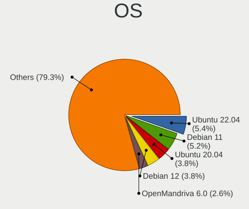

| Name               | Computers | Percent |
|--------------------|-----------|---------|
| Ubuntu 22.04       | 40        | 5.37%   |
| Debian 11          | 39        | 5.23%   |
| Ubuntu 20.04       | 28        | 3.76%   |
| Debian 12          | 28        | 3.76%   |
| OpenMandriva 6.0   | 19        | 2.55%   |
| OpenMandriva 4.3   | 18        | 2.42%   |
| OpenMandriva 23.08 | 18        | 2.42%   |
| Zorin 17           | 17        | 2.28%   |
| Ubuntu 18.04       | 16        | 2.15%   |
| OpenMandriva 25.90 | 16        | 2.15%   |
| Arch Rolling       | 14        | 1.88%   |
| Zorin 16           | 12        | 1.61%   |
| OpenMandriva 23.03 | 12        | 1.61%   |
| Linux Mint 21.1    | 12        | 1.61%   |
| Fedora 41          | 12        | 1.61%   |
| Ubuntu 24.04       | 11        | 1.48%   |
| OpenMandriva 4.2   | 11        | 1.48%   |
| Zorin 18           | 10        | 1.34%   |
| Pop!_OS 22.04      | 10        | 1.34%   |
| OpenMandriva 24.12 | 10        | 1.34%   |
| Linux Mint 22.1    | 10        | 1.34%   |
| Debian 10          | 10        | 1.34%   |
| Linux Mint 20.3    | 9         | 1.21%   |
| KDE neon 20.04     | 9         | 1.21%   |
| OpenMandriva 23.01 | 8         | 1.07%   |
| Linux Mint 22.2    | 8         | 1.07%   |
| Linux Mint 21.3    | 8         | 1.07%   |
| KDE neon 22.04     | 8         | 1.07%   |
| Xubuntu 18.04      | 7         | 0.94%   |
| Manjaro            | 7         | 0.94%   |
| Linux Mint 21.2    | 7         | 0.94%   |
| Kubuntu 20.04      | 7         | 0.94%   |
| Debian 13          | 7         | 0.94%   |
| Fedora 42          | 6         | 0.81%   |
| Debian 23          | 6         | 0.81%   |
| Ubuntu 23.10       | 5         | 0.67%   |
| ROSA R9            | 5         | 0.67%   |
| ROSA R11           | 5         | 0.67%   |
| OpenMandriva 24.07 | 5         | 0.67%   |
| MX 21              | 5         | 0.67%   |

OS Family
---------

OS without a version

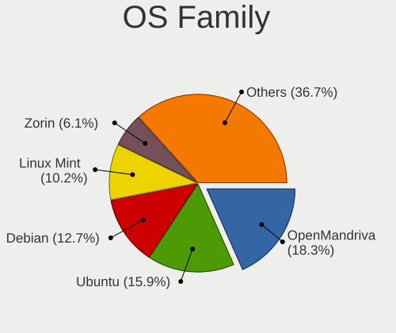

| Name          | Computers | Percent |
|---------------|-----------|---------|
| OpenMandriva  | 129       | 18.35%  |
| Ubuntu        | 112       | 15.93%  |
| Debian        | 89        | 12.66%  |
| Linux Mint    | 72        | 10.24%  |
| Zorin         | 43        | 6.12%   |
| Fedora        | 41        | 5.83%   |
| KDE neon      | 21        | 2.99%   |
| ROSA          | 20        | 2.84%   |
| Xubuntu       | 17        | 2.42%   |
| Arch          | 16        | 2.28%   |
| Pop!_OS       | 13        | 1.85%   |
| Manjaro       | 13        | 1.85%   |
| Kubuntu       | 13        | 1.85%   |
| Elementary    | 10        | 1.42%   |
| MX            | 9         | 1.28%   |
| Nobara        | 8         | 1.14%   |
| Ubuntu MATE   | 7         | 1%      |
| Bazzite       | 5         | 0.71%   |
| ArcoLinux     | 5         | 0.71%   |
| Lubuntu       | 4         | 0.57%   |
| LMDE          | 4         | 0.57%   |
| Kali          | 4         | 0.57%   |
| Garuda Linux  | 4         | 0.57%   |
| Ubuntu Unity  | 3         | 0.43%   |
| openSUSE      | 3         | 0.43%   |
| EndeavourOS   | 3         | 0.43%   |
| Xero          | 2         | 0.28%   |
| TUXEDO OS     | 2         | 0.28%   |
| Solus         | 2         | 0.28%   |
| Q4OS          | 2         | 0.28%   |
| Linux Lite    | 2         | 0.28%   |
| Feren OS      | 2         | 0.28%   |
| Deepin        | 2         | 0.28%   |
| Canaima       | 2         | 0.28%   |
| BigLinux      | 2         | 0.28%   |
| Void Linux    | 1         | 0.14%   |
| Ubuntu Budgie | 1         | 0.14%   |
| Sparky        | 1         | 0.14%   |
| Salix         | 1         | 0.14%   |
| Rocky Linux   | 1         | 0.14%   |

Kernel
------

Version of the Linux kernel

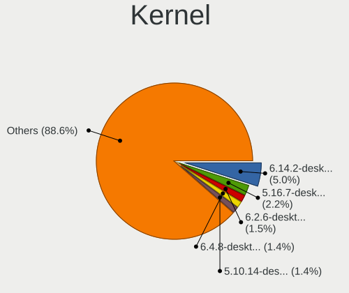

| Version                  | Computers | Percent |
|--------------------------|-----------|---------|
| 6.14.2-desktop-3omv2590  | 40        | 4.97%   |
| 5.16.7-desktop-1omv4003  | 18        | 2.24%   |
| 6.2.6-desktop-1omv2390   | 12        | 1.49%   |
| 6.4.8-desktop-2omv2390   | 11        | 1.37%   |
| 5.10.14-desktop-1omv4002 | 11        | 1.37%   |
| 6.12.1-desktop-1omv2490  | 9         | 1.12%   |
| 6.4.11-desktop-1omv2390  | 8         | 0.99%   |
| 6.14.0-33-generic        | 8         | 0.99%   |
| 6.1.1-desktop-1omv2290   | 8         | 0.99%   |
| 5.4.0-42-generic         | 8         | 0.99%   |
| 6.8.0-51-generic         | 7         | 0.87%   |
| 6.8.0-40-generic         | 6         | 0.75%   |
| 6.14.0-35-generic        | 6         | 0.75%   |
| 5.3.0-40-generic         | 6         | 0.75%   |
| 5.15.0-46-generic        | 6         | 0.75%   |
| 6.8.0-60-generic         | 5         | 0.62%   |
| 6.6.2-desktop-1omv2390   | 5         | 0.62%   |
| 6.2.0-26-generic         | 5         | 0.62%   |
| 6.12.10-76061203-generic | 5         | 0.62%   |
| 5.19.0-41-generic        | 5         | 0.62%   |
| 5.15.0-76-generic        | 5         | 0.62%   |
| 5.15.0-67-generic        | 5         | 0.62%   |
| 5.15.0-56-generic        | 5         | 0.62%   |
| 5.10.0-23-amd64          | 5         | 0.62%   |
| 6.8.0-64-generic         | 4         | 0.5%    |
| 6.8.0-52-generic         | 4         | 0.5%    |
| 6.5.0-41-generic         | 4         | 0.5%    |
| 6.12.48+deb13-amd64      | 4         | 0.5%    |
| 6.10.0-desktop-1omv2490  | 4         | 0.5%    |
| 5.4.0-77-generic         | 4         | 0.5%    |
| 5.13.0-39-generic        | 4         | 0.5%    |
| 5.10.0-16-amd64          | 4         | 0.5%    |
| 5.10.0-13-amd64          | 4         | 0.5%    |
| 5.10.0-11-amd64          | 4         | 0.5%    |
| 5.0.0-37-generic         | 4         | 0.5%    |
| 4.19.0-17-amd64          | 4         | 0.5%    |
| 6.8.0-49-generic         | 3         | 0.37%   |
| 6.8.0-41-generic         | 3         | 0.37%   |
| 6.3.5-desktop-3omv2390   | 3         | 0.37%   |
| 6.2.0-32-generic         | 3         | 0.37%   |

Kernel Family
-------------

Linux kernel without a distro release

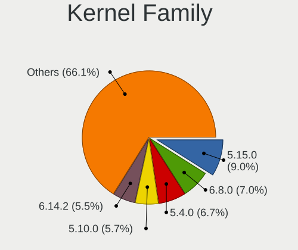

| Version | Computers | Percent |
|---------|-----------|---------|
| 5.15.0  | 68        | 8.97%   |
| 6.8.0   | 53        | 6.99%   |
| 5.4.0   | 51        | 6.73%   |
| 5.10.0  | 43        | 5.67%   |
| 6.14.2  | 42        | 5.54%   |
| 6.1.0   | 27        | 3.56%   |
| 4.15.0  | 24        | 3.17%   |
| 6.14.0  | 23        | 3.03%   |
| 6.5.0   | 20        | 2.64%   |
| 6.2.0   | 20        | 2.64%   |
| 5.13.0  | 19        | 2.51%   |
| 5.16.7  | 18        | 2.37%   |
| 5.19.0  | 14        | 1.85%   |
| 6.2.6   | 12        | 1.58%   |
| 5.3.0   | 12        | 1.58%   |
| 4.19.0  | 12        | 1.58%   |
| 6.4.8   | 11        | 1.45%   |
| 5.10.14 | 11        | 1.45%   |
| 6.4.11  | 10        | 1.32%   |
| 5.8.0   | 10        | 1.32%   |
| 6.12.1  | 9         | 1.19%   |
| 5.11.0  | 9         | 1.19%   |
| 6.1.1   | 8         | 1.06%   |
| 6.12.48 | 7         | 0.92%   |
| 6.11.0  | 7         | 0.92%   |
| 5.0.0   | 7         | 0.92%   |
| 6.6.2   | 6         | 0.79%   |
| 6.14.6  | 5         | 0.66%   |
| 6.12.10 | 5         | 0.66%   |
| 6.12.9  | 4         | 0.53%   |
| 6.10.0  | 4         | 0.53%   |
| 4.9.20  | 4         | 0.53%   |
| 6.3.5   | 3         | 0.4%    |
| 6.2.12  | 3         | 0.4%    |
| 6.12.6  | 3         | 0.4%    |
| 5.14.10 | 3         | 0.4%    |
| 5.10.74 | 3         | 0.4%    |
| 6.9.3   | 2         | 0.26%   |
| 6.7     | 2         | 0.26%   |
| 6.4.6   | 2         | 0.26%   |

Kernel Major Ver.
-----------------

Linux kernel major version

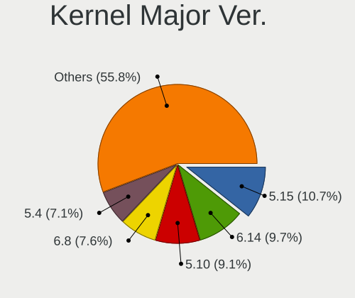

| Version | Computers | Percent |
|---------|-----------|---------|
| 5.15    | 80        | 10.68%  |
| 6.14    | 73        | 9.75%   |
| 5.10    | 68        | 9.08%   |
| 6.8     | 57        | 7.61%   |
| 5.4     | 53        | 7.08%   |
| 6.1     | 40        | 5.34%   |
| 6.12    | 39        | 5.21%   |
| 6.2     | 36        | 4.81%   |
| 6.4     | 29        | 3.87%   |
| 6.5     | 25        | 3.34%   |
| 4.15    | 24        | 3.2%    |
| 5.13    | 22        | 2.94%   |
| 5.16    | 20        | 2.67%   |
| 5.19    | 17        | 2.27%   |
| 6.6     | 16        | 2.14%   |
| 5.8     | 13        | 1.74%   |
| 6.11    | 12        | 1.6%    |
| 5.3     | 12        | 1.6%    |
| 4.19    | 12        | 1.6%    |
| 6.10    | 10        | 1.34%   |
| 5.11    | 9         | 1.2%    |
| 4.9     | 8         | 1.07%   |
| 6.17    | 7         | 0.93%   |
| 5.0     | 7         | 0.93%   |
| 6.3     | 6         | 0.8%    |
| 6.13    | 6         | 0.8%    |
| 6.9     | 5         | 0.67%   |
| 6.16    | 5         | 0.67%   |
| 6.15    | 4         | 0.53%   |
| 6.0     | 4         | 0.53%   |
| 5.17    | 4         | 0.53%   |
| 5.14    | 4         | 0.53%   |
| 5.6     | 3         | 0.4%    |
| 5.18    | 3         | 0.4%    |
| 5.12    | 3         | 0.4%    |
| 6.7     | 2         | 0.27%   |
| 6       | 2         | 0.27%   |
| 5.9     | 2         | 0.27%   |
| 4.18    | 2         | 0.27%   |
| 5.7     | 1         | 0.13%   |

Arch
----

OS architecture (x86_64, i586, etc.)

| Name   | Computers | Percent |
|--------|-----------|---------|
| x86_64 | 645       | 95.13%  |
| i686   | 33        | 4.87%   |

DE
--

Desktop Environment

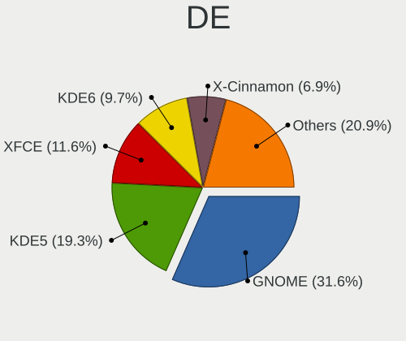

| Name                | Computers | Percent |
|---------------------|-----------|---------|
| GNOME               | 228       | 31.58%  |
| KDE5                | 139       | 19.25%  |
| XFCE                | 84        | 11.63%  |
| KDE6                | 70        | 9.7%    |
| X-Cinnamon          | 50        | 6.93%   |
| Unknown             | 34        | 4.71%   |
| MATE                | 25        | 3.46%   |
| LXQt                | 17        | 2.35%   |
| KDE                 | 15        | 2.08%   |
| Pantheon            | 9         | 1.25%   |
| LXDE                | 9         | 1.25%   |
| KDE4                | 8         | 1.11%   |
| Cinnamon            | 7         | 0.97%   |
| Trinity             | 4         | 0.55%   |
| Budgie              | 4         | 0.55%   |
| Unity               | 3         | 0.42%   |
| GNOME Classic       | 3         | 0.42%   |
| openbox             | 2         | 0.28%   |
| awesome             | 2         | 0.28%   |
| xmonad              | 1         | 0.14%   |
| sway:wlroots:swayfx | 1         | 0.14%   |
| lightdm-xsession    | 1         | 0.14%   |
| i3                  | 1         | 0.14%   |
| GNOME Flashback     | 1         | 0.14%   |
| Enlightenment       | 1         | 0.14%   |
| Deepin              | 1         | 0.14%   |
| DDE                 | 1         | 0.14%   |
| bspwm               | 1         | 0.14%   |

Display Server
--------------

X11 or Wayland

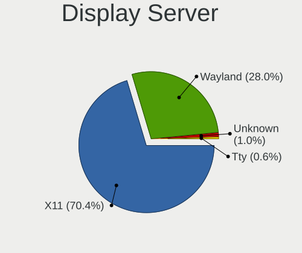

| Name    | Computers | Percent |
|---------|-----------|---------|
| X11     | 497       | 70.4%   |
| Wayland | 198       | 28.05%  |
| Unknown | 7         | 0.99%   |
| Tty     | 4         | 0.57%   |

Display Manager
---------------

SDDM, LightDM, etc.

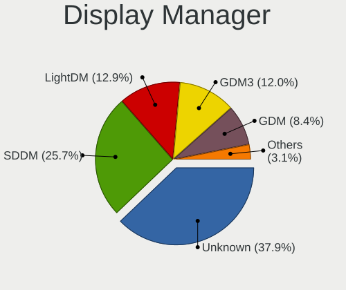

| Name    | Computers | Percent |
|---------|-----------|---------|
| Unknown | 265       | 37.86%  |
| SDDM    | 180       | 25.71%  |
| LightDM | 90        | 12.86%  |
| GDM3    | 84        | 12%     |
| GDM     | 59        | 8.43%   |
| TDM     | 11        | 1.57%   |
| KDM     | 8         | 1.14%   |
| SLiM    | 2         | 0.29%   |
| LY-DM   | 1         | 0.14%   |

OS Lang
-------

Language

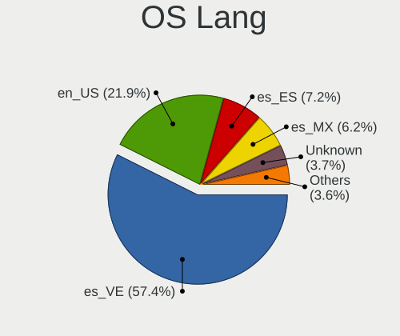

| Lang    | Computers | Percent |
|---------|-----------|---------|
| es_VE   | 404       | 57.39%  |
| en_US   | 154       | 21.88%  |
| es_ES   | 51        | 7.24%   |
| es_MX   | 44        | 6.25%   |
| Unknown | 26        | 3.69%   |
| C       | 11        | 1.56%   |
| es_US   | 6         | 0.85%   |
| es_CO   | 4         | 0.57%   |
| es_AR   | 1         | 0.14%   |
| en_GB   | 1         | 0.14%   |
| en_CA   | 1         | 0.14%   |
| de_DE   | 1         | 0.14%   |

Boot Mode
---------

EFI or BIOS

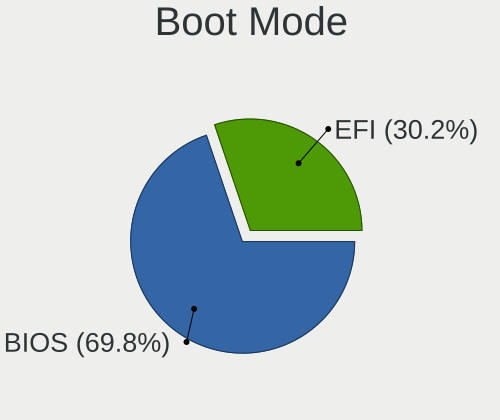

| Mode | Computers | Percent |
|------|-----------|---------|
| BIOS | 481       | 69.81%  |
| EFI  | 208       | 30.19%  |

Filesystem
----------

Type of filesystem

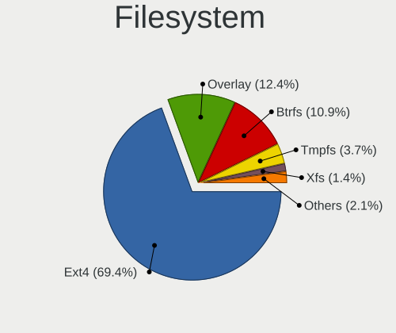

| Type    | Computers | Percent |
|---------|-----------|---------|
| Ext4    | 486       | 69.43%  |
| Overlay | 87        | 12.43%  |
| Btrfs   | 76        | 10.86%  |
| Tmpfs   | 26        | 3.71%   |
| Xfs     | 10        | 1.43%   |
| Unknown | 8         | 1.14%   |
| Ext3    | 3         | 0.43%   |
| Ext2    | 2         | 0.29%   |
| XXX4    | 1         | 0.14%   |
| F2fs    | 1         | 0.14%   |

Part. scheme
------------

Scheme of partitioning

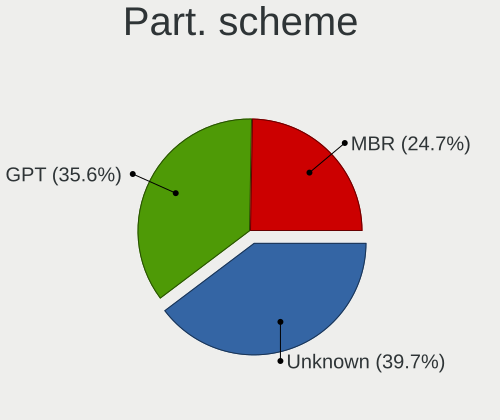

| Type    | Computers | Percent |
|---------|-----------|---------|
| Unknown | 278       | 39.71%  |
| GPT     | 249       | 35.57%  |
| MBR     | 173       | 24.71%  |

Dual Boot with Linux/BSD
------------------------

Hosting more than one Linux/BSD

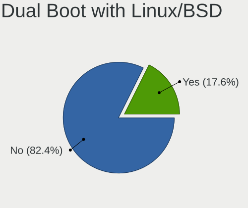

| Dual boot | Computers | Percent |
|-----------|-----------|---------|
| No        | 570       | 82.37%  |
| Yes       | 122       | 17.63%  |

Dual Boot (Win)
---------------

Hosting Linux and Windows

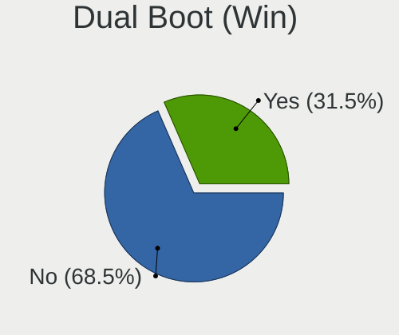

| Dual boot | Computers | Percent |
|-----------|-----------|---------|
| No        | 471       | 68.46%  |
| Yes       | 217       | 31.54%  |

Board
-----

Vendor
------

Motherboard manufacturer

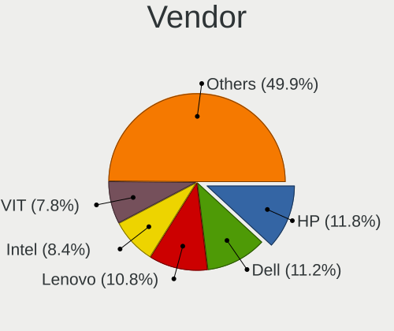

| Name                                     | Computers | Percent |
|------------------------------------------|-----------|---------|
| Hewlett-Packard                          | 80        | 11.83%  |
| Dell                                     | 76        | 11.24%  |
| Lenovo                                   | 73        | 10.8%   |
| Intel                                    | 57        | 8.43%   |
| VIT                                      | 53        | 7.84%   |
| ASRock                                   | 49        | 7.25%   |
| ASUSTek Computer                         | 40        | 5.92%   |
| ECS                                      | 28        | 4.14%   |
| Acer                                     | 25        | 3.7%    |
| Gigabyte Technology                      | 23        | 3.4%    |
| Biostar                                  | 22        | 3.25%   |
| Google                                   | 20        | 2.96%   |
| Pegatron                                 | 19        | 2.81%   |
| MSI                                      | 15        | 2.22%   |
| Foxconn                                  | 13        | 1.92%   |
| langchao                                 | 11        | 1.63%   |
| Unknown                                  | 11        | 1.63%   |
| Toshiba                                  | 8         | 1.18%   |
| Apple                                    | 7         | 1.04%   |
| Inspur                                   | 6         | 0.89%   |
| SIRAGON                                  | 4         | 0.59%   |
| Shanghai Zhaoxin Semiconductor           | 4         | 0.59%   |
| VENEZOLANA DE INDUSTRIA TECNOLOGICA C.A. | 3         | 0.44%   |
| Samsung Electronics                      | 3         | 0.44%   |
| Notebook                                 | 3         | 0.44%   |
| JGINYUE                                  | 2         | 0.3%    |
| GPU Company                              | 2         | 0.3%    |
| Gateway                                  | 2         | 0.3%    |
| UNIQCELL                                 | 1         | 0.15%   |
| Standard                                 | 1         | 0.15%   |
| Sragon                                   | 1         | 0.15%   |
| Sony                                     | 1         | 0.15%   |
| Soncview                                 | 1         | 0.15%   |
| PCSMART                                  | 1         | 0.15%   |
| Panasonic                                | 1         | 0.15%   |
| Microsoft                                | 1         | 0.15%   |
| ISONIC                                   | 1         | 0.15%   |
| IP3 Tech                                 | 1         | 0.15%   |
| IBM                                      | 1         | 0.15%   |
| GPD                                      | 1         | 0.15%   |

Model
-----

Motherboard model

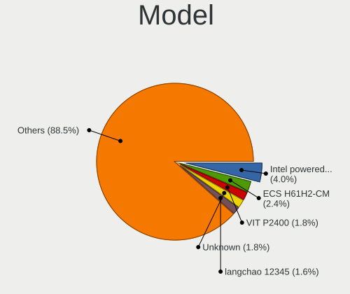

| Name                                                  | Computers | Percent |
|-------------------------------------------------------|-----------|---------|
| Intel powered classmate PC                            | 27        | 3.99%   |
| ECS H61H2-CM                                          | 16        | 2.37%   |
| VIT P2400                                             | 12        | 1.78%   |
| Unknown                                               | 12        | 1.78%   |
| langchao 12345                                        | 11        | 1.63%   |
| VIT M2400-01                                          | 10        | 1.48%   |
| Intel H61                                             | 8         | 1.18%   |
| ASRock G41M-VS3                                       | 8         | 1.18%   |
| Google Snappy                                         | 7         | 1.04%   |
| VIT P2402                                             | 6         | 0.89%   |
| VIT M2420                                             | 6         | 0.89%   |
| VIT P3400                                             | 5         | 0.74%   |
| ASRock N68C-S UCC                                     | 5         | 0.74%   |
| VIT Aptio CRB                                         | 4         | 0.59%   |
| Shanghai Zhaoxin ZXE CRB                              | 4         | 0.59%   |
| Pegatron Compaq dx2400 Microtower                     | 4         | 0.59%   |
| ASRock N68-VS3 UCC                                    | 4         | 0.59%   |
| ASRock H61M-VG3                                       | 4         | 0.59%   |
| VIT P1400                                             | 3         | 0.44%   |
| VENEZOLANA DE INDUSTRIA TECNOLOGICA C.A. VIT P2460-02 | 3         | 0.44%   |
| Lenovo ThinkCentre A57 9702AB7                        | 3         | 0.44%   |
| HP Pavilion dv5                                       | 3         | 0.44%   |
| HP Notebook                                           | 3         | 0.44%   |
| HP EliteDesk 800 G2 SFF                               | 3         | 0.44%   |
| HP Compaq 8200 Elite SFF PC                           | 3         | 0.44%   |
| Google Kip                                            | 3         | 0.44%   |
| Google Candy                                          | 3         | 0.44%   |
| Gigabyte 970A-DS3P                                    | 3         | 0.44%   |
| ECS H77H2-EM                                          | 3         | 0.44%   |
| Dell OptiPlex 9020                                    | 3         | 0.44%   |
| Dell OptiPlex 9010                                    | 3         | 0.44%   |
| Dell OptiPlex 790                                     | 3         | 0.44%   |
| Dell OptiPlex 7010                                    | 3         | 0.44%   |
| Dell Latitude 5590                                    | 3         | 0.44%   |
| Biostar G41D3                                         | 3         | 0.44%   |
| ASUS VivoBook_ASUSLaptop K3605VC_K3605VC              | 3         | 0.44%   |
| ASRock H61M-DGS                                       | 3         | 0.44%   |
| ASRock AM2NF6G-VSTA                                   | 3         | 0.44%   |
| VIT P2423                                             | 2         | 0.3%    |
| VIT NP3020M3                                          | 2         | 0.3%    |

Model Family
------------

Motherboard model prefix

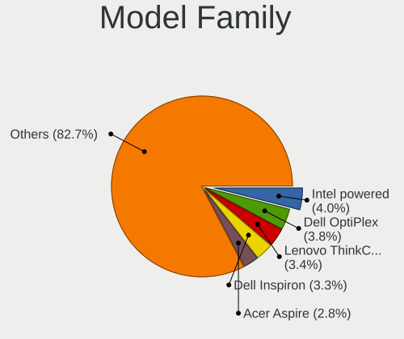

| Name                 | Computers | Percent |
|----------------------|-----------|---------|
| Intel powered        | 27        | 3.99%   |
| Dell OptiPlex        | 26        | 3.85%   |
| Lenovo ThinkCentre   | 23        | 3.4%    |
| Dell Inspiron        | 22        | 3.25%   |
| Acer Aspire          | 19        | 2.81%   |
| HP Compaq            | 18        | 2.66%   |
| Lenovo IdeaPad       | 16        | 2.37%   |
| ECS H61H2-CM         | 16        | 2.37%   |
| Dell Latitude        | 14        | 2.07%   |
| Lenovo ThinkPad      | 13        | 1.92%   |
| HP Pavilion          | 13        | 1.92%   |
| VIT P2400            | 12        | 1.78%   |
| Unknown              | 12        | 1.78%   |
| langchao 12345       | 11        | 1.63%   |
| HP EliteDesk         | 11        | 1.63%   |
| VIT M2400-01         | 10        | 1.48%   |
| ASUS VivoBook        | 10        | 1.48%   |
| Intel H61            | 8         | 1.18%   |
| ASRock G41M-VS3      | 8         | 1.18%   |
| Toshiba Satellite    | 7         | 1.04%   |
| Google Snappy        | 7         | 1.04%   |
| VIT P2402            | 6         | 0.89%   |
| VIT M2420            | 6         | 0.89%   |
| Lenovo 3000          | 6         | 0.89%   |
| Dell Vostro          | 6         | 0.89%   |
| ASUS PRIME           | 6         | 0.89%   |
| VIT P3400            | 5         | 0.74%   |
| Pegatron Compaq      | 5         | 0.74%   |
| HP Laptop            | 5         | 0.74%   |
| ASUS ASUS            | 5         | 0.74%   |
| ASRock N68C-S        | 5         | 0.74%   |
| ASRock N68-VS3       | 5         | 0.74%   |
| VIT Aptio            | 4         | 0.59%   |
| Shanghai Zhaoxin ZXE | 4         | 0.59%   |
| HP ProDesk           | 4         | 0.59%   |
| HP Presario          | 4         | 0.59%   |
| Dell Precision       | 4         | 0.59%   |
| ASUS P8H61-M         | 4         | 0.59%   |
| ASRock H61M-VG3      | 4         | 0.59%   |
| ASRock H61M-DGS      | 4         | 0.59%   |

MFG Year
--------

Motherboard manufacture year

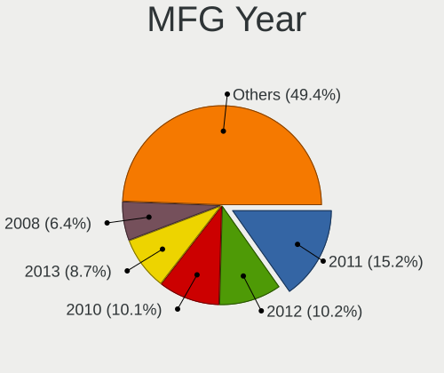

| Year    | Computers | Percent |
|---------|-----------|---------|
| 2011    | 103       | 15.24%  |
| 2012    | 69        | 10.21%  |
| 2010    | 68        | 10.06%  |
| 2013    | 59        | 8.73%   |
| 2008    | 43        | 6.36%   |
| 2022    | 40        | 5.92%   |
| 2009    | 33        | 4.88%   |
| 2014    | 31        | 4.59%   |
| 2007    | 31        | 4.59%   |
| 2016    | 25        | 3.7%    |
| 2021    | 23        | 3.4%    |
| 2020    | 23        | 3.4%    |
| 2019    | 22        | 3.25%   |
| 2015    | 22        | 3.25%   |
| 2023    | 21        | 3.11%   |
| 2018    | 15        | 2.22%   |
| 2006    | 15        | 2.22%   |
| 2017    | 13        | 1.92%   |
| 2025    | 7         | 1.04%   |
| 2024    | 7         | 1.04%   |
| Unknown | 3         | 0.44%   |
| 2005    | 1         | 0.15%   |
| 2004    | 1         | 0.15%   |
| 2002    | 1         | 0.15%   |

Form Factor
-----------

Physical design of the computer

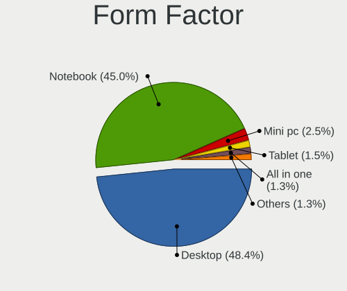

| Name        | Computers | Percent |
|-------------|-----------|---------|
| Desktop     | 327       | 48.37%  |
| Notebook    | 304       | 44.97%  |
| Mini pc     | 17        | 2.51%   |
| Tablet      | 10        | 1.48%   |
| All in one  | 9         | 1.33%   |
| Server      | 5         | 0.74%   |
| Convertible | 3         | 0.44%   |
| Other       | 1         | 0.15%   |

Secure Boot
-----------

Enabled or disabled

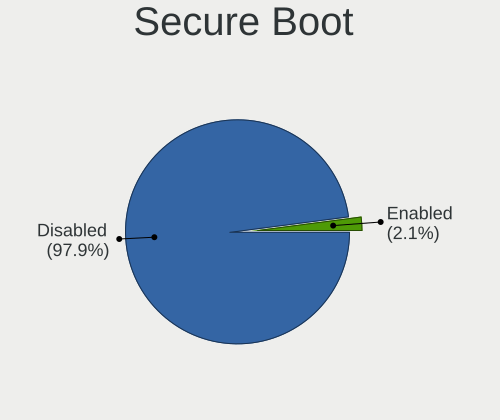

| State    | Computers | Percent |
|----------|-----------|---------|
| Disabled | 664       | 97.94%  |
| Enabled  | 14        | 2.06%   |

Coreboot
--------

Have coreboot on board

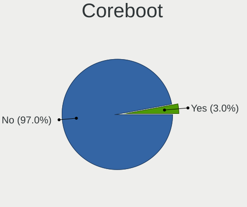

| Used | Computers | Percent |
|------|-----------|---------|
| No   | 656       | 97.04%  |
| Yes  | 20        | 2.96%   |

RAM Size
--------

Total RAM memory

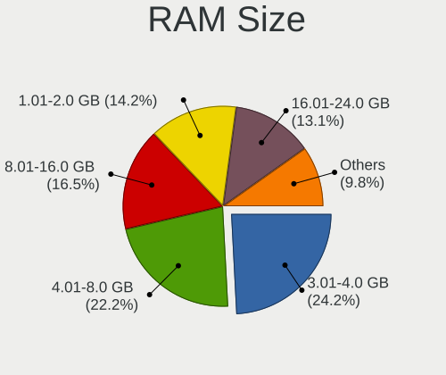

| Size in GB  | Computers | Percent |
|-------------|-----------|---------|
| 3.01-4.0    | 168       | 24.17%  |
| 4.01-8.0    | 154       | 22.16%  |
| 8.01-16.0   | 115       | 16.55%  |
| 1.01-2.0    | 99        | 14.24%  |
| 16.01-24.0  | 91        | 13.09%  |
| 2.01-3.0    | 32        | 4.6%    |
| 32.01-64.0  | 18        | 2.59%   |
| 24.01-32.0  | 9         | 1.29%   |
| 0.51-1.0    | 5         | 0.72%   |
| 64.01-256.0 | 4         | 0.58%   |

RAM Used
--------

Used RAM memory

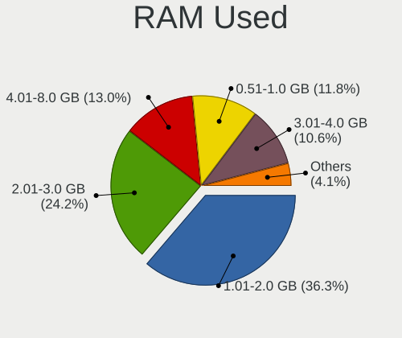

| Used GB    | Computers | Percent |
|------------|-----------|---------|
| 1.01-2.0   | 276       | 36.27%  |
| 2.01-3.0   | 184       | 24.18%  |
| 4.01-8.0   | 99        | 13.01%  |
| 0.51-1.0   | 90        | 11.83%  |
| 3.01-4.0   | 81        | 10.64%  |
| 8.01-16.0  | 19        | 2.5%    |
| 0.01-0.5   | 11        | 1.45%   |
| 16.01-24.0 | 1         | 0.13%   |

Total Drives
------------

Number of drives on board

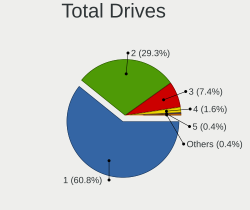

| Drives | Computers | Percent |
|--------|-----------|---------|
| 1      | 425       | 60.8%   |
| 2      | 205       | 29.33%  |
| 3      | 52        | 7.44%   |
| 4      | 11        | 1.57%   |
| 5      | 3         | 0.43%   |
| 0      | 2         | 0.29%   |
| 6      | 1         | 0.14%   |

Has CD-ROM
----------

Has CD-ROM on board

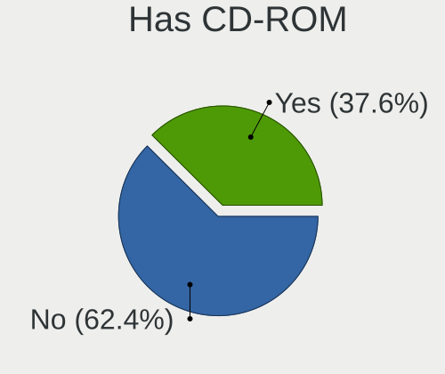

| Presented | Computers | Percent |
|-----------|-----------|---------|
| No        | 429       | 62.45%  |
| Yes       | 258       | 37.55%  |

Has Ethernet
------------

Has Ethernet on board

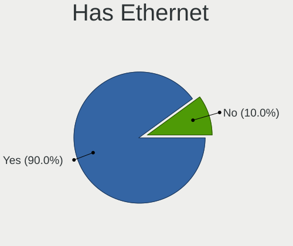

| Presented | Computers | Percent |
|-----------|-----------|---------|
| Yes       | 611       | 89.99%  |
| No        | 68        | 10.01%  |

Has WiFi
--------

Has WiFi module

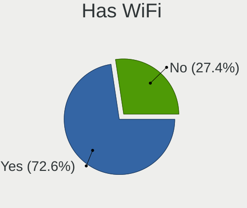

| Presented | Computers | Percent |
|-----------|-----------|---------|
| Yes       | 496       | 72.62%  |
| No        | 187       | 27.38%  |

Has Bluetooth
-------------

Has Bluetooth module

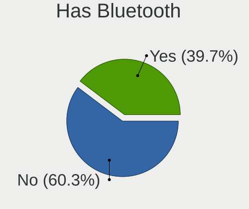

| Presented | Computers | Percent |
|-----------|-----------|---------|
| No        | 413       | 60.29%  |
| Yes       | 272       | 39.71%  |

Location
--------

Country
-------

Geographic location (country)

| Country   | Computers | Percent |
|-----------|-----------|---------|
| Venezuela | 676       | 100%    |

City
----

Geographic location (city)

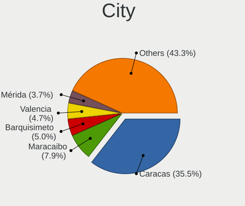

| City                       | Computers | Percent |
|----------------------------|-----------|---------|
| Caracas                    | 258       | 35.54%  |
| Maracaibo                  | 57        | 7.85%   |
| Barquisimeto               | 36        | 4.96%   |
| Valencia                   | 34        | 4.68%   |
| Mérida                    | 27        | 3.72%   |
| Maracay                    | 25        | 3.44%   |
| San Cristóbal             | 22        | 3.03%   |
| Vigia                      | 19        | 2.62%   |
| Barcelona                  | 15        | 2.07%   |
| San Carlos del Zulia       | 14        | 1.93%   |
| Porlamar                   | 13        | 1.79%   |
| Barinas                    | 12        | 1.65%   |
| Maturín                   | 9         | 1.24%   |
| Ciudad Guayana             | 9         | 1.24%   |
| Turmero                    | 6         | 0.83%   |
| San Antonio de Los Altos   | 6         | 0.83%   |
| Lecherias                  | 6         | 0.83%   |
| La Guaira                  | 6         | 0.83%   |
| Cua                        | 6         | 0.83%   |
| Coro                       | 6         | 0.83%   |
| Ciudad Bolívar            | 6         | 0.83%   |
| Acarigua                   | 6         | 0.83%   |
| Miranda                    | 5         | 0.69%   |
| Mariara                    | 5         | 0.69%   |
| Distrito Federal           | 5         | 0.69%   |
| Araure                     | 5         | 0.69%   |
| Petare                     | 4         | 0.55%   |
| Maiquetia                  | 4         | 0.55%   |
| Los Teques                 | 4         | 0.55%   |
| Cumaná                    | 4         | 0.55%   |
| San Juan de los Morros     | 3         | 0.41%   |
| Punto Fijo                 | 3         | 0.41%   |
| Puerto Ordaz and San Felix | 3         | 0.41%   |
| Parroquia El Recreo        | 3         | 0.41%   |
| Naguanagua                 | 3         | 0.41%   |
| Guatire                    | 3         | 0.41%   |
| Ciudad Ojeda               | 3         | 0.41%   |
| Carrizal                   | 3         | 0.41%   |
| Carora                     | 3         | 0.41%   |
| Cambural                   | 3         | 0.41%   |

Drives
------

Drive Vendor
------------

Hard drive vendors

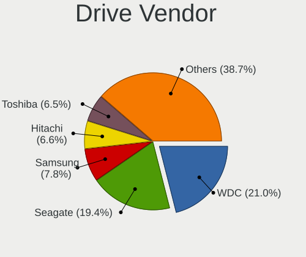

| Vendor                      | Computers | Drives | Percent |
|-----------------------------|-----------|--------|---------|
| WDC                         | 191       | 271    | 21.04%  |
| Seagate                     | 176       | 244    | 19.38%  |
| Samsung Electronics         | 71        | 81     | 7.82%   |
| Hitachi                     | 60        | 79     | 6.61%   |
| Toshiba                     | 59        | 65     | 6.5%    |
| Kingston                    | 43        | 53     | 4.74%   |
| Unknown                     | 40        | 49     | 4.41%   |
| SanDisk                     | 24        | 32     | 2.64%   |
| Intel                       | 23        | 32     | 2.53%   |
| addlink                     | 20        | 25     | 2.2%    |
| Patriot                     | 17        | 20     | 1.87%   |
| Crucial                     | 15        | 21     | 1.65%   |
| SK hynix                    | 14        | 17     | 1.54%   |
| Micron Technology           | 13        | 18     | 1.43%   |
| PNY                         | 12        | 15     | 1.32%   |
| SPCC                        | 8         | 12     | 0.88%   |
| Maxtor                      | 8         | 9      | 0.88%   |
| HGST                        | 8         | 8      | 0.88%   |
| Silicon Motion              | 6         | 7      | 0.66%   |
| LITEONIT                    | 6         | 10     | 0.66%   |
| Dahua                       | 5         | 5      | 0.55%   |
| A-DATA Technology           | 5         | 5      | 0.55%   |
| Team                        | 4         | 5      | 0.44%   |
| Fujitsu                     | 4         | 4      | 0.44%   |
| China                       | 4         | 4      | 0.44%   |
| Phison Electronics          | 3         | 4      | 0.33%   |
| Netac                       | 3         | 3      | 0.33%   |
| Kingston Technology Company | 3         | 3      | 0.33%   |
| JMicron Technology          | 3         | 3      | 0.33%   |
| HS-SSD-WAVE(S)              | 3         | 3      | 0.33%   |
| ExcelStor                   | 3         | 3      | 0.33%   |
| Acclamator                  | 3         | 3      | 0.33%   |
| Vaseky                      | 2         | 3      | 0.22%   |
| Mushkin                     | 2         | 2      | 0.22%   |
| Micron/Crucial Technology   | 2         | 2      | 0.22%   |
| Lexar                       | 2         | 3      | 0.22%   |
| HUAWEI                      | 2         | 2      | 0.22%   |
| Golden                      | 2         | 2      | 0.22%   |
| Emtec                       | 2         | 3      | 0.22%   |
| BIWIN                       | 2         | 3      | 0.22%   |

Drive Model
-----------

Hard drive models

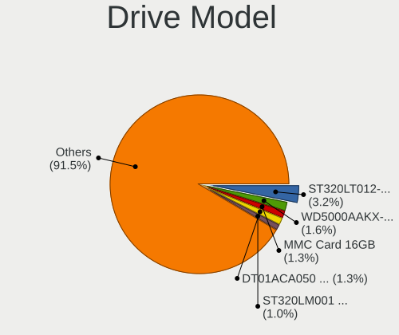

| Model                                                 | Computers | Percent |
|-------------------------------------------------------|-----------|---------|
| Seagate ST320LT012-1DG14C 320GB                       | 31        | 3.17%   |
| WDC WD5000AAKX-22ERMA0 500GB                          | 16        | 1.64%   |
| Unknown MMC Card  16GB                                | 13        | 1.33%   |
| Toshiba DT01ACA050 500GB                              | 13        | 1.33%   |
| Seagate ST320LM001 HN-M320MBB 320GB                   | 10        | 1.02%   |
| Seagate ST320LM000 HM321HI 320GB                      | 10        | 1.02%   |
| Kingston SA400S37240G 240GB SSD                       | 10        | 1.02%   |
| Seagate ST500DM002-1BD142 500GB                       | 9         | 0.92%   |
| Patriot Burst Elite 120GB SSD                         | 8         | 0.82%   |
| WDC WD5000AAKX-221CA1 500GB                           | 7         | 0.72%   |
| Seagate ST320LT012-9WS14C 320GB                       | 7         | 0.72%   |
| Samsung HD502HJ 500GB                                 | 7         | 0.72%   |
| Kingston SA400S37120G 120GB SSD                       | 7         | 0.72%   |
| WDC WD5000LPVX-22V0TT0 500GB                          | 6         | 0.61%   |
| Toshiba MQ01ABF032 320GB                              | 6         | 0.61%   |
| Kingston SA400S37480G 480GB SSD                       | 6         | 0.61%   |
| addlink SATA SSD 120GB                                | 6         | 0.61%   |
| WDC WD5000AAKX-001CA0 500GB                           | 5         | 0.51%   |
| WDC WD3200BPVT-22JJ5T0 320GB                          | 5         | 0.51%   |
| WDC WD3200AAJS-08L7A0 320GB                           | 5         | 0.51%   |
| WDC WD3200AAJS-00L7A0 320GB                           | 5         | 0.51%   |
| WDC WD1600BEVT-22ZCT0 160GB                           | 5         | 0.51%   |
| WDC WD10JPVX-22JC3T0 1TB                              | 5         | 0.51%   |
| WDC WD10EZEX-08M2NA0 1TB                              | 5         | 0.51%   |
| Silicon Motion SM2263EN/SM2263XT SSD Controller 512GB | 5         | 0.51%   |
| Seagate ST9320423AS 320GB                             | 5         | 0.51%   |
| Seagate ST500LM021-1KJ152 500GB                       | 5         | 0.51%   |
| Seagate ST3320418AS 320GB                             | 5         | 0.51%   |
| Seagate ST250LM004 HN-M250MBB 250GB                   | 5         | 0.51%   |
| Samsung HD322HJ 320GB                                 | 5         | 0.51%   |
| Samsung HD161HJ 160GB                                 | 5         | 0.51%   |
| LITEONIT LMS-32L6M 32GB SSD                           | 5         | 0.51%   |
| Intel SSDPEKNW512G8 512GB                             | 5         | 0.51%   |
| Crucial CT240BX500SSD1 240GB                          | 5         | 0.51%   |
| addlink SATA SSD 512GB                                | 5         | 0.51%   |
| addlink SATA SSD 256GB                                | 5         | 0.51%   |
| WDC WD5000LPCX-22VHAT0 500GB                          | 4         | 0.41%   |
| WDC WD5000AAKS-00UU3A0 500GB                          | 4         | 0.41%   |
| Unknown NVMe SSD Drive 512GB                          | 4         | 0.41%   |
| Unknown MMC Card  64GB                                | 4         | 0.41%   |

HDD Vendor
----------

Hard disk drive vendors

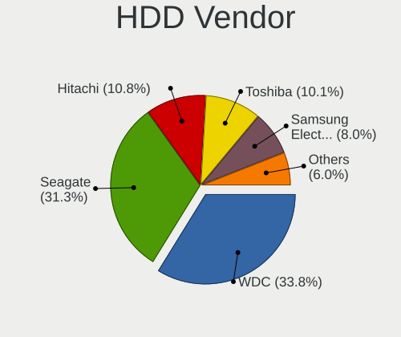

| Vendor              | Computers | Drives | Percent |
|---------------------|-----------|--------|---------|
| WDC                 | 187       | 264    | 33.82%  |
| Seagate             | 173       | 239    | 31.28%  |
| Hitachi             | 60        | 79     | 10.85%  |
| Toshiba             | 56        | 62     | 10.13%  |
| Samsung Electronics | 44        | 48     | 7.96%   |
| Maxtor              | 8         | 9      | 1.45%   |
| HGST                | 8         | 8      | 1.45%   |
| Fujitsu             | 4         | 4      | 0.72%   |
| ExcelStor           | 3         | 3      | 0.54%   |
| Unknown             | 2         | 2      | 0.36%   |
| JMicron Technology  | 2         | 2      | 0.36%   |
| USB3.0              | 1         | 1      | 0.18%   |
| T-FORCE             | 1         | 1      | 0.18%   |
| Min Yi U            | 1         | 1      | 0.18%   |
| IBM/Hitachi         | 1         | 2      | 0.18%   |
| HPE                 | 1         | 1      | 0.18%   |
| ASMT                | 1         | 1      | 0.18%   |

SSD Vendor
----------

Solid state drive vendors

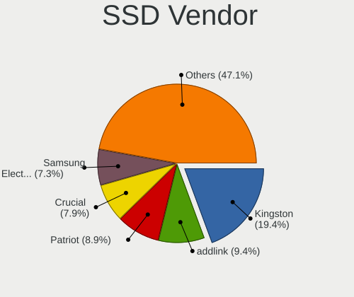

| Vendor              | Computers | Drives | Percent |
|---------------------|-----------|--------|---------|
| Kingston            | 37        | 45     | 19.37%  |
| addlink             | 18        | 23     | 9.42%   |
| Patriot             | 17        | 20     | 8.9%    |
| Crucial             | 15        | 21     | 7.85%   |
| Samsung Electronics | 14        | 19     | 7.33%   |
| PNY                 | 12        | 15     | 6.28%   |
| SPCC                | 7         | 10     | 3.66%   |
| SanDisk             | 6         | 7      | 3.14%   |
| LITEONIT            | 6         | 10     | 3.14%   |
| SK hynix            | 5         | 5      | 2.62%   |
| A-DATA Technology   | 5         | 5      | 2.62%   |
| Intel               | 4         | 7      | 2.09%   |
| Dahua               | 4         | 4      | 2.09%   |
| China               | 4         | 4      | 2.09%   |
| Team                | 3         | 4      | 1.57%   |
| Netac               | 3         | 3      | 1.57%   |
| Micron Technology   | 3         | 7      | 1.57%   |
| Toshiba             | 2         | 2      | 1.05%   |
| Lexar               | 2         | 3      | 1.05%   |
| HS-SSD-WAVE(S)      | 2         | 2      | 1.05%   |
| Emtec               | 2         | 3      | 1.05%   |
| ACCLAMATOR          | 2         | 2      | 1.05%   |
| WDC                 | 1         | 1      | 0.52%   |
| WALRAM              | 1         | 1      | 0.52%   |
| Vaseky              | 1         | 2      | 0.52%   |
| Saichi              | 1         | 2      | 0.52%   |
| RRINTEC             | 1         | 1      | 0.52%   |
| PUSKILL             | 1         | 1      | 0.52%   |
| Mushkin             | 1         | 1      | 0.52%   |
| KingFast            | 1         | 3      | 0.52%   |
| Intenso             | 1         | 1      | 0.52%   |
| HS-SSD-E100         | 1         | 1      | 0.52%   |
| Hewlett-Packard     | 1         | 1      | 0.52%   |
| Golden              | 1         | 1      | 0.52%   |
| Gigabyte Technology | 1         | 1      | 0.52%   |
| Dogfish             | 1         | 1      | 0.52%   |
| Dell                | 1         | 2      | 0.52%   |
| BIWIN               | 1         | 2      | 0.52%   |
| AirDisk             | 1         | 1      | 0.52%   |
| Acer                | 1         | 1      | 0.52%   |

Drive Kind
----------

HDD or SSD

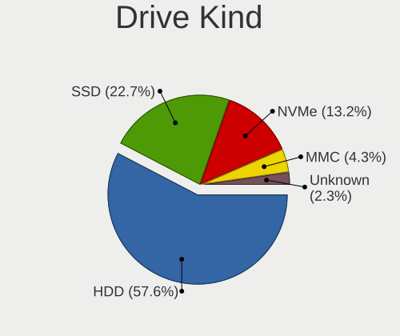

| Kind    | Computers | Drives | Percent |
|---------|-----------|--------|---------|
| HDD     | 460       | 727    | 57.64%  |
| SSD     | 181       | 245    | 22.68%  |
| NVMe    | 105       | 152    | 13.16%  |
| MMC     | 34        | 42     | 4.26%   |
| Unknown | 18        | 20     | 2.26%   |

Drive Connector
---------------

SATA, SAS, NVMe, etc.

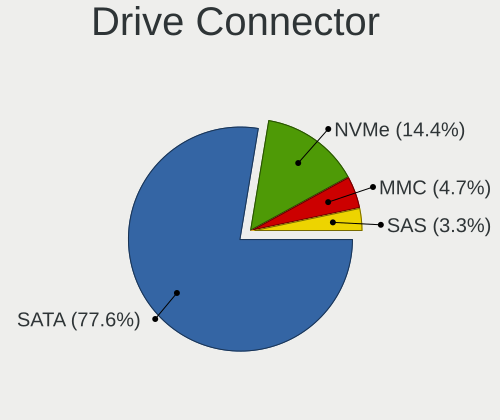

| Type | Computers | Drives | Percent |
|------|-----------|--------|---------|
| SATA | 565       | 967    | 77.61%  |
| NVMe | 105       | 151    | 14.42%  |
| MMC  | 34        | 42     | 4.67%   |
| SAS  | 24        | 26     | 3.3%    |

Drive Size
----------

Size of hard drive

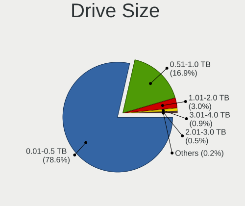

| Size in TB | Computers | Drives | Percent |
|------------|-----------|--------|---------|
| 0.01-0.5   | 502       | 775    | 78.56%  |
| 0.51-1.0   | 108       | 155    | 16.9%   |
| 1.01-2.0   | 19        | 27     | 2.97%   |
| 3.01-4.0   | 6         | 10     | 0.94%   |
| 2.01-3.0   | 3         | 4      | 0.47%   |
| 4.01-10.0  | 1         | 1      | 0.16%   |

Space Total
-----------

Amount of disk space available on the file system

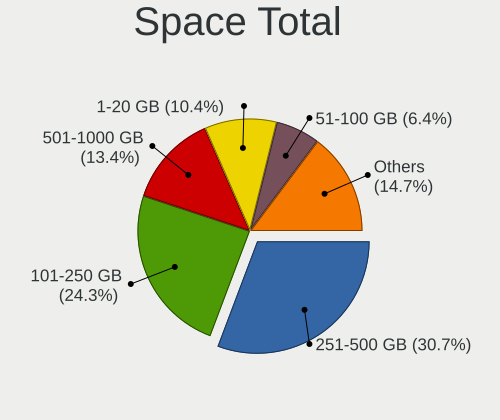

| Size in GB     | Computers | Percent |
|----------------|-----------|---------|
| 251-500        | 221       | 30.74%  |
| 101-250        | 175       | 24.34%  |
| 501-1000       | 96        | 13.35%  |
| 1-20           | 75        | 10.43%  |
| 51-100         | 46        | 6.4%    |
| 1001-2000      | 39        | 5.42%   |
| 21-50          | 27        | 3.76%   |
| Unknown        | 17        | 2.36%   |
| More than 3000 | 12        | 1.67%   |
| 2001-3000      | 11        | 1.53%   |

Space Used
----------

Amount of used disk space

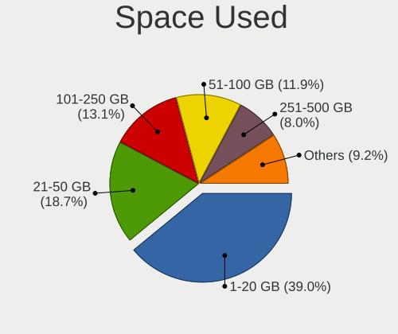

| Used GB        | Computers | Percent |
|----------------|-----------|---------|
| 1-20           | 292       | 39.04%  |
| 21-50          | 140       | 18.72%  |
| 101-250        | 98        | 13.1%   |
| 51-100         | 89        | 11.9%   |
| 251-500        | 60        | 8.02%   |
| 501-1000       | 31        | 4.14%   |
| Unknown        | 17        | 2.27%   |
| 1001-2000      | 11        | 1.47%   |
| 2001-3000      | 7         | 0.94%   |
| More than 3000 | 2         | 0.27%   |
| 0              | 1         | 0.13%   |

Malfunc. Drives
---------------

Drive models with a malfunction

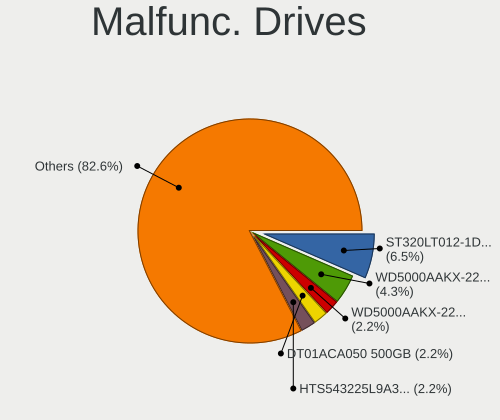

| Model                               | Computers | Drives | Percent |
|-------------------------------------|-----------|--------|---------|
| Seagate ST320LT012-1DG14C 320GB     | 12        | 14     | 6.52%   |
| WDC WD5000AAKX-22ERMA0 500GB        | 8         | 12     | 4.35%   |
| WDC WD5000AAKX-221CA1 500GB         | 4         | 4      | 2.17%   |
| Toshiba DT01ACA050 500GB            | 4         | 6      | 2.17%   |
| Hitachi HTS543225L9A300 250GB       | 4         | 4      | 2.17%   |
| Toshiba MK3275GSX 320GB             | 3         | 4      | 1.63%   |
| Seagate ST9320423AS 320GB           | 3         | 3      | 1.63%   |
| Samsung Electronics HM321HI 320GB   | 3         | 3      | 1.63%   |
| Hitachi HTS725050A9A364 500GB       | 3         | 4      | 1.63%   |
| Hitachi HDS721616PLA380 160GB       | 3         | 3      | 1.63%   |
| WDC WD5000AAKS-00A7B0 500GB         | 2         | 2      | 1.09%   |
| WDC WD3200AAJS-08L7A0 320GB         | 2         | 3      | 1.09%   |
| WDC WD1200BEVS-60UST0 120GB         | 2         | 2      | 1.09%   |
| Toshiba MQ01ABF032 320GB            | 2         | 2      | 1.09%   |
| Toshiba MK3259GSXP 320GB            | 2         | 2      | 1.09%   |
| Seagate ST9500325AS 500GB           | 2         | 2      | 1.09%   |
| Seagate ST500DM002-1BD142 500GB     | 2         | 2      | 1.09%   |
| Seagate ST3500312CS 500GB           | 2         | 2      | 1.09%   |
| Seagate ST320LM001 HN-M320MBB 320GB | 2         | 2      | 1.09%   |
| Seagate ST3160215ACE 160GB          | 2         | 2      | 1.09%   |
| Samsung Electronics HM250HI 250GB   | 2         | 2      | 1.09%   |
| Samsung Electronics HD161GJ 160GB   | 2         | 3      | 1.09%   |
| Maxtor STM3160215AS 160GB           | 2         | 2      | 1.09%   |
| Hitachi HDS728080PLA380 80GB        | 2         | 2      | 1.09%   |
| Hitachi HDS721032CLA362 320GB       | 2         | 2      | 1.09%   |
| HGST HTS545050A7E380 500GB          | 2         | 2      | 1.09%   |
| WDC WD800JD-75JNA0 80GB             | 1         | 1      | 0.54%   |
| WDC WD800BD-08MRA1 80GB             | 1         | 1      | 0.54%   |
| WDC WD800BB-22JHC0 80GB             | 1         | 1      | 0.54%   |
| WDC WD5000LPVX-22V0TT0 500GB        | 1         | 1      | 0.54%   |
| WDC WD5000BPVT-24HXZT3 500GB        | 1         | 1      | 0.54%   |
| WDC WD5000AAKX-75U6AA0 500GB        | 1         | 1      | 0.54%   |
| WDC WD5000AAKX-60U6AA0 500GB        | 1         | 1      | 0.54%   |
| WDC WD5000AAKX-08U6AA0 500GB        | 1         | 1      | 0.54%   |
| WDC WD5000AAKX-08ERMA0 500GB        | 1         | 2      | 0.54%   |
| WDC WD5000AAKX-00ERMA0 500GB        | 1         | 1      | 0.54%   |
| WDC WD5000AAKS-00UU3A0 500GB        | 1         | 1      | 0.54%   |
| WDC WD5000AACS-00ZUB0 500GB         | 1         | 1      | 0.54%   |
| WDC WD50 00BPVT-24HXZT1 500GB       | 1         | 2      | 0.54%   |
| WDC WD3200LPVX-22V0TT0 320GB        | 1         | 1      | 0.54%   |

Malfunc. Drive Vendor
---------------------

Vendors of faulty drives

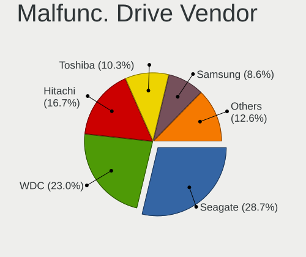

| Vendor              | Computers | Drives | Percent |
|---------------------|-----------|--------|---------|
| Seagate             | 50        | 54     | 28.74%  |
| WDC                 | 40        | 55     | 22.99%  |
| Hitachi             | 29        | 30     | 16.67%  |
| Toshiba             | 18        | 23     | 10.34%  |
| Samsung Electronics | 15        | 17     | 8.62%   |
| Intel               | 4         | 6      | 2.3%    |
| Maxtor              | 3         | 3      | 1.72%   |
| HGST                | 3         | 3      | 1.72%   |
| Kingston            | 2         | 2      | 1.15%   |
| ExcelStor           | 2         | 2      | 1.15%   |
| SPCC                | 1         | 1      | 0.57%   |
| SK hynix            | 1         | 1      | 0.57%   |
| PNY                 | 1         | 2      | 0.57%   |
| Micron Technology   | 1         | 1      | 0.57%   |
| JMicron Technology  | 1         | 1      | 0.57%   |
| IBM/Hitachi         | 1         | 2      | 0.57%   |
| ASMT                | 1         | 1      | 0.57%   |
| addlink             | 1         | 1      | 0.57%   |

Malfunc. HDD Vendor
-------------------

Vendors of faulty HDD drives

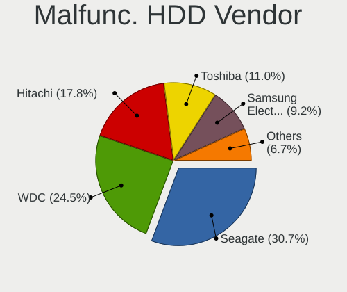

| Vendor              | Computers | Drives | Percent |
|---------------------|-----------|--------|---------|
| Seagate             | 50        | 54     | 30.67%  |
| WDC                 | 40        | 55     | 24.54%  |
| Hitachi             | 29        | 30     | 17.79%  |
| Toshiba             | 18        | 23     | 11.04%  |
| Samsung Electronics | 15        | 17     | 9.2%    |
| Maxtor              | 3         | 3      | 1.84%   |
| HGST                | 3         | 3      | 1.84%   |
| ExcelStor           | 2         | 2      | 1.23%   |
| JMicron Technology  | 1         | 1      | 0.61%   |
| IBM/Hitachi         | 1         | 2      | 0.61%   |
| ASMT                | 1         | 1      | 0.61%   |

Malfunc. Drive Kind
-------------------

Kinds of faulty drives

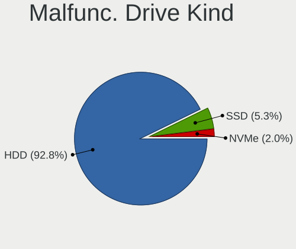

| Kind | Computers | Drives | Percent |
|------|-----------|--------|---------|
| HDD  | 141       | 191    | 92.76%  |
| SSD  | 8         | 10     | 5.26%   |
| NVMe | 3         | 4      | 1.97%   |

Failed Drives
-------------

Failed drive models

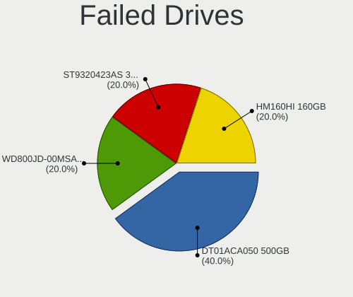

| Model                             | Computers | Drives | Percent |
|-----------------------------------|-----------|--------|---------|
| Toshiba DT01ACA050 500GB          | 2         | 2      | 40%     |
| WDC WD800JD-00MSA1 80GB           | 1         | 1      | 20%     |
| Seagate ST9320423AS 320GB         | 1         | 1      | 20%     |
| Samsung Electronics HM160HI 160GB | 1         | 1      | 20%     |

Failed Drive Vendor
-------------------

Failed drive vendors

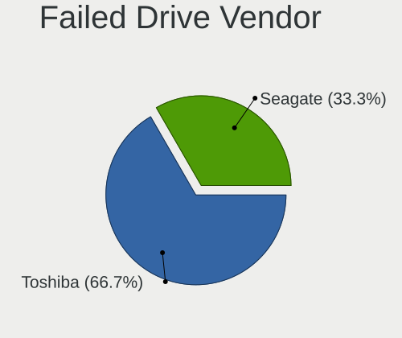

| Vendor              | Computers | Drives | Percent |
|---------------------|-----------|--------|---------|
| Toshiba             | 2         | 2      | 40%     |
| WDC                 | 1         | 1      | 20%     |
| Seagate             | 1         | 1      | 20%     |
| Samsung Electronics | 1         | 1      | 20%     |

Drive Status
------------

Number of failed and malfunc. drives

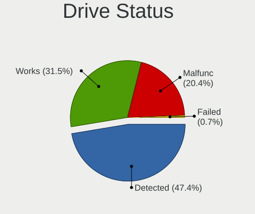

| Status   | Computers | Drives | Percent |
|----------|-----------|--------|---------|
| Detected | 353       | 619    | 47.38%  |
| Works    | 235       | 357    | 31.54%  |
| Malfunc  | 152       | 205    | 20.4%   |
| Failed   | 5         | 5      | 0.67%   |

Storage controller
------------------

Storage Vendor
--------------

Storage controller vendors

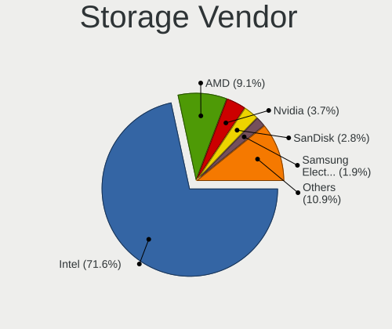

| Vendor                                    | Computers | Percent |
|-------------------------------------------|-----------|---------|
| Intel                                     | 528       | 71.64%  |
| AMD                                       | 67        | 9.09%   |
| Nvidia                                    | 27        | 3.66%   |
| SanDisk                                   | 21        | 2.85%   |
| Samsung Electronics                       | 14        | 1.9%    |
| Micron Technology                         | 10        | 1.36%   |
| Kingston Technology Company               | 9         | 1.22%   |
| SK hynix                                  | 8         | 1.09%   |
| Silicon Motion                            | 8         | 1.09%   |
| VIA Technologies                          | 6         | 0.81%   |
| Phison Electronics                        | 6         | 0.81%   |
| Marvell Technology Group                  | 6         | 0.81%   |
| JMicron Technology                        | 6         | 0.81%   |
| Jiangsu Huacun Elec.                      | 5         | 0.68%   |
| ASMedia Technology                        | 3         | 0.41%   |
| Union Memory (Shenzhen)                   | 2         | 0.27%   |
| Shenzhen Longsys Electronics              | 2         | 0.27%   |
| Micron/Crucial Technology                 | 2         | 0.27%   |
| Toshiba America Info Systems              | 1         | 0.14%   |
| Tata Power Strategic Electronics Division | 1         | 0.14%   |
| Realtek Semiconductor                     | 1         | 0.14%   |
| MAXIO Technology (Hangzhou)               | 1         | 0.14%   |
| KIOXIA                                    | 1         | 0.14%   |
| INNOGRIT                                  | 1         | 0.14%   |
| Adaptec                                   | 1         | 0.14%   |

Storage Model
-------------

Storage controller models

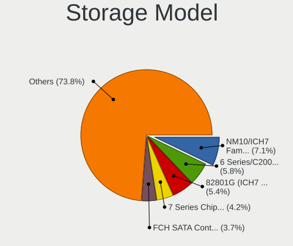

| Model                                                                                   | Computers | Percent |
|-----------------------------------------------------------------------------------------|-----------|---------|
| Intel NM10/ICH7 Family SATA Controller [IDE mode]                                       | 67        | 7.14%   |
| Intel 6 Series/C200 Series Chipset Family 6 port Desktop SATA AHCI Controller           | 54        | 5.76%   |
| Intel 82801G (ICH7 Family) IDE Controller                                               | 51        | 5.44%   |
| Intel 7 Series Chipset Family 6-port SATA Controller [AHCI mode]                        | 39        | 4.16%   |
| AMD FCH SATA Controller [AHCI mode]                                                     | 35        | 3.73%   |
| Intel 6 Series/C200 Series Chipset Family 6 port Mobile SATA AHCI Controller            | 29        | 3.09%   |
| Intel 8 Series/C220 Series Chipset Family 6-port SATA Controller 1 [AHCI mode]          | 26        | 2.77%   |
| Intel 6 Series/C200 Series Chipset Family Desktop SATA Controller (IDE mode, ports 4-5) | 26        | 2.77%   |
| Intel 6 Series/C200 Series Chipset Family Desktop SATA Controller (IDE mode, ports 0-3) | 26        | 2.77%   |
| Nvidia MCP61 SATA Controller                                                            | 23        | 2.45%   |
| Nvidia MCP61 IDE                                                                        | 21        | 2.24%   |
| Intel 82801 Mobile SATA Controller [RAID mode]                                          | 17        | 1.81%   |
| Intel Q170/Q150/B150/H170/H110/Z170/CM236 Chipset SATA Controller [AHCI Mode]           | 15        | 1.6%    |
| Intel 5 Series/3400 Series Chipset 4 port SATA AHCI Controller                          | 15        | 1.6%    |
| AMD SB7x0/SB8x0/SB9x0 SATA Controller [AHCI mode]                                       | 15        | 1.6%    |
| AMD SB7x0/SB8x0/SB9x0 IDE Controller                                                    | 15        | 1.6%    |
| Intel SATA Controller [RAID mode]                                                       | 14        | 1.49%   |
| Intel NM10/ICH7 Family SATA Controller [AHCI mode]                                      | 14        | 1.49%   |
| Intel 82801IBM/IEM (ICH9M/ICH9M-E) 4 port SATA Controller [AHCI mode]                   | 14        | 1.49%   |
| Intel 7 Series/C210 Series Chipset Family 6-port SATA Controller [AHCI mode]            | 14        | 1.49%   |
| Intel Tiger Lake-LP SATA Controller                                                     | 13        | 1.39%   |
| Intel Atom Processor E3800 Series SATA AHCI Controller                                  | 13        | 1.39%   |
| Intel 82801HM/HEM (ICH8M/ICH8M-E) IDE Controller                                        | 13        | 1.39%   |
| Intel Volume Management Device NVMe RAID Controller                                     | 12        | 1.28%   |
| Intel Sunrise Point-LP SATA Controller [AHCI mode]                                      | 12        | 1.28%   |
| Intel SSD 660P Series                                                                   | 10        | 1.07%   |
| Intel 82801HM/HEM (ICH8M/ICH8M-E) SATA Controller [AHCI mode]                           | 10        | 1.07%   |
| Intel 82801IR/IO/IH (ICH9R/DO/DH) 4 port SATA Controller [IDE mode]                     | 9         | 0.96%   |
| Intel 82801I (ICH9 Family) 2 port SATA Controller [IDE mode]                            | 9         | 0.96%   |
| Intel 5 Series/3400 Series Chipset 6 port SATA AHCI Controller                          | 8         | 0.85%   |
| AMD SB7x0/SB8x0/SB9x0 SATA Controller [IDE mode]                                        | 8         | 0.85%   |
| Silicon Motion SM2263EN/SM2263XT (DRAM-less) NVMe SSD Controllers                       | 7         | 0.75%   |
| Samsung NVMe SSD Controller 980 (DRAM-less)                                             | 7         | 0.75%   |
| Intel 200 Series PCH SATA controller [AHCI mode]                                        | 7         | 0.75%   |
| VIA VT82C586A/B/VT82C686/A/B/VT823x/A/C PIPC Bus Master IDE                             | 6         | 0.64%   |
| SanDisk WD SN560/SN740/SN770/SN5000 NVMe SSD                                            | 6         | 0.64%   |
| Micron 2450 NVMe SSD [HendrixV] (DRAM-less)                                             | 6         | 0.64%   |
| Intel SSD 670p Series [Keystone Harbor]                                                 | 6         | 0.64%   |
| Intel 82801JI (ICH10 Family) 4 port SATA IDE Controller #1                              | 6         | 0.64%   |
| Intel 82801JI (ICH10 Family) 2 port SATA IDE Controller #2                              | 6         | 0.64%   |

Storage Kind
------------

Kind of storage controller (IDE, SATA, NVMe, SAS, ...)

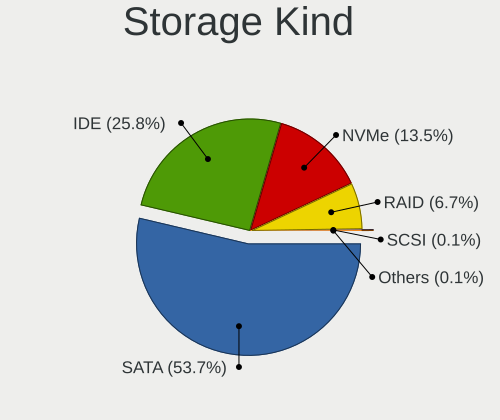

| Kind | Computers | Percent |
|------|-----------|---------|
| SATA | 416       | 53.68%  |
| IDE  | 200       | 25.81%  |
| NVMe | 105       | 13.55%  |
| RAID | 52        | 6.71%   |
| SAS  | 1         | 0.13%   |
| SCSI | 1         | 0.13%   |

Processor
---------

CPU Vendor
----------

Processor vendors

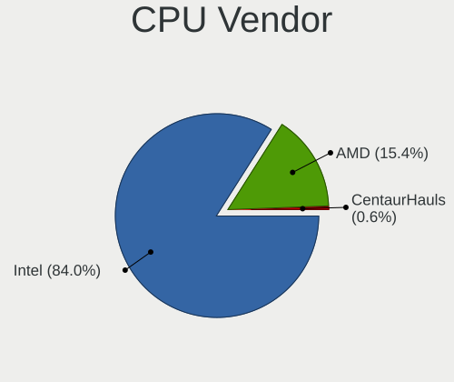

| Vendor       | Computers | Percent |
|--------------|-----------|---------|
| Intel        | 568       | 84.02%  |
| AMD          | 104       | 15.38%  |
| CentaurHauls | 4         | 0.59%   |

CPU Model
---------

Processor models

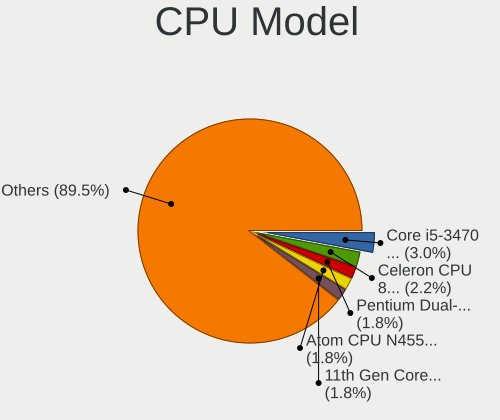

| Model                                          | Computers | Percent |
|------------------------------------------------|-----------|---------|
| Intel Core i5-3470 CPU @ 3.20GHz               | 20        | 2.96%   |
| Intel Celeron CPU 847 @ 1.10GHz                | 15        | 2.22%   |
| Intel Pentium Dual-Core CPU E5300 @ 2.60GHz    | 12        | 1.78%   |
| Intel Atom CPU N455 @ 1.66GHz                  | 12        | 1.78%   |
| Intel 11th Gen Core i5-1135G7 @ 2.40GHz        | 12        | 1.78%   |
| Intel Core i5-2400 CPU @ 3.10GHz               | 11        | 1.63%   |
| Intel Celeron CPU N2805 @ 1.46GHz              | 10        | 1.48%   |
| Intel Pentium Dual-Core CPU E5800 @ 3.20GHz    | 8         | 1.18%   |
| Intel Pentium Dual-Core CPU E5700 @ 3.00GHz    | 8         | 1.18%   |
| Intel Core i7-3770 CPU @ 3.40GHz               | 8         | 1.18%   |
| Intel Core i5-6500 CPU @ 3.20GHz               | 8         | 1.18%   |
| Intel Core i3-3110M CPU @ 2.40GHz              | 7         | 1.04%   |
| Intel Celeron CPU N3350 @ 1.10GHz              | 7         | 1.04%   |
| Intel Pentium 4 CPU 3.00GHz                    | 6         | 0.89%   |
| Intel Core i3-2120 CPU @ 3.30GHz               | 6         | 0.89%   |
| Intel Core 2 Duo CPU T6570 @ 2.10GHz           | 6         | 0.89%   |
| Intel Pentium CPU N3710 @ 1.60GHz              | 5         | 0.74%   |
| Intel Pentium CPU G620 @ 2.60GHz               | 5         | 0.74%   |
| Intel Core i5-7300U CPU @ 2.60GHz              | 5         | 0.74%   |
| Intel Core i3-3120M CPU @ 2.50GHz              | 5         | 0.74%   |
| Intel Core i3-2330M CPU @ 2.20GHz              | 5         | 0.74%   |
| Intel Core 2 Duo CPU E7500 @ 2.93GHz           | 5         | 0.74%   |
| Intel Celeron CPU N3060 @ 1.60GHz              | 5         | 0.74%   |
| Intel Celeron CPU N2840 @ 2.16GHz              | 5         | 0.74%   |
| Intel Pentium Dual-Core CPU E6600 @ 3.06GHz    | 4         | 0.59%   |
| Intel Pentium Dual CPU T2370 @ 1.73GHz         | 4         | 0.59%   |
| Intel Pentium Dual CPU E2180 @ 2.00GHz         | 4         | 0.59%   |
| Intel Pentium CPU G2030 @ 3.00GHz              | 4         | 0.59%   |
| Intel Core i7-4790 CPU @ 3.60GHz               | 4         | 0.59%   |
| Intel Core i5-6200U CPU @ 2.30GHz              | 4         | 0.59%   |
| Intel Core i5-3330 CPU @ 3.00GHz               | 4         | 0.59%   |
| Intel Core i5-3210M CPU @ 2.50GHz              | 4         | 0.59%   |
| Intel Core i5-2500 CPU @ 3.30GHz               | 4         | 0.59%   |
| Intel Core i5-2430M CPU @ 2.40GHz              | 4         | 0.59%   |
| Intel Core i5-1035G1 CPU @ 1.00GHz             | 4         | 0.59%   |
| Intel Core i3-3220 CPU @ 3.30GHz               | 4         | 0.59%   |
| Intel Core 2 Duo CPU T6600 @ 2.20GHz           | 4         | 0.59%   |
| Intel Core 2 Duo CPU E8400 @ 3.00GHz           | 4         | 0.59%   |
| Intel 13th Gen Core i9-13900H                  | 4         | 0.59%   |
| CentaurHauls ZHAOXIN KaiXian KX-6640MA@2.2+GHz | 4         | 0.59%   |

CPU Model Family
----------------

Processor model prefix

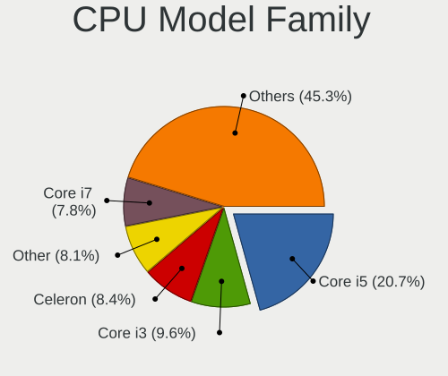

| Model                                | Computers | Percent |
|--------------------------------------|-----------|---------|
| Intel Core i5                        | 140       | 20.71%  |
| Intel Core i3                        | 65        | 9.62%   |
| Intel Celeron                        | 57        | 8.43%   |
| Other                                | 55        | 8.14%   |
| Intel Core i7                        | 53        | 7.84%   |
| Intel Pentium Dual-Core              | 44        | 6.51%   |
| Intel Core 2 Duo                     | 41        | 6.07%   |
| Intel Pentium                        | 36        | 5.33%   |
| Intel Atom                           | 20        | 2.96%   |
| Intel Pentium Dual                   | 15        | 2.22%   |
| AMD Ryzen 5                          | 15        | 2.22%   |
| Intel Xeon                           | 14        | 2.07%   |
| AMD Ryzen 7                          | 12        | 1.78%   |
| Intel Pentium 4                      | 10        | 1.48%   |
| Intel Core 2                         | 8         | 1.18%   |
| AMD Sempron                          | 8         | 1.18%   |
| Intel Core 2 Quad                    | 7         | 1.04%   |
| AMD FX                               | 7         | 1.04%   |
| AMD Athlon II X2                     | 7         | 1.04%   |
| Intel Genuine                        | 4         | 0.59%   |
| AMD Ryzen 3                          | 4         | 0.59%   |
| AMD Phenom II X4                     | 4         | 0.59%   |
| AMD E1                               | 4         | 0.59%   |
| AMD Athlon II X4                     | 4         | 0.59%   |
| AMD Athlon 64 X2                     | 4         | 0.59%   |
| Intel Pentium D                      | 3         | 0.44%   |
| AMD E                                | 3         | 0.44%   |
| AMD A6                               | 3         | 0.44%   |
| Intel Pentium Silver                 | 2         | 0.3%    |
| AMD Phenom II X2                     | 2         | 0.3%    |
| AMD Phenom                           | 2         | 0.3%    |
| AMD C-70                             | 2         | 0.3%    |
| AMD Athlon                           | 2         | 0.3%    |
| AMD A8                               | 2         | 0.3%    |
| AMD A4                               | 2         | 0.3%    |
| AMD A10                              | 2         | 0.3%    |
| Intel Core m5                        | 1         | 0.15%   |
| Intel Core i9                        | 1         | 0.15%   |
| AMD Turion X2 Ultra Dual-Core Mobile | 1         | 0.15%   |
| AMD Turion X2 Dual-Core Mobile       | 1         | 0.15%   |

CPU Cores
---------

Number of processor cores

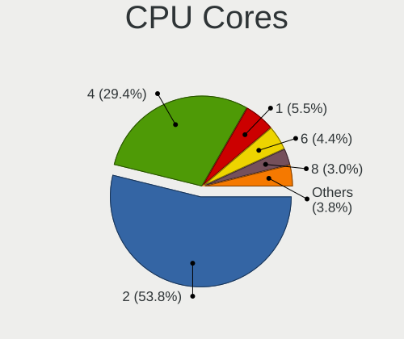

| Number  | Computers | Percent |
|---------|-----------|---------|
| 2       | 364       | 53.85%  |
| 4       | 199       | 29.44%  |
| 1       | 37        | 5.47%   |
| 6       | 30        | 4.44%   |
| 8       | 20        | 2.96%   |
| 3       | 7         | 1.04%   |
| 14      | 6         | 0.89%   |
| 10      | 5         | 0.74%   |
| Unknown | 4         | 0.59%   |
| 24      | 2         | 0.3%    |
| 12      | 2         | 0.3%    |

CPU Sockets
-----------

Number of sockets

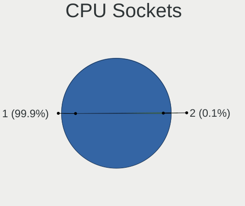

| Number | Computers | Percent |
|--------|-----------|---------|
| 1      | 675       | 99.85%  |
| 2      | 1         | 0.15%   |

CPU Threads
-----------

Threads per core (Hyper-Threading)

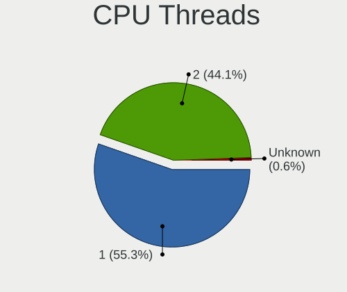

| Number  | Computers | Percent |
|---------|-----------|---------|
| 1       | 374       | 55.33%  |
| 2       | 298       | 44.08%  |
| Unknown | 4         | 0.59%   |

CPU Op-Modes
------------

CPU Operation Modes (32-bit, 64-bit)

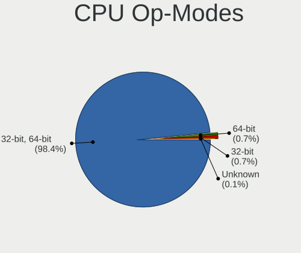

| Op mode        | Computers | Percent |
|----------------|-----------|---------|
| 32-bit, 64-bit | 665       | 98.37%  |
| 64-bit         | 5         | 0.74%   |
| 32-bit         | 5         | 0.74%   |
| Unknown        | 1         | 0.15%   |

CPU Microcode
-------------

Microcode number

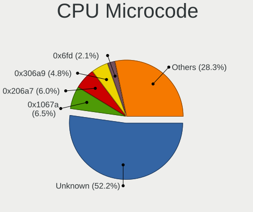

| Number     | Computers | Percent |
|------------|-----------|---------|
| Unknown    | 367       | 52.2%   |
| 0x1067a    | 46        | 6.54%   |
| 0x206a7    | 42        | 5.97%   |
| 0x306a9    | 34        | 4.84%   |
| 0x6fd      | 15        | 2.13%   |
| 0x306c3    | 13        | 1.85%   |
| 0x106ca    | 11        | 1.56%   |
| 0x806c1    | 7         | 1%      |
| 0x30678    | 7         | 1%      |
| 0x30673    | 7         | 1%      |
| 0x010000c8 | 7         | 1%      |
| 0x20655    | 6         | 0.85%   |
| 0x806e9    | 5         | 0.71%   |
| 0x6fb      | 5         | 0.71%   |
| 0x506e3    | 5         | 0.71%   |
| 0xf65      | 4         | 0.57%   |
| 0x6f2      | 4         | 0.57%   |
| 0x406e3    | 4         | 0.57%   |
| 0x05000119 | 4         | 0.57%   |
| 0x010000c7 | 4         | 0.57%   |
| 0x010000b6 | 4         | 0.57%   |
| 0xa0671    | 3         | 0.43%   |
| 0x906e9    | 3         | 0.43%   |
| 0x806ec    | 3         | 0.43%   |
| 0x40651    | 3         | 0.43%   |
| 0x106a5    | 3         | 0.43%   |
| 0x10676    | 3         | 0.43%   |
| 0x06000852 | 3         | 0.43%   |
| 0x0600063e | 3         | 0.43%   |
| 0x03000027 | 3         | 0.43%   |
| 0xf41      | 2         | 0.28%   |
| 0x806ea    | 2         | 0.28%   |
| 0x806d1    | 2         | 0.28%   |
| 0x706a8    | 2         | 0.28%   |
| 0x6f6      | 2         | 0.28%   |
| 0x406c4    | 2         | 0.28%   |
| 0x306d4    | 2         | 0.28%   |
| 0x206d7    | 2         | 0.28%   |
| 0x20652    | 2         | 0.28%   |
| 0x0a50000d | 2         | 0.28%   |

CPU Microarch
-------------

Microarchitecture

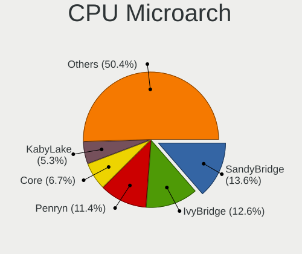

| Name             | Computers | Percent |
|------------------|-----------|---------|
| SandyBridge      | 92        | 13.61%  |
| IvyBridge        | 85        | 12.57%  |
| Penryn           | 77        | 11.39%  |
| Core             | 45        | 6.66%   |
| KabyLake         | 36        | 5.33%   |
| Haswell          | 35        | 5.18%   |
| Silvermont       | 32        | 4.73%   |
| K10              | 30        | 4.44%   |
| Skylake          | 26        | 3.85%   |
| Westmere         | 24        | 3.55%   |
| Unknown          | 20        | 2.96%   |
| TigerLake        | 19        | 2.81%   |
| Bonnell          | 18        | 2.66%   |
| Alderlake Hybrid | 15        | 2.22%   |
| NetBurst         | 13        | 1.92%   |
| IceLake          | 9         | 1.33%   |
| Zen+             | 8         | 1.18%   |
| K8 Hammer        | 8         | 1.18%   |
| Goldmont         | 8         | 1.18%   |
| CometLake        | 8         | 1.18%   |
| Zen 3            | 7         | 1.04%   |
| Broadwell        | 7         | 1.04%   |
| Bobcat           | 7         | 1.04%   |
| Goldmont plus    | 6         | 0.89%   |
| Excavator        | 6         | 0.89%   |
| Zen 2            | 5         | 0.74%   |
| Jaguar           | 5         | 0.74%   |
| Zen              | 4         | 0.59%   |
| Piledriver       | 4         | 0.59%   |
| Nehalem          | 4         | 0.59%   |
| Bulldozer        | 4         | 0.59%   |
| K10 Llano        | 3         | 0.44%   |
| Steamroller      | 2         | 0.3%    |
| K8 & K10 hybrid  | 2         | 0.3%    |
| P6               | 1         | 0.15%   |
| Gracemont        | 1         | 0.15%   |

Graphics
--------

GPU Vendor
----------

Vendors of graphics cards

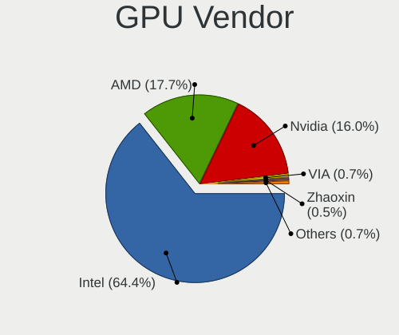

| Vendor                     | Computers | Percent |
|----------------------------|-----------|---------|
| Intel                      | 472       | 64.39%  |
| AMD                        | 130       | 17.74%  |
| Nvidia                     | 117       | 15.96%  |
| VIA Technologies           | 5         | 0.68%   |
| Zhaoxin                    | 4         | 0.55%   |
| ASPEED Technology          | 3         | 0.41%   |
| Matrox Electronics Systems | 2         | 0.27%   |

GPU Model
---------

Graphics card models

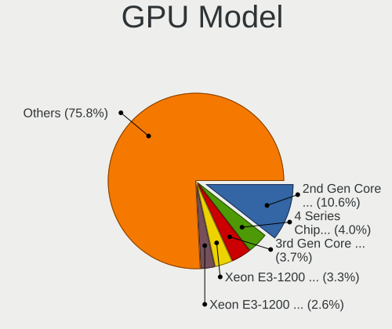

| Model                                                                                    | Computers | Percent |
|------------------------------------------------------------------------------------------|-----------|---------|
| Intel 2nd Generation Core Processor Family Integrated Graphics Controller                | 80        | 10.57%  |
| Intel 4 Series Chipset Integrated Graphics Controller                                    | 30        | 3.96%   |
| Intel 3rd Gen Core processor Graphics Controller                                         | 28        | 3.7%    |
| Intel Xeon E3-1200 v2/3rd Gen Core processor Graphics Controller                         | 25        | 3.3%    |
| Intel Xeon E3-1200 v3/4th Gen Core Processor Integrated Graphics Controller              | 20        | 2.64%   |
| Intel Core Processor Integrated Graphics Controller                                      | 20        | 2.64%   |
| Intel Atom Processor Z36xxx/Z37xxx Series Graphics & Display                             | 20        | 2.64%   |
| Intel TigerLake-LP GT2 [Iris Xe Graphics]                                                | 18        | 2.38%   |
| Intel Mobile 4 Series Chipset Integrated Graphics Controller                             | 16        | 2.11%   |
| Intel Atom Processor D4xx/D5xx/N4xx/N5xx Integrated Graphics Controller                  | 16        | 2.11%   |
| Intel 82G33/G31 Express Integrated Graphics Controller                                   | 16        | 2.11%   |
| Intel Mobile GM965/GL960 Integrated Graphics Controller (secondary)                      | 13        | 1.72%   |
| Intel Mobile GM965/GL960 Integrated Graphics Controller (primary)                        | 13        | 1.72%   |
| Intel Skylake-S GT2 [HD Graphics 530]                                                    | 12        | 1.59%   |
| Intel Atom/Celeron/Pentium Processor x5-E8000/J3xxx/N3xxx Integrated Graphics Controller | 12        | 1.59%   |
| AMD Cedar [Radeon HD 5000/6000/7350/8350 Series]                                         | 12        | 1.59%   |
| AMD Ellesmere [Radeon RX 470/480/570/570X/580/580X/590]                                  | 10        | 1.32%   |
| Nvidia C61 [GeForce 7025 / nForce 630a]                                                  | 9         | 1.19%   |
| Intel Skylake-U GT2 [HD Graphics 520]                                                    | 8         | 1.06%   |
| Intel Kaby Lake-U GT2 [HD Graphics 620]                                                  | 8         | 1.06%   |
| Intel IvyBridge GT2 [HD Graphics 4000]                                                   | 8         | 1.06%   |
| Intel Apollo Lake GT1 [HD Graphics 500]                                                  | 8         | 1.06%   |
| AMD Oland [Radeon HD 8570 / R5 430 OEM / R7 240/340 / Radeon 520 OEM]                    | 8         | 1.06%   |
| Nvidia GF119 [GeForce GT 610]                                                            | 7         | 0.92%   |
| AMD Picasso/Raven 2 [Radeon Vega Series / Radeon Vega Mobile Series]                     | 7         | 0.92%   |
| AMD Oland XT [Radeon HD 8670 / R5 340X OEM / R7 250/350/350X OEM]                        | 7         | 0.92%   |
| AMD Lucienne                                                                             | 7         | 0.92%   |
| Nvidia GT218 [GeForce 210]                                                               | 6         | 0.79%   |
| Intel Kaby Lake-S GT2 [HD Graphics 630]                                                  | 6         | 0.79%   |
| Intel 4th Gen Core Processor Integrated Graphics Controller                              | 6         | 0.79%   |
| Nvidia GK208B [GeForce GT 730]                                                           | 5         | 0.66%   |
| Nvidia G96C [GeForce 9500 GT]                                                            | 5         | 0.66%   |
| Intel Raptor Lake-P [Iris Xe Graphics]                                                   | 5         | 0.66%   |
| Intel Broadwell-U GT2 [HD Graphics 5500]                                                 | 5         | 0.66%   |
| Intel 82945G/GZ Integrated Graphics Controller                                           | 5         | 0.66%   |
| Zhaoxin KX-6000 C-960 GPU                                                                | 4         | 0.53%   |
| VIA Technologies CN896/VN896/P4M900 [Chrome 9 HC]                                        | 4         | 0.53%   |
| Nvidia TU117M [GeForce GTX 1650 Mobile / Max-Q]                                          | 4         | 0.53%   |
| Nvidia GK208B [GeForce GT 710]                                                           | 4         | 0.53%   |
| Nvidia GF119 [GeForce GT 520]                                                            | 4         | 0.53%   |

GPU Combo
---------

Combinations of graphics cards

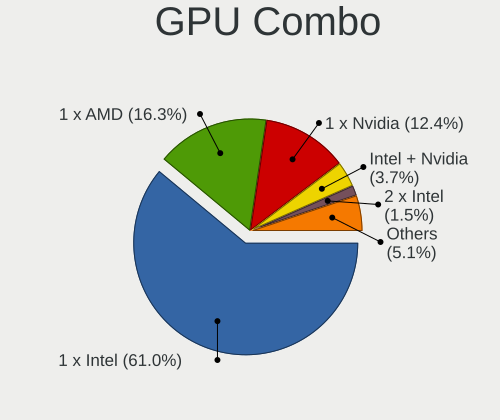

| Name            | Computers | Percent |
|-----------------|-----------|---------|
| 1 x Intel       | 415       | 61.03%  |
| 1 x AMD         | 111       | 16.32%  |
| 1 x Nvidia      | 84        | 12.35%  |
| Intel + Nvidia  | 25        | 3.68%   |
| 2 x Intel       | 10        | 1.47%   |
| Intel + AMD     | 10        | 1.47%   |
| AMD + Nvidia    | 6         | 0.88%   |
| 1 x VIA         | 5         | 0.74%   |
| 1 x Zhaoxin     | 4         | 0.59%   |
| 2 x AMD         | 3         | 0.44%   |
| Nvidia + ASPEED | 3         | 0.44%   |
| Other           | 2         | 0.29%   |
| 1 x Matrox      | 2         | 0.29%   |

GPU Driver
----------

Free vs proprietary

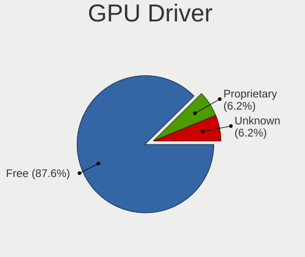

| Driver      | Computers | Percent |
|-------------|-----------|---------|
| Free        | 596       | 87.65%  |
| Proprietary | 42        | 6.18%   |
| Unknown     | 42        | 6.18%   |

GPU Memory
----------

Total video memory

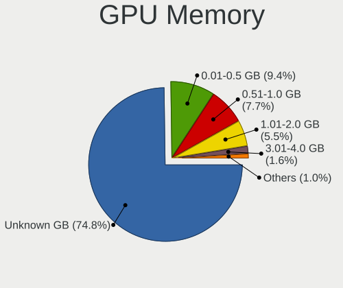

| Size in GB | Computers | Percent |
|------------|-----------|---------|
| Unknown    | 516       | 74.78%  |
| 0.01-0.5   | 65        | 9.42%   |
| 0.51-1.0   | 53        | 7.68%   |
| 1.01-2.0   | 38        | 5.51%   |
| 3.01-4.0   | 11        | 1.59%   |
| 7.01-8.0   | 4         | 0.58%   |
| 5.01-6.0   | 2         | 0.29%   |
| 8.01-16.0  | 1         | 0.14%   |

Monitor
-------

Monitor Vendor
--------------

Monitor vendors

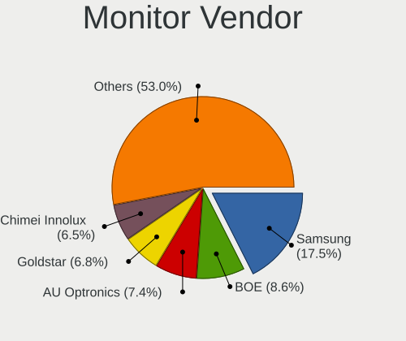

| Vendor                  | Computers | Percent |
|-------------------------|-----------|---------|
| Samsung Electronics     | 118       | 17.53%  |
| BOE                     | 58        | 8.62%   |
| AU Optronics            | 50        | 7.43%   |
| Goldstar                | 46        | 6.84%   |
| Chimei Innolux          | 44        | 6.54%   |
| LG Display              | 41        | 6.09%   |
| Hewlett-Packard         | 29        | 4.31%   |
| Toshiba                 | 27        | 4.01%   |
| Lenovo                  | 24        | 3.57%   |
| Dell                    | 23        | 3.42%   |
| Vita                    | 20        | 2.97%   |
| Acer                    | 20        | 2.97%   |
| InfoVision              | 18        | 2.67%   |
| AOC                     | 17        | 2.53%   |
| Chi Mei Optoelectronics | 10        | 1.49%   |
| LG Philips              | 7         | 1.04%   |
| BenQ                    | 6         | 0.89%   |
| Apple                   | 6         | 0.89%   |
| HannStar                | 5         | 0.74%   |
| ViewSonic               | 4         | 0.59%   |
| SKG                     | 4         | 0.59%   |
| LED                     | 4         | 0.59%   |
| ___                     | 3         | 0.45%   |
| Unknown (XXX)           | 3         | 0.45%   |
| Sony                    | 3         | 0.45%   |
| Skyworth                | 3         | 0.45%   |
| PANDA                   | 3         | 0.45%   |
| MSI                     | 3         | 0.45%   |
| LG Electronics          | 3         | 0.45%   |
| KTC                     | 3         | 0.45%   |
| InnoLux Display         | 3         | 0.45%   |
| IBM                     | 3         | 0.45%   |
| HKC                     | 3         | 0.45%   |
| Envision                | 3         | 0.45%   |
| CHO                     | 3         | 0.45%   |
| VIE                     | 2         | 0.3%    |
| Unknown                 | 2         | 0.3%    |
| Sharp                   | 2         | 0.3%    |
| Philips                 | 2         | 0.3%    |
| NEC Computers           | 2         | 0.3%    |

Monitor Model
-------------

Monitor models

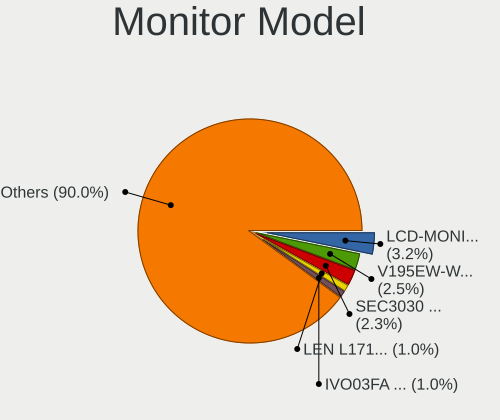

| Model                                                                | Computers | Percent |
|----------------------------------------------------------------------|-----------|---------|
| Toshiba LCD-MONITOR LCDE980 1440x900 408x255mm 18.9-inch             | 22        | 3.2%    |
| Vita V195EW-W VIT1950 1600x900 432x240mm 19.5-inch                   | 17        | 2.47%   |
| Samsung Electronics LCD Monitor SEC3030 1024x600 223x125mm 10.1-inch | 16        | 2.33%   |
| Lenovo LEN L171 LEN240B 1280x1024 337x270mm 17.0-inch                | 7         | 1.02%   |
| InfoVision LCD Monitor IVO03FA 1366x768 223x125mm 10.1-inch          | 7         | 1.02%   |
| Chimei Innolux LCD Monitor CMN1475 1366x768 309x174mm 14.0-inch      | 7         | 1.02%   |
| BOE LCD Monitor BOE0697 1366x768 309x173mm 13.9-inch                 | 7         | 1.02%   |
| AU Optronics LCD Monitor AUO1B3C 1366x768 309x173mm 13.9-inch        | 6         | 0.87%   |
| Samsung Electronics T22C301 SAM0AD2 1920x1080 477x268mm 21.5-inch    | 5         | 0.73%   |
| LG Display LCD Monitor LGD0385 1366x768 309x174mm 14.0-inch          | 5         | 0.73%   |
| Goldstar W1943 GSM4BAD 1360x768 406x229mm 18.4-inch                  | 5         | 0.73%   |
| Goldstar E1942 GSM4C09 1366x768 410x230mm 18.5-inch                  | 5         | 0.73%   |
| Samsung Electronics SyncMaster SAM01B7 1280x1024 340x270mm 17.1-inch | 4         | 0.58%   |
| Samsung Electronics SMB1930N SAM0632 1366x768 410x230mm 18.5-inch    | 4         | 0.58%   |
| Samsung Electronics LCD Monitor SEC3741 1280x800 331x207mm 15.4-inch | 4         | 0.58%   |
| InfoVision LCD Monitor IVO0579 1366x768 309x174mm 14.0-inch          | 4         | 0.58%   |
| Goldstar HD GSM5ACD 1366x768 410x230mm 18.5-inch                     | 4         | 0.58%   |
| Goldstar 505G GSM3B91 1024x768 270x200mm 13.2-inch                   | 4         | 0.58%   |
| BOE LCD Monitor BOE059F 1366x768 309x173mm 13.9-inch                 | 4         | 0.58%   |
| Toshiba TV TSB0206 1920x1080                                         | 3         | 0.44%   |
| SKG DEXP DF24N2 SKG2413 1920x1080 597x336mm 27.0-inch                | 3         | 0.44%   |
| LG Display LCD Monitor LGD045E 1366x768 310x174mm 14.0-inch          | 3         | 0.44%   |
| Lenovo LEN D186wA LEN0A14 1366x768 410x230mm 18.5-inch               | 3         | 0.44%   |
| InfoVision M140NWR2 R1 IVO057A 1366x768 309x174mm 14.0-inch          | 3         | 0.44%   |
| Hewlett-Packard L1710 HWP26EB 1280x1024 340x270mm 17.1-inch          | 3         | 0.44%   |
| HannStar LCD Monitor HSD03E9 1024x600 220x129mm 10.0-inch            | 3         | 0.44%   |
| CHO Smart TV CHO0030 1920x1080 1390x780mm 62.8-inch                  | 3         | 0.44%   |
| Chimei Innolux N160JME-GL2 CMN1627 1920x1200 344x215mm 16.0-inch     | 3         | 0.44%   |
| Chimei Innolux LCD Monitor CMN14D6 1366x768 309x173mm 13.9-inch      | 3         | 0.44%   |
| BOE LCD Monitor BOE05C7 1366x768 309x173mm 13.9-inch                 | 3         | 0.44%   |
| BOE LCD Monitor BOE05B1 1366x768 309x173mm 13.9-inch                 | 3         | 0.44%   |
| Vita L195WA-V VIT1120 1440x900 373x280mm 18.4-inch                   | 2         | 0.29%   |
| Unknown (XXX) L9W XXX076E 1440x900 410x256mm 19.0-inch               | 2         | 0.29%   |
| Skyworth 238DA23F-B SKY0238 1920x1080 527x296mm 23.8-inch            | 2         | 0.29%   |
| Samsung Electronics SyncMaster SAM0598 1360x768 410x230mm 18.5-inch  | 2         | 0.29%   |
| Samsung Electronics SyncMaster SAM0472 1440x900 367x229mm 17.0-inch  | 2         | 0.29%   |
| Samsung Electronics SyncMaster SAM0370 1680x1050 459x296mm 21.5-inch | 2         | 0.29%   |
| Samsung Electronics SyncMaster SAM0364 1360x768 344x194mm 15.5-inch  | 2         | 0.29%   |
| Samsung Electronics SyncMaster SAM0272 1280x1024 338x270mm 17.0-inch | 2         | 0.29%   |
| Samsung Electronics SME1920N SAM06A3 1366x768 410x230mm 18.5-inch    | 2         | 0.29%   |

Monitor Resolution
------------------

Monitor screen resolution

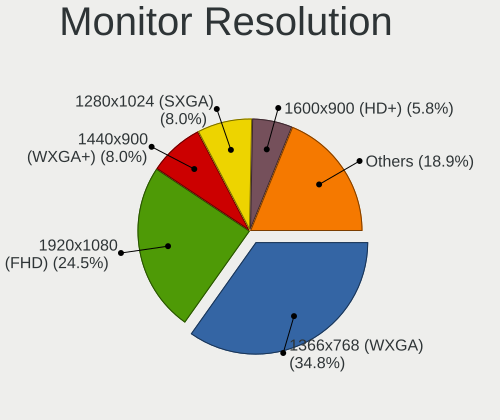

| Resolution         | Computers | Percent |
|--------------------|-----------|---------|
| 1366x768 (WXGA)    | 227       | 34.82%  |
| 1920x1080 (FHD)    | 160       | 24.54%  |
| 1440x900 (WXGA+)   | 52        | 7.98%   |
| 1280x1024 (SXGA)   | 52        | 7.98%   |
| 1600x900 (HD+)     | 38        | 5.83%   |
| 1280x800 (WXGA)    | 27        | 4.14%   |
| 1360x768           | 18        | 2.76%   |
| 1024x768 (XGA)     | 14        | 2.15%   |
| 3840x2160 (4K)     | 13        | 1.99%   |
| 1680x1050 (WSXGA+) | 13        | 1.99%   |
| 1920x1200 (WUXGA)  | 12        | 1.84%   |
| 2560x1440 (QHD)    | 7         | 1.07%   |
| 1024x600           | 5         | 0.77%   |
| 1280x720 (HD)      | 4         | 0.61%   |
| 2240x1400          | 3         | 0.46%   |
| Unknown            | 2         | 0.31%   |
| 3840x1080          | 1         | 0.15%   |
| 3240x2160          | 1         | 0.15%   |
| 2560x1600          | 1         | 0.15%   |
| 1600x1200          | 1         | 0.15%   |
| 1152x864           | 1         | 0.15%   |

Monitor Diagonal
----------------

Diagonal size in inches

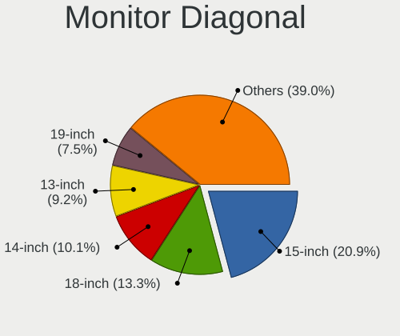

| Inches  | Computers | Percent |
|---------|-----------|---------|
| 15      | 140       | 20.86%  |
| 18      | 89        | 13.26%  |
| 14      | 68        | 10.13%  |
| 13      | 62        | 9.24%   |
| 19      | 50        | 7.45%   |
| 17      | 49        | 7.3%    |
| 21      | 43        | 6.41%   |
| 23      | 24        | 3.58%   |
| Unknown | 21        | 3.13%   |
| 20      | 17        | 2.53%   |
| 27      | 14        | 2.09%   |
| 10      | 14        | 2.09%   |
| 11      | 13        | 1.94%   |
| 16      | 10        | 1.49%   |
| 22      | 9         | 1.34%   |
| 31      | 7         | 1.04%   |
| 32      | 6         | 0.89%   |
| 12      | 6         | 0.89%   |
| 72      | 5         | 0.75%   |
| 24      | 4         | 0.6%    |
| 74      | 3         | 0.45%   |
| 63      | 3         | 0.45%   |
| 54      | 2         | 0.3%    |
| 52      | 2         | 0.3%    |
| 40      | 2         | 0.3%    |
| 25      | 2         | 0.3%    |
| 57      | 1         | 0.15%   |
| 49      | 1         | 0.15%   |
| 46      | 1         | 0.15%   |
| 42      | 1         | 0.15%   |
| 39      | 1         | 0.15%   |
| 33      | 1         | 0.15%   |

Monitor Width
-------------

Physical width

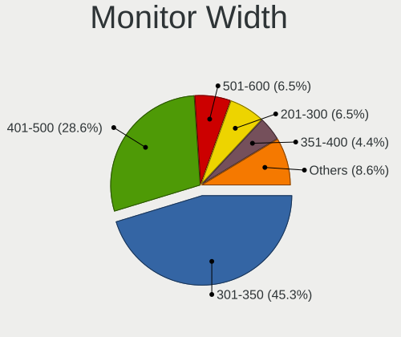

| Width in mm | Computers | Percent |
|-------------|-----------|---------|
| 301-350     | 299       | 45.3%   |
| 401-500     | 189       | 28.64%  |
| 501-600     | 43        | 6.52%   |
| 201-300     | 43        | 6.52%   |
| 351-400     | 29        | 4.39%   |
| Unknown     | 21        | 3.18%   |
| 1001-1500   | 10        | 1.52%   |
| 1501-2000   | 8         | 1.21%   |
| 701-800     | 7         | 1.06%   |
| 601-700     | 7         | 1.06%   |
| 801-900     | 3         | 0.45%   |
| 901-1000    | 1         | 0.15%   |

Aspect Ratio
------------

Proportional relationship between the width and the height

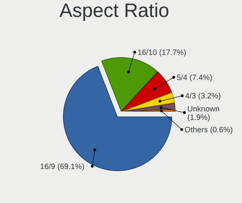

| Ratio   | Computers | Percent |
|---------|-----------|---------|
| 16/9    | 430       | 69.13%  |
| 16/10   | 110       | 17.68%  |
| 5/4     | 46        | 7.4%    |
| 4/3     | 20        | 3.22%   |
| Unknown | 12        | 1.93%   |
| 3/2     | 3         | 0.48%   |
| 32/9    | 1         | 0.16%   |

Monitor Area
------------

Area in inch²

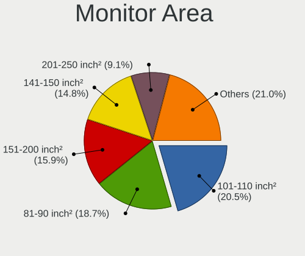

| Area in inch² | Computers | Percent |
|----------------|-----------|---------|
| 101-110        | 137       | 20.51%  |
| 81-90          | 125       | 18.71%  |
| 151-200        | 106       | 15.87%  |
| 141-150        | 99        | 14.82%  |
| 201-250        | 61        | 9.13%   |
| Unknown        | 21        | 3.14%   |
| More than 1000 | 16        | 2.4%    |
| 351-500        | 14        | 2.1%    |
| 41-50          | 14        | 2.1%    |
| 301-350        | 14        | 2.1%    |
| 51-60          | 13        | 1.95%   |
| 121-130        | 12        | 1.8%    |
| 111-120        | 11        | 1.65%   |
| 501-1000       | 6         | 0.9%    |
| 61-70          | 5         | 0.75%   |
| 251-300        | 5         | 0.75%   |
| 71-80          | 4         | 0.6%    |
| 131-140        | 4         | 0.6%    |
| 91-100         | 1         | 0.15%   |

Pixel Density
-------------

Pixels per inch

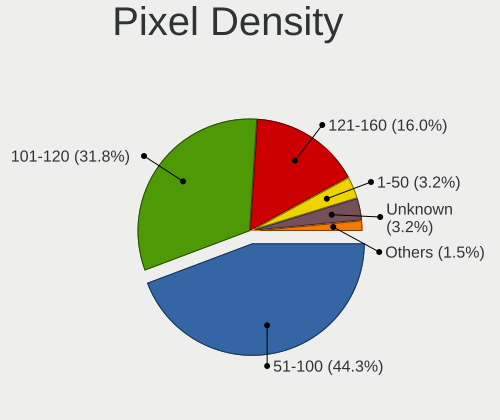

| Density       | Computers | Percent |
|---------------|-----------|---------|
| 51-100        | 290       | 44.27%  |
| 101-120       | 208       | 31.76%  |
| 121-160       | 105       | 16.03%  |
| 1-50          | 21        | 3.21%   |
| Unknown       | 21        | 3.21%   |
| 161-240       | 7         | 1.07%   |
| More than 240 | 3         | 0.46%   |

Multiple Monitors
-----------------

Total monitors connected

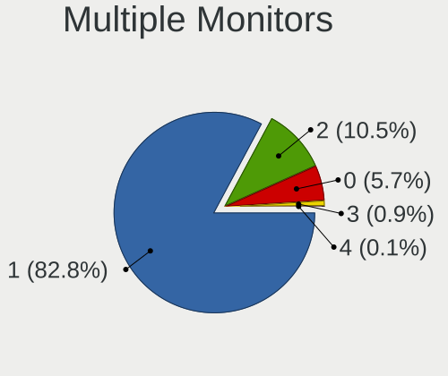

| Total | Computers | Percent |
|-------|-----------|---------|
| 1     | 569       | 82.82%  |
| 2     | 72        | 10.48%  |
| 0     | 39        | 5.68%   |
| 3     | 6         | 0.87%   |
| 4     | 1         | 0.15%   |

Network
-------

Net Controller Vendor
---------------------

Controller vendors

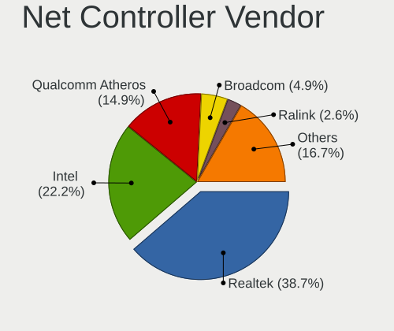

| Vendor                                 | Computers | Percent |
|----------------------------------------|-----------|---------|
| Realtek Semiconductor                  | 410       | 38.68%  |
| Intel                                  | 235       | 22.17%  |
| Qualcomm Atheros                       | 158       | 14.91%  |
| Broadcom                               | 52        | 4.91%   |
| Ralink                                 | 28        | 2.64%   |
| Nvidia                                 | 26        | 2.45%   |
| Ralink Technology                      | 18        | 1.7%    |
| MediaTek                               | 18        | 1.7%    |
| TP-Link                                | 17        | 1.6%    |
| Xiaomi                                 | 14        | 1.32%   |
| Marvell Technology Group               | 12        | 1.13%   |
| Broadcom Limited                       | 11        | 1.04%   |
| Qualcomm Atheros Communications        | 8         | 0.75%   |
| VIA Technologies                       | 6         | 0.57%   |
| JMicron Technology                     | 6         | 0.57%   |
| Mercucys                               | 5         | 0.47%   |
| Samsung Electronics                    | 4         | 0.38%   |
| D-Link System                          | 4         | 0.38%   |
| ASIX Electronics                       | 4         | 0.38%   |
| Motorola PCS                           | 3         | 0.28%   |
| Trendchip Technologies                 | 2         | 0.19%   |
| Sundance Technology Inc / IC Plus      | 2         | 0.19%   |
| Shenzhen Goodix Technology             | 2         | 0.19%   |
| ZyXEL Communications                   | 1         | 0.09%   |
| ZTopInc                                | 1         | 0.09%   |
| ZTE WCDMA Technologies MSM             | 1         | 0.09%   |
| Suzhou Motorcomm Electronic Technology | 1         | 0.09%   |
| QinHeng Electronics                    | 1         | 0.09%   |
| National Semiconductor                 | 1         | 0.09%   |
| Motorola BCS                           | 1         | 0.09%   |
| ICS Advent                             | 1         | 0.09%   |
| Huawei Technologies                    | 1         | 0.09%   |
| Digium                                 | 1         | 0.09%   |
| Dell                                   | 1         | 0.09%   |
| Davicom Semiconductor                  | 1         | 0.09%   |
| AMD                                    | 1         | 0.09%   |
| ADMtek                                 | 1         | 0.09%   |
| Accton Technology                      | 1         | 0.09%   |

Net Controller Model
--------------------

Controller models

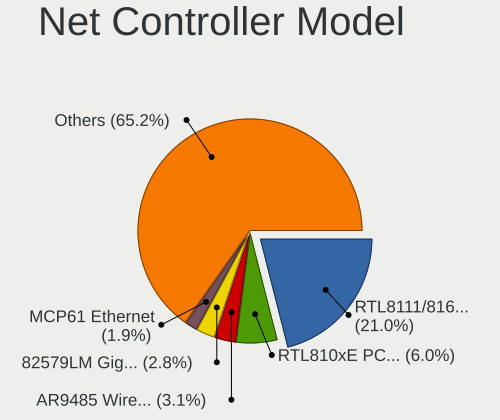

| Model                                                                   | Computers | Percent |
|-------------------------------------------------------------------------|-----------|---------|
| Realtek RTL8111/8168/8211/8411 PCI Express Gigabit Ethernet Controller  | 250       | 21.04%  |
| Realtek RTL810xE PCI Express Fast Ethernet controller                   | 71        | 5.98%   |
| Qualcomm Atheros AR9485 Wireless Network Adapter                        | 37        | 3.11%   |
| Intel 82579LM Gigabit Network Connection (Lewisville)                   | 33        | 2.78%   |
| Nvidia MCP61 Ethernet                                                   | 22        | 1.85%   |
| Intel Wireless 7265                                                     | 22        | 1.85%   |
| Qualcomm Atheros AR9285 Wireless Network Adapter (PCI-Express)          | 21        | 1.77%   |
| Intel Wi-Fi 6 AX201                                                     | 17        | 1.43%   |
| Realtek RTL8188CE 802.11b/g/n WiFi Adapter                              | 16        | 1.35%   |
| Qualcomm Atheros AR8152 v2.0 Fast Ethernet                              | 16        | 1.35%   |
| Intel Ethernet Connection I217-LM                                       | 15        | 1.26%   |
| Realtek RTL-8100/8101L/8139 PCI Fast Ethernet Adapter                   | 14        | 1.18%   |
| Realtek RTL8723BE PCIe Wireless Network Adapter                         | 13        | 1.09%   |
| Qualcomm Atheros AR5212/5213/2414 Wireless Network Adapter              | 12        | 1.01%   |
| Broadcom BCM4313 802.11bgn Wireless Network Adapter                     | 12        | 1.01%   |
| Realtek RTL8723AE PCIe Wireless Network Adapter                         | 11        | 0.93%   |
| Qualcomm Atheros AR8151 v2.0 Gigabit Ethernet                           | 11        | 0.93%   |
| Realtek RTL8821CE 802.11ac PCIe Wireless Network Adapter                | 10        | 0.84%   |
| Ralink RT3090 Wireless 802.11n 1T/1R PCIe                               | 10        | 0.84%   |
| Intel Centrino Wireless-N 105                                           | 10        | 0.84%   |
| Realtek RTL8188EE Wireless Network Adapter                              | 9         | 0.76%   |
| Ralink MT7601U Wireless Adapter                                         | 9         | 0.76%   |
| Qualcomm Atheros AR8161 Gigabit Ethernet                                | 9         | 0.76%   |
| Intel Wireless 7260                                                     | 9         | 0.76%   |
| Xiaomi Mi/Redmi series (RNDIS)                                          | 8         | 0.67%   |
| Realtek RTL8192EU 802.11b/g/n WLAN Adapter                              | 8         | 0.67%   |
| Realtek RTL8188FTV 802.11b/g/n 1T1R 2.4G WLAN Adapter                   | 8         | 0.67%   |
| Intel Ethernet Connection (2) I219-LM                                   | 8         | 0.67%   |
| TP-Link AC600 wireless Realtek RTL8811AU [Archer T2U Nano]              | 7         | 0.59%   |
| Realtek RTL8191SEvB Wireless LAN Controller                             | 7         | 0.59%   |
| Realtek RTL8188EUS 802.11n Wireless Network Adapter                     | 7         | 0.59%   |
| Ralink RT2870/RT3070 Wireless Adapter                                   | 7         | 0.59%   |
| Ralink RT5390 Wireless 802.11n 1T/1R PCIe                               | 7         | 0.59%   |
| Qualcomm Atheros AR242x / AR542x Wireless Network Adapter (PCI-Express) | 7         | 0.59%   |
| MediaTek MT7902 802.11ax PCIe Wireless Network Adapter [Filogic 310]    | 7         | 0.59%   |
| Intel Wireless 8265 / 8275                                              | 7         | 0.59%   |
| Intel Wi-Fi 6 AX200                                                     | 7         | 0.59%   |
| Intel Ethernet Connection (4) I219-LM                                   | 7         | 0.59%   |
| Realtek RTL8852BE PCIe 802.11ax Wireless Network Controller             | 6         | 0.51%   |
| Ralink RT2790 Wireless 802.11n 1T/2R PCIe                               | 6         | 0.51%   |

Wireless Vendor
---------------

Wireless vendors

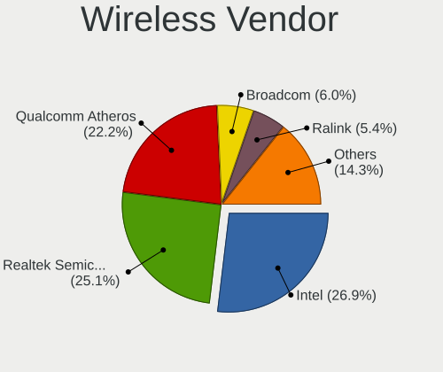

| Vendor                          | Computers | Percent |
|---------------------------------|-----------|---------|
| Intel                           | 139       | 26.89%  |
| Realtek Semiconductor           | 130       | 25.15%  |
| Qualcomm Atheros                | 115       | 22.24%  |
| Broadcom                        | 31        | 6%      |
| Ralink                          | 28        | 5.42%   |
| Ralink Technology               | 18        | 3.48%   |
| TP-Link                         | 16        | 3.09%   |
| MediaTek                        | 13        | 2.51%   |
| Qualcomm Atheros Communications | 8         | 1.55%   |
| Mercucys                        | 5         | 0.97%   |
| Broadcom Limited                | 5         | 0.97%   |
| D-Link System                   | 4         | 0.77%   |
| Xiaomi                          | 2         | 0.39%   |
| ZTopInc                         | 1         | 0.19%   |
| Marvell Technology Group        | 1         | 0.19%   |
| Dell                            | 1         | 0.19%   |

Wireless Model
--------------

Wireless models

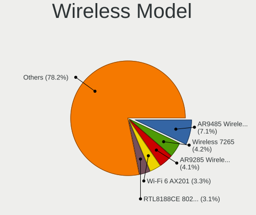

| Model                                                                         | Computers | Percent |
|-------------------------------------------------------------------------------|-----------|---------|
| Qualcomm Atheros AR9485 Wireless Network Adapter                              | 37        | 7.14%   |
| Intel Wireless 7265                                                           | 22        | 4.25%   |
| Qualcomm Atheros AR9285 Wireless Network Adapter (PCI-Express)                | 21        | 4.05%   |
| Intel Wi-Fi 6 AX201                                                           | 17        | 3.28%   |
| Realtek RTL8188CE 802.11b/g/n WiFi Adapter                                    | 16        | 3.09%   |
| Realtek RTL8723BE PCIe Wireless Network Adapter                               | 13        | 2.51%   |
| Qualcomm Atheros AR5212/5213/2414 Wireless Network Adapter                    | 12        | 2.32%   |
| Broadcom BCM4313 802.11bgn Wireless Network Adapter                           | 12        | 2.32%   |
| Realtek RTL8723AE PCIe Wireless Network Adapter                               | 11        | 2.12%   |
| Realtek RTL8821CE 802.11ac PCIe Wireless Network Adapter                      | 10        | 1.93%   |
| Ralink RT3090 Wireless 802.11n 1T/1R PCIe                                     | 10        | 1.93%   |
| Intel Centrino Wireless-N 105                                                 | 10        | 1.93%   |
| Realtek RTL8188EE Wireless Network Adapter                                    | 9         | 1.74%   |
| Ralink MT7601U Wireless Adapter                                               | 9         | 1.74%   |
| Intel Wireless 7260                                                           | 9         | 1.74%   |
| Realtek RTL8192EU 802.11b/g/n WLAN Adapter                                    | 8         | 1.54%   |
| Realtek RTL8188FTV 802.11b/g/n 1T1R 2.4G WLAN Adapter                         | 8         | 1.54%   |
| TP-Link AC600 wireless Realtek RTL8811AU [Archer T2U Nano]                    | 7         | 1.35%   |
| Realtek RTL8191SEvB Wireless LAN Controller                                   | 7         | 1.35%   |
| Realtek RTL8188EUS 802.11n Wireless Network Adapter                           | 7         | 1.35%   |
| Ralink RT2870/RT3070 Wireless Adapter                                         | 7         | 1.35%   |
| Ralink RT5390 Wireless 802.11n 1T/1R PCIe                                     | 7         | 1.35%   |
| Qualcomm Atheros AR242x / AR542x Wireless Network Adapter (PCI-Express)       | 7         | 1.35%   |
| MediaTek MT7902 802.11ax PCIe Wireless Network Adapter [Filogic 310]          | 7         | 1.35%   |
| Intel Wireless 8265 / 8275                                                    | 7         | 1.35%   |
| Intel Wi-Fi 6 AX200                                                           | 7         | 1.35%   |
| Realtek RTL8852BE PCIe 802.11ax Wireless Network Controller                   | 6         | 1.16%   |
| Ralink RT2790 Wireless 802.11n 1T/2R PCIe                                     | 6         | 1.16%   |
| Qualcomm Atheros QCA9565 / AR9565 Wireless Network Adapter                    | 6         | 1.16%   |
| Qualcomm Atheros QCA6174 802.11ac Wireless Network Adapter                    | 6         | 1.16%   |
| MediaTek MT7921 802.11ax PCIe Wireless Network Adapter [Filogic 330]          | 6         | 1.16%   |
| Intel Wireless 3165                                                           | 6         | 1.16%   |
| Realtek RTL8822CE 802.11ac PCIe Wireless Network Adapter                      | 5         | 0.97%   |
| Realtek RTL8188CUS 802.11n WLAN Adapter                                       | 5         | 0.97%   |
| Realtek 802.11ac NIC                                                          | 5         | 0.97%   |
| Qualcomm Atheros AR9271 802.11n                                               | 5         | 0.97%   |
| Qualcomm Atheros AR2413/AR2414 Wireless Network Adapter [AR5005G(S) 802.11bg] | 5         | 0.97%   |
| Realtek RTL88x2bu [AC1200 Techkey]                                            | 4         | 0.77%   |
| Qualcomm Atheros QCA9377 802.11ac Wireless Network Adapter                    | 4         | 0.77%   |
| Intel Wireless 8260                                                           | 4         | 0.77%   |

Ethernet Vendor
---------------

Ethernet vendors

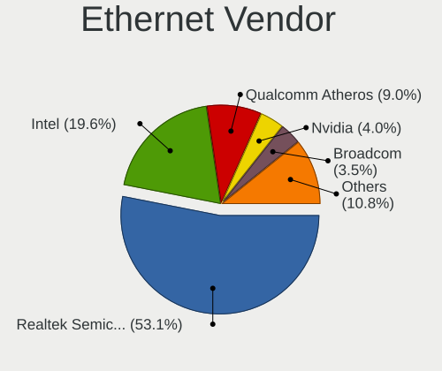

| Vendor                                 | Computers | Percent |
|----------------------------------------|-----------|---------|
| Realtek Semiconductor                  | 344       | 53.09%  |
| Intel                                  | 127       | 19.6%   |
| Qualcomm Atheros                       | 58        | 8.95%   |
| Nvidia                                 | 26        | 4.01%   |
| Broadcom                               | 23        | 3.55%   |
| Xiaomi                                 | 12        | 1.85%   |
| Marvell Technology Group               | 11        | 1.7%    |
| MediaTek                               | 7         | 1.08%   |
| VIA Technologies                       | 6         | 0.93%   |
| JMicron Technology                     | 6         | 0.93%   |
| Broadcom Limited                       | 6         | 0.93%   |
| Samsung Electronics                    | 4         | 0.62%   |
| ASIX Electronics                       | 4         | 0.62%   |
| Trendchip Technologies                 | 2         | 0.31%   |
| Sundance Technology Inc / IC Plus      | 2         | 0.31%   |
| Motorola PCS                           | 2         | 0.31%   |
| ZyXEL Communications                   | 1         | 0.15%   |
| TP-Link                                | 1         | 0.15%   |
| Suzhou Motorcomm Electronic Technology | 1         | 0.15%   |
| National Semiconductor                 | 1         | 0.15%   |
| Motorola BCS                           | 1         | 0.15%   |
| ICS Advent                             | 1         | 0.15%   |
| Davicom Semiconductor                  | 1         | 0.15%   |
| ADMtek                                 | 1         | 0.15%   |

Ethernet Model
--------------

Ethernet models

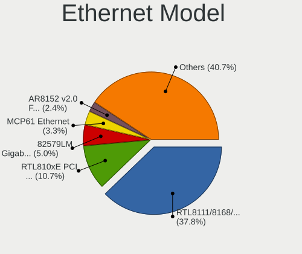

| Model                                                                  | Computers | Percent |
|------------------------------------------------------------------------|-----------|---------|
| Realtek RTL8111/8168/8211/8411 PCI Express Gigabit Ethernet Controller | 250       | 37.82%  |
| Realtek RTL810xE PCI Express Fast Ethernet controller                  | 71        | 10.74%  |
| Intel 82579LM Gigabit Network Connection (Lewisville)                  | 33        | 4.99%   |
| Nvidia MCP61 Ethernet                                                  | 22        | 3.33%   |
| Qualcomm Atheros AR8152 v2.0 Fast Ethernet                             | 16        | 2.42%   |
| Intel Ethernet Connection I217-LM                                      | 15        | 2.27%   |
| Realtek RTL-8100/8101L/8139 PCI Fast Ethernet Adapter                  | 14        | 2.12%   |
| Qualcomm Atheros AR8151 v2.0 Gigabit Ethernet                          | 11        | 1.66%   |
| Qualcomm Atheros AR8161 Gigabit Ethernet                               | 9         | 1.36%   |
| Xiaomi Mi/Redmi series (RNDIS)                                         | 8         | 1.21%   |
| Intel Ethernet Connection (2) I219-LM                                  | 8         | 1.21%   |
| Intel Ethernet Connection (4) I219-LM                                  | 7         | 1.06%   |
| VIA VT6102/VT6103 [Rhine-II]                                           | 5         | 0.76%   |
| MediaTek Infinix HOT 50i                                               | 5         | 0.76%   |
| Xiaomi Mi/Redmi series (RNDIS + ADB)                                   | 4         | 0.61%   |
| Qualcomm Atheros QCA8171 Gigabit Ethernet                              | 4         | 0.61%   |
| Marvell Group 88E8056 PCI-E Gigabit Ethernet Controller                | 4         | 0.61%   |
| JMicron JMC250 PCI Express Gigabit Ethernet Controller                 | 4         | 0.61%   |
| Intel I210 Gigabit Network Connection                                  | 4         | 0.61%   |
| Intel 82574L Gigabit Network Connection                                | 4         | 0.61%   |
| Intel 82567LM-3 Gigabit Network Connection                             | 4         | 0.61%   |
| Broadcom NetLink BCM5786 Gigabit Ethernet PCI Express                  | 4         | 0.61%   |
| Samsung GT-I9070 (network tethering, USB debugging enabled)            | 3         | 0.45%   |
| Realtek RTL8169 PCI Gigabit Ethernet Controller                        | 3         | 0.45%   |
| Realtek RTL8153 Gigabit Ethernet Adapter                               | 3         | 0.45%   |
| Qualcomm Atheros AR8152 v1.1 Fast Ethernet                             | 3         | 0.45%   |
| Qualcomm Atheros AR8121/AR8113/AR8114 Gigabit or Fast Ethernet         | 3         | 0.45%   |
| Marvell Group 88E8057 PCI-E Gigabit Ethernet Controller                | 3         | 0.45%   |
| Intel PRO/100 VE Network Connection                                    | 3         | 0.45%   |
| Intel Ethernet Connection I217-V                                       | 3         | 0.45%   |
| Intel Ethernet Connection (5) I219-LM                                  | 3         | 0.45%   |
| Intel Ethernet Connection (3) I218-LM                                  | 3         | 0.45%   |
| Intel Ethernet Connection (14) I219-V                                  | 3         | 0.45%   |
| Intel Ethernet Connection (13) I219-V                                  | 3         | 0.45%   |
| Intel Alder Lake-P PCH CNVi WiFi                                       | 3         | 0.45%   |
| Intel 82567V-2 Gigabit Network Connection                              | 3         | 0.45%   |
| Broadcom NetLink BCM5906M Fast Ethernet PCI Express                    | 3         | 0.45%   |
| Broadcom Limited NetLink BCM5906M Fast Ethernet PCI Express            | 3         | 0.45%   |
| ASIX AX88179 Gigabit Ethernet                                          | 3         | 0.45%   |
| Trendchip Ethernet controller                                          | 2         | 0.3%    |

Net Controller Kind
-------------------

Ethernet, WiFi or modem

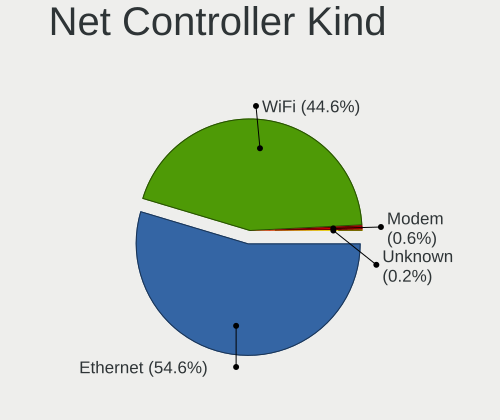

| Kind     | Computers | Percent |
|----------|-----------|---------|
| Ethernet | 608       | 54.63%  |
| WiFi     | 496       | 44.56%  |
| Modem    | 7         | 0.63%   |
| Unknown  | 2         | 0.18%   |

Used Controller
---------------

Currently used network controller

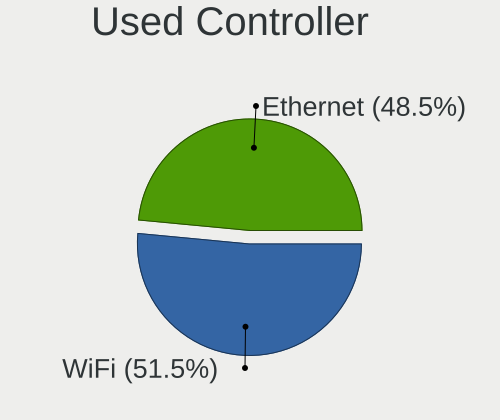

| Kind     | Computers | Percent |
|----------|-----------|---------|
| WiFi     | 361       | 51.5%   |
| Ethernet | 340       | 48.5%   |

NICs
----

Total network controllers on board

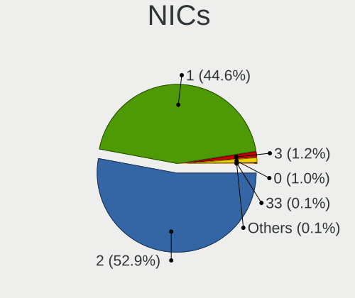

| Total | Computers | Percent |
|-------|-----------|---------|
| 2     | 361       | 52.93%  |
| 1     | 304       | 44.57%  |
| 3     | 8         | 1.17%   |
| 0     | 7         | 1.03%   |
| 33    | 1         | 0.15%   |
| 4     | 1         | 0.15%   |

IPv6
----

IPv6 vs IPv4

| Used | Computers | Percent |
|------|-----------|---------|
| No   | 661       | 96.92%  |
| Yes  | 21        | 3.08%   |

Bluetooth
---------

Bluetooth Vendor
----------------

Controller vendors

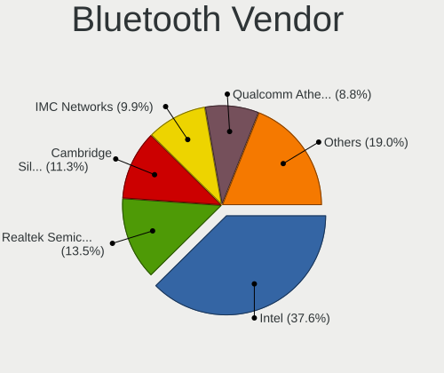

| Vendor                          | Computers | Percent |
|---------------------------------|-----------|---------|
| Intel                           | 103       | 37.59%  |
| Realtek Semiconductor           | 37        | 13.5%   |
| Cambridge Silicon Radio         | 31        | 11.31%  |
| IMC Networks                    | 27        | 9.85%   |
| Qualcomm Atheros Communications | 24        | 8.76%   |
| Broadcom                        | 20        | 7.3%    |
| Apple                           | 7         | 2.55%   |
| Lite-On Technology              | 6         | 2.19%   |
| ASUSTek Computer                | 4         | 1.46%   |
| Hewlett-Packard                 | 3         | 1.09%   |
| Dell                            | 3         | 1.09%   |
| Foxconn / Hon Hai               | 2         | 0.73%   |
| Unknown                         | 2         | 0.73%   |
| SiW                             | 1         | 0.36%   |
| Ralink Technology               | 1         | 0.36%   |
| Marvell Semiconductor           | 1         | 0.36%   |
| Conwise Technology              | 1         | 0.36%   |
| Alps Electric                   | 1         | 0.36%   |

Bluetooth Model
---------------

Controller models

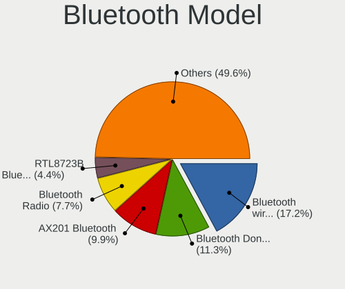

| Model                                               | Computers | Percent |
|-----------------------------------------------------|-----------|---------|
| Intel Bluetooth wireless interface                  | 47        | 17.15%  |
| Cambridge Silicon Radio Bluetooth Dongle (HCI mode) | 31        | 11.31%  |
| Intel AX201 Bluetooth                               | 27        | 9.85%   |
| Realtek Bluetooth Radio                             | 21        | 7.66%   |
| Realtek RTL8723B Bluetooth                          | 12        | 4.38%   |
| Intel Bluetooth 9460/9560 Jefferson Peak (JfP)      | 12        | 4.38%   |
| IMC Networks Wireless_Device                        | 10        | 3.65%   |
| Qualcomm Atheros  Bluetooth Device                  | 9         | 3.28%   |
| Qualcomm Atheros AR3011 Bluetooth                   | 7         | 2.55%   |
| Intel AX200 Bluetooth                               | 7         | 2.55%   |
| IMC Networks Atheros AR3012 Bluetooth 4.0 Adapter   | 7         | 2.55%   |
| IMC Networks Bluetooth                              | 6         | 2.19%   |
| Broadcom BCM2045B (BDC-2.1) [Bluetooth Controller]  | 4         | 1.46%   |
| Broadcom BCM2045 Bluetooth                          | 4         | 1.46%   |
| Apple Built-in Bluetooth 2.0+EDR HCI                | 4         | 1.46%   |
| Qualcomm Atheros Bluetooth (AR3011)                 | 3         | 1.09%   |
| Qualcomm Atheros AR3012 Bluetooth 4.0               | 3         | 1.09%   |
| Lite-On Wireless_Device                             | 3         | 1.09%   |
| Intel Centrino Advanced-N 6230 Bluetooth adapter    | 3         | 1.09%   |
| Broadcom BCM2070 Bluetooth 2.1 + EDR                | 3         | 1.09%   |
| Realtek RTL8723A Bluetooth                          | 2         | 0.73%   |
| Realtek  Bluetooth 4.2 Adapter                      | 2         | 0.73%   |
| Intel Centrino Bluetooth Wireless Transceiver       | 2         | 0.73%   |
| Intel Bluetooth Device                              | 2         | 0.73%   |
| IMC Networks Bluetooth Radio                        | 2         | 0.73%   |
| IMC Networks Bluetooth Module                       | 2         | 0.73%   |
| Broadcom BCM92046DG-CL1ROM Bluetooth 2.1 UHE Dongle | 2         | 0.73%   |
| Broadcom BCM43142A0 Bluetooth 4.0                   | 2         | 0.73%   |
| ASUS BT-253 Bluetooth Adapter                       | 2         | 0.73%   |
| Apple Bluetooth Host Controller                     | 2         | 0.73%   |
| Unknown                                             | 2         | 0.73%   |
| SiW SiW                                             | 1         | 0.36%   |
| Ralink CSR BS8510                                   | 1         | 0.36%   |
| Qualcomm Atheros AR9462 Bluetooth                   | 1         | 0.36%   |
| Qualcomm Atheros AR3012 Bluetooth                   | 1         | 0.36%   |
| Marvell Bluetooth and Wireless LAN Composite        | 1         | 0.36%   |
| Lite-On Qualcomm Atheros QCA9377 Bluetooth          | 1         | 0.36%   |
| Lite-On Bluetooth Device                            | 1         | 0.36%   |
| Lite-On BCM20702A0                                  | 1         | 0.36%   |
| Intel Wireless-AC 9260 Bluetooth Adapter            | 1         | 0.36%   |

Sound
-----

Sound Vendor
------------

Sound card vendors

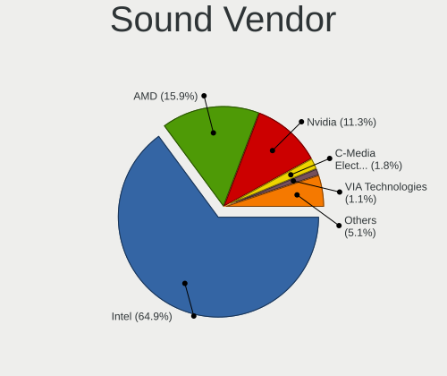

| Vendor                 | Computers | Percent |
|------------------------|-----------|---------|
| Intel                  | 547       | 64.89%  |
| AMD                    | 134       | 15.9%   |
| Nvidia                 | 95        | 11.27%  |
| C-Media Electronics    | 15        | 1.78%   |
| VIA Technologies       | 9         | 1.07%   |
| Creative Labs          | 6         | 0.71%   |
| JMTek                  | 5         | 0.59%   |
| Generalplus Technology | 5         | 0.59%   |
| Zhaoxin                | 4         | 0.47%   |
| Texas Instruments      | 3         | 0.36%   |
| Logitech               | 3         | 0.36%   |
| Microsoft              | 2         | 0.24%   |
| DSEA A/S               | 2         | 0.24%   |
| Corsair                | 2         | 0.24%   |
| Cirrus Logic           | 2         | 0.24%   |
| Unknown                | 1         | 0.12%   |
| Realtek Semiconductor  | 1         | 0.12%   |
| Megawin Technology     | 1         | 0.12%   |
| M-Audio                | 1         | 0.12%   |
| Jieli Technology       | 1         | 0.12%   |
| Giga-Byte Technology   | 1         | 0.12%   |
| Genesys Logic          | 1         | 0.12%   |
| Aureal Semiconductor   | 1         | 0.12%   |
| ASUSTek Computer       | 1         | 0.12%   |

Sound Model
-----------

Sound card models

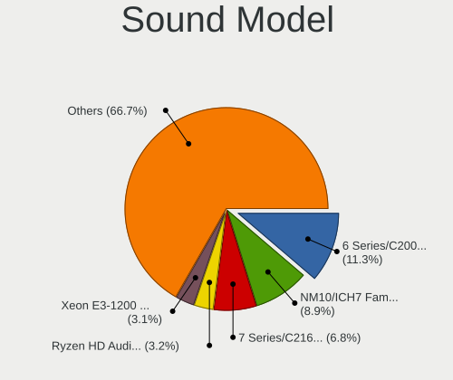

| Model                                                                                             | Computers | Percent |
|---------------------------------------------------------------------------------------------------|-----------|---------|
| Intel 6 Series/C200 Series Chipset Family High Definition Audio Controller                        | 107       | 11.26%  |
| Intel NM10/ICH7 Family High Definition Audio Controller                                           | 85        | 8.95%   |
| Intel 7 Series/C216 Chipset Family High Definition Audio Controller                               | 65        | 6.84%   |
| AMD Ryzen HD Audio Controller                                                                     | 30        | 3.16%   |
| Intel Xeon E3-1200 v3/4th Gen Core Processor HD Audio Controller                                  | 29        | 3.05%   |
| Intel 8 Series/C220 Series Chipset High Definition Audio Controller                               | 28        | 2.95%   |
| Intel 82801I (ICH9 Family) HD Audio Controller                                                    | 25        | 2.63%   |
| Intel 5 Series/3400 Series Chipset High Definition Audio                                          | 24        | 2.53%   |
| Intel Sunrise Point-LP HD Audio                                                                   | 22        | 2.32%   |
| Nvidia MCP61 High Definition Audio                                                                | 21        | 2.21%   |
| AMD SBx00 Azalia (Intel HDA)                                                                      | 21        | 2.21%   |
| Intel Tiger Lake-LP Smart Sound Technology Audio Controller                                       | 19        | 2%      |
| Intel Atom Processor Z36xxx/Z37xxx Series High Definition Audio Controller                        | 19        | 2%      |
| Intel 82801H (ICH8 Family) HD Audio Controller                                                    | 19        | 2%      |
| AMD Oland/Hainan/Cape Verde/Pitcairn HDMI Audio [Radeon HD 7000 Series]                           | 19        | 2%      |
| AMD Renoir/Cezanne HDMI/DP Audio Controller                                                       | 16        | 1.68%   |
| AMD FCH Azalia Controller                                                                         | 16        | 1.68%   |
| Intel 100 Series/C230 Series Chipset Family HD Audio Controller                                   | 14        | 1.47%   |
| Nvidia GF119 HDMI Audio Controller                                                                | 13        | 1.37%   |
| AMD Cedar HDMI Audio [Radeon HD 5400/6300/7300 Series]                                            | 12        | 1.26%   |
| Intel Atom/Celeron/Pentium Processor x5-E8000/J3xxx/N3xxx Series High Definition Audio Controller | 11        | 1.16%   |
| AMD Raven/Raven2/Fenghuang HDMI/DP Audio Controller                                               | 11        | 1.16%   |
| AMD Ellesmere HDMI Audio [Radeon RX 470/480 / 570/580/590]                                        | 11        | 1.16%   |
| Intel Alder Lake PCH-P High Definition Audio Controller                                           | 10        | 1.05%   |
| Nvidia GK208 HDMI/DP Audio Controller                                                             | 9         | 0.95%   |
| Nvidia High Definition Audio Controller                                                           | 8         | 0.84%   |
| Intel Celeron N3350/Pentium N4200/Atom E3900 Series Audio Cluster                                 | 8         | 0.84%   |
| Intel Cannon Lake PCH cAVS                                                                        | 8         | 0.84%   |
| Intel Tiger Lake-H HD Audio Controller                                                            | 7         | 0.74%   |
| Intel 82801JI (ICH10 Family) HD Audio Controller                                                  | 7         | 0.74%   |
| Intel 200 Series PCH HD Audio                                                                     | 7         | 0.74%   |
| AMD Kabini HDMI/DP Audio                                                                          | 7         | 0.74%   |
| Nvidia GF108 High Definition Audio Controller                                                     | 6         | 0.63%   |
| Intel Comet Lake PCH cAVS                                                                         | 6         | 0.63%   |
| Intel Celeron/Pentium Silver Processor High Definition Audio                                      | 6         | 0.63%   |
| AMD Wrestler HDMI Audio                                                                           | 6         | 0.63%   |
| VIA Technologies VX900/VT8xxx High Definition Audio Controller                                    | 5         | 0.53%   |
| Intel Wildcat Point-LP High Definition Audio Controller                                           | 5         | 0.53%   |
| Intel Raptor Lake-P/U/H cAVS                                                                      | 5         | 0.53%   |
| Intel Broadwell-U Audio Controller                                                                | 5         | 0.53%   |

Memory
------

Memory Vendor
-------------

Memory module vendors

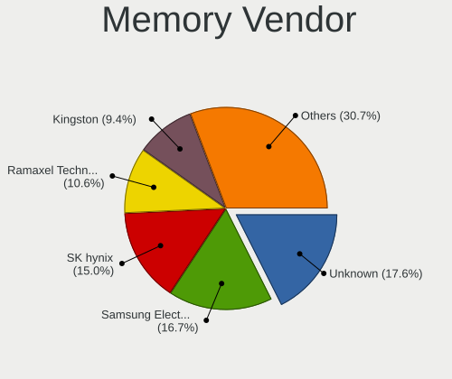

| Vendor                     | Computers | Percent |
|----------------------------|-----------|---------|
| Unknown                    | 95        | 17.59%  |
| Samsung Electronics        | 90        | 16.67%  |
| SK hynix                   | 81        | 15%     |
| Ramaxel Technology         | 57        | 10.56%  |
| Kingston                   | 51        | 9.44%   |
| Micron Technology          | 40        | 7.41%   |
| Crucial                    | 25        | 4.63%   |
| Corsair                    | 15        | 2.78%   |
| Unknown                    | 8         | 1.48%   |
| PNY                        | 7         | 1.3%    |
| Elpida                     | 7         | 1.3%    |
| A-DATA Technology          | 7         | 1.3%    |
| fef5                       | 6         | 1.11%   |
| Nanya Technology           | 5         | 0.93%   |
| Team                       | 4         | 0.74%   |
| 48spaces                   | 4         | 0.74%   |
| Unknown (ABCD)             | 3         | 0.56%   |
| Qimonda                    | 3         | 0.56%   |
| Avant                      | 3         | 0.56%   |
| Unknown (0x07D5)           | 2         | 0.37%   |
| Timetec                    | 2         | 0.37%   |
| Shenzhen WODPOSIT          | 2         | 0.37%   |
| Mushkin                    | 2         | 0.37%   |
| Memox                      | 2         | 0.37%   |
| Kreton                     | 2         | 0.37%   |
| Hikvision                  | 2         | 0.37%   |
| Unknown (FFFF000000000000) | 1         | 0.19%   |
| Unknown (7F7F7F7F7F7F7F83) | 1         | 0.19%   |
| Unknown (0x0CBA)           | 1         | 0.19%   |
| Unknown (081A)             | 1         | 0.19%   |
| Unknown (07F7)             | 1         | 0.19%   |
| Transcend                  | 1         | 0.19%   |
| Super Talent               | 1         | 0.19%   |
| Patriot                    | 1         | 0.19%   |
| OCZ                        | 1         | 0.19%   |
| Gold Key                   | 1         | 0.19%   |
| G.Skill                    | 1         | 0.19%   |
| ff                         | 1         | 0.19%   |
| Apacer                     | 1         | 0.19%   |
| <Invalid>                  | 1         | 0.19%   |

Memory Model
------------

Memory module models

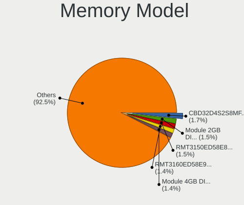

| Model                                                                     | Computers | Percent |
|---------------------------------------------------------------------------|-----------|---------|
| Kingston RAM CBD32D4S2S8MF-16 16GB SODIMM DDR4 3200MT/s                   | 10        | 1.71%   |
| Unknown RAM Module 2GB DIMM SDRAM                                         | 9         | 1.54%   |
| Ramaxel RAM RMT3150ED58E8W1600 2GB SODIMM DDR3 1600MT/s                   | 9         | 1.54%   |
| Ramaxel RAM RMT3160ED58E9W1600 4GB SODIMM DDR3 1600MT/s                   | 8         | 1.37%   |
| Unknown                                                                   | 8         | 1.37%   |
| Unknown RAM Module 2GB SODIMM DDR2 667MT/s                                | 7         | 1.19%   |
| Unknown RAM Module 2GB DIMM DDR2                                          | 7         | 1.19%   |
| SK hynix RAM H9HCNNN8KUMLHR 1GB 2400MT/s                                  | 6         | 1.02%   |
| Samsung RAM M471B5674QH0-YK0 2GB SODIMM DDR3 3200MT/s                     | 6         | 1.02%   |
| Ramaxel RAM RMT3170ME68F9F1600 4GB SODIMM DDR3 1600MT/s                   | 6         | 1.02%   |
| Ramaxel RAM RMT3010EC58E8F1333 2GB SODIMM DDR3 1600MT/s                   | 6         | 1.02%   |
| fef5 RAM H9HCNNN8KUMLHR 1GB 2400MT/s                                      | 6         | 1.02%   |
| Unknown RAM Module 4GB DIMM SDRAM                                         | 5         | 0.85%   |
| Unknown RAM Module 4GB DIMM 400MT/s                                       | 5         | 0.85%   |
| SK hynix RAM HMT425S6AFR6A-PB 2GB SODIMM DDR3 3200MT/s                    | 5         | 0.85%   |
| SK hynix RAM HMA81GS6AFR8N-UH 8GB SODIMM DDR4 2667MT/s                    | 5         | 0.85%   |
| Crucial RAM CT25664BF160B.D8FE 2GB SODIMM DDR3 1600MT/s                   | 5         | 0.85%   |
| Unknown RAM Module 2GB SODIMM DDR3 1066MT/s                               | 4         | 0.68%   |
| Unknown RAM Module 2GB DIMM DDR3 1066MT/s                                 | 4         | 0.68%   |
| SK hynix RAM HMT325S6BFR8C-H9 2GB SODIMM DDR3 1600MT/s                    | 4         | 0.68%   |
| Samsung RAM M471A5244CB0-CWE 4GB SODIMM DDR4 3200MT/s                     | 4         | 0.68%   |
| Samsung RAM M471A1K43EB1-CWE 8GB SODIMM DDR4 3200MT/s                     | 4         | 0.68%   |
| Samsung RAM M378B5173QH0-CK0 4GB DIMM DDR3                                | 4         | 0.68%   |
| Ramaxel RAM RMR5040ED58E9W1600 4GB DIMM DDR3 1600MT/s                     | 4         | 0.68%   |
| Ramaxel RAM RMR5030ME68F9F1600 4GB DIMM DDR3 1600MT/s                     | 4         | 0.68%   |
| Ramaxel RAM RMR5030ED58E8W1600 2GB DIMM DDR3 1600MT/s                     | 4         | 0.68%   |
| 48spaces RAM 012345678901234567890123456789012345 2GB SODIMM DDR2 667MT/s | 4         | 0.68%   |
| Unknown RAM Module 4GB DIMM 1333MT/s                                      | 3         | 0.51%   |
| Unknown RAM Module 2GB DIMM 400MT/s                                       | 3         | 0.51%   |
| Unknown RAM Module 2048MB DIMM DDR2                                       | 3         | 0.51%   |
| Unknown RAM Module 1GB DIMM DDR2 667MT/s                                  | 3         | 0.51%   |
| Unknown RAM Module 1024MB DIMM DDR2                                       | 3         | 0.51%   |
| SK hynix RAM HMT451U6BFR8A-PB 4GB DIMM DDR3 1600MT/s                      | 3         | 0.51%   |
| SK hynix RAM HMT41GS6BFR8A-PB 8GB SODIMM DDR3 2667MT/s                    | 3         | 0.51%   |
| Samsung RAM M471A5244CB0-CTD 4GB SODIMM DDR4 3266MT/s                     | 3         | 0.51%   |
| Samsung RAM 4GB DDR3 HYNIX 4GB SODIMM DDR3 1333MT/s                       | 3         | 0.51%   |
| Micron RAM 4ATF1G64HZ-3G2F1 8GB SODIMM DDR4 3200MT/s                      | 3         | 0.51%   |
| Unknown RAM Module 8GB SODIMM DDR3 1600MT/s                               | 2         | 0.34%   |
| Unknown RAM Module 8GB DIMM 1333MT/s                                      | 2         | 0.34%   |
| Unknown RAM Module 4GB SODIMM DDR3 1333MT/s                               | 2         | 0.34%   |

Memory Kind
-----------

Memory module kinds

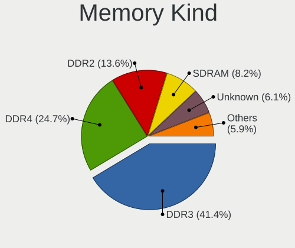

| Kind    | Computers | Percent |
|---------|-----------|---------|
| DDR3    | 176       | 41.41%  |
| DDR4    | 105       | 24.71%  |
| DDR2    | 58        | 13.65%  |
| SDRAM   | 35        | 8.24%   |
| Unknown | 26        | 6.12%   |
| LPDDR4  | 11        | 2.59%   |
| DDR     | 7         | 1.65%   |
| LPDDR3  | 3         | 0.71%   |
| DDR5    | 3         | 0.71%   |
| LPDDR5  | 1         | 0.24%   |

Memory Form Factor
------------------

Physical design of the memory module

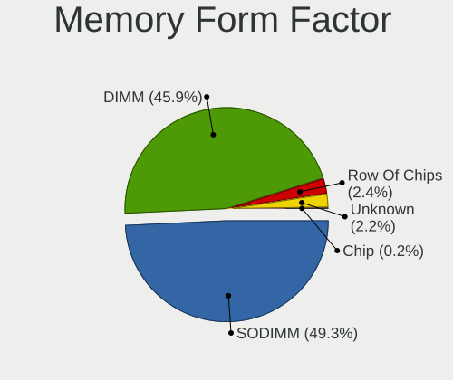

| Name         | Computers | Percent |
|--------------|-----------|---------|
| SODIMM       | 202       | 49.27%  |
| DIMM         | 188       | 45.85%  |
| Row Of Chips | 10        | 2.44%   |
| Unknown      | 9         | 2.2%    |
| Chip         | 1         | 0.24%   |

Memory Size
-----------

Memory module size

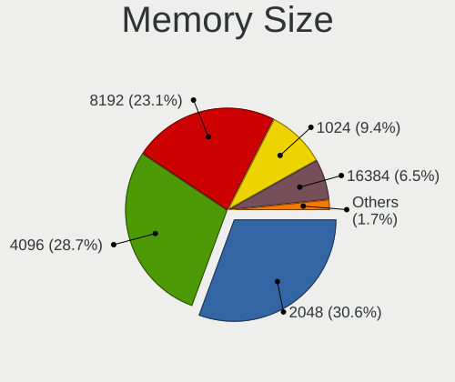

| Size  | Computers | Percent |
|-------|-----------|---------|
| 2048  | 147       | 30.63%  |
| 4096  | 138       | 28.75%  |
| 8192  | 111       | 23.13%  |
| 1024  | 45        | 9.38%   |
| 16384 | 31        | 6.46%   |
| 32768 | 6         | 1.25%   |
| 512   | 2         | 0.42%   |

Memory Speed
------------

Memory module speed

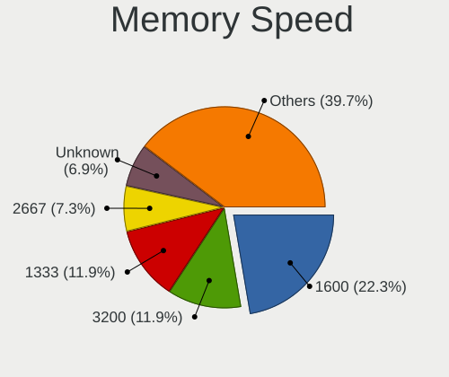

| Speed   | Computers | Percent |
|---------|-----------|---------|
| 1600    | 107       | 22.34%  |
| 3200    | 57        | 11.9%   |
| 1333    | 57        | 11.9%   |
| 2667    | 35        | 7.31%   |
| Unknown | 33        | 6.89%   |
| 667     | 29        | 6.05%   |
| 2400    | 24        | 5.01%   |
| 800     | 13        | 2.71%   |
| 533     | 13        | 2.71%   |
| 1066    | 12        | 2.51%   |
| 2133    | 10        | 2.09%   |
| 1334    | 9         | 1.88%   |
| 1067    | 8         | 1.67%   |
| 400     | 8         | 1.67%   |
| 2048    | 6         | 1.25%   |
| 1867    | 5         | 1.04%   |
| 1866    | 5         | 1.04%   |
| 1639    | 5         | 1.04%   |
| 4199    | 4         | 0.84%   |
| 1800    | 4         | 0.84%   |
| 3733    | 3         | 0.63%   |
| 3600    | 3         | 0.63%   |
| 3266    | 3         | 0.63%   |
| 2666    | 3         | 0.63%   |
| 1648    | 3         | 0.63%   |
| 133     | 3         | 0.63%   |
| 8400    | 2         | 0.42%   |
| 975     | 2         | 0.42%   |
| 52217   | 1         | 0.21%   |
| 6400    | 1         | 0.21%   |
| 5600    | 1         | 0.21%   |
| 5200    | 1         | 0.21%   |
| 4800    | 1         | 0.21%   |
| 3800    | 1         | 0.21%   |
| 3334    | 1         | 0.21%   |
| 3066    | 1         | 0.21%   |
| 2933    | 1         | 0.21%   |
| 2734    | 1         | 0.21%   |
| 2000    | 1         | 0.21%   |
| 1024    | 1         | 0.21%   |

Printers & scanners
-------------------

Printer Vendor
--------------

Printer device vendors

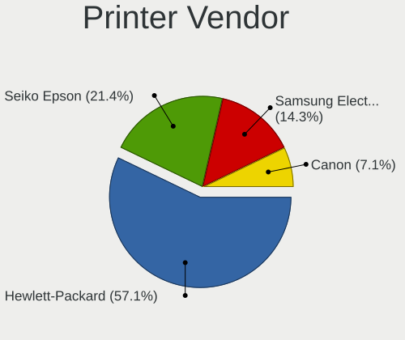

| Vendor              | Computers | Percent |
|---------------------|-----------|---------|
| Hewlett-Packard     | 8         | 57.14%  |
| Seiko Epson         | 3         | 21.43%  |
| Samsung Electronics | 2         | 14.29%  |
| Canon               | 1         | 7.14%   |

Printer Model
-------------

Printer device models

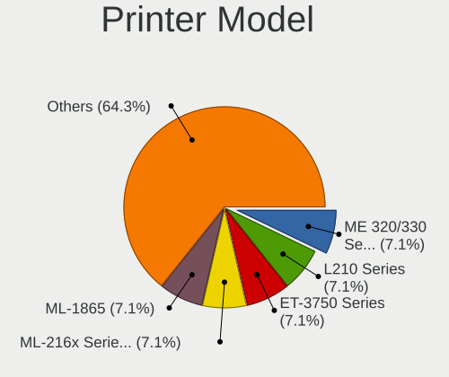

| Model                                        | Computers | Percent |
|----------------------------------------------|-----------|---------|
| Seiko Epson ME 320/330 Series [Stylus SX125] | 1         | 7.14%   |
| Seiko Epson L210 Series                      | 1         | 7.14%   |
| Seiko Epson ET-3750 Series                   | 1         | 7.14%   |
| Samsung ML-216x Series Laser Printer         | 1         | 7.14%   |
| Samsung ML-1865                              | 1         | 7.14%   |
| HP LaserJet Professional P1102w              | 1         | 7.14%   |
| HP LaserJet P1006                            | 1         | 7.14%   |
| HP LaserJet P1005                            | 1         | 7.14%   |
| HP LaserJet 1018                             | 1         | 7.14%   |
| HP DeskJet F4100 Printer series              | 1         | 7.14%   |
| HP DeskJet 2300 series                       | 1         | 7.14%   |
| HP Deskjet 2050 J510                         | 1         | 7.14%   |
| HP Color LaserJet CP1215                     | 1         | 7.14%   |
| Canon PIXMA MP250                            | 1         | 7.14%   |

Scanner Vendor
--------------

Scanner device vendors

| Vendor                      | Computers | Percent |
|-----------------------------|-----------|---------|
| KYE Systems (Mouse Systems) | 1         | 33.33%  |
| Hewlett-Packard             | 1         | 33.33%  |
| Canon                       | 1         | 33.33%  |

Scanner Model
-------------

Scanner device models

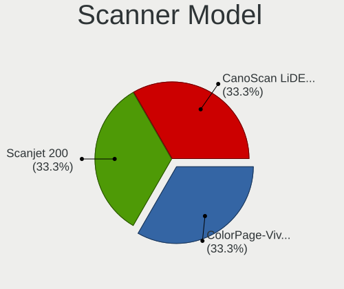

| Model                                               | Computers | Percent |
|-----------------------------------------------------|-----------|---------|
| KYE Systems (Mouse Systems) ColorPage-Vivid 1200 XE | 1         | 33.33%  |
| HP Scanjet 200                                      | 1         | 33.33%  |
| Canon CanoScan LiDE 110                             | 1         | 33.33%  |

Camera
------

Camera Vendor
-------------

Camera device vendors

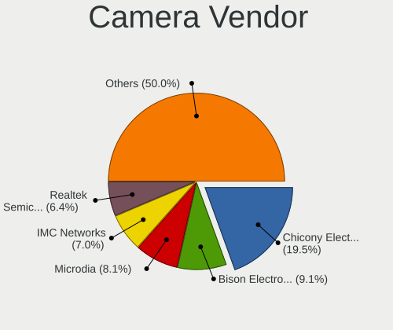

| Vendor                                 | Computers | Percent |
|----------------------------------------|-----------|---------|
| Chicony Electronics                    | 58        | 19.46%  |
| Bison Electronics                      | 27        | 9.06%   |
| Microdia                               | 24        | 8.05%   |
| IMC Networks                           | 21        | 7.05%   |
| Realtek Semiconductor                  | 19        | 6.38%   |
| Suyin                                  | 16        | 5.37%   |
| Cheng Uei Precision Industry (Foxlink) | 16        | 5.37%   |
| Quanta                                 | 14        | 4.7%    |
| Sunplus Innovation Technology          | 13        | 4.36%   |
| Luxvisions Innotech Limited            | 9         | 3.02%   |
| Logitech                               | 9         | 3.02%   |
| Apple                                  | 7         | 2.35%   |
| Syntek                                 | 6         | 2.01%   |
| Sonix Technology                       | 6         | 2.01%   |
| Microsoft                              | 6         | 2.01%   |
| ALi                                    | 6         | 2.01%   |
| Samsung Electronics                    | 4         | 1.34%   |
| Lenovo                                 | 4         | 1.34%   |
| Importek                               | 4         | 1.34%   |
| Silicon Motion                         | 3         | 1.01%   |
| Ricoh                                  | 3         | 1.01%   |
| Lite-On Technology                     | 3         | 1.01%   |
| Alcor Micro                            | 3         | 1.01%   |
| KYE Systems (Mouse Systems)            | 2         | 0.67%   |
| Cubeternet                             | 2         | 0.67%   |
| Z-Star Microelectronics                | 1         | 0.34%   |
| Tobii Technology AB                    | 1         | 0.34%   |
| SN0002                                 | 1         | 0.34%   |
| SiGma Micro                            | 1         | 0.34%   |
| OmniVision Technologies                | 1         | 0.34%   |
| LG Electronics                         | 1         | 0.34%   |
| KYE Systems                            | 1         | 0.34%   |
| Jieli Technology                       | 1         | 0.34%   |
| icSpring                               | 1         | 0.34%   |
| Genesys Logic                          | 1         | 0.34%   |
| DigiTech                               | 1         | 0.34%   |
| Aveo Technology                        | 1         | 0.34%   |
| Acer                                   | 1         | 0.34%   |

Camera Model
------------

Camera device models

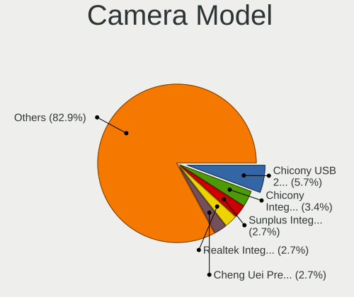

| Model                                                           | Computers | Percent |
|-----------------------------------------------------------------|-----------|---------|
| Chicony USB 2.0 Camera                                          | 17        | 5.7%    |
| Chicony Integrated Camera                                       | 10        | 3.36%   |
| Sunplus Integrated_Webcam_HD                                    | 8         | 2.68%   |
| Realtek Integrated_Webcam_HD                                    | 8         | 2.68%   |
| Cheng Uei Precision Industry (Foxlink) HP Wide Vision HD Camera | 8         | 2.68%   |
| Microdia USB 2.0 Camera                                         | 7         | 2.35%   |
| IMC Networks USB2.0 HD UVC WebCam                               | 7         | 2.35%   |
| Bison USB Camera                                                | 7         | 2.35%   |
| Sonix USB2.0 HD UVC WebCam                                      | 5         | 1.68%   |
| Microdia Integrated_Webcam_HD                                   | 5         | 1.68%   |
| Cheng Uei Precision Industry (Foxlink) USB2.0 UVC 1.3M Webcam   | 5         | 1.68%   |
| Bison USB HD Webcam                                             | 5         | 1.68%   |
| Samsung Galaxy series, misc. (MTP mode)                         | 4         | 1.34%   |
| Luxvisions Innotech Limited HP TrueVision HD Camera             | 4         | 1.34%   |
| IMC Networks XHC Camera                                         | 4         | 1.34%   |
| Chicony Lenovo EasyCamera                                       | 4         | 1.34%   |
| Chicony HD WebCam                                               | 4         | 1.34%   |
| Apple Built-in iSight                                           | 4         | 1.34%   |
| Suyin HP Webcam 101                                             | 3         | 1.01%   |
| Suyin HP Webcam                                                 | 3         | 1.01%   |
| Quanta HP TrueVision HD Webcam                                  | 3         | 1.01%   |
| Quanta HD Webcam                                                | 3         | 1.01%   |
| Quanta HD User Facing                                           | 3         | 1.01%   |
| Microsoft LifeCam HD-3000                                       | 3         | 1.01%   |
| Luxvisions Innotech Limited Integrated RGB Camera               | 3         | 1.01%   |
| Logitech Webcam C270                                            | 3         | 1.01%   |
| Lenovo CNF7237&CNF7238                                          | 3         | 1.01%   |
| IMC Networks Integrated Camera                                  | 3         | 1.01%   |
| Bison Lenovo EasyCamera                                         | 3         | 1.01%   |
| Bison Integrated Camera                                         | 3         | 1.01%   |
| Bison HD Webcam                                                 | 3         | 1.01%   |
| ALi WebCam                                                      | 3         | 1.01%   |
| ALi Gateway Webcam                                              | 3         | 1.01%   |
| Syntek Integrated Camera                                        | 2         | 0.67%   |
| Suyin USB2.0 UVC 1.3M WebCam                                    | 2         | 0.67%   |
| Suyin Integrated_Webcam_HD                                      | 2         | 0.67%   |
| Suyin HP TrueVision HD                                          | 2         | 0.67%   |
| Ricoh Laptop_Integrated_Webcam_FHD                              | 2         | 0.67%   |
| Realtek Integrated Webcam HD                                    | 2         | 0.67%   |
| Microdia Integrated_Webcam_1.3M                                 | 2         | 0.67%   |

Security
--------

Fingerprint Vendor
------------------

Fingerprint sensor vendors

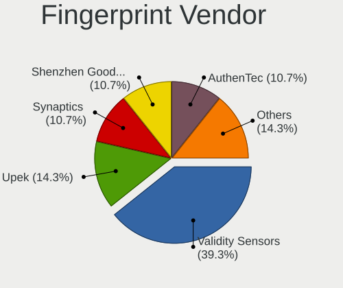

| Vendor                     | Computers | Percent |
|----------------------------|-----------|---------|
| Validity Sensors           | 11        | 39.29%  |
| Upek                       | 4         | 14.29%  |
| Synaptics                  | 3         | 10.71%  |
| Shenzhen Goodix Technology | 3         | 10.71%  |
| AuthenTec                  | 3         | 10.71%  |
| Elan Microelectronics      | 2         | 7.14%   |
| Suprema                    | 1         | 3.57%   |
| Futronic Technology        | 1         | 3.57%   |

Fingerprint Model
-----------------

Fingerprint sensor models

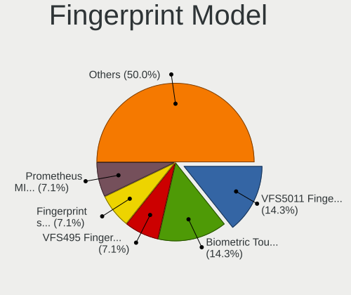

| Model                                                  | Computers | Percent |
|--------------------------------------------------------|-----------|---------|
| Validity Sensors VFS5011 Fingerprint Reader            | 4         | 14.29%  |
| Upek Biometric Touchchip/Touchstrip Fingerprint Sensor | 4         | 14.29%  |
| Validity Sensors VFS495 Fingerprint Reader             | 2         | 7.14%   |
| Validity Sensors Fingerprint scanner                   | 2         | 7.14%   |
| Synaptics Prometheus MIS Touch Fingerprint Reader      | 2         | 7.14%   |
| Shenzhen Goodix  FingerPrint Device                    | 2         | 7.14%   |
| Elan ELAN:ARM-M4                                       | 2         | 7.14%   |
| AuthenTec AES2501 Fingerprint Sensor                   | 2         | 7.14%   |
| Validity Sensors VFS7500 Touch Fingerprint Sensor      | 1         | 3.57%   |
| Validity Sensors VFS471 Fingerprint Reader             | 1         | 3.57%   |
| Validity Sensors VFS451 Fingerprint Reader             | 1         | 3.57%   |
| Synaptics UWP WBDI                                     | 1         | 3.57%   |
| Suprema SUP-SFR400(A) BioMini Fingerprint Reader       | 1         | 3.57%   |
| Shenzhen Goodix Fingerprint Reader                     | 1         | 3.57%   |
| Futronic Fingerprint Scanner Model FS88                | 1         | 3.57%   |
| AuthenTec AES1600                                      | 1         | 3.57%   |

Chipcard Vendor
---------------

Chipcard module vendors

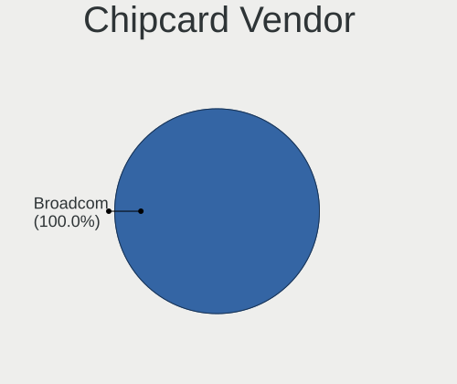

| Vendor      | Computers | Percent |
|-------------|-----------|---------|
| Broadcom    | 10        | 83.33%  |
| Alcor Micro | 2         | 16.67%  |

Chipcard Model
--------------

Chipcard module models

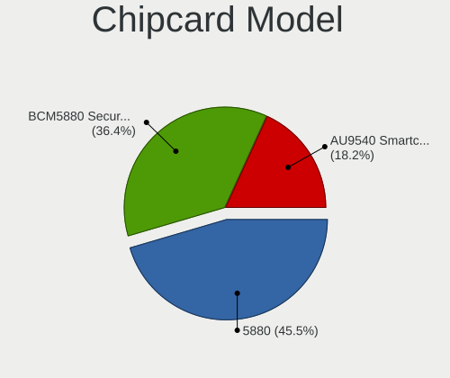

| Model                                          | Computers | Percent |
|------------------------------------------------|-----------|---------|
| Broadcom 5880                                  | 6         | 50%     |
| Broadcom BCM5880 Secure Applications Processor | 4         | 33.33%  |
| Alcor Micro AU9540 Smartcard Reader            | 2         | 16.67%  |

Unsupported
-----------

Unsupported Devices
-------------------

Total unsupported devices on board

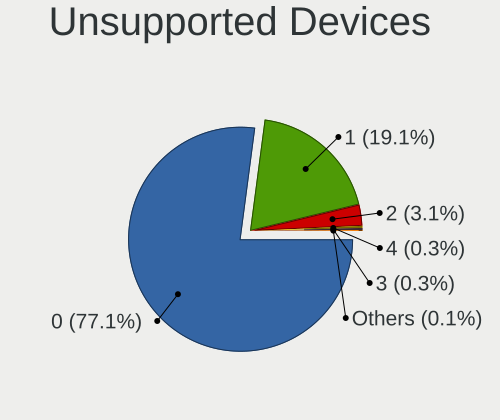

| Total | Computers | Percent |
|-------|-----------|---------|
| 0     | 528       | 77.08%  |
| 1     | 131       | 19.12%  |
| 2     | 21        | 3.07%   |
| 4     | 2         | 0.29%   |
| 3     | 2         | 0.29%   |
| 6     | 1         | 0.15%   |

Unsupported Device Types
------------------------

Types of unsupported devices

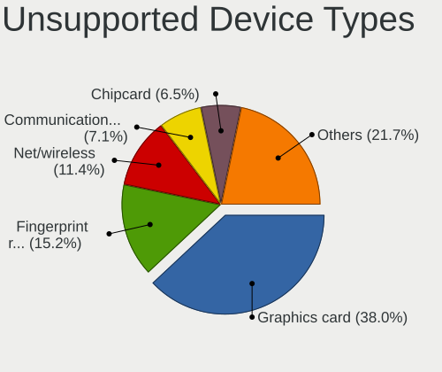

| Type                     | Computers | Percent |
|--------------------------|-----------|---------|
| Graphics card            | 70        | 38.04%  |
| Fingerprint reader       | 28        | 15.22%  |
| Net/wireless             | 21        | 11.41%  |
| Communication controller | 13        | 7.07%   |
| Chipcard                 | 12        | 6.52%   |
| Sound                    | 10        | 5.43%   |
| Multimedia controller    | 7         | 3.8%    |
| Camera                   | 7         | 3.8%    |
| Unassigned class         | 3         | 1.63%   |
| Storage                  | 2         | 1.09%   |
| Network                  | 2         | 1.09%   |
| Net/ethernet             | 2         | 1.09%   |
| Firewire controller      | 2         | 1.09%   |
| Card reader              | 2         | 1.09%   |
| Video                    | 1         | 0.54%   |
| Storage/ide              | 1         | 0.54%   |
| Bluetooth                | 1         | 0.54%   |

