Linux in Venezuela - Tested Hardware & Statistics
-------------------------------------------------

A project to collect tested hardware configurations for Linux in Venezuela.

Anyone can contribute to this report by the [hw-probe](https://github.com/linuxhw/hw-probe) tool:

    sudo -E hw-probe -all -upload

Please contribute! Especially if your hardware is rare.

This is a report for all computer types. See also reports for [desktops](/Location/Venezuela/Desktop/README.md) and [notebooks](/Location/Venezuela/Notebook/README.md).

Contents
--------

* [ Test Cases ](#test-cases)

* [ System ](#system)
  - [ OS                       ](#os)
  - [ OS Family                ](#os-family)
  - [ Kernel                   ](#kernel)
  - [ Kernel Family            ](#kernel-family)
  - [ Kernel Major Ver.        ](#kernel-major-ver)
  - [ Arch                     ](#arch)
  - [ DE                       ](#de)
  - [ Display Server           ](#display-server)
  - [ Display Manager          ](#display-manager)
  - [ OS Lang                  ](#os-lang)
  - [ Boot Mode                ](#boot-mode)
  - [ Filesystem               ](#filesystem)
  - [ Part. scheme             ](#part-scheme)
  - [ Dual Boot with Linux/BSD ](#dual-boot-with-linuxbsd)
  - [ Dual Boot (Win)          ](#dual-boot-win)

* [ Board ](#board)
  - [ Vendor                   ](#vendor)
  - [ Model                    ](#model)
  - [ Model Family             ](#model-family)
  - [ MFG Year                 ](#mfg-year)
  - [ Form Factor              ](#form-factor)
  - [ Secure Boot              ](#secure-boot)
  - [ Coreboot                 ](#coreboot)
  - [ RAM Size                 ](#ram-size)
  - [ RAM Used                 ](#ram-used)
  - [ Total Drives             ](#total-drives)
  - [ Has CD-ROM               ](#has-cd-rom)
  - [ Has Ethernet             ](#has-ethernet)
  - [ Has WiFi                 ](#has-wifi)
  - [ Has Bluetooth            ](#has-bluetooth)

* [ Location ](#location)
  - [ Country                  ](#country)
  - [ City                     ](#city)

* [ Drives ](#drives)
  - [ Drive Vendor             ](#drive-vendor)
  - [ Drive Model              ](#drive-model)
  - [ HDD Vendor               ](#hdd-vendor)
  - [ SSD Vendor               ](#ssd-vendor)
  - [ Drive Kind               ](#drive-kind)
  - [ Drive Connector          ](#drive-connector)
  - [ Drive Size               ](#drive-size)
  - [ Space Total              ](#space-total)
  - [ Space Used               ](#space-used)
  - [ Malfunc. Drives          ](#malfunc-drives)
  - [ Malfunc. Drive Vendor    ](#malfunc-drive-vendor)
  - [ Malfunc. HDD Vendor      ](#malfunc-hdd-vendor)
  - [ Malfunc. Drive Kind      ](#malfunc-drive-kind)
  - [ Failed Drives            ](#failed-drives)
  - [ Failed Drive Vendor      ](#failed-drive-vendor)
  - [ Drive Status             ](#drive-status)

* [ Storage controller ](#storage-controller)
  - [ Storage Vendor           ](#storage-vendor)
  - [ Storage Model            ](#storage-model)
  - [ Storage Kind             ](#storage-kind)

* [ Processor ](#processor)
  - [ CPU Vendor               ](#cpu-vendor)
  - [ CPU Model                ](#cpu-model)
  - [ CPU Model Family         ](#cpu-model-family)
  - [ CPU Cores                ](#cpu-cores)
  - [ CPU Sockets              ](#cpu-sockets)
  - [ CPU Threads              ](#cpu-threads)
  - [ CPU Op-Modes             ](#cpu-op-modes)
  - [ CPU Microcode            ](#cpu-microcode)
  - [ CPU Microarch            ](#cpu-microarch)

* [ Graphics ](#graphics)
  - [ GPU Vendor               ](#gpu-vendor)
  - [ GPU Model                ](#gpu-model)
  - [ GPU Combo                ](#gpu-combo)
  - [ GPU Driver               ](#gpu-driver)
  - [ GPU Memory               ](#gpu-memory)

* [ Monitor ](#monitor)
  - [ Monitor Vendor           ](#monitor-vendor)
  - [ Monitor Model            ](#monitor-model)
  - [ Monitor Resolution       ](#monitor-resolution)
  - [ Monitor Diagonal         ](#monitor-diagonal)
  - [ Monitor Width            ](#monitor-width)
  - [ Aspect Ratio             ](#aspect-ratio)
  - [ Monitor Area             ](#monitor-area)
  - [ Pixel Density            ](#pixel-density)
  - [ Multiple Monitors        ](#multiple-monitors)

* [ Network ](#network)
  - [ Net Controller Vendor    ](#net-controller-vendor)
  - [ Net Controller Model     ](#net-controller-model)
  - [ Wireless Vendor          ](#wireless-vendor)
  - [ Wireless Model           ](#wireless-model)
  - [ Ethernet Vendor          ](#ethernet-vendor)
  - [ Ethernet Model           ](#ethernet-model)
  - [ Net Controller Kind      ](#net-controller-kind)
  - [ Used Controller          ](#used-controller)
  - [ NICs                     ](#nics)
  - [ IPv6                     ](#ipv6)

* [ Bluetooth ](#bluetooth)
  - [ Bluetooth Vendor         ](#bluetooth-vendor)
  - [ Bluetooth Model          ](#bluetooth-model)

* [ Sound ](#sound)
  - [ Sound Vendor             ](#sound-vendor)
  - [ Sound Model              ](#sound-model)

* [ Memory ](#memory)
  - [ Memory Vendor            ](#memory-vendor)
  - [ Memory Model             ](#memory-model)
  - [ Memory Kind              ](#memory-kind)
  - [ Memory Form Factor       ](#memory-form-factor)
  - [ Memory Size              ](#memory-size)
  - [ Memory Speed             ](#memory-speed)

* [ Printers & scanners ](#printers--scanners)
  - [ Printer Vendor           ](#printer-vendor)
  - [ Printer Model            ](#printer-model)
  - [ Scanner Vendor           ](#scanner-vendor)
  - [ Scanner Model            ](#scanner-model)

* [ Camera ](#camera)
  - [ Camera Vendor            ](#camera-vendor)
  - [ Camera Model             ](#camera-model)

* [ Security ](#security)
  - [ Fingerprint Vendor       ](#fingerprint-vendor)
  - [ Fingerprint Model        ](#fingerprint-model)
  - [ Chipcard Vendor          ](#chipcard-vendor)
  - [ Chipcard Model           ](#chipcard-model)

* [ Unsupported ](#unsupported)
  - [ Unsupported Devices      ](#unsupported-devices)
  - [ Unsupported Device Types ](#unsupported-device-types)

Test Cases
----------

Total: 373

| Vendor        | Model                       | Form-Factor | Probe                                                      | Date         |
|---------------|-----------------------------|-------------|------------------------------------------------------------|--------------|
| ASUSTek       | PRIME A320M-K               | Desktop     | [e1a4335a71](https://linux-hardware.org/?probe=e1a4335a71) | Dec 01, 2022 |
| HP            | Mini 110-1100               | Notebook    | [8f28854dfa](https://linux-hardware.org/?probe=8f28854dfa) | Nov 28, 2022 |
| Lenovo        | 3000 N500 42336DS           | Notebook    | [f3d917b782](https://linux-hardware.org/?probe=f3d917b782) | Nov 26, 2022 |
| Intel         | powered classmate PC        | Tablet      | [44cc912fe3](https://linux-hardware.org/?probe=44cc912fe3) | Nov 25, 2022 |
| ASUSTek       | PRIME A320M-K               | Desktop     | [906ad9a3c1](https://linux-hardware.org/?probe=906ad9a3c1) | Nov 25, 2022 |
| Biostar       | H61MGV3                     | Desktop     | [b252a902f4](https://linux-hardware.org/?probe=b252a902f4) | Nov 24, 2022 |
| VIT           | M2400-01                    | Mini pc     | [4b590aa76a](https://linux-hardware.org/?probe=4b590aa76a) | Nov 22, 2022 |
| Intel         | powered classmate PC        | Notebook    | [d74f69f66a](https://linux-hardware.org/?probe=d74f69f66a) | Nov 22, 2022 |
| Dell          | Vostro 3550                 | Notebook    | [a195c7598f](https://linux-hardware.org/?probe=a195c7598f) | Nov 14, 2022 |
| Dell          | Vostro 3550                 | Notebook    | [2176ff6bc0](https://linux-hardware.org/?probe=2176ff6bc0) | Nov 14, 2022 |
| VIT           | Aptio CRB                   | Mini pc     | [38f39ebccd](https://linux-hardware.org/?probe=38f39ebccd) | Nov 11, 2022 |
| VIT           | Aptio CRB                   | Mini pc     | [d3bbc5ba4f](https://linux-hardware.org/?probe=d3bbc5ba4f) | Nov 11, 2022 |
| Gigabyte      | GA-78LMT-USB3               | Desktop     | [3469b1e624](https://linux-hardware.org/?probe=3469b1e624) | Nov 07, 2022 |
| Acer          | Aspire 4739Z                | Notebook    | [d3ef4a43db](https://linux-hardware.org/?probe=d3ef4a43db) | Nov 06, 2022 |
| Gigabyte      | B560M DS3H V2               | Desktop     | [36612b5e01](https://linux-hardware.org/?probe=36612b5e01) | Nov 02, 2022 |
| Intel         | H61                         | Desktop     | [326fa40958](https://linux-hardware.org/?probe=326fa40958) | Nov 01, 2022 |
| ECS           | H61H2-CM                    | Desktop     | [792ce0e34e](https://linux-hardware.org/?probe=792ce0e34e) | Oct 31, 2022 |
| ASUSTek       | ASUS TUF Gaming F17 FX70... | Notebook    | [ada4cec1b7](https://linux-hardware.org/?probe=ada4cec1b7) | Oct 27, 2022 |
| ASRock        | N68-VS3 UCC                 | Desktop     | [82afa0e5bc](https://linux-hardware.org/?probe=82afa0e5bc) | Oct 24, 2022 |
| Dell          | 0200DY A02                  | Desktop     | [8fd4b48b80](https://linux-hardware.org/?probe=8fd4b48b80) | Oct 23, 2022 |
| Intel         | powered classmate PC        | Tablet      | [d047cd6e73](https://linux-hardware.org/?probe=d047cd6e73) | Oct 22, 2022 |
| Google        | Candy                       | Notebook    | [af2c0be6ca](https://linux-hardware.org/?probe=af2c0be6ca) | Oct 17, 2022 |
| Google        | Candy                       | Notebook    | [ec740507fd](https://linux-hardware.org/?probe=ec740507fd) | Oct 17, 2022 |
| Dell          | Inspiron 5502               | Notebook    | [41fb5ecf07](https://linux-hardware.org/?probe=41fb5ecf07) | Oct 14, 2022 |
| ECS           | A890GXM-A2                  | Desktop     | [d6f77b12c2](https://linux-hardware.org/?probe=d6f77b12c2) | Oct 09, 2022 |
| Shanghai Z... | ZXE CRB                     | Notebook    | [479f3d24f2](https://linux-hardware.org/?probe=479f3d24f2) | Oct 06, 2022 |
| Shanghai Z... | ZXE CRB                     | Notebook    | [5bacb77f8b](https://linux-hardware.org/?probe=5bacb77f8b) | Oct 06, 2022 |
| Shanghai Z... | ZXE CRB                     | Notebook    | [b981993409](https://linux-hardware.org/?probe=b981993409) | Oct 04, 2022 |
| Unknown       | NB-7000                     | Notebook    | [1713526cff](https://linux-hardware.org/?probe=1713526cff) | Sep 25, 2022 |
| VIT           | P2402                       | Notebook    | [0242b6bb07](https://linux-hardware.org/?probe=0242b6bb07) | Sep 24, 2022 |
| ECS           | H61H2-CM                    | Desktop     | [13ad69a13e](https://linux-hardware.org/?probe=13ad69a13e) | Sep 23, 2022 |
| Toshiba       | ENCORE 2 WT8-B              | Notebook    | [b9cd7b49d3](https://linux-hardware.org/?probe=b9cd7b49d3) | Sep 23, 2022 |
| ASRock        | G41M-VS3                    | Desktop     | [21cfcdcbdd](https://linux-hardware.org/?probe=21cfcdcbdd) | Sep 23, 2022 |
| HP            | EliteBook 8760w             | Notebook    | [858fd4f09e](https://linux-hardware.org/?probe=858fd4f09e) | Sep 20, 2022 |
| Gateway       | NV57H                       | Notebook    | [8fb75d738c](https://linux-hardware.org/?probe=8fb75d738c) | Sep 20, 2022 |
| ASRock        | 960GM-VGS3 FX               | Desktop     | [7c89dc4342](https://linux-hardware.org/?probe=7c89dc4342) | Sep 19, 2022 |
| Clevo         | W54xEU                      | Notebook    | [bd0c5962bd](https://linux-hardware.org/?probe=bd0c5962bd) | Sep 15, 2022 |
| Acer          | Aspire A515-44              | Notebook    | [ac687f4dcd](https://linux-hardware.org/?probe=ac687f4dcd) | Sep 14, 2022 |
| Dell          | Inspiron 5585               | Notebook    | [2f391f6793](https://linux-hardware.org/?probe=2f391f6793) | Sep 14, 2022 |
| ASRock        | H61M-DGS                    | Desktop     | [51b15f6d34](https://linux-hardware.org/?probe=51b15f6d34) | Sep 06, 2022 |
| Gigabyte      | M68MT-S2                    | Desktop     | [b3b173a476](https://linux-hardware.org/?probe=b3b173a476) | Sep 04, 2022 |
| Lenovo        | IdeaPad 1 14IGL05 81VU      | Notebook    | [e8b9bc90f3](https://linux-hardware.org/?probe=e8b9bc90f3) | Sep 02, 2022 |
| ASRock        | N68-VS3 UCC                 | Desktop     | [688dcf88c9](https://linux-hardware.org/?probe=688dcf88c9) | Aug 30, 2022 |
| ASRock        | N68-VS3 UCC                 | Desktop     | [4ccef99860](https://linux-hardware.org/?probe=4ccef99860) | Aug 30, 2022 |
| HP            | 0A60h                       | Desktop     | [d801f7cb0c](https://linux-hardware.org/?probe=d801f7cb0c) | Aug 30, 2022 |
| ASUSTek       | P5G41T-M LX V2              | Desktop     | [3c63953ca6](https://linux-hardware.org/?probe=3c63953ca6) | Aug 27, 2022 |
| HP            | 1497                        | Desktop     | [82e518a338](https://linux-hardware.org/?probe=82e518a338) | Aug 26, 2022 |
| ASUSTek       | P8H77-V LE                  | Desktop     | [4bd2fabdc7](https://linux-hardware.org/?probe=4bd2fabdc7) | Aug 26, 2022 |
| ASRock        | G41M-VS3                    | Desktop     | [659ccaca6e](https://linux-hardware.org/?probe=659ccaca6e) | Aug 22, 2022 |
| Dell          | Latitude E6420              | Notebook    | [3e7ce84c59](https://linux-hardware.org/?probe=3e7ce84c59) | Aug 17, 2022 |
| Biostar       | A780L3B                     | Desktop     | [62782d600f](https://linux-hardware.org/?probe=62782d600f) | Aug 14, 2022 |
| Dell          | Inspiron 3180               | Notebook    | [d4dbaf9ec8](https://linux-hardware.org/?probe=d4dbaf9ec8) | Aug 14, 2022 |
| Intel         | S1200BTL E98681-352         | Server      | [1db51bcff9](https://linux-hardware.org/?probe=1db51bcff9) | Aug 12, 2022 |
| ASUSTek       | ASUS TUF Dash F15 FX516P... | Notebook    | [63a6df97b9](https://linux-hardware.org/?probe=63a6df97b9) | Aug 09, 2022 |
| VIT           | P2402                       | Notebook    | [895454e84f](https://linux-hardware.org/?probe=895454e84f) | Aug 03, 2022 |
| HP            | ProBook 440 G1              | Notebook    | [fc4f66c2de](https://linux-hardware.org/?probe=fc4f66c2de) | Aug 02, 2022 |
| ECS           | H61H2-MV                    | Desktop     | [6b2a77a281](https://linux-hardware.org/?probe=6b2a77a281) | Aug 02, 2022 |
| Dell          | Latitude 5490               | Notebook    | [743422e837](https://linux-hardware.org/?probe=743422e837) | Aug 02, 2022 |
| Dell          | Latitude 5490               | Notebook    | [78bde5c7cc](https://linux-hardware.org/?probe=78bde5c7cc) | Aug 02, 2022 |
| VIT           | P2402                       | Notebook    | [fd1ab8ad90](https://linux-hardware.org/?probe=fd1ab8ad90) | Aug 01, 2022 |
| HP            | 339A                        | Desktop     | [c19f3d1361](https://linux-hardware.org/?probe=c19f3d1361) | Jul 29, 2022 |
| HP            | ProBook 440 G1              | Notebook    | [a0ebe8cf5a](https://linux-hardware.org/?probe=a0ebe8cf5a) | Jul 20, 2022 |
| Lenovo        | IdeaPad 1 14IGL05 81VU      | Notebook    | [e3a3e1cac2](https://linux-hardware.org/?probe=e3a3e1cac2) | Jul 13, 2022 |
| Lenovo        | IdeaPad 1 14IGL05 81VU      | Notebook    | [9e604c2dcc](https://linux-hardware.org/?probe=9e604c2dcc) | Jul 12, 2022 |
| Lenovo        | ThinkCentre M91 7516AD1     | Desktop     | [19660ae71a](https://linux-hardware.org/?probe=19660ae71a) | Jul 11, 2022 |
| ASUSTek       | VivoBook 14_ASUS Laptop ... | Notebook    | [b846c98a96](https://linux-hardware.org/?probe=b846c98a96) | Jul 08, 2022 |
| Intel         | powered classmate PC        | Tablet      | [1abacce964](https://linux-hardware.org/?probe=1abacce964) | Jul 06, 2022 |
| Apple         | Mac-F4238CC8 PVT            | All in one  | [2919feb689](https://linux-hardware.org/?probe=2919feb689) | Jul 05, 2022 |
| ASUSTek       | ASUS TUF Dash F15 FX516P... | Notebook    | [dee20b535f](https://linux-hardware.org/?probe=dee20b535f) | Jul 04, 2022 |
| Apple         | Mac-F4238CC8 PVT            | All in one  | [2933dddc75](https://linux-hardware.org/?probe=2933dddc75) | Jul 04, 2022 |
| ASUSTek       | ASUS TUF Gaming F17 FX70... | Notebook    | [eef50332e8](https://linux-hardware.org/?probe=eef50332e8) | Jul 02, 2022 |
| MSI           | H81M-E33                    | Desktop     | [737e14fea7](https://linux-hardware.org/?probe=737e14fea7) | Jul 01, 2022 |
| HP            | EliteBook 840 G3            | Notebook    | [d7282a0f61](https://linux-hardware.org/?probe=d7282a0f61) | Jun 29, 2022 |
| Pegatron      | IPPSB-DB                    | Desktop     | [a63cdffc5b](https://linux-hardware.org/?probe=a63cdffc5b) | Jun 26, 2022 |
| Dell          | Inspiron 5502               | Notebook    | [c3e90d4ebd](https://linux-hardware.org/?probe=c3e90d4ebd) | Jun 26, 2022 |
| ECS           | H61H2-MV                    | Desktop     | [6035d3cf75](https://linux-hardware.org/?probe=6035d3cf75) | Jun 22, 2022 |
| ASRock        | H370M-HDV                   | Desktop     | [4d6a88cd74](https://linux-hardware.org/?probe=4d6a88cd74) | Jun 16, 2022 |
| Google        | Cyan                        | Notebook    | [7b82520717](https://linux-hardware.org/?probe=7b82520717) | Jun 13, 2022 |
| langchao      | IPM41-D3                    | Desktop     | [bb1a55c140](https://linux-hardware.org/?probe=bb1a55c140) | Jun 13, 2022 |
| Dell          | 0N4YC8 A00                  | Desktop     | [5d8aa17afc](https://linux-hardware.org/?probe=5d8aa17afc) | Jun 10, 2022 |
| Dell          | 0N4YC8 A00                  | Desktop     | [a502ed154f](https://linux-hardware.org/?probe=a502ed154f) | Jun 10, 2022 |
| VIT           | M2420                       | Notebook    | [8152d4c61b](https://linux-hardware.org/?probe=8152d4c61b) | Jun 08, 2022 |
| VIT           | M2420                       | Notebook    | [d09de8cbd7](https://linux-hardware.org/?probe=d09de8cbd7) | Jun 07, 2022 |
| VIT           | M2420                       | Notebook    | [c2ea650175](https://linux-hardware.org/?probe=c2ea650175) | Jun 01, 2022 |
| Dell          | Precision 7710              | Notebook    | [befe390051](https://linux-hardware.org/?probe=befe390051) | May 28, 2022 |
| Lenovo        | 11051CS ThinkServer TS13... | Desktop     | [48e6a5501d](https://linux-hardware.org/?probe=48e6a5501d) | May 26, 2022 |
| Acer          | TravelMate 5742Z            | Notebook    | [fd6407ece1](https://linux-hardware.org/?probe=fd6407ece1) | May 26, 2022 |
| ECS           | H61H2-MV                    | Desktop     | [13918cd2b7](https://linux-hardware.org/?probe=13918cd2b7) | May 23, 2022 |
| Dell          | Inspiron 5520               | Notebook    | [0e7bf88677](https://linux-hardware.org/?probe=0e7bf88677) | May 19, 2022 |
| IP3 Tech      | TB20                        | Desktop     | [1cf2be0840](https://linux-hardware.org/?probe=1cf2be0840) | May 16, 2022 |
| Dell          | XPS 15 7590                 | Notebook    | [8dc1b9cd87](https://linux-hardware.org/?probe=8dc1b9cd87) | May 14, 2022 |
| Intel         | H61                         | Desktop     | [28277b5d5a](https://linux-hardware.org/?probe=28277b5d5a) | May 10, 2022 |
| ECS           | H61H2-CM                    | Desktop     | [00620504c7](https://linux-hardware.org/?probe=00620504c7) | Apr 27, 2022 |
| Unknown       | Unknown                     | Notebook    | [ff32f84c4e](https://linux-hardware.org/?probe=ff32f84c4e) | Apr 23, 2022 |
| Dell          | Inspiron 1545               | Notebook    | [8869defd9c](https://linux-hardware.org/?probe=8869defd9c) | Apr 22, 2022 |
| ASRock        | A320M-DGS                   | Desktop     | [b7df060840](https://linux-hardware.org/?probe=b7df060840) | Apr 19, 2022 |
| ASRock        | A320M-DGS                   | Desktop     | [70fe08376f](https://linux-hardware.org/?probe=70fe08376f) | Apr 19, 2022 |
| ASUSTek       | ASUS TUF Dash F15 FX516P... | Notebook    | [8510a8836c](https://linux-hardware.org/?probe=8510a8836c) | Apr 18, 2022 |
| ASUSTek       | ASUS TUF Dash F15 FX516P... | Notebook    | [6c3ed980a1](https://linux-hardware.org/?probe=6c3ed980a1) | Apr 18, 2022 |
| Clevo         | W54xEU                      | Notebook    | [cb4036a7dc](https://linux-hardware.org/?probe=cb4036a7dc) | Apr 18, 2022 |
| Dell          | Latitude 5590               | Notebook    | [ade3f33fb9](https://linux-hardware.org/?probe=ade3f33fb9) | Apr 16, 2022 |
| HP            | Pavilion dv5                | Notebook    | [22aa828b2f](https://linux-hardware.org/?probe=22aa828b2f) | Apr 16, 2022 |
| HP            | Compaq Presario C700        | Notebook    | [4f723964d5](https://linux-hardware.org/?probe=4f723964d5) | Apr 15, 2022 |
| Clevo         | W54xEU                      | Notebook    | [0a8ddf1dff](https://linux-hardware.org/?probe=0a8ddf1dff) | Apr 14, 2022 |
| Lenovo        | IdeaPad 330-15ARR 81D2      | Notebook    | [3f66b1cb5c](https://linux-hardware.org/?probe=3f66b1cb5c) | Apr 13, 2022 |
| Dell          | Latitude 5590               | Notebook    | [1638db9ad7](https://linux-hardware.org/?probe=1638db9ad7) | Apr 13, 2022 |
| HP            | EliteBook 840 G3            | Notebook    | [659999d04a](https://linux-hardware.org/?probe=659999d04a) | Apr 11, 2022 |
| HP            | EliteBook 840 G3            | Notebook    | [227c3936b8](https://linux-hardware.org/?probe=227c3936b8) | Apr 09, 2022 |
| Intel         | MAHOBAY                     | Desktop     | [47119856f6](https://linux-hardware.org/?probe=47119856f6) | Apr 09, 2022 |
| Dell          | Vostro 5402                 | Notebook    | [6cb82accd9](https://linux-hardware.org/?probe=6cb82accd9) | Apr 07, 2022 |
| ASRock        | G31M-S                      | Desktop     | [33737ec5ba](https://linux-hardware.org/?probe=33737ec5ba) | Apr 01, 2022 |
| Gateway       | NV57H                       | Notebook    | [ce2e78a407](https://linux-hardware.org/?probe=ce2e78a407) | Mar 31, 2022 |
| HP            | Laptop 15-ef2xxx            | Notebook    | [a245ae2e74](https://linux-hardware.org/?probe=a245ae2e74) | Mar 29, 2022 |
| Intel         | D945GCCR AAD78647-300       | Desktop     | [c3d1b55376](https://linux-hardware.org/?probe=c3d1b55376) | Mar 27, 2022 |
| Apple         | Mac-942B59F58194171B iMa... | All in one  | [552956f271](https://linux-hardware.org/?probe=552956f271) | Mar 24, 2022 |
| VIT           | P2402                       | Notebook    | [5d9e3733ea](https://linux-hardware.org/?probe=5d9e3733ea) | Mar 21, 2022 |
| ASRock        | H370M-HDV                   | Desktop     | [9945efc3fa](https://linux-hardware.org/?probe=9945efc3fa) | Mar 20, 2022 |
| Inspur        | Computer All in one PC V... | Desktop     | [5c419895c5](https://linux-hardware.org/?probe=5c419895c5) | Mar 18, 2022 |
| Dell          | Inspiron 5502               | Notebook    | [3dcc73772f](https://linux-hardware.org/?probe=3dcc73772f) | Mar 12, 2022 |
| MSI           | 3664h                       | Desktop     | [e5eaec6553](https://linux-hardware.org/?probe=e5eaec6553) | Mar 08, 2022 |
| Lenovo        | IdeaPad 5 14ALC05 82LM      | Notebook    | [5fa0d18666](https://linux-hardware.org/?probe=5fa0d18666) | Mar 04, 2022 |
| VIT           | NP3020M3                    | Server      | [9fbb87a829](https://linux-hardware.org/?probe=9fbb87a829) | Mar 03, 2022 |
| Pegatron      | IPM41-D3                    | Desktop     | [0e8fbc26f1](https://linux-hardware.org/?probe=0e8fbc26f1) | Mar 01, 2022 |
| Pegatron      | 2ACC                        | Desktop     | [c1127626c5](https://linux-hardware.org/?probe=c1127626c5) | Mar 01, 2022 |
| VIT           | P3400                       | Notebook    | [6075d8d8b2](https://linux-hardware.org/?probe=6075d8d8b2) | Feb 28, 2022 |
| Intel         | powered classmate PC        | Tablet      | [a2b7a04dfa](https://linux-hardware.org/?probe=a2b7a04dfa) | Feb 18, 2022 |
| VIT           | P3400                       | Notebook    | [b90c32748d](https://linux-hardware.org/?probe=b90c32748d) | Feb 18, 2022 |
| Dell          | 0PTTT9 A01                  | Desktop     | [89cecb62bc](https://linux-hardware.org/?probe=89cecb62bc) | Feb 17, 2022 |
| Lenovo        | ThinkPad X201 3680AE2       | Notebook    | [cb777c91bc](https://linux-hardware.org/?probe=cb777c91bc) | Feb 13, 2022 |
| HP            | Pavilion dv6500             | Notebook    | [16dbcf63f1](https://linux-hardware.org/?probe=16dbcf63f1) | Feb 12, 2022 |
| ECS           | KAM1-I                      | Desktop     | [be38f855ff](https://linux-hardware.org/?probe=be38f855ff) | Feb 10, 2022 |
| Gateway       | NV57H                       | Notebook    | [9d59228f90](https://linux-hardware.org/?probe=9d59228f90) | Feb 09, 2022 |
| ASRock        | A55M-HVS                    | Desktop     | [c4c68e7dd1](https://linux-hardware.org/?probe=c4c68e7dd1) | Feb 08, 2022 |
| Samsung       | 355V4C/356V4C/3445VC/354... | Notebook    | [ac9ed3224d](https://linux-hardware.org/?probe=ac9ed3224d) | Feb 01, 2022 |
| ASUSTek       | P6X58-E PRO                 | Desktop     | [9ee8e1ecdf](https://linux-hardware.org/?probe=9ee8e1ecdf) | Jan 30, 2022 |
| Intel         | DG41TY AAE47335-203         | Desktop     | [01ec1ff569](https://linux-hardware.org/?probe=01ec1ff569) | Jan 26, 2022 |
| MSI           | MS-1454                     | Notebook    | [1cb9a056e7](https://linux-hardware.org/?probe=1cb9a056e7) | Jan 14, 2022 |
| Dell          | 0GDG8Y A00                  | Desktop     | [8700fd1193](https://linux-hardware.org/?probe=8700fd1193) | Jan 11, 2022 |
| VIT           | M2421                       | Notebook    | [c6cc8a474d](https://linux-hardware.org/?probe=c6cc8a474d) | Jan 10, 2022 |
| ASRock        | N68-VS3 UCC                 | Desktop     | [b6cffe86a0](https://linux-hardware.org/?probe=b6cffe86a0) | Dec 23, 2021 |
| UNIQCELL      | Q15.6                       | Notebook    | [d21e7048e1](https://linux-hardware.org/?probe=d21e7048e1) | Dec 20, 2021 |
| GPU Compan... | GWTN156-11                  | Notebook    | [3700827ecd](https://linux-hardware.org/?probe=3700827ecd) | Dec 19, 2021 |
| AVITA         | NS14A1US                    | Notebook    | [e20bf09217](https://linux-hardware.org/?probe=e20bf09217) | Dec 16, 2021 |
| Intel         | powered classmate PC        | Notebook    | [0585f5b715](https://linux-hardware.org/?probe=0585f5b715) | Dec 12, 2021 |
| Intel         | powered classmate PC        | Notebook    | [9416f348e4](https://linux-hardware.org/?probe=9416f348e4) | Dec 12, 2021 |
| Gigabyte      | H110M-H-CF                  | Desktop     | [8d19cd079a](https://linux-hardware.org/?probe=8d19cd079a) | Dec 09, 2021 |
| Gigabyte      | H110M-H-CF                  | Desktop     | [ecd0add9b3](https://linux-hardware.org/?probe=ecd0add9b3) | Dec 09, 2021 |
| HP            | 3398                        | Desktop     | [5ae73e1468](https://linux-hardware.org/?probe=5ae73e1468) | Dec 07, 2021 |
| ECS           | H61H2-CM                    | Desktop     | [525be50825](https://linux-hardware.org/?probe=525be50825) | Nov 28, 2021 |
| Lenovo        | B40-70 20392                | Notebook    | [4f4458d61a](https://linux-hardware.org/?probe=4f4458d61a) | Nov 23, 2021 |
| Intel         | powered classmate PC        | Tablet      | [aea7e0243a](https://linux-hardware.org/?probe=aea7e0243a) | Nov 21, 2021 |
| Intel         | powered classmate PC        | Tablet      | [444812feb3](https://linux-hardware.org/?probe=444812feb3) | Nov 21, 2021 |
| HP            | Pavilion dv6                | Notebook    | [2f83ccbc4f](https://linux-hardware.org/?probe=2f83ccbc4f) | Nov 21, 2021 |
| HP            | Pavilion dv6                | Notebook    | [a492e3e1ff](https://linux-hardware.org/?probe=a492e3e1ff) | Nov 21, 2021 |
| Unknown       | Unknown                     | Notebook    | [381b31199f](https://linux-hardware.org/?probe=381b31199f) | Nov 18, 2021 |
| Dell          | Inspiron 14-3467            | Notebook    | [ebe54808c2](https://linux-hardware.org/?probe=ebe54808c2) | Nov 13, 2021 |
| ASUSTek       | VivoBook_ASUS Laptop X50... | Notebook    | [b37e3324e3](https://linux-hardware.org/?probe=b37e3324e3) | Nov 05, 2021 |
| Intel         | DG35EC AAE29266-205         | Desktop     | [89c665e43d](https://linux-hardware.org/?probe=89c665e43d) | Nov 02, 2021 |
| Intel         | DG35EC AAE29266-205         | Desktop     | [1046b28a41](https://linux-hardware.org/?probe=1046b28a41) | Nov 02, 2021 |
| VIT           | P3400                       | Notebook    | [58cc91aba3](https://linux-hardware.org/?probe=58cc91aba3) | Oct 30, 2021 |
| Lenovo        | G570 4334                   | Notebook    | [d1d57448c4](https://linux-hardware.org/?probe=d1d57448c4) | Oct 29, 2021 |
| Lenovo        | G570 4334                   | Notebook    | [f5112dbf47](https://linux-hardware.org/?probe=f5112dbf47) | Oct 29, 2021 |
| Dell          | Latitude E7450              | Notebook    | [9cbd7f01e8](https://linux-hardware.org/?probe=9cbd7f01e8) | Oct 18, 2021 |
| Dell          | Latitude E6420              | Notebook    | [027441e6d4](https://linux-hardware.org/?probe=027441e6d4) | Oct 18, 2021 |
| Biostar       | P4M90-M7A Ver:1.0           | Desktop     | [d8875918ac](https://linux-hardware.org/?probe=d8875918ac) | Oct 16, 2021 |
| Lenovo        | IdeaPad 3 15IIL05 81WE      | Notebook    | [e5391d41e0](https://linux-hardware.org/?probe=e5391d41e0) | Oct 14, 2021 |
| Lenovo        | IdeaPad 3 15IIL05 81WE      | Notebook    | [3f6e406107](https://linux-hardware.org/?probe=3f6e406107) | Oct 14, 2021 |
| ASUSTek       | X555DA                      | Notebook    | [903dc4ef05](https://linux-hardware.org/?probe=903dc4ef05) | Oct 13, 2021 |
| Gigabyte      | Z97N-WIFI                   | Desktop     | [1ec421714e](https://linux-hardware.org/?probe=1ec421714e) | Oct 02, 2021 |
| HP            | 1495                        | Desktop     | [64cbb112e2](https://linux-hardware.org/?probe=64cbb112e2) | Oct 01, 2021 |
| Clevo         | W54xEU                      | Notebook    | [a6732ab721](https://linux-hardware.org/?probe=a6732ab721) | Sep 30, 2021 |
| VIT           | P3400                       | Notebook    | [22260810d1](https://linux-hardware.org/?probe=22260810d1) | Sep 27, 2021 |
| ECS           | H61H2-CM                    | Desktop     | [4571e36b80](https://linux-hardware.org/?probe=4571e36b80) | Sep 26, 2021 |
| ASUSTek       | TUF Gaming FA506IH_FA506... | Notebook    | [5854fbcaed](https://linux-hardware.org/?probe=5854fbcaed) | Sep 17, 2021 |
| Foxconn       | M61PMV FAB                  | Desktop     | [290d3e0fd5](https://linux-hardware.org/?probe=290d3e0fd5) | Sep 14, 2021 |
| Pegatron      | T14AF                       | Notebook    | [46067ec02a](https://linux-hardware.org/?probe=46067ec02a) | Sep 07, 2021 |
| Apple         | Mac-F2238AC8                | All in one  | [202fe67100](https://linux-hardware.org/?probe=202fe67100) | Aug 27, 2021 |
| Apple         | Mac-F2238AC8                | All in one  | [321f53f711](https://linux-hardware.org/?probe=321f53f711) | Aug 27, 2021 |
| Lenovo        | ThinkPad Edge 01962AS       | Notebook    | [8ccb24d0d8](https://linux-hardware.org/?probe=8ccb24d0d8) | Aug 24, 2021 |
| Apple         | Mac-F2238AC8                | All in one  | [ec9367ff70](https://linux-hardware.org/?probe=ec9367ff70) | Aug 16, 2021 |
| VIT           | P2400                       | Notebook    | [f844ffff09](https://linux-hardware.org/?probe=f844ffff09) | Aug 11, 2021 |
| ASRock        | N68C-S UCC                  | Desktop     | [3da0d57fd5](https://linux-hardware.org/?probe=3da0d57fd5) | Aug 01, 2021 |
| ECS           | H61H2-M12                   | Desktop     | [42050ab984](https://linux-hardware.org/?probe=42050ab984) | Jul 28, 2021 |
| Foxconn       | ELA01                       | Desktop     | [13bcd06d5f](https://linux-hardware.org/?probe=13bcd06d5f) | Jul 23, 2021 |
| Foxconn       | ELA01                       | Desktop     | [a73982649a](https://linux-hardware.org/?probe=a73982649a) | Jul 22, 2021 |
| Acer          | Aspire VX5-591G             | Notebook    | [c726cd767b](https://linux-hardware.org/?probe=c726cd767b) | Jul 19, 2021 |
| ASUSTek       | Rampage III GENE            | Desktop     | [ab44db5647](https://linux-hardware.org/?probe=ab44db5647) | Jul 18, 2021 |
| Lenovo        | ThinkCentre M71e 3157G6S    | Desktop     | [89217c2643](https://linux-hardware.org/?probe=89217c2643) | Jul 14, 2021 |
| ASUSTek       | Rampage III GENE            | Desktop     | [60c62c33f8](https://linux-hardware.org/?probe=60c62c33f8) | Jul 14, 2021 |
| Biostar       | G41D3                       | Desktop     | [673d4faa98](https://linux-hardware.org/?probe=673d4faa98) | Jul 12, 2021 |
| HP            | 3397                        | Desktop     | [f1a6d10d78](https://linux-hardware.org/?probe=f1a6d10d78) | Jul 08, 2021 |
| HP            | 3397                        | Desktop     | [e087e03e0b](https://linux-hardware.org/?probe=e087e03e0b) | Jul 08, 2021 |
| ASRock        | G41M-S3                     | Desktop     | [a57f28921c](https://linux-hardware.org/?probe=a57f28921c) | Jul 05, 2021 |
| ECS           | Livermore                   | Desktop     | [b471a4666c](https://linux-hardware.org/?probe=b471a4666c) | Jun 30, 2021 |
| ASUSTek       | VivoBook_ASUS Laptop X50... | Notebook    | [c468ca84d3](https://linux-hardware.org/?probe=c468ca84d3) | Jun 30, 2021 |
| Biostar       | P4M900-M7 FE Ver:1.0        | Desktop     | [a82bafec08](https://linux-hardware.org/?probe=a82bafec08) | Jun 29, 2021 |
| HP            | Pavilion dv6700             | Notebook    | [93c6a703a7](https://linux-hardware.org/?probe=93c6a703a7) | Jun 27, 2021 |
| HP            | Pavilion dv6700             | Notebook    | [f7e407b14c](https://linux-hardware.org/?probe=f7e407b14c) | Jun 27, 2021 |
| Samsung       | 355V4C/356V4C/3445VC/354... | Notebook    | [fc58981ecd](https://linux-hardware.org/?probe=fc58981ecd) | Jun 27, 2021 |
| Samsung       | 355V4C/356V4C/3445VC/354... | Notebook    | [bce9c74edb](https://linux-hardware.org/?probe=bce9c74edb) | Jun 27, 2021 |
| ECS           | Livermore                   | Desktop     | [91b29dad17](https://linux-hardware.org/?probe=91b29dad17) | Jun 23, 2021 |
| ASRock        | H61M-VS                     | Desktop     | [cb1c07fa68](https://linux-hardware.org/?probe=cb1c07fa68) | Jun 17, 2021 |
| VIT           | P2400                       | Notebook    | [295d4d5a47](https://linux-hardware.org/?probe=295d4d5a47) | Jun 17, 2021 |
| langchao      | IPM41-D3                    | Desktop     | [512537c402](https://linux-hardware.org/?probe=512537c402) | Jun 17, 2021 |
| langchao      | IPM41-D3                    | Desktop     | [9773736b0f](https://linux-hardware.org/?probe=9773736b0f) | Jun 17, 2021 |
| ECS           | G31T-M7                     | Desktop     | [01ed8410e9](https://linux-hardware.org/?probe=01ed8410e9) | Jun 15, 2021 |
| Lenovo        | ThinkCentre M55E 9645BN2    | Desktop     | [ef91279611](https://linux-hardware.org/?probe=ef91279611) | Jun 15, 2021 |
| VIT           | P1400                       | Notebook    | [129d543695](https://linux-hardware.org/?probe=129d543695) | Jun 13, 2021 |
| Biostar       | G41D3C                      | Desktop     | [263491c02a](https://linux-hardware.org/?probe=263491c02a) | Jun 07, 2021 |
| ASUSTek       | VivoBook_ASUS Laptop X50... | Notebook    | [423b514d2b](https://linux-hardware.org/?probe=423b514d2b) | May 30, 2021 |
| VIT           | P2400                       | Notebook    | [f39537fca1](https://linux-hardware.org/?probe=f39537fca1) | May 28, 2021 |
| Lenovo        | ThinkPad E560 20EV002FUS    | Notebook    | [0f12ef1983](https://linux-hardware.org/?probe=0f12ef1983) | May 25, 2021 |
| VIT           | P2400                       | Notebook    | [4fa6d109de](https://linux-hardware.org/?probe=4fa6d109de) | May 25, 2021 |
| ECS           | H61H2-CM                    | Desktop     | [42960896cb](https://linux-hardware.org/?probe=42960896cb) | May 20, 2021 |
| ECS           | H61H2-CM                    | Desktop     | [4856303cbe](https://linux-hardware.org/?probe=4856303cbe) | May 20, 2021 |
| Sony          | VGN-FW510F                  | Notebook    | [1a9761824e](https://linux-hardware.org/?probe=1a9761824e) | May 20, 2021 |
| Intel         | powered classmate PC        | Notebook    | [a3b0d4e33e](https://linux-hardware.org/?probe=a3b0d4e33e) | May 12, 2021 |
| ASRock        | H61M-VS                     | Desktop     | [9e701873b1](https://linux-hardware.org/?probe=9e701873b1) | May 09, 2021 |
| ASRock        | H61M-VS                     | Desktop     | [59a6774cd5](https://linux-hardware.org/?probe=59a6774cd5) | May 09, 2021 |
| Lenovo        | G570 4334                   | Notebook    | [f16304ca03](https://linux-hardware.org/?probe=f16304ca03) | May 04, 2021 |
| Lenovo        | G570 4334                   | Notebook    | [8eca6b6f79](https://linux-hardware.org/?probe=8eca6b6f79) | May 04, 2021 |
| Lenovo        | G570 4334                   | Notebook    | [bef0f33897](https://linux-hardware.org/?probe=bef0f33897) | May 02, 2021 |
| Pegatron      | 2A73h                       | Desktop     | [8d84f6dc9e](https://linux-hardware.org/?probe=8d84f6dc9e) | Apr 25, 2021 |
| ASUSTek       | P5Q                         | Desktop     | [db04624ac3](https://linux-hardware.org/?probe=db04624ac3) | Apr 20, 2021 |
| Acer          | Aspire 4935                 | Notebook    | [cbe6a288f1](https://linux-hardware.org/?probe=cbe6a288f1) | Apr 06, 2021 |
| Intel         | DG31PR AAD97573-302         | Desktop     | [330f034c61](https://linux-hardware.org/?probe=330f034c61) | Apr 04, 2021 |
| Intel         | DG31PR AAD97573-302         | Desktop     | [4cf71fac35](https://linux-hardware.org/?probe=4cf71fac35) | Apr 04, 2021 |
| Toshiba       | Satellite E55t-A            | Notebook    | [e1a3602d7b](https://linux-hardware.org/?probe=e1a3602d7b) | Mar 28, 2021 |
| Dell          | Vostro 1500                 | Notebook    | [76ade477e8](https://linux-hardware.org/?probe=76ade477e8) | Mar 28, 2021 |
| ASUSTek       | X555DA                      | Notebook    | [28996604f4](https://linux-hardware.org/?probe=28996604f4) | Mar 27, 2021 |
| ASUSTek       | X555DA                      | Notebook    | [e90c94fd9d](https://linux-hardware.org/?probe=e90c94fd9d) | Mar 27, 2021 |
| Gigabyte      | Z68X-UD3H-B3                | Desktop     | [7f2618efb7](https://linux-hardware.org/?probe=7f2618efb7) | Mar 12, 2021 |
| Dell          | Inspiron 5437               | Notebook    | [918f841c61](https://linux-hardware.org/?probe=918f841c61) | Mar 12, 2021 |
| HP            | 1495                        | Desktop     | [248af9611e](https://linux-hardware.org/?probe=248af9611e) | Mar 11, 2021 |
| Dell          | 0GX297                      | Desktop     | [6ac3da669a](https://linux-hardware.org/?probe=6ac3da669a) | Mar 09, 2021 |
| langchao      | IPM41-D3                    | Desktop     | [543e8d3501](https://linux-hardware.org/?probe=543e8d3501) | Mar 07, 2021 |
| langchao      | IPM41-D3                    | Desktop     | [892f3e6658](https://linux-hardware.org/?probe=892f3e6658) | Mar 07, 2021 |
| HP            | 2000                        | Notebook    | [736561e497](https://linux-hardware.org/?probe=736561e497) | Mar 07, 2021 |
| Intel         | S5500BC E25124-407          | Server      | [fe3d758c20](https://linux-hardware.org/?probe=fe3d758c20) | Mar 06, 2021 |
| Pegatron      | NARRA5                      | Desktop     | [e7550259a4](https://linux-hardware.org/?probe=e7550259a4) | Mar 06, 2021 |
| Pegatron      | NARRA5                      | Desktop     | [294b1c19fb](https://linux-hardware.org/?probe=294b1c19fb) | Feb 20, 2021 |
| ASRock        | G41M-VS3                    | Desktop     | [9e6a12d9e1](https://linux-hardware.org/?probe=9e6a12d9e1) | Feb 15, 2021 |
| Dell          | Inspiron 5437               | Notebook    | [4883c81a02](https://linux-hardware.org/?probe=4883c81a02) | Feb 07, 2021 |
| AVITA         | NS14A1US                    | Notebook    | [63ab85aac6](https://linux-hardware.org/?probe=63ab85aac6) | Feb 05, 2021 |
| Dell          | Inspiron 1018               | Notebook    | [570fb5f20b](https://linux-hardware.org/?probe=570fb5f20b) | Jan 27, 2021 |
| Dell          | Inspiron 1018               | Notebook    | [b481e5f8d2](https://linux-hardware.org/?probe=b481e5f8d2) | Jan 27, 2021 |
| Gigabyte      | G1.Sniper B5-CF             | Desktop     | [e4d1cc65bc](https://linux-hardware.org/?probe=e4d1cc65bc) | Jan 27, 2021 |
| HP            | 1493                        | Desktop     | [febb5aee31](https://linux-hardware.org/?probe=febb5aee31) | Jan 15, 2021 |
| ASRock        | G41M-VS3                    | Desktop     | [e1217b1871](https://linux-hardware.org/?probe=e1217b1871) | Jan 02, 2021 |
| Dell          | Inspiron 3180               | Notebook    | [4b05b65d0e](https://linux-hardware.org/?probe=4b05b65d0e) | Dec 16, 2020 |
| Dell          | Inspiron 3180               | Notebook    | [0bc140f6f6](https://linux-hardware.org/?probe=0bc140f6f6) | Dec 16, 2020 |
| Pegatron      | IPM41-D3                    | Desktop     | [4e0489bdb0](https://linux-hardware.org/?probe=4e0489bdb0) | Dec 05, 2020 |
| ASRock        | AM2NF6G-VSTA                | Desktop     | [5751926628](https://linux-hardware.org/?probe=5751926628) | Nov 23, 2020 |
| ASRock        | AM2NF6G-VSTA                | Desktop     | [812b2188d4](https://linux-hardware.org/?probe=812b2188d4) | Nov 23, 2020 |
| Biostar       | A55MLC2                     | Desktop     | [e195f622e4](https://linux-hardware.org/?probe=e195f622e4) | Nov 22, 2020 |
| Biostar       | A55MLC2                     | Desktop     | [a0456b9ad3](https://linux-hardware.org/?probe=a0456b9ad3) | Nov 22, 2020 |
| HP            | 1495                        | Desktop     | [72bdee2784](https://linux-hardware.org/?probe=72bdee2784) | Nov 19, 2020 |
| HP            | Pavilion dv6000 (RV216UA... | Notebook    | [d07adf47aa](https://linux-hardware.org/?probe=d07adf47aa) | Nov 11, 2020 |
| HP            | Pavilion dv6000 (RV216UA... | Notebook    | [1d1e7e6236](https://linux-hardware.org/?probe=1d1e7e6236) | Nov 07, 2020 |
| Dell          | Inspiron 1545               | Notebook    | [31fa456854](https://linux-hardware.org/?probe=31fa456854) | Nov 07, 2020 |
| Exo           | AIO A210                    | Notebook    | [2082cc5386](https://linux-hardware.org/?probe=2082cc5386) | Nov 02, 2020 |
| Lenovo        | IdeaPad S110 20126          | Notebook    | [c172177266](https://linux-hardware.org/?probe=c172177266) | Oct 31, 2020 |
| ASUSTek       | X553MA                      | Notebook    | [8de08ff7ac](https://linux-hardware.org/?probe=8de08ff7ac) | Oct 24, 2020 |
| ASUSTek       | X553MA                      | Notebook    | [46849fa419](https://linux-hardware.org/?probe=46849fa419) | Oct 24, 2020 |
| Dell          | Inspiron 5437               | Notebook    | [0fa1b76517](https://linux-hardware.org/?probe=0fa1b76517) | Oct 15, 2020 |
| Foxconn       | M61PMV FAB A1               | Desktop     | [cb7568786f](https://linux-hardware.org/?probe=cb7568786f) | Oct 05, 2020 |
| Lenovo        | G460 20041                  | Notebook    | [6944572eca](https://linux-hardware.org/?probe=6944572eca) | Oct 02, 2020 |
| Lenovo        | G460 20041                  | Notebook    | [1f4ffcafa7](https://linux-hardware.org/?probe=1f4ffcafa7) | Oct 02, 2020 |
| ASUSTek       | P5G41T-M LX                 | Desktop     | [db328c3c01](https://linux-hardware.org/?probe=db328c3c01) | Sep 29, 2020 |
| ECS           | H61H2-CM                    | Desktop     | [8ae7ffac0b](https://linux-hardware.org/?probe=8ae7ffac0b) | Sep 28, 2020 |
| Dell          | Inspiron 5570               | Notebook    | [0d9041893c](https://linux-hardware.org/?probe=0d9041893c) | Sep 15, 2020 |
| Unknown       | Unknown                     | Notebook    | [922d1c2533](https://linux-hardware.org/?probe=922d1c2533) | Sep 11, 2020 |
| Unknown       | Unknown                     | Notebook    | [f56d6dcffd](https://linux-hardware.org/?probe=f56d6dcffd) | Sep 11, 2020 |
| Unknown       | 4CoreDX90-VSTA              | Desktop     | [31dbedff45](https://linux-hardware.org/?probe=31dbedff45) | Sep 10, 2020 |
| Intel         | powered classmate PC        | Tablet      | [4f4efbc5c6](https://linux-hardware.org/?probe=4f4efbc5c6) | Sep 06, 2020 |
| Pegatron      | 2A73h                       | Desktop     | [5f5f0bd2cf](https://linux-hardware.org/?probe=5f5f0bd2cf) | Aug 29, 2020 |
| Biostar       | N68S3B                      | Desktop     | [1e4d89cafe](https://linux-hardware.org/?probe=1e4d89cafe) | Aug 27, 2020 |
| MSI           | FM2-A75MA-E35               | Desktop     | [7f40a96159](https://linux-hardware.org/?probe=7f40a96159) | Aug 20, 2020 |
| Gigabyte      | 970A-DS3P                   | Desktop     | [8445b18759](https://linux-hardware.org/?probe=8445b18759) | Aug 20, 2020 |
| HP            | Presario V2000 (EW997LA#... | Notebook    | [77a2a0c00f](https://linux-hardware.org/?probe=77a2a0c00f) | Aug 15, 2020 |
| Alienware     | 17 R4                       | Notebook    | [c1a871b29b](https://linux-hardware.org/?probe=c1a871b29b) | Aug 14, 2020 |
| ECS           | H61H2-CM                    | Desktop     | [43d0144f0a](https://linux-hardware.org/?probe=43d0144f0a) | Aug 06, 2020 |
| MSI           | K9N2 Diamond                | Desktop     | [07a001660f](https://linux-hardware.org/?probe=07a001660f) | Aug 04, 2020 |
| Intel         | DG31PR AAD97573-302         | Desktop     | [56ad5a6a22](https://linux-hardware.org/?probe=56ad5a6a22) | Jul 29, 2020 |
| Intel         | S5500BC E25124-407          | Server      | [f2fdb4f618](https://linux-hardware.org/?probe=f2fdb4f618) | Jul 27, 2020 |
| ASRock        | G41M-VS3                    | Desktop     | [a2e742ec36](https://linux-hardware.org/?probe=a2e742ec36) | Jul 27, 2020 |
| VIT           | M2421                       | Notebook    | [451969e0fc](https://linux-hardware.org/?probe=451969e0fc) | Jul 27, 2020 |
| ASRock        | G41M-VS3                    | Desktop     | [6786c103d7](https://linux-hardware.org/?probe=6786c103d7) | Jul 27, 2020 |
| Intel         | DG31PR AAD97573-302         | Desktop     | [8081f20c91](https://linux-hardware.org/?probe=8081f20c91) | Jul 25, 2020 |
| Intel         | powered classmate PC        | Notebook    | [1ffa275c8b](https://linux-hardware.org/?probe=1ffa275c8b) | Jul 12, 2020 |
| Intel         | powered classmate PC        | Notebook    | [49442bdbca](https://linux-hardware.org/?probe=49442bdbca) | Jul 11, 2020 |
| ASRock        | G41M-VS3                    | Desktop     | [39510acc74](https://linux-hardware.org/?probe=39510acc74) | Jul 06, 2020 |
| ASRock        | G41M-VS3                    | Desktop     | [eff9ad2c7d](https://linux-hardware.org/?probe=eff9ad2c7d) | Jul 05, 2020 |
| langchao      | IPM41-D3                    | Desktop     | [a1e610807e](https://linux-hardware.org/?probe=a1e610807e) | Jun 30, 2020 |
| HP            | Presario C700               | Notebook    | [6b50a4fad1](https://linux-hardware.org/?probe=6b50a4fad1) | Jun 26, 2020 |
| langchao      | IPM41-D3                    | Desktop     | [e8c521f7e8](https://linux-hardware.org/?probe=e8c521f7e8) | Jun 25, 2020 |
| Standard      | AHV                         | All in one  | [989175dbdc](https://linux-hardware.org/?probe=989175dbdc) | Jun 08, 2020 |
| Standard      | AHV                         | All in one  | [f0bd9ac2e1](https://linux-hardware.org/?probe=f0bd9ac2e1) | Jun 07, 2020 |
| Intel         | DG33BU AAD79951-407         | Desktop     | [cd52689b0a](https://linux-hardware.org/?probe=cd52689b0a) | May 25, 2020 |
| Intel         | DG33BU AAD79951-407         | Desktop     | [d48d360c14](https://linux-hardware.org/?probe=d48d360c14) | May 25, 2020 |
| Unknown       | Unknown                     | Notebook    | [e8a608f296](https://linux-hardware.org/?probe=e8a608f296) | May 23, 2020 |
| Lenovo        | ThinkCentre A55 8705AV4     | Desktop     | [18c81b7e8b](https://linux-hardware.org/?probe=18c81b7e8b) | May 19, 2020 |
| Lenovo        | ThinkCentre A55 8705AV4     | Desktop     | [cce631f67b](https://linux-hardware.org/?probe=cce631f67b) | May 19, 2020 |
| VIT           | P3400                       | Notebook    | [48c981187d](https://linux-hardware.org/?probe=48c981187d) | May 18, 2020 |
| Intel         | DG41TX AAE78178-303         | Desktop     | [084641dbc1](https://linux-hardware.org/?probe=084641dbc1) | May 17, 2020 |
| VIT           | P3400                       | Notebook    | [f9be2de38c](https://linux-hardware.org/?probe=f9be2de38c) | May 14, 2020 |
| HP            | Pavilion dv4                | Notebook    | [2efd349a3f](https://linux-hardware.org/?probe=2efd349a3f) | May 13, 2020 |
| Intel         | S5500BC E25124-407          | Server      | [b55d1daea5](https://linux-hardware.org/?probe=b55d1daea5) | May 11, 2020 |
| VIT           | P2402                       | Notebook    | [bacbeb66bd](https://linux-hardware.org/?probe=bacbeb66bd) | May 07, 2020 |
| Gigabyte      | 970A-DS3P                   | Desktop     | [97e5a8c8da](https://linux-hardware.org/?probe=97e5a8c8da) | Apr 26, 2020 |
| VIT           | P3400                       | Notebook    | [cd75b7e2c3](https://linux-hardware.org/?probe=cd75b7e2c3) | Apr 24, 2020 |
| VIT           | P2400                       | Notebook    | [4acb382140](https://linux-hardware.org/?probe=4acb382140) | Apr 23, 2020 |
| VIT           | M2420                       | Notebook    | [a7535d12dc](https://linux-hardware.org/?probe=a7535d12dc) | Apr 13, 2020 |
| Pegatron      | 2A73h                       | Desktop     | [b3436f0ec6](https://linux-hardware.org/?probe=b3436f0ec6) | Apr 11, 2020 |
| langchao      | IPM41-D3                    | Desktop     | [841ded939f](https://linux-hardware.org/?probe=841ded939f) | Mar 31, 2020 |
| Lenovo        | ThinkCentre A58 7515A33     | Desktop     | [75be0ab7ac](https://linux-hardware.org/?probe=75be0ab7ac) | Mar 26, 2020 |
| Lenovo        | ThinkPad SL400 2743A48      | Notebook    | [ebbf8f7b4e](https://linux-hardware.org/?probe=ebbf8f7b4e) | Mar 20, 2020 |
| Lenovo        | ThinkPad SL400 2743A48      | Notebook    | [e39e92a6f9](https://linux-hardware.org/?probe=e39e92a6f9) | Mar 20, 2020 |
| Lenovo        | ThinkPad SL400 2743A48      | Notebook    | [b9d2e7e174](https://linux-hardware.org/?probe=b9d2e7e174) | Mar 20, 2020 |
| VIT           | P2402                       | Notebook    | [9f90b82033](https://linux-hardware.org/?probe=9f90b82033) | Mar 10, 2020 |
| Pegatron      | 2A73h                       | Desktop     | [1d140aa76c](https://linux-hardware.org/?probe=1d140aa76c) | Mar 07, 2020 |
| Acer          | Aspire Z3730                | All in one  | [24d42a520e](https://linux-hardware.org/?probe=24d42a520e) | Mar 03, 2020 |
| VIT           | P2402                       | Notebook    | [ea6b959930](https://linux-hardware.org/?probe=ea6b959930) | Mar 03, 2020 |
| ASUSTek       | M5A99X EVO                  | Desktop     | [2859756e56](https://linux-hardware.org/?probe=2859756e56) | Feb 29, 2020 |
| Lenovo        | Z50-75 80EC                 | Notebook    | [79f0a68dd3](https://linux-hardware.org/?probe=79f0a68dd3) | Feb 26, 2020 |
| Lenovo        | ThinkCentre XXXX 8705A84    | Desktop     | [b824441963](https://linux-hardware.org/?probe=b824441963) | Feb 23, 2020 |
| Lenovo        | IdeaPad S100c 20194         | Notebook    | [d1a4bff183](https://linux-hardware.org/?probe=d1a4bff183) | Feb 15, 2020 |
| Lenovo        | ThinkServer TS140           | Desktop     | [33fc6022df](https://linux-hardware.org/?probe=33fc6022df) | Feb 06, 2020 |
| Intel         | S5500BC E25124-407          | Server      | [e79318e87d](https://linux-hardware.org/?probe=e79318e87d) | Feb 06, 2020 |
| Intel         | S5500BC E25124-407          | Server      | [3e6bc93a39](https://linux-hardware.org/?probe=3e6bc93a39) | Jan 31, 2020 |
| Intel         | S5500BC E25124-407          | Server      | [b6ba4394f7](https://linux-hardware.org/?probe=b6ba4394f7) | Jan 29, 2020 |
| ASUSTek       | Leonite2                    | Desktop     | [d0d56d5609](https://linux-hardware.org/?probe=d0d56d5609) | Jan 23, 2020 |
| Dell          | Inspiron 3421               | Notebook    | [17f334232d](https://linux-hardware.org/?probe=17f334232d) | Jan 01, 2020 |
| VIT           | Aptio CRB                   | Mini pc     | [d999c674f1](https://linux-hardware.org/?probe=d999c674f1) | Dec 23, 2019 |
| VIT           | Aptio CRB                   | Mini pc     | [41131b1d8e](https://linux-hardware.org/?probe=41131b1d8e) | Dec 23, 2019 |
| Intel         | powered classmate PC        | Notebook    | [b772cf9349](https://linux-hardware.org/?probe=b772cf9349) | Dec 11, 2019 |
| Intel         | powered classmate PC        | Notebook    | [b66f15db35](https://linux-hardware.org/?probe=b66f15db35) | Dec 11, 2019 |
| Lenovo        | ThinkCentre M55E 9632BU8    | Desktop     | [209a9171b1](https://linux-hardware.org/?probe=209a9171b1) | Dec 04, 2019 |
| VIT           | Aptio CRB                   | Mini pc     | [2d4b473d59](https://linux-hardware.org/?probe=2d4b473d59) | Dec 01, 2019 |
| Pegatron      | 2A73h                       | Desktop     | [2371d130d0](https://linux-hardware.org/?probe=2371d130d0) | Nov 30, 2019 |
| VIT           | Aptio CRB                   | Mini pc     | [aba5fa885d](https://linux-hardware.org/?probe=aba5fa885d) | Nov 25, 2019 |
| Lenovo        | IdeaPad S100c 20194         | Notebook    | [7c2893dba4](https://linux-hardware.org/?probe=7c2893dba4) | Nov 15, 2019 |
| IBM           | 8188LS4                     | Desktop     | [3d775f418d](https://linux-hardware.org/?probe=3d775f418d) | Oct 08, 2019 |
| Foxconn       | 8657MF-series               | Desktop     | [8ce7f69a15](https://linux-hardware.org/?probe=8ce7f69a15) | Oct 05, 2019 |
| IBM           | 8188LS4                     | Desktop     | [3fc14db446](https://linux-hardware.org/?probe=3fc14db446) | Oct 05, 2019 |
| IBM           | 8188LS4                     | Desktop     | [af840eb366](https://linux-hardware.org/?probe=af840eb366) | Oct 04, 2019 |
| Lenovo        | IdeaPad S100c 20194         | Notebook    | [530c41513b](https://linux-hardware.org/?probe=530c41513b) | Sep 20, 2019 |
| Intel         | powered classmate PC        | Tablet      | [05f47d610a](https://linux-hardware.org/?probe=05f47d610a) | Aug 22, 2019 |
| Pegatron      | 2AAE                        | Desktop     | [f80cb4a7f2](https://linux-hardware.org/?probe=f80cb4a7f2) | Aug 17, 2019 |
| Dell          | 0RK936                      | Desktop     | [060c60558b](https://linux-hardware.org/?probe=060c60558b) | Aug 08, 2019 |
| ASUSTek       | P8H61-M PRO                 | Desktop     | [e107cafe33](https://linux-hardware.org/?probe=e107cafe33) | Jun 07, 2019 |
| ASRock        | H67M-GE                     | Desktop     | [65dd091a6f](https://linux-hardware.org/?probe=65dd091a6f) | May 13, 2019 |
| Lenovo        | G480 20150                  | Notebook    | [1b7e674c82](https://linux-hardware.org/?probe=1b7e674c82) | May 08, 2019 |
| Lenovo        | G480 20150                  | Notebook    | [99198fbcfa](https://linux-hardware.org/?probe=99198fbcfa) | May 08, 2019 |
| Pegatron      | 2AF0                        | Desktop     | [bebc187dbd](https://linux-hardware.org/?probe=bebc187dbd) | May 05, 2019 |
| Intel         | DG35EC AAE29266-205         | Desktop     | [1ddb0e459f](https://linux-hardware.org/?probe=1ddb0e459f) | Apr 26, 2019 |
| Pegatron      | IPPEL-DB                    | Desktop     | [c73b25ed21](https://linux-hardware.org/?probe=c73b25ed21) | Apr 24, 2019 |
| Pegatron      | IPPEL-DB                    | Desktop     | [d1941d4619](https://linux-hardware.org/?probe=d1941d4619) | Apr 24, 2019 |
| Lenovo        | H220 10028                  | Desktop     | [9b6593e8c6](https://linux-hardware.org/?probe=9b6593e8c6) | Apr 21, 2019 |
| ASRock        | N68C-S UCC                  | Desktop     | [ac39e69311](https://linux-hardware.org/?probe=ac39e69311) | Apr 21, 2019 |
| ASRock        | H67M-GE                     | Desktop     | [282ee52768](https://linux-hardware.org/?probe=282ee52768) | Apr 19, 2019 |
| HP            | Pavilion dv4                | Notebook    | [e59414c439](https://linux-hardware.org/?probe=e59414c439) | Apr 11, 2019 |
| Intel         | DH77EB AAG39073-304         | Desktop     | [e054fab57c](https://linux-hardware.org/?probe=e054fab57c) | Nov 24, 2018 |
| Intel         | DH77EB AAG39073-304         | Desktop     | [d3d5ff2e54](https://linux-hardware.org/?probe=d3d5ff2e54) | Nov 24, 2018 |
| Intel         | powered classmate PC        | Notebook    | [405f76133d](https://linux-hardware.org/?probe=405f76133d) | Oct 11, 2017 |
| Intel         | powered classmate PC        | Notebook    | [e79ec0466f](https://linux-hardware.org/?probe=e79ec0466f) | Oct 01, 2017 |
| Intel         | D946GZIS AAD66165-302       | Desktop     | [8d884b92fa](https://linux-hardware.org/?probe=8d884b92fa) | Sep 16, 2017 |
| Intel         | D946GZIS AAD66165-302       | Desktop     | [17af4fce47](https://linux-hardware.org/?probe=17af4fce47) | Sep 03, 2017 |
| Intel         | D946GZIS AAD66165-302       | Desktop     | [c501aaa553](https://linux-hardware.org/?probe=c501aaa553) | Sep 01, 2017 |
| Lenovo        | 3000 N200 0769ARS           | Notebook    | [1ada6660c3](https://linux-hardware.org/?probe=1ada6660c3) | Aug 15, 2017 |
| Lenovo        | 3000 N200 0769ARS           | Notebook    | [5548cd964f](https://linux-hardware.org/?probe=5548cd964f) | Jul 28, 2017 |
| ASRock        | 945GCM-S                    | Desktop     | [009791bef2](https://linux-hardware.org/?probe=009791bef2) | Jun 25, 2017 |
| ASRock        | ALiveNF6P-VSTA              | Desktop     | [270499b92c](https://linux-hardware.org/?probe=270499b92c) | Dec 29, 2016 |

System
------

OS
--

Installed operating systems

| Name               | Computers | Percent |
|--------------------|-----------|---------|
| Debian 11          | 29        | 10.55%  |
| Ubuntu 20.04       | 24        | 8.73%   |
| Ubuntu 18.04       | 16        | 5.82%   |
| OpenMandriva 4.3   | 16        | 5.82%   |
| Debian 10          | 10        | 3.64%   |
| Ubuntu 22.04       | 9         | 3.27%   |
| OpenMandriva 4.2   | 9         | 3.27%   |
| KDE neon 20.04     | 9         | 3.27%   |
| Linux Mint 20.3    | 7         | 2.55%   |
| Zorin 16           | 6         | 2.18%   |
| Xubuntu 18.04      | 6         | 2.18%   |
| Kubuntu 20.04      | 6         | 2.18%   |
| ROSA R9            | 5         | 1.82%   |
| ROSA R11           | 5         | 1.82%   |
| Linux Mint 20      | 5         | 1.82%   |
| Linux Mint 19.3    | 5         | 1.82%   |
| Ubuntu MATE 19.10  | 4         | 1.45%   |
| Ubuntu 19.10       | 4         | 1.45%   |
| Fedora 35          | 4         | 1.45%   |
| Zorin 15           | 3         | 1.09%   |
| Ubuntu 21.10       | 3         | 1.09%   |
| OpenMandriva 4.50  | 3         | 1.09%   |
| Manjaro            | 3         | 1.09%   |
| KDE neon 18.04     | 3         | 1.09%   |
| Fedora 36          | 3         | 1.09%   |
| Arch Rolling       | 3         | 1.09%   |
| Xubuntu 20.04      | 2         | 0.73%   |
| Xubuntu 16.04      | 2         | 0.73%   |
| Ubuntu Unity 16.04 | 2         | 0.73%   |
| Ubuntu 20.10       | 2         | 0.73%   |
| Pop!_OS 22.04      | 2         | 0.73%   |
| Pop!_OS 21.04      | 2         | 0.73%   |
| LMDE 5             | 2         | 0.73%   |
| Linux Mint 20.1    | 2         | 0.73%   |
| Fedora 34          | 2         | 0.73%   |
| Elementary 6.1     | 2         | 0.73%   |
| ArcoLinux Rolling  | 2         | 0.73%   |
| Arch               | 2         | 0.73%   |
| Xubuntu 22.04      | 1         | 0.36%   |
| Xubuntu 21.10      | 1         | 0.36%   |

OS Family
---------

OS without a version

| Name         | Computers | Percent |
|--------------|-----------|---------|
| Ubuntu       | 56        | 21.29%  |
| Debian       | 41        | 15.59%  |
| OpenMandriva | 28        | 10.65%  |
| Linux Mint   | 21        | 7.98%   |
| ROSA         | 14        | 5.32%   |
| Xubuntu      | 11        | 4.18%   |
| KDE neon     | 11        | 4.18%   |
| Fedora       | 10        | 3.8%    |
| Zorin        | 9         | 3.42%   |
| Manjaro      | 8         | 3.04%   |
| Kubuntu      | 7         | 2.66%   |
| Ubuntu MATE  | 5         | 1.9%    |
| Pop!_OS      | 5         | 1.9%    |
| Arch         | 5         | 1.9%    |
| Elementary   | 4         | 1.52%   |
| Ubuntu Unity | 3         | 1.14%   |
| LMDE         | 3         | 1.14%   |
| Solus        | 2         | 0.76%   |
| MX           | 2         | 0.76%   |
| Garuda Linux | 2         | 0.76%   |
| Feren OS     | 2         | 0.76%   |
| ArcoLinux    | 2         | 0.76%   |
| Sparky       | 1         | 0.38%   |
| Q4OS         | 1         | 0.38%   |
| PCLinuxOS    | 1         | 0.38%   |
| openSUSE     | 1         | 0.38%   |
| Nobara       | 1         | 0.38%   |
| Lubuntu      | 1         | 0.38%   |
| Linux Lite   | 1         | 0.38%   |
| Kali         | 1         | 0.38%   |
| Endless      | 1         | 0.38%   |
| Deepin       | 1         | 0.38%   |
| Alpine       | 1         | 0.38%   |
| AlmaLinux    | 1         | 0.38%   |

Kernel
------

Version of the Linux kernel

| Version                         | Computers | Percent |
|---------------------------------|-----------|---------|
| 5.16.7-desktop-1omv4003         | 16        | 5.39%   |
| 5.10.14-desktop-1omv4002        | 9         | 3.03%   |
| 5.4.0-42-generic                | 8         | 2.69%   |
| 5.3.0-40-generic                | 6         | 2.02%   |
| 5.15.0-46-generic               | 6         | 2.02%   |
| 5.4.0-77-generic                | 4         | 1.35%   |
| 5.13.0-39-generic               | 4         | 1.35%   |
| 5.10.0-16-amd64                 | 4         | 1.35%   |
| 5.10.0-13-amd64                 | 4         | 1.35%   |
| 5.10.0-11-amd64                 | 4         | 1.35%   |
| 5.0.0-37-generic                | 4         | 1.35%   |
| 4.9.20-nrj-desktop-1rosa-x86_64 | 4         | 1.35%   |
| 4.19.0-17-amd64                 | 4         | 1.35%   |
| 5.4.0-73-generic                | 3         | 1.01%   |
| 5.4.0-52-generic                | 3         | 1.01%   |
| 5.3.0-29-generic                | 3         | 1.01%   |
| 5.15.0-52-generic               | 3         | 1.01%   |
| 5.11.0-37-generic               | 3         | 1.01%   |
| 4.15.0-48-generic               | 3         | 1.01%   |
| 5.8.0-63-generic                | 2         | 0.67%   |
| 5.8.0-55-generic                | 2         | 0.67%   |
| 5.8.0-44-generic                | 2         | 0.67%   |
| 5.4.0-89-generic                | 2         | 0.67%   |
| 5.4.0-74-generic                | 2         | 0.67%   |
| 5.4.0-66-generic                | 2         | 0.67%   |
| 5.4.0-54-generic                | 2         | 0.67%   |
| 5.4.0-48-generic                | 2         | 0.67%   |
| 5.4.0-31-generic                | 2         | 0.67%   |
| 5.4.0-26-generic                | 2         | 0.67%   |
| 5.4.0-107-generic               | 2         | 0.67%   |
| 5.3.0-42-generic                | 2         | 0.67%   |
| 5.19.0-2-amd64                  | 2         | 0.67%   |
| 5.15.0-53-generic               | 2         | 0.67%   |
| 5.15.0-48-generic               | 2         | 0.67%   |
| 5.15.0-43-generic               | 2         | 0.67%   |
| 5.14.10-300.fc35.x86_64         | 2         | 0.67%   |
| 5.13.0-52-generic               | 2         | 0.67%   |
| 5.13.0-51-generic               | 2         | 0.67%   |
| 5.13.0-28-generic               | 2         | 0.67%   |
| 5.13.0-27-generic               | 2         | 0.67%   |

Kernel Family
-------------

Linux kernel without a distro release

| Version | Computers | Percent |
|---------|-----------|---------|
| 5.4.0   | 46        | 16.61%  |
| 5.10.0  | 28        | 10.11%  |
| 4.15.0  | 23        | 8.3%    |
| 5.15.0  | 19        | 6.86%   |
| 5.13.0  | 19        | 6.86%   |
| 5.16.7  | 16        | 5.78%   |
| 5.3.0   | 12        | 4.33%   |
| 4.19.0  | 12        | 4.33%   |
| 5.8.0   | 10        | 3.61%   |
| 5.11.0  | 9         | 3.25%   |
| 5.10.14 | 9         | 3.25%   |
| 5.0.0   | 7         | 2.53%   |
| 4.9.20  | 5         | 1.81%   |
| 5.14.10 | 3         | 1.08%   |
| 5.19.0  | 2         | 0.72%   |
| 5.15.6  | 2         | 0.72%   |
| 5.12.4  | 2         | 0.72%   |
| 4.9.0   | 2         | 0.72%   |
| 4.18.0  | 2         | 0.72%   |
| 6.0.8   | 1         | 0.36%   |
| 6.0.5   | 1         | 0.36%   |
| 6.0.2   | 1         | 0.36%   |
| 6.0.0   | 1         | 0.36%   |
| 5.9.16  | 1         | 0.36%   |
| 5.9.0   | 1         | 0.36%   |
| 5.8.6   | 1         | 0.36%   |
| 5.8.11  | 1         | 0.36%   |
| 5.8.10  | 1         | 0.36%   |
| 5.7.0   | 1         | 0.36%   |
| 5.6.6   | 1         | 0.36%   |
| 5.6.18  | 1         | 0.36%   |
| 5.6.0   | 1         | 0.36%   |
| 5.5.4   | 1         | 0.36%   |
| 5.4.83  | 1         | 0.36%   |
| 5.4.105 | 1         | 0.36%   |
| 5.19.9  | 1         | 0.36%   |
| 5.19.5  | 1         | 0.36%   |
| 5.18.7  | 1         | 0.36%   |
| 5.18.0  | 1         | 0.36%   |
| 5.17.2  | 1         | 0.36%   |

Kernel Major Ver.
-----------------

Linux kernel major version

| Version | Computers | Percent |
|---------|-----------|---------|
| 5.4     | 48        | 17.52%  |
| 5.10    | 43        | 15.69%  |
| 5.15    | 28        | 10.22%  |
| 4.15    | 23        | 8.39%   |
| 5.13    | 22        | 8.03%   |
| 5.16    | 18        | 6.57%   |
| 5.8     | 13        | 4.74%   |
| 5.3     | 12        | 4.38%   |
| 4.19    | 12        | 4.38%   |
| 5.11    | 9         | 3.28%   |
| 5.0     | 7         | 2.55%   |
| 4.9     | 7         | 2.55%   |
| 6.0     | 4         | 1.46%   |
| 5.19    | 4         | 1.46%   |
| 5.17    | 4         | 1.46%   |
| 5.6     | 3         | 1.09%   |
| 5.14    | 3         | 1.09%   |
| 5.12    | 3         | 1.09%   |
| 5.9     | 2         | 0.73%   |
| 5.18    | 2         | 0.73%   |
| 4.18    | 2         | 0.73%   |
| 5.7     | 1         | 0.36%   |
| 5.5     | 1         | 0.36%   |
| 4.4     | 1         | 0.36%   |
| 4.13    | 1         | 0.36%   |
| 4.1     | 1         | 0.36%   |

Arch
----

OS architecture (x86_64, i586, etc.)

| Name   | Computers | Percent |
|--------|-----------|---------|
| x86_64 | 227       | 89.72%  |
| i686   | 26        | 10.28%  |

DE
--

Desktop Environment

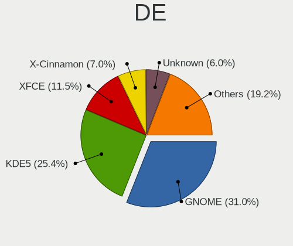

| Name            | Computers | Percent |
|-----------------|-----------|---------|
| GNOME           | 83        | 30.86%  |
| KDE5            | 59        | 21.93%  |
| XFCE            | 34        | 12.64%  |
| Unknown         | 25        | 9.29%   |
| X-Cinnamon      | 13        | 4.83%   |
| MATE            | 12        | 4.46%   |
| KDE             | 12        | 4.46%   |
| KDE4            | 7         | 2.6%    |
| Cinnamon        | 5         | 1.86%   |
| LXDE            | 4         | 1.49%   |
| Unity           | 3         | 1.12%   |
| Pantheon        | 3         | 1.12%   |
| LXQt            | 2         | 0.74%   |
| GNOME Classic   | 2         | 0.74%   |
| Budgie          | 2         | 0.74%   |
| xmonad          | 1         | 0.37%   |
| GNOME Flashback | 1         | 0.37%   |
| Deepin          | 1         | 0.37%   |

Display Server
--------------

X11 or Wayland

| Name    | Computers | Percent |
|---------|-----------|---------|
| X11     | 218       | 85.49%  |
| Wayland | 30        | 11.76%  |
| Unknown | 5         | 1.96%   |
| Tty     | 2         | 0.78%   |

Display Manager
---------------

SDDM, LightDM, etc.

| Name    | Computers | Percent |
|---------|-----------|---------|
| Unknown | 107       | 40.68%  |
| SDDM    | 52        | 19.77%  |
| GDM     | 37        | 14.07%  |
| LightDM | 31        | 11.79%  |
| GDM3    | 18        | 6.84%   |
| TDM     | 10        | 3.8%    |
| KDM     | 7         | 2.66%   |
| SLiM    | 1         | 0.38%   |

OS Lang
-------

Language

| Lang    | Computers | Percent |
|---------|-----------|---------|
| es_VE   | 154       | 59.46%  |
| en_US   | 58        | 22.39%  |
| Unknown | 25        | 9.65%   |
| es_ES   | 16        | 6.18%   |
| es_US   | 2         | 0.77%   |
| C       | 2         | 0.77%   |
| en_CA   | 1         | 0.39%   |
| de_DE   | 1         | 0.39%   |

Boot Mode
---------

EFI or BIOS

| Mode | Computers | Percent |
|------|-----------|---------|
| BIOS | 192       | 75.29%  |
| EFI  | 63        | 24.71%  |

Filesystem
----------

Type of filesystem

| Type    | Computers | Percent |
|---------|-----------|---------|
| Ext4    | 200       | 78.43%  |
| Overlay | 28        | 10.98%  |
| Btrfs   | 13        | 5.1%    |
| Unknown | 8         | 3.14%   |
| Xfs     | 4         | 1.57%   |
| Ext2    | 2         | 0.78%   |

Part. scheme
------------

Scheme of partitioning

| Type    | Computers | Percent |
|---------|-----------|---------|
| Unknown | 123       | 47.86%  |
| MBR     | 76        | 29.57%  |
| GPT     | 58        | 22.57%  |

Dual Boot with Linux/BSD
------------------------

Hosting more than one Linux/BSD

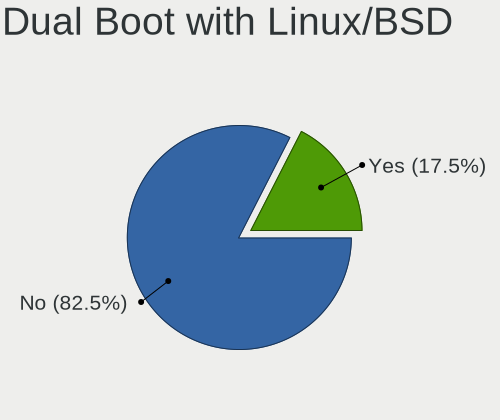

| Dual boot | Computers | Percent |
|-----------|-----------|---------|
| No        | 210       | 81.71%  |
| Yes       | 47        | 18.29%  |

Dual Boot (Win)
---------------

Hosting Linux and Windows

| Dual boot | Computers | Percent |
|-----------|-----------|---------|
| No        | 158       | 62.45%  |
| Yes       | 95        | 37.55%  |

Board
-----

Vendor
------

Motherboard manufacturer

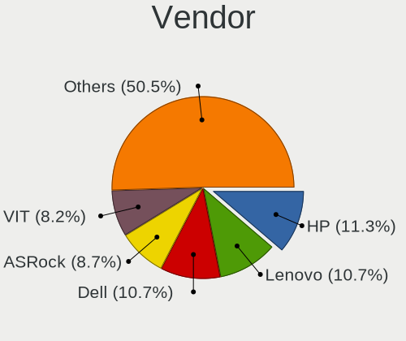

| Name                           | Computers | Percent |
|--------------------------------|-----------|---------|
| Lenovo                         | 29        | 11.55%  |
| Dell                           | 26        | 10.36%  |
| Intel                          | 23        | 9.16%   |
| ASRock                         | 23        | 9.16%   |
| VIT                            | 22        | 8.76%   |
| Hewlett-Packard                | 22        | 8.76%   |
| ASUSTek Computer               | 17        | 6.77%   |
| ECS                            | 14        | 5.58%   |
| Pegatron                       | 11        | 4.38%   |
| Gigabyte Technology            | 8         | 3.19%   |
| Biostar                        | 8         | 3.19%   |
| Acer                           | 6         | 2.39%   |
| Unknown                        | 6         | 2.39%   |
| MSI                            | 5         | 1.99%   |
| langchao                       | 4         | 1.59%   |
| Foxconn                        | 4         | 1.59%   |
| Apple                          | 4         | 1.59%   |
| Toshiba                        | 2         | 0.8%    |
| Shanghai Zhaoxin Semiconductor | 2         | 0.8%    |
| Google                         | 2         | 0.8%    |
| UNIQCELL                       | 1         | 0.4%    |
| Standard                       | 1         | 0.4%    |
| Sony                           | 1         | 0.4%    |
| Samsung Electronics            | 1         | 0.4%    |
| IP3 Tech                       | 1         | 0.4%    |
| Inspur                         | 1         | 0.4%    |
| IBM                            | 1         | 0.4%    |
| GPU Company                    | 1         | 0.4%    |
| Gateway                        | 1         | 0.4%    |
| Exo                            | 1         | 0.4%    |
| Clevo                          | 1         | 0.4%    |
| AVITA                          | 1         | 0.4%    |
| Alienware                      | 1         | 0.4%    |

Model
-----

Motherboard model

| Name                                 | Computers | Percent |
|--------------------------------------|-----------|---------|
| Intel powered classmate PC           | 10        | 3.98%   |
| ECS H61H2-CM                         | 8         | 3.19%   |
| ASRock G41M-VS3                      | 6         | 2.39%   |
| Unknown                              | 6         | 2.39%   |
| VIT P2400                            | 5         | 1.99%   |
| VIT P2402                            | 4         | 1.59%   |
| langchao 12345                       | 4         | 1.59%   |
| VIT P3400                            | 3         | 1.2%    |
| VIT M2420                            | 3         | 1.2%    |
| ASRock N68-VS3 UCC                   | 3         | 1.2%    |
| VIT M2421                            | 2         | 0.8%    |
| VIT Aptio CRB                        | 2         | 0.8%    |
| Shanghai Zhaoxin ZXE CRB             | 2         | 0.8%    |
| Pegatron Compaq dx2400 Microtower    | 2         | 0.8%    |
| Lenovo IdeaPad S100c 20194           | 2         | 0.8%    |
| Lenovo 3000 N200 0769ARS             | 2         | 0.8%    |
| Intel H61                            | 2         | 0.8%    |
| Dell Inspiron 1545                   | 2         | 0.8%    |
| ASRock N68C-S UCC                    | 2         | 0.8%    |
| Apple iMac11,2                       | 2         | 0.8%    |
| VIT P1400                            | 1         | 0.4%    |
| VIT NP3020M3                         | 1         | 0.4%    |
| VIT M2400-01                         | 1         | 0.4%    |
| UNIQCELL Q15.6                       | 1         | 0.4%    |
| Toshiba Satellite E55t-A             | 1         | 0.4%    |
| Toshiba ENCORE 2 WT8-B               | 1         | 0.4%    |
| Standard AIO                         | 1         | 0.4%    |
| Sony VGN-FW510F                      | 1         | 0.4%    |
| Samsung 355V4C/356V4C/3445VC/3545VC  | 1         | 0.4%    |
| Pegatron T14AF                       | 1         | 0.4%    |
| Pegatron PEGATRON                    | 1         | 0.4%    |
| Pegatron IPPEL-DB                    | 1         | 0.4%    |
| Pegatron IPM41-D3                    | 1         | 0.4%    |
| Pegatron CQ1507LA                    | 1         | 0.4%    |
| Pegatron Compaq dx2400 Microtower PC | 1         | 0.4%    |
| Pegatron BM411AA-ABA CQ5600F         | 1         | 0.4%    |
| Pegatron 20-b010                     | 1         | 0.4%    |
| Pegatron 100-5010la                  | 1         | 0.4%    |
| MSI Pro 3000 Microtower PC           | 1         | 0.4%    |
| MSI MS-7817                          | 1         | 0.4%    |

Model Family
------------

Motherboard model prefix

| Name                 | Computers | Percent |
|----------------------|-----------|---------|
| Dell Inspiron        | 11        | 4.38%   |
| Intel powered        | 10        | 3.98%   |
| HP Compaq            | 8         | 3.19%   |
| ECS H61H2-CM         | 8         | 3.19%   |
| Lenovo ThinkCentre   | 7         | 2.79%   |
| Lenovo IdeaPad       | 7         | 2.79%   |
| HP Pavilion          | 6         | 2.39%   |
| ASRock G41M-VS3      | 6         | 2.39%   |
| Unknown              | 6         | 2.39%   |
| VIT P2400            | 5         | 1.99%   |
| Dell Vostro          | 5         | 1.99%   |
| Acer Aspire          | 5         | 1.99%   |
| VIT P2402            | 4         | 1.59%   |
| Lenovo ThinkPad      | 4         | 1.59%   |
| langchao 12345       | 4         | 1.59%   |
| Dell Latitude        | 4         | 1.59%   |
| VIT P3400            | 3         | 1.2%    |
| VIT M2420            | 3         | 1.2%    |
| Pegatron Compaq      | 3         | 1.2%    |
| Lenovo 3000          | 3         | 1.2%    |
| Dell OptiPlex        | 3         | 1.2%    |
| ASRock N68-VS3       | 3         | 1.2%    |
| VIT M2421            | 2         | 0.8%    |
| VIT Aptio            | 2         | 0.8%    |
| Shanghai Zhaoxin ZXE | 2         | 0.8%    |
| Intel H61            | 2         | 0.8%    |
| HP Presario          | 2         | 0.8%    |
| HP EliteBook         | 2         | 0.8%    |
| Dell Precision       | 2         | 0.8%    |
| ASUS VivoBook        | 2         | 0.8%    |
| ASUS P5G41T-M        | 2         | 0.8%    |
| ASUS ASUS            | 2         | 0.8%    |
| ASRock N68C-S        | 2         | 0.8%    |
| Apple iMac11         | 2         | 0.8%    |
| VIT P1400            | 1         | 0.4%    |
| VIT NP3020M3         | 1         | 0.4%    |
| VIT M2400-01         | 1         | 0.4%    |
| UNIQCELL Q15.6       | 1         | 0.4%    |
| Toshiba Satellite    | 1         | 0.4%    |
| Toshiba ENCORE       | 1         | 0.4%    |

MFG Year
--------

Motherboard manufacture year

| Year    | Computers | Percent |
|---------|-----------|---------|
| 2011    | 45        | 17.93%  |
| 2010    | 40        | 15.94%  |
| 2012    | 28        | 11.16%  |
| 2008    | 19        | 7.57%   |
| 2007    | 19        | 7.57%   |
| 2013    | 18        | 7.17%   |
| 2014    | 14        | 5.58%   |
| 2020    | 8         | 3.19%   |
| 2017    | 8         | 3.19%   |
| 2006    | 8         | 3.19%   |
| 2021    | 7         | 2.79%   |
| 2018    | 7         | 2.79%   |
| 2015    | 7         | 2.79%   |
| 2009    | 7         | 2.79%   |
| 2022    | 6         | 2.39%   |
| 2019    | 4         | 1.59%   |
| 2016    | 4         | 1.59%   |
| 2005    | 1         | 0.4%    |
| Unknown | 1         | 0.4%    |

Form Factor
-----------

Physical design of the computer

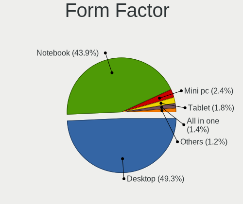

| Name       | Computers | Percent |
|------------|-----------|---------|
| Desktop    | 123       | 49%     |
| Notebook   | 112       | 44.62%  |
| All in one | 6         | 2.39%   |
| Tablet     | 4         | 1.59%   |
| Mini pc    | 3         | 1.2%    |
| Server     | 3         | 1.2%    |

Secure Boot
-----------

Enabled or disabled

| State    | Computers | Percent |
|----------|-----------|---------|
| Disabled | 247       | 98.41%  |
| Enabled  | 4         | 1.59%   |

Coreboot
--------

Have coreboot on board

| Used | Computers | Percent |
|------|-----------|---------|
| No   | 249       | 99.2%   |
| Yes  | 2         | 0.8%    |

RAM Size
--------

Total RAM memory

| Size in GB  | Computers | Percent |
|-------------|-----------|---------|
| 3.01-4.0    | 71        | 27.84%  |
| 4.01-8.0    | 54        | 21.18%  |
| 1.01-2.0    | 49        | 19.22%  |
| 8.01-16.0   | 36        | 14.12%  |
| 16.01-24.0  | 22        | 8.63%   |
| 2.01-3.0    | 11        | 4.31%   |
| 32.01-64.0  | 4         | 1.57%   |
| 24.01-32.0  | 4         | 1.57%   |
| 0.51-1.0    | 3         | 1.18%   |
| 64.01-256.0 | 1         | 0.39%   |

RAM Used
--------

Used RAM memory

| Used GB    | Computers | Percent |
|------------|-----------|---------|
| 1.01-2.0   | 111       | 39.64%  |
| 2.01-3.0   | 69        | 24.64%  |
| 0.51-1.0   | 42        | 15%     |
| 4.01-8.0   | 30        | 10.71%  |
| 3.01-4.0   | 20        | 7.14%   |
| 0.01-0.5   | 4         | 1.43%   |
| 8.01-16.0  | 3         | 1.07%   |
| 16.01-24.0 | 1         | 0.36%   |

Total Drives
------------

Number of drives on board

| Drives | Computers | Percent |
|--------|-----------|---------|
| 1      | 162       | 62.79%  |
| 2      | 76        | 29.46%  |
| 3      | 17        | 6.59%   |
| 4      | 2         | 0.78%   |
| 6      | 1         | 0.39%   |

Has CD-ROM
----------

Has CD-ROM on board

| Presented | Computers | Percent |
|-----------|-----------|---------|
| No        | 136       | 53.33%  |
| Yes       | 119       | 46.67%  |

Has Ethernet
------------

Has Ethernet on board

| Presented | Computers | Percent |
|-----------|-----------|---------|
| Yes       | 234       | 92.86%  |
| No        | 18        | 7.14%   |

Has WiFi
--------

Has WiFi module

| Presented | Computers | Percent |
|-----------|-----------|---------|
| Yes       | 183       | 72.33%  |
| No        | 70        | 27.67%  |

Has Bluetooth
-------------

Has Bluetooth module

| Presented | Computers | Percent |
|-----------|-----------|---------|
| No        | 170       | 66.93%  |
| Yes       | 84        | 33.07%  |

Location
--------

Country
-------

Geographic location (country)

| Country   | Computers | Percent |
|-----------|-----------|---------|
| Venezuela | 251       | 100%    |

City
----

Geographic location (city)

| City                       | Computers | Percent |
|----------------------------|-----------|---------|
| Caracas                    | 118       | 43.7%   |
| Maracaibo                  | 18        | 6.67%   |
| Maracay                    | 15        | 5.56%   |
| Valencia                   | 11        | 4.07%   |
| Barquisimeto               | 10        | 3.7%    |
| Mrida                    | 9         | 3.33%   |
| San Cristbal             | 8         | 2.96%   |
| Barcelona                  | 7         | 2.59%   |
| San Carlos del Zulia       | 6         | 2.22%   |
| Maturn                   | 6         | 2.22%   |
| Barinas                    | 4         | 1.48%   |
| Parroquia El Recreo        | 3         | 1.11%   |
| Lecherias                  | 3         | 1.11%   |
| Ciudad Bolvar            | 3         | 1.11%   |
| Carrizal                   | 3         | 1.11%   |
| Acarigua                   | 3         | 1.11%   |
| San Juan Bautista          | 2         | 0.74%   |
| San Antonio de Los Altos   | 2         | 0.74%   |
| Porlamar                   | 2         | 0.74%   |
| Los Teques                 | 2         | 0.74%   |
| Los Palos Grandes          | 2         | 0.74%   |
| Las Vegas                  | 2         | 0.74%   |
| Guatire                    | 2         | 0.74%   |
| Guarenas                   | 2         | 0.74%   |
| Cua                        | 2         | 0.74%   |
| Ciudad Guayana             | 2         | 0.74%   |
| Anaco                      | 2         | 0.74%   |
| Valle de La Pascua         | 1         | 0.37%   |
| Tucupita                   | 1         | 0.37%   |
| Tucape                     | 1         | 0.37%   |
| Santa Rita                 | 1         | 0.37%   |
| San Francisco              | 1         | 0.37%   |
| San Felipe                 | 1         | 0.37%   |
| San Diego                  | 1         | 0.37%   |
| Puerto Ordaz and San Felix | 1         | 0.37%   |
| Puerto Cumarebo            | 1         | 0.37%   |
| Puerto Cruz                | 1         | 0.37%   |
| Naguanagua                 | 1         | 0.37%   |
| Mene Grande                | 1         | 0.37%   |
| Mariara                    | 1         | 0.37%   |

Drives
------

Drive Vendor
------------

Hard drive vendors

| Vendor              | Computers | Drives | Percent |
|---------------------|-----------|--------|---------|
| WDC                 | 84        | 116    | 26.25%  |
| Seagate             | 76        | 118    | 23.75%  |
| Hitachi             | 34        | 47     | 10.63%  |
| Toshiba             | 24        | 25     | 7.5%    |
| Samsung Electronics | 22        | 26     | 6.88%   |
| Unknown             | 10        | 14     | 3.13%   |
| Kingston            | 10        | 12     | 3.13%   |
| Crucial             | 6         | 8      | 1.88%   |
| SanDisk             | 5         | 7      | 1.56%   |
| PNY                 | 5         | 6      | 1.56%   |
| Intel               | 5         | 8      | 1.56%   |
| SK hynix            | 4         | 5      | 1.25%   |
| Maxtor              | 4         | 4      | 1.25%   |
| LITEONIT            | 4         | 7      | 1.25%   |
| HGST                | 4         | 4      | 1.25%   |
| SPCC                | 3         | 4      | 0.94%   |
| Fujitsu             | 3         | 3      | 0.94%   |
| Patriot             | 2         | 2      | 0.63%   |
| Vaseky              | 1         | 1      | 0.31%   |
| Team                | 1         | 1      | 0.31%   |
| Silicon Motion      | 1         | 1      | 0.31%   |
| PUSKILL             | 1         | 1      | 0.31%   |
| Phison              | 1         | 1      | 0.31%   |
| Micron Technology   | 1         | 3      | 0.31%   |
| Lexar               | 1         | 1      | 0.31%   |
| KingFast            | 1         | 2      | 0.31%   |
| Intenso             | 1         | 1      | 0.31%   |
| ExcelStor           | 1         | 1      | 0.31%   |
| Dogfish             | 1         | 1      | 0.31%   |
| Dell                | 1         | 2      | 0.31%   |
| BIWIN               | 1         | 2      | 0.31%   |
| Apacer              | 1         | 1      | 0.31%   |
| addlink             | 1         | 1      | 0.31%   |

Drive Model
-----------

Hard drive models

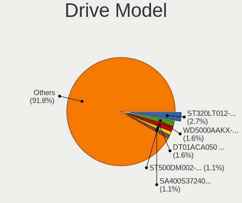

| Model                               | Computers | Percent |
|-------------------------------------|-----------|---------|
| Seagate ST320LT012-1DG14C 320GB     | 13        | 3.68%   |
| Toshiba DT01ACA050 500GB            | 7         | 1.98%   |
| WDC WD5000AAKX-22ERMA0 500GB        | 6         | 1.7%    |
| Seagate ST320LM000 HM321HI 320GB    | 5         | 1.42%   |
| WDC WD1600BEVT-22ZCT0 160GB         | 4         | 1.13%   |
| Seagate ST500LT012-9WS142 500GB     | 4         | 1.13%   |
| Seagate ST500DM002-1BD142 500GB     | 4         | 1.13%   |
| Seagate ST3320418AS 320GB           | 4         | 1.13%   |
| Seagate ST320LM001 HN-M320MBB 320GB | 4         | 1.13%   |
| Kingston SA400S37240G 240GB SSD     | 4         | 1.13%   |
| WDC WD5000LPVX-22V0TT0 500GB        | 3         | 0.85%   |
| WDC WD5000AAKX-221CA1 500GB         | 3         | 0.85%   |
| WDC WD5000AAKX-001CA0 500GB         | 3         | 0.85%   |
| WDC WD5000AAKS-00A7B0 500GB         | 3         | 0.85%   |
| WDC WD3200BPVT-22JJ5T0 320GB        | 3         | 0.85%   |
| WDC WD3200AAJS-08L7A0 320GB         | 3         | 0.85%   |
| WDC WD3200AAJS-00L7A0 320GB         | 3         | 0.85%   |
| WDC WD10JPVX-22JC3T0 1TB            | 3         | 0.85%   |
| Seagate ST320LT012-9WS14C 320GB     | 3         | 0.85%   |
| Seagate ST250LM004 HN-M250MBB 250GB | 3         | 0.85%   |
| Samsung HD502HJ 500GB               | 3         | 0.85%   |
| Samsung HD161HJ 160GB               | 3         | 0.85%   |
| LITEONIT LMS-32L6M 32GB SSD         | 3         | 0.85%   |
| Hitachi HTS542580K9SA00 80GB        | 3         | 0.85%   |
| Hitachi HDS728080PLA380 82GB        | 3         | 0.85%   |
| WDC WD800BD-22MRA1 80GB             | 2         | 0.57%   |
| WDC WD800BB-22JHC0 80GB             | 2         | 0.57%   |
| WDC WD5000LPVT-08G33T1 500GB        | 2         | 0.57%   |
| WDC WD5000AAKS-00UU3A0 500GB        | 2         | 0.57%   |
| WDC WD2500AAJS-60B4A0 250GB         | 2         | 0.57%   |
| Unknown NVMe SSD Drive 512GB        | 2         | 0.57%   |
| Unknown MMC Card  16GB              | 2         | 0.57%   |
| Toshiba MQ01ABF050 500GB            | 2         | 0.57%   |
| Toshiba MQ01ABF032 320GB            | 2         | 0.57%   |
| Toshiba MQ01ABD050 500GB            | 2         | 0.57%   |
| Toshiba MK3275GSX 320GB             | 2         | 0.57%   |
| SPCC Solid State Disk 128GB         | 2         | 0.57%   |
| SK hynix SC300B SATA 512GB SSD      | 2         | 0.57%   |
| Seagate ST9160314AS 160GB           | 2         | 0.57%   |
| Seagate ST500DM005 HD502HJ 500GB    | 2         | 0.57%   |

HDD Vendor
----------

Hard disk drive vendors

| Vendor              | Computers | Drives | Percent |
|---------------------|-----------|--------|---------|
| WDC                 | 82        | 112    | 33.74%  |
| Seagate             | 74        | 116    | 30.45%  |
| Hitachi             | 34        | 47     | 13.99%  |
| Toshiba             | 23        | 24     | 9.47%   |
| Samsung Electronics | 16        | 19     | 6.58%   |
| Maxtor              | 4         | 4      | 1.65%   |
| HGST                | 4         | 4      | 1.65%   |
| Fujitsu             | 3         | 3      | 1.23%   |
| Unknown             | 2         | 2      | 0.82%   |
| ExcelStor           | 1         | 1      | 0.41%   |

SSD Vendor
----------

Solid state drive vendors

| Vendor              | Computers | Drives | Percent |
|---------------------|-----------|--------|---------|
| Kingston            | 9         | 11     | 18.37%  |
| Crucial             | 6         | 8      | 12.24%  |
| PNY                 | 5         | 6      | 10.2%   |
| Samsung Electronics | 4         | 5      | 8.16%   |
| LITEONIT            | 4         | 7      | 8.16%   |
| SPCC                | 3         | 4      | 6.12%   |
| SK hynix            | 2         | 2      | 4.08%   |
| SanDisk             | 2         | 3      | 4.08%   |
| Patriot             | 2         | 2      | 4.08%   |
| Vaseky              | 1         | 1      | 2.04%   |
| Toshiba             | 1         | 1      | 2.04%   |
| Team                | 1         | 1      | 2.04%   |
| PUSKILL             | 1         | 1      | 2.04%   |
| Micron Technology   | 1         | 3      | 2.04%   |
| Lexar               | 1         | 1      | 2.04%   |
| KingFast            | 1         | 2      | 2.04%   |
| Intenso             | 1         | 1      | 2.04%   |
| Intel               | 1         | 1      | 2.04%   |
| Dogfish             | 1         | 1      | 2.04%   |
| Dell                | 1         | 2      | 2.04%   |
| BIWIN               | 1         | 2      | 2.04%   |

Drive Kind
----------

HDD or SSD

| Kind    | Computers | Drives | Percent |
|---------|-----------|--------|---------|
| HDD     | 199       | 332    | 72.89%  |
| SSD     | 47        | 65     | 17.22%  |
| NVMe    | 19        | 28     | 6.96%   |
| MMC     | 6         | 9      | 2.2%    |
| Unknown | 2         | 2      | 0.73%   |

Drive Connector
---------------

SATA, SAS, NVMe, etc.

| Type | Computers | Drives | Percent |
|------|-----------|--------|---------|
| SATA | 230       | 394    | 88.46%  |
| NVMe | 19        | 28     | 7.31%   |
| MMC  | 6         | 9      | 2.31%   |
| SAS  | 5         | 5      | 1.92%   |

Drive Size
----------

Size of hard drive

| Size in TB | Computers | Drives | Percent |
|------------|-----------|--------|---------|
| 0.01-0.5   | 209       | 317    | 80.08%  |
| 0.51-1.0   | 37        | 56     | 14.18%  |
| 1.01-2.0   | 11        | 19     | 4.21%   |
| 3.01-4.0   | 2         | 2      | 0.77%   |
| 2.01-3.0   | 2         | 3      | 0.77%   |

Space Total
-----------

Amount of disk space available on the file system

| Size in GB     | Computers | Percent |
|----------------|-----------|---------|
| 251-500        | 87        | 32.46%  |
| 101-250        | 61        | 22.76%  |
| 501-1000       | 38        | 14.18%  |
| 1-20           | 28        | 10.45%  |
| 51-100         | 22        | 8.21%   |
| 21-50          | 13        | 4.85%   |
| 1001-2000      | 10        | 3.73%   |
| 2001-3000      | 4         | 1.49%   |
| Unknown        | 3         | 1.12%   |
| More than 3000 | 2         | 0.75%   |

Space Used
----------

Amount of used disk space

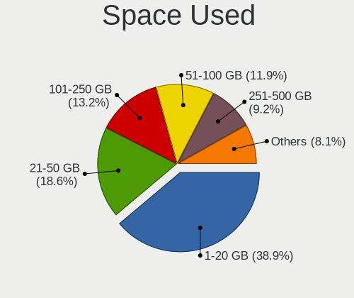

| Used GB        | Computers | Percent |
|----------------|-----------|---------|
| 1-20           | 111       | 40.07%  |
| 21-50          | 51        | 18.41%  |
| 101-250        | 41        | 14.8%   |
| 51-100         | 28        | 10.11%  |
| 251-500        | 24        | 8.66%   |
| 501-1000       | 12        | 4.33%   |
| 2001-3000      | 3         | 1.08%   |
| Unknown        | 3         | 1.08%   |
| More than 3000 | 2         | 0.72%   |
| 1001-2000      | 2         | 0.72%   |

Malfunc. Drives
---------------

Drive models with a malfunction

| Model                             | Computers | Drives | Percent |
|-----------------------------------|-----------|--------|---------|
| Seagate ST320LT012-1DG14C 320GB   | 5         | 6      | 6.41%   |
| WDC WD5000AAKX-22ERMA0 500GB      | 3         | 4      | 3.85%   |
| WDC WD5000AAKX-221CA1 500GB       | 2         | 2      | 2.56%   |
| WDC WD5000AAKS-00A7B0 500GB       | 2         | 2      | 2.56%   |
| Toshiba DT01ACA050 500GB          | 2         | 3      | 2.56%   |
| Seagate ST500DM002-1BD142 500GB   | 2         | 2      | 2.56%   |
| Samsung Electronics HM321HI 320GB | 2         | 2      | 2.56%   |
| Hitachi HDS728080PLA380 82GB      | 2         | 2      | 2.56%   |
| Hitachi HDS721616PLA380 164GB     | 2         | 2      | 2.56%   |
| WDC WD800BD-08MRA1 80GB           | 1         | 1      | 1.28%   |
| WDC WD800BB-22JHC0 80GB           | 1         | 1      | 1.28%   |
| WDC WD5000LPVX-22V0TT0 500GB      | 1         | 1      | 1.28%   |
| WDC WD5000BPVT-24HXZT3 500GB      | 1         | 1      | 1.28%   |
| WDC WD5000AAKX-08U6AA0 500GB      | 1         | 1      | 1.28%   |
| WDC WD5000AAKX-08ERMA0 500GB      | 1         | 1      | 1.28%   |
| WDC WD5000AACS-00ZUB0 500GB       | 1         | 1      | 1.28%   |
| WDC WD50 00BPVT-24HXZT1 500GB     | 1         | 1      | 1.28%   |
| WDC WD3200BPVT-22JJ5T0 320GB      | 1         | 1      | 1.28%   |
| WDC WD3200BEKT-22F3T0 320GB       | 1         | 1      | 1.28%   |
| WDC WD3200AAJS-08L7A0 320GB       | 1         | 2      | 1.28%   |
| WDC WD2003FYPS-27Y2B0 2TB         | 1         | 1      | 1.28%   |
| WDC WD1200BEVS-60UST0 120GB       | 1         | 1      | 1.28%   |
| WDC WD10JPVX-22JC3T0 1TB          | 1         | 2      | 1.28%   |
| WDC WD10EZEX-22RKKA0 1TB          | 1         | 1      | 1.28%   |
| WDC WD1003FZEX-00MK2A0 1TB        | 1         | 1      | 1.28%   |
| Toshiba MQ01ACF050 500GB          | 1         | 1      | 1.28%   |
| Toshiba MQ01ABD050 500GB          | 1         | 1      | 1.28%   |
| Toshiba MK3275GSX 320GB           | 1         | 1      | 1.28%   |
| Seagate ST9500325AS 500GB         | 1         | 1      | 1.28%   |
| Seagate ST9320325AS 320GB         | 1         | 1      | 1.28%   |
| Seagate ST9160314AS 160GB         | 1         | 1      | 1.28%   |
| Seagate ST500LT012-9WS142 500GB   | 1         | 1      | 1.28%   |
| Seagate ST500LM021-1KJ152 500GB   | 1         | 1      | 1.28%   |
| Seagate ST500DM005 HD502HJ 500GB  | 1         | 1      | 1.28%   |
| Seagate ST3500630AS 500GB         | 1         | 1      | 1.28%   |
| Seagate ST3500418AS 500GB         | 1         | 1      | 1.28%   |
| Seagate ST3500413AS 500GB         | 1         | 1      | 1.28%   |
| Seagate ST3500312CS 500GB         | 1         | 1      | 1.28%   |
| Seagate ST340014AS 40GB           | 1         | 1      | 1.28%   |
| Seagate ST3320418AS 320GB         | 1         | 2      | 1.28%   |

Malfunc. Drive Vendor
---------------------

Vendors of faulty drives

| Vendor              | Computers | Drives | Percent |
|---------------------|-----------|--------|---------|
| Seagate             | 23        | 26     | 31.94%  |
| WDC                 | 18        | 26     | 25%     |
| Hitachi             | 14        | 14     | 19.44%  |
| Samsung Electronics | 7         | 8      | 9.72%   |
| Toshiba             | 5         | 6      | 6.94%   |
| Maxtor              | 2         | 2      | 2.78%   |
| Intel               | 1         | 1      | 1.39%   |
| HGST                | 1         | 1      | 1.39%   |
| ExcelStor           | 1         | 1      | 1.39%   |

Malfunc. HDD Vendor
-------------------

Vendors of faulty HDD drives

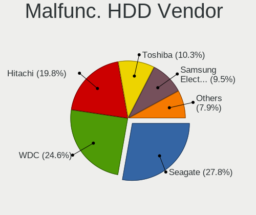

| Vendor              | Computers | Drives | Percent |
|---------------------|-----------|--------|---------|
| Seagate             | 23        | 26     | 32.39%  |
| WDC                 | 18        | 26     | 25.35%  |
| Hitachi             | 14        | 14     | 19.72%  |
| Samsung Electronics | 7         | 8      | 9.86%   |
| Toshiba             | 5         | 6      | 7.04%   |
| Maxtor              | 2         | 2      | 2.82%   |
| HGST                | 1         | 1      | 1.41%   |
| ExcelStor           | 1         | 1      | 1.41%   |

Malfunc. Drive Kind
-------------------

Kinds of faulty drives

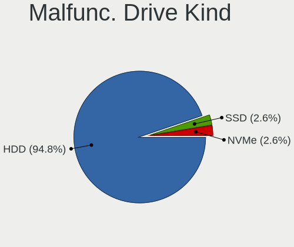

| Kind | Computers | Drives | Percent |
|------|-----------|--------|---------|
| HDD  | 60        | 84     | 98.36%  |
| NVMe | 1         | 1      | 1.64%   |

Failed Drives
-------------

Failed drive models

| Model                    | Computers | Drives | Percent |
|--------------------------|-----------|--------|---------|
| Toshiba DT01ACA050 500GB | 2         | 2      | 100%    |

Failed Drive Vendor
-------------------

Failed drive vendors

| Vendor  | Computers | Drives | Percent |
|---------|-----------|--------|---------|
| Toshiba | 2         | 2      | 100%    |

Drive Status
------------

Number of failed and malfunc. drives

| Status   | Computers | Drives | Percent |
|----------|-----------|--------|---------|
| Detected | 137       | 244    | 49.46%  |
| Works    | 77        | 105    | 27.8%   |
| Malfunc  | 61        | 85     | 22.02%  |
| Failed   | 2         | 2      | 0.72%   |

Storage controller
------------------

Storage Vendor
--------------

Storage controller vendors

| Vendor                      | Computers | Percent |
|-----------------------------|-----------|---------|
| Intel                       | 200       | 74.07%  |
| AMD                         | 27        | 10%     |
| Nvidia                      | 13        | 4.81%   |
| Marvell Technology Group    | 5         | 1.85%   |
| JMicron Technology          | 5         | 1.85%   |
| SanDisk                     | 4         | 1.48%   |
| VIA Technologies            | 3         | 1.11%   |
| Unknown                     | 3         | 1.11%   |
| SK hynix                    | 2         | 0.74%   |
| Samsung Electronics         | 2         | 0.74%   |
| Phison Electronics          | 2         | 0.74%   |
| Silicon Motion              | 1         | 0.37%   |
| Kingston Technology Company | 1         | 0.37%   |
| ASMedia Technology          | 1         | 0.37%   |
| Adaptec                     | 1         | 0.37%   |

Storage Model
-------------

Storage controller models

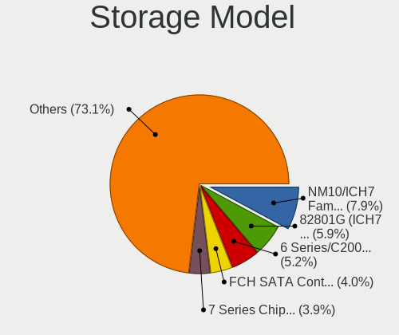

| Model                                                                                   | Computers | Percent |
|-----------------------------------------------------------------------------------------|-----------|---------|
| Intel NM10/ICH7 Family SATA Controller [IDE mode]                                       | 33        | 9.04%   |
| Intel 82801G (ICH7 Family) IDE Controller                                               | 25        | 6.85%   |
| Intel 7 Series Chipset Family 6-port SATA Controller [AHCI mode]                        | 17        | 4.66%   |
| AMD FCH SATA Controller [AHCI mode]                                                     | 16        | 4.38%   |
| Intel 6 Series/C200 Series Chipset Family 6 port Desktop SATA AHCI Controller           | 15        | 4.11%   |
| Intel 6 Series/C200 Series Chipset Family Desktop SATA Controller (IDE mode, ports 4-5) | 14        | 3.84%   |
| Intel 6 Series/C200 Series Chipset Family Desktop SATA Controller (IDE mode, ports 0-3) | 14        | 3.84%   |
| Nvidia MCP61 SATA Controller                                                            | 12        | 3.29%   |
| Intel 6 Series/C200 Series Chipset Family 6 port Mobile SATA AHCI Controller            | 12        | 3.29%   |
| Nvidia MCP61 IDE                                                                        | 10        | 2.74%   |
| Intel 82801IBM/IEM (ICH9M/ICH9M-E) 4 port SATA Controller [AHCI mode]                   | 8         | 2.19%   |
| Intel NM10/ICH7 Family SATA Controller [AHCI mode]                                      | 7         | 1.92%   |
| Intel Atom Processor E3800 Series SATA AHCI Controller                                  | 7         | 1.92%   |
| Intel 82801HM/HEM (ICH8M/ICH8M-E) IDE Controller                                        | 7         | 1.92%   |
| Intel 8 Series/C220 Series Chipset Family 6-port SATA Controller 1 [AHCI mode]          | 7         | 1.92%   |
| Intel 82801JI (ICH10 Family) 4 port SATA IDE Controller #1                              | 6         | 1.64%   |
| Intel 82801JI (ICH10 Family) 2 port SATA IDE Controller #2                              | 6         | 1.64%   |
| Intel 82801 Mobile SATA Controller [RAID mode]                                          | 6         | 1.64%   |
| Intel 5 Series/3400 Series Chipset 4 port SATA AHCI Controller                          | 6         | 1.64%   |
| Intel Sunrise Point-LP SATA Controller [AHCI mode]                                      | 5         | 1.37%   |
| Intel 82801IR/IO/IH (ICH9R/DO/DH) 4 port SATA Controller [IDE mode]                     | 5         | 1.37%   |
| Intel 82801I (ICH9 Family) 2 port SATA Controller [IDE mode]                            | 5         | 1.37%   |
| AMD SB7x0/SB8x0/SB9x0 SATA Controller [AHCI mode]                                       | 5         | 1.37%   |
| AMD SB7x0/SB8x0/SB9x0 IDE Controller                                                    | 5         | 1.37%   |
| Intel 82801HM/HEM (ICH8M/ICH8M-E) SATA Controller [IDE mode]                            | 4         | 1.1%    |
| Intel 82801HM/HEM (ICH8M/ICH8M-E) SATA Controller [AHCI mode]                           | 4         | 1.1%    |
| Intel 7 Series/C210 Series Chipset Family 6-port SATA Controller [AHCI mode]            | 4         | 1.1%    |
| VIA VT82C586A/B/VT82C686/A/B/VT823x/A/C PIPC Bus Master IDE                             | 3         | 0.82%   |
| Intel Volume Management Device NVMe RAID Controller                                     | 3         | 0.82%   |
| Intel SATA Controller [RAID mode]                                                       | 3         | 0.82%   |
| Intel 82801HR/HO/HH (ICH8R/DO/DH) 2 port SATA Controller [IDE mode]                     | 3         | 0.82%   |
| Intel 82801H (ICH8 Family) 4 port SATA Controller [IDE mode]                            | 3         | 0.82%   |
| Intel 8 Series SATA Controller 1 [AHCI mode]                                            | 3         | 0.82%   |
| Intel 5 Series/3400 Series Chipset 6 port SATA AHCI Controller                          | 3         | 0.82%   |
| AMD SB7x0/SB8x0/SB9x0 SATA Controller [IDE mode]                                        | 3         | 0.82%   |
| Unknown                                                                                 | 3         | 0.82%   |
| VIA Serial ATA Controller                                                               | 2         | 0.55%   |
| SanDisk Non-Volatile memory controller                                                  | 2         | 0.55%   |
| Samsung NVMe SSD Controller 980                                                         | 2         | 0.55%   |
| Phison PS5013 E13 NVMe Controller                                                       | 2         | 0.55%   |

Storage Kind
------------

Kind of storage controller (IDE, SATA, NVMe, SAS, ...)

| Kind | Computers | Percent |
|------|-----------|---------|
| SATA | 147       | 52.13%  |
| IDE  | 101       | 35.82%  |
| NVMe | 19        | 6.74%   |
| RAID | 13        | 4.61%   |
| SAS  | 1         | 0.35%   |
| SCSI | 1         | 0.35%   |

Processor
---------

CPU Vendor
----------

Processor vendors

| Vendor       | Computers | Percent |
|--------------|-----------|---------|
| Intel        | 208       | 82.87%  |
| AMD          | 41        | 16.33%  |
| CentaurHauls | 2         | 0.8%    |

CPU Model
---------

Processor models

| Model                                       | Computers | Percent |
|---------------------------------------------|-----------|---------|
| Intel Pentium Dual-Core CPU E5700 @ 3.00GHz | 6         | 2.39%   |
| Intel Pentium Dual-Core CPU E5300 @ 2.60GHz | 6         | 2.39%   |
| Intel Celeron CPU N2805 @ 1.46GHz           | 6         | 2.39%   |
| Intel Pentium Dual-Core CPU E5800 @ 3.20GHz | 4         | 1.59%   |
| Intel Pentium CPU G620 @ 2.60GHz            | 4         | 1.59%   |
| Intel Celeron CPU 847 @ 1.10GHz             | 4         | 1.59%   |
| Intel Atom CPU N455 @ 1.66GHz               | 4         | 1.59%   |
| Intel Pentium Dual-Core CPU E6600 @ 3.06GHz | 3         | 1.2%    |
| Intel Pentium 4 CPU 3.00GHz                 | 3         | 1.2%    |
| Intel Core i5-3470 CPU @ 3.20GHz            | 3         | 1.2%    |
| Intel Core i5-2400 CPU @ 3.10GHz            | 3         | 1.2%    |
| Intel Core i3-3110M CPU @ 2.40GHz           | 3         | 1.2%    |
| Intel Core i3-2120 CPU @ 3.30GHz            | 3         | 1.2%    |
| Intel Core i3-2100 CPU @ 3.10GHz            | 3         | 1.2%    |
| Intel Core 2 Quad CPU Q6600 @ 2.40GHz       | 3         | 1.2%    |
| Intel Core 2 Duo CPU T6600 @ 2.20GHz        | 3         | 1.2%    |
| Intel Core 2 Duo CPU T6570 @ 2.10GHz        | 3         | 1.2%    |
| Intel 11th Gen Core i5-1135G7 @ 2.40GHz     | 3         | 1.2%    |
| AMD Sempron 145 Processor                   | 3         | 1.2%    |
| Intel Pentium Dual-Core CPU T4300 @ 2.10GHz | 2         | 0.8%    |
| Intel Pentium Dual-Core CPU E5500 @ 2.80GHz | 2         | 0.8%    |
| Intel Pentium Dual CPU E2220 @ 2.40GHz      | 2         | 0.8%    |
| Intel Pentium Dual CPU E2180 @ 2.00GHz      | 2         | 0.8%    |
| Intel Pentium CPU P6200 @ 2.13GHz           | 2         | 0.8%    |
| Intel Pentium CPU N3710 @ 1.60GHz           | 2         | 0.8%    |
| Intel Pentium CPU G640 @ 2.80GHz            | 2         | 0.8%    |
| Intel Core i7-3770 CPU @ 3.40GHz            | 2         | 0.8%    |
| Intel Core i5-7300U CPU @ 2.60GHz           | 2         | 0.8%    |
| Intel Core i5-3337U CPU @ 1.80GHz           | 2         | 0.8%    |
| Intel Core i5-3330 CPU @ 3.00GHz            | 2         | 0.8%    |
| Intel Core i5-3230M CPU @ 2.60GHz           | 2         | 0.8%    |
| Intel Core i5-2500 CPU @ 3.30GHz            | 2         | 0.8%    |
| Intel Core i5-2450M CPU @ 2.50GHz           | 2         | 0.8%    |
| Intel Core i5-2430M CPU @ 2.40GHz           | 2         | 0.8%    |
| Intel Core i3-4000M CPU @ 2.40GHz           | 2         | 0.8%    |
| Intel Core i3-3120M CPU @ 2.50GHz           | 2         | 0.8%    |
| Intel Core i3-2350M CPU @ 2.30GHz           | 2         | 0.8%    |
| Intel Core i3 CPU M 330 @ 2.13GHz           | 2         | 0.8%    |
| Intel Core i3 CPU 550 @ 3.20GHz             | 2         | 0.8%    |
| Intel Core 2 Quad CPU Q8400 @ 2.66GHz       | 2         | 0.8%    |

CPU Model Family
----------------

Processor model prefix

| Model                          | Computers | Percent |
|--------------------------------|-----------|---------|
| Intel Core i5                  | 36        | 14.34%  |
| Intel Core i3                  | 30        | 11.95%  |
| Intel Pentium Dual-Core        | 24        | 9.56%   |
| Intel Core 2 Duo               | 19        | 7.57%   |
| Intel Celeron                  | 18        | 7.17%   |
| Intel Core i7                  | 17        | 6.77%   |
| Intel Pentium                  | 16        | 6.37%   |
| Intel Atom                     | 10        | 3.98%   |
| Other                          | 9         | 3.59%   |
| Intel Xeon                     | 7         | 2.79%   |
| Intel Pentium Dual             | 7         | 2.79%   |
| AMD Sempron                    | 6         | 2.39%   |
| Intel Core 2 Quad              | 5         | 1.99%   |
| AMD Ryzen 5                    | 5         | 1.99%   |
| Intel Pentium 4                | 4         | 1.59%   |
| Intel Core 2                   | 4         | 1.59%   |
| AMD FX                         | 3         | 1.2%    |
| AMD Athlon II X2               | 3         | 1.2%    |
| Intel Genuine                  | 2         | 0.8%    |
| AMD Ryzen 3                    | 2         | 0.8%    |
| AMD Phenom II X4               | 2         | 0.8%    |
| AMD Phenom                     | 2         | 0.8%    |
| AMD E1                         | 2         | 0.8%    |
| AMD Athlon                     | 2         | 0.8%    |
| AMD A6                         | 2         | 0.8%    |
| AMD A10                        | 2         | 0.8%    |
| Intel Pentium Silver           | 1         | 0.4%    |
| Intel Pentium D                | 1         | 0.4%    |
| AMD Turion X2 Dual-Core Mobile | 1         | 0.4%    |
| AMD Ryzen 7                    | 1         | 0.4%    |
| AMD Phenom II X2               | 1         | 0.4%    |
| AMD Mobile Sempron             | 1         | 0.4%    |
| AMD E                          | 1         | 0.4%    |
| AMD Athlon II X4               | 1         | 0.4%    |
| AMD Athlon II                  | 1         | 0.4%    |
| AMD Athlon 64 X2               | 1         | 0.4%    |
| AMD A8                         | 1         | 0.4%    |
| AMD A4                         | 1         | 0.4%    |

CPU Cores
---------

Number of processor cores

| Number  | Computers | Percent |
|---------|-----------|---------|
| 2       | 155       | 61.75%  |
| 4       | 63        | 25.1%   |
| 1       | 18        | 7.17%   |
| 6       | 4         | 1.59%   |
| 3       | 4         | 1.59%   |
| Unknown | 4         | 1.59%   |
| 8       | 3         | 1.2%    |

CPU Sockets
-----------

Number of sockets

| Number | Computers | Percent |
|--------|-----------|---------|
| 1      | 251       | 100%    |

CPU Threads
-----------

Threads per core (Hyper-Threading)

| Number  | Computers | Percent |
|---------|-----------|---------|
| 1       | 148       | 58.96%  |
| 2       | 99        | 39.44%  |
| Unknown | 4         | 1.59%   |

CPU Op-Modes
------------

CPU Operation Modes (32-bit, 64-bit)

| Op mode        | Computers | Percent |
|----------------|-----------|---------|
| 32-bit, 64-bit | 241       | 96.02%  |
| 64-bit         | 5         | 1.99%   |
| 32-bit         | 4         | 1.59%   |
| Unknown        | 1         | 0.4%    |

CPU Microcode
-------------

Microcode number

| Number     | Computers | Percent |
|------------|-----------|---------|
| Unknown    | 45        | 17.51%  |
| 0x1067a    | 37        | 14.4%   |
| 0x206a7    | 30        | 11.67%  |
| 0x306a9    | 22        | 8.56%   |
| 0x6fd      | 10        | 3.89%   |
| 0x306c3    | 7         | 2.72%   |
| 0x30673    | 6         | 2.33%   |
| 0x106ca    | 6         | 2.33%   |
| 0x806e9    | 5         | 1.95%   |
| 0x806c1    | 5         | 1.95%   |
| 0x010000c8 | 5         | 1.95%   |
| 0x6fb      | 4         | 1.56%   |
| 0x20655    | 4         | 1.56%   |
| 0xf65      | 3         | 1.17%   |
| 0x6f2      | 3         | 1.17%   |
| 0x40651    | 3         | 1.17%   |
| 0x30678    | 3         | 1.17%   |
| 0x106a5    | 3         | 1.17%   |
| 0x05000119 | 3         | 1.17%   |
| 0x906e9    | 2         | 0.78%   |
| 0x406e3    | 2         | 0.78%   |
| 0x406c4    | 2         | 0.78%   |
| 0x306d4    | 2         | 0.78%   |
| 0x10676    | 2         | 0.78%   |
| 0x08608103 | 2         | 0.78%   |
| 0x0810100b | 2         | 0.78%   |
| 0x0600063e | 2         | 0.78%   |
| 0x010000c7 | 2         | 0.78%   |
| 0x010000b6 | 2         | 0.78%   |
| 0xf47      | 1         | 0.39%   |
| 0xf41      | 1         | 0.39%   |
| 0xa0671    | 1         | 0.39%   |
| 0x906eb    | 1         | 0.39%   |
| 0x806ea    | 1         | 0.39%   |
| 0x806d1    | 1         | 0.39%   |
| 0x706e5    | 1         | 0.39%   |
| 0x706a8    | 1         | 0.39%   |
| 0x6fa      | 1         | 0.39%   |
| 0x6f6      | 1         | 0.39%   |
| 0x6ec      | 1         | 0.39%   |

CPU Microarch
-------------

Microarchitecture

| Name            | Computers | Percent |
|-----------------|-----------|---------|
| Penryn          | 40        | 15.94%  |
| SandyBridge     | 39        | 15.54%  |
| IvyBridge       | 27        | 10.76%  |
| Core            | 24        | 9.56%   |
| K10             | 14        | 5.58%   |
| Silvermont      | 12        | 4.78%   |
| Haswell         | 12        | 4.78%   |
| KabyLake        | 11        | 4.38%   |
| Westmere        | 9         | 3.59%   |
| Bonnell         | 9         | 3.59%   |
| TigerLake       | 5         | 1.99%   |
| NetBurst        | 5         | 1.99%   |
| Unknown         | 5         | 1.99%   |
| K8 Hammer       | 4         | 1.59%   |
| Zen             | 3         | 1.2%    |
| Skylake         | 3         | 1.2%    |
| Nehalem         | 3         | 1.2%    |
| Bobcat          | 3         | 1.2%    |
| Zen+            | 2         | 0.8%    |
| Zen 2           | 2         | 0.8%    |
| Piledriver      | 2         | 0.8%    |
| K10 Llano       | 2         | 0.8%    |
| Icelake         | 2         | 0.8%    |
| Goldmont plus   | 2         | 0.8%    |
| Excavator       | 2         | 0.8%    |
| Bulldozer       | 2         | 0.8%    |
| Broadwell       | 2         | 0.8%    |
| Steamroller     | 1         | 0.4%    |
| P6              | 1         | 0.4%    |
| K8 & K10 hybrid | 1         | 0.4%    |
| Jaguar          | 1         | 0.4%    |
| Goldmont        | 1         | 0.4%    |

Graphics
--------

GPU Vendor
----------

Vendors of graphics cards

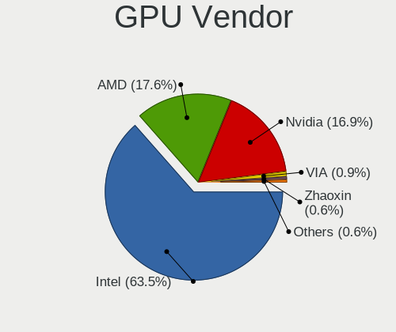

| Vendor                     | Computers | Percent |
|----------------------------|-----------|---------|
| Intel                      | 174       | 64.93%  |
| AMD                        | 45        | 16.79%  |
| Nvidia                     | 42        | 15.67%  |
| VIA Technologies           | 3         | 1.12%   |
| Zhaoxin                    | 2         | 0.75%   |
| Matrox Electronics Systems | 1         | 0.37%   |
| ASPEED Technology          | 1         | 0.37%   |

GPU Model
---------

Graphics card models

| Model                                                                                    | Computers | Percent |
|------------------------------------------------------------------------------------------|-----------|---------|
| Intel 2nd Generation Core Processor Family Integrated Graphics Controller                | 34        | 12.19%  |
| Intel 4 Series Chipset Integrated Graphics Controller                                    | 17        | 6.09%   |
| Intel 3rd Gen Core processor Graphics Controller                                         | 14        | 5.02%   |
| Intel Atom Processor Z36xxx/Z37xxx Series Graphics & Display                             | 9         | 3.23%   |
| Intel Mobile 4 Series Chipset Integrated Graphics Controller                             | 8         | 2.87%   |
| Intel Mobile GM965/GL960 Integrated Graphics Controller (secondary)                      | 7         | 2.51%   |
| Intel Mobile GM965/GL960 Integrated Graphics Controller (primary)                        | 7         | 2.51%   |
| Intel Core Processor Integrated Graphics Controller                                      | 7         | 2.51%   |
| Intel Atom Processor D4xx/D5xx/N4xx/N5xx Integrated Graphics Controller                  | 7         | 2.51%   |
| Intel 82G33/G31 Express Integrated Graphics Controller                                   | 7         | 2.51%   |
| Intel Xeon E3-1200 v3/4th Gen Core Processor Integrated Graphics Controller              | 5         | 1.79%   |
| Intel TigerLake-LP GT2 [Iris Xe Graphics]                                                | 5         | 1.79%   |
| AMD Cedar [Radeon HD 5000/6000/7350/8350 Series]                                         | 5         | 1.79%   |
| Nvidia GF119 [GeForce GT 520]                                                            | 4         | 1.43%   |
| Intel Xeon E3-1200 v2/3rd Gen Core processor Graphics Controller                         | 4         | 1.43%   |
| Intel IvyBridge GT2 [HD Graphics 4000]                                                   | 4         | 1.43%   |
| Intel HD Graphics 620                                                                    | 4         | 1.43%   |
| Intel 82946GZ/GL Integrated Graphics Controller                                          | 4         | 1.43%   |
| VIA Technologies CN896/VN896/P4M900 [Chrome 9 HC]                                        | 3         | 1.08%   |
| Nvidia GT218 [GeForce 210]                                                               | 3         | 1.08%   |
| Nvidia GF106 [GeForce GTS 450]                                                           | 3         | 1.08%   |
| Intel HD Graphics 630                                                                    | 3         | 1.08%   |
| Intel Haswell-ULT Integrated Graphics Controller                                         | 3         | 1.08%   |
| Intel Atom/Celeron/Pentium Processor x5-E8000/J3xxx/N3xxx Integrated Graphics Controller | 3         | 1.08%   |
| AMD Raven Ridge [Radeon Vega Series / Radeon Vega Mobile Series]                         | 3         | 1.08%   |
| Zhaoxin ZX-E C-960 GPU                                                                   | 2         | 0.72%   |
| Nvidia GK208B [GeForce GT 710]                                                           | 2         | 0.72%   |
| Nvidia GF119 [GeForce GT 610]                                                            | 2         | 0.72%   |
| Nvidia G96C [GeForce 9500 GT]                                                            | 2         | 0.72%   |
| Nvidia G86 [GeForce 8500 GT]                                                             | 2         | 0.72%   |
| Nvidia C61 [GeForce 7025 / nForce 630a]                                                  | 2         | 0.72%   |
| Nvidia C61 [GeForce 6150SE nForce 430]                                                   | 2         | 0.72%   |
| Intel Skylake GT2 [HD Graphics 520]                                                      | 2         | 0.72%   |
| Intel Mobile 945GM/GMS/GME, 943/940GML Express Integrated Graphics Controller            | 2         | 0.72%   |
| Intel HD Graphics 5500                                                                   | 2         | 0.72%   |
| Intel 82Q963/Q965 Integrated Graphics Controller                                         | 2         | 0.72%   |
| Intel 82945G/GZ Integrated Graphics Controller                                           | 2         | 0.72%   |
| Intel 82865G Integrated Graphics Controller                                              | 2         | 0.72%   |
| Intel 4th Gen Core Processor Integrated Graphics Controller                              | 2         | 0.72%   |
| AMD Wrestler [Radeon HD 7310]                                                            | 2         | 0.72%   |

GPU Combo
---------

Combinations of graphics cards

| Name            | Computers | Percent |
|-----------------|-----------|---------|
| 1 x Intel       | 161       | 63.89%  |
| 1 x AMD         | 40        | 15.87%  |
| 1 x Nvidia      | 34        | 13.49%  |
| Intel + Nvidia  | 5         | 1.98%   |
| 1 x VIA         | 3         | 1.19%   |
| 1 x Zhaoxin     | 2         | 0.79%   |
| Intel + AMD     | 2         | 0.79%   |
| AMD + Nvidia    | 2         | 0.79%   |
| 2 x AMD         | 1         | 0.4%    |
| Nvidia + ASPEED | 1         | 0.4%    |
| 1 x Matrox      | 1         | 0.4%    |

GPU Driver
----------

Free vs proprietary

| Driver      | Computers | Percent |
|-------------|-----------|---------|
| Free        | 216       | 86.06%  |
| Proprietary | 20        | 7.97%   |
| Unknown     | 15        | 5.98%   |

GPU Memory
----------

Total video memory

| Size in GB | Computers | Percent |
|------------|-----------|---------|
| Unknown    | 166       | 64.34%  |
| 0.01-0.5   | 37        | 14.34%  |
| 0.51-1.0   | 28        | 10.85%  |
| 1.01-2.0   | 20        | 7.75%   |
| 3.01-4.0   | 7         | 2.71%   |

Monitor
-------

Monitor Vendor
--------------

Monitor vendors

| Vendor                                | Computers | Percent |
|---------------------------------------|-----------|---------|
| Samsung Electronics                   | 51        | 20.48%  |
| BOE                                   | 17        | 6.83%   |
| LG Display                            | 16        | 6.43%   |
| Hewlett-Packard                       | 16        | 6.43%   |
| Goldstar                              | 15        | 6.02%   |
| AU Optronics                          | 15        | 6.02%   |
| Lenovo                                | 13        | 5.22%   |
| Chimei Innolux                        | 11        | 4.42%   |
| Dell                                  | 10        | 4.02%   |
| InfoVision                            | 9         | 3.61%   |
| Toshiba                               | 8         | 3.21%   |
| Chi Mei Optoelectronics               | 7         | 2.81%   |
| AOC                                   | 7         | 2.81%   |
| Acer                                  | 6         | 2.41%   |
| LG Philips                            | 5         | 2.01%   |
| Vita                                  | 4         | 1.61%   |
| HannStar                              | 4         | 1.61%   |
| Apple                                 | 4         | 1.61%   |
| BenQ                                  | 3         | 1.2%    |
| ViewSonic                             | 2         | 0.8%    |
| Sony                                  | 2         | 0.8%    |
| PANDA                                 | 2         | 0.8%    |
| MStar                                 | 2         | 0.8%    |
| ITL                                   | 2         | 0.8%    |
| Envision                              | 2         | 0.8%    |
| Vizio                                 | 1         | 0.4%    |
| Unknown (XXX)                         | 1         | 0.4%    |
| Toshiba Matsushita Display Technology | 1         | 0.4%    |
| TCL                                   | 1         | 0.4%    |
| Sharp                                 | 1         | 0.4%    |
| Plain Tree Systems                    | 1         | 0.4%    |
| PEGA                                  | 1         | 0.4%    |
| Parker                                | 1         | 0.4%    |
| LSC                                   | 1         | 0.4%    |
| LG Electronics                        | 1         | 0.4%    |
| LED                                   | 1         | 0.4%    |
| KTC                                   | 1         | 0.4%    |
| InnoLux Display                       | 1         | 0.4%    |
| IBM                                   | 1         | 0.4%    |
| CVT                                   | 1         | 0.4%    |

Monitor Model
-------------

Monitor models

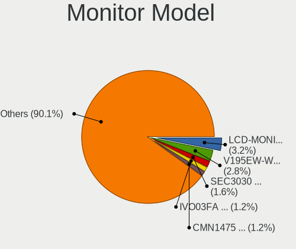

| Model                                                                | Computers | Percent |
|----------------------------------------------------------------------|-----------|---------|
| InfoVision LCD Monitor IVO03FA 1366x768 223x125mm 10.1-inch          | 6         | 2.37%   |
| Toshiba LCD-MONITOR LCDE980 1440x900 408x255mm 18.9-inch             | 5         | 1.98%   |
| Vita V195EW-W VIT1950 1600x900 432x240mm 19.5-inch                   | 4         | 1.58%   |
| Samsung Electronics SyncMaster SAM01B7 1280x1024 338x270mm 17.0-inch | 4         | 1.58%   |
| Samsung Electronics LCD Monitor SEC3030 1024x600 223x125mm 10.1-inch | 4         | 1.58%   |
| Lenovo LEN L171 LEN240B 1280x1024 337x270mm 17.0-inch                | 4         | 1.58%   |
| Chimei Innolux LCD Monitor CMN1475 1366x768 309x174mm 14.0-inch      | 4         | 1.58%   |
| Toshiba TV TSB0206 1920x1080                                         | 3         | 1.19%   |
| HannStar HSD101PFW2 HSD03E9 1024x600 222x125mm 10.0-inch             | 3         | 1.19%   |
| BOE LCD Monitor BOE05C7 1366x768 309x173mm 13.9-inch                 | 3         | 1.19%   |
| AU Optronics LCD Monitor AUO1B3C 1366x768 309x173mm 13.9-inch        | 3         | 1.19%   |
| Samsung Electronics T22C301 SAM0AD2 1920x1080 477x268mm 21.5-inch    | 2         | 0.79%   |
| Samsung Electronics SyncMaster SAM0370 1680x1050 459x296mm 21.5-inch | 2         | 0.79%   |
| Samsung Electronics SA300/SA350 SAM0788 1366x768 410x230mm 18.5-inch | 2         | 0.79%   |
| Samsung Electronics S19A10N SAM083E 1366x768 410x230mm 18.5-inch     | 2         | 0.79%   |
| Samsung Electronics LCD Monitor SEC5441 1366x768 344x194mm 15.5-inch | 2         | 0.79%   |
| PANDA LCD Monitor NCP004D 1920x1080 344x194mm 15.5-inch              | 2         | 0.79%   |
| MStar Demo MST0030 1920x1080 1150x650mm 52.0-inch                    | 2         | 0.79%   |
| LG Display LCD Monitor LGD0385 1366x768 309x174mm 14.0-inch          | 2         | 0.79%   |
| ITL MT-3185 ITL3185 1366x768 409x230mm 18.5-inch                     | 2         | 0.79%   |
| InfoVision M140NWR2 R1 IVO057A 1366x768 309x174mm 14.0-inch          | 2         | 0.79%   |
| Hewlett-Packard L1710 HWP26EB 1280x1024 340x270mm 17.1-inch          | 2         | 0.79%   |
| Goldstar W1943 GSM4BAD 1360x768 406x229mm 18.4-inch                  | 2         | 0.79%   |
| Goldstar FHD GSM5BC9 1920x1080 480x270mm 21.7-inch                   | 2         | 0.79%   |
| BOE LCD Monitor BOE059F 1366x768 309x173mm 13.9-inch                 | 2         | 0.79%   |
| Apple Color LCD APP9CDD 1920x1080 475x267mm 21.5-inch                | 2         | 0.79%   |
| Vizio E322AR VIZ0079 1360x768 700x400mm 31.7-inch                    | 1         | 0.4%    |
| ViewSonic VA2448 SERIES VSC3828 1920x1080 521x293mm 23.5-inch        | 1         | 0.4%    |
| ViewSonic VA2252 SERIES VSC7731 1920x1080 476x268mm 21.5-inch        | 1         | 0.4%    |
| Unknown (XXX) 1772ED XXX1772 1280x1024 320x250mm 16.0-inch           | 1         | 0.4%    |
| Unknown (XXX) 1772E XXX1772 1280x1024 320x250mm 16.0-inch            | 1         | 0.4%    |
| Toshiba Matsushita Display Technology LCD Monitor LCD-MONITOR        | 1         | 0.4%    |
| TCL T-7005L TCL1770 1280x1024 338x270mm 17.0-inch                    | 1         | 0.4%    |
| Sony TV SNYEB01 1360x768                                             | 1         | 0.4%    |
| Sony TV SNYEA01 1920x1080                                            | 1         | 0.4%    |
| Sony TV SNYDC01 1360x768                                             | 1         | 0.4%    |
| Sharp LCD Monitor SHP14B9 3840x2160 344x194mm 15.5-inch              | 1         | 0.4%    |
| Samsung Electronics SyncMaster SAM0598 1360x768 410x230mm 18.5-inch  | 1         | 0.4%    |
| Samsung Electronics SyncMaster SAM04DF 1360x768 410x230mm 18.5-inch  | 1         | 0.4%    |
| Samsung Electronics SyncMaster SAM049C 1920x1080 477x268mm 21.5-inch | 1         | 0.4%    |

Monitor Resolution
------------------

Monitor screen resolution

| Resolution         | Computers | Percent |
|--------------------|-----------|---------|
| 1366x768 (WXGA)    | 91        | 37.76%  |
| 1920x1080 (FHD)    | 50        | 20.75%  |
| 1280x1024 (SXGA)   | 28        | 11.62%  |
| 1600x900 (HD+)     | 14        | 5.81%   |
| 1440x900 (WXGA+)   | 13        | 5.39%   |
| 1280x800 (WXGA)    | 11        | 4.56%   |
| 1360x768           | 7         | 2.9%    |
| 1680x1050 (WSXGA+) | 6         | 2.49%   |
| 3840x2160 (4K)     | 4         | 1.66%   |
| 1920x1200 (WUXGA)  | 3         | 1.24%   |
| 1280x720 (HD)      | 3         | 1.24%   |
| 1024x768 (XGA)     | 3         | 1.24%   |
| 1024x600           | 3         | 1.24%   |
| 2560x1440 (QHD)    | 2         | 0.83%   |
| Unknown            | 2         | 0.83%   |
| 3840x1080          | 1         | 0.41%   |

Monitor Diagonal
----------------

Diagonal size in inches

| Inches  | Computers | Percent |
|---------|-----------|---------|
| 15      | 50        | 20.24%  |
| 18      | 31        | 12.55%  |
| 17      | 25        | 10.12%  |
| 14      | 24        | 9.72%   |
| 21      | 22        | 8.91%   |
| 13      | 21        | 8.5%    |
| 19      | 14        | 5.67%   |
| 10      | 10        | 4.05%   |
| Unknown | 9         | 3.64%   |
| 20      | 8         | 3.24%   |
| 23      | 6         | 2.43%   |
| 11      | 4         | 1.62%   |
| 74      | 3         | 1.21%   |
| 27      | 3         | 1.21%   |
| 22      | 3         | 1.21%   |
| 16      | 3         | 1.21%   |
| 72      | 2         | 0.81%   |
| 52      | 2         | 0.81%   |
| 24      | 2         | 0.81%   |
| 54      | 1         | 0.4%    |
| 39      | 1         | 0.4%    |
| 32      | 1         | 0.4%    |
| 31      | 1         | 0.4%    |
| 12      | 1         | 0.4%    |

Monitor Width
-------------

Physical width

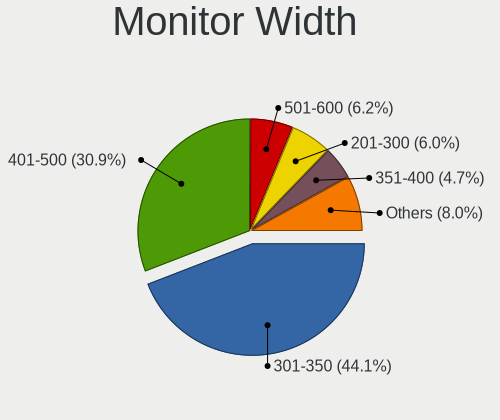

| Width in mm | Computers | Percent |
|-------------|-----------|---------|
| 301-350     | 112       | 46.28%  |
| 401-500     | 69        | 28.51%  |
| 201-300     | 17        | 7.02%   |
| 351-400     | 13        | 5.37%   |
| 501-600     | 11        | 4.55%   |
| Unknown     | 9         | 3.72%   |
| 1501-2000   | 5         | 2.07%   |
| 1001-1500   | 3         | 1.24%   |
| 801-900     | 1         | 0.41%   |
| 701-800     | 1         | 0.41%   |
| 601-700     | 1         | 0.41%   |

Aspect Ratio
------------

Proportional relationship between the width and the height

| Ratio   | Computers | Percent |
|---------|-----------|---------|
| 16/9    | 153       | 67.11%  |
| 16/10   | 36        | 15.79%  |
| 5/4     | 26        | 11.4%   |
| Unknown | 7         | 3.07%   |
| 4/3     | 4         | 1.75%   |
| 3/2     | 2         | 0.88%   |

Monitor Area
------------

Area in inch

| Area in inch | Computers | Percent |
|----------------|-----------|---------|
| 101-110        | 50        | 20.33%  |
| 141-150        | 45        | 18.29%  |
| 81-90          | 43        | 17.48%  |
| 151-200        | 36        | 14.63%  |
| 201-250        | 22        | 8.94%   |
| 41-50          | 10        | 4.07%   |
| Unknown        | 9         | 3.66%   |
| More than 1000 | 8         | 3.25%   |
| 121-130        | 7         | 2.85%   |
| 51-60          | 4         | 1.63%   |
| 301-350        | 3         | 1.22%   |
| 351-500        | 2         | 0.81%   |
| 251-300        | 2         | 0.81%   |
| 71-80          | 1         | 0.41%   |
| 61-70          | 1         | 0.41%   |
| 131-140        | 1         | 0.41%   |
| 501-1000       | 1         | 0.41%   |
| 91-100         | 1         | 0.41%   |

Pixel Density
-------------

Pixels per inch

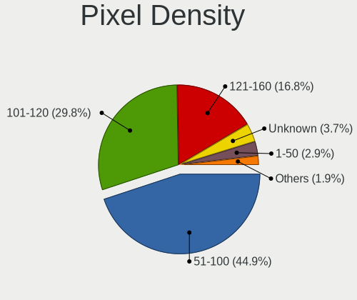

| Density       | Computers | Percent |
|---------------|-----------|---------|
| 51-100        | 110       | 45.08%  |
| 101-120       | 78        | 31.97%  |
| 121-160       | 34        | 13.93%  |
| 1-50          | 10        | 4.1%    |
| Unknown       | 9         | 3.69%   |
| 161-240       | 2         | 0.82%   |
| More than 240 | 1         | 0.41%   |

Multiple Monitors
-----------------

Total monitors connected

| Total | Computers | Percent |
|-------|-----------|---------|
| 1     | 211       | 83.4%   |
| 2     | 25        | 9.88%   |
| 0     | 14        | 5.53%   |
| 3     | 3         | 1.19%   |

Network
-------

Net Controller Vendor
---------------------

Controller vendors

| Vendor                            | Computers | Percent |
|-----------------------------------|-----------|---------|
| Realtek Semiconductor             | 155       | 38.75%  |
| Qualcomm Atheros                  | 71        | 17.75%  |
| Intel                             | 69        | 17.25%  |
| Broadcom                          | 26        | 6.5%    |
| Nvidia                            | 13        | 3.25%   |
| Ralink                            | 12        | 3%      |
| Ralink Technology                 | 7         | 1.75%   |
| Xiaomi                            | 6         | 1.5%    |
| Broadcom Limited                  | 6         | 1.5%    |
| Qualcomm Atheros Communications   | 5         | 1.25%   |
| Marvell Technology Group          | 5         | 1.25%   |
| VIA Technologies                  | 3         | 0.75%   |
| Samsung Electronics               | 3         | 0.75%   |
| JMicron Technology                | 3         | 0.75%   |
| Trendchip Technologies            | 2         | 0.5%    |
| Sundance Technology Inc / IC Plus | 2         | 0.5%    |
| Mercucys                          | 2         | 0.5%    |
| D-Link System                     | 2         | 0.5%    |
| ZTE WCDMA Technologies MSM        | 1         | 0.25%   |
| National Semiconductor            | 1         | 0.25%   |
| Motorola PCS                      | 1         | 0.25%   |
| Motorola BCS                      | 1         | 0.25%   |
| MediaTek                          | 1         | 0.25%   |
| ICS Advent                        | 1         | 0.25%   |
| Digium                            | 1         | 0.25%   |
| AMD                               | 1         | 0.25%   |

Net Controller Model
--------------------

Controller models

| Model                                                                          | Computers | Percent |
|--------------------------------------------------------------------------------|-----------|---------|
| Realtek RTL8111/8168/8411 PCI Express Gigabit Ethernet Controller              | 91        | 20.22%  |
| Realtek RTL810xE PCI Express Fast Ethernet controller                          | 31        | 6.89%   |
| Qualcomm Atheros AR9485 Wireless Network Adapter                               | 14        | 3.11%   |
| Nvidia MCP61 Ethernet                                                          | 12        | 2.67%   |
| Intel 82579LM Gigabit Network Connection (Lewisville)                          | 11        | 2.44%   |
| Realtek RTL8188CE 802.11b/g/n WiFi Adapter                                     | 9         | 2%      |
| Qualcomm Atheros AR9285 Wireless Network Adapter (PCI-Express)                 | 9         | 2%      |
| Qualcomm Atheros AR8152 v2.0 Fast Ethernet                                     | 8         | 1.78%   |
| Realtek RTL8723BE PCIe Wireless Network Adapter                                | 7         | 1.56%   |
| Qualcomm Atheros AR5212/5213/2414 Wireless Network Adapter                     | 7         | 1.56%   |
| Realtek RTL8723AE PCIe Wireless Network Adapter                                | 6         | 1.33%   |
| Realtek RTL-8100/8101L/8139 PCI Fast Ethernet Adapter                          | 6         | 1.33%   |
| Qualcomm Atheros AR8161 Gigabit Ethernet                                       | 6         | 1.33%   |
| Intel Wireless 7265                                                            | 6         | 1.33%   |
| Ralink RT3090 Wireless 802.11n 1T/1R PCIe                                      | 5         | 1.11%   |
| Qualcomm Atheros AR8151 v2.0 Gigabit Ethernet                                  | 5         | 1.11%   |
| Realtek RTL8192EU 802.11b/g/n WLAN Adapter                                     | 4         | 0.89%   |
| Realtek RTL8191SEvB Wireless LAN Controller                                    | 4         | 0.89%   |
| Realtek RTL8188EUS 802.11n Wireless Network Adapter                            | 4         | 0.89%   |
| Qualcomm Atheros QCA9565 / AR9565 Wireless Network Adapter                     | 4         | 0.89%   |
| Qualcomm Atheros QCA6174 802.11ac Wireless Network Adapter                     | 4         | 0.89%   |
| Qualcomm Atheros AR9271 802.11n                                                | 4         | 0.89%   |
| Intel Wireless 7260                                                            | 4         | 0.89%   |
| Intel Centrino Wireless-N 105                                                  | 4         | 0.89%   |
| Broadcom NetLink BCM5786 Gigabit Ethernet PCI Express                          | 4         | 0.89%   |
| Broadcom BCM4311 802.11b/g WLAN                                                | 4         | 0.89%   |
| Xiaomi Mi/Redmi series (RNDIS)                                                 | 3         | 0.67%   |
| VIA VT6102/VT6103 [Rhine-II]                                                   | 3         | 0.67%   |
| Samsung GT-I9070 (network tethering, USB debugging enabled)                    | 3         | 0.67%   |
| Realtek RTL8821CE 802.11ac PCIe Wireless Network Adapter                       | 3         | 0.67%   |
| Realtek RTL8153 Gigabit Ethernet Adapter                                       | 3         | 0.67%   |
| Ralink RT2870/RT3070 Wireless Adapter                                          | 3         | 0.67%   |
| Ralink MT7601U Wireless Adapter                                                | 3         | 0.67%   |
| Ralink RT5390 Wireless 802.11n 1T/1R PCIe                                      | 3         | 0.67%   |
| Ralink RT2790 Wireless 802.11n 1T/2R PCIe                                      | 3         | 0.67%   |
| Qualcomm Atheros AR5413/AR5414 Wireless Network Adapter [AR5006X(S) 802.11abg] | 3         | 0.67%   |
| Qualcomm Atheros AR242x / AR542x Wireless Network Adapter (PCI-Express)        | 3         | 0.67%   |
| Qualcomm Atheros AR2413/AR2414 Wireless Network Adapter [AR5005G(S) 802.11bg]  | 3         | 0.67%   |
| Intel Wireless 8265 / 8275                                                     | 3         | 0.67%   |
| Intel Wi-Fi 6 AX201                                                            | 3         | 0.67%   |

Wireless Vendor
---------------

Wireless vendors

| Vendor                          | Computers | Percent |
|---------------------------------|-----------|---------|
| Qualcomm Atheros                | 52        | 27.23%  |
| Realtek Semiconductor           | 51        | 26.7%   |
| Intel                           | 41        | 21.47%  |
| Broadcom                        | 15        | 7.85%   |
| Ralink                          | 12        | 6.28%   |
| Ralink Technology               | 7         | 3.66%   |
| Qualcomm Atheros Communications | 5         | 2.62%   |
| Mercucys                        | 2         | 1.05%   |
| D-Link System                   | 2         | 1.05%   |
| Broadcom Limited                | 2         | 1.05%   |
| Xiaomi                          | 1         | 0.52%   |
| MediaTek                        | 1         | 0.52%   |

Wireless Model
--------------

Wireless models

| Model                                                                          | Computers | Percent |
|--------------------------------------------------------------------------------|-----------|---------|
| Qualcomm Atheros AR9485 Wireless Network Adapter                               | 14        | 7.33%   |
| Realtek RTL8188CE 802.11b/g/n WiFi Adapter                                     | 9         | 4.71%   |
| Qualcomm Atheros AR9285 Wireless Network Adapter (PCI-Express)                 | 9         | 4.71%   |
| Realtek RTL8723BE PCIe Wireless Network Adapter                                | 7         | 3.66%   |
| Qualcomm Atheros AR5212/5213/2414 Wireless Network Adapter                     | 7         | 3.66%   |
| Realtek RTL8723AE PCIe Wireless Network Adapter                                | 6         | 3.14%   |
| Intel Wireless 7265                                                            | 6         | 3.14%   |
| Ralink RT3090 Wireless 802.11n 1T/1R PCIe                                      | 5         | 2.62%   |
| Realtek RTL8192EU 802.11b/g/n WLAN Adapter                                     | 4         | 2.09%   |
| Realtek RTL8191SEvB Wireless LAN Controller                                    | 4         | 2.09%   |
| Realtek RTL8188EUS 802.11n Wireless Network Adapter                            | 4         | 2.09%   |
| Qualcomm Atheros QCA9565 / AR9565 Wireless Network Adapter                     | 4         | 2.09%   |
| Qualcomm Atheros QCA6174 802.11ac Wireless Network Adapter                     | 4         | 2.09%   |
| Qualcomm Atheros AR9271 802.11n                                                | 4         | 2.09%   |
| Intel Wireless 7260                                                            | 4         | 2.09%   |
| Intel Centrino Wireless-N 105                                                  | 4         | 2.09%   |
| Broadcom BCM4311 802.11b/g WLAN                                                | 4         | 2.09%   |
| Realtek RTL8821CE 802.11ac PCIe Wireless Network Adapter                       | 3         | 1.57%   |
| Ralink RT2870/RT3070 Wireless Adapter                                          | 3         | 1.57%   |
| Ralink MT7601U Wireless Adapter                                                | 3         | 1.57%   |
| Ralink RT5390 Wireless 802.11n 1T/1R PCIe                                      | 3         | 1.57%   |
| Ralink RT2790 Wireless 802.11n 1T/2R PCIe                                      | 3         | 1.57%   |
| Qualcomm Atheros AR5413/AR5414 Wireless Network Adapter [AR5006X(S) 802.11abg] | 3         | 1.57%   |
| Qualcomm Atheros AR242x / AR542x Wireless Network Adapter (PCI-Express)        | 3         | 1.57%   |
| Qualcomm Atheros AR2413/AR2414 Wireless Network Adapter [AR5005G(S) 802.11bg]  | 3         | 1.57%   |
| Intel Wireless 8265 / 8275                                                     | 3         | 1.57%   |
| Intel Wi-Fi 6 AX201                                                            | 3         | 1.57%   |
| Broadcom BCM4313 802.11bgn Wireless Network Adapter                            | 3         | 1.57%   |
| Broadcom BCM4312 802.11b/g LP-PHY                                              | 3         | 1.57%   |
| Realtek RTL8822CE 802.11ac PCIe Wireless Network Adapter                       | 2         | 1.05%   |
| Realtek RTL8192CU 802.11n WLAN Adapter                                         | 2         | 1.05%   |
| Realtek RTL8191SU 802.11n WLAN Adapter                                         | 2         | 1.05%   |
| Realtek RTL8188EE Wireless Network Adapter                                     | 2         | 1.05%   |
| Realtek 802.11n                                                                | 2         | 1.05%   |
| Qualcomm Atheros AR928X Wireless Network Adapter (PCI-Express)                 | 2         | 1.05%   |
| Mercucys MW300UM RTL8192EU wifi                                                | 2         | 1.05%   |
| Intel Wireless 8260                                                            | 2         | 1.05%   |
| Intel Wireless 3165                                                            | 2         | 1.05%   |
| Intel WiFi Link 5100                                                           | 2         | 1.05%   |
| Intel Wi-Fi 6 AX200                                                            | 2         | 1.05%   |

Ethernet Vendor
---------------

Ethernet vendors

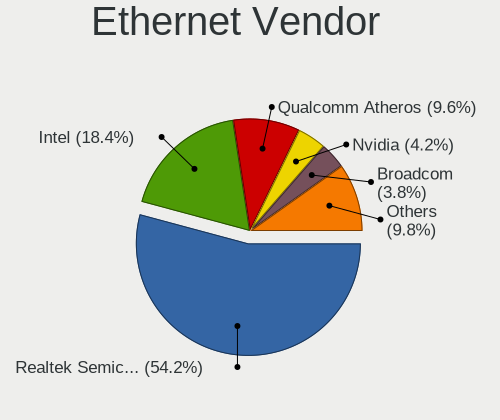

| Vendor                            | Computers | Percent |
|-----------------------------------|-----------|---------|
| Realtek Semiconductor             | 131       | 51.98%  |
| Intel                             | 38        | 15.08%  |
| Qualcomm Atheros                  | 27        | 10.71%  |
| Nvidia                            | 13        | 5.16%   |
| Broadcom                          | 12        | 4.76%   |
| Xiaomi                            | 5         | 1.98%   |
| Marvell Technology Group          | 5         | 1.98%   |
| Broadcom Limited                  | 4         | 1.59%   |
| VIA Technologies                  | 3         | 1.19%   |
| Samsung Electronics               | 3         | 1.19%   |
| JMicron Technology                | 3         | 1.19%   |
| Trendchip Technologies            | 2         | 0.79%   |
| Sundance Technology Inc / IC Plus | 2         | 0.79%   |
| National Semiconductor            | 1         | 0.4%    |
| Motorola PCS                      | 1         | 0.4%    |
| Motorola BCS                      | 1         | 0.4%    |
| ICS Advent                        | 1         | 0.4%    |

Ethernet Model
--------------

Ethernet models

| Model                                                                      | Computers | Percent |
|----------------------------------------------------------------------------|-----------|---------|
| Realtek RTL8111/8168/8411 PCI Express Gigabit Ethernet Controller          | 91        | 35.55%  |
| Realtek RTL810xE PCI Express Fast Ethernet controller                      | 31        | 12.11%  |
| Nvidia MCP61 Ethernet                                                      | 12        | 4.69%   |
| Intel 82579LM Gigabit Network Connection (Lewisville)                      | 11        | 4.3%    |
| Qualcomm Atheros AR8152 v2.0 Fast Ethernet                                 | 8         | 3.13%   |
| Realtek RTL-8100/8101L/8139 PCI Fast Ethernet Adapter                      | 6         | 2.34%   |
| Qualcomm Atheros AR8161 Gigabit Ethernet                                   | 6         | 2.34%   |
| Qualcomm Atheros AR8151 v2.0 Gigabit Ethernet                              | 5         | 1.95%   |
| Broadcom NetLink BCM5786 Gigabit Ethernet PCI Express                      | 4         | 1.56%   |
| Xiaomi Mi/Redmi series (RNDIS)                                             | 3         | 1.17%   |
| VIA VT6102/VT6103 [Rhine-II]                                               | 3         | 1.17%   |
| Samsung GT-I9070 (network tethering, USB debugging enabled)                | 3         | 1.17%   |
| Realtek RTL8153 Gigabit Ethernet Adapter                                   | 3         | 1.17%   |
| Intel PRO/100 VE Network Connection                                        | 3         | 1.17%   |
| Intel 82567V-2 Gigabit Network Connection                                  | 3         | 1.17%   |
| Xiaomi Mi/Redmi series (RNDIS + ADB)                                       | 2         | 0.78%   |
| Trendchip Ethernet controller                                              | 2         | 0.78%   |
| Qualcomm Atheros AR8132 Fast Ethernet                                      | 2         | 0.78%   |
| Qualcomm Atheros AR8121/AR8113/AR8114 Gigabit or Fast Ethernet             | 2         | 0.78%   |
| Marvell Group 88E8040 PCI-E Fast Ethernet Controller                       | 2         | 0.78%   |
| JMicron JMC250 PCI Express Gigabit Ethernet Controller                     | 2         | 0.78%   |
| Intel Ethernet Connection I217-V                                           | 2         | 0.78%   |
| Intel Ethernet Connection I217-LM                                          | 2         | 0.78%   |
| Intel Ethernet Connection (4) I219-LM                                      | 2         | 0.78%   |
| Intel 82574L Gigabit Network Connection                                    | 2         | 0.78%   |
| Broadcom NetXtreme BCM5764M Gigabit Ethernet PCIe                          | 2         | 0.78%   |
| Broadcom Limited NetLink BCM5906M Fast Ethernet PCI Express                | 2         | 0.78%   |
| Sundance Inc / IC Plus IP1000 Family Gigabit Ethernet                      | 1         | 0.39%   |
| Sundance Inc / IC Plus IC Plus IP100A Integrated 10/100 Ethernet MAC + PHY | 1         | 0.39%   |
| Realtek RTL8169 PCI Gigabit Ethernet Controller                            | 1         | 0.39%   |
| Realtek Realtek Ethernet controller                                        | 1         | 0.39%   |
| Qualcomm Atheros Killer E2500 Gigabit Ethernet Controller                  | 1         | 0.39%   |
| Qualcomm Atheros Attansic L2 Fast Ethernet                                 | 1         | 0.39%   |
| Qualcomm Atheros AR8162 Fast Ethernet                                      | 1         | 0.39%   |
| Qualcomm Atheros AR8131 Gigabit Ethernet                                   | 1         | 0.39%   |
| Nvidia MCP77 Ethernet                                                      | 1         | 0.39%   |
| National DP83815 (MacPhyter) Ethernet Controller                           | 1         | 0.39%   |
| Motorola PCS motorola one                                                  | 1         | 0.39%   |
| Motorola BCS SurfBoard SB5100 Cable Modem                                  | 1         | 0.39%   |
| Marvell Group 88E8058 PCI-E Gigabit Ethernet Controller                    | 1         | 0.39%   |

Net Controller Kind
-------------------

Ethernet, WiFi or modem

| Kind     | Computers | Percent |
|----------|-----------|---------|
| Ethernet | 233       | 55.61%  |
| WiFi     | 183       | 43.68%  |
| Modem    | 2         | 0.48%   |
| Unknown  | 1         | 0.24%   |

Used Controller
---------------

Currently used network controller

| Kind     | Computers | Percent |
|----------|-----------|---------|
| Ethernet | 132       | 50.19%  |
| WiFi     | 131       | 49.81%  |

NICs
----

Total network controllers on board

| Total | Computers | Percent |
|-------|-----------|---------|
| 2     | 144       | 56.69%  |
| 1     | 102       | 40.16%  |
| 3     | 4         | 1.57%   |
| 0     | 3         | 1.18%   |
| 4     | 1         | 0.39%   |

IPv6
----

IPv6 vs IPv4

| Used | Computers | Percent |
|------|-----------|---------|
| No   | 251       | 99.6%   |
| Yes  | 1         | 0.4%    |

Bluetooth
---------

Bluetooth Vendor
----------------

Controller vendors

| Vendor                          | Computers | Percent |
|---------------------------------|-----------|---------|
| Intel                           | 26        | 30.95%  |
| IMC Networks                    | 12        | 14.29%  |
| Qualcomm Atheros Communications | 11        | 13.1%   |
| Realtek Semiconductor           | 10        | 11.9%   |
| Cambridge Silicon Radio         | 9         | 10.71%  |
| Broadcom                        | 6         | 7.14%   |
| Apple                           | 4         | 4.76%   |
| ASUSTek Computer                | 3         | 3.57%   |
| Hewlett-Packard                 | 2         | 2.38%   |
| Lite-On Technology              | 1         | 1.19%   |

Bluetooth Model
---------------

Controller models

| Model                                                       | Computers | Percent |
|-------------------------------------------------------------|-----------|---------|
| Intel Bluetooth wireless interface                          | 16        | 19.05%  |
| Cambridge Silicon Radio Bluetooth Dongle (HCI mode)         | 9         | 10.71%  |
| Realtek RTL8723B Bluetooth                                  | 7         | 8.33%   |
| Qualcomm Atheros  Bluetooth Device                          | 5         | 5.95%   |
| IMC Networks Bluetooth                                      | 4         | 4.76%   |
| Realtek Bluetooth Radio                                     | 3         | 3.57%   |
| Qualcomm Atheros AR3011 Bluetooth                           | 3         | 3.57%   |
| Intel AX201 Bluetooth                                       | 3         | 3.57%   |
| IMC Networks Atheros AR3012 Bluetooth 4.0 Adapter           | 3         | 3.57%   |
| Apple Built-in Bluetooth 2.0+EDR HCI                        | 3         | 3.57%   |
| Qualcomm Atheros AR3012 Bluetooth 4.0                       | 2         | 2.38%   |
| Intel Centrino Advanced-N 6230 Bluetooth adapter            | 2         | 2.38%   |
| Intel Bluetooth 9460/9560 Jefferson Peak (JfP)              | 2         | 2.38%   |
| Intel AX200 Bluetooth                                       | 2         | 2.38%   |
| IMC Networks Bluetooth Radio                                | 2         | 2.38%   |
| IMC Networks Bluetooth Module                               | 2         | 2.38%   |
| Broadcom BCM2045 Bluetooth                                  | 2         | 2.38%   |
| Qualcomm Atheros AR3012 Bluetooth                           | 1         | 1.19%   |
| Lite-On Bluetooth Device                                    | 1         | 1.19%   |
| Intel Centrino Bluetooth Wireless Transceiver               | 1         | 1.19%   |
| IMC Networks Wireless_Device                                | 1         | 1.19%   |
| HP Integrated Module with Bluetooth 2.1 Wireless technology | 1         | 1.19%   |
| HP Broadcom 2070 Bluetooth Combo                            | 1         | 1.19%   |
| Broadcom BCM43142 Bluetooth 4.0                             | 1         | 1.19%   |
| Broadcom BCM2070 Bluetooth Device                           | 1         | 1.19%   |
| Broadcom BCM2045B (BDC-2.1) [Bluetooth Controller]          | 1         | 1.19%   |
| Broadcom BCM2035B3 Bluetooth Adapter                        | 1         | 1.19%   |
| ASUS BT-253 Bluetooth Adapter                               | 1         | 1.19%   |
| ASUS Broadcom BCM20702A0 Bluetooth                          | 1         | 1.19%   |
| ASUS Bluetooth Adapter                                      | 1         | 1.19%   |
| Apple Bluetooth HCI                                         | 1         | 1.19%   |

Sound
-----

Sound Vendor
------------

Sound card vendors

| Vendor                    | Computers | Percent |
|---------------------------|-----------|---------|
| Intel                     | 201       | 64.22%  |
| AMD                       | 46        | 14.7%   |
| Nvidia                    | 37        | 11.82%  |
| C-Media Electronics       | 6         | 1.92%   |
| VIA Technologies          | 4         | 1.28%   |
| Logitech                  | 3         | 0.96%   |
| Creative Labs             | 3         | 0.96%   |
| Zhaoxin                   | 2         | 0.64%   |
| Sennheiser Communications | 2         | 0.64%   |
| Microsoft                 | 2         | 0.64%   |
| JMTek                     | 2         | 0.64%   |
| Unknown                   | 1         | 0.32%   |
| Realtek Semiconductor     | 1         | 0.32%   |
| Megawin Technology        | 1         | 0.32%   |
| Generalplus Technology    | 1         | 0.32%   |
| Cirrus Logic              | 1         | 0.32%   |

Sound Model
-----------

Sound card models

| Model                                                                                             | Computers | Percent |
|---------------------------------------------------------------------------------------------------|-----------|---------|
| Intel NM10/ICH7 Family High Definition Audio Controller                                           | 43        | 12.22%  |
| Intel 6 Series/C200 Series Chipset Family High Definition Audio Controller                        | 39        | 11.08%  |
| Intel 7 Series/C216 Chipset Family High Definition Audio Controller                               | 25        | 7.1%    |
| Intel 82801I (ICH9 Family) HD Audio Controller                                                    | 13        | 3.69%   |
| Nvidia MCP61 High Definition Audio                                                                | 11        | 3.13%   |
| Intel 82801H (ICH8 Family) HD Audio Controller                                                    | 11        | 3.13%   |
| Intel 5 Series/3400 Series Chipset High Definition Audio                                          | 9         | 2.56%   |
| AMD Family 17h/19h HD Audio Controller                                                            | 9         | 2.56%   |
| Intel Xeon E3-1200 v3/4th Gen Core Processor HD Audio Controller                                  | 8         | 2.27%   |
| Intel Sunrise Point-LP HD Audio                                                                   | 8         | 2.27%   |
| Intel Atom Processor Z36xxx/Z37xxx Series High Definition Audio Controller                        | 8         | 2.27%   |
| AMD FCH Azalia Controller                                                                         | 8         | 2.27%   |
| Nvidia GF119 HDMI Audio Controller                                                                | 7         | 1.99%   |
| Intel 8 Series/C220 Series Chipset High Definition Audio Controller                               | 7         | 1.99%   |
| AMD SBx00 Azalia (Intel HDA)                                                                      | 7         | 1.99%   |
| Intel 82801JI (ICH10 Family) HD Audio Controller                                                  | 6         | 1.7%    |
| Intel Tiger Lake-LP Smart Sound Technology Audio Controller                                       | 5         | 1.42%   |
| AMD Raven/Raven2/Fenghuang HDMI/DP Audio Controller                                               | 5         | 1.42%   |
| AMD Cedar HDMI Audio [Radeon HD 5400/6300/7300 Series]                                            | 5         | 1.42%   |
| Nvidia High Definition Audio Controller                                                           | 4         | 1.14%   |
| AMD Renoir Radeon High Definition Audio Controller                                                | 4         | 1.14%   |
| VIA Technologies VX900/VT8xxx High Definition Audio Controller                                    | 3         | 0.85%   |
| Nvidia GK208 HDMI/DP Audio Controller                                                             | 3         | 0.85%   |
| Nvidia GF106 High Definition Audio Controller                                                     | 3         | 0.85%   |
| Intel Haswell-ULT HD Audio Controller                                                             | 3         | 0.85%   |
| Intel Atom/Celeron/Pentium Processor x5-E8000/J3xxx/N3xxx Series High Definition Audio Controller | 3         | 0.85%   |
| Intel 8 Series HD Audio Controller                                                                | 3         | 0.85%   |
| AMD RV710/730 HDMI Audio [Radeon HD 4000 series]                                                  | 3         | 0.85%   |
| AMD Oland/Hainan/Cape Verde/Pitcairn HDMI Audio [Radeon HD 7000 Series]                           | 3         | 0.85%   |
| Zhaoxin ZX-E High Definition Audio Controller                                                     | 2         | 0.57%   |
| Zhaoxin ZX-100/ZX-D/ZX-E High Definition Audio Controller                                         | 2         | 0.57%   |
| Sennheiser Communications SC230                                                                   | 2         | 0.57%   |
| Nvidia GK107 HDMI Audio Controller                                                                | 2         | 0.57%   |
| Nvidia GF104 High Definition Audio Controller                                                     | 2         | 0.57%   |
| Intel Wildcat Point-LP High Definition Audio Controller                                           | 2         | 0.57%   |
| Intel Tiger Lake-H HD Audio Controller                                                            | 2         | 0.57%   |
| Intel CM238 HD Audio Controller                                                                   | 2         | 0.57%   |
| Intel Celeron/Pentium Silver Processor High Definition Audio                                      | 2         | 0.57%   |
| Intel Cannon Lake PCH cAVS                                                                        | 2         | 0.57%   |
| Intel Broadwell-U Audio Controller                                                                | 2         | 0.57%   |

Memory
------

Memory Vendor
-------------

Memory module vendors

| Vendor              | Computers | Percent |
|---------------------|-----------|---------|
| Unknown             | 54        | 25.71%  |
| Samsung Electronics | 27        | 12.86%  |
| SK hynix            | 26        | 12.38%  |
| Ramaxel Technology  | 20        | 9.52%   |
| Kingston            | 20        | 9.52%   |
| Micron Technology   | 12        | 5.71%   |
| Crucial             | 9         | 4.29%   |
| Corsair             | 8         | 3.81%   |
| Elpida              | 6         | 2.86%   |
| Nanya Technology    | 3         | 1.43%   |
| A-DATA Technology   | 3         | 1.43%   |
| Unknown             | 3         | 1.43%   |
| Unknown (ABCD)      | 2         | 0.95%   |
| Unknown (0x07D5)    | 2         | 0.95%   |
| Team                | 2         | 0.95%   |
| Shenzhen WODPOSIT   | 2         | 0.95%   |
| Qimonda             | 2         | 0.95%   |
| Avant               | 2         | 0.95%   |
| Unknown (0x0CBA)    | 1         | 0.48%   |
| Unknown (081A)      | 1         | 0.48%   |
| PNY                 | 1         | 0.48%   |
| OCZ                 | 1         | 0.48%   |
| Memox               | 1         | 0.48%   |
| Kreton              | 1         | 0.48%   |
| Apacer              | 1         | 0.48%   |

Memory Model
------------

Memory module models

| Model                                                      | Computers | Percent |
|------------------------------------------------------------|-----------|---------|
| Unknown RAM Module 4GB DIMM 400MT/s                        | 3         | 1.29%   |
| Unknown RAM Module 2048MB DIMM DDR2                        | 3         | 1.29%   |
| Unknown RAM Module 1024MB DIMM DDR2                        | 3         | 1.29%   |
| SK hynix RAM HMT325S6BFR8C-H9 2GB SODIMM DDR3 1600MT/s     | 3         | 1.29%   |
| Ramaxel RAM RMT3170ME68F9F1600 4GB SODIMM DDR3 1600MT/s    | 3         | 1.29%   |
| Ramaxel RAM RMT3150ED58E8W1600 2GB SODIMM DDR3 1600MT/s    | 3         | 1.29%   |
| Ramaxel RAM RMT3010EC58E8F1333 2048MB SODIMM DDR3 1600MT/s | 3         | 1.29%   |
| Crucial RAM CT25664BF160B.D8FE 2GB SODIMM DDR3 1600MT/s    | 3         | 1.29%   |
| Unknown                                                    | 3         | 1.29%   |
| Unknown RAM Module 4GB DIMM SDRAM                          | 2         | 0.86%   |
| Unknown RAM Module 4GB DIMM DDR3 1333MT/s                  | 2         | 0.86%   |
| Unknown RAM Module 4GB DIMM 1066MT/s                       | 2         | 0.86%   |
| Unknown RAM Module 2GB SODIMM DDR3 1066MT/s                | 2         | 0.86%   |
| Unknown RAM Module 2GB SODIMM DDR2 667MT/s                 | 2         | 0.86%   |
| Unknown RAM Module 2GB DIMM SDRAM                          | 2         | 0.86%   |
| Unknown RAM Module 2GB DIMM DDR3 1066MT/s                  | 2         | 0.86%   |
| Unknown RAM Module 2GB DIMM DDR2                           | 2         | 0.86%   |
| Unknown RAM Module 2GB DIMM 400MT/s                        | 2         | 0.86%   |
| Unknown RAM Module 2048MB DIMM SDRAM                       | 2         | 0.86%   |
| Unknown RAM Module 1GB SODIMM DDR2 667MT/s                 | 2         | 0.86%   |
| Unknown RAM Module 1024MB DIMM SDRAM                       | 2         | 0.86%   |
| Unknown RAM Module 1024MB DIMM DDR2 533MT/s                | 2         | 0.86%   |
| Unknown (0x07D5) RAM Module 4GB SODIMM DDR3 1333MT/s       | 2         | 0.86%   |
| SK hynix RAM HMT351S6CFR8C-PB 4GB SODIMM DDR3 1600MT/s     | 2         | 0.86%   |
| SK hynix RAM HMAA1GS6CJR6N-XN 8GB SODIMM DDR4 3200MT/s     | 2         | 0.86%   |
| Shenzhen WODPOSIT RAM Module 8GB SODIMM DDR4 2666MT/s      | 2         | 0.86%   |
| Samsung RAM Module 4GB SODIMM DDR3 1333MT/s                | 2         | 0.86%   |
| Samsung RAM M471B5674QH0-YK0 2GB SODIMM DDR3 1600MT/s      | 2         | 0.86%   |
| Samsung RAM M471B5173EB0-YK0 4GB SODIMM DDR3 1600MT/s      | 2         | 0.86%   |
| Samsung RAM 4GB DDR3 HYNIX 4GB SODIMM DDR3 1333MT/s        | 2         | 0.86%   |
| Ramaxel RAM RMT3160ED58E9W1600 4GB SODIMM DDR3 1600MT/s    | 2         | 0.86%   |
| Ramaxel RAM RMR5030ME68F9F1600 4GB DIMM DDR3 1600MT/s      | 2         | 0.86%   |
| Ramaxel RAM RMR5030ED58E8W1600 2GB DIMM DDR3 1600MT/s      | 2         | 0.86%   |
| Ramaxel RAM Module 4GB SODIMM DDR3 1333MT/s                | 2         | 0.86%   |
| Nanya RAM NT2GT64U8HD0BY-AD 2GB DIMM DDR2 2048MT/s         | 2         | 0.86%   |
| Micron RAM 16JSF25664HZ-1G1F1 2GB SODIMM DDR3 1067MT/s     | 2         | 0.86%   |
| Kingston RAM Module 4GB SODIMM DDR3 1333MT/s               | 2         | 0.86%   |
| Elpida RAM EBJ21UE8BDS0-DJ-F 2048MB SODIMM DDR3 1334MT/s   | 2         | 0.86%   |
| Unknown RAM Module 8GB SODIMM DDR3 1600MT/s                | 1         | 0.43%   |
| Unknown RAM Module 8GB DIMM 1600MT/s                       | 1         | 0.43%   |

Memory Kind
-----------

Memory module kinds

| Kind    | Computers | Percent |
|---------|-----------|---------|
| DDR3    | 68        | 41.46%  |
| DDR2    | 33        | 20.12%  |
| DDR4    | 28        | 17.07%  |
| SDRAM   | 16        | 9.76%   |
| Unknown | 11        | 6.71%   |
| DDR     | 5         | 3.05%   |
| LPDDR4  | 3         | 1.83%   |

Memory Form Factor
------------------

Physical design of the memory module

| Name         | Computers | Percent |
|--------------|-----------|---------|
| DIMM         | 83        | 52.53%  |
| SODIMM       | 73        | 46.2%   |
| Row Of Chips | 2         | 1.27%   |

Memory Size
-----------

Memory module size

| Size  | Computers | Percent |
|-------|-----------|---------|
| 2048  | 67        | 35.64%  |
| 4096  | 55        | 29.26%  |
| 8192  | 35        | 18.62%  |
| 1024  | 21        | 11.17%  |
| 16384 | 7         | 3.72%   |
| 512   | 2         | 1.06%   |
| 32768 | 1         | 0.53%   |

Memory Speed
------------

Memory module speed

| Speed   | Computers | Percent |
|---------|-----------|---------|
| 1600    | 45        | 24.59%  |
| 1333    | 25        | 13.66%  |
| Unknown | 19        | 10.38%  |
| 667     | 11        | 6.01%   |
| 2667    | 10        | 5.46%   |
| 3200    | 8         | 4.37%   |
| 2400    | 8         | 4.37%   |
| 800     | 8         | 4.37%   |
| 1066    | 7         | 3.83%   |
| 533     | 6         | 3.28%   |
| 400     | 5         | 2.73%   |
| 2048    | 4         | 2.19%   |
| 1334    | 4         | 2.19%   |
| 1639    | 3         | 1.64%   |
| 1067    | 3         | 1.64%   |
| 133     | 3         | 1.64%   |
| 4199    | 2         | 1.09%   |
| 2666    | 2         | 1.09%   |
| 2133    | 2         | 1.09%   |
| 1867    | 2         | 1.09%   |
| 3733    | 1         | 0.55%   |
| 3600    | 1         | 0.55%   |
| 3266    | 1         | 0.55%   |
| 3000    | 1         | 0.55%   |
| 1024    | 1         | 0.55%   |
| 975     | 1         | 0.55%   |

Printers & scanners
-------------------

Printer Vendor
--------------

Printer device vendors

| Vendor              | Computers | Percent |
|---------------------|-----------|---------|
| Hewlett-Packard     | 6         | 60%     |
| Seiko Epson         | 2         | 20%     |
| Samsung Electronics | 2         | 20%     |

Printer Model
-------------

Printer device models

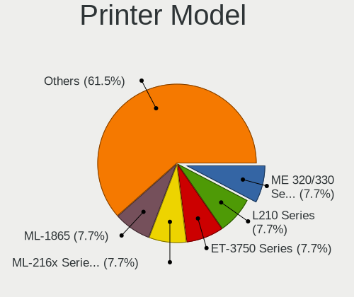

| Model                                        | Computers | Percent |
|----------------------------------------------|-----------|---------|
| Seiko Epson ME 320/330 Series [Stylus SX125] | 1         | 10%     |
| Seiko Epson L210 Series                      | 1         | 10%     |
| Samsung ML-216x Series Laser Printer         | 1         | 10%     |
| Samsung ML-1865                              | 1         | 10%     |
| HP LaserJet Professional P1102w              | 1         | 10%     |
| HP LaserJet P1006                            | 1         | 10%     |
| HP LaserJet P1005                            | 1         | 10%     |
| HP LaserJet 1018                             | 1         | 10%     |
| HP DeskJet 2300 series                       | 1         | 10%     |
| HP Color LaserJet CP1215                     | 1         | 10%     |

Scanner Vendor
--------------

Scanner device vendors

| Vendor          | Computers | Percent |
|-----------------|-----------|---------|
| Hewlett-Packard | 1         | 50%     |
| Canon           | 1         | 50%     |

Scanner Model
-------------

Scanner device models

| Model                   | Computers | Percent |
|-------------------------|-----------|---------|
| HP Scanjet 200          | 1         | 50%     |
| Canon CanoScan LiDE 110 | 1         | 50%     |

Camera
------

Camera Vendor
-------------

Camera device vendors

| Vendor                                 | Computers | Percent |
|----------------------------------------|-----------|---------|
| Chicony Electronics                    | 25        | 21.74%  |
| Microdia                               | 13        | 11.3%   |
| Acer                                   | 11        | 9.57%   |
| Realtek Semiconductor                  | 10        | 8.7%    |
| IMC Networks                           | 9         | 7.83%   |
| Suyin                                  | 6         | 5.22%   |
| Logitech                               | 5         | 4.35%   |
| Apple                                  | 5         | 4.35%   |
| Ricoh                                  | 3         | 2.61%   |
| Cheng Uei Precision Industry (Foxlink) | 3         | 2.61%   |
| Syntek                                 | 2         | 1.74%   |
| Sunplus Innovation Technology          | 2         | 1.74%   |
| Samsung Electronics                    | 2         | 1.74%   |
| Quanta                                 | 2         | 1.74%   |
| Microsoft                              | 2         | 1.74%   |
| Lite-On Technology                     | 2         | 1.74%   |
| KYE Systems (Mouse Systems)            | 2         | 1.74%   |
| ALi                                    | 2         | 1.74%   |
| USB Camera                             | 1         | 0.87%   |
| Tobii Technology AB                    | 1         | 0.87%   |
| Sonix Technology                       | 1         | 0.87%   |
| SiGma Micro                            | 1         | 0.87%   |
| Luxvisions Innotech Limited            | 1         | 0.87%   |
| LG Electronics                         | 1         | 0.87%   |
| Lenovo                                 | 1         | 0.87%   |
| Importek                               | 1         | 0.87%   |
| Aveo Technology                        | 1         | 0.87%   |

Camera Model
------------

Camera device models

| Model                                                         | Computers | Percent |
|---------------------------------------------------------------|-----------|---------|
| Chicony USB 2.0 Camera                                        | 10        | 8.7%    |
| Realtek Integrated_Webcam_HD                                  | 4         | 3.48%   |
| Microdia USB 2.0 Camera                                       | 4         | 3.48%   |
| Chicony Lenovo EasyCamera                                     | 4         | 3.48%   |
| Acer USB Camera                                               | 4         | 3.48%   |
| Logitech Webcam C270                                          | 3         | 2.61%   |
| Apple Built-in iSight                                         | 3         | 2.61%   |
| Samsung Galaxy series, misc. (MTP mode)                       | 2         | 1.74%   |
| Ricoh Laptop_Integrated_Webcam_FHD                            | 2         | 1.74%   |
| Realtek USB Camera                                            | 2         | 1.74%   |
| Microdia Integrated_Webcam_HD                                 | 2         | 1.74%   |
| Microdia Integrated_Webcam_1.3M                               | 2         | 1.74%   |
| IMC Networks XHC Camera                                       | 2         | 1.74%   |
| IMC Networks Lenovo EasyCamera                                | 2         | 1.74%   |
| Chicony Integrated Camera                                     | 2         | 1.74%   |
| Chicony HD WebCam                                             | 2         | 1.74%   |
| Cheng Uei Precision Industry (Foxlink) USB2.0 UVC 1.3M Webcam | 2         | 1.74%   |
| Acer Lenovo EasyCamera                                        | 2         | 1.74%   |
| Acer HD Webcam                                                | 2         | 1.74%   |
| USB Camera USB Camera                                         | 1         | 0.87%   |
| Tobii AB EyeChip                                              | 1         | 0.87%   |
| Syntek USB Camera Device                                      | 1         | 0.87%   |
| Syntek Integrated Webcam                                      | 1         | 0.87%   |
| Suyin Lenovo EasyCamera                                       | 1         | 0.87%   |
| Suyin Integrated_Webcam_HD                                    | 1         | 0.87%   |
| Suyin HP Webcam 101                                           | 1         | 0.87%   |
| Suyin HP Webcam                                               | 1         | 0.87%   |
| Suyin HD Video WebCam                                         | 1         | 0.87%   |
| Suyin Acer CrystalEye Webcam                                  | 1         | 0.87%   |
| Sunplus Integrated_Webcam_HD                                  | 1         | 0.87%   |
| Sunplus HD WebCam                                             | 1         | 0.87%   |
| Sonix USB2.0 HD UVC WebCam                                    | 1         | 0.87%   |
| SiGma Micro WebCam SiGma Micro                                | 1         | 0.87%   |
| Ricoh Sony Vaio Integrated Webcam                             | 1         | 0.87%   |
| Realtek Integrated Webcam HD                                  | 1         | 0.87%   |
| Realtek Integrated Webcam                                     | 1         | 0.87%   |
| Realtek HP 1.0MP High Definition Webcam                       | 1         | 0.87%   |
| Realtek EasyCamera                                            | 1         | 0.87%   |
| Quanta HP Webcam                                              | 1         | 0.87%   |
| Quanta HD User Facing                                         | 1         | 0.87%   |

Security
--------

Fingerprint Vendor
------------------

Fingerprint sensor vendors

| Vendor                     | Computers | Percent |
|----------------------------|-----------|---------|
| Validity Sensors           | 7         | 63.64%  |
| AuthenTec                  | 2         | 18.18%  |
| Shenzhen Goodix Technology | 1         | 9.09%   |
| Futronic Technology        | 1         | 9.09%   |

Fingerprint Model
-----------------

Fingerprint sensor models

| Model                                       | Computers | Percent |
|---------------------------------------------|-----------|---------|
| Validity Sensors VFS5011 Fingerprint Reader | 3         | 27.27%  |
| Validity Sensors VFS495 Fingerprint Reader  | 2         | 18.18%  |
| AuthenTec AES2501 Fingerprint Sensor        | 2         | 18.18%  |
| Validity Sensors VFS471 Fingerprint Reader  | 1         | 9.09%   |
| Validity Sensors Fingerprint scanner        | 1         | 9.09%   |
| Shenzhen Goodix Fingerprint Reader          | 1         | 9.09%   |
| Futronic Fingerprint Scanner Model FS88     | 1         | 9.09%   |

Chipcard Vendor
---------------

Chipcard module vendors

| Vendor      | Computers | Percent |
|-------------|-----------|---------|
| Broadcom    | 4         | 80%     |
| Alcor Micro | 1         | 20%     |

Chipcard Model
--------------

Chipcard module models

| Model                                          | Computers | Percent |
|------------------------------------------------|-----------|---------|
| Broadcom BCM5880 Secure Applications Processor | 2         | 40%     |
| Broadcom 5880                                  | 2         | 40%     |
| Alcor Micro AU9540 Smartcard Reader            | 1         | 20%     |

Unsupported
-----------

Unsupported Devices
-------------------

Total unsupported devices on board

| Total | Computers | Percent |
|-------|-----------|---------|
| 0     | 200       | 78.74%  |
| 1     | 46        | 18.11%  |
| 2     | 7         | 2.76%   |
| 5     | 1         | 0.39%   |

Unsupported Device Types
------------------------

Types of unsupported devices

| Type                     | Computers | Percent |
|--------------------------|-----------|---------|
| Graphics card            | 22        | 34.38%  |
| Fingerprint reader       | 11        | 17.19%  |
| Communication controller | 11        | 17.19%  |
| Sound                    | 5         | 7.81%   |
| Net/wireless             | 5         | 7.81%   |
| Chipcard                 | 5         | 7.81%   |
| Camera                   | 2         | 3.13%   |
| Storage                  | 1         | 1.56%   |
| Network                  | 1         | 1.56%   |
| Multimedia controller    | 1         | 1.56%   |

