Linux in Vietnam - Tested Hardware & Statistics
-----------------------------------------------

A project to collect tested hardware configurations for Linux in Vietnam.

Anyone can contribute to this report by the [hw-probe](https://github.com/linuxhw/hw-probe) tool:

    sudo -E hw-probe -all -upload

Please contribute! Especially if your hardware is rare.

This is a report for all computer types. See also reports for [desktops](/Location/Vietnam/Desktop/README.md) and [notebooks](/Location/Vietnam/Notebook/README.md).

Contents
--------

* [ Test Cases ](#test-cases)

* [ System ](#system)
  - [ OS                       ](#os)
  - [ OS Family                ](#os-family)
  - [ Kernel                   ](#kernel)
  - [ Kernel Family            ](#kernel-family)
  - [ Kernel Major Ver.        ](#kernel-major-ver)
  - [ Arch                     ](#arch)
  - [ DE                       ](#de)
  - [ Display Server           ](#display-server)
  - [ Display Manager          ](#display-manager)
  - [ OS Lang                  ](#os-lang)
  - [ Boot Mode                ](#boot-mode)
  - [ Filesystem               ](#filesystem)
  - [ Part. scheme             ](#part-scheme)
  - [ Dual Boot with Linux/BSD ](#dual-boot-with-linuxbsd)
  - [ Dual Boot (Win)          ](#dual-boot-win)

* [ Board ](#board)
  - [ Vendor                   ](#vendor)
  - [ Model                    ](#model)
  - [ Model Family             ](#model-family)
  - [ MFG Year                 ](#mfg-year)
  - [ Form Factor              ](#form-factor)
  - [ Secure Boot              ](#secure-boot)
  - [ Coreboot                 ](#coreboot)
  - [ RAM Size                 ](#ram-size)
  - [ RAM Used                 ](#ram-used)
  - [ Total Drives             ](#total-drives)
  - [ Has CD-ROM               ](#has-cd-rom)
  - [ Has Ethernet             ](#has-ethernet)
  - [ Has WiFi                 ](#has-wifi)
  - [ Has Bluetooth            ](#has-bluetooth)

* [ Location ](#location)
  - [ Country                  ](#country)
  - [ City                     ](#city)

* [ Drives ](#drives)
  - [ Drive Vendor             ](#drive-vendor)
  - [ Drive Model              ](#drive-model)
  - [ HDD Vendor               ](#hdd-vendor)
  - [ SSD Vendor               ](#ssd-vendor)
  - [ Drive Kind               ](#drive-kind)
  - [ Drive Connector          ](#drive-connector)
  - [ Drive Size               ](#drive-size)
  - [ Space Total              ](#space-total)
  - [ Space Used               ](#space-used)
  - [ Malfunc. Drives          ](#malfunc-drives)
  - [ Malfunc. Drive Vendor    ](#malfunc-drive-vendor)
  - [ Malfunc. HDD Vendor      ](#malfunc-hdd-vendor)
  - [ Malfunc. Drive Kind      ](#malfunc-drive-kind)
  - [ Failed Drives            ](#failed-drives)
  - [ Failed Drive Vendor      ](#failed-drive-vendor)
  - [ Drive Status             ](#drive-status)

* [ Storage controller ](#storage-controller)
  - [ Storage Vendor           ](#storage-vendor)
  - [ Storage Model            ](#storage-model)
  - [ Storage Kind             ](#storage-kind)

* [ Processor ](#processor)
  - [ CPU Vendor               ](#cpu-vendor)
  - [ CPU Model                ](#cpu-model)
  - [ CPU Model Family         ](#cpu-model-family)
  - [ CPU Cores                ](#cpu-cores)
  - [ CPU Sockets              ](#cpu-sockets)
  - [ CPU Threads              ](#cpu-threads)
  - [ CPU Op-Modes             ](#cpu-op-modes)
  - [ CPU Microcode            ](#cpu-microcode)
  - [ CPU Microarch            ](#cpu-microarch)

* [ Graphics ](#graphics)
  - [ GPU Vendor               ](#gpu-vendor)
  - [ GPU Model                ](#gpu-model)
  - [ GPU Combo                ](#gpu-combo)
  - [ GPU Driver               ](#gpu-driver)
  - [ GPU Memory               ](#gpu-memory)

* [ Monitor ](#monitor)
  - [ Monitor Vendor           ](#monitor-vendor)
  - [ Monitor Model            ](#monitor-model)
  - [ Monitor Resolution       ](#monitor-resolution)
  - [ Monitor Diagonal         ](#monitor-diagonal)
  - [ Monitor Width            ](#monitor-width)
  - [ Aspect Ratio             ](#aspect-ratio)
  - [ Monitor Area             ](#monitor-area)
  - [ Pixel Density            ](#pixel-density)
  - [ Multiple Monitors        ](#multiple-monitors)

* [ Network ](#network)
  - [ Net Controller Vendor    ](#net-controller-vendor)
  - [ Net Controller Model     ](#net-controller-model)
  - [ Wireless Vendor          ](#wireless-vendor)
  - [ Wireless Model           ](#wireless-model)
  - [ Ethernet Vendor          ](#ethernet-vendor)
  - [ Ethernet Model           ](#ethernet-model)
  - [ Net Controller Kind      ](#net-controller-kind)
  - [ Used Controller          ](#used-controller)
  - [ NICs                     ](#nics)
  - [ IPv6                     ](#ipv6)

* [ Bluetooth ](#bluetooth)
  - [ Bluetooth Vendor         ](#bluetooth-vendor)
  - [ Bluetooth Model          ](#bluetooth-model)

* [ Sound ](#sound)
  - [ Sound Vendor             ](#sound-vendor)
  - [ Sound Model              ](#sound-model)

* [ Memory ](#memory)
  - [ Memory Vendor            ](#memory-vendor)
  - [ Memory Model             ](#memory-model)
  - [ Memory Kind              ](#memory-kind)
  - [ Memory Form Factor       ](#memory-form-factor)
  - [ Memory Size              ](#memory-size)
  - [ Memory Speed             ](#memory-speed)

* [ Printers & scanners ](#printers--scanners)
  - [ Printer Vendor           ](#printer-vendor)
  - [ Printer Model            ](#printer-model)
  - [ Scanner Vendor           ](#scanner-vendor)
  - [ Scanner Model            ](#scanner-model)

* [ Camera ](#camera)
  - [ Camera Vendor            ](#camera-vendor)
  - [ Camera Model             ](#camera-model)

* [ Security ](#security)
  - [ Fingerprint Vendor       ](#fingerprint-vendor)
  - [ Fingerprint Model        ](#fingerprint-model)
  - [ Chipcard Vendor          ](#chipcard-vendor)
  - [ Chipcard Model           ](#chipcard-model)

* [ Unsupported ](#unsupported)
  - [ Unsupported Devices      ](#unsupported-devices)
  - [ Unsupported Device Types ](#unsupported-device-types)

Test Cases
----------

Total: 1244

| Vendor        | Model                       | Form-Factor | Probe                                                      | Date         |
|---------------|-----------------------------|-------------|------------------------------------------------------------|--------------|
| ASUSTek       | ASUS Zenbook S 16 UM5606... | Notebook    | [f112ad2ddb](https://linux-hardware.org/?probe=f112ad2ddb) | Dec 29, 2025 |
| Gigabyte      | B365M D3H-CF                | Desktop     | [c8fff66d28](https://linux-hardware.org/?probe=c8fff66d28) | Dec 29, 2025 |
| ASUSTek       | P8H61-MX R2.0               | Desktop     | [354e138521](https://linux-hardware.org/?probe=354e138521) | Dec 28, 2025 |
| ASUSTek       | VivoBook_ASUSLaptop X513... | Notebook    | [bdfb53b043](https://linux-hardware.org/?probe=bdfb53b043) | Dec 27, 2025 |
| MSI           | Katana GF66 11UC            | Notebook    | [eed2171b8a](https://linux-hardware.org/?probe=eed2171b8a) | Dec 26, 2025 |
| MSI           | Katana GF66 11UC            | Notebook    | [b3c8abc3b6](https://linux-hardware.org/?probe=b3c8abc3b6) | Dec 26, 2025 |
| ASUSTek       | ROG STRIX B650E-I GAMING... | Desktop     | [e0fb51cb69](https://linux-hardware.org/?probe=e0fb51cb69) | Dec 23, 2025 |
| ASUSTek       | ROG STRIX B650E-I GAMING... | Desktop     | [9b6861f418](https://linux-hardware.org/?probe=9b6861f418) | Dec 23, 2025 |
| Acer          | Aspire TC-780               | Desktop     | [60f960f4e4](https://linux-hardware.org/?probe=60f960f4e4) | Dec 21, 2025 |
| Acer          | Aspire A715-43G             | Notebook    | [a61abd2f1a](https://linux-hardware.org/?probe=a61abd2f1a) | Dec 19, 2025 |
| Lenovo        | IdeaPad 3 14IAU7 82RJ       | Notebook    | [69fdfecf3c](https://linux-hardware.org/?probe=69fdfecf3c) | Dec 19, 2025 |
| ASUSTek       | PRIME Z790-P WIFI           | Desktop     | [53abfb4079](https://linux-hardware.org/?probe=53abfb4079) | Dec 18, 2025 |
| Lenovo        | ThinkPad X220 4290F21       | Notebook    | [e8031a8d81](https://linux-hardware.org/?probe=e8031a8d81) | Dec 17, 2025 |
| ASUSTek       | Maximus VIII HERO           | Desktop     | [d71c1ad5f1](https://linux-hardware.org/?probe=d71c1ad5f1) | Dec 17, 2025 |
| Acer          | Aspire A715-43G             | Notebook    | [ffedd20e44](https://linux-hardware.org/?probe=ffedd20e44) | Dec 15, 2025 |
| ASUSTek       | ROG Zephyrus G14 GA401QH... | Notebook    | [50fd88eef7](https://linux-hardware.org/?probe=50fd88eef7) | Dec 15, 2025 |
| HP            | Laptop 15s-fq1xxx           | Notebook    | [f641534840](https://linux-hardware.org/?probe=f641534840) | Dec 14, 2025 |
| MSI           | PRO Z790-S WIFI             | Desktop     | [6583ef0ee9](https://linux-hardware.org/?probe=6583ef0ee9) | Dec 13, 2025 |
| GMKtec        | M5 Pro                      | Mini pc     | [d9f076faf3](https://linux-hardware.org/?probe=d9f076faf3) | Dec 12, 2025 |
| ASUSTek       | VivoBook_ASUSLaptop TP41... | Convertible | [7c5f28299e](https://linux-hardware.org/?probe=7c5f28299e) | Dec 12, 2025 |
| MSI           | MAG B650M MORTAR WIFI       | Desktop     | [7d68e59d1e](https://linux-hardware.org/?probe=7d68e59d1e) | Dec 11, 2025 |
| MSI           | MAG B650M MORTAR WIFI       | Desktop     | [89d0daaf20](https://linux-hardware.org/?probe=89d0daaf20) | Dec 11, 2025 |
| Unknown       | Oranth Tanix TX3 Mini       | Soc         | [e54048e5c3](https://linux-hardware.org/?probe=e54048e5c3) | Dec 09, 2025 |
| ASUSTek       | VivoBook_ASUSLaptop X415... | Notebook    | [16385d1d67](https://linux-hardware.org/?probe=16385d1d67) | Dec 08, 2025 |
| TongFang      | GX5HRXL                     | Notebook    | [3e06a2975a](https://linux-hardware.org/?probe=3e06a2975a) | Dec 07, 2025 |
| Valve         | Galileo                     | Notebook    | [d9b2361459](https://linux-hardware.org/?probe=d9b2361459) | Dec 03, 2025 |
| MSI           | B450M-A PRO MAX II          | Desktop     | [606c0cbe87](https://linux-hardware.org/?probe=606c0cbe87) | Nov 29, 2025 |
| MSI           | B450M-A PRO MAX II          | Desktop     | [c1d7fc7713](https://linux-hardware.org/?probe=c1d7fc7713) | Nov 29, 2025 |
| ASUSTek       | ROG Flow Z13 GZ302EA_GZ3... | Tablet      | [dedae25f8d](https://linux-hardware.org/?probe=dedae25f8d) | Nov 27, 2025 |
| Lenovo        | Legion 5 15ACH6 82JW        | Notebook    | [acd9ada84e](https://linux-hardware.org/?probe=acd9ada84e) | Nov 24, 2025 |
| Lenovo        | ThinkPad P15 Gen 1 20SUS... | Notebook    | [e6a7e457dc](https://linux-hardware.org/?probe=e6a7e457dc) | Nov 23, 2025 |
| Lenovo        | ThinkPad P15 Gen 1 20SUS... | Notebook    | [e10df0c9df](https://linux-hardware.org/?probe=e10df0c9df) | Nov 21, 2025 |
| Rockchip      | RK3588 OPi 5 Plus           | Soc         | [9de96927b0](https://linux-hardware.org/?probe=9de96927b0) | Nov 21, 2025 |
| ASUSTek       | B760M-AYW WIFI              | Desktop     | [064f4af248](https://linux-hardware.org/?probe=064f4af248) | Nov 21, 2025 |
| Apple         | MacBookPro13,3              | Notebook    | [c1b9c4d567](https://linux-hardware.org/?probe=c1b9c4d567) | Nov 17, 2025 |
| Apple         | MacBookPro13,3              | Notebook    | [867492e2b0](https://linux-hardware.org/?probe=867492e2b0) | Nov 17, 2025 |
| ASUSTek       | ASUS TUF Gaming F15 FX50... | Notebook    | [a1f5729b42](https://linux-hardware.org/?probe=a1f5729b42) | Nov 13, 2025 |
| Lecoo         | N155A                       | Notebook    | [3126acaca0](https://linux-hardware.org/?probe=3126acaca0) | Nov 12, 2025 |
| Lecoo         | N155A                       | Notebook    | [5d96fdd630](https://linux-hardware.org/?probe=5d96fdd630) | Nov 12, 2025 |
| Acer          | Aspire AL15-42P             | Notebook    | [adadf80230](https://linux-hardware.org/?probe=adadf80230) | Nov 04, 2025 |
| ASUSTek       | VivoBook 15_ASUS Laptop ... | Notebook    | [9c4d2af2e5](https://linux-hardware.org/?probe=9c4d2af2e5) | Nov 01, 2025 |
| MSI           | GT72S 6QD                   | Notebook    | [7c73a94867](https://linux-hardware.org/?probe=7c73a94867) | Oct 31, 2025 |
| Unknown       | Unknown                     | Desktop     | [717c975aef](https://linux-hardware.org/?probe=717c975aef) | Oct 24, 2025 |
| Unknown       | Unknown                     | Desktop     | [1092619ff2](https://linux-hardware.org/?probe=1092619ff2) | Oct 22, 2025 |
| Lenovo        | ThinkPad T14 Gen 1 20UES... | Notebook    | [b9309fed53](https://linux-hardware.org/?probe=b9309fed53) | Oct 22, 2025 |
| ASUSTek       | ROG Strix G614JV_G614JV     | Notebook    | [479687f1e0](https://linux-hardware.org/?probe=479687f1e0) | Oct 22, 2025 |
| Lenovo        | ThinkPad T14 Gen 1 20UES... | Notebook    | [d5733a7a94](https://linux-hardware.org/?probe=d5733a7a94) | Oct 22, 2025 |
| Lenovo        | IdeaPad 330-14AST 81D5      | Notebook    | [02be4d0564](https://linux-hardware.org/?probe=02be4d0564) | Oct 21, 2025 |
| Lenovo        | IdeaPad 330-14AST 81D5      | Notebook    | [9c7baf85cd](https://linux-hardware.org/?probe=9c7baf85cd) | Oct 19, 2025 |
| ASUSTek       | VivoBook_ASUSLaptop X415... | Notebook    | [d0b5ca8b10](https://linux-hardware.org/?probe=d0b5ca8b10) | Oct 16, 2025 |
| Lenovo        | ThinkPad X201 Tablet 311... | Notebook    | [34708ccc4a](https://linux-hardware.org/?probe=34708ccc4a) | Oct 15, 2025 |
| HP            | 21EF 00.~                   | Desktop     | [5c73b1fa67](https://linux-hardware.org/?probe=5c73b1fa67) | Oct 15, 2025 |
| HP            | 21EF 00.~                   | Desktop     | [1850160fd0](https://linux-hardware.org/?probe=1850160fd0) | Oct 15, 2025 |
| Apple         | MacBookPro11,4              | Notebook    | [e44bb65a7b](https://linux-hardware.org/?probe=e44bb65a7b) | Oct 15, 2025 |
| ASUSTek       | ASUS TUF Gaming F15 FX50... | Notebook    | [6b7338f5fb](https://linux-hardware.org/?probe=6b7338f5fb) | Oct 15, 2025 |
| Lenovo        | ThinkPad E14 Gen 7 21SX0... | Notebook    | [f356f9c86a](https://linux-hardware.org/?probe=f356f9c86a) | Oct 14, 2025 |
| Acer          | Veriton X2640G V:1.0        | Desktop     | [7ff61ab99b](https://linux-hardware.org/?probe=7ff61ab99b) | Oct 07, 2025 |
| Qualcomm T... | ATOLL-AB PM6150 wcd937x ... | Soc         | [7489d8061a](https://linux-hardware.org/?probe=7489d8061a) | Oct 05, 2025 |
| ASUSTek       | VivoBook_ASUSLaptop X513... | Notebook    | [ead769e368](https://linux-hardware.org/?probe=ead769e368) | Sep 28, 2025 |
| Lenovo        | ThinkPad E14 Gen 7 21SX0... | Notebook    | [c7b82f3eed](https://linux-hardware.org/?probe=c7b82f3eed) | Sep 28, 2025 |
| Lenovo        | LOQ 15IRH8 82XV             | Notebook    | [e9767db007](https://linux-hardware.org/?probe=e9767db007) | Sep 18, 2025 |
| ASUSTek       | ASUS TUF Gaming F15 FX50... | Notebook    | [6b2020be3e](https://linux-hardware.org/?probe=6b2020be3e) | Sep 16, 2025 |
| ASUSTek       | ASUS TUF Gaming F15 FX50... | Notebook    | [0317061509](https://linux-hardware.org/?probe=0317061509) | Sep 16, 2025 |
| Gigabyte      | B550M AORUS ELITE           | Desktop     | [6bc2d4bf4e](https://linux-hardware.org/?probe=6bc2d4bf4e) | Sep 13, 2025 |
| ASUSTek       | ASUS TUF Gaming F15 FX50... | Notebook    | [660d4a9e71](https://linux-hardware.org/?probe=660d4a9e71) | Sep 12, 2025 |
| Samsung       | 300E4Z/300E5Z/300E7Z        | Notebook    | [60fee30bf6](https://linux-hardware.org/?probe=60fee30bf6) | Sep 11, 2025 |
| HP            | ProBook 450 G3              | Notebook    | [be84d3631a](https://linux-hardware.org/?probe=be84d3631a) | Sep 08, 2025 |
| Huanan        | X99-BD3 V1.3                | Desktop     | [494d344963](https://linux-hardware.org/?probe=494d344963) | Sep 07, 2025 |
| ASUSTek       | K43SJ                       | Notebook    | [b59769f327](https://linux-hardware.org/?probe=b59769f327) | Sep 07, 2025 |
| Lenovo        | ThinkPad E14 Gen 4 21E3S... | Notebook    | [0afc705683](https://linux-hardware.org/?probe=0afc705683) | Sep 04, 2025 |
| Gigabyte      | RC14UD                      | Notebook    | [28e66edef6](https://linux-hardware.org/?probe=28e66edef6) | Sep 04, 2025 |
| ASRock        | Z68 Extreme3 Gen3           | Desktop     | [2efa19b8a8](https://linux-hardware.org/?probe=2efa19b8a8) | Aug 29, 2025 |
| Gigabyte      | B360M D3H-CF                | Desktop     | [ffcd7e1ab2](https://linux-hardware.org/?probe=ffcd7e1ab2) | Aug 22, 2025 |
| HP            | Laptop 15g-bx0xx            | Notebook    | [f8649b291e](https://linux-hardware.org/?probe=f8649b291e) | Aug 21, 2025 |
| Lenovo        | ThinkPad X12 Detachable ... | Tablet      | [57641f1e45](https://linux-hardware.org/?probe=57641f1e45) | Aug 20, 2025 |
| ASUSTek       | VivoBook_ASUSLaptop X513... | Notebook    | [eec5786ef5](https://linux-hardware.org/?probe=eec5786ef5) | Aug 15, 2025 |
| HP            | 81C6 MVB 0C                 | Server      | [646189959d](https://linux-hardware.org/?probe=646189959d) | Aug 14, 2025 |
| Shenzhen M... | F7BSI                       | Mini pc     | [b520c06266](https://linux-hardware.org/?probe=b520c06266) | Aug 13, 2025 |
| Shenzhen M... | F7BSI                       | Mini pc     | [04ff080fb3](https://linux-hardware.org/?probe=04ff080fb3) | Aug 12, 2025 |
| ASUSTek       | PRIME H110M2/FPT            | Desktop     | [9dff3c78bb](https://linux-hardware.org/?probe=9dff3c78bb) | Aug 12, 2025 |
| MSI           | Modern 14 B5M               | Notebook    | [6132c5745f](https://linux-hardware.org/?probe=6132c5745f) | Aug 12, 2025 |
| Lenovo        | ThinkPad E590 20NB002XCD    | Notebook    | [6ad09f2299](https://linux-hardware.org/?probe=6ad09f2299) | Aug 08, 2025 |
| Lenovo        | ThinkPad P53 20QN002LUS     | Notebook    | [27c8e41a7f](https://linux-hardware.org/?probe=27c8e41a7f) | Aug 08, 2025 |
| Lenovo        | LOQ 15IRH8 82XV             | Notebook    | [5b541c09c5](https://linux-hardware.org/?probe=5b541c09c5) | Aug 01, 2025 |
| Dell          | Precision 7520              | Notebook    | [177696610d](https://linux-hardware.org/?probe=177696610d) | Jul 30, 2025 |
| Lenovo        | ThinkPad E14 Gen 6 21M70... | Notebook    | [03d94e052a](https://linux-hardware.org/?probe=03d94e052a) | Jul 28, 2025 |
| ASUSTek       | VivoBook_ASUSLaptop X415... | Notebook    | [b0fba4684d](https://linux-hardware.org/?probe=b0fba4684d) | Jul 26, 2025 |
| Lenovo        | Legion 7 16IAX7 82TD        | Notebook    | [202c0a4182](https://linux-hardware.org/?probe=202c0a4182) | Jul 26, 2025 |
| ASUSTek       | VivoBook_ASUSLaptop X415... | Notebook    | [dc169b6eb0](https://linux-hardware.org/?probe=dc169b6eb0) | Jul 21, 2025 |
| ASRock        | B550M-ITX/ac                | Desktop     | [04b9df9f7c](https://linux-hardware.org/?probe=04b9df9f7c) | Jul 21, 2025 |
| Dell          | Inspiron 3442               | Notebook    | [c78567dba5](https://linux-hardware.org/?probe=c78567dba5) | Jul 20, 2025 |
| ASUSTek       | P7P55D                      | Desktop     | [6600cabe76](https://linux-hardware.org/?probe=6600cabe76) | Jul 19, 2025 |
| Dell          | Latitude 5420               | Notebook    | [b600a92edf](https://linux-hardware.org/?probe=b600a92edf) | Jul 18, 2025 |
| Dell          | Latitude 5420               | Notebook    | [e74a69d3bb](https://linux-hardware.org/?probe=e74a69d3bb) | Jul 18, 2025 |
| Raspberry ... | Raspberry Pi Model B Plu... | Soc         | [4723430d5f](https://linux-hardware.org/?probe=4723430d5f) | Jul 16, 2025 |
| Lenovo        | ThinkPad T460 20FN002SUS    | Notebook    | [6d2d3bcb5f](https://linux-hardware.org/?probe=6d2d3bcb5f) | Jul 14, 2025 |
| ASUSTek       | VivoBook_ASUSLaptop X415... | Notebook    | [767eb8c77c](https://linux-hardware.org/?probe=767eb8c77c) | Jul 09, 2025 |
| Lenovo        | 3102 NOK                    | Desktop     | [08324106a3](https://linux-hardware.org/?probe=08324106a3) | Jul 09, 2025 |
| Lenovo        | XiaoXinPro 14 AHP9 83D3     | Notebook    | [abf5315f34](https://linux-hardware.org/?probe=abf5315f34) | Jul 08, 2025 |
| Lenovo        | ThinkPad P53 20QN002LUS     | Notebook    | [eb28813205](https://linux-hardware.org/?probe=eb28813205) | Jul 07, 2025 |
| Lenovo        | ThinkPad P53 20QN002LUS     | Notebook    | [d1e67a9dc5](https://linux-hardware.org/?probe=d1e67a9dc5) | Jul 07, 2025 |
| Acer          | Nitro AN16-41               | Notebook    | [52cc394532](https://linux-hardware.org/?probe=52cc394532) | Jul 07, 2025 |
| Lenovo        | ThinkPad X1 Yoga Gen 6 2... | Convertible | [e64e38e8d6](https://linux-hardware.org/?probe=e64e38e8d6) | Jul 04, 2025 |
| Acer          | Aspire A715-76              | Notebook    | [612ebff77b](https://linux-hardware.org/?probe=612ebff77b) | Jul 04, 2025 |
| HP            | EliteBook 635 Aero G11 N... | Notebook    | [856cd537c6](https://linux-hardware.org/?probe=856cd537c6) | Jul 02, 2025 |
| LG Electro... | 14ZD90P-G.AX56A5            | Notebook    | [ffc755b149](https://linux-hardware.org/?probe=ffc755b149) | Jul 02, 2025 |
| Gigabyte      | Z77M-D3H                    | Desktop     | [5caa3dbf1e](https://linux-hardware.org/?probe=5caa3dbf1e) | Jul 02, 2025 |
| HP            | Pavilion Laptop 15-eg2xx... | Notebook    | [c43c915641](https://linux-hardware.org/?probe=c43c915641) | Jul 01, 2025 |
| ASUSTek       | ProArt X870E-CREATOR WIF... | Desktop     | [e3f2907f82](https://linux-hardware.org/?probe=e3f2907f82) | Jun 30, 2025 |
| ASUSTek       | ROG Zephyrus G14 GA401QC... | Notebook    | [2e340ac79b](https://linux-hardware.org/?probe=2e340ac79b) | Jun 29, 2025 |
| Dell          | Latitude 5480               | Notebook    | [75c5081e8d](https://linux-hardware.org/?probe=75c5081e8d) | Jun 28, 2025 |
| ASUSTek       | VivoBook_ASUSLaptop X513... | Notebook    | [cdeb9bf218](https://linux-hardware.org/?probe=cdeb9bf218) | Jun 28, 2025 |
| MSI           | MAG B550M MORTAR WIFI       | Desktop     | [3e6e58793a](https://linux-hardware.org/?probe=3e6e58793a) | Jun 22, 2025 |
| Dell          | Inspiron 7520               | Notebook    | [b993c83ccb](https://linux-hardware.org/?probe=b993c83ccb) | Jun 22, 2025 |
| Valve         | Galileo                     | Notebook    | [4c7e3a78bc](https://linux-hardware.org/?probe=4c7e3a78bc) | Jun 22, 2025 |
| MSI           | MAG B550M MORTAR WIFI       | Desktop     | [2d32afd6f1](https://linux-hardware.org/?probe=2d32afd6f1) | Jun 21, 2025 |
| Lenovo        | 3102 NOK                    | Desktop     | [754f2348b5](https://linux-hardware.org/?probe=754f2348b5) | Jun 19, 2025 |
| Gigabyte      | H61M-DS2                    | Desktop     | [b929673aa0](https://linux-hardware.org/?probe=b929673aa0) | Jun 18, 2025 |
| MSI           | MAG Z390 TOMAHAWK           | Desktop     | [deed769596](https://linux-hardware.org/?probe=deed769596) | Jun 16, 2025 |
| Acer          | Nitro AN16-41               | Notebook    | [7ee815feb4](https://linux-hardware.org/?probe=7ee815feb4) | Jun 16, 2025 |
| ASUSTek       | ASUS TUF Dash F15 FX516P... | Notebook    | [dbc0166da9](https://linux-hardware.org/?probe=dbc0166da9) | Jun 15, 2025 |
| Lenovo        | ThinkPad P52 20MAS1EA00     | Notebook    | [6f9e84db13](https://linux-hardware.org/?probe=6f9e84db13) | Jun 14, 2025 |
| Unknown       | Unknown                     | Phone       | [78c0b3a72a](https://linux-hardware.org/?probe=78c0b3a72a) | Jun 10, 2025 |
| Acer          | Aspire A315-57G             | Notebook    | [c6867a6512](https://linux-hardware.org/?probe=c6867a6512) | Jun 09, 2025 |
| ASRock        | B550M Pro4                  | Desktop     | [9b2a214953](https://linux-hardware.org/?probe=9b2a214953) | Jun 08, 2025 |
| HP            | Notebook                    | Notebook    | [367471f041](https://linux-hardware.org/?probe=367471f041) | Jun 05, 2025 |
| ASUSTek       | TUF Gaming B650M-E WIFI     | Desktop     | [82a016578a](https://linux-hardware.org/?probe=82a016578a) | Jun 03, 2025 |
| HP            | 212B                        | Desktop     | [aab150c067](https://linux-hardware.org/?probe=aab150c067) | Jun 03, 2025 |
| HP            | Pavilion Laptop 15-eg2xx... | Notebook    | [fa5ecad22c](https://linux-hardware.org/?probe=fa5ecad22c) | Jun 02, 2025 |
| ASUSTek       | B650M-AYW WIFI              | Desktop     | [18aa3ff75a](https://linux-hardware.org/?probe=18aa3ff75a) | Jun 02, 2025 |
| MSI           | B350M MORTAR                | Desktop     | [b775e6db35](https://linux-hardware.org/?probe=b775e6db35) | Jun 02, 2025 |
| Lenovo        | ThinkPad X1 Carbon 3448A... | Notebook    | [205c33e738](https://linux-hardware.org/?probe=205c33e738) | May 30, 2025 |
| HP            | 212B                        | Desktop     | [8d4740e9ad](https://linux-hardware.org/?probe=8d4740e9ad) | May 26, 2025 |
| ASUSTek       | ZenBook UX363EA_UX363EA     | Convertible | [10547738ad](https://linux-hardware.org/?probe=10547738ad) | May 26, 2025 |
| Lenovo        | ThinkBook 16 G7+ ASP 21Q... | Notebook    | [fd135c8d03](https://linux-hardware.org/?probe=fd135c8d03) | May 20, 2025 |
| Acer          | Aspire E5-572G              | Notebook    | [2099d8f9c8](https://linux-hardware.org/?probe=2099d8f9c8) | May 20, 2025 |
| Lenovo        | Legion Pro 5 16IRX9 83DF    | Notebook    | [c3285c9629](https://linux-hardware.org/?probe=c3285c9629) | May 19, 2025 |
| Acer          | Aspire A315-57G             | Notebook    | [d16a25fe9e](https://linux-hardware.org/?probe=d16a25fe9e) | May 19, 2025 |
| ASUSTek       | TUF Gaming Z790-PLUS WIF... | Desktop     | [3b51472515](https://linux-hardware.org/?probe=3b51472515) | May 15, 2025 |
| ASUSTek       | TUF Gaming Z790-PLUS WIF... | Desktop     | [0bcdeba0d6](https://linux-hardware.org/?probe=0bcdeba0d6) | May 15, 2025 |
| Lenovo        | ThinkBook 14 G7+ ASP 21Q... | Notebook    | [7f0553266b](https://linux-hardware.org/?probe=7f0553266b) | May 14, 2025 |
| Lenovo        | ThinkBook 14 G7+ ASP 21Q... | Notebook    | [7767415d1b](https://linux-hardware.org/?probe=7767415d1b) | May 14, 2025 |
| ASUSTek       | Vivobook Go E1404FA_E140... | Notebook    | [f21e2e1ffe](https://linux-hardware.org/?probe=f21e2e1ffe) | May 14, 2025 |
| MSI           | Cyborg 15 A13UC             | Notebook    | [f40938ee40](https://linux-hardware.org/?probe=f40938ee40) | May 13, 2025 |
| Lenovo        | ThinkPad T14 Gen 1 20UES... | Notebook    | [6640c88044](https://linux-hardware.org/?probe=6640c88044) | May 13, 2025 |
| Lenovo        | ThinkPad T14 Gen 1 20UES... | Notebook    | [6e057a9628](https://linux-hardware.org/?probe=6e057a9628) | May 12, 2025 |
| Dell          | Latitude E5470              | Notebook    | [870f0e6e3d](https://linux-hardware.org/?probe=870f0e6e3d) | May 10, 2025 |
| Lenovo        | Legion 5 15IAH7H 82RB       | Notebook    | [08d1b4d529](https://linux-hardware.org/?probe=08d1b4d529) | May 10, 2025 |
| Dell          | G3 3579                     | Notebook    | [6a81dbb566](https://linux-hardware.org/?probe=6a81dbb566) | May 08, 2025 |
| ASUSTek       | PRIME H510M-K               | Desktop     | [637f269507](https://linux-hardware.org/?probe=637f269507) | May 05, 2025 |
| HP            | Pavilion Laptop 15-eg2xx... | Notebook    | [c87594022c](https://linux-hardware.org/?probe=c87594022c) | May 05, 2025 |
| ASUSTek       | X441UA                      | Notebook    | [2efa4bb7d9](https://linux-hardware.org/?probe=2efa4bb7d9) | May 04, 2025 |
| Gigabyte      | Z77X-D3H                    | Desktop     | [ce56a599c3](https://linux-hardware.org/?probe=ce56a599c3) | May 02, 2025 |
| ASUSTek       | K50IJ                       | Notebook    | [bfeb2f5202](https://linux-hardware.org/?probe=bfeb2f5202) | May 01, 2025 |
| ONE-NETBOO... | ONEXPLAYER G1 A             | Notebook    | [cb797d1a77](https://linux-hardware.org/?probe=cb797d1a77) | Apr 29, 2025 |
| ONE-NETBOO... | ONEXPLAYER G1 A             | Notebook    | [0b966c16d6](https://linux-hardware.org/?probe=0b966c16d6) | Apr 28, 2025 |
| ECS           | B560H6-M22                  | Desktop     | [a6a8597634](https://linux-hardware.org/?probe=a6a8597634) | Apr 24, 2025 |
| MSI           | Thin GF63 12VE              | Notebook    | [b65e7e9041](https://linux-hardware.org/?probe=b65e7e9041) | Apr 24, 2025 |
| MSI           | Thin GF63 12VE              | Notebook    | [57d99f8445](https://linux-hardware.org/?probe=57d99f8445) | Apr 24, 2025 |
| ASUSTek       | VivoBook_ASUSLaptop X513... | Notebook    | [a01c8710d6](https://linux-hardware.org/?probe=a01c8710d6) | Apr 24, 2025 |
| ASUSTek       | PRIME B560M-K               | Desktop     | [fabdea2fe0](https://linux-hardware.org/?probe=fabdea2fe0) | Apr 21, 2025 |
| ONDA          | H610-VH4-W Ver:5.00         | Desktop     | [8b90081b7e](https://linux-hardware.org/?probe=8b90081b7e) | Apr 19, 2025 |
| ASUSTek       | VivoBook_ASUSLaptop X150... | Notebook    | [cadf68aaaa](https://linux-hardware.org/?probe=cadf68aaaa) | Apr 17, 2025 |
| Dell          | Inspiron 16 Plus 7630       | Notebook    | [fa8160f6fe](https://linux-hardware.org/?probe=fa8160f6fe) | Apr 17, 2025 |
| ASUSTek       | NUC13ANB-M 60AS0040-MB2A... | Mini pc     | [779d9f5c20](https://linux-hardware.org/?probe=779d9f5c20) | Apr 15, 2025 |
| ASUSTek       | NUC13ANB-M 60AS0040-MB2A... | Mini pc     | [d6ecaffa85](https://linux-hardware.org/?probe=d6ecaffa85) | Apr 15, 2025 |
| Gigabyte      | H410M H V3                  | Desktop     | [a2f13340ee](https://linux-hardware.org/?probe=a2f13340ee) | Apr 14, 2025 |
| Dell          | Latitude E5530 non-vPro     | Notebook    | [76c804d943](https://linux-hardware.org/?probe=76c804d943) | Apr 13, 2025 |
| Lenovo        | ThinkPad E470 20H1A01FCD    | Notebook    | [5f16c8a5bb](https://linux-hardware.org/?probe=5f16c8a5bb) | Apr 13, 2025 |
| LG Electro... | 15Z980-A.AAS8U1             | Notebook    | [e53b902296](https://linux-hardware.org/?probe=e53b902296) | Apr 13, 2025 |
| ASUSTek       | VivoBook_ASUSLaptop X150... | Notebook    | [1e44c117bb](https://linux-hardware.org/?probe=1e44c117bb) | Apr 12, 2025 |
| Apple         | MacBook10,1                 | Notebook    | [f8999913bd](https://linux-hardware.org/?probe=f8999913bd) | Apr 11, 2025 |
| Acer          | Nitro AN16-41               | Notebook    | [6cf2544eea](https://linux-hardware.org/?probe=6cf2544eea) | Apr 10, 2025 |
| MSI           | Thin GF63 12VE              | Notebook    | [6aa4c0b86f](https://linux-hardware.org/?probe=6aa4c0b86f) | Apr 06, 2025 |
| MSI           | B450M MORTAR MAX            | Desktop     | [869a1b3c56](https://linux-hardware.org/?probe=869a1b3c56) | Apr 05, 2025 |
| Lenovo        | ThinkBook 15 G4 IAP 21DJ    | Notebook    | [52ce2b2e0b](https://linux-hardware.org/?probe=52ce2b2e0b) | Apr 02, 2025 |
| ASUSTek       | ROG STRIX B650E-F GAMING... | Desktop     | [a7b946d002](https://linux-hardware.org/?probe=a7b946d002) | Mar 30, 2025 |
| ASUSTek       | TUF Gaming FX505DD_FX505... | Notebook    | [19dcdb88cd](https://linux-hardware.org/?probe=19dcdb88cd) | Mar 30, 2025 |
| MSI           | B250M MORTAR                | Desktop     | [2364890836](https://linux-hardware.org/?probe=2364890836) | Mar 28, 2025 |
| HP            | 212B                        | Desktop     | [81d97d9dfc](https://linux-hardware.org/?probe=81d97d9dfc) | Mar 28, 2025 |
| HP            | Pavilion Laptop 15-eh1xx... | Notebook    | [81f3f2c52a](https://linux-hardware.org/?probe=81f3f2c52a) | Mar 27, 2025 |
| MSI           | B450M-A PRO MAX II          | Desktop     | [e7466ecc2b](https://linux-hardware.org/?probe=e7466ecc2b) | Mar 27, 2025 |
| Lenovo        | Legion 5 15IAH7H 82RB       | Notebook    | [13b0984011](https://linux-hardware.org/?probe=13b0984011) | Mar 26, 2025 |
| ASUSTek       | ROG Zephyrus G14 GA401QC... | Notebook    | [bb549b046b](https://linux-hardware.org/?probe=bb549b046b) | Mar 18, 2025 |
| Lenovo        | Legion 5 15IAH7H 82RB       | Notebook    | [d92ea18adb](https://linux-hardware.org/?probe=d92ea18adb) | Mar 15, 2025 |
| Dell          | Precision 7520              | Notebook    | [65cf3a433a](https://linux-hardware.org/?probe=65cf3a433a) | Mar 15, 2025 |
| Dell          | Precision 7510              | Notebook    | [8a2830d4ec](https://linux-hardware.org/?probe=8a2830d4ec) | Mar 15, 2025 |
| Dell          | Precision 7510              | Notebook    | [f11c974acb](https://linux-hardware.org/?probe=f11c974acb) | Mar 15, 2025 |
| Unknown       | Unknown                     | Desktop     | [af553e29a6](https://linux-hardware.org/?probe=af553e29a6) | Mar 12, 2025 |
| Dell          | Precision 7520              | Notebook    | [bbbf0ac185](https://linux-hardware.org/?probe=bbbf0ac185) | Mar 10, 2025 |
| Acer          | Swift SF314-512             | Notebook    | [bffad60563](https://linux-hardware.org/?probe=bffad60563) | Mar 09, 2025 |
| ASUSTek       | ROG Zephyrus G14 GA401QC... | Notebook    | [34ecfd5ab1](https://linux-hardware.org/?probe=34ecfd5ab1) | Mar 08, 2025 |
| HP            | Laptop 14-fq0xxx            | Notebook    | [7737c7e3b8](https://linux-hardware.org/?probe=7737c7e3b8) | Mar 07, 2025 |
| Lenovo        | ThinkPad E480 20KNCTO1WW    | Notebook    | [c3c36b95cb](https://linux-hardware.org/?probe=c3c36b95cb) | Mar 06, 2025 |
| Dell          | Vostro 3420                 | Notebook    | [86ba6ae460](https://linux-hardware.org/?probe=86ba6ae460) | Mar 02, 2025 |
| Lenovo        | ThinkPad P16v Gen 1 21FC... | Notebook    | [ef35c228d4](https://linux-hardware.org/?probe=ef35c228d4) | Mar 01, 2025 |
| Foxconn       | H61MD/H61MD-V               | Desktop     | [c35e7db09b](https://linux-hardware.org/?probe=c35e7db09b) | Feb 27, 2025 |
| Dell          | Precision 5530              | Notebook    | [40c558699b](https://linux-hardware.org/?probe=40c558699b) | Feb 26, 2025 |
| Dell          | Precision 5530              | Notebook    | [eb8a047c35](https://linux-hardware.org/?probe=eb8a047c35) | Feb 26, 2025 |
| Dell          | Precision M4800             | Notebook    | [011f9045c9](https://linux-hardware.org/?probe=011f9045c9) | Feb 26, 2025 |
| Dell          | G3 3500                     | Notebook    | [0773382787](https://linux-hardware.org/?probe=0773382787) | Feb 25, 2025 |
| ASUSTek       | TUF Gaming FX505DU          | Notebook    | [b118acccfc](https://linux-hardware.org/?probe=b118acccfc) | Feb 24, 2025 |
| Samsung       | 760XDA                      | Notebook    | [b9fb0ed824](https://linux-hardware.org/?probe=b9fb0ed824) | Feb 23, 2025 |
| Samsung       | 760XDA                      | Notebook    | [95a07dd573](https://linux-hardware.org/?probe=95a07dd573) | Feb 23, 2025 |
| HP            | Notebook                    | Notebook    | [e913c8758c](https://linux-hardware.org/?probe=e913c8758c) | Feb 22, 2025 |
| Fujitsu       | LIFEBOOK U7313              | Notebook    | [1045ed91f3](https://linux-hardware.org/?probe=1045ed91f3) | Feb 22, 2025 |
| Lenovo        | Yoga 14sACH 2021 82MS       | Notebook    | [2dfbc5a832](https://linux-hardware.org/?probe=2dfbc5a832) | Feb 21, 2025 |
| CompuLab      | Intense-PC                  | Mini pc     | [1dae2e022a](https://linux-hardware.org/?probe=1dae2e022a) | Feb 21, 2025 |
| CompuLab      | Intense-PC                  | Mini pc     | [6bc29feb3c](https://linux-hardware.org/?probe=6bc29feb3c) | Feb 21, 2025 |
| ASRock        | B550M Pro4                  | Desktop     | [eff9e1a4b1](https://linux-hardware.org/?probe=eff9e1a4b1) | Feb 21, 2025 |
| Lenovo        | SHARKBAY SDK0E50515 STD     | Desktop     | [d297210ffc](https://linux-hardware.org/?probe=d297210ffc) | Feb 19, 2025 |
| Lenovo        | ThinkPad T14 Gen 5 21ML0... | Notebook    | [6de4799fff](https://linux-hardware.org/?probe=6de4799fff) | Feb 17, 2025 |
| Lenovo        | ThinkPad T14 Gen 5 21ML0... | Notebook    | [38f55a276d](https://linux-hardware.org/?probe=38f55a276d) | Feb 17, 2025 |
| MSI           | B85M-E45                    | Desktop     | [040d188b84](https://linux-hardware.org/?probe=040d188b84) | Feb 09, 2025 |
| Acer          | Aspire V3-571G              | Notebook    | [e774c92f82](https://linux-hardware.org/?probe=e774c92f82) | Feb 04, 2025 |
| Lenovo        | ThinkBook 16 G7+ ASP 21Q... | Notebook    | [7853a04811](https://linux-hardware.org/?probe=7853a04811) | Feb 04, 2025 |
| ASUSTek       | X441UA                      | Notebook    | [41d2ed04ac](https://linux-hardware.org/?probe=41d2ed04ac) | Feb 04, 2025 |
| HP            | Notebook                    | Notebook    | [f936f011d0](https://linux-hardware.org/?probe=f936f011d0) | Feb 01, 2025 |
| Lenovo        | ThinkBook X IMH 21NW        | Notebook    | [adf9fe07e3](https://linux-hardware.org/?probe=adf9fe07e3) | Jan 29, 2025 |
| HP            | Pavilion Laptop 15-cs3xx... | Notebook    | [043c6bb46b](https://linux-hardware.org/?probe=043c6bb46b) | Jan 26, 2025 |
| Lenovo        | 36C5 NOK                    | Desktop     | [43fc02a2d0](https://linux-hardware.org/?probe=43fc02a2d0) | Jan 25, 2025 |
| Lenovo        | ThinkPad X1 Yoga Gen 6 2... | Convertible | [cddaedd7b8](https://linux-hardware.org/?probe=cddaedd7b8) | Jan 21, 2025 |
| Dell          | Precision 7510              | Notebook    | [884a72bc51](https://linux-hardware.org/?probe=884a72bc51) | Jan 20, 2025 |
| ASUSTek       | B85M-G                      | Desktop     | [586e01504c](https://linux-hardware.org/?probe=586e01504c) | Jan 18, 2025 |
| Dell          | Latitude 7230 Rugged Ext... | Convertible | [1a7935fe11](https://linux-hardware.org/?probe=1a7935fe11) | Jan 18, 2025 |
| Dell          | Latitude 7230 Rugged Ext... | Convertible | [1bde67d4fe](https://linux-hardware.org/?probe=1bde67d4fe) | Jan 18, 2025 |
| Lenovo        | ThinkBook 14 G6+ AHP 21L... | Notebook    | [3b30e22475](https://linux-hardware.org/?probe=3b30e22475) | Jan 17, 2025 |
| Gigabyte      | G5 KE                       | Notebook    | [3198a6ded0](https://linux-hardware.org/?probe=3198a6ded0) | Jan 16, 2025 |
| Dell          | 0VGHXY A01                  | Desktop     | [26d808007f](https://linux-hardware.org/?probe=26d808007f) | Jan 16, 2025 |
| Dell          | Vostro 3560                 | Notebook    | [9fddb8e9be](https://linux-hardware.org/?probe=9fddb8e9be) | Jan 16, 2025 |
| MSI           | Vector GP66 12UGS           | Notebook    | [3226e8a8fe](https://linux-hardware.org/?probe=3226e8a8fe) | Jan 15, 2025 |
| LG Electro... | 16Z90R-A.ADC8U1             | Notebook    | [ef7690bce3](https://linux-hardware.org/?probe=ef7690bce3) | Jan 13, 2025 |
| Lenovo        | ThinkBook X IMH 21NW        | Notebook    | [b59d6c6ecc](https://linux-hardware.org/?probe=b59d6c6ecc) | Jan 13, 2025 |
| Dell          | Inspiron 15 7000 Gaming     | Notebook    | [3d2ad62dd7](https://linux-hardware.org/?probe=3d2ad62dd7) | Jan 12, 2025 |
| Unknown       | Oranth Tanix TX3 Mini       | Soc         | [afeb588cd4](https://linux-hardware.org/?probe=afeb588cd4) | Jan 09, 2025 |
| Lenovo        | ThinkPad X1 Yoga Gen 6 2... | Convertible | [2e35e5d28e](https://linux-hardware.org/?probe=2e35e5d28e) | Jan 07, 2025 |
| Dell          | Precision M4800             | Notebook    | [7c360180e7](https://linux-hardware.org/?probe=7c360180e7) | Jan 04, 2025 |
| ASUSTek       | PRIME H510M-K               | Desktop     | [2a6b25b609](https://linux-hardware.org/?probe=2a6b25b609) | Jan 02, 2025 |
| HP            | Laptop 15s-du1xxx           | Notebook    | [5029ac1a06](https://linux-hardware.org/?probe=5029ac1a06) | Jan 01, 2025 |
| Dell          | Precision M4800             | Notebook    | [4e3bd9cbb4](https://linux-hardware.org/?probe=4e3bd9cbb4) | Jan 01, 2025 |
| ASUSTek       | PRIME H510M-K               | Desktop     | [5f6888e1a9](https://linux-hardware.org/?probe=5f6888e1a9) | Dec 30, 2024 |
| HP            | 212B                        | Desktop     | [3ddbe304f3](https://linux-hardware.org/?probe=3ddbe304f3) | Dec 29, 2024 |
| HP            | 212B                        | Desktop     | [d64fe3acb0](https://linux-hardware.org/?probe=d64fe3acb0) | Dec 29, 2024 |
| Dell          | Precision 7540              | Notebook    | [314c747e45](https://linux-hardware.org/?probe=314c747e45) | Dec 28, 2024 |
| Dell          | Precision 7540              | Notebook    | [4535a9d79b](https://linux-hardware.org/?probe=4535a9d79b) | Dec 28, 2024 |
| ASUSTek       | VivoBook_ASUSLaptop X415... | Notebook    | [0971785105](https://linux-hardware.org/?probe=0971785105) | Dec 26, 2024 |
| HP            | 805A                        | Desktop     | [d55f3bc8c3](https://linux-hardware.org/?probe=d55f3bc8c3) | Dec 26, 2024 |
| Dell          | Latitude E5550              | Notebook    | [2512980572](https://linux-hardware.org/?probe=2512980572) | Dec 25, 2024 |
| Apple         | MacBookAir7,2               | Notebook    | [c02f6f4421](https://linux-hardware.org/?probe=c02f6f4421) | Dec 23, 2024 |
| Lenovo        | ThinkPad T430 2349A17       | Notebook    | [467d5bf559](https://linux-hardware.org/?probe=467d5bf559) | Dec 22, 2024 |
| Dell          | Latitude 7390               | Notebook    | [d446a06dc6](https://linux-hardware.org/?probe=d446a06dc6) | Dec 18, 2024 |
| MSI           | B450M MORTAR MAX            | Desktop     | [d76388f034](https://linux-hardware.org/?probe=d76388f034) | Dec 16, 2024 |
| MSI           | B450M MORTAR MAX            | Desktop     | [00eb10a377](https://linux-hardware.org/?probe=00eb10a377) | Dec 16, 2024 |
| Lenovo        | ThinkPad T14 Gen 5 21ML0... | Notebook    | [063c4b21a8](https://linux-hardware.org/?probe=063c4b21a8) | Dec 16, 2024 |
| ASUSTek       | ASUS Zenbook 14 UX3405MA... | Notebook    | [5d556ab3f4](https://linux-hardware.org/?probe=5d556ab3f4) | Dec 16, 2024 |
| ASUSTek       | ASUS Zenbook 14 UX3405MA... | Notebook    | [eb47c05bbb](https://linux-hardware.org/?probe=eb47c05bbb) | Dec 15, 2024 |
| Dell          | Latitude 7390               | Notebook    | [7c762c0713](https://linux-hardware.org/?probe=7c762c0713) | Dec 13, 2024 |
| Acer          | Aspire TC-780               | Desktop     | [63e18470f5](https://linux-hardware.org/?probe=63e18470f5) | Dec 12, 2024 |
| HP            | EliteBook 2560p             | Notebook    | [8638d65417](https://linux-hardware.org/?probe=8638d65417) | Dec 12, 2024 |
| HP            | ProBook 450 G3              | Notebook    | [e39b84b016](https://linux-hardware.org/?probe=e39b84b016) | Dec 11, 2024 |
| Lenovo        | ThinkPad T430 2349A17       | Notebook    | [704c8bef39](https://linux-hardware.org/?probe=704c8bef39) | Dec 05, 2024 |
| Dell          | Inspiron 3443               | Notebook    | [73ce4e96f5](https://linux-hardware.org/?probe=73ce4e96f5) | Dec 01, 2024 |
| Dell          | Inspiron 3442               | Notebook    | [8354433195](https://linux-hardware.org/?probe=8354433195) | Dec 01, 2024 |
| HP            | ProBook 450 G3              | Notebook    | [f3ade75c2d](https://linux-hardware.org/?probe=f3ade75c2d) | Nov 30, 2024 |
| Lenovo        | ThinkPad P53 20QN002LUS     | Notebook    | [c4bb47dc8d](https://linux-hardware.org/?probe=c4bb47dc8d) | Nov 30, 2024 |
| Lenovo        | IdeaPad Slim 5 14AHP9 83... | Notebook    | [f2e869dbea](https://linux-hardware.org/?probe=f2e869dbea) | Nov 27, 2024 |
| Lenovo        | ThinkPad T14 Gen 5 21ML0... | Notebook    | [59205e96b5](https://linux-hardware.org/?probe=59205e96b5) | Nov 25, 2024 |
| Lenovo        | ThinkPad P50 20EQA0HFJP     | Notebook    | [c9a5d2852f](https://linux-hardware.org/?probe=c9a5d2852f) | Nov 25, 2024 |
| Lenovo        | ThinkPad E14 20RAS0KX00     | Notebook    | [75382d8ea9](https://linux-hardware.org/?probe=75382d8ea9) | Nov 22, 2024 |
| ASUSTek       | ASUS BR1100FKA BR1100FKA... | Convertible | [96e07ce0c5](https://linux-hardware.org/?probe=96e07ce0c5) | Nov 19, 2024 |
| MSI           | H310M PRO-VD                | Desktop     | [05ecf2c89a](https://linux-hardware.org/?probe=05ecf2c89a) | Nov 17, 2024 |
| Dell          | Vostro 3500                 | Notebook    | [48169a4553](https://linux-hardware.org/?probe=48169a4553) | Nov 17, 2024 |
| MSI           | B760M GAMING PLUS WIFI      | Desktop     | [2e86962422](https://linux-hardware.org/?probe=2e86962422) | Nov 14, 2024 |
| ASUSTek       | PRIME H510M-K               | Desktop     | [6adb8dd712](https://linux-hardware.org/?probe=6adb8dd712) | Nov 14, 2024 |
| HP            | EliteBook 840 14 inch G1... | Notebook    | [333961be54](https://linux-hardware.org/?probe=333961be54) | Nov 14, 2024 |
| HUAWEI        | KLVL-WXXW                   | Notebook    | [42c31d1a6b](https://linux-hardware.org/?probe=42c31d1a6b) | Nov 13, 2024 |
| HUAWEI        | KLVL-WXXW                   | Notebook    | [57bdc97b57](https://linux-hardware.org/?probe=57bdc97b57) | Nov 12, 2024 |
| Lenovo        | LOQ 15IRH8 82XV             | Notebook    | [780ff233ce](https://linux-hardware.org/?probe=780ff233ce) | Nov 09, 2024 |
| Lenovo        | ThinkPad X230 23243MU       | Notebook    | [b9aa89f4af](https://linux-hardware.org/?probe=b9aa89f4af) | Nov 09, 2024 |
| Dell          | Vostro 3560                 | Notebook    | [b832b01843](https://linux-hardware.org/?probe=b832b01843) | Nov 07, 2024 |
| HUAWEI        | BOD-WXX9                    | Notebook    | [5d7f9f6298](https://linux-hardware.org/?probe=5d7f9f6298) | Nov 06, 2024 |
| MSI           | H310M PRO-VD                | Desktop     | [77f61a6e57](https://linux-hardware.org/?probe=77f61a6e57) | Nov 04, 2024 |
| ASUSTek       | H81M-K                      | Desktop     | [0e03e2a67c](https://linux-hardware.org/?probe=0e03e2a67c) | Nov 03, 2024 |
| HP            | ProBook 450 G3              | Notebook    | [43e8b9cd73](https://linux-hardware.org/?probe=43e8b9cd73) | Oct 30, 2024 |
| ASUSTek       | ROG Zephyrus G14 GA401QH... | Notebook    | [1d73e46912](https://linux-hardware.org/?probe=1d73e46912) | Oct 27, 2024 |
| Ugoos         | AM6 Plus                    | Soc         | [82aa145536](https://linux-hardware.org/?probe=82aa145536) | Oct 23, 2024 |
| Lenovo        | ThinkPad P50 20EQA0HFJP     | Notebook    | [de0dff32ba](https://linux-hardware.org/?probe=de0dff32ba) | Oct 22, 2024 |
| ASUSTek       | VivoBook_ASUSLaptop X140... | Notebook    | [0d286dd3ac](https://linux-hardware.org/?probe=0d286dd3ac) | Oct 22, 2024 |
| ASUSTek       | ROG Zephyrus G14 GA401QC... | Notebook    | [758143fbc9](https://linux-hardware.org/?probe=758143fbc9) | Oct 21, 2024 |
| Lenovo        | ThinkPad E14 20RAS0KX00     | Notebook    | [998331b0b5](https://linux-hardware.org/?probe=998331b0b5) | Oct 16, 2024 |
| Unknown       | Oranth Tanix TX3 Mini       | Soc         | [93676b1ece](https://linux-hardware.org/?probe=93676b1ece) | Oct 16, 2024 |
| Gigabyte      | Z490 GAMING X AX            | Desktop     | [e726c70ed6](https://linux-hardware.org/?probe=e726c70ed6) | Oct 16, 2024 |
| Unknown       | Oranth Tanix TX3 Mini (D... | Soc         | [770d64f945](https://linux-hardware.org/?probe=770d64f945) | Oct 15, 2024 |
| Lenovo        | ThinkBook 14 G5+ ARP 21H... | Notebook    | [de44b9af7c](https://linux-hardware.org/?probe=de44b9af7c) | Oct 15, 2024 |
| MSI           | H310-F PRO                  | Desktop     | [96e06666bd](https://linux-hardware.org/?probe=96e06666bd) | Oct 15, 2024 |
| Unknown       | Oranth Tanix TX3 Mini       | Soc         | [cbd216c912](https://linux-hardware.org/?probe=cbd216c912) | Oct 13, 2024 |
| ASUSTek       | ROG Zephyrus G14 GA401QC... | Notebook    | [bb0bf00fc4](https://linux-hardware.org/?probe=bb0bf00fc4) | Oct 12, 2024 |
| Dell          | Vostro 3578                 | Notebook    | [d523995b93](https://linux-hardware.org/?probe=d523995b93) | Oct 12, 2024 |
| Dell          | Latitude E5450              | Notebook    | [c7bea876cf](https://linux-hardware.org/?probe=c7bea876cf) | Oct 12, 2024 |
| ASUSTek       | ROG Zephyrus G14 GA401QC... | Notebook    | [0df50eaff2](https://linux-hardware.org/?probe=0df50eaff2) | Oct 12, 2024 |
| HP            | 81C6 MVB 0C                 | Server      | [21781753fb](https://linux-hardware.org/?probe=21781753fb) | Oct 09, 2024 |
| Dell          | Precision 5530              | Notebook    | [19bfbd7cdb](https://linux-hardware.org/?probe=19bfbd7cdb) | Oct 09, 2024 |
| Apple         | MacBookPro12,1              | Notebook    | [78f8401511](https://linux-hardware.org/?probe=78f8401511) | Oct 07, 2024 |
| ASUSTek       | PRIME Z270-A                | Desktop     | [53f89517eb](https://linux-hardware.org/?probe=53f89517eb) | Oct 06, 2024 |
| Apple         | MacBookPro12,1              | Notebook    | [b54ffcadc5](https://linux-hardware.org/?probe=b54ffcadc5) | Oct 06, 2024 |
| Intel         | JGINYUE X99 TITANIUM D4     | Desktop     | [aecb4037b0](https://linux-hardware.org/?probe=aecb4037b0) | Oct 05, 2024 |
| Intel         | X99                         | Desktop     | [68f2b63233](https://linux-hardware.org/?probe=68f2b63233) | Oct 04, 2024 |
| HP            | ProBook 440 G7              | Notebook    | [0b63cd25e3](https://linux-hardware.org/?probe=0b63cd25e3) | Sep 27, 2024 |
| Acer          | Aspire A715-41G             | Notebook    | [28630e6b4e](https://linux-hardware.org/?probe=28630e6b4e) | Sep 26, 2024 |
| Lenovo        | ThinkPad T460s 20F9003CU... | Notebook    | [839431acb4](https://linux-hardware.org/?probe=839431acb4) | Sep 23, 2024 |
| HP            | ProBook 450 G3              | Notebook    | [ceef2c6eb0](https://linux-hardware.org/?probe=ceef2c6eb0) | Sep 21, 2024 |
| Lenovo        | ThinkPad E14 Gen 4 21E30... | Notebook    | [7a41c29a03](https://linux-hardware.org/?probe=7a41c29a03) | Sep 21, 2024 |
| ASUSTek       | PRIME H510M-K               | Desktop     | [8aa81f0f7f](https://linux-hardware.org/?probe=8aa81f0f7f) | Sep 21, 2024 |
| HP            | ZBook Power 16 inch G11 ... | Notebook    | [07a4fb8d0d](https://linux-hardware.org/?probe=07a4fb8d0d) | Sep 20, 2024 |
| ASUSTek       | ASUS TUF Gaming F17 FX70... | Notebook    | [c4777b62e2](https://linux-hardware.org/?probe=c4777b62e2) | Sep 19, 2024 |
| Dell          | Latitude 7390               | Notebook    | [90063dd1b7](https://linux-hardware.org/?probe=90063dd1b7) | Sep 18, 2024 |
| ASUSTek       | TUF Gaming FX705GE_FX705... | Notebook    | [4b8c75fca8](https://linux-hardware.org/?probe=4b8c75fca8) | Sep 17, 2024 |
| ASUSTek       | PRIME H510M-K               | Desktop     | [878fec3180](https://linux-hardware.org/?probe=878fec3180) | Sep 14, 2024 |
| ASUSTek       | H81M-K                      | Desktop     | [aa5be70d5f](https://linux-hardware.org/?probe=aa5be70d5f) | Sep 13, 2024 |
| Dell          | Latitude 7390               | Notebook    | [738fbe7846](https://linux-hardware.org/?probe=738fbe7846) | Sep 11, 2024 |
| MSI           | H310M PRO-VD                | Desktop     | [0b9b93c40f](https://linux-hardware.org/?probe=0b9b93c40f) | Sep 09, 2024 |
| Dell          | G5 5500                     | Notebook    | [047302a678](https://linux-hardware.org/?probe=047302a678) | Sep 08, 2024 |
| MSI           | H310M PRO-VD                | Desktop     | [41d8287678](https://linux-hardware.org/?probe=41d8287678) | Sep 08, 2024 |
| ASUSTek       | ROG Zephyrus G14 GA401QC... | Notebook    | [2a1feab9bf](https://linux-hardware.org/?probe=2a1feab9bf) | Sep 08, 2024 |
| MSI           | H310M PRO-VD                | Desktop     | [7a1624219e](https://linux-hardware.org/?probe=7a1624219e) | Sep 07, 2024 |
| Dell          | Latitude E6420              | Notebook    | [31212512fd](https://linux-hardware.org/?probe=31212512fd) | Sep 01, 2024 |
| ASUSTek       | ASUS TUF Gaming F15 FX50... | Notebook    | [acc91bcc92](https://linux-hardware.org/?probe=acc91bcc92) | Aug 30, 2024 |
| Lenovo        | IdeaPad 100-15IBY 80MJ      | Notebook    | [c3e7f8694f](https://linux-hardware.org/?probe=c3e7f8694f) | Aug 28, 2024 |
| Dell          | Inspiron 16 Plus 7630       | Notebook    | [ba17ccfdcf](https://linux-hardware.org/?probe=ba17ccfdcf) | Aug 27, 2024 |
| MSI           | Z490-A PRO                  | Desktop     | [6984d83894](https://linux-hardware.org/?probe=6984d83894) | Aug 27, 2024 |
| ASUSTek       | ASUS TUF Gaming F15 FX50... | Notebook    | [f8c21d6744](https://linux-hardware.org/?probe=f8c21d6744) | Aug 26, 2024 |
| ASUSTek       | PRIME H510M-K               | Desktop     | [313fd9a175](https://linux-hardware.org/?probe=313fd9a175) | Aug 26, 2024 |
| MSI           | H310M PRO-VD                | Desktop     | [24e8669ec3](https://linux-hardware.org/?probe=24e8669ec3) | Aug 26, 2024 |
| ASRock        | X570 Phantom Gaming 4       | Desktop     | [260ef44eec](https://linux-hardware.org/?probe=260ef44eec) | Aug 26, 2024 |
| ASUSTek       | PRIME H510M-K               | Desktop     | [9211ef9b2d](https://linux-hardware.org/?probe=9211ef9b2d) | Aug 26, 2024 |
| Raspberry ... | Raspberry Pi 4 Model B R... | Soc         | [ff7e8dcdfe](https://linux-hardware.org/?probe=ff7e8dcdfe) | Aug 25, 2024 |
| ASUSTek       | ROG Zephyrus G14 GA401IH... | Notebook    | [1bc687932f](https://linux-hardware.org/?probe=1bc687932f) | Aug 23, 2024 |
| Lenovo        | Legion 5 Pro 16IAH7 82S0    | Notebook    | [d8dd107aff](https://linux-hardware.org/?probe=d8dd107aff) | Aug 22, 2024 |
| ASUSTek       | Z10PA-D8 Series             | Desktop     | [9d140d5c3a](https://linux-hardware.org/?probe=9d140d5c3a) | Aug 22, 2024 |
| CompuLab      | SBC-ATCFL                   | Mini pc     | [dd34549add](https://linux-hardware.org/?probe=dd34549add) | Aug 21, 2024 |
| Lenovo        | ThinkPad E14 20RAS0KX00     | Notebook    | [ada714905a](https://linux-hardware.org/?probe=ada714905a) | Aug 19, 2024 |
| HP            | ProBook 450 G3              | Notebook    | [8728a5c10a](https://linux-hardware.org/?probe=8728a5c10a) | Aug 17, 2024 |
| ASUSTek       | NUC14SRB 60AS0050-MB4B11    | Mini pc     | [23d1ff7d6d](https://linux-hardware.org/?probe=23d1ff7d6d) | Aug 15, 2024 |
| Dell          | Vostro 3500                 | Notebook    | [647b4d4e05](https://linux-hardware.org/?probe=647b4d4e05) | Aug 14, 2024 |
| MSI           | H310M PRO-VD PLUS           | Desktop     | [b15b7f542f](https://linux-hardware.org/?probe=b15b7f542f) | Aug 13, 2024 |
| Acer          | Aspire A715-72G             | Notebook    | [ee80d11d07](https://linux-hardware.org/?probe=ee80d11d07) | Aug 12, 2024 |
| Dell          | Latitude 7480               | Notebook    | [29eb3942e4](https://linux-hardware.org/?probe=29eb3942e4) | Aug 11, 2024 |
| ASRock        | B360M Pro4                  | Desktop     | [617db99564](https://linux-hardware.org/?probe=617db99564) | Aug 10, 2024 |
| MSI           | H310M PRO-VD                | Desktop     | [e1801d006d](https://linux-hardware.org/?probe=e1801d006d) | Aug 09, 2024 |
| Acer          | Nitro AN515-57              | Notebook    | [c118336b8d](https://linux-hardware.org/?probe=c118336b8d) | Aug 08, 2024 |
| ASUSTek       | X455LA                      | Notebook    | [37e0171c30](https://linux-hardware.org/?probe=37e0171c30) | Aug 07, 2024 |
| Apple         | MacBookPro12,1              | Notebook    | [ae01578889](https://linux-hardware.org/?probe=ae01578889) | Aug 06, 2024 |
| Chuwi         | CoreBook X                  | Notebook    | [bcdc21a44e](https://linux-hardware.org/?probe=bcdc21a44e) | Aug 05, 2024 |
| Acer          | Aspire TC-780               | Desktop     | [01c38d4980](https://linux-hardware.org/?probe=01c38d4980) | Aug 04, 2024 |
| MSI           | H310M PRO-VD                | Desktop     | [96287a3827](https://linux-hardware.org/?probe=96287a3827) | Aug 04, 2024 |
| ONE-NETBOO... | ONE XPLAYER                 | Tablet      | [16f8415d51](https://linux-hardware.org/?probe=16f8415d51) | Aug 03, 2024 |
| Dell          | 0MG3PY A00                  | Desktop     | [558c13f467](https://linux-hardware.org/?probe=558c13f467) | Aug 01, 2024 |
| Unknown       | Oranth Tanix TX3 Mini       | Soc         | [425c8faf25](https://linux-hardware.org/?probe=425c8faf25) | Jul 30, 2024 |
| HP            | Stream Laptop 11-ah0XX      | Notebook    | [d996c69b4e](https://linux-hardware.org/?probe=d996c69b4e) | Jul 30, 2024 |
| Dell          | 05XGC8 A00                  | Desktop     | [3ee39cf10c](https://linux-hardware.org/?probe=3ee39cf10c) | Jul 29, 2024 |
| Dell          | 05XGC8 A00                  | Desktop     | [6e047a60ce](https://linux-hardware.org/?probe=6e047a60ce) | Jul 29, 2024 |
| Dell          | Vostro 3578                 | Notebook    | [c7238c32a7](https://linux-hardware.org/?probe=c7238c32a7) | Jul 29, 2024 |
| Acer          | Nitro AN16-41               | Notebook    | [c59c94dc80](https://linux-hardware.org/?probe=c59c94dc80) | Jul 28, 2024 |
| Dell          | Vostro 5468                 | Notebook    | [6f51e95a13](https://linux-hardware.org/?probe=6f51e95a13) | Jul 26, 2024 |
| HP            | ProBook 440 G7              | Notebook    | [aafd504745](https://linux-hardware.org/?probe=aafd504745) | Jul 24, 2024 |
| Shenzhen M... | F7BSD                       | Mini pc     | [9a4f052566](https://linux-hardware.org/?probe=9a4f052566) | Jul 23, 2024 |
| Acer          | Nitro AN16-41               | Notebook    | [9d6e1306ec](https://linux-hardware.org/?probe=9d6e1306ec) | Jul 23, 2024 |
| ASUSTek       | TUF Gaming B760M-PLUS WI... | Desktop     | [8786c187fc](https://linux-hardware.org/?probe=8786c187fc) | Jul 17, 2024 |
| Lenovo        | IdeaPad Gaming 3 15ACH6 ... | Notebook    | [d7fcdc7953](https://linux-hardware.org/?probe=d7fcdc7953) | Jul 16, 2024 |
| Dell          | Vostro 15-3568              | Notebook    | [1542766bdd](https://linux-hardware.org/?probe=1542766bdd) | Jul 15, 2024 |
| Dell          | Latitude 7390               | Notebook    | [ddb7685bf1](https://linux-hardware.org/?probe=ddb7685bf1) | Jul 12, 2024 |
| OrangePi      | NEO-01                      | Notebook    | [bf07a0e349](https://linux-hardware.org/?probe=bf07a0e349) | Jul 12, 2024 |
| HP            | ProBook 450 G3              | Notebook    | [8cabf59fdb](https://linux-hardware.org/?probe=8cabf59fdb) | Jul 12, 2024 |
| HP            | ProBook 450 G3              | Notebook    | [1c31a4cfc4](https://linux-hardware.org/?probe=1c31a4cfc4) | Jul 11, 2024 |
| HP            | Laptop 14s-fq1xxx           | Notebook    | [a7dd8bc9c0](https://linux-hardware.org/?probe=a7dd8bc9c0) | Jul 10, 2024 |
| HP            | EliteBook 645 14 inch G9... | Notebook    | [1102b424c6](https://linux-hardware.org/?probe=1102b424c6) | Jul 08, 2024 |
| HP            | EliteBook 645 14 inch G9... | Notebook    | [395d619b53](https://linux-hardware.org/?probe=395d619b53) | Jul 08, 2024 |
| HP            | ProBook 450 G3              | Notebook    | [4dcce43f80](https://linux-hardware.org/?probe=4dcce43f80) | Jul 02, 2024 |
| MSI           | Creator M16 A12UC           | Notebook    | [4b9de6f7b6](https://linux-hardware.org/?probe=4b9de6f7b6) | Jun 30, 2024 |
| LG Electro... | 16T90R-K.ADB9U1             | Convertible | [d03de18ca4](https://linux-hardware.org/?probe=d03de18ca4) | Jun 28, 2024 |
| Gigabyte      | B75M-HD3                    | Desktop     | [9e9ebd16d8](https://linux-hardware.org/?probe=9e9ebd16d8) | Jun 25, 2024 |
| Gigabyte      | B75M-HD3                    | Desktop     | [2bd6383e6f](https://linux-hardware.org/?probe=2bd6383e6f) | Jun 25, 2024 |
| HUAWEI        | BOM-WXX9                    | Notebook    | [f9cbea829f](https://linux-hardware.org/?probe=f9cbea829f) | Jun 24, 2024 |
| MSI           | PRO H610M-E DDR4            | Desktop     | [25535547a0](https://linux-hardware.org/?probe=25535547a0) | Jun 23, 2024 |
| OrangePi      | NEO-01                      | Notebook    | [da69fb6377](https://linux-hardware.org/?probe=da69fb6377) | Jun 23, 2024 |
| HUAWEI        | BOM-WXX9                    | Notebook    | [49737ebb77](https://linux-hardware.org/?probe=49737ebb77) | Jun 22, 2024 |
| HP            | Pavilion dv7                | Notebook    | [d2bf7bbc79](https://linux-hardware.org/?probe=d2bf7bbc79) | Jun 21, 2024 |
| OrangePi      | NEO-01                      | Notebook    | [4341aee209](https://linux-hardware.org/?probe=4341aee209) | Jun 19, 2024 |
| Intel         | X99                         | Desktop     | [10c3f9bb20](https://linux-hardware.org/?probe=10c3f9bb20) | Jun 12, 2024 |
| Lenovo        | ThinkPad P50 20EQA0HFJP     | Notebook    | [25a9a5fbab](https://linux-hardware.org/?probe=25a9a5fbab) | Jun 11, 2024 |
| ASUSTek       | ROG Zephyrus G15 GA503QS... | Notebook    | [9a70731554](https://linux-hardware.org/?probe=9a70731554) | Jun 10, 2024 |
| MSI           | PRO B760M-P DDR4            | Desktop     | [f839c2d656](https://linux-hardware.org/?probe=f839c2d656) | Jun 08, 2024 |
| ASUSTek       | TUF Gaming FX705GE_FX705... | Notebook    | [c948245a1e](https://linux-hardware.org/?probe=c948245a1e) | Jun 08, 2024 |
| ASUSTek       | TUF Gaming FX705GE_FX705... | Notebook    | [56f86f1288](https://linux-hardware.org/?probe=56f86f1288) | Jun 08, 2024 |
| Sony          | SVE14132CVB                 | Notebook    | [1d1b0f6b07](https://linux-hardware.org/?probe=1d1b0f6b07) | Jun 07, 2024 |
| MSI           | Modern 15 A5M               | Notebook    | [a2da3535f1](https://linux-hardware.org/?probe=a2da3535f1) | Jun 06, 2024 |
| ASUSTek       | H81M-E                      | Desktop     | [d1313b1f24](https://linux-hardware.org/?probe=d1313b1f24) | Jun 06, 2024 |
| HP            | ProBook 450 G3              | Notebook    | [2c5b454002](https://linux-hardware.org/?probe=2c5b454002) | Jun 04, 2024 |
| Acer          | Nitro AN515-45              | Notebook    | [b57a2d7747](https://linux-hardware.org/?probe=b57a2d7747) | Jun 04, 2024 |
| ASUSTek       | H81M-E                      | Desktop     | [860b682ea7](https://linux-hardware.org/?probe=860b682ea7) | Jun 03, 2024 |
| ASUSTek       | ROG Zephyrus G14 GA401IH... | Notebook    | [b08f59e8eb](https://linux-hardware.org/?probe=b08f59e8eb) | Jun 02, 2024 |
| Dell          | 0NW6H5 A00                  | Desktop     | [1e9b9b0333](https://linux-hardware.org/?probe=1e9b9b0333) | May 28, 2024 |
| Gigabyte      | B660 GAMING X DDR4          | Desktop     | [270ea43e27](https://linux-hardware.org/?probe=270ea43e27) | May 27, 2024 |
| MSI           | B150M MORTAR                | Desktop     | [384ea70cf9](https://linux-hardware.org/?probe=384ea70cf9) | May 27, 2024 |
| Gigabyte      | Z490 UD                     | Desktop     | [868fba5b46](https://linux-hardware.org/?probe=868fba5b46) | May 27, 2024 |
| HP            | 86E9 A                      | Desktop     | [d9acdfe5be](https://linux-hardware.org/?probe=d9acdfe5be) | May 27, 2024 |
| Gigabyte      | B660M GAMING X DDR4         | Desktop     | [bcb50afa3b](https://linux-hardware.org/?probe=bcb50afa3b) | May 27, 2024 |
| Alienware     | M17xR4                      | Notebook    | [a5147b08e6](https://linux-hardware.org/?probe=a5147b08e6) | May 26, 2024 |
| Gigabyte      | H61M-DS2 x.x                | Desktop     | [3f73958526](https://linux-hardware.org/?probe=3f73958526) | May 26, 2024 |
| Dell          | 0NW6H5 A00                  | Desktop     | [2c36f9b7bf](https://linux-hardware.org/?probe=2c36f9b7bf) | May 26, 2024 |
| HP            | EliteBook 1030 G1           | Notebook    | [2dc4e838a9](https://linux-hardware.org/?probe=2dc4e838a9) | May 25, 2024 |
| HP            | 212B                        | Desktop     | [5ff9cbc231](https://linux-hardware.org/?probe=5ff9cbc231) | May 23, 2024 |
| HP            | 212B                        | Desktop     | [434d87ae89](https://linux-hardware.org/?probe=434d87ae89) | May 23, 2024 |
| Acer          | Aspire A315-59              | Notebook    | [73f9290f9b](https://linux-hardware.org/?probe=73f9290f9b) | May 22, 2024 |
| Gigabyte      | H61M-DS2 x.x                | Desktop     | [43fc99d75b](https://linux-hardware.org/?probe=43fc99d75b) | May 21, 2024 |
| MSI           | Katana GF76 12UE            | Notebook    | [c9597611ab](https://linux-hardware.org/?probe=c9597611ab) | May 19, 2024 |
| MSI           | PRO B760M-P DDR4            | Desktop     | [dfcc1413eb](https://linux-hardware.org/?probe=dfcc1413eb) | May 19, 2024 |
| Dell          | 0HC3G4 A00                  | Mini pc     | [bec9fb0dce](https://linux-hardware.org/?probe=bec9fb0dce) | May 17, 2024 |
| Apple         | MacBookAir6,2               | Notebook    | [829e0a0d70](https://linux-hardware.org/?probe=829e0a0d70) | May 16, 2024 |
| MSI           | Katana GF76 12UE            | Notebook    | [4ddec0f62b](https://linux-hardware.org/?probe=4ddec0f62b) | May 15, 2024 |
| Lenovo        | ThinkPad T470 20HD000VUS    | Notebook    | [1453bbda09](https://linux-hardware.org/?probe=1453bbda09) | May 15, 2024 |
| Lenovo        | Yoga 14sACH 2021 82MS       | Notebook    | [15d30912cf](https://linux-hardware.org/?probe=15d30912cf) | May 13, 2024 |
| Lenovo        | IdeaPad Gaming 3 15ACH6 ... | Notebook    | [a5031a990b](https://linux-hardware.org/?probe=a5031a990b) | May 10, 2024 |
| ASUSTek       | ASUS EXPERTBOOK B1400CBA... | Notebook    | [3a81cd6b2e](https://linux-hardware.org/?probe=3a81cd6b2e) | May 09, 2024 |
| MASSCOM VI... | L133                        | Notebook    | [12b6c6b515](https://linux-hardware.org/?probe=12b6c6b515) | May 06, 2024 |
| Acer          | Aspire A715-41G             | Notebook    | [b24efb4449](https://linux-hardware.org/?probe=b24efb4449) | May 06, 2024 |
| Acer          | Aspire A715-41G             | Notebook    | [aa9c440102](https://linux-hardware.org/?probe=aa9c440102) | May 01, 2024 |
| Dell          | G7 7588                     | Notebook    | [9745a22fe0](https://linux-hardware.org/?probe=9745a22fe0) | Apr 28, 2024 |
| Dell          | Latitude E5450              | Notebook    | [575668e003](https://linux-hardware.org/?probe=575668e003) | Apr 26, 2024 |
| MSI           | Modern 15 A5M               | Notebook    | [3e1d481314](https://linux-hardware.org/?probe=3e1d481314) | Apr 26, 2024 |
| Apple         | MacBookPro11,3              | Notebook    | [81b0d669d9](https://linux-hardware.org/?probe=81b0d669d9) | Apr 26, 2024 |
| HP            | Compaq 6520s                | Notebook    | [235863713b](https://linux-hardware.org/?probe=235863713b) | Apr 25, 2024 |
| HP            | EliteBook 845 14 inch G1... | Notebook    | [cf3db9398d](https://linux-hardware.org/?probe=cf3db9398d) | Apr 22, 2024 |
| HP            | EliteBook 845 14 inch G1... | Notebook    | [6eeb53e317](https://linux-hardware.org/?probe=6eeb53e317) | Apr 22, 2024 |
| AZW           | MINI S 10                   | Desktop     | [ae2d077638](https://linux-hardware.org/?probe=ae2d077638) | Apr 22, 2024 |
| Apple         | MacBookAir7,2               | Notebook    | [50f7cbb79a](https://linux-hardware.org/?probe=50f7cbb79a) | Apr 19, 2024 |
| Gigabyte      | Z490 UD                     | Desktop     | [09c22645d8](https://linux-hardware.org/?probe=09c22645d8) | Apr 19, 2024 |
| Lenovo        | Yoga 14sACH 2021 82MS       | Notebook    | [a2fb569143](https://linux-hardware.org/?probe=a2fb569143) | Apr 19, 2024 |
| Lenovo        | Yoga 14sACH 2021 82MS       | Notebook    | [b70a3e9c9f](https://linux-hardware.org/?probe=b70a3e9c9f) | Apr 19, 2024 |
| MSI           | Z390-A PRO                  | Desktop     | [5357679252](https://linux-hardware.org/?probe=5357679252) | Apr 18, 2024 |
| HP            | 240 G8 Notebook PC          | Notebook    | [13af7544f2](https://linux-hardware.org/?probe=13af7544f2) | Apr 17, 2024 |
| Dell          | G7 7588                     | Notebook    | [06f5f64e59](https://linux-hardware.org/?probe=06f5f64e59) | Apr 14, 2024 |
| Dell          | Latitude E5570              | Notebook    | [91db6ada79](https://linux-hardware.org/?probe=91db6ada79) | Apr 13, 2024 |
| Dell          | 0D28YY A03                  | Desktop     | [894b628494](https://linux-hardware.org/?probe=894b628494) | Apr 12, 2024 |
| MSI           | Z390-A PRO                  | Desktop     | [1c61456dc2](https://linux-hardware.org/?probe=1c61456dc2) | Apr 11, 2024 |
| Lenovo        | IdeaPad 5 15ITL05 82FG      | Notebook    | [c595905fcb](https://linux-hardware.org/?probe=c595905fcb) | Apr 10, 2024 |
| ASUSTek       | VivoBook_ASUSLaptop X412... | Notebook    | [05372f86e5](https://linux-hardware.org/?probe=05372f86e5) | Apr 10, 2024 |
| Lenovo        | IdeaPad 5 14ITL05 82FE      | Notebook    | [8b430e632f](https://linux-hardware.org/?probe=8b430e632f) | Apr 09, 2024 |
| ASUSTek       | ROG Zephyrus G14 GA401QH... | Notebook    | [bf43ad7ffe](https://linux-hardware.org/?probe=bf43ad7ffe) | Apr 08, 2024 |
| ASUSTek       | ROG Zephyrus G14 GA401QH... | Notebook    | [25dc9ad19d](https://linux-hardware.org/?probe=25dc9ad19d) | Apr 08, 2024 |
| Dell          | G7 7588                     | Notebook    | [8753ea1302](https://linux-hardware.org/?probe=8753ea1302) | Apr 05, 2024 |
| MSI           | Z390-A PRO                  | Desktop     | [bbb0e8daf4](https://linux-hardware.org/?probe=bbb0e8daf4) | Apr 02, 2024 |
| Gigabyte      | Z490 UD                     | Desktop     | [d60c1ed904](https://linux-hardware.org/?probe=d60c1ed904) | Apr 02, 2024 |
| ASUSTek       | PRIME B250M-A               | Desktop     | [5d12c5c26e](https://linux-hardware.org/?probe=5d12c5c26e) | Mar 31, 2024 |
| ASUSTek       | PRIME B250M-A               | Desktop     | [142a42435b](https://linux-hardware.org/?probe=142a42435b) | Mar 30, 2024 |
| Lenovo        | Legion Pro 5 16IRX9 83DF    | Notebook    | [5457b4ef4c](https://linux-hardware.org/?probe=5457b4ef4c) | Mar 27, 2024 |
| Lenovo        | ThinkPad T480 20L6S0HG00    | Notebook    | [f80e544ce6](https://linux-hardware.org/?probe=f80e544ce6) | Mar 22, 2024 |
| BBEN          | Cherry Trail CR             | Mini pc     | [ee5a042182](https://linux-hardware.org/?probe=ee5a042182) | Mar 19, 2024 |
| MSI           | H310M PRO-VDH PLUS          | Desktop     | [99e78f54fd](https://linux-hardware.org/?probe=99e78f54fd) | Mar 18, 2024 |
| Dell          | XPS 13 7390 2-in-1          | Convertible | [a13b1aaa4d](https://linux-hardware.org/?probe=a13b1aaa4d) | Mar 18, 2024 |
| Lenovo        | XiaoXinPro 14 AHP9 83D3     | Notebook    | [468b8047e4](https://linux-hardware.org/?probe=468b8047e4) | Mar 15, 2024 |
| Gigabyte      | H61M-DS2                    | Desktop     | [af8cc61afe](https://linux-hardware.org/?probe=af8cc61afe) | Mar 14, 2024 |
| Gigabyte      | H61M-DS2                    | Desktop     | [ba3ec85a8c](https://linux-hardware.org/?probe=ba3ec85a8c) | Mar 14, 2024 |
| Apple         | MacBookAir6,2               | Notebook    | [7cddb85911](https://linux-hardware.org/?probe=7cddb85911) | Mar 14, 2024 |
| Gigabyte      | G5 GD                       | Notebook    | [58ac2082b9](https://linux-hardware.org/?probe=58ac2082b9) | Mar 11, 2024 |
| HP            | Pavilion Laptop 15-cs0xx... | Notebook    | [22f1633f40](https://linux-hardware.org/?probe=22f1633f40) | Mar 09, 2024 |
| ASUSTek       | H81M-E                      | Desktop     | [17ef9e97c9](https://linux-hardware.org/?probe=17ef9e97c9) | Mar 06, 2024 |
| Lenovo        | ThinkBook 14 G5+ ARP 21H... | Notebook    | [b68f17fbdf](https://linux-hardware.org/?probe=b68f17fbdf) | Mar 02, 2024 |
| MSI           | Modern 14 B11SBU            | Notebook    | [5a5e7d82d7](https://linux-hardware.org/?probe=5a5e7d82d7) | Feb 29, 2024 |
| MSI           | Modern 14 B5M               | Notebook    | [565e6c2d46](https://linux-hardware.org/?probe=565e6c2d46) | Feb 29, 2024 |
| Apple         | MacBookPro13,3              | Notebook    | [f6a0a37d75](https://linux-hardware.org/?probe=f6a0a37d75) | Feb 20, 2024 |
| Gigabyte      | G5 KD                       | Notebook    | [0743c222ba](https://linux-hardware.org/?probe=0743c222ba) | Feb 20, 2024 |
| ASUSTek       | PRIME H510M-F               | Desktop     | [21e4b5ffeb](https://linux-hardware.org/?probe=21e4b5ffeb) | Feb 20, 2024 |
| Apple         | MacBookPro11,3              | Notebook    | [ae67d4e82a](https://linux-hardware.org/?probe=ae67d4e82a) | Feb 19, 2024 |
| HP            | ProBook 450 G1              | Notebook    | [ba02f5d2ae](https://linux-hardware.org/?probe=ba02f5d2ae) | Feb 18, 2024 |
| ASUSTek       | ROG STRIX B650E-I GAMING... | Desktop     | [efd4bd356f](https://linux-hardware.org/?probe=efd4bd356f) | Feb 17, 2024 |
| Dell          | Inspiron 15 7000 Gaming     | Notebook    | [111c375a02](https://linux-hardware.org/?probe=111c375a02) | Feb 17, 2024 |
| Dell          | Inspiron 15 7000 Gaming     | Notebook    | [2fc996bace](https://linux-hardware.org/?probe=2fc996bace) | Feb 17, 2024 |
| Acer          | Nitro AN515-55              | Notebook    | [5b9d9efd21](https://linux-hardware.org/?probe=5b9d9efd21) | Feb 17, 2024 |
| Dell          | Inspiron 3576               | Notebook    | [740a10ea1f](https://linux-hardware.org/?probe=740a10ea1f) | Feb 15, 2024 |
| OrangePi      | NEO-01                      | Notebook    | [9999d229d6](https://linux-hardware.org/?probe=9999d229d6) | Feb 09, 2024 |
| MSI           | GF63 Thin 11UC              | Notebook    | [8dbe3ddfaa](https://linux-hardware.org/?probe=8dbe3ddfaa) | Feb 08, 2024 |
| MSI           | GF63 Thin 10SC              | Notebook    | [0e9a586cf0](https://linux-hardware.org/?probe=0e9a586cf0) | Feb 06, 2024 |
| Lenovo        | ThinkPad T480s 20L8S8XJ0... | Notebook    | [5cbf6ef1b5](https://linux-hardware.org/?probe=5cbf6ef1b5) | Feb 06, 2024 |
| Lenovo        | XiaoXinPro-13ARE 2020 82... | Notebook    | [33ad82eafa](https://linux-hardware.org/?probe=33ad82eafa) | Feb 05, 2024 |
| MSI           | Modern 15 A5M               | Notebook    | [e591b9e544](https://linux-hardware.org/?probe=e591b9e544) | Feb 04, 2024 |
| Lenovo        | ThinkPad X1 Carbon 6th 2... | Notebook    | [6acefbaadc](https://linux-hardware.org/?probe=6acefbaadc) | Feb 01, 2024 |
| MSI           | Creator M16 A12UC           | Notebook    | [804a70b7f5](https://linux-hardware.org/?probe=804a70b7f5) | Jan 31, 2024 |
| Lenovo        | ThinkPad T480s 20L8S8XJ0... | Notebook    | [ed474939eb](https://linux-hardware.org/?probe=ed474939eb) | Jan 31, 2024 |
| Lenovo        | ThinkPad T480s 20L8S8XJ0... | Notebook    | [021f108e72](https://linux-hardware.org/?probe=021f108e72) | Jan 31, 2024 |
| Dell          | 0NW6H5 A00                  | Desktop     | [ac9d05a0b5](https://linux-hardware.org/?probe=ac9d05a0b5) | Jan 30, 2024 |
| Gigabyte      | B660M GAMING X DDR4         | Desktop     | [61d19fb0bc](https://linux-hardware.org/?probe=61d19fb0bc) | Jan 29, 2024 |
| Gigabyte      | Z490 UD                     | Desktop     | [41cff556c1](https://linux-hardware.org/?probe=41cff556c1) | Jan 29, 2024 |
| Google        | Elemi                       | Notebook    | [f767c4fdbb](https://linux-hardware.org/?probe=f767c4fdbb) | Jan 28, 2024 |
| Lenovo        | Yoga 510-14ISK 80S7         | Convertible | [a2c3ceeb83](https://linux-hardware.org/?probe=a2c3ceeb83) | Jan 25, 2024 |
| ASUSTek       | ROG CROSSHAIR VIII HERO     | Desktop     | [0996781568](https://linux-hardware.org/?probe=0996781568) | Jan 21, 2024 |
| COM1          | NBINF-O5-4R7R6              | Notebook    | [95df5c3aa3](https://linux-hardware.org/?probe=95df5c3aa3) | Jan 21, 2024 |
| ASUSTek       | VivoBook_ASUSLaptop X150... | Notebook    | [1284a92c36](https://linux-hardware.org/?probe=1284a92c36) | Jan 16, 2024 |
| ASUSTek       | ASUS TUF Gaming A16 FA61... | Notebook    | [052a070a11](https://linux-hardware.org/?probe=052a070a11) | Jan 15, 2024 |
| Lenovo        | ThinkPad X1 Carbon 6th 2... | Notebook    | [1291da44c0](https://linux-hardware.org/?probe=1291da44c0) | Jan 14, 2024 |
| Lenovo        | ThinkBook 14 G5+ ARP 21H... | Notebook    | [78a77e24d1](https://linux-hardware.org/?probe=78a77e24d1) | Jan 14, 2024 |
| Lenovo        | ThinkPad X1 Carbon 6th 2... | Notebook    | [a7a7b48aa9](https://linux-hardware.org/?probe=a7a7b48aa9) | Jan 13, 2024 |
| Supermicro    | X10DRL-i                    | Desktop     | [874482c96c](https://linux-hardware.org/?probe=874482c96c) | Jan 10, 2024 |
| Supermicro    | X10DRL-i                    | Desktop     | [d51207de50](https://linux-hardware.org/?probe=d51207de50) | Jan 09, 2024 |
| MSI           | Z390-A PRO                  | Desktop     | [bde414f757](https://linux-hardware.org/?probe=bde414f757) | Jan 09, 2024 |
| HP            | 245 14 inch G9 Notebook ... | Notebook    | [f23bf42f04](https://linux-hardware.org/?probe=f23bf42f04) | Jan 08, 2024 |
| Google        | Jinlon                      | Notebook    | [1d3ce76cf8](https://linux-hardware.org/?probe=1d3ce76cf8) | Jan 08, 2024 |
| Acer          | Nitro AN515-57              | Notebook    | [cd2d137285](https://linux-hardware.org/?probe=cd2d137285) | Jan 05, 2024 |
| ASUSTek       | VivoBook_ASUSLaptop X150... | Notebook    | [3274a6e444](https://linux-hardware.org/?probe=3274a6e444) | Jan 05, 2024 |
| Gigabyte      | Z490 UD                     | Desktop     | [764d37dd86](https://linux-hardware.org/?probe=764d37dd86) | Jan 05, 2024 |
| Gigabyte      | B660M GAMING X DDR4         | Desktop     | [4254a865ee](https://linux-hardware.org/?probe=4254a865ee) | Jan 04, 2024 |
| Apple         | MacBookAir7,2               | Notebook    | [04de30dc4d](https://linux-hardware.org/?probe=04de30dc4d) | Jan 03, 2024 |
| Lenovo        | ThinkPad L15 Gen 1 20U7C... | Notebook    | [389ae3afc8](https://linux-hardware.org/?probe=389ae3afc8) | Jan 02, 2024 |
| Gigabyte      | Z490 UD                     | Desktop     | [939fe5ab0c](https://linux-hardware.org/?probe=939fe5ab0c) | Jan 02, 2024 |
| Gigabyte      | Z490 UD                     | Desktop     | [e0aa5cc2d1](https://linux-hardware.org/?probe=e0aa5cc2d1) | Dec 29, 2023 |
| Unknown       | Unknown                     | Desktop     | [a97c12a4c8](https://linux-hardware.org/?probe=a97c12a4c8) | Dec 28, 2023 |
| MSI           | Z390-A PRO                  | Desktop     | [555b9489dd](https://linux-hardware.org/?probe=555b9489dd) | Dec 27, 2023 |
| MSI           | Z390-A PRO                  | Desktop     | [27856e6bb2](https://linux-hardware.org/?probe=27856e6bb2) | Dec 27, 2023 |
| Supermicro    | X11DAi-N                    | Server      | [6e0a7e9f92](https://linux-hardware.org/?probe=6e0a7e9f92) | Dec 27, 2023 |
| MSI           | Z490-A PRO                  | Desktop     | [9440079733](https://linux-hardware.org/?probe=9440079733) | Dec 27, 2023 |
| HP            | 86E9 A                      | Desktop     | [e373d2be5d](https://linux-hardware.org/?probe=e373d2be5d) | Dec 27, 2023 |
| Supermicro    | X11DAi-N                    | Server      | [9a681db276](https://linux-hardware.org/?probe=9a681db276) | Dec 27, 2023 |
| MSI           | B150M MORTAR                | Desktop     | [c179cdb6dc](https://linux-hardware.org/?probe=c179cdb6dc) | Dec 27, 2023 |
| Gigabyte      | B75M-D3H                    | Desktop     | [c7a5f771ce](https://linux-hardware.org/?probe=c7a5f771ce) | Dec 26, 2023 |
| MSI           | B150M MORTAR                | Desktop     | [23577ab5f1](https://linux-hardware.org/?probe=23577ab5f1) | Dec 26, 2023 |
| HP            | 86E9 A                      | Desktop     | [c13adc0c5e](https://linux-hardware.org/?probe=c13adc0c5e) | Dec 26, 2023 |
| Gigabyte      | Z490 UD                     | Desktop     | [09813a10ac](https://linux-hardware.org/?probe=09813a10ac) | Dec 26, 2023 |
| Dell          | Inspiron 15 7000 Gaming     | Notebook    | [9eff3f535e](https://linux-hardware.org/?probe=9eff3f535e) | Dec 24, 2023 |
| ASUSTek       | ASUS TUF Gaming F15 FX50... | Notebook    | [a4efec2a2c](https://linux-hardware.org/?probe=a4efec2a2c) | Dec 19, 2023 |
| Gigabyte      | A320M-S2H-CF                | Desktop     | [74cbcabaa1](https://linux-hardware.org/?probe=74cbcabaa1) | Dec 17, 2023 |
| AYANEO        | 2                           | Tablet      | [78a21ff7fb](https://linux-hardware.org/?probe=78a21ff7fb) | Dec 16, 2023 |
| ZOTAC         | Unknown                     | Desktop     | [a91d567af3](https://linux-hardware.org/?probe=a91d567af3) | Dec 14, 2023 |
| ASUSTek       | K45VD                       | Notebook    | [527a669776](https://linux-hardware.org/?probe=527a669776) | Dec 12, 2023 |
| Gigabyte      | A320M-S2H-CF                | Desktop     | [5a7d45a007](https://linux-hardware.org/?probe=5a7d45a007) | Dec 05, 2023 |
| Gigabyte      | A320M-S2H-CF                | Desktop     | [2d6eaf642b](https://linux-hardware.org/?probe=2d6eaf642b) | Dec 05, 2023 |
| Gigabyte      | X570 I AORUS PRO WIFI       | Desktop     | [52374a1dea](https://linux-hardware.org/?probe=52374a1dea) | Dec 03, 2023 |
| Acer          | Nitro AN515-58              | Notebook    | [34df3b2497](https://linux-hardware.org/?probe=34df3b2497) | Dec 02, 2023 |
| Dell          | Inspiron 1440               | Notebook    | [08b87da5fd](https://linux-hardware.org/?probe=08b87da5fd) | Nov 30, 2023 |
| Dell          | Inspiron 1440               | Notebook    | [7c28444086](https://linux-hardware.org/?probe=7c28444086) | Nov 29, 2023 |
| Gigabyte      | H310M DS2                   | Desktop     | [14a8656c8b](https://linux-hardware.org/?probe=14a8656c8b) | Nov 28, 2023 |
| Lenovo        | ThinkPad E14 Gen 5 21JK0... | Notebook    | [30bce064eb](https://linux-hardware.org/?probe=30bce064eb) | Nov 27, 2023 |
| ASUSTek       | GL552VX                     | Notebook    | [42271c5724](https://linux-hardware.org/?probe=42271c5724) | Nov 26, 2023 |
| HP            | 212B                        | Desktop     | [90bc0d4d2d](https://linux-hardware.org/?probe=90bc0d4d2d) | Nov 25, 2023 |
| Lenovo        | ThinkPad E14 Gen 5 21JK0... | Notebook    | [95b888d2b1](https://linux-hardware.org/?probe=95b888d2b1) | Nov 24, 2023 |
| HP            | ProBook 440 G7              | Notebook    | [dbbf51e4c5](https://linux-hardware.org/?probe=dbbf51e4c5) | Nov 18, 2023 |
| Samsung       | 730QDA                      | Convertible | [3167fd276f](https://linux-hardware.org/?probe=3167fd276f) | Nov 17, 2023 |
| Samsung       | 730QDA                      | Convertible | [33aae4cfd4](https://linux-hardware.org/?probe=33aae4cfd4) | Nov 17, 2023 |
| ASUSTek       | VivoBook_ASUSLaptop X140... | Notebook    | [95a4f9ff42](https://linux-hardware.org/?probe=95a4f9ff42) | Nov 14, 2023 |
| HP            | EliteBook 845 14 inch G1... | Notebook    | [dfbaeb29c5](https://linux-hardware.org/?probe=dfbaeb29c5) | Nov 11, 2023 |
| Google        | Phaser360                   | Notebook    | [dbd0db9b7e](https://linux-hardware.org/?probe=dbd0db9b7e) | Nov 05, 2023 |
| HUAWEI        | RLEF-XX                     | Notebook    | [21b415bccc](https://linux-hardware.org/?probe=21b415bccc) | Nov 05, 2023 |
| Intel         | X99                         | Desktop     | [cb3515efba](https://linux-hardware.org/?probe=cb3515efba) | Nov 03, 2023 |
| HUAWEI        | RLEF-XX                     | Notebook    | [e87403e608](https://linux-hardware.org/?probe=e87403e608) | Nov 02, 2023 |
| Acer          | Aspire A715-41G             | Notebook    | [664191098d](https://linux-hardware.org/?probe=664191098d) | Nov 02, 2023 |
| Gigabyte      | AX370M-Gaming 3-CF          | Desktop     | [3e5415671f](https://linux-hardware.org/?probe=3e5415671f) | Nov 01, 2023 |
| Acer          | Aspire A715-41G             | Notebook    | [63fa5e90b2](https://linux-hardware.org/?probe=63fa5e90b2) | Nov 01, 2023 |
| Dell          | Latitude E5450              | Notebook    | [64e3601d4c](https://linux-hardware.org/?probe=64e3601d4c) | Oct 29, 2023 |
| Dell          | Latitude E5450              | Notebook    | [aebf2cd9fb](https://linux-hardware.org/?probe=aebf2cd9fb) | Oct 29, 2023 |
| Lenovo        | ThinkPad T15g Gen 2i 20Y... | Notebook    | [dcd6988b7a](https://linux-hardware.org/?probe=dcd6988b7a) | Oct 28, 2023 |
| Acer          | Aspire E5-571               | Notebook    | [681e404df8](https://linux-hardware.org/?probe=681e404df8) | Oct 28, 2023 |
| MSI           | A320M PRO-M2 V2             | Desktop     | [9854f25018](https://linux-hardware.org/?probe=9854f25018) | Oct 26, 2023 |
| BBEN          | Cherry Trail CR             | Mini pc     | [a37982a5e5](https://linux-hardware.org/?probe=a37982a5e5) | Oct 25, 2023 |
| MSI           | B450M MORTAR MAX            | Desktop     | [824215ab50](https://linux-hardware.org/?probe=824215ab50) | Oct 25, 2023 |
| Lenovo        | Legion 5 15ACH6A 82NW       | Notebook    | [8764daeeab](https://linux-hardware.org/?probe=8764daeeab) | Oct 24, 2023 |
| ASUSTek       | ASUS TUF Gaming A15 FA50... | Notebook    | [4f06b99b2e](https://linux-hardware.org/?probe=4f06b99b2e) | Oct 23, 2023 |
| Lenovo        | SHARKBAY SDK0E50515 STD     | Desktop     | [62ca63bc89](https://linux-hardware.org/?probe=62ca63bc89) | Oct 23, 2023 |
| Dell          | 0NW6H5 A00                  | Desktop     | [2b88710042](https://linux-hardware.org/?probe=2b88710042) | Oct 22, 2023 |
| Dell          | Latitude E6440              | Notebook    | [9db156fcaf](https://linux-hardware.org/?probe=9db156fcaf) | Oct 22, 2023 |
| HP            | Compaq 6520s                | Notebook    | [d010b05039](https://linux-hardware.org/?probe=d010b05039) | Oct 22, 2023 |
| Dell          | 0HC3G4 A00                  | Mini pc     | [f77f7c8a16](https://linux-hardware.org/?probe=f77f7c8a16) | Oct 22, 2023 |
| Dell          | 0NW6H5 A00                  | Desktop     | [a7f899353b](https://linux-hardware.org/?probe=a7f899353b) | Oct 21, 2023 |
| HP            | 15                          | Notebook    | [c85c40dbc8](https://linux-hardware.org/?probe=c85c40dbc8) | Oct 21, 2023 |
| HP            | 15                          | Notebook    | [95e8953601](https://linux-hardware.org/?probe=95e8953601) | Oct 21, 2023 |
| MSI           | Crosshair 15 B12UEZ         | Notebook    | [746189a3d8](https://linux-hardware.org/?probe=746189a3d8) | Oct 20, 2023 |
| ASUSTek       | H81M-K                      | Desktop     | [0875e69e22](https://linux-hardware.org/?probe=0875e69e22) | Oct 17, 2023 |
| Gigabyte      | H81M-DS2                    | Desktop     | [9240952796](https://linux-hardware.org/?probe=9240952796) | Oct 16, 2023 |
| Dell          | Latitude 7330               | Notebook    | [8632b84be8](https://linux-hardware.org/?probe=8632b84be8) | Oct 14, 2023 |
| HP            | Notebook                    | Notebook    | [fb39ee7d9d](https://linux-hardware.org/?probe=fb39ee7d9d) | Oct 13, 2023 |
| MSI           | B450I GAMING PLUS AC        | Desktop     | [b1ff58e369](https://linux-hardware.org/?probe=b1ff58e369) | Oct 10, 2023 |
| Samsung       | 950XCJ/951XCJ/950XCR        | Notebook    | [47ba0bddd0](https://linux-hardware.org/?probe=47ba0bddd0) | Oct 10, 2023 |
| HP            | Victus by Laptop 16-e0xx... | Notebook    | [29c7192a14](https://linux-hardware.org/?probe=29c7192a14) | Oct 08, 2023 |
| HUAWEI        | KLVL-WXXW                   | Notebook    | [a08bbfa9e1](https://linux-hardware.org/?probe=a08bbfa9e1) | Oct 07, 2023 |
| Apple         | MacBookPro13,3              | Notebook    | [171a2ad768](https://linux-hardware.org/?probe=171a2ad768) | Oct 04, 2023 |
| MSI           | Modern 14 B5M               | Notebook    | [65ae20098f](https://linux-hardware.org/?probe=65ae20098f) | Oct 03, 2023 |
| Samsung       | 940XGK                      | Notebook    | [63aededb0c](https://linux-hardware.org/?probe=63aededb0c) | Oct 03, 2023 |
| Samsung       | 940XGK                      | Notebook    | [805cef3023](https://linux-hardware.org/?probe=805cef3023) | Oct 03, 2023 |
| Dell          | Inspiron 5583               | Notebook    | [c16bd909f3](https://linux-hardware.org/?probe=c16bd909f3) | Oct 02, 2023 |
| Sony          | SVF1421PSGB                 | Notebook    | [11d6cad851](https://linux-hardware.org/?probe=11d6cad851) | Oct 02, 2023 |
| Sony          | SVF1421PSGB                 | Notebook    | [84a0c8ea9b](https://linux-hardware.org/?probe=84a0c8ea9b) | Oct 01, 2023 |
| Dell          | Latitude E5450              | Notebook    | [76401b3ca2](https://linux-hardware.org/?probe=76401b3ca2) | Oct 01, 2023 |
| ASUSTek       | ROG STRIX Z390-I GAMING     | Desktop     | [3e29eb1d63](https://linux-hardware.org/?probe=3e29eb1d63) | Sep 26, 2023 |
| ASRock        | A320M-HDV                   | Desktop     | [2beb623746](https://linux-hardware.org/?probe=2beb623746) | Sep 26, 2023 |
| ASUSTek       | X541UAK                     | Notebook    | [b063bf9f1e](https://linux-hardware.org/?probe=b063bf9f1e) | Sep 24, 2023 |
| ASUSTek       | Zenbook UX3402ZA_Q409ZA     | Notebook    | [2d1e14cb66](https://linux-hardware.org/?probe=2d1e14cb66) | Sep 23, 2023 |
| Dell          | Precision 7520              | Notebook    | [99e70bdd81](https://linux-hardware.org/?probe=99e70bdd81) | Sep 19, 2023 |
| Dell          | Precision 7520              | Notebook    | [89f1a6a0a5](https://linux-hardware.org/?probe=89f1a6a0a5) | Sep 18, 2023 |
| Dell          | Precision M6800             | Notebook    | [4bf05e9eae](https://linux-hardware.org/?probe=4bf05e9eae) | Sep 17, 2023 |
| ASUSTek       | ASUSPRO P5440FA_P5440FA     | Notebook    | [b7c1a0a0a0](https://linux-hardware.org/?probe=b7c1a0a0a0) | Sep 16, 2023 |
| ASUSTek       | UX305FA                     | Notebook    | [e4ade39a1c](https://linux-hardware.org/?probe=e4ade39a1c) | Sep 14, 2023 |
| ASUSTek       | TUF Gaming FX505GD_FX505... | Notebook    | [d1d5edf95c](https://linux-hardware.org/?probe=d1d5edf95c) | Sep 12, 2023 |
| Lenovo        | IdeaPad 3 15ITL05 81X8      | Notebook    | [75ca1d0c52](https://linux-hardware.org/?probe=75ca1d0c52) | Sep 10, 2023 |
| ASUSTek       | ROG Flow X13 GV301RC_GV3... | Convertible | [043d6c8d65](https://linux-hardware.org/?probe=043d6c8d65) | Sep 08, 2023 |
| ASUSTek       | Zenbook UX3402ZA_Q409ZA     | Notebook    | [5b22cd283b](https://linux-hardware.org/?probe=5b22cd283b) | Sep 08, 2023 |
| Lenovo        | IdeaPad 5 14ARE05 81YM      | Notebook    | [155023d91f](https://linux-hardware.org/?probe=155023d91f) | Sep 02, 2023 |
| ASUSTek       | Zenbook UX3402ZA_Q409ZA     | Notebook    | [b652970974](https://linux-hardware.org/?probe=b652970974) | Sep 01, 2023 |
| ASUSTek       | EX-H110M-V3                 | Desktop     | [c38af5d04d](https://linux-hardware.org/?probe=c38af5d04d) | Aug 31, 2023 |
| ASUSTek       | EX-H110M-V3                 | Desktop     | [e2b97e4436](https://linux-hardware.org/?probe=e2b97e4436) | Aug 31, 2023 |
| Dell          | Vostro 1450                 | Notebook    | [1aad0f5aa3](https://linux-hardware.org/?probe=1aad0f5aa3) | Aug 26, 2023 |
| GuoGuang      | IC2M1028N                   | Desktop     | [ffcd5b9fa5](https://linux-hardware.org/?probe=ffcd5b9fa5) | Aug 25, 2023 |
| Dell          | Latitude 7480               | Notebook    | [50bcada7d4](https://linux-hardware.org/?probe=50bcada7d4) | Aug 23, 2023 |
| HP            | Laptop 15-dy1xxx            | Notebook    | [e00521ec88](https://linux-hardware.org/?probe=e00521ec88) | Aug 22, 2023 |
| ASUSTek       | ROG Strix G531GT_G531GT     | Notebook    | [882234a7b8](https://linux-hardware.org/?probe=882234a7b8) | Aug 22, 2023 |
| ASUSTek       | Zenbook UX3402ZA_Q409ZA     | Notebook    | [d6df464cc7](https://linux-hardware.org/?probe=d6df464cc7) | Aug 20, 2023 |
| ASUSTek       | Zenbook UX3402ZA_Q409ZA     | Notebook    | [471f5f6132](https://linux-hardware.org/?probe=471f5f6132) | Aug 20, 2023 |
| HP            | 2000                        | Notebook    | [650a9a885c](https://linux-hardware.org/?probe=650a9a885c) | Aug 19, 2023 |
| Valve         | Jupiter                     | Notebook    | [f52ceb7ab6](https://linux-hardware.org/?probe=f52ceb7ab6) | Aug 15, 2023 |
| Acer          | Nitro AN515-57              | Notebook    | [ad8a62ee1d](https://linux-hardware.org/?probe=ad8a62ee1d) | Aug 14, 2023 |
| Acer          | Aspire V5-471G              | Notebook    | [1955354749](https://linux-hardware.org/?probe=1955354749) | Aug 11, 2023 |
| Lenovo        | Legion Pro 5 16IRX8 82WK    | Notebook    | [d97ae334a3](https://linux-hardware.org/?probe=d97ae334a3) | Aug 09, 2023 |
| ASUSTek       | ROG Strix G513IH_G513IH     | Notebook    | [b065632006](https://linux-hardware.org/?probe=b065632006) | Aug 08, 2023 |
| Timi          | RedmiBook Pro 15S           | Notebook    | [576241bbd4](https://linux-hardware.org/?probe=576241bbd4) | Aug 06, 2023 |
| HP            | Laptop 15-dy1xxx            | Notebook    | [6dbeaa5f27](https://linux-hardware.org/?probe=6dbeaa5f27) | Aug 04, 2023 |
| Dell          | System XPS L322X            | Notebook    | [dbe168d1a1](https://linux-hardware.org/?probe=dbe168d1a1) | Aug 02, 2023 |
| Alienware     | 13 R3                       | Notebook    | [845dfcc74f](https://linux-hardware.org/?probe=845dfcc74f) | Jul 27, 2023 |
| Valve         | Jupiter                     | Notebook    | [ece0a7a538](https://linux-hardware.org/?probe=ece0a7a538) | Jul 26, 2023 |
| Lenovo        | IdeaPad 3 15ADA05 81W1      | Notebook    | [d3e22fde36](https://linux-hardware.org/?probe=d3e22fde36) | Jul 25, 2023 |
| Lenovo        | ThinkPad T420 4180EP2       | Notebook    | [298fe52a60](https://linux-hardware.org/?probe=298fe52a60) | Jul 25, 2023 |
| Apple         | MacBookPro13,3              | Notebook    | [ae23c3b0d3](https://linux-hardware.org/?probe=ae23c3b0d3) | Jul 24, 2023 |
| Lenovo        | ThinkPad T420 4180EP2       | Notebook    | [4ec1a5c6fe](https://linux-hardware.org/?probe=4ec1a5c6fe) | Jul 22, 2023 |
| HP            | 245 G8 Notebook PC          | Notebook    | [788fc0bfc9](https://linux-hardware.org/?probe=788fc0bfc9) | Jul 21, 2023 |
| ASUSTek       | ROG Strix G733PZ_G733PZ     | Notebook    | [fe9e1671cc](https://linux-hardware.org/?probe=fe9e1671cc) | Jul 20, 2023 |
| Dell          | Latitude 5580               | Notebook    | [6efcf73621](https://linux-hardware.org/?probe=6efcf73621) | Jul 19, 2023 |
| Dell          | Latitude 5580               | Notebook    | [16f62b67d3](https://linux-hardware.org/?probe=16f62b67d3) | Jul 17, 2023 |
| itel Mobil... | SPIRIT 1                    | Notebook    | [36c3d3f6a8](https://linux-hardware.org/?probe=36c3d3f6a8) | Jul 16, 2023 |
| ASUSTek       | ROG STRIX B650E-I GAMING... | Desktop     | [a01053a59a](https://linux-hardware.org/?probe=a01053a59a) | Jul 15, 2023 |
| Dell          | 051FJ8 A02                  | Desktop     | [d8310de68b](https://linux-hardware.org/?probe=d8310de68b) | Jul 12, 2023 |
| ASUSTek       | K53SV                       | Notebook    | [851a3a00cf](https://linux-hardware.org/?probe=851a3a00cf) | Jul 05, 2023 |
| Dell          | Latitude 6430U              | Notebook    | [0ffe35561e](https://linux-hardware.org/?probe=0ffe35561e) | Jul 04, 2023 |
| ASUSTek       | ROG STRIX B650E-I GAMING... | Desktop     | [7aaa5d2eec](https://linux-hardware.org/?probe=7aaa5d2eec) | Jul 03, 2023 |
| Dell          | Latitude 6430U              | Notebook    | [2cd1962ee4](https://linux-hardware.org/?probe=2cd1962ee4) | Jul 03, 2023 |
| ASUSTek       | TUF Gaming X570-PLUS        | Desktop     | [ef49f25cf8](https://linux-hardware.org/?probe=ef49f25cf8) | Jun 30, 2023 |
| Apple         | MacBookPro12,1              | Notebook    | [6cc649e9ba](https://linux-hardware.org/?probe=6cc649e9ba) | Jun 29, 2023 |
| Lenovo        | ThinkPad T15g Gen1 20URC... | Notebook    | [e4c7449911](https://linux-hardware.org/?probe=e4c7449911) | Jun 27, 2023 |
| ZOTAC         | Unknown                     | Desktop     | [8454119675](https://linux-hardware.org/?probe=8454119675) | Jun 22, 2023 |
| Lenovo        | MAHOBAY                     | Desktop     | [ebedbde736](https://linux-hardware.org/?probe=ebedbde736) | Jun 16, 2023 |
| Raspberry ... | Raspberry Pi 4 Model B R... | Soc         | [2754ddde7f](https://linux-hardware.org/?probe=2754ddde7f) | Jun 15, 2023 |
| Acer          | Aspire A715-41G             | Notebook    | [66cc56555d](https://linux-hardware.org/?probe=66cc56555d) | Jun 15, 2023 |
| Gigabyte      | Z370M D3H-CF                | Desktop     | [d704e4a5d3](https://linux-hardware.org/?probe=d704e4a5d3) | Jun 14, 2023 |
| Dell          | 0WMJ54 A01                  | Desktop     | [b3303b8ed6](https://linux-hardware.org/?probe=b3303b8ed6) | Jun 13, 2023 |
| Acer          | Aspire A715-41G             | Notebook    | [7082d05ede](https://linux-hardware.org/?probe=7082d05ede) | Jun 12, 2023 |
| GuoGuang      | IC2M1028V-J                 | Desktop     | [d7c1b01b69](https://linux-hardware.org/?probe=d7c1b01b69) | Jun 10, 2023 |
| Gigabyte      | X570 I AORUS PRO WIFI       | Desktop     | [bf2fc7d3b7](https://linux-hardware.org/?probe=bf2fc7d3b7) | Jun 08, 2023 |
| GuoGuang      | IC2M1028V-J                 | Desktop     | [04527d6ad9](https://linux-hardware.org/?probe=04527d6ad9) | Jun 08, 2023 |
| HP            | EliteBook 2560p             | Notebook    | [1b491bcfeb](https://linux-hardware.org/?probe=1b491bcfeb) | Jun 07, 2023 |
| HP            | EliteBook 2560p             | Notebook    | [f1060e2b5d](https://linux-hardware.org/?probe=f1060e2b5d) | Jun 07, 2023 |
| MSI           | Modern 14 B5M               | Notebook    | [da21766a5c](https://linux-hardware.org/?probe=da21766a5c) | Jun 04, 2023 |
| Lenovo        | ThinkPad L15 Gen 1 20U7C... | Notebook    | [8c16cec2e8](https://linux-hardware.org/?probe=8c16cec2e8) | Jun 01, 2023 |
| Chuwi         | CoreBook X                  | Notebook    | [f9a2c23bfa](https://linux-hardware.org/?probe=f9a2c23bfa) | May 30, 2023 |
| Dell          | XPS 15 9560                 | Notebook    | [d0a6a8e29e](https://linux-hardware.org/?probe=d0a6a8e29e) | May 14, 2023 |
| ASUSTek       | ASUS TUF Gaming A15 FA50... | Notebook    | [b9c98caaf4](https://linux-hardware.org/?probe=b9c98caaf4) | May 13, 2023 |
| Dell          | G15 5520                    | Notebook    | [81024f3df4](https://linux-hardware.org/?probe=81024f3df4) | May 08, 2023 |
| Lenovo        | Legion 5 15ARH05 82B5       | Notebook    | [4ad69aea88](https://linux-hardware.org/?probe=4ad69aea88) | May 05, 2023 |
| Supermicro    | X8DTL                       | Server      | [4d6836803f](https://linux-hardware.org/?probe=4d6836803f) | May 05, 2023 |
| MSI           | MPG X570 GAMING PLUS        | Desktop     | [4ecbee26b1](https://linux-hardware.org/?probe=4ecbee26b1) | May 04, 2023 |
| HUAWEI        | BOM-WXX9                    | Notebook    | [7a7021d420](https://linux-hardware.org/?probe=7a7021d420) | May 04, 2023 |
| MSI           | GV62 7RE                    | Notebook    | [1b048994c9](https://linux-hardware.org/?probe=1b048994c9) | May 04, 2023 |
| Dell          | 08WKV3 A00                  | Desktop     | [ed0486cda1](https://linux-hardware.org/?probe=ed0486cda1) | May 03, 2023 |
| Acer          | Nitro AN515-44              | Notebook    | [e26aee893f](https://linux-hardware.org/?probe=e26aee893f) | May 01, 2023 |
| T-bao         | MINI PC V1.0                | Desktop     | [8e77950434](https://linux-hardware.org/?probe=8e77950434) | Apr 30, 2023 |
| Lenovo        | ThinkPad E14 Gen 2 20TBS... | Notebook    | [21d008c7d8](https://linux-hardware.org/?probe=21d008c7d8) | Apr 29, 2023 |
| Lenovo        | ThinkPad E14 Gen 2 20TBS... | Notebook    | [49557b8214](https://linux-hardware.org/?probe=49557b8214) | Apr 29, 2023 |
| Dell          | Latitude 7390               | Notebook    | [c24cc9ab68](https://linux-hardware.org/?probe=c24cc9ab68) | Apr 29, 2023 |
| ASUSTek       | ROG Strix G513RC_G513RC     | Notebook    | [eeef579322](https://linux-hardware.org/?probe=eeef579322) | Apr 28, 2023 |
| ASRock        | B550M Pro4                  | Desktop     | [b53354af62](https://linux-hardware.org/?probe=b53354af62) | Apr 25, 2023 |
| Intel         | H81                         | Desktop     | [fbc2766f35](https://linux-hardware.org/?probe=fbc2766f35) | Apr 22, 2023 |
| ASUSTek       | ROG Strix G513IH_G513IH     | Notebook    | [af72838c03](https://linux-hardware.org/?probe=af72838c03) | Apr 21, 2023 |
| HP            | Victus by Laptop 16-e0xx... | Notebook    | [85fa6bf3d5](https://linux-hardware.org/?probe=85fa6bf3d5) | Apr 21, 2023 |
| HP            | 1825                        | Desktop     | [e586a2657b](https://linux-hardware.org/?probe=e586a2657b) | Apr 21, 2023 |
| Acer          | Nitro AN517-55              | Notebook    | [82931a3c45](https://linux-hardware.org/?probe=82931a3c45) | Apr 13, 2023 |
| Lenovo        | ThinkPad T480s 20L8S8XJ0... | Notebook    | [6406153cbf](https://linux-hardware.org/?probe=6406153cbf) | Apr 12, 2023 |
| ASUSTek       | TP500LAG                    | Notebook    | [ae048d3165](https://linux-hardware.org/?probe=ae048d3165) | Apr 12, 2023 |
| Unknown       | Unknown                     | Desktop     | [c67c78ba10](https://linux-hardware.org/?probe=c67c78ba10) | Apr 11, 2023 |
| HUAWEI        | BOM-WXX9                    | Notebook    | [c56952417d](https://linux-hardware.org/?probe=c56952417d) | Apr 11, 2023 |
| ASUSTek       | TP500LAG                    | Notebook    | [b67954cc59](https://linux-hardware.org/?probe=b67954cc59) | Apr 10, 2023 |
| Dell          | Latitude E6440              | Notebook    | [8153a28710](https://linux-hardware.org/?probe=8153a28710) | Apr 09, 2023 |
| Gigabyte      | B550 AORUS ELITE            | Desktop     | [ca1cdc7f46](https://linux-hardware.org/?probe=ca1cdc7f46) | Apr 06, 2023 |
| Lenovo        | ThinkBook 14 G2 ARE 20VF    | Notebook    | [320195c782](https://linux-hardware.org/?probe=320195c782) | Apr 06, 2023 |
| Lenovo        | ThinkBook 14 G4+ ARA 21D... | Notebook    | [3d59062866](https://linux-hardware.org/?probe=3d59062866) | Apr 06, 2023 |
| Lenovo        | IdeaPad 5 14ABA7 82SE       | Notebook    | [81400b8912](https://linux-hardware.org/?probe=81400b8912) | Apr 04, 2023 |
| MSI           | GV62 7RE                    | Notebook    | [5d441311f4](https://linux-hardware.org/?probe=5d441311f4) | Apr 03, 2023 |
| Lenovo        | ThinkBook 16 G4+ ARA 21D... | Notebook    | [9ba99b597e](https://linux-hardware.org/?probe=9ba99b597e) | Apr 03, 2023 |
| Gigabyte      | B550 AORUS ELITE            | Desktop     | [6844d471e4](https://linux-hardware.org/?probe=6844d471e4) | Apr 02, 2023 |
| HP            | ENVY x360 2-in-1 Laptop ... | Convertible | [ea39081b01](https://linux-hardware.org/?probe=ea39081b01) | Apr 01, 2023 |
| Lenovo        | ThinkPad T430 2349A17       | Notebook    | [40489044a0](https://linux-hardware.org/?probe=40489044a0) | Mar 31, 2023 |
| Lenovo        | ThinkPad T430 2349A17       | Notebook    | [1b3629b77e](https://linux-hardware.org/?probe=1b3629b77e) | Mar 30, 2023 |
| ASUSTek       | VivoBook_ASUSLaptop X150... | Notebook    | [e09dc41124](https://linux-hardware.org/?probe=e09dc41124) | Mar 25, 2023 |
| Lenovo        | ThinkPad X270 W10DG 20K5... | Notebook    | [23e4353a34](https://linux-hardware.org/?probe=23e4353a34) | Mar 22, 2023 |
| Chuwi         | CoreBook X                  | Notebook    | [fd4d05d961](https://linux-hardware.org/?probe=fd4d05d961) | Mar 20, 2023 |
| Gigabyte      | B550 AORUS ELITE            | Desktop     | [d7b27c1822](https://linux-hardware.org/?probe=d7b27c1822) | Mar 19, 2023 |
| Acer          | Aspire A715-42G             | Notebook    | [8bdae79f7a](https://linux-hardware.org/?probe=8bdae79f7a) | Mar 15, 2023 |
| Dell          | Latitude 7290               | Notebook    | [576b8aa32a](https://linux-hardware.org/?probe=576b8aa32a) | Mar 13, 2023 |
| ASUSTek       | ZenBook UX434IQ_Q407IQ      | Notebook    | [7090114437](https://linux-hardware.org/?probe=7090114437) | Mar 12, 2023 |
| ASUSTek       | ZenBook UX434IQ_Q407IQ      | Notebook    | [315750ea63](https://linux-hardware.org/?probe=315750ea63) | Mar 11, 2023 |
| ASUSTek       | ZenBook UX434IQ_Q407IQ      | Notebook    | [c45a0f2220](https://linux-hardware.org/?probe=c45a0f2220) | Mar 11, 2023 |
| Lenovo        | ThinkBook 14 G4+ ARA 21D... | Notebook    | [e4164a80cd](https://linux-hardware.org/?probe=e4164a80cd) | Mar 09, 2023 |
| ASUSTek       | PRIME B450M-A               | Desktop     | [dee1b60a0d](https://linux-hardware.org/?probe=dee1b60a0d) | Mar 07, 2023 |
| Acer          | Nitro AN515-58              | Notebook    | [d8d83e3bb3](https://linux-hardware.org/?probe=d8d83e3bb3) | Mar 03, 2023 |
| Lenovo        | IdeaPad Gaming 3 15IMH05... | Notebook    | [3cec8a7abc](https://linux-hardware.org/?probe=3cec8a7abc) | Mar 03, 2023 |
| Lenovo        | IdeaPad Gaming 3 15IMH05... | Notebook    | [219f16372b](https://linux-hardware.org/?probe=219f16372b) | Mar 03, 2023 |
| Samsung       | 930XDA                      | Notebook    | [684b448b3a](https://linux-hardware.org/?probe=684b448b3a) | Mar 03, 2023 |
| Dell          | Latitude E6510              | Notebook    | [80edceafbc](https://linux-hardware.org/?probe=80edceafbc) | Mar 03, 2023 |
| ASUSTek       | TUF Gaming FX504GD_FX80G... | Notebook    | [4ead3fc236](https://linux-hardware.org/?probe=4ead3fc236) | Mar 03, 2023 |
| Dell          | Latitude 3400               | Notebook    | [2936e7f368](https://linux-hardware.org/?probe=2936e7f368) | Feb 28, 2023 |
| ASRock        | H61M-VS                     | Desktop     | [04d5b9593e](https://linux-hardware.org/?probe=04d5b9593e) | Feb 28, 2023 |
| ASUSTek       | PRIME B450M-A               | Desktop     | [373f4f8123](https://linux-hardware.org/?probe=373f4f8123) | Feb 27, 2023 |
| Dell          | Precision M4600             | Notebook    | [901a8de667](https://linux-hardware.org/?probe=901a8de667) | Feb 24, 2023 |
| ASUSTek       | PRIME H510M-K               | Desktop     | [5fb951a350](https://linux-hardware.org/?probe=5fb951a350) | Feb 21, 2023 |
| MSI           | H410M PRO-VH                | Desktop     | [669d124e33](https://linux-hardware.org/?probe=669d124e33) | Feb 21, 2023 |
| Dell          | Precision M4600             | Notebook    | [2bdbf753b0](https://linux-hardware.org/?probe=2bdbf753b0) | Feb 21, 2023 |
| HP            | ZBook Firefly 14 inch G9... | Notebook    | [12bb4f91ae](https://linux-hardware.org/?probe=12bb4f91ae) | Feb 20, 2023 |
| HP            | ZBook Firefly 14 inch G9... | Notebook    | [a4404180b7](https://linux-hardware.org/?probe=a4404180b7) | Feb 20, 2023 |
| HP            | 245 G8 Notebook PC          | Notebook    | [1236b5c48f](https://linux-hardware.org/?probe=1236b5c48f) | Feb 19, 2023 |
| MSI           | H410M PRO-VH                | Desktop     | [ccc1cbf2fa](https://linux-hardware.org/?probe=ccc1cbf2fa) | Feb 18, 2023 |
| HP            | 245 G8 Notebook PC          | Notebook    | [c48e458030](https://linux-hardware.org/?probe=c48e458030) | Feb 16, 2023 |
| ASUSTek       | EX-H310M-V3 R2.0            | Desktop     | [d42c40dd2e](https://linux-hardware.org/?probe=d42c40dd2e) | Feb 16, 2023 |
| ASUSTek       | P5QPL-AM                    | Desktop     | [a3b4daa09d](https://linux-hardware.org/?probe=a3b4daa09d) | Feb 16, 2023 |
| Dell          | Inspiron 3558               | Notebook    | [420ccdfca6](https://linux-hardware.org/?probe=420ccdfca6) | Feb 07, 2023 |
| Apple         | MacBookPro11,4              | Notebook    | [cfcea0a331](https://linux-hardware.org/?probe=cfcea0a331) | Feb 05, 2023 |
| MSI           | Modern 14 B11SBU            | Notebook    | [50538fe8fd](https://linux-hardware.org/?probe=50538fe8fd) | Feb 05, 2023 |
| Dell          | Inspiron 3585               | Notebook    | [8da4ffdd5c](https://linux-hardware.org/?probe=8da4ffdd5c) | Feb 05, 2023 |
| Lenovo        | Legion 5 15ACH6H 82JU       | Notebook    | [b660fd4859](https://linux-hardware.org/?probe=b660fd4859) | Feb 03, 2023 |
| Timi          | RedmiBook Pro 15S           | Notebook    | [8a1c423c67](https://linux-hardware.org/?probe=8a1c423c67) | Feb 03, 2023 |
| Lenovo        | ThinkPad X1 Yoga 2nd 20J... | Convertible | [a7eba3e52d](https://linux-hardware.org/?probe=a7eba3e52d) | Feb 02, 2023 |
| Acer          | Aspire A715-42G             | Notebook    | [a169951063](https://linux-hardware.org/?probe=a169951063) | Feb 02, 2023 |
| Acer          | Aspire A715-42G             | Notebook    | [45890fca78](https://linux-hardware.org/?probe=45890fca78) | Feb 02, 2023 |
| Lenovo        | ThinkPad T480 20L6S3PV00    | Notebook    | [08f4e80cb9](https://linux-hardware.org/?probe=08f4e80cb9) | Feb 02, 2023 |
| HP            | 81B4                        | Desktop     | [01229ad5ec](https://linux-hardware.org/?probe=01229ad5ec) | Jan 29, 2023 |
| Timi          | RedmiBook Pro 15S           | Notebook    | [4629dc82aa](https://linux-hardware.org/?probe=4629dc82aa) | Jan 25, 2023 |
| Acer          | Aspire A715-42G             | Notebook    | [206359e4ad](https://linux-hardware.org/?probe=206359e4ad) | Jan 08, 2023 |
| Acer          | Aspire A715-42G             | Notebook    | [eed9db8255](https://linux-hardware.org/?probe=eed9db8255) | Jan 08, 2023 |
| Gigabyte      | B360M D3H-CF                | Desktop     | [b7971f413f](https://linux-hardware.org/?probe=b7971f413f) | Jan 06, 2023 |
| Lenovo        | ThinkPad T470s 20HF0015U... | Notebook    | [1ece644fe1](https://linux-hardware.org/?probe=1ece644fe1) | Jan 04, 2023 |
| Dell          | Precision 3560              | Notebook    | [8cb8a3f5cf](https://linux-hardware.org/?probe=8cb8a3f5cf) | Jan 04, 2023 |
| Anbernic      | Win600                      | Notebook    | [db576ded28](https://linux-hardware.org/?probe=db576ded28) | Dec 29, 2022 |
| HP            | 158A                        | Desktop     | [c80bfd7c30](https://linux-hardware.org/?probe=c80bfd7c30) | Dec 28, 2022 |
| ASUSTek       | ASUS TUF Gaming A15 FA50... | Notebook    | [c82ebf8b80](https://linux-hardware.org/?probe=c82ebf8b80) | Dec 26, 2022 |
| Anbernic      | Win600                      | Notebook    | [f7759a13d8](https://linux-hardware.org/?probe=f7759a13d8) | Dec 25, 2022 |
| Dell          | Latitude E6440              | Notebook    | [3b6ac9ce59](https://linux-hardware.org/?probe=3b6ac9ce59) | Dec 19, 2022 |
| Gigabyte      | B360M D3H-CF                | Desktop     | [fed4383ac0](https://linux-hardware.org/?probe=fed4383ac0) | Dec 18, 2022 |
| Lenovo        | ThinkPad T470s 20HF0015U... | Notebook    | [3fd30db5e1](https://linux-hardware.org/?probe=3fd30db5e1) | Dec 17, 2022 |
| Lenovo        | ThinkPad E15 Gen 3 20YG0... | Notebook    | [f82368713d](https://linux-hardware.org/?probe=f82368713d) | Dec 17, 2022 |
| Dell          | Inspiron 5502               | Notebook    | [66635e6315](https://linux-hardware.org/?probe=66635e6315) | Dec 16, 2022 |
| ASUSTek       | PRIME H410M-E               | Desktop     | [cb7bfc231e](https://linux-hardware.org/?probe=cb7bfc231e) | Dec 15, 2022 |
| HP            | 350 G1                      | Notebook    | [c15f80a386](https://linux-hardware.org/?probe=c15f80a386) | Dec 12, 2022 |
| Dell          | Latitude E7240              | Notebook    | [722c8c8b32](https://linux-hardware.org/?probe=722c8c8b32) | Dec 10, 2022 |
| Dell          | Latitude 7390               | Notebook    | [9278bcc6a2](https://linux-hardware.org/?probe=9278bcc6a2) | Nov 27, 2022 |
| Lenovo        | IdeaPad Gaming 3 15ACH6 ... | Notebook    | [be2f8c9fd3](https://linux-hardware.org/?probe=be2f8c9fd3) | Nov 24, 2022 |
| Gigabyte      | B550M AORUS ELITE           | Desktop     | [324b5a49e4](https://linux-hardware.org/?probe=324b5a49e4) | Nov 22, 2022 |
| ASUSTek       | VivoBook_ASUSLaptop X421... | Notebook    | [33113bb27d](https://linux-hardware.org/?probe=33113bb27d) | Nov 17, 2022 |
| Dell          | Vostro 5490                 | Notebook    | [b19387a8f3](https://linux-hardware.org/?probe=b19387a8f3) | Nov 16, 2022 |
| Apple         | MacBookPro11,4              | Notebook    | [91268b9919](https://linux-hardware.org/?probe=91268b9919) | Nov 16, 2022 |
| Gigabyte      | H110M-DS2-CF                | Desktop     | [4adf740f59](https://linux-hardware.org/?probe=4adf740f59) | Nov 15, 2022 |
| Dell          | Latitude E6530              | Notebook    | [c87c9abe22](https://linux-hardware.org/?probe=c87c9abe22) | Nov 14, 2022 |
| Gigabyte      | B660M GAMING DDR4           | Desktop     | [d22c86a486](https://linux-hardware.org/?probe=d22c86a486) | Nov 14, 2022 |
| Lenovo        | ThinkBook 14 G4+ ARA 21D... | Notebook    | [4b0ce24e6e](https://linux-hardware.org/?probe=4b0ce24e6e) | Nov 11, 2022 |
| Google        | Drallion                    | Notebook    | [7cb5922896](https://linux-hardware.org/?probe=7cb5922896) | Nov 10, 2022 |
| Dell          | G15 5511                    | Notebook    | [8a3246caed](https://linux-hardware.org/?probe=8a3246caed) | Nov 10, 2022 |
| Lenovo        | ThinkBook 14 G4+ ARA 21D... | Notebook    | [86f71fb0e6](https://linux-hardware.org/?probe=86f71fb0e6) | Nov 10, 2022 |
| Dell          | Latitude E5430 non-vPro     | Notebook    | [70a0354dba](https://linux-hardware.org/?probe=70a0354dba) | Oct 30, 2022 |
| HP            | 212B                        | Desktop     | [adf4c58f4c](https://linux-hardware.org/?probe=adf4c58f4c) | Oct 22, 2022 |
| Gigabyte      | B360M DS3H                  | Desktop     | [ca57bb441c](https://linux-hardware.org/?probe=ca57bb441c) | Oct 18, 2022 |
| HP            | 158A                        | Desktop     | [6b1d53174a](https://linux-hardware.org/?probe=6b1d53174a) | Oct 12, 2022 |
| Gigabyte      | Z690 AORUS ELITE AX DDR4... | Desktop     | [080242408d](https://linux-hardware.org/?probe=080242408d) | Oct 11, 2022 |
| Lenovo        | Legion 5 15ACH6H 82JU       | Notebook    | [d67f89127f](https://linux-hardware.org/?probe=d67f89127f) | Oct 11, 2022 |
| Acer          | Aspire 4739Z                | Notebook    | [b85222f02c](https://linux-hardware.org/?probe=b85222f02c) | Oct 09, 2022 |
| Gigabyte      | H170M-D3H-CF                | Desktop     | [1bff176b39](https://linux-hardware.org/?probe=1bff176b39) | Oct 05, 2022 |
| Dell          | Inspiron 13 5310            | Notebook    | [128725bb4d](https://linux-hardware.org/?probe=128725bb4d) | Oct 04, 2022 |
| Dell          | Latitude E7240              | Notebook    | [84ce32d994](https://linux-hardware.org/?probe=84ce32d994) | Oct 03, 2022 |
| Dell          | Vostro 3500                 | Notebook    | [396f61d294](https://linux-hardware.org/?probe=396f61d294) | Oct 03, 2022 |
| ASUSTek       | ROG Zephyrus M16 GU603ZM... | Notebook    | [403aa5af3e](https://linux-hardware.org/?probe=403aa5af3e) | Oct 01, 2022 |
| Dell          | Vostro 5568                 | Notebook    | [44bf0dbbce](https://linux-hardware.org/?probe=44bf0dbbce) | Oct 01, 2022 |
| Lenovo        | IdeaPad 5 Pro 14ARH7 82S... | Notebook    | [a31db51878](https://linux-hardware.org/?probe=a31db51878) | Sep 26, 2022 |
| Lenovo        | IdeaPad L340-15IRH Gamin... | Notebook    | [68d36ec742](https://linux-hardware.org/?probe=68d36ec742) | Sep 23, 2022 |
| ASUSTek       | ASUS TUF Gaming A15 FA50... | Notebook    | [2f16f0177f](https://linux-hardware.org/?probe=2f16f0177f) | Sep 21, 2022 |
| Lenovo        | ThinkPad T430 2349A17       | Notebook    | [ba2eadfd53](https://linux-hardware.org/?probe=ba2eadfd53) | Sep 21, 2022 |
| HP            | 158A                        | Desktop     | [428326af76](https://linux-hardware.org/?probe=428326af76) | Sep 21, 2022 |
| Lenovo        | Legion 5 15ARH05 82B5       | Notebook    | [854a0d4410](https://linux-hardware.org/?probe=854a0d4410) | Sep 19, 2022 |
| Lenovo        | ThinkPad T450s 20BX005GU... | Notebook    | [5c41d03119](https://linux-hardware.org/?probe=5c41d03119) | Sep 15, 2022 |
| Intel         | S1200SP H57533-350          | Server      | [6e17cb41c9](https://linux-hardware.org/?probe=6e17cb41c9) | Sep 15, 2022 |
| Lenovo        | ThinkBook 14 G2 ITL 20VD    | Notebook    | [c07c5b31f6](https://linux-hardware.org/?probe=c07c5b31f6) | Sep 13, 2022 |
| HP            | Elite x2 1013 G3            | Tablet      | [25b64af3e9](https://linux-hardware.org/?probe=25b64af3e9) | Sep 13, 2022 |
| Gigabyte      | X570 UD                     | Desktop     | [7e840fc9d0](https://linux-hardware.org/?probe=7e840fc9d0) | Sep 12, 2022 |
| Dell          | XPS 17 9710                 | Notebook    | [4b728bc447](https://linux-hardware.org/?probe=4b728bc447) | Sep 12, 2022 |
| Dell          | 0VNM11 A00                  | Desktop     | [9ae0ae5ac4](https://linux-hardware.org/?probe=9ae0ae5ac4) | Sep 10, 2022 |
| Gigabyte      | H110M-DS2-CF                | Desktop     | [ecc2f4c975](https://linux-hardware.org/?probe=ecc2f4c975) | Sep 06, 2022 |
| MSI           | H410M PRO                   | Desktop     | [e1184c4522](https://linux-hardware.org/?probe=e1184c4522) | Aug 31, 2022 |
| HP            | 18E7                        | Desktop     | [9344f12eea](https://linux-hardware.org/?probe=9344f12eea) | Aug 31, 2022 |
| ASUSTek       | PN41                        | Mini pc     | [3728476d21](https://linux-hardware.org/?probe=3728476d21) | Aug 31, 2022 |
| ASUSTek       | ROG CROSSHAIR VIII HERO     | Desktop     | [46c6096b6e](https://linux-hardware.org/?probe=46c6096b6e) | Aug 23, 2022 |
| Acer          | Aspire E5-575               | Notebook    | [8b1a8497c7](https://linux-hardware.org/?probe=8b1a8497c7) | Aug 21, 2022 |
| Gigabyte      | B450M GAMING                | Desktop     | [a3d9fca7aa](https://linux-hardware.org/?probe=a3d9fca7aa) | Aug 16, 2022 |
| HP            | 2AE2                        | Desktop     | [1fd0bb70dc](https://linux-hardware.org/?probe=1fd0bb70dc) | Aug 15, 2022 |
| ASUSTek       | ROG STRIX B550-I GAMING     | Desktop     | [59b6bdadd3](https://linux-hardware.org/?probe=59b6bdadd3) | Aug 14, 2022 |
| Dell          | Latitude E5540              | Notebook    | [7d8a8607f8](https://linux-hardware.org/?probe=7d8a8607f8) | Aug 13, 2022 |
| ASUSTek       | GL552VX                     | Notebook    | [16c1976ac6](https://linux-hardware.org/?probe=16c1976ac6) | Aug 12, 2022 |
| Lenovo        | ThinkPad T580 20L9S14S00    | Notebook    | [aa4b21b3a7](https://linux-hardware.org/?probe=aa4b21b3a7) | Aug 12, 2022 |
| Lenovo        | ThinkPad P50 20EQS4QM00     | Notebook    | [9779cc7396](https://linux-hardware.org/?probe=9779cc7396) | Aug 12, 2022 |
| ASUSTek       | ROG Zephyrus G15 GA502IU... | Notebook    | [688ae71abc](https://linux-hardware.org/?probe=688ae71abc) | Aug 12, 2022 |
| ASUSTek       | K55A                        | Notebook    | [fb75627e6c](https://linux-hardware.org/?probe=fb75627e6c) | Aug 10, 2022 |
| Dell          | G3 3500                     | Notebook    | [69f594bb80](https://linux-hardware.org/?probe=69f594bb80) | Aug 10, 2022 |
| Lenovo        | IdeaPad Gaming 3 15IMH05... | Notebook    | [a4e02af6d9](https://linux-hardware.org/?probe=a4e02af6d9) | Aug 09, 2022 |
| Lenovo        | ThinkPad E14 20RAS0KX00     | Notebook    | [d9c5b6d4c5](https://linux-hardware.org/?probe=d9c5b6d4c5) | Aug 02, 2022 |
| Toshiba       | dynabook Satellite B35/R    | Notebook    | [4600fb0c71](https://linux-hardware.org/?probe=4600fb0c71) | Jul 31, 2022 |
| HP            | EliteBook 8470p             | Notebook    | [2171abfd3d](https://linux-hardware.org/?probe=2171abfd3d) | Jul 30, 2022 |
| HP            | 8455                        | Desktop     | [62b146bca0](https://linux-hardware.org/?probe=62b146bca0) | Jul 08, 2022 |
| Chuwi         | GemiBook Pro                | Notebook    | [ff08461db4](https://linux-hardware.org/?probe=ff08461db4) | Jul 07, 2022 |
| TENKU         | SB14                        | Notebook    | [cbe2900f4f](https://linux-hardware.org/?probe=cbe2900f4f) | Jul 02, 2022 |
| Lenovo        | Legion 5 15ARH05H 82B1      | Notebook    | [cacc2464af](https://linux-hardware.org/?probe=cacc2464af) | Jun 23, 2022 |
| Lenovo        | IdeaPad 5 15ITL05 82FG      | Notebook    | [6eb841aab1](https://linux-hardware.org/?probe=6eb841aab1) | Jun 21, 2022 |
| Acer          | Aspire 5738                 | Notebook    | [58b312c382](https://linux-hardware.org/?probe=58b312c382) | Jun 09, 2022 |
| Chuwi         | GemiBook Pro                | Notebook    | [7bd963dd56](https://linux-hardware.org/?probe=7bd963dd56) | Jun 09, 2022 |
| Lenovo        | ThinkPad T580 20L9S14S00    | Notebook    | [a8c7fc9c3a](https://linux-hardware.org/?probe=a8c7fc9c3a) | Jun 07, 2022 |
| Chuwi         | GemiBook Pro                | Notebook    | [e8dd7b95a6](https://linux-hardware.org/?probe=e8dd7b95a6) | Jun 03, 2022 |
| MSI           | Bravo 15 B5DD               | Notebook    | [4ae400000f](https://linux-hardware.org/?probe=4ae400000f) | Jun 01, 2022 |
| Lenovo        | ThinkPad T580 20L9S14S00    | Notebook    | [63bc3a2ce5](https://linux-hardware.org/?probe=63bc3a2ce5) | May 27, 2022 |
| Acer          | Aspire A315-57G             | Notebook    | [d0400f8d02](https://linux-hardware.org/?probe=d0400f8d02) | May 26, 2022 |
| Gigabyte      | H61M-DS2                    | Desktop     | [09ba129a3b](https://linux-hardware.org/?probe=09ba129a3b) | May 25, 2022 |
| Lenovo        | ThinkPad E14 20RAS0KX00     | Notebook    | [9df127ec26](https://linux-hardware.org/?probe=9df127ec26) | May 24, 2022 |
| ASUSTek       | ASUS TUF Gaming F15 FX50... | Notebook    | [bb2ffeb78a](https://linux-hardware.org/?probe=bb2ffeb78a) | May 04, 2022 |
| ASUSTek       | ASUS TUF Gaming F15 FX50... | Notebook    | [bb73f6aa37](https://linux-hardware.org/?probe=bb73f6aa37) | May 04, 2022 |
| Lenovo        | IdeaPad 5 14ITL05 82FE      | Notebook    | [51625474b7](https://linux-hardware.org/?probe=51625474b7) | Apr 30, 2022 |
| Foxconn       | H61MD/H61MD-V               | Desktop     | [25b52955ee](https://linux-hardware.org/?probe=25b52955ee) | Apr 29, 2022 |
| ASUSTek       | E402SA                      | Notebook    | [4c5cbe705d](https://linux-hardware.org/?probe=4c5cbe705d) | Apr 27, 2022 |
| Dell          | Inspiron 3537               | Notebook    | [2fcc2371d9](https://linux-hardware.org/?probe=2fcc2371d9) | Apr 25, 2022 |
| MSI           | GF63 8RD                    | Notebook    | [287e344d0e](https://linux-hardware.org/?probe=287e344d0e) | Apr 16, 2022 |
| HP            | EliteBook 840 G5            | Notebook    | [7499dbd303](https://linux-hardware.org/?probe=7499dbd303) | Apr 15, 2022 |
| Foxconn       | H61MD/H61MD-V               | Desktop     | [7bb124e322](https://linux-hardware.org/?probe=7bb124e322) | Apr 06, 2022 |
| Dell          | System Vostro 3450          | Notebook    | [78750d86f5](https://linux-hardware.org/?probe=78750d86f5) | Mar 19, 2022 |
| Wistron       | JIG31B3                     | Desktop     | [a360eaf501](https://linux-hardware.org/?probe=a360eaf501) | Mar 15, 2022 |
| Dell          | Vostro 3400                 | Notebook    | [5dcc8e2cee](https://linux-hardware.org/?probe=5dcc8e2cee) | Mar 14, 2022 |
| ASUSTek       | ET2013I                     | All in one  | [b20d7593ce](https://linux-hardware.org/?probe=b20d7593ce) | Mar 09, 2022 |
| Dell          | Latitude E5540              | Notebook    | [0948114af7](https://linux-hardware.org/?probe=0948114af7) | Mar 03, 2022 |
| Dell          | Latitude 5290 2-in-1        | Tablet      | [9cfd9c7142](https://linux-hardware.org/?probe=9cfd9c7142) | Mar 02, 2022 |
| Dell          | Latitude 5290 2-in-1        | Tablet      | [a93699018b](https://linux-hardware.org/?probe=a93699018b) | Mar 02, 2022 |
| Lenovo        | Legion 5 15ARH05 82B5       | Notebook    | [6b0f448d7b](https://linux-hardware.org/?probe=6b0f448d7b) | Feb 24, 2022 |
| Dell          | System XPS L702X            | Notebook    | [e1d4821ec2](https://linux-hardware.org/?probe=e1d4821ec2) | Feb 19, 2022 |
| Foxconn       | 2ADA                        | Desktop     | [64f5921b5b](https://linux-hardware.org/?probe=64f5921b5b) | Feb 13, 2022 |
| Dell          | Inspiron N4050              | Notebook    | [0619812e27](https://linux-hardware.org/?probe=0619812e27) | Feb 11, 2022 |
| ASUSTek       | ROG Strix G513IC_G513IC     | Notebook    | [4834a3fe2e](https://linux-hardware.org/?probe=4834a3fe2e) | Feb 09, 2022 |
| Dell          | G3 3500                     | Notebook    | [9001ccacbc](https://linux-hardware.org/?probe=9001ccacbc) | Feb 09, 2022 |
| Lenovo        | IdeaPad 5 14ITL05 82FE      | Notebook    | [2621c151ec](https://linux-hardware.org/?probe=2621c151ec) | Feb 01, 2022 |
| Dell          | Vostro 3578                 | Notebook    | [a95dfa8bc8](https://linux-hardware.org/?probe=a95dfa8bc8) | Jan 26, 2022 |
| Lenovo        | ThinkPad T480 20L5001DUS    | Notebook    | [872bc057f0](https://linux-hardware.org/?probe=872bc057f0) | Jan 10, 2022 |
| HP            | EliteBook 840 G2            | Notebook    | [5588a84fcf](https://linux-hardware.org/?probe=5588a84fcf) | Jan 09, 2022 |
| Lenovo        | ThinkBook 15 G2 ARE 20VG    | Notebook    | [d65648c445](https://linux-hardware.org/?probe=d65648c445) | Jan 09, 2022 |
| HP            | EliteBook 840 G2            | Notebook    | [3b97b65258](https://linux-hardware.org/?probe=3b97b65258) | Jan 08, 2022 |
| Gigabyte      | B85M-DS3H                   | Desktop     | [be7876abf4](https://linux-hardware.org/?probe=be7876abf4) | Jan 05, 2022 |
| ASUSTek       | ROG Strix G513QM_G513QM     | Notebook    | [65c9a87d51](https://linux-hardware.org/?probe=65c9a87d51) | Jan 01, 2022 |
| Lenovo        | ThinkPad X1 Carbon 5th 2... | Notebook    | [48cfc7d185](https://linux-hardware.org/?probe=48cfc7d185) | Dec 30, 2021 |
| ASUSTek       | VivoBook_ASUSLaptop X570... | Notebook    | [b64750f465](https://linux-hardware.org/?probe=b64750f465) | Dec 26, 2021 |
| Gigabyte      | B75M-D3H                    | Desktop     | [1524f751eb](https://linux-hardware.org/?probe=1524f751eb) | Dec 24, 2021 |
| ASUSTek       | P8H61-MX                    | Desktop     | [cee5f081e3](https://linux-hardware.org/?probe=cee5f081e3) | Dec 19, 2021 |
| ASUSTek       | P8H61-MX                    | Desktop     | [297d964b96](https://linux-hardware.org/?probe=297d964b96) | Dec 18, 2021 |
| Dell          | XPS 15 9500                 | Notebook    | [717b9f1dd0](https://linux-hardware.org/?probe=717b9f1dd0) | Dec 16, 2021 |
| MSI           | MAG B365M MORTAR            | Desktop     | [bd72de2067](https://linux-hardware.org/?probe=bd72de2067) | Dec 12, 2021 |
| ASUSTek       | H81M-K                      | Desktop     | [412accf186](https://linux-hardware.org/?probe=412accf186) | Dec 09, 2021 |
| Apple         | MacBookPro9,2               | Notebook    | [21d85302a2](https://linux-hardware.org/?probe=21d85302a2) | Dec 05, 2021 |
| Dell          | Vostro 3500                 | Notebook    | [903f3e93ee](https://linux-hardware.org/?probe=903f3e93ee) | Dec 03, 2021 |
| Lenovo        | ThinkBook 14 G3 ACL 21A2    | Notebook    | [70c63b2fb6](https://linux-hardware.org/?probe=70c63b2fb6) | Dec 02, 2021 |
| Lenovo        | ThinkBook 14 G3 ACL 21A2    | Notebook    | [c5d4bf5c62](https://linux-hardware.org/?probe=c5d4bf5c62) | Dec 02, 2021 |
| Dell          | Vostro 3500                 | Notebook    | [7a8a79d813](https://linux-hardware.org/?probe=7a8a79d813) | Dec 02, 2021 |
| Timi          | A35S                        | Notebook    | [dbb600147d](https://linux-hardware.org/?probe=dbb600147d) | Nov 30, 2021 |
| HP            | Laptop 15s-du1xxx           | Notebook    | [d4cf81aaa5](https://linux-hardware.org/?probe=d4cf81aaa5) | Nov 23, 2021 |
| HP            | Laptop 15s-du1xxx           | Notebook    | [0368cfb8e2](https://linux-hardware.org/?probe=0368cfb8e2) | Nov 23, 2021 |
| ASUSTek       | PRIME Z370-P                | Desktop     | [fa62ac7a45](https://linux-hardware.org/?probe=fa62ac7a45) | Nov 23, 2021 |
| Dell          | XPS 15 9500                 | Notebook    | [10455f4980](https://linux-hardware.org/?probe=10455f4980) | Nov 23, 2021 |
| ASUSTek       | P8H61-MX R2.0               | Desktop     | [1e15277ce2](https://linux-hardware.org/?probe=1e15277ce2) | Nov 22, 2021 |
| ASUSTek       | VivoBook_ASUSLaptop X570... | Notebook    | [17781cb457](https://linux-hardware.org/?probe=17781cb457) | Nov 20, 2021 |
| ASUSTek       | X550LD                      | Notebook    | [f4a646d1f8](https://linux-hardware.org/?probe=f4a646d1f8) | Nov 18, 2021 |
| HP            | EliteBook 840 G5            | Notebook    | [5471ce2e2f](https://linux-hardware.org/?probe=5471ce2e2f) | Nov 16, 2021 |
| HP            | EliteBook 8470p             | Notebook    | [96b971a0ed](https://linux-hardware.org/?probe=96b971a0ed) | Nov 08, 2021 |
| MSI           | B450M MORTAR MAX            | Desktop     | [84c316ee57](https://linux-hardware.org/?probe=84c316ee57) | Nov 08, 2021 |
| Dell          | Inspiron 5420               | Notebook    | [a471ac5d59](https://linux-hardware.org/?probe=a471ac5d59) | Nov 07, 2021 |
| Dell          | Vostro 3478                 | Notebook    | [f88e5eec69](https://linux-hardware.org/?probe=f88e5eec69) | Nov 05, 2021 |
| Dell          | Vostro 3478                 | Notebook    | [8174188077](https://linux-hardware.org/?probe=8174188077) | Nov 05, 2021 |
| ASUSTek       | K45A                        | Notebook    | [f9bc7efe7b](https://linux-hardware.org/?probe=f9bc7efe7b) | Nov 05, 2021 |
| ASUSTek       | K45A                        | Notebook    | [096deec12d](https://linux-hardware.org/?probe=096deec12d) | Nov 05, 2021 |
| Dell          | Precision 7510              | Notebook    | [49f177c1c2](https://linux-hardware.org/?probe=49f177c1c2) | Nov 05, 2021 |
| Lenovo        | IdeaPad S340-15API 81NC     | Notebook    | [5158fb179d](https://linux-hardware.org/?probe=5158fb179d) | Nov 02, 2021 |
| Lenovo        | IdeaPad S340-15API 81NC     | Notebook    | [3296f4587d](https://linux-hardware.org/?probe=3296f4587d) | Nov 02, 2021 |
| Gigabyte      | H61M-DS2                    | Desktop     | [042607d7f1](https://linux-hardware.org/?probe=042607d7f1) | Oct 31, 2021 |
| Gigabyte      | H61M-DS2                    | Desktop     | [11527ae3f9](https://linux-hardware.org/?probe=11527ae3f9) | Oct 31, 2021 |
| Gigabyte      | G31MF-S2                    | Desktop     | [370ad865cf](https://linux-hardware.org/?probe=370ad865cf) | Oct 31, 2021 |
| Gigabyte      | B450M GAMING                | Desktop     | [f316c0a82e](https://linux-hardware.org/?probe=f316c0a82e) | Oct 25, 2021 |
| ASUSTek       | ASUS TUF Gaming F15 FX50... | Notebook    | [6a546c5681](https://linux-hardware.org/?probe=6a546c5681) | Oct 23, 2021 |
| Gigabyte      | EP43T-S3L                   | Desktop     | [8a1adefcb3](https://linux-hardware.org/?probe=8a1adefcb3) | Oct 20, 2021 |
| HP            | ZBook Firefly 14 inch G8... | Notebook    | [603ccdfb84](https://linux-hardware.org/?probe=603ccdfb84) | Oct 19, 2021 |
| Gigabyte      | G31MF-S2                    | Desktop     | [7459a9ed47](https://linux-hardware.org/?probe=7459a9ed47) | Oct 18, 2021 |
| Dell          | Precision 7510              | Notebook    | [800ca77fe7](https://linux-hardware.org/?probe=800ca77fe7) | Oct 13, 2021 |
| HP            | Notebook                    | Notebook    | [6ac2c09585](https://linux-hardware.org/?probe=6ac2c09585) | Oct 09, 2021 |
| HP            | Laptop 15-bs1xx             | Notebook    | [c9fd6887d4](https://linux-hardware.org/?probe=c9fd6887d4) | Oct 06, 2021 |
| Acer          | Predator PH315-51           | Notebook    | [fb9a605481](https://linux-hardware.org/?probe=fb9a605481) | Oct 05, 2021 |
| Lenovo        | IdeaPad 5 14ITL05 82FE      | Notebook    | [b1fb3d4e88](https://linux-hardware.org/?probe=b1fb3d4e88) | Oct 04, 2021 |
| Dell          | Latitude E7440              | Notebook    | [fe4153e816](https://linux-hardware.org/?probe=fe4153e816) | Oct 04, 2021 |
| ASUSTek       | PRIME X370-PRO              | Desktop     | [8b3b2655bb](https://linux-hardware.org/?probe=8b3b2655bb) | Oct 03, 2021 |
| HP            | EliteBook Folio 9470m       | Notebook    | [101371762b](https://linux-hardware.org/?probe=101371762b) | Oct 01, 2021 |
| Dell          | XPS 13 9350                 | Notebook    | [c1dc59d33f](https://linux-hardware.org/?probe=c1dc59d33f) | Sep 29, 2021 |
| Lenovo        | Y520-15IKBN 80WK            | Notebook    | [52fe5aa259](https://linux-hardware.org/?probe=52fe5aa259) | Sep 29, 2021 |
| Lenovo        | IdeaPad S145-15IWL 81MV     | Notebook    | [d8cde7951e](https://linux-hardware.org/?probe=d8cde7951e) | Sep 29, 2021 |
| Lenovo        | IdeaPad S340-15IWL 81N8     | Notebook    | [db7c214214](https://linux-hardware.org/?probe=db7c214214) | Sep 28, 2021 |
| Dell          | Latitude 3520               | Notebook    | [2fb41f5f08](https://linux-hardware.org/?probe=2fb41f5f08) | Sep 24, 2021 |
| HP            | 15                          | Notebook    | [0aec7fa603](https://linux-hardware.org/?probe=0aec7fa603) | Sep 22, 2021 |
| Sony          | SVE14A15FGW                 | Notebook    | [f1049f7db1](https://linux-hardware.org/?probe=f1049f7db1) | Sep 21, 2021 |
| Panasonic     | CFSX4-1                     | Notebook    | [d474bc1b91](https://linux-hardware.org/?probe=d474bc1b91) | Sep 03, 2021 |
| Panasonic     | CFSX4-1                     | Notebook    | [bee71431a0](https://linux-hardware.org/?probe=bee71431a0) | Sep 03, 2021 |
| HP            | Laptop 15s-fq2xxx           | Notebook    | [87b688768a](https://linux-hardware.org/?probe=87b688768a) | Sep 02, 2021 |
| LG Electro... | 17U70N-R.AAS7U1             | Notebook    | [fd3572c46a](https://linux-hardware.org/?probe=fd3572c46a) | Aug 19, 2021 |
| MSI           | GF62 7RD                    | Notebook    | [5a35b145a9](https://linux-hardware.org/?probe=5a35b145a9) | Aug 19, 2021 |
| MSI           | GE66 Raider 11UH            | Notebook    | [df3d4bfff1](https://linux-hardware.org/?probe=df3d4bfff1) | Aug 18, 2021 |
| MSI           | GE66 Raider 11UH            | Notebook    | [dde539e1b1](https://linux-hardware.org/?probe=dde539e1b1) | Aug 18, 2021 |
| HP            | ProBook 4430s               | Notebook    | [0235e3c344](https://linux-hardware.org/?probe=0235e3c344) | Aug 18, 2021 |
| HP            | EliteBook 745 G6            | Notebook    | [d3ed4611f3](https://linux-hardware.org/?probe=d3ed4611f3) | Aug 10, 2021 |
| Lenovo        | ThinkPad T14 Gen 2i 20W1... | Notebook    | [f77c5c4c48](https://linux-hardware.org/?probe=f77c5c4c48) | Aug 10, 2021 |
| Gigabyte      | G1.Sniper B5-CF             | Desktop     | [886b00678b](https://linux-hardware.org/?probe=886b00678b) | Aug 09, 2021 |
| Dell          | Inspiron 5502               | Notebook    | [57bf64ac4b](https://linux-hardware.org/?probe=57bf64ac4b) | Aug 09, 2021 |
| Dell          | Inspiron 5502               | Notebook    | [955889f7c8](https://linux-hardware.org/?probe=955889f7c8) | Aug 08, 2021 |
| Dell          | Vostro 15-3568              | Notebook    | [5f68a1fdaa](https://linux-hardware.org/?probe=5f68a1fdaa) | Aug 07, 2021 |
| Acer          | Aspire E5-572G              | Notebook    | [76e0c19c46](https://linux-hardware.org/?probe=76e0c19c46) | Aug 02, 2021 |
| Dell          | XPS 13 9365                 | Convertible | [ce35fd4a1a](https://linux-hardware.org/?probe=ce35fd4a1a) | Jul 23, 2021 |
| Dell          | Vostro 15-3568              | Notebook    | [94aa730eda](https://linux-hardware.org/?probe=94aa730eda) | Jul 23, 2021 |
| Dell          | Vostro 5568                 | Notebook    | [f6fc2c1a8c](https://linux-hardware.org/?probe=f6fc2c1a8c) | Jul 19, 2021 |
| ASUSTek       | PRIME B250M-K               | Desktop     | [10c0149671](https://linux-hardware.org/?probe=10c0149671) | Jul 17, 2021 |
| Lenovo        | ThinkPad X1C 5th W10DG 2... | Notebook    | [aa5fadb321](https://linux-hardware.org/?probe=aa5fadb321) | Jul 13, 2021 |
| Lenovo        | ThinkPad X1C 5th W10DG 2... | Notebook    | [dcc22fa273](https://linux-hardware.org/?probe=dcc22fa273) | Jul 13, 2021 |
| Dell          | Vostro 15-3568              | Notebook    | [3d6d3007cf](https://linux-hardware.org/?probe=3d6d3007cf) | Jul 10, 2021 |
| Dell          | Vostro 15-3568              | Notebook    | [66d001f315](https://linux-hardware.org/?probe=66d001f315) | Jul 09, 2021 |
| Lenovo        | ThinkPad T440p 20AWS4XX0... | Notebook    | [e6cb486cfd](https://linux-hardware.org/?probe=e6cb486cfd) | Jul 07, 2021 |
| Lenovo        | ThinkPad T440p 20AWS4XX0... | Notebook    | [58ad5d25b9](https://linux-hardware.org/?probe=58ad5d25b9) | Jul 07, 2021 |
| Dell          | Latitude E6410              | Notebook    | [9a4002aa3d](https://linux-hardware.org/?probe=9a4002aa3d) | Jul 07, 2021 |
| Gigabyte      | H61M-DS2                    | Desktop     | [894db66628](https://linux-hardware.org/?probe=894db66628) | Jul 05, 2021 |
| HP            | Compaq 510                  | Notebook    | [cd27b78fea](https://linux-hardware.org/?probe=cd27b78fea) | Jul 04, 2021 |
| Dell          | Vostro 5568                 | Notebook    | [bec8a61ff4](https://linux-hardware.org/?probe=bec8a61ff4) | Jul 03, 2021 |
| Gigabyte      | P110-D3-CF                  | Desktop     | [37aab1ae76](https://linux-hardware.org/?probe=37aab1ae76) | Jun 29, 2021 |
| Lenovo        | ThinkPad T14 Gen 1 20UES... | Notebook    | [3fb422fa2e](https://linux-hardware.org/?probe=3fb422fa2e) | Jun 27, 2021 |
| Colorful T... | C.A68M-BTC YV14             | Desktop     | [9b6c7d9e82](https://linux-hardware.org/?probe=9b6c7d9e82) | Jun 23, 2021 |
| ASUSTek       | K46CA                       | Notebook    | [85b912e99c](https://linux-hardware.org/?probe=85b912e99c) | Jun 22, 2021 |
| Huanan        | X79 249PC V2.1              | Desktop     | [b6fd95e48e](https://linux-hardware.org/?probe=b6fd95e48e) | Jun 15, 2021 |
| Acer          | Aspire 4315                 | Notebook    | [ac56c24f68](https://linux-hardware.org/?probe=ac56c24f68) | Jun 15, 2021 |
| Acer          | Aspire 4315                 | Notebook    | [4527ee70c7](https://linux-hardware.org/?probe=4527ee70c7) | Jun 13, 2021 |
| MSI           | B365M PRO-VH                | Desktop     | [ea30bb632e](https://linux-hardware.org/?probe=ea30bb632e) | Jun 10, 2021 |
| Lenovo        | ThinkPad L520 5015A76       | Notebook    | [84b62cbde9](https://linux-hardware.org/?probe=84b62cbde9) | Jun 10, 2021 |
| Lenovo        | IdeaPad D330-10IGM 81H3     | Tablet      | [851f20cb74](https://linux-hardware.org/?probe=851f20cb74) | Jun 09, 2021 |
| Gigabyte      | Z170-D3H-CF                 | Desktop     | [428cb5bb99](https://linux-hardware.org/?probe=428cb5bb99) | Jun 05, 2021 |
| Dell          | Vostro 15-3568              | Notebook    | [de3596a9a3](https://linux-hardware.org/?probe=de3596a9a3) | Jun 05, 2021 |
| Gigabyte      | Z170-D3H-CF                 | Desktop     | [38acf36fce](https://linux-hardware.org/?probe=38acf36fce) | Jun 05, 2021 |
| Dell          | Latitude 7420               | Notebook    | [f417016cf6](https://linux-hardware.org/?probe=f417016cf6) | Jun 04, 2021 |
| ASUSTek       | P7H55-M LX                  | Desktop     | [4401c591ee](https://linux-hardware.org/?probe=4401c591ee) | Jun 01, 2021 |
| ASUSTek       | P7H55-M LX                  | Desktop     | [f1d33c68f6](https://linux-hardware.org/?probe=f1d33c68f6) | Jun 01, 2021 |
| Lenovo        | V130-14IKB 81HQ             | Notebook    | [8995f3c1ad](https://linux-hardware.org/?probe=8995f3c1ad) | Jun 01, 2021 |
| Lenovo        | Z40-70 20366                | Notebook    | [b1b8196f26](https://linux-hardware.org/?probe=b1b8196f26) | May 31, 2021 |
| Gigabyte      | B450 AORUS ELITE            | Desktop     | [35c74e640b](https://linux-hardware.org/?probe=35c74e640b) | May 31, 2021 |
| Lenovo        | ThinkPad X250 20CLCTO1WW    | Notebook    | [a5d677976f](https://linux-hardware.org/?probe=a5d677976f) | May 29, 2021 |
| Acer          | Swift SF314-59              | Notebook    | [b70a62225d](https://linux-hardware.org/?probe=b70a62225d) | May 22, 2021 |
| Samsung       | 300E4Z/300E5Z/300E7Z        | Notebook    | [ddfb904938](https://linux-hardware.org/?probe=ddfb904938) | May 19, 2021 |
| Samsung       | 300E4Z/300E5Z/300E7Z        | Notebook    | [35324d2388](https://linux-hardware.org/?probe=35324d2388) | May 19, 2021 |
| ASUSTek       | VivoBook 15_ASUS Laptop ... | Notebook    | [1abefab68f](https://linux-hardware.org/?probe=1abefab68f) | May 19, 2021 |
| ASUSTek       | VivoBook 15_ASUS Laptop ... | Notebook    | [c4ea8f1bab](https://linux-hardware.org/?probe=c4ea8f1bab) | May 19, 2021 |
| Lenovo        | ThinkBook 15-IML 20RW       | Notebook    | [2ce7106efb](https://linux-hardware.org/?probe=2ce7106efb) | May 15, 2021 |
| HP            | ProBook 450 G4              | Notebook    | [b8108b310a](https://linux-hardware.org/?probe=b8108b310a) | May 13, 2021 |
| HP            | ProBook 450 G4              | Notebook    | [c596247722](https://linux-hardware.org/?probe=c596247722) | May 13, 2021 |
| Dell          | Inspiron 3443               | Notebook    | [c84fc5c646](https://linux-hardware.org/?probe=c84fc5c646) | May 12, 2021 |
| Microsoft     | Surface Pro                 | Tablet      | [ef73590627](https://linux-hardware.org/?probe=ef73590627) | May 09, 2021 |
| ASUSTek       | PRIME H110M-P               | Desktop     | [63effde8c3](https://linux-hardware.org/?probe=63effde8c3) | May 08, 2021 |
| ASUSTek       | PRIME H110M-P               | Desktop     | [99ac06d5e2](https://linux-hardware.org/?probe=99ac06d5e2) | May 08, 2021 |
| Acer          | Predator G9-793             | Notebook    | [90b04b667a](https://linux-hardware.org/?probe=90b04b667a) | May 03, 2021 |
| ASUSTek       | B75M-A                      | Desktop     | [2fabbbebb9](https://linux-hardware.org/?probe=2fabbbebb9) | Apr 29, 2021 |
| ASUSTek       | B75M-A                      | Desktop     | [23cc5c25c3](https://linux-hardware.org/?probe=23cc5c25c3) | Apr 29, 2021 |
| HP            | Pavilion 15                 | Notebook    | [1ddb966308](https://linux-hardware.org/?probe=1ddb966308) | Apr 28, 2021 |
| Sony          | VPCCW13FX                   | Notebook    | [82e9a1f82a](https://linux-hardware.org/?probe=82e9a1f82a) | Apr 25, 2021 |
| ASRock        | G41M-VS3                    | Desktop     | [599315872a](https://linux-hardware.org/?probe=599315872a) | Apr 24, 2021 |
| Dell          | Precision 3520              | Notebook    | [fc2d295c0e](https://linux-hardware.org/?probe=fc2d295c0e) | Apr 24, 2021 |
| HP            | ProBook 445 G7              | Notebook    | [76defcf2f7](https://linux-hardware.org/?probe=76defcf2f7) | Apr 22, 2021 |
| Gigabyte      | Z97X-UD3H-CF                | Desktop     | [c941a697c2](https://linux-hardware.org/?probe=c941a697c2) | Apr 22, 2021 |
| MSI           | B450M MORTAR MAX            | Desktop     | [e55472cf5f](https://linux-hardware.org/?probe=e55472cf5f) | Apr 18, 2021 |
| MSI           | Prestige 15 A11SCX          | Notebook    | [007ae7cca0](https://linux-hardware.org/?probe=007ae7cca0) | Apr 18, 2021 |
| Lenovo        | IdeaPadFlex 14 20308        | Notebook    | [07736896f9](https://linux-hardware.org/?probe=07736896f9) | Apr 18, 2021 |
| MSI           | B450M PRO-VDH MAX           | Desktop     | [abf17f0c92](https://linux-hardware.org/?probe=abf17f0c92) | Apr 17, 2021 |
| HP            | Unknown                     | Notebook    | [2465109965](https://linux-hardware.org/?probe=2465109965) | Apr 13, 2021 |
| Lenovo        | IdeaPadFlex 14 20308        | Notebook    | [698d0ca8cc](https://linux-hardware.org/?probe=698d0ca8cc) | Apr 08, 2021 |
| Dell          | G3 3579                     | Notebook    | [d5d191947e](https://linux-hardware.org/?probe=d5d191947e) | Apr 06, 2021 |
| Dell          | G3 3579                     | Notebook    | [07fd740efe](https://linux-hardware.org/?probe=07fd740efe) | Apr 06, 2021 |
| Chuwi         | LapBook SE                  | Notebook    | [0e9a03cc48](https://linux-hardware.org/?probe=0e9a03cc48) | Apr 06, 2021 |
| MSI           | Prestige 15 A11SCX          | Notebook    | [d20d2b755f](https://linux-hardware.org/?probe=d20d2b755f) | Apr 04, 2021 |
| Gigabyte      | MZBAYAP-00                  | Desktop     | [cdfb323202](https://linux-hardware.org/?probe=cdfb323202) | Apr 04, 2021 |
| Toshiba       | Satellite E45-B             | Notebook    | [e8c59a070a](https://linux-hardware.org/?probe=e8c59a070a) | Apr 04, 2021 |
| Toshiba       | Satellite E45-B             | Notebook    | [b9324b1b4d](https://linux-hardware.org/?probe=b9324b1b4d) | Apr 04, 2021 |
| Gigabyte      | AERO 15-X9                  | Notebook    | [0984402bad](https://linux-hardware.org/?probe=0984402bad) | Apr 03, 2021 |
| Gigabyte      | AERO 15-X9                  | Notebook    | [eba80415c0](https://linux-hardware.org/?probe=eba80415c0) | Apr 03, 2021 |
| MSI           | GS40 6QE Phantom            | Notebook    | [adbf080ab7](https://linux-hardware.org/?probe=adbf080ab7) | Mar 27, 2021 |
| HP            | ProBook 440 G7              | Notebook    | [12fd74ecdc](https://linux-hardware.org/?probe=12fd74ecdc) | Mar 26, 2021 |
| Acer          | Aspire A315-42              | Notebook    | [43f33bc8e0](https://linux-hardware.org/?probe=43f33bc8e0) | Mar 21, 2021 |

...

See full list of test cases in the file [Test_Cases.md](</Location/Vietnam/All/Test_Cases.md>).

System
------

OS
--

Installed operating systems

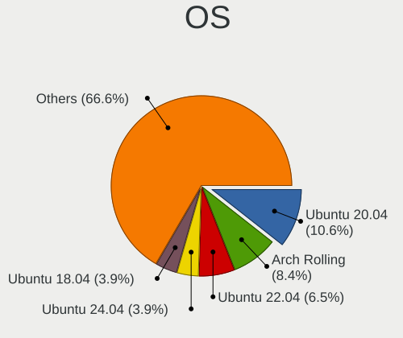

| Name                         | Computers | Percent |
|------------------------------|-----------|---------|
| Ubuntu 20.04                 | 97        | 10.61%  |
| Arch Rolling                 | 77        | 8.42%   |
| Ubuntu 22.04                 | 59        | 6.46%   |
| Ubuntu 24.04                 | 36        | 3.94%   |
| Ubuntu 18.04                 | 36        | 3.94%   |
| Debian 12                    | 32        | 3.5%    |
| Pop!_OS 22.04                | 18        | 1.97%   |
| ArcoLinux Rolling            | 18        | 1.97%   |
| Arch                         | 17        | 1.86%   |
| Fedora 40                    | 16        | 1.75%   |
| Fedora 42                    | 14        | 1.53%   |
| Fedora 41                    | 14        | 1.53%   |
| EndeavourOS Rolling          | 14        | 1.53%   |
| Manjaro                      | 13        | 1.42%   |
| Fedora 37                    | 12        | 1.31%   |
| Fedora 38                    | 11        | 1.2%    |
| Ubuntu 23.10                 | 8         | 0.88%   |
| openSUSE Tumbleweed-XXXXXXXX | 8         | 0.88%   |
| Debian 10                    | 8         | 0.88%   |
| CachyOS Rolling              | 8         | 0.88%   |
| Zorin 16                     | 7         | 0.77%   |
| Pop!_OS 20.04                | 7         | 0.77%   |
| Fedora 39                    | 7         | 0.77%   |
| Debian 11                    | 7         | 0.77%   |
| Xero Rolling                 | 6         | 0.66%   |
| Ubuntu 21.04                 | 6         | 0.66%   |
| OpenMandriva 25.90           | 6         | 0.66%   |
| OpenMandriva 23.03           | 6         | 0.66%   |
| Linux Mint 22.1              | 6         | 0.66%   |
| Linux Mint 21.2              | 6         | 0.66%   |
| KDE neon 20.04               | 6         | 0.66%   |
| Ubuntu 21.10                 | 5         | 0.55%   |
| Ubuntu 19.10                 | 5         | 0.55%   |
| Ubuntu 16.04                 | 5         | 0.55%   |
| OpenMandriva 6.0             | 5         | 0.55%   |
| OpenMandriva 4.2             | 5         | 0.55%   |
| OpenMandriva 24.12           | 5         | 0.55%   |
| Manjaro 20.2                 | 5         | 0.55%   |
| Linux Mint 22.2              | 5         | 0.55%   |
| Linux Mint 22                | 5         | 0.55%   |

OS Family
---------

OS without a version

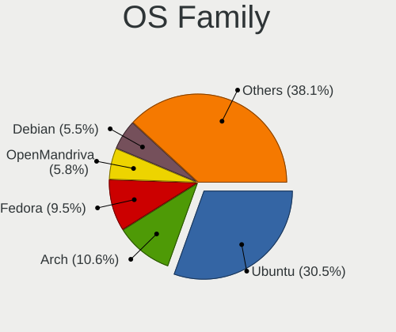

| Name             | Computers | Percent |
|------------------|-----------|---------|
| Ubuntu           | 270       | 30.47%  |
| Arch             | 94        | 10.61%  |
| Fedora           | 84        | 9.48%   |
| OpenMandriva     | 51        | 5.76%   |
| Debian           | 49        | 5.53%   |
| Linux Mint       | 45        | 5.08%   |
| Pop!_OS          | 36        | 4.06%   |
| Manjaro          | 30        | 3.39%   |
| ArcoLinux        | 19        | 2.14%   |
| Zorin            | 15        | 1.69%   |
| openSUSE         | 14        | 1.58%   |
| Kubuntu          | 14        | 1.58%   |
| EndeavourOS      | 14        | 1.58%   |
| KDE neon         | 10        | 1.13%   |
| Elementary       | 10        | 1.13%   |
| Ubuntu Unity     | 9         | 1.02%   |
| CachyOS          | 9         | 1.02%   |
| Kali             | 8         | 0.9%    |
| Xubuntu          | 7         | 0.79%   |
| Endless          | 7         | 0.79%   |
| Xero             | 6         | 0.68%   |
| NixOS            | 5         | 0.56%   |
| Lubuntu          | 5         | 0.56%   |
| Gentoo           | 5         | 0.56%   |
| Garuda Linux     | 5         | 0.56%   |
| Clear Linux      | 5         | 0.56%   |
| Void Linux       | 4         | 0.45%   |
| SteamOS          | 4         | 0.45%   |
| Nobara           | 4         | 0.45%   |
| ChimeraOS        | 4         | 0.45%   |
| Bazzite          | 4         | 0.45%   |
| Ubuntu MATE      | 3         | 0.34%   |
| CentOS           | 3         | 0.34%   |
| Artix            | 3         | 0.34%   |
| Solus            | 2         | 0.23%   |
| ROSA             | 2         | 0.23%   |
| Parrot           | 2         | 0.23%   |
| org.kde.Platform | 2         | 0.23%   |
| Oracle Linux     | 2         | 0.23%   |
| MX               | 2         | 0.23%   |

Kernel
------

Version of the Linux kernel

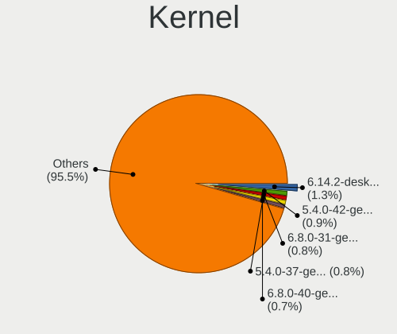

| Version                  | Computers | Percent |
|--------------------------|-----------|---------|
| 6.14.2-desktop-3omv2590  | 13        | 1.29%   |
| 5.4.0-42-generic         | 9         | 0.89%   |
| 6.8.0-31-generic         | 8         | 0.79%   |
| 5.4.0-37-generic         | 8         | 0.79%   |
| 6.8.0-40-generic         | 7         | 0.69%   |
| 5.4.0-52-generic         | 7         | 0.69%   |
| 5.4.0-48-generic         | 7         | 0.69%   |
| 6.9.3-76060903-generic   | 6         | 0.6%    |
| 6.2.6-desktop-1omv2390   | 6         | 0.6%    |
| 5.4.0-58-generic         | 6         | 0.6%    |
| 5.4.0-40-generic         | 6         | 0.6%    |
| 6.8.0-51-generic         | 5         | 0.5%    |
| 6.5.8-arch1-1            | 5         | 0.5%    |
| 6.2.0-34-generic         | 5         | 0.5%    |
| 6.11.0-17-generic        | 5         | 0.5%    |
| 5.8.0-55-generic         | 5         | 0.5%    |
| 5.8.0-53-generic         | 5         | 0.5%    |
| 5.15.0-91-generic        | 5         | 0.5%    |
| 5.15.0-56-generic        | 5         | 0.5%    |
| 5.15.0-52-generic        | 5         | 0.5%    |
| 5.11.0-41-generic        | 5         | 0.5%    |
| 5.11.0-38-generic        | 5         | 0.5%    |
| 5.11.0-37-generic        | 5         | 0.5%    |
| 5.10.14-desktop-1omv4002 | 5         | 0.5%    |
| 6.9.3-arch1-1            | 4         | 0.4%    |
| 6.8.0-45-generic         | 4         | 0.4%    |
| 6.5.0-15-generic         | 4         | 0.4%    |
| 6.5.0-14-generic         | 4         | 0.4%    |
| 6.2.9-300.fc38.x86_64    | 4         | 0.4%    |
| 6.2.0-36-generic         | 4         | 0.4%    |
| 6.12.1-desktop-1omv2490  | 4         | 0.4%    |
| 6.11.0-26-generic        | 4         | 0.4%    |
| 6.1.0-18-amd64           | 4         | 0.4%    |
| 5.8.0-7642-generic       | 4         | 0.4%    |
| 5.8.0-50-generic         | 4         | 0.4%    |
| 5.8.0-43-generic         | 4         | 0.4%    |
| 5.4.0-47-generic         | 4         | 0.4%    |
| 5.4.0-26-generic         | 4         | 0.4%    |
| 5.15.0-48-generic        | 4         | 0.4%    |
| 5.15.0-47-generic        | 4         | 0.4%    |

Kernel Family
-------------

Linux kernel without a distro release

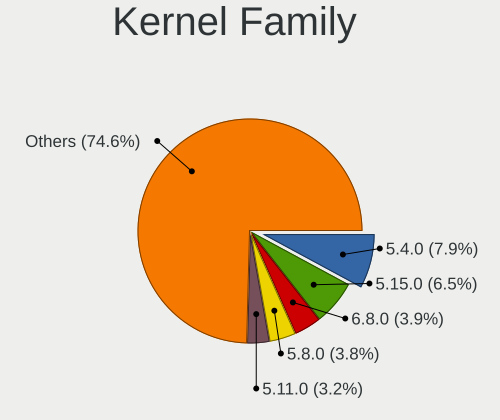

| Version | Computers | Percent |
|---------|-----------|---------|
| 5.4.0   | 76        | 7.88%   |
| 5.15.0  | 63        | 6.54%   |
| 6.8.0   | 38        | 3.94%   |
| 5.8.0   | 37        | 3.84%   |
| 5.11.0  | 31        | 3.22%   |
| 6.1.0   | 26        | 2.7%    |
| 6.5.0   | 24        | 2.49%   |
| 6.2.0   | 24        | 2.49%   |
| 6.11.0  | 20        | 2.07%   |
| 6.14.0  | 16        | 1.66%   |
| 6.14.2  | 15        | 1.56%   |
| 5.13.0  | 15        | 1.56%   |
| 4.15.0  | 15        | 1.56%   |
| 5.19.0  | 14        | 1.45%   |
| 5.0.0   | 13        | 1.35%   |
| 6.9.3   | 12        | 1.24%   |
| 5.3.0   | 12        | 1.24%   |
| 5.10.0  | 10        | 1.04%   |
| 6.2.6   | 9         | 0.93%   |
| 4.18.0  | 9         | 0.93%   |
| 6.2.9   | 8         | 0.83%   |
| 6.12.1  | 7         | 0.73%   |
| 4.19.0  | 6         | 0.62%   |
| 6.5.8   | 5         | 0.52%   |
| 6.5.6   | 5         | 0.52%   |
| 6.5.5   | 5         | 0.52%   |
| 6.4.0   | 5         | 0.52%   |
| 6.13.8  | 5         | 0.52%   |
| 6.12.9  | 5         | 0.52%   |
| 5.10.14 | 5         | 0.52%   |
| 4.10.0  | 5         | 0.52%   |
| 6.9.12  | 4         | 0.41%   |
| 6.3.9   | 4         | 0.41%   |
| 6.3.5   | 4         | 0.41%   |
| 6.17.9  | 4         | 0.41%   |
| 6.16.4  | 4         | 0.41%   |
| 6.11.8  | 4         | 0.41%   |
| 6.11.4  | 4         | 0.41%   |
| 5.16.7  | 4         | 0.41%   |
| 6.9.7   | 3         | 0.31%   |

Kernel Major Ver.
-----------------

Linux kernel major version

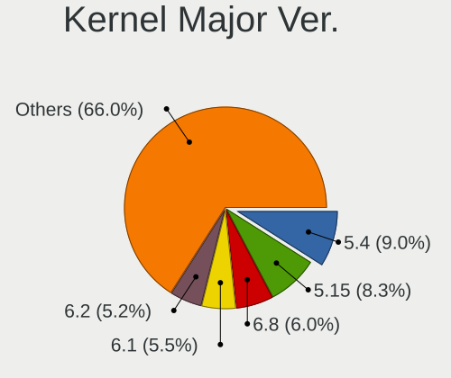

| Version | Computers | Percent |
|---------|-----------|---------|
| 5.4     | 85        | 9.01%   |
| 5.15    | 78        | 8.27%   |
| 6.8     | 57        | 6.04%   |
| 6.1     | 52        | 5.51%   |
| 6.2     | 49        | 5.2%    |
| 6.14    | 49        | 5.2%    |
| 6.5     | 46        | 4.88%   |
| 5.8     | 40        | 4.24%   |
| 6.12    | 37        | 3.92%   |
| 6.11    | 35        | 3.71%   |
| 5.11    | 33        | 3.5%    |
| 6.6     | 32        | 3.39%   |
| 6.9     | 24        | 2.55%   |
| 5.10    | 24        | 2.55%   |
| 5.19    | 23        | 2.44%   |
| 5.13    | 21        | 2.23%   |
| 6.4     | 17        | 1.8%    |
| 6.15    | 17        | 1.8%    |
| 5.0     | 16        | 1.7%    |
| 4.15    | 16        | 1.7%    |
| 6.17    | 15        | 1.59%   |
| 6.13    | 14        | 1.48%   |
| 6.10    | 14        | 1.48%   |
| 6.0     | 13        | 1.38%   |
| 5.3     | 12        | 1.27%   |
| 6.7     | 11        | 1.17%   |
| 6.3     | 11        | 1.17%   |
| 5.9     | 11        | 1.17%   |
| 5.18    | 10        | 1.06%   |
| 5.16    | 9         | 0.95%   |
| 5.12    | 9         | 0.95%   |
| 4.18    | 9         | 0.95%   |
| 6.16    | 8         | 0.85%   |
| 5.14    | 8         | 0.85%   |
| 4.19    | 8         | 0.85%   |
| 6.18    | 5         | 0.53%   |
| 5.17    | 5         | 0.53%   |
| 4.10    | 5         | 0.53%   |
| 5.7     | 3         | 0.32%   |
| 5.6     | 2         | 0.21%   |

Arch
----

OS architecture (x86_64, i586, etc.)

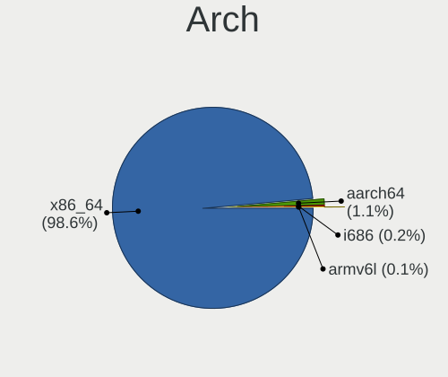

| Name    | Computers | Percent |
|---------|-----------|---------|
| x86_64  | 833       | 98.58%  |
| aarch64 | 9         | 1.07%   |
| i686    | 2         | 0.24%   |
| armv6l  | 1         | 0.12%   |

DE
--

Desktop Environment

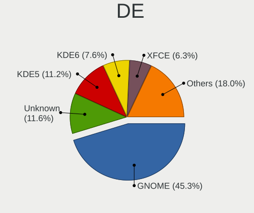

| Name             | Computers | Percent |
|------------------|-----------|---------|
| GNOME            | 403       | 45.28%  |
| Unknown          | 103       | 11.57%  |
| KDE5             | 100       | 11.24%  |
| KDE6             | 68        | 7.64%   |
| XFCE             | 56        | 6.29%   |
| X-Cinnamon       | 39        | 4.38%   |
| KDE              | 20        | 2.25%   |
| Hyprland         | 18        | 2.02%   |
| LXQt             | 11        | 1.24%   |
| Pantheon         | 10        | 1.12%   |
| MATE             | 10        | 1.12%   |
| Unity            | 9         | 1.01%   |
| i3               | 6         | 0.67%   |
| Cinnamon         | 4         | 0.45%   |
| bspwm            | 4         | 0.45%   |
| sway             | 3         | 0.34%   |
| Budgie           | 3         | 0.34%   |
| Openbox          | 2         | 0.22%   |
| niri             | 2         | 0.22%   |
| LXDE             | 2         | 0.22%   |
| KDE4             | 2         | 0.22%   |
| Deepin           | 2         | 0.22%   |
| awesome          | 2         | 0.22%   |
| X-Generic        | 1         | 0.11%   |
| qtile            | 1         | 0.11%   |
| Phosh:GNOME      | 1         | 0.11%   |
| none+awesome     | 1         | 0.11%   |
| lightdm-xsession | 1         | 0.11%   |
| LeftWM           | 1         | 0.11%   |
| GNOME Classic    | 1         | 0.11%   |
| gamescope        | 1         | 0.11%   |
| fluxbox          | 1         | 0.11%   |
| dwm              | 1         | 0.11%   |
| COSMIC           | 1         | 0.11%   |

Display Server
--------------

X11 or Wayland

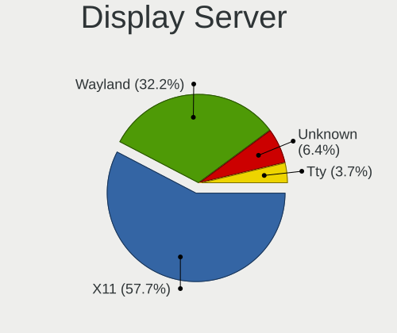

| Name    | Computers | Percent |
|---------|-----------|---------|
| X11     | 512       | 57.66%  |
| Wayland | 286       | 32.21%  |
| Unknown | 57        | 6.42%   |
| Tty     | 33        | 3.72%   |

Display Manager
---------------

SDDM, LightDM, etc.

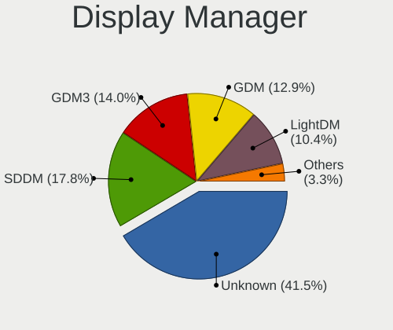

| Name                  | Computers | Percent |
|-----------------------|-----------|---------|
| Unknown               | 366       | 41.54%  |
| SDDM                  | 157       | 17.82%  |
| GDM3                  | 123       | 13.96%  |
| GDM                   | 114       | 12.94%  |
| LightDM               | 92        | 10.44%  |
| TDM                   | 16        | 1.82%   |
| XDM                   | 3         | 0.34%   |
| GREETD                | 3         | 0.34%   |
| SLiM                  | 2         | 0.23%   |
| LY-DM                 | 2         | 0.23%   |
| Ly                    | 1         | 0.11%   |
| KDM                   | 1         | 0.11%   |
| DISPLAY-MANAGER-START | 1         | 0.11%   |

OS Lang
-------

Language

| Lang        | Computers | Percent |
|-------------|-----------|---------|
| en_US       | 672       | 78.5%   |
| Unknown     | 67        | 7.83%   |
| vi_VN       | 44        | 5.14%   |
| C           | 26        | 3.04%   |
| en_GB       | 18        | 2.1%    |
| ru_RU       | 7         | 0.82%   |
| en_AU       | 7         | 0.82%   |
| fr_FR       | 2         | 0.23%   |
| en_CA       | 2         | 0.23%   |
| de_DE       | 2         | 0.23%   |
| POSIX       | 1         | 0.12%   |
| pl_PL       | 1         | 0.12%   |
| ko_KR       | 1         | 0.12%   |
| ja_JP       | 1         | 0.12%   |
| es_ES       | 1         | 0.12%   |
| en_US.UTF=8 | 1         | 0.12%   |
| en_US.UTF8  | 1         | 0.12%   |
| en_BW       | 1         | 0.12%   |
| de          | 1         | 0.12%   |

Boot Mode
---------

EFI or BIOS

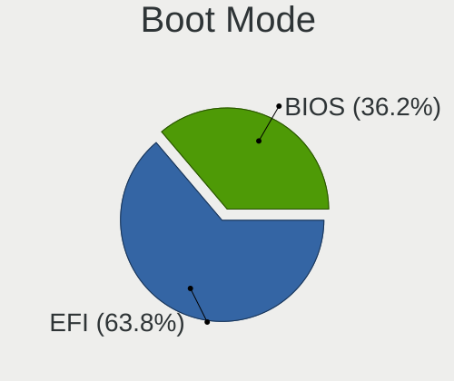

| Mode | Computers | Percent |
|------|-----------|---------|
| EFI  | 552       | 63.82%  |
| BIOS | 313       | 36.18%  |

Filesystem
----------

Type of filesystem

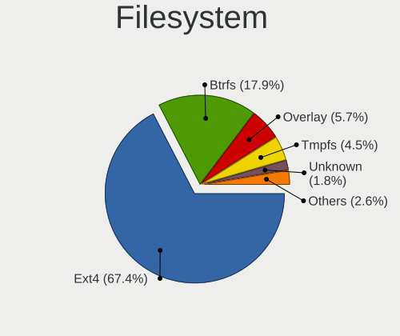

| Type     | Computers | Percent |
|----------|-----------|---------|
| Ext4     | 587       | 67.39%  |
| Btrfs    | 156       | 17.91%  |
| Overlay  | 50        | 5.74%   |
| Tmpfs    | 39        | 4.48%   |
| Unknown  | 16        | 1.84%   |
| Zfs      | 10        | 1.15%   |
| Xfs      | 8         | 0.92%   |
| F2fs     | 3         | 0.34%   |
| Reiserfs | 1         | 0.11%   |
| Ext3     | 1         | 0.11%   |

Part. scheme
------------

Scheme of partitioning

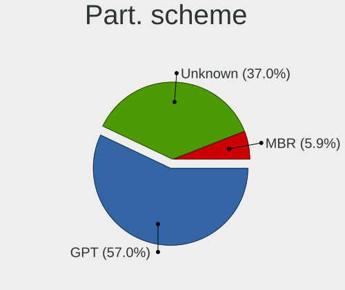

| Type    | Computers | Percent |
|---------|-----------|---------|
| GPT     | 490       | 57.04%  |
| Unknown | 318       | 37.02%  |
| MBR     | 51        | 5.94%   |

Dual Boot with Linux/BSD
------------------------

Hosting more than one Linux/BSD

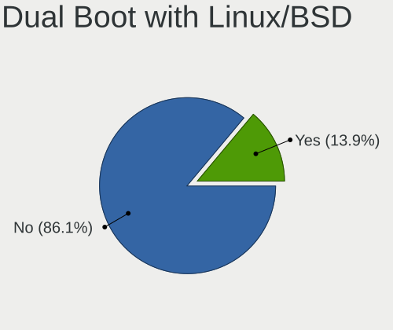

| Dual boot | Computers | Percent |
|-----------|-----------|---------|
| No        | 743       | 86.1%   |
| Yes       | 120       | 13.9%   |

Dual Boot (Win)
---------------

Hosting Linux and Windows

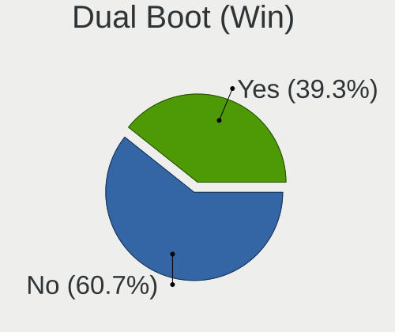

| Dual boot | Computers | Percent |
|-----------|-----------|---------|
| No        | 528       | 60.69%  |
| Yes       | 342       | 39.31%  |

Board
-----

Vendor
------

Motherboard manufacturer

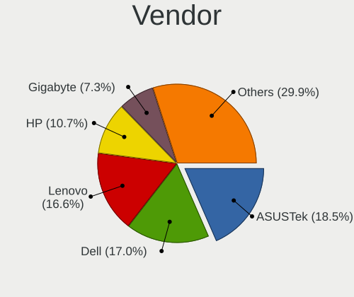

| Name                                 | Computers | Percent |
|--------------------------------------|-----------|---------|
| ASUSTek Computer                     | 156       | 18.46%  |
| Dell                                 | 144       | 17.04%  |
| Lenovo                               | 140       | 16.57%  |
| Hewlett-Packard                      | 90        | 10.65%  |
| Gigabyte Technology                  | 62        | 7.34%   |
| MSI                                  | 61        | 7.22%   |
| Acer                                 | 46        | 5.44%   |
| Apple                                | 17        | 2.01%   |
| ASRock                               | 10        | 1.18%   |
| Samsung Electronics                  | 8         | 0.95%   |
| Intel                                | 8         | 0.95%   |
| Unknown                              | 8         | 0.95%   |
| HUAWEI                               | 7         | 0.83%   |
| Sony                                 | 6         | 0.71%   |
| Toshiba                              | 5         | 0.59%   |
| LG Electronics                       | 5         | 0.59%   |
| Supermicro                           | 4         | 0.47%   |
| Google                               | 4         | 0.47%   |
| Chuwi                                | 4         | 0.47%   |
| ZOTAC                                | 3         | 0.36%   |
| Valve                                | 3         | 0.36%   |
| Raspberry Pi Foundation              | 3         | 0.36%   |
| GuoGuang                             | 3         | 0.36%   |
| Foxconn                              | 3         | 0.36%   |
| Wistron                              | 2         | 0.24%   |
| Timi                                 | 2         | 0.24%   |
| Shenzhen Meigao Electronic Equipment | 2         | 0.24%   |
| OrangePi                             | 2         | 0.24%   |
| MASSCOM VIETNAM                      | 2         | 0.24%   |
| Huanan                               | 2         | 0.24%   |
| CompuLab                             | 2         | 0.24%   |
| Alienware                            | 2         | 0.24%   |
| Ugoos                                | 1         | 0.12%   |
| TongFang                             | 1         | 0.12%   |
| TENKU                                | 1         | 0.12%   |
| T-bao                                | 1         | 0.12%   |
| Shuttle                              | 1         | 0.12%   |
| Shenzhen Amediatech Technology       | 1         | 0.12%   |
| Rockchip                             | 1         | 0.12%   |
| Qualcomm Technologies                | 1         | 0.12%   |

Model
-----

Motherboard model

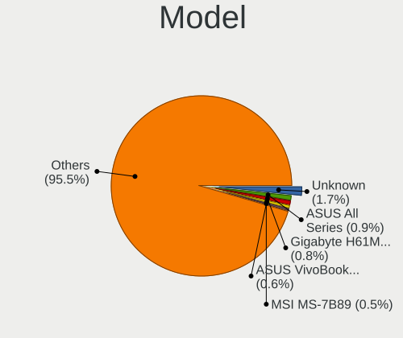

| Name                                   | Computers | Percent |
|----------------------------------------|-----------|---------|
| Unknown                                | 14        | 1.66%   |
| ASUS All Series                        | 8         | 0.95%   |
| Gigabyte H61M-DS2                      | 7         | 0.83%   |
| ASUS VivoBook_ASUSLaptop X513IA_M513IA | 5         | 0.59%   |
| MSI MS-7B89                            | 4         | 0.47%   |
| Lenovo ThinkPad E14 20RAS0KX00         | 4         | 0.47%   |
| Lenovo Legion 5 15ARH05 82B5           | 4         | 0.47%   |
| HP Notebook                            | 4         | 0.47%   |
| Dell Vostro 3578                       | 4         | 0.47%   |
| Dell Inspiron 3537                     | 4         | 0.47%   |
| Apple MacBookPro12,1                   | 4         | 0.47%   |
| MSI MS-7B98                            | 3         | 0.36%   |
| Lenovo Yoga 14sACH 2021 82MS           | 3         | 0.36%   |
| Lenovo IdeaPad Gaming 3 15ACH6 82K2    | 3         | 0.36%   |
| Intel X99                              | 3         | 0.36%   |
| HUAWEI BOM-WXX9                        | 3         | 0.36%   |
| HP Z440 Workstation                    | 3         | 0.36%   |
| Gigabyte B360M-D3H                     | 3         | 0.36%   |
| Dell Vostro 15-3568                    | 3         | 0.36%   |
| Dell Precision M4800                   | 3         | 0.36%   |
| Dell G3 3579                           | 3         | 0.36%   |
| ASUS X411UA                            | 3         | 0.36%   |
| ASUS P8H61-MX R2.0                     | 3         | 0.36%   |
| Apple MacBookPro13,3                   | 3         | 0.36%   |
| Apple MacBookPro11,4                   | 3         | 0.36%   |
| Acer Nitro AN515-57                    | 3         | 0.36%   |
| Valve Galileo                          | 2         | 0.24%   |
| Toshiba Satellite L840                 | 2         | 0.24%   |
| Supermicro SYS-7039A-I                 | 2         | 0.24%   |
| Samsung 300E4Z/300E5Z/300E7Z           | 2         | 0.24%   |
| OrangePi NEO-01                        | 2         | 0.24%   |
| MSI Thin GF63 12VE                     | 2         | 0.24%   |
| MSI MS-7C89                            | 2         | 0.24%   |
| MSI MS-7C52                            | 2         | 0.24%   |
| MSI MS-7823                            | 2         | 0.24%   |
| MSI Modern 15 A5M                      | 2         | 0.24%   |
| MSI Modern 14 B5M                      | 2         | 0.24%   |
| MSI GF63 8RD                           | 2         | 0.24%   |
| MASSCOM VIETNAM L133                   | 2         | 0.24%   |
| Lenovo XiaoXinPro 14 AHP9 83D3         | 2         | 0.24%   |

Model Family
------------

Motherboard model prefix

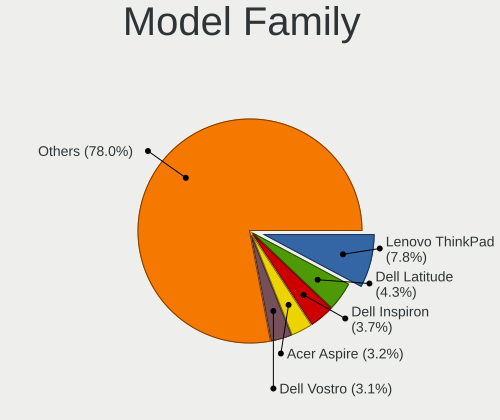

| Name               | Computers | Percent |
|--------------------|-----------|---------|
| Lenovo ThinkPad    | 66        | 7.81%   |
| Dell Latitude      | 36        | 4.26%   |
| Dell Inspiron      | 31        | 3.67%   |
| Acer Aspire        | 27        | 3.2%    |
| Dell Vostro        | 26        | 3.08%   |
| ASUS ROG           | 26        | 3.08%   |
| ASUS VivoBook      | 25        | 2.96%   |
| Lenovo IdeaPad     | 24        | 2.84%   |
| HP EliteBook       | 19        | 2.25%   |
| ASUS ASUS          | 17        | 2.01%   |
| Lenovo Legion      | 16        | 1.89%   |
| Dell Precision     | 16        | 1.89%   |
| Lenovo ThinkBook   | 15        | 1.78%   |
| ASUS PRIME         | 15        | 1.78%   |
| Unknown            | 14        | 1.66%   |
| HP Laptop          | 11        | 1.3%    |
| Dell OptiPlex      | 11        | 1.3%    |
| Acer Nitro         | 11        | 1.3%    |
| HP ProBook         | 10        | 1.18%   |
| Dell XPS           | 9         | 1.07%   |
| ASUS TUF           | 9         | 1.07%   |
| HP Pavilion        | 8         | 0.95%   |
| Gigabyte H61M-DS2  | 8         | 0.95%   |
| ASUS All           | 8         | 0.95%   |
| MSI Modern         | 5         | 0.59%   |
| HP ZBook           | 5         | 0.59%   |
| Dell System        | 5         | 0.59%   |
| Dell G3            | 5         | 0.59%   |
| MSI MS-7B89        | 4         | 0.47%   |
| MSI GF63           | 4         | 0.47%   |
| Lenovo Yoga        | 4         | 0.47%   |
| HP Notebook        | 4         | 0.47%   |
| ASUS P8H61-MX      | 4         | 0.47%   |
| Apple MacBookPro12 | 4         | 0.47%   |
| Apple MacBookPro11 | 4         | 0.47%   |
| Acer Swift         | 4         | 0.47%   |
| Toshiba Satellite  | 3         | 0.36%   |
| RPi Raspberry      | 3         | 0.36%   |
| MSI MS-7B98        | 3         | 0.36%   |
| Lenovo ThinkCentre | 3         | 0.36%   |

MFG Year
--------

Motherboard manufacture year

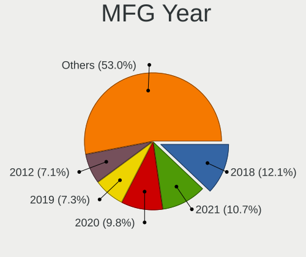

| Year    | Computers | Percent |
|---------|-----------|---------|
| 2018    | 102       | 12.07%  |
| 2021    | 90        | 10.65%  |
| 2020    | 83        | 9.82%   |
| 2019    | 62        | 7.34%   |
| 2012    | 60        | 7.1%    |
| 2022    | 55        | 6.51%   |
| 2023    | 50        | 5.92%   |
| 2013    | 49        | 5.8%    |
| 2017    | 47        | 5.56%   |
| 2014    | 46        | 5.44%   |
| 2016    | 44        | 5.21%   |
| 2015    | 38        | 4.5%    |
| 2011    | 32        | 3.79%   |
| 2024    | 29        | 3.43%   |
| 2009    | 16        | 1.89%   |
| 2010    | 15        | 1.78%   |
| Unknown | 10        | 1.18%   |
| 2008    | 7         | 0.83%   |
| 2025    | 5         | 0.59%   |
| 2007    | 3         | 0.36%   |
| 2006    | 2         | 0.24%   |

Form Factor
-----------

Physical design of the computer

| Name           | Computers | Percent |
|----------------|-----------|---------|
| Notebook       | 567       | 67.1%   |
| Desktop        | 225       | 26.63%  |
| Convertible    | 13        | 1.54%   |
| Mini pc        | 12        | 1.42%   |
| Tablet         | 10        | 1.18%   |
| System on chip | 9         | 1.07%   |
| Server         | 6         | 0.71%   |
| All in one     | 2         | 0.24%   |
| Phone          | 1         | 0.12%   |

Secure Boot
-----------

Enabled or disabled

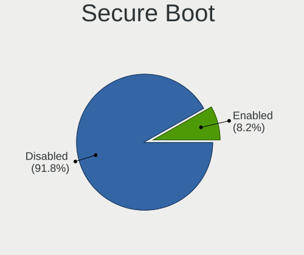

| State    | Computers | Percent |
|----------|-----------|---------|
| Disabled | 782       | 91.78%  |
| Enabled  | 70        | 8.22%   |

Coreboot
--------

Have coreboot on board

| Used | Computers | Percent |
|------|-----------|---------|
| No   | 841       | 99.53%  |
| Yes  | 4         | 0.47%   |

RAM Size
--------

Total RAM memory

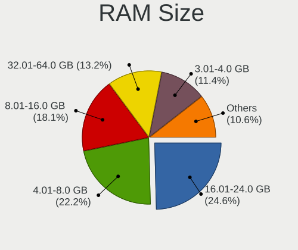

| Size in GB  | Computers | Percent |
|-------------|-----------|---------|
| 16.01-24.0  | 212       | 24.59%  |
| 4.01-8.0    | 191       | 22.16%  |
| 8.01-16.0   | 156       | 18.1%   |
| 32.01-64.0  | 114       | 13.23%  |
| 3.01-4.0    | 98        | 11.37%  |
| 24.01-32.0  | 41        | 4.76%   |
| 64.01-256.0 | 21        | 2.44%   |
| 1.01-2.0    | 20        | 2.32%   |
| 2.01-3.0    | 6         | 0.7%    |
| 0.51-1.0    | 2         | 0.23%   |
| 0.01-0.5    | 1         | 0.12%   |

RAM Used
--------

Used RAM memory

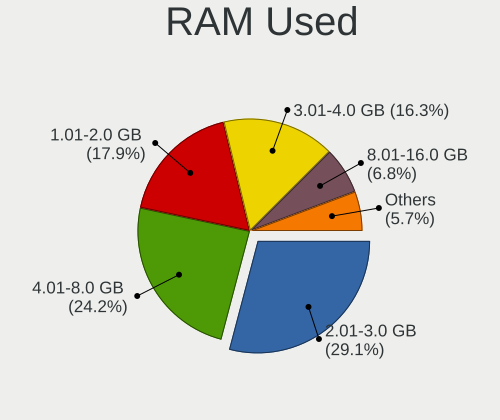

| Used GB    | Computers | Percent |
|------------|-----------|---------|
| 2.01-3.0   | 275       | 29.1%   |
| 4.01-8.0   | 229       | 24.23%  |
| 1.01-2.0   | 169       | 17.88%  |
| 3.01-4.0   | 154       | 16.3%   |
| 8.01-16.0  | 64        | 6.77%   |
| 0.51-1.0   | 24        | 2.54%   |
| 16.01-24.0 | 15        | 1.59%   |
| 0.01-0.5   | 8         | 0.85%   |
| 24.01-32.0 | 6         | 0.63%   |
| 32.01-64.0 | 1         | 0.11%   |

Total Drives
------------

Number of drives on board

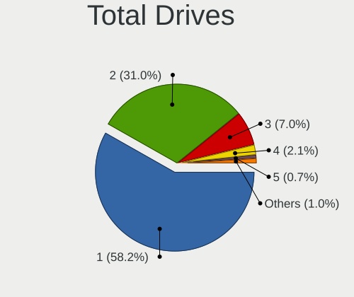

| Drives | Computers | Percent |
|--------|-----------|---------|
| 1      | 507       | 58.21%  |
| 2      | 270       | 31%     |
| 3      | 61        | 7%      |
| 4      | 18        | 2.07%   |
| 5      | 6         | 0.69%   |
| 0      | 6         | 0.69%   |
| 9      | 1         | 0.11%   |
| 7      | 1         | 0.11%   |
| 6      | 1         | 0.11%   |

Has CD-ROM
----------

Has CD-ROM on board

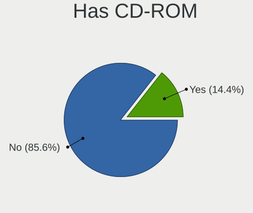

| Presented | Computers | Percent |
|-----------|-----------|---------|
| No        | 727       | 85.63%  |
| Yes       | 122       | 14.37%  |

Has Ethernet
------------

Has Ethernet on board

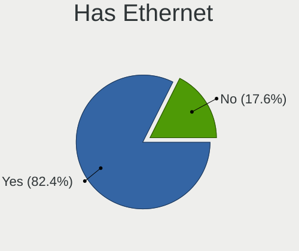

| Presented | Computers | Percent |
|-----------|-----------|---------|
| Yes       | 702       | 82.39%  |
| No        | 150       | 17.61%  |

Has WiFi
--------

Has WiFi module

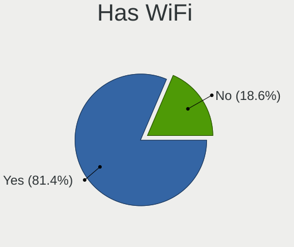

| Presented | Computers | Percent |
|-----------|-----------|---------|
| Yes       | 693       | 81.43%  |
| No        | 158       | 18.57%  |

Has Bluetooth
-------------

Has Bluetooth module

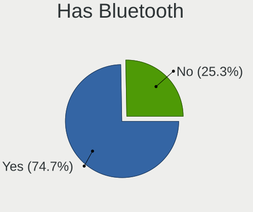

| Presented | Computers | Percent |
|-----------|-----------|---------|
| Yes       | 638       | 74.71%  |
| No        | 216       | 25.29%  |

Location
--------

Country
-------

Geographic location (country)

| Country | Computers | Percent |
|---------|-----------|---------|
| Vietnam | 845       | 100%    |

City
----

Geographic location (city)

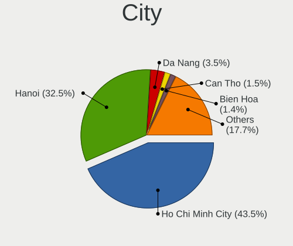

| City             | Computers | Percent |
|------------------|-----------|---------|
| Ho Chi Minh City | 384       | 43.49%  |
| Hanoi            | 287       | 32.5%   |
| Da Nang          | 31        | 3.51%   |
| Can Tho          | 13        | 1.47%   |
| Bien Hoa         | 12        | 1.36%   |
| Bac Giang        | 9         | 1.02%   |
| Đông Hà       | 7         | 0.79%   |
| Tay Ninh         | 7         | 0.79%   |
| Nha Trang        | 7         | 0.79%   |
| Vũng Tàu       | 5         | 0.57%   |
| Thai Nguyen      | 5         | 0.57%   |
| Nam Định      | 5         | 0.57%   |
| Huế            | 5         | 0.57%   |
| Haiphong         | 5         | 0.57%   |
| Buon Ma Thuot    | 5         | 0.57%   |
| Vinh             | 4         | 0.45%   |
| Bến Tre        | 4         | 0.45%   |
| Tua Chua         | 3         | 0.34%   |
| Tra Vinh         | 3         | 0.34%   |
| Thuan An         | 3         | 0.34%   |
| Thu Duc          | 3         | 0.34%   |
| Thon Dien Ha     | 3         | 0.34%   |
| Quảng Ngai     | 3         | 0.34%   |
| Nga Bay          | 3         | 0.34%   |
| Hung Yen         | 3         | 0.34%   |
| Hai Duong        | 3         | 0.34%   |
| Dien Ban         | 3         | 0.34%   |
| Vinh Phuc        | 2         | 0.23%   |
| Viet Tri         | 2         | 0.23%   |
| Tinh Binh Duong  | 2         | 0.23%   |
| Thanh Hóa       | 2         | 0.23%   |
| Tan An           | 2         | 0.23%   |
| Quận Bốn     | 2         | 0.23%   |
| Binh Hoa         | 2         | 0.23%   |
| Binh Duong       | 2         | 0.23%   |
| Bao Loc          | 2         | 0.23%   |
| Xom My Tho       | 1         | 0.11%   |
| Vinh Yen         | 1         | 0.11%   |
| Vi Thanh         | 1         | 0.11%   |
| Tinh Quang Binh  | 1         | 0.11%   |

Drives
------

Drive Vendor
------------

Hard drive vendors

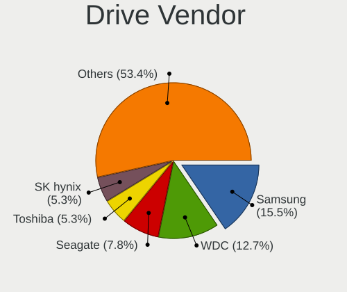

| Vendor                      | Computers | Drives | Percent |
|-----------------------------|-----------|--------|---------|
| Samsung Electronics         | 194       | 266    | 15.47%  |
| WDC                         | 159       | 212    | 12.68%  |
| Seagate                     | 98        | 119    | 7.81%   |
| Toshiba                     | 67        | 92     | 5.34%   |
| SK hynix                    | 66        | 81     | 5.26%   |
| SanDisk                     | 61        | 78     | 4.86%   |
| Kingston                    | 58        | 86     | 4.63%   |
| Micron Technology           | 50        | 58     | 3.99%   |
| Unknown                     | 46        | 55     | 3.67%   |
| Intel                       | 45        | 55     | 3.59%   |
| HGST                        | 36        | 38     | 2.87%   |
| Hitachi                     | 22        | 29     | 1.75%   |
| Crucial                     | 21        | 26     | 1.67%   |
| KIOXIA                      | 18        | 24     | 1.44%   |
| Plextor                     | 12        | 13     | 0.96%   |
| Lexar                       | 12        | 14     | 0.96%   |
| Kingston Technology Company | 12        | 15     | 0.96%   |
| Apple                       | 12        | 16     | 0.96%   |
| Unknown                     | 12        | 15     | 0.96%   |
| MAXIO Technology (Hangzhou) | 11        | 12     | 0.88%   |
| Phison Electronics          | 10        | 11     | 0.8%    |
| KingSpec                    | 9         | 13     | 0.72%   |
| China                       | 9         | 10     | 0.72%   |
| A-DATA Technology           | 9         | 9      | 0.72%   |
| Transcend                   | 8         | 10     | 0.64%   |
| OSCOO                       | 8         | 9      | 0.64%   |
| Colorful                    | 8         | 10     | 0.64%   |
| Silicon Motion              | 7         | 10     | 0.56%   |
| Kingmax                     | 7         | 8      | 0.56%   |
| TO Exter                    | 6         | 9      | 0.48%   |
| SPCC                        | 6         | 6      | 0.48%   |
| Gigabyte Technology         | 6         | 6      | 0.48%   |
| ADATA Technology            | 6         | 9      | 0.48%   |
| Netac                       | 5         | 6      | 0.4%    |
| LITEON                      | 5         | 5      | 0.4%    |
| XSTAR                       | 4         | 6      | 0.32%   |
| Micron/Crucial Technology   | 4         | 4      | 0.32%   |
| JMicron Technology          | 4         | 4      | 0.32%   |
| External                    | 4         | 4      | 0.32%   |
| Apacer                      | 4         | 4      | 0.32%   |

Drive Model
-----------

Hard drive models

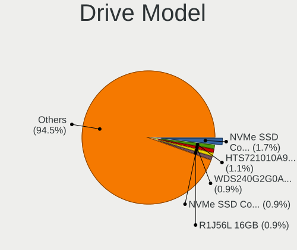

| Model                                                | Computers | Percent |
|------------------------------------------------------|-----------|---------|
| Samsung NVMe SSD Controller SM981/PM981/PM983 1TB    | 23        | 1.73%   |
| HGST HTS721010A9E630 1TB                             | 14        | 1.05%   |
| WDC WDS240G2G0A-00JH30 240GB SSD                     | 12        | 0.9%    |
| Samsung NVMe SSD Controller PM9A1/PM9A3/980PRO 1TB   | 12        | 0.9%    |
| Unknown                                              | 12        | 0.9%    |
| Seagate ST1000LM035-1RK172 1TB                       | 11        | 0.83%   |
| Samsung SSD 860 EVO 250GB                            | 11        | 0.83%   |
| Kingston SA400S37240G 240GB SSD                      | 11        | 0.83%   |
| Samsung SSD 980 1TB                                  | 10        | 0.75%   |
| Unknown MMC Card  32GB                               | 9         | 0.68%   |
| Toshiba MQ01ABF050 500GB                             | 9         | 0.68%   |
| SK hynix BC501 NVMe Solid State Drive 512GB          | 9         | 0.68%   |
| Kingston SA400S37120G 120GB SSD                      | 9         | 0.68%   |
| Intel SSDPEKNU512GZ 512GB                            | 9         | 0.68%   |
| Sandisk WD Blue SN550 NVMe SSD 1024GB                | 8         | 0.6%    |
| Samsung SSD 870 EVO 500GB                            | 8         | 0.6%    |
| Samsung SSD 860 EVO 500GB                            | 8         | 0.6%    |
| MAXIO (Hangzhou) NVMe SSD Controller MAP1202 2TB     | 8         | 0.6%    |
| Crucial CT240BX500SSD1 240GB                         | 8         | 0.6%    |
| Toshiba MQ01ABD100 1TB                               | 7         | 0.53%   |
| Samsung MZALQ512HBLU-00BL2 512GB                     | 7         | 0.53%   |
| Samsung MZALQ512HALU-000L2 512GB                     | 7         | 0.53%   |
| Micron 2400_MTFDKBA512QFM 512GB                      | 7         | 0.53%   |
| HGST HTS545050A7E680 500GB                           | 7         | 0.53%   |
| WDC WD5000AAKX-00ERMA0 500GB                         | 6         | 0.45%   |
| Toshiba MQ04ABF100 1TB                               | 6         | 0.45%   |
| TO Exter nal USB 3.0 250GB                           | 6         | 0.45%   |
| Samsung SSD 980 500GB                                | 6         | 0.45%   |
| Samsung NVMe SSD Drive 512GB                         | 6         | 0.45%   |
| Samsung NVMe SSD Controller SM961/PM961/SM963 1024GB | 6         | 0.45%   |
| Lexar 128GB SSD                                      | 6         | 0.45%   |
| Kingston OM8PCP3512F-AI1 512GB                       | 6         | 0.45%   |
| Unknown SD/MMC/MS PRO 2GB                            | 5         | 0.38%   |
| Seagate ST500DM002-1BD142 500GB                      | 5         | 0.38%   |
| Seagate ST2000DM008-2FR102 2TB                       | 5         | 0.38%   |
| Seagate ST1000LM049-2GH172 1TB                       | 5         | 0.38%   |
| Seagate ST1000DM010-2EP102 1TB                       | 5         | 0.38%   |
| Phison PS5013 E13 NVMe Controller 500GB              | 5         | 0.38%   |
| Micron 2450_MTFDKBA512TFK 512GB                      | 5         | 0.38%   |
| Kingston SA400S37480G 480GB SSD                      | 5         | 0.38%   |

HDD Vendor
----------

Hard disk drive vendors

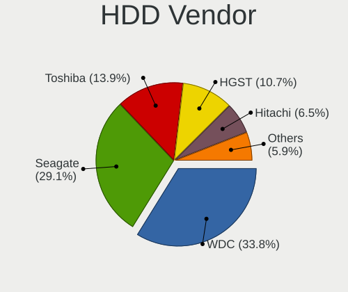

| Vendor   | Computers | Drives | Percent |
|----------|-----------|--------|---------|
| WDC      | 114       | 155    | 33.83%  |
| Seagate  | 98        | 118    | 29.08%  |
| Toshiba  | 47        | 60     | 13.95%  |
| HGST     | 36        | 38     | 10.68%  |
| Hitachi  | 22        | 29     | 6.53%   |
| TO Exter | 6         | 9      | 1.78%   |
| Unknown  | 5         | 7      | 1.48%   |
| External | 4         | 4      | 1.19%   |
| Fujitsu  | 3         | 4      | 0.89%   |
| HGST HTS | 1         | 1      | 0.3%    |
| CSD      | 1         | 1      | 0.3%    |

SSD Vendor
----------

Solid state drive vendors

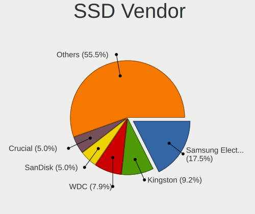

| Vendor              | Computers | Drives | Percent |
|---------------------|-----------|--------|---------|
| Samsung Electronics | 67        | 95     | 17.54%  |
| Kingston            | 35        | 53     | 9.16%   |
| WDC                 | 30        | 31     | 7.85%   |
| SanDisk             | 19        | 24     | 4.97%   |
| Crucial             | 19        | 22     | 4.97%   |
| Intel               | 15        | 16     | 3.93%   |
| Plextor             | 12        | 13     | 3.14%   |
| Lexar               | 11        | 12     | 2.88%   |
| KingSpec            | 9         | 13     | 2.36%   |
| China               | 9         | 10     | 2.36%   |
| Apple               | 9         | 12     | 2.36%   |
| Transcend           | 8         | 10     | 2.09%   |
| Colorful            | 8         | 10     | 2.09%   |
| Toshiba             | 7         | 10     | 1.83%   |
| SK hynix            | 7         | 8      | 1.83%   |
| OSCOO               | 7         | 7      | 1.83%   |
| Micron Technology   | 7         | 7      | 1.83%   |
| Kingmax             | 6         | 6      | 1.57%   |
| A-DATA Technology   | 6         | 6      | 1.57%   |
| SPCC                | 5         | 5      | 1.31%   |
| Netac               | 5         | 6      | 1.31%   |
| LITEON              | 5         | 5      | 1.31%   |
| Gigabyte Technology | 5         | 5      | 1.31%   |
| XSTAR               | 4         | 6      | 1.05%   |
| Apacer              | 4         | 4      | 1.05%   |
| Unknown             | 4         | 4      | 1.05%   |
| LITEONIT            | 3         | 3      | 0.79%   |
| FORESEE             | 3         | 3      | 0.79%   |
| ZOTAC               | 2         | 2      | 0.52%   |
| Team                | 2         | 2      | 0.52%   |
| OCZ                 | 2         | 2      | 0.52%   |
| Maxtor              | 2         | 4      | 0.52%   |
| KIOXIA-EXCERIA      | 2         | 3      | 0.52%   |
| KingDian            | 2         | 3      | 0.52%   |
| Hikvision           | 2         | 2      | 0.52%   |
| GL                  | 2         | 2      | 0.52%   |
| AGI                 | 2         | 2      | 0.52%   |
| W800S               | 1         | 1      | 0.26%   |
| VSPTECH             | 1         | 1      | 0.26%   |
| VSP-128G            | 1         | 1      | 0.26%   |

Drive Kind
----------

HDD or SSD

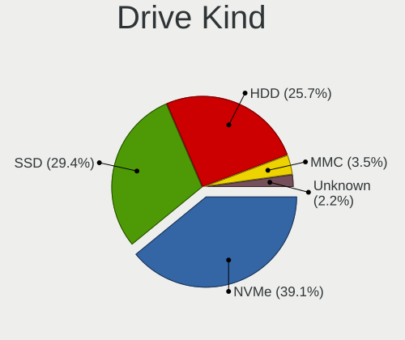

| Kind    | Computers | Drives | Percent |
|---------|-----------|--------|---------|
| NVMe    | 442       | 619    | 39.08%  |
| SSD     | 333       | 465    | 29.44%  |
| HDD     | 291       | 426    | 25.73%  |
| MMC     | 40        | 51     | 3.54%   |
| Unknown | 25        | 26     | 2.21%   |

Drive Connector
---------------

SATA, SAS, NVMe, etc.

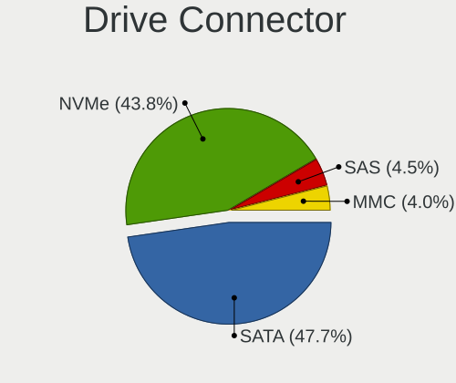

| Type | Computers | Drives | Percent |
|------|-----------|--------|---------|
| SATA | 481       | 864    | 47.72%  |
| NVMe | 442       | 614    | 43.85%  |
| SAS  | 45        | 58     | 4.46%   |
| MMC  | 40        | 51     | 3.97%   |

Drive Size
----------

Size of hard drive

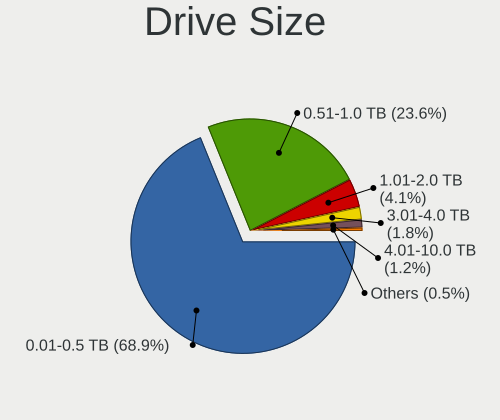

| Size in TB | Computers | Drives | Percent |
|------------|-----------|--------|---------|
| 0.01-0.5   | 418       | 633    | 68.86%  |
| 0.51-1.0   | 143       | 189    | 23.56%  |
| 1.01-2.0   | 25        | 37     | 4.12%   |
| 3.01-4.0   | 11        | 13     | 1.81%   |
| 4.01-10.0  | 7         | 16     | 1.15%   |
| 2.01-3.0   | 2         | 2      | 0.33%   |
| 10.01-20.0 | 1         | 1      | 0.16%   |

Space Total
-----------

Amount of disk space available on the file system

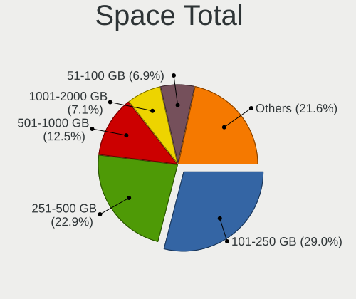

| Size in GB     | Computers | Percent |
|----------------|-----------|---------|
| 101-250        | 263       | 29%     |
| 251-500        | 208       | 22.93%  |
| 501-1000       | 113       | 12.46%  |
| 1001-2000      | 64        | 7.06%   |
| 51-100         | 63        | 6.95%   |
| 1-20           | 47        | 5.18%   |
| Unknown        | 47        | 5.18%   |
| 21-50          | 44        | 4.85%   |
| More than 3000 | 31        | 3.42%   |
| 2001-3000      | 27        | 2.98%   |

Space Used
----------

Amount of used disk space

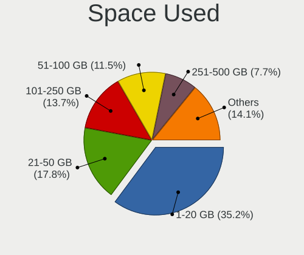

| Used GB        | Computers | Percent |
|----------------|-----------|---------|
| 1-20           | 326       | 35.17%  |
| 21-50          | 165       | 17.8%   |
| 101-250        | 127       | 13.7%   |
| 51-100         | 107       | 11.54%  |
| 251-500        | 71        | 7.66%   |
| 501-1000       | 50        | 5.39%   |
| Unknown        | 47        | 5.07%   |
| 1001-2000      | 14        | 1.51%   |
| 2001-3000      | 11        | 1.19%   |
| More than 3000 | 9         | 0.97%   |

Malfunc. Drives
---------------

Drive models with a malfunction

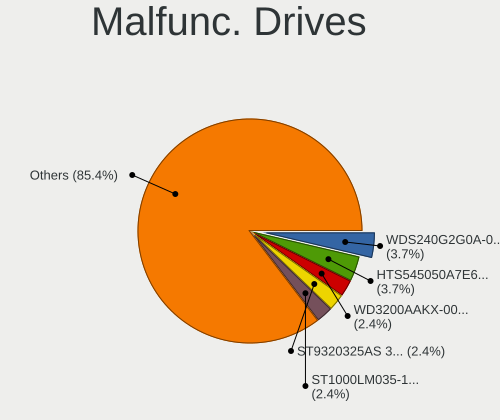

| Model                                    | Computers | Drives | Percent |
|------------------------------------------|-----------|--------|---------|
| WDC WDS240G2G0A-00JH30 240GB SSD         | 3         | 3      | 3.66%   |
| HGST HTS545050A7E680 500GB               | 3         | 4      | 3.66%   |
| WDC WD3200AAKX-001CA0 320GB              | 2         | 2      | 2.44%   |
| Seagate ST9320325AS 320GB                | 2         | 3      | 2.44%   |
| Seagate ST1000LM035-1RK172 1TB           | 2         | 3      | 2.44%   |
| Kingston SA400S37240G 240GB SSD          | 2         | 3      | 2.44%   |
| HGST HTS725050A7E630 500GB               | 2         | 2      | 2.44%   |
| HGST HTS721010A9E630 1TB                 | 2         | 2      | 2.44%   |
| WDC WD60PURZ-85ZUFY1 6TB                 | 1         | 3      | 1.22%   |
| WDC WD5000LPVX-22V0TT0 500GB             | 1         | 1      | 1.22%   |
| WDC WD5000LPLX-60ZNTT1 500GB             | 1         | 1      | 1.22%   |
| WDC WD5000LPCX-24VHAT0 500GB             | 1         | 1      | 1.22%   |
| WDC WD5000AAKX-00ERMA0 500GB             | 1         | 1      | 1.22%   |
| WDC WD3200AAJS-00L7A0 320GB              | 1         | 1      | 1.22%   |
| WDC WD32 00BEVT-24A23 320GB              | 1         | 1      | 1.22%   |
| WDC WD2500BEVT-75ZCT2 250GB              | 1         | 1      | 1.22%   |
| WDC WD10JPVX-75JC3T0 1TB                 | 1         | 1      | 1.22%   |
| WDC WD10JPVX-60JC3T0 1TB                 | 1         | 1      | 1.22%   |
| WDC WD10EZRX-00A3KB0 1TB                 | 1         | 2      | 1.22%   |
| WDC WD10EARS-00Y5B1 1TB                  | 1         | 1      | 1.22%   |
| WDC WD1003FZEX-00MK2A0 1TB               | 1         | 1      | 1.22%   |
| WDC WD Green 2.5 480GB                   | 1         | 1      | 1.22%   |
| Unknown Bamba-240GB SSD                  | 1         | 1      | 1.22%   |
| Transcend TS256GSSD230S 256GB            | 1         | 1      | 1.22%   |
| Toshiba THNSNK256GVN8 M.2 2280 256GB SSD | 1         | 1      | 1.22%   |
| Toshiba MQ01ABD050 500GB                 | 1         | 1      | 1.22%   |
| Toshiba MK8046GSX 80GB                   | 1         | 1      | 1.22%   |
| Toshiba MK8037GSX 80GB                   | 1         | 1      | 1.22%   |
| Toshiba MK3275GSX 320GB                  | 1         | 1      | 1.22%   |
| Toshiba MK3265GSXN 320GB                 | 1         | 1      | 1.22%   |
| Toshiba HDWK105 500GB                    | 1         | 1      | 1.22%   |
| SPCC Solid State Disk 128GB              | 1         | 1      | 1.22%   |
| SK hynix HFS512G39TNF-N3A0A 512GB SSD    | 1         | 1      | 1.22%   |
| SK hynix HFS032G34MNC-2200A 32GB SSD     | 1         | 1      | 1.22%   |
| SK hynix BC711 HFM256GD3JX013N 256GB     | 1         | 1      | 1.22%   |
| Seagate ST9640423AS 640GB                | 1         | 1      | 1.22%   |
| Seagate ST9320320AS 320GB                | 1         | 1      | 1.22%   |
| Seagate ST9250410AS 250GB                | 1         | 1      | 1.22%   |
| Seagate ST500LM021-1KJ152 500GB          | 1         | 1      | 1.22%   |
| Seagate ST500DM002-1BD142 500GB          | 1         | 1      | 1.22%   |

Malfunc. Drive Vendor
---------------------

Vendors of faulty drives

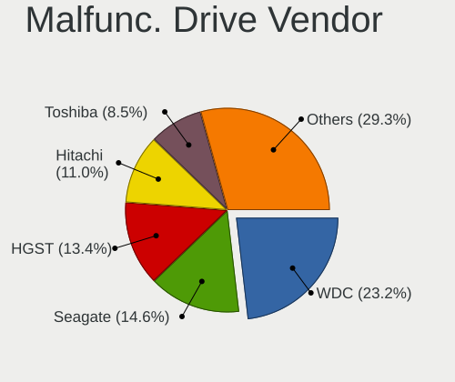

| Vendor              | Computers | Drives | Percent |
|---------------------|-----------|--------|---------|
| WDC                 | 19        | 22     | 23.17%  |
| Seagate             | 12        | 14     | 14.63%  |
| HGST                | 11        | 12     | 13.41%  |
| Hitachi             | 9         | 11     | 10.98%  |
| Toshiba             | 7         | 7      | 8.54%   |
| Samsung Electronics | 4         | 5      | 4.88%   |
| SK hynix            | 3         | 3      | 3.66%   |
| Kingston            | 3         | 7      | 3.66%   |
| Intel               | 2         | 2      | 2.44%   |
| Unknown             | 1         | 1      | 1.22%   |
| Transcend           | 1         | 1      | 1.22%   |
| SPCC                | 1         | 1      | 1.22%   |
| LITEON              | 1         | 1      | 1.22%   |
| Kingmax             | 1         | 1      | 1.22%   |
| KingFast            | 1         | 1      | 1.22%   |
| GOLDTECH            | 1         | 1      | 1.22%   |
| Fujitsu             | 1         | 1      | 1.22%   |
| CSD                 | 1         | 1      | 1.22%   |
| Crucial             | 1         | 1      | 1.22%   |
| China               | 1         | 1      | 1.22%   |
| AGI                 | 1         | 1      | 1.22%   |

Malfunc. HDD Vendor
-------------------

Vendors of faulty HDD drives

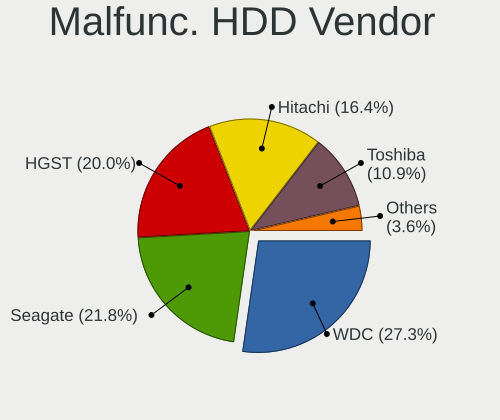

| Vendor  | Computers | Drives | Percent |
|---------|-----------|--------|---------|
| WDC     | 15        | 18     | 27.27%  |
| Seagate | 12        | 14     | 21.82%  |
| HGST    | 11        | 12     | 20%     |
| Hitachi | 9         | 11     | 16.36%  |
| Toshiba | 6         | 6      | 10.91%  |
| Fujitsu | 1         | 1      | 1.82%   |
| CSD     | 1         | 1      | 1.82%   |

Malfunc. Drive Kind
-------------------

Kinds of faulty drives

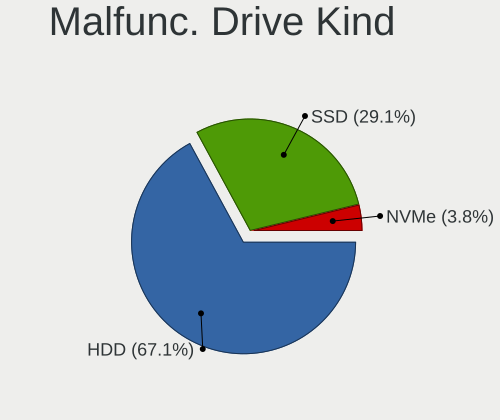

| Kind | Computers | Drives | Percent |
|------|-----------|--------|---------|
| HDD  | 53        | 63     | 67.09%  |
| SSD  | 23        | 28     | 29.11%  |
| NVMe | 3         | 4      | 3.8%    |

Failed Drives
-------------

Failed drive models

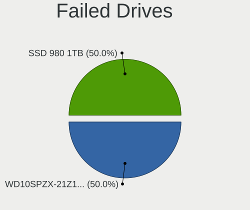

| Model                           | Computers | Drives | Percent |
|---------------------------------|-----------|--------|---------|
| WDC WD10SPZX-21Z10T0 1TB        | 1         | 1      | 50%     |
| Samsung Electronics SSD 980 1TB | 1         | 1      | 50%     |

Failed Drive Vendor
-------------------

Failed drive vendors

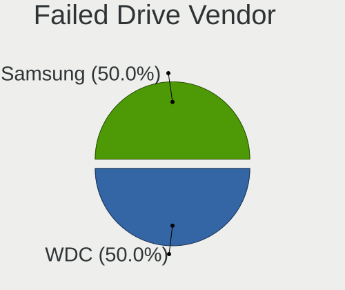

| Vendor              | Computers | Drives | Percent |
|---------------------|-----------|--------|---------|
| WDC                 | 1         | 1      | 50%     |
| Samsung Electronics | 1         | 1      | 50%     |

Drive Status
------------

Number of failed and malfunc. drives

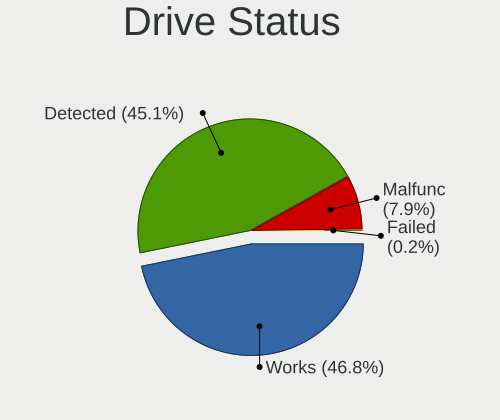

| Status   | Computers | Drives | Percent |
|----------|-----------|--------|---------|
| Works    | 440       | 760    | 46.81%  |
| Detected | 424       | 730    | 45.11%  |
| Malfunc  | 74        | 95     | 7.87%   |
| Failed   | 2         | 2      | 0.21%   |

Storage controller
------------------

Storage Vendor
--------------

Storage controller vendors

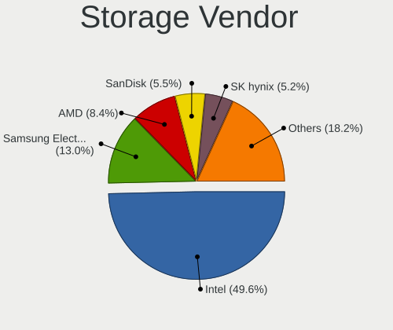

| Vendor                                  | Computers | Percent |
|-----------------------------------------|-----------|---------|
| Intel                                   | 564       | 49.65%  |
| Samsung Electronics                     | 148       | 13.03%  |
| AMD                                     | 95        | 8.36%   |
| SanDisk                                 | 63        | 5.55%   |
| SK hynix                                | 59        | 5.19%   |
| Micron Technology                       | 43        | 3.79%   |
| Kingston Technology Company             | 34        | 2.99%   |
| Phison Electronics                      | 18        | 1.58%   |
| KIOXIA                                  | 18        | 1.58%   |
| Toshiba America Info Systems            | 16        | 1.41%   |
| MAXIO Technology (Hangzhou)             | 12        | 1.06%   |
| Silicon Motion                          | 11        | 0.97%   |
| ADATA Technology                        | 8         | 0.7%    |
| Micron/Crucial Technology               | 7         | 0.62%   |
| ASMedia Technology                      | 6         | 0.53%   |
| Solid State Storage Technology          | 5         | 0.44%   |
| Marvell Technology Group                | 4         | 0.35%   |
| Yangtze Memory Technologies             | 3         | 0.26%   |
| Realtek Semiconductor                   | 3         | 0.26%   |
| Union Memory (Shenzhen)                 | 2         | 0.18%   |
| Shenzhen Longsys Electronics            | 2         | 0.18%   |
| Lite-On Technology                      | 2         | 0.18%   |
| Lenovo                                  | 2         | 0.18%   |
| Biwin Storage Technology                | 2         | 0.18%   |
| Shenzhen Unionmemory Information System | 1         | 0.09%   |
| OCZ Technology Group                    | 1         | 0.09%   |
| O2 Micro                                | 1         | 0.09%   |
| LSI Logic / Symbios Logic               | 1         | 0.09%   |
| JMicron Technology                      | 1         | 0.09%   |
| INNOGRIT                                | 1         | 0.09%   |
| Hosin Global Electronics                | 1         | 0.09%   |
| Broadcom / LSI                          | 1         | 0.09%   |
| Apple                                   | 1         | 0.09%   |

Storage Model
-------------

Storage controller models

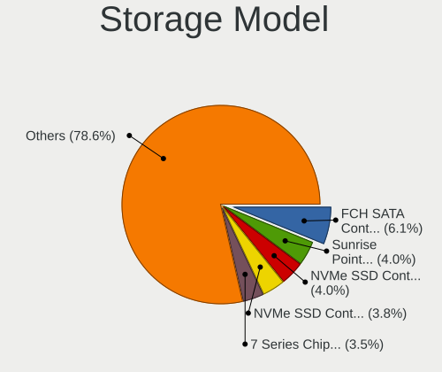

| Model                                                                                   | Computers | Percent |
|-----------------------------------------------------------------------------------------|-----------|---------|
| AMD FCH SATA Controller [AHCI mode]                                                     | 76        | 6.15%   |
| Intel Sunrise Point-LP SATA Controller [AHCI mode]                                      | 50        | 4.05%   |
| Samsung NVMe SSD Controller 980 (DRAM-less)                                             | 49        | 3.96%   |
| Samsung NVMe SSD Controller SM981/PM981/PM983                                           | 47        | 3.8%    |
| Intel 7 Series Chipset Family 6-port SATA Controller [AHCI mode]                        | 43        | 3.48%   |
| Intel 8 Series/C220 Series Chipset Family 6-port SATA Controller 1 [AHCI mode]          | 36        | 2.91%   |
| Intel Volume Management Device NVMe RAID Controller                                     | 29        | 2.35%   |
| Intel Q170/Q150/B150/H170/H110/Z170/CM236 Chipset SATA Controller [AHCI Mode]           | 27        | 2.18%   |
| Intel 82801 Mobile SATA Controller [RAID mode]                                          | 27        | 2.18%   |
| Samsung NVMe SSD Controller PM9A1/PM9A3/980PRO                                          | 22        | 1.78%   |
| Intel 6 Series/C200 Series Chipset Family 6 port Mobile SATA AHCI Controller            | 22        | 1.78%   |
| SanDisk Ultra 3D / WD PC SN530, IX SN530, Blue SN550 NVMe SSD (DRAM-less)               | 19        | 1.54%   |
| Intel Wildcat Point-LP SATA Controller [AHCI Mode]                                      | 19        | 1.54%   |
| Intel Cannon Lake Mobile PCH SATA AHCI Controller                                       | 19        | 1.54%   |
| Intel 8 Series SATA Controller 1 [AHCI mode]                                            | 19        | 1.54%   |
| Intel 200 Series PCH SATA controller [AHCI mode]                                        | 19        | 1.54%   |
| Intel Cannon Lake PCH SATA AHCI Controller                                              | 18        | 1.46%   |
| SK hynix Gold P31/BC711/PC711 NVMe Solid State Drive                                    | 16        | 1.29%   |
| SK hynix BC501 NVMe Solid State Drive                                                   | 16        | 1.29%   |
| Samsung NVMe SSD Controller SM961/PM961/SM963                                           | 16        | 1.29%   |
| Intel Comet Lake SATA AHCI Controller                                                   | 15        | 1.21%   |
| Intel SSD 670p Series [Keystone Harbor]                                                 | 13        | 1.05%   |
| AMD 400 Series Chipset SATA Controller                                                  | 13        | 1.05%   |
| Intel HM170/QM170 Chipset SATA Controller [AHCI Mode]                                   | 12        | 0.97%   |
| Intel Alder Lake-P SATA AHCI Controller                                                 | 12        | 0.97%   |
| Intel 400 Series Chipset Family SATA AHCI Controller                                    | 12        | 0.97%   |
| Intel SATA Controller [RAID Mode]                                                       | 11        | 0.89%   |
| Intel NM10/ICH7 Family SATA Controller [IDE mode]                                       | 11        | 0.89%   |
| Intel Cannon Point-LP SATA Controller [AHCI Mode]                                       | 11        | 0.89%   |
| Intel 6 Series/C200 Series Chipset Family Desktop SATA Controller (IDE mode, ports 4-5) | 11        | 0.89%   |
| Intel 6 Series/C200 Series Chipset Family Desktop SATA Controller (IDE mode, ports 0-3) | 11        | 0.89%   |
| Micron 2450 NVMe SSD [HendrixV] (DRAM-less)                                             | 10        | 0.81%   |
| MAXIO (Hangzhou) NVMe SSD Controller MAP1202 (DRAM-less)                                | 10        | 0.81%   |
| KIOXIA NVMe SSD Controller BG4 (DRAM-less)                                              | 10        | 0.81%   |
| Intel Tiger Lake-LP SATA Controller                                                     | 10        | 0.81%   |
| Intel RST Volume Management Device Controller                                           | 10        | 0.81%   |
| Intel 6 Series/C200 Series Chipset Family 6 port Desktop SATA AHCI Controller           | 10        | 0.81%   |
| Micron 2400 NVMe SSD (DRAM-less)                                                        | 9         | 0.73%   |
| Intel Tiger Lake SATA AHCI Controller                                                   | 9         | 0.73%   |
| Intel 7 Series/C210 Series Chipset Family 6-port SATA Controller [AHCI mode]            | 9         | 0.73%   |

Storage Kind
------------

Kind of storage controller (IDE, SATA, NVMe, SAS, ...)

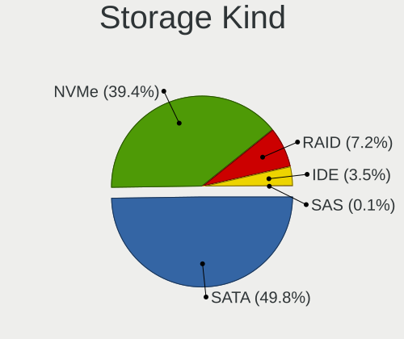

| Kind | Computers | Percent |
|------|-----------|---------|
| SATA | 559       | 49.78%  |
| NVMe | 443       | 39.45%  |
| RAID | 81        | 7.21%   |
| IDE  | 39        | 3.47%   |
| SAS  | 1         | 0.09%   |

Processor
---------

CPU Vendor
----------

Processor vendors

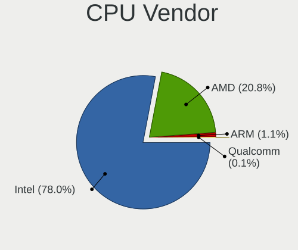

| Vendor   | Computers | Percent |
|----------|-----------|---------|
| Intel    | 659       | 77.99%  |
| AMD      | 176       | 20.83%  |
| ARM      | 9         | 1.07%   |
| Qualcomm | 1         | 0.12%   |

CPU Model
---------

Processor models

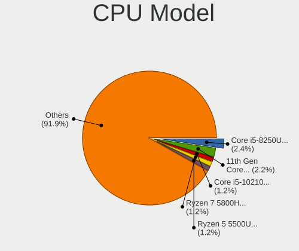

| Model                                   | Computers | Percent |
|-----------------------------------------|-----------|---------|
| Intel Core i5-8250U CPU @ 1.60GHz       | 20        | 2.36%   |
| Intel 11th Gen Core i5-1135G7 @ 2.40GHz | 19        | 2.24%   |
| Intel Core i5-10210U CPU @ 1.60GHz      | 10        | 1.18%   |
| AMD Ryzen 7 5800H with Radeon Graphics  | 10        | 1.18%   |
| AMD Ryzen 5 5500U with Radeon Graphics  | 10        | 1.18%   |
| Intel Core i7-8750H CPU @ 2.20GHz       | 9         | 1.06%   |
| Intel Core i7-7700HQ CPU @ 2.80GHz      | 9         | 1.06%   |
| Intel Core i5-5200U CPU @ 2.20GHz       | 9         | 1.06%   |
| Intel 12th Gen Core i7-12700H           | 9         | 1.06%   |
| Intel Core i7-6820HQ CPU @ 2.70GHz      | 8         | 0.94%   |
| Intel Core i5-4210U CPU @ 1.70GHz       | 8         | 0.94%   |
| Intel Core i5-3210M CPU @ 2.50GHz       | 8         | 0.94%   |
| Intel Core i5-8350U CPU @ 1.70GHz       | 7         | 0.82%   |
| Intel Core i5-8300H CPU @ 2.30GHz       | 7         | 0.82%   |
| Intel 11th Gen Core i7-11800H @ 2.30GHz | 7         | 0.82%   |
| Intel 11th Gen Core i5-11400H @ 2.70GHz | 7         | 0.82%   |
| ARM Processor                           | 7         | 0.82%   |
| AMD Ryzen 7 4800H with Radeon Graphics  | 7         | 0.82%   |
| Intel Core i7-10750H CPU @ 2.60GHz      | 6         | 0.71%   |
| Intel Core i5-7200U CPU @ 2.50GHz       | 6         | 0.71%   |
| Intel Core i5-3320M CPU @ 2.60GHz       | 6         | 0.71%   |
| Intel 12th Gen Core i5-12500H           | 6         | 0.71%   |
| Intel 11th Gen Core i7-1165G7 @ 2.80GHz | 6         | 0.71%   |
| AMD Ryzen 5 5600H with Radeon Graphics  | 6         | 0.71%   |
| Intel Xeon CPU E5-2680 v4 @ 2.40GHz     | 5         | 0.59%   |
| Intel Core i7-8650U CPU @ 1.90GHz       | 5         | 0.59%   |
| Intel Core i7-3770 CPU @ 3.40GHz        | 5         | 0.59%   |
| Intel Core i5-5300U CPU @ 2.30GHz       | 5         | 0.59%   |
| Intel Core i5-3230M CPU @ 2.60GHz       | 5         | 0.59%   |
| Intel Core i5-2520M CPU @ 2.50GHz       | 5         | 0.59%   |
| Intel Core i3-7100 CPU @ 3.90GHz        | 5         | 0.59%   |
| Intel Core i3-4160 CPU @ 3.60GHz        | 5         | 0.59%   |
| AMD Ryzen 5 4600H with Radeon Graphics  | 5         | 0.59%   |
| AMD Ryzen 3 4300U with Radeon Graphics  | 5         | 0.59%   |
| Intel Core i7-9750H CPU @ 2.60GHz       | 4         | 0.47%   |
| Intel Core i7-8565U CPU @ 1.80GHz       | 4         | 0.47%   |
| Intel Core i7-7500U CPU @ 2.70GHz       | 4         | 0.47%   |
| Intel Core i7-6700 CPU @ 3.40GHz        | 4         | 0.47%   |
| Intel Core i5-9600K CPU @ 3.70GHz       | 4         | 0.47%   |
| Intel Core i5-8400 CPU @ 2.80GHz        | 4         | 0.47%   |

CPU Model Family
----------------

Processor model prefix

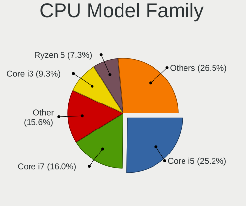

| Model                   | Computers | Percent |
|-------------------------|-----------|---------|
| Intel Core i5           | 213       | 25.21%  |
| Intel Core i7           | 135       | 15.98%  |
| Other                   | 132       | 15.62%  |
| Intel Core i3           | 79        | 9.35%   |
| AMD Ryzen 5             | 62        | 7.34%   |
| AMD Ryzen 7             | 59        | 6.98%   |
| Intel Xeon              | 26        | 3.08%   |
| Intel Celeron           | 23        | 2.72%   |
| Intel Core 2 Duo        | 17        | 2.01%   |
| AMD Ryzen 3             | 12        | 1.42%   |
| Intel Pentium           | 10        | 1.18%   |
| AMD Ryzen 9             | 10        | 1.18%   |
| Intel Atom              | 9         | 1.07%   |
| Intel Core i9           | 8         | 0.95%   |
| Intel Core              | 6         | 0.71%   |
| AMD Ryzen 7 PRO         | 6         | 0.71%   |
| Intel Pentium Silver    | 4         | 0.47%   |
| AMD Ryzen 5 PRO         | 4         | 0.47%   |
| AMD A10                 | 4         | 0.47%   |
| Intel Xeon Silver       | 3         | 0.36%   |
| Intel Genuine           | 3         | 0.36%   |
| Intel Pentium Gold      | 2         | 0.24%   |
| Intel Core M            | 2         | 0.24%   |
| AMD Athlon              | 2         | 0.24%   |
| AMD A8                  | 2         | 0.24%   |
| AMD A6                  | 2         | 0.24%   |
| Intel Pentium Dual-Core | 1         | 0.12%   |
| Intel Pentium Dual      | 1         | 0.12%   |
| Intel Core m7           | 1         | 0.12%   |
| Intel Core 2 Quad       | 1         | 0.12%   |
| ARM BCM                 | 1         | 0.12%   |
| ARM AArch64             | 1         | 0.12%   |
| AMD Phenom II X4        | 1         | 0.12%   |
| AMD GX                  | 1         | 0.12%   |
| AMD E                   | 1         | 0.12%   |
| AMD Athlon II X2        | 1         | 0.12%   |

CPU Cores
---------

Number of processor cores

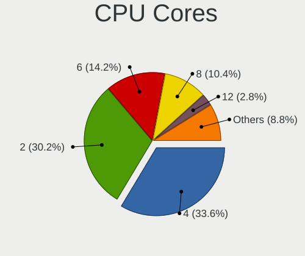

| Number  | Computers | Percent |
|---------|-----------|---------|
| 4       | 285       | 33.61%  |
| 2       | 256       | 30.19%  |
| 6       | 120       | 14.15%  |
| 8       | 88        | 10.38%  |
| 12      | 24        | 2.83%   |
| 10      | 22        | 2.59%   |
| 14      | 20        | 2.36%   |
| 16      | 14        | 1.65%   |
| 24      | 5         | 0.59%   |
| Unknown | 5         | 0.59%   |
| 1       | 4         | 0.47%   |
| 20      | 2         | 0.24%   |
| 36      | 1         | 0.12%   |
| 28      | 1         | 0.12%   |
| 11      | 1         | 0.12%   |

CPU Sockets
-----------

Number of sockets

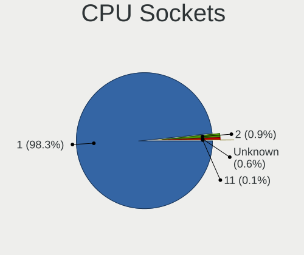

| Number  | Computers | Percent |
|---------|-----------|---------|
| 1       | 832       | 98.35%  |
| 2       | 8         | 0.95%   |
| Unknown | 5         | 0.59%   |
| 11      | 1         | 0.12%   |

CPU Threads
-----------

Threads per core (Hyper-Threading)

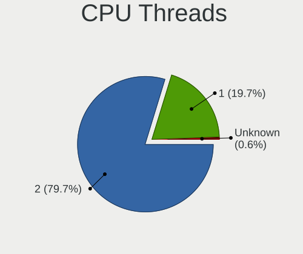

| Number  | Computers | Percent |
|---------|-----------|---------|
| 2       | 676       | 79.72%  |
| 1       | 167       | 19.69%  |
| Unknown | 5         | 0.59%   |

CPU Op-Modes
------------

CPU Operation Modes (32-bit, 64-bit)

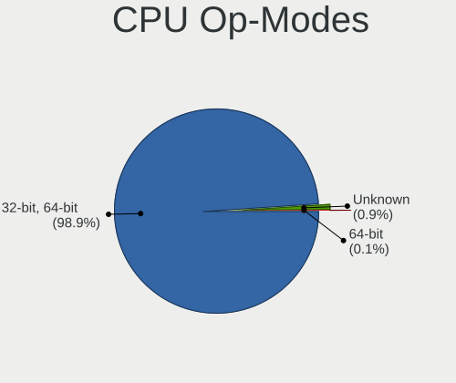

| Op mode        | Computers | Percent |
|----------------|-----------|---------|
| 32-bit, 64-bit | 837       | 98.94%  |
| Unknown        | 8         | 0.95%   |
| 64-bit         | 1         | 0.12%   |

CPU Microcode
-------------

Microcode number

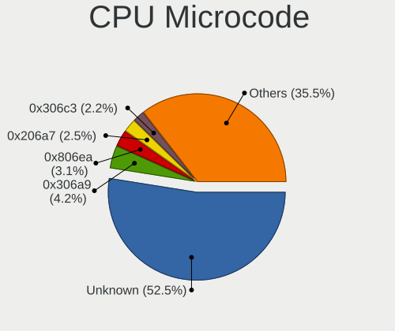

| Number     | Computers | Percent |
|------------|-----------|---------|
| Unknown    | 460       | 52.51%  |
| 0x306a9    | 37        | 4.22%   |
| 0x806ea    | 27        | 3.08%   |
| 0x206a7    | 22        | 2.51%   |
| 0x306c3    | 19        | 2.17%   |
| 0x906ea    | 18        | 2.05%   |
| 0x806ec    | 17        | 1.94%   |
| 0x40651    | 17        | 1.94%   |
| 0x806c1    | 16        | 1.83%   |
| 0x806e9    | 15        | 1.71%   |
| 0x306d4    | 14        | 1.6%    |
| 0x906e9    | 13        | 1.48%   |
| 0x1067a    | 11        | 1.26%   |
| 0x08600106 | 10        | 1.14%   |
| 0x506e3    | 9         | 1.03%   |
| 0x406e3    | 8         | 0.91%   |
| 0x0a50000d | 8         | 0.91%   |
| 0x0a50000c | 8         | 0.91%   |
| 0x08608103 | 8         | 0.91%   |
| 0x906a3    | 7         | 0.8%    |
| 0xa0653    | 5         | 0.57%   |
| 0xa0652    | 5         | 0.57%   |
| 0x906ed    | 5         | 0.57%   |
| 0x806d1    | 5         | 0.57%   |
| 0x6fd      | 5         | 0.57%   |
| 0x20655    | 5         | 0.57%   |
| 0x0a404102 | 5         | 0.57%   |
| 0x08108102 | 5         | 0.57%   |
| 0x706e5    | 4         | 0.46%   |
| 0x706a1    | 4         | 0.46%   |
| 0x406c4    | 4         | 0.46%   |
| 0x08600104 | 4         | 0.46%   |
| 0x08108109 | 4         | 0.46%   |
| 0x906eb    | 3         | 0.34%   |
| 0x906c0    | 3         | 0.34%   |
| 0x40661    | 3         | 0.34%   |
| 0x206d7    | 3         | 0.34%   |
| 0x0a201016 | 3         | 0.34%   |
| 0x08600103 | 3         | 0.34%   |
| 0x0810100b | 3         | 0.34%   |

CPU Microarch
-------------

Microarchitecture

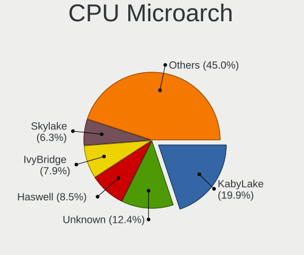

| Name               | Computers | Percent |
|--------------------|-----------|---------|
| KabyLake           | 168       | 19.88%  |
| Unknown            | 105       | 12.43%  |
| Haswell            | 72        | 8.52%   |
| IvyBridge          | 67        | 7.93%   |
| Skylake            | 53        | 6.27%   |
| Zen 3              | 43        | 5.09%   |
| Alderlake Hybrid   | 40        | 4.73%   |
| Zen 2              | 39        | 4.62%   |
| SandyBridge        | 37        | 4.38%   |
| TigerLake          | 35        | 4.14%   |
| Broadwell          | 31        | 3.67%   |
| CometLake          | 24        | 2.84%   |
| Icelake            | 20        | 2.37%   |
| Zen+               | 17        | 2.01%   |
| Penryn             | 15        | 1.78%   |
| Silvermont         | 12        | 1.42%   |
| Westmere           | 11        | 1.3%    |
| Goldmont plus      | 10        | 1.18%   |
| Core               | 8         | 0.95%   |
| Zen                | 6         | 0.71%   |
| Bonnell            | 5         | 0.59%   |
| Meteorlake Hybrid  | 4         | 0.47%   |
| Tremont            | 3         | 0.36%   |
| Steamroller        | 3         | 0.36%   |
| Puma               | 3         | 0.36%   |
| Nehalem            | 3         | 0.36%   |
| K10                | 2         | 0.24%   |
| Gracemont          | 2         | 0.24%   |
| Goldmont           | 2         | 0.24%   |
| Excavator          | 2         | 0.24%   |
| Piledriver         | 1         | 0.12%   |
| Bobcat             | 1         | 0.12%   |
| ArrowLake-H Hybrid | 1         | 0.12%   |

Graphics
--------

GPU Vendor
----------

Vendors of graphics cards

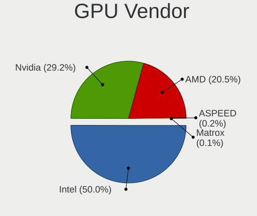

| Vendor                     | Computers | Percent |
|----------------------------|-----------|---------|
| Intel                      | 538       | 50.05%  |
| Nvidia                     | 314       | 29.21%  |
| AMD                        | 220       | 20.47%  |
| ASPEED Technology          | 2         | 0.19%   |
| Matrox Electronics Systems | 1         | 0.09%   |

GPU Model
---------

Graphics card models

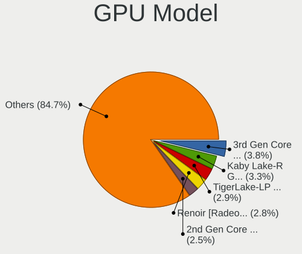

| Model                                                                                    | Computers | Percent |
|------------------------------------------------------------------------------------------|-----------|---------|
| Intel 3rd Gen Core processor Graphics Controller                                         | 42        | 3.83%   |
| Intel Kaby Lake-R GT2 [UHD Graphics 620]                                                 | 36        | 3.28%   |
| Intel TigerLake-LP GT2 [Iris Xe Graphics]                                                | 32        | 2.92%   |
| AMD Renoir [Radeon Vega Series / Radeon Vega Mobile Series]                              | 31        | 2.83%   |
| Intel 2nd Generation Core Processor Family Integrated Graphics Controller                | 27        | 2.46%   |
| Intel Haswell-ULT Integrated Graphics Controller                                         | 24        | 2.19%   |
| AMD Cezanne [Radeon Vega Series / Radeon Vega Mobile Series]                             | 24        | 2.19%   |
| Nvidia GA107M [GeForce RTX 3050 Mobile]                                                  | 23        | 2.1%    |
| Intel CoffeeLake-H GT2 [UHD Graphics 630]                                                | 23        | 2.1%    |
| Intel Kaby Lake-U GT2 [HD Graphics 620]                                                  | 19        | 1.73%   |
| Intel Broadwell-U GT2 [HD Graphics 5500]                                                 | 18        | 1.64%   |
| Intel CometLake-U GT2 [UHD Graphics]                                                     | 17        | 1.55%   |
| Intel Alder Lake-P GT2 [Iris Xe Graphics]                                                | 17        | 1.55%   |
| Nvidia TU117M [GeForce GTX 1650 Mobile / Max-Q]                                          | 16        | 1.46%   |
| Intel Skylake-U GT2 [HD Graphics 520]                                                    | 16        | 1.46%   |
| AMD Lucienne                                                                             | 16        | 1.46%   |
| Intel TigerLake-H GT1 [UHD Graphics]                                                     | 15        | 1.37%   |
| AMD Ellesmere [Radeon RX 470/480/570/570X/580/580X/590]                                  | 15        | 1.37%   |
| Intel Skylake-H GT2 [HD Graphics 530]                                                    | 13        | 1.19%   |
| AMD Picasso/Raven 2 [Radeon Vega Series / Radeon Vega Mobile Series]                     | 13        | 1.19%   |
| Intel CometLake-H GT2 [UHD Graphics]                                                     | 12        | 1.09%   |
| Intel Xeon E3-1200 v3/4th Gen Core Processor Integrated Graphics Controller              | 11        | 1%      |
| Intel CoffeeLake-S GT2 [UHD Graphics 630]                                                | 11        | 1%      |
| Nvidia GA106M [GeForce RTX 3060 Mobile / Max-Q]                                          | 10        | 0.91%   |
| Intel WhiskeyLake-U GT2 [UHD Graphics 620]                                               | 10        | 0.91%   |
| Intel Kaby Lake-H GT2 [HD Graphics 630]                                                  | 10        | 0.91%   |
| Intel 4th Gen Core Processor Integrated Graphics Controller                              | 10        | 0.91%   |
| AMD Rembrandt [Radeon 680M]                                                              | 10        | 0.91%   |
| AMD HawkPoint1                                                                           | 10        | 0.91%   |
| Nvidia TU117M [GeForce GTX 1650 Ti Mobile]                                               | 9         | 0.82%   |
| Nvidia GP107M [GeForce GTX 1050 Ti Mobile]                                               | 9         | 0.82%   |
| Nvidia GP107M [GeForce GTX 1050 Mobile]                                                  | 9         | 0.82%   |
| Nvidia GP107 [GeForce GTX 1050 Ti]                                                       | 9         | 0.82%   |
| Intel Xeon E3-1200 v2/3rd Gen Core processor Graphics Controller                         | 9         | 0.82%   |
| Intel Raptor Lake-P [Iris Xe Graphics]                                                   | 9         | 0.82%   |
| Intel Atom/Celeron/Pentium Processor x5-E8000/J3xxx/N3xxx Integrated Graphics Controller | 9         | 0.82%   |
| Nvidia GK208B [GeForce GT 730]                                                           | 8         | 0.73%   |
| Nvidia GF117M [GeForce 610M/710M/810M/820M / GT 620M/625M/630M/720M]                     | 8         | 0.73%   |
| Nvidia TU116M [GeForce GTX 1660 Ti Mobile]                                               | 7         | 0.64%   |
| Intel Raptor Lake-P [UHD Graphics]                                                       | 7         | 0.64%   |

GPU Combo
---------

Combinations of graphics cards

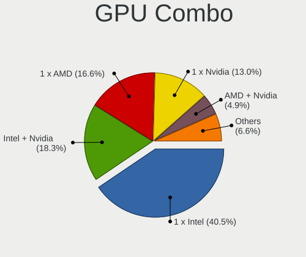

| Name            | Computers | Percent |
|-----------------|-----------|---------|
| 1 x Intel       | 345       | 40.54%  |
| Intel + Nvidia  | 156       | 18.33%  |
| 1 x AMD         | 141       | 16.57%  |
| 1 x Nvidia      | 111       | 13.04%  |
| AMD + Nvidia    | 42        | 4.94%   |
| Intel + AMD     | 31        | 3.64%   |
| Other           | 11        | 1.29%   |
| 2 x AMD         | 8         | 0.94%   |
| Nvidia + ASPEED | 2         | 0.24%   |
| 3 x Nvidia      | 1         | 0.12%   |
| 2 x Nvidia      | 1         | 0.12%   |
| 2 x Intel       | 1         | 0.12%   |
| 1 x Matrox      | 1         | 0.12%   |

GPU Driver
----------

Free vs proprietary

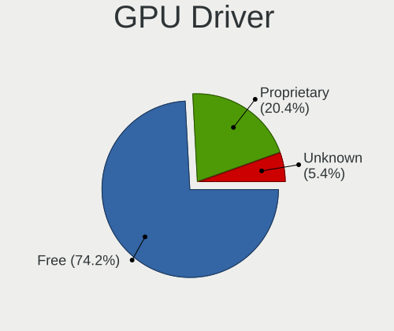

| Driver      | Computers | Percent |
|-------------|-----------|---------|
| Free        | 640       | 74.16%  |
| Proprietary | 176       | 20.39%  |
| Unknown     | 47        | 5.45%   |

GPU Memory
----------

Total video memory

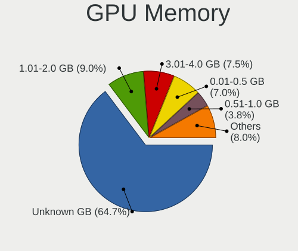

| Size in GB | Computers | Percent |
|------------|-----------|---------|
| Unknown    | 563       | 64.71%  |
| 1.01-2.0   | 78        | 8.97%   |
| 3.01-4.0   | 65        | 7.47%   |
| 0.01-0.5   | 61        | 7.01%   |
| 0.51-1.0   | 33        | 3.79%   |
| 7.01-8.0   | 27        | 3.1%    |
| 5.01-6.0   | 17        | 1.95%   |
| 8.01-16.0  | 17        | 1.95%   |
| 2.01-3.0   | 6         | 0.69%   |
| 4.01-5.0   | 1         | 0.11%   |
| 24.01-32.0 | 1         | 0.11%   |
| 16.01-24.0 | 1         | 0.11%   |

Monitor
-------

Monitor Vendor
--------------

Monitor vendors

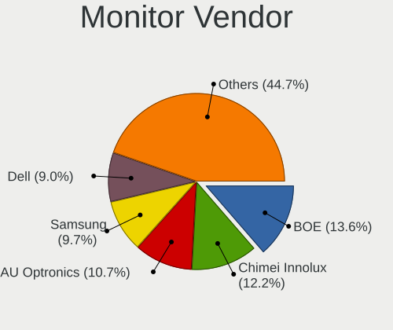

| Vendor                  | Computers | Percent |
|-------------------------|-----------|---------|
| BOE                     | 127       | 13.64%  |
| Chimei Innolux          | 114       | 12.24%  |
| AU Optronics            | 100       | 10.74%  |
| Samsung Electronics     | 90        | 9.67%   |
| Dell                    | 84        | 9.02%   |
| LG Display              | 73        | 7.84%   |
| Goldstar                | 47        | 5.05%   |
| ViewSonic               | 21        | 2.26%   |
| PANDA                   | 21        | 2.26%   |
| Hewlett-Packard         | 19        | 2.04%   |
| Sharp                   | 18        | 1.93%   |
| Lenovo                  | 16        | 1.72%   |
| ASUSTek Computer        | 16        | 1.72%   |
| Apple                   | 16        | 1.72%   |
| AOC                     | 13        | 1.4%    |
| Acer                    | 12        | 1.29%   |
| MSI                     | 7         | 0.75%   |
| InfoVision              | 7         | 0.75%   |
| Chi Mei Optoelectronics | 7         | 0.75%   |
| Gigabyte Technology     | 6         | 0.64%   |
| CSO                     | 6         | 0.64%   |
| Ancor Communications    | 6         | 0.64%   |
| Sony                    | 5         | 0.54%   |
| RTK                     | 5         | 0.54%   |
| Mi                      | 5         | 0.54%   |
| LGD                     | 5         | 0.54%   |
| HKC                     | 5         | 0.54%   |
| TMX                     | 4         | 0.43%   |
| BenQ                    | 4         | 0.43%   |
| Unknown                 | 4         | 0.43%   |
| VSP                     | 3         | 0.32%   |
| Valve                   | 3         | 0.32%   |
| Philips                 | 3         | 0.32%   |
| Panasonic               | 3         | 0.32%   |
| CSW                     | 3         | 0.32%   |
| CSOT                    | 3         | 0.32%   |
| Unknown                 | 2         | 0.21%   |
| SKG                     | 2         | 0.21%   |
| NEC Computers           | 2         | 0.21%   |
| MStar                   | 2         | 0.21%   |

Monitor Model
-------------

Monitor models

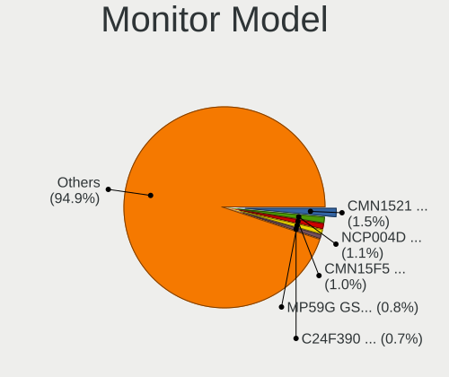

| Model                                                                 | Computers | Percent |
|-----------------------------------------------------------------------|-----------|---------|
| Chimei Innolux LCD Monitor CMN1521 1920x1080 344x193mm 15.5-inch      | 14        | 1.49%   |
| PANDA LCD Monitor NCP004D 1920x1080 344x194mm 15.5-inch               | 10        | 1.06%   |
| Chimei Innolux LCD Monitor CMN15F5 1920x1080 344x193mm 15.5-inch      | 9         | 0.96%   |
| Goldstar MP59G GSM5B34 1920x1080 480x270mm 21.7-inch                  | 8         | 0.85%   |
| Samsung Electronics C24F390 SAM0D2C 1920x1080 521x293mm 23.5-inch     | 7         | 0.74%   |
| AU Optronics LCD Monitor AUO38ED 1920x1080 344x193mm 15.5-inch        | 7         | 0.74%   |
| Chimei Innolux LCD Monitor CMN14D4 1920x1080 309x173mm 13.9-inch      | 6         | 0.64%   |
| LGD LCD Monitor 1920x1080                                             | 5         | 0.53%   |
| Goldstar FULL HD GSM5B55 1920x1080 480x270mm 21.7-inch                | 5         | 0.53%   |
| AU Optronics LCD Monitor AUO403D 1920x1080 309x174mm 14.0-inch        | 5         | 0.53%   |
| AU Optronics LCD Monitor AUO21ED 1920x1080 344x193mm 15.5-inch        | 5         | 0.53%   |
| Samsung Electronics S22F350 SAM0D1A 1920x1080 477x268mm 21.5-inch     | 4         | 0.42%   |
| Samsung Electronics LCD Monitor SDC4161 1920x1080 344x194mm 15.5-inch | 4         | 0.42%   |
| LG Display LCD Monitor LGD046D 1920x1080 309x174mm 14.0-inch          | 4         | 0.42%   |
| Dell U2417H DEL40E8 1920x1080 530x300mm 24.0-inch                     | 4         | 0.42%   |
| Dell SE198WFP DELF004 1440x900 408x255mm 18.9-inch                    | 4         | 0.42%   |
| Chimei Innolux LCD Monitor CMN14E5 1920x1080 309x173mm 13.9-inch      | 4         | 0.42%   |
| BOE LCD Monitor BOE0872 1920x1080 344x194mm 15.5-inch                 | 4         | 0.42%   |
| Unknown                                                               | 4         | 0.42%   |
| TMX TL140BDXP01-0 TMX1400 2560x1440 310x174mm 14.0-inch               | 3         | 0.32%   |
| Sharp LCD Monitor SHP149A 1920x1080 344x194mm 15.5-inch               | 3         | 0.32%   |
| Samsung Electronics SME1720NR SAM0696 1280x1024 338x270mm 17.0-inch   | 3         | 0.32%   |
| Samsung Electronics LCD Monitor SEC3649 1366x768 309x174mm 14.0-inch  | 3         | 0.32%   |
| Samsung Electronics LCD Monitor SDC5441 1366x768 344x193mm 15.5-inch  | 3         | 0.32%   |
| Panasonic TV MEIC33B 1366x768 521x293mm 23.5-inch                     | 3         | 0.32%   |
| Mi Monitor XMI23C3 1920x1080 527x293mm 23.7-inch                      | 3         | 0.32%   |
| LG Display LCD Monitor LGD05FA 1920x1080 310x170mm 13.9-inch          | 3         | 0.32%   |
| InfoVision LCD Monitor IVO057D 1920x1080 309x174mm 14.0-inch          | 3         | 0.32%   |
| Hewlett-Packard 19ka HWP3328 1366x768 410x230mm 18.5-inch             | 3         | 0.32%   |
| Dell U2515H DELD070 2560x1440 553x311mm 25.0-inch                     | 3         | 0.32%   |
| Dell U2412M DELA07A 1920x1200 518x324mm 24.1-inch                     | 3         | 0.32%   |
| Dell P2419H DELD0DA 1920x1080 527x296mm 23.8-inch                     | 3         | 0.32%   |
| Chimei Innolux P140ZKA-BZ1 CMN8C02 2160x1440 296x197mm 14.0-inch      | 3         | 0.32%   |
| Chimei Innolux LCD Monitor CMN15E7 1920x1080 344x193mm 15.5-inch      | 3         | 0.32%   |
| Chimei Innolux LCD Monitor CMN15C5 1366x768 344x193mm 15.5-inch       | 3         | 0.32%   |
| Chimei Innolux LCD Monitor CMN15C4 1920x1080 344x193mm 15.5-inch      | 3         | 0.32%   |
| Chimei Innolux LCD Monitor CMN14D3 1920x1080 309x173mm 13.9-inch      | 3         | 0.32%   |
| Chimei Innolux LCD Monitor CMN1490 1366x768 309x174mm 14.0-inch       | 3         | 0.32%   |
| Chimei Innolux LCD Monitor CMN140A 1920x1080 309x173mm 13.9-inch      | 3         | 0.32%   |
| BOE LCD Monitor BOE0998 1920x1080 344x194mm 15.5-inch                 | 3         | 0.32%   |

Monitor Resolution
------------------

Monitor screen resolution

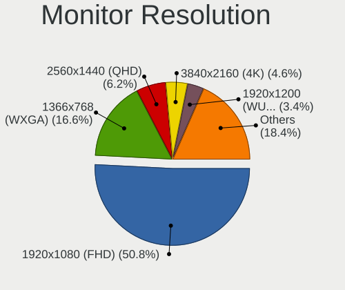

| Resolution         | Computers | Percent |
|--------------------|-----------|---------|
| 1920x1080 (FHD)    | 444       | 50.8%   |
| 1366x768 (WXGA)    | 145       | 16.59%  |
| 2560x1440 (QHD)    | 54        | 6.18%   |
| 3840x2160 (4K)     | 40        | 4.58%   |
| 1920x1200 (WUXGA)  | 30        | 3.43%   |
| 1600x900 (HD+)     | 23        | 2.63%   |
| 2560x1600          | 22        | 2.52%   |
| 2880x1800          | 20        | 2.29%   |
| 1280x1024 (SXGA)   | 14        | 1.6%    |
| 1440x900 (WXGA+)   | 13        | 1.49%   |
| 3440x1440          | 9         | 1.03%   |
| 1280x800 (WXGA)    | 9         | 1.03%   |
| Unknown            | 7         | 0.8%    |
| 2560x1080          | 6         | 0.69%   |
| 2160x1440          | 6         | 0.69%   |
| 800x1280           | 3         | 0.34%   |
| 3200x2000          | 3         | 0.34%   |
| 1920x1280          | 3         | 0.34%   |
| 3200x1800 (QHD+)   | 2         | 0.23%   |
| 3072x1920          | 2         | 0.23%   |
| 2880x1920          | 2         | 0.23%   |
| 2288x1287          | 2         | 0.23%   |
| 1600x2560          | 2         | 0.23%   |
| 3840x2400          | 1         | 0.11%   |
| 3840x1080          | 1         | 0.11%   |
| 3456x2160          | 1         | 0.11%   |
| 3286x1080          | 1         | 0.11%   |
| 3000x2120          | 1         | 0.11%   |
| 3000x2000          | 1         | 0.11%   |
| 2304x1440          | 1         | 0.11%   |
| 2240x1400          | 1         | 0.11%   |
| 2048x1536          | 1         | 0.11%   |
| 1680x1050 (WSXGA+) | 1         | 0.11%   |
| 1360x768           | 1         | 0.11%   |
| 1200x1920          | 1         | 0.11%   |
| 1024x600           | 1         | 0.11%   |

Monitor Diagonal
----------------

Diagonal size in inches

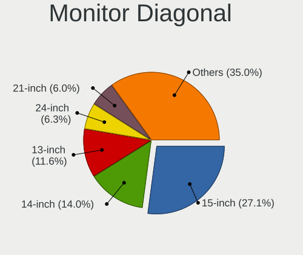

| Inches  | Computers | Percent |
|---------|-----------|---------|
| 15      | 251       | 27.11%  |
| 14      | 130       | 14.04%  |
| 13      | 107       | 11.56%  |
| 24      | 58        | 6.26%   |
| 21      | 56        | 6.05%   |
| 27      | 55        | 5.94%   |
| 23      | 45        | 4.86%   |
| Unknown | 34        | 3.67%   |
| 17      | 23        | 2.48%   |
| 16      | 23        | 2.48%   |
| 19      | 19        | 2.05%   |
| 18      | 19        | 2.05%   |
| 31      | 18        | 1.94%   |
| 12      | 18        | 1.94%   |
| 34      | 10        | 1.08%   |
| 20      | 8         | 0.86%   |
| 25      | 6         | 0.65%   |
| 11      | 6         | 0.65%   |
| 84      | 4         | 0.43%   |
| 7       | 4         | 0.43%   |
| 72      | 3         | 0.32%   |
| 54      | 3         | 0.32%   |
| 40      | 3         | 0.32%   |
| 28      | 3         | 0.32%   |
| 8       | 3         | 0.32%   |
| 142     | 2         | 0.22%   |
| 63      | 2         | 0.22%   |
| 57      | 2         | 0.22%   |
| 86      | 1         | 0.11%   |
| 82      | 1         | 0.11%   |
| 67      | 1         | 0.11%   |
| 55      | 1         | 0.11%   |
| 52      | 1         | 0.11%   |
| 44      | 1         | 0.11%   |
| 43      | 1         | 0.11%   |
| 42      | 1         | 0.11%   |
| 26      | 1         | 0.11%   |
| 10      | 1         | 0.11%   |
| 9       | 1         | 0.11%   |

Monitor Width
-------------

Physical width

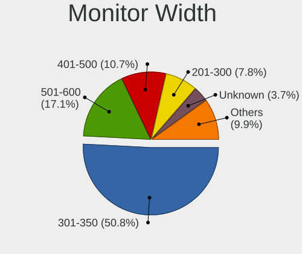

| Width in mm    | Computers | Percent |
|----------------|-----------|---------|
| 301-350        | 467       | 50.82%  |
| 501-600        | 157       | 17.08%  |
| 401-500        | 98        | 10.66%  |
| 201-300        | 72        | 7.83%   |
| Unknown        | 34        | 3.7%    |
| 601-700        | 24        | 2.61%   |
| 351-400        | 22        | 2.39%   |
| 701-800        | 12        | 1.31%   |
| 1501-2000      | 9         | 0.98%   |
| 1001-1500      | 8         | 0.87%   |
| 101-200        | 5         | 0.54%   |
| 801-900        | 4         | 0.44%   |
| 1-100          | 3         | 0.33%   |
| More than 2000 | 2         | 0.22%   |
| 901-1000       | 2         | 0.22%   |

Aspect Ratio
------------

Proportional relationship between the width and the height

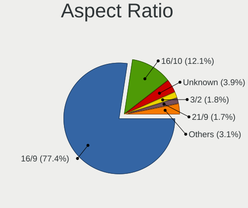

| Ratio   | Computers | Percent |
|---------|-----------|---------|
| 16/9    | 640       | 77.39%  |
| 16/10   | 100       | 12.09%  |
| Unknown | 32        | 3.87%   |
| 3/2     | 15        | 1.81%   |
| 21/9    | 14        | 1.69%   |
| 5/4     | 11        | 1.33%   |
| 0.62    | 4         | 0.48%   |
| 4/3     | 3         | 0.36%   |
| 1.00    | 2         | 0.24%   |
| 0.56    | 2         | 0.24%   |
| 0.67    | 1         | 0.12%   |
| 0.63    | 1         | 0.12%   |
| 0.58    | 1         | 0.12%   |
| 0.45    | 1         | 0.12%   |

Monitor Area
------------

Area in inch²

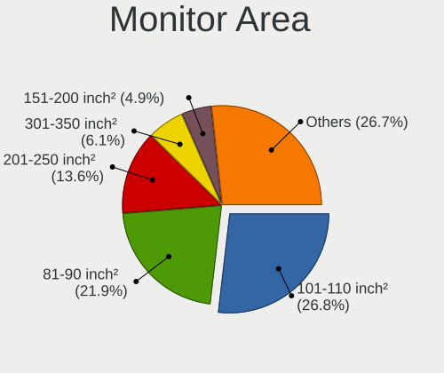

| Area in inch² | Computers | Percent |
|----------------|-----------|---------|
| 101-110        | 248       | 26.84%  |
| 81-90          | 202       | 21.86%  |
| 201-250        | 126       | 13.64%  |
| 301-350        | 56        | 6.06%   |
| 151-200        | 45        | 4.87%   |
| Unknown        | 34        | 3.68%   |
| 71-80          | 33        | 3.57%   |
| 351-500        | 28        | 3.03%   |
| 141-150        | 25        | 2.71%   |
| 111-120        | 25        | 2.71%   |
| 251-300        | 24        | 2.6%    |
| More than 1000 | 21        | 2.27%   |
| 61-70          | 17        | 1.84%   |
| 121-130        | 14        | 1.52%   |
| 1-40           | 7         | 0.76%   |
| 51-60          | 6         | 0.65%   |
| 501-1000       | 6         | 0.65%   |
| 91-100         | 4         | 0.43%   |
| 41-50          | 2         | 0.22%   |
| 131-140        | 1         | 0.11%   |

Pixel Density
-------------

Pixels per inch

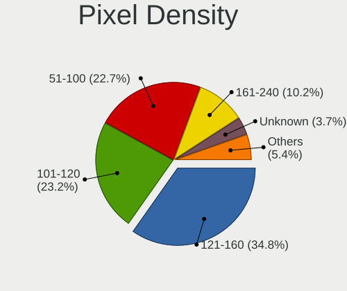

| Density       | Computers | Percent |
|---------------|-----------|---------|
| 121-160       | 316       | 34.76%  |
| 101-120       | 211       | 23.21%  |
| 51-100        | 206       | 22.66%  |
| 161-240       | 93        | 10.23%  |
| Unknown       | 34        | 3.74%   |
| More than 240 | 33        | 3.63%   |
| 1-50          | 16        | 1.76%   |

Multiple Monitors
-----------------

Total monitors connected

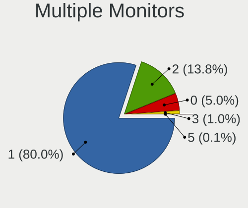

| Total | Computers | Percent |
|-------|-----------|---------|
| 1     | 698       | 80.05%  |
| 2     | 120       | 13.76%  |
| 0     | 44        | 5.05%   |
| 3     | 9         | 1.03%   |
| 5     | 1         | 0.11%   |

Network
-------

Net Controller Vendor
---------------------

Controller vendors

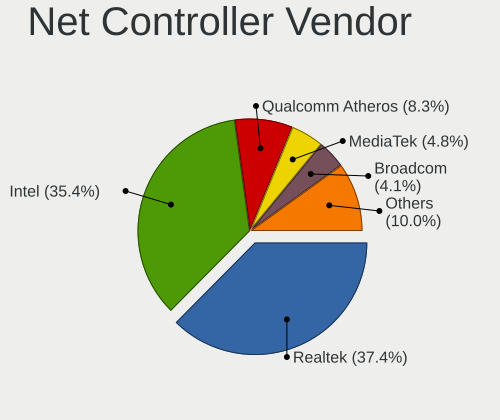

| Vendor                                 | Computers | Percent |
|----------------------------------------|-----------|---------|
| Realtek Semiconductor                  | 485       | 37.42%  |
| Intel                                  | 459       | 35.42%  |
| Qualcomm Atheros                       | 108       | 8.33%   |
| MediaTek                               | 62        | 4.78%   |
| Broadcom                               | 53        | 4.09%   |
| Broadcom Limited                       | 17        | 1.31%   |
| TP-Link                                | 14        | 1.08%   |
| ASIX Electronics                       | 14        | 1.08%   |
| Samsung Electronics                    | 12        | 0.93%   |
| Ralink Technology                      | 12        | 0.93%   |
| Xiaomi                                 | 6         | 0.46%   |
| Shenzhen Goodix Technology             | 6         | 0.46%   |
| Marvell Technology Group               | 6         | 0.46%   |
| Ralink                                 | 4         | 0.31%   |
| Qualcomm                               | 3         | 0.23%   |
| Hewlett-Packard                        | 3         | 0.23%   |
| D-Link                                 | 3         | 0.23%   |
| Microsoft                              | 2         | 0.15%   |
| DisplayLink                            | 2         | 0.15%   |
| Aquantia                               | 2         | 0.15%   |
| U-Blox                                 | 1         | 0.08%   |
| Suzhou Motorcomm Electronic Technology | 1         | 0.08%   |
| Sony Ericsson Mobile Communications AB | 1         | 0.08%   |
| Sierra Wireless                        | 1         | 0.08%   |
| SEGGER                                 | 1         | 0.08%   |
| Research In Motion                     | 1         | 0.08%   |
| Realtek                                | 1         | 0.08%   |
| Qualcomm Technologies                  | 1         | 0.08%   |
| Qualcomm Atheros Communications        | 1         | 0.08%   |
| Novatel Wireless                       | 1         | 0.08%   |
| Microchip Technology                   | 1         | 0.08%   |
| Mellanox Technologies                  | 1         | 0.08%   |
| ICS Advent                             | 1         | 0.08%   |
| Huawei Technologies                    | 1         | 0.08%   |
| Foxconn / Hon Hai                      | 1         | 0.08%   |
| Espressif                              | 1         | 0.08%   |
| Ericsson Business Mobile Networks      | 1         | 0.08%   |
| Edimax Technology                      | 1         | 0.08%   |
| Dell                                   | 1         | 0.08%   |
| ASUSTek Computer                       | 1         | 0.08%   |

Net Controller Model
--------------------

Controller models

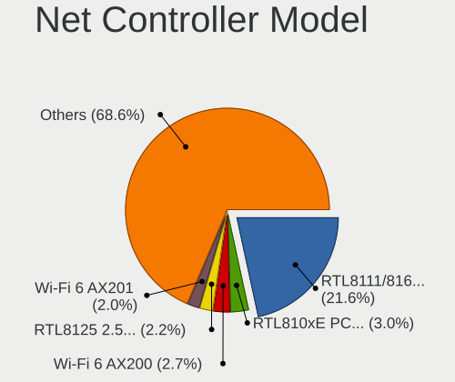

| Model                                                                  | Computers | Percent |
|------------------------------------------------------------------------|-----------|---------|
| Realtek RTL8111/8168/8211/8411 PCI Express Gigabit Ethernet Controller | 328       | 21.61%  |
| Realtek RTL810xE PCI Express Fast Ethernet controller                  | 45        | 2.96%   |
| Intel Wi-Fi 6 AX200                                                    | 41        | 2.7%    |
| Realtek RTL8125 2.5GbE Controller                                      | 33        | 2.17%   |
| Intel Wi-Fi 6 AX201                                                    | 30        | 1.98%   |
| Intel Wireless 8265 / 8275                                             | 29        | 1.91%   |
| Intel 82579LM Gigabit Network Connection (Lewisville)                  | 29        | 1.91%   |
| Intel Wi-Fi 6E(802.11ax) AX210/AX1675* 2x2 [Typhoon Peak]              | 28        | 1.84%   |
| Intel Alder Lake-P PCH CNVi WiFi                                       | 26        | 1.71%   |
| Realtek RTL8153 Gigabit Ethernet Adapter                               | 24        | 1.58%   |
| Qualcomm Atheros QCA9377 802.11ac Wireless Network Adapter             | 24        | 1.58%   |
| MediaTek MT7921 802.11ax PCIe Wireless Network Adapter [Filogic 330]   | 24        | 1.58%   |
| Intel Wireless 3165                                                    | 24        | 1.58%   |
| Qualcomm Atheros QCA9565 / AR9565 Wireless Network Adapter             | 19        | 1.25%   |
| Intel Wireless 7265                                                    | 19        | 1.25%   |
| Intel Wireless 7260                                                    | 17        | 1.12%   |
| Qualcomm Atheros AR9485 Wireless Network Adapter                       | 16        | 1.05%   |
| Intel Wireless 8260                                                    | 16        | 1.05%   |
| Intel Cannon Lake PCH CNVi WiFi                                        | 16        | 1.05%   |
| Broadcom BCM43142 802.11b/g/n                                          | 16        | 1.05%   |
| Realtek RTL8821CE 802.11ac PCIe Wireless Network Adapter               | 15        | 0.99%   |
| Intel Ethernet Connection (4) I219-LM                                  | 15        | 0.99%   |
| Realtek RTL8822CE 802.11ac PCIe Wireless Network Adapter               | 14        | 0.92%   |
| Qualcomm Atheros QCA6174 802.11ac Wireless Network Adapter             | 14        | 0.92%   |
| MediaTek MT7922 802.11ax PCI Express Wireless Network Adapter          | 14        | 0.92%   |
| Intel Ethernet Connection (7) I219-V                                   | 14        | 0.92%   |
| Intel Comet Lake PCH-LP CNVi WiFi                                      | 14        | 0.92%   |
| Realtek RTL8822BE 802.11a/b/g/n/ac WiFi adapter                        | 12        | 0.79%   |
| Realtek Killer E2600 GbE Controller                                    | 12        | 0.79%   |
| Intel Ethernet Connection I217-LM                                      | 12        | 0.79%   |
| Intel Comet Lake PCH CNVi WiFi                                         | 12        | 0.79%   |
| Intel Centrino Advanced-N 6205 [Taylor Peak]                           | 12        | 0.79%   |
| Realtek RTL8852BE PCIe 802.11ax Wireless Network Controller            | 11        | 0.72%   |
| Realtek RTL8188EUS 802.11n Wireless Network Adapter                    | 11        | 0.72%   |
| Realtek 802.11ac NIC                                                   | 11        | 0.72%   |
| Intel Raptor Lake PCH CNVi WiFi                                        | 11        | 0.72%   |
| ASIX AX88179 Gigabit Ethernet                                          | 11        | 0.72%   |
| Intel Tiger Lake PCH CNVi WiFi                                         | 10        | 0.66%   |
| Broadcom BCM43602 802.11ac Wireless LAN SoC                            | 10        | 0.66%   |
| Samsung Galaxy series, misc. (tethering mode)                          | 9         | 0.59%   |

Wireless Vendor
---------------

Wireless vendors

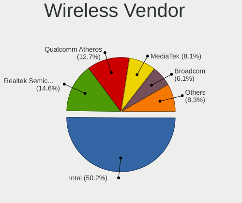

| Vendor                          | Computers | Percent |
|---------------------------------|-----------|---------|
| Intel                           | 361       | 50.21%  |
| Realtek Semiconductor           | 105       | 14.6%   |
| Qualcomm Atheros                | 91        | 12.66%  |
| MediaTek                        | 58        | 8.07%   |
| Broadcom                        | 44        | 6.12%   |
| Broadcom Limited                | 17        | 2.36%   |
| TP-Link                         | 14        | 1.95%   |
| Ralink Technology               | 12        | 1.67%   |
| Ralink                          | 4         | 0.56%   |
| D-Link                          | 3         | 0.42%   |
| Qualcomm                        | 2         | 0.28%   |
| Xiaomi                          | 1         | 0.14%   |
| Sierra Wireless                 | 1         | 0.14%   |
| Realtek                         | 1         | 0.14%   |
| Qualcomm Atheros Communications | 1         | 0.14%   |
| Marvell Technology Group        | 1         | 0.14%   |
| Edimax Technology               | 1         | 0.14%   |
| Dell                            | 1         | 0.14%   |
| ASUSTek Computer                | 1         | 0.14%   |

Wireless Model
--------------

Wireless models

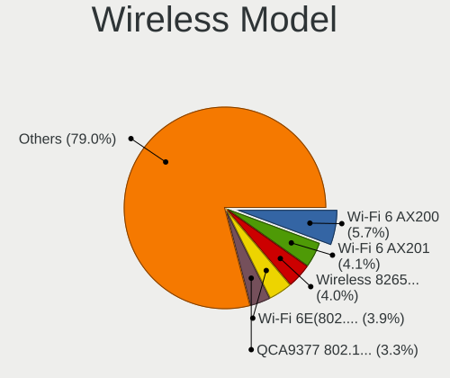

| Model                                                                | Computers | Percent |
|----------------------------------------------------------------------|-----------|---------|
| Intel Wi-Fi 6 AX200                                                  | 41        | 5.66%   |
| Intel Wi-Fi 6 AX201                                                  | 30        | 4.14%   |
| Intel Wireless 8265 / 8275                                           | 29        | 4%      |
| Intel Wi-Fi 6E(802.11ax) AX210/AX1675* 2x2 [Typhoon Peak]            | 28        | 3.86%   |
| Qualcomm Atheros QCA9377 802.11ac Wireless Network Adapter           | 24        | 3.31%   |
| MediaTek MT7921 802.11ax PCIe Wireless Network Adapter [Filogic 330] | 24        | 3.31%   |
| Intel Wireless 3165                                                  | 24        | 3.31%   |
| Qualcomm Atheros QCA9565 / AR9565 Wireless Network Adapter           | 19        | 2.62%   |
| Intel Wireless 7265                                                  | 19        | 2.62%   |
| Intel Wireless 7260                                                  | 17        | 2.34%   |
| Qualcomm Atheros AR9485 Wireless Network Adapter                     | 16        | 2.21%   |
| Intel Wireless 8260                                                  | 16        | 2.21%   |
| Intel Cannon Lake PCH CNVi WiFi                                      | 16        | 2.21%   |
| Broadcom BCM43142 802.11b/g/n                                        | 16        | 2.21%   |
| Realtek RTL8821CE 802.11ac PCIe Wireless Network Adapter             | 15        | 2.07%   |
| Realtek RTL8822CE 802.11ac PCIe Wireless Network Adapter             | 14        | 1.93%   |
| Qualcomm Atheros QCA6174 802.11ac Wireless Network Adapter           | 14        | 1.93%   |
| Intel Comet Lake PCH-LP CNVi WiFi                                    | 14        | 1.93%   |
| Intel Alder Lake-P PCH CNVi WiFi                                     | 14        | 1.93%   |
| Realtek RTL8822BE 802.11a/b/g/n/ac WiFi adapter                      | 12        | 1.66%   |
| Intel Comet Lake PCH CNVi WiFi                                       | 12        | 1.66%   |
| Intel Centrino Advanced-N 6205 [Taylor Peak]                         | 12        | 1.66%   |
| Realtek RTL8188EUS 802.11n Wireless Network Adapter                  | 11        | 1.52%   |
| Realtek 802.11ac NIC                                                 | 11        | 1.52%   |
| MediaTek MT7922 802.11ax PCI Express Wireless Network Adapter        | 11        | 1.52%   |
| Intel Raptor Lake PCH CNVi WiFi                                      | 11        | 1.52%   |
| Intel Tiger Lake PCH CNVi WiFi                                       | 10        | 1.38%   |
| Broadcom BCM43602 802.11ac Wireless LAN SoC                          | 10        | 1.38%   |
| Realtek RTL8852BE PCIe 802.11ax Wireless Network Controller          | 9         | 1.24%   |
| Qualcomm Atheros AR9285 Wireless Network Adapter (PCI-Express)       | 9         | 1.24%   |
| MediaTek MT7902 802.11ax PCIe Wireless Network Adapter [Filogic 310] | 9         | 1.24%   |
| Intel Centrino Ultimate-N 6300                                       | 9         | 1.24%   |
| Intel 700 Series Chipset CNVi WiFi                                   | 9         | 1.24%   |
| Realtek RTL8723BE PCIe Wireless Network Adapter                      | 8         | 1.1%    |
| TP-Link TL-WN722N v2/v3 [Realtek RTL8188EUS]                         | 7         | 0.97%   |
| Realtek RTL8852AE 802.11ax PCIe Wireless Network Adapter             | 7         | 0.97%   |
| Ralink MT7601U Wireless Adapter                                      | 7         | 0.97%   |
| Intel Ice Lake-LP PCH CNVi WiFi                                      | 7         | 0.97%   |
| Intel Dual Band Wireless-AC 3168NGW [Stone Peak]                     | 7         | 0.97%   |
| MediaTek MT7921K (RZ608) Wi-Fi 6E 80MHz                              | 6         | 0.83%   |

Ethernet Vendor
---------------

Ethernet vendors

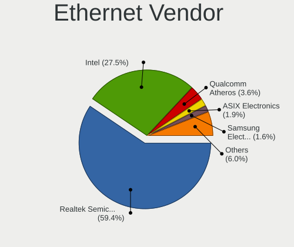

| Vendor                                 | Computers | Percent |
|----------------------------------------|-----------|---------|
| Realtek Semiconductor                  | 447       | 59.44%  |
| Intel                                  | 207       | 27.53%  |
| Qualcomm Atheros                       | 27        | 3.59%   |
| ASIX Electronics                       | 14        | 1.86%   |
| Samsung Electronics                    | 12        | 1.6%    |
| Broadcom                               | 11        | 1.46%   |
| MediaTek                               | 6         | 0.8%    |
| Xiaomi                                 | 5         | 0.66%   |
| Marvell Technology Group               | 5         | 0.66%   |
| Microsoft                              | 2         | 0.27%   |
| Hewlett-Packard                        | 2         | 0.27%   |
| DisplayLink                            | 2         | 0.27%   |
| Aquantia                               | 2         | 0.27%   |
| Suzhou Motorcomm Electronic Technology | 1         | 0.13%   |
| Sony Ericsson Mobile Communications AB | 1         | 0.13%   |
| Research In Motion                     | 1         | 0.13%   |
| Qualcomm Technologies                  | 1         | 0.13%   |
| Qualcomm                               | 1         | 0.13%   |
| Microchip Technology                   | 1         | 0.13%   |
| Mellanox Technologies                  | 1         | 0.13%   |
| ICS Advent                             | 1         | 0.13%   |
| Huawei Technologies                    | 1         | 0.13%   |
| Foxconn / Hon Hai                      | 1         | 0.13%   |

Ethernet Model
--------------

Ethernet models

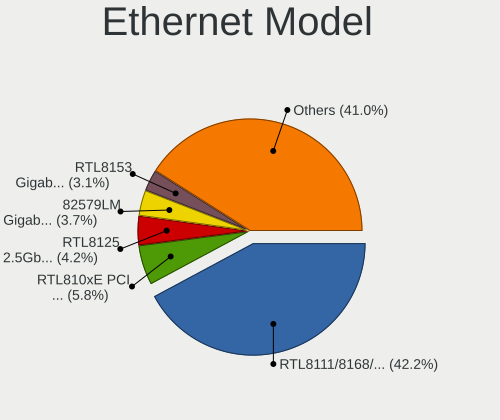

| Model                                                                  | Computers | Percent |
|------------------------------------------------------------------------|-----------|---------|
| Realtek RTL8111/8168/8211/8411 PCI Express Gigabit Ethernet Controller | 328       | 42.16%  |
| Realtek RTL810xE PCI Express Fast Ethernet controller                  | 45        | 5.78%   |
| Realtek RTL8125 2.5GbE Controller                                      | 33        | 4.24%   |
| Intel 82579LM Gigabit Network Connection (Lewisville)                  | 29        | 3.73%   |
| Realtek RTL8153 Gigabit Ethernet Adapter                               | 24        | 3.08%   |
| Intel Ethernet Connection (4) I219-LM                                  | 15        | 1.93%   |
| Intel Ethernet Connection (7) I219-V                                   | 14        | 1.8%    |
| Realtek Killer E2600 GbE Controller                                    | 12        | 1.54%   |
| Intel Ethernet Connection I217-LM                                      | 12        | 1.54%   |
| Intel Alder Lake-P PCH CNVi WiFi                                       | 12        | 1.54%   |
| ASIX AX88179 Gigabit Ethernet                                          | 11        | 1.41%   |
| Samsung Galaxy series, misc. (tethering mode)                          | 9         | 1.16%   |
| Intel Ethernet Connection (3) I218-LM                                  | 9         | 1.16%   |
| Intel Ethernet Connection (2) I219-V                                   | 9         | 1.16%   |
| Qualcomm Atheros Killer E2400 Gigabit Ethernet Controller              | 7         | 0.9%    |
| Intel I211 Gigabit Network Connection                                  | 7         | 0.9%    |
| Intel I210 Gigabit Network Connection                                  | 7         | 0.9%    |
| Intel Ethernet Connection (2) I219-LM                                  | 7         | 0.9%    |
| Realtek RTL8152 Fast Ethernet Adapter                                  | 6         | 0.77%   |
| Intel Ethernet Controller I226-V                                       | 6         | 0.77%   |
| Intel Ethernet Connection I219-LM                                      | 6         | 0.77%   |
| Intel Ethernet Connection (5) I219-LM                                  | 6         | 0.77%   |
| Intel Ethernet Controller I225-V                                       | 5         | 0.64%   |
| Intel Ethernet Connection I218-LM                                      | 5         | 0.64%   |
| Intel Ethernet Connection (16) I219-V                                  | 5         | 0.64%   |
| Intel Ethernet Connection (14) I219-V                                  | 5         | 0.64%   |
| Intel 82577LM Gigabit Network Connection                               | 5         | 0.64%   |
| Xiaomi Mi/Redmi series (RNDIS)                                         | 4         | 0.51%   |
| Intel Ethernet Connection (7) I219-LM                                  | 4         | 0.51%   |
| Samsung GT-I9070 (network tethering, USB debugging enabled)            | 3         | 0.39%   |
| Realtek Killer E2500 Gigabit Ethernet Controller                       | 3         | 0.39%   |
| Qualcomm Atheros QCA8171 Gigabit Ethernet                              | 3         | 0.39%   |
| Qualcomm Atheros AR8161 Gigabit Ethernet                               | 3         | 0.39%   |
| Qualcomm Atheros AR8152 v2.0 Fast Ethernet                             | 3         | 0.39%   |
| Qualcomm Atheros AR8151 v2.0 Gigabit Ethernet                          | 3         | 0.39%   |
| MediaTek MT7922 802.11ax PCI Express Wireless Network Adapter          | 3         | 0.39%   |
| Intel Ethernet Connection X722 for 1GbE                                | 3         | 0.39%   |
| Intel Ethernet Connection (4) I219-V                                   | 3         | 0.39%   |
| Intel Ethernet Connection (2) I218-LM                                  | 3         | 0.39%   |
| Intel Ethernet Connection (18) I219-LM                                 | 3         | 0.39%   |

Net Controller Kind
-------------------

Ethernet, WiFi or modem

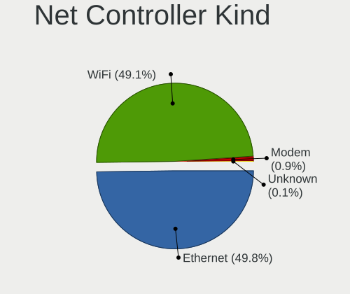

| Kind     | Computers | Percent |
|----------|-----------|---------|
| Ethernet | 701       | 49.79%  |
| WiFi     | 692       | 49.15%  |
| Modem    | 13        | 0.92%   |
| Unknown  | 2         | 0.14%   |

Used Controller
---------------

Currently used network controller

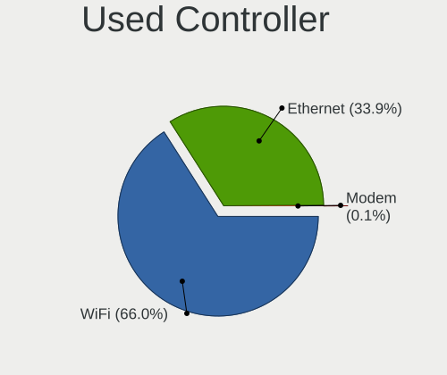

| Kind     | Computers | Percent |
|----------|-----------|---------|
| WiFi     | 576       | 65.98%  |
| Ethernet | 296       | 33.91%  |
| Modem    | 1         | 0.11%   |

NICs
----

Total network controllers on board

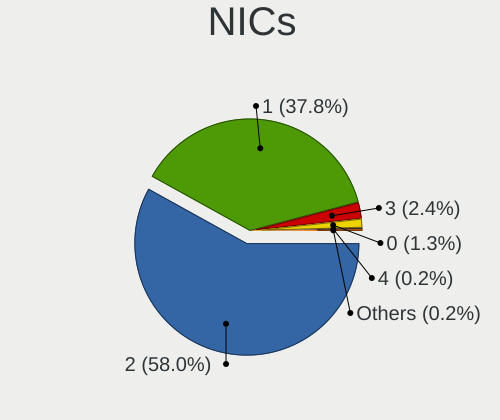

| Total | Computers | Percent |
|-------|-----------|---------|
| 2     | 494       | 58.05%  |
| 1     | 322       | 37.84%  |
| 3     | 20        | 2.35%   |
| 0     | 11        | 1.29%   |
| 4     | 2         | 0.24%   |
| 6     | 1         | 0.12%   |
| 5     | 1         | 0.12%   |

IPv6
----

IPv6 vs IPv4

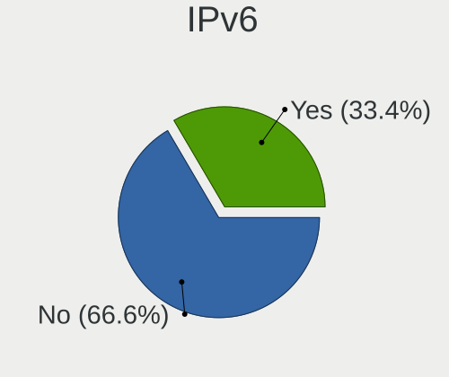

| Used | Computers | Percent |
|------|-----------|---------|
| No   | 581       | 66.55%  |
| Yes  | 292       | 33.45%  |

Bluetooth
---------

Bluetooth Vendor
----------------

Controller vendors

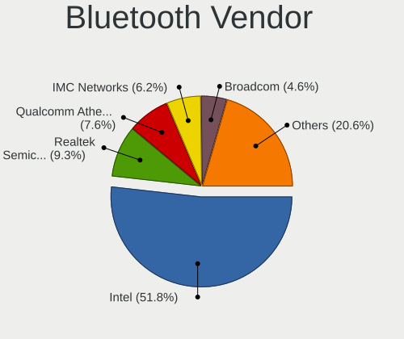

| Vendor                          | Computers | Percent |
|---------------------------------|-----------|---------|
| Intel                           | 335       | 51.78%  |
| Realtek Semiconductor           | 60        | 9.27%   |
| Qualcomm Atheros Communications | 49        | 7.57%   |
| IMC Networks                    | 40        | 6.18%   |
| Broadcom                        | 30        | 4.64%   |
| Foxconn / Hon Hai               | 28        | 4.33%   |
| Cambridge Silicon Radio         | 25        | 3.86%   |
| Lite-On Technology              | 23        | 3.55%   |
| Apple                           | 15        | 2.32%   |
| MediaTek                        | 9         | 1.39%   |
| TP-Link                         | 7         | 1.08%   |
| Realtek                         | 5         | 0.77%   |
| Dell                            | 5         | 0.77%   |
| Hewlett-Packard                 | 4         | 0.62%   |
| Ralink                          | 2         | 0.31%   |
| Unknown                         | 2         | 0.31%   |
| Toshiba                         | 1         | 0.15%   |
| Opticis                         | 1         | 0.15%   |
| Marvell Semiconductor           | 1         | 0.15%   |
| Foxconn International           | 1         | 0.15%   |
| Conwise Technology              | 1         | 0.15%   |
| Chicony Electronics             | 1         | 0.15%   |
| ASUSTek Computer                | 1         | 0.15%   |
| Alps Electric                   | 1         | 0.15%   |

Bluetooth Model
---------------

Controller models

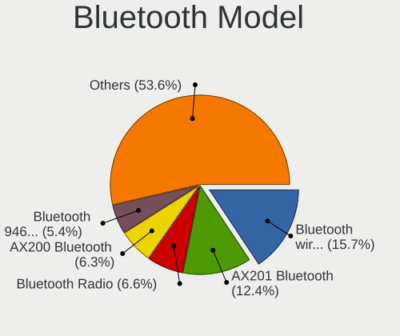

| Model                                               | Computers | Percent |
|-----------------------------------------------------|-----------|---------|
| Intel Bluetooth wireless interface                  | 102       | 15.67%  |
| Intel AX201 Bluetooth                               | 81        | 12.44%  |
| Realtek Bluetooth Radio                             | 43        | 6.61%   |
| Intel AX200 Bluetooth                               | 41        | 6.3%    |
| Intel Bluetooth 9460/9560 Jefferson Peak (JfP)      | 35        | 5.38%   |
| Intel Bluetooth Device                              | 33        | 5.07%   |
| Intel AX210 Bluetooth                               | 28        | 4.3%    |
| Qualcomm Atheros  Bluetooth Device                  | 27        | 4.15%   |
| IMC Networks Wireless_Device                        | 25        | 3.84%   |
| Cambridge Silicon Radio Bluetooth Dongle (HCI mode) | 25        | 3.84%   |
| Foxconn / Hon Hai Wireless_Device                   | 13        | 2%      |
| Apple Bluetooth Host Controller                     | 11        | 1.69%   |
| Realtek  Bluetooth 4.2 Adapter                      | 10        | 1.54%   |
| MediaTek Wireless_Device                            | 9         | 1.38%   |
| Foxconn / Hon Hai MediaTek Bluetooth Adapter        | 9         | 1.38%   |
| IMC Networks Bluetooth Radio                        | 8         | 1.23%   |
| Broadcom BCM20702 Bluetooth 4.0 [ThinkPad]          | 8         | 1.23%   |
| TP-Link TP-T@- UB500 Adapter                        | 7         | 1.08%   |
| Intel Wireless-AC 3168 Bluetooth                    | 7         | 1.08%   |
| Qualcomm Atheros QCA61x4 Bluetooth 4.0              | 6         | 0.92%   |
| Qualcomm Atheros AR9462 Bluetooth                   | 6         | 0.92%   |
| Lite-On Qualcomm Atheros QCA9377 Bluetooth          | 6         | 0.92%   |
| Broadcom BCM43142 Bluetooth 4.0                     | 6         | 0.92%   |
| Realtek RTL8822BE Bluetooth 4.2 Adapter             | 5         | 0.77%   |
| Realtek Bluetooth Radio                             | 5         | 0.77%   |
| Lite-On Bluetooth Device                            | 5         | 0.77%   |
| Qualcomm Atheros AR3011 Bluetooth                   | 4         | 0.61%   |
| Intel Wireless-AC 9260 Bluetooth Adapter            | 4         | 0.61%   |
| Intel Centrino Bluetooth Wireless Transceiver       | 4         | 0.61%   |
| IMC Networks Atheros AR3012 Bluetooth 4.0 Adapter   | 4         | 0.61%   |
| Apple Bluetooth USB Host Controller                 | 4         | 0.61%   |
| Lite-On Wireless_Device                             | 3         | 0.46%   |
| Lite-On Bluetooth Radio                             | 3         | 0.46%   |
| Intel Centrino Advanced-N 6230 Bluetooth adapter    | 3         | 0.46%   |
| IMC Networks Bluetooth Device                       | 3         | 0.46%   |
| HP Broadcom 2070 Bluetooth Combo                    | 3         | 0.46%   |
| Broadcom HP Portable SoftSailing                    | 3         | 0.46%   |
| Broadcom BCM2070 Bluetooth 2.1 + EDR                | 3         | 0.46%   |
| Broadcom BCM2045B (BDC-2.1)                         | 3         | 0.46%   |
| Ralink RT3290 Bluetooth                             | 2         | 0.31%   |

Sound
-----

Sound Vendor
------------

Sound card vendors

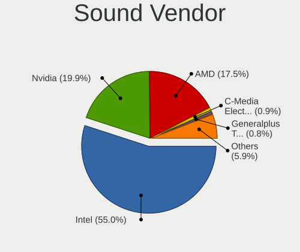

| Vendor                      | Computers | Percent |
|-----------------------------|-----------|---------|
| Intel                       | 650       | 54.99%  |
| Nvidia                      | 235       | 19.88%  |
| AMD                         | 207       | 17.51%  |
| C-Media Electronics         | 11        | 0.93%   |
| Generalplus Technology      | 9         | 0.76%   |
| ASUSTek Computer            | 6         | 0.51%   |
| Logitech                    | 5         | 0.42%   |
| Realtek Semiconductor       | 4         | 0.34%   |
| JMTek                       | 4         | 0.34%   |
| USB2.0                      | 3         | 0.25%   |
| Texas Instruments           | 3         | 0.25%   |
| Shenzhen Rapoo Technology   | 3         | 0.25%   |
| Elgato Systems              | 3         | 0.25%   |
| Creative Labs               | 3         | 0.25%   |
| Audient                     | 3         | 0.25%   |
| Apple                       | 3         | 0.25%   |
| Micro Star International    | 2         | 0.17%   |
| Kingston Technology         | 2         | 0.17%   |
| FIFINE Microphones          | 2         | 0.17%   |
| Walmart                     | 1         | 0.08%   |
| VIA Technologies            | 1         | 0.08%   |
| STMicroelectronics          | 1         | 0.08%   |
| Silicon Motion              | 1         | 0.08%   |
| Plantronics                 | 1         | 0.08%   |
| OPPO Electronics            | 1         | 0.08%   |
| Nordic Semiconductor ASA    | 1         | 0.08%   |
| Microsoft                   | 1         | 0.08%   |
| Medeli Electronics          | 1         | 0.08%   |
| Jieli Technology            | 1         | 0.08%   |
| Hewlett-Packard             | 1         | 0.08%   |
| GYROCOM C&C                 | 1         | 0.08%   |
| GN Netcom                   | 1         | 0.08%   |
| FiiO Electronics Technology | 1         | 0.08%   |
| EDFIER                      | 1         | 0.08%   |
| Creative Technology         | 1         | 0.08%   |
| Corsair                     | 1         | 0.08%   |
| Conexant Systems            | 1         | 0.08%   |
| Comtrue                     | 1         | 0.08%   |
| AudioQuest                  | 1         | 0.08%   |
| Audeze                      | 1         | 0.08%   |

Sound Model
-----------

Sound card models

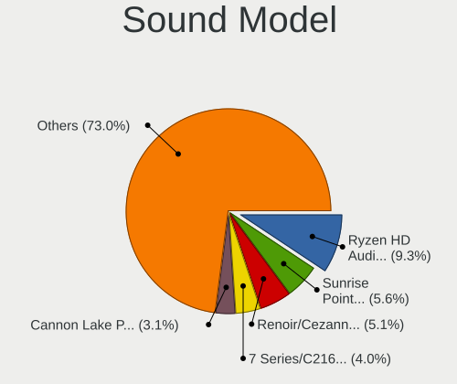

| Model                                                                      | Computers | Percent |
|----------------------------------------------------------------------------|-----------|---------|
| AMD Ryzen HD Audio Controller                                              | 131       | 9.32%   |
| Intel Sunrise Point-LP HD Audio                                            | 78        | 5.55%   |
| AMD Renoir/Cezanne HDMI/DP Audio Controller                                | 71        | 5.05%   |
| Intel 7 Series/C216 Chipset Family High Definition Audio Controller        | 56        | 3.99%   |
| Intel Cannon Lake PCH cAVS                                                 | 44        | 3.13%   |
| Intel 8 Series/C220 Series Chipset High Definition Audio Controller        | 44        | 3.13%   |
| Intel 6 Series/C200 Series Chipset Family High Definition Audio Controller | 43        | 3.06%   |
| AMD Radeon High Definition Audio Controller                                | 41        | 2.92%   |
| Intel Tiger Lake-LP Smart Sound Technology Audio Controller                | 35        | 2.49%   |
| Intel 100 Series/C230 Series Chipset Family HD Audio Controller            | 32        | 2.28%   |
| Intel Alder Lake PCH-P High Definition Audio Controller                    | 30        | 2.14%   |
| Nvidia GA107 High Definition Audio Controller                              | 25        | 1.78%   |
| Intel Xeon E3-1200 v3/4th Gen Core Processor HD Audio Controller           | 25        | 1.78%   |
| Intel Broadwell-U Audio Controller                                         | 25        | 1.78%   |
| Intel Wildcat Point-LP High Definition Audio Controller                    | 24        | 1.71%   |
| Intel Haswell-ULT HD Audio Controller                                      | 24        | 1.71%   |
| Intel 8 Series HD Audio Controller                                         | 24        | 1.71%   |
| Nvidia TU107 GeForce GTX 1650 High Definition Audio Controller             | 22        | 1.57%   |
| Nvidia GP107GL High Definition Audio Controller                            | 21        | 1.49%   |
| Intel 200 Series PCH HD Audio                                              | 19        | 1.35%   |
| Intel Comet Lake PCH-LP cAVS                                               | 18        | 1.28%   |
| Intel Tiger Lake-H HD Audio Controller                                     | 16        | 1.14%   |
| Intel Raptor Lake-P/U/H cAVS                                               | 16        | 1.14%   |
| Nvidia TU116 High Definition Audio Controller                              | 15        | 1.07%   |
| Intel Comet Lake PCH cAVS                                                  | 15        | 1.07%   |
| AMD Raven/Raven2/Fenghuang HDMI/DP Audio Controller                        | 15        | 1.07%   |
| AMD Ellesmere HDMI Audio [Radeon RX 470/480 / 570/580/590]                 | 15        | 1.07%   |
| Nvidia GK208 HDMI/DP Audio Controller                                      | 14        | 1%      |
| Nvidia GA106 High Definition Audio Controller                              | 14        | 1%      |
| Intel CM238 HD Audio Controller                                            | 14        | 1%      |
| AMD Starship/Matisse HD Audio Controller                                   | 14        | 1%      |
| Nvidia GK107 HDMI Audio Controller                                         | 12        | 0.85%   |
| Intel NM10/ICH7 Family High Definition Audio Controller                    | 12        | 0.85%   |
| Intel Cannon Point-LP High Definition Audio Controller                     | 12        | 0.85%   |
| Nvidia GP106 High Definition Audio Controller                              | 11        | 0.78%   |
| Nvidia GF108 High Definition Audio Controller                              | 11        | 0.78%   |
| Nvidia GA104 High Definition Audio Controller                              | 11        | 0.78%   |
| Nvidia AD107 High Definition Audio Controller                              | 11        | 0.78%   |
| Intel Raptor Lake High Definition Audio Controller                         | 11        | 0.78%   |
| Intel 5 Series/3400 Series Chipset High Definition Audio                   | 11        | 0.78%   |

Memory
------

Memory Vendor
-------------

Memory module vendors

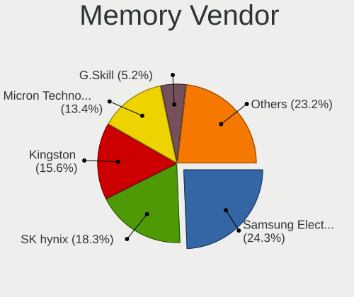

| Vendor                                  | Computers | Percent |
|-----------------------------------------|-----------|---------|
| Samsung Electronics                     | 165       | 24.34%  |
| SK hynix                                | 124       | 18.29%  |
| Kingston                                | 106       | 15.63%  |
| Micron Technology                       | 91        | 13.42%  |
| G.Skill                                 | 35        | 5.16%   |
| Corsair                                 | 30        | 4.42%   |
| Unknown                                 | 23        | 3.39%   |
| Crucial                                 | 22        | 3.24%   |
| Ramaxel Technology                      | 13        | 1.92%   |
| A-DATA Technology                       | 12        | 1.77%   |
| Kingmax                                 | 10        | 1.47%   |
| Unknown                                 | 7         | 1.03%   |
| Team                                    | 6         | 0.88%   |
| Apacer                                  | 5         | 0.74%   |
| Nanya Technology                        | 4         | 0.59%   |
| Elpida                                  | 4         | 0.59%   |
| PNY                                     | 3         | 0.44%   |
| Kingmax Semiconductor                   | 3         | 0.44%   |
| KingFast                                | 2         | 0.29%   |
| Unknown (ABCD)                          | 1         | 0.15%   |
| Unknown (8A02)                          | 1         | 0.15%   |
| Unknown (89EC)                          | 1         | 0.15%   |
| Unknown (7FE0)                          | 1         | 0.15%   |
| Silicon Power Computer & Communications | 1         | 0.15%   |
| PUSKILL                                 | 1         | 0.15%   |
| Pioneer                                 | 1         | 0.15%   |
| Patriot                                 | 1         | 0.15%   |
| ONDA                                    | 1         | 0.15%   |
| Lexar Co Limited                        | 1         | 0.15%   |
| ChangXin Memory                         | 1         | 0.15%   |
| AVEXIR                                  | 1         | 0.15%   |
| ASint Technology                        | 1         | 0.15%   |

Memory Model
------------

Memory module models

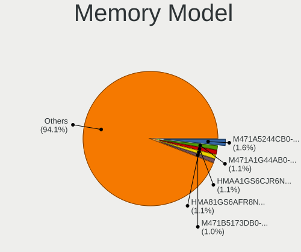

| Model                                                        | Computers | Percent |
|--------------------------------------------------------------|-----------|---------|
| Samsung RAM M471A5244CB0-CWE 4GB SODIMM DDR4 3200MT/s        | 12        | 1.64%   |
| SK hynix RAM HMAA1GS6CJR6N-XN 8GB SODIMM DDR4 3200MT/s       | 8         | 1.09%   |
| SK hynix RAM HMA81GS6AFR8N-UH 8GB SODIMM DDR4 2667MT/s       | 8         | 1.09%   |
| Samsung RAM M471A1G44AB0-CWE 8GiB SODIMM DDR4 3200MT/s       | 8         | 1.09%   |
| SK hynix RAM HMA81GS6DJR8N-XN 8GB SODIMM DDR4 3200MT/s       | 7         | 0.95%   |
| Samsung RAM M471B5173DB0-YK0 4GB SODIMM DDR3 1600MT/s        | 7         | 0.95%   |
| Kingston RAM 9905700-122.A00G 16GB SODIMM DDR4 3200MT/s      | 7         | 0.95%   |
| Unknown                                                      | 7         | 0.95%   |
| SK hynix RAM HMA851S6AFR6N-UH 4GB SODIMM DDR4 2667MT/s       | 6         | 0.82%   |
| Samsung RAM M471B5173QH0-YK0 4GB SODIMM DDR3 1600MT/s        | 6         | 0.82%   |
| Samsung RAM M471A1K43DB1-CWE 8GB SODIMM DDR4 3200MT/s        | 6         | 0.82%   |
| Samsung RAM M471A1K43CB1-CRC 8GB SODIMM DDR4 8400MT/s        | 6         | 0.82%   |
| Micron RAM 4ATF1G64HZ-3G2F1 8GB SODIMM DDR4 3200MT/s         | 6         | 0.82%   |
| SK hynix RAM HMT351S6EFR8A-PB 4GB SODIMM DDR3 1600MT/s       | 5         | 0.68%   |
| SK hynix RAM HMA851S6CJR6N-XN 4GB SODIMM DDR4 3200MT/s       | 5         | 0.68%   |
| Samsung RAM M471B5173EB0-YK0 4GB SODIMM DDR3 1600MT/s        | 5         | 0.68%   |
| Samsung RAM M471B1G73DB0-YK0 8GB SODIMM DDR3 1600MT/s        | 5         | 0.68%   |
| Samsung RAM M471A2K43CB1-CRC 16GB SODIMM DDR4 2667MT/s       | 5         | 0.68%   |
| Samsung RAM M471A1K43CB1-CTD 8GB SODIMM DDR4 3200MT/s        | 5         | 0.68%   |
| Micron RAM 8ATF1G64HZ-3G2R1 8GB SODIMM DDR4 3200MT/s         | 5         | 0.68%   |
| Micron RAM 4ATF1G64HZ-3G2E1 8GB SODIMM DDR4 3200MT/s         | 5         | 0.68%   |
| Kingston RAM LV32D4S2S8HD-8 8GB SODIMM DDR4 3200MT/s         | 5         | 0.68%   |
| Kingston RAM KF3200C16D4/16GX 16GB DIMM DDR4 3733MT/s        | 5         | 0.68%   |
| Corsair RAM CMK8GX4M1A2666C16 8GB DIMM DDR4 3200MT/s         | 5         | 0.68%   |
| SK hynix RAM HMA82GS6AFR8N-UH 16GB SODIMM DDR4 2667MT/s      | 4         | 0.55%   |
| SK hynix RAM HMA81GS6JJR8N-VK 8GB SODIMM DDR4 2667MT/s       | 4         | 0.55%   |
| SK hynix RAM HMA81GS6CJR8N-VK 8GB SODIMM DDR4 2667MT/s       | 4         | 0.55%   |
| Samsung RAM M471A5244CB0-CTD 4GB SODIMM DDR4 3266MT/s        | 4         | 0.55%   |
| Samsung RAM M471A5244CB0-CRC 4GB SODIMM DDR4 2667MT/s        | 4         | 0.55%   |
| Samsung RAM M425R1GB4BB0-CQKOL 8GB SODIMM DDR5 4800MT/s      | 4         | 0.55%   |
| Micron RAM 4ATF51264HZ-2G6E1 4GB SODIMM DDR4 2667MT/s        | 4         | 0.55%   |
| G.Skill RAM F4-3200C22-8GRS 8GB SODIMM DDR4 3200MT/s         | 4         | 0.55%   |
| G.Skill RAM F4-3200C22-16GRS 16GiB SODIMM DDR4 3200MT/s      | 4         | 0.55%   |
| SK hynix RAM HMT451S6AFR8A-PB 4GB SODIMM DDR3 1600MT/s       | 3         | 0.41%   |
| SK hynix RAM HMA851S6CJR6N-XN 4GB Row Of Chips DDR4 3200MT/s | 3         | 0.41%   |
| Samsung RAM M471B1G73EB0-YK0 8192MB SODIMM DDR3 1600MT/s     | 3         | 0.41%   |
| Samsung RAM M471A2K43DB1-CWE 16GB SODIMM DDR4 3200MT/s       | 3         | 0.41%   |
| Samsung RAM M471A2K43CB1-CTD 16GB SODIMM DDR4 8400MT/s       | 3         | 0.41%   |
| Samsung RAM M471A2G44AM0-CWE 16GB SODIMM DDR4 3200MT/s       | 3         | 0.41%   |
| Samsung RAM M471A1K43EB1-CWE 8GB SODIMM DDR4 3200MT/s        | 3         | 0.41%   |

Memory Kind
-----------

Memory module kinds

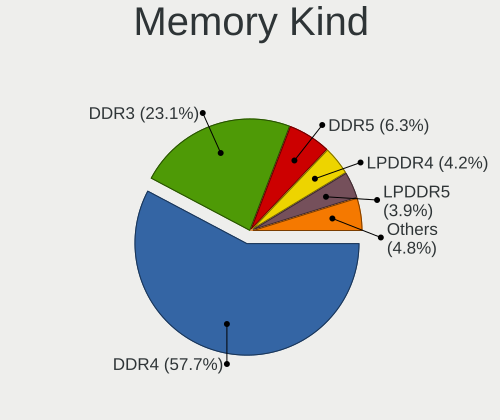

| Kind    | Computers | Percent |
|---------|-----------|---------|
| DDR4    | 313       | 57.75%  |
| DDR3    | 125       | 23.06%  |
| DDR5    | 34        | 6.27%   |
| LPDDR4  | 23        | 4.24%   |
| LPDDR5  | 21        | 3.87%   |
| LPDDR3  | 11        | 2.03%   |
| DDR2    | 6         | 1.11%   |
| DRAM    | 3         | 0.55%   |
| SDRAM   | 2         | 0.37%   |
| DDR     | 2         | 0.37%   |
| Unknown | 2         | 0.37%   |

Memory Form Factor
------------------

Physical design of the memory module

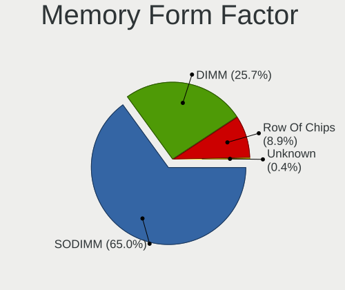

| Name         | Computers | Percent |
|--------------|-----------|---------|
| SODIMM       | 351       | 65%     |
| DIMM         | 139       | 25.74%  |
| Row Of Chips | 48        | 8.89%   |
| Unknown      | 2         | 0.37%   |

Memory Size
-----------

Memory module size

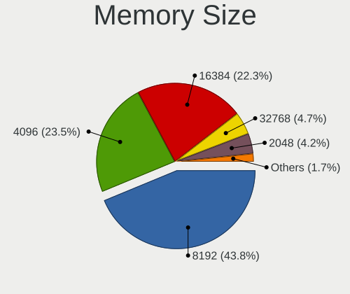

| Size  | Computers | Percent |
|-------|-----------|---------|
| 8192  | 263       | 43.76%  |
| 4096  | 141       | 23.46%  |
| 16384 | 134       | 22.3%   |
| 32768 | 28        | 4.66%   |
| 2048  | 25        | 4.16%   |
| 1024  | 9         | 1.5%    |
| 49152 | 1         | 0.17%   |

Memory Speed
------------

Memory module speed

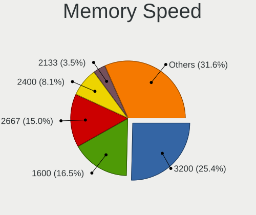

| Speed   | Computers | Percent |
|---------|-----------|---------|
| 3200    | 154       | 25.37%  |
| 1600    | 100       | 16.47%  |
| 2667    | 91        | 14.99%  |
| 2400    | 49        | 8.07%   |
| 2133    | 21        | 3.46%   |
| 1333    | 19        | 3.13%   |
| 5600    | 16        | 2.64%   |
| 4800    | 12        | 1.98%   |
| 4267    | 11        | 1.81%   |
| 3733    | 10        | 1.65%   |
| 8400    | 9         | 1.48%   |
| 7500    | 9         | 1.48%   |
| 3600    | 9         | 1.48%   |
| 6400    | 8         | 1.32%   |
| 1867    | 8         | 1.32%   |
| 1334    | 7         | 1.15%   |
| 3266    | 6         | 0.99%   |
| 6000    | 4         | 0.66%   |
| 3000    | 4         | 0.66%   |
| 2666    | 4         | 0.66%   |
| 1866    | 4         | 0.66%   |
| 800     | 4         | 0.66%   |
| 3666    | 3         | 0.49%   |
| 3466    | 3         | 0.49%   |
| 2933    | 3         | 0.49%   |
| 2800    | 3         | 0.49%   |
| 1066    | 3         | 0.49%   |
| 667     | 3         | 0.49%   |
| Unknown | 3         | 0.49%   |
| 8533    | 2         | 0.33%   |
| 5200    | 2         | 0.33%   |
| 4266    | 2         | 0.33%   |
| 4199    | 2         | 0.33%   |
| 3400    | 2         | 0.33%   |
| 2448    | 2         | 0.33%   |
| 1067    | 2         | 0.33%   |
| 7467    | 1         | 0.16%   |
| 7000    | 1         | 0.16%   |
| 5500    | 1         | 0.16%   |
| 3334    | 1         | 0.16%   |

Printers & scanners
-------------------

Printer Vendor
--------------

Printer device vendors

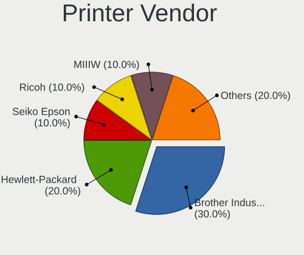

| Vendor                | Computers | Percent |
|-----------------------|-----------|---------|
| Brother Industries    | 3         | 30%     |
| Hewlett-Packard       | 2         | 20%     |
| Seiko Epson           | 1         | 10%     |
| Ricoh                 | 1         | 10%     |
| MIIIW                 | 1         | 10%     |
| Intermec Technologies | 1         | 10%     |
| Canon                 | 1         | 10%     |

Printer Model
-------------

Printer device models

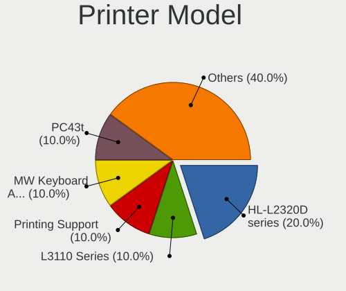

| Model                      | Computers | Percent |
|----------------------------|-----------|---------|
| Brother HL-L2320D series   | 2         | 20%     |
| Seiko Epson L3110 Series   | 1         | 10%     |
| Ricoh Printing Support     | 1         | 10%     |
| MIIIW MW Keyboard Air Mini | 1         | 10%     |
| Intermec PC43t             | 1         | 10%     |
| HP LaserJet P3010 Series   | 1         | 10%     |
| HP LaserJet P1102          | 1         | 10%     |
| Canon LBP6030/6030B/6018L  | 1         | 10%     |
| Brother HL-L2360D series   | 1         | 10%     |

Scanner Vendor
--------------

Scanner device vendors

Zero info for selected period =(

Scanner Model
-------------

Scanner device models

Zero info for selected period =(

Camera
------

Camera Vendor
-------------

Camera device vendors

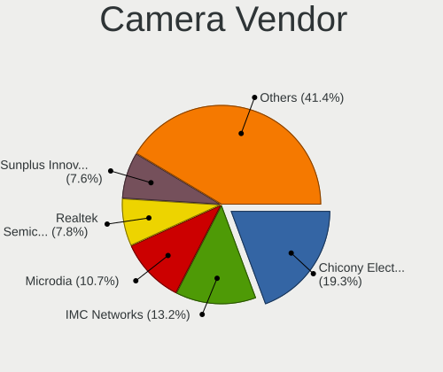

| Vendor                                 | Computers | Percent |
|----------------------------------------|-----------|---------|
| Chicony Electronics                    | 107       | 19.35%  |
| IMC Networks                           | 73        | 13.2%   |
| Microdia                               | 59        | 10.67%  |
| Realtek Semiconductor                  | 43        | 7.78%   |
| Sunplus Innovation Technology          | 42        | 7.59%   |
| Bison Electronics                      | 42        | 7.59%   |
| Quanta                                 | 35        | 6.33%   |
| Luxvisions Innotech Limited            | 22        | 3.98%   |
| Syntek                                 | 18        | 3.25%   |
| Logitech                               | 15        | 2.71%   |
| Cheng Uei Precision Industry (Foxlink) | 15        | 2.71%   |
| Sonix Technology                       | 12        | 2.17%   |
| Apple                                  | 12        | 2.17%   |
| Lite-On Technology                     | 9         | 1.63%   |
| Suyin                                  | 7         | 1.27%   |
| Samsung Electronics                    | 5         | 0.9%    |
| Ricoh                                  | 4         | 0.72%   |
| Alcor Micro                            | 4         | 0.72%   |
| SN0002                                 | 3         | 0.54%   |
| Silicon Motion                         | 3         | 0.54%   |
| ShineTech                              | 3         | 0.54%   |
| Shenzhen Kingcome Optoelectronic       | 2         | 0.36%   |
| Linux Foundation                       | 2         | 0.36%   |
| Lenovo                                 | 2         | 0.36%   |
| Denron                                 | 2         | 0.36%   |
| vivo                                   | 1         | 0.18%   |
| SunplusIT                              | 1         | 0.18%   |
| OPPO Electronics                       | 1         | 0.18%   |
| KYE Systems (Mouse Systems)            | 1         | 0.18%   |
| kingcome                               | 1         | 0.18%   |
| Intel                                  | 1         | 0.18%   |
| IDS Imaging Development Systems        | 1         | 0.18%   |
| Hewlett-Packard                        | 1         | 0.18%   |
| Aveo Technology                        | 1         | 0.18%   |
| Alpha Imaging Technology               | 1         | 0.18%   |
| ALi                                    | 1         | 0.18%   |
| Acer                                   | 1         | 0.18%   |

Camera Model
------------

Camera device models

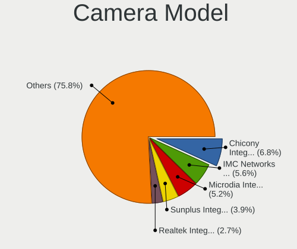

| Model                                             | Computers | Percent |
|---------------------------------------------------|-----------|---------|
| Chicony Integrated Camera                         | 38        | 6.81%   |
| IMC Networks USB2.0 HD UVC WebCam                 | 31        | 5.56%   |
| Microdia Integrated_Webcam_HD                     | 29        | 5.2%    |
| Sunplus Integrated_Webcam_HD                      | 22        | 3.94%   |
| Realtek Integrated_Webcam_HD                      | 15        | 2.69%   |
| IMC Networks Integrated Camera                    | 15        | 2.69%   |
| Bison HD Webcam                                   | 15        | 2.69%   |
| Syntek Integrated Camera                          | 12        | 2.15%   |
| IMC Networks USB2.0 VGA UVC WebCam                | 11        | 1.97%   |
| Bison Integrated Camera                           | 11        | 1.97%   |
| Sonix USB2.0 HD UVC WebCam                        | 9         | 1.61%   |
| Microdia Laptop_Integrated_Webcam_HD              | 9         | 1.61%   |
| Chicony HD WebCam                                 | 9         | 1.61%   |
| Luxvisions Innotech Limited Integrated Camera     | 8         | 1.43%   |
| Quanta HD User Facing                             | 7         | 1.25%   |
| Luxvisions Innotech Limited Integrated RGB Camera | 7         | 1.25%   |
| Chicony HP TrueVision HD Camera                   | 7         | 1.25%   |
| Chicony HP HD Camera                              | 7         | 1.25%   |
| Apple iPhone 5/5C/5S/6/SE/7/8/X                   | 7         | 1.25%   |
| Microdia Integrated Webcam                        | 6         | 1.08%   |
| Logitech Webcam C270                              | 6         | 1.08%   |
| Bison SunplusIT Integrated Camera                 | 6         | 1.08%   |
| Samsung Galaxy series, misc. (MTP mode)           | 5         | 0.9%    |
| Realtek Integrated Webcam HD                      | 5         | 0.9%    |
| Realtek Integrated Webcam                         | 5         | 0.9%    |
| Quanta HP TrueVision HD Camera                    | 5         | 0.9%    |
| Realtek USB Camera                                | 4         | 0.72%   |
| Quanta VGA WebCam                                 | 4         | 0.72%   |
| Quanta HD Webcam                                  | 4         | 0.72%   |
| Lite-On Integrated Camera                         | 4         | 0.72%   |
| Chicony HD User Facing                            | 4         | 0.72%   |
| Bison ThinkPad Integrated Camera                  | 4         | 0.72%   |
| Syntek Lenovo EasyCamera                          | 3         | 0.54%   |
| Sunplus Laptop_Integrated_Webcam_FHD              | 3         | 0.54%   |
| SN0002 1080P Web Camera                           | 3         | 0.54%   |
| Quanta ov9734_techfront_camera                    | 3         | 0.54%   |
| Quanta HP HD Camera                               | 3         | 0.54%   |
| Quanta ACER HD User Facing                        | 3         | 0.54%   |
| Luxvisions Innotech Limited HP 5MP Camera         | 3         | 0.54%   |
| Logitech Webcam C310                              | 3         | 0.54%   |

Security
--------

Fingerprint Vendor
------------------

Fingerprint sensor vendors

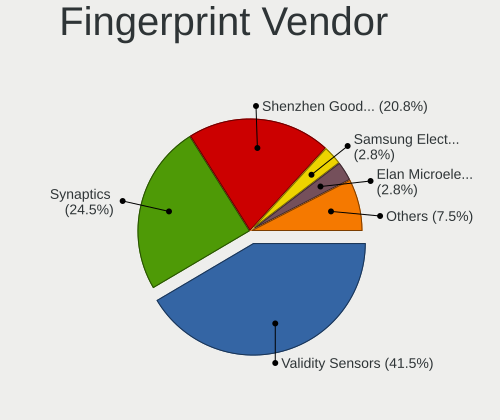

| Vendor                     | Computers | Percent |
|----------------------------|-----------|---------|
| Validity Sensors           | 44        | 41.51%  |
| Synaptics                  | 26        | 24.53%  |
| Shenzhen Goodix Technology | 22        | 20.75%  |
| Samsung Electronics        | 3         | 2.83%   |
| Elan Microelectronics      | 3         | 2.83%   |
| Upek                       | 2         | 1.89%   |
| LighTuning Technology      | 2         | 1.89%   |
| HOLTEK                     | 2         | 1.89%   |
| STMicroelectronics         | 1         | 0.94%   |
| AuthenTec                  | 1         | 0.94%   |

Fingerprint Model
-----------------

Fingerprint sensor models

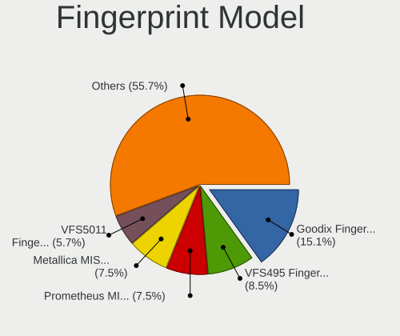

| Model                                                                      | Computers | Percent |
|----------------------------------------------------------------------------|-----------|---------|
| Shenzhen Goodix  Fingerprint Device                                        | 16        | 15.09%  |
| Validity Sensors VFS495 Fingerprint Reader                                 | 9         | 8.49%   |
| Synaptics Prometheus MIS Touch Fingerprint Reader                          | 8         | 7.55%   |
| Synaptics Metallica MIS Touch Fingerprint Reader                           | 8         | 7.55%   |
| Validity Sensors VFS5011 Fingerprint Reader                                | 6         | 5.66%   |
| Validity Sensors Synaptics WBDI                                            | 6         | 5.66%   |
| Validity Sensors Synaptics VFS7552 Touch Fingerprint Sensor                | 6         | 5.66%   |
| Validity Sensors VFS 5011 fingerprint sensor                               | 5         | 4.72%   |
| Shenzhen Goodix Fingerprint Reader                                         | 5         | 4.72%   |
| Validity Sensors VFS Fingerprint sensor                                    | 4         | 3.77%   |
| Synaptics FS7604 Touch Fingerprint Sensor with PurePrint                   | 4         | 3.77%   |
| Validity Sensors Synaptics VFS7552 Touch Fingerprint Sensor with PurePrint | 3         | 2.83%   |
| Samsung Fingerprint Sensor Device - 730B                                   | 3         | 2.83%   |
| Elan ELAN:Fingerprint                                                      | 3         | 2.83%   |
| Validity Sensors VFS471 Fingerprint Reader                                 | 2         | 1.89%   |
| Upek Biometric Touchchip/Touchstrip Fingerprint Sensor                     | 2         | 1.89%   |
| Synaptics Metallica MOH Touch Fingerprint Reader                           | 2         | 1.89%   |
| LighTuning EgisTec Touch Fingerprint Sensor                                | 2         | 1.89%   |
| HOLTEK FocalTech Fingerprint Device                                        | 2         | 1.89%   |
| Validity Sensors VFS7552 Touch Fingerprint Sensor                          | 1         | 0.94%   |
| Validity Sensors VFS7500 Touch Fingerprint Sensor                          | 1         | 0.94%   |
| Validity Sensors VFS451 Fingerprint Reader                                 | 1         | 0.94%   |
| Synaptics WBDI Fingerprint Reader USB 086                                  | 1         | 0.94%   |
| Synaptics UWP WBDI                                                         | 1         | 0.94%   |
| Synaptics Prometheus Fingerprint Reader                                    | 1         | 0.94%   |
| Synaptics Fingerprint reader [HP G6]                                       | 1         | 0.94%   |
| STMicroelectronics Fingerprint Reader                                      | 1         | 0.94%   |
| Shenzhen Goodix FingerPrint                                                | 1         | 0.94%   |
| AuthenTec Fingerprint Sensor                                               | 1         | 0.94%   |

Chipcard Vendor
---------------

Chipcard module vendors

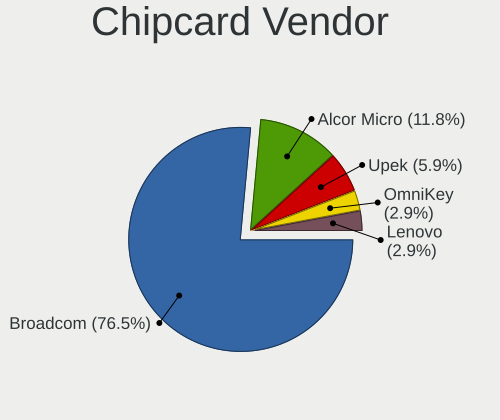

| Vendor      | Computers | Percent |
|-------------|-----------|---------|
| Broadcom    | 26        | 76.47%  |
| Alcor Micro | 4         | 11.76%  |
| Upek        | 2         | 5.88%   |
| OmniKey     | 1         | 2.94%   |
| Lenovo      | 1         | 2.94%   |

Chipcard Model
--------------

Chipcard module models

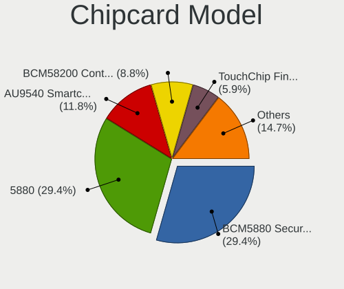

| Model                                                                        | Computers | Percent |
|------------------------------------------------------------------------------|-----------|---------|
| Broadcom BCM5880 Secure Applications Processor                               | 10        | 29.41%  |
| Broadcom 5880                                                                | 10        | 29.41%  |
| Alcor Micro AU9540 Smartcard Reader                                          | 4         | 11.76%  |
| Broadcom BCM58200 ControlVault 3 (FingerPrint sensor + Contacted SmartCard)  | 3         | 8.82%   |
| Upek TouchChip Fingerprint Coprocessor (WBF advanced mode)                   | 2         | 5.88%   |
| Broadcom BCM5880 Secure Applications Processor with fingerprint swipe sensor | 2         | 5.88%   |
| OmniKey CardMan 4321                                                         | 1         | 2.94%   |
| Lenovo Integrated Smart Card Reader                                          | 1         | 2.94%   |
| Broadcom 58200                                                               | 1         | 2.94%   |

Unsupported
-----------

Unsupported Devices
-------------------

Total unsupported devices on board

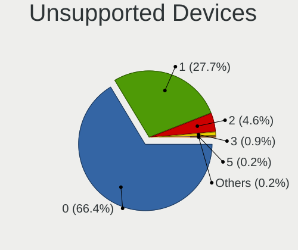

| Total | Computers | Percent |
|-------|-----------|---------|
| 0     | 578       | 66.36%  |
| 1     | 241       | 27.67%  |
| 2     | 40        | 4.59%   |
| 3     | 8         | 0.92%   |
| 5     | 2         | 0.23%   |
| 4     | 2         | 0.23%   |

Unsupported Device Types
------------------------

Types of unsupported devices

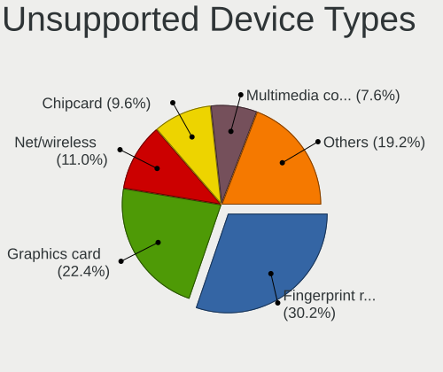

| Type                     | Computers | Percent |
|--------------------------|-----------|---------|
| Fingerprint reader       | 104       | 30.23%  |
| Graphics card            | 77        | 22.38%  |
| Net/wireless             | 38        | 11.05%  |
| Chipcard                 | 33        | 9.59%   |
| Multimedia controller    | 26        | 7.56%   |
| Camera                   | 16        | 4.65%   |
| Communication controller | 14        | 4.07%   |
| Unassigned class         | 12        | 3.49%   |
| Bluetooth                | 8         | 2.33%   |
| Net/ethernet             | 7         | 2.03%   |
| Storage                  | 3         | 0.87%   |
| Sound                    | 2         | 0.58%   |
| Card reader              | 2         | 0.58%   |
| Storage/nvme             | 1         | 0.29%   |
| Network                  | 1         | 0.29%   |

