Linux in Vietnam - Tested Hardware & Statistics
-----------------------------------------------

A project to collect tested hardware configurations for Linux in Vietnam.

Anyone can contribute to this report by the [hw-probe](https://github.com/linuxhw/hw-probe) tool:

    sudo -E hw-probe -all -upload

Please contribute! Especially if your hardware is rare.

This is a report for all computer types. See also reports for [desktops](/Location/Vietnam/Desktop/README.md) and [notebooks](/Location/Vietnam/Notebook/README.md).

Contents
--------

* [ Test Cases ](#test-cases)

* [ System ](#system)
  - [ OS                       ](#os)
  - [ OS Family                ](#os-family)
  - [ Kernel                   ](#kernel)
  - [ Kernel Family            ](#kernel-family)
  - [ Kernel Major Ver.        ](#kernel-major-ver)
  - [ Arch                     ](#arch)
  - [ DE                       ](#de)
  - [ Display Server           ](#display-server)
  - [ Display Manager          ](#display-manager)
  - [ OS Lang                  ](#os-lang)
  - [ Boot Mode                ](#boot-mode)
  - [ Filesystem               ](#filesystem)
  - [ Part. scheme             ](#part-scheme)
  - [ Dual Boot with Linux/BSD ](#dual-boot-with-linuxbsd)
  - [ Dual Boot (Win)          ](#dual-boot-win)

* [ Board ](#board)
  - [ Vendor                   ](#vendor)
  - [ Model                    ](#model)
  - [ Model Family             ](#model-family)
  - [ MFG Year                 ](#mfg-year)
  - [ Form Factor              ](#form-factor)
  - [ Secure Boot              ](#secure-boot)
  - [ Coreboot                 ](#coreboot)
  - [ RAM Size                 ](#ram-size)
  - [ RAM Used                 ](#ram-used)
  - [ Total Drives             ](#total-drives)
  - [ Has CD-ROM               ](#has-cd-rom)
  - [ Has Ethernet             ](#has-ethernet)
  - [ Has WiFi                 ](#has-wifi)
  - [ Has Bluetooth            ](#has-bluetooth)

* [ Location ](#location)
  - [ Country                  ](#country)
  - [ City                     ](#city)

* [ Drives ](#drives)
  - [ Drive Vendor             ](#drive-vendor)
  - [ Drive Model              ](#drive-model)
  - [ HDD Vendor               ](#hdd-vendor)
  - [ SSD Vendor               ](#ssd-vendor)
  - [ Drive Kind               ](#drive-kind)
  - [ Drive Connector          ](#drive-connector)
  - [ Drive Size               ](#drive-size)
  - [ Space Total              ](#space-total)
  - [ Space Used               ](#space-used)
  - [ Malfunc. Drives          ](#malfunc-drives)
  - [ Malfunc. Drive Vendor    ](#malfunc-drive-vendor)
  - [ Malfunc. HDD Vendor      ](#malfunc-hdd-vendor)
  - [ Malfunc. Drive Kind      ](#malfunc-drive-kind)
  - [ Failed Drives            ](#failed-drives)
  - [ Failed Drive Vendor      ](#failed-drive-vendor)
  - [ Drive Status             ](#drive-status)

* [ Storage controller ](#storage-controller)
  - [ Storage Vendor           ](#storage-vendor)
  - [ Storage Model            ](#storage-model)
  - [ Storage Kind             ](#storage-kind)

* [ Processor ](#processor)
  - [ CPU Vendor               ](#cpu-vendor)
  - [ CPU Model                ](#cpu-model)
  - [ CPU Model Family         ](#cpu-model-family)
  - [ CPU Cores                ](#cpu-cores)
  - [ CPU Sockets              ](#cpu-sockets)
  - [ CPU Threads              ](#cpu-threads)
  - [ CPU Op-Modes             ](#cpu-op-modes)
  - [ CPU Microcode            ](#cpu-microcode)
  - [ CPU Microarch            ](#cpu-microarch)

* [ Graphics ](#graphics)
  - [ GPU Vendor               ](#gpu-vendor)
  - [ GPU Model                ](#gpu-model)
  - [ GPU Combo                ](#gpu-combo)
  - [ GPU Driver               ](#gpu-driver)
  - [ GPU Memory               ](#gpu-memory)

* [ Monitor ](#monitor)
  - [ Monitor Vendor           ](#monitor-vendor)
  - [ Monitor Model            ](#monitor-model)
  - [ Monitor Resolution       ](#monitor-resolution)
  - [ Monitor Diagonal         ](#monitor-diagonal)
  - [ Monitor Width            ](#monitor-width)
  - [ Aspect Ratio             ](#aspect-ratio)
  - [ Monitor Area             ](#monitor-area)
  - [ Pixel Density            ](#pixel-density)
  - [ Multiple Monitors        ](#multiple-monitors)

* [ Network ](#network)
  - [ Net Controller Vendor    ](#net-controller-vendor)
  - [ Net Controller Model     ](#net-controller-model)
  - [ Wireless Vendor          ](#wireless-vendor)
  - [ Wireless Model           ](#wireless-model)
  - [ Ethernet Vendor          ](#ethernet-vendor)
  - [ Ethernet Model           ](#ethernet-model)
  - [ Net Controller Kind      ](#net-controller-kind)
  - [ Used Controller          ](#used-controller)
  - [ NICs                     ](#nics)
  - [ IPv6                     ](#ipv6)

* [ Bluetooth ](#bluetooth)
  - [ Bluetooth Vendor         ](#bluetooth-vendor)
  - [ Bluetooth Model          ](#bluetooth-model)

* [ Sound ](#sound)
  - [ Sound Vendor             ](#sound-vendor)
  - [ Sound Model              ](#sound-model)

* [ Memory ](#memory)
  - [ Memory Vendor            ](#memory-vendor)
  - [ Memory Model             ](#memory-model)
  - [ Memory Kind              ](#memory-kind)
  - [ Memory Form Factor       ](#memory-form-factor)
  - [ Memory Size              ](#memory-size)
  - [ Memory Speed             ](#memory-speed)

* [ Printers & scanners ](#printers--scanners)
  - [ Printer Vendor           ](#printer-vendor)
  - [ Printer Model            ](#printer-model)
  - [ Scanner Vendor           ](#scanner-vendor)
  - [ Scanner Model            ](#scanner-model)

* [ Camera ](#camera)
  - [ Camera Vendor            ](#camera-vendor)
  - [ Camera Model             ](#camera-model)

* [ Security ](#security)
  - [ Fingerprint Vendor       ](#fingerprint-vendor)
  - [ Fingerprint Model        ](#fingerprint-model)
  - [ Chipcard Vendor          ](#chipcard-vendor)
  - [ Chipcard Model           ](#chipcard-model)

* [ Unsupported ](#unsupported)
  - [ Unsupported Devices      ](#unsupported-devices)
  - [ Unsupported Device Types ](#unsupported-device-types)

Test Cases
----------

Total: 695

| Vendor        | Model                       | Form-Factor | Probe                                                      | Date         |
|---------------|-----------------------------|-------------|------------------------------------------------------------|--------------|
| Google        | Phaser360                   | Notebook    | [dbd0db9b7e](https://linux-hardware.org/?probe=dbd0db9b7e) | Nov 05, 2023 |
| HUAWEI        | RLEF-XX                     | Notebook    | [21b415bccc](https://linux-hardware.org/?probe=21b415bccc) | Nov 05, 2023 |
| Intel         | X99                         | Desktop     | [cb3515efba](https://linux-hardware.org/?probe=cb3515efba) | Nov 03, 2023 |
| HUAWEI        | RLEF-XX                     | Notebook    | [e87403e608](https://linux-hardware.org/?probe=e87403e608) | Nov 02, 2023 |
| Acer          | Aspire A715-41G             | Notebook    | [664191098d](https://linux-hardware.org/?probe=664191098d) | Nov 02, 2023 |
| Gigabyte      | AX370M-Gaming 3-CF          | Desktop     | [3e5415671f](https://linux-hardware.org/?probe=3e5415671f) | Nov 01, 2023 |
| Acer          | Aspire A715-41G             | Notebook    | [63fa5e90b2](https://linux-hardware.org/?probe=63fa5e90b2) | Nov 01, 2023 |
| Dell          | Latitude E5450              | Notebook    | [64e3601d4c](https://linux-hardware.org/?probe=64e3601d4c) | Oct 29, 2023 |
| Dell          | Latitude E5450              | Notebook    | [aebf2cd9fb](https://linux-hardware.org/?probe=aebf2cd9fb) | Oct 29, 2023 |
| Lenovo        | ThinkPad T15g Gen 2i 20Y... | Notebook    | [dcd6988b7a](https://linux-hardware.org/?probe=dcd6988b7a) | Oct 28, 2023 |
| Acer          | Aspire E5-571               | Notebook    | [681e404df8](https://linux-hardware.org/?probe=681e404df8) | Oct 28, 2023 |
| MSI           | A320M PRO-M2 V2             | Desktop     | [9854f25018](https://linux-hardware.org/?probe=9854f25018) | Oct 26, 2023 |
| BBEN          | Cherry Trail CR             | Mini pc     | [a37982a5e5](https://linux-hardware.org/?probe=a37982a5e5) | Oct 25, 2023 |
| MSI           | B450M MORTAR MAX            | Desktop     | [824215ab50](https://linux-hardware.org/?probe=824215ab50) | Oct 25, 2023 |
| Lenovo        | Legion 5 15ACH6A 82NW       | Notebook    | [8764daeeab](https://linux-hardware.org/?probe=8764daeeab) | Oct 24, 2023 |
| ASUSTek       | ASUS TUF Gaming A15 FA50... | Notebook    | [4f06b99b2e](https://linux-hardware.org/?probe=4f06b99b2e) | Oct 23, 2023 |
| Lenovo        | SHARKBAY SDK0E50515 STD     | Desktop     | [62ca63bc89](https://linux-hardware.org/?probe=62ca63bc89) | Oct 23, 2023 |
| Dell          | 0NW6H5 A00                  | Desktop     | [2b88710042](https://linux-hardware.org/?probe=2b88710042) | Oct 22, 2023 |
| Dell          | Latitude E6440              | Notebook    | [9db156fcaf](https://linux-hardware.org/?probe=9db156fcaf) | Oct 22, 2023 |
| HP            | Compaq 6520s                | Notebook    | [d010b05039](https://linux-hardware.org/?probe=d010b05039) | Oct 22, 2023 |
| Dell          | 0HC3G4 A00                  | Mini pc     | [f77f7c8a16](https://linux-hardware.org/?probe=f77f7c8a16) | Oct 22, 2023 |
| Dell          | 0NW6H5 A00                  | Desktop     | [a7f899353b](https://linux-hardware.org/?probe=a7f899353b) | Oct 21, 2023 |
| HP            | 15                          | Notebook    | [c85c40dbc8](https://linux-hardware.org/?probe=c85c40dbc8) | Oct 21, 2023 |
| HP            | 15                          | Notebook    | [95e8953601](https://linux-hardware.org/?probe=95e8953601) | Oct 21, 2023 |
| MSI           | Crosshair 15 B12UEZ         | Notebook    | [746189a3d8](https://linux-hardware.org/?probe=746189a3d8) | Oct 20, 2023 |
| ASUSTek       | H81M-K                      | Desktop     | [0875e69e22](https://linux-hardware.org/?probe=0875e69e22) | Oct 17, 2023 |
| Gigabyte      | H81M-DS2                    | Desktop     | [9240952796](https://linux-hardware.org/?probe=9240952796) | Oct 16, 2023 |
| Dell          | Latitude 7330               | Notebook    | [8632b84be8](https://linux-hardware.org/?probe=8632b84be8) | Oct 14, 2023 |
| HP            | Notebook                    | Notebook    | [fb39ee7d9d](https://linux-hardware.org/?probe=fb39ee7d9d) | Oct 13, 2023 |
| MSI           | B450I GAMING PLUS AC        | Desktop     | [b1ff58e369](https://linux-hardware.org/?probe=b1ff58e369) | Oct 10, 2023 |
| Samsung       | 950XCJ/951XCJ/950XCR        | Notebook    | [47ba0bddd0](https://linux-hardware.org/?probe=47ba0bddd0) | Oct 10, 2023 |
| HP            | Victus by Laptop 16-e0xx... | Notebook    | [29c7192a14](https://linux-hardware.org/?probe=29c7192a14) | Oct 08, 2023 |
| HUAWEI        | KLVL-WXXW                   | Notebook    | [a08bbfa9e1](https://linux-hardware.org/?probe=a08bbfa9e1) | Oct 07, 2023 |
| Apple         | MacBookPro13,3              | Notebook    | [171a2ad768](https://linux-hardware.org/?probe=171a2ad768) | Oct 04, 2023 |
| MSI           | Modern 14 B5M               | Notebook    | [65ae20098f](https://linux-hardware.org/?probe=65ae20098f) | Oct 03, 2023 |
| Samsung       | 940XGK                      | Notebook    | [63aededb0c](https://linux-hardware.org/?probe=63aededb0c) | Oct 03, 2023 |
| Samsung       | 940XGK                      | Notebook    | [805cef3023](https://linux-hardware.org/?probe=805cef3023) | Oct 03, 2023 |
| Dell          | Inspiron 5583               | Notebook    | [c16bd909f3](https://linux-hardware.org/?probe=c16bd909f3) | Oct 02, 2023 |
| Sony          | SVF1421PSGB                 | Notebook    | [11d6cad851](https://linux-hardware.org/?probe=11d6cad851) | Oct 02, 2023 |
| Sony          | SVF1421PSGB                 | Notebook    | [84a0c8ea9b](https://linux-hardware.org/?probe=84a0c8ea9b) | Oct 01, 2023 |
| Dell          | Latitude E5450              | Notebook    | [76401b3ca2](https://linux-hardware.org/?probe=76401b3ca2) | Oct 01, 2023 |
| ASUSTek       | ROG STRIX Z390-I GAMING     | Desktop     | [3e29eb1d63](https://linux-hardware.org/?probe=3e29eb1d63) | Sep 26, 2023 |
| ASRock        | A320M-HDV                   | Desktop     | [2beb623746](https://linux-hardware.org/?probe=2beb623746) | Sep 26, 2023 |
| ASUSTek       | X541UAK                     | Notebook    | [b063bf9f1e](https://linux-hardware.org/?probe=b063bf9f1e) | Sep 24, 2023 |
| ASUSTek       | Zenbook UX3402ZA_Q409ZA     | Notebook    | [2d1e14cb66](https://linux-hardware.org/?probe=2d1e14cb66) | Sep 23, 2023 |
| Dell          | Precision 7520              | Notebook    | [99e70bdd81](https://linux-hardware.org/?probe=99e70bdd81) | Sep 19, 2023 |
| Dell          | Precision 7520              | Notebook    | [89f1a6a0a5](https://linux-hardware.org/?probe=89f1a6a0a5) | Sep 18, 2023 |
| Dell          | Precision M6800             | Notebook    | [4bf05e9eae](https://linux-hardware.org/?probe=4bf05e9eae) | Sep 17, 2023 |
| ASUSTek       | ASUSPRO P5440FA_P5440FA     | Notebook    | [b7c1a0a0a0](https://linux-hardware.org/?probe=b7c1a0a0a0) | Sep 16, 2023 |
| ASUSTek       | UX305FA                     | Notebook    | [e4ade39a1c](https://linux-hardware.org/?probe=e4ade39a1c) | Sep 14, 2023 |
| ASUSTek       | TUF Gaming FX505GD_FX505... | Notebook    | [d1d5edf95c](https://linux-hardware.org/?probe=d1d5edf95c) | Sep 12, 2023 |
| Lenovo        | IdeaPad 3 15ITL05 81X8      | Notebook    | [75ca1d0c52](https://linux-hardware.org/?probe=75ca1d0c52) | Sep 10, 2023 |
| ASUSTek       | ROG Flow X13 GV301RC_GV3... | Convertible | [043d6c8d65](https://linux-hardware.org/?probe=043d6c8d65) | Sep 08, 2023 |
| ASUSTek       | Zenbook UX3402ZA_Q409ZA     | Notebook    | [5b22cd283b](https://linux-hardware.org/?probe=5b22cd283b) | Sep 08, 2023 |
| Lenovo        | IdeaPad 5 14ARE05 81YM      | Notebook    | [155023d91f](https://linux-hardware.org/?probe=155023d91f) | Sep 02, 2023 |
| ASUSTek       | Zenbook UX3402ZA_Q409ZA     | Notebook    | [b652970974](https://linux-hardware.org/?probe=b652970974) | Sep 01, 2023 |
| ASUSTek       | EX-H110M-V3                 | Desktop     | [c38af5d04d](https://linux-hardware.org/?probe=c38af5d04d) | Aug 31, 2023 |
| ASUSTek       | EX-H110M-V3                 | Desktop     | [e2b97e4436](https://linux-hardware.org/?probe=e2b97e4436) | Aug 31, 2023 |
| Dell          | Vostro 1450                 | Notebook    | [1aad0f5aa3](https://linux-hardware.org/?probe=1aad0f5aa3) | Aug 26, 2023 |
| GuoGuang      | IC2M1028N                   | Desktop     | [ffcd5b9fa5](https://linux-hardware.org/?probe=ffcd5b9fa5) | Aug 25, 2023 |
| Dell          | Latitude 7480               | Notebook    | [50bcada7d4](https://linux-hardware.org/?probe=50bcada7d4) | Aug 23, 2023 |
| HP            | Laptop 15-dy1xxx            | Notebook    | [e00521ec88](https://linux-hardware.org/?probe=e00521ec88) | Aug 22, 2023 |
| ASUSTek       | ROG Strix G531GT_G531GT     | Notebook    | [882234a7b8](https://linux-hardware.org/?probe=882234a7b8) | Aug 22, 2023 |
| ASUSTek       | Zenbook UX3402ZA_Q409ZA     | Notebook    | [d6df464cc7](https://linux-hardware.org/?probe=d6df464cc7) | Aug 20, 2023 |
| ASUSTek       | Zenbook UX3402ZA_Q409ZA     | Notebook    | [471f5f6132](https://linux-hardware.org/?probe=471f5f6132) | Aug 20, 2023 |
| HP            | 2000                        | Notebook    | [650a9a885c](https://linux-hardware.org/?probe=650a9a885c) | Aug 19, 2023 |
| Valve         | Jupiter                     | Notebook    | [f52ceb7ab6](https://linux-hardware.org/?probe=f52ceb7ab6) | Aug 15, 2023 |
| Acer          | Nitro AN515-57              | Notebook    | [ad8a62ee1d](https://linux-hardware.org/?probe=ad8a62ee1d) | Aug 14, 2023 |
| Acer          | Aspire V5-471G              | Notebook    | [1955354749](https://linux-hardware.org/?probe=1955354749) | Aug 11, 2023 |
| Lenovo        | Legion Pro 5 16IRX8 82WK    | Notebook    | [d97ae334a3](https://linux-hardware.org/?probe=d97ae334a3) | Aug 09, 2023 |
| ASUSTek       | ROG Strix G513IH_G513IH     | Notebook    | [b065632006](https://linux-hardware.org/?probe=b065632006) | Aug 08, 2023 |
| Timi          | RedmiBook Pro 15S           | Notebook    | [576241bbd4](https://linux-hardware.org/?probe=576241bbd4) | Aug 06, 2023 |
| HP            | Laptop 15-dy1xxx            | Notebook    | [6dbeaa5f27](https://linux-hardware.org/?probe=6dbeaa5f27) | Aug 04, 2023 |
| Dell          | System XPS L322X            | Notebook    | [dbe168d1a1](https://linux-hardware.org/?probe=dbe168d1a1) | Aug 02, 2023 |
| Alienware     | 13 R3                       | Notebook    | [845dfcc74f](https://linux-hardware.org/?probe=845dfcc74f) | Jul 27, 2023 |
| Valve         | Jupiter                     | Notebook    | [ece0a7a538](https://linux-hardware.org/?probe=ece0a7a538) | Jul 26, 2023 |
| Lenovo        | IdeaPad 3 15ADA05 81W1      | Notebook    | [d3e22fde36](https://linux-hardware.org/?probe=d3e22fde36) | Jul 25, 2023 |
| Lenovo        | ThinkPad T420 4180EP2       | Notebook    | [298fe52a60](https://linux-hardware.org/?probe=298fe52a60) | Jul 25, 2023 |
| Apple         | MacBookPro13,3              | Notebook    | [ae23c3b0d3](https://linux-hardware.org/?probe=ae23c3b0d3) | Jul 24, 2023 |
| Lenovo        | ThinkPad T420 4180EP2       | Notebook    | [4ec1a5c6fe](https://linux-hardware.org/?probe=4ec1a5c6fe) | Jul 22, 2023 |
| HP            | 245 G8 Notebook PC          | Notebook    | [788fc0bfc9](https://linux-hardware.org/?probe=788fc0bfc9) | Jul 21, 2023 |
| ASUSTek       | ROG Strix G733PZ_G733PZ     | Notebook    | [fe9e1671cc](https://linux-hardware.org/?probe=fe9e1671cc) | Jul 20, 2023 |
| Dell          | Latitude 5580               | Notebook    | [6efcf73621](https://linux-hardware.org/?probe=6efcf73621) | Jul 19, 2023 |
| Dell          | Latitude 5580               | Notebook    | [16f62b67d3](https://linux-hardware.org/?probe=16f62b67d3) | Jul 17, 2023 |
| itel Mobil... | SPIRIT 1                    | Notebook    | [36c3d3f6a8](https://linux-hardware.org/?probe=36c3d3f6a8) | Jul 16, 2023 |
| ASUSTek       | ROG STRIX B650E-I GAMING... | Desktop     | [a01053a59a](https://linux-hardware.org/?probe=a01053a59a) | Jul 15, 2023 |
| Dell          | 051FJ8 A02                  | Desktop     | [d8310de68b](https://linux-hardware.org/?probe=d8310de68b) | Jul 12, 2023 |
| ASUSTek       | K53SV                       | Notebook    | [851a3a00cf](https://linux-hardware.org/?probe=851a3a00cf) | Jul 05, 2023 |
| Dell          | Latitude 6430U              | Notebook    | [0ffe35561e](https://linux-hardware.org/?probe=0ffe35561e) | Jul 04, 2023 |
| ASUSTek       | ROG STRIX B650E-I GAMING... | Desktop     | [7aaa5d2eec](https://linux-hardware.org/?probe=7aaa5d2eec) | Jul 03, 2023 |
| Dell          | Latitude 6430U              | Notebook    | [2cd1962ee4](https://linux-hardware.org/?probe=2cd1962ee4) | Jul 03, 2023 |
| ASUSTek       | TUF Gaming X570-PLUS        | Desktop     | [ef49f25cf8](https://linux-hardware.org/?probe=ef49f25cf8) | Jun 30, 2023 |
| Apple         | MacBookPro12,1              | Notebook    | [6cc649e9ba](https://linux-hardware.org/?probe=6cc649e9ba) | Jun 29, 2023 |
| Lenovo        | ThinkPad T15g Gen1 20URC... | Notebook    | [e4c7449911](https://linux-hardware.org/?probe=e4c7449911) | Jun 27, 2023 |
| ZOTAC         | Unknown                     | Desktop     | [8454119675](https://linux-hardware.org/?probe=8454119675) | Jun 22, 2023 |
| Lenovo        | MAHOBAY                     | Desktop     | [ebedbde736](https://linux-hardware.org/?probe=ebedbde736) | Jun 16, 2023 |
| Raspberry ... | Raspberry Pi 4 Model B R... | Soc         | [2754ddde7f](https://linux-hardware.org/?probe=2754ddde7f) | Jun 15, 2023 |
| Acer          | Aspire A715-41G             | Notebook    | [66cc56555d](https://linux-hardware.org/?probe=66cc56555d) | Jun 15, 2023 |
| Gigabyte      | Z370M D3H-CF                | Desktop     | [d704e4a5d3](https://linux-hardware.org/?probe=d704e4a5d3) | Jun 14, 2023 |
| Dell          | 0WMJ54 A01                  | Desktop     | [b3303b8ed6](https://linux-hardware.org/?probe=b3303b8ed6) | Jun 13, 2023 |
| Acer          | Aspire A715-41G             | Notebook    | [7082d05ede](https://linux-hardware.org/?probe=7082d05ede) | Jun 12, 2023 |
| GuoGuang      | IC2M1028V-J                 | Desktop     | [d7c1b01b69](https://linux-hardware.org/?probe=d7c1b01b69) | Jun 10, 2023 |
| Gigabyte      | X570 I AORUS PRO WIFI       | Desktop     | [bf2fc7d3b7](https://linux-hardware.org/?probe=bf2fc7d3b7) | Jun 08, 2023 |
| GuoGuang      | IC2M1028V-J                 | Desktop     | [04527d6ad9](https://linux-hardware.org/?probe=04527d6ad9) | Jun 08, 2023 |
| HP            | EliteBook 2560p             | Notebook    | [1b491bcfeb](https://linux-hardware.org/?probe=1b491bcfeb) | Jun 07, 2023 |
| HP            | EliteBook 2560p             | Notebook    | [f1060e2b5d](https://linux-hardware.org/?probe=f1060e2b5d) | Jun 07, 2023 |
| MSI           | Modern 14 B5M               | Notebook    | [da21766a5c](https://linux-hardware.org/?probe=da21766a5c) | Jun 04, 2023 |
| Lenovo        | ThinkPad L15 Gen 1 20U7C... | Notebook    | [8c16cec2e8](https://linux-hardware.org/?probe=8c16cec2e8) | Jun 01, 2023 |
| Chuwi         | CoreBook X                  | Notebook    | [f9a2c23bfa](https://linux-hardware.org/?probe=f9a2c23bfa) | May 30, 2023 |
| Dell          | XPS 15 9560                 | Notebook    | [d0a6a8e29e](https://linux-hardware.org/?probe=d0a6a8e29e) | May 14, 2023 |
| ASUSTek       | ASUS TUF Gaming A15 FA50... | Notebook    | [b9c98caaf4](https://linux-hardware.org/?probe=b9c98caaf4) | May 13, 2023 |
| Dell          | G15 5520                    | Notebook    | [81024f3df4](https://linux-hardware.org/?probe=81024f3df4) | May 08, 2023 |
| Lenovo        | Legion 5 15ARH05 82B5       | Notebook    | [4ad69aea88](https://linux-hardware.org/?probe=4ad69aea88) | May 05, 2023 |
| Supermicro    | X8DTL                       | Server      | [4d6836803f](https://linux-hardware.org/?probe=4d6836803f) | May 05, 2023 |
| MSI           | MPG X570 GAMING PLUS        | Desktop     | [4ecbee26b1](https://linux-hardware.org/?probe=4ecbee26b1) | May 04, 2023 |
| HUAWEI        | BOM-WXX9                    | Notebook    | [7a7021d420](https://linux-hardware.org/?probe=7a7021d420) | May 04, 2023 |
| MSI           | GV62 7RE                    | Notebook    | [1b048994c9](https://linux-hardware.org/?probe=1b048994c9) | May 04, 2023 |
| Dell          | 08WKV3 A00                  | Desktop     | [ed0486cda1](https://linux-hardware.org/?probe=ed0486cda1) | May 03, 2023 |
| Acer          | Nitro AN515-44              | Notebook    | [e26aee893f](https://linux-hardware.org/?probe=e26aee893f) | May 01, 2023 |
| T-bao         | MINI PC V1.0                | Desktop     | [8e77950434](https://linux-hardware.org/?probe=8e77950434) | Apr 30, 2023 |
| Lenovo        | ThinkPad E14 Gen 2 20TBS... | Notebook    | [21d008c7d8](https://linux-hardware.org/?probe=21d008c7d8) | Apr 29, 2023 |
| Lenovo        | ThinkPad E14 Gen 2 20TBS... | Notebook    | [49557b8214](https://linux-hardware.org/?probe=49557b8214) | Apr 29, 2023 |
| Dell          | Latitude 7390               | Notebook    | [c24cc9ab68](https://linux-hardware.org/?probe=c24cc9ab68) | Apr 29, 2023 |
| ASUSTek       | ROG Strix G513RC_G513RC     | Notebook    | [eeef579322](https://linux-hardware.org/?probe=eeef579322) | Apr 28, 2023 |
| ASRock        | B550M Pro4                  | Desktop     | [b53354af62](https://linux-hardware.org/?probe=b53354af62) | Apr 25, 2023 |
| Intel         | H81                         | Desktop     | [fbc2766f35](https://linux-hardware.org/?probe=fbc2766f35) | Apr 22, 2023 |
| ASUSTek       | ROG Strix G513IH_G513IH     | Notebook    | [af72838c03](https://linux-hardware.org/?probe=af72838c03) | Apr 21, 2023 |
| HP            | Victus by Laptop 16-e0xx... | Notebook    | [85fa6bf3d5](https://linux-hardware.org/?probe=85fa6bf3d5) | Apr 21, 2023 |
| HP            | 1825                        | Desktop     | [e586a2657b](https://linux-hardware.org/?probe=e586a2657b) | Apr 21, 2023 |
| Acer          | Nitro AN517-55              | Notebook    | [82931a3c45](https://linux-hardware.org/?probe=82931a3c45) | Apr 13, 2023 |
| Lenovo        | ThinkPad T480s 20L8S8XJ0... | Notebook    | [6406153cbf](https://linux-hardware.org/?probe=6406153cbf) | Apr 12, 2023 |
| ASUSTek       | TP500LAG                    | Notebook    | [ae048d3165](https://linux-hardware.org/?probe=ae048d3165) | Apr 12, 2023 |
| Unknown       | Unknown                     | Desktop     | [c67c78ba10](https://linux-hardware.org/?probe=c67c78ba10) | Apr 11, 2023 |
| HUAWEI        | BOM-WXX9                    | Notebook    | [c56952417d](https://linux-hardware.org/?probe=c56952417d) | Apr 11, 2023 |
| ASUSTek       | TP500LAG                    | Notebook    | [b67954cc59](https://linux-hardware.org/?probe=b67954cc59) | Apr 10, 2023 |
| Dell          | Latitude E6440              | Notebook    | [8153a28710](https://linux-hardware.org/?probe=8153a28710) | Apr 09, 2023 |
| Gigabyte      | B550 AORUS ELITE            | Desktop     | [ca1cdc7f46](https://linux-hardware.org/?probe=ca1cdc7f46) | Apr 06, 2023 |
| Lenovo        | ThinkBook 14 G2 ARE 20VF    | Notebook    | [320195c782](https://linux-hardware.org/?probe=320195c782) | Apr 06, 2023 |
| Lenovo        | ThinkBook 14 G4+ ARA 21D... | Notebook    | [3d59062866](https://linux-hardware.org/?probe=3d59062866) | Apr 06, 2023 |
| Lenovo        | IdeaPad 5 14ABA7 82SE       | Notebook    | [81400b8912](https://linux-hardware.org/?probe=81400b8912) | Apr 04, 2023 |
| MSI           | GV62 7RE                    | Notebook    | [5d441311f4](https://linux-hardware.org/?probe=5d441311f4) | Apr 03, 2023 |
| Lenovo        | ThinkBook 16 G4+ ARA 21D... | Notebook    | [9ba99b597e](https://linux-hardware.org/?probe=9ba99b597e) | Apr 03, 2023 |
| Gigabyte      | B550 AORUS ELITE            | Desktop     | [6844d471e4](https://linux-hardware.org/?probe=6844d471e4) | Apr 02, 2023 |
| HP            | ENVY x360 2-in-1 Laptop ... | Convertible | [ea39081b01](https://linux-hardware.org/?probe=ea39081b01) | Apr 01, 2023 |
| Lenovo        | ThinkPad T430 2349A17       | Notebook    | [40489044a0](https://linux-hardware.org/?probe=40489044a0) | Mar 31, 2023 |
| Lenovo        | ThinkPad T430 2349A17       | Notebook    | [1b3629b77e](https://linux-hardware.org/?probe=1b3629b77e) | Mar 30, 2023 |
| ASUSTek       | VivoBook_ASUSLaptop X150... | Notebook    | [e09dc41124](https://linux-hardware.org/?probe=e09dc41124) | Mar 25, 2023 |
| Lenovo        | ThinkPad X270 W10DG 20K5... | Notebook    | [23e4353a34](https://linux-hardware.org/?probe=23e4353a34) | Mar 22, 2023 |
| Chuwi         | CoreBook X                  | Notebook    | [fd4d05d961](https://linux-hardware.org/?probe=fd4d05d961) | Mar 20, 2023 |
| Gigabyte      | B550 AORUS ELITE            | Desktop     | [d7b27c1822](https://linux-hardware.org/?probe=d7b27c1822) | Mar 19, 2023 |
| Acer          | Aspire A715-42G             | Notebook    | [8bdae79f7a](https://linux-hardware.org/?probe=8bdae79f7a) | Mar 15, 2023 |
| Dell          | Latitude 7290               | Notebook    | [576b8aa32a](https://linux-hardware.org/?probe=576b8aa32a) | Mar 13, 2023 |
| ASUSTek       | ZenBook UX434IQ_Q407IQ      | Notebook    | [7090114437](https://linux-hardware.org/?probe=7090114437) | Mar 12, 2023 |
| ASUSTek       | ZenBook UX434IQ_Q407IQ      | Notebook    | [315750ea63](https://linux-hardware.org/?probe=315750ea63) | Mar 11, 2023 |
| ASUSTek       | ZenBook UX434IQ_Q407IQ      | Notebook    | [c45a0f2220](https://linux-hardware.org/?probe=c45a0f2220) | Mar 11, 2023 |
| Lenovo        | ThinkBook 14 G4+ ARA 21D... | Notebook    | [e4164a80cd](https://linux-hardware.org/?probe=e4164a80cd) | Mar 09, 2023 |
| ASUSTek       | PRIME B450M-A               | Desktop     | [dee1b60a0d](https://linux-hardware.org/?probe=dee1b60a0d) | Mar 07, 2023 |
| Acer          | Nitro AN515-58              | Notebook    | [d8d83e3bb3](https://linux-hardware.org/?probe=d8d83e3bb3) | Mar 03, 2023 |
| Lenovo        | IdeaPad Gaming 3 15IMH05... | Notebook    | [3cec8a7abc](https://linux-hardware.org/?probe=3cec8a7abc) | Mar 03, 2023 |
| Lenovo        | IdeaPad Gaming 3 15IMH05... | Notebook    | [219f16372b](https://linux-hardware.org/?probe=219f16372b) | Mar 03, 2023 |
| Samsung       | 930XDA                      | Notebook    | [684b448b3a](https://linux-hardware.org/?probe=684b448b3a) | Mar 03, 2023 |
| Dell          | Latitude E6510              | Notebook    | [80edceafbc](https://linux-hardware.org/?probe=80edceafbc) | Mar 03, 2023 |
| ASUSTek       | TUF Gaming FX504GD_FX80G... | Notebook    | [4ead3fc236](https://linux-hardware.org/?probe=4ead3fc236) | Mar 03, 2023 |
| Dell          | Latitude 3400               | Notebook    | [2936e7f368](https://linux-hardware.org/?probe=2936e7f368) | Feb 28, 2023 |
| ASRock        | H61M-VS                     | Desktop     | [04d5b9593e](https://linux-hardware.org/?probe=04d5b9593e) | Feb 28, 2023 |
| ASUSTek       | PRIME B450M-A               | Desktop     | [373f4f8123](https://linux-hardware.org/?probe=373f4f8123) | Feb 27, 2023 |
| Dell          | Precision M4600             | Notebook    | [901a8de667](https://linux-hardware.org/?probe=901a8de667) | Feb 24, 2023 |
| ASUSTek       | PRIME H510M-K               | Desktop     | [5fb951a350](https://linux-hardware.org/?probe=5fb951a350) | Feb 21, 2023 |
| MSI           | H410M PRO-VH                | Desktop     | [669d124e33](https://linux-hardware.org/?probe=669d124e33) | Feb 21, 2023 |
| Dell          | Precision M4600             | Notebook    | [2bdbf753b0](https://linux-hardware.org/?probe=2bdbf753b0) | Feb 21, 2023 |
| HP            | ZBook Firefly 14 inch G9... | Notebook    | [12bb4f91ae](https://linux-hardware.org/?probe=12bb4f91ae) | Feb 20, 2023 |
| HP            | ZBook Firefly 14 inch G9... | Notebook    | [a4404180b7](https://linux-hardware.org/?probe=a4404180b7) | Feb 20, 2023 |
| HP            | 245 G8 Notebook PC          | Notebook    | [1236b5c48f](https://linux-hardware.org/?probe=1236b5c48f) | Feb 19, 2023 |
| MSI           | H410M PRO-VH                | Desktop     | [ccc1cbf2fa](https://linux-hardware.org/?probe=ccc1cbf2fa) | Feb 18, 2023 |
| HP            | 245 G8 Notebook PC          | Notebook    | [c48e458030](https://linux-hardware.org/?probe=c48e458030) | Feb 16, 2023 |
| ASUSTek       | EX-H310M-V3 R2.0            | Desktop     | [d42c40dd2e](https://linux-hardware.org/?probe=d42c40dd2e) | Feb 16, 2023 |
| ASUSTek       | P5QPL-AM                    | Desktop     | [a3b4daa09d](https://linux-hardware.org/?probe=a3b4daa09d) | Feb 16, 2023 |
| Dell          | Inspiron 3558               | Notebook    | [420ccdfca6](https://linux-hardware.org/?probe=420ccdfca6) | Feb 07, 2023 |
| Apple         | MacBookPro11,4              | Notebook    | [cfcea0a331](https://linux-hardware.org/?probe=cfcea0a331) | Feb 05, 2023 |
| MSI           | Modern 14 B11SBU            | Notebook    | [50538fe8fd](https://linux-hardware.org/?probe=50538fe8fd) | Feb 05, 2023 |
| Dell          | Inspiron 3585               | Notebook    | [8da4ffdd5c](https://linux-hardware.org/?probe=8da4ffdd5c) | Feb 05, 2023 |
| Lenovo        | Legion 5 15ACH6H 82JU       | Notebook    | [b660fd4859](https://linux-hardware.org/?probe=b660fd4859) | Feb 03, 2023 |
| Timi          | RedmiBook Pro 15S           | Notebook    | [8a1c423c67](https://linux-hardware.org/?probe=8a1c423c67) | Feb 03, 2023 |
| Lenovo        | ThinkPad X1 Yoga 2nd 20J... | Convertible | [a7eba3e52d](https://linux-hardware.org/?probe=a7eba3e52d) | Feb 02, 2023 |
| Acer          | Aspire A715-42G             | Notebook    | [a169951063](https://linux-hardware.org/?probe=a169951063) | Feb 02, 2023 |
| Acer          | Aspire A715-42G             | Notebook    | [45890fca78](https://linux-hardware.org/?probe=45890fca78) | Feb 02, 2023 |
| Lenovo        | ThinkPad T480 20L6S3PV00    | Notebook    | [08f4e80cb9](https://linux-hardware.org/?probe=08f4e80cb9) | Feb 02, 2023 |
| HP            | 81B4                        | Desktop     | [01229ad5ec](https://linux-hardware.org/?probe=01229ad5ec) | Jan 29, 2023 |
| Timi          | RedmiBook Pro 15S           | Notebook    | [4629dc82aa](https://linux-hardware.org/?probe=4629dc82aa) | Jan 25, 2023 |
| Acer          | Aspire A715-42G             | Notebook    | [206359e4ad](https://linux-hardware.org/?probe=206359e4ad) | Jan 08, 2023 |
| Acer          | Aspire A715-42G             | Notebook    | [eed9db8255](https://linux-hardware.org/?probe=eed9db8255) | Jan 08, 2023 |
| Gigabyte      | B360M D3H-CF                | Desktop     | [b7971f413f](https://linux-hardware.org/?probe=b7971f413f) | Jan 06, 2023 |
| Lenovo        | ThinkPad T470s 20HF0015U... | Notebook    | [1ece644fe1](https://linux-hardware.org/?probe=1ece644fe1) | Jan 04, 2023 |
| Dell          | Precision 3560              | Notebook    | [8cb8a3f5cf](https://linux-hardware.org/?probe=8cb8a3f5cf) | Jan 04, 2023 |
| Anbernic      | Win600                      | Notebook    | [db576ded28](https://linux-hardware.org/?probe=db576ded28) | Dec 29, 2022 |
| HP            | 158A                        | Desktop     | [c80bfd7c30](https://linux-hardware.org/?probe=c80bfd7c30) | Dec 28, 2022 |
| ASUSTek       | ASUS TUF Gaming A15 FA50... | Notebook    | [c82ebf8b80](https://linux-hardware.org/?probe=c82ebf8b80) | Dec 26, 2022 |
| Anbernic      | Win600                      | Notebook    | [f7759a13d8](https://linux-hardware.org/?probe=f7759a13d8) | Dec 25, 2022 |
| Dell          | Latitude E6440              | Notebook    | [3b6ac9ce59](https://linux-hardware.org/?probe=3b6ac9ce59) | Dec 19, 2022 |
| Gigabyte      | B360M D3H-CF                | Desktop     | [fed4383ac0](https://linux-hardware.org/?probe=fed4383ac0) | Dec 18, 2022 |
| Lenovo        | ThinkPad T470s 20HF0015U... | Notebook    | [3fd30db5e1](https://linux-hardware.org/?probe=3fd30db5e1) | Dec 17, 2022 |
| Lenovo        | ThinkPad E15 Gen 3 20YG0... | Notebook    | [f82368713d](https://linux-hardware.org/?probe=f82368713d) | Dec 17, 2022 |
| Dell          | Inspiron 5502               | Notebook    | [66635e6315](https://linux-hardware.org/?probe=66635e6315) | Dec 16, 2022 |
| ASUSTek       | PRIME H410M-E               | Desktop     | [cb7bfc231e](https://linux-hardware.org/?probe=cb7bfc231e) | Dec 15, 2022 |
| HP            | 350 G1                      | Notebook    | [c15f80a386](https://linux-hardware.org/?probe=c15f80a386) | Dec 12, 2022 |
| Dell          | Latitude E7240              | Notebook    | [722c8c8b32](https://linux-hardware.org/?probe=722c8c8b32) | Dec 10, 2022 |
| Dell          | Latitude 7390               | Notebook    | [9278bcc6a2](https://linux-hardware.org/?probe=9278bcc6a2) | Nov 27, 2022 |
| Lenovo        | IdeaPad Gaming 3 15ACH6 ... | Notebook    | [be2f8c9fd3](https://linux-hardware.org/?probe=be2f8c9fd3) | Nov 24, 2022 |
| Gigabyte      | B550M AORUS ELITE           | Desktop     | [324b5a49e4](https://linux-hardware.org/?probe=324b5a49e4) | Nov 22, 2022 |
| ASUSTek       | VivoBook_ASUSLaptop X421... | Notebook    | [33113bb27d](https://linux-hardware.org/?probe=33113bb27d) | Nov 17, 2022 |
| Dell          | Vostro 5490                 | Notebook    | [b19387a8f3](https://linux-hardware.org/?probe=b19387a8f3) | Nov 16, 2022 |
| Apple         | MacBookPro11,4              | Notebook    | [91268b9919](https://linux-hardware.org/?probe=91268b9919) | Nov 16, 2022 |
| Gigabyte      | H110M-DS2-CF                | Desktop     | [4adf740f59](https://linux-hardware.org/?probe=4adf740f59) | Nov 15, 2022 |
| Dell          | Latitude E6530              | Notebook    | [c87c9abe22](https://linux-hardware.org/?probe=c87c9abe22) | Nov 14, 2022 |
| Gigabyte      | B660M GAMING DDR4           | Desktop     | [d22c86a486](https://linux-hardware.org/?probe=d22c86a486) | Nov 14, 2022 |
| Lenovo        | ThinkBook 14 G4+ ARA 21D... | Notebook    | [4b0ce24e6e](https://linux-hardware.org/?probe=4b0ce24e6e) | Nov 11, 2022 |
| Google        | Drallion                    | Notebook    | [7cb5922896](https://linux-hardware.org/?probe=7cb5922896) | Nov 10, 2022 |
| Dell          | G15 5511                    | Notebook    | [8a3246caed](https://linux-hardware.org/?probe=8a3246caed) | Nov 10, 2022 |
| Lenovo        | ThinkBook 14 G4+ ARA 21D... | Notebook    | [86f71fb0e6](https://linux-hardware.org/?probe=86f71fb0e6) | Nov 10, 2022 |
| Dell          | Latitude E5430 non-vPro     | Notebook    | [70a0354dba](https://linux-hardware.org/?probe=70a0354dba) | Oct 30, 2022 |
| HP            | 212B                        | Desktop     | [adf4c58f4c](https://linux-hardware.org/?probe=adf4c58f4c) | Oct 22, 2022 |
| Gigabyte      | B360M DS3H                  | Desktop     | [ca57bb441c](https://linux-hardware.org/?probe=ca57bb441c) | Oct 18, 2022 |
| HP            | 158A                        | Desktop     | [6b1d53174a](https://linux-hardware.org/?probe=6b1d53174a) | Oct 12, 2022 |
| Gigabyte      | Z690 AORUS ELITE AX DDR4... | Desktop     | [080242408d](https://linux-hardware.org/?probe=080242408d) | Oct 11, 2022 |
| Lenovo        | Legion 5 15ACH6H 82JU       | Notebook    | [d67f89127f](https://linux-hardware.org/?probe=d67f89127f) | Oct 11, 2022 |
| Acer          | Aspire 4739Z                | Notebook    | [b85222f02c](https://linux-hardware.org/?probe=b85222f02c) | Oct 09, 2022 |
| Gigabyte      | H170M-D3H-CF                | Desktop     | [1bff176b39](https://linux-hardware.org/?probe=1bff176b39) | Oct 05, 2022 |
| Dell          | Inspiron 13 5310            | Notebook    | [128725bb4d](https://linux-hardware.org/?probe=128725bb4d) | Oct 04, 2022 |
| Dell          | Latitude E7240              | Notebook    | [84ce32d994](https://linux-hardware.org/?probe=84ce32d994) | Oct 03, 2022 |
| Dell          | Vostro 3500                 | Notebook    | [396f61d294](https://linux-hardware.org/?probe=396f61d294) | Oct 03, 2022 |
| ASUSTek       | ROG Zephyrus M16 GU603ZM... | Notebook    | [403aa5af3e](https://linux-hardware.org/?probe=403aa5af3e) | Oct 01, 2022 |
| Dell          | Vostro 5568                 | Notebook    | [44bf0dbbce](https://linux-hardware.org/?probe=44bf0dbbce) | Oct 01, 2022 |
| Lenovo        | IdeaPad 5 Pro 14ARH7 82S... | Notebook    | [a31db51878](https://linux-hardware.org/?probe=a31db51878) | Sep 26, 2022 |
| Lenovo        | IdeaPad L340-15IRH Gamin... | Notebook    | [68d36ec742](https://linux-hardware.org/?probe=68d36ec742) | Sep 23, 2022 |
| ASUSTek       | ASUS TUF Gaming A15 FA50... | Notebook    | [2f16f0177f](https://linux-hardware.org/?probe=2f16f0177f) | Sep 21, 2022 |
| Lenovo        | ThinkPad T430 2349A17       | Notebook    | [ba2eadfd53](https://linux-hardware.org/?probe=ba2eadfd53) | Sep 21, 2022 |
| HP            | 158A                        | Desktop     | [428326af76](https://linux-hardware.org/?probe=428326af76) | Sep 21, 2022 |
| Lenovo        | Legion 5 15ARH05 82B5       | Notebook    | [854a0d4410](https://linux-hardware.org/?probe=854a0d4410) | Sep 19, 2022 |
| Lenovo        | ThinkPad T450s 20BX005GU... | Notebook    | [5c41d03119](https://linux-hardware.org/?probe=5c41d03119) | Sep 15, 2022 |
| Intel         | S1200SP H57533-350          | Server      | [6e17cb41c9](https://linux-hardware.org/?probe=6e17cb41c9) | Sep 15, 2022 |
| Lenovo        | ThinkBook 14 G2 ITL 20VD    | Notebook    | [c07c5b31f6](https://linux-hardware.org/?probe=c07c5b31f6) | Sep 13, 2022 |
| HP            | Elite x2 1013 G3            | Tablet      | [25b64af3e9](https://linux-hardware.org/?probe=25b64af3e9) | Sep 13, 2022 |
| Gigabyte      | X570 UD                     | Desktop     | [7e840fc9d0](https://linux-hardware.org/?probe=7e840fc9d0) | Sep 12, 2022 |
| Dell          | XPS 17 9710                 | Notebook    | [4b728bc447](https://linux-hardware.org/?probe=4b728bc447) | Sep 12, 2022 |
| Dell          | 0VNM11 A00                  | Desktop     | [9ae0ae5ac4](https://linux-hardware.org/?probe=9ae0ae5ac4) | Sep 10, 2022 |
| Gigabyte      | H110M-DS2-CF                | Desktop     | [ecc2f4c975](https://linux-hardware.org/?probe=ecc2f4c975) | Sep 06, 2022 |
| MSI           | H410M PRO                   | Desktop     | [e1184c4522](https://linux-hardware.org/?probe=e1184c4522) | Aug 31, 2022 |
| HP            | 18E7                        | Desktop     | [9344f12eea](https://linux-hardware.org/?probe=9344f12eea) | Aug 31, 2022 |
| ASUSTek       | PN41                        | Mini pc     | [3728476d21](https://linux-hardware.org/?probe=3728476d21) | Aug 31, 2022 |
| ASUSTek       | ROG CROSSHAIR VIII HERO     | Desktop     | [46c6096b6e](https://linux-hardware.org/?probe=46c6096b6e) | Aug 23, 2022 |
| Acer          | Aspire E5-575               | Notebook    | [8b1a8497c7](https://linux-hardware.org/?probe=8b1a8497c7) | Aug 21, 2022 |
| Gigabyte      | B450M GAMING                | Desktop     | [a3d9fca7aa](https://linux-hardware.org/?probe=a3d9fca7aa) | Aug 16, 2022 |
| HP            | 2AE2                        | Desktop     | [1fd0bb70dc](https://linux-hardware.org/?probe=1fd0bb70dc) | Aug 15, 2022 |
| ASUSTek       | ROG STRIX B550-I GAMING     | Desktop     | [59b6bdadd3](https://linux-hardware.org/?probe=59b6bdadd3) | Aug 14, 2022 |
| Dell          | Latitude E5540              | Notebook    | [7d8a8607f8](https://linux-hardware.org/?probe=7d8a8607f8) | Aug 13, 2022 |
| ASUSTek       | GL552VX                     | Notebook    | [16c1976ac6](https://linux-hardware.org/?probe=16c1976ac6) | Aug 12, 2022 |
| Lenovo        | ThinkPad T580 20L9S14S00    | Notebook    | [aa4b21b3a7](https://linux-hardware.org/?probe=aa4b21b3a7) | Aug 12, 2022 |
| Lenovo        | ThinkPad P50 20EQS4QM00     | Notebook    | [9779cc7396](https://linux-hardware.org/?probe=9779cc7396) | Aug 12, 2022 |
| ASUSTek       | ROG Zephyrus G15 GA502IU... | Notebook    | [688ae71abc](https://linux-hardware.org/?probe=688ae71abc) | Aug 12, 2022 |
| ASUSTek       | K55A                        | Notebook    | [fb75627e6c](https://linux-hardware.org/?probe=fb75627e6c) | Aug 10, 2022 |
| Dell          | G3 3500                     | Notebook    | [69f594bb80](https://linux-hardware.org/?probe=69f594bb80) | Aug 10, 2022 |
| Lenovo        | IdeaPad Gaming 3 15IMH05... | Notebook    | [a4e02af6d9](https://linux-hardware.org/?probe=a4e02af6d9) | Aug 09, 2022 |
| Lenovo        | ThinkPad E14 20RAS0KX00     | Notebook    | [d9c5b6d4c5](https://linux-hardware.org/?probe=d9c5b6d4c5) | Aug 02, 2022 |
| Toshiba       | dynabook Satellite B35/R    | Notebook    | [4600fb0c71](https://linux-hardware.org/?probe=4600fb0c71) | Jul 31, 2022 |
| HP            | EliteBook 8470p             | Notebook    | [2171abfd3d](https://linux-hardware.org/?probe=2171abfd3d) | Jul 30, 2022 |
| HP            | 8455                        | Desktop     | [62b146bca0](https://linux-hardware.org/?probe=62b146bca0) | Jul 08, 2022 |
| Chuwi         | GemiBook Pro                | Notebook    | [ff08461db4](https://linux-hardware.org/?probe=ff08461db4) | Jul 07, 2022 |
| TENKU         | SB14                        | Notebook    | [cbe2900f4f](https://linux-hardware.org/?probe=cbe2900f4f) | Jul 02, 2022 |
| Lenovo        | Legion 5 15ARH05H 82B1      | Notebook    | [cacc2464af](https://linux-hardware.org/?probe=cacc2464af) | Jun 23, 2022 |
| Lenovo        | IdeaPad 5 15ITL05 82FG      | Notebook    | [6eb841aab1](https://linux-hardware.org/?probe=6eb841aab1) | Jun 21, 2022 |
| Acer          | Aspire 5738                 | Notebook    | [58b312c382](https://linux-hardware.org/?probe=58b312c382) | Jun 09, 2022 |
| Chuwi         | GemiBook Pro                | Notebook    | [7bd963dd56](https://linux-hardware.org/?probe=7bd963dd56) | Jun 09, 2022 |
| Lenovo        | ThinkPad T580 20L9S14S00    | Notebook    | [a8c7fc9c3a](https://linux-hardware.org/?probe=a8c7fc9c3a) | Jun 07, 2022 |
| Chuwi         | GemiBook Pro                | Notebook    | [e8dd7b95a6](https://linux-hardware.org/?probe=e8dd7b95a6) | Jun 03, 2022 |
| MSI           | Bravo 15 B5DD               | Notebook    | [4ae400000f](https://linux-hardware.org/?probe=4ae400000f) | Jun 01, 2022 |
| Lenovo        | ThinkPad T580 20L9S14S00    | Notebook    | [63bc3a2ce5](https://linux-hardware.org/?probe=63bc3a2ce5) | May 27, 2022 |
| Acer          | Aspire A315-57G             | Notebook    | [d0400f8d02](https://linux-hardware.org/?probe=d0400f8d02) | May 26, 2022 |
| Gigabyte      | H61M-DS2                    | Desktop     | [09ba129a3b](https://linux-hardware.org/?probe=09ba129a3b) | May 25, 2022 |
| Lenovo        | ThinkPad E14 20RAS0KX00     | Notebook    | [9df127ec26](https://linux-hardware.org/?probe=9df127ec26) | May 24, 2022 |
| ASUSTek       | ASUS TUF Gaming F15 FX50... | Notebook    | [bb2ffeb78a](https://linux-hardware.org/?probe=bb2ffeb78a) | May 04, 2022 |
| ASUSTek       | ASUS TUF Gaming F15 FX50... | Notebook    | [bb73f6aa37](https://linux-hardware.org/?probe=bb73f6aa37) | May 04, 2022 |
| Lenovo        | IdeaPad 5 14ITL05 82FE      | Notebook    | [51625474b7](https://linux-hardware.org/?probe=51625474b7) | Apr 30, 2022 |
| Foxconn       | H61MD/H61MD-V               | Desktop     | [25b52955ee](https://linux-hardware.org/?probe=25b52955ee) | Apr 29, 2022 |
| ASUSTek       | E402SA                      | Notebook    | [4c5cbe705d](https://linux-hardware.org/?probe=4c5cbe705d) | Apr 27, 2022 |
| Dell          | Inspiron 3537               | Notebook    | [2fcc2371d9](https://linux-hardware.org/?probe=2fcc2371d9) | Apr 25, 2022 |
| MSI           | GF63 8RD                    | Notebook    | [287e344d0e](https://linux-hardware.org/?probe=287e344d0e) | Apr 16, 2022 |
| HP            | EliteBook 840 G5            | Notebook    | [7499dbd303](https://linux-hardware.org/?probe=7499dbd303) | Apr 15, 2022 |
| Foxconn       | H61MD/H61MD-V               | Desktop     | [7bb124e322](https://linux-hardware.org/?probe=7bb124e322) | Apr 06, 2022 |
| Dell          | System Vostro 3450          | Notebook    | [78750d86f5](https://linux-hardware.org/?probe=78750d86f5) | Mar 19, 2022 |
| Wistron       | JIG31B3                     | Desktop     | [a360eaf501](https://linux-hardware.org/?probe=a360eaf501) | Mar 15, 2022 |
| Dell          | Vostro 3400                 | Notebook    | [5dcc8e2cee](https://linux-hardware.org/?probe=5dcc8e2cee) | Mar 14, 2022 |
| ASUSTek       | ET2013I                     | All in one  | [b20d7593ce](https://linux-hardware.org/?probe=b20d7593ce) | Mar 09, 2022 |
| Dell          | Latitude E5540              | Notebook    | [0948114af7](https://linux-hardware.org/?probe=0948114af7) | Mar 03, 2022 |
| Dell          | Latitude 5290 2-in-1        | Tablet      | [9cfd9c7142](https://linux-hardware.org/?probe=9cfd9c7142) | Mar 02, 2022 |
| Dell          | Latitude 5290 2-in-1        | Tablet      | [a93699018b](https://linux-hardware.org/?probe=a93699018b) | Mar 02, 2022 |
| Lenovo        | Legion 5 15ARH05 82B5       | Notebook    | [6b0f448d7b](https://linux-hardware.org/?probe=6b0f448d7b) | Feb 24, 2022 |
| Dell          | System XPS L702X            | Notebook    | [e1d4821ec2](https://linux-hardware.org/?probe=e1d4821ec2) | Feb 19, 2022 |
| Foxconn       | 2ADA                        | Desktop     | [64f5921b5b](https://linux-hardware.org/?probe=64f5921b5b) | Feb 13, 2022 |
| Dell          | Inspiron N4050              | Notebook    | [0619812e27](https://linux-hardware.org/?probe=0619812e27) | Feb 11, 2022 |
| ASUSTek       | ROG Strix G513IC_G513IC     | Notebook    | [4834a3fe2e](https://linux-hardware.org/?probe=4834a3fe2e) | Feb 09, 2022 |
| Dell          | G3 3500                     | Notebook    | [9001ccacbc](https://linux-hardware.org/?probe=9001ccacbc) | Feb 09, 2022 |
| Lenovo        | IdeaPad 5 14ITL05 82FE      | Notebook    | [2621c151ec](https://linux-hardware.org/?probe=2621c151ec) | Feb 01, 2022 |
| Dell          | Vostro 3578                 | Notebook    | [a95dfa8bc8](https://linux-hardware.org/?probe=a95dfa8bc8) | Jan 26, 2022 |
| Lenovo        | ThinkPad T480 20L5001DUS    | Notebook    | [872bc057f0](https://linux-hardware.org/?probe=872bc057f0) | Jan 10, 2022 |
| HP            | EliteBook 840 G2            | Notebook    | [5588a84fcf](https://linux-hardware.org/?probe=5588a84fcf) | Jan 09, 2022 |
| Lenovo        | ThinkBook 15 G2 ARE 20VG    | Notebook    | [d65648c445](https://linux-hardware.org/?probe=d65648c445) | Jan 09, 2022 |
| HP            | EliteBook 840 G2            | Notebook    | [3b97b65258](https://linux-hardware.org/?probe=3b97b65258) | Jan 08, 2022 |
| Gigabyte      | B85M-DS3H                   | Desktop     | [be7876abf4](https://linux-hardware.org/?probe=be7876abf4) | Jan 05, 2022 |
| ASUSTek       | ROG Strix G513QM_G513QM     | Notebook    | [65c9a87d51](https://linux-hardware.org/?probe=65c9a87d51) | Jan 01, 2022 |
| Lenovo        | ThinkPad X1 Carbon 5th 2... | Notebook    | [48cfc7d185](https://linux-hardware.org/?probe=48cfc7d185) | Dec 30, 2021 |
| ASUSTek       | VivoBook_ASUSLaptop X570... | Notebook    | [b64750f465](https://linux-hardware.org/?probe=b64750f465) | Dec 26, 2021 |
| Gigabyte      | B75M-D3H                    | Desktop     | [1524f751eb](https://linux-hardware.org/?probe=1524f751eb) | Dec 24, 2021 |
| ASUSTek       | P8H61-MX                    | Desktop     | [cee5f081e3](https://linux-hardware.org/?probe=cee5f081e3) | Dec 19, 2021 |
| ASUSTek       | P8H61-MX                    | Desktop     | [297d964b96](https://linux-hardware.org/?probe=297d964b96) | Dec 18, 2021 |
| Dell          | XPS 15 9500                 | Notebook    | [717b9f1dd0](https://linux-hardware.org/?probe=717b9f1dd0) | Dec 16, 2021 |
| MSI           | MAG B365M MORTAR            | Desktop     | [bd72de2067](https://linux-hardware.org/?probe=bd72de2067) | Dec 12, 2021 |
| ASUSTek       | H81M-K                      | Desktop     | [412accf186](https://linux-hardware.org/?probe=412accf186) | Dec 09, 2021 |
| Apple         | MacBookPro9,2               | Notebook    | [21d85302a2](https://linux-hardware.org/?probe=21d85302a2) | Dec 05, 2021 |
| Dell          | Vostro 3500                 | Notebook    | [903f3e93ee](https://linux-hardware.org/?probe=903f3e93ee) | Dec 03, 2021 |
| Lenovo        | ThinkBook 14 G3 ACL 21A2    | Notebook    | [70c63b2fb6](https://linux-hardware.org/?probe=70c63b2fb6) | Dec 02, 2021 |
| Lenovo        | ThinkBook 14 G3 ACL 21A2    | Notebook    | [c5d4bf5c62](https://linux-hardware.org/?probe=c5d4bf5c62) | Dec 02, 2021 |
| Dell          | Vostro 3500                 | Notebook    | [7a8a79d813](https://linux-hardware.org/?probe=7a8a79d813) | Dec 02, 2021 |
| Timi          | A35S                        | Notebook    | [dbb600147d](https://linux-hardware.org/?probe=dbb600147d) | Nov 30, 2021 |
| HP            | Laptop 15s-du1xxx           | Notebook    | [d4cf81aaa5](https://linux-hardware.org/?probe=d4cf81aaa5) | Nov 23, 2021 |
| HP            | Laptop 15s-du1xxx           | Notebook    | [0368cfb8e2](https://linux-hardware.org/?probe=0368cfb8e2) | Nov 23, 2021 |
| ASUSTek       | PRIME Z370-P                | Desktop     | [fa62ac7a45](https://linux-hardware.org/?probe=fa62ac7a45) | Nov 23, 2021 |
| Dell          | XPS 15 9500                 | Notebook    | [10455f4980](https://linux-hardware.org/?probe=10455f4980) | Nov 23, 2021 |
| ASUSTek       | P8H61-MX R2.0               | Desktop     | [1e15277ce2](https://linux-hardware.org/?probe=1e15277ce2) | Nov 22, 2021 |
| ASUSTek       | VivoBook_ASUSLaptop X570... | Notebook    | [17781cb457](https://linux-hardware.org/?probe=17781cb457) | Nov 20, 2021 |
| ASUSTek       | X550LD                      | Notebook    | [f4a646d1f8](https://linux-hardware.org/?probe=f4a646d1f8) | Nov 18, 2021 |
| HP            | EliteBook 840 G5            | Notebook    | [5471ce2e2f](https://linux-hardware.org/?probe=5471ce2e2f) | Nov 16, 2021 |
| HP            | EliteBook 8470p             | Notebook    | [96b971a0ed](https://linux-hardware.org/?probe=96b971a0ed) | Nov 08, 2021 |
| MSI           | B450M MORTAR MAX            | Desktop     | [84c316ee57](https://linux-hardware.org/?probe=84c316ee57) | Nov 08, 2021 |
| Dell          | Inspiron 5420               | Notebook    | [a471ac5d59](https://linux-hardware.org/?probe=a471ac5d59) | Nov 07, 2021 |
| Dell          | Vostro 3478                 | Notebook    | [f88e5eec69](https://linux-hardware.org/?probe=f88e5eec69) | Nov 05, 2021 |
| Dell          | Vostro 3478                 | Notebook    | [8174188077](https://linux-hardware.org/?probe=8174188077) | Nov 05, 2021 |
| ASUSTek       | K45A                        | Notebook    | [f9bc7efe7b](https://linux-hardware.org/?probe=f9bc7efe7b) | Nov 05, 2021 |
| ASUSTek       | K45A                        | Notebook    | [096deec12d](https://linux-hardware.org/?probe=096deec12d) | Nov 05, 2021 |
| Dell          | Precision 7510              | Notebook    | [49f177c1c2](https://linux-hardware.org/?probe=49f177c1c2) | Nov 05, 2021 |
| Lenovo        | IdeaPad S340-15API 81NC     | Notebook    | [5158fb179d](https://linux-hardware.org/?probe=5158fb179d) | Nov 02, 2021 |
| Lenovo        | IdeaPad S340-15API 81NC     | Notebook    | [3296f4587d](https://linux-hardware.org/?probe=3296f4587d) | Nov 02, 2021 |
| Gigabyte      | H61M-DS2                    | Desktop     | [042607d7f1](https://linux-hardware.org/?probe=042607d7f1) | Oct 31, 2021 |
| Gigabyte      | H61M-DS2                    | Desktop     | [11527ae3f9](https://linux-hardware.org/?probe=11527ae3f9) | Oct 31, 2021 |
| Gigabyte      | G31MF-S2                    | Desktop     | [370ad865cf](https://linux-hardware.org/?probe=370ad865cf) | Oct 31, 2021 |
| Gigabyte      | B450M GAMING                | Desktop     | [f316c0a82e](https://linux-hardware.org/?probe=f316c0a82e) | Oct 25, 2021 |
| ASUSTek       | ASUS TUF Gaming F15 FX50... | Notebook    | [6a546c5681](https://linux-hardware.org/?probe=6a546c5681) | Oct 23, 2021 |
| Gigabyte      | EP43T-S3L                   | Desktop     | [8a1adefcb3](https://linux-hardware.org/?probe=8a1adefcb3) | Oct 20, 2021 |
| HP            | ZBook Firefly 14 inch G8... | Notebook    | [603ccdfb84](https://linux-hardware.org/?probe=603ccdfb84) | Oct 19, 2021 |
| Gigabyte      | G31MF-S2                    | Desktop     | [7459a9ed47](https://linux-hardware.org/?probe=7459a9ed47) | Oct 18, 2021 |
| Dell          | Precision 7510              | Notebook    | [800ca77fe7](https://linux-hardware.org/?probe=800ca77fe7) | Oct 13, 2021 |
| HP            | Notebook                    | Notebook    | [6ac2c09585](https://linux-hardware.org/?probe=6ac2c09585) | Oct 09, 2021 |
| HP            | Laptop 15-bs1xx             | Notebook    | [c9fd6887d4](https://linux-hardware.org/?probe=c9fd6887d4) | Oct 06, 2021 |
| Acer          | Predator PH315-51           | Notebook    | [fb9a605481](https://linux-hardware.org/?probe=fb9a605481) | Oct 05, 2021 |
| Lenovo        | IdeaPad 5 14ITL05 82FE      | Notebook    | [b1fb3d4e88](https://linux-hardware.org/?probe=b1fb3d4e88) | Oct 04, 2021 |
| Dell          | Latitude E7440              | Notebook    | [fe4153e816](https://linux-hardware.org/?probe=fe4153e816) | Oct 04, 2021 |
| ASUSTek       | PRIME X370-PRO              | Desktop     | [8b3b2655bb](https://linux-hardware.org/?probe=8b3b2655bb) | Oct 03, 2021 |
| HP            | EliteBook Folio 9470m       | Notebook    | [101371762b](https://linux-hardware.org/?probe=101371762b) | Oct 01, 2021 |
| Dell          | XPS 13 9350                 | Notebook    | [c1dc59d33f](https://linux-hardware.org/?probe=c1dc59d33f) | Sep 29, 2021 |
| Lenovo        | Y520-15IKBN 80WK            | Notebook    | [52fe5aa259](https://linux-hardware.org/?probe=52fe5aa259) | Sep 29, 2021 |
| Lenovo        | IdeaPad S145-15IWL 81MV     | Notebook    | [d8cde7951e](https://linux-hardware.org/?probe=d8cde7951e) | Sep 29, 2021 |
| Lenovo        | IdeaPad S340-15IWL 81N8     | Notebook    | [db7c214214](https://linux-hardware.org/?probe=db7c214214) | Sep 28, 2021 |
| Dell          | Latitude 3520               | Notebook    | [2fb41f5f08](https://linux-hardware.org/?probe=2fb41f5f08) | Sep 24, 2021 |
| HP            | 15                          | Notebook    | [0aec7fa603](https://linux-hardware.org/?probe=0aec7fa603) | Sep 22, 2021 |
| Sony          | SVE14A15FGW                 | Notebook    | [f1049f7db1](https://linux-hardware.org/?probe=f1049f7db1) | Sep 21, 2021 |
| Panasonic     | CFSX4-1                     | Notebook    | [d474bc1b91](https://linux-hardware.org/?probe=d474bc1b91) | Sep 03, 2021 |
| Panasonic     | CFSX4-1                     | Notebook    | [bee71431a0](https://linux-hardware.org/?probe=bee71431a0) | Sep 03, 2021 |
| HP            | Laptop 15s-fq2xxx           | Notebook    | [87b688768a](https://linux-hardware.org/?probe=87b688768a) | Sep 02, 2021 |
| LG Electro... | 17U70N-R.AAS7U1             | Notebook    | [fd3572c46a](https://linux-hardware.org/?probe=fd3572c46a) | Aug 19, 2021 |
| MSI           | GF62 7RD                    | Notebook    | [5a35b145a9](https://linux-hardware.org/?probe=5a35b145a9) | Aug 19, 2021 |
| MSI           | GE66 Raider 11UH            | Notebook    | [df3d4bfff1](https://linux-hardware.org/?probe=df3d4bfff1) | Aug 18, 2021 |
| MSI           | GE66 Raider 11UH            | Notebook    | [dde539e1b1](https://linux-hardware.org/?probe=dde539e1b1) | Aug 18, 2021 |
| HP            | ProBook 4430s               | Notebook    | [0235e3c344](https://linux-hardware.org/?probe=0235e3c344) | Aug 18, 2021 |
| HP            | EliteBook 745 G6            | Notebook    | [d3ed4611f3](https://linux-hardware.org/?probe=d3ed4611f3) | Aug 10, 2021 |
| Lenovo        | ThinkPad T14 Gen 2i 20W1... | Notebook    | [f77c5c4c48](https://linux-hardware.org/?probe=f77c5c4c48) | Aug 10, 2021 |
| Gigabyte      | G1.Sniper B5-CF             | Desktop     | [886b00678b](https://linux-hardware.org/?probe=886b00678b) | Aug 09, 2021 |
| Dell          | Inspiron 5502               | Notebook    | [57bf64ac4b](https://linux-hardware.org/?probe=57bf64ac4b) | Aug 09, 2021 |
| Dell          | Inspiron 5502               | Notebook    | [955889f7c8](https://linux-hardware.org/?probe=955889f7c8) | Aug 08, 2021 |
| Dell          | Vostro 15-3568              | Notebook    | [5f68a1fdaa](https://linux-hardware.org/?probe=5f68a1fdaa) | Aug 07, 2021 |
| Acer          | Aspire E5-572G              | Notebook    | [76e0c19c46](https://linux-hardware.org/?probe=76e0c19c46) | Aug 02, 2021 |
| Dell          | XPS 13 9365                 | Convertible | [ce35fd4a1a](https://linux-hardware.org/?probe=ce35fd4a1a) | Jul 23, 2021 |
| Dell          | Vostro 15-3568              | Notebook    | [94aa730eda](https://linux-hardware.org/?probe=94aa730eda) | Jul 23, 2021 |
| Dell          | Vostro 5568                 | Notebook    | [f6fc2c1a8c](https://linux-hardware.org/?probe=f6fc2c1a8c) | Jul 19, 2021 |
| ASUSTek       | PRIME B250M-K               | Desktop     | [10c0149671](https://linux-hardware.org/?probe=10c0149671) | Jul 17, 2021 |
| Lenovo        | ThinkPad X1C 5th W10DG 2... | Notebook    | [aa5fadb321](https://linux-hardware.org/?probe=aa5fadb321) | Jul 13, 2021 |
| Lenovo        | ThinkPad X1C 5th W10DG 2... | Notebook    | [dcc22fa273](https://linux-hardware.org/?probe=dcc22fa273) | Jul 13, 2021 |
| Dell          | Vostro 15-3568              | Notebook    | [3d6d3007cf](https://linux-hardware.org/?probe=3d6d3007cf) | Jul 10, 2021 |
| Dell          | Vostro 15-3568              | Notebook    | [66d001f315](https://linux-hardware.org/?probe=66d001f315) | Jul 09, 2021 |
| Lenovo        | ThinkPad T440p 20AWS4XX0... | Notebook    | [e6cb486cfd](https://linux-hardware.org/?probe=e6cb486cfd) | Jul 07, 2021 |
| Lenovo        | ThinkPad T440p 20AWS4XX0... | Notebook    | [58ad5d25b9](https://linux-hardware.org/?probe=58ad5d25b9) | Jul 07, 2021 |
| Dell          | Latitude E6410              | Notebook    | [9a4002aa3d](https://linux-hardware.org/?probe=9a4002aa3d) | Jul 07, 2021 |
| Gigabyte      | H61M-DS2                    | Desktop     | [894db66628](https://linux-hardware.org/?probe=894db66628) | Jul 05, 2021 |
| HP            | Compaq 510                  | Notebook    | [cd27b78fea](https://linux-hardware.org/?probe=cd27b78fea) | Jul 04, 2021 |
| Dell          | Vostro 5568                 | Notebook    | [bec8a61ff4](https://linux-hardware.org/?probe=bec8a61ff4) | Jul 03, 2021 |
| Gigabyte      | P110-D3-CF                  | Desktop     | [37aab1ae76](https://linux-hardware.org/?probe=37aab1ae76) | Jun 29, 2021 |
| Lenovo        | ThinkPad T14 Gen 1 20UES... | Notebook    | [3fb422fa2e](https://linux-hardware.org/?probe=3fb422fa2e) | Jun 27, 2021 |
| Colorful T... | C.A68M-BTC YV14             | Desktop     | [9b6c7d9e82](https://linux-hardware.org/?probe=9b6c7d9e82) | Jun 23, 2021 |
| ASUSTek       | K46CA                       | Notebook    | [85b912e99c](https://linux-hardware.org/?probe=85b912e99c) | Jun 22, 2021 |
| Huanan        | X79 249PC V2.1              | Desktop     | [b6fd95e48e](https://linux-hardware.org/?probe=b6fd95e48e) | Jun 15, 2021 |
| Acer          | Aspire 4315                 | Notebook    | [ac56c24f68](https://linux-hardware.org/?probe=ac56c24f68) | Jun 15, 2021 |
| Acer          | Aspire 4315                 | Notebook    | [4527ee70c7](https://linux-hardware.org/?probe=4527ee70c7) | Jun 13, 2021 |
| MSI           | B365M PRO-VH                | Desktop     | [ea30bb632e](https://linux-hardware.org/?probe=ea30bb632e) | Jun 10, 2021 |
| Lenovo        | ThinkPad L520 5015A76       | Notebook    | [84b62cbde9](https://linux-hardware.org/?probe=84b62cbde9) | Jun 10, 2021 |
| Lenovo        | IdeaPad D330-10IGM 81H3     | Tablet      | [851f20cb74](https://linux-hardware.org/?probe=851f20cb74) | Jun 09, 2021 |
| Gigabyte      | Z170-D3H-CF                 | Desktop     | [428cb5bb99](https://linux-hardware.org/?probe=428cb5bb99) | Jun 05, 2021 |
| Dell          | Vostro 15-3568              | Notebook    | [de3596a9a3](https://linux-hardware.org/?probe=de3596a9a3) | Jun 05, 2021 |
| Gigabyte      | Z170-D3H-CF                 | Desktop     | [38acf36fce](https://linux-hardware.org/?probe=38acf36fce) | Jun 05, 2021 |
| Dell          | Latitude 7420               | Notebook    | [f417016cf6](https://linux-hardware.org/?probe=f417016cf6) | Jun 04, 2021 |
| ASUSTek       | P7H55-M LX                  | Desktop     | [4401c591ee](https://linux-hardware.org/?probe=4401c591ee) | Jun 01, 2021 |
| ASUSTek       | P7H55-M LX                  | Desktop     | [f1d33c68f6](https://linux-hardware.org/?probe=f1d33c68f6) | Jun 01, 2021 |
| Lenovo        | V130-14IKB 81HQ             | Notebook    | [8995f3c1ad](https://linux-hardware.org/?probe=8995f3c1ad) | Jun 01, 2021 |
| Lenovo        | Z40-70 20366                | Notebook    | [b1b8196f26](https://linux-hardware.org/?probe=b1b8196f26) | May 31, 2021 |
| Gigabyte      | B450 AORUS ELITE            | Desktop     | [35c74e640b](https://linux-hardware.org/?probe=35c74e640b) | May 31, 2021 |
| Lenovo        | ThinkPad X250 20CLCTO1WW    | Notebook    | [a5d677976f](https://linux-hardware.org/?probe=a5d677976f) | May 29, 2021 |
| Acer          | Swift SF314-59              | Notebook    | [b70a62225d](https://linux-hardware.org/?probe=b70a62225d) | May 22, 2021 |
| Samsung       | 300E4Z/300E5Z/300E7Z        | Notebook    | [ddfb904938](https://linux-hardware.org/?probe=ddfb904938) | May 19, 2021 |
| Samsung       | 300E4Z/300E5Z/300E7Z        | Notebook    | [35324d2388](https://linux-hardware.org/?probe=35324d2388) | May 19, 2021 |
| ASUSTek       | VivoBook 15_ASUS Laptop ... | Notebook    | [1abefab68f](https://linux-hardware.org/?probe=1abefab68f) | May 19, 2021 |
| ASUSTek       | VivoBook 15_ASUS Laptop ... | Notebook    | [c4ea8f1bab](https://linux-hardware.org/?probe=c4ea8f1bab) | May 19, 2021 |
| Lenovo        | ThinkBook 15-IML 20RW       | Notebook    | [2ce7106efb](https://linux-hardware.org/?probe=2ce7106efb) | May 15, 2021 |
| HP            | ProBook 450 G4              | Notebook    | [b8108b310a](https://linux-hardware.org/?probe=b8108b310a) | May 13, 2021 |
| HP            | ProBook 450 G4              | Notebook    | [c596247722](https://linux-hardware.org/?probe=c596247722) | May 13, 2021 |
| Dell          | Inspiron 3443               | Notebook    | [c84fc5c646](https://linux-hardware.org/?probe=c84fc5c646) | May 12, 2021 |
| Microsoft     | Surface Pro                 | Tablet      | [ef73590627](https://linux-hardware.org/?probe=ef73590627) | May 09, 2021 |
| ASUSTek       | PRIME H110M-P               | Desktop     | [63effde8c3](https://linux-hardware.org/?probe=63effde8c3) | May 08, 2021 |
| ASUSTek       | PRIME H110M-P               | Desktop     | [99ac06d5e2](https://linux-hardware.org/?probe=99ac06d5e2) | May 08, 2021 |
| Acer          | Predator G9-793             | Notebook    | [90b04b667a](https://linux-hardware.org/?probe=90b04b667a) | May 03, 2021 |
| ASUSTek       | B75M-A                      | Desktop     | [2fabbbebb9](https://linux-hardware.org/?probe=2fabbbebb9) | Apr 29, 2021 |
| ASUSTek       | B75M-A                      | Desktop     | [23cc5c25c3](https://linux-hardware.org/?probe=23cc5c25c3) | Apr 29, 2021 |
| HP            | Pavilion 15                 | Notebook    | [1ddb966308](https://linux-hardware.org/?probe=1ddb966308) | Apr 28, 2021 |
| Sony          | VPCCW13FX                   | Notebook    | [82e9a1f82a](https://linux-hardware.org/?probe=82e9a1f82a) | Apr 25, 2021 |
| ASRock        | G41M-VS3                    | Desktop     | [599315872a](https://linux-hardware.org/?probe=599315872a) | Apr 24, 2021 |
| Dell          | Precision 3520              | Notebook    | [fc2d295c0e](https://linux-hardware.org/?probe=fc2d295c0e) | Apr 24, 2021 |
| HP            | ProBook 445 G7              | Notebook    | [76defcf2f7](https://linux-hardware.org/?probe=76defcf2f7) | Apr 22, 2021 |
| Gigabyte      | Z97X-UD3H-CF                | Desktop     | [c941a697c2](https://linux-hardware.org/?probe=c941a697c2) | Apr 22, 2021 |
| MSI           | B450M MORTAR MAX            | Desktop     | [e55472cf5f](https://linux-hardware.org/?probe=e55472cf5f) | Apr 18, 2021 |
| MSI           | Prestige 15 A11SCX          | Notebook    | [007ae7cca0](https://linux-hardware.org/?probe=007ae7cca0) | Apr 18, 2021 |
| Lenovo        | IdeaPadFlex 14 20308        | Notebook    | [07736896f9](https://linux-hardware.org/?probe=07736896f9) | Apr 18, 2021 |
| MSI           | B450M PRO-VDH MAX           | Desktop     | [abf17f0c92](https://linux-hardware.org/?probe=abf17f0c92) | Apr 17, 2021 |
| HP            | Unknown                     | Notebook    | [2465109965](https://linux-hardware.org/?probe=2465109965) | Apr 13, 2021 |
| Lenovo        | IdeaPadFlex 14 20308        | Notebook    | [698d0ca8cc](https://linux-hardware.org/?probe=698d0ca8cc) | Apr 08, 2021 |
| Dell          | G3 3579                     | Notebook    | [d5d191947e](https://linux-hardware.org/?probe=d5d191947e) | Apr 06, 2021 |
| Dell          | G3 3579                     | Notebook    | [07fd740efe](https://linux-hardware.org/?probe=07fd740efe) | Apr 06, 2021 |
| Chuwi         | LapBook SE                  | Notebook    | [0e9a03cc48](https://linux-hardware.org/?probe=0e9a03cc48) | Apr 06, 2021 |
| MSI           | Prestige 15 A11SCX          | Notebook    | [d20d2b755f](https://linux-hardware.org/?probe=d20d2b755f) | Apr 04, 2021 |
| Gigabyte      | MZBAYAP-00                  | Desktop     | [cdfb323202](https://linux-hardware.org/?probe=cdfb323202) | Apr 04, 2021 |
| Toshiba       | Satellite E45-B             | Notebook    | [e8c59a070a](https://linux-hardware.org/?probe=e8c59a070a) | Apr 04, 2021 |
| Toshiba       | Satellite E45-B             | Notebook    | [b9324b1b4d](https://linux-hardware.org/?probe=b9324b1b4d) | Apr 04, 2021 |
| Gigabyte      | AERO 15-X9                  | Notebook    | [0984402bad](https://linux-hardware.org/?probe=0984402bad) | Apr 03, 2021 |
| Gigabyte      | AERO 15-X9                  | Notebook    | [eba80415c0](https://linux-hardware.org/?probe=eba80415c0) | Apr 03, 2021 |
| MSI           | GS40 6QE Phantom            | Notebook    | [adbf080ab7](https://linux-hardware.org/?probe=adbf080ab7) | Mar 27, 2021 |
| HP            | ProBook 440 G7              | Notebook    | [12fd74ecdc](https://linux-hardware.org/?probe=12fd74ecdc) | Mar 26, 2021 |
| Acer          | Aspire A315-42              | Notebook    | [43f33bc8e0](https://linux-hardware.org/?probe=43f33bc8e0) | Mar 21, 2021 |
| Acer          | Aspire A315-42              | Notebook    | [c377f57ac8](https://linux-hardware.org/?probe=c377f57ac8) | Mar 21, 2021 |
| Dell          | XPS 15 9500                 | Notebook    | [cac842cdbb](https://linux-hardware.org/?probe=cac842cdbb) | Mar 20, 2021 |
| Dell          | 04Y8V0 A02                  | Desktop     | [241289046a](https://linux-hardware.org/?probe=241289046a) | Mar 16, 2021 |
| Dell          | Inspiron 3537               | Notebook    | [66ce284547](https://linux-hardware.org/?probe=66ce284547) | Mar 14, 2021 |
| Lenovo        | ThinkPad Helix 2nd 20CHS... | Tablet      | [5bada8b921](https://linux-hardware.org/?probe=5bada8b921) | Mar 13, 2021 |
| Dell          | Vostro 3460                 | Notebook    | [a8e1128b26](https://linux-hardware.org/?probe=a8e1128b26) | Mar 13, 2021 |
| Gigabyte      | Z390 UD                     | Desktop     | [d56654c11c](https://linux-hardware.org/?probe=d56654c11c) | Mar 12, 2021 |
| Dell          | 088DT1 A01                  | Desktop     | [d1bd158872](https://linux-hardware.org/?probe=d1bd158872) | Mar 10, 2021 |
| Dell          | Inspiron 3537               | Notebook    | [f85fc12bff](https://linux-hardware.org/?probe=f85fc12bff) | Mar 09, 2021 |
| ASUSTek       | X202E                       | Notebook    | [cc089d4ddb](https://linux-hardware.org/?probe=cc089d4ddb) | Mar 08, 2021 |
| ZOTAC         | ZBOX-AD04                   | Mini pc     | [3acc3e5a05](https://linux-hardware.org/?probe=3acc3e5a05) | Mar 06, 2021 |
| Dell          | XPS 15 9500                 | Notebook    | [647b5fbb43](https://linux-hardware.org/?probe=647b5fbb43) | Mar 06, 2021 |
| Dell          | 088DT1 A01                  | Desktop     | [9e8527b842](https://linux-hardware.org/?probe=9e8527b842) | Mar 05, 2021 |
| Gigabyte      | H81M-DS2                    | Desktop     | [96fd52e1f2](https://linux-hardware.org/?probe=96fd52e1f2) | Mar 02, 2021 |
| Acer          | Aspire A515-53              | Notebook    | [637c3ebf75](https://linux-hardware.org/?probe=637c3ebf75) | Feb 28, 2021 |
| ASUSTek       | ROG Strix G531GT_G531GT     | Notebook    | [05ad71d3d8](https://linux-hardware.org/?probe=05ad71d3d8) | Feb 24, 2021 |
| Gateway       | LT40                        | Notebook    | [90ae93da93](https://linux-hardware.org/?probe=90ae93da93) | Feb 24, 2021 |
| Gateway       | LT40                        | Notebook    | [98f2ce8032](https://linux-hardware.org/?probe=98f2ce8032) | Feb 24, 2021 |
| Acer          | Aspire E5-572G              | Notebook    | [4a441fe0c9](https://linux-hardware.org/?probe=4a441fe0c9) | Feb 21, 2021 |
| Acer          | Aspire A315-42              | Notebook    | [bfb791c2fb](https://linux-hardware.org/?probe=bfb791c2fb) | Feb 19, 2021 |
| Sony          | VGN-NW270F                  | Notebook    | [87b755412e](https://linux-hardware.org/?probe=87b755412e) | Feb 19, 2021 |
| Sony          | VGN-NW270F                  | Notebook    | [8d0bcb0740](https://linux-hardware.org/?probe=8d0bcb0740) | Feb 19, 2021 |
| Gigabyte      | B450M GAMING                | Desktop     | [bb980a20ea](https://linux-hardware.org/?probe=bb980a20ea) | Feb 18, 2021 |
| ASUSTek       | EB1036                      | Desktop     | [d77c773bc7](https://linux-hardware.org/?probe=d77c773bc7) | Feb 17, 2021 |
| Dell          | Inspiron 5570               | Notebook    | [a79c837a9b](https://linux-hardware.org/?probe=a79c837a9b) | Feb 16, 2021 |
| Dell          | Inspiron 5570               | Notebook    | [5cb0f77327](https://linux-hardware.org/?probe=5cb0f77327) | Feb 16, 2021 |
| ASUSTek       | VivoBook_ASUSLaptop X409... | Notebook    | [0c70deaac1](https://linux-hardware.org/?probe=0c70deaac1) | Feb 07, 2021 |
| ASUSTek       | VivoBook_ASUSLaptop X409... | Notebook    | [0441228ba8](https://linux-hardware.org/?probe=0441228ba8) | Feb 07, 2021 |
| Dell          | Latitude E7450              | Notebook    | [94b0fc1fc8](https://linux-hardware.org/?probe=94b0fc1fc8) | Feb 06, 2021 |
| Acer          | Swift SF315-52              | Notebook    | [b2b00b4390](https://linux-hardware.org/?probe=b2b00b4390) | Jan 30, 2021 |
| Lenovo        | Legion 5 15ARH05 82B5       | Notebook    | [d7f2ee4a81](https://linux-hardware.org/?probe=d7f2ee4a81) | Jan 25, 2021 |
| Dell          | 0CRWCR A01                  | All in one  | [568c3e9797](https://linux-hardware.org/?probe=568c3e9797) | Jan 21, 2021 |
| Shenzhen A... | X96 Max                     | Soc         | [2fed627592](https://linux-hardware.org/?probe=2fed627592) | Jan 18, 2021 |
| Toshiba       | Satellite L840              | Notebook    | [82f5ebd486](https://linux-hardware.org/?probe=82f5ebd486) | Jan 18, 2021 |
| Lenovo        | SHARKBAY SDK0E50515 STD     | Desktop     | [e9acf54209](https://linux-hardware.org/?probe=e9acf54209) | Jan 15, 2021 |
| Lenovo        | SHARKBAY SDK0E50515 STD     | Desktop     | [d462b4ca25](https://linux-hardware.org/?probe=d462b4ca25) | Jan 12, 2021 |
| Lenovo        | SHARKBAY SDK0E50515 STD     | Desktop     | [8ae2ef5b3b](https://linux-hardware.org/?probe=8ae2ef5b3b) | Jan 07, 2021 |
| MSI           | Z390-A PRO                  | Desktop     | [4a11009c6f](https://linux-hardware.org/?probe=4a11009c6f) | Jan 06, 2021 |
| ASUSTek       | B75M-A                      | Desktop     | [cf3d073aae](https://linux-hardware.org/?probe=cf3d073aae) | Jan 06, 2021 |
| Intel         | DP55WG AAE57269-407         | Desktop     | [8b549321e4](https://linux-hardware.org/?probe=8b549321e4) | Dec 31, 2020 |
| Gigabyte      | G41M-ES2L                   | Desktop     | [540115f336](https://linux-hardware.org/?probe=540115f336) | Dec 28, 2020 |
| Gigabyte      | F2A68HM-HD2                 | Desktop     | [2e581b986a](https://linux-hardware.org/?probe=2e581b986a) | Dec 28, 2020 |
| Gigabyte      | G41M-ES2L                   | Desktop     | [cd0b939f13](https://linux-hardware.org/?probe=cd0b939f13) | Dec 27, 2020 |
| ASUSTek       | X550CC                      | Notebook    | [6eaddc8157](https://linux-hardware.org/?probe=6eaddc8157) | Dec 21, 2020 |
| Lenovo        | IdeaPad Gaming 3 15IMH05... | Notebook    | [fb16534a29](https://linux-hardware.org/?probe=fb16534a29) | Dec 17, 2020 |
| Sony          | VGN-NW270F                  | Notebook    | [d8989e5c40](https://linux-hardware.org/?probe=d8989e5c40) | Dec 16, 2020 |
| Apple         | MacBookPro11,4              | Notebook    | [e880800d6f](https://linux-hardware.org/?probe=e880800d6f) | Dec 13, 2020 |
| Dell          | G3 3579                     | Notebook    | [99724b8bd6](https://linux-hardware.org/?probe=99724b8bd6) | Dec 12, 2020 |
| ASUSTek       | ASUS TUF Gaming A15 FA50... | Notebook    | [fa10ea29e8](https://linux-hardware.org/?probe=fa10ea29e8) | Dec 11, 2020 |
| HP            | 158A                        | Desktop     | [9c309002d1](https://linux-hardware.org/?probe=9c309002d1) | Dec 10, 2020 |
| Acer          | Predator PH315-51           | Notebook    | [c9539f5932](https://linux-hardware.org/?probe=c9539f5932) | Dec 09, 2020 |
| HP            | 2B2C                        | Desktop     | [ffd83f6d60](https://linux-hardware.org/?probe=ffd83f6d60) | Dec 08, 2020 |
| HP            | EliteBook 840 G2            | Notebook    | [ea2bf23a76](https://linux-hardware.org/?probe=ea2bf23a76) | Dec 03, 2020 |
| HP            | Compaq Presario CQ45        | Notebook    | [2a4ce919e5](https://linux-hardware.org/?probe=2a4ce919e5) | Dec 03, 2020 |
| Acer          | Aspire V5-431P              | Notebook    | [831f0df544](https://linux-hardware.org/?probe=831f0df544) | Dec 03, 2020 |
| HP            | 158A                        | Desktop     | [eaab601c40](https://linux-hardware.org/?probe=eaab601c40) | Dec 02, 2020 |
| HP            | 158A                        | Desktop     | [64320f7764](https://linux-hardware.org/?probe=64320f7764) | Dec 02, 2020 |
| Lenovo        | ThinkPad T430 2349A17       | Notebook    | [4e39668b71](https://linux-hardware.org/?probe=4e39668b71) | Dec 02, 2020 |
| Lenovo        | ThinkPad T430 2349A17       | Notebook    | [dbff453f7e](https://linux-hardware.org/?probe=dbff453f7e) | Dec 02, 2020 |
| Lenovo        | Legion 5 15ARH05 82B5       | Notebook    | [80f3a03fc2](https://linux-hardware.org/?probe=80f3a03fc2) | Nov 22, 2020 |
| Lenovo        | Legion 5 15ARH05 82B5       | Notebook    | [471b375bb8](https://linux-hardware.org/?probe=471b375bb8) | Nov 22, 2020 |
| HP            | ENVY Laptop 13-ba0xxx       | Notebook    | [32692a5980](https://linux-hardware.org/?probe=32692a5980) | Nov 18, 2020 |
| HP            | Pavilion Laptop 15-cs3xx... | Notebook    | [4019b6c1ff](https://linux-hardware.org/?probe=4019b6c1ff) | Nov 16, 2020 |
| Dell          | XPS 15 9570                 | Notebook    | [7fb140838e](https://linux-hardware.org/?probe=7fb140838e) | Nov 12, 2020 |
| Dell          | XPS 15 9570                 | Notebook    | [ac263c6ad6](https://linux-hardware.org/?probe=ac263c6ad6) | Nov 10, 2020 |
| Intel         | NUC7i3DNB J57625-504        | Mini pc     | [3b2d445938](https://linux-hardware.org/?probe=3b2d445938) | Nov 07, 2020 |
| HP            | Compaq Presario CQ45        | Notebook    | [f2a745943a](https://linux-hardware.org/?probe=f2a745943a) | Nov 04, 2020 |
| ASUSTek       | ROG Strix G531GT_G531GT     | Notebook    | [bfa10fd887](https://linux-hardware.org/?probe=bfa10fd887) | Nov 04, 2020 |
| Dell          | Latitude 7490               | Notebook    | [8f0ec25c05](https://linux-hardware.org/?probe=8f0ec25c05) | Oct 29, 2020 |
| Dell          | Latitude E6530              | Notebook    | [1a16aeb4dd](https://linux-hardware.org/?probe=1a16aeb4dd) | Oct 28, 2020 |
| MSI           | Z390-A PRO                  | Desktop     | [318f172f36](https://linux-hardware.org/?probe=318f172f36) | Oct 27, 2020 |
| HP            | EliteBook 840 G2            | Notebook    | [070dae158a](https://linux-hardware.org/?probe=070dae158a) | Oct 24, 2020 |
| Toshiba       | Satellite L840              | Notebook    | [4ae1d604ac](https://linux-hardware.org/?probe=4ae1d604ac) | Oct 16, 2020 |
| ASUSTek       | ASUSPRO P1440UA             | Notebook    | [fa061b6d7e](https://linux-hardware.org/?probe=fa061b6d7e) | Oct 13, 2020 |
| ASUSTek       | ASUSPRO P1440UA             | Notebook    | [dc9b667685](https://linux-hardware.org/?probe=dc9b667685) | Oct 13, 2020 |
| Lenovo        | IdeaPad 130-15IKB 81H7      | Notebook    | [9bf6f0ba43](https://linux-hardware.org/?probe=9bf6f0ba43) | Oct 09, 2020 |
| ASUSTek       | SABERTOOTH Z77              | Desktop     | [bcc1019568](https://linux-hardware.org/?probe=bcc1019568) | Oct 07, 2020 |
| HP            | EliteBook 840 G5            | Notebook    | [125dd87b84](https://linux-hardware.org/?probe=125dd87b84) | Oct 03, 2020 |
| Dell          | 0215PR A02                  | Desktop     | [a37475889b](https://linux-hardware.org/?probe=a37475889b) | Oct 03, 2020 |
| Acer          | Aspire E5-575G              | Notebook    | [204ef3a0f3](https://linux-hardware.org/?probe=204ef3a0f3) | Oct 02, 2020 |
| Lenovo        | ThinkPad T420 4236C95       | Notebook    | [8cf52f76c0](https://linux-hardware.org/?probe=8cf52f76c0) | Oct 02, 2020 |
| HP            | ProBook 440 G5              | Notebook    | [6753d2054d](https://linux-hardware.org/?probe=6753d2054d) | Oct 01, 2020 |
| HP            | ProBook 440 G5              | Notebook    | [6c568247ff](https://linux-hardware.org/?probe=6c568247ff) | Oct 01, 2020 |
| ASUSTek       | X411UA                      | Notebook    | [15bcec7549](https://linux-hardware.org/?probe=15bcec7549) | Sep 28, 2020 |
| Dell          | Vostro 3578                 | Notebook    | [5ff5b89d5e](https://linux-hardware.org/?probe=5ff5b89d5e) | Sep 22, 2020 |
| Koloe         | X58                         | Desktop     | [81d474ab62](https://linux-hardware.org/?probe=81d474ab62) | Sep 20, 2020 |
| ASUSTek       | Z10PE-D8 WS                 | Desktop     | [55e8990643](https://linux-hardware.org/?probe=55e8990643) | Sep 17, 2020 |
| Dell          | Inspiron 5559               | Notebook    | [3a8b43fc2f](https://linux-hardware.org/?probe=3a8b43fc2f) | Sep 16, 2020 |
| ASUSTek       | X411UA                      | Notebook    | [8adea7b2b3](https://linux-hardware.org/?probe=8adea7b2b3) | Sep 15, 2020 |
| Dell          | Vostro 1450                 | Notebook    | [444ddb1aa9](https://linux-hardware.org/?probe=444ddb1aa9) | Sep 15, 2020 |
| Dell          | Precision 3520              | Notebook    | [e8f520c4fa](https://linux-hardware.org/?probe=e8f520c4fa) | Sep 09, 2020 |
| MASSCOM VI... | L133                        | Notebook    | [b356f018b2](https://linux-hardware.org/?probe=b356f018b2) | Sep 09, 2020 |
| HP            | ProBook 440 G6              | Notebook    | [11a8a7e166](https://linux-hardware.org/?probe=11a8a7e166) | Sep 07, 2020 |
| ASUSTek       | ASUS EXPERTBOOK P2451FA_... | Notebook    | [42cdde5346](https://linux-hardware.org/?probe=42cdde5346) | Sep 06, 2020 |
| ASUSTek       | VivoBook_ASUSLaptop X409... | Notebook    | [6b4eeecb26](https://linux-hardware.org/?probe=6b4eeecb26) | Sep 04, 2020 |
| Unknown       | SKYBAY                      | Desktop     | [190c1e6486](https://linux-hardware.org/?probe=190c1e6486) | Aug 31, 2020 |
| ASUSTek       | VivoBook_ASUSLaptop X412... | Notebook    | [a9ced30680](https://linux-hardware.org/?probe=a9ced30680) | Aug 29, 2020 |
| ASUSTek       | VivoBook_ASUSLaptop X412... | Notebook    | [17c4f51c75](https://linux-hardware.org/?probe=17c4f51c75) | Aug 29, 2020 |
| Lenovo        | Legion Y530-15ICH 81FV      | Notebook    | [08d8dc8d6e](https://linux-hardware.org/?probe=08d8dc8d6e) | Aug 28, 2020 |
| Unknown       | SKYBAY                      | Desktop     | [889530c9b1](https://linux-hardware.org/?probe=889530c9b1) | Aug 28, 2020 |
| Lenovo        | ThinkPad L430 2465CTO       | Notebook    | [e5371d9b58](https://linux-hardware.org/?probe=e5371d9b58) | Aug 26, 2020 |
| Unknown       | SKYBAY                      | Desktop     | [01f13cc1c7](https://linux-hardware.org/?probe=01f13cc1c7) | Aug 25, 2020 |
| Dell          | 0200DY A02                  | Desktop     | [dc862d439b](https://linux-hardware.org/?probe=dc862d439b) | Aug 24, 2020 |
| ASUSTek       | VivoBook_ASUSLaptop X509... | Notebook    | [4ff005e6d9](https://linux-hardware.org/?probe=4ff005e6d9) | Aug 21, 2020 |
| Lenovo        | ThinkPad T580 20L9001MUS    | Notebook    | [92c940e8c2](https://linux-hardware.org/?probe=92c940e8c2) | Aug 21, 2020 |
| Dell          | Inspiron 3537               | Notebook    | [e7702e2ce8](https://linux-hardware.org/?probe=e7702e2ce8) | Aug 20, 2020 |
| Dell          | G3 3579                     | Notebook    | [8e341b94ae](https://linux-hardware.org/?probe=8e341b94ae) | Aug 18, 2020 |
| Dell          | G3 3579                     | Notebook    | [9a1078144d](https://linux-hardware.org/?probe=9a1078144d) | Aug 18, 2020 |
| MSI           | B85M Night Elf              | Desktop     | [d9fe6d88cd](https://linux-hardware.org/?probe=d9fe6d88cd) | Aug 14, 2020 |
| HP            | EliteBook 840 G5            | Notebook    | [52f08d8242](https://linux-hardware.org/?probe=52f08d8242) | Aug 12, 2020 |
| Lenovo        | ThinkPad E480 20KN005GVA    | Notebook    | [f77c6858ad](https://linux-hardware.org/?probe=f77c6858ad) | Jul 24, 2020 |
| HP            | EliteBook 840 G5            | Notebook    | [a58d188243](https://linux-hardware.org/?probe=a58d188243) | Jul 19, 2020 |
| HP            | 2B2C                        | Desktop     | [ed031034e8](https://linux-hardware.org/?probe=ed031034e8) | Jul 18, 2020 |
| HP            | 2B2C                        | Desktop     | [dd85e7a5e1](https://linux-hardware.org/?probe=dd85e7a5e1) | Jul 18, 2020 |
| Dell          | XPS 15 9570                 | Notebook    | [ab4eff4438](https://linux-hardware.org/?probe=ab4eff4438) | Jul 16, 2020 |
| Dell          | Latitude E5470              | Notebook    | [777b8955c3](https://linux-hardware.org/?probe=777b8955c3) | Jul 12, 2020 |
| Apple         | MacBookPro8,1               | Notebook    | [d0dff5e971](https://linux-hardware.org/?probe=d0dff5e971) | Jul 09, 2020 |
| Intel         | NUC7i3DNB J57625-504        | Mini pc     | [7300218f1f](https://linux-hardware.org/?probe=7300218f1f) | Jul 09, 2020 |
| Dell          | Vostro 3590                 | Notebook    | [4f8fb0d621](https://linux-hardware.org/?probe=4f8fb0d621) | Jul 09, 2020 |
| Intel         | NUC7i3DNB J57625-504        | Mini pc     | [dba2423eba](https://linux-hardware.org/?probe=dba2423eba) | Jul 08, 2020 |
| ASUSTek       | ROG STRIX Z390-F GAMING     | Desktop     | [601726ae15](https://linux-hardware.org/?probe=601726ae15) | Jul 01, 2020 |
| Dell          | XPS 15 9570                 | Notebook    | [4e1f771d23](https://linux-hardware.org/?probe=4e1f771d23) | Jun 29, 2020 |
| Dell          | Vostro 3460                 | Notebook    | [2338ae0fde](https://linux-hardware.org/?probe=2338ae0fde) | Jun 28, 2020 |
| Lenovo        | MIIX 320-10ICR 80XF         | Tablet      | [a3b890c7f1](https://linux-hardware.org/?probe=a3b890c7f1) | Jun 26, 2020 |
| ASUSTek       | A68HM-K                     | Desktop     | [7fc608d8c2](https://linux-hardware.org/?probe=7fc608d8c2) | Jun 21, 2020 |
| HP            | ZBook 17 G2                 | Notebook    | [467e55d0db](https://linux-hardware.org/?probe=467e55d0db) | Jun 20, 2020 |
| MSI           | B85M Night Elf              | Desktop     | [f223bc5b5e](https://linux-hardware.org/?probe=f223bc5b5e) | Jun 19, 2020 |
| MSI           | B85M Night Elf              | Desktop     | [27d008955f](https://linux-hardware.org/?probe=27d008955f) | Jun 19, 2020 |
| ASUSTek       | H97-PRO GAMER               | Desktop     | [ce4a203e0f](https://linux-hardware.org/?probe=ce4a203e0f) | Jun 19, 2020 |
| Lenovo        | ThinkPad E14 20RAS0KX00     | Notebook    | [652d0e5648](https://linux-hardware.org/?probe=652d0e5648) | Jun 18, 2020 |
| Lenovo        | ThinkPad E14 20RAS0KX00     | Notebook    | [3b5f86f3d4](https://linux-hardware.org/?probe=3b5f86f3d4) | Jun 18, 2020 |
| Dell          | Inspiron 5548               | Notebook    | [60a6140ac2](https://linux-hardware.org/?probe=60a6140ac2) | Jun 14, 2020 |
| Dell          | Inspiron 5548               | Notebook    | [ac70aa8a8d](https://linux-hardware.org/?probe=ac70aa8a8d) | Jun 14, 2020 |
| Dell          | Vostro 3590                 | Notebook    | [faca1b4063](https://linux-hardware.org/?probe=faca1b4063) | Jun 14, 2020 |
| HP            | ZBook Studio G3             | Notebook    | [91a0ff7707](https://linux-hardware.org/?probe=91a0ff7707) | Jun 10, 2020 |
| Gigabyte      | B450M GAMING                | Desktop     | [7b0270fb87](https://linux-hardware.org/?probe=7b0270fb87) | Jun 04, 2020 |
| Dell          | Inspiron 5570               | Notebook    | [be05348be2](https://linux-hardware.org/?probe=be05348be2) | May 29, 2020 |
| Dell          | Inspiron 5570               | Notebook    | [945550a204](https://linux-hardware.org/?probe=945550a204) | May 29, 2020 |
| Gigabyte      | H170-Gaming 3               | Desktop     | [b0f5fc9b10](https://linux-hardware.org/?probe=b0f5fc9b10) | May 26, 2020 |
| Dell          | Latitude E7440              | Notebook    | [26b5908778](https://linux-hardware.org/?probe=26b5908778) | May 20, 2020 |
| HP            | EliteBook 8570w             | Notebook    | [849bf107d8](https://linux-hardware.org/?probe=849bf107d8) | May 18, 2020 |
| HP            | EliteBook 8570w             | Notebook    | [5a938c4186](https://linux-hardware.org/?probe=5a938c4186) | May 17, 2020 |
| Dell          | Inspiron 7520               | Notebook    | [f400730782](https://linux-hardware.org/?probe=f400730782) | May 15, 2020 |
| Gigabyte      | B450M GAMING                | Desktop     | [ffb18f222a](https://linux-hardware.org/?probe=ffb18f222a) | May 15, 2020 |
| HP            | ProBook 440 G6              | Notebook    | [272430b55d](https://linux-hardware.org/?probe=272430b55d) | May 12, 2020 |
| Toshiba       | PORTEGE T110                | Notebook    | [8c8ec8db54](https://linux-hardware.org/?probe=8c8ec8db54) | May 10, 2020 |
| Acer          | Aspire R3-131T              | Notebook    | [7e7b980d96](https://linux-hardware.org/?probe=7e7b980d96) | May 09, 2020 |
| Gigabyte      | B450M GAMING                | Desktop     | [a4ec49073e](https://linux-hardware.org/?probe=a4ec49073e) | May 02, 2020 |
| ASRock        | AOD790GX/128M               | Desktop     | [8ba6b55d11](https://linux-hardware.org/?probe=8ba6b55d11) | Apr 28, 2020 |
| Dell          | Vostro 14-5480              | Notebook    | [3edae78003](https://linux-hardware.org/?probe=3edae78003) | Apr 28, 2020 |
| Dell          | Inspiron 3558               | Notebook    | [8e17ac8b14](https://linux-hardware.org/?probe=8e17ac8b14) | Apr 27, 2020 |
| Gigabyte      | H61M-DS2                    | Desktop     | [1aa80c5f94](https://linux-hardware.org/?probe=1aa80c5f94) | Apr 26, 2020 |
| Acer          | Swift SF315-52              | Notebook    | [a41dc8c7b3](https://linux-hardware.org/?probe=a41dc8c7b3) | Apr 24, 2020 |
| Dell          | Vostro 3478                 | Notebook    | [65a16b0f00](https://linux-hardware.org/?probe=65a16b0f00) | Apr 22, 2020 |
| HP            | EliteBook 8560w             | Notebook    | [985dd25740](https://linux-hardware.org/?probe=985dd25740) | Apr 19, 2020 |
| Apple         | MacBookPro12,1              | Notebook    | [8b6c1d10a4](https://linux-hardware.org/?probe=8b6c1d10a4) | Apr 19, 2020 |
| Apple         | MacBookPro12,1              | Notebook    | [9cb006b675](https://linux-hardware.org/?probe=9cb006b675) | Apr 19, 2020 |
| Apple         | MacBookPro12,1              | Notebook    | [e670bd004a](https://linux-hardware.org/?probe=e670bd004a) | Apr 19, 2020 |
| Apple         | MacBookPro12,1              | Notebook    | [ed1d4fbd62](https://linux-hardware.org/?probe=ed1d4fbd62) | Apr 19, 2020 |
| Acer          | Aspire E5-575               | Notebook    | [c51238bbe1](https://linux-hardware.org/?probe=c51238bbe1) | Apr 11, 2020 |
| Acer          | Aspire E5-575               | Notebook    | [e421f3a586](https://linux-hardware.org/?probe=e421f3a586) | Apr 10, 2020 |
| Gigabyte      | B250M-D2V-CF                | Desktop     | [45b9a81a90](https://linux-hardware.org/?probe=45b9a81a90) | Apr 08, 2020 |
| Dell          | XPS 13 9360                 | Notebook    | [9d7415c55e](https://linux-hardware.org/?probe=9d7415c55e) | Apr 04, 2020 |
| Dell          | Precision 5530              | Notebook    | [805db6810c](https://linux-hardware.org/?probe=805db6810c) | Mar 31, 2020 |
| HP            | EliteBook 8540w             | Notebook    | [6093f50362](https://linux-hardware.org/?probe=6093f50362) | Mar 30, 2020 |
| Sony          | VPCEB42EG                   | Notebook    | [d2586cdd17](https://linux-hardware.org/?probe=d2586cdd17) | Mar 25, 2020 |
| Sony          | VPCEB42EG                   | Notebook    | [424402e2b1](https://linux-hardware.org/?probe=424402e2b1) | Mar 25, 2020 |
| ASUSTek       | GL553VE                     | Notebook    | [1238bea224](https://linux-hardware.org/?probe=1238bea224) | Mar 21, 2020 |
| HP            | Compaq Presario CQ45        | Notebook    | [72a39494c1](https://linux-hardware.org/?probe=72a39494c1) | Mar 18, 2020 |
| HP            | Laptop 14-bs0xx             | Notebook    | [7dddec34d1](https://linux-hardware.org/?probe=7dddec34d1) | Mar 02, 2020 |
| Intel         | S5520HC E26045-457          | Server      | [49d0f0d68c](https://linux-hardware.org/?probe=49d0f0d68c) | Mar 01, 2020 |
| Intel         | S5520HC E26045-457          | Server      | [359532fc26](https://linux-hardware.org/?probe=359532fc26) | Mar 01, 2020 |
| HP            | Compaq Presario CQ45        | Notebook    | [f1e468eec0](https://linux-hardware.org/?probe=f1e468eec0) | Feb 29, 2020 |
| HP            | Laptop 14-bs0xx             | Notebook    | [3740504388](https://linux-hardware.org/?probe=3740504388) | Feb 28, 2020 |
| ASUSTek       | X411UA                      | Notebook    | [284484a6b6](https://linux-hardware.org/?probe=284484a6b6) | Feb 15, 2020 |
| Koompi        | Unknown                     | Notebook    | [46e5e1375d](https://linux-hardware.org/?probe=46e5e1375d) | Feb 12, 2020 |
| Shuttle       | FS81                        | Desktop     | [93c00d64e6](https://linux-hardware.org/?probe=93c00d64e6) | Feb 07, 2020 |
| MSI           | GF63 8RD                    | Notebook    | [6eae1d7ba9](https://linux-hardware.org/?probe=6eae1d7ba9) | Feb 01, 2020 |
| MSI           | GF63 8RD                    | Notebook    | [b7087b6ba5](https://linux-hardware.org/?probe=b7087b6ba5) | Jan 31, 2020 |
| Gigabyte      | B360M AORUS Gaming 3-CF     | Desktop     | [e3cbb2da5f](https://linux-hardware.org/?probe=e3cbb2da5f) | Jan 24, 2020 |
| ASUSTek       | K501UX                      | Notebook    | [46c0e495c1](https://linux-hardware.org/?probe=46c0e495c1) | Jan 24, 2020 |
| HP            | EliteBook Folio 1040 G3     | Notebook    | [b2bc63b818](https://linux-hardware.org/?probe=b2bc63b818) | Jan 14, 2020 |
| HP            | Pavilion Gaming Laptop 1... | Notebook    | [4ea2e33944](https://linux-hardware.org/?probe=4ea2e33944) | Jan 07, 2020 |
| AMI           | Cherry Trail FFD            | Notebook    | [c62d47b2a1](https://linux-hardware.org/?probe=c62d47b2a1) | Dec 22, 2019 |
| ASUSTek       | P9X79 WS                    | Desktop     | [7a8ccfd558](https://linux-hardware.org/?probe=7a8ccfd558) | Nov 21, 2019 |
| Jumper        | EZpad                       | Notebook    | [6dfb4e2274](https://linux-hardware.org/?probe=6dfb4e2274) | Oct 31, 2019 |
| Dell          | System Vostro 3450          | Notebook    | [2017fd9a25](https://linux-hardware.org/?probe=2017fd9a25) | Oct 29, 2019 |
| Dell          | System Vostro 3450          | Notebook    | [90391fe6fe](https://linux-hardware.org/?probe=90391fe6fe) | Sep 19, 2019 |
| Samsung       | NC208/NC108                 | Notebook    | [a99fe6de20](https://linux-hardware.org/?probe=a99fe6de20) | Sep 16, 2019 |
| Dell          | 0CU409                      | Desktop     | [a5aabfdba4](https://linux-hardware.org/?probe=a5aabfdba4) | Sep 09, 2019 |
| Dell          | 0CU409                      | Desktop     | [8efe3a4b92](https://linux-hardware.org/?probe=8efe3a4b92) | Sep 08, 2019 |
| Dell          | Inspiron 3421               | Notebook    | [46a7955491](https://linux-hardware.org/?probe=46a7955491) | Sep 04, 2019 |
| Lenovo        | ThinkPad T410 2522AN6       | Notebook    | [35dfb93d51](https://linux-hardware.org/?probe=35dfb93d51) | Sep 02, 2019 |
| Lenovo        | ThinkPad T410 2522AN6       | Notebook    | [635d10113c](https://linux-hardware.org/?probe=635d10113c) | Sep 02, 2019 |
| Gigabyte      | B360 M AORUS PRO-CF         | Desktop     | [657b0b4115](https://linux-hardware.org/?probe=657b0b4115) | Aug 28, 2019 |
| HP            | ProBook 450 G1              | Notebook    | [f9ed638fe3](https://linux-hardware.org/?probe=f9ed638fe3) | Aug 27, 2019 |
| Dell          | System Inspiron N4110       | Notebook    | [1923c8603b](https://linux-hardware.org/?probe=1923c8603b) | Aug 13, 2019 |
| Gigabyte      | B450M GAMING                | Desktop     | [6a22791c51](https://linux-hardware.org/?probe=6a22791c51) | Aug 02, 2019 |
| Gigabyte      | B450M GAMING                | Desktop     | [9394c6057f](https://linux-hardware.org/?probe=9394c6057f) | Aug 01, 2019 |
| ASUSTek       | P8H61-MX R2.0               | Desktop     | [6cf789df63](https://linux-hardware.org/?probe=6cf789df63) | Jul 26, 2019 |
| Gigabyte      | B450M GAMING                | Desktop     | [a6040fd25f](https://linux-hardware.org/?probe=a6040fd25f) | Jul 21, 2019 |
| Gigabyte      | B450M GAMING                | Desktop     | [e4ad262a5d](https://linux-hardware.org/?probe=e4ad262a5d) | Jul 18, 2019 |
| ASUSTek       | P8H61-MX R2.0               | Desktop     | [c52b084692](https://linux-hardware.org/?probe=c52b084692) | Jul 08, 2019 |
| ASUSTek       | P8H61-MX R2.0               | Desktop     | [06efccb71d](https://linux-hardware.org/?probe=06efccb71d) | Jul 07, 2019 |
| Wistron       | JIH55Y                      | Desktop     | [75d7b2909e](https://linux-hardware.org/?probe=75d7b2909e) | Jul 07, 2019 |
| MSI           | K9A2 Neo2                   | Desktop     | [ab1717a7d5](https://linux-hardware.org/?probe=ab1717a7d5) | Jul 05, 2019 |
| MSI           | K9A2 Neo2                   | Desktop     | [32eed13a8c](https://linux-hardware.org/?probe=32eed13a8c) | Jul 05, 2019 |
| Dell          | Inspiron 3537               | Notebook    | [96b08c73b2](https://linux-hardware.org/?probe=96b08c73b2) | Jul 03, 2019 |
| Dell          | Inspiron 7559               | Notebook    | [9662a59bb6](https://linux-hardware.org/?probe=9662a59bb6) | Jun 19, 2019 |
| ASUSTek       | K46CM                       | Notebook    | [f695a76e03](https://linux-hardware.org/?probe=f695a76e03) | Jun 16, 2019 |
| Lenovo        | ThinkPad X230 2325BK0       | Notebook    | [e3cbad71df](https://linux-hardware.org/?probe=e3cbad71df) | Jun 06, 2019 |
| Dell          | Precision M4800             | Notebook    | [87cd78dbb8](https://linux-hardware.org/?probe=87cd78dbb8) | Jun 06, 2019 |
| Dell          | Inspiron 7559               | Notebook    | [2b022f3e6e](https://linux-hardware.org/?probe=2b022f3e6e) | Jun 06, 2019 |
| HP            | Unknown                     | Notebook    | [5a84e64836](https://linux-hardware.org/?probe=5a84e64836) | Jun 05, 2019 |
| Lenovo        | Unknown                     | Notebook    | [bb521ffe81](https://linux-hardware.org/?probe=bb521ffe81) | May 29, 2019 |
| Lenovo        | Unknown                     | Notebook    | [ded7e33a30](https://linux-hardware.org/?probe=ded7e33a30) | May 29, 2019 |
| ASUSTek       | H81M-K                      | Desktop     | [0142c9d319](https://linux-hardware.org/?probe=0142c9d319) | May 08, 2019 |
| ASUSTek       | H81M-K                      | Desktop     | [eab65462c8](https://linux-hardware.org/?probe=eab65462c8) | May 08, 2019 |
| Lenovo        | ThinkPad X230 2325YN1       | Notebook    | [11b1a757e3](https://linux-hardware.org/?probe=11b1a757e3) | May 07, 2019 |
| Lenovo        | ThinkPad X230 2325YN1       | Notebook    | [48a1bab21b](https://linux-hardware.org/?probe=48a1bab21b) | May 06, 2019 |
| Dell          | Inspiron 3420               | Notebook    | [97669e6bac](https://linux-hardware.org/?probe=97669e6bac) | Apr 28, 2019 |
| Lenovo        | ThinkPad X240 20AMA01LVA    | Notebook    | [60e3dddb8e](https://linux-hardware.org/?probe=60e3dddb8e) | Apr 18, 2019 |
| Lenovo        | ThinkPad X230 2325VEN       | Notebook    | [7de9f34ff3](https://linux-hardware.org/?probe=7de9f34ff3) | Apr 08, 2019 |
| Lenovo        | ThinkPad T61 7661C54        | Notebook    | [f98ce96fd7](https://linux-hardware.org/?probe=f98ce96fd7) | Dec 14, 2018 |
| Lenovo        | ThinkPad T61 7661C54        | Notebook    | [3b2f20eb21](https://linux-hardware.org/?probe=3b2f20eb21) | Dec 14, 2018 |
| Lenovo        | ThinkPad X230 2325BK0       | Notebook    | [eb181d9db4](https://linux-hardware.org/?probe=eb181d9db4) | Nov 17, 2018 |
| Gigabyte      | H61M-DS2                    | Desktop     | [6c2f44420a](https://linux-hardware.org/?probe=6c2f44420a) | Nov 09, 2018 |
| Gigabyte      | H61M-DS2                    | Desktop     | [795142797e](https://linux-hardware.org/?probe=795142797e) | Nov 09, 2018 |
| MSI           | GP62 6QE                    | Notebook    | [0befde2891](https://linux-hardware.org/?probe=0befde2891) | Oct 29, 2018 |
| MSI           | GP62 6QE                    | Notebook    | [6d5cda0177](https://linux-hardware.org/?probe=6d5cda0177) | Oct 29, 2018 |
| ASUSTek       | FX503VM                     | Notebook    | [c3eafeed41](https://linux-hardware.org/?probe=c3eafeed41) | May 23, 2018 |
| Lenovo        | ThinkPad W530 2447EJ9       | Notebook    | [b73b24ff47](https://linux-hardware.org/?probe=b73b24ff47) | May 16, 2018 |
| Lenovo        | ThinkPad W530 2447EJ9       | Notebook    | [4ced3a8a3c](https://linux-hardware.org/?probe=4ced3a8a3c) | Feb 04, 2018 |
| HP            | Notebook                    | Notebook    | [8f94426008](https://linux-hardware.org/?probe=8f94426008) | Dec 21, 2017 |
| Lenovo        | ThinkPad W530 2447EJ9       | Notebook    | [96a6c5cbab](https://linux-hardware.org/?probe=96a6c5cbab) | Dec 17, 2017 |
| Lenovo        | ThinkPad W530 2447EJ9       | Notebook    | [f59b817feb](https://linux-hardware.org/?probe=f59b817feb) | Dec 12, 2017 |
| Lenovo        | ThinkPad W530 2447EJ9       | Notebook    | [06a39a2c60](https://linux-hardware.org/?probe=06a39a2c60) | Dec 12, 2017 |
| Lenovo        | ThinkCentre M55e 9389AN1    | Desktop     | [850f4b963c](https://linux-hardware.org/?probe=850f4b963c) | Dec 08, 2017 |
| Dell          | Precision M4600             | Notebook    | [dbbeb2486e](https://linux-hardware.org/?probe=dbbeb2486e) | Dec 03, 2017 |
| Lenovo        | ThinkPad W530 2447EJ9       | Notebook    | [7ee7ca743b](https://linux-hardware.org/?probe=7ee7ca743b) | Dec 03, 2017 |
| Lenovo        | ThinkPad W530 2447EJ9       | Notebook    | [28ae3d12b8](https://linux-hardware.org/?probe=28ae3d12b8) | Dec 03, 2017 |
| Lenovo        | ThinkCentre M55e 9389AN1    | Desktop     | [e764602f25](https://linux-hardware.org/?probe=e764602f25) | Dec 02, 2017 |
| ASUSTek       | GL552JX                     | Notebook    | [c3e4792075](https://linux-hardware.org/?probe=c3e4792075) | Dec 10, 2016 |

...

See full list of test cases in the file [Test_Cases.md](</Location/Vietnam/All/Test_Cases.md>).

System
------

OS
--

Installed operating systems

| Name                         | Computers | Percent |
|------------------------------|-----------|---------|
| Ubuntu 20.04                 | 87        | 16.35%  |
| Ubuntu 22.04                 | 42        | 7.89%   |
| Ubuntu 18.04                 | 36        | 6.77%   |
| Arch Rolling                 | 28        | 5.26%   |
| Arch                         | 17        | 3.2%    |
| Fedora 37                    | 12        | 2.26%   |
| Fedora 38                    | 11        | 2.07%   |
| ArcoLinux Rolling            | 9         | 1.69%   |
| Pop!_OS 22.04                | 8         | 1.5%    |
| Debian 10                    | 8         | 1.5%    |
| Zorin 16                     | 7         | 1.32%   |
| Pop!_OS 20.04                | 7         | 1.32%   |
| openSUSE Tumbleweed-XXXXXXXX | 7         | 1.32%   |
| Manjaro                      | 7         | 1.32%   |
| EndeavourOS Rolling          | 7         | 1.32%   |
| Debian 11                    | 7         | 1.32%   |
| Xero Rolling                 | 6         | 1.13%   |
| Ubuntu 21.04                 | 6         | 1.13%   |
| OpenMandriva 23.03           | 6         | 1.13%   |
| KDE neon 20.04               | 6         | 1.13%   |
| Debian 12                    | 6         | 1.13%   |
| Ubuntu 21.10                 | 5         | 0.94%   |
| Ubuntu 16.04                 | 5         | 0.94%   |
| OpenMandriva 4.2             | 5         | 0.94%   |
| Manjaro 20.2                 | 5         | 0.94%   |
| Ubuntu Unity 16.04           | 4         | 0.75%   |
| Ubuntu 23.04                 | 4         | 0.75%   |
| Ubuntu 20.10                 | 4         | 0.75%   |
| Ubuntu 19.10                 | 4         | 0.75%   |
| Ubuntu 19.04                 | 4         | 0.75%   |
| Pop!_OS 21.04                | 4         | 0.75%   |
| Pop!_OS 20.10                | 4         | 0.75%   |
| OpenMandriva 4.3             | 4         | 0.75%   |
| Linux Mint 21.1              | 4         | 0.75%   |
| Linux Mint 20.3              | 4         | 0.75%   |
| Kubuntu 22.04                | 4         | 0.75%   |
| Fedora 34                    | 4         | 0.75%   |
| Fedora 33                    | 4         | 0.75%   |
| Zorin 15                     | 3         | 0.56%   |
| Xubuntu 22.04                | 3         | 0.56%   |

OS Family
---------

OS without a version

| Name         | Computers | Percent |
|--------------|-----------|---------|
| Ubuntu       | 199       | 38.2%   |
| Arch         | 45        | 8.64%   |
| Fedora       | 37        | 7.1%    |
| Pop!_OS      | 25        | 4.8%    |
| OpenMandriva | 21        | 4.03%   |
| Manjaro      | 21        | 4.03%   |
| Debian       | 21        | 4.03%   |
| Linux Mint   | 18        | 3.45%   |
| Zorin        | 10        | 1.92%   |
| Kubuntu      | 10        | 1.92%   |
| openSUSE     | 9         | 1.73%   |
| ArcoLinux    | 9         | 1.73%   |
| Ubuntu Unity | 8         | 1.54%   |
| KDE neon     | 7         | 1.34%   |
| Endless      | 7         | 1.34%   |
| EndeavourOS  | 7         | 1.34%   |
| Xubuntu      | 6         | 1.15%   |
| Xero         | 6         | 1.15%   |
| Lubuntu      | 5         | 0.96%   |
| Kali         | 5         | 0.96%   |
| Gentoo       | 5         | 0.96%   |
| Clear Linux  | 5         | 0.96%   |
| Elementary   | 4         | 0.77%   |
| Ubuntu MATE  | 3         | 0.58%   |
| SteamOS      | 3         | 0.58%   |
| Nobara       | 3         | 0.58%   |
| ChimeraOS    | 3         | 0.58%   |
| ROSA         | 2         | 0.38%   |
| Parrot       | 2         | 0.38%   |
| MX           | 2         | 0.38%   |
| LMDE         | 2         | 0.38%   |
| CentOS       | 2         | 0.38%   |
| Void Linux   | 1         | 0.19%   |
| Solus        | 1         | 0.19%   |
| Nitrux       | 1         | 0.19%   |
| Lilidog      | 1         | 0.19%   |
| Garuda Linux | 1         | 0.19%   |
| Devuan       | 1         | 0.19%   |
| Deepin       | 1         | 0.19%   |
| Artix        | 1         | 0.19%   |

Kernel
------

Version of the Linux kernel

| Version                  | Computers | Percent |
|--------------------------|-----------|---------|
| 5.4.0-42-generic         | 9         | 1.58%   |
| 5.4.0-37-generic         | 8         | 1.41%   |
| 5.4.0-52-generic         | 7         | 1.23%   |
| 5.4.0-48-generic         | 7         | 1.23%   |
| 6.2.6-desktop-1omv2390   | 6         | 1.06%   |
| 5.4.0-58-generic         | 6         | 1.06%   |
| 5.4.0-40-generic         | 6         | 1.06%   |
| 6.2.0-34-generic         | 5         | 0.88%   |
| 5.8.0-55-generic         | 5         | 0.88%   |
| 5.15.0-56-generic        | 5         | 0.88%   |
| 5.15.0-52-generic        | 5         | 0.88%   |
| 5.11.0-38-generic        | 5         | 0.88%   |
| 5.11.0-37-generic        | 5         | 0.88%   |
| 5.10.14-desktop-1omv4002 | 5         | 0.88%   |
| 6.5.8-arch1-1            | 4         | 0.7%    |
| 5.8.0-7642-generic       | 4         | 0.7%    |
| 5.8.0-53-generic         | 4         | 0.7%    |
| 5.8.0-50-generic         | 4         | 0.7%    |
| 5.8.0-43-generic         | 4         | 0.7%    |
| 5.4.0-47-generic         | 4         | 0.7%    |
| 5.4.0-26-generic         | 4         | 0.7%    |
| 5.15.0-48-generic        | 4         | 0.7%    |
| 5.15.0-47-generic        | 4         | 0.7%    |
| 5.11.0-41-generic        | 4         | 0.7%    |
| 5.0.0-23-generic         | 4         | 0.7%    |
| 6.5.5-200.fc38.x86_64    | 3         | 0.53%   |
| 6.2.0-76060200-generic   | 3         | 0.53%   |
| 6.2.0-36-generic         | 3         | 0.53%   |
| 6.1.8-200.fc37.x86_64    | 3         | 0.53%   |
| 6.1.0-13-amd64           | 3         | 0.53%   |
| 5.8.0-48-generic         | 3         | 0.53%   |
| 5.8.0-44-generic         | 3         | 0.53%   |
| 5.4.0-72-generic         | 3         | 0.53%   |
| 5.4.0-39-generic         | 3         | 0.53%   |
| 5.16.7-desktop-1omv4003  | 3         | 0.53%   |
| 5.15.0-60-generic        | 3         | 0.53%   |
| 5.15.0-46-generic        | 3         | 0.53%   |
| 4.18.0-25-generic        | 3         | 0.53%   |
| 4.10.0-28-generic        | 3         | 0.53%   |
| 6.5.5-arch1-1            | 2         | 0.35%   |

Kernel Family
-------------

Linux kernel without a distro release

| Version | Computers | Percent |
|---------|-----------|---------|
| 5.4.0   | 76        | 14.02%  |
| 5.15.0  | 45        | 8.3%    |
| 5.8.0   | 36        | 6.64%   |
| 5.11.0  | 31        | 5.72%   |
| 6.2.0   | 20        | 3.69%   |
| 4.15.0  | 15        | 2.77%   |
| 5.13.0  | 14        | 2.58%   |
| 5.0.0   | 13        | 2.4%    |
| 5.19.0  | 12        | 2.21%   |
| 5.3.0   | 11        | 2.03%   |
| 5.10.0  | 10        | 1.85%   |
| 6.2.6   | 9         | 1.66%   |
| 6.1.0   | 8         | 1.48%   |
| 4.18.0  | 8         | 1.48%   |
| 6.5.5   | 6         | 1.11%   |
| 6.2.9   | 6         | 1.11%   |
| 4.19.0  | 6         | 1.11%   |
| 5.10.14 | 5         | 0.92%   |
| 4.10.0  | 5         | 0.92%   |
| 6.5.8   | 4         | 0.74%   |
| 6.3.9   | 4         | 0.74%   |
| 6.3.5   | 4         | 0.74%   |
| 5.16.7  | 4         | 0.74%   |
| 6.5.0   | 3         | 0.55%   |
| 6.1.8   | 3         | 0.55%   |
| 6.1.11  | 3         | 0.55%   |
| 6.1.1   | 3         | 0.55%   |
| 6.0.8   | 3         | 0.55%   |
| 6.0.12  | 3         | 0.55%   |
| 5.9.0   | 3         | 0.55%   |
| 5.19.12 | 3         | 0.55%   |
| 5.15.60 | 3         | 0.55%   |
| 6.5.6   | 2         | 0.37%   |
| 6.5.3   | 2         | 0.37%   |
| 6.5.2   | 2         | 0.37%   |
| 6.4.8   | 2         | 0.37%   |
| 6.4.6   | 2         | 0.37%   |
| 6.4.3   | 2         | 0.37%   |
| 6.4.11  | 2         | 0.37%   |
| 6.4.0   | 2         | 0.37%   |

Kernel Major Ver.
-----------------

Linux kernel major version

| Version | Computers | Percent |
|---------|-----------|---------|
| 5.4     | 85        | 15.83%  |
| 5.15    | 59        | 10.99%  |
| 6.2     | 43        | 8.01%   |
| 5.8     | 39        | 7.26%   |
| 5.11    | 33        | 6.15%   |
| 6.1     | 31        | 5.77%   |
| 5.10    | 23        | 4.28%   |
| 6.5     | 22        | 4.1%    |
| 5.19    | 21        | 3.91%   |
| 5.13    | 20        | 3.72%   |
| 5.0     | 16        | 2.98%   |
| 4.15    | 16        | 2.98%   |
| 6.4     | 14        | 2.61%   |
| 6.0     | 13        | 2.42%   |
| 6.3     | 11        | 2.05%   |
| 5.9     | 11        | 2.05%   |
| 5.3     | 11        | 2.05%   |
| 5.18    | 9         | 1.68%   |
| 5.16    | 8         | 1.49%   |
| 5.12    | 8         | 1.49%   |
| 4.19    | 8         | 1.49%   |
| 4.18    | 8         | 1.49%   |
| 5.17    | 5         | 0.93%   |
| 5.14    | 5         | 0.93%   |
| 4.10    | 5         | 0.93%   |
| 5.7     | 3         | 0.56%   |
| 5.6     | 2         | 0.37%   |
| 5.5     | 2         | 0.37%   |
| 4.13    | 2         | 0.37%   |
| 4.4     | 1         | 0.19%   |
| 4.12    | 1         | 0.19%   |
| 4.1     | 1         | 0.19%   |
| 3.10    | 1         | 0.19%   |

Arch
----

OS architecture (x86_64, i586, etc.)

| Name    | Computers | Percent |
|---------|-----------|---------|
| x86_64  | 502       | 99.21%  |
| i686    | 2         | 0.4%    |
| aarch64 | 2         | 0.4%    |

DE
--

Desktop Environment

| Name             | Computers | Percent |
|------------------|-----------|---------|
| GNOME            | 270       | 51.82%  |
| KDE5             | 80        | 15.36%  |
| Unknown          | 59        | 11.32%  |
| XFCE             | 35        | 6.72%   |
| X-Cinnamon       | 13        | 2.5%    |
| KDE              | 13        | 2.5%    |
| Unity            | 8         | 1.54%   |
| MATE             | 7         | 1.34%   |
| LXQt             | 7         | 1.34%   |
| Pantheon         | 4         | 0.77%   |
| Cinnamon         | 4         | 0.77%   |
| i3               | 3         | 0.58%   |
| bspwm            | 3         | 0.58%   |
| Openbox          | 2         | 0.38%   |
| Deepin           | 2         | 0.38%   |
| awesome          | 2         | 0.38%   |
| X-Generic        | 1         | 0.19%   |
| sway             | 1         | 0.19%   |
| qtile            | 1         | 0.19%   |
| LXDE             | 1         | 0.19%   |
| lightdm-xsession | 1         | 0.19%   |
| LeftWM           | 1         | 0.19%   |
| KDE4             | 1         | 0.19%   |
| Hyprland         | 1         | 0.19%   |
| Budgie           | 1         | 0.19%   |

Display Server
--------------

X11 or Wayland

| Name    | Computers | Percent |
|---------|-----------|---------|
| X11     | 369       | 70.42%  |
| Wayland | 112       | 21.37%  |
| Unknown | 32        | 6.11%   |
| Tty     | 11        | 2.1%    |

Display Manager
---------------

SDDM, LightDM, etc.

| Name    | Computers | Percent |
|---------|-----------|---------|
| Unknown | 231       | 44.42%  |
| GDM     | 83        | 15.96%  |
| SDDM    | 75        | 14.42%  |
| GDM3    | 60        | 11.54%  |
| LightDM | 51        | 9.81%   |
| TDM     | 16        | 3.08%   |
| XDM     | 2         | 0.38%   |
| SLiM    | 1         | 0.19%   |
| KDM     | 1         | 0.19%   |

OS Lang
-------

Language

| Lang    | Computers | Percent |
|---------|-----------|---------|
| en_US   | 398       | 78.19%  |
| Unknown | 49        | 9.63%   |
| vi_VN   | 30        | 5.89%   |
| C       | 13        | 2.55%   |
| en_GB   | 7         | 1.38%   |
| ru_RU   | 5         | 0.98%   |
| en_AU   | 4         | 0.79%   |
| ko_KR   | 1         | 0.2%    |
| fr_FR   | 1         | 0.2%    |
| de_DE   | 1         | 0.2%    |

Boot Mode
---------

EFI or BIOS

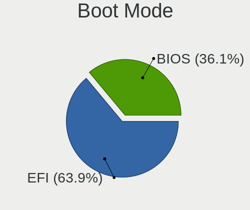

| Mode | Computers | Percent |
|------|-----------|---------|
| EFI  | 326       | 63.3%   |
| BIOS | 189       | 36.7%   |

Filesystem
----------

Type of filesystem

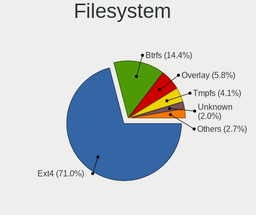

| Type     | Computers | Percent |
|----------|-----------|---------|
| Ext4     | 380       | 73.64%  |
| Btrfs    | 65        | 12.6%   |
| Overlay  | 28        | 5.43%   |
| Tmpfs    | 15        | 2.91%   |
| Unknown  | 14        | 2.71%   |
| Zfs      | 7         | 1.36%   |
| Xfs      | 3         | 0.58%   |
| F2fs     | 2         | 0.39%   |
| Reiserfs | 1         | 0.19%   |
| Ext3     | 1         | 0.19%   |

Part. scheme
------------

Scheme of partitioning

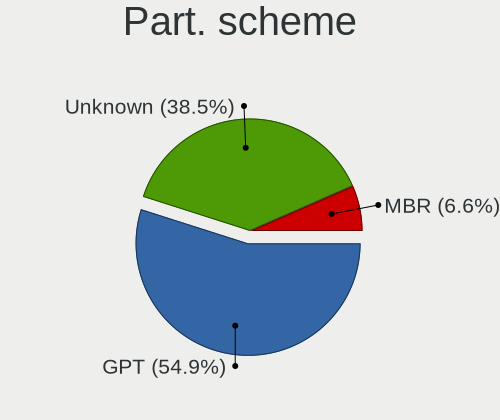

| Type    | Computers | Percent |
|---------|-----------|---------|
| GPT     | 252       | 49.41%  |
| Unknown | 221       | 43.33%  |
| MBR     | 37        | 7.25%   |

Dual Boot with Linux/BSD
------------------------

Hosting more than one Linux/BSD

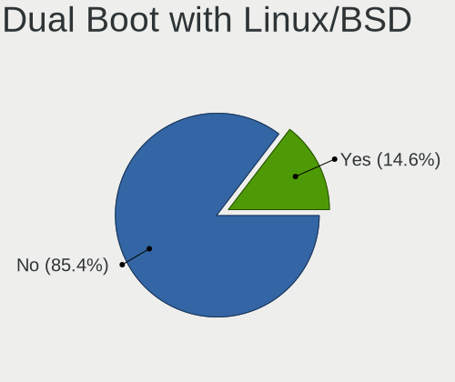

| Dual boot | Computers | Percent |
|-----------|-----------|---------|
| No        | 441       | 86.13%  |
| Yes       | 71        | 13.87%  |

Dual Boot (Win)
---------------

Hosting Linux and Windows

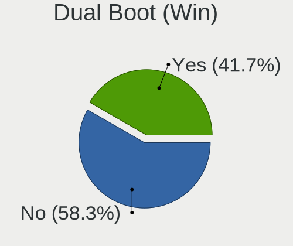

| Dual boot | Computers | Percent |
|-----------|-----------|---------|
| No        | 286       | 55.32%  |
| Yes       | 231       | 44.68%  |

Board
-----

Vendor
------

Motherboard manufacturer

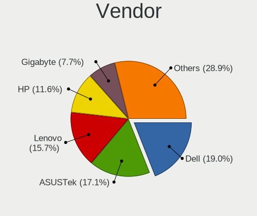

| Name                           | Computers | Percent |
|--------------------------------|-----------|---------|
| Dell                           | 105       | 20.75%  |
| ASUSTek Computer               | 84        | 16.6%   |
| Lenovo                         | 82        | 16.21%  |
| Hewlett-Packard                | 59        | 11.66%  |
| Gigabyte Technology            | 41        | 8.1%    |
| MSI                            | 28        | 5.53%   |
| Acer                           | 28        | 5.53%   |
| Apple                          | 8         | 1.58%   |
| Intel                          | 6         | 1.19%   |
| Toshiba                        | 5         | 0.99%   |
| Sony                           | 5         | 0.99%   |
| Samsung Electronics            | 5         | 0.99%   |
| ASRock                         | 5         | 0.99%   |
| HUAWEI                         | 4         | 0.79%   |
| Chuwi                          | 4         | 0.79%   |
| GuoGuang                       | 3         | 0.59%   |
| ZOTAC                          | 2         | 0.4%    |
| Wistron                        | 2         | 0.4%    |
| Timi                           | 2         | 0.4%    |
| Google                         | 2         | 0.4%    |
| Foxconn                        | 2         | 0.4%    |
| Unknown                        | 2         | 0.4%    |
| Valve                          | 1         | 0.2%    |
| TENKU                          | 1         | 0.2%    |
| T-bao                          | 1         | 0.2%    |
| Supermicro                     | 1         | 0.2%    |
| Shuttle                        | 1         | 0.2%    |
| Shenzhen Amediatech Technology | 1         | 0.2%    |
| Raspberry Pi Foundation        | 1         | 0.2%    |
| Panasonic                      | 1         | 0.2%    |
| Microsoft                      | 1         | 0.2%    |
| MASSCOM VIETNAM                | 1         | 0.2%    |
| LG Electronics                 | 1         | 0.2%    |
| Koompi                         | 1         | 0.2%    |
| Koloe                          | 1         | 0.2%    |
| Jumper                         | 1         | 0.2%    |
| itel Mobile Limited            | 1         | 0.2%    |
| Huanan                         | 1         | 0.2%    |
| Gateway                        | 1         | 0.2%    |
| Colorful Technology            | 1         | 0.2%    |

Model
-----

Motherboard model

| Name                                 | Computers | Percent |
|--------------------------------------|-----------|---------|
| Unknown                              | 7         | 1.38%   |
| Gigabyte H61M-DS2                    | 5         | 0.99%   |
| Lenovo Legion 5 15ARH05 82B5         | 4         | 0.79%   |
| Dell Inspiron 3537                   | 4         | 0.79%   |
| ASUS All Series                      | 4         | 0.79%   |
| MSI MS-7B89                          | 3         | 0.59%   |
| Lenovo ThinkPad E14 20RAS0KX00       | 3         | 0.59%   |
| HP Notebook                          | 3         | 0.59%   |
| ASUS X411UA                          | 3         | 0.59%   |
| Toshiba Satellite L840               | 2         | 0.4%    |
| MSI MS-7C89                          | 2         | 0.4%    |
| MSI MS-7823                          | 2         | 0.4%    |
| MSI Modern 14 B5M                    | 2         | 0.4%    |
| MSI GF63 8RD                         | 2         | 0.4%    |
| Lenovo ThinkPad W530 2447EJ9         | 2         | 0.4%    |
| Lenovo ThinkBook 14 G4+ ARA 21D0     | 2         | 0.4%    |
| Lenovo Legion 5 15ACH6H 82JU         | 2         | 0.4%    |
| Lenovo IdeaPad Gaming 3 15IMH05 81Y4 | 2         | 0.4%    |
| HUAWEI BOM-WXX9                      | 2         | 0.4%    |
| HP Victus by Laptop 16-e0xxx         | 2         | 0.4%    |
| HP Laptop 14-bs0xx                   | 2         | 0.4%    |
| HP EliteBook 8470p                   | 2         | 0.4%    |
| HP EliteBook 840 G2                  | 2         | 0.4%    |
| HP 15                                | 2         | 0.4%    |
| GuoGuang IC2M1028V-J                 | 2         | 0.4%    |
| Gigabyte H81M-DS2                    | 2         | 0.4%    |
| Gigabyte G41M-ES2L                   | 2         | 0.4%    |
| Gigabyte B450M GAMING                | 2         | 0.4%    |
| Gigabyte B360M-D3H                   | 2         | 0.4%    |
| Dell XPS 15 9570                     | 2         | 0.4%    |
| Dell Vostro 5568                     | 2         | 0.4%    |
| Dell Vostro 3590                     | 2         | 0.4%    |
| Dell Vostro 3578                     | 2         | 0.4%    |
| Dell Vostro 3478                     | 2         | 0.4%    |
| Dell Vostro 3460                     | 2         | 0.4%    |
| Dell Vostro 15-3568                  | 2         | 0.4%    |
| Dell Vostro 1450                     | 2         | 0.4%    |
| Dell System Vostro 3450              | 2         | 0.4%    |
| Dell Precision M4600                 | 2         | 0.4%    |
| Dell Latitude E7440                  | 2         | 0.4%    |

Model Family
------------

Motherboard model prefix

| Name               | Computers | Percent |
|--------------------|-----------|---------|
| Lenovo ThinkPad    | 39        | 7.71%   |
| Dell Latitude      | 26        | 5.14%   |
| Dell Inspiron      | 22        | 4.35%   |
| Dell Vostro        | 19        | 3.75%   |
| Acer Aspire        | 18        | 3.56%   |
| Lenovo IdeaPad     | 16        | 3.16%   |
| ASUS ROG           | 16        | 3.16%   |
| HP EliteBook       | 12        | 2.37%   |
| Lenovo Legion      | 10        | 1.98%   |
| Dell Precision     | 10        | 1.98%   |
| Lenovo ThinkBook   | 8         | 1.58%   |
| Dell XPS           | 8         | 1.58%   |
| Dell OptiPlex      | 8         | 1.58%   |
| ASUS VivoBook      | 8         | 1.58%   |
| ASUS PRIME         | 8         | 1.58%   |
| HP ProBook         | 7         | 1.38%   |
| Unknown            | 7         | 1.38%   |
| HP Laptop          | 6         | 1.19%   |
| Gigabyte H61M-DS2  | 5         | 0.99%   |
| Dell System        | 5         | 0.99%   |
| ASUS ASUS          | 5         | 0.99%   |
| HP ZBook           | 4         | 0.79%   |
| Dell G3            | 4         | 0.79%   |
| ASUS All           | 4         | 0.79%   |
| Acer Nitro         | 4         | 0.79%   |
| Toshiba Satellite  | 3         | 0.59%   |
| MSI MS-7B89        | 3         | 0.59%   |
| MSI Modern         | 3         | 0.59%   |
| Lenovo ThinkCentre | 3         | 0.59%   |
| HP Pavilion        | 3         | 0.59%   |
| HP Notebook        | 3         | 0.59%   |
| HP Compaq          | 3         | 0.59%   |
| ASUS X411UA        | 3         | 0.59%   |
| ASUS TUF           | 3         | 0.59%   |
| ASUS P8H61-MX      | 3         | 0.59%   |
| Acer Swift         | 3         | 0.59%   |
| Acer Predator      | 3         | 0.59%   |
| MSI MS-7C89        | 2         | 0.4%    |
| MSI MS-7823        | 2         | 0.4%    |
| MSI GF63           | 2         | 0.4%    |

MFG Year
--------

Motherboard manufacture year

| Year    | Computers | Percent |
|---------|-----------|---------|
| 2018    | 70        | 13.83%  |
| 2020    | 56        | 11.07%  |
| 2019    | 44        | 8.7%    |
| 2012    | 43        | 8.5%    |
| 2021    | 42        | 8.3%    |
| 2013    | 37        | 7.31%   |
| 2014    | 36        | 7.11%   |
| 2017    | 33        | 6.52%   |
| 2015    | 28        | 5.53%   |
| 2016    | 26        | 5.14%   |
| 2011    | 25        | 4.94%   |
| 2022    | 24        | 4.74%   |
| 2010    | 14        | 2.77%   |
| 2009    | 13        | 2.57%   |
| 2023    | 7         | 1.38%   |
| 2007    | 3         | 0.59%   |
| 2008    | 2         | 0.4%    |
| Unknown | 2         | 0.4%    |
| 2006    | 1         | 0.2%    |

Form Factor
-----------

Physical design of the computer

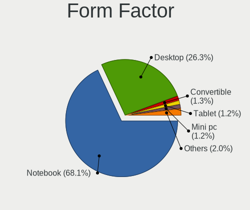

| Name           | Computers | Percent |
|----------------|-----------|---------|
| Notebook       | 352       | 69.57%  |
| Desktop        | 132       | 26.09%  |
| Tablet         | 6         | 1.19%   |
| Mini pc        | 5         | 0.99%   |
| Convertible    | 4         | 0.79%   |
| Server         | 3         | 0.59%   |
| System on chip | 2         | 0.4%    |
| All in one     | 2         | 0.4%    |

Secure Boot
-----------

Enabled or disabled

| State    | Computers | Percent |
|----------|-----------|---------|
| Disabled | 466       | 91.02%  |
| Enabled  | 46        | 8.98%   |

Coreboot
--------

Have coreboot on board

| Used | Computers | Percent |
|------|-----------|---------|
| No   | 504       | 99.6%   |
| Yes  | 2         | 0.4%    |

RAM Size
--------

Total RAM memory

| Size in GB  | Computers | Percent |
|-------------|-----------|---------|
| 4.01-8.0    | 130       | 25.44%  |
| 16.01-24.0  | 117       | 22.9%   |
| 8.01-16.0   | 97        | 18.98%  |
| 3.01-4.0    | 79        | 15.46%  |
| 32.01-64.0  | 45        | 8.81%   |
| 24.01-32.0  | 18        | 3.52%   |
| 1.01-2.0    | 16        | 3.13%   |
| 64.01-256.0 | 6         | 1.17%   |
| 2.01-3.0    | 2         | 0.39%   |
| 0.51-1.0    | 1         | 0.2%    |

RAM Used
--------

Used RAM memory

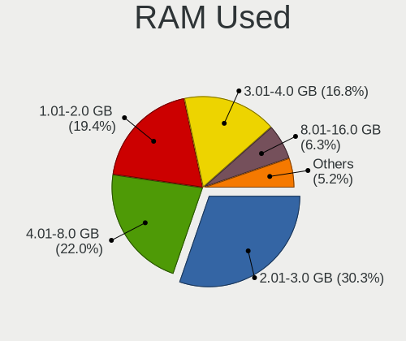

| Used GB    | Computers | Percent |
|------------|-----------|---------|
| 2.01-3.0   | 178       | 33.02%  |
| 1.01-2.0   | 120       | 22.26%  |
| 4.01-8.0   | 104       | 19.29%  |
| 3.01-4.0   | 88        | 16.33%  |
| 8.01-16.0  | 30        | 5.57%   |
| 0.51-1.0   | 12        | 2.23%   |
| 16.01-24.0 | 4         | 0.74%   |
| 0.01-0.5   | 2         | 0.37%   |
| 24.01-32.0 | 1         | 0.19%   |

Total Drives
------------

Number of drives on board

| Drives | Computers | Percent |
|--------|-----------|---------|
| 1      | 297       | 57.45%  |
| 2      | 171       | 33.08%  |
| 3      | 33        | 6.38%   |
| 4      | 10        | 1.93%   |
| 5      | 3         | 0.58%   |
| 0      | 2         | 0.39%   |
| 9      | 1         | 0.19%   |

Has CD-ROM
----------

Has CD-ROM on board

| Presented | Computers | Percent |
|-----------|-----------|---------|
| No        | 413       | 81.62%  |
| Yes       | 93        | 18.38%  |

Has Ethernet
------------

Has Ethernet on board

| Presented | Computers | Percent |
|-----------|-----------|---------|
| Yes       | 428       | 83.59%  |
| No        | 84        | 16.41%  |

Has WiFi
--------

Has WiFi module

| Presented | Computers | Percent |
|-----------|-----------|---------|
| Yes       | 428       | 84.42%  |
| No        | 79        | 15.58%  |

Has Bluetooth
-------------

Has Bluetooth module

| Presented | Computers | Percent |
|-----------|-----------|---------|
| Yes       | 372       | 73.08%  |
| No        | 137       | 26.92%  |

Location
--------

Country
-------

Geographic location (country)

| Country | Computers | Percent |
|---------|-----------|---------|
| Vietnam | 506       | 100%    |

City
----

Geographic location (city)

| City             | Computers | Percent |
|------------------|-----------|---------|
| Ho Chi Minh City | 238       | 44.91%  |
| Hanoi            | 171       | 32.26%  |
| Da Nang          | 14        | 2.64%   |
| Can Tho          | 9         | 1.7%    |
| Nha Trang        | 6         | 1.13%   |
| Bien Hoa         | 6         | 1.13%   |
| Bac Giang        | 5         | 0.94%   |
| Vng Tu       | 4         | 0.75%   |
| Thai Nguyen      | 4         | 0.75%   |
| Tay Ninh         | 4         | 0.75%   |
| Nam nh      | 4         | 0.75%   |
| Tua Chua         | 3         | 0.57%   |
| Thuan An         | 3         | 0.57%   |
| Qung Ngai     | 3         | 0.57%   |
| Nga Bay          | 3         | 0.57%   |
| Hu            | 3         | 0.57%   |
| Hai Duong        | 3         | 0.57%   |
| Dien Ban         | 3         | 0.57%   |
| Buon Ma Thuot    | 3         | 0.57%   |
| Vinh Phuc        | 2         | 0.38%   |
| Vinh             | 2         | 0.38%   |
| Thu Duc          | 2         | 0.38%   |
| Hung Yen         | 2         | 0.38%   |
| Haiphong         | 2         | 0.38%   |
| Binh Hoa         | 2         | 0.38%   |
| Bn Tre        | 2         | 0.38%   |
| Bao Loc          | 2         | 0.38%   |
| Viet Tri         | 1         | 0.19%   |
| Vi Thanh         | 1         | 0.19%   |
| Tra Vinh         | 1         | 0.19%   |
| Tinh Quang Binh  | 1         | 0.19%   |
| Tinh GJong Nai   | 1         | 0.19%   |
| Tinh Binh Duong  | 1         | 0.19%   |
| Thon Dien Ha     | 1         | 0.19%   |
| Thanh Ha       | 1         | 0.19%   |
| Tan An           | 1         | 0.19%   |
| Qui Nhon         | 1         | 0.19%   |
| Quang Trung      | 1         | 0.19%   |
| Quan Muoi Mot    | 1         | 0.19%   |
| Quan Muoi        | 1         | 0.19%   |

Drives
------

Drive Vendor
------------

Hard drive vendors

| Vendor                      | Computers | Drives | Percent |
|-----------------------------|-----------|--------|---------|
| WDC                         | 111       | 140    | 15.06%  |
| Samsung Electronics         | 110       | 139    | 14.93%  |
| Seagate                     | 72        | 86     | 9.77%   |
| Toshiba                     | 47        | 63     | 6.38%   |
| SK hynix                    | 36        | 41     | 4.88%   |
| Kingston                    | 31        | 37     | 4.21%   |
| Unknown                     | 30        | 34     | 4.07%   |
| HGST                        | 28        | 30     | 3.8%    |
| Intel                       | 27        | 29     | 3.66%   |
| Sandisk                     | 24        | 31     | 3.26%   |
| Micron Technology           | 24        | 27     | 3.26%   |
| Hitachi                     | 16        | 21     | 2.17%   |
| Crucial                     | 15        | 18     | 2.04%   |
| KIOXIA                      | 9         | 12     | 1.22%   |
| Plextor                     | 8         | 8      | 1.09%   |
| Lexar                       | 8         | 8      | 1.09%   |
| OSCOO                       | 7         | 8      | 0.95%   |
| Transcend                   | 6         | 6      | 0.81%   |
| TO Exter                    | 6         | 9      | 0.81%   |
| Colorful                    | 6         | 6      | 0.81%   |
| Netac                       | 5         | 6      | 0.68%   |
| KingSpec                    | 5         | 5      | 0.68%   |
| China                       | 5         | 5      | 0.68%   |
| Apple                       | 5         | 5      | 0.68%   |
| Gigabyte Technology         | 4         | 4      | 0.54%   |
| XSTAR                       | 3         | 3      | 0.41%   |
| SPCC                        | 3         | 3      | 0.41%   |
| OCZ                         | 3         | 3      | 0.41%   |
| MAXIO Technology (Hangzhou) | 3         | 3      | 0.41%   |
| LITEON                      | 3         | 3      | 0.41%   |
| Kingmax                     | 3         | 3      | 0.41%   |
| JMicron Technology          | 3         | 3      | 0.41%   |
| Fujitsu                     | 3         | 3      | 0.41%   |
| Unknown                     | 3         | 3      | 0.41%   |
| ZOTAC                       | 2         | 2      | 0.27%   |
| UMIS                        | 2         | 2      | 0.27%   |
| SSSTC                       | 2         | 2      | 0.27%   |
| Silicon Motion              | 2         | 4      | 0.27%   |
| Phison                      | 2         | 3      | 0.27%   |
| Patriot                     | 2         | 2      | 0.27%   |

Drive Model
-----------

Hard drive models

| Model                                               | Computers | Percent |
|-----------------------------------------------------|-----------|---------|
| HGST HTS721010A9E630 1TB                            | 11        | 1.41%   |
| WDC WDS240G2G0A-00JH30 240GB SSD                    | 10        | 1.28%   |
| Seagate ST1000LM035-1RK172 1TB                      | 9         | 1.15%   |
| Samsung SSD 860 EVO 250GB                           | 9         | 1.15%   |
| Samsung NVMe SSD Controller SM981/PM981/PM983 1TB   | 9         | 1.15%   |
| Unknown MMC Card  32GB                              | 6         | 0.77%   |
| Toshiba MQ01ABF050 500GB                            | 6         | 0.77%   |
| TO Exter nal USB 3.0 2TB                            | 6         | 0.77%   |
| Samsung NVMe SSD Drive 512GB                        | 6         | 0.77%   |
| Samsung MZALQ512HALU-000L2 512GB                    | 6         | 0.77%   |
| HGST HTS545050A7E680 500GB                          | 6         | 0.77%   |
| WDC WD5000AAKX-00ERMA0 500GB                        | 5         | 0.64%   |
| Toshiba MQ04ABF100 1TB                              | 5         | 0.64%   |
| Sandisk WD Blue SN550 NVMe SSD 1TB                  | 5         | 0.64%   |
| Samsung SSD 980 1TB                                 | 5         | 0.64%   |
| Samsung SSD 860 EVO 500GB                           | 5         | 0.64%   |
| Samsung NVMe SSD Controller PM9A1/PM9A3/980PRO 1TB  | 5         | 0.64%   |
| Kingston SA400S37240G 240GB SSD                     | 5         | 0.64%   |
| Kingston SA400S37120G 120GB SSD                     | 5         | 0.64%   |
| Crucial CT240BX500SSD1 240GB                        | 5         | 0.64%   |
| WDC WDS240G2G0B-00EPW0 240GB SSD                    | 4         | 0.51%   |
| WDC WD5000LPLX-60ZNTT1 500GB                        | 4         | 0.51%   |
| WDC WD2500AAKX-00ERMA0 250GB                        | 4         | 0.51%   |
| SK hynix NVMe SSD Drive 256GB                       | 4         | 0.51%   |
| Seagate ST500DM002-1BD142 500GB                     | 4         | 0.51%   |
| Seagate ST1000LM049-2GH172 1TB                      | 4         | 0.51%   |
| Seagate ST1000DM010-2EP102 1TB                      | 4         | 0.51%   |
| Samsung NVMe SSD Controller SM961/PM961/SM963 121GB | 4         | 0.51%   |
| Lexar 128GB SSD                                     | 4         | 0.51%   |
| Kingston SA400S37480G 480GB SSD                     | 4         | 0.51%   |
| Kingston OM8PCP3512F-AI1 512GB                      | 4         | 0.51%   |
| XSTAR SSD 128GB                                     | 3         | 0.38%   |
| WDC WD5000LPLX-66ZNTT1 500GB                        | 3         | 0.38%   |
| WDC WD5000LPLX-08ZNTT0 500GB                        | 3         | 0.38%   |
| WDC WD1502FYPS-02W3B0 1TB                           | 3         | 0.38%   |
| Unknown SD/MMC/MS PRO 16GB                          | 3         | 0.38%   |
| Toshiba MQ01ABD100 1TB                              | 3         | 0.38%   |
| SK hynix SKHynix_HFS512GD9TNI-L2A0B 512GB           | 3         | 0.38%   |
| SK hynix NVMe SSD Drive 512GB                       | 3         | 0.38%   |
| SK hynix BC501 NVMe Solid State Drive 512GB         | 3         | 0.38%   |

HDD Vendor
----------

Hard disk drive vendors

| Vendor   | Computers | Drives | Percent |
|----------|-----------|--------|---------|
| WDC      | 78        | 100    | 33.48%  |
| Seagate  | 72        | 85     | 30.9%   |
| Toshiba  | 32        | 39     | 13.73%  |
| HGST     | 28        | 30     | 12.02%  |
| Hitachi  | 16        | 21     | 6.87%   |
| Unknown  | 3         | 3      | 1.29%   |
| Fujitsu  | 3         | 3      | 1.29%   |
| External | 1         | 1      | 0.43%   |

SSD Vendor
----------

Solid state drive vendors

| Vendor              | Computers | Drives | Percent |
|---------------------|-----------|--------|---------|
| Samsung Electronics | 41        | 49     | 16.8%   |
| WDC                 | 22        | 22     | 9.02%   |
| Kingston            | 21        | 26     | 8.61%   |
| Crucial             | 14        | 15     | 5.74%   |
| SanDisk             | 12        | 16     | 4.92%   |
| Intel               | 12        | 13     | 4.92%   |
| Plextor             | 8         | 8      | 3.28%   |
| Lexar               | 8         | 8      | 3.28%   |
| Transcend           | 6         | 6      | 2.46%   |
| TO Exter            | 6         | 9      | 2.46%   |
| Toshiba             | 5         | 6      | 2.05%   |
| SK hynix            | 5         | 5      | 2.05%   |
| OSCOO               | 5         | 5      | 2.05%   |
| Netac               | 5         | 6      | 2.05%   |
| KingSpec            | 5         | 5      | 2.05%   |
| Colorful            | 5         | 5      | 2.05%   |
| China               | 5         | 5      | 2.05%   |
| Micron Technology   | 4         | 4      | 1.64%   |
| XSTAR               | 3         | 3      | 1.23%   |
| LITEON              | 3         | 3      | 1.23%   |
| Kingmax             | 3         | 3      | 1.23%   |
| Gigabyte Technology | 3         | 3      | 1.23%   |
| Apple               | 3         | 3      | 1.23%   |
| ZOTAC               | 2         | 2      | 0.82%   |
| SPCC                | 2         | 2      | 0.82%   |
| OCZ                 | 2         | 2      | 0.82%   |
| Maxtor              | 2         | 4      | 0.82%   |
| LITEONIT            | 2         | 2      | 0.82%   |
| KIOXIA-EXCERIA      | 2         | 3      | 0.82%   |
| KingDian            | 2         | 3      | 0.82%   |
| Hikvision           | 2         | 2      | 0.82%   |
| FORESEE             | 2         | 2      | 0.82%   |
| W800S               | 1         | 1      | 0.41%   |
| VSP-128G            | 1         | 1      | 0.41%   |
| VSP                 | 1         | 1      | 0.41%   |
| Vaseky              | 1         | 1      | 0.41%   |
| Unknown             | 1         | 1      | 0.41%   |
| Team                | 1         | 1      | 0.41%   |
| SAM                 | 1         | 1      | 0.41%   |
| Patriot             | 1         | 1      | 0.41%   |

Drive Kind
----------

HDD or SSD

| Kind    | Computers | Drives | Percent |
|---------|-----------|--------|---------|
| NVMe    | 218       | 285    | 32.01%  |
| SSD     | 218       | 273    | 32.01%  |
| HDD     | 206       | 282    | 30.25%  |
| MMC     | 23        | 27     | 3.38%   |
| Unknown | 16        | 16     | 2.35%   |

Drive Connector
---------------

SATA, SAS, NVMe, etc.

| Type | Computers | Drives | Percent |
|------|-----------|--------|---------|
| SATA | 333       | 543    | 55.87%  |
| NVMe | 218       | 284    | 36.58%  |
| MMC  | 23        | 27     | 3.86%   |
| SAS  | 22        | 29     | 3.69%   |

Drive Size
----------

Size of hard drive

| Size in TB | Computers | Drives | Percent |
|------------|-----------|--------|---------|
| 0.01-0.5   | 283       | 396    | 69.19%  |
| 0.51-1.0   | 95        | 114    | 23.23%  |
| 1.01-2.0   | 21        | 28     | 5.13%   |
| 4.01-10.0  | 6         | 13     | 1.47%   |
| 3.01-4.0   | 3         | 3      | 0.73%   |
| 2.01-3.0   | 1         | 1      | 0.24%   |

Space Total
-----------

Amount of disk space available on the file system

| Size in GB     | Computers | Percent |
|----------------|-----------|---------|
| 101-250        | 182       | 34.21%  |
| 251-500        | 123       | 23.12%  |
| 501-1000       | 53        | 9.96%   |
| 51-100         | 44        | 8.27%   |
| 1001-2000      | 30        | 5.64%   |
| 21-50          | 29        | 5.45%   |
| 1-20           | 25        | 4.7%    |
| Unknown        | 20        | 3.76%   |
| 2001-3000      | 14        | 2.63%   |
| More than 3000 | 12        | 2.26%   |

Space Used
----------

Amount of used disk space

| Used GB        | Computers | Percent |
|----------------|-----------|---------|
| 1-20           | 206       | 38.43%  |
| 21-50          | 105       | 19.59%  |
| 51-100         | 67        | 12.5%   |
| 101-250        | 65        | 12.13%  |
| 251-500        | 34        | 6.34%   |
| 501-1000       | 23        | 4.29%   |
| Unknown        | 20        | 3.73%   |
| 1001-2000      | 7         | 1.31%   |
| More than 3000 | 6         | 1.12%   |
| 2001-3000      | 3         | 0.56%   |

Malfunc. Drives
---------------

Drive models with a malfunction

| Model                                        | Computers | Drives | Percent |
|----------------------------------------------|-----------|--------|---------|
| HGST HTS545050A7E680 500GB                   | 3         | 4      | 5.66%   |
| WDC WDS240G2G0A-00JH30 240GB SSD             | 2         | 2      | 3.77%   |
| WDC WD3200AAKX-001CA0 320GB                  | 2         | 2      | 3.77%   |
| Seagate ST1000LM035-1RK172 1TB               | 2         | 2      | 3.77%   |
| HGST HTS725050A7E630 500GB                   | 2         | 2      | 3.77%   |
| WDC WD5000LPVX-22V0TT0 500GB                 | 1         | 1      | 1.89%   |
| WDC WD5000LPLX-60ZNTT1 500GB                 | 1         | 1      | 1.89%   |
| WDC WD5000AAKX-00ERMA0 500GB                 | 1         | 1      | 1.89%   |
| WDC WD3200AAJS-00L7A0 320GB                  | 1         | 1      | 1.89%   |
| WDC WD32 00BEVT-24A23 320GB                  | 1         | 1      | 1.89%   |
| WDC WD10JPVX-75JC3T0 1TB                     | 1         | 1      | 1.89%   |
| WDC WD10EARS-00Y5B1 1TB                      | 1         | 1      | 1.89%   |
| WDC WD1003FZEX-00MK2A0 1TB                   | 1         | 1      | 1.89%   |
| Unknown Bamba-240GB SSD                      | 1         | 1      | 1.89%   |
| Transcend TS256GSSD230S 256GB                | 1         | 1      | 1.89%   |
| Toshiba MQ01ABD050 500GB                     | 1         | 1      | 1.89%   |
| Toshiba MK8046GSX 80GB                       | 1         | 1      | 1.89%   |
| Toshiba MK3275GSX 320GB                      | 1         | 1      | 1.89%   |
| Toshiba MK3265GSXN 320GB                     | 1         | 1      | 1.89%   |
| Toshiba HDWK105 500GB                        | 1         | 1      | 1.89%   |
| SK hynix HFS032G34MNC-2200A 32GB SSD         | 1         | 1      | 1.89%   |
| Seagate ST9640423AS 640GB                    | 1         | 1      | 1.89%   |
| Seagate ST9320325AS 320GB                    | 1         | 1      | 1.89%   |
| Seagate ST9320320AS 320GB                    | 1         | 1      | 1.89%   |
| Seagate ST9250410AS 250GB                    | 1         | 1      | 1.89%   |
| Seagate ST500LM021-1KJ152 500GB              | 1         | 1      | 1.89%   |
| Seagate ST500DM002-1BD142 500GB              | 1         | 1      | 1.89%   |
| Seagate ST250DM000-1BD141 250GB              | 1         | 1      | 1.89%   |
| Seagate ST1000DM003-1ER162 1TB               | 1         | 1      | 1.89%   |
| Samsung Electronics SSD 870 EVO 1TB          | 1         | 1      | 1.89%   |
| Samsung Electronics MZVPW128HEGM-00000 128GB | 1         | 1      | 1.89%   |
| LITEON LCH-256V2S 256GB SSD                  | 1         | 1      | 1.89%   |
| Kingmax SSD 120GB                            | 1         | 1      | 1.89%   |
| KingFast SSD 32GB                            | 1         | 1      | 1.89%   |
| Intel SSDSC2CW120A3 120GB                    | 1         | 1      | 1.89%   |
| Hitachi HUA722020ALA331 2TB                  | 1         | 1      | 1.89%   |
| Hitachi HTS725050A7E635 500GB                | 1         | 1      | 1.89%   |
| Hitachi HTS725016A9A364 160GB                | 1         | 1      | 1.89%   |
| Hitachi HTS545050A7E380 500GB                | 1         | 1      | 1.89%   |
| Hitachi HTS543232A7A384 320GB                | 1         | 1      | 1.89%   |

Malfunc. Drive Vendor
---------------------

Vendors of faulty drives

| Vendor              | Computers | Drives | Percent |
|---------------------|-----------|--------|---------|
| WDC                 | 12        | 12     | 22.64%  |
| Seagate             | 10        | 10     | 18.87%  |
| HGST                | 8         | 9      | 15.09%  |
| Hitachi             | 6         | 7      | 11.32%  |
| Toshiba             | 5         | 5      | 9.43%   |
| Samsung Electronics | 2         | 2      | 3.77%   |
| Unknown             | 1         | 1      | 1.89%   |
| Transcend           | 1         | 1      | 1.89%   |
| SK hynix            | 1         | 1      | 1.89%   |
| LITEON              | 1         | 1      | 1.89%   |
| Kingmax             | 1         | 1      | 1.89%   |
| KingFast            | 1         | 1      | 1.89%   |
| Intel               | 1         | 1      | 1.89%   |
| Fujitsu             | 1         | 1      | 1.89%   |
| Crucial             | 1         | 1      | 1.89%   |
| China               | 1         | 1      | 1.89%   |

Malfunc. HDD Vendor
-------------------

Vendors of faulty HDD drives

| Vendor  | Computers | Drives | Percent |
|---------|-----------|--------|---------|
| WDC     | 10        | 10     | 25%     |
| Seagate | 10        | 10     | 25%     |
| HGST    | 8         | 9      | 20%     |
| Hitachi | 6         | 7      | 15%     |
| Toshiba | 5         | 5      | 12.5%   |
| Fujitsu | 1         | 1      | 2.5%    |

Malfunc. Drive Kind
-------------------

Kinds of faulty drives

| Kind | Computers | Drives | Percent |
|------|-----------|--------|---------|
| HDD  | 39        | 42     | 76.47%  |
| SSD  | 11        | 12     | 21.57%  |
| NVMe | 1         | 1      | 1.96%   |

Failed Drives
-------------

Failed drive models

| Model                           | Computers | Drives | Percent |
|---------------------------------|-----------|--------|---------|
| Samsung Electronics SSD 980 1TB | 1         | 1      | 100%    |

Failed Drive Vendor
-------------------

Failed drive vendors

| Vendor              | Computers | Drives | Percent |
|---------------------|-----------|--------|---------|
| Samsung Electronics | 1         | 1      | 100%    |

Drive Status
------------

Number of failed and malfunc. drives

| Status   | Computers | Drives | Percent |
|----------|-----------|--------|---------|
| Detected | 267       | 431    | 47.76%  |
| Works    | 243       | 396    | 43.47%  |
| Malfunc  | 48        | 55     | 8.59%   |
| Failed   | 1         | 1      | 0.18%   |

Storage controller
------------------

Storage Vendor
--------------

Storage controller vendors

| Vendor                         | Computers | Percent |
|--------------------------------|-----------|---------|
| Intel                          | 368       | 55.26%  |
| Samsung Electronics            | 82        | 12.31%  |
| AMD                            | 62        | 9.31%   |
| SK hynix                       | 31        | 4.65%   |
| SanDisk                        | 29        | 4.35%   |
| Micron Technology              | 20        | 3%      |
| Toshiba America Info Systems   | 12        | 1.8%    |
| Kingston Technology Company    | 11        | 1.65%   |
| KIOXIA                         | 10        | 1.5%    |
| Silicon Motion                 | 6         | 0.9%    |
| Phison Electronics             | 6         | 0.9%    |
| Solid State Storage Technology | 4         | 0.6%    |
| MAXIO Technology (Hangzhou)    | 4         | 0.6%    |
| ASMedia Technology             | 4         | 0.6%    |
| Micron/Crucial Technology      | 3         | 0.45%   |
| Union Memory (Shenzhen)        | 2         | 0.3%    |
| Lite-On Technology             | 2         | 0.3%    |
| Lenovo                         | 2         | 0.3%    |
| Realtek Semiconductor          | 1         | 0.15%   |
| OCZ Technology Group           | 1         | 0.15%   |
| O2 Micro                       | 1         | 0.15%   |
| Marvell Technology Group       | 1         | 0.15%   |
| LSI Logic / Symbios Logic      | 1         | 0.15%   |
| JMicron Technology             | 1         | 0.15%   |
| Broadcom / LSI                 | 1         | 0.15%   |
| ADATA Technology               | 1         | 0.15%   |

Storage Model
-------------

Storage controller models

| Model                                                                                   | Computers | Percent |
|-----------------------------------------------------------------------------------------|-----------|---------|
| AMD FCH SATA Controller [AHCI mode]                                                     | 55        | 7.63%   |
| Intel Sunrise Point-LP SATA Controller [AHCI mode]                                      | 35        | 4.85%   |
| Intel 7 Series Chipset Family 6-port SATA Controller [AHCI mode]                        | 34        | 4.72%   |
| Samsung NVMe SSD Controller SM981/PM981/PM983                                           | 28        | 3.88%   |
| Samsung NVMe SSD Controller 980 (DRAM-less)                                             | 26        | 3.61%   |
| Intel 8 Series/C220 Series Chipset Family 6-port SATA Controller 1 [AHCI mode]          | 25        | 3.47%   |
| Intel Wildcat Point-LP SATA Controller [AHCI Mode]                                      | 18        | 2.5%    |
| Intel 6 Series/C200 Series Chipset Family 6 port Mobile SATA AHCI Controller            | 18        | 2.5%    |
| Intel 82801 Mobile SATA Controller [RAID mode]                                          | 16        | 2.22%   |
| Intel 8 Series SATA Controller 1 [AHCI mode]                                            | 16        | 2.22%   |
| Intel Q170/Q150/B150/H170/H110/Z170/CM236 Chipset SATA Controller [AHCI Mode]           | 15        | 2.08%   |
| Intel Cannon Lake Mobile PCH SATA AHCI Controller                                       | 15        | 2.08%   |
| Intel Volume Management Device NVMe RAID Controller                                     | 14        | 1.94%   |
| Samsung NVMe SSD Controller SM961/PM961/SM963                                           | 13        | 1.8%    |
| SK hynix Gold P31/BC711/PC711 NVMe Solid State Drive                                    | 12        | 1.66%   |
| SanDisk Ultra 3D / WD Blue SN550 NVMe SSD                                               | 12        | 1.66%   |
| Samsung NVMe SSD Controller PM9A1/PM9A3/980PRO                                          | 12        | 1.66%   |
| Intel NM10/ICH7 Family SATA Controller [IDE mode]                                       | 11        | 1.53%   |
| SK hynix BC501 NVMe Solid State Drive                                                   | 10        | 1.39%   |
| Intel HM170/QM170 Chipset SATA Controller [AHCI Mode]                                   | 10        | 1.39%   |
| Intel Comet Lake SATA AHCI Controller                                                   | 10        | 1.39%   |
| Intel Cannon Point-LP SATA Controller [AHCI Mode]                                       | 10        | 1.39%   |
| Intel Cannon Lake PCH SATA AHCI Controller                                              | 10        | 1.39%   |
| AMD 400 Series Chipset SATA Controller                                                  | 10        | 1.39%   |
| KIOXIA NVMe SSD Controller BG4 (DRAM-less)                                              | 8         | 1.11%   |
| Intel 400 Series Chipset Family SATA AHCI Controller                                    | 8         | 1.11%   |
| Intel 200 Series PCH SATA controller [AHCI mode]                                        | 8         | 1.11%   |
| Intel 6 Series/C200 Series Chipset Family Desktop SATA Controller (IDE mode, ports 4-5) | 7         | 0.97%   |
| Intel 6 Series/C200 Series Chipset Family Desktop SATA Controller (IDE mode, ports 0-3) | 7         | 0.97%   |
| Intel 6 Series/C200 Series Chipset Family 6 port Desktop SATA AHCI Controller           | 7         | 0.97%   |
| Micron 2210 NVMe SSD [Cobain]                                                           | 6         | 0.83%   |
| Intel Tiger Lake-LP SATA Controller                                                     | 6         | 0.83%   |
| Intel 7 Series/C210 Series Chipset Family 6-port SATA Controller [AHCI mode]            | 6         | 0.83%   |
| Intel 5 Series/3400 Series Chipset 6 port SATA AHCI Controller                          | 6         | 0.83%   |
| Silicon Motion SM2263EN/SM2263XT (DRAM-less) NVMe SSD Controllers                       | 5         | 0.69%   |
| Intel Celeron/Pentium Silver Processor SATA Controller                                  | 5         | 0.69%   |
| Intel 82801IBM/IEM (ICH9M/ICH9M-E) 4 port SATA Controller [AHCI mode]                   | 5         | 0.69%   |
| Toshiba America Info Systems XG5 NVMe SSD Controller                                    | 4         | 0.55%   |
| Toshiba America Info Systems BG3 x2 NVMe SSD Controller (DRAM-less)                     | 4         | 0.55%   |
| SanDisk WD Blue SN500 / PC SN520 x2 M.2 2280 NVMe SSD                                   | 4         | 0.55%   |

Storage Kind
------------

Kind of storage controller (IDE, SATA, NVMe, SAS, ...)

| Kind | Computers | Percent |
|------|-----------|---------|
| SATA | 369       | 56.16%  |
| NVMe | 218       | 33.18%  |
| RAID | 37        | 5.63%   |
| IDE  | 32        | 4.87%   |
| SAS  | 1         | 0.15%   |

Processor
---------

CPU Vendor
----------

Processor vendors

| Vendor | Computers | Percent |
|--------|-----------|---------|
| Intel  | 413       | 81.62%  |
| AMD    | 91        | 17.98%  |
| ARM    | 2         | 0.4%    |

CPU Model
---------

Processor models

| Model                                         | Computers | Percent |
|-----------------------------------------------|-----------|---------|
| Intel Core i5-8250U CPU @ 1.60GHz             | 15        | 2.96%   |
| Intel 11th Gen Core i5-1135G7 @ 2.40GHz       | 10        | 1.97%   |
| Intel Core i5-10210U CPU @ 1.60GHz            | 9         | 1.78%   |
| Intel Core i7-7700HQ CPU @ 2.80GHz            | 8         | 1.58%   |
| Intel Core i5-5200U CPU @ 2.20GHz             | 8         | 1.58%   |
| AMD Ryzen 5 5500U with Radeon Graphics        | 8         | 1.58%   |
| Intel Core i7-8750H CPU @ 2.20GHz             | 7         | 1.38%   |
| Intel Core i5-4210U CPU @ 1.70GHz             | 7         | 1.38%   |
| Intel Core i7-6820HQ CPU @ 2.70GHz            | 6         | 1.18%   |
| Intel Core i5-7200U CPU @ 2.50GHz             | 6         | 1.18%   |
| Intel Core i5-3210M CPU @ 2.50GHz             | 6         | 1.18%   |
| AMD Ryzen 7 4800H with Radeon Graphics        | 6         | 1.18%   |
| Intel Core i5-8350U CPU @ 1.70GHz             | 5         | 0.99%   |
| Intel Core i5-8300H CPU @ 2.30GHz             | 5         | 0.99%   |
| Intel Core i5-5300U CPU @ 2.30GHz             | 5         | 0.99%   |
| AMD Ryzen 7 5800H with Radeon Graphics        | 5         | 0.99%   |
| AMD Ryzen 5 4600H with Radeon Graphics        | 5         | 0.99%   |
| Intel Core i7-8650U CPU @ 1.90GHz             | 4         | 0.79%   |
| Intel Core i7-10750H CPU @ 2.60GHz            | 4         | 0.79%   |
| Intel Core i5-4200U CPU @ 1.60GHz             | 4         | 0.79%   |
| Intel Core i5-3470 CPU @ 3.20GHz              | 4         | 0.79%   |
| Intel Core i5-3320M CPU @ 2.60GHz             | 4         | 0.79%   |
| Intel Core i5-3230M CPU @ 2.60GHz             | 4         | 0.79%   |
| Intel Core i3-2350M CPU @ 2.30GHz             | 4         | 0.79%   |
| Intel Core 2 Duo CPU E8400 @ 3.00GHz          | 4         | 0.79%   |
| Intel 12th Gen Core i7-12700H                 | 4         | 0.79%   |
| Intel 11th Gen Core i7-1165G7 @ 2.80GHz       | 4         | 0.79%   |
| AMD Ryzen 7 6800H with Radeon Graphics        | 4         | 0.79%   |
| AMD Ryzen 5 5600H with Radeon Graphics        | 4         | 0.79%   |
| AMD Ryzen 5 3500U with Radeon Vega Mobile Gfx | 4         | 0.79%   |
| Intel Core i7-9750H CPU @ 2.60GHz             | 3         | 0.59%   |
| Intel Core i7-8565U CPU @ 1.80GHz             | 3         | 0.59%   |
| Intel Core i7-6700HQ CPU @ 2.60GHz            | 3         | 0.59%   |
| Intel Core i5-8400 CPU @ 2.80GHz              | 3         | 0.59%   |
| Intel Core i5-8265U CPU @ 1.60GHz             | 3         | 0.59%   |
| Intel Core i5-6500 CPU @ 3.20GHz              | 3         | 0.59%   |
| Intel Core i5-6300U CPU @ 2.40GHz             | 3         | 0.59%   |
| Intel Core i5-4570 CPU @ 3.20GHz              | 3         | 0.59%   |
| Intel Core i5-4460 CPU @ 3.20GHz              | 3         | 0.59%   |
| Intel Core i5-4200M CPU @ 2.50GHz             | 3         | 0.59%   |

CPU Model Family
----------------

Processor model prefix

| Model                   | Computers | Percent |
|-------------------------|-----------|---------|
| Intel Core i5           | 155       | 30.63%  |
| Intel Core i7           | 89        | 17.59%  |
| Intel Core i3           | 53        | 10.47%  |
| AMD Ryzen 5             | 46        | 9.09%   |
| Other                   | 42        | 8.3%    |
| AMD Ryzen 7             | 21        | 4.15%   |
| Intel Celeron           | 18        | 3.56%   |
| Intel Xeon              | 16        | 3.16%   |
| Intel Core 2 Duo        | 14        | 2.77%   |
| Intel Atom              | 9         | 1.78%   |
| Intel Pentium           | 8         | 1.58%   |
| AMD Ryzen 9             | 5         | 0.99%   |
| AMD Ryzen 3             | 5         | 0.99%   |
| Intel Genuine           | 3         | 0.59%   |
| AMD Ryzen 7 PRO         | 3         | 0.59%   |
| Intel Core M            | 2         | 0.4%    |
| Intel Core i9           | 2         | 0.4%    |
| AMD Ryzen 5 PRO         | 2         | 0.4%    |
| AMD A8                  | 2         | 0.4%    |
| AMD A10                 | 2         | 0.4%    |
| Intel Pentium Silver    | 1         | 0.2%    |
| Intel Pentium Gold      | 1         | 0.2%    |
| Intel Pentium Dual-Core | 1         | 0.2%    |
| Intel Pentium Dual      | 1         | 0.2%    |
| Intel Core 2 Quad       | 1         | 0.2%    |
| AMD Phenom II X4        | 1         | 0.2%    |
| AMD E                   | 1         | 0.2%    |
| AMD Athlon II X2        | 1         | 0.2%    |
| AMD Athlon              | 1         | 0.2%    |

CPU Cores
---------

Number of processor cores

| Number  | Computers | Percent |
|---------|-----------|---------|
| 4       | 188       | 37.08%  |
| 2       | 188       | 37.08%  |
| 6       | 70        | 13.81%  |
| 8       | 35        | 6.9%    |
| 16      | 7         | 1.38%   |
| 12      | 7         | 1.38%   |
| 14      | 4         | 0.79%   |
| 1       | 3         | 0.59%   |
| 36      | 1         | 0.2%    |
| 28      | 1         | 0.2%    |
| 24      | 1         | 0.2%    |
| 10      | 1         | 0.2%    |
| Unknown | 1         | 0.2%    |

CPU Sockets
-----------

Number of sockets

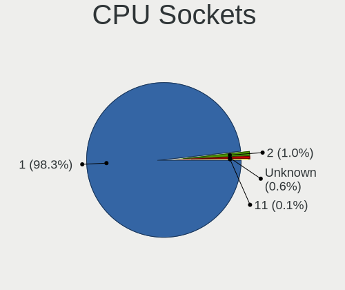

| Number  | Computers | Percent |
|---------|-----------|---------|
| 1       | 500       | 98.62%  |
| 2       | 6         | 1.18%   |
| Unknown | 1         | 0.2%    |

CPU Threads
-----------

Threads per core (Hyper-Threading)

| Number  | Computers | Percent |
|---------|-----------|---------|
| 2       | 402       | 79.13%  |
| 1       | 105       | 20.67%  |
| Unknown | 1         | 0.2%    |

CPU Op-Modes
------------

CPU Operation Modes (32-bit, 64-bit)

| Op mode        | Computers | Percent |
|----------------|-----------|---------|
| 32-bit, 64-bit | 500       | 98.62%  |
| Unknown        | 6         | 1.18%   |
| 64-bit         | 1         | 0.2%    |

CPU Microcode
-------------

Microcode number

| Number     | Computers | Percent |
|------------|-----------|---------|
| Unknown    | 150       | 28.9%   |
| 0x306a9    | 35        | 6.74%   |
| 0x806ea    | 24        | 4.62%   |
| 0x206a7    | 22        | 4.24%   |
| 0x306c3    | 19        | 3.66%   |
| 0x906ea    | 17        | 3.28%   |
| 0x806ec    | 15        | 2.89%   |
| 0x40651    | 15        | 2.89%   |
| 0x806e9    | 14        | 2.7%    |
| 0x806c1    | 14        | 2.7%    |
| 0x306d4    | 14        | 2.7%    |
| 0x906e9    | 10        | 1.93%   |
| 0x1067a    | 10        | 1.93%   |
| 0x08600106 | 10        | 1.93%   |
| 0x506e3    | 9         | 1.73%   |
| 0x406e3    | 8         | 1.54%   |
| 0x0a50000c | 7         | 1.35%   |
| 0x08608103 | 7         | 1.35%   |
| 0x0a50000d | 6         | 1.16%   |
| 0xa0652    | 5         | 0.96%   |
| 0x906a3    | 5         | 0.96%   |
| 0x806d1    | 5         | 0.96%   |
| 0x6fd      | 5         | 0.96%   |
| 0x20655    | 5         | 0.96%   |
| 0xa0653    | 4         | 0.77%   |
| 0x906ed    | 4         | 0.77%   |
| 0x706a1    | 4         | 0.77%   |
| 0x08600104 | 4         | 0.77%   |
| 0x08108102 | 4         | 0.77%   |
| 0x906eb    | 3         | 0.58%   |
| 0x906c0    | 3         | 0.58%   |
| 0x706e5    | 3         | 0.58%   |
| 0x406c4    | 3         | 0.58%   |
| 0x206d7    | 3         | 0.58%   |
| 0x0a404102 | 3         | 0.58%   |
| 0x0a201016 | 3         | 0.58%   |
| 0x08108109 | 3         | 0.58%   |
| 0x0810100b | 3         | 0.58%   |
| 0x90672    | 2         | 0.39%   |
| 0x40661    | 2         | 0.39%   |

CPU Microarch
-------------

Microarchitecture

| Name              | Computers | Percent |
|-------------------|-----------|---------|
| KabyLake          | 116       | 22.92%  |
| Haswell           | 53        | 10.47%  |
| IvyBridge         | 48        | 9.49%   |
| SandyBridge       | 30        | 5.93%   |
| Skylake           | 29        | 5.73%   |
| Unknown           | 26        | 5.14%   |
| Zen 2             | 25        | 4.94%   |
| Zen 3             | 23        | 4.55%   |
| Broadwell         | 22        | 4.35%   |
| TigerLake         | 20        | 3.95%   |
| Penryn            | 13        | 2.57%   |
| Zen+              | 12        | 2.37%   |
| CometLake         | 11        | 2.17%   |
| Westmere          | 10        | 1.98%   |
| Silvermont        | 10        | 1.98%   |
| Alderlake Hybrid  | 10        | 1.98%   |
| Icelake           | 9         | 1.78%   |
| Goldmont plus     | 7         | 1.38%   |
| Core              | 7         | 1.38%   |
| Zen               | 6         | 1.19%   |
| Bonnell           | 5         | 0.99%   |
| Tremont           | 3         | 0.59%   |
| Steamroller       | 2         | 0.4%    |
| Nehalem           | 2         | 0.4%    |
| K10               | 2         | 0.4%    |
| Puma              | 1         | 0.2%    |
| Piledriver        | 1         | 0.2%    |
| Meteorlake Hybrid | 1         | 0.2%    |
| Goldmont          | 1         | 0.2%    |
| Bobcat            | 1         | 0.2%    |

Graphics
--------

GPU Vendor
----------

Vendors of graphics cards

| Vendor                     | Computers | Percent |
|----------------------------|-----------|---------|
| Intel                      | 346       | 52.99%  |
| Nvidia                     | 188       | 28.79%  |
| AMD                        | 117       | 17.92%  |
| Matrox Electronics Systems | 1         | 0.15%   |
| ASPEED Technology          | 1         | 0.15%   |

GPU Model
---------

Graphics card models

| Model                                                                                    | Computers | Percent |
|------------------------------------------------------------------------------------------|-----------|---------|
| Intel 3rd Gen Core processor Graphics Controller                                         | 32        | 4.83%   |
| Intel UHD Graphics 620                                                                   | 27        | 4.08%   |
| Intel 2nd Generation Core Processor Family Integrated Graphics Controller                | 22        | 3.32%   |
| AMD Renoir [Radeon RX Vega 6 (Ryzen 4000/5000 Mobile Series)]                            | 20        | 3.02%   |
| Intel TigerLake-LP GT2 [Iris Xe Graphics]                                                | 19        | 2.87%   |
| Intel Haswell-ULT Integrated Graphics Controller                                         | 19        | 2.87%   |
| Intel HD Graphics 5500                                                                   | 16        | 2.42%   |
| Intel CoffeeLake-H GT2 [UHD Graphics 630]                                                | 15        | 2.27%   |
| Intel HD Graphics 620                                                                    | 14        | 2.11%   |
| Intel CometLake-U GT2 [UHD Graphics]                                                     | 12        | 1.81%   |
| AMD Cezanne [Radeon Vega Series / Radeon Vega Mobile Series]                             | 12        | 1.81%   |
| Nvidia TU117M [GeForce GTX 1650 Mobile / Max-Q]                                          | 11        | 1.66%   |
| Intel Skylake GT2 [HD Graphics 520]                                                      | 11        | 1.66%   |
| Intel Xeon E3-1200 v3/4th Gen Core Processor Integrated Graphics Controller              | 10        | 1.51%   |
| Intel HD Graphics 630                                                                    | 10        | 1.51%   |
| Intel HD Graphics 530                                                                    | 10        | 1.51%   |
| AMD Picasso/Raven 2 [Radeon Vega Series / Radeon Vega Mobile Series]                     | 10        | 1.51%   |
| Nvidia GP107M [GeForce GTX 1050 Mobile]                                                  | 9         | 1.36%   |
| Nvidia GA107M [GeForce RTX 3050 Mobile]                                                  | 9         | 1.36%   |
| AMD Lucienne                                                                             | 9         | 1.36%   |
| AMD Ellesmere [Radeon RX 470/480/570/570X/580/580X/590]                                  | 9         | 1.36%   |
| Nvidia TU117M [GeForce GTX 1650 Ti Mobile]                                               | 8         | 1.21%   |
| Nvidia GK208B [GeForce GT 730]                                                           | 8         | 1.21%   |
| Intel WhiskeyLake-U GT2 [UHD Graphics 620]                                               | 8         | 1.21%   |
| Intel Atom/Celeron/Pentium Processor x5-E8000/J3xxx/N3xxx Integrated Graphics Controller | 8         | 1.21%   |
| Nvidia GP107 [GeForce GTX 1050 Ti]                                                       | 7         | 1.06%   |
| Nvidia GF117M [GeForce 610M/710M/810M/820M / GT 620M/625M/630M/720M]                     | 7         | 1.06%   |
| Intel CometLake-H GT2 [UHD Graphics]                                                     | 7         | 1.06%   |
| Intel Alder Lake-P GT2 [Iris Xe Graphics]                                                | 7         | 1.06%   |
| Intel 4th Gen Core Processor Integrated Graphics Controller                              | 7         | 1.06%   |
| Nvidia TU116M [GeForce GTX 1660 Ti Mobile]                                               | 6         | 0.91%   |
| Nvidia GA106M [GeForce RTX 3060 Mobile / Max-Q]                                          | 6         | 0.91%   |
| Intel GeminiLake [UHD Graphics 600]                                                      | 6         | 0.91%   |
| Intel CoffeeLake-S GT2 [UHD Graphics 630]                                                | 6         | 0.91%   |
| AMD Rembrandt [Radeon 680M]                                                              | 6         | 0.91%   |
| Nvidia GP107M [GeForce GTX 1050 Ti Mobile]                                               | 5         | 0.76%   |
| Intel Xeon E3-1200 v2/3rd Gen Core processor Graphics Controller                         | 5         | 0.76%   |
| Intel TigerLake-H GT1 [UHD Graphics]                                                     | 5         | 0.76%   |
| Intel Core Processor Integrated Graphics Controller                                      | 5         | 0.76%   |
| AMD Sun XT [Radeon HD 8670A/8670M/8690M / R5 M330 / M430 / Radeon 520 Mobile]            | 5         | 0.76%   |

GPU Combo
---------

Combinations of graphics cards

| Name            | Computers | Percent |
|-----------------|-----------|---------|
| 1 x Intel       | 224       | 44.09%  |
| Intel + Nvidia  | 97        | 19.09%  |
| 1 x AMD         | 68        | 13.39%  |
| 1 x Nvidia      | 65        | 12.8%   |
| AMD + Nvidia    | 24        | 4.72%   |
| Intel + AMD     | 22        | 4.33%   |
| Other           | 3         | 0.59%   |
| 2 x AMD         | 3         | 0.59%   |
| Nvidia + ASPEED | 1         | 0.2%    |
| 1 x Matrox      | 1         | 0.2%    |

GPU Driver
----------

Free vs proprietary

| Driver      | Computers | Percent |
|-------------|-----------|---------|
| Free        | 377       | 73.63%  |
| Proprietary | 127       | 24.8%   |
| Unknown     | 8         | 1.56%   |

GPU Memory
----------

Total video memory

| Size in GB | Computers | Percent |
|------------|-----------|---------|
| Unknown    | 303       | 58.83%  |
| 1.01-2.0   | 64        | 12.43%  |
| 3.01-4.0   | 49        | 9.51%   |
| 0.01-0.5   | 36        | 6.99%   |
| 0.51-1.0   | 26        | 5.05%   |
| 5.01-6.0   | 13        | 2.52%   |
| 7.01-8.0   | 12        | 2.33%   |
| 8.01-16.0  | 9         | 1.75%   |
| 2.01-3.0   | 3         | 0.58%   |

Monitor
-------

Monitor Vendor
--------------

Monitor vendors

| Vendor                  | Computers | Percent |
|-------------------------|-----------|---------|
| BOE                     | 82        | 15.16%  |
| Chimei Innolux          | 67        | 12.38%  |
| AU Optronics            | 62        | 11.46%  |
| Samsung Electronics     | 56        | 10.35%  |
| Dell                    | 56        | 10.35%  |
| LG Display              | 52        | 9.61%   |
| Goldstar                | 24        | 4.44%   |
| PANDA                   | 14        | 2.59%   |
| Sharp                   | 13        | 2.4%    |
| ViewSonic               | 10        | 1.85%   |
| AOC                     | 10        | 1.85%   |
| Hewlett-Packard         | 8         | 1.48%   |
| Apple                   | 8         | 1.48%   |
| Lenovo                  | 7         | 1.29%   |
| LGD                     | 5         | 0.92%   |
| InfoVision              | 5         | 0.92%   |
| Chi Mei Optoelectronics | 5         | 0.92%   |
| ASUSTek Computer        | 5         | 0.92%   |
| Ancor Communications    | 4         | 0.74%   |
| Panasonic               | 3         | 0.55%   |
| BenQ                    | 3         | 0.55%   |
| Acer                    | 3         | 0.55%   |
| Unknown                 | 3         | 0.55%   |
| Sony                    | 2         | 0.37%   |
| RTK                     | 2         | 0.37%   |
| Philips                 | 2         | 0.37%   |
| MStar                   | 2         | 0.37%   |
| HKC                     | 2         | 0.37%   |
| Gigabyte Technology     | 2         | 0.37%   |
| Fujitsu                 | 2         | 0.37%   |
| FPT                     | 2         | 0.37%   |
| CSO                     | 2         | 0.37%   |
| VSP                     | 1         | 0.18%   |
| VIE                     | 1         | 0.18%   |
| Valve                   | 1         | 0.18%   |
| Unknown (ADA)           | 1         | 0.18%   |
| TMX                     | 1         | 0.18%   |
| TMK                     | 1         | 0.18%   |
| SKG                     | 1         | 0.18%   |
| NEC Computers           | 1         | 0.18%   |

Monitor Model
-------------

Monitor models

| Model                                                                 | Computers | Percent |
|-----------------------------------------------------------------------|-----------|---------|
| PANDA LCD Monitor NCP004D 1920x1080 344x194mm 15.5-inch               | 6         | 1.1%    |
| AU Optronics LCD Monitor AUO38ED 1920x1080 344x193mm 15.5-inch        | 6         | 1.1%    |
| LGD LCD Monitor 1920x1080                                             | 5         | 0.91%   |
| Goldstar MP59G GSM5B34 1920x1080 480x270mm 21.7-inch                  | 5         | 0.91%   |
| Goldstar FULL HD GSM5B55 1920x1080 480x270mm 21.7-inch                | 5         | 0.91%   |
| Chimei Innolux LCD Monitor CMN1521 1920x1080 344x193mm 15.5-inch      | 5         | 0.91%   |
| Samsung Electronics S22F350 SAM0D1A 1920x1080 477x268mm 21.5-inch     | 4         | 0.73%   |
| LG Display LCD Monitor LGD046D 1920x1080 309x174mm 14.0-inch          | 4         | 0.73%   |
| Chimei Innolux LCD Monitor CMN14D4 1920x1080 309x173mm 13.9-inch      | 4         | 0.73%   |
| AU Optronics LCD Monitor AUO403D 1920x1080 309x173mm 13.9-inch        | 4         | 0.73%   |
| AU Optronics LCD Monitor AUO21ED 1920x1080 344x194mm 15.5-inch        | 4         | 0.73%   |
| Samsung Electronics LCD Monitor SDC5441 1366x768 344x194mm 15.5-inch  | 3         | 0.55%   |
| Panasonic TV MEIC33B 1366x768 521x293mm 23.5-inch                     | 3         | 0.55%   |
| Dell U2417H DEL40E8 1920x1080 527x296mm 23.8-inch                     | 3         | 0.55%   |
| Dell SE198WFP DELF004 1440x900 408x255mm 18.9-inch                    | 3         | 0.55%   |
| Chimei Innolux P140ZKA-BZ1 CMN8C02 2160x1440 296x197mm 14.0-inch      | 3         | 0.55%   |
| BOE LCD Monitor BOE0812 1920x1080 344x194mm 15.5-inch                 | 3         | 0.55%   |
| AOC G2460 AOC2460 1920x1080 531x299mm 24.0-inch                       | 3         | 0.55%   |
| Unknown                                                               | 3         | 0.55%   |
| Sharp LCD Monitor SHP149A 1920x1080 344x194mm 15.5-inch               | 2         | 0.37%   |
| Samsung Electronics SME1720NR SAM0696 1280x1024 338x270mm 17.0-inch   | 2         | 0.37%   |
| Samsung Electronics SMB2030 SAM063C 1600x900 443x249mm 20.0-inch      | 2         | 0.37%   |
| Samsung Electronics LCD Monitor SEC5448 1920x1080 344x194mm 15.5-inch | 2         | 0.37%   |
| Samsung Electronics LCD Monitor SEC5441 1366x768 309x174mm 14.0-inch  | 2         | 0.37%   |
| Samsung Electronics LCD Monitor SEC3649 1366x768 309x174mm 14.0-inch  | 2         | 0.37%   |
| Samsung Electronics LCD Monitor SEC3242 1920x1080 235x132mm 10.6-inch | 2         | 0.37%   |
| Samsung Electronics C24F390 SAM0D2C 1920x1080 521x293mm 23.5-inch     | 2         | 0.37%   |
| RTK FHD HDR RTK2A3B 1920x1080 344x195mm 15.6-inch                     | 2         | 0.37%   |
| PANDA LCD Monitor NCP005F 1920x1080 344x194mm 15.5-inch               | 2         | 0.37%   |
| LG Display LCD Monitor LGD0657 1920x1080 344x194mm 15.5-inch          | 2         | 0.37%   |
| LG Display LCD Monitor LGD05FA 1920x1080 309x174mm 14.0-inch          | 2         | 0.37%   |
| LG Display LCD Monitor LGD0563 1920x1080 344x194mm 15.5-inch          | 2         | 0.37%   |
| LG Display LCD Monitor LGD053F 1920x1080 344x194mm 15.5-inch          | 2         | 0.37%   |
| LG Display LCD Monitor LGD033C 1366x768 309x174mm 14.0-inch           | 2         | 0.37%   |
| Lenovo LCD Monitor LEN40B2 1920x1080 344x193mm 15.5-inch              | 2         | 0.37%   |
| InfoVision LCD Monitor IVO04E3 1366x768 277x156mm 12.5-inch           | 2         | 0.37%   |
| Fujitsu VL-17BSE FUJE711 1280x1024 338x270mm 17.0-inch                | 2         | 0.37%   |
| FPT F22FAD FPTF22F 1920x1080 477x268mm 21.5-inch                      | 2         | 0.37%   |
| Dell U2718Q DELA0EC 3840x2160 609x349mm 27.6-inch                     | 2         | 0.37%   |
| Dell U2515H DELD070 2560x1440 553x311mm 25.0-inch                     | 2         | 0.37%   |

Monitor Resolution
------------------

Monitor screen resolution

| Resolution        | Computers | Percent |
|-------------------|-----------|---------|
| 1920x1080 (FHD)   | 270       | 51.92%  |
| 1366x768 (WXGA)   | 109       | 20.96%  |
| 3840x2160 (4K)    | 25        | 4.81%   |
| 2560x1440 (QHD)   | 25        | 4.81%   |
| 1600x900 (HD+)    | 17        | 3.27%   |
| 1280x1024 (SXGA)  | 11        | 2.12%   |
| 1920x1200 (WUXGA) | 10        | 1.92%   |
| 2880x1800         | 8         | 1.54%   |
| 1280x800 (WXGA)   | 8         | 1.54%   |
| 1440x900 (WXGA+)  | 7         | 1.35%   |
| 2560x1600         | 6         | 1.15%   |
| 2160x1440         | 4         | 0.77%   |
| 2560x1080         | 3         | 0.58%   |
| Unknown           | 3         | 0.58%   |
| 3440x1440         | 2         | 0.38%   |
| 3200x1800 (QHD+)  | 2         | 0.38%   |
| 800x1280          | 1         | 0.19%   |
| 3840x1080         | 1         | 0.19%   |
| 3456x2160         | 1         | 0.19%   |
| 3286x1080         | 1         | 0.19%   |
| 3200x2000         | 1         | 0.19%   |
| 3000x2000         | 1         | 0.19%   |
| 2736x1824         | 1         | 0.19%   |
| 1920x1280         | 1         | 0.19%   |
| 1360x768          | 1         | 0.19%   |
| 1024x600          | 1         | 0.19%   |

Monitor Diagonal
----------------

Diagonal size in inches

| Inches  | Computers | Percent |
|---------|-----------|---------|
| 15      | 158       | 29.37%  |
| 14      | 74        | 13.75%  |
| 13      | 72        | 13.38%  |
| 21      | 32        | 5.95%   |
| 23      | 29        | 5.39%   |
| 24      | 26        | 4.83%   |
| Unknown | 25        | 4.65%   |
| 27      | 24        | 4.46%   |
| 17      | 17        | 3.16%   |
| 18      | 12        | 2.23%   |
| 12      | 12        | 2.23%   |
| 19      | 10        | 1.86%   |
| 20      | 8         | 1.49%   |
| 16      | 6         | 1.12%   |
| 31      | 5         | 0.93%   |
| 84      | 4         | 0.74%   |
| 34      | 4         | 0.74%   |
| 25      | 4         | 0.74%   |
| 11      | 4         | 0.74%   |
| 57      | 2         | 0.37%   |
| 54      | 2         | 0.37%   |
| 7       | 2         | 0.37%   |
| 52      | 1         | 0.19%   |
| 43      | 1         | 0.19%   |
| 42      | 1         | 0.19%   |
| 40      | 1         | 0.19%   |
| 28      | 1         | 0.19%   |
| 10      | 1         | 0.19%   |

Monitor Width
-------------

Physical width

| Width in mm | Computers | Percent |
|-------------|-----------|---------|
| 301-350     | 286       | 53.36%  |
| 501-600     | 80        | 14.93%  |
| 401-500     | 58        | 10.82%  |
| 201-300     | 43        | 8.02%   |
| Unknown     | 25        | 4.66%   |
| 351-400     | 18        | 3.36%   |
| 601-700     | 8         | 1.49%   |
| 701-800     | 6         | 1.12%   |
| 1501-2000   | 4         | 0.75%   |
| 1001-1500   | 3         | 0.56%   |
| 901-1000    | 2         | 0.37%   |
| 801-900     | 1         | 0.19%   |
| 101-200     | 1         | 0.19%   |
| 1-100       | 1         | 0.19%   |

Aspect Ratio
------------

Proportional relationship between the width and the height

| Ratio   | Computers | Percent |
|---------|-----------|---------|
| 16/9    | 401       | 81.5%   |
| 16/10   | 42        | 8.54%   |
| Unknown | 24        | 4.88%   |
| 5/4     | 9         | 1.83%   |
| 3/2     | 8         | 1.63%   |
| 21/9    | 5         | 1.02%   |
| 0.56    | 2         | 0.41%   |
| 0.67    | 1         | 0.2%    |

Monitor Area
------------

Area in inch

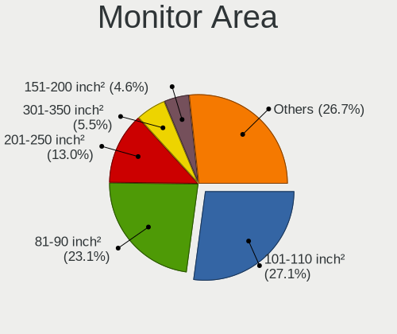

| Area in inch | Computers | Percent |
|----------------|-----------|---------|
| 101-110        | 158       | 29.31%  |
| 81-90          | 126       | 23.38%  |
| 201-250        | 76        | 14.1%   |
| 151-200        | 25        | 4.64%   |
| Unknown        | 25        | 4.64%   |
| 301-350        | 24        | 4.45%   |
| 71-80          | 20        | 3.71%   |
| 141-150        | 17        | 3.15%   |
| 61-70          | 11        | 2.04%   |
| 251-300        | 11        | 2.04%   |
| 121-130        | 10        | 1.86%   |
| More than 1000 | 9         | 1.67%   |
| 351-500        | 9         | 1.67%   |
| 111-120        | 5         | 0.93%   |
| 51-60          | 4         | 0.74%   |
| 501-1000       | 3         | 0.56%   |
| 1-40           | 2         | 0.37%   |
| 91-100         | 2         | 0.37%   |
| 41-50          | 1         | 0.19%   |
| 131-140        | 1         | 0.19%   |

Pixel Density
-------------

Pixels per inch

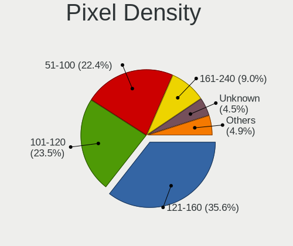

| Density       | Computers | Percent |
|---------------|-----------|---------|
| 121-160       | 195       | 36.72%  |
| 101-120       | 132       | 24.86%  |
| 51-100        | 120       | 22.6%   |
| 161-240       | 39        | 7.34%   |
| Unknown       | 25        | 4.71%   |
| More than 240 | 15        | 2.82%   |
| 1-50          | 5         | 0.94%   |

Multiple Monitors
-----------------

Total monitors connected

| Total | Computers | Percent |
|-------|-----------|---------|
| 1     | 437       | 85.02%  |
| 2     | 58        | 11.28%  |
| 0     | 14        | 2.72%   |
| 3     | 5         | 0.97%   |

Network
-------

Net Controller Vendor
---------------------

Controller vendors

| Vendor                                 | Computers | Percent |
|----------------------------------------|-----------|---------|
| Realtek Semiconductor                  | 293       | 37.47%  |
| Intel                                  | 269       | 34.4%   |
| Qualcomm Atheros                       | 81        | 10.36%  |
| Broadcom                               | 38        | 4.86%   |
| MediaTek                               | 20        | 2.56%   |
| Broadcom Limited                       | 12        | 1.53%   |
| Ralink Technology                      | 11        | 1.41%   |
| TP-Link                                | 10        | 1.28%   |
| ASIX Electronics                       | 7         | 0.9%    |
| Samsung Electronics                    | 6         | 0.77%   |
| Marvell Technology Group               | 6         | 0.77%   |
| Ralink                                 | 4         | 0.51%   |
| Xiaomi                                 | 3         | 0.38%   |
| Hewlett-Packard                        | 3         | 0.38%   |
| D-Link                                 | 3         | 0.38%   |
| Sony Ericsson Mobile Communications AB | 1         | 0.13%   |
| Sierra Wireless                        | 1         | 0.13%   |
| SEGGER                                 | 1         | 0.13%   |
| Qualcomm Atheros Communications        | 1         | 0.13%   |
| Qualcomm                               | 1         | 0.13%   |
| Novatel Wireless                       | 1         | 0.13%   |
| ICS Advent                             | 1         | 0.13%   |
| Huawei Technologies                    | 1         | 0.13%   |
| Foxconn / Hon Hai                      | 1         | 0.13%   |
| Ericsson Business Mobile Networks      | 1         | 0.13%   |
| Edimax Technology                      | 1         | 0.13%   |
| Dell                                   | 1         | 0.13%   |
| ASUSTek Computer                       | 1         | 0.13%   |
| Arduino SA                             | 1         | 0.13%   |
| Aquantia                               | 1         | 0.13%   |
| Unknown                                | 1         | 0.13%   |

Net Controller Model
--------------------

Controller models

| Model                                                             | Computers | Percent |
|-------------------------------------------------------------------|-----------|---------|
| Realtek RTL8111/8168/8411 PCI Express Gigabit Ethernet Controller | 207       | 22.72%  |
| Realtek RTL810xE PCI Express Fast Ethernet controller             | 35        | 3.84%   |
| Intel Wi-Fi 6 AX200                                               | 24        | 2.63%   |
| Intel 82579LM Gigabit Network Connection (Lewisville)             | 23        | 2.52%   |
| Intel Wireless 8265 / 8275                                        | 22        | 2.41%   |
| Qualcomm Atheros QCA9377 802.11ac Wireless Network Adapter        | 18        | 1.98%   |
| Intel Wireless 3165                                               | 18        | 1.98%   |
| Intel Wireless 7265                                               | 16        | 1.76%   |
| Intel Wi-Fi 6 AX201                                               | 16        | 1.76%   |
| Qualcomm Atheros AR9485 Wireless Network Adapter                  | 14        | 1.54%   |
| Intel Cannon Lake PCH CNVi WiFi                                   | 13        | 1.43%   |
| Qualcomm Atheros QCA6174 802.11ac Wireless Network Adapter        | 12        | 1.32%   |
| Intel Wireless 7260                                               | 12        | 1.32%   |
| Broadcom BCM43142 802.11b/g/n                                     | 12        | 1.32%   |
| Realtek RTL8153 Gigabit Ethernet Adapter                          | 11        | 1.21%   |
| MediaTek MT7921 802.11ax PCI Express Wireless Network Adapter     | 11        | 1.21%   |
| Qualcomm Atheros QCA9565 / AR9565 Wireless Network Adapter        | 10        | 1.1%    |
| Intel Wi-Fi 6 AX210/AX211/AX411 160MHz                            | 10        | 1.1%    |
| Intel Ethernet Connection I217-LM                                 | 10        | 1.1%    |
| Intel Ethernet Connection (4) I219-LM                             | 10        | 1.1%    |
| Intel Comet Lake PCH-LP CNVi WiFi                                 | 10        | 1.1%    |
| Realtek RTL8822CE 802.11ac PCIe Wireless Network Adapter          | 9         | 0.99%   |
| Realtek RTL8125 2.5GbE Controller                                 | 9         | 0.99%   |
| Intel Alder Lake-P PCH CNVi WiFi                                  | 9         | 0.99%   |
| Realtek RTL8822BE 802.11a/b/g/n/ac WiFi adapter                   | 8         | 0.88%   |
| Intel Ethernet Connection (3) I218-LM                             | 8         | 0.88%   |
| Intel Centrino Ultimate-N 6300                                    | 8         | 0.88%   |
| Intel Centrino Advanced-N 6205 [Taylor Peak]                      | 8         | 0.88%   |
| Realtek RTL8821CE 802.11ac PCIe Wireless Network Adapter          | 7         | 0.77%   |
| Realtek RTL8723BE PCIe Wireless Network Adapter                   | 7         | 0.77%   |
| Realtek RTL8188EUS 802.11n Wireless Network Adapter               | 7         | 0.77%   |
| Qualcomm Atheros AR9285 Wireless Network Adapter (PCI-Express)    | 7         | 0.77%   |
| Intel Wireless 8260                                               | 7         | 0.77%   |
| Intel Ethernet Connection (7) I219-V                              | 7         | 0.77%   |
| Intel Comet Lake PCH CNVi WiFi                                    | 7         | 0.77%   |
| Ralink MT7601U Wireless Adapter                                   | 6         | 0.66%   |
| Broadcom BCM43602 802.11ac Wireless LAN SoC                       | 6         | 0.66%   |
| TP-Link TL-WN722N v2/v3 [Realtek RTL8188EUS]                      | 5         | 0.55%   |
| Samsung Galaxy series, misc. (tethering mode)                     | 5         | 0.55%   |
| Realtek Killer E2600 Gigabit Ethernet Controller                  | 5         | 0.55%   |

Wireless Vendor
---------------

Wireless vendors

| Vendor                            | Computers | Percent |
|-----------------------------------|-----------|---------|
| Intel                             | 217       | 48.87%  |
| Qualcomm Atheros                  | 67        | 15.09%  |
| Realtek Semiconductor             | 61        | 13.74%  |
| Broadcom                          | 32        | 7.21%   |
| MediaTek                          | 19        | 4.28%   |
| Broadcom Limited                  | 12        | 2.7%    |
| Ralink Technology                 | 11        | 2.48%   |
| TP-Link                           | 10        | 2.25%   |
| Ralink                            | 4         | 0.9%    |
| D-Link                            | 3         | 0.68%   |
| Xiaomi                            | 1         | 0.23%   |
| Sierra Wireless                   | 1         | 0.23%   |
| Qualcomm Atheros Communications   | 1         | 0.23%   |
| Marvell Technology Group          | 1         | 0.23%   |
| Ericsson Business Mobile Networks | 1         | 0.23%   |
| Edimax Technology                 | 1         | 0.23%   |
| Dell                              | 1         | 0.23%   |
| ASUSTek Computer                  | 1         | 0.23%   |

Wireless Model
--------------

Wireless models

| Model                                                          | Computers | Percent |
|----------------------------------------------------------------|-----------|---------|
| Intel Wi-Fi 6 AX200                                            | 24        | 5.36%   |
| Intel Wireless 8265 / 8275                                     | 22        | 4.91%   |
| Qualcomm Atheros QCA9377 802.11ac Wireless Network Adapter     | 18        | 4.02%   |
| Intel Wireless 3165                                            | 18        | 4.02%   |
| Intel Wireless 7265                                            | 16        | 3.57%   |
| Intel Wi-Fi 6 AX201                                            | 16        | 3.57%   |
| Qualcomm Atheros AR9485 Wireless Network Adapter               | 14        | 3.13%   |
| Intel Cannon Lake PCH CNVi WiFi                                | 13        | 2.9%    |
| Qualcomm Atheros QCA6174 802.11ac Wireless Network Adapter     | 12        | 2.68%   |
| Intel Wireless 7260                                            | 12        | 2.68%   |
| Broadcom BCM43142 802.11b/g/n                                  | 12        | 2.68%   |
| MediaTek MT7921 802.11ax PCI Express Wireless Network Adapter  | 11        | 2.46%   |
| Qualcomm Atheros QCA9565 / AR9565 Wireless Network Adapter     | 10        | 2.23%   |
| Intel Wi-Fi 6 AX210/AX211/AX411 160MHz                         | 10        | 2.23%   |
| Intel Comet Lake PCH-LP CNVi WiFi                              | 10        | 2.23%   |
| Realtek RTL8822CE 802.11ac PCIe Wireless Network Adapter       | 9         | 2.01%   |
| Realtek RTL8822BE 802.11a/b/g/n/ac WiFi adapter                | 8         | 1.79%   |
| Intel Centrino Ultimate-N 6300                                 | 8         | 1.79%   |
| Intel Centrino Advanced-N 6205 [Taylor Peak]                   | 8         | 1.79%   |
| Intel Alder Lake-P PCH CNVi WiFi                               | 8         | 1.79%   |
| Realtek RTL8821CE 802.11ac PCIe Wireless Network Adapter       | 7         | 1.56%   |
| Realtek RTL8723BE PCIe Wireless Network Adapter                | 7         | 1.56%   |
| Realtek RTL8188EUS 802.11n Wireless Network Adapter            | 7         | 1.56%   |
| Qualcomm Atheros AR9285 Wireless Network Adapter (PCI-Express) | 7         | 1.56%   |
| Intel Wireless 8260                                            | 7         | 1.56%   |
| Intel Comet Lake PCH CNVi WiFi                                 | 7         | 1.56%   |
| Ralink MT7601U Wireless Adapter                                | 6         | 1.34%   |
| Broadcom BCM43602 802.11ac Wireless LAN SoC                    | 6         | 1.34%   |
| TP-Link TL-WN722N v2/v3 [Realtek RTL8188EUS]                   | 5         | 1.12%   |
| MediaTek MT7922 802.11ax PCI Express Wireless Network Adapter  | 5         | 1.12%   |
| Intel Wireless 3160                                            | 5         | 1.12%   |
| Broadcom Limited BCM4312 802.11b/g LP-PHY                      | 5         | 1.12%   |
| Broadcom BCM4313 802.11bgn Wireless Network Adapter            | 5         | 1.12%   |
| Realtek RTL8852BE PCIe 802.11ax Wireless Network Controller    | 4         | 0.89%   |
| Realtek RTL8852AE 802.11ax PCIe Wireless Network Adapter       | 4         | 0.89%   |
| Intel Ice Lake-LP PCH CNVi WiFi                                | 4         | 0.89%   |
| Intel Dual Band Wireless-AC 3168NGW [Stone Peak]               | 4         | 0.89%   |
| Intel Cannon Point-LP CNVi [Wireless-AC]                       | 4         | 0.89%   |
| Broadcom Limited BCM4313 802.11bgn Wireless Network Adapter    | 4         | 0.89%   |
| Realtek RTL8723DE Wireless Network Adapter                     | 3         | 0.67%   |

Ethernet Vendor
---------------

Ethernet vendors

| Vendor                                 | Computers | Percent |
|----------------------------------------|-----------|---------|
| Realtek Semiconductor                  | 271       | 60.22%  |
| Intel                                  | 121       | 26.89%  |
| Qualcomm Atheros                       | 21        | 4.67%   |
| Broadcom                               | 8         | 1.78%   |
| ASIX Electronics                       | 7         | 1.56%   |
| Samsung Electronics                    | 6         | 1.33%   |
| Marvell Technology Group               | 5         | 1.11%   |
| Xiaomi                                 | 2         | 0.44%   |
| Hewlett-Packard                        | 2         | 0.44%   |
| Sony Ericsson Mobile Communications AB | 1         | 0.22%   |
| Qualcomm                               | 1         | 0.22%   |
| MediaTek                               | 1         | 0.22%   |
| ICS Advent                             | 1         | 0.22%   |
| Huawei Technologies                    | 1         | 0.22%   |
| Foxconn / Hon Hai                      | 1         | 0.22%   |
| Aquantia                               | 1         | 0.22%   |

Ethernet Model
--------------

Ethernet models

| Model                                                             | Computers | Percent |
|-------------------------------------------------------------------|-----------|---------|
| Realtek RTL8111/8168/8411 PCI Express Gigabit Ethernet Controller | 207       | 45.2%   |
| Realtek RTL810xE PCI Express Fast Ethernet controller             | 35        | 7.64%   |
| Intel 82579LM Gigabit Network Connection (Lewisville)             | 23        | 5.02%   |
| Realtek RTL8153 Gigabit Ethernet Adapter                          | 11        | 2.4%    |
| Intel Ethernet Connection I217-LM                                 | 10        | 2.18%   |
| Intel Ethernet Connection (4) I219-LM                             | 10        | 2.18%   |
| Realtek RTL8125 2.5GbE Controller                                 | 9         | 1.97%   |
| Intel Ethernet Connection (3) I218-LM                             | 8         | 1.75%   |
| Intel Ethernet Connection (7) I219-V                              | 7         | 1.53%   |
| Samsung Galaxy series, misc. (tethering mode)                     | 5         | 1.09%   |
| Realtek Killer E2600 Gigabit Ethernet Controller                  | 5         | 1.09%   |
| Qualcomm Atheros Killer E2400 Gigabit Ethernet Controller         | 5         | 1.09%   |
| Intel Ethernet Connection I218-LM                                 | 5         | 1.09%   |
| Intel I210 Gigabit Network Connection                             | 4         | 0.87%   |
| Intel Ethernet Connection I219-LM                                 | 4         | 0.87%   |
| Intel Ethernet Connection (5) I219-LM                             | 4         | 0.87%   |
| Intel Ethernet Connection (2) I219-V                              | 4         | 0.87%   |
| Intel Ethernet Connection (2) I219-LM                             | 4         | 0.87%   |
| Intel 82577LM Gigabit Network Connection                          | 4         | 0.87%   |
| ASIX AX88179 Gigabit Ethernet                                     | 4         | 0.87%   |
| Qualcomm Atheros QCA8171 Gigabit Ethernet                         | 3         | 0.66%   |
| Qualcomm Atheros AR8152 v2.0 Fast Ethernet                        | 3         | 0.66%   |
| Intel I211 Gigabit Network Connection                             | 3         | 0.66%   |
| Intel Ethernet Connection (4) I219-V                              | 3         | 0.66%   |
| Intel 82574L Gigabit Network Connection                           | 3         | 0.66%   |
| ASIX AX88772A Fast Ethernet                                       | 3         | 0.66%   |
| Xiaomi Mi/Redmi series (RNDIS)                                    | 2         | 0.44%   |
| Realtek RTL8152 Fast Ethernet Adapter                             | 2         | 0.44%   |
| Realtek Killer E2500 Gigabit Ethernet Controller                  | 2         | 0.44%   |
| Qualcomm Atheros Killer E2500 Gigabit Ethernet Controller         | 2         | 0.44%   |
| Qualcomm Atheros Killer E220x Gigabit Ethernet Controller         | 2         | 0.44%   |
| Qualcomm Atheros AR8162 Fast Ethernet                             | 2         | 0.44%   |
| Qualcomm Atheros AR8161 Gigabit Ethernet                          | 2         | 0.44%   |
| Marvell Group 88E8057 PCI-E Gigabit Ethernet Controller           | 2         | 0.44%   |
| Intel Ethernet Controller I225-V                                  | 2         | 0.44%   |
| Intel Ethernet Connection I217-V                                  | 2         | 0.44%   |
| Intel Ethernet Connection (12) I219-V                             | 2         | 0.44%   |
| Intel 82579V Gigabit Network Connection                           | 2         | 0.44%   |
| Intel 82562GT 10/100 Network Connection                           | 2         | 0.44%   |
| Broadcom NetXtreme BCM57765 Gigabit Ethernet PCIe                 | 2         | 0.44%   |

Net Controller Kind
-------------------

Ethernet, WiFi or modem

| Kind     | Computers | Percent |
|----------|-----------|---------|
| WiFi     | 427       | 49.71%  |
| Ethernet | 427       | 49.71%  |
| Modem    | 4         | 0.47%   |
| Unknown  | 1         | 0.12%   |

Used Controller
---------------

Currently used network controller

| Kind     | Computers | Percent |
|----------|-----------|---------|
| WiFi     | 361       | 68.11%  |
| Ethernet | 168       | 31.7%   |
| Modem    | 1         | 0.19%   |

NICs
----

Total network controllers on board

| Total | Computers | Percent |
|-------|-----------|---------|
| 2     | 315       | 62.01%  |
| 1     | 180       | 35.43%  |
| 3     | 9         | 1.77%   |
| 0     | 4         | 0.79%   |

IPv6
----

IPv6 vs IPv4

| Used | Computers | Percent |
|------|-----------|---------|
| No   | 387       | 74.85%  |
| Yes  | 130       | 25.15%  |

Bluetooth
---------

Bluetooth Vendor
----------------

Controller vendors

| Vendor                          | Computers | Percent |
|---------------------------------|-----------|---------|
| Intel                           | 187       | 49.73%  |
| Qualcomm Atheros Communications | 36        | 9.57%   |
| Realtek Semiconductor           | 35        | 9.31%   |
| Broadcom                        | 25        | 6.65%   |
| IMC Networks                    | 19        | 5.05%   |
| Cambridge Silicon Radio         | 19        | 5.05%   |
| Lite-On Technology              | 16        | 4.26%   |
| Foxconn / Hon Hai               | 11        | 2.93%   |
| Apple                           | 7         | 1.86%   |
| Hewlett-Packard                 | 4         | 1.06%   |
| Dell                            | 4         | 1.06%   |
| Realtek                         | 3         | 0.8%    |
| Ralink                          | 2         | 0.53%   |
| MediaTek                        | 2         | 0.53%   |
| TP-Link                         | 1         | 0.27%   |
| Toshiba                         | 1         | 0.27%   |
| Opticis                         | 1         | 0.27%   |
| Marvell Semiconductor           | 1         | 0.27%   |
| Conwise Technology              | 1         | 0.27%   |
| Alps Electric                   | 1         | 0.27%   |

Bluetooth Model
---------------

Controller models

| Model                                               | Computers | Percent |
|-----------------------------------------------------|-----------|---------|
| Intel Bluetooth wireless interface                  | 74        | 19.58%  |
| Intel AX201 Bluetooth                               | 34        | 8.99%   |
| Intel Bluetooth 9460/9560 Jefferson Peak (JfP)      | 28        | 7.41%   |
| Realtek Bluetooth Radio                             | 26        | 6.88%   |
| Intel AX200 Bluetooth                               | 24        | 6.35%   |
| Qualcomm Atheros  Bluetooth Device                  | 19        | 5.03%   |
| Cambridge Silicon Radio Bluetooth Dongle (HCI mode) | 19        | 5.03%   |
| Intel AX210 Bluetooth                               | 10        | 2.65%   |
| Intel Bluetooth Device                              | 9         | 2.38%   |
| IMC Networks Wireless_Device                        | 8         | 2.12%   |
| Lite-On Qualcomm Atheros QCA9377 Bluetooth          | 6         | 1.59%   |
| Foxconn / Hon Hai Wireless_Device                   | 6         | 1.59%   |
| Broadcom BCM20702 Bluetooth 4.0 [ThinkPad]          | 6         | 1.59%   |
| Apple Bluetooth Host Controller                     | 6         | 1.59%   |
| Qualcomm Atheros QCA61x4 Bluetooth 4.0              | 5         | 1.32%   |
| IMC Networks Bluetooth Radio                        | 5         | 1.32%   |
| Realtek RTL8822BE Bluetooth 4.2 Adapter             | 4         | 1.06%   |
| Realtek  Bluetooth 4.2 Adapter                      | 4         | 1.06%   |
| Qualcomm Atheros AR9462 Bluetooth                   | 4         | 1.06%   |
| Intel Wireless-AC 3168 Bluetooth                    | 4         | 1.06%   |
| IMC Networks Atheros AR3012 Bluetooth 4.0 Adapter   | 4         | 1.06%   |
| Broadcom BCM43142 Bluetooth 4.0                     | 4         | 1.06%   |
| Realtek Bluetooth Radio                             | 3         | 0.79%   |
| Qualcomm Atheros AR3011 Bluetooth                   | 3         | 0.79%   |
| Lite-On Bluetooth Radio                             | 3         | 0.79%   |
| Intel Wireless-AC 9260 Bluetooth Adapter            | 3         | 0.79%   |
| Intel Centrino Bluetooth Wireless Transceiver       | 3         | 0.79%   |
| HP Broadcom 2070 Bluetooth Combo                    | 3         | 0.79%   |
| Broadcom HP Portable SoftSailing                    | 3         | 0.79%   |
| Broadcom BCM2070 Bluetooth 2.1 + EDR                | 3         | 0.79%   |
| Ralink RT3290 Bluetooth                             | 2         | 0.53%   |
| Qualcomm Atheros Bluetooth USB Host Controller      | 2         | 0.53%   |
| Qualcomm Atheros AR3012 Bluetooth 4.0               | 2         | 0.53%   |
| MediaTek Wireless_Device                            | 2         | 0.53%   |
| Lite-On Wireless_Device                             | 2         | 0.53%   |
| IMC Networks Bluetooth Device                       | 2         | 0.53%   |
| Foxconn / Hon Hai Broadcom BCM20702A1 Bluetooth     | 2         | 0.53%   |
| Dell DW375 Bluetooth Module                         | 2         | 0.53%   |
| Broadcom BCM43142A0 Bluetooth Device                | 2         | 0.53%   |
| Broadcom BCM2045B (BDC-2.1)                         | 2         | 0.53%   |

Sound
-----

Sound Vendor
------------

Sound card vendors

| Vendor                    | Computers | Percent |
|---------------------------|-----------|---------|
| Intel                     | 406       | 59.18%  |
| Nvidia                    | 131       | 19.1%   |
| AMD                       | 105       | 15.31%  |
| Generalplus Technology    | 8         | 1.17%   |
| C-Media Electronics       | 5         | 0.73%   |
| Realtek Semiconductor     | 3         | 0.44%   |
| JMTek                     | 3         | 0.44%   |
| Creative Labs             | 3         | 0.44%   |
| Audient                   | 3         | 0.44%   |
| Logitech                  | 2         | 0.29%   |
| FIFINE Microphones        | 2         | 0.29%   |
| Apple                     | 2         | 0.29%   |
| Shenzhen Rapoo Technology | 1         | 0.15%   |
| Plantronics               | 1         | 0.15%   |
| OPPO Electronics          | 1         | 0.15%   |
| Nordic Semiconductor ASA  | 1         | 0.15%   |
| GYROCOM C&C               | 1         | 0.15%   |
| GN Netcom                 | 1         | 0.15%   |
| Elgato Systems            | 1         | 0.15%   |
| Creative Technology       | 1         | 0.15%   |
| Conexant Systems          | 1         | 0.15%   |
| AudioQuest                | 1         | 0.15%   |
| ASUSTek Computer          | 1         | 0.15%   |
| AGPTek                    | 1         | 0.15%   |
| Unknown                   | 1         | 0.15%   |

Sound Model
-----------

Sound card models

| Model                                                                      | Computers | Percent |
|----------------------------------------------------------------------------|-----------|---------|
| AMD Family 17h/19h HD Audio Controller                                     | 64        | 7.83%   |
| Intel Sunrise Point-LP HD Audio                                            | 56        | 6.85%   |
| Intel 7 Series/C216 Chipset Family High Definition Audio Controller        | 42        | 5.14%   |
| AMD Renoir Radeon High Definition Audio Controller                         | 39        | 4.77%   |
| Intel 6 Series/C200 Series Chipset Family High Definition Audio Controller | 32        | 3.92%   |
| Intel 8 Series/C220 Series Chipset High Definition Audio Controller        | 30        | 3.67%   |
| Intel Cannon Lake PCH cAVS                                                 | 28        | 3.43%   |
| Intel Xeon E3-1200 v3/4th Gen Core Processor HD Audio Controller           | 20        | 2.45%   |
| Intel Tiger Lake-LP Smart Sound Technology Audio Controller                | 20        | 2.45%   |
| Intel Broadwell-U Audio Controller                                         | 20        | 2.45%   |
| Intel Wildcat Point-LP High Definition Audio Controller                    | 19        | 2.33%   |
| Intel Haswell-ULT HD Audio Controller                                      | 19        | 2.33%   |
| Intel 8 Series HD Audio Controller                                         | 19        | 2.33%   |
| Intel 100 Series/C230 Series Chipset Family HD Audio Controller            | 18        | 2.2%    |
| Nvidia TU107 GeForce GTX 1650 High Definition Audio Controller             | 14        | 1.71%   |
| AMD Raven/Raven2/Fenghuang HDMI/DP Audio Controller                        | 14        | 1.71%   |
| Nvidia GP107GL High Definition Audio Controller                            | 13        | 1.59%   |
| Intel Comet Lake PCH-LP cAVS                                               | 13        | 1.59%   |
| Nvidia GK208 HDMI/DP Audio Controller                                      | 12        | 1.47%   |
| Intel NM10/ICH7 Family High Definition Audio Controller                    | 12        | 1.47%   |
| Nvidia TU116 High Definition Audio Controller                              | 11        | 1.35%   |
| Intel CM238 HD Audio Controller                                            | 11        | 1.35%   |
| Nvidia GF108 High Definition Audio Controller                              | 10        | 1.22%   |
| Nvidia Audio device                                                        | 10        | 1.22%   |
| Intel Cannon Point-LP High Definition Audio Controller                     | 10        | 1.22%   |
| Intel Alder Lake PCH-P High Definition Audio Controller                    | 10        | 1.22%   |
| Intel 5 Series/3400 Series Chipset High Definition Audio                   | 9         | 1.1%    |
| AMD Ellesmere HDMI Audio [Radeon RX 470/480 / 570/580/590]                 | 9         | 1.1%    |
| Nvidia GA106 High Definition Audio Controller                              | 8         | 0.98%   |
| Intel 200 Series PCH HD Audio                                              | 8         | 0.98%   |
| Generalplus Technology USB Audio Device                                    | 8         | 0.98%   |
| AMD Starship/Matisse HD Audio Controller                                   | 8         | 0.98%   |
| Nvidia GP106 High Definition Audio Controller                              | 7         | 0.86%   |
| Nvidia GM107 High Definition Audio Controller [GeForce 940MX]              | 7         | 0.86%   |
| Nvidia GK107 HDMI Audio Controller                                         | 7         | 0.86%   |
| Intel Comet Lake PCH cAVS                                                  | 7         | 0.86%   |
| Intel Celeron/Pentium Silver Processor High Definition Audio               | 7         | 0.86%   |
| AMD Rembrandt Radeon High Definition Audio Controller                      | 7         | 0.86%   |
| Intel Tiger Lake-H HD Audio Controller                                     | 6         | 0.73%   |
| Intel 82801I (ICH9 Family) HD Audio Controller                             | 6         | 0.73%   |

Memory
------

Memory Vendor
-------------

Memory module vendors

| Vendor                                  | Computers | Percent |
|-----------------------------------------|-----------|---------|
| Samsung Electronics                     | 93        | 24.41%  |
| SK hynix                                | 71        | 18.64%  |
| Kingston                                | 69        | 18.11%  |
| Micron Technology                       | 46        | 12.07%  |
| Corsair                                 | 19        | 4.99%   |
| G.Skill                                 | 17        | 4.46%   |
| Unknown                                 | 15        | 3.94%   |
| Crucial                                 | 12        | 3.15%   |
| Ramaxel Technology                      | 9         | 2.36%   |
| Kingmax                                 | 7         | 1.84%   |
| A-DATA Technology                       | 6         | 1.57%   |
| Team                                    | 4         | 1.05%   |
| Elpida                                  | 3         | 0.79%   |
| Apacer                                  | 3         | 0.79%   |
| Kingmax Semiconductor                   | 2         | 0.52%   |
| Unknown (7FE0)                          | 1         | 0.26%   |
| Silicon Power Computer & Communications | 1         | 0.26%   |
| Patriot                                 | 1         | 0.26%   |
| Nanya Technology                        | 1         | 0.26%   |
| ASint Technology                        | 1         | 0.26%   |

Memory Model
------------

Memory module models

| Model                                                        | Computers | Percent |
|--------------------------------------------------------------|-----------|---------|
| SK hynix RAM HMAA1GS6CJR6N-XN 8GB SODIMM DDR4 3200MT/s       | 6         | 1.44%   |
| Samsung RAM M471B5173QH0-YK0 4GB SODIMM DDR3 1600MT/s        | 6         | 1.44%   |
| Samsung RAM M471B5173DB0-YK0 4GB SODIMM DDR3 1600MT/s        | 6         | 1.44%   |
| SK hynix RAM HMT351S6EFR8A-PB 4096MB SODIMM DDR3 1600MT/s    | 5         | 1.2%    |
| Samsung RAM M471A1K43CB1-CRC 8GB SODIMM DDR4 2667MT/s        | 5         | 1.2%    |
| Kingston RAM LV32D4S2S8HD-8 8GB SODIMM DDR4 3200MT/s         | 5         | 1.2%    |
| Samsung RAM M471B5173EB0-YK0 4GB SODIMM DDR3 1600MT/s        | 4         | 0.96%   |
| Samsung RAM M471A5244CB0-CWE 4GB SODIMM DDR4 3200MT/s        | 4         | 0.96%   |
| Samsung RAM M471A5244CB0-CRC 4GB SODIMM DDR4 2667MT/s        | 4         | 0.96%   |
| Samsung RAM M471A1K43DB1-CWE 8GB SODIMM DDR4 3200MT/s        | 4         | 0.96%   |
| Samsung RAM M471A1K43CB1-CTD 8GB SODIMM DDR4 2667MT/s        | 4         | 0.96%   |
| Micron RAM 4ATF51264HZ-2G6E1 4GB SODIMM DDR4 2667MT/s        | 4         | 0.96%   |
| Corsair RAM CMK8GX4M1A2666C16 8GB DIMM DDR4 3000MT/s         | 4         | 0.96%   |
| SK hynix RAM HMT451S6AFR8A-PB 4GB SODIMM DDR3 1600MT/s       | 3         | 0.72%   |
| SK hynix RAM HMA851S6AFR6N-UH 4GB SODIMM DDR4 2667MT/s       | 3         | 0.72%   |
| SK hynix RAM HMA81GS6JJR8N-VK 8GB SODIMM DDR4 2667MT/s       | 3         | 0.72%   |
| SK hynix RAM HMA81GS6DJR8N-XN 8GB SODIMM DDR4 3200MT/s       | 3         | 0.72%   |
| SK hynix RAM HMA81GS6AFR8N-UH 8GB SODIMM DDR4 2667MT/s       | 3         | 0.72%   |
| Samsung RAM M471A2K43DB1-CWE 16GB SODIMM DDR4 3200MT/s       | 3         | 0.72%   |
| Samsung RAM M471A2K43CB1-CTD 16GB SODIMM DDR4 8400MT/s       | 3         | 0.72%   |
| Samsung RAM M471A1K43DB1-CTD 8GB SODIMM DDR4 2667MT/s        | 3         | 0.72%   |
| Micron RAM 8KTF51264HZ-1G6E1 4096MB SODIMM DDR3 1600MT/s     | 3         | 0.72%   |
| Micron RAM 4ATF1G64HZ-3G2E2 8GB SODIMM DDR4 3200MT/s         | 3         | 0.72%   |
| Kingston RAM KHX3200C16D4/8GX 8GB DIMM DDR4 3733MT/s         | 3         | 0.72%   |
| Kingston RAM 9905700-122.A00G 16GB SODIMM DDR4 3200MT/s      | 3         | 0.72%   |
| Unknown RAM Module 1GB DIMM 800MT/s                          | 2         | 0.48%   |
| Team RAM TEAMGROUP-SD4-3200 8GB SODIMM DDR4 3200MT/s         | 2         | 0.48%   |
| SK hynix RAM HMT451S6BFR8A-PB 4GB SODIMM DDR3 1600MT/s       | 2         | 0.48%   |
| SK hynix RAM HMT41GS6BFR8A-PB 8192MB SODIMM DDR3 1600MT/s    | 2         | 0.48%   |
| SK hynix RAM HMT351S6CFR8C-PB 4GB SODIMM DDR3 1600MT/s       | 2         | 0.48%   |
| SK hynix RAM HMAA1GS6CJR6N-XN 8GB Row Of Chips DDR4 3200MT/s | 2         | 0.48%   |
| SK hynix RAM HMA851S6CJR6N-XN 4GB Row Of Chips DDR4 3200MT/s | 2         | 0.48%   |
| SK hynix RAM HMA82GS6AFR8N-UH 16GB SODIMM DDR4 2667MT/s      | 2         | 0.48%   |
| SK hynix RAM HMA81GS6CJR8N-VK 8GB SODIMM DDR4 2667MT/s       | 2         | 0.48%   |
| SK hynix RAM HMA451S6AFR8N-TF 4GB SODIMM DDR4 2133MT/s       | 2         | 0.48%   |
| Samsung RAM Module 8192MB SODIMM DDR4 3200MT/s               | 2         | 0.48%   |
| Samsung RAM M471B5273CH0-CH9 4GB SODIMM DDR3 1334MT/s        | 2         | 0.48%   |
| Samsung RAM M471B1G73QH0-YK0 8GB SODIMM DDR3 1867MT/s        | 2         | 0.48%   |
| Samsung RAM M471B1G73EB0-YK0 8GB SODIMM DDR3 1600MT/s        | 2         | 0.48%   |
| Samsung RAM M471B1G73DB0-YK0 8GB SODIMM DDR3 1600MT/s        | 2         | 0.48%   |

Memory Kind
-----------

Memory module kinds

| Kind    | Computers | Percent |
|---------|-----------|---------|
| DDR4    | 177       | 57.1%   |
| DDR3    | 95        | 30.65%  |
| LPDDR4  | 11        | 3.55%   |
| LPDDR3  | 8         | 2.58%   |
| DDR5    | 7         | 2.26%   |
| LPDDR5  | 4         | 1.29%   |
| DDR2    | 4         | 1.29%   |
| Unknown | 2         | 0.65%   |
| SDRAM   | 1         | 0.32%   |
| DDR     | 1         | 0.32%   |

Memory Form Factor
------------------

Physical design of the memory module

| Name         | Computers | Percent |
|--------------|-----------|---------|
| SODIMM       | 209       | 66.99%  |
| DIMM         | 77        | 24.68%  |
| Row Of Chips | 25        | 8.01%   |
| Unknown      | 1         | 0.32%   |

Memory Size
-----------

Memory module size

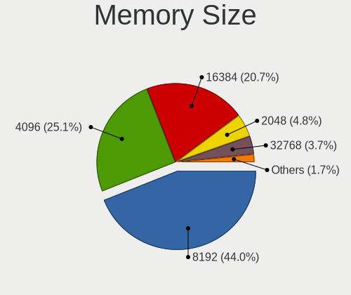

| Size  | Computers | Percent |
|-------|-----------|---------|
| 8192  | 146       | 43.2%   |
| 4096  | 105       | 31.07%  |
| 16384 | 55        | 16.27%  |
| 2048  | 18        | 5.33%   |
| 32768 | 8         | 2.37%   |
| 1024  | 6         | 1.78%   |

Memory Speed
------------

Memory module speed

| Speed   | Computers | Percent |
|---------|-----------|---------|
| 3200    | 73        | 21.04%  |
| 1600    | 69        | 19.88%  |
| 2667    | 65        | 18.73%  |
| 2400    | 30        | 8.65%   |
| 1333    | 18        | 5.19%   |
| 2133    | 12        | 3.46%   |
| 3000    | 7         | 2.02%   |
| 1334    | 7         | 2.02%   |
| 1867    | 6         | 1.73%   |
| 4800    | 5         | 1.44%   |
| 3600    | 5         | 1.44%   |
| 4267    | 4         | 1.15%   |
| 8400    | 3         | 0.86%   |
| 6400    | 3         | 0.86%   |
| 3733    | 3         | 0.86%   |
| 2666    | 3         | 0.86%   |
| 1067    | 3         | 0.86%   |
| 1066    | 3         | 0.86%   |
| 800     | 3         | 0.86%   |
| 2800    | 2         | 0.58%   |
| 1866    | 2         | 0.58%   |
| 667     | 2         | 0.58%   |
| Unknown | 2         | 0.58%   |
| 7467    | 1         | 0.29%   |
| 5600    | 1         | 0.29%   |
| 5200    | 1         | 0.29%   |
| 4266    | 1         | 0.29%   |
| 4199    | 1         | 0.29%   |
| 3666    | 1         | 0.29%   |
| 3466    | 1         | 0.29%   |
| 3400    | 1         | 0.29%   |
| 3334    | 1         | 0.29%   |
| 3266    | 1         | 0.29%   |
| 3007    | 1         | 0.29%   |
| 2933    | 1         | 0.29%   |
| 2448    | 1         | 0.29%   |
| 1800    | 1         | 0.29%   |
| 1648    | 1         | 0.29%   |
| 200     | 1         | 0.29%   |
| 133     | 1         | 0.29%   |

Printers & scanners
-------------------

Printer Vendor
--------------

Printer device vendors

| Vendor          | Computers | Percent |
|-----------------|-----------|---------|
| Hewlett-Packard | 2         | 40%     |
| Ricoh           | 1         | 20%     |
| MIIIW           | 1         | 20%     |
| Canon           | 1         | 20%     |

Printer Model
-------------

Printer device models

| Model                      | Computers | Percent |
|----------------------------|-----------|---------|
| Ricoh Printing Support     | 1         | 20%     |
| MIIIW MW Keyboard Air Mini | 1         | 20%     |
| HP LaserJet P3010 Series   | 1         | 20%     |
| HP LaserJet P1102          | 1         | 20%     |
| Canon LBP6030w/6018w       | 1         | 20%     |

Scanner Vendor
--------------

Scanner device vendors

Zero info for selected period =(

Scanner Model
-------------

Scanner device models

Zero info for selected period =(

Camera
------

Camera Vendor
-------------

Camera device vendors

| Vendor                                 | Computers | Percent |
|----------------------------------------|-----------|---------|
| Chicony Electronics                    | 65        | 19.12%  |
| Microdia                               | 47        | 13.82%  |
| IMC Networks                           | 47        | 13.82%  |
| Sunplus Innovation Technology          | 30        | 8.82%   |
| Realtek Semiconductor                  | 30        | 8.82%   |
| Bison Electronics                      | 22        | 6.47%   |
| Quanta                                 | 18        | 5.29%   |
| Syntek                                 | 11        | 3.24%   |
| Logitech                               | 9         | 2.65%   |
| Apple                                  | 9         | 2.65%   |
| Lite-On Technology                     | 7         | 2.06%   |
| Cheng Uei Precision Industry (Foxlink) | 7         | 2.06%   |
| Suyin                                  | 6         | 1.76%   |
| Luxvisions Innotech Limited            | 6         | 1.76%   |
| Samsung Electronics                    | 3         | 0.88%   |
| Alcor Micro                            | 3         | 0.88%   |
| Acer                                   | 3         | 0.88%   |
| Sonix Technology                       | 2         | 0.59%   |
| Silicon Motion                         | 2         | 0.59%   |
| Shenzhen Kingcome Optoelectronic       | 2         | 0.59%   |
| Ricoh                                  | 2         | 0.59%   |
| Lenovo                                 | 1         | 0.29%   |
| KYE Systems (Mouse Systems)            | 1         | 0.29%   |
| Intel                                  | 1         | 0.29%   |
| IDS Imaging Development Systems        | 1         | 0.29%   |
| DLTDC0A9II090N                         | 1         | 0.29%   |
| Denron                                 | 1         | 0.29%   |
| Aveo Technology                        | 1         | 0.29%   |
| Alpha Imaging Technology               | 1         | 0.29%   |
| ALi                                    | 1         | 0.29%   |

Camera Model
------------

Camera device models

| Model                                           | Computers | Percent |
|-------------------------------------------------|-----------|---------|
| Microdia Integrated_Webcam_HD                   | 23        | 6.73%   |
| Chicony Integrated Camera                       | 21        | 6.14%   |
| Sunplus Integrated_Webcam_HD                    | 16        | 4.68%   |
| IMC Networks USB2.0 HD UVC WebCam               | 14        | 4.09%   |
| Realtek Integrated_Webcam_HD                    | 11        | 3.22%   |
| IMC Networks Integrated Camera                  | 11        | 3.22%   |
| Syntek Integrated Camera                        | 8         | 2.34%   |
| IMC Networks USB2.0 VGA UVC WebCam              | 7         | 2.05%   |
| Chicony HD WebCam                               | 7         | 2.05%   |
| Bison Integrated Camera                         | 7         | 2.05%   |
| Microdia Laptop_Integrated_Webcam_HD            | 6         | 1.75%   |
| Realtek Integrated Webcam                       | 5         | 1.46%   |
| Microdia Integrated Webcam                      | 5         | 1.46%   |
| Chicony HP Truevision HD camera                 | 5         | 1.46%   |
| Chicony HP HD Camera                            | 5         | 1.46%   |
| Bison HD Webcam                                 | 5         | 1.46%   |
| Apple iPhone 5/5C/5S/6/SE/7/8/X                 | 5         | 1.46%   |
| Quanta HP TrueVision HD Camera                  | 4         | 1.17%   |
| Luxvisions Innotech Limited Integrated Camera   | 4         | 1.17%   |
| Logitech Webcam C270                            | 4         | 1.17%   |
| Chicony HD User Facing                          | 4         | 1.17%   |
| Bison ThinkPad Integrated Camera                | 4         | 1.17%   |
| Bison SunplusIT Integrated Camera               | 4         | 1.17%   |
| Sunplus Laptop_Integrated_Webcam_FHD            | 3         | 0.88%   |
| Samsung Galaxy series, misc. (MTP mode)         | 3         | 0.88%   |
| Realtek Integrated Webcam HD                    | 3         | 0.88%   |
| Quanta VGA WebCam                               | 3         | 0.88%   |
| Quanta HD User Facing                           | 3         | 0.88%   |
| Lite-On Integrated Camera                       | 3         | 0.88%   |
| IMC Networks VGA UVC WebCam                     | 3         | 0.88%   |
| IMC Networks USB2.0 UVC HD Webcam               | 3         | 0.88%   |
| Chicony Integrated HP HD Webcam                 | 3         | 0.88%   |
| Chicony HP HD Webcam                            | 3         | 0.88%   |
| Syntek Lenovo EasyCamera                        | 2         | 0.58%   |
| Suyin Laptop_Integrated_Webcam_HD               | 2         | 0.58%   |
| Sunplus Laptop_Integrated_Webcam_HD             | 2         | 0.58%   |
| Sunplus HD WebCam                               | 2         | 0.58%   |
| Sunplus Asus Webcam                             | 2         | 0.58%   |
| Shenzhen Kingcome Optoelectronic 720p HD Camera | 2         | 0.58%   |
| Realtek USB2.0 HD UVC WebCam                    | 2         | 0.58%   |

Security
--------

Fingerprint Vendor
------------------

Fingerprint sensor vendors

| Vendor                     | Computers | Percent |
|----------------------------|-----------|---------|
| Validity Sensors           | 36        | 46.75%  |
| Shenzhen Goodix Technology | 18        | 23.38%  |
| Synaptics                  | 15        | 19.48%  |
| Samsung Electronics        | 2         | 2.6%    |
| LighTuning Technology      | 2         | 2.6%    |
| Elan Microelectronics      | 2         | 2.6%    |
| Upek                       | 1         | 1.3%    |
| STMicroelectronics         | 1         | 1.3%    |

Fingerprint Model
-----------------

Fingerprint sensor models

| Model                                                                      | Computers | Percent |
|----------------------------------------------------------------------------|-----------|---------|
| Shenzhen Goodix  Fingerprint Device                                        | 13        | 16.88%  |
| Validity Sensors VFS495 Fingerprint Reader                                 | 7         | 9.09%   |
| Validity Sensors VFS5011 Fingerprint Reader                                | 6         | 7.79%   |
| Validity Sensors Synaptics WBDI                                            | 5         | 6.49%   |
| Synaptics Metallica MIS Touch Fingerprint Reader                           | 5         | 6.49%   |
| Validity Sensors VFS 5011 fingerprint sensor                               | 4         | 5.19%   |
| Validity Sensors Synaptics VFS7552 Touch Fingerprint Sensor                | 4         | 5.19%   |
| Synaptics Prometheus MIS Touch Fingerprint Reader                          | 4         | 5.19%   |
| Shenzhen Goodix Fingerprint Reader                                         | 4         | 5.19%   |
| Validity Sensors VFS Fingerprint sensor                                    | 3         | 3.9%    |
| Validity Sensors Synaptics VFS7552 Touch Fingerprint Sensor with PurePrint | 3         | 3.9%    |
| Validity Sensors VFS471 Fingerprint Reader                                 | 2         | 2.6%    |
| Synaptics FS7604 Touch Fingerprint Sensor with PurePrint                   | 2         | 2.6%    |
| Samsung Fingerprint Sensor Device - 730B                                   | 2         | 2.6%    |
| LighTuning EgisTec Touch Fingerprint Sensor                                | 2         | 2.6%    |
| Elan ELAN:Fingerprint                                                      | 2         | 2.6%    |
| Validity Sensors VFS7552 Touch Fingerprint Sensor                          | 1         | 1.3%    |
| Validity Sensors VFS451 Fingerprint Reader                                 | 1         | 1.3%    |
| Upek Biometric Touchchip/Touchstrip Fingerprint Sensor                     | 1         | 1.3%    |
| Synaptics WBDI Fingerprint Reader USB 086                                  | 1         | 1.3%    |
| Synaptics UWP WBDI                                                         | 1         | 1.3%    |
| Synaptics Metallica MOH Touch Fingerprint Reader                           | 1         | 1.3%    |
| Synaptics Fingerprint reader [HP G6]                                       | 1         | 1.3%    |
| STMicroelectronics Fingerprint Reader                                      | 1         | 1.3%    |
| Shenzhen Goodix FingerPrint                                                | 1         | 1.3%    |

Chipcard Vendor
---------------

Chipcard module vendors

| Vendor      | Computers | Percent |
|-------------|-----------|---------|
| Broadcom    | 16        | 80%     |
| Alcor Micro | 2         | 10%     |
| Upek        | 1         | 5%      |
| Lenovo      | 1         | 5%      |

Chipcard Model
--------------

Chipcard module models

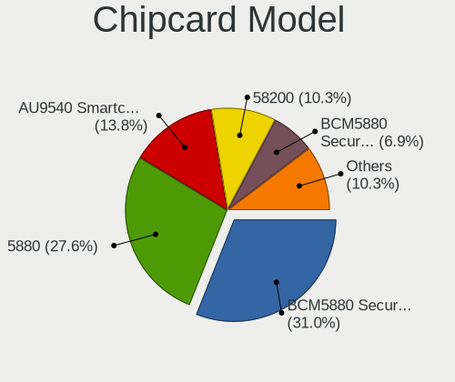

| Model                                                                        | Computers | Percent |
|------------------------------------------------------------------------------|-----------|---------|
| Broadcom BCM5880 Secure Applications Processor                               | 7         | 35%     |
| Broadcom 5880                                                                | 5         | 25%     |
| Broadcom BCM5880 Secure Applications Processor with fingerprint swipe sensor | 2         | 10%     |
| Broadcom 58200                                                               | 2         | 10%     |
| Alcor Micro AU9540 Smartcard Reader                                          | 2         | 10%     |
| Upek TouchChip Fingerprint Coprocessor (WBF advanced mode)                   | 1         | 5%      |
| Lenovo Integrated Smart Card Reader                                          | 1         | 5%      |

Unsupported
-----------

Unsupported Devices
-------------------

Total unsupported devices on board

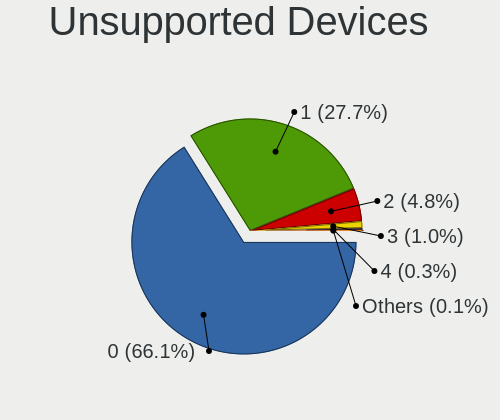

| Total | Computers | Percent |
|-------|-----------|---------|
| 0     | 343       | 66.47%  |
| 1     | 149       | 28.88%  |
| 2     | 20        | 3.88%   |
| 3     | 3         | 0.58%   |
| 5     | 1         | 0.19%   |

Unsupported Device Types
------------------------

Types of unsupported devices

| Type                     | Computers | Percent |
|--------------------------|-----------|---------|
| Fingerprint reader       | 75        | 37.88%  |
| Graphics card            | 39        | 19.7%   |
| Chipcard                 | 20        | 10.1%   |
| Net/wireless             | 18        | 9.09%   |
| Camera                   | 10        | 5.05%   |
| Multimedia controller    | 9         | 4.55%   |
| Communication controller | 7         | 3.54%   |
| Bluetooth                | 6         | 3.03%   |
| Net/ethernet             | 5         | 2.53%   |
| Unassigned class         | 4         | 2.02%   |
| Storage                  | 2         | 1.01%   |
| Card reader              | 2         | 1.01%   |
| Sound                    | 1         | 0.51%   |

