Linux in Vietnam - Tested Hardware & Statistics (Desktops)
----------------------------------------------------------

A project to collect tested hardware configurations for Linux in Vietnam.

Anyone can contribute to this report by the [hw-probe](https://github.com/linuxhw/hw-probe) tool:

    sudo -E hw-probe -all -upload

Please contribute! Especially if your hardware is rare.

Contents
--------

* [ Test Cases ](#test-cases)

* [ System ](#system)
  - [ OS                       ](#os)
  - [ OS Family                ](#os-family)
  - [ Kernel                   ](#kernel)
  - [ Kernel Family            ](#kernel-family)
  - [ Kernel Major Ver.        ](#kernel-major-ver)
  - [ Arch                     ](#arch)
  - [ DE                       ](#de)
  - [ Display Server           ](#display-server)
  - [ Display Manager          ](#display-manager)
  - [ OS Lang                  ](#os-lang)
  - [ Boot Mode                ](#boot-mode)
  - [ Filesystem               ](#filesystem)
  - [ Part. scheme             ](#part-scheme)
  - [ Dual Boot with Linux/BSD ](#dual-boot-with-linuxbsd)
  - [ Dual Boot (Win)          ](#dual-boot-win)

* [ Board ](#board)
  - [ Vendor                   ](#vendor)
  - [ Model                    ](#model)
  - [ Model Family             ](#model-family)
  - [ MFG Year                 ](#mfg-year)
  - [ Form Factor              ](#form-factor)
  - [ Secure Boot              ](#secure-boot)
  - [ Coreboot                 ](#coreboot)
  - [ RAM Size                 ](#ram-size)
  - [ RAM Used                 ](#ram-used)
  - [ Total Drives             ](#total-drives)
  - [ Has CD-ROM               ](#has-cd-rom)
  - [ Has Ethernet             ](#has-ethernet)
  - [ Has WiFi                 ](#has-wifi)
  - [ Has Bluetooth            ](#has-bluetooth)

* [ Location ](#location)
  - [ Country                  ](#country)
  - [ City                     ](#city)

* [ Drives ](#drives)
  - [ Drive Vendor             ](#drive-vendor)
  - [ Drive Model              ](#drive-model)
  - [ HDD Vendor               ](#hdd-vendor)
  - [ SSD Vendor               ](#ssd-vendor)
  - [ Drive Kind               ](#drive-kind)
  - [ Drive Connector          ](#drive-connector)
  - [ Drive Size               ](#drive-size)
  - [ Space Total              ](#space-total)
  - [ Space Used               ](#space-used)
  - [ Malfunc. Drives          ](#malfunc-drives)
  - [ Malfunc. Drive Vendor    ](#malfunc-drive-vendor)
  - [ Malfunc. HDD Vendor      ](#malfunc-hdd-vendor)
  - [ Malfunc. Drive Kind      ](#malfunc-drive-kind)
  - [ Failed Drives            ](#failed-drives)
  - [ Failed Drive Vendor      ](#failed-drive-vendor)
  - [ Drive Status             ](#drive-status)

* [ Storage controller ](#storage-controller)
  - [ Storage Vendor           ](#storage-vendor)
  - [ Storage Model            ](#storage-model)
  - [ Storage Kind             ](#storage-kind)

* [ Processor ](#processor)
  - [ CPU Vendor               ](#cpu-vendor)
  - [ CPU Model                ](#cpu-model)
  - [ CPU Model Family         ](#cpu-model-family)
  - [ CPU Cores                ](#cpu-cores)
  - [ CPU Sockets              ](#cpu-sockets)
  - [ CPU Threads              ](#cpu-threads)
  - [ CPU Op-Modes             ](#cpu-op-modes)
  - [ CPU Microcode            ](#cpu-microcode)
  - [ CPU Microarch            ](#cpu-microarch)

* [ Graphics ](#graphics)
  - [ GPU Vendor               ](#gpu-vendor)
  - [ GPU Model                ](#gpu-model)
  - [ GPU Combo                ](#gpu-combo)
  - [ GPU Driver               ](#gpu-driver)
  - [ GPU Memory               ](#gpu-memory)

* [ Monitor ](#monitor)
  - [ Monitor Vendor           ](#monitor-vendor)
  - [ Monitor Model            ](#monitor-model)
  - [ Monitor Resolution       ](#monitor-resolution)
  - [ Monitor Diagonal         ](#monitor-diagonal)
  - [ Monitor Width            ](#monitor-width)
  - [ Aspect Ratio             ](#aspect-ratio)
  - [ Monitor Area             ](#monitor-area)
  - [ Pixel Density            ](#pixel-density)
  - [ Multiple Monitors        ](#multiple-monitors)

* [ Network ](#network)
  - [ Net Controller Vendor    ](#net-controller-vendor)
  - [ Net Controller Model     ](#net-controller-model)
  - [ Wireless Vendor          ](#wireless-vendor)
  - [ Wireless Model           ](#wireless-model)
  - [ Ethernet Vendor          ](#ethernet-vendor)
  - [ Ethernet Model           ](#ethernet-model)
  - [ Net Controller Kind      ](#net-controller-kind)
  - [ Used Controller          ](#used-controller)
  - [ NICs                     ](#nics)
  - [ IPv6                     ](#ipv6)

* [ Bluetooth ](#bluetooth)
  - [ Bluetooth Vendor         ](#bluetooth-vendor)
  - [ Bluetooth Model          ](#bluetooth-model)

* [ Sound ](#sound)
  - [ Sound Vendor             ](#sound-vendor)
  - [ Sound Model              ](#sound-model)

* [ Memory ](#memory)
  - [ Memory Vendor            ](#memory-vendor)
  - [ Memory Model             ](#memory-model)
  - [ Memory Kind              ](#memory-kind)
  - [ Memory Form Factor       ](#memory-form-factor)
  - [ Memory Size              ](#memory-size)
  - [ Memory Speed             ](#memory-speed)

* [ Printers & scanners ](#printers--scanners)
  - [ Printer Vendor           ](#printer-vendor)
  - [ Printer Model            ](#printer-model)
  - [ Scanner Vendor           ](#scanner-vendor)
  - [ Scanner Model            ](#scanner-model)

* [ Camera ](#camera)
  - [ Camera Vendor            ](#camera-vendor)
  - [ Camera Model             ](#camera-model)

* [ Security ](#security)
  - [ Fingerprint Vendor       ](#fingerprint-vendor)
  - [ Fingerprint Model        ](#fingerprint-model)
  - [ Chipcard Vendor          ](#chipcard-vendor)
  - [ Chipcard Model           ](#chipcard-model)

* [ Unsupported ](#unsupported)
  - [ Unsupported Devices      ](#unsupported-devices)
  - [ Unsupported Device Types ](#unsupported-device-types)

Test Cases
----------

Total: 277

| Vendor        | Model                       | Probe                                                      | Date         |
|---------------|-----------------------------|------------------------------------------------------------|--------------|
| ASUSTek       | PRIME H510M-K               | [2a6b25b609](https://linux-hardware.org/?probe=2a6b25b609) | Jan 02, 2025 |
| ASUSTek       | PRIME H510M-K               | [5f6888e1a9](https://linux-hardware.org/?probe=5f6888e1a9) | Dec 30, 2024 |
| HP            | 212B                        | [3ddbe304f3](https://linux-hardware.org/?probe=3ddbe304f3) | Dec 29, 2024 |
| HP            | 212B                        | [d64fe3acb0](https://linux-hardware.org/?probe=d64fe3acb0) | Dec 29, 2024 |
| HP            | 805A                        | [d55f3bc8c3](https://linux-hardware.org/?probe=d55f3bc8c3) | Dec 26, 2024 |
| MSI           | B450M MORTAR MAX            | [d76388f034](https://linux-hardware.org/?probe=d76388f034) | Dec 16, 2024 |
| MSI           | B450M MORTAR MAX            | [00eb10a377](https://linux-hardware.org/?probe=00eb10a377) | Dec 16, 2024 |
| Acer          | Aspire TC-780               | [63e18470f5](https://linux-hardware.org/?probe=63e18470f5) | Dec 12, 2024 |
| MSI           | H310M PRO-VD                | [05ecf2c89a](https://linux-hardware.org/?probe=05ecf2c89a) | Nov 17, 2024 |
| MSI           | B760M GAMING PLUS WIFI      | [2e86962422](https://linux-hardware.org/?probe=2e86962422) | Nov 14, 2024 |
| ASUSTek       | PRIME H510M-K               | [6adb8dd712](https://linux-hardware.org/?probe=6adb8dd712) | Nov 14, 2024 |
| MSI           | H310M PRO-VD                | [77f61a6e57](https://linux-hardware.org/?probe=77f61a6e57) | Nov 04, 2024 |
| ASUSTek       | H81M-K                      | [0e03e2a67c](https://linux-hardware.org/?probe=0e03e2a67c) | Nov 03, 2024 |
| Gigabyte      | Z490 GAMING X AX            | [e726c70ed6](https://linux-hardware.org/?probe=e726c70ed6) | Oct 16, 2024 |
| MSI           | H310-F PRO                  | [96e06666bd](https://linux-hardware.org/?probe=96e06666bd) | Oct 15, 2024 |
| ASUSTek       | PRIME Z270-A                | [53f89517eb](https://linux-hardware.org/?probe=53f89517eb) | Oct 06, 2024 |
| Intel         | JGINYUE X99 TITANIUM D4     | [aecb4037b0](https://linux-hardware.org/?probe=aecb4037b0) | Oct 05, 2024 |
| Intel         | X99                         | [68f2b63233](https://linux-hardware.org/?probe=68f2b63233) | Oct 04, 2024 |
| ASUSTek       | PRIME H510M-K               | [8aa81f0f7f](https://linux-hardware.org/?probe=8aa81f0f7f) | Sep 21, 2024 |
| ASUSTek       | PRIME H510M-K               | [878fec3180](https://linux-hardware.org/?probe=878fec3180) | Sep 14, 2024 |
| ASUSTek       | H81M-K                      | [aa5be70d5f](https://linux-hardware.org/?probe=aa5be70d5f) | Sep 13, 2024 |
| MSI           | H310M PRO-VD                | [0b9b93c40f](https://linux-hardware.org/?probe=0b9b93c40f) | Sep 09, 2024 |
| MSI           | H310M PRO-VD                | [41d8287678](https://linux-hardware.org/?probe=41d8287678) | Sep 08, 2024 |
| MSI           | H310M PRO-VD                | [7a1624219e](https://linux-hardware.org/?probe=7a1624219e) | Sep 07, 2024 |
| MSI           | Z490-A PRO                  | [6984d83894](https://linux-hardware.org/?probe=6984d83894) | Aug 27, 2024 |
| ASUSTek       | PRIME H510M-K               | [313fd9a175](https://linux-hardware.org/?probe=313fd9a175) | Aug 26, 2024 |
| MSI           | H310M PRO-VD                | [24e8669ec3](https://linux-hardware.org/?probe=24e8669ec3) | Aug 26, 2024 |
| ASRock        | X570 Phantom Gaming 4       | [260ef44eec](https://linux-hardware.org/?probe=260ef44eec) | Aug 26, 2024 |
| ASUSTek       | PRIME H510M-K               | [9211ef9b2d](https://linux-hardware.org/?probe=9211ef9b2d) | Aug 26, 2024 |
| ASUSTek       | Z10PA-D8 Series             | [9d140d5c3a](https://linux-hardware.org/?probe=9d140d5c3a) | Aug 22, 2024 |
| MSI           | H310M PRO-VD PLUS           | [b15b7f542f](https://linux-hardware.org/?probe=b15b7f542f) | Aug 13, 2024 |
| ASRock        | B360M Pro4                  | [617db99564](https://linux-hardware.org/?probe=617db99564) | Aug 10, 2024 |
| MSI           | H310M PRO-VD                | [e1801d006d](https://linux-hardware.org/?probe=e1801d006d) | Aug 09, 2024 |
| Acer          | Aspire TC-780               | [01c38d4980](https://linux-hardware.org/?probe=01c38d4980) | Aug 04, 2024 |
| MSI           | H310M PRO-VD                | [96287a3827](https://linux-hardware.org/?probe=96287a3827) | Aug 04, 2024 |
| Dell          | 0MG3PY A00                  | [558c13f467](https://linux-hardware.org/?probe=558c13f467) | Aug 01, 2024 |
| Dell          | 05XGC8 A00                  | [3ee39cf10c](https://linux-hardware.org/?probe=3ee39cf10c) | Jul 29, 2024 |
| Dell          | 05XGC8 A00                  | [6e047a60ce](https://linux-hardware.org/?probe=6e047a60ce) | Jul 29, 2024 |
| ASUSTek       | TUF Gaming B760M-PLUS WI... | [8786c187fc](https://linux-hardware.org/?probe=8786c187fc) | Jul 17, 2024 |
| Gigabyte      | B75M-HD3                    | [9e9ebd16d8](https://linux-hardware.org/?probe=9e9ebd16d8) | Jun 25, 2024 |
| Gigabyte      | B75M-HD3                    | [2bd6383e6f](https://linux-hardware.org/?probe=2bd6383e6f) | Jun 25, 2024 |
| MSI           | PRO H610M-E DDR4            | [25535547a0](https://linux-hardware.org/?probe=25535547a0) | Jun 23, 2024 |
| Intel         | X99                         | [10c3f9bb20](https://linux-hardware.org/?probe=10c3f9bb20) | Jun 12, 2024 |
| MSI           | PRO B760M-P DDR4            | [f839c2d656](https://linux-hardware.org/?probe=f839c2d656) | Jun 08, 2024 |
| ASUSTek       | H81M-E                      | [d1313b1f24](https://linux-hardware.org/?probe=d1313b1f24) | Jun 06, 2024 |
| ASUSTek       | H81M-E                      | [860b682ea7](https://linux-hardware.org/?probe=860b682ea7) | Jun 03, 2024 |
| Dell          | 0NW6H5 A00                  | [1e9b9b0333](https://linux-hardware.org/?probe=1e9b9b0333) | May 28, 2024 |
| Gigabyte      | B660 GAMING X DDR4          | [270ea43e27](https://linux-hardware.org/?probe=270ea43e27) | May 27, 2024 |
| MSI           | B150M MORTAR                | [384ea70cf9](https://linux-hardware.org/?probe=384ea70cf9) | May 27, 2024 |
| Gigabyte      | Z490 UD                     | [868fba5b46](https://linux-hardware.org/?probe=868fba5b46) | May 27, 2024 |
| HP            | 86E9 A                      | [d9acdfe5be](https://linux-hardware.org/?probe=d9acdfe5be) | May 27, 2024 |
| Gigabyte      | B660M GAMING X DDR4         | [bcb50afa3b](https://linux-hardware.org/?probe=bcb50afa3b) | May 27, 2024 |
| Gigabyte      | H61M-DS2 x.x                | [3f73958526](https://linux-hardware.org/?probe=3f73958526) | May 26, 2024 |
| Dell          | 0NW6H5 A00                  | [2c36f9b7bf](https://linux-hardware.org/?probe=2c36f9b7bf) | May 26, 2024 |
| HP            | 212B                        | [5ff9cbc231](https://linux-hardware.org/?probe=5ff9cbc231) | May 23, 2024 |
| HP            | 212B                        | [434d87ae89](https://linux-hardware.org/?probe=434d87ae89) | May 23, 2024 |
| Gigabyte      | H61M-DS2 x.x                | [43fc99d75b](https://linux-hardware.org/?probe=43fc99d75b) | May 21, 2024 |
| MSI           | PRO B760M-P DDR4            | [dfcc1413eb](https://linux-hardware.org/?probe=dfcc1413eb) | May 19, 2024 |
| AZW           | MINI S 10                   | [ae2d077638](https://linux-hardware.org/?probe=ae2d077638) | Apr 22, 2024 |
| Gigabyte      | Z490 UD                     | [09c22645d8](https://linux-hardware.org/?probe=09c22645d8) | Apr 19, 2024 |
| MSI           | Z390-A PRO                  | [5357679252](https://linux-hardware.org/?probe=5357679252) | Apr 18, 2024 |
| Dell          | 0D28YY A03                  | [894b628494](https://linux-hardware.org/?probe=894b628494) | Apr 12, 2024 |
| MSI           | Z390-A PRO                  | [1c61456dc2](https://linux-hardware.org/?probe=1c61456dc2) | Apr 11, 2024 |
| MSI           | Z390-A PRO                  | [bbb0e8daf4](https://linux-hardware.org/?probe=bbb0e8daf4) | Apr 02, 2024 |
| Gigabyte      | Z490 UD                     | [d60c1ed904](https://linux-hardware.org/?probe=d60c1ed904) | Apr 02, 2024 |
| ASUSTek       | PRIME B250M-A               | [5d12c5c26e](https://linux-hardware.org/?probe=5d12c5c26e) | Mar 31, 2024 |
| ASUSTek       | PRIME B250M-A               | [142a42435b](https://linux-hardware.org/?probe=142a42435b) | Mar 30, 2024 |
| MSI           | H310M PRO-VDH PLUS          | [99e78f54fd](https://linux-hardware.org/?probe=99e78f54fd) | Mar 18, 2024 |
| Gigabyte      | H61M-DS2                    | [af8cc61afe](https://linux-hardware.org/?probe=af8cc61afe) | Mar 14, 2024 |
| Gigabyte      | H61M-DS2                    | [ba3ec85a8c](https://linux-hardware.org/?probe=ba3ec85a8c) | Mar 14, 2024 |
| ASUSTek       | H81M-E                      | [17ef9e97c9](https://linux-hardware.org/?probe=17ef9e97c9) | Mar 06, 2024 |
| ASUSTek       | PRIME H510M-F               | [21e4b5ffeb](https://linux-hardware.org/?probe=21e4b5ffeb) | Feb 20, 2024 |
| ASUSTek       | ROG STRIX B650E-I GAMING... | [efd4bd356f](https://linux-hardware.org/?probe=efd4bd356f) | Feb 17, 2024 |
| Dell          | 0NW6H5 A00                  | [ac9d05a0b5](https://linux-hardware.org/?probe=ac9d05a0b5) | Jan 30, 2024 |
| Gigabyte      | B660M GAMING X DDR4         | [61d19fb0bc](https://linux-hardware.org/?probe=61d19fb0bc) | Jan 29, 2024 |
| Gigabyte      | Z490 UD                     | [41cff556c1](https://linux-hardware.org/?probe=41cff556c1) | Jan 29, 2024 |
| ASUSTek       | ROG CROSSHAIR VIII HERO     | [0996781568](https://linux-hardware.org/?probe=0996781568) | Jan 21, 2024 |
| Supermicro    | X10DRL-i                    | [874482c96c](https://linux-hardware.org/?probe=874482c96c) | Jan 10, 2024 |
| Supermicro    | X10DRL-i                    | [d51207de50](https://linux-hardware.org/?probe=d51207de50) | Jan 09, 2024 |
| MSI           | Z390-A PRO                  | [bde414f757](https://linux-hardware.org/?probe=bde414f757) | Jan 09, 2024 |
| Gigabyte      | Z490 UD                     | [764d37dd86](https://linux-hardware.org/?probe=764d37dd86) | Jan 05, 2024 |
| Gigabyte      | B660M GAMING X DDR4         | [4254a865ee](https://linux-hardware.org/?probe=4254a865ee) | Jan 04, 2024 |
| Gigabyte      | Z490 UD                     | [939fe5ab0c](https://linux-hardware.org/?probe=939fe5ab0c) | Jan 02, 2024 |
| Gigabyte      | Z490 UD                     | [e0aa5cc2d1](https://linux-hardware.org/?probe=e0aa5cc2d1) | Dec 29, 2023 |
| Unknown       | Unknown                     | [a97c12a4c8](https://linux-hardware.org/?probe=a97c12a4c8) | Dec 28, 2023 |
| MSI           | Z390-A PRO                  | [555b9489dd](https://linux-hardware.org/?probe=555b9489dd) | Dec 27, 2023 |
| MSI           | Z390-A PRO                  | [27856e6bb2](https://linux-hardware.org/?probe=27856e6bb2) | Dec 27, 2023 |
| MSI           | Z490-A PRO                  | [9440079733](https://linux-hardware.org/?probe=9440079733) | Dec 27, 2023 |
| HP            | 86E9 A                      | [e373d2be5d](https://linux-hardware.org/?probe=e373d2be5d) | Dec 27, 2023 |
| MSI           | B150M MORTAR                | [c179cdb6dc](https://linux-hardware.org/?probe=c179cdb6dc) | Dec 27, 2023 |
| Gigabyte      | B75M-D3H                    | [c7a5f771ce](https://linux-hardware.org/?probe=c7a5f771ce) | Dec 26, 2023 |
| MSI           | B150M MORTAR                | [23577ab5f1](https://linux-hardware.org/?probe=23577ab5f1) | Dec 26, 2023 |
| HP            | 86E9 A                      | [c13adc0c5e](https://linux-hardware.org/?probe=c13adc0c5e) | Dec 26, 2023 |
| Gigabyte      | Z490 UD                     | [09813a10ac](https://linux-hardware.org/?probe=09813a10ac) | Dec 26, 2023 |
| Gigabyte      | A320M-S2H-CF                | [74cbcabaa1](https://linux-hardware.org/?probe=74cbcabaa1) | Dec 17, 2023 |
| ZOTAC         | Unknown                     | [a91d567af3](https://linux-hardware.org/?probe=a91d567af3) | Dec 14, 2023 |
| Gigabyte      | A320M-S2H-CF                | [5a7d45a007](https://linux-hardware.org/?probe=5a7d45a007) | Dec 05, 2023 |
| Gigabyte      | A320M-S2H-CF                | [2d6eaf642b](https://linux-hardware.org/?probe=2d6eaf642b) | Dec 05, 2023 |
| Gigabyte      | X570 I AORUS PRO WIFI       | [52374a1dea](https://linux-hardware.org/?probe=52374a1dea) | Dec 03, 2023 |
| Gigabyte      | H310M DS2                   | [14a8656c8b](https://linux-hardware.org/?probe=14a8656c8b) | Nov 28, 2023 |
| HP            | 212B                        | [90bc0d4d2d](https://linux-hardware.org/?probe=90bc0d4d2d) | Nov 25, 2023 |
| Intel         | X99                         | [cb3515efba](https://linux-hardware.org/?probe=cb3515efba) | Nov 03, 2023 |
| Gigabyte      | AX370M-Gaming 3-CF          | [3e5415671f](https://linux-hardware.org/?probe=3e5415671f) | Nov 01, 2023 |
| MSI           | A320M PRO-M2 V2             | [9854f25018](https://linux-hardware.org/?probe=9854f25018) | Oct 26, 2023 |
| MSI           | B450M MORTAR MAX            | [824215ab50](https://linux-hardware.org/?probe=824215ab50) | Oct 25, 2023 |
| Lenovo        | SHARKBAY SDK0E50515 STD     | [62ca63bc89](https://linux-hardware.org/?probe=62ca63bc89) | Oct 23, 2023 |
| Dell          | 0NW6H5 A00                  | [2b88710042](https://linux-hardware.org/?probe=2b88710042) | Oct 22, 2023 |
| Dell          | 0NW6H5 A00                  | [a7f899353b](https://linux-hardware.org/?probe=a7f899353b) | Oct 21, 2023 |
| ASUSTek       | H81M-K                      | [0875e69e22](https://linux-hardware.org/?probe=0875e69e22) | Oct 17, 2023 |
| Gigabyte      | H81M-DS2                    | [9240952796](https://linux-hardware.org/?probe=9240952796) | Oct 16, 2023 |
| MSI           | B450I GAMING PLUS AC        | [b1ff58e369](https://linux-hardware.org/?probe=b1ff58e369) | Oct 10, 2023 |
| ASUSTek       | ROG STRIX Z390-I GAMING     | [3e29eb1d63](https://linux-hardware.org/?probe=3e29eb1d63) | Sep 26, 2023 |
| ASRock        | A320M-HDV                   | [2beb623746](https://linux-hardware.org/?probe=2beb623746) | Sep 26, 2023 |
| ASUSTek       | EX-H110M-V3                 | [c38af5d04d](https://linux-hardware.org/?probe=c38af5d04d) | Aug 31, 2023 |
| ASUSTek       | EX-H110M-V3                 | [e2b97e4436](https://linux-hardware.org/?probe=e2b97e4436) | Aug 31, 2023 |
| GuoGuang      | IC2M1028N                   | [ffcd5b9fa5](https://linux-hardware.org/?probe=ffcd5b9fa5) | Aug 25, 2023 |
| ASUSTek       | ROG STRIX B650E-I GAMING... | [a01053a59a](https://linux-hardware.org/?probe=a01053a59a) | Jul 15, 2023 |
| Dell          | 051FJ8 A02                  | [d8310de68b](https://linux-hardware.org/?probe=d8310de68b) | Jul 12, 2023 |
| ASUSTek       | ROG STRIX B650E-I GAMING... | [7aaa5d2eec](https://linux-hardware.org/?probe=7aaa5d2eec) | Jul 03, 2023 |
| ASUSTek       | TUF Gaming X570-PLUS        | [ef49f25cf8](https://linux-hardware.org/?probe=ef49f25cf8) | Jun 30, 2023 |
| ZOTAC         | Unknown                     | [8454119675](https://linux-hardware.org/?probe=8454119675) | Jun 22, 2023 |
| Lenovo        | MAHOBAY                     | [ebedbde736](https://linux-hardware.org/?probe=ebedbde736) | Jun 16, 2023 |
| Gigabyte      | Z370M D3H-CF                | [d704e4a5d3](https://linux-hardware.org/?probe=d704e4a5d3) | Jun 14, 2023 |
| Dell          | 0WMJ54 A01                  | [b3303b8ed6](https://linux-hardware.org/?probe=b3303b8ed6) | Jun 13, 2023 |
| GuoGuang      | IC2M1028V-J                 | [d7c1b01b69](https://linux-hardware.org/?probe=d7c1b01b69) | Jun 10, 2023 |
| Gigabyte      | X570 I AORUS PRO WIFI       | [bf2fc7d3b7](https://linux-hardware.org/?probe=bf2fc7d3b7) | Jun 08, 2023 |
| GuoGuang      | IC2M1028V-J                 | [04527d6ad9](https://linux-hardware.org/?probe=04527d6ad9) | Jun 08, 2023 |
| MSI           | MPG X570 GAMING PLUS        | [4ecbee26b1](https://linux-hardware.org/?probe=4ecbee26b1) | May 04, 2023 |
| Dell          | 08WKV3 A00                  | [ed0486cda1](https://linux-hardware.org/?probe=ed0486cda1) | May 03, 2023 |
| T-bao         | MINI PC V1.0                | [8e77950434](https://linux-hardware.org/?probe=8e77950434) | Apr 30, 2023 |
| ASRock        | B550M Pro4                  | [b53354af62](https://linux-hardware.org/?probe=b53354af62) | Apr 25, 2023 |
| Intel         | H81                         | [fbc2766f35](https://linux-hardware.org/?probe=fbc2766f35) | Apr 22, 2023 |
| HP            | 1825                        | [e586a2657b](https://linux-hardware.org/?probe=e586a2657b) | Apr 21, 2023 |
| Unknown       | Unknown                     | [c67c78ba10](https://linux-hardware.org/?probe=c67c78ba10) | Apr 11, 2023 |
| Gigabyte      | B550 AORUS ELITE            | [ca1cdc7f46](https://linux-hardware.org/?probe=ca1cdc7f46) | Apr 06, 2023 |
| Gigabyte      | B550 AORUS ELITE            | [6844d471e4](https://linux-hardware.org/?probe=6844d471e4) | Apr 02, 2023 |
| Gigabyte      | B550 AORUS ELITE            | [d7b27c1822](https://linux-hardware.org/?probe=d7b27c1822) | Mar 19, 2023 |
| ASUSTek       | PRIME B450M-A               | [dee1b60a0d](https://linux-hardware.org/?probe=dee1b60a0d) | Mar 07, 2023 |
| ASRock        | H61M-VS                     | [04d5b9593e](https://linux-hardware.org/?probe=04d5b9593e) | Feb 28, 2023 |
| ASUSTek       | PRIME B450M-A               | [373f4f8123](https://linux-hardware.org/?probe=373f4f8123) | Feb 27, 2023 |
| ASUSTek       | PRIME H510M-K               | [5fb951a350](https://linux-hardware.org/?probe=5fb951a350) | Feb 21, 2023 |
| MSI           | H410M PRO-VH                | [669d124e33](https://linux-hardware.org/?probe=669d124e33) | Feb 21, 2023 |
| MSI           | H410M PRO-VH                | [ccc1cbf2fa](https://linux-hardware.org/?probe=ccc1cbf2fa) | Feb 18, 2023 |
| ASUSTek       | EX-H310M-V3 R2.0            | [d42c40dd2e](https://linux-hardware.org/?probe=d42c40dd2e) | Feb 16, 2023 |
| ASUSTek       | P5QPL-AM                    | [a3b4daa09d](https://linux-hardware.org/?probe=a3b4daa09d) | Feb 16, 2023 |
| HP            | 81B4                        | [01229ad5ec](https://linux-hardware.org/?probe=01229ad5ec) | Jan 29, 2023 |
| Gigabyte      | B360M D3H-CF                | [b7971f413f](https://linux-hardware.org/?probe=b7971f413f) | Jan 06, 2023 |
| HP            | 158A                        | [c80bfd7c30](https://linux-hardware.org/?probe=c80bfd7c30) | Dec 28, 2022 |
| Gigabyte      | B360M D3H-CF                | [fed4383ac0](https://linux-hardware.org/?probe=fed4383ac0) | Dec 18, 2022 |
| ASUSTek       | PRIME H410M-E               | [cb7bfc231e](https://linux-hardware.org/?probe=cb7bfc231e) | Dec 15, 2022 |
| Gigabyte      | B550M AORUS ELITE           | [324b5a49e4](https://linux-hardware.org/?probe=324b5a49e4) | Nov 22, 2022 |
| Gigabyte      | H110M-DS2-CF                | [4adf740f59](https://linux-hardware.org/?probe=4adf740f59) | Nov 15, 2022 |
| Gigabyte      | B660M GAMING DDR4           | [d22c86a486](https://linux-hardware.org/?probe=d22c86a486) | Nov 14, 2022 |
| HP            | 212B                        | [adf4c58f4c](https://linux-hardware.org/?probe=adf4c58f4c) | Oct 22, 2022 |
| Gigabyte      | B360M DS3H                  | [ca57bb441c](https://linux-hardware.org/?probe=ca57bb441c) | Oct 18, 2022 |
| HP            | 158A                        | [6b1d53174a](https://linux-hardware.org/?probe=6b1d53174a) | Oct 12, 2022 |
| Gigabyte      | Z690 AORUS ELITE AX DDR4... | [080242408d](https://linux-hardware.org/?probe=080242408d) | Oct 11, 2022 |
| Gigabyte      | H170M-D3H-CF                | [1bff176b39](https://linux-hardware.org/?probe=1bff176b39) | Oct 05, 2022 |
| HP            | 158A                        | [428326af76](https://linux-hardware.org/?probe=428326af76) | Sep 21, 2022 |
| Gigabyte      | X570 UD                     | [7e840fc9d0](https://linux-hardware.org/?probe=7e840fc9d0) | Sep 12, 2022 |
| Dell          | 0VNM11 A00                  | [9ae0ae5ac4](https://linux-hardware.org/?probe=9ae0ae5ac4) | Sep 10, 2022 |
| Gigabyte      | H110M-DS2-CF                | [ecc2f4c975](https://linux-hardware.org/?probe=ecc2f4c975) | Sep 06, 2022 |
| MSI           | H410M PRO                   | [e1184c4522](https://linux-hardware.org/?probe=e1184c4522) | Aug 31, 2022 |
| HP            | 18E7                        | [9344f12eea](https://linux-hardware.org/?probe=9344f12eea) | Aug 31, 2022 |
| ASUSTek       | ROG CROSSHAIR VIII HERO     | [46c6096b6e](https://linux-hardware.org/?probe=46c6096b6e) | Aug 23, 2022 |
| Gigabyte      | B450M GAMING                | [a3d9fca7aa](https://linux-hardware.org/?probe=a3d9fca7aa) | Aug 16, 2022 |
| HP            | 2AE2                        | [1fd0bb70dc](https://linux-hardware.org/?probe=1fd0bb70dc) | Aug 15, 2022 |
| ASUSTek       | ROG STRIX B550-I GAMING     | [59b6bdadd3](https://linux-hardware.org/?probe=59b6bdadd3) | Aug 14, 2022 |
| HP            | 8455                        | [62b146bca0](https://linux-hardware.org/?probe=62b146bca0) | Jul 08, 2022 |
| Gigabyte      | H61M-DS2                    | [09ba129a3b](https://linux-hardware.org/?probe=09ba129a3b) | May 25, 2022 |
| Foxconn       | H61MD/H61MD-V               | [25b52955ee](https://linux-hardware.org/?probe=25b52955ee) | Apr 29, 2022 |
| Foxconn       | H61MD/H61MD-V               | [7bb124e322](https://linux-hardware.org/?probe=7bb124e322) | Apr 06, 2022 |
| Wistron       | JIG31B3                     | [a360eaf501](https://linux-hardware.org/?probe=a360eaf501) | Mar 15, 2022 |
| Foxconn       | 2ADA                        | [64f5921b5b](https://linux-hardware.org/?probe=64f5921b5b) | Feb 13, 2022 |
| Gigabyte      | B85M-DS3H                   | [be7876abf4](https://linux-hardware.org/?probe=be7876abf4) | Jan 05, 2022 |
| Gigabyte      | B75M-D3H                    | [1524f751eb](https://linux-hardware.org/?probe=1524f751eb) | Dec 24, 2021 |
| ASUSTek       | P8H61-MX                    | [cee5f081e3](https://linux-hardware.org/?probe=cee5f081e3) | Dec 19, 2021 |
| ASUSTek       | P8H61-MX                    | [297d964b96](https://linux-hardware.org/?probe=297d964b96) | Dec 18, 2021 |
| MSI           | MAG B365M MORTAR            | [bd72de2067](https://linux-hardware.org/?probe=bd72de2067) | Dec 12, 2021 |
| ASUSTek       | H81M-K                      | [412accf186](https://linux-hardware.org/?probe=412accf186) | Dec 09, 2021 |
| ASUSTek       | PRIME Z370-P                | [fa62ac7a45](https://linux-hardware.org/?probe=fa62ac7a45) | Nov 23, 2021 |
| ASUSTek       | P8H61-MX R2.0               | [1e15277ce2](https://linux-hardware.org/?probe=1e15277ce2) | Nov 22, 2021 |
| MSI           | B450M MORTAR MAX            | [84c316ee57](https://linux-hardware.org/?probe=84c316ee57) | Nov 08, 2021 |
| Gigabyte      | H61M-DS2                    | [042607d7f1](https://linux-hardware.org/?probe=042607d7f1) | Oct 31, 2021 |
| Gigabyte      | H61M-DS2                    | [11527ae3f9](https://linux-hardware.org/?probe=11527ae3f9) | Oct 31, 2021 |
| Gigabyte      | G31MF-S2                    | [370ad865cf](https://linux-hardware.org/?probe=370ad865cf) | Oct 31, 2021 |
| Gigabyte      | B450M GAMING                | [f316c0a82e](https://linux-hardware.org/?probe=f316c0a82e) | Oct 25, 2021 |
| Gigabyte      | EP43T-S3L                   | [8a1adefcb3](https://linux-hardware.org/?probe=8a1adefcb3) | Oct 20, 2021 |
| Gigabyte      | G31MF-S2                    | [7459a9ed47](https://linux-hardware.org/?probe=7459a9ed47) | Oct 18, 2021 |
| ASUSTek       | PRIME X370-PRO              | [8b3b2655bb](https://linux-hardware.org/?probe=8b3b2655bb) | Oct 03, 2021 |
| Gigabyte      | G1.Sniper B5-CF             | [886b00678b](https://linux-hardware.org/?probe=886b00678b) | Aug 09, 2021 |
| ASUSTek       | PRIME B250M-K               | [10c0149671](https://linux-hardware.org/?probe=10c0149671) | Jul 17, 2021 |
| Gigabyte      | H61M-DS2                    | [894db66628](https://linux-hardware.org/?probe=894db66628) | Jul 05, 2021 |
| Gigabyte      | P110-D3-CF                  | [37aab1ae76](https://linux-hardware.org/?probe=37aab1ae76) | Jun 29, 2021 |
| Colorful T... | C.A68M-BTC YV14             | [9b6c7d9e82](https://linux-hardware.org/?probe=9b6c7d9e82) | Jun 23, 2021 |
| Huanan        | X79 249PC V2.1              | [b6fd95e48e](https://linux-hardware.org/?probe=b6fd95e48e) | Jun 15, 2021 |
| MSI           | B365M PRO-VH                | [ea30bb632e](https://linux-hardware.org/?probe=ea30bb632e) | Jun 10, 2021 |
| Gigabyte      | Z170-D3H-CF                 | [428cb5bb99](https://linux-hardware.org/?probe=428cb5bb99) | Jun 05, 2021 |
| Gigabyte      | Z170-D3H-CF                 | [38acf36fce](https://linux-hardware.org/?probe=38acf36fce) | Jun 05, 2021 |
| ASUSTek       | P7H55-M LX                  | [4401c591ee](https://linux-hardware.org/?probe=4401c591ee) | Jun 01, 2021 |
| ASUSTek       | P7H55-M LX                  | [f1d33c68f6](https://linux-hardware.org/?probe=f1d33c68f6) | Jun 01, 2021 |
| Gigabyte      | B450 AORUS ELITE            | [35c74e640b](https://linux-hardware.org/?probe=35c74e640b) | May 31, 2021 |
| ASUSTek       | PRIME H110M-P               | [63effde8c3](https://linux-hardware.org/?probe=63effde8c3) | May 08, 2021 |
| ASUSTek       | PRIME H110M-P               | [99ac06d5e2](https://linux-hardware.org/?probe=99ac06d5e2) | May 08, 2021 |
| ASUSTek       | B75M-A                      | [2fabbbebb9](https://linux-hardware.org/?probe=2fabbbebb9) | Apr 29, 2021 |
| ASUSTek       | B75M-A                      | [23cc5c25c3](https://linux-hardware.org/?probe=23cc5c25c3) | Apr 29, 2021 |
| ASRock        | G41M-VS3                    | [599315872a](https://linux-hardware.org/?probe=599315872a) | Apr 24, 2021 |
| Gigabyte      | Z97X-UD3H-CF                | [c941a697c2](https://linux-hardware.org/?probe=c941a697c2) | Apr 22, 2021 |
| MSI           | B450M MORTAR MAX            | [e55472cf5f](https://linux-hardware.org/?probe=e55472cf5f) | Apr 18, 2021 |
| MSI           | B450M PRO-VDH MAX           | [abf17f0c92](https://linux-hardware.org/?probe=abf17f0c92) | Apr 17, 2021 |
| Gigabyte      | MZBAYAP-00                  | [cdfb323202](https://linux-hardware.org/?probe=cdfb323202) | Apr 04, 2021 |
| Dell          | 04Y8V0 A02                  | [241289046a](https://linux-hardware.org/?probe=241289046a) | Mar 16, 2021 |
| Gigabyte      | Z390 UD                     | [d56654c11c](https://linux-hardware.org/?probe=d56654c11c) | Mar 12, 2021 |
| Dell          | 088DT1 A01                  | [d1bd158872](https://linux-hardware.org/?probe=d1bd158872) | Mar 10, 2021 |
| Dell          | 088DT1 A01                  | [9e8527b842](https://linux-hardware.org/?probe=9e8527b842) | Mar 05, 2021 |
| Gigabyte      | H81M-DS2                    | [96fd52e1f2](https://linux-hardware.org/?probe=96fd52e1f2) | Mar 02, 2021 |
| Gigabyte      | B450M GAMING                | [bb980a20ea](https://linux-hardware.org/?probe=bb980a20ea) | Feb 18, 2021 |
| ASUSTek       | EB1036                      | [d77c773bc7](https://linux-hardware.org/?probe=d77c773bc7) | Feb 17, 2021 |
| Lenovo        | SHARKBAY SDK0E50515 STD     | [e9acf54209](https://linux-hardware.org/?probe=e9acf54209) | Jan 15, 2021 |
| Lenovo        | SHARKBAY SDK0E50515 STD     | [d462b4ca25](https://linux-hardware.org/?probe=d462b4ca25) | Jan 12, 2021 |
| Lenovo        | SHARKBAY SDK0E50515 STD     | [8ae2ef5b3b](https://linux-hardware.org/?probe=8ae2ef5b3b) | Jan 07, 2021 |
| MSI           | Z390-A PRO                  | [4a11009c6f](https://linux-hardware.org/?probe=4a11009c6f) | Jan 06, 2021 |
| ASUSTek       | B75M-A                      | [cf3d073aae](https://linux-hardware.org/?probe=cf3d073aae) | Jan 06, 2021 |
| Intel         | DP55WG AAE57269-407         | [8b549321e4](https://linux-hardware.org/?probe=8b549321e4) | Dec 31, 2020 |
| Gigabyte      | G41M-ES2L                   | [540115f336](https://linux-hardware.org/?probe=540115f336) | Dec 28, 2020 |
| Gigabyte      | F2A68HM-HD2                 | [2e581b986a](https://linux-hardware.org/?probe=2e581b986a) | Dec 28, 2020 |
| Gigabyte      | G41M-ES2L                   | [cd0b939f13](https://linux-hardware.org/?probe=cd0b939f13) | Dec 27, 2020 |
| HP            | 158A                        | [9c309002d1](https://linux-hardware.org/?probe=9c309002d1) | Dec 10, 2020 |
| HP            | 2B2C                        | [ffd83f6d60](https://linux-hardware.org/?probe=ffd83f6d60) | Dec 08, 2020 |
| HP            | 158A                        | [eaab601c40](https://linux-hardware.org/?probe=eaab601c40) | Dec 02, 2020 |
| HP            | 158A                        | [64320f7764](https://linux-hardware.org/?probe=64320f7764) | Dec 02, 2020 |
| MSI           | Z390-A PRO                  | [318f172f36](https://linux-hardware.org/?probe=318f172f36) | Oct 27, 2020 |
| ASUSTek       | SABERTOOTH Z77              | [bcc1019568](https://linux-hardware.org/?probe=bcc1019568) | Oct 07, 2020 |
| Dell          | 0215PR A02                  | [a37475889b](https://linux-hardware.org/?probe=a37475889b) | Oct 03, 2020 |
| Koloe         | X58                         | [81d474ab62](https://linux-hardware.org/?probe=81d474ab62) | Sep 20, 2020 |
| ASUSTek       | Z10PE-D8 WS                 | [55e8990643](https://linux-hardware.org/?probe=55e8990643) | Sep 17, 2020 |
| Unknown       | SKYBAY                      | [190c1e6486](https://linux-hardware.org/?probe=190c1e6486) | Aug 31, 2020 |
| Unknown       | SKYBAY                      | [889530c9b1](https://linux-hardware.org/?probe=889530c9b1) | Aug 28, 2020 |
| Unknown       | SKYBAY                      | [01f13cc1c7](https://linux-hardware.org/?probe=01f13cc1c7) | Aug 25, 2020 |
| Dell          | 0200DY A02                  | [dc862d439b](https://linux-hardware.org/?probe=dc862d439b) | Aug 24, 2020 |
| MSI           | B85M Night Elf              | [d9fe6d88cd](https://linux-hardware.org/?probe=d9fe6d88cd) | Aug 14, 2020 |
| HP            | 2B2C                        | [ed031034e8](https://linux-hardware.org/?probe=ed031034e8) | Jul 18, 2020 |
| HP            | 2B2C                        | [dd85e7a5e1](https://linux-hardware.org/?probe=dd85e7a5e1) | Jul 18, 2020 |
| ASUSTek       | ROG STRIX Z390-F GAMING     | [601726ae15](https://linux-hardware.org/?probe=601726ae15) | Jul 01, 2020 |
| ASUSTek       | A68HM-K                     | [7fc608d8c2](https://linux-hardware.org/?probe=7fc608d8c2) | Jun 21, 2020 |
| MSI           | B85M Night Elf              | [f223bc5b5e](https://linux-hardware.org/?probe=f223bc5b5e) | Jun 19, 2020 |
| MSI           | B85M Night Elf              | [27d008955f](https://linux-hardware.org/?probe=27d008955f) | Jun 19, 2020 |
| ASUSTek       | H97-PRO GAMER               | [ce4a203e0f](https://linux-hardware.org/?probe=ce4a203e0f) | Jun 19, 2020 |
| Gigabyte      | B450M GAMING                | [7b0270fb87](https://linux-hardware.org/?probe=7b0270fb87) | Jun 04, 2020 |
| Gigabyte      | H170-Gaming 3               | [b0f5fc9b10](https://linux-hardware.org/?probe=b0f5fc9b10) | May 26, 2020 |
| Gigabyte      | B450M GAMING                | [ffb18f222a](https://linux-hardware.org/?probe=ffb18f222a) | May 15, 2020 |
| Gigabyte      | B450M GAMING                | [a4ec49073e](https://linux-hardware.org/?probe=a4ec49073e) | May 02, 2020 |
| ASRock        | AOD790GX/128M               | [8ba6b55d11](https://linux-hardware.org/?probe=8ba6b55d11) | Apr 28, 2020 |
| Gigabyte      | H61M-DS2                    | [1aa80c5f94](https://linux-hardware.org/?probe=1aa80c5f94) | Apr 26, 2020 |
| Gigabyte      | B250M-D2V-CF                | [45b9a81a90](https://linux-hardware.org/?probe=45b9a81a90) | Apr 08, 2020 |
| Shuttle       | FS81                        | [93c00d64e6](https://linux-hardware.org/?probe=93c00d64e6) | Feb 07, 2020 |
| Gigabyte      | B360M AORUS Gaming 3-CF     | [e3cbb2da5f](https://linux-hardware.org/?probe=e3cbb2da5f) | Jan 24, 2020 |
| ASUSTek       | P9X79 WS                    | [7a8ccfd558](https://linux-hardware.org/?probe=7a8ccfd558) | Nov 21, 2019 |
| Dell          | 0CU409                      | [a5aabfdba4](https://linux-hardware.org/?probe=a5aabfdba4) | Sep 09, 2019 |
| Dell          | 0CU409                      | [8efe3a4b92](https://linux-hardware.org/?probe=8efe3a4b92) | Sep 08, 2019 |
| Gigabyte      | B360 M AORUS PRO-CF         | [657b0b4115](https://linux-hardware.org/?probe=657b0b4115) | Aug 28, 2019 |
| Gigabyte      | B450M GAMING                | [6a22791c51](https://linux-hardware.org/?probe=6a22791c51) | Aug 02, 2019 |
| Gigabyte      | B450M GAMING                | [9394c6057f](https://linux-hardware.org/?probe=9394c6057f) | Aug 01, 2019 |
| ASUSTek       | P8H61-MX R2.0               | [6cf789df63](https://linux-hardware.org/?probe=6cf789df63) | Jul 26, 2019 |
| Gigabyte      | B450M GAMING                | [a6040fd25f](https://linux-hardware.org/?probe=a6040fd25f) | Jul 21, 2019 |
| Gigabyte      | B450M GAMING                | [e4ad262a5d](https://linux-hardware.org/?probe=e4ad262a5d) | Jul 18, 2019 |
| ASUSTek       | P8H61-MX R2.0               | [c52b084692](https://linux-hardware.org/?probe=c52b084692) | Jul 08, 2019 |
| ASUSTek       | P8H61-MX R2.0               | [06efccb71d](https://linux-hardware.org/?probe=06efccb71d) | Jul 07, 2019 |
| Wistron       | JIH55Y                      | [75d7b2909e](https://linux-hardware.org/?probe=75d7b2909e) | Jul 07, 2019 |
| MSI           | K9A2 Neo2                   | [ab1717a7d5](https://linux-hardware.org/?probe=ab1717a7d5) | Jul 05, 2019 |
| MSI           | K9A2 Neo2                   | [32eed13a8c](https://linux-hardware.org/?probe=32eed13a8c) | Jul 05, 2019 |
| ASUSTek       | H81M-K                      | [0142c9d319](https://linux-hardware.org/?probe=0142c9d319) | May 08, 2019 |
| ASUSTek       | H81M-K                      | [eab65462c8](https://linux-hardware.org/?probe=eab65462c8) | May 08, 2019 |
| Gigabyte      | H61M-DS2                    | [6c2f44420a](https://linux-hardware.org/?probe=6c2f44420a) | Nov 09, 2018 |
| Gigabyte      | H61M-DS2                    | [795142797e](https://linux-hardware.org/?probe=795142797e) | Nov 09, 2018 |
| Lenovo        | ThinkCentre M55e 9389AN1    | [850f4b963c](https://linux-hardware.org/?probe=850f4b963c) | Dec 08, 2017 |
| Lenovo        | ThinkCentre M55e 9389AN1    | [e764602f25](https://linux-hardware.org/?probe=e764602f25) | Dec 02, 2017 |

System
------

OS
--

Installed operating systems

| Name                         | Desktops | Percent |
|------------------------------|----------|---------|
| Ubuntu 20.04                 | 29       | 15.34%  |
| Ubuntu 18.04                 | 16       | 8.47%   |
| Arch Rolling                 | 15       | 7.94%   |
| Ubuntu 22.04                 | 13       | 6.88%   |
| Debian 12                    | 8        | 4.23%   |
| Pop!_OS 22.04                | 5        | 2.65%   |
| OpenMandriva 23.03           | 5        | 2.65%   |
| Manjaro                      | 5        | 2.65%   |
| Fedora 40                    | 5        | 2.65%   |
| Fedora 37                    | 5        | 2.65%   |
| ArcoLinux Rolling            | 5        | 2.65%   |
| Arch                         | 5        | 2.65%   |
| Ubuntu 24.04                 | 4        | 2.12%   |
| Zorin 16                     | 3        | 1.59%   |
| Fedora 38                    | 3        | 1.59%   |
| Debian 11                    | 3        | 1.59%   |
| Debian 10                    | 3        | 1.59%   |
| Ubuntu Unity 16.04           | 2        | 1.06%   |
| Ubuntu 23.10                 | 2        | 1.06%   |
| Ubuntu 19.04                 | 2        | 1.06%   |
| Pop!_OS 20.10                | 2        | 1.06%   |
| Oracle Linux 8.9             | 2        | 1.06%   |
| openSUSE Tumbleweed-XXXXXXXX | 2        | 1.06%   |
| Manjaro 20.2                 | 2        | 1.06%   |
| Linux Mint 20.3              | 2        | 1.06%   |
| Gentoo 2.13                  | 2        | 1.06%   |
| Zorin 17                     | 1        | 0.53%   |
| Zorin 15                     | 1        | 0.53%   |
| Xubuntu 20.04                | 1        | 0.53%   |
| Ubuntu MATE 22.04            | 1        | 0.53%   |
| Ubuntu 21.04                 | 1        | 0.53%   |
| Ubuntu 19.10                 | 1        | 0.53%   |
| Ubuntu 16.04                 | 1        | 0.53%   |
| SteamOS 4                    | 1        | 0.53%   |
| Parrot 4.11                  | 1        | 0.53%   |
| openSUSE Leap-15.6           | 1        | 0.53%   |
| openSUSE Leap-15.5           | 1        | 0.53%   |
| OpenMandriva 4.50            | 1        | 0.53%   |
| OpenMandriva 4.3             | 1        | 0.53%   |
| OpenMandriva 4.2             | 1        | 0.53%   |

OS Family
---------

OS without a version

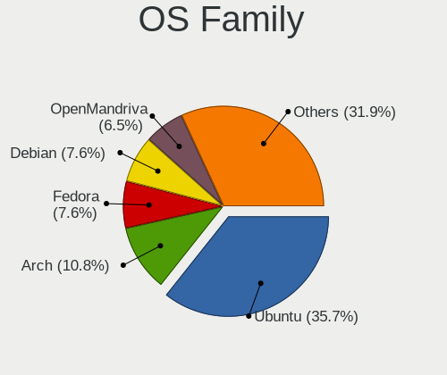

| Name         | Desktops | Percent |
|--------------|----------|---------|
| Ubuntu       | 66       | 35.68%  |
| Arch         | 20       | 10.81%  |
| Fedora       | 14       | 7.57%   |
| Debian       | 14       | 7.57%   |
| OpenMandriva | 12       | 6.49%   |
| Manjaro      | 9        | 4.86%   |
| Pop!_OS      | 7        | 3.78%   |
| ArcoLinux    | 6        | 3.24%   |
| Zorin        | 5        | 2.7%    |
| Linux Mint   | 5        | 2.7%    |
| openSUSE     | 4        | 2.16%   |
| Gentoo       | 3        | 1.62%   |
| Ubuntu Unity | 2        | 1.08%   |
| Oracle Linux | 2        | 1.08%   |
| Kubuntu      | 2        | 1.08%   |
| KDE neon     | 2        | 1.08%   |
| Elementary   | 2        | 1.08%   |
| Clear Linux  | 2        | 1.08%   |
| Xubuntu      | 1        | 0.54%   |
| Ubuntu MATE  | 1        | 0.54%   |
| SteamOS      | 1        | 0.54%   |
| Parrot       | 1        | 0.54%   |
| EndeavourOS  | 1        | 0.54%   |
| ChimeraOS    | 1        | 0.54%   |
| CachyOS      | 1        | 0.54%   |
| Alpine       | 1        | 0.54%   |

Kernel
------

Version of the Linux kernel

| Version                                                | Desktops | Percent |
|--------------------------------------------------------|----------|---------|
| 6.2.6-desktop-1omv2390                                 | 5        | 2.39%   |
| 5.4.0-58-generic                                       | 4        | 1.91%   |
| 6.8.0-31-generic                                       | 3        | 1.44%   |
| 5.4.0-37-generic                                       | 3        | 1.44%   |
| 5.4.0-26-generic                                       | 3        | 1.44%   |
| 5.15.0-91-generic                                      | 3        | 1.44%   |
| 5.15.0-52-generic                                      | 3        | 1.44%   |
| 5.11.0-38-generic                                      | 3        | 1.44%   |
| 5.0.0-23-generic                                       | 3        | 1.44%   |
| 6.9.3-76060903-generic                                 | 2        | 0.96%   |
| 6.8.4-2-pve                                            | 2        | 0.96%   |
| 6.5.8-arch1-1                                          | 2        | 0.96%   |
| 6.2.0-36-generic                                       | 2        | 0.96%   |
| 6.1.0-18-amd64                                         | 2        | 0.96%   |
| 6.0.12-300.fc37.x86_64                                 | 2        | 0.96%   |
| 5.9.11-3-MANJARO                                       | 2        | 0.96%   |
| 5.8.0-7642-generic                                     | 2        | 0.96%   |
| 5.4.0-48-generic                                       | 2        | 0.96%   |
| 5.4.0-47-generic                                       | 2        | 0.96%   |
| 5.4.0-42-generic                                       | 2        | 0.96%   |
| 5.11.0-41-generic                                      | 2        | 0.96%   |
| 5.11.0-37-generic                                      | 2        | 0.96%   |
| 4.18.0-25-generic                                      | 2        | 0.96%   |
| 6.9.5-200.fc40.x86_64                                  | 1        | 0.48%   |
| 6.9.3-zen1-1-zen                                       | 1        | 0.48%   |
| 6.9.12-x64v3-xanmod1-1724051801                        | 1        | 0.48%   |
| 6.9.12-200.fc40.x86_64                                 | 1        | 0.48%   |
| 6.9.1-arch1-1                                          | 1        | 0.48%   |
| 6.8.9-300.fc40.x86_64                                  | 1        | 0.48%   |
| 6.8.5-301.fc40.x86_64                                  | 1        | 0.48%   |
| 6.8.10-300.fc40.x86_64                                 | 1        | 0.48%   |
| 6.8.1-arch1-1                                          | 1        | 0.48%   |
| 6.8.0-76060800daily20240311-generic                    | 1        | 0.48%   |
| 6.8.0-51-generic                                       | 1        | 0.48%   |
| 6.8.0-50-generic                                       | 1        | 0.48%   |
| 6.8.0-39-generic                                       | 1        | 0.48%   |
| 6.7.8-arch1-1                                          | 1        | 0.48%   |
| 6.7.1-arch1-1                                          | 1        | 0.48%   |
| 6.7.0-0.rc3.20231202gt815fb87b.332.vanilla.fc39.x86_64 | 1        | 0.48%   |
| 6.6.8-arch1-1                                          | 1        | 0.48%   |

Kernel Family
-------------

Linux kernel without a distro release

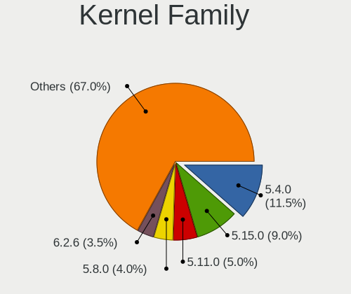

| Version | Desktops | Percent |
|---------|----------|---------|
| 5.4.0   | 23       | 11.5%   |
| 5.15.0  | 18       | 9%      |
| 5.11.0  | 10       | 5%      |
| 5.8.0   | 8        | 4%      |
| 6.2.6   | 7        | 3.5%    |
| 6.2.0   | 6        | 3%      |
| 6.1.0   | 6        | 3%      |
| 5.0.0   | 6        | 3%      |
| 4.15.0  | 6        | 3%      |
| 6.8.0   | 5        | 2.5%    |
| 6.5.0   | 5        | 2.5%    |
| 6.9.3   | 3        | 1.5%    |
| 4.18.0  | 3        | 1.5%    |
| 6.9.12  | 2        | 1%      |
| 6.8.4   | 2        | 1%      |
| 6.5.8   | 2        | 1%      |
| 6.4.0   | 2        | 1%      |
| 6.2.9   | 2        | 1%      |
| 6.1.11  | 2        | 1%      |
| 6.0.12  | 2        | 1%      |
| 5.9.11  | 2        | 1%      |
| 5.15.60 | 2        | 1%      |
| 5.12.8  | 2        | 1%      |
| 6.9.5   | 1        | 0.5%    |
| 6.9.1   | 1        | 0.5%    |
| 6.8.9   | 1        | 0.5%    |
| 6.8.5   | 1        | 0.5%    |
| 6.8.10  | 1        | 0.5%    |
| 6.8.1   | 1        | 0.5%    |
| 6.7.8   | 1        | 0.5%    |
| 6.7.1   | 1        | 0.5%    |
| 6.7.0   | 1        | 0.5%    |
| 6.6.8   | 1        | 0.5%    |
| 6.6.6   | 1        | 0.5%    |
| 6.6.52  | 1        | 0.5%    |
| 6.6.3   | 1        | 0.5%    |
| 6.6.16  | 1        | 0.5%    |
| 6.6.13  | 1        | 0.5%    |
| 6.6.1   | 1        | 0.5%    |
| 6.5.7   | 1        | 0.5%    |

Kernel Major Ver.
-----------------

Linux kernel major version

| Version | Desktops | Percent |
|---------|----------|---------|
| 5.4     | 25       | 12.69%  |
| 5.15    | 20       | 10.15%  |
| 6.2     | 15       | 7.61%   |
| 6.1     | 14       | 7.11%   |
| 5.11    | 11       | 5.58%   |
| 6.8     | 10       | 5.08%   |
| 6.5     | 10       | 5.08%   |
| 5.8     | 8        | 4.06%   |
| 6.9     | 7        | 3.55%   |
| 6.6     | 7        | 3.55%   |
| 4.15    | 7        | 3.55%   |
| 5.19    | 6        | 3.05%   |
| 5.0     | 6        | 3.05%   |
| 5.10    | 5        | 2.54%   |
| 6.4     | 4        | 2.03%   |
| 6.10    | 4        | 2.03%   |
| 6.0     | 4        | 2.03%   |
| 5.9     | 4        | 2.03%   |
| 5.12    | 4        | 2.03%   |
| 6.7     | 3        | 1.52%   |
| 6.3     | 3        | 1.52%   |
| 6.12    | 3        | 1.52%   |
| 4.18    | 3        | 1.52%   |
| 6.11    | 2        | 1.02%   |
| 5.6     | 2        | 1.02%   |
| 5.17    | 2        | 1.02%   |
| 5.14    | 2        | 1.02%   |
| 4.19    | 2        | 1.02%   |
| 5.3     | 1        | 0.51%   |
| 5.18    | 1        | 0.51%   |
| 5.16    | 1        | 0.51%   |
| 4.10    | 1        | 0.51%   |

Arch
----

OS architecture (x86_64, i586, etc.)

| Name   | Desktops | Percent |
|--------|----------|---------|
| x86_64 | 180      | 99.45%  |
| i686   | 1        | 0.55%   |

DE
--

Desktop Environment

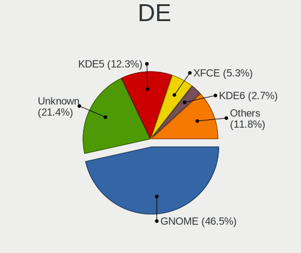

| Name       | Desktops | Percent |
|------------|----------|---------|
| GNOME      | 87       | 46.52%  |
| Unknown    | 40       | 21.39%  |
| KDE5       | 23       | 12.3%   |
| XFCE       | 10       | 5.35%   |
| KDE6       | 5        | 2.67%   |
| MATE       | 4        | 2.14%   |
| i3         | 4        | 2.14%   |
| X-Cinnamon | 2        | 1.07%   |
| Unity      | 2        | 1.07%   |
| Pantheon   | 2        | 1.07%   |
| KDE        | 2        | 1.07%   |
| LXQt       | 1        | 0.53%   |
| Hyprland   | 1        | 0.53%   |
| Cinnamon   | 1        | 0.53%   |
| Budgie     | 1        | 0.53%   |
| bspwm      | 1        | 0.53%   |
| awesome    | 1        | 0.53%   |

Display Server
--------------

X11 or Wayland

| Name    | Desktops | Percent |
|---------|----------|---------|
| X11     | 120      | 63.83%  |
| Wayland | 42       | 22.34%  |
| Unknown | 17       | 9.04%   |
| Tty     | 9        | 4.79%   |

Display Manager
---------------

SDDM, LightDM, etc.

| Name    | Desktops | Percent |
|---------|----------|---------|
| Unknown | 89       | 47.59%  |
| GDM     | 30       | 16.04%  |
| SDDM    | 28       | 14.97%  |
| GDM3    | 19       | 10.16%  |
| LightDM | 15       | 8.02%   |
| TDM     | 4        | 2.14%   |
| XDM     | 1        | 0.53%   |
| LY-DM   | 1        | 0.53%   |

OS Lang
-------

Language

| Lang        | Desktops | Percent |
|-------------|----------|---------|
| en_US       | 137      | 75.27%  |
| Unknown     | 27       | 14.84%  |
| vi_VN       | 8        | 4.4%    |
| C           | 3        | 1.65%   |
| ru_RU       | 2        | 1.1%    |
| en_GB       | 2        | 1.1%    |
| POSIX       | 1        | 0.55%   |
| ja_JP       | 1        | 0.55%   |
| en_US.UTF=8 | 1        | 0.55%   |

Boot Mode
---------

EFI or BIOS

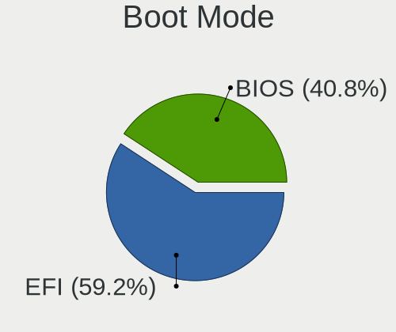

| Mode | Desktops | Percent |
|------|----------|---------|
| EFI  | 109      | 59.24%  |
| BIOS | 75       | 40.76%  |

Filesystem
----------

Type of filesystem

| Type    | Desktops | Percent |
|---------|----------|---------|
| Ext4    | 128      | 69.19%  |
| Btrfs   | 28       | 15.14%  |
| Overlay | 15       | 8.11%   |
| Tmpfs   | 7        | 3.78%   |
| Zfs     | 3        | 1.62%   |
| Unknown | 2        | 1.08%   |
| Xfs     | 1        | 0.54%   |
| F2fs    | 1        | 0.54%   |

Part. scheme
------------

Scheme of partitioning

| Type    | Desktops | Percent |
|---------|----------|---------|
| GPT     | 97       | 52.72%  |
| Unknown | 70       | 38.04%  |
| MBR     | 17       | 9.24%   |

Dual Boot with Linux/BSD
------------------------

Hosting more than one Linux/BSD

| Dual boot | Desktops | Percent |
|-----------|----------|---------|
| No        | 144      | 77.84%  |
| Yes       | 41       | 22.16%  |

Dual Boot (Win)
---------------

Hosting Linux and Windows

| Dual boot | Desktops | Percent |
|-----------|----------|---------|
| No        | 108      | 57.45%  |
| Yes       | 80       | 42.55%  |

Board
-----

Vendor
------

Motherboard manufacturer

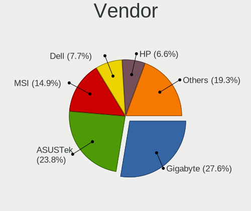

| Name                | Desktops | Percent |
|---------------------|----------|---------|
| Gigabyte Technology | 50       | 27.62%  |
| ASUSTek Computer    | 43       | 23.76%  |
| MSI                 | 27       | 14.92%  |
| Dell                | 14       | 7.73%   |
| Hewlett-Packard     | 12       | 6.63%   |
| ASRock              | 7        | 3.87%   |
| Intel               | 5        | 2.76%   |
| Lenovo              | 3        | 1.66%   |
| GuoGuang            | 3        | 1.66%   |
| Unknown             | 3        | 1.66%   |
| ZOTAC               | 2        | 1.1%    |
| Wistron             | 2        | 1.1%    |
| Foxconn             | 2        | 1.1%    |
| T-bao               | 1        | 0.55%   |
| Supermicro          | 1        | 0.55%   |
| Shuttle             | 1        | 0.55%   |
| Koloe               | 1        | 0.55%   |
| Huanan              | 1        | 0.55%   |
| Colorful Technology | 1        | 0.55%   |
| AZW                 | 1        | 0.55%   |
| Acer                | 1        | 0.55%   |

Model
-----

Motherboard model

| Name                               | Desktops | Percent |
|------------------------------------|----------|---------|
| ASUS All Series                    | 7        | 3.87%   |
| Gigabyte H61M-DS2                  | 6        | 3.31%   |
| Unknown                            | 5        | 2.76%   |
| MSI MS-7B89                        | 4        | 2.21%   |
| MSI MS-7B98                        | 3        | 1.66%   |
| Intel X99                          | 3        | 1.66%   |
| MSI MS-7C89                        | 2        | 1.1%    |
| MSI MS-7823                        | 2        | 1.1%    |
| HP Z440 Workstation                | 2        | 1.1%    |
| GuoGuang IC2M1028V-J               | 2        | 1.1%    |
| Gigabyte H81M-DS2                  | 2        | 1.1%    |
| Gigabyte G41M-ES2L                 | 2        | 1.1%    |
| Gigabyte B75M-D3H                  | 2        | 1.1%    |
| Gigabyte B450M GAMING              | 2        | 1.1%    |
| Gigabyte B360M-D3H                 | 2        | 1.1%    |
| Dell OptiPlex 7050                 | 2        | 1.1%    |
| ASUS ROG STRIX B650E-I GAMING WIFI | 2        | 1.1%    |
| ASUS ROG CROSSHAIR VIII HERO       | 2        | 1.1%    |
| ASUS PRIME H510M-K                 | 2        | 1.1%    |
| ASUS PRIME B450M-A                 | 2        | 1.1%    |
| ASUS P8H61-MX R2.0                 | 2        | 1.1%    |
| ASUS B75M-A                        | 2        | 1.1%    |
| Wistron FMVDD2A0H0                 | 1        | 0.55%   |
| Wistron FMVCEG40Y                  | 1        | 0.55%   |
| T-bao MINI PC                      | 1        | 0.55%   |
| Supermicro SYS-6018R-CMG367-HM005  | 1        | 0.55%   |
| Shuttle DS81D                      | 1        | 0.55%   |
| MSI MS-7E02                        | 1        | 0.55%   |
| MSI MS-7D99                        | 1        | 0.55%   |
| MSI MS-7D48                        | 1        | 0.55%   |
| MSI MS-7C75                        | 1        | 0.55%   |
| MSI MS-7C67                        | 1        | 0.55%   |
| MSI MS-7C37                        | 1        | 0.55%   |
| MSI MS-7C31                        | 1        | 0.55%   |
| MSI MS-7C13                        | 1        | 0.55%   |
| MSI MS-7C09                        | 1        | 0.55%   |
| MSI MS-7B84                        | 1        | 0.55%   |
| MSI MS-7B33                        | 1        | 0.55%   |
| MSI MS-7B25                        | 1        | 0.55%   |
| MSI MS-7A40                        | 1        | 0.55%   |

Model Family
------------

Motherboard model prefix

| Name                              | Desktops | Percent |
|-----------------------------------|----------|---------|
| ASUS PRIME                        | 12       | 6.63%   |
| Dell OptiPlex                     | 10       | 5.52%   |
| Gigabyte H61M-DS2                 | 7        | 3.87%   |
| ASUS ROG                          | 7        | 3.87%   |
| ASUS All                          | 7        | 3.87%   |
| Unknown                           | 5        | 2.76%   |
| MSI MS-7B89                       | 4        | 2.21%   |
| MSI MS-7B98                       | 3        | 1.66%   |
| Lenovo ThinkCentre                | 3        | 1.66%   |
| Intel X99                         | 3        | 1.66%   |
| ASUS P8H61-MX                     | 3        | 1.66%   |
| MSI MS-7C89                       | 2        | 1.1%    |
| MSI MS-7823                       | 2        | 1.1%    |
| HP Z440                           | 2        | 1.1%    |
| HP EliteDesk                      | 2        | 1.1%    |
| GuoGuang IC2M1028V-J              | 2        | 1.1%    |
| Gigabyte Z490                     | 2        | 1.1%    |
| Gigabyte X570                     | 2        | 1.1%    |
| Gigabyte H81M-DS2                 | 2        | 1.1%    |
| Gigabyte G41M-ES2L                | 2        | 1.1%    |
| Gigabyte B75M-D3H                 | 2        | 1.1%    |
| Gigabyte B660M                    | 2        | 1.1%    |
| Gigabyte B450M                    | 2        | 1.1%    |
| Gigabyte B360M-D3H                | 2        | 1.1%    |
| Dell Inspiron                     | 2        | 1.1%    |
| ASUS TUF                          | 2        | 1.1%    |
| ASUS B75M-A                       | 2        | 1.1%    |
| Wistron FMVDD2A0H0                | 1        | 0.55%   |
| Wistron FMVCEG40Y                 | 1        | 0.55%   |
| T-bao MINI                        | 1        | 0.55%   |
| Supermicro SYS-6018R-CMG367-HM005 | 1        | 0.55%   |
| Shuttle DS81D                     | 1        | 0.55%   |
| MSI MS-7E02                       | 1        | 0.55%   |
| MSI MS-7D99                       | 1        | 0.55%   |
| MSI MS-7D48                       | 1        | 0.55%   |
| MSI MS-7C75                       | 1        | 0.55%   |
| MSI MS-7C67                       | 1        | 0.55%   |
| MSI MS-7C37                       | 1        | 0.55%   |
| MSI MS-7C31                       | 1        | 0.55%   |
| MSI MS-7C13                       | 1        | 0.55%   |

MFG Year
--------

Motherboard manufacture year

| Year | Desktops | Percent |
|------|----------|---------|
| 2018 | 31       | 17.13%  |
| 2014 | 20       | 11.05%  |
| 2013 | 18       | 9.94%   |
| 2019 | 16       | 8.84%   |
| 2012 | 16       | 8.84%   |
| 2020 | 12       | 6.63%   |
| 2016 | 11       | 6.08%   |
| 2017 | 9        | 4.97%   |
| 2021 | 8        | 4.42%   |
| 2015 | 8        | 4.42%   |
| 2010 | 7        | 3.87%   |
| 2022 | 6        | 3.31%   |
| 2023 | 5        | 2.76%   |
| 2009 | 5        | 2.76%   |
| 2011 | 4        | 2.21%   |
| 2024 | 2        | 1.1%    |
| 2008 | 1        | 0.55%   |
| 2007 | 1        | 0.55%   |
| 2006 | 1        | 0.55%   |

Form Factor
-----------

Physical design of the computer

| Name    | Desktops | Percent |
|---------|----------|---------|
| Desktop | 181      | 100%    |

Secure Boot
-----------

Enabled or disabled

| State    | Desktops | Percent |
|----------|----------|---------|
| Disabled | 176      | 97.24%  |
| Enabled  | 5        | 2.76%   |

Coreboot
--------

Have coreboot on board

| Used | Desktops | Percent |
|------|----------|---------|
| No   | 181      | 100%    |

RAM Size
--------

Total RAM memory

| Size in GB  | Desktops | Percent |
|-------------|----------|---------|
| 16.01-24.0  | 48       | 25.95%  |
| 8.01-16.0   | 35       | 18.92%  |
| 32.01-64.0  | 32       | 17.3%   |
| 4.01-8.0    | 24       | 12.97%  |
| 3.01-4.0    | 22       | 11.89%  |
| 64.01-256.0 | 10       | 5.41%   |
| 24.01-32.0  | 7        | 3.78%   |
| 1.01-2.0    | 7        | 3.78%   |

RAM Used
--------

Used RAM memory

| Used GB    | Desktops | Percent |
|------------|----------|---------|
| 2.01-3.0   | 50       | 24.88%  |
| 1.01-2.0   | 46       | 22.89%  |
| 4.01-8.0   | 37       | 18.41%  |
| 3.01-4.0   | 36       | 17.91%  |
| 8.01-16.0  | 17       | 8.46%   |
| 16.01-24.0 | 6        | 2.99%   |
| 0.51-1.0   | 5        | 2.49%   |
| 24.01-32.0 | 2        | 1%      |
| 32.01-64.0 | 1        | 0.5%    |
| 0.01-0.5   | 1        | 0.5%    |

Total Drives
------------

Number of drives on board

| Drives | Desktops | Percent |
|--------|----------|---------|
| 2      | 79       | 41.8%   |
| 1      | 59       | 31.22%  |
| 3      | 35       | 18.52%  |
| 4      | 10       | 5.29%   |
| 5      | 3        | 1.59%   |
| 9      | 1        | 0.53%   |
| 6      | 1        | 0.53%   |
| 0      | 1        | 0.53%   |

Has CD-ROM
----------

Has CD-ROM on board

| Presented | Desktops | Percent |
|-----------|----------|---------|
| No        | 153      | 84.53%  |
| Yes       | 28       | 15.47%  |

Has Ethernet
------------

Has Ethernet on board

| Presented | Desktops | Percent |
|-----------|----------|---------|
| Yes       | 179      | 98.9%   |
| No        | 2        | 1.1%    |

Has WiFi
--------

Has WiFi module

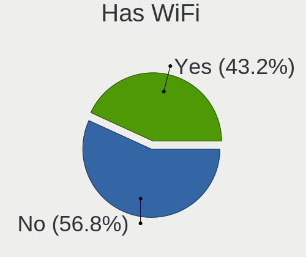

| Presented | Desktops | Percent |
|-----------|----------|---------|
| No        | 104      | 56.83%  |
| Yes       | 79       | 43.17%  |

Has Bluetooth
-------------

Has Bluetooth module

| Presented | Desktops | Percent |
|-----------|----------|---------|
| No        | 118      | 64.13%  |
| Yes       | 66       | 35.87%  |

Location
--------

Country
-------

Geographic location (country)

| Country | Desktops | Percent |
|---------|----------|---------|
| Vietnam | 181      | 100%    |

City
----

Geographic location (city)

| City             | Desktops | Percent |
|------------------|----------|---------|
| Ho Chi Minh City | 95       | 51.63%  |
| Hanoi            | 51       | 27.72%  |
| Da Nang          | 4        | 2.17%   |
| Can Tho          | 4        | 2.17%   |
| Bac Giang        | 4        | 2.17%   |
| Tua Chua         | 3        | 1.63%   |
| Tay Ninh         | 2        | 1.09%   |
| Nga Bay          | 2        | 1.09%   |
| Hung Yen         | 2        | 1.09%   |
| Vng Tu       | 1        | 0.54%   |
| Vi Thanh         | 1        | 0.54%   |
| Tra Vinh         | 1        | 0.54%   |
| Tinh Binh Duong  | 1        | 0.54%   |
| Thon Dien Ha     | 1        | 0.54%   |
| Thai Nguyen      | 1        | 0.54%   |
| Tan An           | 1        | 0.54%   |
| Qung Ngai     | 1        | 0.54%   |
| Nha Trang        | 1        | 0.54%   |
| Nam nh      | 1        | 0.54%   |
| My Binh          | 1        | 0.54%   |
| Haiphong         | 1        | 0.54%   |
| Hai Duong        | 1        | 0.54%   |
| Di An            | 1        | 0.54%   |
| Binh Duong       | 1        | 0.54%   |
| Bien Hoa         | 1        | 0.54%   |
| Bn Tre        | 1        | 0.54%   |

Drives
------

Drive Vendor
------------

Hard drive vendors

| Vendor                      | Desktops | Drives | Percent |
|-----------------------------|----------|--------|---------|
| WDC                         | 74       | 108    | 22.16%  |
| Samsung Electronics         | 47       | 73     | 14.07%  |
| Seagate                     | 45       | 55     | 13.47%  |
| Kingston                    | 19       | 27     | 5.69%   |
| Toshiba                     | 15       | 27     | 4.49%   |
| Sandisk                     | 12       | 16     | 3.59%   |
| Hitachi                     | 9        | 11     | 2.69%   |
| Unknown                     | 6        | 7      | 1.8%    |
| Lexar                       | 5        | 5      | 1.5%    |
| HGST                        | 5        | 5      | 1.5%    |
| Crucial                     | 5        | 8      | 1.5%    |
| XSTAR                       | 4        | 5      | 1.2%    |
| Intel                       | 4        | 4      | 1.2%    |
| Colorful                    | 4        | 6      | 1.2%    |
| Netac                       | 3        | 3      | 0.9%    |
| JMicron Technology          | 3        | 3      | 0.9%    |
| Gigabyte Technology         | 3        | 3      | 0.9%    |
| China                       | 3        | 3      | 0.9%    |
| A-DATA Technology           | 3        | 3      | 0.9%    |
| ZOTAC                       | 2        | 2      | 0.6%    |
| Transcend                   | 2        | 2      | 0.6%    |
| TO Exter                    | 2        | 3      | 0.6%    |
| SK hynix                    | 2        | 2      | 0.6%    |
| Realtek Semiconductor       | 2        | 3      | 0.6%    |
| Plextor                     | 2        | 2      | 0.6%    |
| OSCOO                       | 2        | 2      | 0.6%    |
| OCZ                         | 2        | 2      | 0.6%    |
| Mushkin                     | 2        | 2      | 0.6%    |
| Micron/Crucial Technology   | 2        | 2      | 0.6%    |
| Micron Technology           | 2        | 2      | 0.6%    |
| MAXIO Technology (Hangzhou) | 2        | 2      | 0.6%    |
| KingSpec                    | 2        | 3      | 0.6%    |
| Kingmax                     | 2        | 3      | 0.6%    |
| Fujitsu                     | 2        | 2      | 0.6%    |
| Unknown                     | 2        | 2      | 0.6%    |
| VSP                         | 1        | 1      | 0.3%    |
| Vaseky                      | 1        | 1      | 0.3%    |
| TXRUI                       | 1        | 1      | 0.3%    |
| Team                        | 1        | 2      | 0.3%    |
| SSSTC                       | 1        | 2      | 0.3%    |

Drive Model
-----------

Hard drive models

| Model                                               | Desktops | Percent |
|-----------------------------------------------------|----------|---------|
| Kingston SA400S37240G 240GB SSD                     | 7        | 1.91%   |
| WDC WDS240G2G0A-00JH30 240GB SSD                    | 6        | 1.64%   |
| WDC WD5000AAKX-00ERMA0 500GB                        | 6        | 1.64%   |
| Samsung SSD 860 EVO 250GB                           | 6        | 1.64%   |
| Samsung NVMe SSD Controller SM981/PM981/PM983 512GB | 6        | 1.64%   |
| Unknown SD/MMC/MS PRO 128GB                         | 5        | 1.37%   |
| Samsung SSD 980 1TB                                 | 5        | 1.37%   |
| XSTAR SSD 128GB                                     | 4        | 1.09%   |
| WDC WD2500AAKX-00ERMA0 250GB                        | 4        | 1.09%   |
| Seagate ST500DM002-1BD142 500GB                     | 4        | 1.09%   |
| Seagate ST2000DM008-2FR102 2TB                      | 4        | 1.09%   |
| Seagate ST1000DM010-2EP102 1TB                      | 4        | 1.09%   |
| Sandisk WD Blue SN550 NVMe SSD 256GB                | 4        | 1.09%   |
| Samsung SSD 860 EVO 500GB                           | 4        | 1.09%   |
| WDC WD5000LPLX-66ZNTT1 500GB                        | 3        | 0.82%   |
| WDC WD1502FYPS-02W3B0 1TB                           | 3        | 0.82%   |
| WDC WD10EZEX-00BBHA0 1TB                            | 3        | 0.82%   |
| Samsung SSD 870 EVO 500GB                           | 3        | 0.82%   |
| Samsung SSD 860 EVO 1TB                             | 3        | 0.82%   |
| Kingston SA400S37120G 120GB SSD                     | 3        | 0.82%   |
| JMicron Tech 250GB                                  | 3        | 0.82%   |
| HGST HTS545050A7E680 500GB                          | 3        | 0.82%   |
| Gigabyte GP-GSTFS31120GNTD 120GB                    | 3        | 0.82%   |
| ZOTAC SATA SSD 120GB                                | 2        | 0.55%   |
| WDC WDS240G2G0B-00EPW0 240GB SSD                    | 2        | 0.55%   |
| WDC WDS120G2G0A-00JH30 120GB SSD                    | 2        | 0.55%   |
| WDC WD5000LPLX-60ZNTT1 500GB                        | 2        | 0.55%   |
| WDC WD3200AAKX-001CA0 320GB                         | 2        | 0.55%   |
| WDC WD1003FZEX-00K3CA0 1TB                          | 2        | 0.55%   |
| Toshiba KXG5AZNV512G 512GB                          | 2        | 0.55%   |
| Toshiba HDWD120 2TB                                 | 2        | 0.55%   |
| Toshiba DT01ABA100V 1TB                             | 2        | 0.55%   |
| TO Exter nal USB 3.0 1024GB                         | 2        | 0.55%   |
| Seagate ST3250318AS 250GB                           | 2        | 0.55%   |
| Seagate ST250DM000-1BD141 250GB                     | 2        | 0.55%   |
| Seagate ST2000DM006-2DM164 2TB                      | 2        | 0.55%   |
| Seagate ST1000DM003-1ER162 1TB                      | 2        | 0.55%   |
| Sandisk WDC WDS480G2G0C-00AJM0 480GB                | 2        | 0.55%   |
| Samsung SSD 980 PRO 1TB                             | 2        | 0.55%   |
| Samsung SSD 980 500GB                               | 2        | 0.55%   |

HDD Vendor
----------

Hard disk drive vendors

| Vendor   | Desktops | Drives | Percent |
|----------|----------|--------|---------|
| WDC      | 58       | 86     | 41.13%  |
| Seagate  | 45       | 54     | 31.91%  |
| Toshiba  | 13       | 21     | 9.22%   |
| Hitachi  | 9        | 11     | 6.38%   |
| Unknown  | 5        | 6      | 3.55%   |
| HGST     | 5        | 5      | 3.55%   |
| TO Exter | 2        | 3      | 1.42%   |
| Fujitsu  | 2        | 2      | 1.42%   |
| External | 1        | 1      | 0.71%   |
| CSD      | 1        | 1      | 0.71%   |

SSD Vendor
----------

Solid state drive vendors

| Vendor              | Desktops | Drives | Percent |
|---------------------|----------|--------|---------|
| Samsung Electronics | 24       | 37     | 19.35%  |
| Kingston            | 17       | 24     | 13.71%  |
| WDC                 | 14       | 14     | 11.29%  |
| Lexar               | 5        | 5      | 4.03%   |
| Crucial             | 5        | 6      | 4.03%   |
| XSTAR               | 4        | 5      | 3.23%   |
| SanDisk             | 4        | 4      | 3.23%   |
| Intel               | 4        | 4      | 3.23%   |
| Colorful            | 4        | 6      | 3.23%   |
| Netac               | 3        | 3      | 2.42%   |
| Gigabyte Technology | 3        | 3      | 2.42%   |
| China               | 3        | 3      | 2.42%   |
| ZOTAC               | 2        | 2      | 1.61%   |
| Transcend           | 2        | 2      | 1.61%   |
| Toshiba             | 2        | 2      | 1.61%   |
| Plextor             | 2        | 2      | 1.61%   |
| OSCOO               | 2        | 2      | 1.61%   |
| KingSpec            | 2        | 3      | 1.61%   |
| A-DATA Technology   | 2        | 2      | 1.61%   |
| VSP                 | 1        | 1      | 0.81%   |
| Vaseky              | 1        | 1      | 0.81%   |
| SK hynix            | 1        | 1      | 0.81%   |
| PNY                 | 1        | 1      | 0.81%   |
| Patriot             | 1        | 1      | 0.81%   |
| OCZ                 | 1        | 1      | 0.81%   |
| Micron Technology   | 1        | 1      | 0.81%   |
| Maxtor              | 1        | 1      | 0.81%   |
| LITEONIT            | 1        | 1      | 0.81%   |
| KIOXIA-EXCERIA      | 1        | 1      | 0.81%   |
| Kingmax             | 1        | 1      | 0.81%   |
| HS-SSD-HB1          | 1        | 2      | 0.81%   |
| GOLDTECH            | 1        | 1      | 0.81%   |
| FB-LINK             | 1        | 1      | 0.81%   |
| EK                  | 1        | 1      | 0.81%   |
| Biostar             | 1        | 1      | 0.81%   |
| Apacer              | 1        | 1      | 0.81%   |
| AOSENKE             | 1        | 1      | 0.81%   |
| AGI                 | 1        | 1      | 0.81%   |
| Unknown             | 1        | 1      | 0.81%   |

Drive Kind
----------

HDD or SSD

| Kind    | Desktops | Drives | Percent |
|---------|----------|--------|---------|
| HDD     | 110      | 190    | 38.33%  |
| SSD     | 103      | 150    | 35.89%  |
| NVMe    | 63       | 97     | 21.95%  |
| Unknown | 11       | 11     | 3.83%   |

Drive Connector
---------------

SATA, SAS, NVMe, etc.

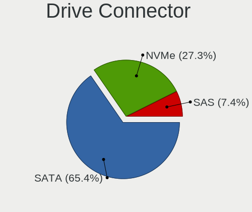

| Type | Desktops | Drives | Percent |
|------|----------|--------|---------|
| SATA | 151      | 330    | 65.37%  |
| NVMe | 63       | 95     | 27.27%  |
| SAS  | 17       | 23     | 7.36%   |

Drive Size
----------

Size of hard drive

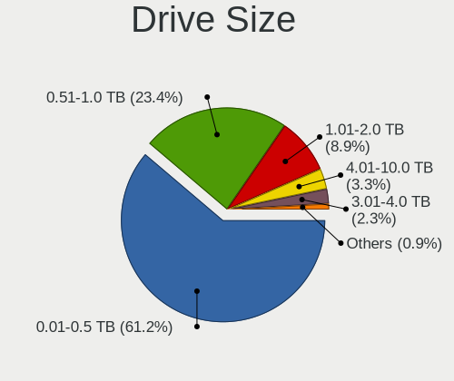

| Size in TB | Desktops | Drives | Percent |
|------------|----------|--------|---------|
| 0.01-0.5   | 131      | 214    | 61.21%  |
| 0.51-1.0   | 50       | 74     | 23.36%  |
| 1.01-2.0   | 19       | 27     | 8.88%   |
| 4.01-10.0  | 7        | 16     | 3.27%   |
| 3.01-4.0   | 5        | 7      | 2.34%   |
| 2.01-3.0   | 2        | 2      | 0.93%   |

Space Total
-----------

Amount of disk space available on the file system

| Size in GB     | Desktops | Percent |
|----------------|----------|---------|
| 101-250        | 55       | 28.8%   |
| 501-1000       | 33       | 17.28%  |
| 251-500        | 25       | 13.09%  |
| Unknown        | 21       | 10.99%  |
| 1001-2000      | 16       | 8.38%   |
| More than 3000 | 11       | 5.76%   |
| 51-100         | 11       | 5.76%   |
| 1-20           | 8        | 4.19%   |
| 21-50          | 6        | 3.14%   |
| 2001-3000      | 5        | 2.62%   |

Space Used
----------

Amount of used disk space

| Used GB        | Desktops | Percent |
|----------------|----------|---------|
| 1-20           | 65       | 32.99%  |
| 21-50          | 25       | 12.69%  |
| 101-250        | 23       | 11.68%  |
| Unknown        | 21       | 10.66%  |
| 51-100         | 20       | 10.15%  |
| 251-500        | 18       | 9.14%   |
| 501-1000       | 14       | 7.11%   |
| More than 3000 | 4        | 2.03%   |
| 1001-2000      | 4        | 2.03%   |
| 2001-3000      | 3        | 1.52%   |

Malfunc. Drives
---------------

Drive models with a malfunction

| Model                               | Desktops | Drives | Percent |
|-------------------------------------|----------|--------|---------|
| WDC WD3200AAKX-001CA0 320GB         | 2        | 2      | 6.06%   |
| Kingston SA400S37240G 240GB SSD     | 2        | 3      | 6.06%   |
| WDC WDS240G2G0A-00JH30 240GB SSD    | 1        | 1      | 3.03%   |
| WDC WD60PURZ-85ZUFY1 6TB            | 1        | 3      | 3.03%   |
| WDC WD5000AAKX-00ERMA0 500GB        | 1        | 1      | 3.03%   |
| WDC WD10EZRX-00A3KB0 1TB            | 1        | 2      | 3.03%   |
| WDC WD10EARS-00Y5B1 1TB             | 1        | 1      | 3.03%   |
| WDC WD1003FZEX-00MK2A0 1TB          | 1        | 1      | 3.03%   |
| Transcend TS256GSSD230S 256GB       | 1        | 1      | 3.03%   |
| Toshiba MK3275GSX 320GB             | 1        | 1      | 3.03%   |
| Seagate ST9250410AS 250GB           | 1        | 1      | 3.03%   |
| Seagate ST500DM002-1BD142 500GB     | 1        | 1      | 3.03%   |
| Seagate ST250DM000-1BD141 250GB     | 1        | 1      | 3.03%   |
| Seagate ST2000NM0011 2TB            | 1        | 1      | 3.03%   |
| Seagate ST1000DM003-1ER162 1TB      | 1        | 1      | 3.03%   |
| Samsung Electronics SSD 980 1TB     | 1        | 2      | 3.03%   |
| Samsung Electronics SSD 870 EVO 1TB | 1        | 1      | 3.03%   |
| Kingston SKC600512G 512GB SSD       | 1        | 4      | 3.03%   |
| Intel SSDSC2CW120A3 120GB           | 1        | 1      | 3.03%   |
| Hitachi HUA722020ALA331 2TB         | 1        | 1      | 3.03%   |
| Hitachi HTS725016A9A364 160GB       | 1        | 1      | 3.03%   |
| Hitachi HTS543225L9A300 250GB       | 1        | 1      | 3.03%   |
| Hitachi HDT725032VLA380 320GB       | 1        | 2      | 3.03%   |
| Hitachi HDS721616PLA380 160GB       | 1        | 2      | 3.03%   |
| HGST HTS725050A7E630 500GB          | 1        | 1      | 3.03%   |
| HGST HTS545050A7E680 500GB          | 1        | 1      | 3.03%   |
| GOLDTECH SSD 120G                   | 1        | 1      | 3.03%   |
| Fujitsu MHK2120AT 12GB              | 1        | 1      | 3.03%   |
| CSD CAA500S 500GB                   | 1        | 1      | 3.03%   |
| China MSATA 32GB SSD                | 1        | 1      | 3.03%   |
| AGI AGI512G17AI178 512GB SSD        | 1        | 1      | 3.03%   |

Malfunc. Drive Vendor
---------------------

Vendors of faulty drives

| Vendor              | Desktops | Drives | Percent |
|---------------------|----------|--------|---------|
| WDC                 | 8        | 11     | 24.24%  |
| Seagate             | 5        | 5      | 15.15%  |
| Hitachi             | 5        | 7      | 15.15%  |
| Kingston            | 3        | 7      | 9.09%   |
| Samsung Electronics | 2        | 3      | 6.06%   |
| HGST                | 2        | 2      | 6.06%   |
| Transcend           | 1        | 1      | 3.03%   |
| Toshiba             | 1        | 1      | 3.03%   |
| Intel               | 1        | 1      | 3.03%   |
| GOLDTECH            | 1        | 1      | 3.03%   |
| Fujitsu             | 1        | 1      | 3.03%   |
| CSD                 | 1        | 1      | 3.03%   |
| China               | 1        | 1      | 3.03%   |
| AGI                 | 1        | 1      | 3.03%   |

Malfunc. HDD Vendor
-------------------

Vendors of faulty HDD drives

| Vendor  | Desktops | Drives | Percent |
|---------|----------|--------|---------|
| WDC     | 7        | 10     | 31.82%  |
| Seagate | 5        | 5      | 22.73%  |
| Hitachi | 5        | 7      | 22.73%  |
| HGST    | 2        | 2      | 9.09%   |
| Toshiba | 1        | 1      | 4.55%   |
| Fujitsu | 1        | 1      | 4.55%   |
| CSD     | 1        | 1      | 4.55%   |

Malfunc. Drive Kind
-------------------

Kinds of faulty drives

| Kind | Desktops | Drives | Percent |
|------|----------|--------|---------|
| HDD  | 21       | 27     | 67.74%  |
| SSD  | 9        | 14     | 29.03%  |
| NVMe | 1        | 2      | 3.23%   |

Failed Drives
-------------

Failed drive models

| Model                           | Desktops | Drives | Percent |
|---------------------------------|----------|--------|---------|
| Samsung Electronics SSD 980 1TB | 1        | 1      | 100%    |

Failed Drive Vendor
-------------------

Failed drive vendors

| Vendor              | Desktops | Drives | Percent |
|---------------------|----------|--------|---------|
| Samsung Electronics | 1        | 1      | 100%    |

Drive Status
------------

Number of failed and malfunc. drives

| Status   | Desktops | Drives | Percent |
|----------|----------|--------|---------|
| Works    | 98       | 228    | 46.45%  |
| Detected | 85       | 176    | 40.28%  |
| Malfunc  | 27       | 43     | 12.8%   |
| Failed   | 1        | 1      | 0.47%   |

Storage controller
------------------

Storage Vendor
--------------

Storage controller vendors

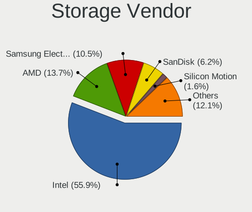

| Vendor                         | Desktops | Percent |
|--------------------------------|----------|---------|
| Intel                          | 143      | 55.86%  |
| AMD                            | 35       | 13.67%  |
| Samsung Electronics            | 27       | 10.55%  |
| SanDisk                        | 16       | 6.25%   |
| Silicon Motion                 | 4        | 1.56%   |
| ASMedia Technology             | 4        | 1.56%   |
| Toshiba America Info Systems   | 3        | 1.17%   |
| Phison Electronics             | 3        | 1.17%   |
| Micron/Crucial Technology      | 3        | 1.17%   |
| Kingston Technology Company    | 3        | 1.17%   |
| Realtek Semiconductor          | 2        | 0.78%   |
| MAXIO Technology (Hangzhou)    | 2        | 0.78%   |
| ADATA Technology               | 2        | 0.78%   |
| Solid State Storage Technology | 1        | 0.39%   |
| SK hynix                       | 1        | 0.39%   |
| OCZ Technology Group           | 1        | 0.39%   |
| Micron Technology              | 1        | 0.39%   |
| Marvell Technology Group       | 1        | 0.39%   |
| LSI Logic / Symbios Logic      | 1        | 0.39%   |
| Lite-On Technology             | 1        | 0.39%   |
| JMicron Technology             | 1        | 0.39%   |
| Hosin Global Electronics       | 1        | 0.39%   |

Storage Model
-------------

Storage controller models

| Model                                                                                   | Desktops | Percent |
|-----------------------------------------------------------------------------------------|----------|---------|
| AMD FCH SATA Controller [AHCI mode]                                                     | 27       | 8.85%   |
| Intel 8 Series/C220 Series Chipset Family 6-port SATA Controller 1 [AHCI mode]          | 21       | 6.89%   |
| Intel Cannon Lake PCH SATA AHCI Controller                                              | 15       | 4.92%   |
| Intel 200 Series PCH SATA controller [AHCI mode]                                        | 15       | 4.92%   |
| Intel Q170/Q150/B150/H170/H110/Z170/CM236 Chipset SATA Controller [AHCI Mode]           | 12       | 3.93%   |
| AMD 400 Series Chipset SATA Controller                                                  | 11       | 3.61%   |
| Samsung NVMe SSD Controller SM981/PM981/PM983                                           | 10       | 3.28%   |
| Samsung NVMe SSD Controller 980 (DRAM-less)                                             | 10       | 3.28%   |
| Intel NM10/ICH7 Family SATA Controller [IDE mode]                                       | 10       | 3.28%   |
| Intel 6 Series/C200 Series Chipset Family Desktop SATA Controller (IDE mode, ports 4-5) | 9        | 2.95%   |
| Intel 6 Series/C200 Series Chipset Family Desktop SATA Controller (IDE mode, ports 0-3) | 9        | 2.95%   |
| SanDisk Ultra 3D / WD PC SN530, IX SN530, Blue SN550 NVMe SSD (DRAM-less)               | 7        | 2.3%    |
| Intel Alder Lake-S PCH SATA Controller [AHCI Mode]                                      | 7        | 2.3%    |
| Intel 7 Series/C210 Series Chipset Family 6-port SATA Controller [AHCI mode]            | 7        | 2.3%    |
| Intel 6 Series/C200 Series Chipset Family 6 port Desktop SATA AHCI Controller           | 7        | 2.3%    |
| Intel SATA Controller [RAID Mode]                                                       | 6        | 1.97%   |
| Intel C610/X99 series chipset 6-Port SATA Controller [AHCI mode]                        | 6        | 1.97%   |
| Intel C610/X99 series chipset sSATA Controller [AHCI mode]                              | 5        | 1.64%   |
| Silicon Motion SM2263EN/SM2263XT (DRAM-less) NVMe SSD Controllers                       | 4        | 1.31%   |
| SanDisk Extreme Pro / WD Black SN750 / PC SN730 / Red SN700 NVMe SSD                    | 4        | 1.31%   |
| Samsung NVMe SSD Controller SM961/PM961/SM963                                           | 4        | 1.31%   |
| Samsung NVMe SSD Controller PM9A1/PM9A3/980PRO                                          | 4        | 1.31%   |
| ASMedia ASM1061/ASM1062 Serial ATA Controller                                           | 4        | 1.31%   |
| AMD 500 Series Chipset SATA Controller                                                  | 4        | 1.31%   |
| Intel Raptor Lake SATA AHCI Controller                                                  | 3        | 0.98%   |
| Intel C600/X79 series chipset 6-Port SATA AHCI Controller                               | 3        | 0.98%   |
| Intel 82801G (ICH7 Family) IDE Controller                                               | 3        | 0.98%   |
| Intel 500 Series Chipset Family SATA AHCI Controller                                    | 3        | 0.98%   |
| Intel 400 Series Chipset Family SATA AHCI Controller                                    | 3        | 0.98%   |
| AMD A320 Chipset SATA Controller [AHCI mode]                                            | 3        | 0.98%   |
| Toshiba America Info Systems XG5 NVMe SSD Controller                                    | 2        | 0.66%   |
| SanDisk WD Green SN350 240GB (DRAM-less) / SN560E NVMe SSD                              | 2        | 0.66%   |
| MAXIO (Hangzhou) NVMe SSD Controller MAP1202 (DRAM-less)                                | 2        | 0.66%   |
| Intel Volume Management Device NVMe RAID Controller Intel Corporation                   | 2        | 0.66%   |
| Intel Comet Lake SATA AHCI Controller                                                   | 2        | 0.66%   |
| Intel Atom/Celeron/Pentium Processor x5-E8000/J3xxx/N3xxx Series SATA Controller        | 2        | 0.66%   |
| Intel Atom Processor E3800 Series SATA AHCI Controller                                  | 2        | 0.66%   |
| Intel Alder Lake-N SATA AHCI Controller                                                 | 2        | 0.66%   |
| Intel 9 Series Chipset Family SATA Controller [AHCI Mode]                               | 2        | 0.66%   |
| Intel 5 Series/3400 Series Chipset 6 port SATA AHCI Controller                          | 2        | 0.66%   |

Storage Kind
------------

Kind of storage controller (IDE, SATA, NVMe, SAS, ...)

| Kind | Desktops | Percent |
|------|----------|---------|
| SATA | 150      | 60%     |
| NVMe | 63       | 25.2%   |
| IDE  | 27       | 10.8%   |
| RAID | 9        | 3.6%    |
| SAS  | 1        | 0.4%    |

Processor
---------

CPU Vendor
----------

Processor vendors

| Vendor | Desktops | Percent |
|--------|----------|---------|
| Intel  | 145      | 80.11%  |
| AMD    | 36       | 19.89%  |

CPU Model
---------

Processor models

| Model                                  | Desktops | Percent |
|----------------------------------------|----------|---------|
| Intel Core i3-4160 CPU @ 3.60GHz       | 5        | 2.73%   |
| Intel Xeon CPU E5-2680 v4 @ 2.40GHz    | 4        | 2.19%   |
| Intel Core i5-9600K CPU @ 3.70GHz      | 4        | 2.19%   |
| Intel Core i5-8400 CPU @ 2.80GHz       | 4        | 2.19%   |
| Intel Core i5-3470 CPU @ 3.20GHz       | 4        | 2.19%   |
| Intel Core i3-7100 CPU @ 3.90GHz       | 4        | 2.19%   |
| Intel Core 2 Duo CPU E8400 @ 3.00GHz   | 4        | 2.19%   |
| Intel 12th Gen Core i5-12400F          | 4        | 2.19%   |
| AMD Ryzen 5 2600 Six-Core Processor    | 4        | 2.19%   |
| Intel Xeon CPU E5-2678 v3 @ 2.50GHz    | 3        | 1.64%   |
| Intel Core i7-6700 CPU @ 3.40GHz       | 3        | 1.64%   |
| Intel Core i5-6500 CPU @ 3.20GHz       | 3        | 1.64%   |
| Intel Core i5-4590 CPU @ 3.30GHz       | 3        | 1.64%   |
| Intel Core i5-4570 CPU @ 3.20GHz       | 3        | 1.64%   |
| Intel Core i5-4460 CPU @ 3.20GHz       | 3        | 1.64%   |
| Intel Core i3-8100 CPU @ 3.60GHz       | 3        | 1.64%   |
| Intel Core i3-3240 CPU @ 3.40GHz       | 3        | 1.64%   |
| Intel Atom CPU D2550 @ 1.86GHz         | 3        | 1.64%   |
| AMD Ryzen 9 5950X 16-Core Processor    | 3        | 1.64%   |
| AMD Ryzen 5 5500                       | 3        | 1.64%   |
| AMD Ryzen 5 3600 6-Core Processor      | 3        | 1.64%   |
| Intel Pentium Gold G5400 CPU @ 3.70GHz | 2        | 1.09%   |
| Intel Core i9-10900 CPU @ 2.80GHz      | 2        | 1.09%   |
| Intel Core i7-4790K CPU @ 4.00GHz      | 2        | 1.09%   |
| Intel Core i7-4790 CPU @ 3.60GHz       | 2        | 1.09%   |
| Intel Core i7-3770 CPU @ 3.40GHz       | 2        | 1.09%   |
| Intel Core i5-9400F CPU @ 2.90GHz      | 2        | 1.09%   |
| Intel Core i5-9400 CPU @ 2.90GHz       | 2        | 1.09%   |
| Intel Core i5-7400 CPU @ 3.00GHz       | 2        | 1.09%   |
| Intel Core i5-3570K CPU @ 3.40GHz      | 2        | 1.09%   |
| Intel Core i5-2500 CPU @ 3.30GHz       | 2        | 1.09%   |
| Intel Core i3-2120 CPU @ 3.30GHz       | 2        | 1.09%   |
| Intel Core i3-10100 CPU @ 3.60GHz      | 2        | 1.09%   |
| Intel Core i3 CPU 540 @ 3.07GHz        | 2        | 1.09%   |
| Intel Core 2 Duo CPU E7500 @ 2.93GHz   | 2        | 1.09%   |
| Intel Celeron CPU N3150 @ 1.60GHz      | 2        | 1.09%   |
| AMD Ryzen 5 5600X 6-Core Processor     | 2        | 1.09%   |
| AMD Ryzen 5 5600G with Radeon Graphics | 2        | 1.09%   |
| Intel Xeon CPU X5570 @ 2.93GHz         | 1        | 0.55%   |
| Intel Xeon CPU E5-2689 0 @ 2.60GHz     | 1        | 0.55%   |

CPU Model Family
----------------

Processor model prefix

| Model                   | Desktops | Percent |
|-------------------------|----------|---------|
| Intel Core i5           | 45       | 24.86%  |
| Intel Core i3           | 30       | 16.57%  |
| AMD Ryzen 5             | 17       | 9.39%   |
| Intel Xeon              | 16       | 8.84%   |
| Intel Core i7           | 15       | 8.29%   |
| Other                   | 11       | 6.08%   |
| Intel Core 2 Duo        | 7        | 3.87%   |
| Intel Celeron           | 5        | 2.76%   |
| Intel Pentium           | 4        | 2.21%   |
| Intel Core i9           | 4        | 2.21%   |
| AMD Ryzen 9             | 4        | 2.21%   |
| AMD Ryzen 7             | 4        | 2.21%   |
| Intel Atom              | 3        | 1.66%   |
| AMD A10                 | 3        | 1.66%   |
| Intel Pentium Gold      | 2        | 1.1%    |
| AMD Ryzen 3             | 2        | 1.1%    |
| Intel Pentium Dual-Core | 1        | 0.55%   |
| Intel Pentium Dual      | 1        | 0.55%   |
| Intel Core 2 Quad       | 1        | 0.55%   |
| AMD Ryzen 7 PRO         | 1        | 0.55%   |
| AMD Ryzen 5 PRO         | 1        | 0.55%   |
| AMD Phenom II X4        | 1        | 0.55%   |
| AMD Athlon II X2        | 1        | 0.55%   |
| AMD Athlon              | 1        | 0.55%   |
| AMD A8                  | 1        | 0.55%   |

CPU Cores
---------

Number of processor cores

| Number | Desktops | Percent |
|--------|----------|---------|
| 4      | 67       | 36.61%  |
| 2      | 47       | 25.68%  |
| 6      | 39       | 21.31%  |
| 8      | 10       | 5.46%   |
| 16     | 5        | 2.73%   |
| 14     | 4        | 2.19%   |
| 10     | 4        | 2.19%   |
| 24     | 2        | 1.09%   |
| 12     | 2        | 1.09%   |
| 36     | 1        | 0.55%   |
| 28     | 1        | 0.55%   |
| 20     | 1        | 0.55%   |

CPU Sockets
-----------

Number of sockets

| Number | Desktops | Percent |
|--------|----------|---------|
| 1      | 177      | 97.25%  |
| 2      | 5        | 2.75%   |

CPU Threads
-----------

Threads per core (Hyper-Threading)

| Number | Desktops | Percent |
|--------|----------|---------|
| 2      | 106      | 58.24%  |
| 1      | 76       | 41.76%  |

CPU Op-Modes
------------

CPU Operation Modes (32-bit, 64-bit)

| Op mode        | Desktops | Percent |
|----------------|----------|---------|
| 32-bit, 64-bit | 179      | 98.9%   |
| Unknown        | 2        | 1.1%    |

CPU Microcode
-------------

Microcode number

| Number     | Desktops | Percent |
|------------|----------|---------|
| Unknown    | 76       | 41.08%  |
| 0x306c3    | 12       | 6.49%   |
| 0x306a9    | 10       | 5.41%   |
| 0x906ea    | 9        | 4.86%   |
| 0x1067a    | 7        | 3.78%   |
| 0x206a7    | 6        | 3.24%   |
| 0xa0653    | 4        | 2.16%   |
| 0x906e9    | 4        | 2.16%   |
| 0x906eb    | 3        | 1.62%   |
| 0x506e3    | 3        | 1.62%   |
| 0x206d7    | 3        | 1.62%   |
| 0x0a50000d | 3        | 1.62%   |
| 0x0a201016 | 3        | 1.62%   |
| 0x0810100b | 3        | 1.62%   |
| 0x906ed    | 2        | 1.08%   |
| 0x90675    | 2        | 1.08%   |
| 0x90672    | 2        | 1.08%   |
| 0x30678    | 2        | 1.08%   |
| 0x20655    | 2        | 1.08%   |
| 0x0a50000c | 2        | 1.08%   |
| 0x0a20120a | 2        | 1.08%   |
| 0x08701021 | 2        | 1.08%   |
| 0x08108109 | 2        | 1.08%   |
| 0x0800820d | 2        | 1.08%   |
| 0x06003106 | 2        | 1.08%   |
| 0xa0655    | 1        | 0.54%   |
| 0x906ec    | 1        | 0.54%   |
| 0x6fd      | 1        | 0.54%   |
| 0x406f1    | 1        | 0.54%   |
| 0x306f2    | 1        | 0.54%   |
| 0x30661    | 1        | 0.54%   |
| 0x106a5    | 1        | 0.54%   |
| 0x10676    | 1        | 0.54%   |
| 0x0a601206 | 1        | 0.54%   |
| 0x0a601203 | 1        | 0.54%   |
| 0x0a20120e | 1        | 0.54%   |
| 0x08701030 | 1        | 0.54%   |
| 0x08701013 | 1        | 0.54%   |
| 0x08600106 | 1        | 0.54%   |
| 0x06001119 | 1        | 0.54%   |

CPU Microarch
-------------

Microarchitecture

| Name             | Desktops | Percent |
|------------------|----------|---------|
| KabyLake         | 33       | 18.23%  |
| Haswell          | 28       | 15.47%  |
| IvyBridge        | 17       | 9.39%   |
| Zen 3            | 11       | 6.08%   |
| Skylake          | 10       | 5.52%   |
| SandyBridge      | 10       | 5.52%   |
| Penryn           | 9        | 4.97%   |
| CometLake        | 9        | 4.97%   |
| Zen+             | 7        | 3.87%   |
| Unknown          | 7        | 3.87%   |
| Zen 2            | 6        | 3.31%   |
| Broadwell        | 5        | 2.76%   |
| Alderlake Hybrid | 5        | 2.76%   |
| Zen              | 4        | 2.21%   |
| Silvermont       | 4        | 2.21%   |
| Westmere         | 3        | 1.66%   |
| Steamroller      | 3        | 1.66%   |
| Bonnell          | 3        | 1.66%   |
| K10              | 2        | 1.1%    |
| Gracemont        | 2        | 1.1%    |
| Piledriver       | 1        | 0.55%   |
| Nehalem          | 1        | 0.55%   |
| Core             | 1        | 0.55%   |

Graphics
--------

GPU Vendor
----------

Vendors of graphics cards

| Vendor            | Desktops | Percent |
|-------------------|----------|---------|
| Nvidia            | 85       | 41.87%  |
| Intel             | 72       | 35.47%  |
| AMD               | 45       | 22.17%  |
| ASPEED Technology | 1        | 0.49%   |

GPU Model
---------

Graphics card models

| Model                                                                                    | Desktops | Percent |
|------------------------------------------------------------------------------------------|----------|---------|
| AMD Ellesmere [Radeon RX 470/480/570/570X/580/580X/590]                                  | 13       | 6.16%   |
| Intel Xeon E3-1200 v3/4th Gen Core Processor Integrated Graphics Controller              | 10       | 4.74%   |
| Nvidia GK208B [GeForce GT 730]                                                           | 8        | 3.79%   |
| Intel CoffeeLake-S GT2 [UHD Graphics 630]                                                | 8        | 3.79%   |
| Nvidia GP107 [GeForce GTX 1050 Ti]                                                       | 7        | 3.32%   |
| Intel Xeon E3-1200 v2/3rd Gen Core processor Graphics Controller                         | 7        | 3.32%   |
| Intel HD Graphics 630                                                                    | 5        | 2.37%   |
| Intel 4th Generation Core Processor Family Integrated Graphics Controller                | 5        | 2.37%   |
| Nvidia TU102 [GeForce RTX 2080 Ti Rev. A]                                                | 4        | 1.9%    |
| Nvidia GP108 [GeForce GT 1030]                                                           | 4        | 1.9%    |
| Intel HD Graphics 530                                                                    | 4        | 1.9%    |
| Intel 2nd Generation Core Processor Family Integrated Graphics Controller                | 4        | 1.9%    |
| AMD Navi 14 [Radeon RX 5500/5500M / Pro 5500M]                                           | 4        | 1.9%    |
| Nvidia GT218 [GeForce 210]                                                               | 3        | 1.42%   |
| Nvidia GP106 [GeForce GTX 1060 6GB]                                                      | 3        | 1.42%   |
| Nvidia GM107 [GeForce GTX 750 Ti]                                                        | 3        | 1.42%   |
| Nvidia GA106 [GeForce RTX 3060 Lite Hash Rate]                                           | 3        | 1.42%   |
| Intel IvyBridge GT2 [HD Graphics 4000]                                                   | 3        | 1.42%   |
| Intel Atom Processor D2xxx/N2xxx Integrated Graphics Controller                          | 3        | 1.42%   |
| Intel 82G33/G31 Express Integrated Graphics Controller                                   | 3        | 1.42%   |
| AMD Raven Ridge [Radeon Vega Series / Radeon Vega Mobile Series]                         | 3        | 1.42%   |
| AMD Lexa PRO [Radeon 540/540X/550/550X / RX 540X/550/550X]                               | 3        | 1.42%   |
| Nvidia TU116 [GeForce GTX 1660 SUPER]                                                    | 2        | 0.95%   |
| Nvidia TU116 [GeForce GTX 1650]                                                          | 2        | 0.95%   |
| Nvidia TU116 [CMP 30HX]                                                                  | 2        | 0.95%   |
| Nvidia TU106 [GeForce RTX 2060 SUPER]                                                    | 2        | 0.95%   |
| Nvidia TU104 [GeForce RTX 2070 SUPER]                                                    | 2        | 0.95%   |
| Nvidia TU104 [GeForce RTX 2060]                                                          | 2        | 0.95%   |
| Nvidia GK208B [GeForce GT 710]                                                           | 2        | 0.95%   |
| Nvidia GK107 [GeForce GTX 650]                                                           | 2        | 0.95%   |
| Nvidia GK107 [GeForce GT 740]                                                            | 2        | 0.95%   |
| Nvidia GA104 [GeForce RTX 3060]                                                          | 2        | 0.95%   |
| Nvidia GA102GL [RTX A5000]                                                               | 2        | 0.95%   |
| Intel Xeon E3-1200 v3 Processor Integrated Graphics Controller                           | 2        | 0.95%   |
| Intel CometLake-S GT2 [UHD Graphics 630]                                                 | 2        | 0.95%   |
| Intel CoffeeLake-S GT1 [UHD Graphics 610]                                                | 2        | 0.95%   |
| Intel Atom/Celeron/Pentium Processor x5-E8000/J3xxx/N3xxx Integrated Graphics Controller | 2        | 0.95%   |
| Intel Atom Processor Z36xxx/Z37xxx Series Graphics & Display                             | 2        | 0.95%   |
| Intel Alder Lake-N [UHD Graphics]                                                        | 2        | 0.95%   |
| Intel 4 Series Chipset Integrated Graphics Controller                                    | 2        | 0.95%   |

GPU Combo
---------

Combinations of graphics cards

| Name            | Desktops | Percent |
|-----------------|----------|---------|
| 1 x Nvidia      | 69       | 37.5%   |
| 1 x Intel       | 58       | 31.52%  |
| 1 x AMD         | 41       | 22.28%  |
| Intel + Nvidia  | 10       | 5.43%   |
| AMD + Nvidia    | 3        | 1.63%   |
| 3 x Nvidia      | 1        | 0.54%   |
| Nvidia + ASPEED | 1        | 0.54%   |
| Intel + AMD     | 1        | 0.54%   |

GPU Driver
----------

Free vs proprietary

| Driver      | Desktops | Percent |
|-------------|----------|---------|
| Free        | 120      | 64.17%  |
| Proprietary | 60       | 32.09%  |
| Unknown     | 7        | 3.74%   |

GPU Memory
----------

Total video memory

| Size in GB | Desktops | Percent |
|------------|----------|---------|
| Unknown    | 87       | 46.52%  |
| 1.01-2.0   | 22       | 11.76%  |
| 7.01-8.0   | 16       | 8.56%   |
| 3.01-4.0   | 16       | 8.56%   |
| 8.01-16.0  | 13       | 6.95%   |
| 0.51-1.0   | 13       | 6.95%   |
| 5.01-6.0   | 9        | 4.81%   |
| 0.01-0.5   | 8        | 4.28%   |
| 2.01-3.0   | 2        | 1.07%   |
| 16.01-24.0 | 1        | 0.53%   |

Monitor
-------

Monitor Vendor
--------------

Monitor vendors

| Vendor               | Desktops | Percent |
|----------------------|----------|---------|
| Dell                 | 48       | 27.75%  |
| Samsung Electronics  | 26       | 15.03%  |
| Goldstar             | 16       | 9.25%   |
| Hewlett-Packard      | 9        | 5.2%    |
| AOC                  | 9        | 5.2%    |
| ViewSonic            | 8        | 4.62%   |
| Acer                 | 7        | 4.05%   |
| Ancor Communications | 5        | 2.89%   |
| Gigabyte Technology  | 4        | 2.31%   |
| ASUSTek Computer     | 4        | 2.31%   |
| Panasonic            | 3        | 1.73%   |
| MSI                  | 3        | 1.73%   |
| BenQ                 | 3        | 1.73%   |
| Unknown              | 3        | 1.73%   |
| Unknown              | 2        | 1.16%   |
| Sony                 | 2        | 1.16%   |
| Mi                   | 2        | 1.16%   |
| LG Electronics       | 2        | 1.16%   |
| Fujitsu              | 2        | 1.16%   |
| FPT                  | 2        | 1.16%   |
| VSP                  | 1        | 0.58%   |
| Unknown (ADA)        | 1        | 0.58%   |
| Toshiba              | 1        | 0.58%   |
| Philips              | 1        | 0.58%   |
| NEC Computers        | 1        | 0.58%   |
| Lenovo Group Limited | 1        | 0.58%   |
| Lenovo               | 1        | 0.58%   |
| IPS                  | 1        | 0.58%   |
| HPN                  | 1        | 0.58%   |
| HOP                  | 1        | 0.58%   |
| HIC                  | 1        | 0.58%   |
| CGC                  | 1        | 0.58%   |
| AUS                  | 1        | 0.58%   |

Monitor Model
-------------

Monitor models

| Model                                                               | Desktops | Percent |
|---------------------------------------------------------------------|----------|---------|
| Samsung Electronics C24F390 SAM0D2C 1920x1080 521x293mm 23.5-inch   | 5        | 2.81%   |
| Dell SE198WFP DELF004 1440x900 408x255mm 18.9-inch                  | 4        | 2.25%   |
| Panasonic TV MEIC33B 1366x768 521x293mm 23.5-inch                   | 3        | 1.69%   |
| Dell U2417H DEL40E8 1920x1080 527x296mm 23.8-inch                   | 3        | 1.69%   |
| AOC 2460G4 AOC2460 1920x1080 531x299mm 24.0-inch                    | 3        | 1.69%   |
| Unknown                                                             | 3        | 1.69%   |
| Unknown LCD Monitor FFFF 2288x1287 2550x2550mm 142.0-inch           | 2        | 1.12%   |
| Samsung Electronics SME1720NR SAM0696 1280x1024 338x270mm 17.0-inch | 2        | 1.12%   |
| Samsung Electronics SMB2030 SAM063C 1600x900 443x249mm 20.0-inch    | 2        | 1.12%   |
| Samsung Electronics S22F350 SAM0D1A 1920x1080 477x268mm 21.5-inch   | 2        | 1.12%   |
| Goldstar MP59G GSM5B34 1920x1080 480x270mm 21.7-inch                | 2        | 1.12%   |
| Goldstar FULL HD GSM5B55 1920x1080 480x270mm 21.7-inch              | 2        | 1.12%   |
| Fujitsu VL-17BSE FUJE711 1280x1024 338x270mm 17.0-inch              | 2        | 1.12%   |
| FPT F22FAD FPTF22F 1920x1080 477x268mm 21.5-inch                    | 2        | 1.12%   |
| Dell P2217H DELA0D8 1920x1080 476x267mm 21.5-inch                   | 2        | 1.12%   |
| Dell LCD Monitor P2419H 1920x1080                                   | 2        | 1.12%   |
| Dell E2016H DELA0C7 1600x900 430x240mm 19.4-inch                    | 2        | 1.12%   |
| AOC 24G2W1G5 AOC2402 1920x1080 527x296mm 23.8-inch                  | 2        | 1.12%   |
| Acer LCD Monitor EK241Y 1920x1080                                   | 2        | 1.12%   |
| Acer EK241Y ACR0755 1920x1080 527x296mm 23.8-inch                   | 2        | 1.12%   |
| VSP IP2407S VSP0995 1920x1080 530x290mm 23.8-inch                   | 1        | 0.56%   |
| ViewSonic VX2480-2K VSC7B3B 2560x1440 527x296mm 23.8-inch           | 1        | 0.56%   |
| ViewSonic VG2239 Series VSCC42B 1920x1080 477x268mm 21.5-inch       | 1        | 0.56%   |
| ViewSonic VA2419 Series VSC7B32 1920x1080 527x296mm 23.8-inch       | 1        | 0.56%   |
| ViewSonic VA2409-FHD VSC983D 1920x1080 521x293mm 23.5-inch          | 1        | 0.56%   |
| ViewSonic VA2223-FHD VSC9239 1920x1080 477x268mm 21.5-inch          | 1        | 0.56%   |
| ViewSonic VA2201-FHD VSC683B 1920x1080 479x260mm 21.5-inch          | 1        | 0.56%   |
| ViewSonic LCD Monitor VX2480-2K 2560x1440                           | 1        | 0.56%   |
| ViewSonic E70f-10 VSC3B1E 1280x960 310x230mm 15.2-inch              | 1        | 0.56%   |
| Unknown (ADA) LCD Monitor ADA0004 1024x600 150x100mm 7.1-inch       | 1        | 0.56%   |
| Toshiba TV TSB0113 1920x1080 882x498mm 39.9-inch                    | 1        | 0.56%   |
| Sony TV SNYAC03 1680x1050                                           | 1        | 0.56%   |
| Sony TV SNY8E03 1920x1080                                           | 1        | 0.56%   |
| Samsung Electronics S24F350 SAM0D21 1920x1080 521x293mm 23.5-inch   | 1        | 0.56%   |
| Samsung Electronics S24F350 SAM0D20 1920x1080 521x293mm 23.5-inch   | 1        | 0.56%   |
| Samsung Electronics S24D332 SAM0F5E 1920x1080 531x299mm 24.0-inch   | 1        | 0.56%   |
| Samsung Electronics S20D300 SAM0B39 1600x900 432x240mm 19.5-inch    | 1        | 0.56%   |
| Samsung Electronics S20B370 SAM08B7 1600x900 443x249mm 20.0-inch    | 1        | 0.56%   |
| Samsung Electronics S19F350 SAM0D46 1366x768 410x230mm 18.5-inch    | 1        | 0.56%   |
| Samsung Electronics S19C300 SAM0A12 1366x768 410x230mm 18.5-inch    | 1        | 0.56%   |

Monitor Resolution
------------------

Monitor screen resolution

| Resolution         | Desktops | Percent |
|--------------------|----------|---------|
| 1920x1080 (FHD)    | 84       | 49.41%  |
| 2560x1440 (QHD)    | 17       | 10%     |
| 3840x2160 (4K)     | 13       | 7.65%   |
| 1600x900 (HD+)     | 12       | 7.06%   |
| 1280x1024 (SXGA)   | 11       | 6.47%   |
| 1366x768 (WXGA)    | 9        | 5.29%   |
| 1440x900 (WXGA+)   | 6        | 3.53%   |
| Unknown            | 4        | 2.35%   |
| 1920x1200 (WUXGA)  | 3        | 1.76%   |
| 3440x1440          | 2        | 1.18%   |
| 2560x1080          | 2        | 1.18%   |
| 2288x1287          | 2        | 1.18%   |
| 3840x1080          | 1        | 0.59%   |
| 3286x1080          | 1        | 0.59%   |
| 1680x1050 (WSXGA+) | 1        | 0.59%   |
| 1360x768           | 1        | 0.59%   |
| 1280x800 (WXGA)    | 1        | 0.59%   |

Monitor Diagonal
----------------

Diagonal size in inches

| Inches  | Desktops | Percent |
|---------|----------|---------|
| 24      | 27       | 15.7%   |
| 23      | 24       | 13.95%  |
| 21      | 23       | 13.37%  |
| 27      | 22       | 12.79%  |
| Unknown | 22       | 12.79%  |
| 19      | 11       | 6.4%    |
| 20      | 7        | 4.07%   |
| 17      | 7        | 4.07%   |
| 18      | 6        | 3.49%   |
| 34      | 4        | 2.33%   |
| 31      | 4        | 2.33%   |
| 84      | 3        | 1.74%   |
| 142     | 2        | 1.16%   |
| 40      | 2        | 1.16%   |
| 25      | 2        | 1.16%   |
| 72      | 1        | 0.58%   |
| 55      | 1        | 0.58%   |
| 42      | 1        | 0.58%   |
| 15      | 1        | 0.58%   |
| 12      | 1        | 0.58%   |
| 7       | 1        | 0.58%   |

Monitor Width
-------------

Physical width

| Width in mm    | Desktops | Percent |
|----------------|----------|---------|
| 501-600        | 71       | 42.26%  |
| 401-500        | 44       | 26.19%  |
| Unknown        | 22       | 13.1%   |
| 301-350        | 7        | 4.17%   |
| 601-700        | 5        | 2.98%   |
| 1501-2000      | 4        | 2.38%   |
| 801-900        | 3        | 1.79%   |
| 701-800        | 3        | 1.79%   |
| 351-400        | 3        | 1.79%   |
| More than 2000 | 2        | 1.19%   |
| 201-300        | 1        | 0.6%    |
| 101-200        | 1        | 0.6%    |
| 1001-1500      | 1        | 0.6%    |
| 901-1000       | 1        | 0.6%    |

Aspect Ratio
------------

Proportional relationship between the width and the height

| Ratio   | Desktops | Percent |
|---------|----------|---------|
| 16/9    | 116      | 70.73%  |
| Unknown | 21       | 12.8%   |
| 16/10   | 10       | 6.1%    |
| 5/4     | 8        | 4.88%   |
| 21/9    | 4        | 2.44%   |
| 4/3     | 2        | 1.22%   |
| 1.00    | 2        | 1.22%   |
| 3/2     | 1        | 0.61%   |

Monitor Area
------------

Area in inch

| Area in inch | Desktops | Percent |
|----------------|----------|---------|
| 201-250        | 60       | 35.09%  |
| 151-200        | 25       | 14.62%  |
| 301-350        | 22       | 12.87%  |
| Unknown        | 22       | 12.87%  |
| 141-150        | 12       | 7.02%   |
| 351-500        | 8        | 4.68%   |
| 251-300        | 8        | 4.68%   |
| More than 1000 | 7        | 4.09%   |
| 501-1000       | 3        | 1.75%   |
| 71-80          | 1        | 0.58%   |
| 1-40           | 1        | 0.58%   |
| 131-140        | 1        | 0.58%   |
| 111-120        | 1        | 0.58%   |

Pixel Density
-------------

Pixels per inch

| Density | Desktops | Percent |
|---------|----------|---------|
| 51-100  | 96       | 57.14%  |
| 101-120 | 37       | 22.02%  |
| Unknown | 22       | 13.1%   |
| 161-240 | 5        | 2.98%   |
| 1-50    | 4        | 2.38%   |
| 121-160 | 4        | 2.38%   |

Multiple Monitors
-----------------

Total monitors connected

| Total | Desktops | Percent |
|-------|----------|---------|
| 1     | 152      | 81.28%  |
| 0     | 20       | 10.7%   |
| 2     | 15       | 8.02%   |

Network
-------

Net Controller Vendor
---------------------

Controller vendors

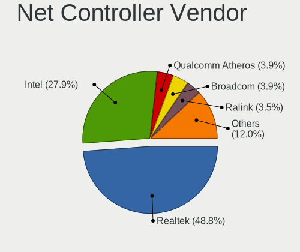

| Vendor                | Desktops | Percent |
|-----------------------|----------|---------|
| Realtek Semiconductor | 126      | 48.84%  |
| Intel                 | 72       | 27.91%  |
| Qualcomm Atheros      | 10       | 3.88%   |
| Broadcom              | 10       | 3.88%   |
| Ralink Technology     | 9        | 3.49%   |
| TP-Link               | 8        | 3.1%    |
| ASIX Electronics      | 5        | 1.94%   |
| MediaTek              | 4        | 1.55%   |
| Ralink                | 3        | 1.16%   |
| D-Link                | 2        | 0.78%   |
| Broadcom Limited      | 2        | 0.78%   |
| Samsung Electronics   | 1        | 0.39%   |
| Research In Motion    | 1        | 0.39%   |
| Novatel Wireless      | 1        | 0.39%   |
| ICS Advent            | 1        | 0.39%   |
| Edimax Technology     | 1        | 0.39%   |
| Aquantia              | 1        | 0.39%   |
| Unknown               | 1        | 0.39%   |

Net Controller Model
--------------------

Controller models

| Model                                                                  | Desktops | Percent |
|------------------------------------------------------------------------|----------|---------|
| Realtek RTL8111/8168/8211/8411 PCI Express Gigabit Ethernet Controller | 99       | 34.38%  |
| Realtek RTL8125 2.5GbE Controller                                      | 12       | 4.17%   |
| Intel Ethernet Connection (7) I219-V                                   | 11       | 3.82%   |
| Intel Wi-Fi 6 AX200                                                    | 7        | 2.43%   |
| Realtek RTL8188EUS 802.11n Wireless Network Adapter                    | 6        | 2.08%   |
| Realtek RTL810xE PCI Express Fast Ethernet controller                  | 5        | 1.74%   |
| Realtek 802.11ac NIC                                                   | 5        | 1.74%   |
| Intel I211 Gigabit Network Connection                                  | 5        | 1.74%   |
| Intel I210 Gigabit Network Connection                                  | 5        | 1.74%   |
| Intel Ethernet Connection I217-LM                                      | 5        | 1.74%   |
| Intel Ethernet Connection (2) I219-V                                   | 5        | 1.74%   |
| TP-Link TL-WN722N v2/v3 [Realtek RTL8188EUS]                           | 4        | 1.39%   |
| Ralink MT7601U Wireless Adapter                                        | 4        | 1.39%   |
| Intel Ethernet Controller I225-V                                       | 4        | 1.39%   |
| Intel 82579LM Gigabit Network Connection (Lewisville)                  | 4        | 1.39%   |
| Intel Wireless 7260                                                    | 3        | 1.04%   |
| Intel Wi-Fi 6E(802.11ax) AX210/AX1675* 2x2 [Typhoon Peak]              | 3        | 1.04%   |
| Intel Dual Band Wireless-AC 3168NGW [Stone Peak]                       | 3        | 1.04%   |
| ASIX AX88772A Fast Ethernet                                            | 3        | 1.04%   |
| TP-Link 802.11ac NIC                                                   | 2        | 0.69%   |
| Realtek RTL88x2bu [AC1200 Techkey]                                     | 2        | 0.69%   |
| Realtek RTL8821CE 802.11ac PCIe Wireless Network Adapter               | 2        | 0.69%   |
| Realtek RTL8812AE 802.11ac PCIe Wireless Network Adapter               | 2        | 0.69%   |
| Ralink RT5370 Wireless Adapter                                         | 2        | 0.69%   |
| Qualcomm Atheros Killer E220x Gigabit Ethernet Controller              | 2        | 0.69%   |
| Qualcomm Atheros AR9485 Wireless Network Adapter                       | 2        | 0.69%   |
| Qualcomm Atheros AR8152 v2.0 Fast Ethernet                             | 2        | 0.69%   |
| MediaTek MT7922 802.11ax PCI Express Wireless Network Adapter          | 2        | 0.69%   |
| Intel Wireless 7265                                                    | 2        | 0.69%   |
| Intel Raptor Lake-S PCH CNVi WiFi                                      | 2        | 0.69%   |
| Intel Ethernet Connection I217-V                                       | 2        | 0.69%   |
| Intel Ethernet Connection (5) I219-LM                                  | 2        | 0.69%   |
| Intel Ethernet Connection (2) I218-LM                                  | 2        | 0.69%   |
| Intel Ethernet Connection (14) I219-V                                  | 2        | 0.69%   |
| Intel Ethernet Connection (12) I219-V                                  | 2        | 0.69%   |
| Intel 82579V Gigabit Network Connection                                | 2        | 0.69%   |
| Intel 82574L Gigabit Network Connection                                | 2        | 0.69%   |
| D-Link DWA-123 Wireless N 150 Adapter (rev.D1)                         | 2        | 0.69%   |
| Broadcom NetLink BCM5786 Gigabit Ethernet PCI Express                  | 2        | 0.69%   |
| Broadcom BCM43142 802.11b/g/n                                          | 2        | 0.69%   |

Wireless Vendor
---------------

Wireless vendors

| Vendor                | Desktops | Percent |
|-----------------------|----------|---------|
| Intel                 | 24       | 28.92%  |
| Realtek Semiconductor | 23       | 27.71%  |
| Ralink Technology     | 9        | 10.84%  |
| TP-Link               | 8        | 9.64%   |
| Qualcomm Atheros      | 5        | 6.02%   |
| Broadcom              | 5        | 6.02%   |
| Ralink                | 3        | 3.61%   |
| D-Link                | 2        | 2.41%   |
| Broadcom Limited      | 2        | 2.41%   |
| MediaTek              | 1        | 1.2%    |
| Edimax Technology     | 1        | 1.2%    |

Wireless Model
--------------

Wireless models

| Model                                                          | Desktops | Percent |
|----------------------------------------------------------------|----------|---------|
| Intel Wi-Fi 6 AX200                                            | 7        | 8.43%   |
| Realtek RTL8188EUS 802.11n Wireless Network Adapter            | 6        | 7.23%   |
| Realtek 802.11ac NIC                                           | 5        | 6.02%   |
| TP-Link TL-WN722N v2/v3 [Realtek RTL8188EUS]                   | 4        | 4.82%   |
| Ralink MT7601U Wireless Adapter                                | 4        | 4.82%   |
| Intel Wireless 7260                                            | 3        | 3.61%   |
| Intel Wi-Fi 6E(802.11ax) AX210/AX1675* 2x2 [Typhoon Peak]      | 3        | 3.61%   |
| Intel Dual Band Wireless-AC 3168NGW [Stone Peak]               | 3        | 3.61%   |
| TP-Link 802.11ac NIC                                           | 2        | 2.41%   |
| Realtek RTL88x2bu [AC1200 Techkey]                             | 2        | 2.41%   |
| Realtek RTL8821CE 802.11ac PCIe Wireless Network Adapter       | 2        | 2.41%   |
| Realtek RTL8812AE 802.11ac PCIe Wireless Network Adapter       | 2        | 2.41%   |
| Ralink RT5370 Wireless Adapter                                 | 2        | 2.41%   |
| Qualcomm Atheros AR9485 Wireless Network Adapter               | 2        | 2.41%   |
| Intel Wireless 7265                                            | 2        | 2.41%   |
| Intel Raptor Lake-S PCH CNVi WiFi                              | 2        | 2.41%   |
| D-Link DWA-123 Wireless N 150 Adapter (rev.D1)                 | 2        | 2.41%   |
| Broadcom BCM43142 802.11b/g/n                                  | 2        | 2.41%   |
| TP-Link TL-WN821N v5/v6 [RTL8192EU]                            | 1        | 1.2%    |
| TP-Link Archer T2U PLUS [RTL8821AU]                            | 1        | 1.2%    |
| Realtek RTL8852BE PCIe 802.11ax Wireless Network Controller    | 1        | 1.2%    |
| Realtek RTL8822CE 802.11ac PCIe Wireless Network Adapter       | 1        | 1.2%    |
| Realtek RTL8723BE PCIe Wireless Network Adapter                | 1        | 1.2%    |
| Realtek RTL8192EU 802.11b/g/n WLAN Adapter                     | 1        | 1.2%    |
| Realtek RTL8188FTV 802.11b/g/n 1T1R 2.4G WLAN Adapter          | 1        | 1.2%    |
| Realtek RTL8188EE Wireless Network Adapter                     | 1        | 1.2%    |
| Ralink RT2870/RT3070 Wireless Adapter                          | 1        | 1.2%    |
| Ralink RT2070 Wireless Adapter                                 | 1        | 1.2%    |
| Ralink MT7610U ("Archer T2U" 2.4G+5G WLAN Adapter              | 1        | 1.2%    |
| Ralink RT5390 Wireless 802.11n 1T/1R PCIe                      | 1        | 1.2%    |
| Ralink RT3290 Wireless 802.11n 1T/1R PCIe                      | 1        | 1.2%    |
| Ralink RT2561/RT61 rev B 802.11g                               | 1        | 1.2%    |
| Qualcomm Atheros QCA9565 / AR9565 Wireless Network Adapter     | 1        | 1.2%    |
| Qualcomm Atheros AR9462 Wireless Network Adapter               | 1        | 1.2%    |
| Qualcomm Atheros AR928X Wireless Network Adapter (PCI-Express) | 1        | 1.2%    |
| MediaTek MT7921 802.11ax PCI Express Wireless Network Adapter  | 1        | 1.2%    |
| Intel Wireless 3165                                            | 1        | 1.2%    |
| Intel Wireless 3160                                            | 1        | 1.2%    |
| Intel Comet Lake PCH CNVi WiFi                                 | 1        | 1.2%    |
| Intel Alder Lake-S PCH CNVi WiFi                               | 1        | 1.2%    |

Ethernet Vendor
---------------

Ethernet vendors

| Vendor                | Desktops | Percent |
|-----------------------|----------|---------|
| Realtek Semiconductor | 117      | 59.39%  |
| Intel                 | 58       | 29.44%  |
| Qualcomm Atheros      | 5        | 2.54%   |
| Broadcom              | 5        | 2.54%   |
| ASIX Electronics      | 5        | 2.54%   |
| MediaTek              | 3        | 1.52%   |
| Samsung Electronics   | 1        | 0.51%   |
| Research In Motion    | 1        | 0.51%   |
| ICS Advent            | 1        | 0.51%   |
| Aquantia              | 1        | 0.51%   |

Ethernet Model
--------------

Ethernet models

| Model                                                                  | Desktops | Percent |
|------------------------------------------------------------------------|----------|---------|
| Realtek RTL8111/8168/8211/8411 PCI Express Gigabit Ethernet Controller | 99       | 48.77%  |
| Realtek RTL8125 2.5GbE Controller                                      | 12       | 5.91%   |
| Intel Ethernet Connection (7) I219-V                                   | 11       | 5.42%   |
| Realtek RTL810xE PCI Express Fast Ethernet controller                  | 5        | 2.46%   |
| Intel I211 Gigabit Network Connection                                  | 5        | 2.46%   |
| Intel I210 Gigabit Network Connection                                  | 5        | 2.46%   |
| Intel Ethernet Connection I217-LM                                      | 5        | 2.46%   |
| Intel Ethernet Connection (2) I219-V                                   | 5        | 2.46%   |
| Intel Ethernet Controller I225-V                                       | 4        | 1.97%   |
| Intel 82579LM Gigabit Network Connection (Lewisville)                  | 4        | 1.97%   |
| ASIX AX88772A Fast Ethernet                                            | 3        | 1.48%   |
| Qualcomm Atheros Killer E220x Gigabit Ethernet Controller              | 2        | 0.99%   |
| Qualcomm Atheros AR8152 v2.0 Fast Ethernet                             | 2        | 0.99%   |
| MediaTek MT7922 802.11ax PCI Express Wireless Network Adapter          | 2        | 0.99%   |
| Intel Ethernet Connection I217-V                                       | 2        | 0.99%   |
| Intel Ethernet Connection (5) I219-LM                                  | 2        | 0.99%   |
| Intel Ethernet Connection (2) I218-LM                                  | 2        | 0.99%   |
| Intel Ethernet Connection (14) I219-V                                  | 2        | 0.99%   |
| Intel Ethernet Connection (12) I219-V                                  | 2        | 0.99%   |
| Intel 82579V Gigabit Network Connection                                | 2        | 0.99%   |
| Intel 82574L Gigabit Network Connection                                | 2        | 0.99%   |
| Broadcom NetLink BCM5786 Gigabit Ethernet PCI Express                  | 2        | 0.99%   |
| ASIX AX88179 Gigabit Ethernet                                          | 2        | 0.99%   |
| Samsung Galaxy series, misc. (tethering mode)                          | 1        | 0.49%   |
| Research In Motion BlackBerry                                          | 1        | 0.49%   |
| Realtek USB 10/100/1G/2.5G LAN                                         | 1        | 0.49%   |
| Realtek RTL8169 PCI Gigabit Ethernet Controller                        | 1        | 0.49%   |
| Qualcomm Atheros Killer E2400 Gigabit Ethernet Controller              | 1        | 0.49%   |
| MediaTek TANK2                                                         | 1        | 0.49%   |
| Intel Ethernet Controller I226-V                                       | 1        | 0.49%   |
| Intel Ethernet Connection (7) I219-LM                                  | 1        | 0.49%   |
| Intel Ethernet Connection (2) I219-LM                                  | 1        | 0.49%   |
| Intel Ethernet Connection (2) I218-V                                   | 1        | 0.49%   |
| Intel Ethernet Connection (17) I219-LM                                 | 1        | 0.49%   |
| Intel Ethernet Connection (11) I219-V                                  | 1        | 0.49%   |
| Intel 82599ES 10-Gigabit SFI/SFP+ Network Connection                   | 1        | 0.49%   |
| Intel 82567LM-3 Gigabit Network Connection                             | 1        | 0.49%   |
| Intel 82562V-2 10/100 Network Connection                               | 1        | 0.49%   |
| Intel 82541PI Gigabit Ethernet Controller                              | 1        | 0.49%   |
| ICS Advent DM9601 Fast Ethernet Adapter                                | 1        | 0.49%   |

Net Controller Kind
-------------------

Ethernet, WiFi or modem

| Kind     | Desktops | Percent |
|----------|----------|---------|
| Ethernet | 179      | 69.11%  |
| WiFi     | 78       | 30.12%  |
| Modem    | 1        | 0.39%   |
| Unknown  | 1        | 0.39%   |

Used Controller
---------------

Currently used network controller

| Kind     | Desktops | Percent |
|----------|----------|---------|
| Ethernet | 132      | 70.21%  |
| WiFi     | 55       | 29.26%  |
| Modem    | 1        | 0.53%   |

NICs
----

Total network controllers on board

| Total | Desktops | Percent |
|-------|----------|---------|
| 1     | 119      | 64.67%  |
| 2     | 52       | 28.26%  |
| 3     | 11       | 5.98%   |
| 4     | 1        | 0.54%   |
| 0     | 1        | 0.54%   |

IPv6
----

IPv6 vs IPv4

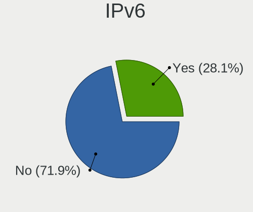

| Used | Desktops | Percent |
|------|----------|---------|
| No   | 133      | 71.89%  |
| Yes  | 52       | 28.11%  |

Bluetooth
---------

Bluetooth Vendor
----------------

Controller vendors

| Vendor                          | Desktops | Percent |
|---------------------------------|----------|---------|
| Intel                           | 23       | 34.85%  |
| Cambridge Silicon Radio         | 17       | 25.76%  |
| Realtek Semiconductor           | 9        | 13.64%  |
| TP-Link                         | 3        | 4.55%   |
| Foxconn / Hon Hai               | 3        | 4.55%   |
| Qualcomm Atheros Communications | 2        | 3.03%   |
| IMC Networks                    | 2        | 3.03%   |
| Broadcom                        | 2        | 3.03%   |
| Apple                           | 2        | 3.03%   |
| Ralink                          | 1        | 1.52%   |
| Lite-On Technology              | 1        | 1.52%   |
| Conwise Technology              | 1        | 1.52%   |

Bluetooth Model
---------------

Controller models

| Model                                               | Desktops | Percent |
|-----------------------------------------------------|----------|---------|
| Cambridge Silicon Radio Bluetooth Dongle (HCI mode) | 17       | 25.76%  |
| Realtek Bluetooth Radio                             | 8        | 12.12%  |
| Intel AX200 Bluetooth                               | 7        | 10.61%  |
| Intel Bluetooth wireless interface                  | 6        | 9.09%   |
| TP-Link TP-Link Bluetooth USB Adapter               | 3        | 4.55%   |
| Intel Wireless-AC 3168 Bluetooth                    | 3        | 4.55%   |
| Intel AX210 Bluetooth                               | 3        | 4.55%   |
| Intel AX211 Bluetooth                               | 2        | 3.03%   |
| Intel AX201 Bluetooth                               | 2        | 3.03%   |
| Foxconn / Hon Hai Wireless_Device                   | 2        | 3.03%   |
| Apple Bluetooth Host Controller                     | 2        | 3.03%   |
| Realtek  Bluetooth 4.2 Adapter                      | 1        | 1.52%   |
| Ralink RT3290 Bluetooth                             | 1        | 1.52%   |
| Qualcomm Atheros AR9462 Bluetooth                   | 1        | 1.52%   |
| Qualcomm Atheros AR3012 Bluetooth 4.0               | 1        | 1.52%   |
| Lite-On Bluetooth Radio                             | 1        | 1.52%   |
| IMC Networks Wireless_Device                        | 1        | 1.52%   |
| IMC Networks Bluetooth Radio                        | 1        | 1.52%   |
| Foxconn / Hon Hai Broadcom BCM20702A1 Bluetooth     | 1        | 1.52%   |
| Conwise CW6622                                      | 1        | 1.52%   |
| Broadcom BCM43142A0 Bluetooth Device                | 1        | 1.52%   |
| Broadcom BCM43142 Bluetooth 4.0                     | 1        | 1.52%   |

Sound
-----

Sound Vendor
------------

Sound card vendors

| Vendor                    | Desktops | Percent |
|---------------------------|----------|---------|
| Intel                     | 142      | 44.94%  |
| Nvidia                    | 82       | 25.95%  |
| AMD                       | 55       | 17.41%  |
| Generalplus Technology    | 5        | 1.58%   |
| C-Media Electronics       | 5        | 1.58%   |
| Logitech                  | 3        | 0.95%   |
| Audient                   | 3        | 0.95%   |
| Kingston Technology       | 2        | 0.63%   |
| JMTek                     | 2        | 0.63%   |
| Creative Labs             | 2        | 0.63%   |
| ASUSTek Computer          | 2        | 0.63%   |
| USB2.0                    | 1        | 0.32%   |
| Texas Instruments         | 1        | 0.32%   |
| Shenzhen Rapoo Technology | 1        | 0.32%   |
| Realtek Semiconductor     | 1        | 0.32%   |
| Nordic Semiconductor ASA  | 1        | 0.32%   |
| GYROCOM C&C               | 1        | 0.32%   |
| FIFINE Microphones        | 1        | 0.32%   |
| Elgato Systems            | 1        | 0.32%   |
| Creative Technology       | 1        | 0.32%   |
| Corsair                   | 1        | 0.32%   |
| Conexant Systems          | 1        | 0.32%   |
| Apple                     | 1        | 0.32%   |
| AGPTek                    | 1        | 0.32%   |

Sound Model
-----------

Sound card models

| Model                                                                      | Desktops | Percent |
|----------------------------------------------------------------------------|----------|---------|
| Intel 8 Series/C220 Series Chipset High Definition Audio Controller        | 24       | 6.74%   |
| Intel Cannon Lake PCH cAVS                                                 | 16       | 4.49%   |
| Intel 6 Series/C200 Series Chipset Family High Definition Audio Controller | 16       | 4.49%   |
| Intel 200 Series PCH HD Audio                                              | 15       | 4.21%   |
| Intel Xeon E3-1200 v3/4th Gen Core Processor HD Audio Controller           | 14       | 3.93%   |
| AMD Ellesmere HDMI Audio [Radeon RX 470/480 / 570/580/590]                 | 13       | 3.65%   |
| Intel 100 Series/C230 Series Chipset Family HD Audio Controller            | 12       | 3.37%   |
| Nvidia GK208 HDMI/DP Audio Controller                                      | 11       | 3.09%   |
| Intel NM10/ICH7 Family High Definition Audio Controller                    | 10       | 2.81%   |
| AMD Starship/Matisse HD Audio Controller                                   | 10       | 2.81%   |
| AMD Family 17h/19h/1ah HD Audio Controller                                 | 10       | 2.81%   |
| Nvidia GP107GL High Definition Audio Controller                            | 9        | 2.53%   |
| Intel Alder Lake-S HD Audio Controller                                     | 7        | 1.97%   |
| Intel 7 Series/C216 Chipset Family High Definition Audio Controller        | 7        | 1.97%   |
| AMD Renoir Radeon High Definition Audio Controller                         | 7        | 1.97%   |
| Nvidia TU116 High Definition Audio Controller                              | 6        | 1.69%   |
| Nvidia GK107 HDMI Audio Controller                                         | 6        | 1.69%   |
| AMD Family 17h (Models 00h-0fh) HD Audio Controller                        | 6        | 1.69%   |
| Nvidia TU102 High Definition Audio Controller                              | 5        | 1.4%    |
| Nvidia GP106 High Definition Audio Controller                              | 5        | 1.4%    |
| Intel C610/X99 series chipset HD Audio Controller                          | 5        | 1.4%    |
| Generalplus Technology USB Audio Device                                    | 5        | 1.4%    |
| AMD Raven/Raven2/Fenghuang HDMI/DP Audio Controller                        | 5        | 1.4%    |
| AMD Oland/Hainan/Cape Verde/Pitcairn HDMI Audio [Radeon HD 7000 Series]    | 5        | 1.4%    |
| Nvidia TU104 HD Audio Controller                                           | 4        | 1.12%   |
| Nvidia GP108 High Definition Audio Controller                              | 4        | 1.12%   |
| Nvidia GM107 High Definition Audio Controller [GeForce 940MX]              | 4        | 1.12%   |
| Nvidia GA104 High Definition Audio Controller                              | 4        | 1.12%   |
| AMD Navi 10 HDMI Audio                                                     | 4        | 1.12%   |
| AMD Baffin HDMI/DP Audio [Radeon RX 550 640SP / RX 560/560X]               | 4        | 1.12%   |
| Nvidia High Definition Audio Controller                                    | 3        | 0.84%   |
| Nvidia GP104 High Definition Audio Controller                              | 3        | 0.84%   |
| Nvidia GF108 High Definition Audio Controller                              | 3        | 0.84%   |
| Nvidia GA106 High Definition Audio Controller                              | 3        | 0.84%   |
| Nvidia GA102 High Definition Audio Controller                              | 3        | 0.84%   |
| Intel Smart Sound Technology (SST) Audio Controller                        | 3        | 0.84%   |
| Intel Raptor Lake High Definition Audio Controller                         | 3        | 0.84%   |
| Intel Comet Lake PCH-V cAVS                                                | 3        | 0.84%   |
| Intel Comet Lake PCH cAVS                                                  | 3        | 0.84%   |
| Intel C600/X79 series chipset High Definition Audio Controller             | 3        | 0.84%   |

Memory
------

Memory Vendor
-------------

Memory module vendors

| Vendor                | Desktops | Percent |
|-----------------------|----------|---------|
| Kingston              | 37       | 27.21%  |
| G.Skill               | 19       | 13.97%  |
| Corsair               | 16       | 11.76%  |
| Samsung Electronics   | 11       | 8.09%   |
| Kingmax               | 8        | 5.88%   |
| SK hynix              | 7        | 5.15%   |
| Micron Technology     | 7        | 5.15%   |
| Unknown               | 6        | 4.41%   |
| A-DATA Technology     | 4        | 2.94%   |
| Team                  | 3        | 2.21%   |
| Crucial               | 3        | 2.21%   |
| Unknown               | 3        | 2.21%   |
| Ramaxel Technology    | 2        | 1.47%   |
| Kingmax Semiconductor | 2        | 1.47%   |
| Unknown (8A02)        | 1        | 0.74%   |
| PNY                   | 1        | 0.74%   |
| Pioneer               | 1        | 0.74%   |
| Patriot               | 1        | 0.74%   |
| Nanya Technology      | 1        | 0.74%   |
| AVEXIR                | 1        | 0.74%   |
| ASint Technology      | 1        | 0.74%   |
| Apacer                | 1        | 0.74%   |

Memory Model
------------

Memory module models

| Model                                                  | Desktops | Percent |
|--------------------------------------------------------|----------|---------|
| Kingston RAM KF3200C16D4/16GX 16GB DIMM DDR4 3200MT/s  | 5        | 3.33%   |
| Corsair RAM CMK8GX4M1A2666C16 8GB DIMM DDR4 3200MT/s   | 5        | 3.33%   |
| Kingston RAM KHX3200C16D4/8GX 8GB DIMM DDR4 3733MT/s   | 3        | 2%      |
| G.Skill RAM F4-3600C18-16GTZN 16GB DIMM DDR4 3666MT/s  | 3        | 2%      |
| Unknown                                                | 3        | 2%      |
| Unknown RAM Module 1GB DIMM 800MT/s                    | 2        | 1.33%   |
| Samsung RAM M386A4G40DM0-CPB 32GB DIMM DDR4 2400MT/s   | 2        | 1.33%   |
| Micron RAM 8JTF51264AZ-1G6E1 4GB DIMM 1600MT/s         | 2        | 1.33%   |
| Kingston RAM SNY1600S11-4G-ED 4GB SODIMM DDR3 1066MT/s | 2        | 1.33%   |
| Kingston RAM Module 8GB DIMM DDR3 1600MT/s             | 2        | 1.33%   |
| Kingston RAM KHX2666C16/8G 8GB DIMM DDR4 3466MT/s      | 2        | 1.33%   |
| Kingmax RAM FLGF65F-D8KMB 4GB DIMM DDR3 1600MT/s       | 2        | 1.33%   |
| G.Skill RAM F4-3000C16-16GTZR 16GB DIMM DDR4 3000MT/s  | 2        | 1.33%   |
| Crucial RAM BLS8G4D240FSEK.8FBD 8GB DIMM DDR4 2400MT/s | 2        | 1.33%   |
| Corsair RAM CMK16GX4M2A2666C16 8GB DIMM DDR4 3400MT/s  | 2        | 1.33%   |
| Unknown RAM Module 4096MB DIMM DDR3 1600MT/s           | 1        | 0.67%   |
| Unknown RAM Module 2048MB DIMM DDR2 200MT/s            | 1        | 0.67%   |
| Unknown RAM Module 1024MB DIMM DDR 133MT/s             | 1        | 0.67%   |
| Unknown RAM BAPC08G3000D4T8 8192MB DIMM DDR4 2133MT/s  | 1        | 0.67%   |
| Unknown (8A02) RAM KingSpec 8GB DIMM DDR4 2448MT/s     | 1        | 0.67%   |
| Team RAM TEAMGROUP-UD4-3600 16GB DIMM DDR4 3600MT/s    | 1        | 0.67%   |
| Team RAM TEAMGROUP-UD3-1600 8GB DIMM DDR3 1600MT/s     | 1        | 0.67%   |
| Team RAM TEAMGROUP-UD3-160 4096MB DIMM DDR3 1333MT/s   | 1        | 0.67%   |
| SK hynix RAM SNOAMOO Ltd:016M00 4GB DIMM DDR3 1600MT/s | 1        | 0.67%   |
| SK hynix RAM HYMP112U64CP8-S6 1GB DIMM DDR2 800MT/s    | 1        | 0.67%   |
| SK hynix RAM HMT451U6BFR8A-PB 4GB DIMM DDR3 1600MT/s   | 1        | 0.67%   |
| SK hynix RAM HMT425S6AFR6A-PB 2GB DIMM DDR3 1600MT/s   | 1        | 0.67%   |
| SK hynix RAM HMT41GS6AFR8A-PB 8GB SODIMM DDR3 2667MT/s | 1        | 0.67%   |
| SK hynix RAM HMT351S6EFR8C-PB 4GB DIMM DDR3 1600MT/s   | 1        | 0.67%   |
| SK hynix RAM HMA42GR7MFR4N-TF 16GB DIMM DDR4 3200MT/s  | 1        | 0.67%   |
| SK hynix RAM HMA42GR7AFR4N-TF 16GB DIMM DDR4 2133MT/s  | 1        | 0.67%   |
| Samsung RAM M471B5173DB0-YK0 4GB DIMM DDR3 1600MT/s    | 1        | 0.67%   |
| Samsung RAM M471A1K43CB1-CTD 8GB SODIMM DDR4 2667MT/s  | 1        | 0.67%   |
| Samsung RAM M393B2K70CM0-YF8 16GB DIMM DDR3 1067MT/s   | 1        | 0.67%   |
| Samsung RAM M393B2G70BH0 16GB DIMM DDR3 1866MT/s       | 1        | 0.67%   |
| Samsung RAM M393A2K40BB1-CRC 16GB DIMM DDR4 2400MT/s   | 1        | 0.67%   |
| Samsung RAM M393A2G40DB0-CPB 16GB DIMM DDR4 2133MT/s   | 1        | 0.67%   |
| Samsung RAM M378B5173DB0-CK0 4096MB DIMM DDR3 1600MT/s | 1        | 0.67%   |
| Samsung RAM M378A5244CB0-CTD 4GB DIMM DDR4 3334MT/s    | 1        | 0.67%   |
| Samsung RAM M378A1K43CB2-CTD 8GB DIMM DDR4 3266MT/s    | 1        | 0.67%   |

Memory Kind
-----------

Memory module kinds

| Kind    | Desktops | Percent |
|---------|----------|---------|
| DDR4    | 70       | 59.83%  |
| DDR3    | 35       | 29.91%  |
| DDR5    | 5        | 4.27%   |
| DRAM    | 2        | 1.71%   |
| DDR2    | 2        | 1.71%   |
| Unknown | 2        | 1.71%   |
| DDR     | 1        | 0.85%   |

Memory Form Factor
------------------

Physical design of the memory module

| Name   | Desktops | Percent |
|--------|----------|---------|
| DIMM   | 107      | 92.24%  |
| SODIMM | 9        | 7.76%   |

Memory Size
-----------

Memory module size

| Size  | Desktops | Percent |
|-------|----------|---------|
| 8192  | 53       | 41.73%  |
| 16384 | 34       | 26.77%  |
| 4096  | 29       | 22.83%  |
| 32768 | 5        | 3.94%   |
| 1024  | 4        | 3.15%   |
| 2048  | 2        | 1.57%   |

Memory Speed
------------

Memory module speed

| Speed | Desktops | Percent |
|-------|----------|---------|
| 3200  | 25       | 18.25%  |
| 1600  | 24       | 17.52%  |
| 2400  | 13       | 9.49%   |
| 2667  | 10       | 7.3%    |
| 1333  | 10       | 7.3%    |
| 3600  | 6        | 4.38%   |
| 3733  | 4        | 2.92%   |
| 3000  | 4        | 2.92%   |
| 3666  | 3        | 2.19%   |
| 3466  | 3        | 2.19%   |
| 2666  | 3        | 2.19%   |
| 1066  | 3        | 2.19%   |
| 800   | 3        | 2.19%   |
| 5200  | 2        | 1.46%   |
| 3400  | 2        | 1.46%   |
| 2800  | 2        | 1.46%   |
| 2448  | 2        | 1.46%   |
| 2133  | 2        | 1.46%   |
| 1866  | 2        | 1.46%   |
| 1067  | 2        | 1.46%   |
| 7000  | 1        | 0.73%   |
| 6400  | 1        | 0.73%   |
| 5600  | 1        | 0.73%   |
| 3334  | 1        | 0.73%   |
| 3266  | 1        | 0.73%   |
| 3007  | 1        | 0.73%   |
| 2734  | 1        | 0.73%   |
| 1867  | 1        | 0.73%   |
| 1800  | 1        | 0.73%   |
| 1648  | 1        | 0.73%   |
| 200   | 1        | 0.73%   |
| 133   | 1        | 0.73%   |

Printers & scanners
-------------------

Printer Vendor
--------------

Printer device vendors

| Vendor                | Desktops | Percent |
|-----------------------|----------|---------|
| Seiko Epson           | 1        | 25%     |
| Ricoh                 | 1        | 25%     |
| Intermec Technologies | 1        | 25%     |
| Brother Industries    | 1        | 25%     |

Printer Model
-------------

Printer device models

| Model                    | Desktops | Percent |
|--------------------------|----------|---------|
| Seiko Epson L3110 Series | 1        | 25%     |
| Ricoh Printing Support   | 1        | 25%     |
| Intermec PC43t           | 1        | 25%     |
| Brother HL-L2360D series | 1        | 25%     |

Scanner Vendor
--------------

Scanner device vendors

Zero info for selected period =(

Scanner Model
-------------

Scanner device models

Zero info for selected period =(

Camera
------

Camera Vendor
-------------

Camera device vendors

| Vendor                          | Desktops | Percent |
|---------------------------------|----------|---------|
| Logitech                        | 6        | 27.27%  |
| SN0002                          | 2        | 9.09%   |
| vivo                            | 1        | 4.55%   |
| Sunplus Innovation Technology   | 1        | 4.55%   |
| Sonix Technology                | 1        | 4.55%   |
| Samsung Electronics             | 1        | 4.55%   |
| Realtek Semiconductor           | 1        | 4.55%   |
| Microdia                        | 1        | 4.55%   |
| Linux Foundation                | 1        | 4.55%   |
| KYE Systems (Mouse Systems)     | 1        | 4.55%   |
| Intel                           | 1        | 4.55%   |
| IDS Imaging Development Systems | 1        | 4.55%   |
| Aveo Technology                 | 1        | 4.55%   |
| Apple                           | 1        | 4.55%   |
| Alpha Imaging Technology        | 1        | 4.55%   |
| Alcor Micro                     | 1        | 4.55%   |

Camera Model
------------

Camera device models

| Model                                          | Desktops | Percent |
|------------------------------------------------|----------|---------|
| Logitech Webcam C270                           | 3        | 13.64%  |
| SN0002 1080P Web Camera                        | 2        | 9.09%   |
| Logitech Webcam C310                           | 2        | 9.09%   |
| vivo 1906                                      | 1        | 4.55%   |
| Sunplus HK 5M WebCAM                           | 1        | 4.55%   |
| Sonix ZZ3                                      | 1        | 4.55%   |
| Samsung Galaxy series, misc. (MTP mode)        | 1        | 4.55%   |
| Realtek Dell_Monitor_IR_Webcam                 | 1        | 4.55%   |
| Microdia Rapoo Camera                          | 1        | 4.55%   |
| Logitech Webcam C210                           | 1        | 4.55%   |
| Linux Foundation EEM Gadget                    | 1        | 4.55%   |
| KYE Systems (Mouse Systems) Genius Webcam      | 1        | 4.55%   |
| Intel RealSense D435                           | 1        | 4.55%   |
| IDS Imaging Development Systems USB 3.0 Camera | 1        | 4.55%   |
| Aveo USB2.0 Camera                             | 1        | 4.55%   |
| Apple iPhone 5/5C/5S/6/SE/7/8/X/XR             | 1        | 4.55%   |
| Alpha Imaging HIK 4K Camera                    | 1        | 4.55%   |
| Alcor Micro USB 2.0 PC Camera                  | 1        | 4.55%   |

Security
--------

Fingerprint Vendor
------------------

Fingerprint sensor vendors

Zero info for selected period =(

Fingerprint Model
-----------------

Fingerprint sensor models

Zero info for selected period =(

Chipcard Vendor
---------------

Chipcard module vendors

Zero info for selected period =(

Chipcard Model
--------------

Chipcard module models

Zero info for selected period =(

Unsupported
-----------

Unsupported Devices
-------------------

Total unsupported devices on board

| Total | Desktops | Percent |
|-------|----------|---------|
| 0     | 158      | 85.41%  |
| 1     | 20       | 10.81%  |
| 2     | 4        | 2.16%   |
| 3     | 3        | 1.62%   |

Unsupported Device Types
------------------------

Types of unsupported devices

| Type                     | Desktops | Percent |
|--------------------------|----------|---------|
| Graphics card            | 16       | 48.48%  |
| Unassigned class         | 7        | 21.21%  |
| Net/wireless             | 4        | 12.12%  |
| Communication controller | 3        | 9.09%   |
| Camera                   | 2        | 6.06%   |
| Bluetooth                | 1        | 3.03%   |

