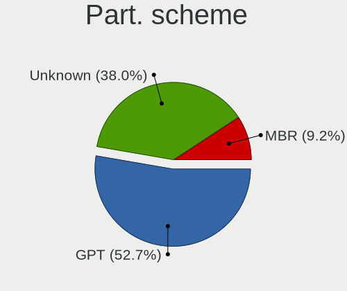
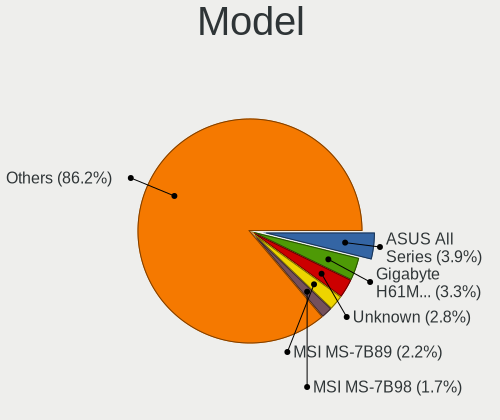
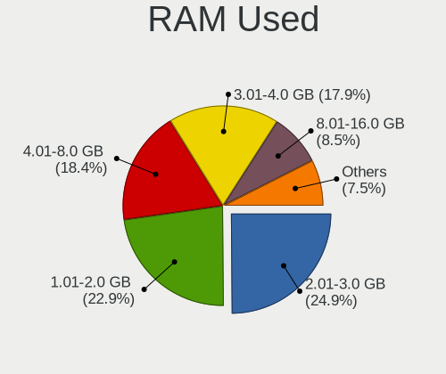
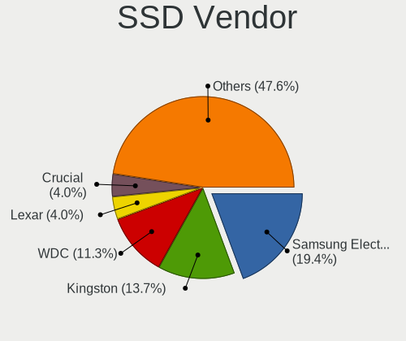
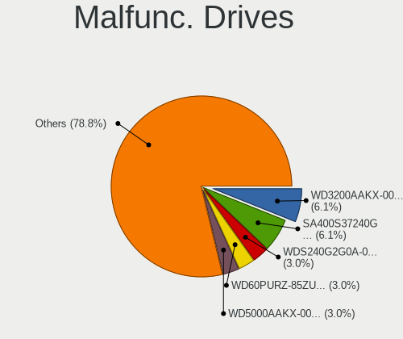
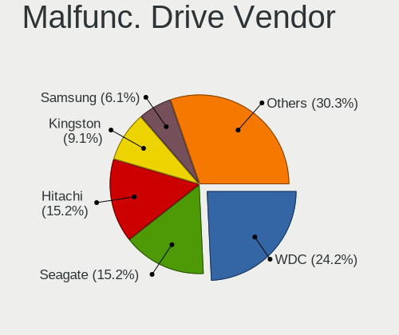
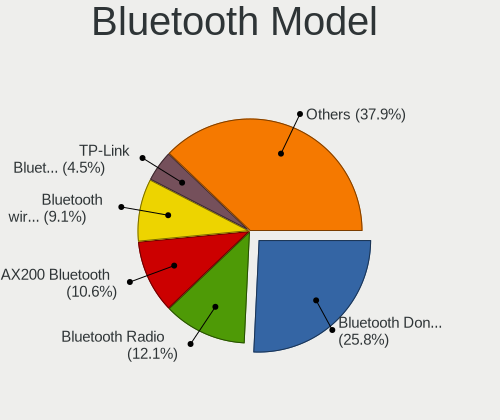

Linux in Vietnam - Tested Hardware & Statistics (Desktops)
----------------------------------------------------------

A project to collect tested hardware configurations for Linux in Vietnam.

Anyone can contribute to this report by the [hw-probe](https://github.com/linuxhw/hw-probe) tool:

    sudo -E hw-probe -all -upload

Please contribute! Especially if your hardware is rare.

Contents
--------

* [ Test Cases ](#test-cases)

* [ System ](#system)
  - [ OS                       ](#os)
  - [ OS Family                ](#os-family)
  - [ Kernel                   ](#kernel)
  - [ Kernel Family            ](#kernel-family)
  - [ Kernel Major Ver.        ](#kernel-major-ver)
  - [ Arch                     ](#arch)
  - [ DE                       ](#de)
  - [ Display Server           ](#display-server)
  - [ Display Manager          ](#display-manager)
  - [ OS Lang                  ](#os-lang)
  - [ Boot Mode                ](#boot-mode)
  - [ Filesystem               ](#filesystem)
  - [ Part. scheme             ](#part-scheme)
  - [ Dual Boot with Linux/BSD ](#dual-boot-with-linuxbsd)
  - [ Dual Boot (Win)          ](#dual-boot-win)

* [ Board ](#board)
  - [ Vendor                   ](#vendor)
  - [ Model                    ](#model)
  - [ Model Family             ](#model-family)
  - [ MFG Year                 ](#mfg-year)
  - [ Form Factor              ](#form-factor)
  - [ Secure Boot              ](#secure-boot)
  - [ Coreboot                 ](#coreboot)
  - [ RAM Size                 ](#ram-size)
  - [ RAM Used                 ](#ram-used)
  - [ Total Drives             ](#total-drives)
  - [ Has CD-ROM               ](#has-cd-rom)
  - [ Has Ethernet             ](#has-ethernet)
  - [ Has WiFi                 ](#has-wifi)
  - [ Has Bluetooth            ](#has-bluetooth)

* [ Location ](#location)
  - [ Country                  ](#country)
  - [ City                     ](#city)

* [ Drives ](#drives)
  - [ Drive Vendor             ](#drive-vendor)
  - [ Drive Model              ](#drive-model)
  - [ HDD Vendor               ](#hdd-vendor)
  - [ SSD Vendor               ](#ssd-vendor)
  - [ Drive Kind               ](#drive-kind)
  - [ Drive Connector          ](#drive-connector)
  - [ Drive Size               ](#drive-size)
  - [ Space Total              ](#space-total)
  - [ Space Used               ](#space-used)
  - [ Malfunc. Drives          ](#malfunc-drives)
  - [ Malfunc. Drive Vendor    ](#malfunc-drive-vendor)
  - [ Malfunc. HDD Vendor      ](#malfunc-hdd-vendor)
  - [ Malfunc. Drive Kind      ](#malfunc-drive-kind)
  - [ Failed Drives            ](#failed-drives)
  - [ Failed Drive Vendor      ](#failed-drive-vendor)
  - [ Drive Status             ](#drive-status)

* [ Storage controller ](#storage-controller)
  - [ Storage Vendor           ](#storage-vendor)
  - [ Storage Model            ](#storage-model)
  - [ Storage Kind             ](#storage-kind)

* [ Processor ](#processor)
  - [ CPU Vendor               ](#cpu-vendor)
  - [ CPU Model                ](#cpu-model)
  - [ CPU Model Family         ](#cpu-model-family)
  - [ CPU Cores                ](#cpu-cores)
  - [ CPU Sockets              ](#cpu-sockets)
  - [ CPU Threads              ](#cpu-threads)
  - [ CPU Op-Modes             ](#cpu-op-modes)
  - [ CPU Microcode            ](#cpu-microcode)
  - [ CPU Microarch            ](#cpu-microarch)

* [ Graphics ](#graphics)
  - [ GPU Vendor               ](#gpu-vendor)
  - [ GPU Model                ](#gpu-model)
  - [ GPU Combo                ](#gpu-combo)
  - [ GPU Driver               ](#gpu-driver)
  - [ GPU Memory               ](#gpu-memory)

* [ Monitor ](#monitor)
  - [ Monitor Vendor           ](#monitor-vendor)
  - [ Monitor Model            ](#monitor-model)
  - [ Monitor Resolution       ](#monitor-resolution)
  - [ Monitor Diagonal         ](#monitor-diagonal)
  - [ Monitor Width            ](#monitor-width)
  - [ Aspect Ratio             ](#aspect-ratio)
  - [ Monitor Area             ](#monitor-area)
  - [ Pixel Density            ](#pixel-density)
  - [ Multiple Monitors        ](#multiple-monitors)

* [ Network ](#network)
  - [ Net Controller Vendor    ](#net-controller-vendor)
  - [ Net Controller Model     ](#net-controller-model)
  - [ Wireless Vendor          ](#wireless-vendor)
  - [ Wireless Model           ](#wireless-model)
  - [ Ethernet Vendor          ](#ethernet-vendor)
  - [ Ethernet Model           ](#ethernet-model)
  - [ Net Controller Kind      ](#net-controller-kind)
  - [ Used Controller          ](#used-controller)
  - [ NICs                     ](#nics)
  - [ IPv6                     ](#ipv6)

* [ Bluetooth ](#bluetooth)
  - [ Bluetooth Vendor         ](#bluetooth-vendor)
  - [ Bluetooth Model          ](#bluetooth-model)

* [ Sound ](#sound)
  - [ Sound Vendor             ](#sound-vendor)
  - [ Sound Model              ](#sound-model)

* [ Memory ](#memory)
  - [ Memory Vendor            ](#memory-vendor)
  - [ Memory Model             ](#memory-model)
  - [ Memory Kind              ](#memory-kind)
  - [ Memory Form Factor       ](#memory-form-factor)
  - [ Memory Size              ](#memory-size)
  - [ Memory Speed             ](#memory-speed)

* [ Printers & scanners ](#printers--scanners)
  - [ Printer Vendor           ](#printer-vendor)
  - [ Printer Model            ](#printer-model)
  - [ Scanner Vendor           ](#scanner-vendor)
  - [ Scanner Model            ](#scanner-model)

* [ Camera ](#camera)
  - [ Camera Vendor            ](#camera-vendor)
  - [ Camera Model             ](#camera-model)

* [ Security ](#security)
  - [ Fingerprint Vendor       ](#fingerprint-vendor)
  - [ Fingerprint Model        ](#fingerprint-model)
  - [ Chipcard Vendor          ](#chipcard-vendor)
  - [ Chipcard Model           ](#chipcard-model)

* [ Unsupported ](#unsupported)
  - [ Unsupported Devices      ](#unsupported-devices)
  - [ Unsupported Device Types ](#unsupported-device-types)

Test Cases
----------

Total: 158

| Vendor        | Model                       | Probe                                                      | Date         |
|---------------|-----------------------------|------------------------------------------------------------|--------------|
| ASUSTek       | TUF Gaming X570-PLUS        | [ef49f25cf8](https://linux-hardware.org/?probe=ef49f25cf8) | Jun 30, 2023 |
| ZOTAC         | Unknown                     | [8454119675](https://linux-hardware.org/?probe=8454119675) | Jun 22, 2023 |
| Lenovo        | MAHOBAY                     | [ebedbde736](https://linux-hardware.org/?probe=ebedbde736) | Jun 16, 2023 |
| Gigabyte      | Z370M D3H-CF                | [d704e4a5d3](https://linux-hardware.org/?probe=d704e4a5d3) | Jun 14, 2023 |
| Dell          | 0WMJ54 A01                  | [b3303b8ed6](https://linux-hardware.org/?probe=b3303b8ed6) | Jun 13, 2023 |
| GuoGuang      | IC2M1028V-J                 | [d7c1b01b69](https://linux-hardware.org/?probe=d7c1b01b69) | Jun 10, 2023 |
| Gigabyte      | X570 I AORUS PRO WIFI       | [bf2fc7d3b7](https://linux-hardware.org/?probe=bf2fc7d3b7) | Jun 08, 2023 |
| GuoGuang      | IC2M1028V-J                 | [04527d6ad9](https://linux-hardware.org/?probe=04527d6ad9) | Jun 08, 2023 |
| MSI           | MPG X570 GAMING PLUS        | [4ecbee26b1](https://linux-hardware.org/?probe=4ecbee26b1) | May 04, 2023 |
| Dell          | 08WKV3 A00                  | [ed0486cda1](https://linux-hardware.org/?probe=ed0486cda1) | May 03, 2023 |
| T-bao         | MINI PC V1.0                | [8e77950434](https://linux-hardware.org/?probe=8e77950434) | Apr 30, 2023 |
| ASRock        | B550M Pro4                  | [b53354af62](https://linux-hardware.org/?probe=b53354af62) | Apr 25, 2023 |
| Intel         | H81                         | [fbc2766f35](https://linux-hardware.org/?probe=fbc2766f35) | Apr 22, 2023 |
| HP            | 1825                        | [e586a2657b](https://linux-hardware.org/?probe=e586a2657b) | Apr 21, 2023 |
| Unknown       | Unknown                     | [c67c78ba10](https://linux-hardware.org/?probe=c67c78ba10) | Apr 11, 2023 |
| Gigabyte      | B550 AORUS ELITE            | [ca1cdc7f46](https://linux-hardware.org/?probe=ca1cdc7f46) | Apr 06, 2023 |
| Gigabyte      | B550 AORUS ELITE            | [6844d471e4](https://linux-hardware.org/?probe=6844d471e4) | Apr 02, 2023 |
| Gigabyte      | B550 AORUS ELITE            | [d7b27c1822](https://linux-hardware.org/?probe=d7b27c1822) | Mar 19, 2023 |
| ASUSTek       | PRIME B450M-A               | [dee1b60a0d](https://linux-hardware.org/?probe=dee1b60a0d) | Mar 07, 2023 |
| ASRock        | H61M-VS                     | [04d5b9593e](https://linux-hardware.org/?probe=04d5b9593e) | Feb 28, 2023 |
| ASUSTek       | PRIME B450M-A               | [373f4f8123](https://linux-hardware.org/?probe=373f4f8123) | Feb 27, 2023 |
| ASUSTek       | PRIME H510M-K               | [5fb951a350](https://linux-hardware.org/?probe=5fb951a350) | Feb 21, 2023 |
| MSI           | H410M PRO-VH                | [669d124e33](https://linux-hardware.org/?probe=669d124e33) | Feb 21, 2023 |
| MSI           | H410M PRO-VH                | [ccc1cbf2fa](https://linux-hardware.org/?probe=ccc1cbf2fa) | Feb 18, 2023 |
| ASUSTek       | EX-H310M-V3 R2.0            | [d42c40dd2e](https://linux-hardware.org/?probe=d42c40dd2e) | Feb 16, 2023 |
| ASUSTek       | P5QPL-AM                    | [a3b4daa09d](https://linux-hardware.org/?probe=a3b4daa09d) | Feb 16, 2023 |
| HP            | 81B4                        | [01229ad5ec](https://linux-hardware.org/?probe=01229ad5ec) | Jan 29, 2023 |
| Gigabyte      | B360M D3H-CF                | [b7971f413f](https://linux-hardware.org/?probe=b7971f413f) | Jan 06, 2023 |
| HP            | 158A                        | [c80bfd7c30](https://linux-hardware.org/?probe=c80bfd7c30) | Dec 28, 2022 |
| Gigabyte      | B360M D3H-CF                | [fed4383ac0](https://linux-hardware.org/?probe=fed4383ac0) | Dec 18, 2022 |
| ASUSTek       | PRIME H410M-E               | [cb7bfc231e](https://linux-hardware.org/?probe=cb7bfc231e) | Dec 15, 2022 |
| Gigabyte      | B550M AORUS ELITE           | [324b5a49e4](https://linux-hardware.org/?probe=324b5a49e4) | Nov 22, 2022 |
| Gigabyte      | H110M-DS2-CF                | [4adf740f59](https://linux-hardware.org/?probe=4adf740f59) | Nov 15, 2022 |
| Gigabyte      | B660M GAMING DDR4           | [d22c86a486](https://linux-hardware.org/?probe=d22c86a486) | Nov 14, 2022 |
| HP            | 212B                        | [adf4c58f4c](https://linux-hardware.org/?probe=adf4c58f4c) | Oct 22, 2022 |
| Gigabyte      | B360M DS3H                  | [ca57bb441c](https://linux-hardware.org/?probe=ca57bb441c) | Oct 18, 2022 |
| HP            | 158A                        | [6b1d53174a](https://linux-hardware.org/?probe=6b1d53174a) | Oct 12, 2022 |
| Gigabyte      | Z690 AORUS ELITE AX DDR4... | [080242408d](https://linux-hardware.org/?probe=080242408d) | Oct 11, 2022 |
| Gigabyte      | H170M-D3H-CF                | [1bff176b39](https://linux-hardware.org/?probe=1bff176b39) | Oct 05, 2022 |
| HP            | 158A                        | [428326af76](https://linux-hardware.org/?probe=428326af76) | Sep 21, 2022 |
| Gigabyte      | X570 UD                     | [7e840fc9d0](https://linux-hardware.org/?probe=7e840fc9d0) | Sep 12, 2022 |
| Dell          | 0VNM11 A00                  | [9ae0ae5ac4](https://linux-hardware.org/?probe=9ae0ae5ac4) | Sep 10, 2022 |
| Gigabyte      | H110M-DS2-CF                | [ecc2f4c975](https://linux-hardware.org/?probe=ecc2f4c975) | Sep 06, 2022 |
| MSI           | H410M PRO                   | [e1184c4522](https://linux-hardware.org/?probe=e1184c4522) | Aug 31, 2022 |
| HP            | 18E7                        | [9344f12eea](https://linux-hardware.org/?probe=9344f12eea) | Aug 31, 2022 |
| ASUSTek       | ROG CROSSHAIR VIII HERO     | [46c6096b6e](https://linux-hardware.org/?probe=46c6096b6e) | Aug 23, 2022 |
| Gigabyte      | B450M GAMING                | [a3d9fca7aa](https://linux-hardware.org/?probe=a3d9fca7aa) | Aug 16, 2022 |
| HP            | 2AE2                        | [1fd0bb70dc](https://linux-hardware.org/?probe=1fd0bb70dc) | Aug 15, 2022 |
| ASUSTek       | ROG STRIX B550-I GAMING     | [59b6bdadd3](https://linux-hardware.org/?probe=59b6bdadd3) | Aug 14, 2022 |
| HP            | 8455                        | [62b146bca0](https://linux-hardware.org/?probe=62b146bca0) | Jul 08, 2022 |
| Gigabyte      | H61M-DS2                    | [09ba129a3b](https://linux-hardware.org/?probe=09ba129a3b) | May 25, 2022 |
| Foxconn       | H61MD/H61MD-V               | [25b52955ee](https://linux-hardware.org/?probe=25b52955ee) | Apr 29, 2022 |
| Foxconn       | H61MD/H61MD-V               | [7bb124e322](https://linux-hardware.org/?probe=7bb124e322) | Apr 06, 2022 |
| Wistron       | JIG31B3                     | [a360eaf501](https://linux-hardware.org/?probe=a360eaf501) | Mar 15, 2022 |
| Foxconn       | 2ADA                        | [64f5921b5b](https://linux-hardware.org/?probe=64f5921b5b) | Feb 13, 2022 |
| Gigabyte      | B85M-DS3H                   | [be7876abf4](https://linux-hardware.org/?probe=be7876abf4) | Jan 05, 2022 |
| Gigabyte      | B75M-D3H                    | [1524f751eb](https://linux-hardware.org/?probe=1524f751eb) | Dec 24, 2021 |
| ASUSTek       | P8H61-MX                    | [cee5f081e3](https://linux-hardware.org/?probe=cee5f081e3) | Dec 19, 2021 |
| ASUSTek       | P8H61-MX                    | [297d964b96](https://linux-hardware.org/?probe=297d964b96) | Dec 18, 2021 |
| MSI           | MAG B365M MORTAR            | [bd72de2067](https://linux-hardware.org/?probe=bd72de2067) | Dec 12, 2021 |
| ASUSTek       | H81M-K                      | [412accf186](https://linux-hardware.org/?probe=412accf186) | Dec 09, 2021 |
| ASUSTek       | PRIME Z370-P                | [fa62ac7a45](https://linux-hardware.org/?probe=fa62ac7a45) | Nov 23, 2021 |
| ASUSTek       | P8H61-MX R2.0               | [1e15277ce2](https://linux-hardware.org/?probe=1e15277ce2) | Nov 22, 2021 |
| MSI           | B450M MORTAR MAX            | [84c316ee57](https://linux-hardware.org/?probe=84c316ee57) | Nov 08, 2021 |
| Gigabyte      | H61M-DS2                    | [042607d7f1](https://linux-hardware.org/?probe=042607d7f1) | Oct 31, 2021 |
| Gigabyte      | H61M-DS2                    | [11527ae3f9](https://linux-hardware.org/?probe=11527ae3f9) | Oct 31, 2021 |
| Gigabyte      | G31MF-S2                    | [370ad865cf](https://linux-hardware.org/?probe=370ad865cf) | Oct 31, 2021 |
| Gigabyte      | B450M GAMING                | [f316c0a82e](https://linux-hardware.org/?probe=f316c0a82e) | Oct 25, 2021 |
| Gigabyte      | EP43T-S3L                   | [8a1adefcb3](https://linux-hardware.org/?probe=8a1adefcb3) | Oct 20, 2021 |
| Gigabyte      | G31MF-S2                    | [7459a9ed47](https://linux-hardware.org/?probe=7459a9ed47) | Oct 18, 2021 |
| ASUSTek       | PRIME X370-PRO              | [8b3b2655bb](https://linux-hardware.org/?probe=8b3b2655bb) | Oct 03, 2021 |
| Gigabyte      | G1.Sniper B5-CF             | [886b00678b](https://linux-hardware.org/?probe=886b00678b) | Aug 09, 2021 |
| ASUSTek       | PRIME B250M-K               | [10c0149671](https://linux-hardware.org/?probe=10c0149671) | Jul 17, 2021 |
| Gigabyte      | H61M-DS2                    | [894db66628](https://linux-hardware.org/?probe=894db66628) | Jul 05, 2021 |
| Gigabyte      | P110-D3-CF                  | [37aab1ae76](https://linux-hardware.org/?probe=37aab1ae76) | Jun 29, 2021 |
| Colorful T... | C.A68M-BTC YV14             | [9b6c7d9e82](https://linux-hardware.org/?probe=9b6c7d9e82) | Jun 23, 2021 |
| Huanan        | X79 249PC V2.1              | [b6fd95e48e](https://linux-hardware.org/?probe=b6fd95e48e) | Jun 15, 2021 |
| MSI           | B365M PRO-VH                | [ea30bb632e](https://linux-hardware.org/?probe=ea30bb632e) | Jun 10, 2021 |
| Gigabyte      | Z170-D3H-CF                 | [428cb5bb99](https://linux-hardware.org/?probe=428cb5bb99) | Jun 05, 2021 |
| Gigabyte      | Z170-D3H-CF                 | [38acf36fce](https://linux-hardware.org/?probe=38acf36fce) | Jun 05, 2021 |
| ASUSTek       | P7H55-M LX                  | [4401c591ee](https://linux-hardware.org/?probe=4401c591ee) | Jun 01, 2021 |
| ASUSTek       | P7H55-M LX                  | [f1d33c68f6](https://linux-hardware.org/?probe=f1d33c68f6) | Jun 01, 2021 |
| Gigabyte      | B450 AORUS ELITE            | [35c74e640b](https://linux-hardware.org/?probe=35c74e640b) | May 31, 2021 |
| ASUSTek       | PRIME H110M-P               | [63effde8c3](https://linux-hardware.org/?probe=63effde8c3) | May 08, 2021 |
| ASUSTek       | PRIME H110M-P               | [99ac06d5e2](https://linux-hardware.org/?probe=99ac06d5e2) | May 08, 2021 |
| ASUSTek       | B75M-A                      | [2fabbbebb9](https://linux-hardware.org/?probe=2fabbbebb9) | Apr 29, 2021 |
| ASUSTek       | B75M-A                      | [23cc5c25c3](https://linux-hardware.org/?probe=23cc5c25c3) | Apr 29, 2021 |
| ASRock        | G41M-VS3                    | [599315872a](https://linux-hardware.org/?probe=599315872a) | Apr 24, 2021 |
| Gigabyte      | Z97X-UD3H-CF                | [c941a697c2](https://linux-hardware.org/?probe=c941a697c2) | Apr 22, 2021 |
| MSI           | B450M MORTAR MAX            | [e55472cf5f](https://linux-hardware.org/?probe=e55472cf5f) | Apr 18, 2021 |
| MSI           | B450M PRO-VDH MAX           | [abf17f0c92](https://linux-hardware.org/?probe=abf17f0c92) | Apr 17, 2021 |
| Gigabyte      | MZBAYAP-00                  | [cdfb323202](https://linux-hardware.org/?probe=cdfb323202) | Apr 04, 2021 |
| Dell          | 04Y8V0 A02                  | [241289046a](https://linux-hardware.org/?probe=241289046a) | Mar 16, 2021 |
| Gigabyte      | Z390 UD                     | [d56654c11c](https://linux-hardware.org/?probe=d56654c11c) | Mar 12, 2021 |
| Dell          | 088DT1 A01                  | [d1bd158872](https://linux-hardware.org/?probe=d1bd158872) | Mar 10, 2021 |
| Dell          | 088DT1 A01                  | [9e8527b842](https://linux-hardware.org/?probe=9e8527b842) | Mar 05, 2021 |
| Gigabyte      | H81M-DS2                    | [96fd52e1f2](https://linux-hardware.org/?probe=96fd52e1f2) | Mar 02, 2021 |
| Gigabyte      | B450M GAMING                | [bb980a20ea](https://linux-hardware.org/?probe=bb980a20ea) | Feb 18, 2021 |
| ASUSTek       | EB1036                      | [d77c773bc7](https://linux-hardware.org/?probe=d77c773bc7) | Feb 17, 2021 |
| Lenovo        | SHARKBAY SDK0E50515 STD     | [e9acf54209](https://linux-hardware.org/?probe=e9acf54209) | Jan 15, 2021 |
| Lenovo        | SHARKBAY SDK0E50515 STD     | [d462b4ca25](https://linux-hardware.org/?probe=d462b4ca25) | Jan 12, 2021 |
| Lenovo        | SHARKBAY SDK0E50515 STD     | [8ae2ef5b3b](https://linux-hardware.org/?probe=8ae2ef5b3b) | Jan 07, 2021 |
| MSI           | Z390-A PRO                  | [4a11009c6f](https://linux-hardware.org/?probe=4a11009c6f) | Jan 06, 2021 |
| ASUSTek       | B75M-A                      | [cf3d073aae](https://linux-hardware.org/?probe=cf3d073aae) | Jan 06, 2021 |
| Intel         | DP55WG AAE57269-407         | [8b549321e4](https://linux-hardware.org/?probe=8b549321e4) | Dec 31, 2020 |
| Gigabyte      | G41M-ES2L                   | [540115f336](https://linux-hardware.org/?probe=540115f336) | Dec 28, 2020 |
| Gigabyte      | F2A68HM-HD2                 | [2e581b986a](https://linux-hardware.org/?probe=2e581b986a) | Dec 28, 2020 |
| Gigabyte      | G41M-ES2L                   | [cd0b939f13](https://linux-hardware.org/?probe=cd0b939f13) | Dec 27, 2020 |
| HP            | 158A                        | [9c309002d1](https://linux-hardware.org/?probe=9c309002d1) | Dec 10, 2020 |
| HP            | 2B2C                        | [ffd83f6d60](https://linux-hardware.org/?probe=ffd83f6d60) | Dec 08, 2020 |
| HP            | 158A                        | [eaab601c40](https://linux-hardware.org/?probe=eaab601c40) | Dec 02, 2020 |
| HP            | 158A                        | [64320f7764](https://linux-hardware.org/?probe=64320f7764) | Dec 02, 2020 |
| MSI           | Z390-A PRO                  | [318f172f36](https://linux-hardware.org/?probe=318f172f36) | Oct 27, 2020 |
| ASUSTek       | SABERTOOTH Z77              | [bcc1019568](https://linux-hardware.org/?probe=bcc1019568) | Oct 07, 2020 |
| Dell          | 0215PR A02                  | [a37475889b](https://linux-hardware.org/?probe=a37475889b) | Oct 03, 2020 |
| Koloe         | X58                         | [81d474ab62](https://linux-hardware.org/?probe=81d474ab62) | Sep 20, 2020 |
| ASUSTek       | Z10PE-D8 WS                 | [55e8990643](https://linux-hardware.org/?probe=55e8990643) | Sep 17, 2020 |
| Unknown       | SKYBAY                      | [190c1e6486](https://linux-hardware.org/?probe=190c1e6486) | Aug 31, 2020 |
| Unknown       | SKYBAY                      | [889530c9b1](https://linux-hardware.org/?probe=889530c9b1) | Aug 28, 2020 |
| Unknown       | SKYBAY                      | [01f13cc1c7](https://linux-hardware.org/?probe=01f13cc1c7) | Aug 25, 2020 |
| Dell          | 0200DY A02                  | [dc862d439b](https://linux-hardware.org/?probe=dc862d439b) | Aug 24, 2020 |
| MSI           | B85M Night Elf              | [d9fe6d88cd](https://linux-hardware.org/?probe=d9fe6d88cd) | Aug 14, 2020 |
| HP            | 2B2C                        | [ed031034e8](https://linux-hardware.org/?probe=ed031034e8) | Jul 18, 2020 |
| HP            | 2B2C                        | [dd85e7a5e1](https://linux-hardware.org/?probe=dd85e7a5e1) | Jul 18, 2020 |
| ASUSTek       | ROG STRIX Z390-F GAMING     | [601726ae15](https://linux-hardware.org/?probe=601726ae15) | Jul 01, 2020 |
| ASUSTek       | A68HM-K                     | [7fc608d8c2](https://linux-hardware.org/?probe=7fc608d8c2) | Jun 21, 2020 |
| MSI           | B85M Night Elf              | [f223bc5b5e](https://linux-hardware.org/?probe=f223bc5b5e) | Jun 19, 2020 |
| MSI           | B85M Night Elf              | [27d008955f](https://linux-hardware.org/?probe=27d008955f) | Jun 19, 2020 |
| ASUSTek       | H97-PRO GAMER               | [ce4a203e0f](https://linux-hardware.org/?probe=ce4a203e0f) | Jun 19, 2020 |
| Gigabyte      | B450M GAMING                | [7b0270fb87](https://linux-hardware.org/?probe=7b0270fb87) | Jun 04, 2020 |
| Gigabyte      | H170-Gaming 3               | [b0f5fc9b10](https://linux-hardware.org/?probe=b0f5fc9b10) | May 26, 2020 |
| Gigabyte      | B450M GAMING                | [ffb18f222a](https://linux-hardware.org/?probe=ffb18f222a) | May 15, 2020 |
| Gigabyte      | B450M GAMING                | [a4ec49073e](https://linux-hardware.org/?probe=a4ec49073e) | May 02, 2020 |
| ASRock        | AOD790GX/128M               | [8ba6b55d11](https://linux-hardware.org/?probe=8ba6b55d11) | Apr 28, 2020 |
| Gigabyte      | H61M-DS2                    | [1aa80c5f94](https://linux-hardware.org/?probe=1aa80c5f94) | Apr 26, 2020 |
| Gigabyte      | B250M-D2V-CF                | [45b9a81a90](https://linux-hardware.org/?probe=45b9a81a90) | Apr 08, 2020 |
| Shuttle       | FS81                        | [93c00d64e6](https://linux-hardware.org/?probe=93c00d64e6) | Feb 07, 2020 |
| Gigabyte      | B360M AORUS Gaming 3-CF     | [e3cbb2da5f](https://linux-hardware.org/?probe=e3cbb2da5f) | Jan 24, 2020 |
| ASUSTek       | P9X79 WS                    | [7a8ccfd558](https://linux-hardware.org/?probe=7a8ccfd558) | Nov 21, 2019 |
| Dell          | 0CU409                      | [a5aabfdba4](https://linux-hardware.org/?probe=a5aabfdba4) | Sep 09, 2019 |
| Dell          | 0CU409                      | [8efe3a4b92](https://linux-hardware.org/?probe=8efe3a4b92) | Sep 08, 2019 |
| Gigabyte      | B360 M AORUS PRO-CF         | [657b0b4115](https://linux-hardware.org/?probe=657b0b4115) | Aug 28, 2019 |
| Gigabyte      | B450M GAMING                | [6a22791c51](https://linux-hardware.org/?probe=6a22791c51) | Aug 02, 2019 |
| Gigabyte      | B450M GAMING                | [9394c6057f](https://linux-hardware.org/?probe=9394c6057f) | Aug 01, 2019 |
| ASUSTek       | P8H61-MX R2.0               | [6cf789df63](https://linux-hardware.org/?probe=6cf789df63) | Jul 26, 2019 |
| Gigabyte      | B450M GAMING                | [a6040fd25f](https://linux-hardware.org/?probe=a6040fd25f) | Jul 21, 2019 |
| Gigabyte      | B450M GAMING                | [e4ad262a5d](https://linux-hardware.org/?probe=e4ad262a5d) | Jul 18, 2019 |
| ASUSTek       | P8H61-MX R2.0               | [c52b084692](https://linux-hardware.org/?probe=c52b084692) | Jul 08, 2019 |
| ASUSTek       | P8H61-MX R2.0               | [06efccb71d](https://linux-hardware.org/?probe=06efccb71d) | Jul 07, 2019 |
| Wistron       | JIH55Y                      | [75d7b2909e](https://linux-hardware.org/?probe=75d7b2909e) | Jul 07, 2019 |
| MSI           | K9A2 Neo2                   | [ab1717a7d5](https://linux-hardware.org/?probe=ab1717a7d5) | Jul 05, 2019 |
| MSI           | K9A2 Neo2                   | [32eed13a8c](https://linux-hardware.org/?probe=32eed13a8c) | Jul 05, 2019 |
| ASUSTek       | H81M-K                      | [0142c9d319](https://linux-hardware.org/?probe=0142c9d319) | May 08, 2019 |
| ASUSTek       | H81M-K                      | [eab65462c8](https://linux-hardware.org/?probe=eab65462c8) | May 08, 2019 |
| Gigabyte      | H61M-DS2                    | [6c2f44420a](https://linux-hardware.org/?probe=6c2f44420a) | Nov 09, 2018 |
| Gigabyte      | H61M-DS2                    | [795142797e](https://linux-hardware.org/?probe=795142797e) | Nov 09, 2018 |
| Lenovo        | ThinkCentre M55e 9389AN1    | [850f4b963c](https://linux-hardware.org/?probe=850f4b963c) | Dec 08, 2017 |
| Lenovo        | ThinkCentre M55e 9389AN1    | [e764602f25](https://linux-hardware.org/?probe=e764602f25) | Dec 02, 2017 |

System
------

OS
--

Installed operating systems

| Name                         | Desktops | Percent |
|------------------------------|----------|---------|
| Ubuntu 20.04                 | 25       | 20.66%  |
| Ubuntu 18.04                 | 16       | 13.22%  |
| Ubuntu 22.04                 | 7        | 5.79%   |
| OpenMandriva 23.03           | 5        | 4.13%   |
| Fedora 37                    | 5        | 4.13%   |
| Arch                         | 5        | 4.13%   |
| Arch Rolling                 | 4        | 3.31%   |
| Manjaro                      | 3        | 2.48%   |
| Debian 11                    | 3        | 2.48%   |
| Debian 10                    | 3        | 2.48%   |
| ArcoLinux Rolling            | 3        | 2.48%   |
| Zorin 16                     | 2        | 1.65%   |
| Ubuntu Unity 16.04           | 2        | 1.65%   |
| Ubuntu 19.04                 | 2        | 1.65%   |
| Pop!_OS 20.10                | 2        | 1.65%   |
| openSUSE Tumbleweed-XXXXXXXX | 2        | 1.65%   |
| Manjaro 20.2                 | 2        | 1.65%   |
| Linux Mint 20.3              | 2        | 1.65%   |
| Gentoo 2.13                  | 2        | 1.65%   |
| Zorin 15                     | 1        | 0.83%   |
| Xubuntu 20.04                | 1        | 0.83%   |
| Ubuntu 21.04                 | 1        | 0.83%   |
| Ubuntu 16.04                 | 1        | 0.83%   |
| Pop!_OS 22.04                | 1        | 0.83%   |
| Parrot 4.11                  | 1        | 0.83%   |
| OpenMandriva 4.50            | 1        | 0.83%   |
| OpenMandriva 4.3             | 1        | 0.83%   |
| OpenMandriva 4.2             | 1        | 0.83%   |
| OpenMandriva 23.01           | 1        | 0.83%   |
| Manjaro 21.0.1               | 1        | 0.83%   |
| Manjaro 20.0.3               | 1        | 0.83%   |
| Linux Mint 21.1              | 1        | 0.83%   |
| Linux Mint 20                | 1        | 0.83%   |
| Kubuntu 22.04                | 1        | 0.83%   |
| Kubuntu 20.04                | 1        | 0.83%   |
| KDE neon 22.04               | 1        | 0.83%   |
| KDE neon 20.04               | 1        | 0.83%   |
| Gentoo 2.9                   | 1        | 0.83%   |
| Fedora 38                    | 1        | 0.83%   |
| Fedora 36                    | 1        | 0.83%   |

OS Family
---------

OS without a version

| Name         | Desktops | Percent |
|--------------|----------|---------|
| Ubuntu       | 50       | 42.02%  |
| OpenMandriva | 9        | 7.56%   |
| Arch         | 9        | 7.56%   |
| Manjaro      | 7        | 5.88%   |
| Fedora       | 7        | 5.88%   |
| Debian       | 7        | 5.88%   |
| Linux Mint   | 4        | 3.36%   |
| Zorin        | 3        | 2.52%   |
| Pop!_OS      | 3        | 2.52%   |
| Gentoo       | 3        | 2.52%   |
| ArcoLinux    | 3        | 2.52%   |
| Ubuntu Unity | 2        | 1.68%   |
| openSUSE     | 2        | 1.68%   |
| Kubuntu      | 2        | 1.68%   |
| KDE neon     | 2        | 1.68%   |
| Clear Linux  | 2        | 1.68%   |
| Xubuntu      | 1        | 0.84%   |
| Parrot       | 1        | 0.84%   |
| EndeavourOS  | 1        | 0.84%   |
| Elementary   | 1        | 0.84%   |

Kernel
------

Version of the Linux kernel

| Version                                                | Desktops | Percent |
|--------------------------------------------------------|----------|---------|
| 6.2.6-desktop-1omv2390                                 | 5        | 3.88%   |
| 5.4.0-58-generic                                       | 4        | 3.1%    |
| 5.4.0-37-generic                                       | 3        | 2.33%   |
| 5.4.0-26-generic                                       | 3        | 2.33%   |
| 5.15.0-52-generic                                      | 3        | 2.33%   |
| 5.11.0-38-generic                                      | 3        | 2.33%   |
| 5.0.0-23-generic                                       | 3        | 2.33%   |
| 6.0.12-300.fc37.x86_64                                 | 2        | 1.55%   |
| 5.9.11-3-MANJARO                                       | 2        | 1.55%   |
| 5.8.0-7642-generic                                     | 2        | 1.55%   |
| 5.4.0-48-generic                                       | 2        | 1.55%   |
| 5.4.0-47-generic                                       | 2        | 1.55%   |
| 5.4.0-42-generic                                       | 2        | 1.55%   |
| 5.11.0-37-generic                                      | 2        | 1.55%   |
| 4.18.0-25-generic                                      | 2        | 1.55%   |
| 6.4.0-0.rc5.20230607gta4d7d701.342.vanilla.fc38.x86_64 | 1        | 0.78%   |
| 6.3.9-arch1-1                                          | 1        | 0.78%   |
| 6.3.0-gentoo                                           | 1        | 0.78%   |
| 6.2.9-060209-generic                                   | 1        | 0.78%   |
| 6.2.6-76060206-generic                                 | 1        | 0.78%   |
| 6.2.6-1-pve                                            | 1        | 0.78%   |
| 6.2.0-pf2-llvm                                         | 1        | 0.78%   |
| 6.1.15-1-pve                                           | 1        | 0.78%   |
| 6.1.13-200.fc37.x86_64                                 | 1        | 0.78%   |
| 6.1.12-gentoonovirt                                    | 1        | 0.78%   |
| 6.1.11-200.fc37.x86_64                                 | 1        | 0.78%   |
| 6.1.11-1-MANJARO                                       | 1        | 0.78%   |
| 6.1.10-200.fc37.x86_64                                 | 1        | 0.78%   |
| 6.1.1-desktop-1omv2290                                 | 1        | 0.78%   |
| 6.1.0-8-amd64                                          | 1        | 0.78%   |
| 6.0.2-x64v1-xanmod1-1                                  | 1        | 0.78%   |
| 6.0.0-rc5                                              | 1        | 0.78%   |
| 5.9.12-arch1-1                                         | 1        | 0.78%   |
| 5.9.0-0.bpo.5-amd64                                    | 1        | 0.78%   |
| 5.8.0-59-generic                                       | 1        | 0.78%   |
| 5.8.0-55-generic                                       | 1        | 0.78%   |
| 5.8.0-53-generic                                       | 1        | 0.78%   |
| 5.8.0-50-generic                                       | 1        | 0.78%   |
| 5.8.0-45-generic                                       | 1        | 0.78%   |
| 5.8.0-43-generic                                       | 1        | 0.78%   |

Kernel Family
-------------

Linux kernel without a distro release

| Version | Desktops | Percent |
|---------|----------|---------|
| 5.4.0   | 23       | 18.4%   |
| 5.15.0  | 12       | 9.6%    |
| 5.11.0  | 9        | 7.2%    |
| 5.8.0   | 8        | 6.4%    |
| 6.2.6   | 7        | 5.6%    |
| 5.0.0   | 6        | 4.8%    |
| 4.15.0  | 6        | 4.8%    |
| 6.1.11  | 2        | 1.6%    |
| 6.0.12  | 2        | 1.6%    |
| 5.9.11  | 2        | 1.6%    |
| 5.15.60 | 2        | 1.6%    |
| 5.12.8  | 2        | 1.6%    |
| 4.18.0  | 2        | 1.6%    |
| 6.4.0   | 1        | 0.8%    |
| 6.3.9   | 1        | 0.8%    |
| 6.3.0   | 1        | 0.8%    |
| 6.2.9   | 1        | 0.8%    |
| 6.2.0   | 1        | 0.8%    |
| 6.1.15  | 1        | 0.8%    |
| 6.1.13  | 1        | 0.8%    |
| 6.1.12  | 1        | 0.8%    |
| 6.1.10  | 1        | 0.8%    |
| 6.1.1   | 1        | 0.8%    |
| 6.1.0   | 1        | 0.8%    |
| 6.0.2   | 1        | 0.8%    |
| 6.0.0   | 1        | 0.8%    |
| 5.9.12  | 1        | 0.8%    |
| 5.9.0   | 1        | 0.8%    |
| 5.6.15  | 1        | 0.8%    |
| 5.6.0   | 1        | 0.8%    |
| 5.4.78  | 1        | 0.8%    |
| 5.4.18  | 1        | 0.8%    |
| 5.19.7  | 1        | 0.8%    |
| 5.19.4  | 1        | 0.8%    |
| 5.19.3  | 1        | 0.8%    |
| 5.19.17 | 1        | 0.8%    |
| 5.19.12 | 1        | 0.8%    |
| 5.18.9  | 1        | 0.8%    |
| 5.17.9  | 1        | 0.8%    |
| 5.17.1  | 1        | 0.8%    |

Kernel Major Ver.
-----------------

Linux kernel major version

| Version | Desktops | Percent |
|---------|----------|---------|
| 5.4     | 25       | 20.16%  |
| 5.15    | 14       | 11.29%  |
| 5.11    | 10       | 8.06%   |
| 6.2     | 9        | 7.26%   |
| 6.1     | 8        | 6.45%   |
| 5.8     | 8        | 6.45%   |
| 4.15    | 7        | 5.65%   |
| 5.0     | 6        | 4.84%   |
| 5.19    | 5        | 4.03%   |
| 5.10    | 5        | 4.03%   |
| 6.0     | 4        | 3.23%   |
| 5.9     | 4        | 3.23%   |
| 5.12    | 4        | 3.23%   |
| 6.3     | 2        | 1.61%   |
| 5.6     | 2        | 1.61%   |
| 5.17    | 2        | 1.61%   |
| 4.19    | 2        | 1.61%   |
| 4.18    | 2        | 1.61%   |
| 6.4     | 1        | 0.81%   |
| 5.18    | 1        | 0.81%   |
| 5.16    | 1        | 0.81%   |
| 5.14    | 1        | 0.81%   |
| 4.10    | 1        | 0.81%   |

Arch
----

OS architecture (x86_64, i586, etc.)

| Name   | Desktops | Percent |
|--------|----------|---------|
| x86_64 | 117      | 99.15%  |
| i686   | 1        | 0.85%   |

DE
--

Desktop Environment

| Name       | Desktops | Percent |
|------------|----------|---------|
| GNOME      | 62       | 51.67%  |
| Unknown    | 20       | 16.67%  |
| KDE5       | 19       | 15.83%  |
| XFCE       | 4        | 3.33%   |
| MATE       | 3        | 2.5%    |
| X-Cinnamon | 2        | 1.67%   |
| Unity      | 2        | 1.67%   |
| KDE        | 2        | 1.67%   |
| Pantheon   | 1        | 0.83%   |
| LXQt       | 1        | 0.83%   |
| i3         | 1        | 0.83%   |
| Cinnamon   | 1        | 0.83%   |
| bspwm      | 1        | 0.83%   |
| awesome    | 1        | 0.83%   |

Display Server
--------------

X11 or Wayland

| Name    | Desktops | Percent |
|---------|----------|---------|
| X11     | 85       | 70.25%  |
| Wayland | 20       | 16.53%  |
| Unknown | 10       | 8.26%   |
| Tty     | 6        | 4.96%   |

Display Manager
---------------

SDDM, LightDM, etc.

| Name    | Desktops | Percent |
|---------|----------|---------|
| Unknown | 54       | 45.38%  |
| GDM     | 24       | 20.17%  |
| SDDM    | 16       | 13.45%  |
| LightDM | 10       | 8.4%    |
| GDM3    | 10       | 8.4%    |
| TDM     | 4        | 3.36%   |
| XDM     | 1        | 0.84%   |

OS Lang
-------

Language

| Lang    | Desktops | Percent |
|---------|----------|---------|
| en_US   | 97       | 81.51%  |
| Unknown | 12       | 10.08%  |
| vi_VN   | 7        | 5.88%   |
| ru_RU   | 1        | 0.84%   |
| en_GB   | 1        | 0.84%   |
| C       | 1        | 0.84%   |

Boot Mode
---------

EFI or BIOS

| Mode | Desktops | Percent |
|------|----------|---------|
| EFI  | 69       | 57.98%  |
| BIOS | 50       | 42.02%  |

Filesystem
----------

Type of filesystem

| Type    | Desktops | Percent |
|---------|----------|---------|
| Ext4    | 91       | 75.83%  |
| Btrfs   | 14       | 11.67%  |
| Overlay | 9        | 7.5%    |
| Zfs     | 2        | 1.67%   |
| Unknown | 2        | 1.67%   |
| Tmpfs   | 1        | 0.83%   |
| F2fs    | 1        | 0.83%   |

Part. scheme
------------

Scheme of partitioning

| Type    | Desktops | Percent |
|---------|----------|---------|
| GPT     | 55       | 46.22%  |
| Unknown | 53       | 44.54%  |
| MBR     | 11       | 9.24%   |

Dual Boot with Linux/BSD
------------------------

Hosting more than one Linux/BSD

| Dual boot | Desktops | Percent |
|-----------|----------|---------|
| No        | 94       | 78.99%  |
| Yes       | 25       | 21.01%  |

Dual Boot (Win)
---------------

Hosting Linux and Windows

| Dual boot | Desktops | Percent |
|-----------|----------|---------|
| No        | 63       | 52.5%   |
| Yes       | 57       | 47.5%   |

Board
-----

Vendor
------

Motherboard manufacturer

| Name                | Desktops | Percent |
|---------------------|----------|---------|
| Gigabyte Technology | 38       | 32.2%   |
| ASUSTek Computer    | 28       | 23.73%  |
| MSI                 | 12       | 10.17%  |
| Hewlett-Packard     | 9        | 7.63%   |
| Dell                | 8        | 6.78%   |
| ASRock              | 4        | 3.39%   |
| Lenovo              | 3        | 2.54%   |
| Wistron             | 2        | 1.69%   |
| Intel               | 2        | 1.69%   |
| GuoGuang            | 2        | 1.69%   |
| Foxconn             | 2        | 1.69%   |
| Unknown             | 2        | 1.69%   |
| ZOTAC               | 1        | 0.85%   |
| T-bao               | 1        | 0.85%   |
| Shuttle             | 1        | 0.85%   |
| Koloe               | 1        | 0.85%   |
| Huanan              | 1        | 0.85%   |
| Colorful Technology | 1        | 0.85%   |

Model
-----

Motherboard model

| Name                               | Desktops | Percent |
|------------------------------------|----------|---------|
| Gigabyte H61M-DS2                  | 5        | 4.24%   |
| ASUS All Series                    | 3        | 2.54%   |
| Unknown                            | 3        | 2.54%   |
| MSI MS-7C89                        | 2        | 1.69%   |
| MSI MS-7B89                        | 2        | 1.69%   |
| MSI MS-7823                        | 2        | 1.69%   |
| GuoGuang IC2M1028V-J               | 2        | 1.69%   |
| Gigabyte G41M-ES2L                 | 2        | 1.69%   |
| Gigabyte B450M GAMING              | 2        | 1.69%   |
| Gigabyte B360M-D3H                 | 2        | 1.69%   |
| ASUS PRIME B450M-A                 | 2        | 1.69%   |
| ASUS P8H61-MX R2.0                 | 2        | 1.69%   |
| ASUS B75M-A                        | 2        | 1.69%   |
| Wistron FMVDD2A0H0                 | 1        | 0.85%   |
| Wistron FMVCEG40Y                  | 1        | 0.85%   |
| T-bao MINI PC                      | 1        | 0.85%   |
| Shuttle DS81D                      | 1        | 0.85%   |
| MSI MS-7C67                        | 1        | 0.85%   |
| MSI MS-7C37                        | 1        | 0.85%   |
| MSI MS-7C31                        | 1        | 0.85%   |
| MSI MS-7B98                        | 1        | 0.85%   |
| MSI MS-7A38                        | 1        | 0.85%   |
| MSI MS-7388                        | 1        | 0.85%   |
| Lenovo ThinkCentre M93p 10A8CTO1WW | 1        | 0.85%   |
| Lenovo ThinkCentre M92p m92p       | 1        | 0.85%   |
| Lenovo ThinkCentre M55e 9389AN1    | 1        | 0.85%   |
| Koloe Thurley                      | 1        | 0.85%   |
| Intel H81                          | 1        | 0.85%   |
| Intel DP55WG AAE57269-407          | 1        | 0.85%   |
| Huanan X79 249PC V2.1              | 1        | 0.85%   |
| HP Z620 Workstation                | 1        | 0.85%   |
| HP Z440 Workstation                | 1        | 0.85%   |
| HP Z2 Tower G4 Workstation         | 1        | 0.85%   |
| HP ProDesk 600 G1 SFF              | 1        | 0.85%   |
| HP p2-1221l                        | 1        | 0.85%   |
| HP EliteDesk 800 G1 DM             | 1        | 0.85%   |
| HP 510-p042l                       | 1        | 0.85%   |
| HP 500-504x                        | 1        | 0.85%   |
| HP 251-152l                        | 1        | 0.85%   |
| Gigabyte Z97X-UD3H                 | 1        | 0.85%   |

Model Family
------------

Motherboard model prefix

| Name                 | Desktops | Percent |
|----------------------|----------|---------|
| ASUS PRIME           | 8        | 6.78%   |
| Gigabyte H61M-DS2    | 5        | 4.24%   |
| Dell OptiPlex        | 5        | 4.24%   |
| Lenovo ThinkCentre   | 3        | 2.54%   |
| ASUS ROG             | 3        | 2.54%   |
| ASUS P8H61-MX        | 3        | 2.54%   |
| ASUS All             | 3        | 2.54%   |
| Unknown              | 3        | 2.54%   |
| MSI MS-7C89          | 2        | 1.69%   |
| MSI MS-7B89          | 2        | 1.69%   |
| MSI MS-7823          | 2        | 1.69%   |
| GuoGuang IC2M1028V-J | 2        | 1.69%   |
| Gigabyte X570        | 2        | 1.69%   |
| Gigabyte G41M-ES2L   | 2        | 1.69%   |
| Gigabyte B450M       | 2        | 1.69%   |
| Gigabyte B360M-D3H   | 2        | 1.69%   |
| ASUS B75M-A          | 2        | 1.69%   |
| Wistron FMVDD2A0H0   | 1        | 0.85%   |
| Wistron FMVCEG40Y    | 1        | 0.85%   |
| T-bao MINI           | 1        | 0.85%   |
| Shuttle DS81D        | 1        | 0.85%   |
| MSI MS-7C67          | 1        | 0.85%   |
| MSI MS-7C37          | 1        | 0.85%   |
| MSI MS-7C31          | 1        | 0.85%   |
| MSI MS-7B98          | 1        | 0.85%   |
| MSI MS-7A38          | 1        | 0.85%   |
| MSI MS-7388          | 1        | 0.85%   |
| Koloe Thurley        | 1        | 0.85%   |
| Intel H81            | 1        | 0.85%   |
| Intel DP55WG         | 1        | 0.85%   |
| Huanan X79           | 1        | 0.85%   |
| HP Z620              | 1        | 0.85%   |
| HP Z440              | 1        | 0.85%   |
| HP Z2                | 1        | 0.85%   |
| HP ProDesk           | 1        | 0.85%   |
| HP p2-1221l          | 1        | 0.85%   |
| HP EliteDesk         | 1        | 0.85%   |
| HP 510-p042l         | 1        | 0.85%   |
| HP 500-504x          | 1        | 0.85%   |
| HP 251-152l          | 1        | 0.85%   |

MFG Year
--------

Motherboard manufacture year

| Year | Desktops | Percent |
|------|----------|---------|
| 2018 | 19       | 16.1%   |
| 2014 | 14       | 11.86%  |
| 2019 | 13       | 11.02%  |
| 2020 | 11       | 9.32%   |
| 2013 | 11       | 9.32%   |
| 2012 | 11       | 9.32%   |
| 2010 | 7        | 5.93%   |
| 2016 | 6        | 5.08%   |
| 2017 | 5        | 4.24%   |
| 2015 | 5        | 4.24%   |
| 2009 | 5        | 4.24%   |
| 2021 | 3        | 2.54%   |
| 2011 | 3        | 2.54%   |
| 2022 | 2        | 1.69%   |
| 2008 | 1        | 0.85%   |
| 2007 | 1        | 0.85%   |
| 2006 | 1        | 0.85%   |

Form Factor
-----------

Physical design of the computer

| Name    | Desktops | Percent |
|---------|----------|---------|
| Desktop | 118      | 100%    |

Secure Boot
-----------

Enabled or disabled

| State    | Desktops | Percent |
|----------|----------|---------|
| Disabled | 113      | 95.76%  |
| Enabled  | 5        | 4.24%   |

Coreboot
--------

Have coreboot on board

| Used | Desktops | Percent |
|------|----------|---------|
| No   | 118      | 100%    |

RAM Size
--------

Total RAM memory

| Size in GB  | Desktops | Percent |
|-------------|----------|---------|
| 16.01-24.0  | 29       | 24.37%  |
| 8.01-16.0   | 24       | 20.17%  |
| 32.01-64.0  | 18       | 15.13%  |
| 3.01-4.0    | 18       | 15.13%  |
| 4.01-8.0    | 15       | 12.61%  |
| 1.01-2.0    | 7        | 5.88%   |
| 24.01-32.0  | 4        | 3.36%   |
| 64.01-256.0 | 4        | 3.36%   |

RAM Used
--------

Used RAM memory

| Used GB    | Desktops | Percent |
|------------|----------|---------|
| 2.01-3.0   | 40       | 33.33%  |
| 1.01-2.0   | 33       | 27.5%   |
| 3.01-4.0   | 16       | 13.33%  |
| 4.01-8.0   | 15       | 12.5%   |
| 8.01-16.0  | 10       | 8.33%   |
| 0.51-1.0   | 3        | 2.5%    |
| 24.01-32.0 | 1        | 0.83%   |
| 16.01-24.0 | 1        | 0.83%   |
| 0.01-0.5   | 1        | 0.83%   |

Total Drives
------------

Number of drives on board

| Drives | Desktops | Percent |
|--------|----------|---------|
| 2      | 51       | 41.8%   |
| 1      | 39       | 31.97%  |
| 3      | 19       | 15.57%  |
| 4      | 8        | 6.56%   |
| 5      | 3        | 2.46%   |
| 9      | 1        | 0.82%   |
| 0      | 1        | 0.82%   |

Has CD-ROM
----------

Has CD-ROM on board

| Presented | Desktops | Percent |
|-----------|----------|---------|
| No        | 95       | 80.51%  |
| Yes       | 23       | 19.49%  |

Has Ethernet
------------

Has Ethernet on board

| Presented | Desktops | Percent |
|-----------|----------|---------|
| Yes       | 117      | 99.15%  |
| No        | 1        | 0.85%   |

Has WiFi
--------

Has WiFi module

| Presented | Desktops | Percent |
|-----------|----------|---------|
| No        | 67       | 56.3%   |
| Yes       | 52       | 43.7%   |

Has Bluetooth
-------------

Has Bluetooth module

| Presented | Desktops | Percent |
|-----------|----------|---------|
| No        | 77       | 64.71%  |
| Yes       | 42       | 35.29%  |

Location
--------

Country
-------

Geographic location (country)

| Country | Desktops | Percent |
|---------|----------|---------|
| Vietnam | 118      | 100%    |

City
----

Geographic location (city)

| City             | Desktops | Percent |
|------------------|----------|---------|
| Ho Chi Minh City | 63       | 52.94%  |
| Hanoi            | 30       | 25.21%  |
| Tua Chua         | 3        | 2.52%   |
| Can Tho          | 3        | 2.52%   |
| Bac Giang        | 3        | 2.52%   |
| Nga Bay          | 2        | 1.68%   |
| Da Nang          | 2        | 1.68%   |
| Vũng Tàu       | 1        | 0.84%   |
| Vi Thanh         | 1        | 0.84%   |
| Thai Nguyen      | 1        | 0.84%   |
| Tay Ninh         | 1        | 0.84%   |
| Quảng Ngai     | 1        | 0.84%   |
| Nha Trang        | 1        | 0.84%   |
| Nam Định      | 1        | 0.84%   |
| Hung Yen         | 1        | 0.84%   |
| Haiphong         | 1        | 0.84%   |
| Hai Duong        | 1        | 0.84%   |
| Di An            | 1        | 0.84%   |
| Bien Hoa         | 1        | 0.84%   |
| Bến Tre        | 1        | 0.84%   |

Drives
------

Drive Vendor
------------

Hard drive vendors

| Vendor                      | Desktops | Drives | Percent |
|-----------------------------|----------|--------|---------|
| WDC                         | 56       | 75     | 26.67%  |
| Seagate                     | 35       | 44     | 16.67%  |
| Samsung Electronics         | 25       | 35     | 11.9%   |
| Kingston                    | 12       | 15     | 5.71%   |
| Toshiba                     | 10       | 21     | 4.76%   |
| Sandisk                     | 6        | 6      | 2.86%   |
| Hitachi                     | 6        | 7      | 2.86%   |
| Unknown                     | 4        | 4      | 1.9%    |
| Intel                       | 4        | 4      | 1.9%    |
| Crucial                     | 4        | 7      | 1.9%    |
| Lexar                       | 3        | 3      | 1.43%   |
| HGST                        | 3        | 3      | 1.43%   |
| Colorful                    | 3        | 3      | 1.43%   |
| ZOTAC                       | 2        | 2      | 0.95%   |
| Transcend                   | 2        | 2      | 0.95%   |
| TO Exter                    | 2        | 3      | 0.95%   |
| SK hynix                    | 2        | 2      | 0.95%   |
| OCZ                         | 2        | 2      | 0.95%   |
| Netac                       | 2        | 2      | 0.95%   |
| JMicron Technology          | 2        | 2      | 0.95%   |
| Gigabyte Technology         | 2        | 2      | 0.95%   |
| Fujitsu                     | 2        | 2      | 0.95%   |
| XSTAR                       | 1        | 1      | 0.48%   |
| VSP                         | 1        | 1      | 0.48%   |
| Vaseky                      | 1        | 1      | 0.48%   |
| Realtek Semiconductor       | 1        | 2      | 0.48%   |
| Phison                      | 1        | 2      | 0.48%   |
| Patriot                     | 1        | 1      | 0.48%   |
| Mushkin                     | 1        | 1      | 0.48%   |
| Micron/Crucial Technology   | 1        | 1      | 0.48%   |
| Micron Technology           | 1        | 1      | 0.48%   |
| Maxtor                      | 1        | 1      | 0.48%   |
| MAXIO Technology (Hangzhou) | 1        | 1      | 0.48%   |
| Lite-On                     | 1        | 1      | 0.48%   |
| KIOXIA-EXCERIA              | 1        | 1      | 0.48%   |
| KING                        | 1        | 1      | 0.48%   |
| External                    | 1        | 1      | 0.48%   |
| EK                          | 1        | 1      | 0.48%   |
| China                       | 1        | 1      | 0.48%   |
| BR                          | 1        | 1      | 0.48%   |

Drive Model
-----------

Hard drive models

| Model                                               | Desktops | Percent |
|-----------------------------------------------------|----------|---------|
| WDC WDS240G2G0A-00JH30 240GB SSD                    | 6        | 2.54%   |
| WDC WD5000AAKX-00ERMA0 500GB                        | 4        | 1.69%   |
| WDC WD2500AAKX-00ERMA0 250GB                        | 4        | 1.69%   |
| Seagate ST500DM002-1BD142 500GB                     | 4        | 1.69%   |
| Seagate ST1000DM010-2EP102 1TB                      | 4        | 1.69%   |
| Samsung SSD 860 EVO 250GB                           | 4        | 1.69%   |
| Kingston SA400S37240G 240GB SSD                     | 4        | 1.69%   |
| WDC WD5000LPLX-66ZNTT1 500GB                        | 3        | 1.27%   |
| WDC WD1502FYPS-02W3B0 1TB                           | 3        | 1.27%   |
| Unknown SD/MMC/MS PRO 250GB                         | 3        | 1.27%   |
| Sandisk WD Blue SN550 NVMe SSD 1TB                  | 3        | 1.27%   |
| Samsung SSD 860 EVO 1TB                             | 3        | 1.27%   |
| ZOTAC SATA SSD 120GB                                | 2        | 0.85%   |
| WDC WDS240G2G0B-00EPW0 240GB SSD                    | 2        | 0.85%   |
| WDC WDS120G2G0A-00JH30 128GB SSD                    | 2        | 0.85%   |
| WDC WD5000LPLX-60ZNTT1 500GB                        | 2        | 0.85%   |
| WDC WD3200AAKX-001CA0 320GB                         | 2        | 0.85%   |
| Toshiba KXG5AZNV512G 512GB                          | 2        | 0.85%   |
| Toshiba HDWD120 2TB                                 | 2        | 0.85%   |
| Toshiba DT01ABA100V 1TB                             | 2        | 0.85%   |
| TO Exter nal USB 3.0 1TB                            | 2        | 0.85%   |
| Seagate ST250DM000-1BD141 250GB                     | 2        | 0.85%   |
| Seagate ST2000DM008-2FR102 2TB                      | 2        | 0.85%   |
| Seagate ST2000DM006-2DM164 2TB                      | 2        | 0.85%   |
| Seagate ST1000DM003-1ER162 1TB                      | 2        | 0.85%   |
| Samsung SSD 980 500GB                               | 2        | 0.85%   |
| Samsung SSD 980 1TB                                 | 2        | 0.85%   |
| Samsung SSD 860 EVO 500GB                           | 2        | 0.85%   |
| Samsung SSD 750 EVO 120GB                           | 2        | 0.85%   |
| Samsung NVMe SSD Controller SM981/PM981/PM983 250GB | 2        | 0.85%   |
| Lexar 128GB SSD                                     | 2        | 0.85%   |
| Kingston SKC600256G 256GB SSD                       | 2        | 0.85%   |
| Kingston SA400S37120G 120GB SSD                     | 2        | 0.85%   |
| JMicron Tech 250GB                                  | 2        | 0.85%   |
| Hitachi HDT725032VLA380 320GB                       | 2        | 0.85%   |
| Gigabyte GP-GSTFS31120GNTD 120GB SSD                | 2        | 0.85%   |
| Crucial CT250MX500SSD1 250GB                        | 2        | 0.85%   |
| XSTAR SSD 128GB                                     | 1        | 0.42%   |
| WDC WDS500G2B0C-00PXH0 500GB                        | 1        | 0.42%   |
| WDC WDS250G3X0C-00SJG0 250GB                        | 1        | 0.42%   |

HDD Vendor
----------

Hard disk drive vendors

| Vendor  | Desktops | Drives | Percent |
|---------|----------|--------|---------|
| WDC     | 43       | 56     | 42.57%  |
| Seagate | 35       | 43     | 34.65%  |
| Toshiba | 9        | 16     | 8.91%   |
| Hitachi | 6        | 7      | 5.94%   |
| Unknown | 3        | 3      | 2.97%   |
| HGST    | 3        | 3      | 2.97%   |
| Fujitsu | 2        | 2      | 1.98%   |

SSD Vendor
----------

Solid state drive vendors

| Vendor              | Desktops | Drives | Percent |
|---------------------|----------|--------|---------|
| Samsung Electronics | 15       | 21     | 18.99%  |
| WDC                 | 12       | 12     | 15.19%  |
| Kingston            | 12       | 15     | 15.19%  |
| Intel               | 4        | 4      | 5.06%   |
| Crucial             | 4        | 5      | 5.06%   |
| SanDisk             | 3        | 3      | 3.8%    |
| Lexar               | 3        | 3      | 3.8%    |
| Colorful            | 3        | 3      | 3.8%    |
| ZOTAC               | 2        | 2      | 2.53%   |
| Transcend           | 2        | 2      | 2.53%   |
| TO Exter            | 2        | 3      | 2.53%   |
| Netac               | 2        | 2      | 2.53%   |
| Gigabyte Technology | 2        | 2      | 2.53%   |
| XSTAR               | 1        | 1      | 1.27%   |
| VSP                 | 1        | 1      | 1.27%   |
| Vaseky              | 1        | 1      | 1.27%   |
| Toshiba             | 1        | 1      | 1.27%   |
| SK hynix            | 1        | 1      | 1.27%   |
| Patriot             | 1        | 1      | 1.27%   |
| OCZ                 | 1        | 1      | 1.27%   |
| Micron Technology   | 1        | 1      | 1.27%   |
| Maxtor              | 1        | 1      | 1.27%   |
| KIOXIA-EXCERIA      | 1        | 1      | 1.27%   |
| External            | 1        | 1      | 1.27%   |
| EK                  | 1        | 1      | 1.27%   |
| China               | 1        | 1      | 1.27%   |

Drive Kind
----------

HDD or SSD

| Kind    | Desktops | Drives | Percent |
|---------|----------|--------|---------|
| HDD     | 81       | 130    | 43.32%  |
| SSD     | 68       | 90     | 36.36%  |
| NVMe    | 31       | 42     | 16.58%  |
| Unknown | 7        | 7      | 3.74%   |

Drive Connector
---------------

SATA, SAS, NVMe, etc.

| Type | Desktops | Drives | Percent |
|------|----------|--------|---------|
| SATA | 104      | 213    | 71.72%  |
| NVMe | 31       | 42     | 21.38%  |
| SAS  | 10       | 14     | 6.9%    |

Drive Size
----------

Size of hard drive

| Size in TB | Desktops | Drives | Percent |
|------------|----------|--------|---------|
| 0.01-0.5   | 92       | 143    | 63.01%  |
| 0.51-1.0   | 36       | 48     | 24.66%  |
| 1.01-2.0   | 9        | 13     | 6.16%   |
| 4.01-10.0  | 5        | 12     | 3.42%   |
| 3.01-4.0   | 3        | 3      | 2.05%   |
| 2.01-3.0   | 1        | 1      | 0.68%   |

Space Total
-----------

Amount of disk space available on the file system

| Size in GB     | Desktops | Percent |
|----------------|----------|---------|
| 101-250        | 45       | 36.59%  |
| 251-500        | 19       | 15.45%  |
| 501-1000       | 18       | 14.63%  |
| 1001-2000      | 8        | 6.5%    |
| More than 3000 | 7        | 5.69%   |
| 51-100         | 7        | 5.69%   |
| 1-20           | 6        | 4.88%   |
| 2001-3000      | 5        | 4.07%   |
| 21-50          | 4        | 3.25%   |
| Unknown        | 4        | 3.25%   |

Space Used
----------

Amount of used disk space

| Used GB        | Desktops | Percent |
|----------------|----------|---------|
| 1-20           | 43       | 35.25%  |
| 21-50          | 17       | 13.93%  |
| 51-100         | 17       | 13.93%  |
| 251-500        | 12       | 9.84%   |
| 101-250        | 12       | 9.84%   |
| 501-1000       | 9        | 7.38%   |
| More than 3000 | 4        | 3.28%   |
| Unknown        | 4        | 3.28%   |
| 2001-3000      | 2        | 1.64%   |
| 1001-2000      | 2        | 1.64%   |

Malfunc. Drives
---------------

Drive models with a malfunction

| Model                               | Desktops | Drives | Percent |
|-------------------------------------|----------|--------|---------|
| WDC WD3200AAKX-001CA0 320GB         | 2        | 2      | 10.53%  |
| WDC WDS240G2G0A-00JH30 240GB SSD    | 1        | 1      | 5.26%   |
| WDC WD5000AAKX-00ERMA0 500GB        | 1        | 1      | 5.26%   |
| WDC WD10EARS-00Y5B1 1TB             | 1        | 1      | 5.26%   |
| WDC WD1003FZEX-00MK2A0 1TB          | 1        | 1      | 5.26%   |
| Transcend TS256GSSD230S 256GB       | 1        | 1      | 5.26%   |
| Toshiba MK3275GSX 320GB             | 1        | 1      | 5.26%   |
| Seagate ST9250410AS 250GB           | 1        | 1      | 5.26%   |
| Seagate ST500DM002-1BD142 500GB     | 1        | 1      | 5.26%   |
| Seagate ST250DM000-1BD141 250GB     | 1        | 1      | 5.26%   |
| Seagate ST1000DM003-1ER162 1TB      | 1        | 1      | 5.26%   |
| Samsung Electronics SSD 870 EVO 1TB | 1        | 1      | 5.26%   |
| Intel SSDSC2CW120A3 120GB           | 1        | 1      | 5.26%   |
| Hitachi HUA722020ALA331 2TB         | 1        | 1      | 5.26%   |
| Hitachi HTS725016A9A364 160GB       | 1        | 1      | 5.26%   |
| Hitachi HDT725032VLA380 320GB       | 1        | 2      | 5.26%   |
| HGST HTS725050A7E630 500GB          | 1        | 1      | 5.26%   |
| Fujitsu MHK2120AT 12GB              | 1        | 1      | 5.26%   |

Malfunc. Drive Vendor
---------------------

Vendors of faulty drives

| Vendor              | Desktops | Drives | Percent |
|---------------------|----------|--------|---------|
| WDC                 | 6        | 6      | 31.58%  |
| Seagate             | 4        | 4      | 21.05%  |
| Hitachi             | 3        | 4      | 15.79%  |
| Transcend           | 1        | 1      | 5.26%   |
| Toshiba             | 1        | 1      | 5.26%   |
| Samsung Electronics | 1        | 1      | 5.26%   |
| Intel               | 1        | 1      | 5.26%   |
| HGST                | 1        | 1      | 5.26%   |
| Fujitsu             | 1        | 1      | 5.26%   |

Malfunc. HDD Vendor
-------------------

Vendors of faulty HDD drives

| Vendor  | Desktops | Drives | Percent |
|---------|----------|--------|---------|
| WDC     | 5        | 5      | 33.33%  |
| Seagate | 4        | 4      | 26.67%  |
| Hitachi | 3        | 4      | 20%     |
| Toshiba | 1        | 1      | 6.67%   |
| HGST    | 1        | 1      | 6.67%   |
| Fujitsu | 1        | 1      | 6.67%   |

Malfunc. Drive Kind
-------------------

Kinds of faulty drives

| Kind | Desktops | Drives | Percent |
|------|----------|--------|---------|
| HDD  | 14       | 16     | 82.35%  |
| SSD  | 3        | 4      | 17.65%  |

Failed Drives
-------------

Failed drive models

| Model                           | Desktops | Drives | Percent |
|---------------------------------|----------|--------|---------|
| Samsung Electronics SSD 980 1TB | 1        | 1      | 100%    |

Failed Drive Vendor
-------------------

Failed drive vendors

| Vendor              | Desktops | Drives | Percent |
|---------------------|----------|--------|---------|
| Samsung Electronics | 1        | 1      | 100%    |

Drive Status
------------

Number of failed and malfunc. drives

| Status   | Desktops | Drives | Percent |
|----------|----------|--------|---------|
| Works    | 61       | 133    | 45.19%  |
| Detected | 57       | 115    | 42.22%  |
| Malfunc  | 16       | 20     | 11.85%  |
| Failed   | 1        | 1      | 0.74%   |

Storage controller
------------------

Storage Vendor
--------------

Storage controller vendors

| Vendor                       | Desktops | Percent |
|------------------------------|----------|---------|
| Intel                        | 93       | 58.13%  |
| AMD                          | 24       | 15%     |
| Samsung Electronics          | 13       | 8.13%   |
| SanDisk                      | 10       | 6.25%   |
| ASMedia Technology           | 4        | 2.5%    |
| Toshiba America Info Systems | 2        | 1.25%   |
| Silicon Motion               | 2        | 1.25%   |
| Micron/Crucial Technology    | 2        | 1.25%   |
| SK hynix                     | 1        | 0.63%   |
| Realtek Semiconductor        | 1        | 0.63%   |
| Phison Electronics           | 1        | 0.63%   |
| OCZ Technology Group         | 1        | 0.63%   |
| MAXIO Technology (Hangzhou)  | 1        | 0.63%   |
| Marvell Technology Group     | 1        | 0.63%   |
| LSI Logic / Symbios Logic    | 1        | 0.63%   |
| Lite-On Technology           | 1        | 0.63%   |
| JMicron Technology           | 1        | 0.63%   |
| ADATA Technology             | 1        | 0.63%   |

Storage Model
-------------

Storage controller models

| Model                                                                                   | Desktops | Percent |
|-----------------------------------------------------------------------------------------|----------|---------|
| AMD FCH SATA Controller [AHCI mode]                                                     | 18       | 9.42%   |
| Intel 8 Series/C220 Series Chipset Family 6-port SATA Controller 1 [AHCI mode]          | 15       | 7.85%   |
| Intel NM10/ICH7 Family SATA Controller [IDE mode]                                       | 9        | 4.71%   |
| Intel Cannon Lake PCH SATA AHCI Controller                                              | 9        | 4.71%   |
| Intel Q170/Q150/B150/H170/H110/Z170/CM236 Chipset SATA Controller [AHCI Mode]           | 8        | 4.19%   |
| AMD 400 Series Chipset SATA Controller                                                  | 8        | 4.19%   |
| Intel 6 Series/C200 Series Chipset Family Desktop SATA Controller (IDE mode, ports 4-5) | 7        | 3.66%   |
| Intel 6 Series/C200 Series Chipset Family Desktop SATA Controller (IDE mode, ports 0-3) | 7        | 3.66%   |
| Intel 200 Series PCH SATA controller [AHCI mode]                                        | 7        | 3.66%   |
| Intel 6 Series/C200 Series Chipset Family 6 port Desktop SATA AHCI Controller           | 6        | 3.14%   |
| SanDisk WD Blue SN550 NVMe SSD                                                          | 5        | 2.62%   |
| Samsung NVMe SSD Controller SM981/PM981/PM983                                           | 5        | 2.62%   |
| Samsung NVMe SSD Controller 980                                                         | 5        | 2.62%   |
| Intel 7 Series/C210 Series Chipset Family 6-port SATA Controller [AHCI mode]            | 4        | 2.09%   |
| ASMedia ASM1062 Serial ATA Controller                                                   | 4        | 2.09%   |
| AMD 500 Series Chipset SATA Controller                                                  | 4        | 2.09%   |
| SanDisk WD Black SN750 / PC SN730 NVMe SSD                                              | 3        | 1.57%   |
| Samsung NVMe SSD Controller PM9A1/PM9A3/980PRO                                          | 3        | 1.57%   |
| Intel C600/X79 series chipset 6-Port SATA AHCI Controller                               | 3        | 1.57%   |
| Intel Alder Lake-S PCH SATA Controller [AHCI Mode]                                      | 3        | 1.57%   |
| Intel 82801G (ICH7 Family) IDE Controller                                               | 3        | 1.57%   |
| Intel 400 Series Chipset Family SATA AHCI Controller                                    | 3        | 1.57%   |
| Toshiba America Info Systems XG5 NVMe SSD Controller                                    | 2        | 1.05%   |
| Silicon Motion SM2263EN/SM2263XT SSD Controller                                         | 2        | 1.05%   |
| Intel SATA Controller [RAID mode]                                                       | 2        | 1.05%   |
| Intel C610/X99 series chipset 6-Port SATA Controller [AHCI mode]                        | 2        | 1.05%   |
| Intel Atom Processor E3800 Series SATA AHCI Controller                                  | 2        | 1.05%   |
| Intel 9 Series Chipset Family SATA Controller [AHCI Mode]                               | 2        | 1.05%   |
| Intel 5 Series/3400 Series Chipset 6 port SATA AHCI Controller                          | 2        | 1.05%   |
| AMD SB7x0/SB8x0/SB9x0 IDE Controller                                                    | 2        | 1.05%   |
| SK hynix Platinum P41/PC801 NVMe Solid State Drive                                      | 1        | 0.52%   |
| SanDisk WD Black 2018/SN750 / PC SN720 NVMe SSD                                         | 1        | 0.52%   |
| SanDisk PC SN530 NVMe SSD (DRAM-less)                                                   | 1        | 0.52%   |
| Samsung NVMe SSD Controller SM961/PM961/SM963                                           | 1        | 0.52%   |
| Realtek RTS5763DL NVMe SSD Controller                                                   | 1        | 0.52%   |
| Phison NVMe Storage Controller                                                          | 1        | 0.52%   |
| OCZ Group RD400/400A SSD                                                                | 1        | 0.52%   |
| Micron/Crucial P2 NVMe PCIe SSD                                                         | 1        | 0.52%   |
| Micron/Crucial P1 NVMe PCIe SSD                                                         | 1        | 0.52%   |
| MAXIO (Hangzhou) NVMe SSD Controller MAP1202                                            | 1        | 0.52%   |

Storage Kind
------------

Kind of storage controller (IDE, SATA, NVMe, SAS, ...)

| Kind | Desktops | Percent |
|------|----------|---------|
| SATA | 93       | 60.78%  |
| NVMe | 31       | 20.26%  |
| IDE  | 24       | 15.69%  |
| RAID | 4        | 2.61%   |
| SAS  | 1        | 0.65%   |

Processor
---------

CPU Vendor
----------

Processor vendors

| Vendor | Desktops | Percent |
|--------|----------|---------|
| Intel  | 94       | 79.66%  |
| AMD    | 24       | 20.34%  |

CPU Model
---------

Processor models

| Model                                       | Desktops | Percent |
|---------------------------------------------|----------|---------|
| Intel Core i5-3470 CPU @ 3.20GHz            | 4        | 3.39%   |
| Intel Core 2 Duo CPU E8400 @ 3.00GHz        | 4        | 3.39%   |
| Intel Core i5-8400 CPU @ 2.80GHz            | 3        | 2.54%   |
| Intel Core i5-4570 CPU @ 3.20GHz            | 3        | 2.54%   |
| Intel Core i5-4460 CPU @ 3.20GHz            | 3        | 2.54%   |
| AMD Ryzen 5 5500                            | 3        | 2.54%   |
| AMD Ryzen 5 3600 6-Core Processor           | 3        | 2.54%   |
| Intel Core i7-4790K CPU @ 4.00GHz           | 2        | 1.69%   |
| Intel Core i7-4790 CPU @ 3.60GHz            | 2        | 1.69%   |
| Intel Core i5-6500 CPU @ 3.20GHz            | 2        | 1.69%   |
| Intel Core i5-4590 CPU @ 3.30GHz            | 2        | 1.69%   |
| Intel Core i5-2500 CPU @ 3.30GHz            | 2        | 1.69%   |
| Intel Core i3-8100 CPU @ 3.60GHz            | 2        | 1.69%   |
| Intel Core i3-4160 CPU @ 3.60GHz            | 2        | 1.69%   |
| Intel Core i3-3240 CPU @ 3.40GHz            | 2        | 1.69%   |
| Intel Core i3-2120 CPU @ 3.30GHz            | 2        | 1.69%   |
| Intel Core i3-10100 CPU @ 3.60GHz           | 2        | 1.69%   |
| Intel Core i3 CPU 540 @ 3.07GHz             | 2        | 1.69%   |
| Intel Core 2 Duo CPU E7500 @ 2.93GHz        | 2        | 1.69%   |
| Intel Atom CPU D2550 @ 1.86GHz              | 2        | 1.69%   |
| AMD Ryzen 9 5950X 16-Core Processor         | 2        | 1.69%   |
| AMD Ryzen 5 5600X 6-Core Processor          | 2        | 1.69%   |
| AMD Ryzen 5 2600 Six-Core Processor         | 2        | 1.69%   |
| Intel Xeon CPU X5570 @ 2.93GHz              | 1        | 0.85%   |
| Intel Xeon CPU E5-2689 0 @ 2.60GHz          | 1        | 0.85%   |
| Intel Xeon CPU E5-2680 v4 @ 2.40GHz         | 1        | 0.85%   |
| Intel Xeon CPU E5-2680 0 @ 2.70GHz          | 1        | 0.85%   |
| Intel Xeon CPU E5-2678 v3 @ 2.50GHz         | 1        | 0.85%   |
| Intel Xeon CPU E5-2620 v3 @ 2.40GHz         | 1        | 0.85%   |
| Intel Xeon CPU E31235 @ 3.20GHz             | 1        | 0.85%   |
| Intel Xeon CPU E3-1265L v3 @ 2.50GHz        | 1        | 0.85%   |
| Intel Xeon CPU E3-1220 v3 @ 3.10GHz         | 1        | 0.85%   |
| Intel Pentium Gold G5400 CPU @ 3.70GHz      | 1        | 0.85%   |
| Intel Pentium Dual-Core CPU E5700 @ 3.00GHz | 1        | 0.85%   |
| Intel Pentium Dual CPU E2160 @ 1.80GHz      | 1        | 0.85%   |
| Intel Pentium CPU G640T @ 2.40GHz           | 1        | 0.85%   |
| Intel Pentium CPU G2030 @ 3.00GHz           | 1        | 0.85%   |
| Intel Pentium CPU G2020 @ 2.90GHz           | 1        | 0.85%   |
| Intel Core i9-9900KF CPU @ 3.60GHz          | 1        | 0.85%   |
| Intel Core i7-9700F CPU @ 3.00GHz           | 1        | 0.85%   |

CPU Model Family
----------------

Processor model prefix

| Model                   | Desktops | Percent |
|-------------------------|----------|---------|
| Intel Core i5           | 33       | 27.97%  |
| Intel Core i3           | 19       | 16.1%   |
| AMD Ryzen 5             | 13       | 11.02%  |
| Intel Core i7           | 10       | 8.47%   |
| Intel Xeon              | 9        | 7.63%   |
| Intel Core 2 Duo        | 7        | 5.93%   |
| Other                   | 3        | 2.54%   |
| Intel Pentium           | 3        | 2.54%   |
| Intel Celeron           | 3        | 2.54%   |
| AMD Ryzen 9             | 3        | 2.54%   |
| Intel Atom              | 2        | 1.69%   |
| AMD A10                 | 2        | 1.69%   |
| Intel Pentium Gold      | 1        | 0.85%   |
| Intel Pentium Dual-Core | 1        | 0.85%   |
| Intel Pentium Dual      | 1        | 0.85%   |
| Intel Core i9           | 1        | 0.85%   |
| Intel Core 2 Quad       | 1        | 0.85%   |
| AMD Ryzen 7 PRO         | 1        | 0.85%   |
| AMD Ryzen 7             | 1        | 0.85%   |
| AMD Ryzen 3             | 1        | 0.85%   |
| AMD Phenom II X4        | 1        | 0.85%   |
| AMD Athlon II X2        | 1        | 0.85%   |
| AMD A8                  | 1        | 0.85%   |

CPU Cores
---------

Number of processor cores

| Number | Desktops | Percent |
|--------|----------|---------|
| 4      | 48       | 40.34%  |
| 2      | 34       | 28.57%  |
| 6      | 24       | 20.17%  |
| 8      | 6        | 5.04%   |
| 16     | 4        | 3.36%   |
| 28     | 1        | 0.84%   |
| 24     | 1        | 0.84%   |
| 12     | 1        | 0.84%   |

CPU Sockets
-----------

Number of sockets

| Number | Desktops | Percent |
|--------|----------|---------|
| 1      | 116      | 97.48%  |
| 2      | 3        | 2.52%   |

CPU Threads
-----------

Threads per core (Hyper-Threading)

| Number | Desktops | Percent |
|--------|----------|---------|
| 2      | 63       | 53.39%  |
| 1      | 55       | 46.61%  |

CPU Op-Modes
------------

CPU Operation Modes (32-bit, 64-bit)

| Op mode        | Desktops | Percent |
|----------------|----------|---------|
| 32-bit, 64-bit | 117      | 99.15%  |
| Unknown        | 1        | 0.85%   |

CPU Microcode
-------------

Microcode number

| Number     | Desktops | Percent |
|------------|----------|---------|
| Unknown    | 24       | 20.34%  |
| 0x306c3    | 12       | 10.17%  |
| 0x306a9    | 9        | 7.63%   |
| 0x906ea    | 8        | 6.78%   |
| 0x1067a    | 7        | 5.93%   |
| 0x206a7    | 6        | 5.08%   |
| 0xa0653    | 4        | 3.39%   |
| 0x906eb    | 3        | 2.54%   |
| 0x906e9    | 3        | 2.54%   |
| 0x506e3    | 3        | 2.54%   |
| 0x206d7    | 3        | 2.54%   |
| 0x0a201016 | 3        | 2.54%   |
| 0x906ed    | 2        | 1.69%   |
| 0x90672    | 2        | 1.69%   |
| 0x30678    | 2        | 1.69%   |
| 0x20655    | 2        | 1.69%   |
| 0x0a50000d | 2        | 1.69%   |
| 0x0a50000c | 2        | 1.69%   |
| 0x0a20120a | 2        | 1.69%   |
| 0x08701021 | 2        | 1.69%   |
| 0x0810100b | 2        | 1.69%   |
| 0x06003106 | 2        | 1.69%   |
| 0x90675    | 1        | 0.85%   |
| 0x6fd      | 1        | 0.85%   |
| 0x406f1    | 1        | 0.85%   |
| 0x306f2    | 1        | 0.85%   |
| 0x106a5    | 1        | 0.85%   |
| 0x10676    | 1        | 0.85%   |
| 0x08701030 | 1        | 0.85%   |
| 0x08701013 | 1        | 0.85%   |
| 0x08108109 | 1        | 0.85%   |
| 0x0800820d | 1        | 0.85%   |
| 0x06001119 | 1        | 0.85%   |
| 0x010000db | 1        | 0.85%   |
| 0x010000c7 | 1        | 0.85%   |

CPU Microarch
-------------

Microarchitecture

| Name             | Desktops | Percent |
|------------------|----------|---------|
| Haswell          | 21       | 17.8%   |
| KabyLake         | 19       | 16.1%   |
| IvyBridge        | 12       | 10.17%  |
| Zen 3            | 9        | 7.63%   |
| SandyBridge      | 9        | 7.63%   |
| Penryn           | 9        | 7.63%   |
| Skylake          | 6        | 5.08%   |
| Zen 2            | 5        | 4.24%   |
| CometLake        | 4        | 3.39%   |
| Zen+             | 3        | 2.54%   |
| Westmere         | 3        | 2.54%   |
| Silvermont       | 3        | 2.54%   |
| Alderlake Hybrid | 3        | 2.54%   |
| Zen              | 2        | 1.69%   |
| Steamroller      | 2        | 1.69%   |
| K10              | 2        | 1.69%   |
| Bonnell          | 2        | 1.69%   |
| Piledriver       | 1        | 0.85%   |
| Nehalem          | 1        | 0.85%   |
| Core             | 1        | 0.85%   |
| Broadwell        | 1        | 0.85%   |

Graphics
--------

GPU Vendor
----------

Vendors of graphics cards

| Vendor            | Desktops | Percent |
|-------------------|----------|---------|
| Nvidia            | 52       | 40%     |
| Intel             | 48       | 36.92%  |
| AMD               | 29       | 22.31%  |
| ASPEED Technology | 1        | 0.77%   |

GPU Model
---------

Graphics card models

| Model                                                                       | Desktops | Percent |
|-----------------------------------------------------------------------------|----------|---------|
| Intel Xeon E3-1200 v3/4th Gen Core Processor Integrated Graphics Controller | 10       | 7.52%   |
| AMD Ellesmere [Radeon RX 470/480/570/570X/580/580X/590]                     | 9        | 6.77%   |
| Nvidia GK208B [GeForce GT 730]                                              | 8        | 6.02%   |
| Nvidia GP107 [GeForce GTX 1050 Ti]                                          | 7        | 5.26%   |
| Intel Xeon E3-1200 v2/3rd Gen Core processor Graphics Controller            | 5        | 3.76%   |
| Intel CoffeeLake-S GT2 [UHD Graphics 630]                                   | 5        | 3.76%   |
| Nvidia GM107 [GeForce GTX 750 Ti]                                           | 3        | 2.26%   |
| Intel HD Graphics 530                                                       | 3        | 2.26%   |
| Intel 82G33/G31 Express Integrated Graphics Controller                      | 3        | 2.26%   |
| Intel 2nd Generation Core Processor Family Integrated Graphics Controller   | 3        | 2.26%   |
| AMD Navi 14 [Radeon RX 5500/5500M / Pro 5500M]                              | 3        | 2.26%   |
| Nvidia TU116 [GeForce GTX 1650]                                             | 2        | 1.5%    |
| Nvidia TU104 [GeForce RTX 2070 SUPER]                                       | 2        | 1.5%    |
| Nvidia GT218 [GeForce 210]                                                  | 2        | 1.5%    |
| Nvidia GP108 [GeForce GT 1030]                                              | 2        | 1.5%    |
| Nvidia GP106 [GeForce GTX 1060 6GB]                                         | 2        | 1.5%    |
| Nvidia GK107 [GeForce GTX 650]                                              | 2        | 1.5%    |
| Intel HD Graphics 630                                                       | 2        | 1.5%    |
| Intel Atom Processor Z36xxx/Z37xxx Series Graphics & Display                | 2        | 1.5%    |
| Intel Atom Processor D2xxx/N2xxx Integrated Graphics Controller             | 2        | 1.5%    |
| Intel 4th Generation Core Processor Family Integrated Graphics Controller   | 2        | 1.5%    |
| Intel 4 Series Chipset Integrated Graphics Controller                       | 2        | 1.5%    |
| AMD Raven Ridge [Radeon Vega Series / Radeon Vega Mobile Series]            | 2        | 1.5%    |
| AMD Oland PRO [Radeon R7 240/340 / Radeon 520]                              | 2        | 1.5%    |
| Nvidia TU117 [GeForce GTX 1650]                                             | 1        | 0.75%   |
| Nvidia TU116 [GeForce GTX 1660]                                             | 1        | 0.75%   |
| Nvidia TU116 [GeForce GTX 1660 Ti]                                          | 1        | 0.75%   |
| Nvidia TU116 [GeForce GTX 1660 SUPER]                                       | 1        | 0.75%   |
| Nvidia TU104 [GeForce RTX 2060]                                             | 1        | 0.75%   |
| Nvidia TU102 [GeForce RTX 2080 Ti]                                          | 1        | 0.75%   |
| Nvidia TU102 [GeForce RTX 2080 Ti Rev. A]                                   | 1        | 0.75%   |
| Nvidia GP107GL [Quadro P620]                                                | 1        | 0.75%   |
| Nvidia GP106 [GeForce GTX 1060 6GB Rev. 2]                                  | 1        | 0.75%   |
| Nvidia GP104M [GeForce GTX 1070 Mobile]                                     | 1        | 0.75%   |
| Nvidia GP104 [GeForce GTX 1070 Ti]                                          | 1        | 0.75%   |
| Nvidia GP102 [GeForce GTX 1080 Ti]                                          | 1        | 0.75%   |
| Nvidia GM204GL [Quadro M4000]                                               | 1        | 0.75%   |
| Nvidia GM200 [GeForce GTX 980 Ti]                                           | 1        | 0.75%   |
| Nvidia GK208B [GeForce GT 710]                                              | 1        | 0.75%   |
| Nvidia GK208 [GeForce GT 710]                                               | 1        | 0.75%   |

GPU Combo
---------

Combinations of graphics cards

| Name            | Desktops | Percent |
|-----------------|----------|---------|
| 1 x Nvidia      | 44       | 36.97%  |
| 1 x Intel       | 38       | 31.93%  |
| 1 x AMD         | 29       | 24.37%  |
| Intel + Nvidia  | 7        | 5.88%   |
| Nvidia + ASPEED | 1        | 0.84%   |

GPU Driver
----------

Free vs proprietary

| Driver      | Desktops | Percent |
|-------------|----------|---------|
| Free        | 80       | 66.67%  |
| Proprietary | 38       | 31.67%  |
| Unknown     | 2        | 1.67%   |

GPU Memory
----------

Total video memory

| Size in GB | Desktops | Percent |
|------------|----------|---------|
| Unknown    | 48       | 40.34%  |
| 1.01-2.0   | 17       | 14.29%  |
| 3.01-4.0   | 15       | 12.61%  |
| 7.01-8.0   | 11       | 9.24%   |
| 0.51-1.0   | 8        | 6.72%   |
| 5.01-6.0   | 7        | 5.88%   |
| 0.01-0.5   | 7        | 5.88%   |
| 8.01-16.0  | 6        | 5.04%   |

Monitor
-------

Monitor Vendor
--------------

Monitor vendors

| Vendor               | Desktops | Percent |
|----------------------|----------|---------|
| Dell                 | 32       | 28.07%  |
| Samsung Electronics  | 20       | 17.54%  |
| Goldstar             | 11       | 9.65%   |
| AOC                  | 8        | 7.02%   |
| Hewlett-Packard      | 5        | 4.39%   |
| ViewSonic            | 4        | 3.51%   |
| Ancor Communications | 4        | 3.51%   |
| Panasonic            | 3        | 2.63%   |
| Acer                 | 3        | 2.63%   |
| Gigabyte Technology  | 2        | 1.75%   |
| Fujitsu              | 2        | 1.75%   |
| FPT                  | 2        | 1.75%   |
| BenQ                 | 2        | 1.75%   |
| ASUSTek Computer     | 2        | 1.75%   |
| Unknown              | 2        | 1.75%   |
| Unknown (ADA)        | 1        | 0.88%   |
| Sony                 | 1        | 0.88%   |
| Philips              | 1        | 0.88%   |
| NEC Computers        | 1        | 0.88%   |
| Mi                   | 1        | 0.88%   |
| LG Electronics       | 1        | 0.88%   |
| Lenovo Group Limited | 1        | 0.88%   |
| Lenovo               | 1        | 0.88%   |
| HPN                  | 1        | 0.88%   |
| HOP                  | 1        | 0.88%   |
| CGC                  | 1        | 0.88%   |
| AUS                  | 1        | 0.88%   |

Monitor Model
-------------

Monitor models

| Model                                                                   | Desktops | Percent |
|-------------------------------------------------------------------------|----------|---------|
| Panasonic TV MEIC33B 1366x768 521x293mm 23.5-inch                       | 3        | 2.54%   |
| AOC 2460G5 AOC2460 1920x1080 531x299mm 24.0-inch                        | 3        | 2.54%   |
| Samsung Electronics SME1720NR SAM0696 1280x1024 338x270mm 17.0-inch     | 2        | 1.69%   |
| Samsung Electronics S22F350 SAM0D1A 1920x1080 477x268mm 21.5-inch       | 2        | 1.69%   |
| Goldstar MP59G GSM5B34 1920x1080 480x270mm 21.7-inch                    | 2        | 1.69%   |
| Fujitsu VL-17BSE FUJE711 1280x1024 338x270mm 17.0-inch                  | 2        | 1.69%   |
| FPT F22FAD FPTF22F 1920x1080 477x268mm 21.5-inch                        | 2        | 1.69%   |
| Dell U2417H DEL40E8 1920x1080 527x296mm 23.8-inch                       | 2        | 1.69%   |
| Unknown                                                                 | 2        | 1.69%   |
| ViewSonic VA2409-FHD VSC983D 1920x1080 521x293mm 23.5-inch              | 1        | 0.85%   |
| ViewSonic VA2223-FHD VSC9239 1920x1080 477x268mm 21.5-inch              | 1        | 0.85%   |
| ViewSonic VA2201-FHD VSC683B 1920x1080 480x260mm 21.5-inch              | 1        | 0.85%   |
| ViewSonic LCD Monitor VX2480-2K 2560x1440                               | 1        | 0.85%   |
| Unknown (ADA) LCD Monitor ADA0004 1280x800 150x100mm 7.1-inch           | 1        | 0.85%   |
| Sony TV SNY8E03 1920x1080                                               | 1        | 0.85%   |
| Samsung Electronics SMB2030 SAM063C 1600x900 443x249mm 20.0-inch        | 1        | 0.85%   |
| Samsung Electronics S24F350 SAM0D21 1920x1080 521x293mm 23.5-inch       | 1        | 0.85%   |
| Samsung Electronics S24F350 SAM0D20 1920x1080 521x293mm 23.5-inch       | 1        | 0.85%   |
| Samsung Electronics S24D332 SAM0F5E 1920x1080 531x299mm 24.0-inch       | 1        | 0.85%   |
| Samsung Electronics S20D300 SAM0B39 1600x900 432x240mm 19.5-inch        | 1        | 0.85%   |
| Samsung Electronics S20B370 SAM08B7 1600x900 443x249mm 20.0-inch        | 1        | 0.85%   |
| Samsung Electronics S19F350 SAM0D46 1366x768 410x230mm 18.5-inch        | 1        | 0.85%   |
| Samsung Electronics S19C300 SAM0A12 1366x768 410x230mm 18.5-inch        | 1        | 0.85%   |
| Samsung Electronics S19C170 SAM0B02 1366x768 410x230mm 18.5-inch        | 1        | 0.85%   |
| Samsung Electronics LF24T35 SAM707D 1920x1080 530x300mm 24.0-inch       | 1        | 0.85%   |
| Samsung Electronics LCD Monitor SME1720NR 1280x1024                     | 1        | 0.85%   |
| Samsung Electronics LCD Monitor SMB1930N                                | 1        | 0.85%   |
| Samsung Electronics LCD Monitor SAM7129 3840x2160 950x540mm 43.0-inch   | 1        | 0.85%   |
| Samsung Electronics LCD Monitor SAM0FF0 3840x2160 950x540mm 43.0-inch   | 1        | 0.85%   |
| Samsung Electronics LCD Monitor SAM0D3B 3840x2160 1872x1053mm 84.6-inch | 1        | 0.85%   |
| Samsung Electronics LCD Monitor SAM0658 1920x1080 886x498mm 40.0-inch   | 1        | 0.85%   |
| Samsung Electronics C24F390 SAM0D2C 1920x1080 521x293mm 23.5-inch       | 1        | 0.85%   |
| Philips 24PHT4003S/74 PHT4003 1360x768 525x297mm 23.7-inch              | 1        | 0.85%   |
| NEC Computers LCD172VXM NEC67C5 1280x1024 338x270mm 17.0-inch           | 1        | 0.85%   |
| Mi Monitor XMI23C3 1920x1080 527x293mm 23.7-inch                        | 1        | 0.85%   |
| LG Electronics LCD Monitor MP59G                                        | 1        | 0.85%   |
| Lenovo LEN L1900pA LEN114F 1280x1024 376x301mm 19.0-inch                | 1        | 0.85%   |
| Lenovo Group Limited LCD Monitor LEN L1900pA 1280x1024                  | 1        | 0.85%   |
| HPN LCD Monitor HP Z23n G2 1920x1080                                    | 1        | 0.85%   |
| HOP DVI HOP2700 1920x1080 597x336mm 27.0-inch                           | 1        | 0.85%   |

Monitor Resolution
------------------

Monitor screen resolution

| Resolution        | Desktops | Percent |
|-------------------|----------|---------|
| 1920x1080 (FHD)   | 55       | 48.25%  |
| 3840x2160 (4K)    | 10       | 8.77%   |
| 1280x1024 (SXGA)  | 10       | 8.77%   |
| 2560x1440 (QHD)   | 9        | 7.89%   |
| 1366x768 (WXGA)   | 9        | 7.89%   |
| 1600x900 (HD+)    | 8        | 7.02%   |
| Unknown           | 3        | 2.63%   |
| 1920x1200 (WUXGA) | 2        | 1.75%   |
| 1440x900 (WXGA+)  | 2        | 1.75%   |
| 3840x1080         | 1        | 0.88%   |
| 3440x1440         | 1        | 0.88%   |
| 3286x1080         | 1        | 0.88%   |
| 2560x1080         | 1        | 0.88%   |
| 1360x768          | 1        | 0.88%   |
| 1280x800 (WXGA)   | 1        | 0.88%   |

Monitor Diagonal
----------------

Diagonal size in inches

| Inches  | Desktops | Percent |
|---------|----------|---------|
| 23      | 17       | 15.04%  |
| 21      | 17       | 15.04%  |
| 24      | 16       | 14.16%  |
| Unknown | 15       | 13.27%  |
| 27      | 14       | 12.39%  |
| 17      | 7        | 6.19%   |
| 20      | 6        | 5.31%   |
| 18      | 6        | 5.31%   |
| 19      | 5        | 4.42%   |
| 84      | 3        | 2.65%   |
| 34      | 2        | 1.77%   |
| 25      | 2        | 1.77%   |
| 42      | 1        | 0.88%   |
| 40      | 1        | 0.88%   |
| 7       | 1        | 0.88%   |

Monitor Width
-------------

Physical width

| Width in mm | Desktops | Percent |
|-------------|----------|---------|
| 501-600     | 47       | 42.34%  |
| 401-500     | 31       | 27.93%  |
| Unknown     | 15       | 13.51%  |
| 301-350     | 6        | 5.41%   |
| 351-400     | 3        | 2.7%    |
| 1501-2000   | 3        | 2.7%    |
| 701-800     | 2        | 1.8%    |
| 801-900     | 1        | 0.9%    |
| 601-700     | 1        | 0.9%    |
| 101-200     | 1        | 0.9%    |
| 901-1000    | 1        | 0.9%    |

Aspect Ratio
------------

Proportional relationship between the width and the height

| Ratio   | Desktops | Percent |
|---------|----------|---------|
| 16/9    | 78       | 72.22%  |
| Unknown | 14       | 12.96%  |
| 5/4     | 8        | 7.41%   |
| 16/10   | 5        | 4.63%   |
| 21/9    | 2        | 1.85%   |
| 3/2     | 1        | 0.93%   |

Monitor Area
------------

Area in inch²

| Area in inch² | Desktops | Percent |
|----------------|----------|---------|
| 201-250        | 41       | 36.61%  |
| 151-200        | 16       | 14.29%  |
| Unknown        | 15       | 13.39%  |
| 301-350        | 14       | 12.5%   |
| 141-150        | 12       | 10.71%  |
| 251-300        | 5        | 4.46%   |
| More than 1000 | 3        | 2.68%   |
| 351-500        | 2        | 1.79%   |
| 501-1000       | 2        | 1.79%   |
| 1-40           | 1        | 0.89%   |
| 131-140        | 1        | 0.89%   |

Pixel Density
-------------

Pixels per inch

| Density | Desktops | Percent |
|---------|----------|---------|
| 51-100  | 68       | 60.71%  |
| 101-120 | 22       | 19.64%  |
| Unknown | 15       | 13.39%  |
| 161-240 | 4        | 3.57%   |
| 121-160 | 3        | 2.68%   |

Multiple Monitors
-----------------

Total monitors connected

| Total | Desktops | Percent |
|-------|----------|---------|
| 1     | 102      | 86.44%  |
| 2     | 9        | 7.63%   |
| 0     | 7        | 5.93%   |

Network
-------

Net Controller Vendor
---------------------

Controller vendors

| Vendor                | Desktops | Percent |
|-----------------------|----------|---------|
| Realtek Semiconductor | 77       | 46.11%  |
| Intel                 | 43       | 25.75%  |
| Ralink Technology     | 9        | 5.39%   |
| Qualcomm Atheros      | 9        | 5.39%   |
| Broadcom              | 8        | 4.79%   |
| TP-Link               | 7        | 4.19%   |
| ASIX Electronics      | 4        | 2.4%    |
| Ralink                | 2        | 1.2%    |
| D-Link                | 2        | 1.2%    |
| Samsung Electronics   | 1        | 0.6%    |
| MediaTek              | 1        | 0.6%    |
| ICS Advent            | 1        | 0.6%    |
| Edimax Technology     | 1        | 0.6%    |
| Aquantia              | 1        | 0.6%    |
| Unknown               | 1        | 0.6%    |

Net Controller Model
--------------------

Controller models

| Model                                                             | Desktops | Percent |
|-------------------------------------------------------------------|----------|---------|
| Realtek RTL8111/8168/8411 PCI Express Gigabit Ethernet Controller | 63       | 33.69%  |
| Intel Wi-Fi 6 AX200                                               | 6        | 3.21%   |
| Intel Ethernet Connection (7) I219-V                              | 6        | 3.21%   |
| Realtek RTL8125 2.5GbE Controller                                 | 5        | 2.67%   |
| Realtek RTL810xE PCI Express Fast Ethernet controller             | 5        | 2.67%   |
| Intel Ethernet Connection I217-LM                                 | 5        | 2.67%   |
| Ralink MT7601U Wireless Adapter                                   | 4        | 2.14%   |
| Intel Ethernet Connection (2) I219-V                              | 4        | 2.14%   |
| TP-Link TL-WN722N v2/v3 [Realtek RTL8188EUS]                      | 3        | 1.6%    |
| Intel I211 Gigabit Network Connection                             | 3        | 1.6%    |
| Intel I210 Gigabit Network Connection                             | 3        | 1.6%    |
| ASIX AX88772A Fast Ethernet                                       | 3        | 1.6%    |
| TP-Link 802.11ac NIC                                              | 2        | 1.07%   |
| Realtek RTL88x2bu [AC1200 Techkey]                                | 2        | 1.07%   |
| Realtek RTL8188EUS 802.11n Wireless Network Adapter               | 2        | 1.07%   |
| Realtek 802.11ac NIC                                              | 2        | 1.07%   |
| Ralink RT5370 Wireless Adapter                                    | 2        | 1.07%   |
| Qualcomm Atheros Killer E220x Gigabit Ethernet Controller         | 2        | 1.07%   |
| Qualcomm Atheros AR9485 Wireless Network Adapter                  | 2        | 1.07%   |
| Qualcomm Atheros AR8152 v2.0 Fast Ethernet                        | 2        | 1.07%   |
| Intel Wi-Fi 6 AX210/AX211/AX411 160MHz                            | 2        | 1.07%   |
| Intel Ethernet Connection I217-V                                  | 2        | 1.07%   |
| Intel Ethernet Connection (12) I219-V                             | 2        | 1.07%   |
| Intel 82579V Gigabit Network Connection                           | 2        | 1.07%   |
| Intel 82579LM Gigabit Network Connection (Lewisville)             | 2        | 1.07%   |
| Intel 82574L Gigabit Network Connection                           | 2        | 1.07%   |
| D-Link DWA-123 Wireless N 150 Adapter (rev.D1)                    | 2        | 1.07%   |
| Broadcom NetLink BCM5786 Gigabit Ethernet PCI Express             | 2        | 1.07%   |
| Broadcom BCM43142 802.11b/g/n                                     | 2        | 1.07%   |
| TP-Link TL-WN821N v5/v6 [RTL8192EU]                               | 1        | 0.53%   |
| TP-Link Archer T2U PLUS [RTL8821AU]                               | 1        | 0.53%   |
| Samsung Galaxy series, misc. (tethering mode)                     | 1        | 0.53%   |
| Realtek RTL8821CE 802.11ac PCIe Wireless Network Adapter          | 1        | 0.53%   |
| Realtek RTL8812AE 802.11ac PCIe Wireless Network Adapter          | 1        | 0.53%   |
| Realtek RTL8723BE PCIe Wireless Network Adapter                   | 1        | 0.53%   |
| Realtek RTL8192EU 802.11b/g/n WLAN Adapter                        | 1        | 0.53%   |
| Realtek RTL8188FTV 802.11b/g/n 1T1R 2.4G WLAN Adapter             | 1        | 0.53%   |
| Realtek RTL8188EE Wireless Network Adapter                        | 1        | 0.53%   |
| Realtek RTL8169 PCI Gigabit Ethernet Controller                   | 1        | 0.53%   |
| Ralink RT2870/RT3070 Wireless Adapter                             | 1        | 0.53%   |

Wireless Vendor
---------------

Wireless vendors

| Vendor                | Desktops | Percent |
|-----------------------|----------|---------|
| Intel                 | 13       | 24.07%  |
| Realtek Semiconductor | 12       | 22.22%  |
| Ralink Technology     | 9        | 16.67%  |
| TP-Link               | 7        | 12.96%  |
| Qualcomm Atheros      | 4        | 7.41%   |
| Broadcom              | 4        | 7.41%   |
| Ralink                | 2        | 3.7%    |
| D-Link                | 2        | 3.7%    |
| Edimax Technology     | 1        | 1.85%   |

Wireless Model
--------------

Wireless models

| Model                                                          | Desktops | Percent |
|----------------------------------------------------------------|----------|---------|
| Intel Wi-Fi 6 AX200                                            | 6        | 11.11%  |
| Ralink MT7601U Wireless Adapter                                | 4        | 7.41%   |
| TP-Link TL-WN722N v2/v3 [Realtek RTL8188EUS]                   | 3        | 5.56%   |
| TP-Link 802.11ac NIC                                           | 2        | 3.7%    |
| Realtek RTL88x2bu [AC1200 Techkey]                             | 2        | 3.7%    |
| Realtek RTL8188EUS 802.11n Wireless Network Adapter            | 2        | 3.7%    |
| Realtek 802.11ac NIC                                           | 2        | 3.7%    |
| Ralink RT5370 Wireless Adapter                                 | 2        | 3.7%    |
| Qualcomm Atheros AR9485 Wireless Network Adapter               | 2        | 3.7%    |
| Intel Wi-Fi 6 AX210/AX211/AX411 160MHz                         | 2        | 3.7%    |
| D-Link DWA-123 Wireless N 150 Adapter (rev.D1)                 | 2        | 3.7%    |
| Broadcom BCM43142 802.11b/g/n                                  | 2        | 3.7%    |
| TP-Link TL-WN821N v5/v6 [RTL8192EU]                            | 1        | 1.85%   |
| TP-Link Archer T2U PLUS [RTL8821AU]                            | 1        | 1.85%   |
| Realtek RTL8821CE 802.11ac PCIe Wireless Network Adapter       | 1        | 1.85%   |
| Realtek RTL8812AE 802.11ac PCIe Wireless Network Adapter       | 1        | 1.85%   |
| Realtek RTL8723BE PCIe Wireless Network Adapter                | 1        | 1.85%   |
| Realtek RTL8192EU 802.11b/g/n WLAN Adapter                     | 1        | 1.85%   |
| Realtek RTL8188FTV 802.11b/g/n 1T1R 2.4G WLAN Adapter          | 1        | 1.85%   |
| Realtek RTL8188EE Wireless Network Adapter                     | 1        | 1.85%   |
| Ralink RT2870/RT3070 Wireless Adapter                          | 1        | 1.85%   |
| Ralink RT2070 Wireless Adapter                                 | 1        | 1.85%   |
| Ralink MT7610U ("Archer T2U" 2.4G+5G WLAN Adapter              | 1        | 1.85%   |
| Ralink RT5390 Wireless 802.11n 1T/1R PCIe                      | 1        | 1.85%   |
| Ralink RT2561/RT61 rev B 802.11g                               | 1        | 1.85%   |
| Qualcomm Atheros QCA9565 / AR9565 Wireless Network Adapter     | 1        | 1.85%   |
| Qualcomm Atheros AR9462 Wireless Network Adapter               | 1        | 1.85%   |
| Intel Wireless 7265                                            | 1        | 1.85%   |
| Intel Wireless 7260                                            | 1        | 1.85%   |
| Intel Wireless 3165                                            | 1        | 1.85%   |
| Intel Dual Band Wireless-AC 3168NGW [Stone Peak]               | 1        | 1.85%   |
| Intel Alder Lake-S PCH CNVi WiFi                               | 1        | 1.85%   |
| Edimax EW-7811Un 802.11n Wireless Adapter [Realtek RTL8188CUS] | 1        | 1.85%   |
| Broadcom BCM4356 802.11ac Wireless Network Adapter             | 1        | 1.85%   |
| Broadcom BCM4331 802.11a/b/g/n                                 | 1        | 1.85%   |

Ethernet Vendor
---------------

Ethernet vendors

| Vendor                | Desktops | Percent |
|-----------------------|----------|---------|
| Realtek Semiconductor | 74       | 57.81%  |
| Intel                 | 37       | 28.91%  |
| Qualcomm Atheros      | 5        | 3.91%   |
| Broadcom              | 4        | 3.13%   |
| ASIX Electronics      | 4        | 3.13%   |
| Samsung Electronics   | 1        | 0.78%   |
| MediaTek              | 1        | 0.78%   |
| ICS Advent            | 1        | 0.78%   |
| Aquantia              | 1        | 0.78%   |

Ethernet Model
--------------

Ethernet models

| Model                                                             | Desktops | Percent |
|-------------------------------------------------------------------|----------|---------|
| Realtek RTL8111/8168/8411 PCI Express Gigabit Ethernet Controller | 63       | 47.73%  |
| Intel Ethernet Connection (7) I219-V                              | 6        | 4.55%   |
| Realtek RTL8125 2.5GbE Controller                                 | 5        | 3.79%   |
| Realtek RTL810xE PCI Express Fast Ethernet controller             | 5        | 3.79%   |
| Intel Ethernet Connection I217-LM                                 | 5        | 3.79%   |
| Intel Ethernet Connection (2) I219-V                              | 4        | 3.03%   |
| Intel I211 Gigabit Network Connection                             | 3        | 2.27%   |
| Intel I210 Gigabit Network Connection                             | 3        | 2.27%   |
| ASIX AX88772A Fast Ethernet                                       | 3        | 2.27%   |
| Qualcomm Atheros Killer E220x Gigabit Ethernet Controller         | 2        | 1.52%   |
| Qualcomm Atheros AR8152 v2.0 Fast Ethernet                        | 2        | 1.52%   |
| Intel Ethernet Connection I217-V                                  | 2        | 1.52%   |
| Intel Ethernet Connection (12) I219-V                             | 2        | 1.52%   |
| Intel 82579V Gigabit Network Connection                           | 2        | 1.52%   |
| Intel 82579LM Gigabit Network Connection (Lewisville)             | 2        | 1.52%   |
| Intel 82574L Gigabit Network Connection                           | 2        | 1.52%   |
| Broadcom NetLink BCM5786 Gigabit Ethernet PCI Express             | 2        | 1.52%   |
| Samsung Galaxy series, misc. (tethering mode)                     | 1        | 0.76%   |
| Realtek RTL8169 PCI Gigabit Ethernet Controller                   | 1        | 0.76%   |
| Qualcomm Atheros Killer E2400 Gigabit Ethernet Controller         | 1        | 0.76%   |
| MediaTek WP15                                                     | 1        | 0.76%   |
| Intel Ethernet Controller I225-V                                  | 1        | 0.76%   |
| Intel Ethernet Connection (7) I219-LM                             | 1        | 0.76%   |
| Intel Ethernet Connection (2) I219-LM                             | 1        | 0.76%   |
| Intel Ethernet Connection (2) I218-V                              | 1        | 0.76%   |
| Intel Ethernet Connection (2) I218-LM                             | 1        | 0.76%   |
| Intel Ethernet Connection (17) I219-LM                            | 1        | 0.76%   |
| Intel Ethernet Connection (14) I219-V                             | 1        | 0.76%   |
| Intel 82567LM-3 Gigabit Network Connection                        | 1        | 0.76%   |
| Intel 82562V-2 10/100 Network Connection                          | 1        | 0.76%   |
| Intel 82541PI Gigabit Ethernet Controller                         | 1        | 0.76%   |
| ICS Advent DM9601 Fast Ethernet Adapter                           | 1        | 0.76%   |
| Broadcom NetXtreme II BCM5709 Gigabit Ethernet                    | 1        | 0.76%   |
| Broadcom NetLink BCM57780 Gigabit Ethernet PCIe                   | 1        | 0.76%   |
| ASIX AX88179 Gigabit Ethernet                                     | 1        | 0.76%   |
| Aquantia Antigua Engineering Sample                               | 1        | 0.76%   |

Net Controller Kind
-------------------

Ethernet, WiFi or modem

| Kind     | Desktops | Percent |
|----------|----------|---------|
| Ethernet | 117      | 69.23%  |
| WiFi     | 51       | 30.18%  |
| Unknown  | 1        | 0.59%   |

Used Controller
---------------

Currently used network controller

| Kind     | Desktops | Percent |
|----------|----------|---------|
| Ethernet | 85       | 70.25%  |
| WiFi     | 36       | 29.75%  |

NICs
----

Total network controllers on board

| Total | Desktops | Percent |
|-------|----------|---------|
| 1     | 80       | 67.23%  |
| 2     | 31       | 26.05%  |
| 3     | 7        | 5.88%   |
| 0     | 1        | 0.84%   |

IPv6
----

IPv6 vs IPv4

| Used | Desktops | Percent |
|------|----------|---------|
| No   | 93       | 78.15%  |
| Yes  | 26       | 21.85%  |

Bluetooth
---------

Bluetooth Vendor
----------------

Controller vendors

| Vendor                          | Desktops | Percent |
|---------------------------------|----------|---------|
| Cambridge Silicon Radio         | 15       | 35.71%  |
| Intel                           | 13       | 30.95%  |
| Realtek Semiconductor           | 6        | 14.29%  |
| Qualcomm Atheros Communications | 2        | 4.76%   |
| Broadcom                        | 2        | 4.76%   |
| TP-Link                         | 1        | 2.38%   |
| IMC Networks                    | 1        | 2.38%   |
| Conwise Technology              | 1        | 2.38%   |
| Apple                           | 1        | 2.38%   |

Bluetooth Model
---------------

Controller models

| Model                                               | Desktops | Percent |
|-----------------------------------------------------|----------|---------|
| Cambridge Silicon Radio Bluetooth Dongle (HCI mode) | 15       | 35.71%  |
| Realtek Bluetooth Radio                             | 6        | 14.29%  |
| Intel AX200 Bluetooth                               | 6        | 14.29%  |
| Intel Bluetooth wireless interface                  | 3        | 7.14%   |
| Intel AX210 Bluetooth                               | 2        | 4.76%   |
| TP-Link UB500 Adapter                               | 1        | 2.38%   |
| Qualcomm Atheros AR9462 Bluetooth                   | 1        | 2.38%   |
| Qualcomm Atheros AR3012 Bluetooth 4.0               | 1        | 2.38%   |
| Intel Wireless-AC 3168 Bluetooth                    | 1        | 2.38%   |
| Intel Bluetooth Device                              | 1        | 2.38%   |
| IMC Networks Bluetooth Radio                        | 1        | 2.38%   |
| Conwise CW6622                                      | 1        | 2.38%   |
| Broadcom BCM43142A0 Bluetooth Device                | 1        | 2.38%   |
| Broadcom BCM43142 Bluetooth 4.0                     | 1        | 2.38%   |
| Apple Bluetooth Host Controller                     | 1        | 2.38%   |

Sound
-----

Sound Vendor
------------

Sound card vendors

| Vendor                    | Desktops | Percent |
|---------------------------|----------|---------|
| Intel                     | 93       | 46.04%  |
| Nvidia                    | 51       | 25.25%  |
| AMD                       | 34       | 16.83%  |
| Generalplus Technology    | 5        | 2.48%   |
| C-Media Electronics       | 4        | 1.98%   |
| Audient                   | 3        | 1.49%   |
| Creative Labs             | 2        | 0.99%   |
| Shenzhen Rapoo Technology | 1        | 0.5%    |
| Nordic Semiconductor ASA  | 1        | 0.5%    |
| Logitech                  | 1        | 0.5%    |
| JMTek                     | 1        | 0.5%    |
| GYROCOM C&C               | 1        | 0.5%    |
| FIFINE Microphones        | 1        | 0.5%    |
| Elgato Systems            | 1        | 0.5%    |
| Creative Technology       | 1        | 0.5%    |
| Apple                     | 1        | 0.5%    |
| AGPTek                    | 1        | 0.5%    |

Sound Model
-----------

Sound card models

| Model                                                                      | Desktops | Percent |
|----------------------------------------------------------------------------|----------|---------|
| Intel 8 Series/C220 Series Chipset High Definition Audio Controller        | 17       | 7.3%    |
| Intel 6 Series/C200 Series Chipset Family High Definition Audio Controller | 13       | 5.58%   |
| Intel Xeon E3-1200 v3/4th Gen Core Processor HD Audio Controller           | 12       | 5.15%   |
| Nvidia GK208 HDMI/DP Audio Controller                                      | 10       | 4.29%   |
| Intel Cannon Lake PCH cAVS                                                 | 10       | 4.29%   |
| Intel NM10/ICH7 Family High Definition Audio Controller                    | 9        | 3.86%   |
| AMD Ellesmere HDMI Audio [Radeon RX 470/480 / 570/580/590]                 | 9        | 3.86%   |
| Nvidia GP107GL High Definition Audio Controller                            | 8        | 3.43%   |
| Intel 100 Series/C230 Series Chipset Family HD Audio Controller            | 8        | 3.43%   |
| AMD Starship/Matisse HD Audio Controller                                   | 8        | 3.43%   |
| Intel 200 Series PCH HD Audio                                              | 7        | 3%      |
| AMD Family 17h/19h HD Audio Controller                                     | 6        | 2.58%   |
| Nvidia TU116 High Definition Audio Controller                              | 5        | 2.15%   |
| Generalplus Technology USB Audio Device                                    | 5        | 2.15%   |
| AMD Renoir Radeon High Definition Audio Controller                         | 5        | 2.15%   |
| Intel 7 Series/C216 Chipset Family High Definition Audio Controller        | 4        | 1.72%   |
| AMD Oland/Hainan/Cape Verde/Pitcairn HDMI Audio [Radeon HD 7000 Series]    | 4        | 1.72%   |
| Nvidia TU104 HD Audio Controller                                           | 3        | 1.29%   |
| Nvidia GP106 High Definition Audio Controller                              | 3        | 1.29%   |
| Nvidia GM107 High Definition Audio Controller [GeForce 940MX]              | 3        | 1.29%   |
| Nvidia GK107 HDMI Audio Controller                                         | 3        | 1.29%   |
| Intel Comet Lake PCH-V cAVS                                                | 3        | 1.29%   |
| Intel C610/X99 series chipset HD Audio Controller                          | 3        | 1.29%   |
| Intel C600/X79 series chipset High Definition Audio Controller             | 3        | 1.29%   |
| Intel Alder Lake-S HD Audio Controller                                     | 3        | 1.29%   |
| Intel 5 Series/3400 Series Chipset High Definition Audio                   | 3        | 1.29%   |
| Audient EVO4                                                               | 3        | 1.29%   |
| AMD Raven/Raven2/Fenghuang HDMI/DP Audio Controller                        | 3        | 1.29%   |
| AMD Navi 10 HDMI Audio                                                     | 3        | 1.29%   |
| Nvidia TU102 High Definition Audio Controller                              | 2        | 0.86%   |
| Nvidia High Definition Audio Controller                                    | 2        | 0.86%   |
| Nvidia GP108 High Definition Audio Controller                              | 2        | 0.86%   |
| Nvidia GP104 High Definition Audio Controller                              | 2        | 0.86%   |
| Nvidia GF108 High Definition Audio Controller                              | 2        | 0.86%   |
| Nvidia GA104 High Definition Audio Controller                              | 2        | 0.86%   |
| Intel Atom Processor Z36xxx/Z37xxx Series High Definition Audio Controller | 2        | 0.86%   |
| Intel 9 Series Chipset Family HD Audio Controller                          | 2        | 0.86%   |
| Intel 82801JI (ICH10 Family) HD Audio Controller                           | 2        | 0.86%   |
| AMD Navi 21/23 HDMI/DP Audio Controller                                    | 2        | 0.86%   |
| AMD FCH Azalia Controller                                                  | 2        | 0.86%   |

Memory
------

Memory Vendor
-------------

Memory module vendors

| Vendor                | Desktops | Percent |
|-----------------------|----------|---------|
| Kingston              | 23       | 28.05%  |
| Corsair               | 14       | 17.07%  |
| G.Skill               | 10       | 12.2%   |
| Unknown               | 6        | 7.32%   |
| SK hynix              | 6        | 7.32%   |
| Samsung Electronics   | 5        | 6.1%    |
| Kingmax               | 4        | 4.88%   |
| Crucial               | 3        | 3.66%   |
| Ramaxel Technology    | 2        | 2.44%   |
| Micron Technology     | 2        | 2.44%   |
| A-DATA Technology     | 2        | 2.44%   |
| Team                  | 1        | 1.22%   |
| Patriot               | 1        | 1.22%   |
| Kingmax Semiconductor | 1        | 1.22%   |
| ASint Technology      | 1        | 1.22%   |
| Apacer                | 1        | 1.22%   |

Memory Model
------------

Memory module models

| Model                                                     | Desktops | Percent |
|-----------------------------------------------------------|----------|---------|
| Corsair RAM CMK8GX4M1A2666C16 8GB DIMM DDR4 3000MT/s      | 4        | 4.49%   |
| Unknown RAM Module 1GB DIMM 800MT/s                       | 2        | 2.25%   |
| Kingston RAM SNY1600S11-4G-ED 4GB SODIMM DDR3 1066MT/s    | 2        | 2.25%   |
| Kingston RAM KHX3200C16D4/8GX 8GB DIMM DDR4 3600MT/s      | 2        | 2.25%   |
| Kingston RAM KF3200C16D4/16GX 16GB DIMM DDR4 3200MT/s     | 2        | 2.25%   |
| Crucial RAM BLS8G4D240FSEK.8FBD 8GB DIMM DDR4 2400MT/s    | 2        | 2.25%   |
| Unknown RAM Module 4096MB DIMM DDR3 1600MT/s              | 1        | 1.12%   |
| Unknown RAM Module 2048MB DIMM DDR2 200MT/s               | 1        | 1.12%   |
| Unknown RAM Module 1024MB DIMM DDR 133MT/s                | 1        | 1.12%   |
| Unknown RAM BAPC08G3000D4T8 8192MB DIMM DDR4 2133MT/s     | 1        | 1.12%   |
| Team RAM TEAMGROUP-UD3-160 4096MB DIMM DDR3 1333MT/s      | 1        | 1.12%   |
| SK hynix RAM SNOAMOO Ltd:016M00 4096MB DIMM DDR3 1600MT/s | 1        | 1.12%   |
| SK hynix RAM HYMP112U64CP8-S6 1GB DIMM DDR2 800MT/s       | 1        | 1.12%   |
| SK hynix RAM HMT451U6BFR8A-PB 4096MB DIMM DDR3 1648MT/s   | 1        | 1.12%   |
| SK hynix RAM HMT425S6AFR6A-PB 4GB DIMM DDR3 1600MT/s      | 1        | 1.12%   |
| SK hynix RAM HMT41GS6AFR8A-PB 8192MB SODIMM DDR3 1600MT/s | 1        | 1.12%   |
| SK hynix RAM HMT351S6EFR8C-PB 4GB DIMM DDR3 1600MT/s      | 1        | 1.12%   |
| Samsung RAM M471A1K43CB1-CTD 8GB SODIMM DDR4 2667MT/s     | 1        | 1.12%   |
| Samsung RAM M393B2K70CM0-YF8 16GB DIMM DDR3 1067MT/s      | 1        | 1.12%   |
| Samsung RAM M393B2G70BH0 16GB DIMM DDR3 1866MT/s          | 1        | 1.12%   |
| Samsung RAM M393A2K40BB1-CRC 16GB DIMM DDR4 2400MT/s      | 1        | 1.12%   |
| Samsung RAM M378A5244CB0-CTD 4GB DIMM DDR4 3334MT/s       | 1        | 1.12%   |
| Ramaxel RAM RMT3020EC58E9F1333 4GB DIMM DDR3 1333MT/s     | 1        | 1.12%   |
| Ramaxel RAM RMR5040MM58F9F1600 4096MB DIMM DDR3 1600MT/s  | 1        | 1.12%   |
| Patriot RAM PSD38G16002 8GB DIMM DDR3 1600MT/s            | 1        | 1.12%   |
| Micron RAM 8JTF51264AZ-1G6E1 4GB DIMM DDR3 1600MT/s       | 1        | 1.12%   |
| Micron RAM 8ATF1G64HZ-3G2J1 8GB SODIMM DDR4 3200MT/s      | 1        | 1.12%   |
| Kingston RAM Module 8GB DIMM DDR4 2667MT/s                | 1        | 1.12%   |
| Kingston RAM Module 8GB DIMM DDR3 1600MT/s                | 1        | 1.12%   |
| Kingston RAM Module 8192MB DIMM DDR3 1333MT/s             | 1        | 1.12%   |
| Kingston RAM Module 4GB DIMM DDR3 1333MT/s                | 1        | 1.12%   |
| Kingston RAM KVR16LS11/8 8GB SODIMM DDR3 1600MT/s         | 1        | 1.12%   |
| Kingston RAM KHX3200C16D4/16GX 16GB DIMM DDR4 3600MT/s    | 1        | 1.12%   |
| Kingston RAM KHX2666C16/8G 8GB DIMM DDR4 3466MT/s         | 1        | 1.12%   |
| Kingston RAM KHX2133C14/8G 8192MB DIMM DDR4 2400MT/s      | 1        | 1.12%   |
| Kingston RAM KHX1600C10D3/8G 8GB DIMM DDR3 1600MT/s       | 1        | 1.12%   |
| Kingston RAM KF3600C18D4/16GX 16GB DIMM DDR4 3600MT/s     | 1        | 1.12%   |
| Kingston RAM 99U5584-010.A00LF 4GB DIMM DDR3 1866MT/s     | 1        | 1.12%   |
| Kingston RAM 99U5471-056.A00LF 8GB DIMM DDR3 1600MT/s     | 1        | 1.12%   |
| Kingston RAM 99U5471-054.A00LF 8GB DIMM DDR3 1600MT/s     | 1        | 1.12%   |

Memory Kind
-----------

Memory module kinds

| Kind    | Desktops | Percent |
|---------|----------|---------|
| DDR4    | 39       | 54.17%  |
| DDR3    | 28       | 38.89%  |
| DDR2    | 2        | 2.78%   |
| Unknown | 2        | 2.78%   |
| DDR     | 1        | 1.39%   |

Memory Form Factor
------------------

Physical design of the memory module

| Name   | Desktops | Percent |
|--------|----------|---------|
| DIMM   | 65       | 90.28%  |
| SODIMM | 7        | 9.72%   |

Memory Size
-----------

Memory module size

| Size  | Desktops | Percent |
|-------|----------|---------|
| 8192  | 33       | 42.86%  |
| 4096  | 21       | 27.27%  |
| 16384 | 16       | 20.78%  |
| 1024  | 4        | 5.19%   |
| 2048  | 2        | 2.6%    |
| 32768 | 1        | 1.3%    |

Memory Speed
------------

Memory module speed

| Speed | Desktops | Percent |
|-------|----------|---------|
| 1600  | 18       | 21.18%  |
| 3200  | 11       | 12.94%  |
| 1333  | 8        | 9.41%   |
| 3000  | 7        | 8.24%   |
| 2400  | 7        | 8.24%   |
| 3600  | 5        | 5.88%   |
| 2667  | 4        | 4.71%   |
| 1066  | 3        | 3.53%   |
| 800   | 3        | 3.53%   |
| 2800  | 2        | 2.35%   |
| 2666  | 2        | 2.35%   |
| 1866  | 2        | 2.35%   |
| 1067  | 2        | 2.35%   |
| 3666  | 1        | 1.18%   |
| 3466  | 1        | 1.18%   |
| 3400  | 1        | 1.18%   |
| 3334  | 1        | 1.18%   |
| 3007  | 1        | 1.18%   |
| 2448  | 1        | 1.18%   |
| 2133  | 1        | 1.18%   |
| 1867  | 1        | 1.18%   |
| 1648  | 1        | 1.18%   |
| 200   | 1        | 1.18%   |
| 133   | 1        | 1.18%   |

Printers & scanners
-------------------

Printer Vendor
--------------

Printer device vendors

| Vendor | Desktops | Percent |
|--------|----------|---------|
| Ricoh  | 1        | 100%    |

Printer Model
-------------

Printer device models

| Model                  | Desktops | Percent |
|------------------------|----------|---------|
| Ricoh Printing Support | 1        | 100%    |

Scanner Vendor
--------------

Scanner device vendors

Zero info for selected period =(

Scanner Model
-------------

Scanner device models

Zero info for selected period =(

Camera
------

Camera Vendor
-------------

Camera device vendors

| Vendor                          | Desktops | Percent |
|---------------------------------|----------|---------|
| Logitech                        | 5        | 35.71%  |
| Sonix Technology                | 1        | 7.14%   |
| Samsung Electronics             | 1        | 7.14%   |
| Microdia                        | 1        | 7.14%   |
| KYE Systems (Mouse Systems)     | 1        | 7.14%   |
| Intel                           | 1        | 7.14%   |
| IDS Imaging Development Systems | 1        | 7.14%   |
| Aveo Technology                 | 1        | 7.14%   |
| Apple                           | 1        | 7.14%   |
| Alpha Imaging Technology        | 1        | 7.14%   |

Camera Model
------------

Camera device models

| Model                                          | Desktops | Percent |
|------------------------------------------------|----------|---------|
| Logitech Webcam C270                           | 3        | 21.43%  |
| Sonix GENERAL WEBCAM                           | 1        | 7.14%   |
| Samsung Galaxy A5 (MTP)                        | 1        | 7.14%   |
| Microdia Rapoo Camera                          | 1        | 7.14%   |
| Logitech Webcam C310                           | 1        | 7.14%   |
| Logitech Webcam C210                           | 1        | 7.14%   |
| KYE Systems (Mouse Systems) Genius Webcam      | 1        | 7.14%   |
| Intel RealSense Depth Camera 435               | 1        | 7.14%   |
| IDS Imaging Development Systems USB 3.0 Camera | 1        | 7.14%   |
| Aveo USB2.0 Camera                             | 1        | 7.14%   |
| Apple iPhone 5/5C/5S/6/SE/7/8/X                | 1        | 7.14%   |
| Alpha Imaging DS-2CS54U0B-SD                   | 1        | 7.14%   |

Security
--------

Fingerprint Vendor
------------------

Fingerprint sensor vendors

Zero info for selected period =(

Fingerprint Model
-----------------

Fingerprint sensor models

Zero info for selected period =(

Chipcard Vendor
---------------

Chipcard module vendors

Zero info for selected period =(

Chipcard Model
--------------

Chipcard module models

Zero info for selected period =(

Unsupported
-----------

Unsupported Devices
-------------------

Total unsupported devices on board

| Total | Desktops | Percent |
|-------|----------|---------|
| 0     | 105      | 88.98%  |
| 1     | 12       | 10.17%  |
| 2     | 1        | 0.85%   |

Unsupported Device Types
------------------------

Types of unsupported devices

| Type                     | Desktops | Percent |
|--------------------------|----------|---------|
| Graphics card            | 6        | 42.86%  |
| Unassigned class         | 3        | 21.43%  |
| Net/wireless             | 3        | 21.43%  |
| Communication controller | 1        | 7.14%   |
| Camera                   | 1        | 7.14%   |

