Linux in Vietnam - Tested Hardware & Statistics (Notebooks)
-----------------------------------------------------------

A project to collect tested hardware configurations for Linux in Vietnam.

Anyone can contribute to this report by the [hw-probe](https://github.com/linuxhw/hw-probe) tool:

    sudo -E hw-probe -all -upload

Please contribute! Especially if your hardware is rare.

Contents
--------

* [ Test Cases ](#test-cases)

* [ System ](#system)
  - [ OS                       ](#os)
  - [ OS Family                ](#os-family)
  - [ Kernel                   ](#kernel)
  - [ Kernel Family            ](#kernel-family)
  - [ Kernel Major Ver.        ](#kernel-major-ver)
  - [ Arch                     ](#arch)
  - [ DE                       ](#de)
  - [ Display Server           ](#display-server)
  - [ Display Manager          ](#display-manager)
  - [ OS Lang                  ](#os-lang)
  - [ Boot Mode                ](#boot-mode)
  - [ Filesystem               ](#filesystem)
  - [ Part. scheme             ](#part-scheme)
  - [ Dual Boot with Linux/BSD ](#dual-boot-with-linuxbsd)
  - [ Dual Boot (Win)          ](#dual-boot-win)

* [ Board ](#board)
  - [ Vendor                   ](#vendor)
  - [ Model                    ](#model)
  - [ Model Family             ](#model-family)
  - [ MFG Year                 ](#mfg-year)
  - [ Form Factor              ](#form-factor)
  - [ Secure Boot              ](#secure-boot)
  - [ Coreboot                 ](#coreboot)
  - [ RAM Size                 ](#ram-size)
  - [ RAM Used                 ](#ram-used)
  - [ Total Drives             ](#total-drives)
  - [ Has CD-ROM               ](#has-cd-rom)
  - [ Has Ethernet             ](#has-ethernet)
  - [ Has WiFi                 ](#has-wifi)
  - [ Has Bluetooth            ](#has-bluetooth)

* [ Location ](#location)
  - [ Country                  ](#country)
  - [ City                     ](#city)

* [ Drives ](#drives)
  - [ Drive Vendor             ](#drive-vendor)
  - [ Drive Model              ](#drive-model)
  - [ HDD Vendor               ](#hdd-vendor)
  - [ SSD Vendor               ](#ssd-vendor)
  - [ Drive Kind               ](#drive-kind)
  - [ Drive Connector          ](#drive-connector)
  - [ Drive Size               ](#drive-size)
  - [ Space Total              ](#space-total)
  - [ Space Used               ](#space-used)
  - [ Malfunc. Drives          ](#malfunc-drives)
  - [ Malfunc. Drive Vendor    ](#malfunc-drive-vendor)
  - [ Malfunc. HDD Vendor      ](#malfunc-hdd-vendor)
  - [ Malfunc. Drive Kind      ](#malfunc-drive-kind)
  - [ Failed Drives            ](#failed-drives)
  - [ Failed Drive Vendor      ](#failed-drive-vendor)
  - [ Drive Status             ](#drive-status)

* [ Storage controller ](#storage-controller)
  - [ Storage Vendor           ](#storage-vendor)
  - [ Storage Model            ](#storage-model)
  - [ Storage Kind             ](#storage-kind)

* [ Processor ](#processor)
  - [ CPU Vendor               ](#cpu-vendor)
  - [ CPU Model                ](#cpu-model)
  - [ CPU Model Family         ](#cpu-model-family)
  - [ CPU Cores                ](#cpu-cores)
  - [ CPU Sockets              ](#cpu-sockets)
  - [ CPU Threads              ](#cpu-threads)
  - [ CPU Op-Modes             ](#cpu-op-modes)
  - [ CPU Microcode            ](#cpu-microcode)
  - [ CPU Microarch            ](#cpu-microarch)

* [ Graphics ](#graphics)
  - [ GPU Vendor               ](#gpu-vendor)
  - [ GPU Model                ](#gpu-model)
  - [ GPU Combo                ](#gpu-combo)
  - [ GPU Driver               ](#gpu-driver)
  - [ GPU Memory               ](#gpu-memory)

* [ Monitor ](#monitor)
  - [ Monitor Vendor           ](#monitor-vendor)
  - [ Monitor Model            ](#monitor-model)
  - [ Monitor Resolution       ](#monitor-resolution)
  - [ Monitor Diagonal         ](#monitor-diagonal)
  - [ Monitor Width            ](#monitor-width)
  - [ Aspect Ratio             ](#aspect-ratio)
  - [ Monitor Area             ](#monitor-area)
  - [ Pixel Density            ](#pixel-density)
  - [ Multiple Monitors        ](#multiple-monitors)

* [ Network ](#network)
  - [ Net Controller Vendor    ](#net-controller-vendor)
  - [ Net Controller Model     ](#net-controller-model)
  - [ Wireless Vendor          ](#wireless-vendor)
  - [ Wireless Model           ](#wireless-model)
  - [ Ethernet Vendor          ](#ethernet-vendor)
  - [ Ethernet Model           ](#ethernet-model)
  - [ Net Controller Kind      ](#net-controller-kind)
  - [ Used Controller          ](#used-controller)
  - [ NICs                     ](#nics)
  - [ IPv6                     ](#ipv6)

* [ Bluetooth ](#bluetooth)
  - [ Bluetooth Vendor         ](#bluetooth-vendor)
  - [ Bluetooth Model          ](#bluetooth-model)

* [ Sound ](#sound)
  - [ Sound Vendor             ](#sound-vendor)
  - [ Sound Model              ](#sound-model)

* [ Memory ](#memory)
  - [ Memory Vendor            ](#memory-vendor)
  - [ Memory Model             ](#memory-model)
  - [ Memory Kind              ](#memory-kind)
  - [ Memory Form Factor       ](#memory-form-factor)
  - [ Memory Size              ](#memory-size)
  - [ Memory Speed             ](#memory-speed)

* [ Printers & scanners ](#printers--scanners)
  - [ Printer Vendor           ](#printer-vendor)
  - [ Printer Model            ](#printer-model)
  - [ Scanner Vendor           ](#scanner-vendor)
  - [ Scanner Model            ](#scanner-model)

* [ Camera ](#camera)
  - [ Camera Vendor            ](#camera-vendor)
  - [ Camera Model             ](#camera-model)

* [ Security ](#security)
  - [ Fingerprint Vendor       ](#fingerprint-vendor)
  - [ Fingerprint Model        ](#fingerprint-model)
  - [ Chipcard Vendor          ](#chipcard-vendor)
  - [ Chipcard Model           ](#chipcard-model)

* [ Unsupported ](#unsupported)
  - [ Unsupported Devices      ](#unsupported-devices)
  - [ Unsupported Device Types ](#unsupported-device-types)

Test Cases
----------

Total: 443

| Vendor        | Model                       | Probe                                                      | Date         |
|---------------|-----------------------------|------------------------------------------------------------|--------------|
| Acer          | Aspire V5-471G              | [1955354749](https://linux-hardware.org/?probe=1955354749) | Aug 11, 2023 |
| Lenovo        | Legion Pro 5 16IRX8 82WK    | [d97ae334a3](https://linux-hardware.org/?probe=d97ae334a3) | Aug 09, 2023 |
| ASUSTek       | ROG Strix G513IH_G513IH     | [b065632006](https://linux-hardware.org/?probe=b065632006) | Aug 08, 2023 |
| Timi          | RedmiBook Pro 15S           | [576241bbd4](https://linux-hardware.org/?probe=576241bbd4) | Aug 06, 2023 |
| HP            | Laptop 15-dy1xxx            | [6dbeaa5f27](https://linux-hardware.org/?probe=6dbeaa5f27) | Aug 04, 2023 |
| Dell          | System XPS L322X            | [dbe168d1a1](https://linux-hardware.org/?probe=dbe168d1a1) | Aug 02, 2023 |
| Alienware     | 13 R3                       | [845dfcc74f](https://linux-hardware.org/?probe=845dfcc74f) | Jul 27, 2023 |
| Valve         | Jupiter                     | [ece0a7a538](https://linux-hardware.org/?probe=ece0a7a538) | Jul 26, 2023 |
| Lenovo        | IdeaPad 3 15ADA05 81W1      | [d3e22fde36](https://linux-hardware.org/?probe=d3e22fde36) | Jul 25, 2023 |
| Lenovo        | ThinkPad T420 4180EP2       | [298fe52a60](https://linux-hardware.org/?probe=298fe52a60) | Jul 25, 2023 |
| Apple         | MacBookPro13,3              | [ae23c3b0d3](https://linux-hardware.org/?probe=ae23c3b0d3) | Jul 24, 2023 |
| Lenovo        | ThinkPad T420 4180EP2       | [4ec1a5c6fe](https://linux-hardware.org/?probe=4ec1a5c6fe) | Jul 22, 2023 |
| HP            | 245 G8 Notebook PC          | [788fc0bfc9](https://linux-hardware.org/?probe=788fc0bfc9) | Jul 21, 2023 |
| ASUSTek       | ROG Strix G733PZ_G733PZ     | [fe9e1671cc](https://linux-hardware.org/?probe=fe9e1671cc) | Jul 20, 2023 |
| Dell          | Latitude 5580               | [6efcf73621](https://linux-hardware.org/?probe=6efcf73621) | Jul 19, 2023 |
| Dell          | Latitude 5580               | [16f62b67d3](https://linux-hardware.org/?probe=16f62b67d3) | Jul 17, 2023 |
| itel Mobil... | SPIRIT 1                    | [36c3d3f6a8](https://linux-hardware.org/?probe=36c3d3f6a8) | Jul 16, 2023 |
| ASUSTek       | K53SV                       | [851a3a00cf](https://linux-hardware.org/?probe=851a3a00cf) | Jul 05, 2023 |
| Dell          | Latitude 6430U              | [0ffe35561e](https://linux-hardware.org/?probe=0ffe35561e) | Jul 04, 2023 |
| Dell          | Latitude 6430U              | [2cd1962ee4](https://linux-hardware.org/?probe=2cd1962ee4) | Jul 03, 2023 |
| Apple         | MacBookPro12,1              | [6cc649e9ba](https://linux-hardware.org/?probe=6cc649e9ba) | Jun 29, 2023 |
| Lenovo        | ThinkPad T15g Gen1 20URC... | [e4c7449911](https://linux-hardware.org/?probe=e4c7449911) | Jun 27, 2023 |
| Acer          | Aspire A715-41G             | [66cc56555d](https://linux-hardware.org/?probe=66cc56555d) | Jun 15, 2023 |
| Acer          | Aspire A715-41G             | [7082d05ede](https://linux-hardware.org/?probe=7082d05ede) | Jun 12, 2023 |
| HP            | EliteBook 2560p             | [1b491bcfeb](https://linux-hardware.org/?probe=1b491bcfeb) | Jun 07, 2023 |
| HP            | EliteBook 2560p             | [f1060e2b5d](https://linux-hardware.org/?probe=f1060e2b5d) | Jun 07, 2023 |
| MSI           | Modern 14 B5M               | [da21766a5c](https://linux-hardware.org/?probe=da21766a5c) | Jun 04, 2023 |
| Lenovo        | ThinkPad L15 Gen 1 20U7C... | [8c16cec2e8](https://linux-hardware.org/?probe=8c16cec2e8) | Jun 01, 2023 |
| Chuwi         | CoreBook X                  | [f9a2c23bfa](https://linux-hardware.org/?probe=f9a2c23bfa) | May 30, 2023 |
| Dell          | XPS 15 9560                 | [d0a6a8e29e](https://linux-hardware.org/?probe=d0a6a8e29e) | May 14, 2023 |
| ASUSTek       | ASUS TUF Gaming A15 FA50... | [b9c98caaf4](https://linux-hardware.org/?probe=b9c98caaf4) | May 13, 2023 |
| Dell          | G15 5520                    | [81024f3df4](https://linux-hardware.org/?probe=81024f3df4) | May 08, 2023 |
| Lenovo        | Legion 5 15ARH05 82B5       | [4ad69aea88](https://linux-hardware.org/?probe=4ad69aea88) | May 05, 2023 |
| HUAWEI        | BOM-WXX9                    | [7a7021d420](https://linux-hardware.org/?probe=7a7021d420) | May 04, 2023 |
| MSI           | GV62 7RE                    | [1b048994c9](https://linux-hardware.org/?probe=1b048994c9) | May 04, 2023 |
| Acer          | Nitro AN515-44              | [e26aee893f](https://linux-hardware.org/?probe=e26aee893f) | May 01, 2023 |
| Lenovo        | ThinkPad E14 Gen 2 20TBS... | [21d008c7d8](https://linux-hardware.org/?probe=21d008c7d8) | Apr 29, 2023 |
| Lenovo        | ThinkPad E14 Gen 2 20TBS... | [49557b8214](https://linux-hardware.org/?probe=49557b8214) | Apr 29, 2023 |
| Dell          | Latitude 7390               | [c24cc9ab68](https://linux-hardware.org/?probe=c24cc9ab68) | Apr 29, 2023 |
| ASUSTek       | ROG Strix G513RC_G513RC     | [eeef579322](https://linux-hardware.org/?probe=eeef579322) | Apr 28, 2023 |
| ASUSTek       | ROG Strix G513IH_G513IH     | [af72838c03](https://linux-hardware.org/?probe=af72838c03) | Apr 21, 2023 |
| HP            | Victus by Laptop 16-e0xx... | [85fa6bf3d5](https://linux-hardware.org/?probe=85fa6bf3d5) | Apr 21, 2023 |
| Acer          | Nitro AN517-55              | [82931a3c45](https://linux-hardware.org/?probe=82931a3c45) | Apr 13, 2023 |
| Lenovo        | ThinkPad T480s 20L8S8XJ0... | [6406153cbf](https://linux-hardware.org/?probe=6406153cbf) | Apr 12, 2023 |
| ASUSTek       | TP500LAG                    | [ae048d3165](https://linux-hardware.org/?probe=ae048d3165) | Apr 12, 2023 |
| HUAWEI        | BOM-WXX9                    | [c56952417d](https://linux-hardware.org/?probe=c56952417d) | Apr 11, 2023 |
| ASUSTek       | TP500LAG                    | [b67954cc59](https://linux-hardware.org/?probe=b67954cc59) | Apr 10, 2023 |
| Dell          | Latitude E6440              | [8153a28710](https://linux-hardware.org/?probe=8153a28710) | Apr 09, 2023 |
| Lenovo        | ThinkBook 14 G2 ARE 20VF    | [320195c782](https://linux-hardware.org/?probe=320195c782) | Apr 06, 2023 |
| Lenovo        | ThinkBook 14 G4+ ARA 21D... | [3d59062866](https://linux-hardware.org/?probe=3d59062866) | Apr 06, 2023 |
| Lenovo        | IdeaPad 5 14ABA7 82SE       | [81400b8912](https://linux-hardware.org/?probe=81400b8912) | Apr 04, 2023 |
| MSI           | GV62 7RE                    | [5d441311f4](https://linux-hardware.org/?probe=5d441311f4) | Apr 03, 2023 |
| Lenovo        | ThinkBook 16 G4+ ARA 21D... | [9ba99b597e](https://linux-hardware.org/?probe=9ba99b597e) | Apr 03, 2023 |
| Lenovo        | ThinkPad T430 2349A17       | [40489044a0](https://linux-hardware.org/?probe=40489044a0) | Mar 31, 2023 |
| Lenovo        | ThinkPad T430 2349A17       | [1b3629b77e](https://linux-hardware.org/?probe=1b3629b77e) | Mar 30, 2023 |
| ASUSTek       | VivoBook_ASUSLaptop X150... | [e09dc41124](https://linux-hardware.org/?probe=e09dc41124) | Mar 25, 2023 |
| Lenovo        | ThinkPad X270 W10DG 20K5... | [23e4353a34](https://linux-hardware.org/?probe=23e4353a34) | Mar 22, 2023 |
| Chuwi         | CoreBook X                  | [fd4d05d961](https://linux-hardware.org/?probe=fd4d05d961) | Mar 20, 2023 |
| Acer          | Aspire A715-42G             | [8bdae79f7a](https://linux-hardware.org/?probe=8bdae79f7a) | Mar 15, 2023 |
| Dell          | Latitude 7290               | [576b8aa32a](https://linux-hardware.org/?probe=576b8aa32a) | Mar 13, 2023 |
| ASUSTek       | ZenBook UX434IQ_Q407IQ      | [7090114437](https://linux-hardware.org/?probe=7090114437) | Mar 12, 2023 |
| ASUSTek       | ZenBook UX434IQ_Q407IQ      | [315750ea63](https://linux-hardware.org/?probe=315750ea63) | Mar 11, 2023 |
| ASUSTek       | ZenBook UX434IQ_Q407IQ      | [c45a0f2220](https://linux-hardware.org/?probe=c45a0f2220) | Mar 11, 2023 |
| Lenovo        | ThinkBook 14 G4+ ARA 21D... | [e4164a80cd](https://linux-hardware.org/?probe=e4164a80cd) | Mar 09, 2023 |
| Acer          | Nitro AN515-58              | [d8d83e3bb3](https://linux-hardware.org/?probe=d8d83e3bb3) | Mar 03, 2023 |
| Lenovo        | IdeaPad Gaming 3 15IMH05... | [3cec8a7abc](https://linux-hardware.org/?probe=3cec8a7abc) | Mar 03, 2023 |
| Lenovo        | IdeaPad Gaming 3 15IMH05... | [219f16372b](https://linux-hardware.org/?probe=219f16372b) | Mar 03, 2023 |
| Samsung       | 930XDA                      | [684b448b3a](https://linux-hardware.org/?probe=684b448b3a) | Mar 03, 2023 |
| Dell          | Latitude E6510              | [80edceafbc](https://linux-hardware.org/?probe=80edceafbc) | Mar 03, 2023 |
| ASUSTek       | TUF Gaming FX504GD_FX80G... | [4ead3fc236](https://linux-hardware.org/?probe=4ead3fc236) | Mar 03, 2023 |
| Dell          | Latitude 3400               | [2936e7f368](https://linux-hardware.org/?probe=2936e7f368) | Feb 28, 2023 |
| Dell          | Precision M4600             | [901a8de667](https://linux-hardware.org/?probe=901a8de667) | Feb 24, 2023 |
| Dell          | Precision M4600             | [2bdbf753b0](https://linux-hardware.org/?probe=2bdbf753b0) | Feb 21, 2023 |
| HP            | ZBook Firefly 14 inch G9... | [12bb4f91ae](https://linux-hardware.org/?probe=12bb4f91ae) | Feb 20, 2023 |
| HP            | ZBook Firefly 14 inch G9... | [a4404180b7](https://linux-hardware.org/?probe=a4404180b7) | Feb 20, 2023 |
| HP            | 245 G8 Notebook PC          | [1236b5c48f](https://linux-hardware.org/?probe=1236b5c48f) | Feb 19, 2023 |
| HP            | 245 G8 Notebook PC          | [c48e458030](https://linux-hardware.org/?probe=c48e458030) | Feb 16, 2023 |
| Dell          | Inspiron 3558               | [420ccdfca6](https://linux-hardware.org/?probe=420ccdfca6) | Feb 07, 2023 |
| Apple         | MacBookPro11,4              | [cfcea0a331](https://linux-hardware.org/?probe=cfcea0a331) | Feb 05, 2023 |
| MSI           | Modern 14 B11SBU            | [50538fe8fd](https://linux-hardware.org/?probe=50538fe8fd) | Feb 05, 2023 |
| Dell          | Inspiron 3585               | [8da4ffdd5c](https://linux-hardware.org/?probe=8da4ffdd5c) | Feb 05, 2023 |
| Lenovo        | Legion 5 15ACH6H 82JU       | [b660fd4859](https://linux-hardware.org/?probe=b660fd4859) | Feb 03, 2023 |
| Timi          | RedmiBook Pro 15S           | [8a1c423c67](https://linux-hardware.org/?probe=8a1c423c67) | Feb 03, 2023 |
| Acer          | Aspire A715-42G             | [a169951063](https://linux-hardware.org/?probe=a169951063) | Feb 02, 2023 |
| Acer          | Aspire A715-42G             | [45890fca78](https://linux-hardware.org/?probe=45890fca78) | Feb 02, 2023 |
| Lenovo        | ThinkPad T480 20L6S3PV00    | [08f4e80cb9](https://linux-hardware.org/?probe=08f4e80cb9) | Feb 02, 2023 |
| Timi          | RedmiBook Pro 15S           | [4629dc82aa](https://linux-hardware.org/?probe=4629dc82aa) | Jan 25, 2023 |
| Acer          | Aspire A715-42G             | [206359e4ad](https://linux-hardware.org/?probe=206359e4ad) | Jan 08, 2023 |
| Acer          | Aspire A715-42G             | [eed9db8255](https://linux-hardware.org/?probe=eed9db8255) | Jan 08, 2023 |
| Lenovo        | ThinkPad T470s 20HF0015U... | [1ece644fe1](https://linux-hardware.org/?probe=1ece644fe1) | Jan 04, 2023 |
| Dell          | Precision 3560              | [8cb8a3f5cf](https://linux-hardware.org/?probe=8cb8a3f5cf) | Jan 04, 2023 |
| Anbernic      | Win600                      | [db576ded28](https://linux-hardware.org/?probe=db576ded28) | Dec 29, 2022 |
| ASUSTek       | ASUS TUF Gaming A15 FA50... | [c82ebf8b80](https://linux-hardware.org/?probe=c82ebf8b80) | Dec 26, 2022 |
| Anbernic      | Win600                      | [f7759a13d8](https://linux-hardware.org/?probe=f7759a13d8) | Dec 25, 2022 |
| Dell          | Latitude E6440              | [3b6ac9ce59](https://linux-hardware.org/?probe=3b6ac9ce59) | Dec 19, 2022 |
| Lenovo        | ThinkPad T470s 20HF0015U... | [3fd30db5e1](https://linux-hardware.org/?probe=3fd30db5e1) | Dec 17, 2022 |
| Lenovo        | ThinkPad E15 Gen 3 20YG0... | [f82368713d](https://linux-hardware.org/?probe=f82368713d) | Dec 17, 2022 |
| Dell          | Inspiron 5502               | [66635e6315](https://linux-hardware.org/?probe=66635e6315) | Dec 16, 2022 |
| HP            | 350 G1                      | [c15f80a386](https://linux-hardware.org/?probe=c15f80a386) | Dec 12, 2022 |
| Dell          | Latitude E7240              | [722c8c8b32](https://linux-hardware.org/?probe=722c8c8b32) | Dec 10, 2022 |
| Dell          | Latitude 7390               | [9278bcc6a2](https://linux-hardware.org/?probe=9278bcc6a2) | Nov 27, 2022 |
| Lenovo        | IdeaPad Gaming 3 15ACH6 ... | [be2f8c9fd3](https://linux-hardware.org/?probe=be2f8c9fd3) | Nov 24, 2022 |
| ASUSTek       | VivoBook_ASUSLaptop X421... | [33113bb27d](https://linux-hardware.org/?probe=33113bb27d) | Nov 17, 2022 |
| Dell          | Vostro 5490                 | [b19387a8f3](https://linux-hardware.org/?probe=b19387a8f3) | Nov 16, 2022 |
| Apple         | MacBookPro11,4              | [91268b9919](https://linux-hardware.org/?probe=91268b9919) | Nov 16, 2022 |
| Dell          | Latitude E6530              | [c87c9abe22](https://linux-hardware.org/?probe=c87c9abe22) | Nov 14, 2022 |
| Lenovo        | ThinkBook 14 G4+ ARA 21D... | [4b0ce24e6e](https://linux-hardware.org/?probe=4b0ce24e6e) | Nov 11, 2022 |
| Google        | Drallion                    | [7cb5922896](https://linux-hardware.org/?probe=7cb5922896) | Nov 10, 2022 |
| Dell          | G15 5511                    | [8a3246caed](https://linux-hardware.org/?probe=8a3246caed) | Nov 10, 2022 |
| Lenovo        | ThinkBook 14 G4+ ARA 21D... | [86f71fb0e6](https://linux-hardware.org/?probe=86f71fb0e6) | Nov 10, 2022 |
| Dell          | Latitude E5430 non-vPro     | [70a0354dba](https://linux-hardware.org/?probe=70a0354dba) | Oct 30, 2022 |
| Lenovo        | Legion 5 15ACH6H 82JU       | [d67f89127f](https://linux-hardware.org/?probe=d67f89127f) | Oct 11, 2022 |
| Acer          | Aspire 4739Z                | [b85222f02c](https://linux-hardware.org/?probe=b85222f02c) | Oct 09, 2022 |
| Dell          | Inspiron 13 5310            | [128725bb4d](https://linux-hardware.org/?probe=128725bb4d) | Oct 04, 2022 |
| Dell          | Latitude E7240              | [84ce32d994](https://linux-hardware.org/?probe=84ce32d994) | Oct 03, 2022 |
| Dell          | Vostro 3500                 | [396f61d294](https://linux-hardware.org/?probe=396f61d294) | Oct 03, 2022 |
| ASUSTek       | ROG Zephyrus M16 GU603ZM... | [403aa5af3e](https://linux-hardware.org/?probe=403aa5af3e) | Oct 01, 2022 |
| Dell          | Vostro 5568                 | [44bf0dbbce](https://linux-hardware.org/?probe=44bf0dbbce) | Oct 01, 2022 |
| Lenovo        | IdeaPad 5 Pro 14ARH7 82S... | [a31db51878](https://linux-hardware.org/?probe=a31db51878) | Sep 26, 2022 |
| Lenovo        | IdeaPad L340-15IRH Gamin... | [68d36ec742](https://linux-hardware.org/?probe=68d36ec742) | Sep 23, 2022 |
| ASUSTek       | ASUS TUF Gaming A15 FA50... | [2f16f0177f](https://linux-hardware.org/?probe=2f16f0177f) | Sep 21, 2022 |
| Lenovo        | ThinkPad T430 2349A17       | [ba2eadfd53](https://linux-hardware.org/?probe=ba2eadfd53) | Sep 21, 2022 |
| Lenovo        | Legion 5 15ARH05 82B5       | [854a0d4410](https://linux-hardware.org/?probe=854a0d4410) | Sep 19, 2022 |
| Lenovo        | ThinkPad T450s 20BX005GU... | [5c41d03119](https://linux-hardware.org/?probe=5c41d03119) | Sep 15, 2022 |
| Lenovo        | ThinkBook 14 G2 ITL 20VD    | [c07c5b31f6](https://linux-hardware.org/?probe=c07c5b31f6) | Sep 13, 2022 |
| Dell          | XPS 17 9710                 | [4b728bc447](https://linux-hardware.org/?probe=4b728bc447) | Sep 12, 2022 |
| Acer          | Aspire E5-575               | [8b1a8497c7](https://linux-hardware.org/?probe=8b1a8497c7) | Aug 21, 2022 |
| Dell          | Latitude E5540              | [7d8a8607f8](https://linux-hardware.org/?probe=7d8a8607f8) | Aug 13, 2022 |
| ASUSTek       | GL552VX                     | [16c1976ac6](https://linux-hardware.org/?probe=16c1976ac6) | Aug 12, 2022 |
| Lenovo        | ThinkPad T580 20L9S14S00    | [aa4b21b3a7](https://linux-hardware.org/?probe=aa4b21b3a7) | Aug 12, 2022 |
| Lenovo        | ThinkPad P50 20EQS4QM00     | [9779cc7396](https://linux-hardware.org/?probe=9779cc7396) | Aug 12, 2022 |
| ASUSTek       | ROG Zephyrus G15 GA502IU... | [688ae71abc](https://linux-hardware.org/?probe=688ae71abc) | Aug 12, 2022 |
| ASUSTek       | K55A                        | [fb75627e6c](https://linux-hardware.org/?probe=fb75627e6c) | Aug 10, 2022 |
| Dell          | G3 3500                     | [69f594bb80](https://linux-hardware.org/?probe=69f594bb80) | Aug 10, 2022 |
| Lenovo        | IdeaPad Gaming 3 15IMH05... | [a4e02af6d9](https://linux-hardware.org/?probe=a4e02af6d9) | Aug 09, 2022 |
| Lenovo        | ThinkPad E14 20RAS0KX00     | [d9c5b6d4c5](https://linux-hardware.org/?probe=d9c5b6d4c5) | Aug 02, 2022 |
| Toshiba       | dynabook Satellite B35/R    | [4600fb0c71](https://linux-hardware.org/?probe=4600fb0c71) | Jul 31, 2022 |
| HP            | EliteBook 8470p             | [2171abfd3d](https://linux-hardware.org/?probe=2171abfd3d) | Jul 30, 2022 |
| Chuwi         | GemiBook Pro                | [ff08461db4](https://linux-hardware.org/?probe=ff08461db4) | Jul 07, 2022 |
| TENKU         | SB14                        | [cbe2900f4f](https://linux-hardware.org/?probe=cbe2900f4f) | Jul 02, 2022 |
| Lenovo        | Legion 5 15ARH05H 82B1      | [cacc2464af](https://linux-hardware.org/?probe=cacc2464af) | Jun 23, 2022 |
| Lenovo        | IdeaPad 5 15ITL05 82FG      | [6eb841aab1](https://linux-hardware.org/?probe=6eb841aab1) | Jun 21, 2022 |
| Acer          | Aspire 5738                 | [58b312c382](https://linux-hardware.org/?probe=58b312c382) | Jun 09, 2022 |
| Chuwi         | GemiBook Pro                | [7bd963dd56](https://linux-hardware.org/?probe=7bd963dd56) | Jun 09, 2022 |
| Lenovo        | ThinkPad T580 20L9S14S00    | [a8c7fc9c3a](https://linux-hardware.org/?probe=a8c7fc9c3a) | Jun 07, 2022 |
| Chuwi         | GemiBook Pro                | [e8dd7b95a6](https://linux-hardware.org/?probe=e8dd7b95a6) | Jun 03, 2022 |
| MSI           | Bravo 15 B5DD               | [4ae400000f](https://linux-hardware.org/?probe=4ae400000f) | Jun 01, 2022 |
| Lenovo        | ThinkPad T580 20L9S14S00    | [63bc3a2ce5](https://linux-hardware.org/?probe=63bc3a2ce5) | May 27, 2022 |
| Acer          | Aspire A315-57G             | [d0400f8d02](https://linux-hardware.org/?probe=d0400f8d02) | May 26, 2022 |
| Lenovo        | ThinkPad E14 20RAS0KX00     | [9df127ec26](https://linux-hardware.org/?probe=9df127ec26) | May 24, 2022 |
| ASUSTek       | ASUS TUF Gaming F15 FX50... | [bb2ffeb78a](https://linux-hardware.org/?probe=bb2ffeb78a) | May 04, 2022 |
| ASUSTek       | ASUS TUF Gaming F15 FX50... | [bb73f6aa37](https://linux-hardware.org/?probe=bb73f6aa37) | May 04, 2022 |
| Lenovo        | IdeaPad 5 14ITL05 82FE      | [51625474b7](https://linux-hardware.org/?probe=51625474b7) | Apr 30, 2022 |
| ASUSTek       | E402SA                      | [4c5cbe705d](https://linux-hardware.org/?probe=4c5cbe705d) | Apr 27, 2022 |
| Dell          | Inspiron 3537               | [2fcc2371d9](https://linux-hardware.org/?probe=2fcc2371d9) | Apr 25, 2022 |
| MSI           | GF63 8RD                    | [287e344d0e](https://linux-hardware.org/?probe=287e344d0e) | Apr 16, 2022 |
| HP            | EliteBook 840 G5            | [7499dbd303](https://linux-hardware.org/?probe=7499dbd303) | Apr 15, 2022 |
| Dell          | System Vostro 3450          | [78750d86f5](https://linux-hardware.org/?probe=78750d86f5) | Mar 19, 2022 |
| Dell          | Vostro 3400                 | [5dcc8e2cee](https://linux-hardware.org/?probe=5dcc8e2cee) | Mar 14, 2022 |
| Dell          | Latitude E5540              | [0948114af7](https://linux-hardware.org/?probe=0948114af7) | Mar 03, 2022 |
| Lenovo        | Legion 5 15ARH05 82B5       | [6b0f448d7b](https://linux-hardware.org/?probe=6b0f448d7b) | Feb 24, 2022 |
| Dell          | System XPS L702X            | [e1d4821ec2](https://linux-hardware.org/?probe=e1d4821ec2) | Feb 19, 2022 |
| Dell          | Inspiron N4050              | [0619812e27](https://linux-hardware.org/?probe=0619812e27) | Feb 11, 2022 |
| ASUSTek       | ROG Strix G513IC_G513IC     | [4834a3fe2e](https://linux-hardware.org/?probe=4834a3fe2e) | Feb 09, 2022 |
| Dell          | G3 3500                     | [9001ccacbc](https://linux-hardware.org/?probe=9001ccacbc) | Feb 09, 2022 |
| Lenovo        | IdeaPad 5 14ITL05 82FE      | [2621c151ec](https://linux-hardware.org/?probe=2621c151ec) | Feb 01, 2022 |
| Dell          | Vostro 3578                 | [a95dfa8bc8](https://linux-hardware.org/?probe=a95dfa8bc8) | Jan 26, 2022 |
| Lenovo        | ThinkPad T480 20L5001DUS    | [872bc057f0](https://linux-hardware.org/?probe=872bc057f0) | Jan 10, 2022 |
| HP            | EliteBook 840 G2            | [5588a84fcf](https://linux-hardware.org/?probe=5588a84fcf) | Jan 09, 2022 |
| Lenovo        | ThinkBook 15 G2 ARE 20VG    | [d65648c445](https://linux-hardware.org/?probe=d65648c445) | Jan 09, 2022 |
| HP            | EliteBook 840 G2            | [3b97b65258](https://linux-hardware.org/?probe=3b97b65258) | Jan 08, 2022 |
| ASUSTek       | ROG Strix G513QM_G513QM     | [65c9a87d51](https://linux-hardware.org/?probe=65c9a87d51) | Jan 01, 2022 |
| Lenovo        | ThinkPad X1 Carbon 5th 2... | [48cfc7d185](https://linux-hardware.org/?probe=48cfc7d185) | Dec 30, 2021 |
| ASUSTek       | VivoBook_ASUSLaptop X570... | [b64750f465](https://linux-hardware.org/?probe=b64750f465) | Dec 26, 2021 |
| Dell          | XPS 15 9500                 | [717b9f1dd0](https://linux-hardware.org/?probe=717b9f1dd0) | Dec 16, 2021 |
| Apple         | MacBookPro9,2               | [21d85302a2](https://linux-hardware.org/?probe=21d85302a2) | Dec 05, 2021 |
| Dell          | Vostro 3500                 | [903f3e93ee](https://linux-hardware.org/?probe=903f3e93ee) | Dec 03, 2021 |
| Lenovo        | ThinkBook 14 G3 ACL 21A2    | [70c63b2fb6](https://linux-hardware.org/?probe=70c63b2fb6) | Dec 02, 2021 |
| Lenovo        | ThinkBook 14 G3 ACL 21A2    | [c5d4bf5c62](https://linux-hardware.org/?probe=c5d4bf5c62) | Dec 02, 2021 |
| Dell          | Vostro 3500                 | [7a8a79d813](https://linux-hardware.org/?probe=7a8a79d813) | Dec 02, 2021 |
| Timi          | A35S                        | [dbb600147d](https://linux-hardware.org/?probe=dbb600147d) | Nov 30, 2021 |
| HP            | Laptop 15s-du1xxx           | [d4cf81aaa5](https://linux-hardware.org/?probe=d4cf81aaa5) | Nov 23, 2021 |
| HP            | Laptop 15s-du1xxx           | [0368cfb8e2](https://linux-hardware.org/?probe=0368cfb8e2) | Nov 23, 2021 |
| Dell          | XPS 15 9500                 | [10455f4980](https://linux-hardware.org/?probe=10455f4980) | Nov 23, 2021 |
| ASUSTek       | VivoBook_ASUSLaptop X570... | [17781cb457](https://linux-hardware.org/?probe=17781cb457) | Nov 20, 2021 |
| ASUSTek       | X550LD                      | [f4a646d1f8](https://linux-hardware.org/?probe=f4a646d1f8) | Nov 18, 2021 |
| HP            | EliteBook 840 G5            | [5471ce2e2f](https://linux-hardware.org/?probe=5471ce2e2f) | Nov 16, 2021 |
| HP            | EliteBook 8470p             | [96b971a0ed](https://linux-hardware.org/?probe=96b971a0ed) | Nov 08, 2021 |
| Dell          | Inspiron 5420               | [a471ac5d59](https://linux-hardware.org/?probe=a471ac5d59) | Nov 07, 2021 |
| Dell          | Vostro 3478                 | [f88e5eec69](https://linux-hardware.org/?probe=f88e5eec69) | Nov 05, 2021 |
| Dell          | Vostro 3478                 | [8174188077](https://linux-hardware.org/?probe=8174188077) | Nov 05, 2021 |
| ASUSTek       | K45A                        | [f9bc7efe7b](https://linux-hardware.org/?probe=f9bc7efe7b) | Nov 05, 2021 |
| ASUSTek       | K45A                        | [096deec12d](https://linux-hardware.org/?probe=096deec12d) | Nov 05, 2021 |
| Dell          | Precision 7510              | [49f177c1c2](https://linux-hardware.org/?probe=49f177c1c2) | Nov 05, 2021 |
| Lenovo        | IdeaPad S340-15API 81NC     | [5158fb179d](https://linux-hardware.org/?probe=5158fb179d) | Nov 02, 2021 |
| Lenovo        | IdeaPad S340-15API 81NC     | [3296f4587d](https://linux-hardware.org/?probe=3296f4587d) | Nov 02, 2021 |
| ASUSTek       | ASUS TUF Gaming F15 FX50... | [6a546c5681](https://linux-hardware.org/?probe=6a546c5681) | Oct 23, 2021 |
| HP            | ZBook Firefly 14 inch G8... | [603ccdfb84](https://linux-hardware.org/?probe=603ccdfb84) | Oct 19, 2021 |
| Dell          | Precision 7510              | [800ca77fe7](https://linux-hardware.org/?probe=800ca77fe7) | Oct 13, 2021 |
| HP            | Notebook                    | [6ac2c09585](https://linux-hardware.org/?probe=6ac2c09585) | Oct 09, 2021 |
| HP            | Laptop 15-bs1xx             | [c9fd6887d4](https://linux-hardware.org/?probe=c9fd6887d4) | Oct 06, 2021 |
| Acer          | Predator PH315-51           | [fb9a605481](https://linux-hardware.org/?probe=fb9a605481) | Oct 05, 2021 |
| Lenovo        | IdeaPad 5 14ITL05 82FE      | [b1fb3d4e88](https://linux-hardware.org/?probe=b1fb3d4e88) | Oct 04, 2021 |
| Dell          | Latitude E7440              | [fe4153e816](https://linux-hardware.org/?probe=fe4153e816) | Oct 04, 2021 |
| HP            | EliteBook Folio 9470m       | [101371762b](https://linux-hardware.org/?probe=101371762b) | Oct 01, 2021 |
| Dell          | XPS 13 9350                 | [c1dc59d33f](https://linux-hardware.org/?probe=c1dc59d33f) | Sep 29, 2021 |
| Lenovo        | Y520-15IKBN 80WK            | [52fe5aa259](https://linux-hardware.org/?probe=52fe5aa259) | Sep 29, 2021 |
| Lenovo        | IdeaPad S145-15IWL 81MV     | [d8cde7951e](https://linux-hardware.org/?probe=d8cde7951e) | Sep 29, 2021 |
| Lenovo        | IdeaPad S340-15IWL 81N8     | [db7c214214](https://linux-hardware.org/?probe=db7c214214) | Sep 28, 2021 |
| Dell          | Latitude 3520               | [2fb41f5f08](https://linux-hardware.org/?probe=2fb41f5f08) | Sep 24, 2021 |
| HP            | 15                          | [0aec7fa603](https://linux-hardware.org/?probe=0aec7fa603) | Sep 22, 2021 |
| Sony          | SVE14A15FGW                 | [f1049f7db1](https://linux-hardware.org/?probe=f1049f7db1) | Sep 21, 2021 |
| Panasonic     | CFSX4-1                     | [d474bc1b91](https://linux-hardware.org/?probe=d474bc1b91) | Sep 03, 2021 |
| Panasonic     | CFSX4-1                     | [bee71431a0](https://linux-hardware.org/?probe=bee71431a0) | Sep 03, 2021 |
| HP            | Laptop 15s-fq2xxx           | [87b688768a](https://linux-hardware.org/?probe=87b688768a) | Sep 02, 2021 |
| LG Electro... | 17U70N-R.AAS7U1             | [fd3572c46a](https://linux-hardware.org/?probe=fd3572c46a) | Aug 19, 2021 |
| MSI           | GF62 7RD                    | [5a35b145a9](https://linux-hardware.org/?probe=5a35b145a9) | Aug 19, 2021 |
| MSI           | GE66 Raider 11UH            | [df3d4bfff1](https://linux-hardware.org/?probe=df3d4bfff1) | Aug 18, 2021 |
| MSI           | GE66 Raider 11UH            | [dde539e1b1](https://linux-hardware.org/?probe=dde539e1b1) | Aug 18, 2021 |
| HP            | ProBook 4430s               | [0235e3c344](https://linux-hardware.org/?probe=0235e3c344) | Aug 18, 2021 |
| HP            | EliteBook 745 G6            | [d3ed4611f3](https://linux-hardware.org/?probe=d3ed4611f3) | Aug 10, 2021 |
| Lenovo        | ThinkPad T14 Gen 2i 20W1... | [f77c5c4c48](https://linux-hardware.org/?probe=f77c5c4c48) | Aug 10, 2021 |
| Dell          | Inspiron 5502               | [57bf64ac4b](https://linux-hardware.org/?probe=57bf64ac4b) | Aug 09, 2021 |
| Dell          | Inspiron 5502               | [955889f7c8](https://linux-hardware.org/?probe=955889f7c8) | Aug 08, 2021 |
| Dell          | Vostro 15-3568              | [5f68a1fdaa](https://linux-hardware.org/?probe=5f68a1fdaa) | Aug 07, 2021 |
| Acer          | Aspire E5-572G              | [76e0c19c46](https://linux-hardware.org/?probe=76e0c19c46) | Aug 02, 2021 |
| Dell          | Vostro 15-3568              | [94aa730eda](https://linux-hardware.org/?probe=94aa730eda) | Jul 23, 2021 |
| Dell          | Vostro 5568                 | [f6fc2c1a8c](https://linux-hardware.org/?probe=f6fc2c1a8c) | Jul 19, 2021 |
| Lenovo        | ThinkPad X1C 5th W10DG 2... | [aa5fadb321](https://linux-hardware.org/?probe=aa5fadb321) | Jul 13, 2021 |
| Lenovo        | ThinkPad X1C 5th W10DG 2... | [dcc22fa273](https://linux-hardware.org/?probe=dcc22fa273) | Jul 13, 2021 |
| Dell          | Vostro 15-3568              | [3d6d3007cf](https://linux-hardware.org/?probe=3d6d3007cf) | Jul 10, 2021 |
| Dell          | Vostro 15-3568              | [66d001f315](https://linux-hardware.org/?probe=66d001f315) | Jul 09, 2021 |
| Lenovo        | ThinkPad T440p 20AWS4XX0... | [e6cb486cfd](https://linux-hardware.org/?probe=e6cb486cfd) | Jul 07, 2021 |
| Lenovo        | ThinkPad T440p 20AWS4XX0... | [58ad5d25b9](https://linux-hardware.org/?probe=58ad5d25b9) | Jul 07, 2021 |
| Dell          | Latitude E6410              | [9a4002aa3d](https://linux-hardware.org/?probe=9a4002aa3d) | Jul 07, 2021 |
| HP            | Compaq 510                  | [cd27b78fea](https://linux-hardware.org/?probe=cd27b78fea) | Jul 04, 2021 |
| Dell          | Vostro 5568                 | [bec8a61ff4](https://linux-hardware.org/?probe=bec8a61ff4) | Jul 03, 2021 |
| Lenovo        | ThinkPad T14 Gen 1 20UES... | [3fb422fa2e](https://linux-hardware.org/?probe=3fb422fa2e) | Jun 27, 2021 |
| ASUSTek       | K46CA                       | [85b912e99c](https://linux-hardware.org/?probe=85b912e99c) | Jun 22, 2021 |
| Acer          | Aspire 4315                 | [ac56c24f68](https://linux-hardware.org/?probe=ac56c24f68) | Jun 15, 2021 |
| Acer          | Aspire 4315                 | [4527ee70c7](https://linux-hardware.org/?probe=4527ee70c7) | Jun 13, 2021 |
| Lenovo        | ThinkPad L520 5015A76       | [84b62cbde9](https://linux-hardware.org/?probe=84b62cbde9) | Jun 10, 2021 |
| Dell          | Vostro 15-3568              | [de3596a9a3](https://linux-hardware.org/?probe=de3596a9a3) | Jun 05, 2021 |
| Dell          | Latitude 7420               | [f417016cf6](https://linux-hardware.org/?probe=f417016cf6) | Jun 04, 2021 |
| Lenovo        | V130-14IKB 81HQ             | [8995f3c1ad](https://linux-hardware.org/?probe=8995f3c1ad) | Jun 01, 2021 |
| Lenovo        | Z40-70 20366                | [b1b8196f26](https://linux-hardware.org/?probe=b1b8196f26) | May 31, 2021 |
| Lenovo        | ThinkPad X250 20CLCTO1WW    | [a5d677976f](https://linux-hardware.org/?probe=a5d677976f) | May 29, 2021 |
| Acer          | Swift SF314-59              | [b70a62225d](https://linux-hardware.org/?probe=b70a62225d) | May 22, 2021 |
| Samsung       | 300E4Z/300E5Z/300E7Z        | [ddfb904938](https://linux-hardware.org/?probe=ddfb904938) | May 19, 2021 |
| Samsung       | 300E4Z/300E5Z/300E7Z        | [35324d2388](https://linux-hardware.org/?probe=35324d2388) | May 19, 2021 |
| ASUSTek       | VivoBook 15_ASUS Laptop ... | [1abefab68f](https://linux-hardware.org/?probe=1abefab68f) | May 19, 2021 |
| ASUSTek       | VivoBook 15_ASUS Laptop ... | [c4ea8f1bab](https://linux-hardware.org/?probe=c4ea8f1bab) | May 19, 2021 |
| Lenovo        | ThinkBook 15-IML 20RW       | [2ce7106efb](https://linux-hardware.org/?probe=2ce7106efb) | May 15, 2021 |
| HP            | ProBook 450 G4              | [b8108b310a](https://linux-hardware.org/?probe=b8108b310a) | May 13, 2021 |
| HP            | ProBook 450 G4              | [c596247722](https://linux-hardware.org/?probe=c596247722) | May 13, 2021 |
| Dell          | Inspiron 3443               | [c84fc5c646](https://linux-hardware.org/?probe=c84fc5c646) | May 12, 2021 |
| Acer          | Predator G9-793             | [90b04b667a](https://linux-hardware.org/?probe=90b04b667a) | May 03, 2021 |
| HP            | Pavilion 15                 | [1ddb966308](https://linux-hardware.org/?probe=1ddb966308) | Apr 28, 2021 |
| Sony          | VPCCW13FX                   | [82e9a1f82a](https://linux-hardware.org/?probe=82e9a1f82a) | Apr 25, 2021 |
| Dell          | Precision 3520              | [fc2d295c0e](https://linux-hardware.org/?probe=fc2d295c0e) | Apr 24, 2021 |
| HP            | ProBook 445 G7              | [76defcf2f7](https://linux-hardware.org/?probe=76defcf2f7) | Apr 22, 2021 |
| MSI           | Prestige 15 A11SCX          | [007ae7cca0](https://linux-hardware.org/?probe=007ae7cca0) | Apr 18, 2021 |
| Lenovo        | IdeaPadFlex 14 20308        | [07736896f9](https://linux-hardware.org/?probe=07736896f9) | Apr 18, 2021 |
| HP            | Unknown                     | [2465109965](https://linux-hardware.org/?probe=2465109965) | Apr 13, 2021 |
| Lenovo        | IdeaPadFlex 14 20308        | [698d0ca8cc](https://linux-hardware.org/?probe=698d0ca8cc) | Apr 08, 2021 |
| Dell          | G3 3579                     | [d5d191947e](https://linux-hardware.org/?probe=d5d191947e) | Apr 06, 2021 |
| Dell          | G3 3579                     | [07fd740efe](https://linux-hardware.org/?probe=07fd740efe) | Apr 06, 2021 |
| Chuwi         | LapBook SE                  | [0e9a03cc48](https://linux-hardware.org/?probe=0e9a03cc48) | Apr 06, 2021 |
| MSI           | Prestige 15 A11SCX          | [d20d2b755f](https://linux-hardware.org/?probe=d20d2b755f) | Apr 04, 2021 |
| Toshiba       | Satellite E45-B             | [e8c59a070a](https://linux-hardware.org/?probe=e8c59a070a) | Apr 04, 2021 |
| Toshiba       | Satellite E45-B             | [b9324b1b4d](https://linux-hardware.org/?probe=b9324b1b4d) | Apr 04, 2021 |
| Gigabyte      | AERO 15-X9                  | [0984402bad](https://linux-hardware.org/?probe=0984402bad) | Apr 03, 2021 |
| Gigabyte      | AERO 15-X9                  | [eba80415c0](https://linux-hardware.org/?probe=eba80415c0) | Apr 03, 2021 |
| MSI           | GS40 6QE Phantom            | [adbf080ab7](https://linux-hardware.org/?probe=adbf080ab7) | Mar 27, 2021 |
| HP            | ProBook 440 G7              | [12fd74ecdc](https://linux-hardware.org/?probe=12fd74ecdc) | Mar 26, 2021 |
| Acer          | Aspire A315-42              | [43f33bc8e0](https://linux-hardware.org/?probe=43f33bc8e0) | Mar 21, 2021 |
| Acer          | Aspire A315-42              | [c377f57ac8](https://linux-hardware.org/?probe=c377f57ac8) | Mar 21, 2021 |
| Dell          | XPS 15 9500                 | [cac842cdbb](https://linux-hardware.org/?probe=cac842cdbb) | Mar 20, 2021 |
| Dell          | Inspiron 3537               | [66ce284547](https://linux-hardware.org/?probe=66ce284547) | Mar 14, 2021 |
| Dell          | Vostro 3460                 | [a8e1128b26](https://linux-hardware.org/?probe=a8e1128b26) | Mar 13, 2021 |
| Dell          | Inspiron 3537               | [f85fc12bff](https://linux-hardware.org/?probe=f85fc12bff) | Mar 09, 2021 |
| ASUSTek       | X202E                       | [cc089d4ddb](https://linux-hardware.org/?probe=cc089d4ddb) | Mar 08, 2021 |
| Dell          | XPS 15 9500                 | [647b5fbb43](https://linux-hardware.org/?probe=647b5fbb43) | Mar 06, 2021 |
| Acer          | Aspire A515-53              | [637c3ebf75](https://linux-hardware.org/?probe=637c3ebf75) | Feb 28, 2021 |
| ASUSTek       | ROG Strix G531GT_G531GT     | [05ad71d3d8](https://linux-hardware.org/?probe=05ad71d3d8) | Feb 24, 2021 |
| Gateway       | LT40                        | [90ae93da93](https://linux-hardware.org/?probe=90ae93da93) | Feb 24, 2021 |
| Gateway       | LT40                        | [98f2ce8032](https://linux-hardware.org/?probe=98f2ce8032) | Feb 24, 2021 |
| Acer          | Aspire E5-572G              | [4a441fe0c9](https://linux-hardware.org/?probe=4a441fe0c9) | Feb 21, 2021 |
| Acer          | Aspire A315-42              | [bfb791c2fb](https://linux-hardware.org/?probe=bfb791c2fb) | Feb 19, 2021 |
| Sony          | VGN-NW270F                  | [87b755412e](https://linux-hardware.org/?probe=87b755412e) | Feb 19, 2021 |
| Sony          | VGN-NW270F                  | [8d0bcb0740](https://linux-hardware.org/?probe=8d0bcb0740) | Feb 19, 2021 |
| Dell          | Inspiron 5570               | [a79c837a9b](https://linux-hardware.org/?probe=a79c837a9b) | Feb 16, 2021 |
| Dell          | Inspiron 5570               | [5cb0f77327](https://linux-hardware.org/?probe=5cb0f77327) | Feb 16, 2021 |
| ASUSTek       | VivoBook_ASUSLaptop X409... | [0c70deaac1](https://linux-hardware.org/?probe=0c70deaac1) | Feb 07, 2021 |
| ASUSTek       | VivoBook_ASUSLaptop X409... | [0441228ba8](https://linux-hardware.org/?probe=0441228ba8) | Feb 07, 2021 |
| Dell          | Latitude E7450              | [94b0fc1fc8](https://linux-hardware.org/?probe=94b0fc1fc8) | Feb 06, 2021 |
| Acer          | Swift SF315-52              | [b2b00b4390](https://linux-hardware.org/?probe=b2b00b4390) | Jan 30, 2021 |
| Lenovo        | Legion 5 15ARH05 82B5       | [d7f2ee4a81](https://linux-hardware.org/?probe=d7f2ee4a81) | Jan 25, 2021 |
| Toshiba       | Satellite L840              | [82f5ebd486](https://linux-hardware.org/?probe=82f5ebd486) | Jan 18, 2021 |
| ASUSTek       | X550CC                      | [6eaddc8157](https://linux-hardware.org/?probe=6eaddc8157) | Dec 21, 2020 |
| Lenovo        | IdeaPad Gaming 3 15IMH05... | [fb16534a29](https://linux-hardware.org/?probe=fb16534a29) | Dec 17, 2020 |
| Sony          | VGN-NW270F                  | [d8989e5c40](https://linux-hardware.org/?probe=d8989e5c40) | Dec 16, 2020 |
| Apple         | MacBookPro11,4              | [e880800d6f](https://linux-hardware.org/?probe=e880800d6f) | Dec 13, 2020 |
| Dell          | G3 3579                     | [99724b8bd6](https://linux-hardware.org/?probe=99724b8bd6) | Dec 12, 2020 |
| ASUSTek       | ASUS TUF Gaming A15 FA50... | [fa10ea29e8](https://linux-hardware.org/?probe=fa10ea29e8) | Dec 11, 2020 |
| Acer          | Predator PH315-51           | [c9539f5932](https://linux-hardware.org/?probe=c9539f5932) | Dec 09, 2020 |
| HP            | EliteBook 840 G2            | [ea2bf23a76](https://linux-hardware.org/?probe=ea2bf23a76) | Dec 03, 2020 |
| HP            | Compaq Presario CQ45        | [2a4ce919e5](https://linux-hardware.org/?probe=2a4ce919e5) | Dec 03, 2020 |
| Acer          | Aspire V5-431P              | [831f0df544](https://linux-hardware.org/?probe=831f0df544) | Dec 03, 2020 |
| Lenovo        | ThinkPad T430 2349A17       | [4e39668b71](https://linux-hardware.org/?probe=4e39668b71) | Dec 02, 2020 |
| Lenovo        | ThinkPad T430 2349A17       | [dbff453f7e](https://linux-hardware.org/?probe=dbff453f7e) | Dec 02, 2020 |
| Lenovo        | Legion 5 15ARH05 82B5       | [80f3a03fc2](https://linux-hardware.org/?probe=80f3a03fc2) | Nov 22, 2020 |
| Lenovo        | Legion 5 15ARH05 82B5       | [471b375bb8](https://linux-hardware.org/?probe=471b375bb8) | Nov 22, 2020 |
| HP            | ENVY Laptop 13-ba0xxx       | [32692a5980](https://linux-hardware.org/?probe=32692a5980) | Nov 18, 2020 |
| HP            | Pavilion Laptop 15-cs3xx... | [4019b6c1ff](https://linux-hardware.org/?probe=4019b6c1ff) | Nov 16, 2020 |
| Dell          | XPS 15 9570                 | [7fb140838e](https://linux-hardware.org/?probe=7fb140838e) | Nov 12, 2020 |
| Dell          | XPS 15 9570                 | [ac263c6ad6](https://linux-hardware.org/?probe=ac263c6ad6) | Nov 10, 2020 |
| HP            | Compaq Presario CQ45        | [f2a745943a](https://linux-hardware.org/?probe=f2a745943a) | Nov 04, 2020 |
| ASUSTek       | ROG Strix G531GT_G531GT     | [bfa10fd887](https://linux-hardware.org/?probe=bfa10fd887) | Nov 04, 2020 |
| Dell          | Latitude 7490               | [8f0ec25c05](https://linux-hardware.org/?probe=8f0ec25c05) | Oct 29, 2020 |
| Dell          | Latitude E6530              | [1a16aeb4dd](https://linux-hardware.org/?probe=1a16aeb4dd) | Oct 28, 2020 |
| HP            | EliteBook 840 G2            | [070dae158a](https://linux-hardware.org/?probe=070dae158a) | Oct 24, 2020 |
| Toshiba       | Satellite L840              | [4ae1d604ac](https://linux-hardware.org/?probe=4ae1d604ac) | Oct 16, 2020 |
| ASUSTek       | ASUSPRO P1440UA             | [fa061b6d7e](https://linux-hardware.org/?probe=fa061b6d7e) | Oct 13, 2020 |
| ASUSTek       | ASUSPRO P1440UA             | [dc9b667685](https://linux-hardware.org/?probe=dc9b667685) | Oct 13, 2020 |
| Lenovo        | IdeaPad 130-15IKB 81H7      | [9bf6f0ba43](https://linux-hardware.org/?probe=9bf6f0ba43) | Oct 09, 2020 |
| HP            | EliteBook 840 G5            | [125dd87b84](https://linux-hardware.org/?probe=125dd87b84) | Oct 03, 2020 |
| Acer          | Aspire E5-575G              | [204ef3a0f3](https://linux-hardware.org/?probe=204ef3a0f3) | Oct 02, 2020 |
| Lenovo        | ThinkPad T420 4236C95       | [8cf52f76c0](https://linux-hardware.org/?probe=8cf52f76c0) | Oct 02, 2020 |
| HP            | ProBook 440 G5              | [6753d2054d](https://linux-hardware.org/?probe=6753d2054d) | Oct 01, 2020 |
| HP            | ProBook 440 G5              | [6c568247ff](https://linux-hardware.org/?probe=6c568247ff) | Oct 01, 2020 |
| ASUSTek       | X411UA                      | [15bcec7549](https://linux-hardware.org/?probe=15bcec7549) | Sep 28, 2020 |
| Dell          | Vostro 3578                 | [5ff5b89d5e](https://linux-hardware.org/?probe=5ff5b89d5e) | Sep 22, 2020 |
| Dell          | Inspiron 5559               | [3a8b43fc2f](https://linux-hardware.org/?probe=3a8b43fc2f) | Sep 16, 2020 |
| ASUSTek       | X411UA                      | [8adea7b2b3](https://linux-hardware.org/?probe=8adea7b2b3) | Sep 15, 2020 |
| Dell          | Vostro 1450                 | [444ddb1aa9](https://linux-hardware.org/?probe=444ddb1aa9) | Sep 15, 2020 |
| Dell          | Precision 3520              | [e8f520c4fa](https://linux-hardware.org/?probe=e8f520c4fa) | Sep 09, 2020 |
| MASSCOM VI... | L133                        | [b356f018b2](https://linux-hardware.org/?probe=b356f018b2) | Sep 09, 2020 |
| HP            | ProBook 440 G6              | [11a8a7e166](https://linux-hardware.org/?probe=11a8a7e166) | Sep 07, 2020 |
| ASUSTek       | ASUS EXPERTBOOK P2451FA_... | [42cdde5346](https://linux-hardware.org/?probe=42cdde5346) | Sep 06, 2020 |
| ASUSTek       | VivoBook_ASUSLaptop X409... | [6b4eeecb26](https://linux-hardware.org/?probe=6b4eeecb26) | Sep 04, 2020 |
| ASUSTek       | VivoBook_ASUSLaptop X412... | [a9ced30680](https://linux-hardware.org/?probe=a9ced30680) | Aug 29, 2020 |
| ASUSTek       | VivoBook_ASUSLaptop X412... | [17c4f51c75](https://linux-hardware.org/?probe=17c4f51c75) | Aug 29, 2020 |
| Lenovo        | Legion Y530-15ICH 81FV      | [08d8dc8d6e](https://linux-hardware.org/?probe=08d8dc8d6e) | Aug 28, 2020 |
| Lenovo        | ThinkPad L430 2465CTO       | [e5371d9b58](https://linux-hardware.org/?probe=e5371d9b58) | Aug 26, 2020 |
| ASUSTek       | VivoBook_ASUSLaptop X509... | [4ff005e6d9](https://linux-hardware.org/?probe=4ff005e6d9) | Aug 21, 2020 |
| Lenovo        | ThinkPad T580 20L9001MUS    | [92c940e8c2](https://linux-hardware.org/?probe=92c940e8c2) | Aug 21, 2020 |
| Dell          | Inspiron 3537               | [e7702e2ce8](https://linux-hardware.org/?probe=e7702e2ce8) | Aug 20, 2020 |
| Dell          | G3 3579                     | [8e341b94ae](https://linux-hardware.org/?probe=8e341b94ae) | Aug 18, 2020 |
| Dell          | G3 3579                     | [9a1078144d](https://linux-hardware.org/?probe=9a1078144d) | Aug 18, 2020 |
| HP            | EliteBook 840 G5            | [52f08d8242](https://linux-hardware.org/?probe=52f08d8242) | Aug 12, 2020 |
| Lenovo        | ThinkPad E480 20KN005GVA    | [f77c6858ad](https://linux-hardware.org/?probe=f77c6858ad) | Jul 24, 2020 |
| HP            | EliteBook 840 G5            | [a58d188243](https://linux-hardware.org/?probe=a58d188243) | Jul 19, 2020 |
| Dell          | XPS 15 9570                 | [ab4eff4438](https://linux-hardware.org/?probe=ab4eff4438) | Jul 16, 2020 |
| Dell          | Latitude E5470              | [777b8955c3](https://linux-hardware.org/?probe=777b8955c3) | Jul 12, 2020 |
| Apple         | MacBookPro8,1               | [d0dff5e971](https://linux-hardware.org/?probe=d0dff5e971) | Jul 09, 2020 |
| Dell          | Vostro 3590                 | [4f8fb0d621](https://linux-hardware.org/?probe=4f8fb0d621) | Jul 09, 2020 |
| Dell          | XPS 15 9570                 | [4e1f771d23](https://linux-hardware.org/?probe=4e1f771d23) | Jun 29, 2020 |
| Dell          | Vostro 3460                 | [2338ae0fde](https://linux-hardware.org/?probe=2338ae0fde) | Jun 28, 2020 |
| HP            | ZBook 17 G2                 | [467e55d0db](https://linux-hardware.org/?probe=467e55d0db) | Jun 20, 2020 |
| Lenovo        | ThinkPad E14 20RAS0KX00     | [652d0e5648](https://linux-hardware.org/?probe=652d0e5648) | Jun 18, 2020 |
| Lenovo        | ThinkPad E14 20RAS0KX00     | [3b5f86f3d4](https://linux-hardware.org/?probe=3b5f86f3d4) | Jun 18, 2020 |
| Dell          | Inspiron 5548               | [60a6140ac2](https://linux-hardware.org/?probe=60a6140ac2) | Jun 14, 2020 |
| Dell          | Inspiron 5548               | [ac70aa8a8d](https://linux-hardware.org/?probe=ac70aa8a8d) | Jun 14, 2020 |
| Dell          | Vostro 3590                 | [faca1b4063](https://linux-hardware.org/?probe=faca1b4063) | Jun 14, 2020 |
| HP            | ZBook Studio G3             | [91a0ff7707](https://linux-hardware.org/?probe=91a0ff7707) | Jun 10, 2020 |
| Dell          | Inspiron 5570               | [be05348be2](https://linux-hardware.org/?probe=be05348be2) | May 29, 2020 |
| Dell          | Inspiron 5570               | [945550a204](https://linux-hardware.org/?probe=945550a204) | May 29, 2020 |
| Dell          | Latitude E7440              | [26b5908778](https://linux-hardware.org/?probe=26b5908778) | May 20, 2020 |
| HP            | EliteBook 8570w             | [849bf107d8](https://linux-hardware.org/?probe=849bf107d8) | May 18, 2020 |
| HP            | EliteBook 8570w             | [5a938c4186](https://linux-hardware.org/?probe=5a938c4186) | May 17, 2020 |
| Dell          | Inspiron 7520               | [f400730782](https://linux-hardware.org/?probe=f400730782) | May 15, 2020 |
| HP            | ProBook 440 G6              | [272430b55d](https://linux-hardware.org/?probe=272430b55d) | May 12, 2020 |
| Toshiba       | PORTEGE T110                | [8c8ec8db54](https://linux-hardware.org/?probe=8c8ec8db54) | May 10, 2020 |
| Acer          | Aspire R3-131T              | [7e7b980d96](https://linux-hardware.org/?probe=7e7b980d96) | May 09, 2020 |
| Dell          | Vostro 14-5480              | [3edae78003](https://linux-hardware.org/?probe=3edae78003) | Apr 28, 2020 |
| Dell          | Inspiron 3558               | [8e17ac8b14](https://linux-hardware.org/?probe=8e17ac8b14) | Apr 27, 2020 |
| Acer          | Swift SF315-52              | [a41dc8c7b3](https://linux-hardware.org/?probe=a41dc8c7b3) | Apr 24, 2020 |
| Dell          | Vostro 3478                 | [65a16b0f00](https://linux-hardware.org/?probe=65a16b0f00) | Apr 22, 2020 |
| HP            | EliteBook 8560w             | [985dd25740](https://linux-hardware.org/?probe=985dd25740) | Apr 19, 2020 |
| Apple         | MacBookPro12,1              | [8b6c1d10a4](https://linux-hardware.org/?probe=8b6c1d10a4) | Apr 19, 2020 |
| Apple         | MacBookPro12,1              | [9cb006b675](https://linux-hardware.org/?probe=9cb006b675) | Apr 19, 2020 |
| Apple         | MacBookPro12,1              | [e670bd004a](https://linux-hardware.org/?probe=e670bd004a) | Apr 19, 2020 |
| Apple         | MacBookPro12,1              | [ed1d4fbd62](https://linux-hardware.org/?probe=ed1d4fbd62) | Apr 19, 2020 |
| Acer          | Aspire E5-575               | [c51238bbe1](https://linux-hardware.org/?probe=c51238bbe1) | Apr 11, 2020 |
| Acer          | Aspire E5-575               | [e421f3a586](https://linux-hardware.org/?probe=e421f3a586) | Apr 10, 2020 |
| Dell          | XPS 13 9360                 | [9d7415c55e](https://linux-hardware.org/?probe=9d7415c55e) | Apr 04, 2020 |
| Dell          | Precision 5530              | [805db6810c](https://linux-hardware.org/?probe=805db6810c) | Mar 31, 2020 |
| HP            | EliteBook 8540w             | [6093f50362](https://linux-hardware.org/?probe=6093f50362) | Mar 30, 2020 |
| Sony          | VPCEB42EG                   | [d2586cdd17](https://linux-hardware.org/?probe=d2586cdd17) | Mar 25, 2020 |
| Sony          | VPCEB42EG                   | [424402e2b1](https://linux-hardware.org/?probe=424402e2b1) | Mar 25, 2020 |
| ASUSTek       | GL553VE                     | [1238bea224](https://linux-hardware.org/?probe=1238bea224) | Mar 21, 2020 |
| HP            | Compaq Presario CQ45        | [72a39494c1](https://linux-hardware.org/?probe=72a39494c1) | Mar 18, 2020 |
| HP            | Laptop 14-bs0xx             | [7dddec34d1](https://linux-hardware.org/?probe=7dddec34d1) | Mar 02, 2020 |
| HP            | Compaq Presario CQ45        | [f1e468eec0](https://linux-hardware.org/?probe=f1e468eec0) | Feb 29, 2020 |
| HP            | Laptop 14-bs0xx             | [3740504388](https://linux-hardware.org/?probe=3740504388) | Feb 28, 2020 |
| ASUSTek       | X411UA                      | [284484a6b6](https://linux-hardware.org/?probe=284484a6b6) | Feb 15, 2020 |
| Koompi        | Unknown                     | [46e5e1375d](https://linux-hardware.org/?probe=46e5e1375d) | Feb 12, 2020 |
| MSI           | GF63 8RD                    | [6eae1d7ba9](https://linux-hardware.org/?probe=6eae1d7ba9) | Feb 01, 2020 |
| MSI           | GF63 8RD                    | [b7087b6ba5](https://linux-hardware.org/?probe=b7087b6ba5) | Jan 31, 2020 |
| ASUSTek       | K501UX                      | [46c0e495c1](https://linux-hardware.org/?probe=46c0e495c1) | Jan 24, 2020 |
| HP            | EliteBook Folio 1040 G3     | [b2bc63b818](https://linux-hardware.org/?probe=b2bc63b818) | Jan 14, 2020 |
| HP            | Pavilion Gaming Laptop 1... | [4ea2e33944](https://linux-hardware.org/?probe=4ea2e33944) | Jan 07, 2020 |
| AMI           | Cherry Trail FFD            | [c62d47b2a1](https://linux-hardware.org/?probe=c62d47b2a1) | Dec 22, 2019 |
| Jumper        | EZpad                       | [6dfb4e2274](https://linux-hardware.org/?probe=6dfb4e2274) | Oct 31, 2019 |
| Dell          | System Vostro 3450          | [2017fd9a25](https://linux-hardware.org/?probe=2017fd9a25) | Oct 29, 2019 |
| Dell          | System Vostro 3450          | [90391fe6fe](https://linux-hardware.org/?probe=90391fe6fe) | Sep 19, 2019 |
| Samsung       | NC208/NC108                 | [a99fe6de20](https://linux-hardware.org/?probe=a99fe6de20) | Sep 16, 2019 |
| Dell          | Inspiron 3421               | [46a7955491](https://linux-hardware.org/?probe=46a7955491) | Sep 04, 2019 |
| Lenovo        | ThinkPad T410 2522AN6       | [35dfb93d51](https://linux-hardware.org/?probe=35dfb93d51) | Sep 02, 2019 |
| Lenovo        | ThinkPad T410 2522AN6       | [635d10113c](https://linux-hardware.org/?probe=635d10113c) | Sep 02, 2019 |
| HP            | ProBook 450 G1              | [f9ed638fe3](https://linux-hardware.org/?probe=f9ed638fe3) | Aug 27, 2019 |
| Dell          | System Inspiron N4110       | [1923c8603b](https://linux-hardware.org/?probe=1923c8603b) | Aug 13, 2019 |
| Dell          | Inspiron 3537               | [96b08c73b2](https://linux-hardware.org/?probe=96b08c73b2) | Jul 03, 2019 |
| Dell          | Inspiron 7559               | [9662a59bb6](https://linux-hardware.org/?probe=9662a59bb6) | Jun 19, 2019 |
| ASUSTek       | K46CM                       | [f695a76e03](https://linux-hardware.org/?probe=f695a76e03) | Jun 16, 2019 |
| Lenovo        | ThinkPad X230 2325BK0       | [e3cbad71df](https://linux-hardware.org/?probe=e3cbad71df) | Jun 06, 2019 |
| Dell          | Precision M4800             | [87cd78dbb8](https://linux-hardware.org/?probe=87cd78dbb8) | Jun 06, 2019 |
| Dell          | Inspiron 7559               | [2b022f3e6e](https://linux-hardware.org/?probe=2b022f3e6e) | Jun 06, 2019 |
| HP            | Unknown                     | [5a84e64836](https://linux-hardware.org/?probe=5a84e64836) | Jun 05, 2019 |
| Lenovo        | Unknown                     | [bb521ffe81](https://linux-hardware.org/?probe=bb521ffe81) | May 29, 2019 |
| Lenovo        | Unknown                     | [ded7e33a30](https://linux-hardware.org/?probe=ded7e33a30) | May 29, 2019 |
| Lenovo        | ThinkPad X230 2325YN1       | [11b1a757e3](https://linux-hardware.org/?probe=11b1a757e3) | May 07, 2019 |
| Lenovo        | ThinkPad X230 2325YN1       | [48a1bab21b](https://linux-hardware.org/?probe=48a1bab21b) | May 06, 2019 |
| Dell          | Inspiron 3420               | [97669e6bac](https://linux-hardware.org/?probe=97669e6bac) | Apr 28, 2019 |
| Lenovo        | ThinkPad X240 20AMA01LVA    | [60e3dddb8e](https://linux-hardware.org/?probe=60e3dddb8e) | Apr 18, 2019 |
| Lenovo        | ThinkPad X230 2325VEN       | [7de9f34ff3](https://linux-hardware.org/?probe=7de9f34ff3) | Apr 08, 2019 |
| Lenovo        | ThinkPad T61 7661C54        | [f98ce96fd7](https://linux-hardware.org/?probe=f98ce96fd7) | Dec 14, 2018 |
| Lenovo        | ThinkPad T61 7661C54        | [3b2f20eb21](https://linux-hardware.org/?probe=3b2f20eb21) | Dec 14, 2018 |
| Lenovo        | ThinkPad X230 2325BK0       | [eb181d9db4](https://linux-hardware.org/?probe=eb181d9db4) | Nov 17, 2018 |
| MSI           | GP62 6QE                    | [0befde2891](https://linux-hardware.org/?probe=0befde2891) | Oct 29, 2018 |
| MSI           | GP62 6QE                    | [6d5cda0177](https://linux-hardware.org/?probe=6d5cda0177) | Oct 29, 2018 |
| ASUSTek       | FX503VM                     | [c3eafeed41](https://linux-hardware.org/?probe=c3eafeed41) | May 23, 2018 |
| Lenovo        | ThinkPad W530 2447EJ9       | [b73b24ff47](https://linux-hardware.org/?probe=b73b24ff47) | May 16, 2018 |
| Lenovo        | ThinkPad W530 2447EJ9       | [4ced3a8a3c](https://linux-hardware.org/?probe=4ced3a8a3c) | Feb 04, 2018 |
| HP            | Notebook                    | [8f94426008](https://linux-hardware.org/?probe=8f94426008) | Dec 21, 2017 |
| Lenovo        | ThinkPad W530 2447EJ9       | [96a6c5cbab](https://linux-hardware.org/?probe=96a6c5cbab) | Dec 17, 2017 |
| Lenovo        | ThinkPad W530 2447EJ9       | [f59b817feb](https://linux-hardware.org/?probe=f59b817feb) | Dec 12, 2017 |
| Lenovo        | ThinkPad W530 2447EJ9       | [06a39a2c60](https://linux-hardware.org/?probe=06a39a2c60) | Dec 12, 2017 |
| Dell          | Precision M4600             | [dbbeb2486e](https://linux-hardware.org/?probe=dbbeb2486e) | Dec 03, 2017 |
| Lenovo        | ThinkPad W530 2447EJ9       | [7ee7ca743b](https://linux-hardware.org/?probe=7ee7ca743b) | Dec 03, 2017 |
| Lenovo        | ThinkPad W530 2447EJ9       | [28ae3d12b8](https://linux-hardware.org/?probe=28ae3d12b8) | Dec 03, 2017 |
| ASUSTek       | GL552JX                     | [c3e4792075](https://linux-hardware.org/?probe=c3e4792075) | Dec 10, 2016 |

System
------

OS
--

Installed operating systems

| Name                         | Notebooks | Percent |
|------------------------------|-----------|---------|
| Ubuntu 20.04                 | 60        | 17.7%   |
| Ubuntu 22.04                 | 25        | 7.37%   |
| Ubuntu 18.04                 | 20        | 5.9%    |
| Arch Rolling                 | 16        | 4.72%   |
| Arch                         | 12        | 3.54%   |
| Pop!_OS 22.04                | 7         | 2.06%   |
| Pop!_OS 20.04                | 6         | 1.77%   |
| Fedora 37                    | 6         | 1.77%   |
| Ubuntu 21.04                 | 5         | 1.47%   |
| EndeavourOS Rolling          | 5         | 1.47%   |
| Debian 10                    | 5         | 1.47%   |
| ArcoLinux Rolling            | 5         | 1.47%   |
| Ubuntu 21.10                 | 4         | 1.18%   |
| Ubuntu 19.10                 | 4         | 1.18%   |
| Ubuntu 16.04                 | 4         | 1.18%   |
| Pop!_OS 21.04                | 4         | 1.18%   |
| OpenMandriva 4.2             | 4         | 1.18%   |
| KDE neon 20.04               | 4         | 1.18%   |
| Fedora 34                    | 4         | 1.18%   |
| Zorin 16                     | 3         | 0.88%   |
| Ubuntu 23.04                 | 3         | 0.88%   |
| Ubuntu 22.10                 | 3         | 0.88%   |
| openSUSE Tumbleweed-XXXXXXXX | 3         | 0.88%   |
| OpenMandriva 4.3             | 3         | 0.88%   |
| Manjaro 22.0.0               | 3         | 0.88%   |
| Manjaro 20.2                 | 3         | 0.88%   |
| Manjaro                      | 3         | 0.88%   |
| Linux Mint 21.1              | 3         | 0.88%   |
| Fedora 38                    | 3         | 0.88%   |
| Fedora 33                    | 3         | 0.88%   |
| Zorin 15                     | 2         | 0.59%   |
| Xubuntu 22.04                | 2         | 0.59%   |
| Xero Rolling                 | 2         | 0.59%   |
| Ubuntu Unity 20.04           | 2         | 0.59%   |
| Ubuntu MATE 20.04            | 2         | 0.59%   |
| Ubuntu 20.10                 | 2         | 0.59%   |
| Ubuntu 19.04                 | 2         | 0.59%   |
| Pop!_OS 21.10                | 2         | 0.59%   |
| Pop!_OS 20.10                | 2         | 0.59%   |
| Nobara 36                    | 2         | 0.59%   |

OS Family
---------

OS without a version

| Name         | Notebooks | Percent |
|--------------|-----------|---------|
| Ubuntu       | 131       | 39.7%   |
| Arch         | 28        | 8.48%   |
| Pop!_OS      | 21        | 6.36%   |
| Fedora       | 21        | 6.36%   |
| Linux Mint   | 14        | 4.24%   |
| Manjaro      | 13        | 3.94%   |
| OpenMandriva | 10        | 3.03%   |
| Endless      | 7         | 2.12%   |
| Debian       | 7         | 2.12%   |
| Kubuntu      | 6         | 1.82%   |
| Zorin        | 5         | 1.52%   |
| Ubuntu Unity | 5         | 1.52%   |
| EndeavourOS  | 5         | 1.52%   |
| ArcoLinux    | 5         | 1.52%   |
| Xubuntu      | 4         | 1.21%   |
| openSUSE     | 4         | 1.21%   |
| Lubuntu      | 4         | 1.21%   |
| KDE neon     | 4         | 1.21%   |
| Kali         | 4         | 1.21%   |
| Clear Linux  | 3         | 0.91%   |
| Xero         | 2         | 0.61%   |
| Ubuntu MATE  | 2         | 0.61%   |
| SteamOS      | 2         | 0.61%   |
| ROSA         | 2         | 0.61%   |
| Nobara       | 2         | 0.61%   |
| MX           | 2         | 0.61%   |
| Gentoo       | 2         | 0.61%   |
| Elementary   | 2         | 0.61%   |
| Void Linux   | 1         | 0.3%    |
| Solus        | 1         | 0.3%    |
| Parrot       | 1         | 0.3%    |
| Nitrux       | 1         | 0.3%    |
| LMDE         | 1         | 0.3%    |
| Lilidog      | 1         | 0.3%    |
| Garuda Linux | 1         | 0.3%    |
| Devuan       | 1         | 0.3%    |
| Deepin       | 1         | 0.3%    |
| ChimeraOS    | 1         | 0.3%    |
| CentOS       | 1         | 0.3%    |
| Artix        | 1         | 0.3%    |

Kernel
------

Version of the Linux kernel

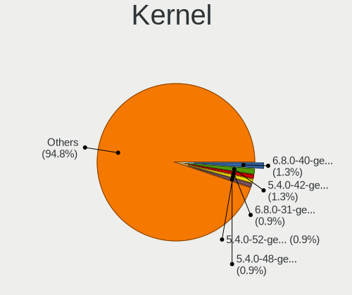

| Version                  | Notebooks | Percent |
|--------------------------|-----------|---------|
| 5.4.0-42-generic         | 7         | 1.93%   |
| 5.4.0-52-generic         | 5         | 1.38%   |
| 5.4.0-48-generic         | 5         | 1.38%   |
| 5.4.0-40-generic         | 5         | 1.38%   |
| 5.4.0-37-generic         | 5         | 1.38%   |
| 5.15.0-56-generic        | 5         | 1.38%   |
| 5.10.14-desktop-1omv4002 | 4         | 1.1%    |
| 6.2.0-76060200-generic   | 3         | 0.83%   |
| 5.8.0-55-generic         | 3         | 0.83%   |
| 5.8.0-53-generic         | 3         | 0.83%   |
| 5.8.0-48-generic         | 3         | 0.83%   |
| 5.8.0-43-generic         | 3         | 0.83%   |
| 5.15.0-48-generic        | 3         | 0.83%   |
| 5.11.0-41-generic        | 3         | 0.83%   |
| 5.11.0-37-generic        | 3         | 0.83%   |
| 4.10.0-28-generic        | 3         | 0.83%   |
| 6.2.1-arch1-1            | 2         | 0.55%   |
| 6.2.0-20-generic         | 2         | 0.55%   |
| 6.1.9-arch1-1            | 2         | 0.55%   |
| 6.1.8-200.fc37.x86_64    | 2         | 0.55%   |
| 5.9.14-200.fc33.x86_64   | 2         | 0.55%   |
| 5.8.0-7642-generic       | 2         | 0.55%   |
| 5.8.0-50-generic         | 2         | 0.55%   |
| 5.8.0-44-generic         | 2         | 0.55%   |
| 5.8.0-25-generic         | 2         | 0.55%   |
| 5.4.0-7642-generic       | 2         | 0.55%   |
| 5.4.0-74-generic         | 2         | 0.55%   |
| 5.4.0-72-generic         | 2         | 0.55%   |
| 5.4.0-70-generic         | 2         | 0.55%   |
| 5.4.0-58-generic         | 2         | 0.55%   |
| 5.4.0-47-generic         | 2         | 0.55%   |
| 5.4.0-45-generic         | 2         | 0.55%   |
| 5.4.0-39-generic         | 2         | 0.55%   |
| 5.4.0-29-generic         | 2         | 0.55%   |
| 5.4.0-19-generic         | 2         | 0.55%   |
| 5.3.0-46-generic         | 2         | 0.55%   |
| 5.3.0-28-generic         | 2         | 0.55%   |
| 5.3.0-18-generic         | 2         | 0.55%   |
| 5.19.12-200.fc36.x86_64  | 2         | 0.55%   |
| 5.19.0-46-generic        | 2         | 0.55%   |

Kernel Family
-------------

Linux kernel without a distro release

| Version | Notebooks | Percent |
|---------|-----------|---------|
| 5.4.0   | 51        | 14.87%  |
| 5.15.0  | 31        | 9.04%   |
| 5.8.0   | 24        | 7%      |
| 5.11.0  | 21        | 6.12%   |
| 5.19.0  | 12        | 3.5%    |
| 5.3.0   | 11        | 3.21%   |
| 5.13.0  | 11        | 3.21%   |
| 4.15.0  | 8         | 2.33%   |
| 5.10.0  | 7         | 2.04%   |
| 5.0.0   | 7         | 2.04%   |
| 4.18.0  | 6         | 1.75%   |
| 6.2.0   | 5         | 1.46%   |
| 4.19.0  | 5         | 1.46%   |
| 5.10.14 | 4         | 1.17%   |
| 4.10.0  | 4         | 1.17%   |
| 6.3.5   | 3         | 0.87%   |
| 6.2.9   | 3         | 0.87%   |
| 6.0.8   | 3         | 0.87%   |
| 5.16.7  | 3         | 0.87%   |
| 6.4.6   | 2         | 0.58%   |
| 6.3.9   | 2         | 0.58%   |
| 6.2.6   | 2         | 0.58%   |
| 6.2.15  | 2         | 0.58%   |
| 6.2.1   | 2         | 0.58%   |
| 6.1.9   | 2         | 0.58%   |
| 6.1.8   | 2         | 0.58%   |
| 6.1.1   | 2         | 0.58%   |
| 6.1.0   | 2         | 0.58%   |
| 5.9.14  | 2         | 0.58%   |
| 5.19.12 | 2         | 0.58%   |
| 5.18.16 | 2         | 0.58%   |
| 5.18.10 | 2         | 0.58%   |
| 5.15.55 | 2         | 0.58%   |
| 5.13.16 | 2         | 0.58%   |
| 4.13.0  | 2         | 0.58%   |
| 6.4.8   | 1         | 0.29%   |
| 6.4.7   | 1         | 0.29%   |
| 6.4.4   | 1         | 0.29%   |
| 6.4.3   | 1         | 0.29%   |
| 6.4.0   | 1         | 0.29%   |

Kernel Major Ver.
-----------------

Linux kernel major version

| Version | Notebooks | Percent |
|---------|-----------|---------|
| 5.4     | 58        | 17.11%  |
| 5.15    | 43        | 12.68%  |
| 5.8     | 27        | 7.96%   |
| 5.11    | 22        | 6.49%   |
| 6.2     | 17        | 5.01%   |
| 5.13    | 17        | 5.01%   |
| 5.19    | 16        | 4.72%   |
| 6.1     | 15        | 4.42%   |
| 5.10    | 15        | 4.42%   |
| 5.3     | 11        | 3.24%   |
| 5.0     | 10        | 2.95%   |
| 6.0     | 9         | 2.65%   |
| 5.18    | 8         | 2.36%   |
| 4.15    | 8         | 2.36%   |
| 6.4     | 7         | 2.06%   |
| 5.16    | 7         | 2.06%   |
| 6.3     | 6         | 1.77%   |
| 5.9     | 6         | 1.77%   |
| 4.19    | 6         | 1.77%   |
| 4.18    | 6         | 1.77%   |
| 5.14    | 4         | 1.18%   |
| 5.12    | 4         | 1.18%   |
| 4.10    | 4         | 1.18%   |
| 5.7     | 3         | 0.88%   |
| 5.17    | 3         | 0.88%   |
| 5.5     | 2         | 0.59%   |
| 4.13    | 2         | 0.59%   |
| 4.4     | 1         | 0.29%   |
| 4.12    | 1         | 0.29%   |
| 4.1     | 1         | 0.29%   |

Arch
----

OS architecture (x86_64, i586, etc.)

| Name   | Notebooks | Percent |
|--------|-----------|---------|
| x86_64 | 317       | 99.69%  |
| i686   | 1         | 0.31%   |

DE
--

Desktop Environment

| Name             | Notebooks | Percent |
|------------------|-----------|---------|
| GNOME            | 172       | 52.12%  |
| KDE5             | 45        | 13.64%  |
| Unknown          | 35        | 10.61%  |
| XFCE             | 24        | 7.27%   |
| X-Cinnamon       | 10        | 3.03%   |
| KDE              | 10        | 3.03%   |
| Unity            | 5         | 1.52%   |
| LXQt             | 5         | 1.52%   |
| MATE             | 3         | 0.91%   |
| Cinnamon         | 3         | 0.91%   |
| Pantheon         | 2         | 0.61%   |
| Openbox          | 2         | 0.61%   |
| i3               | 2         | 0.61%   |
| Deepin           | 2         | 0.61%   |
| bspwm            | 2         | 0.61%   |
| X-Generic        | 1         | 0.3%    |
| sway             | 1         | 0.3%    |
| qtile            | 1         | 0.3%    |
| lightdm-xsession | 1         | 0.3%    |
| LeftWM           | 1         | 0.3%    |
| KDE4             | 1         | 0.3%    |
| Budgie           | 1         | 0.3%    |
| awesome          | 1         | 0.3%    |

Display Server
--------------

X11 or Wayland

| Name    | Notebooks | Percent |
|---------|-----------|---------|
| X11     | 247       | 74.62%  |
| Wayland | 61        | 18.43%  |
| Unknown | 20        | 6.04%   |
| Tty     | 3         | 0.91%   |

Display Manager
---------------

SDDM, LightDM, etc.

| Name    | Notebooks | Percent |
|---------|-----------|---------|
| Unknown | 149       | 45.15%  |
| GDM     | 53        | 16.06%  |
| SDDM    | 46        | 13.94%  |
| GDM3    | 36        | 10.91%  |
| LightDM | 33        | 10%     |
| TDM     | 10        | 3.03%   |
| XDM     | 1         | 0.3%    |
| SLiM    | 1         | 0.3%    |
| KDM     | 1         | 0.3%    |

OS Lang
-------

Language

| Lang    | Notebooks | Percent |
|---------|-----------|---------|
| en_US   | 248       | 77.74%  |
| Unknown | 35        | 10.97%  |
| vi_VN   | 16        | 5.02%   |
| C       | 8         | 2.51%   |
| en_AU   | 4         | 1.25%   |
| ru_RU   | 3         | 0.94%   |
| en_GB   | 3         | 0.94%   |
| ko_KR   | 1         | 0.31%   |
| fr_FR   | 1         | 0.31%   |

Boot Mode
---------

EFI or BIOS

| Mode | Notebooks | Percent |
|------|-----------|---------|
| EFI  | 216       | 66.26%  |
| BIOS | 110       | 33.74%  |

Filesystem
----------

Type of filesystem

| Type     | Notebooks | Percent |
|----------|-----------|---------|
| Ext4     | 251       | 77.23%  |
| Btrfs    | 36        | 11.08%  |
| Overlay  | 13        | 4%      |
| Unknown  | 12        | 3.69%   |
| Tmpfs    | 5         | 1.54%   |
| Zfs      | 3         | 0.92%   |
| Xfs      | 2         | 0.62%   |
| Reiserfs | 1         | 0.31%   |
| F2fs     | 1         | 0.31%   |
| Ext3     | 1         | 0.31%   |

Part. scheme
------------

Scheme of partitioning

| Type    | Notebooks | Percent |
|---------|-----------|---------|
| GPT     | 160       | 49.84%  |
| Unknown | 143       | 44.55%  |
| MBR     | 18        | 5.61%   |

Dual Boot with Linux/BSD
------------------------

Hosting more than one Linux/BSD

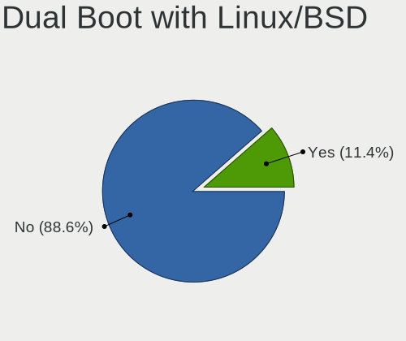

| Dual boot | Notebooks | Percent |
|-----------|-----------|---------|
| No        | 289       | 89.47%  |
| Yes       | 34        | 10.53%  |

Dual Boot (Win)
---------------

Hosting Linux and Windows

| Dual boot | Notebooks | Percent |
|-----------|-----------|---------|
| No        | 185       | 56.92%  |
| Yes       | 140       | 43.08%  |

Board
-----

Vendor
------

Motherboard manufacturer

| Name                | Notebooks | Percent |
|---------------------|-----------|---------|
| Dell                | 83        | 26.1%   |
| Lenovo              | 71        | 22.33%  |
| Hewlett-Packard     | 43        | 13.52%  |
| ASUSTek Computer    | 43        | 13.52%  |
| Acer                | 26        | 8.18%   |
| MSI                 | 11        | 3.46%   |
| Apple               | 7         | 2.2%    |
| Toshiba             | 5         | 1.57%   |
| Sony                | 4         | 1.26%   |
| Chuwi               | 4         | 1.26%   |
| Samsung Electronics | 3         | 0.94%   |
| Timi                | 2         | 0.63%   |
| HUAWEI              | 2         | 0.63%   |
| Valve               | 1         | 0.31%   |
| TENKU               | 1         | 0.31%   |
| Panasonic           | 1         | 0.31%   |
| MASSCOM VIETNAM     | 1         | 0.31%   |
| LG Electronics      | 1         | 0.31%   |
| Koompi              | 1         | 0.31%   |
| Jumper              | 1         | 0.31%   |
| itel Mobile Limited | 1         | 0.31%   |
| Google              | 1         | 0.31%   |
| Gigabyte Technology | 1         | 0.31%   |
| Gateway             | 1         | 0.31%   |
| Anbernic            | 1         | 0.31%   |
| AMI                 | 1         | 0.31%   |
| Alienware           | 1         | 0.31%   |

Model
-----

Motherboard model

| Name                                     | Notebooks | Percent |
|------------------------------------------|-----------|---------|
| Lenovo Legion 5 15ARH05 82B5             | 4         | 1.26%   |
| Dell Inspiron 3537                       | 4         | 1.26%   |
| Unknown                                  | 4         | 1.26%   |
| Lenovo ThinkPad E14 20RAS0KX00           | 3         | 0.94%   |
| ASUS X411UA                              | 3         | 0.94%   |
| Toshiba Satellite L840                   | 2         | 0.63%   |
| MSI GF63 8RD                             | 2         | 0.63%   |
| Lenovo ThinkPad W530 2447EJ9             | 2         | 0.63%   |
| Lenovo ThinkBook 14 G4+ ARA 21D0         | 2         | 0.63%   |
| Lenovo Legion 5 15ACH6H 82JU             | 2         | 0.63%   |
| Lenovo IdeaPad Gaming 3 15IMH05 81Y4     | 2         | 0.63%   |
| HUAWEI BOM-WXX9                          | 2         | 0.63%   |
| HP Notebook                              | 2         | 0.63%   |
| HP Laptop 14-bs0xx                       | 2         | 0.63%   |
| HP EliteBook 8470p                       | 2         | 0.63%   |
| HP EliteBook 840 G2                      | 2         | 0.63%   |
| Dell XPS 15 9570                         | 2         | 0.63%   |
| Dell Vostro 5568                         | 2         | 0.63%   |
| Dell Vostro 3590                         | 2         | 0.63%   |
| Dell Vostro 3578                         | 2         | 0.63%   |
| Dell Vostro 3478                         | 2         | 0.63%   |
| Dell Vostro 3460                         | 2         | 0.63%   |
| Dell Vostro 15-3568                      | 2         | 0.63%   |
| Dell System Vostro 3450                  | 2         | 0.63%   |
| Dell Precision M4600                     | 2         | 0.63%   |
| Dell Latitude E7440                      | 2         | 0.63%   |
| Dell Latitude E7240                      | 2         | 0.63%   |
| Dell Latitude E6530                      | 2         | 0.63%   |
| Dell Inspiron 5570                       | 2         | 0.63%   |
| Dell Inspiron 3558                       | 2         | 0.63%   |
| Dell G3 3579                             | 2         | 0.63%   |
| Dell G3 3500                             | 2         | 0.63%   |
| Chuwi GemiBook Pro                       | 2         | 0.63%   |
| ASUS ROG Strix G513IH_G513IH             | 2         | 0.63%   |
| ASUS ASUS TUF Gaming A15 FA506II_FA506II | 2         | 0.63%   |
| Apple MacBookPro12,1                     | 2         | 0.63%   |
| Apple MacBookPro11,4                     | 2         | 0.63%   |
| Acer Swift SF315-52                      | 2         | 0.63%   |
| Acer Predator PH315-51                   | 2         | 0.63%   |
| Acer Aspire E5-575                       | 2         | 0.63%   |

Model Family
------------

Motherboard model prefix

| Name               | Notebooks | Percent |
|--------------------|-----------|---------|
| Lenovo ThinkPad    | 36        | 11.32%  |
| Dell Latitude      | 21        | 6.6%    |
| Dell Inspiron      | 20        | 6.29%   |
| Dell Vostro        | 17        | 5.35%   |
| Acer Aspire        | 17        | 5.35%   |
| Lenovo IdeaPad     | 13        | 4.09%   |
| HP EliteBook       | 12        | 3.77%   |
| Lenovo Legion      | 9         | 2.83%   |
| ASUS ROG           | 9         | 2.83%   |
| Lenovo ThinkBook   | 8         | 2.52%   |
| ASUS VivoBook      | 8         | 2.52%   |
| HP ProBook         | 7         | 2.2%    |
| Dell XPS           | 7         | 2.2%    |
| Dell Precision     | 7         | 2.2%    |
| HP Laptop          | 6         | 1.89%   |
| Dell System        | 5         | 1.57%   |
| ASUS ASUS          | 5         | 1.57%   |
| HP ZBook           | 4         | 1.26%   |
| Dell G3            | 4         | 1.26%   |
| Unknown            | 4         | 1.26%   |
| Toshiba Satellite  | 3         | 0.94%   |
| HP Pavilion        | 3         | 0.94%   |
| ASUS X411UA        | 3         | 0.94%   |
| Acer Swift         | 3         | 0.94%   |
| Acer Predator      | 3         | 0.94%   |
| Acer Nitro         | 3         | 0.94%   |
| MSI Modern         | 2         | 0.63%   |
| MSI GF63           | 2         | 0.63%   |
| HUAWEI BOM-WXX9    | 2         | 0.63%   |
| HP Notebook        | 2         | 0.63%   |
| HP Compaq          | 2         | 0.63%   |
| Dell G15           | 2         | 0.63%   |
| Chuwi GemiBook     | 2         | 0.63%   |
| Apple MacBookPro12 | 2         | 0.63%   |
| Apple MacBookPro11 | 2         | 0.63%   |
| Valve Jupiter      | 1         | 0.31%   |
| Toshiba PORTEGE    | 1         | 0.31%   |
| Toshiba dynabook   | 1         | 0.31%   |
| Timi RedmiBook     | 1         | 0.31%   |
| Timi A35S          | 1         | 0.31%   |

MFG Year
--------

Motherboard manufacture year

| Year | Notebooks | Percent |
|------|-----------|---------|
| 2020 | 42        | 13.21%  |
| 2018 | 41        | 12.89%  |
| 2021 | 32        | 10.06%  |
| 2012 | 31        | 9.75%   |
| 2019 | 27        | 8.49%   |
| 2015 | 24        | 7.55%   |
| 2017 | 22        | 6.92%   |
| 2011 | 21        | 6.6%    |
| 2013 | 18        | 5.66%   |
| 2016 | 17        | 5.35%   |
| 2022 | 16        | 5.03%   |
| 2014 | 10        | 3.14%   |
| 2009 | 7         | 2.2%    |
| 2010 | 6         | 1.89%   |
| 2023 | 2         | 0.63%   |
| 2007 | 2         | 0.63%   |

Form Factor
-----------

Physical design of the computer

| Name     | Notebooks | Percent |
|----------|-----------|---------|
| Notebook | 318       | 100%    |

Secure Boot
-----------

Enabled or disabled

| State    | Notebooks | Percent |
|----------|-----------|---------|
| Disabled | 291       | 89.81%  |
| Enabled  | 33        | 10.19%  |

Coreboot
--------

Have coreboot on board

| Used | Notebooks | Percent |
|------|-----------|---------|
| No   | 317       | 99.69%  |
| Yes  | 1         | 0.31%   |

RAM Size
--------

Total RAM memory

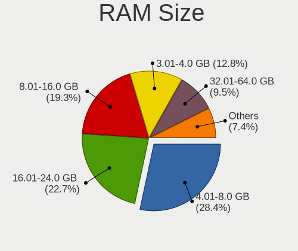

| Size in GB | Notebooks | Percent |
|------------|-----------|---------|
| 4.01-8.0   | 101       | 31.46%  |
| 16.01-24.0 | 69        | 21.5%   |
| 8.01-16.0  | 64        | 19.94%  |
| 3.01-4.0   | 49        | 15.26%  |
| 32.01-64.0 | 19        | 5.92%   |
| 24.01-32.0 | 9         | 2.8%    |
| 1.01-2.0   | 8         | 2.49%   |
| 2.01-3.0   | 1         | 0.31%   |
| 0.51-1.0   | 1         | 0.31%   |

RAM Used
--------

Used RAM memory

| Used GB    | Notebooks | Percent |
|------------|-----------|---------|
| 2.01-3.0   | 117       | 33.72%  |
| 1.01-2.0   | 74        | 21.33%  |
| 4.01-8.0   | 69        | 19.88%  |
| 3.01-4.0   | 60        | 17.29%  |
| 8.01-16.0  | 17        | 4.9%    |
| 0.51-1.0   | 7         | 2.02%   |
| 16.01-24.0 | 2         | 0.58%   |
| 0.01-0.5   | 1         | 0.29%   |

Total Drives
------------

Number of drives on board

| Drives | Notebooks | Percent |
|--------|-----------|---------|
| 1      | 219       | 67.59%  |
| 2      | 94        | 29.01%  |
| 3      | 9         | 2.78%   |
| 4      | 1         | 0.31%   |
| 0      | 1         | 0.31%   |

Has CD-ROM
----------

Has CD-ROM on board

| Presented | Notebooks | Percent |
|-----------|-----------|---------|
| No        | 254       | 79.87%  |
| Yes       | 64        | 20.13%  |

Has Ethernet
------------

Has Ethernet on board

| Presented | Notebooks | Percent |
|-----------|-----------|---------|
| Yes       | 260       | 80.5%   |
| No        | 63        | 19.5%   |

Has WiFi
--------

Has WiFi module

| Presented | Notebooks | Percent |
|-----------|-----------|---------|
| Yes       | 317       | 99.69%  |
| No        | 1         | 0.31%   |

Has Bluetooth
-------------

Has Bluetooth module

| Presented | Notebooks | Percent |
|-----------|-----------|---------|
| Yes       | 278       | 87.15%  |
| No        | 41        | 12.85%  |

Location
--------

Country
-------

Geographic location (country)

| Country | Notebooks | Percent |
|---------|-----------|---------|
| Vietnam | 318       | 100%    |

City
----

Geographic location (city)

| City              | Notebooks | Percent |
|-------------------|-----------|---------|
| Ho Chi Minh City  | 142       | 41.76%  |
| Hanoi             | 114       | 33.53%  |
| Da Nang           | 11        | 3.24%   |
| Can Tho           | 6         | 1.76%   |
| Nha Trang         | 5         | 1.47%   |
| Bien Hoa          | 5         | 1.47%   |
| Thuan An          | 3         | 0.88%   |
| Nam nh       | 3         | 0.88%   |
| Hu             | 3         | 0.88%   |
| Buon Ma Thuot     | 3         | 0.88%   |
| Vng Tu        | 2         | 0.59%   |
| Vinh Phuc         | 2         | 0.59%   |
| Vinh              | 2         | 0.59%   |
| Thai Nguyen       | 2         | 0.59%   |
| Tay Ninh          | 2         | 0.59%   |
| Qung Ngai      | 2         | 0.59%   |
| Binh Hoa          | 2         | 0.59%   |
| Bao Loc           | 2         | 0.59%   |
| Bac Giang         | 2         | 0.59%   |
| Viet Tri          | 1         | 0.29%   |
| Tra Vinh          | 1         | 0.29%   |
| Tinh Quang Binh   | 1         | 0.29%   |
| Tinh GJong Nai    | 1         | 0.29%   |
| Tinh Binh Duong   | 1         | 0.29%   |
| Thu Duc           | 1         | 0.29%   |
| Thon Dien Ha      | 1         | 0.29%   |
| Thanh Ha        | 1         | 0.29%   |
| Tan An            | 1         | 0.29%   |
| Quang Trung       | 1         | 0.29%   |
| Quan Muoi Mot     | 1         | 0.29%   |
| Quan Muoi         | 1         | 0.29%   |
| Qun H ng | 1         | 0.29%   |
| Quan Binh Thanh   | 1         | 0.29%   |
| Nga Bay           | 1         | 0.29%   |
| Lien Chieu        | 1         | 0.29%   |
| Hoa Binh          | 1         | 0.29%   |
| Haiphong          | 1         | 0.29%   |
| Go Vap            | 1         | 0.29%   |
| Do Son            | 1         | 0.29%   |
| Dien Ban          | 1         | 0.29%   |

Drives
------

Drive Vendor
------------

Hard drive vendors

| Vendor              | Notebooks | Drives | Percent |
|---------------------|-----------|--------|---------|
| Samsung Electronics | 62        | 75     | 14.66%  |
| WDC                 | 48        | 57     | 11.35%  |
| Toshiba             | 32        | 37     | 7.57%   |
| SK hynix            | 32        | 36     | 7.57%   |
| Seagate             | 31        | 36     | 7.33%   |
| HGST                | 23        | 25     | 5.44%   |
| Intel               | 22        | 24     | 5.2%    |
| Micron Technology   | 20        | 23     | 4.73%   |
| Unknown             | 17        | 18     | 4.02%   |
| Kingston            | 16        | 19     | 3.78%   |
| SanDisk             | 13        | 18     | 3.07%   |
| Hitachi             | 10        | 14     | 2.36%   |
| Crucial             | 10        | 10     | 2.36%   |
| KIOXIA              | 8         | 11     | 1.89%   |
| Plextor             | 7         | 7      | 1.65%   |
| OSCOO               | 6         | 7      | 1.42%   |
| TO Exter            | 4         | 6      | 0.95%   |
| KingSpec            | 4         | 4      | 0.95%   |
| Apple               | 4         | 4      | 0.95%   |
| Transcend           | 3         | 3      | 0.71%   |
| LITEON              | 3         | 3      | 0.71%   |
| Colorful            | 3         | 3      | 0.71%   |
| UMIS                | 2         | 2      | 0.47%   |
| SPCC                | 2         | 2      | 0.47%   |
| Netac               | 2         | 3      | 0.47%   |
| Lexar               | 2         | 2      | 0.47%   |
| KingFast            | 2         | 2      | 0.47%   |
| KingDian            | 2         | 3      | 0.47%   |
| Hikvision           | 2         | 2      | 0.47%   |
| Gigabyte Technology | 2         | 2      | 0.47%   |
| FORESEE             | 2         | 2      | 0.47%   |
| China               | 2         | 2      | 0.47%   |
| W800S               | 1         | 1      | 0.24%   |
| SSSTC               | 1         | 1      | 0.24%   |
| Silicon Motion      | 1         | 3      | 0.24%   |
| SAM                 | 1         | 1      | 0.24%   |
| Phison              | 1         | 1      | 0.24%   |
| Patriot             | 1         | 1      | 0.24%   |
| OSC                 | 1         | 1      | 0.24%   |
| O2 Micro            | 1         | 1      | 0.24%   |

Drive Model
-----------

Hard drive models

| Model                                               | Notebooks | Percent |
|-----------------------------------------------------|-----------|---------|
| HGST HTS721010A9E630 1TB                            | 10        | 2.3%    |
| Seagate ST1000LM035-1RK172 1TB                      | 7         | 1.61%   |
| Toshiba MQ04ABF100 1TB                              | 5         | 1.15%   |
| Toshiba MQ01ABF050 500GB                            | 5         | 1.15%   |
| Samsung NVMe SSD Drive 512GB                        | 5         | 1.15%   |
| Samsung MZALQ512HALU-000L2 512GB                    | 5         | 1.15%   |
| Crucial CT240BX500SSD1 240GB                        | 5         | 1.15%   |
| WDC WDS240G2G0A-00JH30 240GB SSD                    | 4         | 0.92%   |
| TO Exter nal USB 3.0 1TB                            | 4         | 0.92%   |
| SK hynix NVMe SSD Drive 256GB                       | 4         | 0.92%   |
| Seagate ST1000LM049-2GH172 1TB                      | 4         | 0.92%   |
| WDC WD5000LPLX-08ZNTT0 500GB                        | 3         | 0.69%   |
| Unknown MMC Card  32GB                              | 3         | 0.69%   |
| Toshiba MQ01ABD100 1TB                              | 3         | 0.69%   |
| SK hynix SKHynix_HFS512GD9TNI-L2A0B 512GB           | 3         | 0.69%   |
| SK hynix NVMe SSD Drive 512GB                       | 3         | 0.69%   |
| SK hynix BC501 NVMe Solid State Drive 512GB         | 3         | 0.69%   |
| Seagate ST9500325AS 500GB                           | 3         | 0.69%   |
| Seagate ST500LT012-9WS142 500GB                     | 3         | 0.69%   |
| Samsung SSD 860 EVO 500GB                           | 3         | 0.69%   |
| Samsung SSD 860 EVO 250GB                           | 3         | 0.69%   |
| Samsung NVMe SSD Controller SM981/PM981/PM983 500GB | 3         | 0.69%   |
| OSCOO OSC SSD 128GB                                 | 3         | 0.69%   |
| Micron 2210_MTFDHBA512QFD 512GB                     | 3         | 0.69%   |
| KIOXIA KBG40ZNV512G 512GB                           | 3         | 0.69%   |
| Kingston SA400S37120G 120GB SSD                     | 3         | 0.69%   |
| Kingston OM8PCP3512F-AI1 512GB                      | 3         | 0.69%   |
| Kingston NVMe SSD Drive 256GB                       | 3         | 0.69%   |
| Hitachi HTS545050A7E380 500GB                       | 3         | 0.69%   |
| HGST HTS545050A7E680 500GB                          | 3         | 0.69%   |
| WDC WDS240G2G0B-00EPW0 240GB SSD                    | 2         | 0.46%   |
| WDC WD5000LPLX-60ZNTT1 500GB                        | 2         | 0.46%   |
| WDC WD5000LPCX-21VHAT0 500GB                        | 2         | 0.46%   |
| WDC WD10SPZX-21Z10T0 1TB                            | 2         | 0.46%   |
| WDC WD10JPVX-75JC3T0 1TB                            | 2         | 0.46%   |
| WDC PC SN720 SDAPNTW-256G-1006 256GB                | 2         | 0.46%   |
| WDC PC SN520 SDAPNUW-512G-1006 512GB                | 2         | 0.46%   |
| Unknown NVMe SSD Drive 256GB                        | 2         | 0.46%   |
| Unknown MMC Card  16GB                              | 2         | 0.46%   |
| Toshiba MK2035GSS 200GB                             | 2         | 0.46%   |

HDD Vendor
----------

Hard disk drive vendors

| Vendor  | Notebooks | Drives | Percent |
|---------|-----------|--------|---------|
| Seagate | 31        | 36     | 27.19%  |
| WDC     | 28        | 36     | 24.56%  |
| HGST    | 23        | 25     | 20.18%  |
| Toshiba | 22        | 22     | 19.3%   |
| Hitachi | 10        | 14     | 8.77%   |

SSD Vendor
----------

Solid state drive vendors

| Vendor              | Notebooks | Drives | Percent |
|---------------------|-----------|--------|---------|
| Samsung Electronics | 18        | 19     | 13.74%  |
| WDC                 | 10        | 10     | 7.63%   |
| Crucial             | 10        | 10     | 7.63%   |
| Intel               | 8         | 9      | 6.11%   |
| Plextor             | 7         | 7      | 5.34%   |
| Kingston            | 7         | 9      | 5.34%   |
| SanDisk             | 6         | 9      | 4.58%   |
| TO Exter            | 4         | 6      | 3.05%   |
| SK hynix            | 4         | 4      | 3.05%   |
| OSCOO               | 4         | 4      | 3.05%   |
| KingSpec            | 4         | 4      | 3.05%   |
| Transcend           | 3         | 3      | 2.29%   |
| Toshiba             | 3         | 4      | 2.29%   |
| Micron Technology   | 3         | 3      | 2.29%   |
| LITEON              | 3         | 3      | 2.29%   |
| Apple               | 3         | 3      | 2.29%   |
| SPCC                | 2         | 2      | 1.53%   |
| Netac               | 2         | 3      | 1.53%   |
| Lexar               | 2         | 2      | 1.53%   |
| KingDian            | 2         | 3      | 1.53%   |
| Hikvision           | 2         | 2      | 1.53%   |
| FORESEE             | 2         | 2      | 1.53%   |
| Colorful            | 2         | 2      | 1.53%   |
| China               | 2         | 2      | 1.53%   |
| W800S               | 1         | 1      | 0.76%   |
| Unknown             | 1         | 1      | 0.76%   |
| SAM                 | 1         | 1      | 0.76%   |
| OSC                 | 1         | 1      | 0.76%   |
| NGFF                | 1         | 1      | 0.76%   |
| Maxtor              | 1         | 3      | 0.76%   |
| LITEONIT            | 1         | 1      | 0.76%   |
| KLEVV               | 1         | 1      | 0.76%   |
| KIOXIA-EXCERIA      | 1         | 2      | 0.76%   |
| Kingmax             | 1         | 1      | 0.76%   |
| KingFast            | 1         | 1      | 0.76%   |
| KimMiDi             | 1         | 1      | 0.76%   |
| Indilinx            | 1         | 1      | 0.76%   |
| HXY                 | 1         | 2      | 0.76%   |
| Hewlett-Packard     | 1         | 1      | 0.76%   |
| Gigabyte Technology | 1         | 1      | 0.76%   |

Drive Kind
----------

HDD or SSD

| Kind    | Notebooks | Drives | Percent |
|---------|-----------|--------|---------|
| NVMe    | 152       | 196    | 38.19%  |
| SSD     | 119       | 147    | 29.9%   |
| HDD     | 109       | 133    | 27.39%  |
| MMC     | 13        | 14     | 3.27%   |
| Unknown | 5         | 5      | 1.26%   |

Drive Connector
---------------

SATA, SAS, NVMe, etc.

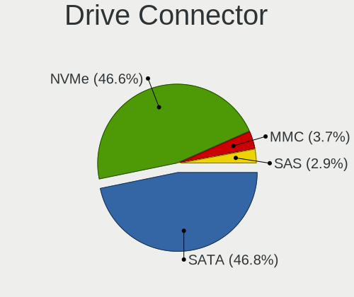

| Type | Notebooks | Drives | Percent |
|------|-----------|--------|---------|
| SATA | 192       | 274    | 52.6%   |
| NVMe | 152       | 196    | 41.64%  |
| MMC  | 13        | 14     | 3.56%   |
| SAS  | 8         | 11     | 2.19%   |

Drive Size
----------

Size of hard drive

| Size in TB | Notebooks | Drives | Percent |
|------------|-----------|--------|---------|
| 0.01-0.5   | 161       | 212    | 73.52%  |
| 0.51-1.0   | 56        | 66     | 25.57%  |
| 1.01-2.0   | 2         | 2      | 0.91%   |

Space Total
-----------

Amount of disk space available on the file system

| Size in GB     | Notebooks | Percent |
|----------------|-----------|---------|
| 101-250        | 121       | 36.12%  |
| 251-500        | 86        | 25.67%  |
| 51-100         | 31        | 9.25%   |
| 501-1000       | 27        | 8.06%   |
| 1001-2000      | 20        | 5.97%   |
| 21-50          | 16        | 4.78%   |
| 1-20           | 15        | 4.48%   |
| Unknown        | 10        | 2.99%   |
| 2001-3000      | 7         | 2.09%   |
| More than 3000 | 2         | 0.6%    |

Space Used
----------

Amount of used disk space

| Used GB        | Notebooks | Percent |
|----------------|-----------|---------|
| 1-20           | 135       | 39.71%  |
| 21-50          | 68        | 20%     |
| 51-100         | 47        | 13.82%  |
| 101-250        | 43        | 12.65%  |
| 251-500        | 21        | 6.18%   |
| 501-1000       | 12        | 3.53%   |
| Unknown        | 10        | 2.94%   |
| 1001-2000      | 2         | 0.59%   |
| More than 3000 | 1         | 0.29%   |
| 2001-3000      | 1         | 0.29%   |

Malfunc. Drives
---------------

Drive models with a malfunction

| Model                                        | Notebooks | Drives | Percent |
|----------------------------------------------|-----------|--------|---------|
| Seagate ST1000LM035-1RK172 1TB               | 2         | 2      | 7.14%   |
| WDC WDS240G2G0A-00JH30 240GB SSD             | 1         | 1      | 3.57%   |
| WDC WD5000LPVX-22V0TT0 500GB                 | 1         | 1      | 3.57%   |
| WDC WD5000LPLX-60ZNTT1 500GB                 | 1         | 1      | 3.57%   |
| WDC WD32 00BEVT-24A23 320GB                  | 1         | 1      | 3.57%   |
| WDC WD10JPVX-75JC3T0 1TB                     | 1         | 1      | 3.57%   |
| Unknown Bamba-240GB SSD                      | 1         | 1      | 3.57%   |
| Toshiba MQ01ABD050 500GB                     | 1         | 1      | 3.57%   |
| Toshiba MK8046GSX 80GB                       | 1         | 1      | 3.57%   |
| Toshiba MK3265GSXN 320GB                     | 1         | 1      | 3.57%   |
| Toshiba HDWK105 500GB                        | 1         | 1      | 3.57%   |
| SK hynix HFS032G34MNC-2200A 32GB SSD         | 1         | 1      | 3.57%   |
| Seagate ST9640423AS 640GB                    | 1         | 1      | 3.57%   |
| Seagate ST9320325AS 320GB                    | 1         | 1      | 3.57%   |
| Seagate ST500LM021-1KJ152 500GB              | 1         | 1      | 3.57%   |
| Samsung Electronics MZVPW128HEGM-00000 128GB | 1         | 1      | 3.57%   |
| LITEON LCH-256V2S 256GB SSD                  | 1         | 1      | 3.57%   |
| KingFast SSD 32GB                            | 1         | 1      | 3.57%   |
| Hitachi HTS725050A7E635 500GB                | 1         | 1      | 3.57%   |
| Hitachi HTS545050A7E380 500GB                | 1         | 1      | 3.57%   |
| Hitachi HTS543232A7A384 320GB                | 1         | 1      | 3.57%   |
| HGST HTS725050A7E630 500GB                   | 1         | 1      | 3.57%   |
| HGST HTS725032A7E630 320GB                   | 1         | 1      | 3.57%   |
| HGST HTS545050A7E680 500GB                   | 1         | 2      | 3.57%   |
| HGST HTS545050A7 500GB                       | 1         | 1      | 3.57%   |
| HGST HTS541010A7E630 1TB                     | 1         | 1      | 3.57%   |
| Crucial CT525MX300SSD1 528GB                 | 1         | 1      | 3.57%   |

Malfunc. Drive Vendor
---------------------

Vendors of faulty drives

| Vendor              | Notebooks | Drives | Percent |
|---------------------|-----------|--------|---------|
| WDC                 | 5         | 5      | 17.86%  |
| Seagate             | 5         | 5      | 17.86%  |
| HGST                | 5         | 6      | 17.86%  |
| Toshiba             | 4         | 4      | 14.29%  |
| Hitachi             | 3         | 3      | 10.71%  |
| Unknown             | 1         | 1      | 3.57%   |
| SK hynix            | 1         | 1      | 3.57%   |
| Samsung Electronics | 1         | 1      | 3.57%   |
| LITEON              | 1         | 1      | 3.57%   |
| KingFast            | 1         | 1      | 3.57%   |
| Crucial             | 1         | 1      | 3.57%   |

Malfunc. HDD Vendor
-------------------

Vendors of faulty HDD drives

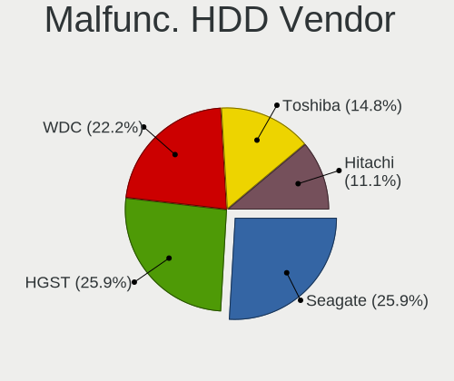

| Vendor  | Notebooks | Drives | Percent |
|---------|-----------|--------|---------|
| Seagate | 5         | 5      | 23.81%  |
| HGST    | 5         | 6      | 23.81%  |
| WDC     | 4         | 4      | 19.05%  |
| Toshiba | 4         | 4      | 19.05%  |
| Hitachi | 3         | 3      | 14.29%  |

Malfunc. Drive Kind
-------------------

Kinds of faulty drives

| Kind | Notebooks | Drives | Percent |
|------|-----------|--------|---------|
| HDD  | 21        | 22     | 75%     |
| SSD  | 6         | 6      | 21.43%  |
| NVMe | 1         | 1      | 3.57%   |

Failed Drives
-------------

Failed drive models

Zero info for selected period =(

Failed Drive Vendor
-------------------

Failed drive vendors

Zero info for selected period =(

Drive Status
------------

Number of failed and malfunc. drives

| Status   | Notebooks | Drives | Percent |
|----------|-----------|--------|---------|
| Detected | 168       | 251    | 48.41%  |
| Works    | 152       | 215    | 43.8%   |
| Malfunc  | 27        | 29     | 7.78%   |

Storage controller
------------------

Storage Vendor
--------------

Storage controller vendors

| Vendor                         | Notebooks | Percent |
|--------------------------------|-----------|---------|
| Intel                          | 236       | 56.46%  |
| Samsung Electronics            | 51        | 12.2%   |
| AMD                            | 29        | 6.94%   |
| SK hynix                       | 28        | 6.7%    |
| SanDisk                        | 17        | 4.07%   |
| Micron Technology              | 17        | 4.07%   |
| KIOXIA                         | 9         | 2.15%   |
| Kingston Technology Company    | 9         | 2.15%   |
| Toshiba America Info Systems   | 7         | 1.67%   |
| Solid State Storage Technology | 3         | 0.72%   |
| Phison Electronics             | 3         | 0.72%   |
| Union Memory (Shenzhen)        | 2         | 0.48%   |
| Silicon Motion                 | 2         | 0.48%   |
| MAXIO Technology (Hangzhou)    | 2         | 0.48%   |
| O2 Micro                       | 1         | 0.24%   |
| Lite-On Technology             | 1         | 0.24%   |
| Lenovo                         | 1         | 0.24%   |

Storage Model
-------------

Storage controller models

| Model                                                                          | Notebooks | Percent |
|--------------------------------------------------------------------------------|-----------|---------|
| Intel Sunrise Point-LP SATA Controller [AHCI mode]                             | 33        | 7.66%   |
| Intel 7 Series Chipset Family 6-port SATA Controller [AHCI mode]               | 32        | 7.42%   |
| AMD FCH SATA Controller [AHCI mode]                                            | 29        | 6.73%   |
| Samsung NVMe SSD Controller SM981/PM981/PM983                                  | 17        | 3.94%   |
| Samsung NVMe SSD Controller 980                                                | 17        | 3.94%   |
| Intel 6 Series/C200 Series Chipset Family 6 port Mobile SATA AHCI Controller   | 17        | 3.94%   |
| Intel 82801 Mobile SATA Controller [RAID mode]                                 | 15        | 3.48%   |
| Intel Wildcat Point-LP SATA Controller [AHCI Mode]                             | 14        | 3.25%   |
| Intel 8 Series SATA Controller 1 [AHCI mode]                                   | 14        | 3.25%   |
| Intel Volume Management Device NVMe RAID Controller                            | 13        | 3.02%   |
| Intel Cannon Lake Mobile PCH SATA AHCI Controller                              | 13        | 3.02%   |
| SK hynix Gold P31/BC711/PC711 NVMe Solid State Drive                           | 10        | 2.32%   |
| SK hynix BC501 NVMe Solid State Drive                                          | 10        | 2.32%   |
| Intel HM170/QM170 Chipset SATA Controller [AHCI Mode]                          | 10        | 2.32%   |
| Intel Comet Lake SATA AHCI Controller                                          | 10        | 2.32%   |
| KIOXIA NVMe SSD Controller BG4 (DRAM-less)                                     | 8         | 1.86%   |
| Intel Cannon Point-LP SATA Controller [AHCI Mode]                              | 8         | 1.86%   |
| Samsung NVMe SSD Controller SM961/PM961/SM963                                  | 7         | 1.62%   |
| Intel 8 Series/C220 Series Chipset Family 6-port SATA Controller 1 [AHCI mode] | 7         | 1.62%   |
| SanDisk WD Blue SN550 NVMe SSD                                                 | 6         | 1.39%   |
| Samsung NVMe SSD Controller PM9A1/PM9A3/980PRO                                 | 6         | 1.39%   |
| Micron 2210 NVMe SSD [Cobain]                                                  | 6         | 1.39%   |
| Intel Tiger Lake-LP SATA Controller                                            | 5         | 1.16%   |
| Intel 82801IBM/IEM (ICH9M/ICH9M-E) 4 port SATA Controller [AHCI mode]          | 5         | 1.16%   |
| Intel 400 Series Chipset Family SATA AHCI Controller                           | 5         | 1.16%   |
| Toshiba America Info Systems BG3 NVMe SSD Controller                           | 4         | 0.93%   |
| SanDisk WD Blue SN500 / PC SN520 NVMe SSD                                      | 4         | 0.93%   |
| Micron 3400 NVMe SSD [Hendrix]                                                 | 4         | 0.93%   |
| Intel SSD DC P4101/Pro 7600p/760p/E 6100p Series                               | 4         | 0.93%   |
| Intel SSD 670p Series [Keystone Harbor]                                        | 4         | 0.93%   |
| Intel Q170/Q150/B150/H170/H110/Z170/CM236 Chipset SATA Controller [AHCI Mode]  | 4         | 0.93%   |
| Intel Celeron/Pentium Silver Processor SATA Controller                         | 4         | 0.93%   |
| Intel 5 Series/3400 Series Chipset 6 port SATA AHCI Controller                 | 4         | 0.93%   |
| SK hynix PC611 NVMe Solid State Drive                                          | 3         | 0.7%    |
| SK hynix BC511 NVMe SSD                                                        | 3         | 0.7%    |
| SanDisk WD Black 2018/SN750 / PC SN720 NVMe SSD                                | 3         | 0.7%    |
| Samsung S4LN058A01[SSUBX] AHCI SSD Controller (Apple slot)                     | 3         | 0.7%    |
| Micron 2200S NVMe SSD [Cassandra]                                              | 3         | 0.7%    |
| Kingston Company OM8PCP Design-In PCIe 3 NVMe SSD (DRAM-less)                  | 3         | 0.7%    |
| Kingston Company OM3PDP3 NVMe SSD                                              | 3         | 0.7%    |

Storage Kind
------------

Kind of storage controller (IDE, SATA, NVMe, SAS, ...)

| Kind | Notebooks | Percent |
|------|-----------|---------|
| SATA | 232       | 55.5%   |
| NVMe | 153       | 36.6%   |
| RAID | 29        | 6.94%   |
| IDE  | 4         | 0.96%   |

Processor
---------

CPU Vendor
----------

Processor vendors

| Vendor | Notebooks | Percent |
|--------|-----------|---------|
| Intel  | 265       | 83.33%  |
| AMD    | 53        | 16.67%  |

CPU Model
---------

Processor models

| Model                                         | Notebooks | Percent |
|-----------------------------------------------|-----------|---------|
| Intel Core i5-8250U CPU @ 1.60GHz             | 15        | 4.72%   |
| Intel 11th Gen Core i5-1135G7 @ 2.40GHz       | 10        | 3.14%   |
| Intel Core i5-10210U CPU @ 1.60GHz            | 9         | 2.83%   |
| Intel Core i7-7700HQ CPU @ 2.80GHz            | 8         | 2.52%   |
| Intel Core i5-5200U CPU @ 2.20GHz             | 8         | 2.52%   |
| Intel Core i7-8750H CPU @ 2.20GHz             | 7         | 2.2%    |
| Intel Core i5-4210U CPU @ 1.70GHz             | 6         | 1.89%   |
| Intel Core i5-3210M CPU @ 2.50GHz             | 6         | 1.89%   |
| AMD Ryzen 7 4800H with Radeon Graphics        | 6         | 1.89%   |
| AMD Ryzen 5 5500U with Radeon Graphics        | 6         | 1.89%   |
| Intel Core i5-7200U CPU @ 2.50GHz             | 5         | 1.57%   |
| AMD Ryzen 5 4600H with Radeon Graphics        | 5         | 1.57%   |
| Intel Core i7-6820HQ CPU @ 2.70GHz            | 4         | 1.26%   |
| Intel Core i7-10750H CPU @ 2.60GHz            | 4         | 1.26%   |
| Intel Core i5-8350U CPU @ 1.70GHz             | 4         | 1.26%   |
| Intel Core i5-8300H CPU @ 2.30GHz             | 4         | 1.26%   |
| Intel Core i5-4200U CPU @ 1.60GHz             | 4         | 1.26%   |
| Intel Core i5-3320M CPU @ 2.60GHz             | 4         | 1.26%   |
| Intel Core i5-3230M CPU @ 2.60GHz             | 4         | 1.26%   |
| Intel Core i3-2350M CPU @ 2.30GHz             | 4         | 1.26%   |
| Intel 11th Gen Core i7-1165G7 @ 2.80GHz       | 4         | 1.26%   |
| AMD Ryzen 7 6800H with Radeon Graphics        | 4         | 1.26%   |
| AMD Ryzen 7 5800H with Radeon Graphics        | 4         | 1.26%   |
| AMD Ryzen 5 3500U with Radeon Vega Mobile Gfx | 4         | 1.26%   |
| Intel Core i7-8650U CPU @ 1.90GHz             | 3         | 0.94%   |
| Intel Core i7-6700HQ CPU @ 2.60GHz            | 3         | 0.94%   |
| Intel Core i5-6300U CPU @ 2.40GHz             | 3         | 0.94%   |
| Intel Core i5-5300U CPU @ 2.30GHz             | 3         | 0.94%   |
| Intel Core i5-4200M CPU @ 2.50GHz             | 3         | 0.94%   |
| Intel Core i5 CPU M 520 @ 2.40GHz             | 3         | 0.94%   |
| Intel Core i3-3217U CPU @ 1.80GHz             | 3         | 0.94%   |
| Intel Core i3-2310M CPU @ 2.10GHz             | 3         | 0.94%   |
| Intel 12th Gen Core i7-12700H                 | 3         | 0.94%   |
| Intel 11th Gen Core i7-1185G7 @ 3.00GHz       | 3         | 0.94%   |
| Intel 11th Gen Core i7-11800H @ 2.30GHz       | 3         | 0.94%   |
| AMD Ryzen 5 5600H with Radeon Graphics        | 3         | 0.94%   |
| Intel Core i7-9750H CPU @ 2.60GHz             | 2         | 0.63%   |
| Intel Core i7-8565U CPU @ 1.80GHz             | 2         | 0.63%   |
| Intel Core i7-8550U CPU @ 1.80GHz             | 2         | 0.63%   |
| Intel Core i7-7500U CPU @ 2.70GHz             | 2         | 0.63%   |

CPU Model Family
----------------

Processor model prefix

| Model            | Notebooks | Percent |
|------------------|-----------|---------|
| Intel Core i5    | 112       | 35.22%  |
| Intel Core i7    | 67        | 21.07%  |
| Other            | 31        | 9.75%   |
| Intel Core i3    | 29        | 9.12%   |
| AMD Ryzen 5      | 25        | 7.86%   |
| AMD Ryzen 7      | 17        | 5.35%   |
| Intel Celeron    | 10        | 3.14%   |
| Intel Core 2 Duo | 7         | 2.2%    |
| Intel Atom       | 4         | 1.26%   |
| AMD Ryzen 3      | 3         | 0.94%   |
| Intel Pentium    | 2         | 0.63%   |
| Intel Genuine    | 2         | 0.63%   |
| AMD Ryzen 9      | 2         | 0.63%   |
| AMD Ryzen 7 PRO  | 2         | 0.63%   |
| Intel Xeon       | 1         | 0.31%   |
| Intel Core i9    | 1         | 0.31%   |
| AMD Ryzen 5 PRO  | 1         | 0.31%   |
| AMD Athlon       | 1         | 0.31%   |
| AMD A8           | 1         | 0.31%   |

CPU Cores
---------

Number of processor cores

| Number | Notebooks | Percent |
|--------|-----------|---------|
| 2      | 130       | 40.88%  |
| 4      | 119       | 37.42%  |
| 6      | 34        | 10.69%  |
| 8      | 25        | 7.86%   |
| 14     | 3         | 0.94%   |
| 12     | 3         | 0.94%   |
| 16     | 2         | 0.63%   |
| 1      | 2         | 0.63%   |

CPU Sockets
-----------

Number of sockets

| Number | Notebooks | Percent |
|--------|-----------|---------|
| 1      | 318       | 100%    |

CPU Threads
-----------

Threads per core (Hyper-Threading)

| Number | Notebooks | Percent |
|--------|-----------|---------|
| 2      | 287       | 90.25%  |
| 1      | 31        | 9.75%   |

CPU Op-Modes
------------

CPU Operation Modes (32-bit, 64-bit)

| Op mode        | Notebooks | Percent |
|----------------|-----------|---------|
| 32-bit, 64-bit | 314       | 98.43%  |
| Unknown        | 5         | 1.57%   |

CPU Microcode
-------------

Microcode number

| Number     | Notebooks | Percent |
|------------|-----------|---------|
| Unknown    | 79        | 24.01%  |
| 0x306a9    | 25        | 7.6%    |
| 0x806ea    | 22        | 6.69%   |
| 0x806ec    | 15        | 4.56%   |
| 0x40651    | 15        | 4.56%   |
| 0x206a7    | 15        | 4.56%   |
| 0x806c1    | 14        | 4.26%   |
| 0x306d4    | 13        | 3.95%   |
| 0x806e9    | 11        | 3.34%   |
| 0x906ea    | 9         | 2.74%   |
| 0x08600106 | 9         | 2.74%   |
| 0x406e3    | 8         | 2.43%   |
| 0x306c3    | 7         | 2.13%   |
| 0x906e9    | 6         | 1.82%   |
| 0x506e3    | 6         | 1.82%   |
| 0x08608103 | 6         | 1.82%   |
| 0xa0652    | 5         | 1.52%   |
| 0x906a3    | 5         | 1.52%   |
| 0x0a50000c | 5         | 1.52%   |
| 0x806d1    | 4         | 1.22%   |
| 0x6fd      | 4         | 1.22%   |
| 0x08600104 | 4         | 1.22%   |
| 0x08108102 | 4         | 1.22%   |
| 0x706e5    | 3         | 0.91%   |
| 0x20655    | 3         | 0.91%   |
| 0x1067a    | 3         | 0.91%   |
| 0x0a404102 | 3         | 0.91%   |
| 0x906ed    | 2         | 0.61%   |
| 0x906c0    | 2         | 0.61%   |
| 0x706a1    | 2         | 0.61%   |
| 0x406c4    | 2         | 0.61%   |
| 0x40661    | 2         | 0.61%   |
| 0x08600103 | 2         | 0.61%   |
| 0x08108109 | 2         | 0.61%   |
| 0x806eb    | 1         | 0.3%    |
| 0x806c2    | 1         | 0.3%    |
| 0x406c3    | 1         | 0.3%    |
| 0x30661    | 1         | 0.3%    |
| 0x20652    | 1         | 0.3%    |
| 0x106e5    | 1         | 0.3%    |

CPU Microarch
-------------

Microarchitecture

| Name             | Notebooks | Percent |
|------------------|-----------|---------|
| KabyLake         | 83        | 26.1%   |
| IvyBridge        | 32        | 10.06%  |
| Haswell          | 27        | 8.49%   |
| TigerLake        | 19        | 5.97%   |
| SandyBridge      | 19        | 5.97%   |
| Zen 2            | 18        | 5.66%   |
| Skylake          | 18        | 5.66%   |
| Unknown          | 17        | 5.35%   |
| Broadwell        | 16        | 5.03%   |
| Zen 3            | 10        | 3.14%   |
| Zen+             | 8         | 2.52%   |
| IceLake          | 8         | 2.52%   |
| CometLake        | 7         | 2.2%    |
| Westmere         | 5         | 1.57%   |
| Core             | 5         | 1.57%   |
| Alderlake Hybrid | 5         | 1.57%   |
| Silvermont       | 4         | 1.26%   |
| Penryn           | 4         | 1.26%   |
| Goldmont plus    | 4         | 1.26%   |
| Zen              | 2         | 0.63%   |
| Tremont          | 2         | 0.63%   |
| Bonnell          | 2         | 0.63%   |
| Puma             | 1         | 0.31%   |
| Nehalem          | 1         | 0.31%   |
| Goldmont         | 1         | 0.31%   |

Graphics
--------

GPU Vendor
----------

Vendors of graphics cards

| Vendor | Notebooks | Percent |
|--------|-----------|---------|
| Intel  | 251       | 56.79%  |
| Nvidia | 118       | 26.7%   |
| AMD    | 73        | 16.52%  |

GPU Model
---------

Graphics card models

| Model                                                                                    | Notebooks | Percent |
|------------------------------------------------------------------------------------------|-----------|---------|
| Intel 3rd Gen Core processor Graphics Controller                                         | 30        | 6.73%   |
| Intel UHD Graphics 620                                                                   | 25        | 5.61%   |
| Intel TigerLake-LP GT2 [Iris Xe Graphics]                                                | 19        | 4.26%   |
| Intel Haswell-ULT Integrated Graphics Controller                                         | 17        | 3.81%   |
| Intel 2nd Generation Core Processor Family Integrated Graphics Controller                | 17        | 3.81%   |
| AMD Renoir                                                                               | 17        | 3.81%   |
| Intel HD Graphics 5500                                                                   | 14        | 3.14%   |
| Intel CoffeeLake-H GT2 [UHD Graphics 630]                                                | 13        | 2.91%   |
| Intel HD Graphics 620                                                                    | 11        | 2.47%   |
| Intel CometLake-U GT2 [UHD Graphics]                                                     | 11        | 2.47%   |
| Intel Skylake GT2 [HD Graphics 520]                                                      | 10        | 2.24%   |
| AMD Picasso/Raven 2 [Radeon Vega Series / Radeon Vega Mobile Series]                     | 9         | 2.02%   |
| Nvidia TU117M [GeForce GTX 1650 Ti Mobile]                                               | 8         | 1.79%   |
| Nvidia GP107M [GeForce GTX 1050 Mobile]                                                  | 8         | 1.79%   |
| Intel HD Graphics 630                                                                    | 8         | 1.79%   |
| AMD Cezanne [Radeon Vega Series / Radeon Vega Mobile Series]                             | 8         | 1.79%   |
| Nvidia GA107M [GeForce RTX 3050 Mobile]                                                  | 7         | 1.57%   |
| Intel CometLake-H GT2 [UHD Graphics]                                                     | 7         | 1.57%   |
| AMD Lucienne                                                                             | 7         | 1.57%   |
| Nvidia TU117M [GeForce GTX 1650 Mobile / Max-Q]                                          | 6         | 1.35%   |
| Nvidia TU116M [GeForce GTX 1660 Ti Mobile]                                               | 6         | 1.35%   |
| Nvidia GF117M [GeForce 610M/710M/810M/820M / GT 620M/625M/630M/720M]                     | 6         | 1.35%   |
| Intel WhiskeyLake-U GT2 [UHD Graphics 620]                                               | 6         | 1.35%   |
| Intel HD Graphics 530                                                                    | 6         | 1.35%   |
| Intel Alder Lake-P Integrated Graphics Controller                                        | 6         | 1.35%   |
| Intel 4th Gen Core Processor Integrated Graphics Controller                              | 6         | 1.35%   |
| Nvidia GP107M [GeForce GTX 1050 Ti Mobile]                                               | 5         | 1.12%   |
| Nvidia GA106M [GeForce RTX 3060 Mobile / Max-Q]                                          | 5         | 1.12%   |
| AMD Sun XT [Radeon HD 8670A/8670M/8690M / R5 M330 / M430 / Radeon 520 Mobile]            | 5         | 1.12%   |
| AMD Rembrandt [Radeon 680M]                                                              | 5         | 1.12%   |
| AMD Jet PRO [Radeon R5 M230 / R7 M260DX / Radeon 520/610 Mobile]                         | 5         | 1.12%   |
| Nvidia TU117M                                                                            | 4         | 0.9%    |
| Nvidia GP106M [GeForce GTX 1060 Mobile]                                                  | 4         | 0.9%    |
| Nvidia GM107M [GeForce GTX 950M]                                                         | 4         | 0.9%    |
| Intel TigerLake-H GT1 [UHD Graphics]                                                     | 4         | 0.9%    |
| Intel Mobile 4 Series Chipset Integrated Graphics Controller                             | 4         | 0.9%    |
| Intel GeminiLake [UHD Graphics 600]                                                      | 4         | 0.9%    |
| Intel Core Processor Integrated Graphics Controller                                      | 4         | 0.9%    |
| Intel Atom/Celeron/Pentium Processor x5-E8000/J3xxx/N3xxx Integrated Graphics Controller | 4         | 0.9%    |
| AMD Topaz XT [Radeon R7 M260/M265 / M340/M360 / M440/M445 / 530/535 / 620/625 Mobile]    | 4         | 0.9%    |

GPU Combo
---------

Combinations of graphics cards

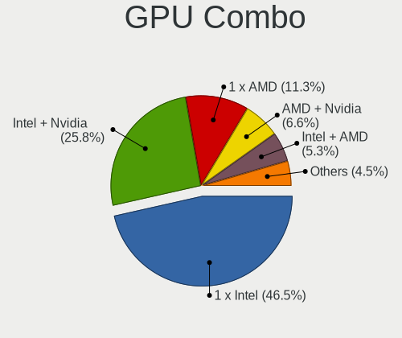

| Name           | Notebooks | Percent |
|----------------|-----------|---------|
| 1 x Intel      | 149       | 46.86%  |
| Intel + Nvidia | 81        | 25.47%  |
| 1 x AMD        | 29        | 9.12%   |
| Intel + AMD    | 21        | 6.6%    |
| AMD + Nvidia   | 21        | 6.6%    |
| 1 x Nvidia     | 15        | 4.72%   |
| 2 x AMD        | 2         | 0.63%   |

GPU Driver
----------

Free vs proprietary

| Driver      | Notebooks | Percent |
|-------------|-----------|---------|
| Free        | 245       | 76.09%  |
| Proprietary | 76        | 23.6%   |
| Unknown     | 1         | 0.31%   |

GPU Memory
----------

Total video memory

| Size in GB | Notebooks | Percent |
|------------|-----------|---------|
| Unknown    | 205       | 63.27%  |
| 1.01-2.0   | 43        | 13.27%  |
| 3.01-4.0   | 28        | 8.64%   |
| 0.01-0.5   | 24        | 7.41%   |
| 0.51-1.0   | 16        | 4.94%   |
| 5.01-6.0   | 4         | 1.23%   |
| 2.01-3.0   | 2         | 0.62%   |
| 7.01-8.0   | 1         | 0.31%   |
| 8.01-16.0  | 1         | 0.31%   |

Monitor
-------

Monitor Vendor
--------------

Monitor vendors

| Vendor                  | Notebooks | Percent |
|-------------------------|-----------|---------|
| BOE                     | 75        | 21.01%  |
| Chimei Innolux          | 58        | 16.25%  |
| AU Optronics            | 52        | 14.57%  |
| LG Display              | 46        | 12.89%  |
| Samsung Electronics     | 29        | 8.12%   |
| Dell                    | 17        | 4.76%   |
| PANDA                   | 13        | 3.64%   |
| Sharp                   | 10        | 2.8%    |
| Goldstar                | 7         | 1.96%   |
| Apple                   | 7         | 1.96%   |
| Lenovo                  | 6         | 1.68%   |
| LGD                     | 5         | 1.4%    |
| InfoVision              | 5         | 1.4%    |
| ViewSonic               | 4         | 1.12%   |
| Chi Mei Optoelectronics | 3         | 0.84%   |
| ASUSTek Computer        | 3         | 0.84%   |
| RTK                     | 2         | 0.56%   |
| HKC                     | 2         | 0.56%   |
| Hewlett-Packard         | 2         | 0.56%   |
| AOC                     | 2         | 0.56%   |
| Valve                   | 1         | 0.28%   |
| TMX                     | 1         | 0.28%   |
| Sony                    | 1         | 0.28%   |
| SKG                     | 1         | 0.28%   |
| Philips                 | 1         | 0.28%   |
| MStar                   | 1         | 0.28%   |
| LG Philips              | 1         | 0.28%   |
| CSO                     | 1         | 0.28%   |
| BenQ                    | 1         | 0.28%   |

Monitor Model
-------------

Monitor models

| Model                                                                 | Notebooks | Percent |
|-----------------------------------------------------------------------|-----------|---------|
| PANDA LCD Monitor NCP004D 1920x1080 344x194mm 15.5-inch               | 5         | 1.39%   |
| LGD LCD Monitor 1920x1080                                             | 5         | 1.39%   |
| AU Optronics LCD Monitor AUO38ED 1920x1080 344x193mm 15.5-inch        | 5         | 1.39%   |
| Chimei Innolux LCD Monitor CMN1521 1920x1080 344x193mm 15.5-inch      | 4         | 1.11%   |
| Chimei Innolux LCD Monitor CMN14D4 1920x1080 309x173mm 13.9-inch      | 4         | 1.11%   |
| AU Optronics LCD Monitor AUO21ED 1920x1080 344x194mm 15.5-inch        | 4         | 1.11%   |
| Samsung Electronics LCD Monitor SDC5441 1366x768 309x174mm 14.0-inch  | 3         | 0.84%   |
| LG Display LCD Monitor LGD046D 1920x1080 309x174mm 14.0-inch          | 3         | 0.84%   |
| Goldstar MP59G GSM5B34 1920x1080 480x270mm 21.7-inch                  | 3         | 0.84%   |
| Chimei Innolux P140ZKA-BZ1 CMN8C02 2160x1440 296x197mm 14.0-inch      | 3         | 0.84%   |
| BOE LCD Monitor BOE0812 1920x1080 344x194mm 15.5-inch                 | 3         | 0.84%   |
| AU Optronics LCD Monitor AUO403D 1920x1080 309x174mm 14.0-inch        | 3         | 0.84%   |
| Sharp LCD Monitor SHP149A 1920x1080 344x194mm 15.5-inch               | 2         | 0.56%   |
| Samsung Electronics S22F350 SAM0D1A 1920x1080 477x268mm 21.5-inch     | 2         | 0.56%   |
| Samsung Electronics LCD Monitor SEC5448 1920x1080 344x194mm 15.5-inch | 2         | 0.56%   |
| Samsung Electronics LCD Monitor SEC5441 1366x768 344x194mm 15.5-inch  | 2         | 0.56%   |
| Samsung Electronics LCD Monitor SEC3649 1366x768 309x174mm 14.0-inch  | 2         | 0.56%   |
| Samsung Electronics LCD Monitor SEC3242 1920x1080 235x132mm 10.6-inch | 2         | 0.56%   |
| RTK 7911D RTK2A3B 720x1280 150x200mm 9.8-inch                         | 2         | 0.56%   |
| PANDA LCD Monitor NCP005F 1920x1080 344x194mm 15.5-inch               | 2         | 0.56%   |
| LG Display LCD Monitor LGD0657 1920x1080 344x194mm 15.5-inch          | 2         | 0.56%   |
| LG Display LCD Monitor LGD05FA 1920x1080 309x174mm 14.0-inch          | 2         | 0.56%   |
| LG Display LCD Monitor LGD053F 1920x1080 344x194mm 15.5-inch          | 2         | 0.56%   |
| LG Display LCD Monitor LGD033C 1366x768 309x174mm 14.0-inch           | 2         | 0.56%   |
| Lenovo LCD Monitor LEN40B2 1920x1080 344x193mm 15.5-inch              | 2         | 0.56%   |
| InfoVision LCD Monitor IVO04E3 1366x768 277x156mm 12.5-inch           | 2         | 0.56%   |
| Dell U2412M DELA07A 1920x1200 518x324mm 24.1-inch                     | 2         | 0.56%   |
| Chimei Innolux LCD Monitor CMN15F5 1920x1080 344x193mm 15.5-inch      | 2         | 0.56%   |
| Chimei Innolux LCD Monitor CMN15E7 1920x1080 344x193mm 15.5-inch      | 2         | 0.56%   |
| Chimei Innolux LCD Monitor CMN15D6 1920x1080 344x193mm 15.5-inch      | 2         | 0.56%   |
| Chimei Innolux LCD Monitor CMN15D2 1920x1080 344x193mm 15.5-inch      | 2         | 0.56%   |
| Chimei Innolux LCD Monitor CMN15C5 1366x768 344x193mm 15.5-inch       | 2         | 0.56%   |
| Chimei Innolux LCD Monitor CMN15C4 1920x1080 344x193mm 15.5-inch      | 2         | 0.56%   |
| Chimei Innolux LCD Monitor CMN14FF 1920x1080 309x173mm 13.9-inch      | 2         | 0.56%   |
| Chimei Innolux LCD Monitor CMN14E5 1920x1080 309x173mm 13.9-inch      | 2         | 0.56%   |
| Chimei Innolux LCD Monitor CMN1490 1366x768 309x173mm 13.9-inch       | 2         | 0.56%   |
| Chimei Innolux LCD Monitor CMN1471 1366x768 309x174mm 14.0-inch       | 2         | 0.56%   |
| Chimei Innolux LCD Monitor CMN140A 1920x1080 309x173mm 13.9-inch      | 2         | 0.56%   |
| BOE LCD Monitor BOE08E8 1920x1080 344x194mm 15.5-inch                 | 2         | 0.56%   |
| BOE LCD Monitor BOE08E7 1920x1080 344x193mm 15.5-inch                 | 2         | 0.56%   |

Monitor Resolution
------------------

Monitor screen resolution

| Resolution        | Notebooks | Percent |
|-------------------|-----------|---------|
| 1920x1080 (FHD)   | 183       | 54.14%  |
| 1366x768 (WXGA)   | 90        | 26.63%  |
| 2560x1440 (QHD)   | 11        | 3.25%   |
| 3840x2160 (4K)    | 10        | 2.96%   |
| 1600x900 (HD+)    | 7         | 2.07%   |
| 2880x1800         | 6         | 1.78%   |
| 2560x1600         | 6         | 1.78%   |
| 1920x1200 (WUXGA) | 6         | 1.78%   |
| 1280x800 (WXGA)   | 6         | 1.78%   |
| 2160x1440         | 3         | 0.89%   |
| 2560x1080         | 2         | 0.59%   |
| 1440x900 (WXGA+)  | 2         | 0.59%   |
| 800x1280          | 1         | 0.3%    |
| 3456x2160         | 1         | 0.3%    |
| 3440x1440         | 1         | 0.3%    |
| 3200x2000         | 1         | 0.3%    |
| 3200x1800 (QHD+)  | 1         | 0.3%    |
| 1024x600          | 1         | 0.3%    |

Monitor Diagonal
----------------

Diagonal size in inches

| Inches  | Notebooks | Percent |
|---------|-----------|---------|
| 15      | 142       | 40%     |
| 14      | 65        | 18.31%  |
| 13      | 63        | 17.75%  |
| 21      | 10        | 2.82%   |
| 12      | 10        | 2.82%   |
| 17      | 9         | 2.54%   |
| 23      | 8         | 2.25%   |
| 24      | 7         | 1.97%   |
| 18      | 6         | 1.69%   |
| Unknown | 6         | 1.69%   |
| 31      | 5         | 1.41%   |
| 27      | 5         | 1.41%   |
| 16      | 4         | 1.13%   |
| 57      | 2         | 0.56%   |
| 34      | 2         | 0.56%   |
| 11      | 2         | 0.56%   |
| 54      | 1         | 0.28%   |
| 52      | 1         | 0.28%   |
| 43      | 1         | 0.28%   |
| 28      | 1         | 0.28%   |
| 25      | 1         | 0.28%   |
| 20      | 1         | 0.28%   |
| 19      | 1         | 0.28%   |
| 10      | 1         | 0.28%   |
| 7       | 1         | 0.28%   |

Monitor Width
-------------

Physical width

| Width in mm | Notebooks | Percent |
|-------------|-----------|---------|
| 301-350     | 251       | 70.7%   |
| 201-300     | 33        | 9.3%    |
| 501-600     | 20        | 5.63%   |
| 401-500     | 18        | 5.07%   |
| 351-400     | 12        | 3.38%   |
| 601-700     | 7         | 1.97%   |
| Unknown     | 6         | 1.69%   |
| 701-800     | 4         | 1.13%   |
| 1001-1500   | 2         | 0.56%   |
| 901-1000    | 1         | 0.28%   |
| 1-100       | 1         | 0.28%   |

Aspect Ratio
------------

Proportional relationship between the width and the height

| Ratio   | Notebooks | Percent |
|---------|-----------|---------|
| 16/9    | 276       | 86.52%  |
| 16/10   | 28        | 8.78%   |
| Unknown | 6         | 1.88%   |
| 3/2     | 3         | 0.94%   |
| 21/9    | 3         | 0.94%   |
| 0.56    | 2         | 0.63%   |
| 0.67    | 1         | 0.31%   |

Monitor Area
------------

Area in inch

| Area in inch | Notebooks | Percent |
|----------------|-----------|---------|
| 101-110        | 141       | 39.5%   |
| 81-90          | 113       | 31.65%  |
| 201-250        | 24        | 6.72%   |
| 71-80          | 14        | 3.92%   |
| 61-70          | 10        | 2.8%    |
| 121-130        | 9         | 2.52%   |
| 351-500        | 7         | 1.96%   |
| Unknown        | 6         | 1.68%   |
| 301-350        | 5         | 1.4%    |
| 141-150        | 5         | 1.4%    |
| More than 1000 | 4         | 1.12%   |
| 251-300        | 4         | 1.12%   |
| 151-200        | 4         | 1.12%   |
| 111-120        | 4         | 1.12%   |
| 51-60          | 2         | 0.56%   |
| 91-100         | 2         | 0.56%   |
| 41-50          | 1         | 0.28%   |
| 1-40           | 1         | 0.28%   |
| 501-1000       | 1         | 0.28%   |

Pixel Density
-------------

Pixels per inch

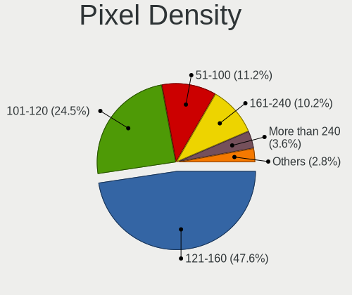

| Density       | Notebooks | Percent |
|---------------|-----------|---------|
| 121-160       | 172       | 49%     |
| 101-120       | 95        | 27.07%  |
| 51-100        | 36        | 10.26%  |
| 161-240       | 27        | 7.69%   |
| More than 240 | 11        | 3.13%   |
| Unknown       | 6         | 1.71%   |
| 1-50          | 4         | 1.14%   |

Multiple Monitors
-----------------

Total monitors connected

| Total | Notebooks | Percent |
|-------|-----------|---------|
| 1     | 272       | 84.21%  |
| 2     | 43        | 13.31%  |
| 3     | 5         | 1.55%   |
| 0     | 3         | 0.93%   |

Network
-------

Net Controller Vendor
---------------------

Controller vendors

| Vendor                                 | Notebooks | Percent |
|----------------------------------------|-----------|---------|
| Intel                                  | 186       | 36.69%  |
| Realtek Semiconductor                  | 182       | 35.9%   |
| Qualcomm Atheros                       | 63        | 12.43%  |
| Broadcom                               | 25        | 4.93%   |
| MediaTek                               | 14        | 2.76%   |
| Broadcom Limited                       | 10        | 1.97%   |
| Marvell Technology Group               | 5         | 0.99%   |
| Samsung Electronics                    | 4         | 0.79%   |
| Xiaomi                                 | 2         | 0.39%   |
| TP-Link                                | 2         | 0.39%   |
| Hewlett-Packard                        | 2         | 0.39%   |
| ASIX Electronics                       | 2         | 0.39%   |
| Sony Ericsson Mobile Communications AB | 1         | 0.2%    |
| Sierra Wireless                        | 1         | 0.2%    |
| SEGGER                                 | 1         | 0.2%    |
| Ralink Technology                      | 1         | 0.2%    |
| Ralink                                 | 1         | 0.2%    |
| Qualcomm                               | 1         | 0.2%    |
| Huawei Technologies                    | 1         | 0.2%    |
| Foxconn / Hon Hai                      | 1         | 0.2%    |
| D-Link                                 | 1         | 0.2%    |
| ASUSTek Computer                       | 1         | 0.2%    |

Net Controller Model
--------------------

Controller models

| Model                                                             | Notebooks | Percent |
|-------------------------------------------------------------------|-----------|---------|
| Realtek RTL8111/8168/8411 PCI Express Gigabit Ethernet Controller | 122       | 20.2%   |
| Realtek RTL810xE PCI Express Fast Ethernet controller             | 25        | 4.14%   |
| Intel 82579LM Gigabit Network Connection (Lewisville)             | 19        | 3.15%   |
| Intel Wi-Fi 6 AX200                                               | 17        | 2.81%   |
| Qualcomm Atheros QCA9377 802.11ac Wireless Network Adapter        | 16        | 2.65%   |
| Intel Wireless 3165                                               | 16        | 2.65%   |
| Intel Wireless 8265 / 8275                                        | 15        | 2.48%   |
| Intel Wi-Fi 6 AX201                                               | 15        | 2.48%   |
| Qualcomm Atheros QCA6174 802.11ac Wireless Network Adapter        | 11        | 1.82%   |
| Intel Wireless 7265                                               | 11        | 1.82%   |
| Intel Cannon Lake PCH CNVi WiFi                                   | 11        | 1.82%   |
| Qualcomm Atheros AR9485 Wireless Network Adapter                  | 10        | 1.66%   |
| MediaTek MT7921 802.11ax PCI Express Wireless Network Adapter     | 10        | 1.66%   |
| Realtek RTL8153 Gigabit Ethernet Adapter                          | 9         | 1.49%   |
| Intel Wireless 7260                                               | 9         | 1.49%   |
| Intel Ethernet Connection (4) I219-LM                             | 9         | 1.49%   |
| Intel Comet Lake PCH-LP CNVi WiFi                                 | 9         | 1.49%   |
| Broadcom BCM43142 802.11b/g/n                                     | 9         | 1.49%   |
| Realtek RTL8822BE 802.11a/b/g/n/ac WiFi adapter                   | 8         | 1.32%   |
| Intel Centrino Ultimate-N 6300                                    | 8         | 1.32%   |
| Intel Centrino Advanced-N 6205 [Taylor Peak]                      | 8         | 1.32%   |
| Realtek RTL8822CE 802.11ac PCIe Wireless Network Adapter          | 7         | 1.16%   |
| Qualcomm Atheros QCA9565 / AR9565 Wireless Network Adapter        | 7         | 1.16%   |
| Intel Wireless 8260                                               | 7         | 1.16%   |
| Intel Comet Lake PCH CNVi WiFi                                    | 7         | 1.16%   |
| Realtek RTL8821CE 802.11ac PCIe Wireless Network Adapter          | 6         | 0.99%   |
| Qualcomm Atheros AR9285 Wireless Network Adapter (PCI-Express)    | 6         | 0.99%   |
| Intel Ethernet Connection (3) I218-LM                             | 6         | 0.99%   |
| Realtek RTL8723BE PCIe Wireless Network Adapter                   | 5         | 0.83%   |
| Intel Wireless 3160                                               | 5         | 0.83%   |
| Intel Wi-Fi 6 AX210/AX211/AX411 160MHz                            | 5         | 0.83%   |
| Intel Ethernet Connection I218-LM                                 | 5         | 0.83%   |
| Intel Alder Lake-P PCH CNVi WiFi                                  | 5         | 0.83%   |
| Broadcom Limited BCM4312 802.11b/g LP-PHY                         | 5         | 0.83%   |
| Broadcom BCM43602 802.11ac Wireless LAN SoC                       | 5         | 0.83%   |
| Samsung Galaxy series, misc. (tethering mode)                     | 4         | 0.66%   |
| Realtek RTL8852BE PCIe 802.11ax Wireless Network Controller       | 4         | 0.66%   |
| Realtek RTL8852AE 802.11ax PCIe Wireless Network Adapter          | 4         | 0.66%   |
| Realtek Killer E2600 Gigabit Ethernet Controller                  | 4         | 0.66%   |
| Qualcomm Atheros Killer E2400 Gigabit Ethernet Controller         | 4         | 0.66%   |

Wireless Vendor
---------------

Wireless vendors

| Vendor                | Notebooks | Percent |
|-----------------------|-----------|---------|
| Intel                 | 174       | 53.37%  |
| Qualcomm Atheros      | 54        | 16.56%  |
| Realtek Semiconductor | 43        | 13.19%  |
| Broadcom              | 23        | 7.06%   |
| MediaTek              | 14        | 4.29%   |
| Broadcom Limited      | 10        | 3.07%   |
| TP-Link               | 2         | 0.61%   |
| Xiaomi                | 1         | 0.31%   |
| Sierra Wireless       | 1         | 0.31%   |
| Ralink Technology     | 1         | 0.31%   |
| Ralink                | 1         | 0.31%   |
| D-Link                | 1         | 0.31%   |
| ASUSTek Computer      | 1         | 0.31%   |

Wireless Model
--------------

Wireless models

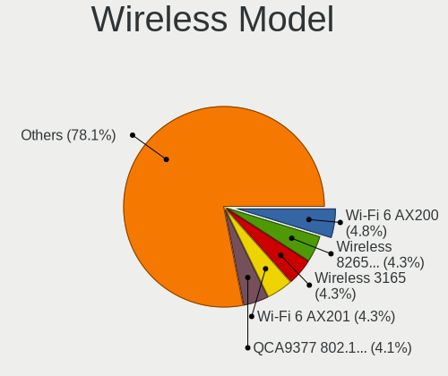

| Model                                                          | Notebooks | Percent |
|----------------------------------------------------------------|-----------|---------|
| Intel Wi-Fi 6 AX200                                            | 17        | 5.17%   |
| Qualcomm Atheros QCA9377 802.11ac Wireless Network Adapter     | 16        | 4.86%   |
| Intel Wireless 3165                                            | 16        | 4.86%   |
| Intel Wireless 8265 / 8275                                     | 15        | 4.56%   |
| Intel Wi-Fi 6 AX201                                            | 15        | 4.56%   |
| Qualcomm Atheros QCA6174 802.11ac Wireless Network Adapter     | 11        | 3.34%   |
| Intel Wireless 7265                                            | 11        | 3.34%   |
| Intel Cannon Lake PCH CNVi WiFi                                | 11        | 3.34%   |
| Qualcomm Atheros AR9485 Wireless Network Adapter               | 10        | 3.04%   |
| MediaTek MT7921 802.11ax PCI Express Wireless Network Adapter  | 10        | 3.04%   |
| Intel Wireless 7260                                            | 9         | 2.74%   |
| Intel Comet Lake PCH-LP CNVi WiFi                              | 9         | 2.74%   |
| Broadcom BCM43142 802.11b/g/n                                  | 9         | 2.74%   |
| Realtek RTL8822BE 802.11a/b/g/n/ac WiFi adapter                | 8         | 2.43%   |
| Intel Centrino Ultimate-N 6300                                 | 8         | 2.43%   |
| Intel Centrino Advanced-N 6205 [Taylor Peak]                   | 8         | 2.43%   |
| Realtek RTL8822CE 802.11ac PCIe Wireless Network Adapter       | 7         | 2.13%   |
| Qualcomm Atheros QCA9565 / AR9565 Wireless Network Adapter     | 7         | 2.13%   |
| Intel Wireless 8260                                            | 7         | 2.13%   |
| Intel Comet Lake PCH CNVi WiFi                                 | 7         | 2.13%   |
| Realtek RTL8821CE 802.11ac PCIe Wireless Network Adapter       | 6         | 1.82%   |
| Qualcomm Atheros AR9285 Wireless Network Adapter (PCI-Express) | 6         | 1.82%   |
| Realtek RTL8723BE PCIe Wireless Network Adapter                | 5         | 1.52%   |
| Intel Wireless 3160                                            | 5         | 1.52%   |
| Intel Wi-Fi 6 AX210/AX211/AX411 160MHz                         | 5         | 1.52%   |
| Intel Alder Lake-P PCH CNVi WiFi                               | 5         | 1.52%   |
| Broadcom Limited BCM4312 802.11b/g LP-PHY                      | 5         | 1.52%   |
| Broadcom BCM43602 802.11ac Wireless LAN SoC                    | 5         | 1.52%   |
| Realtek RTL8852BE PCIe 802.11ax Wireless Network Controller    | 4         | 1.22%   |
| Realtek RTL8852AE 802.11ax PCIe Wireless Network Adapter       | 4         | 1.22%   |
| Intel Ice Lake-LP PCH CNVi WiFi                                | 4         | 1.22%   |
| Intel Cannon Point-LP CNVi [Wireless-AC]                       | 4         | 1.22%   |
| Broadcom BCM4313 802.11bgn Wireless Network Adapter            | 4         | 1.22%   |
| Realtek RTL8723DE Wireless Network Adapter                     | 3         | 0.91%   |
| Realtek RTL8188EUS 802.11n Wireless Network Adapter            | 3         | 0.91%   |
| Intel Centrino Advanced-N 6200                                 | 3         | 0.91%   |
| Broadcom Limited BCM4313 802.11bgn Wireless Network Adapter    | 3         | 0.91%   |
| TP-Link TL-WN722N v2/v3 [Realtek RTL8188EUS]                   | 2         | 0.61%   |
| Qualcomm Atheros AR9462 Wireless Network Adapter               | 2         | 0.61%   |
| MediaTek MT7922 802.11ax PCI Express Wireless Network Adapter  | 2         | 0.61%   |

Ethernet Vendor
---------------

Ethernet vendors

| Vendor                                 | Notebooks | Percent |
|----------------------------------------|-----------|---------|
| Realtek Semiconductor                  | 166       | 61.71%  |
| Intel                                  | 66        | 24.54%  |
| Qualcomm Atheros                       | 16        | 5.95%   |
| Marvell Technology Group               | 5         | 1.86%   |
| Samsung Electronics                    | 4         | 1.49%   |
| Broadcom                               | 4         | 1.49%   |
| ASIX Electronics                       | 2         | 0.74%   |
| Xiaomi                                 | 1         | 0.37%   |
| Sony Ericsson Mobile Communications AB | 1         | 0.37%   |
| Qualcomm                               | 1         | 0.37%   |
| Huawei Technologies                    | 1         | 0.37%   |
| Hewlett-Packard                        | 1         | 0.37%   |
| Foxconn / Hon Hai                      | 1         | 0.37%   |

Ethernet Model
--------------

Ethernet models

| Model                                                                          | Notebooks | Percent |
|--------------------------------------------------------------------------------|-----------|---------|
| Realtek RTL8111/8168/8411 PCI Express Gigabit Ethernet Controller              | 122       | 44.69%  |
| Realtek RTL810xE PCI Express Fast Ethernet controller                          | 25        | 9.16%   |
| Intel 82579LM Gigabit Network Connection (Lewisville)                          | 19        | 6.96%   |
| Realtek RTL8153 Gigabit Ethernet Adapter                                       | 9         | 3.3%    |
| Intel Ethernet Connection (4) I219-LM                                          | 9         | 3.3%    |
| Intel Ethernet Connection (3) I218-LM                                          | 6         | 2.2%    |
| Intel Ethernet Connection I218-LM                                              | 5         | 1.83%   |
| Samsung Galaxy series, misc. (tethering mode)                                  | 4         | 1.47%   |
| Realtek Killer E2600 Gigabit Ethernet Controller                               | 4         | 1.47%   |
| Qualcomm Atheros Killer E2400 Gigabit Ethernet Controller                      | 4         | 1.47%   |
| Intel Ethernet Connection I217-LM                                              | 4         | 1.47%   |
| Intel 82577LM Gigabit Network Connection                                       | 4         | 1.47%   |
| Realtek RTL8125 2.5GbE Controller                                              | 3         | 1.1%    |
| Qualcomm Atheros QCA8171 Gigabit Ethernet                                      | 3         | 1.1%    |
| Intel Ethernet Connection I219-LM                                              | 3         | 1.1%    |
| Intel Ethernet Connection (2) I219-LM                                          | 3         | 1.1%    |
| Realtek RTL8152 Fast Ethernet Adapter                                          | 2         | 0.73%   |
| Realtek Killer E2500 Gigabit Ethernet Controller                               | 2         | 0.73%   |
| Qualcomm Atheros Killer E2500 Gigabit Ethernet Controller                      | 2         | 0.73%   |
| Qualcomm Atheros AR8162 Fast Ethernet                                          | 2         | 0.73%   |
| Qualcomm Atheros AR8161 Gigabit Ethernet                                       | 2         | 0.73%   |
| Marvell Group 88E8057 PCI-E Gigabit Ethernet Controller                        | 2         | 0.73%   |
| Intel Ethernet Connection (5) I219-LM                                          | 2         | 0.73%   |
| Intel Ethernet Connection (4) I219-V                                           | 2         | 0.73%   |
| Broadcom NetXtreme BCM57765 Gigabit Ethernet PCIe                              | 2         | 0.73%   |
| ASIX AX88179 Gigabit Ethernet                                                  | 2         | 0.73%   |
| Xiaomi Mi/Redmi series (RNDIS)                                                 | 1         | 0.37%   |
| Sony Ericsson Mobile AB D6503                                                  | 1         | 0.37%   |
| Realtek PCIe GbE Family Controller                                             | 1         | 0.37%   |
| Realtek Killer E3000 2.5GbE Controller                                         | 1         | 0.37%   |
| Qualcomm Redmi Note 8                                                          | 1         | 0.37%   |
| Qualcomm Atheros AR8152 v2.0 Fast Ethernet                                     | 1         | 0.37%   |
| Qualcomm Atheros AR8151 v2.0 Gigabit Ethernet                                  | 1         | 0.37%   |
| Qualcomm Atheros AR8132 Fast Ethernet                                          | 1         | 0.37%   |
| Marvell Group Yukon Optima 88E8059 [PCIe Gigabit Ethernet Controller with AVB] | 1         | 0.37%   |
| Marvell Group 88E8042 PCI-E Fast Ethernet Controller                           | 1         | 0.37%   |
| Marvell Group 88E8039 PCI-E Fast Ethernet Controller                           | 1         | 0.37%   |
| Intel WiMAX Connection 2400m                                                   | 1         | 0.37%   |
| Intel Ethernet Connection I219-V                                               | 1         | 0.37%   |
| Intel Ethernet Connection (6) I219-V                                           | 1         | 0.37%   |

Net Controller Kind
-------------------

Ethernet, WiFi or modem

| Kind     | Notebooks | Percent |
|----------|-----------|---------|
| WiFi     | 317       | 54.84%  |
| Ethernet | 259       | 44.81%  |
| Modem    | 2         | 0.35%   |

Used Controller
---------------

Currently used network controller

| Kind     | Notebooks | Percent |
|----------|-----------|---------|
| WiFi     | 278       | 82.25%  |
| Ethernet | 60        | 17.75%  |

NICs
----

Total network controllers on board

| Total | Notebooks | Percent |
|-------|-----------|---------|
| 2     | 246       | 77.36%  |
| 1     | 69        | 21.7%   |
| 3     | 2         | 0.63%   |
| 0     | 1         | 0.31%   |

IPv6
----

IPv6 vs IPv4

| Used | Notebooks | Percent |
|------|-----------|---------|
| No   | 246       | 75%     |
| Yes  | 82        | 25%     |

Bluetooth
---------

Bluetooth Vendor
----------------

Controller vendors

| Vendor                          | Notebooks | Percent |
|---------------------------------|-----------|---------|
| Intel                           | 144       | 51.43%  |
| Qualcomm Atheros Communications | 30        | 10.71%  |
| Realtek Semiconductor           | 27        | 9.64%   |
| Broadcom                        | 21        | 7.5%    |
| IMC Networks                    | 16        | 5.71%   |
| Lite-On Technology              | 13        | 4.64%   |
| Foxconn / Hon Hai               | 7         | 2.5%    |
| Apple                           | 6         | 2.14%   |
| Hewlett-Packard                 | 4         | 1.43%   |
| Dell                            | 4         | 1.43%   |
| Realtek                         | 2         | 0.71%   |
| Toshiba                         | 1         | 0.36%   |
| Ralink                          | 1         | 0.36%   |
| Opticis                         | 1         | 0.36%   |
| MediaTek                        | 1         | 0.36%   |
| Cambridge Silicon Radio         | 1         | 0.36%   |
| Alps Electric                   | 1         | 0.36%   |

Bluetooth Model
---------------

Controller models

| Model                                             | Notebooks | Percent |
|---------------------------------------------------|-----------|---------|
| Intel Bluetooth wireless interface                | 58        | 20.64%  |
| Intel AX201 Bluetooth                             | 29        | 10.32%  |
| Intel Bluetooth 9460/9560 Jefferson Peak (JfP)    | 24        | 8.54%   |
| Realtek Bluetooth Radio                           | 18        | 6.41%   |
| Qualcomm Atheros  Bluetooth Device                | 17        | 6.05%   |
| Intel AX200 Bluetooth                             | 17        | 6.05%   |
| Lite-On Qualcomm Atheros QCA9377 Bluetooth        | 6         | 2.14%   |
| IMC Networks Wireless_Device                      | 6         | 2.14%   |
| Broadcom BCM20702 Bluetooth 4.0 [ThinkPad]        | 6         | 2.14%   |
| Intel AX210 Bluetooth                             | 5         | 1.78%   |
| Apple Bluetooth Host Controller                   | 5         | 1.78%   |
| Realtek RTL8822BE Bluetooth 4.2 Adapter           | 4         | 1.42%   |
| Realtek  Bluetooth 4.2 Adapter                    | 4         | 1.42%   |
| Qualcomm Atheros QCA61x4 Bluetooth 4.0            | 4         | 1.42%   |
| IMC Networks Bluetooth Radio                      | 4         | 1.42%   |
| IMC Networks Atheros AR3012 Bluetooth 4.0 Adapter | 4         | 1.42%   |
| Qualcomm Atheros AR9462 Bluetooth                 | 3         | 1.07%   |
| Intel Centrino Bluetooth Wireless Transceiver     | 3         | 1.07%   |
| Intel Bluetooth Device                            | 3         | 1.07%   |
| HP Broadcom 2070 Bluetooth Combo                  | 3         | 1.07%   |
| Broadcom HP Portable SoftSailing                  | 3         | 1.07%   |
| Broadcom BCM43142 Bluetooth 4.0                   | 3         | 1.07%   |
| Realtek 802.11ac WLAN Adapter                     | 2         | 0.71%   |
| Qualcomm Atheros Bluetooth USB Host Controller    | 2         | 0.71%   |
| Qualcomm Atheros AR3011 Bluetooth                 | 2         | 0.71%   |
| Lite-On Wireless_Device                           | 2         | 0.71%   |
| Lite-On Bluetooth Radio                           | 2         | 0.71%   |
| Intel Wireless-AC 9260 Bluetooth Adapter          | 2         | 0.71%   |
| Intel Wireless-AC 3168 Bluetooth                  | 2         | 0.71%   |
| Intel Centrino Advanced-N 6230 Bluetooth adapter  | 2         | 0.71%   |
| IMC Networks Bluetooth Device                     | 2         | 0.71%   |
| Foxconn / Hon Hai Wireless_Device                 | 2         | 0.71%   |
| Foxconn / Hon Hai MediaTek Bluetooth Adapter      | 2         | 0.71%   |
| Dell DW375 Bluetooth Module                       | 2         | 0.71%   |
| Broadcom BCM2070 Bluetooth 2.1 + EDR              | 2         | 0.71%   |
| Broadcom BCM2045B (BDC-2.1)                       | 2         | 0.71%   |
| Toshiba Bluetooth USB Host Controller             | 1         | 0.36%   |
| Realtek RTL8723B Bluetooth                        | 1         | 0.36%   |
| Ralink RT3290 Bluetooth                           | 1         | 0.36%   |
| Qualcomm Atheros AR3012 Bluetooth 4.0             | 1         | 0.36%   |

Sound
-----

Sound Vendor
------------

Sound card vendors

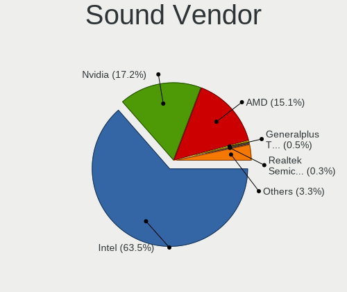

| Vendor                 | Notebooks | Percent |
|------------------------|-----------|---------|
| Intel                  | 263       | 66.75%  |
| Nvidia                 | 64        | 16.24%  |
| AMD                    | 54        | 13.71%  |
| Realtek Semiconductor  | 2         | 0.51%   |
| Generalplus Technology | 2         | 0.51%   |
| Plantronics            | 1         | 0.25%   |
| OPPO Electronics       | 1         | 0.25%   |
| JMTek                  | 1         | 0.25%   |
| GN Netcom              | 1         | 0.25%   |
| FIFINE Microphones     | 1         | 0.25%   |
| C-Media Electronics    | 1         | 0.25%   |
| AudioQuest             | 1         | 0.25%   |
| Apple                  | 1         | 0.25%   |
| Unknown                | 1         | 0.25%   |

Sound Model
-----------

Sound card models

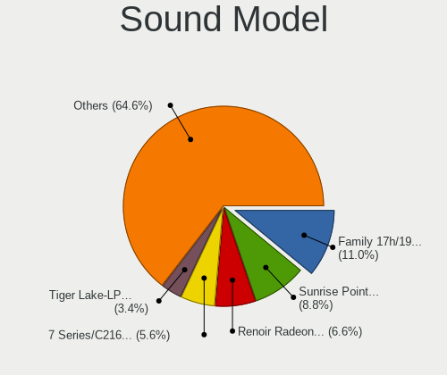

| Model                                                                      | Notebooks | Percent |
|----------------------------------------------------------------------------|-----------|---------|
| AMD Family 17h/19h HD Audio Controller                                     | 49        | 10.27%  |
| Intel Sunrise Point-LP HD Audio                                            | 48        | 10.06%  |
| Intel 7 Series/C216 Chipset Family High Definition Audio Controller        | 34        | 7.13%   |
| AMD Renoir Radeon High Definition Audio Controller                         | 27        | 5.66%   |
| Intel Tiger Lake-LP Smart Sound Technology Audio Controller                | 19        | 3.98%   |
| Intel Haswell-ULT HD Audio Controller                                      | 17        | 3.56%   |
| Intel 8 Series HD Audio Controller                                         | 17        | 3.56%   |
| Intel 6 Series/C200 Series Chipset Family High Definition Audio Controller | 17        | 3.56%   |
| Intel Wildcat Point-LP High Definition Audio Controller                    | 16        | 3.35%   |
| Intel Broadwell-U Audio Controller                                         | 16        | 3.35%   |
| Intel Cannon Lake PCH cAVS                                                 | 15        | 3.14%   |
| Nvidia TU107 GeForce GTX 1650 High Definition Audio Controller             | 12        | 2.52%   |
| Intel Comet Lake PCH-LP cAVS                                               | 12        | 2.52%   |
| Intel CM238 HD Audio Controller                                            | 10        | 2.1%    |
| Intel 8 Series/C220 Series Chipset High Definition Audio Controller        | 10        | 2.1%    |
| AMD Raven/Raven2/Fenghuang HDMI/DP Audio Controller                        | 10        | 2.1%    |
| Nvidia GF108 High Definition Audio Controller                              | 8         | 1.68%   |
| Nvidia Audio device                                                        | 8         | 1.68%   |
| Intel Cannon Point-LP High Definition Audio Controller                     | 8         | 1.68%   |
| Intel 100 Series/C230 Series Chipset Family HD Audio Controller            | 8         | 1.68%   |
| Intel Comet Lake PCH cAVS                                                  | 7         | 1.47%   |
| Nvidia TU116 High Definition Audio Controller                              | 6         | 1.26%   |
| Intel Xeon E3-1200 v3/4th Gen Core Processor HD Audio Controller           | 6         | 1.26%   |
| Intel Alder Lake PCH-P High Definition Audio Controller                    | 6         | 1.26%   |
| Intel 5 Series/3400 Series Chipset High Definition Audio                   | 6         | 1.26%   |
| Nvidia GA106 High Definition Audio Controller                              | 5         | 1.05%   |
| Intel Ice Lake-LP Smart Sound Technology Audio Controller                  | 5         | 1.05%   |
| Intel 82801I (ICH9 Family) HD Audio Controller                             | 5         | 1.05%   |
| AMD Rembrandt Radeon High Definition Audio Controller                      | 5         | 1.05%   |
| Nvidia GP107GL High Definition Audio Controller                            | 4         | 0.84%   |
| Nvidia GM107 High Definition Audio Controller [GeForce 940MX]              | 4         | 0.84%   |
| Intel Tiger Lake-H HD Audio Controller                                     | 4         | 0.84%   |
| Intel Celeron/Pentium Silver Processor High Definition Audio               | 4         | 0.84%   |
| Intel 82801H (ICH8 Family) HD Audio Controller                             | 4         | 0.84%   |
| Nvidia High Definition Audio Controller                                    | 3         | 0.63%   |
| Nvidia GP106 High Definition Audio Controller                              | 3         | 0.63%   |
| Realtek Semiconductor USB Audio                                            | 2         | 0.42%   |
| Nvidia GK208 HDMI/DP Audio Controller                                      | 2         | 0.42%   |
| Nvidia GK107 HDMI Audio Controller                                         | 2         | 0.42%   |
| Nvidia GF106 High Definition Audio Controller                              | 2         | 0.42%   |

Memory
------

Memory Vendor
-------------

Memory module vendors

| Vendor                                  | Notebooks | Percent |
|-----------------------------------------|-----------|---------|
| Samsung Electronics                     | 73        | 29.55%  |
| SK hynix                                | 53        | 21.46%  |
| Micron Technology                       | 39        | 15.79%  |
| Kingston                                | 39        | 15.79%  |
| Crucial                                 | 8         | 3.24%   |
| Ramaxel Technology                      | 7         | 2.83%   |
| Unknown                                 | 6         | 2.43%   |
| G.Skill                                 | 4         | 1.62%   |
| Corsair                                 | 4         | 1.62%   |
| Elpida                                  | 3         | 1.21%   |
| A-DATA Technology                       | 3         | 1.21%   |
| Kingmax                                 | 2         | 0.81%   |
| Apacer                                  | 2         | 0.81%   |
| Unknown (7FE0)                          | 1         | 0.4%    |
| Team                                    | 1         | 0.4%    |
| Silicon Power Computer & Communications | 1         | 0.4%    |
| Kingmax Semiconductor                   | 1         | 0.4%    |

Memory Model
------------

Memory module models

| Model                                                            | Notebooks | Percent |
|------------------------------------------------------------------|-----------|---------|
| SK hynix RAM HMAA1GS6CJR6N-XN 8GB SODIMM DDR4 3200MT/s           | 5         | 1.86%   |
| Samsung RAM M471B5173QH0-YK0 4096MB SODIMM DDR3 1600MT/s         | 5         | 1.86%   |
| Samsung RAM M471B5173DB0-YK0 4GB SODIMM DDR3 1600MT/s            | 5         | 1.86%   |
| Samsung RAM M471A1K43CB1-CRC 8GB SODIMM DDR4 2667MT/s            | 5         | 1.86%   |
| Kingston RAM LV32D4S2S8HD-8 8GB SODIMM DDR4 3200MT/s             | 5         | 1.86%   |
| SK hynix RAM HMT351S6EFR8A-PB 4GB SODIMM DDR3 1600MT/s           | 4         | 1.49%   |
| Samsung RAM M471A5244CB0-CRC 4GB SODIMM DDR4 2667MT/s            | 4         | 1.49%   |
| Samsung RAM M471A1K43DB1-CWE 8192MB SODIMM DDR4 3200MT/s         | 4         | 1.49%   |
| Micron RAM 4ATF51264HZ-2G6E1 4GB SODIMM DDR4 2667MT/s            | 4         | 1.49%   |
| SK hynix RAM HMT451S6AFR8A-PB 4GB SODIMM DDR3 1600MT/s           | 3         | 1.12%   |
| SK hynix RAM HMA81GS6AFR8N-UH 8GB SODIMM DDR4 2667MT/s           | 3         | 1.12%   |
| Samsung RAM M471A2K43DB1-CWE 16GB SODIMM DDR4 3200MT/s           | 3         | 1.12%   |
| Samsung RAM M471A2K43CB1-CTD 16GB SODIMM DDR4 8400MT/s           | 3         | 1.12%   |
| Samsung RAM M471A1K43DB1-CTD 8GB SODIMM DDR4 2667MT/s            | 3         | 1.12%   |
| Micron RAM 8KTF51264HZ-1G6E1 4GB SODIMM DDR3 1600MT/s            | 3         | 1.12%   |
| Micron RAM 4ATF1G64HZ-3G2E2 8GB SODIMM DDR4 3200MT/s             | 3         | 1.12%   |
| SK hynix RAM HMT451S6BFR8A-PB 4GB SODIMM DDR3 1600MT/s           | 2         | 0.74%   |
| SK hynix RAM HMT41GS6BFR8A-PB 8GB SODIMM DDR3 1600MT/s           | 2         | 0.74%   |
| SK hynix RAM HMT351S6CFR8C-PB 4GB SODIMM DDR3 1600MT/s           | 2         | 0.74%   |
| SK hynix RAM HMAA1GS6CJR6N-XN 8GB Row Of Chips DDR4 3200MT/s     | 2         | 0.74%   |
| SK hynix RAM HMA851S6CJR6N-XN 4GB Row Of Chips DDR4 3200MT/s     | 2         | 0.74%   |
| SK hynix RAM HMA851S6AFR6N-UH 4096MB SODIMM DDR4 2667MT/s        | 2         | 0.74%   |
| SK hynix RAM HMA82GS6AFR8N-UH 16GB SODIMM DDR4 2667MT/s          | 2         | 0.74%   |
| SK hynix RAM HMA81GS6JJR8N-VK 8GB SODIMM DDR4 2667MT/s           | 2         | 0.74%   |
| SK hynix RAM HMA81GS6DJR8N-XN 8GB SODIMM DDR4 3200MT/s           | 2         | 0.74%   |
| SK hynix RAM HMA81GS6CJR8N-VK 8GB SODIMM DDR4 2667MT/s           | 2         | 0.74%   |
| SK hynix RAM HMA451S6AFR8N-TF 4GB SODIMM DDR4 2133MT/s           | 2         | 0.74%   |
| Samsung RAM Module 8192MB SODIMM DDR4 3200MT/s                   | 2         | 0.74%   |
| Samsung RAM M471B5273CH0-CH9 4GB SODIMM DDR3 1334MT/s            | 2         | 0.74%   |
| Samsung RAM M471B5173EB0-YK0 4GB SODIMM DDR3 1600MT/s            | 2         | 0.74%   |
| Samsung RAM M471B1G73QH0-YK0 8GB SODIMM DDR3 1867MT/s            | 2         | 0.74%   |
| Samsung RAM M471B1G73DB0-YK0 8GB SODIMM DDR3 1600MT/s            | 2         | 0.74%   |
| Samsung RAM M471A5244CB0-CWE 4GB SODIMM DDR4 3200MT/s            | 2         | 0.74%   |
| Samsung RAM M471A2K43CB1-CRC 16GB SODIMM DDR4 2667MT/s           | 2         | 0.74%   |
| Samsung RAM M471A1K43CB1-CTD 8GB SODIMM DDR4 2667MT/s            | 2         | 0.74%   |
| Samsung RAM M471A1G44AB0-CWE 8GB SODIMM DDR4 3200MT/s            | 2         | 0.74%   |
| Samsung RAM M471A1G44AB0-CTD 8GB Row Of Chips DDR4 2667MT/s      | 2         | 0.74%   |
| Samsung RAM M425R1GB4BB0-CQKOL 8GB SODIMM DDR5 4800MT/s          | 2         | 0.74%   |
| Ramaxel RAM RMSA3260ME78HAF-2666 8GB SODIMM DDR4 2667MT/s        | 2         | 0.74%   |
| Micron RAM MT62F1G32D4DR-031 WT 4GB Row Of Chips LPDDR5 6400MT/s | 2         | 0.74%   |

Memory Kind
-----------

Memory module kinds

| Kind   | Notebooks | Percent |
|--------|-----------|---------|
| DDR4   | 119       | 60.41%  |
| DDR3   | 54        | 27.41%  |
| LPDDR4 | 8         | 4.06%   |
| DDR5   | 6         | 3.05%   |
| LPDDR3 | 4         | 2.03%   |
| LPDDR5 | 3         | 1.52%   |
| DDR2   | 2         | 1.02%   |
| SDRAM  | 1         | 0.51%   |

Memory Form Factor
------------------

Physical design of the memory module

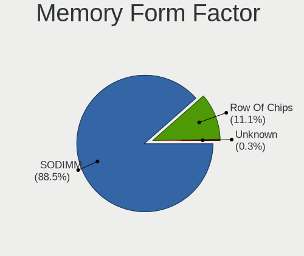

| Name         | Notebooks | Percent |
|--------------|-----------|---------|
| SODIMM       | 179       | 89.95%  |
| Row Of Chips | 20        | 10.05%  |

Memory Size
-----------

Memory module size

| Size  | Notebooks | Percent |
|-------|-----------|---------|
| 8192  | 95        | 44.81%  |
| 4096  | 69        | 32.55%  |
| 16384 | 31        | 14.62%  |
| 2048  | 13        | 6.13%   |
| 32768 | 3         | 1.42%   |
| 1024  | 1         | 0.47%   |

Memory Speed
------------

Memory module speed

| Speed   | Notebooks | Percent |
|---------|-----------|---------|
| 2667    | 56        | 25.93%  |
| 3200    | 53        | 24.54%  |
| 1600    | 41        | 18.98%  |
| 2400    | 19        | 8.8%    |
| 2133    | 8         | 3.7%    |
| 1334    | 6         | 2.78%   |
| 1333    | 6         | 2.78%   |
| 4800    | 5         | 2.31%   |
| 1867    | 4         | 1.85%   |
| 8400    | 3         | 1.39%   |
| 6400    | 3         | 1.39%   |
| 4267    | 3         | 1.39%   |
| 667     | 2         | 0.93%   |
| 5600    | 1         | 0.46%   |
| 4266    | 1         | 0.46%   |
| 4199    | 1         | 0.46%   |
| 3266    | 1         | 0.46%   |
| 2933    | 1         | 0.46%   |
| 1067    | 1         | 0.46%   |
| Unknown | 1         | 0.46%   |

Printers & scanners
-------------------

Printer Vendor
--------------

Printer device vendors

| Vendor          | Notebooks | Percent |
|-----------------|-----------|---------|
| MIIIW           | 1         | 33.33%  |
| Hewlett-Packard | 1         | 33.33%  |
| Canon           | 1         | 33.33%  |

Printer Model
-------------

Printer device models

| Model                      | Notebooks | Percent |
|----------------------------|-----------|---------|
| MIIIW MW Keyboard Air Mini | 1         | 33.33%  |
| HP LaserJet P1102          | 1         | 33.33%  |
| Canon LBP6030w/6018w       | 1         | 33.33%  |

Scanner Vendor
--------------

Scanner device vendors

Zero info for selected period =(

Scanner Model
-------------

Scanner device models

Zero info for selected period =(

Camera
------

Camera Vendor
-------------

Camera device vendors

| Vendor                                 | Notebooks | Percent |
|----------------------------------------|-----------|---------|
| Chicony Electronics                    | 59        | 20.7%   |
| Microdia                               | 45        | 15.79%  |
| IMC Networks                           | 40        | 14.04%  |
| Sunplus Innovation Technology          | 27        | 9.47%   |
| Realtek Semiconductor                  | 20        | 7.02%   |
| Bison Electronics                      | 18        | 6.32%   |
| Quanta                                 | 16        | 5.61%   |
| Syntek                                 | 10        | 3.51%   |
| Luxvisions Innotech Limited            | 7         | 2.46%   |
| Lite-On Technology                     | 7         | 2.46%   |
| Apple                                  | 7         | 2.46%   |
| Suyin                                  | 6         | 2.11%   |
| Logitech                               | 4         | 1.4%    |
| Cheng Uei Precision Industry (Foxlink) | 4         | 1.4%    |
| Acer                                   | 3         | 1.05%   |
| Silicon Motion                         | 2         | 0.7%    |
| Ricoh                                  | 2         | 0.7%    |
| Alcor Micro                            | 2         | 0.7%    |
| Sonix Technology                       | 1         | 0.35%   |
| Shenzhen Kingcome Optoelectronic       | 1         | 0.35%   |
| Samsung Electronics                    | 1         | 0.35%   |
| Lenovo                                 | 1         | 0.35%   |
| Denron                                 | 1         | 0.35%   |
| ALi                                    | 1         | 0.35%   |

Camera Model
------------

Camera device models

| Model                                         | Notebooks | Percent |
|-----------------------------------------------|-----------|---------|
| Microdia Integrated_Webcam_HD                 | 22        | 7.72%   |
| Chicony Integrated Camera                     | 19        | 6.67%   |
| Sunplus Integrated_Webcam_HD                  | 13        | 4.56%   |
| IMC Networks Integrated Camera                | 11        | 3.86%   |
| Realtek Integrated_Webcam_HD                  | 9         | 3.16%   |
| IMC Networks USB2.0 HD UVC WebCam             | 9         | 3.16%   |
| Syntek Integrated Camera                      | 8         | 2.81%   |
| Chicony HD WebCam                             | 7         | 2.46%   |
| Microdia Laptop_Integrated_Webcam_HD          | 6         | 2.11%   |
| IMC Networks USB2.0 VGA UVC WebCam            | 6         | 2.11%   |
| Microdia Integrated Webcam                    | 5         | 1.75%   |
| Chicony HP HD Camera                          | 5         | 1.75%   |
| Bison Integrated Camera                       | 5         | 1.75%   |
| Realtek Integrated Webcam                     | 4         | 1.4%    |
| Quanta HP TrueVision HD Camera                | 4         | 1.4%    |
| Luxvisions Innotech Limited Integrated Camera | 4         | 1.4%    |
| Chicony HP TrueVision HD Camera               | 4         | 1.4%    |
| Bison ThinkPad Integrated Camera              | 4         | 1.4%    |
| Bison SunplusIT Integrated Camera             | 4         | 1.4%    |
| Apple iPhone 5/5C/5S/6/SE/7/8/X               | 4         | 1.4%    |
| Sunplus Laptop_Integrated_Webcam_FHD          | 3         | 1.05%   |
| Quanta VGA WebCam                             | 3         | 1.05%   |
| Quanta HD User Facing                         | 3         | 1.05%   |
| Lite-On Integrated Camera                     | 3         | 1.05%   |
| IMC Networks VGA UVC WebCam                   | 3         | 1.05%   |
| IMC Networks USB2.0 UVC HD Webcam             | 3         | 1.05%   |
| Chicony Integrated HP HD Webcam               | 3         | 1.05%   |
| Chicony HP HD Webcam                          | 3         | 1.05%   |
| Chicony HD User Facing                        | 3         | 1.05%   |
| Syntek Lenovo EasyCamera                      | 2         | 0.7%    |
| Sunplus Laptop_Integrated_Webcam_HD           | 2         | 0.7%    |
| Sunplus HD WebCam                             | 2         | 0.7%    |
| Sunplus Asus Webcam                           | 2         | 0.7%    |
| Realtek USB Camera                            | 2         | 0.7%    |
| Realtek Integrated Webcam HD                  | 2         | 0.7%    |
| Quanta HP HD Camera                           | 2         | 0.7%    |
| Microdia Webcam Vitade AF                     | 2         | 0.7%    |
| Microdia USB 2.0 Camera                       | 2         | 0.7%    |
| Microdia Laptop_Integrated_Webcam_E4HD        | 2         | 0.7%    |
| Microdia Laptop_Integrated_Webcam_1.3M        | 2         | 0.7%    |

Security
--------

Fingerprint Vendor
------------------

Fingerprint sensor vendors

| Vendor                     | Notebooks | Percent |
|----------------------------|-----------|---------|
| Validity Sensors           | 33        | 47.14%  |
| Shenzhen Goodix Technology | 16        | 22.86%  |
| Synaptics                  | 14        | 20%     |
| LighTuning Technology      | 2         | 2.86%   |
| Elan Microelectronics      | 2         | 2.86%   |
| Upek                       | 1         | 1.43%   |
| STMicroelectronics         | 1         | 1.43%   |
| Samsung Electronics        | 1         | 1.43%   |

Fingerprint Model
-----------------

Fingerprint sensor models

| Model                                                                      | Notebooks | Percent |
|----------------------------------------------------------------------------|-----------|---------|
| Shenzhen Goodix  Fingerprint Device                                        | 12        | 17.14%  |
| Validity Sensors VFS495 Fingerprint Reader                                 | 7         | 10%     |
| Validity Sensors VFS5011 Fingerprint Reader                                | 6         | 8.57%   |
| Synaptics Metallica MIS Touch Fingerprint Reader                           | 5         | 7.14%   |
| Validity Sensors VFS 5011 fingerprint sensor                               | 4         | 5.71%   |
| Validity Sensors Synaptics WBDI                                            | 4         | 5.71%   |
| Validity Sensors Synaptics VFS7552 Touch Fingerprint Sensor                | 4         | 5.71%   |
| Validity Sensors VFS Fingerprint sensor                                    | 3         | 4.29%   |
| Synaptics Prometheus MIS Touch Fingerprint Reader                          | 3         | 4.29%   |
| Shenzhen Goodix Fingerprint Reader                                         | 3         | 4.29%   |
| Validity Sensors VFS471 Fingerprint Reader                                 | 2         | 2.86%   |
| Validity Sensors Synaptics VFS7552 Touch Fingerprint Sensor with PurePrint | 2         | 2.86%   |
| Synaptics FS7604 Touch Fingerprint Sensor with PurePrint                   | 2         | 2.86%   |
| LighTuning EgisTec Touch Fingerprint Sensor                                | 2         | 2.86%   |
| Elan ELAN:Fingerprint                                                      | 2         | 2.86%   |
| Validity Sensors VFS451 Fingerprint Reader                                 | 1         | 1.43%   |
| Upek Biometric Touchchip/Touchstrip Fingerprint Sensor                     | 1         | 1.43%   |
| Synaptics WBDI Fingerprint Reader USB 086                                  | 1         | 1.43%   |
| Synaptics UWP WBDI                                                         | 1         | 1.43%   |
| Synaptics Metallica MOH Touch Fingerprint Reader                           | 1         | 1.43%   |
| Synaptics Fingerprint reader [HP G6]                                       | 1         | 1.43%   |
| STMicroelectronics Fingerprint Reader                                      | 1         | 1.43%   |
| Shenzhen Goodix FingerPrint                                                | 1         | 1.43%   |
| Samsung Fingerprint Sensor Device - 730B                                   | 1         | 1.43%   |

Chipcard Vendor
---------------

Chipcard module vendors

| Vendor      | Notebooks | Percent |
|-------------|-----------|---------|
| Broadcom    | 10        | 71.43%  |
| Alcor Micro | 2         | 14.29%  |
| Upek        | 1         | 7.14%   |
| Lenovo      | 1         | 7.14%   |

Chipcard Model
--------------

Chipcard module models

| Model                                                                        | Notebooks | Percent |
|------------------------------------------------------------------------------|-----------|---------|
| Broadcom BCM5880 Secure Applications Processor                               | 5         | 35.71%  |
| Broadcom 5880                                                                | 3         | 21.43%  |
| Alcor Micro AU9540 Smartcard Reader                                          | 2         | 14.29%  |
| Upek TouchChip Fingerprint Coprocessor (WBF advanced mode)                   | 1         | 7.14%   |
| Lenovo Integrated Smart Card Reader                                          | 1         | 7.14%   |
| Broadcom BCM5880 Secure Applications Processor with fingerprint swipe sensor | 1         | 7.14%   |
| Broadcom 58200                                                               | 1         | 7.14%   |

Unsupported
-----------

Unsupported Devices
-------------------

Total unsupported devices on board

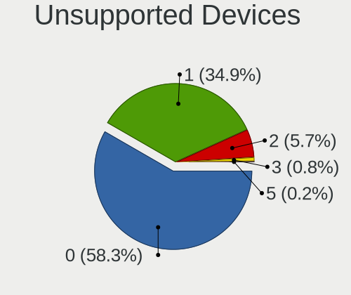

| Total | Notebooks | Percent |
|-------|-----------|---------|
| 0     | 193       | 59.02%  |
| 1     | 113       | 34.56%  |
| 2     | 18        | 5.5%    |
| 3     | 2         | 0.61%   |
| 5     | 1         | 0.31%   |

Unsupported Device Types
------------------------

Types of unsupported devices

| Type                     | Notebooks | Percent |
|--------------------------|-----------|---------|
| Fingerprint reader       | 68        | 43.87%  |
| Graphics card            | 27        | 17.42%  |
| Chipcard                 | 14        | 9.03%   |
| Net/wireless             | 12        | 7.74%   |
| Multimedia controller    | 8         | 5.16%   |
| Camera                   | 7         | 4.52%   |
| Communication controller | 5         | 3.23%   |
| Bluetooth                | 5         | 3.23%   |
| Net/ethernet             | 4         | 2.58%   |
| Storage                  | 2         | 1.29%   |
| Card reader              | 2         | 1.29%   |
| Sound                    | 1         | 0.65%   |

