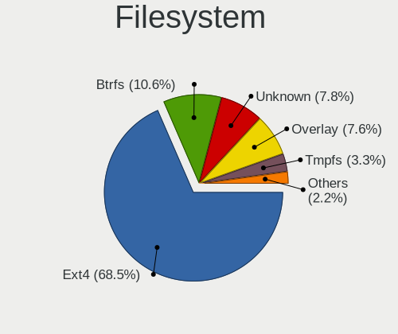
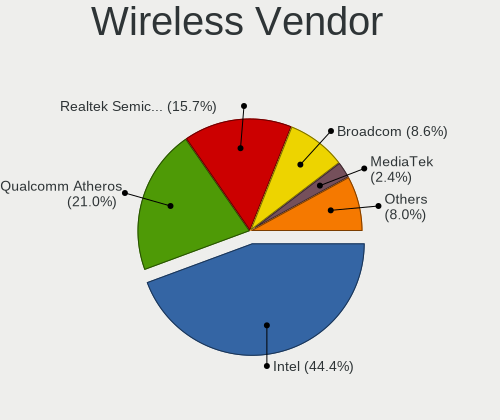

Linux - Tested Hardware & Statistics (Notebooks)
------------------------------------------------

A project to collect tested hardware configurations for Linux.

Anyone can contribute to this report by the [hw-probe](https://github.com/linuxhw/hw-probe) tool:

    sudo -E hw-probe -all -upload

Please contribute! Especially if your hardware is rare.

This report is for real hardware. Report for virtual hardware: [TestDays_VE](https://github.com/linuxhw/TestDays_VE)

Contents
--------

* [ Test Cases ](#test-cases)

* [ System ](#system)
  - [ OS                       ](#os)
  - [ OS Family                ](#os-family)
  - [ Kernel                   ](#kernel)
  - [ Kernel Family            ](#kernel-family)
  - [ Kernel Major Ver.        ](#kernel-major-ver)
  - [ Arch                     ](#arch)
  - [ DE                       ](#de)
  - [ Display Server           ](#display-server)
  - [ Display Manager          ](#display-manager)
  - [ OS Lang                  ](#os-lang)
  - [ Boot Mode                ](#boot-mode)
  - [ Filesystem               ](#filesystem)
  - [ Part. scheme             ](#part-scheme)
  - [ Dual Boot with Linux/BSD ](#dual-boot-with-linuxbsd)
  - [ Dual Boot (Win)          ](#dual-boot-win)

* [ Board ](#board)
  - [ Vendor                   ](#vendor)
  - [ Model                    ](#model)
  - [ Model Family             ](#model-family)
  - [ MFG Year                 ](#mfg-year)
  - [ Form Factor              ](#form-factor)
  - [ Secure Boot              ](#secure-boot)
  - [ Coreboot                 ](#coreboot)
  - [ RAM Size                 ](#ram-size)
  - [ RAM Used                 ](#ram-used)
  - [ Total Drives             ](#total-drives)
  - [ Has CD-ROM               ](#has-cd-rom)
  - [ Has Ethernet             ](#has-ethernet)
  - [ Has WiFi                 ](#has-wifi)
  - [ Has Bluetooth            ](#has-bluetooth)

* [ Location ](#location)
  - [ Country                  ](#country)
  - [ City                     ](#city)

* [ Drives ](#drives)
  - [ Drive Vendor             ](#drive-vendor)
  - [ Drive Model              ](#drive-model)
  - [ HDD Vendor               ](#hdd-vendor)
  - [ SSD Vendor               ](#ssd-vendor)
  - [ Drive Kind               ](#drive-kind)
  - [ Drive Connector          ](#drive-connector)
  - [ Drive Size               ](#drive-size)
  - [ Space Total              ](#space-total)
  - [ Space Used               ](#space-used)
  - [ Malfunc. Drives          ](#malfunc-drives)
  - [ Malfunc. Drive Vendor    ](#malfunc-drive-vendor)
  - [ Malfunc. HDD Vendor      ](#malfunc-hdd-vendor)
  - [ Malfunc. Drive Kind      ](#malfunc-drive-kind)
  - [ Failed Drives            ](#failed-drives)
  - [ Failed Drive Vendor      ](#failed-drive-vendor)
  - [ Drive Status             ](#drive-status)

* [ Storage controller ](#storage-controller)
  - [ Storage Vendor           ](#storage-vendor)
  - [ Storage Model            ](#storage-model)
  - [ Storage Kind             ](#storage-kind)

* [ Processor ](#processor)
  - [ CPU Vendor               ](#cpu-vendor)
  - [ CPU Model                ](#cpu-model)
  - [ CPU Model Family         ](#cpu-model-family)
  - [ CPU Cores                ](#cpu-cores)
  - [ CPU Sockets              ](#cpu-sockets)
  - [ CPU Threads              ](#cpu-threads)
  - [ CPU Op-Modes             ](#cpu-op-modes)
  - [ CPU Microcode            ](#cpu-microcode)
  - [ CPU Microarch            ](#cpu-microarch)

* [ Graphics ](#graphics)
  - [ GPU Vendor               ](#gpu-vendor)
  - [ GPU Model                ](#gpu-model)
  - [ GPU Combo                ](#gpu-combo)
  - [ GPU Driver               ](#gpu-driver)
  - [ GPU Memory               ](#gpu-memory)

* [ Monitor ](#monitor)
  - [ Monitor Vendor           ](#monitor-vendor)
  - [ Monitor Model            ](#monitor-model)
  - [ Monitor Resolution       ](#monitor-resolution)
  - [ Monitor Diagonal         ](#monitor-diagonal)
  - [ Monitor Width            ](#monitor-width)
  - [ Aspect Ratio             ](#aspect-ratio)
  - [ Monitor Area             ](#monitor-area)
  - [ Pixel Density            ](#pixel-density)
  - [ Multiple Monitors        ](#multiple-monitors)

* [ Network ](#network)
  - [ Net Controller Vendor    ](#net-controller-vendor)
  - [ Net Controller Model     ](#net-controller-model)
  - [ Wireless Vendor          ](#wireless-vendor)
  - [ Wireless Model           ](#wireless-model)
  - [ Ethernet Vendor          ](#ethernet-vendor)
  - [ Ethernet Model           ](#ethernet-model)
  - [ Net Controller Kind      ](#net-controller-kind)
  - [ Used Controller          ](#used-controller)
  - [ NICs                     ](#nics)
  - [ IPv6                     ](#ipv6)

* [ Bluetooth ](#bluetooth)
  - [ Bluetooth Vendor         ](#bluetooth-vendor)
  - [ Bluetooth Model          ](#bluetooth-model)

* [ Sound ](#sound)
  - [ Sound Vendor             ](#sound-vendor)
  - [ Sound Model              ](#sound-model)

* [ Memory ](#memory)
  - [ Memory Vendor            ](#memory-vendor)
  - [ Memory Model             ](#memory-model)
  - [ Memory Kind              ](#memory-kind)
  - [ Memory Form Factor       ](#memory-form-factor)
  - [ Memory Size              ](#memory-size)
  - [ Memory Speed             ](#memory-speed)

* [ Printers & scanners ](#printers--scanners)
  - [ Printer Vendor           ](#printer-vendor)
  - [ Printer Model            ](#printer-model)
  - [ Scanner Vendor           ](#scanner-vendor)
  - [ Scanner Model            ](#scanner-model)

* [ Camera ](#camera)
  - [ Camera Vendor            ](#camera-vendor)
  - [ Camera Model             ](#camera-model)

* [ Security ](#security)
  - [ Fingerprint Vendor       ](#fingerprint-vendor)
  - [ Fingerprint Model        ](#fingerprint-model)
  - [ Chipcard Vendor          ](#chipcard-vendor)
  - [ Chipcard Model           ](#chipcard-model)

* [ Unsupported ](#unsupported)
  - [ Unsupported Devices      ](#unsupported-devices)
  - [ Unsupported Device Types ](#unsupported-device-types)

Test Cases
----------

Total: 167707

| Vendor        | Model                       | Probe                                                      | Date         |
|---------------|-----------------------------|------------------------------------------------------------|--------------|
| lapbook       | S15 PRO                     | [06ae615fd1](https://linux-hardware.org/?probe=06ae615fd1) | Jul 01, 2023 |
| HUAWEI        | BOM-WXX9                    | [4d4d992cb0](https://linux-hardware.org/?probe=4d4d992cb0) | Jul 01, 2023 |
| Dell          | Inspiron 3537               | [43b81e38cd](https://linux-hardware.org/?probe=43b81e38cd) | Jul 01, 2023 |
| Dell          | Inspiron 16 5625            | [bf36f89d32](https://linux-hardware.org/?probe=bf36f89d32) | Jul 01, 2023 |
| Google        | Kohaku                      | [e533de07bd](https://linux-hardware.org/?probe=e533de07bd) | Jul 01, 2023 |
| HP            | 255 G8 Notebook PC          | [3c3ddffa8b](https://linux-hardware.org/?probe=3c3ddffa8b) | Jul 01, 2023 |
| Acer          | Aspire E5-772               | [b33f11c7c9](https://linux-hardware.org/?probe=b33f11c7c9) | Jul 01, 2023 |
| ASUSTek       | N752VX                      | [d4fd40a9f3](https://linux-hardware.org/?probe=d4fd40a9f3) | Jul 01, 2023 |
| Lenovo        | ThinkPad P14s Gen 1 20Y1... | [4d377fc8b8](https://linux-hardware.org/?probe=4d377fc8b8) | Jul 01, 2023 |
| Toshiba       | Satellite Pro L650          | [d8da913f23](https://linux-hardware.org/?probe=d8da913f23) | Jul 01, 2023 |
| Packard Be... | EasyNote TSX66HR            | [96253a3da8](https://linux-hardware.org/?probe=96253a3da8) | Jul 01, 2023 |
| Acer          | Aspire V5-123               | [8507833f22](https://linux-hardware.org/?probe=8507833f22) | Jul 01, 2023 |
| Fujitsu       | LIFEBOOK E780               | [12c5cd0309](https://linux-hardware.org/?probe=12c5cd0309) | Jul 01, 2023 |
| Dell          | Precision M4800             | [d85b2b94d6](https://linux-hardware.org/?probe=d85b2b94d6) | Jun 30, 2023 |
| ASUSTek       | X553MA                      | [969994628c](https://linux-hardware.org/?probe=969994628c) | Jun 30, 2023 |
| Teclast       | F15Plus 2                   | [4593b411f0](https://linux-hardware.org/?probe=4593b411f0) | Jun 30, 2023 |
| ASUSTek       | X553MA                      | [53a5b9567e](https://linux-hardware.org/?probe=53a5b9567e) | Jun 30, 2023 |
| ASUSTek       | K52Dr                       | [f97425ba5f](https://linux-hardware.org/?probe=f97425ba5f) | Jun 30, 2023 |
| HP            | Pavilion dv6                | [9e3a0f3a0b](https://linux-hardware.org/?probe=9e3a0f3a0b) | Jun 30, 2023 |
| Gigabyte      | B650 AORUS PRO AX           | [f8ced52649](https://linux-hardware.org/?probe=f8ced52649) | Jun 30, 2023 |
| ASUSTek       | K501UX                      | [a7fb172b7d](https://linux-hardware.org/?probe=a7fb172b7d) | Jun 30, 2023 |
| HP            | Pavilion Laptop 15-cs1xx... | [6c8a67be9e](https://linux-hardware.org/?probe=6c8a67be9e) | Jun 30, 2023 |
| Acer          | Aspire E5-575G              | [f127804b4a](https://linux-hardware.org/?probe=f127804b4a) | Jun 30, 2023 |
| Sony          | VGN-NS38E_S                 | [270e8b9fb7](https://linux-hardware.org/?probe=270e8b9fb7) | Jun 30, 2023 |
| Valve         | Jupiter                     | [86984d2e19](https://linux-hardware.org/?probe=86984d2e19) | Jun 30, 2023 |
| Sony          | VGN-NS38E_S                 | [ca33cfbc67](https://linux-hardware.org/?probe=ca33cfbc67) | Jun 30, 2023 |
| Fujitsu       | LIFEBOOK P771               | [9d6575a3aa](https://linux-hardware.org/?probe=9d6575a3aa) | Jun 30, 2023 |
| Apple         | MacBookAir7,2               | [cb1bcce659](https://linux-hardware.org/?probe=cb1bcce659) | Jun 30, 2023 |
| Apple         | MacBookPro8,1               | [566b883024](https://linux-hardware.org/?probe=566b883024) | Jun 30, 2023 |
| HP            | Pavilion g6                 | [5d632e53c6](https://linux-hardware.org/?probe=5d632e53c6) | Jun 30, 2023 |
| HP            | ProBook 650 G1              | [593959e6f3](https://linux-hardware.org/?probe=593959e6f3) | Jun 30, 2023 |
| Acer          | Aspire A517-52              | [79f2cae4d6](https://linux-hardware.org/?probe=79f2cae4d6) | Jun 30, 2023 |
| Dell          | Inspiron N5110              | [b465607eea](https://linux-hardware.org/?probe=b465607eea) | Jun 30, 2023 |
| Timi          | Redmi Book Pro 14 2022      | [b5d1a7e115](https://linux-hardware.org/?probe=b5d1a7e115) | Jun 30, 2023 |
| Acer          | Aspire A315-23              | [434ba90999](https://linux-hardware.org/?probe=434ba90999) | Jun 30, 2023 |
| ASUSTek       | VivoBook_ASUSLaptop X160... | [a203a588f9](https://linux-hardware.org/?probe=a203a588f9) | Jun 30, 2023 |
| ASUSTek       | K50IJ                       | [8262209249](https://linux-hardware.org/?probe=8262209249) | Jun 30, 2023 |
| HP            | Notebook                    | [552c6713e1](https://linux-hardware.org/?probe=552c6713e1) | Jun 30, 2023 |
| Lenovo        | ThinkPad T430 2347AT2       | [951adb91cd](https://linux-hardware.org/?probe=951adb91cd) | Jun 30, 2023 |
| HP            | ENVY m6                     | [b4f8d19895](https://linux-hardware.org/?probe=b4f8d19895) | Jun 30, 2023 |
| Lenovo        | IdeaPad 330S-15IKB 81F5     | [39a8ee4269](https://linux-hardware.org/?probe=39a8ee4269) | Jun 30, 2023 |
| HP            | EliteBook 820 G2            | [c99236ef84](https://linux-hardware.org/?probe=c99236ef84) | Jun 30, 2023 |
| HP            | Laptop 17-by3xxx            | [8bfe14749f](https://linux-hardware.org/?probe=8bfe14749f) | Jun 30, 2023 |
| ASUSTek       | ASUS TUF Gaming F15 FX50... | [10467d9f3e](https://linux-hardware.org/?probe=10467d9f3e) | Jun 30, 2023 |
| Apple         | MacBookPro8,2               | [8386acaa29](https://linux-hardware.org/?probe=8386acaa29) | Jun 30, 2023 |
| Samsung       | R528/R728                   | [dc84de44ff](https://linux-hardware.org/?probe=dc84de44ff) | Jun 30, 2023 |
| ASUSTek       | VivoBook_ASUSLaptop X513... | [559c10480e](https://linux-hardware.org/?probe=559c10480e) | Jun 30, 2023 |
| Dell          | Inspiron 1545               | [cfcc86ddd5](https://linux-hardware.org/?probe=cfcc86ddd5) | Jun 30, 2023 |
| Dell          | Latitude E6400              | [c8f88ff5b6](https://linux-hardware.org/?probe=c8f88ff5b6) | Jun 30, 2023 |
| HP            | EliteBook 850 G1            | [a5f3a5ad14](https://linux-hardware.org/?probe=a5f3a5ad14) | Jun 30, 2023 |
| Lenovo        | ThinkPad E490 20N80017RT    | [a2a1011725](https://linux-hardware.org/?probe=a2a1011725) | Jun 30, 2023 |
| HP            | Laptop 15s-eq1xxx           | [00442193a6](https://linux-hardware.org/?probe=00442193a6) | Jun 30, 2023 |
| Valve         | Jupiter                     | [cd28af9419](https://linux-hardware.org/?probe=cd28af9419) | Jun 30, 2023 |
| Lenovo        | ThinkPad T495 20NK000XBR    | [2b5e40efaa](https://linux-hardware.org/?probe=2b5e40efaa) | Jun 30, 2023 |
| HP            | 15                          | [2d80407689](https://linux-hardware.org/?probe=2d80407689) | Jun 30, 2023 |
| Google        | Fleex                       | [7e3eb2d4f9](https://linux-hardware.org/?probe=7e3eb2d4f9) | Jun 30, 2023 |
| Maibenben     | MaiBook X series            | [5e11bea093](https://linux-hardware.org/?probe=5e11bea093) | Jun 30, 2023 |
| TUXEDO        | Pulse 15 Gen1               | [b15b3b6025](https://linux-hardware.org/?probe=b15b3b6025) | Jun 30, 2023 |
| ASUSTek       | N76VM                       | [df79346cd4](https://linux-hardware.org/?probe=df79346cd4) | Jun 30, 2023 |
| Lenovo        | ThinkPad T430s 23554L7      | [501b0860c8](https://linux-hardware.org/?probe=501b0860c8) | Jun 30, 2023 |
| HP            | ProBook 650 G5              | [99a03772fb](https://linux-hardware.org/?probe=99a03772fb) | Jun 30, 2023 |
| HP            | 15                          | [398d659d8c](https://linux-hardware.org/?probe=398d659d8c) | Jun 30, 2023 |
| Acer          | Aspire E5-575               | [602d134940](https://linux-hardware.org/?probe=602d134940) | Jun 30, 2023 |
| Gateway       | MD7309U                     | [e21ff27153](https://linux-hardware.org/?probe=e21ff27153) | Jun 30, 2023 |
| HP            | Laptop 17-cp2xxx            | [2012cd2c37](https://linux-hardware.org/?probe=2012cd2c37) | Jun 30, 2023 |
| HP            | EliteBook 8460p             | [d4a008aefb](https://linux-hardware.org/?probe=d4a008aefb) | Jun 30, 2023 |
| HP            | 245 G6 Notebook PC          | [22a896d74b](https://linux-hardware.org/?probe=22a896d74b) | Jun 30, 2023 |
| Chuwi         | CoreBook XPro               | [501d899938](https://linux-hardware.org/?probe=501d899938) | Jun 30, 2023 |
| Gateway       | MD7309U                     | [8d97d507d1](https://linux-hardware.org/?probe=8d97d507d1) | Jun 30, 2023 |
| MSI           | Katana GF66 11UG            | [e9f98cc102](https://linux-hardware.org/?probe=e9f98cc102) | Jun 30, 2023 |
| Acer          | Aspire A315-56              | [3a814856ae](https://linux-hardware.org/?probe=3a814856ae) | Jun 30, 2023 |
| Lenovo        | ThinkPad X1 Carbon Gen 1... | [31db4fffd0](https://linux-hardware.org/?probe=31db4fffd0) | Jun 30, 2023 |
| Toshiba       | IS 1413G                    | [b95a7c049a](https://linux-hardware.org/?probe=b95a7c049a) | Jun 30, 2023 |
| HP            | EliteBook 8760w             | [470630eb65](https://linux-hardware.org/?probe=470630eb65) | Jun 30, 2023 |
| Dell          | Latitude E6540              | [a526c901ee](https://linux-hardware.org/?probe=a526c901ee) | Jun 30, 2023 |
| Dell          | Latitude 7350               | [95fc412b55](https://linux-hardware.org/?probe=95fc412b55) | Jun 30, 2023 |
| ASUSTek       | VivoBook_ASUSLaptop X321... | [05cb990f84](https://linux-hardware.org/?probe=05cb990f84) | Jun 30, 2023 |
| Valve         | Jupiter                     | [89d751f07f](https://linux-hardware.org/?probe=89d751f07f) | Jun 30, 2023 |
| Teclast       | F7 Plus                     | [cebd3b027c](https://linux-hardware.org/?probe=cebd3b027c) | Jun 30, 2023 |
| eMachines     | eME443                      | [0d6808da66](https://linux-hardware.org/?probe=0d6808da66) | Jun 30, 2023 |
| Dell          | Inspiron N5010              | [eab5331f66](https://linux-hardware.org/?probe=eab5331f66) | Jun 30, 2023 |
| ASUSTek       | ROG CROSSHAIR VI HERO       | [6a4f9f32d6](https://linux-hardware.org/?probe=6a4f9f32d6) | Jun 30, 2023 |
| HP            | Unknown                     | [0f4ae63ce0](https://linux-hardware.org/?probe=0f4ae63ce0) | Jun 30, 2023 |
| Acer          | Nitro AN515-52              | [3932620fb9](https://linux-hardware.org/?probe=3932620fb9) | Jun 30, 2023 |
| HP            | EliteBook 830 G6            | [6c6741deb9](https://linux-hardware.org/?probe=6c6741deb9) | Jun 30, 2023 |
| UMAX          | VisionBook-N12R             | [6144190349](https://linux-hardware.org/?probe=6144190349) | Jun 30, 2023 |
| Dell          | G3 3590                     | [5c7312fed9](https://linux-hardware.org/?probe=5c7312fed9) | Jun 30, 2023 |
| ASUSTek       | ASUS TUF Gaming F17 FX70... | [4677625b04](https://linux-hardware.org/?probe=4677625b04) | Jun 30, 2023 |
| ASUSTek       | X201EV                      | [a3fe51bc01](https://linux-hardware.org/?probe=a3fe51bc01) | Jun 30, 2023 |
| HP            | Laptop 15-da0xxx            | [703ae4bd0b](https://linux-hardware.org/?probe=703ae4bd0b) | Jun 30, 2023 |
| Acer          | TravelMate 8572T            | [a73fd92e21](https://linux-hardware.org/?probe=a73fd92e21) | Jun 30, 2023 |
| Acer          | Aspire 5551                 | [0b4df3165f](https://linux-hardware.org/?probe=0b4df3165f) | Jun 30, 2023 |
| ASUSTek       | VivoBook 14_ASUS Laptop ... | [14a983e6d3](https://linux-hardware.org/?probe=14a983e6d3) | Jun 30, 2023 |
| ASUSTek       | X201EV                      | [3cffef17f3](https://linux-hardware.org/?probe=3cffef17f3) | Jun 30, 2023 |
| HUAWEI        | NBLB-WAX9N                  | [e555922bb2](https://linux-hardware.org/?probe=e555922bb2) | Jun 30, 2023 |
| ASUSTek       | VivoBook_ASUSLaptop M560... | [5dd37cbc97](https://linux-hardware.org/?probe=5dd37cbc97) | Jun 30, 2023 |
| Dell          | Latitude 5440               | [7868400967](https://linux-hardware.org/?probe=7868400967) | Jun 30, 2023 |
| Dell          | Precision M4800             | [769a982a68](https://linux-hardware.org/?probe=769a982a68) | Jun 30, 2023 |
| Acer          | Aspire A517-52              | [954ac9a8e4](https://linux-hardware.org/?probe=954ac9a8e4) | Jun 30, 2023 |
| VALE          | Notebook Slim S132          | [3e381e10f7](https://linux-hardware.org/?probe=3e381e10f7) | Jun 30, 2023 |
| HP            | Pavilion Laptop 15-eh1xx... | [1e4c2cf905](https://linux-hardware.org/?probe=1e4c2cf905) | Jun 30, 2023 |
| ASUSTek       | N76VM                       | [d770e894db](https://linux-hardware.org/?probe=d770e894db) | Jun 30, 2023 |
| Apple         | MacBookAir9,1               | [bd5c030739](https://linux-hardware.org/?probe=bd5c030739) | Jun 30, 2023 |
| Dell          | Inspiron N5110              | [0668932749](https://linux-hardware.org/?probe=0668932749) | Jun 30, 2023 |
| ASUSTek       | ME176C                      | [2f2e7076e1](https://linux-hardware.org/?probe=2f2e7076e1) | Jun 30, 2023 |
| ASUSTek       | ROG Strix G533ZW_G533ZW     | [bbd5ba331d](https://linux-hardware.org/?probe=bbd5ba331d) | Jun 30, 2023 |
| Apple         | MacBookAir9,1               | [ce486a5063](https://linux-hardware.org/?probe=ce486a5063) | Jun 30, 2023 |
| Google        | Eldrid                      | [4e08107dd6](https://linux-hardware.org/?probe=4e08107dd6) | Jun 30, 2023 |
| Dell          | Latitude E5440              | [1fd8c9652a](https://linux-hardware.org/?probe=1fd8c9652a) | Jun 30, 2023 |
| HP            | Laptop 15-dy2xxx            | [12871de62d](https://linux-hardware.org/?probe=12871de62d) | Jun 30, 2023 |
| HP            | Laptop 15-ef2xxx            | [d0ea6a2d9d](https://linux-hardware.org/?probe=d0ea6a2d9d) | Jun 30, 2023 |
| HP            | EliteBook 2540p             | [7b546735a4](https://linux-hardware.org/?probe=7b546735a4) | Jun 30, 2023 |
| Dell          | G3 3779                     | [a6c5553133](https://linux-hardware.org/?probe=a6c5553133) | Jun 30, 2023 |
| Dell          | Latitude E5450              | [e0826ab83a](https://linux-hardware.org/?probe=e0826ab83a) | Jun 30, 2023 |
| Acer          | Aspire A314-22              | [ef54ec3027](https://linux-hardware.org/?probe=ef54ec3027) | Jun 30, 2023 |
| Dell          | XPS 13 9370                 | [ec4bf131f5](https://linux-hardware.org/?probe=ec4bf131f5) | Jun 30, 2023 |
| BANGHO        | BES G0304                   | [7b9e2a7570](https://linux-hardware.org/?probe=7b9e2a7570) | Jun 30, 2023 |
| Dell          | Vostro 2520                 | [48d04d8282](https://linux-hardware.org/?probe=48d04d8282) | Jun 30, 2023 |
| Dell          | Inspiron 16 5625            | [cbbe256fa2](https://linux-hardware.org/?probe=cbbe256fa2) | Jun 30, 2023 |
| Acer          | Aspire 5737Z                | [842aa57faf](https://linux-hardware.org/?probe=842aa57faf) | Jun 30, 2023 |
| Lenovo        | ThinkPad L512 44444NG       | [300a79aa88](https://linux-hardware.org/?probe=300a79aa88) | Jun 30, 2023 |
| Dell          | Latitude E6400              | [a5af3e134e](https://linux-hardware.org/?probe=a5af3e134e) | Jun 30, 2023 |
| Notebook      | NJx0MU                      | [136060092c](https://linux-hardware.org/?probe=136060092c) | Jun 30, 2023 |
| ASUSTek       | T100TA                      | [921821fda8](https://linux-hardware.org/?probe=921821fda8) | Jun 30, 2023 |
| Apple         | MacBookPro12,1              | [997b1fe1f8](https://linux-hardware.org/?probe=997b1fe1f8) | Jun 30, 2023 |
| Acer          | Aspire 5551                 | [73a0f2fd37](https://linux-hardware.org/?probe=73a0f2fd37) | Jun 30, 2023 |
| HP            | Laptop 15-da0xxx            | [bf3c982248](https://linux-hardware.org/?probe=bf3c982248) | Jun 30, 2023 |
| Lenovo        | G50-30 80G0                 | [3c1007547d](https://linux-hardware.org/?probe=3c1007547d) | Jun 30, 2023 |
| Samsung       | R430/R480                   | [485a09a0d2](https://linux-hardware.org/?probe=485a09a0d2) | Jun 30, 2023 |
| Positivo      | Mobile                      | [fdaaf6915b](https://linux-hardware.org/?probe=fdaaf6915b) | Jun 30, 2023 |
| Multilaser    | MLSH1H LINUX                | [3aa4a11068](https://linux-hardware.org/?probe=3aa4a11068) | Jun 30, 2023 |
| Lenovo        | ThinkPad L430 246634S       | [5368d4410f](https://linux-hardware.org/?probe=5368d4410f) | Jun 30, 2023 |
| HP            | Pavilion Laptop 15-cc5xx    | [39f7adb927](https://linux-hardware.org/?probe=39f7adb927) | Jun 30, 2023 |
| ASUSTek       | K52F                        | [98e9b448c7](https://linux-hardware.org/?probe=98e9b448c7) | Jun 30, 2023 |
| Apple         | MacBookAir7,1               | [70ce1e280f](https://linux-hardware.org/?probe=70ce1e280f) | Jun 30, 2023 |
| Multilaser    | MLSH1H LINUX                | [3a8a822af9](https://linux-hardware.org/?probe=3a8a822af9) | Jun 30, 2023 |
| Apple         | MacBookAir7,1               | [b5e0044759](https://linux-hardware.org/?probe=b5e0044759) | Jun 30, 2023 |
| HP            | Laptop 15-db1xxx            | [6d3d6e002f](https://linux-hardware.org/?probe=6d3d6e002f) | Jun 30, 2023 |
| Monster       | TULPAR T7 V21.7             | [046803a297](https://linux-hardware.org/?probe=046803a297) | Jun 30, 2023 |
| Dell          | Latitude E4310              | [725b89a524](https://linux-hardware.org/?probe=725b89a524) | Jun 30, 2023 |
| LG Electro... | 16Z90P-G.AA55H              | [9d40263129](https://linux-hardware.org/?probe=9d40263129) | Jun 30, 2023 |
| Schenker      | XMG PRO (E23)               | [c70da63bd9](https://linux-hardware.org/?probe=c70da63bd9) | Jun 30, 2023 |
| MSI           | GS65 Stealth 9SD            | [568380fd59](https://linux-hardware.org/?probe=568380fd59) | Jun 30, 2023 |
| MSI           | GS65 Stealth 9SD            | [54013b2dfd](https://linux-hardware.org/?probe=54013b2dfd) | Jun 30, 2023 |
| Lenovo        | ThinkPad T460s 20F90057M... | [a78e2b4096](https://linux-hardware.org/?probe=a78e2b4096) | Jun 29, 2023 |
| Timi          | Redmi Book Pro 14 2022      | [b98433fa84](https://linux-hardware.org/?probe=b98433fa84) | Jun 29, 2023 |
| Lenovo        | Legion 5 15ACH6 82JW        | [7f9164d1e0](https://linux-hardware.org/?probe=7f9164d1e0) | Jun 29, 2023 |
| Positivo      | S14CT01                     | [b70845bd08](https://linux-hardware.org/?probe=b70845bd08) | Jun 29, 2023 |
| LG Electro... | 16Z90P-G.AA55H              | [4e47d108a0](https://linux-hardware.org/?probe=4e47d108a0) | Jun 29, 2023 |
| ASUSTek       | X555LAB                     | [99e1623ea0](https://linux-hardware.org/?probe=99e1623ea0) | Jun 29, 2023 |
| Lenovo        | IdeaPad 5 Pro 16ARH7 82S... | [287d7d6f60](https://linux-hardware.org/?probe=287d7d6f60) | Jun 29, 2023 |
| HP            | ProBook 4530s               | [d1c3bf37ff](https://linux-hardware.org/?probe=d1c3bf37ff) | Jun 29, 2023 |
| Dell          | XPS 15 9570                 | [e0492d6173](https://linux-hardware.org/?probe=e0492d6173) | Jun 29, 2023 |
| Dell          | Studio 1558                 | [66e76ea87d](https://linux-hardware.org/?probe=66e76ea87d) | Jun 29, 2023 |
| Valve         | Jupiter                     | [d8a4613446](https://linux-hardware.org/?probe=d8a4613446) | Jun 29, 2023 |
| MSI           | GT70                        | [7471aab8f7](https://linux-hardware.org/?probe=7471aab8f7) | Jun 29, 2023 |
| Dell          | Latitude 7350               | [8ae13e8fdb](https://linux-hardware.org/?probe=8ae13e8fdb) | Jun 29, 2023 |
| Acer          | Aspire V3-772               | [0fae87e118](https://linux-hardware.org/?probe=0fae87e118) | Jun 29, 2023 |
| Acer          | NC-A515-51G-59DM            | [a521f2cc60](https://linux-hardware.org/?probe=a521f2cc60) | Jun 29, 2023 |
| Intel         | Whiskey Platform            | [1caca06d89](https://linux-hardware.org/?probe=1caca06d89) | Jun 29, 2023 |
| ASUSTek       | ASUS TUF Gaming F15 FX50... | [5873d04afe](https://linux-hardware.org/?probe=5873d04afe) | Jun 29, 2023 |
| ASUSTek       | K56CB                       | [952909bc80](https://linux-hardware.org/?probe=952909bc80) | Jun 29, 2023 |
| Medion        | Akoya P7818                 | [cfe9ae82fa](https://linux-hardware.org/?probe=cfe9ae82fa) | Jun 29, 2023 |
| Lenovo        | IdeaPad S340-14API 81NB     | [f3cb4dc749](https://linux-hardware.org/?probe=f3cb4dc749) | Jun 29, 2023 |
| HP            | ProBook 6560b               | [e8e8e6881d](https://linux-hardware.org/?probe=e8e8e6881d) | Jun 29, 2023 |
| Lenovo        | IdeaPad 1 14AMN7 82VF       | [c44fba1fa2](https://linux-hardware.org/?probe=c44fba1fa2) | Jun 29, 2023 |
| Acer          | Aspire E5-531G              | [a6eaac367e](https://linux-hardware.org/?probe=a6eaac367e) | Jun 29, 2023 |
| Dell          | Latitude E5470              | [fd56f44c38](https://linux-hardware.org/?probe=fd56f44c38) | Jun 29, 2023 |
| Apple         | MacBookPro12,1              | [6cc649e9ba](https://linux-hardware.org/?probe=6cc649e9ba) | Jun 29, 2023 |
| HP            | Pavilion 11 x360 PC         | [cfbc8c8a97](https://linux-hardware.org/?probe=cfbc8c8a97) | Jun 29, 2023 |
| Lenovo        | Y520-15IKBN 80WK            | [d058f48980](https://linux-hardware.org/?probe=d058f48980) | Jun 29, 2023 |
| MSI           | GF75 Thin 9SC               | [1f2cf12e26](https://linux-hardware.org/?probe=1f2cf12e26) | Jun 29, 2023 |
| Acer          | TravelMate P449-G2-M        | [b9291d6951](https://linux-hardware.org/?probe=b9291d6951) | Jun 29, 2023 |
| Lenovo        | ThinkPad E15 Gen 2 20TDC... | [62ff10cadc](https://linux-hardware.org/?probe=62ff10cadc) | Jun 29, 2023 |
| MSI           | PS63 Modern 8SC             | [dcbb8108cf](https://linux-hardware.org/?probe=dcbb8108cf) | Jun 29, 2023 |
| MSI           | Modern 14 B5M               | [cb0eb574da](https://linux-hardware.org/?probe=cb0eb574da) | Jun 29, 2023 |
| Sony          | VGN-FE41M                   | [3bc894dc99](https://linux-hardware.org/?probe=3bc894dc99) | Jun 29, 2023 |
| Lenovo        | ThinkPad X1 Carbon 6th 2... | [93e0628fbe](https://linux-hardware.org/?probe=93e0628fbe) | Jun 29, 2023 |
| Positivo      | H14CU02                     | [d50e6fbbdc](https://linux-hardware.org/?probe=d50e6fbbdc) | Jun 29, 2023 |
| HP            | ProBook 440 G3              | [98a588f9ff](https://linux-hardware.org/?probe=98a588f9ff) | Jun 29, 2023 |
| HP            | Pavilion dv6                | [a24ee9a903](https://linux-hardware.org/?probe=a24ee9a903) | Jun 29, 2023 |
| ASUSTek       | X751MA                      | [b36ca5687c](https://linux-hardware.org/?probe=b36ca5687c) | Jun 29, 2023 |
| Dell          | Inspiron 5555               | [7c07dbad40](https://linux-hardware.org/?probe=7c07dbad40) | Jun 29, 2023 |
| Lenovo        | IdeaPad 100-15IBY 80MJ      | [723de914e2](https://linux-hardware.org/?probe=723de914e2) | Jun 29, 2023 |
| Lenovo        | ThinkPad T440p 2000CT0      | [10c852dc38](https://linux-hardware.org/?probe=10c852dc38) | Jun 29, 2023 |
| Lenovo        | G50-80 80L0                 | [9979e7a733](https://linux-hardware.org/?probe=9979e7a733) | Jun 29, 2023 |
| ASRock        | Z77 Performance             | [a678dc9605](https://linux-hardware.org/?probe=a678dc9605) | Jun 29, 2023 |
| HP            | Pavilion Notebook           | [a33602b335](https://linux-hardware.org/?probe=a33602b335) | Jun 29, 2023 |
| Lenovo        | ThinkPad X200 7458AH8       | [a81af2d7e2](https://linux-hardware.org/?probe=a81af2d7e2) | Jun 29, 2023 |
| HP            | EliteBook 840 G3            | [979c4b20fc](https://linux-hardware.org/?probe=979c4b20fc) | Jun 29, 2023 |
| Dell          | Inspiron 1440               | [ed9bcaecd2](https://linux-hardware.org/?probe=ed9bcaecd2) | Jun 29, 2023 |
| Lenovo        | 3000 G530 4151/200          | [f3482421c4](https://linux-hardware.org/?probe=f3482421c4) | Jun 29, 2023 |
| Lenovo        | V14 G2 ITL 82NM             | [25a1aaf938](https://linux-hardware.org/?probe=25a1aaf938) | Jun 29, 2023 |
| Dell          | Latitude 5521               | [3a8f3794aa](https://linux-hardware.org/?probe=3a8f3794aa) | Jun 29, 2023 |
| HP            | Notebook                    | [a178cbf707](https://linux-hardware.org/?probe=a178cbf707) | Jun 29, 2023 |
| Acer          | Aspire A517-52              | [06d27800c2](https://linux-hardware.org/?probe=06d27800c2) | Jun 29, 2023 |
| ASUSTek       | ROG Strix G513QY_G513QY     | [a77c825995](https://linux-hardware.org/?probe=a77c825995) | Jun 29, 2023 |
| HP            | Pavilion Gaming Laptop 1... | [06212dc183](https://linux-hardware.org/?probe=06212dc183) | Jun 29, 2023 |
| Acer          | TravelMate P648-G2-M        | [1bb728e7dd](https://linux-hardware.org/?probe=1bb728e7dd) | Jun 29, 2023 |
| ASUSTek       | X541UAK                     | [83d0d28a2a](https://linux-hardware.org/?probe=83d0d28a2a) | Jun 29, 2023 |
| Dell          | System XPS L321X            | [abf6b8b341](https://linux-hardware.org/?probe=abf6b8b341) | Jun 29, 2023 |
| HP            | ProBook 450 G3              | [8f7b4c61c0](https://linux-hardware.org/?probe=8f7b4c61c0) | Jun 29, 2023 |
| Lenovo        | G50-30 80G0                 | [1e33cadd37](https://linux-hardware.org/?probe=1e33cadd37) | Jun 29, 2023 |
| Timi          | Redmi Book Pro 15 2022      | [1c349accca](https://linux-hardware.org/?probe=1c349accca) | Jun 29, 2023 |
| Lenovo        | ThinkPad T480 20L6S68T00    | [a50310948a](https://linux-hardware.org/?probe=a50310948a) | Jun 29, 2023 |
| Lenovo        | ThinkPad T430 2349OB6       | [f2f66bb9d0](https://linux-hardware.org/?probe=f2f66bb9d0) | Jun 29, 2023 |
| Acer          | TravelMate B113             | [04738ce824](https://linux-hardware.org/?probe=04738ce824) | Jun 29, 2023 |
| HP            | Pavilion dv6                | [b6c2bcb025](https://linux-hardware.org/?probe=b6c2bcb025) | Jun 29, 2023 |
| Acer          | Aspire V3-571G              | [9d4c4f5506](https://linux-hardware.org/?probe=9d4c4f5506) | Jun 29, 2023 |
| Acer          | TravelMate B113             | [9cfe4d5036](https://linux-hardware.org/?probe=9cfe4d5036) | Jun 29, 2023 |
| Acer          | TravelMate P648-G2-M        | [d1ade76136](https://linux-hardware.org/?probe=d1ade76136) | Jun 29, 2023 |
| Lenovo        | ThinkPad X1 Carbon 2nd 2... | [df0ca94515](https://linux-hardware.org/?probe=df0ca94515) | Jun 29, 2023 |
| eMachines     | eME728                      | [37dc0ef617](https://linux-hardware.org/?probe=37dc0ef617) | Jun 29, 2023 |
| ASUSTek       | VivoBook_ASUSLaptop M350... | [076e14da35](https://linux-hardware.org/?probe=076e14da35) | Jun 29, 2023 |
| ASUSTek       | VivoBook_ASUSLaptop X512... | [0f0defbd9c](https://linux-hardware.org/?probe=0f0defbd9c) | Jun 29, 2023 |
| Lenovo        | Legion 5 Pro 16ARH7H 82R... | [b52c0ac96a](https://linux-hardware.org/?probe=b52c0ac96a) | Jun 29, 2023 |
| HP            | EliteBook 845 G7 Noteboo... | [61930889dc](https://linux-hardware.org/?probe=61930889dc) | Jun 29, 2023 |
| Acer          | Aspire 5830TG               | [8c001b69bb](https://linux-hardware.org/?probe=8c001b69bb) | Jun 29, 2023 |
| Unknown       | Unknown                     | [d358089f32](https://linux-hardware.org/?probe=d358089f32) | Jun 29, 2023 |
| Lenovo        | ThinkPad T14 Gen 2i 20W1... | [bbd13c14eb](https://linux-hardware.org/?probe=bbd13c14eb) | Jun 29, 2023 |
| Acer          | Aspire xxxx                 | [67e8606837](https://linux-hardware.org/?probe=67e8606837) | Jun 29, 2023 |
| Dell          | Precision M6500             | [199e90722c](https://linux-hardware.org/?probe=199e90722c) | Jun 29, 2023 |
| HP            | Pavilion dv6500             | [0286d2f5e5](https://linux-hardware.org/?probe=0286d2f5e5) | Jun 29, 2023 |
| HP            | 240 G6 Notebook PC          | [f72fe64697](https://linux-hardware.org/?probe=f72fe64697) | Jun 29, 2023 |
| HP            | Stream Laptop 14-cb1XX      | [1db11a4fa9](https://linux-hardware.org/?probe=1db11a4fa9) | Jun 29, 2023 |
| Lenovo        | ThinkBook 14p Gen 3 21EJ    | [0086cae258](https://linux-hardware.org/?probe=0086cae258) | Jun 29, 2023 |
| HP            | Laptop 17-cp2xxx            | [f1a1aa76e2](https://linux-hardware.org/?probe=f1a1aa76e2) | Jun 29, 2023 |
| HP            | Pavilion g6                 | [ef275e1249](https://linux-hardware.org/?probe=ef275e1249) | Jun 29, 2023 |
| Lenovo        | ThinkPad Edge E545 20B2S... | [c7e71c8c0b](https://linux-hardware.org/?probe=c7e71c8c0b) | Jun 29, 2023 |
| Lenovo        | Yoga 14sITL 2021 82G2       | [9814b54843](https://linux-hardware.org/?probe=9814b54843) | Jun 29, 2023 |
| Lenovo        | ThinkPad Edge E545 20B2S... | [0c3b48af38](https://linux-hardware.org/?probe=0c3b48af38) | Jun 29, 2023 |
| Acer          | Swift SF313-53              | [17ea716a87](https://linux-hardware.org/?probe=17ea716a87) | Jun 29, 2023 |
| Lenovo        | Yoga 14sITL 2021 82G2       | [5b82e1dd39](https://linux-hardware.org/?probe=5b82e1dd39) | Jun 29, 2023 |
| Alienware     | 17 R4                       | [e7f3110f1f](https://linux-hardware.org/?probe=e7f3110f1f) | Jun 29, 2023 |
| Sony          | SVE17137CXB                 | [ed6f82dc16](https://linux-hardware.org/?probe=ed6f82dc16) | Jun 29, 2023 |
| Acer          | Swift SF314-43              | [363067c171](https://linux-hardware.org/?probe=363067c171) | Jun 29, 2023 |
| Lenovo        | ThinkBook 14s-IML 20RS      | [e3d095fc9f](https://linux-hardware.org/?probe=e3d095fc9f) | Jun 29, 2023 |
| Lenovo        | ThinkPad P14s Gen 3 21J5... | [2d16f5be74](https://linux-hardware.org/?probe=2d16f5be74) | Jun 29, 2023 |
| Apple         | MacBookPro9,2               | [0a8268aae6](https://linux-hardware.org/?probe=0a8268aae6) | Jun 29, 2023 |
| HP            | Laptop 15-dy2xxx            | [ea4a5ccb1a](https://linux-hardware.org/?probe=ea4a5ccb1a) | Jun 29, 2023 |
| ASUSTek       | Zenbook Pro Duo UX582ZW_... | [791bfd25bf](https://linux-hardware.org/?probe=791bfd25bf) | Jun 29, 2023 |
| Google        | Nami                        | [6ffc403580](https://linux-hardware.org/?probe=6ffc403580) | Jun 29, 2023 |
| Acer          | Nitro AN515-55              | [a41ff8c573](https://linux-hardware.org/?probe=a41ff8c573) | Jun 29, 2023 |
| Google        | Reef                        | [221e64e148](https://linux-hardware.org/?probe=221e64e148) | Jun 29, 2023 |
| MSI           | Vector GP76 12UH            | [b7035d78a6](https://linux-hardware.org/?probe=b7035d78a6) | Jun 29, 2023 |
| Lenovo        | ThinkPad L520 50153CJ       | [1793064ee5](https://linux-hardware.org/?probe=1793064ee5) | Jun 29, 2023 |
| Lenovo        | ThinkPad T580 20LAS0DL00    | [5d27a44710](https://linux-hardware.org/?probe=5d27a44710) | Jun 28, 2023 |
| Acer          | Aspire 5745G                | [c3394b9eb0](https://linux-hardware.org/?probe=c3394b9eb0) | Jun 28, 2023 |
| Lenovo        | ThinkPad X240 20AL00C7MD    | [5c5334f633](https://linux-hardware.org/?probe=5c5334f633) | Jun 28, 2023 |
| Acer          | Aspire 5750G                | [3c4acbf380](https://linux-hardware.org/?probe=3c4acbf380) | Jun 28, 2023 |
| HP            | Pavilion g6                 | [b16b0ced2f](https://linux-hardware.org/?probe=b16b0ced2f) | Jun 28, 2023 |
| HP            | Notebook                    | [d5ab0810e6](https://linux-hardware.org/?probe=d5ab0810e6) | Jun 28, 2023 |
| Acer          | Aspire V5-572P              | [1a28142960](https://linux-hardware.org/?probe=1a28142960) | Jun 28, 2023 |
| Lenovo        | IdeaPad 5 15ARE05 81YQ      | [ff560998d8](https://linux-hardware.org/?probe=ff560998d8) | Jun 28, 2023 |
| Lenovo        | IdeaPad 5 15ALC05 82LN      | [7017964456](https://linux-hardware.org/?probe=7017964456) | Jun 28, 2023 |
| Apple         | MacBookAir7,2               | [92a71d25d7](https://linux-hardware.org/?probe=92a71d25d7) | Jun 28, 2023 |
| HP            | Notebook                    | [2b5ac7b339](https://linux-hardware.org/?probe=2b5ac7b339) | Jun 28, 2023 |
| Dell          | Latitude 3500               | [e1831984f8](https://linux-hardware.org/?probe=e1831984f8) | Jun 28, 2023 |
| Dell          | Latitude 7370               | [cb11921012](https://linux-hardware.org/?probe=cb11921012) | Jun 28, 2023 |
| Schenker      | XMG FUSION 15 (XFU15M22)    | [b62328e801](https://linux-hardware.org/?probe=b62328e801) | Jun 28, 2023 |
| Dell          | Inspiron 15-3552            | [6197072395](https://linux-hardware.org/?probe=6197072395) | Jun 28, 2023 |
| Lenovo        | IdeaPad S540-15IWL          | [de699b13ba](https://linux-hardware.org/?probe=de699b13ba) | Jun 28, 2023 |
| ASUSTek       | VivoBook_ASUSLaptop X415... | [5819c72f02](https://linux-hardware.org/?probe=5819c72f02) | Jun 28, 2023 |
| Acer          | Aspire VN7-593G             | [2302cbfba7](https://linux-hardware.org/?probe=2302cbfba7) | Jun 28, 2023 |
| Dell          | XPS 15 9570                 | [34df27504f](https://linux-hardware.org/?probe=34df27504f) | Jun 28, 2023 |
| Chuwi         | GemiBook                    | [90f0de1460](https://linux-hardware.org/?probe=90f0de1460) | Jun 28, 2023 |
| Acer          | Aspire 5738                 | [b4fcb0d0c0](https://linux-hardware.org/?probe=b4fcb0d0c0) | Jun 28, 2023 |
| Dell          | Inspiron N5010              | [5683980090](https://linux-hardware.org/?probe=5683980090) | Jun 28, 2023 |
| HP            | Pavilion 17                 | [01c3ae7698](https://linux-hardware.org/?probe=01c3ae7698) | Jun 28, 2023 |
| Apple         | MacBookPro7,1               | [5a82f91882](https://linux-hardware.org/?probe=5a82f91882) | Jun 28, 2023 |
| Lenovo        | ThinkPad T430 2349HNU       | [9d6748ef56](https://linux-hardware.org/?probe=9d6748ef56) | Jun 28, 2023 |
| Dell          | Precision 3560              | [d7dfa3c472](https://linux-hardware.org/?probe=d7dfa3c472) | Jun 28, 2023 |
| Toshiba       | TECRA R950                  | [cab34ec3dc](https://linux-hardware.org/?probe=cab34ec3dc) | Jun 28, 2023 |
| Toshiba       | Satellite X200              | [4a3e7008cf](https://linux-hardware.org/?probe=4a3e7008cf) | Jun 28, 2023 |
| Unknown       | Unknown                     | [0ea4bcb3df](https://linux-hardware.org/?probe=0ea4bcb3df) | Jun 28, 2023 |
| Acer          | Aspire 5750G                | [8ae62960d8](https://linux-hardware.org/?probe=8ae62960d8) | Jun 28, 2023 |
| HP            | ProBook 470 G3              | [1025bf4027](https://linux-hardware.org/?probe=1025bf4027) | Jun 28, 2023 |
| HP            | ProBook 470 G3              | [b8453a6830](https://linux-hardware.org/?probe=b8453a6830) | Jun 28, 2023 |
| HP            | OMEN by Laptop              | [971852cb38](https://linux-hardware.org/?probe=971852cb38) | Jun 28, 2023 |
| Acer          | Nitro AN515-54              | [b30ff15571](https://linux-hardware.org/?probe=b30ff15571) | Jun 28, 2023 |
| HP            | Laptop 15-db0xxx            | [892229f999](https://linux-hardware.org/?probe=892229f999) | Jun 28, 2023 |
| HP            | Laptop 15-db0xxx            | [6d470794e9](https://linux-hardware.org/?probe=6d470794e9) | Jun 28, 2023 |
| TUXEDO        | Polaris AMD Gen2 (REN)      | [18847b167a](https://linux-hardware.org/?probe=18847b167a) | Jun 28, 2023 |
| ASUSTek       | GL553VD                     | [884a5ecd03](https://linux-hardware.org/?probe=884a5ecd03) | Jun 28, 2023 |
| Lenovo        | ThinkPad T14 Gen 2i 20W0... | [d94ad2e231](https://linux-hardware.org/?probe=d94ad2e231) | Jun 28, 2023 |
| HP            | ProBook 450 G2              | [2b47aff042](https://linux-hardware.org/?probe=2b47aff042) | Jun 28, 2023 |
| ASUSTek       | VivoBook E14 E402YA_L402... | [54dfdc8842](https://linux-hardware.org/?probe=54dfdc8842) | Jun 28, 2023 |
| Lenovo        | ThinkPad X240 20AL007LUK    | [ee0761a131](https://linux-hardware.org/?probe=ee0761a131) | Jun 28, 2023 |
| Dell          | Latitude 7440               | [24f85667ac](https://linux-hardware.org/?probe=24f85667ac) | Jun 28, 2023 |
| AXIOO         | SlimBook 11                 | [5f838f5922](https://linux-hardware.org/?probe=5f838f5922) | Jun 28, 2023 |
| Aquarius      | NS585                       | [52a07593c9](https://linux-hardware.org/?probe=52a07593c9) | Jun 28, 2023 |
| ASUSTek       | ROG Zephyrus G15 GA502IV... | [76e11b36e9](https://linux-hardware.org/?probe=76e11b36e9) | Jun 28, 2023 |
| Acer          | Aspire A315-42              | [d2a1351f86](https://linux-hardware.org/?probe=d2a1351f86) | Jun 28, 2023 |
| HP            | Pavilion dv6                | [7fe9e439c0](https://linux-hardware.org/?probe=7fe9e439c0) | Jun 28, 2023 |
| Lenovo        | Z70-80 80FG                 | [d4b8002633](https://linux-hardware.org/?probe=d4b8002633) | Jun 28, 2023 |
| HP            | ProBook 450 G2              | [dc758ef355](https://linux-hardware.org/?probe=dc758ef355) | Jun 28, 2023 |
| MSI           | GE66 Dragonshield 10SF      | [42f6b46bb1](https://linux-hardware.org/?probe=42f6b46bb1) | Jun 28, 2023 |
| Lenovo        | ThinkPad X1 Extreme Gen ... | [80b6536a46](https://linux-hardware.org/?probe=80b6536a46) | Jun 28, 2023 |
| HP            | ENVY m6                     | [715d68bfc0](https://linux-hardware.org/?probe=715d68bfc0) | Jun 28, 2023 |
| ASUSTek       | N75SF                       | [eda2a0d726](https://linux-hardware.org/?probe=eda2a0d726) | Jun 28, 2023 |
| Lenovo        | ThinkPad Z13 Gen 1 21D2C... | [90a10ed8ed](https://linux-hardware.org/?probe=90a10ed8ed) | Jun 28, 2023 |
| Lenovo        | ThinkPad E15 Gen 2 20TD0... | [4a4411b820](https://linux-hardware.org/?probe=4a4411b820) | Jun 28, 2023 |
| Aquarius      | NS585                       | [b2f86e98f9](https://linux-hardware.org/?probe=b2f86e98f9) | Jun 28, 2023 |
| Lenovo        | ThinkPad E15 Gen 2 20TD0... | [2ed2f000d3](https://linux-hardware.org/?probe=2ed2f000d3) | Jun 28, 2023 |
| Lenovo        | ThinkPad P17 Gen 1 20SN0... | [5ea6336cb5](https://linux-hardware.org/?probe=5ea6336cb5) | Jun 28, 2023 |
| Acer          | Aspire A315-23              | [36f9eb51e6](https://linux-hardware.org/?probe=36f9eb51e6) | Jun 28, 2023 |
| HP            | Pavilion Laptop 15-eh2xx... | [5d30ae9d05](https://linux-hardware.org/?probe=5d30ae9d05) | Jun 28, 2023 |
| HP            | Laptop 14s-dq2xxx           | [7dd7d8e8ea](https://linux-hardware.org/?probe=7dd7d8e8ea) | Jun 28, 2023 |
| TUXEDO        | InfinityBook S 15/17 Gen... | [ed4a581e3e](https://linux-hardware.org/?probe=ed4a581e3e) | Jun 28, 2023 |
| Lenovo        | IdeaPad 100S-14IBR 80R9     | [ff919014cd](https://linux-hardware.org/?probe=ff919014cd) | Jun 28, 2023 |
| ASUSTek       | VivoBook_ASUSLaptop X170... | [4e40b350ca](https://linux-hardware.org/?probe=4e40b350ca) | Jun 28, 2023 |
| ASUSTek       | VivoBook 15_ASUS Laptop ... | [6a29eda577](https://linux-hardware.org/?probe=6a29eda577) | Jun 28, 2023 |
| HP            | 250 G3                      | [90647a4b33](https://linux-hardware.org/?probe=90647a4b33) | Jun 28, 2023 |
| Apple         | MacBookAir7,2               | [98ad52d973](https://linux-hardware.org/?probe=98ad52d973) | Jun 28, 2023 |
| ASUSTek       | VivoBook 15_ASUS Laptop ... | [bf4abd6e9e](https://linux-hardware.org/?probe=bf4abd6e9e) | Jun 28, 2023 |
| Lenovo        | IdeaPad 5 15ALC05 82LN      | [ba0db6c3e9](https://linux-hardware.org/?probe=ba0db6c3e9) | Jun 28, 2023 |
| Dell          | Precision M6500             | [1db851fd5d](https://linux-hardware.org/?probe=1db851fd5d) | Jun 28, 2023 |
| COLORFUL      | X16 Pro 23                  | [656cf52198](https://linux-hardware.org/?probe=656cf52198) | Jun 28, 2023 |
| ASUSTek       | VivoBook_ASUS Laptop E51... | [2debd02f0c](https://linux-hardware.org/?probe=2debd02f0c) | Jun 28, 2023 |
| Apple         | MacBookPro8,3               | [4846eae54f](https://linux-hardware.org/?probe=4846eae54f) | Jun 28, 2023 |
| ASUSTek       | VivoBook_ASUS Laptop E51... | [3b775b8099](https://linux-hardware.org/?probe=3b775b8099) | Jun 28, 2023 |
| Lenovo        | IdeaPad Gaming 3 15IMH05... | [f64ccf77fb](https://linux-hardware.org/?probe=f64ccf77fb) | Jun 28, 2023 |
| Apple         | MacBookPro8,3               | [f5c922b6d3](https://linux-hardware.org/?probe=f5c922b6d3) | Jun 28, 2023 |
| ASUSTek       | K54C                        | [4152d1fcff](https://linux-hardware.org/?probe=4152d1fcff) | Jun 28, 2023 |
| ASUSTek       | ZenBook Pro 15 UX550GEX_... | [56eef68e89](https://linux-hardware.org/?probe=56eef68e89) | Jun 28, 2023 |
| HUAWEI        | MACHC-WAX9                  | [a5dd94faa7](https://linux-hardware.org/?probe=a5dd94faa7) | Jun 28, 2023 |
| Toshiba       | PORTEGE R500                | [2c6448083e](https://linux-hardware.org/?probe=2c6448083e) | Jun 28, 2023 |
| Acer          | Aspire A315-23G             | [1c07c9f0b8](https://linux-hardware.org/?probe=1c07c9f0b8) | Jun 28, 2023 |
| Lenovo        | Legion Y7000 81FW           | [6615a04065](https://linux-hardware.org/?probe=6615a04065) | Jun 28, 2023 |
| Dell          | Inspiron 3501               | [afc9f56d8d](https://linux-hardware.org/?probe=afc9f56d8d) | Jun 28, 2023 |
| Lenovo        | ThinkPad T470s 20HF005QM... | [fee1e04033](https://linux-hardware.org/?probe=fee1e04033) | Jun 28, 2023 |
| MSI           | GE70 2PL                    | [e5354b6cb4](https://linux-hardware.org/?probe=e5354b6cb4) | Jun 28, 2023 |
| Dell          | Latitude E6400              | [0f9255924f](https://linux-hardware.org/?probe=0f9255924f) | Jun 28, 2023 |
| HP            | EliteBook 745 G2            | [f64e6dd56e](https://linux-hardware.org/?probe=f64e6dd56e) | Jun 28, 2023 |
| Lenovo        | XiaoXinPro 16 ARP8 83AS     | [1d6bf708ce](https://linux-hardware.org/?probe=1d6bf708ce) | Jun 28, 2023 |
| Acer          | Aspire A315-51              | [771e2e233a](https://linux-hardware.org/?probe=771e2e233a) | Jun 28, 2023 |
| Dell          | XPS 15 9510                 | [0294ef5e1f](https://linux-hardware.org/?probe=0294ef5e1f) | Jun 28, 2023 |
| Notebook      | NJx0MU                      | [235e541e2d](https://linux-hardware.org/?probe=235e541e2d) | Jun 28, 2023 |
| Lenovo        | ThinkPad X1 Carbon Gen 8... | [3ea9e41d03](https://linux-hardware.org/?probe=3ea9e41d03) | Jun 28, 2023 |
| MSI           | GE75 Raider 10SF            | [c2a5aeb291](https://linux-hardware.org/?probe=c2a5aeb291) | Jun 28, 2023 |
| Lenovo        | Legion R9000P ARH7H 82RG    | [ab4772fd2e](https://linux-hardware.org/?probe=ab4772fd2e) | Jun 28, 2023 |
| Acer          | Aspire 4349                 | [9064db77e4](https://linux-hardware.org/?probe=9064db77e4) | Jun 28, 2023 |
| Sony          | Unknown                     | [59cedce53d](https://linux-hardware.org/?probe=59cedce53d) | Jun 28, 2023 |
| Sony          | Unknown                     | [d7bf706b4e](https://linux-hardware.org/?probe=d7bf706b4e) | Jun 28, 2023 |
| Acer          | Aspire A515-56              | [78b59f70ff](https://linux-hardware.org/?probe=78b59f70ff) | Jun 28, 2023 |
| ASUSTek       | F5SR                        | [3722cfa5fb](https://linux-hardware.org/?probe=3722cfa5fb) | Jun 27, 2023 |
| Lenovo        | ThinkPad X1 Carbon 5th 2... | [c9cbb8f947](https://linux-hardware.org/?probe=c9cbb8f947) | Jun 27, 2023 |
| Lenovo        | ThinkPad 13 2nd Gen 20J2... | [46e3ea33a3](https://linux-hardware.org/?probe=46e3ea33a3) | Jun 27, 2023 |
| Dell          | Latitude E6530              | [f015f73aef](https://linux-hardware.org/?probe=f015f73aef) | Jun 27, 2023 |
| HP            | Pavilion Laptop 15-eh0xx... | [9128946047](https://linux-hardware.org/?probe=9128946047) | Jun 27, 2023 |
| Lenovo        | ThinkPad X280 20KF001RUK    | [a1da72b9a5](https://linux-hardware.org/?probe=a1da72b9a5) | Jun 27, 2023 |
| Acer          | Aspire E5-573               | [cd65c92d12](https://linux-hardware.org/?probe=cd65c92d12) | Jun 27, 2023 |
| ASUSTek       | VivoBook_ASUSLaptop M540... | [9619e6fb09](https://linux-hardware.org/?probe=9619e6fb09) | Jun 27, 2023 |
| HP            | Laptop 17-by2xxx            | [55682b5871](https://linux-hardware.org/?probe=55682b5871) | Jun 27, 2023 |
| Dell          | Precision M6600             | [bcc4817c8b](https://linux-hardware.org/?probe=bcc4817c8b) | Jun 27, 2023 |
| Lenovo        | ThinkPad T430 2349HNU       | [64433a8783](https://linux-hardware.org/?probe=64433a8783) | Jun 27, 2023 |
| Acer          | Aspire E5-573               | [e3b1cdc71c](https://linux-hardware.org/?probe=e3b1cdc71c) | Jun 27, 2023 |
| HP            | Laptop 14-ck0xxx            | [663ce69f30](https://linux-hardware.org/?probe=663ce69f30) | Jun 27, 2023 |
| ASUSTek       | X455LJ                      | [c147d5716d](https://linux-hardware.org/?probe=c147d5716d) | Jun 27, 2023 |
| TUXEDO        | P64_HJ,HK1                  | [4c542d50e7](https://linux-hardware.org/?probe=4c542d50e7) | Jun 27, 2023 |
| Acer          | Aspire A315-21              | [4bf524cd80](https://linux-hardware.org/?probe=4bf524cd80) | Jun 27, 2023 |
| Lenovo        | G500s 20245                 | [1aa332e26f](https://linux-hardware.org/?probe=1aa332e26f) | Jun 27, 2023 |
| HP            | ZBook Studio G3             | [f51bc4a275](https://linux-hardware.org/?probe=f51bc4a275) | Jun 27, 2023 |
| HP            | EliteBook 8440p             | [3d2a2196ae](https://linux-hardware.org/?probe=3d2a2196ae) | Jun 27, 2023 |
| Dell          | Inspiron 15-3567            | [d3f7bcfb2c](https://linux-hardware.org/?probe=d3f7bcfb2c) | Jun 27, 2023 |
| HP            | Laptop 14-ck0xxx            | [73eab89788](https://linux-hardware.org/?probe=73eab89788) | Jun 27, 2023 |
| Apple         | MacBookAir7,1               | [37b4621542](https://linux-hardware.org/?probe=37b4621542) | Jun 27, 2023 |
| Samsung       | 550XCJ/550XCR               | [bca3e799e0](https://linux-hardware.org/?probe=bca3e799e0) | Jun 27, 2023 |
| HP            | Laptop 15s-eq2xxx           | [5922b4d31f](https://linux-hardware.org/?probe=5922b4d31f) | Jun 27, 2023 |
| UNOWHY        | Y13G002S4EI                 | [dae5fc72df](https://linux-hardware.org/?probe=dae5fc72df) | Jun 27, 2023 |
| UNOWHY        | Y13G002S4EI                 | [c91c09307d](https://linux-hardware.org/?probe=c91c09307d) | Jun 27, 2023 |
| HP            | Laptop 17-bs0xx             | [638a0571c3](https://linux-hardware.org/?probe=638a0571c3) | Jun 27, 2023 |
| MSI           | GL65 Leopard 10SCSR         | [165a76b787](https://linux-hardware.org/?probe=165a76b787) | Jun 27, 2023 |
| HP            | Pavilion g6                 | [ec6a70b7d4](https://linux-hardware.org/?probe=ec6a70b7d4) | Jun 27, 2023 |
| PCsmart       | PCSGOB14p-C                 | [a45977461f](https://linux-hardware.org/?probe=a45977461f) | Jun 27, 2023 |
| Acer          | Aspire 5738                 | [09d8109c56](https://linux-hardware.org/?probe=09d8109c56) | Jun 27, 2023 |
| Lenovo        | Legion Y7000 81FW           | [c0af461776](https://linux-hardware.org/?probe=c0af461776) | Jun 27, 2023 |
| Valve         | Jupiter                     | [f6d3a1e787](https://linux-hardware.org/?probe=f6d3a1e787) | Jun 27, 2023 |
| ASUSTek       | VivoBook_ASUSLaptop M760... | [abf9b9909f](https://linux-hardware.org/?probe=abf9b9909f) | Jun 27, 2023 |
| Dell          | Inspiron 3543               | [4baea798b1](https://linux-hardware.org/?probe=4baea798b1) | Jun 27, 2023 |
| Acer          | Aspire E1-571               | [894f8583ea](https://linux-hardware.org/?probe=894f8583ea) | Jun 27, 2023 |
| Intel Clie... | LAPRC710                    | [5aabe7850a](https://linux-hardware.org/?probe=5aabe7850a) | Jun 27, 2023 |
| HP            | Pavilion Gaming Laptop 1... | [1efefadbdf](https://linux-hardware.org/?probe=1efefadbdf) | Jun 27, 2023 |
| HP            | Pavilion Gaming Laptop 1... | [e304e9beeb](https://linux-hardware.org/?probe=e304e9beeb) | Jun 27, 2023 |
| Lenovo        | Legion 5 15ACH6H 82JU       | [c05a780b64](https://linux-hardware.org/?probe=c05a780b64) | Jun 27, 2023 |
| Lenovo        | ThinkPad SL 2746EDG         | [7f0ae1c657](https://linux-hardware.org/?probe=7f0ae1c657) | Jun 27, 2023 |
| Dell          | Vostro 15 3510              | [adb3a3de68](https://linux-hardware.org/?probe=adb3a3de68) | Jun 27, 2023 |
| Toshiba       | Satellite L300              | [8b04801d40](https://linux-hardware.org/?probe=8b04801d40) | Jun 27, 2023 |
| Dell          | Latitude E5530 non-vPro     | [b415502d04](https://linux-hardware.org/?probe=b415502d04) | Jun 27, 2023 |
| Acer          | Extensa 2519                | [1a8a4ee11e](https://linux-hardware.org/?probe=1a8a4ee11e) | Jun 27, 2023 |
| Clevo         | NL41MU2                     | [d7e51d1ddb](https://linux-hardware.org/?probe=d7e51d1ddb) | Jun 27, 2023 |
| Clevo         | M540SS Bottom               | [4b613733a0](https://linux-hardware.org/?probe=4b613733a0) | Jun 27, 2023 |
| HP            | EliteBook 845 G8 Noteboo... | [8112f38f33](https://linux-hardware.org/?probe=8112f38f33) | Jun 27, 2023 |
| ASUSTek       | VivoBook_ASUSLaptop M350... | [5336cd4400](https://linux-hardware.org/?probe=5336cd4400) | Jun 27, 2023 |
| 3Logic Gro... | Graviton N15i               | [1f7adfe250](https://linux-hardware.org/?probe=1f7adfe250) | Jun 27, 2023 |
| Valve         | Jupiter                     | [0817dd25ff](https://linux-hardware.org/?probe=0817dd25ff) | Jun 27, 2023 |
| Dell          | XPS 15 9500                 | [8ea6d92813](https://linux-hardware.org/?probe=8ea6d92813) | Jun 27, 2023 |
| Samsung       | 305U1A                      | [cd7de3aecf](https://linux-hardware.org/?probe=cd7de3aecf) | Jun 27, 2023 |
| Lenovo        | IdeaPad Gaming 3 15ACH6 ... | [24d66c058b](https://linux-hardware.org/?probe=24d66c058b) | Jun 27, 2023 |
| Lenovo        | ThinkPad SL410 2842RN9      | [37157ab2f7](https://linux-hardware.org/?probe=37157ab2f7) | Jun 27, 2023 |
| Packard Be... | EasyNote ENTF71BM           | [8ef6f6f24a](https://linux-hardware.org/?probe=8ef6f6f24a) | Jun 27, 2023 |
| ASUSTek       | VivoBook_ASUSLaptop X415... | [0c87fda1f9](https://linux-hardware.org/?probe=0c87fda1f9) | Jun 27, 2023 |
| Acer          | Swift SFG14-71              | [f66ac636e6](https://linux-hardware.org/?probe=f66ac636e6) | Jun 27, 2023 |
| HP            | ProBook 455 15.6 inch G9... | [d4c9f8de35](https://linux-hardware.org/?probe=d4c9f8de35) | Jun 27, 2023 |
| Lenovo        | V110-15IKB 80TH             | [e6b9f96475](https://linux-hardware.org/?probe=e6b9f96475) | Jun 27, 2023 |
| ASUSTek       | TUF Gaming FX505DT_FX505... | [39ec9cf6c4](https://linux-hardware.org/?probe=39ec9cf6c4) | Jun 27, 2023 |
| HP            | Pavilion Laptop 15-eh2xx... | [fc7f2b378b](https://linux-hardware.org/?probe=fc7f2b378b) | Jun 27, 2023 |
| MSI           | Katana GF66 11SC            | [dc32791d25](https://linux-hardware.org/?probe=dc32791d25) | Jun 27, 2023 |
| MSI           | Katana GF66 11SC            | [adf7a275be](https://linux-hardware.org/?probe=adf7a275be) | Jun 27, 2023 |
| Lenovo        | ThinkPad A485 20MUCTO1WW    | [465cc8968f](https://linux-hardware.org/?probe=465cc8968f) | Jun 27, 2023 |
| Lenovo        | Yoga Slim 7 Carbon 13ITL... | [78b698279a](https://linux-hardware.org/?probe=78b698279a) | Jun 27, 2023 |
| Lenovo        | ThinkPad X13 Gen 1 20UGS... | [3928ad0893](https://linux-hardware.org/?probe=3928ad0893) | Jun 27, 2023 |
| Dell          | Latitude 3190               | [5f68b5235f](https://linux-hardware.org/?probe=5f68b5235f) | Jun 27, 2023 |
| Dell          | Precision M6800             | [b0fe737883](https://linux-hardware.org/?probe=b0fe737883) | Jun 27, 2023 |
| HP            | ENVY 15                     | [0d46d829d2](https://linux-hardware.org/?probe=0d46d829d2) | Jun 27, 2023 |
| Lenovo        | IdeaPad 330-15IGM 81D1      | [47451d9f30](https://linux-hardware.org/?probe=47451d9f30) | Jun 27, 2023 |
| HP            | ENVY 15                     | [189cf01c37](https://linux-hardware.org/?probe=189cf01c37) | Jun 27, 2023 |
| Sony          | VPCEB37FD                   | [afe6ac4f32](https://linux-hardware.org/?probe=afe6ac4f32) | Jun 27, 2023 |
| ASUSTek       | K53E                        | [8e1f4ee31f](https://linux-hardware.org/?probe=8e1f4ee31f) | Jun 27, 2023 |
| HP            | Laptop 15s-eq2xxx           | [7497c404d4](https://linux-hardware.org/?probe=7497c404d4) | Jun 27, 2023 |
| Lenovo        | ThinkPad T15g Gen1 20URC... | [e4c7449911](https://linux-hardware.org/?probe=e4c7449911) | Jun 27, 2023 |
| Lenovo        | IdeaPad S145-15API 81V7     | [ec69000909](https://linux-hardware.org/?probe=ec69000909) | Jun 27, 2023 |
| Acer          | Nitro AN515-45              | [0bfb7dc30a](https://linux-hardware.org/?probe=0bfb7dc30a) | Jun 27, 2023 |
| ASUSTek       | VivoBook_ASUSLaptop X570... | [fce3ec0379](https://linux-hardware.org/?probe=fce3ec0379) | Jun 27, 2023 |
| Dell          | Inspiron 5558               | [126187748f](https://linux-hardware.org/?probe=126187748f) | Jun 27, 2023 |
| Acer          | Aspire E5-573G              | [fc532e9492](https://linux-hardware.org/?probe=fc532e9492) | Jun 27, 2023 |
| Dell          | Inspiron 7520               | [6754aac0be](https://linux-hardware.org/?probe=6754aac0be) | Jun 27, 2023 |
| Dell          | Inspiron 7520               | [4ff818e0cb](https://linux-hardware.org/?probe=4ff818e0cb) | Jun 27, 2023 |
| Lenovo        | IdeaPad Gaming 3 15IMH05... | [5eac5b8b6d](https://linux-hardware.org/?probe=5eac5b8b6d) | Jun 27, 2023 |
| Toshiba       | IS 1413G                    | [882bd512a2](https://linux-hardware.org/?probe=882bd512a2) | Jun 27, 2023 |
| HP            | ENVY Laptop 17-ch2xxx       | [41e22753cc](https://linux-hardware.org/?probe=41e22753cc) | Jun 27, 2023 |
| HP            | Laptop 15-dy1xxx            | [6958b0e619](https://linux-hardware.org/?probe=6958b0e619) | Jun 27, 2023 |
| HP            | Pavilion dv6700             | [182bf6e4a7](https://linux-hardware.org/?probe=182bf6e4a7) | Jun 27, 2023 |
| Acer          | Aspire A317-53              | [5e6365efcf](https://linux-hardware.org/?probe=5e6365efcf) | Jun 27, 2023 |
| HP            | ProBook 450 G8 Notebook ... | [5b2ca9b826](https://linux-hardware.org/?probe=5b2ca9b826) | Jun 27, 2023 |
| Dell          | Inspiron 7720               | [89858274fd](https://linux-hardware.org/?probe=89858274fd) | Jun 27, 2023 |
| Lenovo        | ThinkPad X230 2325CW1       | [70cbf738e8](https://linux-hardware.org/?probe=70cbf738e8) | Jun 27, 2023 |
| Lenovo        | ThinkPad P53 20QNS00X00     | [a4b38b88cc](https://linux-hardware.org/?probe=a4b38b88cc) | Jun 27, 2023 |
| Lenovo        | ThinkPad Yoga 11e 20DA50... | [b756e54029](https://linux-hardware.org/?probe=b756e54029) | Jun 27, 2023 |
| Dell          | Inspiron N5110              | [ec28913b4e](https://linux-hardware.org/?probe=ec28913b4e) | Jun 27, 2023 |
| Acer          | Aspire VX5-591G             | [b4bd8360ea](https://linux-hardware.org/?probe=b4bd8360ea) | Jun 27, 2023 |
| Acer          | Aspire VX5-591G             | [1ffeb058e9](https://linux-hardware.org/?probe=1ffeb058e9) | Jun 27, 2023 |
| Lenovo        | ThinkPad P53 20QNS00X00     | [e28a0d43ed](https://linux-hardware.org/?probe=e28a0d43ed) | Jun 27, 2023 |
| Daten Tecn... | ESTELAR                     | [0052df6a90](https://linux-hardware.org/?probe=0052df6a90) | Jun 27, 2023 |
| Apple         | MacBookPro8,2               | [3e5baaaa01](https://linux-hardware.org/?probe=3e5baaaa01) | Jun 27, 2023 |
| MSI           | GP72 7RDX                   | [d61ba42fcf](https://linux-hardware.org/?probe=d61ba42fcf) | Jun 27, 2023 |
| Acer          | Aspire A317-53              | [88baca047c](https://linux-hardware.org/?probe=88baca047c) | Jun 27, 2023 |
| Dell          | Inspiron 1545               | [d6b3d5cb90](https://linux-hardware.org/?probe=d6b3d5cb90) | Jun 27, 2023 |
| Valve         | Jupiter                     | [650287f33d](https://linux-hardware.org/?probe=650287f33d) | Jun 27, 2023 |
| ASUSTek       | Zenbook UX5401EA_UX5401E... | [0defa5c92d](https://linux-hardware.org/?probe=0defa5c92d) | Jun 27, 2023 |
| Coradir       | Coradir/ES10IS5             | [d2d1f5b2a5](https://linux-hardware.org/?probe=d2d1f5b2a5) | Jun 27, 2023 |
| GPU Compan... | GWTN141-10                  | [474833dcec](https://linux-hardware.org/?probe=474833dcec) | Jun 27, 2023 |
| ASUSTek       | X550JX                      | [80770014b8](https://linux-hardware.org/?probe=80770014b8) | Jun 27, 2023 |
| Dell          | Latitude E6230              | [b52e22e663](https://linux-hardware.org/?probe=b52e22e663) | Jun 27, 2023 |
| Dell          | Inspiron 3583               | [e1e76b3d77](https://linux-hardware.org/?probe=e1e76b3d77) | Jun 27, 2023 |
| Valve         | Jupiter                     | [563dc53040](https://linux-hardware.org/?probe=563dc53040) | Jun 27, 2023 |
| Samsung       | 305U1A                      | [ab46376842](https://linux-hardware.org/?probe=ab46376842) | Jun 27, 2023 |
| Lenovo        | ThinkPad Z13 Gen 1 21D20... | [7487f61ff1](https://linux-hardware.org/?probe=7487f61ff1) | Jun 26, 2023 |
| Valve         | Jupiter                     | [9262a02e0e](https://linux-hardware.org/?probe=9262a02e0e) | Jun 26, 2023 |
| HUAWEI        | KLVL-WXXW                   | [5454a08ba6](https://linux-hardware.org/?probe=5454a08ba6) | Jun 26, 2023 |
| eMachines     | E725                        | [e1ed487442](https://linux-hardware.org/?probe=e1ed487442) | Jun 26, 2023 |
| Samsung       | 305U1A                      | [b2f2c2b000](https://linux-hardware.org/?probe=b2f2c2b000) | Jun 26, 2023 |
| Lenovo        | ThinkPad X1 Carbon Gen 1... | [699aa2d6e1](https://linux-hardware.org/?probe=699aa2d6e1) | Jun 26, 2023 |
| HP            | Laptop 15-ef1xxx            | [765d0708eb](https://linux-hardware.org/?probe=765d0708eb) | Jun 26, 2023 |
| Lenovo        | ThinkPad T480 20L6S5LF00    | [5a062be874](https://linux-hardware.org/?probe=5a062be874) | Jun 26, 2023 |
| ASUSTek       | K53SJ                       | [922c017262](https://linux-hardware.org/?probe=922c017262) | Jun 26, 2023 |
| MSI           | GE66 Dragonshield 10SF      | [00fd5b9706](https://linux-hardware.org/?probe=00fd5b9706) | Jun 26, 2023 |
| Acer          | AOA150                      | [61f8e3c7d2](https://linux-hardware.org/?probe=61f8e3c7d2) | Jun 26, 2023 |
| Apple         | MacBook4,1                  | [fe27e643ac](https://linux-hardware.org/?probe=fe27e643ac) | Jun 26, 2023 |
| HP            | EliteBook 8540w             | [d675031e74](https://linux-hardware.org/?probe=d675031e74) | Jun 26, 2023 |
| ASUSTek       | K53SJ                       | [fe211e4239](https://linux-hardware.org/?probe=fe211e4239) | Jun 26, 2023 |
| Dell          | Inspiron 3442               | [6e179dbfb0](https://linux-hardware.org/?probe=6e179dbfb0) | Jun 26, 2023 |
| MSI           | GP72MVR 7RGX                | [7fa12ec2d8](https://linux-hardware.org/?probe=7fa12ec2d8) | Jun 26, 2023 |
| ASUSTek       | VivoBook_ASUSLaptop X160... | [85c3968edc](https://linux-hardware.org/?probe=85c3968edc) | Jun 26, 2023 |
| HP            | EliteBook 850 G8 Noteboo... | [e16689358e](https://linux-hardware.org/?probe=e16689358e) | Jun 26, 2023 |
| Daten Tecn... | ESTELAR                     | [d5f99bced6](https://linux-hardware.org/?probe=d5f99bced6) | Jun 26, 2023 |
| Lenovo        | ThinkPad W520 428425G       | [48d9a1b9fc](https://linux-hardware.org/?probe=48d9a1b9fc) | Jun 26, 2023 |
| Lenovo        | V15 G2 ALC 82KD             | [d3e14b3015](https://linux-hardware.org/?probe=d3e14b3015) | Jun 26, 2023 |
| Lenovo        | ThinkPad W520 428425G       | [813d5adfd5](https://linux-hardware.org/?probe=813d5adfd5) | Jun 26, 2023 |
| 3Logic Gro... | APM Graviton A15i-K2        | [6371ce9a45](https://linux-hardware.org/?probe=6371ce9a45) | Jun 26, 2023 |
| ASUSTek       | VivoBook_ASUSLaptop X321... | [cde6a94b92](https://linux-hardware.org/?probe=cde6a94b92) | Jun 26, 2023 |
| Acer          | Nitro AN515-45              | [674acd96a8](https://linux-hardware.org/?probe=674acd96a8) | Jun 26, 2023 |
| ASUSTek       | VivoBook 15_ASUS Laptop ... | [18c2eb78d4](https://linux-hardware.org/?probe=18c2eb78d4) | Jun 26, 2023 |
| HP            | Pavilion dv6                | [fe7974bbc9](https://linux-hardware.org/?probe=fe7974bbc9) | Jun 26, 2023 |
| Clevo         | NL41MU2                     | [91bb626fa8](https://linux-hardware.org/?probe=91bb626fa8) | Jun 26, 2023 |
| HP            | Pavilion dv6                | [3051c4ac4e](https://linux-hardware.org/?probe=3051c4ac4e) | Jun 26, 2023 |
| Lenovo        | G780 20138                  | [41cdbe05fe](https://linux-hardware.org/?probe=41cdbe05fe) | Jun 26, 2023 |
| MSI           | Prestige 14H B12UCX         | [abf425c8d7](https://linux-hardware.org/?probe=abf425c8d7) | Jun 26, 2023 |
| MSI           | Crosshair 15 A11UEK         | [8ce4fd5481](https://linux-hardware.org/?probe=8ce4fd5481) | Jun 26, 2023 |
| Lenovo        | ThinkPad X1 Extreme 2nd ... | [178ed56625](https://linux-hardware.org/?probe=178ed56625) | Jun 26, 2023 |
| eMachines     | E725                        | [909f61c87a](https://linux-hardware.org/?probe=909f61c87a) | Jun 26, 2023 |
| HP            | EliteBook 835 13 inch G1... | [e43818af40](https://linux-hardware.org/?probe=e43818af40) | Jun 26, 2023 |
| Lenovo        | ThinkPad P51 20HJS16Q0J     | [d328a1e8f3](https://linux-hardware.org/?probe=d328a1e8f3) | Jun 26, 2023 |
| Lenovo        | ThinkPad X1 Carbon 6th 2... | [253fb546a2](https://linux-hardware.org/?probe=253fb546a2) | Jun 26, 2023 |
| MSI           | Crosshair 15 A11UEK         | [bdb7d2c45e](https://linux-hardware.org/?probe=bdb7d2c45e) | Jun 26, 2023 |
| Acer          | Nitro AN515-55              | [e5b49b2807](https://linux-hardware.org/?probe=e5b49b2807) | Jun 26, 2023 |
| HP            | Notebook                    | [ce52423528](https://linux-hardware.org/?probe=ce52423528) | Jun 26, 2023 |
| Lenovo        | IdeaPad S145-15IWL 81S9     | [e89c1b2b89](https://linux-hardware.org/?probe=e89c1b2b89) | Jun 26, 2023 |
| LG Electro... | 17Z90R-G.AD79F              | [0d641b84fe](https://linux-hardware.org/?probe=0d641b84fe) | Jun 26, 2023 |
| Infinix       | INBook X1 Pro               | [a03717af50](https://linux-hardware.org/?probe=a03717af50) | Jun 26, 2023 |
| Acer          | Nitro AN515-55              | [49c7e22c1e](https://linux-hardware.org/?probe=49c7e22c1e) | Jun 26, 2023 |
| ASUSTek       | GL752VW                     | [1256645a67](https://linux-hardware.org/?probe=1256645a67) | Jun 26, 2023 |
| Acer          | Aspire A515-56              | [0ee45fd3e8](https://linux-hardware.org/?probe=0ee45fd3e8) | Jun 26, 2023 |
| Coradir       | Coradir/ES10IS5             | [d6a1e61945](https://linux-hardware.org/?probe=d6a1e61945) | Jun 26, 2023 |
| eMachines     | E525                        | [9e477a5fad](https://linux-hardware.org/?probe=9e477a5fad) | Jun 26, 2023 |
| Lenovo        | ThinkPad P53 20QQS34C04     | [3019d7a733](https://linux-hardware.org/?probe=3019d7a733) | Jun 26, 2023 |
| HP            | ProBook 455 15.6 inch G9... | [eeb516967a](https://linux-hardware.org/?probe=eeb516967a) | Jun 26, 2023 |
| HP            | EliteBook 8540w             | [2f2e5281ef](https://linux-hardware.org/?probe=2f2e5281ef) | Jun 26, 2023 |
| Lenovo        | IdeaPad 3 15ABA7 82RN       | [b8a3042b9d](https://linux-hardware.org/?probe=b8a3042b9d) | Jun 26, 2023 |
| Acer          | Aspire A715-51G             | [08ba4bf92b](https://linux-hardware.org/?probe=08ba4bf92b) | Jun 26, 2023 |
| Gigabyte      | AERO 15 KD                  | [1a17b8ee06](https://linux-hardware.org/?probe=1a17b8ee06) | Jun 26, 2023 |
| Timi          | TM1613                      | [e6b5bc59c2](https://linux-hardware.org/?probe=e6b5bc59c2) | Jun 26, 2023 |
| Acer          | Aspire A715-51G             | [3dc15705c8](https://linux-hardware.org/?probe=3dc15705c8) | Jun 26, 2023 |
| HP            | EliteBook 8540w             | [ca160c2c1c](https://linux-hardware.org/?probe=ca160c2c1c) | Jun 26, 2023 |
| Gigabyte      | AERO 15 KD                  | [2fd779cefc](https://linux-hardware.org/?probe=2fd779cefc) | Jun 26, 2023 |
| Aquarius      | NS585                       | [25af22ec30](https://linux-hardware.org/?probe=25af22ec30) | Jun 26, 2023 |
| Dell          | Precision 5570              | [dbf68aa669](https://linux-hardware.org/?probe=dbf68aa669) | Jun 26, 2023 |
| HP            | Unknown                     | [d681765bb7](https://linux-hardware.org/?probe=d681765bb7) | Jun 26, 2023 |
| Lenovo        | ThinkPad T460 20FMS50T1J    | [91955c07a6](https://linux-hardware.org/?probe=91955c07a6) | Jun 26, 2023 |
| Aquarius      | NS585                       | [8e957a70f0](https://linux-hardware.org/?probe=8e957a70f0) | Jun 26, 2023 |
| HUAWEI        | BOM-WXX9                    | [2e9bc10188](https://linux-hardware.org/?probe=2e9bc10188) | Jun 26, 2023 |
| Dell          | Latitude E5470              | [c463ab7b16](https://linux-hardware.org/?probe=c463ab7b16) | Jun 26, 2023 |
| BESSTAR Te... | X400                        | [8e98b345cf](https://linux-hardware.org/?probe=8e98b345cf) | Jun 26, 2023 |
| Apple         | MacBookAir6,1               | [6b44c8513d](https://linux-hardware.org/?probe=6b44c8513d) | Jun 26, 2023 |
| Toshiba       | TECRA R950                  | [f02bb9a43a](https://linux-hardware.org/?probe=f02bb9a43a) | Jun 26, 2023 |
| Aquarius      | NS585                       | [bb09ae1f8d](https://linux-hardware.org/?probe=bb09ae1f8d) | Jun 26, 2023 |
| HP            | OMEN by Laptop              | [07d9cc6d71](https://linux-hardware.org/?probe=07d9cc6d71) | Jun 26, 2023 |
| Lenovo        | IdeaPad 330-15AST 81D6      | [604d6b2b6f](https://linux-hardware.org/?probe=604d6b2b6f) | Jun 26, 2023 |
| Apple         | MacBook2,1                  | [f5c0a2fd49](https://linux-hardware.org/?probe=f5c0a2fd49) | Jun 26, 2023 |
| HP            | EliteBook 840 G3            | [ef2e8da48a](https://linux-hardware.org/?probe=ef2e8da48a) | Jun 26, 2023 |
| HP            | Compaq Mini 110c-1100       | [0dc147bd7c](https://linux-hardware.org/?probe=0dc147bd7c) | Jun 26, 2023 |
| Lenovo        | ThinkPad T470 W10DG 20JN... | [a2a87af2a4](https://linux-hardware.org/?probe=a2a87af2a4) | Jun 26, 2023 |
| Lenovo        | ThinkPad T430 34766TT       | [06ad7b4a25](https://linux-hardware.org/?probe=06ad7b4a25) | Jun 26, 2023 |
| ASUSTek       | F5SR                        | [059a0b2611](https://linux-hardware.org/?probe=059a0b2611) | Jun 26, 2023 |
| HP            | Pavilion dv6700             | [c5e6819ca8](https://linux-hardware.org/?probe=c5e6819ca8) | Jun 26, 2023 |
| Valve         | Jupiter                     | [5115b6e139](https://linux-hardware.org/?probe=5115b6e139) | Jun 26, 2023 |
| Gateway       | NV57H                       | [a49db45595](https://linux-hardware.org/?probe=a49db45595) | Jun 26, 2023 |
| HP            | EliteBook 8560w             | [dc55ec08b3](https://linux-hardware.org/?probe=dc55ec08b3) | Jun 26, 2023 |
| Dell          | XPS 15 7590                 | [dfc817892b](https://linux-hardware.org/?probe=dfc817892b) | Jun 26, 2023 |
| HP            | EliteBook 2540p             | [f5e04da161](https://linux-hardware.org/?probe=f5e04da161) | Jun 26, 2023 |
| HP            | ENVY m6 Notebook            | [ee31bf4efe](https://linux-hardware.org/?probe=ee31bf4efe) | Jun 26, 2023 |
| Lenovo        | V310-15ISK 80SY             | [824c084cce](https://linux-hardware.org/?probe=824c084cce) | Jun 26, 2023 |
| ASUSTek       | ASUS EXPERTBOOK B1402CBA    | [8a764f6629](https://linux-hardware.org/?probe=8a764f6629) | Jun 26, 2023 |
| ASUSTek       | X510UAR                     | [22372b435f](https://linux-hardware.org/?probe=22372b435f) | Jun 26, 2023 |
| ASUSTek       | VivoBook_ASUSLaptop N740... | [44f08646c1](https://linux-hardware.org/?probe=44f08646c1) | Jun 26, 2023 |
| ASUSTek       | ROG Strix G713PI_G713PI     | [9dbf9f98a6](https://linux-hardware.org/?probe=9dbf9f98a6) | Jun 26, 2023 |
| Gateway       | NV57H                       | [ee84597590](https://linux-hardware.org/?probe=ee84597590) | Jun 26, 2023 |
| Lenovo        | IdeaPad 520-15IKB 80YL      | [ed89cd0d05](https://linux-hardware.org/?probe=ed89cd0d05) | Jun 26, 2023 |
| Lenovo        | IdeaPad 520-15IKB 80YL      | [62665eec25](https://linux-hardware.org/?probe=62665eec25) | Jun 26, 2023 |
| ASUSTek       | ASUS TUF Gaming A17 FA70... | [00cf0b0faa](https://linux-hardware.org/?probe=00cf0b0faa) | Jun 26, 2023 |
| ASUSTek       | VivoBook_ASUS Laptop E41... | [4518a77b73](https://linux-hardware.org/?probe=4518a77b73) | Jun 26, 2023 |
| Acer          | Nitro AN517-54              | [9af91d0ced](https://linux-hardware.org/?probe=9af91d0ced) | Jun 26, 2023 |
| ASUSTek       | VivoBook_ASUSLaptop X515... | [0a233c34b3](https://linux-hardware.org/?probe=0a233c34b3) | Jun 26, 2023 |
| Dell          | Precision 7670              | [4138a39697](https://linux-hardware.org/?probe=4138a39697) | Jun 26, 2023 |
| Lenovo        | ThinkPad T460s 20F90036U... | [70a6547925](https://linux-hardware.org/?probe=70a6547925) | Jun 26, 2023 |
| Lenovo        | Y50-70 20378                | [bf911964a8](https://linux-hardware.org/?probe=bf911964a8) | Jun 26, 2023 |
| HP            | ProBook 650 G2              | [d34d125de2](https://linux-hardware.org/?probe=d34d125de2) | Jun 26, 2023 |
| HP            | ProBook 650 G2              | [1858ae62ee](https://linux-hardware.org/?probe=1858ae62ee) | Jun 26, 2023 |
| Dell          | Inspiron 15 7000 Gaming     | [8db0a77e13](https://linux-hardware.org/?probe=8db0a77e13) | Jun 26, 2023 |
| Acer          | Aspire A515-51              | [ee5172b420](https://linux-hardware.org/?probe=ee5172b420) | Jun 26, 2023 |
| MSI           | GF75 Thin 9SC               | [554a954c22](https://linux-hardware.org/?probe=554a954c22) | Jun 26, 2023 |
| Lenovo        | ThinkPad A485 20MU000TUS    | [5e67041129](https://linux-hardware.org/?probe=5e67041129) | Jun 26, 2023 |
| Lenovo        | IdeaPad L340-15API 81LW     | [03153f31b2](https://linux-hardware.org/?probe=03153f31b2) | Jun 26, 2023 |
| Dell          | Latitude 3189               | [ad7c98c905](https://linux-hardware.org/?probe=ad7c98c905) | Jun 26, 2023 |
| Dell          | XPS 15 9530                 | [9c925666a5](https://linux-hardware.org/?probe=9c925666a5) | Jun 26, 2023 |
| Dell          | XPS 15 9530                 | [ea814b3f7b](https://linux-hardware.org/?probe=ea814b3f7b) | Jun 26, 2023 |
| Star Labs     | LabTop                      | [87a0d9dc09](https://linux-hardware.org/?probe=87a0d9dc09) | Jun 26, 2023 |
| Avell High... | A70 HYB                     | [3ccdaf3c82](https://linux-hardware.org/?probe=3ccdaf3c82) | Jun 26, 2023 |
| HP            | Laptop 14s-dq2xxx           | [23499b1838](https://linux-hardware.org/?probe=23499b1838) | Jun 25, 2023 |
| Dell          | Precision M6800             | [4e6c5423b1](https://linux-hardware.org/?probe=4e6c5423b1) | Jun 25, 2023 |
| Dell          | Inspiron 5567               | [1a5d46559c](https://linux-hardware.org/?probe=1a5d46559c) | Jun 25, 2023 |
| Dell          | Precision M6800             | [feb0adfd99](https://linux-hardware.org/?probe=feb0adfd99) | Jun 25, 2023 |
| Lenovo        | ThinkPad T480s 20L8S1R70... | [047bdacac5](https://linux-hardware.org/?probe=047bdacac5) | Jun 25, 2023 |
| ASUSTek       | VivoBook_ASUSLaptop X510... | [501d3b5530](https://linux-hardware.org/?probe=501d3b5530) | Jun 25, 2023 |
| Lenovo        | IdeaPad 5 15ALC05 82LN      | [97b1fc630a](https://linux-hardware.org/?probe=97b1fc630a) | Jun 25, 2023 |
| Acer          | Aspire A315-58              | [faff66ca26](https://linux-hardware.org/?probe=faff66ca26) | Jun 25, 2023 |
| Lenovo        | ThinkPad T430 2349UA9       | [68117675ab](https://linux-hardware.org/?probe=68117675ab) | Jun 25, 2023 |
| Unknown       | Unknown                     | [736f2d7bb5](https://linux-hardware.org/?probe=736f2d7bb5) | Jun 25, 2023 |
| Star Labs     | LabTop                      | [a413031ef8](https://linux-hardware.org/?probe=a413031ef8) | Jun 25, 2023 |
| Dell          | XPS 9315                    | [41bb8bd332](https://linux-hardware.org/?probe=41bb8bd332) | Jun 25, 2023 |
| Acer          | TravelMate 6493             | [490906b996](https://linux-hardware.org/?probe=490906b996) | Jun 25, 2023 |
| Unknown       | Unknown                     | [9c8513ff31](https://linux-hardware.org/?probe=9c8513ff31) | Jun 25, 2023 |
| ASUSTek       | VivoBook_ASUSLaptop X415... | [286826f3b2](https://linux-hardware.org/?probe=286826f3b2) | Jun 25, 2023 |
| ASUSTek       | VivoBook_ASUSLaptop X415... | [b15f68a294](https://linux-hardware.org/?probe=b15f68a294) | Jun 25, 2023 |
| HP            | Pavilion Notebook           | [eb68fc38b0](https://linux-hardware.org/?probe=eb68fc38b0) | Jun 25, 2023 |
| Acer          | Aspire V3-772               | [12cc9ac9dc](https://linux-hardware.org/?probe=12cc9ac9dc) | Jun 25, 2023 |
| HP            | Notebook                    | [ea00ce6c5b](https://linux-hardware.org/?probe=ea00ce6c5b) | Jun 25, 2023 |
| Sony          | VGN-Z520N                   | [d1b8aa8d53](https://linux-hardware.org/?probe=d1b8aa8d53) | Jun 25, 2023 |
| Lenovo        | Y520-15IKBN 80WK            | [58fc9f200f](https://linux-hardware.org/?probe=58fc9f200f) | Jun 25, 2023 |
| ASUSTek       | E403SA                      | [bdc47269c3](https://linux-hardware.org/?probe=bdc47269c3) | Jun 25, 2023 |
| HP            | Pavilion Laptop 14-bk0xx    | [e6184368a0](https://linux-hardware.org/?probe=e6184368a0) | Jun 25, 2023 |
| Dell          | Inspiron MM061              | [8152698df7](https://linux-hardware.org/?probe=8152698df7) | Jun 25, 2023 |
| Acer          | Nitro AN517-54              | [9a87719748](https://linux-hardware.org/?probe=9a87719748) | Jun 25, 2023 |
| HP            | Laptop 14-dq0xxx            | [695dd94347](https://linux-hardware.org/?probe=695dd94347) | Jun 25, 2023 |
| Lenovo        | Yoga Slim 7 13ACN5 82CY     | [bfa03ecd27](https://linux-hardware.org/?probe=bfa03ecd27) | Jun 25, 2023 |
| Lenovo        | ThinkPad X230 2324H58       | [bcf8a71bb4](https://linux-hardware.org/?probe=bcf8a71bb4) | Jun 25, 2023 |
| Lenovo        | Yoga Slim 7 13ACN5 82CY     | [58d1b3da16](https://linux-hardware.org/?probe=58d1b3da16) | Jun 25, 2023 |
| HP            | Laptop 15-dw3xxx            | [a80704a116](https://linux-hardware.org/?probe=a80704a116) | Jun 25, 2023 |
| HP            | 255 G5 Notebook PC          | [cad891675f](https://linux-hardware.org/?probe=cad891675f) | Jun 25, 2023 |
| HASEE Comp... | PB50_70DFx,DDx              | [3690bcb661](https://linux-hardware.org/?probe=3690bcb661) | Jun 25, 2023 |
| ASUSTek       | X540NA                      | [6a01ca36af](https://linux-hardware.org/?probe=6a01ca36af) | Jun 25, 2023 |
| Acer          | Aspire E5-575G              | [2f5357533f](https://linux-hardware.org/?probe=2f5357533f) | Jun 25, 2023 |
| Sony          | VGN-Z520N                   | [093ca7f305](https://linux-hardware.org/?probe=093ca7f305) | Jun 25, 2023 |
| ASUSTek       | X540NA                      | [b5996a0d85](https://linux-hardware.org/?probe=b5996a0d85) | Jun 25, 2023 |
| Razer         | Blade 16 - RZ09-0483        | [9f1f9757a2](https://linux-hardware.org/?probe=9f1f9757a2) | Jun 25, 2023 |
| Lenovo        | IdeaPad S340-15API 81NC     | [e5c848cc49](https://linux-hardware.org/?probe=e5c848cc49) | Jun 25, 2023 |
| Lenovo        | V15 G4 AMN 82YU             | [338b2e7db3](https://linux-hardware.org/?probe=338b2e7db3) | Jun 25, 2023 |
| Acer          | Aspire 5600                 | [82fd23bd36](https://linux-hardware.org/?probe=82fd23bd36) | Jun 25, 2023 |
| Acer          | Aspire A515-56              | [710bc10bf8](https://linux-hardware.org/?probe=710bc10bf8) | Jun 25, 2023 |
| Lenovo        | ThinkPad X1 Carbon 6th 2... | [29203c5ffe](https://linux-hardware.org/?probe=29203c5ffe) | Jun 25, 2023 |
| Dell          | Latitude 3189               | [8547503af5](https://linux-hardware.org/?probe=8547503af5) | Jun 25, 2023 |
| Lenovo        | IdeaPad Gaming 3 15ARH7 ... | [cee2bb11dc](https://linux-hardware.org/?probe=cee2bb11dc) | Jun 25, 2023 |
| ASUSTek       | M51Vr                       | [16404e70f6](https://linux-hardware.org/?probe=16404e70f6) | Jun 25, 2023 |
| Acer          | Aspire A515-56              | [a9b805ab66](https://linux-hardware.org/?probe=a9b805ab66) | Jun 25, 2023 |
| Notebook      | NJx0MU                      | [47a0ae93f4](https://linux-hardware.org/?probe=47a0ae93f4) | Jun 25, 2023 |
| Dell          | Latitude 3189               | [3f44430a36](https://linux-hardware.org/?probe=3f44430a36) | Jun 25, 2023 |
| Lenovo        | E41-55 82FJ                 | [f725e1bd1a](https://linux-hardware.org/?probe=f725e1bd1a) | Jun 25, 2023 |
| Fujitsu       | LIFEBOOK S751               | [94fe70521f](https://linux-hardware.org/?probe=94fe70521f) | Jun 25, 2023 |
| Google        | Sasuke                      | [d2b46a08a3](https://linux-hardware.org/?probe=d2b46a08a3) | Jun 25, 2023 |
| Toshiba       | Satellite A300              | [6f1d7a6089](https://linux-hardware.org/?probe=6f1d7a6089) | Jun 25, 2023 |
| HP            | OMEN by Laptop 16-c0xxx     | [3fbef5ec38](https://linux-hardware.org/?probe=3fbef5ec38) | Jun 25, 2023 |
| ASUSTek       | ZenBook UX435EG_UX435EG     | [a5d8941505](https://linux-hardware.org/?probe=a5d8941505) | Jun 25, 2023 |
| Lenovo        | ThinkPad E560 20EV000UIX    | [ac6bd9497a](https://linux-hardware.org/?probe=ac6bd9497a) | Jun 25, 2023 |
| Dell          | Precision M6400             | [b68c09e274](https://linux-hardware.org/?probe=b68c09e274) | Jun 25, 2023 |
| Apple         | MacBookPro11,1              | [06a581d65d](https://linux-hardware.org/?probe=06a581d65d) | Jun 25, 2023 |
| Apple         | MacBookPro11,1              | [a105b6264f](https://linux-hardware.org/?probe=a105b6264f) | Jun 25, 2023 |
| Lenovo        | ThinkPad Helix 36986DG      | [ba30e1369c](https://linux-hardware.org/?probe=ba30e1369c) | Jun 25, 2023 |
| ASUSTek       | VivoBook_ASUSLaptop X415... | [de0797cd44](https://linux-hardware.org/?probe=de0797cd44) | Jun 25, 2023 |
| HP            | Pavilion dv6                | [d699670acc](https://linux-hardware.org/?probe=d699670acc) | Jun 25, 2023 |
| MSI           | GL73 8RE                    | [0b8ee3c470](https://linux-hardware.org/?probe=0b8ee3c470) | Jun 25, 2023 |
| HONOR         | BMH-WCX9                    | [f40cb826de](https://linux-hardware.org/?probe=f40cb826de) | Jun 25, 2023 |
| Lenovo        | ThinkPad P14s Gen 2a 21A... | [8b0180f4d4](https://linux-hardware.org/?probe=8b0180f4d4) | Jun 25, 2023 |
| Toshiba       | Satellite U400              | [58b2ad81eb](https://linux-hardware.org/?probe=58b2ad81eb) | Jun 25, 2023 |
| ASUSTek       | ZenBook UX435EG_UX435EG     | [6398806c80](https://linux-hardware.org/?probe=6398806c80) | Jun 25, 2023 |
| Acer          | Swift SFX16-52G             | [28c4b7b2f3](https://linux-hardware.org/?probe=28c4b7b2f3) | Jun 25, 2023 |
| Acer          | Swift SFX16-52G             | [ac98f81b2a](https://linux-hardware.org/?probe=ac98f81b2a) | Jun 25, 2023 |
| HP            | Pavilion Laptop 14-bf0xx    | [589dd91af9](https://linux-hardware.org/?probe=589dd91af9) | Jun 25, 2023 |
| HP            | EliteBook 8740w             | [e460d017ec](https://linux-hardware.org/?probe=e460d017ec) | Jun 25, 2023 |
| HP            | Laptop 15s-eq2xxx           | [14cc9e067f](https://linux-hardware.org/?probe=14cc9e067f) | Jun 25, 2023 |
| Acer          | Aspire M3-581G              | [0c348c2570](https://linux-hardware.org/?probe=0c348c2570) | Jun 25, 2023 |
| Wortmann      | CR700                       | [b198dccb29](https://linux-hardware.org/?probe=b198dccb29) | Jun 25, 2023 |
| ASUSTek       | N501VW                      | [7513f535f9](https://linux-hardware.org/?probe=7513f535f9) | Jun 25, 2023 |
| Lenovo        | IdeaPad Y700-15ISK 80NV     | [f14b9f6ce5](https://linux-hardware.org/?probe=f14b9f6ce5) | Jun 25, 2023 |
| HUAWEI        | BOD-WXX9                    | [aa75d0dace](https://linux-hardware.org/?probe=aa75d0dace) | Jun 25, 2023 |
| Haier         | i1510SD                     | [f464f11210](https://linux-hardware.org/?probe=f464f11210) | Jun 25, 2023 |
| Dell          | Latitude 7420               | [d5cb3d4bfa](https://linux-hardware.org/?probe=d5cb3d4bfa) | Jun 25, 2023 |
| HUAWEI        | NBLB-WAX9N                  | [3a045583a7](https://linux-hardware.org/?probe=3a045583a7) | Jun 25, 2023 |
| ASUSTek       | VivoBook_ASUSLaptop K650... | [8a833d8c52](https://linux-hardware.org/?probe=8a833d8c52) | Jun 25, 2023 |
| Lenovo        | ThinkPad T410 2537DA3       | [067b7f26a2](https://linux-hardware.org/?probe=067b7f26a2) | Jun 25, 2023 |
| ASUSTek       | X75VC                       | [9fd44ac61e](https://linux-hardware.org/?probe=9fd44ac61e) | Jun 25, 2023 |
| Dell          | Inspiron 5593               | [06f1256f88](https://linux-hardware.org/?probe=06f1256f88) | Jun 25, 2023 |
| ASUSTek       | K53SD                       | [66f2fbfdf4](https://linux-hardware.org/?probe=66f2fbfdf4) | Jun 25, 2023 |
| Toshiba       | Satellite L550              | [321ec36f85](https://linux-hardware.org/?probe=321ec36f85) | Jun 25, 2023 |
| HP            | ProBook 450 G1              | [cadc656340](https://linux-hardware.org/?probe=cadc656340) | Jun 25, 2023 |
| Apple         | MacBookPro5,2               | [32ab15a1eb](https://linux-hardware.org/?probe=32ab15a1eb) | Jun 25, 2023 |
| Lenovo        | Yoga Slim 7 14ARE05 82A2    | [223911e8f0](https://linux-hardware.org/?probe=223911e8f0) | Jun 25, 2023 |
| Lenovo        | IdeaPad 3 15ITL6 82H8       | [c6edbe5681](https://linux-hardware.org/?probe=c6edbe5681) | Jun 25, 2023 |
| Toshiba       | Satellite Pro L500          | [44e57dc97b](https://linux-hardware.org/?probe=44e57dc97b) | Jun 25, 2023 |
| Lenovo        | ThinkPad T480 20L6S01G00    | [a66d6dba45](https://linux-hardware.org/?probe=a66d6dba45) | Jun 25, 2023 |
| Lenovo        | ThinkPad T460s 20F90036U... | [1809b4709e](https://linux-hardware.org/?probe=1809b4709e) | Jun 25, 2023 |
| Dell          | Inspiron 5558               | [43849169cb](https://linux-hardware.org/?probe=43849169cb) | Jun 25, 2023 |
| Lenovo        | V15 G2 ITL 82KB             | [e172f7e955](https://linux-hardware.org/?probe=e172f7e955) | Jun 25, 2023 |
| ASUSTek       | VivoBook_ASUSLaptop X509... | [8862b2d8db](https://linux-hardware.org/?probe=8862b2d8db) | Jun 25, 2023 |
| ASUSTek       | K54C                        | [38e6ce020c](https://linux-hardware.org/?probe=38e6ce020c) | Jun 25, 2023 |
| ASUSTek       | X550LA                      | [225516996c](https://linux-hardware.org/?probe=225516996c) | Jun 25, 2023 |
| Notebook      | PCX0DX                      | [d02e6a9fa6](https://linux-hardware.org/?probe=d02e6a9fa6) | Jun 25, 2023 |
| Acer          | Nitro AN515-55              | [2153f80362](https://linux-hardware.org/?probe=2153f80362) | Jun 25, 2023 |
| Dell          | Latitude D430               | [4e832147f4](https://linux-hardware.org/?probe=4e832147f4) | Jun 25, 2023 |
| Dell          | Precision 5540              | [7d6c1fe39d](https://linux-hardware.org/?probe=7d6c1fe39d) | Jun 25, 2023 |
| Acer          | Aspire F5-571G              | [fb61026d60](https://linux-hardware.org/?probe=fb61026d60) | Jun 25, 2023 |
| Lenovo        | IdeaPad 3 14ADA05 81W0      | [e4b1fa692d](https://linux-hardware.org/?probe=e4b1fa692d) | Jun 25, 2023 |
| Lenovo        | ThinkPad T450 20BUS0EW1K    | [43f405f4ce](https://linux-hardware.org/?probe=43f405f4ce) | Jun 25, 2023 |
| HP            | Laptop 15-db0xxx            | [79979ceac7](https://linux-hardware.org/?probe=79979ceac7) | Jun 25, 2023 |
| Dell          | XPS 15 9500                 | [81937f18f4](https://linux-hardware.org/?probe=81937f18f4) | Jun 25, 2023 |
| Dell          | Latitude E6520              | [bd3986fb04](https://linux-hardware.org/?probe=bd3986fb04) | Jun 25, 2023 |
| ASUSTek       | ROG Zephyrus G15 GA503QR... | [047aac4298](https://linux-hardware.org/?probe=047aac4298) | Jun 25, 2023 |
| Acer          | Aspire A317-53              | [1fe3acdf83](https://linux-hardware.org/?probe=1fe3acdf83) | Jun 25, 2023 |
| Toshiba       | IS 1413G                    | [bce89b670d](https://linux-hardware.org/?probe=bce89b670d) | Jun 25, 2023 |
| HP            | EliteBook 840 G4            | [2e20ab8996](https://linux-hardware.org/?probe=2e20ab8996) | Jun 25, 2023 |
| Sony          | VPCEB37FD                   | [e8d24fe375](https://linux-hardware.org/?probe=e8d24fe375) | Jun 25, 2023 |
| Sony          | VPCEA23FB                   | [b9a835920f](https://linux-hardware.org/?probe=b9a835920f) | Jun 25, 2023 |
| Sony          | VPCEA23FB                   | [c462c4c75e](https://linux-hardware.org/?probe=c462c4c75e) | Jun 25, 2023 |
| Acer          | Aspire A517-51              | [7f4ad14efb](https://linux-hardware.org/?probe=7f4ad14efb) | Jun 25, 2023 |
| Sony          | VGN-AR74DB                  | [c51cc05c0a](https://linux-hardware.org/?probe=c51cc05c0a) | Jun 25, 2023 |
| Dell          | Latitude E5470              | [e8f8b7e986](https://linux-hardware.org/?probe=e8f8b7e986) | Jun 25, 2023 |
| Dell          | Latitude E5470              | [e218b300b7](https://linux-hardware.org/?probe=e218b300b7) | Jun 25, 2023 |
| AMI           | Unknown                     | [88da6b0232](https://linux-hardware.org/?probe=88da6b0232) | Jun 25, 2023 |
| Dell          | Latitude E6430              | [be9b6c75da](https://linux-hardware.org/?probe=be9b6c75da) | Jun 25, 2023 |
| Lenovo        | V14 G2 ALC 82KC             | [40cbc38a69](https://linux-hardware.org/?probe=40cbc38a69) | Jun 25, 2023 |
| Toshiba       | PORTEGE R500                | [e327093da9](https://linux-hardware.org/?probe=e327093da9) | Jun 25, 2023 |
| Lenovo        | G580                        | [daa41583f5](https://linux-hardware.org/?probe=daa41583f5) | Jun 25, 2023 |
| Google        | Nami                        | [f9f785f70d](https://linux-hardware.org/?probe=f9f785f70d) | Jun 25, 2023 |
| Dell          | Inspiron 15-3567            | [614687bba4](https://linux-hardware.org/?probe=614687bba4) | Jun 25, 2023 |
| Lenovo        | IdeaPad 3 14ADA05 81W0      | [2b4069db98](https://linux-hardware.org/?probe=2b4069db98) | Jun 25, 2023 |
| Lenovo        | V15 G2 ITL 82ME             | [3fde30195c](https://linux-hardware.org/?probe=3fde30195c) | Jun 25, 2023 |
| Dell          | Inspiron 1545               | [7f8217bce2](https://linux-hardware.org/?probe=7f8217bce2) | Jun 25, 2023 |
| Lenovo        | IdeaPad S340-15API 81NC     | [1c4e016f20](https://linux-hardware.org/?probe=1c4e016f20) | Jun 25, 2023 |
| Toshiba       | IS 1413G                    | [a87db20468](https://linux-hardware.org/?probe=a87db20468) | Jun 25, 2023 |
| Dell          | Inspiron N5110              | [0a3cfef2ce](https://linux-hardware.org/?probe=0a3cfef2ce) | Jun 25, 2023 |
| Google        | Blooglet                    | [88fae074d1](https://linux-hardware.org/?probe=88fae074d1) | Jun 25, 2023 |
| HP            | ENVY NOTEBOOK PC            | [8bd62ffdf1](https://linux-hardware.org/?probe=8bd62ffdf1) | Jun 25, 2023 |
| eMachines     | eME732ZG                    | [4e1d6873ff](https://linux-hardware.org/?probe=4e1d6873ff) | Jun 24, 2023 |
| Unknown       | Unknown                     | [72c377827d](https://linux-hardware.org/?probe=72c377827d) | Jun 24, 2023 |
| Apple         | MacBookPro11,2              | [2d7e4f3505](https://linux-hardware.org/?probe=2d7e4f3505) | Jun 24, 2023 |
| Acer          | Aspire 5738                 | [8112b061f0](https://linux-hardware.org/?probe=8112b061f0) | Jun 24, 2023 |
| HP            | EliteBook 855 G8 Noteboo... | [0ec7fedf29](https://linux-hardware.org/?probe=0ec7fedf29) | Jun 24, 2023 |
| Acer          | Aspire F5-573G              | [b7bbc8246f](https://linux-hardware.org/?probe=b7bbc8246f) | Jun 24, 2023 |
| Lenovo        | ThinkPad T470s W10DG 20J... | [75f62d2200](https://linux-hardware.org/?probe=75f62d2200) | Jun 24, 2023 |
| ASUSTek       | TUF Gaming FX505DT_FX505... | [5679200535](https://linux-hardware.org/?probe=5679200535) | Jun 24, 2023 |
| Lenovo        | ThinkPad T440p 20AWS2820... | [0ea92a193f](https://linux-hardware.org/?probe=0ea92a193f) | Jun 24, 2023 |
| HP            | Pavilion Gaming Laptop 1... | [39719594b9](https://linux-hardware.org/?probe=39719594b9) | Jun 24, 2023 |
| Lenovo        | IdeaPad Pro 5 16ARP8 83A... | [df9521a37d](https://linux-hardware.org/?probe=df9521a37d) | Jun 24, 2023 |
| Dell          | Latitude E6410              | [7d1989fd84](https://linux-hardware.org/?probe=7d1989fd84) | Jun 24, 2023 |
| Toshiba       | Satellite Pro L50-A         | [f1907449fa](https://linux-hardware.org/?probe=f1907449fa) | Jun 24, 2023 |
| HP            | Laptop 15-dy2xxx            | [0ff31b18c2](https://linux-hardware.org/?probe=0ff31b18c2) | Jun 24, 2023 |
| ASUSTek       | VivoBook_ASUSLaptop X415... | [01a9e10a34](https://linux-hardware.org/?probe=01a9e10a34) | Jun 24, 2023 |
| ASUSTek       | X750LN                      | [739ab83805](https://linux-hardware.org/?probe=739ab83805) | Jun 24, 2023 |
| Lenovo        | Legion 5 Pro 16ARH7H 82R... | [23c2fe2245](https://linux-hardware.org/?probe=23c2fe2245) | Jun 24, 2023 |
| Packard Be... | EasyNote TK85               | [314e344780](https://linux-hardware.org/?probe=314e344780) | Jun 24, 2023 |
| Dell          | Inspiron N4030              | [a6c7992001](https://linux-hardware.org/?probe=a6c7992001) | Jun 24, 2023 |
| Dell          | Inspiron N4030              | [89116ab6be](https://linux-hardware.org/?probe=89116ab6be) | Jun 24, 2023 |
| Dell          | Precision 5510              | [38d61a4475](https://linux-hardware.org/?probe=38d61a4475) | Jun 24, 2023 |
| HP            | ZBook Studio 15.6 inch G... | [f043aedf3c](https://linux-hardware.org/?probe=f043aedf3c) | Jun 24, 2023 |
| HP            | Pavilion Notebook           | [e80fd49ba9](https://linux-hardware.org/?probe=e80fd49ba9) | Jun 24, 2023 |
| Lenovo        | ThinkPad X13 Gen 2a 20XH... | [71f17d4d74](https://linux-hardware.org/?probe=71f17d4d74) | Jun 24, 2023 |
| Dell          | Vostro 2520                 | [9279842ec3](https://linux-hardware.org/?probe=9279842ec3) | Jun 24, 2023 |
| Lenovo        | V15 G2 ALC 82KD             | [a7df01b153](https://linux-hardware.org/?probe=a7df01b153) | Jun 24, 2023 |
| HP            | EliteBook 840 G1            | [37239831de](https://linux-hardware.org/?probe=37239831de) | Jun 24, 2023 |
| Razer         | Blade 16 - RZ09-0483        | [7d8f0212e9](https://linux-hardware.org/?probe=7d8f0212e9) | Jun 24, 2023 |
| MSI           | Modern 14 A10M              | [fcc6786de6](https://linux-hardware.org/?probe=fcc6786de6) | Jun 24, 2023 |
| Microtech     | CoreBook Lite               | [1840bef280](https://linux-hardware.org/?probe=1840bef280) | Jun 24, 2023 |
| Lenovo        | XiaoXinPro 16 ARP8 83AS     | [ebfe7d469a](https://linux-hardware.org/?probe=ebfe7d469a) | Jun 24, 2023 |
| Acer          | Aspire A315-22              | [5e2e395efd](https://linux-hardware.org/?probe=5e2e395efd) | Jun 24, 2023 |
| Notebook      | NLxxPUx                     | [ade3806ebb](https://linux-hardware.org/?probe=ade3806ebb) | Jun 24, 2023 |
| Lenovo        | IdeaPad 5 15ABA7 82SG       | [8a22a7fba4](https://linux-hardware.org/?probe=8a22a7fba4) | Jun 24, 2023 |
| eMachines     | E725                        | [91c6056aff](https://linux-hardware.org/?probe=91c6056aff) | Jun 24, 2023 |
| HP            | Pavilion Gaming Laptop 1... | [628fca0448](https://linux-hardware.org/?probe=628fca0448) | Jun 24, 2023 |
| Notebook      | NLxxPUx                     | [b82cc440a0](https://linux-hardware.org/?probe=b82cc440a0) | Jun 24, 2023 |
| HP            | EliteBook 2540p             | [2b3a2327fb](https://linux-hardware.org/?probe=2b3a2327fb) | Jun 24, 2023 |
| HP            | EliteBook 840 G5            | [4ad837baa7](https://linux-hardware.org/?probe=4ad837baa7) | Jun 24, 2023 |
| Toshiba       | Satellite Pro L300          | [96f79c634a](https://linux-hardware.org/?probe=96f79c634a) | Jun 24, 2023 |
| Dell          | Inspiron 15 3515            | [77473ea84c](https://linux-hardware.org/?probe=77473ea84c) | Jun 24, 2023 |
| AZW           | GT-R                        | [11f032f354](https://linux-hardware.org/?probe=11f032f354) | Jun 24, 2023 |
| HP            | EliteBook 8540w             | [37e828b0b6](https://linux-hardware.org/?probe=37e828b0b6) | Jun 24, 2023 |
| Dell          | Inspiron 1720               | [60c2ef3b92](https://linux-hardware.org/?probe=60c2ef3b92) | Jun 24, 2023 |
| HUAWEI        | BOHK-WAX9X                  | [fe084d5ddb](https://linux-hardware.org/?probe=fe084d5ddb) | Jun 24, 2023 |
| Acer          | Aspire A517-51G             | [dc2aebbc48](https://linux-hardware.org/?probe=dc2aebbc48) | Jun 24, 2023 |
| Lenovo        | IdeaPad 5 14ABA7 82SE       | [99efa1a1c5](https://linux-hardware.org/?probe=99efa1a1c5) | Jun 24, 2023 |
| ASUSTek       | TUF Gaming FX505DY_FX505... | [de0580cf77](https://linux-hardware.org/?probe=de0580cf77) | Jun 24, 2023 |
| Lenovo        | ThinkPad T430 2347BS4       | [a8a9689ea6](https://linux-hardware.org/?probe=a8a9689ea6) | Jun 24, 2023 |
| Dell          | Inspiron 5767               | [9e3bf66b84](https://linux-hardware.org/?probe=9e3bf66b84) | Jun 24, 2023 |
| Lenovo        | ThinkPad X120e 0611AN2      | [a8420bc87d](https://linux-hardware.org/?probe=a8420bc87d) | Jun 24, 2023 |
| Dell          | Latitude E6500              | [2b1720ad90](https://linux-hardware.org/?probe=2b1720ad90) | Jun 24, 2023 |
| MSI           | GS63 7RD                    | [310191e110](https://linux-hardware.org/?probe=310191e110) | Jun 24, 2023 |
| Dell          | G5 5590                     | [6d6974b0eb](https://linux-hardware.org/?probe=6d6974b0eb) | Jun 24, 2023 |
| HP            | G62                         | [e8187f4fb6](https://linux-hardware.org/?probe=e8187f4fb6) | Jun 24, 2023 |
| Dell          | Inspiron 3576               | [c756e98d81](https://linux-hardware.org/?probe=c756e98d81) | Jun 24, 2023 |
| HP            | Pavilion Gaming Laptop 1... | [186b2c5cb7](https://linux-hardware.org/?probe=186b2c5cb7) | Jun 24, 2023 |
| Acer          | Aspire VN7-591G             | [356b066ca9](https://linux-hardware.org/?probe=356b066ca9) | Jun 24, 2023 |
| HUAWEI        | HKD-WXX                     | [433d7b4f7e](https://linux-hardware.org/?probe=433d7b4f7e) | Jun 24, 2023 |
| ASUSTek       | K53TK                       | [905653d393](https://linux-hardware.org/?probe=905653d393) | Jun 24, 2023 |
| Timi          | RedmiBook Pro 14S           | [3910260d34](https://linux-hardware.org/?probe=3910260d34) | Jun 24, 2023 |
| Lenovo        | Yoga Slim 7 Pro 14ACH5 8... | [e10aa58dda](https://linux-hardware.org/?probe=e10aa58dda) | Jun 24, 2023 |
| Lenovo        | Yoga Pro 7 14IRH8 82Y7      | [a74b5c2880](https://linux-hardware.org/?probe=a74b5c2880) | Jun 24, 2023 |
| HP            | Pavilion g6                 | [b8d79ce295](https://linux-hardware.org/?probe=b8d79ce295) | Jun 24, 2023 |
| HP            | Pavilion dv7                | [ab7310809d](https://linux-hardware.org/?probe=ab7310809d) | Jun 24, 2023 |
| Lenovo        | ThinkPad P51 20HJS02H00     | [6cb0af7fea](https://linux-hardware.org/?probe=6cb0af7fea) | Jun 24, 2023 |
| Toshiba       | Satellite L655              | [6ed0182e96](https://linux-hardware.org/?probe=6ed0182e96) | Jun 24, 2023 |
| Dell          | Inspiron 3576               | [874b84ce94](https://linux-hardware.org/?probe=874b84ce94) | Jun 24, 2023 |
| ASUSTek       | G551JM                      | [04f17cc1d0](https://linux-hardware.org/?probe=04f17cc1d0) | Jun 24, 2023 |
| Dell          | Latitude E6400              | [74be208929](https://linux-hardware.org/?probe=74be208929) | Jun 24, 2023 |
| Packard Be... | EasyNote TJ65               | [cdc135487b](https://linux-hardware.org/?probe=cdc135487b) | Jun 24, 2023 |
| Dell          | Latitude 3180               | [a9a4a63807](https://linux-hardware.org/?probe=a9a4a63807) | Jun 24, 2023 |
| Google        | Cave                        | [cc3b1bb1a3](https://linux-hardware.org/?probe=cc3b1bb1a3) | Jun 24, 2023 |
| Google        | Cave                        | [199eb4826d](https://linux-hardware.org/?probe=199eb4826d) | Jun 24, 2023 |
| Toshiba       | Satellite U300              | [2abf629721](https://linux-hardware.org/?probe=2abf629721) | Jun 24, 2023 |
| Lenovo        | V145-15AST 81MT             | [1fe939429c](https://linux-hardware.org/?probe=1fe939429c) | Jun 24, 2023 |
| Lenovo        | ThinkPad L15 Gen 2a 20X7... | [09419812ab](https://linux-hardware.org/?probe=09419812ab) | Jun 24, 2023 |
| Google        | Kip                         | [4e1bfd359e](https://linux-hardware.org/?probe=4e1bfd359e) | Jun 24, 2023 |
| Lenovo        | IdeaPad 330-15IKB 81DE      | [bc2b97d0a8](https://linux-hardware.org/?probe=bc2b97d0a8) | Jun 24, 2023 |
| HONOR         | GLO-GXXX                    | [0e22fb1d65](https://linux-hardware.org/?probe=0e22fb1d65) | Jun 24, 2023 |
| Samsung       | 530XBB                      | [51007aebd3](https://linux-hardware.org/?probe=51007aebd3) | Jun 24, 2023 |
| Lenovo        | ThinkPad W530 244723U       | [724255c291](https://linux-hardware.org/?probe=724255c291) | Jun 24, 2023 |
| HP            | Laptop 15s-eq2xxx           | [b4c9b0d1f7](https://linux-hardware.org/?probe=b4c9b0d1f7) | Jun 24, 2023 |
| Lenovo        | IdeaPad S145-15IWL 81MV     | [798efb2213](https://linux-hardware.org/?probe=798efb2213) | Jun 24, 2023 |
| Acer          | Swift SF314-512             | [12f361cd8c](https://linux-hardware.org/?probe=12f361cd8c) | Jun 24, 2023 |
| Lenovo        | ThinkPad W530 244723U       | [4d125f041b](https://linux-hardware.org/?probe=4d125f041b) | Jun 24, 2023 |
| HP            | EliteBook 830 G5            | [2b61a56610](https://linux-hardware.org/?probe=2b61a56610) | Jun 24, 2023 |
| System76      | Oryx Pro                    | [eaa4d8e105](https://linux-hardware.org/?probe=eaa4d8e105) | Jun 24, 2023 |
| Lenovo        | IdeaPad 330-15IKB 81DE      | [e0c5a18b09](https://linux-hardware.org/?probe=e0c5a18b09) | Jun 24, 2023 |
| Alienware     | 18                          | [047bc74541](https://linux-hardware.org/?probe=047bc74541) | Jun 24, 2023 |
| Acer          | AOD270                      | [af596f2c11](https://linux-hardware.org/?probe=af596f2c11) | Jun 24, 2023 |
| HP            | 15 Notebook PC              | [440f4bbf29](https://linux-hardware.org/?probe=440f4bbf29) | Jun 24, 2023 |
| Valve         | Jupiter                     | [20678f1d9f](https://linux-hardware.org/?probe=20678f1d9f) | Jun 24, 2023 |
| Acer          | AOD270                      | [d3204f80d5](https://linux-hardware.org/?probe=d3204f80d5) | Jun 24, 2023 |
| ASUSTek       | X550LC                      | [30369c12e1](https://linux-hardware.org/?probe=30369c12e1) | Jun 24, 2023 |
| Lenovo        | ThinkPad P53s 20N6001UUS    | [0834c21488](https://linux-hardware.org/?probe=0834c21488) | Jun 24, 2023 |
| HP            | EliteBook 850 G1            | [3e08f1644a](https://linux-hardware.org/?probe=3e08f1644a) | Jun 24, 2023 |
| HP            | EliteBook 850 G1            | [574653afac](https://linux-hardware.org/?probe=574653afac) | Jun 24, 2023 |
| Dell          | Inspiron 7460               | [dcfef21d2b](https://linux-hardware.org/?probe=dcfef21d2b) | Jun 24, 2023 |
| MSI           | GE66 Raider 10SFS           | [683b7b2dc2](https://linux-hardware.org/?probe=683b7b2dc2) | Jun 24, 2023 |
| Dell          | Inspiron 7460               | [62d08bd4ca](https://linux-hardware.org/?probe=62d08bd4ca) | Jun 24, 2023 |
| MSI           | GE66 Raider 10SFS           | [558a5b8a7f](https://linux-hardware.org/?probe=558a5b8a7f) | Jun 24, 2023 |
| Alienware     | 17                          | [63b34ffc64](https://linux-hardware.org/?probe=63b34ffc64) | Jun 24, 2023 |
| Xplore        | iX104C6                     | [23bb4c656b](https://linux-hardware.org/?probe=23bb4c656b) | Jun 24, 2023 |
| Lenovo        | ThinkPad T14 Gen 1 20UDC... | [737204f453](https://linux-hardware.org/?probe=737204f453) | Jun 24, 2023 |
| Lenovo        | IdeaPad Gaming 3 16IAH7 ... | [ef5eb06f90](https://linux-hardware.org/?probe=ef5eb06f90) | Jun 24, 2023 |
| Toshiba       | Satellite U400              | [aa6254ebd2](https://linux-hardware.org/?probe=aa6254ebd2) | Jun 24, 2023 |
| Valve         | Jupiter                     | [ba0343b607](https://linux-hardware.org/?probe=ba0343b607) | Jun 24, 2023 |
| Lenovo        | IdeaPad 3 14ALC6 82KT       | [44b5bb5453](https://linux-hardware.org/?probe=44b5bb5453) | Jun 23, 2023 |
| Google        | Kohaku                      | [f9c3a3efb6](https://linux-hardware.org/?probe=f9c3a3efb6) | Jun 23, 2023 |
| Toshiba       | Satellite C650              | [54ef5b6567](https://linux-hardware.org/?probe=54ef5b6567) | Jun 23, 2023 |
| MSI           | Cyborg 15 A12VF             | [703e12843e](https://linux-hardware.org/?probe=703e12843e) | Jun 23, 2023 |
| Dell          | XPS 15 9570                 | [2c09eb930c](https://linux-hardware.org/?probe=2c09eb930c) | Jun 23, 2023 |
| Lenovo        | ThinkPad X1 Nano Gen 2 2... | [f51aeb6252](https://linux-hardware.org/?probe=f51aeb6252) | Jun 23, 2023 |
| Dell          | Inspiron 3583               | [e0f5116d38](https://linux-hardware.org/?probe=e0f5116d38) | Jun 23, 2023 |
| Dell          | Inspiron 3501               | [60034feb35](https://linux-hardware.org/?probe=60034feb35) | Jun 23, 2023 |
| ASUSTek       | Zenbook UX3402ZA_Q409ZA     | [2812cf43d0](https://linux-hardware.org/?probe=2812cf43d0) | Jun 23, 2023 |
| Dell          | Latitude 3420               | [730bdb05fe](https://linux-hardware.org/?probe=730bdb05fe) | Jun 23, 2023 |
| Gigabyte      | AORUS 15P YD                | [1e2fb31885](https://linux-hardware.org/?probe=1e2fb31885) | Jun 23, 2023 |
| HP            | 215 G1                      | [0b651dad7d](https://linux-hardware.org/?probe=0b651dad7d) | Jun 23, 2023 |
| HP            | EliteBook 850 G1            | [fa6b09cc1d](https://linux-hardware.org/?probe=fa6b09cc1d) | Jun 23, 2023 |
| Lenovo        | IdeaPad Gaming 3 15IHU6 ... | [007cf1edce](https://linux-hardware.org/?probe=007cf1edce) | Jun 23, 2023 |
| ASUSTek       | X555LAB                     | [7b227bbaed](https://linux-hardware.org/?probe=7b227bbaed) | Jun 23, 2023 |
| ASUSTek       | X751LD                      | [46e9b730a1](https://linux-hardware.org/?probe=46e9b730a1) | Jun 23, 2023 |
| Lenovo        | ThinkPad P15 Gen 1 20ST0... | [e44e80fc33](https://linux-hardware.org/?probe=e44e80fc33) | Jun 23, 2023 |
| HP            | Compaq 610                  | [f312ec5ede](https://linux-hardware.org/?probe=f312ec5ede) | Jun 23, 2023 |
| HP            | Presario CQ56               | [5a8991a97b](https://linux-hardware.org/?probe=5a8991a97b) | Jun 23, 2023 |
| Lenovo        | ThinkPad X270 W10DG 20K5... | [3cc7c77a76](https://linux-hardware.org/?probe=3cc7c77a76) | Jun 23, 2023 |
| HP            | 8470p EliteBook             | [da3719515b](https://linux-hardware.org/?probe=da3719515b) | Jun 23, 2023 |
| Acer          | Predator PH315-54           | [46d748a0a1](https://linux-hardware.org/?probe=46d748a0a1) | Jun 23, 2023 |
| HP            | Laptop 15-dw2xxx            | [7f41e23d3a](https://linux-hardware.org/?probe=7f41e23d3a) | Jun 23, 2023 |
| HP            | Laptop 15-da0xxx            | [f8d0ce645a](https://linux-hardware.org/?probe=f8d0ce645a) | Jun 23, 2023 |
| HP            | EliteBook 840 G3            | [234a73d6b0](https://linux-hardware.org/?probe=234a73d6b0) | Jun 23, 2023 |
| HP            | Laptop 15-dw2xxx            | [79ec1a7b3f](https://linux-hardware.org/?probe=79ec1a7b3f) | Jun 23, 2023 |
| Toshiba       | Satellite P200              | [19350653f7](https://linux-hardware.org/?probe=19350653f7) | Jun 23, 2023 |
| Lenovo        | ThinkPad X1 Carbon 5th 2... | [7b187eac86](https://linux-hardware.org/?probe=7b187eac86) | Jun 23, 2023 |
| ASUSTek       | VivoBook_ASUSLaptop M350... | [d7e8503e88](https://linux-hardware.org/?probe=d7e8503e88) | Jun 23, 2023 |
| Lenovo        | IdeaPad L340-15IRH Gamin... | [ae40c874ae](https://linux-hardware.org/?probe=ae40c874ae) | Jun 23, 2023 |
| Lenovo        | IdeaPad L340-15IRH Gamin... | [505b340648](https://linux-hardware.org/?probe=505b340648) | Jun 23, 2023 |
| Medion        | P6624                       | [49bd227ded](https://linux-hardware.org/?probe=49bd227ded) | Jun 23, 2023 |
| Lenovo        | Edge 15 80H1                | [aff25effc2](https://linux-hardware.org/?probe=aff25effc2) | Jun 23, 2023 |
| Lenovo        | Flex 2-14 20404             | [4ab121533a](https://linux-hardware.org/?probe=4ab121533a) | Jun 23, 2023 |
| Acer          | Aspire A114-31              | [3cb015a09d](https://linux-hardware.org/?probe=3cb015a09d) | Jun 23, 2023 |
| HP            | Pavilion Gaming Laptop 1... | [b6bc214e79](https://linux-hardware.org/?probe=b6bc214e79) | Jun 23, 2023 |
| HP            | ENVY 15                     | [3918cca1e5](https://linux-hardware.org/?probe=3918cca1e5) | Jun 23, 2023 |
| HP            | EliteBook 8540w             | [6d8c00ff02](https://linux-hardware.org/?probe=6d8c00ff02) | Jun 23, 2023 |
| eMachines     | eMG520                      | [2a33e0b985](https://linux-hardware.org/?probe=2a33e0b985) | Jun 23, 2023 |
| MSI           | S12T 3M/S12 3M              | [f135825cec](https://linux-hardware.org/?probe=f135825cec) | Jun 23, 2023 |
| HP            | EliteBook 8540w             | [1c1a2724f4](https://linux-hardware.org/?probe=1c1a2724f4) | Jun 23, 2023 |
| Dell          | G5 5505                     | [dbe52869d7](https://linux-hardware.org/?probe=dbe52869d7) | Jun 23, 2023 |
| Lenovo        | ThinkPad L390 20NSS04400    | [feced26491](https://linux-hardware.org/?probe=feced26491) | Jun 23, 2023 |
| Lenovo        | ThinkBook 14 G3 ACL 21A2    | [649bcffd26](https://linux-hardware.org/?probe=649bcffd26) | Jun 23, 2023 |
| HP            | 530 Notebook PC(KP479AA#... | [0c639de47d](https://linux-hardware.org/?probe=0c639de47d) | Jun 23, 2023 |
| Packard Be... | EN Butterfly m              | [70bae75df2](https://linux-hardware.org/?probe=70bae75df2) | Jun 23, 2023 |
| Dell          | Precision 3581              | [2e960d89db](https://linux-hardware.org/?probe=2e960d89db) | Jun 23, 2023 |
| Dell          | Vostro 5515                 | [350e1d5a7b](https://linux-hardware.org/?probe=350e1d5a7b) | Jun 23, 2023 |
| Lenovo        | ThinkPad X1 Carbon 4th 2... | [3cdf59359c](https://linux-hardware.org/?probe=3cdf59359c) | Jun 23, 2023 |
| Lenovo        | ThinkPad T460s 20FAS0NF0... | [f2e368a70d](https://linux-hardware.org/?probe=f2e368a70d) | Jun 23, 2023 |
| Lenovo        | ThinkPad X270 W10DG 20K5... | [6c3a0a7fe0](https://linux-hardware.org/?probe=6c3a0a7fe0) | Jun 23, 2023 |
| Dell          | XPS 9320                    | [2dcfa6718b](https://linux-hardware.org/?probe=2dcfa6718b) | Jun 23, 2023 |
| ASUSTek       | ROG Strix G513RC_G513RC     | [1d6a241c9e](https://linux-hardware.org/?probe=1d6a241c9e) | Jun 23, 2023 |
| Lenovo        | G500s 20245                 | [515f5a5392](https://linux-hardware.org/?probe=515f5a5392) | Jun 23, 2023 |
| Dell          | XPS 15 9500                 | [36dc72c683](https://linux-hardware.org/?probe=36dc72c683) | Jun 23, 2023 |
| HP            | Pavilion Notebook           | [cc0361248f](https://linux-hardware.org/?probe=cc0361248f) | Jun 23, 2023 |
| Lenovo        | IdeaPad L340-15IRH Gamin... | [4429a0f659](https://linux-hardware.org/?probe=4429a0f659) | Jun 23, 2023 |
| ASUSTek       | X751LD                      | [c7be73b6ca](https://linux-hardware.org/?probe=c7be73b6ca) | Jun 23, 2023 |
| Lenovo        | IdeaPad Y510P 20217         | [15fd4078ea](https://linux-hardware.org/?probe=15fd4078ea) | Jun 23, 2023 |
| ASUSTek       | X751LD                      | [346bbb0b47](https://linux-hardware.org/?probe=346bbb0b47) | Jun 23, 2023 |
| ASUSTek       | VivoBook_ASUSLaptop X321... | [bb559685e3](https://linux-hardware.org/?probe=bb559685e3) | Jun 23, 2023 |
| ASUSTek       | ZenBook Pro Duo UX581GV_... | [5298e132fc](https://linux-hardware.org/?probe=5298e132fc) | Jun 23, 2023 |
| Notebook      | W54_55SU1,SUW               | [622462c1d1](https://linux-hardware.org/?probe=622462c1d1) | Jun 23, 2023 |
| MSI           | Alpha 15 A3DDK              | [410b20161b](https://linux-hardware.org/?probe=410b20161b) | Jun 23, 2023 |
| Dell          | Latitude E6420              | [162293d893](https://linux-hardware.org/?probe=162293d893) | Jun 23, 2023 |
| Notebook      | W54_55SU1,SUW               | [117e92a397](https://linux-hardware.org/?probe=117e92a397) | Jun 23, 2023 |
| HP            | Pavilion Aero Laptop 13-... | [610b99a65b](https://linux-hardware.org/?probe=610b99a65b) | Jun 23, 2023 |
| Lenovo        | Legion 5 15ACH6 82JW        | [c75670186a](https://linux-hardware.org/?probe=c75670186a) | Jun 23, 2023 |
| Acer          | Aspire A515-55              | [bf6de06fb9](https://linux-hardware.org/?probe=bf6de06fb9) | Jun 23, 2023 |
| Acer          | Swift SFX14-51G             | [c8f3981a52](https://linux-hardware.org/?probe=c8f3981a52) | Jun 23, 2023 |
| HP            | Laptop 15s-eq2xxx           | [2faa400326](https://linux-hardware.org/?probe=2faa400326) | Jun 23, 2023 |
| TUXEDO        | Unknown                     | [71a75069f7](https://linux-hardware.org/?probe=71a75069f7) | Jun 23, 2023 |
| Lenovo        | G500s 20245                 | [4d9c9f9bd0](https://linux-hardware.org/?probe=4d9c9f9bd0) | Jun 23, 2023 |
| Lenovo        | IdeaPad 5 15ARE05 81YQ      | [fed92425f3](https://linux-hardware.org/?probe=fed92425f3) | Jun 23, 2023 |
| Lenovo        | IdeaPad 3 15ITL6 82H8       | [32f2a1756a](https://linux-hardware.org/?probe=32f2a1756a) | Jun 23, 2023 |
| Dell          | G5 5505                     | [f435440e91](https://linux-hardware.org/?probe=f435440e91) | Jun 23, 2023 |
| ASUSTek       | VivoBook_ASUSLaptop X415... | [84239b2594](https://linux-hardware.org/?probe=84239b2594) | Jun 23, 2023 |
| ASUSTek       | N53SV                       | [0908f99494](https://linux-hardware.org/?probe=0908f99494) | Jun 23, 2023 |
| ASUSTek       | N53SV                       | [1999834725](https://linux-hardware.org/?probe=1999834725) | Jun 23, 2023 |
| HP            | EliteBook 8540w             | [e1678729ff](https://linux-hardware.org/?probe=e1678729ff) | Jun 23, 2023 |
| Apple         | MacBookPro9,2               | [852dad5b6a](https://linux-hardware.org/?probe=852dad5b6a) | Jun 23, 2023 |
| ASUSTek       | VivoBook_ASUSLaptop X421... | [b47fa47ef7](https://linux-hardware.org/?probe=b47fa47ef7) | Jun 23, 2023 |
| Apple         | MacBookPro9,2               | [bf18f8c7dc](https://linux-hardware.org/?probe=bf18f8c7dc) | Jun 23, 2023 |
| Dell          | Latitude E6510              | [a85838194d](https://linux-hardware.org/?probe=a85838194d) | Jun 23, 2023 |
| VIT           | P2423                       | [19242b2ddb](https://linux-hardware.org/?probe=19242b2ddb) | Jun 23, 2023 |
| Lenovo        | ThinkPad L15 Gen 2a 20X7... | [ed127d8c21](https://linux-hardware.org/?probe=ed127d8c21) | Jun 23, 2023 |
| Valve         | Jupiter                     | [a373e679ae](https://linux-hardware.org/?probe=a373e679ae) | Jun 23, 2023 |
| Lenovo        | ThinkPad L15 Gen 2a 20X7... | [e4f7f39784](https://linux-hardware.org/?probe=e4f7f39784) | Jun 23, 2023 |
| HP            | Laptop 15-da0xxx            | [71f5fde47b](https://linux-hardware.org/?probe=71f5fde47b) | Jun 23, 2023 |
| Valve         | Jupiter                     | [d8f3d630c3](https://linux-hardware.org/?probe=d8f3d630c3) | Jun 23, 2023 |
| Valve         | Jupiter                     | [4da7495332](https://linux-hardware.org/?probe=4da7495332) | Jun 23, 2023 |
| Lenovo        | ThinkPad T540p 20BFS1D70... | [c0e41e35f8](https://linux-hardware.org/?probe=c0e41e35f8) | Jun 23, 2023 |
| HP            | Stream 11 Pro G4 EE         | [8add1110e7](https://linux-hardware.org/?probe=8add1110e7) | Jun 23, 2023 |
| Dell          | Latitude E5470              | [e10153b4c9](https://linux-hardware.org/?probe=e10153b4c9) | Jun 23, 2023 |
| Google        | Kefka                       | [c5d9002e23](https://linux-hardware.org/?probe=c5d9002e23) | Jun 23, 2023 |
| Lenovo        | Flex 2-14 20404             | [b5576af3f8](https://linux-hardware.org/?probe=b5576af3f8) | Jun 23, 2023 |
| Lenovo        | Flex 2-14 20404             | [911336b572](https://linux-hardware.org/?probe=911336b572) | Jun 23, 2023 |
| HP            | 255 15.6 inch G9 Noteboo... | [aa50925a16](https://linux-hardware.org/?probe=aa50925a16) | Jun 23, 2023 |
| Valve         | Jupiter                     | [73e80c2b31](https://linux-hardware.org/?probe=73e80c2b31) | Jun 23, 2023 |
| TUXEDO        | Pulse 15 Gen1               | [efad2eddea](https://linux-hardware.org/?probe=efad2eddea) | Jun 23, 2023 |
| Valve         | Jupiter                     | [196d127382](https://linux-hardware.org/?probe=196d127382) | Jun 23, 2023 |
| Acer          | Aspire A315-59              | [bd39971c52](https://linux-hardware.org/?probe=bd39971c52) | Jun 23, 2023 |
| MSI           | GL73 8RD                    | [2739b46bbe](https://linux-hardware.org/?probe=2739b46bbe) | Jun 23, 2023 |
| HP            | Pavilion g6                 | [fa58c1a1fd](https://linux-hardware.org/?probe=fa58c1a1fd) | Jun 22, 2023 |
| Acer          | Aspire 7720G                | [a8e44a5ab1](https://linux-hardware.org/?probe=a8e44a5ab1) | Jun 22, 2023 |
| Dell          | Inspiron 3501               | [e8db86e014](https://linux-hardware.org/?probe=e8db86e014) | Jun 22, 2023 |
| HP            | Pavilion g6                 | [a58868d782](https://linux-hardware.org/?probe=a58868d782) | Jun 22, 2023 |
| Lenovo        | G570 20079                  | [5879c3e9ad](https://linux-hardware.org/?probe=5879c3e9ad) | Jun 22, 2023 |
| Lenovo        | ThinkPad A485 20MU000TUS    | [305e202fd3](https://linux-hardware.org/?probe=305e202fd3) | Jun 22, 2023 |
| Fujitsu       | LIFEBOOK S751               | [70b047f976](https://linux-hardware.org/?probe=70b047f976) | Jun 22, 2023 |
| ASUSTek       | TP550LA                     | [7728203a8a](https://linux-hardware.org/?probe=7728203a8a) | Jun 22, 2023 |
| Lenovo        | ThinkPad X1 Carbon 5th 2... | [06977283b8](https://linux-hardware.org/?probe=06977283b8) | Jun 22, 2023 |
| ASUSTek       | TP550LA                     | [fed72172d2](https://linux-hardware.org/?probe=fed72172d2) | Jun 22, 2023 |
| HP            | EliteBook 2540p             | [b33e52fa0a](https://linux-hardware.org/?probe=b33e52fa0a) | Jun 22, 2023 |
| Acer          | Aspire E5-575G              | [5c76172491](https://linux-hardware.org/?probe=5c76172491) | Jun 22, 2023 |
| HP            | EliteBook 8540w             | [094d8e8ecf](https://linux-hardware.org/?probe=094d8e8ecf) | Jun 22, 2023 |
| HP            | EliteBook 8560p             | [177d2fe509](https://linux-hardware.org/?probe=177d2fe509) | Jun 22, 2023 |
| Dell          | XPS 13 9370                 | [7ba7b1dc58](https://linux-hardware.org/?probe=7ba7b1dc58) | Jun 22, 2023 |
| HP            | Compaq 6710b (GF940AT#AB... | [75199aaf80](https://linux-hardware.org/?probe=75199aaf80) | Jun 22, 2023 |
| Lenovo        | ThinkPad P52 20M9CTO1WW     | [9d234065ed](https://linux-hardware.org/?probe=9d234065ed) | Jun 22, 2023 |
| Valve         | Jupiter                     | [329518de92](https://linux-hardware.org/?probe=329518de92) | Jun 22, 2023 |
| HONOR         | NBR-WAX9                    | [dfeaf221e6](https://linux-hardware.org/?probe=dfeaf221e6) | Jun 22, 2023 |
| Lenovo        | ThinkPad E460 20ETCTO1WW    | [762add0eb1](https://linux-hardware.org/?probe=762add0eb1) | Jun 22, 2023 |
| HP            | Laptop 14s-dq2xxx           | [f224dfda17](https://linux-hardware.org/?probe=f224dfda17) | Jun 22, 2023 |
| Lenovo        | Legion Y540-15IRH Laptop... | [3f7008d282](https://linux-hardware.org/?probe=3f7008d282) | Jun 22, 2023 |
| Positivo B... | VJFE43F11X-XXXXXX           | [e03310c8e8](https://linux-hardware.org/?probe=e03310c8e8) | Jun 22, 2023 |
| Lenovo        | ThinkPad X230 2325SRQ       | [fd42553eea](https://linux-hardware.org/?probe=fd42553eea) | Jun 22, 2023 |
| Dell          | XPS 17 9710                 | [892620ac83](https://linux-hardware.org/?probe=892620ac83) | Jun 22, 2023 |
| Lenovo        | Yoga Slim 7 Carbon 14ACN... | [856acf81ed](https://linux-hardware.org/?probe=856acf81ed) | Jun 22, 2023 |
| Sony          | SVE1712C1EW                 | [12f0ee026f](https://linux-hardware.org/?probe=12f0ee026f) | Jun 22, 2023 |
| HUAWEI        | BOD-WXX9                    | [83d89a8751](https://linux-hardware.org/?probe=83d89a8751) | Jun 22, 2023 |
| ASUSTek       | X551MA                      | [5b2b7d4a7f](https://linux-hardware.org/?probe=5b2b7d4a7f) | Jun 22, 2023 |
| HP            | Pavilion Laptop 14-ce2xx... | [419687b31f](https://linux-hardware.org/?probe=419687b31f) | Jun 22, 2023 |
| ASUSTek       | VivoBook_ASUSLaptop X515... | [4ae6c879aa](https://linux-hardware.org/?probe=4ae6c879aa) | Jun 22, 2023 |
| ASUSTek       | X45U                        | [63a491a160](https://linux-hardware.org/?probe=63a491a160) | Jun 22, 2023 |
| Acer          | Aspire A315-58G             | [ea2b8a58b1](https://linux-hardware.org/?probe=ea2b8a58b1) | Jun 22, 2023 |
| Lenovo        | G500s 20245                 | [17db397c48](https://linux-hardware.org/?probe=17db397c48) | Jun 22, 2023 |
| Dell          | Inspiron 3583               | [170d1f4f0b](https://linux-hardware.org/?probe=170d1f4f0b) | Jun 22, 2023 |
| Lenovo        | Legion 5 15ARH05H 82B1      | [4b866ca19f](https://linux-hardware.org/?probe=4b866ca19f) | Jun 22, 2023 |
| Dell          | Vostro 3700                 | [6e4fe4f0c8](https://linux-hardware.org/?probe=6e4fe4f0c8) | Jun 22, 2023 |
| HP            | Notebook                    | [35b8a2a187](https://linux-hardware.org/?probe=35b8a2a187) | Jun 22, 2023 |
| UNOWHY        | Y13G010S4EI                 | [b36de255fe](https://linux-hardware.org/?probe=b36de255fe) | Jun 22, 2023 |
| Lenovo        | G50-30 80G0                 | [d607d3c598](https://linux-hardware.org/?probe=d607d3c598) | Jun 22, 2023 |
| ASUSTek       | K55VD                       | [223967ea1d](https://linux-hardware.org/?probe=223967ea1d) | Jun 22, 2023 |
| UNOWHY        | Y13G010S4EI                 | [f8f4049a95](https://linux-hardware.org/?probe=f8f4049a95) | Jun 22, 2023 |
| Lenovo        | ThinkPad E14 Gen 3 20Y70... | [aa0f45d3f1](https://linux-hardware.org/?probe=aa0f45d3f1) | Jun 22, 2023 |
| ASUSTek       | ROG Zephyrus G15 GA503RS... | [7782ddf809](https://linux-hardware.org/?probe=7782ddf809) | Jun 22, 2023 |
| Acer          | Swift SFE16-42              | [9afa4fb174](https://linux-hardware.org/?probe=9afa4fb174) | Jun 22, 2023 |
| Lenovo        | IdeaPad 3 15IGL05 81WQ      | [44050251e9](https://linux-hardware.org/?probe=44050251e9) | Jun 22, 2023 |
| Acer          | Aspire A515-57              | [0ee3dcbbb5](https://linux-hardware.org/?probe=0ee3dcbbb5) | Jun 22, 2023 |
| HP            | EliteBook 8540w             | [a013e4866a](https://linux-hardware.org/?probe=a013e4866a) | Jun 22, 2023 |
| HP            | Pavilion dv6                | [fa9045c36f](https://linux-hardware.org/?probe=fa9045c36f) | Jun 22, 2023 |
| Lenovo        | ThinkPad P15 Gen 1 20ST0... | [e8e25f684e](https://linux-hardware.org/?probe=e8e25f684e) | Jun 22, 2023 |
| Framework     | Laptop                      | [eb51a9a662](https://linux-hardware.org/?probe=eb51a9a662) | Jun 22, 2023 |
| HP            | EliteBook 820 G3            | [925e5f0915](https://linux-hardware.org/?probe=925e5f0915) | Jun 22, 2023 |
| Acer          | Aspire V5-552G              | [adeea10c6c](https://linux-hardware.org/?probe=adeea10c6c) | Jun 22, 2023 |
| ASUSTek       | GL552VX                     | [348e36123f](https://linux-hardware.org/?probe=348e36123f) | Jun 22, 2023 |
| Apple         | MacBookAir5,2               | [8f6d75c75e](https://linux-hardware.org/?probe=8f6d75c75e) | Jun 22, 2023 |
| TUXEDO        | Pulse 15 Gen2               | [8158959dbd](https://linux-hardware.org/?probe=8158959dbd) | Jun 22, 2023 |
| Timi          | RedmiBook 14-APCS           | [3dadb16806](https://linux-hardware.org/?probe=3dadb16806) | Jun 22, 2023 |
| Acer          | Aspire ES1-571              | [db93ddfd03](https://linux-hardware.org/?probe=db93ddfd03) | Jun 22, 2023 |
| Lenovo        | V15 G2 ITL Ua 82KB          | [110c366456](https://linux-hardware.org/?probe=110c366456) | Jun 22, 2023 |
| ASUSTek       | TUF Gaming FX505GD_FX505... | [69dfee1765](https://linux-hardware.org/?probe=69dfee1765) | Jun 22, 2023 |
| HP            | EliteBook 865 16 inch G9... | [e4407d328d](https://linux-hardware.org/?probe=e4407d328d) | Jun 22, 2023 |
| HP            | Dragonfly 13.5 inch G4 N... | [22c2768f76](https://linux-hardware.org/?probe=22c2768f76) | Jun 22, 2023 |
| Acer          | Nitro AN515-57              | [fc54744449](https://linux-hardware.org/?probe=fc54744449) | Jun 22, 2023 |
| Lenovo        | ThinkPad L480 20LS002YMX    | [9c9702483c](https://linux-hardware.org/?probe=9c9702483c) | Jun 22, 2023 |
| Lenovo        | B5400 80B6QB0               | [6885fc56aa](https://linux-hardware.org/?probe=6885fc56aa) | Jun 22, 2023 |
| ASUSTek       | ROG Zephyrus M15 GU502LU... | [a2e5b66940](https://linux-hardware.org/?probe=a2e5b66940) | Jun 22, 2023 |
| Acer          | Aspire A315-51              | [0e6960c76b](https://linux-hardware.org/?probe=0e6960c76b) | Jun 22, 2023 |
| Medion        | Erazer P6661 MD60303        | [22fb03fe41](https://linux-hardware.org/?probe=22fb03fe41) | Jun 22, 2023 |
| Acer          | Aspire A315-51              | [981385c200](https://linux-hardware.org/?probe=981385c200) | Jun 22, 2023 |
| HP            | EliteBook 8540p             | [c72d0ef702](https://linux-hardware.org/?probe=c72d0ef702) | Jun 22, 2023 |
| Lenovo        | ThinkBook 14-IIL 20SL       | [d7ca07df46](https://linux-hardware.org/?probe=d7ca07df46) | Jun 22, 2023 |
| Timi          | RedmiBook Pro 14S           | [f46c865218](https://linux-hardware.org/?probe=f46c865218) | Jun 22, 2023 |
| Toshiba       | PORTEGE Z930                | [0cad0d9955](https://linux-hardware.org/?probe=0cad0d9955) | Jun 22, 2023 |
| Lenovo        | ThinkPad T450 20BUS1BW01    | [6609cc4a31](https://linux-hardware.org/?probe=6609cc4a31) | Jun 22, 2023 |
| MSI           | GX60 1AC                    | [8e15fea8cd](https://linux-hardware.org/?probe=8e15fea8cd) | Jun 22, 2023 |
| Lenovo        | ThinkPad L380 20M5000UGE    | [06db720b62](https://linux-hardware.org/?probe=06db720b62) | Jun 22, 2023 |
| ASUSTek       | VivoBook_ASUSLaptop X350... | [6c260b1543](https://linux-hardware.org/?probe=6c260b1543) | Jun 22, 2023 |
| HP            | Pavilion dv5                | [4a0db4b1ba](https://linux-hardware.org/?probe=4a0db4b1ba) | Jun 22, 2023 |
| HP            | Pavilion dv5                | [902335f2cb](https://linux-hardware.org/?probe=902335f2cb) | Jun 22, 2023 |
| Lenovo        | XiaoXinPro 14ITL 2021 82... | [928f167dee](https://linux-hardware.org/?probe=928f167dee) | Jun 22, 2023 |
| Google        | Kefka                       | [2580ed90ee](https://linux-hardware.org/?probe=2580ed90ee) | Jun 22, 2023 |
| Google        | Link                        | [b8284753ca](https://linux-hardware.org/?probe=b8284753ca) | Jun 22, 2023 |
| HP            | EliteBook 835 G8 Noteboo... | [60124528c7](https://linux-hardware.org/?probe=60124528c7) | Jun 22, 2023 |
| Dell          | Inspiron 11-3168            | [8407c1d3cb](https://linux-hardware.org/?probe=8407c1d3cb) | Jun 22, 2023 |
| Lenovo        | Legion Y740-15IRHg 81UH     | [38c278b214](https://linux-hardware.org/?probe=38c278b214) | Jun 22, 2023 |
| Lenovo        | Legion Y740-15IRHg 81UH     | [816c32de98](https://linux-hardware.org/?probe=816c32de98) | Jun 22, 2023 |
| Samsung       | 550XDA                      | [f20386ccdd](https://linux-hardware.org/?probe=f20386ccdd) | Jun 22, 2023 |
| Apple         | MacBookAir7,2               | [ae8c13c6fd](https://linux-hardware.org/?probe=ae8c13c6fd) | Jun 22, 2023 |
| Dell          | Inspiron 5567               | [8634954b1c](https://linux-hardware.org/?probe=8634954b1c) | Jun 22, 2023 |

...

System
------

OS
--

Installed operating systems

| Name               | Notebooks | Percent |
|--------------------|-----------|---------|
| Ubuntu 20.04       | 13715     | 11.45%  |
| Ubuntu 18.04       | 6934      | 5.79%   |
| Ubuntu 22.04       | 5342      | 4.46%   |
| Debian 11          | 3303      | 2.76%   |
| OpenMandriva 4.2   | 2192      | 1.83%   |
| ROSA R10           | 2145      | 1.79%   |
| OpenMandriva 4.3   | 2113      | 1.76%   |
| ROSA R11           | 1940      | 1.62%   |
| Arch Rolling       | 1831      | 1.53%   |
| Arch               | 1744      | 1.46%   |
| Zorin 16           | 1727      | 1.44%   |
| ROSA R8            | 1703      | 1.42%   |
| Linux Mint 20.3    | 1696      | 1.42%   |
| ROSA R6            | 1686      | 1.41%   |
| Pop!_OS 22.04      | 1660      | 1.39%   |
| ROSA R7            | 1566      | 1.31%   |
| KDE neon 20.04     | 1558      | 1.3%    |
| BlackPanther 18.1  | 1521      | 1.27%   |
| Manjaro            | 1511      | 1.26%   |
| ROSA R8.1          | 1349      | 1.13%   |
| Linux Mint 20.2    | 1342      | 1.12%   |
| Linux Mint 21.1    | 1293      | 1.08%   |
| Linux Mint 19.3    | 1237      | 1.03%   |
| Linux Mint 20.1    | 1232      | 1.03%   |
| Fedora 36          | 1231      | 1.03%   |
| ROSA R9            | 1218      | 1.02%   |
| Fedora 37          | 1192      | 1%      |
| Ubuntu 19.10       | 1159      | 0.97%   |
| Pop!_OS 20.04      | 1150      | 0.96%   |
| Linux Mint 20      | 1132      | 0.95%   |
| Ubuntu 21.10       | 1121      | 0.94%   |
| Ubuntu 20.10       | 1090      | 0.91%   |
| ROSA R11.1         | 1075      | 0.9%    |
| Ubuntu 19.04       | 1037      | 0.87%   |
| Xubuntu 20.04      | 1020      | 0.85%   |
| Zorin 15           | 1006      | 0.84%   |
| Fedora 35          | 968       | 0.81%   |
| Pop!_OS 21.04      | 960       | 0.8%    |
| Fedora 34          | 936       | 0.78%   |
| OpenMandriva 23.01 | 927       | 0.77%   |

OS Family
---------

OS without a version

| Name          | Notebooks | Percent |
|---------------|-----------|---------|
| Ubuntu        | 31875     | 28.55%  |
| ROSA          | 12394     | 11.1%   |
| Linux Mint    | 9354      | 8.38%   |
| Fedora        | 6644      | 5.95%   |
| OpenMandriva  | 6434      | 5.76%   |
| Debian        | 5052      | 4.52%   |
| Pop!_OS       | 5020      | 4.5%    |
| Manjaro       | 3703      | 3.32%   |
| Arch          | 3476      | 3.11%   |
| Zorin         | 2837      | 2.54%   |
| Endless       | 2624      | 2.35%   |
| Xubuntu       | 2202      | 1.97%   |
| KDE neon      | 2134      | 1.91%   |
| Kubuntu       | 2113      | 1.89%   |
| BlackPanther  | 1679      | 1.5%    |
| Kali          | 1075      | 0.96%   |
| openSUSE      | 1044      | 0.93%   |
| Elementary    | 981       | 0.88%   |
| ArcoLinux     | 976       | 0.87%   |
| SteamOS       | 825       | 0.74%   |
| Lubuntu       | 770       | 0.69%   |
| Gentoo        | 690       | 0.62%   |
| Ubuntu MATE   | 676       | 0.61%   |
| Ubuntu Unity  | 609       | 0.55%   |
| EndeavourOS   | 561       | 0.5%    |
| LMDE          | 472       | 0.42%   |
| Clear Linux   | 444       | 0.4%    |
| Ubuntu Budgie | 388       | 0.35%   |
| MX            | 334       | 0.3%    |
| Parrot        | 333       | 0.3%    |
| Garuda Linux  | 249       | 0.22%   |
| ALT Linux     | 238       | 0.21%   |
| CentOS        | 213       | 0.19%   |
| Nobara        | 210       | 0.19%   |
| Peppermint    | 186       | 0.17%   |
| RHEL          | 146       | 0.13%   |
| Artix         | 128       | 0.11%   |
| Deepin        | 127       | 0.11%   |
| LinuxFX       | 122       | 0.11%   |
| Solus         | 100       | 0.09%   |

Kernel
------

Version of the Linux kernel

| Version                            | Notebooks | Percent |
|------------------------------------|-----------|---------|
| 5.4.0-42-generic                   | 2208      | 1.69%   |
| 5.10.14-desktop-1omv4002           | 2106      | 1.61%   |
| 5.16.7-desktop-1omv4003            | 1997      | 1.53%   |
| 5.15.0-56-generic                  | 1192      | 0.91%   |
| 4.18.16-desktop-1bP                | 1132      | 0.87%   |
| 4.9.60-nrj-desktop-1rosa-x86_64    | 955       | 0.73%   |
| 5.4.0-58-generic                   | 950       | 0.73%   |
| 3.14.44-nrj-desktop-2rosa-x86_64   | 891       | 0.68%   |
| 6.1.1-desktop-1omv2290             | 855       | 0.65%   |
| 4.9.20-nrj-desktop-1rosa-x86_64    | 854       | 0.65%   |
| 4.15.0-desktop-45.1rosa-x86_64     | 847       | 0.65%   |
| 5.15.0-58-generic                  | 833       | 0.64%   |
| 5.4.0-48-generic                   | 826       | 0.63%   |
| 5.15.0-52-generic                  | 819       | 0.63%   |
| 5.4.0-52-generic                   | 800       | 0.61%   |
| 5.10.74-generic-2rosa2021.1-x86_64 | 789       | 0.6%    |
| 6.2.6-desktop-1omv2390             | 753       | 0.58%   |
| 5.4.0-26-generic                   | 728       | 0.56%   |
| 4.1.25-nrj-desktop-1rosa-x86_64    | 725       | 0.55%   |
| 5.3.0-28-generic                   | 702       | 0.54%   |
| 5.15.0-46-generic                  | 684       | 0.52%   |
| 5.4.0-29-generic                   | 646       | 0.49%   |
| 5.11.0-27-generic                  | 630       | 0.48%   |
| 5.8.0-14-generic                   | 628       | 0.48%   |
| 4.1.15-nrj-desktop-1rosa-x86_64    | 621       | 0.47%   |
| 5.4.0-40-generic                   | 607       | 0.46%   |
| 5.3.0-40-generic                   | 603       | 0.46%   |
| 5.10.0-8-amd64                     | 600       | 0.46%   |
| 5.15.0-48-generic                  | 592       | 0.45%   |
| 5.3.0-46-generic                   | 588       | 0.45%   |
| 5.11.0-38-generic                  | 547       | 0.42%   |
| 5.4.0-91-generic                   | 537       | 0.41%   |
| 5.11.0-37-generic                  | 536       | 0.41%   |
| 5.8.0-43-generic                   | 526       | 0.4%    |
| 5.0.0-37-generic                   | 516       | 0.39%   |
| 5.19.0-35-generic                  | 509       | 0.39%   |
| 5.4.0-65-generic                   | 506       | 0.39%   |
| 5.15.0-41-generic                  | 506       | 0.39%   |
| 5.4.0-47-generic                   | 500       | 0.38%   |
| 5.10.0-10-amd64                    | 498       | 0.38%   |

Kernel Family
-------------

Linux kernel without a distro release

| Version | Notebooks | Percent |
|---------|-----------|---------|
| 5.4.0   | 17966     | 14.51%  |
| 5.15.0  | 9177      | 7.41%   |
| 4.15.0  | 7198      | 5.81%   |
| 5.11.0  | 5851      | 4.72%   |
| 5.8.0   | 5824      | 4.7%    |
| 5.13.0  | 5346      | 4.32%   |
| 5.3.0   | 4640      | 3.75%   |
| 5.10.0  | 4090      | 3.3%    |
| 5.19.0  | 3422      | 2.76%   |
| 5.0.0   | 3010      | 2.43%   |
| 4.18.0  | 2167      | 1.75%   |
| 5.10.14 | 2129      | 1.72%   |
| 5.16.7  | 2037      | 1.64%   |
| 4.9.20  | 1287      | 1.04%   |
| 3.14.44 | 1284      | 1.04%   |
| 4.9.60  | 1239      | 1%      |
| 4.18.16 | 1160      | 0.94%   |
| 6.2.6   | 1135      | 0.92%   |
| 4.19.0  | 1063      | 0.86%   |
| 4.1.25  | 995       | 0.8%    |
| 6.1.1   | 994       | 0.8%    |
| 4.1.15  | 852       | 0.69%   |
| 5.10.74 | 830       | 0.67%   |
| 6.1.0   | 677       | 0.55%   |
| 4.1.34  | 644       | 0.52%   |
| 6.2.0   | 587       | 0.47%   |
| 5.14.0  | 548       | 0.44%   |
| 5.6.14  | 516       | 0.42%   |
| 4.1.38  | 507       | 0.41%   |
| 4.9.124 | 490       | 0.4%    |
| 4.9.9   | 481       | 0.39%   |
| 5.17.5  | 479       | 0.39%   |
| 6.0.0   | 460       | 0.37%   |
| 6.0.12  | 410       | 0.33%   |
| 5.18.0  | 342       | 0.28%   |
| 4.4.0   | 310       | 0.25%   |
| 4.9.41  | 309       | 0.25%   |
| 4.9.155 | 308       | 0.25%   |
| 4.9.76  | 307       | 0.25%   |
| 5.4.32  | 302       | 0.24%   |

Kernel Major Ver.
-----------------

Linux kernel major version

| Version | Notebooks | Percent |
|---------|-----------|---------|
| 5.4     | 19642     | 16.25%  |
| 5.15    | 12214     | 10.1%   |
| 5.10    | 8971      | 7.42%   |
| 4.15    | 7224      | 5.98%   |
| 5.8     | 6979      | 5.77%   |
| 5.11    | 6830      | 5.65%   |
| 5.13    | 6239      | 5.16%   |
| 5.3     | 5175      | 4.28%   |
| 5.19    | 4550      | 3.76%   |
| 4.9     | 4459      | 3.69%   |
| 5.16    | 3659      | 3.03%   |
| 4.1     | 3567      | 2.95%   |
| 6.1     | 3403      | 2.82%   |
| 4.18    | 3381      | 2.8%    |
| 5.0     | 3166      | 2.62%   |
| 6.2     | 3032      | 2.51%   |
| 6.0     | 2379      | 1.97%   |
| 3.14    | 1740      | 1.44%   |
| 5.17    | 1636      | 1.35%   |
| 5.14    | 1577      | 1.3%    |
| 5.18    | 1557      | 1.29%   |
| 5.6     | 1461      | 1.21%   |
| 4.19    | 1361      | 1.13%   |
| 5.9     | 1279      | 1.06%   |
| 5.12    | 971       | 0.8%    |
| 6.3     | 912       | 0.75%   |
| 5.7     | 848       | 0.7%    |
| 5.5     | 566       | 0.47%   |
| 4.4     | 417       | 0.34%   |
| 4.13    | 257       | 0.21%   |
| 5.1     | 227       | 0.19%   |
| 5.2     | 203       | 0.17%   |
| 3.10    | 153       | 0.13%   |
| 4.16    | 124       | 0.1%    |
| 4.14    | 90        | 0.07%   |
| 4.12    | 89        | 0.07%   |
| 4.10    | 88        | 0.07%   |
| 4.8     | 65        | 0.05%   |
| 4.20    | 59        | 0.05%   |
| 4.17    | 50        | 0.04%   |

Arch
----

OS architecture (x86_64, i586, etc.)

| Name    | Notebooks | Percent |
|---------|-----------|---------|
| x86_64  | 102270    | 94.65%  |
| i686    | 5705      | 5.28%   |
| aarch64 | 50        | 0.05%   |
| armv7l  | 17        | 0.02%   |
| ppc     | 4         | 0.004%  |
| Unknown | 4         | 0.004%  |
| i586    | 3         | 0.003%  |

DE
--

Desktop Environment

| Name             | Notebooks | Percent |
|------------------|-----------|---------|
| GNOME            | 45265     | 40.04%  |
| KDE5             | 20265     | 17.92%  |
| Unknown          | 11576     | 10.24%  |
| KDE4             | 8713      | 7.71%   |
| XFCE             | 7530      | 6.66%   |
| X-Cinnamon       | 6744      | 5.97%   |
| MATE             | 2783      | 2.46%   |
| KDE              | 2325      | 2.06%   |
| Cinnamon         | 1429      | 1.26%   |
| LXQt             | 1404      | 1.24%   |
| Pantheon         | 928       | 0.82%   |
| Unity            | 626       | 0.55%   |
| i3               | 614       | 0.54%   |
| LXDE             | 588       | 0.52%   |
| Budgie           | 570       | 0.5%    |
| GNOME Flashback  | 312       | 0.28%   |
| Deepin           | 258       | 0.23%   |
| sway             | 130       | 0.11%   |
| awesome          | 126       | 0.11%   |
| GNOME Classic    | 107       | 0.09%   |
| bspwm            | 81        | 0.07%   |
| dwm              | 67        | 0.06%   |
| openbox          | 66        | 0.06%   |
| Hyprland         | 58        | 0.05%   |
| qtile            | 57        | 0.05%   |
| lightdm-xsession | 53        | 0.05%   |
| xmonad           | 45        | 0.04%   |
| Enlightenment    | 40        | 0.04%   |
| icewm            | 39        | 0.03%   |
| Trinity          | 38        | 0.03%   |
| LeftWM           | 21        | 0.02%   |
| BunsenLabs       | 17        | 0.02%   |
| i3-with-shmlog   | 16        | 0.01%   |
| fluxbox          | 14        | 0.01%   |
| herbstluftwm     | 10        | 0.01%   |
| GNUstep          | 9         | 0.01%   |
| fly              | 9         | 0.01%   |
| Cutefish         | 8         | 0.01%   |
| XSession         | 7         | 0.01%   |
| UKUI             | 7         | 0.01%   |

Display Server
--------------

X11 or Wayland

| Name        | Notebooks | Percent |
|-------------|-----------|---------|
| X11         | 86195     | 77.79%  |
| Wayland     | 16852     | 15.21%  |
| Unknown     | 6676      | 6.03%   |
| Tty         | 1072      | 0.97%   |
| Unspecified | 5         | 0.005%  |
| Web         | 2         | 0.002%  |
| Xcb         | 1         | 0.001%  |

Display Manager
---------------

SDDM, LightDM, etc.

| Name    | Notebooks | Percent |
|---------|-----------|---------|
| Unknown | 49435     | 43.92%  |
| SDDM    | 18106     | 16.08%  |
| GDM     | 12985     | 11.54%  |
| GDM3    | 10159     | 9.03%   |
| LightDM | 9205      | 8.18%   |
| KDM     | 8768      | 7.79%   |
| TDM     | 3369      | 2.99%   |
| XDM     | 191       | 0.17%   |
| SLiM    | 102       | 0.09%   |
| LXDM    | 89        | 0.08%   |
| Ly      | 49        | 0.04%   |
| MDM     | 43        | 0.04%   |
| GREETD  | 28        | 0.02%   |
| NODM    | 16        | 0.01%   |
| FLY-DM  | 5         | 0.004%  |
| EMPTTY  | 5         | 0.004%  |
| SLIMSKI | 3         | 0.003%  |
| LY-DM   | 2         | 0.002%  |
| LDM     | 2         | 0.002%  |
| WDM     | 1         | 0.001%  |
| SU      | 1         | 0.001%  |
| CDM     | 1         | 0.001%  |

OS Lang
-------

Language

| Lang    | Notebooks | Percent |
|---------|-----------|---------|
| en_US   | 37952     | 34.31%  |
| Unknown | 21688     | 19.61%  |
| de_DE   | 6732      | 6.09%   |
| ru_RU   | 6076      | 5.49%   |
| pt_BR   | 5077      | 4.59%   |
| en_GB   | 4507      | 4.08%   |
| fr_FR   | 4023      | 3.64%   |
| it_IT   | 2689      | 2.43%   |
| es_ES   | 2129      | 1.92%   |
| en_IN   | 1984      | 1.79%   |
| pl_PL   | 1711      | 1.55%   |
| en_CA   | 1475      | 1.33%   |
| C       | 1459      | 1.32%   |
| en_AU   | 1055      | 0.95%   |
| es_MX   | 808       | 0.73%   |
| cs_CZ   | 680       | 0.61%   |
| nl_NL   | 616       | 0.56%   |
| hu_HU   | 549       | 0.5%    |
| es_AR   | 515       | 0.47%   |
| pt_PT   | 475       | 0.43%   |
| zh_CN   | 460       | 0.42%   |
| tr_TR   | 460       | 0.42%   |
| en_ZA   | 415       | 0.38%   |
| de_AT   | 366       | 0.33%   |
| es_CL   | 332       | 0.3%    |
| es_CO   | 302       | 0.27%   |
| sv_SE   | 295       | 0.27%   |
| ru_UA   | 293       | 0.26%   |
| de_CH   | 263       | 0.24%   |
| fi_FI   | 236       | 0.21%   |
| en_NZ   | 230       | 0.21%   |
| en_IE   | 227       | 0.21%   |
| ro_RO   | 221       | 0.2%    |
| ja_JP   | 207       | 0.19%   |
| fr_BE   | 189       | 0.17%   |
| fr_CA   | 182       | 0.16%   |
| el_GR   | 180       | 0.16%   |
| da_DK   | 155       | 0.14%   |
| en_PH   | 153       | 0.14%   |
| nl_BE   | 150       | 0.14%   |

Boot Mode
---------

EFI or BIOS

| Mode | Notebooks | Percent |
|------|-----------|---------|
| BIOS | 55155     | 50.03%  |
| EFI  | 55085     | 49.97%  |

Filesystem
----------

Type of filesystem

| Type                | Notebooks | Percent |
|---------------------|-----------|---------|
| Ext4                | 78956     | 71.13%  |
| Unknown             | 10664     | 9.61%   |
| Btrfs               | 9269      | 8.35%   |
| Overlay             | 8848      | 7.97%   |
| Xfs                 | 1096      | 0.99%   |
| Tmpfs               | 899       | 0.81%   |
| Zfs                 | 640       | 0.58%   |
| Ext2                | 248       | 0.22%   |
| Ext3                | 157       | 0.14%   |
| F2fs                | 122       | 0.11%   |
| Aufs                | 42        | 0.04%   |
| Reiserfs            | 16        | 0.01%   |
| XXXXXXX             | 12        | 0.01%   |
| Rootfs              | 11        | 0.01%   |
| Jfs                 | 11        | 0.01%   |
| XXXXX               | 4         | 0.004%  |
| XXX4                | 2         | 0.002%  |
| Fuse.fuse-overlayfs | 2         | 0.002%  |
| XXXfs               | 1         | 0.001%  |
| Ufs                 | 1         | 0.001%  |
| SquasXfs            | 1         | 0.001%  |
| OveXlay             | 1         | 0.001%  |
| Ntfs                | 1         | 0.001%  |
| Nfs                 | 1         | 0.001%  |
| ExX4                | 1         | 0.001%  |
| Bcachefs            | 1         | 0.001%  |
| 20G                 | 1         | 0.001%  |
| 12G                 | 1         | 0.001%  |

Part. scheme
------------

Scheme of partitioning

| Type    | Notebooks | Percent |
|---------|-----------|---------|
| Unknown | 53787     | 48.43%  |
| GPT     | 39337     | 35.42%  |
| MBR     | 17947     | 16.16%  |

Dual Boot with Linux/BSD
------------------------

Hosting more than one Linux/BSD

| Dual boot | Notebooks | Percent |
|-----------|-----------|---------|
| No        | 96933     | 88.32%  |
| Yes       | 12823     | 11.68%  |

Dual Boot (Win)
---------------

Hosting Linux and Windows

| Dual boot | Notebooks | Percent |
|-----------|-----------|---------|
| No        | 80647     | 73.43%  |
| Yes       | 29188     | 26.57%  |

Board
-----

Vendor
------

Motherboard manufacturer

| Name                   | Notebooks | Percent |
|------------------------|-----------|---------|
| Lenovo                 | 21479     | 19.95%  |
| Hewlett-Packard        | 18640     | 17.31%  |
| Dell                   | 16462     | 15.29%  |
| ASUSTek Computer       | 12887     | 11.97%  |
| Acer                   | 10555     | 9.8%    |
| Toshiba                | 3254      | 3.02%   |
| Apple                  | 3008      | 2.79%   |
| Samsung Electronics    | 2765      | 2.57%   |
| MSI                    | 2198      | 2.04%   |
| Sony                   | 1688      | 1.57%   |
| HUAWEI                 | 1058      | 0.98%   |
| Valve                  | 781       | 0.73%   |
| Fujitsu                | 733       | 0.68%   |
| Google                 | 710       | 0.66%   |
| Notebook               | 685       | 0.64%   |
| Packard Bell           | 674       | 0.63%   |
| Unknown                | 655       | 0.61%   |
| Positivo               | 515       | 0.48%   |
| Medion                 | 496       | 0.46%   |
| Timi                   | 389       | 0.36%   |
| Fujitsu Siemens        | 376       | 0.35%   |
| Alienware              | 345       | 0.32%   |
| TUXEDO                 | 342       | 0.32%   |
| eMachines              | 338       | 0.31%   |
| System76               | 328       | 0.3%    |
| Clevo                  | 306       | 0.28%   |
| LG Electronics         | 256       | 0.24%   |
| Gigabyte Technology    | 217       | 0.2%    |
| Intel                  | 212       | 0.2%    |
| Razer                  | 195       | 0.18%   |
| Chuwi                  | 190       | 0.18%   |
| Gateway                | 181       | 0.17%   |
| Panasonic              | 168       | 0.16%   |
| Framework              | 122       | 0.11%   |
| Pegatron               | 116       | 0.11%   |
| GPU Company            | 115       | 0.11%   |
| Schenker               | 102       | 0.09%   |
| HONOR                  | 102       | 0.09%   |
| PC Specialist          | 101       | 0.09%   |
| Avell High Performance | 88        | 0.08%   |

Model
-----

Motherboard model

| Name                  | Notebooks | Percent |
|-----------------------|-----------|---------|
| Unknown               | 1212      | 1.13%   |
| Valve Jupiter         | 781       | 0.73%   |
| HP Notebook           | 738       | 0.69%   |
| HP Pavilion g6        | 527       | 0.49%   |
| HP Pavilion dv6       | 502       | 0.47%   |
| Apple MacBook5,2      | 381       | 0.35%   |
| HP Pavilion dv7       | 318       | 0.3%    |
| HP Pavilion 15        | 314       | 0.29%   |
| HP Pavilion Notebook  | 291       | 0.27%   |
| Dell Latitude E6420   | 248       | 0.23%   |
| HP 15                 | 225       | 0.21%   |
| Apple MacBookPro9,2   | 225       | 0.21%   |
| Dell Latitude E6430   | 222       | 0.21%   |
| Apple MacBookAir7,2   | 222       | 0.21%   |
| Dell Latitude E6410   | 214       | 0.2%    |
| Acer Nitro AN515-54   | 207       | 0.19%   |
| Apple MacBookPro8,1   | 196       | 0.18%   |
| Dell XPS 15 9570      | 195       | 0.18%   |
| Dell Inspiron 15-3567 | 195       | 0.18%   |
| Dell XPS 15 7590      | 192       | 0.18%   |
| HP Laptop 15-bw0xx    | 190       | 0.18%   |
| HP Pavilion g7        | 183       | 0.17%   |
| Dell Latitude E6400   | 182       | 0.17%   |
| Dell Inspiron N5110   | 174       | 0.16%   |
| HP EliteBook 840 G3   | 171       | 0.16%   |
| Dell Inspiron 1545    | 161       | 0.15%   |
| HP Laptop 15-db0xxx   | 160       | 0.15%   |
| HP EliteBook 8460p    | 160       | 0.15%   |
| Dell Inspiron 5570    | 158       | 0.15%   |
| HP EliteBook 8470p    | 156       | 0.14%   |
| Dell XPS 15 9500      | 153       | 0.14%   |
| HP Laptop 15-bs0xx    | 152       | 0.14%   |
| Dell XPS 13 9370      | 146       | 0.14%   |
| Dell XPS 13 9360      | 146       | 0.14%   |
| Dell Inspiron 3542    | 146       | 0.14%   |
| Lenovo G50-45 80E3    | 145       | 0.13%   |
| Dell Latitude D630    | 145       | 0.13%   |
| HP Pavilion 17        | 143       | 0.13%   |
| HP Laptop 15-da0xxx   | 143       | 0.13%   |
| ASUS UX31E            | 143       | 0.13%   |

Model Family
------------

Motherboard model prefix

| Name                  | Notebooks | Percent |
|-----------------------|-----------|---------|
| Lenovo ThinkPad       | 10438     | 9.69%   |
| Acer Aspire           | 7187      | 6.67%   |
| Dell Latitude         | 5537      | 5.14%   |
| Dell Inspiron         | 5355      | 4.97%   |
| Lenovo IdeaPad        | 5124      | 4.76%   |
| HP Pavilion           | 4357      | 4.05%   |
| HP EliteBook          | 2898      | 2.69%   |
| Toshiba Satellite     | 2744      | 2.55%   |
| HP ProBook            | 2402      | 2.23%   |
| HP Laptop             | 2382      | 2.21%   |
| ASUS VivoBook         | 2289      | 2.13%   |
| Dell XPS              | 2109      | 1.96%   |
| Unknown               | 1212      | 1.13%   |
| Dell Precision        | 1183      | 1.1%    |
| Dell Vostro           | 1120      | 1.04%   |
| HP Compaq             | 921       | 0.86%   |
| Acer Nitro            | 877       | 0.81%   |
| Lenovo Legion         | 788       | 0.73%   |
| Valve Jupiter         | 781       | 0.73%   |
| HP Notebook           | 741       | 0.69%   |
| ASUS ROG              | 704       | 0.65%   |
| Acer Swift            | 675       | 0.63%   |
| Fujitsu LIFEBOOK      | 617       | 0.57%   |
| HP ENVY               | 605       | 0.56%   |
| Packard Bell EasyNote | 592       | 0.55%   |
| ASUS ZenBook          | 585       | 0.54%   |
| HP ZBook              | 569       | 0.53%   |
| Lenovo ThinkBook      | 513       | 0.48%   |
| HP 250                | 508       | 0.47%   |
| Acer TravelMate       | 481       | 0.45%   |
| ASUS ASUS             | 467       | 0.43%   |
| Apple MacBook5        | 448       | 0.42%   |
| Acer Extensa          | 424       | 0.39%   |
| Lenovo Yoga           | 386       | 0.36%   |
| ASUS TUF              | 382       | 0.35%   |
| HP OMEN               | 373       | 0.35%   |
| HP 255                | 325       | 0.3%    |
| Apple MacBookAir7     | 318       | 0.3%    |
| HP 15                 | 304       | 0.28%   |
| Apple MacBookPro8     | 304       | 0.28%   |

MFG Year
--------

Motherboard manufacture year

| Year    | Notebooks | Percent |
|---------|-----------|---------|
| 2019    | 9642      | 8.95%   |
| 2011    | 9264      | 8.6%    |
| 2012    | 8952      | 8.31%   |
| 2020    | 8615      | 8%      |
| 2018    | 8555      | 7.94%   |
| 2013    | 7563      | 7.02%   |
| 2021    | 7132      | 6.62%   |
| 2017    | 6678      | 6.2%    |
| 2010    | 6302      | 5.85%   |
| 2014    | 6018      | 5.59%   |
| 2015    | 5959      | 5.53%   |
| 2016    | 5749      | 5.34%   |
| 2008    | 4724      | 4.39%   |
| 2009    | 4256      | 3.95%   |
| 2022    | 3530      | 3.28%   |
| 2007    | 2769      | 2.57%   |
| 2006    | 1088      | 1.01%   |
| 2005    | 332       | 0.31%   |
| 2023    | 247       | 0.23%   |
| Unknown | 176       | 0.16%   |
| 2004    | 79        | 0.07%   |
| 2003    | 37        | 0.03%   |
| 2002    | 9         | 0.01%   |
| 1999    | 3         | 0.003%  |
| 2001    | 2         | 0.002%  |
| 2000    | 1         | 0.001%  |

Form Factor
-----------

Physical design of the computer

| Name     | Notebooks | Percent |
|----------|-----------|---------|
| Notebook | 107682    | 100%    |

Secure Boot
-----------

Enabled or disabled

| State    | Notebooks | Percent |
|----------|-----------|---------|
| Disabled | 98337     | 90.51%  |
| Enabled  | 10313     | 9.49%   |

Coreboot
--------

Have coreboot on board

| Used | Notebooks | Percent |
|------|-----------|---------|
| No   | 106639    | 99.03%  |
| Yes  | 1047      | 0.97%   |

RAM Size
--------

Total RAM memory

| Size in GB  | Notebooks | Percent |
|-------------|-----------|---------|
| 4.01-8.0    | 29922     | 27.29%  |
| 3.01-4.0    | 26193     | 23.89%  |
| 8.01-16.0   | 17937     | 16.36%  |
| 16.01-24.0  | 16113     | 14.7%   |
| 1.01-2.0    | 7049      | 6.43%   |
| 32.01-64.0  | 5762      | 5.26%   |
| 2.01-3.0    | 3188      | 2.91%   |
| 0.51-1.0    | 1178      | 1.07%   |
| 24.01-32.0  | 1021      | 0.93%   |
| 64.01-256.0 | 968       | 0.88%   |
| Unknown     | 234       | 0.21%   |
| 0.01-0.5    | 72        | 0.07%   |

RAM Used
--------

Used RAM memory

| Used GB    | Notebooks | Percent |
|------------|-----------|---------|
| 1.01-2.0   | 43707     | 36.35%  |
| 2.01-3.0   | 28202     | 23.46%  |
| 4.01-8.0   | 14563     | 12.11%  |
| 3.01-4.0   | 14021     | 11.66%  |
| 0.51-1.0   | 13545     | 11.27%  |
| 8.01-16.0  | 3714      | 3.09%   |
| 0.01-0.5   | 1663      | 1.38%   |
| 16.01-24.0 | 363       | 0.3%    |
| Unknown    | 293       | 0.24%   |
| 24.01-32.0 | 122       | 0.1%    |
| 32.01-64.0 | 37        | 0.03%   |
| 0          | 3         | 0.002%  |

Total Drives
------------

Number of drives on board

| Drives  | Notebooks | Percent |
|---------|-----------|---------|
| 1       | 81743     | 74.09%  |
| 2       | 24452     | 22.16%  |
| 3       | 2736      | 2.48%   |
| 0       | 943       | 0.85%   |
| 4       | 333       | 0.3%    |
| 5       | 71        | 0.06%   |
| 6       | 22        | 0.02%   |
| 7       | 16        | 0.01%   |
| 8       | 5         | 0.005%  |
| 9       | 3         | 0.003%  |
| 10      | 1         | 0.001%  |
| Unknown | 1         | 0.001%  |

Has CD-ROM
----------

Has CD-ROM on board

| Presented | Notebooks | Percent |
|-----------|-----------|---------|
| No        | 64900     | 59.83%  |
| Yes       | 43566     | 40.17%  |

Has Ethernet
------------

Has Ethernet on board

| Presented | Notebooks | Percent |
|-----------|-----------|---------|
| Yes       | 89209     | 82.55%  |
| No        | 18862     | 17.45%  |

Has WiFi
--------

Has WiFi module

| Presented | Notebooks | Percent |
|-----------|-----------|---------|
| Yes       | 105810    | 98.15%  |
| No        | 1993      | 1.85%   |

Has Bluetooth
-------------

Has Bluetooth module

| Presented | Notebooks | Percent |
|-----------|-----------|---------|
| Yes       | 81398     | 74.57%  |
| No        | 27762     | 25.43%  |

Location
--------

Country
-------

Geographic location (country)

| Country      | Notebooks | Percent |
|--------------|-----------|---------|
| USA          | 15654     | 14.35%  |
| Russia       | 11977     | 10.98%  |
| Germany      | 9773      | 8.96%   |
| Brazil       | 7323      | 6.71%   |
| France       | 5046      | 4.63%   |
| Italy        | 4049      | 3.71%   |
| Unknown      | 3890      | 3.57%   |
| UK           | 3676      | 3.37%   |
| India        | 3090      | 2.83%   |
| Spain        | 2866      | 2.63%   |
| Poland       | 2828      | 2.59%   |
| Canada       | 2515      | 2.31%   |
| Hungary      | 2084      | 1.91%   |
| Netherlands  | 2062      | 1.89%   |
| Ukraine      | 1783      | 1.63%   |
| Mexico       | 1419      | 1.3%    |
| Australia    | 1342      | 1.23%   |
| Czechia      | 1197      | 1.1%    |
| Turkey       | 1174      | 1.08%   |
| Romania      | 1109      | 1.02%   |
| Sweden       | 1020      | 0.94%   |
| Portugal     | 988       | 0.91%   |
| Belgium      | 979       | 0.9%    |
| Switzerland  | 955       | 0.88%   |
| Austria      | 947       | 0.87%   |
| Argentina    | 943       | 0.86%   |
| Indonesia    | 812       | 0.74%   |
| China        | 743       | 0.68%   |
| Finland      | 713       | 0.65%   |
| Greece       | 658       | 0.6%    |
| Colombia     | 622       | 0.57%   |
| Chile        | 601       | 0.55%   |
| Belarus      | 598       | 0.55%   |
| South Africa | 586       | 0.54%   |
| Bulgaria     | 571       | 0.52%   |
| Japan        | 553       | 0.51%   |
| Norway       | 542       | 0.5%    |
| Denmark      | 502       | 0.46%   |
| Iran         | 407       | 0.37%   |
| Slovakia     | 403       | 0.37%   |

City
----

Geographic location (city)

| City              | Notebooks | Percent |
|-------------------|-----------|---------|
| Unknown           | 3910      | 3.34%   |
| Moscow            | 2658      | 2.27%   |
| St Petersburg     | 1166      | 1%      |
| Berlin            | 938       | 0.8%    |
| Sao Paulo         | 903       | 0.77%   |
| Budapest          | 880       | 0.75%   |
| Paris             | 857       | 0.73%   |
| Warsaw            | 677       | 0.58%   |
| Bangor            | 636       | 0.54%   |
| Milan             | 625       | 0.53%   |
| Vienna            | 579       | 0.5%    |
| Prague            | 513       | 0.44%   |
| Munich            | 508       | 0.43%   |
| Madrid            | 498       | 0.43%   |
| Rome              | 477       | 0.41%   |
| Kyiv              | 472       | 0.4%    |
| Istanbul          | 452       | 0.39%   |
| Amsterdam         | 410       | 0.35%   |
| Rio de Janeiro    | 407       | 0.35%   |
| Bengaluru         | 391       | 0.33%   |
| Novosibirsk       | 389       | 0.33%   |
| Hamburg           | 387       | 0.33%   |
| Krasnodar         | 384       | 0.33%   |
| Sydney            | 368       | 0.31%   |
| Bucharest         | 361       | 0.31%   |
| Voronezh          | 349       | 0.3%    |
| Barcelona         | 348       | 0.3%    |
| Athens            | 348       | 0.3%    |
| Helsinki          | 347       | 0.3%    |
| Pecherskoye       | 337       | 0.29%   |
| Yekaterinburg     | 333       | 0.28%   |
| Frankfurt am Main | 323       | 0.28%   |
| Melbourne         | 320       | 0.27%   |
| Mexico City       | 315       | 0.27%   |
| Sofia             | 314       | 0.27%   |
| Minsk             | 295       | 0.25%   |
| London            | 291       | 0.25%   |
| Toronto           | 253       | 0.22%   |
| Bogot           | 253       | 0.22%   |
| Nizhniy Novgorod  | 252       | 0.22%   |

Drives
------

Drive Vendor
------------

Hard drive vendors

| Vendor                      | Notebooks | Drives | Percent |
|-----------------------------|-----------|--------|---------|
| Samsung Electronics         | 18770     | 25471  | 14.13%  |
| WDC                         | 17294     | 22122  | 13.02%  |
| Seagate                     | 16252     | 20989  | 12.24%  |
| Toshiba                     | 11716     | 14650  | 8.82%   |
| SanDisk                     | 7366      | 9432   | 5.55%   |
| Unknown                     | 7358      | 9623   | 5.54%   |
| Kingston                    | 6836      | 8503   | 5.15%   |
| Hitachi                     | 5285      | 6593   | 3.98%   |
| SK hynix                    | 4793      | 5969   | 3.61%   |
| HGST                        | 4168      | 5424   | 3.14%   |
| Intel                       | 3880      | 5100   | 2.92%   |
| Crucial                     | 3598      | 4678   | 2.71%   |
| Micron Technology           | 2736      | 3340   | 2.06%   |
| A-DATA Technology           | 1791      | 2319   | 1.35%   |
| Apple                       | 1371      | 1771   | 1.03%   |
| Fujitsu                     | 1324      | 1538   | 1%      |
| KIOXIA                      | 1153      | 1448   | 0.87%   |
| China                       | 1053      | 1317   | 0.79%   |
| LITEON                      | 783       | 949    | 0.59%   |
| Phison                      | 727       | 875    | 0.55%   |
| SPCC                        | 622       | 804    | 0.47%   |
| Transcend                   | 580       | 709    | 0.44%   |
| PNY                         | 537       | 665    | 0.4%    |
| Unknown                     | 497       | 562    | 0.37%   |
| Intenso                     | 460       | 578    | 0.35%   |
| Silicon Motion              | 457       | 572    | 0.34%   |
| LITEONIT                    | 455       | 588    | 0.34%   |
| Phison Electronics          | 433       | 502    | 0.33%   |
| JMicron Technology          | 391       | 434    | 0.29%   |
| Patriot                     | 380       | 472    | 0.29%   |
| OCZ                         | 369       | 456    | 0.28%   |
| Kingston Technology Company | 368       | 412    | 0.28%   |
| GOODRAM                     | 362       | 452    | 0.27%   |
| KingSpec                    | 315       | 400    | 0.24%   |
| Micron/Crucial Technology   | 303       | 377    | 0.23%   |
| Netac                       | 273       | 338    | 0.21%   |
| ADATA Technology            | 255       | 304    | 0.19%   |
| Apacer                      | 241       | 301    | 0.18%   |
| Plextor                     | 228       | 300    | 0.17%   |
| Corsair                     | 224       | 274    | 0.17%   |

Drive Model
-----------

Hard drive models

| Model                                               | Notebooks | Percent |
|-----------------------------------------------------|-----------|---------|
| Seagate ST1000LM035-1RK172 1TB                      | 2147      | 1.56%   |
| Seagate ST1000LM024 HN-M101MBB 1TB                  | 1735      | 1.26%   |
| Toshiba MQ01ABD100 1TB                              | 1563      | 1.14%   |
| Toshiba MQ01ABF050 500GB                            | 1402      | 1.02%   |
| Seagate ST500LT012-1DG142 500GB                     | 1346      | 0.98%   |
| Kingston SA400S37240G 240GB SSD                     | 1324      | 0.96%   |
| Unknown MMC Card  32GB                              | 1296      | 0.94%   |
| Toshiba MQ04ABF100 1TB                              | 1168      | 0.85%   |
| Seagate ST9500325AS 500GB                           | 1034      | 0.75%   |
| HGST HTS721010A9E630 1TB                            | 1026      | 0.75%   |
| Unknown MMC Card  64GB                              | 934       | 0.68%   |
| Samsung NVMe SSD Drive 512GB                        | 861       | 0.63%   |
| WDC WD10SPZX-21Z10T0 1TB                            | 771       | 0.56%   |
| SanDisk NVMe SSD Drive 512GB                        | 759       | 0.55%   |
| Samsung SSD 860 EVO 500GB                           | 759       | 0.55%   |
| HGST HTS545050A7E680 500GB                          | 723       | 0.53%   |
| Kingston SA400S37120G 120GB SSD                     | 718       | 0.52%   |
| Kingston SA400S37480G 480GB SSD                     | 703       | 0.51%   |
| Samsung NVMe SSD Controller SM981/PM981/PM983 250GB | 689       | 0.5%    |
| Samsung NVMe SSD Drive 256GB                        | 663       | 0.48%   |
| HGST HTS541010A9E680 1TB                            | 657       | 0.48%   |
| Seagate ST500LM012 HN-M500MBB 500GB                 | 625       | 0.45%   |
| Intel NVMe SSD Drive 512GB                          | 606       | 0.44%   |
| Samsung SSD 850 EVO 250GB                           | 595       | 0.43%   |
| WDC WD10JPVX-22JC3T0 1TB                            | 570       | 0.41%   |
| Samsung SSD 850 EVO 500GB                           | 532       | 0.39%   |
| Unknown MMC Card  128GB                             | 527       | 0.38%   |
| Seagate ST500LT012-9WS142 500GB                     | 519       | 0.38%   |
| SK hynix NVMe SSD Drive 512GB                       | 517       | 0.38%   |
| Crucial CT500MX500SSD1 500GB                        | 498       | 0.36%   |
| Unknown                                             | 497       | 0.36%   |
| Seagate ST9320325AS 320GB                           | 491       | 0.36%   |
| HGST HTS725050A7E630 500GB                          | 486       | 0.35%   |
| Kingston SV300S37A120G 120GB SSD                    | 479       | 0.35%   |
| Crucial CT240BX500SSD1 240GB                        | 478       | 0.35%   |
| SanDisk NVMe SSD Drive 256GB                        | 466       | 0.34%   |
| Seagate ST1000LM048-2E7172 1TB                      | 421       | 0.31%   |
| Unknown MMC Card  16GB                              | 419       | 0.3%    |
| WDC WD5000LPVX-22V0TT0 500GB                        | 417       | 0.3%    |
| Samsung SSD 860 EVO 250GB                           | 402       | 0.29%   |

HDD Vendor
----------

Hard disk drive vendors

| Vendor              | Notebooks | Drives | Percent |
|---------------------|-----------|--------|---------|
| Seagate             | 15956     | 20522  | 31.39%  |
| WDC                 | 12863     | 16326  | 25.3%   |
| Toshiba             | 8938      | 11055  | 17.58%  |
| Hitachi             | 5284      | 6592   | 10.39%  |
| HGST                | 4167      | 5423   | 8.2%    |
| Samsung Electronics | 1320      | 1603   | 2.6%    |
| Fujitsu             | 1316      | 1525   | 2.59%   |
| Unknown             | 363       | 468    | 0.71%   |
| Apple               | 159       | 179    | 0.31%   |
| IBM/Hitachi         | 52        | 60     | 0.1%    |
| ASMT                | 50        | 93     | 0.1%    |
| Intenso             | 43        | 55     | 0.08%   |
| USB3.0              | 39        | 45     | 0.08%   |
| HGST HTS            | 31        | 42     | 0.06%   |
| ASMedia             | 27        | 31     | 0.05%   |
| JMicron Technology  | 23        | 39     | 0.05%   |
| SSK                 | 21        | 23     | 0.04%   |
| LaCie               | 17        | 22     | 0.03%   |
| PHD 3.0             | 13        | 13     | 0.03%   |
| SAGE                | 11        | 15     | 0.02%   |
| Pioneer             | 9         | 18     | 0.02%   |
| MARSHAL             | 9         | 11     | 0.02%   |
| Inateck             | 9         | 9      | 0.02%   |
| StoreJet            | 8         | 9      | 0.02%   |
| KESU                | 8         | 8      | 0.02%   |
| USB                 | 7         | 8      | 0.01%   |
| Maxone              | 7         | 7      | 0.01%   |
| SABRENT             | 6         | 9      | 0.01%   |
| Hewlett-Packard     | 6         | 7      | 0.01%   |
| Apricorn            | 6         | 9      | 0.01%   |
| SILICONMOTION       | 5         | 6      | 0.01%   |
| Generic-            | 4         | 5      | 0.01%   |
| External            | 4         | 4      | 0.01%   |
| IBM                 | 3         | 4      | 0.01%   |
| DAS                 | 3         | 13     | 0.01%   |
| ACASIS              | 3         | 3      | 0.01%   |
| WD MediaMax         | 2         | 3      | 0.004%  |
| RSH-339             | 2         | 2      | 0.004%  |
| QNAP                | 2         | 3      | 0.004%  |
| QC-FT-D             | 2         | 2      | 0.004%  |

SSD Vendor
----------

Solid state drive vendors

| Vendor              | Notebooks | Drives | Percent |
|---------------------|-----------|--------|---------|
| Samsung Electronics | 8595      | 11468  | 21.28%  |
| Kingston            | 5417      | 6741   | 13.41%  |
| SanDisk             | 4265      | 5505   | 10.56%  |
| Crucial             | 3304      | 4337   | 8.18%   |
| WDC                 | 2123      | 2702   | 5.26%   |
| A-DATA Technology   | 1396      | 1828   | 3.46%   |
| Intel               | 1162      | 1474   | 2.88%   |
| Micron Technology   | 1096      | 1368   | 2.71%   |
| SK hynix            | 1071      | 1331   | 2.65%   |
| China               | 1041      | 1299   | 2.58%   |
| Toshiba             | 906       | 1155   | 2.24%   |
| Apple               | 862       | 1003   | 2.13%   |
| LITEON              | 705       | 862    | 1.75%   |
| SPCC                | 562       | 737    | 1.39%   |
| Transcend           | 545       | 665    | 1.35%   |
| PNY                 | 503       | 625    | 1.25%   |
| LITEONIT            | 455       | 588    | 1.13%   |
| Patriot             | 368       | 458    | 0.91%   |
| OCZ                 | 368       | 455    | 0.91%   |
| Intenso             | 351       | 436    | 0.87%   |
| GOODRAM             | 351       | 441    | 0.87%   |
| KingSpec            | 305       | 387    | 0.76%   |
| Netac               | 244       | 300    | 0.6%    |
| Plextor             | 219       | 290    | 0.54%   |
| Apacer              | 219       | 277    | 0.54%   |
| Team                | 177       | 220    | 0.44%   |
| Corsair             | 176       | 218    | 0.44%   |
| Hewlett-Packard     | 146       | 200    | 0.36%   |
| Lexar               | 130       | 158    | 0.32%   |
| Unknown             | 129       | 144    | 0.32%   |
| Gigabyte Technology | 116       | 151    | 0.29%   |
| Seagate             | 112       | 139    | 0.28%   |
| KingDian            | 112       | 153    | 0.28%   |
| Smartbuy            | 104       | 122    | 0.26%   |
| FORESEE             | 96        | 112    | 0.24%   |
| ASMT                | 95        | 109    | 0.24%   |
| BHT                 | 84        | 103    | 0.21%   |
| TO Exter            | 79        | 100    | 0.2%    |
| Dogfish             | 75        | 98     | 0.19%   |
| Unknown             | 72        | 80     | 0.18%   |

Drive Kind
----------

HDD or SSD

| Kind    | Notebooks | Drives | Percent |
|---------|-----------|--------|---------|
| HDD     | 49178     | 64318  | 38.81%  |
| SSD     | 37611     | 51609  | 29.68%  |
| NVMe    | 31056     | 42494  | 24.51%  |
| MMC     | 7052      | 9291   | 5.56%   |
| Unknown | 1828      | 2203   | 1.44%   |

Drive Connector
---------------

SATA, SAS, NVMe, etc.

| Type | Notebooks | Drives | Percent |
|------|-----------|--------|---------|
| SATA | 77920     | 112831 | 64.83%  |
| NVMe | 30807     | 42022  | 25.63%  |
| MMC  | 7052      | 9291   | 5.87%   |
| SAS  | 4409      | 5771   | 3.67%   |

Drive Size
----------

Size of hard drive

| Size in TB | Notebooks | Drives | Percent |
|------------|-----------|--------|---------|
| 0.01-0.5   | 59385     | 81464  | 69.64%  |
| 0.51-1.0   | 23645     | 31272  | 27.73%  |
| 1.01-2.0   | 1800      | 2538   | 2.11%   |
| 4.01-10.0  | 275       | 402    | 0.32%   |
| 3.01-4.0   | 134       | 205    | 0.16%   |
| 2.01-3.0   | 21        | 29     | 0.02%   |
| 10.01-20.0 | 10        | 13     | 0.01%   |
| 0          | 3         | 4      | 0.004%  |

Space Total
-----------

Amount of disk space available on the file system

| Size in GB     | Notebooks | Percent |
|----------------|-----------|---------|
| 101-250        | 32658     | 28.38%  |
| 251-500        | 28986     | 25.19%  |
| 501-1000       | 16279     | 14.15%  |
| 1-20           | 9784      | 8.5%    |
| 51-100         | 8481      | 7.37%   |
| 1001-2000      | 5851      | 5.08%   |
| 21-50          | 5766      | 5.01%   |
| Unknown        | 4227      | 3.67%   |
| More than 3000 | 1664      | 1.45%   |
| 2001-3000      | 1388      | 1.21%   |
| 0              | 1         | 0.001%  |

Space Used
----------

Amount of used disk space

| Used GB        | Notebooks | Percent |
|----------------|-----------|---------|
| 1-20           | 51385     | 43.07%  |
| 21-50          | 21290     | 17.85%  |
| 101-250        | 14457     | 12.12%  |
| 51-100         | 13650     | 11.44%  |
| 251-500        | 7847      | 6.58%   |
| Unknown        | 4227      | 3.54%   |
| 501-1000       | 4201      | 3.52%   |
| 1001-2000      | 1477      | 1.24%   |
| More than 3000 | 389       | 0.33%   |
| 2001-3000      | 342       | 0.29%   |
| 0              | 27        | 0.02%   |

Malfunc. Drives
---------------

Drive models with a malfunction

| Model                               | Notebooks | Drives | Percent |
|-------------------------------------|-----------|--------|---------|
| Seagate ST9500325AS 500GB           | 383       | 494    | 3.33%   |
| Seagate ST1000LM024 HN-M101MBB 1TB  | 274       | 335    | 2.39%   |
| Seagate ST500LT012-9WS142 500GB     | 269       | 344    | 2.34%   |
| HGST HTS545050A7E680 500GB          | 229       | 302    | 1.99%   |
| Seagate ST500LT012-1DG142 500GB     | 212       | 255    | 1.85%   |
| Seagate ST9320325AS 320GB           | 207       | 258    | 1.8%    |
| Seagate ST1000LM035-1RK172 1TB      | 166       | 182    | 1.45%   |
| Toshiba MQ01ABD100 1TB              | 158       | 187    | 1.38%   |
| HGST HTS541010A9E680 1TB            | 151       | 187    | 1.31%   |
| Seagate ST9250315AS 250GB           | 142       | 173    | 1.24%   |
| Toshiba MQ01ABF050 500GB            | 126       | 164    | 1.1%    |
| SanDisk SSD U100 256GB              | 125       | 125    | 1.09%   |
| HGST HTS545050A7E380 500GB          | 122       | 169    | 1.06%   |
| Hitachi HTS543232A7A384 320GB       | 119       | 143    | 1.04%   |
| HGST HTS721010A9E630 1TB            | 114       | 136    | 0.99%   |
| Hitachi HTS547575A9E384 752GB       | 105       | 133    | 0.91%   |
| HGST HTS725050A7E630 500GB          | 103       | 120    | 0.9%    |
| Seagate ST9500420AS 500GB           | 100       | 124    | 0.87%   |
| Hitachi HTS545050A7E380 500GB       | 100       | 122    | 0.87%   |
| Seagate ST320LT020-9YG142 320GB     | 99        | 145    | 0.86%   |
| Toshiba MQ01ABD050 500GB            | 94        | 112    | 0.82%   |
| Hitachi HTS547550A9E384 500GB       | 88        | 119    | 0.77%   |
| Hitachi HTS545050B9A300 500GB       | 87        | 113    | 0.76%   |
| Seagate ST500LM012 HN-M500MBB 500GB | 84        | 99     | 0.73%   |
| Hitachi HTS545025B9A300 250GB       | 83        | 104    | 0.72%   |
| Toshiba MQ01ABD075 752GB            | 75        | 88     | 0.65%   |
| Hitachi HTS545032B9A300 320GB       | 72        | 85     | 0.63%   |
| Samsung Electronics HM160HI 160GB   | 66        | 85     | 0.57%   |
| Seagate ST500LM021-1KJ152 500GB     | 65        | 73     | 0.57%   |
| Seagate ST320LT012-9WS14C 320GB     | 62        | 86     | 0.54%   |
| Hitachi HTS541612J9SA00 120GB       | 61        | 75     | 0.53%   |
| Toshiba MK3265GSX 320GB             | 58        | 72     | 0.5%    |
| Seagate ST320LT007-9ZV142 320GB     | 58        | 67     | 0.5%    |
| Hitachi HTS542516K9SA00 160GB       | 55        | 74     | 0.48%   |
| WDC WD10JPVX-22JC3T0 1TB            | 53        | 64     | 0.46%   |
| Hitachi HTS541680J9SA00 80GB        | 53        | 65     | 0.46%   |
| Hitachi HTS723232A7A364 320GB       | 52        | 62     | 0.45%   |
| Hitachi HTS542512K9SA00 120GB       | 52        | 63     | 0.45%   |
| WDC WD5000LPVX-22V0TT0 500GB        | 48        | 55     | 0.42%   |
| Hitachi HTS547564A9E384 640GB       | 47        | 64     | 0.41%   |

Malfunc. Drive Vendor
---------------------

Vendors of faulty drives

| Vendor              | Notebooks | Drives | Percent |
|---------------------|-----------|--------|---------|
| Seagate             | 3081      | 3796   | 26.96%  |
| Hitachi             | 1660      | 2040   | 14.53%  |
| Toshiba             | 1584      | 1931   | 13.86%  |
| WDC                 | 1544      | 1867   | 13.51%  |
| HGST                | 880       | 1114   | 7.7%    |
| Samsung Electronics | 504       | 626    | 4.41%   |
| SanDisk             | 338       | 368    | 2.96%   |
| Kingston            | 239       | 279    | 2.09%   |
| Fujitsu             | 239       | 280    | 2.09%   |
| SK hynix            | 221       | 259    | 1.93%   |
| Intel               | 184       | 222    | 1.61%   |
| Crucial             | 150       | 185    | 1.31%   |
| Micron Technology   | 114       | 133    | 1%      |
| A-DATA Technology   | 108       | 130    | 0.95%   |
| China               | 56        | 66     | 0.49%   |
| LITEON              | 48        | 55     | 0.42%   |
| OCZ                 | 37        | 47     | 0.32%   |
| LITEONIT            | 32        | 45     | 0.28%   |
| Apple               | 32        | 35     | 0.28%   |
| SPCC                | 29        | 30     | 0.25%   |
| KingSpec            | 28        | 39     | 0.25%   |
| Corsair             | 22        | 23     | 0.19%   |
| IBM/Hitachi         | 18        | 18     | 0.16%   |
| Plextor             | 15        | 17     | 0.13%   |
| Transcend           | 12        | 14     | 0.11%   |
| Netac               | 12        | 14     | 0.11%   |
| Unknown             | 11        | 12     | 0.1%    |
| SSSTC               | 10        | 10     | 0.09%   |
| Mushkin             | 8         | 8      | 0.07%   |
| Intenso             | 8         | 8      | 0.07%   |
| JMicron Technology  | 7         | 7      | 0.06%   |
| ASMT                | 7         | 8      | 0.06%   |
| AMD                 | 7         | 9      | 0.06%   |
| Team                | 6         | 6      | 0.05%   |
| PNY                 | 6         | 12     | 0.05%   |
| Kingmax             | 6         | 6      | 0.05%   |
| HGST HTS            | 6         | 8      | 0.05%   |
| Patriot             | 5         | 7      | 0.04%   |
| MARSHAL             | 5         | 6      | 0.04%   |
| Lenovo              | 5         | 6      | 0.04%   |

Malfunc. HDD Vendor
-------------------

Vendors of faulty HDD drives

| Vendor              | Notebooks | Drives | Percent |
|---------------------|-----------|--------|---------|
| Seagate             | 3080      | 3795   | 33.47%  |
| Hitachi             | 1660      | 2040   | 18.04%  |
| Toshiba             | 1529      | 1862   | 16.61%  |
| WDC                 | 1457      | 1780   | 15.83%  |
| HGST                | 880       | 1114   | 9.56%   |
| Samsung Electronics | 299       | 375    | 3.25%   |
| Fujitsu             | 239       | 280    | 2.6%    |
| IBM/Hitachi         | 18        | 18     | 0.2%    |
| Apple               | 14        | 15     | 0.15%   |
| HGST HTS            | 6         | 8      | 0.07%   |
| MARSHAL             | 5         | 6      | 0.05%   |
| ASMedia             | 4         | 4      | 0.04%   |
| ASMT                | 3         | 4      | 0.03%   |
| Unknown             | 2         | 2      | 0.02%   |
| USB3.0              | 1         | 2      | 0.01%   |
| Magnetic Data       | 1         | 1      | 0.01%   |
| LaCie               | 1         | 1      | 0.01%   |
| JMicron Technology  | 1         | 1      | 0.01%   |
| IBM                 | 1         | 1      | 0.01%   |
| CSD                 | 1         | 2      | 0.01%   |
| Apricorn            | 1         | 1      | 0.01%   |

Malfunc. Drive Kind
-------------------

Kinds of faulty drives

| Kind    | Notebooks | Drives | Percent |
|---------|-----------|--------|---------|
| HDD     | 9077      | 11312  | 80.41%  |
| SSD     | 1958      | 2289   | 17.34%  |
| NVMe    | 250       | 307    | 2.21%   |
| Unknown | 4         | 4      | 0.04%   |

Failed Drives
-------------

Failed drive models

| Model                               | Notebooks | Drives | Percent |
|-------------------------------------|-----------|--------|---------|
| Seagate ST9500325AS 500GB           | 7         | 9      | 2.45%   |
| Seagate ST500LT012-1DG142 500GB     | 7         | 7      | 2.45%   |
| Samsung Electronics HM321HI 320GB   | 7         | 8      | 2.45%   |
| HGST HTS721010A9E630 1TB            | 7         | 8      | 2.45%   |
| Seagate ST1000LM024 HN-M101MBB 1TB  | 6         | 6      | 2.1%    |
| Hitachi HTS545050A7E380 500GB       | 6         | 7      | 2.1%    |
| HGST HTS545050A7E680 500GB          | 6         | 6      | 2.1%    |
| WDC WD3200BEVT-22ZCT0 320GB         | 5         | 6      | 1.75%   |
| WDC WD1600BEVT-22ZCT0 160GB         | 5         | 6      | 1.75%   |
| Toshiba MQ01ABD100 1TB              | 5         | 5      | 1.75%   |
| Seagate ST9320325AS 320GB           | 5         | 5      | 1.75%   |
| WDC WD5000BEVT-22A0RT0 500GB        | 4         | 10     | 1.4%    |
| Toshiba MK6465GSX 640GB             | 4         | 6      | 1.4%    |
| Toshiba MK3265GSX 320GB             | 4         | 4      | 1.4%    |
| Hitachi HTS547550A9E384 500GB       | 4         | 4      | 1.4%    |
| HGST HTS541010A9E680 1TB            | 4         | 4      | 1.4%    |
| WDC WD7500BPVT-22HXZT1 752GB        | 3         | 4      | 1.05%   |
| WDC WD5000BEVT-22ZAT0 500GB         | 3         | 3      | 1.05%   |
| WDC WD3200BPVT-22JJ5T0 320GB        | 3         | 3      | 1.05%   |
| WDC WD2500BEVT-22A23T0 250GB        | 3         | 4      | 1.05%   |
| WDC WD10SPZX-21Z10T0 1TB            | 3         | 3      | 1.05%   |
| Toshiba MQ01ABD050 500GB            | 3         | 3      | 1.05%   |
| Toshiba MK6475GSX 640GB             | 3         | 3      | 1.05%   |
| Toshiba MK5065GSXN 500GB            | 3         | 3      | 1.05%   |
| Toshiba MK3259GSXP 320GB            | 3         | 4      | 1.05%   |
| Seagate ST500LM012 HN-M500MBB 500GB | 3         | 3      | 1.05%   |
| Samsung Electronics SSD 980 1TB     | 3         | 3      | 1.05%   |
| Samsung Electronics HM160HI 160GB   | 3         | 3      | 1.05%   |
| Hitachi HTS547575A9E384 752GB       | 3         | 4      | 1.05%   |
| Crucial CT500P2SSD8 500GB           | 3         | 3      | 1.05%   |
| WDC WD5000LPVX-80V0TT0 500GB        | 2         | 2      | 0.7%    |
| WDC WD3200BPVT-24JJ5T0 320GB        | 2         | 2      | 0.7%    |
| WDC WD3200BEVT-11ZCT0 320GB         | 2         | 2      | 0.7%    |
| WDC WD2500LPCX-24C6HT0 250GB        | 2         | 2      | 0.7%    |
| WDC WD2500BEVS-22UST0 250GB         | 2         | 2      | 0.7%    |
| WDC WD1600BEVS-22RST0 160GB         | 2         | 2      | 0.7%    |
| Toshiba MK3275GSX 320GB             | 2         | 2      | 0.7%    |
| Toshiba MK3265GSXN 320GB            | 2         | 2      | 0.7%    |
| Toshiba MK2565GSX 250GB             | 2         | 2      | 0.7%    |
| Seagate ST9500420AS 500GB           | 2         | 4      | 0.7%    |

Failed Drive Vendor
-------------------

Failed drive vendors

| Vendor              | Notebooks | Drives | Percent |
|---------------------|-----------|--------|---------|
| WDC                 | 82        | 94     | 28.67%  |
| Toshiba             | 53        | 61     | 18.53%  |
| Seagate             | 46        | 52     | 16.08%  |
| Samsung Electronics | 37        | 39     | 12.94%  |
| Hitachi             | 25        | 28     | 8.74%   |
| HGST                | 22        | 24     | 7.69%   |
| Intel               | 4         | 4      | 1.4%    |
| Crucial             | 4         | 4      | 1.4%    |
| SK hynix            | 2         | 2      | 0.7%    |
| Fujitsu             | 2         | 2      | 0.7%    |
| Apple               | 2         | 3      | 0.7%    |
| SanDisk             | 1         | 1      | 0.35%   |
| Phison              | 1         | 1      | 0.35%   |
| Micron Technology   | 1         | 1      | 0.35%   |
| Maxtor              | 1         | 1      | 0.35%   |
| LITEON              | 1         | 2      | 0.35%   |
| Kingston            | 1         | 1      | 0.35%   |
| Acer                | 1         | 1      | 0.35%   |

Drive Status
------------

Number of failed and malfunc. drives

| Status   | Notebooks | Drives | Percent |
|----------|-----------|--------|---------|
| Detected | 59648     | 93167  | 51.85%  |
| Works    | 43952     | 62510  | 38.21%  |
| Malfunc  | 11148     | 13912  | 9.69%   |
| Failed   | 286       | 321    | 0.25%   |
| Limited  | 4         | 4      | 0.003%  |
| Fixed    | 1         | 1      | 0.001%  |

Storage controller
------------------

Storage Vendor
--------------

Storage controller vendors

| Vendor                                  | Notebooks | Percent |
|-----------------------------------------|-----------|---------|
| Intel                                   | 76302     | 62.18%  |
| AMD                                     | 13461     | 10.97%  |
| Samsung Electronics                     | 9985      | 8.14%   |
| SanDisk                                 | 5177      | 4.22%   |
| SK hynix                                | 3603      | 2.94%   |
| Toshiba America Info Systems            | 1967      | 1.6%    |
| Kingston Technology Company             | 1771      | 1.44%   |
| Micron Technology                       | 1653      | 1.35%   |
| Nvidia                                  | 1339      | 1.09%   |
| Phison Electronics                      | 1299      | 1.06%   |
| KIOXIA                                  | 1197      | 0.98%   |
| ADATA Technology                        | 668       | 0.54%   |
| Silicon Motion                          | 605       | 0.49%   |
| Micron/Crucial Technology               | 578       | 0.47%   |
| Silicon Integrated Systems [SiS]        | 431       | 0.35%   |
| Union Memory (Shenzhen)                 | 366       | 0.3%    |
| Solid State Storage Technology          | 366       | 0.3%    |
| Apple                                   | 332       | 0.27%   |
| Realtek Semiconductor                   | 216       | 0.18%   |
| Lite-On Technology                      | 189       | 0.15%   |
| Lenovo                                  | 147       | 0.12%   |
| Marvell Technology Group                | 137       | 0.11%   |
| VIA Technologies                        | 124       | 0.1%    |
| JMicron Technology                      | 123       | 0.1%    |
| O2 Micro                                | 112       | 0.09%   |
| Shenzhen Longsys Electronics            | 82        | 0.07%   |
| Yangtze Memory Technologies             | 80        | 0.07%   |
| MAXIO Technology (Hangzhou)             | 66        | 0.05%   |
| Seagate Technology                      | 62        | 0.05%   |
| INNOGRIT                                | 55        | 0.04%   |
| ASMedia Technology                      | 50        | 0.04%   |
| Silicon Image                           | 40        | 0.03%   |
| Biwin Storage Technology                | 35        | 0.03%   |
| Transcend                               | 17        | 0.01%   |
| Netac Technology                        | 16        | 0.01%   |
| ULi Electronics                         | 10        | 0.01%   |
| Unknown                                 | 10        | 0.01%   |
| Zhaoxin                                 | 6         | 0.005%  |
| Shenzhen Unionmemory Information System | 6         | 0.005%  |
| OCZ Technology Group                    | 5         | 0.004%  |

Storage Model
-------------

Storage controller models

| Model                                                                            | Notebooks | Percent |
|----------------------------------------------------------------------------------|-----------|---------|
| AMD FCH SATA Controller [AHCI mode]                                              | 10599     | 7.98%   |
| Intel 7 Series Chipset Family 6-port SATA Controller [AHCI mode]                 | 9050      | 6.81%   |
| Intel Sunrise Point-LP SATA Controller [AHCI mode]                               | 8447      | 6.36%   |
| Intel 6 Series/C200 Series Chipset Family 6 port Mobile SATA AHCI Controller     | 6588      | 4.96%   |
| Intel 82801 Mobile SATA Controller [RAID mode]                                   | 6251      | 4.7%    |
| Samsung NVMe SSD Controller SM981/PM981/PM983                                    | 4655      | 3.5%    |
| Intel 82801IBM/IEM (ICH9M/ICH9M-E) 4 port SATA Controller [AHCI mode]            | 4172      | 3.14%   |
| Intel 8 Series SATA Controller 1 [AHCI mode]                                     | 4017      | 3.02%   |
| Intel 5 Series/3400 Series Chipset 4 port SATA AHCI Controller                   | 3086      | 2.32%   |
| Intel Wildcat Point-LP SATA Controller [AHCI Mode]                               | 2966      | 2.23%   |
| Intel Cannon Lake Mobile PCH SATA AHCI Controller                                | 2781      | 2.09%   |
| Intel 8 Series/C220 Series Chipset Family 6-port SATA Controller 1 [AHCI mode]   | 2766      | 2.08%   |
| Intel Volume Management Device NVMe RAID Controller                              | 2565      | 1.93%   |
| Intel 82801HM/HEM (ICH8M/ICH8M-E) IDE Controller                                 | 2547      | 1.92%   |
| Samsung NVMe SSD Controller 980                                                  | 2473      | 1.86%   |
| Intel 82801HM/HEM (ICH8M/ICH8M-E) SATA Controller [AHCI mode]                    | 2139      | 1.61%   |
| Intel HM170/QM170 Chipset SATA Controller [AHCI Mode]                            | 1898      | 1.43%   |
| AMD SB7x0/SB8x0/SB9x0 SATA Controller [AHCI mode]                                | 1873      | 1.41%   |
| Intel Celeron/Pentium Silver Processor SATA Controller                           | 1597      | 1.2%    |
| Intel 5 Series/3400 Series Chipset 6 port SATA AHCI Controller                   | 1576      | 1.19%   |
| Intel Atom Processor E3800 Series SATA AHCI Controller                           | 1540      | 1.16%   |
| SanDisk WD Black SN750 / PC SN730 NVMe SSD                                       | 1330      | 1%      |
| Intel Comet Lake SATA AHCI Controller                                            | 1285      | 0.97%   |
| Intel Cannon Point-LP SATA Controller [AHCI Mode]                                | 1262      | 0.95%   |
| SK hynix Gold P31/BC711/PC711 NVMe Solid State Drive                             | 1248      | 0.94%   |
| SanDisk WD Blue SN550 NVMe SSD                                                   | 1206      | 0.91%   |
| Intel Tiger Lake-LP SATA Controller                                              | 1201      | 0.9%    |
| Intel NM10/ICH7 Family SATA Controller [AHCI mode]                               | 1187      | 0.89%   |
| Intel SSD 660P Series                                                            | 1168      | 0.88%   |
| Intel Atom/Celeron/Pentium Processor x5-E8000/J3xxx/N3xxx Series SATA Controller | 1127      | 0.85%   |
| Samsung NVMe SSD Controller PM9A1/PM9A3/980PRO                                   | 1114      | 0.84%   |
| Samsung NVMe SSD Controller SM961/PM961/SM963                                    | 1017      | 0.77%   |
| KIOXIA NVMe SSD Controller BG4                                                   | 1007      | 0.76%   |
| Intel 82801GBM/GHM (ICH7-M Family) SATA Controller [IDE mode]                    | 931       | 0.7%    |
| Micron NVMe Storage Controller                                                   | 930       | 0.7%    |
| Intel Celeron N3350/Pentium N4200/Atom E3900 Series SATA AHCI Controller         | 926       | 0.7%    |
| Intel 82801G (ICH7 Family) IDE Controller                                        | 804       | 0.61%   |
| Nvidia MCP79 AHCI Controller                                                     | 800       | 0.6%    |
| Toshiba America Info Systems XG6 NVMe SSD Controller                             | 797       | 0.6%    |
| Intel 400 Series Chipset Family SATA AHCI Controller                             | 746       | 0.56%   |

Storage Kind
------------

Kind of storage controller (IDE, SATA, NVMe, SAS, ...)

| Kind | Notebooks | Percent |
|------|-----------|---------|
| SATA | 78071     | 61.15%  |
| NVMe | 31053     | 24.32%  |
| IDE  | 9477      | 7.42%   |
| RAID | 9067      | 7.1%    |
| SCSI | 1         | 0.001%  |

Processor
---------

CPU Vendor
----------

Processor vendors

| Vendor       | Notebooks | Percent |
|--------------|-----------|---------|
| Intel        | 88669     | 82.34%  |
| AMD          | 18912     | 17.56%  |
| ARM          | 46        | 0.04%   |
| CentaurHauls | 32        | 0.03%   |
| Unknown      | 16        | 0.01%   |
| Phytium      | 6         | 0.01%   |
| Qualcomm     | 3         | 0.003%  |
| PowerBook5,6 | 2         | 0.002%  |
| PowerBook5,4 | 1         | 0.001%  |
| PowerBook3,4 | 1         | 0.001%  |
| GenuineTMx86 | 1         | 0.001%  |

CPU Model
---------

Processor models

| Model                                         | Notebooks | Percent |
|-----------------------------------------------|-----------|---------|
| Intel Core i5-8250U CPU @ 1.60GHz             | 1703      | 1.58%   |
| Intel Core i5-7200U CPU @ 2.50GHz             | 1502      | 1.39%   |
| Intel Core i7-8550U CPU @ 1.80GHz             | 1423      | 1.32%   |
| Intel 11th Gen Core i5-1135G7 @ 2.40GHz       | 1312      | 1.22%   |
| Intel Core i5-8265U CPU @ 1.60GHz             | 1199      | 1.11%   |
| Intel 11th Gen Core i7-1165G7 @ 2.80GHz       | 1192      | 1.11%   |
| Intel Core i7-9750H CPU @ 2.60GHz             | 1167      | 1.08%   |
| Intel Core i7-8750H CPU @ 2.20GHz             | 1159      | 1.07%   |
| Intel Core i7-8565U CPU @ 1.80GHz             | 1158      | 1.07%   |
| Intel Core i5-3210M CPU @ 2.50GHz             | 1124      | 1.04%   |
| AMD Ryzen 5 3500U with Radeon Vega Mobile Gfx | 1107      | 1.03%   |
| Intel Core i5-6200U CPU @ 2.30GHz             | 1061      | 0.98%   |
| Intel Core i7-7700HQ CPU @ 2.80GHz            | 1037      | 0.96%   |
| Intel Core i5-2520M CPU @ 2.50GHz             | 1015      | 0.94%   |
| Intel Core i5-5200U CPU @ 2.20GHz             | 936       | 0.87%   |
| Intel Core i5-10210U CPU @ 1.60GHz            | 924       | 0.86%   |
| Intel Core i5-3320M CPU @ 2.60GHz             | 915       | 0.85%   |
| Intel Core i7-10510U CPU @ 1.80GHz            | 911       | 0.84%   |
| Intel Core i7-7500U CPU @ 2.70GHz             | 831       | 0.77%   |
| Intel Core i5-3230M CPU @ 2.60GHz             | 791       | 0.73%   |
| AMD Custom APU 0405                           | 781       | 0.72%   |
| Intel Core i5-4210U CPU @ 1.70GHz             | 774       | 0.72%   |
| Intel Core i7-6700HQ CPU @ 2.60GHz            | 761       | 0.71%   |
| Intel Celeron CPU N2840 @ 2.16GHz             | 749       | 0.69%   |
| Intel Core i7-10750H CPU @ 2.60GHz            | 748       | 0.69%   |
| Intel Core i5-2410M CPU @ 2.30GHz             | 711       | 0.66%   |
| Intel Core i5-6300U CPU @ 2.40GHz             | 706       | 0.65%   |
| Intel Core i5-2450M CPU @ 2.50GHz             | 697       | 0.65%   |
| Intel Core i3-6006U CPU @ 2.00GHz             | 678       | 0.63%   |
| Intel Core i5-4200U CPU @ 1.60GHz             | 658       | 0.61%   |
| Intel Celeron CPU N3060 @ 1.60GHz             | 651       | 0.6%    |
| AMD Ryzen 7 4800H with Radeon Graphics        | 609       | 0.56%   |
| Intel Core i3-3110M CPU @ 2.40GHz             | 597       | 0.55%   |
| AMD Ryzen 5 5500U with Radeon Graphics        | 595       | 0.55%   |
| Intel Core i5-1035G1 CPU @ 1.00GHz            | 593       | 0.55%   |
| Intel Core i3-5005U CPU @ 2.00GHz             | 570       | 0.53%   |
| Intel Core i7-6500U CPU @ 2.50GHz             | 566       | 0.52%   |
| Intel Core i5-2430M CPU @ 2.40GHz             | 564       | 0.52%   |
| Intel Core i5 CPU M 520 @ 2.40GHz             | 558       | 0.52%   |
| AMD Ryzen 7 5800H with Radeon Graphics        | 552       | 0.51%   |

CPU Model Family
----------------

Processor model prefix

| Model                   | Notebooks | Percent |
|-------------------------|-----------|---------|
| Intel Core i5           | 25556     | 23.71%  |
| Intel Core i7           | 21954     | 20.37%  |
| Intel Core i3           | 9817      | 9.11%   |
| Other                   | 7521      | 6.98%   |
| Intel Celeron           | 6724      | 6.24%   |
| Intel Core 2 Duo        | 6002      | 5.57%   |
| AMD Ryzen 5             | 3805      | 3.53%   |
| Intel Pentium           | 3525      | 3.27%   |
| AMD Ryzen 7             | 3169      | 2.94%   |
| Intel Atom              | 3077      | 2.85%   |
| AMD A6                  | 1285      | 1.19%   |
| Intel Pentium Dual-Core | 1244      | 1.15%   |
| AMD A8                  | 896       | 0.83%   |
| AMD A4                  | 861       | 0.8%    |
| AMD Ryzen 3             | 826       | 0.77%   |
| AMD E                   | 739       | 0.69%   |
| Intel Pentium Dual      | 737       | 0.68%   |
| AMD A10                 | 719       | 0.67%   |
| Intel Core 2            | 717       | 0.67%   |
| Intel Genuine           | 678       | 0.63%   |
| AMD E1                  | 633       | 0.59%   |
| AMD Ryzen 7 PRO         | 599       | 0.56%   |
| AMD Ryzen 9             | 557       | 0.52%   |
| AMD E2                  | 482       | 0.45%   |
| Intel Core i9           | 416       | 0.39%   |
| Intel Pentium Silver    | 414       | 0.38%   |
| AMD Turion 64 X2 Mobile | 349       | 0.32%   |
| Intel Celeron M         | 324       | 0.3%    |
| Intel Pentium M         | 312       | 0.29%   |
| Intel Celeron Dual-Core | 275       | 0.26%   |
| AMD Athlon              | 235       | 0.22%   |
| AMD Ryzen 5 PRO         | 230       | 0.21%   |
| AMD Athlon II           | 227       | 0.21%   |
| Intel Xeon              | 189       | 0.18%   |
| AMD Phenom II           | 182       | 0.17%   |
| AMD C-60                | 179       | 0.17%   |
| AMD A12                 | 155       | 0.14%   |
| AMD Athlon X2           | 148       | 0.14%   |
| Intel Core m3           | 143       | 0.13%   |
| AMD Athlon 64 X2        | 123       | 0.11%   |

CPU Cores
---------

Number of processor cores

| Number  | Notebooks | Percent |
|---------|-----------|---------|
| 2       | 59033     | 54.7%   |
| 4       | 32031     | 29.68%  |
| 6       | 6235      | 5.78%   |
| 8       | 4960      | 4.6%    |
| 1       | 3505      | 3.25%   |
| Unknown | 600       | 0.56%   |
| 14      | 589       | 0.55%   |
| 12      | 438       | 0.41%   |
| 10      | 391       | 0.36%   |
| 3       | 73        | 0.07%   |
| 16      | 40        | 0.04%   |
| 24      | 16        | 0.01%   |
| 5       | 11        | 0.01%   |
| 192     | 2         | 0.002%  |
| 7       | 1         | 0.001%  |

CPU Sockets
-----------

Number of sockets

| Number  | Notebooks | Percent |
|---------|-----------|---------|
| 1       | 107589    | 99.88%  |
| Unknown | 92        | 0.09%   |
| 2       | 31        | 0.03%   |
| 4       | 6         | 0.01%   |
| 3       | 1         | 0.001%  |

CPU Threads
-----------

Threads per core (Hyper-Threading)

| Number  | Notebooks | Percent |
|---------|-----------|---------|
| 2       | 75827     | 70.2%   |
| 1       | 31554     | 29.21%  |
| Unknown | 600       | 0.56%   |
| 4       | 18        | 0.02%   |
| 8       | 15        | 0.01%   |
| 12      | 2         | 0.002%  |
| 16      | 1         | 0.001%  |

CPU Op-Modes
------------

CPU Operation Modes (32-bit, 64-bit)

| Op mode        | Notebooks | Percent |
|----------------|-----------|---------|
| 32-bit, 64-bit | 104071    | 96.26%  |
| Unknown        | 2152      | 1.99%   |
| 32-bit         | 1788      | 1.65%   |
| 64-bit         | 106       | 0.1%    |

CPU Microcode
-------------

Microcode number

| Number     | Notebooks | Percent |
|------------|-----------|---------|
| Unknown    | 23619     | 21.18%  |
| 0x206a7    | 7770      | 6.97%   |
| 0x306a9    | 7106      | 6.37%   |
| 0x1067a    | 4029      | 3.61%   |
| 0x40651    | 3678      | 3.3%    |
| 0x806ea    | 3448      | 3.09%   |
| 0x806ec    | 3404      | 3.05%   |
| 0x406e3    | 3138      | 2.81%   |
| 0x20655    | 3029      | 2.72%   |
| 0x306d4    | 2924      | 2.62%   |
| 0x806e9    | 2878      | 2.58%   |
| 0x806c1    | 2810      | 2.52%   |
| 0x906ea    | 2765      | 2.48%   |
| 0x306c3    | 2473      | 2.22%   |
| 0x6fd      | 2010      | 1.8%    |
| 0x30678    | 1742      | 1.56%   |
| 0xa0652    | 1266      | 1.14%   |
| 0x406c4    | 1254      | 1.12%   |
| 0x906e9    | 1220      | 1.09%   |
| 0x10676    | 1216      | 1.09%   |
| 0x08108109 | 1202      | 1.08%   |
| 0x0a50000c | 1173      | 1.05%   |
| 0x20652    | 1124      | 1.01%   |
| 0x706e5    | 1105      | 0.99%   |
| 0x08108102 | 1054      | 0.95%   |
| 0x506e3    | 1007      | 0.9%    |
| 0x106ca    | 950       | 0.85%   |
| 0x08600106 | 919       | 0.82%   |
| 0x806eb    | 916       | 0.82%   |
| 0x06006705 | 828       | 0.74%   |
| 0x706a1    | 816       | 0.73%   |
| 0x05000119 | 786       | 0.7%    |
| 0x506c9    | 778       | 0.7%    |
| 0x406c3    | 741       | 0.66%   |
| 0x07030105 | 727       | 0.65%   |
| 0x08608103 | 725       | 0.65%   |
| 0x906a3    | 688       | 0.62%   |
| 0x06001119 | 632       | 0.57%   |
| 0x706a8    | 604       | 0.54%   |
| 0x806d1    | 577       | 0.52%   |

CPU Microarch
-------------

Microarchitecture

| Name             | Notebooks | Percent |
|------------------|-----------|---------|
| KabyLake         | 19087     | 17.7%   |
| SandyBridge      | 9099      | 8.44%   |
| IvyBridge        | 8538      | 7.92%   |
| Haswell          | 7775      | 7.21%   |
| Penryn           | 5978      | 5.54%   |
| Skylake          | 5308      | 4.92%   |
| Westmere         | 4854      | 4.5%    |
| Silvermont       | 4556      | 4.23%   |
| Core             | 3992      | 3.7%    |
| TigerLake        | 3810      | 3.53%   |
| Broadwell        | 3668      | 3.4%    |
| Unknown          | 3391      | 3.15%   |
| Zen+             | 2722      | 2.52%   |
| Zen 2            | 2482      | 2.3%    |
| Icelake          | 1996      | 1.85%   |
| CometLake        | 1891      | 1.75%   |
| Zen 3            | 1839      | 1.71%   |
| Excavator        | 1839      | 1.71%   |
| Bonnell          | 1837      | 1.7%    |
| Goldmont plus    | 1774      | 1.65%   |
| Bobcat           | 1423      | 1.32%   |
| Puma             | 1155      | 1.07%   |
| Alderlake Hybrid | 1112      | 1.03%   |
| P6               | 1038      | 0.96%   |
| Goldmont         | 989       | 0.92%   |
| Piledriver       | 880       | 0.82%   |
| Zen              | 825       | 0.77%   |
| K8 Hammer        | 771       | 0.72%   |
| K10              | 762       | 0.71%   |
| Jaguar           | 665       | 0.62%   |
| K10 Llano        | 579       | 0.54%   |
| Nehalem          | 406       | 0.38%   |
| K8 & K10 hybrid  | 380       | 0.35%   |
| Steamroller      | 179       | 0.17%   |
| Tremont          | 142       | 0.13%   |
| NetBurst         | 65        | 0.06%   |
| K6               | 3         | 0.003%  |
| Gracemont        | 1         | 0.001%  |

Graphics
--------

GPU Vendor
----------

Vendors of graphics cards

| Vendor                           | Notebooks | Percent |
|----------------------------------|-----------|---------|
| Intel                            | 79440     | 58.3%   |
| Nvidia                           | 30058     | 22.06%  |
| AMD                              | 26310     | 19.31%  |
| Silicon Integrated Systems [SiS] | 306       | 0.22%   |
| VIA Technologies                 | 107       | 0.08%   |
| Zhaoxin                          | 11        | 0.01%   |
| ATI Technologies                 | 11        | 0.01%   |
| S3 Graphics                      | 7         | 0.01%   |
| Neomagic                         | 5         | 0.004%  |
| ASPEED Technology                | 3         | 0.002%  |
| Trident Microsystems             | 1         | 0.001%  |
| Silicon Motion                   | 1         | 0.001%  |
| Nanjing Ruixinview Technology    | 1         | 0.001%  |

GPU Model
---------

Graphics card models

| Model                                                                                    | Notebooks | Percent |
|------------------------------------------------------------------------------------------|-----------|---------|
| Intel 2nd Generation Core Processor Family Integrated Graphics Controller                | 8269      | 5.83%   |
| Intel 3rd Gen Core processor Graphics Controller                                         | 8070      | 5.69%   |
| Intel Haswell-ULT Integrated Graphics Controller                                         | 4418      | 3.12%   |
| Intel UHD Graphics 620                                                                   | 4044      | 2.85%   |
| Intel CoffeeLake-H GT2 [UHD Graphics 630]                                                | 3609      | 2.55%   |
| Intel Skylake GT2 [HD Graphics 520]                                                      | 3495      | 2.47%   |
| Intel HD Graphics 620                                                                    | 3428      | 2.42%   |
| Intel Mobile 4 Series Chipset Integrated Graphics Controller                             | 3404      | 2.4%    |
| Intel Core Processor Integrated Graphics Controller                                      | 3402      | 2.4%    |
| Intel TigerLake-LP GT2 [Iris Xe Graphics]                                                | 3345      | 2.36%   |
| Intel HD Graphics 5500                                                                   | 2955      | 2.08%   |
| Intel WhiskeyLake-U GT2 [UHD Graphics 620]                                               | 2953      | 2.08%   |
| Intel 4th Gen Core Processor Integrated Graphics Controller                              | 2860      | 2.02%   |
| AMD Picasso/Raven 2 [Radeon Vega Series / Radeon Vega Mobile Series]                     | 2797      | 1.97%   |
| AMD Renoir                                                                               | 2387      | 1.68%   |
| Intel Atom/Celeron/Pentium Processor x5-E8000/J3xxx/N3xxx Integrated Graphics Controller | 2338      | 1.65%   |
| Intel CometLake-U GT2 [UHD Graphics]                                                     | 2240      | 1.58%   |
| Intel Atom Processor Z36xxx/Z37xxx Series Graphics & Display                             | 2217      | 1.56%   |
| Intel Mobile GM965/GL960 Integrated Graphics Controller (secondary)                      | 1750      | 1.23%   |
| Intel Mobile GM965/GL960 Integrated Graphics Controller (primary)                        | 1750      | 1.23%   |
| Intel CometLake-H GT2 [UHD Graphics]                                                     | 1544      | 1.09%   |
| AMD Cezanne [Radeon Vega Series / Radeon Vega Mobile Series]                             | 1516      | 1.07%   |
| Intel GeminiLake [UHD Graphics 600]                                                      | 1438      | 1.01%   |
| Intel HD Graphics 630                                                                    | 1393      | 0.98%   |
| Nvidia GF117M [GeForce 610M/710M/810M/820M / GT 620M/625M/630M/720M]                     | 1331      | 0.94%   |
| Nvidia TU117M [GeForce GTX 1650 Mobile / Max-Q]                                          | 1325      | 0.93%   |
| Intel Mobile 945GM/GMS/GME, 943/940GML Express Integrated Graphics Controller            | 1285      | 0.91%   |
| AMD Stoney [Radeon R2/R3/R4/R5 Graphics]                                                 | 1280      | 0.9%    |
| Nvidia GP107M [GeForce GTX 1050 Mobile]                                                  | 1215      | 0.86%   |
| AMD Lucienne                                                                             | 1130      | 0.8%    |
| Intel HD Graphics 530                                                                    | 1129      | 0.8%    |
| AMD Topaz XT [Radeon R7 M260/M265 / M340/M360 / M440/M445 / 530/535 / 620/625 Mobile]    | 1082      | 0.76%   |
| AMD Sun XT [Radeon HD 8670A/8670M/8690M / R5 M330 / M430 / Radeon 520 Mobile]            | 985       | 0.69%   |
| Intel Atom Processor D4xx/D5xx/N4xx/N5xx Integrated Graphics Controller                  | 973       | 0.69%   |
| Intel Alder Lake-P Integrated Graphics Controller                                        | 951       | 0.67%   |
| AMD Seymour [Radeon HD 6400M/7400M Series]                                               | 928       | 0.65%   |
| Intel Iris Plus Graphics G1 (Ice Lake)                                                   | 926       | 0.65%   |
| Nvidia GP107M [GeForce GTX 1050 Ti Mobile]                                               | 899       | 0.63%   |
| Nvidia GP108M [GeForce MX150]                                                            | 846       | 0.6%    |
| Intel Mobile 945GM/GMS, 943/940GML Express Integrated Graphics Controller                | 830       | 0.59%   |

GPU Combo
---------

Combinations of graphics cards

| Name                              | Notebooks | Percent |
|-----------------------------------|-----------|---------|
| 1 x Intel                         | 52815     | 48.89%  |
| Intel + Nvidia                    | 21707     | 20.09%  |
| 1 x AMD                           | 17277     | 15.99%  |
| 1 x Nvidia                        | 6226      | 5.76%   |
| Intel + AMD                       | 4689      | 4.34%   |
| 2 x AMD                           | 2300      | 2.13%   |
| AMD + Nvidia                      | 2076      | 1.92%   |
| 1 x SiS                           | 306       | 0.28%   |
| 2 x Intel                         | 224       | 0.21%   |
| Other                             | 173       | 0.16%   |
| 1 x VIA                           | 107       | 0.1%    |
| 2 x Nvidia                        | 84        | 0.08%   |
| Intel + 2 x Nvidia                | 15        | 0.01%   |
| 1 x Zhaoxin                       | 11        | 0.01%   |
| 1 x S3 Graphics                   | 7         | 0.01%   |
| 1 x Neomagic                      | 5         | 0.005%  |
| Intel + AMD + 1 x Nvidia          | 5         | 0.005%  |
| 1 x Trident Microsystems          | 1         | 0.001%  |
| 1 x Silicon Motion                | 1         | 0.001%  |
| Nvidia + ASPEED                   | 1         | 0.001%  |
| 1 x Nanjing Ruixinview Technology | 1         | 0.001%  |
| Intel + ASPEED                    | 1         | 0.001%  |
| 1 x ASPEED                        | 1         | 0.001%  |
| AMD + 2 x Nvidia                  | 1         | 0.001%  |

GPU Driver
----------

Free vs proprietary

| Driver      | Notebooks | Percent |
|-------------|-----------|---------|
| Free        | 92389     | 84.51%  |
| Proprietary | 13737     | 12.57%  |
| Unknown     | 3201      | 2.93%   |

GPU Memory
----------

Total video memory

| Size in GB     | Notebooks | Percent |
|----------------|-----------|---------|
| Unknown        | 65077     | 58.71%  |
| 1.01-2.0       | 15928     | 14.37%  |
| 0.01-0.5       | 15528     | 14.01%  |
| 0.51-1.0       | 5997      | 5.41%   |
| 3.01-4.0       | 5756      | 5.19%   |
| 5.01-6.0       | 1347      | 1.22%   |
| 7.01-8.0       | 800       | 0.72%   |
| 2.01-3.0       | 296       | 0.27%   |
| 8.01-16.0      | 122       | 0.11%   |
| 16.01-24.0     | 2         | 0.002%  |
| More than 64.0 | 1         | 0.001%  |

Monitor
-------

Monitor Vendor
--------------

Monitor vendors

| Vendor                  | Notebooks | Percent |
|-------------------------|-----------|---------|
| AU Optronics            | 22824     | 19.25%  |
| LG Display              | 17737     | 14.96%  |
| Chimei Innolux          | 14992     | 12.64%  |
| BOE                     | 14641     | 12.35%  |
| Samsung Electronics     | 12983     | 10.95%  |
| Chi Mei Optoelectronics | 3739      | 3.15%   |
| Apple                   | 2981      | 2.51%   |
| Sharp                   | 2856      | 2.41%   |
| Dell                    | 2792      | 2.35%   |
| Lenovo                  | 2401      | 2.02%   |
| Goldstar                | 2236      | 1.89%   |
| PANDA                   | 1671      | 1.41%   |
| LG Philips              | 1397      | 1.18%   |
| Hewlett-Packard         | 1257      | 1.06%   |
| InfoVision              | 1092      | 0.92%   |
| Acer                    | 992       | 0.84%   |
| AOC                     | 831       | 0.7%    |
| Philips                 | 827       | 0.7%    |
| BenQ                    | 811       | 0.68%   |
| CPT                     | 669       | 0.56%   |
| HannStar                | 648       | 0.55%   |
| Ancor Communications    | 601       | 0.51%   |
| Sony                    | 522       | 0.44%   |
| CSO                     | 505       | 0.43%   |
| Valve                   | 455       | 0.38%   |
| Iiyama                  | 402       | 0.34%   |
| ViewSonic               | 333       | 0.28%   |
| ASUSTek Computer        | 304       | 0.26%   |
| Toshiba                 | 277       | 0.23%   |
| InnoLux Display         | 245       | 0.21%   |
| Panasonic               | 227       | 0.19%   |
| LGD                     | 205       | 0.17%   |
| Quanta Display          | 175       | 0.15%   |
| Eizo                    | 173       | 0.15%   |
| Analogix                | 172       | 0.15%   |
| TMX                     | 167       | 0.14%   |
| Seiko/Epson             | 147       | 0.12%   |
| Unknown                 | 144       | 0.12%   |
| Vizio                   | 121       | 0.1%    |
| NEC Computers           | 112       | 0.09%   |

Monitor Model
-------------

Monitor models

| Model                                                                    | Notebooks | Percent |
|--------------------------------------------------------------------------|-----------|---------|
| AU Optronics LCD Monitor AUO38ED 1920x1080 344x193mm 15.5-inch           | 1001      | 0.84%   |
| LG Display LCD Monitor LGD02DC 1366x768 344x194mm 15.5-inch              | 940       | 0.78%   |
| Samsung Electronics LCD Monitor SEC5441 1366x768 293x165mm 13.2-inch     | 891       | 0.74%   |
| AU Optronics LCD Monitor AUO22EC 1366x768 344x193mm 15.5-inch            | 820       | 0.68%   |
| AU Optronics LCD Monitor AUO21ED 1920x1080 344x194mm 15.5-inch           | 810       | 0.68%   |
| Chimei Innolux LCD Monitor CMN15DB 1366x768 344x193mm 15.5-inch          | 791       | 0.66%   |
| Chimei Innolux LCD Monitor CMN14D4 1920x1080 309x173mm 13.9-inch         | 749       | 0.62%   |
| Chimei Innolux LCD Monitor CMN15F5 1920x1080 344x193mm 15.5-inch         | 685       | 0.57%   |
| Chi Mei Optoelectronics LCD Monitor CMO15A7 1366x768 344x193mm 15.5-inch | 620       | 0.52%   |
| AU Optronics LCD Monitor AUO26EC 1366x768 344x193mm 15.5-inch            | 613       | 0.51%   |
| LG Display LCD Monitor LGD033A 1366x768 344x194mm 15.5-inch              | 509       | 0.42%   |
| Valve ANX7530 U VLV3001 800x1280 100x150mm 7.1-inch                      | 453       | 0.38%   |
| AU Optronics LCD Monitor AUO71EC 1366x768 344x193mm 15.5-inch            | 445       | 0.37%   |
| BOE LCD Monitor BOE06A5 1366x768 344x194mm 15.5-inch                     | 429       | 0.36%   |
| AU Optronics LCD Monitor AUO403D 1920x1080 309x174mm 14.0-inch           | 419       | 0.35%   |
| AU Optronics LCD Monitor AUO45EC 1366x768 344x193mm 15.5-inch            | 385       | 0.32%   |
| Chimei Innolux LCD Monitor CMN15E7 1920x1080 344x193mm 15.5-inch         | 366       | 0.31%   |
| Chimei Innolux LCD Monitor CMN15E6 1366x768 344x193mm 15.5-inch          | 364       | 0.3%    |
| Chimei Innolux LCD Monitor CMN15D5 1920x1080 344x193mm 15.5-inch         | 357       | 0.3%    |
| PANDA LCD Monitor NCP004D 1920x1080 344x194mm 15.5-inch                  | 347       | 0.29%   |
| BOE LCD Monitor BOE06A4 1366x768 344x194mm 15.5-inch                     | 340       | 0.28%   |
| AU Optronics LCD Monitor AUO20EC 1366x768 344x193mm 15.5-inch            | 334       | 0.28%   |
| AU Optronics LCD Monitor AUO21EC 1366x768 344x193mm 15.5-inch            | 325       | 0.27%   |
| Chimei Innolux LCD Monitor CMN15DC 1366x768 344x193mm 15.5-inch          | 317       | 0.26%   |
| Chimei Innolux LCD Monitor CMN15CA 1366x768 344x193mm 15.5-inch          | 316       | 0.26%   |
| AU Optronics LCD Monitor AUO106C 1366x768 277x156mm 12.5-inch            | 315       | 0.26%   |
| AU Optronics LCD Monitor AUO10EC 1366x768 344x193mm 15.5-inch            | 314       | 0.26%   |
| LG Display LCD Monitor LGD046F 1920x1080 350x190mm 15.7-inch             | 310       | 0.26%   |
| Chi Mei Optoelectronics LCD Monitor CMO1592 1366x768 344x193mm 15.5-inch | 309       | 0.26%   |
| BOE LCD Monitor BOE0687 1920x1080 344x193mm 15.5-inch                    | 306       | 0.26%   |
| Chimei Innolux LCD Monitor CMN14D5 1920x1080 309x173mm 13.9-inch         | 298       | 0.25%   |
| AU Optronics LCD Monitor AUO70EC 1366x768 344x193mm 15.5-inch            | 297       | 0.25%   |
| Apple LCD Monitor APP9C5F 1280x800 286x179mm 13.3-inch                   | 297       | 0.25%   |
| HannStar HSD101PFW2 HSD03E9 1024x600 222x125mm 10.0-inch                 | 291       | 0.24%   |
| Samsung Electronics LCD Monitor SEC544B 1600x900 382x215mm 17.3-inch     | 288       | 0.24%   |
| Samsung Electronics LCD Monitor SEC3245 1366x768 344x194mm 15.5-inch     | 286       | 0.24%   |
| LG Display LCD Monitor LGD039F 1366x768 345x194mm 15.6-inch              | 283       | 0.24%   |
| Chimei Innolux LCD Monitor CMN15E8 1920x1080 344x193mm 15.5-inch         | 283       | 0.24%   |
| BOE LCD Monitor BOE0812 1920x1080 344x194mm 15.5-inch                    | 278       | 0.23%   |
| BOE LCD Monitor BOE0672 1366x768 344x194mm 15.5-inch                     | 278       | 0.23%   |

Monitor Resolution
------------------

Monitor screen resolution

| Resolution         | Notebooks | Percent |
|--------------------|-----------|---------|
| 1920x1080 (FHD)    | 41840     | 37.06%  |
| 1366x768 (WXGA)    | 38539     | 34.14%  |
| 1600x900 (HD+)     | 6602      | 5.85%   |
| 1280x800 (WXGA)    | 5940      | 5.26%   |
| 3840x2160 (4K)     | 3586      | 3.18%   |
| 2560x1440 (QHD)    | 2340      | 2.07%   |
| 1440x900 (WXGA+)   | 2272      | 2.01%   |
| 1920x1200 (WUXGA)  | 1845      | 1.63%   |
| 1024x600           | 1274      | 1.13%   |
| 1680x1050 (WSXGA+) | 991       | 0.88%   |
| 2560x1600          | 964       | 0.85%   |
| 1280x1024 (SXGA)   | 753       | 0.67%   |
| 2880x1800          | 629       | 0.56%   |
| 800x1280           | 607       | 0.54%   |
| 2560x1080          | 480       | 0.43%   |
| 3840x2400          | 431       | 0.38%   |
| 3440x1440          | 426       | 0.38%   |
| 1360x768           | 385       | 0.34%   |
| 2160x1440          | 333       | 0.29%   |
| 3200x1800 (QHD+)   | 308       | 0.27%   |
| 1024x768 (XGA)     | 273       | 0.24%   |
| Unknown            | 212       | 0.19%   |
| 1920x540           | 173       | 0.15%   |
| 2256x1504          | 157       | 0.14%   |
| 3840x1080          | 113       | 0.1%    |
| 3000x2000          | 109       | 0.1%    |
| 1680x945           | 98        | 0.09%   |
| 2288x1287          | 85        | 0.08%   |
| 3072x1920          | 83        | 0.07%   |
| 1400x1050          | 78        | 0.07%   |
| 1280x720 (HD)      | 76        | 0.07%   |
| 3200x2000          | 75        | 0.07%   |
| 3456x2160          | 72        | 0.06%   |
| 1600x1200          | 70        | 0.06%   |
| 2240x1400          | 57        | 0.05%   |
| 1920x1280          | 57        | 0.05%   |
| 2520x1680          | 47        | 0.04%   |
| 3840x1600          | 44        | 0.04%   |
| 1280x768           | 35        | 0.03%   |
| 2304x1440          | 29        | 0.03%   |

Monitor Diagonal
----------------

Diagonal size in inches

| Inches  | Notebooks | Percent |
|---------|-----------|---------|
| 15      | 52057     | 43.92%  |
| 13      | 15856     | 13.38%  |
| 14      | 13783     | 11.63%  |
| 17      | 8997      | 7.59%   |
| 24      | 3179      | 2.68%   |
| 27      | 2926      | 2.47%   |
| 12      | 2896      | 2.44%   |
| 23      | 2536      | 2.14%   |
| 11      | 2459      | 2.07%   |
| 21      | 2077      | 1.75%   |
| 10      | 1418      | 1.2%    |
| Unknown | 1396      | 1.18%   |
| 16      | 1083      | 0.91%   |
| 18      | 1045      | 0.88%   |
| 31      | 925       | 0.78%   |
| 34      | 813       | 0.69%   |
| 19      | 712       | 0.6%    |
| 22      | 474       | 0.4%    |
| 7       | 455       | 0.38%   |
| 20      | 404       | 0.34%   |
| 84      | 324       | 0.27%   |
| 40      | 290       | 0.24%   |
| 72      | 271       | 0.23%   |
| 32      | 233       | 0.2%    |
| 54      | 211       | 0.18%   |
| 3       | 173       | 0.15%   |
| 25      | 169       | 0.14%   |
| 26      | 135       | 0.11%   |
| 8       | 115       | 0.1%    |
| 52      | 96        | 0.08%   |
| 48      | 90        | 0.08%   |
| 28      | 84        | 0.07%   |
| 37      | 79        | 0.07%   |
| 29      | 64        | 0.05%   |
| 49      | 60        | 0.05%   |
| 46      | 60        | 0.05%   |
| 65      | 53        | 0.04%   |
| 42      | 47        | 0.04%   |
| 47      | 45        | 0.04%   |
| 35      | 44        | 0.04%   |

Monitor Width
-------------

Physical width

| Width in mm    | Notebooks | Percent |
|----------------|-----------|---------|
| 301-350        | 73270     | 62.28%  |
| 201-300        | 14465     | 12.29%  |
| 351-400        | 10852     | 9.22%   |
| 501-600        | 8159      | 6.93%   |
| 401-500        | 4308      | 3.66%   |
| Unknown        | 1396      | 1.19%   |
| 601-700        | 1388      | 1.18%   |
| 701-800        | 1112      | 0.95%   |
| 1001-1500      | 715       | 0.61%   |
| 1501-2000      | 643       | 0.55%   |
| 1-100          | 610       | 0.52%   |
| 801-900        | 463       | 0.39%   |
| 101-200        | 126       | 0.11%   |
| 901-1000       | 101       | 0.09%   |
| More than 2000 | 45        | 0.04%   |

Aspect Ratio
------------

Proportional relationship between the width and the height

| Ratio   | Notebooks | Percent |
|---------|-----------|---------|
| 16/9    | 88186     | 82.75%  |
| 16/10   | 13206     | 12.39%  |
| 3/2     | 1026      | 0.96%   |
| Unknown | 1015      | 0.95%   |
| 21/9    | 944       | 0.89%   |
| 5/4     | 682       | 0.64%   |
| 4/3     | 572       | 0.54%   |
| 0.67    | 453       | 0.43%   |
| 6/5     | 211       | 0.2%    |
| 32/9    | 107       | 0.1%    |
| 1.00    | 46        | 0.04%   |
| 3.40    | 27        | 0.03%   |
| 0.62    | 24        | 0.02%   |
| 3.73    | 14        | 0.01%   |
| 1.96    | 14        | 0.01%   |
| 2.65    | 12        | 0.01%   |
| 3.20    | 9         | 0.01%   |
| 0.56    | 8         | 0.01%   |
| 0.89    | 3         | 0.003%  |
| 0.63    | 3         | 0.003%  |
| 3.33    | 2         | 0.002%  |
| 2.12    | 2         | 0.002%  |
| 2.00    | 2         | 0.002%  |
| 3.88    | 1         | 0.001%  |
| 2.50    | 1         | 0.001%  |
| 2.21    | 1         | 0.001%  |
| 2.01    | 1         | 0.001%  |
| 1.03    | 1         | 0.001%  |
| 0.65    | 1         | 0.001%  |
| 0.00    | 1         | 0.001%  |

Monitor Area
------------

Area in inch

| Area in inch | Notebooks | Percent |
|----------------|-----------|---------|
| 101-110        | 51888     | 43.86%  |
| 81-90          | 23886     | 20.19%  |
| 121-130        | 7294      | 6.17%   |
| 201-250        | 6767      | 5.72%   |
| 71-80          | 5598      | 4.73%   |
| 301-350        | 3025      | 2.56%   |
| 61-70          | 2781      | 2.35%   |
| 51-60          | 2494      | 2.11%   |
| 351-500        | 2108      | 1.78%   |
| 151-200        | 1678      | 1.42%   |
| 131-140        | 1423      | 1.2%    |
| 41-50          | 1419      | 1.2%    |
| Unknown        | 1397      | 1.18%   |
| 141-150        | 1263      | 1.07%   |
| More than 1000 | 1215      | 1.03%   |
| 251-300        | 1112      | 0.94%   |
| 111-120        | 988       | 0.84%   |
| 501-1000       | 736       | 0.62%   |
| 1-40           | 732       | 0.62%   |
| 91-100         | 505       | 0.43%   |

Pixel Density
-------------

Pixels per inch

| Density       | Notebooks | Percent |
|---------------|-----------|---------|
| 101-120       | 42342     | 36.42%  |
| 121-160       | 41963     | 36.09%  |
| 51-100        | 19107     | 16.43%  |
| 161-240       | 7021      | 6.04%   |
| More than 240 | 3174      | 2.73%   |
| Unknown       | 1396      | 1.2%    |
| 1-50          | 1256      | 1.08%   |

Multiple Monitors
-----------------

Total monitors connected

| Total | Notebooks | Percent |
|-------|-----------|---------|
| 1     | 90662     | 82.17%  |
| 2     | 15150     | 13.73%  |
| 0     | 2880      | 2.61%   |
| 3     | 1531      | 1.39%   |
| 4     | 99        | 0.09%   |
| 5     | 9         | 0.01%   |
| 6     | 2         | 0.002%  |

Network
-------

Net Controller Vendor
---------------------

Controller vendors

| Vendor                            | Notebooks | Percent |
|-----------------------------------|-----------|---------|
| Realtek Semiconductor             | 57617     | 32.98%  |
| Intel                             | 51039     | 29.21%  |
| Qualcomm Atheros                  | 29247     | 16.74%  |
| Broadcom                          | 13015     | 7.45%   |
| Broadcom Limited                  | 3364      | 1.93%   |
| Marvell Technology Group          | 2577      | 1.47%   |
| Ralink                            | 2005      | 1.15%   |
| MediaTek                          | 1845      | 1.06%   |
| Nvidia                            | 1054      | 0.6%    |
| TP-Link                           | 942       | 0.54%   |
| Ralink Technology                 | 939       | 0.54%   |
| ASIX Electronics                  | 926       | 0.53%   |
| Samsung Electronics               | 792       | 0.45%   |
| Huawei Technologies               | 746       | 0.43%   |
| Dell                              | 689       | 0.39%   |
| JMicron Technology                | 641       | 0.37%   |
| Ericsson Business Mobile Networks | 576       | 0.33%   |
| Sierra Wireless                   | 559       | 0.32%   |
| Lenovo                            | 499       | 0.29%   |
| Xiaomi                            | 475       | 0.27%   |
| Hewlett-Packard                   | 428       | 0.24%   |
| DisplayLink                       | 428       | 0.24%   |
| Qualcomm                          | 360       | 0.21%   |
| Silicon Integrated Systems [SiS]  | 358       | 0.2%    |
| Attansic Technology               | 267       | 0.15%   |
| Qualcomm Atheros Communications   | 265       | 0.15%   |
| ASUSTek Computer                  | 200       | 0.11%   |
| NetGear                           | 197       | 0.11%   |
| D-Link                            | 190       | 0.11%   |
| Motorola PCS                      | 135       | 0.08%   |
| Fibocom                           | 135       | 0.08%   |
| Apple                             | 125       | 0.07%   |
| Edimax Technology                 | 115       | 0.07%   |
| Google                            | 113       | 0.06%   |
| ZTE WCDMA Technologies MSM        | 111       | 0.06%   |
| OPPO Electronics                  | 109       | 0.06%   |
| VIA Technologies                  | 97        | 0.06%   |
| ICS Advent                        | 89        | 0.05%   |
| Linksys                           | 84        | 0.05%   |
| D-Link System                     | 79        | 0.05%   |

Net Controller Model
--------------------

Controller models

| Model                                                                   | Notebooks | Percent |
|-------------------------------------------------------------------------|-----------|---------|
| Realtek RTL8111/8168/8411 PCI Express Gigabit Ethernet Controller       | 33691     | 16.19%  |
| Realtek RTL810xE PCI Express Fast Ethernet controller                   | 12423     | 5.97%   |
| Qualcomm Atheros AR9285 Wireless Network Adapter (PCI-Express)          | 5071      | 2.44%   |
| Qualcomm Atheros QCA9377 802.11ac Wireless Network Adapter              | 4644      | 2.23%   |
| Qualcomm Atheros QCA9565 / AR9565 Wireless Network Adapter              | 4377      | 2.1%    |
| Qualcomm Atheros AR9485 Wireless Network Adapter                        | 4273      | 2.05%   |
| Intel Wi-Fi 6 AX200                                                     | 4114      | 1.98%   |
| Intel 82579LM Gigabit Network Connection (Lewisville)                   | 3896      | 1.87%   |
| Intel Wireless 8265 / 8275                                              | 3800      | 1.83%   |
| Realtek RTL8153 Gigabit Ethernet Adapter                                | 3165      | 1.52%   |
| Intel Wireless 7260                                                     | 3158      | 1.52%   |
| Intel Wireless 7265                                                     | 3016      | 1.45%   |
| Realtek RTL8821CE 802.11ac PCIe Wireless Network Adapter                | 2986      | 1.44%   |
| Realtek RTL8822CE 802.11ac PCIe Wireless Network Adapter                | 2921      | 1.4%    |
| Intel Wi-Fi 6 AX201                                                     | 2798      | 1.34%   |
| Broadcom BCM4313 802.11bgn Wireless Network Adapter                     | 2740      | 1.32%   |
| Intel Centrino Advanced-N 6205 [Taylor Peak]                            | 2609      | 1.25%   |
| Qualcomm Atheros QCA6174 802.11ac Wireless Network Adapter              | 2365      | 1.14%   |
| Intel Wireless 8260                                                     | 2237      | 1.08%   |
| Realtek RTL8723BE PCIe Wireless Network Adapter                         | 2167      | 1.04%   |
| Intel Cannon Lake PCH CNVi WiFi                                         | 2048      | 0.98%   |
| Intel Comet Lake PCH-LP CNVi WiFi                                       | 1833      | 0.88%   |
| Broadcom BCM43142 802.11b/g/n                                           | 1795      | 0.86%   |
| Intel Cannon Point-LP CNVi [Wireless-AC]                                | 1689      | 0.81%   |
| Intel Wireless 3165                                                     | 1675      | 0.81%   |
| Intel PRO/Wireless 3945ABG [Golan] Network Connection                   | 1544      | 0.74%   |
| Qualcomm Atheros AR242x / AR542x Wireless Network Adapter (PCI-Express) | 1526      | 0.73%   |
| Intel Comet Lake PCH CNVi WiFi                                          | 1454      | 0.7%    |
| Qualcomm Atheros AR8151 v2.0 Gigabit Ethernet                           | 1321      | 0.63%   |
| Realtek RTL8188CE 802.11b/g/n WiFi Adapter                              | 1255      | 0.6%    |
| Intel 82577LM Gigabit Network Connection                                | 1243      | 0.6%    |
| Intel Wireless 3160                                                     | 1225      | 0.59%   |
| Intel Ethernet Connection (4) I219-LM                                   | 1185      | 0.57%   |
| Intel Alder Lake-P PCH CNVi WiFi                                        | 1147      | 0.55%   |
| MediaTek MT7921 802.11ax PCI Express Wireless Network Adapter           | 1137      | 0.55%   |
| Intel WiFi Link 5100                                                    | 1095      | 0.53%   |
| Qualcomm Atheros AR9462 Wireless Network Adapter                        | 1088      | 0.52%   |
| Intel Ethernet Connection I218-LM                                       | 1075      | 0.52%   |
| Intel Centrino Ultimate-N 6300                                          | 1069      | 0.51%   |
| Intel Ethernet Connection I219-LM                                       | 1026      | 0.49%   |

Wireless Vendor
---------------

Wireless vendors

| Vendor                                | Notebooks | Percent |
|---------------------------------------|-----------|---------|
| Intel                                 | 48713     | 43.83%  |
| Qualcomm Atheros                      | 25196     | 22.67%  |
| Realtek Semiconductor                 | 16958     | 15.26%  |
| Broadcom                              | 9883      | 8.89%   |
| Broadcom Limited                      | 2169      | 1.95%   |
| Ralink                                | 2005      | 1.8%    |
| MediaTek                              | 1684      | 1.52%   |
| Ralink Technology                     | 939       | 0.84%   |
| TP-Link                               | 734       | 0.66%   |
| Sierra Wireless                       | 559       | 0.5%    |
| Dell                                  | 413       | 0.37%   |
| Qualcomm Atheros Communications       | 265       | 0.24%   |
| Qualcomm                              | 230       | 0.21%   |
| NetGear                               | 183       | 0.16%   |
| ASUSTek Computer                      | 183       | 0.16%   |
| D-Link                                | 157       | 0.14%   |
| Fibocom                               | 135       | 0.12%   |
| Edimax Technology                     | 115       | 0.1%    |
| Hewlett-Packard                       | 102       | 0.09%   |
| D-Link System                         | 79        | 0.07%   |
| Linksys                               | 69        | 0.06%   |
| Belkin Components                     | 57        | 0.05%   |
| Microsoft                             | 37        | 0.03%   |
| Micro Star International              | 21        | 0.02%   |
| AVM                                   | 20        | 0.02%   |
| 802.11g Adapter [Linksys WUSB54GC v3] | 19        | 0.02%   |
| Sitecom Europe                        | 17        | 0.02%   |
| ZyDAS                                 | 16        | 0.01%   |
| ZyXEL Communications                  | 15        | 0.01%   |
| Quectel Wireless Solutions            | 13        | 0.01%   |
| BUFFALO                               | 12        | 0.01%   |
| Fujitsu Siemens Computers             | 11        | 0.01%   |
| Qcom                                  | 9         | 0.01%   |
| Xiaomi                                | 8         | 0.01%   |
| TRENDnet                              | 8         | 0.01%   |
| Marvell Technology Group              | 8         | 0.01%   |
| Wacom                                 | 7         | 0.01%   |
| Realtek                               | 7         | 0.01%   |
| Mercucys                              | 7         | 0.01%   |
| Samsung Electronics                   | 5         | 0.004%  |

Wireless Model
--------------

Wireless models

| Model                                                                   | Notebooks | Percent |
|-------------------------------------------------------------------------|-----------|---------|
| Qualcomm Atheros AR9285 Wireless Network Adapter (PCI-Express)          | 5071      | 4.53%   |
| Qualcomm Atheros QCA9377 802.11ac Wireless Network Adapter              | 4644      | 4.15%   |
| Qualcomm Atheros QCA9565 / AR9565 Wireless Network Adapter              | 4377      | 3.91%   |
| Qualcomm Atheros AR9485 Wireless Network Adapter                        | 4273      | 3.82%   |
| Intel Wi-Fi 6 AX200                                                     | 4114      | 3.68%   |
| Intel Wireless 8265 / 8275                                              | 3800      | 3.4%    |
| Intel Wireless 7260                                                     | 3158      | 2.82%   |
| Intel Wireless 7265                                                     | 3016      | 2.7%    |
| Realtek RTL8821CE 802.11ac PCIe Wireless Network Adapter                | 2986      | 2.67%   |
| Realtek RTL8822CE 802.11ac PCIe Wireless Network Adapter                | 2921      | 2.61%   |
| Intel Wi-Fi 6 AX201                                                     | 2798      | 2.5%    |
| Broadcom BCM4313 802.11bgn Wireless Network Adapter                     | 2740      | 2.45%   |
| Intel Centrino Advanced-N 6205 [Taylor Peak]                            | 2609      | 2.33%   |
| Qualcomm Atheros QCA6174 802.11ac Wireless Network Adapter              | 2365      | 2.11%   |
| Intel Wireless 8260                                                     | 2237      | 2%      |
| Realtek RTL8723BE PCIe Wireless Network Adapter                         | 2167      | 1.94%   |
| Intel Cannon Lake PCH CNVi WiFi                                         | 2048      | 1.83%   |
| Intel Comet Lake PCH-LP CNVi WiFi                                       | 1833      | 1.64%   |
| Broadcom BCM43142 802.11b/g/n                                           | 1795      | 1.6%    |
| Intel Cannon Point-LP CNVi [Wireless-AC]                                | 1689      | 1.51%   |
| Intel Wireless 3165                                                     | 1675      | 1.5%    |
| Intel PRO/Wireless 3945ABG [Golan] Network Connection                   | 1544      | 1.38%   |
| Qualcomm Atheros AR242x / AR542x Wireless Network Adapter (PCI-Express) | 1526      | 1.36%   |
| Intel Comet Lake PCH CNVi WiFi                                          | 1454      | 1.3%    |
| Realtek RTL8188CE 802.11b/g/n WiFi Adapter                              | 1255      | 1.12%   |
| Intel Wireless 3160                                                     | 1225      | 1.1%    |
| Intel Alder Lake-P PCH CNVi WiFi                                        | 1147      | 1.03%   |
| MediaTek MT7921 802.11ax PCI Express Wireless Network Adapter           | 1137      | 1.02%   |
| Intel WiFi Link 5100                                                    | 1095      | 0.98%   |
| Qualcomm Atheros AR9462 Wireless Network Adapter                        | 1088      | 0.97%   |
| Intel Centrino Ultimate-N 6300                                          | 1069      | 0.96%   |
| Ralink RT3290 Wireless 802.11n 1T/1R PCIe                               | 990       | 0.88%   |
| Intel Dual Band Wireless-AC 3165 Plus Bluetooth                         | 981       | 0.88%   |
| Realtek RTL8822BE 802.11a/b/g/n/ac WiFi adapter                         | 973       | 0.87%   |
| Intel Centrino Advanced-N 6200                                          | 943       | 0.84%   |
| Realtek RTL8723DE Wireless Network Adapter                              | 887       | 0.79%   |
| Intel Dual Band Wireless-AC 3168NGW [Stone Peak]                        | 868       | 0.78%   |
| Intel Centrino Advanced-N 6235                                          | 846       | 0.76%   |
| Broadcom BCM4322 802.11a/b/g/n Wireless LAN Controller                  | 845       | 0.76%   |
| Intel Wireless-AC 9260                                                  | 831       | 0.74%   |

Ethernet Vendor
---------------

Ethernet vendors

| Vendor                                 | Notebooks | Percent |
|----------------------------------------|-----------|---------|
| Realtek Semiconductor                  | 50825     | 54.84%  |
| Intel                                  | 18170     | 19.61%  |
| Qualcomm Atheros                       | 7678      | 8.28%   |
| Broadcom                               | 4832      | 5.21%   |
| Marvell Technology Group               | 2569      | 2.77%   |
| Broadcom Limited                       | 1270      | 1.37%   |
| Nvidia                                 | 1047      | 1.13%   |
| ASIX Electronics                       | 926       | 1%      |
| JMicron Technology                     | 641       | 0.69%   |
| Samsung Electronics                    | 564       | 0.61%   |
| Lenovo                                 | 492       | 0.53%   |
| Xiaomi                                 | 466       | 0.5%    |
| DisplayLink                            | 428       | 0.46%   |
| Huawei Technologies                    | 356       | 0.38%   |
| Silicon Integrated Systems [SiS]       | 347       | 0.37%   |
| Attansic Technology                    | 267       | 0.29%   |
| TP-Link                                | 210       | 0.23%   |
| MediaTek                               | 150       | 0.16%   |
| Qualcomm                               | 128       | 0.14%   |
| Apple                                  | 122       | 0.13%   |
| OPPO Electronics                       | 109       | 0.12%   |
| Google                                 | 109       | 0.12%   |
| Hewlett-Packard                        | 101       | 0.11%   |
| Motorola PCS                           | 98        | 0.11%   |
| VIA Technologies                       | 96        | 0.1%    |
| ICS Advent                             | 89        | 0.1%    |
| OnePlus Technology (Shenzhen)          | 56        | 0.06%   |
| HTC (High Tech Computer)               | 34        | 0.04%   |
| D-Link                                 | 33        | 0.04%   |
| Gemtek                                 | 32        | 0.03%   |
| LG Electronics                         | 31        | 0.03%   |
| T & A Mobile Phones                    | 29        | 0.03%   |
| Spreadtrum Communications              | 26        | 0.03%   |
| ZTE WCDMA Technologies MSM             | 25        | 0.03%   |
| HMD Global                             | 25        | 0.03%   |
| Cypress Semiconductor                  | 24        | 0.03%   |
| Microchip Technology                   | 20        | 0.02%   |
| ASUSTek Computer                       | 17        | 0.02%   |
| Sony Ericsson Mobile Communications AB | 16        | 0.02%   |
| Linksys                                | 15        | 0.02%   |

Ethernet Model
--------------

Ethernet models

| Model                                                             | Notebooks | Percent |
|-------------------------------------------------------------------|-----------|---------|
| Realtek RTL8111/8168/8411 PCI Express Gigabit Ethernet Controller | 33691     | 36.04%  |
| Realtek RTL810xE PCI Express Fast Ethernet controller             | 12423     | 13.29%  |
| Intel 82579LM Gigabit Network Connection (Lewisville)             | 3896      | 4.17%   |
| Realtek RTL8153 Gigabit Ethernet Adapter                          | 3165      | 3.39%   |
| Qualcomm Atheros AR8151 v2.0 Gigabit Ethernet                     | 1321      | 1.41%   |
| Intel 82577LM Gigabit Network Connection                          | 1243      | 1.33%   |
| Intel Ethernet Connection (4) I219-LM                             | 1185      | 1.27%   |
| Intel Ethernet Connection I218-LM                                 | 1075      | 1.15%   |
| Intel Ethernet Connection I219-LM                                 | 1026      | 1.1%    |
| Broadcom NetLink BCM57785 Gigabit Ethernet PCIe                   | 968       | 1.04%   |
| Intel Ethernet Connection I217-LM                                 | 916       | 0.98%   |
| Intel Ethernet Connection (3) I218-LM                             | 891       | 0.95%   |
| Intel 82567LM Gigabit Network Connection                          | 874       | 0.94%   |
| Marvell Group 88E8040 PCI-E Fast Ethernet Controller              | 783       | 0.84%   |
| ASIX AX88179 Gigabit Ethernet                                     | 776       | 0.83%   |
| Intel Ethernet Connection (4) I219-V                              | 733       | 0.78%   |
| Nvidia MCP79 Ethernet                                             | 705       | 0.75%   |
| Qualcomm Atheros AR8131 Gigabit Ethernet                          | 704       | 0.75%   |
| Qualcomm Atheros AR8132 Fast Ethernet                             | 657       | 0.7%    |
| Qualcomm Atheros AR8161 Gigabit Ethernet                          | 647       | 0.69%   |
| Qualcomm Atheros AR8152 v2.0 Fast Ethernet                        | 642       | 0.69%   |
| Qualcomm Atheros AR8162 Fast Ethernet                             | 603       | 0.65%   |
| Realtek RTL-8100/8101L/8139 PCI Fast Ethernet Adapter             | 588       | 0.63%   |
| Broadcom NetLink BCM57780 Gigabit Ethernet PCIe                   | 584       | 0.62%   |
| Qualcomm Atheros QCA8172 Fast Ethernet                            | 570       | 0.61%   |
| Broadcom NetXtreme BCM57765 Gigabit Ethernet PCIe                 | 562       | 0.6%    |
| Samsung Galaxy series, misc. (tethering mode)                     | 544       | 0.58%   |
| Intel Ethernet Connection (6) I219-V                              | 529       | 0.57%   |
| Qualcomm Atheros QCA8171 Gigabit Ethernet                         | 526       | 0.56%   |
| JMicron JMC250 PCI Express Gigabit Ethernet Controller            | 525       | 0.56%   |
| Intel Ethernet Connection (7) I219-LM                             | 446       | 0.48%   |
| Intel Ethernet Connection I219-V                                  | 425       | 0.45%   |
| Marvell Group 88E8055 PCI-E Gigabit Ethernet Controller           | 423       | 0.45%   |
| Realtek RTL8152 Fast Ethernet Adapter                             | 413       | 0.44%   |
| Broadcom NetLink BCM5787M Gigabit Ethernet PCI Express            | 408       | 0.44%   |
| Realtek Killer E2600 Gigabit Ethernet Controller                  | 388       | 0.42%   |
| Realtek RTL8125 2.5GbE Controller                                 | 387       | 0.41%   |
| Intel 82579V Gigabit Network Connection                           | 386       | 0.41%   |
| Qualcomm Atheros Killer E2500 Gigabit Ethernet Controller         | 383       | 0.41%   |
| Qualcomm Atheros Killer E2400 Gigabit Ethernet Controller         | 367       | 0.39%   |

Net Controller Kind
-------------------

Ethernet, WiFi or modem

| Kind     | Notebooks | Percent |
|----------|-----------|---------|
| WiFi     | 105798    | 53.57%  |
| Ethernet | 89026     | 45.08%  |
| Modem    | 2482      | 1.26%   |
| Unknown  | 193       | 0.1%    |

Used Controller
---------------

Currently used network controller

| Kind     | Notebooks | Percent |
|----------|-----------|---------|
| WiFi     | 88120     | 77.66%  |
| Ethernet | 25255     | 22.26%  |
| Modem    | 67        | 0.06%   |
| Unknown  | 20        | 0.02%   |

NICs
----

Total network controllers on board

| Total | Notebooks | Percent |
|-------|-----------|---------|
| 2     | 82233     | 76.22%  |
| 1     | 23210     | 21.51%  |
| 0     | 1788      | 1.66%   |
| 3     | 632       | 0.59%   |
| 4     | 12        | 0.01%   |
| 7     | 2         | 0.002%  |
| 5     | 2         | 0.002%  |
| 10    | 1         | 0.001%  |
| 8     | 1         | 0.001%  |
| 6     | 1         | 0.001%  |

IPv6
----

IPv6 vs IPv4

| Used    | Notebooks | Percent |
|---------|-----------|---------|
| No      | 88620     | 80.31%  |
| Yes     | 17837     | 16.16%  |
| Unknown | 3889      | 3.52%   |

Bluetooth
---------

Bluetooth Vendor
----------------

Controller vendors

| Vendor                          | Notebooks | Percent |
|---------------------------------|-----------|---------|
| Intel                           | 35622     | 43.4%   |
| Qualcomm Atheros Communications | 8737      | 10.64%  |
| Realtek Semiconductor           | 8298      | 10.11%  |
| Broadcom                        | 5171      | 6.3%    |
| IMC Networks                    | 4948      | 6.03%   |
| Lite-On Technology              | 4194      | 5.11%   |
| Foxconn / Hon Hai               | 3235      | 3.94%   |
| Apple                           | 2712      | 3.3%    |
| Dell                            | 1639      | 2%      |
| Hewlett-Packard                 | 1338      | 1.63%   |
| Cambridge Silicon Radio         | 1112      | 1.35%   |
| Toshiba                         | 1007      | 1.23%   |
| Ralink                          | 990       | 1.21%   |
| ASUSTek Computer                | 642       | 0.78%   |
| Realtek                         | 589       | 0.72%   |
| Foxconn International           | 456       | 0.56%   |
| Alps Electric                   | 332       | 0.4%    |
| Ralink Technology               | 242       | 0.29%   |
| MediaTek                        | 129       | 0.16%   |
| Askey Computer                  | 104       | 0.13%   |
| Chicony Electronics             | 90        | 0.11%   |
| Taiyo Yuden                     | 74        | 0.09%   |
| USI                             | 67        | 0.08%   |
| Opticis                         | 54        | 0.07%   |
| Qcom                            | 48        | 0.06%   |
| Smart Modular Technologies      | 42        | 0.05%   |
| Micro Star International        | 39        | 0.05%   |
| Fujitsu                         | 26        | 0.03%   |
| TP-Link                         | 20        | 0.02%   |
| Edimax Technology               | 20        | 0.02%   |
| Integrated System Solution      | 19        | 0.02%   |
| Dynex                           | 14        | 0.02%   |
| Belkin Components               | 13        | 0.02%   |
| Syntek                          | 9         | 0.01%   |
| SINO WEALTH                     | 6         | 0.01%   |
| Unknown                         | 5         | 0.01%   |
| Sitecom Europe                  | 4         | 0.005%  |
| Logitech                        | 4         | 0.005%  |
| ISSC                            | 4         | 0.005%  |
| Samsung Electronics             | 3         | 0.004%  |

Bluetooth Model
---------------

Controller models

| Model                                               | Notebooks | Percent |
|-----------------------------------------------------|-----------|---------|
| Intel Bluetooth wireless interface                  | 14689     | 17.88%  |
| Intel AX201 Bluetooth                               | 6030      | 7.34%   |
| Intel Bluetooth 9460/9560 Jefferson Peak (JfP)      | 5433      | 6.61%   |
| Realtek Bluetooth Radio                             | 4875      | 5.93%   |
| Intel AX200 Bluetooth                               | 3991      | 4.86%   |
| Qualcomm Atheros  Bluetooth Device                  | 3941      | 4.8%    |
| Realtek  Bluetooth 4.2 Adapter                      | 2170      | 2.64%   |
| IMC Networks Bluetooth Radio                        | 2112      | 2.57%   |
| Intel Centrino Bluetooth Wireless Transceiver       | 1579      | 1.92%   |
| Lite-On Qualcomm Atheros QCA9377 Bluetooth          | 1465      | 1.78%   |
| Qualcomm Atheros AR3012 Bluetooth 4.0               | 1444      | 1.76%   |
| Qualcomm Atheros AR3011 Bluetooth                   | 1417      | 1.72%   |
| Apple Bluetooth Host Controller                     | 1183      | 1.44%   |
| Foxconn / Hon Hai Bluetooth Device                  | 1138      | 1.39%   |
| IMC Networks Bluetooth Device                       | 1121      | 1.36%   |
| Cambridge Silicon Radio Bluetooth Dongle (HCI mode) | 1112      | 1.35%   |
| Lite-On Bluetooth Device                            | 992       | 1.21%   |
| Ralink RT3290 Bluetooth                             | 990       | 1.21%   |
| Intel Bluetooth Device                              | 854       | 1.04%   |
| Intel Centrino Advanced-N 6230 Bluetooth adapter    | 843       | 1.03%   |
| Intel Wireless-AC 3168 Bluetooth                    | 835       | 1.02%   |
| Broadcom BCM2045B (BDC-2.1)                         | 824       | 1%      |
| Lite-On Atheros AR3012 Bluetooth                    | 819       | 1%      |
| Qualcomm Atheros QCA61x4 Bluetooth 4.0              | 809       | 0.98%   |
| Apple Bluetooth USB Host Controller                 | 770       | 0.94%   |
| Intel Wireless-AC 9260 Bluetooth Adapter            | 745       | 0.91%   |
| HP Broadcom 2070 Bluetooth Combo                    | 710       | 0.86%   |
| Intel AX210 Bluetooth                               | 663       | 0.81%   |
| IMC Networks Wireless_Device                        | 629       | 0.77%   |
| Broadcom BCM20702 Bluetooth 4.0 [ThinkPad]          | 610       | 0.74%   |
| Realtek Bluetooth Radio                             | 589       | 0.72%   |
| HP Bluetooth 2.0 Interface [Broadcom BCM2045]       | 569       | 0.69%   |
| Dell DW375 Bluetooth Module                         | 557       | 0.68%   |
| Qualcomm Atheros AR9462 Bluetooth                   | 519       | 0.63%   |
| IMC Networks Atheros AR3012 Bluetooth 4.0 Adapter   | 506       | 0.62%   |
| Realtek RTL8723B Bluetooth                          | 489       | 0.6%    |
| Apple Built-in Bluetooth 2.0+EDR HCI                | 483       | 0.59%   |
| Foxconn International BCM43142A0 Bluetooth module   | 454       | 0.55%   |
| Broadcom BCM2070 Bluetooth 2.1 + EDR                | 445       | 0.54%   |
| Broadcom HP Portable SoftSailing                    | 372       | 0.45%   |

Sound
-----

Sound Vendor
------------

Sound card vendors

| Vendor                           | Notebooks | Percent |
|----------------------------------|-----------|---------|
| Intel                            | 85693     | 66.61%  |
| AMD                              | 21552     | 16.75%  |
| Nvidia                           | 14339     | 11.15%  |
| C-Media Electronics              | 808       | 0.63%   |
| Realtek Semiconductor            | 556       | 0.43%   |
| Logitech                         | 542       | 0.42%   |
| Lenovo                           | 491       | 0.38%   |
| Silicon Integrated Systems [SiS] | 430       | 0.33%   |
| GN Netcom                        | 415       | 0.32%   |
| Plantronics                      | 276       | 0.21%   |
| JMTek                            | 238       | 0.19%   |
| Texas Instruments                | 211       | 0.16%   |
| Generalplus Technology           | 206       | 0.16%   |
| Hewlett-Packard                  | 175       | 0.14%   |
| Apple                            | 170       | 0.13%   |
| Kingston Technology              | 154       | 0.12%   |
| Creative Technology              | 146       | 0.11%   |
| VIA Technologies                 | 122       | 0.09%   |
| Razer USA                        | 97        | 0.08%   |
| SteelSeries ApS                  | 90        | 0.07%   |
| Corsair                          | 89        | 0.07%   |
| Focusrite-Novation               | 87        | 0.07%   |
| ASUSTek Computer                 | 72        | 0.06%   |
| Sony                             | 71        | 0.06%   |
| Sennheiser Communications        | 69        | 0.05%   |
| Conexant Systems                 | 55        | 0.04%   |
| Dell                             | 50        | 0.04%   |
| Samson Technologies              | 45        | 0.03%   |
| Blue Microphones                 | 43        | 0.03%   |
| Microsoft                        | 40        | 0.03%   |
| BEHRINGER International          | 40        | 0.03%   |
| RODE Microphones                 | 38        | 0.03%   |
| No brand                         | 38        | 0.03%   |
| GYROCOM C&C                      | 37        | 0.03%   |
| M-Audio                          | 36        | 0.03%   |
| Tenx Technology                  | 33        | 0.03%   |
| Samsung Electronics              | 31        | 0.02%   |
| DSEA A/S                         | 30        | 0.02%   |
| Yamaha                           | 26        | 0.02%   |
| XMOS                             | 26        | 0.02%   |

Sound Model
-----------

Sound card models

| Model                                                                                             | Notebooks | Percent |
|---------------------------------------------------------------------------------------------------|-----------|---------|
| Intel Sunrise Point-LP HD Audio                                                                   | 11837     | 7.62%   |
| Intel 7 Series/C216 Chipset Family High Definition Audio Controller                               | 10295     | 6.62%   |
| AMD Family 17h/19h HD Audio Controller                                                            | 9149      | 5.89%   |
| Intel 6 Series/C200 Series Chipset Family High Definition Audio Controller                        | 7321      | 4.71%   |
| Intel 5 Series/3400 Series Chipset High Definition Audio                                          | 5252      | 3.38%   |
| Intel 82801I (ICH9 Family) HD Audio Controller                                                    | 4922      | 3.17%   |
| Intel 8 Series HD Audio Controller                                                                | 4478      | 2.88%   |
| Intel Haswell-ULT HD Audio Controller                                                             | 4458      | 2.87%   |
| AMD Renoir Radeon High Definition Audio Controller                                                | 4454      | 2.87%   |
| Intel Cannon Lake PCH cAVS                                                                        | 4050      | 2.61%   |
| AMD FCH Azalia Controller                                                                         | 3978      | 2.56%   |
| Intel Tiger Lake-LP Smart Sound Technology Audio Controller                                       | 3807      | 2.45%   |
| Intel Broadwell-U Audio Controller                                                                | 3665      | 2.36%   |
| Intel Wildcat Point-LP High Definition Audio Controller                                           | 3608      | 2.32%   |
| Intel 8 Series/C220 Series Chipset High Definition Audio Controller                               | 3302      | 2.12%   |
| AMD Raven/Raven2/Fenghuang HDMI/DP Audio Controller                                               | 3274      | 2.11%   |
| Intel Cannon Point-LP High Definition Audio Controller                                            | 3145      | 2.02%   |
| Intel NM10/ICH7 Family High Definition Audio Controller                                           | 3058      | 1.97%   |
| Intel Xeon E3-1200 v3/4th Gen Core Processor HD Audio Controller                                  | 2784      | 1.79%   |
| Intel 82801H (ICH8 Family) HD Audio Controller                                                    | 2773      | 1.78%   |
| Intel Comet Lake PCH-LP cAVS                                                                      | 2460      | 1.58%   |
| AMD SBx00 Azalia (Intel HDA)                                                                      | 2459      | 1.58%   |
| AMD Kabini HDMI/DP Audio                                                                          | 2387      | 1.54%   |
| Intel Atom Processor Z36xxx/Z37xxx Series High Definition Audio Controller                        | 1831      | 1.18%   |
| AMD Family 15h (Models 60h-6fh) Audio Controller                                                  | 1807      | 1.16%   |
| Nvidia TU107 GeForce GTX 1650 High Definition Audio Controller                                    | 1795      | 1.15%   |
| Intel Celeron/Pentium Silver Processor High Definition Audio                                      | 1771      | 1.14%   |
| Intel Comet Lake PCH cAVS                                                                         | 1709      | 1.1%    |
| Intel CM238 HD Audio Controller                                                                   | 1611      | 1.04%   |
| Intel Atom/Celeron/Pentium Processor x5-E8000/J3xxx/N3xxx Series High Definition Audio Controller | 1570      | 1.01%   |
| Nvidia GF108 High Definition Audio Controller                                                     | 1457      | 0.94%   |
| Intel Alder Lake PCH-P High Definition Audio Controller                                           | 1371      | 0.88%   |
| Intel Ice Lake-LP Smart Sound Technology Audio Controller                                         | 1359      | 0.87%   |
| Intel 100 Series/C230 Series Chipset Family HD Audio Controller                                   | 1319      | 0.85%   |
| AMD High Definition Audio Controller                                                              | 1280      | 0.82%   |
| Nvidia GP107GL High Definition Audio Controller                                                   | 1214      | 0.78%   |
| AMD Rembrandt Radeon High Definition Audio Controller                                             | 1154      | 0.74%   |
| AMD Wrestler HDMI Audio                                                                           | 1148      | 0.74%   |
| Intel Celeron N3350/Pentium N4200/Atom E3900 Series Audio Cluster                                 | 988       | 0.64%   |
| Nvidia TU106 High Definition Audio Controller                                                     | 982       | 0.63%   |

Memory
------

Memory Vendor
-------------

Memory module vendors

| Vendor              | Notebooks | Percent |
|---------------------|-----------|---------|
| Samsung Electronics | 20322     | 27.47%  |
| SK hynix            | 16420     | 22.19%  |
| Micron Technology   | 8189      | 11.07%  |
| Kingston            | 6543      | 8.84%   |
| Unknown             | 6077      | 8.21%   |
| Crucial             | 2886      | 3.9%    |
| Elpida              | 2011      | 2.72%   |
| Ramaxel Technology  | 1863      | 2.52%   |
| A-DATA Technology   | 1673      | 2.26%   |
| Nanya Technology    | 1345      | 1.82%   |
| Corsair             | 801       | 1.08%   |
| Unknown (ABCD)      | 633       | 0.86%   |
| Smart               | 566       | 0.77%   |
| G.Skill             | 345       | 0.47%   |
| Transcend           | 284       | 0.38%   |
| ASint Technology    | 284       | 0.38%   |
| Unknown             | 271       | 0.37%   |
| Patriot             | 238       | 0.32%   |
| Team                | 222       | 0.3%    |
| GOODRAM             | 207       | 0.28%   |
| Goldkey             | 186       | 0.25%   |
| 48spaces            | 170       | 0.23%   |
| Teikon              | 161       | 0.22%   |
| AMD                 | 159       | 0.21%   |
| Apacer              | 148       | 0.2%    |
| Qimonda             | 124       | 0.17%   |
| SHARETRONIC         | 121       | 0.16%   |
| Smart Brazil        | 114       | 0.15%   |
| Toshiba             | 75        | 0.1%    |
| Avant               | 75        | 0.1%    |
| Silicon Power       | 68        | 0.09%   |
| PNY                 | 65        | 0.09%   |
| High Bridge         | 65        | 0.09%   |
| Neo Forza           | 53        | 0.07%   |
| Kllisre             | 50        | 0.07%   |
| CSX                 | 49        | 0.07%   |
| Foxline             | 48        | 0.06%   |
| Kingmax             | 45        | 0.06%   |
| Unifosa             | 41        | 0.06%   |
| Timetec             | 41        | 0.06%   |

Memory Model
------------

Memory module models

| Model                                                            | Notebooks | Percent |
|------------------------------------------------------------------|-----------|---------|
| Samsung RAM M471B5273DH0-CH9 4GB SODIMM DDR3 1334MT/s            | 939       | 1.19%   |
| SK hynix RAM HMA81GS6AFR8N-UH 8GB SODIMM DDR4 2667MT/s           | 874       | 1.1%    |
| SK hynix RAM HMT451S6BFR8A-PB 4GB SODIMM DDR3 1600MT/s           | 857       | 1.08%   |
| Samsung RAM M471A5244CB0-CTD 4GB SODIMM DDR4 3266MT/s            | 857       | 1.08%   |
| Samsung RAM M471B5173DB0-YK0 4GB SODIMM DDR3 1600MT/s            | 807       | 1.02%   |
| SK hynix RAM HMT351S6CFR8C-PB 4GB SODIMM DDR3 1600MT/s           | 778       | 0.98%   |
| Samsung RAM M471B5173QH0-YK0 4GB SODIMM DDR3 1600MT/s            | 738       | 0.93%   |
| Samsung RAM M471A1G44AB0-CWE 8GB SODIMM DDR4 3200MT/s            | 681       | 0.86%   |
| Samsung RAM M471B5273CH0-CH9 4GB SODIMM DDR3 1334MT/s            | 652       | 0.82%   |
| Samsung RAM M471B5173EB0-YK0 4096MB SODIMM DDR3 1600MT/s         | 631       | 0.8%    |
| Samsung RAM M471A5244CB0-CRC 4GB SODIMM DDR4 2667MT/s            | 603       | 0.76%   |
| Unknown (ABCD) RAM 123456789012345678 3GB SODIMM LPDDR4 2400MT/s | 578       | 0.73%   |
| SK hynix RAM HMT41GS6BFR8A-PB 8GB SODIMM DDR3 1600MT/s           | 529       | 0.67%   |
| Samsung RAM M471A1K43DB1-CWE 8GB SODIMM DDR4 3200MT/s            | 526       | 0.66%   |
| Samsung RAM M471A1K43CB1-CRC 8GB SODIMM DDR4 2667MT/s            | 497       | 0.63%   |
| Samsung RAM M471A1K43CB1-CTD 8GB SODIMM DDR4 2667MT/s            | 480       | 0.61%   |
| Samsung RAM M471B5773CHS-CH9 2GB SODIMM DDR3 4199MT/s            | 478       | 0.6%    |
| Samsung RAM M471B5773DH0-CH9 2GB SODIMM DDR3 1600MT/s            | 454       | 0.57%   |
| Samsung RAM M471B5273DH0-CK0 4GB SODIMM DDR3 1600MT/s            | 453       | 0.57%   |
| Samsung RAM M471B1G73DB0-YK0 8GB SODIMM DDR3 1600MT/s            | 453       | 0.57%   |
| SK hynix RAM HMT451S6AFR8A-PB 4GB SODIMM DDR3 1600MT/s           | 443       | 0.56%   |
| Samsung RAM M471A1K43DB1-CTD 8GB SODIMM DDR4 2667MT/s            | 440       | 0.56%   |
| SK hynix RAM HMA81GS6DJR8N-XN 8GB SODIMM DDR4 3200MT/s           | 415       | 0.52%   |
| Micron RAM 4ATF51264HZ-2G6E1 4GB SODIMM DDR4 2667MT/s            | 412       | 0.52%   |
| Samsung RAM M471B1G73QH0-YK0 8GB SODIMM DDR3 1867MT/s            | 411       | 0.52%   |
| SK hynix RAM HMAA1GS6CJR6N-XN 8GB SODIMM DDR4 3200MT/s           | 410       | 0.52%   |
| SK hynix RAM HMA81GS6JJR8N-VK 8GB SODIMM DDR4 2667MT/s           | 398       | 0.5%    |
| SK hynix RAM HMA851S6AFR6N-UH 4GB SODIMM DDR4 2667MT/s           | 377       | 0.48%   |
| Unknown RAM Module 2048MB SODIMM DDR2 667MT/s                    | 370       | 0.47%   |
| SK hynix RAM HMT351S6EFR8A-PB 4GB SODIMM DDR3 1600MT/s           | 356       | 0.45%   |
| Samsung RAM M471A1K43BB1-CRC 8GB SODIMM DDR4 2667MT/s            | 344       | 0.43%   |
| Samsung RAM M471A5244CB0-CWE 4GB SODIMM DDR4 3200MT/s            | 336       | 0.42%   |
| Samsung RAM M471A1K43EB1-CWE 8GB SODIMM DDR4 3200MT/s            | 332       | 0.42%   |
| SK hynix RAM HMA81GS6CJR8N-VK 8192MB SODIMM DDR4 2667MT/s        | 315       | 0.4%    |
| Micron RAM 4ATF1G64HZ-3G2E1 8GB SODIMM DDR4 3200MT/s             | 310       | 0.39%   |
| Unknown RAM Module 2GB SODIMM DDR2 667MT/s                       | 309       | 0.39%   |
| Unknown RAM Module 2048MB SODIMM DDR2                            | 301       | 0.38%   |
| Samsung RAM M471B1G73EB0-YK0 8GB SODIMM DDR3 1600MT/s            | 300       | 0.38%   |
| Elpida RAM EBJ41UF8BCS0-DJ-F 4GB SODIMM DDR3 1334MT/s            | 300       | 0.38%   |
| Samsung RAM M471A2K43DB1-CWE 16GB SODIMM DDR4 3200MT/s           | 295       | 0.37%   |

Memory Kind
-----------

Memory module kinds

| Kind    | Notebooks | Percent |
|---------|-----------|---------|
| DDR3    | 25289     | 40.56%  |
| DDR4    | 24081     | 38.62%  |
| DDR2    | 4588      | 7.36%   |
| LPDDR4  | 2522      | 4.04%   |
| SDRAM   | 1904      | 3.05%   |
| LPDDR3  | 1725      | 2.77%   |
| DDR5    | 527       | 0.85%   |
| DDR     | 498       | 0.8%    |
| Unknown | 492       | 0.79%   |
| LPDDR5  | 406       | 0.65%   |
| DRAM    | 312       | 0.5%    |
| RAM     | 4         | 0.01%   |
| SRAM    | 1         | 0.002%  |

Memory Form Factor
------------------

Physical design of the memory module

| Name            | Notebooks | Percent |
|-----------------|-----------|---------|
| SODIMM          | 56366     | 91%     |
| Row Of Chips    | 4520      | 7.3%    |
| Chip            | 404       | 0.65%   |
| DIMM            | 336       | 0.54%   |
| Unknown         | 315       | 0.51%   |
| Proprietary Car | 2         | 0.003%  |

Memory Size
-----------

Memory module size

| Size    | Notebooks | Percent |
|---------|-----------|---------|
| 4096    | 22952     | 33.21%  |
| 8192    | 21271     | 30.78%  |
| 2048    | 12008     | 17.37%  |
| 16384   | 7352      | 10.64%  |
| 1024    | 3757      | 5.44%   |
| 32768   | 1205      | 1.74%   |
| 512     | 453       | 0.66%   |
| 256     | 71        | 0.1%    |
| Unknown | 16        | 0.02%   |
| 1536    | 9         | 0.01%   |
| 128     | 6         | 0.01%   |
| 64      | 4         | 0.01%   |
| 3072    | 3         | 0.004%  |
| 6144    | 2         | 0.003%  |
| 131072  | 1         | 0.001%  |
| 65536   | 1         | 0.001%  |
| 8072    | 1         | 0.001%  |
| 384     | 1         | 0.001%  |
| 232     | 1         | 0.001%  |
| 8       | 1         | 0.001%  |

Memory Speed
------------

Memory module speed

| Speed   | Notebooks | Percent |
|---------|-----------|---------|
| 1600    | 16785     | 24.7%   |
| 2667    | 11614     | 17.09%  |
| 3200    | 9081      | 13.36%  |
| 1334    | 4918      | 7.24%   |
| 2400    | 4418      | 6.5%    |
| 1333    | 3277      | 4.82%   |
| 2133    | 2784      | 4.1%    |
| 667     | 2480      | 3.65%   |
| Unknown | 2112      | 3.11%   |
| 1067    | 1351      | 1.99%   |
| 800     | 1339      | 1.97%   |
| 4199    | 1019      | 1.5%    |
| 4267    | 884       | 1.3%    |
| 3266    | 858       | 1.26%   |
| 1867    | 746       | 1.1%    |
| 4800    | 546       | 0.8%    |
| 2048    | 524       | 0.77%   |
| 1066    | 516       | 0.76%   |
| 533     | 505       | 0.74%   |
| 975     | 408       | 0.6%    |
| 6400    | 396       | 0.58%   |
| 8400    | 301       | 0.44%   |
| 4266    | 254       | 0.37%   |
| 333     | 147       | 0.22%   |
| 3733    | 145       | 0.21%   |
| 400     | 84        | 0.12%   |
| 1866    | 81        | 0.12%   |
| 1639    | 80        | 0.12%   |
| 2933    | 70        | 0.1%    |
| 266     | 27        | 0.04%   |
| 3000    | 22        | 0.03%   |
| 1776    | 21        | 0.03%   |
| 1200    | 15        | 0.02%   |
| 2666    | 14        | 0.02%   |
| 933     | 13        | 0.02%   |
| 5600    | 12        | 0.02%   |
| 2267    | 11        | 0.02%   |
| 200     | 10        | 0.01%   |
| 1777    | 8         | 0.01%   |
| 666     | 8         | 0.01%   |

Printers & scanners
-------------------

Printer Vendor
--------------

Printer device vendors

| Vendor                          | Notebooks | Percent |
|---------------------------------|-----------|---------|
| Hewlett-Packard                 | 421       | 32.84%  |
| Canon                           | 252       | 19.66%  |
| Samsung Electronics             | 161       | 12.56%  |
| Brother Industries              | 152       | 11.86%  |
| Seiko Epson                     | 129       | 10.06%  |
| Xerox                           | 30        | 2.34%   |
| Prolific Technology             | 20        | 1.56%   |
| Panasonic (Matsushita)          | 16        | 1.25%   |
| Lexmark International           | 14        | 1.09%   |
| Pantum                          | 13        | 1.01%   |
| Kyocera                         | 13        | 1.01%   |
| Ricoh                           | 11        | 0.86%   |
| STMicroelectronics              | 9         | 0.7%    |
| QinHeng Electronics             | 8         | 0.62%   |
| Xiaomi                          | 4         | 0.31%   |
| MIIIW                           | 4         | 0.31%   |
| Zebra                           | 3         | 0.23%   |
| Oki Data                        | 3         | 0.23%   |
| Dymo-CoStar                     | 3         | 0.23%   |
| Dell                            | 3         | 0.23%   |
| TSC Auto ID Technology          | 2         | 0.16%   |
| Konica Minolta                  | 2         | 0.16%   |
| BIXOLON                         | 2         | 0.16%   |
| Sagem                           | 1         | 0.08%   |
| NXP Semiconductors              | 1         | 0.08%   |
| iDPRT                           | 1         | 0.08%   |
| ICS Advent                      | 1         | 0.08%   |
| cab Produkttechnik GmbH & Co KG | 1         | 0.08%   |
| Apple                           | 1         | 0.08%   |
| Unknown                         | 1         | 0.08%   |

Printer Model
-------------

Printer device models

| Model                                                     | Notebooks | Percent |
|-----------------------------------------------------------|-----------|---------|
| HP LaserJet 1020                                          | 29        | 2.23%   |
| Samsung M2020 Series                                      | 24        | 1.84%   |
| HP LaserJet 1018                                          | 22        | 1.69%   |
| Canon PIXMA MG2500 Series                                 | 21        | 1.61%   |
| Prolific PL2305 Parallel Port                             | 20        | 1.54%   |
| HP LaserJet P1102                                         | 17        | 1.31%   |
| HP DeskJet 2700 series                                    | 16        | 1.23%   |
| HP DeskJet 2130 series                                    | 15        | 1.15%   |
| Samsung M2070 Series                                      | 14        | 1.08%   |
| Samsung SCX-4200 series                                   | 12        | 0.92%   |
| HP DeskJet 2620 All-in-One Printer                        | 12        | 0.92%   |
| Seiko Epson ET-2710 Series                                | 11        | 0.84%   |
| HP LaserJet 3050                                          | 11        | 0.84%   |
| Samsung SCX-3400 Series                                   | 10        | 0.77%   |
| Samsung SCX-3200 Series                                   | 10        | 0.77%   |
| HP ENVY 4520 series                                       | 10        | 0.77%   |
| HP DeskJet 2300 series                                    | 10        | 0.77%   |
| Canon LBP6020                                             | 10        | 0.77%   |
| Canon LBP2900                                             | 10        | 0.77%   |
| Brother HL-1110 series                                    | 10        | 0.77%   |
| Panasonic (Matsushita) KX-MB1500RU                        | 9         | 0.69%   |
| HP OfficeJet 3830 series                                  | 9         | 0.69%   |
| HP LaserJet Professional P1102w                           | 9         | 0.69%   |
| HP Deskjet 2050 J510                                      | 9         | 0.69%   |
| Seiko Epson L220 Series                                   | 8         | 0.61%   |
| QinHeng CH340S                                            | 8         | 0.61%   |
| HP LaserJet P1005                                         | 8         | 0.61%   |
| HP Deskjet 2540 series                                    | 8         | 0.61%   |
| Canon PIXMA MG3600 Series                                 | 8         | 0.61%   |
| STMicroelectronics LED badge -- mini LED display -- 11x44 | 7         | 0.54%   |
| Seiko Epson Printer                                       | 7         | 0.54%   |
| Seiko Epson L210 Series                                   | 7         | 0.54%   |
| Samsung ML-1640 Series Laser Printer                      | 7         | 0.54%   |
| HP LaserJet 1200                                          | 7         | 0.54%   |
| HP DeskJet 3630 series                                    | 7         | 0.54%   |
| HP Deskjet 1050 J410                                      | 7         | 0.54%   |
| Canon PIXMA MX920 Series                                  | 7         | 0.54%   |
| Brother HL-2030 Laser Printer                             | 7         | 0.54%   |
| Seiko Epson L355 Series                                   | 6         | 0.46%   |
| Seiko Epson L3110 Series                                  | 6         | 0.46%   |

Scanner Vendor
--------------

Scanner device vendors

| Vendor                                         | Notebooks | Percent |
|------------------------------------------------|-----------|---------|
| Canon                                          | 121       | 49.59%  |
| Seiko Epson                                    | 54        | 22.13%  |
| Hewlett-Packard                                | 27        | 11.07%  |
| Mustek Systems                                 | 18        | 7.38%   |
| Ultima Electronics                             | 5         | 2.05%   |
| Acer Peripherals (now BenQ)                    | 4         | 1.64%   |
| Plustek                                        | 3         | 1.23%   |
| Siemens Information and Communication Products | 2         | 0.82%   |
| Microtek International                         | 2         | 0.82%   |
| KYE Systems (Mouse Systems)                    | 2         | 0.82%   |
| AGFA-Gevaert NV                                | 2         | 0.82%   |
| Visioneer                                      | 1         | 0.41%   |
| Papillon Systems                               | 1         | 0.41%   |
| Fujitsu                                        | 1         | 0.41%   |
| Canon Electronics                              | 1         | 0.41%   |

Scanner Model
-------------

Scanner device models

| Model                                                                                 | Notebooks | Percent |
|---------------------------------------------------------------------------------------|-----------|---------|
| Canon CanoScan LiDE 110                                                               | 22        | 8.98%   |
| Canon CanoScan N670U/N676U/LiDE 20                                                    | 16        | 6.53%   |
| Canon CanoScan LiDE 220                                                               | 14        | 5.71%   |
| Canon CanoScan LIDE 25                                                                | 11        | 4.49%   |
| Canon CanoScan LiDE 120                                                               | 9         | 3.67%   |
| Seiko Epson GT-F730 [GT-S630/Perfection V33/V330 Photo]                               | 7         | 2.86%   |
| Canon CanoScan LiDE 210                                                               | 7         | 2.86%   |
| HP ScanJet 2400c                                                                      | 6         | 2.45%   |
| Canon CanoScan LiDE 100                                                               | 6         | 2.45%   |
| Seiko Epson GT-F650 [GT-S600/Perfection V10/V100]                                     | 5         | 2.04%   |
| Seiko Epson GT-F500/GT-F550 [Perfection 2480/2580 PHOTO]                              | 5         | 2.04%   |
| Mustek Systems SNAPSCAN e22                                                           | 5         | 2.04%   |
| Mustek Systems BearPaw 1200 CU Plus                                                   | 5         | 2.04%   |
| Canon CanoScan N1240U/LiDE 30                                                         | 5         | 2.04%   |
| Canon CanoScan 4400F                                                                  | 5         | 2.04%   |
| Ultima Artec Ultima 2000 (GT6801 based)/Lifetec LT9385/ScanMagic 1200 UB Plus Scanner | 4         | 1.63%   |
| HP Scanjet 200                                                                        | 4         | 1.63%   |
| Seiko Epson GT-X900 [Perfection V700/V750 Photo]                                      | 3         | 1.22%   |
| Seiko Epson GT-X820 [Perfection V600 Photo]                                           | 3         | 1.22%   |
| Seiko Epson GT-F520/GT-F570 [Perfection 3590 PHOTO]                                   | 3         | 1.22%   |
| Seiko Epson GT-7300U [Perfection 1260/1260 PHOTO]                                     | 3         | 1.22%   |
| Canon CanoScan N650U/N656U                                                            | 3         | 1.22%   |
| Canon CanoScan LiDE 600F                                                              | 3         | 1.22%   |
| Canon CanoScan LiDE 500F                                                              | 3         | 1.22%   |
| Canon CanoScan LiDE 200                                                               | 3         | 1.22%   |
| Canon CanoScan 4200F                                                                  | 3         | 1.22%   |
| Siemens Information and Communication Products ID-Mouse with Fingerprint Reader       | 2         | 0.82%   |
| Seiko Epson Scanner                                                                   | 2         | 0.82%   |
| Seiko Epson GT-X800 [Perfection 4990 PHOTO]                                           | 2         | 0.82%   |
| Seiko Epson GT-X770 [Perfection V500]                                                 | 2         | 0.82%   |
| Seiko Epson GT-X750 [Perfection 4490 Photo]                                           | 2         | 0.82%   |
| Seiko Epson GT-F720 [GT-S620/Perfection V30/V300 Photo]                               | 2         | 0.82%   |
| Seiko Epson GT-F670 [Perfection V200 Photo]                                           | 2         | 0.82%   |
| Seiko Epson GT-9300UF [Perfection 2400 PHOTO]                                         | 2         | 0.82%   |
| Plustek OpticSlim 1200 Scanner                                                        | 2         | 0.82%   |
| Mustek Systems BearPaw 2448 CU Pro                                                    | 2         | 0.82%   |
| Mustek Systems BearPaw 2400 CU Plus                                                   | 2         | 0.82%   |
| Mustek Systems BearPaw 1200 TA/CS                                                     | 2         | 0.82%   |
| HP ScanJet 5590                                                                       | 2         | 0.82%   |
| HP ScanJet 3770                                                                       | 2         | 0.82%   |

Camera
------

Camera Vendor
-------------

Camera device vendors

| Vendor                                 | Notebooks | Percent |
|----------------------------------------|-----------|---------|
| Chicony Electronics                    | 23441     | 24.88%  |
| IMC Networks                           | 9811      | 10.42%  |
| Microdia                               | 8061      | 8.56%   |
| Realtek Semiconductor                  | 7686      | 8.16%   |
| Sunplus Innovation Technology          | 5385      | 5.72%   |
| Quanta                                 | 4727      | 5.02%   |
| Bison Electronics                      | 4594      | 4.88%   |
| Suyin                                  | 4096      | 4.35%   |
| Cheng Uei Precision Industry (Foxlink) | 3777      | 4.01%   |
| Acer                                   | 3358      | 3.56%   |
| Syntek                                 | 2368      | 2.51%   |
| Silicon Motion                         | 2036      | 2.16%   |
| Lite-On Technology                     | 1994      | 2.12%   |
| Apple                                  | 1991      | 2.11%   |
| Alcor Micro                            | 1437      | 1.53%   |
| Luxvisions Innotech Limited            | 1146      | 1.22%   |
| Logitech                               | 1077      | 1.14%   |
| Ricoh                                  | 1051      | 1.12%   |
| Lenovo                                 | 617       | 0.65%   |
| Samsung Electronics                    | 582       | 0.62%   |
| Z-Star Microelectronics                | 511       | 0.54%   |
| ALi                                    | 489       | 0.52%   |
| Importek                               | 435       | 0.46%   |
| Primax Electronics                     | 383       | 0.41%   |
| Sonix Technology                       | 356       | 0.38%   |
| DigiTech                               | 264       | 0.28%   |
| OmniVision Technologies                | 199       | 0.21%   |
| SunplusIT                              | 162       | 0.17%   |
| USB Camera                             | 157       | 0.17%   |
| Microsoft                              | 133       | 0.14%   |
| Sunplus Technology                     | 109       | 0.12%   |
| Intel                                  | 104       | 0.11%   |
| Generalplus Technology                 | 92        | 0.1%    |
| GEMBIRD                                | 92        | 0.1%    |
| Y Media                                | 85        | 0.09%   |
| Genesys Logic                          | 84        | 0.09%   |
| LG Electronics                         | 61        | 0.06%   |
| Pixart Imaging                         | 50        | 0.05%   |
| Shenzhen Kingcome Optoelectronic       | 47        | 0.05%   |
| ARC International                      | 42        | 0.04%   |

Camera Model
------------

Camera device models

| Model                                   | Notebooks | Percent |
|-----------------------------------------|-----------|---------|
| Chicony Integrated Camera               | 3978      | 4.21%   |
| Microdia Integrated_Webcam_HD           | 3349      | 3.54%   |
| Realtek Integrated_Webcam_HD            | 2425      | 2.57%   |
| Chicony HD Webcam                       | 2346      | 2.48%   |
| IMC Networks USB2.0 HD UVC WebCam       | 2193      | 2.32%   |
| IMC Networks Integrated Camera          | 2193      | 2.32%   |
| IMC Networks USB2.0 VGA UVC WebCam      | 1561      | 1.65%   |
| Sunplus Integrated_Webcam_HD            | 1538      | 1.63%   |
| Syntek Integrated Camera                | 1047      | 1.11%   |
| Bison Integrated Camera                 | 989       | 1.05%   |
| Quanta HD User Facing                   | 877       | 0.93%   |
| Sunplus HD WebCam                       | 870       | 0.92%   |
| Microdia Integrated Webcam              | 823       | 0.87%   |
| Chicony Lenovo EasyCamera               | 802       | 0.85%   |
| Chicony HP HD Camera                    | 789       | 0.83%   |
| Chicony HP Truevision HD                | 771       | 0.82%   |
| Chicony USB2.0 HD UVC WebCam            | 765       | 0.81%   |
| Chicony USB 2.0 Camera                  | 764       | 0.81%   |
| Acer Integrated Camera                  | 760       | 0.8%    |
| Lite-On Integrated Camera               | 726       | 0.77%   |
| Chicony USB2.0 VGA UVC WebCam           | 713       | 0.75%   |
| Realtek USB Camera                      | 692       | 0.73%   |
| Chicony HD User Facing                  | 691       | 0.73%   |
| Quanta VGA WebCam                       | 668       | 0.71%   |
| Chicony USB2.0 Camera                   | 651       | 0.69%   |
| Chicony HP Truevision HD camera         | 645       | 0.68%   |
| Chicony TOSHIBA Web Camera - HD         | 631       | 0.67%   |
| Quanta HP TrueVision HD Camera          | 624       | 0.66%   |
| Chicony VGA Webcam                      | 600       | 0.63%   |
| Apple iPhone 5/5C/5S/6/SE/7/8/X         | 585       | 0.62%   |
| Chicony EasyCamera                      | 572       | 0.61%   |
| Samsung Galaxy A5 (MTP)                 | 571       | 0.6%    |
| Acer Lenovo EasyCamera                  | 558       | 0.59%   |
| Apple FaceTime HD Camera                | 548       | 0.58%   |
| Syntek Lenovo EasyCamera                | 543       | 0.57%   |
| Acer HD Webcam                          | 540       | 0.57%   |
| Realtek Integrated Webcam               | 530       | 0.56%   |
| Bison SunplusIT Integrated Camera       | 519       | 0.55%   |
| Chicony Integrated Camera (1280x720@30) | 514       | 0.54%   |
| Apple Built-in iSight                   | 503       | 0.53%   |

Security
--------

Fingerprint Vendor
------------------

Fingerprint sensor vendors

| Vendor                             | Notebooks | Percent |
|------------------------------------|-----------|---------|
| Validity Sensors                   | 6443      | 36.59%  |
| Synaptics                          | 3981      | 22.61%  |
| Shenzhen Goodix Technology         | 2354      | 13.37%  |
| AuthenTec                          | 1385      | 7.87%   |
| Upek                               | 1146      | 6.51%   |
| Elan Microelectronics              | 975       | 5.54%   |
| LighTuning Technology              | 785       | 4.46%   |
| STMicroelectronics                 | 343       | 1.95%   |
| Focal-systems.Corp                 | 66        | 0.37%   |
| Realtek USB2.0 Finger Print Bridge | 53        | 0.3%    |
| Samsung Electronics                | 47        | 0.27%   |
| HOLTEK                             | 16        | 0.09%   |
| DigitalPersona                     | 5         | 0.03%   |
| Microsoft                          | 3         | 0.02%   |
| Next Biometrics                    | 2         | 0.01%   |
| Dell                               | 2         | 0.01%   |
| Suprema                            | 1         | 0.01%   |
| GDMicroelectronics                 | 1         | 0.01%   |
| Futronic Technology                | 1         | 0.01%   |

Fingerprint Model
-----------------

Fingerprint sensor models

| Model                                                                      | Notebooks | Percent |
|----------------------------------------------------------------------------|-----------|---------|
| Validity Sensors VFS495 Fingerprint Reader                                 | 1416      | 8.04%   |
| Synaptics Prometheus MIS Touch Fingerprint Reader                          | 1408      | 8%      |
| Shenzhen Goodix  Fingerprint Device                                        | 1407      | 7.99%   |
| Upek Biometric Touchchip/Touchstrip Fingerprint Sensor                     | 1060      | 6.02%   |
| Validity Sensors VFS 5011 fingerprint sensor                               | 751       | 4.26%   |
| Validity Sensors VFS5011 Fingerprint Reader                                | 713       | 4.05%   |
| Synaptics Metallica MIS Touch Fingerprint Reader                           | 665       | 3.78%   |
| Elan ELAN:Fingerprint                                                      | 575       | 3.27%   |
| Shenzhen Goodix Fingerprint Reader                                         | 503       | 2.86%   |
| Validity Sensors Fingerprint scanner                                       | 474       | 2.69%   |
| Validity Sensors VFS491                                                    | 462       | 2.62%   |
| Validity Sensors VFS471 Fingerprint Reader                                 | 457       | 2.6%    |
| Shenzhen Goodix FingerPrint                                                | 444       | 2.52%   |
| AuthenTec AES2810                                                          | 435       | 2.47%   |
| Validity Sensors Synaptics WBDI                                            | 416       | 2.36%   |
| LighTuning EgisTec Touch Fingerprint Sensor                                | 410       | 2.33%   |
| Elan ELAN:ARM-M4                                                           | 386       | 2.19%   |
| AuthenTec AES2501 Fingerprint Sensor                                       | 362       | 2.06%   |
| STMicroelectronics Fingerprint Reader                                      | 341       | 1.94%   |
| Validity Sensors VFS451 Fingerprint Reader                                 | 335       | 1.9%    |
| Synaptics  VFS7552 Touch Fingerprint Sensor with PurePrint                 | 287       | 1.63%   |
| Validity Sensors VFS7500 Touch Fingerprint Sensor                          | 280       | 1.59%   |
| Validity Sensors Synaptics VFS7552 Touch Fingerprint Sensor with PurePrint | 274       | 1.56%   |
| Validity Sensors Swipe Fingerprint Sensor                                  | 273       | 1.55%   |
| Synaptics Metallica MOH Touch Fingerprint Reader                           | 260       | 1.48%   |
| Synaptics  FS7604 Touch Fingerprint Sensor with PurePrint                  | 239       | 1.36%   |
| LighTuning ES603 Swipe Fingerprint Sensor                                  | 236       | 1.34%   |
| AuthenTec AES1600                                                          | 224       | 1.27%   |
| Synaptics WBDI Fingerprint Reader USB 086                                  | 197       | 1.12%   |
| Synaptics FS7604 Touch Fingerprint Sensor with PurePrint                   | 192       | 1.09%   |
| AuthenTec Fingerprint Sensor                                               | 192       | 1.09%   |
| Synaptics  WBDI                                                            | 178       | 1.01%   |
| Validity Sensors VFS301 Fingerprint Reader                                 | 172       | 0.98%   |
| Synaptics UWP WBDI                                                         | 147       | 0.83%   |
| Validity Sensors VFS101 Fingerprint Reader                                 | 143       | 0.81%   |
| LighTuning Fingerprint Reader                                              | 135       | 0.77%   |
| Synaptics UWP WBDI Device                                                  | 116       | 0.66%   |
| Validity Sensors VFS Fingerprint sensor                                    | 112       | 0.64%   |
| Synaptics WBDI                                                             | 102       | 0.58%   |
| Unknown                                                                    | 94        | 0.53%   |

Chipcard Vendor
---------------

Chipcard module vendors

| Vendor                            | Notebooks | Percent |
|-----------------------------------|-----------|---------|
| Broadcom                          | 3600      | 48.14%  |
| Alcor Micro                       | 2014      | 26.93%  |
| O2 Micro                          | 626       | 8.37%   |
| Upek                              | 479       | 6.41%   |
| Lenovo                            | 431       | 5.76%   |
| Gemalto (was Gemplus)             | 76        | 1.02%   |
| SCM Microsystems                  | 42        | 0.56%   |
| Yubico.com                        | 34        | 0.45%   |
| OmniKey                           | 25        | 0.33%   |
| Aladdin Knowledge Systems         | 20        | 0.27%   |
| Advanced Card Systems             | 20        | 0.27%   |
| Realtek Semiconductor             | 16        | 0.21%   |
| Clay Logic                        | 15        | 0.2%    |
| Giesecke & Devrient               | 9         | 0.12%   |
| Cherry                            | 8         | 0.11%   |
| Hewlett-Packard                   | 6         | 0.08%   |
| Chicony Electronics               | 6         | 0.08%   |
| BIT4ID                            | 6         | 0.08%   |
| Watchdata                         | 5         | 0.07%   |
| Reiner SCT Kartensysteme          | 5         | 0.07%   |
| VASCO Data Security International | 4         | 0.05%   |
| Purism, SPC                       | 4         | 0.05%   |
| C3PO                              | 4         | 0.05%   |
| NXP Semiconductors                | 3         | 0.04%   |
| In Focus Systems                  | 3         | 0.04%   |
| Fujitsu Siemens Computers         | 3         | 0.04%   |
| Aladdin R.D.                      | 3         | 0.04%   |
| Aktiv                             | 3         | 0.04%   |
| Microchip Technology              | 2         | 0.03%   |
| Athena Smartcard Solutions        | 2         | 0.03%   |
| SpringCard                        | 1         | 0.01%   |
| MagTek                            | 1         | 0.01%   |
| Kobil Systems                     | 1         | 0.01%   |
| Integrated Technology Express     | 1         | 0.01%   |

Chipcard Model
--------------

Chipcard module models

| Model                                                                        | Notebooks | Percent |
|------------------------------------------------------------------------------|-----------|---------|
| Alcor Micro AU9540 Smartcard Reader                                          | 1999      | 26.72%  |
| Broadcom BCM5880 Secure Applications Processor                               | 1384      | 18.5%   |
| Broadcom 5880                                                                | 822       | 10.99%  |
| Broadcom BCM5880 Secure Applications Processor with fingerprint swipe sensor | 697       | 9.32%   |
| Broadcom 58200                                                               | 667       | 8.91%   |
| O2 Micro OZ776 CCID Smartcard Reader                                         | 536       | 7.16%   |
| Upek TouchChip Fingerprint Coprocessor (WBF advanced mode)                   | 479       | 6.4%    |
| Lenovo Integrated Smart Card Reader                                          | 430       | 5.75%   |
| O2 Micro Oz776 SmartCard Reader                                              | 90        | 1.2%    |
| Gemalto (was Gemplus) Compact Smart Card Reader Writer                       | 40        | 0.53%   |
| Broadcom BCM5880 Secure Applications Processor with fingerprint touch sensor | 34        | 0.45%   |
| Gemalto (was Gemplus) GemPC Twin SmartCard Reader                            | 29        | 0.39%   |
| Yubico.com Yubikey 4/5 U2F+CCID                                              | 24        | 0.32%   |
| Aladdin Knowledge Systems Token JC                                           | 20        | 0.27%   |
| SCM Microsystems SCR3340 - ExpressCard54 Smart Card Reader                   | 17        | 0.23%   |
| Realtek Semiconductor Smart Card Reader Interface                            | 16        | 0.21%   |
| Alcor Micro Watchdata W 1981                                                 | 12        | 0.16%   |
| OmniKey CardMan 4321                                                         | 11        | 0.15%   |
| Clay Logic Nitrokey Pro                                                      | 11        | 0.15%   |
| Yubico.com Yubikey NEO(-N) OTP+CCID                                          | 9         | 0.12%   |
| SCM Microsystems SCR331-LC1 / SCR3310 SmartCard Reader                       | 9         | 0.12%   |
| Advanced Card Systems ACR38 SmartCard Reader                                 | 9         | 0.12%   |
| SCM Microsystems SCR35xx Smart Card Reader                                   | 6         | 0.08%   |
| Hewlett-Packard SC Keyboard - Apollo (Liteon)                                | 6         | 0.08%   |
| Giesecke & Devrient StarSign CUT                                             | 6         | 0.08%   |
| Chicony Electronics HP Skylab USB Smartcard Keyboard                         | 6         | 0.08%   |
| BIT4ID miniLector EVO                                                        | 6         | 0.08%   |
| Advanced Card Systems ACR122U                                                | 6         | 0.08%   |
| Watchdata USB Key                                                            | 5         | 0.07%   |
| Gemalto (was Gemplus) GemPC Key SmartCard Reader                             | 5         | 0.07%   |
| Cherry SmartCard Reader Keyboard KC 1000 SC                                  | 5         | 0.07%   |
| Reiner SCT Kartensysteme cyberJack RFID basis contactless smartcard reader   | 4         | 0.05%   |
| Purism, SPC Librem Key                                                       | 4         | 0.05%   |
| OmniKey CardMan 3021 / 3121                                                  | 4         | 0.05%   |
| OmniKey CardMan 1021                                                         | 4         | 0.05%   |
| Advanced Card Systems ACR39U                                                 | 4         | 0.05%   |
| VASCO Data Security International DIGIPASS 870                               | 3         | 0.04%   |
| OmniKey 3x21 Smart Card Reader                                               | 3         | 0.04%   |
| NXP Semiconductors PR533                                                     | 3         | 0.04%   |
| In Focus Systems EMV Smartcard Reader                                        | 3         | 0.04%   |

Unsupported
-----------

Unsupported Devices
-------------------

Total unsupported devices on board

| Total | Notebooks | Percent |
|-------|-----------|---------|
| 0     | 69737     | 62.83%  |
| 1     | 32659     | 29.42%  |
| 2     | 7139      | 6.43%   |
| 3     | 1040      | 0.94%   |
| 4     | 228       | 0.21%   |
| 5     | 94        | 0.08%   |
| 6     | 44        | 0.04%   |
| 7     | 28        | 0.03%   |
| 8     | 17        | 0.02%   |
| 9     | 5         | 0.005%  |
| 10    | 4         | 0.004%  |

Unsupported Device Types
------------------------

Types of unsupported devices

| Type                     | Notebooks | Percent |
|--------------------------|-----------|---------|
| Fingerprint reader       | 17398     | 35.02%  |
| Graphics card            | 10579     | 21.3%   |
| Chipcard                 | 6700      | 13.49%  |
| Net/wireless             | 4735      | 9.53%   |
| Multimedia controller    | 2776      | 5.59%   |
| Bluetooth                | 1719      | 3.46%   |
| Camera                   | 1438      | 2.89%   |
| Storage                  | 1054      | 2.12%   |
| Communication controller | 980       | 1.97%   |
| Card reader              | 521       | 1.05%   |
| Sound                    | 480       | 0.97%   |
| Net/ethernet             | 395       | 0.8%    |
| Modem                    | 278       | 0.56%   |
| Flash memory             | 259       | 0.52%   |
| Network                  | 159       | 0.32%   |
| Firewire controller      | 45        | 0.09%   |
| Dvb card                 | 35        | 0.07%   |
| Storage/ide              | 28        | 0.06%   |
| Storage/nvme             | 21        | 0.04%   |
| Unassigned class         | 19        | 0.04%   |
| Storage/ata              | 13        | 0.03%   |
| Wireless                 | 11        | 0.02%   |
| Tv card                  | 10        | 0.02%   |
| Storage/raid             | 9         | 0.02%   |
| Unclassified device      | 7         | 0.01%   |
| Video                    | 5         | 0.01%   |

