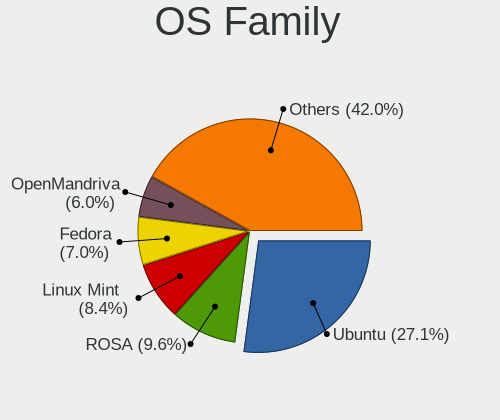
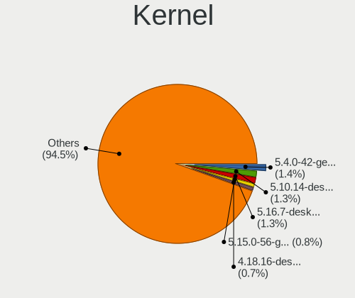
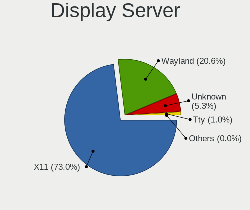
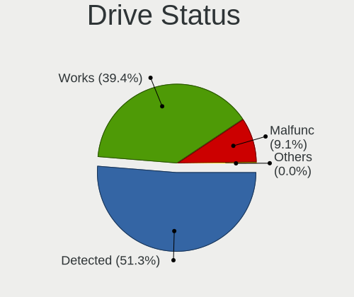
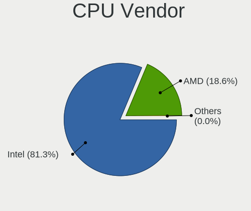

Linux - Tested Hardware & Statistics (Notebooks)
------------------------------------------------

A project to collect tested hardware configurations for Linux.

Anyone can contribute to this report by the [hw-probe](https://github.com/linuxhw/hw-probe) tool:

    sudo -E hw-probe -all -upload

Please contribute! Especially if your hardware is rare.

This report is for real hardware. Report for virtual hardware: [TestCoverage_VE](https://github.com/linuxhw/TestCoverage_VE)

Contents
--------

* [ Test Cases ](#test-cases)

* [ System ](#system)
  - [ OS                       ](#os)
  - [ OS Family                ](#os-family)
  - [ Kernel                   ](#kernel)
  - [ Kernel Family            ](#kernel-family)
  - [ Kernel Major Ver.        ](#kernel-major-ver)
  - [ Arch                     ](#arch)
  - [ DE                       ](#de)
  - [ Display Server           ](#display-server)
  - [ Display Manager          ](#display-manager)
  - [ OS Lang                  ](#os-lang)
  - [ Boot Mode                ](#boot-mode)
  - [ Filesystem               ](#filesystem)
  - [ Part. scheme             ](#part-scheme)
  - [ Dual Boot with Linux/BSD ](#dual-boot-with-linuxbsd)
  - [ Dual Boot (Win)          ](#dual-boot-win)

* [ Board ](#board)
  - [ Vendor                   ](#vendor)
  - [ Model                    ](#model)
  - [ Model Family             ](#model-family)
  - [ MFG Year                 ](#mfg-year)
  - [ Form Factor              ](#form-factor)
  - [ Secure Boot              ](#secure-boot)
  - [ Coreboot                 ](#coreboot)
  - [ RAM Size                 ](#ram-size)
  - [ RAM Used                 ](#ram-used)
  - [ Total Drives             ](#total-drives)
  - [ Has CD-ROM               ](#has-cd-rom)
  - [ Has Ethernet             ](#has-ethernet)
  - [ Has WiFi                 ](#has-wifi)
  - [ Has Bluetooth            ](#has-bluetooth)

* [ Location ](#location)
  - [ Country                  ](#country)
  - [ City                     ](#city)

* [ Drives ](#drives)
  - [ Drive Vendor             ](#drive-vendor)
  - [ Drive Model              ](#drive-model)
  - [ HDD Vendor               ](#hdd-vendor)
  - [ SSD Vendor               ](#ssd-vendor)
  - [ Drive Kind               ](#drive-kind)
  - [ Drive Connector          ](#drive-connector)
  - [ Drive Size               ](#drive-size)
  - [ Space Total              ](#space-total)
  - [ Space Used               ](#space-used)
  - [ Malfunc. Drives          ](#malfunc-drives)
  - [ Malfunc. Drive Vendor    ](#malfunc-drive-vendor)
  - [ Malfunc. HDD Vendor      ](#malfunc-hdd-vendor)
  - [ Malfunc. Drive Kind      ](#malfunc-drive-kind)
  - [ Failed Drives            ](#failed-drives)
  - [ Failed Drive Vendor      ](#failed-drive-vendor)
  - [ Drive Status             ](#drive-status)

* [ Storage controller ](#storage-controller)
  - [ Storage Vendor           ](#storage-vendor)
  - [ Storage Model            ](#storage-model)
  - [ Storage Kind             ](#storage-kind)

* [ Processor ](#processor)
  - [ CPU Vendor               ](#cpu-vendor)
  - [ CPU Model                ](#cpu-model)
  - [ CPU Model Family         ](#cpu-model-family)
  - [ CPU Cores                ](#cpu-cores)
  - [ CPU Sockets              ](#cpu-sockets)
  - [ CPU Threads              ](#cpu-threads)
  - [ CPU Op-Modes             ](#cpu-op-modes)
  - [ CPU Microcode            ](#cpu-microcode)
  - [ CPU Microarch            ](#cpu-microarch)

* [ Graphics ](#graphics)
  - [ GPU Vendor               ](#gpu-vendor)
  - [ GPU Model                ](#gpu-model)
  - [ GPU Combo                ](#gpu-combo)
  - [ GPU Driver               ](#gpu-driver)
  - [ GPU Memory               ](#gpu-memory)

* [ Monitor ](#monitor)
  - [ Monitor Vendor           ](#monitor-vendor)
  - [ Monitor Model            ](#monitor-model)
  - [ Monitor Resolution       ](#monitor-resolution)
  - [ Monitor Diagonal         ](#monitor-diagonal)
  - [ Monitor Width            ](#monitor-width)
  - [ Aspect Ratio             ](#aspect-ratio)
  - [ Monitor Area             ](#monitor-area)
  - [ Pixel Density            ](#pixel-density)
  - [ Multiple Monitors        ](#multiple-monitors)

* [ Network ](#network)
  - [ Net Controller Vendor    ](#net-controller-vendor)
  - [ Net Controller Model     ](#net-controller-model)
  - [ Wireless Vendor          ](#wireless-vendor)
  - [ Wireless Model           ](#wireless-model)
  - [ Ethernet Vendor          ](#ethernet-vendor)
  - [ Ethernet Model           ](#ethernet-model)
  - [ Net Controller Kind      ](#net-controller-kind)
  - [ Used Controller          ](#used-controller)
  - [ NICs                     ](#nics)
  - [ IPv6                     ](#ipv6)

* [ Bluetooth ](#bluetooth)
  - [ Bluetooth Vendor         ](#bluetooth-vendor)
  - [ Bluetooth Model          ](#bluetooth-model)

* [ Sound ](#sound)
  - [ Sound Vendor             ](#sound-vendor)
  - [ Sound Model              ](#sound-model)

* [ Memory ](#memory)
  - [ Memory Vendor            ](#memory-vendor)
  - [ Memory Model             ](#memory-model)
  - [ Memory Kind              ](#memory-kind)
  - [ Memory Form Factor       ](#memory-form-factor)
  - [ Memory Size              ](#memory-size)
  - [ Memory Speed             ](#memory-speed)

* [ Printers & scanners ](#printers--scanners)
  - [ Printer Vendor           ](#printer-vendor)
  - [ Printer Model            ](#printer-model)
  - [ Scanner Vendor           ](#scanner-vendor)
  - [ Scanner Model            ](#scanner-model)

* [ Camera ](#camera)
  - [ Camera Vendor            ](#camera-vendor)
  - [ Camera Model             ](#camera-model)

* [ Security ](#security)
  - [ Fingerprint Vendor       ](#fingerprint-vendor)
  - [ Fingerprint Model        ](#fingerprint-model)
  - [ Chipcard Vendor          ](#chipcard-vendor)
  - [ Chipcard Model           ](#chipcard-model)

* [ Unsupported ](#unsupported)
  - [ Unsupported Devices      ](#unsupported-devices)
  - [ Unsupported Device Types ](#unsupported-device-types)

Test Cases
----------

Total: 141113

| Vendor        | Model                       | Probe                                                      | Date         |
|---------------|-----------------------------|------------------------------------------------------------|--------------|
| Gigabyte      | X570S AORUS PRO AX          | [253135f8dc](https://linux-hardware.org/?probe=253135f8dc) | Dec 01, 2022 |
| Valve         | Jupiter                     | [1fdf6ffce7](https://linux-hardware.org/?probe=1fdf6ffce7) | Dec 01, 2022 |
| Acer          | Aspire V3-571G              | [bbb0c707bb](https://linux-hardware.org/?probe=bbb0c707bb) | Dec 01, 2022 |
| MSI           | GL62M 7RE                   | [5fcb394edb](https://linux-hardware.org/?probe=5fcb394edb) | Dec 01, 2022 |
| HP            | Laptop 15-dw1xxx            | [d8d5459ad6](https://linux-hardware.org/?probe=d8d5459ad6) | Dec 01, 2022 |
| Valve         | Jupiter                     | [ec26a28bff](https://linux-hardware.org/?probe=ec26a28bff) | Dec 01, 2022 |
| HP            | Stream Laptop 14-cb1XX      | [e8ecfcc3cd](https://linux-hardware.org/?probe=e8ecfcc3cd) | Dec 01, 2022 |
| MSI           | GF72 8RD                    | [c03f783ea5](https://linux-hardware.org/?probe=c03f783ea5) | Dec 01, 2022 |
| AZW           | SEi                         | [3cd2f7f657](https://linux-hardware.org/?probe=3cd2f7f657) | Dec 01, 2022 |
| Lenovo        | ThinkPad T470p 20J60018M... | [994d8e4b1d](https://linux-hardware.org/?probe=994d8e4b1d) | Dec 01, 2022 |
| HP            | Stream Laptop 14-cb1XX      | [80c9d45a14](https://linux-hardware.org/?probe=80c9d45a14) | Dec 01, 2022 |
| Packard Be... | DOT S                       | [bb05d9a173](https://linux-hardware.org/?probe=bb05d9a173) | Dec 01, 2022 |
| HP            | Laptop 15-dw1xxx            | [1dddd99280](https://linux-hardware.org/?probe=1dddd99280) | Dec 01, 2022 |
| Acer          | Aspire V3-771               | [38dfcb79d5](https://linux-hardware.org/?probe=38dfcb79d5) | Dec 01, 2022 |
| Lenovo        | IdeaPad Gaming 3 15IAH7 ... | [fe9e8854c5](https://linux-hardware.org/?probe=fe9e8854c5) | Dec 01, 2022 |
| Acer          | Aspire V5-121               | [473cfb46f7](https://linux-hardware.org/?probe=473cfb46f7) | Dec 01, 2022 |
| Samsung       | R540/R538/SA41/E452         | [afad3c8828](https://linux-hardware.org/?probe=afad3c8828) | Dec 01, 2022 |
| MSI           | GV72 7RE                    | [74b317d501](https://linux-hardware.org/?probe=74b317d501) | Dec 01, 2022 |
| Acer          | Aspire 3830TG               | [8bb246cbaa](https://linux-hardware.org/?probe=8bb246cbaa) | Dec 01, 2022 |
| Lenovo        | ThinkPad T440p 20AN0079M... | [79261239c1](https://linux-hardware.org/?probe=79261239c1) | Dec 01, 2022 |
| HP            | 250 G7 Notebook PC          | [1002df8858](https://linux-hardware.org/?probe=1002df8858) | Dec 01, 2022 |
| Acer          | Aspire 3830TG               | [46bcb20e26](https://linux-hardware.org/?probe=46bcb20e26) | Dec 01, 2022 |
| HP            | Pavilion g6                 | [cb93839085](https://linux-hardware.org/?probe=cb93839085) | Dec 01, 2022 |
| Lenovo        | ThinkBook 15 G3 ACL 21A4    | [d57de89542](https://linux-hardware.org/?probe=d57de89542) | Dec 01, 2022 |
| Lenovo        | Legion S7 15ACH6 82K8       | [4ab89a8ad2](https://linux-hardware.org/?probe=4ab89a8ad2) | Dec 01, 2022 |
| HP            | Pavilion dv8000 (ET839UA... | [5b22a7d584](https://linux-hardware.org/?probe=5b22a7d584) | Dec 01, 2022 |
| Lenovo        | IdeaPad Gaming 3 15IAH7 ... | [562e1f4b92](https://linux-hardware.org/?probe=562e1f4b92) | Dec 01, 2022 |
| Dell          | Latitude E5450              | [305bf364f6](https://linux-hardware.org/?probe=305bf364f6) | Dec 01, 2022 |
| ASUSTek       | ASUS BR1100CKA BR1100CKA... | [aa9ad07031](https://linux-hardware.org/?probe=aa9ad07031) | Dec 01, 2022 |
| ASUSTek       | Zephyrus M GU502GV_GU502... | [de34f148b9](https://linux-hardware.org/?probe=de34f148b9) | Dec 01, 2022 |
| Positivo B... | VJFE53F11X-B0511H           | [24b1be97d6](https://linux-hardware.org/?probe=24b1be97d6) | Dec 01, 2022 |
| TUXEDO        | N13xWU                      | [55935f091d](https://linux-hardware.org/?probe=55935f091d) | Dec 01, 2022 |
| Positivo B... | VJFE53F11X-B0511H           | [a2e91cba31](https://linux-hardware.org/?probe=a2e91cba31) | Dec 01, 2022 |
| Lenovo        | IdeaPad 3 15ALC6 82MF       | [c8ef49d294](https://linux-hardware.org/?probe=c8ef49d294) | Dec 01, 2022 |
| Dell          | XPS 13 9300                 | [d6c50b1786](https://linux-hardware.org/?probe=d6c50b1786) | Dec 01, 2022 |
| Lenovo        | ThinkBook 15 G3 ACL 21A4    | [9d27bb4f90](https://linux-hardware.org/?probe=9d27bb4f90) | Dec 01, 2022 |
| Lenovo        | ThinkPad E15 Gen 4 21EES... | [674157de54](https://linux-hardware.org/?probe=674157de54) | Dec 01, 2022 |
| MSI           | GS75 Stealth 8SG            | [70be467762](https://linux-hardware.org/?probe=70be467762) | Dec 01, 2022 |
| HP            | Notebook                    | [7c22b96a9a](https://linux-hardware.org/?probe=7c22b96a9a) | Dec 01, 2022 |
| Dell          | Latitude E5570              | [4db5cd2ef4](https://linux-hardware.org/?probe=4db5cd2ef4) | Dec 01, 2022 |
| Dell          | Latitude E5450              | [2b934a729c](https://linux-hardware.org/?probe=2b934a729c) | Dec 01, 2022 |
| THUNDEROBO... | 911MT                       | [40111c09eb](https://linux-hardware.org/?probe=40111c09eb) | Dec 01, 2022 |
| Sony          | VPCEB1M1E                   | [988c78f70d](https://linux-hardware.org/?probe=988c78f70d) | Dec 01, 2022 |
| Lenovo        | IdeaPad 3 15ALC6 82KU       | [f9020b8dc6](https://linux-hardware.org/?probe=f9020b8dc6) | Dec 01, 2022 |
| Lenovo        | IdeaPad 100-15IBD 80QQ      | [929550dc41](https://linux-hardware.org/?probe=929550dc41) | Dec 01, 2022 |
| Samsung       | 930XED                      | [38584fa129](https://linux-hardware.org/?probe=38584fa129) | Dec 01, 2022 |
| Lenovo        | ThinkPad T420 4236V6S       | [5900d34c9a](https://linux-hardware.org/?probe=5900d34c9a) | Dec 01, 2022 |
| Dell          | XPS 13 9343                 | [125fcd77b9](https://linux-hardware.org/?probe=125fcd77b9) | Dec 01, 2022 |
| Dell          | Precision 5540              | [030dbd45f0](https://linux-hardware.org/?probe=030dbd45f0) | Dec 01, 2022 |
| Lenovo        | ThinkPad L560 20F10034MX    | [34842eb8d9](https://linux-hardware.org/?probe=34842eb8d9) | Dec 01, 2022 |
| TUXEDO        | InfinityBook Pro 14 Gen6    | [946e66e35e](https://linux-hardware.org/?probe=946e66e35e) | Dec 01, 2022 |
| HP            | EliteBook 8730w             | [fa27703043](https://linux-hardware.org/?probe=fa27703043) | Dec 01, 2022 |
| Mediacom      | SmartBook 14 FullHD - SB... | [1df1f552ff](https://linux-hardware.org/?probe=1df1f552ff) | Dec 01, 2022 |
| HUAWEI        | MACH-WX9                    | [a37f48c68a](https://linux-hardware.org/?probe=a37f48c68a) | Dec 01, 2022 |
| Lenovo        | B40-70 20392                | [a527c5b6e6](https://linux-hardware.org/?probe=a527c5b6e6) | Dec 01, 2022 |
| Dell          | Inspiron 3501               | [f9379c4ffb](https://linux-hardware.org/?probe=f9379c4ffb) | Dec 01, 2022 |
| Lenovo        | V330-15IKB 81AX             | [becc2328fd](https://linux-hardware.org/?probe=becc2328fd) | Dec 01, 2022 |
| Lenovo        | Legion 5 15ACH6H 82JU       | [2cf7f9ab67](https://linux-hardware.org/?probe=2cf7f9ab67) | Dec 01, 2022 |
| MSI           | GF63 Thin 9SC               | [057b0039b7](https://linux-hardware.org/?probe=057b0039b7) | Dec 01, 2022 |
| Dell          | XPS 15 9560                 | [3ee313dd51](https://linux-hardware.org/?probe=3ee313dd51) | Dec 01, 2022 |
| Acer          | Aspire E1-570G              | [b41442c5a1](https://linux-hardware.org/?probe=b41442c5a1) | Dec 01, 2022 |
| Dell          | XPS 15 9560                 | [fde8194d5c](https://linux-hardware.org/?probe=fde8194d5c) | Dec 01, 2022 |
| Lenovo        | IdeaPad S340-14API 81NB     | [a8156db955](https://linux-hardware.org/?probe=a8156db955) | Dec 01, 2022 |
| ASUSTek       | ASUS TUF Dash F15 FX516P... | [0128a48982](https://linux-hardware.org/?probe=0128a48982) | Dec 01, 2022 |
| Lenovo        | Legion Y530-15ICH 81FV      | [615b292682](https://linux-hardware.org/?probe=615b292682) | Dec 01, 2022 |
| Acer          | Aspire 5750G                | [a8236e24a5](https://linux-hardware.org/?probe=a8236e24a5) | Dec 01, 2022 |
| HP            | Pavilion dv7                | [aa6cdce8f8](https://linux-hardware.org/?probe=aa6cdce8f8) | Dec 01, 2022 |
| Lenovo        | IdeaPad 5 Pro 14ACN6 82L... | [5955142015](https://linux-hardware.org/?probe=5955142015) | Dec 01, 2022 |
| Acer          | TravelMate P614-51T-G2      | [952e89e25d](https://linux-hardware.org/?probe=952e89e25d) | Dec 01, 2022 |
| HP            | ENVY dv7                    | [1cef09f19a](https://linux-hardware.org/?probe=1cef09f19a) | Dec 01, 2022 |
| ASUSTek       | S551LN                      | [b21b106fdf](https://linux-hardware.org/?probe=b21b106fdf) | Dec 01, 2022 |
| HP            | OMEN by Laptop 16-b1xxx     | [0cd3005f69](https://linux-hardware.org/?probe=0cd3005f69) | Dec 01, 2022 |
| Samsung       | 550XED                      | [d8894f602a](https://linux-hardware.org/?probe=d8894f602a) | Dec 01, 2022 |
| HP            | ProBook 440 G7              | [a54a325001](https://linux-hardware.org/?probe=a54a325001) | Dec 01, 2022 |
| Dell          | Latitude E7470              | [457187e169](https://linux-hardware.org/?probe=457187e169) | Dec 01, 2022 |
| ASUSTek       | GL503VM                     | [dbd4aba670](https://linux-hardware.org/?probe=dbd4aba670) | Dec 01, 2022 |
| ASUSTek       | VivoBook_ASUSLaptop E410... | [62ae8cb7dc](https://linux-hardware.org/?probe=62ae8cb7dc) | Dec 01, 2022 |
| Acer          | Aspire 5750G                | [198d7f2534](https://linux-hardware.org/?probe=198d7f2534) | Dec 01, 2022 |
| Samsung       | 355V4C/356V4C/3445VC/354... | [65fa0de0a2](https://linux-hardware.org/?probe=65fa0de0a2) | Dec 01, 2022 |
| ASUSTek       | GL503VM                     | [3db38d22b3](https://linux-hardware.org/?probe=3db38d22b3) | Dec 01, 2022 |
| Lenovo        | Legion 5 Pro 16ACH6H 82J... | [794fbb64f9](https://linux-hardware.org/?probe=794fbb64f9) | Dec 01, 2022 |
| Lenovo        | ThinkPad T480S 20L8SBTD0... | [2d4a014ef1](https://linux-hardware.org/?probe=2d4a014ef1) | Dec 01, 2022 |
| Acer          | Aspire xxxx                 | [320d58f6f1](https://linux-hardware.org/?probe=320d58f6f1) | Dec 01, 2022 |
| Dell          | Latitude E7240              | [0945377dfb](https://linux-hardware.org/?probe=0945377dfb) | Dec 01, 2022 |
| In-Sing       | NK81J                       | [bca0a3709f](https://linux-hardware.org/?probe=bca0a3709f) | Dec 01, 2022 |
| Acer          | Aspire 5336                 | [65be105c02](https://linux-hardware.org/?probe=65be105c02) | Dec 01, 2022 |
| Unknown       | Unknown                     | [dceef2a9d5](https://linux-hardware.org/?probe=dceef2a9d5) | Dec 01, 2022 |
| HP            | Stream Laptop 11-ak0xxx     | [d2c04dd7cd](https://linux-hardware.org/?probe=d2c04dd7cd) | Dec 01, 2022 |
| Dell          | Latitude E7470              | [b24884fe44](https://linux-hardware.org/?probe=b24884fe44) | Dec 01, 2022 |
| Lenovo        | ThinkPad X13 Gen 1 20UFC... | [cccb2da575](https://linux-hardware.org/?probe=cccb2da575) | Dec 01, 2022 |
| Lenovo        | ThinkPad T480S 20L8SBTD0... | [e1cec664eb](https://linux-hardware.org/?probe=e1cec664eb) | Dec 01, 2022 |
| HP            | Pavilion dv8000 (ET839UA... | [19c2f41d14](https://linux-hardware.org/?probe=19c2f41d14) | Dec 01, 2022 |
| HP            | EliteBook 820 G3            | [d313455fa8](https://linux-hardware.org/?probe=d313455fa8) | Dec 01, 2022 |
| Lenovo        | ThinkPad T430s 2355C33      | [aff020417f](https://linux-hardware.org/?probe=aff020417f) | Dec 01, 2022 |
| ASUSTek       | K52F                        | [63c08600c3](https://linux-hardware.org/?probe=63c08600c3) | Dec 01, 2022 |
| MSI           | GL65 Leopard 10SDR          | [73c388fb61](https://linux-hardware.org/?probe=73c388fb61) | Dec 01, 2022 |
| HP            | EliteBook 820 G3            | [31b9efe771](https://linux-hardware.org/?probe=31b9efe771) | Dec 01, 2022 |
| MSI           | GL65 Leopard 10SDR          | [6d44ef56c9](https://linux-hardware.org/?probe=6d44ef56c9) | Dec 01, 2022 |
| ASUSTek       | K52F                        | [4276cc2cb9](https://linux-hardware.org/?probe=4276cc2cb9) | Dec 01, 2022 |
| Dell          | Vostro 3480                 | [bf353a87c5](https://linux-hardware.org/?probe=bf353a87c5) | Dec 01, 2022 |
| K.A.Techno... | TM1                         | [96c2b9969f](https://linux-hardware.org/?probe=96c2b9969f) | Dec 01, 2022 |
| Apple         | MacBookPro11,4              | [138689463a](https://linux-hardware.org/?probe=138689463a) | Dec 01, 2022 |
| Lenovo        | ThinkPad X13 Gen 2a 20XH... | [f0ee9f78bd](https://linux-hardware.org/?probe=f0ee9f78bd) | Dec 01, 2022 |
| HP            | ProBook 450 G2              | [552ac907a0](https://linux-hardware.org/?probe=552ac907a0) | Dec 01, 2022 |
| GPU Compan... | GWTC116-2                   | [d004be9ab6](https://linux-hardware.org/?probe=d004be9ab6) | Dec 01, 2022 |
| Apple         | MacBookPro11,4              | [16d0cef78c](https://linux-hardware.org/?probe=16d0cef78c) | Dec 01, 2022 |
| Dell          | Inspiron 13-5378            | [9d25b2f6e0](https://linux-hardware.org/?probe=9d25b2f6e0) | Dec 01, 2022 |
| W271ELQ       | Unknown                     | [ae170d1e81](https://linux-hardware.org/?probe=ae170d1e81) | Dec 01, 2022 |
| Apple         | MacBook6,1                  | [b8145a2349](https://linux-hardware.org/?probe=b8145a2349) | Dec 01, 2022 |
| ASUSTek       | K55VD                       | [149d517fa5](https://linux-hardware.org/?probe=149d517fa5) | Dec 01, 2022 |
| Lenovo        | ThinkPad L560 20F2S2UR02    | [29c5e0f7b1](https://linux-hardware.org/?probe=29c5e0f7b1) | Dec 01, 2022 |
| Dell          | Vostro 3578                 | [89161c2dee](https://linux-hardware.org/?probe=89161c2dee) | Dec 01, 2022 |
| Dell          | XPS 13 9310                 | [aadf1c39a0](https://linux-hardware.org/?probe=aadf1c39a0) | Dec 01, 2022 |
| HP            | EliteBook 8570w             | [a4ae0cdd6a](https://linux-hardware.org/?probe=a4ae0cdd6a) | Dec 01, 2022 |
| THUNDEROBO... | 911MT                       | [cdd03a3498](https://linux-hardware.org/?probe=cdd03a3498) | Dec 01, 2022 |
| Lenovo        | 3000 V100 076346G           | [bb04272723](https://linux-hardware.org/?probe=bb04272723) | Dec 01, 2022 |
| Acer          | Aspire 5741G                | [0a336099ba](https://linux-hardware.org/?probe=0a336099ba) | Dec 01, 2022 |
| Lenovo        | B450 1S1680033610187        | [e33670a27b](https://linux-hardware.org/?probe=e33670a27b) | Nov 30, 2022 |
| Google        | Cyan                        | [4aa7125981](https://linux-hardware.org/?probe=4aa7125981) | Nov 30, 2022 |
| Acer          | Aspire A315-21              | [7c3a371165](https://linux-hardware.org/?probe=7c3a371165) | Nov 30, 2022 |
| Dell          | Inspiron MM061              | [703ef1c899](https://linux-hardware.org/?probe=703ef1c899) | Nov 30, 2022 |
| HP            | 255 G4                      | [33b2fb7f31](https://linux-hardware.org/?probe=33b2fb7f31) | Nov 30, 2022 |
| HUAWEI        | KLVL-WXX9                   | [ea8b9066f6](https://linux-hardware.org/?probe=ea8b9066f6) | Nov 30, 2022 |
| Acer          | Aspire A315-21              | [5f14327a56](https://linux-hardware.org/?probe=5f14327a56) | Nov 30, 2022 |
| THUNDEROBO... | 911MT                       | [2731961e4c](https://linux-hardware.org/?probe=2731961e4c) | Nov 30, 2022 |
| Lenovo        | ThinkPad E15 Gen 2 20TDS... | [9bd70d2025](https://linux-hardware.org/?probe=9bd70d2025) | Nov 30, 2022 |
| Samsung       | 300E4A/300E5A/300E7A/343... | [5f53eff4a6](https://linux-hardware.org/?probe=5f53eff4a6) | Nov 30, 2022 |
| HUAWEI        | CREM-WXX9                   | [2436f4cf5e](https://linux-hardware.org/?probe=2436f4cf5e) | Nov 30, 2022 |
| MSI           | GE72 6QC                    | [ba4847397e](https://linux-hardware.org/?probe=ba4847397e) | Nov 30, 2022 |
| Lenovo        | ThinkPad X220 4291WSH       | [3e67e44d23](https://linux-hardware.org/?probe=3e67e44d23) | Nov 30, 2022 |
| Dell          | Inspiron 15-3567            | [eff3d877bc](https://linux-hardware.org/?probe=eff3d877bc) | Nov 30, 2022 |
| Pegatron      | C15B                        | [defacd8748](https://linux-hardware.org/?probe=defacd8748) | Nov 30, 2022 |
| Lenovo        | ThinkPad X270 20HNS03B00    | [bd40de3011](https://linux-hardware.org/?probe=bd40de3011) | Nov 30, 2022 |
| Lenovo        | ThinkPad E15 Gen 2 20TDS... | [bd0ca3e793](https://linux-hardware.org/?probe=bd0ca3e793) | Nov 30, 2022 |
| Lenovo        | ThinkPad P14s Gen 2a 21A... | [258c074e40](https://linux-hardware.org/?probe=258c074e40) | Nov 30, 2022 |
| Lenovo        | ThinkPad T530 24297ZG       | [422f84a794](https://linux-hardware.org/?probe=422f84a794) | Nov 30, 2022 |
| Lenovo        | IdeaPad 310-15IAP 80TT      | [3aa3302b92](https://linux-hardware.org/?probe=3aa3302b92) | Nov 30, 2022 |
| Dell          | Latitude E5520              | [92a4c9b5ef](https://linux-hardware.org/?probe=92a4c9b5ef) | Nov 30, 2022 |
| Pegatron      | C15B                        | [92271ab582](https://linux-hardware.org/?probe=92271ab582) | Nov 30, 2022 |
| Lenovo        | ThinkPad X1 Carbon Gen 1... | [0aa3ec7616](https://linux-hardware.org/?probe=0aa3ec7616) | Nov 30, 2022 |
| HP            | ElitePad 1000 G2            | [0b05465735](https://linux-hardware.org/?probe=0b05465735) | Nov 30, 2022 |
| Sony          | VPCEB4L9E                   | [cad7ef5059](https://linux-hardware.org/?probe=cad7ef5059) | Nov 30, 2022 |
| HP            | Pavilion dv5                | [0fc7017b0c](https://linux-hardware.org/?probe=0fc7017b0c) | Nov 30, 2022 |
| Acer          | Aspire A315-34              | [6bf371252b](https://linux-hardware.org/?probe=6bf371252b) | Nov 30, 2022 |
| HP            | EliteBook 840 G3            | [e17d8c1694](https://linux-hardware.org/?probe=e17d8c1694) | Nov 30, 2022 |
| HUAWEI        | NBLK-WAX9X                  | [183243daeb](https://linux-hardware.org/?probe=183243daeb) | Nov 30, 2022 |
| Unknown       | Unknown                     | [9964cb6fe2](https://linux-hardware.org/?probe=9964cb6fe2) | Nov 30, 2022 |
| Dell          | Studio 1558                 | [cf40788ef8](https://linux-hardware.org/?probe=cf40788ef8) | Nov 30, 2022 |
| Samsung       | 300E5K/300E5Q               | [f6bb652f5a](https://linux-hardware.org/?probe=f6bb652f5a) | Nov 30, 2022 |
| Toshiba       | TECRA S11                   | [3d2414e47b](https://linux-hardware.org/?probe=3d2414e47b) | Nov 30, 2022 |
| HP            | ZBook 14 G2                 | [b2bba919b2](https://linux-hardware.org/?probe=b2bba919b2) | Nov 30, 2022 |
| Lenovo        | ThinkPad P14s Gen 2a 21A... | [29ec19d38e](https://linux-hardware.org/?probe=29ec19d38e) | Nov 30, 2022 |
| Samsung       | 550XDA                      | [7614fde301](https://linux-hardware.org/?probe=7614fde301) | Nov 30, 2022 |
| ASUSTek       | K53SC                       | [6d21dd6cea](https://linux-hardware.org/?probe=6d21dd6cea) | Nov 30, 2022 |
| ASUSTek       | E203NAH                     | [3d091ea214](https://linux-hardware.org/?probe=3d091ea214) | Nov 30, 2022 |
| Lenovo        | IdeaPad Gaming 3 15ARH05... | [65c3211b0a](https://linux-hardware.org/?probe=65c3211b0a) | Nov 30, 2022 |
| Lenovo        | ThinkPad P1 Gen 3 20TJS5... | [2df1670891](https://linux-hardware.org/?probe=2df1670891) | Nov 30, 2022 |
| HP            | Pavilion dv9000 (RP919EA... | [dcdd31c3d5](https://linux-hardware.org/?probe=dcdd31c3d5) | Nov 30, 2022 |
| Dell          | Inspiron N5010              | [687aa83749](https://linux-hardware.org/?probe=687aa83749) | Nov 30, 2022 |
| Lenovo        | IdeaPad Gaming 3 15ARH05... | [2a8dbc14ef](https://linux-hardware.org/?probe=2a8dbc14ef) | Nov 30, 2022 |
| GPU Compan... | GWTN156-2BK                 | [1ed3629f61](https://linux-hardware.org/?probe=1ed3629f61) | Nov 30, 2022 |
| Lenovo        | G500 20236                  | [43815283d9](https://linux-hardware.org/?probe=43815283d9) | Nov 30, 2022 |
| Standard      | Unknown                     | [723d9c3551](https://linux-hardware.org/?probe=723d9c3551) | Nov 30, 2022 |
| HUAWEI        | CREM-WXX9                   | [33f7ac03f4](https://linux-hardware.org/?probe=33f7ac03f4) | Nov 30, 2022 |
| Dell          | Inspiron 15-3567            | [ee99c81e47](https://linux-hardware.org/?probe=ee99c81e47) | Nov 30, 2022 |
| Lenovo        | ThinkPad T470s W10DG 20J... | [645418a0dd](https://linux-hardware.org/?probe=645418a0dd) | Nov 30, 2022 |
| ASUSTek       | UX550VD                     | [a3f2aafbf1](https://linux-hardware.org/?probe=a3f2aafbf1) | Nov 30, 2022 |
| Packard Be... | EasyNote TE69CXP            | [919275eb73](https://linux-hardware.org/?probe=919275eb73) | Nov 30, 2022 |
| Lenovo        | ThinkPad X1 Carbon Gen 9... | [b4aeee5799](https://linux-hardware.org/?probe=b4aeee5799) | Nov 30, 2022 |
| Samsung       | 530U3C/530U4C/532U3C        | [d95adc01a7](https://linux-hardware.org/?probe=d95adc01a7) | Nov 30, 2022 |
| HP            | OMEN Laptop 15-en0xxx       | [c3d55f501c](https://linux-hardware.org/?probe=c3d55f501c) | Nov 30, 2022 |
| Lenovo        | IdeaPad Gaming 3 15ARH05... | [89e340c4ec](https://linux-hardware.org/?probe=89e340c4ec) | Nov 30, 2022 |
| HP            | EliteBook 860 16 inch G9... | [dda393ca54](https://linux-hardware.org/?probe=dda393ca54) | Nov 30, 2022 |
| Dell          | XPS 15 9500                 | [42971a8394](https://linux-hardware.org/?probe=42971a8394) | Nov 30, 2022 |
| Haier         | A1420EM                     | [6f18b3c1ce](https://linux-hardware.org/?probe=6f18b3c1ce) | Nov 30, 2022 |
| Dell          | Latitude 7390               | [7214cac96d](https://linux-hardware.org/?probe=7214cac96d) | Nov 30, 2022 |
| Dell          | XPS 15 9500                 | [f9215967d3](https://linux-hardware.org/?probe=f9215967d3) | Nov 30, 2022 |
| HP            | ProBook 450 G6              | [c9e94d483e](https://linux-hardware.org/?probe=c9e94d483e) | Nov 30, 2022 |
| Notebook      | RIM2520                     | [5f66abbb8b](https://linux-hardware.org/?probe=5f66abbb8b) | Nov 30, 2022 |
| ASUSTek       | ASUS TUF Gaming A15 FA50... | [66b6e49eb5](https://linux-hardware.org/?probe=66b6e49eb5) | Nov 30, 2022 |
| HP            | OMEN by Laptop 16-b1xxx     | [32b68762df](https://linux-hardware.org/?probe=32b68762df) | Nov 30, 2022 |
| HP            | EliteBook Revolve 810 G3    | [ca043cff45](https://linux-hardware.org/?probe=ca043cff45) | Nov 30, 2022 |
| Lenovo        | ThinkPad T470p 20J7S1FR0... | [517347d2cf](https://linux-hardware.org/?probe=517347d2cf) | Nov 30, 2022 |
| Lenovo        | Y520-15IKBN 80WK            | [b245f9da58](https://linux-hardware.org/?probe=b245f9da58) | Nov 30, 2022 |
| Dell          | G15 5511                    | [d2c2cb8454](https://linux-hardware.org/?probe=d2c2cb8454) | Nov 30, 2022 |
| HP            | ZBook 15v G5                | [aabc35ae2a](https://linux-hardware.org/?probe=aabc35ae2a) | Nov 30, 2022 |
| Acer          | Nitro AN515-43              | [b315e85bda](https://linux-hardware.org/?probe=b315e85bda) | Nov 30, 2022 |
| Lenovo        | Legion 5 15ACH6H 82JU       | [944ace565b](https://linux-hardware.org/?probe=944ace565b) | Nov 30, 2022 |
| HP            | Notebook                    | [afac08b852](https://linux-hardware.org/?probe=afac08b852) | Nov 30, 2022 |
| Dell          | Inspiron 3558               | [481755baa3](https://linux-hardware.org/?probe=481755baa3) | Nov 30, 2022 |
| Dell          | Latitude E6440              | [0c3dd709dd](https://linux-hardware.org/?probe=0c3dd709dd) | Nov 30, 2022 |
| MSI           | Modern 14 B5M               | [8277ece293](https://linux-hardware.org/?probe=8277ece293) | Nov 30, 2022 |
| Dell          | G15 5511                    | [f9e456efd0](https://linux-hardware.org/?probe=f9e456efd0) | Nov 30, 2022 |
| ASUSTek       | VivoBook_ASUSLaptop E410... | [9505f905e8](https://linux-hardware.org/?probe=9505f905e8) | Nov 30, 2022 |
| Samsung       | 300E4A/300E5A/300E7A/343... | [aadb9ff1d4](https://linux-hardware.org/?probe=aadb9ff1d4) | Nov 30, 2022 |
| ASUSTek       | N550JV                      | [c39c35ea09](https://linux-hardware.org/?probe=c39c35ea09) | Nov 30, 2022 |
| Dell          | Latitude E6530              | [c90145516a](https://linux-hardware.org/?probe=c90145516a) | Nov 30, 2022 |
| Acer          | E1-510                      | [8aadf699f9](https://linux-hardware.org/?probe=8aadf699f9) | Nov 30, 2022 |
| HP            | Laptop 14-dk1xxx            | [9dbd54884d](https://linux-hardware.org/?probe=9dbd54884d) | Nov 30, 2022 |
| Acer          | Aspire E5-575G              | [1ca5144296](https://linux-hardware.org/?probe=1ca5144296) | Nov 30, 2022 |
| PCBOX-H       | BayTrail                    | [81eca2f60e](https://linux-hardware.org/?probe=81eca2f60e) | Nov 30, 2022 |
| PCBOX-H       | BayTrail                    | [5841aa11f1](https://linux-hardware.org/?probe=5841aa11f1) | Nov 30, 2022 |
| Dell          | Inspiron N4050              | [7b0cf2fa20](https://linux-hardware.org/?probe=7b0cf2fa20) | Nov 30, 2022 |
| ASUSTek       | VivoBook_ASUSLaptop X140... | [55d95654c4](https://linux-hardware.org/?probe=55d95654c4) | Nov 30, 2022 |
| Notebook      | NJx0MU                      | [d53007b0b3](https://linux-hardware.org/?probe=d53007b0b3) | Nov 30, 2022 |
| Acer          | Aspire E5-575               | [b393262562](https://linux-hardware.org/?probe=b393262562) | Nov 30, 2022 |
| ASUSTek       | E403SA                      | [d3a1f181d5](https://linux-hardware.org/?probe=d3a1f181d5) | Nov 30, 2022 |
| Philco        | 14H                         | [8d29065667](https://linux-hardware.org/?probe=8d29065667) | Nov 30, 2022 |
| Lenovo        | ThinkBook 14s-IWL 20RM      | [d77cb5ebb0](https://linux-hardware.org/?probe=d77cb5ebb0) | Nov 30, 2022 |
| HP            | Pavilion g6                 | [c552ca011c](https://linux-hardware.org/?probe=c552ca011c) | Nov 30, 2022 |
| Positivo      | i500pro                     | [4a79aa2383](https://linux-hardware.org/?probe=4a79aa2383) | Nov 30, 2022 |
| Dell          | Inspiron 15-3552            | [e740b148c1](https://linux-hardware.org/?probe=e740b148c1) | Nov 30, 2022 |
| Lenovo        | Legion 5 17ACH6H 82JY       | [f5f86becf7](https://linux-hardware.org/?probe=f5f86becf7) | Nov 30, 2022 |
| MSI           | GE75 Raider 10SE            | [88245a0df3](https://linux-hardware.org/?probe=88245a0df3) | Nov 30, 2022 |
| Dell          | Inspiron 3580               | [6bc2705d99](https://linux-hardware.org/?probe=6bc2705d99) | Nov 30, 2022 |
| Apple         | MacBook4,1                  | [0866a64897](https://linux-hardware.org/?probe=0866a64897) | Nov 30, 2022 |
| Lenovo        | IdeaPad S145-15API 81V7     | [53ee9a8fb9](https://linux-hardware.org/?probe=53ee9a8fb9) | Nov 30, 2022 |
| HP            | Laptop 15s-fq4xxx           | [19b00c186f](https://linux-hardware.org/?probe=19b00c186f) | Nov 30, 2022 |
| HP            | Laptop 15s-fq4xxx           | [18ec3bc77e](https://linux-hardware.org/?probe=18ec3bc77e) | Nov 30, 2022 |
| GPU Compan... | GWTN156-2BK                 | [dbba08e68e](https://linux-hardware.org/?probe=dbba08e68e) | Nov 30, 2022 |
| HP            | Laptop 14s-dk0xxx           | [c1d2a02024](https://linux-hardware.org/?probe=c1d2a02024) | Nov 30, 2022 |
| Lenovo        | ThinkPad T480 20L6S01Q3K    | [9fd6308179](https://linux-hardware.org/?probe=9fd6308179) | Nov 30, 2022 |
| HP            | Pavilion 14                 | [dedd30adc4](https://linux-hardware.org/?probe=dedd30adc4) | Nov 30, 2022 |
| HP            | Laptop 14-dq1xxx            | [b12534f13d](https://linux-hardware.org/?probe=b12534f13d) | Nov 30, 2022 |
| Lenovo        | ThinkPad X1 Carbon 6th 2... | [38c4009dba](https://linux-hardware.org/?probe=38c4009dba) | Nov 30, 2022 |
| Acer          | TravelMate P614-51T-G2      | [37e14fc1c1](https://linux-hardware.org/?probe=37e14fc1c1) | Nov 30, 2022 |
| HP            | Pavilion Gaming Laptop 1... | [c33e807c11](https://linux-hardware.org/?probe=c33e807c11) | Nov 30, 2022 |
| Tactus        | GeoBook 140                 | [91342e56df](https://linux-hardware.org/?probe=91342e56df) | Nov 29, 2022 |
| Dell          | Inspiron 5423               | [db57850733](https://linux-hardware.org/?probe=db57850733) | Nov 29, 2022 |
| HP            | Compaq CQ58                 | [009ac41742](https://linux-hardware.org/?probe=009ac41742) | Nov 29, 2022 |
| HP            | Stream Laptop 14-cb1xxx     | [6f96ec5e1d](https://linux-hardware.org/?probe=6f96ec5e1d) | Nov 29, 2022 |
| Acer          | Nitro AN515-58              | [02f4319195](https://linux-hardware.org/?probe=02f4319195) | Nov 29, 2022 |
| Lenovo        | G70-80 80FF                 | [022ce8e2c8](https://linux-hardware.org/?probe=022ce8e2c8) | Nov 29, 2022 |
| Lenovo        | ThinkPad T16 Gen 1 21BWS... | [3f19147b70](https://linux-hardware.org/?probe=3f19147b70) | Nov 29, 2022 |
| Intel         | H81U                        | [87a1cceaae](https://linux-hardware.org/?probe=87a1cceaae) | Nov 29, 2022 |
| Acer          | AO756                       | [c1ff6fe10c](https://linux-hardware.org/?probe=c1ff6fe10c) | Nov 29, 2022 |
| Acer          | Nitro AN515-58              | [77ad02b5bd](https://linux-hardware.org/?probe=77ad02b5bd) | Nov 29, 2022 |
| Lenovo        | IdeaPad 3 15ADA05 81W1      | [1a742c23df](https://linux-hardware.org/?probe=1a742c23df) | Nov 29, 2022 |
| HP            | EliteBook 840 G6            | [3f545fe7c9](https://linux-hardware.org/?probe=3f545fe7c9) | Nov 29, 2022 |
| MSI           | Katana GF76 11UD            | [186950bae6](https://linux-hardware.org/?probe=186950bae6) | Nov 29, 2022 |
| ASUSTek       | ASUS TUF Gaming F15 FX50... | [f4de100586](https://linux-hardware.org/?probe=f4de100586) | Nov 29, 2022 |
| Acer          | Aspire A315-34              | [56bb76fb28](https://linux-hardware.org/?probe=56bb76fb28) | Nov 29, 2022 |
| Lenovo        | IdeaPad Y700-17ISK 80Q0     | [802af80043](https://linux-hardware.org/?probe=802af80043) | Nov 29, 2022 |
| Positivo B... | S14SL03                     | [a42ebacec4](https://linux-hardware.org/?probe=a42ebacec4) | Nov 29, 2022 |
| Dell          | Precision 7520              | [2c0cb92f23](https://linux-hardware.org/?probe=2c0cb92f23) | Nov 29, 2022 |
| Dell          | Vostro 5470                 | [15c504a6ef](https://linux-hardware.org/?probe=15c504a6ef) | Nov 29, 2022 |
| HP            | Elite x2 1011 G1 Tablet     | [1a00258de3](https://linux-hardware.org/?probe=1a00258de3) | Nov 29, 2022 |
| HP            | Pavilion Laptop 14-dv0xx... | [4a49152177](https://linux-hardware.org/?probe=4a49152177) | Nov 29, 2022 |
| Lenovo        | Legion 5 15IMH05H 82CF      | [adb0404576](https://linux-hardware.org/?probe=adb0404576) | Nov 29, 2022 |
| Apple         | MacBookAir6,2               | [e0187bc636](https://linux-hardware.org/?probe=e0187bc636) | Nov 29, 2022 |
| Dell          | Inspiron 5570               | [9e4bdbc81d](https://linux-hardware.org/?probe=9e4bdbc81d) | Nov 29, 2022 |
| Acer          | Nitro AN515-58              | [6bb64e8108](https://linux-hardware.org/?probe=6bb64e8108) | Nov 29, 2022 |
| Dell          | Inspiron 5570               | [399346217e](https://linux-hardware.org/?probe=399346217e) | Nov 29, 2022 |
| HP            | Pavilion 17                 | [431ce9bd18](https://linux-hardware.org/?probe=431ce9bd18) | Nov 29, 2022 |
| Dell          | Latitude E6410              | [d7abefea4b](https://linux-hardware.org/?probe=d7abefea4b) | Nov 29, 2022 |
| Lenovo        | Yoga Slim 7 14ARE05 82A2    | [89e97c7099](https://linux-hardware.org/?probe=89e97c7099) | Nov 29, 2022 |
| HP            | Pavilion Gaming Laptop 1... | [50e500a8fb](https://linux-hardware.org/?probe=50e500a8fb) | Nov 29, 2022 |
| Dell          | Latitude E6410              | [bac3e8c250](https://linux-hardware.org/?probe=bac3e8c250) | Nov 29, 2022 |
| Apple         | MacBookAir8,1               | [7581ef0e85](https://linux-hardware.org/?probe=7581ef0e85) | Nov 29, 2022 |
| MSI           | GF75 Thin 9SC               | [50a779c35d](https://linux-hardware.org/?probe=50a779c35d) | Nov 29, 2022 |
| Lenovo        | ThinkPad T580 20L9001YIV    | [dc13dde66a](https://linux-hardware.org/?probe=dc13dde66a) | Nov 29, 2022 |
| Dell          | Latitude E7240              | [8b0b984870](https://linux-hardware.org/?probe=8b0b984870) | Nov 29, 2022 |
| HP            | ProBook 450 G8              | [eec30c7857](https://linux-hardware.org/?probe=eec30c7857) | Nov 29, 2022 |
| Acer          | Nitro AN515-51              | [ba6d4f20e7](https://linux-hardware.org/?probe=ba6d4f20e7) | Nov 29, 2022 |
| Dell          | Inspiron 5566               | [a130766490](https://linux-hardware.org/?probe=a130766490) | Nov 29, 2022 |
| HUAWEI        | CREM-WXX9                   | [ddad96715a](https://linux-hardware.org/?probe=ddad96715a) | Nov 29, 2022 |
| Lenovo        | ThinkPad E550 20DF004RGE    | [a06fd97ee3](https://linux-hardware.org/?probe=a06fd97ee3) | Nov 29, 2022 |
| ASUSTek       | X756UVK                     | [93b549fb81](https://linux-hardware.org/?probe=93b549fb81) | Nov 29, 2022 |
| Samsung       | R560                        | [936ae4b775](https://linux-hardware.org/?probe=936ae4b775) | Nov 29, 2022 |
| HUAWEI        | BOD-WXX9                    | [a2b8deb4e3](https://linux-hardware.org/?probe=a2b8deb4e3) | Nov 29, 2022 |
| MSI           | Katana GF76 11UD            | [48bb9075a7](https://linux-hardware.org/?probe=48bb9075a7) | Nov 29, 2022 |
| ASUSTek       | X756UXK                     | [a8fde1c59a](https://linux-hardware.org/?probe=a8fde1c59a) | Nov 29, 2022 |
| Toshiba       | Satellite L40               | [fa36933936](https://linux-hardware.org/?probe=fa36933936) | Nov 29, 2022 |
| HP            | Pavilion g6                 | [fefac15f4c](https://linux-hardware.org/?probe=fefac15f4c) | Nov 29, 2022 |
| Lenovo        | ThinkPad X1 Carbon Gen 9... | [1f904e68af](https://linux-hardware.org/?probe=1f904e68af) | Nov 29, 2022 |
| HP            | Victus by Laptop 16-d0xx... | [dae405ee81](https://linux-hardware.org/?probe=dae405ee81) | Nov 29, 2022 |
| Dell          | Latitude 5330               | [b8d907f2e8](https://linux-hardware.org/?probe=b8d907f2e8) | Nov 29, 2022 |
| Dell          | Inspiron 3521               | [2ecbfd5e39](https://linux-hardware.org/?probe=2ecbfd5e39) | Nov 29, 2022 |
| Acer          | Aspire A315-56              | [a1ec8cb1b2](https://linux-hardware.org/?probe=a1ec8cb1b2) | Nov 29, 2022 |
| Lenovo        | B590 20206                  | [5bec8860f3](https://linux-hardware.org/?probe=5bec8860f3) | Nov 29, 2022 |
| ASUSTek       | G751JL                      | [1bfbfafe68](https://linux-hardware.org/?probe=1bfbfafe68) | Nov 29, 2022 |
| Lenovo        | ThinkPad L14 Gen 1 20U50... | [9216162e85](https://linux-hardware.org/?probe=9216162e85) | Nov 29, 2022 |
| Apple         | MacBookAir6,2               | [99eb1cfce0](https://linux-hardware.org/?probe=99eb1cfce0) | Nov 29, 2022 |
| Lenovo        | IdeaPad 5 Pro 16ACH6 82L... | [8e6e8471a7](https://linux-hardware.org/?probe=8e6e8471a7) | Nov 29, 2022 |
| ASUSTek       | N61Jv                       | [5eb5f5e384](https://linux-hardware.org/?probe=5eb5f5e384) | Nov 29, 2022 |
| Lenovo        | IdeaPad 110-15AST 80TR      | [cbb0c1dca7](https://linux-hardware.org/?probe=cbb0c1dca7) | Nov 29, 2022 |
| ASUSTek       | VivoBook_ASUSLaptop X512... | [140872c53d](https://linux-hardware.org/?probe=140872c53d) | Nov 29, 2022 |
| Apple         | MacBookPro12,1              | [f03f3a9325](https://linux-hardware.org/?probe=f03f3a9325) | Nov 29, 2022 |
| Samsung       | 355V4C/356V4C/3445VC/354... | [8a99ec717f](https://linux-hardware.org/?probe=8a99ec717f) | Nov 29, 2022 |
| Dell          | Latitude D620               | [9f6317405c](https://linux-hardware.org/?probe=9f6317405c) | Nov 29, 2022 |
| ASUSTek       | Zenbook UX535QE_UM535QE     | [9f473cbdeb](https://linux-hardware.org/?probe=9f473cbdeb) | Nov 29, 2022 |
| MSI           | GT60                        | [07557bed1b](https://linux-hardware.org/?probe=07557bed1b) | Nov 29, 2022 |
| Dell          | Inspiron 15-3567            | [20219ca82a](https://linux-hardware.org/?probe=20219ca82a) | Nov 29, 2022 |
| Dell          | Inspiron 16 5625            | [50912d5fa9](https://linux-hardware.org/?probe=50912d5fa9) | Nov 29, 2022 |
| Lenovo        | ThinkPad T14s Gen 2a 20X... | [762b81c49e](https://linux-hardware.org/?probe=762b81c49e) | Nov 29, 2022 |
| Lenovo        | IdeaPad 510S-14ISK 80TK     | [687d4d78a4](https://linux-hardware.org/?probe=687d4d78a4) | Nov 29, 2022 |
| HUAWEI        | NBD-WXX9                    | [e9932df850](https://linux-hardware.org/?probe=e9932df850) | Nov 29, 2022 |
| HUAWEI        | NBD-WXX9                    | [179ff76e75](https://linux-hardware.org/?probe=179ff76e75) | Nov 29, 2022 |
| Lenovo        | ThinkPad T14s Gen 2a 20X... | [01543655e9](https://linux-hardware.org/?probe=01543655e9) | Nov 29, 2022 |
| TUXEDO        | Unknown                     | [fd06ca029c](https://linux-hardware.org/?probe=fd06ca029c) | Nov 29, 2022 |
| HP            | ZBook Power G7 Mobile Wo... | [bb023e130b](https://linux-hardware.org/?probe=bb023e130b) | Nov 29, 2022 |
| Dell          | Latitude E5440              | [90d18073d6](https://linux-hardware.org/?probe=90d18073d6) | Nov 29, 2022 |
| Dell          | Latitude 7490               | [8934413cf0](https://linux-hardware.org/?probe=8934413cf0) | Nov 29, 2022 |
| HP            | EliteBook 845 G8 Noteboo... | [a41d7dbfb1](https://linux-hardware.org/?probe=a41d7dbfb1) | Nov 29, 2022 |
| HP            | Laptop 14s-fq0xxx           | [e71c023456](https://linux-hardware.org/?probe=e71c023456) | Nov 29, 2022 |
| HP            | Pavilion dv7                | [1ba2fdd19b](https://linux-hardware.org/?probe=1ba2fdd19b) | Nov 29, 2022 |
| Dell          | System Vostro 3750          | [ed88e2ae0c](https://linux-hardware.org/?probe=ed88e2ae0c) | Nov 29, 2022 |
| Acer          | Aspire E1-570G              | [bbb8e289a9](https://linux-hardware.org/?probe=bbb8e289a9) | Nov 29, 2022 |
| Thomson       | N17V3C8WH512                | [b89cd0328a](https://linux-hardware.org/?probe=b89cd0328a) | Nov 29, 2022 |
| HP            | Compaq nc6320 (GB940ES#A... | [bb417133ee](https://linux-hardware.org/?probe=bb417133ee) | Nov 29, 2022 |
| Dell          | Latitude 3500               | [de0731ac74](https://linux-hardware.org/?probe=de0731ac74) | Nov 29, 2022 |
| AMI           | Intel                       | [3e2e312c6e](https://linux-hardware.org/?probe=3e2e312c6e) | Nov 29, 2022 |
| HP            | ProBook 450 G8 Notebook ... | [34f43d3808](https://linux-hardware.org/?probe=34f43d3808) | Nov 29, 2022 |
| Acer          | Aspire A315-22              | [c52689296b](https://linux-hardware.org/?probe=c52689296b) | Nov 29, 2022 |
| Dell          | Inspiron 15-3567            | [b06377f324](https://linux-hardware.org/?probe=b06377f324) | Nov 29, 2022 |
| HP            | 255 G7 Notebook PC          | [0bd83a29f4](https://linux-hardware.org/?probe=0bd83a29f4) | Nov 29, 2022 |
| Valve         | Jupiter                     | [a9299c074e](https://linux-hardware.org/?probe=a9299c074e) | Nov 29, 2022 |
| Lenovo        | IdeaPad S340-14IIL 81VV     | [2a4bb490d0](https://linux-hardware.org/?probe=2a4bb490d0) | Nov 29, 2022 |
| Lenovo        | IdeaPad S340-14IIL 81VV     | [a05b99b00e](https://linux-hardware.org/?probe=a05b99b00e) | Nov 29, 2022 |
| HP            | 15 Notebook PC              | [3f524b291e](https://linux-hardware.org/?probe=3f524b291e) | Nov 29, 2022 |
| Valve         | Jupiter                     | [0f40429822](https://linux-hardware.org/?probe=0f40429822) | Nov 29, 2022 |
| Chuwi         | CoreBook X                  | [f6745ce587](https://linux-hardware.org/?probe=f6745ce587) | Nov 29, 2022 |
| HP            | 15 Notebook PC              | [3b9651372a](https://linux-hardware.org/?probe=3b9651372a) | Nov 29, 2022 |
| Sony          | VGN-NS150FJ                 | [e675a19a27](https://linux-hardware.org/?probe=e675a19a27) | Nov 29, 2022 |
| Apple         | MacBookAir6,2               | [0d098f7432](https://linux-hardware.org/?probe=0d098f7432) | Nov 29, 2022 |
| HP            | ProBook 440 G5              | [45097ff070](https://linux-hardware.org/?probe=45097ff070) | Nov 29, 2022 |
| Lenovo        | V310-14IKB 80T2             | [b7c976ef9c](https://linux-hardware.org/?probe=b7c976ef9c) | Nov 29, 2022 |
| Dell          | Latitude E6540              | [48c805974c](https://linux-hardware.org/?probe=48c805974c) | Nov 29, 2022 |
| HP            | Victus by Laptop 16-e0xx... | [9c45563fb6](https://linux-hardware.org/?probe=9c45563fb6) | Nov 29, 2022 |
| Alienware     | 17 R3                       | [1cf396c1ef](https://linux-hardware.org/?probe=1cf396c1ef) | Nov 29, 2022 |
| Valve         | Jupiter                     | [de1a950876](https://linux-hardware.org/?probe=de1a950876) | Nov 29, 2022 |
| HP            | Notebook                    | [79929c5c49](https://linux-hardware.org/?probe=79929c5c49) | Nov 29, 2022 |
| Lenovo        | G500 20236                  | [6ece9d62e6](https://linux-hardware.org/?probe=6ece9d62e6) | Nov 29, 2022 |
| Lenovo        | ThinkPad T460s 20FAS16J0... | [142a1e8a94](https://linux-hardware.org/?probe=142a1e8a94) | Nov 29, 2022 |
| Toshiba       | Satellite A305              | [3defab8cbd](https://linux-hardware.org/?probe=3defab8cbd) | Nov 29, 2022 |
| HP            | Compaq nc6320 (GB940ES#A... | [ddb2f42bcc](https://linux-hardware.org/?probe=ddb2f42bcc) | Nov 29, 2022 |
| Dell          | XPS 15 9500                 | [9c87ab493e](https://linux-hardware.org/?probe=9c87ab493e) | Nov 29, 2022 |
| Razer         | Blade Stealth               | [e182c3c739](https://linux-hardware.org/?probe=e182c3c739) | Nov 29, 2022 |
| Acer          | Nitro AN517-51              | [c20385f7bd](https://linux-hardware.org/?probe=c20385f7bd) | Nov 29, 2022 |
| HP            | ZBook 15                    | [452a6f86d5](https://linux-hardware.org/?probe=452a6f86d5) | Nov 29, 2022 |
| HUAWEI        | NBLK-WAX9X                  | [8f17b6a915](https://linux-hardware.org/?probe=8f17b6a915) | Nov 29, 2022 |
| Lenovo        | ThinkPad L15 Gen 1 20U70... | [fd821a4b54](https://linux-hardware.org/?probe=fd821a4b54) | Nov 29, 2022 |
| Samsung       | 350V5C/351V5C/3540VC/344... | [e0bdd2fbd2](https://linux-hardware.org/?probe=e0bdd2fbd2) | Nov 29, 2022 |
| Lenovo        | V17 G2 ITL 82NX             | [6dcdb4d9ea](https://linux-hardware.org/?probe=6dcdb4d9ea) | Nov 29, 2022 |
| ASUSTek       | K70IO                       | [f91b4cdb61](https://linux-hardware.org/?probe=f91b4cdb61) | Nov 29, 2022 |
| Unknown       | Unknown                     | [d2789773ef](https://linux-hardware.org/?probe=d2789773ef) | Nov 29, 2022 |
| ASUSTek       | ZenBook UX325EA_UX325EA     | [1e52ea39e4](https://linux-hardware.org/?probe=1e52ea39e4) | Nov 28, 2022 |
| Dell          | G7 7790                     | [a85c1cd70e](https://linux-hardware.org/?probe=a85c1cd70e) | Nov 28, 2022 |
| Lenovo        | ThinkBook 15 G3 ACL 21A4    | [ef6247e6fd](https://linux-hardware.org/?probe=ef6247e6fd) | Nov 28, 2022 |
| ASUSTek       | ASUS TUF Dash F15 FX517Z... | [972f6f4355](https://linux-hardware.org/?probe=972f6f4355) | Nov 28, 2022 |
| Acer          | Aspire 5820TG               | [61cab6d996](https://linux-hardware.org/?probe=61cab6d996) | Nov 28, 2022 |
| Dell          | Latitude 5411               | [122facad78](https://linux-hardware.org/?probe=122facad78) | Nov 28, 2022 |
| Acer          | Aspire 5820TG               | [1e64d9426d](https://linux-hardware.org/?probe=1e64d9426d) | Nov 28, 2022 |
| Acer          | Swift SF314-43              | [1a6c47ad0e](https://linux-hardware.org/?probe=1a6c47ad0e) | Nov 28, 2022 |
| HP            | Pavilion dv7                | [db7897d2fc](https://linux-hardware.org/?probe=db7897d2fc) | Nov 28, 2022 |
| Dell          | Inspiron 5558               | [c506dd4125](https://linux-hardware.org/?probe=c506dd4125) | Nov 28, 2022 |
| Dell          | Latitude E5520              | [1b3b69b19f](https://linux-hardware.org/?probe=1b3b69b19f) | Nov 28, 2022 |
| Apple         | MacBookPro8,1               | [7ba1690c68](https://linux-hardware.org/?probe=7ba1690c68) | Nov 28, 2022 |
| Lenovo        | IdeaPad 5 Pro 16ACH6 82L... | [39e771bd92](https://linux-hardware.org/?probe=39e771bd92) | Nov 28, 2022 |
| Acer          | Aspire E1-570G              | [def1faf044](https://linux-hardware.org/?probe=def1faf044) | Nov 28, 2022 |
| Toshiba       | Satellite C660              | [ca7c59284c](https://linux-hardware.org/?probe=ca7c59284c) | Nov 28, 2022 |
| Acer          | Aspire A315-59              | [f7a1cff386](https://linux-hardware.org/?probe=f7a1cff386) | Nov 28, 2022 |
| Lenovo        | ThinkPad T420 4236WR1       | [43fa54b5bc](https://linux-hardware.org/?probe=43fa54b5bc) | Nov 28, 2022 |
| HP            | 250 G6 Notebook PC          | [95b1694080](https://linux-hardware.org/?probe=95b1694080) | Nov 28, 2022 |
| Dell          | Latitude 7480               | [409c2f27c8](https://linux-hardware.org/?probe=409c2f27c8) | Nov 28, 2022 |
| Dell          | Precision 5760              | [0e19ec2f3d](https://linux-hardware.org/?probe=0e19ec2f3d) | Nov 28, 2022 |
| HP            | ProBook 450 G8 Notebook ... | [2de79b83d5](https://linux-hardware.org/?probe=2de79b83d5) | Nov 28, 2022 |
| Lenovo        | ThinkPad X301 2776LEG       | [ebaea0c805](https://linux-hardware.org/?probe=ebaea0c805) | Nov 28, 2022 |
| HP            | Laptop 14s-dq5xxx           | [9bb72cb3e8](https://linux-hardware.org/?probe=9bb72cb3e8) | Nov 28, 2022 |
| Dell          | G3 3500                     | [291b53ea79](https://linux-hardware.org/?probe=291b53ea79) | Nov 28, 2022 |
| HP            | ProBook 640 G2              | [56ceffe338](https://linux-hardware.org/?probe=56ceffe338) | Nov 28, 2022 |
| HP            | Mini 110-1100               | [8f28854dfa](https://linux-hardware.org/?probe=8f28854dfa) | Nov 28, 2022 |
| Acer          | Aspire 5738                 | [a9697f1e7a](https://linux-hardware.org/?probe=a9697f1e7a) | Nov 28, 2022 |
| Lenovo        | ThinkPad T470p 20J60018M... | [c5f7049b04](https://linux-hardware.org/?probe=c5f7049b04) | Nov 28, 2022 |
| Lenovo        | G565 20071                  | [659a9a89b9](https://linux-hardware.org/?probe=659a9a89b9) | Nov 28, 2022 |
| HP            | EliteBook 8460p             | [ffe997080f](https://linux-hardware.org/?probe=ffe997080f) | Nov 28, 2022 |
| HP            | 620                         | [5baeeace34](https://linux-hardware.org/?probe=5baeeace34) | Nov 28, 2022 |
| Lenovo        | G50-80 80E5                 | [1387bf11ea](https://linux-hardware.org/?probe=1387bf11ea) | Nov 28, 2022 |
| ASUSTek       | UX31E                       | [97c63f232d](https://linux-hardware.org/?probe=97c63f232d) | Nov 28, 2022 |
| Chuwi         | HeroBook Pro                | [df7f48022d](https://linux-hardware.org/?probe=df7f48022d) | Nov 28, 2022 |
| Chuwi         | HeroBook Pro                | [c8e48e2c0f](https://linux-hardware.org/?probe=c8e48e2c0f) | Nov 28, 2022 |
| Dell          | Inspiron 16 5625            | [22da2f8729](https://linux-hardware.org/?probe=22da2f8729) | Nov 28, 2022 |
| HP            | EliteBook 845 G7 Noteboo... | [e1495dc120](https://linux-hardware.org/?probe=e1495dc120) | Nov 28, 2022 |
| Timi          | TM1701                      | [64ee057496](https://linux-hardware.org/?probe=64ee057496) | Nov 28, 2022 |
| Apple         | MacBookPro10,1              | [c0c2f77cdb](https://linux-hardware.org/?probe=c0c2f77cdb) | Nov 28, 2022 |
| Google        | Akemi                       | [89c466ffd4](https://linux-hardware.org/?probe=89c466ffd4) | Nov 28, 2022 |
| Lenovo        | IdeaPad Y560                | [4918810cd1](https://linux-hardware.org/?probe=4918810cd1) | Nov 28, 2022 |
| Lenovo        | G700 20251                  | [49167f9f67](https://linux-hardware.org/?probe=49167f9f67) | Nov 28, 2022 |
| ASUSTek       | ZenBook UX425IA_UM425IA     | [d258962c35](https://linux-hardware.org/?probe=d258962c35) | Nov 28, 2022 |
| ASUSTek       | X756UVK                     | [4745940cf9](https://linux-hardware.org/?probe=4745940cf9) | Nov 28, 2022 |
| Quanta        | TW9/SW9                     | [5bfeb648aa](https://linux-hardware.org/?probe=5bfeb648aa) | Nov 28, 2022 |
| Chuwi         | CoreBook X                  | [810ed5914a](https://linux-hardware.org/?probe=810ed5914a) | Nov 28, 2022 |
| Quanta        | TW9/SW9                     | [ba75780c3e](https://linux-hardware.org/?probe=ba75780c3e) | Nov 28, 2022 |
| Dell          | Precision M6400             | [05f69c6917](https://linux-hardware.org/?probe=05f69c6917) | Nov 28, 2022 |
| Dell          | Latitude 3190               | [3c4756b965](https://linux-hardware.org/?probe=3c4756b965) | Nov 28, 2022 |
| Lenovo        | ThinkPad X1 Carbon 3rd 2... | [69a6535286](https://linux-hardware.org/?probe=69a6535286) | Nov 28, 2022 |
| ASUSTek       | Zenbook UX535QE_UM535QE     | [a3c2004787](https://linux-hardware.org/?probe=a3c2004787) | Nov 28, 2022 |
| Notebook      | L140PU                      | [8893420e06](https://linux-hardware.org/?probe=8893420e06) | Nov 28, 2022 |
| Lenovo        | ThinkBook 15 G3 ACL 21A4    | [ceb78dbe4e](https://linux-hardware.org/?probe=ceb78dbe4e) | Nov 28, 2022 |
| Acer          | Aspire ES1-522              | [114c1d0914](https://linux-hardware.org/?probe=114c1d0914) | Nov 28, 2022 |
| Unknown       | Unknown                     | [390854c8dd](https://linux-hardware.org/?probe=390854c8dd) | Nov 28, 2022 |
| HP            | ProBook 650 G1              | [f038c3cc67](https://linux-hardware.org/?probe=f038c3cc67) | Nov 28, 2022 |
| HP            | EliteBook Folio 9480m       | [7f9d229259](https://linux-hardware.org/?probe=7f9d229259) | Nov 28, 2022 |
| Toshiba       | Satellite L875              | [2d5e211d72](https://linux-hardware.org/?probe=2d5e211d72) | Nov 28, 2022 |
| Dell          | Inspiron N5050              | [e4c533a89b](https://linux-hardware.org/?probe=e4c533a89b) | Nov 28, 2022 |
| Sony          | VPCYB3V1E                   | [8fc84889a5](https://linux-hardware.org/?probe=8fc84889a5) | Nov 28, 2022 |
| Lenovo        | B51-80 80LM                 | [3c50a742a9](https://linux-hardware.org/?probe=3c50a742a9) | Nov 28, 2022 |
| Timi          | TM1613                      | [37036a425d](https://linux-hardware.org/?probe=37036a425d) | Nov 28, 2022 |
| HP            | ProBook 450 G5              | [e94fd64204](https://linux-hardware.org/?probe=e94fd64204) | Nov 28, 2022 |
| Acer          | Aspire 5742G                | [d5f03d47ba](https://linux-hardware.org/?probe=d5f03d47ba) | Nov 28, 2022 |
| Lenovo        | IdeaPad S340-14API 81NB     | [4fbe923ad2](https://linux-hardware.org/?probe=4fbe923ad2) | Nov 28, 2022 |
| ASUSTek       | X453MA                      | [f30a5c4808](https://linux-hardware.org/?probe=f30a5c4808) | Nov 28, 2022 |
| HUAWEI        | MRC-WX0                     | [98f550465b](https://linux-hardware.org/?probe=98f550465b) | Nov 28, 2022 |
| Acer          | Aspire 5742G                | [e0701bc81d](https://linux-hardware.org/?probe=e0701bc81d) | Nov 28, 2022 |
| Razer         | Blade                       | [de6f0ebcad](https://linux-hardware.org/?probe=de6f0ebcad) | Nov 28, 2022 |
| Lenovo        | IdeaPad S340-14API 81NB     | [e117f07f42](https://linux-hardware.org/?probe=e117f07f42) | Nov 28, 2022 |
| HP            | 255 G6 Notebook PC          | [e17172d1c5](https://linux-hardware.org/?probe=e17172d1c5) | Nov 28, 2022 |
| Dell          | Latitude E6320              | [bcbdb4bf67](https://linux-hardware.org/?probe=bcbdb4bf67) | Nov 28, 2022 |
| HP            | Pavilion Laptop 15-cw1xx... | [1f4c5bfc57](https://linux-hardware.org/?probe=1f4c5bfc57) | Nov 28, 2022 |
| Dell          | XPS 13 9370                 | [d353a1624b](https://linux-hardware.org/?probe=d353a1624b) | Nov 28, 2022 |
| Lenovo        | ThinkPad T450 20BV0005US    | [a98e281c16](https://linux-hardware.org/?probe=a98e281c16) | Nov 28, 2022 |
| ASUSTek       | GL752VW                     | [edc0678b85](https://linux-hardware.org/?probe=edc0678b85) | Nov 28, 2022 |
| Lenovo        | ThinkPad T450 20BV0005US    | [c06b73c5c3](https://linux-hardware.org/?probe=c06b73c5c3) | Nov 28, 2022 |
| Lenovo        | ThinkPad E15 Gen 4 21E60... | [16705fe86c](https://linux-hardware.org/?probe=16705fe86c) | Nov 28, 2022 |
| HP            | EliteBook 8460p             | [6f3bf3fe46](https://linux-hardware.org/?probe=6f3bf3fe46) | Nov 28, 2022 |
| Toshiba       | PORTEGE Z30t-A              | [8af94993bd](https://linux-hardware.org/?probe=8af94993bd) | Nov 28, 2022 |
| Dell          | Latitude E6320              | [f77e444066](https://linux-hardware.org/?probe=f77e444066) | Nov 28, 2022 |
| Lenovo        | IdeaPad 3 15ADA05 81W1      | [3433fd5db6](https://linux-hardware.org/?probe=3433fd5db6) | Nov 28, 2022 |
| PC Special... | NH5xAx                      | [8bd9aae635](https://linux-hardware.org/?probe=8bd9aae635) | Nov 28, 2022 |
| ASUSTek       | ZenBook UX325UA_UM325UA     | [c95bbb16de](https://linux-hardware.org/?probe=c95bbb16de) | Nov 28, 2022 |
| Dell          | Vostro 3500                 | [db276a4d2e](https://linux-hardware.org/?probe=db276a4d2e) | Nov 28, 2022 |
| Lenovo        | IdeaPad L340-15API 81LW     | [ddb1791ff6](https://linux-hardware.org/?probe=ddb1791ff6) | Nov 28, 2022 |
| Apple         | MacBookAir6,2               | [ed4692d2a7](https://linux-hardware.org/?probe=ed4692d2a7) | Nov 28, 2022 |
| Lenovo        | ThinkBook 15 G3 ACL 21A4    | [901fa6e871](https://linux-hardware.org/?probe=901fa6e871) | Nov 28, 2022 |
| Dell          | XPS 15 7590                 | [8072eb50aa](https://linux-hardware.org/?probe=8072eb50aa) | Nov 28, 2022 |
| HP            | Stream Laptop 14-cb1xxx     | [1bf2bd6761](https://linux-hardware.org/?probe=1bf2bd6761) | Nov 28, 2022 |
| PC Special... | NH5xAx                      | [3be194cb8a](https://linux-hardware.org/?probe=3be194cb8a) | Nov 28, 2022 |
| Dell          | G3 3779                     | [3e85396dae](https://linux-hardware.org/?probe=3e85396dae) | Nov 28, 2022 |
| Acer          | TravelMate B113             | [567c2d2e20](https://linux-hardware.org/?probe=567c2d2e20) | Nov 28, 2022 |
| Samsung       | 3570R/370R/470R/450R/510... | [51d2b67ca3](https://linux-hardware.org/?probe=51d2b67ca3) | Nov 28, 2022 |
| Valve         | Jupiter                     | [ef85b8ab38](https://linux-hardware.org/?probe=ef85b8ab38) | Nov 28, 2022 |
| Framework     | Laptop (12th Gen Intel C... | [7578d56f26](https://linux-hardware.org/?probe=7578d56f26) | Nov 28, 2022 |
| Lenovo        | ThinkPad P15s Gen 2i 20W... | [ea6f1fc82e](https://linux-hardware.org/?probe=ea6f1fc82e) | Nov 28, 2022 |
| Valve         | Jupiter                     | [622315486c](https://linux-hardware.org/?probe=622315486c) | Nov 28, 2022 |
| HP            | Laptop 15-dy2xxx            | [a1c088bc35](https://linux-hardware.org/?probe=a1c088bc35) | Nov 28, 2022 |
| Valve         | Jupiter                     | [637e97b132](https://linux-hardware.org/?probe=637e97b132) | Nov 28, 2022 |
| HUAWEI        | BOD-WXX9                    | [5b2f9bfd5c](https://linux-hardware.org/?probe=5b2f9bfd5c) | Nov 28, 2022 |
| Lenovo        | ThinkPad T14 Gen 1 20S00... | [b79b60e4b3](https://linux-hardware.org/?probe=b79b60e4b3) | Nov 28, 2022 |
| Dell          | Latitude E6420              | [15ee6e2e20](https://linux-hardware.org/?probe=15ee6e2e20) | Nov 28, 2022 |
| Dell          | G15 5520                    | [251078d1b4](https://linux-hardware.org/?probe=251078d1b4) | Nov 28, 2022 |
| Lenovo        | V14-IIL 82C4                | [407b574c57](https://linux-hardware.org/?probe=407b574c57) | Nov 28, 2022 |
| HP            | Laptop 15-da0xxx            | [eb168566ee](https://linux-hardware.org/?probe=eb168566ee) | Nov 28, 2022 |
| Dell          | Inspiron 15 5510            | [5ec5306c0f](https://linux-hardware.org/?probe=5ec5306c0f) | Nov 28, 2022 |
| Dell          | Precision M4700             | [17f1344975](https://linux-hardware.org/?probe=17f1344975) | Nov 28, 2022 |
| HP            | EliteBook 8470w             | [7008753054](https://linux-hardware.org/?probe=7008753054) | Nov 28, 2022 |
| Lenovo        | Flex 2-15 20405             | [7e37de4475](https://linux-hardware.org/?probe=7e37de4475) | Nov 28, 2022 |
| Lenovo        | ThinkPad E580 20KS001QMX    | [97fda88c7b](https://linux-hardware.org/?probe=97fda88c7b) | Nov 28, 2022 |
| MSI           | Prestige 15 A12SC           | [af2a404105](https://linux-hardware.org/?probe=af2a404105) | Nov 28, 2022 |
| ASUSTek       | ROG Zephyrus G15 GA502IV... | [86f58e68b6](https://linux-hardware.org/?probe=86f58e68b6) | Nov 28, 2022 |
| ASUSTek       | S551LB                      | [d74127627f](https://linux-hardware.org/?probe=d74127627f) | Nov 28, 2022 |
| Dell          | Inspiron 5458               | [624e6b243c](https://linux-hardware.org/?probe=624e6b243c) | Nov 28, 2022 |
| Dell          | Inspiron 5458               | [54e985a956](https://linux-hardware.org/?probe=54e985a956) | Nov 28, 2022 |
| Dell          | Latitude E6420              | [251fb963fe](https://linux-hardware.org/?probe=251fb963fe) | Nov 28, 2022 |
| HP            | Victus by Gaming Laptop ... | [e1dcd6d119](https://linux-hardware.org/?probe=e1dcd6d119) | Nov 28, 2022 |
| Clevo         | W55xEU                      | [5ed799ba64](https://linux-hardware.org/?probe=5ed799ba64) | Nov 28, 2022 |
| HP            | EliteBook 8560w             | [61e60261ef](https://linux-hardware.org/?probe=61e60261ef) | Nov 28, 2022 |
| MSI           | GP72 7RDX                   | [648eb6d88a](https://linux-hardware.org/?probe=648eb6d88a) | Nov 28, 2022 |
| Valve         | Jupiter                     | [f0d9943604](https://linux-hardware.org/?probe=f0d9943604) | Nov 28, 2022 |
| HUAWEI        | BOHK-WAX9X                  | [4c6d3faf86](https://linux-hardware.org/?probe=4c6d3faf86) | Nov 28, 2022 |
| Acer          | Aspire A515-57              | [984e01118e](https://linux-hardware.org/?probe=984e01118e) | Nov 28, 2022 |
| HUAWEI        | BOHK-WAX9X                  | [cd98ebccb9](https://linux-hardware.org/?probe=cd98ebccb9) | Nov 28, 2022 |
| Dell          | Inspiron 15-3552            | [03a1a706d1](https://linux-hardware.org/?probe=03a1a706d1) | Nov 28, 2022 |
| Dell          | XPS 15 9500                 | [f149afb5d1](https://linux-hardware.org/?probe=f149afb5d1) | Nov 28, 2022 |
| Lenovo        | IdeaPad 5 15IIL05 81YK      | [ab9b95babe](https://linux-hardware.org/?probe=ab9b95babe) | Nov 28, 2022 |
| Lenovo        | ThinkPad T460 20FMS07000    | [0c1dece352](https://linux-hardware.org/?probe=0c1dece352) | Nov 28, 2022 |
| HP            | OMEN by Laptop 16-c0xxx     | [1620a1a2cb](https://linux-hardware.org/?probe=1620a1a2cb) | Nov 28, 2022 |
| HP            | Pavilion Laptop 14-ce3xx... | [ccc431ef2e](https://linux-hardware.org/?probe=ccc431ef2e) | Nov 28, 2022 |
| Lenovo        | Yoga Slim 7 ProX 14ARH7 ... | [0d99651537](https://linux-hardware.org/?probe=0d99651537) | Nov 28, 2022 |
| HUAWEI        | KLVL-WXX9                   | [af7d162434](https://linux-hardware.org/?probe=af7d162434) | Nov 28, 2022 |
| Lenovo        | Yoga Slim 7 ProX 14ARH7 ... | [3f660318ea](https://linux-hardware.org/?probe=3f660318ea) | Nov 28, 2022 |
| ASUSTek       | X555LAB                     | [d62cc93587](https://linux-hardware.org/?probe=d62cc93587) | Nov 28, 2022 |
| ASUSTek       | X555LAB                     | [8d8fc0d4d4](https://linux-hardware.org/?probe=8d8fc0d4d4) | Nov 28, 2022 |
| Lenovo        | ThinkPad T430 2344BZU       | [0dcd2bdc50](https://linux-hardware.org/?probe=0dcd2bdc50) | Nov 28, 2022 |
| Lenovo        | ThinkPad X1 Extreme 20MF... | [f18a4c8031](https://linux-hardware.org/?probe=f18a4c8031) | Nov 28, 2022 |
| ASUSTek       | TUF Gaming FX505DV_FX505... | [68e68e1e01](https://linux-hardware.org/?probe=68e68e1e01) | Nov 28, 2022 |
| ASUSTek       | K70IO                       | [4eabf9a0d4](https://linux-hardware.org/?probe=4eabf9a0d4) | Nov 28, 2022 |
| Acer          | Nitro AN517-54              | [a9b90b8910](https://linux-hardware.org/?probe=a9b90b8910) | Nov 27, 2022 |
| HP            | Laptop 14-fq1xxx            | [7837242848](https://linux-hardware.org/?probe=7837242848) | Nov 27, 2022 |
| Toshiba       | Satellite L775D             | [bf6fc6fd49](https://linux-hardware.org/?probe=bf6fc6fd49) | Nov 27, 2022 |
| Unknown       | Unknown                     | [4f73de3788](https://linux-hardware.org/?probe=4f73de3788) | Nov 27, 2022 |
| Lenovo        | ThinkPad E490 20N8000RUK    | [6816e8f5ca](https://linux-hardware.org/?probe=6816e8f5ca) | Nov 27, 2022 |
| Dell          | System XPS L502X            | [bd45da46bc](https://linux-hardware.org/?probe=bd45da46bc) | Nov 27, 2022 |
| Lenovo        | ThinkPad E490 20N8000RUK    | [06c690a0e1](https://linux-hardware.org/?probe=06c690a0e1) | Nov 27, 2022 |
| Lenovo        | ThinkPad X260 20F6005HUS    | [6418eda1a9](https://linux-hardware.org/?probe=6418eda1a9) | Nov 27, 2022 |
| HP            | Laptop 14s-dq5xxx           | [e5164649e1](https://linux-hardware.org/?probe=e5164649e1) | Nov 27, 2022 |
| ASUSTek       | 1225B                       | [87f1b143de](https://linux-hardware.org/?probe=87f1b143de) | Nov 27, 2022 |
| Fujitsu       | LIFEBOOK S751               | [20cb13ada3](https://linux-hardware.org/?probe=20cb13ada3) | Nov 27, 2022 |
| Valve         | Jupiter                     | [81b0ea6c7a](https://linux-hardware.org/?probe=81b0ea6c7a) | Nov 27, 2022 |
| ASUSTek       | N61Vg                       | [b5cc07b253](https://linux-hardware.org/?probe=b5cc07b253) | Nov 27, 2022 |
| Lenovo        | ThinkPad T450 20BUS03J00    | [8423f90db0](https://linux-hardware.org/?probe=8423f90db0) | Nov 27, 2022 |
| Fujitsu       | LIFEBOOK S751               | [9062066523](https://linux-hardware.org/?probe=9062066523) | Nov 27, 2022 |
| ASUSTek       | TUF Gaming FX705GM_FX705... | [3515e0a362](https://linux-hardware.org/?probe=3515e0a362) | Nov 27, 2022 |
| Dell          | Latitude E6230              | [f3536b80de](https://linux-hardware.org/?probe=f3536b80de) | Nov 27, 2022 |
| Lenovo        | IdeaPad 3 15IGL05 81WQ      | [415a8f0d8b](https://linux-hardware.org/?probe=415a8f0d8b) | Nov 27, 2022 |
| Dell          | Latitude E6230              | [dbaae2beb7](https://linux-hardware.org/?probe=dbaae2beb7) | Nov 27, 2022 |
| ASUSTek       | X555YA                      | [0e9bb436b5](https://linux-hardware.org/?probe=0e9bb436b5) | Nov 27, 2022 |
| System76      | Oryx Pro                    | [c7d2918a69](https://linux-hardware.org/?probe=c7d2918a69) | Nov 27, 2022 |
| Acer          | Nitro AN517-54              | [445583d2bb](https://linux-hardware.org/?probe=445583d2bb) | Nov 27, 2022 |
| Dell          | XPS 13 9305                 | [c306dcfa4f](https://linux-hardware.org/?probe=c306dcfa4f) | Nov 27, 2022 |
| Acer          | Predator PH315-54           | [15909202b8](https://linux-hardware.org/?probe=15909202b8) | Nov 27, 2022 |
| Lenovo        | ThinkPad E15 Gen 4 21EES... | [d8bb1b1d38](https://linux-hardware.org/?probe=d8bb1b1d38) | Nov 27, 2022 |
| HP            | Laptop 15-da1xxx            | [8c4cae32db](https://linux-hardware.org/?probe=8c4cae32db) | Nov 27, 2022 |
| Lenovo        | ThinkPad T520 4243F53       | [8f9e96442a](https://linux-hardware.org/?probe=8f9e96442a) | Nov 27, 2022 |
| Medion        | E11201                      | [0838f9db75](https://linux-hardware.org/?probe=0838f9db75) | Nov 27, 2022 |
| Samsung       | 300E4A/300E5A/300E7A/343... | [44a305db4d](https://linux-hardware.org/?probe=44a305db4d) | Nov 27, 2022 |
| HP            | EliteBook 8560w             | [3145d17bb7](https://linux-hardware.org/?probe=3145d17bb7) | Nov 27, 2022 |
| Toshiba       | TECRA M11                   | [509dfbf1a4](https://linux-hardware.org/?probe=509dfbf1a4) | Nov 27, 2022 |
| Tactus        | GeoBook 140                 | [e3f4d734da](https://linux-hardware.org/?probe=e3f4d734da) | Nov 27, 2022 |
| Gateway       | M-1631U                     | [f0f0517dab](https://linux-hardware.org/?probe=f0f0517dab) | Nov 27, 2022 |
| Lenovo        | ThinkPad L540 20AVA07BJP    | [cfc9d5c8a2](https://linux-hardware.org/?probe=cfc9d5c8a2) | Nov 27, 2022 |
| Lenovo        | ThinkPad E15 Gen 4 21EES... | [7db4db6cc7](https://linux-hardware.org/?probe=7db4db6cc7) | Nov 27, 2022 |
| Lenovo        | ThinkPad T14 Gen 2i 20W1... | [620cab185f](https://linux-hardware.org/?probe=620cab185f) | Nov 27, 2022 |
| ASUSTek       | VivoBook S15 X510UF         | [7bd68a8bb1](https://linux-hardware.org/?probe=7bd68a8bb1) | Nov 27, 2022 |
| HP            | ProBook 5330m               | [3763f505a0](https://linux-hardware.org/?probe=3763f505a0) | Nov 27, 2022 |
| Acer          | Aspire V3-571               | [ab9e6cc193](https://linux-hardware.org/?probe=ab9e6cc193) | Nov 27, 2022 |
| Lenovo        | V15-IIL 82C5                | [ceda4dbb46](https://linux-hardware.org/?probe=ceda4dbb46) | Nov 27, 2022 |
| Lenovo        | IdeaPad 320-15AST 80XV      | [76087ad674](https://linux-hardware.org/?probe=76087ad674) | Nov 27, 2022 |
| Gigabyte      | RC14UD                      | [37c4b79c24](https://linux-hardware.org/?probe=37c4b79c24) | Nov 27, 2022 |
| Notebook      | NP5x_NP6x_NP7xPNP           | [3dd83d6d9d](https://linux-hardware.org/?probe=3dd83d6d9d) | Nov 27, 2022 |
| Acer          | Aspire V3-571               | [a4d6ce5fa1](https://linux-hardware.org/?probe=a4d6ce5fa1) | Nov 27, 2022 |
| Dell          | XPS 15 9560                 | [47782768eb](https://linux-hardware.org/?probe=47782768eb) | Nov 27, 2022 |
| ASUSTek       | VivoBook_ASUSLaptop X412... | [2aba12235d](https://linux-hardware.org/?probe=2aba12235d) | Nov 27, 2022 |
| HP            | Laptop 15s-eq2xxx           | [bdc1a14cd4](https://linux-hardware.org/?probe=bdc1a14cd4) | Nov 27, 2022 |
| ASUSTek       | ROG Zephyrus M16 GU603HE... | [8d63931ff6](https://linux-hardware.org/?probe=8d63931ff6) | Nov 27, 2022 |
| Acer          | AO756                       | [fa5c9df13a](https://linux-hardware.org/?probe=fa5c9df13a) | Nov 27, 2022 |
| Acer          | AO756                       | [d390d588fe](https://linux-hardware.org/?probe=d390d588fe) | Nov 27, 2022 |
| Dell          | G3 3779                     | [2def46f37c](https://linux-hardware.org/?probe=2def46f37c) | Nov 27, 2022 |
| Dell          | Precision M4700             | [7f5ebe66b6](https://linux-hardware.org/?probe=7f5ebe66b6) | Nov 27, 2022 |
| HP            | Compaq nx9110 (DU432EA#A... | [1b54092e14](https://linux-hardware.org/?probe=1b54092e14) | Nov 27, 2022 |
| Dell          | Inspiron 5566               | [99e1d10484](https://linux-hardware.org/?probe=99e1d10484) | Nov 27, 2022 |
| Dell          | Inspiron 5566               | [7d3bf460f7](https://linux-hardware.org/?probe=7d3bf460f7) | Nov 27, 2022 |
| HUAWEI        | RLEF-XX                     | [bb5c736032](https://linux-hardware.org/?probe=bb5c736032) | Nov 27, 2022 |
| Lenovo        | ThinkBook 14 G2 ITL 20VD    | [2d1a576ee6](https://linux-hardware.org/?probe=2d1a576ee6) | Nov 27, 2022 |
| Lenovo        | S20-30 Touch 20434          | [63d2134051](https://linux-hardware.org/?probe=63d2134051) | Nov 27, 2022 |
| Quanta        | JW6H                        | [12c85e1c14](https://linux-hardware.org/?probe=12c85e1c14) | Nov 27, 2022 |
| HP            | EliteBook 8460p             | [a39632439e](https://linux-hardware.org/?probe=a39632439e) | Nov 27, 2022 |
| HP            | Compaq Presario CQ60        | [1f521f98cb](https://linux-hardware.org/?probe=1f521f98cb) | Nov 27, 2022 |
| Dell          | Studio 1558                 | [bc76adb105](https://linux-hardware.org/?probe=bc76adb105) | Nov 27, 2022 |
| HP            | Pavilion Laptop 14-ec0xx... | [26083dd909](https://linux-hardware.org/?probe=26083dd909) | Nov 27, 2022 |
| Acer          | Aspire A515-45              | [4cec4d0e04](https://linux-hardware.org/?probe=4cec4d0e04) | Nov 27, 2022 |
| ASUSTek       | N53Jf                       | [e4dc6e5cd9](https://linux-hardware.org/?probe=e4dc6e5cd9) | Nov 27, 2022 |
| HP            | Pavilion g6                 | [17d324d115](https://linux-hardware.org/?probe=17d324d115) | Nov 27, 2022 |
| Lenovo        | B50-30 80ES                 | [ced4c1f563](https://linux-hardware.org/?probe=ced4c1f563) | Nov 27, 2022 |
| Lenovo        | Legion 5 Pro 16IAH7H 82R... | [4825bcbe78](https://linux-hardware.org/?probe=4825bcbe78) | Nov 27, 2022 |
| Apple         | MacBookPro6,2               | [409c3edc19](https://linux-hardware.org/?probe=409c3edc19) | Nov 27, 2022 |
| HP            | ENVY Laptop 17-ce1xxx       | [60c25a49bc](https://linux-hardware.org/?probe=60c25a49bc) | Nov 27, 2022 |
| HUAWEI        | KLVL-WXXW                   | [7e65f428cc](https://linux-hardware.org/?probe=7e65f428cc) | Nov 27, 2022 |
| Dell          | Studio 1558                 | [43438ab851](https://linux-hardware.org/?probe=43438ab851) | Nov 27, 2022 |
| Intel Clie... | LAPBC510                    | [f58ff7b6fa](https://linux-hardware.org/?probe=f58ff7b6fa) | Nov 27, 2022 |
| Dell          | G5 5587                     | [689db41249](https://linux-hardware.org/?probe=689db41249) | Nov 27, 2022 |
| Dell          | XPS 15 7590                 | [18b1ecf4fd](https://linux-hardware.org/?probe=18b1ecf4fd) | Nov 27, 2022 |
| HP            | ENVY 17                     | [4a784f4642](https://linux-hardware.org/?probe=4a784f4642) | Nov 27, 2022 |
| MSI           | GL62 7QF                    | [abd74be332](https://linux-hardware.org/?probe=abd74be332) | Nov 27, 2022 |
| Acer          | Aspire A517-52              | [3ce1a2c42a](https://linux-hardware.org/?probe=3ce1a2c42a) | Nov 27, 2022 |
| HP            | 255 G8 Notebook PC          | [97cf5008bb](https://linux-hardware.org/?probe=97cf5008bb) | Nov 27, 2022 |
| ASUSTek       | VivoBook_ASUSLaptop X421... | [32bfa52fc1](https://linux-hardware.org/?probe=32bfa52fc1) | Nov 27, 2022 |
| Lenovo        | IdeaPad Z410 20292          | [af31550cae](https://linux-hardware.org/?probe=af31550cae) | Nov 27, 2022 |
| Lenovo        | IdeaPad 700-15ISK 80RU      | [d9ae3d1795](https://linux-hardware.org/?probe=d9ae3d1795) | Nov 27, 2022 |
| Dell          | Latitude E7440              | [3709af0366](https://linux-hardware.org/?probe=3709af0366) | Nov 27, 2022 |
| Alienware     | 17                          | [08ebf1e9a2](https://linux-hardware.org/?probe=08ebf1e9a2) | Nov 27, 2022 |
| Unknown       | Unknown                     | [9e16a80342](https://linux-hardware.org/?probe=9e16a80342) | Nov 27, 2022 |
| HP            | Laptop 14-fq1xxx            | [49dc64dc76](https://linux-hardware.org/?probe=49dc64dc76) | Nov 27, 2022 |
| AVITA         | NS14A6                      | [b9cc8fe757](https://linux-hardware.org/?probe=b9cc8fe757) | Nov 27, 2022 |
| Dell          | G7 7700                     | [16407c6485](https://linux-hardware.org/?probe=16407c6485) | Nov 27, 2022 |
| Apple         | MacBookAir6,2               | [8e266a1137](https://linux-hardware.org/?probe=8e266a1137) | Nov 27, 2022 |
| Dell          | Latitude 7390               | [9278bcc6a2](https://linux-hardware.org/?probe=9278bcc6a2) | Nov 27, 2022 |
| SmbiosType... | SmbiosType1_SystemProduc... | [fc54a7e10e](https://linux-hardware.org/?probe=fc54a7e10e) | Nov 27, 2022 |
| Lenovo        | ThinkPad T14 Gen 3 21CFC... | [4e7809f7f6](https://linux-hardware.org/?probe=4e7809f7f6) | Nov 27, 2022 |
| Valve         | Jupiter                     | [1d12c5839a](https://linux-hardware.org/?probe=1d12c5839a) | Nov 27, 2022 |
| Apple         | MacBookPro9,2               | [e87a096d85](https://linux-hardware.org/?probe=e87a096d85) | Nov 27, 2022 |
| Google        | Lick                        | [44ac0c9573](https://linux-hardware.org/?probe=44ac0c9573) | Nov 27, 2022 |
| Notebook      | NL40_50CU                   | [a116300d12](https://linux-hardware.org/?probe=a116300d12) | Nov 27, 2022 |
| Lenovo        | IdeaPad 330S-14IKB 81F4     | [f397d89e9b](https://linux-hardware.org/?probe=f397d89e9b) | Nov 27, 2022 |
| Notebook      | NL40_50CU                   | [a30ad69ac2](https://linux-hardware.org/?probe=a30ad69ac2) | Nov 27, 2022 |
| Dell          | Inspiron 1545               | [07df50a08c](https://linux-hardware.org/?probe=07df50a08c) | Nov 27, 2022 |
| Lenovo        | ThinkPad T430 2349DS5       | [f52677ec2e](https://linux-hardware.org/?probe=f52677ec2e) | Nov 27, 2022 |
| HP            | Laptop 15-db0xxx            | [fada18bff7](https://linux-hardware.org/?probe=fada18bff7) | Nov 27, 2022 |
| Valve         | Jupiter                     | [bee2852cb0](https://linux-hardware.org/?probe=bee2852cb0) | Nov 27, 2022 |
| Lenovo        | ThinkPad X240 20AMA0W706    | [b792955af6](https://linux-hardware.org/?probe=b792955af6) | Nov 27, 2022 |
| Lenovo        | ThinkPad T450 20BV0001US    | [3d1b8f282a](https://linux-hardware.org/?probe=3d1b8f282a) | Nov 27, 2022 |
| Toshiba       | Satellite C660              | [9da0a974dd](https://linux-hardware.org/?probe=9da0a974dd) | Nov 27, 2022 |
| ASUSTek       | G75VX                       | [87ef485975](https://linux-hardware.org/?probe=87ef485975) | Nov 27, 2022 |
| Lenovo        | ThinkPad X280 20KES2DD0D    | [394b24459c](https://linux-hardware.org/?probe=394b24459c) | Nov 27, 2022 |
| Lenovo        | ThinkPad T490 20N3000KMH    | [028c06fcdc](https://linux-hardware.org/?probe=028c06fcdc) | Nov 27, 2022 |
| Dell          | Vostro 3580                 | [350202deed](https://linux-hardware.org/?probe=350202deed) | Nov 27, 2022 |
| HP            | Notebook                    | [4ff28b891c](https://linux-hardware.org/?probe=4ff28b891c) | Nov 27, 2022 |
| Jumper        | EZbook                      | [a93aa75e5f](https://linux-hardware.org/?probe=a93aa75e5f) | Nov 27, 2022 |
| Lenovo        | ThinkPad T440p 20AWS0XX0... | [f91c391079](https://linux-hardware.org/?probe=f91c391079) | Nov 26, 2022 |
| ASUSTek       | E402SA                      | [05983f8566](https://linux-hardware.org/?probe=05983f8566) | Nov 26, 2022 |
| Panasonic     | CF-19AHN3BFF                | [a5989143a8](https://linux-hardware.org/?probe=a5989143a8) | Nov 26, 2022 |
| Lenovo        | Legion 5 Pro 16ARH7H 82R... | [7a5c0ebf68](https://linux-hardware.org/?probe=7a5c0ebf68) | Nov 26, 2022 |
| HP            | Stream Laptop 14-cb1xxx     | [74573171b1](https://linux-hardware.org/?probe=74573171b1) | Nov 26, 2022 |
| HP            | ProBook 440 G7              | [d923cda32c](https://linux-hardware.org/?probe=d923cda32c) | Nov 26, 2022 |
| Lenovo        | 3000 N500 42336DS           | [f3d917b782](https://linux-hardware.org/?probe=f3d917b782) | Nov 26, 2022 |
| Acer          | AO722                       | [fb75768c70](https://linux-hardware.org/?probe=fb75768c70) | Nov 26, 2022 |
| Dell          | G5 5587                     | [07d47da161](https://linux-hardware.org/?probe=07d47da161) | Nov 26, 2022 |
| MSI           | GF72 8RD                    | [fb92041c1b](https://linux-hardware.org/?probe=fb92041c1b) | Nov 26, 2022 |
| HP            | ProBook 6470b               | [c8da54315e](https://linux-hardware.org/?probe=c8da54315e) | Nov 26, 2022 |
| Lenovo        | IdeaPad Gaming 3 15IAH7 ... | [935c9528be](https://linux-hardware.org/?probe=935c9528be) | Nov 26, 2022 |
| HP            | Pavilion Gaming Laptop 1... | [dc561bb107](https://linux-hardware.org/?probe=dc561bb107) | Nov 26, 2022 |
| HP            | Pavilion Gaming Laptop 1... | [336d829333](https://linux-hardware.org/?probe=336d829333) | Nov 26, 2022 |
| Lenovo        | ThinkPad X1 Carbon 34601... | [ed678da106](https://linux-hardware.org/?probe=ed678da106) | Nov 26, 2022 |
| HP            | Laptop 15s-fq5xxx           | [f1ef96a2e6](https://linux-hardware.org/?probe=f1ef96a2e6) | Nov 26, 2022 |
| Acer          | Aspire E5-571G              | [7d6eeaf95c](https://linux-hardware.org/?probe=7d6eeaf95c) | Nov 26, 2022 |
| HP            | Pavilion g6                 | [c5f8f3f82b](https://linux-hardware.org/?probe=c5f8f3f82b) | Nov 26, 2022 |
| MSI           | Creator 15M A9SD            | [8b47bbf475](https://linux-hardware.org/?probe=8b47bbf475) | Nov 26, 2022 |
| Dell          | Inspiron 1545               | [5b13c289e1](https://linux-hardware.org/?probe=5b13c289e1) | Nov 26, 2022 |
| Lenovo        | ThinkPad T460s 20FAS4KH0... | [585b6910fa](https://linux-hardware.org/?probe=585b6910fa) | Nov 26, 2022 |
| Acer          | TravelMate 4200             | [14b60c4afa](https://linux-hardware.org/?probe=14b60c4afa) | Nov 26, 2022 |
| ASUSTek       | U56E                        | [4222387904](https://linux-hardware.org/?probe=4222387904) | Nov 26, 2022 |
| Samsung       | 530U3C/530U4C/532U3C        | [c41d8da6ac](https://linux-hardware.org/?probe=c41d8da6ac) | Nov 26, 2022 |
| ASUSTek       | 1002HA                      | [15d5eb998d](https://linux-hardware.org/?probe=15d5eb998d) | Nov 26, 2022 |
| Lenovo        | ThinkPad T460s 20FAS4KH0... | [138231da75](https://linux-hardware.org/?probe=138231da75) | Nov 26, 2022 |
| HP            | EliteBook 830 G5            | [bda395e731](https://linux-hardware.org/?probe=bda395e731) | Nov 26, 2022 |
| Dell          | XPS 15 7590                 | [071f2be55e](https://linux-hardware.org/?probe=071f2be55e) | Nov 26, 2022 |
| HP            | EliteBook 830 G5            | [0138561b29](https://linux-hardware.org/?probe=0138561b29) | Nov 26, 2022 |
| Dell          | Latitude 3580               | [e52f5dfaaa](https://linux-hardware.org/?probe=e52f5dfaaa) | Nov 26, 2022 |
| Dell          | Latitude 3580               | [c54a91a217](https://linux-hardware.org/?probe=c54a91a217) | Nov 26, 2022 |
| Lenovo        | ThinkPad P17 Gen 2i 20YU... | [c26e52327e](https://linux-hardware.org/?probe=c26e52327e) | Nov 26, 2022 |
| ASUSTek       | ASUS TUF Gaming A15 FA50... | [74fcf5cb22](https://linux-hardware.org/?probe=74fcf5cb22) | Nov 26, 2022 |
| Sony          | VPCEA45FG                   | [847b1cb39a](https://linux-hardware.org/?probe=847b1cb39a) | Nov 26, 2022 |
| ASUSTek       | X550CL                      | [06c7fdf5c9](https://linux-hardware.org/?probe=06c7fdf5c9) | Nov 26, 2022 |
| Dell          | Latitude 7310               | [46ed677d40](https://linux-hardware.org/?probe=46ed677d40) | Nov 26, 2022 |
| Dell          | Inspiron 3521               | [015854e59a](https://linux-hardware.org/?probe=015854e59a) | Nov 26, 2022 |
| ASUSTek       | ASUS TUF Gaming A15 FA50... | [a4dbfc0da9](https://linux-hardware.org/?probe=a4dbfc0da9) | Nov 26, 2022 |
| ASUSTek       | T100TA                      | [2734591eb0](https://linux-hardware.org/?probe=2734591eb0) | Nov 26, 2022 |
| Dell          | Latitude E6220              | [aa8d2d2fc7](https://linux-hardware.org/?probe=aa8d2d2fc7) | Nov 26, 2022 |
| Toshiba       | Satellite C50D-B            | [c9feb7eed2](https://linux-hardware.org/?probe=c9feb7eed2) | Nov 26, 2022 |
| HP            | Laptop 15-da3xxx            | [335fce26dd](https://linux-hardware.org/?probe=335fce26dd) | Nov 26, 2022 |
| Dell          | Latitude D610               | [437f7630fd](https://linux-hardware.org/?probe=437f7630fd) | Nov 26, 2022 |
| Lenovo        | IdeaPad Gaming 3 15ACH6 ... | [419b7f448b](https://linux-hardware.org/?probe=419b7f448b) | Nov 26, 2022 |
| ASUSTek       | ZenBook UX450FDX_UX480FD    | [694d1d5e96](https://linux-hardware.org/?probe=694d1d5e96) | Nov 26, 2022 |
| Acer          | Aspire 5733Z                | [7fc415db1f](https://linux-hardware.org/?probe=7fc415db1f) | Nov 26, 2022 |
| Valve         | Jupiter                     | [ea37f7d713](https://linux-hardware.org/?probe=ea37f7d713) | Nov 26, 2022 |
| Lenovo        | G40-80 80JE                 | [47d9a5f1ca](https://linux-hardware.org/?probe=47d9a5f1ca) | Nov 26, 2022 |
| Lenovo        | G40-80 80JE                 | [5d324af4d0](https://linux-hardware.org/?probe=5d324af4d0) | Nov 26, 2022 |
| Sony          | VGN-P31ZRK_G                | [3c0c707fd4](https://linux-hardware.org/?probe=3c0c707fd4) | Nov 26, 2022 |
| Lenovo        | Y50-70 20378                | [57e4892065](https://linux-hardware.org/?probe=57e4892065) | Nov 26, 2022 |
| Chuwi         | CoreBook X                  | [f0e76c8866](https://linux-hardware.org/?probe=f0e76c8866) | Nov 26, 2022 |
| HP            | 255 G7 Notebook PC          | [8c389cf5d6](https://linux-hardware.org/?probe=8c389cf5d6) | Nov 26, 2022 |
| HP            | Laptop 14s-dq1xxx           | [9b3a058fda](https://linux-hardware.org/?probe=9b3a058fda) | Nov 26, 2022 |
| HP            | Laptop 15s-du3xxx           | [2902b75068](https://linux-hardware.org/?probe=2902b75068) | Nov 26, 2022 |
| Monster       | TULPAR T7                   | [6634421091](https://linux-hardware.org/?probe=6634421091) | Nov 26, 2022 |
| HP            | ZBook 15                    | [2ff5969ae6](https://linux-hardware.org/?probe=2ff5969ae6) | Nov 26, 2022 |
| Acer          | Swift SFX14-41G             | [521cb4d847](https://linux-hardware.org/?probe=521cb4d847) | Nov 26, 2022 |
| MACHENIKE     | MACHCREATOR-16              | [15d49eb71a](https://linux-hardware.org/?probe=15d49eb71a) | Nov 26, 2022 |
| HP            | ZBook 15                    | [55e4fb5ba0](https://linux-hardware.org/?probe=55e4fb5ba0) | Nov 26, 2022 |
| ASUSTek       | VivoBook_ASUSLaptop X515... | [c3e10b2149](https://linux-hardware.org/?probe=c3e10b2149) | Nov 26, 2022 |
| Dell          | Inspiron 1440               | [fe31844ca3](https://linux-hardware.org/?probe=fe31844ca3) | Nov 26, 2022 |
| Acer          | Aspire A315-58              | [df3e0f4b6c](https://linux-hardware.org/?probe=df3e0f4b6c) | Nov 26, 2022 |
| HUAWEI        | BOM-WXX9                    | [59a39475dd](https://linux-hardware.org/?probe=59a39475dd) | Nov 26, 2022 |
| Dell          | Vostro 5471                 | [7a6ec88b73](https://linux-hardware.org/?probe=7a6ec88b73) | Nov 26, 2022 |
| Acer          | Aspire A315-58              | [82ee1f1740](https://linux-hardware.org/?probe=82ee1f1740) | Nov 26, 2022 |
| MSI           | GE70 2OC\2OE                | [842781ccfc](https://linux-hardware.org/?probe=842781ccfc) | Nov 26, 2022 |
| HUAWEI        | KLVL-WXX9                   | [ce7815f106](https://linux-hardware.org/?probe=ce7815f106) | Nov 26, 2022 |
| Dell          | Latitude E6540              | [543ca1307c](https://linux-hardware.org/?probe=543ca1307c) | Nov 26, 2022 |
| Dell          | Vostro 5471                 | [b9bbfd7551](https://linux-hardware.org/?probe=b9bbfd7551) | Nov 26, 2022 |
| MSI           | GL62M 7RDX                  | [1aa67b30d4](https://linux-hardware.org/?probe=1aa67b30d4) | Nov 26, 2022 |
| Acer          | Nitro AN515-54              | [e82fa602d4](https://linux-hardware.org/?probe=e82fa602d4) | Nov 26, 2022 |
| HP            | Laptop 15s-du3xxx           | [973662f8d5](https://linux-hardware.org/?probe=973662f8d5) | Nov 26, 2022 |
| Apple         | MacBookPro15,2              | [446ef54cb5](https://linux-hardware.org/?probe=446ef54cb5) | Nov 26, 2022 |
| ASUSTek       | 1015CX                      | [89ec4e86f7](https://linux-hardware.org/?probe=89ec4e86f7) | Nov 26, 2022 |
| Lenovo        | V145-15AST 81MT             | [759ad3eb43](https://linux-hardware.org/?probe=759ad3eb43) | Nov 26, 2022 |
| Apple         | MacBookAir8,1               | [6656b4e315](https://linux-hardware.org/?probe=6656b4e315) | Nov 26, 2022 |
| Toshiba       | Satellite C670D-126         | [6c2fc84bf2](https://linux-hardware.org/?probe=6c2fc84bf2) | Nov 26, 2022 |
| HP            | G61                         | [314cbc992f](https://linux-hardware.org/?probe=314cbc992f) | Nov 26, 2022 |
| Acer          | Swift SF314-57              | [ba4ed6c5f4](https://linux-hardware.org/?probe=ba4ed6c5f4) | Nov 26, 2022 |
| ASUSTek       | K70AB                       | [8b7e3c4b9e](https://linux-hardware.org/?probe=8b7e3c4b9e) | Nov 26, 2022 |
| Lenovo        | ThinkBook 15 G2 ITL 20VE    | [bc3563401b](https://linux-hardware.org/?probe=bc3563401b) | Nov 26, 2022 |
| Dell          | Inspiron MP061              | [d70d7496df](https://linux-hardware.org/?probe=d70d7496df) | Nov 26, 2022 |
| ASUSTek       | ROG Flow X13 GV301QE_GV3... | [e784cdc15d](https://linux-hardware.org/?probe=e784cdc15d) | Nov 26, 2022 |
| Dell          | Latitude 5490               | [7aedc1fbd7](https://linux-hardware.org/?probe=7aedc1fbd7) | Nov 26, 2022 |
| HP            | Stream Laptop 14-cb1xxx     | [07eb92cc07](https://linux-hardware.org/?probe=07eb92cc07) | Nov 26, 2022 |
| Gigabyte      | AORUS 5 SE                  | [d9e1ceb3c1](https://linux-hardware.org/?probe=d9e1ceb3c1) | Nov 26, 2022 |
| Kogan         | KAL11C250SB                 | [9ca4f71bb9](https://linux-hardware.org/?probe=9ca4f71bb9) | Nov 26, 2022 |
| Lenovo        | ThinkPad T495 20NJS0L100    | [1e9e7f34df](https://linux-hardware.org/?probe=1e9e7f34df) | Nov 26, 2022 |
| Acer          | Nitro AN515-54              | [604339bd15](https://linux-hardware.org/?probe=604339bd15) | Nov 26, 2022 |
| Valve         | Jupiter                     | [caf4a9c4d8](https://linux-hardware.org/?probe=caf4a9c4d8) | Nov 26, 2022 |
| Valve         | Jupiter                     | [c17d27ef9b](https://linux-hardware.org/?probe=c17d27ef9b) | Nov 26, 2022 |
| Dell          | Latitude E6510              | [694a3d79be](https://linux-hardware.org/?probe=694a3d79be) | Nov 26, 2022 |
| Lenovo        | Legion R9000P ARH7H 82RG    | [0e3f081937](https://linux-hardware.org/?probe=0e3f081937) | Nov 26, 2022 |
| Getac         | S410                        | [3df44aa3af](https://linux-hardware.org/?probe=3df44aa3af) | Nov 26, 2022 |
| HP            | OMEN by Laptop 15t-ek000    | [4189c96f5e](https://linux-hardware.org/?probe=4189c96f5e) | Nov 26, 2022 |
| Samsung       | 550XED                      | [143518e596](https://linux-hardware.org/?probe=143518e596) | Nov 26, 2022 |
| ASUSTek       | VivoBook_ASUSLaptop X512... | [bede773ce4](https://linux-hardware.org/?probe=bede773ce4) | Nov 26, 2022 |
| Apple         | MacBookPro9,2               | [9e465f741d](https://linux-hardware.org/?probe=9e465f741d) | Nov 26, 2022 |
| HP            | Pavilion ZV6100 (EC356UA... | [c6fcc7764f](https://linux-hardware.org/?probe=c6fcc7764f) | Nov 26, 2022 |
| Lenovo        | ThinkPad X1 Carbon 5th 2... | [5a6ef91469](https://linux-hardware.org/?probe=5a6ef91469) | Nov 26, 2022 |
| MSI           | Modern 14 B5M               | [bf3c55e13b](https://linux-hardware.org/?probe=bf3c55e13b) | Nov 26, 2022 |
| ASUSTek       | U56E                        | [8b783ab1ac](https://linux-hardware.org/?probe=8b783ab1ac) | Nov 26, 2022 |
| Dell          | G3 3779                     | [1cf1d8aa20](https://linux-hardware.org/?probe=1cf1d8aa20) | Nov 26, 2022 |
| Dell          | G3 3779                     | [4bc02c1721](https://linux-hardware.org/?probe=4bc02c1721) | Nov 26, 2022 |
| Samsung       | RV410/RV510/S3510/E3510     | [cd5eb0566d](https://linux-hardware.org/?probe=cd5eb0566d) | Nov 26, 2022 |
| System76      | Gazelle                     | [dd481baf69](https://linux-hardware.org/?probe=dd481baf69) | Nov 26, 2022 |
| ASUSTek       | ASUS TUF Gaming A15 FA50... | [ab6ce548bc](https://linux-hardware.org/?probe=ab6ce548bc) | Nov 26, 2022 |
| GPU Compan... | GWNR71517                   | [15173435f0](https://linux-hardware.org/?probe=15173435f0) | Nov 26, 2022 |
| Valve         | Jupiter                     | [0a172d85fd](https://linux-hardware.org/?probe=0a172d85fd) | Nov 26, 2022 |
| Lenovo        | IdeaPad 320-15IKB 80YE      | [fa21163ace](https://linux-hardware.org/?probe=fa21163ace) | Nov 26, 2022 |
| Lenovo        | ThinkPad T14 Gen 1 20S0C... | [b669fa97c4](https://linux-hardware.org/?probe=b669fa97c4) | Nov 26, 2022 |
| Acer          | Aspire A315-42              | [3413fb7947](https://linux-hardware.org/?probe=3413fb7947) | Nov 26, 2022 |
| GPD           | G1621-02                    | [d6b679024c](https://linux-hardware.org/?probe=d6b679024c) | Nov 26, 2022 |
| HP            | ENVY 17 Leap Motion SE N... | [6df7dc0467](https://linux-hardware.org/?probe=6df7dc0467) | Nov 26, 2022 |
| Lenovo        | B51-80 80LM                 | [848b6ab7b3](https://linux-hardware.org/?probe=848b6ab7b3) | Nov 26, 2022 |
| Lenovo        | IdeaPad S145-15API 81V7     | [3e969e8aa0](https://linux-hardware.org/?probe=3e969e8aa0) | Nov 26, 2022 |
| Lenovo        | Legion S7 15ACH6 82K8       | [91fa73480c](https://linux-hardware.org/?probe=91fa73480c) | Nov 26, 2022 |
| Dell          | Latitude E7240              | [831ec54e18](https://linux-hardware.org/?probe=831ec54e18) | Nov 26, 2022 |
| Lenovo        | Legion S7 15ACH6 82K8       | [93576caa19](https://linux-hardware.org/?probe=93576caa19) | Nov 26, 2022 |
| Lenovo        | B51-80 80LM                 | [c34893c661](https://linux-hardware.org/?probe=c34893c661) | Nov 26, 2022 |
| Lenovo        | ThinkPad L13 20R3000FUK     | [c3ff5b014d](https://linux-hardware.org/?probe=c3ff5b014d) | Nov 26, 2022 |
| ASUSTek       | ROG Zephyrus G15 GA503RM... | [83a97530e1](https://linux-hardware.org/?probe=83a97530e1) | Nov 26, 2022 |
| Sony          | SVP1121X9EB                 | [78df785a47](https://linux-hardware.org/?probe=78df785a47) | Nov 26, 2022 |
| Lenovo        | ThinkPad E14 Gen 2 20T60... | [123efdf4df](https://linux-hardware.org/?probe=123efdf4df) | Nov 26, 2022 |
| HUAWEI        | MRGF-XX                     | [f60090b407](https://linux-hardware.org/?probe=f60090b407) | Nov 26, 2022 |
| Dell          | XPS 13 7390                 | [57f43b148c](https://linux-hardware.org/?probe=57f43b148c) | Nov 26, 2022 |
| TUXEDO        | Aura 15 Gen1                | [2868e94785](https://linux-hardware.org/?probe=2868e94785) | Nov 26, 2022 |
| HP            | OMEN by Laptop 16-c0xxx     | [5bd5bcabdb](https://linux-hardware.org/?probe=5bd5bcabdb) | Nov 26, 2022 |
| MSI           | Alpha 17 B5EEK              | [0cd6df782e](https://linux-hardware.org/?probe=0cd6df782e) | Nov 26, 2022 |
| ASUSTek       | VivoBook_ASUSLaptop M350... | [cd9478ab62](https://linux-hardware.org/?probe=cd9478ab62) | Nov 26, 2022 |
| Dell          | Latitude E6440              | [348f786878](https://linux-hardware.org/?probe=348f786878) | Nov 26, 2022 |
| Samsung       | RC530/RC730                 | [64515ff8b1](https://linux-hardware.org/?probe=64515ff8b1) | Nov 26, 2022 |
| Google        | Glimmer                     | [8ad30368c9](https://linux-hardware.org/?probe=8ad30368c9) | Nov 26, 2022 |
| ASUSTek       | A6R                         | [68f38deab1](https://linux-hardware.org/?probe=68f38deab1) | Nov 26, 2022 |
| GPD           | G1621-02                    | [f0e9e8442c](https://linux-hardware.org/?probe=f0e9e8442c) | Nov 26, 2022 |
| Apple         | MacBookPro7,1               | [8268fc2c12](https://linux-hardware.org/?probe=8268fc2c12) | Nov 26, 2022 |
| ASUSTek       | ZenBook UX534FTC_UX534FT    | [d845cbb51d](https://linux-hardware.org/?probe=d845cbb51d) | Nov 26, 2022 |
| HUAWEI        | HKD-WXX                     | [5271fa9ef9](https://linux-hardware.org/?probe=5271fa9ef9) | Nov 26, 2022 |
| HP            | ProBook 450 G5              | [9a8373739a](https://linux-hardware.org/?probe=9a8373739a) | Nov 26, 2022 |
| Valve         | Jupiter                     | [7412d8b03b](https://linux-hardware.org/?probe=7412d8b03b) | Nov 26, 2022 |
| HP            | Notebook                    | [6a8992e3ee](https://linux-hardware.org/?probe=6a8992e3ee) | Nov 26, 2022 |
| Acer          | Nitro AN515-58              | [4916981641](https://linux-hardware.org/?probe=4916981641) | Nov 26, 2022 |
| Valve         | Jupiter                     | [24d078fe91](https://linux-hardware.org/?probe=24d078fe91) | Nov 26, 2022 |
| MSI           | GE62 2QC                    | [6bdf66b3b6](https://linux-hardware.org/?probe=6bdf66b3b6) | Nov 26, 2022 |
| HP            | Pavilion Power Laptop 15... | [913b35d3f0](https://linux-hardware.org/?probe=913b35d3f0) | Nov 25, 2022 |
| ASUSTek       | VivoBook_ASUSLaptop M150... | [52da79e88f](https://linux-hardware.org/?probe=52da79e88f) | Nov 25, 2022 |
| Lenovo        | ThinkPad T430 2349I62       | [ab0d49b5cd](https://linux-hardware.org/?probe=ab0d49b5cd) | Nov 25, 2022 |
| MSI           | MS-16G1                     | [8d8233d2a9](https://linux-hardware.org/?probe=8d8233d2a9) | Nov 25, 2022 |
| Lenovo        | ThinkPad T430 23501K1       | [46ec8527f5](https://linux-hardware.org/?probe=46ec8527f5) | Nov 25, 2022 |
| Dell          | Inspiron 15-3567            | [f05943013c](https://linux-hardware.org/?probe=f05943013c) | Nov 25, 2022 |
| HUAWEI        | HVY-WXX9                    | [00d2cc22aa](https://linux-hardware.org/?probe=00d2cc22aa) | Nov 25, 2022 |
| Lenovo        | ThinkPad L15 Gen 1 20U70... | [18130ae317](https://linux-hardware.org/?probe=18130ae317) | Nov 25, 2022 |
| HP            | EliteBook 745 G3            | [6c7a9e7fe5](https://linux-hardware.org/?probe=6c7a9e7fe5) | Nov 25, 2022 |
| Acer          | Aspire E1-570G              | [9c2f530d6a](https://linux-hardware.org/?probe=9c2f530d6a) | Nov 25, 2022 |
| Lenovo        | IdeaPad 120S-11IAP 81A4     | [48d797ccdc](https://linux-hardware.org/?probe=48d797ccdc) | Nov 25, 2022 |
| ASUSTek       | F7SR                        | [ecdba533ea](https://linux-hardware.org/?probe=ecdba533ea) | Nov 25, 2022 |
| Dell          | Latitude 3520               | [896180c55d](https://linux-hardware.org/?probe=896180c55d) | Nov 25, 2022 |
| ASUSTek       | F7SR                        | [8102d8b361](https://linux-hardware.org/?probe=8102d8b361) | Nov 25, 2022 |
| Lenovo        | IdeaPad 3 15ALC6 82KU       | [86735d895f](https://linux-hardware.org/?probe=86735d895f) | Nov 25, 2022 |
| Acer          | Aspire 5349                 | [82be349d91](https://linux-hardware.org/?probe=82be349d91) | Nov 25, 2022 |
| Lenovo        | IdeaPad S145-15API 81V7     | [2965050f1a](https://linux-hardware.org/?probe=2965050f1a) | Nov 25, 2022 |
| HP            | Presario CQ56               | [919fad0653](https://linux-hardware.org/?probe=919fad0653) | Nov 25, 2022 |
| Sony          | SVE15133CNB                 | [376fc86892](https://linux-hardware.org/?probe=376fc86892) | Nov 25, 2022 |
| Sony          | SVE15133CNB                 | [f46e1bc341](https://linux-hardware.org/?probe=f46e1bc341) | Nov 25, 2022 |
| Dell          | Latitude E7240              | [634ebb2a88](https://linux-hardware.org/?probe=634ebb2a88) | Nov 25, 2022 |
| Insyde        | CherryTrail                 | [f7728857e6](https://linux-hardware.org/?probe=f7728857e6) | Nov 25, 2022 |
| Dell          | Latitude E6420              | [c3e8903f19](https://linux-hardware.org/?probe=c3e8903f19) | Nov 25, 2022 |
| HP            | EliteBook 850 G8 Noteboo... | [1f2bd09174](https://linux-hardware.org/?probe=1f2bd09174) | Nov 25, 2022 |
| ASUSTek       | ZenBook UX333FA_UX333FA     | [02eeb74e28](https://linux-hardware.org/?probe=02eeb74e28) | Nov 25, 2022 |
| ASUSTek       | X751MA                      | [15ea4b4462](https://linux-hardware.org/?probe=15ea4b4462) | Nov 25, 2022 |
| HP            | Pavilion g7                 | [9b84cb2362](https://linux-hardware.org/?probe=9b84cb2362) | Nov 25, 2022 |
| ASUSTek       | X202E                       | [24a8811d77](https://linux-hardware.org/?probe=24a8811d77) | Nov 25, 2022 |
| ASUSTek       | X202E                       | [69a3fa54c1](https://linux-hardware.org/?probe=69a3fa54c1) | Nov 25, 2022 |
| Samsung       | 300E4C/300E5C/300E7C        | [024b4da647](https://linux-hardware.org/?probe=024b4da647) | Nov 25, 2022 |
| HP            | Compaq CQ58                 | [e6d1387823](https://linux-hardware.org/?probe=e6d1387823) | Nov 25, 2022 |
| Toshiba       | Satellite C50D-B            | [92d54fef2b](https://linux-hardware.org/?probe=92d54fef2b) | Nov 25, 2022 |
| HP            | Pavilion TS Sleekbook 14    | [26440cddbb](https://linux-hardware.org/?probe=26440cddbb) | Nov 25, 2022 |
| HP            | EliteBook 840 G6            | [a401adc095](https://linux-hardware.org/?probe=a401adc095) | Nov 25, 2022 |
| Lenovo        | ThinkPad T430 2349IF8       | [4d8bd1760a](https://linux-hardware.org/?probe=4d8bd1760a) | Nov 25, 2022 |
| HP            | 245 G3                      | [c155a2a926](https://linux-hardware.org/?probe=c155a2a926) | Nov 25, 2022 |
| Apple         | MacBookPro15,1              | [e7a9d49cf6](https://linux-hardware.org/?probe=e7a9d49cf6) | Nov 25, 2022 |
| Lenovo        | Slim 7 ProX 14ARH7 82V2     | [1ed724b75e](https://linux-hardware.org/?probe=1ed724b75e) | Nov 25, 2022 |
| Apple         | MacBookPro15,1              | [07bf4fe381](https://linux-hardware.org/?probe=07bf4fe381) | Nov 25, 2022 |
| HP            | ENVY m6                     | [cb48bbdcc1](https://linux-hardware.org/?probe=cb48bbdcc1) | Nov 25, 2022 |
| Acer          | Aspire A315-42G             | [e18fd972e5](https://linux-hardware.org/?probe=e18fd972e5) | Nov 25, 2022 |
| MSI           | Creator 15M A9SD            | [a15ef33296](https://linux-hardware.org/?probe=a15ef33296) | Nov 25, 2022 |
| Lenovo        | ThinkPad T440s 20ARA12UM... | [5e1b88160e](https://linux-hardware.org/?probe=5e1b88160e) | Nov 25, 2022 |
| Lenovo        | ThinkBook 14 G2 ITL 20VD    | [4261949a3e](https://linux-hardware.org/?probe=4261949a3e) | Nov 25, 2022 |
| HP            | EliteBook 850 G8 Noteboo... | [8acafcf4ab](https://linux-hardware.org/?probe=8acafcf4ab) | Nov 25, 2022 |
| ASUSTek       | Z450LA                      | [ffd2220d21](https://linux-hardware.org/?probe=ffd2220d21) | Nov 25, 2022 |
| HP            | Pavilion 15                 | [b294971fc6](https://linux-hardware.org/?probe=b294971fc6) | Nov 25, 2022 |
| Lenovo        | 40684WG                     | [27e2eeccbf](https://linux-hardware.org/?probe=27e2eeccbf) | Nov 25, 2022 |
| Acer          | Aspire ES1-512              | [85c0936ee0](https://linux-hardware.org/?probe=85c0936ee0) | Nov 25, 2022 |
| ASUSTek       | X555YI                      | [2626d57c13](https://linux-hardware.org/?probe=2626d57c13) | Nov 25, 2022 |
| Lenovo        | ThinkPad X230 23256N6       | [a462983d82](https://linux-hardware.org/?probe=a462983d82) | Nov 25, 2022 |
| Samsung       | R59P/R60P/R61P              | [62510109f9](https://linux-hardware.org/?probe=62510109f9) | Nov 25, 2022 |
| Lenovo        | ThinkPad E14 20RBS3LE00     | [83203a04f2](https://linux-hardware.org/?probe=83203a04f2) | Nov 25, 2022 |
| MSI           | GE72VR 7RF                  | [a034af6b70](https://linux-hardware.org/?probe=a034af6b70) | Nov 25, 2022 |
| Dell          | Latitude E5520              | [ce72f1c2a9](https://linux-hardware.org/?probe=ce72f1c2a9) | Nov 25, 2022 |
| Acer          | Nitro AN515-45              | [10186425ec](https://linux-hardware.org/?probe=10186425ec) | Nov 25, 2022 |
| ASUSTek       | GL752VW                     | [2dfd7f3926](https://linux-hardware.org/?probe=2dfd7f3926) | Nov 25, 2022 |
| Dell          | Latitude 7310               | [0f9c2a5623](https://linux-hardware.org/?probe=0f9c2a5623) | Nov 25, 2022 |
| Dell          | XPS 15 9510                 | [2c7485441f](https://linux-hardware.org/?probe=2c7485441f) | Nov 25, 2022 |
| Lenovo        | ThinkPad E470 20H2S00700    | [f82ee02c50](https://linux-hardware.org/?probe=f82ee02c50) | Nov 25, 2022 |
| Fujitsu       | LIFEBOOK E756               | [9e69bdbaff](https://linux-hardware.org/?probe=9e69bdbaff) | Nov 25, 2022 |
| Panasonic     | CF-19AHN3BFF                | [bfd184ea5c](https://linux-hardware.org/?probe=bfd184ea5c) | Nov 25, 2022 |
| HP            | ProBook 450 G6              | [d044aabfec](https://linux-hardware.org/?probe=d044aabfec) | Nov 25, 2022 |
| Lenovo        | ThinkPad T16 Gen 1 21CHC... | [8de1db7f12](https://linux-hardware.org/?probe=8de1db7f12) | Nov 25, 2022 |
| HP            | ZBook 15                    | [dc8f215893](https://linux-hardware.org/?probe=dc8f215893) | Nov 25, 2022 |
| HP            | OMEN Laptop 15-en1xxx       | [53b311f78c](https://linux-hardware.org/?probe=53b311f78c) | Nov 25, 2022 |
| Acer          | Aspire A315-51              | [e08bf40900](https://linux-hardware.org/?probe=e08bf40900) | Nov 25, 2022 |
| Fujitsu       | LIFEBOOK E756               | [16acde36ab](https://linux-hardware.org/?probe=16acde36ab) | Nov 25, 2022 |
| HP            | Victus by Laptop 16-e0xx... | [32ab0a36a4](https://linux-hardware.org/?probe=32ab0a36a4) | Nov 25, 2022 |
| Acer          | Nitro AN515-45              | [5a7b57dae6](https://linux-hardware.org/?probe=5a7b57dae6) | Nov 25, 2022 |
| Acer          | Aspire A315-42G             | [a6444653b3](https://linux-hardware.org/?probe=a6444653b3) | Nov 25, 2022 |
| Acer          | NC-ES1-512-C3AH             | [0670f9ed15](https://linux-hardware.org/?probe=0670f9ed15) | Nov 25, 2022 |
| DEPO Compu... | DPC156                      | [9607de1a9c](https://linux-hardware.org/?probe=9607de1a9c) | Nov 25, 2022 |
| Dell          | Inspiron 7559               | [620f0d5cec](https://linux-hardware.org/?probe=620f0d5cec) | Nov 25, 2022 |
| Dell          | Latitude 5410               | [1eeb98c3b0](https://linux-hardware.org/?probe=1eeb98c3b0) | Nov 25, 2022 |
| HP            | OMEN Laptop 15-ek0xxx       | [a7b7f4f100](https://linux-hardware.org/?probe=a7b7f4f100) | Nov 25, 2022 |
| Lenovo        | ThinkPad P1 Gen 2 20QTS0... | [37d3dc95f1](https://linux-hardware.org/?probe=37d3dc95f1) | Nov 25, 2022 |
| Razer         | Blade Pro                   | [dabfd64904](https://linux-hardware.org/?probe=dabfd64904) | Nov 25, 2022 |
| Lenovo        | ThinkPad Z61t 9441MY4       | [e24f9d12e5](https://linux-hardware.org/?probe=e24f9d12e5) | Nov 25, 2022 |
| MSI           | GS60 6QE                    | [80d61ee685](https://linux-hardware.org/?probe=80d61ee685) | Nov 25, 2022 |
| Lenovo        | ThinkBook 15 G2 ITL 20VE    | [4a758bfcc8](https://linux-hardware.org/?probe=4a758bfcc8) | Nov 25, 2022 |
| Sony          | VGN-NS110E                  | [5ccfd5f230](https://linux-hardware.org/?probe=5ccfd5f230) | Nov 25, 2022 |
| Dell          | Latitude E6530              | [9f1bcb6f10](https://linux-hardware.org/?probe=9f1bcb6f10) | Nov 25, 2022 |
| MSI           | Modern 14 B10MW             | [9768df6ae0](https://linux-hardware.org/?probe=9768df6ae0) | Nov 25, 2022 |
| Lenovo        | IdeaPad 5 Pro 14ACN6 82L... | [57c8d65b2e](https://linux-hardware.org/?probe=57c8d65b2e) | Nov 25, 2022 |
| MSI           | Modern 14 B10MW             | [1564025817](https://linux-hardware.org/?probe=1564025817) | Nov 25, 2022 |
| Dell          | Inspiron 5488               | [32b350c3f6](https://linux-hardware.org/?probe=32b350c3f6) | Nov 25, 2022 |
| Acer          | Aspire VN7-791G             | [7664866053](https://linux-hardware.org/?probe=7664866053) | Nov 25, 2022 |
| Sony          | VGN-FE770G                  | [c59f41adb7](https://linux-hardware.org/?probe=c59f41adb7) | Nov 25, 2022 |
| ASUSTek       | ROG Zephyrus G14 GA401II... | [16f086de33](https://linux-hardware.org/?probe=16f086de33) | Nov 25, 2022 |
| ASUSTek       | VivoBook_ASUSLaptop M540... | [682993f58f](https://linux-hardware.org/?probe=682993f58f) | Nov 25, 2022 |
| Lenovo        | IdeaPad Y580 20132          | [41fc6614f7](https://linux-hardware.org/?probe=41fc6614f7) | Nov 25, 2022 |
| K.A.Techno... | TM1                         | [71ff7fcab7](https://linux-hardware.org/?probe=71ff7fcab7) | Nov 25, 2022 |
| Lenovo        | ThinkPad X240 20AMA0W706    | [033e206fab](https://linux-hardware.org/?probe=033e206fab) | Nov 25, 2022 |
| Notebook      | NJx0MU                      | [05d0bf9d8d](https://linux-hardware.org/?probe=05d0bf9d8d) | Nov 25, 2022 |
| Dell          | Latitude 3450               | [d7af694917](https://linux-hardware.org/?probe=d7af694917) | Nov 25, 2022 |
| HP            | Pavilion Laptop 15-ck0xx    | [4393448090](https://linux-hardware.org/?probe=4393448090) | Nov 25, 2022 |
| HP            | EliteBook 840 G5            | [8967d04a19](https://linux-hardware.org/?probe=8967d04a19) | Nov 25, 2022 |
| Sony          | VGN-NS110E                  | [999e5f4ed6](https://linux-hardware.org/?probe=999e5f4ed6) | Nov 25, 2022 |
| Samsung       | 530U3BI/530U4BI/530U4BH     | [0bb72a6a2a](https://linux-hardware.org/?probe=0bb72a6a2a) | Nov 25, 2022 |
| HP            | Pavilion Laptop 15-eh1xx... | [9e22e08aa1](https://linux-hardware.org/?probe=9e22e08aa1) | Nov 25, 2022 |
| Apple         | MacBookPro10,1              | [b47217fa0c](https://linux-hardware.org/?probe=b47217fa0c) | Nov 25, 2022 |
| HUAWEI        | KLVD-WXX9                   | [04b855bde5](https://linux-hardware.org/?probe=04b855bde5) | Nov 25, 2022 |
| Apple         | MacBookPro10,1              | [3f08c2fb11](https://linux-hardware.org/?probe=3f08c2fb11) | Nov 25, 2022 |
| Samsung       | 350V5C/351V5C/3540VC/344... | [0a9d327f59](https://linux-hardware.org/?probe=0a9d327f59) | Nov 25, 2022 |
| HP            | Laptop 14-dq1xxx            | [1e6fa19cc3](https://linux-hardware.org/?probe=1e6fa19cc3) | Nov 25, 2022 |
| Acer          | Nitro AN515-52              | [c639db74cb](https://linux-hardware.org/?probe=c639db74cb) | Nov 25, 2022 |
| Lenovo        | ThinkPad T460 20FMS07000    | [eded61b721](https://linux-hardware.org/?probe=eded61b721) | Nov 25, 2022 |
| Apple         | MacBook3,1                  | [404821c7d6](https://linux-hardware.org/?probe=404821c7d6) | Nov 25, 2022 |
| Samsung       | 350V5C/351V5C/3540VC/344... | [869a5a808f](https://linux-hardware.org/?probe=869a5a808f) | Nov 25, 2022 |
| Dell          | Inspiron 14 Plus 7420       | [a35ca4bbbe](https://linux-hardware.org/?probe=a35ca4bbbe) | Nov 24, 2022 |
| Lenovo        | ThinkPad E15 Gen 4 21EDC... | [90fcc2d8d5](https://linux-hardware.org/?probe=90fcc2d8d5) | Nov 24, 2022 |
| HP            | ProBook 640 G8 Notebook ... | [ce586530e4](https://linux-hardware.org/?probe=ce586530e4) | Nov 24, 2022 |
| Dell          | Latitude E5570              | [ed2e9cfb4f](https://linux-hardware.org/?probe=ed2e9cfb4f) | Nov 24, 2022 |
| ASUSTek       | VivoBook_ASUSLaptop X515... | [9836f71cb7](https://linux-hardware.org/?probe=9836f71cb7) | Nov 24, 2022 |
| Alienware     | M17xR3                      | [438f3639aa](https://linux-hardware.org/?probe=438f3639aa) | Nov 24, 2022 |
| Lenovo        | ThinkPad T560 20FJS3YN00    | [636921b46c](https://linux-hardware.org/?probe=636921b46c) | Nov 24, 2022 |
| Lenovo        | G40-70 20369                | [aafdfb20ff](https://linux-hardware.org/?probe=aafdfb20ff) | Nov 24, 2022 |
| Lenovo        | ThinkPad P17 Gen 2i 20YU... | [cd660d3210](https://linux-hardware.org/?probe=cd660d3210) | Nov 24, 2022 |
| Dell          | Inspiron 3585               | [33485dee6d](https://linux-hardware.org/?probe=33485dee6d) | Nov 24, 2022 |
| HP            | EliteBook Revolve 810 G3    | [08d7f00868](https://linux-hardware.org/?probe=08d7f00868) | Nov 24, 2022 |
| Apple         | MacBookPro9,2               | [44b8a68c63](https://linux-hardware.org/?probe=44b8a68c63) | Nov 24, 2022 |
| HP            | 255 G7 Notebook PC          | [f5a6bcf0fb](https://linux-hardware.org/?probe=f5a6bcf0fb) | Nov 24, 2022 |
| Acer          | Nitro AN515-54              | [9226b4c616](https://linux-hardware.org/?probe=9226b4c616) | Nov 24, 2022 |
| Acer          | Aspire E5-573               | [c0ccedd707](https://linux-hardware.org/?probe=c0ccedd707) | Nov 24, 2022 |
| ASUSTek       | X551CAP                     | [f40e3110d0](https://linux-hardware.org/?probe=f40e3110d0) | Nov 24, 2022 |
| Acer          | Aspire E5-573               | [f2b9fd554b](https://linux-hardware.org/?probe=f2b9fd554b) | Nov 24, 2022 |
| ASUSTek       | VivoBook_ASUSLaptop X515... | [9b9a13f34f](https://linux-hardware.org/?probe=9b9a13f34f) | Nov 24, 2022 |
| Lenovo        | B590 20208                  | [9f49ff06cf](https://linux-hardware.org/?probe=9f49ff06cf) | Nov 24, 2022 |
| Acer          | Aspire A315-54              | [b7269b7617](https://linux-hardware.org/?probe=b7269b7617) | Nov 24, 2022 |
| Dell          | Inspiron 15 3520            | [7c53fcc73b](https://linux-hardware.org/?probe=7c53fcc73b) | Nov 24, 2022 |
| Lenovo        | IdeaPad Gaming 3 15ACH6 ... | [be2f8c9fd3](https://linux-hardware.org/?probe=be2f8c9fd3) | Nov 24, 2022 |
| HUAWEI        | KLVL-WXX9                   | [408158ed97](https://linux-hardware.org/?probe=408158ed97) | Nov 24, 2022 |
| Lenovo        | IdeaPad 3 15IML05 82BS      | [418849100f](https://linux-hardware.org/?probe=418849100f) | Nov 24, 2022 |
| HUAWEI        | KLVL-WXX9                   | [dce27f6d43](https://linux-hardware.org/?probe=dce27f6d43) | Nov 24, 2022 |
| HP            | 650                         | [15c69c43ca](https://linux-hardware.org/?probe=15c69c43ca) | Nov 24, 2022 |
| Dell          | Latitude 7310               | [d7448aaff8](https://linux-hardware.org/?probe=d7448aaff8) | Nov 24, 2022 |
| Avell High... | STORM TWO                   | [d8a406b26c](https://linux-hardware.org/?probe=d8a406b26c) | Nov 24, 2022 |
| HP            | ProBook 445 14 inch G9 N... | [a20535bd66](https://linux-hardware.org/?probe=a20535bd66) | Nov 24, 2022 |
| Alienware     | 15                          | [3423725ae2](https://linux-hardware.org/?probe=3423725ae2) | Nov 24, 2022 |
| Acer          | Aspire ES1-523              | [333d3583b1](https://linux-hardware.org/?probe=333d3583b1) | Nov 24, 2022 |
| MSI           | GE72 6QC                    | [07084dd8f9](https://linux-hardware.org/?probe=07084dd8f9) | Nov 24, 2022 |
| Dell          | Latitude E6540              | [5c474a2cdb](https://linux-hardware.org/?probe=5c474a2cdb) | Nov 24, 2022 |
| Acer          | Aspire ES1-711              | [b3260faedb](https://linux-hardware.org/?probe=b3260faedb) | Nov 24, 2022 |
| Clevo         | NL41MU2                     | [0736d8a48f](https://linux-hardware.org/?probe=0736d8a48f) | Nov 24, 2022 |
| ASUSTek       | Zenbook UX5401ZA_UX5401Z... | [aaa0e3394f](https://linux-hardware.org/?probe=aaa0e3394f) | Nov 24, 2022 |
| Lenovo        | IdeaPad 320-15AST 80XV      | [b73b2c4c07](https://linux-hardware.org/?probe=b73b2c4c07) | Nov 24, 2022 |
| Lenovo        | ThinkPad X1 Nano Gen 2 2... | [4b6212908f](https://linux-hardware.org/?probe=4b6212908f) | Nov 24, 2022 |
| Dell          | Latitude 5410               | [a9b8b4208d](https://linux-hardware.org/?probe=a9b8b4208d) | Nov 24, 2022 |
| Lenovo        | ThinkPad X1 Nano Gen 2 2... | [69c89370b7](https://linux-hardware.org/?probe=69c89370b7) | Nov 24, 2022 |
| Dell          | Latitude 5310               | [8b4ad51670](https://linux-hardware.org/?probe=8b4ad51670) | Nov 24, 2022 |
| HP            | EliteBook 8560p             | [e7bf51183d](https://linux-hardware.org/?probe=e7bf51183d) | Nov 24, 2022 |
| Dell          | Latitude 5310               | [a5265c8a0e](https://linux-hardware.org/?probe=a5265c8a0e) | Nov 24, 2022 |
| Lenovo        | V145-15AST 81MT             | [b37755877d](https://linux-hardware.org/?probe=b37755877d) | Nov 24, 2022 |
| Lenovo        | ThinkPad T14s Gen 2a 20X... | [2d1c8c7ea5](https://linux-hardware.org/?probe=2d1c8c7ea5) | Nov 24, 2022 |
| Lenovo        | Flex 2-15 20405             | [054a6670b3](https://linux-hardware.org/?probe=054a6670b3) | Nov 24, 2022 |
| Samsung       | 600B4B/600B5B               | [6cbdda4e27](https://linux-hardware.org/?probe=6cbdda4e27) | Nov 24, 2022 |
| HP            | 250 G6 Notebook PC          | [8f1bec4fe9](https://linux-hardware.org/?probe=8f1bec4fe9) | Nov 24, 2022 |
| Acer          | Aspire A315-51              | [a636cfb9ff](https://linux-hardware.org/?probe=a636cfb9ff) | Nov 24, 2022 |
| ASUSTek       | X510UQ                      | [5972ededc2](https://linux-hardware.org/?probe=5972ededc2) | Nov 24, 2022 |
| Apple         | MacBookPro7,1               | [ef46869de3](https://linux-hardware.org/?probe=ef46869de3) | Nov 24, 2022 |
| HP            | ProBook 430 G3              | [0fa29b61e3](https://linux-hardware.org/?probe=0fa29b61e3) | Nov 24, 2022 |
| Lenovo        | ThinkPad E14 Gen 2 20TA0... | [a4512e8a71](https://linux-hardware.org/?probe=a4512e8a71) | Nov 24, 2022 |
| Thomson       | GEN17V3C8WH256              | [7b1a510e2e](https://linux-hardware.org/?probe=7b1a510e2e) | Nov 24, 2022 |
| Lenovo        | ThinkPad T420s 41732BU      | [ac7791c167](https://linux-hardware.org/?probe=ac7791c167) | Nov 24, 2022 |
| Dell          | Inspiron 3521               | [74d291cf07](https://linux-hardware.org/?probe=74d291cf07) | Nov 24, 2022 |
| ASUSTek       | G73Jh                       | [575f0a8c5a](https://linux-hardware.org/?probe=575f0a8c5a) | Nov 24, 2022 |
| HUAWEI        | NBLK-WAX9X                  | [600e3f0f09](https://linux-hardware.org/?probe=600e3f0f09) | Nov 24, 2022 |
| ASUSTek       | ASUS TUF Gaming A15 FA50... | [ce5f08445d](https://linux-hardware.org/?probe=ce5f08445d) | Nov 24, 2022 |
| Dell          | Latitude E6500              | [73d607f9e1](https://linux-hardware.org/?probe=73d607f9e1) | Nov 24, 2022 |
| ASUSTek       | 1001PX                      | [9626b2b4c5](https://linux-hardware.org/?probe=9626b2b4c5) | Nov 24, 2022 |
| Lenovo        | ThinkPad T580 20LAS01H00    | [3714ee0985](https://linux-hardware.org/?probe=3714ee0985) | Nov 24, 2022 |
| HP            | Pavilion 15                 | [b0d1e2e0ba](https://linux-hardware.org/?probe=b0d1e2e0ba) | Nov 24, 2022 |
| Apple         | MacBookPro7,1               | [a1fad8227f](https://linux-hardware.org/?probe=a1fad8227f) | Nov 24, 2022 |
| Dell          | XPS 13 9300                 | [43fe4ed852](https://linux-hardware.org/?probe=43fe4ed852) | Nov 24, 2022 |
| Dell          | Inspiron 3521               | [4f0d293e99](https://linux-hardware.org/?probe=4f0d293e99) | Nov 24, 2022 |
| MSI           | Summit E16Flip A12UCT       | [95f653bddb](https://linux-hardware.org/?probe=95f653bddb) | Nov 24, 2022 |
| Dell          | Latitude 7310               | [836fbd119c](https://linux-hardware.org/?probe=836fbd119c) | Nov 24, 2022 |
| Panasonic     | CF-C2CH2CBMG                | [cf87bdba01](https://linux-hardware.org/?probe=cf87bdba01) | Nov 24, 2022 |
| MSI           | Summit E16Flip A12UCT       | [a4a2b60b09](https://linux-hardware.org/?probe=a4a2b60b09) | Nov 24, 2022 |
| Lenovo        | B590 20208                  | [b1551151f5](https://linux-hardware.org/?probe=b1551151f5) | Nov 24, 2022 |
| Acer          | TravelMate 5730             | [0200afcfb3](https://linux-hardware.org/?probe=0200afcfb3) | Nov 24, 2022 |
| ASUSTek       | ASUS TUF Gaming A17 FA70... | [cf30d2df93](https://linux-hardware.org/?probe=cf30d2df93) | Nov 24, 2022 |
| Lenovo        | IdeaPad L340-15API 81LW     | [ff3d0a1ecf](https://linux-hardware.org/?probe=ff3d0a1ecf) | Nov 24, 2022 |
| Shanghai Z... | ZXE CRB                     | [8a27b5d8b3](https://linux-hardware.org/?probe=8a27b5d8b3) | Nov 24, 2022 |
| Acer          | TravelMate 5730             | [077cd77583](https://linux-hardware.org/?probe=077cd77583) | Nov 24, 2022 |
| Sony          | VPCEA23FB                   | [187f57793d](https://linux-hardware.org/?probe=187f57793d) | Nov 24, 2022 |
| Apple         | MacBookPro7,1               | [4a3e80efe5](https://linux-hardware.org/?probe=4a3e80efe5) | Nov 24, 2022 |
| Lenovo        | IdeaPad L340-15API 81LW     | [f86569d54b](https://linux-hardware.org/?probe=f86569d54b) | Nov 24, 2022 |
| HP            | EliteBook 820 G3            | [3ca3320525](https://linux-hardware.org/?probe=3ca3320525) | Nov 24, 2022 |
| Lenovo        | Yoga 510-14ISK 80S7         | [10e706472c](https://linux-hardware.org/?probe=10e706472c) | Nov 24, 2022 |
| Acer          | Aspire A315-41              | [4408f2ceff](https://linux-hardware.org/?probe=4408f2ceff) | Nov 24, 2022 |
| ASUSTek       | Zenbook UX535QE_UM535QE     | [299634697d](https://linux-hardware.org/?probe=299634697d) | Nov 24, 2022 |
| Samsung       | 300E5EV/300E4EV/270E5EV/... | [adcb4db30d](https://linux-hardware.org/?probe=adcb4db30d) | Nov 24, 2022 |
| HP            | Laptop 15-dw0xxx            | [894c4e9ebf](https://linux-hardware.org/?probe=894c4e9ebf) | Nov 24, 2022 |
| Unknown       | Unknown                     | [9b50d75b30](https://linux-hardware.org/?probe=9b50d75b30) | Nov 24, 2022 |
| Dell          | Inspiron 5370               | [469b2c3fd4](https://linux-hardware.org/?probe=469b2c3fd4) | Nov 24, 2022 |
| Dell          | Latitude E6440              | [21d39df616](https://linux-hardware.org/?probe=21d39df616) | Nov 24, 2022 |
| ASUSTek       | ASUS TUF Gaming A17 FA70... | [9e1f0c4898](https://linux-hardware.org/?probe=9e1f0c4898) | Nov 24, 2022 |
| Aquarius      | NS685U R11                  | [866e6d043c](https://linux-hardware.org/?probe=866e6d043c) | Nov 24, 2022 |
| MSI           | GP63 Leopard 8RE            | [f8bb75758e](https://linux-hardware.org/?probe=f8bb75758e) | Nov 24, 2022 |
| HP            | EliteBook 8560w             | [7253dd4798](https://linux-hardware.org/?probe=7253dd4798) | Nov 24, 2022 |
| Lenovo        | ThinkPad X250 20CLS3AX05    | [c4a2ce46ca](https://linux-hardware.org/?probe=c4a2ce46ca) | Nov 24, 2022 |
| Lenovo        | ThinkBook 15-IIL 20SM       | [0f96032f10](https://linux-hardware.org/?probe=0f96032f10) | Nov 24, 2022 |
| ASUSTek       | ROG Zephyrus M16 GU603HE... | [a31935f117](https://linux-hardware.org/?probe=a31935f117) | Nov 24, 2022 |
| ASUSTek       | VivoBook_ASUSLaptop E410... | [ef378a135b](https://linux-hardware.org/?probe=ef378a135b) | Nov 24, 2022 |
| Toshiba       | Satellite S55-A             | [5466c61736](https://linux-hardware.org/?probe=5466c61736) | Nov 24, 2022 |
| Aquarius      | NS585                       | [d54530cbcb](https://linux-hardware.org/?probe=d54530cbcb) | Nov 24, 2022 |
| Acer          | Aspire R3-131T              | [5395a2556c](https://linux-hardware.org/?probe=5395a2556c) | Nov 24, 2022 |
| Lenovo        | B50-30 20382                | [3706f368de](https://linux-hardware.org/?probe=3706f368de) | Nov 24, 2022 |
| Aquarius      | NS585                       | [64d9bcbcde](https://linux-hardware.org/?probe=64d9bcbcde) | Nov 24, 2022 |
| Packard Be... | EasyNote TM98               | [468831c306](https://linux-hardware.org/?probe=468831c306) | Nov 24, 2022 |
| ASUSTek       | ASUS TUF Gaming A15 FA50... | [770e9d413e](https://linux-hardware.org/?probe=770e9d413e) | Nov 24, 2022 |
| ASUSTek       | K51AC                       | [0b2413e13c](https://linux-hardware.org/?probe=0b2413e13c) | Nov 24, 2022 |
| Lenovo        | IdeaPad 5 Pro 14ACN6 82L... | [4efc557c1b](https://linux-hardware.org/?probe=4efc557c1b) | Nov 24, 2022 |
| Lenovo        | IdeaPad Gaming 3 15IHU6 ... | [96a68d5d80](https://linux-hardware.org/?probe=96a68d5d80) | Nov 24, 2022 |
| Aquarius      | NS685U R11                  | [0a9856bad0](https://linux-hardware.org/?probe=0a9856bad0) | Nov 24, 2022 |
| Valve         | Jupiter                     | [5751db0994](https://linux-hardware.org/?probe=5751db0994) | Nov 24, 2022 |
| ASUSTek       | Q550LF                      | [713f7b2c74](https://linux-hardware.org/?probe=713f7b2c74) | Nov 24, 2022 |
| Lenovo        | ThinkPad T470s 20HFCTO1W... | [8ef888a4a1](https://linux-hardware.org/?probe=8ef888a4a1) | Nov 24, 2022 |
| Toshiba       | Satellite S55t-B            | [4b01021314](https://linux-hardware.org/?probe=4b01021314) | Nov 24, 2022 |
| Lenovo        | ThinkPad T460 20FMS0VG25    | [06221c9746](https://linux-hardware.org/?probe=06221c9746) | Nov 24, 2022 |
| K.A.Techno... | TM1                         | [902dcfcbb2](https://linux-hardware.org/?probe=902dcfcbb2) | Nov 24, 2022 |
| Razer         | Blade 15 Advanced Model ... | [60732590be](https://linux-hardware.org/?probe=60732590be) | Nov 24, 2022 |
| Apple         | MacBookAir6,2               | [1f43ba0436](https://linux-hardware.org/?probe=1f43ba0436) | Nov 24, 2022 |
| ASUSTek       | ASUS TUF Dash F15 FX516P... | [f0bebe7a20](https://linux-hardware.org/?probe=f0bebe7a20) | Nov 24, 2022 |
| Dell          | Inspiron 7720               | [a75b9a21f9](https://linux-hardware.org/?probe=a75b9a21f9) | Nov 24, 2022 |
| ASUSTek       | VivoBook_ASUSLaptop E210... | [ce5a80936d](https://linux-hardware.org/?probe=ce5a80936d) | Nov 24, 2022 |
| HP            | Notebook                    | [d65b0a06fe](https://linux-hardware.org/?probe=d65b0a06fe) | Nov 24, 2022 |
| HP            | Notebook                    | [54b351457e](https://linux-hardware.org/?probe=54b351457e) | Nov 24, 2022 |
| ASUSTek       | VivoBook_ASUSLaptop X513... | [47116ddd3e](https://linux-hardware.org/?probe=47116ddd3e) | Nov 24, 2022 |
| Gigabyte      | B450 AORUS PRO WIFI-CF      | [9324629428](https://linux-hardware.org/?probe=9324629428) | Nov 24, 2022 |
| Gigabyte      | B450 AORUS PRO WIFI-CF      | [22a1c81a68](https://linux-hardware.org/?probe=22a1c81a68) | Nov 24, 2022 |
| Dell          | Latitude E6320              | [81f633b550](https://linux-hardware.org/?probe=81f633b550) | Nov 24, 2022 |
| Lenovo        | ThinkPad P15s Gen 2i 20W... | [1c65fff6e7](https://linux-hardware.org/?probe=1c65fff6e7) | Nov 24, 2022 |
| MECER         | YA13Q20-DP_PRO              | [c51a900a73](https://linux-hardware.org/?probe=c51a900a73) | Nov 23, 2022 |
| Acer          | Aspire A315-54K             | [12f19e4fbe](https://linux-hardware.org/?probe=12f19e4fbe) | Nov 23, 2022 |
| Toshiba       | IS 1442                     | [8a2d7b5a48](https://linux-hardware.org/?probe=8a2d7b5a48) | Nov 23, 2022 |
| Lenovo        | ThinkPad T420 4180GH5       | [8dba4b2123](https://linux-hardware.org/?probe=8dba4b2123) | Nov 23, 2022 |
| Unknown       | Unknown                     | [d96c2be612](https://linux-hardware.org/?probe=d96c2be612) | Nov 23, 2022 |
| HUAWEI        | KLVD-WXX9                   | [97b1b927ba](https://linux-hardware.org/?probe=97b1b927ba) | Nov 23, 2022 |
| Dell          | XPS 9320                    | [d63a585507](https://linux-hardware.org/?probe=d63a585507) | Nov 23, 2022 |
| HP            | EliteBook 850 G8 Noteboo... | [e7717a62cb](https://linux-hardware.org/?probe=e7717a62cb) | Nov 23, 2022 |
| Lenovo        | IdeaPad 3 15ADA05 81W1      | [66fca8e108](https://linux-hardware.org/?probe=66fca8e108) | Nov 23, 2022 |
| HP            | EliteBook 850 G8 Noteboo... | [ac72570183](https://linux-hardware.org/?probe=ac72570183) | Nov 23, 2022 |
| ASUSTek       | K70IJ                       | [8df764e624](https://linux-hardware.org/?probe=8df764e624) | Nov 23, 2022 |
| Lenovo        | Yoga Slim 7 Pro 14IAH7 8... | [fa4e2d1d61](https://linux-hardware.org/?probe=fa4e2d1d61) | Nov 23, 2022 |
| Lenovo        | IdeaPad 5 Pro 14ACN6 82L... | [dce6415c9e](https://linux-hardware.org/?probe=dce6415c9e) | Nov 23, 2022 |
| Razer         | Blade Stealth               | [98889c6c3e](https://linux-hardware.org/?probe=98889c6c3e) | Nov 23, 2022 |
| Dell          | XPS 15 9520                 | [344721473a](https://linux-hardware.org/?probe=344721473a) | Nov 23, 2022 |
| Dell          | Inspiron 7720               | [ae4fc56cb3](https://linux-hardware.org/?probe=ae4fc56cb3) | Nov 23, 2022 |
| Lenovo        | IdeaPad S340-15IWL 81N8     | [f442c854fc](https://linux-hardware.org/?probe=f442c854fc) | Nov 23, 2022 |
| Acer          | ConceptD CN315-71P          | [db3ccac179](https://linux-hardware.org/?probe=db3ccac179) | Nov 23, 2022 |
| Kruger&Mat... | KM1406                      | [d639be7513](https://linux-hardware.org/?probe=d639be7513) | Nov 23, 2022 |
| ASUSTek       | A9T                         | [9ce7b8b3e1](https://linux-hardware.org/?probe=9ce7b8b3e1) | Nov 23, 2022 |
| HP            | Laptop 15-dw3xxx            | [4f6911ae2c](https://linux-hardware.org/?probe=4f6911ae2c) | Nov 23, 2022 |
| Lenovo        | V15 G2 ALC 82KD             | [6646978243](https://linux-hardware.org/?probe=6646978243) | Nov 23, 2022 |
| Lenovo        | V15 G2 ALC 82KD             | [ddcb37ea55](https://linux-hardware.org/?probe=ddcb37ea55) | Nov 23, 2022 |
| Dell          | XPS 9320                    | [2208b7b7e8](https://linux-hardware.org/?probe=2208b7b7e8) | Nov 23, 2022 |

...

System
------

OS
--

Installed operating systems

| Name              | Notebooks | Percent |
|-------------------|-----------|---------|
| Ubuntu 20.04      | 13313     | 13.17%  |
| Ubuntu 18.04      | 6868      | 6.8%    |
| Ubuntu 22.04      | 2829      | 2.8%    |
| Debian 11         | 2548      | 2.52%   |
| OpenMandriva 4.2  | 2162      | 2.14%   |
| ROSA R10          | 2144      | 2.12%   |
| ROSA R11          | 1937      | 1.92%   |
| OpenMandriva 4.3  | 1833      | 1.81%   |
| Arch              | 1744      | 1.73%   |
| ROSA R8           | 1703      | 1.69%   |
| ROSA R6           | 1686      | 1.67%   |
| ROSA R7           | 1566      | 1.55%   |
| KDE neon 20.04    | 1548      | 1.53%   |
| Linux Mint 20.3   | 1482      | 1.47%   |
| BlackPanther 18.1 | 1466      | 1.45%   |
| ROSA R8.1         | 1349      | 1.33%   |
| Linux Mint 20.2   | 1318      | 1.3%    |
| Manjaro           | 1277      | 1.26%   |
| Zorin 16          | 1226      | 1.21%   |
| Linux Mint 19.3   | 1223      | 1.21%   |
| Linux Mint 20.1   | 1219      | 1.21%   |
| ROSA R9           | 1217      | 1.2%    |
| Arch Rolling      | 1161      | 1.15%   |
| Ubuntu 19.10      | 1158      | 1.15%   |
| Fedora 36         | 1157      | 1.14%   |
| Pop!_OS 20.04     | 1146      | 1.13%   |
| Ubuntu 21.10      | 1117      | 1.11%   |
| Linux Mint 20     | 1110      | 1.1%    |
| Ubuntu 20.10      | 1086      | 1.07%   |
| ROSA R11.1        | 1038      | 1.03%   |
| Ubuntu 19.04      | 1037      | 1.03%   |
| Xubuntu 20.04     | 990       | 0.98%   |
| Zorin 15          | 980       | 0.97%   |
| Pop!_OS 21.04     | 956       | 0.95%   |
| Fedora 35         | 954       | 0.94%   |
| Fedora 34         | 926       | 0.92%   |
| Pop!_OS 22.04     | 922       | 0.91%   |
| Ubuntu 21.04      | 909       | 0.9%    |
| ROSA 12.2         | 888       | 0.88%   |
| Pop!_OS 20.10     | 856       | 0.85%   |

OS Family
---------

OS without a version

| Name          | Notebooks | Percent |
|---------------|-----------|---------|
| Ubuntu        | 28117     | 29.77%  |
| ROSA          | 11923     | 12.63%  |
| Linux Mint    | 7649      | 8.1%    |
| Fedora        | 5098      | 5.4%    |
| OpenMandriva  | 4524      | 4.79%   |
| Pop!_OS       | 4295      | 4.55%   |
| Debian        | 3999      | 4.23%   |
| Manjaro       | 3229      | 3.42%   |
| Arch          | 2824      | 2.99%   |
| Endless       | 2508      | 2.66%   |
| Zorin         | 2311      | 2.45%   |
| Xubuntu       | 1991      | 2.11%   |
| KDE neon      | 1817      | 1.92%   |
| Kubuntu       | 1680      | 1.78%   |
| BlackPanther  | 1621      | 1.72%   |
| Elementary    | 824       | 0.87%   |
| Kali          | 783       | 0.83%   |
| openSUSE      | 781       | 0.83%   |
| ArcoLinux     | 743       | 0.79%   |
| Lubuntu       | 635       | 0.67%   |
| Ubuntu MATE   | 584       | 0.62%   |
| Gentoo        | 575       | 0.61%   |
| Ubuntu Unity  | 567       | 0.6%    |
| Clear Linux   | 419       | 0.44%   |
| EndeavourOS   | 383       | 0.41%   |
| LMDE          | 368       | 0.39%   |
| SteamOS       | 367       | 0.39%   |
| Ubuntu Budgie | 337       | 0.36%   |
| Parrot        | 251       | 0.27%   |
| MX            | 242       | 0.26%   |
| CentOS        | 194       | 0.21%   |
| Garuda Linux  | 188       | 0.2%    |
| Peppermint    | 178       | 0.19%   |
| ALT Linux     | 172       | 0.18%   |
| RHEL          | 128       | 0.14%   |
| Deepin        | 117       | 0.12%   |
| LinuxFX       | 115       | 0.12%   |
| Artix         | 103       | 0.11%   |
| Solus         | 94        | 0.1%    |
| Nobara        | 85        | 0.09%   |

Kernel
------

Version of the Linux kernel

| Version                            | Notebooks | Percent |
|------------------------------------|-----------|---------|
| 5.4.0-42-generic                   | 2206      | 2%      |
| 5.10.14-desktop-1omv4002           | 2077      | 1.88%   |
| 5.16.7-desktop-1omv4003            | 1766      | 1.6%    |
| 4.18.16-desktop-1bP                | 1107      | 1%      |
| 4.9.60-nrj-desktop-1rosa-x86_64    | 954       | 0.87%   |
| 5.4.0-58-generic                   | 944       | 0.86%   |
| 3.14.44-nrj-desktop-2rosa-x86_64   | 891       | 0.81%   |
| 4.9.20-nrj-desktop-1rosa-x86_64    | 853       | 0.77%   |
| 4.15.0-desktop-45.1rosa-x86_64     | 845       | 0.77%   |
| 5.4.0-48-generic                   | 826       | 0.75%   |
| 5.4.0-52-generic                   | 799       | 0.72%   |
| 5.15.0-52-generic                  | 778       | 0.71%   |
| 5.10.74-generic-2rosa2021.1-x86_64 | 763       | 0.69%   |
| 4.1.25-nrj-desktop-1rosa-x86_64    | 725       | 0.66%   |
| 5.4.0-26-generic                   | 720       | 0.65%   |
| 5.3.0-28-generic                   | 701       | 0.64%   |
| 5.15.0-46-generic                  | 668       | 0.61%   |
| 5.4.0-29-generic                   | 646       | 0.59%   |
| 5.11.0-27-generic                  | 625       | 0.57%   |
| 4.1.15-nrj-desktop-1rosa-x86_64    | 621       | 0.56%   |
| 5.4.0-40-generic                   | 607       | 0.55%   |
| 5.3.0-40-generic                   | 603       | 0.55%   |
| 5.8.0-14-generic                   | 601       | 0.55%   |
| 5.10.0-8-amd64                     | 599       | 0.54%   |
| 5.3.0-46-generic                   | 588       | 0.53%   |
| 5.15.0-48-generic                  | 584       | 0.53%   |
| 5.11.0-38-generic                  | 542       | 0.49%   |
| 5.11.0-37-generic                  | 536       | 0.49%   |
| 5.4.0-91-generic                   | 524       | 0.48%   |
| 5.8.0-43-generic                   | 521       | 0.47%   |
| 5.0.0-37-generic                   | 516       | 0.47%   |
| 5.4.0-65-generic                   | 505       | 0.46%   |
| 5.4.0-47-generic                   | 499       | 0.45%   |
| 5.10.0-10-amd64                    | 497       | 0.45%   |
| 5.4.0-54-generic                   | 486       | 0.44%   |
| 5.13.0-30-generic                  | 477       | 0.43%   |
| 5.13.0-39-generic                  | 473       | 0.43%   |
| 5.4.0-37-generic                   | 465       | 0.42%   |
| 5.15.0-41-generic                  | 464       | 0.42%   |
| 4.1.34-nrj-desktop-2rosa-x86_64    | 459       | 0.42%   |

Kernel Family
-------------

Linux kernel without a distro release

| Version | Notebooks | Percent |
|---------|-----------|---------|
| 5.4.0   | 17540     | 16.81%  |
| 4.15.0  | 7128      | 6.83%   |
| 5.8.0   | 5779      | 5.54%   |
| 5.11.0  | 5765      | 5.53%   |
| 5.15.0  | 5183      | 4.97%   |
| 5.13.0  | 4871      | 4.67%   |
| 5.3.0   | 4637      | 4.44%   |
| 5.10.0  | 3189      | 3.06%   |
| 5.0.0   | 3006      | 2.88%   |
| 4.18.0  | 2148      | 2.06%   |
| 5.10.14 | 2100      | 2.01%   |
| 5.16.7  | 1805      | 1.73%   |
| 4.9.20  | 1285      | 1.23%   |
| 3.14.44 | 1284      | 1.23%   |
| 4.9.60  | 1238      | 1.19%   |
| 4.18.16 | 1135      | 1.09%   |
| 4.19.0  | 1050      | 1.01%   |
| 4.1.25  | 995       | 0.95%   |
| 4.1.15  | 852       | 0.82%   |
| 5.10.74 | 802       | 0.77%   |
| 5.19.0  | 681       | 0.65%   |
| 4.1.34  | 644       | 0.62%   |
| 4.1.38  | 507       | 0.49%   |
| 4.9.124 | 489       | 0.47%   |
| 4.9.9   | 481       | 0.46%   |
| 5.6.14  | 474       | 0.45%   |
| 5.17.5  | 465       | 0.45%   |
| 5.14.0  | 448       | 0.43%   |
| 5.18.0  | 319       | 0.31%   |
| 4.9.41  | 309       | 0.3%    |
| 4.9.76  | 307       | 0.29%   |
| 4.9.155 | 303       | 0.29%   |
| 4.4.0   | 303       | 0.29%   |
| 4.1.16  | 294       | 0.28%   |
| 5.4.32  | 290       | 0.28%   |
| 5.9.16  | 269       | 0.26%   |
| 5.16.0  | 261       | 0.25%   |
| 5.4.83  | 245       | 0.23%   |
| 4.13.0  | 237       | 0.23%   |
| 5.6.0   | 232       | 0.22%   |

Kernel Major Ver.
-----------------

Linux kernel major version

| Version | Notebooks | Percent |
|---------|-----------|---------|
| 5.4     | 19187     | 18.85%  |
| 5.10    | 7907      | 7.77%   |
| 5.15    | 7619      | 7.48%   |
| 4.15    | 7154      | 7.03%   |
| 5.8     | 6934      | 6.81%   |
| 5.11    | 6735      | 6.62%   |
| 5.13    | 5759      | 5.66%   |
| 5.3     | 5169      | 5.08%   |
| 4.9     | 4440      | 4.36%   |
| 4.1     | 3567      | 3.5%    |
| 5.16    | 3355      | 3.3%    |
| 4.18    | 3337      | 3.28%   |
| 5.0     | 3161      | 3.1%    |
| 5.19    | 1751      | 1.72%   |
| 3.14    | 1740      | 1.71%   |
| 5.17    | 1564      | 1.54%   |
| 5.18    | 1491      | 1.46%   |
| 5.14    | 1419      | 1.39%   |
| 5.6     | 1418      | 1.39%   |
| 4.19    | 1347      | 1.32%   |
| 5.9     | 1279      | 1.26%   |
| 6.0     | 1019      | 1%      |
| 5.12    | 969       | 0.95%   |
| 5.7     | 846       | 0.83%   |
| 5.5     | 565       | 0.55%   |
| 4.4     | 408       | 0.4%    |
| 4.13    | 257       | 0.25%   |
| 5.1     | 227       | 0.22%   |
| 5.2     | 202       | 0.2%    |
| 3.10    | 146       | 0.14%   |
| 4.16    | 123       | 0.12%   |
| 4.14    | 89        | 0.09%   |
| 4.12    | 88        | 0.09%   |
| 4.10    | 87        | 0.09%   |
| 4.8     | 65        | 0.06%   |
| 4.20    | 59        | 0.06%   |
| 4.17    | 50        | 0.05%   |
| 4.0     | 39        | 0.04%   |
| 4.6     | 30        | 0.03%   |
| 4.7     | 29        | 0.03%   |

Arch
----

OS architecture (x86_64, i586, etc.)

| Name    | Notebooks | Percent |
|---------|-----------|---------|
| x86_64  | 86111     | 93.89%  |
| i686    | 5538      | 6.04%   |
| aarch64 | 40        | 0.04%   |
| armv7l  | 16        | 0.02%   |
| ppc     | 4         | 0.004%  |
| Unknown | 4         | 0.004%  |
| i586    | 3         | 0.003%  |

DE
--

Desktop Environment

| Name              | Notebooks | Percent |
|-------------------|-----------|---------|
| GNOME             | 37879     | 39.51%  |
| KDE5              | 15485     | 16.15%  |
| Unknown           | 11140     | 11.62%  |
| KDE4              | 8685      | 9.06%   |
| XFCE              | 6228      | 6.5%    |
| X-Cinnamon        | 5269      | 5.5%    |
| MATE              | 2304      | 2.4%    |
| KDE               | 2283      | 2.38%   |
| Cinnamon          | 1313      | 1.37%   |
| LXQt              | 1098      | 1.15%   |
| Pantheon          | 769       | 0.8%    |
| Unity             | 584       | 0.61%   |
| LXDE              | 522       | 0.54%   |
| i3                | 499       | 0.52%   |
| Budgie            | 496       | 0.52%   |
| GNOME Flashback   | 272       | 0.28%   |
| Deepin            | 233       | 0.24%   |
| awesome           | 103       | 0.11%   |
| sway              | 86        | 0.09%   |
| GNOME Classic     | 85        | 0.09%   |
| bspwm             | 66        | 0.07%   |
| openbox           | 53        | 0.06%   |
| qtile             | 49        | 0.05%   |
| DWM               | 49        | 0.05%   |
| lightdm-xsession  | 38        | 0.04%   |
| xmonad            | 37        | 0.04%   |
| Enlightenment     | 33        | 0.03%   |
| Trinity           | 31        | 0.03%   |
| ICEWM             | 25        | 0.03%   |
| LeftWM            | 15        | 0.02%   |
| i3-with-shmlog    | 13        | 0.01%   |
| herbstluftwm      | 8         | 0.01%   |
| fluxbox           | 8         | 0.01%   |
| UKUI              | 7         | 0.01%   |
| Hyprland          | 7         | 0.01%   |
| fly               | 7         | 0.01%   |
| Cutefish          | 7         | 0.01%   |
| xubuntu           | 6         | 0.01%   |
| GNUstep           | 6         | 0.01%   |
| Yaru:ubuntu:GNOME | 5         | 0.01%   |

Display Server
--------------

X11 or Wayland

| Name        | Notebooks | Percent |
|-------------|-----------|---------|
| X11         | 75142     | 80.13%  |
| Wayland     | 11411     | 12.17%  |
| Unknown     | 6364      | 6.79%   |
| Tty         | 855       | 0.91%   |
| Web         | 1         | 0.001%  |
| Unspecified | 1         | 0.001%  |

Display Manager
---------------

SDDM, LightDM, etc.

| Name    | Notebooks | Percent |
|---------|-----------|---------|
| Unknown | 44282     | 46.47%  |
| SDDM    | 14394     | 15.11%  |
| GDM     | 11256     | 11.81%  |
| KDM     | 8740      | 9.17%   |
| LightDM | 6529      | 6.85%   |
| GDM3    | 6297      | 6.61%   |
| TDM     | 3364      | 3.53%   |
| XDM     | 168       | 0.18%   |
| SLiM    | 74        | 0.08%   |
| LXDM    | 61        | 0.06%   |
| MDM     | 43        | 0.05%   |
| Ly      | 40        | 0.04%   |
| GREETD  | 16        | 0.02%   |
| NODM    | 13        | 0.01%   |
| FLY-DM  | 3         | 0.003%  |
| EMPTTY  | 3         | 0.003%  |
| LDM     | 2         | 0.002%  |
| WDM     | 1         | 0.001%  |
| SLIMSKI | 1         | 0.001%  |
| CDM     | 1         | 0.001%  |

OS Lang
-------

Language

| Lang    | Notebooks | Percent |
|---------|-----------|---------|
| en_US   | 30413     | 32.43%  |
| Unknown | 21422     | 22.84%  |
| de_DE   | 5470      | 5.83%   |
| ru_RU   | 4902      | 5.23%   |
| pt_BR   | 4458      | 4.75%   |
| en_GB   | 3646      | 3.89%   |
| fr_FR   | 3196      | 3.41%   |
| it_IT   | 2200      | 2.35%   |
| es_ES   | 1766      | 1.88%   |
| en_IN   | 1687      | 1.8%    |
| pl_PL   | 1386      | 1.48%   |
| en_CA   | 1232      | 1.31%   |
| C       | 1172      | 1.25%   |
| en_AU   | 890       | 0.95%   |
| es_MX   | 612       | 0.65%   |
| cs_CZ   | 560       | 0.6%    |
| nl_NL   | 512       | 0.55%   |
| hu_HU   | 459       | 0.49%   |
| es_AR   | 433       | 0.46%   |
| pt_PT   | 402       | 0.43%   |
| tr_TR   | 369       | 0.39%   |
| en_ZA   | 362       | 0.39%   |
| zh_CN   | 346       | 0.37%   |
| de_AT   | 294       | 0.31%   |
| ru_UA   | 279       | 0.3%    |
| es_CL   | 275       | 0.29%   |
| es_CO   | 249       | 0.27%   |
| sv_SE   | 228       | 0.24%   |
| fi_FI   | 197       | 0.21%   |
| de_CH   | 197       | 0.21%   |
| ro_RO   | 192       | 0.2%    |
| en_IE   | 185       | 0.2%    |
| ja_JP   | 183       | 0.2%    |
| en_NZ   | 181       | 0.19%   |
| fr_BE   | 159       | 0.17%   |
| el_GR   | 157       | 0.17%   |
| fr_CA   | 155       | 0.17%   |
| da_DK   | 133       | 0.14%   |
| en_PH   | 128       | 0.14%   |
| nl_BE   | 126       | 0.13%   |

Boot Mode
---------

EFI or BIOS

| Mode | Notebooks | Percent |
|------|-----------|---------|
| BIOS | 47923     | 51.3%   |
| EFI  | 45496     | 48.7%   |

Filesystem
----------

Type of filesystem

| Type                | Notebooks | Percent |
|---------------------|-----------|---------|
| Ext4                | 67736     | 72.14%  |
| Unknown             | 10652     | 11.35%  |
| Overlay             | 7213      | 7.68%   |
| Btrfs               | 6244      | 6.65%   |
| Xfs                 | 873       | 0.93%   |
| Zfs                 | 506       | 0.54%   |
| Ext2                | 237       | 0.25%   |
| Ext3                | 145       | 0.15%   |
| Tmpfs               | 95        | 0.1%    |
| F2fs                | 94        | 0.1%    |
| Aufs                | 39        | 0.04%   |
| Reiserfs            | 14        | 0.01%   |
| Jfs                 | 10        | 0.01%   |
| XXXXXXX             | 9         | 0.01%   |
| Rootfs              | 6         | 0.01%   |
| XXXXX               | 4         | 0.004%  |
| XXX4                | 2         | 0.002%  |
| Fuse.fuse-overlayfs | 2         | 0.002%  |
| Ufs                 | 1         | 0.001%  |
| SquasXfs            | 1         | 0.001%  |
| OveXlay             | 1         | 0.001%  |
| Ntfs                | 1         | 0.001%  |
| Nfs                 | 1         | 0.001%  |
| ExX4                | 1         | 0.001%  |
| Bcachefs            | 1         | 0.001%  |
| 20G                 | 1         | 0.001%  |
| 12G                 | 1         | 0.001%  |

Part. scheme
------------

Scheme of partitioning

| Type    | Notebooks | Percent |
|---------|-----------|---------|
| Unknown | 49008     | 52.16%  |
| GPT     | 29073     | 30.94%  |
| MBR     | 15884     | 16.9%   |

Dual Boot with Linux/BSD
------------------------

Hosting more than one Linux/BSD

| Dual boot | Notebooks | Percent |
|-----------|-----------|---------|
| No        | 82469     | 88.69%  |
| Yes       | 10518     | 11.31%  |

Dual Boot (Win)
---------------

Hosting Linux and Windows

| Dual boot | Notebooks | Percent |
|-----------|-----------|---------|
| No        | 68421     | 73.47%  |
| Yes       | 24709     | 26.53%  |

Board
-----

Vendor
------

Motherboard manufacturer

| Name                | Notebooks | Percent |
|---------------------|-----------|---------|
| Lenovo              | 17962     | 19.66%  |
| Hewlett-Packard     | 15978     | 17.49%  |
| Dell                | 14147     | 15.49%  |
| ASUSTek Computer    | 11099     | 12.15%  |
| Acer                | 9187      | 10.06%  |
| Toshiba             | 2897      | 3.17%   |
| Samsung Electronics | 2517      | 2.76%   |
| Apple               | 2485      | 2.72%   |
| MSI                 | 1766      | 1.93%   |
| Sony                | 1515      | 1.66%   |
| HUAWEI              | 776       | 0.85%   |
| Packard Bell        | 625       | 0.68%   |
| Fujitsu             | 620       | 0.68%   |
| Notebook            | 587       | 0.64%   |
| Unknown             | 521       | 0.57%   |
| Google              | 514       | 0.56%   |
| Positivo            | 459       | 0.5%    |
| Medion              | 428       | 0.47%   |
| Valve               | 343       | 0.38%   |
| Fujitsu Siemens     | 342       | 0.37%   |
| eMachines           | 307       | 0.34%   |
| Timi                | 300       | 0.33%   |
| Alienware           | 286       | 0.31%   |
| System76            | 284       | 0.31%   |
| TUXEDO              | 260       | 0.28%   |
| Clevo               | 250       | 0.27%   |
| LG Electronics      | 231       | 0.25%   |
| Intel               | 184       | 0.2%    |
| Razer               | 161       | 0.18%   |
| Gateway             | 160       | 0.18%   |
| Gigabyte Technology | 152       | 0.17%   |
| Panasonic           | 147       | 0.16%   |
| Chuwi               | 147       | 0.16%   |
| Pegatron            | 103       | 0.11%   |
| Framework           | 93        | 0.1%    |
| PC Specialist       | 88        | 0.1%    |
| Schenker            | 73        | 0.08%   |
| GPU Company         | 73        | 0.08%   |
| Quanta              | 71        | 0.08%   |
| Aquarius            | 69        | 0.08%   |

Model
-----

Motherboard model

| Name                  | Notebooks | Percent |
|-----------------------|-----------|---------|
| Unknown               | 1025      | 1.12%   |
| HP Notebook           | 640       | 0.7%    |
| HP Pavilion g6        | 479       | 0.52%   |
| HP Pavilion dv6       | 450       | 0.49%   |
| Valve Jupiter         | 343       | 0.38%   |
| Apple MacBook5,2      | 330       | 0.36%   |
| HP Pavilion dv7       | 281       | 0.31%   |
| HP Pavilion 15        | 276       | 0.3%    |
| HP Pavilion Notebook  | 255       | 0.28%   |
| Dell Latitude E6420   | 223       | 0.24%   |
| HP 15                 | 199       | 0.22%   |
| Dell Latitude E6430   | 196       | 0.21%   |
| Dell Latitude E6410   | 194       | 0.21%   |
| Acer Nitro AN515-54   | 191       | 0.21%   |
| Apple MacBookAir7,2   | 183       | 0.2%    |
| Dell XPS 15 7590      | 178       | 0.19%   |
| HP Laptop 15-bw0xx    | 177       | 0.19%   |
| Apple MacBookPro9,2   | 174       | 0.19%   |
| Dell Inspiron 15-3567 | 173       | 0.19%   |
| HP Pavilion g7        | 169       | 0.18%   |
| Dell Latitude E6400   | 166       | 0.18%   |
| Dell XPS 15 9570      | 165       | 0.18%   |
| Dell Inspiron N5110   | 156       | 0.17%   |
| Apple MacBookPro8,1   | 152       | 0.17%   |
| Dell Inspiron 1545    | 151       | 0.17%   |
| Dell Inspiron 5570    | 149       | 0.16%   |
| HP EliteBook 8460p    | 145       | 0.16%   |
| HP Laptop 15-bs0xx    | 141       | 0.15%   |
| HP EliteBook 840 G3   | 140       | 0.15%   |
| Lenovo G50-45 80E3    | 137       | 0.15%   |
| HP EliteBook 8470p    | 137       | 0.15%   |
| HP Laptop 15-db0xxx   | 135       | 0.15%   |
| Dell XPS 13 9360      | 135       | 0.15%   |
| Dell Inspiron 3542    | 135       | 0.15%   |
| Dell XPS 15 9500      | 132       | 0.14%   |
| Dell Inspiron 3521    | 132       | 0.14%   |
| Dell Latitude D630    | 131       | 0.14%   |
| Lenovo G500 20236     | 130       | 0.14%   |
| Dell XPS 15 9560      | 128       | 0.14%   |
| Dell XPS 13 9370      | 128       | 0.14%   |

Model Family
------------

Motherboard model prefix

| Name                  | Notebooks | Percent |
|-----------------------|-----------|---------|
| Lenovo ThinkPad       | 8606      | 9.42%   |
| Acer Aspire           | 6266      | 6.86%   |
| Dell Inspiron         | 4754      | 5.2%    |
| Dell Latitude         | 4690      | 5.13%   |
| Lenovo IdeaPad        | 4286      | 4.69%   |
| HP Pavilion           | 3805      | 4.17%   |
| Toshiba Satellite     | 2464      | 2.7%    |
| HP EliteBook          | 2427      | 2.66%   |
| HP ProBook            | 2107      | 2.31%   |
| HP Laptop             | 1971      | 2.16%   |
| ASUS VivoBook         | 1842      | 2.02%   |
| Dell XPS              | 1798      | 1.97%   |
| Unknown               | 1025      | 1.12%   |
| Dell Precision        | 978       | 1.07%   |
| Dell Vostro           | 963       | 1.05%   |
| HP Compaq             | 826       | 0.9%    |
| Acer Nitro            | 739       | 0.81%   |
| HP Notebook           | 643       | 0.7%    |
| Lenovo Legion         | 609       | 0.67%   |
| Acer Swift            | 563       | 0.62%   |
| Packard Bell EasyNote | 550       | 0.6%    |
| Fujitsu LIFEBOOK      | 527       | 0.58%   |
| HP ENVY               | 518       | 0.57%   |
| ASUS ROG              | 515       | 0.56%   |
| HP ZBook              | 458       | 0.5%    |
| ASUS ZenBook          | 451       | 0.49%   |
| HP 250                | 436       | 0.48%   |
| Acer TravelMate       | 411       | 0.45%   |
| Lenovo ThinkBook      | 390       | 0.43%   |
| Acer Extensa          | 389       | 0.43%   |
| Apple MacBook5        | 385       | 0.42%   |
| Valve Jupiter         | 343       | 0.38%   |
| ASUS TUF              | 325       | 0.36%   |
| ASUS ASUS             | 311       | 0.34%   |
| Lenovo Yoga           | 298       | 0.33%   |
| HP OMEN               | 290       | 0.32%   |
| Apple MacBookAir7     | 274       | 0.3%    |
| HP 15                 | 267       | 0.29%   |
| HP 255                | 263       | 0.29%   |
| Apple MacBookPro8     | 243       | 0.27%   |

MFG Year
--------

Motherboard manufacture year

| Year    | Notebooks | Percent |
|---------|-----------|---------|
| 2019    | 8388      | 9.18%   |
| 2011    | 8340      | 9.13%   |
| 2012    | 7843      | 8.59%   |
| 2018    | 7494      | 8.2%    |
| 2020    | 7052      | 7.72%   |
| 2013    | 6655      | 7.29%   |
| 2017    | 5847      | 6.4%    |
| 2010    | 5673      | 6.21%   |
| 2015    | 5257      | 5.75%   |
| 2014    | 5191      | 5.68%   |
| 2016    | 5045      | 5.52%   |
| 2021    | 4899      | 5.36%   |
| 2008    | 4293      | 4.7%    |
| 2009    | 3856      | 4.22%   |
| 2007    | 2551      | 2.79%   |
| 2022    | 1352      | 1.48%   |
| 2006    | 1018      | 1.11%   |
| 2005    | 318       | 0.35%   |
| Unknown | 157       | 0.17%   |
| 2004    | 73        | 0.08%   |
| 2003    | 35        | 0.04%   |
| 2002    | 9         | 0.01%   |
| 1999    | 3         | 0.003%  |
| 2001    | 2         | 0.002%  |
| 2000    | 1         | 0.001%  |

Form Factor
-----------

Physical design of the computer

| Name     | Notebooks | Percent |
|----------|-----------|---------|
| Notebook | 91352     | 100%    |

Secure Boot
-----------

Enabled or disabled

| State    | Notebooks | Percent |
|----------|-----------|---------|
| Disabled | 83455     | 90.6%   |
| Enabled  | 8659      | 9.4%    |

Coreboot
--------

Have coreboot on board

| Used | Notebooks | Percent |
|------|-----------|---------|
| No   | 90570     | 99.14%  |
| Yes  | 784       | 0.86%   |

RAM Size
--------

Total RAM memory

| Size in GB  | Notebooks | Percent |
|-------------|-----------|---------|
| 4.01-8.0    | 25187     | 27.09%  |
| 3.01-4.0    | 23303     | 25.06%  |
| 8.01-16.0   | 14655     | 15.76%  |
| 16.01-24.0  | 13072     | 14.06%  |
| 1.01-2.0    | 6547      | 7.04%   |
| 32.01-64.0  | 4369      | 4.7%    |
| 2.01-3.0    | 2967      | 3.19%   |
| 0.51-1.0    | 1127      | 1.21%   |
| 24.01-32.0  | 744       | 0.8%    |
| 64.01-256.0 | 701       | 0.75%   |
| Unknown     | 233       | 0.25%   |
| 0.01-0.5    | 70        | 0.08%   |

RAM Used
--------

Used RAM memory

| Used GB    | Notebooks | Percent |
|------------|-----------|---------|
| 1.01-2.0   | 38326     | 37.68%  |
| 2.01-3.0   | 23233     | 22.84%  |
| 0.51-1.0   | 12739     | 12.53%  |
| 4.01-8.0   | 11220     | 11.03%  |
| 3.01-4.0   | 11133     | 10.95%  |
| 8.01-16.0  | 2829      | 2.78%   |
| 0.01-0.5   | 1557      | 1.53%   |
| Unknown    | 291       | 0.29%   |
| 16.01-24.0 | 259       | 0.25%   |
| 24.01-32.0 | 90        | 0.09%   |
| 32.01-64.0 | 27        | 0.03%   |
| 0          | 3         | 0.003%  |

Total Drives
------------

Number of drives on board

| Drives  | Notebooks | Percent |
|---------|-----------|---------|
| 1       | 69536     | 74.35%  |
| 2       | 20504     | 21.92%  |
| 3       | 2264      | 2.42%   |
| 0       | 845       | 0.9%    |
| 4       | 266       | 0.28%   |
| 5       | 64        | 0.07%   |
| 6       | 20        | 0.02%   |
| 7       | 13        | 0.01%   |
| 8       | 3         | 0.003%  |
| 9       | 2         | 0.002%  |
| 10      | 1         | 0.001%  |
| Unknown | 1         | 0.001%  |

Has CD-ROM
----------

Has CD-ROM on board

| Presented | Notebooks | Percent |
|-----------|-----------|---------|
| No        | 52988     | 57.58%  |
| Yes       | 39034     | 42.42%  |

Has Ethernet
------------

Has Ethernet on board

| Presented | Notebooks | Percent |
|-----------|-----------|---------|
| Yes       | 76873     | 83.88%  |
| No        | 14771     | 16.12%  |

Has WiFi
--------

Has WiFi module

| Presented | Notebooks | Percent |
|-----------|-----------|---------|
| Yes       | 89744     | 98.13%  |
| No        | 1708      | 1.87%   |

Has Bluetooth
-------------

Has Bluetooth module

| Presented | Notebooks | Percent |
|-----------|-----------|---------|
| Yes       | 67862     | 73.28%  |
| No        | 24750     | 26.72%  |

Location
--------

Country
-------

Geographic location (country)

| Country      | Notebooks | Percent |
|--------------|-----------|---------|
| USA          | 12982     | 14.02%  |
| Russia       | 10669     | 11.52%  |
| Germany      | 8003      | 8.64%   |
| Brazil       | 6450      | 6.97%   |
| France       | 4068      | 4.39%   |
| Unknown      | 3890      | 4.2%    |
| Italy        | 3324      | 3.59%   |
| UK           | 3065      | 3.31%   |
| India        | 2649      | 2.86%   |
| Spain        | 2382      | 2.57%   |
| Poland       | 2301      | 2.49%   |
| Canada       | 2111      | 2.28%   |
| Hungary      | 1893      | 2.04%   |
| Ukraine      | 1717      | 1.85%   |
| Netherlands  | 1703      | 1.84%   |
| Mexico       | 1157      | 1.25%   |
| Australia    | 1120      | 1.21%   |
| Czechia      | 1003      | 1.08%   |
| Romania      | 961       | 1.04%   |
| Turkey       | 959       | 1.04%   |
| Portugal     | 838       | 0.91%   |
| Sweden       | 832       | 0.9%    |
| Belgium      | 822       | 0.89%   |
| Argentina    | 808       | 0.87%   |
| Austria      | 796       | 0.86%   |
| Switzerland  | 775       | 0.84%   |
| Indonesia    | 673       | 0.73%   |
| China        | 627       | 0.68%   |
| Finland      | 575       | 0.62%   |
| Greece       | 568       | 0.61%   |
| Belarus      | 528       | 0.57%   |
| Colombia     | 526       | 0.57%   |
| South Africa | 503       | 0.54%   |
| Chile        | 496       | 0.54%   |
| Bulgaria     | 479       | 0.52%   |
| Norway       | 463       | 0.5%    |
| Japan        | 435       | 0.47%   |
| Denmark      | 416       | 0.45%   |
| Iran         | 357       | 0.39%   |
| Slovakia     | 333       | 0.36%   |

City
----

Geographic location (city)

| City              | Notebooks | Percent |
|-------------------|-----------|---------|
| Unknown           | 3908      | 3.96%   |
| Moscow            | 2294      | 2.33%   |
| St Petersburg     | 1016      | 1.03%   |
| Sao Paulo         | 806       | 0.82%   |
| Budapest          | 786       | 0.8%    |
| Berlin            | 765       | 0.78%   |
| Paris             | 702       | 0.71%   |
| Bangor            | 548       | 0.56%   |
| Warsaw            | 541       | 0.55%   |
| Milan             | 498       | 0.5%    |
| Vienna            | 490       | 0.5%    |
| Kyiv              | 450       | 0.46%   |
| Prague            | 432       | 0.44%   |
| Munich            | 422       | 0.43%   |
| Madrid            | 397       | 0.4%    |
| Rome              | 394       | 0.4%    |
| Istanbul          | 379       | 0.38%   |
| Rio de Janeiro    | 357       | 0.36%   |
| Novosibirsk       | 350       | 0.35%   |
| Krasnodar         | 344       | 0.35%   |
| Pecherskoye       | 337       | 0.34%   |
| Amsterdam         | 331       | 0.34%   |
| Bengaluru         | 328       | 0.33%   |
| Bucharest         | 319       | 0.32%   |
| Hamburg           | 318       | 0.32%   |
| Sydney            | 313       | 0.32%   |
| Yekaterinburg     | 309       | 0.31%   |
| Athens            | 306       | 0.31%   |
| Voronezh          | 303       | 0.31%   |
| Barcelona         | 280       | 0.28%   |
| Helsinki          | 277       | 0.28%   |
| Sofia             | 270       | 0.27%   |
| Minsk             | 266       | 0.27%   |
| Mexico City       | 262       | 0.27%   |
| Melbourne         | 248       | 0.25%   |
| Frankfurt am Main | 246       | 0.25%   |
| Dover-Foxcroft    | 229       | 0.23%   |
| Nizhniy Novgorod  | 221       | 0.22%   |
| London            | 220       | 0.22%   |
| Toronto           | 216       | 0.22%   |

Drives
------

Drive Vendor
------------

Hard drive vendors

| Vendor                    | Notebooks | Drives | Percent |
|---------------------------|-----------|--------|---------|
| WDC                       | 15383     | 19564  | 13.74%  |
| Samsung Electronics       | 15290     | 20591  | 13.66%  |
| Seagate                   | 14706     | 18889  | 13.14%  |
| Toshiba                   | 10461     | 13026  | 9.34%   |
| Unknown                   | 6058      | 7917   | 5.41%   |
| Sandisk                   | 5999      | 7625   | 5.36%   |
| Kingston                  | 5758      | 7134   | 5.14%   |
| Hitachi                   | 4846      | 6037   | 4.33%   |
| SK hynix                  | 3886      | 4793   | 3.47%   |
| HGST                      | 3758      | 4887   | 3.36%   |
| Intel                     | 3216      | 4176   | 2.87%   |
| Crucial                   | 2927      | 3781   | 2.61%   |
| Micron Technology         | 2005      | 2422   | 1.79%   |
| A-DATA Technology         | 1510      | 1919   | 1.35%   |
| Fujitsu                   | 1215      | 1412   | 1.09%   |
| Apple                     | 1115      | 1386   | 1%      |
| KIOXIA                    | 797       | 1003   | 0.71%   |
| China                     | 791       | 980    | 0.71%   |
| LITEON                    | 694       | 832    | 0.62%   |
| Phison                    | 612       | 744    | 0.55%   |
| Transcend                 | 496       | 611    | 0.44%   |
| SPCC                      | 490       | 633    | 0.44%   |
| PNY                       | 442       | 542    | 0.39%   |
| LITEONIT                  | 402       | 511    | 0.36%   |
| Intenso                   | 354       | 433    | 0.32%   |
| OCZ                       | 346       | 428    | 0.31%   |
| Silicon Motion            | 324       | 407    | 0.29%   |
| Patriot                   | 313       | 389    | 0.28%   |
| Unknown                   | 301       | 325    | 0.27%   |
| JMicron Technology        | 298       | 332    | 0.27%   |
| GOODRAM                   | 297       | 370    | 0.27%   |
| KingSpec                  | 272       | 343    | 0.24%   |
| Plextor                   | 213       | 278    | 0.19%   |
| Corsair                   | 210       | 257    | 0.19%   |
| Micron/Crucial Technology | 195       | 229    | 0.17%   |
| Apacer                    | 186       | 224    | 0.17%   |
| Netac                     | 183       | 216    | 0.16%   |
| HUAWEI                    | 165       | 186    | 0.15%   |
| Hewlett-Packard           | 160       | 208    | 0.14%   |
| Team                      | 158       | 198    | 0.14%   |

Drive Model
-----------

Hard drive models

| Model                                  | Notebooks | Percent |
|----------------------------------------|-----------|---------|
| Seagate ST1000LM035-1RK172 1TB         | 1929      | 1.66%   |
| Seagate ST1000LM024 HN-M101MBB 1TB     | 1600      | 1.38%   |
| Toshiba MQ01ABD100 1TB                 | 1403      | 1.21%   |
| Toshiba MQ01ABF050 500GB               | 1262      | 1.09%   |
| Seagate ST500LT012-1DG142 500GB        | 1218      | 1.05%   |
| Kingston SA400S37240G 240GB SSD        | 1105      | 0.95%   |
| Unknown MMC Card  32GB                 | 1078      | 0.93%   |
| Toshiba MQ04ABF100 1TB                 | 1012      | 0.87%   |
| Seagate ST9500325AS 500GB              | 949       | 0.82%   |
| HGST HTS721010A9E630 1TB               | 920       | 0.79%   |
| Samsung NVMe SSD Drive 512GB           | 859       | 0.74%   |
| Unknown MMC Card  64GB                 | 734       | 0.63%   |
| WDC WD10SPZX-21Z10T0 1TB               | 719       | 0.62%   |
| SanDisk NVMe SSD Drive 512GB           | 713       | 0.62%   |
| Samsung SM963 2.5" NVMe PCIe SSD 256GB | 663       | 0.57%   |
| Samsung SSD 860 EVO 500GB              | 659       | 0.57%   |
| HGST HTS545050A7E680 500GB             | 647       | 0.56%   |
| Kingston SA400S37120G 120GB SSD        | 641       | 0.55%   |
| Intel NVMe SSD Drive 512GB             | 606       | 0.52%   |
| HGST HTS541010A9E680 1TB               | 593       | 0.51%   |
| Seagate ST500LM012 HN-M500MBB 500GB    | 571       | 0.49%   |
| Kingston SA400S37480G 480GB SSD        | 552       | 0.48%   |
| Samsung SSD 850 EVO 250GB              | 521       | 0.45%   |
| SK hynix NVMe SSD Drive 512GB          | 517       | 0.45%   |
| WDC WD10JPVX-22JC3T0 1TB               | 507       | 0.44%   |
| Seagate ST500LT012-9WS142 500GB        | 480       | 0.41%   |
| Samsung SSD 850 EVO 500GB              | 469       | 0.4%    |
| Seagate ST9320325AS 320GB              | 460       | 0.4%    |
| SanDisk NVMe SSD Drive 256GB           | 456       | 0.39%   |
| Kingston SV300S37A120G 120GB SSD       | 440       | 0.38%   |
| HGST HTS725050A7E630 500GB             | 440       | 0.38%   |
| Crucial CT500MX500SSD1 500GB           | 413       | 0.36%   |
| WDC WD5000LPVX-22V0TT0 500GB           | 389       | 0.34%   |
| Crucial CT240BX500SSD1 240GB           | 387       | 0.33%   |
| Unknown MMC Card  128GB                | 386       | 0.33%   |
| SK hynix NVMe SSD Drive 256GB          | 369       | 0.32%   |
| HGST HTS545050A7E380 500GB             | 360       | 0.31%   |
| Seagate ST1000LM048-2E7172 1TB         | 358       | 0.31%   |
| Samsung SSD 860 EVO 250GB              | 358       | 0.31%   |
| Unknown MMC Card  16GB                 | 355       | 0.31%   |

HDD Vendor
----------

Hard disk drive vendors

| Vendor              | Notebooks | Drives | Percent |
|---------------------|-----------|--------|---------|
| Seagate             | 14462     | 18500  | 31.37%  |
| WDC                 | 11687     | 14740  | 25.35%  |
| Toshiba             | 8063      | 9940   | 17.49%  |
| Hitachi             | 4845      | 6036   | 10.51%  |
| HGST                | 3757      | 4886   | 8.15%   |
| Samsung Electronics | 1231      | 1490   | 2.67%   |
| Fujitsu             | 1207      | 1399   | 2.62%   |
| Unknown             | 310       | 402    | 0.67%   |
| Apple               | 135       | 148    | 0.29%   |
| ASMT                | 90        | 135    | 0.2%    |
| IBM/Hitachi         | 51        | 59     | 0.11%   |
| Intenso             | 35        | 44     | 0.08%   |
| HGST HTS            | 24        | 33     | 0.05%   |
| JMicron Technology  | 21        | 33     | 0.05%   |
| ASMedia             | 17        | 19     | 0.04%   |
| LaCie               | 12        | 17     | 0.03%   |
| PHD 3.0             | 11        | 11     | 0.02%   |
| USB                 | 10        | 11     | 0.02%   |
| SAGE                | 8         | 10     | 0.02%   |
| KESU                | 8         | 8      | 0.02%   |
| MARSHAL             | 7         | 9      | 0.02%   |
| Inateck             | 7         | 7      | 0.02%   |
| USB3.0              | 6         | 6      | 0.01%   |
| StoreJet            | 6         | 7      | 0.01%   |
| SABRENT             | 6         | 9      | 0.01%   |
| Maxone              | 6         | 6      | 0.01%   |
| Hewlett-Packard     | 6         | 7      | 0.01%   |
| Apricorn            | 6         | 9      | 0.01%   |
| SILICONMOTION       | 5         | 6      | 0.01%   |
| Initio              | 3         | 3      | 0.01%   |
| IBM                 | 3         | 4      | 0.01%   |
| Generic-            | 3         | 3      | 0.01%   |
| DAS                 | 3         | 13     | 0.01%   |
| ACASIS              | 3         | 3      | 0.01%   |
| WD MediaMax         | 2         | 3      | 0.004%  |
| RSH-339             | 2         | 2      | 0.004%  |
| QNAP                | 2         | 3      | 0.004%  |
| QC-FT-D             | 2         | 2      | 0.004%  |
| OEM                 | 2         | 3      | 0.004%  |
| Maxtor              | 2         | 2      | 0.004%  |

SSD Vendor
----------

Solid state drive vendors

| Vendor              | Notebooks | Drives | Percent |
|---------------------|-----------|--------|---------|
| Samsung Electronics | 7434      | 9814   | 21.67%  |
| Kingston            | 4644      | 5753   | 13.54%  |
| SanDisk             | 3711      | 4761   | 10.82%  |
| Crucial             | 2726      | 3547   | 7.95%   |
| WDC                 | 1807      | 2284   | 5.27%   |
| A-DATA Technology   | 1212      | 1559   | 3.53%   |
| Intel               | 1030      | 1299   | 3%      |
| Micron Technology   | 947       | 1174   | 2.76%   |
| SK hynix            | 922       | 1143   | 2.69%   |
| China               | 780       | 967    | 2.27%   |
| Toshiba             | 777       | 988    | 2.27%   |
| Apple               | 702       | 799    | 2.05%   |
| LITEON              | 628       | 759    | 1.83%   |
| Transcend           | 471       | 578    | 1.37%   |
| SPCC                | 450       | 588    | 1.31%   |
| PNY                 | 417       | 515    | 1.22%   |
| LITEONIT            | 402       | 511    | 1.17%   |
| OCZ                 | 345       | 427    | 1.01%   |
| Patriot             | 305       | 379    | 0.89%   |
| GOODRAM             | 291       | 364    | 0.85%   |
| Intenso             | 274       | 328    | 0.8%    |
| KingSpec            | 261       | 328    | 0.76%   |
| Plextor             | 204       | 268    | 0.59%   |
| JMicron Technology  | 176       | 190    | 0.51%   |
| Apacer              | 174       | 212    | 0.51%   |
| Netac               | 172       | 202    | 0.5%    |
| Corsair             | 167       | 206    | 0.49%   |
| Team                | 138       | 176    | 0.4%    |
| Hewlett-Packard     | 113       | 156    | 0.33%   |
| KingDian            | 107       | 144    | 0.31%   |
| Lexar               | 97        | 120    | 0.28%   |
| Unknown             | 97        | 109    | 0.28%   |
| Seagate             | 96        | 116    | 0.28%   |
| Smartbuy            | 92        | 107    | 0.27%   |
| Gigabyte Technology | 90        | 117    | 0.26%   |
| FORESEE             | 78        | 87     | 0.23%   |
| BHT                 | 74        | 90     | 0.22%   |
| Unknown             | 68        | 76     | 0.2%    |
| TO Exter            | 64        | 78     | 0.19%   |
| Dogfish             | 58        | 75     | 0.17%   |

Drive Kind
----------

HDD or SSD

| Kind    | Notebooks | Drives | Percent |
|---------|-----------|--------|---------|
| HDD     | 44638     | 58066  | 41.65%  |
| SSD     | 31990     | 43487  | 29.85%  |
| NVMe    | 23324     | 31574  | 21.76%  |
| MMC     | 5655      | 7456   | 5.28%   |
| Unknown | 1572      | 1880   | 1.47%   |

Drive Connector
---------------

SATA, SAS, NVMe, etc.

| Type | Notebooks | Drives | Percent |
|------|-----------|--------|---------|
| SATA | 68917     | 98980  | 67.96%  |
| NVMe | 23205     | 31316  | 22.88%  |
| MMC  | 5655      | 7456   | 5.58%   |
| SAS  | 3630      | 4711   | 3.58%   |

Drive Size
----------

Size of hard drive

| Size in TB | Notebooks | Drives | Percent |
|------------|-----------|--------|---------|
| 0.01-0.5   | 52745     | 71861  | 70.08%  |
| 0.51-1.0   | 20634     | 27088  | 27.41%  |
| 1.01-2.0   | 1497      | 2045   | 1.99%   |
| 4.01-10.0  | 201       | 284    | 0.27%   |
| 3.01-4.0   | 108       | 175    | 0.14%   |
| 2.01-3.0   | 54        | 66     | 0.07%   |
| 10.01-20.0 | 23        | 28     | 0.03%   |
| 20.01-50.0 | 2         | 3      | 0.003%  |
| 0          | 2         | 3      | 0.003%  |

Space Total
-----------

Amount of disk space available on the file system

| Size in GB     | Notebooks | Percent |
|----------------|-----------|---------|
| 101-250        | 27996     | 28.77%  |
| 251-500        | 24542     | 25.22%  |
| 501-1000       | 13511     | 13.88%  |
| 1-20           | 8173      | 8.4%    |
| 51-100         | 7394      | 7.6%    |
| 21-50          | 5111      | 5.25%   |
| 1001-2000      | 4670      | 4.8%    |
| Unknown        | 3635      | 3.74%   |
| More than 3000 | 1202      | 1.24%   |
| 2001-3000      | 1081      | 1.11%   |
| 0              | 1         | 0.001%  |

Space Used
----------

Amount of used disk space

| Used GB        | Notebooks | Percent |
|----------------|-----------|---------|
| 1-20           | 44630     | 44.25%  |
| 21-50          | 17723     | 17.57%  |
| 101-250        | 11991     | 11.89%  |
| 51-100         | 11380     | 11.28%  |
| 251-500        | 6378      | 6.32%   |
| Unknown        | 3635      | 3.6%    |
| 501-1000       | 3382      | 3.35%   |
| 1001-2000      | 1173      | 1.16%   |
| More than 3000 | 291       | 0.29%   |
| 2001-3000      | 267       | 0.26%   |
| 0              | 20        | 0.02%   |

Malfunc. Drives
---------------

Drive models with a malfunction

| Model                               | Notebooks | Drives | Percent |
|-------------------------------------|-----------|--------|---------|
| Seagate ST9500325AS 500GB           | 342       | 446    | 3.4%    |
| Seagate ST500LT012-9WS142 500GB     | 246       | 320    | 2.44%   |
| Seagate ST1000LM024 HN-M101MBB 1TB  | 240       | 292    | 2.38%   |
| HGST HTS545050A7E680 500GB          | 206       | 273    | 2.05%   |
| Seagate ST9320325AS 320GB           | 190       | 237    | 1.89%   |
| Seagate ST500LT012-1DG142 500GB     | 184       | 220    | 1.83%   |
| Seagate ST1000LM035-1RK172 1TB      | 137       | 149    | 1.36%   |
| Seagate ST9250315AS 250GB           | 136       | 165    | 1.35%   |
| Toshiba MQ01ABD100 1TB              | 132       | 155    | 1.31%   |
| HGST HTS541010A9E680 1TB            | 130       | 161    | 1.29%   |
| Hitachi HTS543232A7A384 320GB       | 109       | 132    | 1.08%   |
| HGST HTS545050A7E380 500GB          | 108       | 154    | 1.07%   |
| Toshiba MQ01ABF050 500GB            | 105       | 134    | 1.04%   |
| SanDisk SSD U100 256GB              | 105       | 105    | 1.04%   |
| Hitachi HTS547575A9E384 752GB       | 96        | 121    | 0.95%   |
| HGST HTS721010A9E630 1TB            | 96        | 117    | 0.95%   |
| Seagate ST320LT020-9YG142 320GB     | 95        | 140    | 0.94%   |
| Seagate ST9500420AS 500GB           | 94        | 118    | 0.93%   |
| HGST HTS725050A7E630 500GB          | 93        | 108    | 0.92%   |
| Hitachi HTS545050A7E380 500GB       | 89        | 110    | 0.88%   |
| Toshiba MQ01ABD050 500GB            | 85        | 102    | 0.84%   |
| Hitachi HTS547550A9E384 500GB       | 83        | 111    | 0.82%   |
| Hitachi HTS545025B9A300 250GB       | 80        | 100    | 0.79%   |
| Hitachi HTS545050B9A300 500GB       | 79        | 102    | 0.78%   |
| Seagate ST500LM012 HN-M500MBB 500GB | 68        | 82     | 0.68%   |
| Hitachi HTS545032B9A300 320GB       | 65        | 78     | 0.65%   |
| Samsung Electronics HM160HI 160GB   | 63        | 80     | 0.63%   |
| Seagate ST320LT012-9WS14C 320GB     | 60        | 83     | 0.6%    |
| Hitachi HTS541612J9SA00 120GB       | 59        | 72     | 0.59%   |
| Toshiba MQ01ABD075 752GB            | 57        | 69     | 0.57%   |
| Toshiba MK3265GSX 320GB             | 55        | 68     | 0.55%   |
| Seagate ST500LM021-1KJ152 500GB     | 55        | 63     | 0.55%   |
| Hitachi HTS542516K9SA00 160GB       | 53        | 70     | 0.53%   |
| Hitachi HTS541680J9SA00 80GB        | 51        | 63     | 0.51%   |
| Seagate ST320LT007-9ZV142 320GB     | 50        | 57     | 0.5%    |
| Hitachi HTS542512K9SA00 120GB       | 50        | 61     | 0.5%    |
| WDC WD10JPVX-22JC3T0 1TB            | 48        | 59     | 0.48%   |
| Hitachi HTS723232A7A364 320GB       | 47        | 54     | 0.47%   |
| Seagate ST9320423AS 320GB           | 44        | 54     | 0.44%   |
| Seagate ST9160821AS 160GB           | 43        | 54     | 0.43%   |

Malfunc. Drive Vendor
---------------------

Vendors of faulty drives

| Vendor              | Notebooks | Drives | Percent |
|---------------------|-----------|--------|---------|
| Seagate             | 2745      | 3390   | 27.4%   |
| Hitachi             | 1531      | 1880   | 15.28%  |
| Toshiba             | 1388      | 1695   | 13.85%  |
| WDC                 | 1381      | 1666   | 13.78%  |
| HGST                | 771       | 981    | 7.7%    |
| Samsung Electronics | 432       | 531    | 4.31%   |
| SanDisk             | 290       | 316    | 2.89%   |
| Fujitsu             | 213       | 249    | 2.13%   |
| Kingston            | 199       | 235    | 1.99%   |
| SK hynix            | 167       | 191    | 1.67%   |
| Intel               | 153       | 181    | 1.53%   |
| Crucial             | 132       | 154    | 1.32%   |
| Micron Technology   | 96        | 113    | 0.96%   |
| A-DATA Technology   | 93        | 110    | 0.93%   |
| LITEON              | 41        | 47     | 0.41%   |
| OCZ                 | 32        | 42     | 0.32%   |
| LITEONIT            | 30        | 41     | 0.3%    |
| China               | 30        | 35     | 0.3%    |
| SPCC                | 24        | 25     | 0.24%   |
| Apple               | 24        | 25     | 0.24%   |
| Corsair             | 22        | 22     | 0.22%   |
| KingSpec            | 20        | 30     | 0.2%    |
| IBM/Hitachi         | 17        | 17     | 0.17%   |
| Plextor             | 11        | 13     | 0.11%   |
| Transcend           | 10        | 12     | 0.1%    |
| Mushkin             | 7         | 7      | 0.07%   |
| Kingmax             | 6         | 6      | 0.06%   |
| Team                | 5         | 5      | 0.05%   |
| SSSTC               | 5         | 5      | 0.05%   |
| PNY                 | 5         | 9      | 0.05%   |
| KingDian            | 5         | 8      | 0.05%   |
| Intenso             | 5         | 5      | 0.05%   |
| ASMT                | 5         | 5      | 0.05%   |
| AMD                 | 5         | 7      | 0.05%   |
| Unknown             | 4         | 4      | 0.04%   |
| Netac               | 4         | 6      | 0.04%   |
| MARSHAL             | 4         | 5      | 0.04%   |
| Lenovo              | 4         | 5      | 0.04%   |
| JMicron Technology  | 4         | 4      | 0.04%   |
| HGST HTS            | 4         | 6      | 0.04%   |

Malfunc. HDD Vendor
-------------------

Vendors of faulty HDD drives

| Vendor              | Notebooks | Drives | Percent |
|---------------------|-----------|--------|---------|
| Seagate             | 2745      | 3390   | 33.28%  |
| Hitachi             | 1531      | 1880   | 18.56%  |
| Toshiba             | 1344      | 1641   | 16.29%  |
| WDC                 | 1319      | 1604   | 15.99%  |
| HGST                | 771       | 981    | 9.35%   |
| Samsung Electronics | 276       | 342    | 3.35%   |
| Fujitsu             | 213       | 249    | 2.58%   |
| IBM/Hitachi         | 17        | 17     | 0.21%   |
| Apple               | 11        | 12     | 0.13%   |
| MARSHAL             | 4         | 5      | 0.05%   |
| HGST HTS            | 4         | 6      | 0.05%   |
| ASMT                | 4         | 4      | 0.05%   |
| ASMedia             | 4         | 4      | 0.05%   |
| Unknown             | 2         | 2      | 0.02%   |
| Magnetic Data       | 1         | 1      | 0.01%   |
| JMicron Technology  | 1         | 1      | 0.01%   |
| IBM                 | 1         | 1      | 0.01%   |
| Apricorn            | 1         | 1      | 0.01%   |

Malfunc. Drive Kind
-------------------

Kinds of faulty drives

| Kind    | Notebooks | Drives | Percent |
|---------|-----------|--------|---------|
| HDD     | 8140      | 10141  | 82.21%  |
| SSD     | 1581      | 1844   | 15.97%  |
| NVMe    | 177       | 210    | 1.79%   |
| Unknown | 3         | 3      | 0.03%   |

Failed Drives
-------------

Failed drive models

| Model                               | Notebooks | Drives | Percent |
|-------------------------------------|-----------|--------|---------|
| Seagate ST9500325AS 500GB           | 7         | 8      | 2.66%   |
| Seagate ST500LT012-1DG142 500GB     | 7         | 7      | 2.66%   |
| Samsung Electronics HM321HI 320GB   | 7         | 8      | 2.66%   |
| HGST HTS721010A9E630 1TB            | 7         | 8      | 2.66%   |
| Seagate ST1000LM024 HN-M101MBB 1TB  | 6         | 6      | 2.28%   |
| HGST HTS545050A7E680 500GB          | 6         | 6      | 2.28%   |
| WDC WD3200BEVT-22ZCT0 320GB         | 5         | 6      | 1.9%    |
| WDC WD1600BEVT-22ZCT0 160GB         | 5         | 6      | 1.9%    |
| Toshiba MQ01ABD100 1TB              | 5         | 5      | 1.9%    |
| Seagate ST9320325AS 320GB           | 5         | 5      | 1.9%    |
| Hitachi HTS545050A7E380 500GB       | 5         | 6      | 1.9%    |
| WDC WD5000BEVT-22A0RT0 500GB        | 4         | 10     | 1.52%   |
| Toshiba MK6465GSX 640GB             | 4         | 6      | 1.52%   |
| Toshiba MK3265GSX 320GB             | 4         | 4      | 1.52%   |
| HGST HTS541010A9E680 1TB            | 4         | 4      | 1.52%   |
| WDC WD7500BPVT-22HXZT1 752GB        | 3         | 3      | 1.14%   |
| WDC WD5000BEVT-22ZAT0 500GB         | 3         | 3      | 1.14%   |
| WDC WD3200BPVT-22JJ5T0 320GB        | 3         | 3      | 1.14%   |
| WDC WD2500BEVT-22A23T0 250GB        | 3         | 4      | 1.14%   |
| WDC WD10SPZX-21Z10T0 1TB            | 3         | 3      | 1.14%   |
| Toshiba MQ01ABD050 500GB            | 3         | 3      | 1.14%   |
| Toshiba MK6475GSX 640GB             | 3         | 3      | 1.14%   |
| Toshiba MK5065GSXN 500GB            | 3         | 3      | 1.14%   |
| Toshiba MK3259GSXP 320GB            | 3         | 3      | 1.14%   |
| Seagate ST500LM012 HN-M500MBB 500GB | 3         | 3      | 1.14%   |
| Samsung Electronics HM160HI 160GB   | 3         | 3      | 1.14%   |
| Hitachi HTS547575A9E384 752GB       | 3         | 4      | 1.14%   |
| Hitachi HTS547550A9E384 500GB       | 3         | 3      | 1.14%   |
| WDC WD5000LPVX-80V0TT0 500GB        | 2         | 2      | 0.76%   |
| WDC WD3200BPVT-24JJ5T0 320GB        | 2         | 2      | 0.76%   |
| WDC WD3200BEVT-11ZCT0 320GB         | 2         | 2      | 0.76%   |
| WDC WD2500LPCX-24C6HT0 250GB        | 2         | 2      | 0.76%   |
| WDC WD2500BEVS-22UST0 250GB         | 2         | 2      | 0.76%   |
| WDC WD1600BEVS-22RST0 160GB         | 2         | 2      | 0.76%   |
| Toshiba MK3275GSX 320GB             | 2         | 2      | 0.76%   |
| Toshiba MK3265GSXN 320GB            | 2         | 2      | 0.76%   |
| Toshiba MK2565GSX 250GB             | 2         | 2      | 0.76%   |
| Seagate ST9500420AS 500GB           | 2         | 4      | 0.76%   |
| Seagate ST9250315AS 250GB           | 2         | 2      | 0.76%   |
| Seagate ST9160821AS 160GB           | 2         | 3      | 0.76%   |

Failed Drive Vendor
-------------------

Failed drive vendors

| Vendor              | Notebooks | Drives | Percent |
|---------------------|-----------|--------|---------|
| WDC                 | 79        | 90     | 30.04%  |
| Toshiba             | 51        | 58     | 19.39%  |
| Seagate             | 45        | 50     | 17.11%  |
| Samsung Electronics | 31        | 33     | 11.79%  |
| Hitachi             | 21        | 24     | 7.98%   |
| HGST                | 20        | 22     | 7.6%    |
| Intel               | 3         | 3      | 1.14%   |
| Fujitsu             | 2         | 2      | 0.76%   |
| Crucial             | 2         | 2      | 0.76%   |
| Apple               | 2         | 3      | 0.76%   |
| SK hynix            | 1         | 1      | 0.38%   |
| SanDisk             | 1         | 1      | 0.38%   |
| Phison              | 1         | 1      | 0.38%   |
| Micron Technology   | 1         | 1      | 0.38%   |
| Maxtor              | 1         | 1      | 0.38%   |
| LITEON              | 1         | 2      | 0.38%   |
| Kingston            | 1         | 1      | 0.38%   |

Drive Status
------------

Number of failed and malfunc. drives

| Status   | Notebooks | Drives | Percent |
|----------|-----------|--------|---------|
| Detected | 51491     | 79410  | 52.91%  |
| Works    | 35774     | 50557  | 36.76%  |
| Malfunc  | 9787      | 12198  | 10.06%  |
| Failed   | 263       | 295    | 0.27%   |
| Limited  | 3         | 3      | 0.003%  |

Storage controller
------------------

Storage Vendor
--------------

Storage controller vendors

| Vendor                               | Notebooks | Percent |
|--------------------------------------|-----------|---------|
| Intel                                | 66198     | 64.43%  |
| AMD                                  | 11570     | 11.26%  |
| Samsung Electronics                  | 7571      | 7.37%   |
| SanDisk                              | 3979      | 3.87%   |
| SK hynix                             | 2856      | 2.78%   |
| Toshiba America Info Systems         | 1699      | 1.65%   |
| Kingston Technology Company          | 1218      | 1.19%   |
| Nvidia                               | 1174      | 1.14%   |
| Micron Technology                    | 1067      | 1.04%   |
| Phison Electronics                   | 877       | 0.85%   |
| KIOXIA                               | 854       | 0.83%   |
| ADATA Technology                     | 483       | 0.47%   |
| Silicon Motion                       | 437       | 0.43%   |
| Silicon Integrated Systems [SiS]     | 411       | 0.4%    |
| Micron/Crucial Technology            | 379       | 0.37%   |
| Union Memory (Shenzhen)              | 287       | 0.28%   |
| Apple                                | 269       | 0.26%   |
| Solid State Storage Technology       | 245       | 0.24%   |
| Realtek Semiconductor                | 169       | 0.16%   |
| Lite-On Technology                   | 166       | 0.16%   |
| Lenovo                               | 132       | 0.13%   |
| Marvell Technology Group             | 121       | 0.12%   |
| VIA Technologies                     | 119       | 0.12%   |
| JMicron Technology                   | 117       | 0.11%   |
| Seagate Technology                   | 48        | 0.05%   |
| Yangtze Memory Technologies          | 47        | 0.05%   |
| ASMedia Technology                   | 44        | 0.04%   |
| Shenzhen Longsys Electronics         | 42        | 0.04%   |
| Silicon Image                        | 38        | 0.04%   |
| O2 Micro                             | 31        | 0.03%   |
| MAXIO Technology (Hangzhou)          | 22        | 0.02%   |
| Biwin Storage Technology             | 22        | 0.02%   |
| INNOGRIT                             | 14        | 0.01%   |
| ULi Electronics                      | 9         | 0.01%   |
| Unknown                              | 8         | 0.01%   |
| Transcend                            | 7         | 0.01%   |
| OCZ Technology Group                 | 5         | 0.005%  |
| Zhaoxin                              | 4         | 0.004%  |
| Enmotus                              | 2         | 0.002%  |
| Ramaxel Technology(Shenzhen) Limited | 1         | 0.001%  |

Storage Model
-------------

Storage controller models

| Model                                                                            | Notebooks | Percent |
|----------------------------------------------------------------------------------|-----------|---------|
| AMD FCH SATA Controller [AHCI mode]                                              | 8942      | 8.02%   |
| Intel 7 Series Chipset Family 6-port SATA Controller [AHCI mode]                 | 8029      | 7.2%    |
| Intel Sunrise Point-LP SATA Controller [AHCI mode]                               | 7333      | 6.57%   |
| Intel 6 Series/C200 Series Chipset Family 6 port Mobile SATA AHCI Controller     | 5886      | 5.28%   |
| Intel 82801 Mobile SATA Controller [RAID mode]                                   | 5462      | 4.9%    |
| Samsung NVMe SSD Controller SM981/PM981/PM983                                    | 3832      | 3.44%   |
| Intel 82801IBM/IEM (ICH9M/ICH9M-E) 4 port SATA Controller [AHCI mode]            | 3778      | 3.39%   |
| Intel 8 Series SATA Controller 1 [AHCI mode]                                     | 3528      | 3.16%   |
| Intel 5 Series/3400 Series Chipset 4 port SATA AHCI Controller                   | 2780      | 2.49%   |
| Intel Wildcat Point-LP SATA Controller [AHCI Mode]                               | 2576      | 2.31%   |
| Intel Cannon Lake Mobile PCH SATA AHCI Controller                                | 2423      | 2.17%   |
| Intel 8 Series/C220 Series Chipset Family 6-port SATA Controller 1 [AHCI mode]   | 2406      | 2.16%   |
| Intel 82801HM/HEM (ICH8M/ICH8M-E) IDE Controller                                 | 2320      | 2.08%   |
| Intel 82801HM/HEM (ICH8M/ICH8M-E) SATA Controller [AHCI mode]                    | 1938      | 1.74%   |
| AMD SB7x0/SB8x0/SB9x0 SATA Controller [AHCI mode]                                | 1715      | 1.54%   |
| Samsung NVMe SSD Controller 980                                                  | 1703      | 1.53%   |
| Intel HM170/QM170 Chipset SATA Controller [AHCI Mode]                            | 1672      | 1.5%    |
| Intel Volume Management Device NVMe RAID Controller                              | 1663      | 1.49%   |
| Intel 5 Series/3400 Series Chipset 6 port SATA AHCI Controller                   | 1387      | 1.24%   |
| Intel Atom Processor E3800 Series SATA AHCI Controller                           | 1366      | 1.22%   |
| Intel Celeron/Pentium Silver Processor SATA Controller                           | 1256      | 1.13%   |
| Intel NM10/ICH7 Family SATA Controller [AHCI mode]                               | 1112      | 1%      |
| Intel Cannon Point-LP SATA Controller [AHCI Mode]                                | 1097      | 0.98%   |
| SanDisk WD Black SN750 / PC SN730 NVMe SSD                                       | 1076      | 0.96%   |
| Micron Non-Volatile memory controller                                            | 1067      | 0.96%   |
| Intel Comet Lake SATA AHCI Controller                                            | 1027      | 0.92%   |
| Intel Atom/Celeron/Pentium Processor x5-E8000/J3xxx/N3xxx Series SATA Controller | 1002      | 0.9%    |
| Intel SSD 660P Series                                                            | 990       | 0.89%   |
| SanDisk WD Blue SN550 NVMe SSD                                                   | 935       | 0.84%   |
| Intel 82801GBM/GHM (ICH7-M Family) SATA Controller [IDE mode]                    | 886       | 0.79%   |
| SK hynix Gold P31/PC711 NVMe Solid State Drive                                   | 867       | 0.78%   |
| Samsung NVMe SSD Controller SM961/PM961/SM963                                    | 853       | 0.76%   |
| Intel Celeron N3350/Pentium N4200/Atom E3900 Series SATA AHCI Controller         | 805       | 0.72%   |
| KIOXIA NVMe SSD Controller BG4                                                   | 780       | 0.7%    |
| Intel Tiger Lake-LP SATA Controller                                              | 780       | 0.7%    |
| Intel 82801G (ICH7 Family) IDE Controller                                        | 759       | 0.68%   |
| Nvidia MCP79 AHCI Controller                                                     | 686       | 0.61%   |
| Toshiba America Info Systems XG6 NVMe SSD Controller                             | 663       | 0.59%   |
| SK hynix BC501 NVMe Solid State Drive                                            | 647       | 0.58%   |
| Intel 82801GBM/GHM (ICH7-M Family) SATA Controller [AHCI mode]                   | 627       | 0.56%   |

Storage Kind
------------

Kind of storage controller (IDE, SATA, NVMe, SAS, ...)

| Kind | Notebooks | Percent |
|------|-----------|---------|
| SATA | 67721     | 63.14%  |
| NVMe | 23450     | 21.86%  |
| IDE  | 8777      | 8.18%   |
| RAID | 7301      | 6.81%   |
| SCSI | 1         | 0.001%  |

Processor
---------

CPU Vendor
----------

Processor vendors

| Vendor       | Notebooks | Percent |
|--------------|-----------|---------|
| Intel        | 76023     | 83.22%  |
| AMD          | 15242     | 16.68%  |
| ARM          | 42        | 0.05%   |
| CentaurHauls | 26        | 0.03%   |
| Unknown      | 10        | 0.01%   |
| Phytium      | 5         | 0.01%   |
| QUALCOMM     | 3         | 0.003%  |
| PowerBook5,6 | 2         | 0.002%  |
| PowerBook5,4 | 1         | 0.001%  |
| PowerBook3,4 | 1         | 0.001%  |
| GenuineTMx86 | 1         | 0.001%  |

CPU Model
---------

Processor models

| Model                                         | Notebooks | Percent |
|-----------------------------------------------|-----------|---------|
| Intel Core i5-8250U CPU @ 1.60GHz             | 1513      | 1.65%   |
| Intel Core i5-7200U CPU @ 2.50GHz             | 1297      | 1.42%   |
| Intel Core i7-8550U CPU @ 1.80GHz             | 1275      | 1.39%   |
| Intel Core i5-8265U CPU @ 1.60GHz             | 1049      | 1.15%   |
| Intel Core i7-8565U CPU @ 1.80GHz             | 1042      | 1.14%   |
| Intel Core i7-8750H CPU @ 2.20GHz             | 1030      | 1.13%   |
| Intel Core i7-9750H CPU @ 2.60GHz             | 1021      | 1.12%   |
| Intel Core i5-3210M CPU @ 2.50GHz             | 985       | 1.08%   |
| AMD Ryzen 5 3500U with Radeon Vega Mobile Gfx | 951       | 1.04%   |
| Intel 11th Gen Core i7-1165G7 @ 2.80GHz       | 935       | 1.02%   |
| Intel Core i7-7700HQ CPU @ 2.80GHz            | 929       | 1.02%   |
| Intel Core i5-2520M CPU @ 2.50GHz             | 911       | 1%      |
| Intel Core i5-6200U CPU @ 2.30GHz             | 908       | 0.99%   |
| Intel 11th Gen Core i5-1135G7 @ 2.40GHz       | 897       | 0.98%   |
| Intel Core i5-5200U CPU @ 2.20GHz             | 821       | 0.9%    |
| Intel Core i7-10510U CPU @ 1.80GHz            | 791       | 0.86%   |
| Intel Core i5-3320M CPU @ 2.60GHz             | 787       | 0.86%   |
| Intel Core i7-7500U CPU @ 2.70GHz             | 752       | 0.82%   |
| Intel Core i5-10210U CPU @ 1.60GHz            | 739       | 0.81%   |
| Intel Core i5-3230M CPU @ 2.60GHz             | 699       | 0.76%   |
| Intel Core i5-4210U CPU @ 1.70GHz             | 688       | 0.75%   |
| Intel Celeron CPU N2840 @ 2.16GHz             | 669       | 0.73%   |
| Intel Core i7-6700HQ CPU @ 2.60GHz            | 653       | 0.71%   |
| Intel Core i5-2410M CPU @ 2.30GHz             | 648       | 0.71%   |
| Intel Core i5-2450M CPU @ 2.50GHz             | 636       | 0.7%    |
| Intel Core i3-6006U CPU @ 2.00GHz             | 604       | 0.66%   |
| Intel Core i7-10750H CPU @ 2.60GHz            | 598       | 0.65%   |
| Intel Core i5-4200U CPU @ 1.60GHz             | 581       | 0.64%   |
| Intel Celeron CPU N3060 @ 1.60GHz             | 568       | 0.62%   |
| Intel Core i5-6300U CPU @ 2.40GHz             | 553       | 0.6%    |
| Intel Core i3-3110M CPU @ 2.40GHz             | 539       | 0.59%   |
| AMD Ryzen 7 4800H with Radeon Graphics        | 516       | 0.56%   |
| Intel Core i3-5005U CPU @ 2.00GHz             | 512       | 0.56%   |
| Intel Core i5-2430M CPU @ 2.40GHz             | 501       | 0.55%   |
| Intel Core i5-1035G1 CPU @ 1.00GHz            | 498       | 0.54%   |
| Intel Core i3-2350M CPU @ 2.30GHz             | 498       | 0.54%   |
| Intel Core i7-6500U CPU @ 2.50GHz             | 496       | 0.54%   |
| Intel Core i3-2310M CPU @ 2.10GHz             | 494       | 0.54%   |
| Intel Core i5 CPU M 520 @ 2.40GHz             | 492       | 0.54%   |
| Intel Core i3 CPU M 370 @ 2.40GHz             | 487       | 0.53%   |

CPU Model Family
----------------

Processor model prefix

| Model                   | Notebooks | Percent |
|-------------------------|-----------|---------|
| Intel Core i5           | 22058     | 24.12%  |
| Intel Core i7           | 19104     | 20.89%  |
| Intel Core i3           | 8679      | 9.49%   |
| Intel Celeron           | 5713      | 6.25%   |
| Intel Core 2 Duo        | 5391      | 5.9%    |
| Other                   | 4606      | 5.04%   |
| Intel Pentium           | 3175      | 3.47%   |
| AMD Ryzen 5             | 2919      | 3.19%   |
| Intel Atom              | 2829      | 3.09%   |
| AMD Ryzen 7             | 2300      | 2.52%   |
| AMD A6                  | 1152      | 1.26%   |
| Intel Pentium Dual-Core | 1130      | 1.24%   |
| AMD A8                  | 802       | 0.88%   |
| AMD A4                  | 779       | 0.85%   |
| Intel Pentium Dual      | 683       | 0.75%   |
| Intel Core 2            | 671       | 0.73%   |
| AMD E                   | 670       | 0.73%   |
| AMD A10                 | 644       | 0.7%    |
| AMD Ryzen 3             | 643       | 0.7%    |
| Intel Genuine           | 637       | 0.7%    |
| AMD E1                  | 570       | 0.62%   |
| AMD Ryzen 7 PRO         | 461       | 0.5%    |
| AMD E2                  | 433       | 0.47%   |
| AMD Ryzen 9             | 382       | 0.42%   |
| Intel Core i9           | 358       | 0.39%   |
| Intel Pentium Silver    | 335       | 0.37%   |
| AMD Turion 64 X2 Mobile | 322       | 0.35%   |
| Intel Celeron M         | 313       | 0.34%   |
| Intel Pentium M         | 294       | 0.32%   |
| Intel Celeron Dual-Core | 246       | 0.27%   |
| AMD Athlon II           | 205       | 0.22%   |
| AMD Athlon              | 192       | 0.21%   |
| AMD Phenom II           | 172       | 0.19%   |
| AMD C-60                | 167       | 0.18%   |
| Intel Xeon              | 157       | 0.17%   |
| AMD Ryzen 5 PRO         | 156       | 0.17%   |
| AMD Athlon X2           | 134       | 0.15%   |
| AMD A12                 | 133       | 0.15%   |
| Intel Core m3           | 124       | 0.14%   |
| AMD Athlon 64 X2        | 110       | 0.12%   |

CPU Cores
---------

Number of processor cores

| Number  | Notebooks | Percent |
|---------|-----------|---------|
| 2       | 51896     | 56.67%  |
| 4       | 26714     | 29.17%  |
| 6       | 4917      | 5.37%   |
| 8       | 3590      | 3.92%   |
| 1       | 3277      | 3.58%   |
| Unknown | 600       | 0.66%   |
| 14      | 242       | 0.26%   |
| 12      | 154       | 0.17%   |
| 10      | 96        | 0.1%    |
| 3       | 68        | 0.07%   |
| 16      | 8         | 0.01%   |
| 5       | 7         | 0.01%   |
| 192     | 2         | 0.002%  |
| 7       | 1         | 0.001%  |

CPU Sockets
-----------

Number of sockets

| Number  | Notebooks | Percent |
|---------|-----------|---------|
| 1       | 91258     | 99.86%  |
| Unknown | 92        | 0.1%    |
| 2       | 32        | 0.04%   |
| 4       | 6         | 0.01%   |
| 3       | 1         | 0.001%  |

CPU Threads
-----------

Threads per core (Hyper-Threading)

| Number  | Notebooks | Percent |
|---------|-----------|---------|
| 2       | 63172     | 68.93%  |
| 1       | 27860     | 30.4%   |
| Unknown | 600       | 0.65%   |
| 8       | 10        | 0.01%   |
| 4       | 3         | 0.003%  |

CPU Op-Modes
------------

CPU Operation Modes (32-bit, 64-bit)

| Op mode        | Notebooks | Percent |
|----------------|-----------|---------|
| 32-bit, 64-bit | 87818     | 95.69%  |
| Unknown        | 2139      | 2.33%   |
| 32-bit         | 1717      | 1.87%   |
| 64-bit         | 101       | 0.11%   |

CPU Microcode
-------------

Microcode number

| Number     | Notebooks | Percent |
|------------|-----------|---------|
| Unknown    | 16539     | 17.57%  |
| 0x206a7    | 7179      | 7.62%   |
| 0x306a9    | 6524      | 6.93%   |
| 0x1067a    | 3674      | 3.9%    |
| 0x40651    | 3312      | 3.52%   |
| 0x806ea    | 3100      | 3.29%   |
| 0x806ec    | 2983      | 3.17%   |
| 0x20655    | 2805      | 2.98%   |
| 0x406e3    | 2778      | 2.95%   |
| 0x306d4    | 2651      | 2.82%   |
| 0x806e9    | 2605      | 2.77%   |
| 0x906ea    | 2542      | 2.7%    |
| 0x306c3    | 2263      | 2.4%    |
| 0x806c1    | 2137      | 2.27%   |
| 0x6fd      | 1884      | 2%      |
| 0x30678    | 1599      | 1.7%    |
| 0x10676    | 1137      | 1.21%   |
| 0x406c4    | 1134      | 1.2%    |
| 0x906e9    | 1114      | 1.18%   |
| 0xa0652    | 1064      | 1.13%   |
| 0x20652    | 1036      | 1.1%    |
| 0x706e5    | 966       | 1.03%   |
| 0x08108109 | 962       | 1.02%   |
| 0x08108102 | 957       | 1.02%   |
| 0x106ca    | 891       | 0.95%   |
| 0x506e3    | 886       | 0.94%   |
| 0x806eb    | 830       | 0.88%   |
| 0x0a50000c | 780       | 0.83%   |
| 0x08600106 | 740       | 0.79%   |
| 0x05000119 | 737       | 0.78%   |
| 0x706a1    | 736       | 0.78%   |
| 0x06006705 | 727       | 0.77%   |
| 0x506c9    | 691       | 0.73%   |
| 0x07030105 | 670       | 0.71%   |
| 0x406c3    | 668       | 0.71%   |
| 0x06001119 | 596       | 0.63%   |
| 0x6f6      | 510       | 0.54%   |
| 0x106c2    | 498       | 0.53%   |
| 0x08608103 | 446       | 0.47%   |
| 0x806d1    | 441       | 0.47%   |

CPU Microarch
-------------

Microarchitecture

| Name             | Notebooks | Percent |
|------------------|-----------|---------|
| KabyLake         | 16504     | 18.05%  |
| SandyBridge      | 8150      | 8.91%   |
| IvyBridge        | 7548      | 8.25%   |
| Haswell          | 6762      | 7.4%    |
| Penryn           | 5372      | 5.87%   |
| Skylake          | 4487      | 4.91%   |
| Westmere         | 4349      | 4.76%   |
| Silvermont       | 4009      | 4.38%   |
| Core             | 3685      | 4.03%   |
| Broadwell        | 3167      | 3.46%   |
| TigerLake        | 2691      | 2.94%   |
| Zen+             | 2283      | 2.5%    |
| Zen 2            | 2085      | 2.28%   |
| Unknown          | 1795      | 1.96%   |
| Bonnell          | 1740      | 1.9%    |
| Excavator        | 1614      | 1.77%   |
| Icelake          | 1596      | 1.75%   |
| CometLake        | 1512      | 1.65%   |
| Goldmont plus    | 1371      | 1.5%    |
| Bobcat           | 1293      | 1.41%   |
| Zen 3            | 1140      | 1.25%   |
| Puma             | 1036      | 1.13%   |
| P6               | 988       | 1.08%   |
| Goldmont         | 840       | 0.92%   |
| Piledriver       | 792       | 0.87%   |
| Zen              | 716       | 0.78%   |
| K8 Hammer        | 714       | 0.78%   |
| K10              | 708       | 0.77%   |
| Jaguar           | 588       | 0.64%   |
| K10 Llano        | 541       | 0.59%   |
| Nehalem          | 362       | 0.4%    |
| Alderlake Hybrid | 349       | 0.38%   |
| K8 & K10 hybrid  | 340       | 0.37%   |
| Steamroller      | 157       | 0.17%   |
| Tremont          | 88        | 0.1%    |
| NetBurst         | 64        | 0.07%   |
| K6               | 3         | 0.003%  |

Graphics
--------

GPU Vendor
----------

Vendors of graphics cards

| Vendor                           | Notebooks | Percent |
|----------------------------------|-----------|---------|
| Intel                            | 67746     | 58.62%  |
| Nvidia                           | 25474     | 22.04%  |
| AMD                              | 21924     | 18.97%  |
| Silicon Integrated Systems [SiS] | 296       | 0.26%   |
| VIA Technologies                 | 103       | 0.09%   |
| ATI Technologies                 | 11        | 0.01%   |
| S3 Graphics                      | 7         | 0.01%   |
| Zhaoxin                          | 6         | 0.01%   |
| Neomagic                         | 5         | 0.004%  |
| ASPEED Technology                | 2         | 0.002%  |
| Trident Microsystems             | 1         | 0.001%  |
| Silicon Motion                   | 1         | 0.001%  |

GPU Model
---------

Graphics card models

| Model                                                                                    | Notebooks | Percent |
|------------------------------------------------------------------------------------------|-----------|---------|
| Intel 2nd Generation Core Processor Family Integrated Graphics Controller                | 7400      | 6.14%   |
| Intel 3rd Gen Core processor Graphics Controller                                         | 7147      | 5.93%   |
| Intel Haswell-ULT Integrated Graphics Controller                                         | 3866      | 3.21%   |
| Intel UHD Graphics 620                                                                   | 3515      | 2.92%   |
| Intel CoffeeLake-H GT2 [UHD Graphics 630]                                                | 3186      | 2.64%   |
| Intel Mobile 4 Series Chipset Integrated Graphics Controller                             | 3067      | 2.54%   |
| Intel Core Processor Integrated Graphics Controller                                      | 3039      | 2.52%   |
| Intel Skylake GT2 [HD Graphics 520]                                                      | 2967      | 2.46%   |
| Intel HD Graphics 620                                                                    | 2944      | 2.44%   |
| Intel WhiskeyLake-U GT2 [UHD Graphics 620]                                               | 2607      | 2.16%   |
| Intel HD Graphics 5500                                                                   | 2572      | 2.13%   |
| Intel 4th Gen Core Processor Integrated Graphics Controller                              | 2488      | 2.06%   |
| Intel TigerLake-LP GT2 [Iris Xe Graphics]                                                | 2403      | 1.99%   |
| AMD Picasso/Raven 2 [Radeon Vega Series / Radeon Vega Mobile Series]                     | 2341      | 1.94%   |
| Intel Atom/Celeron/Pentium Processor x5-E8000/J3xxx/N3xxx Integrated Graphics Controller | 2047      | 1.7%    |
| AMD Renoir                                                                               | 2005      | 1.66%   |
| Intel Atom Processor Z36xxx/Z37xxx Series Graphics & Display                             | 1961      | 1.63%   |
| Intel CometLake-U GT2 [UHD Graphics]                                                     | 1823      | 1.51%   |
| Intel Mobile GM965/GL960 Integrated Graphics Controller (secondary)                      | 1599      | 1.33%   |
| Intel Mobile GM965/GL960 Integrated Graphics Controller (primary)                        | 1599      | 1.33%   |
| Intel HD Graphics 630                                                                    | 1225      | 1.02%   |
| Intel CometLake-H GT2 [UHD Graphics]                                                     | 1223      | 1.01%   |
| Intel Mobile 945GM/GMS/GME, 943/940GML Express Integrated Graphics Controller            | 1221      | 1.01%   |
| Nvidia GF117M [GeForce 610M/710M/810M/820M / GT 620M/625M/630M/720M]                     | 1190      | 0.99%   |
| AMD Stoney [Radeon R2/R3/R4/R5 Graphics]                                                 | 1129      | 0.94%   |
| Intel GeminiLake [UHD Graphics 600]                                                      | 1095      | 0.91%   |
| Nvidia GP107M [GeForce GTX 1050 Mobile]                                                  | 1083      | 0.9%    |
| Nvidia TU117M [GeForce GTX 1650 Mobile / Max-Q]                                          | 1079      | 0.9%    |
| AMD Cezanne [Radeon Vega Series / Radeon Vega Mobile Series]                             | 1007      | 0.84%   |
| Intel HD Graphics 530                                                                    | 957       | 0.79%   |
| AMD Topaz XT [Radeon R7 M260/M265 / M340/M360 / M440/M445 / 530/535 / 620/625 Mobile]    | 957       | 0.79%   |
| Intel Atom Processor D4xx/D5xx/N4xx/N5xx Integrated Graphics Controller                  | 909       | 0.75%   |
| AMD Sun XT [Radeon HD 8670A/8670M/8690M / R5 M330 / M430 / Radeon 520 Mobile]            | 876       | 0.73%   |
| AMD Seymour [Radeon HD 6400M/7400M Series]                                               | 849       | 0.7%    |
| Nvidia GP107M [GeForce GTX 1050 Ti Mobile]                                               | 795       | 0.66%   |
| Intel Mobile 945GM/GMS, 943/940GML Express Integrated Graphics Controller                | 782       | 0.65%   |
| Intel Iris Plus Graphics G1 (Ice Lake)                                                   | 772       | 0.64%   |
| Nvidia GP108M [GeForce MX150]                                                            | 749       | 0.62%   |
| AMD Lucienne                                                                             | 708       | 0.59%   |
| AMD Mullins [Radeon R4/R5 Graphics]                                                      | 673       | 0.56%   |

GPU Combo
---------

Combinations of graphics cards

| Name                     | Notebooks | Percent |
|--------------------------|-----------|---------|
| 1 x Intel                | 45051     | 49.18%  |
| Intel + Nvidia           | 18439     | 20.13%  |
| 1 x AMD                  | 14223     | 15.53%  |
| 1 x Nvidia               | 5492      | 5.99%   |
| Intel + AMD              | 4196      | 4.58%   |
| 2 x AMD                  | 2030      | 2.22%   |
| AMD + Nvidia             | 1501      | 1.64%   |
| 1 x SiS                  | 296       | 0.32%   |
| Other                    | 123       | 0.13%   |
| 1 x VIA                  | 103       | 0.11%   |
| 2 x Nvidia               | 71        | 0.08%   |
| 2 x Intel                | 48        | 0.05%   |
| Intel + 2 x Nvidia       | 12        | 0.01%   |
| 1 x S3 Graphics          | 7         | 0.01%   |
| 1 x Zhaoxin              | 6         | 0.01%   |
| 1 x Neomagic             | 5         | 0.01%   |
| Intel + AMD + 1 x Nvidia | 4         | 0.004%  |
| 1 x Trident Microsystems | 1         | 0.001%  |
| 1 x Silicon Motion       | 1         | 0.001%  |
| Nvidia + ASPEED          | 1         | 0.001%  |
| Intel + ASPEED           | 1         | 0.001%  |

GPU Driver
----------

Free vs proprietary

| Driver      | Notebooks | Percent |
|-------------|-----------|---------|
| Free        | 78344     | 84.49%  |
| Proprietary | 11570     | 12.48%  |
| Unknown     | 2816      | 3.04%   |

GPU Memory
----------

Total video memory

| Size in GB     | Notebooks | Percent |
|----------------|-----------|---------|
| Unknown        | 53155     | 56.55%  |
| 1.01-2.0       | 14664     | 15.6%   |
| 0.01-0.5       | 13694     | 14.57%  |
| 0.51-1.0       | 5257      | 5.59%   |
| 3.01-4.0       | 5088      | 5.41%   |
| 5.01-6.0       | 1133      | 1.21%   |
| 7.01-8.0       | 657       | 0.7%    |
| 2.01-3.0       | 266       | 0.28%   |
| 8.01-16.0      | 77        | 0.08%   |
| 16.01-24.0     | 2         | 0.002%  |
| More than 64.0 | 1         | 0.001%  |

Monitor
-------

Monitor Vendor
--------------

Monitor vendors

| Vendor                  | Notebooks | Percent |
|-------------------------|-----------|---------|
| AU Optronics            | 20002     | 19.86%  |
| LG Display              | 15475     | 15.36%  |
| Chimei Innolux          | 12437     | 12.35%  |
| BOE                     | 11744     | 11.66%  |
| Samsung Electronics     | 11360     | 11.28%  |
| Chi Mei Optoelectronics | 3401      | 3.38%   |
| Apple                   | 2469      | 2.45%   |
| Sharp                   | 2403      | 2.39%   |
| Dell                    | 2308      | 2.29%   |
| Lenovo                  | 2100      | 2.09%   |
| Goldstar                | 1916      | 1.9%    |
| PANDA                   | 1316      | 1.31%   |
| LG Philips              | 1271      | 1.26%   |
| Hewlett-Packard         | 1049      | 1.04%   |
| InfoVision              | 900       | 0.89%   |
| Acer                    | 827       | 0.82%   |
| Philips                 | 706       | 0.7%    |
| BenQ                    | 701       | 0.7%    |
| AOC                     | 666       | 0.66%   |
| CPT                     | 610       | 0.61%   |
| HannStar                | 605       | 0.6%    |
| Ancor Communications    | 512       | 0.51%   |
| Sony                    | 450       | 0.45%   |
| Iiyama                  | 342       | 0.34%   |
| CSO                     | 317       | 0.31%   |
| ViewSonic               | 263       | 0.26%   |
| Toshiba                 | 238       | 0.24%   |
| ASUSTek Computer        | 232       | 0.23%   |
| InnoLux Display         | 226       | 0.22%   |
| ANX                     | 192       | 0.19%   |
| LGD                     | 189       | 0.19%   |
| Panasonic               | 187       | 0.19%   |
| Quanta Display          | 164       | 0.16%   |
| Seiko/Epson             | 137       | 0.14%   |
| Eizo                    | 136       | 0.14%   |
| Unknown                 | 126       | 0.13%   |
| Analogix                | 124       | 0.12%   |
| Vizio                   | 103       | 0.1%    |
| TMX                     | 96        | 0.1%    |
| NEC Computers           | 94        | 0.09%   |

Monitor Model
-------------

Monitor models

| Model                                                                    | Notebooks | Percent |
|--------------------------------------------------------------------------|-----------|---------|
| AU Optronics LCD Monitor AUO38ED 1920x1080 344x193mm 15.5-inch           | 902       | 0.89%   |
| LG Display LCD Monitor LGD02DC 1366x768 344x194mm 15.5-inch              | 858       | 0.84%   |
| Samsung Electronics LCD Monitor SEC5441 1366x768 344x194mm 15.5-inch     | 813       | 0.8%    |
| AU Optronics LCD Monitor AUO22EC 1366x768 344x193mm 15.5-inch            | 767       | 0.75%   |
| Chimei Innolux LCD Monitor CMN15DB 1366x768 344x193mm 15.5-inch          | 710       | 0.7%    |
| AU Optronics LCD Monitor AUO21ED 1920x1080 344x193mm 15.5-inch           | 710       | 0.7%    |
| Chimei Innolux LCD Monitor CMN14D4 1920x1080 309x173mm 13.9-inch         | 613       | 0.6%    |
| Chi Mei Optoelectronics LCD Monitor CMO15A7 1366x768 344x193mm 15.5-inch | 575       | 0.56%   |
| AU Optronics LCD Monitor AUO26EC 1366x768 344x193mm 15.5-inch            | 549       | 0.54%   |
| Chimei Innolux LCD Monitor CMN15F5 1920x1080 344x193mm 15.5-inch         | 541       | 0.53%   |
| AU Optronics LCD Monitor AUO61ED 1920x1080 344x193mm 15.5-inch           | 516       | 0.51%   |
| LG Display LCD Monitor LGD033A 1366x768 344x194mm 15.5-inch              | 455       | 0.45%   |
| AU Optronics LCD Monitor AUO71EC 1366x768 344x193mm 15.5-inch            | 400       | 0.39%   |
| BOE LCD Monitor BOE06A5 1366x768 344x194mm 15.5-inch                     | 387       | 0.38%   |
| AU Optronics LCD Monitor AUO45EC 1366x768 344x193mm 15.5-inch            | 345       | 0.34%   |
| AU Optronics LCD Monitor AUO403D 1920x1080 309x173mm 13.9-inch           | 345       | 0.34%   |
| Chimei Innolux LCD Monitor CMN15D5 1920x1080 344x193mm 15.5-inch         | 318       | 0.31%   |
| Chimei Innolux LCD Monitor CMN15E6 1366x768 344x193mm 15.5-inch          | 310       | 0.3%    |
| BOE LCD Monitor BOE06A4 1366x768 344x194mm 15.5-inch                     | 308       | 0.3%    |
| AU Optronics LCD Monitor AUO21EC 1366x768 344x193mm 15.5-inch            | 297       | 0.29%   |
| AU Optronics LCD Monitor AUO20EC 1366x768 344x193mm 15.5-inch            | 296       | 0.29%   |
| Chimei Innolux LCD Monitor CMN15DC 1366x768 344x193mm 15.5-inch          | 286       | 0.28%   |
| Chi Mei Optoelectronics LCD Monitor CMO1592 1366x768 344x193mm 15.5-inch | 283       | 0.28%   |
| AU Optronics LCD Monitor AUO10EC 1366x768 344x193mm 15.5-inch            | 280       | 0.27%   |
| LG Display LCD Monitor LGD046F 1920x1080 345x194mm 15.6-inch             | 278       | 0.27%   |
| HannStar HSD101PFW2 HSD03E9 1024x600 222x125mm 10.0-inch                 | 278       | 0.27%   |
| Samsung Electronics LCD Monitor SEC3245 1366x768 344x194mm 15.5-inch     | 276       | 0.27%   |
| Chimei Innolux LCD Monitor CMN15CA 1366x768 344x193mm 15.5-inch          | 274       | 0.27%   |
| BOE LCD Monitor BOE0687 1920x1080 344x193mm 15.5-inch                    | 273       | 0.27%   |
| AU Optronics LCD Monitor AUO70EC 1366x768 344x193mm 15.5-inch            | 269       | 0.26%   |
| AU Optronics LCD Monitor AUO106C 1366x768 276x155mm 12.5-inch            | 268       | 0.26%   |
| Samsung Electronics LCD Monitor SEC544B 1600x900 310x174mm 14.0-inch     | 254       | 0.25%   |
| PANDA LCD Monitor NCP004D 1920x1080 344x194mm 15.5-inch                  | 253       | 0.25%   |
| Chimei Innolux LCD Monitor CMN15E7 1920x1080 344x193mm 15.5-inch         | 253       | 0.25%   |
| LG Display LCD Monitor LGD0456 1366x768 344x194mm 15.5-inch              | 248       | 0.24%   |
| Apple LCD Monitor APP9C5F 1280x800 286x179mm 13.3-inch                   | 247       | 0.24%   |
| LG Display LCD Monitor LGD039F 1366x768 345x194mm 15.6-inch              | 244       | 0.24%   |
| BOE LCD Monitor BOE0672 1366x768 344x194mm 15.5-inch                     | 244       | 0.24%   |
| Chimei Innolux LCD Monitor CMN15E8 1920x1080 344x193mm 15.5-inch         | 241       | 0.24%   |
| AU Optronics LCD Monitor AUO23EC 1366x768 344x193mm 15.5-inch            | 239       | 0.23%   |

Monitor Resolution
------------------

Monitor screen resolution

| Resolution         | Notebooks | Percent |
|--------------------|-----------|---------|
| 1920x1080 (FHD)    | 34635     | 36.08%  |
| 1366x768 (WXGA)    | 34086     | 35.5%   |
| 1600x900 (HD+)     | 5831      | 6.07%   |
| 1280x800 (WXGA)    | 5355      | 5.58%   |
| 3840x2160 (4K)     | 2967      | 3.09%   |
| 1440x900 (WXGA+)   | 2011      | 2.09%   |
| 2560x1440 (QHD)    | 1754      | 1.83%   |
| 1920x1200 (WUXGA)  | 1428      | 1.49%   |
| 1024x600           | 1214      | 1.26%   |
| 1680x1050 (WSXGA+) | 872       | 0.91%   |
| 1280x1024 (SXGA)   | 681       | 0.71%   |
| 2560x1600          | 608       | 0.63%   |
| 2880x1800          | 411       | 0.43%   |
| 2560x1080          | 392       | 0.41%   |
| 1360x768           | 345       | 0.36%   |
| 800x1280           | 338       | 0.35%   |
| 3440x1440          | 315       | 0.33%   |
| 3840x2400          | 309       | 0.32%   |
| 3200x1800 (QHD+)   | 280       | 0.29%   |
| 1024x768 (XGA)     | 258       | 0.27%   |
| 2160x1440          | 253       | 0.26%   |
| Unknown            | 187       | 0.19%   |
| 1920x540           | 145       | 0.15%   |
| 2256x1504          | 114       | 0.12%   |
| 3840x1080          | 97        | 0.1%    |
| 3000x2000          | 92        | 0.1%    |
| 1680x945           | 89        | 0.09%   |
| 2288x1287          | 73        | 0.08%   |
| 1400x1050          | 73        | 0.08%   |
| 1280x720 (HD)      | 67        | 0.07%   |
| 1600x1200          | 63        | 0.07%   |
| 3072x1920          | 60        | 0.06%   |
| 3456x2160          | 53        | 0.06%   |
| 1920x1280          | 48        | 0.05%   |
| 3200x2000          | 42        | 0.04%   |
| 1280x768           | 33        | 0.03%   |
| 2240x1400          | 32        | 0.03%   |
| 3840x1600          | 29        | 0.03%   |
| 2520x1680          | 26        | 0.03%   |
| 1024x576           | 23        | 0.02%   |

Monitor Diagonal
----------------

Diagonal size in inches

| Inches  | Notebooks | Percent |
|---------|-----------|---------|
| 15      | 45219     | 44.93%  |
| 13      | 13347     | 13.26%  |
| 14      | 11428     | 11.35%  |
| 17      | 7692      | 7.64%   |
| 24      | 2577      | 2.56%   |
| 12      | 2480      | 2.46%   |
| 27      | 2439      | 2.42%   |
| 23      | 2145      | 2.13%   |
| 11      | 2085      | 2.07%   |
| 21      | 1696      | 1.69%   |
| Unknown | 1556      | 1.55%   |
| 10      | 1328      | 1.32%   |
| 18      | 933       | 0.93%   |
| 31      | 741       | 0.74%   |
| 16      | 655       | 0.65%   |
| 34      | 645       | 0.64%   |
| 19      | 630       | 0.63%   |
| 22      | 408       | 0.41%   |
| 20      | 359       | 0.36%   |
| 84      | 251       | 0.25%   |
| 72      | 232       | 0.23%   |
| 32      | 194       | 0.19%   |
| 54      | 188       | 0.19%   |
| 40      | 155       | 0.15%   |
| 25      | 138       | 0.14%   |
| 26      | 109       | 0.11%   |
| 8       | 102       | 0.1%    |
| 48      | 81        | 0.08%   |
| 52      | 79        | 0.08%   |
| 37      | 61        | 0.06%   |
| 28      | 60        | 0.06%   |
| 46      | 56        | 0.06%   |
| 29      | 52        | 0.05%   |
| 49      | 49        | 0.05%   |
| 42      | 37        | 0.04%   |
| 65      | 36        | 0.04%   |
| 47      | 36        | 0.04%   |
| 7       | 36        | 0.04%   |
| 142     | 34        | 0.03%   |
| 35      | 30        | 0.03%   |

Monitor Width
-------------

Physical width

| Width in mm    | Notebooks | Percent |
|----------------|-----------|---------|
| 301-350        | 62629     | 62.68%  |
| 201-300        | 12337     | 12.35%  |
| 351-400        | 9304      | 9.31%   |
| 501-600        | 6747      | 6.75%   |
| 401-500        | 3663      | 3.67%   |
| Unknown        | 1556      | 1.56%   |
| 601-700        | 1127      | 1.13%   |
| 701-800        | 875       | 0.88%   |
| 1001-1500      | 602       | 0.6%    |
| 1501-2000      | 525       | 0.53%   |
| 801-900        | 286       | 0.29%   |
| 101-200        | 112       | 0.11%   |
| 901-1000       | 78        | 0.08%   |
| 1-100          | 37        | 0.04%   |
| More than 2000 | 36        | 0.04%   |

Aspect Ratio
------------

Proportional relationship between the width and the height

| Ratio   | Notebooks | Percent |
|---------|-----------|---------|
| 16/9    | 75399     | 83.21%  |
| 16/10   | 11030     | 12.17%  |
| Unknown | 920       | 1.02%   |
| 3/2     | 811       | 0.89%   |
| 21/9    | 728       | 0.8%    |
| 5/4     | 622       | 0.69%   |
| 4/3     | 516       | 0.57%   |
| 0.62    | 325       | 0.36%   |
| 32/9    | 85        | 0.09%   |
| 6/5     | 38        | 0.04%   |
| 1.00    | 37        | 0.04%   |
| 0.67    | 34        | 0.04%   |
| 3.40    | 19        | 0.02%   |
| 1.96    | 13        | 0.01%   |
| 3.73    | 12        | 0.01%   |
| 2.65    | 9         | 0.01%   |
| 3.20    | 8         | 0.01%   |
| 0.56    | 2         | 0.002%  |
| 3.88    | 1         | 0.001%  |
| 2.50    | 1         | 0.001%  |
| 2.21    | 1         | 0.001%  |
| 2.12    | 1         | 0.001%  |
| 2.01    | 1         | 0.001%  |
| 2.00    | 1         | 0.001%  |
| 1.03    | 1         | 0.001%  |
| 0.89    | 1         | 0.001%  |
| 0.65    | 1         | 0.001%  |
| 0.00    | 1         | 0.001%  |

Monitor Area
------------

Area in inch

| Area in inch | Notebooks | Percent |
|----------------|-----------|---------|
| 101-110        | 45153     | 44.93%  |
| 81-90          | 19833     | 19.74%  |
| 121-130        | 6223      | 6.19%   |
| 201-250        | 5587      | 5.56%   |
| 71-80          | 4826      | 4.8%    |
| 301-350        | 2515      | 2.5%    |
| 61-70          | 2386      | 2.37%   |
| 51-60          | 2111      | 2.1%    |
| 351-500        | 1682      | 1.67%   |
| Unknown        | 1557      | 1.55%   |
| 151-200        | 1434      | 1.43%   |
| 41-50          | 1329      | 1.32%   |
| 131-140        | 1206      | 1.2%    |
| 141-150        | 1129      | 1.12%   |
| More than 1000 | 997       | 0.99%   |
| 251-300        | 957       | 0.95%   |
| 501-1000       | 510       | 0.51%   |
| 111-120        | 486       | 0.48%   |
| 91-100         | 422       | 0.42%   |
| 1-40           | 146       | 0.15%   |

Pixel Density
-------------

Pixels per inch

| Density       | Notebooks | Percent |
|---------------|-----------|---------|
| 101-120       | 37247     | 37.71%  |
| 121-160       | 34845     | 35.28%  |
| 51-100        | 16586     | 16.79%  |
| 161-240       | 5079      | 5.14%   |
| More than 240 | 2376      | 2.41%   |
| Unknown       | 1556      | 1.58%   |
| 1-50          | 1072      | 1.09%   |

Multiple Monitors
-----------------

Total monitors connected

| Total | Notebooks | Percent |
|-------|-----------|---------|
| 1     | 77266     | 82.63%  |
| 2     | 12479     | 13.34%  |
| 0     | 2462      | 2.63%   |
| 3     | 1227      | 1.31%   |
| 4     | 73        | 0.08%   |
| 5     | 5         | 0.01%   |
| 6     | 2         | 0.002%  |

Network
-------

Net Controller Vendor
---------------------

Controller vendors

| Vendor                            | Notebooks | Percent |
|-----------------------------------|-----------|---------|
| Realtek Semiconductor             | 48809     | 32.72%  |
| Intel                             | 42649     | 28.59%  |
| Qualcomm Atheros                  | 26222     | 17.58%  |
| Broadcom                          | 11516     | 7.72%   |
| Broadcom Limited                  | 2993      | 2.01%   |
| Marvell Technology Group          | 2372      | 1.59%   |
| Ralink                            | 1835      | 1.23%   |
| MediaTek                          | 1108      | 0.74%   |
| Nvidia                            | 927       | 0.62%   |
| Ralink Technology                 | 811       | 0.54%   |
| TP-Link                           | 769       | 0.52%   |
| Huawei Technologies               | 693       | 0.46%   |
| Samsung Electronics               | 635       | 0.43%   |
| ASIX Electronics                  | 624       | 0.42%   |
| Dell                              | 587       | 0.39%   |
| JMicron Technology                | 574       | 0.38%   |
| Ericsson Business Mobile Networks | 496       | 0.33%   |
| Sierra Wireless                   | 454       | 0.3%    |
| Lenovo                            | 394       | 0.26%   |
| Hewlett-Packard                   | 377       | 0.25%   |
| Xiaomi                            | 356       | 0.24%   |
| Silicon Integrated Systems [SiS]  | 341       | 0.23%   |
| DisplayLink                       | 337       | 0.23%   |
| Attansic Technology               | 257       | 0.17%   |
| Qualcomm Atheros Communications   | 234       | 0.16%   |
| Qualcomm                          | 233       | 0.16%   |
| ASUSTek Computer                  | 178       | 0.12%   |
| NetGear                           | 162       | 0.11%   |
| D-Link                            | 162       | 0.11%   |
| Motorola PCS                      | 113       | 0.08%   |
| Fibocom                           | 113       | 0.08%   |
| Apple                             | 107       | 0.07%   |
| ZTE WCDMA Technologies MSM        | 97        | 0.07%   |
| Edimax Technology                 | 94        | 0.06%   |
| VIA Technologies                  | 93        | 0.06%   |
| Google                            | 81        | 0.05%   |
| Linksys                           | 78        | 0.05%   |
| ICS Advent                        | 73        | 0.05%   |
| D-Link System                     | 70        | 0.05%   |
| AMD                               | 66        | 0.04%   |

Net Controller Model
--------------------

Controller models

| Model                                                                   | Notebooks | Percent |
|-------------------------------------------------------------------------|-----------|---------|
| Realtek RTL8111/8168/8411 PCI Express Gigabit Ethernet Controller       | 28920     | 16.3%   |
| Realtek RTL810xE PCI Express Fast Ethernet controller                   | 11191     | 6.31%   |
| Qualcomm Atheros AR9285 Wireless Network Adapter (PCI-Express)          | 4666      | 2.63%   |
| Qualcomm Atheros QCA9377 802.11ac Wireless Network Adapter              | 4094      | 2.31%   |
| Qualcomm Atheros QCA9565 / AR9565 Wireless Network Adapter              | 3877      | 2.19%   |
| Qualcomm Atheros AR9485 Wireless Network Adapter                        | 3868      | 2.18%   |
| Intel Wi-Fi 6 AX200                                                     | 3482      | 1.96%   |
| Intel 82579LM Gigabit Network Connection (Lewisville)                   | 3423      | 1.93%   |
| Intel Wireless 8265 / 8275                                              | 3158      | 1.78%   |
| Intel Wireless 7260                                                     | 2739      | 1.54%   |
| Intel Wireless 7265                                                     | 2533      | 1.43%   |
| Broadcom BCM4313 802.11bgn Wireless Network Adapter                     | 2491      | 1.4%    |
| Realtek RTL8153 Gigabit Ethernet Adapter                                | 2421      | 1.36%   |
| Realtek RTL8821CE 802.11ac PCIe Wireless Network Adapter                | 2420      | 1.36%   |
| Intel Centrino Advanced-N 6205 [Taylor Peak]                            | 2293      | 1.29%   |
| Qualcomm Atheros QCA6174 802.11ac Wireless Network Adapter              | 2043      | 1.15%   |
| Realtek RTL8723BE PCIe Wireless Network Adapter                         | 1956      | 1.1%    |
| Intel Wi-Fi 6 AX201                                                     | 1949      | 1.1%    |
| Realtek RTL8822CE 802.11ac PCIe Wireless Network Adapter                | 1940      | 1.09%   |
| Intel Wireless 8260                                                     | 1844      | 1.04%   |
| Intel Cannon Lake PCH CNVi WiFi                                         | 1789      | 1.01%   |
| Broadcom BCM43142 802.11b/g/n                                           | 1593      | 0.9%    |
| Intel Cannon Point-LP CNVi [Wireless-AC]                                | 1488      | 0.84%   |
| Intel Comet Lake PCH-LP CNVi WiFi                                       | 1477      | 0.83%   |
| Intel Wireless 3165                                                     | 1466      | 0.83%   |
| Qualcomm Atheros AR242x / AR542x Wireless Network Adapter (PCI-Express) | 1437      | 0.81%   |
| Intel PRO/Wireless 3945ABG [Golan] Network Connection                   | 1429      | 0.81%   |
| Qualcomm Atheros AR8151 v2.0 Gigabit Ethernet                           | 1199      | 0.68%   |
| Intel Comet Lake PCH CNVi WiFi                                          | 1158      | 0.65%   |
| Realtek RTL8188CE 802.11b/g/n WiFi Adapter                              | 1136      | 0.64%   |
| Intel 82577LM Gigabit Network Connection                                | 1107      | 0.62%   |
| Intel Wireless 3160                                                     | 1076      | 0.61%   |
| Intel WiFi Link 5100                                                    | 993       | 0.56%   |
| Intel Centrino Ultimate-N 6300                                          | 944       | 0.53%   |
| Qualcomm Atheros AR9462 Wireless Network Adapter                        | 940       | 0.53%   |
| Intel Ethernet Connection I218-LM                                       | 933       | 0.53%   |
| Ralink RT3290 Wireless 802.11n 1T/1R PCIe                               | 908       | 0.51%   |
| Intel Ethernet Connection (4) I219-LM                                   | 884       | 0.5%    |
| Broadcom NetLink BCM57785 Gigabit Ethernet PCIe                         | 882       | 0.5%    |
| Realtek RTL8822BE 802.11a/b/g/n/ac WiFi adapter                         | 876       | 0.49%   |

Wireless Vendor
---------------

Wireless vendors

| Vendor                                | Notebooks | Percent |
|---------------------------------------|-----------|---------|
| Intel                                 | 40644     | 43.13%  |
| Qualcomm Atheros                      | 22594     | 23.98%  |
| Realtek Semiconductor                 | 13748     | 14.59%  |
| Broadcom                              | 8694      | 9.23%   |
| Broadcom Limited                      | 1929      | 2.05%   |
| Ralink                                | 1835      | 1.95%   |
| MediaTek                              | 974       | 1.03%   |
| Ralink Technology                     | 811       | 0.86%   |
| TP-Link                               | 597       | 0.63%   |
| Sierra Wireless                       | 454       | 0.48%   |
| Dell                                  | 341       | 0.36%   |
| Qualcomm Atheros Communications       | 234       | 0.25%   |
| Hewlett-Packard                       | 162       | 0.17%   |
| ASUSTek Computer                      | 162       | 0.17%   |
| NetGear                               | 152       | 0.16%   |
| Qualcomm                              | 128       | 0.14%   |
| D-Link                                | 128       | 0.14%   |
| Fibocom                               | 111       | 0.12%   |
| Edimax Technology                     | 94        | 0.1%    |
| D-Link System                         | 70        | 0.07%   |
| Linksys                               | 66        | 0.07%   |
| Belkin Components                     | 48        | 0.05%   |
| Microsoft                             | 28        | 0.03%   |
| Micro Star International              | 20        | 0.02%   |
| AVM                                   | 18        | 0.02%   |
| Sitecom Europe                        | 15        | 0.02%   |
| ZyDAS                                 | 14        | 0.01%   |
| ZyXEL Communications                  | 12        | 0.01%   |
| BUFFALO                               | 12        | 0.01%   |
| Fujitsu Siemens Computers             | 10        | 0.01%   |
| Quectel Wireless Solutions            | 9         | 0.01%   |
| 802.11g Adapter [Linksys WUSB54GC v3] | 9         | 0.01%   |
| Xiaomi                                | 8         | 0.01%   |
| Qcom                                  | 8         | 0.01%   |
| Marvell Technology Group              | 8         | 0.01%   |
| TRENDnet                              | 6         | 0.01%   |
| Samsung Electronics                   | 6         | 0.01%   |
| Mercucys                              | 5         | 0.01%   |
| Accton Technology                     | 5         | 0.01%   |
| Wacom                                 | 4         | 0.004%  |

Wireless Model
--------------

Wireless models

| Model                                                                   | Notebooks | Percent |
|-------------------------------------------------------------------------|-----------|---------|
| Qualcomm Atheros AR9285 Wireless Network Adapter (PCI-Express)          | 4666      | 4.92%   |
| Qualcomm Atheros QCA9377 802.11ac Wireless Network Adapter              | 4094      | 4.32%   |
| Qualcomm Atheros QCA9565 / AR9565 Wireless Network Adapter              | 3877      | 4.09%   |
| Qualcomm Atheros AR9485 Wireless Network Adapter                        | 3868      | 4.08%   |
| Intel Wi-Fi 6 AX200                                                     | 3482      | 3.67%   |
| Intel Wireless 8265 / 8275                                              | 3158      | 3.33%   |
| Intel Wireless 7260                                                     | 2739      | 2.89%   |
| Intel Wireless 7265                                                     | 2533      | 2.67%   |
| Broadcom BCM4313 802.11bgn Wireless Network Adapter                     | 2491      | 2.63%   |
| Realtek RTL8821CE 802.11ac PCIe Wireless Network Adapter                | 2420      | 2.55%   |
| Intel Centrino Advanced-N 6205 [Taylor Peak]                            | 2293      | 2.42%   |
| Qualcomm Atheros QCA6174 802.11ac Wireless Network Adapter              | 2043      | 2.16%   |
| Realtek RTL8723BE PCIe Wireless Network Adapter                         | 1956      | 2.06%   |
| Intel Wi-Fi 6 AX201                                                     | 1949      | 2.06%   |
| Realtek RTL8822CE 802.11ac PCIe Wireless Network Adapter                | 1940      | 2.05%   |
| Intel Wireless 8260                                                     | 1844      | 1.95%   |
| Intel Cannon Lake PCH CNVi WiFi                                         | 1789      | 1.89%   |
| Broadcom BCM43142 802.11b/g/n                                           | 1593      | 1.68%   |
| Intel Cannon Point-LP CNVi [Wireless-AC]                                | 1488      | 1.57%   |
| Intel Comet Lake PCH-LP CNVi WiFi                                       | 1477      | 1.56%   |
| Intel Wireless 3165                                                     | 1466      | 1.55%   |
| Qualcomm Atheros AR242x / AR542x Wireless Network Adapter (PCI-Express) | 1437      | 1.52%   |
| Intel PRO/Wireless 3945ABG [Golan] Network Connection                   | 1429      | 1.51%   |
| Intel Comet Lake PCH CNVi WiFi                                          | 1158      | 1.22%   |
| Realtek RTL8188CE 802.11b/g/n WiFi Adapter                              | 1136      | 1.2%    |
| Intel Wireless 3160                                                     | 1076      | 1.14%   |
| Intel WiFi Link 5100                                                    | 993       | 1.05%   |
| Intel Centrino Ultimate-N 6300                                          | 944       | 1%      |
| Qualcomm Atheros AR9462 Wireless Network Adapter                        | 940       | 0.99%   |
| Ralink RT3290 Wireless 802.11n 1T/1R PCIe                               | 908       | 0.96%   |
| Realtek RTL8822BE 802.11a/b/g/n/ac WiFi adapter                         | 876       | 0.92%   |
| Intel Dual Band Wireless-AC 3165 Plus Bluetooth                         | 858       | 0.91%   |
| Intel Centrino Advanced-N 6200                                          | 843       | 0.89%   |
| Realtek RTL8723DE Wireless Network Adapter                              | 795       | 0.84%   |
| Intel Centrino Wireless-N 2230                                          | 747       | 0.79%   |
| Intel Centrino Advanced-N 6235                                          | 746       | 0.79%   |
| Intel Dual Band Wireless-AC 3168NGW [Stone Peak]                        | 740       | 0.78%   |
| Intel Wireless-AC 9260                                                  | 730       | 0.77%   |
| Intel PRO/Wireless 4965 AG or AGN [Kedron] Network Connection           | 725       | 0.76%   |
| Broadcom BCM4322 802.11a/b/g/n Wireless LAN Controller                  | 719       | 0.76%   |

Ethernet Vendor
---------------

Ethernet vendors

| Vendor                                 | Notebooks | Percent |
|----------------------------------------|-----------|---------|
| Realtek Semiconductor                  | 43671     | 54.68%  |
| Intel                                  | 15294     | 19.15%  |
| Qualcomm Atheros                       | 6915      | 8.66%   |
| Broadcom                               | 4287      | 5.37%   |
| Marvell Technology Group               | 2364      | 2.96%   |
| Broadcom Limited                       | 1135      | 1.42%   |
| Nvidia                                 | 920       | 1.15%   |
| ASIX Electronics                       | 624       | 0.78%   |
| Samsung Electronics                    | 620       | 0.78%   |
| JMicron Technology                     | 574       | 0.72%   |
| Lenovo                                 | 390       | 0.49%   |
| Xiaomi                                 | 347       | 0.43%   |
| DisplayLink                            | 337       | 0.42%   |
| Silicon Integrated Systems [SiS]       | 332       | 0.42%   |
| Huawei Technologies                    | 323       | 0.4%    |
| Attansic Technology                    | 257       | 0.32%   |
| TP-Link                                | 173       | 0.22%   |
| MediaTek                               | 124       | 0.16%   |
| Apple                                  | 104       | 0.13%   |
| Qualcomm                               | 103       | 0.13%   |
| VIA Technologies                       | 92        | 0.12%   |
| ZTE WCDMA Technologies MSM             | 86        | 0.11%   |
| Motorola PCS                           | 82        | 0.1%    |
| Google                                 | 78        | 0.1%    |
| ICS Advent                             | 73        | 0.09%   |
| OPPO Electronics                       | 65        | 0.08%   |
| OnePlus Technology (Shenzhen)          | 43        | 0.05%   |
| D-Link                                 | 34        | 0.04%   |
| Gemtek                                 | 31        | 0.04%   |
| T & A Mobile Phones                    | 27        | 0.03%   |
| LG Electronics                         | 27        | 0.03%   |
| HTC (High Tech Computer)               | 25        | 0.03%   |
| HMD Global                             | 24        | 0.03%   |
| Cypress Semiconductor                  | 21        | 0.03%   |
| Spreadtrum Communications              | 19        | 0.02%   |
| Microchip Technology                   | 17        | 0.02%   |
| ASUSTek Computer                       | 16        | 0.02%   |
| Sony Ericsson Mobile Communications AB | 14        | 0.02%   |
| NTmore                                 | 13        | 0.02%   |
| Hewlett-Packard                        | 13        | 0.02%   |

Ethernet Model
--------------

Ethernet models

| Model                                                             | Notebooks | Percent |
|-------------------------------------------------------------------|-----------|---------|
| Realtek RTL8111/8168/8411 PCI Express Gigabit Ethernet Controller | 28920     | 35.93%  |
| Realtek RTL810xE PCI Express Fast Ethernet controller             | 11191     | 13.9%   |
| Intel 82579LM Gigabit Network Connection (Lewisville)             | 3423      | 4.25%   |
| Realtek RTL8153 Gigabit Ethernet Adapter                          | 2421      | 3.01%   |
| Qualcomm Atheros AR8151 v2.0 Gigabit Ethernet                     | 1199      | 1.49%   |
| Intel 82577LM Gigabit Network Connection                          | 1107      | 1.38%   |
| Intel Ethernet Connection I218-LM                                 | 933       | 1.16%   |
| Intel Ethernet Connection (4) I219-LM                             | 884       | 1.1%    |
| Broadcom NetLink BCM57785 Gigabit Ethernet PCIe                   | 882       | 1.1%    |
| Intel Ethernet Connection I219-LM                                 | 816       | 1.01%   |
| Intel 82567LM Gigabit Network Connection                          | 792       | 0.98%   |
| Intel Ethernet Connection I217-LM                                 | 776       | 0.96%   |
| Intel Ethernet Connection (3) I218-LM                             | 761       | 0.95%   |
| Marvell Group 88E8040 PCI-E Fast Ethernet Controller              | 734       | 0.91%   |
| Qualcomm Atheros AR8131 Gigabit Ethernet                          | 640       | 0.8%    |
| Intel Ethernet Connection (4) I219-V                              | 630       | 0.78%   |
| Qualcomm Atheros AR8132 Fast Ethernet                             | 618       | 0.77%   |
| Nvidia MCP79 Ethernet                                             | 602       | 0.75%   |
| Qualcomm Atheros AR8161 Gigabit Ethernet                          | 580       | 0.72%   |
| Qualcomm Atheros AR8152 v2.0 Fast Ethernet                        | 580       | 0.72%   |
| Realtek RTL-8100/8101L/8139 PCI Fast Ethernet Adapter             | 558       | 0.69%   |
| Broadcom NetLink BCM57780 Gigabit Ethernet PCIe                   | 533       | 0.66%   |
| Qualcomm Atheros QCA8172 Fast Ethernet                            | 530       | 0.66%   |
| Qualcomm Atheros AR8162 Fast Ethernet                             | 528       | 0.66%   |
| ASIX AX88179 Gigabit Ethernet                                     | 490       | 0.61%   |
| JMicron JMC250 PCI Express Gigabit Ethernet Controller            | 472       | 0.59%   |
| Intel Ethernet Connection (6) I219-V                              | 460       | 0.57%   |
| Qualcomm Atheros QCA8171 Gigabit Ethernet                         | 452       | 0.56%   |
| Broadcom NetXtreme BCM57765 Gigabit Ethernet PCIe                 | 443       | 0.55%   |
| Samsung Galaxy series, misc. (tethering mode)                     | 433       | 0.54%   |
| Intel Ethernet Connection (7) I219-LM                             | 390       | 0.48%   |
| Marvell Group 88E8055 PCI-E Gigabit Ethernet Controller           | 381       | 0.47%   |
| Broadcom NetLink BCM5787M Gigabit Ethernet PCI Express            | 374       | 0.46%   |
| Intel Ethernet Connection I219-V                                  | 353       | 0.44%   |
| Intel 82579V Gigabit Network Connection                           | 341       | 0.42%   |
| Qualcomm Atheros AR8121/AR8113/AR8114 Gigabit or Fast Ethernet    | 330       | 0.41%   |
| Qualcomm Atheros Killer E2500 Gigabit Ethernet Controller         | 329       | 0.41%   |
| Qualcomm Atheros Killer E2400 Gigabit Ethernet Controller         | 318       | 0.4%    |
| Silicon Integrated Systems [SiS] 191 Gigabit Ethernet Adapter     | 303       | 0.38%   |
| Broadcom Limited NetLink BCM57780 Gigabit Ethernet PCIe           | 302       | 0.38%   |

Net Controller Kind
-------------------

Ethernet, WiFi or modem

| Kind     | Notebooks | Percent |
|----------|-----------|---------|
| WiFi     | 89737     | 53.23%  |
| Ethernet | 76724     | 45.51%  |
| Modem    | 1984      | 1.18%   |
| Unknown  | 154       | 0.09%   |

Used Controller
---------------

Currently used network controller

| Kind     | Notebooks | Percent |
|----------|-----------|---------|
| WiFi     | 74780     | 77.7%   |
| Ethernet | 21420     | 22.26%  |
| Unknown  | 20        | 0.02%   |
| Modem    | 16        | 0.02%   |

NICs
----

Total network controllers on board

| Total | Notebooks | Percent |
|-------|-----------|---------|
| 2     | 71344     | 77.96%  |
| 1     | 18189     | 19.88%  |
| 0     | 1453      | 1.59%   |
| 3     | 510       | 0.56%   |
| 4     | 11        | 0.01%   |
| 5     | 2         | 0.002%  |
| 10    | 1         | 0.001%  |
| 8     | 1         | 0.001%  |
| 6     | 1         | 0.001%  |

IPv6
----

IPv6 vs IPv4

| Used    | Notebooks | Percent |
|---------|-----------|---------|
| No      | 76969     | 82.36%  |
| Yes     | 12593     | 13.48%  |
| Unknown | 3889      | 4.16%   |

Bluetooth
---------

Bluetooth Vendor
----------------

Controller vendors

| Vendor                          | Notebooks | Percent |
|---------------------------------|-----------|---------|
| Intel                           | 28974     | 42.34%  |
| Qualcomm Atheros Communications | 7760      | 11.34%  |
| Realtek Semiconductor           | 6730      | 9.84%   |
| Broadcom                        | 4597      | 6.72%   |
| IMC Networks                    | 3807      | 5.56%   |
| Lite-On Technology              | 3617      | 5.29%   |
| Foxconn / Hon Hai               | 2622      | 3.83%   |
| Apple                           | 2262      | 3.31%   |
| Dell                            | 1487      | 2.17%   |
| Hewlett-Packard                 | 1182      | 1.73%   |
| Cambridge Silicon Radio         | 983       | 1.44%   |
| Ralink                          | 908       | 1.33%   |
| Toshiba                         | 884       | 1.29%   |
| ASUSTek Computer                | 584       | 0.85%   |
| Realtek                         | 468       | 0.68%   |
| Foxconn International           | 420       | 0.61%   |
| Alps Electric                   | 299       | 0.44%   |
| Ralink Technology               | 226       | 0.33%   |
| Askey Computer                  | 90        | 0.13%   |
| Chicony Electronics             | 83        | 0.12%   |
| MediaTek                        | 82        | 0.12%   |
| Taiyo Yuden                     | 62        | 0.09%   |
| Qcom                            | 44        | 0.06%   |
| Unknown                         | 40        | 0.06%   |
| Micro Star International        | 37        | 0.05%   |
| USI                             | 27        | 0.04%   |
| Opticis                         | 21        | 0.03%   |
| Edimax Technology               | 18        | 0.03%   |
| Integrated System Solution      | 17        | 0.02%   |
| Fujitsu                         | 16        | 0.02%   |
| Dynex                           | 13        | 0.02%   |
| Belkin Components               | 11        | 0.02%   |
| Syntek                          | 9         | 0.01%   |
| TP-Link                         | 8         | 0.01%   |
| Sitecom Europe                  | 4         | 0.01%   |
| SINO WEALTH                     | 3         | 0.004%  |
| Samsung Electronics             | 3         | 0.004%  |
| Primax Electronics              | 3         | 0.004%  |
| Marvell Semiconductor           | 3         | 0.004%  |
| Logitech                        | 3         | 0.004%  |

Bluetooth Model
---------------

Controller models

| Model                                               | Notebooks | Percent |
|-----------------------------------------------------|-----------|---------|
| Intel Bluetooth wireless interface                  | 12445     | 18.17%  |
| Intel Bluetooth 9460/9560 Jefferson Peak (JfP)      | 4487      | 6.55%   |
| Intel AX201 Bluetooth                               | 4420      | 6.45%   |
| Realtek Bluetooth Radio                             | 3988      | 5.82%   |
| Qualcomm Atheros  Bluetooth Device                  | 3436      | 5.02%   |
| Intel AX200 Bluetooth                               | 3372      | 4.92%   |
| Realtek  Bluetooth 4.2 Adapter                      | 1894      | 2.77%   |
| IMC Networks Bluetooth Radio                        | 1448      | 2.11%   |
| Intel Centrino Bluetooth Wireless Transceiver       | 1397      | 2.04%   |
| Qualcomm Atheros AR3012 Bluetooth 4.0               | 1312      | 1.92%   |
| Lite-On Qualcomm Atheros QCA9377 Bluetooth          | 1298      | 1.9%    |
| Qualcomm Atheros AR3011 Bluetooth                   | 1284      | 1.88%   |
| IMC Networks Bluetooth Device                       | 991       | 1.45%   |
| Cambridge Silicon Radio Bluetooth Dongle (HCI mode) | 983       | 1.44%   |
| Foxconn / Hon Hai Bluetooth Device                  | 973       | 1.42%   |
| Apple Bluetooth Host Controller                     | 959       | 1.4%    |
| Ralink RT3290 Bluetooth                             | 908       | 1.33%   |
| Lite-On Bluetooth Device                            | 893       | 1.3%    |
| Intel Centrino Advanced-N 6230 Bluetooth adapter    | 759       | 1.11%   |
| Broadcom BCM2045B (BDC-2.1)                         | 726       | 1.06%   |
| Intel Wireless-AC 3168 Bluetooth                    | 710       | 1.04%   |
| Lite-On Atheros AR3012 Bluetooth                    | 709       | 1.04%   |
| Qualcomm Atheros QCA61x4 Bluetooth 4.0              | 691       | 1.01%   |
| Intel Wireless-AC 9260 Bluetooth Adapter            | 650       | 0.95%   |
| Apple Bluetooth USB Host Controller                 | 640       | 0.93%   |
| HP Broadcom 2070 Bluetooth Combo                    | 617       | 0.9%    |
| Broadcom BCM20702 Bluetooth 4.0 [ThinkPad]          | 518       | 0.76%   |
| HP Bluetooth 2.0 Interface [Broadcom BCM2045]       | 512       | 0.75%   |
| Dell DW375 Bluetooth Module                         | 501       | 0.73%   |
| Qualcomm Atheros AR9462 Bluetooth                   | 473       | 0.69%   |
| Realtek Bluetooth Radio                             | 468       | 0.68%   |
| IMC Networks Atheros AR3012 Bluetooth 4.0 Adapter   | 461       | 0.67%   |
| Intel AX210 Bluetooth                               | 455       | 0.66%   |
| Realtek RTL8723B Bluetooth                          | 445       | 0.65%   |
| Foxconn International BCM43142A0 Bluetooth module   | 418       | 0.61%   |
| Broadcom BCM2070 Bluetooth 2.1 + EDR                | 415       | 0.61%   |
| Apple Built-in Bluetooth 2.0+EDR HCI                | 405       | 0.59%   |
| IMC Networks Wireless_Device                        | 390       | 0.57%   |
| Broadcom BCM2070 Bluetooth Device                   | 331       | 0.48%   |
| Dell BCM20702A0 Bluetooth Module                    | 323       | 0.47%   |

Sound
-----

Sound Vendor
------------

Sound card vendors

| Vendor                           | Notebooks | Percent |
|----------------------------------|-----------|---------|
| Intel                            | 73379     | 67.74%  |
| AMD                              | 17617     | 16.26%  |
| Nvidia                           | 11719     | 10.82%  |
| C-Media Electronics              | 630       | 0.58%   |
| Realtek Semiconductor            | 464       | 0.43%   |
| Logitech                         | 426       | 0.39%   |
| Silicon Integrated Systems [SiS] | 411       | 0.38%   |
| Lenovo                           | 371       | 0.34%   |
| GN Netcom                        | 318       | 0.29%   |
| Plantronics                      | 222       | 0.2%    |
| JMTek                            | 190       | 0.18%   |
| Texas Instruments                | 168       | 0.16%   |
| Generalplus Technology           | 141       | 0.13%   |
| Apple                            | 129       | 0.12%   |
| Creative Technology              | 127       | 0.12%   |
| VIA Technologies                 | 115       | 0.11%   |
| Kingston Technology              | 114       | 0.11%   |
| Hewlett-Packard                  | 111       | 0.1%    |
| SteelSeries ApS                  | 78        | 0.07%   |
| Focusrite-Novation               | 74        | 0.07%   |
| Razer USA                        | 73        | 0.07%   |
| Corsair                          | 69        | 0.06%   |
| Sennheiser Communications        | 62        | 0.06%   |
| Conexant Systems                 | 45        | 0.04%   |
| Sony                             | 44        | 0.04%   |
| Dell                             | 39        | 0.04%   |
| Samson Technologies              | 38        | 0.04%   |
| Blue Microphones                 | 37        | 0.03%   |
| Microsoft                        | 35        | 0.03%   |
| GYROCOM C&C                      | 35        | 0.03%   |
| No brand                         | 33        | 0.03%   |
| M-Audio                          | 32        | 0.03%   |
| RODE Microphones                 | 31        | 0.03%   |
| ASUSTek Computer                 | 31        | 0.03%   |
| BEHRINGER International          | 29        | 0.03%   |
| Tenx Technology                  | 28        | 0.03%   |
| Samsung Electronics              | 24        | 0.02%   |
| XMOS                             | 23        | 0.02%   |
| CMX Systems                      | 20        | 0.02%   |
| Yamaha                           | 19        | 0.02%   |

Sound Model
-----------

Sound card models

| Model                                                                                             | Notebooks | Percent |
|---------------------------------------------------------------------------------------------------|-----------|---------|
| Intel Sunrise Point-LP HD Audio                                                                   | 10154     | 7.76%   |
| Intel 7 Series/C216 Chipset Family High Definition Audio Controller                               | 9135      | 6.98%   |
| AMD Family 17h/19h HD Audio Controller                                                            | 6862      | 5.25%   |
| Intel 6 Series/C200 Series Chipset Family High Definition Audio Controller                        | 6543      | 5%      |
| Intel 5 Series/3400 Series Chipset High Definition Audio                                          | 4704      | 3.6%    |
| Intel 82801I (ICH9 Family) HD Audio Controller                                                    | 4455      | 3.41%   |
| Intel 8 Series HD Audio Controller                                                                | 3912      | 2.99%   |
| Intel Haswell-ULT HD Audio Controller                                                             | 3892      | 2.98%   |
| AMD FCH Azalia Controller                                                                         | 3586      | 2.74%   |
| Intel Cannon Lake PCH cAVS                                                                        | 3577      | 2.73%   |
| Intel Broadwell-U Audio Controller                                                                | 3165      | 2.42%   |
| AMD Renoir Radeon High Definition Audio Controller                                                | 3158      | 2.41%   |
| Intel Wildcat Point-LP High Definition Audio Controller                                           | 3118      | 2.38%   |
| Intel NM10/ICH7 Family High Definition Audio Controller                                           | 2889      | 2.21%   |
| Intel 8 Series/C220 Series Chipset High Definition Audio Controller                               | 2856      | 2.18%   |
| AMD Raven/Raven2/Fenghuang HDMI/DP Audio Controller                                               | 2786      | 2.13%   |
| Intel Cannon Point-LP High Definition Audio Controller                                            | 2749      | 2.1%    |
| Intel Tiger Lake-LP Smart Sound Technology Audio Controller                                       | 2688      | 2.06%   |
| Intel 82801H (ICH8 Family) HD Audio Controller                                                    | 2536      | 1.94%   |
| Intel Xeon E3-1200 v3/4th Gen Core Processor HD Audio Controller                                  | 2431      | 1.86%   |
| AMD SBx00 Azalia (Intel HDA)                                                                      | 2261      | 1.73%   |
| AMD Kabini HDMI/DP Audio                                                                          | 2117      | 1.62%   |
| Intel Comet Lake PCH-LP cAVS                                                                      | 2018      | 1.54%   |
| Intel Atom Processor Z36xxx/Z37xxx Series High Definition Audio Controller                        | 1625      | 1.24%   |
| AMD Family 15h (Models 60h-6fh) Audio Controller                                                  | 1588      | 1.21%   |
| Nvidia TU107 GeForce GTX 1650 High Definition Audio Controller                                    | 1445      | 1.1%    |
| Intel CM238 HD Audio Controller                                                                   | 1403      | 1.07%   |
| Intel Atom/Celeron/Pentium Processor x5-E8000/J3xxx/N3xxx Series High Definition Audio Controller | 1374      | 1.05%   |
| Intel Celeron/Pentium Silver Processor High Definition Audio                                      | 1368      | 1.05%   |
| Intel Comet Lake PCH cAVS                                                                         | 1354      | 1.04%   |
| Nvidia GF108 High Definition Audio Controller                                                     | 1258      | 0.96%   |
| Intel Ice Lake-LP Smart Sound Technology Audio Controller                                         | 1140      | 0.87%   |
| AMD High Definition Audio Controller                                                              | 1129      | 0.86%   |
| Intel 100 Series/C230 Series Chipset Family HD Audio Controller                                   | 1116      | 0.85%   |
| Nvidia GP107GL High Definition Audio Controller                                                   | 1068      | 0.82%   |
| AMD Wrestler HDMI Audio                                                                           | 1044      | 0.8%    |
| Intel Celeron N3350/Pentium N4200/Atom E3900 Series Audio Cluster                                 | 839       | 0.64%   |
| Nvidia TU106 High Definition Audio Controller                                                     | 815       | 0.62%   |
| AMD Trinity HDMI Audio Controller                                                                 | 799       | 0.61%   |
| Nvidia MCP79 High Definition Audio                                                                | 734       | 0.56%   |

Memory
------

Memory Vendor
-------------

Memory module vendors

| Vendor              | Notebooks | Percent |
|---------------------|-----------|---------|
| Samsung Electronics | 16798     | 27.31%  |
| SK hynix            | 13698     | 22.27%  |
| Micron Technology   | 6455      | 10.49%  |
| Kingston            | 5575      | 9.06%   |
| Unknown             | 5374      | 8.74%   |
| Crucial             | 2262      | 3.68%   |
| Elpida              | 1788      | 2.91%   |
| Ramaxel Technology  | 1593      | 2.59%   |
| A-DATA Technology   | 1418      | 2.31%   |
| Nanya Technology    | 1206      | 1.96%   |
| Corsair             | 661       | 1.07%   |
| Smart               | 475       | 0.77%   |
| Unknown (ABCD)      | 457       | 0.74%   |
| G.Skill             | 282       | 0.46%   |
| ASint Technology    | 274       | 0.45%   |
| Transcend           | 236       | 0.38%   |
| Unknown             | 199       | 0.32%   |
| Patriot             | 196       | 0.32%   |
| Goldkey             | 172       | 0.28%   |
| Team                | 168       | 0.27%   |
| Goodram             | 167       | 0.27%   |
| 48spaces            | 160       | 0.26%   |
| Teikon              | 139       | 0.23%   |
| AMD                 | 134       | 0.22%   |
| Apacer              | 123       | 0.2%    |
| Qimonda             | 112       | 0.18%   |
| SHARETRONIC         | 110       | 0.18%   |
| Smart Brazil        | 95        | 0.15%   |
| Avant               | 62        | 0.1%    |
| Toshiba             | 61        | 0.1%    |
| High Bridge         | 60        | 0.1%    |
| Silicon Power       | 57        | 0.09%   |
| PNY                 | 47        | 0.08%   |
| CSX                 | 42        | 0.07%   |
| Neo Forza           | 41        | 0.07%   |
| Unifosa             | 40        | 0.07%   |
| Kingmax             | 40        | 0.07%   |
| Kllisre             | 37        | 0.06%   |
| Foxline             | 31        | 0.05%   |
| Qumo                | 28        | 0.05%   |

Memory Model
------------

Memory module models

| Model                                                            | Notebooks | Percent |
|------------------------------------------------------------------|-----------|---------|
| Samsung RAM M471B5273DH0-CH9 4GB SODIMM DDR3 1334MT/s            | 838       | 1.27%   |
| Samsung RAM M471A5244CB0-CTD 4GB SODIMM DDR4 3266MT/s            | 745       | 1.13%   |
| SK hynix RAM HMA81GS6AFR8N-UH 8GB SODIMM DDR4 2667MT/s           | 740       | 1.12%   |
| SK hynix RAM HMT451S6BFR8A-PB 4GB SODIMM DDR3 1600MT/s           | 731       | 1.11%   |
| Samsung RAM M471B5173DB0-YK0 4096MB SODIMM DDR3 1600MT/s         | 706       | 1.07%   |
| SK hynix RAM HMT351S6CFR8C-PB 4GB SODIMM DDR3 1600MT/s           | 682       | 1.04%   |
| Samsung RAM M471B5173QH0-YK0 4GB SODIMM DDR3 1600MT/s            | 631       | 0.96%   |
| Samsung RAM M471B5273CH0-CH9 4GB SODIMM DDR3 1334MT/s            | 573       | 0.87%   |
| Samsung RAM M471A1G44AB0-CWE 8GB SODIMM DDR4 3200MT/s            | 532       | 0.81%   |
| Samsung RAM M471B5173EB0-YK0 4GB SODIMM DDR3 1600MT/s            | 531       | 0.81%   |
| Samsung RAM M471A5244CB0-CRC 4GB SODIMM DDR4 2667MT/s            | 522       | 0.79%   |
| Samsung RAM M471B5773CHS-CH9 2048MB SODIMM DDR3 4199MT/s         | 431       | 0.65%   |
| Samsung RAM M471A1K43CB1-CRC 8GB SODIMM DDR4 2667MT/s            | 427       | 0.65%   |
| Samsung RAM M471A1K43DB1-CWE 8192MB SODIMM DDR4 3200MT/s         | 426       | 0.65%   |
| Samsung RAM M471B5773DH0-CH9 2GB SODIMM DDR3 1600MT/s            | 422       | 0.64%   |
| Unknown (ABCD) RAM 123456789012345678 2GB SODIMM LPDDR4 2400MT/s | 411       | 0.62%   |
| Samsung RAM M471B5273DH0-CK0 4GB SODIMM DDR3 1600MT/s            | 406       | 0.62%   |
| SK hynix RAM HMT41GS6BFR8A-PB 8GB SODIMM DDR3 1600MT/s           | 405       | 0.61%   |
| Samsung RAM M471A1K43CB1-CTD 8GB SODIMM DDR4 2667MT/s            | 400       | 0.61%   |
| Samsung RAM M471B1G73DB0-YK0 8GB SODIMM DDR3 1600MT/s            | 387       | 0.59%   |
| SK hynix RAM HMT451S6AFR8A-PB 4GB SODIMM DDR3 1600MT/s           | 384       | 0.58%   |
| Samsung RAM M471A1K43DB1-CTD 8GB SODIMM DDR4 2667MT/s            | 366       | 0.56%   |
| Unknown RAM Module 2048MB SODIMM DDR2 667MT/s                    | 362       | 0.55%   |
| Micron RAM 4ATF51264HZ-2G6E1 4GB SODIMM DDR4 2667MT/s            | 353       | 0.54%   |
| Samsung RAM M471B1G73QH0-YK0 8GB SODIMM DDR3 1600MT/s            | 347       | 0.53%   |
| SK hynix RAM HMA81GS6JJR8N-VK 8GB SODIMM DDR4 2667MT/s           | 346       | 0.53%   |
| SK hynix RAM HMA81GS6CJR8N-VK 8GB SODIMM DDR4 2667MT/s           | 325       | 0.49%   |
| SK hynix RAM HMA851S6AFR6N-UH 4GB SODIMM DDR4 2667MT/s           | 324       | 0.49%   |
| Unknown RAM Module 2048MB SODIMM DDR2                            | 300       | 0.46%   |
| SK hynix RAM HMA81GS6DJR8N-XN 8GB SODIMM DDR4 3200MT/s           | 291       | 0.44%   |
| Samsung RAM M471A1K43BB1-CRC 8GB SODIMM DDR4 2667MT/s            | 274       | 0.42%   |
| Elpida RAM EBJ41UF8BCS0-DJ-F 4GB SODIMM DDR3 1334MT/s            | 269       | 0.41%   |
| SK hynix RAM HMA851S6CJR6N-VK 4GB SODIMM DDR4 2667MT/s           | 263       | 0.4%    |
| SK hynix RAM HMAA1GS6CJR6N-XN 8GB SODIMM DDR4 3200MT/s           | 260       | 0.39%   |
| SK hynix RAM Module 1GB SODIMM DDR2 800MT/s                      | 257       | 0.39%   |
| SK hynix RAM HMT351S6EFR8A-PB 4GB SODIMM DDR3 1600MT/s           | 257       | 0.39%   |
| Samsung RAM M471B5673FH0-CH9 2GB SODIMM DDR3 1334MT/s            | 253       | 0.38%   |
| Samsung RAM M471B1G73EB0-YK0 8GB SODIMM DDR3 1600MT/s            | 252       | 0.38%   |
| Micron RAM 4ATF1G64HZ-3G2E1 8GB SODIMM DDR4 3200MT/s             | 250       | 0.38%   |
| Unknown RAM Module 1024MB SODIMM DDR2                            | 248       | 0.38%   |

Memory Kind
-----------

Memory module kinds

| Kind    | Notebooks | Percent |
|---------|-----------|---------|
| DDR3    | 22156     | 42.7%   |
| DDR4    | 19084     | 36.78%  |
| DDR2    | 4090      | 7.88%   |
| LPDDR4  | 1853      | 3.57%   |
| SDRAM   | 1731      | 3.34%   |
| LPDDR3  | 1474      | 2.84%   |
| DDR     | 464       | 0.89%   |
| Unknown | 429       | 0.83%   |
| DRAM    | 297       | 0.57%   |
| DDR5    | 177       | 0.34%   |
| LPDDR5  | 122       | 0.24%   |
| RAM     | 4         | 0.01%   |
| SRAM    | 1         | 0.002%  |

Memory Form Factor
------------------

Physical design of the memory module

| Name         | Notebooks | Percent |
|--------------|-----------|---------|
| SODIMM       | 47255     | 91.92%  |
| Row Of Chips | 3329      | 6.48%   |
| Chip         | 343       | 0.67%   |
| DIMM         | 286       | 0.56%   |
| Unknown      | 197       | 0.38%   |

Memory Size
-----------

Memory module size

| Size    | Notebooks | Percent |
|---------|-----------|---------|
| 4096    | 19977     | 34.73%  |
| 8192    | 16676     | 28.99%  |
| 2048    | 10636     | 18.49%  |
| 16384   | 5422      | 9.42%   |
| 1024    | 3436      | 5.97%   |
| 32768   | 854       | 1.48%   |
| 512     | 423       | 0.74%   |
| 256     | 67        | 0.12%   |
| Unknown | 16        | 0.03%   |
| 1536    | 6         | 0.01%   |
| 128     | 6         | 0.01%   |
| 64      | 4         | 0.01%   |
| 6144    | 2         | 0.003%  |
| 3072    | 2         | 0.003%  |
| 232     | 1         | 0.002%  |

Memory Speed
------------

Memory module speed

| Speed   | Notebooks | Percent |
|---------|-----------|---------|
| 1600    | 14508     | 25.56%  |
| 2667    | 9753      | 17.18%  |
| 3200    | 6322      | 11.14%  |
| 1334    | 4420      | 7.79%   |
| 2400    | 3678      | 6.48%   |
| 1333    | 3045      | 5.36%   |
| 2133    | 2385      | 4.2%    |
| 667     | 2226      | 3.92%   |
| Unknown | 1951      | 3.44%   |
| 1067    | 1171      | 2.06%   |
| 800     | 1161      | 2.05%   |
| 4199    | 926       | 1.63%   |
| 3266    | 745       | 1.31%   |
| 4267    | 663       | 1.17%   |
| 1867    | 617       | 1.09%   |
| 2048    | 467       | 0.82%   |
| 533     | 457       | 0.81%   |
| 1066    | 448       | 0.79%   |
| 975     | 356       | 0.63%   |
| 8400    | 260       | 0.46%   |
| 4800    | 214       | 0.38%   |
| 4266    | 171       | 0.3%    |
| 333     | 134       | 0.24%   |
| 6400    | 123       | 0.22%   |
| 3733    | 94        | 0.17%   |
| 400     | 83        | 0.15%   |
| 1639    | 73        | 0.13%   |
| 1866    | 69        | 0.12%   |
| 2933    | 64        | 0.11%   |
| 266     | 26        | 0.05%   |
| 1776    | 20        | 0.04%   |
| 3000    | 17        | 0.03%   |
| 1200    | 13        | 0.02%   |
| 2267    | 11        | 0.02%   |
| 2666    | 9         | 0.02%   |
| 933     | 8         | 0.01%   |
| 666     | 8         | 0.01%   |
| 200     | 8         | 0.01%   |
| 1777    | 6         | 0.01%   |
| 65535   | 5         | 0.01%   |

Printers & scanners
-------------------

Printer Vendor
--------------

Printer device vendors

| Vendor                          | Notebooks | Percent |
|---------------------------------|-----------|---------|
| Hewlett-Packard                 | 375       | 33.39%  |
| Canon                           | 214       | 19.06%  |
| Samsung Electronics             | 145       | 12.91%  |
| Brother Industries              | 135       | 12.02%  |
| Seiko Epson                     | 111       | 9.88%   |
| Xerox                           | 23        | 2.05%   |
| Prolific Technology             | 19        | 1.69%   |
| Panasonic (Matsushita)          | 15        | 1.34%   |
| Lexmark International           | 13        | 1.16%   |
| Pantum                          | 12        | 1.07%   |
| Kyocera                         | 10        | 0.89%   |
| Ricoh                           | 9         | 0.8%    |
| STMicroelectronics              | 8         | 0.71%   |
| QinHeng Electronics             | 6         | 0.53%   |
| Zebra                           | 3         | 0.27%   |
| Xiaomi                          | 3         | 0.27%   |
| Oki Data                        | 3         | 0.27%   |
| MIIIW                           | 3         | 0.27%   |
| Dell                            | 3         | 0.27%   |
| TSC Auto ID Technology          | 2         | 0.18%   |
| Konica Minolta                  | 2         | 0.18%   |
| Dymo-CoStar                     | 2         | 0.18%   |
| Sagem                           | 1         | 0.09%   |
| NXP Semiconductors              | 1         | 0.09%   |
| ICS Advent                      | 1         | 0.09%   |
| cab Produkttechnik GmbH & Co KG | 1         | 0.09%   |
| BIXOLON                         | 1         | 0.09%   |
| Apple                           | 1         | 0.09%   |
| Unknown                         | 1         | 0.09%   |

Printer Model
-------------

Printer device models

| Model                                                     | Notebooks | Percent |
|-----------------------------------------------------------|-----------|---------|
| HP LaserJet 1020                                          | 26        | 2.28%   |
| HP LaserJet 1018                                          | 21        | 1.84%   |
| Samsung M2020 Series                                      | 19        | 1.67%   |
| Prolific PL2305 Parallel Port                             | 19        | 1.67%   |
| Canon PIXMA MG2500 Series                                 | 19        | 1.67%   |
| HP LaserJet P1102                                         | 15        | 1.31%   |
| Samsung M2070 Series                                      | 14        | 1.23%   |
| HP DeskJet 2700 series                                    | 14        | 1.23%   |
| HP DeskJet 2130 series                                    | 14        | 1.23%   |
| Samsung SCX-4200 series                                   | 12        | 1.05%   |
| Seiko Epson L3150 Series                                  | 11        | 0.96%   |
| HP LaserJet 3050                                          | 11        | 0.96%   |
| Samsung SCX-3200 Series                                   | 10        | 0.88%   |
| HP ENVY 4520 series                                       | 10        | 0.88%   |
| HP DeskJet 2620 All-in-One Printer                        | 10        | 0.88%   |
| Brother HL-1110 series                                    | 10        | 0.88%   |
| Panasonic (Matsushita) KX-MB1500RU                        | 9         | 0.79%   |
| HP LaserJet Professional P1102w                           | 9         | 0.79%   |
| Canon LBP2900                                             | 9         | 0.79%   |
| HP OfficeJet 3830 series                                  | 8         | 0.7%    |
| HP Deskjet 2540 series                                    | 8         | 0.7%    |
| HP DeskJet 2300 series                                    | 8         | 0.7%    |
| HP Deskjet 2050 J510                                      | 8         | 0.7%    |
| Seiko Epson Printer                                       | 7         | 0.61%   |
| Seiko Epson L222 Series                                   | 7         | 0.61%   |
| Seiko Epson L210 Series                                   | 7         | 0.61%   |
| Samsung SCX-3400 Series                                   | 7         | 0.61%   |
| HP LaserJet 1200                                          | 7         | 0.61%   |
| HP DeskJet 3630 series                                    | 7         | 0.61%   |
| HP Deskjet 1050 J410                                      | 7         | 0.61%   |
| Canon PIXMA MX920 Series                                  | 7         | 0.61%   |
| Canon LBP6020                                             | 7         | 0.61%   |
| Brother HL-2030 Laser Printer                             | 7         | 0.61%   |
| STMicroelectronics LED badge -- mini LED display -- 11x44 | 6         | 0.53%   |
| Seiko Epson L3110 Series                                  | 6         | 0.53%   |
| Samsung ML-1640 Series Laser Printer                      | 6         | 0.53%   |
| QinHeng CH340S                                            | 6         | 0.53%   |
| HP LaserJet 1320                                          | 6         | 0.53%   |
| Canon PIXMA MG3600 Series                                 | 6         | 0.53%   |
| Canon LBP6000                                             | 6         | 0.53%   |

Scanner Vendor
--------------

Scanner device vendors

| Vendor                                         | Notebooks | Percent |
|------------------------------------------------|-----------|---------|
| Canon                                          | 108       | 49.32%  |
| Seiko Epson                                    | 50        | 22.83%  |
| Hewlett-Packard                                | 25        | 11.42%  |
| Mustek Systems                                 | 15        | 6.85%   |
| Ultima Electronics                             | 4         | 1.83%   |
| Acer Peripherals (now BenQ)                    | 4         | 1.83%   |
| Plustek                                        | 3         | 1.37%   |
| Microtek International                         | 2         | 0.91%   |
| KYE Systems (Mouse Systems)                    | 2         | 0.91%   |
| Visioneer                                      | 1         | 0.46%   |
| Siemens Information and Communication Products | 1         | 0.46%   |
| Papillon Systems                               | 1         | 0.46%   |
| Fujitsu                                        | 1         | 0.46%   |
| Canon Electronics                              | 1         | 0.46%   |
| AGFA-Gevaert NV                                | 1         | 0.46%   |

Scanner Model
-------------

Scanner device models

| Model                                                                                 | Notebooks | Percent |
|---------------------------------------------------------------------------------------|-----------|---------|
| Canon CanoScan LiDE 110                                                               | 18        | 8.18%   |
| Canon CanoScan N670U/N676U/LiDE 20                                                    | 14        | 6.36%   |
| Canon CanoScan LiDE 220                                                               | 13        | 5.91%   |
| Canon CanoScan LIDE 25                                                                | 10        | 4.55%   |
| Seiko Epson GT-F730 [GT-S630/Perfection V33/V330 Photo]                               | 7         | 3.18%   |
| Canon CanoScan LiDE 210                                                               | 7         | 3.18%   |
| Canon CanoScan LiDE 120                                                               | 7         | 3.18%   |
| Seiko Epson GT-F650 [GT-S600/Perfection V10/V100]                                     | 5         | 2.27%   |
| Seiko Epson GT-F500/GT-F550 [Perfection 2480/2580 PHOTO]                              | 5         | 2.27%   |
| Mustek Systems BearPaw 1200 CU Plus                                                   | 5         | 2.27%   |
| HP ScanJet 2400c                                                                      | 5         | 2.27%   |
| Canon CanoScan N1240U/LiDE 30                                                         | 5         | 2.27%   |
| Mustek Systems SNAPSCAN e22                                                           | 4         | 1.82%   |
| HP Scanjet 200                                                                        | 4         | 1.82%   |
| Canon CanoScan LiDE 100                                                               | 4         | 1.82%   |
| Canon CanoScan 4400F                                                                  | 4         | 1.82%   |
| Ultima Artec Ultima 2000 (GT6801 based)/Lifetec LT9385/ScanMagic 1200 UB Plus Scanner | 3         | 1.36%   |
| Seiko Epson GT-X820 [Perfection V600 Photo]                                           | 3         | 1.36%   |
| Canon CanoScan N650U/N656U                                                            | 3         | 1.36%   |
| Canon CanoScan LiDE 600F                                                              | 3         | 1.36%   |
| Canon CanoScan LiDE 500F                                                              | 3         | 1.36%   |
| Canon CanoScan LiDE 200                                                               | 3         | 1.36%   |
| Canon CanoScan 4200F                                                                  | 3         | 1.36%   |
| Seiko Epson Scanner                                                                   | 2         | 0.91%   |
| Seiko Epson GT-X900 [Perfection V700/V750 Photo]                                      | 2         | 0.91%   |
| Seiko Epson GT-X770 [Perfection V500]                                                 | 2         | 0.91%   |
| Seiko Epson GT-X750 [Perfection 4490 Photo]                                           | 2         | 0.91%   |
| Seiko Epson GT-F720 [GT-S620/Perfection V30/V300 Photo]                               | 2         | 0.91%   |
| Seiko Epson GT-F670 [Perfection V200 Photo]                                           | 2         | 0.91%   |
| Seiko Epson GT-F520/GT-F570 [Perfection 3590 PHOTO]                                   | 2         | 0.91%   |
| Seiko Epson GT-9300UF [Perfection 2400 PHOTO]                                         | 2         | 0.91%   |
| Seiko Epson GT-7300U [Perfection 1260/1260 PHOTO]                                     | 2         | 0.91%   |
| Plustek OpticSlim 1200 Scanner                                                        | 2         | 0.91%   |
| Mustek Systems BearPaw 1200 TA/CS                                                     | 2         | 0.91%   |
| HP ScanJet 5590                                                                       | 2         | 0.91%   |
| HP ScanJet 3770                                                                       | 2         | 0.91%   |
| HP ScanJet 3570c                                                                      | 2         | 0.91%   |
| Canon CanoScan LiDE 70                                                                | 2         | 0.91%   |
| Canon CanoScan LiDE 60                                                                | 2         | 0.91%   |
| Canon CanoScan 3200F                                                                  | 2         | 0.91%   |

Camera
------

Camera Vendor
-------------

Camera device vendors

| Vendor                                 | Notebooks | Percent |
|----------------------------------------|-----------|---------|
| Chicony Electronics                    | 20163     | 25.27%  |
| IMC Networks                           | 8239      | 10.33%  |
| Microdia                               | 6824      | 8.55%   |
| Realtek Semiconductor                  | 6651      | 8.34%   |
| Acer                                   | 6561      | 8.22%   |
| Sunplus Innovation Technology          | 4630      | 5.8%    |
| Quanta                                 | 3734      | 4.68%   |
| Suyin                                  | 3687      | 4.62%   |
| Cheng Uei Precision Industry (Foxlink) | 3241      | 4.06%   |
| Syntek                                 | 1960      | 2.46%   |
| Silicon Motion                         | 1848      | 2.32%   |
| Lite-On Technology                     | 1718      | 2.15%   |
| Apple                                  | 1634      | 2.05%   |
| Alcor Micro                            | 1268      | 1.59%   |
| Ricoh                                  | 959       | 1.2%    |
| Logitech                               | 848       | 1.06%   |
| Luxvisions Innotech Limited            | 657       | 0.82%   |
| Lenovo                                 | 542       | 0.68%   |
| Samsung Electronics                    | 504       | 0.63%   |
| Z-Star Microelectronics                | 469       | 0.59%   |
| ALi                                    | 449       | 0.56%   |
| Importek                               | 385       | 0.48%   |
| Primax Electronics                     | 335       | 0.42%   |
| DigiTech                               | 251       | 0.31%   |
| OmniVision Technologies                | 174       | 0.22%   |
| Sonix Technology                       | 162       | 0.2%    |
| Microsoft                              | 111       | 0.14%   |
| Sunplus Technology                     | 97        | 0.12%   |
| DJKANA19IDX53W                         | 97        | 0.12%   |
| Intel                                  | 90        | 0.11%   |
| SunplusIT                              | 89        | 0.11%   |
| USB Camera                             | 86        | 0.11%   |
| GEMBIRD                                | 82        | 0.1%    |
| Generalplus Technology                 | 75        | 0.09%   |
| Genesys Logic                          | 74        | 0.09%   |
| Unknown                                | 70        | 0.09%   |
| LG Electronics                         | 57        | 0.07%   |
| Y Media                                | 49        | 0.06%   |
| Pixart Imaging                         | 45        | 0.06%   |
| Foxconn / Hon Hai                      | 38        | 0.05%   |

Camera Model
------------

Camera device models

| Model                                   | Notebooks | Percent |
|-----------------------------------------|-----------|---------|
| Chicony integrated camera               | 3224      | 4.02%   |
| Microdia Integrated_Webcam_HD           | 2746      | 3.43%   |
| Realtek Integrated_Webcam_HD            | 2089      | 2.61%   |
| Chicony HD WebCam                       | 2074      | 2.59%   |
| IMC Networks Integrated Camera          | 1773      | 2.21%   |
| IMC Networks USB2.0 HD UVC WebCam       | 1718      | 2.14%   |
| IMC Networks USB2.0 VGA UVC WebCam      | 1401      | 1.75%   |
| Acer Integrated Camera                  | 1328      | 1.66%   |
| Sunplus Integrated_Webcam_HD            | 1315      | 1.64%   |
| Acer Lenovo EasyCamera                  | 898       | 1.12%   |
| Realtek USB Camera                      | 827       | 1.03%   |
| Sunplus HD WebCam                       | 777       | 0.97%   |
| Syntek Integrated Camera                | 776       | 0.97%   |
| Chicony USB 2.0 Camera                  | 752       | 0.94%   |
| Chicony Lenovo EasyCamera               | 738       | 0.92%   |
| Microdia Integrated Webcam              | 709       | 0.88%   |
| Quanta HD User Facing                   | 695       | 0.87%   |
| Chicony USB2.0 HD UVC WebCam            | 689       | 0.86%   |
| Chicony HP Truevision HD                | 669       | 0.83%   |
| Chicony HP HD Camera                    | 646       | 0.81%   |
| Lite-On Integrated Camera               | 627       | 0.78%   |
| Chicony USB2.0 VGA UVC WebCam           | 626       | 0.78%   |
| Acer BisonCam, NB Pro                   | 623       | 0.78%   |
| Acer Lenovo Integrated Webcam           | 600       | 0.75%   |
| Chicony TOSHIBA Web Camera - HD         | 561       | 0.7%    |
| Chicony HD User Facing                  | 551       | 0.69%   |
| Chicony VGA WebCam                      | 535       | 0.67%   |
| Chicony USB2.0 Camera                   | 533       | 0.67%   |
| Chicony HP TrueVision HD Camera         | 513       | 0.64%   |
| Chicony EasyCamera                      | 508       | 0.63%   |
| Quanta HP TrueVision HD Camera          | 499       | 0.62%   |
| Quanta VGA WebCam                       | 497       | 0.62%   |
| Samsung Galaxy series, misc. (MTP mode) | 494       | 0.62%   |
| Apple iPhone 5/5C/5S/6/SE               | 486       | 0.61%   |
| Acer HD Webcam                          | 483       | 0.6%    |
| Syntek Lenovo EasyCamera                | 482       | 0.6%    |
| Microdia Laptop_Integrated_Webcam_HD    | 475       | 0.59%   |
| Realtek Integrated Webcam               | 462       | 0.58%   |
| Quanta HD Webcam                        | 449       | 0.56%   |
| Chicony Integrated Camera (1280x720@30) | 441       | 0.55%   |

Security
--------

Fingerprint Vendor
------------------

Fingerprint sensor vendors

| Vendor                             | Notebooks | Percent |
|------------------------------------|-----------|---------|
| Validity Sensors                   | 5572      | 37.58%  |
| Synaptics                          | 3233      | 21.8%   |
| Shenzhen Goodix Technology         | 1883      | 12.7%   |
| AuthenTec                          | 1249      | 8.42%   |
| Upek                               | 1000      | 6.74%   |
| Elan Microelectronics              | 777       | 5.24%   |
| LighTuning Technology              | 698       | 4.71%   |
| STMicroelectronics                 | 312       | 2.1%    |
| Focal-systems.Corp                 | 40        | 0.27%   |
| Samsung Electronics                | 34        | 0.23%   |
| Realtek USB2.0 Finger Print Bridge | 9         | 0.06%   |
| HOLTEK                             | 9         | 0.06%   |
| DigitalPersona                     | 5         | 0.03%   |
| Microsoft                          | 2         | 0.01%   |
| Dell                               | 2         | 0.01%   |
| Suprema                            | 1         | 0.01%   |
| GDMicroelectronics                 | 1         | 0.01%   |
| Futronic Technology                | 1         | 0.01%   |

Fingerprint Model
-----------------

Fingerprint sensor models

| Model                                                                      | Notebooks | Percent |
|----------------------------------------------------------------------------|-----------|---------|
| Validity Sensors VFS495 Fingerprint Reader                                 | 1233      | 8.31%   |
| Synaptics Prometheus MIS Touch Fingerprint Reader                          | 1161      | 7.83%   |
| Shenzhen Goodix  FingerPrint Device                                        | 1053      | 7.1%    |
| Upek Biometric Touchchip/Touchstrip Fingerprint Sensor                     | 928       | 6.26%   |
| Validity Sensors VFS5011 Fingerprint Reader                                | 647       | 4.36%   |
| Validity Sensors VFS 5011 fingerprint sensor                               | 642       | 4.33%   |
| Unknown                                                                    | 584       | 3.94%   |
| Synaptics Metallica MIS Touch Fingerprint Reader                           | 543       | 3.66%   |
| Elan ELAN:Fingerprint                                                      | 498       | 3.36%   |
| Shenzhen Goodix Fingerprint Reader                                         | 443       | 2.99%   |
| Validity Sensors Fingerprint scanner                                       | 424       | 2.86%   |
| Validity Sensors VFS471 Fingerprint Reader                                 | 402       | 2.71%   |
| Validity Sensors VFS491                                                    | 401       | 2.7%    |
| AuthenTec AES2810                                                          | 393       | 2.65%   |
| Shenzhen Goodix FingerPrint                                                | 387       | 2.61%   |
| LighTuning EgisTec Touch Fingerprint Sensor                                | 370       | 2.5%    |
| AuthenTec AES2501 Fingerprint Sensor                                       | 330       | 2.23%   |
| STMicroelectronics Fingerprint Reader                                      | 310       | 2.09%   |
| Validity Sensors Synaptics WBDI                                            | 309       | 2.08%   |
| Validity Sensors VFS451 Fingerprint Reader                                 | 293       | 1.98%   |
| Elan ELAN:ARM-M4                                                           | 267       | 1.8%    |
| Synaptics  VFS7552 Touch Fingerprint Sensor with PurePrint                 | 255       | 1.72%   |
| Validity Sensors Swipe Fingerprint Sensor                                  | 237       | 1.6%    |
| Validity Sensors VFS7500 Touch Fingerprint Sensor                          | 228       | 1.54%   |
| Synaptics Metallica MOH Touch Fingerprint Reader                           | 228       | 1.54%   |
| Validity Sensors Synaptics VFS7552 Touch Fingerprint Sensor with PurePrint | 222       | 1.5%    |
| AuthenTec AES1600                                                          | 208       | 1.4%    |
| Synaptics  FS7604 Touch Fingerprint Sensor with PurePrint                  | 206       | 1.39%   |
| LighTuning ES603 Swipe Fingerprint Sensor                                  | 203       | 1.37%   |
| AuthenTec Fingerprint Sensor                                               | 169       | 1.14%   |
| Synaptics  WBDI                                                            | 165       | 1.11%   |
| Validity Sensors VFS301 Fingerprint Reader                                 | 155       | 1.05%   |
| Validity Sensors VFS101 Fingerprint Reader                                 | 131       | 0.88%   |
| LighTuning Fingerprint Reader                                              | 121       | 0.82%   |
| Validity Sensors VFS Fingerprint sensor                                    | 94        | 0.63%   |
| Validity Sensors VFS7552 Touch Fingerprint Sensor                          | 82        | 0.55%   |
| AuthenTec AES1660 Fingerprint Sensor                                       | 81        | 0.55%   |
| Synaptics WBDI Device                                                      | 80        | 0.54%   |
| Upek TCS5B Fingerprint sensor                                              | 71        | 0.48%   |
| AuthenTec AES2550 Fingerprint Sensor                                       | 64        | 0.43%   |

Chipcard Vendor
---------------

Chipcard module vendors

| Vendor                            | Notebooks | Percent |
|-----------------------------------|-----------|---------|
| Broadcom                          | 3040      | 48.45%  |
| Alcor Micro                       | 1636      | 26.08%  |
| O2 Micro                          | 544       | 8.67%   |
| Upek                              | 400       | 6.38%   |
| Lenovo                            | 378       | 6.02%   |
| Gemalto (was Gemplus)             | 66        | 1.05%   |
| SCM Microsystems                  | 38        | 0.61%   |
| Yubico.com                        | 26        | 0.41%   |
| OmniKey                           | 23        | 0.37%   |
| Aladdin Knowledge Systems         | 18        | 0.29%   |
| Advanced Card Systems             | 14        | 0.22%   |
| Realtek Semiconductor             | 12        | 0.19%   |
| Clay Logic                        | 12        | 0.19%   |
| Giesecke & Devrient               | 8         | 0.13%   |
| Cherry                            | 6         | 0.1%    |
| Hewlett-Packard                   | 5         | 0.08%   |
| BIT4ID                            | 5         | 0.08%   |
| Watchdata                         | 4         | 0.06%   |
| VASCO Data Security International | 4         | 0.06%   |
| Reiner SCT Kartensysteme          | 4         | 0.06%   |
| Chicony Electronics               | 4         | 0.06%   |
| C3PO                              | 4         | 0.06%   |
| Purism, SPC                       | 3         | 0.05%   |
| NXP Semiconductors                | 3         | 0.05%   |
| In Focus Systems                  | 3         | 0.05%   |
| Aktiv                             | 3         | 0.05%   |
| Microchip Technology              | 2         | 0.03%   |
| Athena Smartcard Solutions        | 2         | 0.03%   |
| Aladdin R.D.                      | 2         | 0.03%   |
| SpringCard                        | 1         | 0.02%   |
| MagTek                            | 1         | 0.02%   |
| Kobil Systems                     | 1         | 0.02%   |
| Integrated Technology Express     | 1         | 0.02%   |
| Fujitsu Siemens Computers         | 1         | 0.02%   |

Chipcard Model
--------------

Chipcard module models

| Model                                                                        | Notebooks | Percent |
|------------------------------------------------------------------------------|-----------|---------|
| Alcor Micro AU9540 Smartcard Reader                                          | 1624      | 25.87%  |
| Broadcom BCM5880 Secure Applications Processor                               | 1240      | 19.75%  |
| Broadcom 5880                                                                | 663       | 10.56%  |
| Broadcom BCM5880 Secure Applications Processor with fingerprint swipe sensor | 607       | 9.67%   |
| Broadcom 58200                                                               | 503       | 8.01%   |
| O2 Micro OZ776 CCID Smartcard Reader                                         | 463       | 7.38%   |
| Upek TouchChip Fingerprint Coprocessor (WBF advanced mode)                   | 400       | 6.37%   |
| Lenovo Integrated Smart Card Reader                                          | 378       | 6.02%   |
| O2 Micro Oz776 SmartCard Reader                                              | 81        | 1.29%   |
| Gemalto (was Gemplus) Compact Smart Card Reader Writer                       | 36        | 0.57%   |
| Broadcom BCM5880 Secure Applications Processor with fingerprint touch sensor | 30        | 0.48%   |
| Gemalto (was Gemplus) GemPC Twin SmartCard Reader                            | 23        | 0.37%   |
| Yubico.com Yubikey 4/5 U2F+CCID                                              | 18        | 0.29%   |
| Aladdin Knowledge Systems Token JC                                           | 18        | 0.29%   |
| SCM Microsystems SCR3340 - ExpressCard54 Smart Card Reader                   | 15        | 0.24%   |
| Realtek Semiconductor Smart Card Reader Interface                            | 12        | 0.19%   |
| OmniKey CardMan 4321                                                         | 11        | 0.18%   |
| Alcor Micro Watchdata W 1981                                                 | 10        | 0.16%   |
| Advanced Card Systems ACR38 SmartCard Reader                                 | 9         | 0.14%   |
| Yubico.com Yubikey NEO(-N) OTP+CCID                                          | 8         | 0.13%   |
| Clay Logic Nitrokey Pro                                                      | 8         | 0.13%   |
| SCM Microsystems SCR331-LC1 / SCR3310 SmartCard Reader                       | 7         | 0.11%   |
| SCM Microsystems SCR35xx Smart Card Reader                                   | 6         | 0.1%    |
| Hewlett-Packard SC Keyboard - Apollo (Liteon)                                | 5         | 0.08%   |
| Giesecke & Devrient StarSign CUT                                             | 5         | 0.08%   |
| Gemalto (was Gemplus) GemPC Key SmartCard Reader                             | 5         | 0.08%   |
| BIT4ID miniLector EVO                                                        | 5         | 0.08%   |
| Watchdata USB Key                                                            | 4         | 0.06%   |
| OmniKey CardMan 1021                                                         | 4         | 0.06%   |
| Chicony Electronics HP Skylab USB Smartcard Keyboard                         | 4         | 0.06%   |
| Advanced Card Systems ACR122U                                                | 4         | 0.06%   |
| VASCO Data Security International DIGIPASS 870                               | 3         | 0.05%   |
| Reiner SCT Kartensysteme cyberJack RFID basis contactless smartcard reader   | 3         | 0.05%   |
| Purism, SPC Librem Key                                                       | 3         | 0.05%   |
| OmniKey CardMan 3021 / 3121                                                  | 3         | 0.05%   |
| OmniKey 3x21 Smart Card Reader                                               | 3         | 0.05%   |
| NXP Semiconductors PR533                                                     | 3         | 0.05%   |
| In Focus Systems EMV Smartcard Reader                                        | 3         | 0.05%   |
| Giesecke & Devrient StarSign CUT S                                           | 3         | 0.05%   |
| Cherry SmartTerminal XX1X                                                    | 3         | 0.05%   |

Unsupported
-----------

Unsupported Devices
-------------------

Total unsupported devices on board

| Total | Notebooks | Percent |
|-------|-----------|---------|
| 0     | 59633     | 63.4%   |
| 1     | 27365     | 29.09%  |
| 2     | 5859      | 6.23%   |
| 3     | 859       | 0.91%   |
| 4     | 189       | 0.2%    |
| 5     | 76        | 0.08%   |
| 6     | 37        | 0.04%   |
| 7     | 23        | 0.02%   |
| 8     | 12        | 0.01%   |
| 9     | 3         | 0.003%  |
| 10    | 2         | 0.002%  |

Unsupported Device Types
------------------------

Types of unsupported devices

| Type                     | Notebooks | Percent |
|--------------------------|-----------|---------|
| Fingerprint reader       | 14653     | 35.49%  |
| Graphics card            | 8502      | 20.59%  |
| Chipcard                 | 5665      | 13.72%  |
| Net/wireless             | 4011      | 9.71%   |
| Multimedia controller    | 2200      | 5.33%   |
| Bluetooth                | 1508      | 3.65%   |
| Camera                   | 1040      | 2.52%   |
| Storage                  | 943       | 2.28%   |
| Communication controller | 843       | 2.04%   |
| Card reader              | 436       | 1.06%   |
| Sound                    | 374       | 0.91%   |
| Net/ethernet             | 336       | 0.81%   |
| Modem                    | 248       | 0.6%    |
| Flash memory             | 241       | 0.58%   |
| Network                  | 116       | 0.28%   |
| Firewire controller      | 42        | 0.1%    |
| Dvb card                 | 27        | 0.07%   |
| Storage/ide              | 24        | 0.06%   |
| Unassigned class         | 17        | 0.04%   |
| Storage/nvme             | 16        | 0.04%   |
| Storage/ata              | 12        | 0.03%   |
| Tv card                  | 9         | 0.02%   |
| Wireless                 | 8         | 0.02%   |
| Storage/raid             | 8         | 0.02%   |
| Unclassified device      | 6         | 0.01%   |
| Video                    | 4         | 0.01%   |

