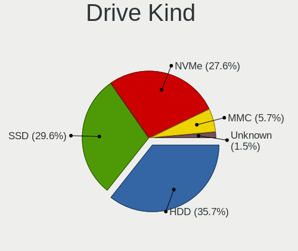
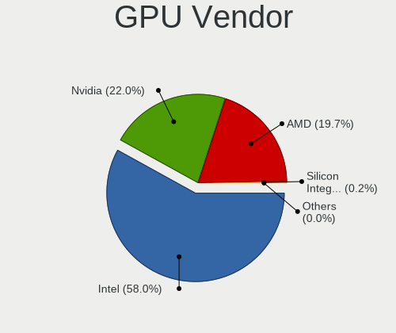
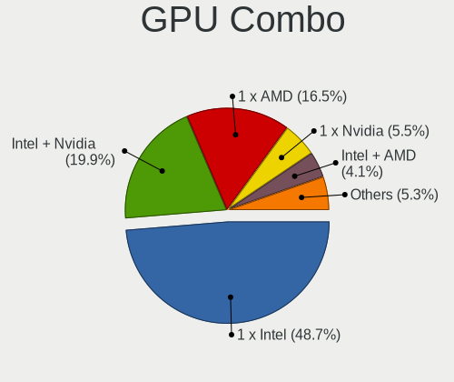
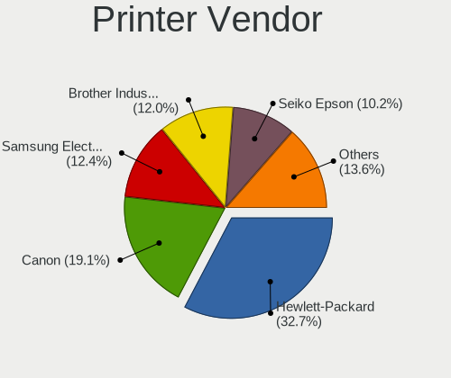

Linux - Tested Hardware & Statistics (Notebooks)
------------------------------------------------

A project to collect tested hardware configurations for Linux.

Anyone can contribute to this report by the [hw-probe](https://github.com/linuxhw/hw-probe) tool:

    sudo -E hw-probe -all -upload

Please contribute! Especially if your hardware is rare.

This report is for real hardware. Report for virtual hardware: [TestDays_VE](https://github.com/linuxhw/TestDays_VE)

Contents
--------

* [ Test Cases ](#test-cases)

* [ System ](#system)
  - [ OS                       ](#os)
  - [ OS Family                ](#os-family)
  - [ Kernel                   ](#kernel)
  - [ Kernel Family            ](#kernel-family)
  - [ Kernel Major Ver.        ](#kernel-major-ver)
  - [ Arch                     ](#arch)
  - [ DE                       ](#de)
  - [ Display Server           ](#display-server)
  - [ Display Manager          ](#display-manager)
  - [ OS Lang                  ](#os-lang)
  - [ Boot Mode                ](#boot-mode)
  - [ Filesystem               ](#filesystem)
  - [ Part. scheme             ](#part-scheme)
  - [ Dual Boot with Linux/BSD ](#dual-boot-with-linuxbsd)
  - [ Dual Boot (Win)          ](#dual-boot-win)

* [ Board ](#board)
  - [ Vendor                   ](#vendor)
  - [ Model                    ](#model)
  - [ Model Family             ](#model-family)
  - [ MFG Year                 ](#mfg-year)
  - [ Form Factor              ](#form-factor)
  - [ Secure Boot              ](#secure-boot)
  - [ Coreboot                 ](#coreboot)
  - [ RAM Size                 ](#ram-size)
  - [ RAM Used                 ](#ram-used)
  - [ Total Drives             ](#total-drives)
  - [ Has CD-ROM               ](#has-cd-rom)
  - [ Has Ethernet             ](#has-ethernet)
  - [ Has WiFi                 ](#has-wifi)
  - [ Has Bluetooth            ](#has-bluetooth)

* [ Location ](#location)
  - [ Country                  ](#country)
  - [ City                     ](#city)

* [ Drives ](#drives)
  - [ Drive Vendor             ](#drive-vendor)
  - [ Drive Model              ](#drive-model)
  - [ HDD Vendor               ](#hdd-vendor)
  - [ SSD Vendor               ](#ssd-vendor)
  - [ Drive Kind               ](#drive-kind)
  - [ Drive Connector          ](#drive-connector)
  - [ Drive Size               ](#drive-size)
  - [ Space Total              ](#space-total)
  - [ Space Used               ](#space-used)
  - [ Malfunc. Drives          ](#malfunc-drives)
  - [ Malfunc. Drive Vendor    ](#malfunc-drive-vendor)
  - [ Malfunc. HDD Vendor      ](#malfunc-hdd-vendor)
  - [ Malfunc. Drive Kind      ](#malfunc-drive-kind)
  - [ Failed Drives            ](#failed-drives)
  - [ Failed Drive Vendor      ](#failed-drive-vendor)
  - [ Drive Status             ](#drive-status)

* [ Storage controller ](#storage-controller)
  - [ Storage Vendor           ](#storage-vendor)
  - [ Storage Model            ](#storage-model)
  - [ Storage Kind             ](#storage-kind)

* [ Processor ](#processor)
  - [ CPU Vendor               ](#cpu-vendor)
  - [ CPU Model                ](#cpu-model)
  - [ CPU Model Family         ](#cpu-model-family)
  - [ CPU Cores                ](#cpu-cores)
  - [ CPU Sockets              ](#cpu-sockets)
  - [ CPU Threads              ](#cpu-threads)
  - [ CPU Op-Modes             ](#cpu-op-modes)
  - [ CPU Microcode            ](#cpu-microcode)
  - [ CPU Microarch            ](#cpu-microarch)

* [ Graphics ](#graphics)
  - [ GPU Vendor               ](#gpu-vendor)
  - [ GPU Model                ](#gpu-model)
  - [ GPU Combo                ](#gpu-combo)
  - [ GPU Driver               ](#gpu-driver)
  - [ GPU Memory               ](#gpu-memory)

* [ Monitor ](#monitor)
  - [ Monitor Vendor           ](#monitor-vendor)
  - [ Monitor Model            ](#monitor-model)
  - [ Monitor Resolution       ](#monitor-resolution)
  - [ Monitor Diagonal         ](#monitor-diagonal)
  - [ Monitor Width            ](#monitor-width)
  - [ Aspect Ratio             ](#aspect-ratio)
  - [ Monitor Area             ](#monitor-area)
  - [ Pixel Density            ](#pixel-density)
  - [ Multiple Monitors        ](#multiple-monitors)

* [ Network ](#network)
  - [ Net Controller Vendor    ](#net-controller-vendor)
  - [ Net Controller Model     ](#net-controller-model)
  - [ Wireless Vendor          ](#wireless-vendor)
  - [ Wireless Model           ](#wireless-model)
  - [ Ethernet Vendor          ](#ethernet-vendor)
  - [ Ethernet Model           ](#ethernet-model)
  - [ Net Controller Kind      ](#net-controller-kind)
  - [ Used Controller          ](#used-controller)
  - [ NICs                     ](#nics)
  - [ IPv6                     ](#ipv6)

* [ Bluetooth ](#bluetooth)
  - [ Bluetooth Vendor         ](#bluetooth-vendor)
  - [ Bluetooth Model          ](#bluetooth-model)

* [ Sound ](#sound)
  - [ Sound Vendor             ](#sound-vendor)
  - [ Sound Model              ](#sound-model)

* [ Memory ](#memory)
  - [ Memory Vendor            ](#memory-vendor)
  - [ Memory Model             ](#memory-model)
  - [ Memory Kind              ](#memory-kind)
  - [ Memory Form Factor       ](#memory-form-factor)
  - [ Memory Size              ](#memory-size)
  - [ Memory Speed             ](#memory-speed)

* [ Printers & scanners ](#printers--scanners)
  - [ Printer Vendor           ](#printer-vendor)
  - [ Printer Model            ](#printer-model)
  - [ Scanner Vendor           ](#scanner-vendor)
  - [ Scanner Model            ](#scanner-model)

* [ Camera ](#camera)
  - [ Camera Vendor            ](#camera-vendor)
  - [ Camera Model             ](#camera-model)

* [ Security ](#security)
  - [ Fingerprint Vendor       ](#fingerprint-vendor)
  - [ Fingerprint Model        ](#fingerprint-model)
  - [ Chipcard Vendor          ](#chipcard-vendor)
  - [ Chipcard Model           ](#chipcard-model)

* [ Unsupported ](#unsupported)
  - [ Unsupported Devices      ](#unsupported-devices)
  - [ Unsupported Device Types ](#unsupported-device-types)

Test Cases
----------

Total: 194588

| Vendor        | Model                       | Probe                                                      | Date         |
|---------------|-----------------------------|------------------------------------------------------------|--------------|
| Alienware     | m17 R4                      | [4372e588f9](https://linux-hardware.org/?probe=4372e588f9) | Feb 02, 2024 |
| Acer          | Nitro AN515-54              | [051e477b5f](https://linux-hardware.org/?probe=051e477b5f) | Feb 02, 2024 |
| Dell          | Inspiron 3542               | [c7753ffa8e](https://linux-hardware.org/?probe=c7753ffa8e) | Feb 02, 2024 |
| HP            | EliteBook 850 G8 Noteboo... | [7c65739a72](https://linux-hardware.org/?probe=7c65739a72) | Feb 02, 2024 |
| Acer          | Aspire V5-573G              | [869a029714](https://linux-hardware.org/?probe=869a029714) | Feb 02, 2024 |
| Apple         | MacBookPro4,1               | [5d31a31783](https://linux-hardware.org/?probe=5d31a31783) | Feb 02, 2024 |
| MSI           | Modern 15 A10M              | [22f3c2e58e](https://linux-hardware.org/?probe=22f3c2e58e) | Feb 02, 2024 |
| Samsung       | 550P5C/550P7C               | [4d9464ae33](https://linux-hardware.org/?probe=4d9464ae33) | Feb 02, 2024 |
| HP            | Pavilion g6                 | [795109303b](https://linux-hardware.org/?probe=795109303b) | Feb 02, 2024 |
| HP            | EliteBook 8560w             | [6ff665aaf5](https://linux-hardware.org/?probe=6ff665aaf5) | Feb 02, 2024 |
| HP            | Pavilion Gaming Laptop 1... | [fe7dfd8247](https://linux-hardware.org/?probe=fe7dfd8247) | Feb 02, 2024 |
| Lenovo        | IdeaPad 110-15ACL 80TJ      | [6300a79454](https://linux-hardware.org/?probe=6300a79454) | Feb 02, 2024 |
| Toshiba       | Satellite L55-C             | [f32d9dc51a](https://linux-hardware.org/?probe=f32d9dc51a) | Feb 02, 2024 |
| Apple         | MacBookPro11,5              | [55197489b0](https://linux-hardware.org/?probe=55197489b0) | Feb 02, 2024 |
| Medion        | E7214                       | [cb37ec8f5d](https://linux-hardware.org/?probe=cb37ec8f5d) | Feb 02, 2024 |
| Lenovo        | ThinkPad P1 Gen 6 21FV00... | [7b22729e20](https://linux-hardware.org/?probe=7b22729e20) | Feb 02, 2024 |
| HP            | Pavilion dm1                | [f4c8f5a8e6](https://linux-hardware.org/?probe=f4c8f5a8e6) | Feb 02, 2024 |
| Lenovo        | ThinkPad L470 W10DG 20JV... | [e05005f76b](https://linux-hardware.org/?probe=e05005f76b) | Feb 02, 2024 |
| Lenovo        | Legion Slim 5 16IRH8 83D... | [2389b9fc2f](https://linux-hardware.org/?probe=2389b9fc2f) | Feb 02, 2024 |
| ASUSTek       | K53BR                       | [bd5284a0e8](https://linux-hardware.org/?probe=bd5284a0e8) | Feb 02, 2024 |
| Lenovo        | Legion Slim 5 16IRH8 83D... | [32facc4f9e](https://linux-hardware.org/?probe=32facc4f9e) | Feb 02, 2024 |
| Acer          | Aspire A517-51G             | [2788a21644](https://linux-hardware.org/?probe=2788a21644) | Feb 02, 2024 |
| ASUSTek       | Zenbook UX3404VA_Q420VA     | [2b3f583bc7](https://linux-hardware.org/?probe=2b3f583bc7) | Feb 02, 2024 |
| Dell          | XPS 15 7590                 | [214b9d35cb](https://linux-hardware.org/?probe=214b9d35cb) | Feb 02, 2024 |
| ASUSTek       | Zenbook UX3404VA_Q420VA     | [a569cab490](https://linux-hardware.org/?probe=a569cab490) | Feb 02, 2024 |
| Acer          | Aspire VN7-592G             | [95f618bdeb](https://linux-hardware.org/?probe=95f618bdeb) | Feb 02, 2024 |
| Dell          | Inspiron 13-7359            | [82a1195ef5](https://linux-hardware.org/?probe=82a1195ef5) | Feb 02, 2024 |
| Lenovo        | ThinkPad E14 Gen 3 20YE0... | [60cc806e9a](https://linux-hardware.org/?probe=60cc806e9a) | Feb 02, 2024 |
| Dell          | Latitude 7390               | [2386e8641f](https://linux-hardware.org/?probe=2386e8641f) | Feb 02, 2024 |
| HP            | EliteBook 840 G2            | [4a3954a4c1](https://linux-hardware.org/?probe=4a3954a4c1) | Feb 02, 2024 |
| Lenovo        | ThinkPad T540p 20BE0060M... | [71296d9e0f](https://linux-hardware.org/?probe=71296d9e0f) | Feb 02, 2024 |
| Acer          | Aspire VN7-591G             | [c0f024d3e0](https://linux-hardware.org/?probe=c0f024d3e0) | Feb 02, 2024 |
| Acer          | Swift SF314-56              | [159a1c3a0f](https://linux-hardware.org/?probe=159a1c3a0f) | Feb 02, 2024 |
| HP            | ENVY m7                     | [b38e23bdbe](https://linux-hardware.org/?probe=b38e23bdbe) | Feb 02, 2024 |
| Dell          | Inspiron 3583               | [3c532c85ec](https://linux-hardware.org/?probe=3c532c85ec) | Feb 02, 2024 |
| Lenovo        | IdeaPad 3 17ALC6 82KV       | [3aa20161d9](https://linux-hardware.org/?probe=3aa20161d9) | Feb 02, 2024 |
| Unknown       | Unknown                     | [8c03bd946c](https://linux-hardware.org/?probe=8c03bd946c) | Feb 02, 2024 |
| Acer          | P4LJ0                       | [c0a2639732](https://linux-hardware.org/?probe=c0a2639732) | Feb 02, 2024 |
| Acer          | Aspire 5741G                | [935470b35c](https://linux-hardware.org/?probe=935470b35c) | Feb 02, 2024 |
| ASUSTek       | F8Vr                        | [02fced1d70](https://linux-hardware.org/?probe=02fced1d70) | Feb 02, 2024 |
| Lenovo        | ThinkPad T14s Gen 1 20UJ... | [a64852fe4a](https://linux-hardware.org/?probe=a64852fe4a) | Feb 02, 2024 |
| Samsung       | RV410/RV510/S3510/E3510     | [1f85f107bb](https://linux-hardware.org/?probe=1f85f107bb) | Feb 02, 2024 |
| Dell          | Inspiron 3442               | [ca29fa6852](https://linux-hardware.org/?probe=ca29fa6852) | Feb 02, 2024 |
| Lenovo        | ThinkPad X270 W10DG 20K5... | [e7400919cd](https://linux-hardware.org/?probe=e7400919cd) | Feb 02, 2024 |
| ASUSTek       | UX331UN                     | [9b0463c9de](https://linux-hardware.org/?probe=9b0463c9de) | Feb 02, 2024 |
| Acer          | Aspire V3-772               | [4a32c0297c](https://linux-hardware.org/?probe=4a32c0297c) | Feb 02, 2024 |
| ASUSTek       | VivoBook_ASUSLaptop M350... | [cb15afccd0](https://linux-hardware.org/?probe=cb15afccd0) | Feb 02, 2024 |
| Dell          | Latitude 7400               | [ad51cec5ea](https://linux-hardware.org/?probe=ad51cec5ea) | Feb 02, 2024 |
| Dell          | Precision 7550              | [c210fa0d97](https://linux-hardware.org/?probe=c210fa0d97) | Feb 02, 2024 |
| Acer          | Aspire 5741G                | [d598afdbe9](https://linux-hardware.org/?probe=d598afdbe9) | Feb 02, 2024 |
| DEXP          | Atlas M14-I5W303            | [fd14684ed2](https://linux-hardware.org/?probe=fd14684ed2) | Feb 02, 2024 |
| PC Special... | GK5CQ7Z                     | [d7632585fc](https://linux-hardware.org/?probe=d7632585fc) | Feb 02, 2024 |
| Lenovo        | ThinkPad E595 20NF0005IX    | [171aaf5d57](https://linux-hardware.org/?probe=171aaf5d57) | Feb 02, 2024 |
| Apple         | MacBookAir4,2               | [2952e00ccb](https://linux-hardware.org/?probe=2952e00ccb) | Feb 02, 2024 |
| Dell          | G7 7588                     | [fdc746ce61](https://linux-hardware.org/?probe=fdc746ce61) | Feb 02, 2024 |
| eMachines     | E725                        | [e421aa20d1](https://linux-hardware.org/?probe=e421aa20d1) | Feb 02, 2024 |
| HP            | Laptop 17-cp0xxx            | [601c3c2cc4](https://linux-hardware.org/?probe=601c3c2cc4) | Feb 02, 2024 |
| Lenovo        | ThinkPad E595 20NF0005IX    | [c834e4941b](https://linux-hardware.org/?probe=c834e4941b) | Feb 02, 2024 |
| Apple         | MacBook5,1                  | [48a998308b](https://linux-hardware.org/?probe=48a998308b) | Feb 02, 2024 |
| Toshiba       | Satellite L50D-B            | [49e28cce05](https://linux-hardware.org/?probe=49e28cce05) | Feb 02, 2024 |
| Valve         | Jupiter                     | [ff59f7877a](https://linux-hardware.org/?probe=ff59f7877a) | Feb 02, 2024 |
| Lenovo        | ThinkPad T580 20LAS3NJ0T    | [17e848cdcf](https://linux-hardware.org/?probe=17e848cdcf) | Feb 02, 2024 |
| Dell          | Inspiron 5567               | [51c9bc9ff2](https://linux-hardware.org/?probe=51c9bc9ff2) | Feb 02, 2024 |
| Lenovo        | ThinkPad E590 20NB002BRT    | [283a2fd324](https://linux-hardware.org/?probe=283a2fd324) | Feb 02, 2024 |
| HP            | ProBook 450 G8 Notebook ... | [0bbbc51a52](https://linux-hardware.org/?probe=0bbbc51a52) | Feb 02, 2024 |
| Lenovo        | ThinkBook 16p Gen 4 21J8    | [7cbebba117](https://linux-hardware.org/?probe=7cbebba117) | Feb 02, 2024 |
| Timi          | RedmiBook Pro 15S           | [70dacc6818](https://linux-hardware.org/?probe=70dacc6818) | Feb 02, 2024 |
| Notebook      | V15x_V17xRNx                | [901e71289e](https://linux-hardware.org/?probe=901e71289e) | Feb 02, 2024 |
| Apple         | MacBookAir4,2               | [3173c9ba14](https://linux-hardware.org/?probe=3173c9ba14) | Feb 02, 2024 |
| ASUSTek       | N56VZ                       | [2209fe1372](https://linux-hardware.org/?probe=2209fe1372) | Feb 02, 2024 |
| Schenker      | XMG PRO (Late 2021)         | [502d4a5570](https://linux-hardware.org/?probe=502d4a5570) | Feb 02, 2024 |
| MECHREVO      | S1 Pro Series               | [ba68410f96](https://linux-hardware.org/?probe=ba68410f96) | Feb 02, 2024 |
| Acer          | Nitro AN515-58              | [1fe97c9103](https://linux-hardware.org/?probe=1fe97c9103) | Feb 02, 2024 |
| MSI           | Modern 14 B11MOU            | [a5b3665f64](https://linux-hardware.org/?probe=a5b3665f64) | Feb 02, 2024 |
| MSI           | Modern 14 B11MOU            | [f7d0fcd205](https://linux-hardware.org/?probe=f7d0fcd205) | Feb 02, 2024 |
| Medion        | E7218                       | [d99d2a5d9c](https://linux-hardware.org/?probe=d99d2a5d9c) | Feb 02, 2024 |
| MSI           | Thin GF63 12HW              | [b5b16477c3](https://linux-hardware.org/?probe=b5b16477c3) | Feb 02, 2024 |
| SLIMBOOK      | HERO-S-TGL-RTX              | [1260457422](https://linux-hardware.org/?probe=1260457422) | Feb 02, 2024 |
| HP            | EliteBook 840 G7 Noteboo... | [6f09cb7800](https://linux-hardware.org/?probe=6f09cb7800) | Feb 02, 2024 |
| Dell          | Latitude 3420               | [15de060676](https://linux-hardware.org/?probe=15de060676) | Feb 02, 2024 |
| MSI           | Prestige 13 AI Evo A1MG     | [abc18d1a9e](https://linux-hardware.org/?probe=abc18d1a9e) | Feb 02, 2024 |
| Valve         | Galileo                     | [3b44d4da2f](https://linux-hardware.org/?probe=3b44d4da2f) | Feb 02, 2024 |
| Dell          | Latitude 7420               | [5eb0b85732](https://linux-hardware.org/?probe=5eb0b85732) | Feb 02, 2024 |
| Lenovo        | ThinkPad P14s Gen 2a 21A... | [6d6e6af46b](https://linux-hardware.org/?probe=6d6e6af46b) | Feb 02, 2024 |
| Google        | Pujjoteen15W                | [b23c1ed1eb](https://linux-hardware.org/?probe=b23c1ed1eb) | Feb 02, 2024 |
| Apple         | MacBookAir5,1               | [e25bf95ccb](https://linux-hardware.org/?probe=e25bf95ccb) | Feb 02, 2024 |
| MSI           | Raider GE68HX 13VF          | [72ac680d91](https://linux-hardware.org/?probe=72ac680d91) | Feb 02, 2024 |
| Apple         | MacBookAir5,1               | [058a447435](https://linux-hardware.org/?probe=058a447435) | Feb 02, 2024 |
| Dell          | Latitude 5511               | [e7d3018c34](https://linux-hardware.org/?probe=e7d3018c34) | Feb 02, 2024 |
| VIT           | P3400                       | [036ee57838](https://linux-hardware.org/?probe=036ee57838) | Feb 02, 2024 |
| Acer          | Aspire A515-43              | [349b53e55a](https://linux-hardware.org/?probe=349b53e55a) | Feb 02, 2024 |
| HP            | EliteBook 850 G8 Noteboo... | [133d556add](https://linux-hardware.org/?probe=133d556add) | Feb 02, 2024 |
| Notebook      | NJx0MU                      | [6259b53b1c](https://linux-hardware.org/?probe=6259b53b1c) | Feb 02, 2024 |
| Dell          | Inspiron 7577               | [0155afe6f3](https://linux-hardware.org/?probe=0155afe6f3) | Feb 02, 2024 |
| Lenovo        | ThinkPad T14s Gen 2i 20W... | [fdc21a05c2](https://linux-hardware.org/?probe=fdc21a05c2) | Feb 02, 2024 |
| Apple         | MacBookPro11,3              | [5bc93c37fa](https://linux-hardware.org/?probe=5bc93c37fa) | Feb 02, 2024 |
| Acer          | Aspire 5738                 | [7137d60986](https://linux-hardware.org/?probe=7137d60986) | Feb 02, 2024 |
| HP            | EliteBook 2570p             | [59778f5513](https://linux-hardware.org/?probe=59778f5513) | Feb 02, 2024 |
| Samsung       | 305E4A/305E5A/305E7A        | [bf840a5308](https://linux-hardware.org/?probe=bf840a5308) | Feb 02, 2024 |
| Lenovo        | ThinkPad T410 2537AF8       | [88794835fb](https://linux-hardware.org/?probe=88794835fb) | Feb 02, 2024 |
| Dell          | Inspiron 3542               | [176eee6b84](https://linux-hardware.org/?probe=176eee6b84) | Feb 02, 2024 |
| Dell          | Inspiron 3542               | [7f677482ef](https://linux-hardware.org/?probe=7f677482ef) | Feb 02, 2024 |
| Framework     | Laptop 13 (AMD Ryzen 704... | [d9a0906eac](https://linux-hardware.org/?probe=d9a0906eac) | Feb 02, 2024 |
| Lenovo        | ThinkPad T15g Gen 1 20UR... | [e3e01bd0ff](https://linux-hardware.org/?probe=e3e01bd0ff) | Feb 02, 2024 |
| ASUSTek       | X450CA                      | [701cfd5c41](https://linux-hardware.org/?probe=701cfd5c41) | Feb 02, 2024 |
| Lenovo        | Z50-70 20354                | [d6023b78a2](https://linux-hardware.org/?probe=d6023b78a2) | Feb 02, 2024 |
| Apple         | MacBookAir6,2               | [4bee7d161b](https://linux-hardware.org/?probe=4bee7d161b) | Feb 02, 2024 |
| Acer          | Aspire A315-54              | [3621142f4d](https://linux-hardware.org/?probe=3621142f4d) | Feb 02, 2024 |
| HP            | EliteBook 845 G8 Noteboo... | [7516b63802](https://linux-hardware.org/?probe=7516b63802) | Feb 02, 2024 |
| Apple         | MacBookAir6,2               | [4181fe4492](https://linux-hardware.org/?probe=4181fe4492) | Feb 02, 2024 |
| Schenker      | XMG PRO (Late 2021)         | [0bd25ae10e](https://linux-hardware.org/?probe=0bd25ae10e) | Feb 02, 2024 |
| Acer          | Swift SF314-43              | [e87efb031b](https://linux-hardware.org/?probe=e87efb031b) | Feb 02, 2024 |
| Acer          | NC-F5-771G-72XY             | [2f4c6fbadb](https://linux-hardware.org/?probe=2f4c6fbadb) | Feb 02, 2024 |
| ASUSTek       | X556UQK                     | [24b1509f61](https://linux-hardware.org/?probe=24b1509f61) | Feb 02, 2024 |
| Dell          | Inspiron 5547               | [507fad3c00](https://linux-hardware.org/?probe=507fad3c00) | Feb 02, 2024 |
| Lenovo        | ThinkBook 14 G6 IRL 21KG    | [c01e746574](https://linux-hardware.org/?probe=c01e746574) | Feb 02, 2024 |
| Lenovo        | G505s 20255                 | [f1903f6323](https://linux-hardware.org/?probe=f1903f6323) | Feb 02, 2024 |
| Unknown       | Unknown                     | [2037e9d75f](https://linux-hardware.org/?probe=2037e9d75f) | Feb 02, 2024 |
| HP            | EliteBook Revolve 810 G2    | [788fb13f23](https://linux-hardware.org/?probe=788fb13f23) | Feb 02, 2024 |
| Dell          | Latitude 7280               | [c94b45b8f4](https://linux-hardware.org/?probe=c94b45b8f4) | Feb 02, 2024 |
| ASUSTek       | ROG Strix G531GT_G531GT     | [5e505eb9f1](https://linux-hardware.org/?probe=5e505eb9f1) | Feb 02, 2024 |
| Pegatron      | Spring Peak                 | [b14f110621](https://linux-hardware.org/?probe=b14f110621) | Feb 02, 2024 |
| Lenovo        | ThinkPad E14 Gen 2 20T60... | [47431ad7d9](https://linux-hardware.org/?probe=47431ad7d9) | Feb 02, 2024 |
| Unknown       | Unknown                     | [b85ea144b7](https://linux-hardware.org/?probe=b85ea144b7) | Feb 01, 2024 |
| HP            | 240 G8 Notebook PC          | [d4c61a6527](https://linux-hardware.org/?probe=d4c61a6527) | Feb 01, 2024 |
| Valve         | Galileo                     | [aebc4c73ad](https://linux-hardware.org/?probe=aebc4c73ad) | Feb 01, 2024 |
| HP            | EliteBook 840 G6            | [6cac3b71e0](https://linux-hardware.org/?probe=6cac3b71e0) | Feb 01, 2024 |
| VIT           | P3400                       | [6b03e6574f](https://linux-hardware.org/?probe=6b03e6574f) | Feb 01, 2024 |
| Apple         | MacBookAir7,2               | [632421d681](https://linux-hardware.org/?probe=632421d681) | Feb 01, 2024 |
| ASUSTek       | N53SV                       | [ee79ea1cbb](https://linux-hardware.org/?probe=ee79ea1cbb) | Feb 01, 2024 |
| HP            | 15                          | [b99530abd5](https://linux-hardware.org/?probe=b99530abd5) | Feb 01, 2024 |
| HP            | 15                          | [874ae10280](https://linux-hardware.org/?probe=874ae10280) | Feb 01, 2024 |
| Lenovo        | IdeaPad S340-15IWL 81N8     | [fd7240a3ee](https://linux-hardware.org/?probe=fd7240a3ee) | Feb 01, 2024 |
| HP            | 255 15.6 inch G10           | [86bdc742bd](https://linux-hardware.org/?probe=86bdc742bd) | Feb 01, 2024 |
| Lenovo        | IdeaPad S340-15IWL 81N8     | [b3b900cffa](https://linux-hardware.org/?probe=b3b900cffa) | Feb 01, 2024 |
| HP            | Pavilion Notebook           | [bb16eb2e4a](https://linux-hardware.org/?probe=bb16eb2e4a) | Feb 01, 2024 |
| Lenovo        | ThinkPad T440 20B7A0B7MN    | [74173e2c0a](https://linux-hardware.org/?probe=74173e2c0a) | Feb 01, 2024 |
| Dell          | Inspiron N5110              | [e7338ad21d](https://linux-hardware.org/?probe=e7338ad21d) | Feb 01, 2024 |
| Acer          | Aspire ES1-523              | [4344e68c86](https://linux-hardware.org/?probe=4344e68c86) | Feb 01, 2024 |
| Timi          | Redmi Book Pro 15 2022      | [fddf157b5f](https://linux-hardware.org/?probe=fddf157b5f) | Feb 01, 2024 |
| Apple         | MacBookPro5,4               | [c22226fe6f](https://linux-hardware.org/?probe=c22226fe6f) | Feb 01, 2024 |
| Pegatron      | Spring Peak                 | [4404cfb5c8](https://linux-hardware.org/?probe=4404cfb5c8) | Feb 01, 2024 |
| Lenovo        | IdeaPad S340-15API 81NC     | [7340c4abd7](https://linux-hardware.org/?probe=7340c4abd7) | Feb 01, 2024 |
| ASUSTek       | ROG Strix G634JZ_G634JZ     | [4b8399084a](https://linux-hardware.org/?probe=4b8399084a) | Feb 01, 2024 |
| Lenovo        | G510 20238                  | [d93b9b007a](https://linux-hardware.org/?probe=d93b9b007a) | Feb 01, 2024 |
| Acer          | TravelMate 7740G            | [78bfa1b270](https://linux-hardware.org/?probe=78bfa1b270) | Feb 01, 2024 |
| Lenovo        | IdeaPad 3 15IGL05 81WQ      | [f2003839e0](https://linux-hardware.org/?probe=f2003839e0) | Feb 01, 2024 |
| ASUSTek       | Zenbook UM3402YAR_UM3402... | [f0b3157a23](https://linux-hardware.org/?probe=f0b3157a23) | Feb 01, 2024 |
| Dell          | Latitude 5420               | [9ca4bb32d7](https://linux-hardware.org/?probe=9ca4bb32d7) | Feb 01, 2024 |
| Dell          | Latitude 5511               | [910488f306](https://linux-hardware.org/?probe=910488f306) | Feb 01, 2024 |
| Lenovo        | Yoga Slim 7 14ITL05 82A3    | [98dc9736d7](https://linux-hardware.org/?probe=98dc9736d7) | Feb 01, 2024 |
| Lenovo        | Yoga Slim 7 ProX 14ARH7 ... | [58f11b08b0](https://linux-hardware.org/?probe=58f11b08b0) | Feb 01, 2024 |
| Lenovo        | Yoga Slim 7 14ITL05 82A3    | [4661ceab45](https://linux-hardware.org/?probe=4661ceab45) | Feb 01, 2024 |
| ASUSTek       | VivoBook_ASUSLaptop X515... | [e5bbf9598f](https://linux-hardware.org/?probe=e5bbf9598f) | Feb 01, 2024 |
| Acer          | TravelMate P215-52          | [917516e40b](https://linux-hardware.org/?probe=917516e40b) | Feb 01, 2024 |
| Dell          | Inspiron N5010              | [151239b938](https://linux-hardware.org/?probe=151239b938) | Feb 01, 2024 |
| ASUSTek       | K54C                        | [59e4e733f0](https://linux-hardware.org/?probe=59e4e733f0) | Feb 01, 2024 |
| Lenovo        | IdeaPad 320S-14IKB 80X4     | [ceef434e35](https://linux-hardware.org/?probe=ceef434e35) | Feb 01, 2024 |
| HP            | 620                         | [adcf9577e4](https://linux-hardware.org/?probe=adcf9577e4) | Feb 01, 2024 |
| Lenovo        | ThinkPad T495 20NKS1XW08    | [62286dc8d9](https://linux-hardware.org/?probe=62286dc8d9) | Feb 01, 2024 |
| ASUSTek       | VivoBook_ASUSLaptop X160... | [6f80a7214c](https://linux-hardware.org/?probe=6f80a7214c) | Feb 01, 2024 |
| Dell          | Latitude E6420              | [ff73a45b61](https://linux-hardware.org/?probe=ff73a45b61) | Feb 01, 2024 |
| Lenovo        | ThinkPad E15 Gen 4 21E60... | [fb180a9a54](https://linux-hardware.org/?probe=fb180a9a54) | Feb 01, 2024 |
| Lenovo        | ThinkPad X280 20KES4TD0T    | [4af2fc13f4](https://linux-hardware.org/?probe=4af2fc13f4) | Feb 01, 2024 |
| Acer          | Aspire 7740                 | [a329ef6c37](https://linux-hardware.org/?probe=a329ef6c37) | Feb 01, 2024 |
| Dell          | Vostro 3525                 | [495877fada](https://linux-hardware.org/?probe=495877fada) | Feb 01, 2024 |
| Lenovo        | ThinkPad X1 Carbon Gen 1... | [f1b0b8716f](https://linux-hardware.org/?probe=f1b0b8716f) | Feb 01, 2024 |
| ALTYK         | L14F-I5U16-N1               | [7cb618fcca](https://linux-hardware.org/?probe=7cb618fcca) | Feb 01, 2024 |
| ALTYK         | L14F-I5U16-N1               | [81274a6f09](https://linux-hardware.org/?probe=81274a6f09) | Feb 01, 2024 |
| Lenovo        | V17 G4 IRU 83A2             | [f33e772962](https://linux-hardware.org/?probe=f33e772962) | Feb 01, 2024 |
| HP            | Pavilion Notebook           | [bc55b0bd50](https://linux-hardware.org/?probe=bc55b0bd50) | Feb 01, 2024 |
| ASUSTek       | Zenbook UM3402YAR_UM3402... | [04c6362187](https://linux-hardware.org/?probe=04c6362187) | Feb 01, 2024 |
| Toshiba       | Satellite U845W             | [bfcfa219eb](https://linux-hardware.org/?probe=bfcfa219eb) | Feb 01, 2024 |
| Acer          | Aspire A315-53              | [a3fde61a8b](https://linux-hardware.org/?probe=a3fde61a8b) | Feb 01, 2024 |
| Dell          | Latitude 7490               | [f6c07c876d](https://linux-hardware.org/?probe=f6c07c876d) | Feb 01, 2024 |
| Acer          | TravelMate B118-M           | [4f53c6a6af](https://linux-hardware.org/?probe=4f53c6a6af) | Feb 01, 2024 |
| Acer          | TravelMate 4220             | [73e17ddd6d](https://linux-hardware.org/?probe=73e17ddd6d) | Feb 01, 2024 |
| Toshiba       | Satellite U845W             | [7671d63234](https://linux-hardware.org/?probe=7671d63234) | Feb 01, 2024 |
| Dell          | XPS 15 9560                 | [63fe6fecb5](https://linux-hardware.org/?probe=63fe6fecb5) | Feb 01, 2024 |
| COM1          | E15-5A165-BM (9)            | [41d123782c](https://linux-hardware.org/?probe=41d123782c) | Feb 01, 2024 |
| Acer          | Aspire A515-56              | [5599d65127](https://linux-hardware.org/?probe=5599d65127) | Feb 01, 2024 |
| HP            | EliteBook 1050 G1           | [8799a2e9ae](https://linux-hardware.org/?probe=8799a2e9ae) | Feb 01, 2024 |
| ASUSTek       | N53SV                       | [29807f0dfa](https://linux-hardware.org/?probe=29807f0dfa) | Feb 01, 2024 |
| HP            | EliteBook 1050 G1           | [c95847728d](https://linux-hardware.org/?probe=c95847728d) | Feb 01, 2024 |
| HP            | Pavilion Notebook           | [397f03250d](https://linux-hardware.org/?probe=397f03250d) | Feb 01, 2024 |
| AMI           | Intel                       | [6d3ac84f15](https://linux-hardware.org/?probe=6d3ac84f15) | Feb 01, 2024 |
| Apple         | MacBookAir6,2               | [ae8af70d31](https://linux-hardware.org/?probe=ae8af70d31) | Feb 01, 2024 |
| Lenovo        | ThinkPad X1 Carbon 6th 2... | [6acefbaadc](https://linux-hardware.org/?probe=6acefbaadc) | Feb 01, 2024 |
| HP            | 250 G1                      | [af6c2e58b5](https://linux-hardware.org/?probe=af6c2e58b5) | Feb 01, 2024 |
| Apple         | MacBookAir6,2               | [b42c35c70b](https://linux-hardware.org/?probe=b42c35c70b) | Feb 01, 2024 |
| Acer          | Swift SF314-512             | [28bd75703e](https://linux-hardware.org/?probe=28bd75703e) | Feb 01, 2024 |
| HP            | 250 G1                      | [1cc61ac6b5](https://linux-hardware.org/?probe=1cc61ac6b5) | Feb 01, 2024 |
| Lenovo        | Yoga Slim 7 ProX 14ARH7 ... | [5f2635ae3a](https://linux-hardware.org/?probe=5f2635ae3a) | Feb 01, 2024 |
| HONOR         | BRN-HXX                     | [9e92d94ecb](https://linux-hardware.org/?probe=9e92d94ecb) | Feb 01, 2024 |
| ASUSTek       | GL552VW                     | [1579728415](https://linux-hardware.org/?probe=1579728415) | Feb 01, 2024 |
| Samsung       | RV413/RV513/E3413           | [975921919b](https://linux-hardware.org/?probe=975921919b) | Feb 01, 2024 |
| Lenovo        | ThinkPad T14s Gen 2a 20X... | [f659cc07fc](https://linux-hardware.org/?probe=f659cc07fc) | Feb 01, 2024 |
| Dell          | Inspiron 7501               | [5c071c25ab](https://linux-hardware.org/?probe=5c071c25ab) | Feb 01, 2024 |
| Apple         | MacBookPro1,2               | [5e40347a6e](https://linux-hardware.org/?probe=5e40347a6e) | Feb 01, 2024 |
| Lenovo        | ThinkPad E14 Gen 2 20TA0... | [653f9c5fa5](https://linux-hardware.org/?probe=653f9c5fa5) | Feb 01, 2024 |
| Acer          | Aspire E5-722               | [2a4988436d](https://linux-hardware.org/?probe=2a4988436d) | Feb 01, 2024 |
| Dell          | XPS 15 9560                 | [0b1c1e6784](https://linux-hardware.org/?probe=0b1c1e6784) | Feb 01, 2024 |
| Apple         | MacBookPro11,2              | [92dd523802](https://linux-hardware.org/?probe=92dd523802) | Feb 01, 2024 |
| Fujitsu       | LIFEBOOK E752               | [5bd3d39655](https://linux-hardware.org/?probe=5bd3d39655) | Feb 01, 2024 |
| Dell          | Precision 5520              | [60d35bb7a2](https://linux-hardware.org/?probe=60d35bb7a2) | Feb 01, 2024 |
| Panasonic     | CF-54-2                     | [7758f322a6](https://linux-hardware.org/?probe=7758f322a6) | Feb 01, 2024 |
| realme        | CloudProXXXX                | [1299621a5e](https://linux-hardware.org/?probe=1299621a5e) | Feb 01, 2024 |
| Lenovo        | G405 20239                  | [7afc820794](https://linux-hardware.org/?probe=7afc820794) | Feb 01, 2024 |
| Lenovo        | IdeaPad 1 15ADA7 82R1       | [aaec148c06](https://linux-hardware.org/?probe=aaec148c06) | Feb 01, 2024 |
| TrekStor      | Primebook P14               | [ffd6c873de](https://linux-hardware.org/?probe=ffd6c873de) | Feb 01, 2024 |
| Lenovo        | IdeaPad 320-15ISK 80XH      | [a3932a77fb](https://linux-hardware.org/?probe=a3932a77fb) | Feb 01, 2024 |
| HP            | 15 Notebook PC              | [b60abe5c3d](https://linux-hardware.org/?probe=b60abe5c3d) | Feb 01, 2024 |
| HP            | 15 Notebook PC              | [b2f9ce6a03](https://linux-hardware.org/?probe=b2f9ce6a03) | Feb 01, 2024 |
| Apple         | MacBookPro11,3              | [9b4ae891b7](https://linux-hardware.org/?probe=9b4ae891b7) | Feb 01, 2024 |
| HP            | 250 G1                      | [b99ad906cf](https://linux-hardware.org/?probe=b99ad906cf) | Feb 01, 2024 |
| Google        | Phaser360                   | [3347aeb232](https://linux-hardware.org/?probe=3347aeb232) | Feb 01, 2024 |
| HP            | Pavilion dv4                | [09400a55bb](https://linux-hardware.org/?probe=09400a55bb) | Feb 01, 2024 |
| Valve         | Jupiter                     | [ab5f4937c1](https://linux-hardware.org/?probe=ab5f4937c1) | Feb 01, 2024 |
| Apple         | MacBookPro11,1              | [fcabd4a1f4](https://linux-hardware.org/?probe=fcabd4a1f4) | Feb 01, 2024 |
| Dell          | Inspiron 15 7000 Gaming     | [8689e993e3](https://linux-hardware.org/?probe=8689e993e3) | Feb 01, 2024 |
| Apple         | MacBookPro11,1              | [b31d7d9323](https://linux-hardware.org/?probe=b31d7d9323) | Feb 01, 2024 |
| Dell          | Inspiron 15 7000 Gaming     | [01332b7a24](https://linux-hardware.org/?probe=01332b7a24) | Feb 01, 2024 |
| Apple         | MacBookPro4,1               | [863b50ad5a](https://linux-hardware.org/?probe=863b50ad5a) | Feb 01, 2024 |
| Lenovo        | G500 20236                  | [8b5fd80f76](https://linux-hardware.org/?probe=8b5fd80f76) | Feb 01, 2024 |
| HP            | ProBook 440 G1              | [1a7d0f5488](https://linux-hardware.org/?probe=1a7d0f5488) | Feb 01, 2024 |
| Valve         | Jupiter                     | [238b20b912](https://linux-hardware.org/?probe=238b20b912) | Feb 01, 2024 |
| Lenovo        | ThinkPad T480 20L50011US    | [bb6dd71048](https://linux-hardware.org/?probe=bb6dd71048) | Feb 01, 2024 |
| Dell          | XPS 15 9530                 | [3aa974d8a0](https://linux-hardware.org/?probe=3aa974d8a0) | Feb 01, 2024 |
| Lenovo        | G500 20236                  | [31fc253b87](https://linux-hardware.org/?probe=31fc253b87) | Feb 01, 2024 |
| ASUSTek       | ROG Strix G513RM_G513RM     | [2239a0b698](https://linux-hardware.org/?probe=2239a0b698) | Feb 01, 2024 |
| Valve         | Jupiter                     | [f7647969b5](https://linux-hardware.org/?probe=f7647969b5) | Feb 01, 2024 |
| Lenovo        | IdeaPad 3 15IGL05 81WQ      | [589322c92f](https://linux-hardware.org/?probe=589322c92f) | Feb 01, 2024 |
| Dell          | Inspiron 3542               | [5a7e77b4a7](https://linux-hardware.org/?probe=5a7e77b4a7) | Feb 01, 2024 |
| Razer         | Blade 14 - RZ09-0482        | [49f14f0aae](https://linux-hardware.org/?probe=49f14f0aae) | Feb 01, 2024 |
| Valve         | Galileo                     | [c286128e50](https://linux-hardware.org/?probe=c286128e50) | Feb 01, 2024 |
| Acer          | Nitro AN515-58              | [84c37d0192](https://linux-hardware.org/?probe=84c37d0192) | Feb 01, 2024 |
| Apple         | MacBookPro10,2              | [fca71d08b7](https://linux-hardware.org/?probe=fca71d08b7) | Feb 01, 2024 |
| Acer          | AOD255                      | [43304c651c](https://linux-hardware.org/?probe=43304c651c) | Feb 01, 2024 |
| ASUSTek       | ASUS Zenbook 14 UX3405MA... | [531a090457](https://linux-hardware.org/?probe=531a090457) | Feb 01, 2024 |
| Lenovo        | ThinkPad X1 Carbon Gen 9... | [7adc6ac4b3](https://linux-hardware.org/?probe=7adc6ac4b3) | Feb 01, 2024 |
| HP            | ENVY 14                     | [ffe9159226](https://linux-hardware.org/?probe=ffe9159226) | Feb 01, 2024 |
| ASUSTek       | ASUS TUF Gaming F15 FX50... | [e94976b6d9](https://linux-hardware.org/?probe=e94976b6d9) | Feb 01, 2024 |
| Lenovo        | ThinkPad T480 20L6S4XW00    | [a24ce87b69](https://linux-hardware.org/?probe=a24ce87b69) | Feb 01, 2024 |
| Dell          | Inspiron 5748               | [1eaa79e492](https://linux-hardware.org/?probe=1eaa79e492) | Feb 01, 2024 |
| Notebook      | NJx0MU                      | [7def8ee544](https://linux-hardware.org/?probe=7def8ee544) | Feb 01, 2024 |
| Samsung       | 750XFH                      | [47d573ccf5](https://linux-hardware.org/?probe=47d573ccf5) | Feb 01, 2024 |
| Lenovo        | ThinkPad X230 Tablet 343... | [1c4d4deade](https://linux-hardware.org/?probe=1c4d4deade) | Feb 01, 2024 |
| Lenovo        | ThinkPad P14s Gen 2i 20V... | [4e6e527f34](https://linux-hardware.org/?probe=4e6e527f34) | Feb 01, 2024 |
| Lenovo        | ThinkPad X1 Carbon 7th 2... | [16a348ccd1](https://linux-hardware.org/?probe=16a348ccd1) | Feb 01, 2024 |
| Lenovo        | V15 G4 AMN 82YU             | [7bfa72f494](https://linux-hardware.org/?probe=7bfa72f494) | Feb 01, 2024 |
| Lenovo        | ThinkPad X1 Carbon Gen 8... | [fc52040fc1](https://linux-hardware.org/?probe=fc52040fc1) | Feb 01, 2024 |
| Lenovo        | V15 G4 AMN 82YU             | [e17ca19651](https://linux-hardware.org/?probe=e17ca19651) | Feb 01, 2024 |
| Lenovo        | ThinkPad P14s Gen 2a 21A... | [f833c48d57](https://linux-hardware.org/?probe=f833c48d57) | Feb 01, 2024 |
| Dell          | Precision 5680              | [9d85b2e2ea](https://linux-hardware.org/?probe=9d85b2e2ea) | Feb 01, 2024 |
| Lenovo        | ThinkPad P14s Gen 2i 20V... | [bc7890c0fe](https://linux-hardware.org/?probe=bc7890c0fe) | Feb 01, 2024 |
| Lenovo        | ThinkPad X1 Carbon Gen 8... | [ef62bb8257](https://linux-hardware.org/?probe=ef62bb8257) | Feb 01, 2024 |
| ASUSTek       | ROG Zephyrus G14 GA402RK... | [172f182e36](https://linux-hardware.org/?probe=172f182e36) | Feb 01, 2024 |
| ASUSTek       | UL80VT                      | [865619250b](https://linux-hardware.org/?probe=865619250b) | Feb 01, 2024 |
| Lenovo        | ThinkPad X1 Carbon 7th 2... | [841cef0b98](https://linux-hardware.org/?probe=841cef0b98) | Feb 01, 2024 |
| Dell          | Vostro 3500                 | [1d57e2e0b1](https://linux-hardware.org/?probe=1d57e2e0b1) | Feb 01, 2024 |
| HP            | Pavilion dv6                | [9d58677c2a](https://linux-hardware.org/?probe=9d58677c2a) | Feb 01, 2024 |
| Lenovo        | Flex 2-14 20404             | [b2d8a38af3](https://linux-hardware.org/?probe=b2d8a38af3) | Feb 01, 2024 |
| Toshiba       | Satellite L750              | [a1e1f9075d](https://linux-hardware.org/?probe=a1e1f9075d) | Feb 01, 2024 |
| Apple         | MacBookPro14,1              | [711c97e9af](https://linux-hardware.org/?probe=711c97e9af) | Feb 01, 2024 |
| HUAWEI        | BOD-WXX9                    | [d1a7f0cddb](https://linux-hardware.org/?probe=d1a7f0cddb) | Jan 31, 2024 |
| Thomson       | N15C8BK2T                   | [5de65dcec1](https://linux-hardware.org/?probe=5de65dcec1) | Jan 31, 2024 |
| Sony          | SVE14A1V1EW                 | [0323c38fe4](https://linux-hardware.org/?probe=0323c38fe4) | Jan 31, 2024 |
| HP            | ENVY dv6                    | [a91621750a](https://linux-hardware.org/?probe=a91621750a) | Jan 31, 2024 |
| ASUSTek       | X541SA                      | [6bd34cb6e0](https://linux-hardware.org/?probe=6bd34cb6e0) | Jan 31, 2024 |
| Acer          | Swift SF314-43              | [793c3d3b4c](https://linux-hardware.org/?probe=793c3d3b4c) | Jan 31, 2024 |
| HONOR         | BBR-WAX9                    | [a34e642fbe](https://linux-hardware.org/?probe=a34e642fbe) | Jan 31, 2024 |
| Apple         | MacBookPro11,3              | [3a809ef1d0](https://linux-hardware.org/?probe=3a809ef1d0) | Jan 31, 2024 |
| Dell          | Latitude 7480               | [268ea50333](https://linux-hardware.org/?probe=268ea50333) | Jan 31, 2024 |
| ASUSTek       | X541SA                      | [8477157f76](https://linux-hardware.org/?probe=8477157f76) | Jan 31, 2024 |
| ASUSTek       | VivoBook_ASUSLaptop M160... | [0414c66c77](https://linux-hardware.org/?probe=0414c66c77) | Jan 31, 2024 |
| Dell          | Inspiron 5748               | [7a50d780ce](https://linux-hardware.org/?probe=7a50d780ce) | Jan 31, 2024 |
| Lenovo        | ThinkPad E16 Gen 1 21JTC... | [e91ff8608c](https://linux-hardware.org/?probe=e91ff8608c) | Jan 31, 2024 |
| Apple         | MacBookPro11,1              | [3f6fe6218f](https://linux-hardware.org/?probe=3f6fe6218f) | Jan 31, 2024 |
| Acer          | Aspire E5-575G              | [d6ddc23d9b](https://linux-hardware.org/?probe=d6ddc23d9b) | Jan 31, 2024 |
| Mediacom      | SmartBook 14 FullHD - SB... | [53d7e5ce3c](https://linux-hardware.org/?probe=53d7e5ce3c) | Jan 31, 2024 |
| Lenovo        | IdeaPad Slim 5 16IRL8 82... | [8f630da527](https://linux-hardware.org/?probe=8f630da527) | Jan 31, 2024 |
| Lenovo        | ThinkPad 13 2nd Gen 20J1... | [7f20bd79c9](https://linux-hardware.org/?probe=7f20bd79c9) | Jan 31, 2024 |
| HP            | EliteBook 8560w             | [6d3b73b144](https://linux-hardware.org/?probe=6d3b73b144) | Jan 31, 2024 |
| Acer          | Swift SF514-56T             | [320f3db548](https://linux-hardware.org/?probe=320f3db548) | Jan 31, 2024 |
| ASUSTek       | X555LD                      | [bc95890dcd](https://linux-hardware.org/?probe=bc95890dcd) | Jan 31, 2024 |
| Apple         | MacBookAir6,2               | [7ad397fc57](https://linux-hardware.org/?probe=7ad397fc57) | Jan 31, 2024 |
| Lenovo        | IdeaPad 110-15ISK 80UD      | [45207cf034](https://linux-hardware.org/?probe=45207cf034) | Jan 31, 2024 |
| MACHCREATO... | E                           | [af231c3cc8](https://linux-hardware.org/?probe=af231c3cc8) | Jan 31, 2024 |
| Unknown       | Unknown                     | [13b20f5383](https://linux-hardware.org/?probe=13b20f5383) | Jan 31, 2024 |
| Lenovo        | ThinkPad T16 Gen 2 21K7C... | [3e6a5bfa72](https://linux-hardware.org/?probe=3e6a5bfa72) | Jan 31, 2024 |
| ASUSTek       | TUF Gaming FX505GD_FX505... | [9c0cf210c3](https://linux-hardware.org/?probe=9c0cf210c3) | Jan 31, 2024 |
| HONOR         | BBR-WAX9                    | [a1b73e72d3](https://linux-hardware.org/?probe=a1b73e72d3) | Jan 31, 2024 |
| HP            | EliteBook 840 G1            | [920b1ecb34](https://linux-hardware.org/?probe=920b1ecb34) | Jan 31, 2024 |
| Lenovo        | ThinkPad X1 Carbon Gen 1... | [a84c65f63e](https://linux-hardware.org/?probe=a84c65f63e) | Jan 31, 2024 |
| ASUSTek       | X540YA                      | [4e8d90738d](https://linux-hardware.org/?probe=4e8d90738d) | Jan 31, 2024 |
| HP            | EliteBook 8440p             | [e8c221770b](https://linux-hardware.org/?probe=e8c221770b) | Jan 31, 2024 |
| Lenovo        | Legion 5 Pro 16IAH7H 82R... | [cbcf46b2fa](https://linux-hardware.org/?probe=cbcf46b2fa) | Jan 31, 2024 |
| Dell          | Inspiron 5584               | [abcbc837ce](https://linux-hardware.org/?probe=abcbc837ce) | Jan 31, 2024 |
| HP            | EliteBook 2570p             | [7d98ca3c90](https://linux-hardware.org/?probe=7d98ca3c90) | Jan 31, 2024 |
| Dell          | Inspiron 16 Plus 7630       | [af2db531a1](https://linux-hardware.org/?probe=af2db531a1) | Jan 31, 2024 |
| Lenovo        | LOQ 15IRH8 82XV             | [33490eaaf1](https://linux-hardware.org/?probe=33490eaaf1) | Jan 31, 2024 |
| Lenovo        | G50-30 80G0                 | [16e8c28b87](https://linux-hardware.org/?probe=16e8c28b87) | Jan 31, 2024 |
| HP            | Elite x2 1012 G1            | [44bbb3b748](https://linux-hardware.org/?probe=44bbb3b748) | Jan 31, 2024 |
| HUAWEI        | MCLF-XX                     | [97bfeb35bc](https://linux-hardware.org/?probe=97bfeb35bc) | Jan 31, 2024 |
| HP            | ProBook 4510s               | [2982cc0a30](https://linux-hardware.org/?probe=2982cc0a30) | Jan 31, 2024 |
| Dell          | Latitude 7280               | [0a79c87afb](https://linux-hardware.org/?probe=0a79c87afb) | Jan 31, 2024 |
| ASUSTek       | ZenBook UX425IA_UM425IA     | [4838799f43](https://linux-hardware.org/?probe=4838799f43) | Jan 31, 2024 |
| Dell          | Latitude E7250              | [24ea631399](https://linux-hardware.org/?probe=24ea631399) | Jan 31, 2024 |
| ASUSTek       | K50IJ                       | [061ca8b8ca](https://linux-hardware.org/?probe=061ca8b8ca) | Jan 31, 2024 |
| Dell          | Latitude 5501               | [7c92ef29c9](https://linux-hardware.org/?probe=7c92ef29c9) | Jan 31, 2024 |
| ASUSTek       | Zenbook UX5401ZAS_UX5401... | [36be131f18](https://linux-hardware.org/?probe=36be131f18) | Jan 31, 2024 |
| HP            | Pavilion 17                 | [27b6494c43](https://linux-hardware.org/?probe=27b6494c43) | Jan 31, 2024 |
| Lenovo        | IdeaPad Y560                | [e9a51b1fa8](https://linux-hardware.org/?probe=e9a51b1fa8) | Jan 31, 2024 |
| Lenovo        | IdeaPad 330-17IKB 81DM      | [3bba660f51](https://linux-hardware.org/?probe=3bba660f51) | Jan 31, 2024 |
| Lenovo        | G510 20238                  | [da159bff10](https://linux-hardware.org/?probe=da159bff10) | Jan 31, 2024 |
| ASUSTek       | K50IJ                       | [0eefe2c89f](https://linux-hardware.org/?probe=0eefe2c89f) | Jan 31, 2024 |
| Dell          | Inspiron 5537               | [600bb8363d](https://linux-hardware.org/?probe=600bb8363d) | Jan 31, 2024 |
| HP            | EliteBook 8460p             | [8ddfa07beb](https://linux-hardware.org/?probe=8ddfa07beb) | Jan 31, 2024 |
| HP            | Pavilion Laptop 15-eh1xx... | [d743247f69](https://linux-hardware.org/?probe=d743247f69) | Jan 31, 2024 |
| ASUSTek       | PRIME X670E-PRO WIFI        | [4af4b18a2c](https://linux-hardware.org/?probe=4af4b18a2c) | Jan 31, 2024 |
| Dell          | Latitude E5410              | [d91781267c](https://linux-hardware.org/?probe=d91781267c) | Jan 31, 2024 |
| Dell          | Inspiron 7566               | [e8f24dd8cf](https://linux-hardware.org/?probe=e8f24dd8cf) | Jan 31, 2024 |
| Lenovo        | G575 20081                  | [162e1f81cf](https://linux-hardware.org/?probe=162e1f81cf) | Jan 31, 2024 |
| Acer          | Aspire 5735                 | [365fd9fe4d](https://linux-hardware.org/?probe=365fd9fe4d) | Jan 31, 2024 |
| Lenovo        | ThinkPad E14 Gen 3 20YE0... | [bfe57fcccb](https://linux-hardware.org/?probe=bfe57fcccb) | Jan 31, 2024 |
| Acer          | Aspire 5735                 | [bed38c72c8](https://linux-hardware.org/?probe=bed38c72c8) | Jan 31, 2024 |
| HP            | Pavilion g6                 | [7f9863aaa2](https://linux-hardware.org/?probe=7f9863aaa2) | Jan 31, 2024 |
| HP            | 15                          | [5abc868cce](https://linux-hardware.org/?probe=5abc868cce) | Jan 31, 2024 |
| HP            | Pavilion Laptop 15-ck0xx    | [573d69639e](https://linux-hardware.org/?probe=573d69639e) | Jan 31, 2024 |
| ASUSTek       | X555LD                      | [e65c871d95](https://linux-hardware.org/?probe=e65c871d95) | Jan 31, 2024 |
| Lenovo        | ThinkPad X270 W10DG 20K5... | [c62ec1a167](https://linux-hardware.org/?probe=c62ec1a167) | Jan 31, 2024 |
| ASUSTek       | VivoBook_ASUSLaptop M160... | [69eca6c154](https://linux-hardware.org/?probe=69eca6c154) | Jan 31, 2024 |
| Lenovo        | ThinkPad X1 Carbon 7th 2... | [afbbc9ebf0](https://linux-hardware.org/?probe=afbbc9ebf0) | Jan 31, 2024 |
| ASUSTek       | GL552JX                     | [4aebfef2d8](https://linux-hardware.org/?probe=4aebfef2d8) | Jan 31, 2024 |
| ASUSTek       | X555LD                      | [1433f11bba](https://linux-hardware.org/?probe=1433f11bba) | Jan 31, 2024 |
| Dell          | System XPS L502X            | [71f31deb29](https://linux-hardware.org/?probe=71f31deb29) | Jan 31, 2024 |
| Acer          | Aspire A315-59              | [7d06efe302](https://linux-hardware.org/?probe=7d06efe302) | Jan 31, 2024 |
| Acer          | Aspire ES1-531              | [eb59b4c3ac](https://linux-hardware.org/?probe=eb59b4c3ac) | Jan 31, 2024 |
| MSI           | Modern 14 B5M               | [e41b88a884](https://linux-hardware.org/?probe=e41b88a884) | Jan 31, 2024 |
| MSI           | Creator M16 A12UC           | [804a70b7f5](https://linux-hardware.org/?probe=804a70b7f5) | Jan 31, 2024 |
| HP            | ProBook 430 G8 Notebook ... | [ccf29ffd3d](https://linux-hardware.org/?probe=ccf29ffd3d) | Jan 31, 2024 |
| HP            | Laptop 14-cf2xxx            | [7984b3ffda](https://linux-hardware.org/?probe=7984b3ffda) | Jan 31, 2024 |
| Fujitsu       | LIFEBOOK E554               | [ce905760f2](https://linux-hardware.org/?probe=ce905760f2) | Jan 31, 2024 |
| Packard Be... | EasyNote LS11SB             | [3dcf56426c](https://linux-hardware.org/?probe=3dcf56426c) | Jan 31, 2024 |
| MSI           | Prestige 14Evo B13M         | [2724b6a0da](https://linux-hardware.org/?probe=2724b6a0da) | Jan 31, 2024 |
| Lenovo        | ThinkPad T450 20BUS0EW11    | [f7020952b0](https://linux-hardware.org/?probe=f7020952b0) | Jan 31, 2024 |
| HUAWEI        | BOM-WXX9                    | [44970ca2bb](https://linux-hardware.org/?probe=44970ca2bb) | Jan 31, 2024 |
| Minix         | NEO Z83-4A                  | [a563c8089f](https://linux-hardware.org/?probe=a563c8089f) | Jan 31, 2024 |
| ASUSTek       | X556UQK                     | [970dc5b87d](https://linux-hardware.org/?probe=970dc5b87d) | Jan 31, 2024 |
| Lenovo        | ThinkPad T480s 20L8S8XJ0... | [ed474939eb](https://linux-hardware.org/?probe=ed474939eb) | Jan 31, 2024 |
| HP            | Laptop 15-da0xxx            | [c4221423f9](https://linux-hardware.org/?probe=c4221423f9) | Jan 31, 2024 |
| Acer          | Aspire E5-575G              | [fc26b8ad18](https://linux-hardware.org/?probe=fc26b8ad18) | Jan 31, 2024 |
| HP            | Pavilion g6                 | [acd0ae9c04](https://linux-hardware.org/?probe=acd0ae9c04) | Jan 31, 2024 |
| Dell          | Latitude D620               | [c0f28567a4](https://linux-hardware.org/?probe=c0f28567a4) | Jan 31, 2024 |
| ASUSTek       | VivoBook_ASUSLaptop E410... | [8d8a09ab09](https://linux-hardware.org/?probe=8d8a09ab09) | Jan 31, 2024 |
| Apple         | MacBookPro5,1               | [85b45c9a2f](https://linux-hardware.org/?probe=85b45c9a2f) | Jan 31, 2024 |
| Infinix       | INBOOK X1 NEO               | [aca7de6cf8](https://linux-hardware.org/?probe=aca7de6cf8) | Jan 31, 2024 |
| Unknown       | X133                        | [a2fcc244e8](https://linux-hardware.org/?probe=a2fcc244e8) | Jan 31, 2024 |
| Lenovo        | IdeaPad 300-17ISK 80QH      | [4f9b6c7262](https://linux-hardware.org/?probe=4f9b6c7262) | Jan 31, 2024 |
| HP            | Laptop 15-fc0xxx            | [28e16f1c53](https://linux-hardware.org/?probe=28e16f1c53) | Jan 31, 2024 |
| Lenovo        | IdeaPad 130-15IKB 81H7      | [f37bfd54e7](https://linux-hardware.org/?probe=f37bfd54e7) | Jan 31, 2024 |
| Lenovo        | IdeaPad 3 14ALC6 82KT       | [40f306477e](https://linux-hardware.org/?probe=40f306477e) | Jan 31, 2024 |
| Lenovo        | IdeaPad 300-17ISK 80QH      | [0e068176e4](https://linux-hardware.org/?probe=0e068176e4) | Jan 31, 2024 |
| Apple         | MacBook5,1                  | [e12d7e5691](https://linux-hardware.org/?probe=e12d7e5691) | Jan 31, 2024 |
| Lenovo        | V14-ADA 82C6                | [916a39975c](https://linux-hardware.org/?probe=916a39975c) | Jan 31, 2024 |
| Evolute       | B14HM21                     | [c5a911ad90](https://linux-hardware.org/?probe=c5a911ad90) | Jan 31, 2024 |
| Dell          | Inspiron N4050              | [9126475882](https://linux-hardware.org/?probe=9126475882) | Jan 31, 2024 |
| Acer          | Aspire E5-473               | [0a294c97ee](https://linux-hardware.org/?probe=0a294c97ee) | Jan 31, 2024 |
| Lenovo        | IdeaPad S145-15IWL 81MV     | [16922386a7](https://linux-hardware.org/?probe=16922386a7) | Jan 31, 2024 |
| Lenovo        | ThinkPad T450s 20BWS0PJ0... | [96795f523b](https://linux-hardware.org/?probe=96795f523b) | Jan 31, 2024 |
| Apple         | MacBook5,1                  | [68076b1cbd](https://linux-hardware.org/?probe=68076b1cbd) | Jan 31, 2024 |
| Apple         | MacBook8,1                  | [6ef40b726e](https://linux-hardware.org/?probe=6ef40b726e) | Jan 31, 2024 |
| Lenovo        | V310-15ISK 80SY             | [a72292c97b](https://linux-hardware.org/?probe=a72292c97b) | Jan 31, 2024 |
| ASUSTek       | ROG Zephyrus G14 GA401QC... | [02d7b129fc](https://linux-hardware.org/?probe=02d7b129fc) | Jan 31, 2024 |
| HP            | EliteBook 840 G7 Noteboo... | [e79be04d28](https://linux-hardware.org/?probe=e79be04d28) | Jan 31, 2024 |
| Dell          | Precision 7710              | [6e600ac30e](https://linux-hardware.org/?probe=6e600ac30e) | Jan 31, 2024 |
| ASUSTek       | TP550LA                     | [2fa23ece92](https://linux-hardware.org/?probe=2fa23ece92) | Jan 31, 2024 |
| Avell         | B.ON                        | [45a01901e9](https://linux-hardware.org/?probe=45a01901e9) | Jan 31, 2024 |
| Dell          | Inspiron MXC061             | [a134206781](https://linux-hardware.org/?probe=a134206781) | Jan 31, 2024 |
| HP            | ProBook 6570b               | [20537302e6](https://linux-hardware.org/?probe=20537302e6) | Jan 31, 2024 |
| HP            | EliteBook 8560p             | [5d0eb85b93](https://linux-hardware.org/?probe=5d0eb85b93) | Jan 31, 2024 |
| Dell          | Inspiron 5537               | [7c7904f383](https://linux-hardware.org/?probe=7c7904f383) | Jan 31, 2024 |
| ASUSTek       | ROG Strix G531GT_G531GT     | [97575d7173](https://linux-hardware.org/?probe=97575d7173) | Jan 31, 2024 |
| Dell          | Inspiron 5537               | [7a4e4ac7ba](https://linux-hardware.org/?probe=7a4e4ac7ba) | Jan 31, 2024 |
| HP            | 240 G8 Notebook PC          | [02a1844f63](https://linux-hardware.org/?probe=02a1844f63) | Jan 31, 2024 |
| Packard Be... | EasyNote ENLG71BM           | [ab713b894e](https://linux-hardware.org/?probe=ab713b894e) | Jan 31, 2024 |
| ASUSTek       | N55SF                       | [03c3d9aa25](https://linux-hardware.org/?probe=03c3d9aa25) | Jan 31, 2024 |
| Dell          | XPS 13 9380                 | [479853dd4c](https://linux-hardware.org/?probe=479853dd4c) | Jan 31, 2024 |
| HP            | Laptop 15-dy1xxx            | [5a506021d1](https://linux-hardware.org/?probe=5a506021d1) | Jan 31, 2024 |
| HP            | Laptop 15-dy1xxx            | [999c7694d0](https://linux-hardware.org/?probe=999c7694d0) | Jan 31, 2024 |
| Lenovo        | ThinkPad X1 Carbon 6th (... | [14b81c317f](https://linux-hardware.org/?probe=14b81c317f) | Jan 31, 2024 |
| HP            | G72                         | [24758020db](https://linux-hardware.org/?probe=24758020db) | Jan 31, 2024 |
| Lenovo        | V330-14ARR 81B1             | [5dcee96cdb](https://linux-hardware.org/?probe=5dcee96cdb) | Jan 31, 2024 |
| Dell          | Studio 1450                 | [cdeeb53e43](https://linux-hardware.org/?probe=cdeeb53e43) | Jan 31, 2024 |
| Valve         | Jupiter                     | [282271ee83](https://linux-hardware.org/?probe=282271ee83) | Jan 31, 2024 |
| Lenovo        | ThinkPad T430 23491R8       | [65c338c5ed](https://linux-hardware.org/?probe=65c338c5ed) | Jan 31, 2024 |
| Acer          | Aspire ES1-523              | [aece88cd9b](https://linux-hardware.org/?probe=aece88cd9b) | Jan 31, 2024 |
| Valve         | Jupiter                     | [574ab05eb4](https://linux-hardware.org/?probe=574ab05eb4) | Jan 31, 2024 |
| Dell          | Inspiron 1520               | [371f061c1d](https://linux-hardware.org/?probe=371f061c1d) | Jan 31, 2024 |
| HP            | 255 G8 Notebook PC          | [62254b1636](https://linux-hardware.org/?probe=62254b1636) | Jan 31, 2024 |
| Toshiba       | Satellite C55-B             | [cfd7031cd9](https://linux-hardware.org/?probe=cfd7031cd9) | Jan 31, 2024 |
| Dell          | Latitude E6430s             | [6eacf03c08](https://linux-hardware.org/?probe=6eacf03c08) | Jan 31, 2024 |
| Lenovo        | IdeaPad 320S-15IKB 81BQ     | [001809149c](https://linux-hardware.org/?probe=001809149c) | Jan 31, 2024 |
| Acer          | Swift SF514-56T             | [14b287861f](https://linux-hardware.org/?probe=14b287861f) | Jan 31, 2024 |
| ASUSTek       | TUF Gaming FX505DT_TUF50... | [5193f57d67](https://linux-hardware.org/?probe=5193f57d67) | Jan 31, 2024 |
| Lenovo        | ThinkPad T480s 20L8S8XJ0... | [021f108e72](https://linux-hardware.org/?probe=021f108e72) | Jan 31, 2024 |
| Acer          | Swift SF314-42              | [32d0112bcd](https://linux-hardware.org/?probe=32d0112bcd) | Jan 30, 2024 |
| HP            | Presario C700               | [d309190dbb](https://linux-hardware.org/?probe=d309190dbb) | Jan 30, 2024 |
| HP            | ProBook 450 G8              | [f8d060061c](https://linux-hardware.org/?probe=f8d060061c) | Jan 30, 2024 |
| HP            | ProBook 450 G8              | [4ca13b7d13](https://linux-hardware.org/?probe=4ca13b7d13) | Jan 30, 2024 |
| Google        | Cyan                        | [15ee2dfc2f](https://linux-hardware.org/?probe=15ee2dfc2f) | Jan 30, 2024 |
| HP            | EliteBook 855 G8 Noteboo... | [fff51c5158](https://linux-hardware.org/?probe=fff51c5158) | Jan 30, 2024 |
| Dell          | Latitude 5590               | [d10e7cf975](https://linux-hardware.org/?probe=d10e7cf975) | Jan 30, 2024 |
| Dell          | XPS 9315                    | [dd96b44e05](https://linux-hardware.org/?probe=dd96b44e05) | Jan 30, 2024 |
| Acer          | Swift SFE16-43              | [efdafdd6fc](https://linux-hardware.org/?probe=efdafdd6fc) | Jan 30, 2024 |
| HP            | Pavilion dv6                | [e1e2c04f8c](https://linux-hardware.org/?probe=e1e2c04f8c) | Jan 30, 2024 |
| Samsung       | 530U3BI/530U4BI/530U4BH     | [e26a562041](https://linux-hardware.org/?probe=e26a562041) | Jan 30, 2024 |
| Dell          | XPS 15 9570                 | [a8a446cfdd](https://linux-hardware.org/?probe=a8a446cfdd) | Jan 30, 2024 |
| Lenovo        | ThinkPad T540p 20BE003YU... | [809fd2e9fa](https://linux-hardware.org/?probe=809fd2e9fa) | Jan 30, 2024 |
| Acer          | Aspire E1-572G              | [78a08c286e](https://linux-hardware.org/?probe=78a08c286e) | Jan 30, 2024 |
| Valve         | Jupiter                     | [1cdbb473c3](https://linux-hardware.org/?probe=1cdbb473c3) | Jan 30, 2024 |
| Dell          | Precision 5520              | [47f7336949](https://linux-hardware.org/?probe=47f7336949) | Jan 30, 2024 |
| Valve         | Jupiter                     | [0db5dcce8b](https://linux-hardware.org/?probe=0db5dcce8b) | Jan 30, 2024 |
| Lenovo        | Yoga 900-13ISK 80MK         | [c5e686c940](https://linux-hardware.org/?probe=c5e686c940) | Jan 30, 2024 |
| Alienware     | 15 R3                       | [297db64e3b](https://linux-hardware.org/?probe=297db64e3b) | Jan 30, 2024 |
| HP            | ProBook 650 G2              | [cd22b7035d](https://linux-hardware.org/?probe=cd22b7035d) | Jan 30, 2024 |
| Apple         | MacBookPro7,1               | [973c263365](https://linux-hardware.org/?probe=973c263365) | Jan 30, 2024 |
| ASUSTek       | ROG Zephyrus G15 GA503QS... | [556c1ede91](https://linux-hardware.org/?probe=556c1ede91) | Jan 30, 2024 |
| HP            | Pavilion Power Laptop 15... | [8098729533](https://linux-hardware.org/?probe=8098729533) | Jan 30, 2024 |
| Lenovo        | IdeaPad Slim 3 15IAH8 83... | [76cc91cd14](https://linux-hardware.org/?probe=76cc91cd14) | Jan 30, 2024 |
| MSI           | Bravo 15 B5DD               | [a989f7aa10](https://linux-hardware.org/?probe=a989f7aa10) | Jan 30, 2024 |
| HP            | EliteBook 8570w             | [90936fe065](https://linux-hardware.org/?probe=90936fe065) | Jan 30, 2024 |
| Dell          | Latitude E7240              | [3093481906](https://linux-hardware.org/?probe=3093481906) | Jan 30, 2024 |
| Schenker      | XMG APEX 15 MAX (E22)       | [cf8a09526d](https://linux-hardware.org/?probe=cf8a09526d) | Jan 30, 2024 |
| HP            | Pavilion Gaming Laptop 1... | [27229e7136](https://linux-hardware.org/?probe=27229e7136) | Jan 30, 2024 |
| Acer          | Aspire E1-572G              | [a23343d32d](https://linux-hardware.org/?probe=a23343d32d) | Jan 30, 2024 |
| HP            | ZBook 17 G3                 | [fefc37bfa1](https://linux-hardware.org/?probe=fefc37bfa1) | Jan 30, 2024 |
| ASUSTek       | ROG Strix G814JI_G814JI     | [b51ecf60ef](https://linux-hardware.org/?probe=b51ecf60ef) | Jan 30, 2024 |
| HP            | Pavilion dv7                | [7899a3498e](https://linux-hardware.org/?probe=7899a3498e) | Jan 30, 2024 |
| Acer          | Nitro AN515-54              | [51116cec97](https://linux-hardware.org/?probe=51116cec97) | Jan 30, 2024 |
| MECHREVO      | WUJIE14 PRO                 | [5e58868dbf](https://linux-hardware.org/?probe=5e58868dbf) | Jan 30, 2024 |
| Acer          | Nitro AN515-54              | [3b5313811c](https://linux-hardware.org/?probe=3b5313811c) | Jan 30, 2024 |
| HP            | EliteBook 845 G8 Noteboo... | [d58a0bc20e](https://linux-hardware.org/?probe=d58a0bc20e) | Jan 30, 2024 |
| Apple         | MacBook8,1                  | [9580d3149f](https://linux-hardware.org/?probe=9580d3149f) | Jan 30, 2024 |
| MSI           | GE62 6QE                    | [6d6f9ba002](https://linux-hardware.org/?probe=6d6f9ba002) | Jan 30, 2024 |
| HP            | 15 Notebook PC              | [fd6be31d9d](https://linux-hardware.org/?probe=fd6be31d9d) | Jan 30, 2024 |
| HP            | ZBook 17 G3                 | [525b120614](https://linux-hardware.org/?probe=525b120614) | Jan 30, 2024 |
| ASUSTek       | ASUS TUF Gaming A16 FA61... | [590fcea5fe](https://linux-hardware.org/?probe=590fcea5fe) | Jan 30, 2024 |
| Lenovo        | G510 20238                  | [192a3a0ab1](https://linux-hardware.org/?probe=192a3a0ab1) | Jan 30, 2024 |
| ASUSTek       | ASUS TUF Gaming A16 FA61... | [f45683d844](https://linux-hardware.org/?probe=f45683d844) | Jan 30, 2024 |
| Dell          | G15 5510                    | [9f3691e991](https://linux-hardware.org/?probe=9f3691e991) | Jan 30, 2024 |
| HUAWEI        | BOM-WXX9                    | [93b76b804d](https://linux-hardware.org/?probe=93b76b804d) | Jan 30, 2024 |
| Lenovo        | Yoga S730-13IWL 81J0        | [87e2c70726](https://linux-hardware.org/?probe=87e2c70726) | Jan 30, 2024 |
| Lenovo        | ThinkPad T14 Gen 4 21K3C... | [649745f3ae](https://linux-hardware.org/?probe=649745f3ae) | Jan 30, 2024 |
| Lenovo        | IdeaPad 3 14ALC6 82KT       | [25fe740321](https://linux-hardware.org/?probe=25fe740321) | Jan 30, 2024 |
| Dell          | XPS 13 9305                 | [1b2e728298](https://linux-hardware.org/?probe=1b2e728298) | Jan 30, 2024 |
| ASUSTek       | GL552JX                     | [4acec8f3e2](https://linux-hardware.org/?probe=4acec8f3e2) | Jan 30, 2024 |
| Acer          | Aspire E1-571               | [daf8c42eca](https://linux-hardware.org/?probe=daf8c42eca) | Jan 30, 2024 |
| Corsair       | Voyager a1600               | [86aec463cc](https://linux-hardware.org/?probe=86aec463cc) | Jan 30, 2024 |
| Lenovo        | IdeaPad Y560                | [a32d1d3fa7](https://linux-hardware.org/?probe=a32d1d3fa7) | Jan 30, 2024 |
| Apple         | MacBookPro9,1               | [741671df2c](https://linux-hardware.org/?probe=741671df2c) | Jan 30, 2024 |
| LG Electro... | E500-SP13G                  | [24499c2111](https://linux-hardware.org/?probe=24499c2111) | Jan 30, 2024 |
| Lenovo        | ThinkPad T490 20N2005VMX    | [aecdf1facc](https://linux-hardware.org/?probe=aecdf1facc) | Jan 30, 2024 |
| Lenovo        | ThinkPad X1 Carbon Gen 8... | [1669d54762](https://linux-hardware.org/?probe=1669d54762) | Jan 30, 2024 |
| Lenovo        | ThinkPad P15 Gen 2i 20YR... | [0af07cd951](https://linux-hardware.org/?probe=0af07cd951) | Jan 30, 2024 |
| Dell          | Inspiron N5040              | [c2bf038df9](https://linux-hardware.org/?probe=c2bf038df9) | Jan 30, 2024 |
| Hot Pepper... | HPPMC10                     | [1bfdadd09f](https://linux-hardware.org/?probe=1bfdadd09f) | Jan 30, 2024 |
| Lenovo        | IdeaPad S340-14API 81NB     | [39c2f54da6](https://linux-hardware.org/?probe=39c2f54da6) | Jan 30, 2024 |
| Lenovo        | ThinkPad T480s 20L8S1WH0... | [f97fbae5f6](https://linux-hardware.org/?probe=f97fbae5f6) | Jan 30, 2024 |
| ASUSTek       | ZenBook UX425EA_UX425EA     | [d78102063d](https://linux-hardware.org/?probe=d78102063d) | Jan 30, 2024 |
| ASUSTek       | ZenBook UX425UA_UM425UA     | [2585f65922](https://linux-hardware.org/?probe=2585f65922) | Jan 30, 2024 |
| Lenovo        | ThinkPad T480s 20L8S1WH0... | [c4978054da](https://linux-hardware.org/?probe=c4978054da) | Jan 30, 2024 |
| Acer          | TravelMate 5730             | [f2ecf032d2](https://linux-hardware.org/?probe=f2ecf032d2) | Jan 30, 2024 |
| Acer          | Nitro AN515-42              | [9e4c4acd0d](https://linux-hardware.org/?probe=9e4c4acd0d) | Jan 30, 2024 |
| Fujitsu       | LIFEBOOK E734               | [7b3a60ae2d](https://linux-hardware.org/?probe=7b3a60ae2d) | Jan 30, 2024 |
| Lenovo        | ThinkPad T510 43149TG       | [463b653f7a](https://linux-hardware.org/?probe=463b653f7a) | Jan 30, 2024 |
| Dell          | G15 5511                    | [7fc6a18364](https://linux-hardware.org/?probe=7fc6a18364) | Jan 30, 2024 |
| HP            | EliteBook 8460p             | [9fd5ed9142](https://linux-hardware.org/?probe=9fd5ed9142) | Jan 30, 2024 |
| Toshiba       | Portable PC                 | [5c293a3c24](https://linux-hardware.org/?probe=5c293a3c24) | Jan 30, 2024 |
| Dell          | Latitude 3190               | [16f86af47d](https://linux-hardware.org/?probe=16f86af47d) | Jan 30, 2024 |
| Medion        | X781X                       | [3665eaa65c](https://linux-hardware.org/?probe=3665eaa65c) | Jan 30, 2024 |
| HP            | EliteBook 840 G8 Noteboo... | [f9618efd22](https://linux-hardware.org/?probe=f9618efd22) | Jan 30, 2024 |
| Acer          | Aspire E1-571               | [261ad8d1d0](https://linux-hardware.org/?probe=261ad8d1d0) | Jan 30, 2024 |
| Lenovo        | ThinkPad L14 Gen 4 21H5C... | [7f42dbc84d](https://linux-hardware.org/?probe=7f42dbc84d) | Jan 30, 2024 |
| AWOW          | AK41                        | [4e8816ed0c](https://linux-hardware.org/?probe=4e8816ed0c) | Jan 30, 2024 |
| Lenovo        | ThinkPad L14 Gen 4 21H5C... | [62bda5bd27](https://linux-hardware.org/?probe=62bda5bd27) | Jan 30, 2024 |
| Sony          | VPCF12A4E                   | [66fb5f96a0](https://linux-hardware.org/?probe=66fb5f96a0) | Jan 30, 2024 |
| HP            | Pavilion dv6                | [654b331eac](https://linux-hardware.org/?probe=654b331eac) | Jan 30, 2024 |
| HP            | Pavilion dv6                | [69c00fe459](https://linux-hardware.org/?probe=69c00fe459) | Jan 30, 2024 |
| Acer          | Aspire A315-41              | [a78d79030e](https://linux-hardware.org/?probe=a78d79030e) | Jan 30, 2024 |
| Lenovo        | ThinkPad P15 Gen 2i 20YR... | [b0ebb1ac3b](https://linux-hardware.org/?probe=b0ebb1ac3b) | Jan 30, 2024 |
| Samsung       | 940XFG                      | [5dea9b20b4](https://linux-hardware.org/?probe=5dea9b20b4) | Jan 30, 2024 |
| Fujitsu       | LIFEBOOK E5512A             | [e4d7a0ca3a](https://linux-hardware.org/?probe=e4d7a0ca3a) | Jan 30, 2024 |
| Toshiba       | NB250                       | [f6694e7f86](https://linux-hardware.org/?probe=f6694e7f86) | Jan 30, 2024 |
| Toshiba       | NB250                       | [635c466f5f](https://linux-hardware.org/?probe=635c466f5f) | Jan 30, 2024 |
| Lenovo        | IdeaPad 110-15ACL 80TJ      | [e94c77f59d](https://linux-hardware.org/?probe=e94c77f59d) | Jan 30, 2024 |
| MSI           | Bravo 17 A4DDR              | [bbf603e6e6](https://linux-hardware.org/?probe=bbf603e6e6) | Jan 30, 2024 |
| MSI           | Thin GF63 12HW              | [5c79e92eb3](https://linux-hardware.org/?probe=5c79e92eb3) | Jan 30, 2024 |
| MECHREVO      | WUJIE14 PRO                 | [a3b9804ccf](https://linux-hardware.org/?probe=a3b9804ccf) | Jan 30, 2024 |
| ASUSTek       | ASUS EXPERTBOOK L2402CYA... | [7b41a93878](https://linux-hardware.org/?probe=7b41a93878) | Jan 30, 2024 |
| HP            | 250 G1                      | [2e10da4cf7](https://linux-hardware.org/?probe=2e10da4cf7) | Jan 30, 2024 |
| OriginPC      | EVO16-S                     | [6d96755039](https://linux-hardware.org/?probe=6d96755039) | Jan 30, 2024 |
| Lenovo        | ThinkPad P52s 20LCS2Y800    | [cb08606d1d](https://linux-hardware.org/?probe=cb08606d1d) | Jan 30, 2024 |
| ASUSTek       | ET2321I                     | [67c62e9a94](https://linux-hardware.org/?probe=67c62e9a94) | Jan 30, 2024 |
| Chuwi         | GemiBook Plus               | [dd2a3f8fa2](https://linux-hardware.org/?probe=dd2a3f8fa2) | Jan 30, 2024 |
| Lenovo        | ThinkPad T480s 20L70028U... | [7acd38748f](https://linux-hardware.org/?probe=7acd38748f) | Jan 30, 2024 |
| ASUSTek       | Vivobook Go E1504FA_E150... | [646a977cdd](https://linux-hardware.org/?probe=646a977cdd) | Jan 30, 2024 |
| ASUSTek       | VivoBook_ASUSLaptop X512... | [bd5392e681](https://linux-hardware.org/?probe=bd5392e681) | Jan 30, 2024 |
| Dell          | Latitude 7390               | [defc75091c](https://linux-hardware.org/?probe=defc75091c) | Jan 30, 2024 |
| Acer          | Aspire 9420                 | [d0c7154097](https://linux-hardware.org/?probe=d0c7154097) | Jan 30, 2024 |
| Apple         | MacBookAir6,2               | [52ae0efd8e](https://linux-hardware.org/?probe=52ae0efd8e) | Jan 30, 2024 |
| ASUSTek       | G75VX                       | [5c270f1082](https://linux-hardware.org/?probe=5c270f1082) | Jan 30, 2024 |
| HP            | Laptop 17-ak0xx             | [0b511ae973](https://linux-hardware.org/?probe=0b511ae973) | Jan 30, 2024 |
| ASUSTek       | VivoBook_ASUSLaptop K370... | [e935a209d7](https://linux-hardware.org/?probe=e935a209d7) | Jan 30, 2024 |
| Lenovo        | ThinkPad T495 20NKS1EP00    | [addeb3711c](https://linux-hardware.org/?probe=addeb3711c) | Jan 30, 2024 |
| Notebook      | NJx0MU                      | [6f8f587ec5](https://linux-hardware.org/?probe=6f8f587ec5) | Jan 30, 2024 |
| Gigabyte      | AORUS 15P XD                | [72e109e02a](https://linux-hardware.org/?probe=72e109e02a) | Jan 30, 2024 |
| HP            | EliteBook Folio 9480m       | [648e9e296d](https://linux-hardware.org/?probe=648e9e296d) | Jan 30, 2024 |
| Lenovo        | ThinkPad X1 Carbon Gen 1... | [69f602b6c5](https://linux-hardware.org/?probe=69f602b6c5) | Jan 30, 2024 |
| ASUSTek       | VivoBook_ASUSLaptop K370... | [4a1a726464](https://linux-hardware.org/?probe=4a1a726464) | Jan 30, 2024 |
| Lenovo        | ThinkPad X1 Carbon Gen 1... | [89f648ad66](https://linux-hardware.org/?probe=89f648ad66) | Jan 30, 2024 |
| Lenovo        | ThinkPad T570 20HAS0NU00    | [39f3b9fb56](https://linux-hardware.org/?probe=39f3b9fb56) | Jan 30, 2024 |
| Lenovo        | IdeaPad S145-15AST 81N3     | [c246a6b564](https://linux-hardware.org/?probe=c246a6b564) | Jan 30, 2024 |
| Dell          | Latitude 7212 Rugged Ext... | [d21b8c5f4e](https://linux-hardware.org/?probe=d21b8c5f4e) | Jan 30, 2024 |
| ASUSTek       | VivoBook_ASUSLaptop K360... | [1ebab4d906](https://linux-hardware.org/?probe=1ebab4d906) | Jan 30, 2024 |
| Dell          | XPS 13 9360                 | [fb5ea12034](https://linux-hardware.org/?probe=fb5ea12034) | Jan 30, 2024 |
| Dell          | Inspiron 1525               | [ad26dae776](https://linux-hardware.org/?probe=ad26dae776) | Jan 30, 2024 |
| Dell          | Inspiron 1525               | [bc4394a85f](https://linux-hardware.org/?probe=bc4394a85f) | Jan 30, 2024 |
| Sony          | SVF1521Q1EW                 | [94c0695977](https://linux-hardware.org/?probe=94c0695977) | Jan 30, 2024 |
| Lenovo        | IdeaPad Gaming 3 15IMH05... | [0b6e8d1e4b](https://linux-hardware.org/?probe=0b6e8d1e4b) | Jan 30, 2024 |
| Lenovo        | ThinkPad T495 20NKS1XW08    | [a046c5e912](https://linux-hardware.org/?probe=a046c5e912) | Jan 30, 2024 |
| Toshiba       | Satellite M50D-A            | [4d7778b932](https://linux-hardware.org/?probe=4d7778b932) | Jan 30, 2024 |
| Lenovo        | ThinkPad P1 Gen 6 21FV00... | [bf8891bdd5](https://linux-hardware.org/?probe=bf8891bdd5) | Jan 30, 2024 |
| Lenovo        | ThinkPad T495 20NKS1XW08    | [b15caee983](https://linux-hardware.org/?probe=b15caee983) | Jan 30, 2024 |
| Lenovo        | ThinkPad T410 2537AT1       | [54b5a51811](https://linux-hardware.org/?probe=54b5a51811) | Jan 30, 2024 |
| HP            | Notebook                    | [6757d33e0e](https://linux-hardware.org/?probe=6757d33e0e) | Jan 30, 2024 |
| HP            | Pavilion dv7                | [8aab31766b](https://linux-hardware.org/?probe=8aab31766b) | Jan 30, 2024 |
| Lenovo        | ThinkPad X250 20CLS1JN00    | [8ee7ee6174](https://linux-hardware.org/?probe=8ee7ee6174) | Jan 30, 2024 |
| ASUSTek       | X540LA                      | [503b80e997](https://linux-hardware.org/?probe=503b80e997) | Jan 30, 2024 |
| Dell          | Latitude E6530              | [9aee5be7bf](https://linux-hardware.org/?probe=9aee5be7bf) | Jan 30, 2024 |
| Dell          | Latitude 5510               | [4abbee3451](https://linux-hardware.org/?probe=4abbee3451) | Jan 30, 2024 |
| Apple         | MacBook9,1                  | [e81979cbdf](https://linux-hardware.org/?probe=e81979cbdf) | Jan 29, 2024 |
| Apple         | MacBookPro14,2              | [c2b9f915d1](https://linux-hardware.org/?probe=c2b9f915d1) | Jan 29, 2024 |
| HP            | ProBook 4540s               | [ba6e31a8d3](https://linux-hardware.org/?probe=ba6e31a8d3) | Jan 29, 2024 |
| Dell          | Latitude E5420              | [fe49c198a3](https://linux-hardware.org/?probe=fe49c198a3) | Jan 29, 2024 |
| Medion        | E15423                      | [2d39a42a0a](https://linux-hardware.org/?probe=2d39a42a0a) | Jan 29, 2024 |
| Dell          | Latitude 3300               | [9d76144e60](https://linux-hardware.org/?probe=9d76144e60) | Jan 29, 2024 |
| ASUSTek       | VivoBook_ASUSLaptop M350... | [bc89935fa2](https://linux-hardware.org/?probe=bc89935fa2) | Jan 29, 2024 |
| Dell          | Latitude E5420              | [d76191acac](https://linux-hardware.org/?probe=d76191acac) | Jan 29, 2024 |
| ASUSTek       | UX550VD                     | [3b742650db](https://linux-hardware.org/?probe=3b742650db) | Jan 29, 2024 |
| Lenovo        | ThinkPad T14 Gen 2i 20W1... | [b82e78486b](https://linux-hardware.org/?probe=b82e78486b) | Jan 29, 2024 |
| Fujitsu       | LIFEBOOK AH544              | [7c4ab0f337](https://linux-hardware.org/?probe=7c4ab0f337) | Jan 29, 2024 |
| HP            | Notebook                    | [9203e745cd](https://linux-hardware.org/?probe=9203e745cd) | Jan 29, 2024 |
| Dell          | Latitude 5590               | [9ab8c26d03](https://linux-hardware.org/?probe=9ab8c26d03) | Jan 29, 2024 |
| Apple         | MacBookPro15,1              | [12fb54aa81](https://linux-hardware.org/?probe=12fb54aa81) | Jan 29, 2024 |
| Fujitsu       | LIFEBOOK AH544              | [b7421bfef5](https://linux-hardware.org/?probe=b7421bfef5) | Jan 29, 2024 |
| Apple         | MacBookPro14,1              | [596ac6a467](https://linux-hardware.org/?probe=596ac6a467) | Jan 29, 2024 |
| Toshiba       | Satellite P300              | [14da91750f](https://linux-hardware.org/?probe=14da91750f) | Jan 29, 2024 |
| Dell          | Latitude E6540              | [a64ea19d4b](https://linux-hardware.org/?probe=a64ea19d4b) | Jan 29, 2024 |
| Lenovo        | ThinkPad T14 Gen 2a 20XK... | [40e2ad53e8](https://linux-hardware.org/?probe=40e2ad53e8) | Jan 29, 2024 |
| Apple         | MacBookPro4,1               | [2e5f443b99](https://linux-hardware.org/?probe=2e5f443b99) | Jan 29, 2024 |
| HP            | ENVY Laptop 17-cr0xxx       | [3aa33cea08](https://linux-hardware.org/?probe=3aa33cea08) | Jan 29, 2024 |
| Lenovo        | ThinkPad T14 Gen 3 21AH0... | [913338a499](https://linux-hardware.org/?probe=913338a499) | Jan 29, 2024 |
| Acer          | Aspire E5-575G              | [d4fdcb8580](https://linux-hardware.org/?probe=d4fdcb8580) | Jan 29, 2024 |
| Acer          | Aspire E1-522               | [1dab2e243c](https://linux-hardware.org/?probe=1dab2e243c) | Jan 29, 2024 |
| Acer          | Nitro AN515-44              | [05ec6529d7](https://linux-hardware.org/?probe=05ec6529d7) | Jan 29, 2024 |
| ASUSTek       | K54HR                       | [171ab4ceee](https://linux-hardware.org/?probe=171ab4ceee) | Jan 29, 2024 |
| ASUSTek       | X55U                        | [d62fec19c9](https://linux-hardware.org/?probe=d62fec19c9) | Jan 29, 2024 |
| Dell          | XPS 9315                    | [c705e51d0e](https://linux-hardware.org/?probe=c705e51d0e) | Jan 29, 2024 |
| HP            | ProBook 640 G1              | [7bbe891072](https://linux-hardware.org/?probe=7bbe891072) | Jan 29, 2024 |
| HP            | Stream Laptop 14-DS0xxx     | [b2cff77c57](https://linux-hardware.org/?probe=b2cff77c57) | Jan 29, 2024 |
| Lenovo        | IdeaPad 3 15ADA05 81W1      | [dafe3d53e0](https://linux-hardware.org/?probe=dafe3d53e0) | Jan 29, 2024 |
| Dell          | Studio 1747                 | [b43d9b4a13](https://linux-hardware.org/?probe=b43d9b4a13) | Jan 29, 2024 |
| MSI           | Modern 14 C12M              | [39450e20cc](https://linux-hardware.org/?probe=39450e20cc) | Jan 29, 2024 |
| HP            | 255 15.6 inch G9 Noteboo... | [dd92e4a676](https://linux-hardware.org/?probe=dd92e4a676) | Jan 29, 2024 |
| Acer          | TravelMate B113             | [7f86bed0b1](https://linux-hardware.org/?probe=7f86bed0b1) | Jan 29, 2024 |
| ASUSTek       | Vivobook Go E1404FA_E140... | [a1d3b30464](https://linux-hardware.org/?probe=a1d3b30464) | Jan 29, 2024 |
| ASUSTek       | Vivobook Go E1404FA_E140... | [ae5e53e103](https://linux-hardware.org/?probe=ae5e53e103) | Jan 29, 2024 |
| UMAX          | VisionBook 14Wr Plus        | [148a4486f3](https://linux-hardware.org/?probe=148a4486f3) | Jan 29, 2024 |
| Lenovo        | IdeaPad 730S-13IWL 81JB     | [c0c78e6476](https://linux-hardware.org/?probe=c0c78e6476) | Jan 29, 2024 |
| HP            | Laptop 15-ef2xxx            | [db29833c5b](https://linux-hardware.org/?probe=db29833c5b) | Jan 29, 2024 |
| HP            | EliteBook 860 16 inch G1... | [737d54004b](https://linux-hardware.org/?probe=737d54004b) | Jan 29, 2024 |
| Lenovo        | ThinkPad X1 Carbon 3rd 2... | [bc4c195cfe](https://linux-hardware.org/?probe=bc4c195cfe) | Jan 29, 2024 |
| HP            | 250 G7 Notebook PC          | [9dab8601c1](https://linux-hardware.org/?probe=9dab8601c1) | Jan 29, 2024 |
| Dell          | XPS 15 7590                 | [0db74aab7e](https://linux-hardware.org/?probe=0db74aab7e) | Jan 29, 2024 |
| Lenovo        | IdeaPad 330-17AST 81D7      | [4983e50390](https://linux-hardware.org/?probe=4983e50390) | Jan 29, 2024 |
| ASUSTek       | VivoBook_ASUSLaptop X150... | [3819e0c97d](https://linux-hardware.org/?probe=3819e0c97d) | Jan 29, 2024 |
| HUAWEI        | KPRC-WX0                    | [dea81917ae](https://linux-hardware.org/?probe=dea81917ae) | Jan 29, 2024 |
| Acer          | Aspire A114-31              | [9c767147fc](https://linux-hardware.org/?probe=9c767147fc) | Jan 29, 2024 |
| Acer          | Aspire A315-58              | [c1af8d7ca2](https://linux-hardware.org/?probe=c1af8d7ca2) | Jan 29, 2024 |
| Dell          | Latitude E5520              | [904d3d23cb](https://linux-hardware.org/?probe=904d3d23cb) | Jan 29, 2024 |
| Dell          | XPS 9315                    | [9beaeed93b](https://linux-hardware.org/?probe=9beaeed93b) | Jan 29, 2024 |
| Lenovo        | ThinkPad X270 W10DG 20K5... | [fbf917dbe4](https://linux-hardware.org/?probe=fbf917dbe4) | Jan 29, 2024 |
| MSI           | GL63 9SD                    | [174a4f49ac](https://linux-hardware.org/?probe=174a4f49ac) | Jan 29, 2024 |
| Dell          | Latitude 5430 Rugged        | [8708a1170b](https://linux-hardware.org/?probe=8708a1170b) | Jan 29, 2024 |
| Dell          | Inspiron N5110              | [eaf977415d](https://linux-hardware.org/?probe=eaf977415d) | Jan 29, 2024 |
| Toshiba       | dynabook Satellite B552/... | [9c1f52e62f](https://linux-hardware.org/?probe=9c1f52e62f) | Jan 29, 2024 |
| Lenovo        | G510 20238                  | [12cf7dfeeb](https://linux-hardware.org/?probe=12cf7dfeeb) | Jan 29, 2024 |
| Lenovo        | G50-30 80G0                 | [94b345e552](https://linux-hardware.org/?probe=94b345e552) | Jan 29, 2024 |
| Dell          | Latitude 3420               | [100cfc0b60](https://linux-hardware.org/?probe=100cfc0b60) | Jan 29, 2024 |
| Apple         | MacBookPro5,4               | [c16bc8a6c2](https://linux-hardware.org/?probe=c16bc8a6c2) | Jan 29, 2024 |
| Lenovo        | V370 HuronRiver Platform    | [9d6e253461](https://linux-hardware.org/?probe=9d6e253461) | Jan 29, 2024 |
| DEPO Compu... | DPH610S                     | [de6c6c0dc5](https://linux-hardware.org/?probe=de6c6c0dc5) | Jan 29, 2024 |
| Dell          | Studio 1747                 | [9fe0b059bc](https://linux-hardware.org/?probe=9fe0b059bc) | Jan 29, 2024 |
| Lenovo        | ThinkPad P52 20M9001MMX     | [0270f75e12](https://linux-hardware.org/?probe=0270f75e12) | Jan 29, 2024 |
| Acer          | Nitro AN515-58              | [dda1c0dfa9](https://linux-hardware.org/?probe=dda1c0dfa9) | Jan 29, 2024 |
| ASUSTek       | VivoBook_ASUSLaptop X150... | [028ce3b254](https://linux-hardware.org/?probe=028ce3b254) | Jan 29, 2024 |
| HP            | Laptop 15s-eq2xxx           | [0bba02c4c8](https://linux-hardware.org/?probe=0bba02c4c8) | Jan 29, 2024 |
| HUAWEI        | BOM-WXX9                    | [346c925e80](https://linux-hardware.org/?probe=346c925e80) | Jan 29, 2024 |
| MSI           | Modern 15 B5M               | [af1dd03737](https://linux-hardware.org/?probe=af1dd03737) | Jan 29, 2024 |
| MSI           | Bravo 15 C7VE               | [1510824aee](https://linux-hardware.org/?probe=1510824aee) | Jan 29, 2024 |
| Lenovo        | V370 HuronRiver Platform    | [77ec188a66](https://linux-hardware.org/?probe=77ec188a66) | Jan 29, 2024 |
| Dell          | Inspiron 1525               | [aeacd97c42](https://linux-hardware.org/?probe=aeacd97c42) | Jan 29, 2024 |
| Lenovo        | ThinkBook 15 G3 ACL 21A4    | [ffc3c06598](https://linux-hardware.org/?probe=ffc3c06598) | Jan 29, 2024 |
| HP            | ZBook Power 15.6 inch G1... | [6304caec55](https://linux-hardware.org/?probe=6304caec55) | Jan 29, 2024 |
| eMachines     | Rhine V1.45                 | [6bb4f91b29](https://linux-hardware.org/?probe=6bb4f91b29) | Jan 29, 2024 |
| MSI           | GT60 2OC/2OD                | [182643a957](https://linux-hardware.org/?probe=182643a957) | Jan 29, 2024 |
| Medion        | P7612                       | [875d083de0](https://linux-hardware.org/?probe=875d083de0) | Jan 29, 2024 |
| Compaq        | Presario CQ-21              | [b947b6f2b8](https://linux-hardware.org/?probe=b947b6f2b8) | Jan 29, 2024 |
| HP            | Compaq 615                  | [907b046dda](https://linux-hardware.org/?probe=907b046dda) | Jan 29, 2024 |
| Lenovo        | IdeaPad 330-15IKB 81DE      | [169bc52190](https://linux-hardware.org/?probe=169bc52190) | Jan 29, 2024 |
| Fujitsu       | LIFEBOOK E744               | [0bdbea7dcb](https://linux-hardware.org/?probe=0bdbea7dcb) | Jan 29, 2024 |
| Fujitsu       | LIFEBOOK E744               | [3e03ee6e0f](https://linux-hardware.org/?probe=3e03ee6e0f) | Jan 29, 2024 |
| Dell          | Precision M4800             | [54bea54d08](https://linux-hardware.org/?probe=54bea54d08) | Jan 29, 2024 |
| Timi          | Xiaomi NoteBook Pro         | [2e4fa19ae6](https://linux-hardware.org/?probe=2e4fa19ae6) | Jan 29, 2024 |
| SLIMBOOK      | PROX15-AMD                  | [694185365c](https://linux-hardware.org/?probe=694185365c) | Jan 29, 2024 |
| Lenovo        | ThinkPad T490 20N3001EGE    | [5681d42b6e](https://linux-hardware.org/?probe=5681d42b6e) | Jan 29, 2024 |
| TUXEDO        | Aura 15 Gen1                | [017a27b28f](https://linux-hardware.org/?probe=017a27b28f) | Jan 29, 2024 |
| Lenovo        | ThinkPad T410 2537VFQ       | [e007b6155a](https://linux-hardware.org/?probe=e007b6155a) | Jan 29, 2024 |
| Dell          | Latitude E6410              | [1d71a03516](https://linux-hardware.org/?probe=1d71a03516) | Jan 29, 2024 |
| Dell          | Latitude 5511               | [40fad497db](https://linux-hardware.org/?probe=40fad497db) | Jan 29, 2024 |
| Lenovo        | ThinkPad T490 20N3001EGE    | [d8866aae44](https://linux-hardware.org/?probe=d8866aae44) | Jan 29, 2024 |
| CyberPower... | Tracer II                   | [ca21b317a2](https://linux-hardware.org/?probe=ca21b317a2) | Jan 29, 2024 |
| Apple         | MacBookAir5,2               | [7d2b32915e](https://linux-hardware.org/?probe=7d2b32915e) | Jan 29, 2024 |
| Dell          | Inspiron 1545               | [3cffc989aa](https://linux-hardware.org/?probe=3cffc989aa) | Jan 29, 2024 |
| Apple         | MacBookPro9,2               | [6309dc5c20](https://linux-hardware.org/?probe=6309dc5c20) | Jan 29, 2024 |
| Dell          | Inspiron 1545               | [31ce3ae751](https://linux-hardware.org/?probe=31ce3ae751) | Jan 29, 2024 |
| Valve         | Jupiter                     | [e9a7ccf69a](https://linux-hardware.org/?probe=e9a7ccf69a) | Jan 29, 2024 |
| HUAWEI        | NbDE-WXX9                   | [39f2e4dc9e](https://linux-hardware.org/?probe=39f2e4dc9e) | Jan 29, 2024 |
| ARCELIK       | GNB 1150 B1 N2 V1.0         | [eb35406b7e](https://linux-hardware.org/?probe=eb35406b7e) | Jan 29, 2024 |
| HUAWEI        | NbDE-WXX9                   | [bf90b37fe4](https://linux-hardware.org/?probe=bf90b37fe4) | Jan 29, 2024 |
| HP            | EliteBook 2540p             | [65de0b33df](https://linux-hardware.org/?probe=65de0b33df) | Jan 29, 2024 |
| Dell          | Latitude E7450              | [bfa71d26f4](https://linux-hardware.org/?probe=bfa71d26f4) | Jan 29, 2024 |
| Dell          | Vostro 3558                 | [f2c958ad91](https://linux-hardware.org/?probe=f2c958ad91) | Jan 29, 2024 |
| Dell          | Inspiron N5010              | [dcd752673f](https://linux-hardware.org/?probe=dcd752673f) | Jan 29, 2024 |
| Acer          | Aspire 5720Z                | [2353edc7dd](https://linux-hardware.org/?probe=2353edc7dd) | Jan 29, 2024 |
| Lenovo        | Legion 5 15ACH6H 82JU       | [0c4fb535dc](https://linux-hardware.org/?probe=0c4fb535dc) | Jan 29, 2024 |
| General Dy... | Tadpole TOPAZ               | [2d773d0793](https://linux-hardware.org/?probe=2d773d0793) | Jan 29, 2024 |
| Lenovo        | ThinkBook 15 G2 ARE 20VG    | [9fcbf2b096](https://linux-hardware.org/?probe=9fcbf2b096) | Jan 29, 2024 |
| Lenovo        | ThinkPad T420 4236MBU       | [5c6ee280df](https://linux-hardware.org/?probe=5c6ee280df) | Jan 29, 2024 |
| HUAWEI        | HKD-WXX                     | [7c98d9521b](https://linux-hardware.org/?probe=7c98d9521b) | Jan 29, 2024 |
| HP            | Pavilion Laptop 15t-eg00... | [fd0435f25b](https://linux-hardware.org/?probe=fd0435f25b) | Jan 29, 2024 |
| Acer          | Aspire 5750                 | [f05ba6ae6f](https://linux-hardware.org/?probe=f05ba6ae6f) | Jan 29, 2024 |
| Lenovo        | IdeaPad 3 15ADA05 81W1      | [79381fe2e8](https://linux-hardware.org/?probe=79381fe2e8) | Jan 29, 2024 |
| Apple         | MacBookPro10,1              | [4a9032156a](https://linux-hardware.org/?probe=4a9032156a) | Jan 29, 2024 |
| Acer          | Nitro AN515-57              | [e179099ff6](https://linux-hardware.org/?probe=e179099ff6) | Jan 29, 2024 |
| Lenovo        | ThinkPad T14 Gen 2i 20W0... | [454031382d](https://linux-hardware.org/?probe=454031382d) | Jan 29, 2024 |
| ASUSTek       | N550JK                      | [097f96652f](https://linux-hardware.org/?probe=097f96652f) | Jan 29, 2024 |
| Valve         | Jupiter                     | [f3af706ee0](https://linux-hardware.org/?probe=f3af706ee0) | Jan 29, 2024 |
| Valve         | Jupiter                     | [71066ddcbf](https://linux-hardware.org/?probe=71066ddcbf) | Jan 29, 2024 |
| HUAWEI        | NBLB-WAX9N                  | [dc9267becb](https://linux-hardware.org/?probe=dc9267becb) | Jan 29, 2024 |
| Acer          | Swift SF314-56G             | [a6aac17123](https://linux-hardware.org/?probe=a6aac17123) | Jan 29, 2024 |
| Valve         | Jupiter                     | [72f7a8c4e7](https://linux-hardware.org/?probe=72f7a8c4e7) | Jan 29, 2024 |
| Lenovo        | ThinkPad T450s 20BWS3ET0... | [e9f16865c3](https://linux-hardware.org/?probe=e9f16865c3) | Jan 29, 2024 |
| Acer          | Swift SF314-56G             | [b259912831](https://linux-hardware.org/?probe=b259912831) | Jan 29, 2024 |
| ASUSTek       | VivoBook_ASUSLaptop X150... | [510f28a7d3](https://linux-hardware.org/?probe=510f28a7d3) | Jan 29, 2024 |
| Lenovo        | ThinkPad X230 2325SU3       | [664fffd47e](https://linux-hardware.org/?probe=664fffd47e) | Jan 29, 2024 |
| HP            | Laptop 15s-fq5xxx           | [4ab253480b](https://linux-hardware.org/?probe=4ab253480b) | Jan 29, 2024 |
| Lenovo        | ThinkPad X230 2325SU3       | [cc42f2d5e4](https://linux-hardware.org/?probe=cc42f2d5e4) | Jan 29, 2024 |
| HP            | Pavilion 11 x360 PC         | [1d8dbbd8af](https://linux-hardware.org/?probe=1d8dbbd8af) | Jan 29, 2024 |
| Acer          | Aspire 5741G                | [9c171324e3](https://linux-hardware.org/?probe=9c171324e3) | Jan 29, 2024 |
| HP            | Laptop 15-da0xxx            | [0001a7672a](https://linux-hardware.org/?probe=0001a7672a) | Jan 29, 2024 |
| Medion        | P15648                      | [d906da0d95](https://linux-hardware.org/?probe=d906da0d95) | Jan 29, 2024 |
| Positivo      | SF37405                     | [5955478d22](https://linux-hardware.org/?probe=5955478d22) | Jan 28, 2024 |
| Valve         | Jupiter                     | [d12b2f3bf3](https://linux-hardware.org/?probe=d12b2f3bf3) | Jan 28, 2024 |
| Dell          | Latitude E6540              | [1d94b95f41](https://linux-hardware.org/?probe=1d94b95f41) | Jan 28, 2024 |
| HP            | EliteBook 840 g5            | [b9ca87e1e4](https://linux-hardware.org/?probe=b9ca87e1e4) | Jan 28, 2024 |
| Lenovo        | G500 20236                  | [312fc3b893](https://linux-hardware.org/?probe=312fc3b893) | Jan 28, 2024 |
| Corsair       | Voyager a1600               | [00605bf92c](https://linux-hardware.org/?probe=00605bf92c) | Jan 28, 2024 |
| Dell          | Inspiron 3583               | [a84cdbbf07](https://linux-hardware.org/?probe=a84cdbbf07) | Jan 28, 2024 |
| HP            | Dragonfly Pro Laptop PC     | [f7605bd832](https://linux-hardware.org/?probe=f7605bd832) | Jan 28, 2024 |
| Lenovo        | B590 20208                  | [ea632b2785](https://linux-hardware.org/?probe=ea632b2785) | Jan 28, 2024 |
| Acer          | TravelMate P215-41-G2       | [0500733b2d](https://linux-hardware.org/?probe=0500733b2d) | Jan 28, 2024 |
| Lenovo        | IdeaPad P585 20181          | [d54756c11a](https://linux-hardware.org/?probe=d54756c11a) | Jan 28, 2024 |
| ASUSTek       | VivoBook_ASUSLaptop X515... | [f20816d81d](https://linux-hardware.org/?probe=f20816d81d) | Jan 28, 2024 |
| Acer          | Aspire E5-571               | [6ebe6ae5be](https://linux-hardware.org/?probe=6ebe6ae5be) | Jan 28, 2024 |
| Avell High... | B.ON                        | [8b9b2f2129](https://linux-hardware.org/?probe=8b9b2f2129) | Jan 28, 2024 |
| Acer          | Iconia W701                 | [572a3d7c02](https://linux-hardware.org/?probe=572a3d7c02) | Jan 28, 2024 |
| Dell          | Latitude E6540              | [adb3309384](https://linux-hardware.org/?probe=adb3309384) | Jan 28, 2024 |
| Lenovo        | ThinkPad T61 6464AS3        | [1aa0d9f766](https://linux-hardware.org/?probe=1aa0d9f766) | Jan 28, 2024 |
| Acer          | Nitro AN515-58              | [20b00f9064](https://linux-hardware.org/?probe=20b00f9064) | Jan 28, 2024 |
| Apple         | MacBookAir6,1               | [d508f78053](https://linux-hardware.org/?probe=d508f78053) | Jan 28, 2024 |
| Acer          | Aspire V5-471PG             | [621c9286da](https://linux-hardware.org/?probe=621c9286da) | Jan 28, 2024 |
| Lenovo        | Yoga Pro 9 16IRP8 83BY      | [f46d220d2e](https://linux-hardware.org/?probe=f46d220d2e) | Jan 28, 2024 |
| Mediacom      | WinPad 11,6 FullHD- WPU1... | [ea399c19ca](https://linux-hardware.org/?probe=ea399c19ca) | Jan 28, 2024 |
| HP            | Notebook                    | [d8a6181633](https://linux-hardware.org/?probe=d8a6181633) | Jan 28, 2024 |
| Lenovo        | ThinkPad T480 20L6S4T80H    | [cb5f6705aa](https://linux-hardware.org/?probe=cb5f6705aa) | Jan 28, 2024 |
| HP            | Pavilion Laptop 14-dv1xx... | [21e149d013](https://linux-hardware.org/?probe=21e149d013) | Jan 28, 2024 |
| eMachines     | eME732ZG                    | [50446e8377](https://linux-hardware.org/?probe=50446e8377) | Jan 28, 2024 |
| ASUSTek       | K55VD                       | [099cfb3dcb](https://linux-hardware.org/?probe=099cfb3dcb) | Jan 28, 2024 |
| HP            | Pavilion dv6                | [68d4e31014](https://linux-hardware.org/?probe=68d4e31014) | Jan 28, 2024 |
| Medion        | M14L-256                    | [6bff8bee51](https://linux-hardware.org/?probe=6bff8bee51) | Jan 28, 2024 |
| HP            | ProBook 4530s               | [6135fed286](https://linux-hardware.org/?probe=6135fed286) | Jan 28, 2024 |
| Lenovo        | ThinkPad E14 Gen 2 20TA0... | [91fddd3173](https://linux-hardware.org/?probe=91fddd3173) | Jan 28, 2024 |
| Apple         | MacBookPro14,1              | [9137138717](https://linux-hardware.org/?probe=9137138717) | Jan 28, 2024 |
| Dell          | Latitude 5490               | [02270e4c1f](https://linux-hardware.org/?probe=02270e4c1f) | Jan 28, 2024 |
| Lenovo        | IdeaPad S510p 20298         | [7c9fb93a37](https://linux-hardware.org/?probe=7c9fb93a37) | Jan 28, 2024 |
| HP            | Pavilion Gaming Laptop 1... | [2b39dd89e1](https://linux-hardware.org/?probe=2b39dd89e1) | Jan 28, 2024 |
| Lenovo        | IdeaPad 3 15ADA05 81W1      | [1069da15da](https://linux-hardware.org/?probe=1069da15da) | Jan 28, 2024 |
| Lenovo        | IdeaPad 130-15AST 81H5      | [81e9c9a499](https://linux-hardware.org/?probe=81e9c9a499) | Jan 28, 2024 |
| Acer          | TravelMate P259-MG          | [0192eb7c53](https://linux-hardware.org/?probe=0192eb7c53) | Jan 28, 2024 |
| Dell          | Latitude 3510               | [0be0a86c59](https://linux-hardware.org/?probe=0be0a86c59) | Jan 28, 2024 |
| HP            | Pavilion dv6                | [383b87d6a5](https://linux-hardware.org/?probe=383b87d6a5) | Jan 28, 2024 |
| Dell          | Latitude 5490               | [6e91f2be02](https://linux-hardware.org/?probe=6e91f2be02) | Jan 28, 2024 |
| Toshiba       | Satellite P50-B-10Z         | [574103da6a](https://linux-hardware.org/?probe=574103da6a) | Jan 28, 2024 |
| ASUSTek       | K52JU                       | [066d333914](https://linux-hardware.org/?probe=066d333914) | Jan 28, 2024 |
| Lenovo        | IdeaPad 3 15ADA05 81W1      | [cab252fea3](https://linux-hardware.org/?probe=cab252fea3) | Jan 28, 2024 |
| ASUSTek       | VivoBook_ASUSLaptop X512... | [746b28ec9b](https://linux-hardware.org/?probe=746b28ec9b) | Jan 28, 2024 |
| Dell          | Inspiron 5567               | [6dcfbe7bb7](https://linux-hardware.org/?probe=6dcfbe7bb7) | Jan 28, 2024 |
| Lenovo        | ThinkPad E14 Gen 2 20TA0... | [f05cba633f](https://linux-hardware.org/?probe=f05cba633f) | Jan 28, 2024 |
| Medion        | P651x series                | [078e2924c4](https://linux-hardware.org/?probe=078e2924c4) | Jan 28, 2024 |
| Acer          | Aspire VN7-571G             | [b5f8437f3c](https://linux-hardware.org/?probe=b5f8437f3c) | Jan 28, 2024 |
| Dell          | Latitude 5420               | [459fbb3448](https://linux-hardware.org/?probe=459fbb3448) | Jan 28, 2024 |
| Dell          | Inspiron 5558               | [d4df85a4b6](https://linux-hardware.org/?probe=d4df85a4b6) | Jan 28, 2024 |
| Dell          | G3 3590                     | [7fb3fcb32c](https://linux-hardware.org/?probe=7fb3fcb32c) | Jan 28, 2024 |
| Dell          | Latitude 7530               | [ff36f2cfcc](https://linux-hardware.org/?probe=ff36f2cfcc) | Jan 28, 2024 |
| Dell          | Latitude E6230              | [9225ea832f](https://linux-hardware.org/?probe=9225ea832f) | Jan 28, 2024 |
| Dell          | Inspiron 3521               | [c1602b9504](https://linux-hardware.org/?probe=c1602b9504) | Jan 28, 2024 |
| HP            | ZBook Studio G3             | [136b9a2567](https://linux-hardware.org/?probe=136b9a2567) | Jan 28, 2024 |
| ASUSTek       | X540SA                      | [39aef9d411](https://linux-hardware.org/?probe=39aef9d411) | Jan 28, 2024 |
| Lenovo        | ThinkPad L440 20ASS01400    | [c8fad8ec59](https://linux-hardware.org/?probe=c8fad8ec59) | Jan 28, 2024 |
| Acer          | Aspire M3-581G              | [b91416ad7c](https://linux-hardware.org/?probe=b91416ad7c) | Jan 28, 2024 |
| HP            | Laptop 15-dw0xxx            | [ee72ff151c](https://linux-hardware.org/?probe=ee72ff151c) | Jan 28, 2024 |
| HP            | Laptop 15z-ef3xxx           | [bde6b1bdd9](https://linux-hardware.org/?probe=bde6b1bdd9) | Jan 28, 2024 |
| Dell          | Inspiron 17 7000 Series ... | [f9adbc6592](https://linux-hardware.org/?probe=f9adbc6592) | Jan 28, 2024 |
| Apple         | MacBookPro14,3              | [1b5bfa9bcb](https://linux-hardware.org/?probe=1b5bfa9bcb) | Jan 28, 2024 |
| ASUSTek       | VivoBook_ASUS Laptop E41... | [50f8982bd3](https://linux-hardware.org/?probe=50f8982bd3) | Jan 28, 2024 |
| Apple         | MacBookPro10,1              | [35238c08e4](https://linux-hardware.org/?probe=35238c08e4) | Jan 28, 2024 |
| HP            | Laptop 14s-fq0xxx           | [a0eeda1d5a](https://linux-hardware.org/?probe=a0eeda1d5a) | Jan 28, 2024 |
| ASUSTek       | VivoBook_ASUSLaptop M350... | [e78406b431](https://linux-hardware.org/?probe=e78406b431) | Jan 28, 2024 |
| HP            | Victus by Gaming Laptop ... | [49e891b67d](https://linux-hardware.org/?probe=49e891b67d) | Jan 28, 2024 |
| ASUSTek       | K55A                        | [49e26738de](https://linux-hardware.org/?probe=49e26738de) | Jan 28, 2024 |
| HP            | ENVY Laptop 15-ep0xxx       | [c2d0dabb5e](https://linux-hardware.org/?probe=c2d0dabb5e) | Jan 28, 2024 |
| Lenovo        | ThinkPad T400 2768WGB       | [dd4a6395ad](https://linux-hardware.org/?probe=dd4a6395ad) | Jan 28, 2024 |
| Dell          | G15 5511                    | [53225a4d52](https://linux-hardware.org/?probe=53225a4d52) | Jan 28, 2024 |
| HP            | Compaq nc6320 (EN371UA#A... | [24bcfc0005](https://linux-hardware.org/?probe=24bcfc0005) | Jan 28, 2024 |
| ASUSTek       | VivoBook_ASUSLaptop X515... | [2f6021e243](https://linux-hardware.org/?probe=2f6021e243) | Jan 28, 2024 |
| Dell          | Inspiron 3537               | [e91c3bfd73](https://linux-hardware.org/?probe=e91c3bfd73) | Jan 28, 2024 |
| Lenovo        | ThinkPad T410 2522PT3       | [5116ee6ad3](https://linux-hardware.org/?probe=5116ee6ad3) | Jan 28, 2024 |
| Dell          | Inspiron 3537               | [0ee7687e3f](https://linux-hardware.org/?probe=0ee7687e3f) | Jan 28, 2024 |
| Lenovo        | ThinkPad T510 43142PU       | [e27411aa1b](https://linux-hardware.org/?probe=e27411aa1b) | Jan 28, 2024 |
| HP            | EliteBook 8470w             | [a92904a970](https://linux-hardware.org/?probe=a92904a970) | Jan 28, 2024 |
| Lenovo        | Flex 2-15D 20377            | [4f358fd188](https://linux-hardware.org/?probe=4f358fd188) | Jan 28, 2024 |
| Acer          | Aspire E1-470               | [732a523ea8](https://linux-hardware.org/?probe=732a523ea8) | Jan 28, 2024 |
| Google        | Elemi                       | [f767c4fdbb](https://linux-hardware.org/?probe=f767c4fdbb) | Jan 28, 2024 |
| Dell          | Latitude 7380               | [d11324e996](https://linux-hardware.org/?probe=d11324e996) | Jan 28, 2024 |
| Dell          | Latitude 7380               | [c383a1c7dc](https://linux-hardware.org/?probe=c383a1c7dc) | Jan 28, 2024 |
| Lenovo        | V560                        | [a0dbd66d53](https://linux-hardware.org/?probe=a0dbd66d53) | Jan 28, 2024 |
| Lenovo        | ThinkPad T490 20N3S8DK00    | [4e9cad214e](https://linux-hardware.org/?probe=4e9cad214e) | Jan 28, 2024 |
| Lenovo        | G575 4383                   | [47bcf0e076](https://linux-hardware.org/?probe=47bcf0e076) | Jan 28, 2024 |
| Lenovo        | IdeaPad 3 15IML05 81WB      | [67781b5f97](https://linux-hardware.org/?probe=67781b5f97) | Jan 28, 2024 |
| Notebook      | N150CU                      | [fc98de3ad4](https://linux-hardware.org/?probe=fc98de3ad4) | Jan 28, 2024 |
| Lenovo        | IdeaPad 130-15AST 81H5      | [465b69ceca](https://linux-hardware.org/?probe=465b69ceca) | Jan 28, 2024 |
| Lenovo        | ThinkPad T490 20N3S5GP12    | [b0cc2bbbed](https://linux-hardware.org/?probe=b0cc2bbbed) | Jan 28, 2024 |
| Dell          | Inspiron 3558               | [c347f95f5e](https://linux-hardware.org/?probe=c347f95f5e) | Jan 28, 2024 |
| Dell          | Precision M4700             | [ed04788986](https://linux-hardware.org/?probe=ed04788986) | Jan 28, 2024 |
| Dell          | Latitude E6530              | [185381cc95](https://linux-hardware.org/?probe=185381cc95) | Jan 28, 2024 |
| ASUSTek       | X541UJ                      | [14f153b6c9](https://linux-hardware.org/?probe=14f153b6c9) | Jan 28, 2024 |
| MouseCompu... | N150RF1                     | [bec3d3ee65](https://linux-hardware.org/?probe=bec3d3ee65) | Jan 28, 2024 |
| Dell          | Inspiron 5415               | [c7bd6068fa](https://linux-hardware.org/?probe=c7bd6068fa) | Jan 28, 2024 |
| Acer          | Aspire A515-46              | [935246f473](https://linux-hardware.org/?probe=935246f473) | Jan 28, 2024 |
| HP            | Laptop 15-bw0xx             | [118dcfd484](https://linux-hardware.org/?probe=118dcfd484) | Jan 28, 2024 |
| ASUSTek       | VivoBook_ASUSLaptop X509... | [aa19c735f2](https://linux-hardware.org/?probe=aa19c735f2) | Jan 28, 2024 |
| EVOO          | EG-LP6                      | [94916a68a1](https://linux-hardware.org/?probe=94916a68a1) | Jan 28, 2024 |
| Dell          | Inspiron 15-3567            | [9ce085875f](https://linux-hardware.org/?probe=9ce085875f) | Jan 27, 2024 |
| Lenovo        | B51-80 80LM                 | [71d2badad4](https://linux-hardware.org/?probe=71d2badad4) | Jan 27, 2024 |
| Lenovo        | ThinkPad T440s 20ARA0Y50... | [4010d9f5db](https://linux-hardware.org/?probe=4010d9f5db) | Jan 27, 2024 |
| Lenovo        | ThinkPad T495 20NKS5AU00    | [e382eee8ac](https://linux-hardware.org/?probe=e382eee8ac) | Jan 27, 2024 |
| Acer          | Aspire A515-46              | [f023bc003e](https://linux-hardware.org/?probe=f023bc003e) | Jan 27, 2024 |
| Dell          | Latitude E7270              | [7ebc1a4cdb](https://linux-hardware.org/?probe=7ebc1a4cdb) | Jan 27, 2024 |
| HP            | Laptop 14-dq2xxx            | [54cf5ffabf](https://linux-hardware.org/?probe=54cf5ffabf) | Jan 27, 2024 |
| Dell          | Latitude 7490               | [8687d67e07](https://linux-hardware.org/?probe=8687d67e07) | Jan 27, 2024 |
| Acer          | Aspire A715-42G             | [6e3e887615](https://linux-hardware.org/?probe=6e3e887615) | Jan 27, 2024 |
| ASUSTek       | ROG Zephyrus G14 GA401IV... | [8f0138becb](https://linux-hardware.org/?probe=8f0138becb) | Jan 27, 2024 |
| ASUSTek       | X205TA                      | [83899dcb83](https://linux-hardware.org/?probe=83899dcb83) | Jan 27, 2024 |
| Dell          | XPS L421X                   | [7eab16ad73](https://linux-hardware.org/?probe=7eab16ad73) | Jan 27, 2024 |
| Medion        | Akoya P7628                 | [77cd29bced](https://linux-hardware.org/?probe=77cd29bced) | Jan 27, 2024 |
| Dell          | Latitude 5480               | [1af6d00744](https://linux-hardware.org/?probe=1af6d00744) | Jan 27, 2024 |
| ASUSTek       | Vivobook Go E1504FA_E150... | [d8ab9529f3](https://linux-hardware.org/?probe=d8ab9529f3) | Jan 27, 2024 |
| ASUSTek       | K55VD                       | [d2e2ee4fa9](https://linux-hardware.org/?probe=d2e2ee4fa9) | Jan 27, 2024 |
| Dell          | Inspiron 5570               | [f8c5ba731b](https://linux-hardware.org/?probe=f8c5ba731b) | Jan 27, 2024 |
| NEC Comput... | PC-VK27MXZCG                | [3ff2676eeb](https://linux-hardware.org/?probe=3ff2676eeb) | Jan 27, 2024 |
| Apple         | MacBookPro11,1              | [7c4514376b](https://linux-hardware.org/?probe=7c4514376b) | Jan 27, 2024 |
| Valve         | Jupiter                     | [7c87eec092](https://linux-hardware.org/?probe=7c87eec092) | Jan 27, 2024 |
| Samsung       | 300V3A                      | [53e3665790](https://linux-hardware.org/?probe=53e3665790) | Jan 27, 2024 |
| HP            | Notebook                    | [78ffba1358](https://linux-hardware.org/?probe=78ffba1358) | Jan 27, 2024 |
| Acer          | Aspire A315-41G             | [e0d994ac23](https://linux-hardware.org/?probe=e0d994ac23) | Jan 27, 2024 |
| Framework     | Laptop 13 (AMD Ryzen 704... | [93970413c7](https://linux-hardware.org/?probe=93970413c7) | Jan 27, 2024 |
| Acer          | Aspire A315-41G             | [1b15d869d4](https://linux-hardware.org/?probe=1b15d869d4) | Jan 27, 2024 |
| eMachines     | E725                        | [84147d8349](https://linux-hardware.org/?probe=84147d8349) | Jan 27, 2024 |
| MSI           | Modern 15 H B13M            | [53eae9905c](https://linux-hardware.org/?probe=53eae9905c) | Jan 27, 2024 |
| Apple         | MacBookPro9,2               | [8bca4f366d](https://linux-hardware.org/?probe=8bca4f366d) | Jan 27, 2024 |
| HP            | EliteBook 2560p             | [ed987e9ac7](https://linux-hardware.org/?probe=ed987e9ac7) | Jan 27, 2024 |
| ASUSTek       | Zenbook UM3402YAR_UM3402... | [ee59cf62cb](https://linux-hardware.org/?probe=ee59cf62cb) | Jan 27, 2024 |
| HP            | ProBook 6555b               | [53f9430f98](https://linux-hardware.org/?probe=53f9430f98) | Jan 27, 2024 |
| HP            | 350 G2                      | [ad55cbfa8a](https://linux-hardware.org/?probe=ad55cbfa8a) | Jan 27, 2024 |
| Lenovo        | ThinkPad T430 2349IF8       | [bff9fcd796](https://linux-hardware.org/?probe=bff9fcd796) | Jan 27, 2024 |
| Dell          | Inspiron 5570               | [0fce3dbe59](https://linux-hardware.org/?probe=0fce3dbe59) | Jan 27, 2024 |
| Lenovo        | ThinkPad T14 Gen 3 21AHA... | [f2ed690a39](https://linux-hardware.org/?probe=f2ed690a39) | Jan 27, 2024 |
| ARDOR GAMI... | PD5x_7xSNC_SND_SNE          | [398529b5cb](https://linux-hardware.org/?probe=398529b5cb) | Jan 27, 2024 |
| Lenovo        | ThinkPad T490s 20NYS1AM0... | [eb0027485d](https://linux-hardware.org/?probe=eb0027485d) | Jan 27, 2024 |
| Acer          | Aspire A317-53              | [a07ae8de3f](https://linux-hardware.org/?probe=a07ae8de3f) | Jan 27, 2024 |
| HP            | Laptop 15-db0xxx            | [077619fc48](https://linux-hardware.org/?probe=077619fc48) | Jan 27, 2024 |
| Dell          | Latitude 5290 2-in-1        | [5f28b98de6](https://linux-hardware.org/?probe=5f28b98de6) | Jan 27, 2024 |
| Dell          | Latitude 7390 2-in-1        | [d57566edb3](https://linux-hardware.org/?probe=d57566edb3) | Jan 27, 2024 |
| NVN-ED01      | Unknown                     | [d97aa8bd00](https://linux-hardware.org/?probe=d97aa8bd00) | Jan 27, 2024 |
| Apple         | MacBookPro14,1              | [75f6092ef1](https://linux-hardware.org/?probe=75f6092ef1) | Jan 27, 2024 |
| ASUSTek       | ZenBook UX482EAR_UX482EA... | [4c292546e2](https://linux-hardware.org/?probe=4c292546e2) | Jan 27, 2024 |
| Apple         | MacBookPro11,3              | [efdf2169af](https://linux-hardware.org/?probe=efdf2169af) | Jan 27, 2024 |
| Lenovo        | IdeaPad Z500 20202          | [88efa5aca1](https://linux-hardware.org/?probe=88efa5aca1) | Jan 27, 2024 |
| Lenovo        | G510 20238                  | [bb879ce9b9](https://linux-hardware.org/?probe=bb879ce9b9) | Jan 27, 2024 |
| Dell          | Latitude 7390 2-in-1        | [26a44b8cab](https://linux-hardware.org/?probe=26a44b8cab) | Jan 27, 2024 |
| LG Electro... | 17Z90P-K.AA78A1             | [7280098d0c](https://linux-hardware.org/?probe=7280098d0c) | Jan 27, 2024 |
| Lenovo        | ThinkPad X230 2325BA3       | [700fc5c431](https://linux-hardware.org/?probe=700fc5c431) | Jan 27, 2024 |
| Lenovo        | ThinkPad T14 Gen 3 21AHA... | [4644130b45](https://linux-hardware.org/?probe=4644130b45) | Jan 27, 2024 |
| Dell          | Latitude 5310               | [334e579e92](https://linux-hardware.org/?probe=334e579e92) | Jan 27, 2024 |
| HP            | EliteBook 8440p             | [09a25eb2a2](https://linux-hardware.org/?probe=09a25eb2a2) | Jan 27, 2024 |
| Timi          | Xiaomi Book Pro 16 2022     | [60e1022aef](https://linux-hardware.org/?probe=60e1022aef) | Jan 27, 2024 |
| Lenovo        | ThinkPad T480s 20L7001SG... | [bb998df843](https://linux-hardware.org/?probe=bb998df843) | Jan 27, 2024 |
| Lenovo        | G40-45 80E1                 | [1e01df8e73](https://linux-hardware.org/?probe=1e01df8e73) | Jan 27, 2024 |
| Lenovo        | ThinkPad T480s 20L7001SG... | [5810c5dc2b](https://linux-hardware.org/?probe=5810c5dc2b) | Jan 27, 2024 |
| Acer          | Aspire A317-32              | [9baf9646df](https://linux-hardware.org/?probe=9baf9646df) | Jan 27, 2024 |
| HP            | 240 G8 Notebook PC          | [68364930e7](https://linux-hardware.org/?probe=68364930e7) | Jan 27, 2024 |
| Lenovo        | V14 G2 ALC 82KC             | [765673ce15](https://linux-hardware.org/?probe=765673ce15) | Jan 27, 2024 |
| Google        | Kefka                       | [810d5a47f7](https://linux-hardware.org/?probe=810d5a47f7) | Jan 27, 2024 |
| Lenovo        | ThinkPad E580 20KTS0TF00    | [1f1d3ff8f9](https://linux-hardware.org/?probe=1f1d3ff8f9) | Jan 27, 2024 |
| ASUSTek       | X551CA                      | [2147b3f8f3](https://linux-hardware.org/?probe=2147b3f8f3) | Jan 27, 2024 |
| HP            | ProBook 640 G1              | [6359631eb5](https://linux-hardware.org/?probe=6359631eb5) | Jan 27, 2024 |
| HP            | ProBook 650 G1              | [26cf710a63](https://linux-hardware.org/?probe=26cf710a63) | Jan 27, 2024 |
| Lenovo        | B590 20206                  | [31fa6a22ea](https://linux-hardware.org/?probe=31fa6a22ea) | Jan 27, 2024 |
| Sony          | SVF1521J7EW                 | [ad472454ae](https://linux-hardware.org/?probe=ad472454ae) | Jan 27, 2024 |
| Dell          | Latitude E6540              | [babeeb990e](https://linux-hardware.org/?probe=babeeb990e) | Jan 27, 2024 |
| Acer          | Aspire A715-51G             | [e6b8ceb566](https://linux-hardware.org/?probe=e6b8ceb566) | Jan 27, 2024 |
| HP            | EliteBook 840 G3            | [84264495d3](https://linux-hardware.org/?probe=84264495d3) | Jan 27, 2024 |
| Lenovo        | ThinkPad T400 6474AW6       | [0ddfcaf599](https://linux-hardware.org/?probe=0ddfcaf599) | Jan 27, 2024 |
| Lenovo        | IdeaPad Z360                | [4aa5d9bed9](https://linux-hardware.org/?probe=4aa5d9bed9) | Jan 27, 2024 |
| HP            | Laptop 14s-fq0xxx           | [96bce63bad](https://linux-hardware.org/?probe=96bce63bad) | Jan 27, 2024 |
| Dell          | Inspiron N7010              | [21ed3bec20](https://linux-hardware.org/?probe=21ed3bec20) | Jan 27, 2024 |
| ASUSTek       | K53SJ                       | [e8479e3860](https://linux-hardware.org/?probe=e8479e3860) | Jan 27, 2024 |
| Dell          | Latitude E7450              | [d427866522](https://linux-hardware.org/?probe=d427866522) | Jan 27, 2024 |
| Acer          | Aspire 5732Z                | [0499bd177a](https://linux-hardware.org/?probe=0499bd177a) | Jan 27, 2024 |
| Dell          | XPS 9320                    | [0214714fb9](https://linux-hardware.org/?probe=0214714fb9) | Jan 27, 2024 |
| Dell          | Inspiron 3793               | [ab1d389327](https://linux-hardware.org/?probe=ab1d389327) | Jan 27, 2024 |
| ASUSTek       | Zenbook UM3402YAR_UM3402... | [dfb6b2a1c8](https://linux-hardware.org/?probe=dfb6b2a1c8) | Jan 27, 2024 |
| Lenovo        | IdeaPad 110-15ACL 80TJ      | [4d86c780d1](https://linux-hardware.org/?probe=4d86c780d1) | Jan 27, 2024 |
| Lenovo        | ThinkPad E14 20RAS1S600     | [8544584b30](https://linux-hardware.org/?probe=8544584b30) | Jan 27, 2024 |
| ASUSTek       | VivoBook_ASUSLaptop X512... | [f3243845d3](https://linux-hardware.org/?probe=f3243845d3) | Jan 27, 2024 |
| Apple         | MacBookPro11,1              | [f1117537a5](https://linux-hardware.org/?probe=f1117537a5) | Jan 27, 2024 |
| HP            | Laptop 15-dw1xxx            | [a7ed96434c](https://linux-hardware.org/?probe=a7ed96434c) | Jan 27, 2024 |
| HONOR         | FRI-FXX                     | [c9b0b584fc](https://linux-hardware.org/?probe=c9b0b584fc) | Jan 27, 2024 |
| Valve         | Jupiter                     | [7ff59e8f3a](https://linux-hardware.org/?probe=7ff59e8f3a) | Jan 27, 2024 |
| Fujitsu       | FARQ10003                   | [6084280fc9](https://linux-hardware.org/?probe=6084280fc9) | Jan 27, 2024 |
| System76      | Gazelle                     | [317f744565](https://linux-hardware.org/?probe=317f744565) | Jan 27, 2024 |
| System76      | Gazelle                     | [27bb9a725a](https://linux-hardware.org/?probe=27bb9a725a) | Jan 27, 2024 |
| System76      | Oryx Pro                    | [faac85b51d](https://linux-hardware.org/?probe=faac85b51d) | Jan 27, 2024 |
| Dell          | Latitude E7440              | [8d31059748](https://linux-hardware.org/?probe=8d31059748) | Jan 27, 2024 |
| Dell          | Inspiron 3542               | [2a81d5f313](https://linux-hardware.org/?probe=2a81d5f313) | Jan 27, 2024 |
| Acer          | Aspire A715-51G             | [fad23c2b03](https://linux-hardware.org/?probe=fad23c2b03) | Jan 27, 2024 |
| ASUSTek       | K52JT                       | [dd44051584](https://linux-hardware.org/?probe=dd44051584) | Jan 27, 2024 |
| Lenovo        | ThinkPad T490s 20NYS1AM0... | [48a5f801fc](https://linux-hardware.org/?probe=48a5f801fc) | Jan 27, 2024 |
| Unknown       | Unknown                     | [5c676b44c6](https://linux-hardware.org/?probe=5c676b44c6) | Jan 27, 2024 |
| Acer          | Aspire ES1-511              | [8e8aae3572](https://linux-hardware.org/?probe=8e8aae3572) | Jan 27, 2024 |
| Unknown       | Unknown                     | [52522836b8](https://linux-hardware.org/?probe=52522836b8) | Jan 27, 2024 |
| HP            | Laptop 14-fq0xxx            | [d7df41bbf8](https://linux-hardware.org/?probe=d7df41bbf8) | Jan 27, 2024 |
| ASUSTek       | ROG Zephyrus M16 GU604VI... | [dd39831e6f](https://linux-hardware.org/?probe=dd39831e6f) | Jan 27, 2024 |
| Dell          | Inspiron 5555               | [2d1142a7c1](https://linux-hardware.org/?probe=2d1142a7c1) | Jan 27, 2024 |
| HP            | Pavilion 14                 | [93fffe502f](https://linux-hardware.org/?probe=93fffe502f) | Jan 27, 2024 |
| Lenovo        | ThinkPad E14 Gen 2 20T7S... | [32f526010e](https://linux-hardware.org/?probe=32f526010e) | Jan 27, 2024 |
| Dell          | Inspiron 13-5378            | [a742fdf96d](https://linux-hardware.org/?probe=a742fdf96d) | Jan 27, 2024 |
| Lenovo        | IdeaPad 3 15ITL6 82H8       | [5fac7fde98](https://linux-hardware.org/?probe=5fac7fde98) | Jan 27, 2024 |
| ASUSTek       | VivoBook_ASUSLaptop X515... | [2d82723a5a](https://linux-hardware.org/?probe=2d82723a5a) | Jan 27, 2024 |
| Lenovo        | ThinkPad T430 2349SA2       | [8c4e929f6f](https://linux-hardware.org/?probe=8c4e929f6f) | Jan 27, 2024 |
| Apple         | MacBookPro9,2               | [9518bd6b03](https://linux-hardware.org/?probe=9518bd6b03) | Jan 27, 2024 |
| Lenovo        | G50-80 80R0                 | [980165425e](https://linux-hardware.org/?probe=980165425e) | Jan 27, 2024 |
| Dell          | Latitude E6430              | [237d6e4d3e](https://linux-hardware.org/?probe=237d6e4d3e) | Jan 27, 2024 |
| VPU Compan... | VWNC71429-S                 | [5f72f42958](https://linux-hardware.org/?probe=5f72f42958) | Jan 27, 2024 |
| Dell          | Inspiron 5405               | [c9256b244b](https://linux-hardware.org/?probe=c9256b244b) | Jan 27, 2024 |
| HP            | ZBook 15 G5                 | [73e974c084](https://linux-hardware.org/?probe=73e974c084) | Jan 27, 2024 |
| Valve         | Jupiter                     | [8ae43fed66](https://linux-hardware.org/?probe=8ae43fed66) | Jan 27, 2024 |
| ASUSTek       | N551JX                      | [6a0be842aa](https://linux-hardware.org/?probe=6a0be842aa) | Jan 27, 2024 |
| Dell          | Latitude E5250              | [29a9f5d01c](https://linux-hardware.org/?probe=29a9f5d01c) | Jan 26, 2024 |
| Lenovo        | ThinkPad P14s Gen 1 20Y1... | [4b4af4b9b4](https://linux-hardware.org/?probe=4b4af4b9b4) | Jan 26, 2024 |
| Lenovo        | ThinkPad T470s 20HGS3AX0... | [c777cd17b5](https://linux-hardware.org/?probe=c777cd17b5) | Jan 26, 2024 |
| Lenovo        | ThinkPad T530 2394EN6       | [4110faba77](https://linux-hardware.org/?probe=4110faba77) | Jan 26, 2024 |
| Acer          | Aspire E5-575               | [6764984d72](https://linux-hardware.org/?probe=6764984d72) | Jan 26, 2024 |
| Acer          | Aspire A315-58              | [c85674acbd](https://linux-hardware.org/?probe=c85674acbd) | Jan 26, 2024 |
| Lenovo        | ThinkPad T430s 2356GRS      | [c12736937f](https://linux-hardware.org/?probe=c12736937f) | Jan 26, 2024 |
| Acer          | Aspire VN7-793G             | [ad72ab37d3](https://linux-hardware.org/?probe=ad72ab37d3) | Jan 26, 2024 |
| Acer          | Aspire 6530G                | [cd71356945](https://linux-hardware.org/?probe=cd71356945) | Jan 26, 2024 |
| Samsung       | N150/N210/N220              | [11b2fc832f](https://linux-hardware.org/?probe=11b2fc832f) | Jan 26, 2024 |
| HP            | Pavilion Laptop 15-eh1xx... | [7423289dfa](https://linux-hardware.org/?probe=7423289dfa) | Jan 26, 2024 |
| Fujitsu       | LIFEBOOK E548               | [515098ce8f](https://linux-hardware.org/?probe=515098ce8f) | Jan 26, 2024 |
| Apple         | MacBookPro9,2               | [5591f82595](https://linux-hardware.org/?probe=5591f82595) | Jan 26, 2024 |
| INSYS         | GW1-W149                    | [a37edb118a](https://linux-hardware.org/?probe=a37edb118a) | Jan 26, 2024 |
| Dell          | Latitude 5440               | [af460e243b](https://linux-hardware.org/?probe=af460e243b) | Jan 26, 2024 |
| Acer          | Nitro AN515-42              | [a2166aa476](https://linux-hardware.org/?probe=a2166aa476) | Jan 26, 2024 |
| Dell          | Precision 5680              | [5159fe0624](https://linux-hardware.org/?probe=5159fe0624) | Jan 26, 2024 |
| Lenovo        | IdeaPad C340-14API 81N6     | [ad13a93817](https://linux-hardware.org/?probe=ad13a93817) | Jan 26, 2024 |
| Apple         | MacBookPro8,1               | [fa96de4635](https://linux-hardware.org/?probe=fa96de4635) | Jan 26, 2024 |
| Apple         | MacBookPro8,1               | [90c57cfb01](https://linux-hardware.org/?probe=90c57cfb01) | Jan 26, 2024 |
| Valve         | Jupiter                     | [3e0bcfc51d](https://linux-hardware.org/?probe=3e0bcfc51d) | Jan 26, 2024 |
| HUAWEI        | WRT-WX9                     | [4fe4c818d5](https://linux-hardware.org/?probe=4fe4c818d5) | Jan 26, 2024 |
| Monster       | ABRA A7 V13.3               | [08516ca0c2](https://linux-hardware.org/?probe=08516ca0c2) | Jan 26, 2024 |
| HP            | 15 Notebook PC              | [9f12f6bda7](https://linux-hardware.org/?probe=9f12f6bda7) | Jan 26, 2024 |
| Dell          | Latitude 7490               | [45fb7c05de](https://linux-hardware.org/?probe=45fb7c05de) | Jan 26, 2024 |
| Toshiba       | Satellite L300              | [127697d4f1](https://linux-hardware.org/?probe=127697d4f1) | Jan 26, 2024 |
| Toshiba       | Satellite L300              | [63be13a245](https://linux-hardware.org/?probe=63be13a245) | Jan 26, 2024 |
| Dell          | XPS 13 9350                 | [fb1c7c4cab](https://linux-hardware.org/?probe=fb1c7c4cab) | Jan 26, 2024 |
| Dell          | Latitude 5521               | [0524c08c30](https://linux-hardware.org/?probe=0524c08c30) | Jan 26, 2024 |
| ASUSTek       | ASUS TUF Gaming A15 FA50... | [25b00c66d6](https://linux-hardware.org/?probe=25b00c66d6) | Jan 26, 2024 |
| ASUSTek       | ZenBook UX435EG_UX435EG     | [a354ee36fe](https://linux-hardware.org/?probe=a354ee36fe) | Jan 26, 2024 |
| Apple         | MacBookPro11,3              | [5859ff1ab1](https://linux-hardware.org/?probe=5859ff1ab1) | Jan 26, 2024 |
| HP            | 15                          | [4bce029b1f](https://linux-hardware.org/?probe=4bce029b1f) | Jan 26, 2024 |
| Dell          | Latitude 7530               | [e1cd3d26e8](https://linux-hardware.org/?probe=e1cd3d26e8) | Jan 26, 2024 |
| HP            | Falco                       | [9a82a5b9e8](https://linux-hardware.org/?probe=9a82a5b9e8) | Jan 26, 2024 |
| Dell          | Latitude E6420              | [9252f1e34b](https://linux-hardware.org/?probe=9252f1e34b) | Jan 26, 2024 |
| Lenovo        | ThinkPad T460s 20FAS2JW0... | [59d637113b](https://linux-hardware.org/?probe=59d637113b) | Jan 26, 2024 |
| Notebook      | W35xSTQ_370ST               | [1f9e3c577b](https://linux-hardware.org/?probe=1f9e3c577b) | Jan 26, 2024 |
| Dell          | Latitude 5520               | [acedcebd94](https://linux-hardware.org/?probe=acedcebd94) | Jan 26, 2024 |
| Apple         | MacBookAir7,2               | [0aeced0805](https://linux-hardware.org/?probe=0aeced0805) | Jan 26, 2024 |
| TUXEDO        | Aura 15 Gen1                | [27fa584690](https://linux-hardware.org/?probe=27fa584690) | Jan 26, 2024 |
| Lenovo        | IdeaPad Z360                | [4a2c8d2c92](https://linux-hardware.org/?probe=4a2c8d2c92) | Jan 26, 2024 |
| Dell          | Latitude E6230              | [37f5e13538](https://linux-hardware.org/?probe=37f5e13538) | Jan 26, 2024 |
| HUAWEI        | KLVL-WXX9                   | [4b630c4e1e](https://linux-hardware.org/?probe=4b630c4e1e) | Jan 26, 2024 |
| Acer          | Aspire E5-574G              | [7fb3807471](https://linux-hardware.org/?probe=7fb3807471) | Jan 26, 2024 |
| Unknown       | Unknown                     | [9e979ee4e4](https://linux-hardware.org/?probe=9e979ee4e4) | Jan 26, 2024 |
| Unknown       | Unknown                     | [3e9fd3e31a](https://linux-hardware.org/?probe=3e9fd3e31a) | Jan 26, 2024 |
| Lenovo        | G50-80 80R0                 | [eeee227df0](https://linux-hardware.org/?probe=eeee227df0) | Jan 26, 2024 |
| HUAWEI        | KLVL-WXX9                   | [c639997108](https://linux-hardware.org/?probe=c639997108) | Jan 26, 2024 |
| Dell          | Latitude 3480               | [5ccc62ce95](https://linux-hardware.org/?probe=5ccc62ce95) | Jan 26, 2024 |
| UNOWHY        | Y13G011S4EI                 | [30193a9845](https://linux-hardware.org/?probe=30193a9845) | Jan 26, 2024 |
| HP            | Pavilion 15                 | [c303f2769d](https://linux-hardware.org/?probe=c303f2769d) | Jan 26, 2024 |
| Lenovo        | ThinkPad T14 Gen 4 21K4S... | [275a598957](https://linux-hardware.org/?probe=275a598957) | Jan 26, 2024 |
| Lenovo        | IdeaPad S340-14API 81NB     | [1e983d206c](https://linux-hardware.org/?probe=1e983d206c) | Jan 26, 2024 |
| HP            | OMEN by Laptop 15-dc1xxx    | [d125100a68](https://linux-hardware.org/?probe=d125100a68) | Jan 26, 2024 |
| Lenovo        | ThinkPad T580 20LAS62M07    | [d55ac7557b](https://linux-hardware.org/?probe=d55ac7557b) | Jan 26, 2024 |
| Lenovo        | IdeaPad Gaming 3 15ACH6 ... | [8cafa419c5](https://linux-hardware.org/?probe=8cafa419c5) | Jan 26, 2024 |
| Lenovo        | ThinkPad T420 4236Y54       | [43bf0c55e8](https://linux-hardware.org/?probe=43bf0c55e8) | Jan 26, 2024 |
| Acer          | Aspire E1-571               | [312d47e134](https://linux-hardware.org/?probe=312d47e134) | Jan 26, 2024 |
| PC Special... | NH5x_7xDPx                  | [0f28a5d513](https://linux-hardware.org/?probe=0f28a5d513) | Jan 26, 2024 |
| HP            | Victus by Gaming Laptop ... | [510b7f5cc7](https://linux-hardware.org/?probe=510b7f5cc7) | Jan 26, 2024 |
| Lenovo        | Legion 5 17ACH6H 82JY       | [6db5a094d7](https://linux-hardware.org/?probe=6db5a094d7) | Jan 26, 2024 |
| Google        | Lindar                      | [9da680f7f4](https://linux-hardware.org/?probe=9da680f7f4) | Jan 26, 2024 |
| mPTech        | Techbite ZIN 3              | [57234bbbc3](https://linux-hardware.org/?probe=57234bbbc3) | Jan 26, 2024 |
| Lenovo        | IdeaPad 3 15ADA05 81W1      | [87d6398f5b](https://linux-hardware.org/?probe=87d6398f5b) | Jan 26, 2024 |
| ASUSTek       | VivoBook_ASUSLaptop X515... | [7dd8607755](https://linux-hardware.org/?probe=7dd8607755) | Jan 26, 2024 |
| ASUSTek       | B400VC                      | [af39cde6d9](https://linux-hardware.org/?probe=af39cde6d9) | Jan 26, 2024 |
| HUAWEI        | MACHC-WAX9                  | [4cfadd11cf](https://linux-hardware.org/?probe=4cfadd11cf) | Jan 26, 2024 |
| HP            | 650                         | [d440902ea2](https://linux-hardware.org/?probe=d440902ea2) | Jan 26, 2024 |
| Dell          | Inspiron 1720               | [cff6e1a58a](https://linux-hardware.org/?probe=cff6e1a58a) | Jan 26, 2024 |
| HP            | EliteBook 845 14 inch G1... | [c890800eff](https://linux-hardware.org/?probe=c890800eff) | Jan 26, 2024 |
| ASUSTek       | X550VXK                     | [4f8a5aa2c2](https://linux-hardware.org/?probe=4f8a5aa2c2) | Jan 26, 2024 |
| Toshiba       | Satellite C670D-12Q         | [a9a2651adc](https://linux-hardware.org/?probe=a9a2651adc) | Jan 26, 2024 |
| HP            | Victus by Gaming Laptop ... | [313cd1cfba](https://linux-hardware.org/?probe=313cd1cfba) | Jan 26, 2024 |
| Fujitsu Si... | LIFEBOOK S6410              | [e5e3cbdd02](https://linux-hardware.org/?probe=e5e3cbdd02) | Jan 26, 2024 |
| HUAWEI        | KLVD-WXX9                   | [42e8e68344](https://linux-hardware.org/?probe=42e8e68344) | Jan 26, 2024 |
| Dell          | XPS 9320                    | [ed6a1f51f5](https://linux-hardware.org/?probe=ed6a1f51f5) | Jan 26, 2024 |
| HP            | Pavilion 15                 | [3aed9dffe5](https://linux-hardware.org/?probe=3aed9dffe5) | Jan 26, 2024 |
| Notebook      | NS5x_NS7xAU                 | [25b199fd9d](https://linux-hardware.org/?probe=25b199fd9d) | Jan 26, 2024 |
| ASUSTek       | GR8                         | [f43a22b48b](https://linux-hardware.org/?probe=f43a22b48b) | Jan 26, 2024 |
| HP            | EliteBook 850 G7 Noteboo... | [7f749dfabf](https://linux-hardware.org/?probe=7f749dfabf) | Jan 26, 2024 |
| Sony          | VGN-CS11S_Q                 | [df687ca726](https://linux-hardware.org/?probe=df687ca726) | Jan 26, 2024 |
| HP            | Pavilion 15                 | [5d449f9a23](https://linux-hardware.org/?probe=5d449f9a23) | Jan 26, 2024 |
| Dell          | Latitude 5490               | [f1fe39af02](https://linux-hardware.org/?probe=f1fe39af02) | Jan 26, 2024 |
| HP            | Victus by Gaming Laptop ... | [9a3ff54cf8](https://linux-hardware.org/?probe=9a3ff54cf8) | Jan 26, 2024 |
| Sony          | VPCF215FX                   | [e7ac2326bd](https://linux-hardware.org/?probe=e7ac2326bd) | Jan 26, 2024 |
| Dell          | Latitude 5520               | [474446918a](https://linux-hardware.org/?probe=474446918a) | Jan 26, 2024 |
| HP            | 250 G1                      | [521decddfe](https://linux-hardware.org/?probe=521decddfe) | Jan 26, 2024 |
| Lenovo        | IdeaPad 100S-11IBY 80R2     | [01dd8556d5](https://linux-hardware.org/?probe=01dd8556d5) | Jan 26, 2024 |
| Toshiba       | Satellite P50T-A-114        | [5286decec5](https://linux-hardware.org/?probe=5286decec5) | Jan 26, 2024 |
| HP            | Pavilion dv6                | [9a15d7d823](https://linux-hardware.org/?probe=9a15d7d823) | Jan 26, 2024 |
| Apple         | MacBookPro11,5              | [d7308911e4](https://linux-hardware.org/?probe=d7308911e4) | Jan 26, 2024 |
| Dell          | Latitude 5500               | [870e89a969](https://linux-hardware.org/?probe=870e89a969) | Jan 26, 2024 |
| Gigabyte      | AORUS 15P XD                | [fc6193b5bf](https://linux-hardware.org/?probe=fc6193b5bf) | Jan 26, 2024 |
| ASUSTek       | VivoBook_ASUSLaptop X421... | [3932a6e2cf](https://linux-hardware.org/?probe=3932a6e2cf) | Jan 26, 2024 |
| LG Electro... | 16Z90Q-G.AA54C2             | [34806d0240](https://linux-hardware.org/?probe=34806d0240) | Jan 26, 2024 |
| Lenovo        | ThinkPad E15 Gen 2 20TDA... | [6456dc0020](https://linux-hardware.org/?probe=6456dc0020) | Jan 26, 2024 |
| ASUSTek       | ROG Strix G713RW_G713RW     | [20827e6f82](https://linux-hardware.org/?probe=20827e6f82) | Jan 26, 2024 |
| HP            | Laptop 15-bw0xx             | [6faf9b7c3a](https://linux-hardware.org/?probe=6faf9b7c3a) | Jan 26, 2024 |
| Lenovo        | ThinkPad Edge E430 3254H... | [ec87598c40](https://linux-hardware.org/?probe=ec87598c40) | Jan 26, 2024 |
| Lenovo        | ThinkPad E420 114155F       | [cdee2fb160](https://linux-hardware.org/?probe=cdee2fb160) | Jan 26, 2024 |
| MSI           | Katana 17 B11UCX            | [0fa09d8394](https://linux-hardware.org/?probe=0fa09d8394) | Jan 26, 2024 |
| Framework     | Laptop                      | [002ca05701](https://linux-hardware.org/?probe=002ca05701) | Jan 26, 2024 |
| MSI           | GF65 Thin 9SEXR             | [5be9da4fbd](https://linux-hardware.org/?probe=5be9da4fbd) | Jan 26, 2024 |
| Acer          | Aspire E1-522               | [a43c97b66c](https://linux-hardware.org/?probe=a43c97b66c) | Jan 26, 2024 |
| Valve         | Jupiter                     | [b69df41d1b](https://linux-hardware.org/?probe=b69df41d1b) | Jan 26, 2024 |
| ASUSTek       | ROG Zephyrus G14 GA401QM... | [90908253dd](https://linux-hardware.org/?probe=90908253dd) | Jan 26, 2024 |
| Dell          | Inspiron 5521               | [e9f2d87f0f](https://linux-hardware.org/?probe=e9f2d87f0f) | Jan 26, 2024 |
| Lenovo        | ThinkPad L440 20AT0030MD    | [1c0f2e8a2f](https://linux-hardware.org/?probe=1c0f2e8a2f) | Jan 26, 2024 |
| HP            | Spectre Notebook            | [e98f815ca2](https://linux-hardware.org/?probe=e98f815ca2) | Jan 26, 2024 |
| ASUSTek       | Zenbook UM5302TA_UM5302T... | [4f9ba30611](https://linux-hardware.org/?probe=4f9ba30611) | Jan 26, 2024 |

...

System
------

OS
--

Installed operating systems

| Name              | Notebooks | Percent |
|-------------------|-----------|---------|
| Ubuntu 20.04      | 14014     | 10.1%   |
| Ubuntu 22.04      | 7864      | 5.67%   |
| Ubuntu 18.04      | 6972      | 5.02%   |
| Debian 11         | 3441      | 2.48%   |
| Arch Rolling      | 2627      | 1.89%   |
| Pop!_OS 22.04     | 2309      | 1.66%   |
| OpenMandriva 4.2  | 2223      | 1.6%    |
| OpenMandriva 4.3  | 2182      | 1.57%   |
| Zorin 16          | 2162      | 1.56%   |
| ROSA R10          | 2145      | 1.55%   |
| ROSA R11          | 1942      | 1.4%    |
| Linux Mint 20.3   | 1786      | 1.29%   |
| Fedora 38         | 1772      | 1.28%   |
| Arch              | 1744      | 1.26%   |
| ROSA R8           | 1704      | 1.23%   |
| Manjaro           | 1702      | 1.23%   |
| ROSA R6           | 1686      | 1.21%   |
| BlackPanther 18.1 | 1614      | 1.16%   |
| ROSA R7           | 1566      | 1.13%   |
| KDE neon 20.04    | 1562      | 1.13%   |
| Linux Mint 21.1   | 1539      | 1.11%   |
| Debian 12         | 1382      | 1%      |
| Linux Mint 20.2   | 1361      | 0.98%   |
| ROSA R8.1         | 1350      | 0.97%   |
| Linux Mint 19.3   | 1247      | 0.9%    |
| Fedora 36         | 1243      | 0.9%    |
| Linux Mint 20.1   | 1240      | 0.89%   |
| Fedora 37         | 1240      | 0.89%   |
| ROSA R9           | 1218      | 0.88%   |
| ArcoLinux Rolling | 1217      | 0.88%   |
| Linux Mint 21.2   | 1212      | 0.87%   |
| Ubuntu 19.10      | 1159      | 0.84%   |
| Pop!_OS 20.04     | 1153      | 0.83%   |
| Linux Mint 20     | 1149      | 0.83%   |
| Ubuntu 21.10      | 1125      | 0.81%   |
| ROSA R11.1        | 1110      | 0.8%    |
| Ubuntu 20.10      | 1093      | 0.79%   |
| Xubuntu 20.04     | 1039      | 0.75%   |
| Ubuntu 19.04      | 1037      | 0.75%   |
| Zorin 15          | 1020      | 0.74%   |

OS Family
---------

OS without a version

| Name          | Notebooks | Percent |
|---------------|-----------|---------|
| Ubuntu        | 35575     | 27.56%  |
| ROSA          | 12844     | 9.95%   |
| Linux Mint    | 10945     | 8.48%   |
| Fedora        | 8487      | 6.57%   |
| OpenMandriva  | 7825      | 6.06%   |
| Debian        | 6303      | 4.88%   |
| Pop!_OS       | 5660      | 4.38%   |
| Arch          | 4260      | 3.3%    |
| Manjaro       | 4101      | 3.18%   |
| Zorin         | 3433      | 2.66%   |
| Endless       | 2687      | 2.08%   |
| Kubuntu       | 2521      | 1.95%   |
| Xubuntu       | 2395      | 1.86%   |
| KDE neon      | 2337      | 1.81%   |
| BlackPanther  | 1785      | 1.38%   |
| Kali          | 1384      | 1.07%   |
| openSUSE      | 1382      | 1.07%   |
| ArcoLinux     | 1322      | 1.02%   |
| SteamOS       | 1270      | 0.98%   |
| Elementary    | 1116      | 0.86%   |
| Lubuntu       | 894       | 0.69%   |
| Gentoo        | 791       | 0.61%   |
| EndeavourOS   | 790       | 0.61%   |
| Ubuntu MATE   | 754       | 0.58%   |
| Ubuntu Unity  | 643       | 0.5%    |
| LMDE          | 599       | 0.46%   |
| Clear Linux   | 469       | 0.36%   |
| MX            | 447       | 0.35%   |
| Ubuntu Budgie | 429       | 0.33%   |
| Parrot        | 396       | 0.31%   |
| Nobara        | 334       | 0.26%   |
| Garuda Linux  | 327       | 0.25%   |
| ALT Linux     | 285       | 0.22%   |
| Xero          | 263       | 0.2%    |
| CentOS        | 223       | 0.17%   |
| Peppermint    | 199       | 0.15%   |
| NixOS         | 175       | 0.14%   |
| RHEL          | 168       | 0.13%   |
| Artix         | 156       | 0.12%   |
| Deepin        | 142       | 0.11%   |

Kernel
------

Version of the Linux kernel

| Version                            | Notebooks | Percent |
|------------------------------------|-----------|---------|
| 5.4.0-42-generic                   | 2208      | 1.45%   |
| 5.10.14-desktop-1omv4002           | 2137      | 1.41%   |
| 5.16.7-desktop-1omv4003            | 2044      | 1.35%   |
| 5.15.0-56-generic                  | 1229      | 0.81%   |
| 4.18.16-desktop-1bP                | 1167      | 0.77%   |
| 4.9.60-nrj-desktop-1rosa-x86_64    | 955       | 0.63%   |
| 5.4.0-58-generic                   | 952       | 0.63%   |
| 6.2.6-desktop-1omv2390             | 932       | 0.61%   |
| 6.1.1-desktop-1omv2290             | 891       | 0.59%   |
| 3.14.44-nrj-desktop-2rosa-x86_64   | 891       | 0.59%   |
| 4.9.20-nrj-desktop-1rosa-x86_64    | 854       | 0.56%   |
| 4.15.0-desktop-45.1rosa-x86_64     | 848       | 0.56%   |
| 5.15.0-58-generic                  | 846       | 0.56%   |
| 5.4.0-48-generic                   | 826       | 0.54%   |
| 5.15.0-52-generic                  | 823       | 0.54%   |
| 5.10.74-generic-2rosa2021.1-x86_64 | 805       | 0.53%   |
| 5.4.0-52-generic                   | 800       | 0.53%   |
| 5.4.0-26-generic                   | 735       | 0.48%   |
| 4.1.25-nrj-desktop-1rosa-x86_64    | 725       | 0.48%   |
| 5.3.0-28-generic                   | 702       | 0.46%   |
| 5.15.0-46-generic                  | 689       | 0.45%   |
| 5.4.0-29-generic                   | 646       | 0.43%   |
| 5.11.0-27-generic                  | 633       | 0.42%   |
| 5.8.0-14-generic                   | 632       | 0.42%   |
| 6.2.0-26-generic                   | 624       | 0.41%   |
| 4.1.15-nrj-desktop-1rosa-x86_64    | 621       | 0.41%   |
| 5.4.0-40-generic                   | 607       | 0.4%    |
| 6.4.11-desktop-1omv2390            | 605       | 0.4%    |
| 5.3.0-40-generic                   | 603       | 0.4%    |
| 5.10.0-8-amd64                     | 602       | 0.4%    |
| 5.15.0-48-generic                  | 596       | 0.39%   |
| 5.3.0-46-generic                   | 588       | 0.39%   |
| 5.11.0-38-generic                  | 547       | 0.36%   |
| 6.5.0-14-generic                   | 544       | 0.36%   |
| 5.4.0-91-generic                   | 543       | 0.36%   |
| 5.11.0-37-generic                  | 537       | 0.35%   |
| 5.8.0-43-generic                   | 528       | 0.35%   |
| 5.19.0-35-generic                  | 516       | 0.34%   |
| 5.15.0-41-generic                  | 516       | 0.34%   |
| 5.0.0-37-generic                   | 516       | 0.34%   |

Kernel Family
-------------

Linux kernel without a distro release

| Version | Notebooks | Percent |
|---------|-----------|---------|
| 5.4.0   | 18202     | 12.64%  |
| 5.15.0  | 11561     | 8.03%   |
| 4.15.0  | 7253      | 5.04%   |
| 5.11.0  | 5890      | 4.09%   |
| 5.8.0   | 5839      | 4.06%   |
| 5.13.0  | 5566      | 3.87%   |
| 5.3.0   | 4640      | 3.22%   |
| 5.10.0  | 4311      | 2.99%   |
| 5.19.0  | 4002      | 2.78%   |
| 6.2.0   | 3859      | 2.68%   |
| 5.0.0   | 3013      | 2.09%   |
| 4.18.0  | 2182      | 1.52%   |
| 5.10.14 | 2160      | 1.5%    |
| 5.16.7  | 2084      | 1.45%   |
| 6.1.0   | 2061      | 1.43%   |
| 6.5.0   | 1555      | 1.08%   |
| 6.2.6   | 1472      | 1.02%   |
| 4.9.20  | 1288      | 0.89%   |
| 3.14.44 | 1284      | 0.89%   |
| 4.9.60  | 1240      | 0.86%   |
| 4.18.16 | 1195      | 0.83%   |
| 4.19.0  | 1069      | 0.74%   |
| 6.1.1   | 1034      | 0.72%   |
| 4.1.25  | 995       | 0.69%   |
| 4.1.15  | 852       | 0.59%   |
| 5.10.74 | 847       | 0.59%   |
| 6.4.11  | 753       | 0.52%   |
| 4.1.34  | 645       | 0.45%   |
| 5.14.0  | 626       | 0.43%   |
| 5.6.14  | 557       | 0.39%   |
| 4.1.38  | 508       | 0.35%   |
| 4.9.124 | 490       | 0.34%   |
| 5.17.5  | 484       | 0.34%   |
| 4.9.9   | 481       | 0.33%   |
| 6.0.0   | 480       | 0.33%   |
| 6.6.2   | 469       | 0.33%   |
| 6.0.12  | 429       | 0.3%    |
| 6.5.6   | 390       | 0.27%   |
| 6.5.5   | 354       | 0.25%   |
| 6.1.20  | 353       | 0.25%   |

Kernel Major Ver.
-----------------

Linux kernel major version

| Version | Notebooks | Percent |
|---------|-----------|---------|
| 5.4     | 19907     | 14.16%  |
| 5.15    | 14770     | 10.51%  |
| 5.10    | 9318      | 6.63%   |
| 4.15    | 7280      | 5.18%   |
| 5.8     | 6995      | 4.98%   |
| 5.11    | 6871      | 4.89%   |
| 6.2     | 6840      | 4.87%   |
| 5.13    | 6460      | 4.6%    |
| 6.1     | 5984      | 4.26%   |
| 5.3     | 5176      | 3.68%   |
| 5.19    | 5139      | 3.66%   |
| 4.9     | 4467      | 3.18%   |
| 5.16    | 3731      | 2.65%   |
| 4.1     | 3569      | 2.54%   |
| 6.5     | 3481      | 2.48%   |
| 4.18    | 3431      | 2.44%   |
| 5.0     | 3169      | 2.25%   |
| 6.0     | 2435      | 1.73%   |
| 6.4     | 2419      | 1.72%   |
| 6.6     | 2072      | 1.47%   |
| 5.14    | 1746      | 1.24%   |
| 3.14    | 1740      | 1.24%   |
| 5.17    | 1662      | 1.18%   |
| 5.18    | 1575      | 1.12%   |
| 5.6     | 1505      | 1.07%   |
| 6.3     | 1473      | 1.05%   |
| 4.19    | 1368      | 0.97%   |
| 5.9     | 1280      | 0.91%   |
| 5.12    | 971       | 0.69%   |
| 5.7     | 849       | 0.6%    |
| 5.5     | 566       | 0.4%    |
| 4.4     | 426       | 0.3%    |
| 4.13    | 258       | 0.18%   |
| 5.1     | 228       | 0.16%   |
| 5.2     | 203       | 0.14%   |
| 6.7     | 199       | 0.14%   |
| 3.10    | 159       | 0.11%   |
| 4.16    | 124       | 0.09%   |
| 4.14    | 92        | 0.07%   |
| 4.12    | 89        | 0.06%   |

Arch
----

OS architecture (x86_64, i586, etc.)

| Name    | Notebooks | Percent |
|---------|-----------|---------|
| x86_64  | 118500    | 95.21%  |
| i686    | 5855      | 4.7%    |
| aarch64 | 70        | 0.06%   |
| armv7l  | 29        | 0.02%   |
| ppc     | 4         | 0.003%  |
| Unknown | 4         | 0.003%  |
| i586    | 3         | 0.002%  |

DE
--

Desktop Environment

| Name             | Notebooks | Percent |
|------------------|-----------|---------|
| GNOME            | 52978     | 40.62%  |
| KDE5             | 24762     | 18.99%  |
| Unknown          | 12015     | 9.21%   |
| XFCE             | 8853      | 6.79%   |
| KDE4             | 8738      | 6.7%    |
| X-Cinnamon       | 8254      | 6.33%   |
| MATE             | 3200      | 2.45%   |
| KDE              | 2368      | 1.82%   |
| LXQt             | 1761      | 1.35%   |
| Cinnamon         | 1528      | 1.17%   |
| Pantheon         | 1070      | 0.82%   |
| i3               | 747       | 0.57%   |
| Unity            | 665       | 0.51%   |
| LXDE             | 663       | 0.51%   |
| Budgie           | 658       | 0.5%    |
| GNOME Flashback  | 344       | 0.26%   |
| Deepin           | 292       | 0.22%   |
| sway             | 176       | 0.13%   |
| hyprland         | 161       | 0.12%   |
| awesome          | 140       | 0.11%   |
| GNOME Classic    | 132       | 0.1%    |
| Bspwm            | 91        | 0.07%   |
| DWM              | 79        | 0.06%   |
| Openbox          | 78        | 0.06%   |
| lightdm-xsession | 78        | 0.06%   |
| qtile            | 66        | 0.05%   |
| enlightenment    | 54        | 0.04%   |
| Trinity          | 49        | 0.04%   |
| xmonad           | 47        | 0.04%   |
| ICEWM            | 47        | 0.04%   |
| Endless:GNOME    | 30        | 0.02%   |
| BunsenLabs       | 28        | 0.02%   |
| LeftWM           | 24        | 0.02%   |
| i3-with-shmlog   | 19        | 0.01%   |
| fluxbox          | 18        | 0.01%   |
| fly              | 13        | 0.01%   |
| herbstluftwm     | 11        | 0.01%   |
| GNUstep          | 11        | 0.01%   |
| none+i3          | 10        | 0.01%   |
| chadwm           | 10        | 0.01%   |

Display Server
--------------

X11 or Wayland

| Name        | Notebooks | Percent |
|-------------|-----------|---------|
| X11         | 95585     | 74.54%  |
| Wayland     | 24361     | 19%     |
| Unknown     | 6978      | 5.44%   |
| Tty         | 1295      | 1.01%   |
| Unspecified | 6         | 0.005%  |
| Web         | 3         | 0.002%  |
| Xcb         | 1         | 0.001%  |

Display Manager
---------------

SDDM, LightDM, etc.

| Name          | Notebooks | Percent |
|---------------|-----------|---------|
| Unknown       | 55002     | 42.33%  |
| SDDM          | 21747     | 16.74%  |
| GDM           | 14412     | 11.09%  |
| GDM3          | 14167     | 10.9%   |
| LightDM       | 11771     | 9.06%   |
| KDM           | 8791      | 6.77%   |
| TDM           | 3378      | 2.6%    |
| XDM           | 206       | 0.16%   |
| SLiM          | 122       | 0.09%   |
| LXDM          | 103       | 0.08%   |
| Ly            | 60        | 0.05%   |
| MDM           | 43        | 0.03%   |
| NODM          | 41        | 0.03%   |
| GREETD        | 38        | 0.03%   |
| LY-DM         | 14        | 0.01%   |
| SLIMSKI       | 9         | 0.01%   |
| EMPTTY        | 7         | 0.01%   |
| FLY-DM        | 6         | 0.005%  |
| WDM           | 2         | 0.002%  |
| LDM           | 2         | 0.002%  |
| SU            | 1         | 0.001%  |
| LEMURS        | 1         | 0.001%  |
| DARKDM_ON_TTY | 1         | 0.001%  |
| CDM           | 1         | 0.001%  |

OS Lang
-------

Language

| Lang    | Notebooks | Percent |
|---------|-----------|---------|
| en_US   | 45481     | 35.65%  |
| Unknown | 21982     | 17.23%  |
| de_DE   | 7987      | 6.26%   |
| ru_RU   | 7192      | 5.64%   |
| pt_BR   | 5718      | 4.48%   |
| en_GB   | 5376      | 4.21%   |
| fr_FR   | 4808      | 3.77%   |
| it_IT   | 3230      | 2.53%   |
| es_ES   | 2526      | 1.98%   |
| en_IN   | 2262      | 1.77%   |
| pl_PL   | 1998      | 1.57%   |
| C       | 1970      | 1.54%   |
| en_CA   | 1744      | 1.37%   |
| en_AU   | 1247      | 0.98%   |
| es_MX   | 982       | 0.77%   |
| cs_CZ   | 774       | 0.61%   |
| nl_NL   | 700       | 0.55%   |
| hu_HU   | 640       | 0.5%    |
| es_AR   | 600       | 0.47%   |
| zh_CN   | 566       | 0.44%   |
| tr_TR   | 556       | 0.44%   |
| pt_PT   | 549       | 0.43%   |
| en_ZA   | 466       | 0.37%   |
| de_AT   | 416       | 0.33%   |
| es_CL   | 386       | 0.3%    |
| es_CO   | 364       | 0.29%   |
| sv_SE   | 341       | 0.27%   |
| de_CH   | 309       | 0.24%   |
| ru_UA   | 306       | 0.24%   |
| en_IE   | 271       | 0.21%   |
| fi_FI   | 265       | 0.21%   |
| en_NZ   | 260       | 0.2%    |
| ja_JP   | 246       | 0.19%   |
| ro_RO   | 243       | 0.19%   |
| fr_CA   | 218       | 0.17%   |
| fr_BE   | 213       | 0.17%   |
| el_GR   | 198       | 0.16%   |
| da_DK   | 190       | 0.15%   |
| en_PH   | 180       | 0.14%   |
| nb_NO   | 171       | 0.13%   |

Boot Mode
---------

EFI or BIOS

| Mode | Notebooks | Percent |
|------|-----------|---------|
| EFI  | 64950     | 51.07%  |
| BIOS | 62229     | 48.93%  |

Filesystem
----------

Type of filesystem

| Type                | Notebooks | Percent |
|---------------------|-----------|---------|
| Ext4                | 88862     | 69.17%  |
| Btrfs               | 12698     | 9.88%   |
| Unknown             | 10675     | 8.31%   |
| Overlay             | 10006     | 7.79%   |
| Tmpfs               | 3417      | 2.66%   |
| Xfs                 | 1331      | 1.04%   |
| Zfs                 | 748       | 0.58%   |
| Ext2                | 256       | 0.2%    |
| Ext3                | 181       | 0.14%   |
| F2fs                | 156       | 0.12%   |
| Aufs                | 48        | 0.04%   |
| Rootfs              | 35        | 0.03%   |
| Reiserfs            | 17        | 0.01%   |
| XXXXXXX             | 13        | 0.01%   |
| Jfs                 | 12        | 0.01%   |
| XXXXX               | 5         | 0.004%  |
| XXX4                | 3         | 0.002%  |
| Fuse.fuse-overlayfs | 3         | 0.002%  |
| Bcachefs            | 3         | 0.002%  |
| XXXfs               | 1         | 0.001%  |
| Ufs                 | 1         | 0.001%  |
| SquasXfs            | 1         | 0.001%  |
| OveXlay             | 1         | 0.001%  |
| Ntfs                | 1         | 0.001%  |
| Nfs                 | 1         | 0.001%  |
| ExX4                | 1         | 0.001%  |
| 20G                 | 1         | 0.001%  |
| 12G                 | 1         | 0.001%  |

Part. scheme
------------

Scheme of partitioning

| Type    | Notebooks | Percent |
|---------|-----------|---------|
| Unknown | 58996     | 46.04%  |
| GPT     | 49477     | 38.61%  |
| MBR     | 19681     | 15.36%  |

Dual Boot with Linux/BSD
------------------------

Hosting more than one Linux/BSD

| Dual boot | Notebooks | Percent |
|-----------|-----------|---------|
| No        | 111758    | 88.27%  |
| Yes       | 14856     | 11.73%  |

Dual Boot (Win)
---------------

Hosting Linux and Windows

| Dual boot | Notebooks | Percent |
|-----------|-----------|---------|
| No        | 93068     | 73.49%  |
| Yes       | 33571     | 26.51%  |

Board
-----

Vendor
------

Motherboard manufacturer

| Name                   | Notebooks | Percent |
|------------------------|-----------|---------|
| Lenovo                 | 24984     | 20.13%  |
| Hewlett-Packard        | 21338     | 17.2%   |
| Dell                   | 18816     | 15.16%  |
| ASUSTek Computer       | 14795     | 11.92%  |
| Acer                   | 11854     | 9.55%   |
| Apple                  | 3656      | 2.95%   |
| Toshiba                | 3556      | 2.87%   |
| Samsung Electronics    | 3014      | 2.43%   |
| MSI                    | 2573      | 2.07%   |
| Sony                   | 1828      | 1.47%   |
| HUAWEI                 | 1351      | 1.09%   |
| Valve                  | 1207      | 0.97%   |
| Google                 | 928       | 0.75%   |
| Fujitsu                | 864       | 0.7%    |
| Unknown                | 782       | 0.63%   |
| Notebook               | 770       | 0.62%   |
| Packard Bell           | 730       | 0.59%   |
| Medion                 | 576       | 0.46%   |
| Positivo               | 561       | 0.45%   |
| Timi                   | 460       | 0.37%   |
| Alienware              | 423       | 0.34%   |
| TUXEDO                 | 416       | 0.34%   |
| Fujitsu Siemens        | 400       | 0.32%   |
| System76               | 379       | 0.31%   |
| eMachines              | 352       | 0.28%   |
| Clevo                  | 345       | 0.28%   |
| LG Electronics         | 298       | 0.24%   |
| Gigabyte Technology    | 259       | 0.21%   |
| Chuwi                  | 236       | 0.19%   |
| Intel                  | 226       | 0.18%   |
| Razer                  | 223       | 0.18%   |
| Panasonic              | 204       | 0.16%   |
| Gateway                | 199       | 0.16%   |
| Framework              | 191       | 0.15%   |
| GPU Company            | 143       | 0.12%   |
| HONOR                  | 132       | 0.11%   |
| Pegatron               | 122       | 0.1%    |
| Schenker               | 118       | 0.1%    |
| PC Specialist          | 114       | 0.09%   |
| Avell High Performance | 93        | 0.07%   |

Model
-----

Motherboard model

| Name                  | Notebooks | Percent |
|-----------------------|-----------|---------|
| Unknown               | 1396      | 1.13%   |
| Valve Jupiter         | 1167      | 0.94%   |
| HP Notebook           | 828       | 0.67%   |
| HP Pavilion g6        | 558       | 0.45%   |
| HP Pavilion dv6       | 542       | 0.44%   |
| Apple MacBook5,2      | 385       | 0.31%   |
| HP Pavilion 15        | 353       | 0.28%   |
| HP Pavilion dv7       | 340       | 0.27%   |
| HP Pavilion Notebook  | 327       | 0.26%   |
| Apple MacBookPro9,2   | 282       | 0.23%   |
| Dell Latitude E6420   | 273       | 0.22%   |
| Apple MacBookAir7,2   | 262       | 0.21%   |
| HP 15                 | 251       | 0.2%    |
| Apple MacBookPro8,1   | 250       | 0.2%    |
| Dell Latitude E6430   | 248       | 0.2%    |
| Dell Latitude E6410   | 239       | 0.19%   |
| Acer Nitro AN515-54   | 223       | 0.18%   |
| Dell XPS 15 7590      | 217       | 0.17%   |
| Dell XPS 15 9570      | 215       | 0.17%   |
| Dell Inspiron 15-3567 | 208       | 0.17%   |
| HP EliteBook 840 G3   | 205       | 0.17%   |
| Dell Latitude E6400   | 205       | 0.17%   |
| HP Laptop 15-bw0xx    | 204       | 0.16%   |
| HP Pavilion g7        | 201       | 0.16%   |
| Dell Inspiron N5110   | 185       | 0.15%   |
| Dell Inspiron 1545    | 180       | 0.15%   |
| HP Laptop 15-db0xxx   | 178       | 0.14%   |
| HP EliteBook 8460p    | 176       | 0.14%   |
| Dell XPS 15 9500      | 176       | 0.14%   |
| Dell Inspiron 5570    | 176       | 0.14%   |
| HP Laptop 15-bs0xx    | 167       | 0.13%   |
| Dell Latitude 7490    | 167       | 0.13%   |
| Dell Inspiron 3542    | 167       | 0.13%   |
| HP EliteBook 8470p    | 166       | 0.13%   |
| HP Pavilion 17        | 165       | 0.13%   |
| Dell XPS 13 9370      | 165       | 0.13%   |
| HP Laptop 15-da0xxx   | 163       | 0.13%   |
| Dell XPS 13 9360      | 163       | 0.13%   |
| Dell XPS 15 9560      | 158       | 0.13%   |
| Dell Inspiron 3521    | 158       | 0.13%   |

Model Family
------------

Motherboard model prefix

| Name                  | Notebooks | Percent |
|-----------------------|-----------|---------|
| Lenovo ThinkPad       | 12211     | 9.84%   |
| Acer Aspire           | 8005      | 6.45%   |
| Dell Latitude         | 6468      | 5.21%   |
| Dell Inspiron         | 5971      | 4.81%   |
| Lenovo IdeaPad        | 5949      | 4.79%   |
| HP Pavilion           | 4833      | 3.89%   |
| HP EliteBook          | 3371      | 2.72%   |
| Toshiba Satellite     | 2990      | 2.41%   |
| ASUS VivoBook         | 2858      | 2.3%    |
| HP Laptop             | 2829      | 2.28%   |
| HP ProBook            | 2764      | 2.23%   |
| Dell XPS              | 2403      | 1.94%   |
| Dell Precision        | 1412      | 1.14%   |
| Unknown               | 1396      | 1.13%   |
| Dell Vostro           | 1259      | 1.01%   |
| Valve Jupiter         | 1167      | 0.94%   |
| Acer Nitro            | 1056      | 0.85%   |
| Lenovo Legion         | 1019      | 0.82%   |
| HP Compaq             | 995       | 0.8%    |
| ASUS ROG              | 936       | 0.75%   |
| HP Notebook           | 831       | 0.67%   |
| Acer Swift            | 781       | 0.63%   |
| ASUS ZenBook          | 749       | 0.6%    |
| Fujitsu LIFEBOOK      | 733       | 0.59%   |
| HP ZBook              | 682       | 0.55%   |
| HP ENVY               | 668       | 0.54%   |
| ASUS ASUS             | 645       | 0.52%   |
| Packard Bell EasyNote | 644       | 0.52%   |
| Lenovo ThinkBook      | 624       | 0.5%    |
| HP 250                | 584       | 0.47%   |
| Acer TravelMate       | 539       | 0.43%   |
| Lenovo Yoga           | 488       | 0.39%   |
| Apple MacBook5        | 464       | 0.37%   |
| Acer Extensa          | 462       | 0.37%   |
| HP OMEN               | 457       | 0.37%   |
| ASUS TUF              | 412       | 0.33%   |
| HP 255                | 392       | 0.32%   |
| Apple MacBookPro8     | 377       | 0.3%    |
| Apple MacBookAir7     | 365       | 0.29%   |
| Apple MacBookPro11    | 357       | 0.29%   |

MFG Year
--------

Motherboard manufacture year

| Year    | Notebooks | Percent |
|---------|-----------|---------|
| 2019    | 10605     | 8.55%   |
| 2011    | 10133     | 8.17%   |
| 2020    | 9926      | 8%      |
| 2012    | 9873      | 7.96%   |
| 2018    | 9482      | 7.64%   |
| 2021    | 8998      | 7.25%   |
| 2013    | 8615      | 6.94%   |
| 2017    | 7612      | 6.13%   |
| 2010    | 6887      | 5.55%   |
| 2014    | 6877      | 5.54%   |
| 2016    | 6363      | 5.13%   |
| 2015    | 6361      | 5.13%   |
| 2008    | 5410      | 4.36%   |
| 2022    | 5274      | 4.25%   |
| 2009    | 4586      | 3.7%    |
| 2007    | 3236      | 2.61%   |
| 2023    | 1999      | 1.61%   |
| 2006    | 1144      | 0.92%   |
| 2005    | 350       | 0.28%   |
| Unknown | 215       | 0.17%   |
| 2004    | 82        | 0.07%   |
| 2003    | 39        | 0.03%   |
| 2002    | 9         | 0.01%   |
| 1999    | 3         | 0.002%  |
| 2001    | 2         | 0.002%  |
| 2024    | 1         | 0.001%  |
| 2000    | 1         | 0.001%  |

Form Factor
-----------

Physical design of the computer

| Name     | Notebooks | Percent |
|----------|-----------|---------|
| Notebook | 124083    | 100%    |

Secure Boot
-----------

Enabled or disabled

| State    | Notebooks | Percent |
|----------|-----------|---------|
| Disabled | 113285    | 90.43%  |
| Enabled  | 11990     | 9.57%   |

Coreboot
--------

Have coreboot on board

| Used | Notebooks | Percent |
|------|-----------|---------|
| No   | 122776    | 98.94%  |
| Yes  | 1314      | 1.06%   |

RAM Size
--------

Total RAM memory

| Size in GB      | Notebooks | Percent |
|-----------------|-----------|---------|
| 4.01-8.0        | 34673     | 27.42%  |
| 3.01-4.0        | 28788     | 22.76%  |
| 8.01-16.0       | 21330     | 16.87%  |
| 16.01-24.0      | 19198     | 15.18%  |
| 1.01-2.0        | 7445      | 5.89%   |
| 32.01-64.0      | 7381      | 5.84%   |
| 2.01-3.0        | 3412      | 2.7%    |
| 24.01-32.0      | 1401      | 1.11%   |
| 64.01-256.0     | 1299      | 1.03%   |
| 0.51-1.0        | 1218      | 0.96%   |
| Unknown         | 235       | 0.19%   |
| 0.01-0.5        | 82        | 0.06%   |
| More than 256.0 | 2         | 0.002%  |

RAM Used
--------

Used RAM memory

| Used GB    | Notebooks | Percent |
|------------|-----------|---------|
| 1.01-2.0   | 48497     | 34.88%  |
| 2.01-3.0   | 33278     | 23.93%  |
| 4.01-8.0   | 18306     | 13.17%  |
| 3.01-4.0   | 17225     | 12.39%  |
| 0.51-1.0   | 14240     | 10.24%  |
| 8.01-16.0  | 4721      | 3.4%    |
| 0.01-0.5   | 1771      | 1.27%   |
| 16.01-24.0 | 493       | 0.35%   |
| Unknown    | 297       | 0.21%   |
| 24.01-32.0 | 158       | 0.11%   |
| 32.01-64.0 | 49        | 0.04%   |
| 0          | 3         | 0.002%  |

Total Drives
------------

Number of drives on board

| Drives  | Notebooks | Percent |
|---------|-----------|---------|
| 1       | 94005     | 73.88%  |
| 2       | 28435     | 22.35%  |
| 3       | 3206      | 2.52%   |
| 0       | 1037      | 0.82%   |
| 4       | 412       | 0.32%   |
| 5       | 84        | 0.07%   |
| 6       | 26        | 0.02%   |
| 7       | 17        | 0.01%   |
| 8       | 5         | 0.004%  |
| 9       | 2         | 0.002%  |
| 13      | 1         | 0.001%  |
| 10      | 1         | 0.001%  |
| Unknown | 1         | 0.001%  |

Has CD-ROM
----------

Has CD-ROM on board

| Presented | Notebooks | Percent |
|-----------|-----------|---------|
| No        | 77233     | 61.79%  |
| Yes       | 47753     | 38.21%  |

Has Ethernet
------------

Has Ethernet on board

| Presented | Notebooks | Percent |
|-----------|-----------|---------|
| Yes       | 101531    | 81.48%  |
| No        | 23077     | 18.52%  |

Has WiFi
--------

Has WiFi module

| Presented | Notebooks | Percent |
|-----------|-----------|---------|
| Yes       | 121961    | 98.18%  |
| No        | 2265      | 1.82%   |

Has Bluetooth
-------------

Has Bluetooth module

| Presented | Notebooks | Percent |
|-----------|-----------|---------|
| Yes       | 95179     | 75.66%  |
| No        | 30620     | 24.34%  |

Location
--------

Country
-------

Geographic location (country)

| Country      | Notebooks | Percent |
|--------------|-----------|---------|
| USA          | 18289     | 14.55%  |
| Russia       | 13251     | 10.54%  |
| Germany      | 11501     | 9.15%   |
| Brazil       | 8215      | 6.54%   |
| France       | 5948      | 4.73%   |
| Italy        | 4837      | 3.85%   |
| UK           | 4313      | 3.43%   |
| Unknown      | 3890      | 3.1%    |
| India        | 3564      | 2.84%   |
| Spain        | 3368      | 2.68%   |
| Poland       | 3295      | 2.62%   |
| Canada       | 3040      | 2.42%   |
| Netherlands  | 2370      | 1.89%   |
| Hungary      | 2329      | 1.85%   |
| Ukraine      | 1845      | 1.47%   |
| Mexico       | 1682      | 1.34%   |
| Australia    | 1584      | 1.26%   |
| Turkey       | 1402      | 1.12%   |
| Czechia      | 1398      | 1.11%   |
| Romania      | 1261      | 1%      |
| Sweden       | 1191      | 0.95%   |
| Portugal     | 1138      | 0.91%   |
| Switzerland  | 1124      | 0.89%   |
| Belgium      | 1107      | 0.88%   |
| Austria      | 1099      | 0.87%   |
| Argentina    | 1086      | 0.86%   |
| Indonesia    | 970       | 0.77%   |
| China        | 892       | 0.71%   |
| Finland      | 813       | 0.65%   |
| Greece       | 761       | 0.61%   |
| Colombia     | 742       | 0.59%   |
| Chile        | 690       | 0.55%   |
| Bulgaria     | 674       | 0.54%   |
| Belarus      | 666       | 0.53%   |
| South Africa | 653       | 0.52%   |
| Japan        | 645       | 0.51%   |
| Norway       | 643       | 0.51%   |
| Denmark      | 590       | 0.47%   |
| Slovakia     | 481       | 0.38%   |
| Iran         | 461       | 0.37%   |

City
----

Geographic location (city)

| City              | Notebooks | Percent |
|-------------------|-----------|---------|
| Unknown           | 3914      | 2.89%   |
| Moscow            | 3022      | 2.23%   |
| St Petersburg     | 1301      | 0.96%   |
| Berlin            | 1116      | 0.83%   |
| Sao Paulo         | 995       | 0.74%   |
| Paris             | 993       | 0.73%   |
| Budapest          | 989       | 0.73%   |
| Warsaw            | 792       | 0.59%   |
| Milan             | 745       | 0.55%   |
| Bangor            | 681       | 0.5%    |
| Vienna            | 678       | 0.5%    |
| Prague            | 597       | 0.44%   |
| Munich            | 592       | 0.44%   |
| Madrid            | 586       | 0.43%   |
| Rome              | 554       | 0.41%   |
| Istanbul          | 534       | 0.39%   |
| Kyiv              | 484       | 0.36%   |
| Amsterdam         | 473       | 0.35%   |
| Hamburg           | 471       | 0.35%   |
| Bengaluru         | 457       | 0.34%   |
| Rio de Janeiro    | 448       | 0.33%   |
| Sydney            | 440       | 0.33%   |
| Krasnodar         | 420       | 0.31%   |
| Novosibirsk       | 419       | 0.31%   |
| Bucharest         | 412       | 0.3%    |
| Barcelona         | 409       | 0.3%    |
| Helsinki          | 407       | 0.3%    |
| Athens            | 402       | 0.3%    |
| Melbourne         | 387       | 0.29%   |
| Voronezh          | 381       | 0.28%   |
| Sofia             | 374       | 0.28%   |
| Frankfurt am Main | 373       | 0.28%   |
| Yekaterinburg     | 368       | 0.27%   |
| Mexico City       | 358       | 0.26%   |
| Pecherskoye       | 337       | 0.25%   |
| Minsk             | 336       | 0.25%   |
| London            | 327       | 0.24%   |
| Toronto           | 320       | 0.24%   |
| Montreal          | 300       | 0.22%   |
| Bogot           | 299       | 0.22%   |

Drives
------

Drive Vendor
------------

Hard drive vendors

| Vendor                      | Notebooks | Drives | Percent |
|-----------------------------|-----------|--------|---------|
| Samsung Electronics         | 22211     | 30492  | 14.44%  |
| WDC                         | 18955     | 24430  | 12.32%  |
| Seagate                     | 17639     | 22881  | 11.47%  |
| Toshiba                     | 12795     | 16135  | 8.32%   |
| SanDisk                     | 8980      | 11592  | 5.84%   |
| Unknown                     | 8542      | 11273  | 5.55%   |
| Kingston                    | 7832      | 9904   | 5.09%   |
| SK hynix                    | 5847      | 7320   | 3.8%    |
| Hitachi                     | 5672      | 7102   | 3.69%   |
| Intel                       | 4633      | 6162   | 3.01%   |
| HGST                        | 4528      | 5923   | 2.94%   |
| Crucial                     | 4227      | 5552   | 2.75%   |
| Micron Technology           | 3638      | 4490   | 2.37%   |
| A-DATA Technology           | 2071      | 2698   | 1.35%   |
| Apple                       | 1743      | 2300   | 1.13%   |
| KIOXIA                      | 1542      | 1922   | 1%      |
| Fujitsu                     | 1387      | 1633   | 0.9%    |
| China                       | 1315      | 1662   | 0.85%   |
| LITEON                      | 873       | 1068   | 0.57%   |
| Phison                      | 823       | 1001   | 0.54%   |
| SPCC                        | 749       | 980    | 0.49%   |
| Phison Electronics          | 743       | 883    | 0.48%   |
| Unknown                     | 741       | 850    | 0.48%   |
| Transcend                   | 648       | 796    | 0.42%   |
| Kingston Technology Company | 631       | 733    | 0.41%   |
| Silicon Motion              | 622       | 788    | 0.4%    |
| PNY                         | 615       | 779    | 0.4%    |
| Intenso                     | 570       | 735    | 0.37%   |
| LITEONIT                    | 505       | 663    | 0.33%   |
| JMicron Technology          | 492       | 547    | 0.32%   |
| Micron/Crucial Technology   | 485       | 599    | 0.32%   |
| Patriot                     | 444       | 551    | 0.29%   |
| GOODRAM                     | 414       | 515    | 0.27%   |
| OCZ                         | 388       | 479    | 0.25%   |
| KingSpec                    | 357       | 446    | 0.23%   |
| Netac                       | 355       | 441    | 0.23%   |
| ADATA Technology            | 349       | 415    | 0.23%   |
| Apacer                      | 285       | 363    | 0.19%   |
| Team                        | 263       | 323    | 0.17%   |
| Plextor                     | 243       | 322    | 0.16%   |

Drive Model
-----------

Hard drive models

| Model                                              | Notebooks | Percent |
|----------------------------------------------------|-----------|---------|
| Seagate ST1000LM035-1RK172 1TB                     | 2372      | 1.49%   |
| Seagate ST1000LM024 HN-M101MBB 1TB                 | 1861      | 1.17%   |
| Toshiba MQ01ABD100 1TB                             | 1700      | 1.06%   |
| Kingston SA400S37240G 240GB SSD                    | 1542      | 0.97%   |
| Toshiba MQ01ABF050 500GB                           | 1506      | 0.94%   |
| Unknown MMC Card  32GB                             | 1456      | 0.91%   |
| Seagate ST500LT012-1DG142 500GB                    | 1452      | 0.91%   |
| Toshiba MQ04ABF100 1TB                             | 1300      | 0.81%   |
| Unknown MMC Card  64GB                             | 1133      | 0.71%   |
| Samsung NVMe SSD Controller SM981/PM981/PM983 1TB  | 1131      | 0.71%   |
| Seagate ST9500325AS 500GB                          | 1119      | 0.7%    |
| HGST HTS721010A9E630 1TB                           | 1114      | 0.7%    |
| Samsung NVMe SSD Drive 512GB                       | 861       | 0.54%   |
| Kingston SA400S37480G 480GB SSD                    | 855       | 0.54%   |
| SanDisk NVMe SSD Drive 512GB                       | 830       | 0.52%   |
| Samsung SSD 860 EVO 500GB                          | 825       | 0.52%   |
| WDC WD10SPZX-21Z10T0 1TB                           | 811       | 0.51%   |
| HGST HTS545050A7E680 500GB                         | 791       | 0.5%    |
| Kingston SA400S37120G 120GB SSD                    | 779       | 0.49%   |
| Unknown                                            | 741       | 0.46%   |
| HGST HTS541010A9E680 1TB                           | 712       | 0.45%   |
| Samsung NVMe SSD Controller PM9A1/PM9A3/980PRO 2TB | 703       | 0.44%   |
| Seagate ST500LM012 HN-M500MBB 500GB                | 668       | 0.42%   |
| Samsung PM963 2.5" NVMe PCIe SSD 256GB             | 663       | 0.42%   |
| Unknown MMC Card  128GB                            | 662       | 0.41%   |
| Samsung SSD 850 EVO 250GB                          | 656       | 0.41%   |
| WDC WD10JPVX-22JC3T0 1TB                           | 615       | 0.39%   |
| Intel NVMe SSD Drive 512GB                         | 607       | 0.38%   |
| Samsung SSD 850 EVO 500GB                          | 590       | 0.37%   |
| Crucial CT500MX500SSD1 500GB                       | 590       | 0.37%   |
| Crucial CT240BX500SSD1 240GB                       | 552       | 0.35%   |
| Seagate ST500LT012-9WS142 500GB                    | 549       | 0.34%   |
| HGST HTS725050A7E630 500GB                         | 531       | 0.33%   |
| SK hynix NVMe SSD Drive 512GB                      | 517       | 0.32%   |
| Kingston SV300S37A120G 120GB SSD                   | 515       | 0.32%   |
| Seagate ST9320325AS 320GB                          | 512       | 0.32%   |
| SanDisk NVMe SSD Drive 256GB                       | 477       | 0.3%    |
| Unknown MMC Card  16GB                             | 468       | 0.29%   |
| WDC WD5000LPVX-22V0TT0 500GB                       | 457       | 0.29%   |
| Seagate ST1000LM048-2E7172 1TB                     | 447       | 0.28%   |

HDD Vendor
----------

Hard disk drive vendors

| Vendor              | Notebooks | Drives | Percent |
|---------------------|-----------|--------|---------|
| Seagate             | 17295     | 22335  | 31.21%  |
| WDC                 | 13917     | 17790  | 25.11%  |
| Toshiba             | 9675      | 12055  | 17.46%  |
| Hitachi             | 5671      | 7101   | 10.23%  |
| HGST                | 4527      | 5922   | 8.17%   |
| Samsung Electronics | 1411      | 1720   | 2.55%   |
| Fujitsu             | 1378      | 1619   | 2.49%   |
| Unknown             | 423       | 544    | 0.76%   |
| JMicron Technology  | 304       | 348    | 0.55%   |
| Apple               | 180       | 215    | 0.32%   |
| TO Exter            | 92        | 115    | 0.17%   |
| External            | 82        | 109    | 0.15%   |
| IBM/Hitachi         | 53        | 61     | 0.1%    |
| Intenso             | 46        | 60     | 0.08%   |
| ASMT                | 45        | 89     | 0.08%   |
| HGST HTS            | 35        | 46     | 0.06%   |
| StoreJet            | 31        | 32     | 0.06%   |
| SSK                 | 27        | 31     | 0.05%   |
| LaCie               | 21        | 26     | 0.04%   |
| SAGE                | 15        | 20     | 0.03%   |
| SABRENT             | 12        | 16     | 0.02%   |
| KESU                | 12        | 12     | 0.02%   |
| Inateck             | 12        | 12     | 0.02%   |
| MARSHAL             | 11        | 13     | 0.02%   |
| USB3.0              | 9         | 10     | 0.02%   |
| USB                 | 9         | 10     | 0.02%   |
| Maxone              | 8         | 8      | 0.01%   |
| Initio              | 8         | 9      | 0.01%   |
| Hewlett-Packard     | 8         | 9      | 0.01%   |
| XrayDisk            | 7         | 10     | 0.01%   |
| Apricorn            | 7         | 10     | 0.01%   |
| Generic-            | 6         | 7      | 0.01%   |
| Unknown             | 6         | 6      | 0.01%   |
| SILICONMOTION       | 5         | 6      | 0.01%   |
| ACASIS              | 5         | 5      | 0.01%   |
| ASMedia             | 4         | 4      | 0.01%   |
| QNAP                | 3         | 7      | 0.01%   |
| IBM                 | 3         | 4      | 0.01%   |
| DAS                 | 3         | 13     | 0.01%   |
| WD MediaMax         | 2         | 3      | 0.004%  |

SSD Vendor
----------

Solid state drive vendors

| Vendor              | Notebooks | Drives | Percent |
|---------------------|-----------|--------|---------|
| Samsung Electronics | 9771      | 13184  | 20.92%  |
| Kingston            | 6151      | 7770   | 13.17%  |
| SanDisk             | 4756      | 6220   | 10.18%  |
| Crucial             | 3846      | 5097   | 8.24%   |
| WDC                 | 2429      | 3121   | 5.2%    |
| A-DATA Technology   | 1591      | 2095   | 3.41%   |
| Intel               | 1307      | 1666   | 2.8%    |
| China               | 1301      | 1642   | 2.79%   |
| Micron Technology   | 1255      | 1574   | 2.69%   |
| SK hynix            | 1225      | 1529   | 2.62%   |
| Apple               | 1101      | 1286   | 2.36%   |
| Toshiba             | 1010      | 1291   | 2.16%   |
| LITEON              | 789       | 969    | 1.69%   |
| SPCC                | 674       | 895    | 1.44%   |
| Transcend           | 605       | 744    | 1.3%    |
| PNY                 | 578       | 735    | 1.24%   |
| LITEONIT            | 505       | 663    | 1.08%   |
| Intenso             | 441       | 568    | 0.94%   |
| Patriot             | 426       | 528    | 0.91%   |
| GOODRAM             | 400       | 501    | 0.86%   |
| OCZ                 | 387       | 478    | 0.83%   |
| KingSpec            | 346       | 432    | 0.74%   |
| Netac               | 309       | 383    | 0.66%   |
| Apacer              | 257       | 329    | 0.55%   |
| Plextor             | 234       | 312    | 0.5%    |
| Team                | 225       | 280    | 0.48%   |
| Corsair             | 185       | 228    | 0.4%    |
| Hewlett-Packard     | 177       | 242    | 0.38%   |
| Lexar               | 173       | 208    | 0.37%   |
| Unknown             | 172       | 195    | 0.37%   |
| SABRENT             | 169       | 191    | 0.36%   |
| Gigabyte Technology | 146       | 188    | 0.31%   |
| Seagate             | 123       | 153    | 0.26%   |
| KingDian            | 121       | 167    | 0.26%   |
| ASMT                | 121       | 142    | 0.26%   |
| Smartbuy            | 112       | 133    | 0.24%   |
| FORESEE             | 105       | 127    | 0.22%   |
| Dogfish             | 93        | 120    | 0.2%    |
| BHT                 | 93        | 116    | 0.2%    |
| Teclast             | 80        | 94     | 0.17%   |

Drive Kind
----------

HDD or SSD

| Kind    | Notebooks | Drives | Percent |
|---------|-----------|--------|---------|
| HDD     | 53468     | 70483  | 36.57%  |
| SSD     | 43363     | 60244  | 29.65%  |
| NVMe    | 39006     | 54119  | 26.68%  |
| MMC     | 8284      | 11013  | 5.67%   |
| Unknown | 2104      | 2555   | 1.44%   |

Drive Connector
---------------

SATA, SAS, NVMe, etc.

| Type | Notebooks | Drives | Percent |
|------|-----------|--------|---------|
| SATA | 86441     | 126497 | 62.19%  |
| NVMe | 38973     | 53932  | 28.04%  |
| MMC  | 8284      | 11013  | 5.96%   |
| SAS  | 5299      | 6972   | 3.81%   |

Drive Size
----------

Size of hard drive

| Size in TB | Notebooks | Drives | Percent |
|------------|-----------|--------|---------|
| 0.01-0.5   | 65990     | 91508  | 69.32%  |
| 0.51-1.0   | 26465     | 35347  | 27.8%   |
| 1.01-2.0   | 2225      | 3109   | 2.34%   |
| 4.01-10.0  | 256       | 397    | 0.27%   |
| 3.01-4.0   | 181       | 263    | 0.19%   |
| 2.01-3.0   | 58        | 79     | 0.06%   |
| 10.01-20.0 | 16        | 20     | 0.02%   |
| 0          | 3         | 4      | 0.003%  |

Space Total
-----------

Amount of disk space available on the file system

| Size in GB     | Notebooks | Percent |
|----------------|-----------|---------|
| 101-250        | 37210     | 27.97%  |
| 251-500        | 33436     | 25.13%  |
| 501-1000       | 19312     | 14.52%  |
| 1-20           | 11189     | 8.41%   |
| 51-100         | 9548      | 7.18%   |
| 1001-2000      | 7237      | 5.44%   |
| 21-50          | 6329      | 4.76%   |
| Unknown        | 4787      | 3.6%    |
| More than 3000 | 2236      | 1.68%   |
| 2001-3000      | 1757      | 1.32%   |
| 0              | 1         | 0.001%  |

Space Used
----------

Amount of used disk space

| Used GB        | Notebooks | Percent |
|----------------|-----------|---------|
| 1-20           | 57906     | 41.95%  |
| 21-50          | 24978     | 18.1%   |
| 101-250        | 17128     | 12.41%  |
| 51-100         | 15991     | 11.58%  |
| 251-500        | 9353      | 6.78%   |
| 501-1000       | 5053      | 3.66%   |
| Unknown        | 4787      | 3.47%   |
| 1001-2000      | 1859      | 1.35%   |
| More than 3000 | 480       | 0.35%   |
| 2001-3000      | 458       | 0.33%   |
| 0              | 42        | 0.03%   |

Malfunc. Drives
---------------

Drive models with a malfunction

| Model                               | Notebooks | Drives | Percent |
|-------------------------------------|-----------|--------|---------|
| Seagate ST9500325AS 500GB           | 419       | 539    | 3.3%    |
| Seagate ST1000LM024 HN-M101MBB 1TB  | 294       | 364    | 2.32%   |
| Seagate ST500LT012-9WS142 500GB     | 288       | 367    | 2.27%   |
| HGST HTS545050A7E680 500GB          | 249       | 328    | 1.96%   |
| Seagate ST500LT012-1DG142 500GB     | 241       | 291    | 1.9%    |
| Seagate ST9320325AS 320GB           | 216       | 272    | 1.7%    |
| Seagate ST1000LM035-1RK172 1TB      | 186       | 204    | 1.46%   |
| Toshiba MQ01ABD100 1TB              | 182       | 219    | 1.43%   |
| HGST HTS541010A9E680 1TB            | 170       | 215    | 1.34%   |
| Seagate ST9250315AS 250GB           | 147       | 179    | 1.16%   |
| Toshiba MQ01ABF050 500GB            | 146       | 200    | 1.15%   |
| HGST HTS545050A7E380 500GB          | 137       | 189    | 1.08%   |
| HGST HTS721010A9E630 1TB            | 133       | 160    | 1.05%   |
| SanDisk SSD U100 256GB              | 128       | 129    | 1.01%   |
| Hitachi HTS543232A7A384 320GB       | 124       | 148    | 0.98%   |
| HGST HTS725050A7E630 500GB          | 121       | 140    | 0.95%   |
| Hitachi HTS547575A9E384 752GB       | 108       | 136    | 0.85%   |
| Hitachi HTS545050A7E380 500GB       | 108       | 133    | 0.85%   |
| Seagate ST320LT020-9YG142 320GB     | 105       | 153    | 0.83%   |
| Seagate ST9500420AS 500GB           | 104       | 133    | 0.82%   |
| Toshiba MQ01ABD050 500GB            | 100       | 121    | 0.79%   |
| Hitachi HTS547550A9E384 500GB       | 94        | 130    | 0.74%   |
| Hitachi HTS545050B9A300 500GB       | 92        | 120    | 0.72%   |
| Seagate ST500LM012 HN-M500MBB 500GB | 91        | 108    | 0.72%   |
| Hitachi HTS545025B9A300 250GB       | 85        | 106    | 0.67%   |
| Toshiba MQ01ABD075 752GB            | 78        | 92     | 0.61%   |
| Hitachi HTS545032B9A300 320GB       | 78        | 91     | 0.61%   |
| Seagate ST500LM021-1KJ152 500GB     | 75        | 83     | 0.59%   |
| Samsung Electronics HM160HI 160GB   | 72        | 91     | 0.57%   |
| Seagate ST320LT012-9WS14C 320GB     | 69        | 93     | 0.54%   |
| Toshiba MK3265GSX 320GB             | 62        | 76     | 0.49%   |
| Hitachi HTS541612J9SA00 120GB       | 62        | 76     | 0.49%   |
| Seagate ST320LT007-9ZV142 320GB     | 60        | 73     | 0.47%   |
| WDC WD5000LPVX-22V0TT0 500GB        | 59        | 67     | 0.46%   |
| Hitachi HTS542516K9SA00 160GB       | 58        | 79     | 0.46%   |
| Hitachi HTS541680J9SA00 80GB        | 58        | 71     | 0.46%   |
| WDC WD10JPVX-22JC3T0 1TB            | 56        | 67     | 0.44%   |
| Hitachi HTS723232A7A364 320GB       | 56        | 68     | 0.44%   |
| Hitachi HTS542512K9SA00 120GB       | 55        | 68     | 0.43%   |
| Hitachi HTS547564A9E384 640GB       | 52        | 69     | 0.41%   |

Malfunc. Drive Vendor
---------------------

Vendors of faulty drives

| Vendor              | Notebooks | Drives | Percent |
|---------------------|-----------|--------|---------|
| Seagate             | 3333      | 4116   | 26.38%  |
| Hitachi             | 1763      | 2173   | 13.95%  |
| WDC                 | 1732      | 2109   | 13.71%  |
| Toshiba             | 1720      | 2117   | 13.61%  |
| HGST                | 985       | 1262   | 7.8%    |
| Samsung Electronics | 560       | 692    | 4.43%   |
| SanDisk             | 381       | 419    | 3.02%   |
| SK hynix            | 289       | 334    | 2.29%   |
| Kingston            | 270       | 319    | 2.14%   |
| Fujitsu             | 250       | 305    | 1.98%   |
| Intel               | 224       | 276    | 1.77%   |
| Crucial             | 175       | 221    | 1.39%   |
| Micron Technology   | 135       | 156    | 1.07%   |
| A-DATA Technology   | 118       | 143    | 0.93%   |
| China               | 69        | 83     | 0.55%   |
| LITEON              | 57        | 67     | 0.45%   |
| LITEONIT            | 41        | 57     | 0.32%   |
| Apple               | 40        | 50     | 0.32%   |
| OCZ                 | 39        | 50     | 0.31%   |
| SPCC                | 30        | 31     | 0.24%   |
| KingSpec            | 30        | 41     | 0.24%   |
| Corsair             | 23        | 25     | 0.18%   |
| IBM/Hitachi         | 19        | 19     | 0.15%   |
| Netac               | 18        | 20     | 0.14%   |
| Transcend           | 16        | 19     | 0.13%   |
| Unknown             | 16        | 17     | 0.13%   |
| Plextor             | 15        | 17     | 0.12%   |
| SSSTC               | 14        | 16     | 0.11%   |
| Intenso             | 10        | 11     | 0.08%   |
| Team                | 8         | 9      | 0.06%   |
| Mushkin             | 8         | 8      | 0.06%   |
| Kingmax             | 8         | 8      | 0.06%   |
| JMicron Technology  | 8         | 8      | 0.06%   |
| ASMT                | 8         | 10     | 0.06%   |
| Lenovo              | 7         | 8      | 0.06%   |
| AMD                 | 7         | 9      | 0.06%   |
| PNY                 | 6         | 12     | 0.05%   |
| Patriot             | 6         | 8      | 0.05%   |
| HGST HTS            | 6         | 8      | 0.05%   |
| Hewlett-Packard     | 6         | 6      | 0.05%   |

Malfunc. HDD Vendor
-------------------

Vendors of faulty HDD drives

| Vendor              | Notebooks | Drives | Percent |
|---------------------|-----------|--------|---------|
| Seagate             | 3332      | 4115   | 33.38%  |
| Hitachi             | 1763      | 2173   | 17.66%  |
| Toshiba             | 1659      | 2041   | 16.62%  |
| WDC                 | 1608      | 1979   | 16.11%  |
| HGST                | 985       | 1262   | 9.87%   |
| Samsung Electronics | 321       | 399    | 3.22%   |
| Fujitsu             | 250       | 305    | 2.5%    |
| IBM/Hitachi         | 19        | 19     | 0.19%   |
| Apple               | 17        | 19     | 0.17%   |
| HGST HTS            | 6         | 8      | 0.06%   |
| MARSHAL             | 5         | 6      | 0.05%   |
| JMicron Technology  | 3         | 3      | 0.03%   |
| Unknown             | 2         | 2      | 0.02%   |
| ASMT                | 2         | 3      | 0.02%   |
| SAGE                | 1         | 1      | 0.01%   |
| Magnetic Data       | 1         | 1      | 0.01%   |
| LaCie               | 1         | 1      | 0.01%   |
| Initio              | 1         | 2      | 0.01%   |
| Inateck             | 1         | 1      | 0.01%   |
| IBM                 | 1         | 1      | 0.01%   |
| External            | 1         | 1      | 0.01%   |
| CSD                 | 1         | 2      | 0.01%   |
| ASMedia             | 1         | 1      | 0.01%   |
| Apricorn            | 1         | 1      | 0.01%   |

Malfunc. Drive Kind
-------------------

Kinds of faulty drives

| Kind    | Notebooks | Drives | Percent |
|---------|-----------|--------|---------|
| HDD     | 9836      | 12346  | 78.88%  |
| SSD     | 2300      | 2747   | 18.45%  |
| NVMe    | 328       | 386    | 2.63%   |
| Unknown | 5         | 5      | 0.04%   |

Failed Drives
-------------

Failed drive models

| Model                               | Notebooks | Drives | Percent |
|-------------------------------------|-----------|--------|---------|
| Seagate ST500LT012-1DG142 500GB     | 8         | 8      | 2.56%   |
| HGST HTS721010A9E630 1TB            | 8         | 9      | 2.56%   |
| Seagate ST9500325AS 500GB           | 7         | 9      | 2.24%   |
| Seagate ST1000LM024 HN-M101MBB 1TB  | 7         | 7      | 2.24%   |
| Samsung Electronics HM321HI 320GB   | 7         | 8      | 2.24%   |
| Seagate ST9320325AS 320GB           | 6         | 6      | 1.92%   |
| Hitachi HTS545050A7E380 500GB       | 6         | 7      | 1.92%   |
| HGST HTS545050A7E680 500GB          | 6         | 6      | 1.92%   |
| WDC WD3200BEVT-22ZCT0 320GB         | 5         | 6      | 1.6%    |
| WDC WD1600BEVT-22ZCT0 160GB         | 5         | 6      | 1.6%    |
| Toshiba MQ01ABD100 1TB              | 5         | 5      | 1.6%    |
| HGST HTS541010A9E680 1TB            | 5         | 5      | 1.6%    |
| WDC WD5000BEVT-22A0RT0 500GB        | 4         | 10     | 1.28%   |
| Toshiba MQ01ABD050 500GB            | 4         | 4      | 1.28%   |
| Toshiba MK6465GSX 640GB             | 4         | 6      | 1.28%   |
| Toshiba MK3265GSX 320GB             | 4         | 4      | 1.28%   |
| Hitachi HTS547550A9E384 500GB       | 4         | 4      | 1.28%   |
| WDC WD7500BPVT-22HXZT1 752GB        | 3         | 4      | 0.96%   |
| WDC WD5000BEVT-22ZAT0 500GB         | 3         | 3      | 0.96%   |
| WDC WD3200BPVT-22JJ5T0 320GB        | 3         | 3      | 0.96%   |
| WDC WD2500BEVT-22A23T0 250GB        | 3         | 4      | 0.96%   |
| WDC WD10SPZX-21Z10T0 1TB            | 3         | 3      | 0.96%   |
| Toshiba MK6475GSX 640GB             | 3         | 3      | 0.96%   |
| Toshiba MK5065GSXN 500GB            | 3         | 3      | 0.96%   |
| Toshiba MK3259GSXP 320GB            | 3         | 4      | 0.96%   |
| Seagate ST500LM012 HN-M500MBB 500GB | 3         | 3      | 0.96%   |
| Samsung Electronics SSD 980 1TB     | 3         | 3      | 0.96%   |
| Samsung Electronics HM160HI 160GB   | 3         | 3      | 0.96%   |
| Hitachi HTS547575A9E384 752GB       | 3         | 4      | 0.96%   |
| Hitachi HTS543232A7A384 320GB       | 3         | 3      | 0.96%   |
| Crucial CT500P2SSD8 500GB           | 3         | 3      | 0.96%   |
| WDC WD5000LPVX-80V0TT0 500GB        | 2         | 2      | 0.64%   |
| WDC WD3200BPVT-24JJ5T0 320GB        | 2         | 2      | 0.64%   |
| WDC WD3200BEVT-11ZCT0 320GB         | 2         | 2      | 0.64%   |
| WDC WD2500LPCX-24C6HT0 250GB        | 2         | 2      | 0.64%   |
| WDC WD2500BEVS-22UST0 250GB         | 2         | 2      | 0.64%   |
| WDC WD1600BEVS-22RST0 160GB         | 2         | 2      | 0.64%   |
| Toshiba MQ04ABF100 1TB              | 2         | 2      | 0.64%   |
| Toshiba MK3275GSX 320GB             | 2         | 2      | 0.64%   |
| Toshiba MK3265GSXN 320GB            | 2         | 2      | 0.64%   |

Failed Drive Vendor
-------------------

Failed drive vendors

| Vendor                  | Notebooks | Drives | Percent |
|-------------------------|-----------|--------|---------|
| WDC                     | 82        | 94     | 26.2%   |
| Toshiba                 | 59        | 67     | 18.85%  |
| Seagate                 | 50        | 56     | 15.97%  |
| Samsung Electronics     | 41        | 47     | 13.1%   |
| Hitachi                 | 29        | 32     | 9.27%   |
| HGST                    | 24        | 26     | 7.67%   |
| Intel                   | 5         | 5      | 1.6%    |
| Crucial                 | 4         | 4      | 1.28%   |
| SK hynix                | 3         | 3      | 0.96%   |
| SanDisk                 | 2         | 2      | 0.64%   |
| Fujitsu                 | 2         | 2      | 0.64%   |
| Apple                   | 2         | 3      | 0.64%   |
| Union Memory (Shenzhen) | 1         | 1      | 0.32%   |
| Phison                  | 1         | 1      | 0.32%   |
| Micron Technology       | 1         | 1      | 0.32%   |
| Maxtor                  | 1         | 1      | 0.32%   |
| LITEON                  | 1         | 2      | 0.32%   |
| Kingston                | 1         | 1      | 0.32%   |
| JMicron Technology      | 1         | 1      | 0.32%   |
| Intenso                 | 1         | 1      | 0.32%   |
| Acer                    | 1         | 1      | 0.32%   |
| A-DATA Technology       | 1         | 1      | 0.32%   |

Drive Status
------------

Number of failed and malfunc. drives

| Status   | Notebooks | Drives | Percent |
|----------|-----------|--------|---------|
| Detected | 68131     | 107620 | 51.31%  |
| Works    | 52007     | 74950  | 39.17%  |
| Malfunc  | 12314     | 15484  | 9.27%   |
| Failed   | 313       | 352    | 0.24%   |
| Fixed    | 4         | 4      | 0.003%  |
| Limited  | 4         | 4      | 0.003%  |

Storage controller
------------------

Storage Vendor
--------------

Storage controller vendors

| Vendor                                  | Notebooks | Percent |
|-----------------------------------------|-----------|---------|
| Intel                                   | 86175     | 60.33%  |
| AMD                                     | 15088     | 10.56%  |
| Samsung Electronics                     | 12350     | 8.65%   |
| Sandisk                                 | 6568      | 4.6%    |
| SK hynix                                | 4486      | 3.14%   |
| Micron Technology                       | 2400      | 1.68%   |
| Kingston Technology Company             | 2281      | 1.6%    |
| Toshiba America Info Systems            | 2222      | 1.56%   |
| Phison Electronics                      | 1728      | 1.21%   |
| KIOXIA                                  | 1582      | 1.11%   |
| Nvidia                                  | 1470      | 1.03%   |
| ADATA Technology                        | 838       | 0.59%   |
| Micron/Crucial Technology               | 835       | 0.58%   |
| Silicon Motion                          | 804       | 0.56%   |
| Solid State Storage Technology          | 449       | 0.31%   |
| Silicon Integrated Systems [SiS]        | 445       | 0.31%   |
| Union Memory (Shenzhen)                 | 441       | 0.31%   |
| Apple                                   | 430       | 0.3%    |
| Realtek Semiconductor                   | 278       | 0.19%   |
| Lite-On Technology                      | 206       | 0.14%   |
| Marvell Technology Group                | 195       | 0.14%   |
| MAXIO Technology (Hangzhou)             | 189       | 0.13%   |
| O2 Micro                                | 181       | 0.13%   |
| Lenovo                                  | 170       | 0.12%   |
| Shenzhen Longsys Electronics            | 158       | 0.11%   |
| JMicron Technology                      | 133       | 0.09%   |
| VIA Technologies                        | 129       | 0.09%   |
| Yangtze Memory Technologies             | 109       | 0.08%   |
| INNOGRIT                                | 92        | 0.06%   |
| Seagate Technology                      | 73        | 0.05%   |
| ASMedia Technology                      | 58        | 0.04%   |
| Biwin Storage Technology                | 50        | 0.04%   |
| Silicon Image                           | 44        | 0.03%   |
| Solidigm                                | 37        | 0.03%   |
| Netac Technology                        | 32        | 0.02%   |
| Transcend                               | 22        | 0.02%   |
| Shenzhen Unionmemory Information System | 21        | 0.01%   |
| Unknown                                 | 14        | 0.01%   |
| ULi Electronics                         | 10        | 0.01%   |
| Shenzhen Shichuangyi Electronics        | 8         | 0.01%   |

Storage Model
-------------

Storage controller models

| Model                                                                            | Notebooks | Percent |
|----------------------------------------------------------------------------------|-----------|---------|
| AMD FCH SATA Controller [AHCI mode]                                              | 12036     | 7.8%    |
| Intel 7 Series Chipset Family 6-port SATA Controller [AHCI mode]                 | 10020     | 6.49%   |
| Intel Sunrise Point-LP SATA Controller [AHCI mode]                               | 9520      | 6.17%   |
| Intel 6 Series/C200 Series Chipset Family 6 port Mobile SATA AHCI Controller     | 7283      | 4.72%   |
| Intel 82801 Mobile SATA Controller [RAID mode]                                   | 7075      | 4.58%   |
| Samsung NVMe SSD Controller SM981/PM981/PM983                                    | 5359      | 3.47%   |
| Intel 82801IBM/IEM (ICH9M/ICH9M-E) 4 port SATA Controller [AHCI mode]            | 4523      | 2.93%   |
| Intel 8 Series SATA Controller 1 [AHCI mode]                                     | 4483      | 2.9%    |
| Intel Volume Management Device NVMe RAID Controller                              | 3464      | 2.24%   |
| Intel 5 Series/3400 Series Chipset 4 port SATA AHCI Controller                   | 3380      | 2.19%   |
| Intel Wildcat Point-LP SATA Controller [AHCI Mode]                               | 3350      | 2.17%   |
| Samsung NVMe SSD Controller 980 (DRAM-less)                                      | 3152      | 2.04%   |
| Intel 8 Series/C220 Series Chipset Family 6-port SATA Controller 1 [AHCI mode]   | 3104      | 2.01%   |
| Intel Cannon Lake Mobile PCH SATA AHCI Controller                                | 3079      | 1.99%   |
| Intel 82801HM/HEM (ICH8M/ICH8M-E) IDE Controller                                 | 2723      | 1.76%   |
| Intel 82801HM/HEM (ICH8M/ICH8M-E) SATA Controller [AHCI mode]                    | 2302      | 1.49%   |
| Intel HM170/QM170 Chipset SATA Controller [AHCI Mode]                            | 2109      | 1.37%   |
| AMD SB7x0/SB8x0/SB9x0 SATA Controller [AHCI mode]                                | 2003      | 1.3%    |
| Intel Celeron/Pentium Silver Processor SATA Controller                           | 1904      | 1.23%   |
| Intel 5 Series/3400 Series Chipset 6 port SATA AHCI Controller                   | 1727      | 1.12%   |
| Intel Atom Processor E3800 Series SATA AHCI Controller                           | 1668      | 1.08%   |
| Samsung NVMe SSD Controller PM9A1/PM9A3/980PRO                                   | 1652      | 1.07%   |
| Intel Tiger Lake-LP SATA Controller                                              | 1624      | 1.05%   |
| SK hynix Gold P31/BC711/PC711 NVMe Solid State Drive                             | 1604      | 1.04%   |
| SanDisk Extreme Pro / WD Black SN750 / PC SN730 / Red SN700 NVMe SSD             | 1537      | 1%      |
| Intel Comet Lake SATA AHCI Controller                                            | 1508      | 0.98%   |
| SanDisk Ultra 3D / WD Blue SN550 NVMe SSD                                        | 1459      | 0.95%   |
| Intel Cannon Point-LP SATA Controller [AHCI Mode]                                | 1419      | 0.92%   |
| Intel SSD 660P Series                                                            | 1307      | 0.85%   |
| Intel NM10/ICH7 Family SATA Controller [AHCI mode]                               | 1253      | 0.81%   |
| Intel Atom/Celeron/Pentium Processor x5-E8000/J3xxx/N3xxx Series SATA Controller | 1229      | 0.8%    |
| KIOXIA NVMe SSD Controller BG4 (DRAM-less)                                       | 1208      | 0.78%   |
| Samsung NVMe SSD Controller SM961/PM961/SM963                                    | 1141      | 0.74%   |
| Intel Celeron N3350/Pentium N4200/Atom E3900 Series SATA AHCI Controller         | 1038      | 0.67%   |
| Intel 82801GBM/GHM (ICH7-M Family) SATA Controller [IDE mode]                    | 969       | 0.63%   |
| Toshiba America Info Systems XG6 NVMe SSD Controller                             | 912       | 0.59%   |
| Intel 400 Series Chipset Family SATA AHCI Controller                             | 880       | 0.57%   |
| Nvidia MCP79 AHCI Controller                                                     | 868       | 0.56%   |
| Intel 82801G (ICH7 Family) IDE Controller                                        | 844       | 0.55%   |
| SK hynix BC501 NVMe Solid State Drive                                            | 824       | 0.53%   |

Storage Kind
------------

Kind of storage controller (IDE, SATA, NVMe, SAS, ...)

| Kind | Notebooks | Percent |
|------|-----------|---------|
| SATA | 87764     | 59.27%  |
| NVMe | 39213     | 26.48%  |
| RAID | 11000     | 7.43%   |
| IDE  | 10089     | 6.81%   |
| SAS  | 1         | 0.001%  |
| SCSI | 1         | 0.001%  |

Processor
---------

CPU Vendor
----------

Processor vendors

| Vendor       | Notebooks | Percent |
|--------------|-----------|---------|
| Intel        | 101247    | 81.59%  |
| AMD          | 22702     | 18.29%  |
| ARM          | 66        | 0.05%   |
| CentaurHauls | 35        | 0.03%   |
| Unknown      | 28        | 0.02%   |
| PHYTIUM      | 6         | 0.005%  |
| Qualcomm     | 4         | 0.003%  |
| PowerBook5,6 | 2         | 0.002%  |
| PowerBook5,4 | 1         | 0.001%  |
| PowerBook3,4 | 1         | 0.001%  |
| GenuineTMx86 | 1         | 0.001%  |

CPU Model
---------

Processor models

| Model                                         | Notebooks | Percent |
|-----------------------------------------------|-----------|---------|
| Intel Core i5-8250U CPU @ 1.60GHz             | 1897      | 1.53%   |
| Intel Core i5-7200U CPU @ 2.50GHz             | 1673      | 1.35%   |
| Intel 11th Gen Core i5-1135G7 @ 2.40GHz       | 1672      | 1.35%   |
| Intel Core i7-8550U CPU @ 1.80GHz             | 1568      | 1.26%   |
| Intel 11th Gen Core i7-1165G7 @ 2.80GHz       | 1409      | 1.13%   |
| Intel Core i5-8265U CPU @ 1.60GHz             | 1329      | 1.07%   |
| Intel Core i7-9750H CPU @ 2.60GHz             | 1308      | 1.05%   |
| Intel Core i5-3210M CPU @ 2.50GHz             | 1267      | 1.02%   |
| Intel Core i7-8750H CPU @ 2.20GHz             | 1266      | 1.02%   |
| Intel Core i7-8565U CPU @ 1.80GHz             | 1255      | 1.01%   |
| AMD Ryzen 5 3500U with Radeon Vega Mobile Gfx | 1243      | 1%      |
| Intel Core i5-6200U CPU @ 2.30GHz             | 1205      | 0.97%   |
| AMD Custom APU 0405                           | 1205      | 0.97%   |
| Intel Core i7-7700HQ CPU @ 2.80GHz            | 1163      | 0.94%   |
| Intel Core i5-2520M CPU @ 2.50GHz             | 1125      | 0.91%   |
| Intel Core i5-10210U CPU @ 1.60GHz            | 1073      | 0.86%   |
| Intel Core i5-5200U CPU @ 2.20GHz             | 1042      | 0.84%   |
| Intel Core i7-10510U CPU @ 1.80GHz            | 1014      | 0.82%   |
| Intel Core i5-3320M CPU @ 2.60GHz             | 1014      | 0.82%   |
| Intel Core i7-7500U CPU @ 2.70GHz             | 928       | 0.75%   |
| Intel Core i5-6300U CPU @ 2.40GHz             | 887       | 0.71%   |
| Intel Core i5-3230M CPU @ 2.60GHz             | 884       | 0.71%   |
| Intel Core i5-4210U CPU @ 1.70GHz             | 874       | 0.7%    |
| Intel Core i7-10750H CPU @ 2.60GHz            | 873       | 0.7%    |
| Intel Core i7-6700HQ CPU @ 2.60GHz            | 850       | 0.68%   |
| AMD Ryzen 5 5500U with Radeon Graphics        | 798       | 0.64%   |
| Intel Celeron CPU N2840 @ 2.16GHz             | 797       | 0.64%   |
| Intel Core i5-2410M CPU @ 2.30GHz             | 785       | 0.63%   |
| Intel Core i5-2450M CPU @ 2.50GHz             | 761       | 0.61%   |
| Intel Core i3-6006U CPU @ 2.00GHz             | 750       | 0.6%    |
| Intel Celeron CPU N3060 @ 1.60GHz             | 744       | 0.6%    |
| Intel Core i5-4200U CPU @ 1.60GHz             | 732       | 0.59%   |
| AMD Ryzen 7 5800H with Radeon Graphics        | 707       | 0.57%   |
| AMD Ryzen 7 4800H with Radeon Graphics        | 705       | 0.57%   |
| Intel Core i5-1035G1 CPU @ 1.00GHz            | 697       | 0.56%   |
| Intel Celeron N4020 CPU @ 1.10GHz             | 663       | 0.53%   |
| Intel Core i7-6500U CPU @ 2.50GHz             | 650       | 0.52%   |
| Intel Core i3-3110M CPU @ 2.40GHz             | 647       | 0.52%   |
| Intel Core i3-5005U CPU @ 2.00GHz             | 641       | 0.52%   |
| Intel Core i5 CPU M 520 @ 2.40GHz             | 628       | 0.51%   |

CPU Model Family
----------------

Processor model prefix

| Model                   | Notebooks | Percent |
|-------------------------|-----------|---------|
| Intel Core i5           | 29059     | 23.4%   |
| Intel Core i7           | 24710     | 19.89%  |
| Intel Core i3           | 10890     | 8.77%   |
| Other                   | 10888     | 8.77%   |
| Intel Celeron           | 7653      | 6.16%   |
| Intel Core 2 Duo        | 6496      | 5.23%   |
| AMD Ryzen 5             | 4713      | 3.79%   |
| AMD Ryzen 7             | 4161      | 3.35%   |
| Intel Pentium           | 3816      | 3.07%   |
| Intel Atom              | 3286      | 2.65%   |
| AMD A6                  | 1409      | 1.13%   |
| Intel Pentium Dual-Core | 1329      | 1.07%   |
| AMD Ryzen 3             | 1017      | 0.82%   |
| AMD A8                  | 975       | 0.78%   |
| AMD A4                  | 948       | 0.76%   |
| AMD E                   | 793       | 0.64%   |
| AMD A10                 | 783       | 0.63%   |
| Intel Pentium Dual      | 779       | 0.63%   |
| AMD Ryzen 7 PRO         | 770       | 0.62%   |
| Intel Core 2            | 754       | 0.61%   |
| AMD Ryzen 9             | 748       | 0.6%    |
| Intel Genuine           | 737       | 0.59%   |
| AMD E1                  | 690       | 0.56%   |
| AMD E2                  | 540       | 0.43%   |
| Intel Pentium Silver    | 478       | 0.38%   |
| Intel Core i9           | 460       | 0.37%   |
| AMD Turion 64 X2 Mobile | 373       | 0.3%    |
| Intel Celeron M         | 344       | 0.28%   |
| Intel Pentium M         | 329       | 0.26%   |
| AMD Ryzen 5 PRO         | 302       | 0.24%   |
| Intel Celeron Dual-Core | 298       | 0.24%   |
| AMD Athlon              | 285       | 0.23%   |
| AMD Athlon II           | 249       | 0.2%    |
| Intel Xeon              | 216       | 0.17%   |
| AMD Phenom II           | 193       | 0.16%   |
| AMD C-60                | 187       | 0.15%   |
| AMD A12                 | 170       | 0.14%   |
| Intel Core m3           | 166       | 0.13%   |
| AMD Athlon X2           | 157       | 0.13%   |
| AMD Athlon 64 X2        | 127       | 0.1%    |

CPU Cores
---------

Number of processor cores

| Number  | Notebooks | Percent |
|---------|-----------|---------|
| 2       | 65856     | 52.96%  |
| 4       | 37060     | 29.8%   |
| 6       | 7505      | 6.03%   |
| 8       | 6541      | 5.26%   |
| 1       | 3720      | 2.99%   |
| 14      | 1069      | 0.86%   |
| 10      | 900       | 0.72%   |
| 12      | 802       | 0.64%   |
| Unknown | 601       | 0.48%   |
| 16      | 119       | 0.1%    |
| 24      | 83        | 0.07%   |
| 3       | 78        | 0.06%   |
| 5       | 16        | 0.01%   |
| 20      | 3         | 0.002%  |
| 192     | 2         | 0.002%  |
| 128     | 1         | 0.001%  |
| 48      | 1         | 0.001%  |
| 32      | 1         | 0.001%  |
| 9       | 1         | 0.001%  |
| 7       | 1         | 0.001%  |

CPU Sockets
-----------

Number of sockets

| Number  | Notebooks | Percent |
|---------|-----------|---------|
| 1       | 123987    | 99.89%  |
| Unknown | 93        | 0.07%   |
| 2       | 34        | 0.03%   |
| 4       | 6         | 0.005%  |
| 3       | 2         | 0.002%  |

CPU Threads
-----------

Threads per core (Hyper-Threading)

| Number  | Notebooks | Percent |
|---------|-----------|---------|
| 2       | 88897     | 71.42%  |
| 1       | 34930     | 28.06%  |
| Unknown | 601       | 0.48%   |
| 4       | 24        | 0.02%   |
| 8       | 18        | 0.01%   |
| 12      | 2         | 0.002%  |
| 16      | 1         | 0.001%  |

CPU Op-Modes
------------

CPU Operation Modes (32-bit, 64-bit)

| Op mode        | Notebooks | Percent |
|----------------|-----------|---------|
| 32-bit, 64-bit | 120366    | 96.66%  |
| Unknown        | 2177      | 1.75%   |
| 32-bit         | 1859      | 1.49%   |
| 64-bit         | 122       | 0.1%    |

CPU Microcode
-------------

Microcode number

| Number     | Notebooks | Percent |
|------------|-----------|---------|
| Unknown    | 34605     | 26.81%  |
| 0x206a7    | 8111      | 6.28%   |
| 0x306a9    | 7443      | 5.77%   |
| 0x1067a    | 4188      | 3.24%   |
| 0x40651    | 3857      | 2.99%   |
| 0x806ea    | 3616      | 2.8%    |
| 0x806ec    | 3596      | 2.79%   |
| 0x406e3    | 3334      | 2.58%   |
| 0x20655    | 3170      | 2.46%   |
| 0x806c1    | 3076      | 2.38%   |
| 0x306d4    | 3071      | 2.38%   |
| 0x806e9    | 3008      | 2.33%   |
| 0x906ea    | 2859      | 2.21%   |
| 0x306c3    | 2606      | 2.02%   |
| 0x6fd      | 2086      | 1.62%   |
| 0x30678    | 1814      | 1.41%   |
| 0x0a50000c | 1464      | 1.13%   |
| 0x08108109 | 1424      | 1.1%    |
| 0x406c4    | 1339      | 1.04%   |
| 0xa0652    | 1321      | 1.02%   |
| 0x906e9    | 1269      | 0.98%   |
| 0x10676    | 1269      | 0.98%   |
| 0x706e5    | 1176      | 0.91%   |
| 0x20652    | 1174      | 0.91%   |
| 0x08108102 | 1124      | 0.87%   |
| 0x08600106 | 1068      | 0.83%   |
| 0x506e3    | 1041      | 0.81%   |
| 0x106ca    | 983       | 0.76%   |
| 0x08608103 | 945       | 0.73%   |
| 0x806eb    | 938       | 0.73%   |
| 0x06006705 | 916       | 0.71%   |
| 0x706a1    | 859       | 0.67%   |
| 0x506c9    | 827       | 0.64%   |
| 0x906a3    | 818       | 0.63%   |
| 0x05000119 | 815       | 0.63%   |
| 0x406c3    | 777       | 0.6%    |
| 0x07030105 | 773       | 0.6%    |
| 0x706a8    | 706       | 0.55%   |
| 0x06001119 | 661       | 0.51%   |
| 0x806d1    | 650       | 0.5%    |

CPU Microarch
-------------

Microarchitecture

| Name              | Notebooks | Percent |
|-------------------|-----------|---------|
| KabyLake          | 21526     | 17.32%  |
| SandyBridge       | 10021     | 8.06%   |
| IvyBridge         | 9499      | 7.64%   |
| Haswell           | 8829      | 7.1%    |
| Penryn            | 6490      | 5.22%   |
| Skylake           | 6145      | 4.94%   |
| Unknown           | 5441      | 4.38%   |
| Westmere          | 5329      | 4.29%   |
| Silvermont        | 4988      | 4.01%   |
| TigerLake         | 4813      | 3.87%   |
| Core              | 4245      | 3.42%   |
| Broadwell         | 4169      | 3.35%   |
| Zen+              | 3111      | 2.5%    |
| Zen 2             | 2838      | 2.28%   |
| Zen 3             | 2577      | 2.07%   |
| IceLake           | 2449      | 1.97%   |
| Alderlake Hybrid  | 2286      | 1.84%   |
| CometLake         | 2192      | 1.76%   |
| Goldmont plus     | 2155      | 1.73%   |
| Excavator         | 2072      | 1.67%   |
| Bonnell           | 1934      | 1.56%   |
| Bobcat            | 1517      | 1.22%   |
| Puma              | 1261      | 1.01%   |
| Goldmont          | 1120      | 0.9%    |
| P6                | 1089      | 0.88%   |
| Piledriver        | 948       | 0.76%   |
| Zen               | 926       | 0.74%   |
| K10               | 827       | 0.67%   |
| K8 Hammer         | 810       | 0.65%   |
| Jaguar            | 737       | 0.59%   |
| K10 Llano         | 621       | 0.5%    |
| Nehalem           | 436       | 0.35%   |
| K8 & K10 hybrid   | 405       | 0.33%   |
| Tremont           | 196       | 0.16%   |
| Steamroller       | 196       | 0.16%   |
| NetBurst          | 67        | 0.05%   |
| Gracemont         | 23        | 0.02%   |
| Meteorlake Hybrid | 6         | 0.005%  |
| K6                | 3         | 0.002%  |

Graphics
--------

GPU Vendor
----------

Vendors of graphics cards

| Vendor                           | Notebooks | Percent |
|----------------------------------|-----------|---------|
| Intel                            | 91136     | 58.1%   |
| Nvidia                           | 34508     | 22%     |
| AMD                              | 30748     | 19.6%   |
| Silicon Integrated Systems [SiS] | 320       | 0.2%    |
| VIA Technologies                 | 112       | 0.07%   |
| Zhaoxin                          | 13        | 0.01%   |
| ATI Technologies                 | 11        | 0.01%   |
| S3 Graphics                      | 7         | 0.004%  |
| Neomagic                         | 5         | 0.003%  |
| ASPEED Technology                | 5         | 0.003%  |
| Silicon Motion                   | 2         | 0.001%  |
| Trident Microsystems             | 1         | 0.001%  |
| Nanjing Ruixinview Technology    | 1         | 0.001%  |
| Matrox Electronics Systems       | 1         | 0.001%  |

GPU Model
---------

Graphics card models

| Model                                                                                    | Notebooks | Percent |
|------------------------------------------------------------------------------------------|-----------|---------|
| Intel 2nd Generation Core Processor Family Integrated Graphics Controller                | 9107      | 5.59%   |
| Intel 3rd Gen Core processor Graphics Controller                                         | 8979      | 5.51%   |
| Intel Haswell-ULT Integrated Graphics Controller                                         | 5008      | 3.07%   |
| Intel UHD Graphics 620                                                                   | 4620      | 2.84%   |
| Intel TigerLake-LP GT2 [Iris Xe Graphics]                                                | 4173      | 2.56%   |
| Intel Skylake GT2 [HD Graphics 520]                                                      | 4067      | 2.5%    |
| Intel CoffeeLake-H GT2 [UHD Graphics 630]                                                | 3977      | 2.44%   |
| Intel HD Graphics 620                                                                    | 3859      | 2.37%   |
| Intel Core Processor Integrated Graphics Controller                                      | 3754      | 2.3%    |
| Intel Mobile 4 Series Chipset Integrated Graphics Controller                             | 3690      | 2.27%   |
| Intel HD Graphics 5500                                                                   | 3332      | 2.05%   |
| Intel WhiskeyLake-U GT2 [UHD Graphics 620]                                               | 3295      | 2.02%   |
| Intel 4th Gen Core Processor Integrated Graphics Controller                              | 3223      | 1.98%   |
| AMD Picasso/Raven 2 [Radeon Vega Series / Radeon Vega Mobile Series]                     | 3216      | 1.97%   |
| AMD Renoir [Radeon RX Vega 6 (Ryzen 4000/5000 Mobile Series)]                            | 2728      | 1.67%   |
| Intel CometLake-U GT2 [UHD Graphics]                                                     | 2580      | 1.58%   |
| Intel Atom/Celeron/Pentium Processor x5-E8000/J3xxx/N3xxx Integrated Graphics Controller | 2576      | 1.58%   |
| Intel Atom Processor Z36xxx/Z37xxx Series Graphics & Display                             | 2411      | 1.48%   |
| Nvidia TU117M [GeForce GTX 1650 Mobile / Max-Q]                                          | 2166      | 1.33%   |
| AMD Cezanne [Radeon Vega Series / Radeon Vega Mobile Series]                             | 1958      | 1.2%    |
| Intel Mobile GM965/GL960 Integrated Graphics Controller (secondary)                      | 1873      | 1.15%   |
| Intel Mobile GM965/GL960 Integrated Graphics Controller (primary)                        | 1873      | 1.15%   |
| Intel CometLake-H GT2 [UHD Graphics]                                                     | 1789      | 1.1%    |
| Intel GeminiLake [UHD Graphics 600]                                                      | 1774      | 1.09%   |
| Intel HD Graphics 630                                                                    | 1558      | 0.96%   |
| AMD Lucienne                                                                             | 1516      | 0.93%   |
| Nvidia GF117M [GeForce 610M/710M/810M/820M / GT 620M/625M/630M/720M]                     | 1454      | 0.89%   |
| AMD Stoney [Radeon R2/R3/R4/R5 Graphics]                                                 | 1441      | 0.88%   |
| Intel Mobile 945GM/GMS/GME, 943/940GML Express Integrated Graphics Controller            | 1348      | 0.83%   |
| Nvidia GP107M [GeForce GTX 1050 Mobile]                                                  | 1337      | 0.82%   |
| Intel Alder Lake-P GT2 [Iris Xe Graphics]                                                | 1290      | 0.79%   |
| Intel HD Graphics 530                                                                    | 1285      | 0.79%   |
| AMD Topaz XT [Radeon R7 M260/M265 / M340/M360 / M440/M445 / 530/535 / 620/625 Mobile]    | 1193      | 0.73%   |
| AMD VanGogh [AMD Custom GPU 0405]                                                        | 1167      | 0.72%   |
| Intel Iris Plus Graphics G1 (Ice Lake)                                                   | 1100      | 0.68%   |
| AMD Sun XT [Radeon HD 8670A/8670M/8690M / R5 M330 / M430 / Radeon 520 Mobile]            | 1092      | 0.67%   |
| Intel TigerLake-H GT1 [UHD Graphics]                                                     | 1037      | 0.64%   |
| Intel Atom Processor D4xx/D5xx/N4xx/N5xx Integrated Graphics Controller                  | 1028      | 0.63%   |
| Nvidia GA106M [GeForce RTX 3060 Mobile / Max-Q]                                          | 1019      | 0.63%   |
| AMD Seymour [Radeon HD 6400M/7400M Series]                                               | 999       | 0.61%   |

GPU Combo
---------

Combinations of graphics cards

| Name                              | Notebooks | Percent |
|-----------------------------------|-----------|---------|
| 1 x Intel                         | 60697     | 48.74%  |
| Intel + Nvidia                    | 24831     | 19.94%  |
| 1 x AMD                           | 20379     | 16.36%  |
| 1 x Nvidia                        | 6950      | 5.58%   |
| Intel + AMD                       | 5175      | 4.16%   |
| AMD + Nvidia                      | 2676      | 2.15%   |
| 2 x AMD                           | 2564      | 2.06%   |
| 2 x Intel                         | 433       | 0.35%   |
| 1 x SiS                           | 320       | 0.26%   |
| Other                             | 240       | 0.19%   |
| 1 x VIA                           | 112       | 0.09%   |
| 2 x Nvidia                        | 101       | 0.08%   |
| Intel + 2 x Nvidia                | 16        | 0.01%   |
| 1 x Zhaoxin                       | 13        | 0.01%   |
| 1 x S3 Graphics                   | 7         | 0.01%   |
| Intel + AMD + 1 x Nvidia          | 6         | 0.005%  |
| 1 x Neomagic                      | 5         | 0.004%  |
| Nvidia + ASPEED                   | 3         | 0.002%  |
| 2 x Intel + 1 x Nvidia            | 2         | 0.002%  |
| 1 x Silicon Motion                | 2         | 0.002%  |
| 1 x ASPEED                        | 2         | 0.002%  |
| 1 x Trident Microsystems          | 1         | 0.001%  |
| Nvidia + Matrox                   | 1         | 0.001%  |
| 1 x Nanjing Ruixinview Technology | 1         | 0.001%  |
| Intel + ASPEED                    | 1         | 0.001%  |
| AMD + 2 x Nvidia                  | 1         | 0.001%  |

GPU Driver
----------

Free vs proprietary

| Driver      | Notebooks | Percent |
|-------------|-----------|---------|
| Free        | 106406    | 84.42%  |
| Proprietary | 15985     | 12.68%  |
| Unknown     | 3646      | 2.89%   |

GPU Memory
----------

Total video memory

| Size in GB     | Notebooks | Percent |
|----------------|-----------|---------|
| Unknown        | 77262     | 60.48%  |
| 0.01-0.5       | 17354     | 13.58%  |
| 1.01-2.0       | 17070     | 13.36%  |
| 0.51-1.0       | 6649      | 5.2%    |
| 3.01-4.0       | 6385      | 5%      |
| 5.01-6.0       | 1535      | 1.2%    |
| 7.01-8.0       | 994       | 0.78%   |
| 2.01-3.0       | 327       | 0.26%   |
| 8.01-16.0      | 174       | 0.14%   |
| 16.01-24.0     | 6         | 0.005%  |
| More than 64.0 | 1         | 0.001%  |
| 0              | 1         | 0.001%  |

Monitor
-------

Monitor Vendor
--------------

Monitor vendors

| Vendor                  | Notebooks | Percent |
|-------------------------|-----------|---------|
| AU Optronics            | 26183     | 19.03%  |
| LG Display              | 19833     | 14.41%  |
| BOE                     | 17679     | 12.85%  |
| Chimei Innolux          | 17652     | 12.83%  |
| Samsung Electronics     | 14771     | 10.73%  |
| Chi Mei Optoelectronics | 4055      | 2.95%   |
| Apple                   | 3616      | 2.63%   |
| Dell                    | 3292      | 2.39%   |
| Sharp                   | 3276      | 2.38%   |
| Lenovo                  | 2700      | 1.96%   |
| Goldstar                | 2674      | 1.94%   |
| PANDA                   | 1986      | 1.44%   |
| Hewlett-Packard         | 1501      | 1.09%   |
| LG Philips              | 1488      | 1.08%   |
| InfoVision              | 1313      | 0.95%   |
| Acer                    | 1175      | 0.85%   |
| AOC                     | 981       | 0.71%   |
| Philips                 | 970       | 0.7%    |
| BenQ                    | 941       | 0.68%   |
| Valve                   | 873       | 0.63%   |
| CSO                     | 705       | 0.51%   |
| CPT                     | 699       | 0.51%   |
| Ancor Communications    | 691       | 0.5%    |
| HannStar                | 678       | 0.49%   |
| Sony                    | 596       | 0.43%   |
| Iiyama                  | 482       | 0.35%   |
| ASUSTek Computer        | 397       | 0.29%   |
| ViewSonic               | 382       | 0.28%   |
| Toshiba                 | 305       | 0.22%   |
| Panasonic               | 269       | 0.2%    |
| InnoLux Display         | 263       | 0.19%   |
| TMX                     | 251       | 0.18%   |
| LGD                     | 216       | 0.16%   |
| Eizo                    | 194       | 0.14%   |
| Quanta Display          | 192       | 0.14%   |
| Analogix                | 173       | 0.13%   |
| Unknown                 | 166       | 0.12%   |
| Seiko/Epson             | 151       | 0.11%   |
| Vizio                   | 143       | 0.1%    |
| MSI                     | 140       | 0.1%    |

Monitor Model
-------------

Monitor models

| Model                                                                    | Notebooks | Percent |
|--------------------------------------------------------------------------|-----------|---------|
| AU Optronics LCD Monitor AUO38ED 1920x1080 344x193mm 15.5-inch           | 1092      | 0.78%   |
| LG Display LCD Monitor LGD02DC 1366x768 344x194mm 15.5-inch              | 1008      | 0.72%   |
| Samsung Electronics LCD Monitor SEC5441 1366x768 344x194mm 15.5-inch     | 981       | 0.7%    |
| AU Optronics LCD Monitor AUO22EC 1366x768 344x193mm 15.5-inch            | 894       | 0.64%   |
| AU Optronics LCD Monitor AUO21ED 1920x1080 344x193mm 15.5-inch           | 889       | 0.64%   |
| Chimei Innolux LCD Monitor CMN14D4 1920x1080 309x173mm 13.9-inch         | 883       | 0.63%   |
| Chimei Innolux LCD Monitor CMN15DB 1366x768 344x193mm 15.5-inch          | 882       | 0.63%   |
| Chimei Innolux LCD Monitor CMN15F5 1920x1080 344x193mm 15.5-inch         | 836       | 0.6%    |
| Valve ANX7530 U VLV3001 800x1280 100x150mm 7.1-inch                      | 831       | 0.6%    |
| AU Optronics LCD Monitor AUO26EC 1366x768 344x193mm 15.5-inch            | 674       | 0.48%   |
| Chi Mei Optoelectronics LCD Monitor CMO15A7 1366x768 344x193mm 15.5-inch | 661       | 0.47%   |
| LG Display LCD Monitor LGD033A 1366x768 344x194mm 15.5-inch              | 534       | 0.38%   |
| Chimei Innolux LCD Monitor CMN15E7 1920x1080 344x193mm 15.5-inch         | 500       | 0.36%   |
| AU Optronics LCD Monitor AUO71EC 1366x768 344x193mm 15.5-inch            | 491       | 0.35%   |
| AU Optronics LCD Monitor AUO403D 1920x1080 309x174mm 14.0-inch           | 479       | 0.34%   |
| BOE LCD Monitor BOE06A5 1366x768 344x194mm 15.5-inch                     | 457       | 0.33%   |
| AU Optronics LCD Monitor AUO45EC 1366x768 340x190mm 15.3-inch            | 430       | 0.31%   |
| Chimei Innolux LCD Monitor CMN15E6 1366x768 344x193mm 15.5-inch          | 424       | 0.3%    |
| PANDA LCD Monitor NCP004D 1920x1080 344x194mm 15.5-inch                  | 418       | 0.3%    |
| Chimei Innolux LCD Monitor CMN15D5 1920x1080 344x193mm 15.5-inch         | 384       | 0.28%   |
| BOE LCD Monitor BOE06A4 1366x768 344x194mm 15.5-inch                     | 382       | 0.27%   |
| AU Optronics LCD Monitor AUO106C 1366x768 276x155mm 12.5-inch            | 380       | 0.27%   |
| Chimei Innolux LCD Monitor CMN1521 1920x1080 344x193mm 15.5-inch         | 373       | 0.27%   |
| AU Optronics LCD Monitor AUO20EC 1366x768 344x193mm 15.5-inch            | 367       | 0.26%   |
| AU Optronics LCD Monitor AUO21EC 1366x768 344x193mm 15.5-inch            | 352       | 0.25%   |
| AU Optronics LCD Monitor AUO10EC 1366x768 344x193mm 15.5-inch            | 350       | 0.25%   |
| Chimei Innolux LCD Monitor CMN15DC 1366x768 344x193mm 15.5-inch          | 348       | 0.25%   |
| LG Display LCD Monitor LGD046F 1920x1080 345x194mm 15.6-inch             | 344       | 0.25%   |
| Chimei Innolux LCD Monitor CMN15CA 1366x768 344x193mm 15.5-inch          | 344       | 0.25%   |
| Chi Mei Optoelectronics LCD Monitor CMO1592 1366x768 344x193mm 15.5-inch | 337       | 0.24%   |
| Chimei Innolux LCD Monitor CMN14D5 1920x1080 309x173mm 13.9-inch         | 336       | 0.24%   |
| Chimei Innolux LCD Monitor CMN15E8 1920x1080 344x193mm 15.5-inch         | 333       | 0.24%   |
| BOE LCD Monitor BOE0687 1920x1080 344x193mm 15.5-inch                    | 333       | 0.24%   |
| BOE LCD Monitor BOE0812 1920x1080 344x194mm 15.5-inch                    | 328       | 0.24%   |
| BOE LCD Monitor BOE0672 1366x768 344x194mm 15.5-inch                     | 319       | 0.23%   |
| AU Optronics LCD Monitor AUO70EC 1366x768 344x193mm 15.5-inch            | 319       | 0.23%   |
| Samsung Electronics LCD Monitor SEC544B 1600x900 382x214mm 17.2-inch     | 314       | 0.23%   |
| LG Display LCD Monitor LGD039F 1366x768 345x194mm 15.6-inch              | 310       | 0.22%   |
| Apple LCD Monitor APP9C5F 1280x800 286x179mm 13.3-inch                   | 309       | 0.22%   |
| Samsung Electronics LCD Monitor SEC3245 1366x768 344x194mm 15.5-inch     | 305       | 0.22%   |

Monitor Resolution
------------------

Monitor screen resolution

| Resolution         | Notebooks | Percent |
|--------------------|-----------|---------|
| 1920x1080 (FHD)    | 49521     | 37.86%  |
| 1366x768 (WXGA)    | 42763     | 32.69%  |
| 1600x900 (HD+)     | 7322      | 5.6%    |
| 1280x800 (WXGA)    | 6411      | 4.9%    |
| 3840x2160 (4K)     | 4368      | 3.34%   |
| 2560x1440 (QHD)    | 2901      | 2.22%   |
| 1440x900 (WXGA+)   | 2560      | 1.96%   |
| 1920x1200 (WUXGA)  | 2539      | 1.94%   |
| 2560x1600          | 1481      | 1.13%   |
| 1024x600           | 1336      | 1.02%   |
| 1680x1050 (WSXGA+) | 1111      | 0.85%   |
| 800x1280           | 1022      | 0.78%   |
| 2880x1800          | 931       | 0.71%   |
| 1280x1024 (SXGA)   | 775       | 0.59%   |
| 2560x1080          | 578       | 0.44%   |
| 3440x1440          | 533       | 0.41%   |
| 3840x2400          | 525       | 0.4%    |
| 2160x1440          | 423       | 0.32%   |
| 1360x768           | 416       | 0.32%   |
| 3200x1800 (QHD+)   | 357       | 0.27%   |
| 1024x768 (XGA)     | 302       | 0.23%   |
| 2256x1504          | 227       | 0.17%   |
| Unknown            | 224       | 0.17%   |
| 1920x540           | 205       | 0.16%   |
| 3200x2000          | 141       | 0.11%   |
| 3840x1080          | 132       | 0.1%    |
| 3000x2000          | 125       | 0.1%    |
| 3072x1920          | 123       | 0.09%   |
| 1680x945           | 110       | 0.08%   |
| 3456x2160          | 106       | 0.08%   |
| 2288x1287          | 102       | 0.08%   |
| 1280x720 (HD)      | 86        | 0.07%   |
| 1920x1280          | 85        | 0.06%   |
| 1400x1050          | 84        | 0.06%   |
| 1600x1200          | 83        | 0.06%   |
| 2240x1400          | 82        | 0.06%   |
| 2520x1680          | 69        | 0.05%   |
| 2880x1620          | 63        | 0.05%   |
| 3840x1600          | 54        | 0.04%   |
| 2304x1440          | 43        | 0.03%   |

Monitor Diagonal
----------------

Diagonal size in inches

| Inches  | Notebooks | Percent |
|---------|-----------|---------|
| 15      | 59222     | 43.05%  |
| 13      | 18438     | 13.4%   |
| 14      | 16284     | 11.84%  |
| 17      | 10224     | 7.43%   |
| 24      | 3802      | 2.76%   |
| 27      | 3619      | 2.63%   |
| 12      | 3304      | 2.4%    |
| 23      | 2953      | 2.15%   |
| 11      | 2770      | 2.01%   |
| 21      | 2424      | 1.76%   |
| 16      | 1872      | 1.36%   |
| Unknown | 1516      | 1.1%    |
| 10      | 1505      | 1.09%   |
| 18      | 1177      | 0.86%   |
| 31      | 1170      | 0.85%   |
| 34      | 984       | 0.72%   |
| 7       | 874       | 0.64%   |
| 19      | 805       | 0.59%   |
| 22      | 531       | 0.39%   |
| 20      | 471       | 0.34%   |
| 84      | 374       | 0.27%   |
| 40      | 350       | 0.25%   |
| 72      | 318       | 0.23%   |
| 54      | 290       | 0.21%   |
| 32      | 287       | 0.21%   |
| 25      | 197       | 0.14%   |
| 3       | 174       | 0.13%   |
| 26      | 144       | 0.1%    |
| 8       | 130       | 0.09%   |
| 28      | 115       | 0.08%   |
| 52      | 113       | 0.08%   |
| 48      | 105       | 0.08%   |
| 37      | 91        | 0.07%   |
| 29      | 84        | 0.06%   |
| 49      | 68        | 0.05%   |
| 46      | 68        | 0.05%   |
| 86      | 66        | 0.05%   |
| 65      | 59        | 0.04%   |
| 142     | 57        | 0.04%   |
| 35      | 53        | 0.04%   |

Monitor Width
-------------

Physical width

| Width in mm    | Notebooks | Percent |
|----------------|-----------|---------|
| 301-350        | 84713     | 62.06%  |
| 201-300        | 16557     | 12.13%  |
| 351-400        | 12380     | 9.07%   |
| 501-600        | 9727      | 7.13%   |
| 401-500        | 4936      | 3.62%   |
| 601-700        | 1768      | 1.3%    |
| Unknown        | 1516      | 1.11%   |
| 701-800        | 1348      | 0.99%   |
| 1-100          | 1026      | 0.75%   |
| 1001-1500      | 892       | 0.65%   |
| 1501-2000      | 768       | 0.56%   |
| 801-900        | 555       | 0.41%   |
| 101-200        | 142       | 0.1%    |
| 901-1000       | 115       | 0.08%   |
| More than 2000 | 59        | 0.04%   |

Aspect Ratio
------------

Proportional relationship between the width and the height

| Ratio   | Notebooks | Percent |
|---------|-----------|---------|
| 16/9    | 101212    | 81.99%  |
| 16/10   | 15851     | 12.84%  |
| 3/2     | 1295      | 1.05%   |
| 21/9    | 1148      | 0.93%   |
| Unknown | 1078      | 0.87%   |
| 0.67    | 832       | 0.67%   |
| 5/4     | 754       | 0.61%   |
| 4/3     | 592       | 0.48%   |
| 6/5     | 219       | 0.18%   |
| 32/9    | 138       | 0.11%   |
| 0.62    | 72        | 0.06%   |
| 0.56    | 71        | 0.06%   |
| 1.00    | 61        | 0.05%   |
| 3.40    | 34        | 0.03%   |
| 3.73    | 17        | 0.01%   |
| 1.96    | 16        | 0.01%   |
| 2.65    | 15        | 0.01%   |
| 3.20    | 10        | 0.01%   |
| 0.89    | 4         | 0.003%  |
| 0.63    | 4         | 0.003%  |
| 2.00    | 3         | 0.002%  |
| 3.33    | 2         | 0.002%  |
| 2.12    | 2         | 0.002%  |
| 0.65    | 2         | 0.002%  |
| 3.88    | 1         | 0.001%  |
| 2.50    | 1         | 0.001%  |
| 2.21    | 1         | 0.001%  |
| 2.01    | 1         | 0.001%  |
| 1.03    | 1         | 0.001%  |
| 0.58    | 1         | 0.001%  |
| 0.00    | 1         | 0.001%  |

Monitor Area
------------

Area in inch

| Area in inch | Notebooks | Percent |
|----------------|-----------|---------|
| 101-110        | 59089     | 43.04%  |
| 81-90          | 28059     | 20.44%  |
| 121-130        | 8484      | 6.18%   |
| 201-250        | 7887      | 5.75%   |
| 71-80          | 6428      | 4.68%   |
| 301-350        | 3728      | 2.72%   |
| 61-70          | 3166      | 2.31%   |
| 51-60          | 2812      | 2.05%   |
| 351-500        | 2609      | 1.9%    |
| 151-200        | 1926      | 1.4%    |
| 111-120        | 1596      | 1.16%   |
| 131-140        | 1551      | 1.13%   |
| More than 1000 | 1529      | 1.11%   |
| Unknown        | 1517      | 1.11%   |
| 41-50          | 1507      | 1.1%    |
| 141-150        | 1414      | 1.03%   |
| 251-300        | 1341      | 0.98%   |
| 1-40           | 1164      | 0.85%   |
| 501-1000       | 847       | 0.62%   |
| 91-100         | 628       | 0.46%   |

Pixel Density
-------------

Pixels per inch

| Density       | Notebooks | Percent |
|---------------|-----------|---------|
| 121-160       | 49674     | 36.83%  |
| 101-120       | 47195     | 35%     |
| 51-100        | 21688     | 16.08%  |
| 161-240       | 9426      | 6.99%   |
| More than 240 | 3852      | 2.86%   |
| Unknown       | 1516      | 1.12%   |
| 1-50          | 1505      | 1.12%   |

Multiple Monitors
-----------------

Total monitors connected

| Total | Notebooks | Percent |
|-------|-----------|---------|
| 1     | 104067    | 81.74%  |
| 2     | 17891     | 14.05%  |
| 0     | 3357      | 2.64%   |
| 3     | 1855      | 1.46%   |
| 4     | 125       | 0.1%    |
| 5     | 11        | 0.01%   |
| 6     | 2         | 0.002%  |

Network
-------

Net Controller Vendor
---------------------

Controller vendors

| Vendor                            | Notebooks | Percent |
|-----------------------------------|-----------|---------|
| Realtek Semiconductor             | 66280     | 33.09%  |
| Intel                             | 59441     | 29.67%  |
| Qualcomm Atheros                  | 31931     | 15.94%  |
| Broadcom                          | 14544     | 7.26%   |
| Broadcom Limited                  | 3761      | 1.88%   |
| MediaTek                          | 2915      | 1.46%   |
| Marvell Technology Group          | 2780      | 1.39%   |
| Ralink                            | 2167      | 1.08%   |
| ASIX Electronics                  | 1266      | 0.63%   |
| Nvidia                            | 1148      | 0.57%   |
| TP-Link                           | 1143      | 0.57%   |
| Ralink Technology                 | 1058      | 0.53%   |
| Samsung Electronics               | 935       | 0.47%   |
| Dell                              | 791       | 0.39%   |
| Huawei Technologies               | 790       | 0.39%   |
| JMicron Technology                | 684       | 0.34%   |
| Sierra Wireless                   | 678       | 0.34%   |
| Ericsson Business Mobile Networks | 642       | 0.32%   |
| Xiaomi                            | 599       | 0.3%    |
| Lenovo                            | 594       | 0.3%    |
| DisplayLink                       | 572       | 0.29%   |
| Qualcomm                          | 556       | 0.28%   |
| Hewlett-Packard                   | 491       | 0.25%   |
| Silicon Integrated Systems [SiS]  | 372       | 0.19%   |
| Qualcomm Atheros Communications   | 298       | 0.15%   |
| Attansic Technology               | 281       | 0.14%   |
| ASUSTek Computer                  | 229       | 0.11%   |
| NetGear                           | 227       | 0.11%   |
| D-Link                            | 218       | 0.11%   |
| Motorola PCS                      | 171       | 0.09%   |
| Fibocom                           | 166       | 0.08%   |
| Google                            | 157       | 0.08%   |
| OPPO Electronics                  | 156       | 0.08%   |
| Apple                             | 147       | 0.07%   |
| Edimax Technology                 | 133       | 0.07%   |
| ZTE WCDMA Technologies MSM        | 121       | 0.06%   |
| ICS Advent                        | 108       | 0.05%   |
| VIA Technologies                  | 101       | 0.05%   |
| Linksys                           | 90        | 0.04%   |
| D-Link System                     | 90        | 0.04%   |

Net Controller Model
--------------------

Controller models

| Model                                                                   | Notebooks | Percent |
|-------------------------------------------------------------------------|-----------|---------|
| Realtek RTL8111/8168/8211/8411 PCI Express Gigabit Ethernet Controller  | 38352     | 16.07%  |
| Realtek RTL810xE PCI Express Fast Ethernet controller                   | 13609     | 5.7%    |
| Qualcomm Atheros AR9285 Wireless Network Adapter (PCI-Express)          | 5436      | 2.28%   |
| Qualcomm Atheros QCA9377 802.11ac Wireless Network Adapter              | 5145      | 2.16%   |
| Qualcomm Atheros QCA9565 / AR9565 Wireless Network Adapter              | 4786      | 2%      |
| Intel Wi-Fi 6 AX200                                                     | 4659      | 1.95%   |
| Qualcomm Atheros AR9485 Wireless Network Adapter                        | 4609      | 1.93%   |
| Intel Wireless 8265 / 8275                                              | 4471      | 1.87%   |
| Intel 82579LM Gigabit Network Connection (Lewisville)                   | 4368      | 1.83%   |
| Realtek RTL8153 Gigabit Ethernet Adapter                                | 4002      | 1.68%   |
| Realtek RTL8822CE 802.11ac PCIe Wireless Network Adapter                | 3812      | 1.6%    |
| Intel Wireless 7260                                                     | 3556      | 1.49%   |
| Realtek RTL8821CE 802.11ac PCIe Wireless Network Adapter                | 3540      | 1.48%   |
| Intel Wi-Fi 6 AX201                                                     | 3527      | 1.48%   |
| Intel Wireless 7265                                                     | 3488      | 1.46%   |
| Broadcom BCM4313 802.11bgn Wireless Network Adapter                     | 2972      | 1.24%   |
| Intel Centrino Advanced-N 6205 [Taylor Peak]                            | 2922      | 1.22%   |
| Qualcomm Atheros QCA6174 802.11ac Wireless Network Adapter              | 2672      | 1.12%   |
| Intel Wireless 8260                                                     | 2669      | 1.12%   |
| Realtek RTL8723BE PCIe Wireless Network Adapter                         | 2366      | 0.99%   |
| Intel Cannon Lake PCH CNVi WiFi                                         | 2277      | 0.95%   |
| Intel Comet Lake PCH-LP CNVi WiFi                                       | 2132      | 0.89%   |
| Broadcom BCM43142 802.11b/g/n                                           | 2005      | 0.84%   |
| Intel Wireless 3165                                                     | 1918      | 0.8%    |
| Intel Cannon Point-LP CNVi [Wireless-AC]                                | 1902      | 0.8%    |
| Intel Alder Lake-P PCH CNVi WiFi                                        | 1852      | 0.78%   |
| Intel Comet Lake PCH CNVi WiFi                                          | 1678      | 0.7%    |
| Intel PRO/Wireless 3945ABG [Golan] Network Connection                   | 1618      | 0.68%   |
| Qualcomm Atheros AR242x / AR542x Wireless Network Adapter (PCI-Express) | 1612      | 0.68%   |
| MediaTek MT7921 802.11ax PCI Express Wireless Network Adapter           | 1603      | 0.67%   |
| Intel Ethernet Connection (4) I219-LM                                   | 1503      | 0.63%   |
| Qualcomm Atheros AR8151 v2.0 Gigabit Ethernet                           | 1455      | 0.61%   |
| Realtek RTL8188CE 802.11b/g/n WiFi Adapter                              | 1398      | 0.59%   |
| Intel 82577LM Gigabit Network Connection                                | 1371      | 0.57%   |
| Intel Wireless 3160                                                     | 1353      | 0.57%   |
| Intel Ethernet Connection I219-LM                                       | 1264      | 0.53%   |
| Qualcomm Atheros AR9462 Wireless Network Adapter                        | 1208      | 0.51%   |
| Intel Ethernet Connection I218-LM                                       | 1206      | 0.51%   |
| Intel Centrino Ultimate-N 6300                                          | 1187      | 0.5%    |
| Intel WiFi Link 5100                                                    | 1179      | 0.49%   |

Wireless Vendor
---------------

Wireless vendors

| Vendor                                | Notebooks | Percent |
|---------------------------------------|-----------|---------|
| Intel                                 | 56780     | 44.24%  |
| Qualcomm Atheros                      | 27481     | 21.41%  |
| Realtek Semiconductor                 | 19983     | 15.57%  |
| Broadcom                              | 11143     | 8.68%   |
| MediaTek                              | 2723      | 2.12%   |
| Broadcom Limited                      | 2470      | 1.92%   |
| Ralink                                | 2167      | 1.69%   |
| Ralink Technology                     | 1058      | 0.82%   |
| TP-Link                               | 907       | 0.71%   |
| Sierra Wireless                       | 678       | 0.53%   |
| Dell                                  | 483       | 0.38%   |
| Qualcomm                              | 400       | 0.31%   |
| Qualcomm Atheros Communications       | 298       | 0.23%   |
| NetGear                               | 213       | 0.17%   |
| ASUSTek Computer                      | 206       | 0.16%   |
| D-Link                                | 185       | 0.14%   |
| Fibocom                               | 166       | 0.13%   |
| Ericsson Business Mobile Networks     | 133       | 0.1%    |
| Edimax Technology                     | 133       | 0.1%    |
| Hewlett-Packard                       | 119       | 0.09%   |
| D-Link System                         | 90        | 0.07%   |
| Linksys                               | 74        | 0.06%   |
| Belkin Components                     | 64        | 0.05%   |
| Microsoft                             | 51        | 0.04%   |
| Micro Star International              | 26        | 0.02%   |
| AVM                                   | 25        | 0.02%   |
| 802.11g Adapter [Linksys WUSB54GC v3] | 21        | 0.02%   |
| ZyXEL Communications                  | 20        | 0.02%   |
| ZyDAS                                 | 19        | 0.01%   |
| Sitecom Europe                        | 18        | 0.01%   |
| Quectel Wireless Solutions            | 16        | 0.01%   |
| Fujitsu Siemens Computers             | 13        | 0.01%   |
| BUFFALO                               | 13        | 0.01%   |
| Qualcomm Technologies                 | 12        | 0.01%   |
| Mercucys                              | 12        | 0.01%   |
| Unknown                               | 11        | 0.01%   |
| Xiaomi                                | 10        | 0.01%   |
| Qcom                                  | 10        | 0.01%   |
| Marvell Technology Group              | 10        | 0.01%   |
| TRENDnet                              | 9         | 0.01%   |

Wireless Model
--------------

Wireless models

| Model                                                                   | Notebooks | Percent |
|-------------------------------------------------------------------------|-----------|---------|
| Qualcomm Atheros AR9285 Wireless Network Adapter (PCI-Express)          | 5436      | 4.21%   |
| Qualcomm Atheros QCA9377 802.11ac Wireless Network Adapter              | 5145      | 3.98%   |
| Qualcomm Atheros QCA9565 / AR9565 Wireless Network Adapter              | 4786      | 3.71%   |
| Intel Wi-Fi 6 AX200                                                     | 4659      | 3.61%   |
| Qualcomm Atheros AR9485 Wireless Network Adapter                        | 4609      | 3.57%   |
| Intel Wireless 8265 / 8275                                              | 4471      | 3.46%   |
| Realtek RTL8822CE 802.11ac PCIe Wireless Network Adapter                | 3812      | 2.95%   |
| Intel Wireless 7260                                                     | 3556      | 2.75%   |
| Realtek RTL8821CE 802.11ac PCIe Wireless Network Adapter                | 3540      | 2.74%   |
| Intel Wi-Fi 6 AX201                                                     | 3527      | 2.73%   |
| Intel Wireless 7265                                                     | 3488      | 2.7%    |
| Broadcom BCM4313 802.11bgn Wireless Network Adapter                     | 2972      | 2.3%    |
| Intel Centrino Advanced-N 6205 [Taylor Peak]                            | 2922      | 2.26%   |
| Qualcomm Atheros QCA6174 802.11ac Wireless Network Adapter              | 2672      | 2.07%   |
| Intel Wireless 8260                                                     | 2669      | 2.07%   |
| Realtek RTL8723BE PCIe Wireless Network Adapter                         | 2366      | 1.83%   |
| Intel Cannon Lake PCH CNVi WiFi                                         | 2277      | 1.76%   |
| Intel Comet Lake PCH-LP CNVi WiFi                                       | 2132      | 1.65%   |
| Broadcom BCM43142 802.11b/g/n                                           | 2005      | 1.55%   |
| Intel Wireless 3165                                                     | 1918      | 1.49%   |
| Intel Cannon Point-LP CNVi [Wireless-AC]                                | 1902      | 1.47%   |
| Intel Alder Lake-P PCH CNVi WiFi                                        | 1852      | 1.43%   |
| Intel Comet Lake PCH CNVi WiFi                                          | 1678      | 1.3%    |
| Intel PRO/Wireless 3945ABG [Golan] Network Connection                   | 1618      | 1.25%   |
| Qualcomm Atheros AR242x / AR542x Wireless Network Adapter (PCI-Express) | 1612      | 1.25%   |
| MediaTek MT7921 802.11ax PCI Express Wireless Network Adapter           | 1603      | 1.24%   |
| Realtek RTL8188CE 802.11b/g/n WiFi Adapter                              | 1398      | 1.08%   |
| Intel Wireless 3160                                                     | 1353      | 1.05%   |
| Qualcomm Atheros AR9462 Wireless Network Adapter                        | 1208      | 0.94%   |
| Intel Centrino Ultimate-N 6300                                          | 1187      | 0.92%   |
| Intel WiFi Link 5100                                                    | 1179      | 0.91%   |
| Ralink RT3290 Wireless 802.11n 1T/1R PCIe                               | 1078      | 0.83%   |
| Intel Dual Band Wireless-AC 3165 Plus Bluetooth                         | 1075      | 0.83%   |
| Realtek RTL8822BE 802.11a/b/g/n/ac WiFi adapter                         | 1074      | 0.83%   |
| Intel Centrino Advanced-N 6200                                          | 1041      | 0.81%   |
| Realtek RTL8723DE Wireless Network Adapter                              | 973       | 0.75%   |
| Intel Dual Band Wireless-AC 3168NGW [Stone Peak]                        | 959       | 0.74%   |
| Intel Centrino Advanced-N 6235                                          | 958       | 0.74%   |
| Intel Wi-Fi 6E(802.11ax) AX210/AX1675* 2x2 [Typhoon Peak]               | 947       | 0.73%   |
| Intel Wi-Fi 5(802.11ac) Wireless-AC 9x6x [Thunder Peak]                 | 940       | 0.73%   |

Ethernet Vendor
---------------

Ethernet vendors

| Vendor                                 | Notebooks | Percent |
|----------------------------------------|-----------|---------|
| Realtek Semiconductor                  | 57907     | 54.62%  |
| Intel                                  | 21242     | 20.04%  |
| Qualcomm Atheros                       | 8374      | 7.9%    |
| Broadcom                               | 5367      | 5.06%   |
| Marvell Technology Group               | 2770      | 2.61%   |
| Broadcom Limited                       | 1370      | 1.29%   |
| ASIX Electronics                       | 1266      | 1.19%   |
| Nvidia                                 | 1141      | 1.08%   |
| Samsung Electronics                    | 917       | 0.86%   |
| JMicron Technology                     | 684       | 0.65%   |
| Xiaomi                                 | 588       | 0.55%   |
| Lenovo                                 | 578       | 0.55%   |
| DisplayLink                            | 572       | 0.54%   |
| Huawei Technologies                    | 386       | 0.36%   |
| Silicon Integrated Systems [SiS]       | 361       | 0.34%   |
| Attansic Technology                    | 281       | 0.27%   |
| TP-Link                                | 238       | 0.22%   |
| MediaTek                               | 182       | 0.17%   |
| OPPO Electronics                       | 156       | 0.15%   |
| Qualcomm                               | 154       | 0.15%   |
| Google                                 | 152       | 0.14%   |
| Apple                                  | 144       | 0.14%   |
| Hewlett-Packard                        | 127       | 0.12%   |
| Motorola PCS                           | 120       | 0.11%   |
| ZTE WCDMA Technologies MSM             | 109       | 0.1%    |
| ICS Advent                             | 108       | 0.1%    |
| VIA Technologies                       | 100       | 0.09%   |
| OnePlus Technology (Shenzhen)          | 58        | 0.05%   |
| T & A Mobile Phones                    | 38        | 0.04%   |
| HTC (High Tech Computer)               | 35        | 0.03%   |
| D-Link                                 | 33        | 0.03%   |
| Gemtek                                 | 32        | 0.03%   |
| Spreadtrum Communications              | 31        | 0.03%   |
| LG Electronics                         | 31        | 0.03%   |
| Microchip Technology                   | 30        | 0.03%   |
| Cypress Semiconductor                  | 29        | 0.03%   |
| HMD Global                             | 26        | 0.02%   |
| ASUSTek Computer                       | 23        | 0.02%   |
| Sony Ericsson Mobile Communications AB | 21        | 0.02%   |
| Aquantia                               | 19        | 0.02%   |

Ethernet Model
--------------

Ethernet models

| Model                                                                  | Notebooks | Percent |
|------------------------------------------------------------------------|-----------|---------|
| Realtek RTL8111/8168/8211/8411 PCI Express Gigabit Ethernet Controller | 38352     | 35.83%  |
| Realtek RTL810xE PCI Express Fast Ethernet controller                  | 13609     | 12.71%  |
| Intel 82579LM Gigabit Network Connection (Lewisville)                  | 4368      | 4.08%   |
| Realtek RTL8153 Gigabit Ethernet Adapter                               | 4002      | 3.74%   |
| Intel Ethernet Connection (4) I219-LM                                  | 1503      | 1.4%    |
| Qualcomm Atheros AR8151 v2.0 Gigabit Ethernet                          | 1455      | 1.36%   |
| Intel 82577LM Gigabit Network Connection                               | 1371      | 1.28%   |
| Intel Ethernet Connection I219-LM                                      | 1264      | 1.18%   |
| Intel Ethernet Connection I218-LM                                      | 1206      | 1.13%   |
| ASIX AX88179 Gigabit Ethernet                                          | 1079      | 1.01%   |
| Intel Ethernet Connection I217-LM                                      | 1065      | 0.99%   |
| Broadcom NetLink BCM57785 Gigabit Ethernet PCIe                        | 1057      | 0.99%   |
| Intel Ethernet Connection (3) I218-LM                                  | 1034      | 0.97%   |
| Intel 82567LM Gigabit Network Connection                               | 953       | 0.89%   |
| Intel Ethernet Connection (4) I219-V                                   | 867       | 0.81%   |
| Marvell Group 88E8040 PCI-E Fast Ethernet Controller                   | 846       | 0.79%   |
| Qualcomm Atheros AR8131 Gigabit Ethernet                               | 775       | 0.72%   |
| Nvidia MCP79 Ethernet                                                  | 773       | 0.72%   |
| Qualcomm Atheros AR8161 Gigabit Ethernet                               | 710       | 0.66%   |
| Broadcom NetXtreme BCM57765 Gigabit Ethernet PCIe                      | 705       | 0.66%   |
| Qualcomm Atheros AR8132 Fast Ethernet                                  | 691       | 0.65%   |
| Qualcomm Atheros AR8152 v2.0 Fast Ethernet                             | 687       | 0.64%   |
| Qualcomm Atheros AR8162 Fast Ethernet                                  | 654       | 0.61%   |
| Samsung Galaxy series, misc. (tethering mode)                          | 645       | 0.6%    |
| Broadcom NetLink BCM57780 Gigabit Ethernet PCIe                        | 631       | 0.59%   |
| Realtek RTL-8100/8101L/8139 PCI Fast Ethernet Adapter                  | 619       | 0.58%   |
| Qualcomm Atheros QCA8172 Fast Ethernet                                 | 619       | 0.58%   |
| Intel Ethernet Connection (6) I219-V                                   | 597       | 0.56%   |
| Qualcomm Atheros QCA8171 Gigabit Ethernet                              | 574       | 0.54%   |
| Realtek RTL8125 2.5GbE Controller                                      | 567       | 0.53%   |
| JMicron JMC250 PCI Express Gigabit Ethernet Controller                 | 558       | 0.52%   |
| Realtek Killer E2600 GbE Controller                                    | 548       | 0.51%   |
| Realtek RTL8152 Fast Ethernet Adapter                                  | 527       | 0.49%   |
| Intel Ethernet Connection I219-V                                       | 510       | 0.48%   |
| Intel Ethernet Connection (7) I219-LM                                  | 494       | 0.46%   |
| Xiaomi Mi/Redmi series (RNDIS)                                         | 454       | 0.42%   |
| Marvell Group 88E8055 PCI-E Gigabit Ethernet Controller                | 454       | 0.42%   |
| Intel 82579V Gigabit Network Connection                                | 436       | 0.41%   |
| Intel Ethernet Connection (2) I219-LM                                  | 435       | 0.41%   |
| Qualcomm Atheros Killer E2500 Gigabit Ethernet Controller              | 428       | 0.4%    |

Net Controller Kind
-------------------

Ethernet, WiFi or modem

| Kind     | Notebooks | Percent |
|----------|-----------|---------|
| WiFi     | 121945    | 54.01%  |
| Ethernet | 101298    | 44.87%  |
| Modem    | 2286      | 1.01%   |
| Unknown  | 237       | 0.1%    |

Used Controller
---------------

Currently used network controller

| Kind     | Notebooks | Percent |
|----------|-----------|---------|
| WiFi     | 101594    | 77.68%  |
| Ethernet | 29164     | 22.3%   |
| Unknown  | 19        | 0.01%   |
| Modem    | 13        | 0.01%   |

NICs
----

Total network controllers on board

| Total | Notebooks | Percent |
|-------|-----------|---------|
| 2     | 92897     | 74.73%  |
| 1     | 28609     | 23.01%  |
| 0     | 2051      | 1.65%   |
| 3     | 734       | 0.59%   |
| 4     | 16        | 0.01%   |
| 7     | 2         | 0.002%  |
| 5     | 2         | 0.002%  |
| 13    | 1         | 0.001%  |
| 10    | 1         | 0.001%  |
| 8     | 1         | 0.001%  |
| 6     | 1         | 0.001%  |

IPv6
----

IPv6 vs IPv4

| Used    | Notebooks | Percent |
|---------|-----------|---------|
| No      | 100057    | 78.56%  |
| Yes     | 23417     | 18.39%  |
| Unknown | 3889      | 3.05%   |

Bluetooth
---------

Bluetooth Vendor
----------------

Controller vendors

| Vendor                          | Notebooks | Percent |
|---------------------------------|-----------|---------|
| Intel                           | 42356     | 44.12%  |
| Realtek Semiconductor           | 9874      | 10.28%  |
| Qualcomm Atheros Communications | 9673      | 10.08%  |
| IMC Networks                    | 6173      | 6.43%   |
| Broadcom                        | 5699      | 5.94%   |
| Lite-On Technology              | 4692      | 4.89%   |
| Foxconn / Hon Hai               | 3918      | 4.08%   |
| Apple                           | 3250      | 3.39%   |
| Dell                            | 1807      | 1.88%   |
| Hewlett-Packard                 | 1480      | 1.54%   |
| Cambridge Silicon Radio         | 1250      | 1.3%    |
| Toshiba                         | 1104      | 1.15%   |
| Ralink                          | 1078      | 1.12%   |
| Realtek                         | 718       | 0.75%   |
| ASUSTek Computer                | 693       | 0.72%   |
| Foxconn International           | 496       | 0.52%   |
| Alps Electric                   | 366       | 0.38%   |
| Ralink Technology               | 254       | 0.26%   |
| MediaTek                        | 253       | 0.26%   |
| USI                             | 137       | 0.14%   |
| Askey Computer                  | 123       | 0.13%   |
| Chicony Electronics             | 97        | 0.1%    |
| Taiyo Yuden                     | 83        | 0.09%   |
| Opticis                         | 72        | 0.07%   |
| Qcom                            | 50        | 0.05%   |
| Smart Modular Technologies      | 46        | 0.05%   |
| Micro Star International        | 45        | 0.05%   |
| TP-Link                         | 34        | 0.04%   |
| Fujitsu                         | 32        | 0.03%   |
| Edimax Technology               | 23        | 0.02%   |
| Integrated System Solution      | 22        | 0.02%   |
| Dynex                           | 16        | 0.02%   |
| Belkin Components               | 15        | 0.02%   |
| Unknown                         | 11        | 0.01%   |
| Syntek                          | 10        | 0.01%   |
| SINO WEALTH                     | 7         | 0.01%   |
| Marvell Semiconductor           | 5         | 0.01%   |
| Actions                         | 5         | 0.01%   |
| Sitecom Europe                  | 4         | 0.004%  |
| Logitech                        | 4         | 0.004%  |

Bluetooth Model
---------------

Controller models

| Model                                               | Notebooks | Percent |
|-----------------------------------------------------|-----------|---------|
| Intel Bluetooth wireless interface                  | 16906     | 17.59%  |
| Intel AX201 Bluetooth                               | 7552      | 7.86%   |
| Realtek Bluetooth Radio                             | 6412      | 6.67%   |
| Intel Bluetooth 9460/9560 Jefferson Peak (JfP)      | 6341      | 6.6%    |
| Intel AX200 Bluetooth                               | 4524      | 4.71%   |
| Qualcomm Atheros  Bluetooth Device                  | 4408      | 4.59%   |
| IMC Networks Bluetooth Radio                        | 2698      | 2.81%   |
| Intel Bluetooth Device                              | 2661      | 2.77%   |
| Realtek  Bluetooth 4.2 Adapter                      | 2431      | 2.53%   |
| Intel Centrino Bluetooth Wireless Transceiver       | 1760      | 1.83%   |
| Lite-On Qualcomm Atheros QCA9377 Bluetooth          | 1592      | 1.66%   |
| Qualcomm Atheros AR3012 Bluetooth 4.0               | 1565      | 1.63%   |
| Qualcomm Atheros AR3011 Bluetooth                   | 1541      | 1.6%    |
| Apple Bluetooth Host Controller                     | 1509      | 1.57%   |
| Foxconn / Hon Hai Bluetooth Device                  | 1289      | 1.34%   |
| Cambridge Silicon Radio Bluetooth Dongle (HCI mode) | 1250      | 1.3%    |
| IMC Networks Bluetooth Device                       | 1236      | 1.29%   |
| Lite-On Bluetooth Device                            | 1106      | 1.15%   |
| Ralink RT3290 Bluetooth                             | 1078      | 1.12%   |
| IMC Networks Wireless_Device                        | 1057      | 1.1%    |
| Apple Bluetooth USB Host Controller                 | 937       | 0.98%   |
| Qualcomm Atheros QCA61x4 Bluetooth 4.0              | 934       | 0.97%   |
| Broadcom BCM2045B (BDC-2.1)                         | 926       | 0.96%   |
| Intel Wireless-AC 3168 Bluetooth                    | 924       | 0.96%   |
| Intel AX210 Bluetooth                               | 900       | 0.94%   |
| Lite-On Atheros AR3012 Bluetooth                    | 889       | 0.93%   |
| Intel Wireless-AC 9260 Bluetooth Adapter            | 842       | 0.88%   |
| Foxconn / Hon Hai Wireless_Device                   | 818       | 0.85%   |
| HP Broadcom 2070 Bluetooth Combo                    | 805       | 0.84%   |
| Realtek Bluetooth Radio                             | 718       | 0.75%   |
| Broadcom BCM20702 Bluetooth 4.0 [ThinkPad]          | 684       | 0.71%   |
| Dell DW375 Bluetooth Module                         | 624       | 0.65%   |
| HP Bluetooth 2.0 Interface [Broadcom BCM2045]       | 611       | 0.64%   |
| Qualcomm Atheros AR9462 Bluetooth                   | 568       | 0.59%   |
| IMC Networks Atheros AR3012 Bluetooth 4.0 Adapter   | 543       | 0.57%   |
| Realtek RTL8723B Bluetooth                          | 529       | 0.55%   |
| Apple Built-in Bluetooth 2.0+EDR HCI                | 508       | 0.53%   |
| Foxconn International BCM43142A0 Bluetooth module   | 494       | 0.51%   |
| Broadcom BCM2070 Bluetooth 2.1 + EDR                | 472       | 0.49%   |
| Broadcom HP Portable SoftSailing                    | 423       | 0.44%   |

Sound
-----

Sound Vendor
------------

Sound card vendors

| Vendor                           | Notebooks | Percent |
|----------------------------------|-----------|---------|
| Intel                            | 98008     | 65.71%  |
| AMD                              | 25586     | 17.15%  |
| Nvidia                           | 17035     | 11.42%  |
| C-Media Electronics              | 975       | 0.65%   |
| Realtek Semiconductor            | 664       | 0.45%   |
| Logitech                         | 646       | 0.43%   |
| Lenovo                           | 603       | 0.4%    |
| GN Netcom                        | 508       | 0.34%   |
| Silicon Integrated Systems [SiS] | 444       | 0.3%    |
| Plantronics                      | 309       | 0.21%   |
| JMTek                            | 300       | 0.2%    |
| Generalplus Technology           | 262       | 0.18%   |
| Texas Instruments                | 255       | 0.17%   |
| Apple                            | 236       | 0.16%   |
| Hewlett-Packard                  | 234       | 0.16%   |
| Kingston Technology              | 188       | 0.13%   |
| Creative Technology              | 168       | 0.11%   |
| VIA Technologies                 | 130       | 0.09%   |
| Razer USA                        | 126       | 0.08%   |
| Focusrite-Novation               | 125       | 0.08%   |
| ASUSTek Computer                 | 115       | 0.08%   |
| Sony                             | 110       | 0.07%   |
| SteelSeries ApS                  | 109       | 0.07%   |
| Corsair                          | 104       | 0.07%   |
| Sennheiser Communications        | 79        | 0.05%   |
| Conexant Systems                 | 62        | 0.04%   |
| Dell                             | 61        | 0.04%   |
| Samson Technologies              | 47        | 0.03%   |
| Microsoft                        | 47        | 0.03%   |
| BEHRINGER International          | 47        | 0.03%   |
| Blue Microphones                 | 46        | 0.03%   |
| No brand                         | 45        | 0.03%   |
| RODE Microphones                 | 42        | 0.03%   |
| M-Audio                          | 42        | 0.03%   |
| GYROCOM C&C                      | 39        | 0.03%   |
| DSEA A/S                         | 39        | 0.03%   |
| Tenx Technology                  | 38        | 0.03%   |
| Samsung Electronics              | 37        | 0.02%   |
| Yamaha                           | 35        | 0.02%   |
| BR23                             | 33        | 0.02%   |

Sound Model
-----------

Sound card models

| Model                                                                                             | Notebooks | Percent |
|---------------------------------------------------------------------------------------------------|-----------|---------|
| Intel Sunrise Point-LP HD Audio                                                                   | 13551     | 7.51%   |
| AMD Family 17h/19h HD Audio Controller                                                            | 11647     | 6.46%   |
| Intel 7 Series/C216 Chipset Family High Definition Audio Controller                               | 11407     | 6.32%   |
| Intel 6 Series/C200 Series Chipset Family High Definition Audio Controller                        | 8090      | 4.48%   |
| Intel 5 Series/3400 Series Chipset High Definition Audio                                          | 5755      | 3.19%   |
| AMD Renoir Radeon High Definition Audio Controller                                                | 5717      | 3.17%   |
| Intel 82801I (ICH9 Family) HD Audio Controller                                                    | 5332      | 2.96%   |
| Intel 8 Series HD Audio Controller                                                                | 5072      | 2.81%   |
| Intel Haswell-ULT HD Audio Controller                                                             | 5052      | 2.8%    |
| Intel Tiger Lake-LP Smart Sound Technology Audio Controller                                       | 4809      | 2.67%   |
| Intel Cannon Lake PCH cAVS                                                                        | 4466      | 2.48%   |
| AMD FCH Azalia Controller                                                                         | 4317      | 2.39%   |
| Intel Broadwell-U Audio Controller                                                                | 4166      | 2.31%   |
| Intel Wildcat Point-LP High Definition Audio Controller                                           | 4104      | 2.27%   |
| Intel 8 Series/C220 Series Chipset High Definition Audio Controller                               | 3758      | 2.08%   |
| AMD Raven/Raven2/Fenghuang HDMI/DP Audio Controller                                               | 3739      | 2.07%   |
| Intel Cannon Point-LP High Definition Audio Controller                                            | 3526      | 1.95%   |
| Intel NM10/ICH7 Family High Definition Audio Controller                                           | 3218      | 1.78%   |
| Intel Xeon E3-1200 v3/4th Gen Core Processor HD Audio Controller                                  | 3137      | 1.74%   |
| Intel 82801H (ICH8 Family) HD Audio Controller                                                    | 2969      | 1.65%   |
| Intel Comet Lake PCH-LP cAVS                                                                      | 2830      | 1.57%   |
| AMD Kabini HDMI/DP Audio                                                                          | 2637      | 1.46%   |
| AMD SBx00 Azalia (Intel HDA)                                                                      | 2614      | 1.45%   |
| Intel Alder Lake PCH-P High Definition Audio Controller                                           | 2250      | 1.25%   |
| Intel Celeron/Pentium Silver Processor High Definition Audio                                      | 2152      | 1.19%   |
| AMD Rembrandt Radeon High Definition Audio Controller                                             | 2135      | 1.18%   |
| Nvidia TU107 GeForce GTX 1650 High Definition Audio Controller                                    | 2068      | 1.15%   |
| AMD Family 15h (Models 60h-6fh) Audio Controller                                                  | 2026      | 1.12%   |
| Intel Comet Lake PCH cAVS                                                                         | 1985      | 1.1%    |
| Intel Atom Processor Z36xxx/Z37xxx Series High Definition Audio Controller                        | 1977      | 1.1%    |
| Intel CM238 HD Audio Controller                                                                   | 1818      | 1.01%   |
| Intel Atom/Celeron/Pentium Processor x5-E8000/J3xxx/N3xxx Series High Definition Audio Controller | 1748      | 0.97%   |
| Nvidia GF108 High Definition Audio Controller                                                     | 1647      | 0.91%   |
| Intel Ice Lake-LP Smart Sound Technology Audio Controller                                         | 1596      | 0.88%   |
| Intel 100 Series/C230 Series Chipset Family HD Audio Controller                                   | 1501      | 0.83%   |
| AMD High Definition Audio Controller                                                              | 1440      | 0.8%    |
| Nvidia GP107GL High Definition Audio Controller                                                   | 1357      | 0.75%   |
| AMD Wrestler HDMI Audio                                                                           | 1222      | 0.68%   |
| Nvidia Audio device                                                                               | 1201      | 0.67%   |
| Intel Celeron N3350/Pentium N4200/Atom E3900 Series Audio Cluster                                 | 1119      | 0.62%   |

Memory
------

Memory Vendor
-------------

Memory module vendors

| Vendor              | Notebooks | Percent |
|---------------------|-----------|---------|
| Samsung Electronics | 23782     | 27.59%  |
| SK hynix            | 19126     | 22.19%  |
| Micron Technology   | 9885      | 11.47%  |
| Kingston            | 7479      | 8.68%   |
| Unknown             | 6689      | 7.76%   |
| Crucial             | 3455      | 4.01%   |
| Elpida              | 2235      | 2.59%   |
| Ramaxel Technology  | 2103      | 2.44%   |
| A-DATA Technology   | 1911      | 2.22%   |
| Nanya Technology    | 1474      | 1.71%   |
| Corsair             | 940       | 1.09%   |
| Unknown (ABCD)      | 788       | 0.91%   |
| Smart               | 656       | 0.76%   |
| Unknown             | 461       | 0.53%   |
| G.Skill             | 447       | 0.52%   |
| Transcend           | 318       | 0.37%   |
| ASint Technology    | 303       | 0.35%   |
| Team                | 279       | 0.32%   |
| Patriot             | 278       | 0.32%   |
| GOODRAM             | 238       | 0.28%   |
| Goldkey             | 197       | 0.23%   |
| Teikon              | 184       | 0.21%   |
| 48spaces            | 183       | 0.21%   |
| AMD                 | 182       | 0.21%   |
| Apacer              | 181       | 0.21%   |
| Smart Brazil        | 130       | 0.15%   |
| SHARETRONIC         | 129       | 0.15%   |
| Qimonda             | 129       | 0.15%   |
| Avant               | 85        | 0.1%    |
| Silicon Power       | 80        | 0.09%   |
| PNY                 | 80        | 0.09%   |
| Toshiba             | 78        | 0.09%   |
| Timetec             | 71        | 0.08%   |
| High Bridge         | 71        | 0.08%   |
| Neo Forza           | 62        | 0.07%   |
| Kllisre             | 58        | 0.07%   |
| CSX                 | 57        | 0.07%   |
| Foxline             | 54        | 0.06%   |
| ACPI Digital        | 53        | 0.06%   |
| Kingmax             | 52        | 0.06%   |

Memory Model
------------

Memory module models

| Model                                                               | Notebooks | Percent |
|---------------------------------------------------------------------|-----------|---------|
| Samsung RAM M471B5273DH0-CH9 4GB SODIMM DDR3 1334MT/s               | 1040      | 1.13%   |
| SK hynix RAM HMA81GS6AFR8N-UH 8GB SODIMM DDR4 2667MT/s              | 1006      | 1.09%   |
| Samsung RAM M471A5244CB0-CTD 4096MB SODIMM DDR4 3266MT/s            | 982       | 1.07%   |
| SK hynix RAM HMT451S6BFR8A-PB 4GB SODIMM DDR3 1600MT/s              | 974       | 1.06%   |
| Samsung RAM M471B5173DB0-YK0 4GB SODIMM DDR3 1600MT/s               | 897       | 0.97%   |
| SK hynix RAM HMT351S6CFR8C-PB 4GB SODIMM DDR3 1600MT/s              | 866       | 0.94%   |
| Samsung RAM M471B5173QH0-YK0 4096MB SODIMM DDR3 1600MT/s            | 831       | 0.9%    |
| Samsung RAM M471A1G44AB0-CWE 8GB SODIMM DDR4 3200MT/s               | 830       | 0.9%    |
| Samsung RAM M471B5273CH0-CH9 4GB SODIMM DDR3 1334MT/s               | 720       | 0.78%   |
| Unknown (ABCD) RAM 123456789012345678 2048MB SODIMM LPDDR4 2400MT/s | 719       | 0.78%   |
| Samsung RAM M471B5173EB0-YK0 4GB SODIMM DDR3 1600MT/s               | 701       | 0.76%   |
| Samsung RAM M471A5244CB0-CRC 4GB SODIMM DDR4 2667MT/s               | 654       | 0.71%   |
| Samsung RAM M471A1K43DB1-CWE 8GB SODIMM DDR4 3200MT/s               | 613       | 0.67%   |
| SK hynix RAM HMT41GS6BFR8A-PB 8GB SODIMM DDR3 1600MT/s              | 608       | 0.66%   |
| Samsung RAM M471A1K43CB1-CRC 8GB SODIMM DDR4 2667MT/s               | 569       | 0.62%   |
| SK hynix RAM HMAA1GS6CJR6N-XN 8GB SODIMM DDR4 3200MT/s              | 543       | 0.59%   |
| Samsung RAM M471A1K43CB1-CTD 8GB SODIMM DDR4 2667MT/s               | 542       | 0.59%   |
| Samsung RAM M471B1G73DB0-YK0 8GB SODIMM DDR3 1600MT/s               | 520       | 0.56%   |
| Samsung RAM M471A1K43EB1-CWE 8GB SODIMM DDR4 3200MT/s               | 520       | 0.56%   |
| Samsung RAM M471B5773CHS-CH9 2048MB SODIMM DDR3 4199MT/s            | 514       | 0.56%   |
| Samsung RAM M471A1K43DB1-CTD 8GB SODIMM DDR4 2667MT/s               | 503       | 0.55%   |
| SK hynix RAM HMA81GS6DJR8N-XN 8GB SODIMM DDR4 3200MT/s              | 490       | 0.53%   |
| Samsung RAM M471B5773DH0-CH9 2GB SODIMM DDR3 1600MT/s               | 490       | 0.53%   |
| SK hynix RAM HMT451S6AFR8A-PB 4GB SODIMM DDR3 1600MT/s              | 482       | 0.52%   |
| Samsung RAM M471B5273DH0-CK0 4GB SODIMM DDR3 1600MT/s               | 482       | 0.52%   |
| Samsung RAM M471B1G73QH0-YK0 8GB SODIMM DDR3 1600MT/s               | 477       | 0.52%   |
| Micron RAM 4ATF51264HZ-2G6E1 4GB SODIMM DDR4 2667MT/s               | 468       | 0.51%   |
| Unknown                                                             | 461       | 0.5%    |
| Samsung RAM M471A5244CB0-CWE 4GB SODIMM DDR4 3200MT/s               | 460       | 0.5%    |
| SK hynix RAM HMA81GS6JJR8N-VK 8GB SODIMM DDR4 2667MT/s              | 444       | 0.48%   |
| SK hynix RAM HMA851S6AFR6N-UH 4GB SODIMM DDR4 2667MT/s              | 421       | 0.46%   |
| SK hynix RAM HMA81GS6CJR8N-VK 8GB SODIMM DDR4 2667MT/s              | 418       | 0.45%   |
| Samsung RAM M471A1K43BB1-CRC 8GB SODIMM DDR4 2667MT/s               | 389       | 0.42%   |
| Unknown RAM Module 2048MB SODIMM DDR2 667MT/s                       | 378       | 0.41%   |
| Micron RAM 4ATF1G64HZ-3G2E1 8GB SODIMM DDR4 3200MT/s                | 363       | 0.39%   |
| Unknown RAM Module 2GB SODIMM DDR2 667MT/s                          | 361       | 0.39%   |
| SK hynix RAM HMA851S6CJR6N-VK 4GB SODIMM DDR4 2667MT/s              | 360       | 0.39%   |
| Samsung RAM M471B1G73EB0-YK0 8GB SODIMM DDR3 1600MT/s               | 351       | 0.38%   |
| Samsung RAM M471A1G44AB0-CWE 8GB Row Of Chips DDR4 3200MT/s         | 344       | 0.37%   |
| Samsung RAM M471A1G44BB0-CWE 8GB SODIMM DDR4 3200MT/s               | 336       | 0.37%   |

Memory Kind
-----------

Memory module kinds

| Kind    | Notebooks | Percent |
|---------|-----------|---------|
| DDR4    | 28880     | 39.8%   |
| DDR3    | 28083     | 38.7%   |
| DDR2    | 4940      | 6.81%   |
| LPDDR4  | 3130      | 4.31%   |
| SDRAM   | 2057      | 2.83%   |
| LPDDR3  | 1990      | 2.74%   |
| DDR5    | 1110      | 1.53%   |
| LPDDR5  | 948       | 1.31%   |
| Unknown | 562       | 0.77%   |
| DDR     | 530       | 0.73%   |
| DRAM    | 335       | 0.46%   |
| RAM     | 4         | 0.01%   |
| SRAM    | 1         | 0.001%  |

Memory Form Factor
------------------

Physical design of the memory module

| Name            | Notebooks | Percent |
|-----------------|-----------|---------|
| SODIMM          | 65105     | 90.16%  |
| Row Of Chips    | 5801      | 8.03%   |
| Chip            | 464       | 0.64%   |
| Unknown         | 449       | 0.62%   |
| DIMM            | 384       | 0.53%   |
| Proprietary Car | 5         | 0.01%   |

Memory Size
-----------

Memory module size

| Size    | Notebooks | Percent |
|---------|-----------|---------|
| 8192    | 26814     | 33.14%  |
| 4096    | 24976     | 30.87%  |
| 2048    | 13199     | 16.31%  |
| 16384   | 9385      | 11.6%   |
| 1024    | 4046      | 5%      |
| 32768   | 1867      | 2.31%   |
| 512     | 481       | 0.59%   |
| 256     | 74        | 0.09%   |
| Unknown | 16        | 0.02%   |
| 1536    | 11        | 0.01%   |
| 12288   | 6         | 0.01%   |
| 3072    | 6         | 0.01%   |
| 128     | 6         | 0.01%   |
| 6144    | 5         | 0.01%   |
| 64      | 4         | 0.005%  |
| 65536   | 3         | 0.004%  |
| 49152   | 3         | 0.004%  |
| 131072  | 1         | 0.001%  |
| 8072    | 1         | 0.001%  |
| 384     | 1         | 0.001%  |
| 232     | 1         | 0.001%  |
| 8       | 1         | 0.001%  |

Memory Speed
------------

Memory module speed

| Speed   | Notebooks | Percent |
|---------|-----------|---------|
| 1600    | 18609     | 23.53%  |
| 2667    | 13297     | 16.82%  |
| 3200    | 12219     | 15.45%  |
| 1334    | 5368      | 6.79%   |
| 2400    | 4954      | 6.27%   |
| 1333    | 3642      | 4.61%   |
| 2133    | 3219      | 4.07%   |
| 667     | 2669      | 3.38%   |
| Unknown | 2259      | 2.86%   |
| 1067    | 1464      | 1.85%   |
| 800     | 1453      | 1.84%   |
| 4199    | 1094      | 1.38%   |
| 4267    | 1071      | 1.35%   |
| 3266    | 983       | 1.24%   |
| 4800    | 966       | 1.22%   |
| 1867    | 895       | 1.13%   |
| 6400    | 863       | 1.09%   |
| 2048    | 587       | 0.74%   |
| 1066    | 571       | 0.72%   |
| 533     | 543       | 0.69%   |
| 975     | 453       | 0.57%   |
| 4266    | 339       | 0.43%   |
| 8400    | 332       | 0.42%   |
| 5600    | 193       | 0.24%   |
| 3733    | 190       | 0.24%   |
| 333     | 158       | 0.2%    |
| 1866    | 96        | 0.12%   |
| 2933    | 92        | 0.12%   |
| 1639    | 89        | 0.11%   |
| 400     | 88        | 0.11%   |
| 5500    | 28        | 0.04%   |
| 266     | 28        | 0.04%   |
| 3000    | 26        | 0.03%   |
| 1776    | 24        | 0.03%   |
| 7500    | 23        | 0.03%   |
| 7467    | 20        | 0.03%   |
| 2666    | 15        | 0.02%   |
| 1200    | 15        | 0.02%   |
| 666     | 12        | 0.02%   |
| 2267    | 11        | 0.01%   |

Printers & scanners
-------------------

Printer Vendor
--------------

Printer device vendors

| Vendor                          | Notebooks | Percent |
|---------------------------------|-----------|---------|
| Hewlett-Packard                 | 469       | 32.91%  |
| Canon                           | 272       | 19.09%  |
| Samsung Electronics             | 175       | 12.28%  |
| Brother Industries              | 175       | 12.28%  |
| Seiko Epson                     | 143       | 10.04%  |
| Xerox                           | 30        | 2.11%   |
| Prolific Technology             | 20        | 1.4%    |
| Panasonic (Matsushita)          | 17        | 1.19%   |
| Lexmark International           | 17        | 1.19%   |
| Pantum                          | 16        | 1.12%   |
| Kyocera                         | 15        | 1.05%   |
| Ricoh                           | 12        | 0.84%   |
| STMicroelectronics              | 11        | 0.77%   |
| Dymo-CoStar                     | 10        | 0.7%    |
| QinHeng Electronics             | 8         | 0.56%   |
| Xiaomi                          | 4         | 0.28%   |
| Oki Data                        | 4         | 0.28%   |
| MIIIW                           | 4         | 0.28%   |
| Dell                            | 4         | 0.28%   |
| Zebra                           | 3         | 0.21%   |
| TSC Auto ID Technology          | 2         | 0.14%   |
| Konica Minolta                  | 2         | 0.14%   |
| BIXOLON                         | 2         | 0.14%   |
| Samsung Info. Systems America   | 1         | 0.07%   |
| Sagem                           | 1         | 0.07%   |
| NXP Semiconductors              | 1         | 0.07%   |
| Minolta                         | 1         | 0.07%   |
| KODAK                           | 1         | 0.07%   |
| iDPRT                           | 1         | 0.07%   |
| ICS Advent                      | 1         | 0.07%   |
| cab Produkttechnik GmbH & Co KG | 1         | 0.07%   |
| Apple                           | 1         | 0.07%   |
| Unknown                         | 1         | 0.07%   |

Printer Model
-------------

Printer device models

| Model                                                     | Notebooks | Percent |
|-----------------------------------------------------------|-----------|---------|
| HP LaserJet 1020                                          | 33        | 2.28%   |
| Samsung M2020 Series                                      | 27        | 1.86%   |
| HP LaserJet 1018                                          | 24        | 1.66%   |
| HP LaserJet P1102                                         | 22        | 1.52%   |
| Canon PIXMA MG2500 Series                                 | 22        | 1.52%   |
| Prolific PL2305 Parallel Port                             | 20        | 1.38%   |
| HP DeskJet 2700 series                                    | 20        | 1.38%   |
| Samsung M2070 Series                                      | 16        | 1.1%    |
| HP DeskJet 2130 series                                    | 15        | 1.04%   |
| HP DeskJet 2600 series                                    | 14        | 0.97%   |
| Canon PIXMA MG3600 Series                                 | 13        | 0.9%    |
| Seiko Epson L3150 Series                                  | 12        | 0.83%   |
| Samsung SCX-4200 series                                   | 12        | 0.83%   |
| Canon LBP6020                                             | 12        | 0.83%   |
| Samsung SCX-3400 Series                                   | 11        | 0.76%   |
| HP LaserJet 3050                                          | 11        | 0.76%   |
| HP DeskJet 2300 series                                    | 11        | 0.76%   |
| HP Deskjet 2050 J510                                      | 11        | 0.76%   |
| Canon LBP2900                                             | 11        | 0.76%   |
| Brother HL-1110 series                                    | 11        | 0.76%   |
| Samsung SCX-3200 Series                                   | 10        | 0.69%   |
| HP ENVY 4520 series                                       | 10        | 0.69%   |
| Seiko Epson L360 Series                                   | 9         | 0.62%   |
| Panasonic (Matsushita) KX-MB1500RU                        | 9         | 0.62%   |
| HP OfficeJet 3830 series                                  | 9         | 0.62%   |
| HP LaserJet Professional P1102w                           | 9         | 0.62%   |
| HP LaserJet P1005                                         | 9         | 0.62%   |
| HP Deskjet 2540 series                                    | 9         | 0.62%   |
| STMicroelectronics LED badge -- mini LED display -- 11x44 | 8         | 0.55%   |
| Seiko Epson Printer                                       | 8         | 0.55%   |
| QinHeng CH340S                                            | 8         | 0.55%   |
| Canon PIXMA MX920 Series                                  | 8         | 0.55%   |
| Brother HL-2030 Laser Printer                             | 8         | 0.55%   |
| Seiko Epson L3110 Series                                  | 7         | 0.48%   |
| Seiko Epson L210 Series                                   | 7         | 0.48%   |
| Samsung ML-1640 Series Laser Printer                      | 7         | 0.48%   |
| Samsung M267x 287x Series                                 | 7         | 0.48%   |
| HP LaserJet 1200                                          | 7         | 0.48%   |
| HP DeskJet 3630 series                                    | 7         | 0.48%   |
| HP Deskjet 1050 J410                                      | 7         | 0.48%   |

Scanner Vendor
--------------

Scanner device vendors

| Vendor                                         | Notebooks | Percent |
|------------------------------------------------|-----------|---------|
| Canon                                          | 133       | 50.57%  |
| Seiko Epson                                    | 57        | 21.67%  |
| Hewlett-Packard                                | 28        | 10.65%  |
| Mustek Systems                                 | 19        | 7.22%   |
| Ultima Electronics                             | 6         | 2.28%   |
| Acer Peripherals (now BenQ)                    | 4         | 1.52%   |
| Plustek                                        | 3         | 1.14%   |
| KYE Systems (Mouse Systems)                    | 3         | 1.14%   |
| Siemens Information and Communication Products | 2         | 0.76%   |
| Microtek International                         | 2         | 0.76%   |
| AGFA-Gevaert NV                                | 2         | 0.76%   |
| Visioneer                                      | 1         | 0.38%   |
| Papillon Systems                               | 1         | 0.38%   |
| Fujitsu                                        | 1         | 0.38%   |
| Canon Electronics                              | 1         | 0.38%   |

Scanner Model
-------------

Scanner device models

| Model                                                                                 | Notebooks | Percent |
|---------------------------------------------------------------------------------------|-----------|---------|
| Canon CanoScan LiDE 110                                                               | 24        | 9.09%   |
| Canon CanoScan N670U/N676U/LiDE 20                                                    | 17        | 6.44%   |
| Canon CanoScan LiDE 220                                                               | 16        | 6.06%   |
| Canon CanoScan LIDE 25                                                                | 12        | 4.55%   |
| Canon CanoScan LiDE 120                                                               | 10        | 3.79%   |
| Canon CanoScan LiDE 210                                                               | 9         | 3.41%   |
| Seiko Epson GT-F730 [GT-S630/Perfection V33/V330 Photo]                               | 7         | 2.65%   |
| Mustek Systems BearPaw 1200 CU Plus                                                   | 6         | 2.27%   |
| HP ScanJet 2400c                                                                      | 6         | 2.27%   |
| Canon CanoScan LiDE 100                                                               | 6         | 2.27%   |
| Canon CanoScan 4400F                                                                  | 6         | 2.27%   |
| Ultima Artec Ultima 2000 (GT6801 based)/Lifetec LT9385/ScanMagic 1200 UB Plus Scanner | 5         | 1.89%   |
| Seiko Epson GT-F650 [GT-S600/Perfection V10/V100]                                     | 5         | 1.89%   |
| Seiko Epson GT-F500/GT-F550 [Perfection 2480/2580 PHOTO]                              | 5         | 1.89%   |
| Mustek Systems SNAPSCAN e22                                                           | 5         | 1.89%   |
| Canon CanoScan N1240U/LiDE 30                                                         | 5         | 1.89%   |
| Seiko Epson GT-7300U [Perfection 1260/1260 PHOTO]                                     | 4         | 1.52%   |
| HP Scanjet 200                                                                        | 4         | 1.52%   |
| Seiko Epson GT-X900 [Perfection V700/V750 Photo]                                      | 3         | 1.14%   |
| Seiko Epson GT-X820 [Perfection V600 Photo]                                           | 3         | 1.14%   |
| Seiko Epson GT-X750 [Perfection 4490 Photo]                                           | 3         | 1.14%   |
| Seiko Epson GT-F520/GT-F570 [Perfection 3590 PHOTO]                                   | 3         | 1.14%   |
| Canon CanoScan N650U/N656U                                                            | 3         | 1.14%   |
| Canon CanoScan LiDE 600F                                                              | 3         | 1.14%   |
| Canon CanoScan LiDE 500F                                                              | 3         | 1.14%   |
| Canon CanoScan LiDE 200                                                               | 3         | 1.14%   |
| Canon CanoScan 4200F                                                                  | 3         | 1.14%   |
| Siemens Information and Communication Products ID-Mouse with Fingerprint Reader       | 2         | 0.76%   |
| Seiko Epson Scanner                                                                   | 2         | 0.76%   |
| Seiko Epson GT-X800 [Perfection 4990 PHOTO]                                           | 2         | 0.76%   |
| Seiko Epson GT-X770 [Perfection V500]                                                 | 2         | 0.76%   |
| Seiko Epson GT-F720 [GT-S620/Perfection V30/V300 Photo]                               | 2         | 0.76%   |
| Seiko Epson GT-F670 [Perfection V200 Photo]                                           | 2         | 0.76%   |
| Seiko Epson GT-9300UF [Perfection 2400 PHOTO]                                         | 2         | 0.76%   |
| Plustek OpticSlim 1200 Scanner                                                        | 2         | 0.76%   |
| Mustek Systems BearPaw 2448 CU Pro                                                    | 2         | 0.76%   |
| Mustek Systems BearPaw 2400 CU Plus                                                   | 2         | 0.76%   |
| Mustek Systems BearPaw 1200 TA/CS                                                     | 2         | 0.76%   |
| HP ScanJet 5590                                                                       | 2         | 0.76%   |
| HP ScanJet 3770                                                                       | 2         | 0.76%   |

Camera
------

Camera Vendor
-------------

Camera device vendors

| Vendor                                 | Notebooks | Percent |
|----------------------------------------|-----------|---------|
| Chicony Electronics                    | 26667     | 24.55%  |
| IMC Networks                           | 11308     | 10.41%  |
| Microdia                               | 9272      | 8.53%   |
| Realtek Semiconductor                  | 8749      | 8.05%   |
| Bison Electronics                      | 6138      | 5.65%   |
| Sunplus Innovation Technology          | 6136      | 5.65%   |
| Quanta                                 | 5732      | 5.28%   |
| Suyin                                  | 4441      | 4.09%   |
| Cheng Uei Precision Industry (Foxlink) | 4312      | 3.97%   |
| Acer                                   | 3076      | 2.83%   |
| Syntek                                 | 2760      | 2.54%   |
| Apple                                  | 2416      | 2.22%   |
| Lite-On Technology                     | 2299      | 2.12%   |
| Silicon Motion                         | 2227      | 2.05%   |
| Alcor Micro                            | 1577      | 1.45%   |
| Luxvisions Innotech Limited            | 1529      | 1.41%   |
| Logitech                               | 1277      | 1.18%   |
| Ricoh                                  | 1148      | 1.06%   |
| Lenovo                                 | 676       | 0.62%   |
| Sonix Technology                       | 666       | 0.61%   |
| Samsung Electronics                    | 664       | 0.61%   |
| Z-Star Microelectronics                | 548       | 0.5%    |
| ALi                                    | 527       | 0.49%   |
| Importek                               | 483       | 0.44%   |
| Primax Electronics                     | 425       | 0.39%   |
| DigiTech                               | 286       | 0.26%   |
| SunplusIT                              | 257       | 0.24%   |
| OmniVision Technologies                | 215       | 0.2%    |
| USB Camera                             | 209       | 0.19%   |
| Microsoft                              | 163       | 0.15%   |
| Sunplus Technology                     | 122       | 0.11%   |
| Intel                                  | 115       | 0.11%   |
| Y Media                                | 109       | 0.1%    |
| Generalplus Technology                 | 102       | 0.09%   |
| GEMBIRD                                | 101       | 0.09%   |
| ShineTech                              | 97        | 0.09%   |
| Genesys Logic                          | 94        | 0.09%   |
| LG Electronics                         | 65        | 0.06%   |
| Shenzhen Kingcome Optoelectronic       | 54        | 0.05%   |
| 8SSC20F27114V1SR0BK1X4S                | 53        | 0.05%   |

Camera Model
------------

Camera device models

| Model                                   | Notebooks | Percent |
|-----------------------------------------|-----------|---------|
| Chicony Integrated Camera               | 4755      | 4.36%   |
| Microdia Integrated_Webcam_HD           | 3893      | 3.57%   |
| Realtek Integrated_Webcam_HD            | 2979      | 2.73%   |
| Chicony HD WebCam                       | 2709      | 2.48%   |
| IMC Networks USB2.0 HD UVC WebCam       | 2684      | 2.46%   |
| IMC Networks Integrated Camera          | 2600      | 2.38%   |
| Sunplus Integrated_Webcam_HD            | 1753      | 1.61%   |
| IMC Networks USB2.0 VGA UVC WebCam      | 1713      | 1.57%   |
| Bison Integrated Camera                 | 1483      | 1.36%   |
| Syntek Integrated Camera                | 1332      | 1.22%   |
| Realtek USB Camera                      | 1123      | 1.03%   |
| Quanta HD User Facing                   | 1060      | 0.97%   |
| Sunplus HD WebCam                       | 947       | 0.87%   |
| Chicony HP HD Camera                    | 938       | 0.86%   |
| Microdia Integrated Webcam              | 925       | 0.85%   |
| Bison Lenovo EasyCamera                 | 904       | 0.83%   |
| Chicony USB 2.0 Camera                  | 883       | 0.81%   |
| Chicony HP Truevision HD                | 865       | 0.79%   |
| Lite-On Integrated Camera               | 853       | 0.78%   |
| Chicony USB2.0 HD UVC WebCam            | 853       | 0.78%   |
| Chicony Lenovo EasyCamera               | 853       | 0.78%   |
| Chicony HD User Facing                  | 819       | 0.75%   |
| Chicony HP Truevision HD camera         | 795       | 0.73%   |
| Chicony USB2.0 VGA UVC WebCam           | 782       | 0.72%   |
| Quanta HP TrueVision HD Camera          | 727       | 0.67%   |
| Apple iPhone 5/5C/5S/6/SE/7/8/X/XR      | 703       | 0.64%   |
| Chicony TOSHIBA Web Camera - HD         | 699       | 0.64%   |
| Chicony USB2.0 Camera                   | 696       | 0.64%   |
| Apple FaceTime HD Camera                | 685       | 0.63%   |
| Chicony VGA WebCam                      | 671       | 0.62%   |
| Samsung Galaxy series, misc. (MTP mode) | 653       | 0.6%    |
| Chicony EasyCamera                      | 635       | 0.58%   |
| Acer Integrated Camera                  | 621       | 0.57%   |
| Quanta VGA WebCam                       | 606       | 0.56%   |
| Chicony Integrated Camera (1280x720@30) | 603       | 0.55%   |
| Apple Built-in iSight                   | 602       | 0.55%   |
| Acer SunplusIT Integrated Camera        | 602       | 0.55%   |
| Alcor Micro USB 2.0 Camera              | 601       | 0.55%   |
| Syntek Lenovo EasyCamera                | 593       | 0.54%   |
| Bison Lenovo Integrated Webcam          | 578       | 0.53%   |

Security
--------

Fingerprint Vendor
------------------

Fingerprint sensor vendors

| Vendor                             | Notebooks | Percent |
|------------------------------------|-----------|---------|
| Validity Sensors                   | 7268      | 36.03%  |
| Synaptics                          | 4689      | 23.25%  |
| Shenzhen Goodix Technology         | 2768      | 13.72%  |
| AuthenTec                          | 1503      | 7.45%   |
| Upek                               | 1247      | 6.18%   |
| Elan Microelectronics              | 1160      | 5.75%   |
| LighTuning Technology              | 865       | 4.29%   |
| STMicroelectronics                 | 359       | 1.78%   |
| Realtek USB2.0 Finger Print Bridge | 116       | 0.58%   |
| Focal-systems.Corp                 | 92        | 0.46%   |
| Samsung Electronics                | 54        | 0.27%   |
| HOLTEK                             | 21        | 0.1%    |
| FocalTech                          | 8         | 0.04%   |
| DigitalPersona                     | 8         | 0.04%   |
| GDMicroelectronics                 | 5         | 0.02%   |
| Microsoft                          | 3         | 0.01%   |
| Next Biometrics                    | 2         | 0.01%   |
| Dell                               | 2         | 0.01%   |
| Suprema                            | 1         | 0.005%  |
| Futronic Technology                | 1         | 0.005%  |

Fingerprint Model
-----------------

Fingerprint sensor models

| Model                                                                      | Notebooks | Percent |
|----------------------------------------------------------------------------|-----------|---------|
| Shenzhen Goodix  FingerPrint Device                                        | 1709      | 8.47%   |
| Validity Sensors VFS495 Fingerprint Reader                                 | 1622      | 8.04%   |
| Synaptics Prometheus MIS Touch Fingerprint Reader                          | 1611      | 7.99%   |
| Upek Biometric Touchchip/Touchstrip Fingerprint Sensor                     | 1154      | 5.72%   |
| Validity Sensors VFS 5011 fingerprint sensor                               | 860       | 4.26%   |
| Synaptics Metallica MIS Touch Fingerprint Reader                           | 821       | 4.07%   |
| Validity Sensors VFS5011 Fingerprint Reader                                | 790       | 3.92%   |
| Elan ELAN:Fingerprint                                                      | 654       | 3.24%   |
| Shenzhen Goodix Fingerprint Reader                                         | 565       | 2.8%    |
| Validity Sensors VFS491                                                    | 521       | 2.58%   |
| Validity Sensors VFS471 Fingerprint Reader                                 | 508       | 2.52%   |
| Validity Sensors Fingerprint scanner                                       | 507       | 2.51%   |
| Validity Sensors Synaptics WBDI                                            | 506       | 2.51%   |
| Shenzhen Goodix FingerPrint                                                | 494       | 2.45%   |
| Elan ELAN:ARM-M4                                                           | 492       | 2.44%   |
| AuthenTec AES2810                                                          | 472       | 2.34%   |
| LighTuning EgisTec Touch Fingerprint Sensor                                | 450       | 2.23%   |
| AuthenTec AES2501 Fingerprint Sensor                                       | 388       | 1.92%   |
| Validity Sensors VFS451 Fingerprint Reader                                 | 362       | 1.79%   |
| STMicroelectronics Fingerprint Reader                                      | 357       | 1.77%   |
| Synaptics Fingerprint reader [HP G6]                                       | 326       | 1.62%   |
| Validity Sensors VFS7500 Touch Fingerprint Sensor                          | 321       | 1.59%   |
| Validity Sensors Synaptics VFS7552 Touch Fingerprint Sensor with PurePrint | 313       | 1.55%   |
| Validity Sensors Swipe Fingerprint Sensor                                  | 300       | 1.49%   |
| Synaptics Metallica MOH Touch Fingerprint Reader                           | 291       | 1.44%   |
| Synaptics FS7604 Touch Fingerprint Sensor with PurePrint                   | 288       | 1.43%   |
| Synaptics  FS7604 Touch Fingerprint Sensor with PurePrint                  | 268       | 1.33%   |
| LighTuning ES603 Swipe Fingerprint Sensor                                  | 260       | 1.29%   |
| AuthenTec AES1600                                                          | 236       | 1.17%   |
| Synaptics WBDI Fingerprint Reader USB 086                                  | 224       | 1.11%   |
| AuthenTec Fingerprint Sensor                                               | 214       | 1.06%   |
| Validity Sensors VFS301 Fingerprint Reader                                 | 193       | 0.96%   |
| Synaptics  WBDI                                                            | 191       | 0.95%   |
| Synaptics UWP WBDI Device                                                  | 173       | 0.86%   |
| Validity Sensors VFS101 Fingerprint Reader                                 | 156       | 0.77%   |
| LighTuning Fingerprint Reader                                              | 150       | 0.74%   |
| Validity Sensors VFS Fingerprint sensor                                    | 123       | 0.61%   |
| Synaptics WBDI                                                             | 119       | 0.59%   |
| Realtek USB2.0 Finger Print Bridge FocalTech Fingerprint Device            | 116       | 0.57%   |
| AuthenTec AES1660 Fingerprint Sensor                                       | 103       | 0.51%   |

Chipcard Vendor
---------------

Chipcard module vendors

| Vendor                            | Notebooks | Percent |
|-----------------------------------|-----------|---------|
| Broadcom                          | 4220      | 48.68%  |
| Alcor Micro                       | 2371      | 27.35%  |
| O2 Micro                          | 682       | 7.87%   |
| Upek                              | 531       | 6.13%   |
| Lenovo                            | 471       | 5.43%   |
| Gemalto (was Gemplus)             | 87        | 1%      |
| SCM Microsystems                  | 52        | 0.6%    |
| Yubico.com                        | 42        | 0.48%   |
| OmniKey                           | 29        | 0.33%   |
| Advanced Card Systems             | 27        | 0.31%   |
| Aladdin Knowledge Systems         | 23        | 0.27%   |
| Realtek Semiconductor             | 21        | 0.24%   |
| Clay Logic                        | 15        | 0.17%   |
| Giesecke & Devrient               | 12        | 0.14%   |
| Cherry                            | 12        | 0.14%   |
| Reiner SCT Kartensysteme          | 7         | 0.08%   |
| Chicony Electronics               | 7         | 0.08%   |
| Bit4id                            | 7         | 0.08%   |
| VASCO Data Security International | 6         | 0.07%   |
| Hewlett-Packard                   | 6         | 0.07%   |
| Watchdata                         | 5         | 0.06%   |
| Aladdin R.D.                      | 5         | 0.06%   |
| Aktiv                             | 5         | 0.06%   |
| Purism, SPC                       | 4         | 0.05%   |
| Fujitsu Siemens Computers         | 4         | 0.05%   |
| C3PO                              | 4         | 0.05%   |
| NXP Semiconductors                | 3         | 0.03%   |
| In Focus Systems                  | 3         | 0.03%   |
| Microchip Technology              | 2         | 0.02%   |
| Athena Smartcard Solutions        | 2         | 0.02%   |
| SpringCard                        | 1         | 0.01%   |
| MagTek                            | 1         | 0.01%   |
| Kobil Systems                     | 1         | 0.01%   |
| Integrated Technology Express     | 1         | 0.01%   |

Chipcard Model
--------------

Chipcard module models

| Model                                                                        | Notebooks | Percent |
|------------------------------------------------------------------------------|-----------|---------|
| Alcor Micro AU9540 Smartcard Reader                                          | 2355      | 27.15%  |
| Broadcom BCM5880 Secure Applications Processor                               | 1540      | 17.76%  |
| Broadcom 5880                                                                | 1015      | 11.7%   |
| Broadcom 58200                                                               | 848       | 9.78%   |
| Broadcom BCM5880 Secure Applications Processor with fingerprint swipe sensor | 782       | 9.02%   |
| O2 Micro OZ776 CCID Smartcard Reader                                         | 586       | 6.76%   |
| Upek TouchChip Fingerprint Coprocessor (WBF advanced mode)                   | 531       | 6.12%   |
| Lenovo Integrated Smart Card Reader                                          | 469       | 5.41%   |
| O2 Micro Oz776 SmartCard Reader                                              | 96        | 1.11%   |
| Gemalto (was Gemplus) Compact Smart Card Reader Writer                       | 44        | 0.51%   |
| Broadcom BCM5880 Secure Applications Processor with fingerprint touch sensor | 39        | 0.45%   |
| Gemalto (was Gemplus) GemPC Twin SmartCard Reader                            | 36        | 0.42%   |
| Yubico.com Yubikey 4/5 U2F+CCID                                              | 31        | 0.36%   |
| SCM Microsystems SCR3340 - ExpressCard54 Smart Card Reader                   | 23        | 0.27%   |
| Aladdin Knowledge Systems Token JC                                           | 23        | 0.27%   |
| Realtek Semiconductor Smart Card Reader Interface                            | 21        | 0.24%   |
| SCM Microsystems SCR331-LC1 / SCR3310 SmartCard Reader                       | 13        | 0.15%   |
| Alcor Micro Watchdata W 1981                                                 | 13        | 0.15%   |
| OmniKey CardMan 4321                                                         | 11        | 0.13%   |
| Clay Logic Nitrokey Pro                                                      | 11        | 0.13%   |
| Advanced Card Systems ACR38 SmartCard Reader                                 | 10        | 0.12%   |
| Yubico.com Yubikey NEO(-N) OTP+CCID                                          | 9         | 0.1%    |
| Cherry SmartCard Reader Keyboard KC 1000 SC                                  | 9         | 0.1%    |
| Advanced Card Systems ACR122U                                                | 9         | 0.1%    |
| Giesecke & Devrient StarSign CUT                                             | 8         | 0.09%   |
| Chicony Electronics HP Skylab USB Smartcard Keyboard                         | 7         | 0.08%   |
| Bit4id miniLector EVO                                                        | 7         | 0.08%   |
| SCM Microsystems SCR35xx Smart Card Reader                                   | 6         | 0.07%   |
| Reiner SCT Kartensysteme cyberJack RFID basis contactless smartcard reader   | 6         | 0.07%   |
| OmniKey CardMan 3021 / 3121                                                  | 6         | 0.07%   |
| Hewlett-Packard SC Keyboard - Apollo (Liteon)                                | 6         | 0.07%   |
| Advanced Card Systems ACR39U                                                 | 6         | 0.07%   |
| Watchdata USB Key                                                            | 5         | 0.06%   |
| Gemalto (was Gemplus) GemPC Key SmartCard Reader                             | 5         | 0.06%   |
| Aladdin R.D. JaCarta                                                         | 5         | 0.06%   |
| Aktiv Rutoken lite                                                           | 5         | 0.06%   |
| VASCO Data Security International DIGIPASS 870                               | 4         | 0.05%   |
| Purism, SPC Librem Key                                                       | 4         | 0.05%   |
| OmniKey CardMan 1021                                                         | 4         | 0.05%   |
| OmniKey 3x21 Smart Card Reader                                               | 4         | 0.05%   |

Unsupported
-----------

Unsupported Devices
-------------------

Total unsupported devices on board

| Total | Notebooks | Percent |
|-------|-----------|---------|
| 0     | 79644     | 62.19%  |
| 1     | 38413     | 30%     |
| 2     | 8296      | 6.48%   |
| 3     | 1217      | 0.95%   |
| 4     | 262       | 0.2%    |
| 5     | 113       | 0.09%   |
| 6     | 55        | 0.04%   |
| 7     | 30        | 0.02%   |
| 8     | 18        | 0.01%   |
| 9     | 8         | 0.01%   |
| 10    | 5         | 0.004%  |

Unsupported Device Types
------------------------

Types of unsupported devices

| Type                     | Notebooks | Percent |
|--------------------------|-----------|---------|
| Fingerprint reader       | 19932     | 34.24%  |
| Graphics card            | 12899     | 22.16%  |
| Chipcard                 | 7703      | 13.23%  |
| Net/wireless             | 5472      | 9.4%    |
| Multimedia controller    | 3482      | 5.98%   |
| Bluetooth                | 1941      | 3.33%   |
| Camera                   | 1814      | 3.12%   |
| Storage                  | 1178      | 2.02%   |
| Communication controller | 1117      | 1.92%   |
| Sound                    | 599       | 1.03%   |
| Card reader              | 595       | 1.02%   |
| Net/ethernet             | 470       | 0.81%   |
| Modem                    | 311       | 0.53%   |
| Flash memory             | 273       | 0.47%   |
| Network                  | 192       | 0.33%   |
| Firewire controller      | 53        | 0.09%   |
| Dvb card                 | 38        | 0.07%   |
| Storage/ide              | 32        | 0.05%   |
| Unassigned class         | 26        | 0.04%   |
| Storage/nvme             | 23        | 0.04%   |
| Storage/raid             | 16        | 0.03%   |
| Storage/ata              | 16        | 0.03%   |
| Wireless                 | 15        | 0.03%   |
| Tv card                  | 10        | 0.02%   |
| Unclassified device      | 7         | 0.01%   |
| Video                    | 5         | 0.01%   |

