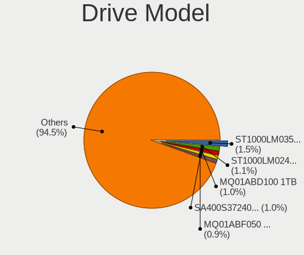
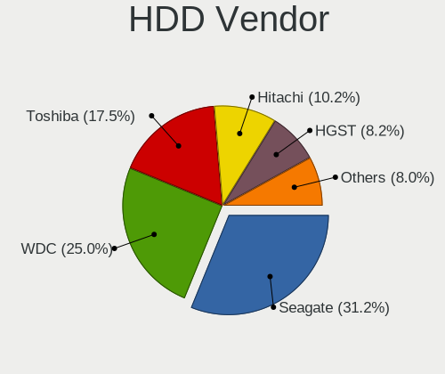
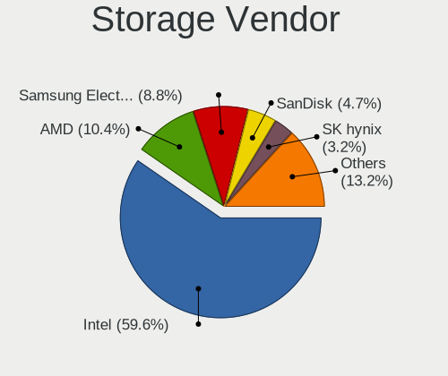
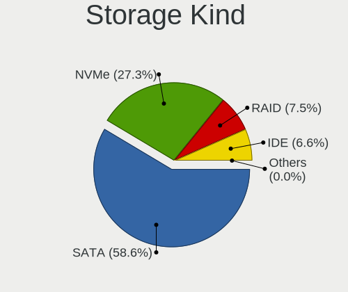
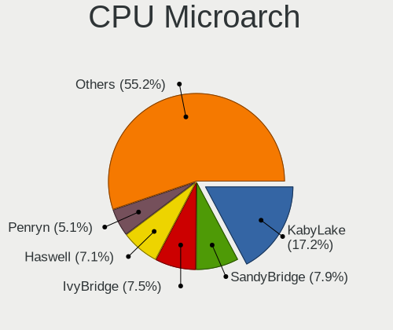
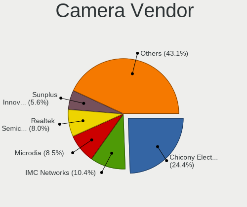

Linux - Tested Hardware & Statistics (Notebooks)
------------------------------------------------

A project to collect tested hardware configurations for Linux.

Anyone can contribute to this report by the [hw-probe](https://github.com/linuxhw/hw-probe) tool:

    sudo -E hw-probe -all -upload

Please contribute! Especially if your hardware is rare.

This report is for real hardware. Report for virtual hardware: [TestCoverage_VE](https://github.com/linuxhw/TestCoverage_VE)

Contents
--------

* [ Test Cases ](#test-cases)

* [ System ](#system)
  - [ OS                       ](#os)
  - [ OS Family                ](#os-family)
  - [ Kernel                   ](#kernel)
  - [ Kernel Family            ](#kernel-family)
  - [ Kernel Major Ver.        ](#kernel-major-ver)
  - [ Arch                     ](#arch)
  - [ DE                       ](#de)
  - [ Display Server           ](#display-server)
  - [ Display Manager          ](#display-manager)
  - [ OS Lang                  ](#os-lang)
  - [ Boot Mode                ](#boot-mode)
  - [ Filesystem               ](#filesystem)
  - [ Part. scheme             ](#part-scheme)
  - [ Dual Boot with Linux/BSD ](#dual-boot-with-linuxbsd)
  - [ Dual Boot (Win)          ](#dual-boot-win)

* [ Board ](#board)
  - [ Vendor                   ](#vendor)
  - [ Model                    ](#model)
  - [ Model Family             ](#model-family)
  - [ MFG Year                 ](#mfg-year)
  - [ Form Factor              ](#form-factor)
  - [ Secure Boot              ](#secure-boot)
  - [ Coreboot                 ](#coreboot)
  - [ RAM Size                 ](#ram-size)
  - [ RAM Used                 ](#ram-used)
  - [ Total Drives             ](#total-drives)
  - [ Has CD-ROM               ](#has-cd-rom)
  - [ Has Ethernet             ](#has-ethernet)
  - [ Has WiFi                 ](#has-wifi)
  - [ Has Bluetooth            ](#has-bluetooth)

* [ Location ](#location)
  - [ Country                  ](#country)
  - [ City                     ](#city)

* [ Drives ](#drives)
  - [ Drive Vendor             ](#drive-vendor)
  - [ Drive Model              ](#drive-model)
  - [ HDD Vendor               ](#hdd-vendor)
  - [ SSD Vendor               ](#ssd-vendor)
  - [ Drive Kind               ](#drive-kind)
  - [ Drive Connector          ](#drive-connector)
  - [ Drive Size               ](#drive-size)
  - [ Space Total              ](#space-total)
  - [ Space Used               ](#space-used)
  - [ Malfunc. Drives          ](#malfunc-drives)
  - [ Malfunc. Drive Vendor    ](#malfunc-drive-vendor)
  - [ Malfunc. HDD Vendor      ](#malfunc-hdd-vendor)
  - [ Malfunc. Drive Kind      ](#malfunc-drive-kind)
  - [ Failed Drives            ](#failed-drives)
  - [ Failed Drive Vendor      ](#failed-drive-vendor)
  - [ Drive Status             ](#drive-status)

* [ Storage controller ](#storage-controller)
  - [ Storage Vendor           ](#storage-vendor)
  - [ Storage Model            ](#storage-model)
  - [ Storage Kind             ](#storage-kind)

* [ Processor ](#processor)
  - [ CPU Vendor               ](#cpu-vendor)
  - [ CPU Model                ](#cpu-model)
  - [ CPU Model Family         ](#cpu-model-family)
  - [ CPU Cores                ](#cpu-cores)
  - [ CPU Sockets              ](#cpu-sockets)
  - [ CPU Threads              ](#cpu-threads)
  - [ CPU Op-Modes             ](#cpu-op-modes)
  - [ CPU Microcode            ](#cpu-microcode)
  - [ CPU Microarch            ](#cpu-microarch)

* [ Graphics ](#graphics)
  - [ GPU Vendor               ](#gpu-vendor)
  - [ GPU Model                ](#gpu-model)
  - [ GPU Combo                ](#gpu-combo)
  - [ GPU Driver               ](#gpu-driver)
  - [ GPU Memory               ](#gpu-memory)

* [ Monitor ](#monitor)
  - [ Monitor Vendor           ](#monitor-vendor)
  - [ Monitor Model            ](#monitor-model)
  - [ Monitor Resolution       ](#monitor-resolution)
  - [ Monitor Diagonal         ](#monitor-diagonal)
  - [ Monitor Width            ](#monitor-width)
  - [ Aspect Ratio             ](#aspect-ratio)
  - [ Monitor Area             ](#monitor-area)
  - [ Pixel Density            ](#pixel-density)
  - [ Multiple Monitors        ](#multiple-monitors)

* [ Network ](#network)
  - [ Net Controller Vendor    ](#net-controller-vendor)
  - [ Net Controller Model     ](#net-controller-model)
  - [ Wireless Vendor          ](#wireless-vendor)
  - [ Wireless Model           ](#wireless-model)
  - [ Ethernet Vendor          ](#ethernet-vendor)
  - [ Ethernet Model           ](#ethernet-model)
  - [ Net Controller Kind      ](#net-controller-kind)
  - [ Used Controller          ](#used-controller)
  - [ NICs                     ](#nics)
  - [ IPv6                     ](#ipv6)

* [ Bluetooth ](#bluetooth)
  - [ Bluetooth Vendor         ](#bluetooth-vendor)
  - [ Bluetooth Model          ](#bluetooth-model)

* [ Sound ](#sound)
  - [ Sound Vendor             ](#sound-vendor)
  - [ Sound Model              ](#sound-model)

* [ Memory ](#memory)
  - [ Memory Vendor            ](#memory-vendor)
  - [ Memory Model             ](#memory-model)
  - [ Memory Kind              ](#memory-kind)
  - [ Memory Form Factor       ](#memory-form-factor)
  - [ Memory Size              ](#memory-size)
  - [ Memory Speed             ](#memory-speed)

* [ Printers & scanners ](#printers--scanners)
  - [ Printer Vendor           ](#printer-vendor)
  - [ Printer Model            ](#printer-model)
  - [ Scanner Vendor           ](#scanner-vendor)
  - [ Scanner Model            ](#scanner-model)

* [ Camera ](#camera)
  - [ Camera Vendor            ](#camera-vendor)
  - [ Camera Model             ](#camera-model)

* [ Security ](#security)
  - [ Fingerprint Vendor       ](#fingerprint-vendor)
  - [ Fingerprint Model        ](#fingerprint-model)
  - [ Chipcard Vendor          ](#chipcard-vendor)
  - [ Chipcard Model           ](#chipcard-model)

* [ Unsupported ](#unsupported)
  - [ Unsupported Devices      ](#unsupported-devices)
  - [ Unsupported Device Types ](#unsupported-device-types)

Test Cases
----------

Total: 124745

| Vendor        | Model                       | Probe                                                      | Date         |
|---------------|-----------------------------|------------------------------------------------------------|--------------|
| Lenovo        | ThinkPad T14 Gen 1 20S00... | [06d4d79742](https://linux-hardware.org/?probe=06d4d79742) | Jul 01, 2022 |
| Lenovo        | ThinkPad T480 20L6S2EQ00    | [1b45ef7d10](https://linux-hardware.org/?probe=1b45ef7d10) | Jul 01, 2022 |
| Dell          | Precision M4600             | [ea07b9e45f](https://linux-hardware.org/?probe=ea07b9e45f) | Jul 01, 2022 |
| Dell          | Precision M4600             | [535d6029bc](https://linux-hardware.org/?probe=535d6029bc) | Jul 01, 2022 |
| HP            | Pavilion Aero Laptop 13-... | [9b8bb07ff0](https://linux-hardware.org/?probe=9b8bb07ff0) | Jul 01, 2022 |
| Lenovo        | ThinkPad P14s Gen 1 20Y1... | [16413aeb23](https://linux-hardware.org/?probe=16413aeb23) | Jul 01, 2022 |
| Apple         | MacBookPro16,1              | [05c07aba75](https://linux-hardware.org/?probe=05c07aba75) | Jul 01, 2022 |
| Lenovo        | IdeaPad 700-15ISK 80RU      | [10ff366630](https://linux-hardware.org/?probe=10ff366630) | Jul 01, 2022 |
| Samsung       | 930XED                      | [56a04fa69d](https://linux-hardware.org/?probe=56a04fa69d) | Jul 01, 2022 |
| TUXEDO        | Pulse 15 Gen1               | [9de0586493](https://linux-hardware.org/?probe=9de0586493) | Jul 01, 2022 |
| Dell          | Latitude 7530               | [a66aca8921](https://linux-hardware.org/?probe=a66aca8921) | Jul 01, 2022 |
| Dell          | Inspiron 1501               | [f6efa72c1f](https://linux-hardware.org/?probe=f6efa72c1f) | Jul 01, 2022 |
| Apple         | MacBookPro16,1              | [3eb50f5177](https://linux-hardware.org/?probe=3eb50f5177) | Jul 01, 2022 |
| HP            | Laptop 14s-cf2xxx           | [8da2258fea](https://linux-hardware.org/?probe=8da2258fea) | Jul 01, 2022 |
| Lenovo        | ThinkPad L412 0585E86       | [ad82717c98](https://linux-hardware.org/?probe=ad82717c98) | Jul 01, 2022 |
| ASUSTek       | S550CA                      | [8ed63bbdfd](https://linux-hardware.org/?probe=8ed63bbdfd) | Jul 01, 2022 |
| Dell          | Precision 5530              | [d6dc0ecd91](https://linux-hardware.org/?probe=d6dc0ecd91) | Jul 01, 2022 |
| Acer          | Aspire A315-51              | [8febe62da6](https://linux-hardware.org/?probe=8febe62da6) | Jul 01, 2022 |
| Acer          | Aspire 5536                 | [67bb645804](https://linux-hardware.org/?probe=67bb645804) | Jul 01, 2022 |
| Dell          | Latitude E6400              | [1c5025c952](https://linux-hardware.org/?probe=1c5025c952) | Jul 01, 2022 |
| HP            | OMEN by Laptop 15-dc1xxx    | [b7fedc25e4](https://linux-hardware.org/?probe=b7fedc25e4) | Jul 01, 2022 |
| Dell          | Precision 5550              | [0ddb8905e5](https://linux-hardware.org/?probe=0ddb8905e5) | Jul 01, 2022 |
| HP            | ProBook 4540s               | [c47e971697](https://linux-hardware.org/?probe=c47e971697) | Jul 01, 2022 |
| Toshiba       | Satellite L350              | [06df7a6c59](https://linux-hardware.org/?probe=06df7a6c59) | Jul 01, 2022 |
| HP            | Laptop 15s-fq1xxx           | [bd9caa15d5](https://linux-hardware.org/?probe=bd9caa15d5) | Jul 01, 2022 |
| HP            | ProBook 4545s               | [d743bf83fe](https://linux-hardware.org/?probe=d743bf83fe) | Jul 01, 2022 |
| TUXEDO        | Pulse 15 Gen1               | [8c7b7c1b45](https://linux-hardware.org/?probe=8c7b7c1b45) | Jul 01, 2022 |
| Lenovo        | ThinkPad T480 20L5000UUS    | [60c86ea9e1](https://linux-hardware.org/?probe=60c86ea9e1) | Jul 01, 2022 |
| Valve         | Jupiter                     | [c591d23b4d](https://linux-hardware.org/?probe=c591d23b4d) | Jul 01, 2022 |
| Samsung       | Q210/P210                   | [dfc97062be](https://linux-hardware.org/?probe=dfc97062be) | Jul 01, 2022 |
| Dell          | Inspiron M5010              | [14b9aa33d2](https://linux-hardware.org/?probe=14b9aa33d2) | Jul 01, 2022 |
| Toshiba       | Satellite L350              | [49c8c1b96a](https://linux-hardware.org/?probe=49c8c1b96a) | Jul 01, 2022 |
| MSI           | GF63 Thin 11UD              | [63508059d3](https://linux-hardware.org/?probe=63508059d3) | Jul 01, 2022 |
| eMachines     | E725                        | [8ba1579921](https://linux-hardware.org/?probe=8ba1579921) | Jul 01, 2022 |
| Lenovo        | Z70-80 80FG                 | [eaf34443c7](https://linux-hardware.org/?probe=eaf34443c7) | Jul 01, 2022 |
| Acer          | Extensa 5220                | [1ee1e31b52](https://linux-hardware.org/?probe=1ee1e31b52) | Jul 01, 2022 |
| MSI           | GF63 Thin 11UD              | [b7aef43e9e](https://linux-hardware.org/?probe=b7aef43e9e) | Jul 01, 2022 |
| eMachines     | E725                        | [874b6bd7de](https://linux-hardware.org/?probe=874b6bd7de) | Jul 01, 2022 |
| Dell          | Latitude 3420               | [1e31a0ce68](https://linux-hardware.org/?probe=1e31a0ce68) | Jul 01, 2022 |
| ASUSTek       | TUF Gaming FX505DT_FX505... | [9034bf7260](https://linux-hardware.org/?probe=9034bf7260) | Jul 01, 2022 |
| Lenovo        | IdeaPad 510-15IKB 80SV      | [0532069637](https://linux-hardware.org/?probe=0532069637) | Jul 01, 2022 |
| Lenovo        | V110-15IAP 80TG             | [05d0271371](https://linux-hardware.org/?probe=05d0271371) | Jul 01, 2022 |
| ASUSTek       | UX31E                       | [d3f27ab291](https://linux-hardware.org/?probe=d3f27ab291) | Jul 01, 2022 |
| Lenovo        | IdeaPad S145-15IGM 81MX     | [de35c60b5f](https://linux-hardware.org/?probe=de35c60b5f) | Jul 01, 2022 |
| Sony          | VPCEA26FG                   | [b72a4de42b](https://linux-hardware.org/?probe=b72a4de42b) | Jul 01, 2022 |
| ASUSTek       | VivoBook_ASUSLaptop X515... | [81fff806a4](https://linux-hardware.org/?probe=81fff806a4) | Jul 01, 2022 |
| ASUSTek       | VivoBook_ASUSLaptop X515... | [294f501cdd](https://linux-hardware.org/?probe=294f501cdd) | Jul 01, 2022 |
| Dell          | XPS 15 9520                 | [ca7efa311a](https://linux-hardware.org/?probe=ca7efa311a) | Jul 01, 2022 |
| Lenovo        | V110-15IAP 80TG             | [23519c6427](https://linux-hardware.org/?probe=23519c6427) | Jul 01, 2022 |
| Timi          | Mi NoteBook Ultra           | [0364230bc7](https://linux-hardware.org/?probe=0364230bc7) | Jul 01, 2022 |
| ASUSTek       | N43JQ                       | [d73f714472](https://linux-hardware.org/?probe=d73f714472) | Jul 01, 2022 |
| Aquarius      | NS685U R11                  | [1b9ecf0aba](https://linux-hardware.org/?probe=1b9ecf0aba) | Jul 01, 2022 |
| Lenovo        | IdeaPad 5 15ITL05 82FG      | [2671f4ffe2](https://linux-hardware.org/?probe=2671f4ffe2) | Jul 01, 2022 |
| Lenovo        | ThinkPad T430 23501F9       | [e4bd671886](https://linux-hardware.org/?probe=e4bd671886) | Jul 01, 2022 |
| Lenovo        | G700                        | [b0c0b2b8ef](https://linux-hardware.org/?probe=b0c0b2b8ef) | Jul 01, 2022 |
| Lenovo        | ThinkBook 15 G2 ITL 20VE    | [7cdf221ced](https://linux-hardware.org/?probe=7cdf221ced) | Jul 01, 2022 |
| Razer         | Blade 14 (2022) - RZ09-0... | [927dbb8452](https://linux-hardware.org/?probe=927dbb8452) | Jul 01, 2022 |
| Lenovo        | Z70-80 80FG                 | [de5734cbe0](https://linux-hardware.org/?probe=de5734cbe0) | Jul 01, 2022 |
| MSI           | GF63 Thin 11UD              | [325fec2ac6](https://linux-hardware.org/?probe=325fec2ac6) | Jul 01, 2022 |
| Lenovo        | Z70-80 80FG                 | [dd8c266ad2](https://linux-hardware.org/?probe=dd8c266ad2) | Jul 01, 2022 |
| HP            | ProBook 450 G5              | [5a27519612](https://linux-hardware.org/?probe=5a27519612) | Jul 01, 2022 |
| Dell          | Inspiron 1764               | [dd5c77d711](https://linux-hardware.org/?probe=dd5c77d711) | Jul 01, 2022 |
| Lenovo        | ThinkPad E14 Gen 2 20T6S... | [430c2e6760](https://linux-hardware.org/?probe=430c2e6760) | Jul 01, 2022 |
| Razer         | Blade 15 Base Model (Ear... | [7e809da3ad](https://linux-hardware.org/?probe=7e809da3ad) | Jul 01, 2022 |
| ASUSTek       | VivoBook_ASUSLaptop X512... | [c9d0d64896](https://linux-hardware.org/?probe=c9d0d64896) | Jul 01, 2022 |
| Timi          | RedmiBook 14 II             | [bf58ea7c43](https://linux-hardware.org/?probe=bf58ea7c43) | Jul 01, 2022 |
| Timi          | RedmiBook 14 II             | [4c7e17e7ba](https://linux-hardware.org/?probe=4c7e17e7ba) | Jul 01, 2022 |
| Aquarius      | NS685U R11                  | [3ec207409f](https://linux-hardware.org/?probe=3ec207409f) | Jul 01, 2022 |
| ASUSTek       | VivoBook_ASUSLaptop X513... | [af946ca10b](https://linux-hardware.org/?probe=af946ca10b) | Jul 01, 2022 |
| Lenovo        | ThinkPad W510 4318CTO       | [27cd378ed6](https://linux-hardware.org/?probe=27cd378ed6) | Jul 01, 2022 |
| ASUSTek       | X756UQK                     | [62595fe324](https://linux-hardware.org/?probe=62595fe324) | Jul 01, 2022 |
| Lenovo        | IdeaPad 3 15IML05 81WB      | [93d3e2daba](https://linux-hardware.org/?probe=93d3e2daba) | Jul 01, 2022 |
| Sony          | VPCEH37FJ                   | [509fe56362](https://linux-hardware.org/?probe=509fe56362) | Jul 01, 2022 |
| HUAWEI        | NBM-WXX9                    | [6ed674f77e](https://linux-hardware.org/?probe=6ed674f77e) | Jul 01, 2022 |
| Dell          | Latitude E6400              | [a47d49bfab](https://linux-hardware.org/?probe=a47d49bfab) | Jul 01, 2022 |
| Acer          | Aspire E5-573               | [01f3150f60](https://linux-hardware.org/?probe=01f3150f60) | Jul 01, 2022 |
| HP            | Laptop 14-fq1xxx            | [9aa0a38b17](https://linux-hardware.org/?probe=9aa0a38b17) | Jul 01, 2022 |
| OEM           | S20II1                      | [bcaac39dde](https://linux-hardware.org/?probe=bcaac39dde) | Jul 01, 2022 |
| HP            | Laptop 14-fq1xxx            | [b9b09609b8](https://linux-hardware.org/?probe=b9b09609b8) | Jul 01, 2022 |
| HP            | Pavilion 15                 | [e35e3b2e52](https://linux-hardware.org/?probe=e35e3b2e52) | Jul 01, 2022 |
| Chuwi         | HeroBook Air                | [217dcb770c](https://linux-hardware.org/?probe=217dcb770c) | Jul 01, 2022 |
| Lenovo        | ThinkPad T430 2342CTO       | [eaba15d64b](https://linux-hardware.org/?probe=eaba15d64b) | Jul 01, 2022 |
| Dell          | Precision 7510              | [c82cc3cb0f](https://linux-hardware.org/?probe=c82cc3cb0f) | Jul 01, 2022 |
| HP            | Pavilion g4                 | [3626d9afe4](https://linux-hardware.org/?probe=3626d9afe4) | Jul 01, 2022 |
| ASUSTek       | F3JR                        | [b56d8007d7](https://linux-hardware.org/?probe=b56d8007d7) | Jul 01, 2022 |
| HP            | EliteBook 840 G1            | [b691598870](https://linux-hardware.org/?probe=b691598870) | Jul 01, 2022 |
| HP            | Pavilion 17                 | [1efb06e77e](https://linux-hardware.org/?probe=1efb06e77e) | Jul 01, 2022 |
| Dell          | Inspiron 5547               | [c2a91cc81e](https://linux-hardware.org/?probe=c2a91cc81e) | Jul 01, 2022 |
| Dell          | Precision 5530              | [cc30de04b0](https://linux-hardware.org/?probe=cc30de04b0) | Jul 01, 2022 |
| Lenovo        | ThinkPad T450s 20BX002NM... | [3bb2e1821b](https://linux-hardware.org/?probe=3bb2e1821b) | Jul 01, 2022 |
| Framework     | Laptop                      | [1089f37daf](https://linux-hardware.org/?probe=1089f37daf) | Jul 01, 2022 |
| HP            | Pavilion Gaming Laptop 1... | [f54987d748](https://linux-hardware.org/?probe=f54987d748) | Jul 01, 2022 |
| Dell          | 500                         | [040e3cb12c](https://linux-hardware.org/?probe=040e3cb12c) | Jun 30, 2022 |
| HONOR         | BOHK-WAX9X                  | [1647402099](https://linux-hardware.org/?probe=1647402099) | Jun 30, 2022 |
| Lenovo        | ThinkBook 15 G3 ACL 21A4    | [ccb50bd0f4](https://linux-hardware.org/?probe=ccb50bd0f4) | Jun 30, 2022 |
| Dell          | Latitude E5430 non-vPro     | [ae786e567a](https://linux-hardware.org/?probe=ae786e567a) | Jun 30, 2022 |
| Dell          | Latitude E5430 non-vPro     | [c4942af0bc](https://linux-hardware.org/?probe=c4942af0bc) | Jun 30, 2022 |
| Dell          | Inspiron 1720               | [bbd0bf2dc0](https://linux-hardware.org/?probe=bbd0bf2dc0) | Jun 30, 2022 |
| Lenovo        | ThinkPad T460 20FMS2292S    | [cf313915ab](https://linux-hardware.org/?probe=cf313915ab) | Jun 30, 2022 |
| Dell          | Latitude 3420               | [651ab17da0](https://linux-hardware.org/?probe=651ab17da0) | Jun 30, 2022 |
| ASUSTek       | VivoBook E14 E402WA         | [1ba6fe4840](https://linux-hardware.org/?probe=1ba6fe4840) | Jun 30, 2022 |
| eMachines     | E725                        | [021bcca061](https://linux-hardware.org/?probe=021bcca061) | Jun 30, 2022 |
| Lenovo        | IdeaPad 5 Pro 14ACN6 82L... | [54f7fcc588](https://linux-hardware.org/?probe=54f7fcc588) | Jun 30, 2022 |
| eMachines     | E725                        | [b8b332e92f](https://linux-hardware.org/?probe=b8b332e92f) | Jun 30, 2022 |
| HP            | Presario CQ56               | [af108b4933](https://linux-hardware.org/?probe=af108b4933) | Jun 30, 2022 |
| Dell          | G5 5500                     | [edfdebf28d](https://linux-hardware.org/?probe=edfdebf28d) | Jun 30, 2022 |
| MSI           | EX705                       | [d85dfacff5](https://linux-hardware.org/?probe=d85dfacff5) | Jun 30, 2022 |
| MSI           | EX705                       | [3de108279f](https://linux-hardware.org/?probe=3de108279f) | Jun 30, 2022 |
| Unknown       | Unknown                     | [b1a8d360fb](https://linux-hardware.org/?probe=b1a8d360fb) | Jun 30, 2022 |
| Thomson       | N17V3C8WH512                | [518a227ae9](https://linux-hardware.org/?probe=518a227ae9) | Jun 30, 2022 |
| Lenovo        | IdeaPad Slim 1-14AST-05 ... | [75b3bd3b8c](https://linux-hardware.org/?probe=75b3bd3b8c) | Jun 30, 2022 |
| ASUSTek       | ROG Strix G513IC_G513IC     | [77f0b32727](https://linux-hardware.org/?probe=77f0b32727) | Jun 30, 2022 |
| Lenovo        | V14-IIL 82C4                | [3bfb8980e3](https://linux-hardware.org/?probe=3bfb8980e3) | Jun 30, 2022 |
| HP            | EliteBook 840 G3            | [9ce5b9c45c](https://linux-hardware.org/?probe=9ce5b9c45c) | Jun 30, 2022 |
| ASUSTek       | VivoBook_ASUSLaptop X515... | [d68cd17ca2](https://linux-hardware.org/?probe=d68cd17ca2) | Jun 30, 2022 |
| LG Electro... | A410-G.BC48P1               | [41e6b25be5](https://linux-hardware.org/?probe=41e6b25be5) | Jun 30, 2022 |
| Dell          | Inspiron 5520               | [15b5edddd3](https://linux-hardware.org/?probe=15b5edddd3) | Jun 30, 2022 |
| ASUSTek       | ZenBook UX392FN_UX392FN     | [b4699ba106](https://linux-hardware.org/?probe=b4699ba106) | Jun 30, 2022 |
| Dell          | Inspiron N5110              | [142c1c4ef2](https://linux-hardware.org/?probe=142c1c4ef2) | Jun 30, 2022 |
| Toshiba       | Satellite R630              | [1caa1a1d65](https://linux-hardware.org/?probe=1caa1a1d65) | Jun 30, 2022 |
| Dell          | Precision 5530              | [383cbca466](https://linux-hardware.org/?probe=383cbca466) | Jun 30, 2022 |
| Dell          | XPS 9320                    | [f04b491e6d](https://linux-hardware.org/?probe=f04b491e6d) | Jun 30, 2022 |
| HP            | ProBook 455 G8 Notebook ... | [bec2a7697f](https://linux-hardware.org/?probe=bec2a7697f) | Jun 30, 2022 |
| MicroByte     | ezbook                      | [47939ef544](https://linux-hardware.org/?probe=47939ef544) | Jun 30, 2022 |
| Apple         | MacBookAir7,2               | [ab31abf1d5](https://linux-hardware.org/?probe=ab31abf1d5) | Jun 30, 2022 |
| Lenovo        | ThinkPad T14s Gen 1 20T1... | [7e2ddf75e5](https://linux-hardware.org/?probe=7e2ddf75e5) | Jun 30, 2022 |
| Lenovo        | ThinkPad P15 Gen 1 20SUS... | [4b04ded505](https://linux-hardware.org/?probe=4b04ded505) | Jun 30, 2022 |
| MicroByte     | ezbook                      | [760be1c133](https://linux-hardware.org/?probe=760be1c133) | Jun 30, 2022 |
| Dell          | XPS M1330                   | [b891e49fac](https://linux-hardware.org/?probe=b891e49fac) | Jun 30, 2022 |
| HP            | Pavilion 15                 | [f76f8dff7a](https://linux-hardware.org/?probe=f76f8dff7a) | Jun 30, 2022 |
| HP            | Laptop 15s-du2xxx           | [13e85826c2](https://linux-hardware.org/?probe=13e85826c2) | Jun 30, 2022 |
| Apple         | MacBookPro8,1               | [88e0a63fab](https://linux-hardware.org/?probe=88e0a63fab) | Jun 30, 2022 |
| HP            | Laptop 15s-du2xxx           | [bb4df4398e](https://linux-hardware.org/?probe=bb4df4398e) | Jun 30, 2022 |
| HP            | Pavilion Aero Laptop 13-... | [3af286a188](https://linux-hardware.org/?probe=3af286a188) | Jun 30, 2022 |
| Lenovo        | ThinkPad E15 Gen 2 20TDC... | [f29c4de6b4](https://linux-hardware.org/?probe=f29c4de6b4) | Jun 30, 2022 |
| Lenovo        | ThinkPad E15 Gen 2 20TDC... | [7ecd760977](https://linux-hardware.org/?probe=7ecd760977) | Jun 30, 2022 |
| Lenovo        | ThinkPad E15 Gen 2 20TDC... | [8428ba0120](https://linux-hardware.org/?probe=8428ba0120) | Jun 30, 2022 |
| Matsushita... | CF-52AJCBDBM                | [19a4ef134d](https://linux-hardware.org/?probe=19a4ef134d) | Jun 30, 2022 |
| Acer          | Nitro AN515-44              | [2112b8aff3](https://linux-hardware.org/?probe=2112b8aff3) | Jun 30, 2022 |
| HP            | Pavilion 15                 | [82bc7e7316](https://linux-hardware.org/?probe=82bc7e7316) | Jun 30, 2022 |
| HP            | EliteBook 8470p             | [cd488e4f64](https://linux-hardware.org/?probe=cd488e4f64) | Jun 30, 2022 |
| Acer          | Aspire V3-571G              | [e5283c0142](https://linux-hardware.org/?probe=e5283c0142) | Jun 30, 2022 |
| Acer          | Aspire 4732Z                | [1bf580aa91](https://linux-hardware.org/?probe=1bf580aa91) | Jun 30, 2022 |
| AXDIA Inte... | MYBOOK 14 PRO               | [980925115f](https://linux-hardware.org/?probe=980925115f) | Jun 30, 2022 |
| Dell          | XPS 15 9520                 | [0cb6549f23](https://linux-hardware.org/?probe=0cb6549f23) | Jun 30, 2022 |
| Dell          | Inspiron 1720               | [67853c7ab3](https://linux-hardware.org/?probe=67853c7ab3) | Jun 30, 2022 |
| Acer          | Nitro AN515-44              | [09659e3083](https://linux-hardware.org/?probe=09659e3083) | Jun 30, 2022 |
| Acer          | Aspire V3-571G              | [5e795f7aa1](https://linux-hardware.org/?probe=5e795f7aa1) | Jun 30, 2022 |
| Dell          | Latitude 3520               | [da25da1ece](https://linux-hardware.org/?probe=da25da1ece) | Jun 30, 2022 |
| HP            | EliteBook 8470p             | [96b07cbbd5](https://linux-hardware.org/?probe=96b07cbbd5) | Jun 30, 2022 |
| ASUSTek       | ROG Strix G713RW_G713RW     | [abebd5c659](https://linux-hardware.org/?probe=abebd5c659) | Jun 30, 2022 |
| Valve         | Jupiter                     | [bee9822ef6](https://linux-hardware.org/?probe=bee9822ef6) | Jun 30, 2022 |
| HP            | EliteBook 8470p             | [52dfa0a4ee](https://linux-hardware.org/?probe=52dfa0a4ee) | Jun 30, 2022 |
| Dell          | Precision M6800             | [1eccdbb04e](https://linux-hardware.org/?probe=1eccdbb04e) | Jun 30, 2022 |
| Acer          | Aspire A315-55G             | [e6d7a2a642](https://linux-hardware.org/?probe=e6d7a2a642) | Jun 30, 2022 |
| Apple         | MacBookAir3,2               | [ee189c9ba2](https://linux-hardware.org/?probe=ee189c9ba2) | Jun 30, 2022 |
| Lenovo        | ThinkBook 15 G2 ARE 20VG    | [18646c06d9](https://linux-hardware.org/?probe=18646c06d9) | Jun 30, 2022 |
| Lenovo        | ThinkBook 15 G2 ITL 20VE    | [82ca4386ae](https://linux-hardware.org/?probe=82ca4386ae) | Jun 30, 2022 |
| HP            | Laptop 14s-dk0xxx           | [97d88d7e00](https://linux-hardware.org/?probe=97d88d7e00) | Jun 30, 2022 |
| Aquarius      | NS685U R11                  | [339dc3db60](https://linux-hardware.org/?probe=339dc3db60) | Jun 30, 2022 |
| Acer          | Aspire V3-772G              | [21cba60be3](https://linux-hardware.org/?probe=21cba60be3) | Jun 30, 2022 |
| HP            | Laptop 15-da0xxx            | [9c512247ff](https://linux-hardware.org/?probe=9c512247ff) | Jun 30, 2022 |
| Lenovo        | G500 20236                  | [32916f6607](https://linux-hardware.org/?probe=32916f6607) | Jun 30, 2022 |
| Acer          | Aspire V3-772G              | [0dcbb35983](https://linux-hardware.org/?probe=0dcbb35983) | Jun 30, 2022 |
| ASUSTek       | ZenBook UX435EG_UX435EG     | [8a63aad484](https://linux-hardware.org/?probe=8a63aad484) | Jun 30, 2022 |
| Dell          | Inspiron 7572               | [a6c34895e2](https://linux-hardware.org/?probe=a6c34895e2) | Jun 30, 2022 |
| ASUSTek       | ZenBook UX435EG_UX435EG     | [1aafce44d8](https://linux-hardware.org/?probe=1aafce44d8) | Jun 30, 2022 |
| HP            | Pavilion Gaming Laptop 1... | [6095915fb5](https://linux-hardware.org/?probe=6095915fb5) | Jun 30, 2022 |
| Lenovo        | ThinkPad T410 2518A37       | [4e15b37546](https://linux-hardware.org/?probe=4e15b37546) | Jun 30, 2022 |
| Apple         | MacBook9,1                  | [4d1e0cc30c](https://linux-hardware.org/?probe=4d1e0cc30c) | Jun 30, 2022 |
| Jumper        | EZpad                       | [5d5f3980e1](https://linux-hardware.org/?probe=5d5f3980e1) | Jun 30, 2022 |
| System76      | Gazelle                     | [9cc76ec569](https://linux-hardware.org/?probe=9cc76ec569) | Jun 30, 2022 |
| Apple         | MacBook9,1                  | [f97c981688](https://linux-hardware.org/?probe=f97c981688) | Jun 30, 2022 |
| ASUSTek       | X553MA                      | [804bbd8147](https://linux-hardware.org/?probe=804bbd8147) | Jun 30, 2022 |
| Jumper        | EZpad                       | [66b40738ff](https://linux-hardware.org/?probe=66b40738ff) | Jun 30, 2022 |
| MOTILE        | M141                        | [59c616a04e](https://linux-hardware.org/?probe=59c616a04e) | Jun 30, 2022 |
| Fujitsu       | LIFEBOOK S760               | [f17241857a](https://linux-hardware.org/?probe=f17241857a) | Jun 30, 2022 |
| Dell          | Vostro 5625                 | [0a047126ba](https://linux-hardware.org/?probe=0a047126ba) | Jun 30, 2022 |
| HP            | Compaq 15                   | [fb14abab4d](https://linux-hardware.org/?probe=fb14abab4d) | Jun 30, 2022 |
| ASUSTek       | X553MA                      | [9fe936cec8](https://linux-hardware.org/?probe=9fe936cec8) | Jun 30, 2022 |
| Apple         | MacBookPro12,1              | [3cec3cffbb](https://linux-hardware.org/?probe=3cec3cffbb) | Jun 30, 2022 |
| Dell          | Inspiron 5521               | [e9948fff52](https://linux-hardware.org/?probe=e9948fff52) | Jun 30, 2022 |
| Toshiba       | Satellite A665              | [72011aa2aa](https://linux-hardware.org/?probe=72011aa2aa) | Jun 30, 2022 |
| MSI           | CR620                       | [0968b18823](https://linux-hardware.org/?probe=0968b18823) | Jun 30, 2022 |
| Apple         | MacBookPro12,1              | [bac4b49e55](https://linux-hardware.org/?probe=bac4b49e55) | Jun 30, 2022 |
| ASUSTek       | VivoBook_ASUSLaptop X515... | [3a423eae14](https://linux-hardware.org/?probe=3a423eae14) | Jun 30, 2022 |
| HP            | ProBook 445 G8 Notebook ... | [35ca7c4868](https://linux-hardware.org/?probe=35ca7c4868) | Jun 30, 2022 |
| HP            | Pavilion Gaming Laptop 1... | [1f66ba5535](https://linux-hardware.org/?probe=1f66ba5535) | Jun 30, 2022 |
| Lenovo        | IdeaPad L340-15IWL 81LG     | [99c4a61b01](https://linux-hardware.org/?probe=99c4a61b01) | Jun 30, 2022 |
| Lenovo        | ThinkPad T495 20NKS0PG00    | [ee35a21db4](https://linux-hardware.org/?probe=ee35a21db4) | Jun 30, 2022 |
| Dell          | Latitude E5430 non-vPro     | [c4ef403aed](https://linux-hardware.org/?probe=c4ef403aed) | Jun 30, 2022 |
| Dell          | Inspiron 5570               | [de7ac7a3a5](https://linux-hardware.org/?probe=de7ac7a3a5) | Jun 30, 2022 |
| HP            | 1000                        | [65ae23140e](https://linux-hardware.org/?probe=65ae23140e) | Jun 30, 2022 |
| HUAWEI        | MACH-WX9                    | [329e3a150f](https://linux-hardware.org/?probe=329e3a150f) | Jun 30, 2022 |
| Positivo      | CHT14B                      | [7aaac075a6](https://linux-hardware.org/?probe=7aaac075a6) | Jun 30, 2022 |
| Framework     | Laptop                      | [8a44001ebb](https://linux-hardware.org/?probe=8a44001ebb) | Jun 30, 2022 |
| Lenovo        | ThinkPad E15 Gen 2 20TDC... | [87eecce08e](https://linux-hardware.org/?probe=87eecce08e) | Jun 30, 2022 |
| Framework     | Laptop                      | [61a6480a38](https://linux-hardware.org/?probe=61a6480a38) | Jun 30, 2022 |
| Dell          | Inspiron 5537               | [9758b4dcff](https://linux-hardware.org/?probe=9758b4dcff) | Jun 30, 2022 |
| HUAWEI        | HVY-WXX9                    | [e7f3ea5cf5](https://linux-hardware.org/?probe=e7f3ea5cf5) | Jun 30, 2022 |
| Acer          | Aspire A315-23G             | [f5ca75e65b](https://linux-hardware.org/?probe=f5ca75e65b) | Jun 30, 2022 |
| Dell          | Inspiron 3451               | [6cf63ca19e](https://linux-hardware.org/?probe=6cf63ca19e) | Jun 30, 2022 |
| HP            | EliteBook Folio 9470m       | [7c7fdefa8d](https://linux-hardware.org/?probe=7c7fdefa8d) | Jun 30, 2022 |
| Timi          | RedmiBook 13                | [fb3b3f37d5](https://linux-hardware.org/?probe=fb3b3f37d5) | Jun 30, 2022 |
| Lenovo        | IdeaPad S145-14AST 81ST     | [0e09c926c1](https://linux-hardware.org/?probe=0e09c926c1) | Jun 30, 2022 |
| Dell          | Latitude 5511               | [c76790a345](https://linux-hardware.org/?probe=c76790a345) | Jun 30, 2022 |
| Acer          | Aspire E5-521               | [717281a3f9](https://linux-hardware.org/?probe=717281a3f9) | Jun 29, 2022 |
| Acer          | Aspire 5735                 | [b930fd3fcd](https://linux-hardware.org/?probe=b930fd3fcd) | Jun 29, 2022 |
| Acer          | Aspire E5-521               | [f532d90f38](https://linux-hardware.org/?probe=f532d90f38) | Jun 29, 2022 |
| Acer          | Swift SF314-43              | [14f9c7d4c5](https://linux-hardware.org/?probe=14f9c7d4c5) | Jun 29, 2022 |
| Dell          | Inspiron 7573               | [40125eaa3a](https://linux-hardware.org/?probe=40125eaa3a) | Jun 29, 2022 |
| Lenovo        | ThinkPad E14 Gen 3 20Y70... | [03854f8307](https://linux-hardware.org/?probe=03854f8307) | Jun 29, 2022 |
| Lenovo        | Z70-80 80FG                 | [bef849e3d1](https://linux-hardware.org/?probe=bef849e3d1) | Jun 29, 2022 |
| Standard      | Unknown                     | [1a94acbc05](https://linux-hardware.org/?probe=1a94acbc05) | Jun 29, 2022 |
| Dell          | Precision M6800             | [5b30cb4b9a](https://linux-hardware.org/?probe=5b30cb4b9a) | Jun 29, 2022 |
| Dell          | Inspiron 3543               | [1f9d3b4a6c](https://linux-hardware.org/?probe=1f9d3b4a6c) | Jun 29, 2022 |
| Lenovo        | ThinkPad T470 20HES2141Z    | [53010a4be8](https://linux-hardware.org/?probe=53010a4be8) | Jun 29, 2022 |
| Lenovo        | ThinkBook 15 G2 ITL 20VE    | [42462e221b](https://linux-hardware.org/?probe=42462e221b) | Jun 29, 2022 |
| Lenovo        | ThinkPad T470 20HES2141Z    | [8e9c8e62b1](https://linux-hardware.org/?probe=8e9c8e62b1) | Jun 29, 2022 |
| Lenovo        | ThinkPad S5-S540 20B3001... | [d5be9c4fca](https://linux-hardware.org/?probe=d5be9c4fca) | Jun 29, 2022 |
| Dell          | Inspiron M5040              | [64c8f1ad3f](https://linux-hardware.org/?probe=64c8f1ad3f) | Jun 29, 2022 |
| Dell          | Latitude 3420               | [5fef19c107](https://linux-hardware.org/?probe=5fef19c107) | Jun 29, 2022 |
| Acer          | Aspire A315-55KG            | [223d853d4e](https://linux-hardware.org/?probe=223d853d4e) | Jun 29, 2022 |
| ASUSTek       | ZenBook UX425EA_UX425EA     | [91c5f849c5](https://linux-hardware.org/?probe=91c5f849c5) | Jun 29, 2022 |
| Jumper        | EZpad                       | [3ea5b3080d](https://linux-hardware.org/?probe=3ea5b3080d) | Jun 29, 2022 |
| HP            | Pavilion dm1                | [927f5b38e0](https://linux-hardware.org/?probe=927f5b38e0) | Jun 29, 2022 |
| Notebook      | P7xxDM3(-G)                 | [6abdc9b40d](https://linux-hardware.org/?probe=6abdc9b40d) | Jun 29, 2022 |
| Lenovo        | G580 20150                  | [dbe5fe496a](https://linux-hardware.org/?probe=dbe5fe496a) | Jun 29, 2022 |
| Acer          | Swift SF314-43              | [de32150701](https://linux-hardware.org/?probe=de32150701) | Jun 29, 2022 |
| Dell          | Latitude E5470              | [2440e59a5a](https://linux-hardware.org/?probe=2440e59a5a) | Jun 29, 2022 |
| HP            | Laptop 15s-eq2xxx           | [5acbf09f01](https://linux-hardware.org/?probe=5acbf09f01) | Jun 29, 2022 |
| Acer          | Aspire V3-772G              | [d8190f3da8](https://linux-hardware.org/?probe=d8190f3da8) | Jun 29, 2022 |
| MSI           | GL65 Leopard 10SEK          | [5043bf1cd4](https://linux-hardware.org/?probe=5043bf1cd4) | Jun 29, 2022 |
| HP            | ProBook 455 G8 Notebook ... | [e08493100f](https://linux-hardware.org/?probe=e08493100f) | Jun 29, 2022 |
| Lenovo        | IdeaPad 330-17IKB 81DK      | [2fa204d33e](https://linux-hardware.org/?probe=2fa204d33e) | Jun 29, 2022 |
| Lenovo        | ThinkPad T14s Gen 1 20UH... | [bd4018ed46](https://linux-hardware.org/?probe=bd4018ed46) | Jun 29, 2022 |
| ASUSTek       | UX302LA                     | [6092e85ae8](https://linux-hardware.org/?probe=6092e85ae8) | Jun 29, 2022 |
| Lenovo        | ThinkPad P1 20MDCTO1WW      | [4b2106c800](https://linux-hardware.org/?probe=4b2106c800) | Jun 29, 2022 |
| Getac         | B300-X                      | [eb752b6c15](https://linux-hardware.org/?probe=eb752b6c15) | Jun 29, 2022 |
| Lenovo        | ThinkPad T420 4180MY7       | [1e755c8031](https://linux-hardware.org/?probe=1e755c8031) | Jun 29, 2022 |
| Dell          | Latitude E6410              | [f0fd0d2bd0](https://linux-hardware.org/?probe=f0fd0d2bd0) | Jun 29, 2022 |
| HP            | Pavilion Gaming Laptop 1... | [6dc02ab574](https://linux-hardware.org/?probe=6dc02ab574) | Jun 29, 2022 |
| Dell          | Inspiron 1525               | [8f507b2e8c](https://linux-hardware.org/?probe=8f507b2e8c) | Jun 29, 2022 |
| Lenovo        | IdeaPad 3 14IML05 81WA      | [282d2ad16b](https://linux-hardware.org/?probe=282d2ad16b) | Jun 29, 2022 |
| Lenovo        | ThinkPad T420 4180MY7       | [a57e4e84f8](https://linux-hardware.org/?probe=a57e4e84f8) | Jun 29, 2022 |
| Toshiba       | Satellite C850-1NU          | [2b83cb161e](https://linux-hardware.org/?probe=2b83cb161e) | Jun 29, 2022 |
| Dell          | Latitude D610               | [0d55e1e388](https://linux-hardware.org/?probe=0d55e1e388) | Jun 29, 2022 |
| Dell          | Inspiron 5405               | [73ec2d1277](https://linux-hardware.org/?probe=73ec2d1277) | Jun 29, 2022 |
| Dell          | Latitude 3410               | [050678128c](https://linux-hardware.org/?probe=050678128c) | Jun 29, 2022 |
| Lenovo        | B590 20208                  | [9ca2d03c70](https://linux-hardware.org/?probe=9ca2d03c70) | Jun 29, 2022 |
| Lenovo        | IdeaPad Flex-14API 81SS     | [828f0b9ef1](https://linux-hardware.org/?probe=828f0b9ef1) | Jun 29, 2022 |
| HP            | OMEN Laptop 15-en0xxx       | [53842b1b7d](https://linux-hardware.org/?probe=53842b1b7d) | Jun 29, 2022 |
| Infinix       | INBOOK X2                   | [1c87102f96](https://linux-hardware.org/?probe=1c87102f96) | Jun 29, 2022 |
| Lenovo        | ThinkPad X230 2325AEG       | [eaa3a2096e](https://linux-hardware.org/?probe=eaa3a2096e) | Jun 29, 2022 |
| Lenovo        | Legion Y540-15IRH 81SX      | [1b5babe2aa](https://linux-hardware.org/?probe=1b5babe2aa) | Jun 29, 2022 |
| HUAWEI        | BOD-WXX9                    | [9c3e14320e](https://linux-hardware.org/?probe=9c3e14320e) | Jun 29, 2022 |
| Prestigio     | Multipad Visconte V         | [fd38a70070](https://linux-hardware.org/?probe=fd38a70070) | Jun 29, 2022 |
| HP            | ENVY dv7                    | [9f64d5f095](https://linux-hardware.org/?probe=9f64d5f095) | Jun 29, 2022 |
| Dell          | Inspiron 7460               | [c5e8b7f098](https://linux-hardware.org/?probe=c5e8b7f098) | Jun 29, 2022 |
| Lenovo        | ThinkPad E590 20NB001AUK    | [f52aacfbfe](https://linux-hardware.org/?probe=f52aacfbfe) | Jun 29, 2022 |
| HP            | Laptop 17-ca1xxx            | [10620fe30b](https://linux-hardware.org/?probe=10620fe30b) | Jun 29, 2022 |
| Lenovo        | ThinkPad T530 24295L4       | [1bdf25550e](https://linux-hardware.org/?probe=1bdf25550e) | Jun 29, 2022 |
| Toshiba       | Satellite C50t-B            | [2fd1180edb](https://linux-hardware.org/?probe=2fd1180edb) | Jun 29, 2022 |
| AMI           | Intel                       | [2b592e2f4a](https://linux-hardware.org/?probe=2b592e2f4a) | Jun 29, 2022 |
| Toshiba       | Satellite C50t-B            | [e767357cdf](https://linux-hardware.org/?probe=e767357cdf) | Jun 29, 2022 |
| HP            | EliteBook 840 G4            | [0244eb4fde](https://linux-hardware.org/?probe=0244eb4fde) | Jun 29, 2022 |
| Lenovo        | ThinkPad P50 20EQS5M100     | [d0b6aa0a1a](https://linux-hardware.org/?probe=d0b6aa0a1a) | Jun 29, 2022 |
| HP            | EliteBook 840 G6            | [faaa7b9c81](https://linux-hardware.org/?probe=faaa7b9c81) | Jun 29, 2022 |
| Dell          | Vostro 3500                 | [3cc5f6458d](https://linux-hardware.org/?probe=3cc5f6458d) | Jun 29, 2022 |
| Valve         | Jupiter                     | [e98c07bc79](https://linux-hardware.org/?probe=e98c07bc79) | Jun 29, 2022 |
| System76      | Oryx Pro                    | [7fa7a1ca82](https://linux-hardware.org/?probe=7fa7a1ca82) | Jun 29, 2022 |
| Toshiba       | Satellite L755D             | [87bdccce5e](https://linux-hardware.org/?probe=87bdccce5e) | Jun 29, 2022 |
| MSI           | PE60 6QE                    | [4c7beba4e2](https://linux-hardware.org/?probe=4c7beba4e2) | Jun 29, 2022 |
| Fujitsu Si... | ESPRIMO Mobile V6535        | [7d85e08611](https://linux-hardware.org/?probe=7d85e08611) | Jun 29, 2022 |
| MicroByte     | ezbook                      | [5a90fc7dc4](https://linux-hardware.org/?probe=5a90fc7dc4) | Jun 29, 2022 |
| ASUSTek       | VivoBook_ASUSLaptop X509... | [dbc366f6a0](https://linux-hardware.org/?probe=dbc366f6a0) | Jun 29, 2022 |
| HP            | Compaq CQ45                 | [74948790d0](https://linux-hardware.org/?probe=74948790d0) | Jun 29, 2022 |
| Dell          | Latitude 5430               | [119502eddb](https://linux-hardware.org/?probe=119502eddb) | Jun 29, 2022 |
| MicroByte     | ezbook                      | [139b8a650b](https://linux-hardware.org/?probe=139b8a650b) | Jun 29, 2022 |
| Acer          | Aspire A314-35              | [dfdd48254c](https://linux-hardware.org/?probe=dfdd48254c) | Jun 29, 2022 |
| HP            | Pavilion Gaming Laptop 1... | [43c87260b2](https://linux-hardware.org/?probe=43c87260b2) | Jun 29, 2022 |
| ASUSTek       | ZenBook UX425UAZ_UM425UA... | [5de569a33e](https://linux-hardware.org/?probe=5de569a33e) | Jun 29, 2022 |
| Valve         | Jupiter                     | [261590e542](https://linux-hardware.org/?probe=261590e542) | Jun 29, 2022 |
| Lenovo        | ThinkPad E15 Gen 2 20T80... | [5ebcb2f152](https://linux-hardware.org/?probe=5ebcb2f152) | Jun 29, 2022 |
| HP            | ENVY TS 17                  | [7b5d021513](https://linux-hardware.org/?probe=7b5d021513) | Jun 29, 2022 |
| Acer          | Aspire 5740                 | [1db26fc575](https://linux-hardware.org/?probe=1db26fc575) | Jun 29, 2022 |
| Valve         | Jupiter                     | [7c233f0a07](https://linux-hardware.org/?probe=7c233f0a07) | Jun 29, 2022 |
| Dell          | Inspiron 3531               | [2c8286100d](https://linux-hardware.org/?probe=2c8286100d) | Jun 29, 2022 |
| Toshiba       | Satellite M305              | [0f42d5a8ef](https://linux-hardware.org/?probe=0f42d5a8ef) | Jun 29, 2022 |
| Acer          | Aspire 5740                 | [44a72b9a94](https://linux-hardware.org/?probe=44a72b9a94) | Jun 29, 2022 |
| Lenovo        | IdeaPad 100S-14IBR 80R9     | [e8d42a5f3b](https://linux-hardware.org/?probe=e8d42a5f3b) | Jun 29, 2022 |
| Dell          | Latitude 3590               | [b5d4509068](https://linux-hardware.org/?probe=b5d4509068) | Jun 29, 2022 |
| Dell          | Inspiron 11 - 3147          | [82e2b1519c](https://linux-hardware.org/?probe=82e2b1519c) | Jun 29, 2022 |
| ASUSTek       | VivoBook_ASUSLaptop X530... | [9de675d3d1](https://linux-hardware.org/?probe=9de675d3d1) | Jun 29, 2022 |
| HP            | EliteBook 840 G3            | [d7282a0f61](https://linux-hardware.org/?probe=d7282a0f61) | Jun 29, 2022 |
| Dell          | Inspiron 11 - 3147          | [c661afa5d3](https://linux-hardware.org/?probe=c661afa5d3) | Jun 29, 2022 |
| MSI           | Stealth GS66 12UGS          | [8c8ad7136d](https://linux-hardware.org/?probe=8c8ad7136d) | Jun 29, 2022 |
| ASUSTek       | Zephyrus G GU502DU_GA502... | [17cb04c5f5](https://linux-hardware.org/?probe=17cb04c5f5) | Jun 29, 2022 |
| HP            | EliteBook 840 G3            | [e4dd9b130e](https://linux-hardware.org/?probe=e4dd9b130e) | Jun 29, 2022 |
| Lenovo        | ThinkPad X220 4291WSH       | [7406ba0eb2](https://linux-hardware.org/?probe=7406ba0eb2) | Jun 29, 2022 |
| ASUSTek       | G752VT                      | [d51730ccbf](https://linux-hardware.org/?probe=d51730ccbf) | Jun 29, 2022 |
| Alienware     | 17                          | [715b5b0dce](https://linux-hardware.org/?probe=715b5b0dce) | Jun 29, 2022 |
| Acer          | Aspire 5750G                | [da7d8da0cd](https://linux-hardware.org/?probe=da7d8da0cd) | Jun 28, 2022 |
| Framework     | Laptop                      | [d4cd42f3af](https://linux-hardware.org/?probe=d4cd42f3af) | Jun 28, 2022 |
| Dell          | Inspiron 3593               | [5b091180ec](https://linux-hardware.org/?probe=5b091180ec) | Jun 28, 2022 |
| HP            | EliteBook 840 G2            | [018b6945e1](https://linux-hardware.org/?probe=018b6945e1) | Jun 28, 2022 |
| Dell          | XPS 13 9310                 | [6a2b56796c](https://linux-hardware.org/?probe=6a2b56796c) | Jun 28, 2022 |
| HP            | Stream Laptop 11-ak0xxx     | [d2f3d5aefd](https://linux-hardware.org/?probe=d2f3d5aefd) | Jun 28, 2022 |
| Dell          | Inspiron M5040              | [a9522b8288](https://linux-hardware.org/?probe=a9522b8288) | Jun 28, 2022 |
| Apple         | MacBookAir6,1               | [c3172fd9cf](https://linux-hardware.org/?probe=c3172fd9cf) | Jun 28, 2022 |
| Toshiba       | Satellite L750              | [e01155e6ba](https://linux-hardware.org/?probe=e01155e6ba) | Jun 28, 2022 |
| ASUSTek       | ROG Zephyrus G14 GA402RK... | [0c1cbe6fd7](https://linux-hardware.org/?probe=0c1cbe6fd7) | Jun 28, 2022 |
| Lenovo        | IdeaPad S145-15IWL 81MV     | [c8b32a6fb0](https://linux-hardware.org/?probe=c8b32a6fb0) | Jun 28, 2022 |
| System76      | Bonobo Extreme              | [8872466072](https://linux-hardware.org/?probe=8872466072) | Jun 28, 2022 |
| HONOR         | NBR-WAX9                    | [8cb88942e3](https://linux-hardware.org/?probe=8cb88942e3) | Jun 28, 2022 |
| Dell          | Inspiron 5570               | [bb61360dae](https://linux-hardware.org/?probe=bb61360dae) | Jun 28, 2022 |
| Dell          | Inspiron 5570               | [4119b5740c](https://linux-hardware.org/?probe=4119b5740c) | Jun 28, 2022 |
| Dell          | Latitude 5520               | [0504660b50](https://linux-hardware.org/?probe=0504660b50) | Jun 28, 2022 |
| Dell          | Latitude D420               | [c531c131ec](https://linux-hardware.org/?probe=c531c131ec) | Jun 28, 2022 |
| Acer          | Aspire M5-582PT             | [e159de9f3e](https://linux-hardware.org/?probe=e159de9f3e) | Jun 28, 2022 |
| Eluktronic... | MECH-15 G3                  | [d307b13800](https://linux-hardware.org/?probe=d307b13800) | Jun 28, 2022 |
| HP            | Laptop 15-da2xxx            | [cb262785dc](https://linux-hardware.org/?probe=cb262785dc) | Jun 28, 2022 |
| HP            | Laptop 15-da2xxx            | [5efb0cb1c5](https://linux-hardware.org/?probe=5efb0cb1c5) | Jun 28, 2022 |
| HP            | G60                         | [a56da1a08a](https://linux-hardware.org/?probe=a56da1a08a) | Jun 28, 2022 |
| HP            | EliteBook 840 G2            | [79a978476b](https://linux-hardware.org/?probe=79a978476b) | Jun 28, 2022 |
| Samsung       | N150P/N210P/N220P           | [5174eabd5a](https://linux-hardware.org/?probe=5174eabd5a) | Jun 28, 2022 |
| Dell          | Latitude 7350               | [427cc37d76](https://linux-hardware.org/?probe=427cc37d76) | Jun 28, 2022 |
| Dell          | Latitude 7350               | [65d1c5c6f5](https://linux-hardware.org/?probe=65d1c5c6f5) | Jun 28, 2022 |
| Lenovo        | Y720-15IKB 80VR             | [ccc6ab3c14](https://linux-hardware.org/?probe=ccc6ab3c14) | Jun 28, 2022 |
| Dell          | Precision M6800             | [49b1b7edec](https://linux-hardware.org/?probe=49b1b7edec) | Jun 28, 2022 |
| Lenovo        | Legion 5 15ACH6H 82JU       | [c14a32dd6b](https://linux-hardware.org/?probe=c14a32dd6b) | Jun 28, 2022 |
| Acer          | Predator G3-572             | [505efe3b72](https://linux-hardware.org/?probe=505efe3b72) | Jun 28, 2022 |
| Lenovo        | IdeaPad S340-14API 81NB     | [2e863ded46](https://linux-hardware.org/?probe=2e863ded46) | Jun 28, 2022 |
| Acer          | Aspire V3-551G              | [ab6075e45b](https://linux-hardware.org/?probe=ab6075e45b) | Jun 28, 2022 |
| Acer          | Aspire A515-51G             | [4178b8c79f](https://linux-hardware.org/?probe=4178b8c79f) | Jun 28, 2022 |
| Acer          | Aspire A515-51G             | [1571a4ab8e](https://linux-hardware.org/?probe=1571a4ab8e) | Jun 28, 2022 |
| Dell          | Precision M6800             | [027cb621ef](https://linux-hardware.org/?probe=027cb621ef) | Jun 28, 2022 |
| Dell          | Latitude 5511               | [c361c37273](https://linux-hardware.org/?probe=c361c37273) | Jun 28, 2022 |
| Dell          | Inspiron 1720               | [dff7498f41](https://linux-hardware.org/?probe=dff7498f41) | Jun 28, 2022 |
| Lenovo        | ThinkPad E15 Gen 2 20TD0... | [18fbe5a2d0](https://linux-hardware.org/?probe=18fbe5a2d0) | Jun 28, 2022 |
| Haier         | A1420EM                     | [3690a94424](https://linux-hardware.org/?probe=3690a94424) | Jun 28, 2022 |
| Lenovo        | IdeaPad S340-15IWL 81N8     | [c4dea8fa5d](https://linux-hardware.org/?probe=c4dea8fa5d) | Jun 28, 2022 |
| ASUSTek       | X750JN                      | [4ba4d14a1a](https://linux-hardware.org/?probe=4ba4d14a1a) | Jun 28, 2022 |
| Aquarius      | NS685U R11                  | [c8318bcb67](https://linux-hardware.org/?probe=c8318bcb67) | Jun 28, 2022 |
| Apple         | MacBookPro5,4               | [66a8fd4642](https://linux-hardware.org/?probe=66a8fd4642) | Jun 28, 2022 |
| Medion        | E7214                       | [439509e70a](https://linux-hardware.org/?probe=439509e70a) | Jun 28, 2022 |
| Dell          | XPS 13 9300                 | [8ecea7fce7](https://linux-hardware.org/?probe=8ecea7fce7) | Jun 28, 2022 |
| Dell          | Latitude 5420               | [58838b9e58](https://linux-hardware.org/?probe=58838b9e58) | Jun 28, 2022 |
| Aquarius      | NS685U R11                  | [43b69d89b7](https://linux-hardware.org/?probe=43b69d89b7) | Jun 28, 2022 |
| HP            | ENVY dv7                    | [00ce30e950](https://linux-hardware.org/?probe=00ce30e950) | Jun 28, 2022 |
| Acer          | TravelMate P214-52          | [54b175aa82](https://linux-hardware.org/?probe=54b175aa82) | Jun 28, 2022 |
| Acer          | Aspire A315-42G             | [c45842ef33](https://linux-hardware.org/?probe=c45842ef33) | Jun 28, 2022 |
| Dell          | Inspiron 3520               | [b865370f11](https://linux-hardware.org/?probe=b865370f11) | Jun 28, 2022 |
| Acer          | Aspire E5-722               | [eda8e07df0](https://linux-hardware.org/?probe=eda8e07df0) | Jun 28, 2022 |
| HP            | 650                         | [589a719075](https://linux-hardware.org/?probe=589a719075) | Jun 28, 2022 |
| Acer          | Aspire E5-722               | [7270206115](https://linux-hardware.org/?probe=7270206115) | Jun 28, 2022 |
| Lenovo        | ThinkPad X1 Carbon 3rd 2... | [ed40a2bae5](https://linux-hardware.org/?probe=ed40a2bae5) | Jun 28, 2022 |
| HP            | 340S G7                     | [6695a6a5ed](https://linux-hardware.org/?probe=6695a6a5ed) | Jun 28, 2022 |
| Razer         | Blade 15 Base Model (Ear... | [93c43f6ee7](https://linux-hardware.org/?probe=93c43f6ee7) | Jun 28, 2022 |
| Lenovo        | IdeaPad 5 14ALC05 82LM      | [d240efa39f](https://linux-hardware.org/?probe=d240efa39f) | Jun 28, 2022 |
| SLIMBOOK      | PROX14-AMD                  | [1b58bbb69c](https://linux-hardware.org/?probe=1b58bbb69c) | Jun 28, 2022 |
| Lenovo        | B41-80 80LG                 | [30f6e726bd](https://linux-hardware.org/?probe=30f6e726bd) | Jun 28, 2022 |
| Apple         | MacBookPro12,1              | [570dd2f164](https://linux-hardware.org/?probe=570dd2f164) | Jun 28, 2022 |
| Dell          | XPS 15 9520                 | [3a354ab130](https://linux-hardware.org/?probe=3a354ab130) | Jun 28, 2022 |
| HP            | ProBook 455 G4              | [f54297787f](https://linux-hardware.org/?probe=f54297787f) | Jun 28, 2022 |
| ASUSTek       | X507UB                      | [0ba0fc4089](https://linux-hardware.org/?probe=0ba0fc4089) | Jun 28, 2022 |
| ASUSTek       | VivoBook_ASUSLaptop E410... | [464a37068f](https://linux-hardware.org/?probe=464a37068f) | Jun 28, 2022 |
| Apple         | MacBookPro12,1              | [ed7338a47a](https://linux-hardware.org/?probe=ed7338a47a) | Jun 28, 2022 |
| Toshiba       | Satellite C855-12R          | [e94a109546](https://linux-hardware.org/?probe=e94a109546) | Jun 28, 2022 |
| Apple         | MacBook7,1                  | [2818c11c12](https://linux-hardware.org/?probe=2818c11c12) | Jun 28, 2022 |
| Lenovo        | ThinkPad E14 Gen 3 20YDS... | [ec155fca3f](https://linux-hardware.org/?probe=ec155fca3f) | Jun 28, 2022 |
| Lenovo        | ThinkPad E14 Gen 3 20YDS... | [016ee6ec73](https://linux-hardware.org/?probe=016ee6ec73) | Jun 28, 2022 |
| Lenovo        | ThinkPad E14 Gen 3 20YDS... | [579410b791](https://linux-hardware.org/?probe=579410b791) | Jun 28, 2022 |
| Dell          | Inspiron N5110              | [239e8c86c0](https://linux-hardware.org/?probe=239e8c86c0) | Jun 28, 2022 |
| HP            | G60                         | [94e4b7d021](https://linux-hardware.org/?probe=94e4b7d021) | Jun 28, 2022 |
| Login Info... | LOG-MB47II7                 | [332f799fe9](https://linux-hardware.org/?probe=332f799fe9) | Jun 28, 2022 |
| Lenovo        | IdeaPad 330S-15IKB 81F5     | [372d361276](https://linux-hardware.org/?probe=372d361276) | Jun 28, 2022 |
| HP            | Pavilion Laptop 17-ar0xx    | [a767fd4cb1](https://linux-hardware.org/?probe=a767fd4cb1) | Jun 28, 2022 |
| HUAWEI        | WRT-WX9                     | [8ddbebd4b1](https://linux-hardware.org/?probe=8ddbebd4b1) | Jun 28, 2022 |
| HP            | Laptop 14s-fq0xxx           | [c442dd3af1](https://linux-hardware.org/?probe=c442dd3af1) | Jun 28, 2022 |
| Fujitsu Si... | ESPRIMO Mobile V6535        | [3e451a9d00](https://linux-hardware.org/?probe=3e451a9d00) | Jun 28, 2022 |
| MicroByte     | ezbook                      | [91b1fc169b](https://linux-hardware.org/?probe=91b1fc169b) | Jun 28, 2022 |
| ASUSTek       | X551MA                      | [9bdb2a5577](https://linux-hardware.org/?probe=9bdb2a5577) | Jun 28, 2022 |
| ASUSTek       | S550CA                      | [93807824df](https://linux-hardware.org/?probe=93807824df) | Jun 28, 2022 |
| HP            | Laptop 14-dk1xxx            | [6932a00eed](https://linux-hardware.org/?probe=6932a00eed) | Jun 28, 2022 |
| HP            | Pavilion TS 14              | [f851b6a57b](https://linux-hardware.org/?probe=f851b6a57b) | Jun 28, 2022 |
| GPU Compan... | GWTC116-2                   | [183f3e59fb](https://linux-hardware.org/?probe=183f3e59fb) | Jun 28, 2022 |
| Dell          | Latitude E6400              | [df93b48c3c](https://linux-hardware.org/?probe=df93b48c3c) | Jun 28, 2022 |
| Lenovo        | ThinkPad X140e 20BLA00C0... | [01fbfc98f8](https://linux-hardware.org/?probe=01fbfc98f8) | Jun 27, 2022 |
| BenQ          | Joybook Lite U102           | [49bbad20bd](https://linux-hardware.org/?probe=49bbad20bd) | Jun 27, 2022 |
| Lenovo        | ThinkBook 15-IIL 20SM       | [95db2f9536](https://linux-hardware.org/?probe=95db2f9536) | Jun 27, 2022 |
| Dell          | Vostro 3550                 | [5c998424fb](https://linux-hardware.org/?probe=5c998424fb) | Jun 27, 2022 |
| HP            | Pavilion 15                 | [468a953a80](https://linux-hardware.org/?probe=468a953a80) | Jun 27, 2022 |
| Lenovo        | IdeaPad 320-14AST 80XU      | [78eaeff700](https://linux-hardware.org/?probe=78eaeff700) | Jun 27, 2022 |
| Lenovo        | IdeaPad 330-17IKB 81DK      | [2304f26a21](https://linux-hardware.org/?probe=2304f26a21) | Jun 27, 2022 |
| HP            | Laptop 15s-du3xxx           | [404e9daae2](https://linux-hardware.org/?probe=404e9daae2) | Jun 27, 2022 |
| Samsung       | R519/R719                   | [bc5bf3743f](https://linux-hardware.org/?probe=bc5bf3743f) | Jun 27, 2022 |
| MSI           | VR630                       | [097cd732b3](https://linux-hardware.org/?probe=097cd732b3) | Jun 27, 2022 |
| Lenovo        | IdeaPad 510S-13IKB 80V0     | [38cab35ece](https://linux-hardware.org/?probe=38cab35ece) | Jun 27, 2022 |
| ASUSTek       | ZenBook UX425UAZ_UM425UA... | [6542ea7dff](https://linux-hardware.org/?probe=6542ea7dff) | Jun 27, 2022 |
| Lenovo        | B50-30 20382                | [dad63dd3da](https://linux-hardware.org/?probe=dad63dd3da) | Jun 27, 2022 |
| ASUSTek       | X551MA                      | [9800cbde2d](https://linux-hardware.org/?probe=9800cbde2d) | Jun 27, 2022 |
| HP            | Pavilion Notebook           | [6e098b9c49](https://linux-hardware.org/?probe=6e098b9c49) | Jun 27, 2022 |
| Notebook      | W35xSS_370SS                | [eede186ef3](https://linux-hardware.org/?probe=eede186ef3) | Jun 27, 2022 |
| HP            | Pavilion Laptop 15-eg0xx... | [3fd9c5042f](https://linux-hardware.org/?probe=3fd9c5042f) | Jun 27, 2022 |
| Dell          | Latitude 7420               | [3730ffb739](https://linux-hardware.org/?probe=3730ffb739) | Jun 27, 2022 |
| HP            | EliteBook 840 G1            | [a1bfc8261f](https://linux-hardware.org/?probe=a1bfc8261f) | Jun 27, 2022 |
| Lenovo        | ThinkPad P15 Gen 2i 20YQ... | [6df70abc9a](https://linux-hardware.org/?probe=6df70abc9a) | Jun 27, 2022 |
| Lenovo        | IdeaPad 3 14ITL05 81X7      | [326fe14258](https://linux-hardware.org/?probe=326fe14258) | Jun 27, 2022 |
| Dell          | Latitude E6520              | [f688527838](https://linux-hardware.org/?probe=f688527838) | Jun 27, 2022 |
| HP            | Pavilion Laptop 15-eg0xx... | [bde3725b5d](https://linux-hardware.org/?probe=bde3725b5d) | Jun 27, 2022 |
| Lenovo        | V15-IIL 82C5                | [1023ca742e](https://linux-hardware.org/?probe=1023ca742e) | Jun 27, 2022 |
| Dell          | Latitude 7480               | [87a2e9762f](https://linux-hardware.org/?probe=87a2e9762f) | Jun 27, 2022 |
| Dell          | Latitude E5570              | [ea7aa4f4ab](https://linux-hardware.org/?probe=ea7aa4f4ab) | Jun 27, 2022 |
| HP            | Pavilion dv7                | [6338462156](https://linux-hardware.org/?probe=6338462156) | Jun 27, 2022 |
| Apple         | MacBookPro10,1              | [a27f696a28](https://linux-hardware.org/?probe=a27f696a28) | Jun 27, 2022 |
| HP            | Pavilion 15                 | [9e7a0c1889](https://linux-hardware.org/?probe=9e7a0c1889) | Jun 27, 2022 |
| Lenovo        | G550 20023                  | [0a2aa10fd1](https://linux-hardware.org/?probe=0a2aa10fd1) | Jun 27, 2022 |
| HP            | EliteBook 840 G4            | [e5a87b27d0](https://linux-hardware.org/?probe=e5a87b27d0) | Jun 27, 2022 |
| Fujitsu       | LIFEBOOK A512               | [8fb8607282](https://linux-hardware.org/?probe=8fb8607282) | Jun 27, 2022 |
| ASUSTek       | VivoBook_ASUSLaptop X415... | [409bdabffc](https://linux-hardware.org/?probe=409bdabffc) | Jun 27, 2022 |
| Dell          | G3 3500                     | [0df1b9607c](https://linux-hardware.org/?probe=0df1b9607c) | Jun 27, 2022 |
| HP            | Stream Laptop 11-ak0xxx     | [f39c4bd8a0](https://linux-hardware.org/?probe=f39c4bd8a0) | Jun 27, 2022 |
| HP            | ProBook 450 G8 Notebook ... | [409ca4eba4](https://linux-hardware.org/?probe=409ca4eba4) | Jun 27, 2022 |
| Lenovo        | ThinkPad T470 20HES07J00    | [4be29eb5f1](https://linux-hardware.org/?probe=4be29eb5f1) | Jun 27, 2022 |
| ASUSTek       | ROG Strix G512LW_G512LW     | [843cbccc63](https://linux-hardware.org/?probe=843cbccc63) | Jun 27, 2022 |
| HP            | ProBook 440 G0              | [4dbdbb04d3](https://linux-hardware.org/?probe=4dbdbb04d3) | Jun 27, 2022 |
| Gigabyte      | RC14UD                      | [d2b55252d8](https://linux-hardware.org/?probe=d2b55252d8) | Jun 27, 2022 |
| Toshiba       | Satellite Pro C70-C-19V     | [ee8924f8c0](https://linux-hardware.org/?probe=ee8924f8c0) | Jun 27, 2022 |
| Toshiba       | Satellite C870-1H2          | [edc5098a6f](https://linux-hardware.org/?probe=edc5098a6f) | Jun 27, 2022 |
| Gigabyte      | RC14UD                      | [1f3a4dad7a](https://linux-hardware.org/?probe=1f3a4dad7a) | Jun 27, 2022 |
| Lenovo        | V14-IIL 82C4                | [740f06d30d](https://linux-hardware.org/?probe=740f06d30d) | Jun 27, 2022 |
| Dell          | Latitude 5510               | [06199cdfe6](https://linux-hardware.org/?probe=06199cdfe6) | Jun 27, 2022 |
| Lenovo        | ThinkPad E15 Gen 2 20T80... | [90a56ffa69](https://linux-hardware.org/?probe=90a56ffa69) | Jun 27, 2022 |
| Samsung       | 350V5C/351V5C/3540VC/344... | [fefda691b3](https://linux-hardware.org/?probe=fefda691b3) | Jun 27, 2022 |
| ASUSTek       | ROG Strix G713QE_G713QE     | [65782f9daa](https://linux-hardware.org/?probe=65782f9daa) | Jun 27, 2022 |
| HP            | 15 Notebook PC              | [5bf5fec549](https://linux-hardware.org/?probe=5bf5fec549) | Jun 27, 2022 |
| HP            | 15 Notebook PC              | [b88589b731](https://linux-hardware.org/?probe=b88589b731) | Jun 27, 2022 |
| HP            | Pavilion Gaming Laptop 1... | [1c4ace32a2](https://linux-hardware.org/?probe=1c4ace32a2) | Jun 27, 2022 |
| Aquarius      | NS585                       | [fd6aad4d1b](https://linux-hardware.org/?probe=fd6aad4d1b) | Jun 27, 2022 |
| Lenovo        | ThinkPad P17 Gen 1 20SQS... | [ac9a35e85e](https://linux-hardware.org/?probe=ac9a35e85e) | Jun 27, 2022 |
| Lenovo        | ThinkPad E14 Gen 2 20TA0... | [6491230956](https://linux-hardware.org/?probe=6491230956) | Jun 27, 2022 |
| Aquarius      | NS585                       | [107a5ae472](https://linux-hardware.org/?probe=107a5ae472) | Jun 27, 2022 |
| Dell          | Latitude E5530 non-vPro     | [613ca6c2b5](https://linux-hardware.org/?probe=613ca6c2b5) | Jun 27, 2022 |
| ASUSTek       | P552LA                      | [4e4b2838e7](https://linux-hardware.org/?probe=4e4b2838e7) | Jun 27, 2022 |
| ASUSTek       | ROG Strix G713QE_G713QE     | [e881903397](https://linux-hardware.org/?probe=e881903397) | Jun 27, 2022 |
| Acer          | Aspire V3-571G              | [c1db22f033](https://linux-hardware.org/?probe=c1db22f033) | Jun 27, 2022 |
| Toshiba       | Satellite Pro S300          | [09f9ef25cd](https://linux-hardware.org/?probe=09f9ef25cd) | Jun 27, 2022 |
| ASUSTek       | X555LJ                      | [0c6dd4c77c](https://linux-hardware.org/?probe=0c6dd4c77c) | Jun 27, 2022 |
| ASUSTek       | ZenBook UX431DA_UM431DA     | [e7f9c90280](https://linux-hardware.org/?probe=e7f9c90280) | Jun 27, 2022 |
| Lenovo        | IdeaPad 330-17IKB 81DK      | [850cc358f4](https://linux-hardware.org/?probe=850cc358f4) | Jun 27, 2022 |
| Lenovo        | ThinkPad E15 Gen 4 21EES... | [2595b295a9](https://linux-hardware.org/?probe=2595b295a9) | Jun 27, 2022 |
| Dell          | Latitude E5530 non-vPro     | [c4da661982](https://linux-hardware.org/?probe=c4da661982) | Jun 27, 2022 |
| Dell          | Latitude E5430 non-vPro     | [f5c50bf737](https://linux-hardware.org/?probe=f5c50bf737) | Jun 27, 2022 |
| Fujitsu       | LIFEBOOK U938               | [c959653e4f](https://linux-hardware.org/?probe=c959653e4f) | Jun 27, 2022 |
| Lenovo        | ThinkPad X1 Carbon 4th 2... | [aa51c70192](https://linux-hardware.org/?probe=aa51c70192) | Jun 27, 2022 |
| Aquarius      | NS685U R11                  | [723c063c03](https://linux-hardware.org/?probe=723c063c03) | Jun 27, 2022 |
| Fujitsu       | LIFEBOOK U938               | [be4fb4ad71](https://linux-hardware.org/?probe=be4fb4ad71) | Jun 27, 2022 |
| ASUSTek       | X550IU                      | [785dae349d](https://linux-hardware.org/?probe=785dae349d) | Jun 27, 2022 |
| Lenovo        | IdeaPad Gaming 3 15ACH6 ... | [569faf34f1](https://linux-hardware.org/?probe=569faf34f1) | Jun 27, 2022 |
| Dell          | Latitude 3190               | [3bf5b47ea1](https://linux-hardware.org/?probe=3bf5b47ea1) | Jun 27, 2022 |
| HUAWEI        | KLVD-WXX9                   | [b947b14fe4](https://linux-hardware.org/?probe=b947b14fe4) | Jun 27, 2022 |
| HP            | Laptop 15-ef1xxx            | [d0200625ac](https://linux-hardware.org/?probe=d0200625ac) | Jun 27, 2022 |
| Positivo      | Q232A                       | [c297e38afb](https://linux-hardware.org/?probe=c297e38afb) | Jun 27, 2022 |
| Dell          | Inspiron 5770               | [431ad8bfb0](https://linux-hardware.org/?probe=431ad8bfb0) | Jun 27, 2022 |
| Lenovo        | Z40-75 80DW                 | [1fc3b34132](https://linux-hardware.org/?probe=1fc3b34132) | Jun 27, 2022 |
| Intel Clie... | LAPKC71F                    | [1a50f7c080](https://linux-hardware.org/?probe=1a50f7c080) | Jun 27, 2022 |
| Toshiba       | Satellite Pro C70-C-19V     | [351ec260e7](https://linux-hardware.org/?probe=351ec260e7) | Jun 27, 2022 |
| Kraftway      | ACCORD                      | [24e49bc011](https://linux-hardware.org/?probe=24e49bc011) | Jun 27, 2022 |
| Dell          | Inspiron 15-3567            | [e6d22a4d34](https://linux-hardware.org/?probe=e6d22a4d34) | Jun 27, 2022 |
| Positivo      | Q232A                       | [8774fcf3a2](https://linux-hardware.org/?probe=8774fcf3a2) | Jun 27, 2022 |
| Kraftway      | ACCORD                      | [39e3c55e89](https://linux-hardware.org/?probe=39e3c55e89) | Jun 27, 2022 |
| Dell          | XPS 15 9570                 | [8cf2281f01](https://linux-hardware.org/?probe=8cf2281f01) | Jun 27, 2022 |
| Samsung       | R710                        | [621908f2d7](https://linux-hardware.org/?probe=621908f2d7) | Jun 27, 2022 |
| Valve         | Jupiter                     | [e80815c8d4](https://linux-hardware.org/?probe=e80815c8d4) | Jun 27, 2022 |
| Dell          | Inspiron 13-7378            | [cc5a145cac](https://linux-hardware.org/?probe=cc5a145cac) | Jun 27, 2022 |
| Apple         | MacBookPro5,1               | [1e14793557](https://linux-hardware.org/?probe=1e14793557) | Jun 27, 2022 |
| Standard      | Unknown                     | [93ac825a25](https://linux-hardware.org/?probe=93ac825a25) | Jun 27, 2022 |
| HP            | Pavilion dv5                | [4d0e23962a](https://linux-hardware.org/?probe=4d0e23962a) | Jun 27, 2022 |
| HP            | Pavilion dv6                | [ff3ebff8ff](https://linux-hardware.org/?probe=ff3ebff8ff) | Jun 27, 2022 |
| Apple         | MacBookPro14,2              | [7fe621e5a7](https://linux-hardware.org/?probe=7fe621e5a7) | Jun 27, 2022 |
| Lenovo        | ThinkPad X230 2325U5P       | [5b8770aaf7](https://linux-hardware.org/?probe=5b8770aaf7) | Jun 27, 2022 |
| Lenovo        | ThinkPad X230 2325U5P       | [d80f5059d2](https://linux-hardware.org/?probe=d80f5059d2) | Jun 27, 2022 |
| Lenovo        | ThinkPad X230 2325U5P       | [89b9650228](https://linux-hardware.org/?probe=89b9650228) | Jun 27, 2022 |
| Lenovo        | ThinkPad W520 4270CTO       | [3d239f8254](https://linux-hardware.org/?probe=3d239f8254) | Jun 27, 2022 |
| Acer          | Aspire A515-41G             | [cbb6f48321](https://linux-hardware.org/?probe=cbb6f48321) | Jun 27, 2022 |
| Lenovo        | ThinkBook 13s G2 ITL 20V... | [20054c6da2](https://linux-hardware.org/?probe=20054c6da2) | Jun 27, 2022 |
| ASUSTek       | VivoBook_ASUSLaptop X515... | [78d7beacec](https://linux-hardware.org/?probe=78d7beacec) | Jun 27, 2022 |
| ASUSTek       | VivoBook_ASUSLaptop X515... | [c4351d9d15](https://linux-hardware.org/?probe=c4351d9d15) | Jun 27, 2022 |
| Toshiba       | Satellite A200              | [932496f041](https://linux-hardware.org/?probe=932496f041) | Jun 27, 2022 |
| Dell          | Precision M3800             | [95a0805f35](https://linux-hardware.org/?probe=95a0805f35) | Jun 27, 2022 |
| Valve         | Jupiter                     | [65e5ab29fd](https://linux-hardware.org/?probe=65e5ab29fd) | Jun 26, 2022 |
| Dell          | Latitude E6430              | [76c22c2645](https://linux-hardware.org/?probe=76c22c2645) | Jun 26, 2022 |
| ASUSTek       | VivoBook 14_ASUS Laptop ... | [b56f69ff9c](https://linux-hardware.org/?probe=b56f69ff9c) | Jun 26, 2022 |
| Dell          | XPS 17 9710                 | [6e16eed17c](https://linux-hardware.org/?probe=6e16eed17c) | Jun 26, 2022 |
| Lenovo        | ThinkPad T580 20LAS6XC00    | [a4b9098138](https://linux-hardware.org/?probe=a4b9098138) | Jun 26, 2022 |
| Compaq        | Presario CQ-23              | [f55fd14f61](https://linux-hardware.org/?probe=f55fd14f61) | Jun 26, 2022 |
| HP            | EliteBook 840 G3            | [0d16a3f2ce](https://linux-hardware.org/?probe=0d16a3f2ce) | Jun 26, 2022 |
| ASUSTek       | VivoBook_ASUSLaptop X515... | [3a651b23fb](https://linux-hardware.org/?probe=3a651b23fb) | Jun 26, 2022 |
| Unknown       | Unknown                     | [7c08b4e995](https://linux-hardware.org/?probe=7c08b4e995) | Jun 26, 2022 |
| Intel Clie... | LAPKC71F                    | [11d7e1ecc7](https://linux-hardware.org/?probe=11d7e1ecc7) | Jun 26, 2022 |
| Apple         | MacBook5,2                  | [11aefd7938](https://linux-hardware.org/?probe=11aefd7938) | Jun 26, 2022 |
| HP            | EliteBook 2560p             | [47b4db95ed](https://linux-hardware.org/?probe=47b4db95ed) | Jun 26, 2022 |
| Google        | Bobba360                    | [6fcae5202a](https://linux-hardware.org/?probe=6fcae5202a) | Jun 26, 2022 |
| HP            | Pavilion Gaming Laptop 1... | [13c3e19573](https://linux-hardware.org/?probe=13c3e19573) | Jun 26, 2022 |
| ASUSTek       | X551MA                      | [29e4ae4b60](https://linux-hardware.org/?probe=29e4ae4b60) | Jun 26, 2022 |
| Dell          | Inspiron 7558               | [d34cfa83d3](https://linux-hardware.org/?probe=d34cfa83d3) | Jun 26, 2022 |
| Intel Clie... | LAPKC71F                    | [6452ae1060](https://linux-hardware.org/?probe=6452ae1060) | Jun 26, 2022 |
| Acer          | Nitro AN515-44              | [694f0baf86](https://linux-hardware.org/?probe=694f0baf86) | Jun 26, 2022 |
| eMachines     | E725                        | [3b272a4e25](https://linux-hardware.org/?probe=3b272a4e25) | Jun 26, 2022 |
| HP            | Laptop 15g-br1xx            | [aef95d312f](https://linux-hardware.org/?probe=aef95d312f) | Jun 26, 2022 |
| HP            | Laptop 17-by4xxx            | [8e280af34e](https://linux-hardware.org/?probe=8e280af34e) | Jun 26, 2022 |
| Dell          | Latitude E5550              | [efea5d8fab](https://linux-hardware.org/?probe=efea5d8fab) | Jun 26, 2022 |
| Valve         | Jupiter                     | [e51f5d8645](https://linux-hardware.org/?probe=e51f5d8645) | Jun 26, 2022 |
| Positivo      | S14CT01                     | [b973795a61](https://linux-hardware.org/?probe=b973795a61) | Jun 26, 2022 |
| Dell          | Inspiron 5370               | [e848f3258c](https://linux-hardware.org/?probe=e848f3258c) | Jun 26, 2022 |
| Fujitsu       | LIFEBOOK E752               | [8ddfe8d07b](https://linux-hardware.org/?probe=8ddfe8d07b) | Jun 26, 2022 |
| Acer          | Aspire E5-573G              | [9f14a273b0](https://linux-hardware.org/?probe=9f14a273b0) | Jun 26, 2022 |
| Lenovo        | ThinkPad P1 Gen 3 20TJS5... | [de3ca4e422](https://linux-hardware.org/?probe=de3ca4e422) | Jun 26, 2022 |
| Compaq        | Tablet PC TC1000            | [80324222a7](https://linux-hardware.org/?probe=80324222a7) | Jun 26, 2022 |
| Acer          | Swift SF114-32              | [25e6653354](https://linux-hardware.org/?probe=25e6653354) | Jun 26, 2022 |
| AMI           | Cherry Trail CR             | [0ea2a1f20a](https://linux-hardware.org/?probe=0ea2a1f20a) | Jun 26, 2022 |
| KOHJINSHA     | SX series                   | [7333815afc](https://linux-hardware.org/?probe=7333815afc) | Jun 26, 2022 |
| Medion        | S6445 MD61351               | [c99e2d656f](https://linux-hardware.org/?probe=c99e2d656f) | Jun 26, 2022 |
| Samsung       | SQ1S Revision MP            | [faeb18a49e](https://linux-hardware.org/?probe=faeb18a49e) | Jun 26, 2022 |
| Medion        | S6445 MD61351               | [d0e2e3232c](https://linux-hardware.org/?probe=d0e2e3232c) | Jun 26, 2022 |
| ASUSTek       | X542UN                      | [56e348118b](https://linux-hardware.org/?probe=56e348118b) | Jun 26, 2022 |
| ASUSTek       | FX503VD                     | [f0e913f715](https://linux-hardware.org/?probe=f0e913f715) | Jun 26, 2022 |
| Acer          | AOD255E                     | [1737f8b906](https://linux-hardware.org/?probe=1737f8b906) | Jun 26, 2022 |
| MSI           | GF63 Thin 9SCXR             | [db6195eed2](https://linux-hardware.org/?probe=db6195eed2) | Jun 26, 2022 |
| ASUSTek       | UX31E                       | [a346ece8f5](https://linux-hardware.org/?probe=a346ece8f5) | Jun 26, 2022 |
| Unknown       | Unknown                     | [a8b7e4a9fe](https://linux-hardware.org/?probe=a8b7e4a9fe) | Jun 26, 2022 |
| Timi          | A35S                        | [606e376264](https://linux-hardware.org/?probe=606e376264) | Jun 26, 2022 |
| Dell          | Inspiron 13-7378            | [a9fdf3f471](https://linux-hardware.org/?probe=a9fdf3f471) | Jun 26, 2022 |
| Apple         | MacBookPro1,1               | [feddac03b9](https://linux-hardware.org/?probe=feddac03b9) | Jun 26, 2022 |
| ASUSTek       | X510UNR                     | [d5f3803a24](https://linux-hardware.org/?probe=d5f3803a24) | Jun 26, 2022 |
| Dell          | Inspiron 3580               | [dfab1b501e](https://linux-hardware.org/?probe=dfab1b501e) | Jun 26, 2022 |
| Dell          | Latitude 7300               | [a7939aeb9e](https://linux-hardware.org/?probe=a7939aeb9e) | Jun 26, 2022 |
| HP            | Pavilion Gaming Laptop 1... | [0beecf61e4](https://linux-hardware.org/?probe=0beecf61e4) | Jun 26, 2022 |
| ASUSTek       | All Series                  | [19dde83002](https://linux-hardware.org/?probe=19dde83002) | Jun 26, 2022 |
| HP            | 15                          | [3d3ad576a2](https://linux-hardware.org/?probe=3d3ad576a2) | Jun 26, 2022 |
| Dell          | XPS 17 9710                 | [f37581d70e](https://linux-hardware.org/?probe=f37581d70e) | Jun 26, 2022 |
| ASUSTek       | K46CB                       | [3af9df185f](https://linux-hardware.org/?probe=3af9df185f) | Jun 26, 2022 |
| Dell          | Latitude E6520              | [3cbcb5e5d5](https://linux-hardware.org/?probe=3cbcb5e5d5) | Jun 26, 2022 |
| Samsung       | R530/R730/R540              | [d0f7e87445](https://linux-hardware.org/?probe=d0f7e87445) | Jun 26, 2022 |
| MSI           | Alpha 15 B5EEK              | [c1115c4710](https://linux-hardware.org/?probe=c1115c4710) | Jun 26, 2022 |
| ASUSTek       | ROG Zephyrus G14 GA402RJ... | [400eaba39f](https://linux-hardware.org/?probe=400eaba39f) | Jun 26, 2022 |
| Acer          | Swift SF314-512             | [510f23fce0](https://linux-hardware.org/?probe=510f23fce0) | Jun 26, 2022 |
| Lenovo        | IdeaPad 3 15ITL05 81X8      | [240018e48a](https://linux-hardware.org/?probe=240018e48a) | Jun 26, 2022 |
| HP            | Pavilion 15                 | [929cd4988f](https://linux-hardware.org/?probe=929cd4988f) | Jun 26, 2022 |
| Google        | Delbin                      | [26becdfc83](https://linux-hardware.org/?probe=26becdfc83) | Jun 26, 2022 |
| Lenovo        | ThinkPad T420s 417152U      | [cc52ed5e41](https://linux-hardware.org/?probe=cc52ed5e41) | Jun 26, 2022 |
| ASUSTek       | ASUS EXPERTBOOK B9450FA_... | [88681cbb38](https://linux-hardware.org/?probe=88681cbb38) | Jun 26, 2022 |
| Google        | Banon                       | [9f0ec67d85](https://linux-hardware.org/?probe=9f0ec67d85) | Jun 26, 2022 |
| Lenovo        | ThinkPad T400 6475AT3       | [55fd247328](https://linux-hardware.org/?probe=55fd247328) | Jun 26, 2022 |
| Acer          | Aspire A515-55G             | [d05c52e40b](https://linux-hardware.org/?probe=d05c52e40b) | Jun 26, 2022 |
| Dell          | XPS 15 9510                 | [09295615d9](https://linux-hardware.org/?probe=09295615d9) | Jun 26, 2022 |
| Lenovo        | S20-30 Touch 20434          | [b4ebe70967](https://linux-hardware.org/?probe=b4ebe70967) | Jun 26, 2022 |
| Toshiba       | Satellite C855-2CF          | [9e062a8425](https://linux-hardware.org/?probe=9e062a8425) | Jun 26, 2022 |
| HP            | Pavilion Notebook           | [8e17cfd388](https://linux-hardware.org/?probe=8e17cfd388) | Jun 26, 2022 |
| ASUSTek       | ROG Strix G733ZX_G733ZX     | [fc3e083086](https://linux-hardware.org/?probe=fc3e083086) | Jun 26, 2022 |
| HP            | Pavilion Laptop 15-eh1xx... | [e006119954](https://linux-hardware.org/?probe=e006119954) | Jun 26, 2022 |
| Dell          | Inspiron 5502               | [c3e90d4ebd](https://linux-hardware.org/?probe=c3e90d4ebd) | Jun 26, 2022 |
| Samsung       | 300E5K/300E5Q               | [6fdcfe2be7](https://linux-hardware.org/?probe=6fdcfe2be7) | Jun 26, 2022 |
| Acer          | TravelMate P214-53          | [d93da606dc](https://linux-hardware.org/?probe=d93da606dc) | Jun 26, 2022 |
| HP            | Pavilion dv6700             | [352a224c3f](https://linux-hardware.org/?probe=352a224c3f) | Jun 26, 2022 |
| HP            | Laptop 15-dy0xxx            | [125a4a06bf](https://linux-hardware.org/?probe=125a4a06bf) | Jun 26, 2022 |
| Dell          | Inspiron 3442               | [72286bac00](https://linux-hardware.org/?probe=72286bac00) | Jun 26, 2022 |
| Samsung       | 300E5K/300E5Q               | [1b7010c05b](https://linux-hardware.org/?probe=1b7010c05b) | Jun 26, 2022 |
| Toshiba       | TECRA M11                   | [27cafca97e](https://linux-hardware.org/?probe=27cafca97e) | Jun 25, 2022 |
| Acer          | Aspire A114-31              | [8fd4467dfd](https://linux-hardware.org/?probe=8fd4467dfd) | Jun 25, 2022 |
| Acer          | Aspire E5-571G              | [f8c41984c9](https://linux-hardware.org/?probe=f8c41984c9) | Jun 25, 2022 |
| HP            | Compaq 6830s                | [7a323c5f1e](https://linux-hardware.org/?probe=7a323c5f1e) | Jun 25, 2022 |
| MSI           | Stealth GS66 12UHS          | [4cee5507af](https://linux-hardware.org/?probe=4cee5507af) | Jun 25, 2022 |
| Dell          | Latitude E6520              | [e4aeec08da](https://linux-hardware.org/?probe=e4aeec08da) | Jun 25, 2022 |
| ASUSTek       | VivoBook_ASUSLaptop X515... | [87f6da99c4](https://linux-hardware.org/?probe=87f6da99c4) | Jun 25, 2022 |
| Lenovo        | Edge 15 80K9                | [9399fd58cc](https://linux-hardware.org/?probe=9399fd58cc) | Jun 25, 2022 |
| Lenovo        | ThinkPad X1 Extreme 20MF... | [68e2e0bbdb](https://linux-hardware.org/?probe=68e2e0bbdb) | Jun 25, 2022 |
| HP            | Compaq CQ58                 | [5948b56a82](https://linux-hardware.org/?probe=5948b56a82) | Jun 25, 2022 |
| Toshiba       | Satellite C660D             | [fc25883979](https://linux-hardware.org/?probe=fc25883979) | Jun 25, 2022 |
| Dell          | XPS 13 9310                 | [fa3d29c80b](https://linux-hardware.org/?probe=fa3d29c80b) | Jun 25, 2022 |
| Medion        | E16402                      | [1e16a44daa](https://linux-hardware.org/?probe=1e16a44daa) | Jun 25, 2022 |
| Lenovo        | ThinkPad E14 Gen 2 20T60... | [81a9b9847d](https://linux-hardware.org/?probe=81a9b9847d) | Jun 25, 2022 |
| HP            | ProBook 430 G4              | [4b4944017c](https://linux-hardware.org/?probe=4b4944017c) | Jun 25, 2022 |
| Lenovo        | ThinkBook 14p Gen 2 20YN    | [e91c32dba7](https://linux-hardware.org/?probe=e91c32dba7) | Jun 25, 2022 |
| HONOR         | BBR-WAX9                    | [0cffb17bc7](https://linux-hardware.org/?probe=0cffb17bc7) | Jun 25, 2022 |
| Dell          | Latitude D630               | [9b1cf4028b](https://linux-hardware.org/?probe=9b1cf4028b) | Jun 25, 2022 |
| Acer          | Aspire V5-471PG             | [c256b0463a](https://linux-hardware.org/?probe=c256b0463a) | Jun 25, 2022 |
| Dell          | Inspiron 5437               | [e206b319a2](https://linux-hardware.org/?probe=e206b319a2) | Jun 25, 2022 |
| Acer          | Aspire V5-551               | [d792c36a43](https://linux-hardware.org/?probe=d792c36a43) | Jun 25, 2022 |
| Acer          | Aspire V5-551               | [b2a4a606b0](https://linux-hardware.org/?probe=b2a4a606b0) | Jun 25, 2022 |
| Chuwi         | GemiBook Pro                | [160062e69a](https://linux-hardware.org/?probe=160062e69a) | Jun 25, 2022 |
| Samsung       | RV420/RV520/RV720/E3530/... | [8645b52b02](https://linux-hardware.org/?probe=8645b52b02) | Jun 25, 2022 |
| Dell          | Latitude E5500              | [8002c78586](https://linux-hardware.org/?probe=8002c78586) | Jun 25, 2022 |
| Dell          | Latitude E6330              | [969981b8cb](https://linux-hardware.org/?probe=969981b8cb) | Jun 25, 2022 |
| ASUSTek       | ASUS EXPERTBOOK B1500CEA... | [f1b7197958](https://linux-hardware.org/?probe=f1b7197958) | Jun 25, 2022 |
| Gigabyte      | G5 KC                       | [5ef620811f](https://linux-hardware.org/?probe=5ef620811f) | Jun 25, 2022 |
| ASUSTek       | VivoBook_ASUSLaptop X321... | [d2925f529c](https://linux-hardware.org/?probe=d2925f529c) | Jun 25, 2022 |
| Dell          | Latitude D630               | [b3eef0f278](https://linux-hardware.org/?probe=b3eef0f278) | Jun 25, 2022 |
| HP            | OMEN by Laptop 15-dc1xxx    | [6902fe8b8a](https://linux-hardware.org/?probe=6902fe8b8a) | Jun 25, 2022 |
| HP            | Pavilion g6                 | [d2e82f01d9](https://linux-hardware.org/?probe=d2e82f01d9) | Jun 25, 2022 |
| HP            | EliteBook 820 G2            | [e568c96372](https://linux-hardware.org/?probe=e568c96372) | Jun 25, 2022 |
| HP            | ElitePad 1000 G2            | [e478f31175](https://linux-hardware.org/?probe=e478f31175) | Jun 25, 2022 |
| ASUSTek       | ROG Strix G733QS_G733QS     | [27343a622f](https://linux-hardware.org/?probe=27343a622f) | Jun 25, 2022 |
| Lenovo        | IdeaPad Z570 HuronRiver ... | [83c0821672](https://linux-hardware.org/?probe=83c0821672) | Jun 25, 2022 |
| Lenovo        | ThinkPad T61 7659CA1        | [adce1c6762](https://linux-hardware.org/?probe=adce1c6762) | Jun 25, 2022 |
| Lenovo        | ThinkPad X1 Carbon 5th 2... | [044be44d33](https://linux-hardware.org/?probe=044be44d33) | Jun 25, 2022 |
| HP            | Pavilion dv7                | [5dd67bc68a](https://linux-hardware.org/?probe=5dd67bc68a) | Jun 25, 2022 |
| Lenovo        | Legion 5 Pro 16ACH6H 82J... | [8a6b59bd5d](https://linux-hardware.org/?probe=8a6b59bd5d) | Jun 25, 2022 |
| HP            | EliteBook 8470p             | [d6adb170de](https://linux-hardware.org/?probe=d6adb170de) | Jun 25, 2022 |
| AXDIA Inte... | MYBOOK 14 PRO               | [ba9c4d7141](https://linux-hardware.org/?probe=ba9c4d7141) | Jun 25, 2022 |
| Lenovo        | ThinkBook 14-IML 20RV       | [6afa74e5b6](https://linux-hardware.org/?probe=6afa74e5b6) | Jun 25, 2022 |
| Lenovo        | Legion 5 Pro 16ACH6H 82J... | [9d53805c9a](https://linux-hardware.org/?probe=9d53805c9a) | Jun 25, 2022 |
| HP            | Laptop 15s-fq2xxx           | [170f5de9e2](https://linux-hardware.org/?probe=170f5de9e2) | Jun 25, 2022 |
| Dell          | Precision 3541              | [816c91b81b](https://linux-hardware.org/?probe=816c91b81b) | Jun 25, 2022 |
| HP            | OMEN Notebook PC 15         | [66f845b63e](https://linux-hardware.org/?probe=66f845b63e) | Jun 25, 2022 |
| Lenovo        | IdeaPad S540-14API 81NH     | [8f9e6e12b1](https://linux-hardware.org/?probe=8f9e6e12b1) | Jun 25, 2022 |
| Lenovo        | ThinkPad X230 23331R5       | [c6589e02c4](https://linux-hardware.org/?probe=c6589e02c4) | Jun 25, 2022 |
| HP            | EliteBook 8740w             | [3d88d48a84](https://linux-hardware.org/?probe=3d88d48a84) | Jun 25, 2022 |
| eMachines     | E525                        | [a0e6d57ea8](https://linux-hardware.org/?probe=a0e6d57ea8) | Jun 25, 2022 |
| ASUSTek       | S550CM                      | [c7262ada04](https://linux-hardware.org/?probe=c7262ada04) | Jun 25, 2022 |
| Lenovo        | G570 20079                  | [5ec853b08c](https://linux-hardware.org/?probe=5ec853b08c) | Jun 25, 2022 |
| Google        | Candy                       | [8888e44843](https://linux-hardware.org/?probe=8888e44843) | Jun 25, 2022 |
| Valve         | Jupiter                     | [b4dd19f939](https://linux-hardware.org/?probe=b4dd19f939) | Jun 25, 2022 |
| ASUSTek       | X555QG                      | [53e208736b](https://linux-hardware.org/?probe=53e208736b) | Jun 25, 2022 |
| Sony          | VPCF236FM                   | [b2af243689](https://linux-hardware.org/?probe=b2af243689) | Jun 25, 2022 |
| Dell          | Vostro 3460                 | [90c701411f](https://linux-hardware.org/?probe=90c701411f) | Jun 25, 2022 |
| GPU Compan... | GWTC116-2                   | [c90d6bd560](https://linux-hardware.org/?probe=c90d6bd560) | Jun 25, 2022 |
| Samsung       | 300E4A/300E5A/300E7A        | [bb4f0d2bce](https://linux-hardware.org/?probe=bb4f0d2bce) | Jun 25, 2022 |
| Dell          | Latitude 5420               | [2149a24612](https://linux-hardware.org/?probe=2149a24612) | Jun 25, 2022 |
| GPU Compan... | GWTC116-2                   | [52404c379f](https://linux-hardware.org/?probe=52404c379f) | Jun 25, 2022 |
| Dell          | Vostro 3460                 | [fb02c13e80](https://linux-hardware.org/?probe=fb02c13e80) | Jun 25, 2022 |
| Acer          | Aspire 5349                 | [91d7b9ccba](https://linux-hardware.org/?probe=91d7b9ccba) | Jun 25, 2022 |
| Unknown       | Unknown                     | [6e62883390](https://linux-hardware.org/?probe=6e62883390) | Jun 25, 2022 |
| Acer          | Aspire 5349                 | [004766f468](https://linux-hardware.org/?probe=004766f468) | Jun 25, 2022 |
| HUAWEI        | MACHC-WAX9                  | [00089c4dbe](https://linux-hardware.org/?probe=00089c4dbe) | Jun 25, 2022 |
| Dell          | Latitude 5490               | [4c3d48724c](https://linux-hardware.org/?probe=4c3d48724c) | Jun 25, 2022 |
| Dell          | Latitude 5490               | [3bb8a81dbf](https://linux-hardware.org/?probe=3bb8a81dbf) | Jun 25, 2022 |
| Dell          | Vostro 3460                 | [f3c9818cba](https://linux-hardware.org/?probe=f3c9818cba) | Jun 25, 2022 |
| ASUSTek       | ROG Zephyrus G14 GA401IV... | [490c1074fe](https://linux-hardware.org/?probe=490c1074fe) | Jun 25, 2022 |
| ASUSTek       | ROG Zephyrus G14 GA401IV... | [51d3a22bf6](https://linux-hardware.org/?probe=51d3a22bf6) | Jun 25, 2022 |
| Lenovo        | ThinkPad Edge 0301GXG       | [19ccbec274](https://linux-hardware.org/?probe=19ccbec274) | Jun 25, 2022 |
| Acer          | Aspire V3-571G              | [e52ad13385](https://linux-hardware.org/?probe=e52ad13385) | Jun 25, 2022 |
| HP            | Pavilion dv7                | [a0c6c78c33](https://linux-hardware.org/?probe=a0c6c78c33) | Jun 25, 2022 |
| Acer          | Aspire 5736Z                | [868525a45e](https://linux-hardware.org/?probe=868525a45e) | Jun 25, 2022 |
| HP            | Laptop 15z-ef2xxx           | [f54df47fa0](https://linux-hardware.org/?probe=f54df47fa0) | Jun 25, 2022 |
| Toshiba       | Satellite C655D             | [35596a473f](https://linux-hardware.org/?probe=35596a473f) | Jun 24, 2022 |
| Acer          | Aspire 5736Z                | [ba78e0dde2](https://linux-hardware.org/?probe=ba78e0dde2) | Jun 24, 2022 |
| Lenovo        | ThinkPad X1 Carbon Gen 1... | [66283ad8cd](https://linux-hardware.org/?probe=66283ad8cd) | Jun 24, 2022 |
| ASUSTek       | ROG Strix G513QM_G513QM     | [3b78b34416](https://linux-hardware.org/?probe=3b78b34416) | Jun 24, 2022 |
| Lenovo        | ThinkPad E14 Gen 2 20TBS... | [0adc011c8b](https://linux-hardware.org/?probe=0adc011c8b) | Jun 24, 2022 |
| HUAWEI        | NBLK-WAX9X                  | [93ba65d03c](https://linux-hardware.org/?probe=93ba65d03c) | Jun 24, 2022 |
| Lenovo        | IdeaPad L340-15IRH Gamin... | [3b84529124](https://linux-hardware.org/?probe=3b84529124) | Jun 24, 2022 |
| ASUSTek       | X751LK                      | [e864b5e674](https://linux-hardware.org/?probe=e864b5e674) | Jun 24, 2022 |
| HP            | ZBook 15 G5 QEB19A          | [87a3d94edb](https://linux-hardware.org/?probe=87a3d94edb) | Jun 24, 2022 |
| Dell          | Inspiron 3505               | [1eaa95f069](https://linux-hardware.org/?probe=1eaa95f069) | Jun 24, 2022 |
| ASUSTek       | G551JM                      | [2d8e7ffcb2](https://linux-hardware.org/?probe=2d8e7ffcb2) | Jun 24, 2022 |
| Lenovo        | ThinkPad E490 20N8CTO1WW    | [58ab145788](https://linux-hardware.org/?probe=58ab145788) | Jun 24, 2022 |
| ASUSTek       | UX303LAB                    | [ae3becae01](https://linux-hardware.org/?probe=ae3becae01) | Jun 24, 2022 |
| HP            | ZBook 15 G5 QEB19A          | [09b12eda27](https://linux-hardware.org/?probe=09b12eda27) | Jun 24, 2022 |
| HUAWEI        | BOD-WXX9                    | [d306afd176](https://linux-hardware.org/?probe=d306afd176) | Jun 24, 2022 |
| Acer          | Nitro AN515-54              | [7559b1f8fa](https://linux-hardware.org/?probe=7559b1f8fa) | Jun 24, 2022 |
| HUAWEI        | BOD-WXX9                    | [f3742fcee5](https://linux-hardware.org/?probe=f3742fcee5) | Jun 24, 2022 |
| Acer          | Aspire A315-42              | [57d9c7c28a](https://linux-hardware.org/?probe=57d9c7c28a) | Jun 24, 2022 |
| HP            | Laptop 15-ef2xxx            | [3e16709617](https://linux-hardware.org/?probe=3e16709617) | Jun 24, 2022 |
| ASUSTek       | ASUS TUF Dash F15 FX516P... | [e575e05b18](https://linux-hardware.org/?probe=e575e05b18) | Jun 24, 2022 |
| HP            | ProBook 4520s               | [eb9033a7c1](https://linux-hardware.org/?probe=eb9033a7c1) | Jun 24, 2022 |
| Acer          | Nitro AN515-57              | [10d0c2a6ea](https://linux-hardware.org/?probe=10d0c2a6ea) | Jun 24, 2022 |
| ASUSTek       | X551MA                      | [e5780aff8c](https://linux-hardware.org/?probe=e5780aff8c) | Jun 24, 2022 |
| eMachines     | E525                        | [b98232f6f3](https://linux-hardware.org/?probe=b98232f6f3) | Jun 24, 2022 |
| Sony          | VGN-FS415B                  | [00d146d9f4](https://linux-hardware.org/?probe=00d146d9f4) | Jun 24, 2022 |
| HP            | Pavilion 15                 | [cc5c87a20e](https://linux-hardware.org/?probe=cc5c87a20e) | Jun 24, 2022 |
| Lenovo        | IdeaPad S145-15API 81V7     | [289b09bf25](https://linux-hardware.org/?probe=289b09bf25) | Jun 24, 2022 |
| Lenovo        | ThinkBook 14-IML 20RV       | [246ab6d22f](https://linux-hardware.org/?probe=246ab6d22f) | Jun 24, 2022 |
| HP            | Laptop 15-db0xxx            | [26cd390b15](https://linux-hardware.org/?probe=26cd390b15) | Jun 24, 2022 |
| Acer          | Aspire E1-572G              | [c2fceb2c81](https://linux-hardware.org/?probe=c2fceb2c81) | Jun 24, 2022 |
| Lenovo        | IdeaPad Gaming 3 15IMH05... | [072acf05a0](https://linux-hardware.org/?probe=072acf05a0) | Jun 24, 2022 |
| Dell          | Vostro 15 3515              | [93427bd0bf](https://linux-hardware.org/?probe=93427bd0bf) | Jun 24, 2022 |
| Samsung       | 370E4K                      | [d930d75576](https://linux-hardware.org/?probe=d930d75576) | Jun 24, 2022 |
| System76      | Darter Pro                  | [db7f217878](https://linux-hardware.org/?probe=db7f217878) | Jun 24, 2022 |
| Dell          | Latitude E7450              | [a03ea66786](https://linux-hardware.org/?probe=a03ea66786) | Jun 24, 2022 |
| Haier         | A1410ED                     | [20d950b152](https://linux-hardware.org/?probe=20d950b152) | Jun 24, 2022 |
| Samsung       | 300E5EV/300E4EV/270E5EV/... | [ce17a478c3](https://linux-hardware.org/?probe=ce17a478c3) | Jun 24, 2022 |
| HUAWEI        | KLVD-WXX9                   | [a8c98b76b4](https://linux-hardware.org/?probe=a8c98b76b4) | Jun 24, 2022 |
| Dell          | XPS 13 9370                 | [b1447080a3](https://linux-hardware.org/?probe=b1447080a3) | Jun 24, 2022 |
| Samsung       | RV411/RV511/E3511/S3511/... | [4e82139350](https://linux-hardware.org/?probe=4e82139350) | Jun 24, 2022 |
| Acer          | Aspire 5734Z                | [e038e7c37a](https://linux-hardware.org/?probe=e038e7c37a) | Jun 24, 2022 |
| HP            | Pavilion g4                 | [d0c8c06219](https://linux-hardware.org/?probe=d0c8c06219) | Jun 24, 2022 |
| Lenovo        | Legion 5 82B5               | [f0b00bb55e](https://linux-hardware.org/?probe=f0b00bb55e) | Jun 24, 2022 |
| Lenovo        | ThinkPad E15 Gen 2 20TDS... | [10de805cb0](https://linux-hardware.org/?probe=10de805cb0) | Jun 24, 2022 |
| Acer          | Aspire E5-571G              | [6eb35edbfd](https://linux-hardware.org/?probe=6eb35edbfd) | Jun 24, 2022 |
| Lenovo        | ThinkBook 14 G4+ ARA 21D... | [5bd3ad4d01](https://linux-hardware.org/?probe=5bd3ad4d01) | Jun 24, 2022 |
| Dell          | Latitude 5521               | [2fda374f06](https://linux-hardware.org/?probe=2fda374f06) | Jun 24, 2022 |
| NCS-Tech      | B300                        | [ff8382e269](https://linux-hardware.org/?probe=ff8382e269) | Jun 24, 2022 |
| Packard Be... | EasyNote TE69HW             | [d292d79bbe](https://linux-hardware.org/?probe=d292d79bbe) | Jun 24, 2022 |
| Dell          | Latitude XT3                | [87377f03e2](https://linux-hardware.org/?probe=87377f03e2) | Jun 24, 2022 |
| Lenovo        | ThinkPad T520 4243VE1       | [7fcfec26eb](https://linux-hardware.org/?probe=7fcfec26eb) | Jun 24, 2022 |
| Lenovo        | Legion 5 15ACH6H 82JU       | [b450b0c2dc](https://linux-hardware.org/?probe=b450b0c2dc) | Jun 24, 2022 |
| Medion        | E6416 MD99553               | [565cf137ea](https://linux-hardware.org/?probe=565cf137ea) | Jun 24, 2022 |
| Dell          | Inspiron 15 7000 Gaming     | [fac01563a9](https://linux-hardware.org/?probe=fac01563a9) | Jun 24, 2022 |
| HP            | Pavilion dv7                | [334a6079e5](https://linux-hardware.org/?probe=334a6079e5) | Jun 24, 2022 |
| Lenovo        | XiaoXinPro-13ARE 2020 82... | [eaf51fc79f](https://linux-hardware.org/?probe=eaf51fc79f) | Jun 24, 2022 |
| Lenovo        | IdeaPad 5 14ARE05 81YM      | [2c0b9c6402](https://linux-hardware.org/?probe=2c0b9c6402) | Jun 24, 2022 |
| Lenovo        | ThinkPad S2 20GJA00S00      | [44eb58334d](https://linux-hardware.org/?probe=44eb58334d) | Jun 24, 2022 |
| LG Electro... | 14Z90N-VA76K                | [9e606a176f](https://linux-hardware.org/?probe=9e606a176f) | Jun 24, 2022 |
| ASUSTek       | ZenBook UX534FTC_UX534FT    | [bb8541d805](https://linux-hardware.org/?probe=bb8541d805) | Jun 24, 2022 |
| Dell          | Latitude 3420               | [027b943645](https://linux-hardware.org/?probe=027b943645) | Jun 24, 2022 |
| HP            | 15                          | [91c97ad34a](https://linux-hardware.org/?probe=91c97ad34a) | Jun 24, 2022 |
| ASUSTek       | ZenBook UX325EA_UX325EA     | [0647ff3774](https://linux-hardware.org/?probe=0647ff3774) | Jun 24, 2022 |
| ASUSTek       | X751LK                      | [d7f4b1678b](https://linux-hardware.org/?probe=d7f4b1678b) | Jun 24, 2022 |
| Acer          | Aspire A315-23              | [45c9b081c5](https://linux-hardware.org/?probe=45c9b081c5) | Jun 24, 2022 |
| ASUSTek       | X751LK                      | [09dfab066c](https://linux-hardware.org/?probe=09dfab066c) | Jun 24, 2022 |
| Google        | Kip                         | [d21adde488](https://linux-hardware.org/?probe=d21adde488) | Jun 24, 2022 |
| HP            | EliteBook 745 G2            | [fe87d16f84](https://linux-hardware.org/?probe=fe87d16f84) | Jun 24, 2022 |
| Dell          | Inspiron 1520               | [91f73d22d2](https://linux-hardware.org/?probe=91f73d22d2) | Jun 24, 2022 |
| Dell          | Latitude E7470              | [c2a22e5a3d](https://linux-hardware.org/?probe=c2a22e5a3d) | Jun 24, 2022 |
| Dell          | Latitude E7470              | [962571591a](https://linux-hardware.org/?probe=962571591a) | Jun 24, 2022 |
| Alienware     | 14                          | [8846f2e474](https://linux-hardware.org/?probe=8846f2e474) | Jun 24, 2022 |
| HP            | Laptop 15z-ef2xxx           | [64e65ab80b](https://linux-hardware.org/?probe=64e65ab80b) | Jun 24, 2022 |
| Dell          | Precision 7550              | [4779d18806](https://linux-hardware.org/?probe=4779d18806) | Jun 24, 2022 |
| HP            | Laptop 15z-ef2xxx           | [879d7a231f](https://linux-hardware.org/?probe=879d7a231f) | Jun 24, 2022 |
| Acer          | Nitro AN715-51              | [a8df58056b](https://linux-hardware.org/?probe=a8df58056b) | Jun 24, 2022 |
| Apple         | MacBook9,1                  | [e6f1068c91](https://linux-hardware.org/?probe=e6f1068c91) | Jun 24, 2022 |
| Toshiba       | Satellite S50-A             | [c2e7c1b26d](https://linux-hardware.org/?probe=c2e7c1b26d) | Jun 24, 2022 |
| Lenovo        | ThinkPad T580 20LAS6XC00    | [55e631d9b6](https://linux-hardware.org/?probe=55e631d9b6) | Jun 24, 2022 |
| Lenovo        | ThinkPad T450 20BUS0QT04    | [0c96d2bc24](https://linux-hardware.org/?probe=0c96d2bc24) | Jun 24, 2022 |
| ASUSTek       | X411UN                      | [d4543f64dc](https://linux-hardware.org/?probe=d4543f64dc) | Jun 24, 2022 |
| Acer          | Nitro AN515-54              | [afce38a95a](https://linux-hardware.org/?probe=afce38a95a) | Jun 24, 2022 |
| HP            | Pavilion Gaming Laptop 1... | [d4b96de9b6](https://linux-hardware.org/?probe=d4b96de9b6) | Jun 24, 2022 |
| Lenovo        | ThinkPad X220 Tablet 429... | [8f8ce01734](https://linux-hardware.org/?probe=8f8ce01734) | Jun 24, 2022 |
| HP            | Presario CQ62               | [2f136051c9](https://linux-hardware.org/?probe=2f136051c9) | Jun 24, 2022 |
| HP            | Pavilion dv5                | [4009a4fd8c](https://linux-hardware.org/?probe=4009a4fd8c) | Jun 24, 2022 |
| ASUSTek       | ROG Strix G513QY_G513QY     | [1780abcf08](https://linux-hardware.org/?probe=1780abcf08) | Jun 24, 2022 |
| ASUSTek       | N61Vn                       | [72d62f755d](https://linux-hardware.org/?probe=72d62f755d) | Jun 24, 2022 |
| HP            | Laptop 17-by4xxx            | [da0fba3690](https://linux-hardware.org/?probe=da0fba3690) | Jun 24, 2022 |
| HP            | 250 G2                      | [ed31c94ab8](https://linux-hardware.org/?probe=ed31c94ab8) | Jun 24, 2022 |
| Dell          | Precision 5550              | [0811e8c956](https://linux-hardware.org/?probe=0811e8c956) | Jun 23, 2022 |
| Lenovo        | Legion Y740-15IRHg 81UH     | [e0da282c48](https://linux-hardware.org/?probe=e0da282c48) | Jun 23, 2022 |
| Acer          | Swift SFX14-41G             | [c3c9ce7e40](https://linux-hardware.org/?probe=c3c9ce7e40) | Jun 23, 2022 |
| Lenovo        | ThinkPad X1 Carbon 7th 2... | [86c0fc94e6](https://linux-hardware.org/?probe=86c0fc94e6) | Jun 23, 2022 |
| HP            | Pavilion Laptop 14-dv0xx... | [ac634d8aa9](https://linux-hardware.org/?probe=ac634d8aa9) | Jun 23, 2022 |
| HP            | ZBook 15 G2                 | [cfa8a05299](https://linux-hardware.org/?probe=cfa8a05299) | Jun 23, 2022 |
| Sony          | VPCEH2J1E                   | [7dde3ae196](https://linux-hardware.org/?probe=7dde3ae196) | Jun 23, 2022 |
| Lenovo        | IdeaPad 320-17ABR 80YN      | [a26161ba2f](https://linux-hardware.org/?probe=a26161ba2f) | Jun 23, 2022 |
| Samsung       | 530U3C/530U4C               | [700079e455](https://linux-hardware.org/?probe=700079e455) | Jun 23, 2022 |
| Samsung       | RF510/RF410/RF710           | [c68de3d559](https://linux-hardware.org/?probe=c68de3d559) | Jun 23, 2022 |
| Lenovo        | Yoga Slim 7 Pro 14ACH5 8... | [2103486702](https://linux-hardware.org/?probe=2103486702) | Jun 23, 2022 |
| Lenovo        | IdeaPad Slim 1-14AST-05 ... | [d742e624c6](https://linux-hardware.org/?probe=d742e624c6) | Jun 23, 2022 |
| Lenovo        | IdeaPad Slim 1-14AST-05 ... | [8df3dc4de2](https://linux-hardware.org/?probe=8df3dc4de2) | Jun 23, 2022 |
| Lenovo        | B590 20206                  | [81212258ee](https://linux-hardware.org/?probe=81212258ee) | Jun 23, 2022 |
| Valve         | Jupiter                     | [c9ed3cf311](https://linux-hardware.org/?probe=c9ed3cf311) | Jun 23, 2022 |
| Acer          | TMP453-MG                   | [e2790ebf7e](https://linux-hardware.org/?probe=e2790ebf7e) | Jun 23, 2022 |
| Dell          | Inspiron 5575               | [100eb0939f](https://linux-hardware.org/?probe=100eb0939f) | Jun 23, 2022 |
| Lenovo        | ThinkPad T420 4236J73       | [088ba8b97c](https://linux-hardware.org/?probe=088ba8b97c) | Jun 23, 2022 |
| Lenovo        | IdeaPad 330-15ARR 81D2      | [822554f0be](https://linux-hardware.org/?probe=822554f0be) | Jun 23, 2022 |
| Medion        | Erazer P6661 MD60303        | [a678044765](https://linux-hardware.org/?probe=a678044765) | Jun 23, 2022 |
| Lenovo        | B590 20206                  | [209f6078dd](https://linux-hardware.org/?probe=209f6078dd) | Jun 23, 2022 |
| Medion        | Erazer P6661 MD60303        | [babd561a16](https://linux-hardware.org/?probe=babd561a16) | Jun 23, 2022 |
| HP            | Presario CQ62               | [9beeb6d3c2](https://linux-hardware.org/?probe=9beeb6d3c2) | Jun 23, 2022 |
| Acer          | Aspire 5920G                | [fd11e393df](https://linux-hardware.org/?probe=fd11e393df) | Jun 23, 2022 |
| HP            | Laptop 15-ef1xxx            | [1d18aab349](https://linux-hardware.org/?probe=1d18aab349) | Jun 23, 2022 |
| Acer          | AOHAPPY2                    | [e88637c901](https://linux-hardware.org/?probe=e88637c901) | Jun 23, 2022 |
| Dell          | Inspiron 3580               | [22c8672cea](https://linux-hardware.org/?probe=22c8672cea) | Jun 23, 2022 |
| ASUSTek       | ASUS TUF Gaming A17 FA70... | [a1a0b3b43b](https://linux-hardware.org/?probe=a1a0b3b43b) | Jun 23, 2022 |
| Lenovo        | V580 20147                  | [7d0c9814e9](https://linux-hardware.org/?probe=7d0c9814e9) | Jun 23, 2022 |
| Samsung       | 305V4A/305V5A/3415VA        | [9d37021c42](https://linux-hardware.org/?probe=9d37021c42) | Jun 23, 2022 |
| Lenovo        | IdeaPad 5 15ARE05 81YQ      | [97222f18a0](https://linux-hardware.org/?probe=97222f18a0) | Jun 23, 2022 |
| Lenovo        | Legion 5 15ARH05H 82B1      | [cacc2464af](https://linux-hardware.org/?probe=cacc2464af) | Jun 23, 2022 |
| Dell          | Inspiron 5570               | [4a61f83195](https://linux-hardware.org/?probe=4a61f83195) | Jun 23, 2022 |
| HP            | EliteBook 850 G8 Noteboo... | [7d5a943ab0](https://linux-hardware.org/?probe=7d5a943ab0) | Jun 23, 2022 |
| HP            | EliteBook 8540w             | [b2d1469a45](https://linux-hardware.org/?probe=b2d1469a45) | Jun 23, 2022 |
| Acer          | TMP453-MG                   | [c99aceab3b](https://linux-hardware.org/?probe=c99aceab3b) | Jun 23, 2022 |
| Fujitsu       | FMVS02003                   | [3536a9951f](https://linux-hardware.org/?probe=3536a9951f) | Jun 23, 2022 |
| ASUSTek       | X200MA                      | [129875660c](https://linux-hardware.org/?probe=129875660c) | Jun 23, 2022 |
| Dell          | Inspiron 7577               | [673bd13d0a](https://linux-hardware.org/?probe=673bd13d0a) | Jun 23, 2022 |
| HP            | ENVY m6                     | [f81957bc82](https://linux-hardware.org/?probe=f81957bc82) | Jun 23, 2022 |
| MSI           | Modern 15 A5M               | [b648b81eca](https://linux-hardware.org/?probe=b648b81eca) | Jun 23, 2022 |
| Acer          | Aspire 5920G                | [6a7ca052b8](https://linux-hardware.org/?probe=6a7ca052b8) | Jun 23, 2022 |
| Dell          | Precision 5550              | [0ae65f654e](https://linux-hardware.org/?probe=0ae65f654e) | Jun 23, 2022 |
| Dell          | Vostro 2420                 | [2d50f4b4d8](https://linux-hardware.org/?probe=2d50f4b4d8) | Jun 23, 2022 |
| Lenovo        | ThinkPad E490s 20NG0002A... | [4cce05dc1c](https://linux-hardware.org/?probe=4cce05dc1c) | Jun 23, 2022 |
| Acer          | Nitro AN515-55              | [c4b2a02630](https://linux-hardware.org/?probe=c4b2a02630) | Jun 23, 2022 |
| HP            | EliteBook 830 G5            | [91feaf70cc](https://linux-hardware.org/?probe=91feaf70cc) | Jun 23, 2022 |
| HP            | ProBook 470 G5              | [eb69e60578](https://linux-hardware.org/?probe=eb69e60578) | Jun 23, 2022 |
| Fujitsu       | LIFEBOOK U7411              | [2bbef77636](https://linux-hardware.org/?probe=2bbef77636) | Jun 23, 2022 |
| Lenovo        | IdeaPad Gaming 3 15ARH05... | [926d4055f7](https://linux-hardware.org/?probe=926d4055f7) | Jun 23, 2022 |
| Dell          | Latitude E5570              | [7f3b4b77f7](https://linux-hardware.org/?probe=7f3b4b77f7) | Jun 23, 2022 |
| Aquarius      | NS585                       | [1e0b20db82](https://linux-hardware.org/?probe=1e0b20db82) | Jun 23, 2022 |
| HP            | Pavilion Laptop 15-cw1xx... | [223e43004a](https://linux-hardware.org/?probe=223e43004a) | Jun 23, 2022 |
| HP            | EliteBook 820 G1            | [ff4b7698ed](https://linux-hardware.org/?probe=ff4b7698ed) | Jun 23, 2022 |
| Apple         | MacBook9,1                  | [3656b8227f](https://linux-hardware.org/?probe=3656b8227f) | Jun 23, 2022 |
| Dell          | Latitude D630               | [60c9b1089c](https://linux-hardware.org/?probe=60c9b1089c) | Jun 23, 2022 |
| Lenovo        | ThinkPad E15 Gen 2 20TD0... | [b7d2767b67](https://linux-hardware.org/?probe=b7d2767b67) | Jun 23, 2022 |
| Dell          | Latitude 5490               | [f0726860d4](https://linux-hardware.org/?probe=f0726860d4) | Jun 23, 2022 |
| HP            | 620                         | [4476f5f677](https://linux-hardware.org/?probe=4476f5f677) | Jun 23, 2022 |
| Acer          | Swift SFX14-41G             | [5efac1a416](https://linux-hardware.org/?probe=5efac1a416) | Jun 23, 2022 |
| Dell          | XPS 13 9360                 | [cfe7123071](https://linux-hardware.org/?probe=cfe7123071) | Jun 23, 2022 |
| Apple         | MacBook5,1                  | [1860dff362](https://linux-hardware.org/?probe=1860dff362) | Jun 23, 2022 |
| Acer          | Aspire E1-571G              | [852f6ab490](https://linux-hardware.org/?probe=852f6ab490) | Jun 23, 2022 |
| Dell          | Inspiron 5579               | [139199cbc7](https://linux-hardware.org/?probe=139199cbc7) | Jun 23, 2022 |
| HP            | EliteBook 8470p             | [f9895656b6](https://linux-hardware.org/?probe=f9895656b6) | Jun 23, 2022 |
| MSI           | GE76 Raider 10UH            | [77ef5acb4c](https://linux-hardware.org/?probe=77ef5acb4c) | Jun 23, 2022 |
| HP            | 250 G7 Notebook PC          | [6ec1b55ac0](https://linux-hardware.org/?probe=6ec1b55ac0) | Jun 23, 2022 |
| 3Logic Gro... | Graviton N15i-K2            | [7d2a3c0a5c](https://linux-hardware.org/?probe=7d2a3c0a5c) | Jun 23, 2022 |
| NCS-Tech      | B300                        | [d0b0703736](https://linux-hardware.org/?probe=d0b0703736) | Jun 23, 2022 |
| ASUSTek       | X411UN                      | [57e0198d3a](https://linux-hardware.org/?probe=57e0198d3a) | Jun 23, 2022 |
| Acer          | Aspire E1-571G              | [26145bf603](https://linux-hardware.org/?probe=26145bf603) | Jun 23, 2022 |
| Toshiba       | TECRA A40-D                 | [6307594332](https://linux-hardware.org/?probe=6307594332) | Jun 23, 2022 |
| HP            | EliteBook 8470p             | [2e2bcb63d7](https://linux-hardware.org/?probe=2e2bcb63d7) | Jun 23, 2022 |
| Lenovo        | V330-14ARR 81B1             | [9816b1d616](https://linux-hardware.org/?probe=9816b1d616) | Jun 23, 2022 |
| Shuttle       | DS47D                       | [685a228ad8](https://linux-hardware.org/?probe=685a228ad8) | Jun 23, 2022 |
| Acer          | Aspire A515-56G             | [2afcb99af2](https://linux-hardware.org/?probe=2afcb99af2) | Jun 23, 2022 |
| Sony          | SVS1312J3EW                 | [95e0cb21c4](https://linux-hardware.org/?probe=95e0cb21c4) | Jun 23, 2022 |
| Lenovo        | G510 20238                  | [1b382e0eb0](https://linux-hardware.org/?probe=1b382e0eb0) | Jun 23, 2022 |
| TUXEDO        | Pulse 15 Gen1               | [69e0965863](https://linux-hardware.org/?probe=69e0965863) | Jun 23, 2022 |
| Dell          | Latitude 5590               | [aa45d97e0b](https://linux-hardware.org/?probe=aa45d97e0b) | Jun 23, 2022 |
| Dell          | Latitude 5590               | [3745dfcae3](https://linux-hardware.org/?probe=3745dfcae3) | Jun 23, 2022 |
| Dell          | XPS 15 7590                 | [28b27f6df4](https://linux-hardware.org/?probe=28b27f6df4) | Jun 23, 2022 |
| Acer          | Nitro AN515-54              | [eb8dbfaa92](https://linux-hardware.org/?probe=eb8dbfaa92) | Jun 23, 2022 |
| ASUSTek       | ROG Zephyrus G15 GA503RW... | [43a27bb2dd](https://linux-hardware.org/?probe=43a27bb2dd) | Jun 23, 2022 |
| HP            | Pavilion g6                 | [c4524cb21f](https://linux-hardware.org/?probe=c4524cb21f) | Jun 23, 2022 |
| ASUSTek       | ZenBook UX534FTC_UX534FT    | [5dd91493a8](https://linux-hardware.org/?probe=5dd91493a8) | Jun 23, 2022 |
| ASUSTek       | ZenBook 13 UX331UAL         | [2a6cf3648a](https://linux-hardware.org/?probe=2a6cf3648a) | Jun 23, 2022 |
| ASUSTek       | ZenBook 13 UX331UAL         | [8f59d4ab27](https://linux-hardware.org/?probe=8f59d4ab27) | Jun 23, 2022 |
| Apple         | MacBookPro11,1              | [58bec264ab](https://linux-hardware.org/?probe=58bec264ab) | Jun 23, 2022 |
| Dell          | G15 5510                    | [9c5777f505](https://linux-hardware.org/?probe=9c5777f505) | Jun 23, 2022 |
| ASUSTek       | K46CB                       | [65344cb089](https://linux-hardware.org/?probe=65344cb089) | Jun 23, 2022 |
| Acer          | Aspire ES1-572              | [584216bcad](https://linux-hardware.org/?probe=584216bcad) | Jun 23, 2022 |
| ASUSTek       | S550CA                      | [c7c236e5a1](https://linux-hardware.org/?probe=c7c236e5a1) | Jun 23, 2022 |
| ASUSTek       | VivoBook_ASUSLaptop M350... | [f2b61e1e02](https://linux-hardware.org/?probe=f2b61e1e02) | Jun 23, 2022 |
| HP            | 255 G7 Notebook PC          | [30ef749cae](https://linux-hardware.org/?probe=30ef749cae) | Jun 23, 2022 |
| HP            | OMEN by Laptop 16-c0xxx     | [e0dfa460b6](https://linux-hardware.org/?probe=e0dfa460b6) | Jun 23, 2022 |
| Lenovo        | ThinkPad L480 20LTS1NK27    | [13a427bd3b](https://linux-hardware.org/?probe=13a427bd3b) | Jun 23, 2022 |
| Acer          | Swift SF314-54              | [47420af7dc](https://linux-hardware.org/?probe=47420af7dc) | Jun 23, 2022 |
| HP            | Laptop 15-dy1xxx            | [00b3a0e19d](https://linux-hardware.org/?probe=00b3a0e19d) | Jun 23, 2022 |
| HP            | Laptop 15-bw0xx             | [a55d01829f](https://linux-hardware.org/?probe=a55d01829f) | Jun 23, 2022 |
| Acer          | Aspire E1-570               | [906b1f465e](https://linux-hardware.org/?probe=906b1f465e) | Jun 23, 2022 |
| Dell          | Vostro 5470                 | [592f0a2f63](https://linux-hardware.org/?probe=592f0a2f63) | Jun 23, 2022 |
| Razer         | Blade                       | [6c8b201cd9](https://linux-hardware.org/?probe=6c8b201cd9) | Jun 23, 2022 |
| Lenovo        | Y720-15IKB 80VR             | [2a4f688e8f](https://linux-hardware.org/?probe=2a4f688e8f) | Jun 23, 2022 |
| ASUSTek       | VivoBook_ASUSLaptop X510... | [5188bfb9d3](https://linux-hardware.org/?probe=5188bfb9d3) | Jun 23, 2022 |
| Lenovo        | ThinkPad T460s 20F90076U... | [f6a965ff8c](https://linux-hardware.org/?probe=f6a965ff8c) | Jun 22, 2022 |
| Valve         | Jupiter                     | [213fbe4dd2](https://linux-hardware.org/?probe=213fbe4dd2) | Jun 22, 2022 |
| Dell          | Latitude E5430 non-vPro     | [8c556790c6](https://linux-hardware.org/?probe=8c556790c6) | Jun 22, 2022 |
| Lenovo        | IdeaPad S510p 20298         | [3ddae75872](https://linux-hardware.org/?probe=3ddae75872) | Jun 22, 2022 |
| Clevo         | Modified by dsanke          | [b88e7a22fe](https://linux-hardware.org/?probe=b88e7a22fe) | Jun 22, 2022 |
| Dell          | Precision M4500             | [e41b9f3386](https://linux-hardware.org/?probe=e41b9f3386) | Jun 22, 2022 |
| Dell          | Inspiron 5459               | [d3a3e2cf32](https://linux-hardware.org/?probe=d3a3e2cf32) | Jun 22, 2022 |
| ASUSTek       | ROG Zephyrus G15 GA503RW... | [f993d31672](https://linux-hardware.org/?probe=f993d31672) | Jun 22, 2022 |
| Teclast       | F7S                         | [dba66e9d34](https://linux-hardware.org/?probe=dba66e9d34) | Jun 22, 2022 |
| Acer          | Aspire E1-531               | [415b93724e](https://linux-hardware.org/?probe=415b93724e) | Jun 22, 2022 |
| HP            | Pavilion Laptop 14-bf0xx    | [9a2d492e07](https://linux-hardware.org/?probe=9a2d492e07) | Jun 22, 2022 |
| HP            | EliteBook 8470p             | [2ba22aa099](https://linux-hardware.org/?probe=2ba22aa099) | Jun 22, 2022 |
| Lenovo        | ThinkPad W510 431963G       | [672749ef0e](https://linux-hardware.org/?probe=672749ef0e) | Jun 22, 2022 |
| ASUSTek       | VivoBook_ASUSLaptop X340... | [d98df1e3c5](https://linux-hardware.org/?probe=d98df1e3c5) | Jun 22, 2022 |
| HP            | Pavilion Laptop 15-cs3xx... | [13d9478b12](https://linux-hardware.org/?probe=13d9478b12) | Jun 22, 2022 |
| Lenovo        | Yoga 710-11IKB 80V6         | [f6f825d83a](https://linux-hardware.org/?probe=f6f825d83a) | Jun 22, 2022 |
| Dell          | Latitude E6400              | [6198dd2784](https://linux-hardware.org/?probe=6198dd2784) | Jun 22, 2022 |
| Dell          | Latitude E5500              | [ad849dbfe7](https://linux-hardware.org/?probe=ad849dbfe7) | Jun 22, 2022 |
| Dell          | XPS 13 9360                 | [d5d7479c46](https://linux-hardware.org/?probe=d5d7479c46) | Jun 22, 2022 |
| Acer          | Swift SF314-54              | [3e80b4439f](https://linux-hardware.org/?probe=3e80b4439f) | Jun 22, 2022 |
| Lenovo        | V15-ADA 82C7                | [98350f1274](https://linux-hardware.org/?probe=98350f1274) | Jun 22, 2022 |
| ASUSTek       | VivoBook_ASUSLaptop X340... | [8adbb8b56a](https://linux-hardware.org/?probe=8adbb8b56a) | Jun 22, 2022 |
| Clevo         | C5500Q/C4505                | [3e8926ebed](https://linux-hardware.org/?probe=3e8926ebed) | Jun 22, 2022 |
| HP            | EliteBook 8470p             | [eea8da46bd](https://linux-hardware.org/?probe=eea8da46bd) | Jun 22, 2022 |
| Clevo         | C5500Q/C4505                | [86f38f22bc](https://linux-hardware.org/?probe=86f38f22bc) | Jun 22, 2022 |
| Dell          | Inspiron 14 5425            | [16e98704b5](https://linux-hardware.org/?probe=16e98704b5) | Jun 22, 2022 |
| Dell          | Precision 7560              | [760bb908b9](https://linux-hardware.org/?probe=760bb908b9) | Jun 22, 2022 |
| Lenovo        | ThinkPad P1 Gen 3 20TJS2... | [f002062377](https://linux-hardware.org/?probe=f002062377) | Jun 22, 2022 |
| Dell          | Vostro 5470                 | [9a5e42fa6f](https://linux-hardware.org/?probe=9a5e42fa6f) | Jun 22, 2022 |
| ASUSTek       | X542UN                      | [e1d53a776f](https://linux-hardware.org/?probe=e1d53a776f) | Jun 22, 2022 |
| Acer          | NC-V3-771G-736B8G75BDWAI    | [5f0a81582c](https://linux-hardware.org/?probe=5f0a81582c) | Jun 22, 2022 |
| Acer          | Aspire E1-571               | [d863d34426](https://linux-hardware.org/?probe=d863d34426) | Jun 22, 2022 |
| ASUSTek       | VivoBook_ASUSLaptop X513... | [5eaea4e568](https://linux-hardware.org/?probe=5eaea4e568) | Jun 22, 2022 |
| HP            | EliteBook 840 G2            | [2eda6d5691](https://linux-hardware.org/?probe=2eda6d5691) | Jun 22, 2022 |
| Dell          | Inspiron N5050              | [64750b947a](https://linux-hardware.org/?probe=64750b947a) | Jun 22, 2022 |
| Timi          | A35S                        | [22a6903c72](https://linux-hardware.org/?probe=22a6903c72) | Jun 22, 2022 |
| Toshiba       | Satellite Pro L500          | [e745bcf24b](https://linux-hardware.org/?probe=e745bcf24b) | Jun 22, 2022 |
| Lenovo        | V130-15IGM 81HL             | [62f47da7d2](https://linux-hardware.org/?probe=62f47da7d2) | Jun 22, 2022 |
| Dell          | Latitude 3300               | [5275529516](https://linux-hardware.org/?probe=5275529516) | Jun 22, 2022 |
| Acer          | Aspire 5750G                | [958b381973](https://linux-hardware.org/?probe=958b381973) | Jun 22, 2022 |
| HP            | Laptop 15s-fq3xxx           | [7c68febb1e](https://linux-hardware.org/?probe=7c68febb1e) | Jun 22, 2022 |
| HP            | ZBook Fury 15 G7 Mobile ... | [1967dad271](https://linux-hardware.org/?probe=1967dad271) | Jun 22, 2022 |
| HP            | Spectre x2 Detachable       | [f42403915a](https://linux-hardware.org/?probe=f42403915a) | Jun 22, 2022 |
| Dell          | Inspiron 5567               | [2791443b0d](https://linux-hardware.org/?probe=2791443b0d) | Jun 22, 2022 |
| Lenovo        | ThinkPad T420 4177Q5U       | [cf27027c76](https://linux-hardware.org/?probe=cf27027c76) | Jun 22, 2022 |
| Dell          | Precision 5540              | [d4a5611433](https://linux-hardware.org/?probe=d4a5611433) | Jun 22, 2022 |
| Lenovo        | IdeaPad 5 Pro 16IHU6 82L... | [a2a6f48fe2](https://linux-hardware.org/?probe=a2a6f48fe2) | Jun 22, 2022 |
| HP            | ZBook 15 G6                 | [2e4663e8c3](https://linux-hardware.org/?probe=2e4663e8c3) | Jun 22, 2022 |
| Lenovo        | ThinkPad T495 20NKS01W06    | [d1a1093555](https://linux-hardware.org/?probe=d1a1093555) | Jun 22, 2022 |
| ASUSTek       | ASUS TUF Gaming A17 FA70... | [51ec938467](https://linux-hardware.org/?probe=51ec938467) | Jun 22, 2022 |
| eMachines     | E527                        | [a987a6cac2](https://linux-hardware.org/?probe=a987a6cac2) | Jun 22, 2022 |
| Dell          | Latitude E7250              | [790850da0b](https://linux-hardware.org/?probe=790850da0b) | Jun 22, 2022 |
| Positivo      | VJF155F11UAR                | [77c5ca4f1e](https://linux-hardware.org/?probe=77c5ca4f1e) | Jun 22, 2022 |
| Apple         | MacBookPro14,1              | [e9d8c28a34](https://linux-hardware.org/?probe=e9d8c28a34) | Jun 22, 2022 |
| Dell          | Precision 5520              | [2216faa750](https://linux-hardware.org/?probe=2216faa750) | Jun 22, 2022 |
| LG Electro... | 15Z95N-G.AAC6U1             | [c5b4596c19](https://linux-hardware.org/?probe=c5b4596c19) | Jun 22, 2022 |
| HP            | Pavilion 15                 | [18a1195bbc](https://linux-hardware.org/?probe=18a1195bbc) | Jun 22, 2022 |
| Apple         | MacBookPro5,5               | [6d6e301920](https://linux-hardware.org/?probe=6d6e301920) | Jun 22, 2022 |
| HP            | Laptop 15-dy0xxx            | [b124bc6727](https://linux-hardware.org/?probe=b124bc6727) | Jun 22, 2022 |
| HP            | Stream Notebook PC 11       | [cdd05194d4](https://linux-hardware.org/?probe=cdd05194d4) | Jun 22, 2022 |
| HP            | Pavilion Gaming Laptop 1... | [d81d180baf](https://linux-hardware.org/?probe=d81d180baf) | Jun 22, 2022 |
| Dell          | Inspiron 7560               | [a65b832b57](https://linux-hardware.org/?probe=a65b832b57) | Jun 22, 2022 |
| Acer          | Nitro AN515-55              | [bc159b637c](https://linux-hardware.org/?probe=bc159b637c) | Jun 22, 2022 |
| Dell          | Inspiron 5770               | [64eab36ead](https://linux-hardware.org/?probe=64eab36ead) | Jun 22, 2022 |
| Samsung       | 355V4C/356V4C/3445VC/354... | [212cd0ac63](https://linux-hardware.org/?probe=212cd0ac63) | Jun 22, 2022 |
| Acer          | NC-E5-774G-75TJ             | [55fce68116](https://linux-hardware.org/?probe=55fce68116) | Jun 22, 2022 |
| Dell          | Latitude E6440              | [ea3bfb384f](https://linux-hardware.org/?probe=ea3bfb384f) | Jun 22, 2022 |
| Dell          | Inspiron 5537               | [6b549dfe09](https://linux-hardware.org/?probe=6b549dfe09) | Jun 22, 2022 |
| Gigabyte      | AORUS 5 MB                  | [24db3c10b5](https://linux-hardware.org/?probe=24db3c10b5) | Jun 22, 2022 |
| Dell          | Latitude 5431               | [000b99b243](https://linux-hardware.org/?probe=000b99b243) | Jun 22, 2022 |
| Valve         | Jupiter                     | [262a7f0cd4](https://linux-hardware.org/?probe=262a7f0cd4) | Jun 22, 2022 |
| Acer          | Aspire V3-571G              | [67a57849ee](https://linux-hardware.org/?probe=67a57849ee) | Jun 22, 2022 |
| HP            | ZBook 17 G4                 | [bf03eb0fa7](https://linux-hardware.org/?probe=bf03eb0fa7) | Jun 22, 2022 |
| Valve         | Jupiter                     | [f8722866b2](https://linux-hardware.org/?probe=f8722866b2) | Jun 22, 2022 |
| Acer          | Aspire A315-53              | [e18983e0d8](https://linux-hardware.org/?probe=e18983e0d8) | Jun 22, 2022 |
| Valve         | Jupiter                     | [aa18022bce](https://linux-hardware.org/?probe=aa18022bce) | Jun 22, 2022 |
| Dell          | Vostro 15 3515              | [f8a037663f](https://linux-hardware.org/?probe=f8a037663f) | Jun 22, 2022 |
| Fujitsu       | LIFEBOOK U745               | [0fffb61902](https://linux-hardware.org/?probe=0fffb61902) | Jun 22, 2022 |
| HP            | Notebook                    | [03c703cc7f](https://linux-hardware.org/?probe=03c703cc7f) | Jun 21, 2022 |
| Dell          | Latitude E6420              | [35f1a1ea69](https://linux-hardware.org/?probe=35f1a1ea69) | Jun 21, 2022 |
| Gigabyte      | AORUS 5 MB                  | [8ea74fbdaf](https://linux-hardware.org/?probe=8ea74fbdaf) | Jun 21, 2022 |
| HP            | 255 G3                      | [def96ad707](https://linux-hardware.org/?probe=def96ad707) | Jun 21, 2022 |
| Lenovo        | V14-IIL 82C4                | [c288025720](https://linux-hardware.org/?probe=c288025720) | Jun 21, 2022 |
| Dell          | G15 5510                    | [cfd6e8f4d6](https://linux-hardware.org/?probe=cfd6e8f4d6) | Jun 21, 2022 |
| Acer          | Aspire A315-53              | [d59ef2842d](https://linux-hardware.org/?probe=d59ef2842d) | Jun 21, 2022 |
| HP            | Dev One Notebook PC         | [3086580cf5](https://linux-hardware.org/?probe=3086580cf5) | Jun 21, 2022 |
| HP            | Dev One Notebook PC         | [0bc7456f92](https://linux-hardware.org/?probe=0bc7456f92) | Jun 21, 2022 |
| Samsung       | 950XDB/951XDB/950XDY        | [f51131f21a](https://linux-hardware.org/?probe=f51131f21a) | Jun 21, 2022 |
| Lenovo        | ThinkBook 14 G2 ITL Ub 2... | [93f08af289](https://linux-hardware.org/?probe=93f08af289) | Jun 21, 2022 |
| Dell          | Latitude E7240              | [1c76f3cdf4](https://linux-hardware.org/?probe=1c76f3cdf4) | Jun 21, 2022 |
| HP            | ProBook 645 G1              | [1157ee7e3a](https://linux-hardware.org/?probe=1157ee7e3a) | Jun 21, 2022 |
| Lenovo        | G50-30 80G0                 | [f82628e802](https://linux-hardware.org/?probe=f82628e802) | Jun 21, 2022 |
| Lenovo        | IdeaPad L340-15API 81LW     | [dda5fb9c20](https://linux-hardware.org/?probe=dda5fb9c20) | Jun 21, 2022 |
| Lenovo        | ThinkPad T14s Gen 1 20T0... | [887fcf4e6d](https://linux-hardware.org/?probe=887fcf4e6d) | Jun 21, 2022 |
| Alienware     | 17 R4                       | [74b66aebc5](https://linux-hardware.org/?probe=74b66aebc5) | Jun 21, 2022 |
| Lenovo        | ThinkPad T14s Gen 1 20T0... | [9715c826f4](https://linux-hardware.org/?probe=9715c826f4) | Jun 21, 2022 |
| HP            | Notebook                    | [76d300309e](https://linux-hardware.org/?probe=76d300309e) | Jun 21, 2022 |
| Toshiba       | Satellite L50D-B            | [500756a7e3](https://linux-hardware.org/?probe=500756a7e3) | Jun 21, 2022 |
| Dell          | Vostro 3400                 | [c3d590bd27](https://linux-hardware.org/?probe=c3d590bd27) | Jun 21, 2022 |
| HUAWEI        | MACH-WX9                    | [c6f721f315](https://linux-hardware.org/?probe=c6f721f315) | Jun 21, 2022 |
| Lenovo        | G50-30 80G0                 | [402aec2b04](https://linux-hardware.org/?probe=402aec2b04) | Jun 21, 2022 |
| HP            | ENVY dv7                    | [7a80e9049e](https://linux-hardware.org/?probe=7a80e9049e) | Jun 21, 2022 |
| Lenovo        | ThinkPad W510 431963G       | [f395d01890](https://linux-hardware.org/?probe=f395d01890) | Jun 21, 2022 |
| HP            | Pavilion Gaming Laptop 1... | [8a530af324](https://linux-hardware.org/?probe=8a530af324) | Jun 21, 2022 |
| ASUSTek       | ROG Strix G513IE_G513IE     | [6249fe17fd](https://linux-hardware.org/?probe=6249fe17fd) | Jun 21, 2022 |
| HP            | EliteBook 830 G6            | [7c7d9af667](https://linux-hardware.org/?probe=7c7d9af667) | Jun 21, 2022 |
| HP            | Laptop 15-bs1xx             | [11f173103f](https://linux-hardware.org/?probe=11f173103f) | Jun 21, 2022 |
| eMachines     | eMG420                      | [bcbb4fab5b](https://linux-hardware.org/?probe=bcbb4fab5b) | Jun 21, 2022 |
| Quanta        | TWC                         | [6a466d7eac](https://linux-hardware.org/?probe=6a466d7eac) | Jun 21, 2022 |
| Lenovo        | ThinkBook 15 G2 ITL 20VE    | [96c4f21509](https://linux-hardware.org/?probe=96c4f21509) | Jun 21, 2022 |
| Lenovo        | ThinkPad P50 20EQS28400     | [3bd256be91](https://linux-hardware.org/?probe=3bd256be91) | Jun 21, 2022 |
| 3Logic Gro... | Graviton N15i-K2            | [3a07a4c8db](https://linux-hardware.org/?probe=3a07a4c8db) | Jun 21, 2022 |
| HP            | Laptop 15-bs0xx             | [30befabf68](https://linux-hardware.org/?probe=30befabf68) | Jun 21, 2022 |
| Lenovo        | IdeaPad 500-15ISK 80NT      | [d4896fb036](https://linux-hardware.org/?probe=d4896fb036) | Jun 21, 2022 |
| Dell          | Latitude E5530 non-vPro     | [2229f26fdc](https://linux-hardware.org/?probe=2229f26fdc) | Jun 21, 2022 |
| Dell          | Latitude E7270              | [5b1c572f56](https://linux-hardware.org/?probe=5b1c572f56) | Jun 21, 2022 |
| Dell          | Inspiron 15-3567            | [9538654245](https://linux-hardware.org/?probe=9538654245) | Jun 21, 2022 |
| Acer          | Aspire E1-531               | [204d8fb3ca](https://linux-hardware.org/?probe=204d8fb3ca) | Jun 21, 2022 |
| Apple         | MacBook5,1                  | [28147965c3](https://linux-hardware.org/?probe=28147965c3) | Jun 21, 2022 |
| ASUSTek       | ROG G703GXR_G703GXR         | [34dd35ae85](https://linux-hardware.org/?probe=34dd35ae85) | Jun 21, 2022 |
| Dell          | Latitude E7240              | [2974c5fa7c](https://linux-hardware.org/?probe=2974c5fa7c) | Jun 21, 2022 |
| HP            | EliteBook 850 G8 Noteboo... | [d6c4bb6995](https://linux-hardware.org/?probe=d6c4bb6995) | Jun 21, 2022 |
| ASUSTek       | VivoBook_ASUSLaptop M340... | [f3ebefa03f](https://linux-hardware.org/?probe=f3ebefa03f) | Jun 21, 2022 |
| Dell          | Vostro 2420                 | [84a4eb23c6](https://linux-hardware.org/?probe=84a4eb23c6) | Jun 21, 2022 |
| Lenovo        | ThinkPad T480 20L60034MX    | [179d10e315](https://linux-hardware.org/?probe=179d10e315) | Jun 21, 2022 |
| Dell          | XPS 15 9570                 | [c6c4eda2cb](https://linux-hardware.org/?probe=c6c4eda2cb) | Jun 21, 2022 |
| HP            | EliteBook 850 G8 Noteboo... | [23f396c697](https://linux-hardware.org/?probe=23f396c697) | Jun 21, 2022 |
| IPASON        | SMN86A                      | [834382148b](https://linux-hardware.org/?probe=834382148b) | Jun 21, 2022 |
| ASUSTek       | ASUS TUF Gaming F15 FX50... | [b248434bc6](https://linux-hardware.org/?probe=b248434bc6) | Jun 21, 2022 |
| Acer          | Ferrari One 200             | [52ba124048](https://linux-hardware.org/?probe=52ba124048) | Jun 21, 2022 |
| HP            | 250 G5 Notebook PC          | [0b40800023](https://linux-hardware.org/?probe=0b40800023) | Jun 21, 2022 |
| Acer          | Aspire A315-41              | [00a254b4ff](https://linux-hardware.org/?probe=00a254b4ff) | Jun 21, 2022 |
| Fujitsu       | LIFEBOOK E744               | [093dfd12e4](https://linux-hardware.org/?probe=093dfd12e4) | Jun 21, 2022 |
| Fujitsu       | LIFEBOOK E744               | [b741aac903](https://linux-hardware.org/?probe=b741aac903) | Jun 21, 2022 |
| Lenovo        | ThinkPad T14s Gen 1 20UH... | [a8d78740e8](https://linux-hardware.org/?probe=a8d78740e8) | Jun 21, 2022 |
| Acer          | Predator PH315-53           | [c23e943030](https://linux-hardware.org/?probe=c23e943030) | Jun 21, 2022 |
| Acer          | Aspire E5-771G              | [dac3ae2eba](https://linux-hardware.org/?probe=dac3ae2eba) | Jun 21, 2022 |
| Acer          | TravelMate B113             | [5033415091](https://linux-hardware.org/?probe=5033415091) | Jun 21, 2022 |
| Lenovo        | ThinkPad T14s Gen 1 20UH... | [0fab4a4228](https://linux-hardware.org/?probe=0fab4a4228) | Jun 21, 2022 |
| Lenovo        | IdeaPad 330-15ARR 81D2      | [47b04cd99f](https://linux-hardware.org/?probe=47b04cd99f) | Jun 21, 2022 |
| Lenovo        | IdeaPad 3 15ITL6 82H8       | [ae54449547](https://linux-hardware.org/?probe=ae54449547) | Jun 21, 2022 |
| Gateway       | Sonic-C                     | [6bec9c80ea](https://linux-hardware.org/?probe=6bec9c80ea) | Jun 21, 2022 |
| Lenovo        | ThinkPad W541 20EFCTO1WW    | [8b520f803c](https://linux-hardware.org/?probe=8b520f803c) | Jun 21, 2022 |
| HP            | 255 G5 Notebook PC          | [d230e8311a](https://linux-hardware.org/?probe=d230e8311a) | Jun 21, 2022 |
| System76      | Lemur Pro                   | [0350f8d8f7](https://linux-hardware.org/?probe=0350f8d8f7) | Jun 21, 2022 |
| Acer          | Aspire A315-51              | [b5723d34ff](https://linux-hardware.org/?probe=b5723d34ff) | Jun 21, 2022 |
| Dell          | Inspiron 15 7000 Gaming     | [d98d060a72](https://linux-hardware.org/?probe=d98d060a72) | Jun 21, 2022 |
| HP            | 255 G5 Notebook PC          | [7d1b0cfc99](https://linux-hardware.org/?probe=7d1b0cfc99) | Jun 21, 2022 |
| Lenovo        | IdeaPad 5 15ITL05 82FG      | [6eb841aab1](https://linux-hardware.org/?probe=6eb841aab1) | Jun 21, 2022 |
| Lenovo        | ThinkPad T430s 23539MU      | [cb159502de](https://linux-hardware.org/?probe=cb159502de) | Jun 21, 2022 |
| Lenovo        | V14 G2 ITL 82NM             | [8c6cc60dc6](https://linux-hardware.org/?probe=8c6cc60dc6) | Jun 21, 2022 |
| Acer          | Aspire ES1-571              | [cfbc040f69](https://linux-hardware.org/?probe=cfbc040f69) | Jun 21, 2022 |
| Dell          | Latitude 3590               | [fdfd4be1e2](https://linux-hardware.org/?probe=fdfd4be1e2) | Jun 21, 2022 |
| GEO           | GeoBook 240                 | [f08637137c](https://linux-hardware.org/?probe=f08637137c) | Jun 21, 2022 |
| HP            | 250 G6 Notebook PC          | [30d0a46d81](https://linux-hardware.org/?probe=30d0a46d81) | Jun 21, 2022 |
| HUAWEI        | KLVL-WXXW                   | [4539c26ede](https://linux-hardware.org/?probe=4539c26ede) | Jun 21, 2022 |
| HUAWEI        | KLVL-WXXW                   | [cf80e45435](https://linux-hardware.org/?probe=cf80e45435) | Jun 21, 2022 |
| Apple         | MacBookPro16,1              | [35f551b127](https://linux-hardware.org/?probe=35f551b127) | Jun 21, 2022 |
| HP            | EliteBook 8570w             | [2530e2e400](https://linux-hardware.org/?probe=2530e2e400) | Jun 21, 2022 |
| Acer          | Nitro AN515-55              | [b3b8a4d0c8](https://linux-hardware.org/?probe=b3b8a4d0c8) | Jun 21, 2022 |
| Dell          | Latitude E6540              | [c0f2801648](https://linux-hardware.org/?probe=c0f2801648) | Jun 21, 2022 |
| Lenovo        | ThinkPad E14 Gen 3 20Y7C... | [fd65aaa4b3](https://linux-hardware.org/?probe=fd65aaa4b3) | Jun 21, 2022 |
| Lenovo        | ThinkPad L15 Gen 2a 20X7... | [9a9dd8fa0c](https://linux-hardware.org/?probe=9a9dd8fa0c) | Jun 21, 2022 |
| Samsung       | 750XED                      | [49322b3456](https://linux-hardware.org/?probe=49322b3456) | Jun 21, 2022 |
| Lenovo        | ThinkPad T420 4236EF4       | [1894bb8853](https://linux-hardware.org/?probe=1894bb8853) | Jun 21, 2022 |
| MSI           | B450 TOMAHAWK               | [b9a8ce148e](https://linux-hardware.org/?probe=b9a8ce148e) | Jun 21, 2022 |
| HP            | ZBook Firefly 15 G7 Mobi... | [36fdd87ff3](https://linux-hardware.org/?probe=36fdd87ff3) | Jun 21, 2022 |
| Dell          | XPS 12 9Q23                 | [463461920a](https://linux-hardware.org/?probe=463461920a) | Jun 21, 2022 |
| Dell          | Latitude E6530              | [d456333df9](https://linux-hardware.org/?probe=d456333df9) | Jun 21, 2022 |
| Dell          | XPS 13 9380                 | [dc134b17e9](https://linux-hardware.org/?probe=dc134b17e9) | Jun 21, 2022 |
| Lenovo        | ThinkPad T470s 20HGS1D00... | [eacaed715b](https://linux-hardware.org/?probe=eacaed715b) | Jun 21, 2022 |
| Lenovo        | ThinkPad T560 20FJS1KE00    | [f0cd91b4d2](https://linux-hardware.org/?probe=f0cd91b4d2) | Jun 21, 2022 |
| Dell          | Latitude E6540              | [7d19e0b30e](https://linux-hardware.org/?probe=7d19e0b30e) | Jun 20, 2022 |
| System76      | Oryx Pro                    | [c623d50d29](https://linux-hardware.org/?probe=c623d50d29) | Jun 20, 2022 |
| Toshiba       | Satellite L850-B5K          | [05fac5d561](https://linux-hardware.org/?probe=05fac5d561) | Jun 20, 2022 |
| Toshiba       | Satellite C870-1C2          | [421b2e1975](https://linux-hardware.org/?probe=421b2e1975) | Jun 20, 2022 |
| HP            | ProBook 440 G6              | [eeeee7321e](https://linux-hardware.org/?probe=eeeee7321e) | Jun 20, 2022 |
| HUAWEI        | BOD-WXX9                    | [b0d232a3c9](https://linux-hardware.org/?probe=b0d232a3c9) | Jun 20, 2022 |
| Sony          | VGN-UX27GN                  | [ed20bd45a4](https://linux-hardware.org/?probe=ed20bd45a4) | Jun 20, 2022 |
| IBM           | ThinkPad X40 2371LBG        | [e7610b86d4](https://linux-hardware.org/?probe=e7610b86d4) | Jun 20, 2022 |
| Lenovo        | ThinkPad T430 2349I46       | [3a7df4ea17](https://linux-hardware.org/?probe=3a7df4ea17) | Jun 20, 2022 |
| Lenovo        | ThinkPad X260 VB6R77903H    | [bd4de35624](https://linux-hardware.org/?probe=bd4de35624) | Jun 20, 2022 |
| ASUSTek       | GR8                         | [90afe7bdd7](https://linux-hardware.org/?probe=90afe7bdd7) | Jun 20, 2022 |
| Lenovo        | ThinkPad X260 VB6R77903H    | [9dd9dbdaa4](https://linux-hardware.org/?probe=9dd9dbdaa4) | Jun 20, 2022 |
| HP            | ProBook 440 G7              | [3bbbcaea72](https://linux-hardware.org/?probe=3bbbcaea72) | Jun 20, 2022 |
| Lenovo        | ThinkPad X260 VB6R77903H    | [0483d0dd9e](https://linux-hardware.org/?probe=0483d0dd9e) | Jun 20, 2022 |
| HP            | Pavilion Notebook           | [551da1dbb6](https://linux-hardware.org/?probe=551da1dbb6) | Jun 20, 2022 |
| ASUSTek       | X556UQK                     | [6ce6e1d459](https://linux-hardware.org/?probe=6ce6e1d459) | Jun 20, 2022 |
| Lenovo        | ThinkPad X1 Extreme Gen ... | [6d9cd593ce](https://linux-hardware.org/?probe=6d9cd593ce) | Jun 20, 2022 |
| Apple         | MacBookPro15,2              | [c931d0e7bf](https://linux-hardware.org/?probe=c931d0e7bf) | Jun 20, 2022 |
| Dell          | Vostro 3490                 | [c203985c20](https://linux-hardware.org/?probe=c203985c20) | Jun 20, 2022 |
| GPU Compan... | GWTC116-2                   | [bafe5e1b83](https://linux-hardware.org/?probe=bafe5e1b83) | Jun 20, 2022 |
| Lenovo        | Flex 2-15 20405             | [0cae0765c9](https://linux-hardware.org/?probe=0cae0765c9) | Jun 20, 2022 |
| Samsung       | 935XDB                      | [7089a0f6bc](https://linux-hardware.org/?probe=7089a0f6bc) | Jun 20, 2022 |
| Dell          | Vostro 3490                 | [e0968d0d2b](https://linux-hardware.org/?probe=e0968d0d2b) | Jun 20, 2022 |
| Samsung       | 300E5EV/300E4EV/270E5EV/... | [926b001aa9](https://linux-hardware.org/?probe=926b001aa9) | Jun 20, 2022 |
| HUAWEI        | HVY-WXX9                    | [171b0a5437](https://linux-hardware.org/?probe=171b0a5437) | Jun 20, 2022 |
| Acer          | Aspire A315-41              | [4ca3721cbb](https://linux-hardware.org/?probe=4ca3721cbb) | Jun 20, 2022 |
| System76      | Lemur Pro                   | [81f0e790fd](https://linux-hardware.org/?probe=81f0e790fd) | Jun 20, 2022 |
| TUXEDO        | InfinityBook S 15 Gen6      | [ff5ed1835c](https://linux-hardware.org/?probe=ff5ed1835c) | Jun 20, 2022 |
| Lenovo        | G50-80 80E5                 | [d4aa7ef4a3](https://linux-hardware.org/?probe=d4aa7ef4a3) | Jun 20, 2022 |
| HP            | 15                          | [61e6eddc93](https://linux-hardware.org/?probe=61e6eddc93) | Jun 20, 2022 |
| Dell          | Vostro 1720                 | [8ef7de0a23](https://linux-hardware.org/?probe=8ef7de0a23) | Jun 20, 2022 |
| Lenovo        | G500 20236                  | [0b0fd88a41](https://linux-hardware.org/?probe=0b0fd88a41) | Jun 20, 2022 |
| AVITA         | NS14A6                      | [e3169acbbb](https://linux-hardware.org/?probe=e3169acbbb) | Jun 20, 2022 |
| HP            | Pavilion Notebook           | [9b350b9918](https://linux-hardware.org/?probe=9b350b9918) | Jun 20, 2022 |
| ASUSTek       | G1Sn                        | [284239158a](https://linux-hardware.org/?probe=284239158a) | Jun 20, 2022 |
| Philco        | OEM                         | [bee7961704](https://linux-hardware.org/?probe=bee7961704) | Jun 20, 2022 |
| HONOR         | HYM-WXX                     | [9eb7129a46](https://linux-hardware.org/?probe=9eb7129a46) | Jun 20, 2022 |
| Lenovo        | ThinkPad X1 Carbon Gen 9... | [27623895a1](https://linux-hardware.org/?probe=27623895a1) | Jun 20, 2022 |
| Lenovo        | ThinkPad E14 Gen 2 20T60... | [fc053b8a95](https://linux-hardware.org/?probe=fc053b8a95) | Jun 20, 2022 |
| Lenovo        | ThinkPad T420 4180DY4       | [bf292ae80a](https://linux-hardware.org/?probe=bf292ae80a) | Jun 20, 2022 |
| Lenovo        | ThinkPad X1 Carbon 4th 2... | [1cf9eae6e5](https://linux-hardware.org/?probe=1cf9eae6e5) | Jun 20, 2022 |
| ASUSTek       | X555LJ                      | [ee2a9b3c87](https://linux-hardware.org/?probe=ee2a9b3c87) | Jun 20, 2022 |
| ASUSTek       | ROG Zephyrus G14 GA401IU... | [87abe6b88c](https://linux-hardware.org/?probe=87abe6b88c) | Jun 20, 2022 |
| Acer          | Extensa 5635ZG              | [d1c48399ae](https://linux-hardware.org/?probe=d1c48399ae) | Jun 20, 2022 |
| HP            | EliteBook 8730w             | [14135356d6](https://linux-hardware.org/?probe=14135356d6) | Jun 20, 2022 |
| PC Special... | Standard                    | [ab0d32b043](https://linux-hardware.org/?probe=ab0d32b043) | Jun 20, 2022 |
| Lenovo        | ThinkPad T495s 20QJ0012G... | [92638f1b46](https://linux-hardware.org/?probe=92638f1b46) | Jun 20, 2022 |
| MSI           | GL62 6QF                    | [39e2d35166](https://linux-hardware.org/?probe=39e2d35166) | Jun 20, 2022 |
| ASUSTek       | ROG Zephyrus G14 GA401QM... | [52aa806063](https://linux-hardware.org/?probe=52aa806063) | Jun 20, 2022 |
| Lenovo        | ThinkPad X1 Carbon 4th 2... | [f013ebb91b](https://linux-hardware.org/?probe=f013ebb91b) | Jun 20, 2022 |
| HP            | EliteBook 8440p             | [4bea8264d3](https://linux-hardware.org/?probe=4bea8264d3) | Jun 20, 2022 |
| Lenovo        | Yoga 3 Pro-1370 80HE        | [9c4b7a7742](https://linux-hardware.org/?probe=9c4b7a7742) | Jun 20, 2022 |
| Dell          | Vostro 1720                 | [d8e7c4c263](https://linux-hardware.org/?probe=d8e7c4c263) | Jun 20, 2022 |
| Aquarius      | NS585                       | [b08de59180](https://linux-hardware.org/?probe=b08de59180) | Jun 20, 2022 |
| Aquarius      | NS585                       | [28e0ced692](https://linux-hardware.org/?probe=28e0ced692) | Jun 20, 2022 |
| Aquarius      | NS585                       | [446cb710dc](https://linux-hardware.org/?probe=446cb710dc) | Jun 20, 2022 |
| Notebook      | NL40_50CU                   | [b0b1068b47](https://linux-hardware.org/?probe=b0b1068b47) | Jun 20, 2022 |
| HP            | Pavilion Laptop 13-an0xx... | [b845bd6003](https://linux-hardware.org/?probe=b845bd6003) | Jun 20, 2022 |
| ASUSTek       | ZenBook UX391FA_UX391FA     | [faa0749731](https://linux-hardware.org/?probe=faa0749731) | Jun 20, 2022 |
| Casper        | C600 NOTEBOOK DISCRETE      | [07821abe14](https://linux-hardware.org/?probe=07821abe14) | Jun 20, 2022 |
| Dell          | Latitude E5530 non-vPro     | [428485f49f](https://linux-hardware.org/?probe=428485f49f) | Jun 20, 2022 |
| Panasonic     | CFSV9-1                     | [4b7dd23ccd](https://linux-hardware.org/?probe=4b7dd23ccd) | Jun 20, 2022 |
| Dell          | Precision 3561              | [fab553a2b2](https://linux-hardware.org/?probe=fab553a2b2) | Jun 20, 2022 |
| Alienware     | m17 R3                      | [ea3305a8af](https://linux-hardware.org/?probe=ea3305a8af) | Jun 20, 2022 |
| Razer         | Blade 15 Advanced Model ... | [de5d975c12](https://linux-hardware.org/?probe=de5d975c12) | Jun 20, 2022 |
| Dell          | XPS 13 9310                 | [e07e56a136](https://linux-hardware.org/?probe=e07e56a136) | Jun 20, 2022 |
| ASUSTek       | X450CC                      | [4d5fb8a789](https://linux-hardware.org/?probe=4d5fb8a789) | Jun 20, 2022 |
| Acer          | Iconia                      | [2d1f1a2c32](https://linux-hardware.org/?probe=2d1f1a2c32) | Jun 20, 2022 |
| Lenovo        | IdeaPad 120S-14IAP 81A5     | [9f6660d3fc](https://linux-hardware.org/?probe=9f6660d3fc) | Jun 20, 2022 |
| HP            | 255 G8 Notebook PC          | [2b7b8e778a](https://linux-hardware.org/?probe=2b7b8e778a) | Jun 20, 2022 |
| ASUSTek       | X450CC                      | [9f7b97f22f](https://linux-hardware.org/?probe=9f7b97f22f) | Jun 20, 2022 |
| Dell          | Latitude 3190               | [14521bc3eb](https://linux-hardware.org/?probe=14521bc3eb) | Jun 20, 2022 |
| Lenovo        | ThinkPad T14 Gen 2i 20W0... | [755c2fc534](https://linux-hardware.org/?probe=755c2fc534) | Jun 20, 2022 |
| Apple         | MacBookPro12,1              | [666e91f182](https://linux-hardware.org/?probe=666e91f182) | Jun 20, 2022 |
| Lenovo        | ThinkPad T14 Gen 1 20UDC... | [fd1361c7b9](https://linux-hardware.org/?probe=fd1361c7b9) | Jun 20, 2022 |
| Packard Be... | EasyNote MH36               | [ecd7a50e8e](https://linux-hardware.org/?probe=ecd7a50e8e) | Jun 20, 2022 |
| Dell          | Latitude E4310              | [180f09a85f](https://linux-hardware.org/?probe=180f09a85f) | Jun 20, 2022 |
| Timi          | TM1604                      | [2f45cc25b4](https://linux-hardware.org/?probe=2f45cc25b4) | Jun 20, 2022 |
| Lenovo        | Legion 7 16ACHg6 82N6       | [c434fdda77](https://linux-hardware.org/?probe=c434fdda77) | Jun 20, 2022 |
| HP            | Pavilion Gaming Laptop 1... | [16a7e0d439](https://linux-hardware.org/?probe=16a7e0d439) | Jun 20, 2022 |
| Samsung       | 530U3BI/530U4BI/530U4BH     | [eb34e8db14](https://linux-hardware.org/?probe=eb34e8db14) | Jun 20, 2022 |
| Dell          | XPS 15 9520                 | [ec6f5cce04](https://linux-hardware.org/?probe=ec6f5cce04) | Jun 20, 2022 |
| Dell          | Vostro 14-3468              | [1f0ee8f5fd](https://linux-hardware.org/?probe=1f0ee8f5fd) | Jun 20, 2022 |
| Google        | Droid                       | [5a175a2a78](https://linux-hardware.org/?probe=5a175a2a78) | Jun 20, 2022 |
| HP            | ProBook 440 G5              | [2969400046](https://linux-hardware.org/?probe=2969400046) | Jun 20, 2022 |
| Apple         | MacBookPro12,1              | [5d9f65fbc9](https://linux-hardware.org/?probe=5d9f65fbc9) | Jun 20, 2022 |
| Valve         | Jupiter                     | [000682313d](https://linux-hardware.org/?probe=000682313d) | Jun 20, 2022 |
| ASUSTek       | VivoBook_ASUSLaptop M350... | [b3da04a3af](https://linux-hardware.org/?probe=b3da04a3af) | Jun 20, 2022 |
| HP            | ENVY dv7                    | [22dec86487](https://linux-hardware.org/?probe=22dec86487) | Jun 20, 2022 |
| System76      | Lemur Pro                   | [38b04af23d](https://linux-hardware.org/?probe=38b04af23d) | Jun 20, 2022 |
| ASUSTek       | TUF Gaming FX505DY_FX505... | [a4027cc5e4](https://linux-hardware.org/?probe=a4027cc5e4) | Jun 20, 2022 |
| Acer          | Predator G3-572             | [10466efc20](https://linux-hardware.org/?probe=10466efc20) | Jun 20, 2022 |
| HP            | EliteBook 865 16 inch G9... | [9a543a0273](https://linux-hardware.org/?probe=9a543a0273) | Jun 20, 2022 |
| Valve         | Jupiter                     | [363ab9e4ea](https://linux-hardware.org/?probe=363ab9e4ea) | Jun 20, 2022 |
| Lenovo        | ThinkPad X13 Gen 1 20T3S... | [bbb3795dc2](https://linux-hardware.org/?probe=bbb3795dc2) | Jun 20, 2022 |
| Dell          | Inspiron 15-7568            | [289df144af](https://linux-hardware.org/?probe=289df144af) | Jun 20, 2022 |
| Dell          | Latitude 3190               | [bb05f51a63](https://linux-hardware.org/?probe=bb05f51a63) | Jun 20, 2022 |
| HP            | EliteBook 840 G1            | [4a3e29a7c0](https://linux-hardware.org/?probe=4a3e29a7c0) | Jun 20, 2022 |
| ASUSTek       | GL502VMK                    | [d872e88532](https://linux-hardware.org/?probe=d872e88532) | Jun 20, 2022 |
| HP            | Laptop 17-by4xxx            | [13fd86fd67](https://linux-hardware.org/?probe=13fd86fd67) | Jun 20, 2022 |
| MSI           | U180                        | [7aa374e07e](https://linux-hardware.org/?probe=7aa374e07e) | Jun 20, 2022 |
| MSI           | Pulse GL66 12UEK            | [9bffffd652](https://linux-hardware.org/?probe=9bffffd652) | Jun 20, 2022 |
| MSI           | Pulse GL66 12UEK            | [a8d859700b](https://linux-hardware.org/?probe=a8d859700b) | Jun 20, 2022 |
| ASUSTek       | X550JX                      | [999d6e4735](https://linux-hardware.org/?probe=999d6e4735) | Jun 20, 2022 |
| Dell          | XPS 17 9720                 | [2a36b8d90d](https://linux-hardware.org/?probe=2a36b8d90d) | Jun 20, 2022 |
| Lenovo        | ThinkPad T460 20FMS421US    | [b290cf5fe0](https://linux-hardware.org/?probe=b290cf5fe0) | Jun 19, 2022 |
| A14CR         | Unknown                     | [8ecee0a59e](https://linux-hardware.org/?probe=8ecee0a59e) | Jun 19, 2022 |
| ASUSTek       | ROG Strix G713QE_G713QE     | [ff63b72fd2](https://linux-hardware.org/?probe=ff63b72fd2) | Jun 19, 2022 |
| Lenovo        | ThinkPad P53 20QN0011IV     | [9cf3c1f84c](https://linux-hardware.org/?probe=9cf3c1f84c) | Jun 19, 2022 |
| HP            | 625                         | [11b46ad2b3](https://linux-hardware.org/?probe=11b46ad2b3) | Jun 19, 2022 |
| Lenovo        | Legion S7 15IMH5 82BC       | [6ed235813a](https://linux-hardware.org/?probe=6ed235813a) | Jun 19, 2022 |
| Lenovo        | B590 20206                  | [f9eddff413](https://linux-hardware.org/?probe=f9eddff413) | Jun 19, 2022 |
| Lenovo        | ThinkPad T14 Gen 2a 20XK... | [27fd147a80](https://linux-hardware.org/?probe=27fd147a80) | Jun 19, 2022 |
| MSI           | CR70 2M/CX70 2OC/CX70 2O... | [e6bb96869e](https://linux-hardware.org/?probe=e6bb96869e) | Jun 19, 2022 |
| Sony          | SVD1321Z9RW                 | [adc9da6fe8](https://linux-hardware.org/?probe=adc9da6fe8) | Jun 19, 2022 |
| HP            | Pavilion dv6                | [53a1dbd5d7](https://linux-hardware.org/?probe=53a1dbd5d7) | Jun 19, 2022 |
| Panasonic     | CF-31-5                     | [01297ef169](https://linux-hardware.org/?probe=01297ef169) | Jun 19, 2022 |
| Lenovo        | E31-70 80KX                 | [bb7a3db2e4](https://linux-hardware.org/?probe=bb7a3db2e4) | Jun 19, 2022 |
| Framework     | Laptop                      | [f5ece7ce85](https://linux-hardware.org/?probe=f5ece7ce85) | Jun 19, 2022 |
| HP            | EliteBook 8460p             | [a0a6c37152](https://linux-hardware.org/?probe=a0a6c37152) | Jun 19, 2022 |
| Google        | Cyan                        | [2bc717cb69](https://linux-hardware.org/?probe=2bc717cb69) | Jun 19, 2022 |
| HP            | ENVY Laptop 13-ad1xx        | [df2017f7d5](https://linux-hardware.org/?probe=df2017f7d5) | Jun 19, 2022 |
| Toshiba       | Satellite A215              | [f609309a08](https://linux-hardware.org/?probe=f609309a08) | Jun 19, 2022 |
| Lenovo        | IdeaPad 330-15AST 81D6      | [90f4bec7db](https://linux-hardware.org/?probe=90f4bec7db) | Jun 19, 2022 |
| ASUSTek       | Zenbook UM5302TA_UM5302T... | [385b65c320](https://linux-hardware.org/?probe=385b65c320) | Jun 19, 2022 |
| HP            | ProBook 4520s               | [b34f97ddb3](https://linux-hardware.org/?probe=b34f97ddb3) | Jun 19, 2022 |
| Toshiba       | Satellite Click 10 LX5W-... | [b8f87c8ede](https://linux-hardware.org/?probe=b8f87c8ede) | Jun 19, 2022 |
| eMachines     | E725                        | [6e81be09d2](https://linux-hardware.org/?probe=6e81be09d2) | Jun 19, 2022 |
| ASUSTek       | ROG Strix G513IE_G513IE     | [06331aceb5](https://linux-hardware.org/?probe=06331aceb5) | Jun 19, 2022 |
| Global Dis... | W11651                      | [a28b308f7f](https://linux-hardware.org/?probe=a28b308f7f) | Jun 19, 2022 |
| Lenovo        | Legion S7 15IMH5 82BC       | [af51b1d9da](https://linux-hardware.org/?probe=af51b1d9da) | Jun 19, 2022 |
| Lenovo        | ThinkPad S1 Yoga 12 20DK... | [f23b75e3ca](https://linux-hardware.org/?probe=f23b75e3ca) | Jun 19, 2022 |
| HP            | ZBook 15 G3                 | [8c6f371222](https://linux-hardware.org/?probe=8c6f371222) | Jun 19, 2022 |
| HP            | EliteBook 820 G3            | [4eadb7ee17](https://linux-hardware.org/?probe=4eadb7ee17) | Jun 19, 2022 |
| Dell          | Inspiron 1720               | [8cc15a5651](https://linux-hardware.org/?probe=8cc15a5651) | Jun 19, 2022 |
| Lenovo        | ThinkPad X1 Carbon 34483... | [fa20ff88e1](https://linux-hardware.org/?probe=fa20ff88e1) | Jun 19, 2022 |
| Chuwi         | LarkBook                    | [881773273b](https://linux-hardware.org/?probe=881773273b) | Jun 19, 2022 |
| Toshiba       | Satellite L655              | [2e67542246](https://linux-hardware.org/?probe=2e67542246) | Jun 19, 2022 |
| HP            | Pavilion 13 x360 PC         | [3bc36209d6](https://linux-hardware.org/?probe=3bc36209d6) | Jun 19, 2022 |
| MSI           | GE75 Raider 10SF            | [eee0889229](https://linux-hardware.org/?probe=eee0889229) | Jun 19, 2022 |
| ASUSTek       | N550JV                      | [d1d647724c](https://linux-hardware.org/?probe=d1d647724c) | Jun 19, 2022 |
| Apple         | MacBookPro11,1              | [b88b88ba84](https://linux-hardware.org/?probe=b88b88ba84) | Jun 19, 2022 |
| Acer          | Aspire V3-772               | [8ad1bd0a32](https://linux-hardware.org/?probe=8ad1bd0a32) | Jun 19, 2022 |
| Packard Be... | H17HV                       | [daa945363e](https://linux-hardware.org/?probe=daa945363e) | Jun 19, 2022 |
| Apple         | MacBookPro11,1              | [ec132b0ba5](https://linux-hardware.org/?probe=ec132b0ba5) | Jun 19, 2022 |
| Lenovo        | ZHAOYANG K4e-ITL 82F8       | [fb120ddb6d](https://linux-hardware.org/?probe=fb120ddb6d) | Jun 19, 2022 |
| Acer          | Aspire V3-772G              | [21f78f9cf4](https://linux-hardware.org/?probe=21f78f9cf4) | Jun 19, 2022 |
| Samsung       | 300E5M/300E5L               | [9191469ae0](https://linux-hardware.org/?probe=9191469ae0) | Jun 19, 2022 |
| HP            | ProBook 450 G1              | [7ef2bab71d](https://linux-hardware.org/?probe=7ef2bab71d) | Jun 19, 2022 |
| HP            | 550                         | [1db816d0b2](https://linux-hardware.org/?probe=1db816d0b2) | Jun 19, 2022 |
| Micro Elec... | MG-VCP17I-3070              | [e09cfb9236](https://linux-hardware.org/?probe=e09cfb9236) | Jun 19, 2022 |
| HP            | Pavilion dv6                | [8c7537ccea](https://linux-hardware.org/?probe=8c7537ccea) | Jun 19, 2022 |
| Fujitsu       | LIFEBOOK E752               | [c434320a62](https://linux-hardware.org/?probe=c434320a62) | Jun 19, 2022 |
| Dell          | Inspiron 5537               | [2b31dedd45](https://linux-hardware.org/?probe=2b31dedd45) | Jun 19, 2022 |
| HP            | 15 Notebook PC              | [b3efe3d4b5](https://linux-hardware.org/?probe=b3efe3d4b5) | Jun 19, 2022 |
| HP            | ProBook 4440s               | [14d2048e71](https://linux-hardware.org/?probe=14d2048e71) | Jun 19, 2022 |
| AXIOO         | Mybook 14E                  | [499861f5e9](https://linux-hardware.org/?probe=499861f5e9) | Jun 19, 2022 |
| Lenovo        | B590 20208                  | [dbcc6b988f](https://linux-hardware.org/?probe=dbcc6b988f) | Jun 19, 2022 |
| Lenovo        | ThinkPad T470 20HD000EUK    | [6cc2ca4099](https://linux-hardware.org/?probe=6cc2ca4099) | Jun 19, 2022 |
| Acer          | Aspire V5-571               | [694dbcacc1](https://linux-hardware.org/?probe=694dbcacc1) | Jun 19, 2022 |
| ASUSTek       | U46E                        | [ba4afe1c9e](https://linux-hardware.org/?probe=ba4afe1c9e) | Jun 19, 2022 |
| Apple         | MacBookPro11,5              | [b04866cc36](https://linux-hardware.org/?probe=b04866cc36) | Jun 19, 2022 |
| HP            | Pavilion dv7                | [ab34fbb528](https://linux-hardware.org/?probe=ab34fbb528) | Jun 19, 2022 |
| Lenovo        | IdeaPad 5 15ITL05 82FG      | [0953b74855](https://linux-hardware.org/?probe=0953b74855) | Jun 19, 2022 |
| Acer          | Aspire E1-571               | [7e2a57a9a2](https://linux-hardware.org/?probe=7e2a57a9a2) | Jun 19, 2022 |
| ASUSTek       | TUF Gaming FX504GD_FX80G... | [4b10fd12ae](https://linux-hardware.org/?probe=4b10fd12ae) | Jun 19, 2022 |
| ASUSTek       | UX410UAK                    | [0d2e384ebf](https://linux-hardware.org/?probe=0d2e384ebf) | Jun 19, 2022 |
| Dell          | Inspiron 3451               | [d9ac6a3f41](https://linux-hardware.org/?probe=d9ac6a3f41) | Jun 19, 2022 |
| ASUSTek       | T100HAN                     | [9e58d9ae77](https://linux-hardware.org/?probe=9e58d9ae77) | Jun 19, 2022 |
| HP            | EliteBook 855 G8 Noteboo... | [3633097ca7](https://linux-hardware.org/?probe=3633097ca7) | Jun 19, 2022 |
| Dell          | Inspiron 3442               | [b71d801e61](https://linux-hardware.org/?probe=b71d801e61) | Jun 18, 2022 |
| Lenovo        | IdeaPad 5 15ITL05 82FG      | [3c8a4e8226](https://linux-hardware.org/?probe=3c8a4e8226) | Jun 18, 2022 |
| HP            | OMEN Laptop 15-en1xxx       | [f2b6d46056](https://linux-hardware.org/?probe=f2b6d46056) | Jun 18, 2022 |
| ASUSTek       | ZenBook UX434DA_UM433DA     | [68ca5e600d](https://linux-hardware.org/?probe=68ca5e600d) | Jun 18, 2022 |
| Dell          | Latitude E5510              | [1f6cc92f98](https://linux-hardware.org/?probe=1f6cc92f98) | Jun 18, 2022 |
| Lenovo        | IdeaPad Z570 HuronRiver ... | [ee2f7822c9](https://linux-hardware.org/?probe=ee2f7822c9) | Jun 18, 2022 |
| Lenovo        | IdeaPad 5 15ITL05 82FG      | [b12c8ae0c2](https://linux-hardware.org/?probe=b12c8ae0c2) | Jun 18, 2022 |
| MSI           | GT75VR 7RF                  | [a7f5bea429](https://linux-hardware.org/?probe=a7f5bea429) | Jun 18, 2022 |
| HP            | Laptop 14-ck0xxx            | [234a9c1523](https://linux-hardware.org/?probe=234a9c1523) | Jun 18, 2022 |
| Apple         | MacBookAir6,1               | [665cfa446b](https://linux-hardware.org/?probe=665cfa446b) | Jun 18, 2022 |
| ASUSTek       | TUF Gaming FX504GD_FX80G... | [4e35a154b5](https://linux-hardware.org/?probe=4e35a154b5) | Jun 18, 2022 |
| HP            | Pavilion dv6                | [1a2d23f03e](https://linux-hardware.org/?probe=1a2d23f03e) | Jun 18, 2022 |
| HUAWEI        | WRTD-WXX9                   | [15d402e40c](https://linux-hardware.org/?probe=15d402e40c) | Jun 18, 2022 |
| Valve         | Jupiter                     | [dd5765a418](https://linux-hardware.org/?probe=dd5765a418) | Jun 18, 2022 |
| ASUSTek       | X550JF                      | [be77e811e2](https://linux-hardware.org/?probe=be77e811e2) | Jun 18, 2022 |
| Lenovo        | ThinkPad X1 Carbon Gen 1... | [bfc7b65dee](https://linux-hardware.org/?probe=bfc7b65dee) | Jun 18, 2022 |
| HP            | Laptop 15-bs0xx             | [aa89682b09](https://linux-hardware.org/?probe=aa89682b09) | Jun 18, 2022 |
| Dell          | Inspiron 7370               | [e8a53b7f1b](https://linux-hardware.org/?probe=e8a53b7f1b) | Jun 18, 2022 |
| Samsung       | R59P/R60P/R61P              | [2cb85fc1c3](https://linux-hardware.org/?probe=2cb85fc1c3) | Jun 18, 2022 |
| Acer          | Aspire A315-53              | [cdaacd4b95](https://linux-hardware.org/?probe=cdaacd4b95) | Jun 18, 2022 |
| Dell          | G5 5587                     | [9f2ca6b48b](https://linux-hardware.org/?probe=9f2ca6b48b) | Jun 18, 2022 |
| Lenovo        | ThinkPad X1 Carbon Gen 1... | [eb60cda77f](https://linux-hardware.org/?probe=eb60cda77f) | Jun 18, 2022 |
| HUAWEI        | CREM-WXX9                   | [da5eba7c85](https://linux-hardware.org/?probe=da5eba7c85) | Jun 18, 2022 |
| TUXEDO        | InfinityBook S 15 Gen6      | [1dbf6320bc](https://linux-hardware.org/?probe=1dbf6320bc) | Jun 18, 2022 |
| SLIMBOOK      | PROX15-AMD                  | [e281d05a2a](https://linux-hardware.org/?probe=e281d05a2a) | Jun 18, 2022 |
| Dell          | Latitude 5420               | [14f75e40fd](https://linux-hardware.org/?probe=14f75e40fd) | Jun 18, 2022 |
| HUAWEI        | KLVL-WXX9                   | [a71adbf68f](https://linux-hardware.org/?probe=a71adbf68f) | Jun 18, 2022 |
| Dell          | Latitude E6540              | [e023336620](https://linux-hardware.org/?probe=e023336620) | Jun 18, 2022 |
| Acer          | Aspire A315-23G             | [2ec41b35a4](https://linux-hardware.org/?probe=2ec41b35a4) | Jun 18, 2022 |
| Dell          | Inspiron 5402               | [13967d8a50](https://linux-hardware.org/?probe=13967d8a50) | Jun 18, 2022 |
| ASUSTek       | ROG Zephyrus G14 GA401QM... | [65359ef780](https://linux-hardware.org/?probe=65359ef780) | Jun 18, 2022 |
| Lenovo        | ThinkPad L13 Gen 2 20VH0... | [215c48dcc4](https://linux-hardware.org/?probe=215c48dcc4) | Jun 18, 2022 |
| Dell          | Inspiron 7437               | [2ac68c5d39](https://linux-hardware.org/?probe=2ac68c5d39) | Jun 18, 2022 |
| MSI           | Creator Z16 A11UET          | [0a6d214b2e](https://linux-hardware.org/?probe=0a6d214b2e) | Jun 18, 2022 |
| Toshiba       | Satellite-L845              | [d617282ee0](https://linux-hardware.org/?probe=d617282ee0) | Jun 18, 2022 |
| HP            | Laptop 15-ef0xxx            | [f0cf5e0f30](https://linux-hardware.org/?probe=f0cf5e0f30) | Jun 18, 2022 |
| Lenovo        | ThinkPad T470 W10DG 20JN... | [f399990b6e](https://linux-hardware.org/?probe=f399990b6e) | Jun 18, 2022 |
| Acer          | Predator PT515-51           | [24bd2a69db](https://linux-hardware.org/?probe=24bd2a69db) | Jun 18, 2022 |
| Dell          | Inspiron N5010              | [82ab434998](https://linux-hardware.org/?probe=82ab434998) | Jun 18, 2022 |
| HP            | Pavilion Laptop 15-eh1xx... | [fcbbdaf844](https://linux-hardware.org/?probe=fcbbdaf844) | Jun 18, 2022 |
| Apple         | MacBook5,1                  | [e601e834f2](https://linux-hardware.org/?probe=e601e834f2) | Jun 18, 2022 |
| Acer          | Aspire 5930                 | [348ec06fd0](https://linux-hardware.org/?probe=348ec06fd0) | Jun 18, 2022 |
| HP            | EliteBook 840 G4            | [d42c64a985](https://linux-hardware.org/?probe=d42c64a985) | Jun 18, 2022 |
| Lenovo        | ThinkPad S1 Yoga 12 20DK... | [8f2740e70e](https://linux-hardware.org/?probe=8f2740e70e) | Jun 18, 2022 |
| Lenovo        | ThinkPad P15v Gen 1 20TQ... | [6dfa236f76](https://linux-hardware.org/?probe=6dfa236f76) | Jun 18, 2022 |
| HP            | EliteBook 855 G8 Noteboo... | [18ab49a0b4](https://linux-hardware.org/?probe=18ab49a0b4) | Jun 18, 2022 |
| HUAWEI        | KPR-WX9                     | [4c08060155](https://linux-hardware.org/?probe=4c08060155) | Jun 18, 2022 |
| HP            | Pavilion dv7                | [add98928e5](https://linux-hardware.org/?probe=add98928e5) | Jun 18, 2022 |
| HP            | Pavilion dv7                | [bfecf091a6](https://linux-hardware.org/?probe=bfecf091a6) | Jun 18, 2022 |
| Acer          | Swift SF314-41              | [735d7a92b5](https://linux-hardware.org/?probe=735d7a92b5) | Jun 18, 2022 |
| Acer          | Aspire V3-572G              | [efef888970](https://linux-hardware.org/?probe=efef888970) | Jun 18, 2022 |
| HP            | ProBook 470 G5              | [b070339877](https://linux-hardware.org/?probe=b070339877) | Jun 18, 2022 |
| Acer          | Aspire E5-571               | [e82a61eb39](https://linux-hardware.org/?probe=e82a61eb39) | Jun 18, 2022 |
| HP            | EliteBook 1050 G1           | [731ecfced1](https://linux-hardware.org/?probe=731ecfced1) | Jun 18, 2022 |
| ASUSTek       | N53SV                       | [444af845ca](https://linux-hardware.org/?probe=444af845ca) | Jun 18, 2022 |
| HP            | EliteBook 8460p             | [e19c095325](https://linux-hardware.org/?probe=e19c095325) | Jun 18, 2022 |
| Lenovo        | ThinkPad X240 20AMS75900    | [47b7f42708](https://linux-hardware.org/?probe=47b7f42708) | Jun 18, 2022 |
| Lenovo        | ThinkPad X240 20AMS75900    | [e0eb6f7475](https://linux-hardware.org/?probe=e0eb6f7475) | Jun 18, 2022 |
| HP            | ZBook Fury 15 G7 Mobile ... | [4a1a0294d8](https://linux-hardware.org/?probe=4a1a0294d8) | Jun 18, 2022 |
| Dell          | XPS 13 7390                 | [6d1dcb879d](https://linux-hardware.org/?probe=6d1dcb879d) | Jun 18, 2022 |
| Apple         | MacBookPro7,1               | [41eb5a7de2](https://linux-hardware.org/?probe=41eb5a7de2) | Jun 18, 2022 |
| Dell          | Latitude E5470              | [e18ba2b5d7](https://linux-hardware.org/?probe=e18ba2b5d7) | Jun 18, 2022 |
| Dell          | Precision 3571              | [9d6985b0f0](https://linux-hardware.org/?probe=9d6985b0f0) | Jun 18, 2022 |
| Dell          | Precision 3571              | [285846e1a4](https://linux-hardware.org/?probe=285846e1a4) | Jun 18, 2022 |
| Acer          | TravelMate P259-MG          | [1609af3673](https://linux-hardware.org/?probe=1609af3673) | Jun 18, 2022 |
| Lenovo        | ThinkPad E15 Gen 3 20YHS... | [a56ff0b014](https://linux-hardware.org/?probe=a56ff0b014) | Jun 18, 2022 |
| Acer          | ConceptD CN315-71P          | [66d09f029f](https://linux-hardware.org/?probe=66d09f029f) | Jun 18, 2022 |
| Unknown       | Unknown                     | [3b7ffa4a35](https://linux-hardware.org/?probe=3b7ffa4a35) | Jun 18, 2022 |
| Lenovo        | ThinkPad E490 20N8S01H00    | [7f96502192](https://linux-hardware.org/?probe=7f96502192) | Jun 18, 2022 |
| ASUSTek       | VivoBook_ASUSLaptop X512... | [cb268bf1ab](https://linux-hardware.org/?probe=cb268bf1ab) | Jun 18, 2022 |
| ASUSTek       | ROG Zephyrus G14 GA402RJ... | [91af0ec6df](https://linux-hardware.org/?probe=91af0ec6df) | Jun 18, 2022 |
| Samsung       | R710                        | [27a4304395](https://linux-hardware.org/?probe=27a4304395) | Jun 18, 2022 |
| ASUSTek       | VivoBook_ASUSLaptop X415... | [ed83fdd673](https://linux-hardware.org/?probe=ed83fdd673) | Jun 18, 2022 |
| Razer         | Blade 17 (2022) - RZ09-0... | [41945e4369](https://linux-hardware.org/?probe=41945e4369) | Jun 18, 2022 |
| Lenovo        | ThinkPad T450 20BUS1110E    | [77dd393da8](https://linux-hardware.org/?probe=77dd393da8) | Jun 18, 2022 |
| HP            | Laptop 14-fq0xxx            | [bc61209d78](https://linux-hardware.org/?probe=bc61209d78) | Jun 18, 2022 |
| Toshiba       | Satellite C670D-11G         | [758d3e3f2c](https://linux-hardware.org/?probe=758d3e3f2c) | Jun 18, 2022 |
| ASUSTek       | VivoBook_ASUSLaptop X510... | [f76be8391b](https://linux-hardware.org/?probe=f76be8391b) | Jun 18, 2022 |
| Dell          | Latitude E7270              | [bdf2e224f1](https://linux-hardware.org/?probe=bdf2e224f1) | Jun 18, 2022 |
| Acer          | Aspire E5-575G              | [dc04d6eb1a](https://linux-hardware.org/?probe=dc04d6eb1a) | Jun 18, 2022 |
| Packard Be... | EasyNote TS44HR             | [bc731a2920](https://linux-hardware.org/?probe=bc731a2920) | Jun 18, 2022 |
| Apple         | MacBookPro7,1               | [d542c2f694](https://linux-hardware.org/?probe=d542c2f694) | Jun 18, 2022 |
| Acer          | Swift SF314-43              | [a6116d2e8c](https://linux-hardware.org/?probe=a6116d2e8c) | Jun 18, 2022 |
| ASUSTek       | N71Vg                       | [6926193d76](https://linux-hardware.org/?probe=6926193d76) | Jun 18, 2022 |
| HP            | ProBook 430 G5              | [1689773788](https://linux-hardware.org/?probe=1689773788) | Jun 18, 2022 |
| HP            | Pavilion dv6                | [1ba5e6c491](https://linux-hardware.org/?probe=1ba5e6c491) | Jun 18, 2022 |
| Dell          | Latitude E7240              | [2ed64f08f3](https://linux-hardware.org/?probe=2ed64f08f3) | Jun 17, 2022 |
| Samsung       | R530/R730                   | [c745adb212](https://linux-hardware.org/?probe=c745adb212) | Jun 17, 2022 |
| Dell          | Latitude E7240              | [31340542c2](https://linux-hardware.org/?probe=31340542c2) | Jun 17, 2022 |
| ASUSTek       | ROG Strix G513QY_G513QY     | [17b77e3069](https://linux-hardware.org/?probe=17b77e3069) | Jun 17, 2022 |
| Dell          | Inspiron 15 5510            | [286f8505c9](https://linux-hardware.org/?probe=286f8505c9) | Jun 17, 2022 |
| HP            | 255 G8 Notebook PC          | [cae0332804](https://linux-hardware.org/?probe=cae0332804) | Jun 17, 2022 |
| HP            | Pavilion dv7                | [7b7e3113e0](https://linux-hardware.org/?probe=7b7e3113e0) | Jun 17, 2022 |
| HP            | 255 G8 Notebook PC          | [e65ead281f](https://linux-hardware.org/?probe=e65ead281f) | Jun 17, 2022 |
| ASUSTek       | TUF Gaming FX505DY_TUF50... | [df304b4da1](https://linux-hardware.org/?probe=df304b4da1) | Jun 17, 2022 |
| HP            | ProBook 4540s               | [ef091179ce](https://linux-hardware.org/?probe=ef091179ce) | Jun 17, 2022 |
| HP            | Unknown                     | [4c4cdf6526](https://linux-hardware.org/?probe=4c4cdf6526) | Jun 17, 2022 |
| Apple         | MacBookAir7,2               | [13d72fd6f0](https://linux-hardware.org/?probe=13d72fd6f0) | Jun 17, 2022 |
| HP            | ProBook 430 G8 Notebook ... | [e9494c5d21](https://linux-hardware.org/?probe=e9494c5d21) | Jun 17, 2022 |
| Dell          | G3 3500                     | [396a536231](https://linux-hardware.org/?probe=396a536231) | Jun 17, 2022 |
| HP            | Laptop 17-cp0xxx            | [001634b95b](https://linux-hardware.org/?probe=001634b95b) | Jun 17, 2022 |
| Dell          | Latitude E7240              | [08efb8dcc5](https://linux-hardware.org/?probe=08efb8dcc5) | Jun 17, 2022 |
| Google        | Kindred                     | [c12b15c596](https://linux-hardware.org/?probe=c12b15c596) | Jun 17, 2022 |
| HP            | Compaq nc6120 (PN936AV)     | [c1ecdd7b5a](https://linux-hardware.org/?probe=c1ecdd7b5a) | Jun 17, 2022 |
| ASUSTek       | VivoBook_ASUSLaptop X340... | [5fb74a78d8](https://linux-hardware.org/?probe=5fb74a78d8) | Jun 17, 2022 |
| Acer          | Swift SF314-43              | [674addd96b](https://linux-hardware.org/?probe=674addd96b) | Jun 17, 2022 |
| Lenovo        | ThinkPad P70 20ESS04S00     | [fc29967bed](https://linux-hardware.org/?probe=fc29967bed) | Jun 17, 2022 |
| Dell          | Latitude 5310               | [d34d939bae](https://linux-hardware.org/?probe=d34d939bae) | Jun 17, 2022 |
| Lenovo        | IdeaPad 3 14IML05 81WA      | [5caa4002f1](https://linux-hardware.org/?probe=5caa4002f1) | Jun 17, 2022 |
| Lenovo        | ThinkPad T540p 20BE003NU... | [e05c2e42c2](https://linux-hardware.org/?probe=e05c2e42c2) | Jun 17, 2022 |
| Schenker      | VIA 15 Pro                  | [1d1727713f](https://linux-hardware.org/?probe=1d1727713f) | Jun 17, 2022 |
| Toshiba       | NB305                       | [1280ac15ba](https://linux-hardware.org/?probe=1280ac15ba) | Jun 17, 2022 |
| HP            | 255 G7 Notebook PC          | [b64463b913](https://linux-hardware.org/?probe=b64463b913) | Jun 17, 2022 |
| Dell          | Inspiron 7590               | [2e4fc22b64](https://linux-hardware.org/?probe=2e4fc22b64) | Jun 17, 2022 |
| Lenovo        | IdeaPad S145-15IIL 82DJ     | [e0b7e5c636](https://linux-hardware.org/?probe=e0b7e5c636) | Jun 17, 2022 |
| Lenovo        | ThinkPad E15 Gen 3 20YHS... | [9481bad179](https://linux-hardware.org/?probe=9481bad179) | Jun 17, 2022 |
| ASUSTek       | X555LAB                     | [e47cf70de1](https://linux-hardware.org/?probe=e47cf70de1) | Jun 17, 2022 |
| Dell          | Latitude XT                 | [c07eac8a84](https://linux-hardware.org/?probe=c07eac8a84) | Jun 17, 2022 |
| Lenovo        | B570e HuronRiver Platfor... | [f944290604](https://linux-hardware.org/?probe=f944290604) | Jun 17, 2022 |
| Dell          | Latitude E7440              | [4faafe71fa](https://linux-hardware.org/?probe=4faafe71fa) | Jun 17, 2022 |
| MSI           | GE70 2OC\2OD\2OE            | [bfa60b33dc](https://linux-hardware.org/?probe=bfa60b33dc) | Jun 17, 2022 |
| Acer          | Nitro AN515-44              | [9ed8b5c759](https://linux-hardware.org/?probe=9ed8b5c759) | Jun 17, 2022 |
| Dell          | Latitude 3380               | [0ccd773de6](https://linux-hardware.org/?probe=0ccd773de6) | Jun 17, 2022 |
| Dell          | XPS 13 7390                 | [9cbdc324b7](https://linux-hardware.org/?probe=9cbdc324b7) | Jun 17, 2022 |
| Dell          | Latitude E7440              | [41acc5e2ba](https://linux-hardware.org/?probe=41acc5e2ba) | Jun 17, 2022 |
| Lenovo        | ThinkPad P50 20EQS31G00     | [2e98922741](https://linux-hardware.org/?probe=2e98922741) | Jun 17, 2022 |
| Valve         | Jupiter                     | [8e293bb4b1](https://linux-hardware.org/?probe=8e293bb4b1) | Jun 17, 2022 |
| ASUSTek       | ROG Strix G713QE_G713QE     | [3ec9bac70f](https://linux-hardware.org/?probe=3ec9bac70f) | Jun 17, 2022 |
| HP            | EliteBook 8560p             | [8f60c0fb25](https://linux-hardware.org/?probe=8f60c0fb25) | Jun 17, 2022 |
| Lenovo        | ThinkPad X1 Carbon 5th 2... | [cb6bf6ab7c](https://linux-hardware.org/?probe=cb6bf6ab7c) | Jun 17, 2022 |
| Samsung       | R430/P430/R480              | [8156495900](https://linux-hardware.org/?probe=8156495900) | Jun 17, 2022 |
| HUAWEI        | CREM-WXX9                   | [e1bada171a](https://linux-hardware.org/?probe=e1bada171a) | Jun 17, 2022 |
| ASUSTek       | X542UN                      | [83a04b4dc4](https://linux-hardware.org/?probe=83a04b4dc4) | Jun 17, 2022 |
| Acer          | Aspire A515-45              | [5b5ff140df](https://linux-hardware.org/?probe=5b5ff140df) | Jun 17, 2022 |
| Lenovo        | ThinkPad T460s 20FAS76R0... | [21d6816b13](https://linux-hardware.org/?probe=21d6816b13) | Jun 17, 2022 |
| Dell          | Latitude 3420               | [178e3cbcba](https://linux-hardware.org/?probe=178e3cbcba) | Jun 17, 2022 |
| Acer          | Aspire A515-45              | [ab9c602be3](https://linux-hardware.org/?probe=ab9c602be3) | Jun 17, 2022 |
| HUAWEI        | BOM-WXX9                    | [afc1d78a8f](https://linux-hardware.org/?probe=afc1d78a8f) | Jun 17, 2022 |
| Sony          | SVE15128CNB                 | [029a230c77](https://linux-hardware.org/?probe=029a230c77) | Jun 17, 2022 |
| Samsung       | 700Z3A/700Z4A/700Z5A/700... | [615f9fac37](https://linux-hardware.org/?probe=615f9fac37) | Jun 17, 2022 |
| Lenovo        | IdeaPad 100-15IBY 80MJ      | [73f958fb35](https://linux-hardware.org/?probe=73f958fb35) | Jun 17, 2022 |
| Dell          | Inspiron 15-3552            | [d89b7877a0](https://linux-hardware.org/?probe=d89b7877a0) | Jun 17, 2022 |
| ASUSTek       | ASUS TUF Gaming F15 FX50... | [a20ee1d5b6](https://linux-hardware.org/?probe=a20ee1d5b6) | Jun 17, 2022 |
| Dell          | Latitude 3300               | [ed133c13de](https://linux-hardware.org/?probe=ed133c13de) | Jun 17, 2022 |
| ASUSTek       | ROG Flow X13 GV301QE_GV3... | [2a28e582b5](https://linux-hardware.org/?probe=2a28e582b5) | Jun 17, 2022 |
| Dell          | Latitude 3310               | [4715235090](https://linux-hardware.org/?probe=4715235090) | Jun 17, 2022 |
| Dell          | Precision 5540              | [6d3f2c188b](https://linux-hardware.org/?probe=6d3f2c188b) | Jun 17, 2022 |
| Lenovo        | G560 20042                  | [47e1bd42d7](https://linux-hardware.org/?probe=47e1bd42d7) | Jun 17, 2022 |
| Acer          | Aspire E5-476G              | [df4b512aa8](https://linux-hardware.org/?probe=df4b512aa8) | Jun 17, 2022 |
| HP            | OMEN Laptop 15-en0xxx       | [a7431ef0c5](https://linux-hardware.org/?probe=a7431ef0c5) | Jun 17, 2022 |
| iClever       | IC-T01                      | [f82c34c612](https://linux-hardware.org/?probe=f82c34c612) | Jun 17, 2022 |
| HUAWEI        | CREM-WXX9                   | [14e28bc7f9](https://linux-hardware.org/?probe=14e28bc7f9) | Jun 17, 2022 |
| HP            | Laptop 17-cp0xxx            | [124d4a2353](https://linux-hardware.org/?probe=124d4a2353) | Jun 17, 2022 |
| HP            | Laptop 15-da0xxx            | [9182c204be](https://linux-hardware.org/?probe=9182c204be) | Jun 17, 2022 |
| ASUSTek       | K46CB                       | [a6cc4351be](https://linux-hardware.org/?probe=a6cc4351be) | Jun 17, 2022 |
| Dell          | Precision 7760              | [f80762d743](https://linux-hardware.org/?probe=f80762d743) | Jun 17, 2022 |
| Acer          | Aspire E5-574G              | [23c2dd37fe](https://linux-hardware.org/?probe=23c2dd37fe) | Jun 17, 2022 |
| ASUSTek       | S550CM                      | [43ddcf21fb](https://linux-hardware.org/?probe=43ddcf21fb) | Jun 17, 2022 |
| Chuwi         | HeroBook Air                | [e2bfe7dd8f](https://linux-hardware.org/?probe=e2bfe7dd8f) | Jun 17, 2022 |
| Lenovo        | XiaoXinPro-13ARE 2020 82... | [8d56f09226](https://linux-hardware.org/?probe=8d56f09226) | Jun 17, 2022 |
| ASUSTek       | VivoBook_ASUS Laptop E51... | [6941a8232a](https://linux-hardware.org/?probe=6941a8232a) | Jun 17, 2022 |
| Sony          | VGN-NW310F                  | [318b17f951](https://linux-hardware.org/?probe=318b17f951) | Jun 17, 2022 |
| Apple         | MacBookPro5,3               | [aace637cfc](https://linux-hardware.org/?probe=aace637cfc) | Jun 17, 2022 |
| MSI           | GS66 Stealth 10SE           | [fbdc7a2279](https://linux-hardware.org/?probe=fbdc7a2279) | Jun 17, 2022 |
| Samsung       | 500R5M/500R5W/501R5M        | [91f1df8a58](https://linux-hardware.org/?probe=91f1df8a58) | Jun 17, 2022 |
| Dell          | Latitude E6420              | [5ed4263a65](https://linux-hardware.org/?probe=5ed4263a65) | Jun 17, 2022 |
| Lenovo        | G500 20236                  | [512450d910](https://linux-hardware.org/?probe=512450d910) | Jun 17, 2022 |
| HP            | EliteBook 2170p             | [6c7391f201](https://linux-hardware.org/?probe=6c7391f201) | Jun 17, 2022 |
| Acer          | Predator PH315-53           | [7e65c001a5](https://linux-hardware.org/?probe=7e65c001a5) | Jun 17, 2022 |
| HP            | EliteBook 8470p             | [f72ab26d6f](https://linux-hardware.org/?probe=f72ab26d6f) | Jun 17, 2022 |
| ASUSTek       | K46CB                       | [fe4f649d9b](https://linux-hardware.org/?probe=fe4f649d9b) | Jun 17, 2022 |
| Lenovo        | G400s VILG1                 | [e27b84df4b](https://linux-hardware.org/?probe=e27b84df4b) | Jun 17, 2022 |
| Apple         | MacBookAir6,2               | [f75b5004f9](https://linux-hardware.org/?probe=f75b5004f9) | Jun 17, 2022 |
| Samsung       | RV411/RV511/E3511/S3511/... | [bf18000c3c](https://linux-hardware.org/?probe=bf18000c3c) | Jun 17, 2022 |
| Gateway       | NE513                       | [c33ad72253](https://linux-hardware.org/?probe=c33ad72253) | Jun 17, 2022 |
| Schenker      | VISION 15 (SVS15E21)        | [8845a2219f](https://linux-hardware.org/?probe=8845a2219f) | Jun 17, 2022 |
| Dell          | Latitude E7240              | [b6978a823c](https://linux-hardware.org/?probe=b6978a823c) | Jun 17, 2022 |
| Acer          | Predator PT315-52           | [32cac99918](https://linux-hardware.org/?probe=32cac99918) | Jun 16, 2022 |
| Acer          | Nitro AN515-51              | [51caf7f2a3](https://linux-hardware.org/?probe=51caf7f2a3) | Jun 16, 2022 |
| Acer          | Aspire 4741                 | [9f25816784](https://linux-hardware.org/?probe=9f25816784) | Jun 16, 2022 |
| Lenovo        | Unknown                     | [cd2f32d91c](https://linux-hardware.org/?probe=cd2f32d91c) | Jun 16, 2022 |
| HP            | Pavilion Notebook           | [06c982ad14](https://linux-hardware.org/?probe=06c982ad14) | Jun 16, 2022 |
| Dell          | Latitude 3450               | [f0bff3d433](https://linux-hardware.org/?probe=f0bff3d433) | Jun 16, 2022 |
| ASUSTek       | VivoBook_ASUS Laptop X50... | [70d6947d54](https://linux-hardware.org/?probe=70d6947d54) | Jun 16, 2022 |
| Sony          | VPCF12Z1R                   | [9a9acd5415](https://linux-hardware.org/?probe=9a9acd5415) | Jun 16, 2022 |
| ASUSTek       | N56VB                       | [a87c22baee](https://linux-hardware.org/?probe=a87c22baee) | Jun 16, 2022 |
| Apple         | MacBookPro8,2               | [15eb6c4eb1](https://linux-hardware.org/?probe=15eb6c4eb1) | Jun 16, 2022 |
| Lenovo        | ThinkBook 15 G3 ACL 21A4    | [7331d28044](https://linux-hardware.org/?probe=7331d28044) | Jun 16, 2022 |
| Acer          | ConceptD CN315-71P          | [9b162f339b](https://linux-hardware.org/?probe=9b162f339b) | Jun 16, 2022 |
| HONOR         | BMH-WCX9                    | [0ddbf275c2](https://linux-hardware.org/?probe=0ddbf275c2) | Jun 16, 2022 |
| Lenovo        | ThinkPad X140e 20BLS0040... | [f4c9e183da](https://linux-hardware.org/?probe=f4c9e183da) | Jun 16, 2022 |
| Dell          | Latitude E5450              | [42f5a53e24](https://linux-hardware.org/?probe=42f5a53e24) | Jun 16, 2022 |
| Dell          | Latitude E7470              | [38f779438a](https://linux-hardware.org/?probe=38f779438a) | Jun 16, 2022 |
| HP            | Laptop 15-dw2xxx            | [7eee6145a1](https://linux-hardware.org/?probe=7eee6145a1) | Jun 16, 2022 |
| Dell          | Inspiron 3442               | [10304caa6b](https://linux-hardware.org/?probe=10304caa6b) | Jun 16, 2022 |
| MSI           | Raider GE66 12UGS           | [d69dc59622](https://linux-hardware.org/?probe=d69dc59622) | Jun 16, 2022 |
| Jumper        | EZpad                       | [b1a0e53c08](https://linux-hardware.org/?probe=b1a0e53c08) | Jun 16, 2022 |
| Dell          | Studio 1537                 | [12a651ebd2](https://linux-hardware.org/?probe=12a651ebd2) | Jun 16, 2022 |
| HP            | Pavilion Notebook           | [8f1d8fcd39](https://linux-hardware.org/?probe=8f1d8fcd39) | Jun 16, 2022 |
| Sony          | VGN-P11Z_Q                  | [e51be2b6a4](https://linux-hardware.org/?probe=e51be2b6a4) | Jun 16, 2022 |
| Lenovo        | IdeaPad 3 15ALC6 82KU       | [e4d5856a72](https://linux-hardware.org/?probe=e4d5856a72) | Jun 16, 2022 |
| ASUSTek       | X411UA                      | [da7deca26c](https://linux-hardware.org/?probe=da7deca26c) | Jun 16, 2022 |
| ASUSTek       | K46CA                       | [51480da29e](https://linux-hardware.org/?probe=51480da29e) | Jun 16, 2022 |
| Dell          | Latitude E6540              | [4806aec13b](https://linux-hardware.org/?probe=4806aec13b) | Jun 16, 2022 |
| Acer          | Acadia V1.45                | [198f6e8fca](https://linux-hardware.org/?probe=198f6e8fca) | Jun 16, 2022 |
| Lenovo        | G70-70 80HW                 | [de123e03c3](https://linux-hardware.org/?probe=de123e03c3) | Jun 16, 2022 |
| Lenovo        | ThinkPad E15 Gen 2 20T80... | [4e53a55031](https://linux-hardware.org/?probe=4e53a55031) | Jun 16, 2022 |
| ASUSTek       | VivoBook_ASUSLaptop X350... | [6ebb8676bf](https://linux-hardware.org/?probe=6ebb8676bf) | Jun 16, 2022 |
| Lenovo        | G70-70 80HW                 | [31aa19ff98](https://linux-hardware.org/?probe=31aa19ff98) | Jun 16, 2022 |
| Acer          | Nitro AN515-44              | [5b70211c3a](https://linux-hardware.org/?probe=5b70211c3a) | Jun 16, 2022 |
| Dell          | Latitude E7440              | [612f30d834](https://linux-hardware.org/?probe=612f30d834) | Jun 16, 2022 |
| Lenovo        | IdeaPad 5 14ALC05 82LM      | [e21faf995b](https://linux-hardware.org/?probe=e21faf995b) | Jun 16, 2022 |
| Dell          | XPS 13 7390                 | [7dbb9f4adf](https://linux-hardware.org/?probe=7dbb9f4adf) | Jun 16, 2022 |
| ASUSTek       | G752VSK                     | [16e086c77f](https://linux-hardware.org/?probe=16e086c77f) | Jun 16, 2022 |
| Lenovo        | Legion Y740-17IRHg 81UJ     | [d660c2066c](https://linux-hardware.org/?probe=d660c2066c) | Jun 16, 2022 |
| HP            | Pavilion Notebook           | [d9b85c0e15](https://linux-hardware.org/?probe=d9b85c0e15) | Jun 16, 2022 |
| Samsung       | 530U3C/530U4C/532U3C        | [b07048db74](https://linux-hardware.org/?probe=b07048db74) | Jun 16, 2022 |
| TUXEDO        | Aura 15 Gen1                | [cc3a77a798](https://linux-hardware.org/?probe=cc3a77a798) | Jun 16, 2022 |
| Lenovo        | IdeaPad Gaming 3 15IMH05... | [cc0719c813](https://linux-hardware.org/?probe=cc0719c813) | Jun 16, 2022 |
| Lenovo        | ThinkPad T60 2007FUG        | [2c1a306677](https://linux-hardware.org/?probe=2c1a306677) | Jun 16, 2022 |
| ASUSTek       | T100HAN                     | [20105d0e64](https://linux-hardware.org/?probe=20105d0e64) | Jun 16, 2022 |
| HP            | Stream Laptop 14-cb1xxx     | [ae0f4dd18b](https://linux-hardware.org/?probe=ae0f4dd18b) | Jun 16, 2022 |
| HP            | Stream Laptop 14-cb1xxx     | [71b772c834](https://linux-hardware.org/?probe=71b772c834) | Jun 16, 2022 |
| Dell          | Precision 5540              | [860282ced4](https://linux-hardware.org/?probe=860282ced4) | Jun 16, 2022 |
| Lenovo        | ThinkBook 15 G2 ITL 20VE    | [b136496151](https://linux-hardware.org/?probe=b136496151) | Jun 16, 2022 |
| System76      | Oryx Pro                    | [4daa6c7d77](https://linux-hardware.org/?probe=4daa6c7d77) | Jun 16, 2022 |
| Acer          | Swift SF314-511             | [c414ab98c5](https://linux-hardware.org/?probe=c414ab98c5) | Jun 16, 2022 |
| Unknown       | Unknown                     | [812caba8bf](https://linux-hardware.org/?probe=812caba8bf) | Jun 16, 2022 |
| ASUSTek       | X540LJ                      | [a07f3b6954](https://linux-hardware.org/?probe=a07f3b6954) | Jun 16, 2022 |
| HP            | ProBook 455 G8 Notebook ... | [52276b3971](https://linux-hardware.org/?probe=52276b3971) | Jun 16, 2022 |
| Acer          | Aspire A515-44G             | [f07dc47259](https://linux-hardware.org/?probe=f07dc47259) | Jun 16, 2022 |
| Acer          | Aspire A515-44              | [5da40d4fd6](https://linux-hardware.org/?probe=5da40d4fd6) | Jun 16, 2022 |
| Chuwi         | GemiBook Pro                | [ba5ab976e2](https://linux-hardware.org/?probe=ba5ab976e2) | Jun 16, 2022 |
| Chuwi         | GemiBook Pro                | [d2b608c230](https://linux-hardware.org/?probe=d2b608c230) | Jun 16, 2022 |
| Aquarius      | NS585                       | [e569242ae1](https://linux-hardware.org/?probe=e569242ae1) | Jun 16, 2022 |
| Valve         | Jupiter                     | [ff0ce08944](https://linux-hardware.org/?probe=ff0ce08944) | Jun 16, 2022 |
| Dell          | Latitude 3510               | [4b6e3aeb9e](https://linux-hardware.org/?probe=4b6e3aeb9e) | Jun 16, 2022 |
| MSI           | GP66 Leopard 11UG           | [ffcca1ccac](https://linux-hardware.org/?probe=ffcca1ccac) | Jun 16, 2022 |
| Notebook      | PA70ES                      | [7024a9dc03](https://linux-hardware.org/?probe=7024a9dc03) | Jun 16, 2022 |
| Aquarius      | NS585                       | [955b8f0fb2](https://linux-hardware.org/?probe=955b8f0fb2) | Jun 16, 2022 |
| Aquarius      | NS585                       | [815d2fd86a](https://linux-hardware.org/?probe=815d2fd86a) | Jun 16, 2022 |
| Aquarius      | NS585                       | [95b4800d70](https://linux-hardware.org/?probe=95b4800d70) | Jun 16, 2022 |
| Aquarius      | NS585                       | [944dcbf099](https://linux-hardware.org/?probe=944dcbf099) | Jun 16, 2022 |
| Dell          | Latitude E6540              | [93f049609f](https://linux-hardware.org/?probe=93f049609f) | Jun 16, 2022 |
| Lenovo        | IdeaPad 320-15IAP 80XR      | [e9eb39efa4](https://linux-hardware.org/?probe=e9eb39efa4) | Jun 16, 2022 |
| HUAWEI        | KLVD-WXX9                   | [4c97b8cc3a](https://linux-hardware.org/?probe=4c97b8cc3a) | Jun 16, 2022 |
| HP            | ProBook 455R G6             | [31b94c71c7](https://linux-hardware.org/?probe=31b94c71c7) | Jun 16, 2022 |
| HP            | ProBook 455R G6             | [39d04d1188](https://linux-hardware.org/?probe=39d04d1188) | Jun 16, 2022 |
| Dell          | Latitude 3310               | [549b7595b7](https://linux-hardware.org/?probe=549b7595b7) | Jun 16, 2022 |
| ASUSTek       | ROG Zephyrus G14 GA401QC... | [6fa09c2dd0](https://linux-hardware.org/?probe=6fa09c2dd0) | Jun 16, 2022 |
| Lenovo        | B40-70 80F3                 | [91d92999db](https://linux-hardware.org/?probe=91d92999db) | Jun 16, 2022 |
| Lenovo        | B40-70 80F3                 | [41495c085a](https://linux-hardware.org/?probe=41495c085a) | Jun 16, 2022 |
| Micro Elec... | MG-VCP17I-3070              | [c6d123b5ec](https://linux-hardware.org/?probe=c6d123b5ec) | Jun 16, 2022 |
| Lenovo        | ThinkPad X230 232032U       | [5485a88d4c](https://linux-hardware.org/?probe=5485a88d4c) | Jun 16, 2022 |
| Micro Elec... | MG-VCP17I-3070              | [d28d429121](https://linux-hardware.org/?probe=d28d429121) | Jun 16, 2022 |
| ASUSTek       | ROG Zephyrus G14 GA401QC... | [d3f9fd8f0c](https://linux-hardware.org/?probe=d3f9fd8f0c) | Jun 16, 2022 |
| Google        | Lick                        | [4afa3f3535](https://linux-hardware.org/?probe=4afa3f3535) | Jun 16, 2022 |
| Alienware     | m15 R7                      | [9775a12e11](https://linux-hardware.org/?probe=9775a12e11) | Jun 16, 2022 |
| Lenovo        | ThinkPad X13 Gen 1 20T3S... | [7d8683dfac](https://linux-hardware.org/?probe=7d8683dfac) | Jun 16, 2022 |
| Clevo         | P7xxTM(1)                   | [48afb16c13](https://linux-hardware.org/?probe=48afb16c13) | Jun 16, 2022 |
| System76      | Galago Pro                  | [440ba53ef9](https://linux-hardware.org/?probe=440ba53ef9) | Jun 16, 2022 |
| Apple         | MacBookPro5,3               | [06bef31587](https://linux-hardware.org/?probe=06bef31587) | Jun 16, 2022 |
| Lenovo        | ThinkPad P51 20HHCTO1WW     | [f83da947b8](https://linux-hardware.org/?probe=f83da947b8) | Jun 16, 2022 |
| Lenovo        | ThinkPad X1 Carbon 6th 2... | [d2ec826b81](https://linux-hardware.org/?probe=d2ec826b81) | Jun 16, 2022 |
| Lenovo        | ThinkPad X1 Carbon 6th 2... | [e889572d35](https://linux-hardware.org/?probe=e889572d35) | Jun 16, 2022 |
| Apple         | MacBookPro8,1               | [145a1e77fc](https://linux-hardware.org/?probe=145a1e77fc) | Jun 16, 2022 |
| HUAWEI        | KLVL-WXX9                   | [999d96890c](https://linux-hardware.org/?probe=999d96890c) | Jun 16, 2022 |
| Unknown       | Unknown                     | [2c6bf60a83](https://linux-hardware.org/?probe=2c6bf60a83) | Jun 16, 2022 |
| Dell          | Inspiron 5770               | [ddf6a54881](https://linux-hardware.org/?probe=ddf6a54881) | Jun 16, 2022 |
| Google        | Kled                        | [5f47e6d3e3](https://linux-hardware.org/?probe=5f47e6d3e3) | Jun 16, 2022 |
| Itautec       | Infoway w7430               | [776d876064](https://linux-hardware.org/?probe=776d876064) | Jun 16, 2022 |
| Lenovo        | IdeaPad 110-14IBR 80T6      | [27d9d9e55e](https://linux-hardware.org/?probe=27d9d9e55e) | Jun 16, 2022 |
| Google        | Kled                        | [6a566134c4](https://linux-hardware.org/?probe=6a566134c4) | Jun 16, 2022 |
| Dell          | Inspiron 7520               | [a8f3b0235a](https://linux-hardware.org/?probe=a8f3b0235a) | Jun 16, 2022 |
| HP            | Laptop 15-ra0xx             | [947ca74beb](https://linux-hardware.org/?probe=947ca74beb) | Jun 16, 2022 |
| HP            | Stream Laptop 11-y0XX       | [5a762627ab](https://linux-hardware.org/?probe=5a762627ab) | Jun 16, 2022 |
| Dell          | Inspiron 7520               | [d6e4d7642d](https://linux-hardware.org/?probe=d6e4d7642d) | Jun 16, 2022 |
| Positivo      | S14CT01                     | [8305005ba5](https://linux-hardware.org/?probe=8305005ba5) | Jun 16, 2022 |
| HP            | Laptop 15-ra0xx             | [70ed4ebad8](https://linux-hardware.org/?probe=70ed4ebad8) | Jun 16, 2022 |
| HP            | Pavilion Notebook           | [5e7d518df1](https://linux-hardware.org/?probe=5e7d518df1) | Jun 16, 2022 |
| HP            | ProBook 455 G3              | [507dcf06fc](https://linux-hardware.org/?probe=507dcf06fc) | Jun 16, 2022 |
| Tactus        | GeoBook 140                 | [f90bf7ff86](https://linux-hardware.org/?probe=f90bf7ff86) | Jun 16, 2022 |
| HP            | ProBook 455 G3              | [64794fafd4](https://linux-hardware.org/?probe=64794fafd4) | Jun 16, 2022 |
| Lenovo        | IdeaPad 3 15IIL05 81WE      | [4cafd85b65](https://linux-hardware.org/?probe=4cafd85b65) | Jun 15, 2022 |
| HP            | Stream Laptop 11-y0XX       | [1ab0513045](https://linux-hardware.org/?probe=1ab0513045) | Jun 15, 2022 |
| HP            | ProBook 450 G3              | [fd83a38364](https://linux-hardware.org/?probe=fd83a38364) | Jun 15, 2022 |
| Lenovo        | Legion 7 15IMH05 81YT       | [cc1947a21b](https://linux-hardware.org/?probe=cc1947a21b) | Jun 15, 2022 |
| Lenovo        | IdeaPad Z480                | [1e34fa546d](https://linux-hardware.org/?probe=1e34fa546d) | Jun 15, 2022 |
| Acer          | Nitro AN515-44              | [edf78ac5ae](https://linux-hardware.org/?probe=edf78ac5ae) | Jun 15, 2022 |
| Dell          | Latitude 3420               | [b10330b427](https://linux-hardware.org/?probe=b10330b427) | Jun 15, 2022 |
| HP            | ProBook 450 G1              | [623bb542e3](https://linux-hardware.org/?probe=623bb542e3) | Jun 15, 2022 |
| GPD           | MicroPC                     | [f6470f2f08](https://linux-hardware.org/?probe=f6470f2f08) | Jun 15, 2022 |
| Lenovo        | ThinkPad L13 Gen 2 20VH0... | [50686b72cf](https://linux-hardware.org/?probe=50686b72cf) | Jun 15, 2022 |
| Dell          | Vostro 3400                 | [4e86c697fe](https://linux-hardware.org/?probe=4e86c697fe) | Jun 15, 2022 |
| Lenovo        | Legion 7 15IMH05 81YT       | [cba78f563c](https://linux-hardware.org/?probe=cba78f563c) | Jun 15, 2022 |
| Lenovo        | ThinkPad P15s Gen 2i 20W... | [b61e91e363](https://linux-hardware.org/?probe=b61e91e363) | Jun 15, 2022 |
| ASUSTek       | ROG Strix G531GT_G531GT     | [4b1946451e](https://linux-hardware.org/?probe=4b1946451e) | Jun 15, 2022 |
| Lenovo        | ThinkPad P50 20EQS31G00     | [51042aca4a](https://linux-hardware.org/?probe=51042aca4a) | Jun 15, 2022 |
| Acer          | Aspire E5-575G              | [aa390f3eaa](https://linux-hardware.org/?probe=aa390f3eaa) | Jun 15, 2022 |
| HP            | Laptop 17-ak0xx             | [7065eb875e](https://linux-hardware.org/?probe=7065eb875e) | Jun 15, 2022 |
| Sony          | SVF15A1M2ES                 | [bdcd4a90fc](https://linux-hardware.org/?probe=bdcd4a90fc) | Jun 15, 2022 |
| Dell          | XPS 13 9310                 | [380770f287](https://linux-hardware.org/?probe=380770f287) | Jun 15, 2022 |
| MSI           | GF63 8RC                    | [73d80896f9](https://linux-hardware.org/?probe=73d80896f9) | Jun 15, 2022 |
| ASUSTek       | VivoBook_ASUSLaptop M350... | [0e5041320e](https://linux-hardware.org/?probe=0e5041320e) | Jun 15, 2022 |
| Timi          | RedmiBook 14 II             | [a4b535cdee](https://linux-hardware.org/?probe=a4b535cdee) | Jun 15, 2022 |
| ASUSTek       | VivoBook 15_ASUS Laptop ... | [388285efe8](https://linux-hardware.org/?probe=388285efe8) | Jun 15, 2022 |
| Lenovo        | ThinkPad X230 23252EG       | [8e0da08d4d](https://linux-hardware.org/?probe=8e0da08d4d) | Jun 15, 2022 |
| Lenovo        | ThinkPad X230 23252EG       | [cf4df37657](https://linux-hardware.org/?probe=cf4df37657) | Jun 15, 2022 |
| ASUSTek       | VivoBook_ASUSLaptop X740... | [1e88796016](https://linux-hardware.org/?probe=1e88796016) | Jun 15, 2022 |
| ASUSTek       | ET2040I                     | [45273f0675](https://linux-hardware.org/?probe=45273f0675) | Jun 15, 2022 |
| Lenovo        | ThinkPad E15 20RD003KHV     | [d4ad64d715](https://linux-hardware.org/?probe=d4ad64d715) | Jun 15, 2022 |
| Dell          | Latitude E6410              | [6194911b41](https://linux-hardware.org/?probe=6194911b41) | Jun 15, 2022 |
| Acer          | Nitro AN515-55              | [bb631825e3](https://linux-hardware.org/?probe=bb631825e3) | Jun 15, 2022 |
| HP            | Pavilion g4                 | [193875edcc](https://linux-hardware.org/?probe=193875edcc) | Jun 15, 2022 |
| ASUSTek       | VivoBook_ASUSLaptop X580... | [4ed102b3fa](https://linux-hardware.org/?probe=4ed102b3fa) | Jun 15, 2022 |
| Lenovo        | IdeaPad 5 14ARE05 81YM      | [322a8b0f1b](https://linux-hardware.org/?probe=322a8b0f1b) | Jun 15, 2022 |
| HP            | EliteBook 840 G5            | [33f68db1fa](https://linux-hardware.org/?probe=33f68db1fa) | Jun 15, 2022 |
| Acer          | Aspire E1-570G              | [060b0319ff](https://linux-hardware.org/?probe=060b0319ff) | Jun 15, 2022 |
| Apple         | MacBookAir7,2               | [fc34430f8d](https://linux-hardware.org/?probe=fc34430f8d) | Jun 15, 2022 |
| Dell          | Vostro 3525                 | [97e8f44feb](https://linux-hardware.org/?probe=97e8f44feb) | Jun 15, 2022 |
| Dell          | Precision M4700             | [3d10ec3c17](https://linux-hardware.org/?probe=3d10ec3c17) | Jun 15, 2022 |
| Lenovo        | IdeaPad 320-15IAP 80XR      | [bffb7f61cb](https://linux-hardware.org/?probe=bffb7f61cb) | Jun 15, 2022 |
| mtech         | MTL1578                     | [7a3f2f0890](https://linux-hardware.org/?probe=7a3f2f0890) | Jun 15, 2022 |
| Aquarius      | NS585                       | [bf740af11c](https://linux-hardware.org/?probe=bf740af11c) | Jun 15, 2022 |
| Aquarius      | NS585                       | [e2906f745c](https://linux-hardware.org/?probe=e2906f745c) | Jun 15, 2022 |
| Unknown       | Unknown                     | [00090936e8](https://linux-hardware.org/?probe=00090936e8) | Jun 15, 2022 |
| Aquarius      | NS585                       | [ced17caa07](https://linux-hardware.org/?probe=ced17caa07) | Jun 15, 2022 |
| Aquarius      | NS585                       | [08614740a5](https://linux-hardware.org/?probe=08614740a5) | Jun 15, 2022 |
| Aquarius      | NS585                       | [ba7a3660fb](https://linux-hardware.org/?probe=ba7a3660fb) | Jun 15, 2022 |
| Aquarius      | NS585                       | [a2cfae14e3](https://linux-hardware.org/?probe=a2cfae14e3) | Jun 15, 2022 |
| Aquarius      | NS585                       | [ea1cdaa121](https://linux-hardware.org/?probe=ea1cdaa121) | Jun 15, 2022 |
| Aquarius      | NS585                       | [358e315ac6](https://linux-hardware.org/?probe=358e315ac6) | Jun 15, 2022 |
| Aquarius      | NS585                       | [906c1b911b](https://linux-hardware.org/?probe=906c1b911b) | Jun 15, 2022 |
| Acer          | Extensa 5220                | [dd0d362582](https://linux-hardware.org/?probe=dd0d362582) | Jun 15, 2022 |
| ASUSTek       | UX310UQK                    | [2dd7f9c906](https://linux-hardware.org/?probe=2dd7f9c906) | Jun 15, 2022 |
| HP            | x2 210                      | [8f6739cda0](https://linux-hardware.org/?probe=8f6739cda0) | Jun 15, 2022 |
| ASUSTek       | VivoBook_ASUSLaptop X340... | [32adc7acf9](https://linux-hardware.org/?probe=32adc7acf9) | Jun 15, 2022 |
| mPTech        | ARC 11.6 128GB HD           | [b9469e3ae8](https://linux-hardware.org/?probe=b9469e3ae8) | Jun 15, 2022 |
| Lenovo        | ThinkPad E490 20N8002APB    | [3a17ac0192](https://linux-hardware.org/?probe=3a17ac0192) | Jun 15, 2022 |
| HP            | Laptop 17-cp0xxx            | [6b73227c17](https://linux-hardware.org/?probe=6b73227c17) | Jun 15, 2022 |
| Samsung       | Lumpy                       | [50dad22fb3](https://linux-hardware.org/?probe=50dad22fb3) | Jun 15, 2022 |
| Lenovo        | ThinkPad X1 Carbon Gen 9... | [ce37872e58](https://linux-hardware.org/?probe=ce37872e58) | Jun 15, 2022 |
| ASUSTek       | GR8                         | [3cdc341eda](https://linux-hardware.org/?probe=3cdc341eda) | Jun 15, 2022 |
| ASUSTek       | 1011PX                      | [0d6fcb60fc](https://linux-hardware.org/?probe=0d6fcb60fc) | Jun 15, 2022 |
| Acer          | Predator PH315-53           | [155af690bd](https://linux-hardware.org/?probe=155af690bd) | Jun 15, 2022 |
| Lenovo        | IdeaPad S145-15API 81UT     | [60969fcd9a](https://linux-hardware.org/?probe=60969fcd9a) | Jun 15, 2022 |
| Dell          | XPS 15 9520                 | [bdd4ec2ef9](https://linux-hardware.org/?probe=bdd4ec2ef9) | Jun 15, 2022 |
| HP            | Laptop 15-dy0xxx            | [35b5b0d570](https://linux-hardware.org/?probe=35b5b0d570) | Jun 15, 2022 |
| Dell          | XPS 15 9520                 | [03140c6f93](https://linux-hardware.org/?probe=03140c6f93) | Jun 15, 2022 |
| HP            | Laptop 17-cp0xxx            | [6f25a1e394](https://linux-hardware.org/?probe=6f25a1e394) | Jun 15, 2022 |
| Apple         | MacBookPro8,2               | [ead1ba12f9](https://linux-hardware.org/?probe=ead1ba12f9) | Jun 15, 2022 |
| Google        | Celes                       | [7f6beef1e7](https://linux-hardware.org/?probe=7f6beef1e7) | Jun 15, 2022 |
| Dell          | Inspiron 5770               | [c554815c0e](https://linux-hardware.org/?probe=c554815c0e) | Jun 15, 2022 |
| Dell          | Inspiron 7472               | [788b7856ca](https://linux-hardware.org/?probe=788b7856ca) | Jun 15, 2022 |
| Dell          | Latitude E6540              | [03fb6fa23c](https://linux-hardware.org/?probe=03fb6fa23c) | Jun 15, 2022 |
| Acer          | Nitro AN515-55              | [670d05fbe3](https://linux-hardware.org/?probe=670d05fbe3) | Jun 15, 2022 |
| Acer          | Aspire 7720                 | [3f098cc493](https://linux-hardware.org/?probe=3f098cc493) | Jun 15, 2022 |
| Acer          | Aspire 7720                 | [d60aee8a9c](https://linux-hardware.org/?probe=d60aee8a9c) | Jun 15, 2022 |
| Positivo      | W540EU                      | [d3a4747118](https://linux-hardware.org/?probe=d3a4747118) | Jun 15, 2022 |
| HP            | Laptop 15s-eq0xxx           | [74770880f9](https://linux-hardware.org/?probe=74770880f9) | Jun 15, 2022 |
| MSI           | GF63 8RC                    | [0783338132](https://linux-hardware.org/?probe=0783338132) | Jun 15, 2022 |
| HP            | Notebook                    | [266c98b143](https://linux-hardware.org/?probe=266c98b143) | Jun 15, 2022 |
| Timi          | Redmi Book Pro 15 2022      | [76fd9cba2e](https://linux-hardware.org/?probe=76fd9cba2e) | Jun 15, 2022 |
| Acer          | Nitro AN515-44              | [ce3588c536](https://linux-hardware.org/?probe=ce3588c536) | Jun 15, 2022 |
| Lenovo        | ThinkPad T430 2349AZ6       | [7369a5bd6b](https://linux-hardware.org/?probe=7369a5bd6b) | Jun 15, 2022 |
| Dell          | Inspiron 15-3567            | [16168604f0](https://linux-hardware.org/?probe=16168604f0) | Jun 15, 2022 |
| Positivo      | W540EU                      | [f11b5a9607](https://linux-hardware.org/?probe=f11b5a9607) | Jun 15, 2022 |
| MSI           | GP60 2OD                    | [6edff2c2ad](https://linux-hardware.org/?probe=6edff2c2ad) | Jun 14, 2022 |
| Notebook      | PB50_70DFx,DDx              | [21206dd6bf](https://linux-hardware.org/?probe=21206dd6bf) | Jun 14, 2022 |
| Dell          | Inspiron 7590               | [a9a7f681bc](https://linux-hardware.org/?probe=a9a7f681bc) | Jun 14, 2022 |
| Dell          | Latitude E6510              | [d0ec96cd37](https://linux-hardware.org/?probe=d0ec96cd37) | Jun 14, 2022 |
| Dell          | Precision 5550              | [f5f815ceed](https://linux-hardware.org/?probe=f5f815ceed) | Jun 14, 2022 |
| Lenovo        | IdeaPad Gaming 3 15ACH6 ... | [324a862c58](https://linux-hardware.org/?probe=324a862c58) | Jun 14, 2022 |
| Dell          | Inspiron N7010              | [149eb0bab7](https://linux-hardware.org/?probe=149eb0bab7) | Jun 14, 2022 |
| Dell          | Precision 7730              | [25e4063967](https://linux-hardware.org/?probe=25e4063967) | Jun 14, 2022 |
| Lenovo        | ThinkPad X220 4286CTO       | [fd2fb2f646](https://linux-hardware.org/?probe=fd2fb2f646) | Jun 14, 2022 |
| ASUSTek       | ROG Zephyrus G15 GA503QS... | [527587d2b9](https://linux-hardware.org/?probe=527587d2b9) | Jun 14, 2022 |
| Dell          | Latitude E6430s             | [a1043bd5bf](https://linux-hardware.org/?probe=a1043bd5bf) | Jun 14, 2022 |
| ASUSTek       | Z550SA                      | [c1c96fa0a4](https://linux-hardware.org/?probe=c1c96fa0a4) | Jun 14, 2022 |
| ASUSTek       | 1005P                       | [4bd178fe29](https://linux-hardware.org/?probe=4bd178fe29) | Jun 14, 2022 |
| Samsung       | R530/R730                   | [b9bac08d9a](https://linux-hardware.org/?probe=b9bac08d9a) | Jun 14, 2022 |
| HP            | Laptop 14-fq0xxx            | [d7cccd8f1d](https://linux-hardware.org/?probe=d7cccd8f1d) | Jun 14, 2022 |
| HUAWEI        | BOHB-WAX9                   | [850d5001c5](https://linux-hardware.org/?probe=850d5001c5) | Jun 14, 2022 |
| ASUSTek       | K50AB                       | [7cb494bd03](https://linux-hardware.org/?probe=7cb494bd03) | Jun 14, 2022 |
| Lenovo        | V15-IIL 82C5                | [47f52294bb](https://linux-hardware.org/?probe=47f52294bb) | Jun 14, 2022 |
| HP            | ProBook 430 G6              | [c7b3318ac4](https://linux-hardware.org/?probe=c7b3318ac4) | Jun 14, 2022 |
| Dell          | Latitude E5430 non-vPro     | [8ea353673b](https://linux-hardware.org/?probe=8ea353673b) | Jun 14, 2022 |
| Lenovo        | ThinkPad T550 20CK003HMD    | [ea8155f580](https://linux-hardware.org/?probe=ea8155f580) | Jun 14, 2022 |
| Lenovo        | V15-IIL 82C5                | [bf09de57ad](https://linux-hardware.org/?probe=bf09de57ad) | Jun 14, 2022 |
| Dell          | Precision 3551              | [3499839fd0](https://linux-hardware.org/?probe=3499839fd0) | Jun 14, 2022 |
| GPU Compan... | GWTN141-10                  | [c856f6d54f](https://linux-hardware.org/?probe=c856f6d54f) | Jun 14, 2022 |
| HP            | Pavilion Gaming Laptop 1... | [b6f26fecef](https://linux-hardware.org/?probe=b6f26fecef) | Jun 14, 2022 |
| Unknown       | Unknown                     | [80289b06c1](https://linux-hardware.org/?probe=80289b06c1) | Jun 14, 2022 |
| Toshiba       | Satellite L775D             | [1e8d5767fe](https://linux-hardware.org/?probe=1e8d5767fe) | Jun 14, 2022 |
| HP            | Notebook                    | [390f55db2e](https://linux-hardware.org/?probe=390f55db2e) | Jun 14, 2022 |
| Packard Be... | EasyNote MH36               | [4e44e76243](https://linux-hardware.org/?probe=4e44e76243) | Jun 14, 2022 |
| HP            | OMEN by Laptop 15-dc1xxx    | [17077cf1d8](https://linux-hardware.org/?probe=17077cf1d8) | Jun 14, 2022 |
| ASUSTek       | VivoBook_ASUSLaptop M350... | [2b2eaf5172](https://linux-hardware.org/?probe=2b2eaf5172) | Jun 14, 2022 |
| Dell          | XPS 15 9560                 | [8faa0f9e6a](https://linux-hardware.org/?probe=8faa0f9e6a) | Jun 14, 2022 |
| Lenovo        | ThinkBook 14 G4+ ARA 21D... | [f4c7f13ff8](https://linux-hardware.org/?probe=f4c7f13ff8) | Jun 14, 2022 |
| Dell          | Latitude XT                 | [6ca0e5ca92](https://linux-hardware.org/?probe=6ca0e5ca92) | Jun 14, 2022 |
| Acer          | Swift SF314-54              | [06bccc3696](https://linux-hardware.org/?probe=06bccc3696) | Jun 14, 2022 |
| Timi          | TM1701                      | [e57d1ac956](https://linux-hardware.org/?probe=e57d1ac956) | Jun 14, 2022 |
| HP            | EliteBook 855 G8 Noteboo... | [059eac5ffb](https://linux-hardware.org/?probe=059eac5ffb) | Jun 14, 2022 |
| Lenovo        | IdeaPad Z460 0913           | [8e6757afda](https://linux-hardware.org/?probe=8e6757afda) | Jun 14, 2022 |
| ASUSTek       | ASUS TUF Dash F15 FX516P... | [5b6f3d52c5](https://linux-hardware.org/?probe=5b6f3d52c5) | Jun 14, 2022 |
| Lenovo        | IdeaPad Z460 0913           | [40b40205cd](https://linux-hardware.org/?probe=40b40205cd) | Jun 14, 2022 |
| Lenovo        | IdeaPad 100-14IBY 80MH      | [ee0b4c4389](https://linux-hardware.org/?probe=ee0b4c4389) | Jun 14, 2022 |
| Lenovo        | ThinkPad E15 Gen 2 20TDS... | [f7abc9fae0](https://linux-hardware.org/?probe=f7abc9fae0) | Jun 14, 2022 |
| Acer          | Aspire V3-571G              | [ec8fb6ad13](https://linux-hardware.org/?probe=ec8fb6ad13) | Jun 14, 2022 |
| Acer          | Aspire 5742G                | [54117a5f91](https://linux-hardware.org/?probe=54117a5f91) | Jun 14, 2022 |
| Lenovo        | ThinkPad T480 20L5000BGE    | [8f42361336](https://linux-hardware.org/?probe=8f42361336) | Jun 14, 2022 |
| Lenovo        | ThinkPad P15 Gen 1 20ST0... | [c87c87881e](https://linux-hardware.org/?probe=c87c87881e) | Jun 14, 2022 |
| HP            | ProBook 4540s               | [934a74329f](https://linux-hardware.org/?probe=934a74329f) | Jun 14, 2022 |
| Avell High... | B.ON                        | [dc7a4710c5](https://linux-hardware.org/?probe=dc7a4710c5) | Jun 14, 2022 |
| Lenovo        | ThinkPad T480 20L5000BGE    | [e06841340d](https://linux-hardware.org/?probe=e06841340d) | Jun 14, 2022 |
| Primux Tec... | Primux_1402F_W10            | [c3cf4149c9](https://linux-hardware.org/?probe=c3cf4149c9) | Jun 14, 2022 |
| Lenovo        | IdeaPad S400 VIUS3          | [a3f29fd594](https://linux-hardware.org/?probe=a3f29fd594) | Jun 14, 2022 |
| Acer          | Aspire E5-722               | [3085e9b7ad](https://linux-hardware.org/?probe=3085e9b7ad) | Jun 14, 2022 |
| Dell          | XPS 15 9510                 | [61104911ed](https://linux-hardware.org/?probe=61104911ed) | Jun 14, 2022 |
| Dynabook      | TECRA A50-J                 | [3f4449202f](https://linux-hardware.org/?probe=3f4449202f) | Jun 14, 2022 |
| Lenovo        | ThinkPad E14 Gen 3 20YDC... | [b10e894950](https://linux-hardware.org/?probe=b10e894950) | Jun 14, 2022 |
| Lenovo        | ThinkPad X220 4291W3B       | [d93e3607c6](https://linux-hardware.org/?probe=d93e3607c6) | Jun 14, 2022 |
| Lenovo        | IdeaPad 700-17ISK 80RV      | [ba10f6ee4f](https://linux-hardware.org/?probe=ba10f6ee4f) | Jun 14, 2022 |
| Nokia         | Booklet 3G                  | [2f0e1a5bcd](https://linux-hardware.org/?probe=2f0e1a5bcd) | Jun 14, 2022 |
| Google        | Quawks                      | [c513bb8294](https://linux-hardware.org/?probe=c513bb8294) | Jun 14, 2022 |
| Google        | sentry                      | [15c61aaa04](https://linux-hardware.org/?probe=15c61aaa04) | Jun 14, 2022 |
| Dell          | Precision 7550              | [bffea13d72](https://linux-hardware.org/?probe=bffea13d72) | Jun 14, 2022 |
| Acer          | Aspire 5680                 | [4bd016b9f7](https://linux-hardware.org/?probe=4bd016b9f7) | Jun 14, 2022 |
| Timi          | Redmi Book Pro 15 2022      | [b3259c0af4](https://linux-hardware.org/?probe=b3259c0af4) | Jun 14, 2022 |
| Lenovo        | ThinkPad T14 Gen 2i 20W1... | [35cbb5ff8b](https://linux-hardware.org/?probe=35cbb5ff8b) | Jun 14, 2022 |
| Lenovo        | G500 20236                  | [e4c2728653](https://linux-hardware.org/?probe=e4c2728653) | Jun 14, 2022 |
| MSI           | Modern 15 A5M               | [bd16d5829c](https://linux-hardware.org/?probe=bd16d5829c) | Jun 14, 2022 |
| ASUSTek       | VivoBook E14 E402WAS        | [2570d889fd](https://linux-hardware.org/?probe=2570d889fd) | Jun 14, 2022 |
| Lenovo        | IdeaPad 3 15IML05 81WB      | [aa4ef3154d](https://linux-hardware.org/?probe=aa4ef3154d) | Jun 14, 2022 |
| Acer          | Aspire A715-71G             | [3eee5b9cf4](https://linux-hardware.org/?probe=3eee5b9cf4) | Jun 14, 2022 |
| Dell          | Inspiron 3451               | [7ca7f789d8](https://linux-hardware.org/?probe=7ca7f789d8) | Jun 14, 2022 |
| Lenovo        | IdeaPad 3 15IIL05 81WE      | [39351344b4](https://linux-hardware.org/?probe=39351344b4) | Jun 14, 2022 |
| Samsung       | Lumpy                       | [4137bf9757](https://linux-hardware.org/?probe=4137bf9757) | Jun 14, 2022 |
| Dell          | XPS 12 9Q23                 | [77c4dc4a62](https://linux-hardware.org/?probe=77c4dc4a62) | Jun 14, 2022 |
| Dell          | Precision 7720              | [8b4da2326e](https://linux-hardware.org/?probe=8b4da2326e) | Jun 14, 2022 |
| Dell          | Precision 7720              | [bf25929cec](https://linux-hardware.org/?probe=bf25929cec) | Jun 14, 2022 |
| Lenovo        | IdeaPad Gaming 3 15ACH6 ... | [78310f030f](https://linux-hardware.org/?probe=78310f030f) | Jun 14, 2022 |
| HP            | Laptop 15-dy0xxx            | [d63a037918](https://linux-hardware.org/?probe=d63a037918) | Jun 14, 2022 |
| Toshiba       | Satellite C75D-B            | [4aadb94aa0](https://linux-hardware.org/?probe=4aadb94aa0) | Jun 14, 2022 |
| GPU Compan... | GWTC116-2                   | [e849fd55ad](https://linux-hardware.org/?probe=e849fd55ad) | Jun 14, 2022 |
| ASUSTek       | VivoBook_ASUSLaptop E410... | [31cc15c58b](https://linux-hardware.org/?probe=31cc15c58b) | Jun 14, 2022 |
| ASUSTek       | G751JT                      | [208fe1ea69](https://linux-hardware.org/?probe=208fe1ea69) | Jun 14, 2022 |
| Dell          | XPS 15 9520                 | [bdbae6c543](https://linux-hardware.org/?probe=bdbae6c543) | Jun 14, 2022 |
| Apple         | MacBook7,1                  | [f14133e69e](https://linux-hardware.org/?probe=f14133e69e) | Jun 14, 2022 |
| Apple         | MacBookPro11,1              | [57b90afcda](https://linux-hardware.org/?probe=57b90afcda) | Jun 14, 2022 |
| Dell          | Latitude E6540              | [44b876534d](https://linux-hardware.org/?probe=44b876534d) | Jun 14, 2022 |
| ASUSTek       | VivoBook_ASUSLaptop X515... | [e2385e525c](https://linux-hardware.org/?probe=e2385e525c) | Jun 14, 2022 |
| Lenovo        | ThinkBook 16 G4+ IAP 21C... | [605cab3041](https://linux-hardware.org/?probe=605cab3041) | Jun 14, 2022 |
| Dell          | Latitude E5470              | [a4533cfbc7](https://linux-hardware.org/?probe=a4533cfbc7) | Jun 14, 2022 |
| Acer          | Aspire A315-23G             | [b7223cfa1f](https://linux-hardware.org/?probe=b7223cfa1f) | Jun 14, 2022 |
| Lenovo        | Z50-75 80EC                 | [2600b8aa7a](https://linux-hardware.org/?probe=2600b8aa7a) | Jun 14, 2022 |
| HP            | EliteBook 850 G8 Noteboo... | [6b697edde2](https://linux-hardware.org/?probe=6b697edde2) | Jun 14, 2022 |
| ASUSTek       | U36SG                       | [d5c67322d4](https://linux-hardware.org/?probe=d5c67322d4) | Jun 14, 2022 |
| Sony          | VPCSB1V9R                   | [c1490b2a1c](https://linux-hardware.org/?probe=c1490b2a1c) | Jun 14, 2022 |
| Lenovo        | ThinkPad L13 Yoga Gen 2a... | [f4ef35b902](https://linux-hardware.org/?probe=f4ef35b902) | Jun 14, 2022 |
| Dell          | Latitude 3120               | [c5c6eed0d9](https://linux-hardware.org/?probe=c5c6eed0d9) | Jun 14, 2022 |
| Acer          | Aspire 7738                 | [39646d89f1](https://linux-hardware.org/?probe=39646d89f1) | Jun 14, 2022 |
| Lenovo        | IdeaPad 330-15IKB 81DE      | [9fb99a6e14](https://linux-hardware.org/?probe=9fb99a6e14) | Jun 14, 2022 |
| HP            | Pavilion Notebook           | [cf08ff4333](https://linux-hardware.org/?probe=cf08ff4333) | Jun 14, 2022 |
| HP            | Compaq Presario CQ41        | [95ffc69f82](https://linux-hardware.org/?probe=95ffc69f82) | Jun 14, 2022 |
| HP            | Pavilion Notebook           | [4b4bd76de7](https://linux-hardware.org/?probe=4b4bd76de7) | Jun 14, 2022 |
| ASUSTek       | Zenbook UX5401ZA_UX5401Z... | [2b87adfa9f](https://linux-hardware.org/?probe=2b87adfa9f) | Jun 13, 2022 |
| Dell          | Inspiron 7737               | [6fa74e19b1](https://linux-hardware.org/?probe=6fa74e19b1) | Jun 13, 2022 |
| Acer          | AO722                       | [29c2adc56d](https://linux-hardware.org/?probe=29c2adc56d) | Jun 13, 2022 |
| Samsung       | RV411                       | [ce2e4a5a04](https://linux-hardware.org/?probe=ce2e4a5a04) | Jun 13, 2022 |
| Sony          | VPCM120AL                   | [9eb0e19bd0](https://linux-hardware.org/?probe=9eb0e19bd0) | Jun 13, 2022 |
| Lenovo        | ThinkPad T470 W10DG 20JN... | [c1be5f13af](https://linux-hardware.org/?probe=c1be5f13af) | Jun 13, 2022 |
| Notebook      | P65_P67SE                   | [590b7204da](https://linux-hardware.org/?probe=590b7204da) | Jun 13, 2022 |
| ASUSTek       | X55U                        | [187c8f0949](https://linux-hardware.org/?probe=187c8f0949) | Jun 13, 2022 |
| HONOR         | HYM-WXX                     | [0f745d7bc7](https://linux-hardware.org/?probe=0f745d7bc7) | Jun 13, 2022 |
| ASUSTek       | UX51VZ                      | [d58122ba72](https://linux-hardware.org/?probe=d58122ba72) | Jun 13, 2022 |
| Apple         | MacBookPro11,1              | [d40967b111](https://linux-hardware.org/?probe=d40967b111) | Jun 13, 2022 |
| Dell          | Studio XPS 1640             | [aac66b6b7b](https://linux-hardware.org/?probe=aac66b6b7b) | Jun 13, 2022 |
| Lenovo        | ThinkPad X201 4492BT6       | [d9b6635c28](https://linux-hardware.org/?probe=d9b6635c28) | Jun 13, 2022 |
| HP            | 255 G6 Notebook PC          | [81cc363d30](https://linux-hardware.org/?probe=81cc363d30) | Jun 13, 2022 |
| Dell          | Latitude 5590               | [94ae0e9ac7](https://linux-hardware.org/?probe=94ae0e9ac7) | Jun 13, 2022 |
| Lenovo        | ThinkPad X201 4492BT6       | [f2a221c48b](https://linux-hardware.org/?probe=f2a221c48b) | Jun 13, 2022 |
| HP            | EliteBook 820 G2            | [45ca271974](https://linux-hardware.org/?probe=45ca271974) | Jun 13, 2022 |
| Positivo      | Q464C                       | [1cb4cb4da1](https://linux-hardware.org/?probe=1cb4cb4da1) | Jun 13, 2022 |
| Dell          | Latitude 5590               | [d32d19aad4](https://linux-hardware.org/?probe=d32d19aad4) | Jun 13, 2022 |
| Lenovo        | ThinkPad T470s W10DG 20J... | [0ac0a212e0](https://linux-hardware.org/?probe=0ac0a212e0) | Jun 13, 2022 |
| Lenovo        | B40-80 80F6                 | [7449f0f8d2](https://linux-hardware.org/?probe=7449f0f8d2) | Jun 13, 2022 |
| HP            | Laptop 15-dw2xxx            | [cdc0b49b72](https://linux-hardware.org/?probe=cdc0b49b72) | Jun 13, 2022 |
| Acer          | TravelMate 5760             | [90e189c067](https://linux-hardware.org/?probe=90e189c067) | Jun 13, 2022 |
| Positivo      | Q464C                       | [a772cd7eae](https://linux-hardware.org/?probe=a772cd7eae) | Jun 13, 2022 |
| Google        | Cyan                        | [7b82520717](https://linux-hardware.org/?probe=7b82520717) | Jun 13, 2022 |
| Acer          | Aspire VN7-792G             | [bfef414773](https://linux-hardware.org/?probe=bfef414773) | Jun 13, 2022 |
| Toshiba       | Satellite C655              | [e0d79b002e](https://linux-hardware.org/?probe=e0d79b002e) | Jun 13, 2022 |
| HP            | ENVY m6                     | [f8a6325caa](https://linux-hardware.org/?probe=f8a6325caa) | Jun 13, 2022 |
| Intel         | (R) Education Tablet        | [a776aa706c](https://linux-hardware.org/?probe=a776aa706c) | Jun 13, 2022 |
| Lenovo        | Legion 5 Pro 16ACH6H 82J... | [e33ea31f97](https://linux-hardware.org/?probe=e33ea31f97) | Jun 13, 2022 |
| Dell          | Latitude E5450              | [b8d806d8a4](https://linux-hardware.org/?probe=b8d806d8a4) | Jun 13, 2022 |
| Lenovo        | Legion 5 17ACH6 82K0        | [67dece9099](https://linux-hardware.org/?probe=67dece9099) | Jun 13, 2022 |
| HP            | Pavilion g6                 | [20bd05081e](https://linux-hardware.org/?probe=20bd05081e) | Jun 13, 2022 |
| HP            | Pavilion g6                 | [d147676849](https://linux-hardware.org/?probe=d147676849) | Jun 13, 2022 |
| Clevo         | W150ER                      | [9121da24a8](https://linux-hardware.org/?probe=9121da24a8) | Jun 13, 2022 |
| Fujitsu       | LIFEBOOK E734               | [58d2209eba](https://linux-hardware.org/?probe=58d2209eba) | Jun 13, 2022 |
| Fujitsu       | LIFEBOOK E734               | [c4a3df9d50](https://linux-hardware.org/?probe=c4a3df9d50) | Jun 13, 2022 |
| HP            | Pavilion g6                 | [c43a328a7d](https://linux-hardware.org/?probe=c43a328a7d) | Jun 13, 2022 |
| HP            | 620                         | [fe1a420f17](https://linux-hardware.org/?probe=fe1a420f17) | Jun 13, 2022 |
| Dell          | Inspiron 1501               | [9e919b7385](https://linux-hardware.org/?probe=9e919b7385) | Jun 13, 2022 |
| HP            | Pavilion Laptop 14-dv1xx... | [7aaeea9280](https://linux-hardware.org/?probe=7aaeea9280) | Jun 13, 2022 |
| HP            | EliteBook 2570p             | [8b6f8e8952](https://linux-hardware.org/?probe=8b6f8e8952) | Jun 13, 2022 |
| HP            | Laptop 15q-bu0xx            | [859d1ddbb0](https://linux-hardware.org/?probe=859d1ddbb0) | Jun 13, 2022 |
| Lenovo        | ThinkPad E14 Gen 2 20TB0... | [b8b4869fa1](https://linux-hardware.org/?probe=b8b4869fa1) | Jun 13, 2022 |
| Intel         | (R) Education Tablet        | [8c47e36905](https://linux-hardware.org/?probe=8c47e36905) | Jun 13, 2022 |
| Samsung       | 670Z5E                      | [049e305b33](https://linux-hardware.org/?probe=049e305b33) | Jun 13, 2022 |
| HP            | EliteBook 850 G2            | [10b796ad9c](https://linux-hardware.org/?probe=10b796ad9c) | Jun 13, 2022 |
| ASUSTek       | ROG Flow X13 GV301QE_GV3... | [221099208b](https://linux-hardware.org/?probe=221099208b) | Jun 13, 2022 |
| HP            | EliteBook 830 G7 Noteboo... | [8153e1c68e](https://linux-hardware.org/?probe=8153e1c68e) | Jun 13, 2022 |
| Lenovo        | ThinkPad X220 4291WSH       | [0a985a9f53](https://linux-hardware.org/?probe=0a985a9f53) | Jun 13, 2022 |
| ASUSTek       | N53SV                       | [fa9f250b51](https://linux-hardware.org/?probe=fa9f250b51) | Jun 13, 2022 |
| HP            | EliteBook 830 G6            | [12fb5f93c9](https://linux-hardware.org/?probe=12fb5f93c9) | Jun 13, 2022 |
| MSI           | Bravo 17 A4DDR              | [fc31a9ec53](https://linux-hardware.org/?probe=fc31a9ec53) | Jun 13, 2022 |
| MSI           | Bravo 17 A4DDR              | [916ce4be3b](https://linux-hardware.org/?probe=916ce4be3b) | Jun 13, 2022 |
| Toshiba       | Satellite C55-C             | [6eef40304f](https://linux-hardware.org/?probe=6eef40304f) | Jun 13, 2022 |
| Acer          | Nitro AN515-52              | [72ea50523c](https://linux-hardware.org/?probe=72ea50523c) | Jun 13, 2022 |
| Lenovo        | IdeaPad 110-14IBR 80UJ      | [9baa7ce30e](https://linux-hardware.org/?probe=9baa7ce30e) | Jun 13, 2022 |
| Lenovo        | ThinkPad T14s Gen 1 20T1... | [d77ce7a3f7](https://linux-hardware.org/?probe=d77ce7a3f7) | Jun 13, 2022 |
| Lenovo        | ThinkPad T14 Gen 1 20UD0... | [e26e612120](https://linux-hardware.org/?probe=e26e612120) | Jun 13, 2022 |
| Lenovo        | ThinkPad X1 Carbon 7th 2... | [cbf5603095](https://linux-hardware.org/?probe=cbf5603095) | Jun 13, 2022 |
| Jumper        | EZpad                       | [3a5e6bc998](https://linux-hardware.org/?probe=3a5e6bc998) | Jun 13, 2022 |
| Dell          | XPS 15 9500                 | [197482fd83](https://linux-hardware.org/?probe=197482fd83) | Jun 13, 2022 |
| HP            | EliteBook 840 G3            | [e18df87b93](https://linux-hardware.org/?probe=e18df87b93) | Jun 13, 2022 |
| ASUSTek       | K55A                        | [ed21f4bcd4](https://linux-hardware.org/?probe=ed21f4bcd4) | Jun 13, 2022 |
| Dell          | Inspiron 7520               | [e678cd4f8e](https://linux-hardware.org/?probe=e678cd4f8e) | Jun 13, 2022 |
| Dell          | Vostro 3500                 | [cd4a50586f](https://linux-hardware.org/?probe=cd4a50586f) | Jun 13, 2022 |
| Dell          | Vostro 3500                 | [ab6653d9a1](https://linux-hardware.org/?probe=ab6653d9a1) | Jun 13, 2022 |
| Dell          | Latitude 3190               | [fb55b815b6](https://linux-hardware.org/?probe=fb55b815b6) | Jun 13, 2022 |
| ASUSTek       | VivoBook_ASUSLaptop X740... | [8e7a43f724](https://linux-hardware.org/?probe=8e7a43f724) | Jun 13, 2022 |
| Lenovo        | IdeaPad 330-15AST 81D6      | [e9bb69a4bd](https://linux-hardware.org/?probe=e9bb69a4bd) | Jun 13, 2022 |
| Lenovo        | IdeaPad 330-15AST 81D6      | [a577ed815b](https://linux-hardware.org/?probe=a577ed815b) | Jun 13, 2022 |
| Acer          | Swift SF315-52G             | [f21482cb7c](https://linux-hardware.org/?probe=f21482cb7c) | Jun 13, 2022 |
| Acer          | Swift SF315-52G             | [3505bfdb60](https://linux-hardware.org/?probe=3505bfdb60) | Jun 13, 2022 |
| Dell          | XPS 13 9310                 | [248f252b2a](https://linux-hardware.org/?probe=248f252b2a) | Jun 13, 2022 |
| HP            | ProBook 445 G7              | [f41d413820](https://linux-hardware.org/?probe=f41d413820) | Jun 13, 2022 |
| Dell          | Inspiron 1428               | [e47c98983f](https://linux-hardware.org/?probe=e47c98983f) | Jun 13, 2022 |
| Lenovo        | Y50-70 20378                | [6153f90073](https://linux-hardware.org/?probe=6153f90073) | Jun 13, 2022 |
| ASUSTek       | K70IJ                       | [2eb24f0195](https://linux-hardware.org/?probe=2eb24f0195) | Jun 13, 2022 |
| ASUSTek       | K70IJ                       | [110ff08266](https://linux-hardware.org/?probe=110ff08266) | Jun 13, 2022 |
| HP            | OMEN Notebook PC 15         | [63e26e87be](https://linux-hardware.org/?probe=63e26e87be) | Jun 13, 2022 |
| Gigabyte      | P65                         | [5cc975e1a1](https://linux-hardware.org/?probe=5cc975e1a1) | Jun 13, 2022 |
| Apple         | MacBookPro11,1              | [7222fb776a](https://linux-hardware.org/?probe=7222fb776a) | Jun 13, 2022 |
| Apple         | MacBook4,1                  | [83cac56441](https://linux-hardware.org/?probe=83cac56441) | Jun 13, 2022 |
| TUXEDO        | Unknown                     | [c351e553d3](https://linux-hardware.org/?probe=c351e553d3) | Jun 13, 2022 |
| HP            | Laptop 14-cm1xxx            | [269af04437](https://linux-hardware.org/?probe=269af04437) | Jun 13, 2022 |
| ASUSTek       | Q550LF                      | [d484b61500](https://linux-hardware.org/?probe=d484b61500) | Jun 13, 2022 |
| Lenovo        | V17-IIL 82GX                | [a639f862ec](https://linux-hardware.org/?probe=a639f862ec) | Jun 13, 2022 |
| Dell          | Inspiron 14 5410            | [51223823bd](https://linux-hardware.org/?probe=51223823bd) | Jun 13, 2022 |
| Acer          | Aspire E1-421               | [7cbe6cfc8f](https://linux-hardware.org/?probe=7cbe6cfc8f) | Jun 13, 2022 |
| Acer          | Aspire E1-421               | [8ac8a79ce1](https://linux-hardware.org/?probe=8ac8a79ce1) | Jun 13, 2022 |
| Positivo      | W540EU                      | [4f2ffc5663](https://linux-hardware.org/?probe=4f2ffc5663) | Jun 13, 2022 |
| ASUSTek       | Q550LF                      | [8849df72cf](https://linux-hardware.org/?probe=8849df72cf) | Jun 13, 2022 |
| ECS           | ClassMate                   | [c86fa72fe1](https://linux-hardware.org/?probe=c86fa72fe1) | Jun 13, 2022 |
| Monster       | HUMA H5 V2.2                | [062a54a327](https://linux-hardware.org/?probe=062a54a327) | Jun 13, 2022 |
| ASUSTek       | UX303LN                     | [9ce42e1b01](https://linux-hardware.org/?probe=9ce42e1b01) | Jun 12, 2022 |
| Apple         | MacBookPro8,2               | [9773f14f9b](https://linux-hardware.org/?probe=9773f14f9b) | Jun 12, 2022 |
| Acer          | Aspire 5552                 | [909cdd1a0e](https://linux-hardware.org/?probe=909cdd1a0e) | Jun 12, 2022 |
| Apple         | MacBookPro8,2               | [99d8f8ebb4](https://linux-hardware.org/?probe=99d8f8ebb4) | Jun 12, 2022 |
| Lenovo        | G50-70 20351                | [b4b03244a8](https://linux-hardware.org/?probe=b4b03244a8) | Jun 12, 2022 |
| Dell          | Latitude E7440              | [6bbb1944af](https://linux-hardware.org/?probe=6bbb1944af) | Jun 12, 2022 |
| Lenovo        | IdeaPad 3 15ADA05 81W1      | [b65abaf14a](https://linux-hardware.org/?probe=b65abaf14a) | Jun 12, 2022 |
| HP            | 240 G7                      | [2af5911cf8](https://linux-hardware.org/?probe=2af5911cf8) | Jun 12, 2022 |
| Lenovo        | IdeaPad Slim 1-14AST-05 ... | [fa3f4da9a8](https://linux-hardware.org/?probe=fa3f4da9a8) | Jun 12, 2022 |
| HP            | EliteBook 8460p             | [e65bd18434](https://linux-hardware.org/?probe=e65bd18434) | Jun 12, 2022 |
| Apple         | MacBookPro14,1              | [4b6c230717](https://linux-hardware.org/?probe=4b6c230717) | Jun 12, 2022 |
| MSI           | Raider GE76 12UH            | [c29e79e22d](https://linux-hardware.org/?probe=c29e79e22d) | Jun 12, 2022 |
| HP            | Notebook                    | [3862d56f64](https://linux-hardware.org/?probe=3862d56f64) | Jun 12, 2022 |
| ASUSTek       | ASUS TUF Gaming A15 FA50... | [17d6efccfa](https://linux-hardware.org/?probe=17d6efccfa) | Jun 12, 2022 |
| Dell          | Inspiron N4050              | [32f413134f](https://linux-hardware.org/?probe=32f413134f) | Jun 12, 2022 |
| Lenovo        | ThinkPad T440s 20AQ007SM... | [d4bfcc2d6d](https://linux-hardware.org/?probe=d4bfcc2d6d) | Jun 12, 2022 |
| Lenovo        | ThinkPad E14 Gen 4 21ECS... | [b35f8d011f](https://linux-hardware.org/?probe=b35f8d011f) | Jun 12, 2022 |
| Dell          | Inspiron 3521               | [13a04a66d8](https://linux-hardware.org/?probe=13a04a66d8) | Jun 12, 2022 |
| Daten Tecn... | DT02-M4                     | [3b6da08af2](https://linux-hardware.org/?probe=3b6da08af2) | Jun 12, 2022 |
| MSI           | Raider GE76 12UH            | [02e4c63249](https://linux-hardware.org/?probe=02e4c63249) | Jun 12, 2022 |
| HP            | 15 Notebook PC              | [7f939e6bec](https://linux-hardware.org/?probe=7f939e6bec) | Jun 12, 2022 |
| HUAWEI        | NBLK-WAX9X                  | [390f872011](https://linux-hardware.org/?probe=390f872011) | Jun 12, 2022 |
| Inter Sale... | NID-11125DE                 | [6dee31bf20](https://linux-hardware.org/?probe=6dee31bf20) | Jun 12, 2022 |
| Dell          | Inspiron 15 7000 Gaming     | [7a52f63b9e](https://linux-hardware.org/?probe=7a52f63b9e) | Jun 12, 2022 |
| HP            | ZBook Studio G3             | [0dda22b68b](https://linux-hardware.org/?probe=0dda22b68b) | Jun 12, 2022 |
| Dell          | Inspiron 1545               | [ac1f1fe24f](https://linux-hardware.org/?probe=ac1f1fe24f) | Jun 12, 2022 |
| Lenovo        | ThinkPad T530 23923MG       | [cf21c4e831](https://linux-hardware.org/?probe=cf21c4e831) | Jun 12, 2022 |
| TrekStor      | Surfbook A13                | [2c8d07851d](https://linux-hardware.org/?probe=2c8d07851d) | Jun 12, 2022 |
| ASUSTek       | X553MA                      | [1794b92b61](https://linux-hardware.org/?probe=1794b92b61) | Jun 12, 2022 |
| Acer          | Nitro AN515-52              | [05b64cc5de](https://linux-hardware.org/?probe=05b64cc5de) | Jun 12, 2022 |
| Acer          | Aspire ES1-523              | [89fbabafb5](https://linux-hardware.org/?probe=89fbabafb5) | Jun 12, 2022 |
| Dell          | Latitude E6540              | [91e07b8f2d](https://linux-hardware.org/?probe=91e07b8f2d) | Jun 12, 2022 |
| Valve         | Jupiter                     | [68a581ae0b](https://linux-hardware.org/?probe=68a581ae0b) | Jun 12, 2022 |
| Dell          | Vostro 1500                 | [748a8a831b](https://linux-hardware.org/?probe=748a8a831b) | Jun 12, 2022 |
| Google        | Babytiger                   | [18f6f97122](https://linux-hardware.org/?probe=18f6f97122) | Jun 12, 2022 |
| Acer          | Aspire E5-573G              | [967ef390e0](https://linux-hardware.org/?probe=967ef390e0) | Jun 12, 2022 |
| HP            | ProBook 455 G8 Notebook ... | [5c07fd1664](https://linux-hardware.org/?probe=5c07fd1664) | Jun 12, 2022 |
| ASUSTek       | K501LX                      | [7d93bbc1da](https://linux-hardware.org/?probe=7d93bbc1da) | Jun 12, 2022 |
| HP            | ProBook 455 G8 Notebook ... | [44704fc87d](https://linux-hardware.org/?probe=44704fc87d) | Jun 12, 2022 |
| Lenovo        | ThinkPad L15 Gen 1 20U70... | [0da40dea6c](https://linux-hardware.org/?probe=0da40dea6c) | Jun 12, 2022 |
| HP            | ProBook 455 G7              | [60bf6f8388](https://linux-hardware.org/?probe=60bf6f8388) | Jun 12, 2022 |
| Dell          | Latitude E5440              | [1b298e03e4](https://linux-hardware.org/?probe=1b298e03e4) | Jun 12, 2022 |
| Lenovo        | B570e HuronRiver Platfor... | [36d14e049c](https://linux-hardware.org/?probe=36d14e049c) | Jun 12, 2022 |
| HP            | Pavilion Laptop 15-cw1xx... | [dbe7d6b6bf](https://linux-hardware.org/?probe=dbe7d6b6bf) | Jun 12, 2022 |
| HP            | Pavilion Laptop 15-cw1xx... | [554002fe47](https://linux-hardware.org/?probe=554002fe47) | Jun 12, 2022 |
| HUAWEI        | NBLK-WAX9X                  | [d711509916](https://linux-hardware.org/?probe=d711509916) | Jun 12, 2022 |
| HP            | Laptop 17-ca0xxx            | [a1069bbb9d](https://linux-hardware.org/?probe=a1069bbb9d) | Jun 12, 2022 |
| HP            | ZBook Fury 15.6 inch G8 ... | [fd45495f2a](https://linux-hardware.org/?probe=fd45495f2a) | Jun 12, 2022 |
| HP            | Laptop 15s-fq3xxx           | [6acd8f6081](https://linux-hardware.org/?probe=6acd8f6081) | Jun 12, 2022 |
| HP            | Laptop 15-bs0xx             | [a5474363da](https://linux-hardware.org/?probe=a5474363da) | Jun 12, 2022 |
| Fujitsu Si... | AMILO Li3910                | [4abeebc707](https://linux-hardware.org/?probe=4abeebc707) | Jun 12, 2022 |
| ASUSTek       | VivoBook_ASUSLaptop X515... | [7ade21daba](https://linux-hardware.org/?probe=7ade21daba) | Jun 12, 2022 |
| Acer          | Aspire R7-371T              | [b791797ef3](https://linux-hardware.org/?probe=b791797ef3) | Jun 12, 2022 |
| Acer          | Aspire R7-371T              | [d573a80e21](https://linux-hardware.org/?probe=d573a80e21) | Jun 12, 2022 |
| ASUSTek       | ASUS TUF Dash F15 FX516P... | [2599b4c75d](https://linux-hardware.org/?probe=2599b4c75d) | Jun 12, 2022 |
| HP            | ProBook 450 G0              | [34d266accd](https://linux-hardware.org/?probe=34d266accd) | Jun 12, 2022 |
| Dell          | Latitude E7440              | [d2861687ff](https://linux-hardware.org/?probe=d2861687ff) | Jun 12, 2022 |
| Toshiba       | Satellite A300              | [3bfbcd1181](https://linux-hardware.org/?probe=3bfbcd1181) | Jun 12, 2022 |
| Lenovo        | M490s 20214                 | [961e8807e9](https://linux-hardware.org/?probe=961e8807e9) | Jun 12, 2022 |
| HP            | 255 G7 Notebook PC          | [0ebaae147d](https://linux-hardware.org/?probe=0ebaae147d) | Jun 12, 2022 |
| ASUSTek       | T100HAN                     | [9a5b9400a1](https://linux-hardware.org/?probe=9a5b9400a1) | Jun 12, 2022 |
| Timi          | A7S                         | [a43809f0a8](https://linux-hardware.org/?probe=a43809f0a8) | Jun 12, 2022 |
| Dell          | Latitude 5511               | [93210ee531](https://linux-hardware.org/?probe=93210ee531) | Jun 12, 2022 |
| Lenovo        | ThinkPad T460s 20F90039U... | [13c169d0d3](https://linux-hardware.org/?probe=13c169d0d3) | Jun 12, 2022 |
| Razer         | Blade                       | [5c32fa6f6d](https://linux-hardware.org/?probe=5c32fa6f6d) | Jun 12, 2022 |
| Acer          | Acadia V1.45                | [6e6fbafec9](https://linux-hardware.org/?probe=6e6fbafec9) | Jun 12, 2022 |
| Lenovo        | ThinkPad X250 20CLA1VECD    | [e3df184136](https://linux-hardware.org/?probe=e3df184136) | Jun 12, 2022 |
| ASUSTek       | K53BR                       | [b64b9e0f4a](https://linux-hardware.org/?probe=b64b9e0f4a) | Jun 12, 2022 |
| HP            | ProBook 470 G4              | [29f73d7f11](https://linux-hardware.org/?probe=29f73d7f11) | Jun 12, 2022 |
| Apple         | MacBookPro14,1              | [537b26aaf0](https://linux-hardware.org/?probe=537b26aaf0) | Jun 12, 2022 |
| Apple         | MacBookPro6,2               | [a677849f96](https://linux-hardware.org/?probe=a677849f96) | Jun 12, 2022 |
| HP            | EliteBook 830 G5            | [f7d3ee91c6](https://linux-hardware.org/?probe=f7d3ee91c6) | Jun 12, 2022 |
| HP            | EliteBook 830 G5            | [4347d50981](https://linux-hardware.org/?probe=4347d50981) | Jun 12, 2022 |
| HP            | Pavilion g6                 | [bd8a6d4061](https://linux-hardware.org/?probe=bd8a6d4061) | Jun 12, 2022 |
| Apple         | MacBookPro14,1              | [88294cb5aa](https://linux-hardware.org/?probe=88294cb5aa) | Jun 12, 2022 |
| Apple         | MacBookPro14,1              | [281724432e](https://linux-hardware.org/?probe=281724432e) | Jun 12, 2022 |
| Dell          | Vostro 3500                 | [1eda18f249](https://linux-hardware.org/?probe=1eda18f249) | Jun 12, 2022 |
| Lenovo        | IdeaPad 3 14IIL05 81WD      | [bd97975917](https://linux-hardware.org/?probe=bd97975917) | Jun 12, 2022 |
| Google        | Relm                        | [e2f09e631c](https://linux-hardware.org/?probe=e2f09e631c) | Jun 12, 2022 |
| HP            | ProBook 440 G4              | [52efea465c](https://linux-hardware.org/?probe=52efea465c) | Jun 12, 2022 |
| HP            | EliteBook 8540w             | [e608a37bdf](https://linux-hardware.org/?probe=e608a37bdf) | Jun 12, 2022 |
| Google        | Relm                        | [640d21afcb](https://linux-hardware.org/?probe=640d21afcb) | Jun 12, 2022 |
| Dell          | Vostro 3560                 | [170031499c](https://linux-hardware.org/?probe=170031499c) | Jun 12, 2022 |
| HP            | ProBook 440 G4              | [731e6f4aa8](https://linux-hardware.org/?probe=731e6f4aa8) | Jun 12, 2022 |
| HP            | EliteBook 8540w             | [9a6d5b6597](https://linux-hardware.org/?probe=9a6d5b6597) | Jun 12, 2022 |
| Dell          | Precision 7520              | [002f7ce017](https://linux-hardware.org/?probe=002f7ce017) | Jun 12, 2022 |
| Samsung       | 300E5K/300E5Q               | [d327f4dd9d](https://linux-hardware.org/?probe=d327f4dd9d) | Jun 12, 2022 |
| ASUSTek       | UX430UQ                     | [9754c7394d](https://linux-hardware.org/?probe=9754c7394d) | Jun 12, 2022 |
| Dell          | XPS 13 9380                 | [af2362a1e4](https://linux-hardware.org/?probe=af2362a1e4) | Jun 12, 2022 |
| HP            | ElitePad 1000 G2            | [9ff02a8c0c](https://linux-hardware.org/?probe=9ff02a8c0c) | Jun 12, 2022 |
| Lenovo        | ThinkPad A485 20MUCTO1WW    | [283958f1a4](https://linux-hardware.org/?probe=283958f1a4) | Jun 12, 2022 |
| Dell          | Latitude E6410              | [005799b9bf](https://linux-hardware.org/?probe=005799b9bf) | Jun 12, 2022 |
| HP            | ElitePad 1000 G2            | [9273aa4844](https://linux-hardware.org/?probe=9273aa4844) | Jun 12, 2022 |
| HUAWEI        | HBB-WX9                     | [879560b5fd](https://linux-hardware.org/?probe=879560b5fd) | Jun 12, 2022 |
| Dell          | Inspiron 15-3567            | [013de61252](https://linux-hardware.org/?probe=013de61252) | Jun 12, 2022 |
| Dell          | System XPS L702X            | [b79115e065](https://linux-hardware.org/?probe=b79115e065) | Jun 12, 2022 |
| Lenovo        | IdeaPad Slim 7 Carbon 14... | [9382b4e2c0](https://linux-hardware.org/?probe=9382b4e2c0) | Jun 12, 2022 |
| Lenovo        | IdeaPad Slim 7 Carbon 14... | [06526726ca](https://linux-hardware.org/?probe=06526726ca) | Jun 11, 2022 |
| Lenovo        | ThinkPad X1 Carbon 7th 2... | [6db07f5434](https://linux-hardware.org/?probe=6db07f5434) | Jun 11, 2022 |
| GPU Compan... | GWTN141-4                   | [ba579cb383](https://linux-hardware.org/?probe=ba579cb383) | Jun 11, 2022 |
| Dell          | Latitude E6430              | [f1f41d19bd](https://linux-hardware.org/?probe=f1f41d19bd) | Jun 11, 2022 |
| Apple         | MacBookPro14,1              | [ca2c0e822c](https://linux-hardware.org/?probe=ca2c0e822c) | Jun 11, 2022 |
| ASUSTek       | X750JN                      | [519b2526f2](https://linux-hardware.org/?probe=519b2526f2) | Jun 11, 2022 |
| ASUSTek       | X750JN                      | [6748bf6f1e](https://linux-hardware.org/?probe=6748bf6f1e) | Jun 11, 2022 |
| Lenovo        | ThinkPad L14 Gen 1 20U50... | [c637722355](https://linux-hardware.org/?probe=c637722355) | Jun 11, 2022 |
| HP            | Pavilion dv6                | [0bf35c5293](https://linux-hardware.org/?probe=0bf35c5293) | Jun 11, 2022 |
| Matsushita... | CF-W5LWEZZBM                | [380c6df037](https://linux-hardware.org/?probe=380c6df037) | Jun 11, 2022 |
| Dell          | Studio XPS 1340             | [36f61b29b5](https://linux-hardware.org/?probe=36f61b29b5) | Jun 11, 2022 |
| MSI           | P65 Creator 9SE             | [da30629803](https://linux-hardware.org/?probe=da30629803) | Jun 11, 2022 |
| HP            | Pavilion dv6                | [032ec21bdc](https://linux-hardware.org/?probe=032ec21bdc) | Jun 11, 2022 |
| ASUSTek       | TUF Gaming FX504GD_FX80G... | [82258ff9e9](https://linux-hardware.org/?probe=82258ff9e9) | Jun 11, 2022 |
| HP            | Laptop 17-cn0xxx            | [f1791f8dd5](https://linux-hardware.org/?probe=f1791f8dd5) | Jun 11, 2022 |
| HUAWEI        | BOM-WXX9                    | [f58bb7a98a](https://linux-hardware.org/?probe=f58bb7a98a) | Jun 11, 2022 |
| MSI           | Alpha 17 A4DEK              | [42171e02bb](https://linux-hardware.org/?probe=42171e02bb) | Jun 11, 2022 |
| ASUSTek       | E403SA                      | [9ca6a865ff](https://linux-hardware.org/?probe=9ca6a865ff) | Jun 11, 2022 |
| HP            | Pavilion dv6                | [c8e7eea8fc](https://linux-hardware.org/?probe=c8e7eea8fc) | Jun 11, 2022 |
| Dell          | Inspiron N4030              | [c5c59c0b45](https://linux-hardware.org/?probe=c5c59c0b45) | Jun 11, 2022 |
| HP            | Pavilion Gaming Laptop 1... | [df3f1b5d8f](https://linux-hardware.org/?probe=df3f1b5d8f) | Jun 11, 2022 |
| Acer          | Aspire A314-32              | [f2ef4e24e0](https://linux-hardware.org/?probe=f2ef4e24e0) | Jun 11, 2022 |
| ASUSTek       | Zenbook UM3402YA_UM3402Y... | [4a8b021e76](https://linux-hardware.org/?probe=4a8b021e76) | Jun 11, 2022 |
| HP            | Pavilion g6                 | [6b908f6a76](https://linux-hardware.org/?probe=6b908f6a76) | Jun 11, 2022 |
| HP            | ProBook 4540s               | [6688afd4f5](https://linux-hardware.org/?probe=6688afd4f5) | Jun 11, 2022 |
| HP            | 15 Notebook PC              | [c76783e6c4](https://linux-hardware.org/?probe=c76783e6c4) | Jun 11, 2022 |
| Dell          | G3 3500                     | [3b770a574b](https://linux-hardware.org/?probe=3b770a574b) | Jun 11, 2022 |
| HP            | ProBook 4530s               | [8162a82eba](https://linux-hardware.org/?probe=8162a82eba) | Jun 11, 2022 |
| Purism        | Librem 14                   | [89d920a7d2](https://linux-hardware.org/?probe=89d920a7d2) | Jun 11, 2022 |
| Acer          | Aspire A314-32              | [afcc8a467d](https://linux-hardware.org/?probe=afcc8a467d) | Jun 11, 2022 |
| Dell          | Inspiron 15-3567            | [ad093b7b31](https://linux-hardware.org/?probe=ad093b7b31) | Jun 11, 2022 |
| Acer          | Aspire 7220                 | [96d9953572](https://linux-hardware.org/?probe=96d9953572) | Jun 11, 2022 |
| Dell          | Inspiron 16 7610            | [9967260c3c](https://linux-hardware.org/?probe=9967260c3c) | Jun 11, 2022 |
| HP            | ProBook 650 G1              | [8f468e1fc9](https://linux-hardware.org/?probe=8f468e1fc9) | Jun 11, 2022 |
| HP            | OMEN Laptop 15-en1xxx       | [cae8181e7d](https://linux-hardware.org/?probe=cae8181e7d) | Jun 11, 2022 |
| HP            | 255 G8 Notebook PC          | [b31c452186](https://linux-hardware.org/?probe=b31c452186) | Jun 11, 2022 |
| Lenovo        | ThinkPad T420 4180BE1       | [a3c2ffc8e0](https://linux-hardware.org/?probe=a3c2ffc8e0) | Jun 11, 2022 |
| Acer          | Aspire A315-55G             | [54d5f67813](https://linux-hardware.org/?probe=54d5f67813) | Jun 11, 2022 |
| HP            | 250 G1                      | [9d2c5546d4](https://linux-hardware.org/?probe=9d2c5546d4) | Jun 11, 2022 |
| HP            | EliteBook 820 G2            | [0a0828f262](https://linux-hardware.org/?probe=0a0828f262) | Jun 11, 2022 |
| ASUSTek       | ROG Strix G533QS_G533QS     | [0c1e336ddc](https://linux-hardware.org/?probe=0c1e336ddc) | Jun 11, 2022 |
| Lenovo        | G505 20240                  | [7bea2eae2b](https://linux-hardware.org/?probe=7bea2eae2b) | Jun 11, 2022 |
| Dell          | Inspiron 15-3567            | [fbb6c8fdcf](https://linux-hardware.org/?probe=fbb6c8fdcf) | Jun 11, 2022 |
| Packard Be... | EasyNote TK11BZ             | [f9c69ea1c6](https://linux-hardware.org/?probe=f9c69ea1c6) | Jun 11, 2022 |
| Lenovo        | IdeaPad 3 15ALC6 82KU       | [e414ea3e15](https://linux-hardware.org/?probe=e414ea3e15) | Jun 11, 2022 |
| Dell          | Latitude E6410              | [184348232a](https://linux-hardware.org/?probe=184348232a) | Jun 11, 2022 |
| HP            | Compaq 6730b                | [dd94c9145b](https://linux-hardware.org/?probe=dd94c9145b) | Jun 11, 2022 |
| Dell          | Vostro 1720                 | [c2d78fc426](https://linux-hardware.org/?probe=c2d78fc426) | Jun 11, 2022 |
| Dell          | Latitude E6540              | [b1cc75656e](https://linux-hardware.org/?probe=b1cc75656e) | Jun 11, 2022 |
| Alienware     | m15 R4                      | [5299db8f70](https://linux-hardware.org/?probe=5299db8f70) | Jun 11, 2022 |
| Lenovo        | ThinkBook 16p Gen 2 20YM    | [3c8959c8dc](https://linux-hardware.org/?probe=3c8959c8dc) | Jun 11, 2022 |
| Acer          | Aspire F5-571G              | [1b8a4ba214](https://linux-hardware.org/?probe=1b8a4ba214) | Jun 11, 2022 |
| Lenovo        | G505 20240                  | [0b0d5e5252](https://linux-hardware.org/?probe=0b0d5e5252) | Jun 11, 2022 |
| Sony          | SVE1711C5E                  | [2123c26290](https://linux-hardware.org/?probe=2123c26290) | Jun 11, 2022 |
| Acer          | Aspire E1-572G              | [18543989e5](https://linux-hardware.org/?probe=18543989e5) | Jun 11, 2022 |
| Lenovo        | E50-70 80JA                 | [2eb0d9bb23](https://linux-hardware.org/?probe=2eb0d9bb23) | Jun 11, 2022 |
| HP            | Pavilion dv7                | [7f7678265b](https://linux-hardware.org/?probe=7f7678265b) | Jun 11, 2022 |
| Valve         | Jupiter                     | [2353bf0f9d](https://linux-hardware.org/?probe=2353bf0f9d) | Jun 11, 2022 |
| System76      | Oryx Pro                    | [8488dcacf9](https://linux-hardware.org/?probe=8488dcacf9) | Jun 11, 2022 |
| HP            | Laptop 17-bs1xx             | [aa23e1d53e](https://linux-hardware.org/?probe=aa23e1d53e) | Jun 11, 2022 |
| Dell          | Vostro 5470                 | [8268a00416](https://linux-hardware.org/?probe=8268a00416) | Jun 11, 2022 |
| Acer          | Aspire A315-21              | [9840a70112](https://linux-hardware.org/?probe=9840a70112) | Jun 11, 2022 |
| Lenovo        | IdeaPad S340-14IIL 81VV     | [5e7659e141](https://linux-hardware.org/?probe=5e7659e141) | Jun 11, 2022 |
| Acer          | Aspire One 522              | [7f4af0143d](https://linux-hardware.org/?probe=7f4af0143d) | Jun 11, 2022 |
| HP            | ProBook 6470b               | [0f2aa7cfb3](https://linux-hardware.org/?probe=0f2aa7cfb3) | Jun 11, 2022 |
| ASUSTek       | GL552VW                     | [8ed24a5d98](https://linux-hardware.org/?probe=8ed24a5d98) | Jun 11, 2022 |
| Dell          | Latitude E6330              | [ddc13ef10e](https://linux-hardware.org/?probe=ddc13ef10e) | Jun 11, 2022 |
| Acer          | Aspire T5000                | [38e164657d](https://linux-hardware.org/?probe=38e164657d) | Jun 11, 2022 |
| HP            | Pavilion Gaming Laptop 1... | [29f2cd44d5](https://linux-hardware.org/?probe=29f2cd44d5) | Jun 11, 2022 |
| HP            | ProBook 450 G0              | [2d87379b89](https://linux-hardware.org/?probe=2d87379b89) | Jun 11, 2022 |
| HP            | Pavilion 17                 | [bed3614b80](https://linux-hardware.org/?probe=bed3614b80) | Jun 11, 2022 |
| Positivo      | C4500D                      | [70dc4735fa](https://linux-hardware.org/?probe=70dc4735fa) | Jun 11, 2022 |
| ASUSTek       | ROG Zephyrus G14 GA401IH... | [0ec841e188](https://linux-hardware.org/?probe=0ec841e188) | Jun 11, 2022 |
| ASUSTek       | ROG Zephyrus G14 GA401IH... | [5768dfe23f](https://linux-hardware.org/?probe=5768dfe23f) | Jun 11, 2022 |
| Toshiba       | Satellite C845              | [12d9cc2076](https://linux-hardware.org/?probe=12d9cc2076) | Jun 11, 2022 |
| Toshiba       | Satellite Pro S300L         | [1d2ccb561b](https://linux-hardware.org/?probe=1d2ccb561b) | Jun 11, 2022 |
| ASUSTek       | ROG Strix G533QS_G533QS     | [0f2467dc08](https://linux-hardware.org/?probe=0f2467dc08) | Jun 11, 2022 |
| Lenovo        | ThinkPad T470 W10DG 20JN... | [83f46a355b](https://linux-hardware.org/?probe=83f46a355b) | Jun 11, 2022 |
| Dell          | Latitude E6410              | [6449b60d3e](https://linux-hardware.org/?probe=6449b60d3e) | Jun 11, 2022 |
| Dell          | Inspiron 7520               | [4916232f15](https://linux-hardware.org/?probe=4916232f15) | Jun 11, 2022 |
| Valve         | Jupiter                     | [17406c8741](https://linux-hardware.org/?probe=17406c8741) | Jun 11, 2022 |
| ASUSTek       | K52F                        | [cce08db024](https://linux-hardware.org/?probe=cce08db024) | Jun 11, 2022 |
| ASUSTek       | K52F                        | [c0f08a9b2a](https://linux-hardware.org/?probe=c0f08a9b2a) | Jun 11, 2022 |
| Acer          | Aspire 4349                 | [7c8c3427a9](https://linux-hardware.org/?probe=7c8c3427a9) | Jun 11, 2022 |
| HP            | EliteBook 840 G6            | [f2351bb361](https://linux-hardware.org/?probe=f2351bb361) | Jun 11, 2022 |
| Dell          | Inspiron 14 5410            | [4f422725bc](https://linux-hardware.org/?probe=4f422725bc) | Jun 11, 2022 |
| ASUSTek       | X555LD                      | [d5d6eeb639](https://linux-hardware.org/?probe=d5d6eeb639) | Jun 11, 2022 |
| Acer          | Aspire 5740                 | [bb074dc5f2](https://linux-hardware.org/?probe=bb074dc5f2) | Jun 10, 2022 |
| Dell          | Inspiron 13 5310            | [b27aa3ff7c](https://linux-hardware.org/?probe=b27aa3ff7c) | Jun 10, 2022 |
| Acer          | Aspire A515-51G             | [785b725767](https://linux-hardware.org/?probe=785b725767) | Jun 10, 2022 |
| HP            | Pavilion dv7                | [c8d1e1be32](https://linux-hardware.org/?probe=c8d1e1be32) | Jun 10, 2022 |
| HUAWEI        | WRT-WX9                     | [13dcf888fe](https://linux-hardware.org/?probe=13dcf888fe) | Jun 10, 2022 |
| HP            | Laptop 14-cm1xxx            | [77e3d238c1](https://linux-hardware.org/?probe=77e3d238c1) | Jun 10, 2022 |
| Acer          | Swift SF114-32              | [63f76026b7](https://linux-hardware.org/?probe=63f76026b7) | Jun 10, 2022 |
| HP            | Notebook                    | [5c18b71eb1](https://linux-hardware.org/?probe=5c18b71eb1) | Jun 10, 2022 |
| ASUSTek       | X556UAK                     | [a6a1a232ac](https://linux-hardware.org/?probe=a6a1a232ac) | Jun 10, 2022 |
| ASUSTek       | VivoBook_ASUSLaptop X509... | [2893254eb3](https://linux-hardware.org/?probe=2893254eb3) | Jun 10, 2022 |
| Apple         | MacBookAir6,1               | [f0883ab59b](https://linux-hardware.org/?probe=f0883ab59b) | Jun 10, 2022 |
| HP            | Mini 210-1000               | [8746b5b684](https://linux-hardware.org/?probe=8746b5b684) | Jun 10, 2022 |
| Dell          | Latitude E5550              | [381a88b9fb](https://linux-hardware.org/?probe=381a88b9fb) | Jun 10, 2022 |
| Lenovo        | ThinkPad X13 Gen 1 20UF0... | [1967d32245](https://linux-hardware.org/?probe=1967d32245) | Jun 10, 2022 |
| AVITA         | NE14A2                      | [3ac292714a](https://linux-hardware.org/?probe=3ac292714a) | Jun 10, 2022 |
| Dell          | XPS 15 9570                 | [f37ad0aba6](https://linux-hardware.org/?probe=f37ad0aba6) | Jun 10, 2022 |
| Dell          | XPS 15 9560                 | [56356db832](https://linux-hardware.org/?probe=56356db832) | Jun 10, 2022 |
| ASUSTek       | VivoBook_ASUSLaptop X509... | [e64a2a0eeb](https://linux-hardware.org/?probe=e64a2a0eeb) | Jun 10, 2022 |
| ASUSTek       | X555LAB                     | [8e47a3c188](https://linux-hardware.org/?probe=8e47a3c188) | Jun 10, 2022 |
| Dell          | XPS 15 9560                 | [2b5507c4c1](https://linux-hardware.org/?probe=2b5507c4c1) | Jun 10, 2022 |
| Lenovo        | ThinkPad X270 W10DG 20K5... | [c8f8c1a8e3](https://linux-hardware.org/?probe=c8f8c1a8e3) | Jun 10, 2022 |
| HP            | ProBook 455 G3              | [bac60198a3](https://linux-hardware.org/?probe=bac60198a3) | Jun 10, 2022 |
| Dell          | Latitude E6400              | [f3f4bd0c13](https://linux-hardware.org/?probe=f3f4bd0c13) | Jun 10, 2022 |
| Fujitsu       | LIFEBOOK E754               | [b63ca266ac](https://linux-hardware.org/?probe=b63ca266ac) | Jun 10, 2022 |
| ASUSTek       | N550JK                      | [2c4116c1eb](https://linux-hardware.org/?probe=2c4116c1eb) | Jun 10, 2022 |
| Acer          | Aspire A514-54              | [cae48f5ba1](https://linux-hardware.org/?probe=cae48f5ba1) | Jun 10, 2022 |
| Razer         | Blade                       | [df8f6881a7](https://linux-hardware.org/?probe=df8f6881a7) | Jun 10, 2022 |
| Acer          | Swift SF314-43              | [56258106c4](https://linux-hardware.org/?probe=56258106c4) | Jun 10, 2022 |
| Apple         | MacBookAir5,1               | [d35d8ec2b2](https://linux-hardware.org/?probe=d35d8ec2b2) | Jun 10, 2022 |
| ASUSTek       | ROG Flow X13 GV301QE_GV3... | [14e32dc3cb](https://linux-hardware.org/?probe=14e32dc3cb) | Jun 10, 2022 |
| Lenovo        | IdeaPad 3 15IIL05 81WE      | [2a3c65eda7](https://linux-hardware.org/?probe=2a3c65eda7) | Jun 10, 2022 |
| HP            | Laptop 14s-fq0xxx           | [0a77925edb](https://linux-hardware.org/?probe=0a77925edb) | Jun 10, 2022 |
| Lenovo        | IdeaPad 330-17ICH 81FL      | [5d49ce7763](https://linux-hardware.org/?probe=5d49ce7763) | Jun 10, 2022 |
| Packard Be... | EasyNote LJ71               | [9d7b8418c9](https://linux-hardware.org/?probe=9d7b8418c9) | Jun 10, 2022 |
| Lenovo        | IdeaPad 510-15ISK 80SR      | [53c2e38d14](https://linux-hardware.org/?probe=53c2e38d14) | Jun 10, 2022 |
| Toshiba       | Satellite L50-B             | [ce4d95c7bf](https://linux-hardware.org/?probe=ce4d95c7bf) | Jun 10, 2022 |
| Unknown       | Unknown                     | [4588bf49bf](https://linux-hardware.org/?probe=4588bf49bf) | Jun 10, 2022 |
| HP            | Pavilion Sleekbook 15 PC    | [1a41b08f4f](https://linux-hardware.org/?probe=1a41b08f4f) | Jun 10, 2022 |
| Dell          | Vostro 14-5480              | [823fc39be6](https://linux-hardware.org/?probe=823fc39be6) | Jun 10, 2022 |
| HP            | Laptop 14-cm0xxx            | [e931a06edd](https://linux-hardware.org/?probe=e931a06edd) | Jun 10, 2022 |
| Samsung       | 355V4C/355V4X/355V5C/355... | [29bf5546d5](https://linux-hardware.org/?probe=29bf5546d5) | Jun 10, 2022 |
| HP            | EliteBook 850 G5            | [085f5c458d](https://linux-hardware.org/?probe=085f5c458d) | Jun 10, 2022 |
| Lenovo        | ThinkBook 14 G2 ITL 20VD    | [ffd6243fea](https://linux-hardware.org/?probe=ffd6243fea) | Jun 10, 2022 |
| HP            | Laptop 17-bs0xx             | [a4587cc1de](https://linux-hardware.org/?probe=a4587cc1de) | Jun 10, 2022 |
| ASUSTek       | K50IJ                       | [c8bac63870](https://linux-hardware.org/?probe=c8bac63870) | Jun 10, 2022 |
| HUAWEI        | CREM-WXX9                   | [91580d9a20](https://linux-hardware.org/?probe=91580d9a20) | Jun 10, 2022 |
| HP            | Stream 11 Pro               | [c41b9d6ea0](https://linux-hardware.org/?probe=c41b9d6ea0) | Jun 10, 2022 |
| Acer          | Aspire 5736Z                | [dcaa9a66f4](https://linux-hardware.org/?probe=dcaa9a66f4) | Jun 10, 2022 |
| Aquarius      | NS585                       | [bec14fe850](https://linux-hardware.org/?probe=bec14fe850) | Jun 10, 2022 |
| Dell          | Latitude D630               | [7e2c04fe28](https://linux-hardware.org/?probe=7e2c04fe28) | Jun 10, 2022 |
| HUAWEI        | HN-WX9X                     | [d57d295c58](https://linux-hardware.org/?probe=d57d295c58) | Jun 10, 2022 |
| Sony          | VPCEA3S1E                   | [8d74b7bb55](https://linux-hardware.org/?probe=8d74b7bb55) | Jun 10, 2022 |
| Lenovo        | ThinkPad X230 Tablet 343... | [d1bf229e12](https://linux-hardware.org/?probe=d1bf229e12) | Jun 10, 2022 |
| HP            | EliteBook 855 G8 Noteboo... | [2a86d37b59](https://linux-hardware.org/?probe=2a86d37b59) | Jun 10, 2022 |
| HP            | EliteBook 855 G8 Noteboo... | [828711b260](https://linux-hardware.org/?probe=828711b260) | Jun 10, 2022 |
| Samsung       | RV411                       | [d547fdc1ff](https://linux-hardware.org/?probe=d547fdc1ff) | Jun 10, 2022 |
| Lenovo        | G700 20251                  | [6ea834ef43](https://linux-hardware.org/?probe=6ea834ef43) | Jun 10, 2022 |
| Razer         | Blade                       | [2d8524dc81](https://linux-hardware.org/?probe=2d8524dc81) | Jun 10, 2022 |
| Dell          | Latitude E7270              | [8d8f0db52c](https://linux-hardware.org/?probe=8d8f0db52c) | Jun 10, 2022 |
| Acer          | TravelMate P278-M           | [b26b0dd7fd](https://linux-hardware.org/?probe=b26b0dd7fd) | Jun 10, 2022 |
| Fujitsu       | LIFEBOOK E556               | [1dd2b6a645](https://linux-hardware.org/?probe=1dd2b6a645) | Jun 10, 2022 |
| MicroByte     | ezbook                      | [277d917598](https://linux-hardware.org/?probe=277d917598) | Jun 10, 2022 |
| MicroByte     | ezbook                      | [84c8480158](https://linux-hardware.org/?probe=84c8480158) | Jun 10, 2022 |
| Dell          | Latitude 5310               | [fe0ffed6e4](https://linux-hardware.org/?probe=fe0ffed6e4) | Jun 10, 2022 |
| Lenovo        | G50-70 20351                | [828f110a40](https://linux-hardware.org/?probe=828f110a40) | Jun 10, 2022 |
| Dell          | Latitude 5290               | [930e34a606](https://linux-hardware.org/?probe=930e34a606) | Jun 10, 2022 |
| ASUSTek       | K50IJ                       | [addb86fcb0](https://linux-hardware.org/?probe=addb86fcb0) | Jun 10, 2022 |
| HP            | EliteBook 850 G3            | [e086b31446](https://linux-hardware.org/?probe=e086b31446) | Jun 10, 2022 |
| Dell          | Latitude E5430 non-vPro     | [1522067ebd](https://linux-hardware.org/?probe=1522067ebd) | Jun 10, 2022 |
| HP            | Laptop 15s-fq3xxx           | [d3a75d599a](https://linux-hardware.org/?probe=d3a75d599a) | Jun 10, 2022 |
| TUXEDO        | Pulse 15 Gen1               | [2c789d1a84](https://linux-hardware.org/?probe=2c789d1a84) | Jun 10, 2022 |
| HP            | Stream Laptop 14-cb1xxx     | [c76f63fb68](https://linux-hardware.org/?probe=c76f63fb68) | Jun 10, 2022 |
| Lenovo        | ThinkPad X230 2325TXV       | [67f152d520](https://linux-hardware.org/?probe=67f152d520) | Jun 10, 2022 |
| Dell          | Latitude E6410              | [6e26870ebe](https://linux-hardware.org/?probe=6e26870ebe) | Jun 10, 2022 |
| HP            | Pavilion g6                 | [63dcba0c57](https://linux-hardware.org/?probe=63dcba0c57) | Jun 10, 2022 |
| HP            | 240 G7                      | [bf52288eb2](https://linux-hardware.org/?probe=bf52288eb2) | Jun 10, 2022 |
| Corporativ... | Neuron LT                   | [84ed262694](https://linux-hardware.org/?probe=84ed262694) | Jun 10, 2022 |
| ASUSTek       | ROG Strix G513QR_G513QR     | [e33e73a70f](https://linux-hardware.org/?probe=e33e73a70f) | Jun 10, 2022 |
| Corporativ... | Neuron LT                   | [ad265d5197](https://linux-hardware.org/?probe=ad265d5197) | Jun 10, 2022 |
| Acer          | Swift SF314-43              | [2a3a49ac86](https://linux-hardware.org/?probe=2a3a49ac86) | Jun 10, 2022 |
| HUAWEI        | NBD-WXX9                    | [b8e097f983](https://linux-hardware.org/?probe=b8e097f983) | Jun 10, 2022 |
| Valve         | Jupiter                     | [715e914cba](https://linux-hardware.org/?probe=715e914cba) | Jun 10, 2022 |
| Gadnic        | NOT00A1                     | [d63fbf4c2e](https://linux-hardware.org/?probe=d63fbf4c2e) | Jun 10, 2022 |
| Dell          | Latitude 7280               | [7900c8009a](https://linux-hardware.org/?probe=7900c8009a) | Jun 10, 2022 |
| Lenovo        | E50-70 80JA                 | [1391106844](https://linux-hardware.org/?probe=1391106844) | Jun 10, 2022 |
| Lenovo        | IdeaPad Y700-15ACZ 80NY     | [479a01b8d8](https://linux-hardware.org/?probe=479a01b8d8) | Jun 10, 2022 |
| Lenovo        | ThinkPad P50 20EQS3B30R     | [c97b8918a0](https://linux-hardware.org/?probe=c97b8918a0) | Jun 10, 2022 |
| Dell          | Latitude E6420              | [a92cd16ef7](https://linux-hardware.org/?probe=a92cd16ef7) | Jun 10, 2022 |
| Lenovo        | IdeaPad 5-15IIL05 81YK      | [b194866bb7](https://linux-hardware.org/?probe=b194866bb7) | Jun 10, 2022 |
| Lenovo        | G505s 20255                 | [b9128cc049](https://linux-hardware.org/?probe=b9128cc049) | Jun 10, 2022 |
| Dell          | Latitude E5550              | [95baf2f400](https://linux-hardware.org/?probe=95baf2f400) | Jun 10, 2022 |
| MSI           | Katana GF66 11UD            | [61c5f26bf8](https://linux-hardware.org/?probe=61c5f26bf8) | Jun 10, 2022 |
| Lenovo        | ThinkPad P52s 20LBS04700    | [96e3e051da](https://linux-hardware.org/?probe=96e3e051da) | Jun 09, 2022 |
| Acer          | AO756                       | [008fa33f13](https://linux-hardware.org/?probe=008fa33f13) | Jun 09, 2022 |
| ASUSTek       | ZenBook UX325EA_UX325EA     | [eb4a496e95](https://linux-hardware.org/?probe=eb4a496e95) | Jun 09, 2022 |
| Lenovo        | ThinkPad P52s 20LBS04700    | [547e2586ca](https://linux-hardware.org/?probe=547e2586ca) | Jun 09, 2022 |
| Dell          | G3 3500                     | [6bd6190df7](https://linux-hardware.org/?probe=6bd6190df7) | Jun 09, 2022 |
| Dell          | Inspiron 1545               | [7ed42ed0a1](https://linux-hardware.org/?probe=7ed42ed0a1) | Jun 09, 2022 |
| Dell          | Inspiron 5520               | [d80ec10f91](https://linux-hardware.org/?probe=d80ec10f91) | Jun 09, 2022 |
| ASUSTek       | TUF Gaming FX504GE_FX80G... | [58d62f94d4](https://linux-hardware.org/?probe=58d62f94d4) | Jun 09, 2022 |
| ASUSTek       | ZenBook UX325EA_UX325EA     | [24b293410c](https://linux-hardware.org/?probe=24b293410c) | Jun 09, 2022 |
| Google        | Ekko                        | [9ef19da0ca](https://linux-hardware.org/?probe=9ef19da0ca) | Jun 09, 2022 |
| Google        | Ekko                        | [92af4a5d59](https://linux-hardware.org/?probe=92af4a5d59) | Jun 09, 2022 |
| Dell          | Inspiron 5520               | [39e10fd449](https://linux-hardware.org/?probe=39e10fd449) | Jun 09, 2022 |
| Acer          | Aspire A715-72G             | [e1b95e1466](https://linux-hardware.org/?probe=e1b95e1466) | Jun 09, 2022 |
| ASUSTek       | TUF Gaming FX505DY_FX505... | [e20ce4899d](https://linux-hardware.org/?probe=e20ce4899d) | Jun 09, 2022 |
| HP            | ProBook 4540s               | [d0a6dcaa92](https://linux-hardware.org/?probe=d0a6dcaa92) | Jun 09, 2022 |
| HP            | Compaq 6715b (GR667ET#AB... | [44de2345bb](https://linux-hardware.org/?probe=44de2345bb) | Jun 09, 2022 |
| ASUSTek       | X541UAK                     | [111ebf5004](https://linux-hardware.org/?probe=111ebf5004) | Jun 09, 2022 |
| Dell          | Vostro 2520                 | [884806d49f](https://linux-hardware.org/?probe=884806d49f) | Jun 09, 2022 |
| MSI           | B450 TOMAHAWK               | [ed5235f3f4](https://linux-hardware.org/?probe=ed5235f3f4) | Jun 09, 2022 |
| Lenovo        | ThinkPad X220 4291IR6       | [958f8bb25b](https://linux-hardware.org/?probe=958f8bb25b) | Jun 09, 2022 |
| Dell          | Latitude E6440              | [63238f8fe9](https://linux-hardware.org/?probe=63238f8fe9) | Jun 09, 2022 |
| Lenovo        | ThinkPad T500 2241A87       | [96b00f450d](https://linux-hardware.org/?probe=96b00f450d) | Jun 09, 2022 |
| Toshiba       | Satellite L775D             | [5f31e595c1](https://linux-hardware.org/?probe=5f31e595c1) | Jun 09, 2022 |
| Acer          | Aspire A514-54G             | [a74cd897c5](https://linux-hardware.org/?probe=a74cd897c5) | Jun 09, 2022 |
| Lenovo        | ThinkPad X200 7459V2R       | [565722f81e](https://linux-hardware.org/?probe=565722f81e) | Jun 09, 2022 |
| Lenovo        | ThinkPad X200 7459V2R       | [c36b6d8e2c](https://linux-hardware.org/?probe=c36b6d8e2c) | Jun 09, 2022 |
| Lenovo        | Unknown                     | [2921bcaa1c](https://linux-hardware.org/?probe=2921bcaa1c) | Jun 09, 2022 |
| Lenovo        | ThinkPad X250 20CLS06L00    | [11202fb63f](https://linux-hardware.org/?probe=11202fb63f) | Jun 09, 2022 |
| HUAWEI        | NBLB-WAX9N                  | [e24239a843](https://linux-hardware.org/?probe=e24239a843) | Jun 09, 2022 |
| HP            | OMEN by Laptop 16-c0xxx     | [d29d3120fb](https://linux-hardware.org/?probe=d29d3120fb) | Jun 09, 2022 |
| HP            | EliteBook 8460p             | [81563f56b6](https://linux-hardware.org/?probe=81563f56b6) | Jun 09, 2022 |
| HP            | EliteBook 2560p             | [5f1e0dfee7](https://linux-hardware.org/?probe=5f1e0dfee7) | Jun 09, 2022 |
| Acer          | Aspire 5738                 | [58b312c382](https://linux-hardware.org/?probe=58b312c382) | Jun 09, 2022 |
| HP            | ZBook 15                    | [540fada7d4](https://linux-hardware.org/?probe=540fada7d4) | Jun 09, 2022 |
| ASUSTek       | E502NA                      | [d65dd8fc52](https://linux-hardware.org/?probe=d65dd8fc52) | Jun 09, 2022 |
| HP            | OMEN by Laptop              | [7b531e1607](https://linux-hardware.org/?probe=7b531e1607) | Jun 09, 2022 |
| HP            | ZBook 15                    | [5e3ff70430](https://linux-hardware.org/?probe=5e3ff70430) | Jun 09, 2022 |
| HP            | 255 G5 Notebook PC          | [519a18864f](https://linux-hardware.org/?probe=519a18864f) | Jun 09, 2022 |
| Samsung       | 340XAA/350XAA/550XAA        | [642d9c06bc](https://linux-hardware.org/?probe=642d9c06bc) | Jun 09, 2022 |
| Lenovo        | ThinkPad Edge E431 62771... | [ef8cc06070](https://linux-hardware.org/?probe=ef8cc06070) | Jun 09, 2022 |
| HP            | Victus by Laptop 16-e0xx... | [31ff60ed5a](https://linux-hardware.org/?probe=31ff60ed5a) | Jun 09, 2022 |
| Dell          | Latitude 7389               | [88dad6a75c](https://linux-hardware.org/?probe=88dad6a75c) | Jun 09, 2022 |
| Acer          | Aspire A315-56              | [013eee2829](https://linux-hardware.org/?probe=013eee2829) | Jun 09, 2022 |
| Lenovo        | V15 G2 ITL 82KB             | [e956f6b0b8](https://linux-hardware.org/?probe=e956f6b0b8) | Jun 09, 2022 |
| GPU Compan... | GWTN116-3                   | [bd0f56a43c](https://linux-hardware.org/?probe=bd0f56a43c) | Jun 09, 2022 |
| Dell          | Inspiron 5567               | [ca630dadfe](https://linux-hardware.org/?probe=ca630dadfe) | Jun 09, 2022 |
| HP            | OMEN Notebook PC 15         | [52c72a47d9](https://linux-hardware.org/?probe=52c72a47d9) | Jun 09, 2022 |
| ASUSTek       | E502NA                      | [d3d64dcb5b](https://linux-hardware.org/?probe=d3d64dcb5b) | Jun 09, 2022 |
| HP            | OMEN Laptop 15-en0xxx       | [158a18f6d1](https://linux-hardware.org/?probe=158a18f6d1) | Jun 09, 2022 |
| Lenovo        | ThinkBook 15 G2 ITL 20VE    | [dcfb1c33aa](https://linux-hardware.org/?probe=dcfb1c33aa) | Jun 09, 2022 |
| Lenovo        | ThinkPad T460s 20FA003JM... | [417d162cab](https://linux-hardware.org/?probe=417d162cab) | Jun 09, 2022 |
| HP            | ZBook Firefly 14 G7 Mobi... | [011acdab42](https://linux-hardware.org/?probe=011acdab42) | Jun 09, 2022 |
| HP            | ZBook Firefly 14 G7 Mobi... | [c751dcffff](https://linux-hardware.org/?probe=c751dcffff) | Jun 09, 2022 |
| HP            | Pavilion 17                 | [f4afc30981](https://linux-hardware.org/?probe=f4afc30981) | Jun 09, 2022 |
| HP            | 470 G8 Notebook PC          | [95e9e13957](https://linux-hardware.org/?probe=95e9e13957) | Jun 09, 2022 |
| Acer          | Nitro AN515-54              | [d14ead3bf7](https://linux-hardware.org/?probe=d14ead3bf7) | Jun 09, 2022 |
| HUAWEI        | BOM-WXX9                    | [ed3f107ae1](https://linux-hardware.org/?probe=ed3f107ae1) | Jun 09, 2022 |
| HP            | ProBook 450 G5              | [cec4cb4af4](https://linux-hardware.org/?probe=cec4cb4af4) | Jun 09, 2022 |
| Sony          | SVE1713Y1RB                 | [4a1bc35dda](https://linux-hardware.org/?probe=4a1bc35dda) | Jun 09, 2022 |
| Lenovo        | ThinkPad T430 2349BZ7       | [9bdfb4461b](https://linux-hardware.org/?probe=9bdfb4461b) | Jun 09, 2022 |
| Acer          | Nitro AN515-54              | [76a0fe2907](https://linux-hardware.org/?probe=76a0fe2907) | Jun 09, 2022 |
| Lenovo        | ThinkPad E480 20KNS0E200    | [321a2df7db](https://linux-hardware.org/?probe=321a2df7db) | Jun 09, 2022 |
| HP            | Pavilion dv6                | [88a92966a3](https://linux-hardware.org/?probe=88a92966a3) | Jun 09, 2022 |
| HP            | Compaq 6710b (KE121EA#AK... | [940eb51107](https://linux-hardware.org/?probe=940eb51107) | Jun 09, 2022 |
| Acer          | Aspire E5-511               | [5d777eeb71](https://linux-hardware.org/?probe=5d777eeb71) | Jun 09, 2022 |
| Acer          | Aspire R5-471T              | [d621ad4f4a](https://linux-hardware.org/?probe=d621ad4f4a) | Jun 09, 2022 |
| MSI           | Prestige 14 A11SC           | [ea39fa65a1](https://linux-hardware.org/?probe=ea39fa65a1) | Jun 09, 2022 |
| Unknown       | Unknown                     | [1168cffe7b](https://linux-hardware.org/?probe=1168cffe7b) | Jun 09, 2022 |
| Dell          | Latitude 5590               | [befc14c3db](https://linux-hardware.org/?probe=befc14c3db) | Jun 09, 2022 |
| ASUSTek       | N56VZ                       | [3c1a5025f1](https://linux-hardware.org/?probe=3c1a5025f1) | Jun 09, 2022 |
| Aquarius      | NS585                       | [43bdbb4f7c](https://linux-hardware.org/?probe=43bdbb4f7c) | Jun 09, 2022 |
| HP            | EliteBook 8570p             | [bd545aec1b](https://linux-hardware.org/?probe=bd545aec1b) | Jun 09, 2022 |
| ASUSTek       | ROG Zephyrus M16 GU603HE... | [80be12d19f](https://linux-hardware.org/?probe=80be12d19f) | Jun 09, 2022 |
| HP            | ProBook 450 G6              | [898eff4fae](https://linux-hardware.org/?probe=898eff4fae) | Jun 09, 2022 |
| Sony          | SVS15115FWB                 | [da41314683](https://linux-hardware.org/?probe=da41314683) | Jun 09, 2022 |
| Lenovo        | ThinkPad T530 2429B68       | [86e92f8a19](https://linux-hardware.org/?probe=86e92f8a19) | Jun 09, 2022 |
| Sony          | SVS15115FWB                 | [ab97043dbe](https://linux-hardware.org/?probe=ab97043dbe) | Jun 09, 2022 |
| ASUSTek       | Unknown                     | [1cc4adfa36](https://linux-hardware.org/?probe=1cc4adfa36) | Jun 09, 2022 |
| Dell          | Latitude 5590               | [0c8e1f9f23](https://linux-hardware.org/?probe=0c8e1f9f23) | Jun 09, 2022 |
| HP            | EliteBook 845 G7 Noteboo... | [c450ce865f](https://linux-hardware.org/?probe=c450ce865f) | Jun 09, 2022 |
| Chuwi         | GemiBook Pro                | [7bd963dd56](https://linux-hardware.org/?probe=7bd963dd56) | Jun 09, 2022 |
| Lenovo        | ThinkPad T480 20L60016TX    | [5fd8ac7ab6](https://linux-hardware.org/?probe=5fd8ac7ab6) | Jun 09, 2022 |
| Acer          | Aspire A315-56              | [595e4c8656](https://linux-hardware.org/?probe=595e4c8656) | Jun 09, 2022 |
| HP            | Laptop 14-dk1xxx            | [f895a113f9](https://linux-hardware.org/?probe=f895a113f9) | Jun 09, 2022 |
| eMachines     | eME528                      | [1a6f2ee67f](https://linux-hardware.org/?probe=1a6f2ee67f) | Jun 09, 2022 |
| HP            | Laptop 14-dk1xxx            | [e29eb57530](https://linux-hardware.org/?probe=e29eb57530) | Jun 09, 2022 |
| HP            | EliteBook 840 G2            | [074aca9a2b](https://linux-hardware.org/?probe=074aca9a2b) | Jun 09, 2022 |
| Acer          | Aspire A315-56              | [0ee020dd5a](https://linux-hardware.org/?probe=0ee020dd5a) | Jun 09, 2022 |
| Fujitsu       | LIFEBOOK E752               | [6047335005](https://linux-hardware.org/?probe=6047335005) | Jun 09, 2022 |
| HONOR         | BOHK-WAX9X                  | [30b6c5f641](https://linux-hardware.org/?probe=30b6c5f641) | Jun 09, 2022 |
| Dell          | Vostro 3560                 | [0664b57ae1](https://linux-hardware.org/?probe=0664b57ae1) | Jun 09, 2022 |
| HP            | Elite x2 1012 G1            | [ad03ec2516](https://linux-hardware.org/?probe=ad03ec2516) | Jun 09, 2022 |
| Dell          | XPS 13 9305                 | [e373d39f20](https://linux-hardware.org/?probe=e373d39f20) | Jun 09, 2022 |
| ASUSTek       | VivoBook 15_ASUS Laptop ... | [35dc89f7ff](https://linux-hardware.org/?probe=35dc89f7ff) | Jun 09, 2022 |
| ASUSTek       | K43E                        | [cd9e7dab5e](https://linux-hardware.org/?probe=cd9e7dab5e) | Jun 09, 2022 |
| MSI           | Prestige 15 A12UD           | [b431907e86](https://linux-hardware.org/?probe=b431907e86) | Jun 09, 2022 |
| Dell          | Inspiron 7520               | [ebbea30b2b](https://linux-hardware.org/?probe=ebbea30b2b) | Jun 09, 2022 |
| Lenovo        | G50-30 80G0                 | [063ed87d63](https://linux-hardware.org/?probe=063ed87d63) | Jun 09, 2022 |
| Dell          | G7 7790                     | [58cfc35862](https://linux-hardware.org/?probe=58cfc35862) | Jun 09, 2022 |
| Dell          | G7 7790                     | [495cfbb6f3](https://linux-hardware.org/?probe=495cfbb6f3) | Jun 09, 2022 |
| HP            | Stream 11 Pro               | [dad1114af5](https://linux-hardware.org/?probe=dad1114af5) | Jun 09, 2022 |
| Lenovo        | ThinkPad P50 20EN001PUS     | [52ef9383a4](https://linux-hardware.org/?probe=52ef9383a4) | Jun 09, 2022 |
| ASUSTek       | S550CA                      | [c87c7a989a](https://linux-hardware.org/?probe=c87c7a989a) | Jun 09, 2022 |
| Toshiba       | QOSMIO X770                 | [d11736c26f](https://linux-hardware.org/?probe=d11736c26f) | Jun 09, 2022 |
| HP            | EliteBook 2560p             | [cf8d972149](https://linux-hardware.org/?probe=cf8d972149) | Jun 09, 2022 |
| ASUSTek       | S550CA                      | [9ba4a449c6](https://linux-hardware.org/?probe=9ba4a449c6) | Jun 09, 2022 |
| Lenovo        | ThinkPad E14 Gen 2 20TB0... | [e934effe87](https://linux-hardware.org/?probe=e934effe87) | Jun 09, 2022 |
| Dell          | Latitude E5570              | [ce4d3bb373](https://linux-hardware.org/?probe=ce4d3bb373) | Jun 09, 2022 |
| HP            | ENVY dv7                    | [f7401e6566](https://linux-hardware.org/?probe=f7401e6566) | Jun 09, 2022 |
| HP            | Laptop 15-bw0xx             | [61f440fc00](https://linux-hardware.org/?probe=61f440fc00) | Jun 08, 2022 |
| Acer          | Aspire V5-531               | [3a462d28a4](https://linux-hardware.org/?probe=3a462d28a4) | Jun 08, 2022 |
| Lenovo        | G50-30 80G0                 | [0de0854560](https://linux-hardware.org/?probe=0de0854560) | Jun 08, 2022 |
| Acer          | Aspire ES1-523              | [242fc61e3a](https://linux-hardware.org/?probe=242fc61e3a) | Jun 08, 2022 |
| MSI           | GP76 Leopard 11UH           | [8a3c021b8a](https://linux-hardware.org/?probe=8a3c021b8a) | Jun 08, 2022 |
| Acer          | Aspire 5732Z                | [b9a30cba65](https://linux-hardware.org/?probe=b9a30cba65) | Jun 08, 2022 |
| System76      | Oryx Pro                    | [bf9c9467d3](https://linux-hardware.org/?probe=bf9c9467d3) | Jun 08, 2022 |
| Acer          | Aspire A315-21              | [224023dfd2](https://linux-hardware.org/?probe=224023dfd2) | Jun 08, 2022 |
| HP            | Mini 210-1000               | [65b65f1319](https://linux-hardware.org/?probe=65b65f1319) | Jun 08, 2022 |
| System76      | Oryx Pro                    | [2f96b6b08d](https://linux-hardware.org/?probe=2f96b6b08d) | Jun 08, 2022 |
| ASUSTek       | X541UAK                     | [92a20ee191](https://linux-hardware.org/?probe=92a20ee191) | Jun 08, 2022 |
| ASUSTek       | X550VXK                     | [5820774a86](https://linux-hardware.org/?probe=5820774a86) | Jun 08, 2022 |
| Lenovo        | Z50-70 20354                | [57582f68b6](https://linux-hardware.org/?probe=57582f68b6) | Jun 08, 2022 |
| Dell          | Vostro 3560                 | [4faa4230bd](https://linux-hardware.org/?probe=4faa4230bd) | Jun 08, 2022 |
| Toshiba       | Satellite C50-A             | [1f5918622d](https://linux-hardware.org/?probe=1f5918622d) | Jun 08, 2022 |
| Dell          | G7 7588                     | [fee04ee1cb](https://linux-hardware.org/?probe=fee04ee1cb) | Jun 08, 2022 |
| Dell          | Latitude E5430 non-vPro     | [ff7b51ffc8](https://linux-hardware.org/?probe=ff7b51ffc8) | Jun 08, 2022 |
| Toshiba       | QOSMIO X770                 | [8b2e214403](https://linux-hardware.org/?probe=8b2e214403) | Jun 08, 2022 |
| Acer          | Aspire 5749Z                | [d7020510e2](https://linux-hardware.org/?probe=d7020510e2) | Jun 08, 2022 |
| HP            | 8460p                       | [618d6e6780](https://linux-hardware.org/?probe=618d6e6780) | Jun 08, 2022 |
| ASUSTek       | VivoBook_ASUSLaptop M350... | [942439b935](https://linux-hardware.org/?probe=942439b935) | Jun 08, 2022 |
| ASUSTek       | UX31E                       | [4abfa2a1d0](https://linux-hardware.org/?probe=4abfa2a1d0) | Jun 08, 2022 |
| HP            | Compaq 8710w                | [666f2ebcf0](https://linux-hardware.org/?probe=666f2ebcf0) | Jun 08, 2022 |
| HP            | Pavilion dv6                | [ad1d8befb8](https://linux-hardware.org/?probe=ad1d8befb8) | Jun 08, 2022 |
| Samsung       | 600B4B/600B5B               | [431ccbf84a](https://linux-hardware.org/?probe=431ccbf84a) | Jun 08, 2022 |
| Dell          | Vostro 3560                 | [9eb42db4b8](https://linux-hardware.org/?probe=9eb42db4b8) | Jun 08, 2022 |
| Lenovo        | ThinkPad X1 Carbon 4th 2... | [6d9c3da618](https://linux-hardware.org/?probe=6d9c3da618) | Jun 08, 2022 |
| HP            | EliteBook 8560p             | [9bfdb902ce](https://linux-hardware.org/?probe=9bfdb902ce) | Jun 08, 2022 |
| System76      | Kudu Professional           | [4ffc6fc358](https://linux-hardware.org/?probe=4ffc6fc358) | Jun 08, 2022 |
| System76      | Kudu Professional           | [0c0e2ed5b2](https://linux-hardware.org/?probe=0c0e2ed5b2) | Jun 08, 2022 |
| Lenovo        | ThinkPad P15s Gen 1 20T4... | [54a2c4fa94](https://linux-hardware.org/?probe=54a2c4fa94) | Jun 08, 2022 |
| Acer          | Aspire 7720                 | [640b757bc8](https://linux-hardware.org/?probe=640b757bc8) | Jun 08, 2022 |
| HP            | ProBook 640 G1              | [34ecb184f9](https://linux-hardware.org/?probe=34ecb184f9) | Jun 08, 2022 |
| HP            | G62                         | [de2464c378](https://linux-hardware.org/?probe=de2464c378) | Jun 08, 2022 |
| ASUSTek       | X541UAK                     | [6903499468](https://linux-hardware.org/?probe=6903499468) | Jun 08, 2022 |
| Fujitsu       | CELSIUS H730                | [734b6c125f](https://linux-hardware.org/?probe=734b6c125f) | Jun 08, 2022 |
| Aquarius      | NS585                       | [5b578cce47](https://linux-hardware.org/?probe=5b578cce47) | Jun 08, 2022 |
| Lenovo        | ThinkPad T530 2359CTO       | [80f593be1b](https://linux-hardware.org/?probe=80f593be1b) | Jun 08, 2022 |
| Lenovo        | ThinkPad X230 23243E9       | [85ffd2561e](https://linux-hardware.org/?probe=85ffd2561e) | Jun 08, 2022 |
| Aquarius      | NS585                       | [c621cccd03](https://linux-hardware.org/?probe=c621cccd03) | Jun 08, 2022 |
| Aquarius      | NS585                       | [901fd6aaa4](https://linux-hardware.org/?probe=901fd6aaa4) | Jun 08, 2022 |
| ASUSTek       | ASUS TUF Gaming F17 FX70... | [7e3c31382f](https://linux-hardware.org/?probe=7e3c31382f) | Jun 08, 2022 |
| Lenovo        | Legion Y540-15IRH 81SX      | [ebc62a50b4](https://linux-hardware.org/?probe=ebc62a50b4) | Jun 08, 2022 |
| HP            | EliteBook 850 G1            | [7a86a2071b](https://linux-hardware.org/?probe=7a86a2071b) | Jun 08, 2022 |
| Acer          | Aspire E5-722               | [a096ce91cf](https://linux-hardware.org/?probe=a096ce91cf) | Jun 08, 2022 |
| HP            | Pavilion 15                 | [08a042a74a](https://linux-hardware.org/?probe=08a042a74a) | Jun 08, 2022 |
| HP            | EliteBook 850 G1            | [04ba105e6a](https://linux-hardware.org/?probe=04ba105e6a) | Jun 08, 2022 |
| Acer          | Aspire E5-722               | [10fbd3326b](https://linux-hardware.org/?probe=10fbd3326b) | Jun 08, 2022 |
| Lenovo        | IdeaPad Y510P 20217         | [f0b7599192](https://linux-hardware.org/?probe=f0b7599192) | Jun 08, 2022 |
| HP            | ProBook 455 G7              | [81335c6978](https://linux-hardware.org/?probe=81335c6978) | Jun 08, 2022 |
| Dell          | Inspiron 13-7378            | [347f139fde](https://linux-hardware.org/?probe=347f139fde) | Jun 08, 2022 |
| Toshiba       | Satellite A200              | [9719a84d3e](https://linux-hardware.org/?probe=9719a84d3e) | Jun 08, 2022 |
| Lenovo        | ThinkPad L14 Gen 1 20U50... | [d9ac2ec5c8](https://linux-hardware.org/?probe=d9ac2ec5c8) | Jun 08, 2022 |
| Lenovo        | ThinkBook 15 G3 ACL 21A4    | [a38fb61dfb](https://linux-hardware.org/?probe=a38fb61dfb) | Jun 08, 2022 |
| ASUSTek       | VivoBook_ASUSLaptop X760... | [674cab9d61](https://linux-hardware.org/?probe=674cab9d61) | Jun 08, 2022 |
| Acer          | Swift SF314-42              | [5af5c89f5e](https://linux-hardware.org/?probe=5af5c89f5e) | Jun 08, 2022 |
| Aquarius      | NS685U                      | [ecedc7cbb6](https://linux-hardware.org/?probe=ecedc7cbb6) | Jun 08, 2022 |
| HP            | ProBook 455 G7              | [62d39f4677](https://linux-hardware.org/?probe=62d39f4677) | Jun 08, 2022 |
| Acer          | Predator PH317-52           | [fe23e710a3](https://linux-hardware.org/?probe=fe23e710a3) | Jun 08, 2022 |
| Gigabyte      | RC14UD                      | [0abbc978f1](https://linux-hardware.org/?probe=0abbc978f1) | Jun 08, 2022 |
| Sony          | VGN-Z71JB                   | [95a370d4e4](https://linux-hardware.org/?probe=95a370d4e4) | Jun 08, 2022 |
| HUAWEI        | KLVL-WXX9                   | [992f232db5](https://linux-hardware.org/?probe=992f232db5) | Jun 08, 2022 |
| Lenovo        | ThinkPad L380 20M6S4J400    | [dc1bcd1532](https://linux-hardware.org/?probe=dc1bcd1532) | Jun 08, 2022 |
| Lenovo        | ThinkPad X240 20AMS4XT01    | [3be7b8370b](https://linux-hardware.org/?probe=3be7b8370b) | Jun 08, 2022 |
| HP            | EliteBook 840 G2            | [78e19a174b](https://linux-hardware.org/?probe=78e19a174b) | Jun 08, 2022 |
| Google        | Kohaku                      | [f43841c5e0](https://linux-hardware.org/?probe=f43841c5e0) | Jun 08, 2022 |
| Acer          | Aspire F5-573G              | [fd7d146eb1](https://linux-hardware.org/?probe=fd7d146eb1) | Jun 08, 2022 |
| Toshiba       | Satellite C50-A             | [20a629adc2](https://linux-hardware.org/?probe=20a629adc2) | Jun 08, 2022 |
| Google        | Kohaku                      | [740a608274](https://linux-hardware.org/?probe=740a608274) | Jun 08, 2022 |
| HUAWEI        | KLVL-WXX9                   | [4ce4c3ad20](https://linux-hardware.org/?probe=4ce4c3ad20) | Jun 08, 2022 |
| Alienware     | x17 R2                      | [78b867a06e](https://linux-hardware.org/?probe=78b867a06e) | Jun 08, 2022 |
| Lenovo        | Legion 5 15ACH6 82JW        | [5c2fedfca8](https://linux-hardware.org/?probe=5c2fedfca8) | Jun 08, 2022 |
| Lenovo        | ThinkPad T410 2522PT3       | [75d6b8489b](https://linux-hardware.org/?probe=75d6b8489b) | Jun 08, 2022 |
| Lenovo        | ThinkBook 14-IIL 20SL       | [fce3696537](https://linux-hardware.org/?probe=fce3696537) | Jun 08, 2022 |
| Dell          | Latitude 5421               | [24665e8e4b](https://linux-hardware.org/?probe=24665e8e4b) | Jun 08, 2022 |
| Sony          | VPCCA15FG                   | [d155f5ee52](https://linux-hardware.org/?probe=d155f5ee52) | Jun 08, 2022 |
| Lenovo        | ThinkPad T510 4384FF3       | [376ff5e01b](https://linux-hardware.org/?probe=376ff5e01b) | Jun 08, 2022 |
| Acer          | Swift SF313-53              | [68dff2bc8e](https://linux-hardware.org/?probe=68dff2bc8e) | Jun 08, 2022 |
| Google        | Cyan                        | [8000f8c752](https://linux-hardware.org/?probe=8000f8c752) | Jun 08, 2022 |
| Lenovo        | ThinkPad T440s 20ARS0MV0... | [3c23c9dfc6](https://linux-hardware.org/?probe=3c23c9dfc6) | Jun 08, 2022 |
| Standard      | Unknown                     | [1806e7f770](https://linux-hardware.org/?probe=1806e7f770) | Jun 08, 2022 |
| Lenovo        | ThinkPad T400 6475AJ1       | [3ef905b44a](https://linux-hardware.org/?probe=3ef905b44a) | Jun 08, 2022 |
| Multilaser    | PC150                       | [ee0a35cc62](https://linux-hardware.org/?probe=ee0a35cc62) | Jun 08, 2022 |
| Samsung       | 270E5K/270E5Q/271E5K/257... | [ce022cae76](https://linux-hardware.org/?probe=ce022cae76) | Jun 08, 2022 |
| Acer          | Aspire E5-573               | [bb17805ada](https://linux-hardware.org/?probe=bb17805ada) | Jun 08, 2022 |
| ASUSTek       | K54LY                       | [39ad69783e](https://linux-hardware.org/?probe=39ad69783e) | Jun 08, 2022 |
| Positivo      | J14GL11                     | [62ab2ad5f4](https://linux-hardware.org/?probe=62ab2ad5f4) | Jun 08, 2022 |
| Dell          | Inspiron 5458               | [39ebbf309c](https://linux-hardware.org/?probe=39ebbf309c) | Jun 08, 2022 |
| ASUSTek       | G752VT                      | [bb5bb68126](https://linux-hardware.org/?probe=bb5bb68126) | Jun 08, 2022 |
| Acer          | Aspire 5732Z                | [3c14a5bf10](https://linux-hardware.org/?probe=3c14a5bf10) | Jun 08, 2022 |
| Acer          | Aspire E5-521               | [62f3062226](https://linux-hardware.org/?probe=62f3062226) | Jun 08, 2022 |
| Lenovo        | S130-11IGM 81J1             | [851d5469e5](https://linux-hardware.org/?probe=851d5469e5) | Jun 08, 2022 |
| SANTECH       | NHx0DB,DE                   | [17b16800ba](https://linux-hardware.org/?probe=17b16800ba) | Jun 08, 2022 |
| HP            | Pavilion Laptop 15-eh1xx... | [77a5e1c6f9](https://linux-hardware.org/?probe=77a5e1c6f9) | Jun 08, 2022 |
| VIT           | M2420                       | [8152d4c61b](https://linux-hardware.org/?probe=8152d4c61b) | Jun 08, 2022 |
| Dell          | Inspiron 3583               | [c9368800c7](https://linux-hardware.org/?probe=c9368800c7) | Jun 08, 2022 |
| Lenovo        | ThinkPad T400 2767AL9       | [8084a9ed95](https://linux-hardware.org/?probe=8084a9ed95) | Jun 08, 2022 |
| Dell          | Latitude E6530              | [f155f4f9a3](https://linux-hardware.org/?probe=f155f4f9a3) | Jun 08, 2022 |
| Acer          | Aspire 7720                 | [ac4362743a](https://linux-hardware.org/?probe=ac4362743a) | Jun 07, 2022 |
| Samsung       | 935XDB                      | [497a2424e0](https://linux-hardware.org/?probe=497a2424e0) | Jun 07, 2022 |
| VIT           | M2420                       | [d09de8cbd7](https://linux-hardware.org/?probe=d09de8cbd7) | Jun 07, 2022 |
| Dell          | Vostro 5402                 | [ebf8dce138](https://linux-hardware.org/?probe=ebf8dce138) | Jun 07, 2022 |
| Dell          | Latitude E6510              | [083f1d576d](https://linux-hardware.org/?probe=083f1d576d) | Jun 07, 2022 |
| Chuwi         | GemiBook Pro                | [737a4183c8](https://linux-hardware.org/?probe=737a4183c8) | Jun 07, 2022 |
| Lenovo        | ThinkPad T470p 20J7S0CF0... | [e2efffbd81](https://linux-hardware.org/?probe=e2efffbd81) | Jun 07, 2022 |
| AMI           | Intel                       | [79b1f29bc4](https://linux-hardware.org/?probe=79b1f29bc4) | Jun 07, 2022 |
| AMI           | Intel                       | [d7746ec6d5](https://linux-hardware.org/?probe=d7746ec6d5) | Jun 07, 2022 |
| ASUSTek       | VivoBook E14 E402YA_L402... | [e904df65f2](https://linux-hardware.org/?probe=e904df65f2) | Jun 07, 2022 |
| Samsung       | 935XDB                      | [3cde44fcf1](https://linux-hardware.org/?probe=3cde44fcf1) | Jun 07, 2022 |
| Lenovo        | ThinkPad L540 20AUA06000    | [b92aaddad5](https://linux-hardware.org/?probe=b92aaddad5) | Jun 07, 2022 |
| ASUSTek       | X550LC                      | [159be6208f](https://linux-hardware.org/?probe=159be6208f) | Jun 07, 2022 |
| HP            | EliteBook 8740w             | [a835c8f6c8](https://linux-hardware.org/?probe=a835c8f6c8) | Jun 07, 2022 |
| Apple         | MacBookPro5,5               | [0970e891ee](https://linux-hardware.org/?probe=0970e891ee) | Jun 07, 2022 |
| HP            | Laptop 15s-fq3xxx           | [2646216b05](https://linux-hardware.org/?probe=2646216b05) | Jun 07, 2022 |
| ASUSTek       | ASUS EXPERTBOOK B9400CEA... | [73823d7212](https://linux-hardware.org/?probe=73823d7212) | Jun 07, 2022 |
| Alienware     | m15                         | [0e4b4aaefa](https://linux-hardware.org/?probe=0e4b4aaefa) | Jun 07, 2022 |
| HP            | Laptop 15-da1xxx            | [0b67cbecfc](https://linux-hardware.org/?probe=0b67cbecfc) | Jun 07, 2022 |
| Lenovo        | IdeaPad S540-15IWL          | [1a79b3a2ab](https://linux-hardware.org/?probe=1a79b3a2ab) | Jun 07, 2022 |
| Lenovo        | ThinkPad L15 Gen 2 20X30... | [82222c1913](https://linux-hardware.org/?probe=82222c1913) | Jun 07, 2022 |
| Lenovo        | ThinkPad T470p 20J7S0CF0... | [c509b12c63](https://linux-hardware.org/?probe=c509b12c63) | Jun 07, 2022 |
| HP            | Laptop 15-da1xxx            | [02f5bd70bb](https://linux-hardware.org/?probe=02f5bd70bb) | Jun 07, 2022 |
| ASUSTek       | ROG Strix G513QM_G513QM     | [fdda1deb12](https://linux-hardware.org/?probe=fdda1deb12) | Jun 07, 2022 |
| ASUSTek       | UL50Vg                      | [04b9e14817](https://linux-hardware.org/?probe=04b9e14817) | Jun 07, 2022 |
| Lenovo        | IdeaPad S145-15AST 81N3     | [c6975f2914](https://linux-hardware.org/?probe=c6975f2914) | Jun 07, 2022 |
| Acer          | Swift SF314-59              | [e057e3b6d8](https://linux-hardware.org/?probe=e057e3b6d8) | Jun 07, 2022 |
| HP            | 250 G7 Notebook PC          | [c45207e9ed](https://linux-hardware.org/?probe=c45207e9ed) | Jun 07, 2022 |
| HP            | EliteBook 850 G7 Noteboo... | [685df41f04](https://linux-hardware.org/?probe=685df41f04) | Jun 07, 2022 |
| Dell          | Vostro 15 3510              | [471dc7f2db](https://linux-hardware.org/?probe=471dc7f2db) | Jun 07, 2022 |
| Lenovo        | Z50-70 20354                | [870233669c](https://linux-hardware.org/?probe=870233669c) | Jun 07, 2022 |
| Lenovo        | IdeaPadFlex 3 11IGL05 82... | [5ffb0e31a2](https://linux-hardware.org/?probe=5ffb0e31a2) | Jun 07, 2022 |
| HP            | 620                         | [1adcb99573](https://linux-hardware.org/?probe=1adcb99573) | Jun 07, 2022 |
| Avell High... | A62 LIV                     | [5a7be822e3](https://linux-hardware.org/?probe=5a7be822e3) | Jun 07, 2022 |
| Dell          | Inspiron 11-3168            | [9651975542](https://linux-hardware.org/?probe=9651975542) | Jun 07, 2022 |
| Lenovo        | Legion 5 15IMH05H 81Y6      | [bdb3bbe37f](https://linux-hardware.org/?probe=bdb3bbe37f) | Jun 07, 2022 |
| Dell          | Inspiron 3505               | [9ae6cc8594](https://linux-hardware.org/?probe=9ae6cc8594) | Jun 07, 2022 |
| Dell          | Inspiron 13-7359            | [c46dcc9b6f](https://linux-hardware.org/?probe=c46dcc9b6f) | Jun 07, 2022 |
| Dell          | Inspiron 11-3168            | [b43b02cdeb](https://linux-hardware.org/?probe=b43b02cdeb) | Jun 07, 2022 |
| Lenovo        | ThinkPad X1 Extreme 20MG... | [f4c82e1fb6](https://linux-hardware.org/?probe=f4c82e1fb6) | Jun 07, 2022 |
| Dell          | Inspiron 3584               | [27ac9bc8f9](https://linux-hardware.org/?probe=27ac9bc8f9) | Jun 07, 2022 |
| Dell          | Precision 5550              | [a4bf41771c](https://linux-hardware.org/?probe=a4bf41771c) | Jun 07, 2022 |
| Lenovo        | V310-15ISK 80SY             | [2218dd9966](https://linux-hardware.org/?probe=2218dd9966) | Jun 07, 2022 |
| Chuwi         | GemiBook Pro                | [2d31db0d12](https://linux-hardware.org/?probe=2d31db0d12) | Jun 07, 2022 |
| Dell          | Inspiron 3584               | [7fdce576b4](https://linux-hardware.org/?probe=7fdce576b4) | Jun 07, 2022 |
| Lenovo        | ThinkPad T14 Gen 1 20S1S... | [ea589a3279](https://linux-hardware.org/?probe=ea589a3279) | Jun 07, 2022 |
| Lenovo        | ThinkPad T440s 20AQ009DG... | [c4250d2ee2](https://linux-hardware.org/?probe=c4250d2ee2) | Jun 07, 2022 |
| Fujitsu       | LIFEBOOK U772               | [8dcf195f94](https://linux-hardware.org/?probe=8dcf195f94) | Jun 07, 2022 |
| Acer          | Aspire A315-53              | [5e073fcdf7](https://linux-hardware.org/?probe=5e073fcdf7) | Jun 07, 2022 |
| Lenovo        | ThinkPad X1 Carbon Gen 9... | [14a3f31e7d](https://linux-hardware.org/?probe=14a3f31e7d) | Jun 07, 2022 |
| HP            | Mini 110-4100               | [62932d62d5](https://linux-hardware.org/?probe=62932d62d5) | Jun 07, 2022 |
| ASUSTek       | X551CA                      | [15532b1663](https://linux-hardware.org/?probe=15532b1663) | Jun 07, 2022 |
| Flipkart I... | NKi510TL85S                 | [6e1326c27f](https://linux-hardware.org/?probe=6e1326c27f) | Jun 07, 2022 |
| HP            | Pavilion Laptop 14-dv0xx... | [4655b6a8ed](https://linux-hardware.org/?probe=4655b6a8ed) | Jun 07, 2022 |
| Acer          | Aspire A315-53              | [0940f4a80e](https://linux-hardware.org/?probe=0940f4a80e) | Jun 07, 2022 |
| Lenovo        | ThinkPad X1 Carbon Gen 9... | [1c8e5b49d3](https://linux-hardware.org/?probe=1c8e5b49d3) | Jun 07, 2022 |
| Alienware     | 14                          | [7dabcbc673](https://linux-hardware.org/?probe=7dabcbc673) | Jun 07, 2022 |
| HP            | 250 G7 Notebook PC          | [fa7cd44609](https://linux-hardware.org/?probe=fa7cd44609) | Jun 07, 2022 |
| Dell          | XPS 13 9305                 | [affa614c99](https://linux-hardware.org/?probe=affa614c99) | Jun 07, 2022 |
| ICL           | Unknown                     | [4dc89fc689](https://linux-hardware.org/?probe=4dc89fc689) | Jun 07, 2022 |
| Dell          | XPS 13 9380                 | [6a14acf011](https://linux-hardware.org/?probe=6a14acf011) | Jun 07, 2022 |
| Dell          | XPS 13 9380                 | [0fbc627b7e](https://linux-hardware.org/?probe=0fbc627b7e) | Jun 07, 2022 |
| HP            | EliteBook 845 G7 Noteboo... | [b2f7663fc9](https://linux-hardware.org/?probe=b2f7663fc9) | Jun 07, 2022 |
| HP            | EliteBook 845 G7 Noteboo... | [39bb0fa0c5](https://linux-hardware.org/?probe=39bb0fa0c5) | Jun 07, 2022 |
| Acer          | Aspire A515-51              | [e19276f596](https://linux-hardware.org/?probe=e19276f596) | Jun 07, 2022 |
| Apple         | MacBookPro11,4              | [d6662c5acf](https://linux-hardware.org/?probe=d6662c5acf) | Jun 07, 2022 |
| Dell          | Latitude E6420              | [b2a364340d](https://linux-hardware.org/?probe=b2a364340d) | Jun 07, 2022 |
| Acer          | Aspire A315-32              | [a610c5537a](https://linux-hardware.org/?probe=a610c5537a) | Jun 07, 2022 |
| Panasonic     | CF-52VDA131M                | [aa40370193](https://linux-hardware.org/?probe=aa40370193) | Jun 07, 2022 |
| Apple         | MacBookPro5,5               | [3b33a1b625](https://linux-hardware.org/?probe=3b33a1b625) | Jun 07, 2022 |
| HP            | OMEN by Laptop 17-cb0xxx    | [1dea88e6b2](https://linux-hardware.org/?probe=1dea88e6b2) | Jun 07, 2022 |
| LG Electro... | 15Z970-E.BH71P1             | [cc464203ff](https://linux-hardware.org/?probe=cc464203ff) | Jun 07, 2022 |
| Dell          | Latitude E7440              | [a658ddb5b0](https://linux-hardware.org/?probe=a658ddb5b0) | Jun 07, 2022 |
| Apple         | MacBook4,1                  | [c8e7bd54a3](https://linux-hardware.org/?probe=c8e7bd54a3) | Jun 07, 2022 |
| Lenovo        | Z50-70 20354                | [c397479885](https://linux-hardware.org/?probe=c397479885) | Jun 07, 2022 |
| Google        | Cave                        | [16183f9a77](https://linux-hardware.org/?probe=16183f9a77) | Jun 07, 2022 |
| Toshiba       | Satellite L55-B             | [38c0d1cebc](https://linux-hardware.org/?probe=38c0d1cebc) | Jun 07, 2022 |
| Lenovo        | ThinkPad T580 20L9S14S00    | [a8c7fc9c3a](https://linux-hardware.org/?probe=a8c7fc9c3a) | Jun 07, 2022 |
| HP            | Laptop 14-dq0xxx            | [39cfb21bae](https://linux-hardware.org/?probe=39cfb21bae) | Jun 07, 2022 |
| Lenovo        | IdeaPad Gaming 3 15ACH6 ... | [4eb8e0924d](https://linux-hardware.org/?probe=4eb8e0924d) | Jun 07, 2022 |
| Lenovo        | ThinkBook 15 G3 ACL 21A4    | [3160d1890a](https://linux-hardware.org/?probe=3160d1890a) | Jun 07, 2022 |
| Apple         | MacBook4,1                  | [1608d3bbd6](https://linux-hardware.org/?probe=1608d3bbd6) | Jun 07, 2022 |
| Acer          | Aspire R3-131T              | [1dab354de2](https://linux-hardware.org/?probe=1dab354de2) | Jun 07, 2022 |
| Lenovo        | ThinkBook 16p Gen 2 20YM    | [96dfe73713](https://linux-hardware.org/?probe=96dfe73713) | Jun 07, 2022 |
| Dell          | Inspiron 3451               | [a6feb9dcd2](https://linux-hardware.org/?probe=a6feb9dcd2) | Jun 07, 2022 |
| Lenovo        | IdeaPad 330-15IKB 81DE      | [039d0b1cdc](https://linux-hardware.org/?probe=039d0b1cdc) | Jun 07, 2022 |
| HP            | Pavilion dv6700             | [a688137dd3](https://linux-hardware.org/?probe=a688137dd3) | Jun 07, 2022 |
| Dell          | Inspiron 3542               | [8fcf9a9913](https://linux-hardware.org/?probe=8fcf9a9913) | Jun 07, 2022 |
| Toshiba       | Satellite L850              | [809d0bbd73](https://linux-hardware.org/?probe=809d0bbd73) | Jun 07, 2022 |
| Dell          | Inspiron 5537               | [7bb51064db](https://linux-hardware.org/?probe=7bb51064db) | Jun 07, 2022 |
| Dell          | Inspiron N4050              | [ee7e6966f5](https://linux-hardware.org/?probe=ee7e6966f5) | Jun 07, 2022 |
| Lenovo        | ThinkPad T495 20NJ0007US    | [2b3ee11cad](https://linux-hardware.org/?probe=2b3ee11cad) | Jun 07, 2022 |
| HP            | Laptop 15-dy0xxx            | [e2a9ba60e2](https://linux-hardware.org/?probe=e2a9ba60e2) | Jun 07, 2022 |
| Lenovo        | ThinkPad E14 20RA0011RT     | [3a26a66b9b](https://linux-hardware.org/?probe=3a26a66b9b) | Jun 07, 2022 |
| Lenovo        | ThinkPad T540p 20BF0038G... | [e7d830048d](https://linux-hardware.org/?probe=e7d830048d) | Jun 06, 2022 |
| HP            | Notebook                    | [e0d3324088](https://linux-hardware.org/?probe=e0d3324088) | Jun 06, 2022 |
| Unknown       | Unknown                     | [6c562bbebb](https://linux-hardware.org/?probe=6c562bbebb) | Jun 06, 2022 |
| Apple         | MacBookPro14,3              | [0d56225d08](https://linux-hardware.org/?probe=0d56225d08) | Jun 06, 2022 |
| Lenovo        | IdeaPad 330-17IKB 81DM      | [5f55cd1869](https://linux-hardware.org/?probe=5f55cd1869) | Jun 06, 2022 |
| Lenovo        | ThinkPad P1 Gen 3 20TH00... | [42aaad44bc](https://linux-hardware.org/?probe=42aaad44bc) | Jun 06, 2022 |
| Toshiba       | Satellite L850              | [761d37bd31](https://linux-hardware.org/?probe=761d37bd31) | Jun 06, 2022 |
| ASUSTek       | VivoBook_ASUSLaptop X403... | [9d15b74c5c](https://linux-hardware.org/?probe=9d15b74c5c) | Jun 06, 2022 |
| HP            | EliteBook 8740w             | [178b330cc1](https://linux-hardware.org/?probe=178b330cc1) | Jun 06, 2022 |
| HP            | EliteBook 840 G5            | [73ba6fe3c0](https://linux-hardware.org/?probe=73ba6fe3c0) | Jun 06, 2022 |
| HP            | Pavilion Laptop 15-eh2xx... | [15884c96c2](https://linux-hardware.org/?probe=15884c96c2) | Jun 06, 2022 |
| Sony          | VGN-SZ71WN_C                | [aece18b520](https://linux-hardware.org/?probe=aece18b520) | Jun 06, 2022 |
| Dell          | Inspiron 14 5410 2-in-1     | [5ad950659b](https://linux-hardware.org/?probe=5ad950659b) | Jun 06, 2022 |
| ASUSTek       | VivoBook_ASUSLaptop M760... | [09d190612b](https://linux-hardware.org/?probe=09d190612b) | Jun 06, 2022 |
| Lenovo        | ThinkBook 15 G3 ACL 21A4    | [24da0cf09c](https://linux-hardware.org/?probe=24da0cf09c) | Jun 06, 2022 |
| Lenovo        | ThinkPad T14 Gen 2i 20W0... | [bec76e5f74](https://linux-hardware.org/?probe=bec76e5f74) | Jun 06, 2022 |
| Digma         | EVE 15 C413 ES5059EW        | [26eb7d39e1](https://linux-hardware.org/?probe=26eb7d39e1) | Jun 06, 2022 |
| HP            | Laptop 14-fq0xxx            | [d88feaaf5e](https://linux-hardware.org/?probe=d88feaaf5e) | Jun 06, 2022 |
| Toshiba       | Satellite C850D-115         | [35f95dcc1c](https://linux-hardware.org/?probe=35f95dcc1c) | Jun 06, 2022 |
| Samsung       | QX310/QX410/QX510/SF310/... | [ef9bba37b4](https://linux-hardware.org/?probe=ef9bba37b4) | Jun 06, 2022 |
| Dell          | Latitude E5530 non-vPro     | [e4ba25767a](https://linux-hardware.org/?probe=e4ba25767a) | Jun 06, 2022 |
| Notebook      | NS50MU                      | [d54906a6c5](https://linux-hardware.org/?probe=d54906a6c5) | Jun 06, 2022 |
| Dell          | Inspiron 7520               | [5e9bacbd4e](https://linux-hardware.org/?probe=5e9bacbd4e) | Jun 06, 2022 |
| Lenovo        | IdeaPad Gaming 3 15ARH05... | [0732a60437](https://linux-hardware.org/?probe=0732a60437) | Jun 06, 2022 |
| Lenovo        | Z41-70 80K5                 | [3419d2fd18](https://linux-hardware.org/?probe=3419d2fd18) | Jun 06, 2022 |
| Dell          | Inspiron 3521               | [81fad50492](https://linux-hardware.org/?probe=81fad50492) | Jun 06, 2022 |
| ASUSTek       | TUF Gaming FX705DT_FX705... | [9400ad4984](https://linux-hardware.org/?probe=9400ad4984) | Jun 06, 2022 |
| Acer          | Aspire V3-571G              | [0378d12eb6](https://linux-hardware.org/?probe=0378d12eb6) | Jun 06, 2022 |
| Lenovo        | Legion 5 17ACH6H 82JY       | [56ab62d27b](https://linux-hardware.org/?probe=56ab62d27b) | Jun 06, 2022 |
| Unknown       | Unknown                     | [c0625a957b](https://linux-hardware.org/?probe=c0625a957b) | Jun 06, 2022 |
| Dell          | Precision M4800             | [2607169dfe](https://linux-hardware.org/?probe=2607169dfe) | Jun 06, 2022 |
| Intel         | W7650                       | [fd4abd788b](https://linux-hardware.org/?probe=fd4abd788b) | Jun 06, 2022 |
| DNS           | MB50II1                     | [b4882bff99](https://linux-hardware.org/?probe=b4882bff99) | Jun 06, 2022 |
| HP            | Notebook                    | [f07183fab5](https://linux-hardware.org/?probe=f07183fab5) | Jun 06, 2022 |
| HP            | Stream Notebook PC 13       | [47b55dbb68](https://linux-hardware.org/?probe=47b55dbb68) | Jun 06, 2022 |
| Valve         | Jupiter                     | [cc0a20bb93](https://linux-hardware.org/?probe=cc0a20bb93) | Jun 06, 2022 |
| HP            | 250 G5                      | [1cbf1a1c53](https://linux-hardware.org/?probe=1cbf1a1c53) | Jun 06, 2022 |
| System76      | Oryx Pro                    | [ec0e78e0f6](https://linux-hardware.org/?probe=ec0e78e0f6) | Jun 06, 2022 |
| Intel         | Kabylake Platform           | [074fd90c6a](https://linux-hardware.org/?probe=074fd90c6a) | Jun 06, 2022 |
| Lenovo        | ThinkPad X61 Tablet 7762... | [9ccaec00d8](https://linux-hardware.org/?probe=9ccaec00d8) | Jun 06, 2022 |
| Lenovo        | 81WE                        | [31217f3c4a](https://linux-hardware.org/?probe=31217f3c4a) | Jun 06, 2022 |
| ASUSTek       | VivoBook_ASUSLaptop M350... | [7451ec17f4](https://linux-hardware.org/?probe=7451ec17f4) | Jun 06, 2022 |
| ASUSTek       | X550LC                      | [a0bbe7d854](https://linux-hardware.org/?probe=a0bbe7d854) | Jun 06, 2022 |
| ASUSTek       | X55U                        | [66e1c7ed1d](https://linux-hardware.org/?probe=66e1c7ed1d) | Jun 06, 2022 |
| Lenovo        | Legion 5 15IMH05 82AU       | [cd7bc92bcd](https://linux-hardware.org/?probe=cd7bc92bcd) | Jun 06, 2022 |
| MSI           | Bravo 15 A4DDR              | [3281dce7d5](https://linux-hardware.org/?probe=3281dce7d5) | Jun 06, 2022 |
| Acer          | Aspire A515-43              | [343315ec17](https://linux-hardware.org/?probe=343315ec17) | Jun 06, 2022 |
| HP            | ProBook 6460b               | [af9529c9ce](https://linux-hardware.org/?probe=af9529c9ce) | Jun 06, 2022 |
| Aquarius      | NS585                       | [7325c6d9c0](https://linux-hardware.org/?probe=7325c6d9c0) | Jun 06, 2022 |
| Lenovo        | G580 2689PWG                | [e7e658bc95](https://linux-hardware.org/?probe=e7e658bc95) | Jun 06, 2022 |
| HP            | ProBook 6460b               | [9c541ffc6f](https://linux-hardware.org/?probe=9c541ffc6f) | Jun 06, 2022 |
| Lenovo        | ThinkPad T14 Gen 1 20S00... | [00d3a71a00](https://linux-hardware.org/?probe=00d3a71a00) | Jun 06, 2022 |
| ASUSTek       | VivoBook_ASUSLaptop X512... | [bb45ea0490](https://linux-hardware.org/?probe=bb45ea0490) | Jun 06, 2022 |
| ASUSTek       | UX410UAK                    | [7ce061a516](https://linux-hardware.org/?probe=7ce061a516) | Jun 06, 2022 |
| Dell          | Inspiron 15 3515            | [c1aa502d9d](https://linux-hardware.org/?probe=c1aa502d9d) | Jun 06, 2022 |
| Dell          | XPS 13 9370                 | [568a879289](https://linux-hardware.org/?probe=568a879289) | Jun 06, 2022 |
| Dell          | Inspiron 15 3515            | [14f8f1c91b](https://linux-hardware.org/?probe=14f8f1c91b) | Jun 06, 2022 |
| HP            | Pavilion g7                 | [b31de17368](https://linux-hardware.org/?probe=b31de17368) | Jun 06, 2022 |
| Samsung       | 670Z5E                      | [95ec23c2e9](https://linux-hardware.org/?probe=95ec23c2e9) | Jun 06, 2022 |
| Aquarius      | NS585                       | [b2905bee15](https://linux-hardware.org/?probe=b2905bee15) | Jun 06, 2022 |
| Acer          | Nitro AN515-55              | [0546f2fdfd](https://linux-hardware.org/?probe=0546f2fdfd) | Jun 06, 2022 |
| HP            | Laptop 15s-fq3xxx           | [fca50a2737](https://linux-hardware.org/?probe=fca50a2737) | Jun 06, 2022 |
| Lenovo        | G580 2689PWG                | [e51b9086bd](https://linux-hardware.org/?probe=e51b9086bd) | Jun 06, 2022 |
| Notebook      | NS50MU                      | [bf6d177bf1](https://linux-hardware.org/?probe=bf6d177bf1) | Jun 06, 2022 |
| Chuwi         | GemiBook Pro                | [48738fc474](https://linux-hardware.org/?probe=48738fc474) | Jun 06, 2022 |
| Lenovo        | ThinkPad E15 Gen 2 20TD0... | [91abfe378e](https://linux-hardware.org/?probe=91abfe378e) | Jun 06, 2022 |
| Lenovo        | ThinkPad P14s Gen 2a 21A... | [228fe8f3f1](https://linux-hardware.org/?probe=228fe8f3f1) | Jun 06, 2022 |
| Dell          | Latitude 5511               | [5d9a12a88d](https://linux-hardware.org/?probe=5d9a12a88d) | Jun 06, 2022 |
| HP            | Pavilion Gaming Laptop 1... | [0ee8c9ed95](https://linux-hardware.org/?probe=0ee8c9ed95) | Jun 06, 2022 |
| Acer          | Nitro AN515-55              | [4ab9f94abe](https://linux-hardware.org/?probe=4ab9f94abe) | Jun 06, 2022 |
| MSI           | Bravo 15 A4DDR              | [f1bad1050e](https://linux-hardware.org/?probe=f1bad1050e) | Jun 06, 2022 |
| HP            | 250 G5                      | [7cbd2a6796](https://linux-hardware.org/?probe=7cbd2a6796) | Jun 06, 2022 |
| HP            | 250 G5                      | [6668b9ad94](https://linux-hardware.org/?probe=6668b9ad94) | Jun 06, 2022 |
| Lenovo        | V14-ADA 82C6                | [94d4930070](https://linux-hardware.org/?probe=94d4930070) | Jun 06, 2022 |
| Lenovo        | ThinkBook 14p Gen 2 20YN    | [6d46a6107c](https://linux-hardware.org/?probe=6d46a6107c) | Jun 06, 2022 |
| ASUSTek       | X550LC                      | [21ef2421ba](https://linux-hardware.org/?probe=21ef2421ba) | Jun 06, 2022 |
| Toshiba       | Satellite T130              | [b5ba2dac2a](https://linux-hardware.org/?probe=b5ba2dac2a) | Jun 06, 2022 |
| Fujitsu Si... | ESPRIMO Mobile V5535        | [2e08398c9a](https://linux-hardware.org/?probe=2e08398c9a) | Jun 06, 2022 |
| Fujitsu Si... | ESPRIMO Mobile V5535        | [8edffcde03](https://linux-hardware.org/?probe=8edffcde03) | Jun 06, 2022 |
| ASUSTek       | X556UQK                     | [caa9a0cf2f](https://linux-hardware.org/?probe=caa9a0cf2f) | Jun 06, 2022 |
| HP            | ProBook 4530s               | [0ff1032a69](https://linux-hardware.org/?probe=0ff1032a69) | Jun 06, 2022 |
| HP            | Laptop 17z-ca100            | [700d19ab97](https://linux-hardware.org/?probe=700d19ab97) | Jun 06, 2022 |
| Lenovo        | IdeaPad 110-14IBR 80UJ      | [96ed2caf25](https://linux-hardware.org/?probe=96ed2caf25) | Jun 06, 2022 |
| Lenovo        | ThinkPad Edge E531 6885C... | [d98f987b46](https://linux-hardware.org/?probe=d98f987b46) | Jun 06, 2022 |
| Framework     | Laptop                      | [ed8e682778](https://linux-hardware.org/?probe=ed8e682778) | Jun 06, 2022 |
| Lenovo        | ThinkPad T470s 20HGS2KW1... | [686fcbebd3](https://linux-hardware.org/?probe=686fcbebd3) | Jun 06, 2022 |
| Lenovo        | Yoga710-14ISK 80TY          | [116abb675e](https://linux-hardware.org/?probe=116abb675e) | Jun 06, 2022 |
| Alienware     | 13 R3                       | [1431b0b659](https://linux-hardware.org/?probe=1431b0b659) | Jun 06, 2022 |
| Apple         | MacBookAir5,1               | [f9ac66019f](https://linux-hardware.org/?probe=f9ac66019f) | Jun 06, 2022 |
| Apple         | MacBookPro14,3              | [8fbfe75f53](https://linux-hardware.org/?probe=8fbfe75f53) | Jun 06, 2022 |
| HP            | Laptop 15-dy2xxx            | [ecc580e75f](https://linux-hardware.org/?probe=ecc580e75f) | Jun 06, 2022 |
| Dell          | Inspiron 3583               | [40a0e3f1a6](https://linux-hardware.org/?probe=40a0e3f1a6) | Jun 06, 2022 |
| Lenovo        | IdeaPad S145-15IWL 81S9     | [f4dcc8e7a1](https://linux-hardware.org/?probe=f4dcc8e7a1) | Jun 06, 2022 |
| Alienware     | M15x                        | [6d4e513283](https://linux-hardware.org/?probe=6d4e513283) | Jun 06, 2022 |
| Lenovo        | ThinkPad T420 4177CTO       | [fe28db8adc](https://linux-hardware.org/?probe=fe28db8adc) | Jun 06, 2022 |
| Samsung       | 300V3A/300V4A/300V5A/200... | [fffae020ba](https://linux-hardware.org/?probe=fffae020ba) | Jun 06, 2022 |
| Dell          | Inspiron 3583               | [3d3fc96968](https://linux-hardware.org/?probe=3d3fc96968) | Jun 06, 2022 |
| Lenovo        | IdeaPad Gaming 3 15ACH6 ... | [15c1f80370](https://linux-hardware.org/?probe=15c1f80370) | Jun 06, 2022 |
| HP            | ProBook 440 G2              | [47ef7a04b9](https://linux-hardware.org/?probe=47ef7a04b9) | Jun 06, 2022 |
| GPU Compan... | GWTN156-11                  | [3923104fee](https://linux-hardware.org/?probe=3923104fee) | Jun 06, 2022 |
| Dell          | Latitude 3190               | [190816b333](https://linux-hardware.org/?probe=190816b333) | Jun 06, 2022 |
| Samsung       | 550XDA                      | [f9dd232329](https://linux-hardware.org/?probe=f9dd232329) | Jun 06, 2022 |
| Toshiba       | Satellite C75D-A            | [a5aee20b56](https://linux-hardware.org/?probe=a5aee20b56) | Jun 06, 2022 |
| HP            | Laptop 15-dy2xxx            | [e737d522f2](https://linux-hardware.org/?probe=e737d522f2) | Jun 06, 2022 |
| ASUSTek       | VivoBook S13 X330UA         | [014c9a184e](https://linux-hardware.org/?probe=014c9a184e) | Jun 06, 2022 |
| Lenovo        | ThinkPad X61 Tablet 7762... | [d2efe762b7](https://linux-hardware.org/?probe=d2efe762b7) | Jun 06, 2022 |
| Samsung       | 300E5EV/300E4EV/270E5EV/... | [4af3ead1a7](https://linux-hardware.org/?probe=4af3ead1a7) | Jun 06, 2022 |
| Toshiba       | Satellite T130              | [3fe154a2ce](https://linux-hardware.org/?probe=3fe154a2ce) | Jun 06, 2022 |
| Lenovo        | ThinkPad T480 20L5000AUK    | [0bf67e4018](https://linux-hardware.org/?probe=0bf67e4018) | Jun 06, 2022 |
| Samsung       | 760XDA                      | [46350b515c](https://linux-hardware.org/?probe=46350b515c) | Jun 06, 2022 |
| Insyde        | GeminiLake                  | [4f2f6240b1](https://linux-hardware.org/?probe=4f2f6240b1) | Jun 06, 2022 |
| Positivo      | Q464C                       | [e00b91e529](https://linux-hardware.org/?probe=e00b91e529) | Jun 06, 2022 |
| Insyde        | GeminiLake                  | [1c308cac35](https://linux-hardware.org/?probe=1c308cac35) | Jun 05, 2022 |
| HP            | EliteBook 2560p             | [9cd1c3d383](https://linux-hardware.org/?probe=9cd1c3d383) | Jun 05, 2022 |
| MSI           | GS75 Stealth 9SF            | [9d18e7094e](https://linux-hardware.org/?probe=9d18e7094e) | Jun 05, 2022 |
| ASUSTek       | X553MA                      | [2a3ac45d9c](https://linux-hardware.org/?probe=2a3ac45d9c) | Jun 05, 2022 |
| ASUSTek       | X556URK                     | [d6da70c8bd](https://linux-hardware.org/?probe=d6da70c8bd) | Jun 05, 2022 |
| TUXEDO        | Unknown                     | [ef40511693](https://linux-hardware.org/?probe=ef40511693) | Jun 05, 2022 |
| Dell          | Latitude 5590               | [be30c04869](https://linux-hardware.org/?probe=be30c04869) | Jun 05, 2022 |
| Dell          | G3 3500                     | [edbd452524](https://linux-hardware.org/?probe=edbd452524) | Jun 05, 2022 |
| Dell          | Inspiron 15 3511            | [8f0924eb80](https://linux-hardware.org/?probe=8f0924eb80) | Jun 05, 2022 |
| Acer          | Aspire ES1-711              | [05ae07a51a](https://linux-hardware.org/?probe=05ae07a51a) | Jun 05, 2022 |
| Dell          | XPS 17 9710                 | [b0b64b93bf](https://linux-hardware.org/?probe=b0b64b93bf) | Jun 05, 2022 |
| Lenovo        | ThinkPad T450 20BVA02TCD    | [1485986503](https://linux-hardware.org/?probe=1485986503) | Jun 05, 2022 |
| Dell          | Latitude E6430              | [0ebbfb5b74](https://linux-hardware.org/?probe=0ebbfb5b74) | Jun 05, 2022 |
| ASUSTek       | X550LC                      | [2a030df2db](https://linux-hardware.org/?probe=2a030df2db) | Jun 05, 2022 |
| HP            | Laptop 15-db0xxx            | [e5998cb70e](https://linux-hardware.org/?probe=e5998cb70e) | Jun 05, 2022 |
| Acer          | Aspire ES1-572              | [9c48d4f977](https://linux-hardware.org/?probe=9c48d4f977) | Jun 05, 2022 |
| HP            | ProBook 6570b               | [4b8265532d](https://linux-hardware.org/?probe=4b8265532d) | Jun 05, 2022 |
| Lenovo        | Z50-70 20354                | [63e15ced1e](https://linux-hardware.org/?probe=63e15ced1e) | Jun 05, 2022 |
| AZW           | GT-R                        | [d86ab00f24](https://linux-hardware.org/?probe=d86ab00f24) | Jun 05, 2022 |
| ASUSTek       | ASUS TUF Gaming F15 FX50... | [b0e13d9a94](https://linux-hardware.org/?probe=b0e13d9a94) | Jun 05, 2022 |
| Monster       | TULPAR T7                   | [d7001b6ceb](https://linux-hardware.org/?probe=d7001b6ceb) | Jun 05, 2022 |
| Lenovo        | IdeaPad S145-15IKB 81XM     | [4f9d7a297e](https://linux-hardware.org/?probe=4f9d7a297e) | Jun 05, 2022 |
| Lenovo        | Legion 5 15ARH05H 82B1      | [77b282aaaa](https://linux-hardware.org/?probe=77b282aaaa) | Jun 05, 2022 |
| Unknown       | Unknown                     | [a6ac5e74e9](https://linux-hardware.org/?probe=a6ac5e74e9) | Jun 05, 2022 |
| Lenovo        | Legion 5 15ARH05H 82B1      | [b320ea6050](https://linux-hardware.org/?probe=b320ea6050) | Jun 05, 2022 |
| HP            | ProBook 450 G3              | [654b62a3bb](https://linux-hardware.org/?probe=654b62a3bb) | Jun 05, 2022 |
| Acer          | Aspire A315-21              | [43ba232aa8](https://linux-hardware.org/?probe=43ba232aa8) | Jun 05, 2022 |
| Lenovo        | ThinkPad T14 Gen 1 20S1S... | [721f0da2de](https://linux-hardware.org/?probe=721f0da2de) | Jun 05, 2022 |
| Dell          | G7 7588                     | [b3081f079f](https://linux-hardware.org/?probe=b3081f079f) | Jun 05, 2022 |
| TrekStor      | Surfbook A13B               | [a42b3de31a](https://linux-hardware.org/?probe=a42b3de31a) | Jun 05, 2022 |
| ASUSTek       | VivoBook_ASUSLaptop X513... | [9801d8d5c3](https://linux-hardware.org/?probe=9801d8d5c3) | Jun 05, 2022 |
| HUAWEI        | NBLK-WAX9X                  | [8ed2e0756c](https://linux-hardware.org/?probe=8ed2e0756c) | Jun 05, 2022 |
| Dell          | Latitude E6400              | [e4f54892c2](https://linux-hardware.org/?probe=e4f54892c2) | Jun 05, 2022 |
| Lenovo        | ThinkPad T450 20BVA02TCD    | [2f60fd04bf](https://linux-hardware.org/?probe=2f60fd04bf) | Jun 05, 2022 |
| Samsung       | 550XBE/350XBE               | [4746fe546b](https://linux-hardware.org/?probe=4746fe546b) | Jun 05, 2022 |
| Samsung       | RF510/RF410/RF710           | [0747526a1c](https://linux-hardware.org/?probe=0747526a1c) | Jun 05, 2022 |
| HP            | Pavilion 17                 | [b2a29d34f0](https://linux-hardware.org/?probe=b2a29d34f0) | Jun 05, 2022 |
| Acer          | Aspire A715-75G             | [d8a8c3c8b4](https://linux-hardware.org/?probe=d8a8c3c8b4) | Jun 05, 2022 |
| Lenovo        | IdeaPad S145-15IIL 81W8     | [5f64f824aa](https://linux-hardware.org/?probe=5f64f824aa) | Jun 05, 2022 |
| Toshiba       | Satellite M70               | [61617a3561](https://linux-hardware.org/?probe=61617a3561) | Jun 05, 2022 |
| Dell          | Latitude E6430              | [95b7617708](https://linux-hardware.org/?probe=95b7617708) | Jun 05, 2022 |
| MSI           | GP72 7QF                    | [ad0e85dbf9](https://linux-hardware.org/?probe=ad0e85dbf9) | Jun 05, 2022 |
| Apple         | MacBookPro10,1              | [9e49a2cbac](https://linux-hardware.org/?probe=9e49a2cbac) | Jun 05, 2022 |
| ASUSTek       | VivoBook_ASUSLaptop X512... | [7084316e82](https://linux-hardware.org/?probe=7084316e82) | Jun 05, 2022 |
| Pegatron      | A15W8                       | [251e5009f4](https://linux-hardware.org/?probe=251e5009f4) | Jun 05, 2022 |
| Lenovo        | ThinkPad X1 Extreme 2nd ... | [13e2575e63](https://linux-hardware.org/?probe=13e2575e63) | Jun 05, 2022 |
| Toshiba       | Satellite L500              | [b4b4831c86](https://linux-hardware.org/?probe=b4b4831c86) | Jun 05, 2022 |
| Lenovo        | Legion 5 15ACH6H 82JU       | [ff882995b0](https://linux-hardware.org/?probe=ff882995b0) | Jun 05, 2022 |
| Positivo      | S14CT01                     | [5ba1c09b38](https://linux-hardware.org/?probe=5ba1c09b38) | Jun 05, 2022 |
| HUAWEI        | NBLK-WAX9X                  | [63467c4755](https://linux-hardware.org/?probe=63467c4755) | Jun 05, 2022 |
| HUAWEI        | NBLK-WAX9X                  | [8577975269](https://linux-hardware.org/?probe=8577975269) | Jun 05, 2022 |
| Acer          | Aspire R3-131T              | [f1becc237d](https://linux-hardware.org/?probe=f1becc237d) | Jun 05, 2022 |
| MSI           | PR601/VR603                 | [9763977184](https://linux-hardware.org/?probe=9763977184) | Jun 05, 2022 |
| HP            | OMEN Laptop 15-en0xxx       | [155a8dd1a5](https://linux-hardware.org/?probe=155a8dd1a5) | Jun 05, 2022 |
| HP            | OMEN by Laptop 15-dc0xxx    | [f2ca17eb5d](https://linux-hardware.org/?probe=f2ca17eb5d) | Jun 05, 2022 |
| ASUSTek       | X550JX                      | [05094a5491](https://linux-hardware.org/?probe=05094a5491) | Jun 05, 2022 |
| Dell          | Latitude D630               | [fb28805860](https://linux-hardware.org/?probe=fb28805860) | Jun 05, 2022 |
| Lenovo        | ThinkPad T460p 20FW0005A... | [f9bd82bcd7](https://linux-hardware.org/?probe=f9bd82bcd7) | Jun 05, 2022 |
| Lenovo        | ThinkPad Edge E531 6885C... | [1b09ad54c8](https://linux-hardware.org/?probe=1b09ad54c8) | Jun 05, 2022 |
| HP            | Pavilion 15                 | [5e4d9a126e](https://linux-hardware.org/?probe=5e4d9a126e) | Jun 05, 2022 |
| Dell          | Latitude E6420              | [01eb3f0d4b](https://linux-hardware.org/?probe=01eb3f0d4b) | Jun 05, 2022 |
| Dell          | G3 3500                     | [6734206fa0](https://linux-hardware.org/?probe=6734206fa0) | Jun 05, 2022 |
| Lenovo        | ThinkPad X1 Carbon 2nd 2... | [f3bdd4cf82](https://linux-hardware.org/?probe=f3bdd4cf82) | Jun 05, 2022 |
| ASUSTek       | K53TK                       | [3d9406cb79](https://linux-hardware.org/?probe=3d9406cb79) | Jun 05, 2022 |
| Dell          | Inspiron 5437               | [aa1cb0d7c3](https://linux-hardware.org/?probe=aa1cb0d7c3) | Jun 05, 2022 |
| Acer          | Aspire A315-32              | [124288f4e9](https://linux-hardware.org/?probe=124288f4e9) | Jun 05, 2022 |
| AZW           | GT-R                        | [42e09b9443](https://linux-hardware.org/?probe=42e09b9443) | Jun 05, 2022 |
| Dell          | Latitude 7490               | [feb1fc06d4](https://linux-hardware.org/?probe=feb1fc06d4) | Jun 05, 2022 |
| ASUSTek       | X541NA                      | [0c40d3f3d2](https://linux-hardware.org/?probe=0c40d3f3d2) | Jun 05, 2022 |
| Dell          | Precision M6600             | [bb044c066c](https://linux-hardware.org/?probe=bb044c066c) | Jun 05, 2022 |
| Lenovo        | ThinkPad T470 20HES1SA00    | [805fb427ef](https://linux-hardware.org/?probe=805fb427ef) | Jun 05, 2022 |
| Dell          | Inspiron 1440               | [6218061a84](https://linux-hardware.org/?probe=6218061a84) | Jun 05, 2022 |
| Dell          | Latitude E7450              | [29219339b2](https://linux-hardware.org/?probe=29219339b2) | Jun 05, 2022 |
| HP            | EliteBook 8540w             | [241652096d](https://linux-hardware.org/?probe=241652096d) | Jun 05, 2022 |
| Dell          | Inspiron 15-7568            | [ea49cd1e8d](https://linux-hardware.org/?probe=ea49cd1e8d) | Jun 05, 2022 |
| HP            | ProBook 4540s               | [b74c4304e9](https://linux-hardware.org/?probe=b74c4304e9) | Jun 05, 2022 |
| HYPA          | FLUX                        | [76b0337ef8](https://linux-hardware.org/?probe=76b0337ef8) | Jun 05, 2022 |
| Positivo      | CHT14B                      | [95566d3625](https://linux-hardware.org/?probe=95566d3625) | Jun 05, 2022 |
| ASUSTek       | VivoBook E14 E402YA_L402... | [cb13f37895](https://linux-hardware.org/?probe=cb13f37895) | Jun 05, 2022 |
| ASUSTek       | VivoBook_ASUSLaptop X515... | [84d72b2b06](https://linux-hardware.org/?probe=84d72b2b06) | Jun 05, 2022 |
| Fujitsu       | FMVA0800C                   | [bacd4a55bb](https://linux-hardware.org/?probe=bacd4a55bb) | Jun 05, 2022 |
| Packard Be... | EasyNote TE11HC             | [e05de3ca90](https://linux-hardware.org/?probe=e05de3ca90) | Jun 05, 2022 |
| ASUSTek       | 1000H                       | [b2ae36f165](https://linux-hardware.org/?probe=b2ae36f165) | Jun 05, 2022 |
| Intel         | Unknown                     | [59c013da2a](https://linux-hardware.org/?probe=59c013da2a) | Jun 04, 2022 |
| Lenovo        | ThinkPad T440s 20ARS32P0... | [100b65a86d](https://linux-hardware.org/?probe=100b65a86d) | Jun 04, 2022 |
| Lenovo        | IdeaPad 5 15ARE05 81YQ      | [065dee2160](https://linux-hardware.org/?probe=065dee2160) | Jun 04, 2022 |
| IP3 Tech      | KN1-NB133                   | [88a8285f6d](https://linux-hardware.org/?probe=88a8285f6d) | Jun 04, 2022 |
| Itautec       | Infoway w7430               | [51234f2d08](https://linux-hardware.org/?probe=51234f2d08) | Jun 04, 2022 |
| HP            | EliteBook 845 G7 Noteboo... | [de4976b9dd](https://linux-hardware.org/?probe=de4976b9dd) | Jun 04, 2022 |
| ASUSTek       | ASUS TUF Gaming A15 FA50... | [f5ca696120](https://linux-hardware.org/?probe=f5ca696120) | Jun 04, 2022 |
| HP            | Pavilion dv7                | [19be007666](https://linux-hardware.org/?probe=19be007666) | Jun 04, 2022 |
| HP            | 250 G7 Notebook PC          | [ab5f939022](https://linux-hardware.org/?probe=ab5f939022) | Jun 04, 2022 |
| HP            | 250 G7 Notebook PC          | [f2ad368041](https://linux-hardware.org/?probe=f2ad368041) | Jun 04, 2022 |
| GPU Compan... | GWTN156-11                  | [3593ab268c](https://linux-hardware.org/?probe=3593ab268c) | Jun 04, 2022 |
| Apple         | MacBookPro8,1               | [d191629954](https://linux-hardware.org/?probe=d191629954) | Jun 04, 2022 |
| Dell          | Latitude 5590               | [cc94c06259](https://linux-hardware.org/?probe=cc94c06259) | Jun 04, 2022 |
| HP            | 250 G7 Notebook PC          | [1053e6f6d2](https://linux-hardware.org/?probe=1053e6f6d2) | Jun 04, 2022 |
| Apple         | MacBookPro8,1               | [816c29b1df](https://linux-hardware.org/?probe=816c29b1df) | Jun 04, 2022 |
| HP            | Laptop 15-bs1xx             | [e579d912d0](https://linux-hardware.org/?probe=e579d912d0) | Jun 04, 2022 |
| HP            | Pavilion dv6                | [8e20121256](https://linux-hardware.org/?probe=8e20121256) | Jun 04, 2022 |
| HP            | Laptop 14-fq0xxx            | [3ebcdc19fa](https://linux-hardware.org/?probe=3ebcdc19fa) | Jun 04, 2022 |
| Valve         | Jupiter                     | [2fb1bfad12](https://linux-hardware.org/?probe=2fb1bfad12) | Jun 04, 2022 |
| Acer          | Swift SF314-41G             | [aad6ae85d1](https://linux-hardware.org/?probe=aad6ae85d1) | Jun 04, 2022 |
| HP            | OMEN by Laptop 15-dh0xxx    | [843bf80512](https://linux-hardware.org/?probe=843bf80512) | Jun 04, 2022 |
| Dell          | Inspiron 3502               | [afa1c5cd74](https://linux-hardware.org/?probe=afa1c5cd74) | Jun 04, 2022 |
| Purism        | Librem 14                   | [6dad17c85e](https://linux-hardware.org/?probe=6dad17c85e) | Jun 04, 2022 |
| Fujitsu       | LIFEBOOK U937               | [44d3d1edad](https://linux-hardware.org/?probe=44d3d1edad) | Jun 04, 2022 |
| Razer         | Blade 15 (2022) - RZ09-0... | [1c0171143f](https://linux-hardware.org/?probe=1c0171143f) | Jun 04, 2022 |
| HP            | Victus by Laptop 16z-e00... | [577c6ab744](https://linux-hardware.org/?probe=577c6ab744) | Jun 04, 2022 |
| MSI           | GP72 6QF                    | [4f62904f80](https://linux-hardware.org/?probe=4f62904f80) | Jun 04, 2022 |
| Acer          | Nitro AN515-57              | [ecef8fb98e](https://linux-hardware.org/?probe=ecef8fb98e) | Jun 04, 2022 |
| Lenovo        | G505s 20255                 | [bb717ce01e](https://linux-hardware.org/?probe=bb717ce01e) | Jun 04, 2022 |
| HP            | ProBook 650 G1              | [be6fcc008b](https://linux-hardware.org/?probe=be6fcc008b) | Jun 04, 2022 |
| Lenovo        | ThinkPad P15v Gen 1 20TQ... | [d16eb6886f](https://linux-hardware.org/?probe=d16eb6886f) | Jun 04, 2022 |
| Positivo      | C4120F-AX                   | [3d98e9959e](https://linux-hardware.org/?probe=3d98e9959e) | Jun 04, 2022 |
| HP            | 15                          | [3e96827fe7](https://linux-hardware.org/?probe=3e96827fe7) | Jun 04, 2022 |
| Timi          | RedmiBook Pro 14S           | [f729442cad](https://linux-hardware.org/?probe=f729442cad) | Jun 04, 2022 |
| Lenovo        | IdeaPad 530S-15IKB 81EV     | [41f0428c2b](https://linux-hardware.org/?probe=41f0428c2b) | Jun 04, 2022 |
| Sony          | VGN-FZ31Z                   | [f9b7b79d5a](https://linux-hardware.org/?probe=f9b7b79d5a) | Jun 04, 2022 |
| HP            | G62                         | [2411be6ba6](https://linux-hardware.org/?probe=2411be6ba6) | Jun 04, 2022 |
| HP            | Victus by Laptop 16z-e00... | [ac91896c8d](https://linux-hardware.org/?probe=ac91896c8d) | Jun 04, 2022 |
| Dell          | Latitude E6400              | [67a5bdc1aa](https://linux-hardware.org/?probe=67a5bdc1aa) | Jun 04, 2022 |
| Lenovo        | ThinkBook 15 G2 ITL 20VE    | [5e57fb2871](https://linux-hardware.org/?probe=5e57fb2871) | Jun 04, 2022 |
| HP            | ProBook 6550b               | [005fa13ca2](https://linux-hardware.org/?probe=005fa13ca2) | Jun 04, 2022 |
| Lenovo        | ThinkBook 15p Gen 2 21B1    | [5f55de3d8e](https://linux-hardware.org/?probe=5f55de3d8e) | Jun 04, 2022 |
| Medion        | E6222                       | [a3d392b7ee](https://linux-hardware.org/?probe=a3d392b7ee) | Jun 04, 2022 |
| Lenovo        | ThinkBook 15p Gen 2 21B1    | [db08be8e6c](https://linux-hardware.org/?probe=db08be8e6c) | Jun 04, 2022 |
| Lenovo        | ThinkPad T14s Gen 1 20UH... | [818930c012](https://linux-hardware.org/?probe=818930c012) | Jun 04, 2022 |
| Dell          | Inspiron 3584               | [843797dc80](https://linux-hardware.org/?probe=843797dc80) | Jun 04, 2022 |
| ASUSTek       | N61Vg                       | [5593b63d10](https://linux-hardware.org/?probe=5593b63d10) | Jun 04, 2022 |
| ASUSTek       | ROG Strix G531GT_G531GT     | [7583c09b9d](https://linux-hardware.org/?probe=7583c09b9d) | Jun 04, 2022 |
| Medion        | E6222                       | [97812075bf](https://linux-hardware.org/?probe=97812075bf) | Jun 04, 2022 |
| HUAWEI        | NBLB-WAX9N                  | [3dd8394bb5](https://linux-hardware.org/?probe=3dd8394bb5) | Jun 04, 2022 |
| Acer          | Aspire V3-731               | [42533f3a73](https://linux-hardware.org/?probe=42533f3a73) | Jun 04, 2022 |
| Dell          | Precision M4800             | [23f6c97301](https://linux-hardware.org/?probe=23f6c97301) | Jun 04, 2022 |
| Lenovo        | ThinkPad X230 23259T0       | [d0bb09f4ee](https://linux-hardware.org/?probe=d0bb09f4ee) | Jun 04, 2022 |
| Dell          | Precision M4800             | [3bd843466c](https://linux-hardware.org/?probe=3bd843466c) | Jun 04, 2022 |
| TUXEDO        | Polaris Intel Gen3 (TGL)    | [983f898115](https://linux-hardware.org/?probe=983f898115) | Jun 04, 2022 |
| Lenovo        | ThinkPad P15 Gen 2i 20YQ... | [57e7433cc5](https://linux-hardware.org/?probe=57e7433cc5) | Jun 04, 2022 |
| Acer          | Aspire V3-731               | [fbbcc29b05](https://linux-hardware.org/?probe=fbbcc29b05) | Jun 04, 2022 |
| ASUSTek       | K55VD                       | [7fa5d36a45](https://linux-hardware.org/?probe=7fa5d36a45) | Jun 04, 2022 |
| Acer          | Aspire E5-573G              | [31de2e546e](https://linux-hardware.org/?probe=31de2e546e) | Jun 04, 2022 |
| Dell          | Latitude E6440              | [dd05b883a6](https://linux-hardware.org/?probe=dd05b883a6) | Jun 04, 2022 |
| HP            | Laptop 15s-fq2xxx           | [5bcb742cbe](https://linux-hardware.org/?probe=5bcb742cbe) | Jun 04, 2022 |
| Lenovo        | IdeaPad Z500 20202          | [a6b13cfb1d](https://linux-hardware.org/?probe=a6b13cfb1d) | Jun 04, 2022 |
| HP            | 15                          | [b256b9e839](https://linux-hardware.org/?probe=b256b9e839) | Jun 04, 2022 |
| MSI           | GE70 2OC\2OD\2OE            | [742e021a09](https://linux-hardware.org/?probe=742e021a09) | Jun 04, 2022 |
| eMachines     | E525                        | [29ad47d982](https://linux-hardware.org/?probe=29ad47d982) | Jun 04, 2022 |
| Lenovo        | ThinkPad T430 2349NM8       | [44e08ed5c6](https://linux-hardware.org/?probe=44e08ed5c6) | Jun 04, 2022 |
| Lenovo        | ThinkPad T450 20BUS0HA0G    | [878cae499d](https://linux-hardware.org/?probe=878cae499d) | Jun 04, 2022 |
| Medion        | P6630                       | [c1de1611b8](https://linux-hardware.org/?probe=c1de1611b8) | Jun 04, 2022 |
| Apple         | MacBookAir7,2               | [9de74ba486](https://linux-hardware.org/?probe=9de74ba486) | Jun 04, 2022 |
| ASUSTek       | ASUS TUF Gaming F15 FX50... | [83b786e73a](https://linux-hardware.org/?probe=83b786e73a) | Jun 04, 2022 |
| Apple         | MacBookAir7,2               | [eb704f99ee](https://linux-hardware.org/?probe=eb704f99ee) | Jun 04, 2022 |
| Lenovo        | ThinkPad P14s Gen 2a 21A... | [41f2ca65e1](https://linux-hardware.org/?probe=41f2ca65e1) | Jun 04, 2022 |
| Dell          | Inspiron 15-5578            | [d88547de78](https://linux-hardware.org/?probe=d88547de78) | Jun 04, 2022 |
| TUXEDO        | Book_XA1510                 | [6738253853](https://linux-hardware.org/?probe=6738253853) | Jun 04, 2022 |
| Lenovo        | ThinkPad T410 2518A37       | [04e81b8b3f](https://linux-hardware.org/?probe=04e81b8b3f) | Jun 04, 2022 |
| HP            | Pavilion Laptop 15-eh1xx... | [11ec221a7e](https://linux-hardware.org/?probe=11ec221a7e) | Jun 04, 2022 |
| Acer          | Aspire E1-571               | [9920f1203b](https://linux-hardware.org/?probe=9920f1203b) | Jun 04, 2022 |
| Sony          | VPCSB4AFX                   | [b676e37b94](https://linux-hardware.org/?probe=b676e37b94) | Jun 04, 2022 |
| Lenovo        | ThinkPad T14 Gen 3 21AH0... | [d147abfc52](https://linux-hardware.org/?probe=d147abfc52) | Jun 04, 2022 |
| Lenovo        | Yoga Slim 7 14ITL05 82A3    | [1368d41e8e](https://linux-hardware.org/?probe=1368d41e8e) | Jun 04, 2022 |
| Unknown       | Apple MacBook Air (M1, 2... | [d300751b6a](https://linux-hardware.org/?probe=d300751b6a) | Jun 04, 2022 |
| Dell          | Precision 7740              | [641a9a19f4](https://linux-hardware.org/?probe=641a9a19f4) | Jun 04, 2022 |
| Acer          | AO756                       | [cdb1685f46](https://linux-hardware.org/?probe=cdb1685f46) | Jun 04, 2022 |
| Dell          | Vostro 3480                 | [31825ebb84](https://linux-hardware.org/?probe=31825ebb84) | Jun 04, 2022 |
| ASUSTek       | ZenBook UX425QA_UM425QA     | [0b2aab3dc7](https://linux-hardware.org/?probe=0b2aab3dc7) | Jun 04, 2022 |
| Lenovo        | IdeaPad S145-15IIL 81W8     | [b563da5d39](https://linux-hardware.org/?probe=b563da5d39) | Jun 04, 2022 |
| Lenovo        | Y520-15IKBN 80WK            | [66cc7342ec](https://linux-hardware.org/?probe=66cc7342ec) | Jun 04, 2022 |
| Lenovo        | ThinkPad T460 20FMS2A200    | [4fdc64b516](https://linux-hardware.org/?probe=4fdc64b516) | Jun 04, 2022 |
| Lenovo        | IdeaPad S145-14IIL 81W6     | [058bd1f6b9](https://linux-hardware.org/?probe=058bd1f6b9) | Jun 04, 2022 |
| Lenovo        | ThinkPad E470 20H2S01A00    | [b98fdbbd2b](https://linux-hardware.org/?probe=b98fdbbd2b) | Jun 04, 2022 |
| Packard Be... | EasyNote LS11HR             | [78cae55082](https://linux-hardware.org/?probe=78cae55082) | Jun 04, 2022 |
| Dell          | Inspiron 15-3567            | [fd246079ad](https://linux-hardware.org/?probe=fd246079ad) | Jun 04, 2022 |
| HP            | ProBook 455 G7              | [0f2ae8ff19](https://linux-hardware.org/?probe=0f2ae8ff19) | Jun 03, 2022 |
| Schenker      | VIA_14_SVI14E20             | [3adb69bbf5](https://linux-hardware.org/?probe=3adb69bbf5) | Jun 03, 2022 |
| Lenovo        | G470 20078                  | [44e0643923](https://linux-hardware.org/?probe=44e0643923) | Jun 03, 2022 |
| Dell          | Inspiron 13 5310            | [5a1a71dcfd](https://linux-hardware.org/?probe=5a1a71dcfd) | Jun 03, 2022 |
| HP            | ProBook 650 G2              | [a580e923a7](https://linux-hardware.org/?probe=a580e923a7) | Jun 03, 2022 |
| Lenovo        | ThinkPad T14 Gen 3 21AH0... | [eaad038fde](https://linux-hardware.org/?probe=eaad038fde) | Jun 03, 2022 |
| Lenovo        | ThinkPad T450 20BUS0HA0G    | [0c53f7240c](https://linux-hardware.org/?probe=0c53f7240c) | Jun 03, 2022 |
| Dell          | Inspiron 3542               | [cf46fd5c4e](https://linux-hardware.org/?probe=cf46fd5c4e) | Jun 03, 2022 |
| Dell          | Vostro 1000                 | [6f9968b80c](https://linux-hardware.org/?probe=6f9968b80c) | Jun 03, 2022 |
| Chuwi         | GemiBook Pro                | [e8dd7b95a6](https://linux-hardware.org/?probe=e8dd7b95a6) | Jun 03, 2022 |
| Lenovo        | ThinkBook 15 G3 ACL 21A4    | [6cfad6bf9b](https://linux-hardware.org/?probe=6cfad6bf9b) | Jun 03, 2022 |
| Dell          | Latitude E5430 non-vPro     | [222fe6c73e](https://linux-hardware.org/?probe=222fe6c73e) | Jun 03, 2022 |
| Dell          | Latitude E5430 non-vPro     | [5c161b1f0a](https://linux-hardware.org/?probe=5c161b1f0a) | Jun 03, 2022 |
| HP            | ENVY m6                     | [bb514b64c2](https://linux-hardware.org/?probe=bb514b64c2) | Jun 03, 2022 |
| Lenovo        | Z51-70 80K6                 | [b29848facc](https://linux-hardware.org/?probe=b29848facc) | Jun 03, 2022 |
| Acer          | Swift SF314-42              | [8816abcee8](https://linux-hardware.org/?probe=8816abcee8) | Jun 03, 2022 |
| HP            | Notebook                    | [7fdb15a4cc](https://linux-hardware.org/?probe=7fdb15a4cc) | Jun 03, 2022 |
| Acer          | Swift SF314-42              | [fbfcffd093](https://linux-hardware.org/?probe=fbfcffd093) | Jun 03, 2022 |
| HP            | Pavilion Aero Laptop 13-... | [41862e04b8](https://linux-hardware.org/?probe=41862e04b8) | Jun 03, 2022 |
| HP            | ProBook 450 G0              | [b3399223ef](https://linux-hardware.org/?probe=b3399223ef) | Jun 03, 2022 |
| HP            | ProBook 6450b               | [52467822a6](https://linux-hardware.org/?probe=52467822a6) | Jun 03, 2022 |
| ASUSTek       | ROG Zephyrus G15 GA502IV... | [cae8761200](https://linux-hardware.org/?probe=cae8761200) | Jun 03, 2022 |
| Lenovo        | IdeaPad 3 15ADA05 81W1      | [befecc30e3](https://linux-hardware.org/?probe=befecc30e3) | Jun 03, 2022 |
| ASUSTek       | VivoBook_ASUSLaptop M350... | [cb0b4fcb93](https://linux-hardware.org/?probe=cb0b4fcb93) | Jun 03, 2022 |
| Dell          | Latitude E5470              | [e858488f6f](https://linux-hardware.org/?probe=e858488f6f) | Jun 03, 2022 |
| Lenovo        | ThinkPad T430 2349LTU       | [2c80cec3c3](https://linux-hardware.org/?probe=2c80cec3c3) | Jun 03, 2022 |
| ASUSTek       | UX31E                       | [250825e17e](https://linux-hardware.org/?probe=250825e17e) | Jun 03, 2022 |
| ASUSTek       | X202EP                      | [58fed0acb4](https://linux-hardware.org/?probe=58fed0acb4) | Jun 03, 2022 |
| win elemen... | MoreFine S500+              | [eafff91c80](https://linux-hardware.org/?probe=eafff91c80) | Jun 03, 2022 |
| Acer          | Swift SF315-41              | [389e13e580](https://linux-hardware.org/?probe=389e13e580) | Jun 03, 2022 |
| HP            | Pavilion dm1                | [2ca6074176](https://linux-hardware.org/?probe=2ca6074176) | Jun 03, 2022 |
| HP            | Pavilion dm1                | [daf8d1688d](https://linux-hardware.org/?probe=daf8d1688d) | Jun 03, 2022 |
| HP            | Pavilion Laptop 15-cs3xx... | [c07bc79afc](https://linux-hardware.org/?probe=c07bc79afc) | Jun 03, 2022 |
| ASUSTek       | ASUS TUF Gaming A15 FA50... | [9533388943](https://linux-hardware.org/?probe=9533388943) | Jun 03, 2022 |
| Acer          | Aspire ES1-711              | [905c30ff0e](https://linux-hardware.org/?probe=905c30ff0e) | Jun 03, 2022 |
| ASUSTek       | Zenbook UX5401ZAS_UX5401... | [27301ce2e8](https://linux-hardware.org/?probe=27301ce2e8) | Jun 03, 2022 |
| eMachines     | eME732                      | [c6d57c850c](https://linux-hardware.org/?probe=c6d57c850c) | Jun 03, 2022 |
| HP            | ZBook Fury 17.3 inch G8 ... | [2b704f7e81](https://linux-hardware.org/?probe=2b704f7e81) | Jun 03, 2022 |
| HP            | Pavilion dm1                | [a808588581](https://linux-hardware.org/?probe=a808588581) | Jun 03, 2022 |
| Acer          | Swift SF314-511             | [883f386564](https://linux-hardware.org/?probe=883f386564) | Jun 03, 2022 |
| Dell          | Inspiron 5515               | [997f034219](https://linux-hardware.org/?probe=997f034219) | Jun 03, 2022 |
| Samsung       | 900X3C/900X3D/900X3E/900... | [54fb76191c](https://linux-hardware.org/?probe=54fb76191c) | Jun 03, 2022 |
| ICL           | RAYbook Si1514              | [55e1a899eb](https://linux-hardware.org/?probe=55e1a899eb) | Jun 03, 2022 |
| Lenovo        | ThinkPad T450 20BV0005US    | [a795ed872f](https://linux-hardware.org/?probe=a795ed872f) | Jun 03, 2022 |
| Dell          | Inspiron 3542               | [94db4f10be](https://linux-hardware.org/?probe=94db4f10be) | Jun 03, 2022 |
| Jumper        | EZpad                       | [60f1126e6b](https://linux-hardware.org/?probe=60f1126e6b) | Jun 03, 2022 |
| Acer          | Aspire A515-51              | [fe3077da22](https://linux-hardware.org/?probe=fe3077da22) | Jun 03, 2022 |
| Dell          | XPS 13 9360                 | [73746e5672](https://linux-hardware.org/?probe=73746e5672) | Jun 03, 2022 |
| Acer          | Nitro AN517-52              | [fff36b3fae](https://linux-hardware.org/?probe=fff36b3fae) | Jun 03, 2022 |
| Acer          | Aspire A515-51              | [da6a60caab](https://linux-hardware.org/?probe=da6a60caab) | Jun 03, 2022 |
| ASUSTek       | Zenbook UM3402YA_UM3402Y... | [ac88b5f927](https://linux-hardware.org/?probe=ac88b5f927) | Jun 03, 2022 |
| Acer          | Swift SF314-511             | [ecd590c347](https://linux-hardware.org/?probe=ecd590c347) | Jun 03, 2022 |
| Acer          | Aspire A315-51              | [b0af67de88](https://linux-hardware.org/?probe=b0af67de88) | Jun 03, 2022 |
| Dell          | Latitude E6330              | [775f5f5b15](https://linux-hardware.org/?probe=775f5f5b15) | Jun 03, 2022 |
| HP            | ZBook Studio G7 Mobile W... | [894d121f66](https://linux-hardware.org/?probe=894d121f66) | Jun 03, 2022 |
| Chuwi         | GemiBook Pro                | [a0fd3260c3](https://linux-hardware.org/?probe=a0fd3260c3) | Jun 03, 2022 |
| Lenovo        | G580 20150                  | [ca44145e04](https://linux-hardware.org/?probe=ca44145e04) | Jun 03, 2022 |
| ASUSTek       | 1001PX                      | [097a218d03](https://linux-hardware.org/?probe=097a218d03) | Jun 03, 2022 |
| Dell          | Latitude 3189               | [f1899ceede](https://linux-hardware.org/?probe=f1899ceede) | Jun 03, 2022 |
| ASUSTek       | ZenBook UX534FTC_UX534FT    | [bee032d58f](https://linux-hardware.org/?probe=bee032d58f) | Jun 03, 2022 |
| Dell          | Precision 5540              | [641aabe445](https://linux-hardware.org/?probe=641aabe445) | Jun 03, 2022 |
| Lenovo        | IdeaPad 3 15IIL05 81WE      | [b7ff235a14](https://linux-hardware.org/?probe=b7ff235a14) | Jun 03, 2022 |
| HP            | 250 G7 Notebook PC          | [e6fc1445a0](https://linux-hardware.org/?probe=e6fc1445a0) | Jun 03, 2022 |
| Lenovo        | ThinkBook 16p Gen 2 20YM    | [605cbc489f](https://linux-hardware.org/?probe=605cbc489f) | Jun 03, 2022 |
| ASUSTek       | GL703VD                     | [3a9d836e5e](https://linux-hardware.org/?probe=3a9d836e5e) | Jun 03, 2022 |
| Lenovo        | ThinkPad T14 Gen 1 20S1S... | [0c1909c43b](https://linux-hardware.org/?probe=0c1909c43b) | Jun 03, 2022 |
| ASUSTek       | GL703VD                     | [531d7297d9](https://linux-hardware.org/?probe=531d7297d9) | Jun 03, 2022 |
| HP            | ProBook 470 G1              | [ea56369709](https://linux-hardware.org/?probe=ea56369709) | Jun 03, 2022 |
| HP            | ProBook 640 G8 Notebook ... | [15e4cca5bc](https://linux-hardware.org/?probe=15e4cca5bc) | Jun 03, 2022 |
| MSI           | GL63 8RD                    | [c28afe26a9](https://linux-hardware.org/?probe=c28afe26a9) | Jun 03, 2022 |
| Samsung       | 530XBB                      | [485a99ca42](https://linux-hardware.org/?probe=485a99ca42) | Jun 03, 2022 |
| Lenovo        | IdeaPad V15-ADA             | [94971f4968](https://linux-hardware.org/?probe=94971f4968) | Jun 03, 2022 |
| Aquarius      | NS585                       | [1747344540](https://linux-hardware.org/?probe=1747344540) | Jun 03, 2022 |
| Aquarius      | NS585                       | [1cf86cb83b](https://linux-hardware.org/?probe=1cf86cb83b) | Jun 03, 2022 |
| Aquarius      | NS585                       | [27744ecba9](https://linux-hardware.org/?probe=27744ecba9) | Jun 03, 2022 |
| Dell          | Latitude E6330              | [e471e0e49d](https://linux-hardware.org/?probe=e471e0e49d) | Jun 03, 2022 |
| ASUSTek       | U52F                        | [7c956a7bb0](https://linux-hardware.org/?probe=7c956a7bb0) | Jun 03, 2022 |
| Acer          | Aspire A515-43              | [a8c04eea72](https://linux-hardware.org/?probe=a8c04eea72) | Jun 03, 2022 |
| MSI           | CX61 2PC                    | [d3decdad4c](https://linux-hardware.org/?probe=d3decdad4c) | Jun 03, 2022 |
| Lenovo        | S21e-20 80M4                | [f58679fbe0](https://linux-hardware.org/?probe=f58679fbe0) | Jun 03, 2022 |
| HP            | Pavilion Laptop 15-cs3xx... | [f36e14f4e5](https://linux-hardware.org/?probe=f36e14f4e5) | Jun 03, 2022 |
| Sony          | VGN-CS240T                  | [b25cbd1a6b](https://linux-hardware.org/?probe=b25cbd1a6b) | Jun 03, 2022 |
| Dell          | Latitude 5480               | [e78587e156](https://linux-hardware.org/?probe=e78587e156) | Jun 03, 2022 |
| Lenovo        | IdeaPad 3 14ALC6 82KT       | [562348dd07](https://linux-hardware.org/?probe=562348dd07) | Jun 03, 2022 |
| Lenovo        | S21e-20 80M4                | [e33c821418](https://linux-hardware.org/?probe=e33c821418) | Jun 03, 2022 |
| Valve         | Jupiter                     | [322bdc2ce3](https://linux-hardware.org/?probe=322bdc2ce3) | Jun 03, 2022 |
| Ematic        | EWT935DK                    | [13c5b6c48c](https://linux-hardware.org/?probe=13c5b6c48c) | Jun 03, 2022 |
| HP            | Pavilion Laptop 15-cs1xx... | [09ccc0899e](https://linux-hardware.org/?probe=09ccc0899e) | Jun 03, 2022 |
| Medion        | WIM2180                     | [0548ef61b7](https://linux-hardware.org/?probe=0548ef61b7) | Jun 03, 2022 |
| Lenovo        | IdeaPad Yoga 13 20175       | [b7e4b7a2ec](https://linux-hardware.org/?probe=b7e4b7a2ec) | Jun 03, 2022 |
| Lenovo        | IdeaPad 3 14ALC6 82KT       | [caf55e4146](https://linux-hardware.org/?probe=caf55e4146) | Jun 03, 2022 |
| Dell          | Inspiron N5040              | [de5931de8c](https://linux-hardware.org/?probe=de5931de8c) | Jun 03, 2022 |
| HP            | Pavilion g7                 | [4b91aeb69b](https://linux-hardware.org/?probe=4b91aeb69b) | Jun 03, 2022 |
| Dell          | XPS 15 9500                 | [00e3c7f3c6](https://linux-hardware.org/?probe=00e3c7f3c6) | Jun 03, 2022 |
| Medion        | WIM2180                     | [b645a2fa42](https://linux-hardware.org/?probe=b645a2fa42) | Jun 03, 2022 |
| Notebook      | NL40_50CU                   | [df0357703d](https://linux-hardware.org/?probe=df0357703d) | Jun 03, 2022 |
| Acer          | Aspire A315-23G             | [7b3b8ff142](https://linux-hardware.org/?probe=7b3b8ff142) | Jun 03, 2022 |
| HP            | ProBook 640 G8 Notebook ... | [b99a9b1bce](https://linux-hardware.org/?probe=b99a9b1bce) | Jun 03, 2022 |
| Toshiba       | Satellite L850-1D5          | [c8a260ef80](https://linux-hardware.org/?probe=c8a260ef80) | Jun 03, 2022 |
| HP            | ProBook 650 G2              | [27063b3b3a](https://linux-hardware.org/?probe=27063b3b3a) | Jun 03, 2022 |
| Lenovo        | B50-70 20384                | [6cc14ea394](https://linux-hardware.org/?probe=6cc14ea394) | Jun 03, 2022 |
| Lenovo        | G780 2182                   | [878e602f7d](https://linux-hardware.org/?probe=878e602f7d) | Jun 02, 2022 |
| Acer          | Aspire A315-23G             | [cfb73d2727](https://linux-hardware.org/?probe=cfb73d2727) | Jun 02, 2022 |
| Dell          | Inspiron N4010              | [49e472d67e](https://linux-hardware.org/?probe=49e472d67e) | Jun 02, 2022 |
| Lenovo        | ThinkPad L540 20AUA06000    | [e092cd8ab5](https://linux-hardware.org/?probe=e092cd8ab5) | Jun 02, 2022 |
| Lenovo        | ThinkPad P50 20EQS28400     | [71e59838a5](https://linux-hardware.org/?probe=71e59838a5) | Jun 02, 2022 |
| Dell          | Inspiron 5567               | [3ede7ad313](https://linux-hardware.org/?probe=3ede7ad313) | Jun 02, 2022 |
| HP            | Pavilion Notebook           | [0fe589689b](https://linux-hardware.org/?probe=0fe589689b) | Jun 02, 2022 |
| ASUSTek       | X411UN                      | [70d24e4237](https://linux-hardware.org/?probe=70d24e4237) | Jun 02, 2022 |
| Lenovo        | ThinkPad P50 20EQS28400     | [702f836250](https://linux-hardware.org/?probe=702f836250) | Jun 02, 2022 |
| HP            | Laptop 17-cn0xxx            | [fdadc859f1](https://linux-hardware.org/?probe=fdadc859f1) | Jun 02, 2022 |
| Lenovo        | IdeaPad 3 14ALC6 82KT       | [f1f4aec562](https://linux-hardware.org/?probe=f1f4aec562) | Jun 02, 2022 |
| LG Electro... | P420-G.BC43P1               | [79d3401930](https://linux-hardware.org/?probe=79d3401930) | Jun 02, 2022 |
| HP            | ProBook 640 G8 Notebook ... | [96768b6e5c](https://linux-hardware.org/?probe=96768b6e5c) | Jun 02, 2022 |
| Dell          | Inspiron 3451               | [ba5e3a5d77](https://linux-hardware.org/?probe=ba5e3a5d77) | Jun 02, 2022 |
| Dell          | Inspiron 5567               | [e8e9948f71](https://linux-hardware.org/?probe=e8e9948f71) | Jun 02, 2022 |
| Lenovo        | ThinkPad W510 431963G       | [dfe3e4b66b](https://linux-hardware.org/?probe=dfe3e4b66b) | Jun 02, 2022 |
| Acer          | Nitro AN517-52              | [599f42ff1a](https://linux-hardware.org/?probe=599f42ff1a) | Jun 02, 2022 |
| ASUSTek       | N53SV                       | [94adad5528](https://linux-hardware.org/?probe=94adad5528) | Jun 02, 2022 |
| Lenovo        | ThinkPad W510 431963G       | [d620bac2cb](https://linux-hardware.org/?probe=d620bac2cb) | Jun 02, 2022 |
| Dell          | Vostro 3550                 | [9eaa432fcd](https://linux-hardware.org/?probe=9eaa432fcd) | Jun 02, 2022 |
| Dell          | XPS 15 9560                 | [38de8409ef](https://linux-hardware.org/?probe=38de8409ef) | Jun 02, 2022 |
| ASUSTek       | N53SV                       | [d793b451f6](https://linux-hardware.org/?probe=d793b451f6) | Jun 02, 2022 |
| Samsung       | R40/R41                     | [f9140ae1d5](https://linux-hardware.org/?probe=f9140ae1d5) | Jun 02, 2022 |
| Framework     | Laptop                      | [625917cfcd](https://linux-hardware.org/?probe=625917cfcd) | Jun 02, 2022 |
| Lenovo        | G580 20150                  | [6cb0b47bb4](https://linux-hardware.org/?probe=6cb0b47bb4) | Jun 02, 2022 |
| HP            | Laptop 15s-eq2xxx           | [3aa4194ab3](https://linux-hardware.org/?probe=3aa4194ab3) | Jun 02, 2022 |
| Dell          | Inspiron 7520               | [ce5fd575ee](https://linux-hardware.org/?probe=ce5fd575ee) | Jun 02, 2022 |
| Dell          | Latitude 5490               | [630b63edff](https://linux-hardware.org/?probe=630b63edff) | Jun 02, 2022 |
| Lenovo        | ThinkBook 14 G2 ITL 20VD    | [9299688b01](https://linux-hardware.org/?probe=9299688b01) | Jun 02, 2022 |
| GPU Compan... | GWNR71517                   | [89a074e539](https://linux-hardware.org/?probe=89a074e539) | Jun 02, 2022 |
| LG Electro... | 15Z970-E.BH71P1             | [e073539ce5](https://linux-hardware.org/?probe=e073539ce5) | Jun 02, 2022 |
| Acer          | AO722                       | [73850c23ac](https://linux-hardware.org/?probe=73850c23ac) | Jun 02, 2022 |
| LG Electro... | Z360-GH6SK                  | [cb91c2c2bd](https://linux-hardware.org/?probe=cb91c2c2bd) | Jun 02, 2022 |
| Samsung       | 350V5C/351V5C/3540VC/344... | [e75d068a21](https://linux-hardware.org/?probe=e75d068a21) | Jun 02, 2022 |
| LG Electro... | 15Z970-E.BH71P1             | [3b5f142164](https://linux-hardware.org/?probe=3b5f142164) | Jun 02, 2022 |
| Lenovo        | IdeaPad L340-15API 81LW     | [b47b9118af](https://linux-hardware.org/?probe=b47b9118af) | Jun 02, 2022 |
| Dell          | Inspiron 7520               | [9e55bb8c5b](https://linux-hardware.org/?probe=9e55bb8c5b) | Jun 02, 2022 |
| Apple         | MacBookPro11,1              | [b12802bc7a](https://linux-hardware.org/?probe=b12802bc7a) | Jun 02, 2022 |
| Dell          | G5 5590                     | [4e53892479](https://linux-hardware.org/?probe=4e53892479) | Jun 02, 2022 |
| HP            | ProBook 430 G2              | [97edec8a04](https://linux-hardware.org/?probe=97edec8a04) | Jun 02, 2022 |
| Samsung       | 750XED                      | [1a900ee340](https://linux-hardware.org/?probe=1a900ee340) | Jun 02, 2022 |
| Lenovo        | ThinkPad X230 23259T0       | [54fffce502](https://linux-hardware.org/?probe=54fffce502) | Jun 02, 2022 |
| HP            | OMEN by Laptop 15-ce0xx     | [a27fbb040b](https://linux-hardware.org/?probe=a27fbb040b) | Jun 02, 2022 |
| Dell          | Latitude E7470              | [f9a9090c54](https://linux-hardware.org/?probe=f9a9090c54) | Jun 02, 2022 |
| HP            | ProBook 4720s               | [686dfdc2c0](https://linux-hardware.org/?probe=686dfdc2c0) | Jun 02, 2022 |
| Lenovo        | IdeaPad L340-17IWL 81M0     | [b5bb3c0725](https://linux-hardware.org/?probe=b5bb3c0725) | Jun 02, 2022 |
| ASUSTek       | K43E                        | [fae9f12beb](https://linux-hardware.org/?probe=fae9f12beb) | Jun 02, 2022 |
| Lenovo        | V330-14ARR 81B1             | [dad2acbf49](https://linux-hardware.org/?probe=dad2acbf49) | Jun 02, 2022 |
| Apple         | MacBookAir4,2               | [86902cb11f](https://linux-hardware.org/?probe=86902cb11f) | Jun 02, 2022 |
| HP            | Pavilion g6                 | [7c389588bb](https://linux-hardware.org/?probe=7c389588bb) | Jun 02, 2022 |
| Lenovo        | IdeaPad 5 15ITL05 82FG      | [8ae3d27771](https://linux-hardware.org/?probe=8ae3d27771) | Jun 02, 2022 |
| Acer          | AOD260                      | [f5c031faa5](https://linux-hardware.org/?probe=f5c031faa5) | Jun 02, 2022 |
| HP            | 255 G6 Notebook PC          | [6e67a29156](https://linux-hardware.org/?probe=6e67a29156) | Jun 02, 2022 |
| ASUSTek       | N82JV                       | [623436f0c3](https://linux-hardware.org/?probe=623436f0c3) | Jun 02, 2022 |
| Dell          | G15 5515                    | [24ddbd70dc](https://linux-hardware.org/?probe=24ddbd70dc) | Jun 02, 2022 |
| Dell          | Latitude 7390               | [0c7c9778aa](https://linux-hardware.org/?probe=0c7c9778aa) | Jun 02, 2022 |
| HP            | Compaq nx7300 (RU464EA#A... | [a44ec57985](https://linux-hardware.org/?probe=a44ec57985) | Jun 02, 2022 |
| Dell          | 0655KV                      | [3fbdb195e5](https://linux-hardware.org/?probe=3fbdb195e5) | Jun 02, 2022 |
| Dell          | 0655KV                      | [fc28c40cef](https://linux-hardware.org/?probe=fc28c40cef) | Jun 02, 2022 |
| HP            | Presario CQ57               | [9f87592293](https://linux-hardware.org/?probe=9f87592293) | Jun 02, 2022 |
| Dell          | XPS 15 9510                 | [5eff529610](https://linux-hardware.org/?probe=5eff529610) | Jun 02, 2022 |
| Toshiba       | Satellite L775D             | [d8ce39c9fa](https://linux-hardware.org/?probe=d8ce39c9fa) | Jun 02, 2022 |
| HP            | ProBook 455 G7              | [658e8ce62f](https://linux-hardware.org/?probe=658e8ce62f) | Jun 02, 2022 |
| HP            | ProBook 450 G5              | [c4880f9bab](https://linux-hardware.org/?probe=c4880f9bab) | Jun 02, 2022 |
| HP            | ProBook 455 G8 Notebook ... | [5330a5aa11](https://linux-hardware.org/?probe=5330a5aa11) | Jun 02, 2022 |
| Toshiba       | Satellite L755D             | [f8a7342871](https://linux-hardware.org/?probe=f8a7342871) | Jun 02, 2022 |
| HP            | Pavilion Laptop 14-ce0xx... | [d11a49f42b](https://linux-hardware.org/?probe=d11a49f42b) | Jun 02, 2022 |
| HP            | Pavilion Laptop 14-ce0xx... | [968decd1af](https://linux-hardware.org/?probe=968decd1af) | Jun 02, 2022 |
| HP            | ProBook 450 G0              | [ac99467383](https://linux-hardware.org/?probe=ac99467383) | Jun 02, 2022 |
| Lenovo        | ThinkPad P14s Gen 2a 21A... | [2db8072ec9](https://linux-hardware.org/?probe=2db8072ec9) | Jun 02, 2022 |
| Lenovo        | Legion S7 15ACH6 82K8       | [ff63d0c19b](https://linux-hardware.org/?probe=ff63d0c19b) | Jun 02, 2022 |
| Valve         | Jupiter                     | [780d6b923a](https://linux-hardware.org/?probe=780d6b923a) | Jun 02, 2022 |
| Acer          | Extensa 5230                | [c91bfad8ad](https://linux-hardware.org/?probe=c91bfad8ad) | Jun 02, 2022 |
| Lenovo        | ThinkPad P14s Gen 2a 21A... | [5b88aad243](https://linux-hardware.org/?probe=5b88aad243) | Jun 02, 2022 |
| Acer          | Aspire E5-475G              | [4692c93a71](https://linux-hardware.org/?probe=4692c93a71) | Jun 02, 2022 |
| ASUSTek       | ROG Strix G733ZX_G733ZX     | [dca80e1df5](https://linux-hardware.org/?probe=dca80e1df5) | Jun 02, 2022 |
| HP            | 250 G6 Notebook PC          | [878274dbce](https://linux-hardware.org/?probe=878274dbce) | Jun 02, 2022 |
| LG Electro... | P420-G.BC43P1               | [a7ea71d295](https://linux-hardware.org/?probe=a7ea71d295) | Jun 02, 2022 |
| Dell          | XPS 17 9710                 | [d17975e27b](https://linux-hardware.org/?probe=d17975e27b) | Jun 02, 2022 |
| HP            | EliteBook 840 G2            | [4d848a8124](https://linux-hardware.org/?probe=4d848a8124) | Jun 02, 2022 |
| AZW           | GT-R                        | [abcf23f69b](https://linux-hardware.org/?probe=abcf23f69b) | Jun 02, 2022 |
| HP            | EliteBook 840 G2            | [fe3edfb930](https://linux-hardware.org/?probe=fe3edfb930) | Jun 02, 2022 |
| HP            | ProBook 4720s               | [6bb3cec68c](https://linux-hardware.org/?probe=6bb3cec68c) | Jun 02, 2022 |
| HP            | EliteBook 2560p             | [f666d8a4bc](https://linux-hardware.org/?probe=f666d8a4bc) | Jun 02, 2022 |
| EVOO          | EV-C-116-7                  | [1955955afc](https://linux-hardware.org/?probe=1955955afc) | Jun 02, 2022 |
| Acer          | Aspire A315-58              | [b63e54900e](https://linux-hardware.org/?probe=b63e54900e) | Jun 02, 2022 |
| Lenovo        | ThinkPad T14 Gen 2a 20XL... | [978a80c358](https://linux-hardware.org/?probe=978a80c358) | Jun 02, 2022 |
| ASUSTek       | S550CA                      | [e683ab1965](https://linux-hardware.org/?probe=e683ab1965) | Jun 02, 2022 |
| HP            | Pavilion g6                 | [7840b394d3](https://linux-hardware.org/?probe=7840b394d3) | Jun 02, 2022 |
| Dell          | Latitude 7420               | [b2ba370a59](https://linux-hardware.org/?probe=b2ba370a59) | Jun 02, 2022 |
| Avell High... | 1513                        | [d2088a55fb](https://linux-hardware.org/?probe=d2088a55fb) | Jun 02, 2022 |
| Acer          | Aspire E1-571               | [6ccdc6dda4](https://linux-hardware.org/?probe=6ccdc6dda4) | Jun 02, 2022 |
| Dell          | Latitude E6540              | [9cbdc3f892](https://linux-hardware.org/?probe=9cbdc3f892) | Jun 02, 2022 |
| Lenovo        | ThinkPad X220 4291WSH       | [d81154a7e1](https://linux-hardware.org/?probe=d81154a7e1) | Jun 02, 2022 |
| ASUSTek       | ASUS EXPERTBOOK B3302CEA... | [ad66932f23](https://linux-hardware.org/?probe=ad66932f23) | Jun 02, 2022 |
| HP            | ProBook 4540s               | [da53c77e1a](https://linux-hardware.org/?probe=da53c77e1a) | Jun 02, 2022 |
| Lenovo        | ThinkBook 15 G2 ITL 20VE    | [1f92039342](https://linux-hardware.org/?probe=1f92039342) | Jun 02, 2022 |
| Dell          | Inspiron 3531               | [c2d9f4b84b](https://linux-hardware.org/?probe=c2d9f4b84b) | Jun 02, 2022 |
| Samsung       | 300E4C/300E5C/300E7C        | [66e01e7706](https://linux-hardware.org/?probe=66e01e7706) | Jun 02, 2022 |
| SK hynix      | Onnyx III                   | [a04d3f7fd9](https://linux-hardware.org/?probe=a04d3f7fd9) | Jun 01, 2022 |
| Acer          | Aspire ES1-711              | [56a1826c02](https://linux-hardware.org/?probe=56a1826c02) | Jun 01, 2022 |
| Monster       | ABRA A5 V15.8               | [a284d50bb9](https://linux-hardware.org/?probe=a284d50bb9) | Jun 01, 2022 |
| MSI           | GP72 2QE                    | [0584648cad](https://linux-hardware.org/?probe=0584648cad) | Jun 01, 2022 |
| Avell High... | B.ON                        | [25890a0c50](https://linux-hardware.org/?probe=25890a0c50) | Jun 01, 2022 |
| ASUSTek       | TX201LA                     | [ba677dadab](https://linux-hardware.org/?probe=ba677dadab) | Jun 01, 2022 |
| ASUSTek       | UL50Vg                      | [0a520c949f](https://linux-hardware.org/?probe=0a520c949f) | Jun 01, 2022 |
| Dell          | Latitude 9420               | [28ba6de10d](https://linux-hardware.org/?probe=28ba6de10d) | Jun 01, 2022 |
| TEKNOSERVI... | PORTATIL TTL 14             | [7af14493e8](https://linux-hardware.org/?probe=7af14493e8) | Jun 01, 2022 |
| HP            | EliteBook 840 G2            | [8aff04335d](https://linux-hardware.org/?probe=8aff04335d) | Jun 01, 2022 |
| HUAWEI        | BOHB-WAX9                   | [0a458659f6](https://linux-hardware.org/?probe=0a458659f6) | Jun 01, 2022 |
| Dell          | Precision 3560              | [61a40987bb](https://linux-hardware.org/?probe=61a40987bb) | Jun 01, 2022 |
| Lenovo        | ThinkPad L412 0553A13       | [5eaab81b28](https://linux-hardware.org/?probe=5eaab81b28) | Jun 01, 2022 |
| HP            | Pavilion 17                 | [426dba3868](https://linux-hardware.org/?probe=426dba3868) | Jun 01, 2022 |
| Lenovo        | ThinkPad L412 0553A13       | [3468475871](https://linux-hardware.org/?probe=3468475871) | Jun 01, 2022 |
| Lenovo        | ThinkPad E420 1141E9G       | [48b5588cbd](https://linux-hardware.org/?probe=48b5588cbd) | Jun 01, 2022 |
| Lenovo        | Legion Y540-15IRH 81SX      | [09fcdacb15](https://linux-hardware.org/?probe=09fcdacb15) | Jun 01, 2022 |
| Dell          | Latitude E6540              | [de2e1727bc](https://linux-hardware.org/?probe=de2e1727bc) | Jun 01, 2022 |
| HUAWEI        | MACH-WX9                    | [70ad46aa8e](https://linux-hardware.org/?probe=70ad46aa8e) | Jun 01, 2022 |
| HP            | HDX 18                      | [1faddc5267](https://linux-hardware.org/?probe=1faddc5267) | Jun 01, 2022 |
| HP            | ProBook 6450b               | [26bce40d20](https://linux-hardware.org/?probe=26bce40d20) | Jun 01, 2022 |
| Alienware     | M11x R2                     | [0b6837debb](https://linux-hardware.org/?probe=0b6837debb) | Jun 01, 2022 |
| Dell          | Precision M6500             | [1b68d2ca74](https://linux-hardware.org/?probe=1b68d2ca74) | Jun 01, 2022 |
| HP            | ProBook 640 G1              | [a1c25fad70](https://linux-hardware.org/?probe=a1c25fad70) | Jun 01, 2022 |
| Positivo      | Mobile                      | [96a729443e](https://linux-hardware.org/?probe=96a729443e) | Jun 01, 2022 |
| ASUSTek       | VivoBook 15_ASUS Laptop ... | [77997723a4](https://linux-hardware.org/?probe=77997723a4) | Jun 01, 2022 |
| Dell          | Latitude E6400              | [cea3337908](https://linux-hardware.org/?probe=cea3337908) | Jun 01, 2022 |
| Dell          | Latitude 7420               | [5be44c8aae](https://linux-hardware.org/?probe=5be44c8aae) | Jun 01, 2022 |
| ASUSTek       | ROG Strix G713QM_G713QM     | [185587d5e1](https://linux-hardware.org/?probe=185587d5e1) | Jun 01, 2022 |
| HP            | Pavilion g4                 | [321300f927](https://linux-hardware.org/?probe=321300f927) | Jun 01, 2022 |
| Acer          | Swift SFX14-41G             | [38fb3963cd](https://linux-hardware.org/?probe=38fb3963cd) | Jun 01, 2022 |
| Toshiba       | Satellite L50-A-1D6         | [0436371728](https://linux-hardware.org/?probe=0436371728) | Jun 01, 2022 |
| Acer          | Swift SFX14-41G             | [6f5f1c9373](https://linux-hardware.org/?probe=6f5f1c9373) | Jun 01, 2022 |
| HP            | Pavilion Laptop 14-ec0xx... | [029a55ffb4](https://linux-hardware.org/?probe=029a55ffb4) | Jun 01, 2022 |
| Lenovo        | ThinkPad P17 Gen 1 20SQS... | [491a4105d8](https://linux-hardware.org/?probe=491a4105d8) | Jun 01, 2022 |
| Toshiba       | Satellite L50-A-1D6         | [20d1a7e37b](https://linux-hardware.org/?probe=20d1a7e37b) | Jun 01, 2022 |
| Dell          | Latitude D520               | [285ab7b873](https://linux-hardware.org/?probe=285ab7b873) | Jun 01, 2022 |
| Acer          | Aspire S3                   | [a78c44019e](https://linux-hardware.org/?probe=a78c44019e) | Jun 01, 2022 |
| Acer          | Aspire 5742G                | [65f67bae3c](https://linux-hardware.org/?probe=65f67bae3c) | Jun 01, 2022 |
| Dell          | Latitude E7240              | [e3c9cca7e1](https://linux-hardware.org/?probe=e3c9cca7e1) | Jun 01, 2022 |
| Lenovo        | Edge 15 80K9                | [5c8bb97759](https://linux-hardware.org/?probe=5c8bb97759) | Jun 01, 2022 |
| Samsung       | 355V4C/356V4C/3445VC/354... | [ed4b2cf0c3](https://linux-hardware.org/?probe=ed4b2cf0c3) | Jun 01, 2022 |
| HP            | Laptop 14s-fq0xxx           | [ab444cb5f3](https://linux-hardware.org/?probe=ab444cb5f3) | Jun 01, 2022 |
| Samsung       | RC420/RC520/RC720           | [0a87c33624](https://linux-hardware.org/?probe=0a87c33624) | Jun 01, 2022 |
| ASUSTek       | ROG Zephyrus G14 GA401QM    | [8db5953984](https://linux-hardware.org/?probe=8db5953984) | Jun 01, 2022 |
| Positivo      | Mobile                      | [f1346a5d99](https://linux-hardware.org/?probe=f1346a5d99) | Jun 01, 2022 |
| Lenovo        | ThinkPad X200T 7449G6G      | [fd7f5dd506](https://linux-hardware.org/?probe=fd7f5dd506) | Jun 01, 2022 |
| Toshiba       | Satellite C660              | [927caeb015](https://linux-hardware.org/?probe=927caeb015) | Jun 01, 2022 |
| Acer          | Aspire ES1-572              | [6f6e6c038a](https://linux-hardware.org/?probe=6f6e6c038a) | Jun 01, 2022 |
| Acer          | Aspire 5742G                | [41cad28720](https://linux-hardware.org/?probe=41cad28720) | Jun 01, 2022 |
| Dell          | Precision 3530              | [0371c8be1b](https://linux-hardware.org/?probe=0371c8be1b) | Jun 01, 2022 |
| Dynabook      | Satellite Pro C50-G-10G     | [a4d02be05d](https://linux-hardware.org/?probe=a4d02be05d) | Jun 01, 2022 |
| Dell          | Latitude D820               | [8c2336469f](https://linux-hardware.org/?probe=8c2336469f) | Jun 01, 2022 |
| Dell          | XPS 15 9560                 | [52d59f2e3c](https://linux-hardware.org/?probe=52d59f2e3c) | Jun 01, 2022 |
| Lenovo        | ThinkPad X200s 74663RG      | [84efabac8f](https://linux-hardware.org/?probe=84efabac8f) | Jun 01, 2022 |
| HP            | Laptop 14-dk1xxx            | [c996bce6b5](https://linux-hardware.org/?probe=c996bce6b5) | Jun 01, 2022 |
| Lenovo        | IdeaPad 320-14ISK 80XG      | [83cb6d1fe4](https://linux-hardware.org/?probe=83cb6d1fe4) | Jun 01, 2022 |
| HP            | Laptop 15s-fq3xxx           | [b089cb1095](https://linux-hardware.org/?probe=b089cb1095) | Jun 01, 2022 |
| ASUSTek       | ASUS EXPERTBOOK P3540FA_... | [46c75dbe1d](https://linux-hardware.org/?probe=46c75dbe1d) | Jun 01, 2022 |
| Dell          | Inspiron 7537               | [2861999420](https://linux-hardware.org/?probe=2861999420) | Jun 01, 2022 |
| Lenovo        | IdeaPad S400 VIUS3          | [6f33d222cc](https://linux-hardware.org/?probe=6f33d222cc) | Jun 01, 2022 |
| MSI           | Bravo 15 B5DD               | [4ae400000f](https://linux-hardware.org/?probe=4ae400000f) | Jun 01, 2022 |
| Lenovo        | G450 2949                   | [081d9f0387](https://linux-hardware.org/?probe=081d9f0387) | Jun 01, 2022 |
| Dell          | Inspiron 7537               | [103bb197fa](https://linux-hardware.org/?probe=103bb197fa) | Jun 01, 2022 |
| Dell          | Inspiron 15-5578            | [7c1c1fa1ce](https://linux-hardware.org/?probe=7c1c1fa1ce) | Jun 01, 2022 |
| Samsung       | 300E5M/300E5L               | [baa12d722c](https://linux-hardware.org/?probe=baa12d722c) | Jun 01, 2022 |
| Lenovo        | IdeaPad S400 VIUS3          | [873d9df408](https://linux-hardware.org/?probe=873d9df408) | Jun 01, 2022 |
| HP            | OMEN Laptop 15-ek0xxx       | [5a584e3f70](https://linux-hardware.org/?probe=5a584e3f70) | Jun 01, 2022 |
| HP            | OMEN Laptop 15-ek0xxx       | [1e3f021750](https://linux-hardware.org/?probe=1e3f021750) | Jun 01, 2022 |
| ASUSTek       | ROG Zephyrus M16 GU603HE... | [7ea50ffaa9](https://linux-hardware.org/?probe=7ea50ffaa9) | Jun 01, 2022 |
| ASUSTek       | ROG Zephyrus M16 GU603HE... | [91aa5f8d3a](https://linux-hardware.org/?probe=91aa5f8d3a) | Jun 01, 2022 |
| MSI           | MS-1688                     | [529c9c591a](https://linux-hardware.org/?probe=529c9c591a) | Jun 01, 2022 |
| Prestigio     | PSB141C04CGP                | [4fa2ee47c0](https://linux-hardware.org/?probe=4fa2ee47c0) | Jun 01, 2022 |
| Acer          | Aspire A315-42              | [0cafdc93ab](https://linux-hardware.org/?probe=0cafdc93ab) | Jun 01, 2022 |
| Razer         | Blade 17 (Mid 2021) - RZ... | [929a363cba](https://linux-hardware.org/?probe=929a363cba) | Jun 01, 2022 |
| Dell          | Inspiron 7577               | [3709bf11a9](https://linux-hardware.org/?probe=3709bf11a9) | Jun 01, 2022 |
| ASUSTek       | GL753VE                     | [a96aa73dd6](https://linux-hardware.org/?probe=a96aa73dd6) | Jun 01, 2022 |
| Fujitsu       | LIFEBOOK U758               | [fe1d5a2b6b](https://linux-hardware.org/?probe=fe1d5a2b6b) | Jun 01, 2022 |
| Dell          | Inspiron 5749               | [408e42beb8](https://linux-hardware.org/?probe=408e42beb8) | Jun 01, 2022 |
| Medion        | E7220                       | [d4a700af57](https://linux-hardware.org/?probe=d4a700af57) | Jun 01, 2022 |
| MSI           | Bravo 15 B5DD               | [d561d8dbdb](https://linux-hardware.org/?probe=d561d8dbdb) | Jun 01, 2022 |
| Lenovo        | ThinkPad T410 2537HN3       | [e373330c8b](https://linux-hardware.org/?probe=e373330c8b) | Jun 01, 2022 |
| Acer          | Aspire 5740                 | [db6d025d69](https://linux-hardware.org/?probe=db6d025d69) | Jun 01, 2022 |
| Lenovo        | IdeaPad 5 Pro 14ACN6 82L... | [ae39e96b1a](https://linux-hardware.org/?probe=ae39e96b1a) | Jun 01, 2022 |
| Lenovo        | ThinkPad E14 Gen 3 20YFC... | [ac0d3882ca](https://linux-hardware.org/?probe=ac0d3882ca) | Jun 01, 2022 |
| Acer          | Aspire A514-54G             | [1019de0d68](https://linux-hardware.org/?probe=1019de0d68) | Jun 01, 2022 |
| Acer          | Aspire ES1-522              | [60eba56233](https://linux-hardware.org/?probe=60eba56233) | Jun 01, 2022 |
| VIT           | M2420                       | [c2ea650175](https://linux-hardware.org/?probe=c2ea650175) | Jun 01, 2022 |
| Acer          | AOD270                      | [383c9f83c6](https://linux-hardware.org/?probe=383c9f83c6) | Jun 01, 2022 |
| ASUSTek       | VivoBook_ASUSLaptop X509... | [abaa4456ea](https://linux-hardware.org/?probe=abaa4456ea) | Jun 01, 2022 |
| Lenovo        | IdeaPad Y700-15ISK 80NV     | [d12c2f9f7c](https://linux-hardware.org/?probe=d12c2f9f7c) | Jun 01, 2022 |
| Lenovo        | ThinkPad T510 4313CTU       | [d5c0252c4b](https://linux-hardware.org/?probe=d5c0252c4b) | Jun 01, 2022 |
| Dell          | Inspiron 3451               | [04e9ce0ba0](https://linux-hardware.org/?probe=04e9ce0ba0) | Jun 01, 2022 |
| Lenovo        | ThinkPad T440s 20AQ008FU... | [3b5255ec2c](https://linux-hardware.org/?probe=3b5255ec2c) | Jun 01, 2022 |
| Apple         | MacBook2,1                  | [12cfa4cdb2](https://linux-hardware.org/?probe=12cfa4cdb2) | Jun 01, 2022 |
| Lenovo        | IdeaPad L340-15IRH Gamin... | [0f84f94a6a](https://linux-hardware.org/?probe=0f84f94a6a) | Jun 01, 2022 |
| Dell          | Inspiron 1525               | [246387e9bc](https://linux-hardware.org/?probe=246387e9bc) | Jun 01, 2022 |
| Lenovo        | Yoga Slim 7 Pro 14ACH5 D... | [57f540db26](https://linux-hardware.org/?probe=57f540db26) | Jun 01, 2022 |
| Dell          | Inspiron 1525               | [1b82b95b9a](https://linux-hardware.org/?probe=1b82b95b9a) | Jun 01, 2022 |
| Dell          | Inspiron 13 5310            | [70eccb19d4](https://linux-hardware.org/?probe=70eccb19d4) | Jun 01, 2022 |
| Dell          | Inspiron 5537               | [506d3fb361](https://linux-hardware.org/?probe=506d3fb361) | Jun 01, 2022 |
| HUAWEI        | BOHK-WAX9X                  | [c4468417e9](https://linux-hardware.org/?probe=c4468417e9) | Jun 01, 2022 |
| HP            | EliteBook 2560p             | [af6a91d3c7](https://linux-hardware.org/?probe=af6a91d3c7) | Jun 01, 2022 |
| Lenovo        | ThinkPad S2 3rd Gen 20L1... | [ee8d9751b0](https://linux-hardware.org/?probe=ee8d9751b0) | Jun 01, 2022 |
| ASUSTek       | VivoBook_ASUSLaptop X509... | [164d02e437](https://linux-hardware.org/?probe=164d02e437) | Jun 01, 2022 |
| Lenovo        | IdeaPad Y700-17ISK 80Q0     | [d0dbd3d75e](https://linux-hardware.org/?probe=d0dbd3d75e) | Jun 01, 2022 |
| Dell          | XPS 17 9710                 | [d33b756434](https://linux-hardware.org/?probe=d33b756434) | Jun 01, 2022 |
| Lenovo        | ThinkPad T440s 20ARS29U0... | [50de8ad2e9](https://linux-hardware.org/?probe=50de8ad2e9) | Jun 01, 2022 |
| Acer          | Swift SF314-42              | [f4906f3799](https://linux-hardware.org/?probe=f4906f3799) | Jun 01, 2022 |
| Dell          | Inspiron 5415               | [942b343fff](https://linux-hardware.org/?probe=942b343fff) | Jun 01, 2022 |
| Lenovo        | Yoga 2 11 20332             | [ad92325747](https://linux-hardware.org/?probe=ad92325747) | Jun 01, 2022 |
| Lenovo        | ThinkPad X200s 74663RG      | [460e11ebe2](https://linux-hardware.org/?probe=460e11ebe2) | May 31, 2022 |
| Dell          | Inspiron 5521               | [4fdf9880d4](https://linux-hardware.org/?probe=4fdf9880d4) | May 31, 2022 |
| Acer          | AO756                       | [dd33104b58](https://linux-hardware.org/?probe=dd33104b58) | May 31, 2022 |
| HP            | Pavilion Laptop 14-dv0xx... | [1e6ab0f183](https://linux-hardware.org/?probe=1e6ab0f183) | May 31, 2022 |
| Dell          | G7 7700                     | [25e22bc243](https://linux-hardware.org/?probe=25e22bc243) | May 31, 2022 |
| HP            | Laptop 15s-fq1xxx           | [08fe1f2d0f](https://linux-hardware.org/?probe=08fe1f2d0f) | May 31, 2022 |
| ASUSTek       | G771JW                      | [b6c03572a0](https://linux-hardware.org/?probe=b6c03572a0) | May 31, 2022 |
| ASUSTek       | VivoBook_ASUSLaptop X515... | [ce70b34b9e](https://linux-hardware.org/?probe=ce70b34b9e) | May 31, 2022 |
| HP            | Presario C500 (RT155EA#A... | [5eb3ee9cc2](https://linux-hardware.org/?probe=5eb3ee9cc2) | May 31, 2022 |
| ASUSTek       | VivoBook_ASUSLaptop X515... | [a3e63f04e7](https://linux-hardware.org/?probe=a3e63f04e7) | May 31, 2022 |
| HP            | 255 G5 Notebook PC          | [4ff7c85a84](https://linux-hardware.org/?probe=4ff7c85a84) | May 31, 2022 |
| ASUSTek       | ROG Strix G533QS_G533QS     | [7099867859](https://linux-hardware.org/?probe=7099867859) | May 31, 2022 |
| Maibenben     | XiaoMai5                    | [db343bc7eb](https://linux-hardware.org/?probe=db343bc7eb) | May 31, 2022 |
| Toshiba       | Satellite C70D-A            | [70313d6ed4](https://linux-hardware.org/?probe=70313d6ed4) | May 31, 2022 |
| Chuwi         | GemiBook Pro                | [24fb23a450](https://linux-hardware.org/?probe=24fb23a450) | May 31, 2022 |
| ASUSTek       | VivoBook_ASUSLaptop X510... | [4b11a98b62](https://linux-hardware.org/?probe=4b11a98b62) | May 31, 2022 |
| HP            | ProBook 470 G1              | [ef73457d51](https://linux-hardware.org/?probe=ef73457d51) | May 31, 2022 |
| HP            | ProBook 450 G5              | [7f8acf64cd](https://linux-hardware.org/?probe=7f8acf64cd) | May 31, 2022 |
| Dell          | Inspiron 14 7420 2-in-1     | [131a117ca2](https://linux-hardware.org/?probe=131a117ca2) | May 31, 2022 |
| Sony          | VPCF11JFX                   | [17d6b6b0bb](https://linux-hardware.org/?probe=17d6b6b0bb) | May 31, 2022 |
| Lenovo        | ThinkPad Edge E530 32597... | [4cf2bedfe7](https://linux-hardware.org/?probe=4cf2bedfe7) | May 31, 2022 |
| HP            | 255 G5 Notebook PC          | [c65fb5ddb9](https://linux-hardware.org/?probe=c65fb5ddb9) | May 31, 2022 |
| Dell          | Latitude E6400              | [d70c53a9df](https://linux-hardware.org/?probe=d70c53a9df) | May 31, 2022 |
| Acer          | TravelMate 5760             | [6d4b89571e](https://linux-hardware.org/?probe=6d4b89571e) | May 31, 2022 |
| Dell          | Latitude E6400              | [85d314bfd8](https://linux-hardware.org/?probe=85d314bfd8) | May 31, 2022 |
| Lenovo        | ThinkPad L13 20R4S4WG00     | [14100804b6](https://linux-hardware.org/?probe=14100804b6) | May 31, 2022 |
| Dell          | XPS 13 9310                 | [726e3b4cd7](https://linux-hardware.org/?probe=726e3b4cd7) | May 31, 2022 |
| ASUSTek       | X541NA                      | [3d32754542](https://linux-hardware.org/?probe=3d32754542) | May 31, 2022 |
| HP            | EliteBook 8440p             | [4df2d3c129](https://linux-hardware.org/?probe=4df2d3c129) | May 31, 2022 |
| Dell          | Inspiron 5520               | [199523cb84](https://linux-hardware.org/?probe=199523cb84) | May 31, 2022 |
| Lenovo        | ThinkPad X1 Carbon 2nd 2... | [dc3ee2e520](https://linux-hardware.org/?probe=dc3ee2e520) | May 31, 2022 |
| Samsung       | RF511/RF411/RF711           | [ddafd23ad4](https://linux-hardware.org/?probe=ddafd23ad4) | May 31, 2022 |
| Dell          | G7 7588                     | [3e41b876c2](https://linux-hardware.org/?probe=3e41b876c2) | May 31, 2022 |
| Lenovo        | Z50-75 80EC                 | [11f3206539](https://linux-hardware.org/?probe=11f3206539) | May 31, 2022 |
| Dell          | Inspiron 3180               | [ee18866cf0](https://linux-hardware.org/?probe=ee18866cf0) | May 31, 2022 |
| HP            | EliteBook 8460p             | [a9cca9972f](https://linux-hardware.org/?probe=a9cca9972f) | May 31, 2022 |
| Aquarius      | NS585                       | [44bd30c95d](https://linux-hardware.org/?probe=44bd30c95d) | May 31, 2022 |
| Aquarius      | NS585                       | [2a7545f0f9](https://linux-hardware.org/?probe=2a7545f0f9) | May 31, 2022 |
| Lenovo        | Edge 15 80K9                | [9bbdfc95bb](https://linux-hardware.org/?probe=9bbdfc95bb) | May 31, 2022 |
| Aquarius      | NS585                       | [12e45f7665](https://linux-hardware.org/?probe=12e45f7665) | May 31, 2022 |
| Lenovo        | Erazer Y50-70               | [abb6af451d](https://linux-hardware.org/?probe=abb6af451d) | May 31, 2022 |
| Lenovo        | G450 2949                   | [20a00b739f](https://linux-hardware.org/?probe=20a00b739f) | May 31, 2022 |
| Lenovo        | IdeaPad S145-14IWL 81MU     | [0709fef0e8](https://linux-hardware.org/?probe=0709fef0e8) | May 31, 2022 |
| ASUSTek       | VivoBook_ASUSLaptop M350... | [ec1c8e7378](https://linux-hardware.org/?probe=ec1c8e7378) | May 31, 2022 |
| Aquarius      | NS585                       | [c420e4cafb](https://linux-hardware.org/?probe=c420e4cafb) | May 31, 2022 |
| Dell          | Vostro 5481                 | [5fd6fe3593](https://linux-hardware.org/?probe=5fd6fe3593) | May 31, 2022 |
| Aquarius      | NS585                       | [e562931a35](https://linux-hardware.org/?probe=e562931a35) | May 31, 2022 |
| Aquarius      | NS585                       | [26a3362040](https://linux-hardware.org/?probe=26a3362040) | May 31, 2022 |
| Aquarius      | NS585                       | [51595712dd](https://linux-hardware.org/?probe=51595712dd) | May 31, 2022 |
| HP            | EliteBook 2570p             | [dabb678748](https://linux-hardware.org/?probe=dabb678748) | May 31, 2022 |
| Lenovo        | ThinkPad T410 25223FG       | [aae8744a5c](https://linux-hardware.org/?probe=aae8744a5c) | May 31, 2022 |
| Dell          | Latitude 3420               | [70b898ae27](https://linux-hardware.org/?probe=70b898ae27) | May 31, 2022 |
| Acer          | Aspire 5738                 | [ce5695fd2a](https://linux-hardware.org/?probe=ce5695fd2a) | May 31, 2022 |
| Aquarius      | NS585                       | [0d31fa737e](https://linux-hardware.org/?probe=0d31fa737e) | May 31, 2022 |
| Positivo      | C14CR21TV                   | [caf01d40f1](https://linux-hardware.org/?probe=caf01d40f1) | May 31, 2022 |
| Aquarius      | NS585                       | [6e5a613444](https://linux-hardware.org/?probe=6e5a613444) | May 31, 2022 |
| Aquarius      | NS585                       | [7744e6a785](https://linux-hardware.org/?probe=7744e6a785) | May 31, 2022 |
| Aquarius      | NS585                       | [828c791c7c](https://linux-hardware.org/?probe=828c791c7c) | May 31, 2022 |
| HP            | OMEN Laptop 15-en0xxx       | [956299505f](https://linux-hardware.org/?probe=956299505f) | May 31, 2022 |
| HP            | ProBook 450 G7              | [010b492184](https://linux-hardware.org/?probe=010b492184) | May 31, 2022 |
| Kraftway      | ACCORD                      | [bc4e085e40](https://linux-hardware.org/?probe=bc4e085e40) | May 31, 2022 |
| Lenovo        | IdeaPad 3 15ITL6 82H8       | [606c1d3f8e](https://linux-hardware.org/?probe=606c1d3f8e) | May 31, 2022 |
| Aquarius      | NS585                       | [ff8ca3e68b](https://linux-hardware.org/?probe=ff8ca3e68b) | May 31, 2022 |
| Aquarius      | NS585                       | [dbbe2e1b71](https://linux-hardware.org/?probe=dbbe2e1b71) | May 31, 2022 |
| HP            | ProBook 455 G7              | [d95897f938](https://linux-hardware.org/?probe=d95897f938) | May 31, 2022 |
| Aquarius      | NS585                       | [099918e5b2](https://linux-hardware.org/?probe=099918e5b2) | May 31, 2022 |
| Aquarius      | NS585                       | [bdcf61dc44](https://linux-hardware.org/?probe=bdcf61dc44) | May 31, 2022 |
| Lenovo        | IdeaPad S400 VIUS3          | [474a9da762](https://linux-hardware.org/?probe=474a9da762) | May 31, 2022 |
| HP            | Pavilion Laptop 14-dv0xx... | [9b53c4df9d](https://linux-hardware.org/?probe=9b53c4df9d) | May 31, 2022 |
| ASUSTek       | N501VW                      | [2f8215fb0a](https://linux-hardware.org/?probe=2f8215fb0a) | May 31, 2022 |
| Lenovo        | IdeaPad Gaming 3 15IHU6 ... | [6378f52a92](https://linux-hardware.org/?probe=6378f52a92) | May 31, 2022 |
| HP            | EliteBook 850 G8 Noteboo... | [a08d3e5d4b](https://linux-hardware.org/?probe=a08d3e5d4b) | May 31, 2022 |
| Acer          | Swift SF515-51T             | [d4283c0b8b](https://linux-hardware.org/?probe=d4283c0b8b) | May 31, 2022 |
| Schenker      | XMG FUSION 15 (XFU15L19)    | [3195728920](https://linux-hardware.org/?probe=3195728920) | May 31, 2022 |
| HP            | EliteBook 840 G3            | [92acbd4c3f](https://linux-hardware.org/?probe=92acbd4c3f) | May 31, 2022 |
| Aquarius      | NS585                       | [3693e77fee](https://linux-hardware.org/?probe=3693e77fee) | May 31, 2022 |
| Acer          | Swift SF515-51T             | [1d0b1a1c50](https://linux-hardware.org/?probe=1d0b1a1c50) | May 31, 2022 |
| Lenovo        | IdeaPad S400 VIUS3          | [ec364402d8](https://linux-hardware.org/?probe=ec364402d8) | May 31, 2022 |
| HP            | EliteBook 840 G2            | [2f6bce8773](https://linux-hardware.org/?probe=2f6bce8773) | May 31, 2022 |
| Dell          | Inspiron 15 3511            | [3fbca187e7](https://linux-hardware.org/?probe=3fbca187e7) | May 31, 2022 |
| Aquarius      | NS585                       | [e41a23ba31](https://linux-hardware.org/?probe=e41a23ba31) | May 31, 2022 |
| Acer          | Aspire 5739G                | [6f6f16ee08](https://linux-hardware.org/?probe=6f6f16ee08) | May 31, 2022 |

...

System
------

OS
--

Installed operating systems

| Name                         | Notebooks | Percent |
|------------------------------|-----------|---------|
| Ubuntu 20.04                 | 12937     | 14.53%  |
| Ubuntu 18.04                 | 6883      | 7.73%   |
| ROSA R10                     | 2144      | 2.41%   |
| OpenMandriva 4.2             | 2125      | 2.39%   |
| Debian 11                    | 2001      | 2.25%   |
| ROSA R11                     | 1935      | 2.17%   |
| ROSA R8                      | 1703      | 1.91%   |
| ROSA R6                      | 1686      | 1.89%   |
| Arch                         | 1573      | 1.77%   |
| ROSA R7                      | 1566      | 1.76%   |
| BlackPanther 18.1            | 1437      | 1.61%   |
| KDE neon 20.04               | 1354      | 1.52%   |
| ROSA R8.1                    | 1349      | 1.51%   |
| Linux Mint 20.2              | 1277      | 1.43%   |
| ROSA R9                      | 1217      | 1.37%   |
| Linux Mint 20.1              | 1205      | 1.35%   |
| Linux Mint 19.3              | 1201      | 1.35%   |
| Ubuntu 19.10                 | 1163      | 1.31%   |
| OpenMandriva 4.3             | 1158      | 1.3%    |
| Pop!_OS 20.04                | 1140      | 1.28%   |
| Manjaro                      | 1123      | 1.26%   |
| Ubuntu 21.10                 | 1102      | 1.24%   |
| Linux Mint 20                | 1089      | 1.22%   |
| Ubuntu 20.10                 | 1084      | 1.22%   |
| Linux Mint 20.3              | 1070      | 1.2%    |
| Ubuntu 19.04                 | 1036      | 1.16%   |
| ROSA R11.1                   | 997       | 1.12%   |
| Pop!_OS 21.04                | 954       | 1.07%   |
| Zorin 15                     | 951       | 1.07%   |
| Fedora 35                    | 930       | 1.04%   |
| Xubuntu 20.04                | 928       | 1.04%   |
| Fedora 34                    | 922       | 1.04%   |
| Ubuntu 21.04                 | 911       | 1.02%   |
| Zorin 16                     | 900       | 1.01%   |
| Pop!_OS 20.10                | 854       | 0.96%   |
| Fedora 33                    | 849       | 0.95%   |
| Arch Rolling                 | 842       | 0.95%   |
| Debian 10                    | 832       | 0.93%   |
| Ubuntu 22.04                 | 820       | 0.92%   |
| Fedora 32                    | 742       | 0.83%   |
| Kubuntu 20.04                | 700       | 0.79%   |
| Ubuntu 16.04                 | 629       | 0.71%   |
| Pop!_OS 21.10                | 593       | 0.67%   |
| Xubuntu 18.04                | 574       | 0.64%   |
| ArcoLinux Rolling            | 557       | 0.63%   |
| ROSA 12.2                    | 530       | 0.6%    |
| Fedora 31                    | 501       | 0.56%   |
| Linux Mint 19.1              | 471       | 0.53%   |
| Ubuntu 18.10                 | 461       | 0.52%   |
| Linux Mint 19.2              | 421       | 0.47%   |
| openSUSE Tumbleweed-XXXXXXXX | 414       | 0.46%   |
| Fedora 36                    | 412       | 0.46%   |
| ROSA R5                      | 321       | 0.36%   |
| Pop!_OS 22.04                | 299       | 0.34%   |
| Debian Testing               | 296       | 0.33%   |
| Ubuntu MATE 20.04            | 269       | 0.3%    |
| Elementary 6.1               | 268       | 0.3%    |
| OpenMandriva 4.50            | 260       | 0.29%   |
| Endless 3.7.8                | 256       | 0.29%   |
| Gentoo 2.7                   | 243       | 0.27%   |

OS Family
---------

OS without a version

| Name          | Notebooks | Percent |
|---------------|-----------|---------|
| Ubuntu        | 26035     | 31.28%  |
| ROSA          | 11500     | 13.82%  |
| Linux Mint    | 6657      | 8%      |
| Fedora        | 4175      | 5.02%   |
| Pop!_OS       | 3693      | 4.44%   |
| OpenMandriva  | 3543      | 4.26%   |
| Debian        | 3328      | 4%      |
| Manjaro       | 2886      | 3.47%   |
| Endless       | 2421      | 2.91%   |
| Arch          | 2362      | 2.84%   |
| Zorin         | 1957      | 2.35%   |
| Xubuntu       | 1817      | 2.18%   |
| BlackPanther  | 1592      | 1.91%   |
| KDE neon      | 1545      | 1.86%   |
| Kubuntu       | 1413      | 1.7%    |
| Elementary    | 690       | 0.83%   |
| openSUSE      | 661       | 0.79%   |
| ArcoLinux     | 639       | 0.77%   |
| Kali          | 612       | 0.74%   |
| Lubuntu       | 553       | 0.66%   |
| Ubuntu MATE   | 519       | 0.62%   |
| Gentoo        | 477       | 0.57%   |
| Clear Linux   | 386       | 0.46%   |
| Ubuntu Budgie | 296       | 0.36%   |
| LMDE          | 296       | 0.36%   |
| EndeavourOS   | 282       | 0.34%   |
| Parrot        | 199       | 0.24%   |
| MX            | 193       | 0.23%   |
| CentOS        | 184       | 0.22%   |
| Peppermint    | 164       | 0.2%    |
| Garuda Linux  | 141       | 0.17%   |
| ALT Linux     | 129       | 0.15%   |
| RHEL          | 118       | 0.14%   |
| Deepin        | 113       | 0.14%   |
| LinuxFX       | 111       | 0.13%   |
| Solus         | 89        | 0.11%   |
| Artix         | 85        | 0.1%    |
| Void Linux    | 64        | 0.08%   |
| SteamOS       | 61        | 0.07%   |
| RED           | 61        | 0.07%   |
| Reborn OS     | 61        | 0.07%   |
| Slackware     | 52        | 0.06%   |
| Linux Lite    | 50        | 0.06%   |
| Ubuntu Studio | 49        | 0.06%   |
| UbuntuDDE     | 43        | 0.05%   |
| Devuan        | 43        | 0.05%   |
| Chrome OS     | 43        | 0.05%   |
| Alpine        | 42        | 0.05%   |
| Xero          | 38        | 0.05%   |
| NixOS         | 34        | 0.04%   |
| Feren OS      | 34        | 0.04%   |
| Q4OS          | 30        | 0.04%   |
| antiX         | 30        | 0.04%   |
| Oracle Linux  | 29        | 0.03%   |
| PureOS        | 28        | 0.03%   |
| GalliumOS     | 26        | 0.03%   |
| Sparky        | 25        | 0.03%   |
| Mageia        | 25        | 0.03%   |
| antergos      | 25        | 0.03%   |
| Pardus        | 23        | 0.03%   |

Kernel
------

Version of the Linux kernel

| Version                            | Notebooks | Percent |
|------------------------------------|-----------|---------|
| 5.4.0-42-generic                   | 2204      | 2.27%   |
| 5.10.14-desktop-1omv4002           | 2040      | 2.1%    |
| 5.16.7-desktop-1omv4003            | 1126      | 1.16%   |
| 4.18.16-desktop-1bP                | 1088      | 1.12%   |
| 4.9.60-nrj-desktop-1rosa-x86_64    | 954       | 0.98%   |
| 5.4.0-58-generic                   | 938       | 0.97%   |
| 3.14.44-nrj-desktop-2rosa-x86_64   | 891       | 0.92%   |
| 4.9.20-nrj-desktop-1rosa-x86_64    | 853       | 0.88%   |
| 4.15.0-desktop-45.1rosa-x86_64     | 844       | 0.87%   |
| 5.4.0-48-generic                   | 824       | 0.85%   |
| 5.4.0-52-generic                   | 799       | 0.82%   |
| 4.1.25-nrj-desktop-1rosa-x86_64    | 725       | 0.75%   |
| 5.4.0-26-generic                   | 714       | 0.74%   |
| 5.3.0-28-generic                   | 701       | 0.72%   |
| 5.4.0-29-generic                   | 646       | 0.67%   |
| 4.1.15-nrj-desktop-1rosa-x86_64    | 621       | 0.64%   |
| 5.11.0-27-generic                  | 619       | 0.64%   |
| 5.4.0-40-generic                   | 608       | 0.63%   |
| 5.3.0-40-generic                   | 602       | 0.62%   |
| 5.10.0-8-amd64                     | 598       | 0.62%   |
| 5.8.0-14-generic                   | 589       | 0.61%   |
| 5.3.0-46-generic                   | 588       | 0.61%   |
| 5.10.74-generic-2rosa2021.1-x86_64 | 566       | 0.58%   |
| 5.11.0-38-generic                  | 537       | 0.55%   |
| 5.11.0-37-generic                  | 537       | 0.55%   |
| 5.8.0-43-generic                   | 516       | 0.53%   |
| 5.0.0-37-generic                   | 515       | 0.53%   |
| 5.4.0-65-generic                   | 503       | 0.52%   |
| 5.4.0-47-generic                   | 498       | 0.51%   |
| 5.10.0-10-amd64                    | 496       | 0.51%   |
| 5.4.0-91-generic                   | 495       | 0.51%   |
| 5.4.0-54-generic                   | 484       | 0.5%    |
| 5.4.0-37-generic                   | 465       | 0.48%   |
| 5.13.0-39-generic                  | 464       | 0.48%   |
| 4.1.34-nrj-desktop-2rosa-x86_64    | 459       | 0.47%   |
| 5.13.0-30-generic                  | 451       | 0.46%   |
| 5.11.0-7620-generic                | 447       | 0.46%   |
| 5.13.0-28-generic                  | 446       | 0.46%   |
| 5.11.0-40-generic                  | 434       | 0.45%   |
| 5.3.0-42-generic                   | 427       | 0.44%   |
| 4.18.0-15-generic                  | 422       | 0.43%   |
| 5.4.0-33-generic                   | 410       | 0.42%   |
| 5.11.0-43-generic                  | 409       | 0.42%   |
| 5.6.14-desktop-2bP                 | 405       | 0.42%   |
| 5.8.0-50-generic                   | 400       | 0.41%   |
| 5.4.0-74-generic                   | 396       | 0.41%   |
| 3.14.44-nrj-desktop-2rosa-i586     | 391       | 0.4%    |
| 5.8.0-7630-generic                 | 389       | 0.4%    |
| 5.4.0-56-generic                   | 387       | 0.4%    |
| 5.0.0-32-generic                   | 381       | 0.39%   |
| 4.9.124-nrj-desktop-1rosa-x86_64   | 375       | 0.39%   |
| 5.8.0-48-generic                   | 373       | 0.38%   |
| 5.3.0-51-generic                   | 368       | 0.38%   |
| 5.4.0-72-generic                   | 362       | 0.37%   |
| 5.11.0-25-generic                  | 362       | 0.37%   |
| 5.8.0-44-generic                   | 361       | 0.37%   |
| 5.11.0-34-generic                  | 359       | 0.37%   |
| 5.13.0-40-generic                  | 353       | 0.36%   |
| 4.9.9-nrj-desktop-1rosa-x86_64     | 353       | 0.36%   |
| 5.4.0-31-generic                   | 352       | 0.36%   |

Kernel Family
-------------

Linux kernel without a distro release

| Version | Notebooks | Percent |
|---------|-----------|---------|
| 5.4.0   | 16932     | 18.43%  |
| 4.15.0  | 7053      | 7.68%   |
| 5.8.0   | 5752      | 6.26%   |
| 5.11.0  | 5651      | 6.15%   |
| 5.3.0   | 4633      | 5.04%   |
| 5.13.0  | 4343      | 4.73%   |
| 5.0.0   | 3001      | 3.27%   |
| 5.10.0  | 2568      | 2.8%    |
| 4.18.0  | 2138      | 2.33%   |
| 5.10.14 | 2063      | 2.25%   |
| 4.9.20  | 1284      | 1.4%    |
| 3.14.44 | 1284      | 1.4%    |
| 4.9.60  | 1238      | 1.35%   |
| 5.15.0  | 1176      | 1.28%   |
| 5.16.7  | 1165      | 1.27%   |
| 4.18.16 | 1116      | 1.21%   |
| 4.19.0  | 1032      | 1.12%   |
| 4.1.25  | 995       | 1.08%   |
| 4.1.15  | 852       | 0.93%   |
| 4.1.34  | 644       | 0.7%    |
| 5.10.74 | 594       | 0.65%   |
| 4.1.38  | 507       | 0.55%   |
| 4.9.124 | 489       | 0.53%   |
| 4.9.9   | 481       | 0.52%   |
| 5.6.14  | 463       | 0.5%    |
| 5.17.5  | 374       | 0.41%   |
| 5.14.0  | 337       | 0.37%   |
| 4.9.41  | 309       | 0.34%   |
| 4.9.76  | 307       | 0.33%   |
| 4.9.155 | 299       | 0.33%   |
| 4.1.16  | 294       | 0.32%   |
| 4.4.0   | 292       | 0.32%   |
| 5.4.32  | 275       | 0.3%    |
| 5.9.16  | 269       | 0.29%   |
| 4.13.0  | 237       | 0.26%   |
| 5.6.0   | 231       | 0.25%   |
| 5.16.0  | 231       | 0.25%   |
| 5.4.83  | 227       | 0.25%   |
| 5.16.11 | 212       | 0.23%   |
| 5.11.12 | 203       | 0.22%   |
| 5.7.0   | 201       | 0.22%   |
| 5.9.0   | 199       | 0.22%   |
| 4.1.19  | 197       | 0.21%   |
| 3.14.53 | 191       | 0.21%   |
| 5.15.5  | 185       | 0.2%    |
| 5.17.1  | 180       | 0.2%    |
| 5.12.4  | 176       | 0.19%   |
| 5.15.15 | 171       | 0.19%   |
| 4.9.95  | 169       | 0.18%   |
| 4.1.22  | 169       | 0.18%   |
| 5.9.11  | 159       | 0.17%   |
| 5.15.12 | 158       | 0.17%   |
| 4.1.33  | 158       | 0.17%   |
| 4.1.13  | 158       | 0.17%   |
| 5.3.18  | 153       | 0.17%   |
| 4.9.0   | 148       | 0.16%   |
| 5.13.19 | 142       | 0.15%   |
| 5.15.8  | 141       | 0.15%   |
| 5.8.16  | 139       | 0.15%   |
| 5.15.11 | 136       | 0.15%   |

Kernel Major Ver.
-----------------

Linux kernel major version

| Version | Notebooks | Percent |
|---------|-----------|---------|
| 5.4     | 18536     | 20.68%  |
| 4.15    | 7079      | 7.9%    |
| 5.8     | 6907      | 7.71%   |
| 5.10    | 6889      | 7.69%   |
| 5.11    | 6617      | 7.38%   |
| 5.13    | 5226      | 5.83%   |
| 5.3     | 5160      | 5.76%   |
| 4.9     | 4427      | 4.94%   |
| 4.1     | 3567      | 3.98%   |
| 4.18    | 3308      | 3.69%   |
| 5.0     | 3156      | 3.52%   |
| 5.15    | 3077      | 3.43%   |
| 5.16    | 2635      | 2.94%   |
| 3.14    | 1740      | 1.94%   |
| 5.6     | 1406      | 1.57%   |
| 4.19    | 1325      | 1.48%   |
| 5.9     | 1276      | 1.42%   |
| 5.14    | 1273      | 1.42%   |
| 5.17    | 1271      | 1.42%   |
| 5.12    | 968       | 1.08%   |
| 5.7     | 844       | 0.94%   |
| 5.5     | 560       | 0.62%   |
| 4.4     | 397       | 0.44%   |
| 5.18    | 338       | 0.38%   |
| 4.13    | 257       | 0.29%   |
| 5.1     | 227       | 0.25%   |
| 5.2     | 202       | 0.23%   |
| 3.10    | 144       | 0.16%   |
| 4.16    | 122       | 0.14%   |
| 4.14    | 88        | 0.1%    |
| 4.12    | 88        | 0.1%    |
| 4.10    | 87        | 0.1%    |
| 4.8     | 65        | 0.07%   |
| 4.20    | 59        | 0.07%   |
| 4.17    | 50        | 0.06%   |
| 4.0     | 39        | 0.04%   |
| 4.6     | 30        | 0.03%   |
| 4.7     | 29        | 0.03%   |
| 3.16    | 21        | 0.02%   |
| 3.18    | 20        | 0.02%   |
| 4.11    | 19        | 0.02%   |
| 4.3     | 17        | 0.02%   |
| 4.5     | 15        | 0.02%   |
| 4.2     | 13        | 0.01%   |
| Unknown | 9         | 0.01%   |
| 3.17    | 8         | 0.01%   |
| 3.0     | 8         | 0.01%   |
| 3.13    | 6         | 0.01%   |
| 5.19    | 4         | 0.004%  |
| 3.19    | 3         | 0.003%  |
| 2.6     | 3         | 0.003%  |
| 5       | 2         | 0.002%  |
| 3.8     | 2         | 0.002%  |
| 3.2     | 2         | 0.002%  |
| 3.15    | 2         | 0.002%  |
| 3.12    | 2         | 0.002%  |
| 5.4.104 | 1         | 0.001%  |
| 5.15.6  | 1         | 0.001%  |

Arch
----

OS architecture (x86_64, i586, etc.)

| Name    | Notebooks | Percent |
|---------|-----------|---------|
| x86_64  | 75617     | 93.27%  |
| i686    | 5395      | 6.65%   |
| aarch64 | 33        | 0.04%   |
| armv7l  | 15        | 0.02%   |
| Unknown | 4         | 0.005%  |
| ppc     | 3         | 0.004%  |
| i586    | 3         | 0.004%  |

DE
--

Desktop Environment

| Name                 | Notebooks | Percent |
|----------------------|-----------|---------|
| GNOME                | 32891     | 38.83%  |
| KDE5                 | 12505     | 14.76%  |
| Unknown              | 10791     | 12.74%  |
| KDE4                 | 8656      | 10.22%  |
| XFCE                 | 5379      | 6.35%   |
| X-Cinnamon           | 4449      | 5.25%   |
| KDE                  | 2270      | 2.68%   |
| MATE                 | 1988      | 2.35%   |
| Cinnamon             | 1221      | 1.44%   |
| LXQt                 | 925       | 1.09%   |
| Pantheon             | 633       | 0.75%   |
| Unity                | 570       | 0.67%   |
| LXDE                 | 473       | 0.56%   |
| Budgie               | 435       | 0.51%   |
| i3                   | 427       | 0.5%    |
| GNOME Flashback      | 229       | 0.27%   |
| Deepin               | 221       | 0.26%   |
| awesome              | 83        | 0.1%    |
| GNOME Classic        | 76        | 0.09%   |
| sway                 | 58        | 0.07%   |
| bspwm                | 55        | 0.06%   |
| DWM                  | 45        | 0.05%   |
| qtile                | 37        | 0.04%   |
| openbox              | 37        | 0.04%   |
| xmonad               | 33        | 0.04%   |
| lightdm-xsession     | 30        | 0.04%   |
| Trinity              | 27        | 0.03%   |
| enlightenment        | 27        | 0.03%   |
| icewm                | 20        | 0.02%   |
| leftwm               | 12        | 0.01%   |
| i3-with-shmlog       | 12        | 0.01%   |
| herbstluftwm         | 7         | 0.01%   |
| xubuntu              | 6         | 0.01%   |
| fly                  | 6         | 0.01%   |
| fluxbox              | 6         | 0.01%   |
| Yaru:ubuntu:GNOME    | 5         | 0.01%   |
| GNUstep              | 5         | 0.01%   |
| Xsession             | 4         | 0.005%  |
| UKUI                 | 4         | 0.005%  |
| spectrwm             | 4         | 0.005%  |
| default              | 4         | 0.005%  |
| Cutefish             | 4         | 0.005%  |
| Lubuntu              | 3         | 0.004%  |
| wmaker-common        | 2         | 0.002%  |
| river                | 2         | 0.002%  |
| qtile-default        | 2         | 0.002%  |
| none+i3              | 2         | 0.002%  |
| jwm                  | 2         | 0.002%  |
| cwm                  | 2         | 0.002%  |
| xwmconfig            | 1         | 0.001%  |
| xinitrc              | 1         | 0.001%  |
| xinit-compat         | 1         | 0.001%  |
| ubuntu               | 1         | 0.001%  |
| swayLANG=en_CA.UTF-8 | 1         | 0.001%  |
| sway-dbus            | 1         | 0.001%  |
| stumpwm              | 1         | 0.001%  |
| qt5ct                | 1         | 0.001%  |
| plasma5              | 1         | 0.001%  |
| Peppermint           | 1         | 0.001%  |
| nxde                 | 1         | 0.001%  |

Display Server
--------------

X11 or Wayland

| Name        | Notebooks | Percent |
|-------------|-----------|---------|
| X11         | 67688     | 81.87%  |
| Wayland     | 8119      | 9.82%   |
| Unknown     | 6160      | 7.45%   |
| Tty         | 706       | 0.85%   |
| Web         | 1         | 0.001%  |
| Unspecified | 1         | 0.001%  |

Display Manager
---------------

SDDM, LightDM, etc.

| Name    | Notebooks | Percent |
|---------|-----------|---------|
| Unknown | 40898     | 48.68%  |
| SDDM    | 12188     | 14.51%  |
| GDM     | 9975      | 11.87%  |
| KDM     | 8709      | 10.37%  |
| LightDM | 4789      | 5.7%    |
| GDM3    | 3701      | 4.41%   |
| TDM     | 3387      | 4.03%   |
| XDM     | 150       | 0.18%   |
| SLiM    | 67        | 0.08%   |
| LXDM    | 45        | 0.05%   |
| MDM     | 42        | 0.05%   |
| Ly      | 30        | 0.04%   |
| NODM    | 13        | 0.02%   |
| GREETD  | 9         | 0.01%   |
| FLY-DM  | 3         | 0.004%  |
| WDM     | 1         | 0.001%  |
| SLIMSKI | 1         | 0.001%  |
| LDM     | 1         | 0.001%  |
| EMPTTY  | 1         | 0.001%  |

OS Lang
-------

Language

| Lang    | Notebooks | Percent |
|---------|-----------|---------|
| en_US   | 25431     | 30.68%  |
| Unknown | 21224     | 25.61%  |
| de_DE   | 4798      | 5.79%   |
| ru_RU   | 4088      | 4.93%   |
| pt_BR   | 4049      | 4.89%   |
| en_GB   | 3150      | 3.8%    |
| fr_FR   | 2718      | 3.28%   |
| it_IT   | 1731      | 2.09%   |
| es_ES   | 1525      | 1.84%   |
| en_IN   | 1502      | 1.81%   |
| pl_PL   | 1218      | 1.47%   |
| en_CA   | 1072      | 1.29%   |
| C       | 1022      | 1.23%   |
| en_AU   | 769       | 0.93%   |
| es_MX   | 533       | 0.64%   |
| cs_CZ   | 500       | 0.6%    |
| nl_NL   | 441       | 0.53%   |
| hu_HU   | 405       | 0.49%   |
| es_AR   | 372       | 0.45%   |
| pt_PT   | 361       | 0.44%   |
| en_ZA   | 318       | 0.38%   |
| tr_TR   | 311       | 0.38%   |
| zh_CN   | 277       | 0.33%   |
| ru_UA   | 266       | 0.32%   |
| de_AT   | 255       | 0.31%   |
| es_CL   | 231       | 0.28%   |
| es_CO   | 221       | 0.27%   |
| sv_SE   | 209       | 0.25%   |
| de_CH   | 177       | 0.21%   |
| ro_RO   | 176       | 0.21%   |
| fi_FI   | 172       | 0.21%   |
| ja_JP   | 167       | 0.2%    |
| en_IE   | 159       | 0.19%   |
| en_NZ   | 146       | 0.18%   |
| el_GR   | 141       | 0.17%   |
| fr_CA   | 136       | 0.16%   |
| fr_BE   | 132       | 0.16%   |
| da_DK   | 123       | 0.15%   |
| nl_BE   | 115       | 0.14%   |
| uk_UA   | 111       | 0.13%   |
| en_IL   | 107       | 0.13%   |
| sk_SK   | 106       | 0.13%   |
| nb_NO   | 101       | 0.12%   |
| en_PH   | 97        | 0.12%   |
| bg_BG   | 89        | 0.11%   |
| es_PE   | 83        | 0.1%    |
| ca_ES   | 83        | 0.1%    |
| ko_KR   | 74        | 0.09%   |
| en_SG   | 72        | 0.09%   |
| POSIX   | 66        | 0.08%   |
| es_EC   | 66        | 0.08%   |
| hr_HR   | 63        | 0.08%   |
| en_DK   | 62        | 0.07%   |
| es_VE   | 60        | 0.07%   |
| zh_TW   | 59        | 0.07%   |
| es_UY   | 59        | 0.07%   |
| fr_CH   | 56        | 0.07%   |
| id_ID   | 44        | 0.05%   |
| es_CR   | 39        | 0.05%   |
| en_NG   | 38        | 0.05%   |

Boot Mode
---------

EFI or BIOS

| Mode | Notebooks | Percent |
|------|-----------|---------|
| BIOS | 43122     | 52.28%  |
| EFI  | 39357     | 47.72%  |

Filesystem
----------

Type of filesystem

| Type                | Notebooks | Percent |
|---------------------|-----------|---------|
| Ext4                | 59906     | 72.18%  |
| Unknown             | 10647     | 12.83%  |
| Overlay             | 6129      | 7.39%   |
| Btrfs               | 4548      | 5.48%   |
| Xfs                 | 744       | 0.9%    |
| Zfs                 | 408       | 0.49%   |
| Ext2                | 227       | 0.27%   |
| Ext3                | 133       | 0.16%   |
| Tmpfs               | 86        | 0.1%    |
| F2fs                | 79        | 0.1%    |
| Aufs                | 40        | 0.05%   |
| Reiserfs            | 14        | 0.02%   |
| Jfs                 | 9         | 0.01%   |
| Rootfs              | 6         | 0.01%   |
| XXXXXXX             | 2         | 0.002%  |
| XXXXX               | 2         | 0.002%  |
| Fuse.fuse-overlayfs | 2         | 0.002%  |
| XXX4                | 1         | 0.001%  |
| Ufs                 | 1         | 0.001%  |
| SquasXfs            | 1         | 0.001%  |
| OveXlay             | 1         | 0.001%  |
| Ntfs                | 1         | 0.001%  |
| Nfs                 | 1         | 0.001%  |
| ExX4                | 1         | 0.001%  |
| Bcachefs            | 1         | 0.001%  |
| 20G                 | 1         | 0.001%  |
| 12G                 | 1         | 0.001%  |

Part. scheme
------------

Scheme of partitioning

| Type    | Notebooks | Percent |
|---------|-----------|---------|
| Unknown | 45027     | 54.34%  |
| GPT     | 23239     | 28.04%  |
| MBR     | 14600     | 17.62%  |

Dual Boot with Linux/BSD
------------------------

Hosting more than one Linux/BSD

| Dual boot | Notebooks | Percent |
|-----------|-----------|---------|
| No        | 73009     | 88.91%  |
| Yes       | 9103      | 11.09%  |

Dual Boot (Win)
---------------

Hosting Linux and Windows

| Dual boot | Notebooks | Percent |
|-----------|-----------|---------|
| No        | 60599     | 73.63%  |
| Yes       | 21706     | 26.37%  |

Board
-----

Vendor
------

Motherboard manufacturer

| Name                   | Notebooks | Percent |
|------------------------|-----------|---------|
| Lenovo                 | 15756     | 19.52%  |
| Hewlett-Packard        | 14226     | 17.62%  |
| Dell                   | 12523     | 15.52%  |
| ASUSTek Computer       | 9885      | 12.25%  |
| Acer                   | 8338      | 10.33%  |
| Toshiba                | 2668      | 3.31%   |
| Samsung Electronics    | 2344      | 2.9%    |
| Apple                  | 2182      | 2.7%    |
| MSI                    | 1497      | 1.85%   |
| Sony                   | 1402      | 1.74%   |
| Packard Bell           | 585       | 0.72%   |
| HUAWEI                 | 577       | 0.71%   |
| Fujitsu                | 556       | 0.69%   |
| Notebook               | 524       | 0.65%   |
| Unknown                | 441       | 0.55%   |
| Positivo               | 417       | 0.52%   |
| Medion                 | 394       | 0.49%   |
| Google                 | 393       | 0.49%   |
| Fujitsu Siemens        | 330       | 0.41%   |
| eMachines              | 294       | 0.36%   |
| Timi                   | 243       | 0.3%    |
| System76               | 243       | 0.3%    |
| Alienware              | 238       | 0.29%   |
| Clevo                  | 237       | 0.29%   |
| TUXEDO                 | 229       | 0.28%   |
| LG Electronics         | 208       | 0.26%   |
| Intel                  | 167       | 0.21%   |
| Gateway                | 146       | 0.18%   |
| Razer                  | 137       | 0.17%   |
| Panasonic              | 119       | 0.15%   |
| Gigabyte Technology    | 118       | 0.15%   |
| Chuwi                  | 106       | 0.13%   |
| Pegatron               | 100       | 0.12%   |
| PC Specialist          | 77        | 0.1%    |
| Quanta                 | 67        | 0.08%   |
| Framework              | 67        | 0.08%   |
| Schenker               | 64        | 0.08%   |
| Itautec                | 59        | 0.07%   |
| Semp Toshiba           | 58        | 0.07%   |
| IBM                    | 58        | 0.07%   |
| Digibras               | 57        | 0.07%   |
| Avell High Performance | 57        | 0.07%   |
| AMI                    | 57        | 0.07%   |
| Valve                  | 56        | 0.07%   |
| Teclast                | 56        | 0.07%   |
| DNS                    | 55        | 0.07%   |
| Aquarius               | 55        | 0.07%   |
| Compal                 | 54        | 0.07%   |
| Insyde                 | 48        | 0.06%   |
| GPU Company            | 43        | 0.05%   |
| Jumper                 | 42        | 0.05%   |
| SLIMBOOK               | 41        | 0.05%   |
| OEM                    | 38        | 0.05%   |
| Wortmann AG            | 37        | 0.05%   |
| TrekStor               | 36        | 0.04%   |
| Philco                 | 35        | 0.04%   |
| NEC Computers          | 34        | 0.04%   |
| Monster                | 34        | 0.04%   |
| DEXP                   | 32        | 0.04%   |
| Multilaser             | 31        | 0.04%   |

Model
-----

Motherboard model

| Name                          | Notebooks | Percent |
|-------------------------------|-----------|---------|
| Unknown                       | 892       | 1.11%   |
| HP Notebook                   | 582       | 0.72%   |
| HP Pavilion g6                | 442       | 0.55%   |
| HP Pavilion dv6               | 424       | 0.53%   |
| Apple MacBook5,2              | 327       | 0.41%   |
| HP Pavilion dv7               | 263       | 0.33%   |
| HP Pavilion 15                | 251       | 0.31%   |
| HP Pavilion Notebook          | 227       | 0.28%   |
| Dell Latitude E6420           | 200       | 0.25%   |
| Dell Latitude E6410           | 184       | 0.23%   |
| HP 15                         | 183       | 0.23%   |
| Acer Nitro AN515-54           | 182       | 0.23%   |
| Dell Latitude E6430           | 175       | 0.22%   |
| HP Laptop 15-bw0xx            | 169       | 0.21%   |
| Dell XPS 15 7590              | 165       | 0.2%    |
| Dell Inspiron 15-3567         | 156       | 0.19%   |
| Dell Latitude E6400           | 151       | 0.19%   |
| HP Pavilion g7                | 150       | 0.19%   |
| Dell XPS 15 9570              | 150       | 0.19%   |
| Dell Inspiron N5110           | 149       | 0.18%   |
| Apple MacBookAir7,2           | 148       | 0.18%   |
| Dell Inspiron 1545            | 141       | 0.17%   |
| Apple MacBookPro9,2           | 141       | 0.17%   |
| Dell Inspiron 5570            | 136       | 0.17%   |
| HP Laptop 15-bs0xx            | 133       | 0.16%   |
| Apple MacBookPro8,1           | 133       | 0.16%   |
| HP EliteBook 8460p            | 130       | 0.16%   |
| Lenovo G50-45 80E3            | 125       | 0.15%   |
| HP EliteBook 8470p            | 124       | 0.15%   |
| Dell Latitude D630            | 124       | 0.15%   |
| Dell Inspiron 3542            | 123       | 0.15%   |
| HP Laptop 15-db0xxx           | 122       | 0.15%   |
| HP EliteBook 840 G3           | 122       | 0.15%   |
| Dell Inspiron 3521            | 122       | 0.15%   |
| Lenovo G500 20236             | 121       | 0.15%   |
| Dell XPS 13 9360              | 121       | 0.15%   |
| Dell XPS 13 9370              | 120       | 0.15%   |
| Dell XPS 15 9560              | 118       | 0.15%   |
| Dell XPS 13 7390              | 113       | 0.14%   |
| Acer Aspire V3-571G           | 113       | 0.14%   |
| Dell XPS 15 9500              | 112       | 0.14%   |
| HP EliteBook 840 G1           | 111       | 0.14%   |
| Lenovo IdeaPad 330-15IKB 81DE | 110       | 0.14%   |
| Lenovo G50-30 80G0            | 110       | 0.14%   |
| HP G62                        | 109       | 0.14%   |
| Positivo Mobile               | 108       | 0.13%   |
| HP Laptop 15-da0xxx           | 108       | 0.13%   |
| Dell XPS 13 9310              | 108       | 0.13%   |
| Toshiba Satellite C660        | 107       | 0.13%   |
| ASUS UX31E                    | 107       | 0.13%   |
| HUAWEI NBLK-WAX9X             | 105       | 0.13%   |
| Dell Inspiron 1525            | 104       | 0.13%   |
| HP Pavilion 17                | 103       | 0.13%   |
| Dell Latitude E7440           | 103       | 0.13%   |
| Dell XPS 13 9380              | 101       | 0.13%   |
| Samsung 300E4C/300E5C/300E7C  | 96        | 0.12%   |
| Lenovo G570 20079             | 96        | 0.12%   |
| Dell Latitude 7490            | 95        | 0.12%   |
| Dell Latitude E6540           | 94        | 0.12%   |
| HP EliteBook 8440p            | 92        | 0.11%   |

Model Family
------------

Motherboard model prefix

| Name                  | Notebooks | Percent |
|-----------------------|-----------|---------|
| Lenovo ThinkPad       | 7581      | 9.39%   |
| Acer Aspire           | 5702      | 7.06%   |
| Dell Inspiron         | 4330      | 5.36%   |
| Dell Latitude         | 4069      | 5.04%   |
| Lenovo IdeaPad        | 3714      | 4.6%    |
| HP Pavilion           | 3456      | 4.28%   |
| Toshiba Satellite     | 2291      | 2.84%   |
| HP EliteBook          | 2131      | 2.64%   |
| HP ProBook            | 1884      | 2.33%   |
| HP Laptop             | 1699      | 2.1%    |
| Dell XPS              | 1574      | 1.95%   |
| ASUS VivoBook         | 1556      | 1.93%   |
| Unknown               | 892       | 1.11%   |
| Dell Vostro           | 854       | 1.06%   |
| Dell Precision        | 830       | 1.03%   |
| HP Compaq             | 770       | 0.95%   |
| Acer Nitro            | 645       | 0.8%    |
| HP Notebook           | 584       | 0.72%   |
| Packard Bell EasyNote | 513       | 0.64%   |
| Acer Swift            | 498       | 0.62%   |
| Lenovo Legion         | 489       | 0.61%   |
| Fujitsu LIFEBOOK      | 472       | 0.58%   |
| HP ENVY               | 454       | 0.56%   |
| ASUS ROG              | 393       | 0.49%   |
| HP ZBook              | 389       | 0.48%   |
| HP 250                | 387       | 0.48%   |
| Acer TravelMate       | 380       | 0.47%   |
| Apple MacBook5        | 374       | 0.46%   |
| ASUS ZenBook          | 367       | 0.45%   |
| Acer Extensa          | 367       | 0.45%   |
| ASUS TUF              | 294       | 0.36%   |
| Lenovo ThinkBook      | 289       | 0.36%   |
| Lenovo Yoga           | 251       | 0.31%   |
| HP OMEN               | 245       | 0.3%    |
| HP 15                 | 243       | 0.3%    |
| Apple MacBookAir7     | 237       | 0.29%   |
| HP 255                | 230       | 0.28%   |
| Dell System           | 222       | 0.28%   |
| HP Presario           | 220       | 0.27%   |
| ASUS ASUS             | 217       | 0.27%   |
| Apple MacBookPro8     | 215       | 0.27%   |
| Dell G3               | 212       | 0.26%   |
| Lenovo G580           | 181       | 0.22%   |
| HP Stream             | 173       | 0.21%   |
| Apple MacBookPro11    | 170       | 0.21%   |
| Apple MacBookPro9     | 167       | 0.21%   |
| Fujitsu Siemens AMILO | 161       | 0.2%    |
| Dell Studio           | 156       | 0.19%   |
| Acer Predator         | 136       | 0.17%   |
| Razer Blade           | 135       | 0.17%   |
| Lenovo B590           | 135       | 0.17%   |
| Lenovo G50-45         | 132       | 0.16%   |
| Apple MacBookPro5     | 128       | 0.16%   |
| Lenovo G500           | 122       | 0.15%   |
| Dell G5               | 117       | 0.14%   |
| Lenovo G570           | 116       | 0.14%   |
| HP Mini               | 114       | 0.14%   |
| Lenovo G50-30         | 110       | 0.14%   |
| HP G62                | 109       | 0.14%   |
| Positivo Mobile       | 108       | 0.13%   |

MFG Year
--------

Motherboard manufacture year

| Year    | Notebooks | Percent |
|---------|-----------|---------|
| 2011    | 7756      | 9.61%   |
| 2019    | 7433      | 9.21%   |
| 2012    | 7227      | 8.95%   |
| 2018    | 6835      | 8.47%   |
| 2020    | 5909      | 7.32%   |
| 2013    | 5863      | 7.26%   |
| 2017    | 5283      | 6.55%   |
| 2010    | 5200      | 6.44%   |
| 2014    | 4791      | 5.94%   |
| 2016    | 4719      | 5.85%   |
| 2015    | 4573      | 5.67%   |
| 2008    | 4027      | 4.99%   |
| 2009    | 3630      | 4.5%    |
| 2021    | 3304      | 4.09%   |
| 2007    | 2408      | 2.98%   |
| 2006    | 961       | 1.19%   |
| 2005    | 301       | 0.37%   |
| 2022    | 237       | 0.29%   |
| Unknown | 144       | 0.18%   |
| 2004    | 67        | 0.08%   |
| 2003    | 34        | 0.04%   |
| 2002    | 9         | 0.01%   |
| 2001    | 2         | 0.002%  |
| 2000    | 1         | 0.001%  |
| 1999    | 1         | 0.001%  |

Form Factor
-----------

Physical design of the computer

| Name     | Notebooks | Percent |
|----------|-----------|---------|
| Notebook | 80715     | 100%    |

Secure Boot
-----------

Enabled or disabled

| State    | Notebooks | Percent |
|----------|-----------|---------|
| Disabled | 73808     | 90.73%  |
| Enabled  | 7544      | 9.27%   |

Coreboot
--------

Have coreboot on board

| Used | Notebooks | Percent |
|------|-----------|---------|
| No   | 80101     | 99.24%  |
| Yes  | 615       | 0.76%   |

RAM Size
--------

Total RAM memory

| Size in GB  | Notebooks | Percent |
|-------------|-----------|---------|
| 4.01-8.0    | 21994     | 26.77%  |
| 3.01-4.0    | 21327     | 25.96%  |
| 8.01-16.0   | 12563     | 15.29%  |
| 16.01-24.0  | 11204     | 13.64%  |
| 1.01-2.0    | 6183      | 7.53%   |
| 32.01-64.0  | 3553      | 4.32%   |
| 2.01-3.0    | 2837      | 3.45%   |
| 0.51-1.0    | 1081      | 1.32%   |
| 24.01-32.0  | 571       | 0.69%   |
| 64.01-256.0 | 551       | 0.67%   |
| Unknown     | 233       | 0.28%   |
| 0.01-0.5    | 65        | 0.08%   |

RAM Used
--------

Used RAM memory

| Used GB    | Notebooks | Percent |
|------------|-----------|---------|
| 1.01-2.0   | 34607     | 38.53%  |
| 2.01-3.0   | 20087     | 22.36%  |
| 0.51-1.0   | 12141     | 13.52%  |
| 4.01-8.0   | 9323      | 10.38%  |
| 3.01-4.0   | 9322      | 10.38%  |
| 8.01-16.0  | 2274      | 2.53%   |
| 0.01-0.5   | 1473      | 1.64%   |
| Unknown    | 290       | 0.32%   |
| 16.01-24.0 | 206       | 0.23%   |
| 24.01-32.0 | 68        | 0.08%   |
| 32.01-64.0 | 24        | 0.03%   |
| 0          | 3         | 0.003%  |

Total Drives
------------

Number of drives on board

| Drives  | Notebooks | Percent |
|---------|-----------|---------|
| 1       | 61576     | 74.53%  |
| 2       | 17956     | 21.73%  |
| 3       | 1974      | 2.39%   |
| 0       | 790       | 0.96%   |
| 4       | 231       | 0.28%   |
| 5       | 57        | 0.07%   |
| 6       | 18        | 0.02%   |
| 7       | 12        | 0.01%   |
| 9       | 2         | 0.002%  |
| 8       | 2         | 0.002%  |
| 10      | 1         | 0.001%  |
| Unknown | 1         | 0.001%  |

Has CD-ROM
----------

Has CD-ROM on board

| Presented | Notebooks | Percent |
|-----------|-----------|---------|
| No        | 45130     | 55.5%   |
| Yes       | 36192     | 44.5%   |

Has Ethernet
------------

Has Ethernet on board

| Presented | Notebooks | Percent |
|-----------|-----------|---------|
| Yes       | 68810     | 85%     |
| No        | 12143     | 15%     |

Has WiFi
--------

Has WiFi module

| Presented | Notebooks | Percent |
|-----------|-----------|---------|
| Yes       | 79257     | 98.1%   |
| No        | 1538      | 1.9%    |

Has Bluetooth
-------------

Has Bluetooth module

| Presented | Notebooks | Percent |
|-----------|-----------|---------|
| Yes       | 59201     | 72.36%  |
| No        | 22618     | 27.64%  |

Location
--------

Country
-------

Geographic location (country)

| Country      | Notebooks | Percent |
|--------------|-----------|---------|
| USA          | 11192     | 13.68%  |
| Russia       | 9748      | 11.91%  |
| Germany      | 7053      | 8.62%   |
| Brazil       | 5880      | 7.19%   |
| Unknown      | 3890      | 4.75%   |
| France       | 3474      | 4.25%   |
| UK           | 2690      | 3.29%   |
| Italy        | 2622      | 3.2%    |
| India        | 2337      | 2.86%   |
| Spain        | 2070      | 2.53%   |
| Poland       | 2022      | 2.47%   |
| Canada       | 1861      | 2.27%   |
| Hungary      | 1785      | 2.18%   |
| Ukraine      | 1662      | 2.03%   |
| Netherlands  | 1439      | 1.76%   |
| Mexico       | 1004      | 1.23%   |
| Australia    | 974       | 1.19%   |
| Czechia      | 888       | 1.09%   |
| Romania      | 861       | 1.05%   |
| Turkey       | 821       | 1%      |
| Portugal     | 741       | 0.91%   |
| Sweden       | 737       | 0.9%    |
| Belgium      | 716       | 0.87%   |
| Austria      | 694       | 0.85%   |
| Argentina    | 692       | 0.85%   |
| Switzerland  | 680       | 0.83%   |
| Indonesia    | 568       | 0.69%   |
| China        | 531       | 0.65%   |
| Finland      | 503       | 0.61%   |
| Greece       | 501       | 0.61%   |
| Belarus      | 489       | 0.6%    |
| Colombia     | 476       | 0.58%   |
| South Africa | 456       | 0.56%   |
| Bulgaria     | 430       | 0.53%   |
| Chile        | 420       | 0.51%   |
| Norway       | 403       | 0.49%   |
| Japan        | 377       | 0.46%   |
| Denmark      | 374       | 0.46%   |
| Iran         | 323       | 0.39%   |
| Slovakia     | 303       | 0.37%   |
| Serbia       | 278       | 0.34%   |
| Ireland      | 244       | 0.3%    |
| Israel       | 241       | 0.29%   |
| New Zealand  | 232       | 0.28%   |
| Croatia      | 218       | 0.27%   |
| Vietnam      | 217       | 0.27%   |
| Egypt        | 217       | 0.27%   |
| Philippines  | 215       | 0.26%   |
| Kazakhstan   | 210       | 0.26%   |
| Taiwan       | 162       | 0.2%    |
| Pakistan     | 160       | 0.2%    |
| Peru         | 158       | 0.19%   |
| South Korea  | 157       | 0.19%   |
| Thailand     | 155       | 0.19%   |
| Lithuania    | 154       | 0.19%   |
| Latvia       | 151       | 0.18%   |
| Singapore    | 149       | 0.18%   |
| Malaysia     | 148       | 0.18%   |
| Kenya        | 136       | 0.17%   |
| Morocco      | 135       | 0.16%   |

City
----

Geographic location (city)

| City              | Notebooks | Percent |
|-------------------|-----------|---------|
| Unknown           | 3898      | 4.48%   |
| Moscow            | 2050      | 2.35%   |
| St Petersburg     | 919       | 1.06%   |
| Sao Paulo         | 737       | 0.85%   |
| Budapest          | 728       | 0.84%   |
| Berlin            | 675       | 0.77%   |
| Paris             | 606       | 0.7%    |
| Bangor            | 482       | 0.55%   |
| Warsaw            | 480       | 0.55%   |
| Kyiv              | 441       | 0.51%   |
| Vienna            | 433       | 0.5%    |
| Prague            | 377       | 0.43%   |
| Munich            | 367       | 0.42%   |
| Milan             | 360       | 0.41%   |
| Pecherskoye       | 337       | 0.39%   |
| Rome              | 331       | 0.38%   |
| Madrid            | 326       | 0.37%   |
| Novosibirsk       | 325       | 0.37%   |
| Rio de Janeiro    | 323       | 0.37%   |
| Istanbul          | 321       | 0.37%   |
| Krasnodar         | 311       | 0.36%   |
| Yekaterinburg     | 286       | 0.33%   |
| Amsterdam         | 286       | 0.33%   |
| Bucharest         | 284       | 0.33%   |
| Bengaluru         | 281       | 0.32%   |
| Voronezh          | 277       | 0.32%   |
| Hamburg           | 276       | 0.32%   |
| Athens            | 275       | 0.32%   |
| Sydney            | 274       | 0.31%   |
| Sofia             | 246       | 0.28%   |
| Minsk             | 246       | 0.28%   |
| Helsinki          | 239       | 0.27%   |
| Barcelona         | 239       | 0.27%   |
| Dover-Foxcroft    | 229       | 0.26%   |
| Mexico City       | 225       | 0.26%   |
| Melbourne         | 221       | 0.25%   |
| Frankfurt am Main | 214       | 0.25%   |
| Braslia         | 203       | 0.23%   |
| Nizhniy Novgorod  | 199       | 0.23%   |
| Samara            | 197       | 0.23%   |
| Toronto           | 195       | 0.22%   |
| Bogot           | 195       | 0.22%   |
| London            | 189       | 0.22%   |
| Montreal          | 188       | 0.22%   |
| Tehran            | 184       | 0.21%   |
| Curitiba          | 183       | 0.21%   |
| Belgrade          | 181       | 0.21%   |
| Zurich            | 173       | 0.2%    |
| Chelyabinsk       | 173       | 0.2%    |
| Perm              | 171       | 0.2%    |
| Cologne           | 171       | 0.2%    |
| Buenos Aires      | 171       | 0.2%    |
| Krakow            | 169       | 0.19%   |
| Belo Horizonte    | 169       | 0.19%   |
| Jakarta           | 168       | 0.19%   |
| Lisbon            | 161       | 0.18%   |
| Rostov-on-Don     | 159       | 0.18%   |
| Stuttgart         | 155       | 0.18%   |
| Chennai           | 154       | 0.18%   |
| Mumbai            | 153       | 0.18%   |

Drives
------

Drive Vendor
------------

Hard drive vendors

| Vendor                    | Notebooks | Drives | Percent |
|---------------------------|-----------|--------|---------|
| WDC                       | 14050     | 17842  | 14.26%  |
| Seagate                   | 13648     | 17473  | 13.85%  |
| Samsung Electronics       | 13149     | 17570  | 13.35%  |
| Toshiba                   | 9663      | 12000  | 9.81%   |
| Unknown                   | 5184      | 6785   | 5.26%   |
| SanDisk                   | 5117      | 6460   | 5.19%   |
| Kingston                  | 5039      | 6220   | 5.11%   |
| Hitachi                   | 4532      | 5623   | 4.6%    |
| HGST                      | 3457      | 4507   | 3.51%   |
| SK hynix                  | 3225      | 3982   | 3.27%   |
| Intel                     | 2798      | 3626   | 2.84%   |
| Crucial                   | 2512      | 3222   | 2.55%   |
| Micron Technology         | 1569      | 1905   | 1.59%   |
| A-DATA Technology         | 1323      | 1655   | 1.34%   |
| Fujitsu                   | 1168      | 1349   | 1.19%   |
| Apple                     | 931       | 1141   | 0.94%   |
| China                     | 653       | 797    | 0.66%   |
| LITEON                    | 618       | 738    | 0.63%   |
| KIOXIA                    | 584       | 735    | 0.59%   |
| Phison                    | 450       | 561    | 0.46%   |
| Transcend                 | 446       | 545    | 0.45%   |
| SPCC                      | 418       | 540    | 0.42%   |
| LITEONIT                  | 373       | 468    | 0.38%   |
| PNY                       | 364       | 442    | 0.37%   |
| OCZ                       | 328       | 409    | 0.33%   |
| Intenso                   | 289       | 348    | 0.29%   |
| Patriot                   | 275       | 340    | 0.28%   |
| Goodram                   | 258       | 313    | 0.26%   |
| JMicron Technology        | 251       | 279    | 0.25%   |
| Silicon Motion            | 237       | 308    | 0.24%   |
| KingSpec                  | 237       | 296    | 0.24%   |
| Plextor                   | 200       | 260    | 0.2%    |
| Corsair                   | 192       | 234    | 0.19%   |
| HUAWEI                    | 163       | 184    | 0.17%   |
| Apacer                    | 160       | 193    | 0.16%   |
| Unknown                   | 145       | 157    | 0.15%   |
| Hewlett-Packard           | 139       | 181    | 0.14%   |
| Lenovo                    | 137       | 167    | 0.14%   |
| Team                      | 135       | 166    | 0.14%   |
| Micron/Crucial Technology | 133       | 157    | 0.13%   |
| Netac                     | 124       | 142    | 0.13%   |
| ADATA Technology          | 115       | 141    | 0.12%   |
| SABRENT                   | 111       | 124    | 0.11%   |
| ASMT                      | 110       | 158    | 0.11%   |
| KingDian                  | 107       | 139    | 0.11%   |
| Gigabyte Technology       | 100       | 130    | 0.1%    |
| Lite-On                   | 91        | 111    | 0.09%   |
| Lexar                     | 90        | 110    | 0.09%   |
| Smartbuy                  | 86        | 100    | 0.09%   |
| XPG                       | 77        | 100    | 0.08%   |
| FORESEE                   | 77        | 90     | 0.08%   |
| SSSTC                     | 76        | 79     | 0.08%   |
| Union Memory              | 69        | 84     | 0.07%   |
| BHT                       | 69        | 81     | 0.07%   |
| Realtek Semiconductor     | 67        | 88     | 0.07%   |
| UMIS                      | 64        | 79     | 0.06%   |
| Union Memory (Shenzhen)   | 63        | 80     | 0.06%   |
| Mushkin                   | 61        | 80     | 0.06%   |
| KingFast                  | 61        | 85     | 0.06%   |
| BIWIN                     | 56        | 59     | 0.06%   |

Drive Model
-----------

Hard drive models

| Model                               | Notebooks | Percent |
|-------------------------------------|-----------|---------|
| Seagate ST1000LM035-1RK172 1TB      | 1759      | 1.73%   |
| Seagate ST1000LM024 HN-M101MBB 1TB  | 1504      | 1.48%   |
| Toshiba MQ01ABD100 1TB              | 1299      | 1.28%   |
| Toshiba MQ01ABF050 500GB            | 1171      | 1.15%   |
| Seagate ST500LT012-1DG142 500GB     | 1132      | 1.11%   |
| Kingston SA400S37240G 240GB SSD     | 969       | 0.95%   |
| Unknown MMC Card  32GB              | 960       | 0.94%   |
| Toshiba MQ04ABF100 1TB              | 910       | 0.89%   |
| Seagate ST9500325AS 500GB           | 905       | 0.89%   |
| HGST HTS721010A9E630 1TB            | 837       | 0.82%   |
| Samsung NVMe SSD Drive 512GB        | 789       | 0.78%   |
| WDC WD10SPZX-21Z10T0 1TB            | 678       | 0.67%   |
| SanDisk NVMe SSD Drive 512GB        | 651       | 0.64%   |
| Samsung NVMe SSD Drive 256GB        | 619       | 0.61%   |
| Unknown MMC Card  64GB              | 607       | 0.6%    |
| HGST HTS545050A7E680 500GB          | 607       | 0.6%    |
| Samsung SSD 860 EVO 500GB           | 599       | 0.59%   |
| Kingston SA400S37120G 120GB SSD     | 599       | 0.59%   |
| Intel NVMe SSD Drive 512GB          | 579       | 0.57%   |
| Seagate ST500LM012 HN-M500MBB 500GB | 541       | 0.53%   |
| HGST HTS541010A9E680 1TB            | 540       | 0.53%   |
| SK hynix NVMe SSD Drive 512GB       | 487       | 0.48%   |
| Samsung SSD 850 EVO 250GB           | 481       | 0.47%   |
| Kingston SA400S37480G 480GB SSD     | 479       | 0.47%   |
| WDC WD10JPVX-22JC3T0 1TB            | 466       | 0.46%   |
| Seagate ST500LT012-9WS142 500GB     | 447       | 0.44%   |
| Seagate ST9320325AS 320GB           | 446       | 0.44%   |
| Samsung SSD 850 EVO 500GB           | 417       | 0.41%   |
| HGST HTS725050A7E630 500GB          | 415       | 0.41%   |
| SanDisk NVMe SSD Drive 256GB        | 404       | 0.4%    |
| Kingston SV300S37A120G 120GB SSD    | 404       | 0.4%    |
| WDC WD5000LPVX-22V0TT0 500GB        | 361       | 0.35%   |
| SK hynix NVMe SSD Drive 256GB       | 345       | 0.34%   |
| Crucial CT500MX500SSD1 500GB        | 343       | 0.34%   |
| Crucial CT240BX500SSD1 240GB        | 337       | 0.33%   |
| HGST HTS545050A7E380 500GB          | 335       | 0.33%   |
| Toshiba NVMe SSD Drive 512GB        | 331       | 0.33%   |
| Hitachi HTS543232A7A384 320GB       | 331       | 0.33%   |
| Hitachi HTS547575A9E384 752GB       | 328       | 0.32%   |
| Toshiba KBG30ZMS128G 128GB NVMe SSD | 325       | 0.32%   |
| Samsung SSD 860 EVO 250GB           | 322       | 0.32%   |
| Samsung NVMe SSD Drive 1024GB       | 321       | 0.32%   |
| Unknown MMC Card  16GB              | 318       | 0.31%   |
| Seagate ST1000LM048-2E7172 1TB      | 314       | 0.31%   |
| Seagate ST1000LM049-2GH172 1TB      | 313       | 0.31%   |
| Unknown MMC Card  128GB             | 312       | 0.31%   |
| Seagate ST9250315AS 250GB           | 307       | 0.3%    |
| Samsung SSD 860 EVO 1TB             | 306       | 0.3%    |
| Toshiba MQ01ABD075 752GB            | 301       | 0.3%    |
| WDC WD10SPZX-24Z10 1TB              | 300       | 0.29%   |
| Seagate ST2000LM007-1R8174 2TB      | 298       | 0.29%   |
| Hitachi HTS545050A7E380 500GB       | 298       | 0.29%   |
| Hitachi HTS547550A9E384 500GB       | 296       | 0.29%   |
| Seagate Expansion 1TB               | 292       | 0.29%   |
| Toshiba MQ01ABD050 500GB            | 287       | 0.28%   |
| Samsung NVMe SSD Drive 1TB          | 282       | 0.28%   |
| WDC WDS240G2G0A-00JH30 240GB SSD    | 272       | 0.27%   |
| Hitachi HTS545050B9A300 500GB       | 257       | 0.25%   |
| Unknown SD/MMC/MS PRO 128GB         | 254       | 0.25%   |
| Seagate ST500LM021-1KJ152 500GB     | 254       | 0.25%   |

HDD Vendor
----------

Hard disk drive vendors

| Vendor              | Notebooks | Drives | Percent |
|---------------------|-----------|--------|---------|
| Seagate             | 13438     | 17125  | 31.25%  |
| WDC                 | 10876     | 13691  | 25.29%  |
| Toshiba             | 7508      | 9248   | 17.46%  |
| Hitachi             | 4531      | 5622   | 10.54%  |
| HGST                | 3456      | 4506   | 8.04%   |
| Samsung Electronics | 1176      | 1417   | 2.73%   |
| Fujitsu             | 1161      | 1338   | 2.7%    |
| Unknown             | 266       | 346    | 0.62%   |
| JMicron Technology  | 151       | 171    | 0.35%   |
| Apple               | 119       | 130    | 0.28%   |
| ASMT                | 72        | 117    | 0.17%   |
| IBM/Hitachi         | 49        | 56     | 0.11%   |
| Intenso             | 35        | 43     | 0.08%   |
| HGST HTS            | 16        | 18     | 0.04%   |
| ASMedia             | 14        | 18     | 0.03%   |
| PHD 3.0             | 10        | 10     | 0.02%   |
| LaCie               | 10        | 15     | 0.02%   |
| USB                 | 9         | 10     | 0.02%   |
| MARSHAL             | 7         | 9      | 0.02%   |
| KESU                | 7         | 7      | 0.02%   |
| StoreJet            | 6         | 7      | 0.01%   |
| SABRENT             | 6         | 9      | 0.01%   |
| Inateck             | 6         | 6      | 0.01%   |
| Hewlett-Packard     | 6         | 7      | 0.01%   |
| Apricorn            | 6         | 9      | 0.01%   |
| USB3.0              | 5         | 5      | 0.01%   |
| SILICONMOTION       | 5         | 6      | 0.01%   |
| Maxone              | 5         | 5      | 0.01%   |
| SAGE                | 3         | 3      | 0.01%   |
| IBM                 | 3         | 4      | 0.01%   |
| DAS                 | 3         | 13     | 0.01%   |
| WD MediaMax         | 2         | 3      | 0.005%  |
| RSH-339             | 2         | 2      | 0.005%  |
| QNAP                | 2         | 3      | 0.005%  |
| QC-FT-D             | 2         | 2      | 0.005%  |
| OEM                 | 2         | 3      | 0.005%  |
| Maxtor              | 2         | 2      | 0.005%  |
| LIO-ORG             | 2         | 8      | 0.005%  |
| HGST HUS            | 2         | 2      | 0.005%  |
| Generic-            | 2         | 2      | 0.005%  |
| Dell                | 2         | 2      | 0.005%  |
| CLOVER              | 2         | 2      | 0.005%  |
| ACASIS              | 2         | 2      | 0.005%  |
| AAPL                | 2         | 1      | 0.005%  |
| ZALMAN              | 1         | 1      | 0.002%  |
| USB 3.0             | 1         | 2      | 0.002%  |
| Unknown (CF)        | 1         | 1      | 0.002%  |
| Phison              | 1         | 2      | 0.002%  |
| NeoTech             | 1         | 1      | 0.002%  |
| Maxtor 6            | 1         | 1      | 0.002%  |
| Magnetic Data       | 1         | 2      | 0.002%  |
| ipTIME              | 1         | 1      | 0.002%  |
| IB-AC703            | 1         | 1      | 0.002%  |
| HGST HDN            | 1         | 1      | 0.002%  |
| ASUSTOR             | 1         | 2      | 0.002%  |
| APPLE HD            | 1         | 1      | 0.002%  |

SSD Vendor
----------

Solid state drive vendors

| Vendor              | Notebooks | Drives | Percent |
|---------------------|-----------|--------|---------|
| Samsung Electronics | 6669      | 8771   | 22.08%  |
| Kingston            | 4171      | 5138   | 13.81%  |
| SanDisk             | 3323      | 4234   | 11%     |
| Crucial             | 2351      | 3036   | 7.78%   |
| WDC                 | 1599      | 2011   | 5.29%   |
| A-DATA Technology   | 1095      | 1388   | 3.63%   |
| Intel               | 951       | 1194   | 3.15%   |
| Micron Technology   | 863       | 1063   | 2.86%   |
| SK hynix            | 823       | 1014   | 2.72%   |
| Toshiba             | 708       | 896    | 2.34%   |
| China               | 644       | 787    | 2.13%   |
| Apple               | 586       | 665    | 1.94%   |
| LITEON              | 559       | 672    | 1.85%   |
| Transcend           | 426       | 518    | 1.41%   |
| SPCC                | 384       | 501    | 1.27%   |
| LITEONIT            | 373       | 468    | 1.24%   |
| PNY                 | 345       | 421    | 1.14%   |
| OCZ                 | 327       | 408    | 1.08%   |
| Patriot             | 268       | 331    | 0.89%   |
| Goodram             | 256       | 311    | 0.85%   |
| KingSpec            | 226       | 282    | 0.75%   |
| Intenso             | 219       | 263    | 0.73%   |
| Plextor             | 193       | 252    | 0.64%   |
| Corsair             | 152       | 186    | 0.5%    |
| Apacer              | 152       | 185    | 0.5%    |
| Team                | 121       | 151    | 0.4%    |
| Netac               | 116       | 132    | 0.38%   |
| KingDian            | 102       | 134    | 0.34%   |
| Hewlett-Packard     | 101       | 137    | 0.33%   |
| Seagate             | 89        | 108    | 0.29%   |
| Smartbuy            | 85        | 99     | 0.28%   |
| Lexar               | 78        | 97     | 0.26%   |
| Gigabyte Technology | 74        | 96     | 0.25%   |
| FORESEE             | 70        | 79     | 0.23%   |
| BHT                 | 68        | 80     | 0.23%   |
| Unknown             | 66        | 75     | 0.22%   |
| TO Exter            | 55        | 66     | 0.18%   |
| Mushkin             | 53        | 70     | 0.18%   |
| Dogfish             | 50        | 61     | 0.17%   |
| AMD                 | 46        | 57     | 0.15%   |
| Unknown             | 46        | 50     | 0.15%   |
| Teclast             | 43        | 49     | 0.14%   |
| BIWIN               | 41        | 43     | 0.14%   |
| KingFast            | 34        | 40     | 0.11%   |
| Verbatim            | 29        | 40     | 0.1%    |
| Leven               | 29        | 35     | 0.1%    |
| Zheino              | 27        | 31     | 0.09%   |
| Kingmax             | 27        | 43     | 0.09%   |
| KIOXIA-EXCERIA      | 26        | 32     | 0.09%   |
| LDLC                | 25        | 36     | 0.08%   |
| Vaseky              | 24        | 33     | 0.08%   |
| TCSUNBOW            | 24        | 35     | 0.08%   |
| Drevo               | 24        | 28     | 0.08%   |
| Dell                | 24        | 28     | 0.08%   |
| Phison              | 23        | 28     | 0.08%   |
| INNOVATION IT       | 22        | 26     | 0.07%   |
| Union Memory        | 21        | 28     | 0.07%   |
| EMTEC               | 20        | 23     | 0.07%   |
| ASUS-PHISON         | 20        | 39     | 0.07%   |
| OWC                 | 19        | 24     | 0.06%   |

Drive Kind
----------

HDD or SSD

| Kind    | Notebooks | Drives | Percent |
|---------|-----------|--------|---------|
| HDD     | 41623     | 54021  | 44.02%  |
| SSD     | 28245     | 38102  | 29.87%  |
| NVMe    | 18574     | 25005  | 19.64%  |
| MMC     | 4721      | 6249   | 4.99%   |
| Unknown | 1396      | 1667   | 1.48%   |

Drive Connector
---------------

SATA, SAS, NVMe, etc.

| Type | Notebooks | Drives | Percent |
|------|-----------|--------|---------|
| SATA | 62903     | 89894  | 70.47%  |
| NVMe | 18476     | 24823  | 20.7%   |
| MMC  | 4721      | 6249   | 5.29%   |
| SAS  | 3160      | 4078   | 3.54%   |

Drive Size
----------

Size of hard drive

| Size in TB | Notebooks | Drives | Percent |
|------------|-----------|--------|---------|
| 0.01-0.5   | 48181     | 65361  | 70.21%  |
| 0.51-1.0   | 18706     | 24432  | 27.26%  |
| 1.01-2.0   | 1429      | 1885   | 2.08%   |
| 3.01-4.0   | 148       | 215    | 0.22%   |
| 4.01-10.0  | 120       | 170    | 0.17%   |
| 2.01-3.0   | 30        | 45     | 0.04%   |
| 10.01-20.0 | 9         | 12     | 0.01%   |
| 0          | 2         | 3      | 0.003%  |

Space Total
-----------

Amount of disk space available on the file system

| Size in GB     | Notebooks | Percent |
|----------------|-----------|---------|
| 101-250        | 24850     | 28.92%  |
| 251-500        | 21679     | 25.23%  |
| 501-1000       | 11836     | 13.78%  |
| 1-20           | 7045      | 8.2%    |
| 51-100         | 6690      | 7.79%   |
| 21-50          | 4700      | 5.47%   |
| 1001-2000      | 3978      | 4.63%   |
| Unknown        | 3269      | 3.8%    |
| More than 3000 | 969       | 1.13%   |
| 2001-3000      | 906       | 1.05%   |

Space Used
----------

Amount of used disk space

| Used GB        | Notebooks | Percent |
|----------------|-----------|---------|
| 1-20           | 40084     | 45.03%  |
| 21-50          | 15542     | 17.46%  |
| 101-250        | 10358     | 11.64%  |
| 51-100         | 9941      | 11.17%  |
| 251-500        | 5444      | 6.12%   |
| Unknown        | 3269      | 3.67%   |
| 501-1000       | 2890      | 3.25%   |
| 1001-2000      | 1007      | 1.13%   |
| More than 3000 | 246       | 0.28%   |
| 2001-3000      | 226       | 0.25%   |
| 0              | 11        | 0.01%   |

Malfunc. Drives
---------------

Drive models with a malfunction

| Model                               | Notebooks | Drives | Percent |
|-------------------------------------|-----------|--------|---------|
| Seagate ST9500325AS 500GB           | 329       | 431    | 3.59%   |
| Seagate ST1000LM024 HN-M101MBB 1TB  | 224       | 273    | 2.45%   |
| Seagate ST500LT012-9WS142 500GB     | 223       | 291    | 2.43%   |
| Seagate ST9320325AS 320GB           | 183       | 226    | 2%      |
| HGST HTS545050A7E680 500GB          | 183       | 248    | 2%      |
| Seagate ST500LT012-1DG142 500GB     | 168       | 202    | 1.83%   |
| Seagate ST9250315AS 250GB           | 133       | 162    | 1.45%   |
| Toshiba MQ01ABD100 1TB              | 120       | 142    | 1.31%   |
| Seagate ST1000LM035-1RK172 1TB      | 119       | 129    | 1.3%    |
| HGST HTS541010A9E680 1TB            | 115       | 145    | 1.26%   |
| HGST HTS545050A7E380 500GB          | 106       | 152    | 1.16%   |
| Hitachi HTS543232A7A384 320GB       | 104       | 126    | 1.14%   |
| Toshiba MQ01ABF050 500GB            | 94        | 118    | 1.03%   |
| SanDisk SSD U100 256GB              | 94        | 94     | 1.03%   |
| Seagate ST320LT020-9YG142 320GB     | 92        | 134    | 1%      |
| Hitachi HTS547575A9E384 752GB       | 91        | 115    | 0.99%   |
| Seagate ST9500420AS 500GB           | 88        | 111    | 0.96%   |
| HGST HTS725050A7E630 500GB          | 87        | 100    | 0.95%   |
| Hitachi HTS545050A7E380 500GB       | 86        | 106    | 0.94%   |
| HGST HTS721010A9E630 1TB            | 82        | 99     | 0.9%    |
| Hitachi HTS547550A9E384 500GB       | 81        | 103    | 0.88%   |
| Toshiba MQ01ABD050 500GB            | 77        | 94     | 0.84%   |
| Hitachi HTS545025B9A300 250GB       | 76        | 95     | 0.83%   |
| Hitachi HTS545050B9A300 500GB       | 71        | 92     | 0.78%   |
| Seagate ST500LM012 HN-M500MBB 500GB | 65        | 77     | 0.71%   |
| Samsung Electronics HM160HI 160GB   | 62        | 78     | 0.68%   |
| Seagate ST320LT012-9WS14C 320GB     | 58        | 78     | 0.63%   |
| Hitachi HTS541612J9SA00 120GB       | 58        | 71     | 0.63%   |
| Hitachi HTS545032B9A300 320GB       | 55        | 67     | 0.6%    |
| Toshiba MK3265GSX 320GB             | 54        | 67     | 0.59%   |
| Hitachi HTS542516K9SA00 160GB       | 52        | 64     | 0.57%   |
| Seagate ST500LM021-1KJ152 500GB     | 51        | 58     | 0.56%   |
| Hitachi HTS542512K9SA00 120GB       | 49        | 59     | 0.53%   |
| Hitachi HTS541680J9SA00 80GB        | 47        | 59     | 0.51%   |
| WDC WD10JPVX-22JC3T0 1TB            | 45        | 55     | 0.49%   |
| Toshiba MQ01ABD075 752GB            | 44        | 54     | 0.48%   |
| Seagate ST9160821AS 160GB           | 43        | 54     | 0.47%   |
| Seagate ST320LT007-9ZV142 320GB     | 42        | 44     | 0.46%   |
| Hitachi HTS723232A7A364 320GB       | 42        | 48     | 0.46%   |
| Hitachi HTS543216L9A300 160GB       | 40        | 41     | 0.44%   |
| Seagate ST9320423AS 320GB           | 38        | 47     | 0.41%   |
| Hitachi HTS547564A9E384 640GB       | 38        | 53     | 0.41%   |
| HGST HTS545032A7E380 320GB          | 38        | 50     | 0.41%   |
| WDC WD5000LPVX-22V0TT0 500GB        | 37        | 40     | 0.4%    |
| Toshiba MK3259GSXP 320GB            | 35        | 52     | 0.38%   |
| Samsung Electronics HM321HI 320GB   | 35        | 44     | 0.38%   |
| Hitachi HTS542525K9SA00 250GB       | 35        | 42     | 0.38%   |
| HGST HTS541075A9E680 752GB          | 35        | 37     | 0.38%   |
| Seagate ST9750420AS 752GB           | 34        | 37     | 0.37%   |
| Seagate ST750LM022 HN-M750MBB 752GB | 33        | 35     | 0.36%   |
| Seagate ST1000LM014-1EJ164 1TB      | 33        | 35     | 0.36%   |
| Kingston SV300S37A120G 120GB SSD    | 32        | 36     | 0.35%   |
| WDC WD3200BPVT-22JJ5T0 320GB        | 30        | 36     | 0.33%   |
| Seagate ST9250827AS 250GB           | 29        | 33     | 0.32%   |
| Seagate ST500LM000-SSHD-8GB         | 29        | 31     | 0.32%   |
| SanDisk SD9SN8W-128G-1006 128GB SSD | 29        | 31     | 0.32%   |
| WDC WD2500BEVT-22A23T0 250GB        | 28        | 34     | 0.31%   |
| Toshiba MK2555GSX 250GB             | 28        | 32     | 0.31%   |
| Seagate ST9160310AS 160GB           | 28        | 33     | 0.31%   |
| Seagate ST9120822AS 120GB           | 28        | 30     | 0.31%   |

Malfunc. Drive Vendor
---------------------

Vendors of faulty drives

| Vendor              | Notebooks | Drives | Percent |
|---------------------|-----------|--------|---------|
| Seagate             | 2546      | 3143   | 27.92%  |
| Hitachi             | 1422      | 1744   | 15.6%   |
| Toshiba             | 1283      | 1574   | 14.07%  |
| WDC                 | 1254      | 1515   | 13.75%  |
| HGST                | 695       | 893    | 7.62%   |
| Samsung Electronics | 387       | 463    | 4.24%   |
| SanDisk             | 258       | 281    | 2.83%   |
| Fujitsu             | 208       | 241    | 2.28%   |
| Kingston            | 165       | 199    | 1.81%   |
| Intel               | 132       | 158    | 1.45%   |
| SK hynix            | 126       | 147    | 1.38%   |
| Crucial             | 120       | 138    | 1.32%   |
| Micron Technology   | 87        | 103    | 0.95%   |
| A-DATA Technology   | 80        | 95     | 0.88%   |
| LITEON              | 33        | 39     | 0.36%   |
| OCZ                 | 30        | 40     | 0.33%   |
| LITEONIT            | 28        | 36     | 0.31%   |
| SPCC                | 23        | 24     | 0.25%   |
| Apple               | 21        | 22     | 0.23%   |
| China               | 20        | 23     | 0.22%   |
| Corsair             | 19        | 19     | 0.21%   |
| KingSpec            | 18        | 27     | 0.2%    |
| IBM/Hitachi         | 17        | 17     | 0.19%   |
| Plextor             | 10        | 12     | 0.11%   |
| Transcend           | 9         | 11     | 0.1%    |
| Mushkin             | 7         | 7      | 0.08%   |
| Kingmax             | 6         | 6      | 0.07%   |
| KingDian            | 5         | 8      | 0.05%   |
| ASMT                | 5         | 5      | 0.05%   |
| AMD                 | 5         | 7      | 0.05%   |
| Unknown             | 4         | 4      | 0.04%   |
| SSSTC               | 4         | 4      | 0.04%   |
| PNY                 | 4         | 6      | 0.04%   |
| MARSHAL             | 4         | 5      | 0.04%   |
| Intenso             | 4         | 4      | 0.04%   |
| Team                | 3         | 3      | 0.03%   |
| Phison              | 3         | 3      | 0.03%   |
| Patriot             | 3         | 5      | 0.03%   |
| OCZ-VERTEX3         | 3         | 4      | 0.03%   |
| Lenovo              | 3         | 3      | 0.03%   |
| Drevo               | 3         | 3      | 0.03%   |
| ASMedia             | 3         | 3      | 0.03%   |
| Apacer              | 3         | 4      | 0.03%   |
| Zheino              | 2         | 3      | 0.02%   |
| Vaseky              | 2         | 2      | 0.02%   |
| Smartbuy            | 2         | 2      | 0.02%   |
| LDLC                | 2         | 4      | 0.02%   |
| KingFast            | 2         | 2      | 0.02%   |
| JMicron Technology  | 2         | 2      | 0.02%   |
| HGST HTS            | 2         | 2      | 0.02%   |
| Goodram             | 2         | 2      | 0.02%   |
| Colorful            | 2         | 3      | 0.02%   |
| XPG                 | 1         | 1      | 0.01%   |
| WellcommMaster      | 1         | 1      | 0.01%   |
| WDC WDS2            | 1         | 1      | 0.01%   |
| Union Memory        | 1         | 1      | 0.01%   |
| Teclast             | 1         | 1      | 0.01%   |
| TCSUNBOW            | 1         | 1      | 0.01%   |
| TakeMS              | 1         | 1      | 0.01%   |
| SSD                 | 1         | 1      | 0.01%   |

Malfunc. HDD Vendor
-------------------

Vendors of faulty HDD drives

| Vendor              | Notebooks | Drives | Percent |
|---------------------|-----------|--------|---------|
| Seagate             | 2546      | 3143   | 33.38%  |
| Hitachi             | 1422      | 1744   | 18.64%  |
| Toshiba             | 1242      | 1524   | 16.28%  |
| WDC                 | 1207      | 1468   | 15.83%  |
| HGST                | 695       | 893    | 9.11%   |
| Samsung Electronics | 264       | 324    | 3.46%   |
| Fujitsu             | 208       | 241    | 2.73%   |
| IBM/Hitachi         | 17        | 17     | 0.22%   |
| Apple               | 9         | 10     | 0.12%   |
| MARSHAL             | 4         | 5      | 0.05%   |
| ASMT                | 4         | 4      | 0.05%   |
| ASMedia             | 3         | 3      | 0.04%   |
| Unknown             | 2         | 2      | 0.03%   |
| HGST HTS            | 2         | 2      | 0.03%   |
| IBM                 | 1         | 1      | 0.01%   |
| Apricorn            | 1         | 1      | 0.01%   |

Malfunc. Drive Kind
-------------------

Kinds of faulty drives

| Kind    | Notebooks | Drives | Percent |
|---------|-----------|--------|---------|
| HDD     | 7525      | 9382   | 83.54%  |
| SSD     | 1361      | 1590   | 15.11%  |
| NVMe    | 120       | 136    | 1.33%   |
| Unknown | 2         | 2      | 0.02%   |

Failed Drives
-------------

Failed drive models

| Model                               | Notebooks | Drives | Percent |
|-------------------------------------|-----------|--------|---------|
| Seagate ST9500325AS 500GB           | 7         | 8      | 2.92%   |
| Seagate ST500LT012-1DG142 500GB     | 7         | 7      | 2.92%   |
| Seagate ST1000LM024 HN-M101MBB 1TB  | 6         | 6      | 2.5%    |
| Samsung Electronics HM321HI 320GB   | 6         | 7      | 2.5%    |
| HGST HTS721010A9E630 1TB            | 6         | 7      | 2.5%    |
| HGST HTS545050A7E680 500GB          | 6         | 6      | 2.5%    |
| WDC WD3200BEVT-22ZCT0 320GB         | 5         | 6      | 2.08%   |
| WDC WD1600BEVT-22ZCT0 160GB         | 5         | 6      | 2.08%   |
| Seagate ST9320325AS 320GB           | 5         | 5      | 2.08%   |
| Toshiba MK6465GSX 640GB             | 4         | 6      | 1.67%   |
| Toshiba MK3265GSX 320GB             | 4         | 4      | 1.67%   |
| Hitachi HTS545050A7E380 500GB       | 4         | 4      | 1.67%   |
| HGST HTS541010A9E680 1TB            | 4         | 4      | 1.67%   |
| WDC WD7500BPVT-22HXZT1 752GB        | 3         | 3      | 1.25%   |
| WDC WD5000BEVT-22A0RT0 500GB        | 3         | 6      | 1.25%   |
| WDC WD3200BPVT-22JJ5T0 320GB        | 3         | 3      | 1.25%   |
| WDC WD2500BEVT-22A23T0 250GB        | 3         | 4      | 1.25%   |
| WDC WD10SPZX-21Z10T0 1TB            | 3         | 3      | 1.25%   |
| Toshiba MQ01ABD100 1TB              | 3         | 3      | 1.25%   |
| Toshiba MQ01ABD050 500GB            | 3         | 3      | 1.25%   |
| Toshiba MK6475GSX 640GB             | 3         | 3      | 1.25%   |
| Toshiba MK5065GSXN 500GB            | 3         | 3      | 1.25%   |
| Toshiba MK3259GSXP 320GB            | 3         | 3      | 1.25%   |
| Seagate ST500LM012 HN-M500MBB 500GB | 3         | 3      | 1.25%   |
| Hitachi HTS547575A9E384 752GB       | 3         | 4      | 1.25%   |
| Hitachi HTS547550A9E384 500GB       | 3         | 3      | 1.25%   |
| WDC WD5000LPVX-80V0TT0 500GB        | 2         | 2      | 0.83%   |
| WDC WD5000BEVT-22ZAT0 500GB         | 2         | 2      | 0.83%   |
| WDC WD3200BPVT-24JJ5T0 320GB        | 2         | 2      | 0.83%   |
| WDC WD2500LPCX-24C6HT0 250GB        | 2         | 2      | 0.83%   |
| WDC WD2500BEVS-22UST0 250GB         | 2         | 2      | 0.83%   |
| WDC WD1600BEVS-22RST0 160GB         | 2         | 2      | 0.83%   |
| Toshiba MK3275GSX 320GB             | 2         | 2      | 0.83%   |
| Toshiba MK3265GSXN 320GB            | 2         | 2      | 0.83%   |
| Toshiba MK2565GSX 250GB             | 2         | 2      | 0.83%   |
| Seagate ST9250315AS 250GB           | 2         | 2      | 0.83%   |
| Seagate ST9160821AS 160GB           | 2         | 3      | 0.83%   |
| Seagate ST320LT020-9YG142 320GB     | 2         | 2      | 0.83%   |
| Samsung Electronics HM160HI 160GB   | 2         | 2      | 0.83%   |
| Hitachi HTS543232A7A384 320GB       | 2         | 2      | 0.83%   |
| Hitachi HTS543225A7A384 250GB       | 2         | 3      | 0.83%   |
| HGST HTS545050A7E380 500GB          | 2         | 2      | 0.83%   |
| Crucial CT500P2SSD8 500GB           | 2         | 2      | 0.83%   |
| WDC WD800BEVS-75RST0 80GB           | 1         | 2      | 0.42%   |
| WDC WD800BEVS-22RST0 80GB           | 1         | 1      | 0.42%   |
| WDC WD7500BPVT-22HXZT3 752GB        | 1         | 1      | 0.42%   |
| WDC WD5000M22K-24Z1LT0-SSHD-16GB    | 1         | 1      | 0.42%   |
| WDC WD5000LPLX-75ZNTT0 500GB        | 1         | 1      | 0.42%   |
| WDC WD5000BPVT-80HXZT3 500GB        | 1         | 1      | 0.42%   |
| WDC WD5000BPVT-80HXZT1 500GB        | 1         | 1      | 0.42%   |
| WDC WD5000BPVT-60HXZT1 500GB        | 1         | 1      | 0.42%   |
| WDC WD5000BPVT-24HXZT3 500GB        | 1         | 1      | 0.42%   |
| WDC WD5000BPVT-00HXZT1 500GB        | 1         | 1      | 0.42%   |
| WDC WD5000BEVT-35A0RT0 500GB        | 1         | 1      | 0.42%   |
| WDC WD5000BEVT-26A0RT0 500GB        | 1         | 1      | 0.42%   |
| WDC WD5000BEVT-00A0RT0 500GB        | 1         | 1      | 0.42%   |
| WDC WD3200BVVT-63A26Y0 320GB        | 1         | 1      | 0.42%   |
| WDC WD3200BPVT-80ZEST0 320GB        | 1         | 1      | 0.42%   |
| WDC WD3200BEVT-24A23T0 320GB        | 1         | 1      | 0.42%   |
| WDC WD3200BEVT-11ZCT0 320GB         | 1         | 1      | 0.42%   |

Failed Drive Vendor
-------------------

Failed drive vendors

| Vendor              | Notebooks | Drives | Percent |
|---------------------|-----------|--------|---------|
| WDC                 | 71        | 79     | 29.58%  |
| Toshiba             | 48        | 54     | 20%     |
| Seagate             | 42        | 47     | 17.5%   |
| Samsung Electronics | 26        | 28     | 10.83%  |
| Hitachi             | 20        | 22     | 8.33%   |
| HGST                | 19        | 21     | 7.92%   |
| Intel               | 2         | 2      | 0.83%   |
| Fujitsu             | 2         | 2      | 0.83%   |
| Crucial             | 2         | 2      | 0.83%   |
| Apple               | 2         | 3      | 0.83%   |
| SK hynix            | 1         | 1      | 0.42%   |
| SanDisk             | 1         | 1      | 0.42%   |
| Micron Technology   | 1         | 1      | 0.42%   |
| Maxtor              | 1         | 1      | 0.42%   |
| LITEON              | 1         | 2      | 0.42%   |
| Kingston            | 1         | 1      | 0.42%   |

Drive Status
------------

Number of failed and malfunc. drives

| Status   | Notebooks | Drives | Percent |
|----------|-----------|--------|---------|
| Detected | 46028     | 70409  | 53.6%   |
| Works    | 30687     | 43256  | 35.74%  |
| Malfunc  | 8909      | 11110  | 10.38%  |
| Failed   | 240       | 267    | 0.28%   |
| Limited  | 2         | 2      | 0.002%  |

Storage controller
------------------

Storage Vendor
--------------

Storage controller vendors

| Vendor                           | Notebooks | Percent |
|----------------------------------|-----------|---------|
| Intel                            | 59510     | 66.19%  |
| AMD                              | 10339     | 11.5%   |
| Samsung Electronics              | 6133      | 6.82%   |
| SanDisk                          | 3218      | 3.58%   |
| SK hynix                         | 2313      | 2.57%   |
| Toshiba America Info Systems     | 1512      | 1.68%   |
| Nvidia                           | 1096      | 1.22%   |
| Kingston Technology Company      | 875       | 0.97%   |
| Micron Technology                | 716       | 0.8%    |
| KIOXIA                           | 654       | 0.73%   |
| Phison Electronics               | 566       | 0.63%   |
| Silicon Integrated Systems [SiS] | 393       | 0.44%   |
| ADATA Technology                 | 382       | 0.42%   |
| Silicon Motion                   | 323       | 0.36%   |
| Micron/Crucial Technology        | 281       | 0.31%   |
| Union Memory (Shenzhen)          | 226       | 0.25%   |
| Apple                            | 222       | 0.25%   |
| Solid State Storage Technology   | 177       | 0.2%    |
| Lite-On Technology               | 152       | 0.17%   |
| Realtek Semiconductor            | 138       | 0.15%   |
| Lenovo                           | 120       | 0.13%   |
| VIA Technologies                 | 114       | 0.13%   |
| JMicron Technology               | 113       | 0.13%   |
| Marvell Technology Group         | 91        | 0.1%    |
| Seagate Technology               | 41        | 0.05%   |
| ASMedia Technology               | 39        | 0.04%   |
| Silicon Image                    | 36        | 0.04%   |
| Yangtze Memory Technologies      | 34        | 0.04%   |
| Shenzhen Longsys Electronics     | 31        | 0.03%   |
| MAXIO Technology (Hangzhou)      | 15        | 0.02%   |
| Unknown                          | 11        | 0.01%   |
| Biwin Storage Technology         | 11        | 0.01%   |
| ULi Electronics                  | 9         | 0.01%   |
| O2 Micro                         | 8         | 0.01%   |
| OCZ Technology Group             | 4         | 0.004%  |
| Zhaoxin                          | 2         | 0.002%  |
| Enmotus                          | 2         | 0.002%  |
| Lite-On IT Corp. / Plextor       | 1         | 0.001%  |
| Beijing Starblaze Technology     | 1         | 0.001%  |
| Adaptec                          | 1         | 0.001%  |
| Unknown                          | 1         | 0.001%  |

Storage Model
-------------

Storage controller models

| Model                                                                                  | Notebooks | Percent |
|----------------------------------------------------------------------------------------|-----------|---------|
| AMD FCH SATA Controller [AHCI mode]                                                    | 7847      | 8.02%   |
| Intel 7 Series Chipset Family 6-port SATA Controller [AHCI mode]                       | 7337      | 7.5%    |
| Intel Sunrise Point-LP SATA Controller [AHCI mode]                                     | 6601      | 6.74%   |
| Intel 6 Series/C200 Series Chipset Family 6 port Mobile SATA AHCI Controller           | 5450      | 5.57%   |
| Intel 82801 Mobile SATA Controller [RAID mode]                                         | 4883      | 4.99%   |
| Intel 82801IBM/IEM (ICH9M/ICH9M-E) 4 port SATA Controller [AHCI mode]                  | 3529      | 3.61%   |
| Samsung NVMe SSD Controller SM981/PM981/PM983                                          | 3320      | 3.39%   |
| Intel 8 Series SATA Controller 1 [AHCI mode]                                           | 3197      | 3.27%   |
| Intel 5 Series/3400 Series Chipset 4 port SATA AHCI Controller                         | 2553      | 2.61%   |
| Intel Wildcat Point-LP SATA Controller [AHCI Mode]                                     | 2311      | 2.36%   |
| Intel Cannon Lake Mobile PCH SATA AHCI Controller                                      | 2197      | 2.24%   |
| Intel 82801HM/HEM (ICH8M/ICH8M-E) IDE Controller                                       | 2192      | 2.24%   |
| Intel 8 Series/C220 Series Chipset Family 6-port SATA Controller 1 [AHCI mode]         | 2161      | 2.21%   |
| Intel 82801HM/HEM (ICH8M/ICH8M-E) SATA Controller [AHCI mode]                          | 1819      | 1.86%   |
| AMD SB7x0/SB8x0/SB9x0 SATA Controller [AHCI mode]                                      | 1633      | 1.67%   |
| Intel HM170/QM170 Chipset SATA Controller [AHCI Mode]                                  | 1505      | 1.54%   |
| Intel 5 Series/3400 Series Chipset 6 port SATA AHCI Controller                         | 1287      | 1.31%   |
| Intel Atom Processor E3800 Series SATA AHCI Controller                                 | 1253      | 1.28%   |
| Samsung NVMe SSD Controller 980                                                        | 1227      | 1.25%   |
| Intel Volume Management Device NVMe RAID Controller                                    | 1097      | 1.12%   |
| Intel NM10/ICH7 Family SATA Controller [AHCI mode]                                     | 1059      | 1.08%   |
| Intel Celeron/Pentium Silver Processor SATA Controller                                 | 1007      | 1.03%   |
| Intel Cannon Point-LP SATA Controller [AHCI Mode]                                      | 964       | 0.98%   |
| Intel Atom/Celeron/Pentium Processor x5-E8000/J3xxx/N3xxx Series SATA Controller       | 927       | 0.95%   |
| SanDisk WD Black SN750 / PC SN730 NVMe SSD                                             | 902       | 0.92%   |
| Intel Comet Lake SATA AHCI Controller                                                  | 871       | 0.89%   |
| Intel SSD 660P Series                                                                  | 848       | 0.87%   |
| Intel 82801GBM/GHM (ICH7-M Family) SATA Controller [IDE mode]                          | 842       | 0.86%   |
| Samsung NVMe SSD Controller SM961/PM961/SM963                                          | 747       | 0.76%   |
| Intel 82801G (ICH7 Family) IDE Controller                                              | 726       | 0.74%   |
| Micron Non-Volatile memory controller                                                  | 716       | 0.73%   |
| Intel Celeron N3350/Pentium N4200/Atom E3900 Series SATA AHCI Controller               | 713       | 0.73%   |
| SanDisk WD Blue SN550 NVMe SSD                                                         | 709       | 0.72%   |
| Nvidia MCP79 AHCI Controller                                                           | 645       | 0.66%   |
| KIOXIA Non-Volatile memory controller                                                  | 641       | 0.65%   |
| Intel 82801GBM/GHM (ICH7-M Family) SATA Controller [AHCI mode]                         | 599       | 0.61%   |
| SK hynix Gold P31 SSD                                                                  | 582       | 0.59%   |
| Toshiba America Info Systems XG6 NVMe SSD Controller                                   | 580       | 0.59%   |
| SK hynix BC501 NVMe Solid State Drive                                                  | 576       | 0.59%   |
| Intel 82801HM/HEM (ICH8M/ICH8M-E) SATA Controller [IDE mode]                           | 574       | 0.59%   |
| SanDisk WD Blue SN500 / PC SN520 NVMe SSD                                              | 554       | 0.57%   |
| Intel Tiger Lake-LP SATA Controller [AHCI mode]                                        | 541       | 0.55%   |
| Intel 400 Series Chipset Family SATA AHCI Controller                                   | 477       | 0.49%   |
| SK hynix BC511                                                                         | 457       | 0.47%   |
| SK hynix Non-Volatile memory controller                                                | 455       | 0.46%   |
| Intel Ice Lake-LP SATA Controller [AHCI mode]                                          | 447       | 0.46%   |
| Intel 82801IBM/IEM (ICH9M/ICH9M-E) 2 port SATA Controller [IDE mode]                   | 423       | 0.43%   |
| Intel 7 Series Chipset Family 4-port SATA Controller [IDE mode]                        | 420       | 0.43%   |
| Intel 7 Series Chipset Family 2-port SATA Controller [IDE mode]                        | 419       | 0.43%   |
| Intel Q170/Q150/B150/H170/H110/Z170/CM236 Chipset SATA Controller [AHCI Mode]          | 404       | 0.41%   |
| AMD SB7x0/SB8x0/SB9x0 IDE Controller                                                   | 404       | 0.41%   |
| AMD SB600 Non-Raid-5 SATA                                                              | 368       | 0.38%   |
| Silicon Integrated Systems [SiS] 5513 IDE Controller                                   | 367       | 0.37%   |
| AMD SB600 IDE                                                                          | 364       | 0.37%   |
| Toshiba America Info Systems Toshiba America Info Non-Volatile memory controller       | 355       | 0.36%   |
| SanDisk Non-Volatile memory controller                                                 | 346       | 0.35%   |
| Intel SSD Pro 7600p/760p/E 6100p Series                                                | 334       | 0.34%   |
| Samsung NVMe SSD Controller PM9A1/PM9A3/980PRO                                         | 330       | 0.34%   |
| Intel 6 Series/C200 Series Chipset Family Mobile SATA Controller (IDE mode, ports 0-3) | 330       | 0.34%   |
| Silicon Integrated Systems [SiS] SATA Controller / IDE mode                            | 329       | 0.34%   |

Storage Kind
------------

Kind of storage controller (IDE, SATA, NVMe, SAS, ...)

| Kind | Notebooks | Percent |
|------|-----------|---------|
| SATA | 61120     | 64.94%  |
| NVMe | 18719     | 19.89%  |
| IDE  | 8288      | 8.81%   |
| RAID | 5988      | 6.36%   |
| SCSI | 1         | 0.001%  |

Processor
---------

CPU Vendor
----------

Processor vendors

| Vendor       | Notebooks | Percent |
|--------------|-----------|---------|
| Intel        | 67750     | 83.94%  |
| AMD          | 12891     | 15.97%  |
| ARM          | 41        | 0.05%   |
| CentaurHauls | 22        | 0.03%   |
| Unknown      | 6         | 0.01%   |
| QUALCOMM     | 2         | 0.002%  |
| PowerBook5,6 | 1         | 0.001%  |
| PowerBook5,4 | 1         | 0.001%  |
| PowerBook3,4 | 1         | 0.001%  |
| PHYTIUM      | 1         | 0.001%  |
| GenuineTMx86 | 1         | 0.001%  |

CPU Model
---------

Processor models

| Model                                         | Notebooks | Percent |
|-----------------------------------------------|-----------|---------|
| Intel Core i5-8250U CPU @ 1.60GHz             | 1380      | 1.71%   |
| Intel Core i5-7200U CPU @ 2.50GHz             | 1178      | 1.46%   |
| Intel Core i7-8550U CPU @ 1.80GHz             | 1152      | 1.43%   |
| Intel Core i7-8565U CPU @ 1.80GHz             | 944       | 1.17%   |
| Intel Core i7-8750H CPU @ 2.20GHz             | 935       | 1.16%   |
| Intel Core i7-9750H CPU @ 2.60GHz             | 929       | 1.15%   |
| Intel Core i5-8265U CPU @ 1.60GHz             | 929       | 1.15%   |
| Intel Core i5-3210M CPU @ 2.50GHz             | 898       | 1.11%   |
| Intel Core i7-7700HQ CPU @ 2.80GHz            | 838       | 1.04%   |
| AMD Ryzen 5 3500U with Radeon Vega Mobile Gfx | 838       | 1.04%   |
| Intel Core i5-2520M CPU @ 2.50GHz             | 830       | 1.03%   |
| Intel Core i5-6200U CPU @ 2.30GHz             | 806       | 1%      |
| Intel Core i5-5200U CPU @ 2.20GHz             | 731       | 0.9%    |
| Intel 11th Gen Core i7-1165G7 @ 2.80GHz       | 730       | 0.9%    |
| Intel Core i5-3320M CPU @ 2.60GHz             | 703       | 0.87%   |
| Intel Core i7-10510U CPU @ 1.80GHz            | 700       | 0.87%   |
| Intel Core i7-7500U CPU @ 2.70GHz             | 678       | 0.84%   |
| Intel Core i5-3230M CPU @ 2.60GHz             | 645       | 0.8%    |
| Intel 11th Gen Core i5-1135G7 @ 2.40GHz       | 645       | 0.8%    |
| Intel Core i5-4210U CPU @ 1.70GHz             | 623       | 0.77%   |
| Intel Core i5-10210U CPU @ 1.60GHz            | 614       | 0.76%   |
| Intel Celeron CPU N2840 @ 2.16GHz             | 607       | 0.75%   |
| Intel Core i5-2410M CPU @ 2.30GHz             | 597       | 0.74%   |
| Intel Core i5-2450M CPU @ 2.50GHz             | 586       | 0.73%   |
| Intel Core i7-6700HQ CPU @ 2.60GHz            | 581       | 0.72%   |
| Intel Core i3-6006U CPU @ 2.00GHz             | 560       | 0.69%   |
| Intel Core i5-4200U CPU @ 1.60GHz             | 536       | 0.66%   |
| Intel Core i7-10750H CPU @ 2.60GHz            | 508       | 0.63%   |
| Intel Core i3-3110M CPU @ 2.40GHz             | 500       | 0.62%   |
| Intel Celeron CPU N3060 @ 1.60GHz             | 480       | 0.59%   |
| Intel Core i5-6300U CPU @ 2.40GHz             | 475       | 0.59%   |
| Intel Core i3-2350M CPU @ 2.30GHz             | 463       | 0.57%   |
| Intel Core i5-2430M CPU @ 2.40GHz             | 460       | 0.57%   |
| Intel Core i5 CPU M 520 @ 2.40GHz             | 459       | 0.57%   |
| Intel Core i3-2310M CPU @ 2.10GHz             | 456       | 0.56%   |
| Intel Core i3-5005U CPU @ 2.00GHz             | 455       | 0.56%   |
| Intel Core i7-6500U CPU @ 2.50GHz             | 454       | 0.56%   |
| Intel Core i3 CPU M 370 @ 2.40GHz             | 453       | 0.56%   |
| Intel Core i7-2670QM CPU @ 2.20GHz            | 448       | 0.55%   |
| AMD Ryzen 7 4800H with Radeon Graphics        | 437       | 0.54%   |
| Intel Celeron N4000 CPU @ 1.10GHz             | 419       | 0.52%   |
| Intel Core 2 Duo CPU P8600 @ 2.40GHz          | 415       | 0.51%   |
| Intel Core i5-9300H CPU @ 2.40GHz             | 412       | 0.51%   |
| Intel Core i5-1035G1 CPU @ 1.00GHz            | 412       | 0.51%   |
| Intel Celeron CPU N3350 @ 1.10GHz             | 399       | 0.49%   |
| Intel Core i5-5300U CPU @ 2.30GHz             | 391       | 0.48%   |
| Intel Core 2 Duo CPU P7450 @ 2.13GHz          | 388       | 0.48%   |
| Intel Core i5-8300H CPU @ 2.30GHz             | 379       | 0.47%   |
| Intel Core i7-5500U CPU @ 2.40GHz             | 376       | 0.47%   |
| Intel Atom CPU N270 @ 1.60GHz                 | 371       | 0.46%   |
| Intel Core i3 CPU M 380 @ 2.53GHz             | 370       | 0.46%   |
| Intel Atom x5-Z8350 CPU @ 1.44GHz             | 365       | 0.45%   |
| Intel Core i7-3630QM CPU @ 2.40GHz            | 357       | 0.44%   |
| AMD Ryzen 5 2500U with Radeon Vega Mobile Gfx | 353       | 0.44%   |
| Intel Core i5-4300U CPU @ 1.90GHz             | 350       | 0.43%   |
| Intel Core i3-4005U CPU @ 1.70GHz             | 347       | 0.43%   |
| Intel Pentium CPU B960 @ 2.20GHz              | 334       | 0.41%   |
| Intel Core i3-7020U CPU @ 2.30GHz             | 332       | 0.41%   |
| Intel Core i3-3217U CPU @ 1.80GHz             | 331       | 0.41%   |
| Intel Atom CPU N450 @ 1.66GHz                 | 331       | 0.41%   |

CPU Model Family
----------------

Processor model prefix

| Model                                | Notebooks | Percent |
|--------------------------------------|-----------|---------|
| Intel Core i5                        | 19685     | 24.37%  |
| Intel Core i7                        | 17166     | 21.25%  |
| Intel Core i3                        | 7898      | 9.78%   |
| Intel Core 2 Duo                     | 5054      | 6.26%   |
| Intel Celeron                        | 4985      | 6.17%   |
| Intel Pentium                        | 2946      | 3.65%   |
| Other                                | 2920      | 3.61%   |
| Intel Atom                           | 2646      | 3.28%   |
| AMD Ryzen 5                          | 2363      | 2.92%   |
| AMD Ryzen 7                          | 1776      | 2.2%    |
| AMD A6                               | 1065      | 1.32%   |
| Intel Pentium Dual-Core              | 1050      | 1.3%    |
| AMD A8                               | 731       | 0.9%    |
| AMD A4                               | 724       | 0.9%    |
| Intel Pentium Dual                   | 643       | 0.8%    |
| Intel Core 2                         | 637       | 0.79%   |
| AMD E                                | 633       | 0.78%   |
| Intel Genuine                        | 607       | 0.75%   |
| AMD A10                              | 591       | 0.73%   |
| AMD Ryzen 3                          | 535       | 0.66%   |
| AMD E1                               | 518       | 0.64%   |
| AMD E2                               | 398       | 0.49%   |
| AMD Ryzen 7 PRO                      | 374       | 0.46%   |
| Intel Core i9                        | 314       | 0.39%   |
| AMD Turion 64 X2 Mobile              | 296       | 0.37%   |
| Intel Celeron M                      | 292       | 0.36%   |
| Intel Pentium Silver                 | 285       | 0.35%   |
| Intel Pentium M                      | 278       | 0.34%   |
| AMD Ryzen 9                          | 272       | 0.34%   |
| Intel Celeron Dual-Core              | 233       | 0.29%   |
| AMD Athlon II                        | 196       | 0.24%   |
| AMD Phenom II                        | 163       | 0.2%    |
| AMD Athlon                           | 161       | 0.2%    |
| AMD C-60                             | 156       | 0.19%   |
| Intel Xeon                           | 133       | 0.16%   |
| AMD Athlon X2                        | 130       | 0.16%   |
| AMD A12                              | 126       | 0.16%   |
| Intel Core m3                        | 112       | 0.14%   |
| AMD Ryzen 5 PRO                      | 112       | 0.14%   |
| AMD Athlon 64 X2                     | 103       | 0.13%   |
| Intel Core Duo                       | 102       | 0.13%   |
| AMD C-50                             | 93        | 0.12%   |
| AMD Turion X2 Dual-Core Mobile       | 90        | 0.11%   |
| AMD Turion 64 Mobile                 | 88        | 0.11%   |
| AMD Mobile Sempron                   | 78        | 0.1%    |
| AMD Athlon II Dual-Core              | 78        | 0.1%    |
| AMD FX                               | 68        | 0.08%   |
| Intel Core M                         | 65        | 0.08%   |
| AMD Turion II                        | 63        | 0.08%   |
| AMD Sempron                          | 59        | 0.07%   |
| AMD Turion II Dual-Core              | 53        | 0.07%   |
| AMD C-70                             | 47        | 0.06%   |
| Intel Core m5                        | 42        | 0.05%   |
| Intel Pentium 4                      | 39        | 0.05%   |
| Intel Celeron D                      | 32        | 0.04%   |
| AMD V140                             | 30        | 0.04%   |
| AMD Turion X2 Ultra Dual-Core Mobile | 30        | 0.04%   |
| AMD V120                             | 28        | 0.03%   |
| Intel Core m7                        | 27        | 0.03%   |
| AMD Athlon Neo                       | 26        | 0.03%   |

CPU Cores
---------

Number of processor cores

| Number  | Notebooks | Percent |
|---------|-----------|---------|
| 2       | 47137     | 58.25%  |
| 4       | 23142     | 28.6%   |
| 6       | 4095      | 5.06%   |
| 1       | 3093      | 3.82%   |
| 8       | 2669      | 3.3%    |
| Unknown | 600       | 0.74%   |
| 3       | 65        | 0.08%   |
| 14      | 62        | 0.08%   |
| 12      | 29        | 0.04%   |
| 10      | 20        | 0.02%   |
| 5       | 4         | 0.005%  |
| 16      | 3         | 0.004%  |
| 192     | 2         | 0.002%  |
| 7       | 1         | 0.001%  |

CPU Sockets
-----------

Number of sockets

| Number  | Notebooks | Percent |
|---------|-----------|---------|
| 1       | 80623     | 99.84%  |
| Unknown | 92        | 0.11%   |
| 2       | 33        | 0.04%   |
| 4       | 6         | 0.01%   |

CPU Threads
-----------

Threads per core (Hyper-Threading)

| Number  | Notebooks | Percent |
|---------|-----------|---------|
| 2       | 54998     | 67.91%  |
| 1       | 25379     | 31.34%  |
| Unknown | 600       | 0.74%   |
| 8       | 7         | 0.01%   |
| 4       | 1         | 0.001%  |

CPU Op-Modes
------------

CPU Operation Modes (32-bit, 64-bit)

| Op mode        | Notebooks | Percent |
|----------------|-----------|---------|
| 32-bit, 64-bit | 77262     | 95.23%  |
| Unknown        | 2132      | 2.63%   |
| 32-bit         | 1641      | 2.02%   |
| 64-bit         | 98        | 0.12%   |

CPU Microcode
-------------

Microcode number

| Number     | Notebooks | Percent |
|------------|-----------|---------|
| Unknown    | 13333     | 16.05%  |
| 0x206a7    | 6703      | 8.07%   |
| 0x306a9    | 6027      | 7.26%   |
| 0x1067a    | 3464      | 4.17%   |
| 0x40651    | 3042      | 3.66%   |
| 0x806ea    | 2814      | 3.39%   |
| 0x20655    | 2618      | 3.15%   |
| 0x806ec    | 2589      | 3.12%   |
| 0x406e3    | 2522      | 3.04%   |
| 0x306d4    | 2412      | 2.9%    |
| 0x806e9    | 2354      | 2.83%   |
| 0x906ea    | 2331      | 2.81%   |
| 0x306c3    | 2067      | 2.49%   |
| 0x6fd      | 1781      | 2.14%   |
| 0x806c1    | 1601      | 1.93%   |
| 0x30678    | 1467      | 1.77%   |
| 0x10676    | 1078      | 1.3%    |
| 0x906e9    | 1020      | 1.23%   |
| 0x406c4    | 1007      | 1.21%   |
| 0x20652    | 959       | 1.15%   |
| 0x08108102 | 898       | 1.08%   |
| 0xa0652    | 885       | 1.07%   |
| 0x106ca    | 847       | 1.02%   |
| 0x706e5    | 823       | 0.99%   |
| 0x506e3    | 787       | 0.95%   |
| 0x08108109 | 782       | 0.94%   |
| 0x806eb    | 760       | 0.92%   |
| 0x05000119 | 707       | 0.85%   |
| 0x706a1    | 660       | 0.79%   |
| 0x06006705 | 659       | 0.79%   |
| 0x406c3    | 619       | 0.75%   |
| 0x08600106 | 618       | 0.74%   |
| 0x506c9    | 612       | 0.74%   |
| 0x07030105 | 609       | 0.73%   |
| 0x06001119 | 562       | 0.68%   |
| 0x0a50000c | 491       | 0.59%   |
| 0x6f6      | 490       | 0.59%   |
| 0x106c2    | 481       | 0.58%   |
| 0x010000c8 | 417       | 0.5%    |
| 0x03000027 | 415       | 0.5%    |
| 0x08600103 | 377       | 0.45%   |
| 0x0700010f | 373       | 0.45%   |
| 0x906ed    | 371       | 0.45%   |
| 0x08600104 | 370       | 0.45%   |
| 0x0810100b | 354       | 0.43%   |
| 0x6e8      | 344       | 0.41%   |
| 0x6fb      | 339       | 0.41%   |
| 0x10661    | 326       | 0.39%   |
| 0x30661    | 318       | 0.38%   |
| 0x6d8      | 312       | 0.38%   |
| 0x106e5    | 295       | 0.36%   |
| 0x706a8    | 291       | 0.35%   |
| 0x806d1    | 277       | 0.33%   |
| 0x08608103 | 273       | 0.33%   |
| 0x06006704 | 257       | 0.31%   |
| 0x6ec      | 219       | 0.26%   |
| 0x0600611a | 194       | 0.23%   |
| 0x05000029 | 189       | 0.23%   |
| 0x6fa      | 176       | 0.21%   |
| 0x02000057 | 164       | 0.2%    |

CPU Microarch
-------------

Microarchitecture

| Name             | Notebooks | Percent |
|------------------|-----------|---------|
| KabyLake         | 14701     | 18.2%   |
| SandyBridge      | 7516      | 9.3%    |
| IvyBridge        | 6890      | 8.53%   |
| Haswell          | 6072      | 7.52%   |
| Penryn           | 5025      | 6.22%   |
| Westmere         | 4009      | 4.96%   |
| Skylake          | 3994      | 4.94%   |
| Silvermont       | 3613      | 4.47%   |
| Core             | 3478      | 4.31%   |
| Broadwell        | 2822      | 3.49%   |
| TigerLake        | 1974      | 2.44%   |
| Zen+             | 1971      | 2.44%   |
| Zen 2            | 1784      | 2.21%   |
| Bonnell          | 1661      | 2.06%   |
| Excavator        | 1462      | 1.81%   |
| CometLake        | 1275      | 1.58%   |
| IceLake          | 1243      | 1.54%   |
| Bobcat           | 1215      | 1.5%    |
| Goldmont plus    | 1096      | 1.36%   |
| Puma             | 941       | 1.16%   |
| P6               | 935       | 1.16%   |
| Unknown          | 907       | 1.12%   |
| Goldmont         | 737       | 0.91%   |
| Piledriver       | 733       | 0.91%   |
| Zen 3            | 732       | 0.91%   |
| K10              | 670       | 0.83%   |
| K8 Hammer        | 667       | 0.83%   |
| Zen              | 631       | 0.78%   |
| Jaguar           | 547       | 0.68%   |
| K10 Llano        | 508       | 0.63%   |
| Nehalem          | 334       | 0.41%   |
| K8 & K10 hybrid  | 325       | 0.4%    |
| Steamroller      | 141       | 0.17%   |
| NetBurst         | 61        | 0.08%   |
| Alderlake Hybrid | 61        | 0.08%   |
| Tremont          | 48        | 0.06%   |
| K6               | 3         | 0.004%  |

Graphics
--------

GPU Vendor
----------

Vendors of graphics cards

| Vendor                           | Notebooks | Percent |
|----------------------------------|-----------|---------|
| Intel                            | 60089     | 58.84%  |
| Nvidia                           | 22540     | 22.07%  |
| AMD                              | 19083     | 18.69%  |
| Silicon Integrated Systems [SiS] | 283       | 0.28%   |
| VIA Technologies                 | 99        | 0.1%    |
| ATI Technologies                 | 11        | 0.01%   |
| S3 Graphics                      | 7         | 0.01%   |
| Neomagic                         | 3         | 0.003%  |
| Zhaoxin                          | 2         | 0.002%  |
| ASPEED Technology                | 2         | 0.002%  |
| Trident Microsystems             | 1         | 0.001%  |

GPU Model
---------

Graphics card models

| Model                                                                                    | Notebooks | Percent |
|------------------------------------------------------------------------------------------|-----------|---------|
| Intel 2nd Generation Core Processor Family Integrated Graphics Controller                | 6820      | 6.39%   |
| Intel 3rd Gen Core processor Graphics Controller                                         | 6526      | 6.11%   |
| Intel Haswell-ULT Integrated Graphics Controller                                         | 3491      | 3.27%   |
| Intel UHD Graphics 620                                                                   | 3158      | 2.96%   |
| Intel CoffeeLake-H GT2 [UHD Graphics 630]                                                | 2897      | 2.71%   |
| Intel Mobile 4 Series Chipset Integrated Graphics Controller                             | 2851      | 2.67%   |
| Intel Core Processor Integrated Graphics Controller                                      | 2801      | 2.62%   |
| Intel Skylake GT2 [HD Graphics 520]                                                      | 2646      | 2.48%   |
| Intel HD Graphics 620                                                                    | 2496      | 2.34%   |
| Intel WhiskeyLake-U GT2 [UHD Graphics 620]                                               | 2328      | 2.18%   |
| Intel HD Graphics 5500                                                                   | 2294      | 2.15%   |
| Intel 4th Gen Core Processor Integrated Graphics Controller                              | 2220      | 2.08%   |
| AMD Picasso/Raven 2 [Radeon Vega Series / Radeon Vega Mobile Series]                     | 2003      | 1.88%   |
| Intel Atom/Celeron/Pentium Processor x5-E8000/J3xxx/N3xxx Integrated Graphics Controller | 1834      | 1.72%   |
| Intel TigerLake-LP GT2 [Iris Xe Graphics]                                                | 1785      | 1.67%   |
| Intel Atom Processor Z36xxx/Z37xxx Series Graphics & Display                             | 1778      | 1.67%   |
| AMD Renoir                                                                               | 1713      | 1.6%    |
| Intel CometLake-U GT2 [UHD Graphics]                                                     | 1535      | 1.44%   |
| Intel Mobile GM965/GL960 Integrated Graphics Controller (secondary)                      | 1511      | 1.42%   |
| Intel Mobile GM965/GL960 Integrated Graphics Controller (primary)                        | 1511      | 1.42%   |
| Intel Mobile 945GM/GMS/GME, 943/940GML Express Integrated Graphics Controller            | 1168      | 1.09%   |
| Intel HD Graphics 630                                                                    | 1114      | 1.04%   |
| Nvidia GF117M [GeForce 610M/710M/810M/820M / GT 620M/625M/630M/720M]                     | 1107      | 1.04%   |
| Intel CometLake-H GT2 [UHD Graphics]                                                     | 1027      | 0.96%   |
| AMD Stoney [Radeon R2/R3/R4/R5 Graphics]                                                 | 1015      | 0.95%   |
| Nvidia GP107M [GeForce GTX 1050 Mobile]                                                  | 980       | 0.92%   |
| Nvidia TU117M [GeForce GTX 1650 Mobile / Max-Q]                                          | 957       | 0.9%    |
| AMD Topaz XT [Radeon R7 M260/M265 / M340/M360 / M440/M445 / 530/535 / 620/625 Mobile]    | 880       | 0.82%   |
| Intel Atom Processor D4xx/D5xx/N4xx/N5xx Integrated Graphics Controller                  | 864       | 0.81%   |
| Intel GeminiLake [UHD Graphics 600]                                                      | 853       | 0.8%    |
| Intel HD Graphics 530                                                                    | 848       | 0.79%   |
| AMD Sun XT [Radeon HD 8670A/8670M/8690M / R5 M330 / M430 / Radeon 520 Mobile]            | 795       | 0.74%   |
| AMD Seymour [Radeon HD 6400M/7400M Series]                                               | 789       | 0.74%   |
| Intel Mobile 945GM/GMS, 943/940GML Express Integrated Graphics Controller                | 744       | 0.7%    |
| Nvidia GP107M [GeForce GTX 1050 Ti Mobile]                                               | 725       | 0.68%   |
| Nvidia GP108M [GeForce MX150]                                                            | 689       | 0.65%   |
| AMD Cezanne                                                                              | 670       | 0.63%   |
| Intel Iris Plus Graphics G1 (Ice Lake)                                                   | 631       | 0.59%   |
| AMD Mullins [Radeon R4/R5 Graphics]                                                      | 610       | 0.57%   |
| AMD Raven Ridge [Radeon Vega Series / Radeon Vega Mobile Series]                         | 576       | 0.54%   |
| Intel HD Graphics 500                                                                    | 566       | 0.53%   |
| AMD Thames [Radeon HD 7500M/7600M Series]                                                | 563       | 0.53%   |
| AMD Park [Mobility Radeon HD 5430/5450/5470]                                             | 540       | 0.51%   |
| Nvidia GM108M [GeForce 940MX]                                                            | 488       | 0.46%   |
| Nvidia GM108M [GeForce 840M]                                                             | 470       | 0.44%   |
| Nvidia GF108M [GeForce GT 540M]                                                          | 449       | 0.42%   |
| AMD Wani [Radeon R5/R6/R7 Graphics]                                                      | 449       | 0.42%   |
| Nvidia GP106M [GeForce GTX 1060 Mobile]                                                  | 442       | 0.41%   |
| AMD RS880M [Mobility Radeon HD 4225/4250]                                                | 439       | 0.41%   |
| AMD Lucienne                                                                             | 437       | 0.41%   |
| Nvidia TU116M [GeForce GTX 1660 Ti Mobile]                                               | 424       | 0.4%    |
| Intel Mobile 945GSE Express Integrated Graphics Controller                               | 424       | 0.4%    |
| Nvidia GM107M [GeForce GTX 960M]                                                         | 400       | 0.37%   |
| Nvidia TU106M [GeForce RTX 2060 Mobile]                                                  | 392       | 0.37%   |
| Nvidia GK208M [GeForce GT 740M]                                                          | 382       | 0.36%   |
| Nvidia GF108M [GeForce GT 620M/630M/635M/640M LE]                                        | 377       | 0.35%   |
| Nvidia TU117M [GeForce GTX 1650 Ti Mobile]                                               | 369       | 0.35%   |
| Nvidia TU117M                                                                            | 367       | 0.34%   |
| AMD RV710/M92 [Mobility Radeon HD 4530/4570/545v]                                        | 349       | 0.33%   |
| Nvidia C79 [GeForce 9400M G]                                                             | 342       | 0.32%   |

GPU Combo
---------

Combinations of graphics cards

| Name                     | Notebooks | Percent |
|--------------------------|-----------|---------|
| 1 x Intel                | 39893     | 49.29%  |
| Intel + Nvidia           | 16317     | 20.16%  |
| 1 x AMD                  | 12254     | 15.14%  |
| 1 x Nvidia               | 5033      | 6.22%   |
| Intel + AMD              | 3864      | 4.77%   |
| 2 x AMD                  | 1835      | 2.27%   |
| AMD + Nvidia             | 1153      | 1.42%   |
| 1 x SiS                  | 283       | 0.35%   |
| 1 x VIA                  | 99        | 0.12%   |
| Other                    | 98        | 0.12%   |
| 2 x Nvidia               | 60        | 0.07%   |
| 2 x Intel                | 11        | 0.01%   |
| Intel + 2 x Nvidia       | 11        | 0.01%   |
| 1 x S3 Graphics          | 7         | 0.01%   |
| Intel + AMD + 1 x Nvidia | 4         | 0.005%  |
| 1 x Neomagic             | 3         | 0.004%  |
| 1 x Zhaoxin              | 2         | 0.002%  |
| 1 x Trident Microsystems | 1         | 0.001%  |
| Nvidia + ASPEED          | 1         | 0.001%  |
| Intel + ASPEED           | 1         | 0.001%  |

GPU Driver
----------

Free vs proprietary

| Driver      | Notebooks | Percent |
|-------------|-----------|---------|
| Free        | 69279     | 84.56%  |
| Proprietary | 10090     | 12.32%  |
| Unknown     | 2562      | 3.13%   |

GPU Memory
----------

Total video memory

| Size in GB | Notebooks | Percent |
|------------|-----------|---------|
| Unknown    | 45390     | 54.68%  |
| 1.01-2.0   | 13786     | 16.61%  |
| 0.01-0.5   | 12565     | 15.14%  |
| 0.51-1.0   | 4755      | 5.73%   |
| 3.01-4.0   | 4674      | 5.63%   |
| 5.01-6.0   | 1002      | 1.21%   |
| 7.01-8.0   | 553       | 0.67%   |
| 2.01-3.0   | 232       | 0.28%   |
| 8.01-16.0  | 54        | 0.07%   |
| 16.01-24.0 | 1         | 0.001%  |

Monitor
-------

Monitor Vendor
--------------

Monitor vendors

| Vendor                  | Notebooks | Percent |
|-------------------------|-----------|---------|
| AU Optronics            | 17734     | 20.05%  |
| LG Display              | 13951     | 15.77%  |
| Chimei Innolux          | 10803     | 12.21%  |
| Samsung Electronics     | 10290     | 11.63%  |
| BOE                     | 9874      | 11.16%  |
| Chi Mei Optoelectronics | 3178      | 3.59%   |
| Apple                   | 2174      | 2.46%   |
| Sharp                   | 2081      | 2.35%   |
| Dell                    | 2006      | 2.27%   |
| Lenovo                  | 1899      | 2.15%   |
| Goldstar                | 1614      | 1.82%   |
| LG Philips              | 1196      | 1.35%   |
| PANDA                   | 1095      | 1.24%   |
| Hewlett-Packard         | 899       | 1.02%   |
| InfoVision              | 773       | 0.87%   |
| Acer                    | 712       | 0.8%    |
| Philips                 | 607       | 0.69%   |
| BenQ                    | 607       | 0.69%   |
| AOC                     | 594       | 0.67%   |
| HannStar                | 579       | 0.65%   |
| CPT                     | 575       | 0.65%   |
| Ancor Communications    | 449       | 0.51%   |
| Sony                    | 407       | 0.46%   |
| Iiyama                  | 295       | 0.33%   |
| ViewSonic               | 218       | 0.25%   |
| InnoLux Display         | 216       | 0.24%   |
| Toshiba                 | 205       | 0.23%   |
| CSO                     | 203       | 0.23%   |
| ASUSTek Computer        | 185       | 0.21%   |
| LGD                     | 180       | 0.2%    |
| Panasonic               | 174       | 0.2%    |
| Quanta Display          | 156       | 0.18%   |
| Seiko/Epson             | 135       | 0.15%   |
| Unknown                 | 116       | 0.13%   |
| Eizo                    | 109       | 0.12%   |
| NEC Computers           | 87        | 0.1%    |
| Vizio                   | 78        | 0.09%   |
| Fujitsu Siemens         | 70        | 0.08%   |
| JDI                     | 63        | 0.07%   |
| Vestel Elektronik       | 58        | 0.07%   |
| TMX                     | 56        | 0.06%   |
| KDC                     | 56        | 0.06%   |
| ANX                     | 54        | 0.06%   |
| Sceptre Tech            | 50        | 0.06%   |
| IBM                     | 50        | 0.06%   |
| MSI                     | 47        | 0.05%   |
| Nvidia                  | 46        | 0.05%   |
| LPL                     | 41        | 0.05%   |
| Hitachi                 | 41        | 0.05%   |
| Lenovo Group Limited    | 40        | 0.05%   |
| Insignia                | 39        | 0.04%   |
| MStar                   | 37        | 0.04%   |
| CMN                     | 32        | 0.04%   |
| BOE Technology Group    | 31        | 0.04%   |
| ___                     | 29        | 0.03%   |
| Medion                  | 29        | 0.03%   |
| RTK                     | 26        | 0.03%   |
| HKC                     | 22        | 0.02%   |
| SKY                     | 21        | 0.02%   |
| GDH                     | 21        | 0.02%   |

Monitor Model
-------------

Monitor models

| Model                                                                     | Notebooks | Percent |
|---------------------------------------------------------------------------|-----------|---------|
| AU Optronics LCD Monitor AUO38ED 1920x1080 344x193mm 15.5-inch            | 837       | 0.94%   |
| LG Display LCD Monitor LGD02DC 1366x768 344x194mm 15.5-inch               | 798       | 0.89%   |
| Samsung Electronics LCD Monitor SEC5441 1366x768 344x194mm 15.5-inch      | 743       | 0.83%   |
| AU Optronics LCD Monitor AUO22EC 1366x768 344x193mm 15.5-inch             | 707       | 0.79%   |
| Chimei Innolux LCD Monitor CMN15DB 1366x768 344x193mm 15.5-inch           | 646       | 0.72%   |
| AU Optronics LCD Monitor AUO21ED 1920x1080 344x193mm 15.5-inch            | 631       | 0.71%   |
| Chi Mei Optoelectronics LCD Monitor CMO15A7 1366x768 344x193mm 15.5-inch  | 541       | 0.6%    |
| Chimei Innolux LCD Monitor CMN14D4 1920x1080 309x173mm 13.9-inch          | 540       | 0.6%    |
| AU Optronics LCD Monitor AUO26EC 1366x768 344x193mm 15.5-inch             | 505       | 0.56%   |
| AU Optronics LCD Monitor AUO61ED 1920x1080 344x194mm 15.5-inch            | 458       | 0.51%   |
| Chimei Innolux LCD Monitor CMN15F5 1920x1080 344x193mm 15.5-inch          | 444       | 0.5%    |
| LG Display LCD Monitor LGD033A 1366x768 344x194mm 15.5-inch               | 423       | 0.47%   |
| AU Optronics LCD Monitor AUO71EC 1366x768 344x193mm 15.5-inch             | 362       | 0.4%    |
| BOE LCD Monitor BOE06A5 1366x768 344x194mm 15.5-inch                      | 359       | 0.4%    |
| AU Optronics LCD Monitor AUO45EC 1366x768 344x193mm 15.5-inch             | 316       | 0.35%   |
| Chimei Innolux LCD Monitor CMN15D5 1920x1080 344x193mm 15.5-inch          | 296       | 0.33%   |
| AU Optronics LCD Monitor AUO403D 1920x1080 309x174mm 14.0-inch            | 294       | 0.33%   |
| BOE LCD Monitor BOE06A4 1366x768 344x194mm 15.5-inch                      | 285       | 0.32%   |
| AU Optronics LCD Monitor AUO20EC 1366x768 344x193mm 15.5-inch             | 275       | 0.31%   |
| AU Optronics LCD Monitor AUO21EC 1366x768 344x193mm 15.5-inch             | 274       | 0.31%   |
| HannStar LCD Monitor HSD03E9 1024x600 220x129mm 10.0-inch                 | 269       | 0.3%    |
| Chi Mei Optoelectronics LCD Monitor CMO1592 1366x768 344x193mm 15.5-inch  | 261       | 0.29%   |
| Chimei Innolux LCD Monitor CMN15E6 1366x768 344x193mm 15.5-inch           | 260       | 0.29%   |
| Samsung Electronics LCD Monitor SEC3245 1280x800 261x163mm 12.1-inch      | 259       | 0.29%   |
| AU Optronics LCD Monitor AUO10EC 1366x768 344x193mm 15.5-inch             | 259       | 0.29%   |
| Chimei Innolux LCD Monitor CMN15DC 1366x768 340x190mm 15.3-inch           | 258       | 0.29%   |
| BOE LCD Monitor BOE0687 1920x1080 344x193mm 15.5-inch                     | 254       | 0.28%   |
| Chimei Innolux LCD Monitor CMN15CA 1366x768 344x193mm 15.5-inch           | 246       | 0.28%   |
| LG Display LCD Monitor LGD046F 1920x1080 344x194mm 15.5-inch              | 244       | 0.27%   |
| AU Optronics LCD Monitor AUO70EC 1366x768 344x193mm 15.5-inch             | 243       | 0.27%   |
| Apple LCD Monitor APP9C5F 1280x800 286x179mm 13.3-inch                    | 240       | 0.27%   |
| AU Optronics LCD Monitor AUO106C 1366x768 277x156mm 12.5-inch             | 237       | 0.27%   |
| Samsung Electronics LCD Monitor SEC544B 1600x900 310x174mm 14.0-inch      | 234       | 0.26%   |
| Apple Color LCD APP9C5B 1280x800 290x180mm 13.4-inch                      | 234       | 0.26%   |
| BOE LCD Monitor BOE0672 1366x768 344x194mm 15.5-inch                      | 230       | 0.26%   |
| LG Display LCD Monitor LGD0456 1366x768 344x194mm 15.5-inch               | 229       | 0.26%   |
| Chimei Innolux LCD Monitor CMN15E8 1920x1080 340x190mm 15.3-inch          | 220       | 0.25%   |
| AU Optronics LCD Monitor AUO139E 1600x900 382x214mm 17.2-inch             | 220       | 0.25%   |
| AU Optronics LCD Monitor AUO23EC 1366x768 344x193mm 15.5-inch             | 219       | 0.24%   |
| LG Display LCD Monitor LGD039F 1366x768 345x194mm 15.6-inch               | 217       | 0.24%   |
| Lenovo LCD Monitor LEN40B0 1366x768 344x194mm 15.5-inch                   | 213       | 0.24%   |
| Chi Mei Optoelectronics LCD Monitor CMO1720 1920x1080 382x215mm 17.3-inch | 208       | 0.23%   |
| LG Display LCD Monitor LGD038E 1366x768 344x194mm 15.5-inch               | 207       | 0.23%   |
| Chimei Innolux LCD Monitor CMN1735 1920x1080 382x215mm 17.3-inch          | 205       | 0.23%   |
| Chimei Innolux LCD Monitor CMN15E7 1920x1080 344x193mm 15.5-inch          | 205       | 0.23%   |
| Chi Mei Optoelectronics LCD Monitor CMO15A3 1366x768 344x193mm 15.5-inch  | 205       | 0.23%   |
| AU Optronics LCD Monitor AUO183C 1366x768 310x170mm 13.9-inch             | 205       | 0.23%   |
| LG Display LCD Monitor LGD05E5 1920x1080 340x190mm 15.3-inch              | 204       | 0.23%   |
| AU Optronics LCD Monitor AUO313C 1366x768 309x173mm 13.9-inch             | 203       | 0.23%   |
| Samsung Electronics LCD Monitor SEC324A 1366x768 344x194mm 15.5-inch      | 200       | 0.22%   |
| PANDA LCD Monitor NCP004D 1920x1080 344x194mm 15.5-inch                   | 199       | 0.22%   |
| Chimei Innolux LCD Monitor CMN15AB 1366x768 344x194mm 15.5-inch           | 199       | 0.22%   |
| AU Optronics LCD Monitor AUO8174 1280x800 331x207mm 15.4-inch             | 198       | 0.22%   |
| Chimei Innolux LCD Monitor CMN15C4 1920x1080 344x193mm 15.5-inch          | 196       | 0.22%   |
| Chimei Innolux LCD Monitor CMN14D5 1920x1080 309x173mm 13.9-inch          | 195       | 0.22%   |
| AU Optronics LCD Monitor AUO46EC 1366x768 344x193mm 15.5-inch             | 193       | 0.22%   |
| Chimei Innolux LCD Monitor CMN14C9 1920x1080 309x173mm 13.9-inch          | 188       | 0.21%   |
| BOE LCD Monitor BOE0812 1920x1080 344x194mm 15.5-inch                     | 183       | 0.2%    |
| LG Display LCD Monitor LGD02D8 1366x768 277x156mm 12.5-inch               | 182       | 0.2%    |
| AU Optronics LCD Monitor AUO213E 1600x900 309x174mm 14.0-inch             | 177       | 0.2%    |

Monitor Resolution
------------------

Monitor screen resolution

| Resolution         | Notebooks | Percent |
|--------------------|-----------|---------|
| 1366x768 (WXGA)    | 30998     | 36.7%   |
| 1920x1080 (FHD)    | 29628     | 35.08%  |
| 1600x900 (HD+)     | 5373      | 6.36%   |
| 1280x800 (WXGA)    | 5030      | 5.95%   |
| 3840x2160 (4K)     | 2520      | 2.98%   |
| 1440x900 (WXGA+)   | 1816      | 2.15%   |
| 2560x1440 (QHD)    | 1436      | 1.7%    |
| 1024x600           | 1167      | 1.38%   |
| 1920x1200 (WUXGA)  | 1148      | 1.36%   |
| 1680x1050 (WSXGA+) | 787       | 0.93%   |
| 1280x1024 (SXGA)   | 621       | 0.74%   |
| 2560x1600          | 411       | 0.49%   |
| 2560x1080          | 316       | 0.37%   |
| 1360x768           | 306       | 0.36%   |
| 2880x1800          | 290       | 0.34%   |
| 3200x1800 (QHD+)   | 251       | 0.3%    |
| 1024x768 (XGA)     | 239       | 0.28%   |
| 3840x2400          | 238       | 0.28%   |
| 3440x1440          | 229       | 0.27%   |
| 2160x1440          | 192       | 0.23%   |
| Unknown            | 177       | 0.21%   |
| 1920x540           | 124       | 0.15%   |
| 2256x1504          | 88        | 0.1%    |
| 1680x945           | 86        | 0.1%    |
| 3840x1080          | 81        | 0.1%    |
| 3000x2000          | 78        | 0.09%   |
| 1400x1050          | 68        | 0.08%   |
| 2288x1287          | 65        | 0.08%   |
| 1280x720 (HD)      | 63        | 0.07%   |
| 1600x1200          | 58        | 0.07%   |
| 800x1280           | 54        | 0.06%   |
| 3456x2160          | 40        | 0.05%   |
| 3072x1920          | 39        | 0.05%   |
| 1920x1280          | 37        | 0.04%   |
| 1280x768           | 31        | 0.04%   |
| 3840x1600          | 27        | 0.03%   |
| 3200x2000          | 26        | 0.03%   |
| 1024x576           | 23        | 0.03%   |
| 2240x1400          | 21        | 0.02%   |
| 2304x1440          | 18        | 0.02%   |
| 2880x1920          | 15        | 0.02%   |
| 3840x1100          | 14        | 0.02%   |
| 2048x1152          | 14        | 0.02%   |
| 3840x1200          | 12        | 0.01%   |
| 3286x1080          | 11        | 0.01%   |
| 2560x1700          | 9         | 0.01%   |
| 2520x1680          | 9         | 0.01%   |
| 1920x515           | 9         | 0.01%   |
| 5760x2160          | 8         | 0.01%   |
| 2736x1824          | 7         | 0.01%   |
| 2160x1350          | 7         | 0.01%   |
| 1280x960           | 7         | 0.01%   |
| 3520x1080          | 6         | 0.01%   |
| 3200x1080          | 6         | 0.01%   |
| 3600x1080          | 5         | 0.01%   |
| 2400x1600          | 5         | 0.01%   |
| 2048x1536          | 5         | 0.01%   |
| 7680x2160          | 4         | 0.005%  |
| 3280x1080          | 4         | 0.005%  |
| 1152x864           | 4         | 0.005%  |

Monitor Diagonal
----------------

Diagonal size in inches

| Inches  | Notebooks | Percent |
|---------|-----------|---------|
| 15      | 40189     | 45.47%  |
| 13      | 11680     | 13.22%  |
| 14      | 9892      | 11.19%  |
| 17      | 6877      | 7.78%   |
| 12      | 2239      | 2.53%   |
| 24      | 2207      | 2.5%    |
| 27      | 2035      | 2.3%    |
| 11      | 1882      | 2.13%   |
| 23      | 1836      | 2.08%   |
| 21      | 1486      | 1.68%   |
| 10      | 1314      | 1.49%   |
| Unknown | 1209      | 1.37%   |
| 18      | 851       | 0.96%   |
| 31      | 617       | 0.7%    |
| 19      | 566       | 0.64%   |
| 34      | 503       | 0.57%   |
| 16      | 405       | 0.46%   |
| 22      | 369       | 0.42%   |
| 20      | 320       | 0.36%   |
| 72      | 212       | 0.24%   |
| 84      | 205       | 0.23%   |
| 54      | 167       | 0.19%   |
| 32      | 163       | 0.18%   |
| 40      | 143       | 0.16%   |
| 25      | 129       | 0.15%   |
| 8       | 99        | 0.11%   |
| 26      | 84        | 0.1%    |
| 52      | 75        | 0.08%   |
| 48      | 67        | 0.08%   |
| 37      | 53        | 0.06%   |
| 46      | 47        | 0.05%   |
| 28      | 47        | 0.05%   |
| 29      | 38        | 0.04%   |
| 47      | 33        | 0.04%   |
| 42      | 33        | 0.04%   |
| 49      | 32        | 0.04%   |
| 142     | 30        | 0.03%   |
| 33      | 27        | 0.03%   |
| 65      | 25        | 0.03%   |
| 39      | 25        | 0.03%   |
| 43      | 24        | 0.03%   |
| 74      | 22        | 0.02%   |
| 35      | 20        | 0.02%   |
| 9       | 12        | 0.01%   |
| 55      | 11        | 0.01%   |
| 60      | 10        | 0.01%   |
| 41      | 10        | 0.01%   |
| 57      | 9         | 0.01%   |
| 36      | 8         | 0.01%   |
| 50      | 7         | 0.01%   |
| 75      | 4         | 0.005%  |
| 59      | 4         | 0.005%  |
| 44      | 4         | 0.005%  |
| 64      | 3         | 0.003%  |
| 38      | 3         | 0.003%  |
| 86      | 2         | 0.002%  |
| 69      | 2         | 0.002%  |
| 63      | 2         | 0.002%  |
| 30      | 2         | 0.002%  |
| 115     | 1         | 0.001%  |

Monitor Width
-------------

Physical width

| Width in mm    | Notebooks | Percent |
|----------------|-----------|---------|
| 301-350        | 55175     | 62.86%  |
| 201-300        | 11044     | 12.58%  |
| 351-400        | 8300      | 9.46%   |
| 501-600        | 5743      | 6.54%   |
| 401-500        | 3262      | 3.72%   |
| Unknown        | 1209      | 1.38%   |
| 601-700        | 942       | 1.07%   |
| 701-800        | 700       | 0.8%    |
| 1001-1500      | 495       | 0.56%   |
| 1501-2000      | 447       | 0.51%   |
| 801-900        | 243       | 0.28%   |
| 101-200        | 107       | 0.12%   |
| 901-1000       | 69        | 0.08%   |
| More than 2000 | 32        | 0.04%   |
| 1-100          | 3         | 0.003%  |

Aspect Ratio
------------

Proportional relationship between the width and the height

| Ratio   | Notebooks | Percent |
|---------|-----------|---------|
| 16/9    | 66678     | 83.59%  |
| 16/10   | 9691      | 12.15%  |
| Unknown | 873       | 1.09%   |
| 3/2     | 663       | 0.83%   |
| 5/4     | 571       | 0.72%   |
| 21/9    | 565       | 0.71%   |
| 4/3     | 472       | 0.59%   |
| 0.62    | 67        | 0.08%   |
| 32/9    | 63        | 0.08%   |
| 6/5     | 34        | 0.04%   |
| 1.00    | 32        | 0.04%   |
| 3.40    | 14        | 0.02%   |
| 1.96    | 12        | 0.02%   |
| 3.73    | 8         | 0.01%   |
| 3.20    | 6         | 0.01%   |
| 2.65    | 5         | 0.01%   |
| 0.56    | 2         | 0.003%  |
| 3.88    | 1         | 0.001%  |
| 2.50    | 1         | 0.001%  |
| 2.21    | 1         | 0.001%  |
| 2.01    | 1         | 0.001%  |
| 2.00    | 1         | 0.001%  |
| 1.03    | 1         | 0.001%  |
| 0.89    | 1         | 0.001%  |
| 0.65    | 1         | 0.001%  |
| 0.00    | 1         | 0.001%  |

Monitor Area
------------

Area in inch

| Area in inch | Notebooks | Percent |
|----------------|-----------|---------|
| 101-110        | 40114     | 45.44%  |
| 81-90          | 17268     | 19.56%  |
| 121-130        | 5527      | 6.26%   |
| 201-250        | 4854      | 5.5%    |
| 71-80          | 4220      | 4.78%   |
| 61-70          | 2155      | 2.44%   |
| 301-350        | 2093      | 2.37%   |
| 51-60          | 1902      | 2.15%   |
| 351-500        | 1361      | 1.54%   |
| 41-50          | 1315      | 1.49%   |
| 151-200        | 1281      | 1.45%   |
| Unknown        | 1210      | 1.37%   |
| 131-140        | 1105      | 1.25%   |
| 141-150        | 1029      | 1.17%   |
| More than 1000 | 841       | 0.95%   |
| 251-300        | 808       | 0.92%   |
| 501-1000       | 438       | 0.5%    |
| 91-100         | 369       | 0.42%   |
| 111-120        | 275       | 0.31%   |
| 1-40           | 108       | 0.12%   |

Pixel Density
-------------

Pixels per inch

| Density       | Notebooks | Percent |
|---------------|-----------|---------|
| 101-120       | 33796     | 38.95%  |
| 121-160       | 29965     | 34.53%  |
| 51-100        | 14753     | 17%     |
| 161-240       | 4093      | 4.72%   |
| More than 240 | 2013      | 2.32%   |
| Unknown       | 1209      | 1.39%   |
| 1-50          | 940       | 1.08%   |

Multiple Monitors
-----------------

Total monitors connected

| Total | Notebooks | Percent |
|-------|-----------|---------|
| 1     | 68519     | 83.02%  |
| 2     | 10744     | 13.02%  |
| 0     | 2187      | 2.65%   |
| 3     | 1026      | 1.24%   |
| 4     | 58        | 0.07%   |
| 5     | 3         | 0.004%  |
| 6     | 1         | 0.001%  |

Network
-------

Net Controller Vendor
---------------------

Controller vendors

| Vendor                                 | Notebooks | Percent |
|----------------------------------------|-----------|---------|
| Realtek Semiconductor                  | 42937     | 32.43%  |
| Intel                                  | 37242     | 28.13%  |
| Qualcomm Atheros                       | 24088     | 18.19%  |
| Broadcom                               | 10557     | 7.97%   |
| Broadcom Limited                       | 2719      | 2.05%   |
| Marvell Technology Group               | 2245      | 1.7%    |
| Ralink                                 | 1712      | 1.29%   |
| Nvidia                                 | 866       | 0.65%   |
| Ralink Technology                      | 730       | 0.55%   |
| MediaTek                               | 718       | 0.54%   |
| Huawei Technologies                    | 640       | 0.48%   |
| TP-Link                                | 633       | 0.48%   |
| JMicron Technology                     | 543       | 0.41%   |
| Samsung Electronics                    | 531       | 0.4%    |
| Dell                                   | 511       | 0.39%   |
| Ericsson Business Mobile Networks      | 462       | 0.35%   |
| ASIX Electronics                       | 445       | 0.34%   |
| Sierra Wireless                        | 393       | 0.3%    |
| Lenovo                                 | 337       | 0.25%   |
| Hewlett-Packard                        | 337       | 0.25%   |
| Silicon Integrated Systems [SiS]       | 326       | 0.25%   |
| Xiaomi                                 | 313       | 0.24%   |
| DisplayLink                            | 270       | 0.2%    |
| Attansic Technology                    | 250       | 0.19%   |
| Qualcomm Atheros Communications        | 210       | 0.16%   |
| Qualcomm                               | 167       | 0.13%   |
| ASUSTek Computer                       | 155       | 0.12%   |
| D-Link                                 | 148       | 0.11%   |
| NetGear                                | 124       | 0.09%   |
| Fibocom                                | 103       | 0.08%   |
| Motorola PCS                           | 98        | 0.07%   |
| ZTE WCDMA Technologies MSM             | 90        | 0.07%   |
| VIA Technologies                       | 89        | 0.07%   |
| Edimax Technology                      | 84        | 0.06%   |
| Apple                                  | 77        | 0.06%   |
| Linksys                                | 66        | 0.05%   |
| Google                                 | 64        | 0.05%   |
| D-Link System                          | 61        | 0.05%   |
| AMD                                    | 61        | 0.05%   |
| ICS Advent                             | 58        | 0.04%   |
| OnePlus Technology (Shenzhen)          | 47        | 0.04%   |
| OPPO Electronics                       | 45        | 0.03%   |
| Belkin Components                      | 45        | 0.03%   |
| Arduino SA                             | 40        | 0.03%   |
| T & A Mobile Phones                    | 35        | 0.03%   |
| HTC (High Tech Computer)               | 32        | 0.02%   |
| Gemtek                                 | 32        | 0.02%   |
| LG Electronics                         | 31        | 0.02%   |
| Microsoft                              | 29        | 0.02%   |
| U-Blox                                 | 25        | 0.02%   |
| Toshiba                                | 24        | 0.02%   |
| HMD Global                             | 22        | 0.02%   |
| Micro Star International               | 19        | 0.01%   |
| Sony Ericsson Mobile Communications AB | 17        | 0.01%   |
| Cypress Semiconductor                  | 17        | 0.01%   |
| Spreadtrum Communications              | 16        | 0.01%   |
| Sitecom Europe                         | 16        | 0.01%   |
| ZyXEL Communications                   | 14        | 0.01%   |
| ZyDAS                                  | 14        | 0.01%   |
| LSI                                    | 14        | 0.01%   |

Net Controller Model
--------------------

Controller models

| Model                                                                   | Notebooks | Percent |
|-------------------------------------------------------------------------|-----------|---------|
| Realtek RTL8111/8168/8411 PCI Express Gigabit Ethernet Controller       | 25744     | 16.34%  |
| Realtek RTL810xE PCI Express Fast Ethernet controller                   | 10314     | 6.55%   |
| Qualcomm Atheros AR9285 Wireless Network Adapter (PCI-Express)          | 4387      | 2.79%   |
| Qualcomm Atheros QCA9377 802.11ac Wireless Network Adapter              | 3687      | 2.34%   |
| Qualcomm Atheros AR9485 Wireless Network Adapter                        | 3569      | 2.27%   |
| Qualcomm Atheros QCA9565 / AR9565 Wireless Network Adapter              | 3543      | 2.25%   |
| Intel 82579LM Gigabit Network Connection (Lewisville)                   | 3105      | 1.97%   |
| Intel Wi-Fi 6 AX200                                                     | 2999      | 1.9%    |
| Intel Wireless 8265 / 8275                                              | 2764      | 1.75%   |
| Intel Wireless 7260                                                     | 2467      | 1.57%   |
| Broadcom BCM4313 802.11bgn Wireless Network Adapter                     | 2335      | 1.48%   |
| Intel Wireless 7265                                                     | 2207      | 1.4%    |
| Intel Centrino Advanced-N 6205 [Taylor Peak]                            | 2100      | 1.33%   |
| Realtek RTL8821CE 802.11ac PCIe Wireless Network Adapter                | 2000      | 1.27%   |
| Realtek RTL8153 Gigabit Ethernet Adapter                                | 1931      | 1.23%   |
| Realtek RTL8723BE PCIe Wireless Network Adapter                         | 1806      | 1.15%   |
| Qualcomm Atheros QCA6174 802.11ac Wireless Network Adapter              | 1792      | 1.14%   |
| Intel Cannon Lake PCH CNVi WiFi                                         | 1612      | 1.02%   |
| Intel Wireless 8260                                                     | 1610      | 1.02%   |
| Broadcom BCM43142 802.11b/g/n                                           | 1459      | 0.93%   |
| Intel Wi-Fi 6 AX201                                                     | 1441      | 0.91%   |
| Qualcomm Atheros AR242x / AR542x Wireless Network Adapter (PCI-Express) | 1370      | 0.87%   |
| Intel PRO/Wireless 3945ABG [Golan] Network Connection                   | 1365      | 0.87%   |
| Intel Cannon Point-LP CNVi [Wireless-AC]                                | 1339      | 0.85%   |
| Intel Wireless 3165                                                     | 1315      | 0.83%   |
| Realtek RTL8822CE 802.11ac PCIe Wireless Network Adapter                | 1314      | 0.83%   |
| Intel Comet Lake PCH-LP CNVi WiFi                                       | 1232      | 0.78%   |
| Qualcomm Atheros AR8151 v2.0 Gigabit Ethernet                           | 1115      | 0.71%   |
| Realtek RTL8188CE 802.11b/g/n WiFi Adapter                              | 1044      | 0.66%   |
| Intel 82577LM Gigabit Network Connection                                | 1028      | 0.65%   |
| Intel Comet Lake PCH CNVi WiFi                                          | 975       | 0.62%   |
| Intel Wireless 3160                                                     | 957       | 0.61%   |
| Intel WiFi Link 5100                                                    | 929       | 0.59%   |
| Ralink RT3290 Wireless 802.11n 1T/1R PCIe                               | 847       | 0.54%   |
| Qualcomm Atheros AR9462 Wireless Network Adapter                        | 845       | 0.54%   |
| Intel Centrino Ultimate-N 6300                                          | 842       | 0.53%   |
| Intel Ethernet Connection I218-LM                                       | 827       | 0.53%   |
| Broadcom NetLink BCM57785 Gigabit Ethernet PCIe                         | 821       | 0.52%   |
| Realtek RTL8822BE 802.11a/b/g/n/ac WiFi adapter                         | 798       | 0.51%   |
| Intel Centrino Advanced-N 6200                                          | 790       | 0.5%    |
| Intel Dual Band Wireless-AC 3165 Plus Bluetooth                         | 781       | 0.5%    |
| Realtek RTL8723DE Wireless Network Adapter                              | 738       | 0.47%   |
| Intel Ethernet Connection (4) I219-LM                                   | 731       | 0.46%   |
| Intel 82567LM Gigabit Network Connection                                | 730       | 0.46%   |
| Intel Ethernet Connection I219-LM                                       | 709       | 0.45%   |
| Marvell Group 88E8040 PCI-E Fast Ethernet Controller                    | 694       | 0.44%   |
| Intel Centrino Wireless-N 2230                                          | 689       | 0.44%   |
| Intel Ethernet Connection I217-LM                                       | 684       | 0.43%   |
| Intel PRO/Wireless 4965 AG or AGN [Kedron] Network Connection           | 677       | 0.43%   |
| Broadcom BCM4322 802.11a/b/g/n Wireless LAN Controller                  | 674       | 0.43%   |
| Intel Centrino Advanced-N 6235                                          | 673       | 0.43%   |
| Intel Ethernet Connection (3) I218-LM                                   | 669       | 0.42%   |
| Broadcom BCM4312 802.11b/g LP-PHY                                       | 667       | 0.42%   |
| Intel Dual Band Wireless-AC 3168NGW [Stone Peak]                        | 661       | 0.42%   |
| Intel Wireless-AC 9260                                                  | 655       | 0.42%   |
| Qualcomm Atheros AR8131 Gigabit Ethernet                                | 595       | 0.38%   |
| Qualcomm Atheros AR9287 Wireless Network Adapter (PCI-Express)          | 591       | 0.38%   |
| Qualcomm Atheros AR8132 Fast Ethernet                                   | 587       | 0.37%   |
| Realtek RTL8188EE Wireless Network Adapter                              | 578       | 0.37%   |
| Qualcomm Atheros AR928X Wireless Network Adapter (PCI-Express)          | 572       | 0.36%   |

Wireless Vendor
---------------

Wireless vendors

| Vendor                                | Notebooks | Percent |
|---------------------------------------|-----------|---------|
| Intel                                 | 35472     | 42.7%   |
| Qualcomm Atheros                      | 20741     | 24.97%  |
| Realtek Semiconductor                 | 11647     | 14.02%  |
| Broadcom                              | 7942      | 9.56%   |
| Broadcom Limited                      | 1727      | 2.08%   |
| Ralink                                | 1712      | 2.06%   |
| Ralink Technology                     | 730       | 0.88%   |
| MediaTek                              | 603       | 0.73%   |
| TP-Link                               | 501       | 0.6%    |
| Sierra Wireless                       | 393       | 0.47%   |
| Dell                                  | 290       | 0.35%   |
| Qualcomm Atheros Communications       | 210       | 0.25%   |
| ASUSTek Computer                      | 142       | 0.17%   |
| D-Link                                | 119       | 0.14%   |
| NetGear                               | 116       | 0.14%   |
| Fibocom                               | 90        | 0.11%   |
| Qualcomm                              | 86        | 0.1%    |
| Edimax Technology                     | 84        | 0.1%    |
| Hewlett-Packard                       | 76        | 0.09%   |
| D-Link System                         | 61        | 0.07%   |
| Linksys                               | 55        | 0.07%   |
| Belkin Components                     | 43        | 0.05%   |
| Microsoft                             | 23        | 0.03%   |
| Micro Star International              | 19        | 0.02%   |
| Sitecom Europe                        | 15        | 0.02%   |
| ZyDAS                                 | 14        | 0.02%   |
| AVM                                   | 14        | 0.02%   |
| 802.11g Adapter [Linksys WUSB54GC v3] | 13        | 0.02%   |
| ZyXEL Communications                  | 12        | 0.01%   |
| BUFFALO                               | 12        | 0.01%   |
| Fujitsu Siemens Computers             | 10        | 0.01%   |
| Marvell Technology Group              | 8         | 0.01%   |
| Xiaomi                                | 7         | 0.01%   |
| Qcom                                  | 7         | 0.01%   |
| TRENDnet                              | 6         | 0.01%   |
| Samsung Electronics                   | 6         | 0.01%   |
| Quectel Wireless Solutions            | 5         | 0.01%   |
| Wacom                                 | 4         | 0.005%  |
| Tenda                                 | 4         | 0.005%  |
| Sagem                                 | 4         | 0.005%  |
| Accton Technology                     | 4         | 0.005%  |
| U.S. Robotics                         | 3         | 0.004%  |
| Mercucys                              | 3         | 0.004%  |
| Encore Electronics                    | 3         | 0.004%  |
| 3Com                                  | 3         | 0.004%  |
| Winbond Electronics                   | 2         | 0.002%  |
| Wilocity                              | 2         | 0.002%  |
| Texas Instruments                     | 2         | 0.002%  |
| Silicon Integrated Systems [SiS]      | 2         | 0.002%  |
| Senao                                 | 2         | 0.002%  |
| Realtek                               | 2         | 0.002%  |
| PLANEX                                | 2         | 0.002%  |
| Philips (or NXP)                      | 2         | 0.002%  |
| InProComm                             | 2         | 0.002%  |
| IMC Networks                          | 2         | 0.002%  |
| Guillemot                             | 2         | 0.002%  |
| Apple                                 | 2         | 0.002%  |
| Z-Com                                 | 1         | 0.001%  |
| Pegatron                              | 1         | 0.001%  |
| Panasonic (Matsushita)                | 1         | 0.001%  |

Wireless Model
--------------

Wireless models

| Model                                                                   | Notebooks | Percent |
|-------------------------------------------------------------------------|-----------|---------|
| Qualcomm Atheros AR9285 Wireless Network Adapter (PCI-Express)          | 4387      | 5.25%   |
| Qualcomm Atheros QCA9377 802.11ac Wireless Network Adapter              | 3687      | 4.41%   |
| Qualcomm Atheros AR9485 Wireless Network Adapter                        | 3569      | 4.27%   |
| Qualcomm Atheros QCA9565 / AR9565 Wireless Network Adapter              | 3543      | 4.24%   |
| Intel Wi-Fi 6 AX200                                                     | 2999      | 3.59%   |
| Intel Wireless 8265 / 8275                                              | 2764      | 3.31%   |
| Intel Wireless 7260                                                     | 2467      | 2.95%   |
| Broadcom BCM4313 802.11bgn Wireless Network Adapter                     | 2335      | 2.79%   |
| Intel Wireless 7265                                                     | 2207      | 2.64%   |
| Intel Centrino Advanced-N 6205 [Taylor Peak]                            | 2100      | 2.51%   |
| Realtek RTL8821CE 802.11ac PCIe Wireless Network Adapter                | 2000      | 2.39%   |
| Realtek RTL8723BE PCIe Wireless Network Adapter                         | 1806      | 2.16%   |
| Qualcomm Atheros QCA6174 802.11ac Wireless Network Adapter              | 1792      | 2.14%   |
| Intel Cannon Lake PCH CNVi WiFi                                         | 1612      | 1.93%   |
| Intel Wireless 8260                                                     | 1610      | 1.93%   |
| Broadcom BCM43142 802.11b/g/n                                           | 1459      | 1.75%   |
| Intel Wi-Fi 6 AX201                                                     | 1441      | 1.72%   |
| Qualcomm Atheros AR242x / AR542x Wireless Network Adapter (PCI-Express) | 1370      | 1.64%   |
| Intel PRO/Wireless 3945ABG [Golan] Network Connection                   | 1365      | 1.63%   |
| Intel Cannon Point-LP CNVi [Wireless-AC]                                | 1339      | 1.6%    |
| Intel Wireless 3165                                                     | 1315      | 1.57%   |
| Realtek RTL8822CE 802.11ac PCIe Wireless Network Adapter                | 1314      | 1.57%   |
| Intel Comet Lake PCH-LP CNVi WiFi                                       | 1232      | 1.47%   |
| Realtek RTL8188CE 802.11b/g/n WiFi Adapter                              | 1044      | 1.25%   |
| Intel Comet Lake PCH CNVi WiFi                                          | 975       | 1.17%   |
| Intel Wireless 3160                                                     | 957       | 1.15%   |
| Intel WiFi Link 5100                                                    | 929       | 1.11%   |
| Ralink RT3290 Wireless 802.11n 1T/1R PCIe                               | 847       | 1.01%   |
| Qualcomm Atheros AR9462 Wireless Network Adapter                        | 845       | 1.01%   |
| Intel Centrino Ultimate-N 6300                                          | 842       | 1.01%   |
| Realtek RTL8822BE 802.11a/b/g/n/ac WiFi adapter                         | 798       | 0.96%   |
| Intel Centrino Advanced-N 6200                                          | 790       | 0.95%   |
| Intel Dual Band Wireless-AC 3165 Plus Bluetooth                         | 781       | 0.93%   |
| Realtek RTL8723DE Wireless Network Adapter                              | 738       | 0.88%   |
| Intel Centrino Wireless-N 2230                                          | 689       | 0.82%   |
| Intel PRO/Wireless 4965 AG or AGN [Kedron] Network Connection           | 677       | 0.81%   |
| Broadcom BCM4322 802.11a/b/g/n Wireless LAN Controller                  | 674       | 0.81%   |
| Intel Centrino Advanced-N 6235                                          | 673       | 0.81%   |
| Broadcom BCM4312 802.11b/g LP-PHY                                       | 667       | 0.8%    |
| Intel Dual Band Wireless-AC 3168NGW [Stone Peak]                        | 661       | 0.79%   |
| Intel Wireless-AC 9260                                                  | 655       | 0.78%   |
| Qualcomm Atheros AR9287 Wireless Network Adapter (PCI-Express)          | 591       | 0.71%   |
| Realtek RTL8188EE Wireless Network Adapter                              | 578       | 0.69%   |
| Qualcomm Atheros AR928X Wireless Network Adapter (PCI-Express)          | 572       | 0.68%   |
| Intel Ice Lake-LP PCH CNVi WiFi                                         | 531       | 0.64%   |
| Intel Centrino Wireless-N 1000 [Condor Peak]                            | 512       | 0.61%   |
| Broadcom Limited BCM4312 802.11b/g LP-PHY                               | 502       | 0.6%    |
| Intel PRO/Wireless 5100 AGN [Shiloh] Network Connection                 | 488       | 0.58%   |
| Broadcom BCM43228 802.11a/b/g/n                                         | 430       | 0.51%   |
| MediaTek MT7921 802.11ax PCI Express Wireless Network Adapter           | 419       | 0.5%    |
| Realtek RTL8723AE PCIe Wireless Network Adapter                         | 417       | 0.5%    |
| Broadcom BCM4331 802.11a/b/g/n                                          | 397       | 0.48%   |
| Intel Centrino Wireless-N 1030 [Rainbow Peak]                           | 392       | 0.47%   |
| Broadcom BCM4311 802.11b/g WLAN                                         | 380       | 0.45%   |
| Realtek RTL8191SEvB Wireless LAN Controller                             | 375       | 0.45%   |
| Broadcom BCM43224 802.11a/b/g/n                                         | 375       | 0.45%   |
| Broadcom Limited BCM4360 802.11ac Wireless Network Adapter              | 372       | 0.45%   |
| Realtek RTL8821AE 802.11ac PCIe Wireless Network Adapter                | 367       | 0.44%   |
| Ralink RT3090 Wireless 802.11n 1T/1R PCIe                               | 360       | 0.43%   |
| Realtek RTL8188EUS 802.11n Wireless Network Adapter                     | 326       | 0.39%   |

Ethernet Vendor
---------------

Ethernet vendors

| Vendor                                 | Notebooks | Percent |
|----------------------------------------|-----------|---------|
| Realtek Semiconductor                  | 38901     | 54.44%  |
| Intel                                  | 13487     | 18.88%  |
| Qualcomm Atheros                       | 6408      | 8.97%   |
| Broadcom                               | 3936      | 5.51%   |
| Marvell Technology Group               | 2237      | 3.13%   |
| Broadcom Limited                       | 1059      | 1.48%   |
| Nvidia                                 | 860       | 1.2%    |
| JMicron Technology                     | 543       | 0.76%   |
| Samsung Electronics                    | 517       | 0.72%   |
| ASIX Electronics                       | 445       | 0.62%   |
| Lenovo                                 | 334       | 0.47%   |
| Silicon Integrated Systems [SiS]       | 317       | 0.44%   |
| Xiaomi                                 | 305       | 0.43%   |
| Huawei Technologies                    | 283       | 0.4%    |
| DisplayLink                            | 270       | 0.38%   |
| Attansic Technology                    | 250       | 0.35%   |
| TP-Link                                | 132       | 0.18%   |
| MediaTek                               | 108       | 0.15%   |
| VIA Technologies                       | 88        | 0.12%   |
| ZTE WCDMA Technologies MSM             | 79        | 0.11%   |
| Qualcomm                               | 79        | 0.11%   |
| Apple                                  | 74        | 0.1%    |
| Hewlett-Packard                        | 73        | 0.1%    |
| Motorola PCS                           | 71        | 0.1%    |
| ICS Advent                             | 58        | 0.08%   |
| Google                                 | 51        | 0.07%   |
| OPPO Electronics                       | 45        | 0.06%   |
| OnePlus Technology (Shenzhen)          | 33        | 0.05%   |
| Gemtek                                 | 31        | 0.04%   |
| D-Link                                 | 29        | 0.04%   |
| LG Electronics                         | 26        | 0.04%   |
| T & A Mobile Phones                    | 25        | 0.03%   |
| HTC (High Tech Computer)               | 25        | 0.03%   |
| HMD Global                             | 22        | 0.03%   |
| Cypress Semiconductor                  | 17        | 0.02%   |
| Spreadtrum Communications              | 16        | 0.02%   |
| Sony Ericsson Mobile Communications AB | 14        | 0.02%   |
| NTmore                                 | 13        | 0.02%   |
| ASUSTek Computer                       | 13        | 0.02%   |
| Vimtron Electronics                    | 11        | 0.02%   |
| Microchip Technology                   | 11        | 0.02%   |
| Linksys                                | 11        | 0.02%   |
| Fibocom                                | 11        | 0.02%   |
| LSI                                    | 10        | 0.01%   |
| Aquantia                               | 10        | 0.01%   |
| Foxconn / Hon Hai                      | 9         | 0.01%   |
| NetGear                                | 8         | 0.01%   |
| GCT Semiconductor                      | 8         | 0.01%   |
| Davicom Semiconductor                  | 8         | 0.01%   |
| Android                                | 7         | 0.01%   |
| Research In Motion                     | 6         | 0.01%   |
| Microsoft                              | 6         | 0.01%   |
| 3Com                                   | 6         | 0.01%   |
| National Semiconductor                 | 5         | 0.01%   |
| ADMtek                                 | 5         | 0.01%   |
| MosChip Semiconductor                  | 4         | 0.01%   |
| ULi Electronics                        | 3         | 0.004%  |
| ZyXEL Communications                   | 2         | 0.003%  |
| vivo                                   | 2         | 0.003%  |
| Novatel Wireless                       | 2         | 0.003%  |

Ethernet Model
--------------

Ethernet models

| Model                                                                          | Notebooks | Percent |
|--------------------------------------------------------------------------------|-----------|---------|
| Realtek RTL8111/8168/8411 PCI Express Gigabit Ethernet Controller              | 25744     | 35.77%  |
| Realtek RTL810xE PCI Express Fast Ethernet controller                          | 10314     | 14.33%  |
| Intel 82579LM Gigabit Network Connection (Lewisville)                          | 3105      | 4.31%   |
| Realtek RTL8153 Gigabit Ethernet Adapter                                       | 1931      | 2.68%   |
| Qualcomm Atheros AR8151 v2.0 Gigabit Ethernet                                  | 1115      | 1.55%   |
| Intel 82577LM Gigabit Network Connection                                       | 1028      | 1.43%   |
| Intel Ethernet Connection I218-LM                                              | 827       | 1.15%   |
| Broadcom NetLink BCM57785 Gigabit Ethernet PCIe                                | 821       | 1.14%   |
| Intel Ethernet Connection (4) I219-LM                                          | 731       | 1.02%   |
| Intel 82567LM Gigabit Network Connection                                       | 730       | 1.01%   |
| Intel Ethernet Connection I219-LM                                              | 709       | 0.99%   |
| Marvell Group 88E8040 PCI-E Fast Ethernet Controller                           | 694       | 0.96%   |
| Intel Ethernet Connection I217-LM                                              | 684       | 0.95%   |
| Intel Ethernet Connection (3) I218-LM                                          | 669       | 0.93%   |
| Qualcomm Atheros AR8131 Gigabit Ethernet                                       | 595       | 0.83%   |
| Qualcomm Atheros AR8132 Fast Ethernet                                          | 587       | 0.82%   |
| Nvidia MCP79 Ethernet                                                          | 566       | 0.79%   |
| Intel Ethernet Connection (4) I219-V                                           | 562       | 0.78%   |
| Qualcomm Atheros AR8152 v2.0 Fast Ethernet                                     | 548       | 0.76%   |
| Qualcomm Atheros AR8161 Gigabit Ethernet                                       | 539       | 0.75%   |
| Realtek RTL-8100/8101L/8139 PCI Fast Ethernet Adapter                          | 525       | 0.73%   |
| Qualcomm Atheros QCA8172 Fast Ethernet                                         | 493       | 0.69%   |
| Qualcomm Atheros AR8162 Fast Ethernet                                          | 483       | 0.67%   |
| Broadcom NetLink BCM57780 Gigabit Ethernet PCIe                                | 481       | 0.67%   |
| JMicron JMC250 PCI Express Gigabit Ethernet Controller                         | 447       | 0.62%   |
| Intel Ethernet Connection (6) I219-V                                           | 414       | 0.58%   |
| Qualcomm Atheros QCA8171 Gigabit Ethernet                                      | 411       | 0.57%   |
| Broadcom NetXtreme BCM57765 Gigabit Ethernet PCIe                              | 379       | 0.53%   |
| Marvell Group 88E8055 PCI-E Gigabit Ethernet Controller                        | 367       | 0.51%   |
| Samsung Galaxy series, misc. (tethering mode)                                  | 359       | 0.5%    |
| Broadcom NetLink BCM5787M Gigabit Ethernet PCI Express                         | 352       | 0.49%   |
| Intel Ethernet Connection (7) I219-LM                                          | 348       | 0.48%   |
| ASIX AX88179 Gigabit Ethernet                                                  | 326       | 0.45%   |
| Intel Ethernet Connection I219-V                                               | 310       | 0.43%   |
| Qualcomm Atheros AR8121/AR8113/AR8114 Gigabit or Fast Ethernet                 | 308       | 0.43%   |
| Intel 82579V Gigabit Network Connection                                        | 305       | 0.42%   |
| Qualcomm Atheros Killer E2500 Gigabit Ethernet Controller                      | 291       | 0.4%    |
| Silicon Integrated Systems [SiS] 191 Gigabit Ethernet Adapter                  | 290       | 0.4%    |
| Qualcomm Atheros Killer E2400 Gigabit Ethernet Controller                      | 284       | 0.39%   |
| Intel 82566MM Gigabit Network Connection                                       | 277       | 0.38%   |
| Broadcom Limited NetLink BCM57780 Gigabit Ethernet PCIe                        | 276       | 0.38%   |
| Broadcom NetLink BCM5784M Gigabit Ethernet PCIe                                | 274       | 0.38%   |
| Broadcom BCM4401-B0 100Base-TX                                                 | 262       | 0.36%   |
| Qualcomm Atheros Killer E220x Gigabit Ethernet Controller                      | 259       | 0.36%   |
| Qualcomm Atheros AR8152 v1.1 Fast Ethernet                                     | 257       | 0.36%   |
| Intel Ethernet Connection (2) I219-LM                                          | 250       | 0.35%   |
| Attansic AR8152 v2.0 Fast Ethernet                                             | 250       | 0.35%   |
| Marvell Group Yukon Optima 88E8059 [PCIe Gigabit Ethernet Controller with AVB] | 249       | 0.35%   |
| Broadcom NetXtreme BCM5764M Gigabit Ethernet PCIe                              | 239       | 0.33%   |
| Intel Ethernet Connection (6) I219-LM                                          | 238       | 0.33%   |
| Broadcom NetXtreme BCM57786 Gigabit Ethernet PCIe                              | 237       | 0.33%   |
| Xiaomi Mi/Redmi series (RNDIS)                                                 | 236       | 0.33%   |
| Realtek RTL8152 Fast Ethernet Adapter                                          | 231       | 0.32%   |
| Intel Ethernet Connection (10) I219-V                                          | 227       | 0.32%   |
| Broadcom NetLink BCM5906M Fast Ethernet PCI Express                            | 205       | 0.28%   |
| Intel WiMAX Connection 2400m                                                   | 198       | 0.28%   |
| Realtek Killer E2600 Gigabit Ethernet Controller                               | 193       | 0.27%   |
| Intel Ethernet Connection I217-V                                               | 162       | 0.23%   |
| Broadcom Limited NetLink BCM5787M Gigabit Ethernet PCI Express                 | 161       | 0.22%   |
| Intel Ethernet Connection (13) I219-V                                          | 153       | 0.21%   |

Net Controller Kind
-------------------

Ethernet, WiFi or modem

| Kind     | Notebooks | Percent |
|----------|-----------|---------|
| WiFi     | 79251     | 52.86%  |
| Ethernet | 68685     | 45.82%  |
| Modem    | 1851      | 1.23%   |
| Unknown  | 129       | 0.09%   |

Used Controller
---------------

Currently used network controller

| Kind     | Notebooks | Percent |
|----------|-----------|---------|
| WiFi     | 66121     | 77.76%  |
| Ethernet | 18881     | 22.2%   |
| Unknown  | 19        | 0.02%   |
| Modem    | 15        | 0.02%   |

NICs
----

Total network controllers on board

| Total | Notebooks | Percent |
|-------|-----------|---------|
| 2     | 64255     | 79.48%  |
| 1     | 14908     | 18.44%  |
| 0     | 1224      | 1.51%   |
| 3     | 446       | 0.55%   |
| 4     | 10        | 0.01%   |
| 5     | 2         | 0.002%  |
| 10    | 1         | 0.001%  |
| 8     | 1         | 0.001%  |
| 6     | 1         | 0.001%  |

IPv6
----

IPv6 vs IPv4

| Used    | Notebooks | Percent |
|---------|-----------|---------|
| No      | 69205     | 83.86%  |
| Yes     | 9427      | 11.42%  |
| Unknown | 3889      | 4.71%   |

Bluetooth
---------

Bluetooth Vendor
----------------

Controller vendors

| Vendor                          | Notebooks | Percent |
|---------------------------------|-----------|---------|
| Intel                           | 24739     | 41.45%  |
| Qualcomm Atheros Communications | 7048      | 11.81%  |
| Realtek Semiconductor           | 5722      | 9.59%   |
| Broadcom                        | 4229      | 7.09%   |
| Lite-On Technology              | 3253      | 5.45%   |
| IMC Networks                    | 3065      | 5.14%   |
| Foxconn / Hon Hai               | 2279      | 3.82%   |
| Apple                           | 2013      | 3.37%   |
| Dell                            | 1347      | 2.26%   |
| Hewlett-Packard                 | 1090      | 1.83%   |
| Cambridge Silicon Radio         | 887       | 1.49%   |
| Ralink                          | 847       | 1.42%   |
| Toshiba                         | 817       | 1.37%   |
| ASUSTek Computer                | 551       | 0.92%   |
| Foxconn International           | 391       | 0.66%   |
| Realtek                         | 373       | 0.62%   |
| Alps Electric                   | 282       | 0.47%   |
| Ralink Technology               | 214       | 0.36%   |
| Askey Computer                  | 84        | 0.14%   |
| Chicony Electronics             | 80        | 0.13%   |
| MediaTek                        | 63        | 0.11%   |
| Taiyo Yuden                     | 60        | 0.1%    |
| Qcom                            | 43        | 0.07%   |
| Unknown                         | 38        | 0.06%   |
| Micro Star International        | 32        | 0.05%   |
| Integrated System Solution      | 16        | 0.03%   |
| Edimax Technology               | 14        | 0.02%   |
| Fujitsu                         | 13        | 0.02%   |
| USI                             | 12        | 0.02%   |
| Dynex                           | 12        | 0.02%   |
| Opticis                         | 10        | 0.02%   |
| Belkin Components               | 10        | 0.02%   |
| Syntek                          | 8         | 0.01%   |
| TP-Link                         | 6         | 0.01%   |
| Sitecom Europe                  | 4         | 0.01%   |
| SINO WEALTH                     | 3         | 0.01%   |
| Samsung Electronics             | 3         | 0.01%   |
| Primax Electronics              | 3         | 0.01%   |
| Marvell Semiconductor           | 3         | 0.01%   |
| Logitech                        | 3         | 0.01%   |
| Kensington                      | 2         | 0.003%  |
| Fujitsu Siemens Computers       | 2         | 0.003%  |
| D-Link System                   | 2         | 0.003%  |
| Creative Technology             | 2         | 0.003%  |
| Qualcomm Atheros                | 1         | 0.002%  |
| i.Tech Dynamic Limited          | 1         | 0.002%  |
| Conwise Technology              | 1         | 0.002%  |
| Actiontec Electronics           | 1         | 0.002%  |
| AboCom Systems                  | 1         | 0.002%  |
| Unknown                         | 1         | 0.002%  |

Bluetooth Model
---------------

Controller models

| Model                                                                               | Notebooks | Percent |
|-------------------------------------------------------------------------------------|-----------|---------|
| Intel Bluetooth wireless interface                                                  | 10990     | 18.4%   |
| Intel Bluetooth 9460/9560 Jefferson Peak (JfP)                                      | 3870      | 6.48%   |
| Intel Bluetooth Device                                                              | 3499      | 5.86%   |
| Qualcomm Atheros  Bluetooth Device                                                  | 3095      | 5.18%   |
| Realtek Bluetooth Radio                                                             | 3006      | 5.03%   |
| Intel AX200 Bluetooth                                                               | 2908      | 4.87%   |
| Realtek  Bluetooth 4.2 Adapter                                                      | 1701      | 2.85%   |
| Intel Centrino Bluetooth Wireless Transceiver                                       | 1277      | 2.14%   |
| Qualcomm Atheros AR3011 Bluetooth                                                   | 1210      | 2.03%   |
| Qualcomm Atheros AR3012 Bluetooth 4.0                                               | 1209      | 2.02%   |
| Lite-On Qualcomm Atheros QCA9377 Bluetooth                                          | 1190      | 1.99%   |
| IMC Networks Bluetooth Radio                                                        | 1015      | 1.7%    |
| IMC Networks Bluetooth Device                                                       | 895       | 1.5%    |
| Cambridge Silicon Radio Bluetooth Dongle (HCI mode)                                 | 887       | 1.49%   |
| Foxconn / Hon Hai Bluetooth Device                                                  | 886       | 1.48%   |
| Ralink RT3290 Bluetooth                                                             | 847       | 1.42%   |
| Apple Bluetooth Host Controller                                                     | 833       | 1.39%   |
| Lite-On Bluetooth Device                                                            | 798       | 1.34%   |
| Intel Centrino Advanced-N 6230 Bluetooth adapter                                    | 716       | 1.2%    |
| Broadcom BCM2045B (BDC-2.1)                                                         | 671       | 1.12%   |
| Lite-On Atheros AR3012 Bluetooth                                                    | 657       | 1.1%    |
| Intel Wireless-AC 3168 Bluetooth                                                    | 633       | 1.06%   |
| Intel Wireless-AC 9260 Bluetooth Adapter                                            | 580       | 0.97%   |
| Qualcomm Atheros QCA61x4 Bluetooth 4.0                                              | 575       | 0.96%   |
| HP Broadcom 2070 Bluetooth Combo                                                    | 560       | 0.94%   |
| Apple Bluetooth USB Host Controller                                                 | 536       | 0.9%    |
| HP Bluetooth 2.0 Interface [Broadcom BCM2045]                                       | 480       | 0.8%    |
| Broadcom BCM20702 Bluetooth 4.0 [ThinkPad]                                          | 471       | 0.79%   |
| Dell DW375 Bluetooth Module                                                         | 455       | 0.76%   |
| Qualcomm Atheros AR9462 Bluetooth                                                   | 434       | 0.73%   |
| IMC Networks Atheros AR3012 Bluetooth 4.0 Adapter                                   | 426       | 0.71%   |
| Realtek RTL8723B Bluetooth                                                          | 408       | 0.68%   |
| Apple Built-in Bluetooth 2.0+EDR HCI                                                | 398       | 0.67%   |
| Foxconn International BCM43142A0 Bluetooth module                                   | 389       | 0.65%   |
| Broadcom BCM2070 Bluetooth 2.1 + EDR                                                | 388       | 0.65%   |
| Realtek Bluetooth Radio                                                             | 373       | 0.62%   |
| Broadcom BCM2070 Bluetooth Device                                                   | 319       | 0.53%   |
| Broadcom BCM2045 Bluetooth                                                          | 301       | 0.5%    |
| Intel AX210 Bluetooth                                                               | 288       | 0.48%   |
| Broadcom HP Portable SoftSailing                                                    | 288       | 0.48%   |
| Dell BCM20702A0 Bluetooth Module                                                    | 281       | 0.47%   |
| Broadcom BCM43142A0 Bluetooth 4.0                                                   | 253       | 0.42%   |
| Realtek RTL8821A Bluetooth                                                          | 249       | 0.42%   |
| IMC Networks Wireless_Device                                                        | 244       | 0.41%   |
| Realtek RTL8822BE Bluetooth 4.2 Adapter                                             | 241       | 0.4%    |
| Foxconn / Hon Hai Foxconn T77H114 BCM2070 [Single-Chip Bluetooth 2.1 + EDR Adapter] | 234       | 0.39%   |
| Foxconn / Hon Hai BCM20702A0                                                        | 223       | 0.37%   |
| Foxconn / Hon Hai Bluetooth USB Host Controller                                     | 219       | 0.37%   |
| Broadcom BCM2045B (BDC-2.1) [Bluetooth Controller]                                  | 205       | 0.34%   |
| Qualcomm Atheros Bluetooth USB Host Controller                                      | 204       | 0.34%   |
| Qualcomm Atheros Bluetooth                                                          | 200       | 0.33%   |
| Broadcom BCM43142 Bluetooth 4.0                                                     | 194       | 0.32%   |
| Toshiba Integrated Bluetooth HCI                                                    | 188       | 0.31%   |
| Toshiba Bluetooth Device                                                            | 186       | 0.31%   |
| Foxconn / Hon Hai Broadcom Bluetooth 2.1 Device                                     | 171       | 0.29%   |
| Lite-On Broadcom BCM43142A0 Bluetooth Device                                        | 170       | 0.28%   |
| Apple Bluetooth HCI                                                                 | 165       | 0.28%   |
| Dell Wireless 365 Bluetooth                                                         | 163       | 0.27%   |
| Broadcom HP Portable Valentine                                                      | 160       | 0.27%   |
| Ralink Motorola BC4 Bluetooth 3.0+HS Adapter                                        | 154       | 0.26%   |

Sound
-----

Sound Vendor
------------

Sound card vendors

| Vendor                                          | Notebooks | Percent |
|-------------------------------------------------|-----------|---------|
| Intel                                           | 65308     | 68.57%  |
| AMD                                             | 15087     | 15.84%  |
| Nvidia                                          | 10107     | 10.61%  |
| C-Media Electronics                             | 527       | 0.55%   |
| Realtek Semiconductor                           | 403       | 0.42%   |
| Silicon Integrated Systems [SiS]                | 393       | 0.41%   |
| Logitech                                        | 361       | 0.38%   |
| Lenovo                                          | 317       | 0.33%   |
| GN Netcom                                       | 268       | 0.28%   |
| Plantronics                                     | 197       | 0.21%   |
| JMTek                                           | 155       | 0.16%   |
| Texas Instruments                               | 145       | 0.15%   |
| Generalplus Technology                          | 119       | 0.12%   |
| Creative Technology                             | 115       | 0.12%   |
| VIA Technologies                                | 110       | 0.12%   |
| Apple                                           | 94        | 0.1%    |
| Kingston Technology                             | 92        | 0.1%    |
| Hewlett-Packard                                 | 82        | 0.09%   |
| SteelSeries ApS                                 | 71        | 0.07%   |
| Focusrite-Novation                              | 65        | 0.07%   |
| Sennheiser Communications                       | 60        | 0.06%   |
| Razer USA                                       | 60        | 0.06%   |
| Corsair                                         | 49        | 0.05%   |
| Dell                                            | 35        | 0.04%   |
| Conexant Systems                                | 35        | 0.04%   |
| Sony                                            | 32        | 0.03%   |
| Samson Technologies                             | 32        | 0.03%   |
| Microsoft                                       | 32        | 0.03%   |
| No brand                                        | 30        | 0.03%   |
| GYROCOM C&C                                     | 30        | 0.03%   |
| M-Audio                                         | 28        | 0.03%   |
| Blue Microphones                                | 28        | 0.03%   |
| Tenx Technology                                 | 25        | 0.03%   |
| XMOS                                            | 22        | 0.02%   |
| RODE Microphones                                | 22        | 0.02%   |
| BEHRINGER International                         | 22        | 0.02%   |
| Samsung Electronics                             | 21        | 0.02%   |
| Yamaha                                          | 16        | 0.02%   |
| FiiO Electronics Technology                     | 16        | 0.02%   |
| Cambridge Silicon Radio                         | 16        | 0.02%   |
| C&T                                             | 16        | 0.02%   |
| ASUSTek Computer                                | 16        | 0.02%   |
| Native Instruments                              | 14        | 0.01%   |
| Licensed by Sony Computer Entertainment America | 13        | 0.01%   |
| Thesycon Systemsoftware & Consulting            | 12        | 0.01%   |
| Huawei Technologies                             | 12        | 0.01%   |
| Google                                          | 12        | 0.01%   |
| PreSonus Audio Electronics                      | 11        | 0.01%   |
| Audio-Technica                                  | 11        | 0.01%   |
| AKAI Professional M.I.                          | 11        | 0.01%   |
| SAVITECH                                        | 10        | 0.01%   |
| Roland                                          | 10        | 0.01%   |
| AudioQuest                                      | 10        | 0.01%   |
| ULi Electronics                                 | 9         | 0.01%   |
| Elite Silicon                                   | 9         | 0.01%   |
| Trust                                           | 8         | 0.01%   |
| KORG                                            | 8         | 0.01%   |
| ESS Technology                                  | 8         | 0.01%   |
| Cambridge Audio                                 | 8         | 0.01%   |
| Barco Display Systems                           | 8         | 0.01%   |

Sound Model
-----------

Sound card models

| Model                                                                                             | Notebooks | Percent |
|---------------------------------------------------------------------------------------------------|-----------|---------|
| Intel Sunrise Point-LP HD Audio                                                                   | 9087      | 7.91%   |
| Intel 7 Series/C216 Chipset Family High Definition Audio Controller                               | 8343      | 7.26%   |
| Intel 6 Series/C200 Series Chipset Family High Definition Audio Controller                        | 6045      | 5.26%   |
| AMD Family 17h/19h HD Audio Controller                                                            | 5448      | 4.74%   |
| Intel 5 Series/3400 Series Chipset High Definition Audio                                          | 4337      | 3.78%   |
| Intel 82801I (ICH9 Family) HD Audio Controller                                                    | 4153      | 3.61%   |
| Intel 8 Series HD Audio Controller                                                                | 3531      | 3.07%   |
| Intel Haswell-ULT HD Audio Controller                                                             | 3513      | 3.06%   |
| AMD FCH Azalia Controller                                                                         | 3308      | 2.88%   |
| Intel Cannon Lake PCH cAVS                                                                        | 3246      | 2.83%   |
| Intel Broadwell-U Audio Controller                                                                | 2820      | 2.45%   |
| Intel Wildcat Point-LP High Definition Audio Controller                                           | 2780      | 2.42%   |
| Intel NM10/ICH7 Family High Definition Audio Controller                                           | 2751      | 2.39%   |
| Intel 8 Series/C220 Series Chipset High Definition Audio Controller                               | 2545      | 2.22%   |
| Intel Cannon Point-LP High Definition Audio Controller                                            | 2429      | 2.11%   |
| AMD Raven/Raven2/Fenghuang HDMI/DP Audio Controller                                               | 2417      | 2.1%    |
| Intel 82801H (ICH8 Family) HD Audio Controller                                                    | 2394      | 2.08%   |
| AMD Renoir Radeon High Definition Audio Controller                                                | 2323      | 2.02%   |
| Intel Xeon E3-1200 v3/4th Gen Core Processor HD Audio Controller                                  | 2170      | 1.89%   |
| AMD SBx00 Azalia (Intel HDA)                                                                      | 2149      | 1.87%   |
| Intel Tiger Lake-LP Smart Sound Technology Audio Controller                                       | 1972      | 1.72%   |
| AMD Kabini HDMI/DP Audio                                                                          | 1943      | 1.69%   |
| Intel Comet Lake PCH-LP cAVS                                                                      | 1709      | 1.49%   |
| Intel Atom Processor Z36xxx/Z37xxx Series High Definition Audio Controller                        | 1483      | 1.29%   |
| AMD Family 15h (Models 60h-6fh) Audio Controller                                                  | 1444      | 1.26%   |
| Intel CM238 HD Audio Controller                                                                   | 1264      | 1.1%    |
| Nvidia TU107 GeForce GTX 1650 High Definition Audio Controller                                    | 1243      | 1.08%   |
| Intel Atom/Celeron/Pentium Processor x5-E8000/J3xxx/N3xxx Series High Definition Audio Controller | 1222      | 1.06%   |
| Nvidia GF108 High Definition Audio Controller                                                     | 1140      | 0.99%   |
| Intel Comet Lake PCH cAVS                                                                         | 1135      | 0.99%   |
| Intel Celeron/Pentium Silver Processor High Definition Audio                                      | 1093      | 0.95%   |
| AMD High Definition Audio Controller                                                              | 1015      | 0.88%   |
| Intel 100 Series/C230 Series Chipset Family HD Audio Controller                                   | 986       | 0.86%   |
| AMD Wrestler HDMI Audio                                                                           | 979       | 0.85%   |
| Nvidia GP107GL High Definition Audio Controller                                                   | 954       | 0.83%   |
| Intel Ice Lake-LP Smart Sound Technology Audio Controller                                         | 950       | 0.83%   |
| AMD Trinity HDMI Audio Controller                                                                 | 739       | 0.64%   |
| Intel Celeron N3350/Pentium N4200/Atom E3900 Series Audio Cluster                                 | 736       | 0.64%   |
| Nvidia TU106 High Definition Audio Controller                                                     | 698       | 0.61%   |
| Nvidia MCP79 High Definition Audio                                                                | 688       | 0.6%    |
| Nvidia High Definition Audio Controller                                                           | 592       | 0.52%   |
| AMD Cedar HDMI Audio [Radeon HD 5400/6300/7300 Series]                                            | 590       | 0.51%   |
| AMD RV710/730 HDMI Audio [Radeon HD 4000 series]                                                  | 562       | 0.49%   |
| AMD BeaverCreek HDMI Audio [Radeon HD 6500D and 6400G-6600G series]                               | 507       | 0.44%   |
| Nvidia GK107 HDMI Audio Controller                                                                | 482       | 0.42%   |
| Nvidia Audio device                                                                               | 461       | 0.4%    |
| Nvidia GT216 HDMI Audio Controller                                                                | 441       | 0.38%   |
| Nvidia TU116 High Definition Audio Controller                                                     | 424       | 0.37%   |
| Nvidia GP106 High Definition Audio Controller                                                     | 419       | 0.36%   |
| Realtek Semiconductor USB Audio                                                                   | 381       | 0.33%   |
| Intel Tiger Lake-H HD Audio Controller                                                            | 367       | 0.32%   |
| Silicon Integrated Systems [SiS] Azalia Audio Controller                                          | 357       | 0.31%   |
| AMD RS880 HDMI Audio [Radeon HD 4200 Series]                                                      | 326       | 0.28%   |
| AMD Redwood HDMI Audio [Radeon HD 5000 Series]                                                    | 326       | 0.28%   |
| Nvidia GF119 HDMI Audio Controller                                                                | 324       | 0.28%   |
| Nvidia GM107 High Definition Audio Controller [GeForce 940MX]                                     | 323       | 0.28%   |
| AMD Turks HDMI Audio [Radeon HD 6500/6600 / 6700M Series]                                         | 322       | 0.28%   |
| Nvidia GK208 HDMI/DP Audio Controller                                                             | 290       | 0.25%   |
| Nvidia GA104 High Definition Audio Controller                                                     | 259       | 0.23%   |
| AMD Caicos HDMI Audio [Radeon HD 6450 / 7450/8450/8490 OEM / R5 230/235/235X OEM]                 | 225       | 0.2%    |

Memory
------

Memory Vendor
-------------

Memory module vendors

| Vendor                | Notebooks | Percent |
|-----------------------|-----------|---------|
| Samsung Electronics   | 14468     | 27.01%  |
| SK hynix              | 11980     | 22.37%  |
| Micron Technology     | 5473      | 10.22%  |
| Kingston              | 4949      | 9.24%   |
| Unknown               | 4904      | 9.16%   |
| Crucial               | 1913      | 3.57%   |
| Elpida                | 1645      | 3.07%   |
| Ramaxel Technology    | 1440      | 2.69%   |
| A-DATA Technology     | 1250      | 2.33%   |
| Nanya Technology      | 1114      | 2.08%   |
| Corsair               | 594       | 1.11%   |
| Smart                 | 406       | 0.76%   |
| Unknown (ABCD)        | 326       | 0.61%   |
| ASint Technology      | 261       | 0.49%   |
| G.Skill               | 232       | 0.43%   |
| Transcend             | 202       | 0.38%   |
| Patriot               | 166       | 0.31%   |
| Goldkey               | 158       | 0.29%   |
| 48spaces              | 153       | 0.29%   |
| Goodram               | 144       | 0.27%   |
| Team                  | 126       | 0.24%   |
| Teikon                | 125       | 0.23%   |
| SHARETRONIC           | 106       | 0.2%    |
| Apacer                | 105       | 0.2%    |
| Qimonda               | 98        | 0.18%   |
| AMD                   | 97        | 0.18%   |
| Smart Brazil          | 86        | 0.16%   |
| Unknown               | 71        | 0.13%   |
| Toshiba               | 56        | 0.1%    |
| High Bridge           | 55        | 0.1%    |
| Silicon Power         | 52        | 0.1%    |
| Avant                 | 50        | 0.09%   |
| PNY                   | 38        | 0.07%   |
| Unifosa               | 37        | 0.07%   |
| Kingmax               | 37        | 0.07%   |
| CSX                   | 35        | 0.07%   |
| Kllisre               | 33        | 0.06%   |
| Neo Forza             | 30        | 0.06%   |
| Qumo                  | 26        | 0.05%   |
| Multilaser            | 18        | 0.03%   |
| Kingmax Semiconductor | 18        | 0.03%   |
| Foxline               | 15        | 0.03%   |
| Lexar                 | 13        | 0.02%   |
| Sesame                | 12        | 0.02%   |
| V-GeN                 | 11        | 0.02%   |
| Timetec               | 11        | 0.02%   |
| Infineon              | 11        | 0.02%   |
| Netlist               | 10        | 0.02%   |
| Magnum Tech           | 10        | 0.02%   |
| HT Micron             | 10        | 0.02%   |
| GeIL                  | 9         | 0.02%   |
| Axiom                 | 9         | 0.02%   |
| Wilk                  | 8         | 0.01%   |
| Unknown (08AE)        | 8         | 0.01%   |
| PUSKILL               | 8         | 0.01%   |
| A Force               | 7         | 0.01%   |
| V-Color               | 6         | 0.01%   |
| pqi                   | 6         | 0.01%   |
| Memox                 | 6         | 0.01%   |
| Kreton                | 6         | 0.01%   |

Memory Model
------------

Memory module models

| Model                                                               | Notebooks | Percent |
|---------------------------------------------------------------------|-----------|---------|
| Samsung RAM M471B5273DH0-CH9 4GB SODIMM DDR3 1334MT/s               | 775       | 1.35%   |
| SK hynix RAM HMA81GS6AFR8N-UH 8GB SODIMM DDR4 2667MT/s              | 645       | 1.12%   |
| Samsung RAM M471A5244CB0-CTD 4GB SODIMM DDR4 3266MT/s               | 643       | 1.12%   |
| SK hynix RAM HMT351S6CFR8C-PB 4GB SODIMM DDR3 1600MT/s              | 632       | 1.1%    |
| Samsung RAM M471B5173DB0-YK0 4GB SODIMM DDR3 1600MT/s               | 621       | 1.08%   |
| Samsung RAM M471B5173QH0-YK0 4GB SODIMM DDR3 1600MT/s               | 561       | 0.98%   |
| Samsung RAM M471B5273CH0-CH9 4GB SODIMM DDR3 1334MT/s               | 533       | 0.93%   |
| Samsung RAM M471A5244CB0-CRC 4GB SODIMM DDR4 2667MT/s               | 476       | 0.83%   |
| Samsung RAM M471B5173EB0-YK0 4GB SODIMM DDR3 1600MT/s               | 465       | 0.81%   |
| Samsung RAM M471A1G44AB0-CWE 8192MB SODIMM DDR4 3200MT/s            | 408       | 0.71%   |
| Samsung RAM M471B5773CHS-CH9 2GB SODIMM DDR3 4199MT/s               | 399       | 0.69%   |
| Samsung RAM M471B5773DH0-CH9 2GB SODIMM DDR3 1600MT/s               | 390       | 0.68%   |
| SK hynix RAM HMT451S6BFR8A-PB 4096MB SODIMM DDR3 1600MT/s           | 382       | 0.66%   |
| Samsung RAM M471B5273DH0-CK0 4GB SODIMM DDR3 1600MT/s               | 377       | 0.66%   |
| Samsung RAM M471A1K43CB1-CRC 8192MB SODIMM DDR4 2667MT/s            | 363       | 0.63%   |
| SK hynix RAM HMT41GS6BFR8A-PB 8GB SODIMM DDR3 1600MT/s              | 361       | 0.63%   |
| Unknown RAM Module 2048MB SODIMM DDR2 667MT/s                       | 356       | 0.62%   |
| Samsung RAM M471A1K43CB1-CTD 8GB SODIMM DDR4 2667MT/s               | 348       | 0.61%   |
| SK hynix RAM HMT451S6AFR8A-PB 4GB SODIMM DDR3 1600MT/s              | 345       | 0.6%    |
| Samsung RAM M471A1K43DB1-CWE 8GB SODIMM DDR4 3200MT/s               | 343       | 0.6%    |
| Samsung RAM M471B1G73DB0-YK0 8GB SODIMM DDR3 1600MT/s               | 337       | 0.59%   |
| Micron RAM 4ATF51264HZ-2G6E1 4GB SODIMM DDR4 2667MT/s               | 313       | 0.54%   |
| Samsung RAM M471A1K43DB1-CTD 8GB SODIMM DDR4 2667MT/s               | 312       | 0.54%   |
| SK hynix RAM HMA81GS6JJR8N-VK 8GB SODIMM DDR4 2667MT/s              | 305       | 0.53%   |
| Samsung RAM M471B1G73QH0-YK0 8GB SODIMM DDR3 1600MT/s               | 305       | 0.53%   |
| Unknown RAM Module 2048MB SODIMM DDR2                               | 298       | 0.52%   |
| SK hynix RAM HMA81GS6CJR8N-VK 8GB SODIMM DDR4 2667MT/s              | 294       | 0.51%   |
| Unknown (ABCD) RAM 123456789012345678 2048MB SODIMM LPDDR4 2400MT/s | 285       | 0.5%    |
| SK hynix RAM HMA851S6AFR6N-UH 4GB SODIMM DDR4 2667MT/s              | 279       | 0.49%   |
| SK hynix RAM HMT451S6BFR8A-PB 4GB SODIMM DDR3 1600MT/s              | 261       | 0.45%   |
| SK hynix RAM Module 1GB SODIMM DDR2 800MT/s                         | 256       | 0.45%   |
| Elpida RAM EBJ41UF8BCS0-DJ-F 4096MB SODIMM DDR3 1334MT/s            | 252       | 0.44%   |
| SK hynix RAM HMT425S6AFR6A-PB 2GB SODIMM DDR3 1600MT/s              | 245       | 0.43%   |
| Unknown RAM Module 1024MB SODIMM DDR2                               | 243       | 0.42%   |
| Samsung RAM M471B5673FH0-CH9 2GB SODIMM DDR3 1334MT/s               | 237       | 0.41%   |
| Samsung RAM M471A1K43BB1-CRC 8GB SODIMM DDR4 2667MT/s               | 234       | 0.41%   |
| SK hynix RAM HMA851S6CJR6N-VK 4GB SODIMM DDR4 2667MT/s              | 230       | 0.4%    |
| Unknown RAM Module 1024MB SODIMM DDR2 667MT/s                       | 226       | 0.39%   |
| Unknown RAM Module 4096MB SODIMM DDR3                               | 223       | 0.39%   |
| Samsung RAM M471B1G73EB0-YK0 8GB SODIMM DDR3 1600MT/s               | 221       | 0.38%   |
| SK hynix RAM HMT351S6BFR8C-H9 4GB SODIMM DDR3 1333MT/s              | 214       | 0.37%   |
| Samsung RAM M471B5673FH0-CF8 2GB SODIMM DDR3 1067MT/s               | 209       | 0.36%   |
| Samsung RAM M471A2K43CB1-CTD 16GB SODIMM DDR4 2667MT/s              | 202       | 0.35%   |
| Nanya RAM NT2GC64B88B0NS-CG 2GB SODIMM DDR3 1334MT/s                | 198       | 0.34%   |
| Micron RAM 16KTF51264HZ-1G6M1 4GB SODIMM DDR3 1600MT/s              | 196       | 0.34%   |
| Samsung RAM M471A2K43DB1-CWE 16GB SODIMM DDR4 3200MT/s              | 195       | 0.34%   |
| Micron RAM 4ATF1G64HZ-3G2E1 8GB SODIMM DDR4 3200MT/s                | 195       | 0.34%   |
| SK hynix RAM HMA41GS6AFR8N-TF 8GB SODIMM DDR4 2667MT/s              | 193       | 0.34%   |
| Micron RAM 8KTF51264HZ-1G6E1 4096MB SODIMM DDR3 1600MT/s            | 192       | 0.33%   |
| Micron RAM 8ATF1G64HZ-3G2J1 8GB SODIMM DDR4 3200MT/s                | 191       | 0.33%   |
| Micron RAM 8ATF1G64HZ-2G6E1 8192MB SODIMM DDR4 2667MT/s             | 191       | 0.33%   |
| Samsung RAM M471A2K43CB1-CRC 16GB SODIMM DDR4 2667MT/s              | 178       | 0.31%   |
| Micron RAM 4ATF51264HZ-2G3B1 4GB SODIMM DDR4 2400MT/s               | 178       | 0.31%   |
| A-DATA RAM AD73I1C1674EV 4GB SODIMM DDR3 1334MT/s                   | 176       | 0.31%   |
| SK hynix RAM HMT351S6EFR8A-PB 4096MB SODIMM DDR3 1600MT/s           | 172       | 0.3%    |
| Unknown RAM Module 2GB SODIMM DDR2 667MT/s                          | 170       | 0.3%    |
| SK hynix RAM HMT41GS6AFR8A-PB 8192MB SODIMM DDR3 1600MT/s           | 163       | 0.28%   |
| SK hynix RAM HMT351S6CFR8C-H9 4GB SODIMM DDR3 1333MT/s              | 162       | 0.28%   |
| SK hynix RAM HMA851S6JJR6N-VK 4GB SODIMM DDR4 2667MT/s              | 161       | 0.28%   |
| Samsung RAM M471A5244CB0-CWE 4GB SODIMM DDR4 3200MT/s               | 160       | 0.28%   |

Memory Kind
-----------

Memory module kinds

| Kind    | Notebooks | Percent |
|---------|-----------|---------|
| DDR3    | 20146     | 44.58%  |
| DDR4    | 15823     | 35.01%  |
| DDR2    | 3825      | 8.46%   |
| SDRAM   | 1563      | 3.46%   |
| LPDDR4  | 1421      | 3.14%   |
| LPDDR3  | 1264      | 2.8%    |
| DDR     | 434       | 0.96%   |
| Unknown | 431       | 0.95%   |
| DRAM    | 278       | 0.62%   |
| RAM     | 4         | 0.01%   |
| SRAM    | 1         | 0.002%  |

Memory Form Factor
------------------

Physical design of the memory module

| Name         | Notebooks | Percent |
|--------------|-----------|---------|
| SODIMM       | 41448     | 92.71%  |
| Row Of Chips | 2576      | 5.76%   |
| Chip         | 296       | 0.66%   |
| DIMM         | 253       | 0.57%   |
| Unknown      | 134       | 0.3%    |

Memory Size
-----------

Memory module size

| Size    | Notebooks | Percent |
|---------|-----------|---------|
| 4096    | 18011     | 35.85%  |
| 8192    | 13560     | 26.99%  |
| 2048    | 10073     | 20.05%  |
| 16384   | 4214      | 8.39%   |
| 1024    | 3241      | 6.45%   |
| 32768   | 654       | 1.3%    |
| 512     | 397       | 0.79%   |
| 256     | 62        | 0.12%   |
| Unknown | 16        | 0.03%   |
| 128     | 6         | 0.01%   |
| 1536    | 5         | 0.01%   |
| 6144    | 2         | 0.004%  |
| 64      | 2         | 0.004%  |
| 3072    | 1         | 0.002%  |
| 232     | 1         | 0.002%  |

Memory Speed
------------

Memory module speed

| Speed   | Notebooks | Percent |
|---------|-----------|---------|
| 1600    | 13096     | 26.51%  |
| 2667    | 8664      | 17.54%  |
| 3200    | 4493      | 9.1%    |
| 1334    | 4096      | 8.29%   |
| 2400    | 3147      | 6.37%   |
| 1333    | 2836      | 5.74%   |
| 2133    | 2105      | 4.26%   |
| 667     | 2054      | 4.16%   |
| Unknown | 1831      | 3.71%   |
| 800     | 1107      | 2.24%   |
| 1067    | 1097      | 2.22%   |
| 4199    | 806       | 1.63%   |
| 3266    | 643       | 1.3%    |
| 1867    | 525       | 1.06%   |
| 4267    | 517       | 1.05%   |
| 2048    | 433       | 0.88%   |
| 533     | 423       | 0.86%   |
| 1066    | 397       | 0.8%    |
| 975     | 321       | 0.65%   |
| 333     | 123       | 0.25%   |
| 4266    | 115       | 0.23%   |
| 400     | 80        | 0.16%   |
| 4800    | 74        | 0.15%   |
| 3733    | 70        | 0.14%   |
| 1639    | 70        | 0.14%   |
| 1866    | 57        | 0.12%   |
| 2933    | 33        | 0.07%   |
| 266     | 26        | 0.05%   |
| 8400    | 25        | 0.05%   |
| 3000    | 17        | 0.03%   |
| 1776    | 17        | 0.03%   |
| 1200    | 12        | 0.02%   |
| 2267    | 9         | 0.02%   |
| 6400    | 8         | 0.02%   |
| 200     | 7         | 0.01%   |
| 2666    | 6         | 0.01%   |
| 1777    | 6         | 0.01%   |
| 933     | 6         | 0.01%   |
| 666     | 6         | 0.01%   |
| 65535   | 5         | 0.01%   |
| 100     | 5         | 0.01%   |
| 1       | 5         | 0.01%   |
| 1400    | 3         | 0.01%   |
| 166     | 3         | 0.01%   |
| 133     | 3         | 0.01%   |
| 3600    | 2         | 0.004%  |
| 2800    | 2         | 0.004%  |
| 2000    | 2         | 0.004%  |
| 31582   | 1         | 0.002%  |
| 3500    | 1         | 0.002%  |
| 3466    | 1         | 0.002%  |
| 3400    | 1         | 0.002%  |
| 3333    | 1         | 0.002%  |
| 2134    | 1         | 0.002%  |
| 1926    | 1         | 0.002%  |
| 888     | 1         | 0.002%  |
| 701     | 1         | 0.002%  |
| 4       | 1         | 0.002%  |
| 2       | 1         | 0.002%  |

Printers & scanners
-------------------

Printer Vendor
--------------

Printer device vendors

| Vendor                          | Notebooks | Percent |
|---------------------------------|-----------|---------|
| Hewlett-Packard                 | 347       | 33.66%  |
| Canon                           | 194       | 18.82%  |
| Samsung Electronics             | 137       | 13.29%  |
| Brother Industries              | 122       | 11.83%  |
| Seiko Epson                     | 106       | 10.28%  |
| Xerox                           | 22        | 2.13%   |
| Prolific Technology             | 15        | 1.45%   |
| Panasonic (Matsushita)          | 14        | 1.36%   |
| Lexmark International           | 10        | 0.97%   |
| Kyocera                         | 10        | 0.97%   |
| Ricoh                           | 9         | 0.87%   |
| Pantum                          | 9         | 0.87%   |
| STMicroelectronics              | 8         | 0.78%   |
| QinHeng Electronics             | 6         | 0.58%   |
| Oki Data                        | 3         | 0.29%   |
| Dell                            | 3         | 0.29%   |
| Zebra                           | 2         | 0.19%   |
| Xiaomi                          | 2         | 0.19%   |
| TSC Auto ID Technology          | 2         | 0.19%   |
| MIIIW                           | 2         | 0.19%   |
| Konica Minolta                  | 2         | 0.19%   |
| Dymo-CoStar                     | 2         | 0.19%   |
| Sagem                           | 1         | 0.1%    |
| cab Produkttechnik GmbH & Co KG | 1         | 0.1%    |
| BIXOLON                         | 1         | 0.1%    |
| Apple                           | 1         | 0.1%    |

Printer Model
-------------

Printer device models

| Model                                                        | Notebooks | Percent |
|--------------------------------------------------------------|-----------|---------|
| HP LaserJet 1020                                             | 25        | 2.38%   |
| HP LaserJet 1018                                             | 21        | 2%      |
| Canon PIXMA MG2500 Series                                    | 18        | 1.72%   |
| Samsung M2020 Series                                         | 17        | 1.62%   |
| Prolific PL2305 Parallel Port                                | 15        | 1.43%   |
| HP LaserJet P1102                                            | 15        | 1.43%   |
| Samsung M2070 Series                                         | 13        | 1.24%   |
| HP DeskJet 2130 series                                       | 13        | 1.24%   |
| Samsung SCX-4200 series                                      | 12        | 1.14%   |
| Seiko Epson L3150 Series                                     | 11        | 1.05%   |
| HP LaserJet 3050                                             | 11        | 1.05%   |
| HP DeskJet 2700 series                                       | 11        | 1.05%   |
| Samsung SCX-3200 Series                                      | 10        | 0.95%   |
| HP ENVY 4520 series                                          | 10        | 0.95%   |
| Brother HL-1110 series                                       | 10        | 0.95%   |
| HP LaserJet Professional P1102w                              | 9         | 0.86%   |
| Panasonic (Matsushita) KX-MB1500CX                           | 8         | 0.76%   |
| HP OfficeJet 3830 series                                     | 8         | 0.76%   |
| HP DeskJet 2620 All-in-One Printer                           | 8         | 0.76%   |
| HP Deskjet 2540 series                                       | 8         | 0.76%   |
| Seiko Epson L222 Series                                      | 7         | 0.67%   |
| Seiko Epson L210 Series                                      | 7         | 0.67%   |
| Samsung SCX-3400 Series                                      | 7         | 0.67%   |
| HP LaserJet 1200                                             | 7         | 0.67%   |
| HP DeskJet 3630 series                                       | 7         | 0.67%   |
| Canon LBP6020                                                | 7         | 0.67%   |
| Canon LBP2900                                                | 7         | 0.67%   |
| Brother HL-2030 Laser Printer                                | 7         | 0.67%   |
| STMicroelectronics LED badge -- mini LED display -- 11x44    | 6         | 0.57%   |
| Seiko Epson Printer                                          | 6         | 0.57%   |
| Seiko Epson L3110 Series                                     | 6         | 0.57%   |
| Samsung ML-1640 Series Laser Printer                         | 6         | 0.57%   |
| QinHeng CH340S                                               | 6         | 0.57%   |
| HP Deskjet 2050 J510                                         | 6         | 0.57%   |
| HP Deskjet 1050 J410                                         | 6         | 0.57%   |
| Canon PIXMA MX920 Series                                     | 6         | 0.57%   |
| Canon LBP6000                                                | 6         | 0.57%   |
| Brother MFC-L2710DW series                                   | 6         | 0.57%   |
| Seiko Epson L395 Series                                      | 5         | 0.48%   |
| Samsung Composite Device                                     | 5         | 0.48%   |
| Panasonic (Matsushita) KX-MB2030 Multifunction Laser Printer | 5         | 0.48%   |
| HP LaserJet P1005                                            | 5         | 0.48%   |
| HP LaserJet 1320                                             | 5         | 0.48%   |
| HP LaserJet 1010                                             | 5         | 0.48%   |
| HP Deskjet F4500 series                                      | 5         | 0.48%   |
| Canon PIXMA MP250                                            | 5         | 0.48%   |
| Canon PIXMA MG3600 Series                                    | 5         | 0.48%   |
| Canon LBP3010/LBP3018/LBP3050                                | 5         | 0.48%   |
| Canon iP7200 series                                          | 5         | 0.48%   |
| Canon iP2700 series                                          | 5         | 0.48%   |
| Brother HL-L2300D series                                     | 5         | 0.48%   |
| Xerox Phaser 3040                                            | 4         | 0.38%   |
| Xerox Phaser 3020                                            | 4         | 0.38%   |
| Xerox Phaser 3010                                            | 4         | 0.38%   |
| Xerox B205                                                   | 4         | 0.38%   |
| Seiko Epson L365 Series                                      | 4         | 0.38%   |
| Samsung SCX-4623 Series                                      | 4         | 0.38%   |
| Samsung SCX-4300 Series                                      | 4         | 0.38%   |
| Samsung ML-216x Series Laser Printer                         | 4         | 0.38%   |
| Samsung ML-1865                                              | 4         | 0.38%   |

Scanner Vendor
--------------

Scanner device vendors

| Vendor                                         | Notebooks | Percent |
|------------------------------------------------|-----------|---------|
| Canon                                          | 101       | 48.56%  |
| Seiko Epson                                    | 47        | 22.6%   |
| Hewlett-Packard                                | 24        | 11.54%  |
| Mustek Systems                                 | 15        | 7.21%   |
| Ultima Electronics                             | 4         | 1.92%   |
| Acer Peripherals (now BenQ)                    | 4         | 1.92%   |
| Plustek                                        | 3         | 1.44%   |
| Microtek International                         | 2         | 0.96%   |
| KYE Systems (Mouse Systems)                    | 2         | 0.96%   |
| Visioneer                                      | 1         | 0.48%   |
| Siemens Information and Communication Products | 1         | 0.48%   |
| Papillon Systems                               | 1         | 0.48%   |
| Fujitsu                                        | 1         | 0.48%   |
| Canon Electronics                              | 1         | 0.48%   |
| AGFA-Gevaert NV                                | 1         | 0.48%   |

Scanner Model
-------------

Scanner device models

| Model                                                                                 | Notebooks | Percent |
|---------------------------------------------------------------------------------------|-----------|---------|
| Canon CanoScan LiDE 110                                                               | 18        | 8.61%   |
| Canon CanoScan N670U/N676U/LiDE 20                                                    | 14        | 6.7%    |
| Canon CanoScan LiDE 220                                                               | 13        | 6.22%   |
| Canon CanoScan LIDE 25                                                                | 8         | 3.83%   |
| Seiko Epson GT-F730 [GT-S630/Perfection V33/V330 Photo]                               | 7         | 3.35%   |
| Canon CanoScan LiDE 210                                                               | 7         | 3.35%   |
| Canon CanoScan LiDE 120                                                               | 6         | 2.87%   |
| Seiko Epson GT-F500/GT-F550 [Perfection 2480/2580 PHOTO]                              | 5         | 2.39%   |
| Mustek Systems BearPaw 1200 CU Plus                                                   | 5         | 2.39%   |
| HP ScanJet 2400c                                                                      | 5         | 2.39%   |
| Seiko Epson GT-F650 [GT-S600/Perfection V10/V100]                                     | 4         | 1.91%   |
| Mustek Systems SNAPSCAN e22                                                           | 4         | 1.91%   |
| HP Scanjet 200                                                                        | 4         | 1.91%   |
| Canon CanoScan N1240U/LiDE 30                                                         | 4         | 1.91%   |
| Canon CanoScan LiDE 100                                                               | 4         | 1.91%   |
| Canon CanoScan 4400F                                                                  | 4         | 1.91%   |
| Ultima Artec Ultima 2000 (GT6801 based)/Lifetec LT9385/ScanMagic 1200 UB Plus Scanner | 3         | 1.44%   |
| Canon CanoScan N650U/N656U                                                            | 3         | 1.44%   |
| Canon CanoScan LiDE 600F                                                              | 3         | 1.44%   |
| Canon CanoScan LiDE 500F                                                              | 3         | 1.44%   |
| Seiko Epson Scanner                                                                   | 2         | 0.96%   |
| Seiko Epson GT-X900 [Perfection V700/V750 Photo]                                      | 2         | 0.96%   |
| Seiko Epson GT-X820 [Perfection V600 Photo]                                           | 2         | 0.96%   |
| Seiko Epson GT-X770 [Perfection V500]                                                 | 2         | 0.96%   |
| Seiko Epson GT-X750 [Perfection 4490 Photo]                                           | 2         | 0.96%   |
| Seiko Epson GT-F720 [GT-S620/Perfection V30/V300 Photo]                               | 2         | 0.96%   |
| Seiko Epson GT-F670 [Perfection V200 Photo]                                           | 2         | 0.96%   |
| Seiko Epson GT-F520/GT-F570 [Perfection 3590 PHOTO]                                   | 2         | 0.96%   |
| Seiko Epson GT-9300UF [Perfection 2400 PHOTO]                                         | 2         | 0.96%   |
| Seiko Epson GT-7300U [Perfection 1260/1260 PHOTO]                                     | 2         | 0.96%   |
| Plustek OpticSlim 1200 Scanner                                                        | 2         | 0.96%   |
| Mustek Systems BearPaw 1200 TA/CS                                                     | 2         | 0.96%   |
| HP ScanJet 5590                                                                       | 2         | 0.96%   |
| HP ScanJet 3770                                                                       | 2         | 0.96%   |
| HP ScanJet 3570c                                                                      | 2         | 0.96%   |
| Canon CanoScan LiDE 70                                                                | 2         | 0.96%   |
| Canon CanoScan LiDE 60                                                                | 2         | 0.96%   |
| Canon CanoScan 4200F                                                                  | 2         | 0.96%   |
| Canon CanoScan 3200F                                                                  | 2         | 0.96%   |
| Acer Peripherals (now BenQ) Benq 5150/5250                                            | 2         | 0.96%   |
| Visioneer DM 152                                                                      | 1         | 0.48%   |
| Ultima Artec Ultima 2000                                                              | 1         | 0.48%   |
| Siemens Information and Communication Products ID-Mouse with Fingerprint Reader       | 1         | 0.48%   |
| Seiko Epson GT-X800 [Perfection 4990 PHOTO]                                           | 1         | 0.48%   |
| Seiko Epson GT-9800F [Perfection 3200]                                                | 1         | 0.48%   |
| Seiko Epson GT-8700/GT-8700F [Perfection 1640SU/1640SU PHOTO]                         | 1         | 0.48%   |
| Seiko Epson GT-8400UF [Perfection 1670/1670 PHOTO]                                    | 1         | 0.48%   |
| Seiko Epson GT-8200U/GT-8200UF [Perfection 1650/1650 PHOTO]                           | 1         | 0.48%   |
| Seiko Epson GT-7700U [Perfection 1240U]                                               | 1         | 0.48%   |
| Seiko Epson GT-7400U [Perfection 1270]                                                | 1         | 0.48%   |
| Seiko Epson GT-7200U [Perfection 1250/1250 PHOTO]                                     | 1         | 0.48%   |
| Seiko Epson ES-D400 [GT-S80]                                                          | 1         | 0.48%   |
| Seiko Epson ES-7000H [GT-15000]                                                       | 1         | 0.48%   |
| Seiko Epson CC-570L [Stylus CX3100/CX3200]                                            | 1         | 0.48%   |
| Plustek OpticPro UT12/16/24 Scanner                                                   | 1         | 0.48%   |
| Papillon Systems Scanner DS45USB                                                      | 1         | 0.48%   |
| Mustek Systems BearPaw 2448 TA Pro                                                    | 1         | 0.48%   |
| Mustek Systems BearPaw 2448 CU Pro                                                    | 1         | 0.48%   |
| Mustek Systems BearPaw 2400 TA Plus                                                   | 1         | 0.48%   |
| Mustek Systems BearPaw 2400 CU Plus                                                   | 1         | 0.48%   |

Camera
------

Camera Vendor
-------------

Camera device vendors

| Vendor                                 | Notebooks | Percent |
|----------------------------------------|-----------|---------|
| Chicony Electronics                    | 17999     | 25.53%  |
| IMC Networks                           | 7166      | 10.16%  |
| Microdia                               | 5967      | 8.46%   |
| Realtek Semiconductor                  | 5948      | 8.44%   |
| Acer                                   | 5807      | 8.24%   |
| Sunplus Innovation Technology          | 4124      | 5.85%   |
| Suyin                                  | 3388      | 4.8%    |
| Quanta                                 | 3154      | 4.47%   |
| Cheng Uei Precision Industry (Foxlink) | 2871      | 4.07%   |
| Silicon Motion                         | 1738      | 2.46%   |
| Syntek                                 | 1712      | 2.43%   |
| Lite-On Technology                     | 1536      | 2.18%   |
| Apple                                  | 1422      | 2.02%   |
| Alcor Micro                            | 1156      | 1.64%   |
| Ricoh                                  | 889       | 1.26%   |
| Logitech                               | 726       | 1.03%   |
| Luxvisions Innotech Limited            | 514       | 0.73%   |
| Lenovo                                 | 491       | 0.7%    |
| Samsung Electronics                    | 447       | 0.63%   |
| Z-Star Microelectronics                | 434       | 0.62%   |
| ALi                                    | 405       | 0.57%   |
| Importek                               | 352       | 0.5%    |
| Primax Electronics                     | 302       | 0.43%   |
| DigiTech                               | 237       | 0.34%   |
| OmniVision Technologies                | 169       | 0.24%   |
| Microsoft                              | 104       | 0.15%   |
| Sunplus Technology                     | 88        | 0.12%   |
| Sonix Technology                       | 88        | 0.12%   |
| Intel                                  | 83        | 0.12%   |
| GEMBIRD                                | 73        | 0.1%    |
| Genesys Logic                          | 72        | 0.1%    |
| Generalplus Technology                 | 72        | 0.1%    |
| Unknown                                | 60        | 0.09%   |
| LG Electronics                         | 52        | 0.07%   |
| icSpring                               | 47        | 0.07%   |
| SunplusIT                              | 45        | 0.06%   |
| Pixart Imaging                         | 44        | 0.06%   |
| Foxconn / Hon Hai                      | 35        | 0.05%   |
| Creative Technology                    | 35        | 0.05%   |
| ARC International                      | 32        | 0.05%   |
| KYE Systems (Mouse Systems)            | 26        | 0.04%   |
| Alpha Imaging Technology               | 25        | 0.04%   |
| MacroSilicon                           | 24        | 0.03%   |
| Image Processor                        | 24        | 0.03%   |
| Cubeternet                             | 24        | 0.03%   |
| Jieli Technology                       | 23        | 0.03%   |
| Y Media                                | 22        | 0.03%   |
| eMPIA Technology                       | 18        | 0.03%   |
| Tobii Technology AB                    | 15        | 0.02%   |
| Arkmicro Technologies                  | 14        | 0.02%   |
| 8SSC20F27145V1SR1BX02P8                | 14        | 0.02%   |
| 2M UVC CAMERA                          | 14        | 0.02%   |
| Nebraska Furniture Mart                | 13        | 0.02%   |
| Google                                 | 12        | 0.02%   |
| Novatek Microelectronics               | 11        | 0.02%   |
| Nokia Mobile Phones                    | 11        | 0.02%   |
| Denron                                 | 11        | 0.02%   |
| Razer USA                              | 10        | 0.01%   |
| kingcome                               | 10        | 0.01%   |
| GenesysLogic Technology                | 10        | 0.01%   |

Camera Model
------------

Camera device models

| Model                                                   | Notebooks | Percent |
|---------------------------------------------------------|-----------|---------|
| Chicony Integrated Camera                               | 2714      | 3.83%   |
| Microdia Integrated_Webcam_HD                           | 2338      | 3.3%    |
| Chicony HD Webcam                                       | 1902      | 2.69%   |
| Realtek Integrated_Webcam_HD                            | 1825      | 2.58%   |
| IMC Networks Integrated Camera                          | 1497      | 2.11%   |
| IMC Networks USB2.0 HD UVC WebCam                       | 1405      | 1.98%   |
| IMC Networks USB2.0 VGA UVC WebCam                      | 1266      | 1.79%   |
| Sunplus Integrated_Webcam_HD                            | 1159      | 1.64%   |
| Acer Integrated Camera                                  | 1099      | 1.55%   |
| Acer Lenovo EasyCamera                                  | 827       | 1.17%   |
| Sunplus HD WebCam                                       | 704       | 0.99%   |
| Chicony Lenovo EasyCamera                               | 694       | 0.98%   |
| Realtek USB Camera                                      | 681       | 0.96%   |
| Chicony USB 2.0 Camera                                  | 644       | 0.91%   |
| Microdia Integrated Webcam                              | 625       | 0.88%   |
| Chicony USB2.0 HD UVC WebCam                            | 615       | 0.87%   |
| Syntek Integrated Camera                                | 614       | 0.87%   |
| Chicony HP Truevision HD                                | 603       | 0.85%   |
| Quanta HD User Facing                                   | 586       | 0.83%   |
| Acer BisonCam, NB Pro                                   | 572       | 0.81%   |
| Lite-On Integrated Camera                               | 563       | 0.8%    |
| Chicony USB2.0 VGA UVC WebCam                           | 563       | 0.8%    |
| Acer Lenovo Integrated Webcam                           | 556       | 0.79%   |
| Chicony HP HD Camera                                    | 549       | 0.78%   |
| Quanta VGA WebCam                                       | 547       | 0.77%   |
| Chicony TOSHIBA Web Camera - HD                         | 513       | 0.72%   |
| Chicony VGA WebCam                                      | 481       | 0.68%   |
| Chicony HD User Facing                                  | 465       | 0.66%   |
| Chicony USB2.0 Camera                                   | 464       | 0.66%   |
| Chicony EasyCamera                                      | 456       | 0.64%   |
| Syntek Lenovo EasyCamera                                | 448       | 0.63%   |
| Samsung Galaxy series, misc. (MTP mode)                 | 437       | 0.62%   |
| Chicony HP TrueVision HD Camera                         | 432       | 0.61%   |
| Microdia Laptop_Integrated_Webcam_HD                    | 430       | 0.61%   |
| Realtek Integrated Webcam                               | 429       | 0.61%   |
| Apple iPhone 5/5C/5S/6/SE                               | 424       | 0.6%    |
| Quanta HP TrueVision HD Camera                          | 414       | 0.58%   |
| IMC Networks UVC VGA Webcam                             | 411       | 0.58%   |
| Acer EasyCamera                                         | 409       | 0.58%   |
| Suyin Acer/HP Integrated Webcam [CN0314]                | 403       | 0.57%   |
| Chicony Integrated Camera (1280x720@30)                 | 399       | 0.56%   |
| Chicony HP Webcam                                       | 399       | 0.56%   |
| Suyin HP Truevision HD                                  | 389       | 0.55%   |
| Acer HD Webcam                                          | 389       | 0.55%   |
| Acer SunplusIT Integrated Camera                        | 385       | 0.54%   |
| Lite-On HP HD Camera                                    | 379       | 0.54%   |
| Apple Built-in iSight                                   | 378       | 0.53%   |
| Apple FaceTime HD Camera                                | 371       | 0.52%   |
| Realtek Lenovo EasyCamera                               | 369       | 0.52%   |
| Cheng Uei Precision Industry (Foxlink) HP Webcam        | 367       | 0.52%   |
| Alcor Micro USB 2.0 Camera                              | 367       | 0.52%   |
| Cheng Uei Precision Industry (Foxlink) HP Truevision HD | 358       | 0.51%   |
| Quanta HP Webcam                                        | 348       | 0.49%   |
| Chicony HP HD Webcam                                    | 342       | 0.48%   |
| Sunplus Asus Webcam                                     | 340       | 0.48%   |
| Realtek USB2.0 HD UVC WebCam                            | 323       | 0.46%   |
| Quanta HD Webcam                                        | 322       | 0.45%   |
| Syntek EasyCamera                                       | 308       | 0.44%   |
| Chicony FJ Camera                                       | 292       | 0.41%   |
| IMC Networks USB2.0 UVC HD Webcam                       | 288       | 0.41%   |

Security
--------

Fingerprint Vendor
------------------

Fingerprint sensor vendors

| Vendor                     | Notebooks | Percent |
|----------------------------|-----------|---------|
| Validity Sensors           | 5019      | 38.4%   |
| Synaptics                  | 2786      | 21.31%  |
| Shenzhen Goodix Technology | 1527      | 11.68%  |
| AuthenTec                  | 1158      | 8.86%   |
| Upek                       | 920       | 7.04%   |
| LighTuning Technology      | 649       | 4.96%   |
| Elan Microelectronics      | 646       | 4.94%   |
| STMicroelectronics         | 292       | 2.23%   |
| Samsung Electronics        | 32        | 0.24%   |
| Focal-systems.Corp         | 29        | 0.22%   |
| HOLTEK                     | 6         | 0.05%   |
| DigitalPersona             | 3         | 0.02%   |
| Microsoft                  | 2         | 0.02%   |
| Suprema                    | 1         | 0.01%   |
| Futronic Technology        | 1         | 0.01%   |
| Dell                       | 1         | 0.01%   |

Fingerprint Model
-----------------

Fingerprint sensor models

| Model                                                                      | Notebooks | Percent |
|----------------------------------------------------------------------------|-----------|---------|
| Validity Sensors VFS495 Fingerprint Reader                                 | 1090      | 8.34%   |
| Synaptics Prometheus MIS Touch Fingerprint Reader                          | 1001      | 7.66%   |
| Upek Biometric Touchchip/Touchstrip Fingerprint Sensor                     | 856       | 6.55%   |
| Shenzhen Goodix  FingerPrint Device                                        | 792       | 6.06%   |
| Validity Sensors VFS5011 Fingerprint Reader                                | 588       | 4.5%    |
| Validity Sensors VFS 5011 fingerprint sensor                               | 569       | 4.35%   |
| Synaptics Metallica MIS Touch Fingerprint Reader                           | 473       | 3.62%   |
| Unknown                                                                    | 469       | 3.59%   |
| Elan ELAN:Fingerprint                                                      | 456       | 3.49%   |
| Validity Sensors Fingerprint scanner                                       | 398       | 3.04%   |
| Shenzhen Goodix Fingerprint Reader                                         | 395       | 3.02%   |
| Validity Sensors VFS491                                                    | 369       | 2.82%   |
| AuthenTec AES2810                                                          | 365       | 2.79%   |
| Validity Sensors VFS471 Fingerprint Reader                                 | 359       | 2.75%   |
| LighTuning EgisTec Touch Fingerprint Sensor                                | 345       | 2.64%   |
| Shenzhen Goodix FingerPrint                                                | 340       | 2.6%    |
| AuthenTec AES2501 Fingerprint Sensor                                       | 305       | 2.33%   |
| STMicroelectronics Fingerprint Reader                                      | 290       | 2.22%   |
| Validity Sensors VFS451 Fingerprint Reader                                 | 274       | 2.1%    |
| Validity Sensors Synaptics WBDI                                            | 264       | 2.02%   |
| Synaptics  VFS7552 Touch Fingerprint Sensor with PurePrint                 | 223       | 1.71%   |
| Validity Sensors Swipe Fingerprint Sensor                                  | 213       | 1.63%   |
| Synaptics Metallica MOH Touch Fingerprint Reader                           | 211       | 1.61%   |
| Validity Sensors VFS7500 Touch Fingerprint Sensor                          | 203       | 1.55%   |
| AuthenTec AES1600                                                          | 198       | 1.51%   |
| Validity Sensors Synaptics VFS7552 Touch Fingerprint Sensor with PurePrint | 193       | 1.48%   |
| Elan ELAN:ARM-M4                                                           | 189       | 1.45%   |
| LighTuning ES603 Swipe Fingerprint Sensor                                  | 187       | 1.43%   |
| Synaptics  FS7604 Touch Fingerprint Sensor with PurePrint                  | 175       | 1.34%   |
| Synaptics  WBDI                                                            | 148       | 1.13%   |
| AuthenTec Fingerprint Sensor                                               | 148       | 1.13%   |
| Validity Sensors VFS301 Fingerprint Reader                                 | 144       | 1.1%    |
| Validity Sensors VFS101 Fingerprint Reader                                 | 130       | 0.99%   |
| LighTuning Fingerprint Reader                                              | 113       | 0.86%   |
| Validity Sensors VFS Fingerprint sensor                                    | 83        | 0.63%   |
| AuthenTec AES1660 Fingerprint Sensor                                       | 77        | 0.59%   |
| Validity Sensors VFS7552 Touch Fingerprint Sensor                          | 76        | 0.58%   |
| Synaptics WBDI Device                                                      | 75        | 0.57%   |
| Upek TCS5B Fingerprint sensor                                              | 63        | 0.48%   |
| AuthenTec AES2550 Fingerprint Sensor                                       | 61        | 0.47%   |
| Validity Sensors VFS300 Fingerprint Reader                                 | 33        | 0.25%   |
| Validity Sensors Synaptics VFS7552 Touch Fingerprint Sensor                | 33        | 0.25%   |
| Focal-systems.Corp FT9201Fingerprint.                                      | 29        | 0.22%   |
| Samsung Fingerprint Device                                                 | 20        | 0.15%   |
| Synaptics  WBDI Fingerprint Reader - USB 052                               | 12        | 0.09%   |
| Samsung Fingerprint Sensor Device - 730B                                   | 12        | 0.09%   |
| HOLTEK FocalTech Fingerprint Device                                        | 6         | 0.05%   |
| LighTuning Fingerprint Sensor                                              | 4         | 0.03%   |
| DigitalPersona Fingerprint Reader                                          | 3         | 0.02%   |
| STMicroelectronics TouchChip Fingerprint Reader                          | 2         | 0.02%   |
| Microsoft Fingerprint Reader                                               | 2         | 0.02%   |
| AuthenTec AES3500 TruePrint Sensor                                         | 2         | 0.02%   |
| Upek TouchStrip Fingerprint Sensor                                         | 1         | 0.01%   |
| Suprema SUP-SFR400(A) BioMini Fingerprint Reader                           | 1         | 0.01%   |
| Futronic Fingerprint Scanner Model FS88                                    | 1         | 0.01%   |
| Elan Elan Security-WBF Fingerprint Sensor                                  | 1         | 0.01%   |
| Dell MS819 Wired Mouse With Fingerprint Reader                             | 1         | 0.01%   |
| AuthenTec AES2660 Fingerprint Sensor                                       | 1         | 0.01%   |
| AuthenTec AES2501                                                          | 1         | 0.01%   |

Chipcard Vendor
---------------

Chipcard module vendors

| Vendor                            | Notebooks | Percent |
|-----------------------------------|-----------|---------|
| Broadcom                          | 2651      | 48.27%  |
| Alcor Micro                       | 1398      | 25.46%  |
| O2 Micro                          | 500       | 9.1%    |
| Upek                              | 368       | 6.7%    |
| Lenovo                            | 347       | 6.32%   |
| Gemalto (was Gemplus)             | 54        | 0.98%   |
| SCM Microsystems                  | 33        | 0.6%    |
| OmniKey                           | 21        | 0.38%   |
| Yubico.com                        | 19        | 0.35%   |
| Aladdin Knowledge Systems         | 16        | 0.29%   |
| Advanced Card Systems             | 12        | 0.22%   |
| Realtek Semiconductor             | 10        | 0.18%   |
| Giesecke & Devrient               | 8         | 0.15%   |
| Clay Logic                        | 8         | 0.15%   |
| Cherry                            | 6         | 0.11%   |
| Hewlett-Packard                   | 5         | 0.09%   |
| VASCO Data Security International | 4         | 0.07%   |
| BIT4ID                            | 4         | 0.07%   |
| Watchdata                         | 3         | 0.05%   |
| Purism, SPC                       | 3         | 0.05%   |
| In Focus Systems                  | 3         | 0.05%   |
| Chicony Electronics               | 3         | 0.05%   |
| Reiner SCT Kartensysteme          | 2         | 0.04%   |
| NXP Semiconductors                | 2         | 0.04%   |
| Microchip Technology              | 2         | 0.04%   |
| C3PO                              | 2         | 0.04%   |
| Aladdin R.D.                      | 2         | 0.04%   |
| SpringCard                        | 1         | 0.02%   |
| MagTek                            | 1         | 0.02%   |
| Kobil Systems                     | 1         | 0.02%   |
| Integrated Technology Express     | 1         | 0.02%   |
| Fujitsu Siemens Computers         | 1         | 0.02%   |
| Athena Smartcard Solutions        | 1         | 0.02%   |

Chipcard Model
--------------

Chipcard module models

| Model                                                                        | Notebooks | Percent |
|------------------------------------------------------------------------------|-----------|---------|
| Alcor Micro AU9540 Smartcard Reader                                          | 1387      | 25.25%  |
| Broadcom BCM5880 Secure Applications Processor                               | 1119      | 20.37%  |
| Broadcom 5880                                                                | 573       | 10.43%  |
| Broadcom BCM5880 Secure Applications Processor with fingerprint swipe sensor | 544       | 9.9%    |
| O2 Micro OZ776 CCID Smartcard Reader                                         | 424       | 7.72%   |
| Broadcom 58200                                                               | 392       | 7.14%   |
| Upek TouchChip Fingerprint Coprocessor (WBF advanced mode)                   | 368       | 6.7%    |
| Lenovo Integrated Smart Card Reader                                          | 347       | 6.32%   |
| O2 Micro Oz776 SmartCard Reader                                              | 76        | 1.38%   |
| Gemalto (was Gemplus) Compact Smart Card Reader Writer                       | 30        | 0.55%   |
| Broadcom BCM5880 Secure Applications Processor with fingerprint touch sensor | 25        | 0.46%   |
| Gemalto (was Gemplus) GemPC Twin SmartCard Reader                            | 17        | 0.31%   |
| Aladdin Knowledge Systems Token JC                                           | 16        | 0.29%   |
| SCM Microsystems SCR3340 - ExpressCard54 Smart Card Reader                   | 15        | 0.27%   |
| Yubico.com Yubikey 4/5 U2F+CCID                                              | 12        | 0.22%   |
| Realtek Semiconductor Smart Card Reader Interface                            | 10        | 0.18%   |
| OmniKey CardMan 4321                                                         | 10        | 0.18%   |
| Alcor Micro Watchdata W 1981                                                 | 10        | 0.18%   |
| Advanced Card Systems ACR38 SmartCard Reader                                 | 8         | 0.15%   |
| Yubico.com Yubikey NEO(-N) OTP+CCID                                          | 7         | 0.13%   |
| SCM Microsystems SCR35xx Smart Card Reader                                   | 6         | 0.11%   |
| Hewlett-Packard SC Keyboard - Apollo (Liteon)                                | 5         | 0.09%   |
| Giesecke & Devrient StarSign CUT                                             | 5         | 0.09%   |
| Gemalto (was Gemplus) GemPC Key SmartCard Reader                             | 5         | 0.09%   |
| Clay Logic Nitrokey Pro                                                      | 5         | 0.09%   |
| SCM Microsystems SCR331-LC1 / SCR3310 SmartCard Reader                       | 4         | 0.07%   |
| OmniKey CardMan 1021                                                         | 4         | 0.07%   |
| BIT4ID miniLector EVO                                                        | 4         | 0.07%   |
| Watchdata USB Key                                                            | 3         | 0.05%   |
| VASCO Data Security International DIGIPASS 870                               | 3         | 0.05%   |
| Purism, SPC Librem Key                                                       | 3         | 0.05%   |
| OmniKey 3x21 Smart Card Reader                                               | 3         | 0.05%   |
| In Focus Systems EMV Smartcard Reader                                        | 3         | 0.05%   |
| Giesecke & Devrient StarSign CUT S                                           | 3         | 0.05%   |
| Chicony Electronics HP Skylab USB Smartcard Keyboard                         | 3         | 0.05%   |
| Cherry SmartTerminal XX1X                                                    | 3         | 0.05%   |
| Cherry SmartCard Reader Keyboard KC 1000 SC                                  | 3         | 0.05%   |
| Advanced Card Systems ACR122U                                                | 3         | 0.05%   |
| SCM Microsystems SCR331 SmartCard Reader                                     | 2         | 0.04%   |
| OmniKey CardMan Smart@Link                                                   | 2         | 0.04%   |
| OmniKey CardMan 3021 / 3121                                                  | 2         | 0.04%   |
| NXP Semiconductors PR533                                                     | 2         | 0.04%   |
| Microchip Technology SMSC USX101x Reader                                     | 2         | 0.04%   |
| Gemalto (was Gemplus) Prox SU USB PC Link Reader                             | 2         | 0.04%   |
| Clay Logic Nitrokey Start                                                    | 2         | 0.04%   |
| Aladdin R.D. JaCarta                                                         | 2         | 0.04%   |
| VASCO Data Security International Digipass 905 SmartCard Reader              | 1         | 0.02%   |
| SpringCard Two                                                               | 1         | 0.02%   |
| SCM Microsystems uTrust FIDO2 Security Key                                   | 1         | 0.02%   |
| SCM Microsystems uTrust 3700 F CL Reader                                     | 1         | 0.02%   |
| SCM Microsystems SCR3500 C Contact Reader                                    | 1         | 0.02%   |
| SCM Microsystems SCR3500 A Contact Reader                                    | 1         | 0.02%   |
| SCM Microsystems SCR3311 Smart Card Reader                                   | 1         | 0.02%   |
| SCM Microsystems CLOUD 2900 R Smart Card Reader                              | 1         | 0.02%   |
| Reiner SCT Kartensysteme tanJack USB                                         | 1         | 0.02%   |
| Reiner SCT Kartensysteme cyberJack RFID basis contactless smartcard reader   | 1         | 0.02%   |
| MagTek ZCS160-PCSC                                                           | 1         | 0.02%   |
| Kobil Systems Smart Token                                                    | 1         | 0.02%   |
| Integrated Technology Express SmartCard Reader                               | 1         | 0.02%   |
| Fujitsu Siemens Computers Keyboard KB SCR                                    | 1         | 0.02%   |

Unsupported
-----------

Unsupported Devices
-------------------

Total unsupported devices on board

| Total | Notebooks | Percent |
|-------|-----------|---------|
| 0     | 53138     | 63.99%  |
| 1     | 23798     | 28.66%  |
| 2     | 5088      | 6.13%   |
| 3     | 735       | 0.89%   |
| 4     | 165       | 0.2%    |
| 5     | 57        | 0.07%   |
| 6     | 29        | 0.03%   |
| 7     | 20        | 0.02%   |
| 8     | 11        | 0.01%   |
| 9     | 3         | 0.004%  |
| 10    | 2         | 0.002%  |

Unsupported Device Types
------------------------

Types of unsupported devices

| Type                     | Notebooks | Percent |
|--------------------------|-----------|---------|
| Fingerprint reader       | 12932     | 36.09%  |
| Graphics card            | 7176      | 20.03%  |
| Chipcard                 | 4992      | 13.93%  |
| Net/wireless             | 3498      | 9.76%   |
| Multimedia controller    | 1829      | 5.1%    |
| Bluetooth                | 1345      | 3.75%   |
| Storage                  | 874       | 2.44%   |
| Camera                   | 796       | 2.22%   |
| Communication controller | 706       | 1.97%   |
| Card reader              | 391       | 1.09%   |
| Sound                    | 302       | 0.84%   |
| Net/ethernet             | 286       | 0.8%    |
| Flash memory             | 229       | 0.64%   |
| Modem                    | 226       | 0.63%   |
| Network                  | 89        | 0.25%   |
| Firewire controller      | 39        | 0.11%   |
| Dvb card                 | 25        | 0.07%   |
| Storage/ide              | 24        | 0.07%   |
| Unassigned class         | 18        | 0.05%   |
| Storage/nvme             | 12        | 0.03%   |
| Storage/ata              | 11        | 0.03%   |
| Tv card                  | 8         | 0.02%   |
| Wireless                 | 7         | 0.02%   |
| Storage/raid             | 7         | 0.02%   |
| Unclassified device      | 5         | 0.01%   |
| Video                    | 4         | 0.01%   |

