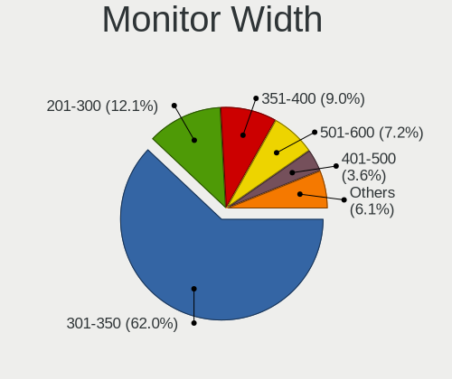

Linux - Tested Hardware & Statistics (Notebooks)
------------------------------------------------

A project to collect tested hardware configurations for Linux.

Anyone can contribute to this report by the [hw-probe](https://github.com/linuxhw/hw-probe) tool:

    sudo -E hw-probe -all -upload

Please contribute! Especially if your hardware is rare.

This report is for real hardware. Report for virtual hardware: [TestDays_VE](https://github.com/linuxhw/TestDays_VE)

Contents
--------

* [ Test Cases ](#test-cases)

* [ System ](#system)
  - [ OS                       ](#os)
  - [ OS Family                ](#os-family)
  - [ Kernel                   ](#kernel)
  - [ Kernel Family            ](#kernel-family)
  - [ Kernel Major Ver.        ](#kernel-major-ver)
  - [ Arch                     ](#arch)
  - [ DE                       ](#de)
  - [ Display Server           ](#display-server)
  - [ Display Manager          ](#display-manager)
  - [ OS Lang                  ](#os-lang)
  - [ Boot Mode                ](#boot-mode)
  - [ Filesystem               ](#filesystem)
  - [ Part. scheme             ](#part-scheme)
  - [ Dual Boot with Linux/BSD ](#dual-boot-with-linuxbsd)
  - [ Dual Boot (Win)          ](#dual-boot-win)

* [ Board ](#board)
  - [ Vendor                   ](#vendor)
  - [ Model                    ](#model)
  - [ Model Family             ](#model-family)
  - [ MFG Year                 ](#mfg-year)
  - [ Form Factor              ](#form-factor)
  - [ Secure Boot              ](#secure-boot)
  - [ Coreboot                 ](#coreboot)
  - [ RAM Size                 ](#ram-size)
  - [ RAM Used                 ](#ram-used)
  - [ Total Drives             ](#total-drives)
  - [ Has CD-ROM               ](#has-cd-rom)
  - [ Has Ethernet             ](#has-ethernet)
  - [ Has WiFi                 ](#has-wifi)
  - [ Has Bluetooth            ](#has-bluetooth)

* [ Location ](#location)
  - [ Country                  ](#country)
  - [ City                     ](#city)

* [ Drives ](#drives)
  - [ Drive Vendor             ](#drive-vendor)
  - [ Drive Model              ](#drive-model)
  - [ HDD Vendor               ](#hdd-vendor)
  - [ SSD Vendor               ](#ssd-vendor)
  - [ Drive Kind               ](#drive-kind)
  - [ Drive Connector          ](#drive-connector)
  - [ Drive Size               ](#drive-size)
  - [ Space Total              ](#space-total)
  - [ Space Used               ](#space-used)
  - [ Malfunc. Drives          ](#malfunc-drives)
  - [ Malfunc. Drive Vendor    ](#malfunc-drive-vendor)
  - [ Malfunc. HDD Vendor      ](#malfunc-hdd-vendor)
  - [ Malfunc. Drive Kind      ](#malfunc-drive-kind)
  - [ Failed Drives            ](#failed-drives)
  - [ Failed Drive Vendor      ](#failed-drive-vendor)
  - [ Drive Status             ](#drive-status)

* [ Storage controller ](#storage-controller)
  - [ Storage Vendor           ](#storage-vendor)
  - [ Storage Model            ](#storage-model)
  - [ Storage Kind             ](#storage-kind)

* [ Processor ](#processor)
  - [ CPU Vendor               ](#cpu-vendor)
  - [ CPU Model                ](#cpu-model)
  - [ CPU Model Family         ](#cpu-model-family)
  - [ CPU Cores                ](#cpu-cores)
  - [ CPU Sockets              ](#cpu-sockets)
  - [ CPU Threads              ](#cpu-threads)
  - [ CPU Op-Modes             ](#cpu-op-modes)
  - [ CPU Microcode            ](#cpu-microcode)
  - [ CPU Microarch            ](#cpu-microarch)

* [ Graphics ](#graphics)
  - [ GPU Vendor               ](#gpu-vendor)
  - [ GPU Model                ](#gpu-model)
  - [ GPU Combo                ](#gpu-combo)
  - [ GPU Driver               ](#gpu-driver)
  - [ GPU Memory               ](#gpu-memory)

* [ Monitor ](#monitor)
  - [ Monitor Vendor           ](#monitor-vendor)
  - [ Monitor Model            ](#monitor-model)
  - [ Monitor Resolution       ](#monitor-resolution)
  - [ Monitor Diagonal         ](#monitor-diagonal)
  - [ Monitor Width            ](#monitor-width)
  - [ Aspect Ratio             ](#aspect-ratio)
  - [ Monitor Area             ](#monitor-area)
  - [ Pixel Density            ](#pixel-density)
  - [ Multiple Monitors        ](#multiple-monitors)

* [ Network ](#network)
  - [ Net Controller Vendor    ](#net-controller-vendor)
  - [ Net Controller Model     ](#net-controller-model)
  - [ Wireless Vendor          ](#wireless-vendor)
  - [ Wireless Model           ](#wireless-model)
  - [ Ethernet Vendor          ](#ethernet-vendor)
  - [ Ethernet Model           ](#ethernet-model)
  - [ Net Controller Kind      ](#net-controller-kind)
  - [ Used Controller          ](#used-controller)
  - [ NICs                     ](#nics)
  - [ IPv6                     ](#ipv6)

* [ Bluetooth ](#bluetooth)
  - [ Bluetooth Vendor         ](#bluetooth-vendor)
  - [ Bluetooth Model          ](#bluetooth-model)

* [ Sound ](#sound)
  - [ Sound Vendor             ](#sound-vendor)
  - [ Sound Model              ](#sound-model)

* [ Memory ](#memory)
  - [ Memory Vendor            ](#memory-vendor)
  - [ Memory Model             ](#memory-model)
  - [ Memory Kind              ](#memory-kind)
  - [ Memory Form Factor       ](#memory-form-factor)
  - [ Memory Size              ](#memory-size)
  - [ Memory Speed             ](#memory-speed)

* [ Printers & scanners ](#printers--scanners)
  - [ Printer Vendor           ](#printer-vendor)
  - [ Printer Model            ](#printer-model)
  - [ Scanner Vendor           ](#scanner-vendor)
  - [ Scanner Model            ](#scanner-model)

* [ Camera ](#camera)
  - [ Camera Vendor            ](#camera-vendor)
  - [ Camera Model             ](#camera-model)

* [ Security ](#security)
  - [ Fingerprint Vendor       ](#fingerprint-vendor)
  - [ Fingerprint Model        ](#fingerprint-model)
  - [ Chipcard Vendor          ](#chipcard-vendor)
  - [ Chipcard Model           ](#chipcard-model)

* [ Unsupported ](#unsupported)
  - [ Unsupported Devices      ](#unsupported-devices)
  - [ Unsupported Device Types ](#unsupported-device-types)

Test Cases
----------

Total: 175707

| Vendor        | Model                       | Probe                                                      | Date         |
|---------------|-----------------------------|------------------------------------------------------------|--------------|
| Acer          | AO722                       | [ae49a1e9c0](https://linux-hardware.org/?probe=ae49a1e9c0) | Sep 07, 2023 |
| Acer          | Aspire V5-531               | [e39cb4e3e6](https://linux-hardware.org/?probe=e39cb4e3e6) | Sep 07, 2023 |
| Lenovo        | ThinkPad P15v Gen 2i 21A... | [69fc5aab82](https://linux-hardware.org/?probe=69fc5aab82) | Sep 07, 2023 |
| Lenovo        | V580c 20160                 | [87f8bad27d](https://linux-hardware.org/?probe=87f8bad27d) | Sep 07, 2023 |
| Lenovo        | V15-IGL 82C3                | [78ecb1b882](https://linux-hardware.org/?probe=78ecb1b882) | Sep 07, 2023 |
| Lenovo        | ThinkPad P15v Gen 2i 21A... | [384d2074ad](https://linux-hardware.org/?probe=384d2074ad) | Sep 07, 2023 |
| Notebook      | NJx0MU                      | [db4ba96400](https://linux-hardware.org/?probe=db4ba96400) | Sep 07, 2023 |
| Lenovo        | IdeaPad Y580 2099           | [d0db961274](https://linux-hardware.org/?probe=d0db961274) | Sep 07, 2023 |
| Apple         | MacBookPro9,2               | [f3bdad3061](https://linux-hardware.org/?probe=f3bdad3061) | Sep 07, 2023 |
| ASUSTek       | ASUS TUF Gaming F15 FX50... | [e207539e68](https://linux-hardware.org/?probe=e207539e68) | Sep 07, 2023 |
| Lenovo        | IdeaPad S145-15API 81UT     | [8a05090057](https://linux-hardware.org/?probe=8a05090057) | Sep 07, 2023 |
| Lenovo        | ThinkPad X1 Carbon Gen 1... | [81a5f77f1c](https://linux-hardware.org/?probe=81a5f77f1c) | Sep 07, 2023 |
| HP            | ProBook 650 G8 Notebook ... | [b11a7b69f0](https://linux-hardware.org/?probe=b11a7b69f0) | Sep 07, 2023 |
| Lenovo        | Legion Y7000P IRH8 82YA     | [9ebc45f613](https://linux-hardware.org/?probe=9ebc45f613) | Sep 07, 2023 |
| Dell          | Latitude 7420               | [77df1805f6](https://linux-hardware.org/?probe=77df1805f6) | Sep 07, 2023 |
| MSI           | Alpha 15 A3DDK              | [9a87dfb80b](https://linux-hardware.org/?probe=9a87dfb80b) | Sep 07, 2023 |
| HP            | Pavilion 15                 | [c251475f43](https://linux-hardware.org/?probe=c251475f43) | Sep 07, 2023 |
| Acer          | Aspire V5-531               | [63fd300645](https://linux-hardware.org/?probe=63fd300645) | Sep 07, 2023 |
| Lenovo        | ThinkBook 15 G4 IAP 21DJ    | [a2fab791b4](https://linux-hardware.org/?probe=a2fab791b4) | Sep 07, 2023 |
| Timi          | Redmi Book Pro 14S          | [b2776d8282](https://linux-hardware.org/?probe=b2776d8282) | Sep 07, 2023 |
| ASUSTek       | VivoBook_ASUSLaptop X515... | [4fd02051b6](https://linux-hardware.org/?probe=4fd02051b6) | Sep 07, 2023 |
| Sony          | SVF1521V6EB                 | [1d08716b2c](https://linux-hardware.org/?probe=1d08716b2c) | Sep 07, 2023 |
| Dell          | Latitude E7240              | [79a666783a](https://linux-hardware.org/?probe=79a666783a) | Sep 07, 2023 |
| HP            | Pavilion Laptop 15-eg3xx... | [003d136012](https://linux-hardware.org/?probe=003d136012) | Sep 07, 2023 |
| Lenovo        | IdeaPad S145-14AST 81ST     | [24eca3030c](https://linux-hardware.org/?probe=24eca3030c) | Sep 07, 2023 |
| Lenovo        | ThinkPad P16s Gen 1 21BT... | [79ddc77f63](https://linux-hardware.org/?probe=79ddc77f63) | Sep 07, 2023 |
| HP            | EliteBook 8760w             | [d061b57b29](https://linux-hardware.org/?probe=d061b57b29) | Sep 07, 2023 |
| HP            | 240 G8 Notebook PC          | [62735c1cd9](https://linux-hardware.org/?probe=62735c1cd9) | Sep 07, 2023 |
| Lenovo        | ThinkPad T410 2522PT3       | [da7303433d](https://linux-hardware.org/?probe=da7303433d) | Sep 07, 2023 |
| Lenovo        | IdeaPad Y700-17ISK 80Q0     | [2385447c50](https://linux-hardware.org/?probe=2385447c50) | Sep 07, 2023 |
| ASUSTek       | VivoBook_ASUSLaptop M760... | [699fb7e97e](https://linux-hardware.org/?probe=699fb7e97e) | Sep 07, 2023 |
| Dell          | Latitude 5480               | [166d57f310](https://linux-hardware.org/?probe=166d57f310) | Sep 07, 2023 |
| Valve         | Jupiter                     | [d4ca58e970](https://linux-hardware.org/?probe=d4ca58e970) | Sep 07, 2023 |
| Matsushita... | CF-74JCJBDAM                | [0cc1e4014d](https://linux-hardware.org/?probe=0cc1e4014d) | Sep 07, 2023 |
| HP            | Laptop 14-dq1xxx            | [125a7f7c0d](https://linux-hardware.org/?probe=125a7f7c0d) | Sep 07, 2023 |
| HUAWEI        | NBLK-WAX9X                  | [9911fc5254](https://linux-hardware.org/?probe=9911fc5254) | Sep 07, 2023 |
| Apple         | MacBookPro8,1               | [f913de368f](https://linux-hardware.org/?probe=f913de368f) | Sep 07, 2023 |
| Acer          | Aspire 3820                 | [08f7d373e7](https://linux-hardware.org/?probe=08f7d373e7) | Sep 07, 2023 |
| ASUSTek       | X453MA                      | [c48759c297](https://linux-hardware.org/?probe=c48759c297) | Sep 07, 2023 |
| Apple         | MacBookPro8,1               | [423b8d7135](https://linux-hardware.org/?probe=423b8d7135) | Sep 07, 2023 |
| HP            | EliteBook 845 14 inch G1... | [6459a498c5](https://linux-hardware.org/?probe=6459a498c5) | Sep 07, 2023 |
| Google        | Blooguard                   | [c9dec98f0f](https://linux-hardware.org/?probe=c9dec98f0f) | Sep 07, 2023 |
| Lenovo        | ThinkPad X1 Extreme 2nd ... | [eeb4e7afd8](https://linux-hardware.org/?probe=eeb4e7afd8) | Sep 07, 2023 |
| HP            | Pavilion Gaming Laptop 1... | [5254176a5a](https://linux-hardware.org/?probe=5254176a5a) | Sep 07, 2023 |
| Valve         | Jupiter                     | [83b9205283](https://linux-hardware.org/?probe=83b9205283) | Sep 07, 2023 |
| Multilaser    | PC31X                       | [96d451c4a5](https://linux-hardware.org/?probe=96d451c4a5) | Sep 07, 2023 |
| Lenovo        | IdeaPad 530S-14IKB 81EU     | [0ca7d43ae9](https://linux-hardware.org/?probe=0ca7d43ae9) | Sep 07, 2023 |
| MSI           | Bravo 17 A4DDR              | [2592f883ef](https://linux-hardware.org/?probe=2592f883ef) | Sep 07, 2023 |
| ASUSTek       | ASUS TUF Gaming F15 FX50... | [b982251e82](https://linux-hardware.org/?probe=b982251e82) | Sep 07, 2023 |
| Lenovo        | IdeaPad 330-15IKB 81FE      | [7410c2416c](https://linux-hardware.org/?probe=7410c2416c) | Sep 07, 2023 |
| Dell          | Latitude E6500              | [b4b035c4f7](https://linux-hardware.org/?probe=b4b035c4f7) | Sep 07, 2023 |
| Alienware     | m15 R7                      | [9e6b80bbf2](https://linux-hardware.org/?probe=9e6b80bbf2) | Sep 07, 2023 |
| Dell          | Precision M6800             | [b50e95f460](https://linux-hardware.org/?probe=b50e95f460) | Sep 07, 2023 |
| HP            | ENVY 15                     | [996948fd3c](https://linux-hardware.org/?probe=996948fd3c) | Sep 07, 2023 |
| Lenovo        | G565 20071                  | [786aafb0e9](https://linux-hardware.org/?probe=786aafb0e9) | Sep 07, 2023 |
| ASUSTek       | ASUS TUF Dash F15 FX517Z... | [f33c62ab06](https://linux-hardware.org/?probe=f33c62ab06) | Sep 07, 2023 |
| Lenovo        | ThinkPad X230 23256N6       | [7ce5ebe4bc](https://linux-hardware.org/?probe=7ce5ebe4bc) | Sep 07, 2023 |
| Dell          | Latitude E5450              | [a705913b6e](https://linux-hardware.org/?probe=a705913b6e) | Sep 07, 2023 |
| Lenovo        | ThinkPad X1 Carbon Gen 1... | [8c22ca23f2](https://linux-hardware.org/?probe=8c22ca23f2) | Sep 07, 2023 |
| Dell          | Inspiron 7460               | [03726302da](https://linux-hardware.org/?probe=03726302da) | Sep 07, 2023 |
| Apple         | MacBookPro11,2              | [d3996a81e2](https://linux-hardware.org/?probe=d3996a81e2) | Sep 07, 2023 |
| HP            | EliteBook 2740p             | [0bada236bc](https://linux-hardware.org/?probe=0bada236bc) | Sep 07, 2023 |
| Dell          | Inspiron 1525               | [6b0747dcb4](https://linux-hardware.org/?probe=6b0747dcb4) | Sep 07, 2023 |
| HP            | Laptop 14-dk1xxx            | [c7bea10745](https://linux-hardware.org/?probe=c7bea10745) | Sep 07, 2023 |
| Dell          | Inspiron 1525               | [56a481c501](https://linux-hardware.org/?probe=56a481c501) | Sep 06, 2023 |
| ASUSTek       | ASUS TUF Dash F15 FX516P... | [3c6e29c3c3](https://linux-hardware.org/?probe=3c6e29c3c3) | Sep 06, 2023 |
| Samsung       | RF511/RF411/RF711           | [ef99cba7a5](https://linux-hardware.org/?probe=ef99cba7a5) | Sep 06, 2023 |
| ASUSTek       | ZenBook Pro Duo UX582LR_... | [b2ba03726a](https://linux-hardware.org/?probe=b2ba03726a) | Sep 06, 2023 |
| realme        | RMNBXXXX                    | [6783f1d181](https://linux-hardware.org/?probe=6783f1d181) | Sep 06, 2023 |
| Apple         | MacBookAir8,2               | [e9e8da1eea](https://linux-hardware.org/?probe=e9e8da1eea) | Sep 06, 2023 |
| Unknown       | Unknown                     | [16cb5e0d5b](https://linux-hardware.org/?probe=16cb5e0d5b) | Sep 06, 2023 |
| HP            | ProBook 445 G7              | [373ba724e4](https://linux-hardware.org/?probe=373ba724e4) | Sep 06, 2023 |
| Dell          | Latitude E5450              | [1478760d8c](https://linux-hardware.org/?probe=1478760d8c) | Sep 06, 2023 |
| eMachines     | eM350                       | [fae8f9e3f1](https://linux-hardware.org/?probe=fae8f9e3f1) | Sep 06, 2023 |
| Lenovo        | Legion 5 15ARH05H 82B1      | [84368e642c](https://linux-hardware.org/?probe=84368e642c) | Sep 06, 2023 |
| Dell          | Inspiron 15 7000 Gaming     | [6192c839f5](https://linux-hardware.org/?probe=6192c839f5) | Sep 06, 2023 |
| Lenovo        | V15 G2 ALC 82KD             | [db906f78dd](https://linux-hardware.org/?probe=db906f78dd) | Sep 06, 2023 |
| Clevo         | M1100M                      | [399b796d9f](https://linux-hardware.org/?probe=399b796d9f) | Sep 06, 2023 |
| ASUSTek       | VivoBook_ASUSLaptop X513... | [29f1d7759a](https://linux-hardware.org/?probe=29f1d7759a) | Sep 06, 2023 |
| Dell          | Latitude E6540              | [2832b1dd0d](https://linux-hardware.org/?probe=2832b1dd0d) | Sep 06, 2023 |
| Medion        | Akoya P2213T                | [2464869ce2](https://linux-hardware.org/?probe=2464869ce2) | Sep 06, 2023 |
| ASUSTek       | N751JX                      | [8ece217753](https://linux-hardware.org/?probe=8ece217753) | Sep 06, 2023 |
| HP            | Pavilion dv6                | [08d38c1680](https://linux-hardware.org/?probe=08d38c1680) | Sep 06, 2023 |
| Acer          | Swift SF314-51              | [7e7c32364d](https://linux-hardware.org/?probe=7e7c32364d) | Sep 06, 2023 |
| ASUSTek       | VivoBook_ASUSLaptop X513... | [344a00d524](https://linux-hardware.org/?probe=344a00d524) | Sep 06, 2023 |
| ASUSTek       | X200MA                      | [e5a99beac7](https://linux-hardware.org/?probe=e5a99beac7) | Sep 06, 2023 |
| HUAWEI        | NBD-WXX9                    | [29e1f84537](https://linux-hardware.org/?probe=29e1f84537) | Sep 06, 2023 |
| MSI           | GE70 2PE                    | [19dddb0418](https://linux-hardware.org/?probe=19dddb0418) | Sep 06, 2023 |
| HP            | Pavilion Notebook           | [50777cde40](https://linux-hardware.org/?probe=50777cde40) | Sep 06, 2023 |
| ASUSTek       | Zenbook UM3402YAR_UM3402... | [a4fb146fe8](https://linux-hardware.org/?probe=a4fb146fe8) | Sep 06, 2023 |
| realme        | RMNBXXXX                    | [9370483c5f](https://linux-hardware.org/?probe=9370483c5f) | Sep 06, 2023 |
| Sony          | VGN-AW41MF_H                | [d3a3262a6e](https://linux-hardware.org/?probe=d3a3262a6e) | Sep 06, 2023 |
| MSI           | Bravo 15 C7VF               | [72b288770a](https://linux-hardware.org/?probe=72b288770a) | Sep 06, 2023 |
| Dell          | Precision M4700             | [3e354770b6](https://linux-hardware.org/?probe=3e354770b6) | Sep 06, 2023 |
| ASUSTek       | ASUS TUF Gaming F17 FX70... | [34fb398b78](https://linux-hardware.org/?probe=34fb398b78) | Sep 06, 2023 |
| Lenovo        | ThinkPad T580 20LAS01H00    | [129e989480](https://linux-hardware.org/?probe=129e989480) | Sep 06, 2023 |
| Dell          | XPS 15 9550                 | [c9f30a2b26](https://linux-hardware.org/?probe=c9f30a2b26) | Sep 06, 2023 |
| Timi          | Xiaomi Book Pro 14 2022     | [32c34f0aa2](https://linux-hardware.org/?probe=32c34f0aa2) | Sep 06, 2023 |
| GPU Compan... | GWNR71517                   | [b6a521128f](https://linux-hardware.org/?probe=b6a521128f) | Sep 06, 2023 |
| Lenovo        | ThinkPad P1 20MD0014UK      | [428c816118](https://linux-hardware.org/?probe=428c816118) | Sep 06, 2023 |
| Samsung       | 550P5C/550P7C               | [f59dbec9af](https://linux-hardware.org/?probe=f59dbec9af) | Sep 06, 2023 |
| Dell          | Latitude 3520               | [0fa236983e](https://linux-hardware.org/?probe=0fa236983e) | Sep 06, 2023 |
| Samsung       | 550P5C/550P7C               | [83c77f6733](https://linux-hardware.org/?probe=83c77f6733) | Sep 06, 2023 |
| Lenovo        | ThinkPad T480 20L6S1FU00    | [f24dc99222](https://linux-hardware.org/?probe=f24dc99222) | Sep 06, 2023 |
| Standard      | MB45II/MB45IN               | [1e46c6aa81](https://linux-hardware.org/?probe=1e46c6aa81) | Sep 06, 2023 |
| HP            | ProBook 6470b               | [4bb5a6911f](https://linux-hardware.org/?probe=4bb5a6911f) | Sep 06, 2023 |
| Maibenben     | MaiBook M                   | [c3a39bc1f1](https://linux-hardware.org/?probe=c3a39bc1f1) | Sep 06, 2023 |
| Dell          | Inspiron 5559               | [0428af4d14](https://linux-hardware.org/?probe=0428af4d14) | Sep 06, 2023 |
| ASUSTek       | VivoBook_ASUSLaptop X571... | [2505f514b1](https://linux-hardware.org/?probe=2505f514b1) | Sep 06, 2023 |
| Acer          | Aspire E1-571               | [5d22a61587](https://linux-hardware.org/?probe=5d22a61587) | Sep 06, 2023 |
| Lenovo        | IdeaPad 3 15ALC6 82KU       | [c8ee0a00a5](https://linux-hardware.org/?probe=c8ee0a00a5) | Sep 06, 2023 |
| MSI           | GS60 2PC Ghost              | [0b971b067a](https://linux-hardware.org/?probe=0b971b067a) | Sep 06, 2023 |
| Samsung       | 340XAA/350XAA/550XAA        | [ba05ae3ca2](https://linux-hardware.org/?probe=ba05ae3ca2) | Sep 06, 2023 |
| Lenovo        | Yoga Slim 7 14APU8 83AA     | [b884752710](https://linux-hardware.org/?probe=b884752710) | Sep 06, 2023 |
| Lenovo        | ThinkPad E14 Gen 2 20TA0... | [0468bc91fc](https://linux-hardware.org/?probe=0468bc91fc) | Sep 06, 2023 |
| System76      | Pangolin                    | [43dbf49440](https://linux-hardware.org/?probe=43dbf49440) | Sep 06, 2023 |
| Valve         | Jupiter                     | [f9b0d35f75](https://linux-hardware.org/?probe=f9b0d35f75) | Sep 06, 2023 |
| Dell          | XPS 13 9310                 | [7e81f7531b](https://linux-hardware.org/?probe=7e81f7531b) | Sep 06, 2023 |
| HP            | ProBook 4530s               | [782493cb7d](https://linux-hardware.org/?probe=782493cb7d) | Sep 06, 2023 |
| Samsung       | 340XAA/350XAA/550XAA        | [299a459ec5](https://linux-hardware.org/?probe=299a459ec5) | Sep 06, 2023 |
| HP            | ProBook 4540s               | [be4077d1c0](https://linux-hardware.org/?probe=be4077d1c0) | Sep 06, 2023 |
| ASUSTek       | X75VC                       | [ba211ae5ca](https://linux-hardware.org/?probe=ba211ae5ca) | Sep 06, 2023 |
| Dell          | Vostro 3580                 | [5c165fd73b](https://linux-hardware.org/?probe=5c165fd73b) | Sep 06, 2023 |
| Lenovo        | IdeaPad Z360                | [1bb5ebf339](https://linux-hardware.org/?probe=1bb5ebf339) | Sep 06, 2023 |
| Lenovo        | ThinkPad E16 Gen 1 21JT0... | [586c1fab43](https://linux-hardware.org/?probe=586c1fab43) | Sep 06, 2023 |
| ASUSTek       | G551JM                      | [784e1f216e](https://linux-hardware.org/?probe=784e1f216e) | Sep 06, 2023 |
| HUAWEI        | BOHB-WAX9                   | [5d575aeb4f](https://linux-hardware.org/?probe=5d575aeb4f) | Sep 06, 2023 |
| TUXEDO        | InfinityBook S 15 Gen6      | [bf3fa40a81](https://linux-hardware.org/?probe=bf3fa40a81) | Sep 06, 2023 |
| ASUSTek       | K70IO                       | [bb32d5e30c](https://linux-hardware.org/?probe=bb32d5e30c) | Sep 06, 2023 |
| MSI           | Modern 15 A5M               | [eb92b04384](https://linux-hardware.org/?probe=eb92b04384) | Sep 06, 2023 |
| HP            | ProBook 650 G5              | [5e6e5cd047](https://linux-hardware.org/?probe=5e6e5cd047) | Sep 06, 2023 |
| Unknown       | TBYF-1014WIN32              | [11ef48e0c0](https://linux-hardware.org/?probe=11ef48e0c0) | Sep 06, 2023 |
| ASUSTek       | X580VD                      | [989134a7c5](https://linux-hardware.org/?probe=989134a7c5) | Sep 06, 2023 |
| Sony          | SVF1521A7EB                 | [8b130feb09](https://linux-hardware.org/?probe=8b130feb09) | Sep 06, 2023 |
| ASUSTek       | X555QG                      | [8cf63afc0f](https://linux-hardware.org/?probe=8cf63afc0f) | Sep 06, 2023 |
| Lenovo        | ThinkPad P1 Gen 6 21FV00... | [c9a07c44d5](https://linux-hardware.org/?probe=c9a07c44d5) | Sep 06, 2023 |
| Lenovo        | Legion 7 16ARHA7 82UH       | [57764e02db](https://linux-hardware.org/?probe=57764e02db) | Sep 06, 2023 |
| Lenovo        | ThinkPad X390 20Q0002UUS    | [aab185ac48](https://linux-hardware.org/?probe=aab185ac48) | Sep 06, 2023 |
| Dell          | Inspiron 3542               | [1756563167](https://linux-hardware.org/?probe=1756563167) | Sep 06, 2023 |
| Apple         | MacBookPro11,3              | [bfdd099826](https://linux-hardware.org/?probe=bfdd099826) | Sep 06, 2023 |
| Lenovo        | ThinkPad T16 Gen 2 21HH0... | [94c99c8274](https://linux-hardware.org/?probe=94c99c8274) | Sep 06, 2023 |
| Pine Micro... | Pine64 Pinebook Pro         | [80e1d849fd](https://linux-hardware.org/?probe=80e1d849fd) | Sep 06, 2023 |
| Dell          | Latitude 3190               | [60f82737fa](https://linux-hardware.org/?probe=60f82737fa) | Sep 06, 2023 |
| Gateway       | NE56R                       | [ade8432ca6](https://linux-hardware.org/?probe=ade8432ca6) | Sep 06, 2023 |
| HUAWEI        | BOM-WXX9                    | [8e0ee8ad83](https://linux-hardware.org/?probe=8e0ee8ad83) | Sep 06, 2023 |
| TUXEDO        | Unknown                     | [1e6c412d84](https://linux-hardware.org/?probe=1e6c412d84) | Sep 06, 2023 |
| HP            | EliteBook 845 14 inch G9... | [6c4c9936b0](https://linux-hardware.org/?probe=6c4c9936b0) | Sep 06, 2023 |
| Clevo         | NL41MU2                     | [c309162d11](https://linux-hardware.org/?probe=c309162d11) | Sep 06, 2023 |
| Apple         | MacBookPro13,1              | [54f48be7f6](https://linux-hardware.org/?probe=54f48be7f6) | Sep 06, 2023 |
| ASUSTek       | Zephyrus S GX502GV_GX502... | [3429c55014](https://linux-hardware.org/?probe=3429c55014) | Sep 06, 2023 |
| Lenovo        | ThinkPad P1 Gen 4i 20Y30... | [b6b2af8418](https://linux-hardware.org/?probe=b6b2af8418) | Sep 06, 2023 |
| ASUSTek       | Zephyrus S GX502GV_GX502... | [72fb0f052e](https://linux-hardware.org/?probe=72fb0f052e) | Sep 06, 2023 |
| ASUSTek       | X542UQ                      | [50ecc5159c](https://linux-hardware.org/?probe=50ecc5159c) | Sep 06, 2023 |
| Dell          | Latitude E7270              | [b8dcc3bac9](https://linux-hardware.org/?probe=b8dcc3bac9) | Sep 06, 2023 |
| Lenovo        | ThinkPad P1 Gen 4i 20Y30... | [89767db9e4](https://linux-hardware.org/?probe=89767db9e4) | Sep 06, 2023 |
| ASUSTek       | X542UQ                      | [b34e0e7866](https://linux-hardware.org/?probe=b34e0e7866) | Sep 06, 2023 |
| Panasonic     | CF-191HACHFN                | [2c3ca0bdcf](https://linux-hardware.org/?probe=2c3ca0bdcf) | Sep 06, 2023 |
| Google        | Pirika                      | [e05149e1de](https://linux-hardware.org/?probe=e05149e1de) | Sep 06, 2023 |
| Lenovo        | IdeaPad 310-15ISK 80UH      | [0deab6fc8b](https://linux-hardware.org/?probe=0deab6fc8b) | Sep 06, 2023 |
| Acer          | Aspire E1-531               | [9d5880bc6c](https://linux-hardware.org/?probe=9d5880bc6c) | Sep 06, 2023 |
| Acer          | Aspire E1-531               | [6ffc334cf9](https://linux-hardware.org/?probe=6ffc334cf9) | Sep 06, 2023 |
| Lenovo        | V110-15IAP 80TG             | [783815f79f](https://linux-hardware.org/?probe=783815f79f) | Sep 06, 2023 |
| Samsung       | 350V5C/351V5C/3540VC/344... | [e8caa63849](https://linux-hardware.org/?probe=e8caa63849) | Sep 06, 2023 |
| HP            | Victus by Laptop 16-e0xx... | [0692b6f878](https://linux-hardware.org/?probe=0692b6f878) | Sep 06, 2023 |
| HP            | EliteBook 840 G1            | [1d1c8e33ff](https://linux-hardware.org/?probe=1d1c8e33ff) | Sep 06, 2023 |
| ASUSTek       | ASUS TUF Gaming A15 FA50... | [4ed976d4ba](https://linux-hardware.org/?probe=4ed976d4ba) | Sep 06, 2023 |
| Lenovo        | Legion Pro 7 16IRX8 82WR    | [f946665a24](https://linux-hardware.org/?probe=f946665a24) | Sep 06, 2023 |
| Lenovo        | ThinkPad X1 Extreme 2nd ... | [3fe52a0e75](https://linux-hardware.org/?probe=3fe52a0e75) | Sep 06, 2023 |
| Lenovo        | ThinkPad X1C 5th W10DG 2... | [b5f142ae13](https://linux-hardware.org/?probe=b5f142ae13) | Sep 06, 2023 |
| HP            | EliteBook 830 G5            | [8a0ad0652e](https://linux-hardware.org/?probe=8a0ad0652e) | Sep 06, 2023 |
| Notebook      | W230SS                      | [3d9af4f57a](https://linux-hardware.org/?probe=3d9af4f57a) | Sep 06, 2023 |
| VALE          | Notebook Classic C140       | [c2e792fccf](https://linux-hardware.org/?probe=c2e792fccf) | Sep 06, 2023 |
| VALE          | Notebook Classic C140       | [fb00b74b14](https://linux-hardware.org/?probe=fb00b74b14) | Sep 06, 2023 |
| VALE          | Notebook Classic C140       | [675a9e9b79](https://linux-hardware.org/?probe=675a9e9b79) | Sep 06, 2023 |
| ASUSTek       | ASUS TUF Gaming F15 FX50... | [cf9c65c6f4](https://linux-hardware.org/?probe=cf9c65c6f4) | Sep 06, 2023 |
| Dell          | Vostro 5470                 | [aa37593b87](https://linux-hardware.org/?probe=aa37593b87) | Sep 06, 2023 |
| Acer          | Aspire 5733Z                | [bc3d42d633](https://linux-hardware.org/?probe=bc3d42d633) | Sep 06, 2023 |
| Acer          | Swift SFX14-41G             | [611bb4fe1a](https://linux-hardware.org/?probe=611bb4fe1a) | Sep 06, 2023 |
| Apple         | MacBookPro13,1              | [d6b6455af2](https://linux-hardware.org/?probe=d6b6455af2) | Sep 06, 2023 |
| Dell          | Vostro 5470                 | [230cd8c32e](https://linux-hardware.org/?probe=230cd8c32e) | Sep 06, 2023 |
| HP            | Notebook                    | [ad9bafda30](https://linux-hardware.org/?probe=ad9bafda30) | Sep 06, 2023 |
| Dell          | G3 3500                     | [5da26d2241](https://linux-hardware.org/?probe=5da26d2241) | Sep 06, 2023 |
| HP            | Pavilion dv4                | [0b01aaddd6](https://linux-hardware.org/?probe=0b01aaddd6) | Sep 06, 2023 |
| ASUSTek       | K70IO                       | [e4f165224f](https://linux-hardware.org/?probe=e4f165224f) | Sep 06, 2023 |
| Valve         | Jupiter                     | [8209a15afb](https://linux-hardware.org/?probe=8209a15afb) | Sep 06, 2023 |
| Dell          | Precision 5570              | [9baca62616](https://linux-hardware.org/?probe=9baca62616) | Sep 06, 2023 |
| MSI           | MS-7995                     | [3269e143a3](https://linux-hardware.org/?probe=3269e143a3) | Sep 06, 2023 |
| Valve         | Jupiter                     | [da71ec43ea](https://linux-hardware.org/?probe=da71ec43ea) | Sep 06, 2023 |
| Lenovo        | ThinkPad E580 20KS001JUK    | [8b44f9cbdc](https://linux-hardware.org/?probe=8b44f9cbdc) | Sep 06, 2023 |
| ASUSTek       | VivoBook_ASUSLaptop K650... | [f50ce96f55](https://linux-hardware.org/?probe=f50ce96f55) | Sep 06, 2023 |
| Dell          | Inspiron 5567               | [56c33713a8](https://linux-hardware.org/?probe=56c33713a8) | Sep 06, 2023 |
| Framework     | Laptop (12th Gen Intel C... | [8d550b32d9](https://linux-hardware.org/?probe=8d550b32d9) | Sep 06, 2023 |
| HP            | Laptop 15s-eq2xxx           | [03f6b3b62b](https://linux-hardware.org/?probe=03f6b3b62b) | Sep 06, 2023 |
| Lenovo        | IdeaPad S130-14IGM 81J2     | [dd18138503](https://linux-hardware.org/?probe=dd18138503) | Sep 06, 2023 |
| Toshiba       | Satellite A205              | [9a44e74608](https://linux-hardware.org/?probe=9a44e74608) | Sep 06, 2023 |
| ASUSTek       | ROG Zephyrus G14 GA401QC... | [a1c2c12b6f](https://linux-hardware.org/?probe=a1c2c12b6f) | Sep 06, 2023 |
| Lenovo        | IdeaPad 1 14AMN7 82VF       | [dccf0aaf61](https://linux-hardware.org/?probe=dccf0aaf61) | Sep 06, 2023 |
| Sony          | SVE1712C5E                  | [a5c77b2450](https://linux-hardware.org/?probe=a5c77b2450) | Sep 06, 2023 |
| Lenovo        | IdeaPad 310-15ISK 80UH      | [479d5ea49e](https://linux-hardware.org/?probe=479d5ea49e) | Sep 06, 2023 |
| Lenovo        | IdeaPad Gaming 3 15ARH05... | [0fdeca1313](https://linux-hardware.org/?probe=0fdeca1313) | Sep 06, 2023 |
| HP            | ProBook 455 15.6 inch G9... | [5b7ab92e89](https://linux-hardware.org/?probe=5b7ab92e89) | Sep 06, 2023 |
| Toshiba       | Satellite A210              | [54f5fb9c03](https://linux-hardware.org/?probe=54f5fb9c03) | Sep 06, 2023 |
| Dell          | Latitude 3190               | [7be68f9c9a](https://linux-hardware.org/?probe=7be68f9c9a) | Sep 06, 2023 |
| Toshiba       | Satellite A205              | [a2b456886d](https://linux-hardware.org/?probe=a2b456886d) | Sep 05, 2023 |
| HP            | Laptop 15-dy1xxx            | [99dd75f86a](https://linux-hardware.org/?probe=99dd75f86a) | Sep 05, 2023 |
| Lenovo        | Yoga S740-15IRH 81NX        | [c31e15f2ba](https://linux-hardware.org/?probe=c31e15f2ba) | Sep 05, 2023 |
| Purism        | Librem 15 v3                | [d3a66abc8b](https://linux-hardware.org/?probe=d3a66abc8b) | Sep 05, 2023 |
| Lenovo        | IdeaPad 1 14AMN7 82VF       | [51e417460a](https://linux-hardware.org/?probe=51e417460a) | Sep 05, 2023 |
| Acer          | Swift SFX14-41G             | [38f9d1abd9](https://linux-hardware.org/?probe=38f9d1abd9) | Sep 05, 2023 |
| Acer          | Aspire E5-575G              | [054c5e3dc5](https://linux-hardware.org/?probe=054c5e3dc5) | Sep 05, 2023 |
| Dell          | Inspiron 3585               | [89a0e93fd5](https://linux-hardware.org/?probe=89a0e93fd5) | Sep 05, 2023 |
| HP            | EliteBook 855 G7 Noteboo... | [89ce951011](https://linux-hardware.org/?probe=89ce951011) | Sep 05, 2023 |
| Sony          | SVE1712C5E                  | [f864c8e44a](https://linux-hardware.org/?probe=f864c8e44a) | Sep 05, 2023 |
| ASUSTek       | ASUS TUF Gaming F15 FX50... | [d3e36fc6ea](https://linux-hardware.org/?probe=d3e36fc6ea) | Sep 05, 2023 |
| Sony          | SVE1713X1EB                 | [f7c65dc902](https://linux-hardware.org/?probe=f7c65dc902) | Sep 05, 2023 |
| ASUSTek       | X502CA                      | [d630819b59](https://linux-hardware.org/?probe=d630819b59) | Sep 05, 2023 |
| ASUSTek       | ROG Strix G713PV_G713PV     | [cac93ead6f](https://linux-hardware.org/?probe=cac93ead6f) | Sep 05, 2023 |
| HP            | ZBook Studio G3             | [208f21a716](https://linux-hardware.org/?probe=208f21a716) | Sep 05, 2023 |
| Lenovo        | Legion 5 Pro 16IAH7H 82R... | [9d86c0f6e5](https://linux-hardware.org/?probe=9d86c0f6e5) | Sep 05, 2023 |
| HP            | EliteBook 845 14 inch G9... | [25ec8e4a16](https://linux-hardware.org/?probe=25ec8e4a16) | Sep 05, 2023 |
| HP            | ProBook 455 G7              | [7ae653c6c1](https://linux-hardware.org/?probe=7ae653c6c1) | Sep 05, 2023 |
| Lenovo        | IdeaPad 310-15ISK 80SM      | [a17f1582d4](https://linux-hardware.org/?probe=a17f1582d4) | Sep 05, 2023 |
| Dell          | Latitude 7490               | [2a945e76de](https://linux-hardware.org/?probe=2a945e76de) | Sep 05, 2023 |
| Lenovo        | ThinkPad T450 20BUS3L502    | [cb8de94658](https://linux-hardware.org/?probe=cb8de94658) | Sep 05, 2023 |
| Dell          | Latitude E5570              | [10d8ad7a3d](https://linux-hardware.org/?probe=10d8ad7a3d) | Sep 05, 2023 |
| HUAWEI        | BoDE-WXX9                   | [06a65572fe](https://linux-hardware.org/?probe=06a65572fe) | Sep 05, 2023 |
| Lenovo        | G570 4334                   | [ce571e2d16](https://linux-hardware.org/?probe=ce571e2d16) | Sep 05, 2023 |
| ASUSTek       | X751LD                      | [ed90b83cc0](https://linux-hardware.org/?probe=ed90b83cc0) | Sep 05, 2023 |
| HP            | ZBook 15 G3                 | [faac131992](https://linux-hardware.org/?probe=faac131992) | Sep 05, 2023 |
| Dell          | Latitude 7400               | [e1ea4eb614](https://linux-hardware.org/?probe=e1ea4eb614) | Sep 05, 2023 |
| Lenovo        | V15 G4 AMN 82YU             | [bb7f6aed1a](https://linux-hardware.org/?probe=bb7f6aed1a) | Sep 05, 2023 |
| HP            | Laptop 15-da0xxx            | [326d057e96](https://linux-hardware.org/?probe=326d057e96) | Sep 05, 2023 |
| Gateway       | NE56R                       | [be83386f4d](https://linux-hardware.org/?probe=be83386f4d) | Sep 05, 2023 |
| Framework     | Laptop (13th Gen Intel C... | [1bcf7b95c6](https://linux-hardware.org/?probe=1bcf7b95c6) | Sep 05, 2023 |
| Dell          | Precision 7670              | [42788bf2c7](https://linux-hardware.org/?probe=42788bf2c7) | Sep 05, 2023 |
| System76      | Pangolin                    | [461b8d48ba](https://linux-hardware.org/?probe=461b8d48ba) | Sep 05, 2023 |
| ASUSTek       | N76VJ                       | [382d892ff6](https://linux-hardware.org/?probe=382d892ff6) | Sep 05, 2023 |
| ASUSTek       | E402SA                      | [efad2958a0](https://linux-hardware.org/?probe=efad2958a0) | Sep 05, 2023 |
| HP            | Pavilion dv8000 (ET839UA... | [7b717719f5](https://linux-hardware.org/?probe=7b717719f5) | Sep 05, 2023 |
| Lenovo        | IdeaPad 5 15ITL05 82FG      | [3c55d4d55b](https://linux-hardware.org/?probe=3c55d4d55b) | Sep 05, 2023 |
| Acer          | Nitro AN515-46              | [bbbba2bc47](https://linux-hardware.org/?probe=bbbba2bc47) | Sep 05, 2023 |
| Dell          | Latitude 7390               | [4d913a8444](https://linux-hardware.org/?probe=4d913a8444) | Sep 05, 2023 |
| Dell          | Precision 7740              | [392ca47879](https://linux-hardware.org/?probe=392ca47879) | Sep 05, 2023 |
| Notebook      | N9x0TC                      | [ea9c38200b](https://linux-hardware.org/?probe=ea9c38200b) | Sep 05, 2023 |
| ASUSTek       | VivoBook_ASUSLaptop X409... | [cd1be324d4](https://linux-hardware.org/?probe=cd1be324d4) | Sep 05, 2023 |
| Dynabook      | Satellite Pro L50-G-193     | [6ab6bec7be](https://linux-hardware.org/?probe=6ab6bec7be) | Sep 05, 2023 |
| HP            | EliteBook 845 14 inch G9... | [30bf3f1f45](https://linux-hardware.org/?probe=30bf3f1f45) | Sep 05, 2023 |
| MSI           | Prestige 14H B12UCX         | [75d602c66f](https://linux-hardware.org/?probe=75d602c66f) | Sep 05, 2023 |
| Lenovo        | ThinkPad T490 20N2001YUS    | [75c15ac2e8](https://linux-hardware.org/?probe=75c15ac2e8) | Sep 05, 2023 |
| Framework     | Laptop                      | [bd2852cd9e](https://linux-hardware.org/?probe=bd2852cd9e) | Sep 05, 2023 |
| ASUSTek       | ROG Strix G713RM_G713RM     | [0309bcca29](https://linux-hardware.org/?probe=0309bcca29) | Sep 05, 2023 |
| Dell          | Latitude 7490               | [c03e42edee](https://linux-hardware.org/?probe=c03e42edee) | Sep 05, 2023 |
| Lenovo        | IdeaPad 320-15IKB 81BG      | [5728a3a48b](https://linux-hardware.org/?probe=5728a3a48b) | Sep 05, 2023 |
| Unknown       | Unknown                     | [9b4d95cf35](https://linux-hardware.org/?probe=9b4d95cf35) | Sep 05, 2023 |
| Acer          | Aspire 5750Z                | [5bec99a137](https://linux-hardware.org/?probe=5bec99a137) | Sep 05, 2023 |
| Apple         | MacBook8,1                  | [f2d8d7ffbb](https://linux-hardware.org/?probe=f2d8d7ffbb) | Sep 05, 2023 |
| Dell          | Latitude E7270              | [5a2067c4c2](https://linux-hardware.org/?probe=5a2067c4c2) | Sep 05, 2023 |
| Apple         | MacBookPro9,2               | [424ab4dc3d](https://linux-hardware.org/?probe=424ab4dc3d) | Sep 05, 2023 |
| Lenovo        | IdeaPad 320-15IKB 81BG      | [fdecc11aba](https://linux-hardware.org/?probe=fdecc11aba) | Sep 05, 2023 |
| Lenovo        | V15 G2 IJL 82QY             | [ca342c2a7e](https://linux-hardware.org/?probe=ca342c2a7e) | Sep 05, 2023 |
| Dell          | Inspiron 3480               | [3d639d27ba](https://linux-hardware.org/?probe=3d639d27ba) | Sep 05, 2023 |
| Lenovo        | Legion Slim 5 16APH8 82Y... | [27575898fe](https://linux-hardware.org/?probe=27575898fe) | Sep 05, 2023 |
| Acer          | TravelMate P215-41-G2       | [6a1b31cf59](https://linux-hardware.org/?probe=6a1b31cf59) | Sep 05, 2023 |
| Lenovo        | IdeaPad 3 15ALC6 82KU       | [312d4a06dc](https://linux-hardware.org/?probe=312d4a06dc) | Sep 05, 2023 |
| Toshiba       | Satellite A200              | [a26939af7b](https://linux-hardware.org/?probe=a26939af7b) | Sep 05, 2023 |
| Dell          | Latitude 7280               | [3cf6ec76b5](https://linux-hardware.org/?probe=3cf6ec76b5) | Sep 05, 2023 |
| Lenovo        | ThinkBook 15 G2 ITL 20VE    | [7d6ff14b38](https://linux-hardware.org/?probe=7d6ff14b38) | Sep 05, 2023 |
| ASUSTek       | K53SD                       | [051fefc7ca](https://linux-hardware.org/?probe=051fefc7ca) | Sep 05, 2023 |
| HP            | Victus by Laptop 16-e0xx... | [dda5b7f9c9](https://linux-hardware.org/?probe=dda5b7f9c9) | Sep 05, 2023 |
| HP            | Laptop 15s-eq2xxx           | [344c861540](https://linux-hardware.org/?probe=344c861540) | Sep 05, 2023 |
| Sony          | SVE1513B1EW                 | [82fd19c99e](https://linux-hardware.org/?probe=82fd19c99e) | Sep 05, 2023 |
| Dell          | Inspiron 5379               | [cafe064514](https://linux-hardware.org/?probe=cafe064514) | Sep 05, 2023 |
| HP            | ProBook 450 G8 Notebook ... | [5dbf7515d1](https://linux-hardware.org/?probe=5dbf7515d1) | Sep 05, 2023 |
| ASUSTek       | ROG Flow X13 GV301QH_GV3... | [7619d8e5e8](https://linux-hardware.org/?probe=7619d8e5e8) | Sep 05, 2023 |
| Dell          | Inspiron 14 5420            | [70d0d79f77](https://linux-hardware.org/?probe=70d0d79f77) | Sep 05, 2023 |
| Notebook      | NL5xNU                      | [306dab3d42](https://linux-hardware.org/?probe=306dab3d42) | Sep 05, 2023 |
| Dell          | Precision 7670              | [41bb07b203](https://linux-hardware.org/?probe=41bb07b203) | Sep 05, 2023 |
| ASUSTek       | UL80VT                      | [aec41416ac](https://linux-hardware.org/?probe=aec41416ac) | Sep 05, 2023 |
| HP            | EliteBook 845 14 inch G1... | [c57f9232a2](https://linux-hardware.org/?probe=c57f9232a2) | Sep 05, 2023 |
| Valve         | Jupiter                     | [8ae585f958](https://linux-hardware.org/?probe=8ae585f958) | Sep 05, 2023 |
| Dell          | Inspiron 7560               | [dc22012520](https://linux-hardware.org/?probe=dc22012520) | Sep 05, 2023 |
| Lenovo        | Legion Y7000P IRH8 82YA     | [235e80247e](https://linux-hardware.org/?probe=235e80247e) | Sep 05, 2023 |
| Acer          | Aspire V3-572P              | [1b021435e8](https://linux-hardware.org/?probe=1b021435e8) | Sep 05, 2023 |
| Panasonic     | CF-C2CUGZXKM                | [12ed8aee3f](https://linux-hardware.org/?probe=12ed8aee3f) | Sep 05, 2023 |
| Lenovo        | ThinkPad T480s 20L8S1R50... | [ea1d0861a1](https://linux-hardware.org/?probe=ea1d0861a1) | Sep 05, 2023 |
| Lenovo        | ThinkBook 15 G3 ACL 21A4    | [229ca6e8cb](https://linux-hardware.org/?probe=229ca6e8cb) | Sep 05, 2023 |
| Samsung       | 750XDA                      | [efe919fb13](https://linux-hardware.org/?probe=efe919fb13) | Sep 05, 2023 |
| Dell          | Inspiron 3482               | [078746577b](https://linux-hardware.org/?probe=078746577b) | Sep 05, 2023 |
| Panasonic     | CF-C2CUGZXKM                | [fdcab89946](https://linux-hardware.org/?probe=fdcab89946) | Sep 05, 2023 |
| Lenovo        | ThinkPad T430 2349KQ3       | [287ea35176](https://linux-hardware.org/?probe=287ea35176) | Sep 05, 2023 |
| Lenovo        | ThinkPad T520 4243WCR       | [181ef642cd](https://linux-hardware.org/?probe=181ef642cd) | Sep 05, 2023 |
| Toshiba       | Satellite L455D             | [1d49ff24ad](https://linux-hardware.org/?probe=1d49ff24ad) | Sep 05, 2023 |
| Sony          | VGN-CS108D                  | [24bf5bb06c](https://linux-hardware.org/?probe=24bf5bb06c) | Sep 05, 2023 |
| Dell          | Inspiron 15-3567            | [2fe06014b3](https://linux-hardware.org/?probe=2fe06014b3) | Sep 05, 2023 |
| Apple         | MacBookPro16,3              | [7f61d6c898](https://linux-hardware.org/?probe=7f61d6c898) | Sep 05, 2023 |
| HP            | Pavilion Notebook           | [b8dd9b8f96](https://linux-hardware.org/?probe=b8dd9b8f96) | Sep 05, 2023 |
| Lenovo        | IdeaPad 5 15ITL05 82FG      | [ab9c556dc7](https://linux-hardware.org/?probe=ab9c556dc7) | Sep 05, 2023 |
| Dell          | Latitude 7390               | [2c6e7f955b](https://linux-hardware.org/?probe=2c6e7f955b) | Sep 05, 2023 |
| Apple         | MacBookPro11,4              | [1cd7fc15b1](https://linux-hardware.org/?probe=1cd7fc15b1) | Sep 05, 2023 |
| Dell          | Precision 5680              | [fdcb7ce5d4](https://linux-hardware.org/?probe=fdcb7ce5d4) | Sep 05, 2023 |
| Acer          | Aspire 4738Z                | [88b34596c0](https://linux-hardware.org/?probe=88b34596c0) | Sep 05, 2023 |
| Lenovo        | IdeaPad 330S-15ARR 81FB     | [eb05baece5](https://linux-hardware.org/?probe=eb05baece5) | Sep 05, 2023 |
| HP            | Pavilion dv7                | [2d6aa7667d](https://linux-hardware.org/?probe=2d6aa7667d) | Sep 05, 2023 |
| Dell          | G5 5590                     | [40098c0a79](https://linux-hardware.org/?probe=40098c0a79) | Sep 05, 2023 |
| Dell          | XPS 13 7390                 | [5154be8883](https://linux-hardware.org/?probe=5154be8883) | Sep 05, 2023 |
| MSI           | GS75 Stealth 8SG            | [fc603fc196](https://linux-hardware.org/?probe=fc603fc196) | Sep 05, 2023 |
| Dell          | G5 5590                     | [1af9fd689a](https://linux-hardware.org/?probe=1af9fd689a) | Sep 05, 2023 |
| Dell          | G15 5530                    | [91dcc569ee](https://linux-hardware.org/?probe=91dcc569ee) | Sep 05, 2023 |
| HP            | EliteBook 845 G7 Noteboo... | [0131d0a313](https://linux-hardware.org/?probe=0131d0a313) | Sep 05, 2023 |
| Lenovo        | IdeaPad 100-14IBD 80RK      | [1a1c5e43bc](https://linux-hardware.org/?probe=1a1c5e43bc) | Sep 05, 2023 |
| HP            | ProBook 6570b               | [f66ec50e55](https://linux-hardware.org/?probe=f66ec50e55) | Sep 05, 2023 |
| HP            | ProBook 6570b               | [9a31047350](https://linux-hardware.org/?probe=9a31047350) | Sep 05, 2023 |
| Google        | Treeya                      | [fcc8d7d8a1](https://linux-hardware.org/?probe=fcc8d7d8a1) | Sep 05, 2023 |
| HP            | EliteBook 8470p             | [a658addd87](https://linux-hardware.org/?probe=a658addd87) | Sep 05, 2023 |
| Apple         | MacBookPro16,2              | [b47ac62db2](https://linux-hardware.org/?probe=b47ac62db2) | Sep 05, 2023 |
| Inter Sale... | NID-11125DE                 | [2c94bcc096](https://linux-hardware.org/?probe=2c94bcc096) | Sep 05, 2023 |
| Toshiba       | Satellite C650              | [0b87bf5b4b](https://linux-hardware.org/?probe=0b87bf5b4b) | Sep 05, 2023 |
| Apple         | MacBookPro10,1              | [11c016fb1b](https://linux-hardware.org/?probe=11c016fb1b) | Sep 05, 2023 |
| Toshiba       | Satellite C850-1DZ          | [cf916c2f33](https://linux-hardware.org/?probe=cf916c2f33) | Sep 05, 2023 |
| Notebook      | NJx0MU                      | [c02fef3ca2](https://linux-hardware.org/?probe=c02fef3ca2) | Sep 05, 2023 |
| HUAWEI        | NBD-WXX9                    | [005ebd39ce](https://linux-hardware.org/?probe=005ebd39ce) | Sep 05, 2023 |
| HP            | ProBook 6550b               | [5881531377](https://linux-hardware.org/?probe=5881531377) | Sep 05, 2023 |
| ASUSTek       | X541NC                      | [927ba04557](https://linux-hardware.org/?probe=927ba04557) | Sep 05, 2023 |
| Lenovo        | ThinkPad T470 W10DG 20JN... | [e65692f205](https://linux-hardware.org/?probe=e65692f205) | Sep 05, 2023 |
| Gigabyte      | AORUS 17 XE4                | [7987abcc44](https://linux-hardware.org/?probe=7987abcc44) | Sep 04, 2023 |
| HONOR         | BRN-FXX                     | [381e87228c](https://linux-hardware.org/?probe=381e87228c) | Sep 04, 2023 |
| HP            | mt40                        | [c3a4682e40](https://linux-hardware.org/?probe=c3a4682e40) | Sep 04, 2023 |
| Lenovo        | Legion Y530-15ICH 81FV      | [5e7621ae15](https://linux-hardware.org/?probe=5e7621ae15) | Sep 04, 2023 |
| Dell          | Latitude E5430 non-vPro     | [ee1a881e82](https://linux-hardware.org/?probe=ee1a881e82) | Sep 04, 2023 |
| HP            | Notebook                    | [3a7a5608af](https://linux-hardware.org/?probe=3a7a5608af) | Sep 04, 2023 |
| Apple         | MacBookPro9,2               | [106e2d1e98](https://linux-hardware.org/?probe=106e2d1e98) | Sep 04, 2023 |
| Dell          | Inspiron 5567               | [3b740d65f2](https://linux-hardware.org/?probe=3b740d65f2) | Sep 04, 2023 |
| HP            | EliteBook 840 G4            | [28d5496080](https://linux-hardware.org/?probe=28d5496080) | Sep 04, 2023 |
| HP            | Notebook                    | [76a4d54b3b](https://linux-hardware.org/?probe=76a4d54b3b) | Sep 04, 2023 |
| Lenovo        | ThinkPad T470 20HD000RUS    | [f7250cb3ae](https://linux-hardware.org/?probe=f7250cb3ae) | Sep 04, 2023 |
| Lenovo        | ThinkPad X1 Carbon 7th 2... | [471b71bda5](https://linux-hardware.org/?probe=471b71bda5) | Sep 04, 2023 |
| Dell          | Precision 5570              | [abddf843dd](https://linux-hardware.org/?probe=abddf843dd) | Sep 04, 2023 |
| Dell          | XPS 15 9500                 | [3747ee0c29](https://linux-hardware.org/?probe=3747ee0c29) | Sep 04, 2023 |
| ASUSTek       | VivoBook_ASUSLaptop M160... | [08e7b606c8](https://linux-hardware.org/?probe=08e7b606c8) | Sep 04, 2023 |
| HUAWEI        | KLVL-WXX9                   | [d3cde5f4c5](https://linux-hardware.org/?probe=d3cde5f4c5) | Sep 04, 2023 |
| Toshiba       | Satellite C70D-A            | [36070747fd](https://linux-hardware.org/?probe=36070747fd) | Sep 04, 2023 |
| HP            | ZBook 15 G2                 | [18d9c74d60](https://linux-hardware.org/?probe=18d9c74d60) | Sep 04, 2023 |
| ASUSTek       | N73SV                       | [1e0b979775](https://linux-hardware.org/?probe=1e0b979775) | Sep 04, 2023 |
| HP            | EliteBook 8470p             | [5cb02e099f](https://linux-hardware.org/?probe=5cb02e099f) | Sep 04, 2023 |
| Apple         | MacBookPro8,2               | [371c148953](https://linux-hardware.org/?probe=371c148953) | Sep 04, 2023 |
| TUXEDO        | Unknown                     | [c6b62e2a29](https://linux-hardware.org/?probe=c6b62e2a29) | Sep 04, 2023 |
| Lenovo        | ThinkPad SL510 28473QB      | [e1ff8baa87](https://linux-hardware.org/?probe=e1ff8baa87) | Sep 04, 2023 |
| HP            | EliteBook 840 G8 Noteboo... | [2a53f8dc55](https://linux-hardware.org/?probe=2a53f8dc55) | Sep 04, 2023 |
| HP            | Pavilion dv9000 (RP249UA... | [ea5e3bac5f](https://linux-hardware.org/?probe=ea5e3bac5f) | Sep 04, 2023 |
| Acer          | Aspire 4741                 | [2f2b673625](https://linux-hardware.org/?probe=2f2b673625) | Sep 04, 2023 |
| Dell          | Latitude E6530              | [e1aa22b8b9](https://linux-hardware.org/?probe=e1aa22b8b9) | Sep 04, 2023 |
| Dell          | Inspiron 3576               | [5139d104cc](https://linux-hardware.org/?probe=5139d104cc) | Sep 04, 2023 |
| ASUSTek       | X75VC                       | [0830aad0cc](https://linux-hardware.org/?probe=0830aad0cc) | Sep 04, 2023 |
| Acer          | Aspire E1-571               | [032fca9d1d](https://linux-hardware.org/?probe=032fca9d1d) | Sep 04, 2023 |
| Dell          | Precision M4800             | [2e40a27b2e](https://linux-hardware.org/?probe=2e40a27b2e) | Sep 04, 2023 |
| Acer          | Aspire A315-24P             | [d082fdd668](https://linux-hardware.org/?probe=d082fdd668) | Sep 04, 2023 |
| ASUSTek       | S400CA                      | [453335f199](https://linux-hardware.org/?probe=453335f199) | Sep 04, 2023 |
| ASUSTek       | VivoBook_ASUSLaptop X421... | [ceade9f24f](https://linux-hardware.org/?probe=ceade9f24f) | Sep 04, 2023 |
| Dell          | Inspiron 16 5625            | [f3cbaf1a86](https://linux-hardware.org/?probe=f3cbaf1a86) | Sep 04, 2023 |
| ASUSTek       | K52JB                       | [7944dc4ca2](https://linux-hardware.org/?probe=7944dc4ca2) | Sep 04, 2023 |
| HP            | Laptop 15s-eq2xxx           | [522dd175b1](https://linux-hardware.org/?probe=522dd175b1) | Sep 04, 2023 |
| Dell          | Vostro 5590                 | [24ee101fee](https://linux-hardware.org/?probe=24ee101fee) | Sep 04, 2023 |
| HP            | Laptop 14s-dq2xxx           | [3a5b200954](https://linux-hardware.org/?probe=3a5b200954) | Sep 04, 2023 |
| Dell          | Inspiron 16 5625            | [b0e01251ca](https://linux-hardware.org/?probe=b0e01251ca) | Sep 04, 2023 |
| ASUSTek       | ROG Zephyrus G14 GA401QE... | [da42098f81](https://linux-hardware.org/?probe=da42098f81) | Sep 04, 2023 |
| HP            | Pavilion dv9500             | [653fbbb509](https://linux-hardware.org/?probe=653fbbb509) | Sep 04, 2023 |
| Dell          | XPS 13 9380                 | [94e7b43fe2](https://linux-hardware.org/?probe=94e7b43fe2) | Sep 04, 2023 |
| Acer          | Aspire A315-56              | [1f090fc4fd](https://linux-hardware.org/?probe=1f090fc4fd) | Sep 04, 2023 |
| Acer          | Aspire E1-531               | [7f9460a97c](https://linux-hardware.org/?probe=7f9460a97c) | Sep 04, 2023 |
| TUXEDO        | Pulse 15 Gen2               | [3dd77a8c87](https://linux-hardware.org/?probe=3dd77a8c87) | Sep 04, 2023 |
| Samsung       | 950XED                      | [3d8ba5a34c](https://linux-hardware.org/?probe=3d8ba5a34c) | Sep 04, 2023 |
| ASUSTek       | K53TA                       | [b173b156f9](https://linux-hardware.org/?probe=b173b156f9) | Sep 04, 2023 |
| Valve         | Jupiter                     | [20541373d1](https://linux-hardware.org/?probe=20541373d1) | Sep 04, 2023 |
| Gateway       | NE56R                       | [99b1c83e93](https://linux-hardware.org/?probe=99b1c83e93) | Sep 04, 2023 |
| Dell          | Vostro 15 5510              | [7223b751c4](https://linux-hardware.org/?probe=7223b751c4) | Sep 04, 2023 |
| Dell          | Latitude 7440               | [47f28d7b00](https://linux-hardware.org/?probe=47f28d7b00) | Sep 04, 2023 |
| Apple         | MacBookPro11,1              | [d8efe50ca5](https://linux-hardware.org/?probe=d8efe50ca5) | Sep 04, 2023 |
| Lenovo        | 3000 N200 0769EGG           | [44fd3c6e60](https://linux-hardware.org/?probe=44fd3c6e60) | Sep 04, 2023 |
| Toshiba       | Satellite A200              | [439b7547a5](https://linux-hardware.org/?probe=439b7547a5) | Sep 04, 2023 |
| Dell          | Inspiron 7580               | [b021fe57a6](https://linux-hardware.org/?probe=b021fe57a6) | Sep 04, 2023 |
| Lenovo        | ThinkPad E14 Gen 3 20YD0... | [8253da4d01](https://linux-hardware.org/?probe=8253da4d01) | Sep 04, 2023 |
| HP            | Laptop 15-dw2xxx            | [fff758a5d9](https://linux-hardware.org/?probe=fff758a5d9) | Sep 04, 2023 |
| ASUSTek       | ASUS TUF Gaming F15 FX50... | [9accfe317a](https://linux-hardware.org/?probe=9accfe317a) | Sep 04, 2023 |
| Lenovo        | ThinkPad E520 11433FU       | [ecc10a1197](https://linux-hardware.org/?probe=ecc10a1197) | Sep 04, 2023 |
| HP            | Laptop 17-by0xxx            | [7c149b5f95](https://linux-hardware.org/?probe=7c149b5f95) | Sep 04, 2023 |
| Dell          | Latitude 7390               | [cdee70b142](https://linux-hardware.org/?probe=cdee70b142) | Sep 04, 2023 |
| Lenovo        | IdeaPad 510-15IKB 80SV      | [b3e23f1718](https://linux-hardware.org/?probe=b3e23f1718) | Sep 04, 2023 |
| Apple         | MacBook8,1                  | [88831ad48b](https://linux-hardware.org/?probe=88831ad48b) | Sep 04, 2023 |
| Lenovo        | Legion 5 Pro 16ACH6H 82J... | [945acb9ea2](https://linux-hardware.org/?probe=945acb9ea2) | Sep 04, 2023 |
| Lenovo        | ThinkPad X260 20F5S2WX0R    | [cb338af601](https://linux-hardware.org/?probe=cb338af601) | Sep 04, 2023 |
| System76      | Lemur Pro                   | [9ea11da090](https://linux-hardware.org/?probe=9ea11da090) | Sep 04, 2023 |
| Lenovo        | IdeaPad S400 Touch VIUS3    | [d2ac233994](https://linux-hardware.org/?probe=d2ac233994) | Sep 04, 2023 |
| HUAWEI        | NBLK-WAX9X                  | [02c4374b47](https://linux-hardware.org/?probe=02c4374b47) | Sep 04, 2023 |
| Lenovo        | ThinkPad X1 Carbon 3rd 2... | [5f9e18ee26](https://linux-hardware.org/?probe=5f9e18ee26) | Sep 04, 2023 |
| Acer          | Aspire 8930                 | [9901032e2b](https://linux-hardware.org/?probe=9901032e2b) | Sep 04, 2023 |
| HP            | ProBook 650 G2              | [64026d5e6d](https://linux-hardware.org/?probe=64026d5e6d) | Sep 04, 2023 |
| Acer          | Predator G3-571             | [972f320a9d](https://linux-hardware.org/?probe=972f320a9d) | Sep 04, 2023 |
| Acer          | Aspire 3690                 | [503b015d34](https://linux-hardware.org/?probe=503b015d34) | Sep 04, 2023 |
| Prestigio     | Smartbook PSB116A           | [d70df77a35](https://linux-hardware.org/?probe=d70df77a35) | Sep 04, 2023 |
| Lenovo        | IdeaPad 3 15ITL6 82H8       | [24a7c8a496](https://linux-hardware.org/?probe=24a7c8a496) | Sep 04, 2023 |
| ASUSTek       | N76VB                       | [246d3b2d0a](https://linux-hardware.org/?probe=246d3b2d0a) | Sep 04, 2023 |
| HP            | EliteBook 8440p             | [37e16bb39c](https://linux-hardware.org/?probe=37e16bb39c) | Sep 04, 2023 |
| Lenovo        | V130-15IKB 81HN             | [760698ac8a](https://linux-hardware.org/?probe=760698ac8a) | Sep 04, 2023 |
| Lenovo        | Legion Y740-17IRHg 81UJ     | [245964564e](https://linux-hardware.org/?probe=245964564e) | Sep 04, 2023 |
| Dell          | Inspiron 3542               | [6046f9d74b](https://linux-hardware.org/?probe=6046f9d74b) | Sep 04, 2023 |
| HP            | Laptop 15-dw1xxx            | [435d20add8](https://linux-hardware.org/?probe=435d20add8) | Sep 04, 2023 |
| Lenovo        | ThinkPad E14 20RAS04C00     | [13b7789482](https://linux-hardware.org/?probe=13b7789482) | Sep 04, 2023 |
| eMachines     | Rhine V1.42                 | [c18c4d64bd](https://linux-hardware.org/?probe=c18c4d64bd) | Sep 04, 2023 |
| Lenovo        | V15-ADA 82C7                | [85cc15f8ea](https://linux-hardware.org/?probe=85cc15f8ea) | Sep 04, 2023 |
| HP            | EliteBook 840 G1            | [318d03cfad](https://linux-hardware.org/?probe=318d03cfad) | Sep 04, 2023 |
| Chuwi         | GemiBook                    | [cfdc48e9f6](https://linux-hardware.org/?probe=cfdc48e9f6) | Sep 04, 2023 |
| HP            | Laptop 15s-fq2xxx           | [2135954523](https://linux-hardware.org/?probe=2135954523) | Sep 04, 2023 |
| Gigabyte      | GB-BKi3A-7100               | [40c832efb9](https://linux-hardware.org/?probe=40c832efb9) | Sep 04, 2023 |
| Dell          | Inspiron 7537               | [036c877144](https://linux-hardware.org/?probe=036c877144) | Sep 04, 2023 |
| ASUSTek       | VivoBook 15_ASUS Laptop ... | [1d6a4b4279](https://linux-hardware.org/?probe=1d6a4b4279) | Sep 04, 2023 |
| Monster       | Huma H5 V3.2                | [75d95e264e](https://linux-hardware.org/?probe=75d95e264e) | Sep 04, 2023 |
| ASUSTek       | ASUS TUF Gaming A17 FA70... | [d5f8d13304](https://linux-hardware.org/?probe=d5f8d13304) | Sep 04, 2023 |
| Dell          | Vostro 14 3435              | [d35ddd8539](https://linux-hardware.org/?probe=d35ddd8539) | Sep 04, 2023 |
| ASUSTek       | ROG Strix G531GT_G531GT     | [f7a6b9d479](https://linux-hardware.org/?probe=f7a6b9d479) | Sep 04, 2023 |
| ASUSTek       | X75A1                       | [d8be6d6952](https://linux-hardware.org/?probe=d8be6d6952) | Sep 04, 2023 |
| Dell          | Vostro 14 3435              | [34a27b9c29](https://linux-hardware.org/?probe=34a27b9c29) | Sep 04, 2023 |
| Lenovo        | ThinkPad T495s 20QKS0SD0... | [2dff249b45](https://linux-hardware.org/?probe=2dff249b45) | Sep 04, 2023 |
| Compaq        | 430                         | [ac9fb09e14](https://linux-hardware.org/?probe=ac9fb09e14) | Sep 04, 2023 |
| Dell          | Latitude 7440               | [27b2ae9d5b](https://linux-hardware.org/?probe=27b2ae9d5b) | Sep 04, 2023 |
| HP            | Compaq 6730b (NN204ET#AB... | [7165368bfe](https://linux-hardware.org/?probe=7165368bfe) | Sep 04, 2023 |
| Lenovo        | ThinkPad L14 Gen 1 20U10... | [68e90ee0cb](https://linux-hardware.org/?probe=68e90ee0cb) | Sep 04, 2023 |
| ASUSTek       | K73SV                       | [7d3f9fa0e5](https://linux-hardware.org/?probe=7d3f9fa0e5) | Sep 04, 2023 |
| Dell          | Precision 3581              | [739b270d83](https://linux-hardware.org/?probe=739b270d83) | Sep 04, 2023 |
| Dell          | Latitude 5285               | [9ddc47c6a9](https://linux-hardware.org/?probe=9ddc47c6a9) | Sep 04, 2023 |
| HP            | 250 15.6 inch G9 Noteboo... | [5128231fd7](https://linux-hardware.org/?probe=5128231fd7) | Sep 04, 2023 |
| HP            | EliteBook 845 14 inch G1... | [8b11ecfd36](https://linux-hardware.org/?probe=8b11ecfd36) | Sep 04, 2023 |
| AXIOO         | Mybook 14E                  | [b6ddb628dc](https://linux-hardware.org/?probe=b6ddb628dc) | Sep 04, 2023 |
| SLIMBOOK      | PROX14-AMD                  | [c2da44c04f](https://linux-hardware.org/?probe=c2da44c04f) | Sep 04, 2023 |
| Lenovo        | IdeaPad 5 Pro 16ARH7 82S... | [daeb81e2f6](https://linux-hardware.org/?probe=daeb81e2f6) | Sep 04, 2023 |
| MSI           | Prestige 14Evo A12M         | [d7b4b0f2f1](https://linux-hardware.org/?probe=d7b4b0f2f1) | Sep 04, 2023 |
| Dynabook      | G83/HS                      | [9db149b715](https://linux-hardware.org/?probe=9db149b715) | Sep 04, 2023 |
| HP            | Pavilion Laptop 14-dv0xx... | [ee6914ebdf](https://linux-hardware.org/?probe=ee6914ebdf) | Sep 04, 2023 |
| Maibenben     | MaiBook M                   | [7189994067](https://linux-hardware.org/?probe=7189994067) | Sep 04, 2023 |
| Unknown       | Unknown                     | [9441e027c6](https://linux-hardware.org/?probe=9441e027c6) | Sep 04, 2023 |
| ASUSTek       | VivoBook_ASUSLaptop M160... | [ea096b699b](https://linux-hardware.org/?probe=ea096b699b) | Sep 04, 2023 |
| HP            | EliteBook 845 14 inch G1... | [8a4af58adc](https://linux-hardware.org/?probe=8a4af58adc) | Sep 04, 2023 |
| Acer          | Aspire A314-35              | [6edc4e910d](https://linux-hardware.org/?probe=6edc4e910d) | Sep 04, 2023 |
| Valve         | Jupiter                     | [fb306539b2](https://linux-hardware.org/?probe=fb306539b2) | Sep 04, 2023 |
| HP            | Pavilion g7                 | [a2a69279d6](https://linux-hardware.org/?probe=a2a69279d6) | Sep 04, 2023 |
| Acer          | Aspire E1-572               | [5801580f1f](https://linux-hardware.org/?probe=5801580f1f) | Sep 04, 2023 |
| MSI           | Prestige 14Evo A12M         | [68bea64ed6](https://linux-hardware.org/?probe=68bea64ed6) | Sep 04, 2023 |
| ASUSTek       | VivoBook_ASUSLaptop X515... | [aeebc4664f](https://linux-hardware.org/?probe=aeebc4664f) | Sep 04, 2023 |
| ASUSTek       | N56JN                       | [eb9458de08](https://linux-hardware.org/?probe=eb9458de08) | Sep 04, 2023 |
| HP            | ENVY 14 SPECTRE             | [1f0a26899c](https://linux-hardware.org/?probe=1f0a26899c) | Sep 04, 2023 |
| HP            | 1000                        | [59cd8d1250](https://linux-hardware.org/?probe=59cd8d1250) | Sep 04, 2023 |
| HUAWEI        | NBLB-WAX9N                  | [b7d2eae326](https://linux-hardware.org/?probe=b7d2eae326) | Sep 04, 2023 |
| Sony          | VPCEB27FX                   | [268d3a14a7](https://linux-hardware.org/?probe=268d3a14a7) | Sep 04, 2023 |
| Dell          | Inspiron 5759               | [8a8a236a44](https://linux-hardware.org/?probe=8a8a236a44) | Sep 04, 2023 |
| HP            | 247 G8 Notebook PC          | [74a7d9e304](https://linux-hardware.org/?probe=74a7d9e304) | Sep 04, 2023 |
| Chuwi         | GemiBook XPro               | [acf39c0e3f](https://linux-hardware.org/?probe=acf39c0e3f) | Sep 04, 2023 |
| Notebook      | NJx0MU                      | [1c048ac799](https://linux-hardware.org/?probe=1c048ac799) | Sep 04, 2023 |
| ASUSTek       | TUF Gaming FX505DT_FX505... | [8320743af2](https://linux-hardware.org/?probe=8320743af2) | Sep 04, 2023 |
| Apple         | MacBookPro16,2              | [ae41ba8b62](https://linux-hardware.org/?probe=ae41ba8b62) | Sep 04, 2023 |
| ASUSTek       | TUF Gaming FA706IU_FA706... | [479e3b96b2](https://linux-hardware.org/?probe=479e3b96b2) | Sep 04, 2023 |
| ASUSTek       | K53E                        | [5604fe515d](https://linux-hardware.org/?probe=5604fe515d) | Sep 04, 2023 |
| Dell          | Latitude 5480               | [3a25585a10](https://linux-hardware.org/?probe=3a25585a10) | Sep 04, 2023 |
| HP            | EliteBook Revolve 810 G2    | [3f102b35e3](https://linux-hardware.org/?probe=3f102b35e3) | Sep 04, 2023 |
| Acer          | Aspire 7741                 | [0b3868c6bc](https://linux-hardware.org/?probe=0b3868c6bc) | Sep 04, 2023 |
| Lenovo        | ThinkPad X250 20CLS2TQ0E    | [c5cdf73aa5](https://linux-hardware.org/?probe=c5cdf73aa5) | Sep 04, 2023 |
| ASUSTek       | ZenBook UX425UA_UM425UA     | [49d36f6acc](https://linux-hardware.org/?probe=49d36f6acc) | Sep 04, 2023 |
| Lenovo        | ThinkPad X220 Tablet 429... | [8e29b0ae51](https://linux-hardware.org/?probe=8e29b0ae51) | Sep 04, 2023 |
| Lenovo        | ThinkPad T400 64758S4       | [efcb0a82e1](https://linux-hardware.org/?probe=efcb0a82e1) | Sep 04, 2023 |
| VIT           | P2400                       | [d8ea46cf44](https://linux-hardware.org/?probe=d8ea46cf44) | Sep 04, 2023 |
| HP            | Pavilion Gaming Laptop 1... | [d075cbe2e0](https://linux-hardware.org/?probe=d075cbe2e0) | Sep 04, 2023 |
| Apple         | MacBookAir5,1               | [e24382ee44](https://linux-hardware.org/?probe=e24382ee44) | Sep 04, 2023 |
| Dell          | Latitude E6500              | [6199709334](https://linux-hardware.org/?probe=6199709334) | Sep 04, 2023 |
| Lenovo        | IdeaPad S340-15API 81NC     | [18d1abc9ca](https://linux-hardware.org/?probe=18d1abc9ca) | Sep 04, 2023 |
| Toshiba       | Satellite L50-B             | [9dd40cd022](https://linux-hardware.org/?probe=9dd40cd022) | Sep 03, 2023 |
| Dell          | Inspiron 5770               | [1f2c94fe31](https://linux-hardware.org/?probe=1f2c94fe31) | Sep 03, 2023 |
| HUAWEI        | KLVL-WXX9                   | [c3e4035d47](https://linux-hardware.org/?probe=c3e4035d47) | Sep 03, 2023 |
| Dell          | XPS 17 9700                 | [e758c8955e](https://linux-hardware.org/?probe=e758c8955e) | Sep 03, 2023 |
| Acer          | Aspire ES1-533              | [9c788645a1](https://linux-hardware.org/?probe=9c788645a1) | Sep 03, 2023 |
| Lenovo        | ThinkPad T430 2349MPS       | [183e5c528c](https://linux-hardware.org/?probe=183e5c528c) | Sep 03, 2023 |
| Samsung       | RV415                       | [dc6aa3101f](https://linux-hardware.org/?probe=dc6aa3101f) | Sep 03, 2023 |
| ASUSTek       | ASUS TUF Gaming F15 FX50... | [1211fca3e2](https://linux-hardware.org/?probe=1211fca3e2) | Sep 03, 2023 |
| Dell          | Latitude E5570              | [b4ca89038c](https://linux-hardware.org/?probe=b4ca89038c) | Sep 03, 2023 |
| HP            | 240 G3                      | [24381b91f7](https://linux-hardware.org/?probe=24381b91f7) | Sep 03, 2023 |
| HUAWEI        | BOM-WXX9                    | [6b895a5320](https://linux-hardware.org/?probe=6b895a5320) | Sep 03, 2023 |
| Lenovo        | ThinkPad T495s 20QKS0SD0... | [515a81a0d1](https://linux-hardware.org/?probe=515a81a0d1) | Sep 03, 2023 |
| Dell          | G15 5511                    | [e6afc56020](https://linux-hardware.org/?probe=e6afc56020) | Sep 03, 2023 |
| Dell          | XPS 13 9310                 | [e30eaf0d9a](https://linux-hardware.org/?probe=e30eaf0d9a) | Sep 03, 2023 |
| Lenovo        | ThinkPad X220 42902WG       | [2326c36d78](https://linux-hardware.org/?probe=2326c36d78) | Sep 03, 2023 |
| Fujitsu       | LIFEBOOK E734               | [1b89968327](https://linux-hardware.org/?probe=1b89968327) | Sep 03, 2023 |
| eMachines     | E725                        | [cb1c5bd673](https://linux-hardware.org/?probe=cb1c5bd673) | Sep 03, 2023 |
| Valve         | Jupiter                     | [9e037b28bc](https://linux-hardware.org/?probe=9e037b28bc) | Sep 03, 2023 |
| Acer          | Aspire A515-51              | [91bc08d933](https://linux-hardware.org/?probe=91bc08d933) | Sep 03, 2023 |
| ASUSTek       | ASUSLaptop_Q540VJ           | [39ed316bb6](https://linux-hardware.org/?probe=39ed316bb6) | Sep 03, 2023 |
| Acer          | Nitro AN515-57              | [95b036ac9a](https://linux-hardware.org/?probe=95b036ac9a) | Sep 03, 2023 |
| Lenovo        | B460e                       | [7134698bfb](https://linux-hardware.org/?probe=7134698bfb) | Sep 03, 2023 |
| ASUSTek       | X507UB                      | [e74c3ad568](https://linux-hardware.org/?probe=e74c3ad568) | Sep 03, 2023 |
| Star Labs     | StarBook                    | [ac568bfcd4](https://linux-hardware.org/?probe=ac568bfcd4) | Sep 03, 2023 |
| IP3 Techno... | ARN59P                      | [493a986305](https://linux-hardware.org/?probe=493a986305) | Sep 03, 2023 |
| ALLDOCUBE     | i1402A                      | [d5d2c60681](https://linux-hardware.org/?probe=d5d2c60681) | Sep 03, 2023 |
| Valve         | Jupiter                     | [e172cd5895](https://linux-hardware.org/?probe=e172cd5895) | Sep 03, 2023 |
| Lenovo        | ThinkPad W541 20EGS24300    | [a28d4357d8](https://linux-hardware.org/?probe=a28d4357d8) | Sep 03, 2023 |
| Dell          | Latitude E6400              | [88a04ab4b8](https://linux-hardware.org/?probe=88a04ab4b8) | Sep 03, 2023 |
| Dell          | Latitude E6400              | [56cc7d7a27](https://linux-hardware.org/?probe=56cc7d7a27) | Sep 03, 2023 |
| ASUSTek       | Zenbook UX3404VA_Q420VA     | [f9ae8ae2db](https://linux-hardware.org/?probe=f9ae8ae2db) | Sep 03, 2023 |
| ASUSTek       | X555LJ                      | [c13b1a693d](https://linux-hardware.org/?probe=c13b1a693d) | Sep 03, 2023 |
| HP            | OMEN by Laptop              | [a135074689](https://linux-hardware.org/?probe=a135074689) | Sep 03, 2023 |
| HP            | EliteBook Folio 9470m       | [0fe16a99d6](https://linux-hardware.org/?probe=0fe16a99d6) | Sep 03, 2023 |
| Samsung       | R510/P510                   | [fa457144d5](https://linux-hardware.org/?probe=fa457144d5) | Sep 03, 2023 |
| HP            | Pavilion dv6                | [cf6a67d073](https://linux-hardware.org/?probe=cf6a67d073) | Sep 03, 2023 |
| ASUSTek       | X540NA                      | [e335c8210f](https://linux-hardware.org/?probe=e335c8210f) | Sep 03, 2023 |
| Samsung       | RF511/RF411/RF711           | [522a10f139](https://linux-hardware.org/?probe=522a10f139) | Sep 03, 2023 |
| HP            | Folio 13                    | [d5844cc9e8](https://linux-hardware.org/?probe=d5844cc9e8) | Sep 03, 2023 |
| Acer          | Nitro AN515-41              | [8d55fa5be4](https://linux-hardware.org/?probe=8d55fa5be4) | Sep 03, 2023 |
| Lenovo        | IdeaPad Z570 HuronRiver ... | [f92734bf2b](https://linux-hardware.org/?probe=f92734bf2b) | Sep 03, 2023 |
| ASUSTek       | X555LAB                     | [b8aba55b59](https://linux-hardware.org/?probe=b8aba55b59) | Sep 03, 2023 |
| ASUSTek       | X55A                        | [da721dec12](https://linux-hardware.org/?probe=da721dec12) | Sep 03, 2023 |
| Alienware     | m15 R7                      | [3d070813ea](https://linux-hardware.org/?probe=3d070813ea) | Sep 03, 2023 |
| Lenovo        | Flex 2-15D 20377            | [88c1e6be3b](https://linux-hardware.org/?probe=88c1e6be3b) | Sep 03, 2023 |
| HP            | EliteBook 2740p             | [c6d9dc5a3b](https://linux-hardware.org/?probe=c6d9dc5a3b) | Sep 03, 2023 |
| Toshiba       | Satellite C850              | [188a672b4d](https://linux-hardware.org/?probe=188a672b4d) | Sep 03, 2023 |
| HUAWEI        | MACHD-WXX9                  | [3b0d2983a6](https://linux-hardware.org/?probe=3b0d2983a6) | Sep 03, 2023 |
| Lenovo        | IdeaPad 1 15IGL7 82V7       | [2da95fb8e8](https://linux-hardware.org/?probe=2da95fb8e8) | Sep 03, 2023 |
| Acer          | Aspire 5750Z                | [f0b466e572](https://linux-hardware.org/?probe=f0b466e572) | Sep 03, 2023 |
| Medion        | Akoya E4214 MD99570         | [1454b9c6a8](https://linux-hardware.org/?probe=1454b9c6a8) | Sep 03, 2023 |
| Dell          | Latitude 5414               | [704d861366](https://linux-hardware.org/?probe=704d861366) | Sep 03, 2023 |
| Notebook      | PCx0Dx                      | [89d5a9b606](https://linux-hardware.org/?probe=89d5a9b606) | Sep 03, 2023 |
| Dell          | Latitude 5490               | [392d7335ed](https://linux-hardware.org/?probe=392d7335ed) | Sep 03, 2023 |
| Lenovo        | ThinkPad T550 20CKA00ECD    | [20be702d65](https://linux-hardware.org/?probe=20be702d65) | Sep 03, 2023 |
| Lenovo        | Z50-75 80EC                 | [12894bacfb](https://linux-hardware.org/?probe=12894bacfb) | Sep 03, 2023 |
| Acer          | Swift SF314-42              | [89dcb5988f](https://linux-hardware.org/?probe=89dcb5988f) | Sep 03, 2023 |
| Lenovo        | ThinkPad E490 20N9001RBR    | [b9de538f7e](https://linux-hardware.org/?probe=b9de538f7e) | Sep 03, 2023 |
| HP            | OMEN by Laptop 17-an0xx     | [884eaad43c](https://linux-hardware.org/?probe=884eaad43c) | Sep 03, 2023 |
| HP            | Pavilion x2 Detachable      | [c98b2d5aba](https://linux-hardware.org/?probe=c98b2d5aba) | Sep 03, 2023 |
| Lenovo        | Legion Slim 5 16APH8 82Y... | [e27673ed4c](https://linux-hardware.org/?probe=e27673ed4c) | Sep 03, 2023 |
| HP            | Notebook                    | [9be8a6b0e7](https://linux-hardware.org/?probe=9be8a6b0e7) | Sep 03, 2023 |
| Lenovo        | ThinkPad E15 Gen 2 20TDC... | [7b776b30bd](https://linux-hardware.org/?probe=7b776b30bd) | Sep 03, 2023 |
| HP            | EliteBook 850 G3            | [0778936f6b](https://linux-hardware.org/?probe=0778936f6b) | Sep 03, 2023 |
| HP            | Notebook                    | [d038b7106e](https://linux-hardware.org/?probe=d038b7106e) | Sep 03, 2023 |
| Dell          | Latitude E6410              | [23f9814b2b](https://linux-hardware.org/?probe=23f9814b2b) | Sep 03, 2023 |
| Apple         | MacBookPro9,2               | [a6d272539a](https://linux-hardware.org/?probe=a6d272539a) | Sep 03, 2023 |
| Dell          | Latitude 5410               | [e45d7975d2](https://linux-hardware.org/?probe=e45d7975d2) | Sep 03, 2023 |
| Lenovo        | ThinkPad T15p Gen 3 21DA... | [ba5eecca4c](https://linux-hardware.org/?probe=ba5eecca4c) | Sep 03, 2023 |
| Dell          | Studio 1735                 | [88cf1723e0](https://linux-hardware.org/?probe=88cf1723e0) | Sep 03, 2023 |
| HP            | ProBook 640 G8 Notebook ... | [90fb74ac63](https://linux-hardware.org/?probe=90fb74ac63) | Sep 03, 2023 |
| Acer          | Aspire ES1-711              | [36b5fac615](https://linux-hardware.org/?probe=36b5fac615) | Sep 03, 2023 |
| HP            | 15                          | [db9d960b39](https://linux-hardware.org/?probe=db9d960b39) | Sep 03, 2023 |
| Lenovo        | Flex 2-15D 20377            | [7b0445b6d8](https://linux-hardware.org/?probe=7b0445b6d8) | Sep 03, 2023 |
| HP            | OMEN by Laptop 15-ce0xx     | [2973871c04](https://linux-hardware.org/?probe=2973871c04) | Sep 03, 2023 |
| HP            | ProBook 640 G8 Notebook ... | [3e196c9509](https://linux-hardware.org/?probe=3e196c9509) | Sep 03, 2023 |
| MSI           | GF63 Thin 9SC               | [510641439b](https://linux-hardware.org/?probe=510641439b) | Sep 03, 2023 |
| HP            | EliteBook 840 G1            | [b3a358a06f](https://linux-hardware.org/?probe=b3a358a06f) | Sep 03, 2023 |
| ASUSTek       | X550CC                      | [1468567e45](https://linux-hardware.org/?probe=1468567e45) | Sep 03, 2023 |
| Acer          | Swift SF314-42              | [8552bc9508](https://linux-hardware.org/?probe=8552bc9508) | Sep 03, 2023 |
| Apple         | MacBookAir6,2               | [94da12d8d8](https://linux-hardware.org/?probe=94da12d8d8) | Sep 03, 2023 |
| ASUSTek       | VivoBook_ASUS Laptop X50... | [2a24e7410f](https://linux-hardware.org/?probe=2a24e7410f) | Sep 03, 2023 |
| Lenovo        | IdeaPad 3 15ALC6 82KU       | [a724d32006](https://linux-hardware.org/?probe=a724d32006) | Sep 03, 2023 |
| HP            | Stream Laptop 14-cb0XX      | [8146fce36b](https://linux-hardware.org/?probe=8146fce36b) | Sep 03, 2023 |
| Apple         | MacBookPro8,2               | [8ed88aa6f1](https://linux-hardware.org/?probe=8ed88aa6f1) | Sep 03, 2023 |
| Apple         | MacBookPro8,1               | [6cbaac077e](https://linux-hardware.org/?probe=6cbaac077e) | Sep 03, 2023 |
| HP            | Pavilion Gaming Laptop      | [733f5cb987](https://linux-hardware.org/?probe=733f5cb987) | Sep 03, 2023 |
| Lenovo        | ThinkPad X1 Carbon 6th 2... | [526a6826ab](https://linux-hardware.org/?probe=526a6826ab) | Sep 03, 2023 |
| HP            | Stream Laptop 14-cb0XX      | [7ebd20a049](https://linux-hardware.org/?probe=7ebd20a049) | Sep 03, 2023 |
| Unknown       | Unknown                     | [8585671bfb](https://linux-hardware.org/?probe=8585671bfb) | Sep 03, 2023 |
| Lenovo        | IdeaPad Pro 5 14APH8 83A... | [7a27c6dd8d](https://linux-hardware.org/?probe=7a27c6dd8d) | Sep 03, 2023 |
| HUAWEI        | FRD-WX9                     | [5831652a84](https://linux-hardware.org/?probe=5831652a84) | Sep 03, 2023 |
| Dell          | Latitude E6400              | [9903b0fbea](https://linux-hardware.org/?probe=9903b0fbea) | Sep 03, 2023 |
| MSI           | Delta 15 A5EFK              | [8d2e359aec](https://linux-hardware.org/?probe=8d2e359aec) | Sep 03, 2023 |
| Lenovo        | Legion Slim 5 16APH8 82Y... | [cdf37a1590](https://linux-hardware.org/?probe=cdf37a1590) | Sep 03, 2023 |
| Acer          | Aspire 7745G                | [ce450a1a6e](https://linux-hardware.org/?probe=ce450a1a6e) | Sep 03, 2023 |
| ASUSTek       | 1015BX                      | [7abcd39073](https://linux-hardware.org/?probe=7abcd39073) | Sep 03, 2023 |
| Lenovo        | ThinkPad T410 25188PG       | [603479bd64](https://linux-hardware.org/?probe=603479bd64) | Sep 03, 2023 |
| Framework     | Laptop                      | [d153316fdd](https://linux-hardware.org/?probe=d153316fdd) | Sep 03, 2023 |
| EUROCOM       | RAPTOR X17                  | [93827ff6f1](https://linux-hardware.org/?probe=93827ff6f1) | Sep 03, 2023 |
| Lenovo        | G570 20079                  | [3e995d059e](https://linux-hardware.org/?probe=3e995d059e) | Sep 03, 2023 |
| Lenovo        | ThinkPad T440 20B7S0RD00    | [af57fd1655](https://linux-hardware.org/?probe=af57fd1655) | Sep 03, 2023 |
| Lenovo        | ThinkPad T14 Gen 2a 20XK... | [024e3beca4](https://linux-hardware.org/?probe=024e3beca4) | Sep 03, 2023 |
| Lenovo        | ThinkPad T15p Gen 3 21DA... | [6f9a36245f](https://linux-hardware.org/?probe=6f9a36245f) | Sep 03, 2023 |
| HP            | ENVY m6                     | [0a810c8663](https://linux-hardware.org/?probe=0a810c8663) | Sep 03, 2023 |
| Lenovo        | Legion S7 16IAH7 82TF       | [f4c15b0551](https://linux-hardware.org/?probe=f4c15b0551) | Sep 03, 2023 |
| Dell          | Inspiron 5537               | [3aa237c8c6](https://linux-hardware.org/?probe=3aa237c8c6) | Sep 03, 2023 |
| Thomson       | N14C4WH64                   | [3a5fd5b62b](https://linux-hardware.org/?probe=3a5fd5b62b) | Sep 03, 2023 |
| Unknown       | Unknown                     | [8d7616fae8](https://linux-hardware.org/?probe=8d7616fae8) | Sep 03, 2023 |
| Dell          | XPS 15 9570                 | [9607f36921](https://linux-hardware.org/?probe=9607f36921) | Sep 03, 2023 |
| Dell          | Latitude E6400              | [d669a79662](https://linux-hardware.org/?probe=d669a79662) | Sep 03, 2023 |
| Valve         | Jupiter                     | [25261ec140](https://linux-hardware.org/?probe=25261ec140) | Sep 03, 2023 |
| Lenovo        | ThinkPad E15 Gen 2 20T80... | [efd96ce796](https://linux-hardware.org/?probe=efd96ce796) | Sep 03, 2023 |
| Acer          | Nitro AN515-46              | [ebfb4ddd3e](https://linux-hardware.org/?probe=ebfb4ddd3e) | Sep 03, 2023 |
| ASUSTek       | VivoBook_ASUSLaptop X412... | [2ddf0c5c61](https://linux-hardware.org/?probe=2ddf0c5c61) | Sep 03, 2023 |
| Acer          | Aspire A715-75G             | [69b91f1c46](https://linux-hardware.org/?probe=69b91f1c46) | Sep 03, 2023 |
| Dell          | Latitude 3540               | [e7d1d4f160](https://linux-hardware.org/?probe=e7d1d4f160) | Sep 03, 2023 |
| Acer          | Aspire A515-55              | [71305b0cca](https://linux-hardware.org/?probe=71305b0cca) | Sep 03, 2023 |
| Lenovo        | IdeaPad 3 17IML05 81WC      | [2a900ea3bd](https://linux-hardware.org/?probe=2a900ea3bd) | Sep 03, 2023 |
| HP            | Laptop 15s-eq2xxx           | [88673d4088](https://linux-hardware.org/?probe=88673d4088) | Sep 03, 2023 |
| HP            | Pavilion dv4                | [8d183fb271](https://linux-hardware.org/?probe=8d183fb271) | Sep 03, 2023 |
| Toshiba       | Satellite L50-A-1DL         | [d46487843e](https://linux-hardware.org/?probe=d46487843e) | Sep 03, 2023 |
| Google        | Droid                       | [da26431a82](https://linux-hardware.org/?probe=da26431a82) | Sep 03, 2023 |
| HP            | Laptop 15-bs0xx             | [9651a05c1d](https://linux-hardware.org/?probe=9651a05c1d) | Sep 03, 2023 |
| Google        | Droid                       | [278861e9e8](https://linux-hardware.org/?probe=278861e9e8) | Sep 03, 2023 |
| HP            | Laptop 15s-eq2xxx           | [6ed47558ae](https://linux-hardware.org/?probe=6ed47558ae) | Sep 03, 2023 |
| Dell          | XPS 15 9570                 | [72c5c271b6](https://linux-hardware.org/?probe=72c5c271b6) | Sep 03, 2023 |
| Sony          | VPCEL1E1R                   | [64dec0f73c](https://linux-hardware.org/?probe=64dec0f73c) | Sep 03, 2023 |
| Acer          | Aspire 5741G                | [b49fa94760](https://linux-hardware.org/?probe=b49fa94760) | Sep 03, 2023 |
| Packard Be... | EasyNote TJ65               | [55bb236bde](https://linux-hardware.org/?probe=55bb236bde) | Sep 03, 2023 |
| Lenovo        | IdeaPad Y700-14ISK 80NU     | [a785a4e9bb](https://linux-hardware.org/?probe=a785a4e9bb) | Sep 03, 2023 |
| Lenovo        | ThinkPad T480 20L6S2KV20    | [248ef69016](https://linux-hardware.org/?probe=248ef69016) | Sep 03, 2023 |
| Apple         | MacBookPro14,1              | [8e63bb873b](https://linux-hardware.org/?probe=8e63bb873b) | Sep 03, 2023 |
| Toshiba       | dynabook R73/J              | [c63c97e4a8](https://linux-hardware.org/?probe=c63c97e4a8) | Sep 03, 2023 |
| Sony          | VPCEL1E1R                   | [4a55a9ce8d](https://linux-hardware.org/?probe=4a55a9ce8d) | Sep 03, 2023 |
| Lenovo        | ThinkPad L15 Gen 2 20X30... | [439817c540](https://linux-hardware.org/?probe=439817c540) | Sep 03, 2023 |
| Apple         | MacBookAir5,1               | [57bb5d91ab](https://linux-hardware.org/?probe=57bb5d91ab) | Sep 03, 2023 |
| Dell          | Vostro 14-3468              | [2f75949c09](https://linux-hardware.org/?probe=2f75949c09) | Sep 03, 2023 |
| Valve         | Jupiter                     | [413ea68e2d](https://linux-hardware.org/?probe=413ea68e2d) | Sep 03, 2023 |
| ASUSTek       | VivoBook_ASUSLaptop M150... | [3900a91c0b](https://linux-hardware.org/?probe=3900a91c0b) | Sep 03, 2023 |
| Lenovo        | IdeaPad Gaming 3 16ARH7 ... | [13ea608a94](https://linux-hardware.org/?probe=13ea608a94) | Sep 03, 2023 |
| Google        | Lick                        | [11aec9d97c](https://linux-hardware.org/?probe=11aec9d97c) | Sep 03, 2023 |
| HP            | Pavilion Gaming Laptop 1... | [858212c01d](https://linux-hardware.org/?probe=858212c01d) | Sep 03, 2023 |
| Acer          | Nitro AN515-52              | [45e892a632](https://linux-hardware.org/?probe=45e892a632) | Sep 03, 2023 |
| Lenovo        | IdeaPad S145-14AST 81ST     | [959fb04734](https://linux-hardware.org/?probe=959fb04734) | Sep 03, 2023 |
| HP            | Laptop 14-fq0xxx            | [d68ec21cac](https://linux-hardware.org/?probe=d68ec21cac) | Sep 03, 2023 |
| VENEZOLANA... | VIT P2460-02                | [9c1d875ec4](https://linux-hardware.org/?probe=9c1d875ec4) | Sep 03, 2023 |
| Lenovo        | IdeaPad 300-15ISK 80Q7      | [5f73c55303](https://linux-hardware.org/?probe=5f73c55303) | Sep 03, 2023 |
| Acer          | Aspire 5349                 | [62f941ff29](https://linux-hardware.org/?probe=62f941ff29) | Sep 03, 2023 |
| Dell          | Inspiron 5558               | [87cb36af8d](https://linux-hardware.org/?probe=87cb36af8d) | Sep 03, 2023 |
| Acer          | Aspire E1-572               | [e91fdf4fbe](https://linux-hardware.org/?probe=e91fdf4fbe) | Sep 03, 2023 |
| Acer          | Aspire E5-471G              | [b1332205f3](https://linux-hardware.org/?probe=b1332205f3) | Sep 03, 2023 |
| Lenovo        | IdeaPad Flex-14API 81SS     | [b9c93a8c15](https://linux-hardware.org/?probe=b9c93a8c15) | Sep 03, 2023 |
| Dell          | Inspiron 5770               | [1bed4ada1e](https://linux-hardware.org/?probe=1bed4ada1e) | Sep 03, 2023 |
| Notebook      | NK50S5_SZ                   | [f0718be353](https://linux-hardware.org/?probe=f0718be353) | Sep 03, 2023 |
| HP            | ProBook 440 G7              | [2c90811519](https://linux-hardware.org/?probe=2c90811519) | Sep 03, 2023 |
| VALE          | Notebook Classic C140       | [05b3dfb69a](https://linux-hardware.org/?probe=05b3dfb69a) | Sep 03, 2023 |
| HP            | Laptop 15-rb0xx             | [0f08b5b0ad](https://linux-hardware.org/?probe=0f08b5b0ad) | Sep 03, 2023 |
| HP            | 240 G8 Notebook PC          | [092ae0b34d](https://linux-hardware.org/?probe=092ae0b34d) | Sep 03, 2023 |
| Valve         | Jupiter                     | [0f61122c7a](https://linux-hardware.org/?probe=0f61122c7a) | Sep 03, 2023 |
| Acer          | Aspire A315-21              | [9c71da2165](https://linux-hardware.org/?probe=9c71da2165) | Sep 03, 2023 |
| Dell          | Inspiron 5559               | [b53be4cf36](https://linux-hardware.org/?probe=b53be4cf36) | Sep 03, 2023 |
| Sony          | VPCYB15AG                   | [e192029ff0](https://linux-hardware.org/?probe=e192029ff0) | Sep 03, 2023 |
| Acer          | Aspire A515-56              | [435cb2d610](https://linux-hardware.org/?probe=435cb2d610) | Sep 03, 2023 |
| ASUSTek       | VivoBook_ASUSLaptop X513... | [1458b372fd](https://linux-hardware.org/?probe=1458b372fd) | Sep 03, 2023 |
| Lenovo        | ThinkPad X230 23252SG       | [78c449e398](https://linux-hardware.org/?probe=78c449e398) | Sep 03, 2023 |
| Dell          | Inspiron N4010              | [78f4fd9711](https://linux-hardware.org/?probe=78f4fd9711) | Sep 03, 2023 |
| Timi          | TM1613                      | [6acee9a858](https://linux-hardware.org/?probe=6acee9a858) | Sep 03, 2023 |
| HP            | 255 15.6 inch G9 Noteboo... | [7ba8b58ea7](https://linux-hardware.org/?probe=7ba8b58ea7) | Sep 03, 2023 |
| Lenovo        | ThinkPad X230 23252SG       | [7f25cc995d](https://linux-hardware.org/?probe=7f25cc995d) | Sep 03, 2023 |
| ASUSTek       | X55A                        | [1ba0e59208](https://linux-hardware.org/?probe=1ba0e59208) | Sep 03, 2023 |
| HP            | Pavilion Laptop 15-eh1xx... | [e04761c470](https://linux-hardware.org/?probe=e04761c470) | Sep 03, 2023 |
| Acer          | Aspire 5750                 | [2b257d37b3](https://linux-hardware.org/?probe=2b257d37b3) | Sep 03, 2023 |
| Apple         | MacBookPro16,2              | [9ab1a9731d](https://linux-hardware.org/?probe=9ab1a9731d) | Sep 03, 2023 |
| ASUSTek       | ZenBook UX325EA_UX325EA     | [c5787921e3](https://linux-hardware.org/?probe=c5787921e3) | Sep 03, 2023 |
| Thomson       | N14C4WH64                   | [cdfa5060e6](https://linux-hardware.org/?probe=cdfa5060e6) | Sep 03, 2023 |
| HP            | OMEN Laptop 15-en0xxx       | [47ef8122dc](https://linux-hardware.org/?probe=47ef8122dc) | Sep 03, 2023 |
| Dell          | Latitude E6500              | [308d8d0f19](https://linux-hardware.org/?probe=308d8d0f19) | Sep 03, 2023 |
| HP            | Pavilion dv5                | [977c253ff5](https://linux-hardware.org/?probe=977c253ff5) | Sep 02, 2023 |
| ASUSTek       | VivoBook_ASUSLaptop X515... | [e0f8242693](https://linux-hardware.org/?probe=e0f8242693) | Sep 02, 2023 |
| Apple         | MacBookPro16,2              | [78d7ccad98](https://linux-hardware.org/?probe=78d7ccad98) | Sep 02, 2023 |
| Acer          | Aspire 5742                 | [ff917b0920](https://linux-hardware.org/?probe=ff917b0920) | Sep 02, 2023 |
| HP            | ProBook 640 G2              | [c0af84c629](https://linux-hardware.org/?probe=c0af84c629) | Sep 02, 2023 |
| Dell          | Latitude E6410              | [bd6242d5b8](https://linux-hardware.org/?probe=bd6242d5b8) | Sep 02, 2023 |
| Lenovo        | IdeaPad S540-13IML 81XA     | [246a993eb7](https://linux-hardware.org/?probe=246a993eb7) | Sep 02, 2023 |
| Dell          | Latitude E6410              | [9e2aa5e0e5](https://linux-hardware.org/?probe=9e2aa5e0e5) | Sep 02, 2023 |
| Medion        | S15449                      | [7e8cd1a434](https://linux-hardware.org/?probe=7e8cd1a434) | Sep 02, 2023 |
| Chuwi         | GemiBook XPro               | [a76e69489c](https://linux-hardware.org/?probe=a76e69489c) | Sep 02, 2023 |
| Lenovo        | ThinkPad X1 Carbon 7th 2... | [5a331fce10](https://linux-hardware.org/?probe=5a331fce10) | Sep 02, 2023 |
| Fujitsu Si... | AMILO Xa 1526               | [806eed53dc](https://linux-hardware.org/?probe=806eed53dc) | Sep 02, 2023 |
| Fujitsu Si... | AMILO Xa 1526               | [377d5352d8](https://linux-hardware.org/?probe=377d5352d8) | Sep 02, 2023 |
| Alienware     | m15 R3                      | [c2e00a5341](https://linux-hardware.org/?probe=c2e00a5341) | Sep 02, 2023 |
| Toshiba       | Satellite L10W-B-101        | [1865cdf1ad](https://linux-hardware.org/?probe=1865cdf1ad) | Sep 02, 2023 |
| Lenovo        | ThinkPad X280 20KESAA400    | [461a3a9bc9](https://linux-hardware.org/?probe=461a3a9bc9) | Sep 02, 2023 |
| Unknown       | Unknown                     | [c72be678a2](https://linux-hardware.org/?probe=c72be678a2) | Sep 02, 2023 |
| HP            | ProBook 4540s               | [816a4241fb](https://linux-hardware.org/?probe=816a4241fb) | Sep 02, 2023 |
| ASUSTek       | ASUS EXPERTBOOK B1500CEA... | [4764776393](https://linux-hardware.org/?probe=4764776393) | Sep 02, 2023 |
| HP            | Laptop 15s-eq3xxx           | [399abaa799](https://linux-hardware.org/?probe=399abaa799) | Sep 02, 2023 |
| Lenovo        | B590 20206                  | [3e11cfff1b](https://linux-hardware.org/?probe=3e11cfff1b) | Sep 02, 2023 |
| Lenovo        | ThinkPad A485 20MVS16C00    | [4d39e78f8f](https://linux-hardware.org/?probe=4d39e78f8f) | Sep 02, 2023 |
| Dell          | Latitude E6540              | [f9e2147255](https://linux-hardware.org/?probe=f9e2147255) | Sep 02, 2023 |
| HP            | ZBook 15 G2                 | [d20f8f324d](https://linux-hardware.org/?probe=d20f8f324d) | Sep 02, 2023 |
| MSI           | GT60 2QE                    | [234502653b](https://linux-hardware.org/?probe=234502653b) | Sep 02, 2023 |
| Lenovo        | IdeaPad 110-15ISK 80UD      | [fdb735b431](https://linux-hardware.org/?probe=fdb735b431) | Sep 02, 2023 |
| Dell          | Latitude 5285               | [f1f48163f3](https://linux-hardware.org/?probe=f1f48163f3) | Sep 02, 2023 |
| ASUSTek       | TUF Gaming FX504GD_FX80G... | [c93a88de93](https://linux-hardware.org/?probe=c93a88de93) | Sep 02, 2023 |
| Lenovo        | IdeaPad 3 15IML05 81WB      | [d00f64dfcf](https://linux-hardware.org/?probe=d00f64dfcf) | Sep 02, 2023 |
| Acer          | Aspire A517-51G             | [762498a914](https://linux-hardware.org/?probe=762498a914) | Sep 02, 2023 |
| ASUSTek       | VivoBook_ASUSLaptop X513... | [76b9023610](https://linux-hardware.org/?probe=76b9023610) | Sep 02, 2023 |
| HP            | EliteBook 850 G1            | [adacf1a54a](https://linux-hardware.org/?probe=adacf1a54a) | Sep 02, 2023 |
| Fujitsu Si... | LIFEBOOK E8410              | [31618d06c6](https://linux-hardware.org/?probe=31618d06c6) | Sep 02, 2023 |
| Apple         | MacBook5,1                  | [78037f5e38](https://linux-hardware.org/?probe=78037f5e38) | Sep 02, 2023 |
| Apple         | MacBookPro11,4              | [ac1293fbf6](https://linux-hardware.org/?probe=ac1293fbf6) | Sep 02, 2023 |
| Apple         | MacBookPro11,4              | [1273e75666](https://linux-hardware.org/?probe=1273e75666) | Sep 02, 2023 |
| Lenovo        | G565 20071                  | [289dd0308b](https://linux-hardware.org/?probe=289dd0308b) | Sep 02, 2023 |
| HP            | 255 G2                      | [27b48aa011](https://linux-hardware.org/?probe=27b48aa011) | Sep 02, 2023 |
| Lenovo        | Legion Slim 5 16IRH8 82Y... | [8f29742c47](https://linux-hardware.org/?probe=8f29742c47) | Sep 02, 2023 |
| HP            | EliteBook 8540p             | [ac307135fa](https://linux-hardware.org/?probe=ac307135fa) | Sep 02, 2023 |
| ASUSTek       | TUF Gaming FX504GE_FX80G... | [3969affef8](https://linux-hardware.org/?probe=3969affef8) | Sep 02, 2023 |
| HP            | ProBook 430 G5              | [1785af95b8](https://linux-hardware.org/?probe=1785af95b8) | Sep 02, 2023 |
| Valve         | Jupiter                     | [6df7fe9dca](https://linux-hardware.org/?probe=6df7fe9dca) | Sep 02, 2023 |
| ASUSTek       | X540NA                      | [69ccd7d6f2](https://linux-hardware.org/?probe=69ccd7d6f2) | Sep 02, 2023 |
| Lenovo        | ThinkPad T490 20N3S77601    | [b659e310c9](https://linux-hardware.org/?probe=b659e310c9) | Sep 02, 2023 |
| ASUSTek       | VivoBook_ASUSLaptop M340... | [c5db2939ee](https://linux-hardware.org/?probe=c5db2939ee) | Sep 02, 2023 |
| HUAWEI        | HN-WX9X                     | [efd67d7c17](https://linux-hardware.org/?probe=efd67d7c17) | Sep 02, 2023 |
| Lenovo        | IdeaPad 3 15ADA05 81W1      | [ddae17d733](https://linux-hardware.org/?probe=ddae17d733) | Sep 02, 2023 |
| Timi          | TM1612                      | [b78b28d40d](https://linux-hardware.org/?probe=b78b28d40d) | Sep 02, 2023 |
| Lenovo        | ThinkPad T460s 20F9003CU... | [8c94711a27](https://linux-hardware.org/?probe=8c94711a27) | Sep 02, 2023 |
| SiS           | M672 Board SI94B-20+SI96... | [4b309ad43c](https://linux-hardware.org/?probe=4b309ad43c) | Sep 02, 2023 |
| HP            | EliteBook 8460p             | [b6f6192ef9](https://linux-hardware.org/?probe=b6f6192ef9) | Sep 02, 2023 |
| Lenovo        | IdeaPad Slim 5 16IAH8 83... | [2cfbf5b20c](https://linux-hardware.org/?probe=2cfbf5b20c) | Sep 02, 2023 |
| Samsung       | RF511/RF411/RF711           | [ab39767c20](https://linux-hardware.org/?probe=ab39767c20) | Sep 02, 2023 |
| ASUSTek       | VivoBook_ASUSLaptop X515... | [f5f8737b58](https://linux-hardware.org/?probe=f5f8737b58) | Sep 02, 2023 |
| ASUSTek       | VivoBook_ASUSLaptop N760... | [f2f5e496f1](https://linux-hardware.org/?probe=f2f5e496f1) | Sep 02, 2023 |
| Irbis         | NB133                       | [62f2194b9a](https://linux-hardware.org/?probe=62f2194b9a) | Sep 02, 2023 |
| UMAX          | 13Wr                        | [574937c731](https://linux-hardware.org/?probe=574937c731) | Sep 02, 2023 |
| HP            | Stream Laptop 14-cb1xxx     | [515e1f4bce](https://linux-hardware.org/?probe=515e1f4bce) | Sep 02, 2023 |
| HP            | 250 G5 Notebook PC          | [66df65e0f0](https://linux-hardware.org/?probe=66df65e0f0) | Sep 02, 2023 |
| Acer          | TravelMate 8372             | [709e81e4a0](https://linux-hardware.org/?probe=709e81e4a0) | Sep 02, 2023 |
| Microtech     | ebookPro                    | [ce14e0ffeb](https://linux-hardware.org/?probe=ce14e0ffeb) | Sep 02, 2023 |
| Acer          | Aspire 5715Z                | [22c3bee6fa](https://linux-hardware.org/?probe=22c3bee6fa) | Sep 02, 2023 |
| HP            | Pavilion dv6                | [9190ad12c2](https://linux-hardware.org/?probe=9190ad12c2) | Sep 02, 2023 |
| Lenovo        | ThinkPad T540p 20BFCTO      | [6c4bd340bc](https://linux-hardware.org/?probe=6c4bd340bc) | Sep 02, 2023 |
| Lenovo        | IdeaPad 3 15ALC6 82KU       | [c612e70205](https://linux-hardware.org/?probe=c612e70205) | Sep 02, 2023 |
| HONOR         | HYM-WXX                     | [1af7f717b0](https://linux-hardware.org/?probe=1af7f717b0) | Sep 02, 2023 |
| ASUSTek       | N750JV                      | [f23cf01c1c](https://linux-hardware.org/?probe=f23cf01c1c) | Sep 02, 2023 |
| Dell          | Inspiron 7737               | [c1ad093dbb](https://linux-hardware.org/?probe=c1ad093dbb) | Sep 02, 2023 |
| Lenovo        | IdeaPad 3 15ADA05 81W1      | [60889fc028](https://linux-hardware.org/?probe=60889fc028) | Sep 02, 2023 |
| Dell          | Latitude 5500               | [77e18d6323](https://linux-hardware.org/?probe=77e18d6323) | Sep 02, 2023 |
| HP            | Pavilion Notebook           | [3143c94134](https://linux-hardware.org/?probe=3143c94134) | Sep 02, 2023 |
| Apple         | MacBookAir3,2               | [5ee8cbf433](https://linux-hardware.org/?probe=5ee8cbf433) | Sep 02, 2023 |
| Dell          | Latitude E6520              | [b53cd78958](https://linux-hardware.org/?probe=b53cd78958) | Sep 02, 2023 |
| Lenovo        | G505 20240                  | [ea15ab596a](https://linux-hardware.org/?probe=ea15ab596a) | Sep 02, 2023 |
| HP            | 630                         | [a1f0efde46](https://linux-hardware.org/?probe=a1f0efde46) | Sep 02, 2023 |
| Dell          | G3 3779                     | [56fa43078f](https://linux-hardware.org/?probe=56fa43078f) | Sep 02, 2023 |
| MSI           | Modern 14 B11MOU            | [239c2bbc02](https://linux-hardware.org/?probe=239c2bbc02) | Sep 02, 2023 |
| ASUSTek       | ROG Strix G814JI_G814JI     | [5032531f3e](https://linux-hardware.org/?probe=5032531f3e) | Sep 02, 2023 |
| Dell          | Latitude 5420               | [2acb1da32c](https://linux-hardware.org/?probe=2acb1da32c) | Sep 02, 2023 |
| Apple         | MacBookPro11,2              | [04acccf8e2](https://linux-hardware.org/?probe=04acccf8e2) | Sep 02, 2023 |
| Dell          | Inspiron 3793               | [fb0900afbb](https://linux-hardware.org/?probe=fb0900afbb) | Sep 02, 2023 |
| Dell          | Latitude 5400               | [aac8791780](https://linux-hardware.org/?probe=aac8791780) | Sep 02, 2023 |
| Dell          | G15 5520                    | [796ae7cf79](https://linux-hardware.org/?probe=796ae7cf79) | Sep 02, 2023 |
| ASUSTek       | Zenbook UX3402ZA_UX3402Z... | [db2e607ae6](https://linux-hardware.org/?probe=db2e607ae6) | Sep 02, 2023 |
| Lenovo        | ThinkPad T520 42435JG       | [aad827567e](https://linux-hardware.org/?probe=aad827567e) | Sep 02, 2023 |
| MSI           | MS-1688                     | [30cd2d6e9a](https://linux-hardware.org/?probe=30cd2d6e9a) | Sep 02, 2023 |
| Lenovo        | ThinkPad T14s Gen 4 21F6... | [2fc5b41456](https://linux-hardware.org/?probe=2fc5b41456) | Sep 02, 2023 |
| HP            | Compaq Presario CQ61        | [0cd9e98276](https://linux-hardware.org/?probe=0cd9e98276) | Sep 02, 2023 |
| Schenker      | VIA 15 Pro                  | [4a31ab4d2b](https://linux-hardware.org/?probe=4a31ab4d2b) | Sep 02, 2023 |
| Dell          | Precision 5540              | [3d800b12e0](https://linux-hardware.org/?probe=3d800b12e0) | Sep 02, 2023 |
| Dell          | Inspiron 5379               | [1cbc463a43](https://linux-hardware.org/?probe=1cbc463a43) | Sep 02, 2023 |
| Lenovo        | IdeaPad 330S-15ARR 81FB     | [aaaa8da0a3](https://linux-hardware.org/?probe=aaaa8da0a3) | Sep 02, 2023 |
| HP            | EliteBook 840 G5            | [b2b0d3e018](https://linux-hardware.org/?probe=b2b0d3e018) | Sep 02, 2023 |
| MSI           | GP70 2OD                    | [4bc109f9a0](https://linux-hardware.org/?probe=4bc109f9a0) | Sep 02, 2023 |
| Lenovo        | V130-15IGM 81HL             | [aa1ec8baed](https://linux-hardware.org/?probe=aa1ec8baed) | Sep 02, 2023 |
| Lenovo        | IdeaPad 5 14ARE05 81YM      | [155023d91f](https://linux-hardware.org/?probe=155023d91f) | Sep 02, 2023 |
| Lenovo        | V130-15IGM 81HL             | [38371fb896](https://linux-hardware.org/?probe=38371fb896) | Sep 02, 2023 |
| Apple         | MacBookAir6,2               | [da8d60051c](https://linux-hardware.org/?probe=da8d60051c) | Sep 02, 2023 |
| HP            | 245 G7 Notebook PC          | [bb268c3828](https://linux-hardware.org/?probe=bb268c3828) | Sep 02, 2023 |
| Samsung       | 530XBB                      | [30365848c4](https://linux-hardware.org/?probe=30365848c4) | Sep 02, 2023 |
| Dell          | Inspiron 5720               | [9b802cfff6](https://linux-hardware.org/?probe=9b802cfff6) | Sep 02, 2023 |
| Lenovo        | ThinkPad X201 3680KS9       | [561d8c3891](https://linux-hardware.org/?probe=561d8c3891) | Sep 02, 2023 |
| HP            | Pavilion dv8000 (ET839UA... | [affa07b412](https://linux-hardware.org/?probe=affa07b412) | Sep 02, 2023 |
| HP            | 1000                        | [aedfad957a](https://linux-hardware.org/?probe=aedfad957a) | Sep 02, 2023 |
| Valve         | Jupiter                     | [8e59296a5c](https://linux-hardware.org/?probe=8e59296a5c) | Sep 02, 2023 |
| Dell          | Latitude 7400               | [c98434cc21](https://linux-hardware.org/?probe=c98434cc21) | Sep 02, 2023 |
| ASUSTek       | TUF Gaming FX505DU_TUF50... | [dd49edce58](https://linux-hardware.org/?probe=dd49edce58) | Sep 02, 2023 |
| Apple         | MacBookPro11,1              | [edca0e0264](https://linux-hardware.org/?probe=edca0e0264) | Sep 02, 2023 |
| Valve         | Jupiter                     | [df8dfd608f](https://linux-hardware.org/?probe=df8dfd608f) | Sep 02, 2023 |
| Dell          | Inspiron 3585               | [a8bdd5bcca](https://linux-hardware.org/?probe=a8bdd5bcca) | Sep 02, 2023 |
| Lenovo        | Legion 5 15ACH6 82QJ        | [5897684d9e](https://linux-hardware.org/?probe=5897684d9e) | Sep 02, 2023 |
| Samsung       | 500R5L/501R5L/500R5P        | [681c0ca0f9](https://linux-hardware.org/?probe=681c0ca0f9) | Sep 02, 2023 |
| Lenovo        | ThinkPad W510 438923U       | [b0648eccac](https://linux-hardware.org/?probe=b0648eccac) | Sep 02, 2023 |
| Lenovo        | 14w Gen 2 82N9              | [87c8a118b5](https://linux-hardware.org/?probe=87c8a118b5) | Sep 02, 2023 |
| Dell          | Latitude 2120               | [65eed61467](https://linux-hardware.org/?probe=65eed61467) | Sep 02, 2023 |
| HP            | ProBook 650 G2              | [a00c4f0a62](https://linux-hardware.org/?probe=a00c4f0a62) | Sep 02, 2023 |
| Dell          | Latitude 5430               | [7a9eb9995d](https://linux-hardware.org/?probe=7a9eb9995d) | Sep 02, 2023 |
| Dell          | Latitude 3590               | [9406fe5cf7](https://linux-hardware.org/?probe=9406fe5cf7) | Sep 02, 2023 |
| Dell          | Latitude 3410               | [695e65a1f0](https://linux-hardware.org/?probe=695e65a1f0) | Sep 02, 2023 |
| Samsung       | 370E4K                      | [19f41e00da](https://linux-hardware.org/?probe=19f41e00da) | Sep 02, 2023 |
| HP            | ProBook 470 G3              | [f6996b2905](https://linux-hardware.org/?probe=f6996b2905) | Sep 02, 2023 |
| Samsung       | 270E5K/270E5Q/271E5K/257... | [1c1b1adcc9](https://linux-hardware.org/?probe=1c1b1adcc9) | Sep 02, 2023 |
| Dell          | Inspiron 1545               | [8ba55e98ec](https://linux-hardware.org/?probe=8ba55e98ec) | Sep 02, 2023 |
| Lenovo        | ThinkPad A275 20KDS01T00    | [e4a45bf853](https://linux-hardware.org/?probe=e4a45bf853) | Sep 02, 2023 |
| Sony          | SVE1513I4E                  | [a1009ff0be](https://linux-hardware.org/?probe=a1009ff0be) | Sep 02, 2023 |
| Samsung       | 550XBE/350XBE               | [6953a7b5f2](https://linux-hardware.org/?probe=6953a7b5f2) | Sep 02, 2023 |
| Valve         | Jupiter                     | [8313f463cf](https://linux-hardware.org/?probe=8313f463cf) | Sep 02, 2023 |
| Lenovo        | IdeaPad 5 15ARE05 81YQ      | [19e076e3e1](https://linux-hardware.org/?probe=19e076e3e1) | Sep 01, 2023 |
| Dell          | Inspiron 15 7000 Gaming     | [87e1726495](https://linux-hardware.org/?probe=87e1726495) | Sep 01, 2023 |
| Dell          | Inspiron 15 7000 Gaming     | [e73e853358](https://linux-hardware.org/?probe=e73e853358) | Sep 01, 2023 |
| Chuwi         | LapBook Pro                 | [4dd222efaa](https://linux-hardware.org/?probe=4dd222efaa) | Sep 01, 2023 |
| Prestigio     | Multipad Visconte V         | [3c60fe1d14](https://linux-hardware.org/?probe=3c60fe1d14) | Sep 01, 2023 |
| Toshiba       | Satellite C660              | [d3c3b72e39](https://linux-hardware.org/?probe=d3c3b72e39) | Sep 01, 2023 |
| Dell          | XPS 15 9500                 | [88b6546b70](https://linux-hardware.org/?probe=88b6546b70) | Sep 01, 2023 |
| Dell          | Precision 7560              | [d9d73d82f2](https://linux-hardware.org/?probe=d9d73d82f2) | Sep 01, 2023 |
| Lenovo        | ThinkPad L570 20J9S07N00    | [88d1350771](https://linux-hardware.org/?probe=88d1350771) | Sep 01, 2023 |
| ASUSTek       | X555LJ                      | [571cdd8ecf](https://linux-hardware.org/?probe=571cdd8ecf) | Sep 01, 2023 |
| Lenovo        | ThinkPad E14 Gen 2 20TA0... | [318dc8ce55](https://linux-hardware.org/?probe=318dc8ce55) | Sep 01, 2023 |
| Google        | Galtic                      | [e9ccd3a286](https://linux-hardware.org/?probe=e9ccd3a286) | Sep 01, 2023 |
| HP            | 250 G5 Notebook PC          | [75ad357b16](https://linux-hardware.org/?probe=75ad357b16) | Sep 01, 2023 |
| Acer          | Aspire A515-57              | [1e01a32799](https://linux-hardware.org/?probe=1e01a32799) | Sep 01, 2023 |
| Lenovo        | G570 4334                   | [60c351e038](https://linux-hardware.org/?probe=60c351e038) | Sep 01, 2023 |
| Lenovo        | V145-15AST 81MT             | [741ffec692](https://linux-hardware.org/?probe=741ffec692) | Sep 01, 2023 |
| Lenovo        | ThinkPad 11e 5th Gen 20L... | [f7e029febe](https://linux-hardware.org/?probe=f7e029febe) | Sep 01, 2023 |
| Lenovo        | ThinkPad T14 Gen 2i 20W1... | [de36e26c21](https://linux-hardware.org/?probe=de36e26c21) | Sep 01, 2023 |
| ASUSTek       | ROG Strix G513IC_G513IC     | [3080550241](https://linux-hardware.org/?probe=3080550241) | Sep 01, 2023 |
| Lenovo        | ThinkPad L570 20J9S07N00    | [fe660fb390](https://linux-hardware.org/?probe=fe660fb390) | Sep 01, 2023 |
| Lenovo        | G70-70 80HW                 | [f8ac18ebd1](https://linux-hardware.org/?probe=f8ac18ebd1) | Sep 01, 2023 |
| Lenovo        | ThinkPad Z13 Gen 1 21D20... | [52e8a720ba](https://linux-hardware.org/?probe=52e8a720ba) | Sep 01, 2023 |
| Casper        | EXCALIBUR G770              | [9224e20101](https://linux-hardware.org/?probe=9224e20101) | Sep 01, 2023 |
| Samsung       | 550XED                      | [ba2fe18193](https://linux-hardware.org/?probe=ba2fe18193) | Sep 01, 2023 |
| HP            | EliteBook 845 G8 Noteboo... | [d646fdb00d](https://linux-hardware.org/?probe=d646fdb00d) | Sep 01, 2023 |
| HP            | Unknown                     | [3809d7ad85](https://linux-hardware.org/?probe=3809d7ad85) | Sep 01, 2023 |
| Dell          | G15 5520                    | [9cfb8ce55a](https://linux-hardware.org/?probe=9cfb8ce55a) | Sep 01, 2023 |
| GPU Compan... | GWTC116-2                   | [455a21dde9](https://linux-hardware.org/?probe=455a21dde9) | Sep 01, 2023 |
| Acer          | Aspire 7740                 | [1ab9e5eddb](https://linux-hardware.org/?probe=1ab9e5eddb) | Sep 01, 2023 |
| HP            | Laptop 17-bs0xx             | [c4727ff179](https://linux-hardware.org/?probe=c4727ff179) | Sep 01, 2023 |
| HP            | Compaq Presario C700        | [c0030f3b3b](https://linux-hardware.org/?probe=c0030f3b3b) | Sep 01, 2023 |
| HP            | Pavilion g6                 | [0f0960322d](https://linux-hardware.org/?probe=0f0960322d) | Sep 01, 2023 |
| Valve         | Jupiter                     | [fd0297e4e0](https://linux-hardware.org/?probe=fd0297e4e0) | Sep 01, 2023 |
| Lenovo        | ThinkPad E14 Gen 2 20T60... | [d7f5c2b51e](https://linux-hardware.org/?probe=d7f5c2b51e) | Sep 01, 2023 |
| Lenovo        | IdeaPad 1 14ADA7 82R0       | [d70ba1aaf4](https://linux-hardware.org/?probe=d70ba1aaf4) | Sep 01, 2023 |
| eMachines     | eME442                      | [7b765f910c](https://linux-hardware.org/?probe=7b765f910c) | Sep 01, 2023 |
| Fujitsu       | LIFEBOOK S760               | [b7439f4404](https://linux-hardware.org/?probe=b7439f4404) | Sep 01, 2023 |
| Acer          | Aspire A317-32              | [0a46c781fc](https://linux-hardware.org/?probe=0a46c781fc) | Sep 01, 2023 |
| ASUSTek       | VivoBook 14_ASUS Laptop ... | [28fc3470c8](https://linux-hardware.org/?probe=28fc3470c8) | Sep 01, 2023 |
| Medion        | A17                         | [31b4226638](https://linux-hardware.org/?probe=31b4226638) | Sep 01, 2023 |
| Dell          | Vostro 3590                 | [9a914c816e](https://linux-hardware.org/?probe=9a914c816e) | Sep 01, 2023 |
| Gigabyte      | G5 KF                       | [b38cdf7987](https://linux-hardware.org/?probe=b38cdf7987) | Sep 01, 2023 |
| Gigabyte      | G5 KF                       | [3eef6bf0d1](https://linux-hardware.org/?probe=3eef6bf0d1) | Sep 01, 2023 |
| Lenovo        | ThinkPad E15 Gen 2 20T80... | [678bbd1366](https://linux-hardware.org/?probe=678bbd1366) | Sep 01, 2023 |
| Lenovo        | ThinkPad L450 20DSS1DT00    | [89ca82b3af](https://linux-hardware.org/?probe=89ca82b3af) | Sep 01, 2023 |
| Timi          | Mi NoteBook Pro             | [7d3823ff94](https://linux-hardware.org/?probe=7d3823ff94) | Sep 01, 2023 |
| ASUSTek       | ASUS EXPERTBOOK B1400CEA... | [5e95785b8e](https://linux-hardware.org/?probe=5e95785b8e) | Sep 01, 2023 |
| Lenovo        | ThinkPad X1 Carbon 6th 2... | [062f19958d](https://linux-hardware.org/?probe=062f19958d) | Sep 01, 2023 |
| Dell          | Inspiron 5520               | [0aac344d78](https://linux-hardware.org/?probe=0aac344d78) | Sep 01, 2023 |
| Sony          | SVS1512DCXB                 | [b712723d6c](https://linux-hardware.org/?probe=b712723d6c) | Sep 01, 2023 |
| Acer          | Aspire E5-551G              | [864a10779f](https://linux-hardware.org/?probe=864a10779f) | Sep 01, 2023 |
| ASUSTek       | VivoBook_ASUSLaptop X160... | [4e753f77c7](https://linux-hardware.org/?probe=4e753f77c7) | Sep 01, 2023 |
| Acer          | Aspire 5715Z                | [1cb91dff9e](https://linux-hardware.org/?probe=1cb91dff9e) | Sep 01, 2023 |
| Lenovo        | ThinkPad X250 20CL001DGE    | [f6bc603569](https://linux-hardware.org/?probe=f6bc603569) | Sep 01, 2023 |
| HP            | ProBook 440 G8 Notebook ... | [b132ff749e](https://linux-hardware.org/?probe=b132ff749e) | Sep 01, 2023 |
| Dell          | Inspiron 1545               | [cb4847f435](https://linux-hardware.org/?probe=cb4847f435) | Sep 01, 2023 |
| ASUSTek       | VivoBook_ASUSLaptop X515... | [1f29e90c7f](https://linux-hardware.org/?probe=1f29e90c7f) | Sep 01, 2023 |
| Dell          | Inspiron 15 3511            | [d2f04fdc9e](https://linux-hardware.org/?probe=d2f04fdc9e) | Sep 01, 2023 |
| Lenovo        | ThinkPad P14s Gen 2i 20V... | [aefedc3b34](https://linux-hardware.org/?probe=aefedc3b34) | Sep 01, 2023 |
| ASUSTek       | K55VD                       | [3db7c113f4](https://linux-hardware.org/?probe=3db7c113f4) | Sep 01, 2023 |
| HP            | EliteBook 840 G3            | [929ae155ea](https://linux-hardware.org/?probe=929ae155ea) | Sep 01, 2023 |
| HP            | 250 G5 Notebook PC          | [773143cf61](https://linux-hardware.org/?probe=773143cf61) | Sep 01, 2023 |
| Lenovo        | ThinkPad X301 2774LEG       | [50f297712d](https://linux-hardware.org/?probe=50f297712d) | Sep 01, 2023 |
| Apple         | MacBookPro11,4              | [c833e40c97](https://linux-hardware.org/?probe=c833e40c97) | Sep 01, 2023 |
| HP            | Compaq 15                   | [2d0b51ccd5](https://linux-hardware.org/?probe=2d0b51ccd5) | Sep 01, 2023 |
| Packard Be... | EasyNote TE11HC             | [2a11f6be15](https://linux-hardware.org/?probe=2a11f6be15) | Sep 01, 2023 |
| Dell          | Latitude 7480               | [6c5351c835](https://linux-hardware.org/?probe=6c5351c835) | Sep 01, 2023 |
| Dell          | Latitude 7480               | [41fb46fed8](https://linux-hardware.org/?probe=41fb46fed8) | Sep 01, 2023 |
| HP            | EliteBook 8440p             | [2107ba0ad7](https://linux-hardware.org/?probe=2107ba0ad7) | Sep 01, 2023 |
| HP            | EliteBook 820 G3            | [24d0eafc15](https://linux-hardware.org/?probe=24d0eafc15) | Sep 01, 2023 |
| ASUSTek       | VivoBook_ASUSLaptop M160... | [af78cafb1a](https://linux-hardware.org/?probe=af78cafb1a) | Sep 01, 2023 |
| Lenovo        | ThinkPad P1 Gen 4i 20Y4S... | [6736962dbe](https://linux-hardware.org/?probe=6736962dbe) | Sep 01, 2023 |
| ASUSTek       | N550JV                      | [b2effdc956](https://linux-hardware.org/?probe=b2effdc956) | Sep 01, 2023 |
| Apple         | MacBookPro5,2               | [35df364c39](https://linux-hardware.org/?probe=35df364c39) | Sep 01, 2023 |
| Apple         | MacBookAir5,2               | [bda3b1837c](https://linux-hardware.org/?probe=bda3b1837c) | Sep 01, 2023 |
| Acer          | Aspire V3-771               | [67082ec830](https://linux-hardware.org/?probe=67082ec830) | Sep 01, 2023 |
| Lenovo        | G50-70 20351                | [00a308aa4a](https://linux-hardware.org/?probe=00a308aa4a) | Sep 01, 2023 |
| Acer          | Extensa 5635Z               | [da70c2acd8](https://linux-hardware.org/?probe=da70c2acd8) | Sep 01, 2023 |
| ASUSTek       | ASUS TUF Gaming F17 FX70... | [42547fa1b3](https://linux-hardware.org/?probe=42547fa1b3) | Sep 01, 2023 |
| Lenovo        | Legion 5 Pro 16IAH7H 82R... | [2433535726](https://linux-hardware.org/?probe=2433535726) | Sep 01, 2023 |
| Razer         | Blade                       | [8daaeab270](https://linux-hardware.org/?probe=8daaeab270) | Sep 01, 2023 |
| ASUSTek       | ZenBook UX535LI_UX535LI     | [edd00c35fd](https://linux-hardware.org/?probe=edd00c35fd) | Sep 01, 2023 |
| HP            | Pavilion 13                 | [ccf98e410b](https://linux-hardware.org/?probe=ccf98e410b) | Sep 01, 2023 |
| Lenovo        | ThinkBook 14 G3 ACL 21A2    | [0a715ba5aa](https://linux-hardware.org/?probe=0a715ba5aa) | Sep 01, 2023 |
| Lenovo        | ThinkPad T430 2349IF8       | [b52faa8776](https://linux-hardware.org/?probe=b52faa8776) | Sep 01, 2023 |
| HP            | EliteBook 840 G8 Noteboo... | [d4335c9520](https://linux-hardware.org/?probe=d4335c9520) | Sep 01, 2023 |
| Sony          | SVE1513I4E                  | [404c008e41](https://linux-hardware.org/?probe=404c008e41) | Sep 01, 2023 |
| HP            | Pavilion 13                 | [b3e756ad21](https://linux-hardware.org/?probe=b3e756ad21) | Sep 01, 2023 |
| Lenovo        | Legion R9000P2021H 82JQ     | [1e7179e4f0](https://linux-hardware.org/?probe=1e7179e4f0) | Sep 01, 2023 |
| Lenovo        | IdeaPad Gaming 3 15ACH6 ... | [c37cbe9bd9](https://linux-hardware.org/?probe=c37cbe9bd9) | Sep 01, 2023 |
| ASUSTek       | Zenbook UX3402ZA_Q409ZA     | [b652970974](https://linux-hardware.org/?probe=b652970974) | Sep 01, 2023 |
| Positivo      | Mobile                      | [3b32864073](https://linux-hardware.org/?probe=3b32864073) | Sep 01, 2023 |
| Acer          | TravelMate 5760G            | [1a0a1749fc](https://linux-hardware.org/?probe=1a0a1749fc) | Sep 01, 2023 |
| HONOR         | HYM-WXX                     | [e9f211faf1](https://linux-hardware.org/?probe=e9f211faf1) | Sep 01, 2023 |
| ASUSTek       | K53SD                       | [9a208331c5](https://linux-hardware.org/?probe=9a208331c5) | Sep 01, 2023 |
| HONOR         | HYM-WXX                     | [b1a3900bdd](https://linux-hardware.org/?probe=b1a3900bdd) | Sep 01, 2023 |
| ASUSTek       | X550CL                      | [e1eb9c4b56](https://linux-hardware.org/?probe=e1eb9c4b56) | Sep 01, 2023 |
| ASUSTek       | UX305CA                     | [2220cac066](https://linux-hardware.org/?probe=2220cac066) | Sep 01, 2023 |
| Lenovo        | V15-IGL 82C3                | [4ab20a426a](https://linux-hardware.org/?probe=4ab20a426a) | Sep 01, 2023 |
| Dell          | Latitude 5400               | [dee2becb07](https://linux-hardware.org/?probe=dee2becb07) | Sep 01, 2023 |
| Apple         | MacBookAir4,1               | [61da3436a8](https://linux-hardware.org/?probe=61da3436a8) | Sep 01, 2023 |
| Lenovo        | IdeaPad Z370                | [5c21431c9d](https://linux-hardware.org/?probe=5c21431c9d) | Sep 01, 2023 |
| Intel         | powered classmate PC        | [f852524db2](https://linux-hardware.org/?probe=f852524db2) | Sep 01, 2023 |
| BGH           | C46G                        | [c56474510e](https://linux-hardware.org/?probe=c56474510e) | Sep 01, 2023 |
| Dell          | Inspiron 13-7353            | [021bbea0d4](https://linux-hardware.org/?probe=021bbea0d4) | Sep 01, 2023 |
| Dell          | Inspiron 5558               | [77c6379594](https://linux-hardware.org/?probe=77c6379594) | Sep 01, 2023 |
| Dell          | Inspiron 13-5368            | [e811db37c5](https://linux-hardware.org/?probe=e811db37c5) | Sep 01, 2023 |
| Lenovo        | ThinkPad S5-S540 20B3006... | [e33b222d6c](https://linux-hardware.org/?probe=e33b222d6c) | Sep 01, 2023 |
| Acer          | Swift SFX14-41G             | [67f553625a](https://linux-hardware.org/?probe=67f553625a) | Sep 01, 2023 |
| HP            | ProBook 4740s               | [0ab7fe639e](https://linux-hardware.org/?probe=0ab7fe639e) | Sep 01, 2023 |
| Dell          | Latitude E7470              | [0580f1c293](https://linux-hardware.org/?probe=0580f1c293) | Sep 01, 2023 |
| Lenovo        | Legion Pro 7 16IRX8 82WR    | [239b46961f](https://linux-hardware.org/?probe=239b46961f) | Sep 01, 2023 |
| Lenovo        | IdeaPad Y510P 20217         | [10951f0a65](https://linux-hardware.org/?probe=10951f0a65) | Sep 01, 2023 |
| HP            | EliteBook 6930p             | [f40d8bbc73](https://linux-hardware.org/?probe=f40d8bbc73) | Sep 01, 2023 |
| Dell          | Vostro 3550                 | [c9431922ba](https://linux-hardware.org/?probe=c9431922ba) | Sep 01, 2023 |
| HP            | EliteBook Folio 1040 G1     | [1c496aba4a](https://linux-hardware.org/?probe=1c496aba4a) | Sep 01, 2023 |
| Lenovo        | IdeaPad Y510P 20217         | [ac6c5c8969](https://linux-hardware.org/?probe=ac6c5c8969) | Sep 01, 2023 |
| Lenovo        | IdeaPad 3 14ALC6 82KT       | [9de67aa419](https://linux-hardware.org/?probe=9de67aa419) | Sep 01, 2023 |
| Google        | Barla                       | [1beaca005d](https://linux-hardware.org/?probe=1beaca005d) | Sep 01, 2023 |
| Toshiba       | Satellite P55t-C            | [3dd1896d54](https://linux-hardware.org/?probe=3dd1896d54) | Sep 01, 2023 |
| Acer          | Aspire E5-571               | [04f5152e0c](https://linux-hardware.org/?probe=04f5152e0c) | Sep 01, 2023 |
| Acer          | TravelMate 5744Z            | [6a875dbee6](https://linux-hardware.org/?probe=6a875dbee6) | Sep 01, 2023 |
| Lenovo        | ThinkPad X61 76753BJ        | [f90ed18892](https://linux-hardware.org/?probe=f90ed18892) | Sep 01, 2023 |
| Lenovo        | G550 2958                   | [033a5ccf76](https://linux-hardware.org/?probe=033a5ccf76) | Sep 01, 2023 |
| Lenovo        | ThinkPad X270 20HMS6AT00    | [e111bad271](https://linux-hardware.org/?probe=e111bad271) | Sep 01, 2023 |
| Lenovo        | IdeaPad 3 15ITL6 82H8       | [499b5c3b2f](https://linux-hardware.org/?probe=499b5c3b2f) | Sep 01, 2023 |
| Dell          | Inspiron 5579               | [14fa68270f](https://linux-hardware.org/?probe=14fa68270f) | Sep 01, 2023 |
| Lenovo        | ThinkPad L390 20NR000FUS    | [b4d7adfb97](https://linux-hardware.org/?probe=b4d7adfb97) | Sep 01, 2023 |
| HP            | Pavilion Aero Laptop 13z... | [afa88a8a6a](https://linux-hardware.org/?probe=afa88a8a6a) | Sep 01, 2023 |
| HP            | Laptop 15s-eq2xxx           | [0dbf80863b](https://linux-hardware.org/?probe=0dbf80863b) | Sep 01, 2023 |
| Lenovo        | ThinkPad T440p 20AWS1BL0... | [f1e1512fc9](https://linux-hardware.org/?probe=f1e1512fc9) | Sep 01, 2023 |
| HP            | ZBook 15                    | [8a20670725](https://linux-hardware.org/?probe=8a20670725) | Sep 01, 2023 |
| MSI           | N6105                       | [8ee14b4635](https://linux-hardware.org/?probe=8ee14b4635) | Sep 01, 2023 |
| Apple         | MacBookPro11,4              | [406d9fd5fc](https://linux-hardware.org/?probe=406d9fd5fc) | Sep 01, 2023 |
| HP            | EliteBook 860 16 inch G9... | [5e0da96bdd](https://linux-hardware.org/?probe=5e0da96bdd) | Sep 01, 2023 |
| Lenovo        | ThinkPad T580 20L9001YIV    | [dc7b90d27f](https://linux-hardware.org/?probe=dc7b90d27f) | Sep 01, 2023 |
| ASUSTek       | VivoBook_ASUSLaptop X712... | [082d8a2ebf](https://linux-hardware.org/?probe=082d8a2ebf) | Sep 01, 2023 |
| Dell          | Latitude 3320               | [7c40b4eb0d](https://linux-hardware.org/?probe=7c40b4eb0d) | Sep 01, 2023 |
| HP            | Presario CQ43               | [9a02828a68](https://linux-hardware.org/?probe=9a02828a68) | Sep 01, 2023 |
| Dynabook      | TECRA A50-J                 | [0b59bbf6db](https://linux-hardware.org/?probe=0b59bbf6db) | Sep 01, 2023 |
| MSI           | N6105                       | [7f41073c40](https://linux-hardware.org/?probe=7f41073c40) | Sep 01, 2023 |
| Dynabook      | TECRA A50-J                 | [4ea2422b26](https://linux-hardware.org/?probe=4ea2422b26) | Sep 01, 2023 |
| Lenovo        | IdeaPad 1 15IGL7 82V7       | [5db10955f8](https://linux-hardware.org/?probe=5db10955f8) | Sep 01, 2023 |
| Dell          | Latitude 5290 2-in-1        | [3a4c0e0930](https://linux-hardware.org/?probe=3a4c0e0930) | Aug 31, 2023 |
| TUXEDO        | Pulse 15 Gen1               | [40c7e7f27b](https://linux-hardware.org/?probe=40c7e7f27b) | Aug 31, 2023 |
| Lenovo        | ThinkPad T450 20BUS0B000    | [1213d3bf46](https://linux-hardware.org/?probe=1213d3bf46) | Aug 31, 2023 |
| ASUSTek       | K43SJ                       | [ab5c104bef](https://linux-hardware.org/?probe=ab5c104bef) | Aug 31, 2023 |
| Apple         | MacBook9,1                  | [b6a28c1e1a](https://linux-hardware.org/?probe=b6a28c1e1a) | Aug 31, 2023 |
| ASUSTek       | W7S                         | [6865435d79](https://linux-hardware.org/?probe=6865435d79) | Aug 31, 2023 |
| Valve         | Jupiter                     | [4a61e467d0](https://linux-hardware.org/?probe=4a61e467d0) | Aug 31, 2023 |
| Apple         | MacBookAir6,2               | [783d0f51f5](https://linux-hardware.org/?probe=783d0f51f5) | Aug 31, 2023 |
| Dell          | Latitude 5290 2-in-1        | [5b632410e7](https://linux-hardware.org/?probe=5b632410e7) | Aug 31, 2023 |
| ASUSTek       | ASUS EXPERTBOOK L2402CYA... | [9881dd3268](https://linux-hardware.org/?probe=9881dd3268) | Aug 31, 2023 |
| ASUSTek       | X502CA                      | [04492867e2](https://linux-hardware.org/?probe=04492867e2) | Aug 31, 2023 |
| ASUSTek       | X550CC                      | [0265cb5d01](https://linux-hardware.org/?probe=0265cb5d01) | Aug 31, 2023 |
| Lenovo        | ThinkPad L470 20J40010GE    | [53adc42d66](https://linux-hardware.org/?probe=53adc42d66) | Aug 31, 2023 |
| ASUSTek       | S301LP                      | [d33b635602](https://linux-hardware.org/?probe=d33b635602) | Aug 31, 2023 |
| HP            | ProBook 650 G1              | [b0f558c0a2](https://linux-hardware.org/?probe=b0f558c0a2) | Aug 31, 2023 |
| HP            | Notebook                    | [0d55f397ff](https://linux-hardware.org/?probe=0d55f397ff) | Aug 31, 2023 |
| HP            | ZBook 17 G3                 | [43c2d13a44](https://linux-hardware.org/?probe=43c2d13a44) | Aug 31, 2023 |
| Acer          | Aspire V3-772               | [5cb3aa2368](https://linux-hardware.org/?probe=5cb3aa2368) | Aug 31, 2023 |
| HP            | EliteBook 820 G3            | [5ef4c889a4](https://linux-hardware.org/?probe=5ef4c889a4) | Aug 31, 2023 |
| MOTION        | NVX00                       | [8e26121033](https://linux-hardware.org/?probe=8e26121033) | Aug 31, 2023 |
| HUAWEI        | MACH-WX9                    | [6f761aa23b](https://linux-hardware.org/?probe=6f761aa23b) | Aug 31, 2023 |
| MSI           | Modern 15 A5M               | [a6619c179c](https://linux-hardware.org/?probe=a6619c179c) | Aug 31, 2023 |
| HP            | EliteBook 840 G2            | [53bcd4ec72](https://linux-hardware.org/?probe=53bcd4ec72) | Aug 31, 2023 |
| HP            | ZBook Firefly 15 G7 Mobi... | [ad4df3d293](https://linux-hardware.org/?probe=ad4df3d293) | Aug 31, 2023 |
| Lenovo        | ThinkPad 13 2nd Gen 20J1... | [f98a2afc33](https://linux-hardware.org/?probe=f98a2afc33) | Aug 31, 2023 |
| Acer          | Swift SF114-34              | [987f4bab43](https://linux-hardware.org/?probe=987f4bab43) | Aug 31, 2023 |
| Lenovo        | Legion Slim 7 16IRH8 82Y... | [ab14d9d9bb](https://linux-hardware.org/?probe=ab14d9d9bb) | Aug 31, 2023 |
| HP            | Laptop 14-bw0xx             | [38db2f9e44](https://linux-hardware.org/?probe=38db2f9e44) | Aug 31, 2023 |
| Sony          | VPCEH2J1E                   | [0d1017e65a](https://linux-hardware.org/?probe=0d1017e65a) | Aug 31, 2023 |
| Acer          | Aspire E5-551G              | [628d865373](https://linux-hardware.org/?probe=628d865373) | Aug 31, 2023 |
| Medion        | E15301                      | [7f6c4eb814](https://linux-hardware.org/?probe=7f6c4eb814) | Aug 31, 2023 |
| Toshiba       | Satellite S75-B             | [2ffc319636](https://linux-hardware.org/?probe=2ffc319636) | Aug 31, 2023 |
| HP            | Stream Laptop 14-ax0XX      | [a45654cfd8](https://linux-hardware.org/?probe=a45654cfd8) | Aug 31, 2023 |
| Lenovo        | ThinkPad T420 42364A1       | [968cd5e999](https://linux-hardware.org/?probe=968cd5e999) | Aug 31, 2023 |
| HP            | EliteBook 840 G3            | [3411b788bc](https://linux-hardware.org/?probe=3411b788bc) | Aug 31, 2023 |
| Dell          | Inspiron N4050              | [311af8113f](https://linux-hardware.org/?probe=311af8113f) | Aug 31, 2023 |
| Lenovo        | ThinkPad X220 4290EC9       | [6ebd4f0bbf](https://linux-hardware.org/?probe=6ebd4f0bbf) | Aug 31, 2023 |
| UMAX          | VisionBook 15Wg Plus        | [e5a1a106cb](https://linux-hardware.org/?probe=e5a1a106cb) | Aug 31, 2023 |
| Lenovo        | IdeaPad 300-15ISK 80Q7      | [b900fd0bc7](https://linux-hardware.org/?probe=b900fd0bc7) | Aug 31, 2023 |
| HP            | ProBook 4530s               | [09fddaab4d](https://linux-hardware.org/?probe=09fddaab4d) | Aug 31, 2023 |
| HP            | EliteBook 2570p             | [436e4af3ce](https://linux-hardware.org/?probe=436e4af3ce) | Aug 31, 2023 |
| Acer          | Aspire E5-475G              | [55542f9b89](https://linux-hardware.org/?probe=55542f9b89) | Aug 31, 2023 |
| Lenovo        | ThinkPad X270 W10DG 20K5... | [5720a360fb](https://linux-hardware.org/?probe=5720a360fb) | Aug 31, 2023 |
| Dell          | Latitude 7390               | [a9c1ad1756](https://linux-hardware.org/?probe=a9c1ad1756) | Aug 31, 2023 |
| ASUSTek       | ASUS TUF Dash F15 FX517Z... | [10db09006a](https://linux-hardware.org/?probe=10db09006a) | Aug 31, 2023 |
| Acer          | Aspire A317-33              | [8e27446a62](https://linux-hardware.org/?probe=8e27446a62) | Aug 31, 2023 |
| Dell          | Latitude E6410              | [c2337bbe75](https://linux-hardware.org/?probe=c2337bbe75) | Aug 31, 2023 |
| Acer          | Predator PH315-52           | [fd3c900751](https://linux-hardware.org/?probe=fd3c900751) | Aug 31, 2023 |
| HP            | ProBook 645 G1              | [ca7a99ecd9](https://linux-hardware.org/?probe=ca7a99ecd9) | Aug 31, 2023 |
| Notebook      | N9x0TC                      | [f37b35c8dc](https://linux-hardware.org/?probe=f37b35c8dc) | Aug 31, 2023 |
| Samsung       | 340XAA/350XAA/550XAA        | [064705b919](https://linux-hardware.org/?probe=064705b919) | Aug 31, 2023 |
| Lenovo        | Z50-70 20354                | [305133ce29](https://linux-hardware.org/?probe=305133ce29) | Aug 31, 2023 |
| Acer          | Extensa 5230                | [e4877c4cd7](https://linux-hardware.org/?probe=e4877c4cd7) | Aug 31, 2023 |
| Framework     | Laptop (13th Gen Intel C... | [cb84df3a99](https://linux-hardware.org/?probe=cb84df3a99) | Aug 31, 2023 |
| Acer          | Aspire A315-58              | [ee8a1b4fb5](https://linux-hardware.org/?probe=ee8a1b4fb5) | Aug 31, 2023 |
| HP            | EliteBook 840 14 inch G9... | [ec33c11aa1](https://linux-hardware.org/?probe=ec33c11aa1) | Aug 31, 2023 |
| Dell          | Latitude 7340               | [d6d1df94f5](https://linux-hardware.org/?probe=d6d1df94f5) | Aug 31, 2023 |
| ASUSTek       | ROG Strix G814JI_G814JI     | [96d825f112](https://linux-hardware.org/?probe=96d825f112) | Aug 31, 2023 |
| Lenovo        | IdeaPad 320-15ABR 80XS      | [a5847ee104](https://linux-hardware.org/?probe=a5847ee104) | Aug 31, 2023 |
| HUAWEI        | MACHD-WXX9                  | [2e74e88e2f](https://linux-hardware.org/?probe=2e74e88e2f) | Aug 31, 2023 |
| Lenovo        | ThinkPad X220 4290EC5       | [d75bd4dfbd](https://linux-hardware.org/?probe=d75bd4dfbd) | Aug 31, 2023 |
| Medion        | Akoya E6239                 | [ec5460d846](https://linux-hardware.org/?probe=ec5460d846) | Aug 31, 2023 |
| BANGHO        | GM-15Z12 RTX3060 i7         | [4e77460452](https://linux-hardware.org/?probe=4e77460452) | Aug 31, 2023 |
| Lenovo        | IdeaPad 1 15ADA7 82R1       | [ed4fafcabd](https://linux-hardware.org/?probe=ed4fafcabd) | Aug 31, 2023 |
| Dell          | Latitude 5590               | [59d99ec581](https://linux-hardware.org/?probe=59d99ec581) | Aug 31, 2023 |
| Dell          | XPS 15 9560                 | [cef6754cd9](https://linux-hardware.org/?probe=cef6754cd9) | Aug 31, 2023 |
| Toshiba       | Satellite C50-B             | [9d05ea660f](https://linux-hardware.org/?probe=9d05ea660f) | Aug 31, 2023 |
| Acer          | Aspire E5-411G              | [13ec5c53cf](https://linux-hardware.org/?probe=13ec5c53cf) | Aug 31, 2023 |
| Dell          | XPS 9315                    | [5676f0c210](https://linux-hardware.org/?probe=5676f0c210) | Aug 31, 2023 |
| HP            | Pavilion Laptop 15-eg3xx... | [c3d8f5daca](https://linux-hardware.org/?probe=c3d8f5daca) | Aug 31, 2023 |
| Apple         | MacBookPro8,1               | [a99931801d](https://linux-hardware.org/?probe=a99931801d) | Aug 31, 2023 |
| Samsung       | R518                        | [1869c33e8e](https://linux-hardware.org/?probe=1869c33e8e) | Aug 31, 2023 |
| HP            | 3115m                       | [85325be2ba](https://linux-hardware.org/?probe=85325be2ba) | Aug 31, 2023 |
| ASUSTek       | X555LAB                     | [e7d07d7c88](https://linux-hardware.org/?probe=e7d07d7c88) | Aug 31, 2023 |
| Lenovo        | IdeaPad Z570 HuronRiver ... | [76f095d7c2](https://linux-hardware.org/?probe=76f095d7c2) | Aug 31, 2023 |
| Dell          | G15 5530                    | [ababfa6c5e](https://linux-hardware.org/?probe=ababfa6c5e) | Aug 31, 2023 |
| Lenovo        | ThinkPad T14s Gen 4 21F6... | [3384884acc](https://linux-hardware.org/?probe=3384884acc) | Aug 31, 2023 |
| Framework     | Laptop (13th Gen Intel C... | [b4eb252e8f](https://linux-hardware.org/?probe=b4eb252e8f) | Aug 31, 2023 |
| ASUSTek       | X75VC                       | [4a2115b7ae](https://linux-hardware.org/?probe=4a2115b7ae) | Aug 31, 2023 |
| Lenovo        | ThinkPad L450 20DSS0LR00    | [a85743e60e](https://linux-hardware.org/?probe=a85743e60e) | Aug 31, 2023 |

...

System
------

OS
--

Installed operating systems

| Name              | Notebooks | Percent |
|-------------------|-----------|---------|
| Ubuntu 20.04      | 13816     | 11.01%  |
| Ubuntu 18.04      | 6952      | 5.54%   |
| Ubuntu 22.04      | 6065      | 4.83%   |
| Debian 11         | 3351      | 2.67%   |
| OpenMandriva 4.2  | 2202      | 1.76%   |
| ROSA R10          | 2145      | 1.71%   |
| OpenMandriva 4.3  | 2145      | 1.71%   |
| Arch Rolling      | 2052      | 1.64%   |
| ROSA R11          | 1941      | 1.55%   |
| Pop!_OS 22.04     | 1879      | 1.5%    |
| Zorin 16          | 1864      | 1.49%   |
| Arch              | 1744      | 1.39%   |
| Linux Mint 20.3   | 1718      | 1.37%   |
| ROSA R8           | 1703      | 1.36%   |
| ROSA R6           | 1686      | 1.34%   |
| Manjaro           | 1576      | 1.26%   |
| ROSA R7           | 1566      | 1.25%   |
| KDE neon 20.04    | 1558      | 1.24%   |
| BlackPanther 18.1 | 1546      | 1.23%   |
| Linux Mint 21.1   | 1455      | 1.16%   |
| ROSA R8.1         | 1349      | 1.08%   |
| Linux Mint 20.2   | 1347      | 1.07%   |
| Linux Mint 19.3   | 1239      | 0.99%   |
| Linux Mint 20.1   | 1233      | 0.98%   |
| Fedora 36         | 1233      | 0.98%   |
| Fedora 38         | 1220      | 0.97%   |
| ROSA R9           | 1218      | 0.97%   |
| Fedora 37         | 1216      | 0.97%   |
| Ubuntu 19.10      | 1159      | 0.92%   |
| Pop!_OS 20.04     | 1153      | 0.92%   |
| Linux Mint 20     | 1139      | 0.91%   |
| Ubuntu 21.10      | 1121      | 0.89%   |
| Ubuntu 20.10      | 1090      | 0.87%   |
| ROSA R11.1        | 1082      | 0.86%   |
| Ubuntu 19.04      | 1037      | 0.83%   |
| Xubuntu 20.04     | 1025      | 0.82%   |
| Zorin 15          | 1014      | 0.81%   |
| ArcoLinux Rolling | 984       | 0.78%   |
| Fedora 35         | 969       | 0.77%   |
| Pop!_OS 21.04     | 960       | 0.77%   |

OS Family
---------

OS without a version

| Name          | Notebooks | Percent |
|---------------|-----------|---------|
| Ubuntu        | 32949     | 28.2%   |
| ROSA          | 12514     | 10.71%  |
| Linux Mint    | 9820      | 8.4%    |
| Fedora        | 7157      | 6.13%   |
| OpenMandriva  | 6989      | 5.98%   |
| Debian        | 5403      | 4.62%   |
| Pop!_OS       | 5236      | 4.48%   |
| Manjaro       | 3827      | 3.28%   |
| Arch          | 3695      | 3.16%   |
| Zorin         | 2981      | 2.55%   |
| Endless       | 2645      | 2.26%   |
| Xubuntu       | 2258      | 1.93%   |
| Kubuntu       | 2225      | 1.9%    |
| KDE neon      | 2200      | 1.88%   |
| BlackPanther  | 1708      | 1.46%   |
| openSUSE      | 1162      | 0.99%   |
| Kali          | 1151      | 0.99%   |
| ArcoLinux     | 1083      | 0.93%   |
| Elementary    | 1027      | 0.88%   |
| SteamOS       | 935       | 0.8%    |
| Lubuntu       | 810       | 0.69%   |
| Gentoo        | 719       | 0.62%   |
| Ubuntu MATE   | 696       | 0.6%    |
| EndeavourOS   | 632       | 0.54%   |
| Ubuntu Unity  | 620       | 0.53%   |
| LMDE          | 491       | 0.42%   |
| Clear Linux   | 450       | 0.39%   |
| Ubuntu Budgie | 400       | 0.34%   |
| MX            | 374       | 0.32%   |
| Parrot        | 356       | 0.3%    |
| Garuda Linux  | 275       | 0.24%   |
| ALT Linux     | 250       | 0.21%   |
| Nobara        | 240       | 0.21%   |
| CentOS        | 217       | 0.19%   |
| Peppermint    | 192       | 0.16%   |
| RHEL          | 150       | 0.13%   |
| Xero          | 144       | 0.12%   |
| Artix         | 137       | 0.12%   |
| Deepin        | 132       | 0.11%   |
| LinuxFX       | 122       | 0.1%    |

Kernel
------

Version of the Linux kernel

| Version                            | Notebooks | Percent |
|------------------------------------|-----------|---------|
| 5.4.0-42-generic                   | 2208      | 1.61%   |
| 5.10.14-desktop-1omv4002           | 2116      | 1.54%   |
| 5.16.7-desktop-1omv4003            | 2021      | 1.47%   |
| 5.15.0-56-generic                  | 1208      | 0.88%   |
| 4.18.16-desktop-1bP                | 1145      | 0.83%   |
| 4.9.60-nrj-desktop-1rosa-x86_64    | 955       | 0.7%    |
| 5.4.0-58-generic                   | 950       | 0.69%   |
| 6.2.6-desktop-1omv2390             | 895       | 0.65%   |
| 3.14.44-nrj-desktop-2rosa-x86_64   | 891       | 0.65%   |
| 6.1.1-desktop-1omv2290             | 873       | 0.64%   |
| 4.9.20-nrj-desktop-1rosa-x86_64    | 854       | 0.62%   |
| 4.15.0-desktop-45.1rosa-x86_64     | 847       | 0.62%   |
| 5.15.0-58-generic                  | 842       | 0.61%   |
| 5.4.0-48-generic                   | 826       | 0.6%    |
| 5.15.0-52-generic                  | 821       | 0.6%    |
| 5.4.0-52-generic                   | 800       | 0.58%   |
| 5.10.74-generic-2rosa2021.1-x86_64 | 796       | 0.58%   |
| 5.4.0-26-generic                   | 731       | 0.53%   |
| 4.1.25-nrj-desktop-1rosa-x86_64    | 725       | 0.53%   |
| 5.3.0-28-generic                   | 702       | 0.51%   |
| 5.15.0-46-generic                  | 685       | 0.5%    |
| 5.4.0-29-generic                   | 646       | 0.47%   |
| 5.11.0-27-generic                  | 633       | 0.46%   |
| 5.8.0-14-generic                   | 630       | 0.46%   |
| 4.1.15-nrj-desktop-1rosa-x86_64    | 621       | 0.45%   |
| 5.4.0-40-generic                   | 607       | 0.44%   |
| 5.3.0-40-generic                   | 603       | 0.44%   |
| 5.10.0-8-amd64                     | 601       | 0.44%   |
| 5.15.0-48-generic                  | 594       | 0.43%   |
| 5.3.0-46-generic                   | 588       | 0.43%   |
| 5.11.0-38-generic                  | 547       | 0.4%    |
| 5.4.0-91-generic                   | 539       | 0.39%   |
| 5.11.0-37-generic                  | 537       | 0.39%   |
| 5.8.0-43-generic                   | 527       | 0.38%   |
| 5.0.0-37-generic                   | 516       | 0.38%   |
| 5.19.0-35-generic                  | 511       | 0.37%   |
| 5.15.0-41-generic                  | 510       | 0.37%   |
| 5.4.0-65-generic                   | 506       | 0.37%   |
| 5.4.0-47-generic                   | 500       | 0.36%   |
| 5.10.0-10-amd64                    | 498       | 0.36%   |

Kernel Family
-------------

Linux kernel without a distro release

| Version | Notebooks | Percent |
|---------|-----------|---------|
| 5.4.0   | 18030     | 13.88%  |
| 5.15.0  | 9956      | 7.67%   |
| 4.15.0  | 7221      | 5.56%   |
| 5.11.0  | 5871      | 4.52%   |
| 5.8.0   | 5828      | 4.49%   |
| 5.13.0  | 5450      | 4.2%    |
| 5.3.0   | 4640      | 3.57%   |
| 5.10.0  | 4175      | 3.21%   |
| 5.19.0  | 3922      | 3.02%   |
| 5.0.0   | 3010      | 2.32%   |
| 4.18.0  | 2172      | 1.67%   |
| 5.10.14 | 2139      | 1.65%   |
| 5.16.7  | 2061      | 1.59%   |
| 6.2.0   | 1452      | 1.12%   |
| 6.2.6   | 1419      | 1.09%   |
| 4.9.20  | 1288      | 0.99%   |
| 3.14.44 | 1284      | 0.99%   |
| 4.9.60  | 1239      | 0.95%   |
| 4.18.16 | 1173      | 0.9%    |
| 4.19.0  | 1066      | 0.82%   |
| 6.1.0   | 1051      | 0.81%   |
| 6.1.1   | 1013      | 0.78%   |
| 4.1.25  | 995       | 0.77%   |
| 4.1.15  | 852       | 0.66%   |
| 5.10.74 | 837       | 0.64%   |
| 4.1.34  | 644       | 0.5%    |
| 5.14.0  | 569       | 0.44%   |
| 5.6.14  | 532       | 0.41%   |
| 4.1.38  | 507       | 0.39%   |
| 4.9.124 | 490       | 0.38%   |
| 4.9.9   | 481       | 0.37%   |
| 5.17.5  | 479       | 0.37%   |
| 6.0.0   | 473       | 0.36%   |
| 6.0.12  | 418       | 0.32%   |
| 6.4.11  | 373       | 0.29%   |
| 5.18.0  | 345       | 0.27%   |
| 4.4.0   | 311       | 0.24%   |
| 4.9.41  | 309       | 0.24%   |
| 4.9.155 | 308       | 0.24%   |
| 4.9.76  | 307       | 0.24%   |

Kernel Major Ver.
-----------------

Linux kernel major version

| Version | Notebooks | Percent |
|---------|-----------|---------|
| 5.4     | 19713     | 15.55%  |
| 5.15    | 13049     | 10.29%  |
| 5.10    | 9089      | 7.17%   |
| 4.15    | 7247      | 5.72%   |
| 5.8     | 6983      | 5.51%   |
| 5.11    | 6852      | 5.4%    |
| 5.13    | 6343      | 5%      |
| 5.3     | 5176      | 4.08%   |
| 5.19    | 5052      | 3.99%   |
| 4.9     | 4464      | 3.52%   |
| 6.2     | 4268      | 3.37%   |
| 6.1     | 4106      | 3.24%   |
| 5.16    | 3694      | 2.91%   |
| 4.1     | 3567      | 2.81%   |
| 4.18    | 3399      | 2.68%   |
| 5.0     | 3166      | 2.5%    |
| 6.0     | 2407      | 1.9%    |
| 3.14    | 1740      | 1.37%   |
| 5.17    | 1645      | 1.3%    |
| 5.14    | 1632      | 1.29%   |
| 6.4     | 1572      | 1.24%   |
| 5.18    | 1563      | 1.23%   |
| 5.6     | 1477      | 1.17%   |
| 6.3     | 1365      | 1.08%   |
| 4.19    | 1364      | 1.08%   |
| 5.9     | 1279      | 1.01%   |
| 5.12    | 970       | 0.77%   |
| 5.7     | 848       | 0.67%   |
| 5.5     | 566       | 0.45%   |
| 4.4     | 419       | 0.33%   |
| 4.13    | 257       | 0.2%    |
| 5.1     | 228       | 0.18%   |
| 5.2     | 203       | 0.16%   |
| 3.10    | 156       | 0.12%   |
| 4.16    | 124       | 0.1%    |
| 4.14    | 91        | 0.07%   |
| 4.12    | 89        | 0.07%   |
| 4.10    | 88        | 0.07%   |
| 6.5     | 84        | 0.07%   |
| 4.8     | 65        | 0.05%   |

Arch
----

OS architecture (x86_64, i586, etc.)

| Name    | Notebooks | Percent |
|---------|-----------|---------|
| x86_64  | 107063    | 94.83%  |
| i686    | 5750      | 5.09%   |
| aarch64 | 54        | 0.05%   |
| armv7l  | 25        | 0.02%   |
| ppc     | 4         | 0.004%  |
| Unknown | 4         | 0.004%  |
| i586    | 3         | 0.003%  |

DE
--

Desktop Environment

| Name             | Notebooks | Percent |
|------------------|-----------|---------|
| GNOME            | 47466     | 40.15%  |
| KDE5             | 21693     | 18.35%  |
| Unknown          | 11703     | 9.9%    |
| KDE4             | 8720      | 7.38%   |
| XFCE             | 7967      | 6.74%   |
| X-Cinnamon       | 7176      | 6.07%   |
| MATE             | 2906      | 2.46%   |
| KDE              | 2335      | 1.97%   |
| LXQt             | 1517      | 1.28%   |
| Cinnamon         | 1468      | 1.24%   |
| Pantheon         | 977       | 0.83%   |
| i3               | 657       | 0.56%   |
| Unity            | 640       | 0.54%   |
| LXDE             | 607       | 0.51%   |
| Budgie           | 590       | 0.5%    |
| GNOME Flashback  | 318       | 0.27%   |
| Deepin           | 269       | 0.23%   |
| sway             | 143       | 0.12%   |
| awesome          | 130       | 0.11%   |
| GNOME Classic    | 111       | 0.09%   |
| bspwm            | 85        | 0.07%   |
| Hyprland         | 79        | 0.07%   |
| openbox          | 72        | 0.06%   |
| dwm              | 72        | 0.06%   |
| lightdm-xsession | 63        | 0.05%   |
| qtile            | 61        | 0.05%   |
| xmonad           | 45        | 0.04%   |
| Enlightenment    | 45        | 0.04%   |
| Trinity          | 41        | 0.03%   |
| icewm            | 41        | 0.03%   |
| BunsenLabs       | 23        | 0.02%   |
| LeftWM           | 22        | 0.02%   |
| i3-with-shmlog   | 16        | 0.01%   |
| fluxbox          | 16        | 0.01%   |
| herbstluftwm     | 10        | 0.01%   |
| fly              | 10        | 0.01%   |
| GNUstep          | 9         | 0.01%   |
| UKUI             | 8         | 0.01%   |
| Cutefish         | 8         | 0.01%   |
| chadwm           | 8         | 0.01%   |

Display Server
--------------

X11 or Wayland

| Name        | Notebooks | Percent |
|-------------|-----------|---------|
| X11         | 89172     | 76.87%  |
| Wayland     | 18937     | 16.32%  |
| Unknown     | 6753      | 5.82%   |
| Tty         | 1138      | 0.98%   |
| Unspecified | 6         | 0.01%   |
| Web         | 2         | 0.002%  |
| Xcb         | 1         | 0.001%  |

Display Manager
---------------

SDDM, LightDM, etc.

| Name    | Notebooks | Percent |
|---------|-----------|---------|
| Unknown | 51026     | 43.34%  |
| SDDM    | 19292     | 16.38%  |
| GDM     | 13421     | 11.4%   |
| GDM3    | 11280     | 9.58%   |
| LightDM | 10005     | 8.5%    |
| KDM     | 8774      | 7.45%   |
| TDM     | 3371      | 2.86%   |
| XDM     | 200       | 0.17%   |
| SLiM    | 110       | 0.09%   |
| LXDM    | 94        | 0.08%   |
| Ly      | 55        | 0.05%   |
| MDM     | 43        | 0.04%   |
| GREETD  | 31        | 0.03%   |
| NODM    | 16        | 0.01%   |
| LY-DM   | 6         | 0.01%   |
| FLY-DM  | 5         | 0.004%  |
| EMPTTY  | 5         | 0.004%  |
| SLIMSKI | 4         | 0.003%  |
| LDM     | 2         | 0.002%  |
| WDM     | 1         | 0.001%  |
| SU      | 1         | 0.001%  |
| CDM     | 1         | 0.001%  |

OS Lang
-------

Language

| Lang    | Notebooks | Percent |
|---------|-----------|---------|
| en_US   | 40213     | 34.77%  |
| Unknown | 21769     | 18.83%  |
| de_DE   | 7088      | 6.13%   |
| ru_RU   | 6403      | 5.54%   |
| pt_BR   | 5337      | 4.62%   |
| en_GB   | 4792      | 4.14%   |
| fr_FR   | 4231      | 3.66%   |
| it_IT   | 2793      | 2.42%   |
| es_ES   | 2248      | 1.94%   |
| en_IN   | 2086      | 1.8%    |
| pl_PL   | 1782      | 1.54%   |
| C       | 1551      | 1.34%   |
| en_CA   | 1547      | 1.34%   |
| en_AU   | 1120      | 0.97%   |
| es_MX   | 861       | 0.74%   |
| cs_CZ   | 710       | 0.61%   |
| nl_NL   | 639       | 0.55%   |
| hu_HU   | 578       | 0.5%    |
| es_AR   | 543       | 0.47%   |
| zh_CN   | 501       | 0.43%   |
| pt_PT   | 493       | 0.43%   |
| tr_TR   | 484       | 0.42%   |
| en_ZA   | 434       | 0.38%   |
| de_AT   | 376       | 0.33%   |
| es_CL   | 353       | 0.31%   |
| es_CO   | 325       | 0.28%   |
| sv_SE   | 308       | 0.27%   |
| ru_UA   | 297       | 0.26%   |
| de_CH   | 271       | 0.23%   |
| en_IE   | 247       | 0.21%   |
| fi_FI   | 240       | 0.21%   |
| en_NZ   | 239       | 0.21%   |
| ro_RO   | 224       | 0.19%   |
| ja_JP   | 220       | 0.19%   |
| fr_CA   | 199       | 0.17%   |
| fr_BE   | 195       | 0.17%   |
| el_GR   | 185       | 0.16%   |
| da_DK   | 166       | 0.14%   |
| en_PH   | 164       | 0.14%   |
| nl_BE   | 158       | 0.14%   |

Boot Mode
---------

EFI or BIOS

| Mode | Notebooks | Percent |
|------|-----------|---------|
| EFI  | 57984     | 50.3%   |
| BIOS | 57284     | 49.7%   |

Filesystem
----------

Type of filesystem

| Type                | Notebooks | Percent |
|---------------------|-----------|---------|
| Ext4                | 81936     | 70.49%  |
| Unknown             | 10666     | 9.18%   |
| Btrfs               | 10249     | 8.82%   |
| Overlay             | 9222      | 7.93%   |
| Tmpfs               | 1661      | 1.43%   |
| Xfs                 | 1182      | 1.02%   |
| Zfs                 | 666       | 0.57%   |
| Ext2                | 251       | 0.22%   |
| Ext3                | 159       | 0.14%   |
| F2fs                | 133       | 0.11%   |
| Aufs                | 43        | 0.04%   |
| Reiserfs            | 16        | 0.01%   |
| XXXXXXX             | 12        | 0.01%   |
| Rootfs              | 11        | 0.01%   |
| Jfs                 | 11        | 0.01%   |
| XXXXX               | 4         | 0.003%  |
| XXX4                | 2         | 0.002%  |
| Fuse.fuse-overlayfs | 2         | 0.002%  |
| XXXfs               | 1         | 0.001%  |
| Ufs                 | 1         | 0.001%  |
| SquasXfs            | 1         | 0.001%  |
| OveXlay             | 1         | 0.001%  |
| Ntfs                | 1         | 0.001%  |
| Nfs                 | 1         | 0.001%  |
| ExX4                | 1         | 0.001%  |
| Bcachefs            | 1         | 0.001%  |
| 20G                 | 1         | 0.001%  |
| 12G                 | 1         | 0.001%  |

Part. scheme
------------

Scheme of partitioning

| Type    | Notebooks | Percent |
|---------|-----------|---------|
| Unknown | 55295     | 47.6%   |
| GPT     | 42379     | 36.48%  |
| MBR     | 18493     | 15.92%  |

Dual Boot with Linux/BSD
------------------------

Hosting more than one Linux/BSD

| Dual boot | Notebooks | Percent |
|-----------|-----------|---------|
| No        | 101283    | 88.25%  |
| Yes       | 13483     | 11.75%  |

Dual Boot (Win)
---------------

Hosting Linux and Windows

| Dual boot | Notebooks | Percent |
|-----------|-----------|---------|
| No        | 84309     | 73.43%  |
| Yes       | 30509     | 26.57%  |

Board
-----

Vendor
------

Motherboard manufacturer

| Name                   | Notebooks | Percent |
|------------------------|-----------|---------|
| Lenovo                 | 22509     | 20%     |
| Hewlett-Packard        | 19443     | 17.28%  |
| Dell                   | 17200     | 15.28%  |
| ASUSTek Computer       | 13421     | 11.93%  |
| Acer                   | 10943     | 9.72%   |
| Toshiba                | 3335      | 2.96%   |
| Apple                  | 3216      | 2.86%   |
| Samsung Electronics    | 2836      | 2.52%   |
| MSI                    | 2303      | 2.05%   |
| Sony                   | 1729      | 1.54%   |
| HUAWEI                 | 1147      | 1.02%   |
| Valve                  | 882       | 0.78%   |
| Google                 | 771       | 0.69%   |
| Fujitsu                | 771       | 0.69%   |
| Notebook               | 714       | 0.63%   |
| Packard Bell           | 692       | 0.61%   |
| Unknown                | 686       | 0.61%   |
| Positivo               | 537       | 0.48%   |
| Medion                 | 518       | 0.46%   |
| Timi                   | 416       | 0.37%   |
| Fujitsu Siemens        | 383       | 0.34%   |
| Alienware              | 369       | 0.33%   |
| TUXEDO                 | 362       | 0.32%   |
| System76               | 346       | 0.31%   |
| eMachines              | 343       | 0.3%    |
| Clevo                  | 312       | 0.28%   |
| LG Electronics         | 266       | 0.24%   |
| Gigabyte Technology    | 232       | 0.21%   |
| Intel                  | 217       | 0.19%   |
| Chuwi                  | 209       | 0.19%   |
| Razer                  | 199       | 0.18%   |
| Gateway                | 184       | 0.16%   |
| Panasonic              | 182       | 0.16%   |
| Framework              | 135       | 0.12%   |
| GPU Company            | 127       | 0.11%   |
| Pegatron               | 118       | 0.1%    |
| HONOR                  | 112       | 0.1%    |
| Schenker               | 107       | 0.1%    |
| PC Specialist          | 105       | 0.09%   |
| Avell High Performance | 90        | 0.08%   |

Model
-----

Motherboard model

| Name                  | Notebooks | Percent |
|-----------------------|-----------|---------|
| Unknown               | 1256      | 1.12%   |
| Valve Jupiter         | 882       | 0.78%   |
| HP Notebook           | 759       | 0.67%   |
| HP Pavilion g6        | 533       | 0.47%   |
| HP Pavilion dv6       | 511       | 0.45%   |
| Apple MacBook5,2      | 382       | 0.34%   |
| HP Pavilion 15        | 326       | 0.29%   |
| HP Pavilion dv7       | 321       | 0.29%   |
| HP Pavilion Notebook  | 303       | 0.27%   |
| Dell Latitude E6420   | 256       | 0.23%   |
| Apple MacBookPro9,2   | 247       | 0.22%   |
| HP 15                 | 235       | 0.21%   |
| Apple MacBookAir7,2   | 229       | 0.2%    |
| Dell Latitude E6430   | 228       | 0.2%    |
| Dell Latitude E6410   | 222       | 0.2%    |
| Apple MacBookPro8,1   | 217       | 0.19%   |
| Acer Nitro AN515-54   | 211       | 0.19%   |
| Dell XPS 15 7590      | 204       | 0.18%   |
| Dell XPS 15 9570      | 200       | 0.18%   |
| Dell Inspiron 15-3567 | 198       | 0.18%   |
| Dell Latitude E6400   | 191       | 0.17%   |
| HP Laptop 15-bw0xx    | 190       | 0.17%   |
| HP Pavilion g7        | 188       | 0.17%   |
| HP EliteBook 840 G3   | 185       | 0.16%   |
| Dell Inspiron N5110   | 177       | 0.16%   |
| Dell Inspiron 1545    | 170       | 0.15%   |
| HP Laptop 15-db0xxx   | 167       | 0.15%   |
| Dell XPS 15 9500      | 163       | 0.14%   |
| Dell Inspiron 5570    | 163       | 0.14%   |
| HP EliteBook 8460p    | 162       | 0.14%   |
| HP EliteBook 8470p    | 160       | 0.14%   |
| HP Laptop 15-bs0xx    | 157       | 0.14%   |
| Dell XPS 13 9370      | 152       | 0.14%   |
| Dell Inspiron 3542    | 152       | 0.14%   |
| HP Pavilion 17        | 149       | 0.13%   |
| HP Laptop 15-da0xxx   | 148       | 0.13%   |
| Dell Latitude D630    | 148       | 0.13%   |
| Lenovo G50-45 80E3    | 147       | 0.13%   |
| Dell XPS 13 9360      | 147       | 0.13%   |
| Dell XPS 15 9560      | 146       | 0.13%   |

Model Family
------------

Motherboard model prefix

| Name                  | Notebooks | Percent |
|-----------------------|-----------|---------|
| Lenovo ThinkPad       | 10937     | 9.72%   |
| Acer Aspire           | 7438      | 6.61%   |
| Dell Latitude         | 5826      | 5.18%   |
| Dell Inspiron         | 5554      | 4.94%   |
| Lenovo IdeaPad        | 5387      | 4.79%   |
| HP Pavilion           | 4492      | 3.99%   |
| HP EliteBook          | 3046      | 2.71%   |
| Toshiba Satellite     | 2812      | 2.5%    |
| HP Laptop             | 2515      | 2.23%   |
| HP ProBook            | 2505      | 2.23%   |
| ASUS VivoBook         | 2443      | 2.17%   |
| Dell XPS              | 2199      | 1.95%   |
| Unknown               | 1256      | 1.12%   |
| Dell Precision        | 1247      | 1.11%   |
| Dell Vostro           | 1160      | 1.03%   |
| HP Compaq             | 947       | 0.84%   |
| Acer Nitro            | 928       | 0.82%   |
| Valve Jupiter         | 882       | 0.78%   |
| Lenovo Legion         | 869       | 0.77%   |
| ASUS ROG              | 778       | 0.69%   |
| HP Notebook           | 762       | 0.68%   |
| Acer Swift            | 700       | 0.62%   |
| Fujitsu LIFEBOOK      | 649       | 0.58%   |
| ASUS ZenBook          | 629       | 0.56%   |
| HP ENVY               | 625       | 0.56%   |
| Packard Bell EasyNote | 610       | 0.54%   |
| HP ZBook              | 600       | 0.53%   |
| Lenovo ThinkBook      | 545       | 0.48%   |
| HP 250                | 534       | 0.47%   |
| ASUS ASUS             | 515       | 0.46%   |
| Acer TravelMate       | 495       | 0.44%   |
| Apple MacBook5        | 450       | 0.4%    |
| Acer Extensa          | 439       | 0.39%   |
| Lenovo Yoga           | 410       | 0.36%   |
| HP OMEN               | 394       | 0.35%   |
| ASUS TUF              | 391       | 0.35%   |
| HP 255                | 350       | 0.31%   |
| Apple MacBookPro8     | 333       | 0.3%    |
| Apple MacBookAir7     | 326       | 0.29%   |
| HP 15                 | 315       | 0.28%   |

MFG Year
--------

Motherboard manufacture year

| Year    | Notebooks | Percent |
|---------|-----------|---------|
| 2019    | 9995      | 8.88%   |
| 2011    | 9531      | 8.47%   |
| 2012    | 9306      | 8.27%   |
| 2020    | 8988      | 7.99%   |
| 2018    | 8875      | 7.89%   |
| 2013    | 7854      | 6.98%   |
| 2021    | 7769      | 6.9%    |
| 2017    | 6931      | 6.16%   |
| 2010    | 6490      | 5.77%   |
| 2014    | 6230      | 5.54%   |
| 2015    | 6204      | 5.51%   |
| 2016    | 5929      | 5.27%   |
| 2008    | 4835      | 4.3%    |
| 2009    | 4363      | 3.88%   |
| 2022    | 4101      | 3.64%   |
| 2007    | 2827      | 2.51%   |
| 2006    | 1102      | 0.98%   |
| 2023    | 541       | 0.48%   |
| 2005    | 337       | 0.3%    |
| Unknown | 189       | 0.17%   |
| 2004    | 79        | 0.07%   |
| 2003    | 38        | 0.03%   |
| 2002    | 9         | 0.01%   |
| 1999    | 3         | 0.003%  |
| 2001    | 2         | 0.002%  |
| 2000    | 1         | 0.001%  |

Form Factor
-----------

Physical design of the computer

| Name     | Notebooks | Percent |
|----------|-----------|---------|
| Notebook | 112529    | 100%    |

Secure Boot
-----------

Enabled or disabled

| State    | Notebooks | Percent |
|----------|-----------|---------|
| Disabled | 102762    | 90.48%  |
| Enabled  | 10808     | 9.52%   |

Coreboot
--------

Have coreboot on board

| Used | Notebooks | Percent |
|------|-----------|---------|
| No   | 111412    | 99%     |
| Yes  | 1123      | 1%      |

RAM Size
--------

Total RAM memory

| Size in GB  | Notebooks | Percent |
|-------------|-----------|---------|
| 4.01-8.0    | 31366     | 27.36%  |
| 3.01-4.0    | 26965     | 23.52%  |
| 8.01-16.0   | 18921     | 16.51%  |
| 16.01-24.0  | 17049     | 14.87%  |
| 1.01-2.0    | 7180      | 6.26%   |
| 32.01-64.0  | 6216      | 5.42%   |
| 2.01-3.0    | 3251      | 2.84%   |
| 0.51-1.0    | 1187      | 1.04%   |
| 24.01-32.0  | 1114      | 0.97%   |
| 64.01-256.0 | 1065      | 0.93%   |
| Unknown     | 234       | 0.2%    |
| 0.01-0.5    | 76        | 0.07%   |

RAM Used
--------

Used RAM memory

| Used GB    | Notebooks | Percent |
|------------|-----------|---------|
| 1.01-2.0   | 45233     | 35.95%  |
| 2.01-3.0   | 29707     | 23.61%  |
| 4.01-8.0   | 15611     | 12.41%  |
| 3.01-4.0   | 14950     | 11.88%  |
| 0.51-1.0   | 13765     | 10.94%  |
| 8.01-16.0  | 4004      | 3.18%   |
| 0.01-0.5   | 1694      | 1.35%   |
| 16.01-24.0 | 398       | 0.32%   |
| Unknown    | 295       | 0.23%   |
| 24.01-32.0 | 135       | 0.11%   |
| 32.01-64.0 | 41        | 0.03%   |
| 0          | 3         | 0.002%  |

Total Drives
------------

Number of drives on board

| Drives  | Notebooks | Percent |
|---------|-----------|---------|
| 1       | 85303     | 73.96%  |
| 2       | 25701     | 22.28%  |
| 3       | 2881      | 2.5%    |
| 0       | 975       | 0.85%   |
| 4       | 353       | 0.31%   |
| 5       | 77        | 0.07%   |
| 6       | 22        | 0.02%   |
| 7       | 16        | 0.01%   |
| 8       | 5         | 0.004%  |
| 9       | 2         | 0.002%  |
| 10      | 1         | 0.001%  |
| Unknown | 1         | 0.001%  |

Has CD-ROM
----------

Has CD-ROM on board

| Presented | Notebooks | Percent |
|-----------|-----------|---------|
| No        | 68569     | 60.49%  |
| Yes       | 44787     | 39.51%  |

Has Ethernet
------------

Has Ethernet on board

| Presented | Notebooks | Percent |
|-----------|-----------|---------|
| Yes       | 92937     | 82.27%  |
| No        | 20029     | 17.73%  |

Has WiFi
--------

Has WiFi module

| Presented | Notebooks | Percent |
|-----------|-----------|---------|
| Yes       | 110573    | 98.15%  |
| No        | 2084      | 1.85%   |

Has Bluetooth
-------------

Has Bluetooth module

| Presented | Notebooks | Percent |
|-----------|-----------|---------|
| Yes       | 85434     | 74.89%  |
| No        | 28644     | 25.11%  |

Location
--------

Country
-------

Geographic location (country)

| Country      | Notebooks | Percent |
|--------------|-----------|---------|
| USA          | 16440     | 14.42%  |
| Russia       | 12336     | 10.82%  |
| Germany      | 10251     | 8.99%   |
| Brazil       | 7653      | 6.71%   |
| France       | 5289      | 4.64%   |
| Italy        | 4202      | 3.69%   |
| Unknown      | 3890      | 3.41%   |
| UK           | 3882      | 3.41%   |
| India        | 3255      | 2.86%   |
| Spain        | 3005      | 2.64%   |
| Poland       | 2944      | 2.58%   |
| Canada       | 2655      | 2.33%   |
| Netherlands  | 2152      | 1.89%   |
| Hungary      | 2148      | 1.88%   |
| Ukraine      | 1801      | 1.58%   |
| Mexico       | 1502      | 1.32%   |
| Australia    | 1425      | 1.25%   |
| Czechia      | 1260      | 1.11%   |
| Turkey       | 1257      | 1.1%    |
| Romania      | 1147      | 1.01%   |
| Sweden       | 1075      | 0.94%   |
| Portugal     | 1031      | 0.9%    |
| Belgium      | 1015      | 0.89%   |
| Argentina    | 989       | 0.87%   |
| Switzerland  | 988       | 0.87%   |
| Austria      | 982       | 0.86%   |
| Indonesia    | 862       | 0.76%   |
| China        | 800       | 0.7%    |
| Finland      | 735       | 0.64%   |
| Greece       | 693       | 0.61%   |
| Colombia     | 665       | 0.58%   |
| Chile        | 632       | 0.55%   |
| Belarus      | 621       | 0.54%   |
| South Africa | 609       | 0.53%   |
| Bulgaria     | 600       | 0.53%   |
| Japan        | 591       | 0.52%   |
| Norway       | 574       | 0.5%    |
| Denmark      | 532       | 0.47%   |
| Slovakia     | 425       | 0.37%   |
| Iran         | 423       | 0.37%   |

City
----

Geographic location (city)

| City              | Notebooks | Percent |
|-------------------|-----------|---------|
| Unknown           | 3911      | 3.2%    |
| Moscow            | 2759      | 2.25%   |
| St Petersburg     | 1206      | 0.99%   |
| Berlin            | 993       | 0.81%   |
| Sao Paulo         | 932       | 0.76%   |
| Budapest          | 905       | 0.74%   |
| Paris             | 901       | 0.74%   |
| Warsaw            | 706       | 0.58%   |
| Milan             | 647       | 0.53%   |
| Bangor            | 641       | 0.52%   |
| Vienna            | 607       | 0.5%    |
| Prague            | 540       | 0.44%   |
| Munich            | 529       | 0.43%   |
| Madrid            | 529       | 0.43%   |
| Rome              | 494       | 0.4%    |
| Istanbul          | 482       | 0.39%   |
| Kyiv              | 475       | 0.39%   |
| Amsterdam         | 423       | 0.35%   |
| Rio de Janeiro    | 422       | 0.34%   |
| Hamburg           | 412       | 0.34%   |
| Bengaluru         | 412       | 0.34%   |
| Novosibirsk       | 399       | 0.33%   |
| Krasnodar         | 398       | 0.33%   |
| Sydney            | 391       | 0.32%   |
| Bucharest         | 373       | 0.3%    |
| Athens            | 369       | 0.3%    |
| Barcelona         | 367       | 0.3%    |
| Voronezh          | 358       | 0.29%   |
| Helsinki          | 358       | 0.29%   |
| Melbourne         | 349       | 0.29%   |
| Yekaterinburg     | 341       | 0.28%   |
| Pecherskoye       | 337       | 0.28%   |
| Frankfurt am Main | 333       | 0.27%   |
| Sofia             | 330       | 0.27%   |
| Mexico City       | 330       | 0.27%   |
| Minsk             | 307       | 0.25%   |
| London            | 302       | 0.25%   |
| Bogot           | 268       | 0.22%   |
| Toronto           | 266       | 0.22%   |
| Montreal          | 264       | 0.22%   |

Drives
------

Drive Vendor
------------

Hard drive vendors

| Vendor                      | Notebooks | Drives | Percent |
|-----------------------------|-----------|--------|---------|
| Samsung Electronics         | 19795     | 26958  | 14.23%  |
| WDC                         | 17793     | 22843  | 12.79%  |
| Seagate                     | 16670     | 21564  | 11.99%  |
| Toshiba                     | 12051     | 15134  | 8.67%   |
| SanDisk                     | 7857      | 10089  | 5.65%   |
| Unknown                     | 7690      | 10087  | 5.53%   |
| Kingston                    | 7152      | 8934   | 5.14%   |
| Hitachi                     | 5405      | 6750   | 3.89%   |
| SK hynix                    | 5108      | 6381   | 3.67%   |
| HGST                        | 4260      | 5553   | 3.06%   |
| Intel                       | 4111      | 5429   | 2.96%   |
| Crucial                     | 3778      | 4949   | 2.72%   |
| Micron Technology           | 2972      | 3646   | 2.14%   |
| A-DATA Technology           | 1870      | 2421   | 1.34%   |
| Apple                       | 1485      | 1928   | 1.07%   |
| Fujitsu                     | 1346      | 1569   | 0.97%   |
| KIOXIA                      | 1272      | 1600   | 0.91%   |
| China                       | 1141      | 1438   | 0.82%   |
| LITEON                      | 813       | 988    | 0.58%   |
| Phison                      | 750       | 905    | 0.54%   |
| SPCC                        | 661       | 857    | 0.48%   |
| Transcend                   | 595       | 728    | 0.43%   |
| Unknown                     | 569       | 644    | 0.41%   |
| PNY                         | 568       | 709    | 0.41%   |
| Silicon Motion              | 512       | 642    | 0.37%   |
| Phison Electronics          | 501       | 590    | 0.36%   |
| Intenso                     | 493       | 619    | 0.35%   |
| LITEONIT                    | 470       | 609    | 0.34%   |
| Kingston Technology Company | 448       | 503    | 0.32%   |
| JMicron Technology          | 427       | 474    | 0.31%   |
| Patriot                     | 405       | 501    | 0.29%   |
| GOODRAM                     | 375       | 469    | 0.27%   |
| OCZ                         | 372       | 460    | 0.27%   |
| Micron/Crucial Technology   | 362       | 439    | 0.26%   |
| KingSpec                    | 323       | 408    | 0.23%   |
| Netac                       | 300       | 375    | 0.22%   |
| ADATA Technology            | 291       | 342    | 0.21%   |
| Apacer                      | 260       | 324    | 0.19%   |
| Plextor                     | 236       | 311    | 0.17%   |
| Corsair                     | 228       | 278    | 0.16%   |

Drive Model
-----------

Hard drive models

| Model                                                 | Notebooks | Percent |
|-------------------------------------------------------|-----------|---------|
| Seagate ST1000LM035-1RK172 1TB                        | 2219      | 1.54%   |
| Seagate ST1000LM024 HN-M101MBB 1TB                    | 1782      | 1.24%   |
| Toshiba MQ01ABD100 1TB                                | 1600      | 1.11%   |
| Toshiba MQ01ABF050 500GB                              | 1437      | 1%      |
| Kingston SA400S37240G 240GB SSD                       | 1400      | 0.97%   |
| Seagate ST500LT012-1DG142 500GB                       | 1369      | 0.95%   |
| Unknown MMC Card  32GB                                | 1340      | 0.93%   |
| Toshiba MQ04ABF100 1TB                                | 1206      | 0.84%   |
| Seagate ST9500325AS 500GB                             | 1048      | 0.73%   |
| HGST HTS721010A9E630 1TB                              | 1048      | 0.73%   |
| Unknown MMC Card  64GB                                | 992       | 0.69%   |
| Samsung NVMe SSD Drive 512GB                          | 861       | 0.6%    |
| Samsung NVMe SSD Controller SM981/PM981/PM983 500GB   | 824       | 0.57%   |
| WDC WD10SPZX-21Z10T0 1TB                              | 783       | 0.54%   |
| Samsung SSD 860 EVO 500GB                             | 782       | 0.54%   |
| SanDisk NVMe SSD Drive 512GB                          | 771       | 0.53%   |
| Kingston SA400S37480G 480GB SSD                       | 756       | 0.52%   |
| HGST HTS545050A7E680 500GB                            | 741       | 0.51%   |
| Kingston SA400S37120G 120GB SSD                       | 736       | 0.51%   |
| HGST HTS541010A9E680 1TB                              | 669       | 0.46%   |
| Samsung PM963 2.5" NVMe PCIe SSD 256GB                | 663       | 0.46%   |
| Seagate ST500LM012 HN-M500MBB 500GB                   | 638       | 0.44%   |
| Samsung SSD 850 EVO 250GB                             | 610       | 0.42%   |
| Intel NVMe SSD Drive 512GB                            | 607       | 0.42%   |
| WDC WD10JPVX-22JC3T0 1TB                              | 582       | 0.4%    |
| Unknown                                               | 569       | 0.39%   |
| Unknown MMC Card  128GB                               | 567       | 0.39%   |
| Samsung SSD 850 EVO 500GB                             | 552       | 0.38%   |
| Seagate ST500LT012-9WS142 500GB                       | 529       | 0.37%   |
| Crucial CT500MX500SSD1 500GB                          | 523       | 0.36%   |
| SK hynix NVMe SSD Drive 512GB                         | 517       | 0.36%   |
| Seagate ST9320325AS 320GB                             | 499       | 0.35%   |
| HGST HTS725050A7E630 500GB                            | 499       | 0.35%   |
| Kingston SV300S37A120G 120GB SSD                      | 492       | 0.34%   |
| Crucial CT240BX500SSD1 240GB                          | 492       | 0.34%   |
| SanDisk NVMe SSD Drive 256GB                          | 470       | 0.33%   |
| Samsung NVMe SSD Controller PM9A1/PM9A3/980PRO 1024GB | 449       | 0.31%   |
| Unknown MMC Card  16GB                                | 438       | 0.3%    |
| Seagate ST1000LM048-2E7172 1TB                        | 434       | 0.3%    |
| WDC WD5000LPVX-22V0TT0 500GB                          | 428       | 0.3%    |

HDD Vendor
----------

Hard disk drive vendors

| Vendor              | Notebooks | Drives | Percent |
|---------------------|-----------|--------|---------|
| Seagate             | 16358     | 21074  | 31.27%  |
| WDC                 | 13179     | 16779  | 25.19%  |
| Toshiba             | 9163      | 11375  | 17.52%  |
| Hitachi             | 5404      | 6749   | 10.33%  |
| HGST                | 4259      | 5552   | 8.14%   |
| Samsung Electronics | 1354      | 1650   | 2.59%   |
| Fujitsu             | 1338      | 1556   | 2.56%   |
| Unknown             | 385       | 494    | 0.74%   |
| Apple               | 170       | 197    | 0.32%   |
| SABRENT             | 146       | 167    | 0.28%   |
| External            | 68        | 89     | 0.13%   |
| IBM/Hitachi         | 52        | 60     | 0.1%    |
| ASMT                | 52        | 97     | 0.1%    |
| Intenso             | 43        | 55     | 0.08%   |
| USB3.0              | 42        | 48     | 0.08%   |
| HGST HTS            | 32        | 43     | 0.06%   |
| SSK                 | 24        | 26     | 0.05%   |
| JMicron Technology  | 24        | 40     | 0.05%   |
| USB                 | 20        | 21     | 0.04%   |
| LaCie               | 18        | 23     | 0.03%   |
| SAGE                | 14        | 19     | 0.03%   |
| PHD 3.0             | 14        | 14     | 0.03%   |
| ASMedia             | 11        | 12     | 0.02%   |
| Inateck             | 10        | 10     | 0.02%   |
| StoreJet            | 9         | 10     | 0.02%   |
| Pioneer             | 9         | 18     | 0.02%   |
| MARSHAL             | 9         | 11     | 0.02%   |
| Maxone              | 8         | 8      | 0.02%   |
| KESU                | 8         | 8      | 0.02%   |
| Initio              | 7         | 8      | 0.01%   |
| Hewlett-Packard     | 7         | 8      | 0.01%   |
| Apricorn            | 6         | 9      | 0.01%   |
| SILICONMOTION       | 5         | 6      | 0.01%   |
| Generic-            | 5         | 6      | 0.01%   |
| ACASIS              | 5         | 5      | 0.01%   |
| QNAP                | 3         | 7      | 0.01%   |
| IBM                 | 3         | 4      | 0.01%   |
| DAS                 | 3         | 13     | 0.01%   |
| WD MediaMax         | 2         | 3      | 0.004%  |
| RSH-339             | 2         | 2      | 0.004%  |

SSD Vendor
----------

Solid state drive vendors

| Vendor              | Notebooks | Drives | Percent |
|---------------------|-----------|--------|---------|
| Samsung Electronics | 8960      | 12008  | 21.08%  |
| Kingston            | 5655      | 7064   | 13.31%  |
| SanDisk             | 4425      | 5735   | 10.41%  |
| Crucial             | 3462      | 4574   | 8.15%   |
| WDC                 | 2212      | 2835   | 5.2%    |
| A-DATA Technology   | 1446      | 1890   | 3.4%    |
| Intel               | 1203      | 1528   | 2.83%   |
| Micron Technology   | 1150      | 1435   | 2.71%   |
| China               | 1128      | 1419   | 2.65%   |
| SK hynix            | 1120      | 1395   | 2.64%   |
| Toshiba             | 937       | 1202   | 2.2%    |
| Apple               | 931       | 1082   | 2.19%   |
| LITEON              | 733       | 898    | 1.72%   |
| SPCC                | 597       | 784    | 1.4%    |
| Transcend           | 559       | 683    | 1.32%   |
| PNY                 | 532       | 666    | 1.25%   |
| LITEONIT            | 470       | 609    | 1.11%   |
| Patriot             | 390       | 483    | 0.92%   |
| Intenso             | 381       | 474    | 0.9%    |
| OCZ                 | 371       | 459    | 0.87%   |
| GOODRAM             | 363       | 457    | 0.85%   |
| KingSpec            | 312       | 394    | 0.73%   |
| Netac               | 267       | 333    | 0.63%   |
| JMicron Technology  | 255       | 278    | 0.6%    |
| Apacer              | 236       | 298    | 0.56%   |
| Plextor             | 227       | 301    | 0.53%   |
| Team                | 194       | 243    | 0.46%   |
| Corsair             | 179       | 221    | 0.42%   |
| Hewlett-Packard     | 154       | 210    | 0.36%   |
| Unknown             | 149       | 166    | 0.35%   |
| Lexar               | 136       | 166    | 0.32%   |
| Gigabyte Technology | 127       | 167    | 0.3%    |
| Seagate             | 118       | 146    | 0.28%   |
| KingDian            | 116       | 158    | 0.27%   |
| Smartbuy            | 108       | 127    | 0.25%   |
| FORESEE             | 100       | 118    | 0.24%   |
| ASMT                | 98        | 113    | 0.23%   |
| BHT                 | 87        | 108    | 0.2%    |
| TO Exter            | 81        | 103    | 0.19%   |
| Dogfish             | 77        | 101    | 0.18%   |

Drive Kind
----------

HDD or SSD

| Kind    | Notebooks | Drives | Percent |
|---------|-----------|--------|---------|
| HDD     | 50536     | 66332  | 38.14%  |
| SSD     | 39484     | 54469  | 29.8%   |
| NVMe    | 33163     | 45588  | 25.03%  |
| MMC     | 7407      | 9780   | 5.59%   |
| Unknown | 1916      | 2312   | 1.45%   |

Drive Connector
---------------

SATA, SAS, NVMe, etc.

| Type | Notebooks | Drives | Percent |
|------|-----------|--------|---------|
| SATA | 80529     | 117091 | 64.03%  |
| NVMe | 33138     | 45472  | 26.35%  |
| MMC  | 7407      | 9780   | 5.89%   |
| SAS  | 4691      | 6138   | 3.73%   |

Drive Size
----------

Size of hard drive

| Size in TB | Notebooks | Drives | Percent |
|------------|-----------|--------|---------|
| 0.01-0.5   | 61417     | 84539  | 69.3%   |
| 0.51-1.0   | 24487     | 32436  | 27.63%  |
| 1.01-2.0   | 2326      | 3236   | 2.62%   |
| 4.01-10.0  | 197       | 276    | 0.22%   |
| 3.01-4.0   | 166       | 271    | 0.19%   |
| 2.01-3.0   | 19        | 26     | 0.02%   |
| 10.01-20.0 | 10        | 13     | 0.01%   |
| 0          | 3         | 4      | 0.003%  |

Space Total
-----------

Amount of disk space available on the file system

| Size in GB     | Notebooks | Percent |
|----------------|-----------|---------|
| 101-250        | 34049     | 28.27%  |
| 251-500        | 30331     | 25.18%  |
| 501-1000       | 17143     | 14.23%  |
| 1-20           | 10208     | 8.47%   |
| 51-100         | 8795      | 7.3%    |
| 1001-2000      | 6273      | 5.21%   |
| 21-50          | 5943      | 4.93%   |
| Unknown        | 4386      | 3.64%   |
| More than 3000 | 1826      | 1.52%   |
| 2001-3000      | 1498      | 1.24%   |
| 0              | 1         | 0.001%  |

Space Used
----------

Amount of used disk space

| Used GB        | Notebooks | Percent |
|----------------|-----------|---------|
| 1-20           | 53346     | 42.72%  |
| 21-50          | 22413     | 17.95%  |
| 101-250        | 15249     | 12.21%  |
| 51-100         | 14358     | 11.5%   |
| 251-500        | 8284      | 6.63%   |
| 501-1000       | 4448      | 3.56%   |
| Unknown        | 4386      | 3.51%   |
| 1001-2000      | 1580      | 1.27%   |
| More than 3000 | 417       | 0.33%   |
| 2001-3000      | 374       | 0.3%    |
| 0              | 27        | 0.02%   |

Malfunc. Drives
---------------

Drive models with a malfunction

| Model                               | Notebooks | Drives | Percent |
|-------------------------------------|-----------|--------|---------|
| Seagate ST9500325AS 500GB           | 392       | 505    | 3.3%    |
| Seagate ST1000LM024 HN-M101MBB 1TB  | 281       | 346    | 2.36%   |
| Seagate ST500LT012-9WS142 500GB     | 276       | 353    | 2.32%   |
| HGST HTS545050A7E680 500GB          | 235       | 310    | 1.98%   |
| Seagate ST500LT012-1DG142 500GB     | 219       | 263    | 1.84%   |
| Seagate ST9320325AS 320GB           | 209       | 260    | 1.76%   |
| Seagate ST1000LM035-1RK172 1TB      | 174       | 191    | 1.46%   |
| Toshiba MQ01ABD100 1TB              | 168       | 198    | 1.41%   |
| HGST HTS541010A9E680 1TB            | 155       | 192    | 1.3%    |
| Seagate ST9250315AS 250GB           | 142       | 173    | 1.19%   |
| Toshiba MQ01ABF050 500GB            | 135       | 176    | 1.14%   |
| SanDisk SSD U100 256GB              | 127       | 128    | 1.07%   |
| HGST HTS545050A7E380 500GB          | 126       | 175    | 1.06%   |
| Hitachi HTS543232A7A384 320GB       | 121       | 145    | 1.02%   |
| HGST HTS721010A9E630 1TB            | 120       | 143    | 1.01%   |
| HGST HTS725050A7E630 500GB          | 110       | 127    | 0.93%   |
| Hitachi HTS547575A9E384 752GB       | 107       | 135    | 0.9%    |
| Hitachi HTS545050A7E380 500GB       | 104       | 127    | 0.87%   |
| Seagate ST320LT020-9YG142 320GB     | 102       | 148    | 0.86%   |
| Seagate ST9500420AS 500GB           | 101       | 126    | 0.85%   |
| Toshiba MQ01ABD050 500GB            | 96        | 115    | 0.81%   |
| Hitachi HTS547550A9E384 500GB       | 91        | 124    | 0.77%   |
| Hitachi HTS545050B9A300 500GB       | 89        | 115    | 0.75%   |
| Seagate ST500LM012 HN-M500MBB 500GB | 88        | 103    | 0.74%   |
| Hitachi HTS545025B9A300 250GB       | 84        | 105    | 0.71%   |
| Toshiba MQ01ABD075 752GB            | 75        | 89     | 0.63%   |
| Hitachi HTS545032B9A300 320GB       | 74        | 87     | 0.62%   |
| Seagate ST500LM021-1KJ152 500GB     | 70        | 78     | 0.59%   |
| Samsung Electronics HM160HI 160GB   | 69        | 88     | 0.58%   |
| Seagate ST320LT012-9WS14C 320GB     | 65        | 89     | 0.55%   |
| Hitachi HTS541612J9SA00 120GB       | 61        | 75     | 0.51%   |
| Toshiba MK3265GSX 320GB             | 59        | 73     | 0.5%    |
| Seagate ST320LT007-9ZV142 320GB     | 59        | 70     | 0.5%    |
| Hitachi HTS542516K9SA00 160GB       | 57        | 76     | 0.48%   |
| Hitachi HTS541680J9SA00 80GB        | 55        | 67     | 0.46%   |
| WDC WD10JPVX-22JC3T0 1TB            | 54        | 65     | 0.45%   |
| Hitachi HTS723232A7A364 320GB       | 52        | 63     | 0.44%   |
| Hitachi HTS542512K9SA00 120GB       | 52        | 64     | 0.44%   |
| WDC WD5000LPVX-22V0TT0 500GB        | 51        | 58     | 0.43%   |
| Hitachi HTS547564A9E384 640GB       | 48        | 65     | 0.4%    |

Malfunc. Drive Vendor
---------------------

Vendors of faulty drives

| Vendor              | Notebooks | Drives | Percent |
|---------------------|-----------|--------|---------|
| Seagate             | 3163      | 3898   | 26.74%  |
| Hitachi             | 1697      | 2086   | 14.35%  |
| Toshiba             | 1640      | 1999   | 13.87%  |
| WDC                 | 1599      | 1936   | 13.52%  |
| HGST                | 911       | 1154   | 7.7%    |
| Samsung Electronics | 525       | 641    | 4.44%   |
| SanDisk             | 350       | 383    | 2.96%   |
| Kingston            | 248       | 290    | 2.1%    |
| SK hynix            | 244       | 285    | 2.06%   |
| Fujitsu             | 243       | 287    | 2.05%   |
| Intel               | 198       | 240    | 1.67%   |
| Crucial             | 160       | 201    | 1.35%   |
| Micron Technology   | 121       | 140    | 1.02%   |
| A-DATA Technology   | 109       | 132    | 0.92%   |
| China               | 59        | 71     | 0.5%    |
| LITEON              | 52        | 60     | 0.44%   |
| OCZ                 | 38        | 48     | 0.32%   |
| LITEONIT            | 36        | 49     | 0.3%    |
| Apple               | 35        | 40     | 0.3%    |
| SPCC                | 29        | 30     | 0.25%   |
| KingSpec            | 29        | 40     | 0.25%   |
| Corsair             | 22        | 23     | 0.19%   |
| IBM/Hitachi         | 18        | 18     | 0.15%   |
| Plextor             | 15        | 17     | 0.13%   |
| Netac               | 14        | 16     | 0.12%   |
| Unknown             | 14        | 15     | 0.12%   |
| Transcend           | 13        | 16     | 0.11%   |
| SSSTC               | 13        | 14     | 0.11%   |
| Intenso             | 9         | 9      | 0.08%   |
| Mushkin             | 8         | 8      | 0.07%   |
| Team                | 7         | 8      | 0.06%   |
| JMicron Technology  | 7         | 7      | 0.06%   |
| ASMT                | 7         | 8      | 0.06%   |
| AMD                 | 7         | 9      | 0.06%   |
| PNY                 | 6         | 12     | 0.05%   |
| Kingmax             | 6         | 6      | 0.05%   |
| HGST HTS            | 6         | 8      | 0.05%   |
| Patriot             | 5         | 7      | 0.04%   |
| MARSHAL             | 5         | 6      | 0.04%   |
| Lenovo              | 5         | 6      | 0.04%   |

Malfunc. HDD Vendor
-------------------

Vendors of faulty HDD drives

| Vendor              | Notebooks | Drives | Percent |
|---------------------|-----------|--------|---------|
| Seagate             | 3162      | 3897   | 33.4%   |
| Hitachi             | 1697      | 2086   | 17.93%  |
| Toshiba             | 1582      | 1927   | 16.71%  |
| WDC                 | 1501      | 1836   | 15.86%  |
| HGST                | 911       | 1154   | 9.62%   |
| Samsung Electronics | 308       | 385    | 3.25%   |
| Fujitsu             | 243       | 287    | 2.57%   |
| IBM/Hitachi         | 18        | 18     | 0.19%   |
| Apple               | 15        | 17     | 0.16%   |
| HGST HTS            | 6         | 8      | 0.06%   |
| MARSHAL             | 5         | 6      | 0.05%   |
| ASMT                | 3         | 4      | 0.03%   |
| Unknown             | 2         | 2      | 0.02%   |
| ASMedia             | 2         | 2      | 0.02%   |
| USB3.0              | 1         | 2      | 0.01%   |
| USB                 | 1         | 1      | 0.01%   |
| SAGE                | 1         | 1      | 0.01%   |
| Magnetic Data       | 1         | 1      | 0.01%   |
| LaCie               | 1         | 1      | 0.01%   |
| JMicron Technology  | 1         | 1      | 0.01%   |
| Initio              | 1         | 2      | 0.01%   |
| IBM                 | 1         | 1      | 0.01%   |
| External            | 1         | 1      | 0.01%   |
| CSD                 | 1         | 2      | 0.01%   |
| Apricorn            | 1         | 1      | 0.01%   |

Malfunc. Drive Kind
-------------------

Kinds of faulty drives

| Kind    | Notebooks | Drives | Percent |
|---------|-----------|--------|---------|
| HDD     | 9331      | 11643  | 79.89%  |
| SSD     | 2076      | 2440   | 17.77%  |
| NVMe    | 269       | 319    | 2.3%    |
| Unknown | 4         | 4      | 0.03%   |

Failed Drives
-------------

Failed drive models

| Model                               | Notebooks | Drives | Percent |
|-------------------------------------|-----------|--------|---------|
| Seagate ST9500325AS 500GB           | 7         | 9      | 2.39%   |
| Seagate ST500LT012-1DG142 500GB     | 7         | 7      | 2.39%   |
| Samsung Electronics HM321HI 320GB   | 7         | 8      | 2.39%   |
| HGST HTS721010A9E630 1TB            | 7         | 8      | 2.39%   |
| Seagate ST9320325AS 320GB           | 6         | 6      | 2.05%   |
| Seagate ST1000LM024 HN-M101MBB 1TB  | 6         | 6      | 2.05%   |
| Hitachi HTS545050A7E380 500GB       | 6         | 7      | 2.05%   |
| HGST HTS545050A7E680 500GB          | 6         | 6      | 2.05%   |
| WDC WD3200BEVT-22ZCT0 320GB         | 5         | 6      | 1.71%   |
| WDC WD1600BEVT-22ZCT0 160GB         | 5         | 6      | 1.71%   |
| Toshiba MQ01ABD100 1TB              | 5         | 5      | 1.71%   |
| WDC WD5000BEVT-22A0RT0 500GB        | 4         | 10     | 1.37%   |
| Toshiba MK6465GSX 640GB             | 4         | 6      | 1.37%   |
| Toshiba MK3265GSX 320GB             | 4         | 4      | 1.37%   |
| Hitachi HTS547550A9E384 500GB       | 4         | 4      | 1.37%   |
| HGST HTS541010A9E680 1TB            | 4         | 4      | 1.37%   |
| WDC WD7500BPVT-22HXZT1 752GB        | 3         | 4      | 1.02%   |
| WDC WD5000BEVT-22ZAT0 500GB         | 3         | 3      | 1.02%   |
| WDC WD3200BPVT-22JJ5T0 320GB        | 3         | 3      | 1.02%   |
| WDC WD2500BEVT-22A23T0 208GB        | 3         | 4      | 1.02%   |
| WDC WD10SPZX-21Z10T0 1TB            | 3         | 3      | 1.02%   |
| Toshiba MQ01ABD050 500GB            | 3         | 3      | 1.02%   |
| Toshiba MK6475GSX 640GB             | 3         | 3      | 1.02%   |
| Toshiba MK5065GSXN 500GB            | 3         | 3      | 1.02%   |
| Toshiba MK3259GSXP 320GB            | 3         | 4      | 1.02%   |
| Seagate ST500LM012 HN-M500MBB 500GB | 3         | 3      | 1.02%   |
| Samsung Electronics SSD 980 1TB     | 3         | 3      | 1.02%   |
| Samsung Electronics HM160HI 160GB   | 3         | 3      | 1.02%   |
| Hitachi HTS547575A9E384 752GB       | 3         | 4      | 1.02%   |
| Crucial CT500P2SSD8 500GB           | 3         | 3      | 1.02%   |
| WDC WD5000LPVX-80V0TT0 500GB        | 2         | 2      | 0.68%   |
| WDC WD3200BPVT-24JJ5T0 320GB        | 2         | 2      | 0.68%   |
| WDC WD3200BEVT-11ZCT0 320GB         | 2         | 2      | 0.68%   |
| WDC WD2500LPCX-24C6HT0 250GB        | 2         | 2      | 0.68%   |
| WDC WD2500BEVS-22UST0 250GB         | 2         | 2      | 0.68%   |
| WDC WD1600BEVS-22RST0 160GB         | 2         | 2      | 0.68%   |
| Toshiba MK3275GSX 320GB             | 2         | 2      | 0.68%   |
| Toshiba MK3265GSXN 320GB            | 2         | 2      | 0.68%   |
| Toshiba MK2565GSX 250GB             | 2         | 2      | 0.68%   |
| Seagate ST9500420AS 500GB           | 2         | 4      | 0.68%   |

Failed Drive Vendor
-------------------

Failed drive vendors

| Vendor                  | Notebooks | Drives | Percent |
|-------------------------|-----------|--------|---------|
| WDC                     | 82        | 94     | 27.99%  |
| Toshiba                 | 53        | 61     | 18.09%  |
| Seagate                 | 47        | 53     | 16.04%  |
| Samsung Electronics     | 40        | 43     | 13.65%  |
| Hitachi                 | 27        | 30     | 9.22%   |
| HGST                    | 22        | 24     | 7.51%   |
| Intel                   | 4         | 4      | 1.37%   |
| Crucial                 | 4         | 4      | 1.37%   |
| SK hynix                | 2         | 2      | 0.68%   |
| Fujitsu                 | 2         | 2      | 0.68%   |
| Apple                   | 2         | 3      | 0.68%   |
| Union Memory (Shenzhen) | 1         | 1      | 0.34%   |
| SanDisk                 | 1         | 1      | 0.34%   |
| Phison                  | 1         | 1      | 0.34%   |
| Micron Technology       | 1         | 1      | 0.34%   |
| Maxtor                  | 1         | 1      | 0.34%   |
| LITEON                  | 1         | 2      | 0.34%   |
| Kingston                | 1         | 1      | 0.34%   |
| Acer                    | 1         | 1      | 0.34%   |

Drive Status
------------

Number of failed and malfunc. drives

| Status   | Notebooks | Drives | Percent |
|----------|-----------|--------|---------|
| Detected | 62107     | 97426  | 51.61%  |
| Works    | 46395     | 66314  | 38.56%  |
| Malfunc  | 11530     | 14406  | 9.58%   |
| Failed   | 293       | 329    | 0.24%   |
| Limited  | 4         | 4      | 0.003%  |
| Fixed    | 2         | 2      | 0.002%  |

Storage controller
------------------

Storage Vendor
--------------

Storage controller vendors

| Vendor                                  | Notebooks | Percent |
|-----------------------------------------|-----------|---------|
| Intel                                   | 79299     | 61.63%  |
| AMD                                     | 13957     | 10.85%  |
| Samsung Electronics                     | 10658     | 8.28%   |
| SanDisk                                 | 5591      | 4.35%   |
| SK hynix                                | 3861      | 3%      |
| Toshiba America Info Systems            | 2047      | 1.59%   |
| Kingston Technology Company             | 1924      | 1.5%    |
| Micron Technology                       | 1835      | 1.43%   |
| Phison Electronics                      | 1397      | 1.09%   |
| Nvidia                                  | 1377      | 1.07%   |
| KIOXIA                                  | 1318      | 1.02%   |
| ADATA Technology                        | 728       | 0.57%   |
| Silicon Motion                          | 665       | 0.52%   |
| Micron/Crucial Technology               | 656       | 0.51%   |
| Silicon Integrated Systems [SiS]        | 438       | 0.34%   |
| Union Memory (Shenzhen)                 | 393       | 0.31%   |
| Solid State Storage Technology          | 393       | 0.31%   |
| Apple                                   | 365       | 0.28%   |
| Realtek Semiconductor                   | 236       | 0.18%   |
| Lite-On Technology                      | 194       | 0.15%   |
| Lenovo                                  | 157       | 0.12%   |
| Marvell Technology Group                | 152       | 0.12%   |
| O2 Micro                                | 134       | 0.1%    |
| JMicron Technology                      | 126       | 0.1%    |
| VIA Technologies                        | 125       | 0.1%    |
| Shenzhen Longsys Electronics            | 106       | 0.08%   |
| Yangtze Memory Technologies             | 90        | 0.07%   |
| MAXIO Technology (Hangzhou)             | 90        | 0.07%   |
| Seagate Technology                      | 65        | 0.05%   |
| INNOGRIT                                | 63        | 0.05%   |
| ASMedia Technology                      | 52        | 0.04%   |
| Silicon Image                           | 42        | 0.03%   |
| Biwin Storage Technology                | 40        | 0.03%   |
| Netac Technology                        | 18        | 0.01%   |
| Transcend                               | 17        | 0.01%   |
| ULi Electronics                         | 10        | 0.01%   |
| Shenzhen Unionmemory Information System | 10        | 0.01%   |
| Unknown                                 | 10        | 0.01%   |
| Zhaoxin                                 | 6         | 0.005%  |
| OCZ Technology Group                    | 5         | 0.004%  |

Storage Model
-------------

Storage controller models

| Model                                                                            | Notebooks | Percent |
|----------------------------------------------------------------------------------|-----------|---------|
| AMD FCH SATA Controller [AHCI mode]                                              | 11038     | 7.93%   |
| Intel 7 Series Chipset Family 6-port SATA Controller [AHCI mode]                 | 9376      | 6.73%   |
| Intel Sunrise Point-LP SATA Controller [AHCI mode]                               | 8786      | 6.31%   |
| Intel 6 Series/C200 Series Chipset Family 6 port Mobile SATA AHCI Controller     | 6813      | 4.89%   |
| Intel 82801 Mobile SATA Controller [RAID mode]                                   | 6505      | 4.67%   |
| Samsung NVMe SSD Controller SM981/PM981/PM983                                    | 4870      | 3.5%    |
| Intel 82801IBM/IEM (ICH9M/ICH9M-E) 4 port SATA Controller [AHCI mode]            | 4288      | 3.08%   |
| Intel 8 Series SATA Controller 1 [AHCI mode]                                     | 4159      | 2.99%   |
| Intel 5 Series/3400 Series Chipset 4 port SATA AHCI Controller                   | 3180      | 2.28%   |
| Intel Wildcat Point-LP SATA Controller [AHCI Mode]                               | 3080      | 2.21%   |
| Intel Cannon Lake Mobile PCH SATA AHCI Controller                                | 2881      | 2.07%   |
| Intel 8 Series/C220 Series Chipset Family 6-port SATA Controller 1 [AHCI mode]   | 2846      | 2.04%   |
| Intel Volume Management Device NVMe RAID Controller                              | 2828      | 2.03%   |
| Samsung NVMe SSD Controller 980                                                  | 2677      | 1.92%   |
| Intel 82801HM/HEM (ICH8M/ICH8M-E) IDE Controller                                 | 2604      | 1.87%   |
| Intel 82801HM/HEM (ICH8M/ICH8M-E) SATA Controller [AHCI mode]                    | 2194      | 1.58%   |
| Intel HM170/QM170 Chipset SATA Controller [AHCI Mode]                            | 1953      | 1.4%    |
| AMD SB7x0/SB8x0/SB9x0 SATA Controller [AHCI mode]                                | 1912      | 1.37%   |
| Intel Celeron/Pentium Silver Processor SATA Controller                           | 1690      | 1.21%   |
| Intel 5 Series/3400 Series Chipset 6 port SATA AHCI Controller                   | 1622      | 1.16%   |
| Intel Atom Processor E3800 Series SATA AHCI Controller                           | 1585      | 1.14%   |
| SanDisk WD Black SN750 / PC SN730 NVMe SSD                                       | 1394      | 1%      |
| SK hynix Gold P31/BC711/PC711 NVMe Solid State Drive                             | 1361      | 0.98%   |
| Intel Comet Lake SATA AHCI Controller                                            | 1361      | 0.98%   |
| Intel Tiger Lake-LP SATA Controller                                              | 1330      | 0.96%   |
| Intel Cannon Point-LP SATA Controller [AHCI Mode]                                | 1303      | 0.94%   |
| SanDisk WD Blue SN550 NVMe SSD                                                   | 1288      | 0.92%   |
| Samsung NVMe SSD Controller PM9A1/PM9A3/980PRO                                   | 1247      | 0.9%    |
| Intel SSD 660P Series                                                            | 1213      | 0.87%   |
| Intel NM10/ICH7 Family SATA Controller [AHCI mode]                               | 1204      | 0.86%   |
| Intel Atom/Celeron/Pentium Processor x5-E8000/J3xxx/N3xxx Series SATA Controller | 1149      | 0.83%   |
| KIOXIA NVMe SSD Controller BG4 (DRAM-less)                                       | 1082      | 0.78%   |
| Samsung NVMe SSD Controller SM961/PM961/SM963                                    | 1046      | 0.75%   |
| Intel Celeron N3350/Pentium N4200/Atom E3900 Series SATA AHCI Controller         | 958       | 0.69%   |
| Intel 82801GBM/GHM (ICH7-M Family) SATA Controller [IDE mode]                    | 940       | 0.68%   |
| Toshiba America Info Systems XG6 NVMe SSD Controller                             | 831       | 0.6%    |
| Nvidia MCP79 AHCI Controller                                                     | 819       | 0.59%   |
| Intel 82801G (ICH7 Family) IDE Controller                                        | 813       | 0.58%   |
| Intel 400 Series Chipset Family SATA AHCI Controller                             | 784       | 0.56%   |
| SK hynix BC501 NVMe Solid State Drive                                            | 758       | 0.54%   |

Storage Kind
------------

Kind of storage controller (IDE, SATA, NVMe, SAS, ...)

| Kind | Notebooks | Percent |
|------|-----------|---------|
| SATA | 81118     | 60.67%  |
| NVMe | 33386     | 24.97%  |
| IDE  | 9664      | 7.23%   |
| RAID | 9543      | 7.14%   |
| SCSI | 1         | 0.001%  |

Processor
---------

CPU Vendor
----------

Processor vendors

| Vendor       | Notebooks | Percent |
|--------------|-----------|---------|
| Intel        | 92394     | 82.1%   |
| AMD          | 20022     | 17.79%  |
| ARM          | 58        | 0.05%   |
| CentaurHauls | 32        | 0.03%   |
| Unknown      | 17        | 0.02%   |
| Phytium      | 6         | 0.01%   |
| QUALCOMM     | 3         | 0.003%  |
| PowerBook5,6 | 2         | 0.002%  |
| PowerBook5,4 | 1         | 0.001%  |
| PowerBook3,4 | 1         | 0.001%  |
| GenuineTMx86 | 1         | 0.001%  |

CPU Model
---------

Processor models

| Model                                         | Notebooks | Percent |
|-----------------------------------------------|-----------|---------|
| Intel Core i5-8250U CPU @ 1.60GHz             | 1768      | 1.57%   |
| Intel Core i5-7200U CPU @ 2.50GHz             | 1539      | 1.37%   |
| Intel Core i7-8550U CPU @ 1.80GHz             | 1464      | 1.3%    |
| Intel 11th Gen Core i5-1135G7 @ 2.40GHz       | 1422      | 1.26%   |
| Intel 11th Gen Core i7-1165G7 @ 2.80GHz       | 1267      | 1.12%   |
| Intel Core i5-8265U CPU @ 1.60GHz             | 1237      | 1.1%    |
| Intel Core i7-9750H CPU @ 2.60GHz             | 1219      | 1.08%   |
| Intel Core i7-8750H CPU @ 2.20GHz             | 1199      | 1.06%   |
| Intel Core i7-8565U CPU @ 1.80GHz             | 1186      | 1.05%   |
| Intel Core i5-3210M CPU @ 2.50GHz             | 1170      | 1.04%   |
| AMD Ryzen 5 3500U with Radeon Vega Mobile Gfx | 1155      | 1.03%   |
| Intel Core i5-6200U CPU @ 2.30GHz             | 1107      | 0.98%   |
| Intel Core i7-7700HQ CPU @ 2.80GHz            | 1073      | 0.95%   |
| Intel Core i5-2520M CPU @ 2.50GHz             | 1046      | 0.93%   |
| Intel Core i5-5200U CPU @ 2.20GHz             | 966       | 0.86%   |
| Intel Core i5-10210U CPU @ 1.60GHz            | 966       | 0.86%   |
| Intel Core i5-3320M CPU @ 2.60GHz             | 948       | 0.84%   |
| Intel Core i7-10510U CPU @ 1.80GHz            | 944       | 0.84%   |
| AMD Custom APU 0405                           | 882       | 0.78%   |
| Intel Core i7-7500U CPU @ 2.70GHz             | 856       | 0.76%   |
| Intel Core i5-3230M CPU @ 2.60GHz             | 816       | 0.72%   |
| Intel Core i5-4210U CPU @ 1.70GHz             | 799       | 0.71%   |
| Intel Core i7-6700HQ CPU @ 2.60GHz            | 785       | 0.7%    |
| Intel Core i7-10750H CPU @ 2.60GHz            | 778       | 0.69%   |
| Intel Core i5-6300U CPU @ 2.40GHz             | 768       | 0.68%   |
| Intel Celeron CPU N2840 @ 2.16GHz             | 764       | 0.68%   |
| Intel Core i5-2410M CPU @ 2.30GHz             | 735       | 0.65%   |
| Intel Core i5-2450M CPU @ 2.50GHz             | 721       | 0.64%   |
| Intel Core i3-6006U CPU @ 2.00GHz             | 695       | 0.62%   |
| Intel Core i5-4200U CPU @ 1.60GHz             | 676       | 0.6%    |
| Intel Celeron CPU N3060 @ 1.60GHz             | 671       | 0.6%    |
| AMD Ryzen 5 5500U with Radeon Graphics        | 659       | 0.58%   |
| AMD Ryzen 7 4800H with Radeon Graphics        | 639       | 0.57%   |
| Intel Core i3-3110M CPU @ 2.40GHz             | 624       | 0.55%   |
| Intel Core i5-1035G1 CPU @ 1.00GHz            | 623       | 0.55%   |
| AMD Ryzen 7 5800H with Radeon Graphics        | 613       | 0.54%   |
| Intel Core i7-6500U CPU @ 2.50GHz             | 601       | 0.53%   |
| Intel Core i3-5005U CPU @ 2.00GHz             | 598       | 0.53%   |
| Intel Core i5 CPU M 520 @ 2.40GHz             | 583       | 0.52%   |
| Intel Core i5-2430M CPU @ 2.40GHz             | 575       | 0.51%   |

CPU Model Family
----------------

Processor model prefix

| Model                   | Notebooks | Percent |
|-------------------------|-----------|---------|
| Intel Core i5           | 26598     | 23.61%  |
| Intel Core i7           | 22807     | 20.25%  |
| Intel Core i3           | 10160     | 9.02%   |
| Other                   | 8417      | 7.47%   |
| Intel Celeron           | 7005      | 6.22%   |
| Intel Core 2 Duo        | 6160      | 5.47%   |
| AMD Ryzen 5             | 4079      | 3.62%   |
| Intel Pentium           | 3612      | 3.21%   |
| AMD Ryzen 7             | 3476      | 3.09%   |
| Intel Atom              | 3134      | 2.78%   |
| AMD A6                  | 1321      | 1.17%   |
| Intel Pentium Dual-Core | 1269      | 1.13%   |
| AMD A8                  | 917       | 0.81%   |
| AMD A4                  | 894       | 0.79%   |
| AMD Ryzen 3             | 875       | 0.78%   |
| AMD E                   | 755       | 0.67%   |
| Intel Pentium Dual      | 751       | 0.67%   |
| AMD A10                 | 734       | 0.65%   |
| Intel Core 2            | 729       | 0.65%   |
| Intel Genuine           | 694       | 0.62%   |
| AMD E1                  | 649       | 0.58%   |
| AMD Ryzen 7 PRO         | 636       | 0.56%   |
| AMD Ryzen 9             | 618       | 0.55%   |
| AMD E2                  | 495       | 0.44%   |
| Intel Pentium Silver    | 440       | 0.39%   |
| Intel Core i9           | 429       | 0.38%   |
| AMD Turion 64 X2 Mobile | 355       | 0.32%   |
| Intel Celeron M         | 332       | 0.29%   |
| Intel Pentium M         | 316       | 0.28%   |
| Intel Celeron Dual-Core | 281       | 0.25%   |
| AMD Athlon              | 258       | 0.23%   |
| AMD Ryzen 5 PRO         | 254       | 0.23%   |
| AMD Athlon II           | 238       | 0.21%   |
| Intel Xeon              | 197       | 0.17%   |
| AMD Phenom II           | 185       | 0.16%   |
| AMD C-60                | 182       | 0.16%   |
| AMD A12                 | 158       | 0.14%   |
| AMD Athlon X2           | 151       | 0.13%   |
| Intel Core m3           | 150       | 0.13%   |
| AMD Athlon 64 X2        | 126       | 0.11%   |

CPU Cores
---------

Number of processor cores

| Number  | Notebooks | Percent |
|---------|-----------|---------|
| 2       | 61121     | 54.19%  |
| 4       | 33519     | 29.72%  |
| 6       | 6622      | 5.87%   |
| 8       | 5407      | 4.79%   |
| 1       | 3582      | 3.18%   |
| 14      | 714       | 0.63%   |
| Unknown | 600       | 0.53%   |
| 12      | 535       | 0.47%   |
| 10      | 492       | 0.44%   |
| 3       | 75        | 0.07%   |
| 16      | 71        | 0.06%   |
| 24      | 32        | 0.03%   |
| 5       | 12        | 0.01%   |
| 192     | 2         | 0.002%  |
| 20      | 1         | 0.001%  |
| 7       | 1         | 0.001%  |

CPU Sockets
-----------

Number of sockets

| Number  | Notebooks | Percent |
|---------|-----------|---------|
| 1       | 112435    | 99.88%  |
| Unknown | 92        | 0.08%   |
| 2       | 32        | 0.03%   |
| 4       | 6         | 0.01%   |
| 3       | 2         | 0.002%  |

CPU Threads
-----------

Threads per core (Hyper-Threading)

| Number  | Notebooks | Percent |
|---------|-----------|---------|
| 2       | 79674     | 70.58%  |
| 1       | 32571     | 28.85%  |
| Unknown | 600       | 0.53%   |
| 4       | 20        | 0.02%   |
| 8       | 16        | 0.01%   |
| 12      | 2         | 0.002%  |
| 16      | 1         | 0.001%  |

CPU Op-Modes
------------

CPU Operation Modes (32-bit, 64-bit)

| Op mode        | Notebooks | Percent |
|----------------|-----------|---------|
| 32-bit, 64-bit | 108894    | 96.4%   |
| Unknown        | 2162      | 1.91%   |
| 32-bit         | 1802      | 1.6%    |
| 64-bit         | 108       | 0.1%    |

CPU Microcode
-------------

Microcode number

| Number     | Notebooks | Percent |
|------------|-----------|---------|
| Unknown    | 26758     | 22.91%  |
| 0x206a7    | 7885      | 6.75%   |
| 0x306a9    | 7221      | 6.18%   |
| 0x1067a    | 4088      | 3.5%    |
| 0x40651    | 3739      | 3.2%    |
| 0x806ea    | 3501      | 3%      |
| 0x806ec    | 3464      | 2.97%   |
| 0x406e3    | 3207      | 2.75%   |
| 0x20655    | 3078      | 2.64%   |
| 0x306d4    | 2983      | 2.55%   |
| 0x806e9    | 2924      | 2.5%    |
| 0x806c1    | 2907      | 2.49%   |
| 0x906ea    | 2806      | 2.4%    |
| 0x306c3    | 2511      | 2.15%   |
| 0x6fd      | 2033      | 1.74%   |
| 0x30678    | 1772      | 1.52%   |
| 0x0a50000c | 1284      | 1.1%    |
| 0xa0652    | 1277      | 1.09%   |
| 0x08108109 | 1277      | 1.09%   |
| 0x406c4    | 1275      | 1.09%   |
| 0x10676    | 1234      | 1.06%   |
| 0x906e9    | 1232      | 1.05%   |
| 0x706e5    | 1141      | 0.98%   |
| 0x20652    | 1138      | 0.97%   |
| 0x08108102 | 1082      | 0.93%   |
| 0x506e3    | 1018      | 0.87%   |
| 0x08600106 | 963       | 0.82%   |
| 0x106ca    | 960       | 0.82%   |
| 0x806eb    | 925       | 0.79%   |
| 0x06006705 | 864       | 0.74%   |
| 0x706a1    | 833       | 0.71%   |
| 0x08608103 | 809       | 0.69%   |
| 0x506c9    | 795       | 0.68%   |
| 0x05000119 | 795       | 0.68%   |
| 0x406c3    | 749       | 0.64%   |
| 0x07030105 | 743       | 0.64%   |
| 0x906a3    | 729       | 0.62%   |
| 0x06001119 | 640       | 0.55%   |
| 0x706a8    | 634       | 0.54%   |
| 0x806d1    | 604       | 0.52%   |

CPU Microarch
-------------

Microarchitecture

| Name             | Notebooks | Percent |
|------------------|-----------|---------|
| KabyLake         | 19810     | 17.58%  |
| SandyBridge      | 9402      | 8.34%   |
| IvyBridge        | 8848      | 7.85%   |
| Haswell          | 8076      | 7.17%   |
| Penryn           | 6142      | 5.45%   |
| Skylake          | 5579      | 4.95%   |
| Westmere         | 5001      | 4.44%   |
| Silvermont       | 4679      | 4.15%   |
| TigerLake        | 4115      | 3.65%   |
| Core             | 4076      | 3.62%   |
| Unknown          | 3941      | 3.5%    |
| Broadwell        | 3814      | 3.38%   |
| Zen+             | 2854      | 2.53%   |
| Zen 2            | 2581      | 2.29%   |
| IceLake          | 2138      | 1.9%    |
| Zen 3            | 2082      | 1.85%   |
| CometLake        | 1974      | 1.75%   |
| Excavator        | 1908      | 1.69%   |
| Goldmont plus    | 1893      | 1.68%   |
| Bonnell          | 1860      | 1.65%   |
| Bobcat           | 1454      | 1.29%   |
| Alderlake Hybrid | 1374      | 1.22%   |
| Puma             | 1182      | 1.05%   |
| P6               | 1050      | 0.93%   |
| Goldmont         | 1030      | 0.91%   |
| Piledriver       | 902       | 0.8%    |
| Zen              | 855       | 0.76%   |
| K8 Hammer        | 784       | 0.7%    |
| K10              | 781       | 0.69%   |
| Jaguar           | 684       | 0.61%   |
| K10 Llano        | 590       | 0.52%   |
| Nehalem          | 419       | 0.37%   |
| K8 & K10 hybrid  | 389       | 0.35%   |
| Steamroller      | 184       | 0.16%   |
| Tremont          | 157       | 0.14%   |
| NetBurst         | 66        | 0.06%   |
| Gracemont        | 4         | 0.004%  |
| K6               | 3         | 0.003%  |

Graphics
--------

GPU Vendor
----------

Vendors of graphics cards

| Vendor                           | Notebooks | Percent |
|----------------------------------|-----------|---------|
| Intel                            | 82908     | 58.23%  |
| Nvidia                           | 31387     | 22.05%  |
| AMD                              | 27617     | 19.4%   |
| Silicon Integrated Systems [SiS] | 313       | 0.22%   |
| VIA Technologies                 | 108       | 0.08%   |
| Zhaoxin                          | 11        | 0.01%   |
| ATI Technologies                 | 11        | 0.01%   |
| S3 Graphics                      | 7         | 0.005%  |
| Neomagic                         | 5         | 0.004%  |
| ASPEED Technology                | 3         | 0.002%  |
| Silicon Motion                   | 2         | 0.001%  |
| Trident Microsystems             | 1         | 0.001%  |
| Nanjing Ruixinview Technology    | 1         | 0.001%  |

GPU Model
---------

Graphics card models

| Model                                                                                    | Notebooks | Percent |
|------------------------------------------------------------------------------------------|-----------|---------|
| Intel 2nd Generation Core Processor Family Integrated Graphics Controller                | 8555      | 5.78%   |
| Intel 3rd Gen Core processor Graphics Controller                                         | 8366      | 5.65%   |
| Intel Haswell-ULT Integrated Graphics Controller                                         | 4602      | 3.11%   |
| Intel UHD Graphics 620                                                                   | 4209      | 2.84%   |
| Intel CoffeeLake-H GT2 [UHD Graphics 630]                                                | 3738      | 2.53%   |
| Intel Skylake GT2 [HD Graphics 520]                                                      | 3690      | 2.49%   |
| Intel TigerLake-LP GT2 [Iris Xe Graphics]                                                | 3604      | 2.43%   |
| Intel HD Graphics 620                                                                    | 3549      | 2.4%    |
| Intel Core Processor Integrated Graphics Controller                                      | 3512      | 2.37%   |
| Intel Mobile 4 Series Chipset Integrated Graphics Controller                             | 3498      | 2.36%   |
| Intel HD Graphics 5500                                                                   | 3068      | 2.07%   |
| Intel WhiskeyLake-U GT2 [UHD Graphics 620]                                               | 3047      | 2.06%   |
| Intel 4th Gen Core Processor Integrated Graphics Controller                              | 2944      | 1.99%   |
| AMD Picasso/Raven 2 [Radeon Vega Series / Radeon Vega Mobile Series]                     | 2941      | 1.99%   |
| AMD Renoir                                                                               | 2481      | 1.68%   |
| Intel Atom/Celeron/Pentium Processor x5-E8000/J3xxx/N3xxx Integrated Graphics Controller | 2395      | 1.62%   |
| Intel CometLake-U GT2 [UHD Graphics]                                                     | 2340      | 1.58%   |
| Intel Atom Processor Z36xxx/Z37xxx Series Graphics & Display                             | 2283      | 1.54%   |
| Intel Mobile GM965/GL960 Integrated Graphics Controller (secondary)                      | 1793      | 1.21%   |
| Intel Mobile GM965/GL960 Integrated Graphics Controller (primary)                        | 1793      | 1.21%   |
| AMD Cezanne [Radeon Vega Series / Radeon Vega Mobile Series]                             | 1665      | 1.12%   |
| Intel CometLake-H GT2 [UHD Graphics]                                                     | 1611      | 1.09%   |
| Intel GeminiLake [UHD Graphics 600]                                                      | 1538      | 1.04%   |
| Intel HD Graphics 630                                                                    | 1438      | 0.97%   |
| Nvidia TU117M [GeForce GTX 1650 Mobile / Max-Q]                                          | 1388      | 0.94%   |
| Nvidia GF117M [GeForce 610M/710M/810M/820M / GT 620M/625M/630M/720M]                     | 1364      | 0.92%   |
| AMD Stoney [Radeon R2/R3/R4/R5 Graphics]                                                 | 1330      | 0.9%    |
| Intel Mobile 945GM/GMS/GME, 943/940GML Express Integrated Graphics Controller            | 1298      | 0.88%   |
| AMD Lucienne                                                                             | 1255      | 0.85%   |
| Nvidia GP107M [GeForce GTX 1050 Mobile]                                                  | 1250      | 0.84%   |
| Intel HD Graphics 530                                                                    | 1176      | 0.79%   |
| AMD Topaz XT [Radeon R7 M260/M265 / M340/M360 / M440/M445 / 530/535 / 620/625 Mobile]    | 1114      | 0.75%   |
| Intel Alder Lake-P Integrated Graphics Controller                                        | 1092      | 0.74%   |
| AMD Sun XT [Radeon HD 8670A/8670M/8690M / R5 M330 / M430 / Radeon 520 Mobile]            | 1024      | 0.69%   |
| Intel Atom Processor D4xx/D5xx/N4xx/N5xx Integrated Graphics Controller                  | 991       | 0.67%   |
| Intel Iris Plus Graphics G1 (Ice Lake)                                                   | 979       | 0.66%   |
| AMD Seymour [Radeon HD 6400M/7400M Series]                                               | 950       | 0.64%   |
| Nvidia GP107M [GeForce GTX 1050 Ti Mobile]                                               | 922       | 0.62%   |
| AMD VanGogh [AMD Custom GPU 0405]                                                        | 882       | 0.6%    |
| Nvidia GP108M [GeForce MX150]                                                            | 874       | 0.59%   |

GPU Combo
---------

Combinations of graphics cards

| Name                              | Notebooks | Percent |
|-----------------------------------|-----------|---------|
| 1 x Intel                         | 55121     | 48.82%  |
| Intel + Nvidia                    | 22639     | 20.05%  |
| 1 x AMD                           | 18169     | 16.09%  |
| 1 x Nvidia                        | 6435      | 5.7%    |
| Intel + AMD                       | 4842      | 4.29%   |
| 2 x AMD                           | 2380      | 2.11%   |
| AMD + Nvidia                      | 2262      | 2%      |
| 1 x SiS                           | 313       | 0.28%   |
| 2 x Intel                         | 302       | 0.27%   |
| Other                             | 199       | 0.18%   |
| 1 x VIA                           | 108       | 0.1%    |
| 2 x Nvidia                        | 91        | 0.08%   |
| Intel + 2 x Nvidia                | 15        | 0.01%   |
| 1 x Zhaoxin                       | 11        | 0.01%   |
| 1 x S3 Graphics                   | 7         | 0.01%   |
| 1 x Neomagic                      | 5         | 0.004%  |
| Intel + AMD + 1 x Nvidia          | 5         | 0.004%  |
| 1 x Silicon Motion                | 2         | 0.002%  |
| 1 x Trident Microsystems          | 1         | 0.001%  |
| Nvidia + ASPEED                   | 1         | 0.001%  |
| 1 x Nanjing Ruixinview Technology | 1         | 0.001%  |
| Intel + ASPEED                    | 1         | 0.001%  |
| 1 x ASPEED                        | 1         | 0.001%  |
| AMD + 2 x Nvidia                  | 1         | 0.001%  |

GPU Driver
----------

Free vs proprietary

| Driver      | Notebooks | Percent |
|-------------|-----------|---------|
| Free        | 96529     | 84.48%  |
| Proprietary | 14422     | 12.62%  |
| Unknown     | 3318      | 2.9%    |

GPU Memory
----------

Total video memory

| Size in GB     | Notebooks | Percent |
|----------------|-----------|---------|
| Unknown        | 68626     | 59.23%  |
| 1.01-2.0       | 16319     | 14.08%  |
| 0.01-0.5       | 16076     | 13.88%  |
| 0.51-1.0       | 6193      | 5.35%   |
| 3.01-4.0       | 5942      | 5.13%   |
| 5.01-6.0       | 1400      | 1.21%   |
| 7.01-8.0       | 859       | 0.74%   |
| 2.01-3.0       | 305       | 0.26%   |
| 8.01-16.0      | 138       | 0.12%   |
| 16.01-24.0     | 3         | 0.003%  |
| More than 64.0 | 1         | 0.001%  |
| 0              | 1         | 0.001%  |

Monitor
-------

Monitor Vendor
--------------

Monitor vendors

| Vendor                  | Notebooks | Percent |
|-------------------------|-----------|---------|
| AU Optronics            | 23807     | 19.17%  |
| LG Display              | 18371     | 14.79%  |
| Chimei Innolux          | 15783     | 12.71%  |
| BOE                     | 15561     | 12.53%  |
| Samsung Electronics     | 13491     | 10.86%  |
| Chi Mei Optoelectronics | 3835      | 3.09%   |
| Apple                   | 3184      | 2.56%   |
| Sharp                   | 2979      | 2.4%    |
| Dell                    | 2945      | 2.37%   |
| Lenovo                  | 2485      | 2%      |
| Goldstar                | 2379      | 1.92%   |
| PANDA                   | 1759      | 1.42%   |
| LG Philips              | 1430      | 1.15%   |
| Hewlett-Packard         | 1328      | 1.07%   |
| InfoVision              | 1158      | 0.93%   |
| Acer                    | 1054      | 0.85%   |
| AOC                     | 874       | 0.7%    |
| Philips                 | 861       | 0.69%   |
| BenQ                    | 854       | 0.69%   |
| CPT                     | 679       | 0.55%   |
| HannStar                | 656       | 0.53%   |
| Ancor Communications    | 624       | 0.5%    |
| CSO                     | 560       | 0.45%   |
| Valve                   | 554       | 0.45%   |
| Sony                    | 541       | 0.44%   |
| Iiyama                  | 426       | 0.34%   |
| ViewSonic               | 351       | 0.28%   |
| ASUSTek Computer        | 332       | 0.27%   |
| Toshiba                 | 284       | 0.23%   |
| InnoLux Display         | 250       | 0.2%    |
| Panasonic               | 238       | 0.19%   |
| LGD                     | 210       | 0.17%   |
| TMX                     | 192       | 0.15%   |
| Quanta Display          | 180       | 0.14%   |
| Eizo                    | 176       | 0.14%   |
| Analogix                | 173       | 0.14%   |
| Unknown                 | 152       | 0.12%   |
| Seiko/Epson             | 148       | 0.12%   |
| Vizio                   | 126       | 0.1%    |
| MSI                     | 118       | 0.09%   |

Monitor Model
-------------

Monitor models

| Model                                                                    | Notebooks | Percent |
|--------------------------------------------------------------------------|-----------|---------|
| AU Optronics LCD Monitor AUO38ED 1920x1080 344x193mm 15.5-inch           | 1020      | 0.81%   |
| LG Display LCD Monitor LGD02DC 1366x768 344x194mm 15.5-inch              | 964       | 0.77%   |
| Samsung Electronics LCD Monitor SEC5441 1280x800 331x207mm 15.4-inch     | 918       | 0.73%   |
| AU Optronics LCD Monitor AUO22EC 1366x768 344x193mm 15.5-inch            | 846       | 0.67%   |
| AU Optronics LCD Monitor AUO21ED 1920x1080 344x193mm 15.5-inch           | 830       | 0.66%   |
| Chimei Innolux LCD Monitor CMN15DB 1366x768 344x193mm 15.5-inch          | 824       | 0.66%   |
| Chimei Innolux LCD Monitor CMN14D4 1920x1080 309x173mm 13.9-inch         | 790       | 0.63%   |
| Chimei Innolux LCD Monitor CMN15F5 1920x1080 344x193mm 15.5-inch         | 730       | 0.58%   |
| AU Optronics LCD Monitor AUO26EC 1366x768 344x193mm 15.5-inch            | 636       | 0.51%   |
| Chi Mei Optoelectronics LCD Monitor CMO15A7 1366x768 344x193mm 15.5-inch | 630       | 0.5%    |
| Valve ANX7530 U VLV3001 800x1280 100x150mm 7.1-inch                      | 552       | 0.44%   |
| LG Display LCD Monitor LGD033A 1366x768 344x194mm 15.5-inch              | 517       | 0.41%   |
| AU Optronics LCD Monitor AUO71EC 1366x768 344x193mm 15.5-inch            | 456       | 0.36%   |
| BOE LCD Monitor BOE06A5 1366x768 344x194mm 15.5-inch                     | 440       | 0.35%   |
| AU Optronics LCD Monitor AUO403D 1920x1080 309x173mm 13.9-inch           | 433       | 0.34%   |
| Chimei Innolux LCD Monitor CMN15E7 1920x1080 344x193mm 15.5-inch         | 401       | 0.32%   |
| AU Optronics LCD Monitor AUO45EC 1366x768 344x193mm 15.5-inch            | 396       | 0.32%   |
| Chimei Innolux LCD Monitor CMN15E6 1366x768 344x193mm 15.5-inch          | 385       | 0.31%   |
| PANDA LCD Monitor NCP004D 1920x1080 344x194mm 15.5-inch                  | 365       | 0.29%   |
| Chimei Innolux LCD Monitor CMN15D5 1920x1080 344x193mm 15.5-inch         | 364       | 0.29%   |
| BOE LCD Monitor BOE06A4 1366x768 344x194mm 15.5-inch                     | 352       | 0.28%   |
| AU Optronics LCD Monitor AUO20EC 1366x768 344x193mm 15.5-inch            | 338       | 0.27%   |
| AU Optronics LCD Monitor AUO21EC 1366x768 344x193mm 15.5-inch            | 337       | 0.27%   |
| AU Optronics LCD Monitor AUO106C 1366x768 276x155mm 12.5-inch            | 336       | 0.27%   |
| Chimei Innolux LCD Monitor CMN15CA 1366x768 344x193mm 15.5-inch          | 326       | 0.26%   |
| Chimei Innolux LCD Monitor CMN15DC 1366x768 344x193mm 15.5-inch          | 324       | 0.26%   |
| AU Optronics LCD Monitor AUO10EC 1366x768 344x193mm 15.5-inch            | 324       | 0.26%   |
| LG Display LCD Monitor LGD046F 1920x1080 345x194mm 15.6-inch             | 322       | 0.26%   |
| Chi Mei Optoelectronics LCD Monitor CMO1592 1366x768 344x193mm 15.5-inch | 319       | 0.25%   |
| BOE LCD Monitor BOE0687 1920x1080 344x193mm 15.5-inch                    | 312       | 0.25%   |
| Chimei Innolux LCD Monitor CMN14D5 1920x1080 309x173mm 13.9-inch         | 305       | 0.24%   |
| AU Optronics LCD Monitor AUO70EC 1366x768 344x193mm 15.5-inch            | 303       | 0.24%   |
| Apple LCD Monitor APP9C5F 1280x800 286x179mm 13.3-inch                   | 298       | 0.24%   |
| HannStar LCD Monitor HSD03E9 1024x600 220x129mm 10.0-inch                | 295       | 0.23%   |
| Chimei Innolux LCD Monitor CMN15E8 1920x1080 344x193mm 15.5-inch         | 295       | 0.23%   |
| BOE LCD Monitor BOE0812 1920x1080 344x194mm 15.5-inch                    | 295       | 0.23%   |
| Samsung Electronics LCD Monitor SEC544B 1600x900 382x214mm 17.2-inch     | 293       | 0.23%   |
| Samsung Electronics LCD Monitor SEC3245 1280x800 331x207mm 15.4-inch     | 293       | 0.23%   |
| LG Display LCD Monitor LGD039F 1366x768 345x194mm 15.6-inch              | 293       | 0.23%   |
| BOE LCD Monitor BOE0672 1366x768 344x194mm 15.5-inch                     | 292       | 0.23%   |

Monitor Resolution
------------------

Monitor screen resolution

| Resolution         | Notebooks | Percent |
|--------------------|-----------|---------|
| 1920x1080 (FHD)    | 44055     | 37.28%  |
| 1366x768 (WXGA)    | 39864     | 33.73%  |
| 1600x900 (HD+)     | 6809      | 5.76%   |
| 1280x800 (WXGA)    | 6105      | 5.17%   |
| 3840x2160 (4K)     | 3854      | 3.26%   |
| 2560x1440 (QHD)    | 2499      | 2.11%   |
| 1440x900 (WXGA+)   | 2361      | 2%      |
| 1920x1200 (WUXGA)  | 2009      | 1.7%    |
| 1024x600           | 1288      | 1.09%   |
| 2560x1600          | 1131      | 0.96%   |
| 1680x1050 (WSXGA+) | 1027      | 0.87%   |
| 1280x1024 (SXGA)   | 724       | 0.61%   |
| 2880x1800          | 717       | 0.61%   |
| 800x1280           | 707       | 0.6%    |
| 2560x1080          | 520       | 0.44%   |
| 3440x1440          | 465       | 0.39%   |
| 3840x2400          | 460       | 0.39%   |
| 1360x768           | 392       | 0.33%   |
| 2160x1440          | 361       | 0.31%   |
| 3200x1800 (QHD+)   | 319       | 0.27%   |
| 1024x768 (XGA)     | 282       | 0.24%   |
| Unknown            | 216       | 0.18%   |
| 1920x540           | 183       | 0.15%   |
| 2256x1504          | 171       | 0.14%   |
| 3840x1080          | 116       | 0.1%    |
| 3000x2000          | 114       | 0.1%    |
| 1680x945           | 102       | 0.09%   |
| 3072x1920          | 98        | 0.08%   |
| 2288x1287          | 93        | 0.08%   |
| 3200x2000          | 88        | 0.07%   |
| 3456x2160          | 84        | 0.07%   |
| 1400x1050          | 79        | 0.07%   |
| 1280x720 (HD)      | 79        | 0.07%   |
| 1600x1200          | 73        | 0.06%   |
| 2240x1400          | 67        | 0.06%   |
| 1920x1280          | 67        | 0.06%   |
| 2520x1680          | 51        | 0.04%   |
| 3840x1600          | 47        | 0.04%   |
| 1280x768           | 36        | 0.03%   |
| 2304x1440          | 34        | 0.03%   |

Monitor Diagonal
----------------

Diagonal size in inches

| Inches  | Notebooks | Percent |
|---------|-----------|---------|
| 15      | 54210     | 43.66%  |
| 13      | 16578     | 13.35%  |
| 14      | 14527     | 11.7%   |
| 17      | 9376      | 7.55%   |
| 24      | 3345      | 2.69%   |
| 27      | 3139      | 2.53%   |
| 12      | 3030      | 2.44%   |
| 23      | 2676      | 2.15%   |
| 11      | 2555      | 2.06%   |
| 21      | 2180      | 1.76%   |
| 10      | 1441      | 1.16%   |
| Unknown | 1432      | 1.15%   |
| 16      | 1286      | 1.04%   |
| 18      | 1085      | 0.87%   |
| 31      | 986       | 0.79%   |
| 34      | 877       | 0.71%   |
| 19      | 743       | 0.6%    |
| 7       | 554       | 0.45%   |
| 22      | 490       | 0.39%   |
| 20      | 424       | 0.34%   |
| 84      | 337       | 0.27%   |
| 40      | 303       | 0.24%   |
| 72      | 284       | 0.23%   |
| 54      | 253       | 0.2%    |
| 32      | 246       | 0.2%    |
| 26      | 185       | 0.15%   |
| 25      | 177       | 0.14%   |
| 3       | 174       | 0.14%   |
| 8       | 120       | 0.1%    |
| 52      | 103       | 0.08%   |
| 28      | 95        | 0.08%   |
| 48      | 91        | 0.07%   |
| 37      | 84        | 0.07%   |
| 29      | 71        | 0.06%   |
| 46      | 65        | 0.05%   |
| 49      | 64        | 0.05%   |
| 65      | 54        | 0.04%   |
| 35      | 51        | 0.04%   |
| 142     | 49        | 0.04%   |
| 42      | 48        | 0.04%   |

Monitor Width
-------------

Physical width

| Width in mm    | Notebooks | Percent |
|----------------|-----------|---------|
| 301-350        | 76672     | 62.21%  |
| 201-300        | 15058     | 12.22%  |
| 351-400        | 11314     | 9.18%   |
| 501-600        | 8669      | 7.03%   |
| 401-500        | 4501      | 3.65%   |
| 601-700        | 1497      | 1.21%   |
| Unknown        | 1432      | 1.16%   |
| 701-800        | 1194      | 0.97%   |
| 1001-1500      | 748       | 0.61%   |
| 1-100          | 710       | 0.58%   |
| 1501-2000      | 672       | 0.55%   |
| 801-900        | 496       | 0.4%    |
| 101-200        | 131       | 0.11%   |
| 901-1000       | 105       | 0.09%   |
| More than 2000 | 51        | 0.04%   |

Aspect Ratio
------------

Proportional relationship between the width and the height

| Ratio   | Notebooks | Percent |
|---------|-----------|---------|
| 16/9    | 92047     | 82.49%  |
| 16/10   | 14004     | 12.55%  |
| 3/2     | 1104      | 0.99%   |
| Unknown | 1037      | 0.93%   |
| 21/9    | 1026      | 0.92%   |
| 5/4     | 705       | 0.63%   |
| 4/3     | 593       | 0.53%   |
| 0.67    | 552       | 0.49%   |
| 6/5     | 215       | 0.19%   |
| 32/9    | 112       | 0.1%    |
| 1.00    | 52        | 0.05%   |
| 3.40    | 30        | 0.03%   |
| 0.62    | 27        | 0.02%   |
| 3.73    | 16        | 0.01%   |
| 1.96    | 14        | 0.01%   |
| 2.65    | 13        | 0.01%   |
| 0.56    | 10        | 0.01%   |
| 3.20    | 9         | 0.01%   |
| 0.63    | 4         | 0.004%  |
| 2.00    | 3         | 0.003%  |
| 0.89    | 3         | 0.003%  |
| 3.33    | 2         | 0.002%  |
| 2.12    | 2         | 0.002%  |
| 3.88    | 1         | 0.001%  |
| 2.50    | 1         | 0.001%  |
| 2.21    | 1         | 0.001%  |
| 2.01    | 1         | 0.001%  |
| 1.03    | 1         | 0.001%  |
| 0.65    | 1         | 0.001%  |
| 0.58    | 1         | 0.001%  |
| 0.00    | 1         | 0.001%  |

Monitor Area
------------

Area in inch

| Area in inch | Notebooks | Percent |
|----------------|-----------|---------|
| 101-110        | 54052     | 43.61%  |
| 81-90          | 25125     | 20.27%  |
| 121-130        | 7626      | 6.15%   |
| 201-250        | 7096      | 5.73%   |
| 71-80          | 5804      | 4.68%   |
| 301-350        | 3288      | 2.65%   |
| 61-70          | 2911      | 2.35%   |
| 51-60          | 2593      | 2.09%   |
| 351-500        | 2259      | 1.82%   |
| 151-200        | 1749      | 1.41%   |
| 131-140        | 1464      | 1.18%   |
| 41-50          | 1443      | 1.16%   |
| Unknown        | 1433      | 1.16%   |
| More than 1000 | 1308      | 1.06%   |
| 141-150        | 1308      | 1.06%   |
| 251-300        | 1192      | 0.96%   |
| 111-120        | 1172      | 0.95%   |
| 1-40           | 837       | 0.68%   |
| 501-1000       | 745       | 0.6%    |
| 91-100         | 536       | 0.43%   |

Pixel Density
-------------

Pixels per inch

| Density       | Notebooks | Percent |
|---------------|-----------|---------|
| 121-160       | 44220     | 36.31%  |
| 101-120       | 43874     | 36.03%  |
| 51-100        | 19881     | 16.32%  |
| 161-240       | 7692      | 6.32%   |
| More than 240 | 3368      | 2.77%   |
| Unknown       | 1432      | 1.18%   |
| 1-50          | 1318      | 1.08%   |

Multiple Monitors
-----------------

Total monitors connected

| Total | Notebooks | Percent |
|-------|-----------|---------|
| 1     | 94608     | 82.01%  |
| 2     | 15991     | 13.86%  |
| 0     | 3017      | 2.62%   |
| 3     | 1625      | 1.41%   |
| 4     | 107       | 0.09%   |
| 5     | 10        | 0.01%   |
| 6     | 2         | 0.002%  |

Network
-------

Net Controller Vendor
---------------------

Controller vendors

| Vendor                            | Notebooks | Percent |
|-----------------------------------|-----------|---------|
| Realtek Semiconductor             | 60178     | 33.02%  |
| Intel                             | 53517     | 29.36%  |
| Qualcomm Atheros                  | 30059     | 16.49%  |
| Broadcom                          | 13505     | 7.41%   |
| Broadcom Limited                  | 3479      | 1.91%   |
| Marvell Technology Group          | 2624      | 1.44%   |
| MediaTek                          | 2133      | 1.17%   |
| Ralink                            | 2057      | 1.13%   |
| Nvidia                            | 1082      | 0.59%   |
| ASIX Electronics                  | 1019      | 0.56%   |
| TP-Link                           | 998       | 0.55%   |
| Ralink Technology                 | 980       | 0.54%   |
| Samsung Electronics               | 827       | 0.45%   |
| Huawei Technologies               | 763       | 0.42%   |
| Dell                              | 726       | 0.4%    |
| JMicron Technology                | 657       | 0.36%   |
| Sierra Wireless                   | 598       | 0.33%   |
| Ericsson Business Mobile Networks | 594       | 0.33%   |
| Lenovo                            | 531       | 0.29%   |
| Xiaomi                            | 502       | 0.28%   |
| DisplayLink                       | 456       | 0.25%   |
| Hewlett-Packard                   | 446       | 0.24%   |
| Qualcomm                          | 405       | 0.22%   |
| Silicon Integrated Systems [SiS]  | 365       | 0.2%    |
| Qualcomm Atheros Communications   | 272       | 0.15%   |
| Attansic Technology               | 272       | 0.15%   |
| ASUSTek Computer                  | 210       | 0.12%   |
| NetGear                           | 203       | 0.11%   |
| D-Link                            | 197       | 0.11%   |
| Motorola PCS                      | 143       | 0.08%   |
| Fibocom                           | 141       | 0.08%   |
| Apple                             | 134       | 0.07%   |
| OPPO Electronics                  | 126       | 0.07%   |
| Google                            | 125       | 0.07%   |
| Edimax Technology                 | 122       | 0.07%   |
| ZTE WCDMA Technologies MSM        | 119       | 0.07%   |
| VIA Technologies                  | 98        | 0.05%   |
| ICS Advent                        | 94        | 0.05%   |
| Linksys                           | 86        | 0.05%   |
| D-Link System                     | 80        | 0.04%   |

Net Controller Model
--------------------

Controller models

| Model                                                                   | Notebooks | Percent |
|-------------------------------------------------------------------------|-----------|---------|
| Realtek RTL8111/8168/8411 PCI Express Gigabit Ethernet Controller       | 35103     | 16.17%  |
| Realtek RTL810xE PCI Express Fast Ethernet controller                   | 12781     | 5.89%   |
| Qualcomm Atheros AR9285 Wireless Network Adapter (PCI-Express)          | 5173      | 2.38%   |
| Qualcomm Atheros QCA9377 802.11ac Wireless Network Adapter              | 4806      | 2.21%   |
| Qualcomm Atheros QCA9565 / AR9565 Wireless Network Adapter              | 4505      | 2.07%   |
| Qualcomm Atheros AR9485 Wireless Network Adapter                        | 4373      | 2.01%   |
| Intel Wi-Fi 6 AX200                                                     | 4274      | 1.97%   |
| Intel 82579LM Gigabit Network Connection (Lewisville)                   | 4043      | 1.86%   |
| Intel Wireless 8265 / 8275                                              | 3988      | 1.84%   |
| Realtek RTL8153 Gigabit Ethernet Adapter                                | 3399      | 1.57%   |
| Intel Wireless 7260                                                     | 3270      | 1.51%   |
| Realtek RTL8822CE 802.11ac PCIe Wireless Network Adapter                | 3183      | 1.47%   |
| Realtek RTL8821CE 802.11ac PCIe Wireless Network Adapter                | 3146      | 1.45%   |
| Intel Wireless 7265                                                     | 3140      | 1.45%   |
| Intel Wi-Fi 6 AX201                                                     | 3018      | 1.39%   |
| Broadcom BCM4313 802.11bgn Wireless Network Adapter                     | 2793      | 1.29%   |
| Intel Centrino Advanced-N 6205 [Taylor Peak]                            | 2713      | 1.25%   |
| Qualcomm Atheros QCA6174 802.11ac Wireless Network Adapter              | 2452      | 1.13%   |
| Intel Wireless 8260                                                     | 2383      | 1.1%    |
| Realtek RTL8723BE PCIe Wireless Network Adapter                         | 2224      | 1.02%   |
| Intel Cannon Lake PCH CNVi WiFi                                         | 2120      | 0.98%   |
| Intel Comet Lake PCH-LP CNVi WiFi                                       | 1925      | 0.89%   |
| Broadcom BCM43142 802.11b/g/n                                           | 1850      | 0.85%   |
| Intel Wireless 3165                                                     | 1754      | 0.81%   |
| Intel Cannon Point-LP CNVi [Wireless-AC]                                | 1747      | 0.8%    |
| Intel PRO/Wireless 3945ABG [Golan] Network Connection                   | 1570      | 0.72%   |
| Qualcomm Atheros AR242x / AR542x Wireless Network Adapter (PCI-Express) | 1556      | 0.72%   |
| Intel Comet Lake PCH CNVi WiFi                                          | 1514      | 0.7%    |
| Qualcomm Atheros AR8151 v2.0 Gigabit Ethernet                           | 1370      | 0.63%   |
| Intel Alder Lake-P PCH CNVi WiFi                                        | 1334      | 0.61%   |
| Realtek RTL8188CE 802.11b/g/n WiFi Adapter                              | 1299      | 0.6%    |
| Intel 82577LM Gigabit Network Connection                                | 1289      | 0.59%   |
| MediaTek MT7921 802.11ax PCI Express Wireless Network Adapter           | 1277      | 0.59%   |
| Intel Ethernet Connection (4) I219-LM                                   | 1274      | 0.59%   |
| Intel Wireless 3160                                                     | 1262      | 0.58%   |
| Qualcomm Atheros AR9462 Wireless Network Adapter                        | 1137      | 0.52%   |
| Intel WiFi Link 5100                                                    | 1124      | 0.52%   |
| Intel Ethernet Connection I218-LM                                       | 1116      | 0.51%   |
| Intel Ethernet Connection I219-LM                                       | 1112      | 0.51%   |
| Intel Centrino Ultimate-N 6300                                          | 1102      | 0.51%   |

Wireless Vendor
---------------

Wireless vendors

| Vendor                                | Notebooks | Percent |
|---------------------------------------|-----------|---------|
| Intel                                 | 51088     | 43.92%  |
| Qualcomm Atheros                      | 25902     | 22.27%  |
| Realtek Semiconductor                 | 17860     | 15.36%  |
| Broadcom                              | 10267     | 8.83%   |
| Broadcom Limited                      | 2254      | 1.94%   |
| Ralink                                | 2057      | 1.77%   |
| MediaTek                              | 1964      | 1.69%   |
| Ralink Technology                     | 980       | 0.84%   |
| TP-Link                               | 778       | 0.67%   |
| Sierra Wireless                       | 598       | 0.51%   |
| Dell                                  | 435       | 0.37%   |
| Qualcomm Atheros Communications       | 272       | 0.23%   |
| Qualcomm                              | 262       | 0.23%   |
| ASUSTek Computer                      | 191       | 0.16%   |
| NetGear                               | 189       | 0.16%   |
| D-Link                                | 164       | 0.14%   |
| Fibocom                               | 141       | 0.12%   |
| Ericsson Business Mobile Networks     | 122       | 0.1%    |
| Edimax Technology                     | 122       | 0.1%    |
| Hewlett-Packard                       | 106       | 0.09%   |
| D-Link System                         | 80        | 0.07%   |
| Linksys                               | 71        | 0.06%   |
| Belkin Components                     | 58        | 0.05%   |
| Microsoft                             | 44        | 0.04%   |
| AVM                                   | 23        | 0.02%   |
| Micro Star International              | 22        | 0.02%   |
| 802.11g Adapter [Linksys WUSB54GC v3] | 19        | 0.02%   |
| ZyDAS                                 | 17        | 0.01%   |
| Sitecom Europe                        | 17        | 0.01%   |
| ZyXEL Communications                  | 16        | 0.01%   |
| Quectel Wireless Solutions            | 14        | 0.01%   |
| BUFFALO                               | 13        | 0.01%   |
| Fujitsu Siemens Computers             | 12        | 0.01%   |
| Xiaomi                                | 9         | 0.01%   |
| TRENDnet                              | 9         | 0.01%   |
| Qcom                                  | 9         | 0.01%   |
| Marvell Technology Group              | 9         | 0.01%   |
| Mercucys                              | 8         | 0.01%   |
| Wacom                                 | 7         | 0.01%   |
| Tenda                                 | 7         | 0.01%   |

Wireless Model
--------------

Wireless models

| Model                                                                   | Notebooks | Percent |
|-------------------------------------------------------------------------|-----------|---------|
| Qualcomm Atheros AR9285 Wireless Network Adapter (PCI-Express)          | 5173      | 4.42%   |
| Qualcomm Atheros QCA9377 802.11ac Wireless Network Adapter              | 4806      | 4.11%   |
| Qualcomm Atheros QCA9565 / AR9565 Wireless Network Adapter              | 4505      | 3.85%   |
| Qualcomm Atheros AR9485 Wireless Network Adapter                        | 4373      | 3.74%   |
| Intel Wi-Fi 6 AX200                                                     | 4274      | 3.65%   |
| Intel Wireless 8265 / 8275                                              | 3988      | 3.41%   |
| Intel Wireless 7260                                                     | 3270      | 2.79%   |
| Realtek RTL8822CE 802.11ac PCIe Wireless Network Adapter                | 3183      | 2.72%   |
| Realtek RTL8821CE 802.11ac PCIe Wireless Network Adapter                | 3146      | 2.69%   |
| Intel Wireless 7265                                                     | 3140      | 2.68%   |
| Intel Wi-Fi 6 AX201                                                     | 3018      | 2.58%   |
| Broadcom BCM4313 802.11bgn Wireless Network Adapter                     | 2793      | 2.39%   |
| Intel Centrino Advanced-N 6205 [Taylor Peak]                            | 2713      | 2.32%   |
| Qualcomm Atheros QCA6174 802.11ac Wireless Network Adapter              | 2452      | 2.09%   |
| Intel Wireless 8260                                                     | 2383      | 2.04%   |
| Realtek RTL8723BE PCIe Wireless Network Adapter                         | 2224      | 1.9%    |
| Intel Cannon Lake PCH CNVi WiFi                                         | 2120      | 1.81%   |
| Intel Comet Lake PCH-LP CNVi WiFi                                       | 1925      | 1.64%   |
| Broadcom BCM43142 802.11b/g/n                                           | 1850      | 1.58%   |
| Intel Wireless 3165                                                     | 1754      | 1.5%    |
| Intel Cannon Point-LP CNVi [Wireless-AC]                                | 1747      | 1.49%   |
| Intel PRO/Wireless 3945ABG [Golan] Network Connection                   | 1570      | 1.34%   |
| Qualcomm Atheros AR242x / AR542x Wireless Network Adapter (PCI-Express) | 1556      | 1.33%   |
| Intel Comet Lake PCH CNVi WiFi                                          | 1514      | 1.29%   |
| Intel Alder Lake-P PCH CNVi WiFi                                        | 1334      | 1.14%   |
| Realtek RTL8188CE 802.11b/g/n WiFi Adapter                              | 1299      | 1.11%   |
| MediaTek MT7921 802.11ax PCI Express Wireless Network Adapter           | 1277      | 1.09%   |
| Intel Wireless 3160                                                     | 1262      | 1.08%   |
| Qualcomm Atheros AR9462 Wireless Network Adapter                        | 1137      | 0.97%   |
| Intel WiFi Link 5100                                                    | 1124      | 0.96%   |
| Intel Centrino Ultimate-N 6300                                          | 1102      | 0.94%   |
| Ralink RT3290 Wireless 802.11n 1T/1R PCIe                               | 1021      | 0.87%   |
| Realtek RTL8822BE 802.11a/b/g/n/ac WiFi adapter                         | 1011      | 0.86%   |
| Intel Dual Band Wireless-AC 3165 Plus Bluetooth                         | 1011      | 0.86%   |
| Intel Centrino Advanced-N 6200                                          | 984       | 0.84%   |
| Realtek RTL8723DE Wireless Network Adapter                              | 910       | 0.78%   |
| Intel Dual Band Wireless-AC 3168NGW [Stone Peak]                        | 888       | 0.76%   |
| Intel Centrino Advanced-N 6235                                          | 877       | 0.75%   |
| Broadcom BCM4322 802.11a/b/g/n Wireless LAN Controller                  | 873       | 0.75%   |
| Intel Wireless-AC 9260                                                  | 870       | 0.74%   |

Ethernet Vendor
---------------

Ethernet vendors

| Vendor                                 | Notebooks | Percent |
|----------------------------------------|-----------|---------|
| Realtek Semiconductor                  | 52945     | 54.68%  |
| Intel                                  | 19044     | 19.67%  |
| Qualcomm Atheros                       | 7882      | 8.14%   |
| Broadcom                               | 5030      | 5.19%   |
| Marvell Technology Group               | 2615      | 2.7%    |
| Broadcom Limited                       | 1302      | 1.34%   |
| Nvidia                                 | 1075      | 1.11%   |
| ASIX Electronics                       | 1019      | 1.05%   |
| Samsung Electronics                    | 810       | 0.84%   |
| JMicron Technology                     | 657       | 0.68%   |
| Lenovo                                 | 521       | 0.54%   |
| Xiaomi                                 | 492       | 0.51%   |
| DisplayLink                            | 456       | 0.47%   |
| Huawei Technologies                    | 367       | 0.38%   |
| Silicon Integrated Systems [SiS]       | 354       | 0.37%   |
| Attansic Technology                    | 272       | 0.28%   |
| TP-Link                                | 222       | 0.23%   |
| MediaTek                               | 158       | 0.16%   |
| Qualcomm                               | 141       | 0.15%   |
| Apple                                  | 131       | 0.14%   |
| OPPO Electronics                       | 126       | 0.13%   |
| Google                                 | 120       | 0.12%   |
| Hewlett-Packard                        | 109       | 0.11%   |
| ZTE WCDMA Technologies MSM             | 107       | 0.11%   |
| Motorola PCS                           | 104       | 0.11%   |
| VIA Technologies                       | 97        | 0.1%    |
| ICS Advent                             | 94        | 0.1%    |
| OnePlus Technology (Shenzhen)          | 56        | 0.06%   |
| T & A Mobile Phones                    | 38        | 0.04%   |
| HTC (High Tech Computer)               | 35        | 0.04%   |
| D-Link                                 | 33        | 0.03%   |
| Gemtek                                 | 32        | 0.03%   |
| LG Electronics                         | 31        | 0.03%   |
| Spreadtrum Communications              | 26        | 0.03%   |
| HMD Global                             | 25        | 0.03%   |
| Cypress Semiconductor                  | 25        | 0.03%   |
| Microchip Technology                   | 22        | 0.02%   |
| ASUSTek Computer                       | 19        | 0.02%   |
| Sony Ericsson Mobile Communications AB | 17        | 0.02%   |
| Linksys                                | 15        | 0.02%   |

Ethernet Model
--------------

Ethernet models

| Model                                                             | Notebooks | Percent |
|-------------------------------------------------------------------|-----------|---------|
| Realtek RTL8111/8168/8411 PCI Express Gigabit Ethernet Controller | 35103     | 35.93%  |
| Realtek RTL810xE PCI Express Fast Ethernet controller             | 12781     | 13.08%  |
| Intel 82579LM Gigabit Network Connection (Lewisville)             | 4043      | 4.14%   |
| Realtek RTL8153 Gigabit Ethernet Adapter                          | 3399      | 3.48%   |
| Qualcomm Atheros AR8151 v2.0 Gigabit Ethernet                     | 1370      | 1.4%    |
| Intel 82577LM Gigabit Network Connection                          | 1289      | 1.32%   |
| Intel Ethernet Connection (4) I219-LM                             | 1274      | 1.3%    |
| Intel Ethernet Connection I218-LM                                 | 1116      | 1.14%   |
| Intel Ethernet Connection I219-LM                                 | 1112      | 1.14%   |
| Broadcom NetLink BCM57785 Gigabit Ethernet PCIe                   | 1006      | 1.03%   |
| Intel Ethernet Connection I217-LM                                 | 955       | 0.98%   |
| Intel Ethernet Connection (3) I218-LM                             | 931       | 0.95%   |
| Intel 82567LM Gigabit Network Connection                          | 907       | 0.93%   |
| ASIX AX88179 Gigabit Ethernet                                     | 861       | 0.88%   |
| Marvell Group 88E8040 PCI-E Fast Ethernet Controller              | 802       | 0.82%   |
| Intel Ethernet Connection (4) I219-V                              | 768       | 0.79%   |
| Qualcomm Atheros AR8131 Gigabit Ethernet                          | 727       | 0.74%   |
| Nvidia MCP79 Ethernet                                             | 723       | 0.74%   |
| Qualcomm Atheros AR8132 Fast Ethernet                             | 666       | 0.68%   |
| Qualcomm Atheros AR8161 Gigabit Ethernet                          | 665       | 0.68%   |
| Qualcomm Atheros AR8152 v2.0 Fast Ethernet                        | 658       | 0.67%   |
| Broadcom NetXtreme BCM57765 Gigabit Ethernet PCIe                 | 617       | 0.63%   |
| Qualcomm Atheros AR8162 Fast Ethernet                             | 616       | 0.63%   |
| Broadcom NetLink BCM57780 Gigabit Ethernet PCIe                   | 602       | 0.62%   |
| Realtek RTL-8100/8101L/8139 PCI Fast Ethernet Adapter             | 597       | 0.61%   |
| Qualcomm Atheros QCA8172 Fast Ethernet                            | 576       | 0.59%   |
| Samsung Galaxy series, misc. (tethering mode)                     | 570       | 0.58%   |
| Intel Ethernet Connection (6) I219-V                              | 550       | 0.56%   |
| Qualcomm Atheros QCA8171 Gigabit Ethernet                         | 537       | 0.55%   |
| JMicron JMC250 PCI Express Gigabit Ethernet Controller            | 536       | 0.55%   |
| Intel Ethernet Connection (7) I219-LM                             | 458       | 0.47%   |
| Intel Ethernet Connection I219-V                                  | 454       | 0.46%   |
| Realtek RTL8152 Fast Ethernet Adapter                             | 446       | 0.46%   |
| Realtek RTL8125 2.5GbE Controller                                 | 442       | 0.45%   |
| Realtek Killer E2600 Gigabit Ethernet Controller                  | 434       | 0.44%   |
| Marvell Group 88E8055 PCI-E Gigabit Ethernet Controller           | 431       | 0.44%   |
| Broadcom NetLink BCM5787M Gigabit Ethernet PCI Express            | 416       | 0.43%   |
| Intel 82579V Gigabit Network Connection                           | 400       | 0.41%   |
| Qualcomm Atheros Killer E2500 Gigabit Ethernet Controller         | 395       | 0.4%    |
| Intel Ethernet Connection (2) I219-LM                             | 393       | 0.4%    |

Net Controller Kind
-------------------

Ethernet, WiFi or modem

| Kind     | Notebooks | Percent |
|----------|-----------|---------|
| WiFi     | 110557    | 53.76%  |
| Ethernet | 92743     | 45.1%   |
| Modem    | 2145      | 1.04%   |
| Unknown  | 202       | 0.1%    |

Used Controller
---------------

Currently used network controller

| Kind     | Notebooks | Percent |
|----------|-----------|---------|
| WiFi     | 92076     | 77.63%  |
| Ethernet | 26496     | 22.34%  |
| Unknown  | 19        | 0.02%   |
| Modem    | 12        | 0.01%   |

NICs
----

Total network controllers on board

| Total | Notebooks | Percent |
|-------|-----------|---------|
| 2     | 85435     | 75.78%  |
| 1     | 24756     | 21.96%  |
| 0     | 1866      | 1.66%   |
| 3     | 664       | 0.59%   |
| 4     | 13        | 0.01%   |
| 7     | 2         | 0.002%  |
| 5     | 2         | 0.002%  |
| 10    | 1         | 0.001%  |
| 8     | 1         | 0.001%  |
| 6     | 1         | 0.001%  |

IPv6
----

IPv6 vs IPv4

| Used    | Notebooks | Percent |
|---------|-----------|---------|
| No      | 92008     | 79.73%  |
| Yes     | 19498     | 16.9%   |
| Unknown | 3889      | 3.37%   |

Bluetooth
---------

Bluetooth Vendor
----------------

Controller vendors

| Vendor                          | Notebooks | Percent |
|---------------------------------|-----------|---------|
| Intel                           | 37578     | 43.61%  |
| Qualcomm Atheros Communications | 9043      | 10.49%  |
| Realtek Semiconductor           | 8774      | 10.18%  |
| Broadcom                        | 5322      | 6.18%   |
| IMC Networks                    | 5268      | 6.11%   |
| Lite-On Technology              | 4330      | 5.03%   |
| Foxconn / Hon Hai               | 3454      | 4.01%   |
| Apple                           | 2880      | 3.34%   |
| Dell                            | 1685      | 1.96%   |
| Hewlett-Packard                 | 1380      | 1.6%    |
| Cambridge Silicon Radio         | 1157      | 1.34%   |
| Toshiba                         | 1029      | 1.19%   |
| Ralink                          | 1021      | 1.18%   |
| ASUSTek Computer                | 661       | 0.77%   |
| Realtek                         | 635       | 0.74%   |
| Foxconn International           | 464       | 0.54%   |
| Alps Electric                   | 343       | 0.4%    |
| Ralink Technology               | 245       | 0.28%   |
| MediaTek                        | 151       | 0.18%   |
| Askey Computer                  | 109       | 0.13%   |
| Chicony Electronics             | 93        | 0.11%   |
| USI                             | 78        | 0.09%   |
| Taiyo Yuden                     | 77        | 0.09%   |
| Opticis                         | 60        | 0.07%   |
| Qcom                            | 49        | 0.06%   |
| Smart Modular Technologies      | 44        | 0.05%   |
| Micro Star International        | 42        | 0.05%   |
| Fujitsu                         | 28        | 0.03%   |
| TP-Link                         | 26        | 0.03%   |
| Edimax Technology               | 20        | 0.02%   |
| Integrated System Solution      | 19        | 0.02%   |
| Dynex                           | 15        | 0.02%   |
| Belkin Components               | 13        | 0.02%   |
| Syntek                          | 10        | 0.01%   |
| Unknown                         | 8         | 0.01%   |
| SINO WEALTH                     | 7         | 0.01%   |
| Sitecom Europe                  | 4         | 0.005%  |
| Marvell Semiconductor           | 4         | 0.005%  |
| Logitech                        | 4         | 0.005%  |
| ISSC                            | 4         | 0.005%  |

Bluetooth Model
---------------

Controller models

| Model                                               | Notebooks | Percent |
|-----------------------------------------------------|-----------|---------|
| Intel Bluetooth wireless interface                  | 15356     | 17.81%  |
| Intel AX201 Bluetooth                               | 6457      | 7.49%   |
| Intel Bluetooth 9460/9560 Jefferson Peak (JfP)      | 5714      | 6.63%   |
| Realtek Bluetooth Radio                             | 5713      | 6.62%   |
| Intel AX200 Bluetooth                               | 4149      | 4.81%   |
| Qualcomm Atheros  Bluetooth Device                  | 4109      | 4.76%   |
| IMC Networks Bluetooth Radio                        | 2266      | 2.63%   |
| Realtek  Bluetooth 4.2 Adapter                      | 2254      | 2.61%   |
| Intel Bluetooth Device                              | 1924      | 2.23%   |
| Intel Centrino Bluetooth Wireless Transceiver       | 1631      | 1.89%   |
| Lite-On Qualcomm Atheros QCA9377 Bluetooth          | 1495      | 1.73%   |
| Qualcomm Atheros AR3012 Bluetooth 4.0               | 1491      | 1.73%   |
| Qualcomm Atheros AR3011 Bluetooth                   | 1453      | 1.68%   |
| Apple Bluetooth Host Controller                     | 1297      | 1.5%    |
| Foxconn / Hon Hai Bluetooth Device                  | 1192      | 1.38%   |
| Cambridge Silicon Radio Bluetooth Dongle (HCI mode) | 1157      | 1.34%   |
| IMC Networks Bluetooth Device                       | 1154      | 1.34%   |
| Lite-On Bluetooth Device                            | 1023      | 1.19%   |
| Ralink RT3290 Bluetooth                             | 1021      | 1.18%   |
| Intel Centrino Advanced-N 6230 Bluetooth adapter    | 865       | 1%      |
| Broadcom BCM2045B (BDC-2.1)                         | 859       | 1%      |
| Qualcomm Atheros QCA61x4 Bluetooth 4.0              | 843       | 0.98%   |
| Lite-On Atheros AR3012 Bluetooth                    | 842       | 0.98%   |
| Apple Bluetooth USB Host Controller                 | 812       | 0.94%   |
| Intel Wireless-AC 9260 Bluetooth Adapter            | 779       | 0.9%    |
| Intel AX210 Bluetooth                               | 748       | 0.87%   |
| IMC Networks Wireless_Device                        | 734       | 0.85%   |
| HP Broadcom 2070 Bluetooth Combo                    | 733       | 0.85%   |
| Broadcom BCM20702 Bluetooth 4.0 [ThinkPad]          | 630       | 0.73%   |
| HP Bluetooth 2.0 Interface [Broadcom BCM2045]       | 585       | 0.68%   |
| Dell DW375 Bluetooth Module                         | 574       | 0.67%   |
| Realtek 802.11ac WLAN Adapter                       | 549       | 0.64%   |
| Qualcomm Atheros AR9462 Bluetooth                   | 531       | 0.62%   |
| IMC Networks Atheros AR3012 Bluetooth 4.0 Adapter   | 519       | 0.6%    |
| Apple Built-in Bluetooth 2.0+EDR HCI                | 493       | 0.57%   |
| Foxconn International BCM43142A0 Bluetooth module   | 462       | 0.54%   |
| Broadcom BCM2070 Bluetooth 2.1 + EDR                | 450       | 0.52%   |
| Broadcom HP Portable SoftSailing                    | 390       | 0.45%   |
| Dell BCM20702A0 Bluetooth Module                    | 372       | 0.43%   |
| Broadcom BCM2070 Bluetooth Device                   | 353       | 0.41%   |

Sound
-----

Sound Vendor
------------

Sound card vendors

| Vendor                           | Notebooks | Percent |
|----------------------------------|-----------|---------|
| Intel                            | 89337     | 66.32%  |
| AMD                              | 22732     | 16.88%  |
| Nvidia                           | 15148     | 11.25%  |
| C-Media Electronics              | 850       | 0.63%   |
| Realtek Semiconductor            | 599       | 0.44%   |
| Logitech                         | 568       | 0.42%   |
| Lenovo                           | 524       | 0.39%   |
| GN Netcom                        | 439       | 0.33%   |
| Silicon Integrated Systems [SiS] | 437       | 0.32%   |
| Plantronics                      | 287       | 0.21%   |
| JMTek                            | 258       | 0.19%   |
| Texas Instruments                | 218       | 0.16%   |
| Generalplus Technology           | 217       | 0.16%   |
| Apple                            | 191       | 0.14%   |
| Hewlett-Packard                  | 189       | 0.14%   |
| Kingston Technology              | 166       | 0.12%   |
| Creative Technology              | 153       | 0.11%   |
| VIA Technologies                 | 125       | 0.09%   |
| Razer USA                        | 108       | 0.08%   |
| Focusrite-Novation               | 106       | 0.08%   |
| SteelSeries ApS                  | 96        | 0.07%   |
| Corsair                          | 94        | 0.07%   |
| ASUSTek Computer                 | 86        | 0.06%   |
| Sony                             | 79        | 0.06%   |
| Sennheiser Communications        | 66        | 0.05%   |
| Conexant Systems                 | 58        | 0.04%   |
| Dell                             | 53        | 0.04%   |
| Samson Technologies              | 45        | 0.03%   |
| Blue Microphones                 | 44        | 0.03%   |
| BEHRINGER International          | 43        | 0.03%   |
| No brand                         | 42        | 0.03%   |
| Microsoft                        | 42        | 0.03%   |
| RODE Microphones                 | 39        | 0.03%   |
| M-Audio                          | 37        | 0.03%   |
| GYROCOM C&C                      | 37        | 0.03%   |
| DSEA A/S                         | 35        | 0.03%   |
| Tenx Technology                  | 34        | 0.03%   |
| Samsung Electronics              | 34        | 0.03%   |
| Yamaha                           | 31        | 0.02%   |
| CMX Systems                      | 27        | 0.02%   |

Sound Model
-----------

Sound card models

| Model                                                                                             | Notebooks | Percent |
|---------------------------------------------------------------------------------------------------|-----------|---------|
| Intel Sunrise Point-LP HD Audio                                                                   | 12361     | 7.59%   |
| Intel 7 Series/C216 Chipset Family High Definition Audio Controller                               | 10659     | 6.55%   |
| AMD Family 17h/19h HD Audio Controller                                                            | 9903      | 6.08%   |
| Intel 6 Series/C200 Series Chipset Family High Definition Audio Controller                        | 7569      | 4.65%   |
| Intel 5 Series/3400 Series Chipset High Definition Audio                                          | 5411      | 3.32%   |
| Intel 82801I (ICH9 Family) HD Audio Controller                                                    | 5058      | 3.11%   |
| AMD Renoir Radeon High Definition Audio Controller                                                | 4846      | 2.98%   |
| Intel 8 Series HD Audio Controller                                                                | 4663      | 2.86%   |
| Intel Haswell-ULT HD Audio Controller                                                             | 4644      | 2.85%   |
| Intel Cannon Lake PCH cAVS                                                                        | 4190      | 2.57%   |
| Intel Tiger Lake-LP Smart Sound Technology Audio Controller                                       | 4111      | 2.53%   |
| AMD FCH Azalia Controller                                                                         | 4074      | 2.5%    |
| Intel Broadwell-U Audio Controller                                                                | 3811      | 2.34%   |
| Intel Wildcat Point-LP High Definition Audio Controller                                           | 3752      | 2.31%   |
| AMD Raven/Raven2/Fenghuang HDMI/DP Audio Controller                                               | 3432      | 2.11%   |
| Intel 8 Series/C220 Series Chipset High Definition Audio Controller                               | 3417      | 2.1%    |
| Intel Cannon Point-LP High Definition Audio Controller                                            | 3249      | 2%      |
| Intel NM10/ICH7 Family High Definition Audio Controller                                           | 3098      | 1.9%    |
| Intel Xeon E3-1200 v3/4th Gen Core Processor HD Audio Controller                                  | 2863      | 1.76%   |
| Intel 82801H (ICH8 Family) HD Audio Controller                                                    | 2835      | 1.74%   |
| Intel Comet Lake PCH-LP cAVS                                                                      | 2569      | 1.58%   |
| AMD SBx00 Azalia (Intel HDA)                                                                      | 2507      | 1.54%   |
| AMD Kabini HDMI/DP Audio                                                                          | 2452      | 1.51%   |
| Intel Celeron/Pentium Silver Processor High Definition Audio                                      | 1889      | 1.16%   |
| Intel Atom Processor Z36xxx/Z37xxx Series High Definition Audio Controller                        | 1882      | 1.16%   |
| Nvidia TU107 GeForce GTX 1650 High Definition Audio Controller                                    | 1877      | 1.15%   |
| AMD Family 15h (Models 60h-6fh) Audio Controller                                                  | 1871      | 1.15%   |
| Intel Comet Lake PCH cAVS                                                                         | 1785      | 1.1%    |
| Intel CM238 HD Audio Controller                                                                   | 1669      | 1.03%   |
| Intel Atom/Celeron/Pentium Processor x5-E8000/J3xxx/N3xxx Series High Definition Audio Controller | 1609      | 0.99%   |
| Intel Alder Lake PCH-P High Definition Audio Controller                                           | 1598      | 0.98%   |
| Nvidia GF108 High Definition Audio Controller                                                     | 1523      | 0.94%   |
| Intel Ice Lake-LP Smart Sound Technology Audio Controller                                         | 1432      | 0.88%   |
| AMD Rembrandt Radeon High Definition Audio Controller                                             | 1381      | 0.85%   |
| Intel 100 Series/C230 Series Chipset Family HD Audio Controller                                   | 1376      | 0.85%   |
| AMD High Definition Audio Controller                                                              | 1329      | 0.82%   |
| Nvidia GP107GL High Definition Audio Controller                                                   | 1259      | 0.77%   |
| AMD Wrestler HDMI Audio                                                                           | 1174      | 0.72%   |
| Intel Celeron N3350/Pentium N4200/Atom E3900 Series Audio Cluster                                 | 1029      | 0.63%   |
| Nvidia TU106 High Definition Audio Controller                                                     | 1018      | 0.63%   |

Memory
------

Memory Vendor
-------------

Memory module vendors

| Vendor              | Notebooks | Percent |
|---------------------|-----------|---------|
| Samsung Electronics | 21328     | 27.46%  |
| SK hynix            | 17230     | 22.18%  |
| Micron Technology   | 8702      | 11.2%   |
| Kingston            | 6824      | 8.79%   |
| Unknown             | 6254      | 8.05%   |
| Crucial             | 3076      | 3.96%   |
| Elpida              | 2084      | 2.68%   |
| Ramaxel Technology  | 1939      | 2.5%    |
| A-DATA Technology   | 1743      | 2.24%   |
| Nanya Technology    | 1382      | 1.78%   |
| Corsair             | 838       | 1.08%   |
| Unknown (ABCD)      | 685       | 0.88%   |
| Smart               | 604       | 0.78%   |
| G.Skill             | 380       | 0.49%   |
| Unknown             | 331       | 0.43%   |
| ASint Technology    | 293       | 0.38%   |
| Transcend           | 291       | 0.37%   |
| Patriot             | 247       | 0.32%   |
| Team                | 239       | 0.31%   |
| GOODRAM             | 220       | 0.28%   |
| Goldkey             | 190       | 0.24%   |
| 48spaces            | 174       | 0.22%   |
| Teikon              | 169       | 0.22%   |
| AMD                 | 169       | 0.22%   |
| Apacer              | 156       | 0.2%    |
| Qimonda             | 124       | 0.16%   |
| Smart Brazil        | 122       | 0.16%   |
| SHARETRONIC         | 122       | 0.16%   |
| Avant               | 80        | 0.1%    |
| Toshiba             | 76        | 0.1%    |
| PNY                 | 71        | 0.09%   |
| Silicon Power       | 70        | 0.09%   |
| High Bridge         | 70        | 0.09%   |
| Timetec             | 55        | 0.07%   |
| Neo Forza           | 55        | 0.07%   |
| Kllisre             | 52        | 0.07%   |
| CSX                 | 52        | 0.07%   |
| Kingmax             | 49        | 0.06%   |
| Foxline             | 49        | 0.06%   |
| Unifosa             | 42        | 0.05%   |

Memory Model
------------

Memory module models

| Model                                                            | Notebooks | Percent |
|------------------------------------------------------------------|-----------|---------|
| Samsung RAM M471B5273DH0-CH9 4GB SODIMM DDR3 1334MT/s            | 966       | 1.16%   |
| SK hynix RAM HMA81GS6AFR8N-UH 8GB SODIMM DDR4 2667MT/s           | 914       | 1.1%    |
| SK hynix RAM HMT451S6BFR8A-PB 4GB SODIMM DDR3 1600MT/s           | 899       | 1.08%   |
| Samsung RAM M471A5244CB0-CTD 4GB SODIMM DDR4 3266MT/s            | 897       | 1.08%   |
| Samsung RAM M471B5173DB0-YK0 4GB SODIMM DDR3 1600MT/s            | 838       | 1.01%   |
| SK hynix RAM HMT351S6CFR8C-PB 4GB SODIMM DDR3 1600MT/s           | 808       | 0.97%   |
| Samsung RAM M471B5173QH0-YK0 4GB SODIMM DDR3 1600MT/s            | 766       | 0.92%   |
| Samsung RAM M471A1G44AB0-CWE 8GB SODIMM DDR4 3200MT/s            | 737       | 0.89%   |
| Samsung RAM M471B5273CH0-CH9 4GB SODIMM DDR3 1334MT/s            | 674       | 0.81%   |
| Samsung RAM M471B5173EB0-YK0 4GB SODIMM DDR3 1600MT/s            | 656       | 0.79%   |
| Unknown (ABCD) RAM 123456789012345678 4GB SODIMM LPDDR4 2400MT/s | 626       | 0.75%   |
| Samsung RAM M471A5244CB0-CRC 4GB SODIMM DDR4 2667MT/s            | 621       | 0.75%   |
| Samsung RAM M471A1K43DB1-CWE 8GB SODIMM DDR4 3200MT/s            | 551       | 0.66%   |
| Samsung RAM M471A1K43CB1-CRC 8GB SODIMM DDR4 2667MT/s            | 515       | 0.62%   |
| Samsung RAM M471A1K43CB1-CTD 8GB SODIMM DDR4 2667MT/s            | 501       | 0.6%    |
| Samsung RAM M471B5773CHS-CH9 2048MB SODIMM DDR3 4199MT/s         | 491       | 0.59%   |
| Samsung RAM M471B1G73DB0-YK0 8GB SODIMM DDR3 1600MT/s            | 477       | 0.57%   |
| Samsung RAM M471B5273DH0-CK0 4GB SODIMM DDR3 1600MT/s            | 469       | 0.56%   |
| Samsung RAM M471B5773DH0-CH9 2GB SODIMM DDR3 1600MT/s            | 464       | 0.56%   |
| Samsung RAM M471A1K43DB1-CTD 8GB SODIMM DDR4 2667MT/s            | 460       | 0.55%   |
| SK hynix RAM HMT451S6AFR8A-PB 4GB SODIMM DDR3 1600MT/s           | 453       | 0.55%   |
| SK hynix RAM HMAA1GS6CJR6N-XN 8GB SODIMM DDR4 3200MT/s           | 448       | 0.54%   |
| SK hynix RAM HMA81GS6DJR8N-XN 8GB SODIMM DDR4 3200MT/s           | 444       | 0.53%   |
| Micron RAM 4ATF51264HZ-2G6E1 4GB SODIMM DDR4 2667MT/s            | 432       | 0.52%   |
| Samsung RAM M471B1G73QH0-YK0 8GB SODIMM DDR3 1867MT/s            | 426       | 0.51%   |
| SK hynix RAM HMA81GS6JJR8N-VK 8GB SODIMM DDR4 2667MT/s           | 417       | 0.5%    |
| SK hynix RAM HMT41GS6BFR8A-PB 8192MB SODIMM DDR3 1600MT/s        | 392       | 0.47%   |
| SK hynix RAM HMA851S6AFR6N-UH 4GB SODIMM DDR4 2667MT/s           | 389       | 0.47%   |
| SK hynix RAM HMA81GS6CJR8N-VK 8GB SODIMM DDR4 2667MT/s           | 388       | 0.47%   |
| Samsung RAM M471A1K43EB1-CWE 8GB SODIMM DDR4 3200MT/s            | 379       | 0.46%   |
| Unknown RAM Module 2048MB SODIMM DDR2 667MT/s                    | 371       | 0.45%   |
| Samsung RAM M471A5244CB0-CWE 4GB SODIMM DDR4 3200MT/s            | 367       | 0.44%   |
| Samsung RAM M471A1K43BB1-CRC 8GB SODIMM DDR4 2667MT/s            | 358       | 0.43%   |
| Unknown                                                          | 331       | 0.4%    |
| Micron RAM 4ATF1G64HZ-3G2E1 8GB SODIMM DDR4 3200MT/s             | 330       | 0.4%    |
| Unknown RAM Module 2GB SODIMM DDR2 667MT/s                       | 323       | 0.39%   |
| Samsung RAM M471B1G73EB0-YK0 8GB SODIMM DDR3 1600MT/s            | 318       | 0.38%   |
| SK hynix RAM HMA851S6CJR6N-VK 4GB SODIMM DDR4 2667MT/s           | 317       | 0.38%   |
| Elpida RAM EBJ41UF8BCS0-DJ-F 4GB SODIMM DDR3 1334MT/s            | 315       | 0.38%   |
| Samsung RAM M471A2K43DB1-CWE 16GB SODIMM DDR4 3200MT/s           | 304       | 0.37%   |

Memory Kind
-----------

Memory module kinds

| Kind    | Notebooks | Percent |
|---------|-----------|---------|
| DDR3    | 26173     | 40.03%  |
| DDR4    | 25511     | 39.02%  |
| DDR2    | 4686      | 7.17%   |
| LPDDR4  | 2701      | 4.13%   |
| SDRAM   | 1957      | 2.99%   |
| LPDDR3  | 1799      | 2.75%   |
| DDR5    | 678       | 1.04%   |
| LPDDR5  | 519       | 0.79%   |
| Unknown | 518       | 0.79%   |
| DDR     | 507       | 0.78%   |
| DRAM    | 324       | 0.5%    |
| RAM     | 4         | 0.01%   |
| SRAM    | 1         | 0.002%  |

Memory Form Factor
------------------

Physical design of the memory module

| Name            | Notebooks | Percent |
|-----------------|-----------|---------|
| SODIMM          | 59005     | 90.76%  |
| Row Of Chips    | 4882      | 7.51%   |
| Chip            | 421       | 0.65%   |
| DIMM            | 352       | 0.54%   |
| Unknown         | 350       | 0.54%   |
| Proprietary Car | 3         | 0.005%  |

Memory Size
-----------

Memory module size

| Size    | Notebooks | Percent |
|---------|-----------|---------|
| 8192    | 23776     | 32.59%  |
| 4096    | 22990     | 31.51%  |
| 2048    | 12348     | 16.92%  |
| 16384   | 7858      | 10.77%  |
| 1024    | 3852      | 5.28%   |
| 32768   | 1550      | 2.12%   |
| 512     | 460       | 0.63%   |
| 256     | 73        | 0.1%    |
| Unknown | 16        | 0.02%   |
| 1536    | 9         | 0.01%   |
| 128     | 6         | 0.01%   |
| 12288   | 5         | 0.01%   |
| 64      | 4         | 0.01%   |
| 6144    | 3         | 0.004%  |
| 3072    | 3         | 0.004%  |
| 131072  | 1         | 0.001%  |
| 65536   | 1         | 0.001%  |
| 8072    | 1         | 0.001%  |
| 384     | 1         | 0.001%  |
| 232     | 1         | 0.001%  |
| 8       | 1         | 0.001%  |

Memory Speed
------------

Memory module speed

| Speed   | Notebooks | Percent |
|---------|-----------|---------|
| 1600    | 17391     | 24.39%  |
| 2667    | 12127     | 17.01%  |
| 3200    | 10098     | 14.16%  |
| 1334    | 5066      | 7.1%    |
| 2400    | 4478      | 6.28%   |
| 1333    | 3403      | 4.77%   |
| 2133    | 2921      | 4.1%    |
| 667     | 2535      | 3.56%   |
| Unknown | 2155      | 3.02%   |
| 1067    | 1402      | 1.97%   |
| 800     | 1372      | 1.92%   |
| 4199    | 1044      | 1.46%   |
| 4267    | 928       | 1.3%    |
| 3266    | 898       | 1.26%   |
| 1867    | 788       | 1.11%   |
| 4800    | 672       | 0.94%   |
| 2048    | 549       | 0.77%   |
| 1066    | 527       | 0.74%   |
| 533     | 517       | 0.73%   |
| 6400    | 503       | 0.71%   |
| 975     | 423       | 0.59%   |
| 8400    | 308       | 0.43%   |
| 4266    | 271       | 0.38%   |
| 3733    | 163       | 0.23%   |
| 333     | 149       | 0.21%   |
| 1866    | 86        | 0.12%   |
| 400     | 85        | 0.12%   |
| 1639    | 82        | 0.12%   |
| 2933    | 76        | 0.11%   |
| 5600    | 44        | 0.06%   |
| 266     | 27        | 0.04%   |
| 3000    | 24        | 0.03%   |
| 1776    | 21        | 0.03%   |
| 1200    | 16        | 0.02%   |
| 2666    | 15        | 0.02%   |
| 933     | 13        | 0.02%   |
| 5500    | 11        | 0.02%   |
| 2267    | 11        | 0.02%   |
| 666     | 11        | 0.02%   |
| 200     | 10        | 0.01%   |

Printers & scanners
-------------------

Printer Vendor
--------------

Printer device vendors

| Vendor                          | Notebooks | Percent |
|---------------------------------|-----------|---------|
| Hewlett-Packard                 | 445       | 33.41%  |
| Canon                           | 262       | 19.67%  |
| Samsung Electronics             | 163       | 12.24%  |
| Brother Industries              | 160       | 12.01%  |
| Seiko Epson                     | 131       | 9.83%   |
| Xerox                           | 30        | 2.25%   |
| Prolific Technology             | 20        | 1.5%    |
| Panasonic (Matsushita)          | 16        | 1.2%    |
| Lexmark International           | 14        | 1.05%   |
| Pantum                          | 13        | 0.98%   |
| Kyocera                         | 13        | 0.98%   |
| Ricoh                           | 12        | 0.9%    |
| STMicroelectronics              | 10        | 0.75%   |
| QinHeng Electronics             | 8         | 0.6%    |
| Xiaomi                          | 4         | 0.3%    |
| MIIIW                           | 4         | 0.3%    |
| Dymo-CoStar                     | 4         | 0.3%    |
| Dell                            | 4         | 0.3%    |
| Zebra                           | 3         | 0.23%   |
| Oki Data                        | 3         | 0.23%   |
| TSC Auto ID Technology          | 2         | 0.15%   |
| Konica Minolta                  | 2         | 0.15%   |
| BIXOLON                         | 2         | 0.15%   |
| Sagem                           | 1         | 0.08%   |
| NXP Semiconductors              | 1         | 0.08%   |
| iDPRT                           | 1         | 0.08%   |
| ICS Advent                      | 1         | 0.08%   |
| cab Produkttechnik GmbH & Co KG | 1         | 0.08%   |
| Apple                           | 1         | 0.08%   |
| Unknown                         | 1         | 0.08%   |

Printer Model
-------------

Printer device models

| Model                                                     | Notebooks | Percent |
|-----------------------------------------------------------|-----------|---------|
| HP LaserJet 1020                                          | 30        | 2.22%   |
| Samsung M2020 Series                                      | 24        | 1.78%   |
| HP LaserJet 1018                                          | 23        | 1.7%    |
| HP LaserJet P1102                                         | 22        | 1.63%   |
| Canon PIXMA MG2500 Series                                 | 21        | 1.55%   |
| Prolific PL2305 Parallel Port                             | 20        | 1.48%   |
| HP DeskJet 2700 series                                    | 17        | 1.26%   |
| Samsung M2070 Series                                      | 15        | 1.11%   |
| HP DeskJet 2130 series                                    | 15        | 1.11%   |
| HP DeskJet 2600 series                                    | 14        | 1.04%   |
| Samsung SCX-4200 series                                   | 12        | 0.89%   |
| Canon PIXMA MG3600 Series                                 | 12        | 0.89%   |
| Seiko Epson ET-2710 Series                                | 11        | 0.81%   |
| HP LaserJet 3050                                          | 11        | 0.81%   |
| HP DeskJet 2300 series                                    | 11        | 0.81%   |
| Canon LBP6020                                             | 11        | 0.81%   |
| Canon LBP2900                                             | 11        | 0.81%   |
| Brother HL-1110 series                                    | 11        | 0.81%   |
| Samsung SCX-3400 Series                                   | 10        | 0.74%   |
| Samsung SCX-3200 Series                                   | 10        | 0.74%   |
| HP ENVY 4520 series                                       | 10        | 0.74%   |
| Seiko Epson L360 Series                                   | 9         | 0.67%   |
| Panasonic (Matsushita) KX-MB1500RU                        | 9         | 0.67%   |
| HP OfficeJet 3830 series                                  | 9         | 0.67%   |
| HP LaserJet Professional P1102w                           | 9         | 0.67%   |
| HP LaserJet P1005                                         | 9         | 0.67%   |
| HP Deskjet 2540 series                                    | 9         | 0.67%   |
| HP Deskjet 2050 J510                                      | 9         | 0.67%   |
| QinHeng CH340S                                            | 8         | 0.59%   |
| Canon PIXMA MX920 Series                                  | 8         | 0.59%   |
| STMicroelectronics LED badge -- mini LED display -- 11x44 | 7         | 0.52%   |
| Seiko Epson Printer                                       | 7         | 0.52%   |
| Seiko Epson L210 Series                                   | 7         | 0.52%   |
| Samsung ML-1640 Series Laser Printer                      | 7         | 0.52%   |
| HP LaserJet 1200                                          | 7         | 0.52%   |
| HP DeskJet 3630 series                                    | 7         | 0.52%   |
| HP Deskjet 1050 J410                                      | 7         | 0.52%   |
| Brother HL-2030 Laser Printer                             | 7         | 0.52%   |
| Seiko Epson L355 Series                                   | 6         | 0.44%   |
| Seiko Epson L3110 Series                                  | 6         | 0.44%   |

Scanner Vendor
--------------

Scanner device vendors

| Vendor                                         | Notebooks | Percent |
|------------------------------------------------|-----------|---------|
| Canon                                          | 125       | 50.2%   |
| Seiko Epson                                    | 54        | 21.69%  |
| Hewlett-Packard                                | 27        | 10.84%  |
| Mustek Systems                                 | 18        | 7.23%   |
| Ultima Electronics                             | 5         | 2.01%   |
| Acer Peripherals (now BenQ)                    | 4         | 1.61%   |
| Plustek                                        | 3         | 1.2%    |
| KYE Systems (Mouse Systems)                    | 3         | 1.2%    |
| Siemens Information and Communication Products | 2         | 0.8%    |
| Microtek International                         | 2         | 0.8%    |
| AGFA-Gevaert NV                                | 2         | 0.8%    |
| Visioneer                                      | 1         | 0.4%    |
| Papillon Systems                               | 1         | 0.4%    |
| Fujitsu                                        | 1         | 0.4%    |
| Canon Electronics                              | 1         | 0.4%    |

Scanner Model
-------------

Scanner device models

| Model                                                                                 | Notebooks | Percent |
|---------------------------------------------------------------------------------------|-----------|---------|
| Canon CanoScan LiDE 110                                                               | 23        | 9.2%    |
| Canon CanoScan N670U/N676U/LiDE 20                                                    | 16        | 6.4%    |
| Canon CanoScan LiDE 220                                                               | 14        | 5.6%    |
| Canon CanoScan LIDE 25                                                                | 11        | 4.4%    |
| Canon CanoScan LiDE 120                                                               | 10        | 4%      |
| Seiko Epson GT-F730 [GT-S630/Perfection V33/V330 Photo]                               | 7         | 2.8%    |
| Canon CanoScan LiDE 210                                                               | 7         | 2.8%    |
| HP ScanJet 2400c                                                                      | 6         | 2.4%    |
| Canon CanoScan LiDE 100                                                               | 6         | 2.4%    |
| Seiko Epson GT-F650 [GT-S600/Perfection V10/V100]                                     | 5         | 2%      |
| Seiko Epson GT-F500/GT-F550 [Perfection 2480/2580 PHOTO]                              | 5         | 2%      |
| Mustek Systems SNAPSCAN e22                                                           | 5         | 2%      |
| Mustek Systems BearPaw 1200 CU Plus                                                   | 5         | 2%      |
| Canon CanoScan N1240U/LiDE 30                                                         | 5         | 2%      |
| Canon CanoScan 4400F                                                                  | 5         | 2%      |
| Ultima Artec Ultima 2000 (GT6801 based)/Lifetec LT9385/ScanMagic 1200 UB Plus Scanner | 4         | 1.6%    |
| HP Scanjet 200                                                                        | 4         | 1.6%    |
| Seiko Epson GT-X900 [Perfection V700/V750 Photo]                                      | 3         | 1.2%    |
| Seiko Epson GT-X820 [Perfection V600 Photo]                                           | 3         | 1.2%    |
| Seiko Epson GT-F520/GT-F570 [Perfection 3590 PHOTO]                                   | 3         | 1.2%    |
| Seiko Epson GT-7300U [Perfection 1260/1260 PHOTO]                                     | 3         | 1.2%    |
| Canon CanoScan N650U/N656U                                                            | 3         | 1.2%    |
| Canon CanoScan LiDE 600F                                                              | 3         | 1.2%    |
| Canon CanoScan LiDE 500F                                                              | 3         | 1.2%    |
| Canon CanoScan LiDE 200                                                               | 3         | 1.2%    |
| Canon CanoScan 4200F                                                                  | 3         | 1.2%    |
| Siemens Information and Communication Products ID-Mouse with Fingerprint Reader       | 2         | 0.8%    |
| Seiko Epson Scanner                                                                   | 2         | 0.8%    |
| Seiko Epson GT-X800 [Perfection 4990 PHOTO]                                           | 2         | 0.8%    |
| Seiko Epson GT-X770 [Perfection V500]                                                 | 2         | 0.8%    |
| Seiko Epson GT-X750 [Perfection 4490 Photo]                                           | 2         | 0.8%    |
| Seiko Epson GT-F720 [GT-S620/Perfection V30/V300 Photo]                               | 2         | 0.8%    |
| Seiko Epson GT-F670 [Perfection V200 Photo]                                           | 2         | 0.8%    |
| Seiko Epson GT-9300UF [Perfection 2400 PHOTO]                                         | 2         | 0.8%    |
| Plustek OpticSlim 1200 Scanner                                                        | 2         | 0.8%    |
| Mustek Systems BearPaw 2448 CU Pro                                                    | 2         | 0.8%    |
| Mustek Systems BearPaw 2400 CU Plus                                                   | 2         | 0.8%    |
| Mustek Systems BearPaw 1200 TA/CS                                                     | 2         | 0.8%    |
| HP ScanJet 5590                                                                       | 2         | 0.8%    |
| HP ScanJet 3770                                                                       | 2         | 0.8%    |

Camera
------

Camera Vendor
-------------

Camera device vendors

| Vendor                                 | Notebooks | Percent |
|----------------------------------------|-----------|---------|
| Chicony Electronics                    | 24405     | 24.79%  |
| IMC Networks                           | 10255     | 10.42%  |
| Microdia                               | 8437      | 8.57%   |
| Realtek Semiconductor                  | 7980      | 8.11%   |
| Bison Electronics                      | 6499      | 6.6%    |
| Sunplus Innovation Technology          | 5612      | 5.7%    |
| Quanta                                 | 5013      | 5.09%   |
| Suyin                                  | 4204      | 4.27%   |
| Cheng Uei Precision Industry (Foxlink) | 3941      | 4%      |
| Syntek                                 | 2483      | 2.52%   |
| Apple                                  | 2137      | 2.17%   |
| Silicon Motion                         | 2094      | 2.13%   |
| Lite-On Technology                     | 2076      | 2.11%   |
| Acer                                   | 1775      | 1.8%    |
| Alcor Micro                            | 1481      | 1.5%    |
| Luxvisions Innotech Limited            | 1302      | 1.32%   |
| Logitech                               | 1135      | 1.15%   |
| Ricoh                                  | 1071      | 1.09%   |
| Lenovo                                 | 639       | 0.65%   |
| Samsung Electronics                    | 606       | 0.62%   |
| Z-Star Microelectronics                | 518       | 0.53%   |
| ALi                                    | 504       | 0.51%   |
| Importek                               | 449       | 0.46%   |
| Sonix Technology                       | 440       | 0.45%   |
| Primax Electronics                     | 397       | 0.4%    |
| DigiTech                               | 271       | 0.28%   |
| OmniVision Technologies                | 206       | 0.21%   |
| SunplusIT                              | 194       | 0.2%    |
| icSpring                               | 171       | 0.17%   |
| Microsoft                              | 143       | 0.15%   |
| Sunplus Technology                     | 115       | 0.12%   |
| Intel                                  | 108       | 0.11%   |
| GEMBIRD                                | 95        | 0.1%    |
| Generalplus Technology                 | 94        | 0.1%    |
| Y Media                                | 92        | 0.09%   |
| Genesys Logic                          | 86        | 0.09%   |
| LG Electronics                         | 64        | 0.07%   |
| Shenzhen Kingcome Optoelectronic       | 50        | 0.05%   |
| Pixart Imaging                         | 50        | 0.05%   |
| ARC International                      | 45        | 0.05%   |

Camera Model
------------

Camera device models

| Model                                   | Notebooks | Percent |
|-----------------------------------------|-----------|---------|
| Chicony Integrated Camera               | 4207      | 4.26%   |
| Microdia Integrated_Webcam_HD           | 3522      | 3.56%   |
| Realtek Integrated_Webcam_HD            | 2523      | 2.55%   |
| IMC Networks USB2.0 HD UVC WebCam       | 2350      | 2.38%   |
| IMC Networks Integrated Camera          | 2310      | 2.34%   |
| Chicony HD Webcam                       | 2222      | 2.25%   |
| Bison Integrated Camera                 | 1624      | 1.64%   |
| Sunplus Integrated_Webcam_HD            | 1612      | 1.63%   |
| IMC Networks USB2.0 VGA UVC WebCam      | 1598      | 1.62%   |
| Syntek Integrated Camera                | 1136      | 1.15%   |
| Sunplus HD WebCam                       | 988       | 1%      |
| Quanta HD User Facing                   | 933       | 0.94%   |
| Microdia Integrated Webcam              | 858       | 0.87%   |
| Chicony HP HD Camera                    | 844       | 0.85%   |
| Chicony Lenovo EasyCamera               | 815       | 0.82%   |
| Chicony HP Truevision HD                | 799       | 0.81%   |
| Chicony USB2.0 HD UVC WebCam            | 787       | 0.8%    |
| Chicony USB 2.0 Camera                  | 774       | 0.78%   |
| Lite-On Integrated Camera               | 761       | 0.77%   |
| Chicony USB2.0 VGA UVC WebCam           | 730       | 0.74%   |
| Chicony HD User Facing                  | 725       | 0.73%   |
| Realtek USB Camera                      | 708       | 0.72%   |
| Chicony HP TrueVision HD Camera         | 695       | 0.7%    |
| Chicony USB2.0 Camera                   | 688       | 0.7%    |
| Bison HD Webcam                         | 673       | 0.68%   |
| Quanta HP TrueVision HD Camera          | 653       | 0.66%   |
| Chicony TOSHIBA Web Camera - HD         | 652       | 0.66%   |
| Apple iPhone 5/5C/5S/6/SE/7/8/X         | 623       | 0.63%   |
| Chicony VGA WebCam                      | 622       | 0.63%   |
| Apple FaceTime HD Camera                | 600       | 0.61%   |
| Bison Lenovo Integrated Webcam          | 596       | 0.6%    |
| Samsung Galaxy series, misc. (MTP mode) | 595       | 0.6%    |
| Chicony EasyCamera                      | 592       | 0.6%    |
| Quanta VGA WebCam                       | 569       | 0.58%   |
| Bison Lenovo EasyCamera                 | 555       | 0.56%   |
| Syntek Lenovo EasyCamera                | 553       | 0.56%   |
| Realtek Integrated Webcam               | 548       | 0.55%   |
| Bison SunplusIT Integrated Camera       | 539       | 0.55%   |
| Chicony Integrated Camera (1280x720@30) | 534       | 0.54%   |
| Bison BisonCam, NB Pro                  | 534       | 0.54%   |

Security
--------

Fingerprint Vendor
------------------

Fingerprint sensor vendors

| Vendor                             | Notebooks | Percent |
|------------------------------------|-----------|---------|
| Validity Sensors                   | 6699      | 36.45%  |
| Synaptics                          | 4175      | 22.71%  |
| Shenzhen Goodix Technology         | 2490      | 13.55%  |
| AuthenTec                          | 1429      | 7.77%   |
| Upek                               | 1176      | 6.4%    |
| Elan Microelectronics              | 1035      | 5.63%   |
| LighTuning Technology              | 800       | 4.35%   |
| STMicroelectronics                 | 346       | 1.88%   |
| Focal-systems.Corp                 | 77        | 0.42%   |
| Realtek USB2.0 Finger Print Bridge | 70        | 0.38%   |
| Samsung Electronics                | 49        | 0.27%   |
| HOLTEK                             | 17        | 0.09%   |
| DigitalPersona                     | 6         | 0.03%   |
| Microsoft                          | 3         | 0.02%   |
| GDMicroelectronics                 | 3         | 0.02%   |
| Next Biometrics                    | 2         | 0.01%   |
| Dell                               | 2         | 0.01%   |
| Suprema                            | 1         | 0.01%   |
| Futronic Technology                | 1         | 0.01%   |

Fingerprint Model
-----------------

Fingerprint sensor models

| Model                                                                      | Notebooks | Percent |
|----------------------------------------------------------------------------|-----------|---------|
| Shenzhen Goodix  Fingerprint Device                                        | 1505      | 8.19%   |
| Validity Sensors VFS495 Fingerprint Reader                                 | 1486      | 8.08%   |
| Synaptics Prometheus MIS Touch Fingerprint Reader                          | 1463      | 7.96%   |
| Upek Biometric Touchchip/Touchstrip Fingerprint Sensor                     | 1086      | 5.91%   |
| Validity Sensors VFS 5011 fingerprint sensor                               | 785       | 4.27%   |
| Validity Sensors VFS5011 Fingerprint Reader                                | 730       | 3.97%   |
| Synaptics Metallica MIS Touch Fingerprint Reader                           | 703       | 3.82%   |
| Shenzhen Goodix Fingerprint Reader                                         | 526       | 2.86%   |
| Validity Sensors Fingerprint scanner                                       | 484       | 2.63%   |
| Validity Sensors VFS491                                                    | 480       | 2.61%   |
| Elan ELAN:Fingerprint                                                      | 473       | 2.57%   |
| Validity Sensors VFS471 Fingerprint Reader                                 | 467       | 2.54%   |
| Shenzhen Goodix FingerPrint                                                | 459       | 2.5%    |
| AuthenTec AES2810                                                          | 453       | 2.46%   |
| Validity Sensors Synaptics WBDI                                            | 447       | 2.43%   |
| Elan ELAN:ARM-M4                                                           | 422       | 2.3%    |
| LighTuning EgisTec Touch Fingerprint Sensor                                | 419       | 2.28%   |
| AuthenTec AES2501 Fingerprint Sensor                                       | 373       | 2.03%   |
| Validity Sensors VFS451 Fingerprint Reader                                 | 349       | 1.9%    |
| STMicroelectronics Fingerprint Reader                                      | 344       | 1.87%   |
| Synaptics Fingerprint reader [HP G6]                                       | 297       | 1.62%   |
| Validity Sensors VFS7500 Touch Fingerprint Sensor                          | 295       | 1.6%    |
| Validity Sensors Synaptics VFS7552 Touch Fingerprint Sensor with PurePrint | 286       | 1.56%   |
| Validity Sensors Swipe Fingerprint Sensor                                  | 283       | 1.54%   |
| Synaptics Metallica MOH Touch Fingerprint Reader                           | 269       | 1.46%   |
| Synaptics  FS7604 Touch Fingerprint Sensor with PurePrint                  | 249       | 1.35%   |
| LighTuning ES603 Swipe Fingerprint Sensor                                  | 237       | 1.29%   |
| AuthenTec AES1600                                                          | 228       | 1.24%   |
| Synaptics FS7604 Touch Fingerprint Sensor with PurePrint                   | 222       | 1.21%   |
| Synaptics WBDI Fingerprint Reader USB 086                                  | 199       | 1.08%   |
| AuthenTec Fingerprint Sensor                                               | 195       | 1.06%   |
| Synaptics  WBDI                                                            | 182       | 0.99%   |
| Validity Sensors VFS301 Fingerprint Reader                                 | 175       | 0.95%   |
| Synaptics UWP WBDI                                                         | 152       | 0.83%   |
| Validity Sensors VFS101 Fingerprint Reader                                 | 147       | 0.8%    |
| Synaptics UWP WBDI Device                                                  | 140       | 0.76%   |
| LighTuning Fingerprint Reader                                              | 139       | 0.76%   |
| Elan WBF Fingerprint Sensor                                                | 126       | 0.69%   |
| Validity Sensors VFS Fingerprint sensor                                    | 116       | 0.63%   |
| Synaptics WBDI                                                             | 104       | 0.57%   |

Chipcard Vendor
---------------

Chipcard module vendors

| Vendor                            | Notebooks | Percent |
|-----------------------------------|-----------|---------|
| Broadcom                          | 3789      | 48.54%  |
| Alcor Micro                       | 2095      | 26.84%  |
| O2 Micro                          | 637       | 8.16%   |
| Upek                              | 499       | 6.39%   |
| Lenovo                            | 441       | 5.65%   |
| Gemalto (was Gemplus)             | 78        | 1%      |
| SCM Microsystems                  | 46        | 0.59%   |
| Yubico.com                        | 35        | 0.45%   |
| OmniKey                           | 26        | 0.33%   |
| Aladdin Knowledge Systems         | 21        | 0.27%   |
| Advanced Card Systems             | 21        | 0.27%   |
| Realtek Semiconductor             | 18        | 0.23%   |
| Clay Logic                        | 15        | 0.19%   |
| Cherry                            | 11        | 0.14%   |
| Giesecke & Devrient               | 9         | 0.12%   |
| Hewlett-Packard                   | 6         | 0.08%   |
| Chicony Electronics               | 6         | 0.08%   |
| BIT4ID                            | 6         | 0.08%   |
| Watchdata                         | 5         | 0.06%   |
| Reiner SCT Kartensysteme          | 5         | 0.06%   |
| VASCO Data Security International | 4         | 0.05%   |
| Purism, SPC                       | 4         | 0.05%   |
| C3PO                              | 4         | 0.05%   |
| Aladdin R.D.                      | 4         | 0.05%   |
| Aktiv                             | 4         | 0.05%   |
| NXP Semiconductors                | 3         | 0.04%   |
| In Focus Systems                  | 3         | 0.04%   |
| Fujitsu Siemens Computers         | 3         | 0.04%   |
| Microchip Technology              | 2         | 0.03%   |
| Athena Smartcard Solutions        | 2         | 0.03%   |
| SpringCard                        | 1         | 0.01%   |
| MagTek                            | 1         | 0.01%   |
| Kobil Systems                     | 1         | 0.01%   |
| Integrated Technology Express     | 1         | 0.01%   |

Chipcard Model
--------------

Chipcard module models

| Model                                                                        | Notebooks | Percent |
|------------------------------------------------------------------------------|-----------|---------|
| Alcor Micro AU9540 Smartcard Reader                                          | 2080      | 26.63%  |
| Broadcom BCM5880 Secure Applications Processor                               | 1437      | 18.4%   |
| Broadcom 5880                                                                | 880       | 11.27%  |
| Broadcom BCM5880 Secure Applications Processor with fingerprint swipe sensor | 722       | 9.24%   |
| Broadcom 58200                                                               | 720       | 9.22%   |
| O2 Micro OZ776 CCID Smartcard Reader                                         | 546       | 6.99%   |
| Upek TouchChip Fingerprint Coprocessor (WBF advanced mode)                   | 499       | 6.39%   |
| Lenovo Integrated Smart Card Reader                                          | 440       | 5.63%   |
| O2 Micro Oz776 SmartCard Reader                                              | 91        | 1.17%   |
| Gemalto (was Gemplus) Compact Smart Card Reader Writer                       | 42        | 0.54%   |
| Broadcom BCM5880 Secure Applications Processor with fingerprint touch sensor | 34        | 0.44%   |
| Gemalto (was Gemplus) GemPC Twin SmartCard Reader                            | 29        | 0.37%   |
| Yubico.com Yubikey 4/5 U2F+CCID                                              | 25        | 0.32%   |
| Aladdin Knowledge Systems Token JC                                           | 21        | 0.27%   |
| SCM Microsystems SCR3340 - ExpressCard54 Smart Card Reader                   | 19        | 0.24%   |
| Realtek Semiconductor Smart Card Reader Interface                            | 18        | 0.23%   |
| Alcor Micro Watchdata W 1981                                                 | 12        | 0.15%   |
| SCM Microsystems SCR331-LC1 / SCR3310 SmartCard Reader                       | 11        | 0.14%   |
| OmniKey CardMan 4321                                                         | 11        | 0.14%   |
| Clay Logic Nitrokey Pro                                                      | 11        | 0.14%   |
| Yubico.com Yubikey NEO(-N) OTP+CCID                                          | 9         | 0.12%   |
| Advanced Card Systems ACR38 SmartCard Reader                                 | 9         | 0.12%   |
| Cherry SmartCard Reader Keyboard KC 1000 SC                                  | 8         | 0.1%    |
| Advanced Card Systems ACR122U                                                | 7         | 0.09%   |
| SCM Microsystems SCR35xx Smart Card Reader                                   | 6         | 0.08%   |
| Hewlett-Packard SC Keyboard - Apollo (Liteon)                                | 6         | 0.08%   |
| Giesecke & Devrient StarSign CUT                                             | 6         | 0.08%   |
| Chicony Electronics HP Skylab USB Smartcard Keyboard                         | 6         | 0.08%   |
| BIT4ID miniLector EVO                                                        | 6         | 0.08%   |
| Watchdata USB Key                                                            | 5         | 0.06%   |
| OmniKey CardMan 3021 / 3121                                                  | 5         | 0.06%   |
| Gemalto (was Gemplus) GemPC Key SmartCard Reader                             | 5         | 0.06%   |
| Reiner SCT Kartensysteme cyberJack RFID basis contactless smartcard reader   | 4         | 0.05%   |
| Purism, SPC Librem Key                                                       | 4         | 0.05%   |
| OmniKey CardMan 1021                                                         | 4         | 0.05%   |
| Aladdin R.D. JaCarta                                                         | 4         | 0.05%   |
| Aktiv Rutoken lite                                                           | 4         | 0.05%   |
| Advanced Card Systems ACR39U                                                 | 4         | 0.05%   |
| VASCO Data Security International DIGIPASS 870                               | 3         | 0.04%   |
| OmniKey 3x21 Smart Card Reader                                               | 3         | 0.04%   |

Unsupported
-----------

Unsupported Devices
-------------------

Total unsupported devices on board

| Total | Notebooks | Percent |
|-------|-----------|---------|
| 0     | 72201     | 62.22%  |
| 1     | 34407     | 29.65%  |
| 2     | 7841      | 6.76%   |
| 3     | 1153      | 0.99%   |
| 4     | 243       | 0.21%   |
| 5     | 99        | 0.09%   |
| 6     | 46        | 0.04%   |
| 7     | 29        | 0.02%   |
| 8     | 18        | 0.02%   |
| 10    | 5         | 0.004%  |
| 9     | 5         | 0.004%  |

Unsupported Device Types
------------------------

Types of unsupported devices

| Type                     | Notebooks | Percent |
|--------------------------|-----------|---------|
| Fingerprint reader       | 18164     | 34.2%   |
| Graphics card            | 12183     | 22.94%  |
| Chipcard                 | 6984      | 13.15%  |
| Net/wireless             | 4920      | 9.26%   |
| Multimedia controller    | 2991      | 5.63%   |
| Bluetooth                | 1801      | 3.39%   |
| Camera                   | 1554      | 2.93%   |
| Storage                  | 1092      | 2.06%   |
| Communication controller | 1022      | 1.92%   |
| Card reader              | 537       | 1.01%   |
| Sound                    | 513       | 0.97%   |
| Net/ethernet             | 418       | 0.79%   |
| Modem                    | 287       | 0.54%   |
| Flash memory             | 263       | 0.5%    |
| Network                  | 174       | 0.33%   |
| Firewire controller      | 48        | 0.09%   |
| Dvb card                 | 37        | 0.07%   |
| Storage/ide              | 29        | 0.05%   |
| Unassigned class         | 21        | 0.04%   |
| Storage/nvme             | 21        | 0.04%   |
| Storage/ata              | 13        | 0.02%   |
| Wireless                 | 12        | 0.02%   |
| Tv card                  | 10        | 0.02%   |
| Storage/raid             | 10        | 0.02%   |
| Unclassified device      | 7         | 0.01%   |
| Video                    | 5         | 0.01%   |

