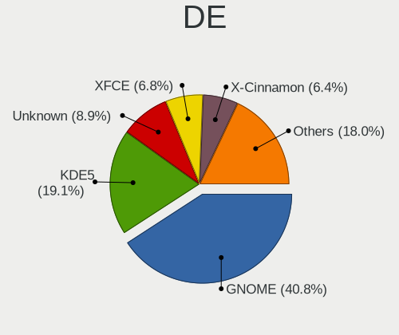
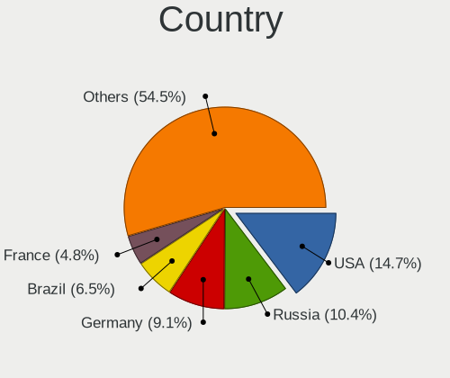

Linux - Tested Hardware & Statistics (Notebooks)
------------------------------------------------

A project to collect tested hardware configurations for Linux.

Anyone can contribute to this report by the [hw-probe](https://github.com/linuxhw/hw-probe) tool:

    sudo -E hw-probe -all -upload

Please contribute! Especially if your hardware is rare.

This report is for real hardware. Report for virtual hardware: [TestDays_VE](https://github.com/linuxhw/TestDays_VE)

Contents
--------

* [ Test Cases ](#test-cases)

* [ System ](#system)
  - [ OS                       ](#os)
  - [ OS Family                ](#os-family)
  - [ Kernel                   ](#kernel)
  - [ Kernel Family            ](#kernel-family)
  - [ Kernel Major Ver.        ](#kernel-major-ver)
  - [ Arch                     ](#arch)
  - [ DE                       ](#de)
  - [ Display Server           ](#display-server)
  - [ Display Manager          ](#display-manager)
  - [ OS Lang                  ](#os-lang)
  - [ Boot Mode                ](#boot-mode)
  - [ Filesystem               ](#filesystem)
  - [ Part. scheme             ](#part-scheme)
  - [ Dual Boot with Linux/BSD ](#dual-boot-with-linuxbsd)
  - [ Dual Boot (Win)          ](#dual-boot-win)

* [ Board ](#board)
  - [ Vendor                   ](#vendor)
  - [ Model                    ](#model)
  - [ Model Family             ](#model-family)
  - [ MFG Year                 ](#mfg-year)
  - [ Form Factor              ](#form-factor)
  - [ Secure Boot              ](#secure-boot)
  - [ Coreboot                 ](#coreboot)
  - [ RAM Size                 ](#ram-size)
  - [ RAM Used                 ](#ram-used)
  - [ Total Drives             ](#total-drives)
  - [ Has CD-ROM               ](#has-cd-rom)
  - [ Has Ethernet             ](#has-ethernet)
  - [ Has WiFi                 ](#has-wifi)
  - [ Has Bluetooth            ](#has-bluetooth)

* [ Location ](#location)
  - [ Country                  ](#country)
  - [ City                     ](#city)

* [ Drives ](#drives)
  - [ Drive Vendor             ](#drive-vendor)
  - [ Drive Model              ](#drive-model)
  - [ HDD Vendor               ](#hdd-vendor)
  - [ SSD Vendor               ](#ssd-vendor)
  - [ Drive Kind               ](#drive-kind)
  - [ Drive Connector          ](#drive-connector)
  - [ Drive Size               ](#drive-size)
  - [ Space Total              ](#space-total)
  - [ Space Used               ](#space-used)
  - [ Malfunc. Drives          ](#malfunc-drives)
  - [ Malfunc. Drive Vendor    ](#malfunc-drive-vendor)
  - [ Malfunc. HDD Vendor      ](#malfunc-hdd-vendor)
  - [ Malfunc. Drive Kind      ](#malfunc-drive-kind)
  - [ Failed Drives            ](#failed-drives)
  - [ Failed Drive Vendor      ](#failed-drive-vendor)
  - [ Drive Status             ](#drive-status)

* [ Storage controller ](#storage-controller)
  - [ Storage Vendor           ](#storage-vendor)
  - [ Storage Model            ](#storage-model)
  - [ Storage Kind             ](#storage-kind)

* [ Processor ](#processor)
  - [ CPU Vendor               ](#cpu-vendor)
  - [ CPU Model                ](#cpu-model)
  - [ CPU Model Family         ](#cpu-model-family)
  - [ CPU Cores                ](#cpu-cores)
  - [ CPU Sockets              ](#cpu-sockets)
  - [ CPU Threads              ](#cpu-threads)
  - [ CPU Op-Modes             ](#cpu-op-modes)
  - [ CPU Microcode            ](#cpu-microcode)
  - [ CPU Microarch            ](#cpu-microarch)

* [ Graphics ](#graphics)
  - [ GPU Vendor               ](#gpu-vendor)
  - [ GPU Model                ](#gpu-model)
  - [ GPU Combo                ](#gpu-combo)
  - [ GPU Driver               ](#gpu-driver)
  - [ GPU Memory               ](#gpu-memory)

* [ Monitor ](#monitor)
  - [ Monitor Vendor           ](#monitor-vendor)
  - [ Monitor Model            ](#monitor-model)
  - [ Monitor Resolution       ](#monitor-resolution)
  - [ Monitor Diagonal         ](#monitor-diagonal)
  - [ Monitor Width            ](#monitor-width)
  - [ Aspect Ratio             ](#aspect-ratio)
  - [ Monitor Area             ](#monitor-area)
  - [ Pixel Density            ](#pixel-density)
  - [ Multiple Monitors        ](#multiple-monitors)

* [ Network ](#network)
  - [ Net Controller Vendor    ](#net-controller-vendor)
  - [ Net Controller Model     ](#net-controller-model)
  - [ Wireless Vendor          ](#wireless-vendor)
  - [ Wireless Model           ](#wireless-model)
  - [ Ethernet Vendor          ](#ethernet-vendor)
  - [ Ethernet Model           ](#ethernet-model)
  - [ Net Controller Kind      ](#net-controller-kind)
  - [ Used Controller          ](#used-controller)
  - [ NICs                     ](#nics)
  - [ IPv6                     ](#ipv6)

* [ Bluetooth ](#bluetooth)
  - [ Bluetooth Vendor         ](#bluetooth-vendor)
  - [ Bluetooth Model          ](#bluetooth-model)

* [ Sound ](#sound)
  - [ Sound Vendor             ](#sound-vendor)
  - [ Sound Model              ](#sound-model)

* [ Memory ](#memory)
  - [ Memory Vendor            ](#memory-vendor)
  - [ Memory Model             ](#memory-model)
  - [ Memory Kind              ](#memory-kind)
  - [ Memory Form Factor       ](#memory-form-factor)
  - [ Memory Size              ](#memory-size)
  - [ Memory Speed             ](#memory-speed)

* [ Printers & scanners ](#printers--scanners)
  - [ Printer Vendor           ](#printer-vendor)
  - [ Printer Model            ](#printer-model)
  - [ Scanner Vendor           ](#scanner-vendor)
  - [ Scanner Model            ](#scanner-model)

* [ Camera ](#camera)
  - [ Camera Vendor            ](#camera-vendor)
  - [ Camera Model             ](#camera-model)

* [ Security ](#security)
  - [ Fingerprint Vendor       ](#fingerprint-vendor)
  - [ Fingerprint Model        ](#fingerprint-model)
  - [ Chipcard Vendor          ](#chipcard-vendor)
  - [ Chipcard Model           ](#chipcard-model)

* [ Unsupported ](#unsupported)
  - [ Unsupported Devices      ](#unsupported-devices)
  - [ Unsupported Device Types ](#unsupported-device-types)

Test Cases
----------

Total: 178585

| Vendor        | Model                       | Probe                                                      | Date         |
|---------------|-----------------------------|------------------------------------------------------------|--------------|
| Dell          | XPS 15 9500                 | [a8f95ea32d](https://linux-hardware.org/?probe=a8f95ea32d) | Oct 01, 2023 |
| ASUSTek       | ASUS TUF Gaming F15 FX50... | [34b8e1853b](https://linux-hardware.org/?probe=34b8e1853b) | Oct 01, 2023 |
| Dell          | Vostro 3560                 | [9acebbf655](https://linux-hardware.org/?probe=9acebbf655) | Oct 01, 2023 |
| Acer          | Predator G9-793             | [fd305490af](https://linux-hardware.org/?probe=fd305490af) | Oct 01, 2023 |
| Lenovo        | V15 G4 IRU 83A1             | [c71241f73d](https://linux-hardware.org/?probe=c71241f73d) | Oct 01, 2023 |
| Lenovo        | V15 G4 IRU 83A1             | [b1af5494c8](https://linux-hardware.org/?probe=b1af5494c8) | Oct 01, 2023 |
| HP            | ProBook 440 G4              | [810959ffa7](https://linux-hardware.org/?probe=810959ffa7) | Oct 01, 2023 |
| Acer          | Aspire SW5-173              | [b990067acf](https://linux-hardware.org/?probe=b990067acf) | Oct 01, 2023 |
| HP            | Victus by Laptop 16-d0xx... | [5ee355215f](https://linux-hardware.org/?probe=5ee355215f) | Oct 01, 2023 |
| ASUSTek       | G73Jh                       | [0b9b84be03](https://linux-hardware.org/?probe=0b9b84be03) | Oct 01, 2023 |
| HP            | Laptop 14s-fq1xxx           | [3709e611a3](https://linux-hardware.org/?probe=3709e611a3) | Oct 01, 2023 |
| ASUSTek       | TUF Gaming FX505DV_FX505... | [6c314cd812](https://linux-hardware.org/?probe=6c314cd812) | Oct 01, 2023 |
| HP            | ENVY m6 Notebook            | [5ef983c393](https://linux-hardware.org/?probe=5ef983c393) | Oct 01, 2023 |
| MSI           | Bravo 15 B5DD               | [1df2dc7261](https://linux-hardware.org/?probe=1df2dc7261) | Oct 01, 2023 |
| Lenovo        | ThinkPad L570 W10DG 20JR... | [bb5a34d03f](https://linux-hardware.org/?probe=bb5a34d03f) | Oct 01, 2023 |
| Digma         | EVE 11 C421Y ES1067EW       | [2a54b2d3e1](https://linux-hardware.org/?probe=2a54b2d3e1) | Oct 01, 2023 |
| Toshiba       | Satellite L735              | [c969a72669](https://linux-hardware.org/?probe=c969a72669) | Oct 01, 2023 |
| Acer          | Predator PH16-71            | [a07278dc43](https://linux-hardware.org/?probe=a07278dc43) | Oct 01, 2023 |
| Lenovo        | IdeaPad Y700-15ACZ 80NY     | [12d98aba86](https://linux-hardware.org/?probe=12d98aba86) | Oct 01, 2023 |
| Dell          | Latitude E6540              | [8fdc000f7e](https://linux-hardware.org/?probe=8fdc000f7e) | Oct 01, 2023 |
| OriginPC      | X170KM-G                    | [2a8752667a](https://linux-hardware.org/?probe=2a8752667a) | Oct 01, 2023 |
| Dell          | Latitude 5520               | [024af71640](https://linux-hardware.org/?probe=024af71640) | Oct 01, 2023 |
| Apple         | MacBookPro9,2               | [124425b8b3](https://linux-hardware.org/?probe=124425b8b3) | Oct 01, 2023 |
| Lenovo        | Flex 2-15D 20377            | [8f9e71f454](https://linux-hardware.org/?probe=8f9e71f454) | Oct 01, 2023 |
| Apple         | MacBook4,1                  | [efc04e4b27](https://linux-hardware.org/?probe=efc04e4b27) | Oct 01, 2023 |
| HP            | Laptop 17-cn0xxx            | [aa4b869750](https://linux-hardware.org/?probe=aa4b869750) | Oct 01, 2023 |
| Acer          | AOA150                      | [969a729098](https://linux-hardware.org/?probe=969a729098) | Oct 01, 2023 |
| Lenovo        | IdeaPad 330-15ARR 81D2      | [5d6364a866](https://linux-hardware.org/?probe=5d6364a866) | Oct 01, 2023 |
| Apple         | MacBook4,1                  | [d17d6d2b70](https://linux-hardware.org/?probe=d17d6d2b70) | Oct 01, 2023 |
| Apple         | MacBookPro14,3              | [ec90ed2076](https://linux-hardware.org/?probe=ec90ed2076) | Oct 01, 2023 |
| Acer          | Predator PH315-51           | [ed5459b320](https://linux-hardware.org/?probe=ed5459b320) | Oct 01, 2023 |
| Notebook      | NJx0MU                      | [7b44ef8cd1](https://linux-hardware.org/?probe=7b44ef8cd1) | Oct 01, 2023 |
| Dell          | Inspiron 11-3168            | [967817b4f8](https://linux-hardware.org/?probe=967817b4f8) | Oct 01, 2023 |
| HP            | ProBook 440 G4              | [8db3bb5b34](https://linux-hardware.org/?probe=8db3bb5b34) | Oct 01, 2023 |
| HP            | Pavilion Gaming Laptop 1... | [c99f28b27d](https://linux-hardware.org/?probe=c99f28b27d) | Oct 01, 2023 |
| Dell          | Latitude E6540              | [a5de8b78e7](https://linux-hardware.org/?probe=a5de8b78e7) | Oct 01, 2023 |
| HP            | Dragonfly 13.5 inch G4 N... | [8fabc36e1c](https://linux-hardware.org/?probe=8fabc36e1c) | Oct 01, 2023 |
| Panasonic     | CFSZ5-3                     | [9d0b849593](https://linux-hardware.org/?probe=9d0b849593) | Oct 01, 2023 |
| HP            | EliteBook 840 G8 Noteboo... | [9121e2ab8d](https://linux-hardware.org/?probe=9121e2ab8d) | Oct 01, 2023 |
| ASUSTek       | VivoBook_ASUSLaptop X512... | [2127748080](https://linux-hardware.org/?probe=2127748080) | Oct 01, 2023 |
| Dell          | G7 7700                     | [62bd529b36](https://linux-hardware.org/?probe=62bd529b36) | Oct 01, 2023 |
| Panasonic     | CFSZ5-3                     | [f2c369cb00](https://linux-hardware.org/?probe=f2c369cb00) | Oct 01, 2023 |
| Apple         | MacBookPro7,1               | [c69ebf2472](https://linux-hardware.org/?probe=c69ebf2472) | Oct 01, 2023 |
| HP            | ProBook 650 G8 Notebook ... | [b02492c1dd](https://linux-hardware.org/?probe=b02492c1dd) | Oct 01, 2023 |
| Toshiba       | Satellite C850-D4K          | [47d93b3030](https://linux-hardware.org/?probe=47d93b3030) | Oct 01, 2023 |
| GPU Compan... | GWTN156-4                   | [fa5491ff0c](https://linux-hardware.org/?probe=fa5491ff0c) | Oct 01, 2023 |
| Lenovo        | IdeaPad 320-15IKB 81BT      | [4fc3b1e588](https://linux-hardware.org/?probe=4fc3b1e588) | Oct 01, 2023 |
| Dell          | Latitude XT3                | [725ad34185](https://linux-hardware.org/?probe=725ad34185) | Oct 01, 2023 |
| Lenovo        | ThinkPad L14 Gen 1 20U6S... | [b79529501a](https://linux-hardware.org/?probe=b79529501a) | Oct 01, 2023 |
| Lenovo        | IdeaPad 320-15IKB 81BT      | [01d6d4f3c4](https://linux-hardware.org/?probe=01d6d4f3c4) | Oct 01, 2023 |
| Lenovo        | ThinkPad E14 Gen 2 20TAS... | [1a9c5d539b](https://linux-hardware.org/?probe=1a9c5d539b) | Oct 01, 2023 |
| HP            | Pavilion Laptop 15t-eg30... | [ed7bf5aee1](https://linux-hardware.org/?probe=ed7bf5aee1) | Oct 01, 2023 |
| Valve         | Jupiter                     | [c31d1a5288](https://linux-hardware.org/?probe=c31d1a5288) | Oct 01, 2023 |
| ASUSTek       | VivoBook_ASUSLaptop X512... | [ef74c51c65](https://linux-hardware.org/?probe=ef74c51c65) | Oct 01, 2023 |
| Lenovo        | Legion 5 Pro 16ITH6H 82J... | [61a08e5e89](https://linux-hardware.org/?probe=61a08e5e89) | Oct 01, 2023 |
| Dell          | Inspiron N5010              | [fe6b9d4c65](https://linux-hardware.org/?probe=fe6b9d4c65) | Oct 01, 2023 |
| Dell          | Latitude E6420              | [55c45fb7cb](https://linux-hardware.org/?probe=55c45fb7cb) | Oct 01, 2023 |
| Dell          | Latitude E7270              | [bf1def4fc3](https://linux-hardware.org/?probe=bf1def4fc3) | Oct 01, 2023 |
| ASUSTek       | VivoBook_ASUSLaptop M150... | [1330485afc](https://linux-hardware.org/?probe=1330485afc) | Oct 01, 2023 |
| HUAWEI        | MateBook X                  | [5479e52948](https://linux-hardware.org/?probe=5479e52948) | Oct 01, 2023 |
| Packard Be... | EasyNote ENLG81BA           | [c10a5eef39](https://linux-hardware.org/?probe=c10a5eef39) | Oct 01, 2023 |
| Acer          | Aspire A315-58              | [bbab99a4f7](https://linux-hardware.org/?probe=bbab99a4f7) | Sep 30, 2023 |
| Valve         | Jupiter                     | [d64d0a1997](https://linux-hardware.org/?probe=d64d0a1997) | Sep 30, 2023 |
| Dell          | Inspiron 5567               | [493a83e70a](https://linux-hardware.org/?probe=493a83e70a) | Sep 30, 2023 |
| ASUSTek       | ZenBook UX325EA_UX325EA     | [0a11dba9ac](https://linux-hardware.org/?probe=0a11dba9ac) | Sep 30, 2023 |
| ASUSTek       | X756UVK                     | [3bc56b23ef](https://linux-hardware.org/?probe=3bc56b23ef) | Sep 30, 2023 |
| Toshiba       | Satellite C870-1C2          | [d9750c9040](https://linux-hardware.org/?probe=d9750c9040) | Sep 30, 2023 |
| HP            | Laptop 17-cn2xxx            | [4a15c84784](https://linux-hardware.org/?probe=4a15c84784) | Sep 30, 2023 |
| Lenovo        | Legion Pro 5 16ARX8 82WM    | [83d91ea2fe](https://linux-hardware.org/?probe=83d91ea2fe) | Sep 30, 2023 |
| Notebook      | NJx0MU                      | [a1f20bb140](https://linux-hardware.org/?probe=a1f20bb140) | Sep 30, 2023 |
| Lenovo        | Legion Pro 5 16ARX8 82WM    | [0fad85dfc9](https://linux-hardware.org/?probe=0fad85dfc9) | Sep 30, 2023 |
| HP            | Pavilion Laptop 14-dv1xx... | [085fbda5a6](https://linux-hardware.org/?probe=085fbda5a6) | Sep 30, 2023 |
| HP            | EliteBook 840 G8 Noteboo... | [30bf4415dc](https://linux-hardware.org/?probe=30bf4415dc) | Sep 30, 2023 |
| Lenovo        | ThinkPad T480s 20L7CTO1W... | [1135ddac8e](https://linux-hardware.org/?probe=1135ddac8e) | Sep 30, 2023 |
| Medion        | Deputy P40                  | [7e0fc5b52d](https://linux-hardware.org/?probe=7e0fc5b52d) | Sep 30, 2023 |
| Gigabyte      | AERO 15-X9                  | [35830807d4](https://linux-hardware.org/?probe=35830807d4) | Sep 30, 2023 |
| Notebook      | NJx0MU                      | [1449844643](https://linux-hardware.org/?probe=1449844643) | Sep 30, 2023 |
| ASUSTek       | VivoBook_ASUSLaptop K340... | [59dcd18330](https://linux-hardware.org/?probe=59dcd18330) | Sep 30, 2023 |
| Apple         | MacBookPro5,3               | [0669d0020d](https://linux-hardware.org/?probe=0669d0020d) | Sep 30, 2023 |
| HP            | Compaq nc6320 (EN368UT#A... | [71ba4fd9e9](https://linux-hardware.org/?probe=71ba4fd9e9) | Sep 30, 2023 |
| ASUSTek       | VivoBook_ASUSLaptop K340... | [a6d0762090](https://linux-hardware.org/?probe=a6d0762090) | Sep 30, 2023 |
| HP            | EliteBook 745 G3            | [5cae9ddf98](https://linux-hardware.org/?probe=5cae9ddf98) | Sep 30, 2023 |
| Lenovo        | IdeaPad S145-15AST 81N3     | [4575deef12](https://linux-hardware.org/?probe=4575deef12) | Sep 30, 2023 |
| HUAWEI        | VLT-WX0                     | [a312a57d16](https://linux-hardware.org/?probe=a312a57d16) | Sep 30, 2023 |
| Fujitsu Si... | AMILO A1650G                | [ec61a60044](https://linux-hardware.org/?probe=ec61a60044) | Sep 30, 2023 |
| MSI           | Prestige 14H B12UCX         | [b3a006adc7](https://linux-hardware.org/?probe=b3a006adc7) | Sep 30, 2023 |
| Dynabook      | TECRA A50-J                 | [e0927243be](https://linux-hardware.org/?probe=e0927243be) | Sep 30, 2023 |
| Lenovo        | G505s 20255                 | [58a1c6e106](https://linux-hardware.org/?probe=58a1c6e106) | Sep 30, 2023 |
| Lenovo        | Legion 5 15ACH6H 82JU       | [48ff113276](https://linux-hardware.org/?probe=48ff113276) | Sep 30, 2023 |
| HP            | EliteBook 830 G6            | [154150aa88](https://linux-hardware.org/?probe=154150aa88) | Sep 30, 2023 |
| Juana Mans... | SF20GM7                     | [b2b359c659](https://linux-hardware.org/?probe=b2b359c659) | Sep 30, 2023 |
| Lenovo        | ThinkPad X200 745536T       | [62740874ab](https://linux-hardware.org/?probe=62740874ab) | Sep 30, 2023 |
| ASUSTek       | Z450LA                      | [afa96a084e](https://linux-hardware.org/?probe=afa96a084e) | Sep 30, 2023 |
| Juana Mans... | SF20GM7                     | [b4a58da74c](https://linux-hardware.org/?probe=b4a58da74c) | Sep 30, 2023 |
| HP            | EliteBook 820 G4            | [eb46d26ff8](https://linux-hardware.org/?probe=eb46d26ff8) | Sep 30, 2023 |
| MSI           | Prestige 15 A10SC           | [6e53cd8a65](https://linux-hardware.org/?probe=6e53cd8a65) | Sep 30, 2023 |
| Valve         | Jupiter                     | [0488b8fd24](https://linux-hardware.org/?probe=0488b8fd24) | Sep 30, 2023 |
| Lenovo        | ThinkPad T440 20B7S1K400    | [fd03530876](https://linux-hardware.org/?probe=fd03530876) | Sep 30, 2023 |
| Juana Mans... | SF20GM7                     | [ccb9b4e795](https://linux-hardware.org/?probe=ccb9b4e795) | Sep 30, 2023 |
| ASUSTek       | F7SR                        | [b895fd8bb2](https://linux-hardware.org/?probe=b895fd8bb2) | Sep 30, 2023 |
| Lenovo        | IdeaPad Y700-15ISK 80NV     | [d180995f93](https://linux-hardware.org/?probe=d180995f93) | Sep 30, 2023 |
| ASUSTek       | F7SR                        | [1b7493ae6e](https://linux-hardware.org/?probe=1b7493ae6e) | Sep 30, 2023 |
| Infinix       | INBOOK X3                   | [6b5c2647c2](https://linux-hardware.org/?probe=6b5c2647c2) | Sep 30, 2023 |
| HP            | EliteBook 745 G3            | [700c901144](https://linux-hardware.org/?probe=700c901144) | Sep 30, 2023 |
| Acer          | Aspire E5-411G              | [80ac43658d](https://linux-hardware.org/?probe=80ac43658d) | Sep 30, 2023 |
| HP            | ProBook 650 G1              | [c9aca83f04](https://linux-hardware.org/?probe=c9aca83f04) | Sep 30, 2023 |
| Lenovo        | ThinkPad X260 VB6R77903H    | [e7dad368d2](https://linux-hardware.org/?probe=e7dad368d2) | Sep 30, 2023 |
| Lenovo        | ThinkPad E15 Gen 4 21E60... | [951a03d2ad](https://linux-hardware.org/?probe=951a03d2ad) | Sep 30, 2023 |
| HP            | Pro Tablet 608 G1           | [14fcb9ce4b](https://linux-hardware.org/?probe=14fcb9ce4b) | Sep 30, 2023 |
| HUAWEI        | NBD-WXX9                    | [c8a525522f](https://linux-hardware.org/?probe=c8a525522f) | Sep 30, 2023 |
| MSI           | Prestige 14H B12UCX         | [1c1f35d1c8](https://linux-hardware.org/?probe=1c1f35d1c8) | Sep 30, 2023 |
| HP            | EliteBook 745 G3            | [16f4068970](https://linux-hardware.org/?probe=16f4068970) | Sep 30, 2023 |
| Dell          | Latitude 5410               | [8234abf02b](https://linux-hardware.org/?probe=8234abf02b) | Sep 30, 2023 |
| Fujitsu Si... | AMILO Pa 2548               | [ee2d5e25d3](https://linux-hardware.org/?probe=ee2d5e25d3) | Sep 30, 2023 |
| Acer          | Aspire E1-572G              | [f7375967ee](https://linux-hardware.org/?probe=f7375967ee) | Sep 30, 2023 |
| Lenovo        | ThinkPad X260 VB6R77903H    | [de3079ae33](https://linux-hardware.org/?probe=de3079ae33) | Sep 30, 2023 |
| HP            | Pavilion Gaming Laptop 1... | [b3959728d3](https://linux-hardware.org/?probe=b3959728d3) | Sep 30, 2023 |
| Entroware     | Hybris                      | [5b124e9b7f](https://linux-hardware.org/?probe=5b124e9b7f) | Sep 30, 2023 |
| Acer          | Aspire E5-571G              | [b223d9b4f5](https://linux-hardware.org/?probe=b223d9b4f5) | Sep 30, 2023 |
| Dell          | Latitude 7280               | [dbe9d3e4be](https://linux-hardware.org/?probe=dbe9d3e4be) | Sep 30, 2023 |
| Lenovo        | IdeaPad C340-14API 81N6     | [73b5907f17](https://linux-hardware.org/?probe=73b5907f17) | Sep 30, 2023 |
| Fujitsu Si... | AMILO Pro Edition V3405     | [4814760ac1](https://linux-hardware.org/?probe=4814760ac1) | Sep 30, 2023 |
| Toshiba       | PORTEGE R30-D               | [04ef694f1d](https://linux-hardware.org/?probe=04ef694f1d) | Sep 30, 2023 |
| Lenovo        | ThinkPad T14 Gen 1 20UES... | [2d1ada9dbe](https://linux-hardware.org/?probe=2d1ada9dbe) | Sep 30, 2023 |
| UNOWHY        | Y13G012S4EI                 | [2b60435562](https://linux-hardware.org/?probe=2b60435562) | Sep 30, 2023 |
| HUAWEI        | HLYL-WXX9                   | [d39169bf21](https://linux-hardware.org/?probe=d39169bf21) | Sep 30, 2023 |
| Metabox       | Prime-X X170KM              | [8ab33a8bd3](https://linux-hardware.org/?probe=8ab33a8bd3) | Sep 30, 2023 |
| Dell          | Inspiron N5110              | [e796baf50f](https://linux-hardware.org/?probe=e796baf50f) | Sep 30, 2023 |
| Lenovo        | ThinkPad Edge E530 62722... | [681d3e6c86](https://linux-hardware.org/?probe=681d3e6c86) | Sep 30, 2023 |
| Lenovo        | ThinkPad L530 24783R8       | [eda040f456](https://linux-hardware.org/?probe=eda040f456) | Sep 30, 2023 |
| Fujitsu Si... | AMILO Pa 2548               | [a291afc6c3](https://linux-hardware.org/?probe=a291afc6c3) | Sep 30, 2023 |
| Lenovo        | IdeaPad 3 15ADA6 82KR       | [58552d0532](https://linux-hardware.org/?probe=58552d0532) | Sep 30, 2023 |
| Dell          | Latitude 5430               | [eee2a34ff5](https://linux-hardware.org/?probe=eee2a34ff5) | Sep 30, 2023 |
| Intel Clie... | LAPBC710                    | [3a29dfa2e3](https://linux-hardware.org/?probe=3a29dfa2e3) | Sep 30, 2023 |
| Acer          | Aspire 5560                 | [252d19e4f5](https://linux-hardware.org/?probe=252d19e4f5) | Sep 30, 2023 |
| ASUSTek       | ASUS EXPERTBOOK B1402CBA... | [91873a529a](https://linux-hardware.org/?probe=91873a529a) | Sep 30, 2023 |
| Timi          | Mi NoteBook Ultra           | [1c4b1aa68d](https://linux-hardware.org/?probe=1c4b1aa68d) | Sep 30, 2023 |
| Lenovo        | Legion 5 Pro 16ACH6H 82J... | [3421ba07f9](https://linux-hardware.org/?probe=3421ba07f9) | Sep 30, 2023 |
| Lenovo        | Legion 5 Pro 16ACH6H 82J... | [480316a0da](https://linux-hardware.org/?probe=480316a0da) | Sep 30, 2023 |
| IX1401        | Unknown                     | [c77c1d010e](https://linux-hardware.org/?probe=c77c1d010e) | Sep 30, 2023 |
| Valve         | Jupiter                     | [85eac5b7ce](https://linux-hardware.org/?probe=85eac5b7ce) | Sep 30, 2023 |
| Lenovo        | ThinkPad X230 2325KZ5       | [7c10f1a5de](https://linux-hardware.org/?probe=7c10f1a5de) | Sep 30, 2023 |
| HP            | ProBook 645 G1              | [f5f538105c](https://linux-hardware.org/?probe=f5f538105c) | Sep 30, 2023 |
| Toshiba       | Satellite L500              | [9c1b258088](https://linux-hardware.org/?probe=9c1b258088) | Sep 30, 2023 |
| HP            | Laptop 15s-eq1xxx           | [2a293067f5](https://linux-hardware.org/?probe=2a293067f5) | Sep 30, 2023 |
| HP            | Pro Tablet 608 G1           | [ab84386c83](https://linux-hardware.org/?probe=ab84386c83) | Sep 30, 2023 |
| Toshiba       | QOSMIO X770                 | [c747b27390](https://linux-hardware.org/?probe=c747b27390) | Sep 30, 2023 |
| Dell          | Latitude 7390               | [bd6d90d41e](https://linux-hardware.org/?probe=bd6d90d41e) | Sep 30, 2023 |
| Timi          | Mi NoteBook Ultra           | [988f015a89](https://linux-hardware.org/?probe=988f015a89) | Sep 30, 2023 |
| HP            | Pavilion dv5                | [0b1da8643f](https://linux-hardware.org/?probe=0b1da8643f) | Sep 30, 2023 |
| Lenovo        | ThinkPad L570 W10DG 20JR... | [a343a1c573](https://linux-hardware.org/?probe=a343a1c573) | Sep 30, 2023 |
| HP            | 250 G7 Notebook PC          | [2fc3f16671](https://linux-hardware.org/?probe=2fc3f16671) | Sep 30, 2023 |
| Dell          | Inspiron 15 3525            | [b46d569d14](https://linux-hardware.org/?probe=b46d569d14) | Sep 30, 2023 |
| Dell          | Inspiron 15 3525            | [fb52caaee9](https://linux-hardware.org/?probe=fb52caaee9) | Sep 30, 2023 |
| TECNO         | MEGABOOK T1                 | [9bba77e02b](https://linux-hardware.org/?probe=9bba77e02b) | Sep 30, 2023 |
| Packard Be... | EasyNote TK85               | [0c62f48dda](https://linux-hardware.org/?probe=0c62f48dda) | Sep 30, 2023 |
| HP            | ProBook 6560b               | [904f0eb2cb](https://linux-hardware.org/?probe=904f0eb2cb) | Sep 30, 2023 |
| Samsung       | 305E4A/305E5A/305E7A        | [89d519a3f5](https://linux-hardware.org/?probe=89d519a3f5) | Sep 30, 2023 |
| Apple         | MacBookPro8,2               | [237492c356](https://linux-hardware.org/?probe=237492c356) | Sep 30, 2023 |
| Lenovo        | ThinkPad T420 4180BV1       | [e81749053b](https://linux-hardware.org/?probe=e81749053b) | Sep 30, 2023 |
| Apple         | MacBookPro12,1              | [b3617a1e58](https://linux-hardware.org/?probe=b3617a1e58) | Sep 30, 2023 |
| Lenovo        | ThinkPad E495 20NES07V00    | [935dc10f6b](https://linux-hardware.org/?probe=935dc10f6b) | Sep 30, 2023 |
| Acer          | Aspire SW3-016              | [62c3855aa7](https://linux-hardware.org/?probe=62c3855aa7) | Sep 30, 2023 |
| HP            | Notebook                    | [873004172f](https://linux-hardware.org/?probe=873004172f) | Sep 30, 2023 |
| Lenovo        | ThinkPad X1 Carbon 3rd 2... | [2edc7ab56b](https://linux-hardware.org/?probe=2edc7ab56b) | Sep 30, 2023 |
| Dell          | Latitude 5410               | [d13c5769a3](https://linux-hardware.org/?probe=d13c5769a3) | Sep 30, 2023 |
| ASUSTek       | VivoBook 15_ASUS Laptop ... | [a0e4942d9f](https://linux-hardware.org/?probe=a0e4942d9f) | Sep 30, 2023 |
| Toshiba       | Satellite C845D             | [92651c9e51](https://linux-hardware.org/?probe=92651c9e51) | Sep 30, 2023 |
| Dell          | Vostro 3350                 | [1034a53a9d](https://linux-hardware.org/?probe=1034a53a9d) | Sep 30, 2023 |
| Apple         | MacBookPro5,3               | [d249d5e114](https://linux-hardware.org/?probe=d249d5e114) | Sep 30, 2023 |
| Sony          | VPCEG10EL                   | [8271942cc2](https://linux-hardware.org/?probe=8271942cc2) | Sep 30, 2023 |
| BANGHO        | MAX G0101                   | [b867aa1824](https://linux-hardware.org/?probe=b867aa1824) | Sep 30, 2023 |
| Lenovo        | ThinkPad 13 2nd Gen 20J2... | [702d68e226](https://linux-hardware.org/?probe=702d68e226) | Sep 30, 2023 |
| Acer          | Aspire A514-53              | [6d8a5b1a13](https://linux-hardware.org/?probe=6d8a5b1a13) | Sep 30, 2023 |
| Alienware     | m15 R4                      | [a67899ed06](https://linux-hardware.org/?probe=a67899ed06) | Sep 30, 2023 |
| Valve         | Jupiter                     | [1ed8509a3d](https://linux-hardware.org/?probe=1ed8509a3d) | Sep 30, 2023 |
| ASUSTek       | ASUS TUF Gaming A15 FA50... | [527c8192a9](https://linux-hardware.org/?probe=527c8192a9) | Sep 30, 2023 |
| Acer          | Aspire 7741                 | [80d27e2808](https://linux-hardware.org/?probe=80d27e2808) | Sep 30, 2023 |
| Dell          | Inspiron 5521               | [a704dd3c01](https://linux-hardware.org/?probe=a704dd3c01) | Sep 30, 2023 |
| VALE          | Notebook Classic C140       | [5be7208021](https://linux-hardware.org/?probe=5be7208021) | Sep 30, 2023 |
| Apple         | MacBookPro5,5               | [202a977fce](https://linux-hardware.org/?probe=202a977fce) | Sep 30, 2023 |
| Fujitsu Si... | ESPRIMO Mobile V6555        | [703170e428](https://linux-hardware.org/?probe=703170e428) | Sep 30, 2023 |
| HP            | Pavilion Laptop 15-eh1xx... | [3710f99f83](https://linux-hardware.org/?probe=3710f99f83) | Sep 30, 2023 |
| HP            | Pavilion dv6                | [e2560d6378](https://linux-hardware.org/?probe=e2560d6378) | Sep 30, 2023 |
| HP            | Notebook                    | [193ec8deb3](https://linux-hardware.org/?probe=193ec8deb3) | Sep 30, 2023 |
| HP            | Dragonfly 13.5 inch G4 N... | [2afa933d2a](https://linux-hardware.org/?probe=2afa933d2a) | Sep 30, 2023 |
| Unknown       | Unknown                     | [56580ba351](https://linux-hardware.org/?probe=56580ba351) | Sep 30, 2023 |
| HP            | ZBook Studio G5             | [3f96bd2883](https://linux-hardware.org/?probe=3f96bd2883) | Sep 30, 2023 |
| Lenovo        | 300s-15ARR 81FB             | [4f7e627fd2](https://linux-hardware.org/?probe=4f7e627fd2) | Sep 30, 2023 |
| HP            | Dragonfly 13.5 inch G4 N... | [a7a8e627cb](https://linux-hardware.org/?probe=a7a8e627cb) | Sep 30, 2023 |
| ASUSTek       | ZenBook UX425QA_UM425QA     | [306bc123c4](https://linux-hardware.org/?probe=306bc123c4) | Sep 29, 2023 |
| Lenovo        | G770 1037                   | [576bbd3839](https://linux-hardware.org/?probe=576bbd3839) | Sep 29, 2023 |
| Lenovo        | IdeaPad 5 14ALC05 82LM      | [c1a605af33](https://linux-hardware.org/?probe=c1a605af33) | Sep 29, 2023 |
| HP            | ProBook 640 G8 Notebook ... | [4567599161](https://linux-hardware.org/?probe=4567599161) | Sep 29, 2023 |
| ASUSTek       | VivoBook_ASUSLaptop X150... | [86d39b72d6](https://linux-hardware.org/?probe=86d39b72d6) | Sep 29, 2023 |
| HP            | ProBook 640 G8 Notebook ... | [526458167b](https://linux-hardware.org/?probe=526458167b) | Sep 29, 2023 |
| ASUSTek       | ROG Strix G713PI_G713PI     | [a3af35a207](https://linux-hardware.org/?probe=a3af35a207) | Sep 29, 2023 |
| Lenovo        | ThinkPad X13 Gen 1 20UGA... | [8c1d3fc469](https://linux-hardware.org/?probe=8c1d3fc469) | Sep 29, 2023 |
| Acer          | Aspire F5-573G              | [dea46b2302](https://linux-hardware.org/?probe=dea46b2302) | Sep 29, 2023 |
| Dell          | XPS 15 9550                 | [587f9a3ff1](https://linux-hardware.org/?probe=587f9a3ff1) | Sep 29, 2023 |
| Lenovo        | IdeaPad Slim 3 15IRU8 82... | [e9dd0291e0](https://linux-hardware.org/?probe=e9dd0291e0) | Sep 29, 2023 |
| Sony          | VPCEB4J0E                   | [05864978df](https://linux-hardware.org/?probe=05864978df) | Sep 29, 2023 |
| Lenovo        | Z50-70 20354                | [eb33abdaae](https://linux-hardware.org/?probe=eb33abdaae) | Sep 29, 2023 |
| ASUSTek       | UX31E                       | [1b6440f722](https://linux-hardware.org/?probe=1b6440f722) | Sep 29, 2023 |
| Dell          | Latitude 3301               | [3859ed5445](https://linux-hardware.org/?probe=3859ed5445) | Sep 29, 2023 |
| ASUSTek       | ROG Strix G713QM_G713QM     | [ec1384a424](https://linux-hardware.org/?probe=ec1384a424) | Sep 29, 2023 |
| Razer         | Blade 15 Base Model (Lat... | [95dc405a73](https://linux-hardware.org/?probe=95dc405a73) | Sep 29, 2023 |
| ASUSTek       | X551MA                      | [8ba160ee59](https://linux-hardware.org/?probe=8ba160ee59) | Sep 29, 2023 |
| Acer          | Aspire E1-572G              | [9fe3adb466](https://linux-hardware.org/?probe=9fe3adb466) | Sep 29, 2023 |
| Lenovo        | Legion 5 Pro 16ITH6H 82J... | [6e7e482b2d](https://linux-hardware.org/?probe=6e7e482b2d) | Sep 29, 2023 |
| HP            | Laptop 17-cn1xxx            | [051a233121](https://linux-hardware.org/?probe=051a233121) | Sep 29, 2023 |
| Tectoy        | Pense Bem Notebook          | [6a6e6af34c](https://linux-hardware.org/?probe=6a6e6af34c) | Sep 29, 2023 |
| HP            | ENVY TS Sleekbook 4         | [545098d0d2](https://linux-hardware.org/?probe=545098d0d2) | Sep 29, 2023 |
| Lenovo        | ThinkPad X13 Gen 1 20UGA... | [c38ca27643](https://linux-hardware.org/?probe=c38ca27643) | Sep 29, 2023 |
| Lenovo        | ThinkPad L15 Gen 1 20U70... | [e51fd2a8e9](https://linux-hardware.org/?probe=e51fd2a8e9) | Sep 29, 2023 |
| Lenovo        | IdeaPad 3 15ALC6 82KU       | [cd9628c344](https://linux-hardware.org/?probe=cd9628c344) | Sep 29, 2023 |
| ASUSTek       | ASUS TUF Gaming A15 FA50... | [96e037afc8](https://linux-hardware.org/?probe=96e037afc8) | Sep 29, 2023 |
| eMachines     | eME732Z                     | [ba03824830](https://linux-hardware.org/?probe=ba03824830) | Sep 29, 2023 |
| Apple         | MacBookAir6,1               | [b77b45ce58](https://linux-hardware.org/?probe=b77b45ce58) | Sep 29, 2023 |
| OEGStone      | C4100/C5100                 | [0c27e50b14](https://linux-hardware.org/?probe=0c27e50b14) | Sep 29, 2023 |
| Lenovo        | IdeaPad Pro 5 16APH8 83A... | [ee6e1996b9](https://linux-hardware.org/?probe=ee6e1996b9) | Sep 29, 2023 |
| Acer          | Aspire A517-53              | [6023cecfb1](https://linux-hardware.org/?probe=6023cecfb1) | Sep 29, 2023 |
| HP            | ProBook 450 G1              | [1cbae5b56a](https://linux-hardware.org/?probe=1cbae5b56a) | Sep 29, 2023 |
| Acer          | Aspire 7745G                | [55ea55a771](https://linux-hardware.org/?probe=55ea55a771) | Sep 29, 2023 |
| Acer          | Nitro AN517-54              | [3e1448c388](https://linux-hardware.org/?probe=3e1448c388) | Sep 29, 2023 |
| Dell          | Inspiron 5558               | [f94587a692](https://linux-hardware.org/?probe=f94587a692) | Sep 29, 2023 |
| Acer          | Aspire A517-53              | [05ff23a1a1](https://linux-hardware.org/?probe=05ff23a1a1) | Sep 29, 2023 |
| Dell          | XPS 13 9380                 | [9c2ba935b9](https://linux-hardware.org/?probe=9c2ba935b9) | Sep 29, 2023 |
| Dell          | Latitude 5500               | [ea091dbcf2](https://linux-hardware.org/?probe=ea091dbcf2) | Sep 29, 2023 |
| Lenovo        | ThinkPad X260 20F5S2WY00    | [6a18fb9b21](https://linux-hardware.org/?probe=6a18fb9b21) | Sep 29, 2023 |
| Lenovo        | G70-70 80HW                 | [4e22db020f](https://linux-hardware.org/?probe=4e22db020f) | Sep 29, 2023 |
| F-PLUS EQU... | FNB-156-P1                  | [cceaaac2d3](https://linux-hardware.org/?probe=cceaaac2d3) | Sep 29, 2023 |
| ASUSTek       | VivoBook_ASUSLaptop X412... | [6348992a72](https://linux-hardware.org/?probe=6348992a72) | Sep 29, 2023 |
| Dell          | Inspiron 5570               | [7975260826](https://linux-hardware.org/?probe=7975260826) | Sep 29, 2023 |
| ASUSTek       | ROG Strix G713QM_G713QM     | [d958b4e16a](https://linux-hardware.org/?probe=d958b4e16a) | Sep 29, 2023 |
| HP            | Laptop 15s-fq1xxx           | [08fb652352](https://linux-hardware.org/?probe=08fb652352) | Sep 29, 2023 |
| HP            | EliteBook 745 G5            | [b734ec49e2](https://linux-hardware.org/?probe=b734ec49e2) | Sep 29, 2023 |
| Dell          | Latitude 7490               | [a22e4e9304](https://linux-hardware.org/?probe=a22e4e9304) | Sep 29, 2023 |
| Dell          | Latitude 5430               | [583aa8cf02](https://linux-hardware.org/?probe=583aa8cf02) | Sep 29, 2023 |
| Intel         | SharkBay Platform           | [2406bf1c0d](https://linux-hardware.org/?probe=2406bf1c0d) | Sep 29, 2023 |
| Dell          | Latitude E6540              | [1478e1265d](https://linux-hardware.org/?probe=1478e1265d) | Sep 29, 2023 |
| Dell          | Latitude E6530              | [5fc5673815](https://linux-hardware.org/?probe=5fc5673815) | Sep 29, 2023 |
| HP            | OMEN by Laptop 15-dc1xxx    | [2d31a3d858](https://linux-hardware.org/?probe=2d31a3d858) | Sep 29, 2023 |
| ASUSTek       | K55VJ                       | [4befa6db63](https://linux-hardware.org/?probe=4befa6db63) | Sep 29, 2023 |
| Alienware     | m16 R1 AMD                  | [710a10efce](https://linux-hardware.org/?probe=710a10efce) | Sep 29, 2023 |
| HP            | ProBook 430 G3              | [5a73271bfd](https://linux-hardware.org/?probe=5a73271bfd) | Sep 29, 2023 |
| HP            | ZBook Studio G5             | [239b5a3fd5](https://linux-hardware.org/?probe=239b5a3fd5) | Sep 29, 2023 |
| Alienware     | x15 R1                      | [a34b343fce](https://linux-hardware.org/?probe=a34b343fce) | Sep 29, 2023 |
| Positivo      | C14CR01                     | [11b171838d](https://linux-hardware.org/?probe=11b171838d) | Sep 29, 2023 |
| SKIKK         | Sindri 14                   | [9766c80aa9](https://linux-hardware.org/?probe=9766c80aa9) | Sep 29, 2023 |
| Dell          | Precision 5480              | [5d157102ea](https://linux-hardware.org/?probe=5d157102ea) | Sep 29, 2023 |
| HUAWEI        | BOHK-WAX9X                  | [6275e5c1d4](https://linux-hardware.org/?probe=6275e5c1d4) | Sep 29, 2023 |
| Timi          | Xiaomi Book Pro 16 2022     | [7392f9db3b](https://linux-hardware.org/?probe=7392f9db3b) | Sep 29, 2023 |
| Valve         | Jupiter                     | [d065544135](https://linux-hardware.org/?probe=d065544135) | Sep 29, 2023 |
| HP            | Pavilion Laptop 15-eh1xx... | [55b44bb456](https://linux-hardware.org/?probe=55b44bb456) | Sep 29, 2023 |
| MSI           | Prestige 15 A12SC           | [d78d241946](https://linux-hardware.org/?probe=d78d241946) | Sep 29, 2023 |
| Dell          | Inspiron 3542               | [b7faf1054b](https://linux-hardware.org/?probe=b7faf1054b) | Sep 29, 2023 |
| Acer          | Swift SF114-34              | [9d618e345a](https://linux-hardware.org/?probe=9d618e345a) | Sep 29, 2023 |
| Acer          | Nitro AN515-55              | [e6d8dfa4a1](https://linux-hardware.org/?probe=e6d8dfa4a1) | Sep 29, 2023 |
| HP            | Pavilion dv9000 (GA359UA... | [cea70d5f75](https://linux-hardware.org/?probe=cea70d5f75) | Sep 29, 2023 |
| Lenovo        | ThinkPad T480s 20L8002WM... | [eef8975f1e](https://linux-hardware.org/?probe=eef8975f1e) | Sep 29, 2023 |
| Dell          | Latitude E5450              | [0b77908612](https://linux-hardware.org/?probe=0b77908612) | Sep 29, 2023 |
| System76      | Darter Pro                  | [d8b78103d5](https://linux-hardware.org/?probe=d8b78103d5) | Sep 29, 2023 |
| Samsung       | 350V5C/351V5C/3540VC/344... | [b9f67caef4](https://linux-hardware.org/?probe=b9f67caef4) | Sep 29, 2023 |
| ASUSTek       | VivoBook_ASUSLaptop X412... | [5828bffdb6](https://linux-hardware.org/?probe=5828bffdb6) | Sep 29, 2023 |
| Valve         | Jupiter                     | [c881d3edc2](https://linux-hardware.org/?probe=c881d3edc2) | Sep 29, 2023 |
| Dell          | Inspiron 15-3552            | [8a8f11edae](https://linux-hardware.org/?probe=8a8f11edae) | Sep 29, 2023 |
| HP            | Laptop 14-fq0xxx            | [52648b0b45](https://linux-hardware.org/?probe=52648b0b45) | Sep 29, 2023 |
| HP            | EliteBook 840 G6            | [e57cdefe7a](https://linux-hardware.org/?probe=e57cdefe7a) | Sep 29, 2023 |
| Valve         | Jupiter                     | [2f4eb9f823](https://linux-hardware.org/?probe=2f4eb9f823) | Sep 29, 2023 |
| Dell          | Inspiron 7548               | [2c407b4ff5](https://linux-hardware.org/?probe=2c407b4ff5) | Sep 29, 2023 |
| Dell          | Precision 7710              | [89731f9b0e](https://linux-hardware.org/?probe=89731f9b0e) | Sep 29, 2023 |
| TUXEDO        | Stellaris Intel Gen5        | [6d981e4890](https://linux-hardware.org/?probe=6d981e4890) | Sep 29, 2023 |
| ASUSTek       | VivoBook S14 X411UF         | [fb1c2503cf](https://linux-hardware.org/?probe=fb1c2503cf) | Sep 29, 2023 |
| Dell          | XPS 13 9360                 | [2a3e49f18f](https://linux-hardware.org/?probe=2a3e49f18f) | Sep 29, 2023 |
| Lenovo        | IdeaPad 3 15IIL05 81WE      | [902918fb1d](https://linux-hardware.org/?probe=902918fb1d) | Sep 29, 2023 |
| HP            | EliteBook 2760p             | [e9d026d0df](https://linux-hardware.org/?probe=e9d026d0df) | Sep 29, 2023 |
| ASUSTek       | VivoBook_ASUSLaptop X515... | [772e866a05](https://linux-hardware.org/?probe=772e866a05) | Sep 29, 2023 |
| Acer          | Aspire E5-575G              | [109490039d](https://linux-hardware.org/?probe=109490039d) | Sep 29, 2023 |
| Lenovo        | ThinkPad E495 20NE0001US    | [a76a94cd2f](https://linux-hardware.org/?probe=a76a94cd2f) | Sep 29, 2023 |
| Lenovo        | ThinkPad X200 745536T       | [618cd9dd90](https://linux-hardware.org/?probe=618cd9dd90) | Sep 29, 2023 |
| Dell          | Inspiron 5437               | [c0301c2fbb](https://linux-hardware.org/?probe=c0301c2fbb) | Sep 29, 2023 |
| HUAWEI        | HVY-WXX9                    | [713d59f3d0](https://linux-hardware.org/?probe=713d59f3d0) | Sep 29, 2023 |
| HP            | ENVY Laptop 13-ah0xxx       | [6f19668c91](https://linux-hardware.org/?probe=6f19668c91) | Sep 29, 2023 |
| HUAWEI        | HVY-WXX9                    | [c434f30a15](https://linux-hardware.org/?probe=c434f30a15) | Sep 29, 2023 |
| Valve         | Jupiter                     | [937f10463d](https://linux-hardware.org/?probe=937f10463d) | Sep 29, 2023 |
| Lenovo        | IdeaPad 320-15IKB 81BT      | [ba269d8c4a](https://linux-hardware.org/?probe=ba269d8c4a) | Sep 29, 2023 |
| Casper        | NIRVANA N240                | [fa2c4e6569](https://linux-hardware.org/?probe=fa2c4e6569) | Sep 29, 2023 |
| Lenovo        | V15 G2 ITL 82KB             | [e87fdc15ed](https://linux-hardware.org/?probe=e87fdc15ed) | Sep 29, 2023 |
| SLIMBOOK      | PROX-AMD5                   | [96fa5ddfa8](https://linux-hardware.org/?probe=96fa5ddfa8) | Sep 29, 2023 |
| Lenovo        | V15 G2 ITL 82KB             | [b1333a2976](https://linux-hardware.org/?probe=b1333a2976) | Sep 29, 2023 |
| Lenovo        | G70-70 80HW                 | [5ef0f97836](https://linux-hardware.org/?probe=5ef0f97836) | Sep 29, 2023 |
| HP            | Stream Laptop 14-ds0xxx     | [bbab7c9f89](https://linux-hardware.org/?probe=bbab7c9f89) | Sep 29, 2023 |
| Dell          | Latitude 5410               | [61ddf0adf6](https://linux-hardware.org/?probe=61ddf0adf6) | Sep 29, 2023 |
| Packard Be... | EasyNote TK36               | [1e8f79c726](https://linux-hardware.org/?probe=1e8f79c726) | Sep 29, 2023 |
| HP            | Stream Laptop 14-ds0xxx     | [4f23a67b82](https://linux-hardware.org/?probe=4f23a67b82) | Sep 29, 2023 |
| Dell          | Inspiron 5570               | [0e12b69b96](https://linux-hardware.org/?probe=0e12b69b96) | Sep 29, 2023 |
| Acer          | Nitro AN515-43              | [e55a394d41](https://linux-hardware.org/?probe=e55a394d41) | Sep 29, 2023 |
| MSI           | Cyborg 15 A12VF             | [960cd34617](https://linux-hardware.org/?probe=960cd34617) | Sep 29, 2023 |
| Lenovo        | ThinkPad W541 20EGS24J00    | [99fb3ec5e9](https://linux-hardware.org/?probe=99fb3ec5e9) | Sep 29, 2023 |
| Lenovo        | IdeaPad 3 14IML05 81WA      | [d95e370c54](https://linux-hardware.org/?probe=d95e370c54) | Sep 29, 2023 |
| Lenovo        | ThinkPad T500 22439AG       | [e5a2cd9816](https://linux-hardware.org/?probe=e5a2cd9816) | Sep 29, 2023 |
| Samsung       | 340XAA/350XAA/550XAA        | [ccc715eeb6](https://linux-hardware.org/?probe=ccc715eeb6) | Sep 29, 2023 |
| Lenovo        | ThinkPad T420s 4174PEG      | [cf650bb4af](https://linux-hardware.org/?probe=cf650bb4af) | Sep 29, 2023 |
| Google        | Lindar                      | [f8f947a025](https://linux-hardware.org/?probe=f8f947a025) | Sep 28, 2023 |
| Toshiba       | Satellite P50-B-117         | [cecfba4e8f](https://linux-hardware.org/?probe=cecfba4e8f) | Sep 28, 2023 |
| Google        | Lindar                      | [9ddbc21f0d](https://linux-hardware.org/?probe=9ddbc21f0d) | Sep 28, 2023 |
| ASUSTek       | K72Jr                       | [9167494336](https://linux-hardware.org/?probe=9167494336) | Sep 28, 2023 |
| ASUSTek       | X505BA                      | [1caa3c5c7e](https://linux-hardware.org/?probe=1caa3c5c7e) | Sep 28, 2023 |
| Lenovo        | IdeaPad Y530                | [83a6d1b19b](https://linux-hardware.org/?probe=83a6d1b19b) | Sep 28, 2023 |
| Valve         | Jupiter                     | [acc0ad7283](https://linux-hardware.org/?probe=acc0ad7283) | Sep 28, 2023 |
| Dell          | Latitude E6420              | [935d96843b](https://linux-hardware.org/?probe=935d96843b) | Sep 28, 2023 |
| HP            | 250 G7 Notebook PC          | [7fb0e4c19c](https://linux-hardware.org/?probe=7fb0e4c19c) | Sep 28, 2023 |
| HP            | ZBook Studio G3             | [0005d20c0d](https://linux-hardware.org/?probe=0005d20c0d) | Sep 28, 2023 |
| Google        | Swanky                      | [599959ccbe](https://linux-hardware.org/?probe=599959ccbe) | Sep 28, 2023 |
| Lenovo        | Legion 5 17ACH6H 82JY       | [e23bfd302c](https://linux-hardware.org/?probe=e23bfd302c) | Sep 28, 2023 |
| Lenovo        | Yoga Slim 7 Carbon 14ACN... | [a5e7296c29](https://linux-hardware.org/?probe=a5e7296c29) | Sep 28, 2023 |
| Dell          | XPS 15 9560                 | [cb2cbda84d](https://linux-hardware.org/?probe=cb2cbda84d) | Sep 28, 2023 |
| Acer          | Aspire 7745G                | [6def421696](https://linux-hardware.org/?probe=6def421696) | Sep 28, 2023 |
| Lenovo        | ThinkPad E490 20N8000SRT    | [274b3b5210](https://linux-hardware.org/?probe=274b3b5210) | Sep 28, 2023 |
| HP            | OMEN Laptop 15-en1xxx       | [0a51882a60](https://linux-hardware.org/?probe=0a51882a60) | Sep 28, 2023 |
| HP            | ENVY 17                     | [184a826bba](https://linux-hardware.org/?probe=184a826bba) | Sep 28, 2023 |
| Lenovo        | G570 20079                  | [cf0c9cc177](https://linux-hardware.org/?probe=cf0c9cc177) | Sep 28, 2023 |
| Acer          | Aspire E1-570G              | [17584cef15](https://linux-hardware.org/?probe=17584cef15) | Sep 28, 2023 |
| I-Life Dig... | ZED AIR PRO                 | [7cb30879f6](https://linux-hardware.org/?probe=7cb30879f6) | Sep 28, 2023 |
| Lenovo        | ThinkPad X260 20F60097US    | [607d788fde](https://linux-hardware.org/?probe=607d788fde) | Sep 28, 2023 |
| HP            | OMEN Laptop 15-en1xxx       | [96ee1b2b2a](https://linux-hardware.org/?probe=96ee1b2b2a) | Sep 28, 2023 |
| Lenovo        | ThinkPad R60 9461DXG        | [4f74530d68](https://linux-hardware.org/?probe=4f74530d68) | Sep 28, 2023 |
| Lenovo        | ThinkPad R60 9461DXG        | [5fb1e549ea](https://linux-hardware.org/?probe=5fb1e549ea) | Sep 28, 2023 |
| Dell          | Precision 3560              | [14af02a240](https://linux-hardware.org/?probe=14af02a240) | Sep 28, 2023 |
| HP            | Pavilion Laptop 14-ce3xx... | [3ecf3ff165](https://linux-hardware.org/?probe=3ecf3ff165) | Sep 28, 2023 |
| Lenovo        | Legion 5 15ARH05 82B5       | [3746a1b69b](https://linux-hardware.org/?probe=3746a1b69b) | Sep 28, 2023 |
| HP            | Pavilion Laptop 14-ce3xx... | [4c8dbd0780](https://linux-hardware.org/?probe=4c8dbd0780) | Sep 28, 2023 |
| HP            | 240 G8 Notebook PC          | [af9350dd38](https://linux-hardware.org/?probe=af9350dd38) | Sep 28, 2023 |
| ROMBICA       | myBook Eclipse              | [004e1dc4fd](https://linux-hardware.org/?probe=004e1dc4fd) | Sep 28, 2023 |
| ASUSTek       | ASUS TUF Dash F15 FX516P... | [4cef8be854](https://linux-hardware.org/?probe=4cef8be854) | Sep 28, 2023 |
| Lenovo        | IdeaPad Slim 5 14ABR8 82... | [c61d70bcfa](https://linux-hardware.org/?probe=c61d70bcfa) | Sep 28, 2023 |
| MSI           | GL73 8RE                    | [670f7351b5](https://linux-hardware.org/?probe=670f7351b5) | Sep 28, 2023 |
| Lenovo        | ThinkPad T14 Gen 3 21AJS... | [38e71e4fe9](https://linux-hardware.org/?probe=38e71e4fe9) | Sep 28, 2023 |
| Lenovo        | IdeaPad 3 14ALC6 82KT       | [dcf11408af](https://linux-hardware.org/?probe=dcf11408af) | Sep 28, 2023 |
| Lenovo        | IdeaPad Slim 5 16ABR8 82... | [1fcc841148](https://linux-hardware.org/?probe=1fcc841148) | Sep 28, 2023 |
| Lenovo        | ThinkPad T14 Gen 3 21AH0... | [39fd38bc98](https://linux-hardware.org/?probe=39fd38bc98) | Sep 28, 2023 |
| Lenovo        | ThinkPad P15 Gen 1 20ST0... | [1492e2178d](https://linux-hardware.org/?probe=1492e2178d) | Sep 28, 2023 |
| HP            | Laptop 15-fd0xxx            | [0a548c4390](https://linux-hardware.org/?probe=0a548c4390) | Sep 28, 2023 |
| Lenovo        | ThinkPad T510 43142PU       | [30bd29e170](https://linux-hardware.org/?probe=30bd29e170) | Sep 28, 2023 |
| Lenovo        | IdeaPad Slim 5 14ABR8 82... | [be49c167d0](https://linux-hardware.org/?probe=be49c167d0) | Sep 28, 2023 |
| ASUSTek       | ROG Zephyrus G14 GA401IU... | [f86a0719d7](https://linux-hardware.org/?probe=f86a0719d7) | Sep 28, 2023 |
| Lenovo        | IdeaPad 330S-15IKB 81JN     | [747f0d45fe](https://linux-hardware.org/?probe=747f0d45fe) | Sep 28, 2023 |
| Lenovo        | ThinkPad T14 Gen 2i 20W0... | [c8dfaf68d0](https://linux-hardware.org/?probe=c8dfaf68d0) | Sep 28, 2023 |
| HP            | EliteBook 840 G2            | [bec979fcd0](https://linux-hardware.org/?probe=bec979fcd0) | Sep 28, 2023 |
| ASUSTek       | UX330CAK                    | [97bb5f9ea1](https://linux-hardware.org/?probe=97bb5f9ea1) | Sep 28, 2023 |
| F-PLUS EQU... | FNB-156-P1                  | [fb8fd7617c](https://linux-hardware.org/?probe=fb8fd7617c) | Sep 28, 2023 |
| Valve         | Jupiter                     | [39bc0d89fe](https://linux-hardware.org/?probe=39bc0d89fe) | Sep 28, 2023 |
| Valve         | Jupiter                     | [a447ea95b0](https://linux-hardware.org/?probe=a447ea95b0) | Sep 28, 2023 |
| Valve         | Jupiter                     | [b178e71c45](https://linux-hardware.org/?probe=b178e71c45) | Sep 28, 2023 |
| Acer          | Aspire ES1-732              | [f30d62d67b](https://linux-hardware.org/?probe=f30d62d67b) | Sep 28, 2023 |
| HP            | Pavilion 11 x360 PC         | [b6316ea4df](https://linux-hardware.org/?probe=b6316ea4df) | Sep 28, 2023 |
| HUAWEI        | NBLB-WAX9N                  | [7cbed3fca6](https://linux-hardware.org/?probe=7cbed3fca6) | Sep 28, 2023 |
| HP            | Pavilion 11 x360 PC         | [f75ab187aa](https://linux-hardware.org/?probe=f75ab187aa) | Sep 28, 2023 |
| ASUSTek       | ROG Strix G731GU_GL731GU    | [9e206d1e8b](https://linux-hardware.org/?probe=9e206d1e8b) | Sep 28, 2023 |
| Packard Be... | DOT S                       | [ccf952e34c](https://linux-hardware.org/?probe=ccf952e34c) | Sep 28, 2023 |
| Lenovo        | IdeaPad Gaming 3 15ACH6 ... | [426e8bd9c0](https://linux-hardware.org/?probe=426e8bd9c0) | Sep 28, 2023 |
| Acer          | Aspire 5736Z                | [cfd174dbe0](https://linux-hardware.org/?probe=cfd174dbe0) | Sep 28, 2023 |
| HP            | Victus by Gaming Laptop ... | [3c4c65947a](https://linux-hardware.org/?probe=3c4c65947a) | Sep 28, 2023 |
| Valve         | Jupiter                     | [0948401e7d](https://linux-hardware.org/?probe=0948401e7d) | Sep 28, 2023 |
| ASUSTek       | ROG Strix G731GU_GL731GU    | [8f792e2b5a](https://linux-hardware.org/?probe=8f792e2b5a) | Sep 28, 2023 |
| Lenovo        | ThinkPad X13 Gen 2i 20WK... | [49090587ce](https://linux-hardware.org/?probe=49090587ce) | Sep 28, 2023 |
| HP            | Laptop 15s-fq0xxx           | [4c1a2e1e21](https://linux-hardware.org/?probe=4c1a2e1e21) | Sep 28, 2023 |
| Lenovo        | ThinkPad E14 Gen 4 21E3S... | [356b5f053d](https://linux-hardware.org/?probe=356b5f053d) | Sep 28, 2023 |
| Infinix       | INBOOK X2 GEN11             | [2ac0204275](https://linux-hardware.org/?probe=2ac0204275) | Sep 28, 2023 |
| Apple         | MacBookAir7,2               | [0c9b2c687a](https://linux-hardware.org/?probe=0c9b2c687a) | Sep 28, 2023 |
| Lenovo        | ThinkPad E14 Gen 3 20Y70... | [78b1c422c7](https://linux-hardware.org/?probe=78b1c422c7) | Sep 28, 2023 |
| HP            | EliteBook 840 G6            | [5b87382fce](https://linux-hardware.org/?probe=5b87382fce) | Sep 28, 2023 |
| Lenovo        | ThinkBook 15 G2 ITL 20VE    | [6fc52a277a](https://linux-hardware.org/?probe=6fc52a277a) | Sep 28, 2023 |
| Apple         | MacBookPro9,1               | [555dfa4f2e](https://linux-hardware.org/?probe=555dfa4f2e) | Sep 28, 2023 |
| HP            | Compaq Presario CQ70        | [8913bbd459](https://linux-hardware.org/?probe=8913bbd459) | Sep 28, 2023 |
| HP            | Notebook                    | [7d55fd8520](https://linux-hardware.org/?probe=7d55fd8520) | Sep 28, 2023 |
| Valve         | Jupiter                     | [8de9bb39df](https://linux-hardware.org/?probe=8de9bb39df) | Sep 28, 2023 |
| Lenovo        | ThinkPad P51 20HHCTO1WW     | [64a85b8eb3](https://linux-hardware.org/?probe=64a85b8eb3) | Sep 28, 2023 |
| HP            | ProBook 430 G5              | [9e68b6e2be](https://linux-hardware.org/?probe=9e68b6e2be) | Sep 28, 2023 |
| ASUSTek       | VivoBook_ASUSLaptop X509... | [fb4cde69b8](https://linux-hardware.org/?probe=fb4cde69b8) | Sep 28, 2023 |
| Toshiba       | Satellite P775              | [7269165fd9](https://linux-hardware.org/?probe=7269165fd9) | Sep 28, 2023 |
| Apple         | MacBookAir7,2               | [c25eeffab1](https://linux-hardware.org/?probe=c25eeffab1) | Sep 28, 2023 |
| HP            | EliteBook 850 G1            | [35f0e18f04](https://linux-hardware.org/?probe=35f0e18f04) | Sep 28, 2023 |
| Alienware     | x14                         | [048d5f6f2a](https://linux-hardware.org/?probe=048d5f6f2a) | Sep 28, 2023 |
| ASUSTek       | X555LN                      | [773691291a](https://linux-hardware.org/?probe=773691291a) | Sep 28, 2023 |
| Lenovo        | ThinkPad X250 20CMS0A200    | [54f848d222](https://linux-hardware.org/?probe=54f848d222) | Sep 28, 2023 |
| ASUSTek       | X550CC                      | [001231c730](https://linux-hardware.org/?probe=001231c730) | Sep 28, 2023 |
| HP            | Notebook                    | [49192b29a6](https://linux-hardware.org/?probe=49192b29a6) | Sep 28, 2023 |
| Dell          | Inspiron 5559               | [ea6622fcde](https://linux-hardware.org/?probe=ea6622fcde) | Sep 28, 2023 |
| Dell          | Inspiron 5559               | [a7e3c38a52](https://linux-hardware.org/?probe=a7e3c38a52) | Sep 28, 2023 |
| Acer          | Aspire E5-411G              | [eeb582da25](https://linux-hardware.org/?probe=eeb582da25) | Sep 28, 2023 |
| Dell          | Inspiron 15-3567            | [d53c8ae481](https://linux-hardware.org/?probe=d53c8ae481) | Sep 28, 2023 |
| Dell          | XPS 17 9700                 | [38196b3712](https://linux-hardware.org/?probe=38196b3712) | Sep 28, 2023 |
| Lenovo        | ThinkBook 15 G3 ACL 21A4    | [1d2bd102c6](https://linux-hardware.org/?probe=1d2bd102c6) | Sep 28, 2023 |
| HP            | EliteBook 820 G2            | [a32eb9fe02](https://linux-hardware.org/?probe=a32eb9fe02) | Sep 28, 2023 |
| Dell          | XPS 15 7590                 | [3c87964524](https://linux-hardware.org/?probe=3c87964524) | Sep 28, 2023 |
| Valve         | Jupiter                     | [2c1e6c791d](https://linux-hardware.org/?probe=2c1e6c791d) | Sep 28, 2023 |
| eMachines     | E725                        | [2c76723d59](https://linux-hardware.org/?probe=2c76723d59) | Sep 28, 2023 |
| Apple         | MacBookAir6,2               | [b0c2b630a6](https://linux-hardware.org/?probe=b0c2b630a6) | Sep 28, 2023 |
| Packard Be... | EasyNote MH36               | [91fcf40898](https://linux-hardware.org/?probe=91fcf40898) | Sep 28, 2023 |
| Lenovo        | IdeaPad Slim 5 16IRL8 82... | [c717c1ab13](https://linux-hardware.org/?probe=c717c1ab13) | Sep 28, 2023 |
| Lenovo        | ThinkPad E15 Gen 2 20TDS... | [92d7b8d41e](https://linux-hardware.org/?probe=92d7b8d41e) | Sep 28, 2023 |
| HP            | 240 G8 Notebook PC          | [d40624877e](https://linux-hardware.org/?probe=d40624877e) | Sep 28, 2023 |
| HP            | Laptop 15-da0xxx            | [3d996f9823](https://linux-hardware.org/?probe=3d996f9823) | Sep 28, 2023 |
| ASUSTek       | X441NA                      | [e44f45e8d6](https://linux-hardware.org/?probe=e44f45e8d6) | Sep 28, 2023 |
| Acer          | Nitro AN515-52              | [e7fb14ee98](https://linux-hardware.org/?probe=e7fb14ee98) | Sep 28, 2023 |
| Dell          | Vostro 5470                 | [b6f9976e23](https://linux-hardware.org/?probe=b6f9976e23) | Sep 28, 2023 |
| Dell          | Latitude E5570              | [150f9e624b](https://linux-hardware.org/?probe=150f9e624b) | Sep 28, 2023 |
| ASUSTek       | K45VM                       | [6c167e69a4](https://linux-hardware.org/?probe=6c167e69a4) | Sep 28, 2023 |
| Lenovo        | ThinkPad W540 20BG0016US    | [3ee705f2f3](https://linux-hardware.org/?probe=3ee705f2f3) | Sep 28, 2023 |
| Lenovo        | ThinkPad W540 20BG0016US    | [2b86c9fac4](https://linux-hardware.org/?probe=2b86c9fac4) | Sep 28, 2023 |
| Acer          | Acadia V1.35                | [c2074b2535](https://linux-hardware.org/?probe=c2074b2535) | Sep 28, 2023 |
| Lenovo        | ThinkPad T495 20NJ000XGE    | [737b3910bb](https://linux-hardware.org/?probe=737b3910bb) | Sep 28, 2023 |
| Lenovo        | ThinkPad T495 20NJ000XGE    | [b064b5b9ca](https://linux-hardware.org/?probe=b064b5b9ca) | Sep 28, 2023 |
| ASUSTek       | VivoBook_ASUSLaptop X513... | [58fdd789af](https://linux-hardware.org/?probe=58fdd789af) | Sep 28, 2023 |
| Lenovo        | IdeaPad 320-15ABR 80XS      | [61980df9bc](https://linux-hardware.org/?probe=61980df9bc) | Sep 28, 2023 |
| HP            | Laptop 17-bs0xx             | [85548f2790](https://linux-hardware.org/?probe=85548f2790) | Sep 28, 2023 |
| ASUSTek       | ROG Strix G814JI_G814JI     | [2a507c567b](https://linux-hardware.org/?probe=2a507c567b) | Sep 28, 2023 |
| Gigabyte      | P35V3                       | [573f9ea2f5](https://linux-hardware.org/?probe=573f9ea2f5) | Sep 28, 2023 |
| System76      | Oryx Pro                    | [f06316545d](https://linux-hardware.org/?probe=f06316545d) | Sep 28, 2023 |
| Dell          | XPS 15 9560                 | [009a6a1a98](https://linux-hardware.org/?probe=009a6a1a98) | Sep 27, 2023 |
| HP            | Notebook                    | [b13debd2fa](https://linux-hardware.org/?probe=b13debd2fa) | Sep 27, 2023 |
| Acer          | Swift SF314-42              | [f436f21240](https://linux-hardware.org/?probe=f436f21240) | Sep 27, 2023 |
| Dell          | Inspiron 5515               | [5889ba673d](https://linux-hardware.org/?probe=5889ba673d) | Sep 27, 2023 |
| Acer          | Aspire E5-571               | [acd3733ebf](https://linux-hardware.org/?probe=acd3733ebf) | Sep 27, 2023 |
| Zebra Tech... | 10-WLAN-1                   | [9959efdb76](https://linux-hardware.org/?probe=9959efdb76) | Sep 27, 2023 |
| Lenovo        | ThinkPad 13 2nd Gen 20J1... | [3cb2bdba37](https://linux-hardware.org/?probe=3cb2bdba37) | Sep 27, 2023 |
| Acer          | Aspire VN7-791G             | [0cfe515d00](https://linux-hardware.org/?probe=0cfe515d00) | Sep 27, 2023 |
| Lenovo        | ThinkBook 14-IIL 20SL       | [001d5aa716](https://linux-hardware.org/?probe=001d5aa716) | Sep 27, 2023 |
| ASUSTek       | ASUS TUF Gaming F15 FX50... | [c5c6c5233a](https://linux-hardware.org/?probe=c5c6c5233a) | Sep 27, 2023 |
| Sony          | VPCEB4J0E                   | [354e2be55e](https://linux-hardware.org/?probe=354e2be55e) | Sep 27, 2023 |
| Lenovo        | Legion 5 15ACH6H 82JU       | [b6acaf4c61](https://linux-hardware.org/?probe=b6acaf4c61) | Sep 27, 2023 |
| HP            | ElitePad 1000 G2            | [a53de5d0bd](https://linux-hardware.org/?probe=a53de5d0bd) | Sep 27, 2023 |
| EUROCOM       | RACER 2.0                   | [4351733d37](https://linux-hardware.org/?probe=4351733d37) | Sep 27, 2023 |
| HP            | ElitePad 1000 G2            | [9c4b30a15c](https://linux-hardware.org/?probe=9c4b30a15c) | Sep 27, 2023 |
| HP            | Laptop 15-da0xxx            | [8fb9d5d21f](https://linux-hardware.org/?probe=8fb9d5d21f) | Sep 27, 2023 |
| HP            | ElitePad 1000 G2            | [2668770971](https://linux-hardware.org/?probe=2668770971) | Sep 27, 2023 |
| Fujitsu       | LIFEBOOK E4512              | [08b39b38bd](https://linux-hardware.org/?probe=08b39b38bd) | Sep 27, 2023 |
| Acer          | Nitro AN515-42              | [dd4a3f701c](https://linux-hardware.org/?probe=dd4a3f701c) | Sep 27, 2023 |
| Dell          | Latitude 7490               | [6f5e4547fa](https://linux-hardware.org/?probe=6f5e4547fa) | Sep 27, 2023 |
| Toshiba       | Satellite L550              | [d93c40647f](https://linux-hardware.org/?probe=d93c40647f) | Sep 27, 2023 |
| Lenovo        | ThinkPad X1 Carbon 7th 2... | [a95feaee78](https://linux-hardware.org/?probe=a95feaee78) | Sep 27, 2023 |
| Dell          | G16 7620                    | [cd30e51d53](https://linux-hardware.org/?probe=cd30e51d53) | Sep 27, 2023 |
| ASUSTek       | VivoBook_ASUSLaptop K660... | [7c13a64c8a](https://linux-hardware.org/?probe=7c13a64c8a) | Sep 27, 2023 |
| TUXEDO        | Stellaris Intel Gen4        | [0dcef3e6c3](https://linux-hardware.org/?probe=0dcef3e6c3) | Sep 27, 2023 |
| Framework     | Laptop                      | [2a65b0dff2](https://linux-hardware.org/?probe=2a65b0dff2) | Sep 27, 2023 |
| Dell          | G3 3590                     | [3523165978](https://linux-hardware.org/?probe=3523165978) | Sep 27, 2023 |
| HP            | 620                         | [1bdfd56638](https://linux-hardware.org/?probe=1bdfd56638) | Sep 27, 2023 |
| Lenovo        | ThinkPad X240 20AMS1JQ11    | [2b7f074e47](https://linux-hardware.org/?probe=2b7f074e47) | Sep 27, 2023 |
| Dell          | Latitude E6540              | [7d9885cd7c](https://linux-hardware.org/?probe=7d9885cd7c) | Sep 27, 2023 |
| Dell          | Latitude 5431               | [d9ea685862](https://linux-hardware.org/?probe=d9ea685862) | Sep 27, 2023 |
| ASUSTek       | K50IJ                       | [8556633dad](https://linux-hardware.org/?probe=8556633dad) | Sep 27, 2023 |
| Lenovo        | ThinkPad T430 2349S6S       | [e9b81983f2](https://linux-hardware.org/?probe=e9b81983f2) | Sep 27, 2023 |
| HP            | Laptop 17-by0xxx            | [6eefb5fdd2](https://linux-hardware.org/?probe=6eefb5fdd2) | Sep 27, 2023 |
| HUAWEI        | BOM-WXX9                    | [b5ce99a949](https://linux-hardware.org/?probe=b5ce99a949) | Sep 27, 2023 |
| Lenovo        | IdeaPad Gaming 3 15IMH05... | [1317c1f1a9](https://linux-hardware.org/?probe=1317c1f1a9) | Sep 27, 2023 |
| Dell          | Latitude 5480               | [8dd1695b2c](https://linux-hardware.org/?probe=8dd1695b2c) | Sep 27, 2023 |
| System76      | Lemur Pro                   | [6013ab7f8a](https://linux-hardware.org/?probe=6013ab7f8a) | Sep 27, 2023 |
| Lenovo        | ThinkPad E475 20H40006US    | [1a472d3072](https://linux-hardware.org/?probe=1a472d3072) | Sep 27, 2023 |
| Lenovo        | ThinkPad T480 20L6S5M000    | [58ddf5337a](https://linux-hardware.org/?probe=58ddf5337a) | Sep 27, 2023 |
| Lenovo        | ThinkPad X1 Carbon Gen 8... | [b5dee453a3](https://linux-hardware.org/?probe=b5dee453a3) | Sep 27, 2023 |
| ASUSTek       | ASUS TUF Gaming A15 FA50... | [8c585051a3](https://linux-hardware.org/?probe=8c585051a3) | Sep 27, 2023 |
| Lenovo        | IdeaPad 1 14IGL7 82V6       | [707c612189](https://linux-hardware.org/?probe=707c612189) | Sep 27, 2023 |
| AMI           | Cherry Trail CR             | [41b2d006c1](https://linux-hardware.org/?probe=41b2d006c1) | Sep 27, 2023 |
| Lenovo        | ThinkPad T460s 20FAS2G90... | [50c8df3b79](https://linux-hardware.org/?probe=50c8df3b79) | Sep 27, 2023 |
| Lenovo        | ThinkPad T460s 20FAS2G90... | [6cfd6e2b34](https://linux-hardware.org/?probe=6cfd6e2b34) | Sep 27, 2023 |
| Acer          | Predator G3-571             | [f301a514ad](https://linux-hardware.org/?probe=f301a514ad) | Sep 27, 2023 |
| Samsung       | 550XDA                      | [ab1fabfe9b](https://linux-hardware.org/?probe=ab1fabfe9b) | Sep 27, 2023 |
| Dell          | Latitude E7440              | [9e117fe599](https://linux-hardware.org/?probe=9e117fe599) | Sep 27, 2023 |
| Dell          | Inspiron N5040              | [c48d158b62](https://linux-hardware.org/?probe=c48d158b62) | Sep 27, 2023 |
| Lenovo        | IdeaPad 5 15ARE05 81YQ      | [84ad07c3f9](https://linux-hardware.org/?probe=84ad07c3f9) | Sep 27, 2023 |
| HP            | Dev One Notebook PC         | [61caf9212e](https://linux-hardware.org/?probe=61caf9212e) | Sep 27, 2023 |
| HP            | 250 G1                      | [0ec87fea6c](https://linux-hardware.org/?probe=0ec87fea6c) | Sep 27, 2023 |
| AMI           | Cherry Trail CR             | [050c423c6b](https://linux-hardware.org/?probe=050c423c6b) | Sep 27, 2023 |
| Dell          | Latitude 7390               | [93e22b6fc4](https://linux-hardware.org/?probe=93e22b6fc4) | Sep 27, 2023 |
| HP            | EliteBook 840 G8 Noteboo... | [593ddb6105](https://linux-hardware.org/?probe=593ddb6105) | Sep 27, 2023 |
| Lenovo        | ThinkPad T14 Gen 2a 20XL... | [3fcfddc8e9](https://linux-hardware.org/?probe=3fcfddc8e9) | Sep 27, 2023 |
| Toshiba       | Satellite P50-B-117         | [3931144171](https://linux-hardware.org/?probe=3931144171) | Sep 27, 2023 |
| Lenovo        | S10-3c 20074                | [b8adc3cf3e](https://linux-hardware.org/?probe=b8adc3cf3e) | Sep 27, 2023 |
| Dell          | Latitude 7390               | [a7bfa2e285](https://linux-hardware.org/?probe=a7bfa2e285) | Sep 27, 2023 |
| Dell          | Latitude 3410               | [7b326dd690](https://linux-hardware.org/?probe=7b326dd690) | Sep 27, 2023 |
| Dell          | Latitude E6530              | [40cdcd2545](https://linux-hardware.org/?probe=40cdcd2545) | Sep 27, 2023 |
| Chuwi         | CoreBook X                  | [0c31a47880](https://linux-hardware.org/?probe=0c31a47880) | Sep 27, 2023 |
| HUAWEI        | KLVL-WXX9                   | [5646b6da22](https://linux-hardware.org/?probe=5646b6da22) | Sep 27, 2023 |
| Clevo         | W240EU/W250EUQ/W270EUQ      | [cd5d2fae9e](https://linux-hardware.org/?probe=cd5d2fae9e) | Sep 27, 2023 |
| Apple         | MacBookPro15,2              | [1331a57778](https://linux-hardware.org/?probe=1331a57778) | Sep 27, 2023 |
| Dell          | Vostro 3360                 | [812367b788](https://linux-hardware.org/?probe=812367b788) | Sep 27, 2023 |
| Dell          | XPS 17 9700                 | [c341826b7a](https://linux-hardware.org/?probe=c341826b7a) | Sep 27, 2023 |
| Dell          | Precision 5570              | [f00d32a04a](https://linux-hardware.org/?probe=f00d32a04a) | Sep 27, 2023 |
| Toshiba       | Satellite A200              | [6bdac98313](https://linux-hardware.org/?probe=6bdac98313) | Sep 27, 2023 |
| Lenovo        | ThinkBook 15 G3 ACL 21A4    | [6295f7193c](https://linux-hardware.org/?probe=6295f7193c) | Sep 27, 2023 |
| Lenovo        | ThinkPad X200 74591P0       | [9a3f695f09](https://linux-hardware.org/?probe=9a3f695f09) | Sep 27, 2023 |
| Lenovo        | ThinkPad L570 W10DG 20JR... | [0f2958c5a1](https://linux-hardware.org/?probe=0f2958c5a1) | Sep 27, 2023 |
| Acer          | Aspire E1-531               | [6b981869d7](https://linux-hardware.org/?probe=6b981869d7) | Sep 27, 2023 |
| Lenovo        | ThinkPad T16 Gen 1 21CHC... | [f1623258a8](https://linux-hardware.org/?probe=f1623258a8) | Sep 27, 2023 |
| Lenovo        | ThinkPad X1 Carbon 6th 2... | [fb82c6e942](https://linux-hardware.org/?probe=fb82c6e942) | Sep 27, 2023 |
| Dell          | XPS 15 9510                 | [72bb0c5858](https://linux-hardware.org/?probe=72bb0c5858) | Sep 27, 2023 |
| Lenovo        | XiaoXinPro 16 APH8 83AR     | [9ad96a3803](https://linux-hardware.org/?probe=9ad96a3803) | Sep 27, 2023 |
| Lenovo        | Z51-70 80K6                 | [167d2e893e](https://linux-hardware.org/?probe=167d2e893e) | Sep 27, 2023 |
| Lenovo        | ThinkPad W541 20EGS24J00    | [e87c0e3c00](https://linux-hardware.org/?probe=e87c0e3c00) | Sep 27, 2023 |
| Sony          | VPCEG10EL                   | [7bfbe9b21d](https://linux-hardware.org/?probe=7bfbe9b21d) | Sep 27, 2023 |
| Notebook      | PCx0Dx                      | [53dd8cbd0d](https://linux-hardware.org/?probe=53dd8cbd0d) | Sep 27, 2023 |
| Dell          | System XPS L502X            | [06d6fd95d1](https://linux-hardware.org/?probe=06d6fd95d1) | Sep 27, 2023 |
| HONOR         | NBR-WAX9                    | [68556b1e09](https://linux-hardware.org/?probe=68556b1e09) | Sep 27, 2023 |
| HONOR         | NBR-WAX9                    | [056de6b9b3](https://linux-hardware.org/?probe=056de6b9b3) | Sep 27, 2023 |
| Lenovo        | IdeaPad 320-15IKB 81BG      | [17f9208e1a](https://linux-hardware.org/?probe=17f9208e1a) | Sep 27, 2023 |
| Packard Be... | EasyNote TK85               | [79e6dd1302](https://linux-hardware.org/?probe=79e6dd1302) | Sep 27, 2023 |
| HP            | Elite Dragonfly 13.5 inc... | [7941c7c6cc](https://linux-hardware.org/?probe=7941c7c6cc) | Sep 27, 2023 |
| Lenovo        | ThinkPad T410 2522PT3       | [fed9f17a22](https://linux-hardware.org/?probe=fed9f17a22) | Sep 27, 2023 |
| Acer          | Predator G3-571             | [06b0300670](https://linux-hardware.org/?probe=06b0300670) | Sep 27, 2023 |
| Lenovo        | ThinkPad T410 2522PT3       | [0dd1b47aa0](https://linux-hardware.org/?probe=0dd1b47aa0) | Sep 27, 2023 |
| Dell          | Inspiron 5559               | [c25a72c95a](https://linux-hardware.org/?probe=c25a72c95a) | Sep 27, 2023 |
| Acer          | Aspire E1-531               | [d47b59c89b](https://linux-hardware.org/?probe=d47b59c89b) | Sep 27, 2023 |
| Lenovo        | ThinkPad T14s Gen 4 21F8... | [c7ec123b46](https://linux-hardware.org/?probe=c7ec123b46) | Sep 27, 2023 |
| MSI           | Bravo 15 C7VE               | [844b7f2a1c](https://linux-hardware.org/?probe=844b7f2a1c) | Sep 27, 2023 |
| Apple         | MacBookAir7,2               | [1543bac588](https://linux-hardware.org/?probe=1543bac588) | Sep 27, 2023 |
| HUAWEI        | BOHB-WAX9                   | [054707cbd2](https://linux-hardware.org/?probe=054707cbd2) | Sep 27, 2023 |
| ASUSTek       | N551JW                      | [8c38084e7e](https://linux-hardware.org/?probe=8c38084e7e) | Sep 27, 2023 |
| Toshiba       | dynabook T350/46BW          | [26ffaa1c0f](https://linux-hardware.org/?probe=26ffaa1c0f) | Sep 27, 2023 |
| Lenovo        | ThinkPad E14 20RA0050US     | [097539dde8](https://linux-hardware.org/?probe=097539dde8) | Sep 27, 2023 |
| Acer          | Nitro AN515-44              | [0ba9157463](https://linux-hardware.org/?probe=0ba9157463) | Sep 27, 2023 |
| Dell          | Latitude E7450              | [afa1cce666](https://linux-hardware.org/?probe=afa1cce666) | Sep 27, 2023 |
| Acer          | Aspire A315-53              | [c20a9f8f96](https://linux-hardware.org/?probe=c20a9f8f96) | Sep 27, 2023 |
| Acer          | Aspire one                  | [d040844540](https://linux-hardware.org/?probe=d040844540) | Sep 27, 2023 |
| ASUSTek       | N550JV                      | [ac27d821ae](https://linux-hardware.org/?probe=ac27d821ae) | Sep 27, 2023 |
| Dell          | Inspiron 5558               | [e8577ce363](https://linux-hardware.org/?probe=e8577ce363) | Sep 27, 2023 |
| Medion        | E6431 MD60112               | [f1fee9da62](https://linux-hardware.org/?probe=f1fee9da62) | Sep 27, 2023 |
| HP            | EliteBook 8470p             | [a1fa543905](https://linux-hardware.org/?probe=a1fa543905) | Sep 27, 2023 |
| HP            | EliteBook 8770w             | [3286090099](https://linux-hardware.org/?probe=3286090099) | Sep 27, 2023 |
| Dell          | Vostro 3500                 | [fac9ee2e6e](https://linux-hardware.org/?probe=fac9ee2e6e) | Sep 27, 2023 |
| Lenovo        | ThinkBook 15 G3 ACL 21A4    | [278578e488](https://linux-hardware.org/?probe=278578e488) | Sep 27, 2023 |
| Lenovo        | ThinkBook 15 G3 ACL 21A4    | [6f4a404e89](https://linux-hardware.org/?probe=6f4a404e89) | Sep 27, 2023 |
| ASUSTek       | VivoBook_ASUSLaptop K660... | [d9665a6ffd](https://linux-hardware.org/?probe=d9665a6ffd) | Sep 27, 2023 |
| ASUSTek       | VivoBook_ASUSLaptop M350... | [0e32901b18](https://linux-hardware.org/?probe=0e32901b18) | Sep 27, 2023 |
| Chuwi         | GemiBook Pro                | [4ea2bab759](https://linux-hardware.org/?probe=4ea2bab759) | Sep 27, 2023 |
| HUAWEI        | RLEF-XX                     | [156140f867](https://linux-hardware.org/?probe=156140f867) | Sep 27, 2023 |
| HP            | Notebook                    | [4690fda15e](https://linux-hardware.org/?probe=4690fda15e) | Sep 27, 2023 |
| Google        | Droid                       | [fa5f650f3a](https://linux-hardware.org/?probe=fa5f650f3a) | Sep 26, 2023 |
| Acer          | Aspire 5951G                | [cae145acab](https://linux-hardware.org/?probe=cae145acab) | Sep 26, 2023 |
| HUAWEI        | KLVL-WXXW                   | [4f1f07158b](https://linux-hardware.org/?probe=4f1f07158b) | Sep 26, 2023 |
| Apple         | MacBookAir7,2               | [f9f08875e1](https://linux-hardware.org/?probe=f9f08875e1) | Sep 26, 2023 |
| Dell          | Latitude 5420               | [4f890f283a](https://linux-hardware.org/?probe=4f890f283a) | Sep 26, 2023 |
| ASUSTek       | K72Jr                       | [9f32819945](https://linux-hardware.org/?probe=9f32819945) | Sep 26, 2023 |
| HP            | Laptop 14-ck0xxx            | [f4326ad956](https://linux-hardware.org/?probe=f4326ad956) | Sep 26, 2023 |
| Apple         | MacBookAir7,2               | [d8c3afba9b](https://linux-hardware.org/?probe=d8c3afba9b) | Sep 26, 2023 |
| Valve         | Jupiter                     | [277f5aca9b](https://linux-hardware.org/?probe=277f5aca9b) | Sep 26, 2023 |
| Dell          | Latitude 3540               | [eb8bf9b174](https://linux-hardware.org/?probe=eb8bf9b174) | Sep 26, 2023 |
| HP            | ProBook 450 G8 Notebook ... | [c0607441c1](https://linux-hardware.org/?probe=c0607441c1) | Sep 26, 2023 |
| Dell          | G5 5590                     | [c7e7205fff](https://linux-hardware.org/?probe=c7e7205fff) | Sep 26, 2023 |
| Dell          | Vostro 14-3468              | [3fceb34932](https://linux-hardware.org/?probe=3fceb34932) | Sep 26, 2023 |
| Dell          | Latitude 7490               | [8bb2e054ec](https://linux-hardware.org/?probe=8bb2e054ec) | Sep 26, 2023 |
| Dell          | G15 5520                    | [64cfeba3ee](https://linux-hardware.org/?probe=64cfeba3ee) | Sep 26, 2023 |
| HP            | ElitePad 1000 G2            | [ee4b3f2b76](https://linux-hardware.org/?probe=ee4b3f2b76) | Sep 26, 2023 |
| Lenovo        | ThinkPad E475 20H40006US    | [d406193722](https://linux-hardware.org/?probe=d406193722) | Sep 26, 2023 |
| Google        | Blorb                       | [efa4ad9e2c](https://linux-hardware.org/?probe=efa4ad9e2c) | Sep 26, 2023 |
| Apple         | MacBookAir7,2               | [0a667d66b7](https://linux-hardware.org/?probe=0a667d66b7) | Sep 26, 2023 |
| Lenovo        | ThinkPad T590 20N5S31U02    | [d4137582b5](https://linux-hardware.org/?probe=d4137582b5) | Sep 26, 2023 |
| Dell          | Vostro 14-3468              | [a027aae826](https://linux-hardware.org/?probe=a027aae826) | Sep 26, 2023 |
| Dell          | Latitude 5420               | [3a22857022](https://linux-hardware.org/?probe=3a22857022) | Sep 26, 2023 |
| Google        | Phaser360                   | [95686db08c](https://linux-hardware.org/?probe=95686db08c) | Sep 26, 2023 |
| Apple         | MacBookPro11,1              | [7463d4f447](https://linux-hardware.org/?probe=7463d4f447) | Sep 26, 2023 |
| Apple         | MacBookAir7,2               | [15f8d0107f](https://linux-hardware.org/?probe=15f8d0107f) | Sep 26, 2023 |
| Dell          | XPS 9315                    | [6fa1beb451](https://linux-hardware.org/?probe=6fa1beb451) | Sep 26, 2023 |
| ASUSTek       | VivoBook_ASUS Laptop E41... | [d14e65fadf](https://linux-hardware.org/?probe=d14e65fadf) | Sep 26, 2023 |
| HP            | Laptop 14s-dq2xxx           | [424e7e3d87](https://linux-hardware.org/?probe=424e7e3d87) | Sep 26, 2023 |
| HP            | Laptop 14s-dq2xxx           | [cf522515d7](https://linux-hardware.org/?probe=cf522515d7) | Sep 26, 2023 |
| Lenovo        | ThinkPad T590 20N5S31U02    | [aa988ac4df](https://linux-hardware.org/?probe=aa988ac4df) | Sep 26, 2023 |
| Dell          | G5 5590                     | [0e80b66cb6](https://linux-hardware.org/?probe=0e80b66cb6) | Sep 26, 2023 |
| HP            | EliteBook 745 G6            | [bb5a7f8b2c](https://linux-hardware.org/?probe=bb5a7f8b2c) | Sep 26, 2023 |
| HP            | Laptop 15-dy2xxx            | [8fd945e3c5](https://linux-hardware.org/?probe=8fd945e3c5) | Sep 26, 2023 |
| HP            | Pavilion dv6                | [5eaa895f6e](https://linux-hardware.org/?probe=5eaa895f6e) | Sep 26, 2023 |
| HP            | Pavilion dv6                | [f785da65ca](https://linux-hardware.org/?probe=f785da65ca) | Sep 26, 2023 |
| Dell          | Inspiron 5423               | [a6a3b2697f](https://linux-hardware.org/?probe=a6a3b2697f) | Sep 26, 2023 |
| HP            | EliteBook 840 G8 Noteboo... | [243f89703d](https://linux-hardware.org/?probe=243f89703d) | Sep 26, 2023 |
| CHIPHD        | NT125D                      | [7e966b32de](https://linux-hardware.org/?probe=7e966b32de) | Sep 26, 2023 |
| Lenovo        | ThinkPad T480s 20L8S77U1... | [4a3185fd78](https://linux-hardware.org/?probe=4a3185fd78) | Sep 26, 2023 |
| ASUSTek       | X550LN                      | [390c16a341](https://linux-hardware.org/?probe=390c16a341) | Sep 26, 2023 |
| HP            | EliteBook Folio 9470m       | [78d31814cf](https://linux-hardware.org/?probe=78d31814cf) | Sep 26, 2023 |
| Acer          | Swift SF314-512             | [afdb68ccfe](https://linux-hardware.org/?probe=afdb68ccfe) | Sep 26, 2023 |
| Lenovo        | ThinkPad T420 4236EV9       | [d621ecd81f](https://linux-hardware.org/?probe=d621ecd81f) | Sep 26, 2023 |
| HP            | EliteBook Folio 9470m       | [0d7d5f0613](https://linux-hardware.org/?probe=0d7d5f0613) | Sep 26, 2023 |
| Valve         | Jupiter                     | [3c758abd49](https://linux-hardware.org/?probe=3c758abd49) | Sep 26, 2023 |
| Acer          | Swift SF314-512             | [d6982725f2](https://linux-hardware.org/?probe=d6982725f2) | Sep 26, 2023 |
| LG Electro... | 13U70Q-G.AA75B              | [f38b79055b](https://linux-hardware.org/?probe=f38b79055b) | Sep 26, 2023 |
| HP            | EliteBook 840 G3            | [5ab77e3f48](https://linux-hardware.org/?probe=5ab77e3f48) | Sep 26, 2023 |
| Lenovo        | ThinkBook 15 G2 ITL 20VE    | [92eb612b66](https://linux-hardware.org/?probe=92eb612b66) | Sep 26, 2023 |
| Lenovo        | IdeaPad 3 15ITL6 82H8       | [dd48e0075b](https://linux-hardware.org/?probe=dd48e0075b) | Sep 26, 2023 |
| Dell          | Latitude 7320               | [2549020a4e](https://linux-hardware.org/?probe=2549020a4e) | Sep 26, 2023 |
| ASUSTek       | VivoBook_ASUS Laptop E41... | [1c764be0e3](https://linux-hardware.org/?probe=1c764be0e3) | Sep 26, 2023 |
| HP            | Laptop 15-bw0xx             | [ba7c544fbb](https://linux-hardware.org/?probe=ba7c544fbb) | Sep 26, 2023 |
| Dell          | Inspiron 5567               | [6ebf39a37a](https://linux-hardware.org/?probe=6ebf39a37a) | Sep 26, 2023 |
| HUAWEI        | BDZ-WXX9                    | [a33a848e40](https://linux-hardware.org/?probe=a33a848e40) | Sep 26, 2023 |
| Dell          | Inspiron 5567               | [644a616222](https://linux-hardware.org/?probe=644a616222) | Sep 26, 2023 |
| PC Special... | PCX0DX                      | [935fe5ddb0](https://linux-hardware.org/?probe=935fe5ddb0) | Sep 26, 2023 |
| Lenovo        | ThinkPad L540 20AUS00N00    | [a8aee3f386](https://linux-hardware.org/?probe=a8aee3f386) | Sep 26, 2023 |
| Lenovo        | ThinkPad T14 Gen 4 21HD0... | [35e9d35a69](https://linux-hardware.org/?probe=35e9d35a69) | Sep 26, 2023 |
| Aquarius      | NS585                       | [ce1c1d6e56](https://linux-hardware.org/?probe=ce1c1d6e56) | Sep 26, 2023 |
| Dell          | Latitude 3190               | [8ebd8669f2](https://linux-hardware.org/?probe=8ebd8669f2) | Sep 26, 2023 |
| Lenovo        | ThinkPad T14 Gen 1 20S1S... | [b62d121676](https://linux-hardware.org/?probe=b62d121676) | Sep 26, 2023 |
| Lenovo        | V15 G2 ALC 82KD             | [21c3145a6a](https://linux-hardware.org/?probe=21c3145a6a) | Sep 26, 2023 |
| Acer          | Aspire E1-572G              | [45b934b885](https://linux-hardware.org/?probe=45b934b885) | Sep 26, 2023 |
| Dell          | Inspiron 7577               | [a90c8128d1](https://linux-hardware.org/?probe=a90c8128d1) | Sep 26, 2023 |
| Lenovo        | V15 G2 IJL 82QY             | [3b76e2cd65](https://linux-hardware.org/?probe=3b76e2cd65) | Sep 26, 2023 |
| ASUSTek       | X551CA                      | [1fdceb9309](https://linux-hardware.org/?probe=1fdceb9309) | Sep 26, 2023 |
| Dell          | Vostro 3550                 | [f87aee7d8f](https://linux-hardware.org/?probe=f87aee7d8f) | Sep 26, 2023 |
| Lenovo        | ThinkPad P15 Gen 2i 20YQ... | [dc762f9ae6](https://linux-hardware.org/?probe=dc762f9ae6) | Sep 26, 2023 |
| Lenovo        | ThinkPad T14 Gen 3 21AH0... | [2cf86f7f12](https://linux-hardware.org/?probe=2cf86f7f12) | Sep 26, 2023 |
| Lenovo        | ThinkPad P15 Gen 1 20STS... | [124f7a0f29](https://linux-hardware.org/?probe=124f7a0f29) | Sep 26, 2023 |
| HP            | Laptop 15s-fq2xxx           | [22294a7a32](https://linux-hardware.org/?probe=22294a7a32) | Sep 26, 2023 |
| Lenovo        | ThinkPad P16s Gen 1 21BT... | [47d912c5a9](https://linux-hardware.org/?probe=47d912c5a9) | Sep 26, 2023 |
| Lenovo        | ThinkPad P16s Gen 1 21BT... | [d2a926c703](https://linux-hardware.org/?probe=d2a926c703) | Sep 26, 2023 |
| ASUSTek       | VivoBook_ASUSLaptop M350... | [cf4a15af9e](https://linux-hardware.org/?probe=cf4a15af9e) | Sep 26, 2023 |
| MSI           | GF75 Thin 10SC              | [f19700e7b0](https://linux-hardware.org/?probe=f19700e7b0) | Sep 26, 2023 |
| Lenovo        | Yoga Slim 7 Pro 14ACH5 8... | [b6cd63eedc](https://linux-hardware.org/?probe=b6cd63eedc) | Sep 26, 2023 |
| MSI           | GF75 Thin 10SC              | [a7610be494](https://linux-hardware.org/?probe=a7610be494) | Sep 26, 2023 |
| ASUSTek       | X555UB                      | [8496a9f79f](https://linux-hardware.org/?probe=8496a9f79f) | Sep 26, 2023 |
| Dell          | Vostro 3550                 | [7214093885](https://linux-hardware.org/?probe=7214093885) | Sep 26, 2023 |
| Samsung       | 305E4A/305E5A/305E7A        | [24a1d008e6](https://linux-hardware.org/?probe=24a1d008e6) | Sep 26, 2023 |
| Acer          | Aspire E1-570               | [98ed9bca40](https://linux-hardware.org/?probe=98ed9bca40) | Sep 26, 2023 |
| Acer          | Aspire 5750ZG               | [b8e46e5780](https://linux-hardware.org/?probe=b8e46e5780) | Sep 26, 2023 |
| MSI           | Summit E13FlipEvo A12MT     | [5fa9f0dde2](https://linux-hardware.org/?probe=5fa9f0dde2) | Sep 26, 2023 |
| Infinix       | INBOOK Y1 PLUS NEO          | [30998449af](https://linux-hardware.org/?probe=30998449af) | Sep 26, 2023 |
| Lenovo        | IdeaPad 5 14ARE05 81YM      | [786338b217](https://linux-hardware.org/?probe=786338b217) | Sep 26, 2023 |
| Samsung       | R519/R719                   | [15ae7c9603](https://linux-hardware.org/?probe=15ae7c9603) | Sep 26, 2023 |
| Lenovo        | ThinkPad T490s 20NX003NR... | [0a38f1e9a4](https://linux-hardware.org/?probe=0a38f1e9a4) | Sep 26, 2023 |
| Acer          | Aspire A515-47              | [3c1e418bf0](https://linux-hardware.org/?probe=3c1e418bf0) | Sep 26, 2023 |
| HP            | Pavilion 14                 | [a7589d8c93](https://linux-hardware.org/?probe=a7589d8c93) | Sep 26, 2023 |
| Notebook      | N2x0WU                      | [49046ef274](https://linux-hardware.org/?probe=49046ef274) | Sep 26, 2023 |
| Lenovo        | Legion R9000P2021H 82JQ     | [5168f99a06](https://linux-hardware.org/?probe=5168f99a06) | Sep 26, 2023 |
| HP            | Pavilion 14                 | [1aed6aba04](https://linux-hardware.org/?probe=1aed6aba04) | Sep 26, 2023 |
| Lenovo        | IdeaPad Y510                | [caec91aae7](https://linux-hardware.org/?probe=caec91aae7) | Sep 26, 2023 |
| ASUSTek       | Zenbook UM3402YAR_UM3402... | [b8b2b3ff7e](https://linux-hardware.org/?probe=b8b2b3ff7e) | Sep 26, 2023 |
| HP            | ProBook 430 G3              | [cc34f92566](https://linux-hardware.org/?probe=cc34f92566) | Sep 26, 2023 |
| Sony          | SVE14A27CXH                 | [d017d82f42](https://linux-hardware.org/?probe=d017d82f42) | Sep 26, 2023 |
| Lenovo        | IdeaPad Y700-17ISK 80Q0     | [742cfeafb0](https://linux-hardware.org/?probe=742cfeafb0) | Sep 26, 2023 |
| Sony          | SVE14A27CXH                 | [b85055ec21](https://linux-hardware.org/?probe=b85055ec21) | Sep 26, 2023 |
| Lenovo        | IdeaPad S340-15IIL 81WL     | [17bb721483](https://linux-hardware.org/?probe=17bb721483) | Sep 26, 2023 |
| AIR           | CX28000W                    | [b4a65a0403](https://linux-hardware.org/?probe=b4a65a0403) | Sep 26, 2023 |
| Acer          | TravelMate 5744             | [2e69d317ef](https://linux-hardware.org/?probe=2e69d317ef) | Sep 26, 2023 |
| ASUSTek       | VivoBook_ASUSLaptop K350... | [14766bbd15](https://linux-hardware.org/?probe=14766bbd15) | Sep 26, 2023 |
| Acer          | Aspire 5750                 | [89dc9a349f](https://linux-hardware.org/?probe=89dc9a349f) | Sep 26, 2023 |
| Samsung       | 340XAA/350XAA/550XAA        | [3d8dfdbf80](https://linux-hardware.org/?probe=3d8dfdbf80) | Sep 26, 2023 |
| ASUSTek       | Zenbook UM3402YAR_UM3402... | [9e9ff26362](https://linux-hardware.org/?probe=9e9ff26362) | Sep 26, 2023 |
| ASUSTek       | ASUS TUF Gaming F15 FX50... | [7c547aa37a](https://linux-hardware.org/?probe=7c547aa37a) | Sep 26, 2023 |
| Lenovo        | IdeaPad Slim 5 16IRL8 82... | [b22a584cea](https://linux-hardware.org/?probe=b22a584cea) | Sep 26, 2023 |
| Dell          | XPS 9315                    | [11411507e8](https://linux-hardware.org/?probe=11411507e8) | Sep 26, 2023 |
| HP            | Laptop 14-ck0xxx            | [3ff273b73c](https://linux-hardware.org/?probe=3ff273b73c) | Sep 26, 2023 |
| Juana Mans... | SF20GM7                     | [355aaa1b07](https://linux-hardware.org/?probe=355aaa1b07) | Sep 26, 2023 |
| ASUSTek       | ASUS TUF Gaming A15 FA50... | [a7d0f8e075](https://linux-hardware.org/?probe=a7d0f8e075) | Sep 26, 2023 |
| Lenovo        | ThinkPad T430 2347H6U       | [7fc871cd5e](https://linux-hardware.org/?probe=7fc871cd5e) | Sep 26, 2023 |
| Sony          | VPCSB2L1R                   | [9395b9347e](https://linux-hardware.org/?probe=9395b9347e) | Sep 26, 2023 |
| Dell          | Inspiron 5459               | [1095c770f0](https://linux-hardware.org/?probe=1095c770f0) | Sep 26, 2023 |
| HP            | Folio 13                    | [a5a1ae29a7](https://linux-hardware.org/?probe=a5a1ae29a7) | Sep 26, 2023 |
| Apple         | MacBookPro8,1               | [ee86e0d81e](https://linux-hardware.org/?probe=ee86e0d81e) | Sep 26, 2023 |
| Apple         | MacBookPro8,1               | [1630b56fe3](https://linux-hardware.org/?probe=1630b56fe3) | Sep 26, 2023 |
| ASUSTek       | K52JB                       | [7524eea19f](https://linux-hardware.org/?probe=7524eea19f) | Sep 26, 2023 |
| Lenovo        | IdeaPad 5 14ALC05 82LM      | [73d2dae51c](https://linux-hardware.org/?probe=73d2dae51c) | Sep 26, 2023 |
| Notebook      | NJx0MU                      | [89d81885ff](https://linux-hardware.org/?probe=89d81885ff) | Sep 26, 2023 |
| HP            | G62                         | [50fef7b3fa](https://linux-hardware.org/?probe=50fef7b3fa) | Sep 26, 2023 |
| Lenovo        | ThinkPad T460 20FMS0RN1S    | [598d621f0d](https://linux-hardware.org/?probe=598d621f0d) | Sep 26, 2023 |
| Lenovo        | Z50-70 20354                | [ccdfae441b](https://linux-hardware.org/?probe=ccdfae441b) | Sep 26, 2023 |
| Lenovo        | ThinkBook 15 G2 ARE 20VG    | [37fdb062e1](https://linux-hardware.org/?probe=37fdb062e1) | Sep 26, 2023 |
| Valve         | Jupiter                     | [651e61bc4b](https://linux-hardware.org/?probe=651e61bc4b) | Sep 25, 2023 |
| Dell          | Inspiron 5567               | [91e89424ef](https://linux-hardware.org/?probe=91e89424ef) | Sep 25, 2023 |
| HP            | ZBook Fury 16 G9 Mobile ... | [0c8a57738d](https://linux-hardware.org/?probe=0c8a57738d) | Sep 25, 2023 |
| Lenovo        | IdeaPad 320-15ISK 80XH      | [6a3291f6bf](https://linux-hardware.org/?probe=6a3291f6bf) | Sep 25, 2023 |
| Acer          | Aspire A515-56              | [b047457fd1](https://linux-hardware.org/?probe=b047457fd1) | Sep 25, 2023 |
| Lenovo        | IdeaPad 320-15ISK 80XH      | [981e7e8ec5](https://linux-hardware.org/?probe=981e7e8ec5) | Sep 25, 2023 |
| Acer          | Extensa 5635Z               | [19afe08920](https://linux-hardware.org/?probe=19afe08920) | Sep 25, 2023 |
| HP            | EliteBook 850 G1            | [55b3c2717b](https://linux-hardware.org/?probe=55b3c2717b) | Sep 25, 2023 |
| Dell          | XPS 15 9560                 | [a524453c71](https://linux-hardware.org/?probe=a524453c71) | Sep 25, 2023 |
| Lenovo        | Legion 5 15IMH05H 81Y6      | [c62002acdf](https://linux-hardware.org/?probe=c62002acdf) | Sep 25, 2023 |
| Dell          | Latitude 7390               | [7e142652b2](https://linux-hardware.org/?probe=7e142652b2) | Sep 25, 2023 |
| Samsung       | 300E5M/300E5L               | [1df46b6215](https://linux-hardware.org/?probe=1df46b6215) | Sep 25, 2023 |
| HP            | ZBook Fury 16 G9 Mobile ... | [a778013e21](https://linux-hardware.org/?probe=a778013e21) | Sep 25, 2023 |
| HP            | Laptop 15s-fq2xxx           | [0aa73d620b](https://linux-hardware.org/?probe=0aa73d620b) | Sep 25, 2023 |
| Intel         | W7645                       | [8a83c23785](https://linux-hardware.org/?probe=8a83c23785) | Sep 25, 2023 |
| Acer          | Nitro AN515-45              | [94ce4b6306](https://linux-hardware.org/?probe=94ce4b6306) | Sep 25, 2023 |
| HP            | Laptop 15s-eq1xxx           | [8142da7d40](https://linux-hardware.org/?probe=8142da7d40) | Sep 25, 2023 |
| HUAWEI        | BOM-WXX9                    | [8d4ba0b939](https://linux-hardware.org/?probe=8d4ba0b939) | Sep 25, 2023 |
| HUAWEI        | NbDE-WXX9                   | [b3990570ee](https://linux-hardware.org/?probe=b3990570ee) | Sep 25, 2023 |
| HP            | Pavilion Laptop 14-ec0xx... | [6b0a58d94c](https://linux-hardware.org/?probe=6b0a58d94c) | Sep 25, 2023 |
| Dell          | Vostro 15 5510              | [b2d58819cc](https://linux-hardware.org/?probe=b2d58819cc) | Sep 25, 2023 |
| Lenovo        | V15 G3 ABA 82TV             | [2568280c44](https://linux-hardware.org/?probe=2568280c44) | Sep 25, 2023 |
| Dell          | Inspiron 5558               | [dbf4dfe481](https://linux-hardware.org/?probe=dbf4dfe481) | Sep 25, 2023 |
| HP            | EliteBook 840 G3            | [897f671915](https://linux-hardware.org/?probe=897f671915) | Sep 25, 2023 |
| MSI           | GS63VR 6RF                  | [03a9aed3c9](https://linux-hardware.org/?probe=03a9aed3c9) | Sep 25, 2023 |
| Lenovo        | G710 20252                  | [d7926809d7](https://linux-hardware.org/?probe=d7926809d7) | Sep 25, 2023 |
| Dell          | G5 5505                     | [787ccf4559](https://linux-hardware.org/?probe=787ccf4559) | Sep 25, 2023 |
| HP            | 250 G4                      | [6e475cbb1f](https://linux-hardware.org/?probe=6e475cbb1f) | Sep 25, 2023 |
| Dell          | Inspiron 14 5410            | [863dfa9b96](https://linux-hardware.org/?probe=863dfa9b96) | Sep 25, 2023 |
| Google        | Banon                       | [172d512653](https://linux-hardware.org/?probe=172d512653) | Sep 25, 2023 |
| HP            | 250 G1                      | [1aa0ca441a](https://linux-hardware.org/?probe=1aa0ca441a) | Sep 25, 2023 |
| HP            | 250 G4                      | [9543354fea](https://linux-hardware.org/?probe=9543354fea) | Sep 25, 2023 |
| VPU Compan... | VWNC71429                   | [285eb8a521](https://linux-hardware.org/?probe=285eb8a521) | Sep 25, 2023 |
| VPU Compan... | VWNC71429                   | [ec5aecc69d](https://linux-hardware.org/?probe=ec5aecc69d) | Sep 25, 2023 |
| Google        | Banon                       | [0766aa6565](https://linux-hardware.org/?probe=0766aa6565) | Sep 25, 2023 |
| HP            | Notebook                    | [b59281115b](https://linux-hardware.org/?probe=b59281115b) | Sep 25, 2023 |
| HP            | Notebook                    | [896e2216de](https://linux-hardware.org/?probe=896e2216de) | Sep 25, 2023 |
| Apple         | MacBookAir6,1               | [1bee981c70](https://linux-hardware.org/?probe=1bee981c70) | Sep 25, 2023 |
| Lenovo        | IdeaPad 3 17ALC6 82KV       | [1ce8f959f1](https://linux-hardware.org/?probe=1ce8f959f1) | Sep 25, 2023 |
| Lenovo        | IdeaPad 3 15IIL05 81WE      | [dbe3003db5](https://linux-hardware.org/?probe=dbe3003db5) | Sep 25, 2023 |
| Valve         | Jupiter                     | [7a64b4c44f](https://linux-hardware.org/?probe=7a64b4c44f) | Sep 25, 2023 |
| Acer          | Swift SFX14-41G             | [ae755aa7e3](https://linux-hardware.org/?probe=ae755aa7e3) | Sep 25, 2023 |
| ASUSTek       | VivoBook 15_ASUS Laptop ... | [549941d843](https://linux-hardware.org/?probe=549941d843) | Sep 25, 2023 |
| Dell          | Inspiron 1545               | [96508134e8](https://linux-hardware.org/?probe=96508134e8) | Sep 25, 2023 |
| Dell          | Precision M6800             | [027ed86f53](https://linux-hardware.org/?probe=027ed86f53) | Sep 25, 2023 |
| Dell          | Precision 5510              | [34ddd03339](https://linux-hardware.org/?probe=34ddd03339) | Sep 25, 2023 |
| ASUSTek       | UL80VT                      | [1d3c36ccf4](https://linux-hardware.org/?probe=1d3c36ccf4) | Sep 25, 2023 |
| Fujitsu       | FMVA42CW                    | [48a8e36d5f](https://linux-hardware.org/?probe=48a8e36d5f) | Sep 25, 2023 |
| Fujitsu       | FMVA42CW                    | [8427efde7d](https://linux-hardware.org/?probe=8427efde7d) | Sep 25, 2023 |
| HP            | Presario CQ43               | [c206dc84ad](https://linux-hardware.org/?probe=c206dc84ad) | Sep 25, 2023 |
| Lenovo        | B480 20140                  | [960fe0be2b](https://linux-hardware.org/?probe=960fe0be2b) | Sep 25, 2023 |
| HP            | EliteBook 745 G3            | [a814d9fa4b](https://linux-hardware.org/?probe=a814d9fa4b) | Sep 25, 2023 |
| Toshiba       | Satellite A300              | [03aa0d1366](https://linux-hardware.org/?probe=03aa0d1366) | Sep 25, 2023 |
| Apple         | MacBookPro10,1              | [1c1268d4e0](https://linux-hardware.org/?probe=1c1268d4e0) | Sep 25, 2023 |
| Dell          | Inspiron 3581               | [11796876dd](https://linux-hardware.org/?probe=11796876dd) | Sep 25, 2023 |
| Apple         | MacBookPro10,1              | [4fbb517b71](https://linux-hardware.org/?probe=4fbb517b71) | Sep 25, 2023 |
| Acer          | Aspire A315-510P            | [794f8f35c8](https://linux-hardware.org/?probe=794f8f35c8) | Sep 25, 2023 |
| HP            | ProBook 640 G1              | [a941b27d32](https://linux-hardware.org/?probe=a941b27d32) | Sep 25, 2023 |
| ASUSTek       | X550CL                      | [9a2c66690c](https://linux-hardware.org/?probe=9a2c66690c) | Sep 25, 2023 |
| Acer          | Swift SF314-41              | [ef8b479649](https://linux-hardware.org/?probe=ef8b479649) | Sep 25, 2023 |
| Acer          | Aspire A315-510P            | [89ba5bd7dd](https://linux-hardware.org/?probe=89ba5bd7dd) | Sep 25, 2023 |
| Acer          | Swift SF314-44              | [6f5d49e16f](https://linux-hardware.org/?probe=6f5d49e16f) | Sep 25, 2023 |
| Acer          | Swift SF14-71T              | [10b657bd75](https://linux-hardware.org/?probe=10b657bd75) | Sep 25, 2023 |
| Acer          | Swift SF314-44              | [12f4ab85f3](https://linux-hardware.org/?probe=12f4ab85f3) | Sep 25, 2023 |
| Aquarius      | NS585                       | [e901467e39](https://linux-hardware.org/?probe=e901467e39) | Sep 25, 2023 |
| Lenovo        | ThinkPad T450 20BUS1A100    | [f4887bacc7](https://linux-hardware.org/?probe=f4887bacc7) | Sep 25, 2023 |
| HP            | Laptop 17-ca0xxx            | [b094bb2ed3](https://linux-hardware.org/?probe=b094bb2ed3) | Sep 25, 2023 |
| Lenovo        | ThinkPad X270 W10DG 20K5... | [ab332c2dcb](https://linux-hardware.org/?probe=ab332c2dcb) | Sep 25, 2023 |
| Samsung       | 750XDA                      | [dd03d00004](https://linux-hardware.org/?probe=dd03d00004) | Sep 25, 2023 |
| Samsung       | 300E5M/300E5L               | [1d90b7b714](https://linux-hardware.org/?probe=1d90b7b714) | Sep 25, 2023 |
| HUAWEI        | BOM-WXX9                    | [ed52653514](https://linux-hardware.org/?probe=ed52653514) | Sep 25, 2023 |
| Lenovo        | IdeaPad L340-15API 81LW     | [b85adec006](https://linux-hardware.org/?probe=b85adec006) | Sep 25, 2023 |
| MSI           | Bravo 15 C7VF               | [ab0a5a435f](https://linux-hardware.org/?probe=ab0a5a435f) | Sep 25, 2023 |
| HP            | OMEN by Gaming Laptop 16... | [cb2b1325cc](https://linux-hardware.org/?probe=cb2b1325cc) | Sep 25, 2023 |
| Lenovo        | IdeaPad 720S-13IKB 81BV     | [7ea3152d65](https://linux-hardware.org/?probe=7ea3152d65) | Sep 25, 2023 |
| Lenovo        | LOQ 15IRH8 82XV             | [a1e01ab80d](https://linux-hardware.org/?probe=a1e01ab80d) | Sep 25, 2023 |
| HP            | EliteBook 840 G3            | [4e0f83e1fe](https://linux-hardware.org/?probe=4e0f83e1fe) | Sep 25, 2023 |
| Lenovo        | ThinkPad X270 W10DG 20K5... | [1deb55b03b](https://linux-hardware.org/?probe=1deb55b03b) | Sep 25, 2023 |
| Infinix       | INBOOK X1 SLIM              | [bd6f358c7f](https://linux-hardware.org/?probe=bd6f358c7f) | Sep 25, 2023 |
| HP            | EliteBook 840 G3            | [60ff167d14](https://linux-hardware.org/?probe=60ff167d14) | Sep 25, 2023 |
| Dell          | Precision 7720              | [8cae4c9a31](https://linux-hardware.org/?probe=8cae4c9a31) | Sep 25, 2023 |
| System76      | Pangolin                    | [3c56c50463](https://linux-hardware.org/?probe=3c56c50463) | Sep 25, 2023 |
| Acer          | Aspire V3-571G              | [6b5dcea023](https://linux-hardware.org/?probe=6b5dcea023) | Sep 25, 2023 |
| Lenovo        | Yoga 2 13 20344             | [6a06543ed3](https://linux-hardware.org/?probe=6a06543ed3) | Sep 25, 2023 |
| Dell          | Latitude E7270              | [98dd5eefb6](https://linux-hardware.org/?probe=98dd5eefb6) | Sep 25, 2023 |
| HP            | EliteBook 840 G7 Noteboo... | [381be3d212](https://linux-hardware.org/?probe=381be3d212) | Sep 25, 2023 |
| Samsung       | N250P                       | [7eb858a64d](https://linux-hardware.org/?probe=7eb858a64d) | Sep 25, 2023 |
| Acer          | Aspire E5-575G              | [48fb2a7ee3](https://linux-hardware.org/?probe=48fb2a7ee3) | Sep 25, 2023 |
| HP            | 255 G8 Notebook PC          | [38b5be59cc](https://linux-hardware.org/?probe=38b5be59cc) | Sep 25, 2023 |
| HP            | 255 G8 Notebook PC          | [91c3333a18](https://linux-hardware.org/?probe=91c3333a18) | Sep 25, 2023 |
| Acer          | Nitro AN515-54              | [6383f263a8](https://linux-hardware.org/?probe=6383f263a8) | Sep 25, 2023 |
| Dell          | Vostro 1000                 | [38499a1a0f](https://linux-hardware.org/?probe=38499a1a0f) | Sep 25, 2023 |
| HP            | ProBook 450 15.6 inch G9... | [2e717c304e](https://linux-hardware.org/?probe=2e717c304e) | Sep 25, 2023 |
| Dell          | G5 5505                     | [e9c461d44d](https://linux-hardware.org/?probe=e9c461d44d) | Sep 25, 2023 |
| MSI           | Cyborg 15 A12VF             | [f934062b23](https://linux-hardware.org/?probe=f934062b23) | Sep 25, 2023 |
| Acer          | Aspire 5951G                | [4c50b8e9b0](https://linux-hardware.org/?probe=4c50b8e9b0) | Sep 25, 2023 |
| Acer          | Nitro AN515-58              | [0c17f26ed8](https://linux-hardware.org/?probe=0c17f26ed8) | Sep 25, 2023 |
| Toshiba       | Satellite C50-B             | [92a5c3605c](https://linux-hardware.org/?probe=92a5c3605c) | Sep 25, 2023 |
| Toshiba       | dynabook Satellite B350/... | [2b241af774](https://linux-hardware.org/?probe=2b241af774) | Sep 25, 2023 |
| Lenovo        | ThinkPad P14s Gen 4 21HF... | [cada97becf](https://linux-hardware.org/?probe=cada97becf) | Sep 25, 2023 |
| HP            | Laptop 17-cn0xxx            | [10ec627bad](https://linux-hardware.org/?probe=10ec627bad) | Sep 25, 2023 |
| Apple         | MacBookAir5,2               | [137fbb8afb](https://linux-hardware.org/?probe=137fbb8afb) | Sep 25, 2023 |
| ASUSTek       | ASUS TUF Gaming F15 FX50... | [b69f53c8fe](https://linux-hardware.org/?probe=b69f53c8fe) | Sep 25, 2023 |
| Dell          | Vostro 15 3510              | [e8868c236d](https://linux-hardware.org/?probe=e8868c236d) | Sep 25, 2023 |
| Acer          | Aspire 3610                 | [021d48bbdb](https://linux-hardware.org/?probe=021d48bbdb) | Sep 25, 2023 |
| Dell          | Vostro 15 3510              | [eaa5061963](https://linux-hardware.org/?probe=eaa5061963) | Sep 25, 2023 |
| Apple         | MacBookAir5,2               | [55dec782e7](https://linux-hardware.org/?probe=55dec782e7) | Sep 25, 2023 |
| Samsung       | N102SP/N100SP/N101SP        | [1aee55feca](https://linux-hardware.org/?probe=1aee55feca) | Sep 25, 2023 |
| Acer          | Aspire F5-573G              | [a2f6814940](https://linux-hardware.org/?probe=a2f6814940) | Sep 25, 2023 |
| Acer          | Aspire V3-472P              | [b5ebe3295c](https://linux-hardware.org/?probe=b5ebe3295c) | Sep 25, 2023 |
| Apple         | MacBookPro7,1               | [677446fafa](https://linux-hardware.org/?probe=677446fafa) | Sep 25, 2023 |
| Lenovo        | ThinkPad T14 Gen 2a 20XL... | [336d5fe8c8](https://linux-hardware.org/?probe=336d5fe8c8) | Sep 25, 2023 |
| Lenovo        | ThinkPad P14s Gen 2a 21A... | [9a24a19f6e](https://linux-hardware.org/?probe=9a24a19f6e) | Sep 25, 2023 |
| HP            | ProBook 6570b               | [a67981aa91](https://linux-hardware.org/?probe=a67981aa91) | Sep 25, 2023 |
| Lenovo        | ThinkPad X1 Nano Gen 3 2... | [1903f91b48](https://linux-hardware.org/?probe=1903f91b48) | Sep 25, 2023 |
| Lenovo        | ThinkPad E14 Gen 4 21EB0... | [88385cbacc](https://linux-hardware.org/?probe=88385cbacc) | Sep 25, 2023 |
| Acer          | Aspire E5-571               | [c834abf6b2](https://linux-hardware.org/?probe=c834abf6b2) | Sep 25, 2023 |
| Dell          | XPS 13 9310                 | [4233a2e5e3](https://linux-hardware.org/?probe=4233a2e5e3) | Sep 25, 2023 |
| Dell          | Latitude E5440              | [f4accb1cb0](https://linux-hardware.org/?probe=f4accb1cb0) | Sep 25, 2023 |
| TUXEDO        | Unknown                     | [6746de397a](https://linux-hardware.org/?probe=6746de397a) | Sep 25, 2023 |
| Dell          | XPS 13 9380                 | [705c3fdeff](https://linux-hardware.org/?probe=705c3fdeff) | Sep 25, 2023 |
| Acer          | Aspire E5-571               | [e74a87d3f4](https://linux-hardware.org/?probe=e74a87d3f4) | Sep 25, 2023 |
| Toshiba       | dynabook R632/H             | [7279759e40](https://linux-hardware.org/?probe=7279759e40) | Sep 25, 2023 |
| Fujitsu       | LIFEBOOK E734               | [61f61b1b63](https://linux-hardware.org/?probe=61f61b1b63) | Sep 25, 2023 |
| HP            | Presario CQ43               | [b2663eb2fa](https://linux-hardware.org/?probe=b2663eb2fa) | Sep 25, 2023 |
| Fujitsu       | LIFEBOOK E734               | [ffb5ff9359](https://linux-hardware.org/?probe=ffb5ff9359) | Sep 25, 2023 |
| Acer          | Nitro AN515-51              | [6d6d719f30](https://linux-hardware.org/?probe=6d6d719f30) | Sep 25, 2023 |
| Dell          | Latitude E5470              | [64c20e3e21](https://linux-hardware.org/?probe=64c20e3e21) | Sep 25, 2023 |
| Sony          | SVF14A15CXB                 | [cbce21a887](https://linux-hardware.org/?probe=cbce21a887) | Sep 25, 2023 |
| ASUSTek       | ROG Zephyrus G14 GA401II... | [7d4c2dc8f6](https://linux-hardware.org/?probe=7d4c2dc8f6) | Sep 25, 2023 |
| Alienware     | M17x                        | [5c6b700486](https://linux-hardware.org/?probe=5c6b700486) | Sep 25, 2023 |
| ASUSTek       | VivoBook_ASUSLaptop M160... | [811f1951fc](https://linux-hardware.org/?probe=811f1951fc) | Sep 25, 2023 |
| MSI           | GL65 Leopard 10SER          | [e97a8fa2c7](https://linux-hardware.org/?probe=e97a8fa2c7) | Sep 25, 2023 |
| Apple         | MacBookPro10,1              | [f8088ea946](https://linux-hardware.org/?probe=f8088ea946) | Sep 25, 2023 |
| Dell          | Precision 5550              | [5a4d44b194](https://linux-hardware.org/?probe=5a4d44b194) | Sep 24, 2023 |
| HP            | 250 G6 Notebook PC          | [88ce9be8a1](https://linux-hardware.org/?probe=88ce9be8a1) | Sep 24, 2023 |
| ASUSTek       | X553MA                      | [b6b370953d](https://linux-hardware.org/?probe=b6b370953d) | Sep 24, 2023 |
| MSI           | GL65 Leopard 10SER          | [fac92f385c](https://linux-hardware.org/?probe=fac92f385c) | Sep 24, 2023 |
| ASUSTek       | X550DP                      | [a743f84823](https://linux-hardware.org/?probe=a743f84823) | Sep 24, 2023 |
| Lenovo        | IdeaPad 5 14ALC05 82LM      | [0531db8cb8](https://linux-hardware.org/?probe=0531db8cb8) | Sep 24, 2023 |
| ASUSTek       | X553MA                      | [78977336f9](https://linux-hardware.org/?probe=78977336f9) | Sep 24, 2023 |
| HP            | ElitePad 1000 G2            | [5e1dcb7163](https://linux-hardware.org/?probe=5e1dcb7163) | Sep 24, 2023 |
| Dell          | Latitude E6330              | [1375d355a5](https://linux-hardware.org/?probe=1375d355a5) | Sep 24, 2023 |
| Lenovo        | ThinkPad X1 Carbon 3rd 2... | [7d18eb441e](https://linux-hardware.org/?probe=7d18eb441e) | Sep 24, 2023 |
| Lenovo        | IdeaPad 5 14ABA7 82SE       | [2695ee345d](https://linux-hardware.org/?probe=2695ee345d) | Sep 24, 2023 |
| MSI           | Katana 15 B12VGK            | [9a6d33a191](https://linux-hardware.org/?probe=9a6d33a191) | Sep 24, 2023 |
| Lenovo        | IdeaPad 330-17AST 81D7      | [0b8e5fc8d0](https://linux-hardware.org/?probe=0b8e5fc8d0) | Sep 24, 2023 |
| Samsung       | 3570R/370R/470R/450R/510... | [6d75f2f29b](https://linux-hardware.org/?probe=6d75f2f29b) | Sep 24, 2023 |
| HP            | ElitePad 1000 G2            | [5cfbe2e7e0](https://linux-hardware.org/?probe=5cfbe2e7e0) | Sep 24, 2023 |
| Fujitsu       | LIFEBOOK A557               | [e66c8c9ca7](https://linux-hardware.org/?probe=e66c8c9ca7) | Sep 24, 2023 |
| Acer          | Aspire 7730G                | [e21c91c34c](https://linux-hardware.org/?probe=e21c91c34c) | Sep 24, 2023 |
| Acer          | Aspire A715-42G             | [868a5abe75](https://linux-hardware.org/?probe=868a5abe75) | Sep 24, 2023 |
| Acer          | TravelMate P259-MG          | [26ca7317b2](https://linux-hardware.org/?probe=26ca7317b2) | Sep 24, 2023 |
| HP            | Laptop 15-dy1xxx            | [632803f3f9](https://linux-hardware.org/?probe=632803f3f9) | Sep 24, 2023 |
| ASUSTek       | ASUS TUF Gaming F17 FX70... | [dfe5d4faaa](https://linux-hardware.org/?probe=dfe5d4faaa) | Sep 24, 2023 |
| Lenovo        | ThinkPad P15v Gen 3 21D8... | [408377c3fd](https://linux-hardware.org/?probe=408377c3fd) | Sep 24, 2023 |
| ASUSTek       | K55VM                       | [3dd45a6297](https://linux-hardware.org/?probe=3dd45a6297) | Sep 24, 2023 |
| ASUSTek       | ASUS TUF Gaming A15 FA50... | [8318fdeb5b](https://linux-hardware.org/?probe=8318fdeb5b) | Sep 24, 2023 |
| Toshiba       | Satellite C50D-A-10E        | [46f0ec000d](https://linux-hardware.org/?probe=46f0ec000d) | Sep 24, 2023 |
| ASUSTek       | N56VZ                       | [3d727dfaf6](https://linux-hardware.org/?probe=3d727dfaf6) | Sep 24, 2023 |
| Dell          | Latitude E5470              | [efb0e356d6](https://linux-hardware.org/?probe=efb0e356d6) | Sep 24, 2023 |
| Dynabook      | TECRA A50-J                 | [e06f7128df](https://linux-hardware.org/?probe=e06f7128df) | Sep 24, 2023 |
| Dell          | Latitude E6520              | [9fd6a2a84f](https://linux-hardware.org/?probe=9fd6a2a84f) | Sep 24, 2023 |
| Acer          | Aspire ES1-520              | [c2b98b035f](https://linux-hardware.org/?probe=c2b98b035f) | Sep 24, 2023 |
| Lenovo        | ThinkPad X1 Extreme 2nd ... | [8a581a8a85](https://linux-hardware.org/?probe=8a581a8a85) | Sep 24, 2023 |
| Lenovo        | Yoga 2 Pro 20266            | [fcb38d5424](https://linux-hardware.org/?probe=fcb38d5424) | Sep 24, 2023 |
| HUAWEI        | KLVL-WXXW                   | [f2a543d0dd](https://linux-hardware.org/?probe=f2a543d0dd) | Sep 24, 2023 |
| HP            | Laptop 15s-fq2xxx           | [98ad01dfc0](https://linux-hardware.org/?probe=98ad01dfc0) | Sep 24, 2023 |
| Dell          | System XPS L502X            | [22d93fe76c](https://linux-hardware.org/?probe=22d93fe76c) | Sep 24, 2023 |
| Lenovo        | ThinkPad T440s 20ARS0CN0... | [9c0b702e21](https://linux-hardware.org/?probe=9c0b702e21) | Sep 24, 2023 |
| Lenovo        | ThinkPad X270 20HMS0EXOO    | [0818b5e737](https://linux-hardware.org/?probe=0818b5e737) | Sep 24, 2023 |
| Toshiba       | Satellite L45-B             | [e998b320d8](https://linux-hardware.org/?probe=e998b320d8) | Sep 24, 2023 |
| Acer          | Aspire R3-131T              | [c643f10970](https://linux-hardware.org/?probe=c643f10970) | Sep 24, 2023 |
| Acer          | Aspire S3                   | [4b2b76bdb3](https://linux-hardware.org/?probe=4b2b76bdb3) | Sep 24, 2023 |
| Apple         | MacBookPro8,2               | [cba55a15ec](https://linux-hardware.org/?probe=cba55a15ec) | Sep 24, 2023 |
| Lenovo        | ThinkPad E14 Gen 4 21EB0... | [e87fa96814](https://linux-hardware.org/?probe=e87fa96814) | Sep 24, 2023 |
| Lenovo        | ThinkPad E14 Gen 4 21EB0... | [29399bf284](https://linux-hardware.org/?probe=29399bf284) | Sep 24, 2023 |
| Lenovo        | IdeaPad N581 7505           | [ed2e5eed86](https://linux-hardware.org/?probe=ed2e5eed86) | Sep 24, 2023 |
| HP            | Pavilion Laptop 15-eh2xx... | [b42e3e4395](https://linux-hardware.org/?probe=b42e3e4395) | Sep 24, 2023 |
| Lenovo        | G580 20150                  | [f55e42a884](https://linux-hardware.org/?probe=f55e42a884) | Sep 24, 2023 |
| MSI           | Cyborg 15 A12VF             | [7aa2ea2853](https://linux-hardware.org/?probe=7aa2ea2853) | Sep 24, 2023 |
| Acer          | Aspire S3                   | [723a872112](https://linux-hardware.org/?probe=723a872112) | Sep 24, 2023 |
| Fujitsu       | LIFEBOOK A530               | [dc76c26d4e](https://linux-hardware.org/?probe=dc76c26d4e) | Sep 24, 2023 |
| Samsung       | 550XBE/350XBE               | [cdbacef976](https://linux-hardware.org/?probe=cdbacef976) | Sep 24, 2023 |
| ASUSTek       | G750JX                      | [dc6cea804c](https://linux-hardware.org/?probe=dc6cea804c) | Sep 24, 2023 |
| Toshiba       | dynabook Satellite B552/... | [7aea90703a](https://linux-hardware.org/?probe=7aea90703a) | Sep 24, 2023 |
| Lenovo        | ThinkPad T60 2623DAU        | [b5edbc8fbf](https://linux-hardware.org/?probe=b5edbc8fbf) | Sep 24, 2023 |
| Razer         | Blade                       | [b3b2eb7db8](https://linux-hardware.org/?probe=b3b2eb7db8) | Sep 24, 2023 |
| Lenovo        | IdeaPad 3 14IIL05 81WD      | [952169c1ce](https://linux-hardware.org/?probe=952169c1ce) | Sep 24, 2023 |
| Acer          | Aspire A515-56              | [3d1de53032](https://linux-hardware.org/?probe=3d1de53032) | Sep 24, 2023 |
| Lenovo        | ThinkPad T60 2623DAU        | [144d6b3290](https://linux-hardware.org/?probe=144d6b3290) | Sep 24, 2023 |
| HP            | ProBook 6545b               | [b0abb62083](https://linux-hardware.org/?probe=b0abb62083) | Sep 24, 2023 |
| Dell          | XPS 15 9500                 | [fcff405070](https://linux-hardware.org/?probe=fcff405070) | Sep 24, 2023 |
| TrekStor      | Primebook P14               | [6664054d96](https://linux-hardware.org/?probe=6664054d96) | Sep 24, 2023 |
| Samsung       | 300E4Z/300E5Z/300E7Z        | [30d9462d2d](https://linux-hardware.org/?probe=30d9462d2d) | Sep 24, 2023 |
| Dell          | XPS 15 9500                 | [5bedca0fe9](https://linux-hardware.org/?probe=5bedca0fe9) | Sep 24, 2023 |
| Lenovo        | IdeaPad 700-15ISK 80RU      | [fcdc931f2b](https://linux-hardware.org/?probe=fcdc931f2b) | Sep 24, 2023 |
| Dell          | Latitude 7400               | [f537b79d15](https://linux-hardware.org/?probe=f537b79d15) | Sep 24, 2023 |
| Lenovo        | V14-ARE 82DQ                | [31a635bff8](https://linux-hardware.org/?probe=31a635bff8) | Sep 24, 2023 |
| Acer          | Aspire R3-131T              | [bf8f7a55ae](https://linux-hardware.org/?probe=bf8f7a55ae) | Sep 24, 2023 |
| Acer          | Aspire R3-131T              | [a426f4a94e](https://linux-hardware.org/?probe=a426f4a94e) | Sep 24, 2023 |
| Dell          | XPS 13 9305                 | [7c0b883934](https://linux-hardware.org/?probe=7c0b883934) | Sep 24, 2023 |
| Unknown       | X133                        | [eca7c95360](https://linux-hardware.org/?probe=eca7c95360) | Sep 24, 2023 |
| Lenovo        | IdeaPad S145-15API 81V7     | [eb82ffb863](https://linux-hardware.org/?probe=eb82ffb863) | Sep 24, 2023 |
| Apple         | MacBookPro11,1              | [0f396f4227](https://linux-hardware.org/?probe=0f396f4227) | Sep 24, 2023 |
| Acer          | Swift SF314-44              | [b7f58e92a0](https://linux-hardware.org/?probe=b7f58e92a0) | Sep 24, 2023 |
| Toshiba       | Satellite S50t-B            | [a574ee83ff](https://linux-hardware.org/?probe=a574ee83ff) | Sep 24, 2023 |
| HP            | 250 15.6 inch G9 Noteboo... | [508cf38973](https://linux-hardware.org/?probe=508cf38973) | Sep 24, 2023 |
| Toshiba       | Satellite C55-A-1NV         | [2d441ed803](https://linux-hardware.org/?probe=2d441ed803) | Sep 24, 2023 |
| Lenovo        | IdeaPad 3 14ALC6 82KT       | [eef80142a9](https://linux-hardware.org/?probe=eef80142a9) | Sep 24, 2023 |
| HUAWEI        | NBD-WXX9                    | [f728eb13bd](https://linux-hardware.org/?probe=f728eb13bd) | Sep 24, 2023 |
| HP            | Laptop 15s-eq2xxx           | [092bb813b4](https://linux-hardware.org/?probe=092bb813b4) | Sep 24, 2023 |
| Lenovo        | IdeaPad 330-15AST 81D6      | [2814a495de](https://linux-hardware.org/?probe=2814a495de) | Sep 24, 2023 |
| Sony          | VGN-FW11LR                  | [81921a2f1d](https://linux-hardware.org/?probe=81921a2f1d) | Sep 24, 2023 |
| Lenovo        | ThinkPad T480 20L50018US    | [e28cf08ffe](https://linux-hardware.org/?probe=e28cf08ffe) | Sep 24, 2023 |
| HP            | Laptop 15s-eq2xxx           | [72940bf53e](https://linux-hardware.org/?probe=72940bf53e) | Sep 24, 2023 |
| Dell          | Inspiron 3543               | [2075d98d66](https://linux-hardware.org/?probe=2075d98d66) | Sep 24, 2023 |
| Dell          | System XPS L502X            | [a1d4f683c1](https://linux-hardware.org/?probe=a1d4f683c1) | Sep 24, 2023 |
| HP            | Laptop 15s-fq2xxx           | [747f5bd882](https://linux-hardware.org/?probe=747f5bd882) | Sep 24, 2023 |
| Dell          | Inspiron 7577               | [685f51111f](https://linux-hardware.org/?probe=685f51111f) | Sep 24, 2023 |
| Dell          | System Vostro 3750          | [3b050c2582](https://linux-hardware.org/?probe=3b050c2582) | Sep 24, 2023 |
| Lenovo        | IdeaPad 320-15ISK 80XH      | [ff891ca545](https://linux-hardware.org/?probe=ff891ca545) | Sep 24, 2023 |
| Lenovo        | ThinkPad T470s 20HGS0YE0... | [20c9a90aca](https://linux-hardware.org/?probe=20c9a90aca) | Sep 24, 2023 |
| Dell          | Inspiron 14 5420            | [ade3d11822](https://linux-hardware.org/?probe=ade3d11822) | Sep 24, 2023 |
| Lenovo        | IdeaPad Y700-15ISK 80NV     | [e6bd73a6e1](https://linux-hardware.org/?probe=e6bd73a6e1) | Sep 24, 2023 |
| Lenovo        | ThinkPad P50 20EQS3FS00     | [a3ee3b9ca3](https://linux-hardware.org/?probe=a3ee3b9ca3) | Sep 24, 2023 |
| HP            | ProBook 640 G8 Notebook ... | [0c9651a144](https://linux-hardware.org/?probe=0c9651a144) | Sep 24, 2023 |
| HP            | 350 G2                      | [8440938e22](https://linux-hardware.org/?probe=8440938e22) | Sep 24, 2023 |
| Acer          | Aspire 5734Z                | [d5219dbfbe](https://linux-hardware.org/?probe=d5219dbfbe) | Sep 24, 2023 |
| Acer          | Swift SFX14-41G             | [7980181fcb](https://linux-hardware.org/?probe=7980181fcb) | Sep 24, 2023 |
| Google        | Magpie                      | [3da6f69ed3](https://linux-hardware.org/?probe=3da6f69ed3) | Sep 24, 2023 |
| HP            | EliteBook 830 G5            | [a6ac161796](https://linux-hardware.org/?probe=a6ac161796) | Sep 24, 2023 |
| HP            | Notebook                    | [b222ca41de](https://linux-hardware.org/?probe=b222ca41de) | Sep 24, 2023 |
| ASUSTek       | X541UAK                     | [b063bf9f1e](https://linux-hardware.org/?probe=b063bf9f1e) | Sep 24, 2023 |
| ASUSTek       | X542UN                      | [76f91b9954](https://linux-hardware.org/?probe=76f91b9954) | Sep 24, 2023 |
| HUAWEI        | BOD-WXX9                    | [e688665729](https://linux-hardware.org/?probe=e688665729) | Sep 24, 2023 |
| Timi          | TM1701                      | [0e127afa68](https://linux-hardware.org/?probe=0e127afa68) | Sep 24, 2023 |
| Dell          | XPS 15 9520                 | [b358b656c6](https://linux-hardware.org/?probe=b358b656c6) | Sep 24, 2023 |
| Acer          | Aspire 5520                 | [5bcc67211c](https://linux-hardware.org/?probe=5bcc67211c) | Sep 24, 2023 |
| Acer          | Aspire A317-51G             | [16870a488b](https://linux-hardware.org/?probe=16870a488b) | Sep 24, 2023 |
| HP            | ENVY m4                     | [8d7da36940](https://linux-hardware.org/?probe=8d7da36940) | Sep 24, 2023 |
| HP            | ZBook 14 G2                 | [1f29f31860](https://linux-hardware.org/?probe=1f29f31860) | Sep 24, 2023 |
| Lenovo        | IdeaPad 5 14ALC05 82LM      | [01b1c1acdb](https://linux-hardware.org/?probe=01b1c1acdb) | Sep 24, 2023 |
| Lenovo        | ThinkPad T400 2768WGB       | [b4a2e6cb0a](https://linux-hardware.org/?probe=b4a2e6cb0a) | Sep 24, 2023 |
| HP            | EliteBook 8560w             | [0e7984242d](https://linux-hardware.org/?probe=0e7984242d) | Sep 24, 2023 |
| Apple         | MacBookPro9,2               | [2691aa5f87](https://linux-hardware.org/?probe=2691aa5f87) | Sep 24, 2023 |
| ASUSTek       | VivoBook_ASUSLaptop X515... | [d71e760b5c](https://linux-hardware.org/?probe=d71e760b5c) | Sep 24, 2023 |
| Valve         | Jupiter                     | [7af512f94c](https://linux-hardware.org/?probe=7af512f94c) | Sep 24, 2023 |
| ASUSTek       | VivoBook_ASUSLaptop X513... | [fc14083064](https://linux-hardware.org/?probe=fc14083064) | Sep 24, 2023 |
| Dell          | Latitude E5270              | [d091c4fa0e](https://linux-hardware.org/?probe=d091c4fa0e) | Sep 24, 2023 |
| ASUSTek       | VivoBook_ASUSLaptop X513... | [acba7de2ec](https://linux-hardware.org/?probe=acba7de2ec) | Sep 24, 2023 |
| HP            | Pavilion dv4                | [b1ee39c175](https://linux-hardware.org/?probe=b1ee39c175) | Sep 24, 2023 |
| Lenovo        | ThinkPad Edge E431 62778... | [31b0e8e9ce](https://linux-hardware.org/?probe=31b0e8e9ce) | Sep 24, 2023 |
| HP            | Laptop 14-cm0xxx            | [2af47d0dca](https://linux-hardware.org/?probe=2af47d0dca) | Sep 24, 2023 |
| Lenovo        | ThinkPad T480s 20L8S6P20... | [4f3a1c8208](https://linux-hardware.org/?probe=4f3a1c8208) | Sep 24, 2023 |
| MSI           | GS75 Stealth 10SGS          | [9a310dd76b](https://linux-hardware.org/?probe=9a310dd76b) | Sep 24, 2023 |
| Lenovo        | ThinkPad T14 Gen 1 20UES... | [c4387fc499](https://linux-hardware.org/?probe=c4387fc499) | Sep 24, 2023 |
| HP            | ZBook 15v G5                | [c01fb4aeb0](https://linux-hardware.org/?probe=c01fb4aeb0) | Sep 24, 2023 |
| Valve         | Jupiter                     | [36fd2d4d96](https://linux-hardware.org/?probe=36fd2d4d96) | Sep 24, 2023 |
| HP            | ZBook 15v G5                | [6495e2ad69](https://linux-hardware.org/?probe=6495e2ad69) | Sep 24, 2023 |
| HP            | EliteBook 850 G1            | [00bb1a3a44](https://linux-hardware.org/?probe=00bb1a3a44) | Sep 24, 2023 |
| Unknown       | Unknown                     | [b6f7bc9bd2](https://linux-hardware.org/?probe=b6f7bc9bd2) | Sep 24, 2023 |
| Dell          | Latitude 5440               | [255072aece](https://linux-hardware.org/?probe=255072aece) | Sep 24, 2023 |
| Dell          | Vostro 3350                 | [8bb6c19a73](https://linux-hardware.org/?probe=8bb6c19a73) | Sep 24, 2023 |
| GPU Compan... | GWNR71517                   | [93b975d65b](https://linux-hardware.org/?probe=93b975d65b) | Sep 24, 2023 |
| ASUSTek       | VivoBook 15 ASUS Laptop ... | [40e72b93b6](https://linux-hardware.org/?probe=40e72b93b6) | Sep 24, 2023 |
| Notebook      | NJx0MU                      | [84bba5e5a7](https://linux-hardware.org/?probe=84bba5e5a7) | Sep 24, 2023 |
| Lenovo        | IdeaPad 3 15ALC6 82KU       | [a834cee874](https://linux-hardware.org/?probe=a834cee874) | Sep 24, 2023 |
| COM1          | NBINF-X5-9G5                | [919d36ddd8](https://linux-hardware.org/?probe=919d36ddd8) | Sep 24, 2023 |
| Dell          | Inspiron 5558               | [22a7b0cc9c](https://linux-hardware.org/?probe=22a7b0cc9c) | Sep 24, 2023 |
| Dell          | Latitude 5420               | [0e22f551b9](https://linux-hardware.org/?probe=0e22f551b9) | Sep 24, 2023 |
| Schenker      | VISION 15 E23 (SVS15E23)    | [d905d3589d](https://linux-hardware.org/?probe=d905d3589d) | Sep 24, 2023 |
| Toshiba       | TECRA X40-E                 | [280f949acc](https://linux-hardware.org/?probe=280f949acc) | Sep 24, 2023 |
| Lenovo        | IdeaPad 3 15IAU7 82RK       | [37ecdee3d3](https://linux-hardware.org/?probe=37ecdee3d3) | Sep 24, 2023 |
| Acer          | Nitro AN515-58              | [733fbb2101](https://linux-hardware.org/?probe=733fbb2101) | Sep 24, 2023 |
| HP            | EliteBook 2560p             | [5072a3a6d5](https://linux-hardware.org/?probe=5072a3a6d5) | Sep 24, 2023 |
| Acer          | Aspire V3-771               | [8d87ce31c5](https://linux-hardware.org/?probe=8d87ce31c5) | Sep 24, 2023 |
| Lenovo        | IdeaPad 3 15IAU7 82RK       | [ecc0e92fb0](https://linux-hardware.org/?probe=ecc0e92fb0) | Sep 24, 2023 |
| Dell          | Latitude 7430               | [eb37e129e6](https://linux-hardware.org/?probe=eb37e129e6) | Sep 24, 2023 |
| Sony          | VPCEH2J1E                   | [2a09805fe9](https://linux-hardware.org/?probe=2a09805fe9) | Sep 24, 2023 |
| Lenovo        | ThinkPad T480s 20L8002WM... | [234fc6a6fb](https://linux-hardware.org/?probe=234fc6a6fb) | Sep 24, 2023 |
| Acer          | Aspire V3-771               | [10dfbbd349](https://linux-hardware.org/?probe=10dfbbd349) | Sep 24, 2023 |
| Toshiba       | Satellite L50D-B            | [8b5b196475](https://linux-hardware.org/?probe=8b5b196475) | Sep 24, 2023 |
| Toshiba       | Satellite L50D-B            | [65d749c96e](https://linux-hardware.org/?probe=65d749c96e) | Sep 23, 2023 |
| UMAX          | VisionBook 14Wr             | [5e8b69ec67](https://linux-hardware.org/?probe=5e8b69ec67) | Sep 23, 2023 |
| Toshiba       | Satellite L855              | [646b34b912](https://linux-hardware.org/?probe=646b34b912) | Sep 23, 2023 |
| ASUSTek       | X510UAR                     | [f94566dde6](https://linux-hardware.org/?probe=f94566dde6) | Sep 23, 2023 |
| HP            | EliteBook 6930p (KK082AV... | [5e61b319b6](https://linux-hardware.org/?probe=5e61b319b6) | Sep 23, 2023 |
| ASUSTek       | VivoBook_ASUS Laptop E41... | [575df2588e](https://linux-hardware.org/?probe=575df2588e) | Sep 23, 2023 |
| Dell          | Latitude E7450              | [6ba017a802](https://linux-hardware.org/?probe=6ba017a802) | Sep 23, 2023 |
| Lenovo        | G580 2189                   | [7ddc30adc9](https://linux-hardware.org/?probe=7ddc30adc9) | Sep 23, 2023 |
| Lenovo        | ThinkPad W550s 20E1S0VW0... | [e5c12ca1ce](https://linux-hardware.org/?probe=e5c12ca1ce) | Sep 23, 2023 |
| Acer          | TravelMate P215-53G         | [ddda10c87f](https://linux-hardware.org/?probe=ddda10c87f) | Sep 23, 2023 |
| Toshiba       | Satellite L855              | [8384ddec2e](https://linux-hardware.org/?probe=8384ddec2e) | Sep 23, 2023 |
| HP            | ProBook 450 G1              | [90069ca278](https://linux-hardware.org/?probe=90069ca278) | Sep 23, 2023 |
| HP            | Laptop 15-bs0xx             | [21620e61e1](https://linux-hardware.org/?probe=21620e61e1) | Sep 23, 2023 |
| Unknown       | Unknown                     | [940b1d1eeb](https://linux-hardware.org/?probe=940b1d1eeb) | Sep 23, 2023 |
| HP            | Laptop 15-dy1xxx            | [77667e36ac](https://linux-hardware.org/?probe=77667e36ac) | Sep 23, 2023 |
| HP            | EliteBook 840 G2            | [b8d84dc938](https://linux-hardware.org/?probe=b8d84dc938) | Sep 23, 2023 |
| Lenovo        | IdeaPad 330S-15ARR 81FB     | [b61b5cb7e3](https://linux-hardware.org/?probe=b61b5cb7e3) | Sep 23, 2023 |
| HP            | Dev One Notebook PC         | [1cc979900b](https://linux-hardware.org/?probe=1cc979900b) | Sep 23, 2023 |
| Dell          | XPS 15 9570                 | [fe5f9ad018](https://linux-hardware.org/?probe=fe5f9ad018) | Sep 23, 2023 |
| Dell          | Inspiron 3541               | [da796376e1](https://linux-hardware.org/?probe=da796376e1) | Sep 23, 2023 |
| HP            | 250 G8 Notebook PC          | [6b3c3ce703](https://linux-hardware.org/?probe=6b3c3ce703) | Sep 23, 2023 |
| Lenovo        | Yoga Slim 9 14ITL5 82D1     | [05ef373ef0](https://linux-hardware.org/?probe=05ef373ef0) | Sep 23, 2023 |
| HP            | 255 15.6 inch G10           | [9f02426c5d](https://linux-hardware.org/?probe=9f02426c5d) | Sep 23, 2023 |
| Lenovo        | Yoga Slim 9 14ITL5 82D1     | [a57b236842](https://linux-hardware.org/?probe=a57b236842) | Sep 23, 2023 |
| Lenovo        | ThinkPad T410 2537VFQ       | [8d4bdbafa8](https://linux-hardware.org/?probe=8d4bdbafa8) | Sep 23, 2023 |
| Dell          | Inspiron 1564               | [f4232cfca8](https://linux-hardware.org/?probe=f4232cfca8) | Sep 23, 2023 |
| Lenovo        | ThinkPad X1 Carbon Gen 8... | [b5584b2b96](https://linux-hardware.org/?probe=b5584b2b96) | Sep 23, 2023 |
| HP            | 250 G4                      | [c9dac1b4d5](https://linux-hardware.org/?probe=c9dac1b4d5) | Sep 23, 2023 |
| HP            | 250 G4                      | [5290896e7d](https://linux-hardware.org/?probe=5290896e7d) | Sep 23, 2023 |
| Lenovo        | ThinkPad X1 Carbon 6th 2... | [42309ddc8c](https://linux-hardware.org/?probe=42309ddc8c) | Sep 23, 2023 |
| Acer          | Aspire A515-56              | [4e91084325](https://linux-hardware.org/?probe=4e91084325) | Sep 23, 2023 |
| ASUSTek       | VivoBook_ASUSLaptop M760... | [3b18f2e874](https://linux-hardware.org/?probe=3b18f2e874) | Sep 23, 2023 |
| Apple         | MacBookPro10,1              | [18b2a7026b](https://linux-hardware.org/?probe=18b2a7026b) | Sep 23, 2023 |
| Apple         | MacBookPro10,1              | [60f81eeb50](https://linux-hardware.org/?probe=60f81eeb50) | Sep 23, 2023 |
| Lenovo        | ThinkPad T550 20CK0002MZ    | [a34763914d](https://linux-hardware.org/?probe=a34763914d) | Sep 23, 2023 |
| Fujitsu       | LIFEBOOK T730               | [7a0f7921c4](https://linux-hardware.org/?probe=7a0f7921c4) | Sep 23, 2023 |
| Lenovo        | ThinkBook 15 G3 ACL 21A4    | [793c32918d](https://linux-hardware.org/?probe=793c32918d) | Sep 23, 2023 |
| AMI           | Intel                       | [ebb3577023](https://linux-hardware.org/?probe=ebb3577023) | Sep 23, 2023 |
| HP            | Pavilion dv6                | [bd8ae0385b](https://linux-hardware.org/?probe=bd8ae0385b) | Sep 23, 2023 |
| Lenovo        | ThinkPad T540p 20BE003YU... | [083c0510ac](https://linux-hardware.org/?probe=083c0510ac) | Sep 23, 2023 |
| Apple         | MacBookPro11,1              | [e9478deeae](https://linux-hardware.org/?probe=e9478deeae) | Sep 23, 2023 |
| Dell          | Latitude 3410               | [c5473f5f6c](https://linux-hardware.org/?probe=c5473f5f6c) | Sep 23, 2023 |
| Lenovo        | ThinkPad X1 Carbon 7th 2... | [d3322d740d](https://linux-hardware.org/?probe=d3322d740d) | Sep 23, 2023 |
| MSI           | MS-1651 Ver                 | [93cfb04861](https://linux-hardware.org/?probe=93cfb04861) | Sep 23, 2023 |
| HP            | 255 G8 Notebook PC          | [7fcb0a9529](https://linux-hardware.org/?probe=7fcb0a9529) | Sep 23, 2023 |
| System76      | Gazelle                     | [2e31a65d58](https://linux-hardware.org/?probe=2e31a65d58) | Sep 23, 2023 |
| MSI           | MS-1651 Ver                 | [e71155ca01](https://linux-hardware.org/?probe=e71155ca01) | Sep 23, 2023 |
| HP            | EliteBook Folio 9470m       | [086b0dc21a](https://linux-hardware.org/?probe=086b0dc21a) | Sep 23, 2023 |
| Lenovo        | IdeaPad 700-15ISK 80RU      | [a616b7f5d0](https://linux-hardware.org/?probe=a616b7f5d0) | Sep 23, 2023 |
| Lenovo        | G50-80 80L0                 | [f08b8528da](https://linux-hardware.org/?probe=f08b8528da) | Sep 23, 2023 |
| Lenovo        | IdeaPad 3 15IGL05 81WQ      | [a579fd2872](https://linux-hardware.org/?probe=a579fd2872) | Sep 23, 2023 |
| Lenovo        | IdeaPad S145-15IIL 81W8     | [1809080d01](https://linux-hardware.org/?probe=1809080d01) | Sep 23, 2023 |
| Lenovo        | ThinkPad W510 4391W3V       | [ddac5bba05](https://linux-hardware.org/?probe=ddac5bba05) | Sep 23, 2023 |
| Dell          | Latitude 7280               | [1d032535e1](https://linux-hardware.org/?probe=1d032535e1) | Sep 23, 2023 |
| Lenovo        | Y50-70 20378                | [d967e2d2a3](https://linux-hardware.org/?probe=d967e2d2a3) | Sep 23, 2023 |

...

System
------

OS
--

Installed operating systems

| Name              | Notebooks | Percent |
|-------------------|-----------|---------|
| Ubuntu 20.04      | 13858     | 10.87%  |
| Ubuntu 18.04      | 6957      | 5.46%   |
| Ubuntu 22.04      | 6371      | 5%      |
| Debian 11         | 3369      | 2.64%   |
| OpenMandriva 4.2  | 2207      | 1.73%   |
| OpenMandriva 4.3  | 2152      | 1.69%   |
| ROSA R10          | 2145      | 1.68%   |
| Arch Rolling      | 2133      | 1.67%   |
| Pop!_OS 22.04     | 1951      | 1.53%   |
| ROSA R11          | 1941      | 1.52%   |
| Zorin 16          | 1915      | 1.5%    |
| Arch              | 1745      | 1.37%   |
| Linux Mint 20.3   | 1727      | 1.35%   |
| ROSA R8           | 1703      | 1.34%   |
| ROSA R6           | 1686      | 1.32%   |
| Manjaro           | 1593      | 1.25%   |
| ROSA R7           | 1566      | 1.23%   |
| KDE neon 20.04    | 1560      | 1.22%   |
| BlackPanther 18.1 | 1550      | 1.22%   |
| Linux Mint 21.1   | 1469      | 1.15%   |
| Fedora 38         | 1418      | 1.11%   |
| ROSA R8.1         | 1349      | 1.06%   |
| Linux Mint 20.2   | 1348      | 1.06%   |
| Linux Mint 19.3   | 1241      | 0.97%   |
| Fedora 36         | 1234      | 0.97%   |
| Linux Mint 20.1   | 1233      | 0.97%   |
| Fedora 37         | 1222      | 0.96%   |
| ROSA R9           | 1218      | 0.96%   |
| Ubuntu 19.10      | 1159      | 0.91%   |
| Pop!_OS 20.04     | 1153      | 0.9%    |
| Linux Mint 20     | 1142      | 0.9%    |
| Ubuntu 21.10      | 1121      | 0.88%   |
| Ubuntu 20.10      | 1091      | 0.86%   |
| ROSA R11.1        | 1085      | 0.85%   |
| Ubuntu 19.04      | 1037      | 0.81%   |
| Xubuntu 20.04     | 1026      | 0.8%    |
| ArcoLinux Rolling | 1024      | 0.8%    |
| Zorin 15          | 1014      | 0.8%    |
| Fedora 35         | 969       | 0.76%   |
| Pop!_OS 21.04     | 960       | 0.75%   |

OS Family
---------

OS without a version

| Name          | Notebooks | Percent |
|---------------|-----------|---------|
| Ubuntu        | 33375     | 28.12%  |
| ROSA          | 12565     | 10.59%  |
| Linux Mint    | 9972      | 8.4%    |
| Fedora        | 7352      | 6.2%    |
| OpenMandriva  | 7114      | 5.99%   |
| Debian        | 5525      | 4.66%   |
| Pop!_OS       | 5307      | 4.47%   |
| Manjaro       | 3872      | 3.26%   |
| Arch          | 3778      | 3.18%   |
| Zorin         | 3032      | 2.55%   |
| Endless       | 2653      | 2.24%   |
| Xubuntu       | 2283      | 1.92%   |
| Kubuntu       | 2258      | 1.9%    |
| KDE neon      | 2228      | 1.88%   |
| BlackPanther  | 1712      | 1.44%   |
| openSUSE      | 1198      | 1.01%   |
| Kali          | 1187      | 1%      |
| ArcoLinux     | 1124      | 0.95%   |
| Elementary    | 1036      | 0.87%   |
| SteamOS       | 978       | 0.82%   |
| Lubuntu       | 816       | 0.69%   |
| Gentoo        | 728       | 0.61%   |
| Ubuntu MATE   | 706       | 0.59%   |
| EndeavourOS   | 656       | 0.55%   |
| Ubuntu Unity  | 623       | 0.52%   |
| LMDE          | 502       | 0.42%   |
| Clear Linux   | 455       | 0.38%   |
| Ubuntu Budgie | 407       | 0.34%   |
| MX            | 392       | 0.33%   |
| Parrot        | 362       | 0.31%   |
| Garuda Linux  | 280       | 0.24%   |
| ALT Linux     | 253       | 0.21%   |
| Nobara        | 249       | 0.21%   |
| CentOS        | 218       | 0.18%   |
| Peppermint    | 193       | 0.16%   |
| Xero          | 173       | 0.15%   |
| RHEL          | 154       | 0.13%   |
| Artix         | 141       | 0.12%   |
| Deepin        | 132       | 0.11%   |
| LinuxFX       | 122       | 0.1%    |

Kernel
------

Version of the Linux kernel

| Version                            | Notebooks | Percent |
|------------------------------------|-----------|---------|
| 5.4.0-42-generic                   | 2208      | 1.58%   |
| 5.10.14-desktop-1omv4002           | 2121      | 1.52%   |
| 5.16.7-desktop-1omv4003            | 2024      | 1.45%   |
| 5.15.0-56-generic                  | 1212      | 0.87%   |
| 4.18.16-desktop-1bP                | 1147      | 0.82%   |
| 4.9.60-nrj-desktop-1rosa-x86_64    | 955       | 0.69%   |
| 5.4.0-58-generic                   | 950       | 0.68%   |
| 6.2.6-desktop-1omv2390             | 907       | 0.65%   |
| 3.14.44-nrj-desktop-2rosa-x86_64   | 891       | 0.64%   |
| 6.1.1-desktop-1omv2290             | 878       | 0.63%   |
| 4.9.20-nrj-desktop-1rosa-x86_64    | 854       | 0.61%   |
| 4.15.0-desktop-45.1rosa-x86_64     | 847       | 0.61%   |
| 5.15.0-58-generic                  | 844       | 0.61%   |
| 5.4.0-48-generic                   | 826       | 0.59%   |
| 5.15.0-52-generic                  | 822       | 0.59%   |
| 5.4.0-52-generic                   | 800       | 0.57%   |
| 5.10.74-generic-2rosa2021.1-x86_64 | 798       | 0.57%   |
| 5.4.0-26-generic                   | 732       | 0.53%   |
| 4.1.25-nrj-desktop-1rosa-x86_64    | 725       | 0.52%   |
| 5.3.0-28-generic                   | 702       | 0.5%    |
| 5.15.0-46-generic                  | 684       | 0.49%   |
| 5.4.0-29-generic                   | 646       | 0.46%   |
| 5.11.0-27-generic                  | 633       | 0.45%   |
| 5.8.0-14-generic                   | 631       | 0.45%   |
| 4.1.15-nrj-desktop-1rosa-x86_64    | 621       | 0.45%   |
| 5.4.0-40-generic                   | 607       | 0.44%   |
| 5.3.0-40-generic                   | 603       | 0.43%   |
| 5.10.0-8-amd64                     | 602       | 0.43%   |
| 5.15.0-48-generic                  | 594       | 0.43%   |
| 5.3.0-46-generic                   | 588       | 0.42%   |
| 5.11.0-38-generic                  | 547       | 0.39%   |
| 5.4.0-91-generic                   | 541       | 0.39%   |
| 5.11.0-37-generic                  | 537       | 0.39%   |
| 5.8.0-43-generic                   | 527       | 0.38%   |
| 5.0.0-37-generic                   | 516       | 0.37%   |
| 5.19.0-35-generic                  | 511       | 0.37%   |
| 5.15.0-41-generic                  | 510       | 0.37%   |
| 5.4.0-65-generic                   | 506       | 0.36%   |
| 5.4.0-47-generic                   | 500       | 0.36%   |
| 6.2.0-26-generic                   | 499       | 0.36%   |

Kernel Family
-------------

Linux kernel without a distro release

| Version | Notebooks | Percent |
|---------|-----------|---------|
| 5.4.0   | 18063     | 13.69%  |
| 5.15.0  | 10202     | 7.73%   |
| 4.15.0  | 7225      | 5.47%   |
| 5.11.0  | 5877      | 4.45%   |
| 5.8.0   | 5831      | 4.42%   |
| 5.13.0  | 5487      | 4.16%   |
| 5.3.0   | 4640      | 3.52%   |
| 5.10.0  | 4202      | 3.18%   |
| 5.19.0  | 3940      | 2.99%   |
| 5.0.0   | 3010      | 2.28%   |
| 4.18.0  | 2174      | 1.65%   |
| 5.10.14 | 2144      | 1.62%   |
| 5.16.7  | 2064      | 1.56%   |
| 6.2.0   | 1956      | 1.48%   |
| 6.2.6   | 1438      | 1.09%   |
| 4.9.20  | 1288      | 0.98%   |
| 3.14.44 | 1284      | 0.97%   |
| 4.9.60  | 1239      | 0.94%   |
| 6.1.0   | 1199      | 0.91%   |
| 4.18.16 | 1175      | 0.89%   |
| 4.19.0  | 1067      | 0.81%   |
| 6.1.1   | 1021      | 0.77%   |
| 4.1.25  | 995       | 0.75%   |
| 4.1.15  | 852       | 0.65%   |
| 5.10.74 | 839       | 0.64%   |
| 4.1.34  | 644       | 0.49%   |
| 5.14.0  | 582       | 0.44%   |
| 5.6.14  | 535       | 0.41%   |
| 4.1.38  | 507       | 0.38%   |
| 4.9.124 | 490       | 0.37%   |
| 4.9.9   | 481       | 0.36%   |
| 5.17.5  | 479       | 0.36%   |
| 6.0.0   | 475       | 0.36%   |
| 6.4.11  | 437       | 0.33%   |
| 6.0.12  | 420       | 0.32%   |
| 5.18.0  | 346       | 0.26%   |
| 4.4.0   | 312       | 0.24%   |
| 4.9.41  | 309       | 0.23%   |
| 4.9.155 | 308       | 0.23%   |
| 4.9.76  | 307       | 0.23%   |

Kernel Major Ver.
-----------------

Linux kernel major version

| Version | Notebooks | Percent |
|---------|-----------|---------|
| 5.4     | 19749     | 15.33%  |
| 5.15    | 13309     | 10.33%  |
| 5.10    | 9128      | 7.08%   |
| 4.15    | 7251      | 5.63%   |
| 5.8     | 6986      | 5.42%   |
| 5.11    | 6858      | 5.32%   |
| 5.13    | 6380      | 4.95%   |
| 5.3     | 5176      | 4.02%   |
| 5.19    | 5074      | 3.94%   |
| 6.2     | 4838      | 3.76%   |
| 4.9     | 4464      | 3.46%   |
| 6.1     | 4375      | 3.4%    |
| 5.16    | 3701      | 2.87%   |
| 4.1     | 3567      | 2.77%   |
| 4.18    | 3403      | 2.64%   |
| 5.0     | 3166      | 2.46%   |
| 6.0     | 2414      | 1.87%   |
| 6.4     | 1954      | 1.52%   |
| 3.14    | 1740      | 1.35%   |
| 5.14    | 1653      | 1.28%   |
| 5.17    | 1650      | 1.28%   |
| 5.18    | 1564      | 1.21%   |
| 5.6     | 1482      | 1.15%   |
| 6.3     | 1394      | 1.08%   |
| 4.19    | 1365      | 1.06%   |
| 5.9     | 1279      | 0.99%   |
| 5.12    | 970       | 0.75%   |
| 5.7     | 849       | 0.66%   |
| 5.5     | 566       | 0.44%   |
| 6.5     | 432       | 0.34%   |
| 4.4     | 420       | 0.33%   |
| 4.13    | 257       | 0.2%    |
| 5.1     | 228       | 0.18%   |
| 5.2     | 203       | 0.16%   |
| 3.10    | 158       | 0.12%   |
| 4.16    | 124       | 0.1%    |
| 4.14    | 91        | 0.07%   |
| 4.12    | 89        | 0.07%   |
| 4.10    | 88        | 0.07%   |
| 4.8     | 65        | 0.05%   |

Arch
----

OS architecture (x86_64, i586, etc.)

| Name    | Notebooks | Percent |
|---------|-----------|---------|
| x86_64  | 108766    | 94.89%  |
| i686    | 5767      | 5.03%   |
| aarch64 | 54        | 0.05%   |
| armv7l  | 26        | 0.02%   |
| ppc     | 4         | 0.003%  |
| Unknown | 4         | 0.003%  |
| i586    | 3         | 0.003%  |

DE
--

Desktop Environment

| Name             | Notebooks | Percent |
|------------------|-----------|---------|
| GNOME            | 48307     | 40.23%  |
| KDE5             | 22148     | 18.45%  |
| Unknown          | 11762     | 9.8%    |
| KDE4             | 8721      | 7.26%   |
| XFCE             | 8116      | 6.76%   |
| X-Cinnamon       | 7311      | 6.09%   |
| MATE             | 2955      | 2.46%   |
| KDE              | 2343      | 1.95%   |
| LXQt             | 1549      | 1.29%   |
| Cinnamon         | 1476      | 1.23%   |
| Pantheon         | 987       | 0.82%   |
| i3               | 672       | 0.56%   |
| Unity            | 644       | 0.54%   |
| LXDE             | 611       | 0.51%   |
| Budgie           | 606       | 0.5%    |
| GNOME Flashback  | 321       | 0.27%   |
| Deepin           | 269       | 0.22%   |
| sway             | 147       | 0.12%   |
| Awesome          | 134       | 0.11%   |
| GNOME Classic    | 114       | 0.09%   |
| Hyprland         | 91        | 0.08%   |
| bspwm            | 87        | 0.07%   |
| Openbox          | 72        | 0.06%   |
| DWM              | 72        | 0.06%   |
| lightdm-xsession | 65        | 0.05%   |
| qtile            | 62        | 0.05%   |
| xmonad           | 46        | 0.04%   |
| Enlightenment    | 46        | 0.04%   |
| Trinity          | 42        | 0.03%   |
| icewm            | 42        | 0.03%   |
| BunsenLabs       | 24        | 0.02%   |
| LeftWM           | 22        | 0.02%   |
| i3-with-shmlog   | 16        | 0.01%   |
| fluxbox          | 16        | 0.01%   |
| herbstluftwm     | 10        | 0.01%   |
| fly              | 10        | 0.01%   |
| GNUstep          | 9         | 0.01%   |
| chadwm           | 9         | 0.01%   |
| UKUI             | 8         | 0.01%   |
| Cutefish         | 8         | 0.01%   |

Display Server
--------------

X11 or Wayland

| Name        | Notebooks | Percent |
|-------------|-----------|---------|
| X11         | 90135     | 76.51%  |
| Wayland     | 19717     | 16.74%  |
| Unknown     | 6784      | 5.76%   |
| Tty         | 1162      | 0.99%   |
| Unspecified | 6         | 0.01%   |
| Web         | 2         | 0.002%  |
| Xcb         | 1         | 0.001%  |

Display Manager
---------------

SDDM, LightDM, etc.

| Name    | Notebooks | Percent |
|---------|-----------|---------|
| Unknown | 51586     | 43.14%  |
| SDDM    | 19661     | 16.44%  |
| GDM     | 13572     | 11.35%  |
| GDM3    | 11761     | 9.84%   |
| LightDM | 10262     | 8.58%   |
| KDM     | 8775      | 7.34%   |
| TDM     | 3372      | 2.82%   |
| XDM     | 200       | 0.17%   |
| SLiM    | 115       | 0.1%    |
| LXDM    | 96        | 0.08%   |
| Ly      | 56        | 0.05%   |
| MDM     | 43        | 0.04%   |
| GREETD  | 33        | 0.03%   |
| NODM    | 16        | 0.01%   |
| LY-DM   | 7         | 0.01%   |
| SLIMSKI | 5         | 0.004%  |
| FLY-DM  | 5         | 0.004%  |
| EMPTTY  | 5         | 0.004%  |
| LDM     | 2         | 0.002%  |
| WDM     | 1         | 0.001%  |
| SU      | 1         | 0.001%  |
| CDM     | 1         | 0.001%  |

OS Lang
-------

Language

| Lang    | Notebooks | Percent |
|---------|-----------|---------|
| en_US   | 41016     | 34.93%  |
| Unknown | 21788     | 18.56%  |
| de_DE   | 7210      | 6.14%   |
| ru_RU   | 6525      | 5.56%   |
| pt_BR   | 5397      | 4.6%    |
| en_GB   | 4892      | 4.17%   |
| fr_FR   | 4315      | 3.67%   |
| it_IT   | 2841      | 2.42%   |
| es_ES   | 2284      | 1.95%   |
| en_IN   | 2114      | 1.8%    |
| pl_PL   | 1805      | 1.54%   |
| C       | 1614      | 1.37%   |
| en_CA   | 1574      | 1.34%   |
| en_AU   | 1141      | 0.97%   |
| es_MX   | 887       | 0.76%   |
| cs_CZ   | 716       | 0.61%   |
| nl_NL   | 649       | 0.55%   |
| hu_HU   | 586       | 0.5%    |
| es_AR   | 553       | 0.47%   |
| zh_CN   | 514       | 0.44%   |
| tr_TR   | 502       | 0.43%   |
| pt_PT   | 500       | 0.43%   |
| en_ZA   | 438       | 0.37%   |
| de_AT   | 384       | 0.33%   |
| es_CL   | 359       | 0.31%   |
| es_CO   | 337       | 0.29%   |
| sv_SE   | 316       | 0.27%   |
| ru_UA   | 300       | 0.26%   |
| de_CH   | 273       | 0.23%   |
| en_IE   | 250       | 0.21%   |
| fi_FI   | 244       | 0.21%   |
| en_NZ   | 242       | 0.21%   |
| ro_RO   | 226       | 0.19%   |
| ja_JP   | 226       | 0.19%   |
| fr_CA   | 202       | 0.17%   |
| fr_BE   | 200       | 0.17%   |
| el_GR   | 186       | 0.16%   |
| en_PH   | 168       | 0.14%   |
| da_DK   | 168       | 0.14%   |
| nl_BE   | 160       | 0.14%   |

Boot Mode
---------

EFI or BIOS

| Mode | Notebooks | Percent |
|------|-----------|---------|
| EFI  | 59038     | 50.44%  |
| BIOS | 58008     | 49.56%  |

Filesystem
----------

Type of filesystem

| Type                | Notebooks | Percent |
|---------------------|-----------|---------|
| Ext4                | 82980     | 70.28%  |
| Unknown             | 10666     | 9.03%   |
| Btrfs               | 10607     | 8.98%   |
| Overlay             | 9327      | 7.9%    |
| Tmpfs               | 1926      | 1.63%   |
| Xfs                 | 1209      | 1.02%   |
| Zfs                 | 686       | 0.58%   |
| Ext2                | 252       | 0.21%   |
| Ext3                | 161       | 0.14%   |
| F2fs                | 136       | 0.12%   |
| Aufs                | 44        | 0.04%   |
| Reiserfs            | 16        | 0.01%   |
| XXXXXXX             | 12        | 0.01%   |
| Rootfs              | 11        | 0.01%   |
| Jfs                 | 11        | 0.01%   |
| XXXXX               | 5         | 0.004%  |
| XXX4                | 3         | 0.003%  |
| Fuse.fuse-overlayfs | 3         | 0.003%  |
| XXXfs               | 1         | 0.001%  |
| Ufs                 | 1         | 0.001%  |
| SquasXfs            | 1         | 0.001%  |
| OveXlay             | 1         | 0.001%  |
| Ntfs                | 1         | 0.001%  |
| Nfs                 | 1         | 0.001%  |
| ExX4                | 1         | 0.001%  |
| Bcachefs            | 1         | 0.001%  |
| 20G                 | 1         | 0.001%  |
| 12G                 | 1         | 0.001%  |

Part. scheme
------------

Scheme of partitioning

| Type    | Notebooks | Percent |
|---------|-----------|---------|
| Unknown | 55820     | 47.32%  |
| GPT     | 43463     | 36.85%  |
| MBR     | 18671     | 15.83%  |

Dual Boot with Linux/BSD
------------------------

Hosting more than one Linux/BSD

| Dual boot | Notebooks | Percent |
|-----------|-----------|---------|
| No        | 102853    | 88.26%  |
| Yes       | 13680     | 11.74%  |

Dual Boot (Win)
---------------

Hosting Linux and Windows

| Dual boot | Notebooks | Percent |
|-----------|-----------|---------|
| No        | 85594     | 73.42%  |
| Yes       | 30987     | 26.58%  |

Board
-----

Vendor
------

Motherboard manufacturer

| Name                   | Notebooks | Percent |
|------------------------|-----------|---------|
| Lenovo                 | 22876     | 20.02%  |
| Hewlett-Packard        | 19716     | 17.26%  |
| Dell                   | 17457     | 15.28%  |
| ASUSTek Computer       | 13646     | 11.94%  |
| Acer                   | 11082     | 9.7%    |
| Toshiba                | 3366      | 2.95%   |
| Apple                  | 3290      | 2.88%   |
| Samsung Electronics    | 2864      | 2.51%   |
| MSI                    | 2342      | 2.05%   |
| Sony                   | 1739      | 1.52%   |
| HUAWEI                 | 1180      | 1.03%   |
| Valve                  | 925       | 0.81%   |
| Google                 | 785       | 0.69%   |
| Fujitsu                | 784       | 0.69%   |
| Notebook               | 724       | 0.63%   |
| Packard Bell           | 697       | 0.61%   |
| Unknown                | 695       | 0.61%   |
| Positivo               | 540       | 0.47%   |
| Medion                 | 524       | 0.46%   |
| Timi                   | 427       | 0.37%   |
| Fujitsu Siemens        | 387       | 0.34%   |
| Alienware              | 377       | 0.33%   |
| TUXEDO                 | 368       | 0.32%   |
| System76               | 353       | 0.31%   |
| eMachines              | 345       | 0.3%    |
| Clevo                  | 318       | 0.28%   |
| LG Electronics         | 272       | 0.24%   |
| Gigabyte Technology    | 234       | 0.2%    |
| Intel                  | 219       | 0.19%   |
| Chuwi                  | 215       | 0.19%   |
| Razer                  | 202       | 0.18%   |
| Panasonic              | 188       | 0.16%   |
| Gateway                | 186       | 0.16%   |
| Framework              | 140       | 0.12%   |
| GPU Company            | 130       | 0.11%   |
| Pegatron               | 119       | 0.1%    |
| HONOR                  | 113       | 0.1%    |
| Schenker               | 109       | 0.1%    |
| PC Specialist          | 106       | 0.09%   |
| Avell High Performance | 90        | 0.08%   |

Model
-----

Motherboard model

| Name                  | Notebooks | Percent |
|-----------------------|-----------|---------|
| Unknown               | 1269      | 1.11%   |
| Valve Jupiter         | 925       | 0.81%   |
| HP Notebook           | 767       | 0.67%   |
| HP Pavilion g6        | 539       | 0.47%   |
| HP Pavilion dv6       | 515       | 0.45%   |
| Apple MacBook5,2      | 383       | 0.34%   |
| HP Pavilion 15        | 328       | 0.29%   |
| HP Pavilion dv7       | 323       | 0.28%   |
| HP Pavilion Notebook  | 304       | 0.27%   |
| Dell Latitude E6420   | 259       | 0.23%   |
| Apple MacBookPro9,2   | 254       | 0.22%   |
| HP 15                 | 239       | 0.21%   |
| Apple MacBookAir7,2   | 238       | 0.21%   |
| Dell Latitude E6430   | 231       | 0.2%    |
| Dell Latitude E6410   | 225       | 0.2%    |
| Apple MacBookPro8,1   | 224       | 0.2%    |
| Acer Nitro AN515-54   | 212       | 0.19%   |
| Dell XPS 15 7590      | 206       | 0.18%   |
| Dell XPS 15 9570      | 202       | 0.18%   |
| Dell Inspiron 15-3567 | 200       | 0.18%   |
| Dell Latitude E6400   | 193       | 0.17%   |
| HP Laptop 15-bw0xx    | 191       | 0.17%   |
| HP EliteBook 840 G3   | 189       | 0.17%   |
| HP Pavilion g7        | 188       | 0.16%   |
| Dell Inspiron N5110   | 179       | 0.16%   |
| Dell Inspiron 1545    | 172       | 0.15%   |
| HP Laptop 15-db0xxx   | 168       | 0.15%   |
| Dell XPS 15 9500      | 166       | 0.15%   |
| Dell Inspiron 5570    | 164       | 0.14%   |
| HP EliteBook 8460p    | 163       | 0.14%   |
| HP EliteBook 8470p    | 162       | 0.14%   |
| HP Laptop 15-bs0xx    | 159       | 0.14%   |
| Dell Inspiron 3542    | 155       | 0.14%   |
| Dell XPS 13 9370      | 153       | 0.13%   |
| HP Laptop 15-da0xxx   | 150       | 0.13%   |
| Dell XPS 13 9360      | 150       | 0.13%   |
| HP Pavilion 17        | 149       | 0.13%   |
| Dell XPS 15 9560      | 149       | 0.13%   |
| Lenovo G50-45 80E3    | 148       | 0.13%   |
| Dell Latitude D630    | 148       | 0.13%   |

Model Family
------------

Motherboard model prefix

| Name                  | Notebooks | Percent |
|-----------------------|-----------|---------|
| Lenovo ThinkPad       | 11117     | 9.73%   |
| Acer Aspire           | 7529      | 6.59%   |
| Dell Latitude         | 5924      | 5.19%   |
| Dell Inspiron         | 5617      | 4.92%   |
| Lenovo IdeaPad        | 5486      | 4.8%    |
| HP Pavilion           | 4534      | 3.97%   |
| HP EliteBook          | 3100      | 2.71%   |
| Toshiba Satellite     | 2834      | 2.48%   |
| HP Laptop             | 2568      | 2.25%   |
| HP ProBook            | 2535      | 2.22%   |
| ASUS VivoBook         | 2505      | 2.19%   |
| Dell XPS              | 2238      | 1.96%   |
| Dell Precision        | 1270      | 1.11%   |
| Unknown               | 1269      | 1.11%   |
| Dell Vostro           | 1179      | 1.03%   |
| HP Compaq             | 952       | 0.83%   |
| Acer Nitro            | 948       | 0.83%   |
| Valve Jupiter         | 925       | 0.81%   |
| Lenovo Legion         | 886       | 0.78%   |
| ASUS ROG              | 804       | 0.7%    |
| HP Notebook           | 770       | 0.67%   |
| Acer Swift            | 712       | 0.62%   |
| Fujitsu LIFEBOOK      | 662       | 0.58%   |
| ASUS Zenbook          | 650       | 0.57%   |
| HP ENVY               | 630       | 0.55%   |
| Packard Bell EasyNote | 614       | 0.54%   |
| HP ZBook              | 606       | 0.53%   |
| Lenovo ThinkBook      | 554       | 0.48%   |
| HP 250                | 544       | 0.48%   |
| ASUS ASUS             | 536       | 0.47%   |
| Acer TravelMate       | 500       | 0.44%   |
| Apple MacBook5        | 451       | 0.39%   |
| Acer Extensa          | 441       | 0.39%   |
| Lenovo Yoga           | 420       | 0.37%   |
| HP OMEN               | 406       | 0.36%   |
| ASUS TUF              | 397       | 0.35%   |
| HP 255                | 356       | 0.31%   |
| Apple MacBookPro8     | 343       | 0.3%    |
| Apple MacBookAir7     | 335       | 0.29%   |
| HP 15                 | 319       | 0.28%   |

MFG Year
--------

Motherboard manufacture year

| Year    | Notebooks | Percent |
|---------|-----------|---------|
| 2019    | 10092     | 8.83%   |
| 2011    | 9627      | 8.43%   |
| 2012    | 9470      | 8.29%   |
| 2020    | 9158      | 8.02%   |
| 2018    | 8953      | 7.84%   |
| 2013    | 7990      | 6.99%   |
| 2021    | 7928      | 6.94%   |
| 2017    | 7034      | 6.16%   |
| 2010    | 6532      | 5.72%   |
| 2014    | 6432      | 5.63%   |
| 2015    | 6191      | 5.42%   |
| 2016    | 5950      | 5.21%   |
| 2008    | 4875      | 4.27%   |
| 2009    | 4403      | 3.85%   |
| 2022    | 4312      | 3.77%   |
| 2007    | 2841      | 2.49%   |
| 2006    | 1106      | 0.97%   |
| 2023    | 692       | 0.61%   |
| 2005    | 341       | 0.3%    |
| Unknown | 191       | 0.17%   |
| 2004    | 79        | 0.07%   |
| 2003    | 38        | 0.03%   |
| 2002    | 9         | 0.01%   |
| 1999    | 3         | 0.003%  |
| 2001    | 2         | 0.002%  |
| 2000    | 1         | 0.001%  |

Form Factor
-----------

Physical design of the computer

| Name     | Notebooks | Percent |
|----------|-----------|---------|
| Notebook | 114250    | 100%    |

Secure Boot
-----------

Enabled or disabled

| State    | Notebooks | Percent |
|----------|-----------|---------|
| Disabled | 104327    | 90.47%  |
| Enabled  | 10986     | 9.53%   |

Coreboot
--------

Have coreboot on board

| Used | Notebooks | Percent |
|------|-----------|---------|
| No   | 113113    | 99%     |
| Yes  | 1144      | 1%      |

RAM Size
--------

Total RAM memory

| Size in GB      | Notebooks | Percent |
|-----------------|-----------|---------|
| 4.01-8.0        | 31872     | 27.38%  |
| 3.01-4.0        | 27226     | 23.39%  |
| 8.01-16.0       | 19290     | 16.57%  |
| 16.01-24.0      | 17357     | 14.91%  |
| 1.01-2.0        | 7218      | 6.2%    |
| 32.01-64.0      | 6392      | 5.49%   |
| 2.01-3.0        | 3275      | 2.81%   |
| 0.51-1.0        | 1195      | 1.03%   |
| 24.01-32.0      | 1151      | 0.99%   |
| 64.01-256.0     | 1102      | 0.95%   |
| Unknown         | 234       | 0.2%    |
| 0.01-0.5        | 76        | 0.07%   |
| More than 256.0 | 2         | 0.002%  |

RAM Used
--------

Used RAM memory

| Used GB    | Notebooks | Percent |
|------------|-----------|---------|
| 1.01-2.0   | 45695     | 35.76%  |
| 2.01-3.0   | 30262     | 23.68%  |
| 4.01-8.0   | 15993     | 12.52%  |
| 3.01-4.0   | 15295     | 11.97%  |
| 0.51-1.0   | 13831     | 10.82%  |
| 8.01-16.0  | 4110      | 3.22%   |
| 0.01-0.5   | 1703      | 1.33%   |
| 16.01-24.0 | 418       | 0.33%   |
| Unknown    | 296       | 0.23%   |
| 24.01-32.0 | 138       | 0.11%   |
| 32.01-64.0 | 41        | 0.03%   |
| 0          | 3         | 0.002%  |

Total Drives
------------

Number of drives on board

| Drives  | Notebooks | Percent |
|---------|-----------|---------|
| 1       | 86613     | 73.96%  |
| 2       | 26111     | 22.3%   |
| 3       | 2924      | 2.5%    |
| 0       | 983       | 0.84%   |
| 4       | 357       | 0.3%    |
| 5       | 77        | 0.07%   |
| 6       | 23        | 0.02%   |
| 7       | 16        | 0.01%   |
| 8       | 5         | 0.004%  |
| 9       | 2         | 0.002%  |
| Unknown | 2         | 0.002%  |
| 10      | 1         | 0.001%  |

Has CD-ROM
----------

Has CD-ROM on board

| Presented | Notebooks | Percent |
|-----------|-----------|---------|
| No        | 69864     | 60.71%  |
| Yes       | 45222     | 39.29%  |

Has Ethernet
------------

Has Ethernet on board

| Presented | Notebooks | Percent |
|-----------|-----------|---------|
| Yes       | 94230     | 82.16%  |
| No        | 20467     | 17.84%  |

Has WiFi
--------

Has WiFi module

| Presented | Notebooks | Percent |
|-----------|-----------|---------|
| Yes       | 112224    | 98.12%  |
| No        | 2156      | 1.88%   |

Has Bluetooth
-------------

Has Bluetooth module

| Presented | Notebooks | Percent |
|-----------|-----------|---------|
| Yes       | 86901     | 75.03%  |
| No        | 28927     | 24.97%  |

Location
--------

Country
-------

Geographic location (country)

| Country      | Notebooks | Percent |
|--------------|-----------|---------|
| USA          | 16694     | 14.42%  |
| Russia       | 12479     | 10.78%  |
| Germany      | 10417     | 9%      |
| Brazil       | 7742      | 6.69%   |
| France       | 5378      | 4.65%   |
| Italy        | 4270      | 3.69%   |
| UK           | 3955      | 3.42%   |
| Unknown      | 3890      | 3.36%   |
| India        | 3308      | 2.86%   |
| Spain        | 3068      | 2.65%   |
| Poland       | 2988      | 2.58%   |
| Canada       | 2708      | 2.34%   |
| Netherlands  | 2181      | 1.88%   |
| Hungary      | 2171      | 1.88%   |
| Ukraine      | 1810      | 1.56%   |
| Mexico       | 1536      | 1.33%   |
| Australia    | 1449      | 1.25%   |
| Turkey       | 1295      | 1.12%   |
| Czechia      | 1276      | 1.1%    |
| Romania      | 1159      | 1%      |
| Sweden       | 1094      | 0.95%   |
| Portugal     | 1046      | 0.9%    |
| Belgium      | 1031      | 0.89%   |
| Argentina    | 1007      | 0.87%   |
| Switzerland  | 1004      | 0.87%   |
| Austria      | 1003      | 0.87%   |
| Indonesia    | 878       | 0.76%   |
| China        | 820       | 0.71%   |
| Finland      | 752       | 0.65%   |
| Greece       | 708       | 0.61%   |
| Colombia     | 686       | 0.59%   |
| Chile        | 643       | 0.56%   |
| Belarus      | 626       | 0.54%   |
| South Africa | 613       | 0.53%   |
| Bulgaria     | 607       | 0.52%   |
| Japan        | 601       | 0.52%   |
| Norway       | 587       | 0.51%   |
| Denmark      | 543       | 0.47%   |
| Slovakia     | 436       | 0.38%   |
| Iran         | 432       | 0.37%   |

City
----

Geographic location (city)

| City              | Notebooks | Percent |
|-------------------|-----------|---------|
| Unknown           | 3911      | 3.15%   |
| Moscow            | 2807      | 2.26%   |
| St Petersburg     | 1221      | 0.98%   |
| Berlin            | 1006      | 0.81%   |
| Sao Paulo         | 945       | 0.76%   |
| Budapest          | 918       | 0.74%   |
| Paris             | 911       | 0.73%   |
| Warsaw            | 717       | 0.58%   |
| Milan             | 658       | 0.53%   |
| Bangor            | 642       | 0.52%   |
| Vienna            | 625       | 0.5%    |
| Prague            | 544       | 0.44%   |
| Madrid            | 540       | 0.43%   |
| Munich            | 536       | 0.43%   |
| Rome              | 499       | 0.4%    |
| Istanbul          | 492       | 0.4%    |
| Kyiv              | 478       | 0.38%   |
| Amsterdam         | 430       | 0.35%   |
| Rio de Janeiro    | 424       | 0.34%   |
| Hamburg           | 421       | 0.34%   |
| Bengaluru         | 420       | 0.34%   |
| Krasnodar         | 402       | 0.32%   |
| Novosibirsk       | 400       | 0.32%   |
| Sydney            | 396       | 0.32%   |
| Bucharest         | 378       | 0.3%    |
| Athens            | 377       | 0.3%    |
| Barcelona         | 376       | 0.3%    |
| Helsinki          | 369       | 0.3%    |
| Voronezh          | 360       | 0.29%   |
| Melbourne         | 354       | 0.28%   |
| Yekaterinburg     | 345       | 0.28%   |
| Frankfurt am Main | 339       | 0.27%   |
| Pecherskoye       | 337       | 0.27%   |
| Mexico City       | 337       | 0.27%   |
| Sofia             | 334       | 0.27%   |
| Minsk             | 310       | 0.25%   |
| London            | 308       | 0.25%   |
| Bogot           | 275       | 0.22%   |
| Toronto           | 272       | 0.22%   |
| Montreal          | 269       | 0.22%   |

Drives
------

Drive Vendor
------------

Hard drive vendors

| Vendor                      | Notebooks | Drives | Percent |
|-----------------------------|-----------|--------|---------|
| Samsung Electronics         | 20151     | 27465  | 14.27%  |
| WDC                         | 17988     | 23104  | 12.74%  |
| Seagate                     | 16816     | 21764  | 11.91%  |
| Toshiba                     | 12182     | 15314  | 8.62%   |
| SanDisk                     | 8021      | 10307  | 5.68%   |
| Unknown                     | 7802      | 10258  | 5.52%   |
| Kingston                    | 7237      | 9056   | 5.12%   |
| Hitachi                     | 5452      | 6804   | 3.86%   |
| SK hynix                    | 5215      | 6517   | 3.69%   |
| HGST                        | 4299      | 5610   | 3.04%   |
| Intel                       | 4176      | 5528   | 2.96%   |
| Crucial                     | 3846      | 5041   | 2.72%   |
| Micron Technology           | 3077      | 3768   | 2.18%   |
| A-DATA Technology           | 1894      | 2460   | 1.34%   |
| Apple                       | 1525      | 1975   | 1.08%   |
| Fujitsu                     | 1354      | 1584   | 0.96%   |
| KIOXIA                      | 1325      | 1662   | 0.94%   |
| China                       | 1165      | 1465   | 0.82%   |
| LITEON                      | 825       | 1003   | 0.58%   |
| Phison                      | 762       | 921    | 0.54%   |
| SPCC                        | 675       | 875    | 0.48%   |
| Transcend                   | 597       | 733    | 0.42%   |
| Unknown                     | 587       | 665    | 0.42%   |
| PNY                         | 570       | 715    | 0.4%    |
| Silicon Motion              | 532       | 664    | 0.38%   |
| Phison Electronics          | 527       | 622    | 0.37%   |
| Intenso                     | 506       | 634    | 0.36%   |
| Kingston Technology Company | 480       | 542    | 0.34%   |
| LITEONIT                    | 475       | 617    | 0.34%   |
| JMicron Technology          | 434       | 481    | 0.31%   |
| Patriot                     | 412       | 509    | 0.29%   |
| GOODRAM                     | 380       | 475    | 0.27%   |
| Micron/Crucial Technology   | 373       | 454    | 0.26%   |
| OCZ                         | 372       | 460    | 0.26%   |
| KingSpec                    | 326       | 411    | 0.23%   |
| Netac                       | 314       | 390    | 0.22%   |
| ADATA Technology            | 302       | 356    | 0.21%   |
| Apacer                      | 265       | 329    | 0.19%   |
| Plextor                     | 236       | 312    | 0.17%   |
| Corsair                     | 230       | 284    | 0.16%   |

Drive Model
-----------

Hard drive models

| Model                                               | Notebooks | Percent |
|-----------------------------------------------------|-----------|---------|
| Seagate ST1000LM035-1RK172 1TB                      | 2242      | 1.53%   |
| Seagate ST1000LM024 HN-M101MBB 1TB                  | 1798      | 1.23%   |
| Toshiba MQ01ABD100 1TB                              | 1617      | 1.1%    |
| Toshiba MQ01ABF050 500GB                            | 1444      | 0.99%   |
| Kingston SA400S37240G 240GB SSD                     | 1411      | 0.96%   |
| Seagate ST500LT012-1DG142 500GB                     | 1381      | 0.94%   |
| Unknown MMC Card  32GB                              | 1351      | 0.92%   |
| Toshiba MQ04ABF100 1TB                              | 1222      | 0.83%   |
| Seagate ST9500325AS 500GB                           | 1058      | 0.72%   |
| HGST HTS721010A9E630 1TB                            | 1058      | 0.72%   |
| Unknown MMC Card  64GB                              | 1005      | 0.69%   |
| Samsung NVMe SSD Controller SM981/PM981/PM983 256GB | 872       | 0.6%    |
| Samsung NVMe SSD Drive 512GB                        | 861       | 0.59%   |
| Samsung SSD 860 EVO 500GB                           | 790       | 0.54%   |
| WDC WD10SPZX-21Z10T0 1TB                            | 787       | 0.54%   |
| SanDisk NVMe SSD Drive 512GB                        | 779       | 0.53%   |
| Kingston SA400S37480G 480GB SSD                     | 771       | 0.53%   |
| HGST HTS545050A7E680 500GB                          | 749       | 0.51%   |
| Kingston SA400S37120G 120GB SSD                     | 737       | 0.5%    |
| HGST HTS541010A9E680 1TB                            | 670       | 0.46%   |
| Samsung PM963 2.5" NVMe PCIe SSD 256GB              | 663       | 0.45%   |
| Seagate ST500LM012 HN-M500MBB 500GB                 | 641       | 0.44%   |
| Samsung SSD 850 EVO 250GB                           | 616       | 0.42%   |
| Intel NVMe SSD Drive 512GB                          | 607       | 0.41%   |
| Unknown                                             | 587       | 0.4%    |
| WDC WD10JPVX-22JC3T0 1TB                            | 586       | 0.4%    |
| Unknown MMC Card  128GB                             | 577       | 0.39%   |
| Samsung SSD 850 EVO 500GB                           | 555       | 0.38%   |
| Crucial CT500MX500SSD1 500GB                        | 536       | 0.37%   |
| Seagate ST500LT012-9WS142 500GB                     | 534       | 0.36%   |
| SK hynix NVMe SSD Drive 512GB                       | 517       | 0.35%   |
| HGST HTS725050A7E630 500GB                          | 508       | 0.35%   |
| Crucial CT240BX500SSD1 240GB                        | 502       | 0.34%   |
| Seagate ST9320325AS 320GB                           | 500       | 0.34%   |
| Kingston SV300S37A120G 120GB SSD                    | 493       | 0.34%   |
| Samsung NVMe SSD Controller PM9A1/PM9A3/980PRO 1TB  | 485       | 0.33%   |
| SanDisk NVMe SSD Drive 256GB                        | 470       | 0.32%   |
| Unknown MMC Card  16GB                              | 443       | 0.3%    |
| WDC WD5000LPVX-22V0TT0 500GB                        | 435       | 0.3%    |
| Seagate ST1000LM048-2E7172 1TB                      | 435       | 0.3%    |

HDD Vendor
----------

Hard disk drive vendors

| Vendor              | Notebooks | Drives | Percent |
|---------------------|-----------|--------|---------|
| Seagate             | 16501     | 21269  | 31.29%  |
| WDC                 | 13291     | 16928  | 25.2%   |
| Toshiba             | 9252      | 11492  | 17.54%  |
| Hitachi             | 5451      | 6803   | 10.34%  |
| HGST                | 4298      | 5609   | 8.15%   |
| Samsung Electronics | 1362      | 1659   | 2.58%   |
| Fujitsu             | 1346      | 1571   | 2.55%   |
| Unknown             | 390       | 500    | 0.74%   |
| Apple               | 171       | 198    | 0.32%   |
| SABRENT             | 150       | 171    | 0.28%   |
| External            | 68        | 90     | 0.13%   |
| IBM/Hitachi         | 52        | 60     | 0.1%    |
| Intenso             | 44        | 56     | 0.08%   |
| USB3.0              | 43        | 49     | 0.08%   |
| ASMT                | 39        | 80     | 0.07%   |
| HGST HTS            | 32        | 43     | 0.06%   |
| SSK                 | 24        | 26     | 0.05%   |
| JMicron Technology  | 24        | 40     | 0.05%   |
| USB                 | 20        | 22     | 0.04%   |
| LaCie               | 18        | 23     | 0.03%   |
| SAGE                | 15        | 20     | 0.03%   |
| ASMedia             | 11        | 12     | 0.02%   |
| StoreJet            | 9         | 10     | 0.02%   |
| Pioneer             | 9         | 18     | 0.02%   |
| MARSHAL             | 9         | 11     | 0.02%   |
| Maxone              | 8         | 8      | 0.02%   |
| KESU                | 8         | 8      | 0.02%   |
| Initio              | 7         | 8      | 0.01%   |
| Hewlett-Packard     | 7         | 8      | 0.01%   |
| Apricorn            | 6         | 9      | 0.01%   |
| SILICONMOTION       | 5         | 6      | 0.01%   |
| Generic-            | 5         | 6      | 0.01%   |
| ACASIS              | 5         | 5      | 0.01%   |
| QNAP                | 3         | 7      | 0.01%   |
| IBM                 | 3         | 4      | 0.01%   |
| DAS                 | 3         | 13     | 0.01%   |
| Unknown             | 3         | 3      | 0.01%   |
| WD MediaMax         | 2         | 3      | 0.004%  |
| RSH-339             | 2         | 2      | 0.004%  |
| QC-FT-D             | 2         | 2      | 0.004%  |

SSD Vendor
----------

Solid state drive vendors

| Vendor              | Notebooks | Drives | Percent |
|---------------------|-----------|--------|---------|
| Samsung Electronics | 9083      | 12173  | 21.04%  |
| Kingston            | 5714      | 7146   | 13.23%  |
| SanDisk             | 4481      | 5819   | 10.38%  |
| Crucial             | 3525      | 4661   | 8.16%   |
| WDC                 | 2258      | 2897   | 5.23%   |
| A-DATA Technology   | 1462      | 1917   | 3.39%   |
| Intel               | 1218      | 1549   | 2.82%   |
| Micron Technology   | 1165      | 1455   | 2.7%    |
| China               | 1152      | 1446   | 2.67%   |
| SK hynix            | 1132      | 1414   | 2.62%   |
| Apple               | 963       | 1117   | 2.23%   |
| Toshiba             | 952       | 1221   | 2.2%    |
| LITEON              | 745       | 913    | 1.73%   |
| SPCC                | 608       | 799    | 1.41%   |
| Transcend           | 561       | 688    | 1.3%    |
| PNY                 | 534       | 672    | 1.24%   |
| LITEONIT            | 475       | 617    | 1.1%    |
| Patriot             | 397       | 491    | 0.92%   |
| Intenso             | 390       | 485    | 0.9%    |
| OCZ                 | 371       | 459    | 0.86%   |
| GOODRAM             | 368       | 463    | 0.85%   |
| KingSpec            | 315       | 397    | 0.73%   |
| Netac               | 277       | 344    | 0.64%   |
| JMicron Technology  | 259       | 282    | 0.6%    |
| Apacer              | 239       | 301    | 0.55%   |
| Plextor             | 227       | 302    | 0.53%   |
| Team                | 198       | 247    | 0.46%   |
| Corsair             | 180       | 223    | 0.42%   |
| Hewlett-Packard     | 158       | 215    | 0.37%   |
| Unknown             | 151       | 169    | 0.35%   |
| Lexar               | 142       | 173    | 0.33%   |
| Gigabyte Technology | 130       | 170    | 0.3%    |
| Seagate             | 118       | 146    | 0.27%   |
| KingDian            | 116       | 158    | 0.27%   |
| ASMT                | 113       | 132    | 0.26%   |
| Smartbuy            | 109       | 128    | 0.25%   |
| FORESEE             | 100       | 119    | 0.23%   |
| BHT                 | 86        | 108    | 0.2%    |
| TO Exter            | 82        | 104    | 0.19%   |
| Dogfish             | 81        | 105    | 0.19%   |

Drive Kind
----------

HDD or SSD

| Kind    | Notebooks | Drives | Percent |
|---------|-----------|--------|---------|
| HDD     | 50953     | 66906  | 37.87%  |
| SSD     | 40083     | 55373  | 29.79%  |
| NVMe    | 34027     | 46812  | 25.29%  |
| MMC     | 7520      | 9956   | 5.59%   |
| Unknown | 1949      | 2351   | 1.45%   |

Drive Connector
---------------

SATA, SAS, NVMe, etc.

| Type | Notebooks | Drives | Percent |
|------|-----------|--------|---------|
| SATA | 81424     | 118520 | 63.76%  |
| NVMe | 34001     | 46692  | 26.62%  |
| MMC  | 7520      | 9956   | 5.89%   |
| SAS  | 4762      | 6230   | 3.73%   |

Drive Size
----------

Size of hard drive

| Size in TB | Notebooks | Drives | Percent |
|------------|-----------|--------|---------|
| 0.01-0.5   | 62224     | 85897  | 69.56%  |
| 0.51-1.0   | 24860     | 33019  | 27.79%  |
| 1.01-2.0   | 1861      | 2604   | 2.08%   |
| 4.01-10.0  | 227       | 341    | 0.25%   |
| 3.01-4.0   | 182       | 296    | 0.2%    |
| 2.01-3.0   | 60        | 79     | 0.07%   |
| 10.01-20.0 | 36        | 39     | 0.04%   |
| 0          | 3         | 4      | 0.003%  |

Space Total
-----------

Amount of disk space available on the file system

| Size in GB     | Notebooks | Percent |
|----------------|-----------|---------|
| 101-250        | 34503     | 28.2%   |
| 251-500        | 30807     | 25.18%  |
| 501-1000       | 17470     | 14.28%  |
| 1-20           | 10352     | 8.46%   |
| 51-100         | 8934      | 7.3%    |
| 1001-2000      | 6410      | 5.24%   |
| 21-50          | 6005      | 4.91%   |
| Unknown        | 4443      | 3.63%   |
| More than 3000 | 1886      | 1.54%   |
| 2001-3000      | 1529      | 1.25%   |
| 0              | 1         | 0.001%  |

Space Used
----------

Amount of used disk space

| Used GB        | Notebooks | Percent |
|----------------|-----------|---------|
| 1-20           | 54064     | 42.62%  |
| 21-50          | 22814     | 17.99%  |
| 101-250        | 15481     | 12.2%   |
| 51-100         | 14617     | 11.52%  |
| 251-500        | 8445      | 6.66%   |
| 501-1000       | 4517      | 3.56%   |
| Unknown        | 4443      | 3.5%    |
| 1001-2000      | 1617      | 1.27%   |
| More than 3000 | 425       | 0.34%   |
| 2001-3000      | 392       | 0.31%   |
| 0              | 27        | 0.02%   |

Malfunc. Drives
---------------

Drive models with a malfunction

| Model                               | Notebooks | Drives | Percent |
|-------------------------------------|-----------|--------|---------|
| Seagate ST9500325AS 500GB           | 395       | 511    | 3.29%   |
| Seagate ST1000LM024 HN-M101MBB 1TB  | 281       | 347    | 2.34%   |
| Seagate ST500LT012-9WS142 500GB     | 279       | 356    | 2.32%   |
| HGST HTS545050A7E680 500GB          | 237       | 313    | 1.97%   |
| Seagate ST500LT012-1DG142 500GB     | 222       | 267    | 1.85%   |
| Seagate ST9320325AS 320GB           | 210       | 261    | 1.75%   |
| Seagate ST1000LM035-1RK172 1TB      | 176       | 193    | 1.47%   |
| Toshiba MQ01ABD100 1TB              | 173       | 205    | 1.44%   |
| HGST HTS541010A9E680 1TB            | 155       | 193    | 1.29%   |
| Seagate ST9250315AS 250GB           | 142       | 173    | 1.18%   |
| Toshiba MQ01ABF050 500GB            | 137       | 180    | 1.14%   |
| SanDisk SSD U100 256GB              | 128       | 129    | 1.07%   |
| HGST HTS545050A7E380 500GB          | 126       | 176    | 1.05%   |
| HGST HTS721010A9E630 1TB            | 124       | 147    | 1.03%   |
| Hitachi HTS543232A7A384 320GB       | 122       | 146    | 1.02%   |
| HGST HTS725050A7E630 500GB          | 113       | 130    | 0.94%   |
| Hitachi HTS547575A9E384 752GB       | 107       | 135    | 0.89%   |
| Hitachi HTS545050A7E380 500GB       | 105       | 128    | 0.87%   |
| Seagate ST320LT020-9YG142 320GB     | 102       | 148    | 0.85%   |
| Seagate ST9500420AS 500GB           | 101       | 127    | 0.84%   |
| Toshiba MQ01ABD050 500GB            | 97        | 116    | 0.81%   |
| Hitachi HTS547550A9E384 500GB       | 91        | 125    | 0.76%   |
| Hitachi HTS545050B9A300 500GB       | 89        | 115    | 0.74%   |
| Seagate ST500LM012 HN-M500MBB 500GB | 88        | 103    | 0.73%   |
| Hitachi HTS545025B9A300 250GB       | 84        | 105    | 0.7%    |
| Toshiba MQ01ABD075 752GB            | 75        | 89     | 0.62%   |
| Hitachi HTS545032B9A300 320GB       | 74        | 87     | 0.62%   |
| Seagate ST500LM021-1KJ152 500GB     | 71        | 79     | 0.59%   |
| Samsung Electronics HM160HI 160GB   | 69        | 88     | 0.57%   |
| Seagate ST320LT012-9WS14C 320GB     | 66        | 90     | 0.55%   |
| Hitachi HTS541612J9SA00 120GB       | 61        | 75     | 0.51%   |
| Toshiba MK3265GSX 320GB             | 60        | 74     | 0.5%    |
| Seagate ST320LT007-9ZV142 320GB     | 59        | 71     | 0.49%   |
| Hitachi HTS542516K9SA00 160GB       | 57        | 77     | 0.47%   |
| WDC WD10JPVX-22JC3T0 1TB            | 55        | 66     | 0.46%   |
| Hitachi HTS541680J9SA00 80GB        | 55        | 67     | 0.46%   |
| Hitachi HTS542512K9SA00 120GB       | 54        | 66     | 0.45%   |
| Hitachi HTS723232A7A364 320GB       | 52        | 63     | 0.43%   |
| WDC WD5000LPVX-22V0TT0 500GB        | 51        | 58     | 0.42%   |
| Toshiba MQ04ABF100 1TB              | 48        | 51     | 0.4%    |

Malfunc. Drive Vendor
---------------------

Vendors of faulty drives

| Vendor              | Notebooks | Drives | Percent |
|---------------------|-----------|--------|---------|
| Seagate             | 3186      | 3930   | 26.66%  |
| Hitachi             | 1705      | 2097   | 14.27%  |
| Toshiba             | 1657      | 2023   | 13.86%  |
| WDC                 | 1617      | 1961   | 13.53%  |
| HGST                | 920       | 1170   | 7.7%    |
| Samsung Electronics | 530       | 647    | 4.43%   |
| SanDisk             | 357       | 390    | 2.99%   |
| Kingston            | 251       | 295    | 2.1%    |
| SK hynix            | 248       | 290    | 2.07%   |
| Fujitsu             | 246       | 291    | 2.06%   |
| Intel               | 204       | 246    | 1.71%   |
| Crucial             | 161       | 202    | 1.35%   |
| Micron Technology   | 125       | 145    | 1.05%   |
| A-DATA Technology   | 111       | 135    | 0.93%   |
| China               | 60        | 72     | 0.5%    |
| LITEON              | 52        | 61     | 0.44%   |
| OCZ                 | 38        | 48     | 0.32%   |
| Apple               | 37        | 43     | 0.31%   |
| LITEONIT            | 36        | 50     | 0.3%    |
| SPCC                | 30        | 31     | 0.25%   |
| KingSpec            | 29        | 40     | 0.24%   |
| Corsair             | 23        | 25     | 0.19%   |
| IBM/Hitachi         | 18        | 18     | 0.15%   |
| Netac               | 17        | 19     | 0.14%   |
| Plextor             | 15        | 17     | 0.13%   |
| Unknown             | 14        | 15     | 0.12%   |
| Transcend           | 13        | 16     | 0.11%   |
| SSSTC               | 13        | 15     | 0.11%   |
| Intenso             | 9         | 9      | 0.08%   |
| Mushkin             | 8         | 8      | 0.07%   |
| Team                | 7         | 8      | 0.06%   |
| Kingmax             | 7         | 7      | 0.06%   |
| JMicron Technology  | 7         | 7      | 0.06%   |
| ASMT                | 7         | 8      | 0.06%   |
| AMD                 | 7         | 9      | 0.06%   |
| PNY                 | 6         | 12     | 0.05%   |
| HGST HTS            | 6         | 8      | 0.05%   |
| Patriot             | 5         | 7      | 0.04%   |
| MARSHAL             | 5         | 6      | 0.04%   |
| Lenovo              | 5         | 6      | 0.04%   |

Malfunc. HDD Vendor
-------------------

Vendors of faulty HDD drives

| Vendor              | Notebooks | Drives | Percent |
|---------------------|-----------|--------|---------|
| Seagate             | 3185      | 3929   | 33.38%  |
| Hitachi             | 1705      | 2097   | 17.87%  |
| Toshiba             | 1599      | 1951   | 16.76%  |
| WDC                 | 1515      | 1854   | 15.88%  |
| HGST                | 920       | 1170   | 9.64%   |
| Samsung Electronics | 310       | 387    | 3.25%   |
| Fujitsu             | 246       | 291    | 2.58%   |
| IBM/Hitachi         | 18        | 18     | 0.19%   |
| Apple               | 16        | 18     | 0.17%   |
| HGST HTS            | 6         | 8      | 0.06%   |
| MARSHAL             | 5         | 6      | 0.05%   |
| Unknown             | 2         | 2      | 0.02%   |
| ASMT                | 2         | 2      | 0.02%   |
| ASMedia             | 2         | 2      | 0.02%   |
| USB3.0              | 1         | 2      | 0.01%   |
| USB                 | 1         | 1      | 0.01%   |
| SAGE                | 1         | 1      | 0.01%   |
| Magnetic Data       | 1         | 1      | 0.01%   |
| LaCie               | 1         | 1      | 0.01%   |
| JMicron Technology  | 1         | 1      | 0.01%   |
| Initio              | 1         | 2      | 0.01%   |
| IBM                 | 1         | 1      | 0.01%   |
| External            | 1         | 1      | 0.01%   |
| CSD                 | 1         | 2      | 0.01%   |
| Apricorn            | 1         | 1      | 0.01%   |

Malfunc. Drive Kind
-------------------

Kinds of faulty drives

| Kind    | Notebooks | Drives | Percent |
|---------|-----------|--------|---------|
| HDD     | 9406      | 11749  | 79.69%  |
| SSD     | 2115      | 2494   | 17.92%  |
| NVMe    | 278       | 329    | 2.36%   |
| Unknown | 4         | 4      | 0.03%   |

Failed Drives
-------------

Failed drive models

| Model                               | Notebooks | Drives | Percent |
|-------------------------------------|-----------|--------|---------|
| Seagate ST9500325AS 500GB           | 7         | 9      | 2.35%   |
| Seagate ST500LT012-1DG142 500GB     | 7         | 7      | 2.35%   |
| Samsung Electronics HM321HI 320GB   | 7         | 8      | 2.35%   |
| HGST HTS721010A9E630 1TB            | 7         | 8      | 2.35%   |
| Seagate ST9320325AS 320GB           | 6         | 6      | 2.01%   |
| Seagate ST1000LM024 HN-M101MBB 1TB  | 6         | 6      | 2.01%   |
| Hitachi HTS545050A7E380 500GB       | 6         | 7      | 2.01%   |
| HGST HTS545050A7E680 500GB          | 6         | 6      | 2.01%   |
| WDC WD3200BEVT-22ZCT0 320GB         | 5         | 6      | 1.68%   |
| WDC WD1600BEVT-22ZCT0 160GB         | 5         | 6      | 1.68%   |
| Toshiba MQ01ABD100 1TB              | 5         | 5      | 1.68%   |
| WDC WD5000BEVT-22A0RT0 500GB        | 4         | 10     | 1.34%   |
| Toshiba MK6465GSX 640GB             | 4         | 6      | 1.34%   |
| Toshiba MK3265GSX 320GB             | 4         | 4      | 1.34%   |
| Hitachi HTS547550A9E384 500GB       | 4         | 4      | 1.34%   |
| HGST HTS541010A9E680 1TB            | 4         | 4      | 1.34%   |
| WDC WD7500BPVT-22HXZT1 752GB        | 3         | 4      | 1.01%   |
| WDC WD5000BEVT-22ZAT0 500GB         | 3         | 3      | 1.01%   |
| WDC WD3200BPVT-22JJ5T0 320GB        | 3         | 3      | 1.01%   |
| WDC WD2500BEVT-22A23T0 208GB        | 3         | 4      | 1.01%   |
| WDC WD10SPZX-21Z10T0 1TB            | 3         | 3      | 1.01%   |
| Toshiba MQ01ABD050 500GB            | 3         | 3      | 1.01%   |
| Toshiba MK6475GSX 640GB             | 3         | 3      | 1.01%   |
| Toshiba MK5065GSXN 500GB            | 3         | 3      | 1.01%   |
| Toshiba MK3259GSXP 320GB            | 3         | 4      | 1.01%   |
| Seagate ST500LM012 HN-M500MBB 500GB | 3         | 3      | 1.01%   |
| Samsung Electronics SSD 980 1TB     | 3         | 3      | 1.01%   |
| Samsung Electronics HM160HI 160GB   | 3         | 3      | 1.01%   |
| Hitachi HTS547575A9E384 752GB       | 3         | 4      | 1.01%   |
| Hitachi HTS543232A7A384 320GB       | 3         | 3      | 1.01%   |
| Crucial CT500P2SSD8 500GB           | 3         | 3      | 1.01%   |
| WDC WD5000LPVX-80V0TT0 500GB        | 2         | 2      | 0.67%   |
| WDC WD3200BPVT-24JJ5T0 320GB        | 2         | 2      | 0.67%   |
| WDC WD3200BEVT-11ZCT0 320GB         | 2         | 2      | 0.67%   |
| WDC WD2500LPCX-24C6HT0 250GB        | 2         | 2      | 0.67%   |
| WDC WD2500BEVS-22UST0 250GB         | 2         | 2      | 0.67%   |
| WDC WD1600BEVS-22RST0 160GB         | 2         | 2      | 0.67%   |
| Toshiba MK3275GSX 320GB             | 2         | 2      | 0.67%   |
| Toshiba MK3265GSXN 320GB            | 2         | 2      | 0.67%   |
| Toshiba MK2565GSX 250GB             | 2         | 2      | 0.67%   |

Failed Drive Vendor
-------------------

Failed drive vendors

| Vendor                  | Notebooks | Drives | Percent |
|-------------------------|-----------|--------|---------|
| WDC                     | 82        | 94     | 27.52%  |
| Toshiba                 | 54        | 62     | 18.12%  |
| Seagate                 | 47        | 53     | 15.77%  |
| Samsung Electronics     | 41        | 44     | 13.76%  |
| Hitachi                 | 28        | 31     | 9.4%    |
| HGST                    | 22        | 24     | 7.38%   |
| Intel                   | 4         | 4      | 1.34%   |
| Crucial                 | 4         | 4      | 1.34%   |
| SK hynix                | 2         | 2      | 0.67%   |
| Fujitsu                 | 2         | 2      | 0.67%   |
| Apple                   | 2         | 3      | 0.67%   |
| Union Memory (Shenzhen) | 1         | 1      | 0.34%   |
| SanDisk                 | 1         | 1      | 0.34%   |
| Phison                  | 1         | 1      | 0.34%   |
| Micron Technology       | 1         | 1      | 0.34%   |
| Maxtor                  | 1         | 1      | 0.34%   |
| LITEON                  | 1         | 2      | 0.34%   |
| Kingston                | 1         | 1      | 0.34%   |
| Intenso                 | 1         | 1      | 0.34%   |
| Acer                    | 1         | 1      | 0.34%   |
| A-DATA Technology       | 1         | 1      | 0.34%   |

Drive Status
------------

Number of failed and malfunc. drives

| Status   | Notebooks | Drives | Percent |
|----------|-----------|--------|---------|
| Detected | 62975     | 98870  | 51.54%  |
| Works    | 47256     | 67612  | 38.68%  |
| Malfunc  | 11652     | 14576  | 9.54%   |
| Failed   | 298       | 334    | 0.24%   |
| Limited  | 4         | 4      | 0.003%  |
| Fixed    | 2         | 2      | 0.002%  |

Storage controller
------------------

Storage Vendor
--------------

Storage controller vendors

| Vendor                                  | Notebooks | Percent |
|-----------------------------------------|-----------|---------|
| Intel                                   | 80351     | 61.42%  |
| AMD                                     | 14115     | 10.79%  |
| Samsung Electronics                     | 10909     | 8.34%   |
| SanDisk                                 | 5733      | 4.38%   |
| SK hynix                                | 3954      | 3.02%   |
| Toshiba America Info Systems            | 2078      | 1.59%   |
| Kingston Technology Company             | 1979      | 1.51%   |
| Micron Technology                       | 1925      | 1.47%   |
| Phison Electronics                      | 1439      | 1.1%    |
| Nvidia                                  | 1393      | 1.06%   |
| KIOXIA                                  | 1369      | 1.05%   |
| ADATA Technology                        | 748       | 0.57%   |
| Silicon Motion                          | 692       | 0.53%   |
| Micron/Crucial Technology               | 670       | 0.51%   |
| Silicon Integrated Systems [SiS]        | 438       | 0.33%   |
| Union Memory (Shenzhen)                 | 405       | 0.31%   |
| Solid State Storage Technology          | 402       | 0.31%   |
| Apple                                   | 372       | 0.28%   |
| Realtek Semiconductor                   | 242       | 0.18%   |
| Lite-On Technology                      | 195       | 0.15%   |
| Marvell Technology Group                | 159       | 0.12%   |
| Lenovo                                  | 158       | 0.12%   |
| O2 Micro                                | 141       | 0.11%   |
| JMicron Technology                      | 127       | 0.1%    |
| VIA Technologies                        | 126       | 0.1%    |
| Shenzhen Longsys Electronics            | 116       | 0.09%   |
| MAXIO Technology (Hangzhou)             | 101       | 0.08%   |
| Yangtze Memory Technologies             | 95        | 0.07%   |
| INNOGRIT                                | 66        | 0.05%   |
| Seagate Technology                      | 65        | 0.05%   |
| ASMedia Technology                      | 52        | 0.04%   |
| Silicon Image                           | 42        | 0.03%   |
| Biwin Storage Technology                | 41        | 0.03%   |
| Netac Technology                        | 22        | 0.02%   |
| Transcend                               | 17        | 0.01%   |
| Unknown                                 | 13        | 0.01%   |
| Shenzhen Unionmemory Information System | 12        | 0.01%   |
| ULi Electronics                         | 10        | 0.01%   |
| Zhaoxin                                 | 6         | 0.005%  |
| Solidigm                                | 6         | 0.005%  |

Storage Model
-------------

Storage controller models

| Model                                                                            | Notebooks | Percent |
|----------------------------------------------------------------------------------|-----------|---------|
| AMD FCH SATA Controller [AHCI mode]                                              | 11185     | 7.9%    |
| Intel 7 Series Chipset Family 6-port SATA Controller [AHCI mode]                 | 9485      | 6.7%    |
| Intel Sunrise Point-LP SATA Controller [AHCI mode]                               | 8898      | 6.29%   |
| Intel 6 Series/C200 Series Chipset Family 6 port Mobile SATA AHCI Controller     | 6889      | 4.87%   |
| Intel 82801 Mobile SATA Controller [RAID mode]                                   | 6586      | 4.65%   |
| Samsung NVMe SSD Controller SM981/PM981/PM983                                    | 4946      | 3.49%   |
| Intel 82801IBM/IEM (ICH9M/ICH9M-E) 4 port SATA Controller [AHCI mode]            | 4320      | 3.05%   |
| Intel 8 Series SATA Controller 1 [AHCI mode]                                     | 4217      | 2.98%   |
| Intel 5 Series/3400 Series Chipset 4 port SATA AHCI Controller                   | 3211      | 2.27%   |
| Intel Wildcat Point-LP SATA Controller [AHCI Mode]                               | 3130      | 2.21%   |
| Intel Volume Management Device NVMe RAID Controller                              | 2941      | 2.08%   |
| Intel Cannon Lake Mobile PCH SATA AHCI Controller                                | 2912      | 2.06%   |
| Intel 8 Series/C220 Series Chipset Family 6-port SATA Controller 1 [AHCI mode]   | 2883      | 2.04%   |
| Samsung NVMe SSD Controller 980                                                  | 2747      | 1.94%   |
| Intel 82801HM/HEM (ICH8M/ICH8M-E) IDE Controller                                 | 2626      | 1.86%   |
| Intel 82801HM/HEM (ICH8M/ICH8M-E) SATA Controller [AHCI mode]                    | 2215      | 1.56%   |
| Intel HM170/QM170 Chipset SATA Controller [AHCI Mode]                            | 1974      | 1.39%   |
| AMD SB7x0/SB8x0/SB9x0 SATA Controller [AHCI mode]                                | 1918      | 1.36%   |
| Intel Celeron/Pentium Silver Processor SATA Controller                           | 1725      | 1.22%   |
| Intel 5 Series/3400 Series Chipset 6 port SATA AHCI Controller                   | 1632      | 1.15%   |
| Intel Atom Processor E3800 Series SATA AHCI Controller                           | 1593      | 1.13%   |
| SanDisk WD Black SN750 / PC SN730 NVMe SSD                                       | 1416      | 1%      |
| SK hynix Gold P31/BC711/PC711 NVMe Solid State Drive                             | 1406      | 0.99%   |
| Intel Comet Lake SATA AHCI Controller                                            | 1378      | 0.97%   |
| Intel Tiger Lake-LP SATA Controller                                              | 1377      | 0.97%   |
| Intel Cannon Point-LP SATA Controller [AHCI Mode]                                | 1326      | 0.94%   |
| SanDisk WD Blue SN550 NVMe SSD                                                   | 1314      | 0.93%   |
| Samsung NVMe SSD Controller PM9A1/PM9A3/980PRO                                   | 1307      | 0.92%   |
| Intel SSD 660P Series                                                            | 1223      | 0.86%   |
| Intel NM10/ICH7 Family SATA Controller [AHCI mode]                               | 1211      | 0.86%   |
| Intel Atom/Celeron/Pentium Processor x5-E8000/J3xxx/N3xxx Series SATA Controller | 1159      | 0.82%   |
| KIOXIA NVMe SSD Controller BG4 (DRAM-less)                                       | 1107      | 0.78%   |
| Samsung NVMe SSD Controller SM961/PM961/SM963                                    | 1062      | 0.75%   |
| Intel Celeron N3350/Pentium N4200/Atom E3900 Series SATA AHCI Controller         | 969       | 0.68%   |
| Intel 82801GBM/GHM (ICH7-M Family) SATA Controller [IDE mode]                    | 945       | 0.67%   |
| Toshiba America Info Systems XG6 NVMe SSD Controller                             | 843       | 0.6%    |
| Nvidia MCP79 AHCI Controller                                                     | 825       | 0.58%   |
| Intel 82801G (ICH7 Family) IDE Controller                                        | 818       | 0.58%   |
| Intel 400 Series Chipset Family SATA AHCI Controller                             | 798       | 0.56%   |
| SK hynix BC501 NVMe Solid State Drive                                            | 769       | 0.54%   |

Storage Kind
------------

Kind of storage controller (IDE, SATA, NVMe, SAS, ...)

| Kind | Notebooks | Percent |
|------|-----------|---------|
| SATA | 82154     | 60.47%  |
| NVMe | 34209     | 25.18%  |
| RAID | 9759      | 7.18%   |
| IDE  | 9726      | 7.16%   |
| SAS  | 1         | 0.001%  |
| SCSI | 1         | 0.001%  |

Processor
---------

CPU Vendor
----------

Processor vendors

| Vendor       | Notebooks | Percent |
|--------------|-----------|---------|
| Intel        | 93752     | 82.05%  |
| AMD          | 20383     | 17.84%  |
| ARM          | 59        | 0.05%   |
| CentaurHauls | 34        | 0.03%   |
| Unknown      | 17        | 0.01%   |
| PHYTIUM      | 6         | 0.01%   |
| Qualcomm     | 3         | 0.003%  |
| PowerBook5,6 | 2         | 0.002%  |
| PowerBook5,4 | 1         | 0.001%  |
| PowerBook3,4 | 1         | 0.001%  |
| GenuineTMx86 | 1         | 0.001%  |

CPU Model
---------

Processor models

| Model                                         | Notebooks | Percent |
|-----------------------------------------------|-----------|---------|
| Intel Core i5-8250U CPU @ 1.60GHz             | 1793      | 1.57%   |
| Intel Core i5-7200U CPU @ 2.50GHz             | 1558      | 1.36%   |
| Intel Core i7-8550U CPU @ 1.80GHz             | 1478      | 1.29%   |
| Intel 11th Gen Core i5-1135G7 @ 2.40GHz       | 1465      | 1.28%   |
| Intel 11th Gen Core i7-1165G7 @ 2.80GHz       | 1297      | 1.13%   |
| Intel Core i5-8265U CPU @ 1.60GHz             | 1253      | 1.1%    |
| Intel Core i7-9750H CPU @ 2.60GHz             | 1232      | 1.08%   |
| Intel Core i7-8750H CPU @ 2.20GHz             | 1207      | 1.05%   |
| Intel Core i7-8565U CPU @ 1.80GHz             | 1195      | 1.04%   |
| Intel Core i5-3210M CPU @ 2.50GHz             | 1187      | 1.04%   |
| AMD Ryzen 5 3500U with Radeon Vega Mobile Gfx | 1168      | 1.02%   |
| Intel Core i5-6200U CPU @ 2.30GHz             | 1127      | 0.99%   |
| Intel Core i7-7700HQ CPU @ 2.80GHz            | 1084      | 0.95%   |
| Intel Core i5-2520M CPU @ 2.50GHz             | 1061      | 0.93%   |
| Intel Core i5-5200U CPU @ 2.20GHz             | 978       | 0.85%   |
| Intel Core i5-10210U CPU @ 1.60GHz            | 976       | 0.85%   |
| Intel Core i7-10510U CPU @ 1.80GHz            | 956       | 0.84%   |
| Intel Core i5-3320M CPU @ 2.60GHz             | 956       | 0.84%   |
| AMD Custom APU 0405                           | 925       | 0.81%   |
| Intel Core i7-7500U CPU @ 2.70GHz             | 870       | 0.76%   |
| Intel Core i5-3230M CPU @ 2.60GHz             | 827       | 0.72%   |
| Intel Core i5-4210U CPU @ 1.70GHz             | 815       | 0.71%   |
| Intel Core i7-10750H CPU @ 2.60GHz            | 798       | 0.7%    |
| Intel Core i7-6700HQ CPU @ 2.60GHz            | 793       | 0.69%   |
| Intel Core i5-6300U CPU @ 2.40GHz             | 791       | 0.69%   |
| Intel Celeron CPU N2840 @ 2.16GHz             | 770       | 0.67%   |
| Intel Core i5-2410M CPU @ 2.30GHz             | 741       | 0.65%   |
| Intel Core i5-2450M CPU @ 2.50GHz             | 727       | 0.64%   |
| Intel Core i3-6006U CPU @ 2.00GHz             | 704       | 0.62%   |
| Intel Core i5-4200U CPU @ 1.60GHz             | 680       | 0.59%   |
| AMD Ryzen 5 5500U with Radeon Graphics        | 679       | 0.59%   |
| Intel Celeron CPU N3060 @ 1.60GHz             | 676       | 0.59%   |
| AMD Ryzen 7 4800H with Radeon Graphics        | 644       | 0.56%   |
| Intel Core i5-1035G1 CPU @ 1.00GHz            | 635       | 0.56%   |
| Intel Core i3-3110M CPU @ 2.40GHz             | 629       | 0.55%   |
| AMD Ryzen 7 5800H with Radeon Graphics        | 626       | 0.55%   |
| Intel Core i7-6500U CPU @ 2.50GHz             | 609       | 0.53%   |
| Intel Core i3-5005U CPU @ 2.00GHz             | 607       | 0.53%   |
| Intel Core i5 CPU M 520 @ 2.40GHz             | 586       | 0.51%   |
| Intel Core i5-2430M CPU @ 2.40GHz             | 580       | 0.51%   |

CPU Model Family
----------------

Processor model prefix

| Model                   | Notebooks | Percent |
|-------------------------|-----------|---------|
| Intel Core i5           | 26975     | 23.59%  |
| Intel Core i7           | 23110     | 20.21%  |
| Intel Core i3           | 10276     | 8.99%   |
| Other                   | 8787      | 7.68%   |
| Intel Celeron           | 7099      | 6.21%   |
| Intel Core 2 Duo        | 6206      | 5.43%   |
| AMD Ryzen 5             | 4167      | 3.64%   |
| Intel Pentium           | 3643      | 3.19%   |
| AMD Ryzen 7             | 3574      | 3.13%   |
| Intel Atom              | 3163      | 2.77%   |
| AMD A6                  | 1334      | 1.17%   |
| Intel Pentium Dual-Core | 1278      | 1.12%   |
| AMD A8                  | 922       | 0.81%   |
| AMD A4                  | 899       | 0.79%   |
| AMD Ryzen 3             | 896       | 0.78%   |
| AMD E                   | 757       | 0.66%   |
| Intel Pentium Dual      | 753       | 0.66%   |
| AMD A10                 | 739       | 0.65%   |
| Intel Core 2            | 731       | 0.64%   |
| Intel Genuine           | 700       | 0.61%   |
| AMD Ryzen 7 PRO         | 653       | 0.57%   |
| AMD E1                  | 653       | 0.57%   |
| AMD Ryzen 9             | 638       | 0.56%   |
| AMD E2                  | 498       | 0.44%   |
| Intel Pentium Silver    | 446       | 0.39%   |
| Intel Core i9           | 435       | 0.38%   |
| AMD Turion 64 X2 Mobile | 357       | 0.31%   |
| Intel Celeron M         | 333       | 0.29%   |
| Intel Pentium M         | 317       | 0.28%   |
| Intel Celeron Dual-Core | 285       | 0.25%   |
| AMD Ryzen 5 PRO         | 262       | 0.23%   |
| AMD Athlon              | 261       | 0.23%   |
| AMD Athlon II           | 239       | 0.21%   |
| Intel Xeon              | 200       | 0.17%   |
| AMD Phenom II           | 186       | 0.16%   |
| AMD C-60                | 182       | 0.16%   |
| AMD A12                 | 160       | 0.14%   |
| AMD Athlon X2           | 151       | 0.13%   |
| Intel Core m3           | 150       | 0.13%   |
| AMD Athlon 64 X2        | 126       | 0.11%   |

CPU Cores
---------

Number of processor cores

| Number  | Notebooks | Percent |
|---------|-----------|---------|
| 2       | 61838     | 54%     |
| 4       | 34042     | 29.73%  |
| 6       | 6764      | 5.91%   |
| 8       | 5563      | 4.86%   |
| 1       | 3606      | 3.15%   |
| 14      | 765       | 0.67%   |
| Unknown | 601       | 0.52%   |
| 12      | 574       | 0.5%    |
| 10      | 549       | 0.48%   |
| 16      | 79        | 0.07%   |
| 3       | 75        | 0.07%   |
| 24      | 41        | 0.04%   |
| 5       | 12        | 0.01%   |
| 192     | 2         | 0.002%  |
| 128     | 1         | 0.001%  |
| 32      | 1         | 0.001%  |
| 20      | 1         | 0.001%  |
| 7       | 1         | 0.001%  |

CPU Sockets
-----------

Number of sockets

| Number  | Notebooks | Percent |
|---------|-----------|---------|
| 1       | 114155    | 99.88%  |
| Unknown | 93        | 0.08%   |
| 2       | 33        | 0.03%   |
| 4       | 6         | 0.01%   |
| 3       | 2         | 0.002%  |

CPU Threads
-----------

Threads per core (Hyper-Threading)

| Number  | Notebooks | Percent |
|---------|-----------|---------|
| 2       | 81071     | 70.74%  |
| 1       | 32898     | 28.7%   |
| Unknown | 601       | 0.52%   |
| 4       | 22        | 0.02%   |
| 8       | 16        | 0.01%   |
| 12      | 2         | 0.002%  |
| 16      | 1         | 0.001%  |

CPU Op-Modes
------------

CPU Operation Modes (32-bit, 64-bit)

| Op mode        | Notebooks | Percent |
|----------------|-----------|---------|
| 32-bit, 64-bit | 110604    | 96.44%  |
| Unknown        | 2166      | 1.89%   |
| 32-bit         | 1811      | 1.58%   |
| 64-bit         | 108       | 0.09%   |

CPU Microcode
-------------

Microcode number

| Number     | Notebooks | Percent |
|------------|-----------|---------|
| Unknown    | 27930     | 23.54%  |
| 0x206a7    | 7919      | 6.68%   |
| 0x306a9    | 7250      | 6.11%   |
| 0x1067a    | 4102      | 3.46%   |
| 0x40651    | 3756      | 3.17%   |
| 0x806ea    | 3520      | 2.97%   |
| 0x806ec    | 3481      | 2.93%   |
| 0x406e3    | 3234      | 2.73%   |
| 0x20655    | 3090      | 2.6%    |
| 0x306d4    | 3001      | 2.53%   |
| 0x806c1    | 2945      | 2.48%   |
| 0x806e9    | 2938      | 2.48%   |
| 0x906ea    | 2815      | 2.37%   |
| 0x306c3    | 2525      | 2.13%   |
| 0x6fd      | 2041      | 1.72%   |
| 0x30678    | 1776      | 1.5%    |
| 0x0a50000c | 1321      | 1.11%   |
| 0x08108109 | 1301      | 1.1%    |
| 0xa0652    | 1285      | 1.08%   |
| 0x406c4    | 1279      | 1.08%   |
| 0x10676    | 1239      | 1.04%   |
| 0x906e9    | 1237      | 1.04%   |
| 0x706e5    | 1150      | 0.97%   |
| 0x20652    | 1142      | 0.96%   |
| 0x08108102 | 1087      | 0.92%   |
| 0x506e3    | 1021      | 0.86%   |
| 0x08600106 | 979       | 0.83%   |
| 0x106ca    | 964       | 0.81%   |
| 0x806eb    | 928       | 0.78%   |
| 0x06006705 | 872       | 0.74%   |
| 0x706a1    | 837       | 0.71%   |
| 0x08608103 | 835       | 0.7%    |
| 0x506c9    | 799       | 0.67%   |
| 0x05000119 | 796       | 0.67%   |
| 0x406c3    | 754       | 0.64%   |
| 0x906a3    | 746       | 0.63%   |
| 0x07030105 | 743       | 0.63%   |
| 0x706a8    | 644       | 0.54%   |
| 0x06001119 | 644       | 0.54%   |
| 0x806d1    | 608       | 0.51%   |

CPU Microarch
-------------

Microarchitecture

| Name             | Notebooks | Percent |
|------------------|-----------|---------|
| KabyLake         | 20056     | 17.53%  |
| SandyBridge      | 9506      | 8.31%   |
| IvyBridge        | 8953      | 7.82%   |
| Haswell          | 8194      | 7.16%   |
| Penryn           | 6191      | 5.41%   |
| Skylake          | 5667      | 4.95%   |
| Westmere         | 5045      | 4.41%   |
| Silvermont       | 4719      | 4.12%   |
| TigerLake        | 4237      | 3.7%    |
| Unknown          | 4135      | 3.61%   |
| Core             | 4099      | 3.58%   |
| Broadwell        | 3883      | 3.39%   |
| Zen+             | 2896      | 2.53%   |
| Zen 2            | 2624      | 2.29%   |
| IceLake          | 2188      | 1.91%   |
| Zen 3            | 2158      | 1.89%   |
| CometLake        | 2013      | 1.76%   |
| Goldmont plus    | 1934      | 1.69%   |
| Excavator        | 1929      | 1.69%   |
| Bonnell          | 1873      | 1.64%   |
| Alderlake Hybrid | 1507      | 1.32%   |
| Bobcat           | 1457      | 1.27%   |
| Puma             | 1186      | 1.04%   |
| P6               | 1055      | 0.92%   |
| Goldmont         | 1043      | 0.91%   |
| Piledriver       | 910       | 0.8%    |
| Zen              | 863       | 0.75%   |
| K8 Hammer        | 788       | 0.69%   |
| K10              | 786       | 0.69%   |
| Jaguar           | 691       | 0.6%    |
| K10 Llano        | 595       | 0.52%   |
| Nehalem          | 420       | 0.37%   |
| K8 & K10 hybrid  | 392       | 0.34%   |
| Steamroller      | 185       | 0.16%   |
| Tremont          | 164       | 0.14%   |
| NetBurst         | 67        | 0.06%   |
| Gracemont        | 6         | 0.01%   |
| K6               | 3         | 0.003%  |

Graphics
--------

GPU Vendor
----------

Vendors of graphics cards

| Vendor                           | Notebooks | Percent |
|----------------------------------|-----------|---------|
| Intel                            | 84190     | 58.23%  |
| Nvidia                           | 31862     | 22.04%  |
| AMD                              | 28055     | 19.41%  |
| Silicon Integrated Systems [SiS] | 313       | 0.22%   |
| VIA Technologies                 | 109       | 0.08%   |
| Zhaoxin                          | 12        | 0.01%   |
| ATI Technologies                 | 11        | 0.01%   |
| S3 Graphics                      | 7         | 0.005%  |
| Neomagic                         | 5         | 0.003%  |
| ASPEED Technology                | 5         | 0.003%  |
| Silicon Motion                   | 2         | 0.001%  |
| Trident Microsystems             | 1         | 0.001%  |
| Nanjing Ruixinview Technology    | 1         | 0.001%  |
| Matrox Electronics Systems       | 1         | 0.001%  |

GPU Model
---------

Graphics card models

| Model                                                                                    | Notebooks | Percent |
|------------------------------------------------------------------------------------------|-----------|---------|
| Intel 2nd Generation Core Processor Family Integrated Graphics Controller                | 8653      | 5.76%   |
| Intel 3rd Gen Core processor Graphics Controller                                         | 8465      | 5.63%   |
| Intel Haswell-ULT Integrated Graphics Controller                                         | 4674      | 3.11%   |
| Intel UHD Graphics 620                                                                   | 4268      | 2.84%   |
| Intel CoffeeLake-H GT2 [UHD Graphics 630]                                                | 3778      | 2.51%   |
| Intel Skylake GT2 [HD Graphics 520]                                                      | 3750      | 2.5%    |
| Intel TigerLake-LP GT2 [Iris Xe Graphics]                                                | 3701      | 2.46%   |
| Intel HD Graphics 620                                                                    | 3594      | 2.39%   |
| Intel Core Processor Integrated Graphics Controller                                      | 3544      | 2.36%   |
| Intel Mobile 4 Series Chipset Integrated Graphics Controller                             | 3528      | 2.35%   |
| Intel HD Graphics 5500                                                                   | 3119      | 2.08%   |
| Intel WhiskeyLake-U GT2 [UHD Graphics 620]                                               | 3087      | 2.05%   |
| AMD Picasso/Raven 2 [Radeon Vega Series / Radeon Vega Mobile Series]                     | 2984      | 1.99%   |
| Intel 4th Gen Core Processor Integrated Graphics Controller                              | 2980      | 1.98%   |
| AMD Renoir                                                                               | 2520      | 1.68%   |
| Intel Atom/Celeron/Pentium Processor x5-E8000/J3xxx/N3xxx Integrated Graphics Controller | 2416      | 1.61%   |
| Intel CometLake-U GT2 [UHD Graphics]                                                     | 2370      | 1.58%   |
| Intel Atom Processor Z36xxx/Z37xxx Series Graphics & Display                             | 2302      | 1.53%   |
| Intel Mobile GM965/GL960 Integrated Graphics Controller (secondary)                      | 1808      | 1.2%    |
| Intel Mobile GM965/GL960 Integrated Graphics Controller (primary)                        | 1808      | 1.2%    |
| AMD Cezanne [Radeon Vega Series / Radeon Vega Mobile Series]                             | 1707      | 1.14%   |
| Intel CometLake-H GT2 [UHD Graphics]                                                     | 1643      | 1.09%   |
| Intel GeminiLake [UHD Graphics 600]                                                      | 1575      | 1.05%   |
| Intel HD Graphics 630                                                                    | 1454      | 0.97%   |
| Nvidia TU117M [GeForce GTX 1650 Mobile / Max-Q]                                          | 1408      | 0.94%   |
| Nvidia GF117M [GeForce 610M/710M/810M/820M / GT 620M/625M/630M/720M]                     | 1381      | 0.92%   |
| AMD Stoney [Radeon R2/R3/R4/R5 Graphics]                                                 | 1342      | 0.89%   |
| Intel Mobile 945GM/GMS/GME, 943/940GML Express Integrated Graphics Controller            | 1304      | 0.87%   |
| AMD Lucienne                                                                             | 1297      | 0.86%   |
| Nvidia GP107M [GeForce GTX 1050 Mobile]                                                  | 1263      | 0.84%   |
| Intel HD Graphics 530                                                                    | 1192      | 0.79%   |
| Intel Alder Lake-P Integrated Graphics Controller                                        | 1149      | 0.76%   |
| AMD Topaz XT [Radeon R7 M260/M265 / M340/M360 / M440/M445 / 530/535 / 620/625 Mobile]    | 1129      | 0.75%   |
| AMD Sun XT [Radeon HD 8670A/8670M/8690M / R5 M330 / M430 / Radeon 520 Mobile]            | 1036      | 0.69%   |
| Intel Iris Plus Graphics G1 (Ice Lake)                                                   | 1003      | 0.67%   |
| Intel Atom Processor D4xx/D5xx/N4xx/N5xx Integrated Graphics Controller                  | 996       | 0.66%   |
| AMD Seymour [Radeon HD 6400M/7400M Series]                                               | 954       | 0.63%   |
| Nvidia GP107M [GeForce GTX 1050 Ti Mobile]                                               | 928       | 0.62%   |
| AMD VanGogh [AMD Custom GPU 0405]                                                        | 925       | 0.62%   |
| Intel TigerLake-H GT1 [UHD Graphics]                                                     | 902       | 0.6%    |

GPU Combo
---------

Combinations of graphics cards

| Name                              | Notebooks | Percent |
|-----------------------------------|-----------|---------|
| 1 x Intel                         | 55966     | 48.82%  |
| Intel + Nvidia                    | 22990     | 20.05%  |
| 1 x AMD                           | 18468     | 16.11%  |
| 1 x Nvidia                        | 6499      | 5.67%   |
| Intel + AMD                       | 4905      | 4.28%   |
| 2 x AMD                           | 2398      | 2.09%   |
| AMD + Nvidia                      | 2321      | 2.02%   |
| 2 x Intel                         | 321       | 0.28%   |
| 1 x SiS                           | 313       | 0.27%   |
| Other                             | 206       | 0.18%   |
| 1 x VIA                           | 109       | 0.1%    |
| 2 x Nvidia                        | 93        | 0.08%   |
| Intel + 2 x Nvidia                | 15        | 0.01%   |
| 1 x Zhaoxin                       | 12        | 0.01%   |
| 1 x S3 Graphics                   | 7         | 0.01%   |
| 1 x Neomagic                      | 5         | 0.004%  |
| Intel + AMD + 1 x Nvidia          | 5         | 0.004%  |
| Nvidia + ASPEED                   | 3         | 0.003%  |
| 1 x Silicon Motion                | 2         | 0.002%  |
| 1 x Trident Microsystems          | 1         | 0.001%  |
| Nvidia + Matrox                   | 1         | 0.001%  |
| 1 x Nanjing Ruixinview Technology | 1         | 0.001%  |
| Intel + ASPEED                    | 1         | 0.001%  |
| 1 x ASPEED                        | 1         | 0.001%  |
| AMD + 2 x Nvidia                  | 1         | 0.001%  |

GPU Driver
----------

Free vs proprietary

| Driver      | Notebooks | Percent |
|-------------|-----------|---------|
| Free        | 97993     | 84.46%  |
| Proprietary | 14672     | 12.65%  |
| Unknown     | 3358      | 2.89%   |

GPU Memory
----------

Total video memory

| Size in GB     | Notebooks | Percent |
|----------------|-----------|---------|
| Unknown        | 69905     | 59.42%  |
| 1.01-2.0       | 16437     | 13.97%  |
| 0.01-0.5       | 16262     | 13.82%  |
| 0.51-1.0       | 6257      | 5.32%   |
| 3.01-4.0       | 6021      | 5.12%   |
| 5.01-6.0       | 1428      | 1.21%   |
| 7.01-8.0       | 874       | 0.74%   |
| 2.01-3.0       | 311       | 0.26%   |
| 8.01-16.0      | 141       | 0.12%   |
| 16.01-24.0     | 4         | 0.003%  |
| More than 64.0 | 1         | 0.001%  |
| 0              | 1         | 0.001%  |

Monitor
-------

Monitor Vendor
--------------

Monitor vendors

| Vendor                  | Notebooks | Percent |
|-------------------------|-----------|---------|
| AU Optronics            | 24175     | 19.15%  |
| LG Display              | 18609     | 14.74%  |
| Chimei Innolux          | 16061     | 12.72%  |
| BOE                     | 15869     | 12.57%  |
| Samsung Electronics     | 13678     | 10.83%  |
| Chi Mei Optoelectronics | 3871      | 3.07%   |
| Apple                   | 3255      | 2.58%   |
| Sharp                   | 3019      | 2.39%   |
| Dell                    | 3006      | 2.38%   |
| Lenovo                  | 2516      | 1.99%   |
| Goldstar                | 2422      | 1.92%   |
| PANDA                   | 1799      | 1.42%   |
| LG Philips              | 1439      | 1.14%   |
| Hewlett-Packard         | 1350      | 1.07%   |
| InfoVision              | 1186      | 0.94%   |
| Acer                    | 1070      | 0.85%   |
| AOC                     | 892       | 0.71%   |
| Philips                 | 877       | 0.69%   |
| BenQ                    | 868       | 0.69%   |
| CPT                     | 685       | 0.54%   |
| HannStar                | 659       | 0.52%   |
| Ancor Communications    | 630       | 0.5%    |
| Valve                   | 597       | 0.47%   |
| CSO                     | 579       | 0.46%   |
| Sony                    | 550       | 0.44%   |
| Iiyama                  | 437       | 0.35%   |
| ViewSonic               | 355       | 0.28%   |
| ASUSTek Computer        | 337       | 0.27%   |
| Toshiba                 | 286       | 0.23%   |
| InnoLux Display         | 253       | 0.2%    |
| Panasonic               | 242       | 0.19%   |
| LGD                     | 210       | 0.17%   |
| TMX                     | 201       | 0.16%   |
| Quanta Display          | 182       | 0.14%   |
| Eizo                    | 181       | 0.14%   |
| Analogix                | 173       | 0.14%   |
| Unknown                 | 156       | 0.12%   |
| Seiko/Epson             | 148       | 0.12%   |
| Vizio                   | 130       | 0.1%    |
| MSI                     | 123       | 0.1%    |

Monitor Model
-------------

Monitor models

| Model                                                                    | Notebooks | Percent |
|--------------------------------------------------------------------------|-----------|---------|
| AU Optronics LCD Monitor AUO38ED 1920x1080 344x193mm 15.5-inch           | 1032      | 0.81%   |
| LG Display LCD Monitor LGD02DC 1366x768 344x194mm 15.5-inch              | 972       | 0.76%   |
| Samsung Electronics LCD Monitor SEC5441 1366x768 344x194mm 15.5-inch     | 927       | 0.73%   |
| AU Optronics LCD Monitor AUO22EC 1366x768 344x193mm 15.5-inch            | 856       | 0.67%   |
| AU Optronics LCD Monitor AUO21ED 1920x1080 344x194mm 15.5-inch           | 837       | 0.66%   |
| Chimei Innolux LCD Monitor CMN15DB 1366x768 344x193mm 15.5-inch          | 832       | 0.65%   |
| Chimei Innolux LCD Monitor CMN14D4 1920x1080 309x173mm 13.9-inch         | 807       | 0.63%   |
| Chimei Innolux LCD Monitor CMN15F5 1920x1080 344x193mm 15.5-inch         | 749       | 0.59%   |
| AU Optronics LCD Monitor AUO26EC 1366x768 344x193mm 15.5-inch            | 645       | 0.51%   |
| Chi Mei Optoelectronics LCD Monitor CMO15A7 1366x768 344x193mm 15.5-inch | 636       | 0.5%    |
| Valve ANX7530 U VLV3001 800x1280 100x150mm 7.1-inch                      | 595       | 0.47%   |
| LG Display LCD Monitor LGD033A 1366x768 344x194mm 15.5-inch              | 519       | 0.41%   |
| AU Optronics LCD Monitor AUO71EC 1366x768 344x193mm 15.5-inch            | 463       | 0.36%   |
| BOE LCD Monitor BOE06A5 1366x768 344x194mm 15.5-inch                     | 442       | 0.35%   |
| AU Optronics LCD Monitor AUO403D 1920x1080 309x173mm 13.9-inch           | 440       | 0.34%   |
| Chimei Innolux LCD Monitor CMN15E7 1920x1080 344x193mm 15.5-inch         | 415       | 0.33%   |
| AU Optronics LCD Monitor AUO45EC 1366x768 344x193mm 15.5-inch            | 402       | 0.31%   |
| Chimei Innolux LCD Monitor CMN15E6 1366x768 344x193mm 15.5-inch          | 389       | 0.3%    |
| PANDA LCD Monitor NCP004D 1920x1080 344x194mm 15.5-inch                  | 376       | 0.29%   |
| Chimei Innolux LCD Monitor CMN15D5 1920x1080 344x193mm 15.5-inch         | 366       | 0.29%   |
| BOE LCD Monitor BOE06A4 1366x768 344x194mm 15.5-inch                     | 358       | 0.28%   |
| AU Optronics LCD Monitor AUO106C 1366x768 277x156mm 12.5-inch            | 344       | 0.27%   |
| AU Optronics LCD Monitor AUO20EC 1366x768 344x193mm 15.5-inch            | 343       | 0.27%   |
| AU Optronics LCD Monitor AUO21EC 1366x768 344x193mm 15.5-inch            | 339       | 0.27%   |
| Chimei Innolux LCD Monitor CMN15CA 1366x768 344x193mm 15.5-inch          | 331       | 0.26%   |
| Chimei Innolux LCD Monitor CMN15DC 1366x768 344x193mm 15.5-inch          | 330       | 0.26%   |
| LG Display LCD Monitor LGD046F 1920x1080 345x194mm 15.6-inch             | 326       | 0.26%   |
| AU Optronics LCD Monitor AUO10EC 1366x768 344x193mm 15.5-inch            | 326       | 0.26%   |
| Chi Mei Optoelectronics LCD Monitor CMO1592 1366x768 344x193mm 15.5-inch | 321       | 0.25%   |
| BOE LCD Monitor BOE0687 1920x1080 344x193mm 15.5-inch                    | 320       | 0.25%   |
| Chimei Innolux LCD Monitor CMN14D5 1920x1080 309x173mm 13.9-inch         | 311       | 0.24%   |
| AU Optronics LCD Monitor AUO70EC 1366x768 340x190mm 15.3-inch            | 305       | 0.24%   |
| Apple LCD Monitor APP9C5F 1280x800 286x179mm 13.3-inch                   | 303       | 0.24%   |
| Chimei Innolux LCD Monitor CMN15E8 1920x1080 344x193mm 15.5-inch         | 302       | 0.24%   |
| Chimei Innolux LCD Monitor CMN1521 1920x1080 344x193mm 15.5-inch         | 302       | 0.24%   |
| BOE LCD Monitor BOE0812 1920x1080 344x194mm 15.5-inch                    | 301       | 0.24%   |
| Samsung Electronics LCD Monitor SEC544B 1600x900 382x215mm 17.3-inch     | 295       | 0.23%   |
| LG Display LCD Monitor LGD039F 1366x768 345x194mm 15.6-inch              | 295       | 0.23%   |
| HannStar LCD Monitor HSD03E9 1024x600 220x129mm 10.0-inch                | 295       | 0.23%   |
| BOE LCD Monitor BOE0672 1366x768 344x194mm 15.5-inch                     | 295       | 0.23%   |

Monitor Resolution
------------------

Monitor screen resolution

| Resolution         | Notebooks | Percent |
|--------------------|-----------|---------|
| 1920x1080 (FHD)    | 44892     | 37.38%  |
| 1366x768 (WXGA)    | 40302     | 33.56%  |
| 1600x900 (HD+)     | 6882      | 5.73%   |
| 1280x800 (WXGA)    | 6156      | 5.13%   |
| 3840x2160 (4K)     | 3937      | 3.28%   |
| 2560x1440 (QHD)    | 2559      | 2.13%   |
| 1440x900 (WXGA+)   | 2393      | 1.99%   |
| 1920x1200 (WUXGA)  | 2080      | 1.73%   |
| 1024x600           | 1296      | 1.08%   |
| 2560x1600          | 1176      | 0.98%   |
| 1680x1050 (WSXGA+) | 1043      | 0.87%   |
| 800x1280           | 750       | 0.62%   |
| 2880x1800          | 743       | 0.62%   |
| 1280x1024 (SXGA)   | 733       | 0.61%   |
| 2560x1080          | 531       | 0.44%   |
| 3440x1440          | 476       | 0.4%    |
| 3840x2400          | 472       | 0.39%   |
| 1360x768           | 397       | 0.33%   |
| 2160x1440          | 374       | 0.31%   |
| 3200x1800 (QHD+)   | 323       | 0.27%   |
| 1024x768 (XGA)     | 289       | 0.24%   |
| Unknown            | 217       | 0.18%   |
| 1920x540           | 183       | 0.15%   |
| 2256x1504          | 175       | 0.15%   |
| 3840x1080          | 118       | 0.1%    |
| 3000x2000          | 115       | 0.1%    |
| 1680x945           | 104       | 0.09%   |
| 3072x1920          | 102       | 0.08%   |
| 3200x2000          | 97        | 0.08%   |
| 2288x1287          | 96        | 0.08%   |
| 3456x2160          | 90        | 0.07%   |
| 1400x1050          | 80        | 0.07%   |
| 1280x720 (HD)      | 79        | 0.07%   |
| 1600x1200          | 73        | 0.06%   |
| 1920x1280          | 72        | 0.06%   |
| 2240x1400          | 69        | 0.06%   |
| 2520x1680          | 53        | 0.04%   |
| 3840x1600          | 48        | 0.04%   |
| 1280x768           | 37        | 0.03%   |
| 2304x1440          | 35        | 0.03%   |

Monitor Diagonal
----------------

Diagonal size in inches

| Inches  | Notebooks | Percent |
|---------|-----------|---------|
| 15      | 54965     | 43.55%  |
| 13      | 16876     | 13.37%  |
| 14      | 14810     | 11.73%  |
| 17      | 9509      | 7.53%   |
| 24      | 3419      | 2.71%   |
| 27      | 3223      | 2.55%   |
| 12      | 3077      | 2.44%   |
| 23      | 2717      | 2.15%   |
| 11      | 2577      | 2.04%   |
| 21      | 2206      | 1.75%   |
| 10      | 1456      | 1.15%   |
| Unknown | 1442      | 1.14%   |
| 16      | 1341      | 1.06%   |
| 18      | 1096      | 0.87%   |
| 31      | 1006      | 0.8%    |
| 34      | 898       | 0.71%   |
| 19      | 755       | 0.6%    |
| 7       | 597       | 0.47%   |
| 22      | 497       | 0.39%   |
| 20      | 429       | 0.34%   |
| 84      | 345       | 0.27%   |
| 40      | 309       | 0.24%   |
| 72      | 290       | 0.23%   |
| 54      | 258       | 0.2%    |
| 32      | 249       | 0.2%    |
| 25      | 181       | 0.14%   |
| 3       | 174       | 0.14%   |
| 26      | 131       | 0.1%    |
| 8       | 122       | 0.1%    |
| 52      | 105       | 0.08%   |
| 28      | 100       | 0.08%   |
| 48      | 94        | 0.07%   |
| 37      | 86        | 0.07%   |
| 29      | 73        | 0.06%   |
| 49      | 65        | 0.05%   |
| 46      | 65        | 0.05%   |
| 86      | 61        | 0.05%   |
| 65      | 56        | 0.04%   |
| 142     | 52        | 0.04%   |
| 35      | 51        | 0.04%   |

Monitor Width
-------------

Physical width

| Width in mm    | Notebooks | Percent |
|----------------|-----------|---------|
| 301-350        | 77878     | 62.18%  |
| 201-300        | 15294     | 12.21%  |
| 351-400        | 11477     | 9.16%   |
| 501-600        | 8795      | 7.02%   |
| 401-500        | 4553      | 3.64%   |
| 601-700        | 1537      | 1.23%   |
| Unknown        | 1442      | 1.15%   |
| 701-800        | 1219      | 0.97%   |
| 1001-1500      | 819       | 0.65%   |
| 1-100          | 753       | 0.6%    |
| 1501-2000      | 689       | 0.55%   |
| 801-900        | 505       | 0.4%    |
| 101-200        | 133       | 0.11%   |
| 901-1000       | 106       | 0.08%   |
| More than 2000 | 54        | 0.04%   |

Aspect Ratio
------------

Proportional relationship between the width and the height

| Ratio   | Notebooks | Percent |
|---------|-----------|---------|
| 16/9    | 93433     | 82.41%  |
| 16/10   | 14278     | 12.59%  |
| 3/2     | 1132      | 1%      |
| 21/9    | 1048      | 0.92%   |
| Unknown | 1041      | 0.92%   |
| 5/4     | 714       | 0.63%   |
| 0.67    | 595       | 0.52%   |
| 4/3     | 548       | 0.48%   |
| 6/5     | 215       | 0.19%   |
| 32/9    | 114       | 0.1%    |
| 0.56    | 66        | 0.06%   |
| 1.00    | 55        | 0.05%   |
| 3.40    | 30        | 0.03%   |
| 0.62    | 27        | 0.02%   |
| 3.73    | 16        | 0.01%   |
| 1.96    | 14        | 0.01%   |
| 2.65    | 12        | 0.01%   |
| 3.20    | 10        | 0.01%   |
| 0.89    | 4         | 0.004%  |
| 0.63    | 4         | 0.004%  |
| 2.00    | 3         | 0.003%  |
| 3.33    | 2         | 0.002%  |
| 2.12    | 2         | 0.002%  |
| 3.88    | 1         | 0.001%  |
| 2.50    | 1         | 0.001%  |
| 2.21    | 1         | 0.001%  |
| 2.01    | 1         | 0.001%  |
| 1.03    | 1         | 0.001%  |
| 0.65    | 1         | 0.001%  |
| 0.58    | 1         | 0.001%  |
| 0.00    | 1         | 0.001%  |

Monitor Area
------------

Area in inch

| Area in inch | Notebooks | Percent |
|----------------|-----------|---------|
| 101-110        | 54809     | 43.52%  |
| 81-90          | 25600     | 20.33%  |
| 121-130        | 7746      | 6.15%   |
| 201-250        | 7204      | 5.72%   |
| 71-80          | 5899      | 4.68%   |
| 301-350        | 3318      | 2.63%   |
| 61-70          | 2956      | 2.35%   |
| 51-60          | 2615      | 2.08%   |
| 351-500        | 2310      | 1.83%   |
| 151-200        | 1774      | 1.41%   |
| 131-140        | 1475      | 1.17%   |
| 41-50          | 1458      | 1.16%   |
| Unknown        | 1443      | 1.15%   |
| More than 1000 | 1396      | 1.11%   |
| 141-150        | 1320      | 1.05%   |
| 111-120        | 1221      | 0.97%   |
| 251-300        | 1219      | 0.97%   |
| 1-40           | 882       | 0.7%    |
| 501-1000       | 760       | 0.6%    |
| 91-100         | 548       | 0.44%   |

Pixel Density
-------------

Pixels per inch

| Density       | Notebooks | Percent |
|---------------|-----------|---------|
| 121-160       | 45039     | 36.4%   |
| 101-120       | 44368     | 35.85%  |
| 51-100        | 20103     | 16.25%  |
| 161-240       | 7963      | 6.43%   |
| More than 240 | 3431      | 2.77%   |
| Unknown       | 1442      | 1.17%   |
| 1-50          | 1402      | 1.13%   |

Multiple Monitors
-----------------

Total monitors connected

| Total | Notebooks | Percent |
|-------|-----------|---------|
| 1     | 96006     | 81.96%  |
| 2     | 16289     | 13.91%  |
| 0     | 3064      | 2.62%   |
| 3     | 1661      | 1.42%   |
| 4     | 109       | 0.09%   |
| 5     | 10        | 0.01%   |
| 6     | 2         | 0.002%  |

Network
-------

Net Controller Vendor
---------------------

Controller vendors

| Vendor                            | Notebooks | Percent |
|-----------------------------------|-----------|---------|
| Realtek Semiconductor             | 61096     | 33.04%  |
| Intel                             | 54407     | 29.42%  |
| Qualcomm Atheros                  | 30332     | 16.4%   |
| Broadcom                          | 13668     | 7.39%   |
| Broadcom Limited                  | 3536      | 1.91%   |
| Marvell Technology Group          | 2645      | 1.43%   |
| MediaTek                          | 2229      | 1.21%   |
| Ralink                            | 2072      | 1.12%   |
| Nvidia                            | 1094      | 0.59%   |
| ASIX Electronics                  | 1062      | 0.57%   |
| TP-Link                           | 1017      | 0.55%   |
| Ralink Technology                 | 994       | 0.54%   |
| Samsung Electronics               | 846       | 0.46%   |
| Huawei Technologies               | 767       | 0.41%   |
| Dell                              | 734       | 0.4%    |
| JMicron Technology                | 661       | 0.36%   |
| Sierra Wireless                   | 610       | 0.33%   |
| Ericsson Business Mobile Networks | 598       | 0.32%   |
| Lenovo                            | 533       | 0.29%   |
| Xiaomi                            | 512       | 0.28%   |
| DisplayLink                       | 470       | 0.25%   |
| Hewlett-Packard                   | 450       | 0.24%   |
| Qualcomm                          | 415       | 0.22%   |
| Silicon Integrated Systems [SiS]  | 365       | 0.2%    |
| Qualcomm Atheros Communications   | 280       | 0.15%   |
| Attansic Technology               | 273       | 0.15%   |
| ASUSTek Computer                  | 212       | 0.11%   |
| NetGear                           | 206       | 0.11%   |
| D-Link                            | 199       | 0.11%   |
| Motorola PCS                      | 149       | 0.08%   |
| Fibocom                           | 141       | 0.08%   |
| Apple                             | 135       | 0.07%   |
| OPPO Electronics                  | 132       | 0.07%   |
| Google                            | 131       | 0.07%   |
| Edimax Technology                 | 123       | 0.07%   |
| ZTE WCDMA Technologies MSM        | 119       | 0.06%   |
| VIA Technologies                  | 98        | 0.05%   |
| ICS Advent                        | 98        | 0.05%   |
| Linksys                           | 86        | 0.05%   |
| D-Link System                     | 83        | 0.04%   |

Net Controller Model
--------------------

Controller models

| Model                                                                   | Notebooks | Percent |
|-------------------------------------------------------------------------|-----------|---------|
| Realtek RTL8111/8168/8411 PCI Express Gigabit Ethernet Controller       | 35596     | 16.15%  |
| Realtek RTL810xE PCI Express Fast Ethernet controller                   | 12902     | 5.86%   |
| Qualcomm Atheros AR9285 Wireless Network Adapter (PCI-Express)          | 5205      | 2.36%   |
| Qualcomm Atheros QCA9377 802.11ac Wireless Network Adapter              | 4859      | 2.21%   |
| Qualcomm Atheros QCA9565 / AR9565 Wireless Network Adapter              | 4544      | 2.06%   |
| Qualcomm Atheros AR9485 Wireless Network Adapter                        | 4415      | 2%      |
| Intel Wi-Fi 6 AX200                                                     | 4330      | 1.97%   |
| Intel 82579LM Gigabit Network Connection (Lewisville)                   | 4092      | 1.86%   |
| Intel Wireless 8265 / 8275                                              | 4064      | 1.84%   |
| Realtek RTL8153 Gigabit Ethernet Adapter                                | 3496      | 1.59%   |
| Intel Wireless 7260                                                     | 3319      | 1.51%   |
| Realtek RTL8822CE 802.11ac PCIe Wireless Network Adapter                | 3288      | 1.49%   |
| Realtek RTL8821CE 802.11ac PCIe Wireless Network Adapter                | 3209      | 1.46%   |
| Intel Wireless 7265                                                     | 3187      | 1.45%   |
| Intel Wi-Fi 6 AX201                                                     | 3109      | 1.41%   |
| Broadcom BCM4313 802.11bgn Wireless Network Adapter                     | 2814      | 1.28%   |
| Intel Centrino Advanced-N 6205 [Taylor Peak]                            | 2744      | 1.25%   |
| Qualcomm Atheros QCA6174 802.11ac Wireless Network Adapter              | 2486      | 1.13%   |
| Intel Wireless 8260                                                     | 2424      | 1.1%    |
| Realtek RTL8723BE PCIe Wireless Network Adapter                         | 2242      | 1.02%   |
| Intel Cannon Lake PCH CNVi WiFi                                         | 2148      | 0.97%   |
| Intel Comet Lake PCH-LP CNVi WiFi                                       | 1949      | 0.88%   |
| Broadcom BCM43142 802.11b/g/n                                           | 1877      | 0.85%   |
| Intel Wireless 3165                                                     | 1773      | 0.8%    |
| Intel Cannon Point-LP CNVi [Wireless-AC]                                | 1768      | 0.8%    |
| Intel PRO/Wireless 3945ABG [Golan] Network Connection                   | 1576      | 0.72%   |
| Qualcomm Atheros AR242x / AR542x Wireless Network Adapter (PCI-Express) | 1565      | 0.71%   |
| Intel Comet Lake PCH CNVi WiFi                                          | 1541      | 0.7%    |
| Intel Alder Lake-P PCH CNVi WiFi                                        | 1422      | 0.65%   |
| Qualcomm Atheros AR8151 v2.0 Gigabit Ethernet                           | 1376      | 0.62%   |
| MediaTek MT7921 802.11ax PCI Express Wireless Network Adapter           | 1320      | 0.6%    |
| Realtek RTL8188CE 802.11b/g/n WiFi Adapter                              | 1309      | 0.59%   |
| Intel Ethernet Connection (4) I219-LM                                   | 1302      | 0.59%   |
| Intel 82577LM Gigabit Network Connection                                | 1296      | 0.59%   |
| Intel Wireless 3160                                                     | 1281      | 0.58%   |
| Qualcomm Atheros AR9462 Wireless Network Adapter                        | 1146      | 0.52%   |
| Intel Ethernet Connection I219-LM                                       | 1137      | 0.52%   |
| Intel Ethernet Connection I218-LM                                       | 1132      | 0.51%   |
| Intel WiFi Link 5100                                                    | 1129      | 0.51%   |
| Intel Centrino Ultimate-N 6300                                          | 1114      | 0.51%   |

Wireless Vendor
---------------

Wireless vendors

| Vendor                                | Notebooks | Percent |
|---------------------------------------|-----------|---------|
| Intel                                 | 51907     | 44.01%  |
| Qualcomm Atheros                      | 26143     | 22.17%  |
| Realtek Semiconductor                 | 18179     | 15.41%  |
| Broadcom                              | 10401     | 8.82%   |
| Broadcom Limited                      | 2299      | 1.95%   |
| Ralink                                | 2072      | 1.76%   |
| MediaTek                              | 2056      | 1.74%   |
| Ralink Technology                     | 994       | 0.84%   |
| TP-Link                               | 794       | 0.67%   |
| Sierra Wireless                       | 610       | 0.52%   |
| Dell                                  | 441       | 0.37%   |
| Qualcomm Atheros Communications       | 280       | 0.24%   |
| Qualcomm                              | 269       | 0.23%   |
| ASUSTek Computer                      | 193       | 0.16%   |
| NetGear                               | 192       | 0.16%   |
| D-Link                                | 166       | 0.14%   |
| Fibocom                               | 141       | 0.12%   |
| Edimax Technology                     | 123       | 0.1%    |
| Hewlett-Packard                       | 107       | 0.09%   |
| D-Link System                         | 83        | 0.07%   |
| Linksys                               | 71        | 0.06%   |
| Belkin Components                     | 59        | 0.05%   |
| Microsoft                             | 44        | 0.04%   |
| AVM                                   | 23        | 0.02%   |
| Micro Star International              | 22        | 0.02%   |
| ZyDAS                                 | 19        | 0.02%   |
| 802.11g Adapter [Linksys WUSB54GC v3] | 19        | 0.02%   |
| ZyXEL Communications                  | 17        | 0.01%   |
| Sitecom Europe                        | 17        | 0.01%   |
| Quectel Wireless Solutions            | 15        | 0.01%   |
| BUFFALO                               | 13        | 0.01%   |
| Fujitsu Siemens Computers             | 12        | 0.01%   |
| Xiaomi                                | 9         | 0.01%   |
| TRENDnet                              | 9         | 0.01%   |
| Qcom                                  | 9         | 0.01%   |
| Marvell Technology Group              | 9         | 0.01%   |
| Qualcomm Technologies                 | 8         | 0.01%   |
| Mercucys                              | 8         | 0.01%   |
| Wacom                                 | 7         | 0.01%   |
| Tenda                                 | 7         | 0.01%   |

Wireless Model
--------------

Wireless models

| Model                                                                   | Notebooks | Percent |
|-------------------------------------------------------------------------|-----------|---------|
| Qualcomm Atheros AR9285 Wireless Network Adapter (PCI-Express)          | 5205      | 4.39%   |
| Qualcomm Atheros QCA9377 802.11ac Wireless Network Adapter              | 4859      | 4.1%    |
| Qualcomm Atheros QCA9565 / AR9565 Wireless Network Adapter              | 4544      | 3.83%   |
| Qualcomm Atheros AR9485 Wireless Network Adapter                        | 4415      | 3.72%   |
| Intel Wi-Fi 6 AX200                                                     | 4330      | 3.65%   |
| Intel Wireless 8265 / 8275                                              | 4064      | 3.43%   |
| Intel Wireless 7260                                                     | 3319      | 2.8%    |
| Realtek RTL8822CE 802.11ac PCIe Wireless Network Adapter                | 3288      | 2.77%   |
| Realtek RTL8821CE 802.11ac PCIe Wireless Network Adapter                | 3209      | 2.7%    |
| Intel Wireless 7265                                                     | 3187      | 2.69%   |
| Intel Wi-Fi 6 AX201                                                     | 3109      | 2.62%   |
| Broadcom BCM4313 802.11bgn Wireless Network Adapter                     | 2814      | 2.37%   |
| Intel Centrino Advanced-N 6205 [Taylor Peak]                            | 2744      | 2.31%   |
| Qualcomm Atheros QCA6174 802.11ac Wireless Network Adapter              | 2486      | 2.1%    |
| Intel Wireless 8260                                                     | 2424      | 2.04%   |
| Realtek RTL8723BE PCIe Wireless Network Adapter                         | 2242      | 1.89%   |
| Intel Cannon Lake PCH CNVi WiFi                                         | 2148      | 1.81%   |
| Intel Comet Lake PCH-LP CNVi WiFi                                       | 1949      | 1.64%   |
| Broadcom BCM43142 802.11b/g/n                                           | 1877      | 1.58%   |
| Intel Wireless 3165                                                     | 1773      | 1.49%   |
| Intel Cannon Point-LP CNVi [Wireless-AC]                                | 1768      | 1.49%   |
| Intel PRO/Wireless 3945ABG [Golan] Network Connection                   | 1576      | 1.33%   |
| Qualcomm Atheros AR242x / AR542x Wireless Network Adapter (PCI-Express) | 1565      | 1.32%   |
| Intel Comet Lake PCH CNVi WiFi                                          | 1541      | 1.3%    |
| Intel Alder Lake-P PCH CNVi WiFi                                        | 1396      | 1.18%   |
| MediaTek MT7921 802.11ax PCI Express Wireless Network Adapter           | 1320      | 1.11%   |
| Realtek RTL8188CE 802.11b/g/n WiFi Adapter                              | 1309      | 1.1%    |
| Intel Wireless 3160                                                     | 1281      | 1.08%   |
| Qualcomm Atheros AR9462 Wireless Network Adapter                        | 1146      | 0.97%   |
| Intel WiFi Link 5100                                                    | 1129      | 0.95%   |
| Intel Centrino Ultimate-N 6300                                          | 1114      | 0.94%   |
| Ralink RT3290 Wireless 802.11n 1T/1R PCIe                               | 1029      | 0.87%   |
| Intel Dual Band Wireless-AC 3165 Plus Bluetooth                         | 1022      | 0.86%   |
| Realtek RTL8822BE 802.11a/b/g/n/ac WiFi adapter                         | 1017      | 0.86%   |
| Intel Centrino Advanced-N 6200                                          | 988       | 0.83%   |
| Realtek RTL8723DE Wireless Network Adapter                              | 922       | 0.78%   |
| Intel Dual Band Wireless-AC 3168NGW [Stone Peak]                        | 898       | 0.76%   |
| Intel Centrino Advanced-N 6235                                          | 888       | 0.75%   |
| Intel Wireless-AC 9260                                                  | 886       | 0.75%   |
| Broadcom BCM4322 802.11a/b/g/n Wireless LAN Controller                  | 883       | 0.74%   |

Ethernet Vendor
---------------

Ethernet vendors

| Vendor                                 | Notebooks | Percent |
|----------------------------------------|-----------|---------|
| Realtek Semiconductor                  | 53690     | 54.62%  |
| Intel                                  | 19460     | 19.8%   |
| Qualcomm Atheros                       | 7941      | 8.08%   |
| Broadcom                               | 5092      | 5.18%   |
| Marvell Technology Group               | 2636      | 2.68%   |
| Broadcom Limited                       | 1315      | 1.34%   |
| Nvidia                                 | 1087      | 1.11%   |
| ASIX Electronics                       | 1062      | 1.08%   |
| Samsung Electronics                    | 829       | 0.84%   |
| JMicron Technology                     | 661       | 0.67%   |
| Lenovo                                 | 522       | 0.53%   |
| Xiaomi                                 | 502       | 0.51%   |
| DisplayLink                            | 470       | 0.48%   |
| Huawei Technologies                    | 370       | 0.38%   |
| Silicon Integrated Systems [SiS]       | 354       | 0.36%   |
| Attansic Technology                    | 273       | 0.28%   |
| TP-Link                                | 225       | 0.23%   |
| MediaTek                               | 163       | 0.17%   |
| Qualcomm                               | 144       | 0.15%   |
| OPPO Electronics                       | 132       | 0.13%   |
| Apple                                  | 132       | 0.13%   |
| Google                                 | 126       | 0.13%   |
| Hewlett-Packard                        | 110       | 0.11%   |
| ZTE WCDMA Technologies MSM             | 107       | 0.11%   |
| Motorola PCS                           | 107       | 0.11%   |
| ICS Advent                             | 98        | 0.1%    |
| VIA Technologies                       | 97        | 0.1%    |
| OnePlus Technology (Shenzhen)          | 57        | 0.06%   |
| T & A Mobile Phones                    | 38        | 0.04%   |
| HTC (High Tech Computer)               | 35        | 0.04%   |
| D-Link                                 | 33        | 0.03%   |
| Gemtek                                 | 32        | 0.03%   |
| LG Electronics                         | 31        | 0.03%   |
| Spreadtrum Communications              | 27        | 0.03%   |
| Microchip Technology                   | 27        | 0.03%   |
| HMD Global                             | 26        | 0.03%   |
| Cypress Semiconductor                  | 25        | 0.03%   |
| ASUSTek Computer                       | 19        | 0.02%   |
| Aquantia                               | 18        | 0.02%   |
| Sony Ericsson Mobile Communications AB | 17        | 0.02%   |

Ethernet Model
--------------

Ethernet models

| Model                                                             | Notebooks | Percent |
|-------------------------------------------------------------------|-----------|---------|
| Realtek RTL8111/8168/8411 PCI Express Gigabit Ethernet Controller | 35596     | 35.88%  |
| Realtek RTL810xE PCI Express Fast Ethernet controller             | 12902     | 13.01%  |
| Intel 82579LM Gigabit Network Connection (Lewisville)             | 4092      | 4.13%   |
| Realtek RTL8153 Gigabit Ethernet Adapter                          | 3496      | 3.52%   |
| Qualcomm Atheros AR8151 v2.0 Gigabit Ethernet                     | 1376      | 1.39%   |
| Intel Ethernet Connection (4) I219-LM                             | 1302      | 1.31%   |
| Intel 82577LM Gigabit Network Connection                          | 1296      | 1.31%   |
| Intel Ethernet Connection I219-LM                                 | 1137      | 1.15%   |
| Intel Ethernet Connection I218-LM                                 | 1132      | 1.14%   |
| Broadcom NetLink BCM57785 Gigabit Ethernet PCIe                   | 1015      | 1.02%   |
| Intel Ethernet Connection I217-LM                                 | 969       | 0.98%   |
| Intel Ethernet Connection (3) I218-LM                             | 950       | 0.96%   |
| Intel 82567LM Gigabit Network Connection                          | 914       | 0.92%   |
| ASIX AX88179 Gigabit Ethernet                                     | 898       | 0.91%   |
| Marvell Group 88E8040 PCI-E Fast Ethernet Controller              | 807       | 0.81%   |
| Intel Ethernet Connection (4) I219-V                              | 783       | 0.79%   |
| Qualcomm Atheros AR8131 Gigabit Ethernet                          | 732       | 0.74%   |
| Nvidia MCP79 Ethernet                                             | 732       | 0.74%   |
| Qualcomm Atheros AR8161 Gigabit Ethernet                          | 672       | 0.68%   |
| Qualcomm Atheros AR8132 Fast Ethernet                             | 671       | 0.68%   |
| Qualcomm Atheros AR8152 v2.0 Fast Ethernet                        | 663       | 0.67%   |
| Broadcom NetXtreme BCM57765 Gigabit Ethernet PCIe                 | 637       | 0.64%   |
| Qualcomm Atheros AR8162 Fast Ethernet                             | 621       | 0.63%   |
| Broadcom NetLink BCM57780 Gigabit Ethernet PCIe                   | 610       | 0.61%   |
| Realtek RTL-8100/8101L/8139 PCI Fast Ethernet Adapter             | 601       | 0.61%   |
| Samsung Galaxy series, misc. (tethering mode)                     | 582       | 0.59%   |
| Qualcomm Atheros QCA8172 Fast Ethernet                            | 581       | 0.59%   |
| Intel Ethernet Connection (6) I219-V                              | 551       | 0.56%   |
| Qualcomm Atheros QCA8171 Gigabit Ethernet                         | 540       | 0.54%   |
| JMicron JMC250 PCI Express Gigabit Ethernet Controller            | 540       | 0.54%   |
| Intel Ethernet Connection I219-V                                  | 463       | 0.47%   |
| Intel Ethernet Connection (7) I219-LM                             | 463       | 0.47%   |
| Realtek RTL8152 Fast Ethernet Adapter                             | 459       | 0.46%   |
| Realtek RTL8125 2.5GbE Controller                                 | 455       | 0.46%   |
| Realtek Killer E2600 Gigabit Ethernet Controller                  | 453       | 0.46%   |
| Marvell Group 88E8055 PCI-E Gigabit Ethernet Controller           | 433       | 0.44%   |
| Broadcom NetLink BCM5787M Gigabit Ethernet PCI Express            | 418       | 0.42%   |
| Intel 82579V Gigabit Network Connection                           | 408       | 0.41%   |
| Qualcomm Atheros Killer E2500 Gigabit Ethernet Controller         | 401       | 0.4%    |
| Intel Ethernet Connection (2) I219-LM                             | 400       | 0.4%    |

Net Controller Kind
-------------------

Ethernet, WiFi or modem

| Kind     | Notebooks | Percent |
|----------|-----------|---------|
| WiFi     | 112208    | 53.76%  |
| Ethernet | 94031     | 45.05%  |
| Modem    | 2285      | 1.09%   |
| Unknown  | 209       | 0.1%    |

Used Controller
---------------

Currently used network controller

| Kind     | Notebooks | Percent |
|----------|-----------|---------|
| WiFi     | 93452     | 77.61%  |
| Ethernet | 26930     | 22.36%  |
| Unknown  | 19        | 0.02%   |
| Modem    | 12        | 0.01%   |

NICs
----

Total network controllers on board

| Total | Notebooks | Percent |
|-------|-----------|---------|
| 2     | 86551     | 75.61%  |
| 1     | 25323     | 22.12%  |
| 0     | 1898      | 1.66%   |
| 3     | 674       | 0.59%   |
| 4     | 13        | 0.01%   |
| 7     | 2         | 0.002%  |
| 5     | 2         | 0.002%  |
| 13    | 1         | 0.001%  |
| 10    | 1         | 0.001%  |
| 8     | 1         | 0.001%  |
| 6     | 1         | 0.001%  |

IPv6
----

IPv6 vs IPv4

| Used    | Notebooks | Percent |
|---------|-----------|---------|
| No      | 93204     | 79.55%  |
| Yes     | 20074     | 17.13%  |
| Unknown | 3889      | 3.32%   |

Bluetooth
---------

Bluetooth Vendor
----------------

Controller vendors

| Vendor                          | Notebooks | Percent |
|---------------------------------|-----------|---------|
| Intel                           | 38309     | 43.71%  |
| Qualcomm Atheros Communications | 9138      | 10.43%  |
| Realtek Semiconductor           | 8954      | 10.22%  |
| IMC Networks                    | 5396      | 6.16%   |
| Broadcom                        | 5373      | 6.13%   |
| Lite-On Technology              | 4381      | 5%      |
| Foxconn / Hon Hai               | 3519      | 4.01%   |
| Apple                           | 2947      | 3.36%   |
| Dell                            | 1706      | 1.95%   |
| Hewlett-Packard                 | 1389      | 1.58%   |
| Cambridge Silicon Radio         | 1167      | 1.33%   |
| Toshiba                         | 1040      | 1.19%   |
| Ralink                          | 1029      | 1.17%   |
| ASUSTek Computer                | 664       | 0.76%   |
| Realtek                         | 648       | 0.74%   |
| Foxconn International           | 472       | 0.54%   |
| Alps Electric                   | 347       | 0.4%    |
| Ralink Technology               | 245       | 0.28%   |
| MediaTek                        | 158       | 0.18%   |
| Askey Computer                  | 112       | 0.13%   |
| Chicony Electronics             | 93        | 0.11%   |
| USI                             | 82        | 0.09%   |
| Taiyo Yuden                     | 77        | 0.09%   |
| Opticis                         | 65        | 0.07%   |
| Qcom                            | 49        | 0.06%   |
| Smart Modular Technologies      | 44        | 0.05%   |
| Micro Star International        | 43        | 0.05%   |
| TP-Link                         | 28        | 0.03%   |
| Fujitsu                         | 28        | 0.03%   |
| Integrated System Solution      | 22        | 0.03%   |
| Edimax Technology               | 22        | 0.03%   |
| Dynex                           | 15        | 0.02%   |
| Belkin Components               | 13        | 0.01%   |
| Syntek                          | 10        | 0.01%   |
| Unknown                         | 9         | 0.01%   |
| SINO WEALTH                     | 7         | 0.01%   |
| Actions                         | 5         | 0.01%   |
| Sitecom Europe                  | 4         | 0.005%  |
| Marvell Semiconductor           | 4         | 0.005%  |
| Logitech                        | 4         | 0.005%  |

Bluetooth Model
---------------

Controller models

| Model                                               | Notebooks | Percent |
|-----------------------------------------------------|-----------|---------|
| Intel Bluetooth wireless interface                  | 15591     | 17.77%  |
| Intel AX201 Bluetooth                               | 6631      | 7.56%   |
| Intel Bluetooth 9460/9560 Jefferson Peak (JfP)      | 5814      | 6.63%   |
| Realtek Bluetooth Radio                             | 5364      | 6.11%   |
| Intel AX200 Bluetooth                               | 4204      | 4.79%   |
| Qualcomm Atheros  Bluetooth Device                  | 4155      | 4.74%   |
| IMC Networks Bluetooth Radio                        | 2333      | 2.66%   |
| Realtek  Bluetooth 4.2 Adapter                      | 2285      | 2.6%    |
| Intel Centrino Bluetooth Wireless Transceiver       | 1648      | 1.88%   |
| Lite-On Qualcomm Atheros QCA9377 Bluetooth          | 1507      | 1.72%   |
| Qualcomm Atheros AR3012 Bluetooth 4.0               | 1502      | 1.71%   |
| Qualcomm Atheros AR3011 Bluetooth                   | 1466      | 1.67%   |
| Apple Bluetooth Host Controller                     | 1334      | 1.52%   |
| Foxconn / Hon Hai Bluetooth Device                  | 1206      | 1.37%   |
| IMC Networks Bluetooth Device                       | 1168      | 1.33%   |
| Intel Bluetooth Device                              | 1167      | 1.33%   |
| Cambridge Silicon Radio Bluetooth Dongle (HCI mode) | 1167      | 1.33%   |
| Lite-On Bluetooth Device                            | 1035      | 1.18%   |
| Ralink RT3290 Bluetooth                             | 1029      | 1.17%   |
| Intel Centrino Advanced-N 6230 Bluetooth adapter    | 876       | 1%      |
| Broadcom BCM2045B (BDC-2.1)                         | 866       | 0.99%   |
| Intel Wireless-AC 3168 Bluetooth                    | 865       | 0.99%   |
| Qualcomm Atheros QCA61x4 Bluetooth 4.0              | 858       | 0.98%   |
| Lite-On Atheros AR3012 Bluetooth                    | 850       | 0.97%   |
| Apple Bluetooth USB Host Controller                 | 834       | 0.95%   |
| Intel Wireless-AC 9260 Bluetooth Adapter            | 793       | 0.9%    |
| IMC Networks Wireless_Device                        | 774       | 0.88%   |
| Intel AX210 Bluetooth                               | 768       | 0.88%   |
| HP Broadcom 2070 Bluetooth Combo                    | 740       | 0.84%   |
| Realtek Bluetooth Radio                             | 648       | 0.74%   |
| Broadcom BCM20702 Bluetooth 4.0 [ThinkPad]          | 634       | 0.72%   |
| HP Bluetooth 2.0 Interface [Broadcom BCM2045]       | 586       | 0.67%   |
| Dell DW375 Bluetooth Module                         | 584       | 0.67%   |
| Qualcomm Atheros AR9462 Bluetooth                   | 534       | 0.61%   |
| IMC Networks Atheros AR3012 Bluetooth 4.0 Adapter   | 523       | 0.6%    |
| Realtek RTL8723B Bluetooth                          | 504       | 0.57%   |
| Apple Built-in Bluetooth 2.0+EDR HCI                | 496       | 0.57%   |
| Foxconn International BCM43142A0 Bluetooth module   | 470       | 0.54%   |
| Broadcom BCM2070 Bluetooth 2.1 + EDR                | 451       | 0.51%   |
| Broadcom HP Portable SoftSailing                    | 400       | 0.46%   |

Sound
-----

Sound Vendor
------------

Sound card vendors

| Vendor                           | Notebooks | Percent |
|----------------------------------|-----------|---------|
| Intel                            | 90665     | 66.24%  |
| AMD                              | 23116     | 16.89%  |
| Nvidia                           | 15439     | 11.28%  |
| C-Media Electronics              | 868       | 0.63%   |
| Realtek Semiconductor            | 609       | 0.44%   |
| Logitech                         | 585       | 0.43%   |
| Lenovo                           | 536       | 0.39%   |
| GN Netcom                        | 450       | 0.33%   |
| Silicon Integrated Systems [SiS] | 437       | 0.32%   |
| Plantronics                      | 292       | 0.21%   |
| JMTek                            | 261       | 0.19%   |
| Texas Instruments                | 224       | 0.16%   |
| Generalplus Technology           | 223       | 0.16%   |
| Apple                            | 198       | 0.14%   |
| Hewlett-Packard                  | 196       | 0.14%   |
| Kingston Technology              | 171       | 0.12%   |
| Creative Technology              | 156       | 0.11%   |
| VIA Technologies                 | 127       | 0.09%   |
| Razer USA                        | 111       | 0.08%   |
| Focusrite-Novation               | 108       | 0.08%   |
| SteelSeries ApS                  | 97        | 0.07%   |
| Corsair                          | 94        | 0.07%   |
| ASUSTek Computer                 | 89        | 0.07%   |
| Sony                             | 82        | 0.06%   |
| Sennheiser Communications        | 67        | 0.05%   |
| Conexant Systems                 | 58        | 0.04%   |
| Dell                             | 55        | 0.04%   |
| Samson Technologies              | 45        | 0.03%   |
| Blue Microphones                 | 44        | 0.03%   |
| BEHRINGER International          | 44        | 0.03%   |
| Microsoft                        | 43        | 0.03%   |
| No brand                         | 42        | 0.03%   |
| RODE Microphones                 | 39        | 0.03%   |
| GYROCOM C&C                      | 38        | 0.03%   |
| M-Audio                          | 37        | 0.03%   |
| DSEA A/S                         | 36        | 0.03%   |
| Samsung Electronics              | 35        | 0.03%   |
| Tenx Technology                  | 34        | 0.02%   |
| Yamaha                           | 32        | 0.02%   |
| CMX Systems                      | 28        | 0.02%   |

Sound Model
-----------

Sound card models

| Model                                                                                             | Notebooks | Percent |
|---------------------------------------------------------------------------------------------------|-----------|---------|
| Intel Sunrise Point-LP HD Audio                                                                   | 12536     | 7.58%   |
| Intel 7 Series/C216 Chipset Family High Definition Audio Controller                               | 10781     | 6.52%   |
| AMD Family 17h/19h HD Audio Controller                                                            | 10147     | 6.13%   |
| Intel 6 Series/C200 Series Chipset Family High Definition Audio Controller                        | 7656      | 4.63%   |
| Intel 5 Series/3400 Series Chipset High Definition Audio                                          | 5456      | 3.3%    |
| Intel 82801I (ICH9 Family) HD Audio Controller                                                    | 5096      | 3.08%   |
| AMD Renoir Radeon High Definition Audio Controller                                                | 4985      | 3.01%   |
| Intel 8 Series HD Audio Controller                                                                | 4735      | 2.86%   |
| Intel Haswell-ULT HD Audio Controller                                                             | 4716      | 2.85%   |
| Intel Tiger Lake-LP Smart Sound Technology Audio Controller                                       | 4233      | 2.56%   |
| Intel Cannon Lake PCH cAVS                                                                        | 4233      | 2.56%   |
| AMD FCH Azalia Controller                                                                         | 4100      | 2.48%   |
| Intel Broadwell-U Audio Controller                                                                | 3880      | 2.35%   |
| Intel Wildcat Point-LP High Definition Audio Controller                                           | 3821      | 2.31%   |
| AMD Raven/Raven2/Fenghuang HDMI/DP Audio Controller                                               | 3478      | 2.1%    |
| Intel 8 Series/C220 Series Chipset High Definition Audio Controller                               | 3462      | 2.09%   |
| Intel Cannon Point-LP High Definition Audio Controller                                            | 3293      | 1.99%   |
| Intel NM10/ICH7 Family High Definition Audio Controller                                           | 3115      | 1.88%   |
| Intel Xeon E3-1200 v3/4th Gen Core Processor HD Audio Controller                                  | 2901      | 1.75%   |
| Intel 82801H (ICH8 Family) HD Audio Controller                                                    | 2857      | 1.73%   |
| Intel Comet Lake PCH-LP cAVS                                                                      | 2601      | 1.57%   |
| AMD SBx00 Azalia (Intel HDA)                                                                      | 2516      | 1.52%   |
| AMD Kabini HDMI/DP Audio                                                                          | 2472      | 1.49%   |
| Intel Celeron/Pentium Silver Processor High Definition Audio                                      | 1930      | 1.17%   |
| Nvidia TU107 GeForce GTX 1650 High Definition Audio Controller                                    | 1907      | 1.15%   |
| Intel Atom Processor Z36xxx/Z37xxx Series High Definition Audio Controller                        | 1893      | 1.14%   |
| AMD Family 15h (Models 60h-6fh) Audio Controller                                                  | 1892      | 1.14%   |
| Intel Comet Lake PCH cAVS                                                                         | 1821      | 1.1%    |
| Intel Alder Lake PCH-P High Definition Audio Controller                                           | 1700      | 1.03%   |
| Intel CM238 HD Audio Controller                                                                   | 1688      | 1.02%   |
| Intel Atom/Celeron/Pentium Processor x5-E8000/J3xxx/N3xxx Series High Definition Audio Controller | 1622      | 0.98%   |
| Nvidia GF108 High Definition Audio Controller                                                     | 1542      | 0.93%   |
| AMD Rembrandt Radeon High Definition Audio Controller                                             | 1465      | 0.89%   |
| Intel Ice Lake-LP Smart Sound Technology Audio Controller                                         | 1460      | 0.88%   |
| Intel 100 Series/C230 Series Chipset Family HD Audio Controller                                   | 1395      | 0.84%   |
| AMD High Definition Audio Controller                                                              | 1341      | 0.81%   |
| Nvidia GP107GL High Definition Audio Controller                                                   | 1272      | 0.77%   |
| AMD Wrestler HDMI Audio                                                                           | 1177      | 0.71%   |
| Intel Celeron N3350/Pentium N4200/Atom E3900 Series Audio Cluster                                 | 1042      | 0.63%   |
| Nvidia TU106 High Definition Audio Controller                                                     | 1032      | 0.62%   |

Memory
------

Memory Vendor
-------------

Memory module vendors

| Vendor              | Notebooks | Percent |
|---------------------|-----------|---------|
| Samsung Electronics | 21706     | 27.48%  |
| SK hynix            | 17555     | 22.22%  |
| Micron Technology   | 8876      | 11.24%  |
| Kingston            | 6935      | 8.78%   |
| Unknown             | 6310      | 7.99%   |
| Crucial             | 3137      | 3.97%   |
| Elpida              | 2111      | 2.67%   |
| Ramaxel Technology  | 1962      | 2.48%   |
| A-DATA Technology   | 1763      | 2.23%   |
| Nanya Technology    | 1394      | 1.76%   |
| Corsair             | 853       | 1.08%   |
| Unknown (ABCD)      | 701       | 0.89%   |
| Smart               | 613       | 0.78%   |
| G.Skill             | 393       | 0.5%    |
| Unknown             | 344       | 0.44%   |
| Transcend           | 296       | 0.37%   |
| ASint Technology    | 294       | 0.37%   |
| Patriot             | 249       | 0.32%   |
| Team                | 245       | 0.31%   |
| GOODRAM             | 223       | 0.28%   |
| Goldkey             | 193       | 0.24%   |
| 48spaces            | 176       | 0.22%   |
| Teikon              | 173       | 0.22%   |
| AMD                 | 170       | 0.22%   |
| Apacer              | 162       | 0.21%   |
| Smart Brazil        | 124       | 0.16%   |
| Qimonda             | 124       | 0.16%   |
| SHARETRONIC         | 122       | 0.15%   |
| Avant               | 82        | 0.1%    |
| Toshiba             | 76        | 0.1%    |
| Silicon Power       | 71        | 0.09%   |
| PNY                 | 71        | 0.09%   |
| High Bridge         | 70        | 0.09%   |
| Neo Forza           | 56        | 0.07%   |
| Timetec             | 55        | 0.07%   |
| Kllisre             | 52        | 0.07%   |
| CSX                 | 52        | 0.07%   |
| Foxline             | 51        | 0.06%   |
| Kingmax             | 49        | 0.06%   |
| Unifosa             | 42        | 0.05%   |

Memory Model
------------

Memory module models

| Model                                                            | Notebooks | Percent |
|------------------------------------------------------------------|-----------|---------|
| Samsung RAM M471B5273DH0-CH9 4GB SODIMM DDR3 1334MT/s            | 977       | 1.16%   |
| SK hynix RAM HMA81GS6AFR8N-UH 8GB SODIMM DDR4 2667MT/s           | 931       | 1.1%    |
| Samsung RAM M471A5244CB0-CTD 4GB SODIMM DDR4 3266MT/s            | 908       | 1.08%   |
| Samsung RAM M471B5173DB0-YK0 4GB SODIMM DDR3 1600MT/s            | 845       | 1%      |
| SK hynix RAM HMT351S6CFR8C-PB 4GB SODIMM DDR3 1600MT/s           | 822       | 0.97%   |
| SK hynix RAM HMT451S6BFR8A-PB 4GB SODIMM DDR3 1600MT/s           | 796       | 0.94%   |
| Samsung RAM M471B5173QH0-YK0 4GB SODIMM DDR3 1600MT/s            | 779       | 0.92%   |
| Samsung RAM M471A1G44AB0-CWE 8GB SODIMM DDR4 3200MT/s            | 754       | 0.89%   |
| Samsung RAM M471B5273CH0-CH9 4GB SODIMM DDR3 1334MT/s            | 683       | 0.81%   |
| Samsung RAM M471B5173EB0-YK0 4GB SODIMM DDR3 1600MT/s            | 665       | 0.79%   |
| Unknown (ABCD) RAM 123456789012345678 1GB SODIMM LPDDR4 2400MT/s | 638       | 0.76%   |
| Samsung RAM M471A5244CB0-CRC 4GB SODIMM DDR4 2667MT/s            | 626       | 0.74%   |
| SK hynix RAM HMT41GS6BFR8A-PB 8GB SODIMM DDR3 1600MT/s           | 561       | 0.66%   |
| Samsung RAM M471A1K43DB1-CWE 8GB SODIMM DDR4 3200MT/s            | 560       | 0.66%   |
| Samsung RAM M471A1K43CB1-CRC 8GB SODIMM DDR4 2667MT/s            | 522       | 0.62%   |
| Samsung RAM M471A1K43CB1-CTD 8GB SODIMM DDR4 2667MT/s            | 506       | 0.6%    |
| Samsung RAM M471B5773CHS-CH9 2GB SODIMM DDR3 4199MT/s            | 495       | 0.59%   |
| Samsung RAM M471B1G73DB0-YK0 8GB SODIMM DDR3 1600MT/s            | 486       | 0.58%   |
| Samsung RAM M471B5273DH0-CK0 4GB SODIMM DDR3 1600MT/s            | 471       | 0.56%   |
| Samsung RAM M471B5773DH0-CH9 2048MB SODIMM DDR3 1600MT/s         | 467       | 0.55%   |
| Samsung RAM M471A1K43DB1-CTD 8GB SODIMM DDR4 2667MT/s            | 466       | 0.55%   |
| SK hynix RAM HMAA1GS6CJR6N-XN 8GB SODIMM DDR4 3200MT/s           | 465       | 0.55%   |
| SK hynix RAM HMT451S6AFR8A-PB 4GB SODIMM DDR3 1600MT/s           | 458       | 0.54%   |
| Samsung RAM M471B1G73QH0-YK0 8GB SODIMM DDR3 1867MT/s            | 436       | 0.52%   |
| Micron RAM 4ATF51264HZ-2G6E1 4GB SODIMM DDR4 2667MT/s            | 436       | 0.52%   |
| SK hynix RAM HMA81GS6JJR8N-VK 8GB SODIMM DDR4 2667MT/s           | 424       | 0.5%    |
| Samsung RAM M471A1K43EB1-CWE 8GB SODIMM DDR4 3200MT/s            | 404       | 0.48%   |
| SK hynix RAM HMA851S6AFR6N-UH 4GB SODIMM DDR4 2667MT/s           | 395       | 0.47%   |
| SK hynix RAM HMA81GS6CJR8N-VK 8GB SODIMM DDR4 2667MT/s           | 393       | 0.47%   |
| Samsung RAM M471A5244CB0-CWE 4GB SODIMM DDR4 3200MT/s            | 385       | 0.46%   |
| Unknown RAM Module 2048MB SODIMM DDR2 667MT/s                    | 372       | 0.44%   |
| Samsung RAM M471A1K43BB1-CRC 8GB SODIMM DDR4 2667MT/s            | 359       | 0.43%   |
| Unknown                                                          | 344       | 0.41%   |
| Unknown RAM Module 2GB SODIMM DDR2 667MT/s                       | 334       | 0.4%    |
| Micron RAM 4ATF1G64HZ-3G2E1 8GB SODIMM DDR4 3200MT/s             | 333       | 0.39%   |
| Samsung RAM M471B1G73EB0-YK0 8GB SODIMM DDR3 1600MT/s            | 322       | 0.38%   |
| Elpida RAM EBJ41UF8BCS0-DJ-F 4GB SODIMM DDR3 1334MT/s            | 315       | 0.37%   |
| SK hynix RAM HMT351S6EFR8A-PB 4GB SODIMM DDR3 1600MT/s           | 311       | 0.37%   |
| Samsung RAM M471A1G44AB0-CWE 8GB Row Of Chips DDR4 3200MT/s      | 310       | 0.37%   |
| Samsung RAM M471A2K43DB1-CWE 16384MB SODIMM DDR4 3200MT/s        | 307       | 0.36%   |

Memory Kind
-----------

Memory module kinds

| Kind    | Notebooks | Percent |
|---------|-----------|---------|
| DDR3    | 26483     | 39.83%  |
| DDR4    | 26041     | 39.17%  |
| DDR2    | 4728      | 7.11%   |
| LPDDR4  | 2777      | 4.18%   |
| SDRAM   | 1965      | 2.96%   |
| LPDDR3  | 1816      | 2.73%   |
| DDR5    | 740       | 1.11%   |
| LPDDR5  | 566       | 0.85%   |
| Unknown | 528       | 0.79%   |
| DDR     | 513       | 0.77%   |
| DRAM    | 325       | 0.49%   |
| RAM     | 4         | 0.01%   |
| SRAM    | 1         | 0.002%  |

Memory Form Factor
------------------

Physical design of the memory module

| Name            | Notebooks | Percent |
|-----------------|-----------|---------|
| SODIMM          | 59951     | 90.64%  |
| Row Of Chips    | 5040      | 7.62%   |
| Chip            | 431       | 0.65%   |
| DIMM            | 359       | 0.54%   |
| Unknown         | 357       | 0.54%   |
| Proprietary Car | 3         | 0.005%  |

Memory Size
-----------

Memory module size

| Size    | Notebooks | Percent |
|---------|-----------|---------|
| 8192    | 24271     | 32.71%  |
| 4096    | 23322     | 31.43%  |
| 2048    | 12469     | 16.81%  |
| 16384   | 8057      | 10.86%  |
| 1024    | 3879      | 5.23%   |
| 32768   | 1609      | 2.17%   |
| 512     | 464       | 0.63%   |
| 256     | 73        | 0.1%    |
| Unknown | 16        | 0.02%   |
| 1536    | 10        | 0.01%   |
| 128     | 6         | 0.01%   |
| 12288   | 5         | 0.01%   |
| 3072    | 4         | 0.01%   |
| 64      | 4         | 0.01%   |
| 6144    | 3         | 0.004%  |
| 131072  | 1         | 0.001%  |
| 65536   | 1         | 0.001%  |
| 8072    | 1         | 0.001%  |
| 384     | 1         | 0.001%  |
| 232     | 1         | 0.001%  |
| 8       | 1         | 0.001%  |

Memory Speed
------------

Memory module speed

| Speed   | Notebooks | Percent |
|---------|-----------|---------|
| 1600    | 17614     | 24.3%   |
| 2667    | 12304     | 16.97%  |
| 3200    | 10417     | 14.37%  |
| 1334    | 5111      | 7.05%   |
| 2400    | 4550      | 6.28%   |
| 1333    | 3437      | 4.74%   |
| 2133    | 2967      | 4.09%   |
| 667     | 2556      | 3.53%   |
| Unknown | 2164      | 2.99%   |
| 1067    | 1413      | 1.95%   |
| 800     | 1387      | 1.91%   |
| 4199    | 1050      | 1.45%   |
| 4267    | 958       | 1.32%   |
| 3266    | 909       | 1.25%   |
| 1867    | 795       | 1.1%    |
| 4800    | 723       | 1%      |
| 2048    | 550       | 0.76%   |
| 6400    | 549       | 0.76%   |
| 1066    | 537       | 0.74%   |
| 533     | 522       | 0.72%   |
| 975     | 428       | 0.59%   |
| 8400    | 313       | 0.43%   |
| 4266    | 283       | 0.39%   |
| 3733    | 167       | 0.23%   |
| 333     | 150       | 0.21%   |
| 1866    | 88        | 0.12%   |
| 400     | 86        | 0.12%   |
| 1639    | 82        | 0.11%   |
| 2933    | 80        | 0.11%   |
| 5600    | 58        | 0.08%   |
| 266     | 28        | 0.04%   |
| 3000    | 25        | 0.03%   |
| 1776    | 22        | 0.03%   |
| 2666    | 15        | 0.02%   |
| 1200    | 15        | 0.02%   |
| 5500    | 11        | 0.02%   |
| 2267    | 11        | 0.02%   |
| 933     | 11        | 0.02%   |
| 666     | 11        | 0.02%   |
| 200     | 10        | 0.01%   |

Printers & scanners
-------------------

Printer Vendor
--------------

Printer device vendors

| Vendor                          | Notebooks | Percent |
|---------------------------------|-----------|---------|
| Hewlett-Packard                 | 449       | 33.38%  |
| Canon                           | 262       | 19.48%  |
| Samsung Electronics             | 164       | 12.19%  |
| Brother Industries              | 164       | 12.19%  |
| Seiko Epson                     | 132       | 9.81%   |
| Xerox                           | 30        | 2.23%   |
| Prolific Technology             | 20        | 1.49%   |
| Panasonic (Matsushita)          | 16        | 1.19%   |
| Lexmark International           | 15        | 1.12%   |
| Pantum                          | 14        | 1.04%   |
| Kyocera                         | 13        | 0.97%   |
| Ricoh                           | 12        | 0.89%   |
| STMicroelectronics              | 10        | 0.74%   |
| QinHeng Electronics             | 8         | 0.59%   |
| Dymo-CoStar                     | 5         | 0.37%   |
| Xiaomi                          | 4         | 0.3%    |
| MIIIW                           | 4         | 0.3%    |
| Dell                            | 4         | 0.3%    |
| Zebra                           | 3         | 0.22%   |
| Oki Data                        | 3         | 0.22%   |
| TSC Auto ID Technology          | 2         | 0.15%   |
| Konica Minolta                  | 2         | 0.15%   |
| BIXOLON                         | 2         | 0.15%   |
| Sagem                           | 1         | 0.07%   |
| NXP Semiconductors              | 1         | 0.07%   |
| iDPRT                           | 1         | 0.07%   |
| ICS Advent                      | 1         | 0.07%   |
| cab Produkttechnik GmbH & Co KG | 1         | 0.07%   |
| Apple                           | 1         | 0.07%   |
| Unknown                         | 1         | 0.07%   |

Printer Model
-------------

Printer device models

| Model                                                     | Notebooks | Percent |
|-----------------------------------------------------------|-----------|---------|
| HP LaserJet 1020                                          | 31        | 2.27%   |
| Samsung M2020 Series                                      | 24        | 1.76%   |
| HP LaserJet 1018                                          | 23        | 1.68%   |
| HP LaserJet P1102                                         | 22        | 1.61%   |
| Canon PIXMA MG2500 Series                                 | 21        | 1.54%   |
| Prolific PL2305 Parallel Port                             | 20        | 1.46%   |
| HP DeskJet 2700 series                                    | 18        | 1.32%   |
| Samsung M2070 Series                                      | 15        | 1.1%    |
| HP DeskJet 2130 series                                    | 15        | 1.1%    |
| HP DeskJet 2600 series                                    | 14        | 1.02%   |
| Samsung SCX-4200 series                                   | 12        | 0.88%   |
| Canon PIXMA MG3600 Series                                 | 12        | 0.88%   |
| Seiko Epson ET-2710 Series                                | 11        | 0.8%    |
| HP LaserJet 3050                                          | 11        | 0.8%    |
| HP DeskJet 2300 series                                    | 11        | 0.8%    |
| Canon LBP6020                                             | 11        | 0.8%    |
| Canon LBP2900                                             | 11        | 0.8%    |
| Brother HL-1110 series                                    | 11        | 0.8%    |
| Samsung SCX-3400 Series                                   | 10        | 0.73%   |
| Samsung SCX-3200 Series                                   | 10        | 0.73%   |
| HP ENVY 4520 series                                       | 10        | 0.73%   |
| HP Deskjet 2050 J510                                      | 10        | 0.73%   |
| Seiko Epson L360 Series                                   | 9         | 0.66%   |
| Panasonic (Matsushita) KX-MB1500RU                        | 9         | 0.66%   |
| HP OfficeJet 3830 series                                  | 9         | 0.66%   |
| HP LaserJet Professional P1102w                           | 9         | 0.66%   |
| HP LaserJet P1005                                         | 9         | 0.66%   |
| HP Deskjet 2540 series                                    | 9         | 0.66%   |
| QinHeng CH340S                                            | 8         | 0.59%   |
| Canon PIXMA MX920 Series                                  | 8         | 0.59%   |
| STMicroelectronics LED badge -- mini LED display -- 11x44 | 7         | 0.51%   |
| Seiko Epson Printer                                       | 7         | 0.51%   |
| Seiko Epson L210 Series                                   | 7         | 0.51%   |
| Samsung ML-1640 Series Laser Printer                      | 7         | 0.51%   |
| HP LaserJet 1200                                          | 7         | 0.51%   |
| HP DeskJet 3630 series                                    | 7         | 0.51%   |
| HP Deskjet 1050 J410                                      | 7         | 0.51%   |
| Brother HL-2030 Laser Printer                             | 7         | 0.51%   |
| Seiko Epson L355 Series                                   | 6         | 0.44%   |
| Seiko Epson L3110 Series                                  | 6         | 0.44%   |

Scanner Vendor
--------------

Scanner device vendors

| Vendor                                         | Notebooks | Percent |
|------------------------------------------------|-----------|---------|
| Canon                                          | 125       | 50%     |
| Seiko Epson                                    | 54        | 21.6%   |
| Hewlett-Packard                                | 27        | 10.8%   |
| Mustek Systems                                 | 18        | 7.2%    |
| Ultima Electronics                             | 6         | 2.4%    |
| Acer Peripherals (now BenQ)                    | 4         | 1.6%    |
| Plustek                                        | 3         | 1.2%    |
| KYE Systems (Mouse Systems)                    | 3         | 1.2%    |
| Siemens Information and Communication Products | 2         | 0.8%    |
| Microtek International                         | 2         | 0.8%    |
| AGFA-Gevaert NV                                | 2         | 0.8%    |
| Visioneer                                      | 1         | 0.4%    |
| Papillon Systems                               | 1         | 0.4%    |
| Fujitsu                                        | 1         | 0.4%    |
| Canon Electronics                              | 1         | 0.4%    |

Scanner Model
-------------

Scanner device models

| Model                                                                                 | Notebooks | Percent |
|---------------------------------------------------------------------------------------|-----------|---------|
| Canon CanoScan LiDE 110                                                               | 23        | 9.16%   |
| Canon CanoScan N670U/N676U/LiDE 20                                                    | 16        | 6.37%   |
| Canon CanoScan LiDE 220                                                               | 14        | 5.58%   |
| Canon CanoScan LIDE 25                                                                | 11        | 4.38%   |
| Canon CanoScan LiDE 120                                                               | 10        | 3.98%   |
| Seiko Epson GT-F730 [GT-S630/Perfection V33/V330 Photo]                               | 7         | 2.79%   |
| Canon CanoScan LiDE 210                                                               | 7         | 2.79%   |
| HP ScanJet 2400c                                                                      | 6         | 2.39%   |
| Canon CanoScan LiDE 100                                                               | 6         | 2.39%   |
| Ultima Artec Ultima 2000 (GT6801 based)/Lifetec LT9385/ScanMagic 1200 UB Plus Scanner | 5         | 1.99%   |
| Seiko Epson GT-F650 [GT-S600/Perfection V10/V100]                                     | 5         | 1.99%   |
| Seiko Epson GT-F500/GT-F550 [Perfection 2480/2580 PHOTO]                              | 5         | 1.99%   |
| Mustek Systems SNAPSCAN e22                                                           | 5         | 1.99%   |
| Mustek Systems BearPaw 1200 CU Plus                                                   | 5         | 1.99%   |
| Canon CanoScan N1240U/LiDE 30                                                         | 5         | 1.99%   |
| Canon CanoScan 4400F                                                                  | 5         | 1.99%   |
| HP Scanjet 200                                                                        | 4         | 1.59%   |
| Seiko Epson GT-X900 [Perfection V700/V750 Photo]                                      | 3         | 1.2%    |
| Seiko Epson GT-X820 [Perfection V600 Photo]                                           | 3         | 1.2%    |
| Seiko Epson GT-F520/GT-F570 [Perfection 3590 PHOTO]                                   | 3         | 1.2%    |
| Seiko Epson GT-7300U [Perfection 1260/1260 PHOTO]                                     | 3         | 1.2%    |
| Canon CanoScan N650U/N656U                                                            | 3         | 1.2%    |
| Canon CanoScan LiDE 600F                                                              | 3         | 1.2%    |
| Canon CanoScan LiDE 500F                                                              | 3         | 1.2%    |
| Canon CanoScan LiDE 200                                                               | 3         | 1.2%    |
| Canon CanoScan 4200F                                                                  | 3         | 1.2%    |
| Siemens Information and Communication Products ID-Mouse with Fingerprint Reader       | 2         | 0.8%    |
| Seiko Epson Scanner                                                                   | 2         | 0.8%    |
| Seiko Epson GT-X800 [Perfection 4990 PHOTO]                                           | 2         | 0.8%    |
| Seiko Epson GT-X770 [Perfection V500]                                                 | 2         | 0.8%    |
| Seiko Epson GT-X750 [Perfection 4490 Photo]                                           | 2         | 0.8%    |
| Seiko Epson GT-F720 [GT-S620/Perfection V30/V300 Photo]                               | 2         | 0.8%    |
| Seiko Epson GT-F670 [Perfection V200 Photo]                                           | 2         | 0.8%    |
| Seiko Epson GT-9300UF [Perfection 2400 PHOTO]                                         | 2         | 0.8%    |
| Plustek OpticSlim 1200 Scanner                                                        | 2         | 0.8%    |
| Mustek Systems BearPaw 2448 CU Pro                                                    | 2         | 0.8%    |
| Mustek Systems BearPaw 2400 CU Plus                                                   | 2         | 0.8%    |
| Mustek Systems BearPaw 1200 TA/CS                                                     | 2         | 0.8%    |
| HP ScanJet 5590                                                                       | 2         | 0.8%    |
| HP ScanJet 3770                                                                       | 2         | 0.8%    |

Camera
------

Camera Vendor
-------------

Camera device vendors

| Vendor                                 | Notebooks | Percent |
|----------------------------------------|-----------|---------|
| Chicony Electronics                    | 24733     | 24.74%  |
| IMC Networks                           | 10425     | 10.43%  |
| Microdia                               | 8568      | 8.57%   |
| Realtek Semiconductor                  | 8082      | 8.08%   |
| Bison Electronics                      | 5769      | 5.77%   |
| Sunplus Innovation Technology          | 5694      | 5.7%    |
| Quanta                                 | 5118      | 5.12%   |
| Suyin                                  | 4245      | 4.25%   |
| Cheng Uei Precision Industry (Foxlink) | 4000      | 4%      |
| Acer                                   | 2647      | 2.65%   |
| Syntek                                 | 2524      | 2.52%   |
| Apple                                  | 2185      | 2.19%   |
| Silicon Motion                         | 2115      | 2.12%   |
| Lite-On Technology                     | 2111      | 2.11%   |
| Alcor Micro                            | 1496      | 1.5%    |
| Luxvisions Innotech Limited            | 1321      | 1.32%   |
| Logitech                               | 1158      | 1.16%   |
| Ricoh                                  | 1081      | 1.08%   |
| Lenovo                                 | 643       | 0.64%   |
| Samsung Electronics                    | 618       | 0.62%   |
| Z-Star Microelectronics                | 523       | 0.52%   |
| ALi                                    | 511       | 0.51%   |
| Sonix Technology                       | 474       | 0.47%   |
| Importek                               | 455       | 0.46%   |
| Primax Electronics                     | 347       | 0.35%   |
| DigiTech                               | 273       | 0.27%   |
| SunplusIT                              | 209       | 0.21%   |
| OmniVision Technologies                | 207       | 0.21%   |
| icSpring                               | 174       | 0.17%   |
| Microsoft                              | 145       | 0.15%   |
| Sunplus Technology                     | 116       | 0.12%   |
| Intel                                  | 109       | 0.11%   |
| GEMBIRD                                | 96        | 0.1%    |
| Generalplus Technology                 | 94        | 0.09%   |
| Y Media                                | 93        | 0.09%   |
| Genesys Logic                          | 89        | 0.09%   |
| LG Electronics                         | 64        | 0.06%   |
| Colorado                               | 57        | 0.06%   |
| Shenzhen Kingcome Optoelectronic       | 50        | 0.05%   |
| Pixart Imaging                         | 50        | 0.05%   |

Camera Model
------------

Camera device models

| Model                                   | Notebooks | Percent |
|-----------------------------------------|-----------|---------|
| Chicony Integrated Camera               | 4297      | 4.28%   |
| Microdia Integrated_Webcam_HD           | 3580      | 3.57%   |
| Realtek Integrated_Webcam_HD            | 2566      | 2.56%   |
| IMC Networks USB2.0 HD UVC WebCam       | 2404      | 2.4%    |
| IMC Networks Integrated Camera          | 2351      | 2.34%   |
| Chicony HD WebCam                       | 2185      | 2.18%   |
| Sunplus Integrated_Webcam_HD            | 1787      | 1.78%   |
| IMC Networks USB2.0 VGA UVC WebCam      | 1624      | 1.62%   |
| Bison Integrated Camera                 | 1347      | 1.34%   |
| Syntek Integrated Camera                | 1163      | 1.16%   |
| Sunplus HD WebCam                       | 996       | 0.99%   |
| Quanta HD User Facing                   | 952       | 0.95%   |
| Microdia Integrated Webcam              | 864       | 0.86%   |
| Chicony HP HD Camera                    | 854       | 0.85%   |
| Chicony USB 2.0 Camera                  | 844       | 0.84%   |
| Chicony Lenovo EasyCamera               | 821       | 0.82%   |
| Chicony HP Truevision HD                | 807       | 0.8%    |
| Chicony USB2.0 HD UVC WebCam            | 799       | 0.8%    |
| Lite-On Integrated Camera               | 779       | 0.78%   |
| Chicony USB2.0 VGA UVC WebCam           | 741       | 0.74%   |
| Chicony HD User Facing                  | 741       | 0.74%   |
| Realtek USB Camera                      | 719       | 0.72%   |
| Chicony HP TrueVision HD Camera         | 710       | 0.71%   |
| Chicony USB2.0 Camera                   | 694       | 0.69%   |
| Bison HD Webcam                         | 689       | 0.69%   |
| Bison Lenovo EasyCamera                 | 667       | 0.66%   |
| Quanta HP TrueVision HD Camera          | 664       | 0.66%   |
| Apple iPhone 5/5C/5S/6/SE/7/8/X/XR      | 637       | 0.63%   |
| Chicony VGA Webcam                      | 627       | 0.62%   |
| Apple FaceTime HD Camera                | 618       | 0.62%   |
| Samsung Galaxy series, misc. (MTP mode) | 607       | 0.6%    |
| Bison Lenovo Integrated Webcam          | 601       | 0.6%    |
| Chicony EasyCamera                      | 599       | 0.6%    |
| Quanta VGA Webcam                       | 576       | 0.57%   |
| Acer Integrated Camera                  | 563       | 0.56%   |
| Syntek Lenovo EasyCamera                | 561       | 0.56%   |
| Realtek Integrated Webcam               | 552       | 0.55%   |
| Bison SunplusIT Integrated Camera       | 548       | 0.55%   |
| Apple Built-in iSight                   | 540       | 0.54%   |
| Chicony Integrated Camera (1280x720@30) | 538       | 0.54%   |

Security
--------

Fingerprint Vendor
------------------

Fingerprint sensor vendors

| Vendor                             | Notebooks | Percent |
|------------------------------------|-----------|---------|
| Validity Sensors                   | 6785      | 36.35%  |
| Synaptics                          | 4253      | 22.78%  |
| Shenzhen Goodix Technology         | 2545      | 13.63%  |
| AuthenTec                          | 1440      | 7.71%   |
| Upek                               | 1192      | 6.39%   |
| Elan Microelectronics              | 1051      | 5.63%   |
| LighTuning Technology              | 807       | 4.32%   |
| STMicroelectronics                 | 351       | 1.88%   |
| Focal-systems.Corp                 | 80        | 0.43%   |
| Realtek USB2.0 Finger Print Bridge | 76        | 0.41%   |
| Samsung Electronics                | 50        | 0.27%   |
| HOLTEK                             | 18        | 0.1%    |
| DigitalPersona                     | 7         | 0.04%   |
| Microsoft                          | 3         | 0.02%   |
| GDMicroelectronics                 | 3         | 0.02%   |
| Next Biometrics                    | 2         | 0.01%   |
| Dell                               | 2         | 0.01%   |
| Suprema                            | 1         | 0.01%   |
| Futronic Technology                | 1         | 0.01%   |

Fingerprint Model
-----------------

Fingerprint sensor models

| Model                                                                      | Notebooks | Percent |
|----------------------------------------------------------------------------|-----------|---------|
| Shenzhen Goodix  FingerPrint Device                                        | 1540      | 8.25%   |
| Validity Sensors VFS495 Fingerprint Reader                                 | 1502      | 8.05%   |
| Synaptics Prometheus MIS Touch Fingerprint Reader                          | 1487      | 7.97%   |
| Upek Biometric Touchchip/Touchstrip Fingerprint Sensor                     | 1102      | 5.9%    |
| Validity Sensors VFS 5011 fingerprint sensor                               | 805       | 4.31%   |
| Validity Sensors VFS5011 Fingerprint Reader                                | 745       | 3.99%   |
| Synaptics Metallica MIS Touch Fingerprint Reader                           | 713       | 3.82%   |
| Shenzhen Goodix Fingerprint Reader                                         | 537       | 2.88%   |
| Validity Sensors VFS491                                                    | 489       | 2.62%   |
| Validity Sensors Fingerprint scanner                                       | 487       | 2.61%   |
| Elan ELAN:Fingerprint                                                      | 481       | 2.58%   |
| Validity Sensors VFS471 Fingerprint Reader                                 | 471       | 2.52%   |
| Shenzhen Goodix FingerPrint                                                | 468       | 2.51%   |
| Validity Sensors Synaptics WBDI                                            | 457       | 2.45%   |
| AuthenTec AES2810                                                          | 456       | 2.44%   |
| Elan ELAN:ARM-M4                                                           | 430       | 2.3%    |
| LighTuning EgisTec Touch Fingerprint Sensor                                | 421       | 2.26%   |
| AuthenTec AES2501 Fingerprint Sensor                                       | 374       | 2%      |
| Validity Sensors VFS451 Fingerprint Reader                                 | 349       | 1.87%   |
| STMicroelectronics Fingerprint Reader                                      | 349       | 1.87%   |
| Synaptics Fingerprint reader [HP G6]                                       | 301       | 1.61%   |
| Validity Sensors VFS7500 Touch Fingerprint Sensor                          | 297       | 1.59%   |
| Validity Sensors Synaptics VFS7552 Touch Fingerprint Sensor with PurePrint | 287       | 1.54%   |
| Validity Sensors Swipe Fingerprint Sensor                                  | 285       | 1.53%   |
| Synaptics Metallica MOH Touch Fingerprint Reader                           | 274       | 1.47%   |
| Synaptics  FS7604 Touch Fingerprint Sensor with PurePrint                  | 252       | 1.35%   |
| LighTuning ES603 Swipe Fingerprint Sensor                                  | 241       | 1.29%   |
| Synaptics FS7604 Touch Fingerprint Sensor with PurePrint                   | 233       | 1.25%   |
| AuthenTec AES1600                                                          | 231       | 1.24%   |
| Synaptics WBDI Fingerprint Reader USB 086                                  | 204       | 1.09%   |
| AuthenTec Fingerprint Sensor                                               | 198       | 1.06%   |
| Synaptics  WBDI                                                            | 185       | 0.99%   |
| Validity Sensors VFS301 Fingerprint Reader                                 | 177       | 0.95%   |
| Synaptics UWP WBDI                                                         | 152       | 0.81%   |
| Validity Sensors VFS101 Fingerprint Reader                                 | 147       | 0.79%   |
| Synaptics UWP WBDI Device                                                  | 146       | 0.78%   |
| LighTuning Fingerprint Reader                                              | 140       | 0.75%   |
| Elan WBF Fingerprint Sensor                                                | 126       | 0.67%   |
| Validity Sensors VFS Fingerprint sensor                                    | 117       | 0.63%   |
| Synaptics WBDI                                                             | 106       | 0.57%   |

Chipcard Vendor
---------------

Chipcard module vendors

| Vendor                            | Notebooks | Percent |
|-----------------------------------|-----------|---------|
| Broadcom                          | 3854      | 48.61%  |
| Alcor Micro                       | 2137      | 26.95%  |
| O2 Micro                          | 643       | 8.11%   |
| Upek                              | 503       | 6.34%   |
| Lenovo                            | 444       | 5.6%    |
| Gemalto (was Gemplus)             | 79        | 1%      |
| SCM Microsystems                  | 46        | 0.58%   |
| Yubico.com                        | 37        | 0.47%   |
| OmniKey                           | 26        | 0.33%   |
| Aladdin Knowledge Systems         | 21        | 0.26%   |
| Advanced Card Systems             | 21        | 0.26%   |
| Realtek Semiconductor             | 18        | 0.23%   |
| Clay Logic                        | 15        | 0.19%   |
| Cherry                            | 11        | 0.14%   |
| Giesecke & Devrient               | 9         | 0.11%   |
| Hewlett-Packard                   | 6         | 0.08%   |
| Chicony Electronics               | 6         | 0.08%   |
| BIT4ID                            | 6         | 0.08%   |
| Watchdata                         | 5         | 0.06%   |
| Reiner SCT Kartensysteme          | 5         | 0.06%   |
| VASCO Data Security International | 4         | 0.05%   |
| Purism, SPC                       | 4         | 0.05%   |
| C3PO                              | 4         | 0.05%   |
| Aladdin R.D.                      | 4         | 0.05%   |
| Aktiv                             | 4         | 0.05%   |
| NXP Semiconductors                | 3         | 0.04%   |
| In Focus Systems                  | 3         | 0.04%   |
| Fujitsu Siemens Computers         | 3         | 0.04%   |
| Microchip Technology              | 2         | 0.03%   |
| Athena Smartcard Solutions        | 2         | 0.03%   |
| SpringCard                        | 1         | 0.01%   |
| MagTek                            | 1         | 0.01%   |
| Kobil Systems                     | 1         | 0.01%   |
| Integrated Technology Express     | 1         | 0.01%   |

Chipcard Model
--------------

Chipcard module models

| Model                                                                        | Notebooks | Percent |
|------------------------------------------------------------------------------|-----------|---------|
| Alcor Micro AU9540 Smartcard Reader                                          | 2122      | 26.75%  |
| Broadcom BCM5880 Secure Applications Processor                               | 1456      | 18.35%  |
| Broadcom 5880                                                                | 902       | 11.37%  |
| Broadcom 58200                                                               | 734       | 9.25%   |
| Broadcom BCM5880 Secure Applications Processor with fingerprint swipe sensor | 732       | 9.23%   |
| O2 Micro OZ776 CCID Smartcard Reader                                         | 551       | 6.95%   |
| Upek TouchChip Fingerprint Coprocessor (WBF advanced mode)                   | 503       | 6.34%   |
| Lenovo Integrated Smart Card Reader                                          | 443       | 5.58%   |
| O2 Micro Oz776 SmartCard Reader                                              | 92        | 1.16%   |
| Gemalto (was Gemplus) Compact Smart Card Reader Writer                       | 43        | 0.54%   |
| Broadcom BCM5880 Secure Applications Processor with fingerprint touch sensor | 34        | 0.43%   |
| Gemalto (was Gemplus) GemPC Twin SmartCard Reader                            | 29        | 0.37%   |
| Yubico.com Yubikey 4/5 U2F+CCID                                              | 27        | 0.34%   |
| Aladdin Knowledge Systems Token JC                                           | 21        | 0.26%   |
| SCM Microsystems SCR3340 - ExpressCard54 Smart Card Reader                   | 19        | 0.24%   |
| Realtek Semiconductor Smart Card Reader Interface                            | 18        | 0.23%   |
| Alcor Micro Watchdata W 1981                                                 | 12        | 0.15%   |
| SCM Microsystems SCR331-LC1 / SCR3310 SmartCard Reader                       | 11        | 0.14%   |
| OmniKey CardMan 4321                                                         | 11        | 0.14%   |
| Clay Logic Nitrokey Pro                                                      | 11        | 0.14%   |
| Yubico.com Yubikey NEO(-N) OTP+CCID                                          | 9         | 0.11%   |
| Advanced Card Systems ACR38 SmartCard Reader                                 | 9         | 0.11%   |
| Cherry SmartCard Reader Keyboard KC 1000 SC                                  | 8         | 0.1%    |
| Advanced Card Systems ACR122U                                                | 7         | 0.09%   |
| SCM Microsystems SCR35xx Smart Card Reader                                   | 6         | 0.08%   |
| Hewlett-Packard SC Keyboard - Apollo (Liteon)                                | 6         | 0.08%   |
| Giesecke & Devrient StarSign CUT                                             | 6         | 0.08%   |
| Chicony Electronics HP Skylab USB Smartcard Keyboard                         | 6         | 0.08%   |
| BIT4ID miniLector EVO                                                        | 6         | 0.08%   |
| Watchdata USB Key                                                            | 5         | 0.06%   |
| OmniKey CardMan 3021 / 3121                                                  | 5         | 0.06%   |
| Gemalto (was Gemplus) GemPC Key SmartCard Reader                             | 5         | 0.06%   |
| Reiner SCT Kartensysteme cyberJack RFID basis contactless smartcard reader   | 4         | 0.05%   |
| Purism, SPC Librem Key                                                       | 4         | 0.05%   |
| OmniKey CardMan 1021                                                         | 4         | 0.05%   |
| Aladdin R.D. JaCarta                                                         | 4         | 0.05%   |
| Aktiv Rutoken lite                                                           | 4         | 0.05%   |
| Advanced Card Systems ACR39U                                                 | 4         | 0.05%   |
| VASCO Data Security International DIGIPASS 870                               | 3         | 0.04%   |
| OmniKey 3x21 Smart Card Reader                                               | 3         | 0.04%   |

Unsupported
-----------

Unsupported Devices
-------------------

Total unsupported devices on board

| Total | Notebooks | Percent |
|-------|-----------|---------|
| 0     | 73392     | 62.29%  |
| 1     | 34806     | 29.54%  |
| 2     | 8011      | 6.8%    |
| 3     | 1172      | 0.99%   |
| 4     | 246       | 0.21%   |
| 5     | 99        | 0.08%   |
| 6     | 46        | 0.04%   |
| 7     | 29        | 0.02%   |
| 8     | 18        | 0.02%   |
| 9     | 6         | 0.01%   |
| 10    | 5         | 0.004%  |

Unsupported Device Types
------------------------

Types of unsupported devices

| Type                     | Notebooks | Percent |
|--------------------------|-----------|---------|
| Fingerprint reader       | 18444     | 34.22%  |
| Graphics card            | 12294     | 22.81%  |
| Chipcard                 | 7090      | 13.15%  |
| Net/wireless             | 5002      | 9.28%   |
| Multimedia controller    | 3067      | 5.69%   |
| Bluetooth                | 1826      | 3.39%   |
| Camera                   | 1587      | 2.94%   |
| Storage                  | 1109      | 2.06%   |
| Communication controller | 1038      | 1.93%   |
| Card reader              | 542       | 1.01%   |
| Sound                    | 526       | 0.98%   |
| Net/ethernet             | 430       | 0.8%    |
| Modem                    | 289       | 0.54%   |
| Flash memory             | 263       | 0.49%   |
| Network                  | 177       | 0.33%   |
| Firewire controller      | 49        | 0.09%   |
| Dvb card                 | 37        | 0.07%   |
| Storage/ide              | 29        | 0.05%   |
| Unassigned class         | 22        | 0.04%   |
| Storage/nvme             | 21        | 0.04%   |
| Storage/ata              | 15        | 0.03%   |
| Wireless                 | 13        | 0.02%   |
| Storage/raid             | 11        | 0.02%   |
| Tv card                  | 10        | 0.02%   |
| Unclassified device      | 7         | 0.01%   |
| Video                    | 5         | 0.01%   |

