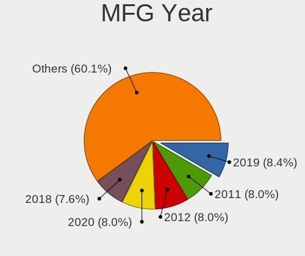
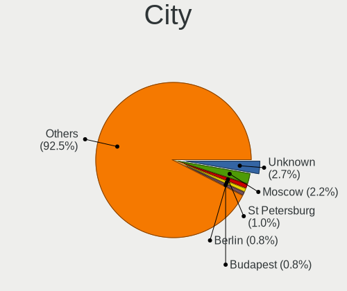
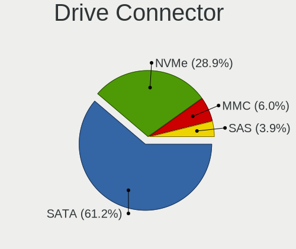
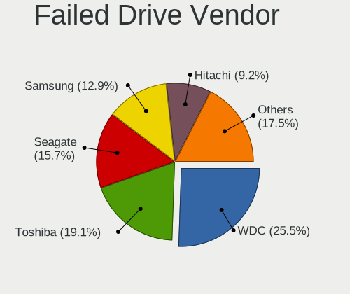
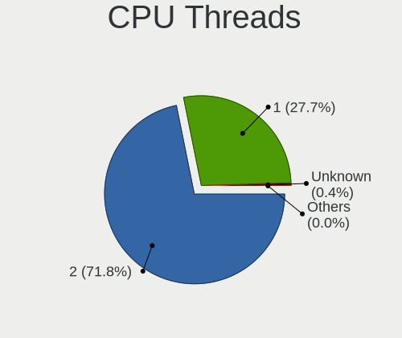
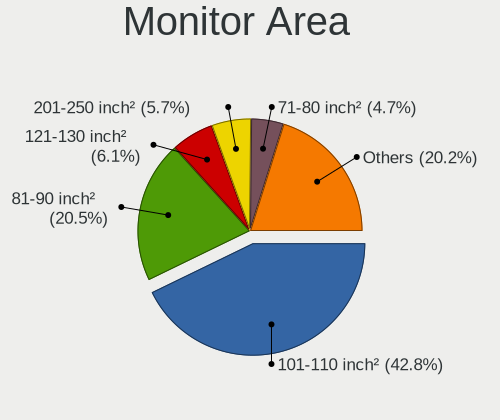

Linux - Tested Hardware & Statistics (Notebooks)
------------------------------------------------

A project to collect tested hardware configurations for Linux.

Anyone can contribute to this report by the [hw-probe](https://github.com/linuxhw/hw-probe) tool:

    sudo -E hw-probe -all -upload

Please contribute! Especially if your hardware is rare.

This report is for real hardware. Report for virtual hardware: [TestDays_VE](https://github.com/linuxhw/TestDays_VE)

Contents
--------

* [ Test Cases ](#test-cases)

* [ System ](#system)
  - [ OS                       ](#os)
  - [ OS Family                ](#os-family)
  - [ Kernel                   ](#kernel)
  - [ Kernel Family            ](#kernel-family)
  - [ Kernel Major Ver.        ](#kernel-major-ver)
  - [ Arch                     ](#arch)
  - [ DE                       ](#de)
  - [ Display Server           ](#display-server)
  - [ Display Manager          ](#display-manager)
  - [ OS Lang                  ](#os-lang)
  - [ Boot Mode                ](#boot-mode)
  - [ Filesystem               ](#filesystem)
  - [ Part. scheme             ](#part-scheme)
  - [ Dual Boot with Linux/BSD ](#dual-boot-with-linuxbsd)
  - [ Dual Boot (Win)          ](#dual-boot-win)

* [ Board ](#board)
  - [ Vendor                   ](#vendor)
  - [ Model                    ](#model)
  - [ Model Family             ](#model-family)
  - [ MFG Year                 ](#mfg-year)
  - [ Form Factor              ](#form-factor)
  - [ Secure Boot              ](#secure-boot)
  - [ Coreboot                 ](#coreboot)
  - [ RAM Size                 ](#ram-size)
  - [ RAM Used                 ](#ram-used)
  - [ Total Drives             ](#total-drives)
  - [ Has CD-ROM               ](#has-cd-rom)
  - [ Has Ethernet             ](#has-ethernet)
  - [ Has WiFi                 ](#has-wifi)
  - [ Has Bluetooth            ](#has-bluetooth)

* [ Location ](#location)
  - [ Country                  ](#country)
  - [ City                     ](#city)

* [ Drives ](#drives)
  - [ Drive Vendor             ](#drive-vendor)
  - [ Drive Model              ](#drive-model)
  - [ HDD Vendor               ](#hdd-vendor)
  - [ SSD Vendor               ](#ssd-vendor)
  - [ Drive Kind               ](#drive-kind)
  - [ Drive Connector          ](#drive-connector)
  - [ Drive Size               ](#drive-size)
  - [ Space Total              ](#space-total)
  - [ Space Used               ](#space-used)
  - [ Malfunc. Drives          ](#malfunc-drives)
  - [ Malfunc. Drive Vendor    ](#malfunc-drive-vendor)
  - [ Malfunc. HDD Vendor      ](#malfunc-hdd-vendor)
  - [ Malfunc. Drive Kind      ](#malfunc-drive-kind)
  - [ Failed Drives            ](#failed-drives)
  - [ Failed Drive Vendor      ](#failed-drive-vendor)
  - [ Drive Status             ](#drive-status)

* [ Storage controller ](#storage-controller)
  - [ Storage Vendor           ](#storage-vendor)
  - [ Storage Model            ](#storage-model)
  - [ Storage Kind             ](#storage-kind)

* [ Processor ](#processor)
  - [ CPU Vendor               ](#cpu-vendor)
  - [ CPU Model                ](#cpu-model)
  - [ CPU Model Family         ](#cpu-model-family)
  - [ CPU Cores                ](#cpu-cores)
  - [ CPU Sockets              ](#cpu-sockets)
  - [ CPU Threads              ](#cpu-threads)
  - [ CPU Op-Modes             ](#cpu-op-modes)
  - [ CPU Microcode            ](#cpu-microcode)
  - [ CPU Microarch            ](#cpu-microarch)

* [ Graphics ](#graphics)
  - [ GPU Vendor               ](#gpu-vendor)
  - [ GPU Model                ](#gpu-model)
  - [ GPU Combo                ](#gpu-combo)
  - [ GPU Driver               ](#gpu-driver)
  - [ GPU Memory               ](#gpu-memory)

* [ Monitor ](#monitor)
  - [ Monitor Vendor           ](#monitor-vendor)
  - [ Monitor Model            ](#monitor-model)
  - [ Monitor Resolution       ](#monitor-resolution)
  - [ Monitor Diagonal         ](#monitor-diagonal)
  - [ Monitor Width            ](#monitor-width)
  - [ Aspect Ratio             ](#aspect-ratio)
  - [ Monitor Area             ](#monitor-area)
  - [ Pixel Density            ](#pixel-density)
  - [ Multiple Monitors        ](#multiple-monitors)

* [ Network ](#network)
  - [ Net Controller Vendor    ](#net-controller-vendor)
  - [ Net Controller Model     ](#net-controller-model)
  - [ Wireless Vendor          ](#wireless-vendor)
  - [ Wireless Model           ](#wireless-model)
  - [ Ethernet Vendor          ](#ethernet-vendor)
  - [ Ethernet Model           ](#ethernet-model)
  - [ Net Controller Kind      ](#net-controller-kind)
  - [ Used Controller          ](#used-controller)
  - [ NICs                     ](#nics)
  - [ IPv6                     ](#ipv6)

* [ Bluetooth ](#bluetooth)
  - [ Bluetooth Vendor         ](#bluetooth-vendor)
  - [ Bluetooth Model          ](#bluetooth-model)

* [ Sound ](#sound)
  - [ Sound Vendor             ](#sound-vendor)
  - [ Sound Model              ](#sound-model)

* [ Memory ](#memory)
  - [ Memory Vendor            ](#memory-vendor)
  - [ Memory Model             ](#memory-model)
  - [ Memory Kind              ](#memory-kind)
  - [ Memory Form Factor       ](#memory-form-factor)
  - [ Memory Size              ](#memory-size)
  - [ Memory Speed             ](#memory-speed)

* [ Printers & scanners ](#printers--scanners)
  - [ Printer Vendor           ](#printer-vendor)
  - [ Printer Model            ](#printer-model)
  - [ Scanner Vendor           ](#scanner-vendor)
  - [ Scanner Model            ](#scanner-model)

* [ Camera ](#camera)
  - [ Camera Vendor            ](#camera-vendor)
  - [ Camera Model             ](#camera-model)

* [ Security ](#security)
  - [ Fingerprint Vendor       ](#fingerprint-vendor)
  - [ Fingerprint Model        ](#fingerprint-model)
  - [ Chipcard Vendor          ](#chipcard-vendor)
  - [ Chipcard Model           ](#chipcard-model)

* [ Unsupported ](#unsupported)
  - [ Unsupported Devices      ](#unsupported-devices)
  - [ Unsupported Device Types ](#unsupported-device-types)

Test Cases
----------

Total: 189405

| Vendor        | Model                       | Probe                                                      | Date         |
|---------------|-----------------------------|------------------------------------------------------------|--------------|
| Lenovo        | IdeaPad 3 15ITL6 82H8       | [720ff4cf67](https://linux-hardware.org/?probe=720ff4cf67) | Dec 24, 2023 |
| Sony          | VPCS13V9E                   | [61230cc69b](https://linux-hardware.org/?probe=61230cc69b) | Dec 24, 2023 |
| HP            | ENVY Laptop 17-ch1xxx       | [d41bca7300](https://linux-hardware.org/?probe=d41bca7300) | Dec 24, 2023 |
| Lenovo        | ThinkPad E460 20ET0016US    | [96959ec0a3](https://linux-hardware.org/?probe=96959ec0a3) | Dec 24, 2023 |
| Toshiba       | Satellite C55-C             | [256b476a15](https://linux-hardware.org/?probe=256b476a15) | Dec 24, 2023 |
| Dell          | Inspiron 15 7000 Gaming     | [9eff3f535e](https://linux-hardware.org/?probe=9eff3f535e) | Dec 24, 2023 |
| HP            | ENVY Laptop 17-ch1xxx       | [8080c75b27](https://linux-hardware.org/?probe=8080c75b27) | Dec 24, 2023 |
| Lenovo        | IdeaPad Pro 5 16APH8 83A... | [de6b5ead5b](https://linux-hardware.org/?probe=de6b5ead5b) | Dec 24, 2023 |
| Dell          | Latitude E6430              | [d949738171](https://linux-hardware.org/?probe=d949738171) | Dec 24, 2023 |
| Notebook      | W65_67SJ                    | [8bea89f7c9](https://linux-hardware.org/?probe=8bea89f7c9) | Dec 24, 2023 |
| Dell          | Latitude E6430              | [c821d379ec](https://linux-hardware.org/?probe=c821d379ec) | Dec 24, 2023 |
| ASUSTek       | G75VW                       | [63fa97bd36](https://linux-hardware.org/?probe=63fa97bd36) | Dec 24, 2023 |
| Dell          | Inspiron 1564               | [a1945990cc](https://linux-hardware.org/?probe=a1945990cc) | Dec 24, 2023 |
| Dell          | Inspiron 1564               | [e02428db4a](https://linux-hardware.org/?probe=e02428db4a) | Dec 24, 2023 |
| Lenovo        | ThinkPad T400 6474AV5       | [b98f0a2c09](https://linux-hardware.org/?probe=b98f0a2c09) | Dec 24, 2023 |
| Valve         | Jupiter                     | [19f8d4f0b4](https://linux-hardware.org/?probe=19f8d4f0b4) | Dec 24, 2023 |
| Lenovo        | IdeaPad 3 15IAU7 82RK       | [a69b3fa1ca](https://linux-hardware.org/?probe=a69b3fa1ca) | Dec 24, 2023 |
| Apple         | MacBookAir7,1               | [f666ec3927](https://linux-hardware.org/?probe=f666ec3927) | Dec 24, 2023 |
| Dell          | Inspiron 5720               | [bcb6745ac2](https://linux-hardware.org/?probe=bcb6745ac2) | Dec 24, 2023 |
| Notebook      | W65_67SJ                    | [439816e10c](https://linux-hardware.org/?probe=439816e10c) | Dec 24, 2023 |
| Acer          | Aspire 5742Z                | [ddf1553f4b](https://linux-hardware.org/?probe=ddf1553f4b) | Dec 24, 2023 |
| Lenovo        | IdeaPad 3 15IAU7 82RK       | [9ac48a1719](https://linux-hardware.org/?probe=9ac48a1719) | Dec 24, 2023 |
| HUAWEI        | KLVD-WXX9                   | [ee7b7ce7cc](https://linux-hardware.org/?probe=ee7b7ce7cc) | Dec 24, 2023 |
| Acer          | Aspire V3-571               | [0819197709](https://linux-hardware.org/?probe=0819197709) | Dec 24, 2023 |
| Toshiba       | Satellite A205              | [c3680bfd29](https://linux-hardware.org/?probe=c3680bfd29) | Dec 24, 2023 |
| Samsung       | RV415/RV515                 | [da980644b4](https://linux-hardware.org/?probe=da980644b4) | Dec 24, 2023 |
| Toshiba       | Satellite Pro L450          | [8da0c619f3](https://linux-hardware.org/?probe=8da0c619f3) | Dec 24, 2023 |
| Notebook      | NJx0MU                      | [b57fdd9854](https://linux-hardware.org/?probe=b57fdd9854) | Dec 24, 2023 |
| Dell          | Latitude 7490               | [69205c648f](https://linux-hardware.org/?probe=69205c648f) | Dec 24, 2023 |
| Acer          | Aspire 5250                 | [224ca602f3](https://linux-hardware.org/?probe=224ca602f3) | Dec 24, 2023 |
| Acer          | Nitro AN515-44              | [cc87c11e7b](https://linux-hardware.org/?probe=cc87c11e7b) | Dec 24, 2023 |
| Dell          | Inspiron 3521               | [a109a64bdd](https://linux-hardware.org/?probe=a109a64bdd) | Dec 24, 2023 |
| Acer          | Aspire 5750G                | [a12f3e5ce6](https://linux-hardware.org/?probe=a12f3e5ce6) | Dec 24, 2023 |
| Acer          | Aspire 5750G                | [1a31482d70](https://linux-hardware.org/?probe=1a31482d70) | Dec 24, 2023 |
| Notebook      | NL5xNU                      | [1cb09f63f9](https://linux-hardware.org/?probe=1cb09f63f9) | Dec 24, 2023 |
| Lenovo        | IdeaPad 100-15IBD 80QQ      | [f8abeb2607](https://linux-hardware.org/?probe=f8abeb2607) | Dec 24, 2023 |
| ASUSTek       | ROG Zephyrus G14 GA402RJ... | [29b4b5a349](https://linux-hardware.org/?probe=29b4b5a349) | Dec 24, 2023 |
| HP            | Pavilion g7                 | [bbe3fb1914](https://linux-hardware.org/?probe=bbe3fb1914) | Dec 24, 2023 |
| Dell          | G16 7630                    | [71f36f8ed0](https://linux-hardware.org/?probe=71f36f8ed0) | Dec 24, 2023 |
| Lenovo        | IdeaPad Pro 5 14APH8 83A... | [39e33e4510](https://linux-hardware.org/?probe=39e33e4510) | Dec 24, 2023 |
| HP            | Notebook                    | [69bef099c0](https://linux-hardware.org/?probe=69bef099c0) | Dec 24, 2023 |
| Google        | Magolor                     | [f5d079bc79](https://linux-hardware.org/?probe=f5d079bc79) | Dec 24, 2023 |
| Dell          | Latitude E7450              | [6758499db8](https://linux-hardware.org/?probe=6758499db8) | Dec 24, 2023 |
| Dell          | Latitude 5300               | [68336d8bc1](https://linux-hardware.org/?probe=68336d8bc1) | Dec 24, 2023 |
| ASUSTek       | VivoBook_ASUS Laptop E41... | [c0ff23eba6](https://linux-hardware.org/?probe=c0ff23eba6) | Dec 24, 2023 |
| Anbernic      | Win600                      | [3b5255f14b](https://linux-hardware.org/?probe=3b5255f14b) | Dec 24, 2023 |
| Dell          | Latitude 12 Rugged Table... | [7690d56522](https://linux-hardware.org/?probe=7690d56522) | Dec 24, 2023 |
| Lenovo        | ThinkPad X1 Carbon Gen 1... | [1297c97e04](https://linux-hardware.org/?probe=1297c97e04) | Dec 24, 2023 |
| Dell          | Precision 3560              | [b945ab8339](https://linux-hardware.org/?probe=b945ab8339) | Dec 24, 2023 |
| Dell          | Latitude E7450              | [d3eb47d0a5](https://linux-hardware.org/?probe=d3eb47d0a5) | Dec 24, 2023 |
| Valve         | Galileo                     | [aa141b8ea2](https://linux-hardware.org/?probe=aa141b8ea2) | Dec 24, 2023 |
| Lenovo        | ThinkPad T460s 20FAS0600... | [07efd36bbe](https://linux-hardware.org/?probe=07efd36bbe) | Dec 24, 2023 |
| Apple         | MacBookAir6,2               | [a3af8ee68a](https://linux-hardware.org/?probe=a3af8ee68a) | Dec 24, 2023 |
| HP            | Laptop 15-ef2xxx            | [31291c7bc9](https://linux-hardware.org/?probe=31291c7bc9) | Dec 24, 2023 |
| HP            | Unknown                     | [3bc06ba7d3](https://linux-hardware.org/?probe=3bc06ba7d3) | Dec 24, 2023 |
| HP            | Presario CQ61               | [249a217a7c](https://linux-hardware.org/?probe=249a217a7c) | Dec 24, 2023 |
| Teclast       | F6 Plus                     | [a8fee53f37](https://linux-hardware.org/?probe=a8fee53f37) | Dec 24, 2023 |
| Lenovo        | G50-70 20351                | [3ac6a566ab](https://linux-hardware.org/?probe=3ac6a566ab) | Dec 24, 2023 |
| Lenovo        | G50-70 20351                | [dc269fb33a](https://linux-hardware.org/?probe=dc269fb33a) | Dec 24, 2023 |
| Lenovo        | ThinkPad T440 20B7A1P700    | [d49a8fe4d4](https://linux-hardware.org/?probe=d49a8fe4d4) | Dec 24, 2023 |
| Lenovo        | ThinkPad T520 424049U       | [c393fb64e3](https://linux-hardware.org/?probe=c393fb64e3) | Dec 24, 2023 |
| Lenovo        | V15 G4 AMN 82YU             | [d7518dd730](https://linux-hardware.org/?probe=d7518dd730) | Dec 24, 2023 |
| Apple         | MacBookAir7,2               | [03b1209523](https://linux-hardware.org/?probe=03b1209523) | Dec 24, 2023 |
| Lenovo        | ThinkPad T440 20B7A1P700    | [f1c9eab3f4](https://linux-hardware.org/?probe=f1c9eab3f4) | Dec 24, 2023 |
| Lenovo        | ThinkPad P14s Gen 4 21K5... | [d7b7e34741](https://linux-hardware.org/?probe=d7b7e34741) | Dec 24, 2023 |
| Acer          | Aspire A515-43              | [922518c025](https://linux-hardware.org/?probe=922518c025) | Dec 23, 2023 |
| Dell          | Inspiron 15 3530            | [0688896e27](https://linux-hardware.org/?probe=0688896e27) | Dec 23, 2023 |
| Apple         | MacBookPro9,1               | [a70e7da743](https://linux-hardware.org/?probe=a70e7da743) | Dec 23, 2023 |
| Apple         | MacBookAir7,2               | [b7f3ca9ba4](https://linux-hardware.org/?probe=b7f3ca9ba4) | Dec 23, 2023 |
| HP            | Elite x2 1012 G1            | [b093087b3c](https://linux-hardware.org/?probe=b093087b3c) | Dec 23, 2023 |
| ASUSTek       | Zenbook 15 UM3504DA_UM35... | [6cc304ea54](https://linux-hardware.org/?probe=6cc304ea54) | Dec 23, 2023 |
| Packard Be... | EasyNote TE11HC             | [2c88ade0b2](https://linux-hardware.org/?probe=2c88ade0b2) | Dec 23, 2023 |
| Lenovo        | ThinkPad T420 4178AFU       | [67caa6c117](https://linux-hardware.org/?probe=67caa6c117) | Dec 23, 2023 |
| Unknown       | Unknown                     | [a0d7edc452](https://linux-hardware.org/?probe=a0d7edc452) | Dec 23, 2023 |
| Lenovo        | IdeaPad Gaming 3 15IAH7 ... | [a79885417a](https://linux-hardware.org/?probe=a79885417a) | Dec 23, 2023 |
| HP            | ZBook 17 G5                 | [ad6c489ffc](https://linux-hardware.org/?probe=ad6c489ffc) | Dec 23, 2023 |
| HP            | Elite x2 1012 G1            | [c93fffc388](https://linux-hardware.org/?probe=c93fffc388) | Dec 23, 2023 |
| TECNO Mobi... | MEGABOOK T15DA              | [82d65cfce4](https://linux-hardware.org/?probe=82d65cfce4) | Dec 23, 2023 |
| Gateway       | NV59C                       | [1537866140](https://linux-hardware.org/?probe=1537866140) | Dec 23, 2023 |
| Lenovo        | G50-80 80L0                 | [21df7039b9](https://linux-hardware.org/?probe=21df7039b9) | Dec 23, 2023 |
| Acer          | Nitro AN515-43              | [b1342e1524](https://linux-hardware.org/?probe=b1342e1524) | Dec 23, 2023 |
| Dell          | Latitude E4310              | [41f607e5e5](https://linux-hardware.org/?probe=41f607e5e5) | Dec 23, 2023 |
| Lenovo        | V15 G4 AMN 82YU             | [a4b5f3a556](https://linux-hardware.org/?probe=a4b5f3a556) | Dec 23, 2023 |
| Lenovo        | ThinkPad T520 424049U       | [d800424ece](https://linux-hardware.org/?probe=d800424ece) | Dec 23, 2023 |
| HP            | EliteBook 2530p             | [996611fcab](https://linux-hardware.org/?probe=996611fcab) | Dec 23, 2023 |
| Dell          | Latitude E6420              | [82c13c188b](https://linux-hardware.org/?probe=82c13c188b) | Dec 23, 2023 |
| Acer          | Aspire ES1-572              | [e726ce9f63](https://linux-hardware.org/?probe=e726ce9f63) | Dec 23, 2023 |
| Dell          | Latitude E4310              | [0c4f2ab6b3](https://linux-hardware.org/?probe=0c4f2ab6b3) | Dec 23, 2023 |
| Lenovo        | IdeaPad 5 15ALC05 82LN      | [b3e3c041d7](https://linux-hardware.org/?probe=b3e3c041d7) | Dec 23, 2023 |
| ASUSTek       | GL503VM                     | [dfedaea706](https://linux-hardware.org/?probe=dfedaea706) | Dec 23, 2023 |
| Acer          | Aspire 7750G                | [0b0beeca3a](https://linux-hardware.org/?probe=0b0beeca3a) | Dec 23, 2023 |
| Unknown       | Unknown                     | [ef80f96d40](https://linux-hardware.org/?probe=ef80f96d40) | Dec 23, 2023 |
| ASUSTek       | GL503VM                     | [05b212db99](https://linux-hardware.org/?probe=05b212db99) | Dec 23, 2023 |
| Sony          | VPCEA1S1E                   | [af850dd5f3](https://linux-hardware.org/?probe=af850dd5f3) | Dec 23, 2023 |
| PC Special... | GK7NP5R                     | [1d97edcad7](https://linux-hardware.org/?probe=1d97edcad7) | Dec 23, 2023 |
| System76      | Gazelle                     | [2b9bce59e7](https://linux-hardware.org/?probe=2b9bce59e7) | Dec 23, 2023 |
| Framework     | Laptop (12th Gen Intel C... | [ef18e09b69](https://linux-hardware.org/?probe=ef18e09b69) | Dec 23, 2023 |
| TUXEDO        | N24_25JU                    | [8a1a153723](https://linux-hardware.org/?probe=8a1a153723) | Dec 23, 2023 |
| Lenovo        | IdeaPad 320-17ABR 80YN      | [fd501fc946](https://linux-hardware.org/?probe=fd501fc946) | Dec 23, 2023 |
| IBM           | ThinkPad R50e 1842QDU       | [32a349ab97](https://linux-hardware.org/?probe=32a349ab97) | Dec 23, 2023 |
| Lenovo        | ThinkPad T420 4178AFU       | [c2681f33cc](https://linux-hardware.org/?probe=c2681f33cc) | Dec 23, 2023 |
| HUAWEI        | BOM-WXX9                    | [40ba77bcb8](https://linux-hardware.org/?probe=40ba77bcb8) | Dec 23, 2023 |
| Acer          | Extensa 2519                | [29bc812d6d](https://linux-hardware.org/?probe=29bc812d6d) | Dec 23, 2023 |
| Lenovo        | IdeaPad 5 14ARE05 81YM      | [6b0368fd61](https://linux-hardware.org/?probe=6b0368fd61) | Dec 23, 2023 |
| Acer          | Aspire A515-55              | [9412d138fb](https://linux-hardware.org/?probe=9412d138fb) | Dec 23, 2023 |
| Lenovo        | IdeaPad Y500 9541           | [a85ec375f5](https://linux-hardware.org/?probe=a85ec375f5) | Dec 23, 2023 |
| HP            | ProBook 655 G2              | [033325e722](https://linux-hardware.org/?probe=033325e722) | Dec 23, 2023 |
| Acer          | Aspire A515-55              | [4166459262](https://linux-hardware.org/?probe=4166459262) | Dec 23, 2023 |
| ASUSTek       | ASUS TUF Gaming A15 FA50... | [5c4d1c7d64](https://linux-hardware.org/?probe=5c4d1c7d64) | Dec 23, 2023 |
| Acer          | Nitro AN515-51              | [52a7a4d6d8](https://linux-hardware.org/?probe=52a7a4d6d8) | Dec 23, 2023 |
| Acer          | Nitro AN517-55              | [f3e3de235b](https://linux-hardware.org/?probe=f3e3de235b) | Dec 23, 2023 |
| ASUSTek       | U5A                         | [fd3c48af54](https://linux-hardware.org/?probe=fd3c48af54) | Dec 23, 2023 |
| ASUSTek       | N53SV                       | [5098aee09b](https://linux-hardware.org/?probe=5098aee09b) | Dec 23, 2023 |
| GITSTAR       | GDC-1461                    | [5412cf0f39](https://linux-hardware.org/?probe=5412cf0f39) | Dec 23, 2023 |
| Dell          | Latitude E6530              | [2a62f5f318](https://linux-hardware.org/?probe=2a62f5f318) | Dec 23, 2023 |
| Dell          | Latitude E6530              | [2d9ff2bdb9](https://linux-hardware.org/?probe=2d9ff2bdb9) | Dec 23, 2023 |
| ASUSTek       | Zenbook UM3402YAR_UM3402... | [a72824a48c](https://linux-hardware.org/?probe=a72824a48c) | Dec 23, 2023 |
| Lenovo        | ThinkPad T410 2537E82       | [d153c701cc](https://linux-hardware.org/?probe=d153c701cc) | Dec 23, 2023 |
| Alienware     | m15 R7 AMD                  | [9d80128f05](https://linux-hardware.org/?probe=9d80128f05) | Dec 23, 2023 |
| ASUSTek       | Vivobook Go E1504GAB_E15... | [1947533de1](https://linux-hardware.org/?probe=1947533de1) | Dec 23, 2023 |
| Dell          | Latitude E5510              | [379ebf6111](https://linux-hardware.org/?probe=379ebf6111) | Dec 23, 2023 |
| ASUSTek       | N53SV                       | [5ad49bc6d3](https://linux-hardware.org/?probe=5ad49bc6d3) | Dec 23, 2023 |
| AVITA         | NS14A6                      | [adf732b1b6](https://linux-hardware.org/?probe=adf732b1b6) | Dec 23, 2023 |
| Lenovo        | Legion Pro 5 16ARX8 82WM    | [6d8c495e90](https://linux-hardware.org/?probe=6d8c495e90) | Dec 23, 2023 |
| MSI           | GE62 2QF                    | [cf9a783196](https://linux-hardware.org/?probe=cf9a783196) | Dec 23, 2023 |
| Anbernic      | Win600                      | [02e1d7adeb](https://linux-hardware.org/?probe=02e1d7adeb) | Dec 23, 2023 |
| Toshiba       | Satellite A660              | [d0415e05d3](https://linux-hardware.org/?probe=d0415e05d3) | Dec 23, 2023 |
| Lenovo        | IdeaPad S145-15IGM 81WT     | [d409d2fe79](https://linux-hardware.org/?probe=d409d2fe79) | Dec 23, 2023 |
| Lenovo        | IdeaPad S145-15IGM 81WT     | [eae7bab112](https://linux-hardware.org/?probe=eae7bab112) | Dec 23, 2023 |
| Sony          | VPCS13V9E                   | [05f387de9b](https://linux-hardware.org/?probe=05f387de9b) | Dec 23, 2023 |
| HP            | Victus by Gaming Laptop ... | [95adcc5c56](https://linux-hardware.org/?probe=95adcc5c56) | Dec 23, 2023 |
| ASUSTek       | X441BA                      | [04e5c55b92](https://linux-hardware.org/?probe=04e5c55b92) | Dec 23, 2023 |
| Lenovo        | ThinkPad T410 2537E82       | [398233e395](https://linux-hardware.org/?probe=398233e395) | Dec 23, 2023 |
| TULPAR        | A5 V20.3                    | [83c6679958](https://linux-hardware.org/?probe=83c6679958) | Dec 23, 2023 |
| HP            | ProBook 4540s               | [fbed208acc](https://linux-hardware.org/?probe=fbed208acc) | Dec 23, 2023 |
| HP            | EliteBook 8570w             | [4b6025ed6e](https://linux-hardware.org/?probe=4b6025ed6e) | Dec 23, 2023 |
| ASUSTek       | UL80VT                      | [5b04b67d44](https://linux-hardware.org/?probe=5b04b67d44) | Dec 23, 2023 |
| Lenovo        | IdeaPad 320-17ABR 80YN      | [7d9fabde46](https://linux-hardware.org/?probe=7d9fabde46) | Dec 23, 2023 |
| Dell          | XPS 13 9310                 | [78b73643ff](https://linux-hardware.org/?probe=78b73643ff) | Dec 23, 2023 |
| Lenovo        | G50-30 80G0                 | [45b0f5ae9a](https://linux-hardware.org/?probe=45b0f5ae9a) | Dec 23, 2023 |
| HP            | Victus by 15.6 inch Gami... | [b74170ede4](https://linux-hardware.org/?probe=b74170ede4) | Dec 23, 2023 |
| Lenovo        | ThinkPad T480 20L5000BGE    | [8753b04999](https://linux-hardware.org/?probe=8753b04999) | Dec 23, 2023 |
| ASUSTek       | TUF Gaming FX504GD_FX80G... | [76b5abd1bd](https://linux-hardware.org/?probe=76b5abd1bd) | Dec 23, 2023 |
| Lenovo        | ThinkPad X270 20HMS25R00    | [91820391fd](https://linux-hardware.org/?probe=91820391fd) | Dec 23, 2023 |
| Lenovo        | Legion Y7000 81FW           | [f67367aa62](https://linux-hardware.org/?probe=f67367aa62) | Dec 23, 2023 |
| Samsung       | 300E4C/300E5C/300E7C        | [bf31061d97](https://linux-hardware.org/?probe=bf31061d97) | Dec 23, 2023 |
| Samsung       | 300E4C/300E5C/300E7C        | [a4ecaaf236](https://linux-hardware.org/?probe=a4ecaaf236) | Dec 23, 2023 |
| Acer          | TravelMate 5730             | [69571c0b91](https://linux-hardware.org/?probe=69571c0b91) | Dec 23, 2023 |
| Lenovo        | ThinkPad 13 2nd Gen 20J2... | [30446f4198](https://linux-hardware.org/?probe=30446f4198) | Dec 23, 2023 |
| Dell          | Latitude E6410              | [7e14c30601](https://linux-hardware.org/?probe=7e14c30601) | Dec 23, 2023 |
| Valve         | Jupiter                     | [6fd8f41741](https://linux-hardware.org/?probe=6fd8f41741) | Dec 23, 2023 |
| Apple         | MacBookAir3,1               | [860a7b9b4c](https://linux-hardware.org/?probe=860a7b9b4c) | Dec 23, 2023 |
| Lenovo        | ThinkBook 15 G4 ABA 21DL    | [5aae7c7b5c](https://linux-hardware.org/?probe=5aae7c7b5c) | Dec 23, 2023 |
| ASUSTek       | T100TA                      | [9ad17d2d3c](https://linux-hardware.org/?probe=9ad17d2d3c) | Dec 23, 2023 |
| Lenovo        | ThinkBook 16 G6 IRL 21KH    | [c197684b37](https://linux-hardware.org/?probe=c197684b37) | Dec 23, 2023 |
| HP            | EliteBook 845 G8 Noteboo... | [d3dabca767](https://linux-hardware.org/?probe=d3dabca767) | Dec 23, 2023 |
| Unknown       | Unknown                     | [006211d916](https://linux-hardware.org/?probe=006211d916) | Dec 23, 2023 |
| Dell          | Latitude E6330              | [afca8c73b2](https://linux-hardware.org/?probe=afca8c73b2) | Dec 23, 2023 |
| Toshiba       | Satellite Pro R50-C         | [b4d280ac6a](https://linux-hardware.org/?probe=b4d280ac6a) | Dec 23, 2023 |
| HP            | EliteBook 845 G8 Noteboo... | [26673c372e](https://linux-hardware.org/?probe=26673c372e) | Dec 23, 2023 |
| Toshiba       | Satellite Pro R50-C         | [421d62894b](https://linux-hardware.org/?probe=421d62894b) | Dec 23, 2023 |
| Samsung       | 350V5C/351V5C/3540VC/344... | [541c5efbf3](https://linux-hardware.org/?probe=541c5efbf3) | Dec 23, 2023 |
| Dell          | Inspiron 3501               | [2fcf77279a](https://linux-hardware.org/?probe=2fcf77279a) | Dec 23, 2023 |
| Toshiba       | Satellite L750              | [8f2f7cd8c9](https://linux-hardware.org/?probe=8f2f7cd8c9) | Dec 23, 2023 |
| HP            | Laptop 17-bs1xx             | [984a979a7b](https://linux-hardware.org/?probe=984a979a7b) | Dec 23, 2023 |
| Unknown       | W1415A                      | [f1fbd72c23](https://linux-hardware.org/?probe=f1fbd72c23) | Dec 23, 2023 |
| Dell          | System XPS L322X            | [6b050ff1c8](https://linux-hardware.org/?probe=6b050ff1c8) | Dec 23, 2023 |
| Lenovo        | ThinkPad T14 Gen 2a 20XL... | [19e33f2ead](https://linux-hardware.org/?probe=19e33f2ead) | Dec 23, 2023 |
| Lenovo        | Yoga 2 Pro 20266            | [201d4ed37f](https://linux-hardware.org/?probe=201d4ed37f) | Dec 23, 2023 |
| Sony          | VPCF215FX                   | [1a79c8b60f](https://linux-hardware.org/?probe=1a79c8b60f) | Dec 23, 2023 |
| Timi          | TM1612                      | [cf4f859193](https://linux-hardware.org/?probe=cf4f859193) | Dec 23, 2023 |
| System76      | Serval WS                   | [92d124a8aa](https://linux-hardware.org/?probe=92d124a8aa) | Dec 23, 2023 |
| GPU Compan... | GWTN116-3                   | [89366f9a48](https://linux-hardware.org/?probe=89366f9a48) | Dec 23, 2023 |
| Toshiba       | Satellite P850              | [e16f04d074](https://linux-hardware.org/?probe=e16f04d074) | Dec 23, 2023 |
| Danew         | Dbook 131                   | [a3880bd02c](https://linux-hardware.org/?probe=a3880bd02c) | Dec 23, 2023 |
| Apple         | MacBookAir5,1               | [5c7029f981](https://linux-hardware.org/?probe=5c7029f981) | Dec 23, 2023 |
| Apple         | MacBookPro7,1               | [0f291ca562](https://linux-hardware.org/?probe=0f291ca562) | Dec 23, 2023 |
| ASUSTek       | X555LAB                     | [6a3b9f5bb2](https://linux-hardware.org/?probe=6a3b9f5bb2) | Dec 23, 2023 |
| Dell          | Latitude E6540              | [9e3371b6b2](https://linux-hardware.org/?probe=9e3371b6b2) | Dec 23, 2023 |
| HP            | Pavilion dv6                | [c4a6b58303](https://linux-hardware.org/?probe=c4a6b58303) | Dec 23, 2023 |
| Toshiba       | QOSMIO X770                 | [dceb1203ed](https://linux-hardware.org/?probe=dceb1203ed) | Dec 23, 2023 |
| Toshiba       | QOSMIO X770                 | [b9557b6218](https://linux-hardware.org/?probe=b9557b6218) | Dec 23, 2023 |
| Lenovo        | Slim Pro 7 14ARP8 83AX      | [1ace47e8fd](https://linux-hardware.org/?probe=1ace47e8fd) | Dec 23, 2023 |
| Acer          | Aspire R3-131T              | [647b2fddf6](https://linux-hardware.org/?probe=647b2fddf6) | Dec 23, 2023 |
| ATARI         | VCS 800 Black Walnut        | [34456982d3](https://linux-hardware.org/?probe=34456982d3) | Dec 23, 2023 |
| HP            | EliteBook 840 G5            | [6406b552c4](https://linux-hardware.org/?probe=6406b552c4) | Dec 23, 2023 |
| ASUSTek       | ASUS TUF Gaming A15 FA50... | [87b9f04878](https://linux-hardware.org/?probe=87b9f04878) | Dec 23, 2023 |
| Apple         | MacBookAir7,2               | [18ef14b687](https://linux-hardware.org/?probe=18ef14b687) | Dec 23, 2023 |
| Dell          | Latitude E6400              | [1a10fd9a2e](https://linux-hardware.org/?probe=1a10fd9a2e) | Dec 23, 2023 |
| System76      | Gazelle                     | [6671df79bd](https://linux-hardware.org/?probe=6671df79bd) | Dec 23, 2023 |
| Dell          | System XPS L702X            | [d69355a342](https://linux-hardware.org/?probe=d69355a342) | Dec 23, 2023 |
| System76      | Serval WS                   | [a250c12d1d](https://linux-hardware.org/?probe=a250c12d1d) | Dec 23, 2023 |
| Lenovo        | ThinkPad T480 20L6S69B00    | [16b6aaa173](https://linux-hardware.org/?probe=16b6aaa173) | Dec 23, 2023 |
| HP            | EliteBook 840 G5            | [5b7a85e9fc](https://linux-hardware.org/?probe=5b7a85e9fc) | Dec 23, 2023 |
| Lenovo        | Legion Slim 7 16APH8 82Y... | [9a5d0ca94a](https://linux-hardware.org/?probe=9a5d0ca94a) | Dec 23, 2023 |
| Apple         | MacBookPro9,1               | [e3576ca49c](https://linux-hardware.org/?probe=e3576ca49c) | Dec 23, 2023 |
| HP            | 340S G7 Notebook PC         | [097603b65a](https://linux-hardware.org/?probe=097603b65a) | Dec 23, 2023 |
| Fujitsu Si... | ESPRIMO Mobile U9210        | [2cc486fed2](https://linux-hardware.org/?probe=2cc486fed2) | Dec 23, 2023 |
| HP            | EliteBook 745 G6            | [9bf64ae4b7](https://linux-hardware.org/?probe=9bf64ae4b7) | Dec 23, 2023 |
| Lenovo        | ThinkBook 16 G6 ABP 21KK    | [569ce717aa](https://linux-hardware.org/?probe=569ce717aa) | Dec 23, 2023 |
| Lenovo        | Legion 7 16ARHA7 82UH       | [8dad235090](https://linux-hardware.org/?probe=8dad235090) | Dec 23, 2023 |
| Lenovo        | Legion 5 15IAH7H 82RB       | [2ca58f3eb8](https://linux-hardware.org/?probe=2ca58f3eb8) | Dec 23, 2023 |
| Lenovo        | ThinkPad E15 20RD002RUS     | [6ba8bb7550](https://linux-hardware.org/?probe=6ba8bb7550) | Dec 23, 2023 |
| ASUSTek       | ASUS TUF Gaming A17 FA70... | [8a36394313](https://linux-hardware.org/?probe=8a36394313) | Dec 23, 2023 |
| ASUSTek       | ASUS TUF Gaming A17 FA70... | [eb035a95fa](https://linux-hardware.org/?probe=eb035a95fa) | Dec 22, 2023 |
| Dell          | Inspiron N5050              | [51b49fb205](https://linux-hardware.org/?probe=51b49fb205) | Dec 22, 2023 |
| XIAOMI        | Redmi Book Pro 15 2023      | [36492390fd](https://linux-hardware.org/?probe=36492390fd) | Dec 22, 2023 |
| eMachines     | E527                        | [cf5b096be7](https://linux-hardware.org/?probe=cf5b096be7) | Dec 22, 2023 |
| Lenovo        | ThinkPad P14s Gen 4 21K6... | [d53640436b](https://linux-hardware.org/?probe=d53640436b) | Dec 22, 2023 |
| HUAWEI        | KLVL-WXXW                   | [ccf505804c](https://linux-hardware.org/?probe=ccf505804c) | Dec 22, 2023 |
| GPD           | G1621-02                    | [eaf78f9da1](https://linux-hardware.org/?probe=eaf78f9da1) | Dec 22, 2023 |
| Lenovo        | ThinkPad T14 Gen 2i 20W1... | [0f2cad4391](https://linux-hardware.org/?probe=0f2cad4391) | Dec 22, 2023 |
| Acer          | Aspire A515-45              | [acab7c340a](https://linux-hardware.org/?probe=acab7c340a) | Dec 22, 2023 |
| HP            | ProBook 4330s               | [fce67d52c0](https://linux-hardware.org/?probe=fce67d52c0) | Dec 22, 2023 |
| Dell          | Latitude 5420               | [9858586a84](https://linux-hardware.org/?probe=9858586a84) | Dec 22, 2023 |
| Acer          | Aspire 5920G                | [93945148f3](https://linux-hardware.org/?probe=93945148f3) | Dec 22, 2023 |
| Google        | Reks                        | [52375a57c5](https://linux-hardware.org/?probe=52375a57c5) | Dec 22, 2023 |
| HP            | Pavilion Notebook           | [42c72b303d](https://linux-hardware.org/?probe=42c72b303d) | Dec 22, 2023 |
| Lenovo        | ThinkPad T550 20CK0002MZ    | [dbfd9ef700](https://linux-hardware.org/?probe=dbfd9ef700) | Dec 22, 2023 |
| Dell          | Precision M4800             | [ce7a9239f4](https://linux-hardware.org/?probe=ce7a9239f4) | Dec 22, 2023 |
| Lenovo        | ThinkBook 14 G3 ACL 21A2    | [b09c4dd8a2](https://linux-hardware.org/?probe=b09c4dd8a2) | Dec 22, 2023 |
| HP            | ProBook 450 G1              | [980f7dfed7](https://linux-hardware.org/?probe=980f7dfed7) | Dec 22, 2023 |
| Pine Micro... | Pine64 Pinebook Pro         | [961dddc49e](https://linux-hardware.org/?probe=961dddc49e) | Dec 22, 2023 |
| Lenovo        | ThinkPad E14 20RB000UBR     | [d65cca0578](https://linux-hardware.org/?probe=d65cca0578) | Dec 22, 2023 |
| Apple         | MacBookAir6,1               | [0275987230](https://linux-hardware.org/?probe=0275987230) | Dec 22, 2023 |
| Lenovo        | ThinkBook 15 G2 ARE 20VG    | [f5f4795192](https://linux-hardware.org/?probe=f5f4795192) | Dec 22, 2023 |
| HP            | Pavilion Notebook           | [7afecc25eb](https://linux-hardware.org/?probe=7afecc25eb) | Dec 22, 2023 |
| HP            | EliteBook 850 G3            | [5e8dc79e2c](https://linux-hardware.org/?probe=5e8dc79e2c) | Dec 22, 2023 |
| Dell          | Inspiron 5577               | [e6827a291e](https://linux-hardware.org/?probe=e6827a291e) | Dec 22, 2023 |
| Acer          | Aspire VX5-591G             | [2268342e9f](https://linux-hardware.org/?probe=2268342e9f) | Dec 22, 2023 |
| Medion        | X682X                       | [c0deb0e748](https://linux-hardware.org/?probe=c0deb0e748) | Dec 22, 2023 |
| Apple         | MacBookPro13,1              | [89ef1fa23c](https://linux-hardware.org/?probe=89ef1fa23c) | Dec 22, 2023 |
| ASUSTek       | X555LD                      | [c81a75e686](https://linux-hardware.org/?probe=c81a75e686) | Dec 22, 2023 |
| ASUSTek       | X555LJ                      | [8f1a82681b](https://linux-hardware.org/?probe=8f1a82681b) | Dec 22, 2023 |
| Dell          | Studio 1737                 | [a157d70ea2](https://linux-hardware.org/?probe=a157d70ea2) | Dec 22, 2023 |
| ASUSTek       | X555LJ                      | [44b0b8bd05](https://linux-hardware.org/?probe=44b0b8bd05) | Dec 22, 2023 |
| HP            | Notebook                    | [bb4cdbdf05](https://linux-hardware.org/?probe=bb4cdbdf05) | Dec 22, 2023 |
| Dell          | Latitude 7300               | [8792895835](https://linux-hardware.org/?probe=8792895835) | Dec 22, 2023 |
| ASUSTek       | VivoBook_ASUSLaptop X530... | [3f903fafe6](https://linux-hardware.org/?probe=3f903fafe6) | Dec 22, 2023 |
| ASUSTek       | K50AF                       | [367c28d17a](https://linux-hardware.org/?probe=367c28d17a) | Dec 22, 2023 |
| HP            | OMEN by Gaming Laptop 16... | [d36af9d69e](https://linux-hardware.org/?probe=d36af9d69e) | Dec 22, 2023 |
| Lenovo        | ThinkPad T500 20564RG       | [e17f4b51d6](https://linux-hardware.org/?probe=e17f4b51d6) | Dec 22, 2023 |
| HP            | Notebook                    | [1b95abcc1b](https://linux-hardware.org/?probe=1b95abcc1b) | Dec 22, 2023 |
| HP            | Laptop 15-bs0xx             | [e42f9ff8f6](https://linux-hardware.org/?probe=e42f9ff8f6) | Dec 22, 2023 |
| HP            | Pavilion g6                 | [ebdf3d244f](https://linux-hardware.org/?probe=ebdf3d244f) | Dec 22, 2023 |
| ASUSTek       | ASUSLaptop_Q540VJ           | [937842fe5d](https://linux-hardware.org/?probe=937842fe5d) | Dec 22, 2023 |
| HP            | EliteBook 655 15.6 inch ... | [72084f8af0](https://linux-hardware.org/?probe=72084f8af0) | Dec 22, 2023 |
| HP            | EliteBook 8460p             | [6ff6445717](https://linux-hardware.org/?probe=6ff6445717) | Dec 22, 2023 |
| Samsung       | 300E4C/300E5C/300E7C        | [a11f0a948c](https://linux-hardware.org/?probe=a11f0a948c) | Dec 22, 2023 |
| Lenovo        | ThinkPad T440p 20AWS0280... | [239bc0b85a](https://linux-hardware.org/?probe=239bc0b85a) | Dec 22, 2023 |
| HP            | Pavilion g6                 | [b62f9f41d3](https://linux-hardware.org/?probe=b62f9f41d3) | Dec 22, 2023 |
| Acer          | Nitro AN515-58              | [c7a31a4dab](https://linux-hardware.org/?probe=c7a31a4dab) | Dec 22, 2023 |
| Dell          | Latitude 7280               | [5397e7633e](https://linux-hardware.org/?probe=5397e7633e) | Dec 22, 2023 |
| Gateway       | NV59C                       | [62d62c0a3b](https://linux-hardware.org/?probe=62d62c0a3b) | Dec 22, 2023 |
| HUAWEI        | KLVL-WXXW                   | [75c61bce6d](https://linux-hardware.org/?probe=75c61bce6d) | Dec 22, 2023 |
| Medion        | E11202                      | [af0c7baf03](https://linux-hardware.org/?probe=af0c7baf03) | Dec 22, 2023 |
| Toshiba       | Satellite Pro C50-A-1C8     | [bfc1ebaf00](https://linux-hardware.org/?probe=bfc1ebaf00) | Dec 22, 2023 |
| Acer          | Aspire E5-576               | [e40f16f86b](https://linux-hardware.org/?probe=e40f16f86b) | Dec 22, 2023 |
| ASUSTek       | VivoBook_ASUSLaptop K660... | [e1225d2a37](https://linux-hardware.org/?probe=e1225d2a37) | Dec 22, 2023 |
| Positivo      | W940TU                      | [40dff18a74](https://linux-hardware.org/?probe=40dff18a74) | Dec 22, 2023 |
| HP            | Pavilion Laptop 15-cs3xx... | [18788fe1ea](https://linux-hardware.org/?probe=18788fe1ea) | Dec 22, 2023 |
| Dell          | Inspiron 3537               | [e4c0a2d0d7](https://linux-hardware.org/?probe=e4c0a2d0d7) | Dec 22, 2023 |
| HP            | ENVY Laptop 17-ch0xxx       | [38a9810e94](https://linux-hardware.org/?probe=38a9810e94) | Dec 22, 2023 |
| Dell          | Latitude 5540               | [3716993a6e](https://linux-hardware.org/?probe=3716993a6e) | Dec 22, 2023 |
| HP            | EliteBook 840 G8 Noteboo... | [b8f11e5aeb](https://linux-hardware.org/?probe=b8f11e5aeb) | Dec 22, 2023 |
| Dell          | Inspiron 3537               | [41b209e906](https://linux-hardware.org/?probe=41b209e906) | Dec 22, 2023 |
| HP            | G62                         | [9f6a13bc50](https://linux-hardware.org/?probe=9f6a13bc50) | Dec 22, 2023 |
| HP            | EliteBook 840 G8 Noteboo... | [7d521242f4](https://linux-hardware.org/?probe=7d521242f4) | Dec 22, 2023 |
| Dell          | Latitude E5510              | [92074a5231](https://linux-hardware.org/?probe=92074a5231) | Dec 22, 2023 |
| ASUSTek       | BU201LA                     | [2985f7a222](https://linux-hardware.org/?probe=2985f7a222) | Dec 22, 2023 |
| Lenovo        | ThinkPad Edge E431 62771... | [e6f38cb85e](https://linux-hardware.org/?probe=e6f38cb85e) | Dec 22, 2023 |
| Irbis         | NB264                       | [8821679765](https://linux-hardware.org/?probe=8821679765) | Dec 22, 2023 |
| Lenovo        | Legion S7 15IMH5 82BC       | [5d41a0e0d5](https://linux-hardware.org/?probe=5d41a0e0d5) | Dec 22, 2023 |
| Lenovo        | Legion S7 15IMH5 82BC       | [ad67aeb103](https://linux-hardware.org/?probe=ad67aeb103) | Dec 22, 2023 |
| ASUSTek       | X555LD                      | [30e988edc9](https://linux-hardware.org/?probe=30e988edc9) | Dec 22, 2023 |
| Valve         | Jupiter                     | [482500f7b0](https://linux-hardware.org/?probe=482500f7b0) | Dec 22, 2023 |
| ASUSTek       | X75A                        | [ed3c88f944](https://linux-hardware.org/?probe=ed3c88f944) | Dec 22, 2023 |
| Dell          | Latitude 5440               | [d7462b97ac](https://linux-hardware.org/?probe=d7462b97ac) | Dec 22, 2023 |
| Valve         | Jupiter                     | [03491495da](https://linux-hardware.org/?probe=03491495da) | Dec 22, 2023 |
| Lenovo        | M30-70 80H8                 | [8ec7db7a8a](https://linux-hardware.org/?probe=8ec7db7a8a) | Dec 22, 2023 |
| HP            | ENVY 15                     | [2997ffe5cf](https://linux-hardware.org/?probe=2997ffe5cf) | Dec 22, 2023 |
| ASUSTek       | X555LA                      | [2f52e3fdc9](https://linux-hardware.org/?probe=2f52e3fdc9) | Dec 22, 2023 |
| ASUSTek       | Vivobook Go E1504GAB_E15... | [e7c2d69943](https://linux-hardware.org/?probe=e7c2d69943) | Dec 22, 2023 |
| HP            | ProBook 4540s               | [27155e8350](https://linux-hardware.org/?probe=27155e8350) | Dec 22, 2023 |
| HP            | Laptop 15s-eq1xxx           | [1dc0b2a06a](https://linux-hardware.org/?probe=1dc0b2a06a) | Dec 22, 2023 |
| HP            | Pavilion Laptop 14-dv1xx... | [7148cd104d](https://linux-hardware.org/?probe=7148cd104d) | Dec 22, 2023 |
| Framework     | Laptop (13th Gen Intel C... | [fa4275395f](https://linux-hardware.org/?probe=fa4275395f) | Dec 22, 2023 |
| Lenovo        | ThinkBook 16 G6 IRL 21KH    | [c6cefd749d](https://linux-hardware.org/?probe=c6cefd749d) | Dec 22, 2023 |
| Lenovo        | ThinkPad T480 20L5004HUS    | [10c32df82e](https://linux-hardware.org/?probe=10c32df82e) | Dec 22, 2023 |
| Apple         | MacBookPro11,3              | [ec4972e3b4](https://linux-hardware.org/?probe=ec4972e3b4) | Dec 22, 2023 |
| Medion        | S17403                      | [167acdd156](https://linux-hardware.org/?probe=167acdd156) | Dec 22, 2023 |
| Dell          | Latitude 5580               | [e20360557a](https://linux-hardware.org/?probe=e20360557a) | Dec 22, 2023 |
| Valve         | Jupiter                     | [4899962b6a](https://linux-hardware.org/?probe=4899962b6a) | Dec 22, 2023 |
| Toshiba       | Satellite Pro L850-1L2      | [c3bfd150bc](https://linux-hardware.org/?probe=c3bfd150bc) | Dec 22, 2023 |
| Dell          | Inspiron 15 3515            | [cdff1cf322](https://linux-hardware.org/?probe=cdff1cf322) | Dec 22, 2023 |
| iRU           | 15ALC                       | [28f7177799](https://linux-hardware.org/?probe=28f7177799) | Dec 22, 2023 |
| Fujitsu       | LIFEBOOK E736               | [49cdf35ca4](https://linux-hardware.org/?probe=49cdf35ca4) | Dec 22, 2023 |
| Allview       | Allbook I/1                 | [960dfde4cd](https://linux-hardware.org/?probe=960dfde4cd) | Dec 22, 2023 |
| Dell          | Latitude 5414               | [9b02eedb05](https://linux-hardware.org/?probe=9b02eedb05) | Dec 22, 2023 |
| Acer          | One 14 Z2-493               | [11215309a3](https://linux-hardware.org/?probe=11215309a3) | Dec 22, 2023 |
| HP            | ENVY Notebook               | [ca2e6f9061](https://linux-hardware.org/?probe=ca2e6f9061) | Dec 22, 2023 |
| Samsung       | 300V3A/300V4A/300V5A/200... | [4bf5538ba0](https://linux-hardware.org/?probe=4bf5538ba0) | Dec 22, 2023 |
| ASUSTek       | X553MA                      | [af944b3278](https://linux-hardware.org/?probe=af944b3278) | Dec 22, 2023 |
| ASUSTek       | X553MA                      | [ccc1d214ce](https://linux-hardware.org/?probe=ccc1d214ce) | Dec 22, 2023 |
| Dell          | Vostro 15 3510              | [d2c7d30632](https://linux-hardware.org/?probe=d2c7d30632) | Dec 22, 2023 |
| Lenovo        | IdeaPad 310-15ABR 80ST      | [60690b9d12](https://linux-hardware.org/?probe=60690b9d12) | Dec 22, 2023 |
| Lenovo        | Flex 2-15D 20377            | [a22602448b](https://linux-hardware.org/?probe=a22602448b) | Dec 22, 2023 |
| ASUSTek       | N551VW                      | [f73a190483](https://linux-hardware.org/?probe=f73a190483) | Dec 22, 2023 |
| Toshiba       | Satellite C55D-B            | [d705d8ee57](https://linux-hardware.org/?probe=d705d8ee57) | Dec 22, 2023 |
| Google        | Garg                        | [05bbd9f9f8](https://linux-hardware.org/?probe=05bbd9f9f8) | Dec 22, 2023 |
| Google        | Bobba                       | [c0e8038184](https://linux-hardware.org/?probe=c0e8038184) | Dec 22, 2023 |
| Google        | Bobba                       | [c03b219f2e](https://linux-hardware.org/?probe=c03b219f2e) | Dec 22, 2023 |
| Acer          | Nitro AN515-44              | [5f1c04a086](https://linux-hardware.org/?probe=5f1c04a086) | Dec 22, 2023 |
| Dell          | Inspiron 7572               | [b6a03a82a6](https://linux-hardware.org/?probe=b6a03a82a6) | Dec 22, 2023 |
| ASUSTek       | N551VW                      | [467015083e](https://linux-hardware.org/?probe=467015083e) | Dec 22, 2023 |
| ASUSTek       | VivoBook_ASUSLaptop E203... | [ae01ab2ebe](https://linux-hardware.org/?probe=ae01ab2ebe) | Dec 22, 2023 |
| Eluktronic... | MECH-17                     | [0a69b2e084](https://linux-hardware.org/?probe=0a69b2e084) | Dec 22, 2023 |
| Lenovo        | IdeaPad 3 15IIL05 81WE      | [684b42a95a](https://linux-hardware.org/?probe=684b42a95a) | Dec 22, 2023 |
| Entroware     | Hybris                      | [870d0c5323](https://linux-hardware.org/?probe=870d0c5323) | Dec 22, 2023 |
| Dell          | Latitude 14 Rugged (5404... | [084f663c15](https://linux-hardware.org/?probe=084f663c15) | Dec 22, 2023 |
| Dell          | Latitude 5501               | [0b6206153c](https://linux-hardware.org/?probe=0b6206153c) | Dec 22, 2023 |
| Dell          | Precision 5480              | [7cc190b5c0](https://linux-hardware.org/?probe=7cc190b5c0) | Dec 22, 2023 |
| Acer          | Aspire 5742G                | [1f9d486306](https://linux-hardware.org/?probe=1f9d486306) | Dec 22, 2023 |
| Danew         | Dbook 131                   | [0568c9bdbf](https://linux-hardware.org/?probe=0568c9bdbf) | Dec 22, 2023 |
| Lenovo        | ThinkPad T14 Gen 1 20UES... | [283320e72d](https://linux-hardware.org/?probe=283320e72d) | Dec 22, 2023 |
| HP            | Pavilion Laptop 15-eg2xx... | [db6db43604](https://linux-hardware.org/?probe=db6db43604) | Dec 22, 2023 |
| ASUSTek       | VivoBook_ASUSLaptop X170... | [9e521ad3e9](https://linux-hardware.org/?probe=9e521ad3e9) | Dec 22, 2023 |
| HP            | Notebook                    | [7541fcf0c8](https://linux-hardware.org/?probe=7541fcf0c8) | Dec 22, 2023 |
| HUAWEI        | RLEF-XX                     | [cdcc0b8368](https://linux-hardware.org/?probe=cdcc0b8368) | Dec 22, 2023 |
| VTEX          | NOTEBOOK                    | [972b407abc](https://linux-hardware.org/?probe=972b407abc) | Dec 22, 2023 |
| Acer          | Aspire A515-44              | [874744ee1f](https://linux-hardware.org/?probe=874744ee1f) | Dec 22, 2023 |
| HP            | EliteBook 830 G5            | [aa3d919a29](https://linux-hardware.org/?probe=aa3d919a29) | Dec 22, 2023 |
| LG Electro... | 17U70Q-P.AAS7U1             | [8846a0ac06](https://linux-hardware.org/?probe=8846a0ac06) | Dec 21, 2023 |
| Dell          | Latitude E6440              | [904540fc01](https://linux-hardware.org/?probe=904540fc01) | Dec 21, 2023 |
| Lenovo        | ThinkPad T14s Gen 2a 20X... | [6f60c08653](https://linux-hardware.org/?probe=6f60c08653) | Dec 21, 2023 |
| HP            | EliteBook 850 G3            | [1265cfb294](https://linux-hardware.org/?probe=1265cfb294) | Dec 21, 2023 |
| Dell          | Precision 5480              | [382626cfb5](https://linux-hardware.org/?probe=382626cfb5) | Dec 21, 2023 |
| Sony          | VPCCA3X1R                   | [156b109950](https://linux-hardware.org/?probe=156b109950) | Dec 21, 2023 |
| Lenovo        | ThinkPad T14s Gen 2a 20X... | [cf835775a4](https://linux-hardware.org/?probe=cf835775a4) | Dec 21, 2023 |
| Apple         | MacBookPro9,2               | [41256541b5](https://linux-hardware.org/?probe=41256541b5) | Dec 21, 2023 |
| HP            | ProBook 6450b               | [dd9c6803cb](https://linux-hardware.org/?probe=dd9c6803cb) | Dec 21, 2023 |
| Dell          | Inspiron 3541               | [67f350fefc](https://linux-hardware.org/?probe=67f350fefc) | Dec 21, 2023 |
| Dell          | Latitude E6400              | [6e6d4fec11](https://linux-hardware.org/?probe=6e6d4fec11) | Dec 21, 2023 |
| Lenovo        | ThinkPad T420 4177QGU       | [7ec167a926](https://linux-hardware.org/?probe=7ec167a926) | Dec 21, 2023 |
| Dell          | System Vostro 3750          | [aa1fb5d9a6](https://linux-hardware.org/?probe=aa1fb5d9a6) | Dec 21, 2023 |
| Dell          | Precision M4700             | [3048d06ee6](https://linux-hardware.org/?probe=3048d06ee6) | Dec 21, 2023 |
| HONOR         | HYM-WXX                     | [1c225a853e](https://linux-hardware.org/?probe=1c225a853e) | Dec 21, 2023 |
| Dell          | Latitude 7420               | [f2b2511de1](https://linux-hardware.org/?probe=f2b2511de1) | Dec 21, 2023 |
| ASUSTek       | Zenbook 15 UM3504DA_UM35... | [907851c66b](https://linux-hardware.org/?probe=907851c66b) | Dec 21, 2023 |
| LG Electro... | F1-2A85R                    | [06bdffa7cc](https://linux-hardware.org/?probe=06bdffa7cc) | Dec 21, 2023 |
| Lenovo        | ThinkPad T490 20N3S5GP12    | [093906d110](https://linux-hardware.org/?probe=093906d110) | Dec 21, 2023 |
| Lenovo        | ThinkPad T470 W10DG 20JM... | [c5c9d669ae](https://linux-hardware.org/?probe=c5c9d669ae) | Dec 21, 2023 |
| Apple         | MacBookPro16,1              | [d67a62b447](https://linux-hardware.org/?probe=d67a62b447) | Dec 21, 2023 |
| Gigabyte      | AORUS 15 XE4                | [5dd281e2dd](https://linux-hardware.org/?probe=5dd281e2dd) | Dec 21, 2023 |
| Dell          | Inspiron 5558               | [b847e03f71](https://linux-hardware.org/?probe=b847e03f71) | Dec 21, 2023 |
| Toshiba       | Satellite L655              | [7a1001a094](https://linux-hardware.org/?probe=7a1001a094) | Dec 21, 2023 |
| Dell          | Precision M6600             | [5e387ee3ac](https://linux-hardware.org/?probe=5e387ee3ac) | Dec 21, 2023 |
| Alienware     | 14                          | [ee2678a24f](https://linux-hardware.org/?probe=ee2678a24f) | Dec 21, 2023 |
| Acer          | Aspire ES1-531              | [0bacfb8ebc](https://linux-hardware.org/?probe=0bacfb8ebc) | Dec 21, 2023 |
| Dell          | XPS 15 9520                 | [9fea6c876a](https://linux-hardware.org/?probe=9fea6c876a) | Dec 21, 2023 |
| ASUSTek       | X75A                        | [6d9c65c8ac](https://linux-hardware.org/?probe=6d9c65c8ac) | Dec 21, 2023 |
| Lenovo        | ThinkPad X131e 33691K7      | [360dc0f244](https://linux-hardware.org/?probe=360dc0f244) | Dec 21, 2023 |
| HP            | EliteBook 650 15.6 inch ... | [2e9f8a97e5](https://linux-hardware.org/?probe=2e9f8a97e5) | Dec 21, 2023 |
| Valve         | Jupiter                     | [f30a4a2d8a](https://linux-hardware.org/?probe=f30a4a2d8a) | Dec 21, 2023 |
| Acer          | Aspire ES1-531              | [14e802a51f](https://linux-hardware.org/?probe=14e802a51f) | Dec 21, 2023 |
| Dell          | Latitude 5440               | [bd5e743ebb](https://linux-hardware.org/?probe=bd5e743ebb) | Dec 21, 2023 |
| Dell          | Precision 3581              | [aa0186ade6](https://linux-hardware.org/?probe=aa0186ade6) | Dec 21, 2023 |
| Acer          | TravelMate P215-41-G2       | [476ef9075c](https://linux-hardware.org/?probe=476ef9075c) | Dec 21, 2023 |
| Dell          | Latitude E7270              | [4574a46c78](https://linux-hardware.org/?probe=4574a46c78) | Dec 21, 2023 |
| Lenovo        | ThinkPad T14 Gen 2i 20W1... | [972314af13](https://linux-hardware.org/?probe=972314af13) | Dec 21, 2023 |
| ASUSTek       | X555LAB                     | [8a8a35c616](https://linux-hardware.org/?probe=8a8a35c616) | Dec 21, 2023 |
| Sony          | SVE1713X1EB                 | [dd67c36ae3](https://linux-hardware.org/?probe=dd67c36ae3) | Dec 21, 2023 |
| HP            | ProBook 445 14 inch G10 ... | [0e95b32d0b](https://linux-hardware.org/?probe=0e95b32d0b) | Dec 21, 2023 |
| ASUSTek       | X540LA                      | [ae9a60ec08](https://linux-hardware.org/?probe=ae9a60ec08) | Dec 21, 2023 |
| Lenovo        | IdeaPad 3 15ALC6 82MF       | [808fe0568d](https://linux-hardware.org/?probe=808fe0568d) | Dec 21, 2023 |
| Acer          | Aspire A315-35              | [52af26d8a1](https://linux-hardware.org/?probe=52af26d8a1) | Dec 21, 2023 |
| MSI           | Modern 15 B7M               | [77760018a7](https://linux-hardware.org/?probe=77760018a7) | Dec 21, 2023 |
| Dell          | Inspiron 15 3535            | [466204d787](https://linux-hardware.org/?probe=466204d787) | Dec 21, 2023 |
| Google        | Reks                        | [9a6f15c5d9](https://linux-hardware.org/?probe=9a6f15c5d9) | Dec 21, 2023 |
| Fujitsu       | LIFEBOOK U749               | [75a3ef28b0](https://linux-hardware.org/?probe=75a3ef28b0) | Dec 21, 2023 |
| Dell          | Inspiron 15-3567            | [f9d9539e00](https://linux-hardware.org/?probe=f9d9539e00) | Dec 21, 2023 |
| Lenovo        | ThinkPad E15 Gen 2 20TES... | [4e773891cd](https://linux-hardware.org/?probe=4e773891cd) | Dec 21, 2023 |
| HUAWEI        | BOD-WXX9                    | [f95bb7d27c](https://linux-hardware.org/?probe=f95bb7d27c) | Dec 21, 2023 |
| Lenovo        | ThinkBook 13s-IWL 20R9      | [e864a3cd22](https://linux-hardware.org/?probe=e864a3cd22) | Dec 21, 2023 |
| Fujitsu       | LIFEBOOK AH530              | [cb7f868a54](https://linux-hardware.org/?probe=cb7f868a54) | Dec 21, 2023 |
| ASUSTek       | X411UA                      | [a4a14550e8](https://linux-hardware.org/?probe=a4a14550e8) | Dec 21, 2023 |
| Lenovo        | G70-70 80HW                 | [b5d6e26b97](https://linux-hardware.org/?probe=b5d6e26b97) | Dec 21, 2023 |
| Fujitsu       | LIFEBOOK T5010              | [27e7d6f705](https://linux-hardware.org/?probe=27e7d6f705) | Dec 21, 2023 |
| Dell          | Latitude 7490               | [d0ea360540](https://linux-hardware.org/?probe=d0ea360540) | Dec 21, 2023 |
| realme        | RMNBXXXX                    | [d8e473e1e4](https://linux-hardware.org/?probe=d8e473e1e4) | Dec 21, 2023 |
| HP            | Pavilion dv7                | [ef719917ef](https://linux-hardware.org/?probe=ef719917ef) | Dec 21, 2023 |
| HP            | ProBook 6570b               | [7dbd0f9be1](https://linux-hardware.org/?probe=7dbd0f9be1) | Dec 21, 2023 |
| HP            | ProBook 6570b               | [7a4a6018b6](https://linux-hardware.org/?probe=7a4a6018b6) | Dec 21, 2023 |
| Dell          | Latitude 5590               | [9877862088](https://linux-hardware.org/?probe=9877862088) | Dec 21, 2023 |
| ASUSTek       | X550LD                      | [ebaf3f3e71](https://linux-hardware.org/?probe=ebaf3f3e71) | Dec 21, 2023 |
| Lenovo        | ThinkPad T440 20B6005BUS    | [d699475273](https://linux-hardware.org/?probe=d699475273) | Dec 21, 2023 |
| Lenovo        | ThinkPad T440 20B70048US    | [f937778ee0](https://linux-hardware.org/?probe=f937778ee0) | Dec 21, 2023 |
| ASUSTek       | E201NA                      | [ee5e05ce6d](https://linux-hardware.org/?probe=ee5e05ce6d) | Dec 21, 2023 |
| HP            | Laptop 15-dw3xxx            | [1b860f6465](https://linux-hardware.org/?probe=1b860f6465) | Dec 21, 2023 |
| TUXEDO        | Book XP15 / XP17 Gen12      | [62624ca97b](https://linux-hardware.org/?probe=62624ca97b) | Dec 21, 2023 |
| HP            | Victus by Laptop 16-e0xx... | [a102e5839d](https://linux-hardware.org/?probe=a102e5839d) | Dec 21, 2023 |
| ASUSTek       | VivoBook_ASUSLaptop X421... | [ec0a846182](https://linux-hardware.org/?probe=ec0a846182) | Dec 21, 2023 |
| HP            | Notebook                    | [9010ced489](https://linux-hardware.org/?probe=9010ced489) | Dec 21, 2023 |
| Dell          | Inspiron 5448               | [edf818740d](https://linux-hardware.org/?probe=edf818740d) | Dec 21, 2023 |
| ASUSTek       | ROG Strix G732LXS_G732LX... | [6e4bcb9311](https://linux-hardware.org/?probe=6e4bcb9311) | Dec 21, 2023 |
| Lenovo        | IdeaPad Gaming 3 15IAH7 ... | [ef2e756e7b](https://linux-hardware.org/?probe=ef2e756e7b) | Dec 21, 2023 |
| Dell          | Latitude E6430s             | [2b580a7725](https://linux-hardware.org/?probe=2b580a7725) | Dec 21, 2023 |
| Lenovo        | ThinkPad X280 20KEA00SUK    | [bc380b4334](https://linux-hardware.org/?probe=bc380b4334) | Dec 21, 2023 |
| Lenovo        | ThinkPad X1 Nano Gen 1 2... | [d178358ee1](https://linux-hardware.org/?probe=d178358ee1) | Dec 21, 2023 |
| HP            | Compaq 15                   | [e97b5e227e](https://linux-hardware.org/?probe=e97b5e227e) | Dec 21, 2023 |
| HP            | Pavilion dv7                | [cd7f768fe8](https://linux-hardware.org/?probe=cd7f768fe8) | Dec 21, 2023 |
| HUAWEI        | NBLL-WXX9                   | [c125585a5d](https://linux-hardware.org/?probe=c125585a5d) | Dec 21, 2023 |
| ASUSTek       | K53SM                       | [7af945d0af](https://linux-hardware.org/?probe=7af945d0af) | Dec 21, 2023 |
| Lenovo        | ThinkPad L14 Gen 1 20U10... | [e36c36774e](https://linux-hardware.org/?probe=e36c36774e) | Dec 21, 2023 |
| ASUSTek       | VivoBook_ASUSLaptop X150... | [46c4d5053b](https://linux-hardware.org/?probe=46c4d5053b) | Dec 21, 2023 |
| Dell          | Inspiron 5559               | [7666e1047d](https://linux-hardware.org/?probe=7666e1047d) | Dec 21, 2023 |
| TUXEDO        | InfinityBook Pro Gen7 (M... | [030e411799](https://linux-hardware.org/?probe=030e411799) | Dec 21, 2023 |
| Toshiba       | Satellite L15-B             | [0b1e126b9b](https://linux-hardware.org/?probe=0b1e126b9b) | Dec 21, 2023 |
| HUAWEI        | MRGFG-XX                    | [747de8fa3c](https://linux-hardware.org/?probe=747de8fa3c) | Dec 21, 2023 |
| Acer          | Aspire M5-581T              | [c99da67d31](https://linux-hardware.org/?probe=c99da67d31) | Dec 21, 2023 |
| Inter Sale... | NID-11125DE                 | [d65538541d](https://linux-hardware.org/?probe=d65538541d) | Dec 21, 2023 |
| Valve         | Jupiter                     | [6003cb709f](https://linux-hardware.org/?probe=6003cb709f) | Dec 21, 2023 |
| Lenovo        | Yoga 2 11 20332             | [16a8e6f875](https://linux-hardware.org/?probe=16a8e6f875) | Dec 21, 2023 |
| Valve         | Jupiter                     | [186428f160](https://linux-hardware.org/?probe=186428f160) | Dec 21, 2023 |
| Dell          | Latitude E6520              | [9e16e8b2a6](https://linux-hardware.org/?probe=9e16e8b2a6) | Dec 21, 2023 |
| HP            | ProBook 445 G7              | [4153ae7cc6](https://linux-hardware.org/?probe=4153ae7cc6) | Dec 21, 2023 |
| Acer          | Predator PH16-71            | [403fcc076f](https://linux-hardware.org/?probe=403fcc076f) | Dec 21, 2023 |
| Lenovo        | ThinkPad T14 Gen 3 21AH0... | [03b86f8fd8](https://linux-hardware.org/?probe=03b86f8fd8) | Dec 21, 2023 |
| System76      | Adder WS                    | [d272c23e51](https://linux-hardware.org/?probe=d272c23e51) | Dec 21, 2023 |
| Acer          | Swift SF314-54              | [edc5223b9b](https://linux-hardware.org/?probe=edc5223b9b) | Dec 21, 2023 |
| Razer         | Blade 15 (2022) - RZ09-0... | [4e4e1e2329](https://linux-hardware.org/?probe=4e4e1e2329) | Dec 21, 2023 |
| Google        | Garg                        | [fb4804bee9](https://linux-hardware.org/?probe=fb4804bee9) | Dec 21, 2023 |
| Google        | Garg                        | [d2558e0746](https://linux-hardware.org/?probe=d2558e0746) | Dec 21, 2023 |
| HP            | 1000                        | [2279f68ba4](https://linux-hardware.org/?probe=2279f68ba4) | Dec 21, 2023 |
| ASUSTek       | X550LD                      | [bc65f1d620](https://linux-hardware.org/?probe=bc65f1d620) | Dec 21, 2023 |
| HP            | EliteBook 840 G6            | [5266cee35b](https://linux-hardware.org/?probe=5266cee35b) | Dec 21, 2023 |
| Lenovo        | ThinkBook 15 G2 ARE 20VG    | [1e223a9ea1](https://linux-hardware.org/?probe=1e223a9ea1) | Dec 21, 2023 |
| Lenovo        | ThinkPad X201 3680WXT       | [a6e0d33afd](https://linux-hardware.org/?probe=a6e0d33afd) | Dec 21, 2023 |
| MSI           | GF65 Thin 10SDR             | [73408e34a6](https://linux-hardware.org/?probe=73408e34a6) | Dec 21, 2023 |
| Lenovo        | ThinkPad T550 20CJS1MW00    | [f5bb1db361](https://linux-hardware.org/?probe=f5bb1db361) | Dec 21, 2023 |
| Dell          | Vostro 3550                 | [2c9d7daa8b](https://linux-hardware.org/?probe=2c9d7daa8b) | Dec 21, 2023 |
| Lenovo        | Legion 5 15IAH7H 82RB       | [57d4ccc05e](https://linux-hardware.org/?probe=57d4ccc05e) | Dec 21, 2023 |
| Lenovo        | ThinkPad SL 2746E9G         | [594a56a070](https://linux-hardware.org/?probe=594a56a070) | Dec 21, 2023 |
| Dell          | Inspiron 7572               | [cd9385a64b](https://linux-hardware.org/?probe=cd9385a64b) | Dec 21, 2023 |
| Lenovo        | ThinkPad L580 20LW0010GE    | [4bd3fc58a8](https://linux-hardware.org/?probe=4bd3fc58a8) | Dec 21, 2023 |
| Lenovo        | ThinkPad T490 20RY0002US    | [95dfdb9327](https://linux-hardware.org/?probe=95dfdb9327) | Dec 21, 2023 |
| ASUSTek       | VivoBook_ASUSLaptop X421... | [5632b47c38](https://linux-hardware.org/?probe=5632b47c38) | Dec 21, 2023 |
| HP            | ProBook 430 G7              | [50a3c349a0](https://linux-hardware.org/?probe=50a3c349a0) | Dec 21, 2023 |
| HP            | ProBook 430 G7              | [f79ed192ac](https://linux-hardware.org/?probe=f79ed192ac) | Dec 21, 2023 |
| Google        | Casta                       | [70f6e5e978](https://linux-hardware.org/?probe=70f6e5e978) | Dec 21, 2023 |
| Alienware     | m16 R1 AMD                  | [8fc737975c](https://linux-hardware.org/?probe=8fc737975c) | Dec 21, 2023 |
| Apple         | MacBookPro14,1              | [e221a6befb](https://linux-hardware.org/?probe=e221a6befb) | Dec 21, 2023 |
| Panasonic     | CF-19RDRCHH7                | [0e67081368](https://linux-hardware.org/?probe=0e67081368) | Dec 21, 2023 |
| ASUSTek       | VX7                         | [df8564bf5b](https://linux-hardware.org/?probe=df8564bf5b) | Dec 21, 2023 |
| Acer          | Swift SF314-59              | [13432c28a6](https://linux-hardware.org/?probe=13432c28a6) | Dec 21, 2023 |
| DEXP          | Aquilon C14                 | [09cd71a27d](https://linux-hardware.org/?probe=09cd71a27d) | Dec 21, 2023 |
| Lenovo        | ThinkPad T470s W10DG 20J... | [faabc05597](https://linux-hardware.org/?probe=faabc05597) | Dec 21, 2023 |
| Acer          | Swift SF314-59              | [0eb55bee7d](https://linux-hardware.org/?probe=0eb55bee7d) | Dec 20, 2023 |
| eMachines     | E725                        | [7b9f0ee917](https://linux-hardware.org/?probe=7b9f0ee917) | Dec 20, 2023 |
| Lenovo        | Legion 5 Pro 16ARH7H 82R... | [1c3113c9b9](https://linux-hardware.org/?probe=1c3113c9b9) | Dec 20, 2023 |
| Sony          | VGN-NW270F                  | [eee640a54d](https://linux-hardware.org/?probe=eee640a54d) | Dec 20, 2023 |
| ASUSTek       | VivoBook_ASUSLaptop M160... | [5a16e00d6c](https://linux-hardware.org/?probe=5a16e00d6c) | Dec 20, 2023 |
| Dell          | Latitude E6320              | [a1e4b48d85](https://linux-hardware.org/?probe=a1e4b48d85) | Dec 20, 2023 |
| Lenovo        | V15 G3 IAP 82TT             | [d33b5845ef](https://linux-hardware.org/?probe=d33b5845ef) | Dec 20, 2023 |
| Fujitsu Si... | ESPRIMO Mobile V5535        | [664d34d04d](https://linux-hardware.org/?probe=664d34d04d) | Dec 20, 2023 |
| DEXP          | Atlas M15-I3W302            | [176dd6f77a](https://linux-hardware.org/?probe=176dd6f77a) | Dec 20, 2023 |
| ASUSTek       | Zenbook UX535QE_UM535QE     | [d420770c44](https://linux-hardware.org/?probe=d420770c44) | Dec 20, 2023 |
| Lenovo        | ThinkPad T530 239233G       | [83d94e2acb](https://linux-hardware.org/?probe=83d94e2acb) | Dec 20, 2023 |
| HP            | ProBook 445 14 inch G10 ... | [5b3a77bd87](https://linux-hardware.org/?probe=5b3a77bd87) | Dec 20, 2023 |
| In-S          | C116A                       | [ba252bb452](https://linux-hardware.org/?probe=ba252bb452) | Dec 20, 2023 |
| ASUSTek       | ROG Zephyrus G15 GA503QR... | [fb187c2fa4](https://linux-hardware.org/?probe=fb187c2fa4) | Dec 20, 2023 |
| Fujitsu       | LIFEBOOK AH530              | [fb91eaef3b](https://linux-hardware.org/?probe=fb91eaef3b) | Dec 20, 2023 |
| Lenovo        | Yoga 500-15IBD 80N6         | [088b5d3bba](https://linux-hardware.org/?probe=088b5d3bba) | Dec 20, 2023 |
| Lenovo        | ThinkPad T480 20L6S01W00    | [c38a7a8ad4](https://linux-hardware.org/?probe=c38a7a8ad4) | Dec 20, 2023 |
| Lenovo        | IdeaPad S340-15APITOUCH ... | [0eb3eaa1c6](https://linux-hardware.org/?probe=0eb3eaa1c6) | Dec 20, 2023 |
| Toshiba       | Satellite C850              | [caa584d966](https://linux-hardware.org/?probe=caa584d966) | Dec 20, 2023 |
| Dell          | Inspiron N5110              | [c983a4857a](https://linux-hardware.org/?probe=c983a4857a) | Dec 20, 2023 |
| Dell          | Latitude 3410               | [3de48ebce1](https://linux-hardware.org/?probe=3de48ebce1) | Dec 20, 2023 |
| Lenovo        | ThinkPad T420 4236DA4       | [1188c1619d](https://linux-hardware.org/?probe=1188c1619d) | Dec 20, 2023 |
| HP            | 350 G1                      | [c219133bce](https://linux-hardware.org/?probe=c219133bce) | Dec 20, 2023 |
| Dell          | XPS 15 9510                 | [107d6edb72](https://linux-hardware.org/?probe=107d6edb72) | Dec 20, 2023 |
| ASUSTek       | X580VD                      | [18f5888ad5](https://linux-hardware.org/?probe=18f5888ad5) | Dec 20, 2023 |
| eMachines     | E725                        | [950542e12b](https://linux-hardware.org/?probe=950542e12b) | Dec 20, 2023 |
| Acer          | Aspire E1-771G              | [07bcd26f94](https://linux-hardware.org/?probe=07bcd26f94) | Dec 20, 2023 |
| Dell          | Latitude 5590               | [4f307c792f](https://linux-hardware.org/?probe=4f307c792f) | Dec 20, 2023 |
| Lenovo        | G450 2949                   | [c8c0737175](https://linux-hardware.org/?probe=c8c0737175) | Dec 20, 2023 |
| Lenovo        | IdeaPad S540-14IML 81NF     | [942da4e853](https://linux-hardware.org/?probe=942da4e853) | Dec 20, 2023 |
| Dell          | Latitude 3420               | [35a3241602](https://linux-hardware.org/?probe=35a3241602) | Dec 20, 2023 |
| ASUSTek       | VivoBook_ASUSLaptop X340... | [00d649079a](https://linux-hardware.org/?probe=00d649079a) | Dec 20, 2023 |
| Lenovo        | ThinkPad W520 42844DG       | [52cd813233](https://linux-hardware.org/?probe=52cd813233) | Dec 20, 2023 |
| Apple         | MacBookPro9,2               | [da159da872](https://linux-hardware.org/?probe=da159da872) | Dec 20, 2023 |
| Lenovo        | IdeaPad L340-15IRH Gamin... | [1fff6e8409](https://linux-hardware.org/?probe=1fff6e8409) | Dec 20, 2023 |
| Valve         | Jupiter                     | [091511a6c2](https://linux-hardware.org/?probe=091511a6c2) | Dec 20, 2023 |
| Wortmann      | TERRA_MOBILE_1529H          | [49f1bedb5a](https://linux-hardware.org/?probe=49f1bedb5a) | Dec 20, 2023 |
| Acer          | Aspire 6930G                | [3013bf91cd](https://linux-hardware.org/?probe=3013bf91cd) | Dec 20, 2023 |
| Lenovo        | IdeaPad 530S-14ARR 81H1     | [2785a8b9c6](https://linux-hardware.org/?probe=2785a8b9c6) | Dec 20, 2023 |
| Acer          | Aspire 6930G                | [6bc25073be](https://linux-hardware.org/?probe=6bc25073be) | Dec 20, 2023 |
| Dell          | XPS 15 7590                 | [74136911a0](https://linux-hardware.org/?probe=74136911a0) | Dec 20, 2023 |
| Dell          | Latitude 7480               | [f080cc67aa](https://linux-hardware.org/?probe=f080cc67aa) | Dec 20, 2023 |
| Dell          | Latitude E5540              | [af5e30a046](https://linux-hardware.org/?probe=af5e30a046) | Dec 20, 2023 |
| HP            | Compaq 15                   | [8224a8ab3d](https://linux-hardware.org/?probe=8224a8ab3d) | Dec 20, 2023 |
| HP            | Stream Laptop 14-ax0XX      | [398a10f8ce](https://linux-hardware.org/?probe=398a10f8ce) | Dec 20, 2023 |
| Dell          | Latitude 3520               | [7a4d520ba9](https://linux-hardware.org/?probe=7a4d520ba9) | Dec 20, 2023 |
| Acer          | Aspire VN7-591G             | [9a3cef62bc](https://linux-hardware.org/?probe=9a3cef62bc) | Dec 20, 2023 |
| Fujitsu       | LIFEBOOK U745               | [a2f7b09b87](https://linux-hardware.org/?probe=a2f7b09b87) | Dec 20, 2023 |
| Lenovo        | IdeaPad 1 15ALC7 82R4       | [2dcde776ad](https://linux-hardware.org/?probe=2dcde776ad) | Dec 20, 2023 |
| Lenovo        | IdeaPad 320-17IKB 80XM      | [393c13e870](https://linux-hardware.org/?probe=393c13e870) | Dec 20, 2023 |
| MSI           | Prestige 14Evo A12M         | [23e7499358](https://linux-hardware.org/?probe=23e7499358) | Dec 20, 2023 |
| Lenovo        | IdeaPad 320-17IKB 80XM      | [09af8afa56](https://linux-hardware.org/?probe=09af8afa56) | Dec 20, 2023 |
| Lenovo        | ThinkPad X1 Carbon Gen 1... | [eef5dcab57](https://linux-hardware.org/?probe=eef5dcab57) | Dec 20, 2023 |
| Toshiba       | Satellite C55D-B            | [dfd0e27118](https://linux-hardware.org/?probe=dfd0e27118) | Dec 20, 2023 |
| HP            | Laptop 15-dw3xxx            | [17ce825521](https://linux-hardware.org/?probe=17ce825521) | Dec 20, 2023 |
| Lenovo        | ThinkPad T440 20B6005BUS    | [bf412b1477](https://linux-hardware.org/?probe=bf412b1477) | Dec 20, 2023 |
| Lenovo        | ThinkPad T440 20B70048US    | [d6a79599da](https://linux-hardware.org/?probe=d6a79599da) | Dec 20, 2023 |
| Google        | Garg                        | [0f05d3580a](https://linux-hardware.org/?probe=0f05d3580a) | Dec 20, 2023 |
| Dell          | Latitude E5510              | [e1edf60996](https://linux-hardware.org/?probe=e1edf60996) | Dec 20, 2023 |
| HP            | EliteBook 840 G6            | [64ec373e84](https://linux-hardware.org/?probe=64ec373e84) | Dec 20, 2023 |
| HP            | Stream Laptop 14-cb1xxx     | [e3dded7dc3](https://linux-hardware.org/?probe=e3dded7dc3) | Dec 20, 2023 |
| Dell          | Latitude 7490               | [058142d276](https://linux-hardware.org/?probe=058142d276) | Dec 20, 2023 |
| HP            | EliteBook 8560p             | [b9e00df8b5](https://linux-hardware.org/?probe=b9e00df8b5) | Dec 20, 2023 |
| HP            | EliteBook 8560p             | [334bc9d94f](https://linux-hardware.org/?probe=334bc9d94f) | Dec 20, 2023 |
| Lenovo        | ThinkPad T410 2537HN2       | [c268085f95](https://linux-hardware.org/?probe=c268085f95) | Dec 20, 2023 |
| HUAWEI        | KLVD-WXX9                   | [ff06842733](https://linux-hardware.org/?probe=ff06842733) | Dec 20, 2023 |
| Apple         | MacBookAir6,2               | [ef17f12758](https://linux-hardware.org/?probe=ef17f12758) | Dec 20, 2023 |
| ASUSTek       | VivoBook_ASUSLaptop E510... | [2e42798435](https://linux-hardware.org/?probe=2e42798435) | Dec 20, 2023 |
| Lenovo        | ThinkBook 15p Gen 2 21B1    | [06984b497c](https://linux-hardware.org/?probe=06984b497c) | Dec 20, 2023 |
| Dell          | Precision 5680              | [b8b5bc0292](https://linux-hardware.org/?probe=b8b5bc0292) | Dec 20, 2023 |
| Lenovo        | V15 G2 ALC Ua 82KD          | [870842c348](https://linux-hardware.org/?probe=870842c348) | Dec 20, 2023 |
| Dell          | Precision 5510              | [033bf69fdf](https://linux-hardware.org/?probe=033bf69fdf) | Dec 20, 2023 |
| HP            | ENVY m6                     | [237331a1ba](https://linux-hardware.org/?probe=237331a1ba) | Dec 20, 2023 |
| Dell          | Precision 5510              | [a40fa883d2](https://linux-hardware.org/?probe=a40fa883d2) | Dec 20, 2023 |
| Micro Comp... | Venus series                | [e01ac2dc02](https://linux-hardware.org/?probe=e01ac2dc02) | Dec 20, 2023 |
| ASUSTek       | ASUS TUF Gaming A15 FA50... | [c2eacfced7](https://linux-hardware.org/?probe=c2eacfced7) | Dec 20, 2023 |
| Dell          | Inspiron 15 3520            | [dac9572e21](https://linux-hardware.org/?probe=dac9572e21) | Dec 20, 2023 |
| Dell          | Latitude D630               | [914826699f](https://linux-hardware.org/?probe=914826699f) | Dec 20, 2023 |
| iRU           | 15TLI                       | [bbb5b326aa](https://linux-hardware.org/?probe=bbb5b326aa) | Dec 20, 2023 |
| Lenovo        | ThinkPad E14 Gen 2 20T7S... | [00b16e835d](https://linux-hardware.org/?probe=00b16e835d) | Dec 20, 2023 |
| Dynabook      | CS40L-HB                    | [da68e155cd](https://linux-hardware.org/?probe=da68e155cd) | Dec 20, 2023 |
| Lenovo        | ThinkPad E14 Gen 2 20T7S... | [0b6e9c4c26](https://linux-hardware.org/?probe=0b6e9c4c26) | Dec 20, 2023 |
| STONE COMP... | NOTCHA-286                  | [c931f0f65a](https://linux-hardware.org/?probe=c931f0f65a) | Dec 20, 2023 |
| ASUSTek       | X553MA                      | [bc7fc2be74](https://linux-hardware.org/?probe=bc7fc2be74) | Dec 20, 2023 |
| Lenovo        | V15 G2 ALC Ua 82KD          | [71bc732b86](https://linux-hardware.org/?probe=71bc732b86) | Dec 20, 2023 |
| ASUSTek       | X553MA                      | [11f3b9c9d6](https://linux-hardware.org/?probe=11f3b9c9d6) | Dec 20, 2023 |
| Dell          | G7 7700                     | [506de63cb5](https://linux-hardware.org/?probe=506de63cb5) | Dec 20, 2023 |
| Lenovo        | V15 G2 ALC Ua 82KD          | [5d14b45611](https://linux-hardware.org/?probe=5d14b45611) | Dec 20, 2023 |
| Lenovo        | ThinkPad T520 42404AU       | [2b29070879](https://linux-hardware.org/?probe=2b29070879) | Dec 20, 2023 |
| Lenovo        | ThinkBook 16 G4+ IAP 21C... | [adb83b1dca](https://linux-hardware.org/?probe=adb83b1dca) | Dec 20, 2023 |
| Lenovo        | V15 G2 ALC Ua 82KD          | [71d03541a9](https://linux-hardware.org/?probe=71d03541a9) | Dec 20, 2023 |
| Inter Sale... | NID-11125DE                 | [17af2fca66](https://linux-hardware.org/?probe=17af2fca66) | Dec 20, 2023 |
| Dell          | Latitude E5450              | [6d4e378f53](https://linux-hardware.org/?probe=6d4e378f53) | Dec 20, 2023 |
| ASUSTek       | VivoBook_ASUS Laptop X50... | [6f7295809b](https://linux-hardware.org/?probe=6f7295809b) | Dec 20, 2023 |
| Apple         | MacBookPro8,1               | [24ff90d774](https://linux-hardware.org/?probe=24ff90d774) | Dec 20, 2023 |
| Dell          | Latitude E6400              | [67d4d37a04](https://linux-hardware.org/?probe=67d4d37a04) | Dec 20, 2023 |
| Lenovo        | ThinkPad E15 Gen 2 20TDS... | [44a01e07bb](https://linux-hardware.org/?probe=44a01e07bb) | Dec 20, 2023 |
| Apple         | MacBookPro14,2              | [e13dae2abd](https://linux-hardware.org/?probe=e13dae2abd) | Dec 20, 2023 |
| HUAWEI        | BOHB-WAX9                   | [7b4cd22d8d](https://linux-hardware.org/?probe=7b4cd22d8d) | Dec 20, 2023 |
| Valve         | Jupiter                     | [ceba2299c2](https://linux-hardware.org/?probe=ceba2299c2) | Dec 20, 2023 |
| System76      | Serval WS                   | [7475c97028](https://linux-hardware.org/?probe=7475c97028) | Dec 20, 2023 |
| Clevo         | W240BU                      | [a0d883bb3d](https://linux-hardware.org/?probe=a0d883bb3d) | Dec 20, 2023 |
| Valve         | Jupiter                     | [aecbb83cd6](https://linux-hardware.org/?probe=aecbb83cd6) | Dec 20, 2023 |
| Dell          | Inspiron 1750               | [508bf60ff7](https://linux-hardware.org/?probe=508bf60ff7) | Dec 20, 2023 |
| Lenovo        | ThinkPad T550 20CJS1MW00    | [e6bc9160c8](https://linux-hardware.org/?probe=e6bc9160c8) | Dec 20, 2023 |
| ASUSTek       | ASUS TUF Gaming F15 FX50... | [54ed87ec87](https://linux-hardware.org/?probe=54ed87ec87) | Dec 20, 2023 |
| ASUSTek       | ASUS TUF Gaming A15 FA50... | [b14bdf4602](https://linux-hardware.org/?probe=b14bdf4602) | Dec 20, 2023 |
| HP            | Laptop 15-da0xxx            | [a2b93e4d4d](https://linux-hardware.org/?probe=a2b93e4d4d) | Dec 20, 2023 |
| Google        | Cave                        | [ec9d49335f](https://linux-hardware.org/?probe=ec9d49335f) | Dec 20, 2023 |
| ASUSTek       | X550LA                      | [fd673bac37](https://linux-hardware.org/?probe=fd673bac37) | Dec 20, 2023 |
| Samsung       | 350V5C/351V5C/3540VC/344... | [5615091c1d](https://linux-hardware.org/?probe=5615091c1d) | Dec 20, 2023 |
| ASUSTek       | ROG Strix G713PI_G713PI     | [f7cd6db92f](https://linux-hardware.org/?probe=f7cd6db92f) | Dec 20, 2023 |
| Dell          | Inspiron 3721               | [2fd8b3f8fc](https://linux-hardware.org/?probe=2fd8b3f8fc) | Dec 20, 2023 |
| HP            | ZBook Fury 16 G9 Mobile ... | [a7044c8c2a](https://linux-hardware.org/?probe=a7044c8c2a) | Dec 19, 2023 |
| HUAWEI        | KLVD-WXX9                   | [5eca78aa43](https://linux-hardware.org/?probe=5eca78aa43) | Dec 19, 2023 |
| ASUSTek       | X556URK                     | [b4f01c5bd5](https://linux-hardware.org/?probe=b4f01c5bd5) | Dec 19, 2023 |
| Dell          | Latitude 3460               | [c3b4a00583](https://linux-hardware.org/?probe=c3b4a00583) | Dec 19, 2023 |
| Valve         | Jupiter                     | [1265867fcf](https://linux-hardware.org/?probe=1265867fcf) | Dec 19, 2023 |
| HP            | Pavilion dv6                | [4cc379dfbd](https://linux-hardware.org/?probe=4cc379dfbd) | Dec 19, 2023 |
| Daten Tecn... | DT02-M4                     | [8f754589f6](https://linux-hardware.org/?probe=8f754589f6) | Dec 19, 2023 |
| Dell          | Latitude 3460               | [3b425238a6](https://linux-hardware.org/?probe=3b425238a6) | Dec 19, 2023 |
| Dell          | Latitude E5270              | [c25a5b1bc7](https://linux-hardware.org/?probe=c25a5b1bc7) | Dec 19, 2023 |
| HP            | EliteBook 850 G3            | [6067c56124](https://linux-hardware.org/?probe=6067c56124) | Dec 19, 2023 |
| Lenovo        | ThinkPad S430 336457G       | [4acd70fc9f](https://linux-hardware.org/?probe=4acd70fc9f) | Dec 19, 2023 |
| MSI           | Alpha 17 C7VF               | [34b3014f66](https://linux-hardware.org/?probe=34b3014f66) | Dec 19, 2023 |
| HP            | Pavilion Gaming Laptop 1... | [dbbab5f96b](https://linux-hardware.org/?probe=dbbab5f96b) | Dec 19, 2023 |
| Valve         | Jupiter                     | [feae313bc0](https://linux-hardware.org/?probe=feae313bc0) | Dec 19, 2023 |
| Lenovo        | ThinkPad T16 Gen 1 21CHC... | [4f6ecdc95a](https://linux-hardware.org/?probe=4f6ecdc95a) | Dec 19, 2023 |
| Lenovo        | ThinkBook 15 G2 ITL 20VE    | [775e2dfe26](https://linux-hardware.org/?probe=775e2dfe26) | Dec 19, 2023 |
| Lenovo        | ThinkPad T480s 20L8S3SW0... | [eebb86b95f](https://linux-hardware.org/?probe=eebb86b95f) | Dec 19, 2023 |
| Google        | Swanky                      | [46b7f27873](https://linux-hardware.org/?probe=46b7f27873) | Dec 19, 2023 |
| HP            | EliteBook 8460p             | [38ac246006](https://linux-hardware.org/?probe=38ac246006) | Dec 19, 2023 |
| Framework     | Laptop                      | [2aab7ea892](https://linux-hardware.org/?probe=2aab7ea892) | Dec 19, 2023 |
| Mediacom      | GTZS                        | [f326507469](https://linux-hardware.org/?probe=f326507469) | Dec 19, 2023 |
| System76      | Pangolin                    | [a0cf57c6d1](https://linux-hardware.org/?probe=a0cf57c6d1) | Dec 19, 2023 |
| Acer          | Swift SF314-57G             | [b822161722](https://linux-hardware.org/?probe=b822161722) | Dec 19, 2023 |
| Acer          | Aspire A515-57              | [f6f623f0d8](https://linux-hardware.org/?probe=f6f623f0d8) | Dec 19, 2023 |
| Lenovo        | Yoga 900-13ISK 80MK         | [3cc3621576](https://linux-hardware.org/?probe=3cc3621576) | Dec 19, 2023 |
| HUAWEI        | MRGFG-XX                    | [6a10eb945c](https://linux-hardware.org/?probe=6a10eb945c) | Dec 19, 2023 |
| MSI           | Thin GF63 12HW              | [28287138f4](https://linux-hardware.org/?probe=28287138f4) | Dec 19, 2023 |
| HP            | Pavilion Gaming Laptop 1... | [bcae8d434f](https://linux-hardware.org/?probe=bcae8d434f) | Dec 19, 2023 |
| Dell          | Precision 3581              | [c20f7cf0e0](https://linux-hardware.org/?probe=c20f7cf0e0) | Dec 19, 2023 |
| Dell          | Inspiron 5570               | [55a83cf2cb](https://linux-hardware.org/?probe=55a83cf2cb) | Dec 19, 2023 |
| HUAWEI        | CREFG-XX                    | [b97589a2bc](https://linux-hardware.org/?probe=b97589a2bc) | Dec 19, 2023 |
| HUAWEI        | CREFG-XX                    | [5dd323e917](https://linux-hardware.org/?probe=5dd323e917) | Dec 19, 2023 |
| Lenovo        | ThinkPad X1 Carbon 4th 2... | [da74c3a382](https://linux-hardware.org/?probe=da74c3a382) | Dec 19, 2023 |
| Google        | Pantheon                    | [f4640ed7c1](https://linux-hardware.org/?probe=f4640ed7c1) | Dec 19, 2023 |
| HP            | EliteBook 840 G6            | [20edb747d9](https://linux-hardware.org/?probe=20edb747d9) | Dec 19, 2023 |
| Clevo         | W760/M770CU                 | [fdde778b3c](https://linux-hardware.org/?probe=fdde778b3c) | Dec 19, 2023 |
| HP            | EliteBook 840 14 inch G1... | [2222f1a1fb](https://linux-hardware.org/?probe=2222f1a1fb) | Dec 19, 2023 |
| ASUSTek       | VivoBook_ASUSLaptop K340... | [1b5268d64f](https://linux-hardware.org/?probe=1b5268d64f) | Dec 19, 2023 |
| Dell          | Latitude E5450              | [627a81b211](https://linux-hardware.org/?probe=627a81b211) | Dec 19, 2023 |
| Lenovo        | ThinkPad T470p 20J6CTO1W... | [a074081eb1](https://linux-hardware.org/?probe=a074081eb1) | Dec 19, 2023 |
| ASUSTek       | VivoBook_ASUSLaptop K340... | [1290fe8e5a](https://linux-hardware.org/?probe=1290fe8e5a) | Dec 19, 2023 |
| TUXEDO        | Aura 14 Gen3                | [bdc38bf0fd](https://linux-hardware.org/?probe=bdc38bf0fd) | Dec 19, 2023 |
| Dell          | Latitude E6510              | [e9aceddae8](https://linux-hardware.org/?probe=e9aceddae8) | Dec 19, 2023 |
| Acer          | Nitro AN515-43              | [963de967ae](https://linux-hardware.org/?probe=963de967ae) | Dec 19, 2023 |
| HP            | ProBook 650 G1              | [95ab984d32](https://linux-hardware.org/?probe=95ab984d32) | Dec 19, 2023 |
| Acer          | Nitro AN515-56              | [3fb0406c18](https://linux-hardware.org/?probe=3fb0406c18) | Dec 19, 2023 |
| Lenovo        | IdeaPad 330-15ARR 81D2      | [2b7ff14fc2](https://linux-hardware.org/?probe=2b7ff14fc2) | Dec 19, 2023 |
| Lenovo        | ThinkPad T14 Gen 4 21K4S... | [85531f6788](https://linux-hardware.org/?probe=85531f6788) | Dec 19, 2023 |
| Dell          | G7 7790                     | [bcc6b4046b](https://linux-hardware.org/?probe=bcc6b4046b) | Dec 19, 2023 |
| Medion        | E15415                      | [03ee2b7f5e](https://linux-hardware.org/?probe=03ee2b7f5e) | Dec 19, 2023 |
| MSI           | Creator 15M A10SD           | [5ed074ddfb](https://linux-hardware.org/?probe=5ed074ddfb) | Dec 19, 2023 |
| ASUSTek       | N73Jn                       | [75d7e7434d](https://linux-hardware.org/?probe=75d7e7434d) | Dec 19, 2023 |
| ASUSTek       | ASUS TUF Gaming F15 FX50... | [a4efec2a2c](https://linux-hardware.org/?probe=a4efec2a2c) | Dec 19, 2023 |
| Wortmann      | TERRA_MOBILE_1542           | [f09218ee8f](https://linux-hardware.org/?probe=f09218ee8f) | Dec 19, 2023 |
| ASUSTek       | X450CC                      | [0af8e99fe6](https://linux-hardware.org/?probe=0af8e99fe6) | Dec 19, 2023 |
| Dell          | Latitude 5340               | [c9d3b3d7a7](https://linux-hardware.org/?probe=c9d3b3d7a7) | Dec 19, 2023 |
| ASUSTek       | X450CC                      | [238d032255](https://linux-hardware.org/?probe=238d032255) | Dec 19, 2023 |
| ASUSTek       | VivoBook_ASUSLaptop M650... | [188dea7b4b](https://linux-hardware.org/?probe=188dea7b4b) | Dec 19, 2023 |
| HP            | Dev One Notebook PC         | [b10cd89445](https://linux-hardware.org/?probe=b10cd89445) | Dec 19, 2023 |
| Google        | Treeya                      | [b6541ef594](https://linux-hardware.org/?probe=b6541ef594) | Dec 19, 2023 |
| Unknown       | Unknown                     | [6f1ca9e563](https://linux-hardware.org/?probe=6f1ca9e563) | Dec 19, 2023 |
| Standard      | SF20BA2                     | [431580b18d](https://linux-hardware.org/?probe=431580b18d) | Dec 19, 2023 |
| Dell          | Precision M2800             | [8800042fb5](https://linux-hardware.org/?probe=8800042fb5) | Dec 19, 2023 |
| Acer          | Nitro ANV15-51              | [c4ddaa9bc4](https://linux-hardware.org/?probe=c4ddaa9bc4) | Dec 19, 2023 |
| Unknown       | Unknown                     | [13072c9ecc](https://linux-hardware.org/?probe=13072c9ecc) | Dec 19, 2023 |
| HP            | Notebook                    | [31d6fc4280](https://linux-hardware.org/?probe=31d6fc4280) | Dec 19, 2023 |
| Acer          | Aspire 7750G                | [cdbe6b267f](https://linux-hardware.org/?probe=cdbe6b267f) | Dec 19, 2023 |
| HP            | Laptop 15-dw0xxx            | [4d59263eb3](https://linux-hardware.org/?probe=4d59263eb3) | Dec 19, 2023 |
| Acer          | Aspire 7750G                | [6fc9570e4f](https://linux-hardware.org/?probe=6fc9570e4f) | Dec 19, 2023 |
| DellInc.      | Venue 8 Pro 5830            | [d6408a26a1](https://linux-hardware.org/?probe=d6408a26a1) | Dec 19, 2023 |
| Dell          | Inspiron N5110              | [761103087e](https://linux-hardware.org/?probe=761103087e) | Dec 19, 2023 |
| Acer          | Swift SF314-54              | [4d8fbbd6d0](https://linux-hardware.org/?probe=4d8fbbd6d0) | Dec 19, 2023 |
| HP            | ElitePad 1000 G2            | [533ccb0c41](https://linux-hardware.org/?probe=533ccb0c41) | Dec 19, 2023 |
| Acer          | Aspire E5-573               | [91c6527140](https://linux-hardware.org/?probe=91c6527140) | Dec 19, 2023 |
| Acer          | Nitro ANV15-51              | [aa343c3d4f](https://linux-hardware.org/?probe=aa343c3d4f) | Dec 19, 2023 |
| Lenovo        | ThinkPad T590 20N5S44300    | [5a90e712d1](https://linux-hardware.org/?probe=5a90e712d1) | Dec 19, 2023 |
| Dell          | XPS 13 9380                 | [1038e25caf](https://linux-hardware.org/?probe=1038e25caf) | Dec 19, 2023 |
| Panasonic     | CFSZ5-3                     | [73265b056e](https://linux-hardware.org/?probe=73265b056e) | Dec 19, 2023 |
| Lenovo        | ThinkPad T14 Gen 4 21K4S... | [4715b83a8c](https://linux-hardware.org/?probe=4715b83a8c) | Dec 19, 2023 |
| Lenovo        | V14-IIL 82C4                | [582c2df7b1](https://linux-hardware.org/?probe=582c2df7b1) | Dec 19, 2023 |
| HP            | Pavilion 17                 | [449c36ff1c](https://linux-hardware.org/?probe=449c36ff1c) | Dec 19, 2023 |
| HP            | 250 G6 Notebook PC          | [552bc11608](https://linux-hardware.org/?probe=552bc11608) | Dec 19, 2023 |
| Lenovo        | IdeaPadFlex 15 20309        | [81dbec4f1a](https://linux-hardware.org/?probe=81dbec4f1a) | Dec 19, 2023 |
| Apple         | MacBook5,1                  | [9839cacb3a](https://linux-hardware.org/?probe=9839cacb3a) | Dec 19, 2023 |
| Apple         | MacBookPro7,1               | [79499893b8](https://linux-hardware.org/?probe=79499893b8) | Dec 19, 2023 |
| Apple         | MacBook5,1                  | [8268b72759](https://linux-hardware.org/?probe=8268b72759) | Dec 19, 2023 |
| Dell          | Latitude 3190               | [a7e488632e](https://linux-hardware.org/?probe=a7e488632e) | Dec 19, 2023 |
| TUXEDO        | Pulse 14 Gen1               | [031f8b45bd](https://linux-hardware.org/?probe=031f8b45bd) | Dec 19, 2023 |
| Lenovo        | V14-ADA 82C6                | [ec237cc638](https://linux-hardware.org/?probe=ec237cc638) | Dec 19, 2023 |
| DNS           | V40SI2                      | [cc28f4eaa2](https://linux-hardware.org/?probe=cc28f4eaa2) | Dec 19, 2023 |
| TUXEDO        | Polaris AMD Gen5            | [84a93dbb91](https://linux-hardware.org/?probe=84a93dbb91) | Dec 19, 2023 |
| Toshiba       | NB505                       | [7aa351f4c3](https://linux-hardware.org/?probe=7aa351f4c3) | Dec 19, 2023 |
| Toshiba       | NB505                       | [9ed9ded2ea](https://linux-hardware.org/?probe=9ed9ded2ea) | Dec 19, 2023 |
| Lenovo        | ThinkPad T440p 20AWA16R0... | [4f1e1945a7](https://linux-hardware.org/?probe=4f1e1945a7) | Dec 19, 2023 |
| Acer          | Aspire AV15-52              | [daf4aa326d](https://linux-hardware.org/?probe=daf4aa326d) | Dec 19, 2023 |
| Lenovo        | ThinkPad T14 Gen 3 21AH0... | [e37edfc830](https://linux-hardware.org/?probe=e37edfc830) | Dec 19, 2023 |
| Dell          | XPS 13 9310                 | [3a4a73b5f1](https://linux-hardware.org/?probe=3a4a73b5f1) | Dec 19, 2023 |
| LG Electro... | 15ZD970-EX50K               | [f9836d5b54](https://linux-hardware.org/?probe=f9836d5b54) | Dec 19, 2023 |
| Timi          | TM1612                      | [38a41877ef](https://linux-hardware.org/?probe=38a41877ef) | Dec 19, 2023 |
| Dell          | Inspiron 3542               | [7d3f7e97ce](https://linux-hardware.org/?probe=7d3f7e97ce) | Dec 19, 2023 |
| HP            | EliteBook 840 G6            | [42706222be](https://linux-hardware.org/?probe=42706222be) | Dec 19, 2023 |
| Sony          | SVE1511A1EW                 | [2f0fde3487](https://linux-hardware.org/?probe=2f0fde3487) | Dec 19, 2023 |
| Toshiba       | Satellite Pro C50-A-1E2     | [91b5e05490](https://linux-hardware.org/?probe=91b5e05490) | Dec 19, 2023 |
| HP            | Unknown                     | [43fae5ce53](https://linux-hardware.org/?probe=43fae5ce53) | Dec 19, 2023 |
| HP            | 655                         | [c0bd13830f](https://linux-hardware.org/?probe=c0bd13830f) | Dec 19, 2023 |
| Sony          | SVE1511A1EW                 | [e5531ecc00](https://linux-hardware.org/?probe=e5531ecc00) | Dec 19, 2023 |
| Toshiba       | Satellite Pro C50-A-1E2     | [fde7aeea9c](https://linux-hardware.org/?probe=fde7aeea9c) | Dec 19, 2023 |
| ASUSTek       | VivoBook 15_ASUS Laptop ... | [2d2f0f8de2](https://linux-hardware.org/?probe=2d2f0f8de2) | Dec 19, 2023 |
| Dell          | Inspiron 5520               | [df5cca640e](https://linux-hardware.org/?probe=df5cca640e) | Dec 19, 2023 |
| Fujitsu       | FMVNF70W                    | [cbeca4d4e8](https://linux-hardware.org/?probe=cbeca4d4e8) | Dec 19, 2023 |
| MSI           | Pulse 17 B13VGK             | [71d0660568](https://linux-hardware.org/?probe=71d0660568) | Dec 18, 2023 |
| HUAWEI        | KLVL-WXX9                   | [12f149be7f](https://linux-hardware.org/?probe=12f149be7f) | Dec 18, 2023 |
| Apple         | MacBookPro5,4               | [da996ce093](https://linux-hardware.org/?probe=da996ce093) | Dec 18, 2023 |
| Dell          | Inspiron 15 3535            | [f86bf3e2f1](https://linux-hardware.org/?probe=f86bf3e2f1) | Dec 18, 2023 |
| Valve         | Jupiter                     | [d6b925353e](https://linux-hardware.org/?probe=d6b925353e) | Dec 18, 2023 |
| Apple         | MacBookPro5,4               | [ee0f91ec22](https://linux-hardware.org/?probe=ee0f91ec22) | Dec 18, 2023 |
| ASUSTek       | Zenbook UX3402VA_UX3402V... | [e94e9e0fd9](https://linux-hardware.org/?probe=e94e9e0fd9) | Dec 18, 2023 |
| ASUSTek       | 1011PX                      | [6046941a0a](https://linux-hardware.org/?probe=6046941a0a) | Dec 18, 2023 |
| HP            | Pavilion Gaming Laptop 1... | [9afec278e2](https://linux-hardware.org/?probe=9afec278e2) | Dec 18, 2023 |
| HP            | ZBook Firefly 15 G7 Mobi... | [020e3af833](https://linux-hardware.org/?probe=020e3af833) | Dec 18, 2023 |
| Gigabyte      | AORUS 17H BXF               | [ad8b646e5c](https://linux-hardware.org/?probe=ad8b646e5c) | Dec 18, 2023 |
| ASUSTek       | N56DP                       | [736ba321d5](https://linux-hardware.org/?probe=736ba321d5) | Dec 18, 2023 |
| HUAWEI        | RLEF-XX                     | [82be8c9bb4](https://linux-hardware.org/?probe=82be8c9bb4) | Dec 18, 2023 |
| HUAWEI        | RLEF-XX                     | [8ad076eb34](https://linux-hardware.org/?probe=8ad076eb34) | Dec 18, 2023 |
| Dell          | Inspiron 5520               | [0d5fb0418b](https://linux-hardware.org/?probe=0d5fb0418b) | Dec 18, 2023 |
| Lenovo        | Legion 5 15IMH6 82NL        | [e54630a5d8](https://linux-hardware.org/?probe=e54630a5d8) | Dec 18, 2023 |
| Acer          | Aspire E5-571               | [55a802f43c](https://linux-hardware.org/?probe=55a802f43c) | Dec 18, 2023 |
| Acer          | Aspire E1-522               | [874bdf3d31](https://linux-hardware.org/?probe=874bdf3d31) | Dec 18, 2023 |
| Acer          | Swift SF315-52G             | [26f06e876d](https://linux-hardware.org/?probe=26f06e876d) | Dec 18, 2023 |
| HUAWEI        | BOD-WXX9                    | [3d0c812852](https://linux-hardware.org/?probe=3d0c812852) | Dec 18, 2023 |
| Lenovo        | IdeaPad 3 15ITL6 82H8       | [1d8ddbcb75](https://linux-hardware.org/?probe=1d8ddbcb75) | Dec 18, 2023 |
| Dell          | Latitude 3420               | [5fdda723cd](https://linux-hardware.org/?probe=5fdda723cd) | Dec 18, 2023 |
| Acer          | Aspire A114-33              | [0d1dc00e78](https://linux-hardware.org/?probe=0d1dc00e78) | Dec 18, 2023 |
| Toshiba       | Satellite Pro C660          | [8d45441911](https://linux-hardware.org/?probe=8d45441911) | Dec 18, 2023 |
| Google        | Phaser360                   | [c739678794](https://linux-hardware.org/?probe=c739678794) | Dec 18, 2023 |
| System76      | Lemur Pro                   | [85b70f2fdb](https://linux-hardware.org/?probe=85b70f2fdb) | Dec 18, 2023 |
| Dell          | Latitude E6440              | [8d1b130773](https://linux-hardware.org/?probe=8d1b130773) | Dec 18, 2023 |
| Dell          | Latitude 3420               | [59784d2788](https://linux-hardware.org/?probe=59784d2788) | Dec 18, 2023 |
| MSI           | Bravo 15 B5DD               | [7bb3bd0328](https://linux-hardware.org/?probe=7bb3bd0328) | Dec 18, 2023 |
| Framework     | Laptop 13 (AMD Ryzen 704... | [923f390d62](https://linux-hardware.org/?probe=923f390d62) | Dec 18, 2023 |
| ASUSTek       | ASUS TUF Gaming A16 FA61... | [147873adce](https://linux-hardware.org/?probe=147873adce) | Dec 18, 2023 |
| HP            | Compaq 6710b                | [8a4026815f](https://linux-hardware.org/?probe=8a4026815f) | Dec 18, 2023 |
| Maibenben     | MaiBook P series            | [6bd05cc6a1](https://linux-hardware.org/?probe=6bd05cc6a1) | Dec 18, 2023 |
| ASUSTek       | ROG Strix G713PV_G713PV     | [8596edc762](https://linux-hardware.org/?probe=8596edc762) | Dec 18, 2023 |
| Dell          | Latitude E5470              | [9aa1f53217](https://linux-hardware.org/?probe=9aa1f53217) | Dec 18, 2023 |
| ASUSTek       | VivoBook_ASUSLaptop X150... | [1c015093b2](https://linux-hardware.org/?probe=1c015093b2) | Dec 18, 2023 |
| Dell          | Vostro 15 3515              | [baf5b47a47](https://linux-hardware.org/?probe=baf5b47a47) | Dec 18, 2023 |
| Dell          | Latitude E5550              | [671595a2e5](https://linux-hardware.org/?probe=671595a2e5) | Dec 18, 2023 |
| GPD           | G1619-04                    | [63b517665b](https://linux-hardware.org/?probe=63b517665b) | Dec 18, 2023 |
| Lenovo        | G500 20236                  | [d8f95bfd45](https://linux-hardware.org/?probe=d8f95bfd45) | Dec 18, 2023 |
| ASUSTek       | ROG Strix G513RM_G513RM     | [f47c731a09](https://linux-hardware.org/?probe=f47c731a09) | Dec 18, 2023 |
| HP            | Compaq 6710b                | [01324b2772](https://linux-hardware.org/?probe=01324b2772) | Dec 18, 2023 |
| Dell          | XPS 15 7590                 | [229df442f5](https://linux-hardware.org/?probe=229df442f5) | Dec 18, 2023 |
| ASUSTek       | ROG Strix G713PI_G713PI     | [780a4cf454](https://linux-hardware.org/?probe=780a4cf454) | Dec 18, 2023 |
| Lenovo        | G500 20236                  | [f9a70833ee](https://linux-hardware.org/?probe=f9a70833ee) | Dec 18, 2023 |
| Lenovo        | ThinkBook 15-IIL 20SM       | [dec9660b8e](https://linux-hardware.org/?probe=dec9660b8e) | Dec 18, 2023 |
| Dell          | Inspiron 1545               | [fc8665de21](https://linux-hardware.org/?probe=fc8665de21) | Dec 18, 2023 |
| Acer          | Aspire E1-731               | [e5312bdd49](https://linux-hardware.org/?probe=e5312bdd49) | Dec 18, 2023 |
| Lenovo        | ThinkPad T450s 20BX001LU... | [b3a6780db5](https://linux-hardware.org/?probe=b3a6780db5) | Dec 18, 2023 |
| ASUSTek       | X550EA                      | [a874ac5799](https://linux-hardware.org/?probe=a874ac5799) | Dec 18, 2023 |
| Fujitsu       | LIFEBOOK A512               | [a7d805aa7c](https://linux-hardware.org/?probe=a7d805aa7c) | Dec 18, 2023 |
| HP            | Pavilion dv6                | [604417783f](https://linux-hardware.org/?probe=604417783f) | Dec 18, 2023 |
| Dell          | Latitude E7440              | [c2dce135e4](https://linux-hardware.org/?probe=c2dce135e4) | Dec 18, 2023 |
| Lenovo        | ThinkPad X240 20AMS0VU00    | [ecca798714](https://linux-hardware.org/?probe=ecca798714) | Dec 18, 2023 |
| HP            | ProBook 430 G4              | [c2b96a9e0f](https://linux-hardware.org/?probe=c2b96a9e0f) | Dec 18, 2023 |
| HP            | Laptop 15-ef2xxx            | [f0d39c9ef3](https://linux-hardware.org/?probe=f0d39c9ef3) | Dec 18, 2023 |
| ASUSTek       | VivoBook 15_ASUS Laptop ... | [4e18aeb53f](https://linux-hardware.org/?probe=4e18aeb53f) | Dec 18, 2023 |
| HP            | ZBook Fury 15.6 inch G8 ... | [02ffa90273](https://linux-hardware.org/?probe=02ffa90273) | Dec 18, 2023 |
| Acer          | Aspire A715-51G             | [1232ff1050](https://linux-hardware.org/?probe=1232ff1050) | Dec 18, 2023 |
| Clevo         | NL41MU2                     | [31d86d4507](https://linux-hardware.org/?probe=31d86d4507) | Dec 18, 2023 |
| Acer          | Swift SF314-71              | [5a5f20e49a](https://linux-hardware.org/?probe=5a5f20e49a) | Dec 18, 2023 |
| Dell          | Latitude 5430               | [bce74a439e](https://linux-hardware.org/?probe=bce74a439e) | Dec 18, 2023 |
| Dell          | Latitude 7490               | [6fe6e99364](https://linux-hardware.org/?probe=6fe6e99364) | Dec 18, 2023 |
| ASUSTek       | X541UVK                     | [a6ae535887](https://linux-hardware.org/?probe=a6ae535887) | Dec 18, 2023 |
| HP            | Pavilion dv6700             | [dd31f0d1ec](https://linux-hardware.org/?probe=dd31f0d1ec) | Dec 18, 2023 |
| Lenovo        | IdeaPad Gaming 3 15IHU6 ... | [7d1b99f3a7](https://linux-hardware.org/?probe=7d1b99f3a7) | Dec 18, 2023 |
| Lenovo        | ThinkPad T14 Gen 3 21AH0... | [1a1a04845b](https://linux-hardware.org/?probe=1a1a04845b) | Dec 18, 2023 |
| Valve         | Jupiter                     | [f8d7e441a5](https://linux-hardware.org/?probe=f8d7e441a5) | Dec 18, 2023 |
| Acer          | Aspire 8730                 | [c7b60bcb33](https://linux-hardware.org/?probe=c7b60bcb33) | Dec 18, 2023 |
| Lenovo        | ThinkPad P52 20MAS19500     | [7067fb02ed](https://linux-hardware.org/?probe=7067fb02ed) | Dec 18, 2023 |
| Apple         | MacBookPro13,2              | [dd9d263269](https://linux-hardware.org/?probe=dd9d263269) | Dec 18, 2023 |
| Dell          | Precision 7530              | [6de510283f](https://linux-hardware.org/?probe=6de510283f) | Dec 18, 2023 |
| Toshiba       | Satellite C55-A             | [6c0f2ad0c9](https://linux-hardware.org/?probe=6c0f2ad0c9) | Dec 18, 2023 |
| Dell          | XPS 15 9560                 | [1bd33b2c6b](https://linux-hardware.org/?probe=1bd33b2c6b) | Dec 18, 2023 |
| Valve         | Galileo                     | [b79c5fbf78](https://linux-hardware.org/?probe=b79c5fbf78) | Dec 18, 2023 |
| Fujitsu       | LIFEBOOK A512               | [72663c66da](https://linux-hardware.org/?probe=72663c66da) | Dec 18, 2023 |
| Medion        | E6246 MD63200               | [eda979df79](https://linux-hardware.org/?probe=eda979df79) | Dec 18, 2023 |
| Toshiba       | Satellite C55-A             | [0ae780878c](https://linux-hardware.org/?probe=0ae780878c) | Dec 18, 2023 |
| Gateway       | NV54 Series                 | [1bd87c77d2](https://linux-hardware.org/?probe=1bd87c77d2) | Dec 18, 2023 |
| Dell          | Studio 1535                 | [06e18b7a2f](https://linux-hardware.org/?probe=06e18b7a2f) | Dec 18, 2023 |
| HP            | Victus by Gaming Laptop ... | [fd092daf92](https://linux-hardware.org/?probe=fd092daf92) | Dec 18, 2023 |
| HP            | EliteBook 8440p             | [4a83771100](https://linux-hardware.org/?probe=4a83771100) | Dec 18, 2023 |
| Lenovo        | V15 G1 IML 82NB             | [90d82dc1a1](https://linux-hardware.org/?probe=90d82dc1a1) | Dec 18, 2023 |
| Framework     | Laptop 13 (AMD Ryzen 704... | [8a224cfad3](https://linux-hardware.org/?probe=8a224cfad3) | Dec 18, 2023 |
| HUAWEI        | NBLB-WAX9N                  | [1f03d33b22](https://linux-hardware.org/?probe=1f03d33b22) | Dec 18, 2023 |
| HP            | Pavilion Notebook           | [0376612ef7](https://linux-hardware.org/?probe=0376612ef7) | Dec 18, 2023 |
| Lenovo        | ThinkPad T14s Gen 3 21BR... | [45a0b94112](https://linux-hardware.org/?probe=45a0b94112) | Dec 18, 2023 |
| Samsung       | RV409/RV509/RV709           | [7f55b490b8](https://linux-hardware.org/?probe=7f55b490b8) | Dec 18, 2023 |
| Dell          | Latitude 7440               | [644c46aba6](https://linux-hardware.org/?probe=644c46aba6) | Dec 18, 2023 |
| Toshiba       | IS 1413G                    | [458a8fb3f1](https://linux-hardware.org/?probe=458a8fb3f1) | Dec 18, 2023 |
| realme        | RMNBXXXX                    | [100bef421f](https://linux-hardware.org/?probe=100bef421f) | Dec 18, 2023 |
| ASUSTek       | ROG Strix G513QY_G513QY     | [5fae29f23f](https://linux-hardware.org/?probe=5fae29f23f) | Dec 18, 2023 |
| Packard Be... | EasyNote TE69BM             | [6a4bc96f4b](https://linux-hardware.org/?probe=6a4bc96f4b) | Dec 18, 2023 |
| Lenovo        | G70-70 80HW                 | [dc86fb0437](https://linux-hardware.org/?probe=dc86fb0437) | Dec 18, 2023 |
| ASUSTek       | Zenbook UM5302LA_UM5302L... | [29ee1d8ad5](https://linux-hardware.org/?probe=29ee1d8ad5) | Dec 18, 2023 |
| Dell          | XPS 15 9500                 | [941f6d849a](https://linux-hardware.org/?probe=941f6d849a) | Dec 18, 2023 |
| Dell          | Venue 11 Pro 5130           | [74cdfd92c0](https://linux-hardware.org/?probe=74cdfd92c0) | Dec 18, 2023 |
| Lenovo        | IdeaPad 1 11ADA05 82GV      | [980280224f](https://linux-hardware.org/?probe=980280224f) | Dec 18, 2023 |
| Lenovo        | IdeaPad 1 11ADA05 82GV      | [41f03f0699](https://linux-hardware.org/?probe=41f03f0699) | Dec 18, 2023 |
| Lenovo        | ThinkPad T14 Gen 3 21AH0... | [fcc1139818](https://linux-hardware.org/?probe=fcc1139818) | Dec 18, 2023 |
| Clevo         | NL41MU2                     | [7bf2e8159e](https://linux-hardware.org/?probe=7bf2e8159e) | Dec 18, 2023 |
| Lenovo        | ThinkPad Edge E540 20C60... | [30fc775598](https://linux-hardware.org/?probe=30fc775598) | Dec 18, 2023 |
| Medion        | S17403                      | [250e479ad5](https://linux-hardware.org/?probe=250e479ad5) | Dec 18, 2023 |
| ASUSTek       | VivoBook_ASUSLaptop X509... | [19fe61d807](https://linux-hardware.org/?probe=19fe61d807) | Dec 18, 2023 |
| Apple         | MacBookPro12,1              | [6db91b5eb2](https://linux-hardware.org/?probe=6db91b5eb2) | Dec 18, 2023 |
| ASUSTek       | X550LA                      | [759db70e03](https://linux-hardware.org/?probe=759db70e03) | Dec 18, 2023 |
| Dell          | G3 3590                     | [15decf2dfc](https://linux-hardware.org/?probe=15decf2dfc) | Dec 18, 2023 |
| Lenovo        | Legion Pro 5 16IRX8 82WK    | [f46bf3981f](https://linux-hardware.org/?probe=f46bf3981f) | Dec 18, 2023 |
| HP            | 15 Notebook PC              | [1293ea8b65](https://linux-hardware.org/?probe=1293ea8b65) | Dec 18, 2023 |
| Unknown       | Unknown                     | [81187bebc0](https://linux-hardware.org/?probe=81187bebc0) | Dec 18, 2023 |
| Valve         | Jupiter                     | [b5b29d3c59](https://linux-hardware.org/?probe=b5b29d3c59) | Dec 18, 2023 |
| Lenovo        | Legion 5 15ARH05H 82B1      | [7b5e55e475](https://linux-hardware.org/?probe=7b5e55e475) | Dec 18, 2023 |
| HP            | ZBook Studio G7 Mobile W... | [b0526a42f4](https://linux-hardware.org/?probe=b0526a42f4) | Dec 18, 2023 |
| Acer          | Aspire 5349                 | [f81cd33147](https://linux-hardware.org/?probe=f81cd33147) | Dec 18, 2023 |
| Wortmann      | TERRA_MOBILE_1542           | [054ed4fad9](https://linux-hardware.org/?probe=054ed4fad9) | Dec 18, 2023 |
| Dell          | Inspiron 7375               | [52f641256c](https://linux-hardware.org/?probe=52f641256c) | Dec 18, 2023 |
| ASUSTek       | ZenBook UX434IQ_Q407IQ      | [81ea786e13](https://linux-hardware.org/?probe=81ea786e13) | Dec 18, 2023 |
| Fujitsu       | LIFEBOOK A512               | [0c3974dad9](https://linux-hardware.org/?probe=0c3974dad9) | Dec 18, 2023 |
| ASUSTek       | ASUS TUF Gaming F15 FX50... | [709891824c](https://linux-hardware.org/?probe=709891824c) | Dec 18, 2023 |
| Dell          | Latitude E6410              | [ad9c836840](https://linux-hardware.org/?probe=ad9c836840) | Dec 18, 2023 |
| Samsung       | 550P5C/550P7C               | [b06e8fbef4](https://linux-hardware.org/?probe=b06e8fbef4) | Dec 18, 2023 |
| HP            | 255 G6 Notebook PC          | [f4412027d4](https://linux-hardware.org/?probe=f4412027d4) | Dec 18, 2023 |
| MSI           | Vector GP77 13VG            | [7b6b5a14f8](https://linux-hardware.org/?probe=7b6b5a14f8) | Dec 18, 2023 |
| Lenovo        | IdeaPad 3 15ITL05 81X8      | [4c190c150c](https://linux-hardware.org/?probe=4c190c150c) | Dec 18, 2023 |
| MSI           | Katana GF66 11SC            | [96407da6d4](https://linux-hardware.org/?probe=96407da6d4) | Dec 18, 2023 |
| Acer          | Nitro AN515-57              | [1bd5e5e36f](https://linux-hardware.org/?probe=1bd5e5e36f) | Dec 18, 2023 |
| Dell          | XPS 15 9560                 | [bb58136a7c](https://linux-hardware.org/?probe=bb58136a7c) | Dec 18, 2023 |
| ASUSTek       | K53SD                       | [4b43240ccd](https://linux-hardware.org/?probe=4b43240ccd) | Dec 18, 2023 |
| HP            | 250 15.6 inch G9 Noteboo... | [612482d238](https://linux-hardware.org/?probe=612482d238) | Dec 18, 2023 |
| Compal        | PBL1011                     | [8983f2e331](https://linux-hardware.org/?probe=8983f2e331) | Dec 18, 2023 |
| HP            | Pavilion dv5                | [cf88cdfeb2](https://linux-hardware.org/?probe=cf88cdfeb2) | Dec 18, 2023 |
| Acer          | Nitro AN517-54              | [c18f5d3a21](https://linux-hardware.org/?probe=c18f5d3a21) | Dec 18, 2023 |
| Acer          | Nitro AN517-54              | [982ae3655c](https://linux-hardware.org/?probe=982ae3655c) | Dec 18, 2023 |
| Dell          | XPS 15 7590                 | [7e2afccdd6](https://linux-hardware.org/?probe=7e2afccdd6) | Dec 18, 2023 |
| HUAWEI        | BOHB-WAX9                   | [94757e986e](https://linux-hardware.org/?probe=94757e986e) | Dec 18, 2023 |
| Irbis         | NB264                       | [8c32d8fb0b](https://linux-hardware.org/?probe=8c32d8fb0b) | Dec 18, 2023 |
| Acer          | Nitro AN515-55              | [bdecd800b4](https://linux-hardware.org/?probe=bdecd800b4) | Dec 18, 2023 |
| Lenovo        | Legion Pro 5 16ARX8 82WM    | [e7ed0c7c8a](https://linux-hardware.org/?probe=e7ed0c7c8a) | Dec 18, 2023 |
| Lenovo        | ThinkPad T14 Gen 2i 20W1... | [74dc75b3b8](https://linux-hardware.org/?probe=74dc75b3b8) | Dec 18, 2023 |
| Lenovo        | Yoga Slim 7 13ACN5 82CY     | [8507460974](https://linux-hardware.org/?probe=8507460974) | Dec 18, 2023 |
| HP            | 255 G1                      | [42faa8c263](https://linux-hardware.org/?probe=42faa8c263) | Dec 18, 2023 |
| Lenovo        | IdeaPad 110-15ACL 80TJ      | [cb94175bab](https://linux-hardware.org/?probe=cb94175bab) | Dec 17, 2023 |
| ASUSTek       | X550LD                      | [d1dcdfda30](https://linux-hardware.org/?probe=d1dcdfda30) | Dec 17, 2023 |
| Lenovo        | Yoga 2 Pro 20266            | [4802066fc1](https://linux-hardware.org/?probe=4802066fc1) | Dec 17, 2023 |
| Panasonic     | FZ-M1CCA17E3                | [87024c17b5](https://linux-hardware.org/?probe=87024c17b5) | Dec 17, 2023 |
| Lenovo        | ThinkPad T420 4180PR1       | [2c0267b77e](https://linux-hardware.org/?probe=2c0267b77e) | Dec 17, 2023 |
| ASUSTek       | ROG Strix G513RM_G513RM     | [fd17674af7](https://linux-hardware.org/?probe=fd17674af7) | Dec 17, 2023 |
| Dell          | Latitude E6400              | [855a8f55c4](https://linux-hardware.org/?probe=855a8f55c4) | Dec 17, 2023 |
| Toshiba       | Satellite L300              | [6528f813b7](https://linux-hardware.org/?probe=6528f813b7) | Dec 17, 2023 |
| MSI           | Cyborg 15 A12VF             | [af666cc67d](https://linux-hardware.org/?probe=af666cc67d) | Dec 17, 2023 |
| Lenovo        | ThinkPad E14 20RA004YUS     | [35e29203d7](https://linux-hardware.org/?probe=35e29203d7) | Dec 17, 2023 |
| Panasonic     | FZ-M1CCA17E3                | [8f2a76eb09](https://linux-hardware.org/?probe=8f2a76eb09) | Dec 17, 2023 |
| System76      | Lemur Pro                   | [6ec95bc2bc](https://linux-hardware.org/?probe=6ec95bc2bc) | Dec 17, 2023 |
| HP            | Compaq CQ45                 | [2d0f39803d](https://linux-hardware.org/?probe=2d0f39803d) | Dec 17, 2023 |
| Google        | Candy                       | [be56752bfd](https://linux-hardware.org/?probe=be56752bfd) | Dec 17, 2023 |
| HP            | ZBook 14u G6                | [125dbde28d](https://linux-hardware.org/?probe=125dbde28d) | Dec 17, 2023 |
| Medion        | BEAST X30                   | [cec06735ba](https://linux-hardware.org/?probe=cec06735ba) | Dec 17, 2023 |
| Samsung       | 750XDA                      | [bdaba42db8](https://linux-hardware.org/?probe=bdaba42db8) | Dec 17, 2023 |
| Acer          | Aspire 7738                 | [1333627761](https://linux-hardware.org/?probe=1333627761) | Dec 17, 2023 |
| Valve         | Jupiter                     | [6235a63aa5](https://linux-hardware.org/?probe=6235a63aa5) | Dec 17, 2023 |
| Acer          | Aspire S7-391               | [ab734913e8](https://linux-hardware.org/?probe=ab734913e8) | Dec 17, 2023 |
| Lenovo        | ThinkPad X270 20HMS0B60H    | [059545a4ad](https://linux-hardware.org/?probe=059545a4ad) | Dec 17, 2023 |
| Lenovo        | IdeaPad MIIX 700-12ISK 8... | [6ac6a904be](https://linux-hardware.org/?probe=6ac6a904be) | Dec 17, 2023 |
| Lenovo        | ThinkPad X1 Carbon 2nd 2... | [7b289201bc](https://linux-hardware.org/?probe=7b289201bc) | Dec 17, 2023 |
| Acer          | Aspire S7-391               | [1d66b3f887](https://linux-hardware.org/?probe=1d66b3f887) | Dec 17, 2023 |
| Acer          | Swift SF315-41              | [300b426183](https://linux-hardware.org/?probe=300b426183) | Dec 17, 2023 |
| Fujitsu Si... | LIFEBOOK S6410              | [24edc4b12c](https://linux-hardware.org/?probe=24edc4b12c) | Dec 17, 2023 |
| Acer          | Aspire 7738                 | [96b31f90ac](https://linux-hardware.org/?probe=96b31f90ac) | Dec 17, 2023 |
| HP            | Dev One Notebook PC         | [3c5fc22ea0](https://linux-hardware.org/?probe=3c5fc22ea0) | Dec 17, 2023 |
| ASUSTek       | K53BY                       | [db6b177a99](https://linux-hardware.org/?probe=db6b177a99) | Dec 17, 2023 |
| HP            | Laptop 15-dw0xxx            | [185314f313](https://linux-hardware.org/?probe=185314f313) | Dec 17, 2023 |
| ASUSTek       | ROG Zephyrus G16 GU603VI... | [5a439f3bc5](https://linux-hardware.org/?probe=5a439f3bc5) | Dec 17, 2023 |
| Acer          | Aspire A315-51              | [4169b122de](https://linux-hardware.org/?probe=4169b122de) | Dec 17, 2023 |
| Apple         | MacBookPro5,3               | [8143805d8a](https://linux-hardware.org/?probe=8143805d8a) | Dec 17, 2023 |
| Valve         | Galileo                     | [c02b71450c](https://linux-hardware.org/?probe=c02b71450c) | Dec 17, 2023 |
| Dell          | System Inspiron N7110       | [b1f392f5f3](https://linux-hardware.org/?probe=b1f392f5f3) | Dec 17, 2023 |
| Lenovo        | ThinkPad T430u 86147MG      | [0463c0adc2](https://linux-hardware.org/?probe=0463c0adc2) | Dec 17, 2023 |
| ASUSTek       | 1215N                       | [9d204d6a41](https://linux-hardware.org/?probe=9d204d6a41) | Dec 17, 2023 |
| Acer          | Aspire 5920G                | [40545204ea](https://linux-hardware.org/?probe=40545204ea) | Dec 17, 2023 |
| Acer          | Aspire 5920G                | [4ace5aeebe](https://linux-hardware.org/?probe=4ace5aeebe) | Dec 17, 2023 |
| Acer          | Aspire 4820TG               | [a9bc29a915](https://linux-hardware.org/?probe=a9bc29a915) | Dec 17, 2023 |
| Acer          | Aspire 4736Z                | [38866fae79](https://linux-hardware.org/?probe=38866fae79) | Dec 17, 2023 |
| Acer          | Nitro AN517-54              | [80aeddc1b2](https://linux-hardware.org/?probe=80aeddc1b2) | Dec 17, 2023 |
| HP            | ZBook 17 G5                 | [288e976604](https://linux-hardware.org/?probe=288e976604) | Dec 17, 2023 |
| HP            | ENVY Laptop 17-ch0xxx       | [43602a664e](https://linux-hardware.org/?probe=43602a664e) | Dec 17, 2023 |
| Lenovo        | ThinkPad W550s 20E2CTO1W... | [17b157ef44](https://linux-hardware.org/?probe=17b157ef44) | Dec 17, 2023 |
| Acer          | Nitro AN517-54              | [2f2bcf0c97](https://linux-hardware.org/?probe=2f2bcf0c97) | Dec 17, 2023 |
| Lenovo        | ThinkPad P15s Gen 2i 20W... | [f8cfc75a8a](https://linux-hardware.org/?probe=f8cfc75a8a) | Dec 17, 2023 |
| Valve         | Jupiter                     | [0cda5b9141](https://linux-hardware.org/?probe=0cda5b9141) | Dec 17, 2023 |
| ASUSTek       | ROG Zephyrus S15 GX502LX... | [357f74bcc2](https://linux-hardware.org/?probe=357f74bcc2) | Dec 17, 2023 |
| Dell          | G5 5587                     | [0200ad8ea9](https://linux-hardware.org/?probe=0200ad8ea9) | Dec 17, 2023 |
| HP            | Laptop 15-dw0xxx            | [87d3b447bb](https://linux-hardware.org/?probe=87d3b447bb) | Dec 17, 2023 |
| Dell          | Inspiron 3580               | [1daafa6278](https://linux-hardware.org/?probe=1daafa6278) | Dec 17, 2023 |
| MSI           | Vector GP77 13VG            | [267679e074](https://linux-hardware.org/?probe=267679e074) | Dec 17, 2023 |
| Acer          | Swift SF314-43              | [7ff498fc83](https://linux-hardware.org/?probe=7ff498fc83) | Dec 17, 2023 |
| Valve         | Galileo                     | [355d2e1a38](https://linux-hardware.org/?probe=355d2e1a38) | Dec 17, 2023 |
| Lenovo        | ThinkPad T440p 20AWA0W9A... | [e97e362650](https://linux-hardware.org/?probe=e97e362650) | Dec 17, 2023 |
| ASUSTek       | ZenBook UX425QA_UM425QA     | [73693b1a91](https://linux-hardware.org/?probe=73693b1a91) | Dec 17, 2023 |
| Dell          | Precision 5510              | [d723f4a031](https://linux-hardware.org/?probe=d723f4a031) | Dec 17, 2023 |
| ASUSTek       | VivoBook_ASUSLaptop K360... | [6e359357d4](https://linux-hardware.org/?probe=6e359357d4) | Dec 17, 2023 |
| HUAWEI        | NBLB-WAX9N                  | [16ebb489d4](https://linux-hardware.org/?probe=16ebb489d4) | Dec 17, 2023 |
| HP            | Notebook                    | [09981b3a71](https://linux-hardware.org/?probe=09981b3a71) | Dec 17, 2023 |
| Dell          | Inspiron 1545               | [cd3471d9e5](https://linux-hardware.org/?probe=cd3471d9e5) | Dec 17, 2023 |
| HP            | ProBook 4535s               | [80aa5bd12b](https://linux-hardware.org/?probe=80aa5bd12b) | Dec 17, 2023 |
| Lenovo        | ThinkPad X220 4286AQ7       | [ffea6e3dbe](https://linux-hardware.org/?probe=ffea6e3dbe) | Dec 17, 2023 |
| Lenovo        | ThinkPad X220 4286AQ7       | [a09d44706c](https://linux-hardware.org/?probe=a09d44706c) | Dec 17, 2023 |
| Dell          | Latitude E7450              | [f429af38c1](https://linux-hardware.org/?probe=f429af38c1) | Dec 17, 2023 |
| Sony          | SVD1321L2EW                 | [b753425d70](https://linux-hardware.org/?probe=b753425d70) | Dec 17, 2023 |
| HP            | Compaq 6730s                | [628e8cf362](https://linux-hardware.org/?probe=628e8cf362) | Dec 17, 2023 |
| GIADA         | Cherry Trail CR JHS60V      | [18734ee033](https://linux-hardware.org/?probe=18734ee033) | Dec 17, 2023 |
| Notebook      | NJx0MU                      | [1446130ae9](https://linux-hardware.org/?probe=1446130ae9) | Dec 17, 2023 |
| Medion        | E6214                       | [1bc5839854](https://linux-hardware.org/?probe=1bc5839854) | Dec 17, 2023 |
| Unknown       | Apple MacBook Pro (14-in... | [209df55714](https://linux-hardware.org/?probe=209df55714) | Dec 17, 2023 |
| Medion        | E6214                       | [5269b6e576](https://linux-hardware.org/?probe=5269b6e576) | Dec 17, 2023 |
| ASUSTek       | X541UJ                      | [4aeb75b734](https://linux-hardware.org/?probe=4aeb75b734) | Dec 17, 2023 |
| Lenovo        | ThinkPad Edge E540 20C60... | [801f62b573](https://linux-hardware.org/?probe=801f62b573) | Dec 17, 2023 |
| Dell          | Latitude E6440              | [b91055b95e](https://linux-hardware.org/?probe=b91055b95e) | Dec 17, 2023 |
| HP            | Compaq 6730s                | [774f3d4feb](https://linux-hardware.org/?probe=774f3d4feb) | Dec 17, 2023 |
| Lenovo        | ThinkPad T460 20FNS11S00    | [901a636942](https://linux-hardware.org/?probe=901a636942) | Dec 17, 2023 |
| ASUSTek       | VivoBook_ASUSLaptop K660... | [78a88bfe8c](https://linux-hardware.org/?probe=78a88bfe8c) | Dec 17, 2023 |
| ASUSTek       | VivoBook_ASUSLaptop K660... | [8833b0a058](https://linux-hardware.org/?probe=8833b0a058) | Dec 17, 2023 |
| Acer          | Aspire 1810TZ               | [b935091ecd](https://linux-hardware.org/?probe=b935091ecd) | Dec 17, 2023 |
| MSI           | Prestige 14Evo A11M         | [50ef2b12e3](https://linux-hardware.org/?probe=50ef2b12e3) | Dec 17, 2023 |
| Dell          | Vostro 3580                 | [90856c67e3](https://linux-hardware.org/?probe=90856c67e3) | Dec 17, 2023 |
| Toshiba       | IS 1413G                    | [dde306e444](https://linux-hardware.org/?probe=dde306e444) | Dec 17, 2023 |
| Acer          | Aspire 1810TZ               | [14b5a5a3ca](https://linux-hardware.org/?probe=14b5a5a3ca) | Dec 17, 2023 |
| Lenovo        | IdeaPad Gaming 3 15IAH7 ... | [26503ce57e](https://linux-hardware.org/?probe=26503ce57e) | Dec 17, 2023 |
| Notebook      | W65_67SR                    | [8f970e8d4c](https://linux-hardware.org/?probe=8f970e8d4c) | Dec 17, 2023 |
| ASUSTek       | X580VD                      | [8629995933](https://linux-hardware.org/?probe=8629995933) | Dec 17, 2023 |
| HP            | Laptop 17-cp0xxx            | [341ecee745](https://linux-hardware.org/?probe=341ecee745) | Dec 17, 2023 |
| PC Special... | MP 17 Recoil Master         | [f199dc6e36](https://linux-hardware.org/?probe=f199dc6e36) | Dec 17, 2023 |
| Lenovo        | Legion Y7000 81FW           | [71c27a1bf6](https://linux-hardware.org/?probe=71c27a1bf6) | Dec 17, 2023 |
| Lenovo        | ThinkPad T440 20B7A0B7MN    | [987ab63f96](https://linux-hardware.org/?probe=987ab63f96) | Dec 17, 2023 |
| Sony          | VGN-FW455J                  | [f16255f9d1](https://linux-hardware.org/?probe=f16255f9d1) | Dec 17, 2023 |
| HP            | Victus by Laptop 16-e0xx... | [16902836db](https://linux-hardware.org/?probe=16902836db) | Dec 17, 2023 |
| Lenovo        | Legion 7 16ARHA7 82UH       | [845e586dba](https://linux-hardware.org/?probe=845e586dba) | Dec 17, 2023 |
| Lenovo        | IdeaPad 320-15IKB 80XL      | [02fb9a3f3b](https://linux-hardware.org/?probe=02fb9a3f3b) | Dec 17, 2023 |
| Acer          | Aspire V3-772               | [d3e1291358](https://linux-hardware.org/?probe=d3e1291358) | Dec 17, 2023 |
| ASUSTek       | VivoBook_ASUSLaptop M150... | [ed79377477](https://linux-hardware.org/?probe=ed79377477) | Dec 17, 2023 |
| Lenovo        | ThinkPad A475 20KMS08300    | [b652245cca](https://linux-hardware.org/?probe=b652245cca) | Dec 17, 2023 |
| ASUSTek       | K84L                        | [3e0ea1ca0a](https://linux-hardware.org/?probe=3e0ea1ca0a) | Dec 17, 2023 |
| ASUSTek       | X456UB                      | [5a4a0662e1](https://linux-hardware.org/?probe=5a4a0662e1) | Dec 17, 2023 |
| Toshiba       | Satellite C50-A-1HF         | [ac7985ff69](https://linux-hardware.org/?probe=ac7985ff69) | Dec 17, 2023 |
| Apple         | MacBookAir9,1               | [73f451cbe0](https://linux-hardware.org/?probe=73f451cbe0) | Dec 17, 2023 |
| ASUSTek       | K53SC                       | [4424929359](https://linux-hardware.org/?probe=4424929359) | Dec 17, 2023 |
| ASUSTek       | K53SD                       | [7962dd075b](https://linux-hardware.org/?probe=7962dd075b) | Dec 17, 2023 |
| Lenovo        | ThinkPad Edge E540 20C60... | [d16bd87505](https://linux-hardware.org/?probe=d16bd87505) | Dec 17, 2023 |
| Lenovo        | ThinkPad Edge E540 20C60... | [7f32922e8f](https://linux-hardware.org/?probe=7f32922e8f) | Dec 17, 2023 |
| Lenovo        | Y50-70 20378                | [07c7da687a](https://linux-hardware.org/?probe=07c7da687a) | Dec 17, 2023 |
| Lenovo        | Y50-70 20378                | [e6ad27a4dd](https://linux-hardware.org/?probe=e6ad27a4dd) | Dec 17, 2023 |
| HP            | Laptop 15-bw0xx             | [91a9e2e8c4](https://linux-hardware.org/?probe=91a9e2e8c4) | Dec 17, 2023 |
| MSI           | PE70 6QE                    | [efc671c7c2](https://linux-hardware.org/?probe=efc671c7c2) | Dec 17, 2023 |
| MSI           | PE70 6QE                    | [c99e0d38ea](https://linux-hardware.org/?probe=c99e0d38ea) | Dec 17, 2023 |
| HP            | 2000                        | [3570eb7cd0](https://linux-hardware.org/?probe=3570eb7cd0) | Dec 17, 2023 |
| ASUSTek       | ASUS TUF Gaming F17 FX70... | [0018284858](https://linux-hardware.org/?probe=0018284858) | Dec 17, 2023 |
| ASUSTek       | ROG Strix G814JZ_G814JZ     | [b8d81eb2c9](https://linux-hardware.org/?probe=b8d81eb2c9) | Dec 17, 2023 |
| HP            | EliteBook 8460p             | [e85c54f3fd](https://linux-hardware.org/?probe=e85c54f3fd) | Dec 17, 2023 |
| Acer          | Aspire M5-583P              | [34b9748756](https://linux-hardware.org/?probe=34b9748756) | Dec 17, 2023 |
| HP            | Pavilion Laptop 15-eh1xx... | [b212e62ef7](https://linux-hardware.org/?probe=b212e62ef7) | Dec 17, 2023 |
| MSI           | GF63 Thin 11UC              | [06556bd61a](https://linux-hardware.org/?probe=06556bd61a) | Dec 17, 2023 |
| Apple         | MacBookPro9,2               | [4c8c4e1c68](https://linux-hardware.org/?probe=4c8c4e1c68) | Dec 17, 2023 |
| ASUSTek       | ROG Strix G814JZ_G814JZ     | [19d43a41f8](https://linux-hardware.org/?probe=19d43a41f8) | Dec 17, 2023 |
| Dell          | Inspiron 3580               | [16097eb9c4](https://linux-hardware.org/?probe=16097eb9c4) | Dec 17, 2023 |
| HP            | Pavilion 15                 | [8ea538629f](https://linux-hardware.org/?probe=8ea538629f) | Dec 17, 2023 |
| Apple         | MacBookPro16,1              | [f04605f94c](https://linux-hardware.org/?probe=f04605f94c) | Dec 17, 2023 |
| Toshiba       | PORTEGE Z20t-C              | [eb941689a4](https://linux-hardware.org/?probe=eb941689a4) | Dec 17, 2023 |
| Lenovo        | ThinkPad T460 20FNS11S00    | [34acff5fa8](https://linux-hardware.org/?probe=34acff5fa8) | Dec 17, 2023 |
| Lenovo        | ThinkPad T460 20FNS11S00    | [8a344f72ea](https://linux-hardware.org/?probe=8a344f72ea) | Dec 17, 2023 |
| HP            | Pavilion Laptop 15-cs3xx... | [304fbf1e83](https://linux-hardware.org/?probe=304fbf1e83) | Dec 17, 2023 |
| HP            | Notebook                    | [88e0b592ea](https://linux-hardware.org/?probe=88e0b592ea) | Dec 17, 2023 |
| Toshiba       | Satellite C50D-C            | [476915f215](https://linux-hardware.org/?probe=476915f215) | Dec 17, 2023 |
| Valve         | Jupiter                     | [241ed280af](https://linux-hardware.org/?probe=241ed280af) | Dec 17, 2023 |
| Fujitsu       | LIFEBOOK U727               | [dceda9b2a1](https://linux-hardware.org/?probe=dceda9b2a1) | Dec 17, 2023 |
| Notebook      | NJx0MU                      | [80281cb193](https://linux-hardware.org/?probe=80281cb193) | Dec 17, 2023 |
| Dell          | Inspiron N4030              | [a77869199a](https://linux-hardware.org/?probe=a77869199a) | Dec 17, 2023 |
| HP            | Pavilion dv6                | [dd14fcb656](https://linux-hardware.org/?probe=dd14fcb656) | Dec 17, 2023 |
| ASUSTek       | ROG Zephyrus G14 GA402RJ... | [ead7baed80](https://linux-hardware.org/?probe=ead7baed80) | Dec 17, 2023 |
| ASUSTek       | S550CB                      | [20c9c415c9](https://linux-hardware.org/?probe=20c9c415c9) | Dec 17, 2023 |
| Samsung       | 760XDA                      | [53ab21d486](https://linux-hardware.org/?probe=53ab21d486) | Dec 17, 2023 |
| Google        | Droid                       | [f08b6f3c68](https://linux-hardware.org/?probe=f08b6f3c68) | Dec 17, 2023 |
| ASUSTek       | ROG Zephyrus M16 GU603ZM... | [e0fa989ed0](https://linux-hardware.org/?probe=e0fa989ed0) | Dec 17, 2023 |
| ASUSTek       | VivoBook_ASUSLaptop M160... | [0f49954dd1](https://linux-hardware.org/?probe=0f49954dd1) | Dec 17, 2023 |
| Samsung       | 550XDA                      | [10ec283ed4](https://linux-hardware.org/?probe=10ec283ed4) | Dec 17, 2023 |
| ASUSTek       | VivoBook_ASUSLaptop X160... | [ae7d12ef06](https://linux-hardware.org/?probe=ae7d12ef06) | Dec 17, 2023 |
| Lenovo        | ThinkPad T480 20L50011US    | [c93d5be9d6](https://linux-hardware.org/?probe=c93d5be9d6) | Dec 17, 2023 |
| VIT           | P3400                       | [0564cdc52e](https://linux-hardware.org/?probe=0564cdc52e) | Dec 17, 2023 |
| HP            | ProBook 455 G2              | [4935ac1297](https://linux-hardware.org/?probe=4935ac1297) | Dec 17, 2023 |
| Google        | Woomax                      | [7516d70c03](https://linux-hardware.org/?probe=7516d70c03) | Dec 17, 2023 |
| HP            | ZBook Fury 16 G9 Mobile ... | [ce0e0e1bc1](https://linux-hardware.org/?probe=ce0e0e1bc1) | Dec 17, 2023 |
| Apple         | MacBookPro9,2               | [3a08b4d1ea](https://linux-hardware.org/?probe=3a08b4d1ea) | Dec 17, 2023 |
| Dell          | Inspiron 3542               | [6b3cd841db](https://linux-hardware.org/?probe=6b3cd841db) | Dec 17, 2023 |
| Lenovo        | ThinkPad W530 24491D1       | [bab70d44b1](https://linux-hardware.org/?probe=bab70d44b1) | Dec 17, 2023 |
| ASUSTek       | K53SD                       | [1c0bbe412c](https://linux-hardware.org/?probe=1c0bbe412c) | Dec 17, 2023 |
| Packard Be... | EasyNote TE11HC             | [a155267edc](https://linux-hardware.org/?probe=a155267edc) | Dec 17, 2023 |
| HP            | ProBook 430 G4              | [253da93459](https://linux-hardware.org/?probe=253da93459) | Dec 17, 2023 |
| Lenovo        | IdeaPad 3 15ITL6 82H8       | [299d6ae362](https://linux-hardware.org/?probe=299d6ae362) | Dec 17, 2023 |
| Dell          | Latitude E6430              | [13af5c2dc4](https://linux-hardware.org/?probe=13af5c2dc4) | Dec 17, 2023 |
| Dell          | Inspiron 5559               | [6920e9d7c2](https://linux-hardware.org/?probe=6920e9d7c2) | Dec 17, 2023 |
| Irbis         | NB12                        | [f6eb11e455](https://linux-hardware.org/?probe=f6eb11e455) | Dec 17, 2023 |
| Dell          | Latitude E7440              | [35982f622e](https://linux-hardware.org/?probe=35982f622e) | Dec 17, 2023 |
| Lenovo        | ThinkPad P43s 20RH0021MX    | [c95903375b](https://linux-hardware.org/?probe=c95903375b) | Dec 17, 2023 |
| Fujitsu       | LIFEBOOK U749               | [4ede8e182e](https://linux-hardware.org/?probe=4ede8e182e) | Dec 17, 2023 |
| ASUSTek       | X550LD                      | [492e654dfb](https://linux-hardware.org/?probe=492e654dfb) | Dec 17, 2023 |
| Dell          | Latitude 5400               | [9ae128faf4](https://linux-hardware.org/?probe=9ae128faf4) | Dec 16, 2023 |
| LG Electro... | 16Z90R-A.ADC8U1             | [5ae89dd818](https://linux-hardware.org/?probe=5ae89dd818) | Dec 16, 2023 |
| Alienware     | m18 R1                      | [a136406723](https://linux-hardware.org/?probe=a136406723) | Dec 16, 2023 |
| Valve         | Jupiter                     | [d6c8debc47](https://linux-hardware.org/?probe=d6c8debc47) | Dec 16, 2023 |
| Samsung       | RV410/RV510/S3510/E3510     | [be717cf064](https://linux-hardware.org/?probe=be717cf064) | Dec 16, 2023 |
| ASUSTek       | X550LD                      | [f46b47b272](https://linux-hardware.org/?probe=f46b47b272) | Dec 16, 2023 |
| HP            | EliteBook 8460p             | [9105f33be2](https://linux-hardware.org/?probe=9105f33be2) | Dec 16, 2023 |
| Dell          | Latitude 5290 2-in-1        | [b90524a691](https://linux-hardware.org/?probe=b90524a691) | Dec 16, 2023 |
| Lenovo        | ThinkPad X230 2325BA3       | [1c573f00c0](https://linux-hardware.org/?probe=1c573f00c0) | Dec 16, 2023 |
| Lenovo        | Legion 5 15ARH05 82B5       | [812cd1effd](https://linux-hardware.org/?probe=812cd1effd) | Dec 16, 2023 |
| Lenovo        | ThinkPad E580 20KTS0TF00    | [3a2290dbe0](https://linux-hardware.org/?probe=3a2290dbe0) | Dec 16, 2023 |
| ASUSTek       | K61IC                       | [1442626988](https://linux-hardware.org/?probe=1442626988) | Dec 16, 2023 |
| ASUSTek       | ROG Zephyrus G14 GA402RJ... | [f4c923a84a](https://linux-hardware.org/?probe=f4c923a84a) | Dec 16, 2023 |
| Dell          | Inspiron 15-3567            | [570a822273](https://linux-hardware.org/?probe=570a822273) | Dec 16, 2023 |
| Fujitsu       | LIFEBOOK U728               | [381f2ea08d](https://linux-hardware.org/?probe=381f2ea08d) | Dec 16, 2023 |
| HP            | Laptop 14s-dq2xxx           | [0e123e0682](https://linux-hardware.org/?probe=0e123e0682) | Dec 16, 2023 |
| HP            | ENVY Laptop 13-ad1xx        | [a2a4eb520c](https://linux-hardware.org/?probe=a2a4eb520c) | Dec 16, 2023 |
| Lenovo        | V110-15IAP 80TG             | [8bb410ae42](https://linux-hardware.org/?probe=8bb410ae42) | Dec 16, 2023 |

...

System
------

OS
--

Installed operating systems

| Name              | Notebooks | Percent |
|-------------------|-----------|---------|
| Ubuntu 20.04      | 13969     | 10.33%  |
| Ubuntu 22.04      | 7426      | 5.49%   |
| Ubuntu 18.04      | 6970      | 5.16%   |
| Debian 11         | 3415      | 2.53%   |
| Arch Rolling      | 2473      | 1.83%   |
| OpenMandriva 4.2  | 2218      | 1.64%   |
| Pop!_OS 22.04     | 2185      | 1.62%   |
| OpenMandriva 4.3  | 2175      | 1.61%   |
| ROSA R10          | 2145      | 1.59%   |
| Zorin 16          | 2107      | 1.56%   |
| ROSA R11          | 1942      | 1.44%   |
| Linux Mint 20.3   | 1768      | 1.31%   |
| Fedora 38         | 1747      | 1.29%   |
| Arch              | 1744      | 1.29%   |
| ROSA R8           | 1704      | 1.26%   |
| ROSA R6           | 1686      | 1.25%   |
| Manjaro           | 1659      | 1.23%   |
| BlackPanther 18.1 | 1591      | 1.18%   |
| ROSA R7           | 1566      | 1.16%   |
| KDE neon 20.04    | 1561      | 1.15%   |
| Linux Mint 21.1   | 1519      | 1.12%   |
| Linux Mint 20.2   | 1357      | 1%      |
| ROSA R8.1         | 1350      | 1%      |
| Linux Mint 19.3   | 1245      | 0.92%   |
| Fedora 36         | 1241      | 0.92%   |
| Fedora 37         | 1239      | 0.92%   |
| Linux Mint 20.1   | 1237      | 0.92%   |
| ROSA R9           | 1218      | 0.9%    |
| Debian 12         | 1171      | 0.87%   |
| Ubuntu 19.10      | 1159      | 0.86%   |
| ArcoLinux Rolling | 1157      | 0.86%   |
| Pop!_OS 20.04     | 1153      | 0.85%   |
| Linux Mint 20     | 1147      | 0.85%   |
| Ubuntu 21.10      | 1124      | 0.83%   |
| ROSA R11.1        | 1103      | 0.82%   |
| Ubuntu 20.10      | 1093      | 0.81%   |
| Ubuntu 19.04      | 1037      | 0.77%   |
| Xubuntu 20.04     | 1036      | 0.77%   |
| Linux Mint 21.2   | 1016      | 0.75%   |
| Zorin 15          | 1015      | 0.75%   |

OS Family
---------

OS without a version

| Name          | Notebooks | Percent |
|---------------|-----------|---------|
| Ubuntu        | 34937     | 27.78%  |
| ROSA          | 12759     | 10.14%  |
| Linux Mint    | 10633     | 8.45%   |
| Fedora        | 8111      | 6.45%   |
| OpenMandriva  | 7657      | 6.09%   |
| Debian        | 6054      | 4.81%   |
| Pop!_OS       | 5538      | 4.4%    |
| Arch          | 4108      | 3.27%   |
| Manjaro       | 4009      | 3.19%   |
| Zorin         | 3242      | 2.58%   |
| Endless       | 2673      | 2.13%   |
| Kubuntu       | 2435      | 1.94%   |
| Xubuntu       | 2352      | 1.87%   |
| KDE neon      | 2303      | 1.83%   |
| BlackPanther  | 1757      | 1.4%    |
| openSUSE      | 1326      | 1.05%   |
| Kali          | 1324      | 1.05%   |
| ArcoLinux     | 1260      | 1%      |
| SteamOS       | 1186      | 0.94%   |
| Elementary    | 1092      | 0.87%   |
| Lubuntu       | 862       | 0.69%   |
| Gentoo        | 769       | 0.61%   |
| Ubuntu MATE   | 746       | 0.59%   |
| EndeavourOS   | 745       | 0.59%   |
| Ubuntu Unity  | 640       | 0.51%   |
| LMDE          | 567       | 0.45%   |
| Clear Linux   | 465       | 0.37%   |
| MX            | 427       | 0.34%   |
| Ubuntu Budgie | 423       | 0.34%   |
| Parrot        | 382       | 0.3%    |
| Garuda Linux  | 316       | 0.25%   |
| Nobara        | 300       | 0.24%   |
| ALT Linux     | 282       | 0.22%   |
| Xero          | 235       | 0.19%   |
| CentOS        | 221       | 0.18%   |
| Peppermint    | 196       | 0.16%   |
| RHEL          | 160       | 0.13%   |
| Artix         | 150       | 0.12%   |
| NixOS         | 146       | 0.12%   |
| Deepin        | 140       | 0.11%   |

Kernel
------

Version of the Linux kernel

| Version                            | Notebooks | Percent |
|------------------------------------|-----------|---------|
| 5.4.0-42-generic                   | 2208      | 1.49%   |
| 5.10.14-desktop-1omv4002           | 2132      | 1.44%   |
| 5.16.7-desktop-1omv4003            | 2039      | 1.38%   |
| 5.15.0-56-generic                  | 1224      | 0.83%   |
| 4.18.16-desktop-1bP                | 1159      | 0.78%   |
| 4.9.60-nrj-desktop-1rosa-x86_64    | 955       | 0.65%   |
| 5.4.0-58-generic                   | 952       | 0.64%   |
| 6.2.6-desktop-1omv2390             | 926       | 0.63%   |
| 3.14.44-nrj-desktop-2rosa-x86_64   | 891       | 0.6%    |
| 6.1.1-desktop-1omv2290             | 888       | 0.6%    |
| 4.9.20-nrj-desktop-1rosa-x86_64    | 854       | 0.58%   |
| 4.15.0-desktop-45.1rosa-x86_64     | 848       | 0.57%   |
| 5.15.0-58-generic                  | 846       | 0.57%   |
| 5.4.0-48-generic                   | 826       | 0.56%   |
| 5.15.0-52-generic                  | 823       | 0.56%   |
| 5.10.74-generic-2rosa2021.1-x86_64 | 802       | 0.54%   |
| 5.4.0-52-generic                   | 800       | 0.54%   |
| 5.4.0-26-generic                   | 734       | 0.5%    |
| 4.1.25-nrj-desktop-1rosa-x86_64    | 725       | 0.49%   |
| 5.3.0-28-generic                   | 702       | 0.47%   |
| 5.15.0-46-generic                  | 689       | 0.47%   |
| 5.4.0-29-generic                   | 646       | 0.44%   |
| 5.11.0-27-generic                  | 633       | 0.43%   |
| 5.8.0-14-generic                   | 631       | 0.43%   |
| 4.1.15-nrj-desktop-1rosa-x86_64    | 621       | 0.42%   |
| 5.4.0-40-generic                   | 607       | 0.41%   |
| 5.3.0-40-generic                   | 603       | 0.41%   |
| 5.10.0-8-amd64                     | 602       | 0.41%   |
| 5.15.0-48-generic                  | 595       | 0.4%    |
| 5.3.0-46-generic                   | 588       | 0.4%    |
| 6.2.0-26-generic                   | 582       | 0.39%   |
| 5.11.0-38-generic                  | 547       | 0.37%   |
| 5.4.0-91-generic                   | 543       | 0.37%   |
| 6.4.11-desktop-1omv2390            | 539       | 0.36%   |
| 5.11.0-37-generic                  | 537       | 0.36%   |
| 5.8.0-43-generic                   | 528       | 0.36%   |
| 5.0.0-37-generic                   | 516       | 0.35%   |
| 5.19.0-35-generic                  | 514       | 0.35%   |
| 5.15.0-41-generic                  | 514       | 0.35%   |
| 5.4.0-65-generic                   | 506       | 0.34%   |

Kernel Family
-------------

Linux kernel without a distro release

| Version | Notebooks | Percent |
|---------|-----------|---------|
| 5.4.0   | 18156     | 12.96%  |
| 5.15.0  | 11162     | 7.96%   |
| 4.15.0  | 7244      | 5.17%   |
| 5.11.0  | 5887      | 4.2%    |
| 5.8.0   | 5837      | 4.16%   |
| 5.13.0  | 5563      | 3.97%   |
| 5.3.0   | 4640      | 3.31%   |
| 5.10.0  | 4276      | 3.05%   |
| 5.19.0  | 3985      | 2.84%   |
| 6.2.0   | 3501      | 2.5%    |
| 5.0.0   | 3012      | 2.15%   |
| 4.18.0  | 2181      | 1.56%   |
| 5.10.14 | 2155      | 1.54%   |
| 5.16.7  | 2079      | 1.48%   |
| 6.1.0   | 1794      | 1.28%   |
| 6.2.6   | 1464      | 1.04%   |
| 4.9.20  | 1288      | 0.92%   |
| 3.14.44 | 1284      | 0.92%   |
| 4.9.60  | 1239      | 0.88%   |
| 4.18.16 | 1187      | 0.85%   |
| 4.19.0  | 1068      | 0.76%   |
| 6.1.1   | 1031      | 0.74%   |
| 4.1.25  | 995       | 0.71%   |
| 4.1.15  | 852       | 0.61%   |
| 5.10.74 | 844       | 0.6%    |
| 6.5.0   | 780       | 0.56%   |
| 6.4.11  | 685       | 0.49%   |
| 4.1.34  | 645       | 0.46%   |
| 5.14.0  | 609       | 0.43%   |
| 5.6.14  | 550       | 0.39%   |
| 4.1.38  | 508       | 0.36%   |
| 4.9.124 | 490       | 0.35%   |
| 5.17.5  | 483       | 0.34%   |
| 4.9.9   | 481       | 0.34%   |
| 6.0.0   | 479       | 0.34%   |
| 6.0.12  | 426       | 0.3%    |
| 6.6.2   | 366       | 0.26%   |
| 5.18.0  | 350       | 0.25%   |
| 6.5.5   | 347       | 0.25%   |
| 6.5.6   | 333       | 0.24%   |

Kernel Major Ver.
-----------------

Linux kernel major version

| Version | Notebooks | Percent |
|---------|-----------|---------|
| 5.4     | 19854     | 14.51%  |
| 5.15    | 14336     | 10.48%  |
| 5.10    | 9267      | 6.77%   |
| 4.15    | 7270      | 5.31%   |
| 5.8     | 6993      | 5.11%   |
| 5.11    | 6868      | 5.02%   |
| 6.2     | 6467      | 4.73%   |
| 5.13    | 6456      | 4.72%   |
| 6.1     | 5481      | 4.01%   |
| 5.3     | 5176      | 3.78%   |
| 5.19    | 5120      | 3.74%   |
| 4.9     | 4466      | 3.26%   |
| 5.16    | 3725      | 2.72%   |
| 4.1     | 3569      | 2.61%   |
| 4.18    | 3422      | 2.5%    |
| 5.0     | 3168      | 2.32%   |
| 6.5     | 2610      | 1.91%   |
| 6.0     | 2429      | 1.78%   |
| 6.4     | 2333      | 1.7%    |
| 3.14    | 1740      | 1.27%   |
| 5.14    | 1711      | 1.25%   |
| 5.17    | 1661      | 1.21%   |
| 5.18    | 1571      | 1.15%   |
| 5.6     | 1498      | 1.09%   |
| 6.3     | 1455      | 1.06%   |
| 4.19    | 1367      | 1%      |
| 5.9     | 1280      | 0.94%   |
| 6.6     | 1038      | 0.76%   |
| 5.12    | 970       | 0.71%   |
| 5.7     | 848       | 0.62%   |
| 5.5     | 566       | 0.41%   |
| 4.4     | 425       | 0.31%   |
| 4.13    | 257       | 0.19%   |
| 5.1     | 228       | 0.17%   |
| 5.2     | 203       | 0.15%   |
| 3.10    | 158       | 0.12%   |
| 4.16    | 124       | 0.09%   |
| 4.14    | 92        | 0.07%   |
| 4.12    | 89        | 0.07%   |
| 4.10    | 88        | 0.06%   |

Arch
----

OS architecture (x86_64, i586, etc.)

| Name    | Notebooks | Percent |
|---------|-----------|---------|
| x86_64  | 115404    | 95.12%  |
| i686    | 5821      | 4.8%    |
| aarch64 | 64        | 0.05%   |
| armv7l  | 28        | 0.02%   |
| ppc     | 4         | 0.003%  |
| Unknown | 4         | 0.003%  |
| i586    | 3         | 0.002%  |

DE
--

Desktop Environment

| Name             | Notebooks | Percent |
|------------------|-----------|---------|
| GNOME            | 51484     | 40.49%  |
| KDE5             | 23963     | 18.85%  |
| Unknown          | 11937     | 9.39%   |
| KDE4             | 8735      | 6.87%   |
| XFCE             | 8603      | 6.77%   |
| X-Cinnamon       | 7950      | 6.25%   |
| MATE             | 3132      | 2.46%   |
| KDE              | 2356      | 1.85%   |
| LXQt             | 1695      | 1.33%   |
| Cinnamon         | 1515      | 1.19%   |
| Pantheon         | 1045      | 0.82%   |
| i3               | 723       | 0.57%   |
| Unity            | 662       | 0.52%   |
| LXDE             | 650       | 0.51%   |
| Budgie           | 643       | 0.51%   |
| GNOME Flashback  | 338       | 0.27%   |
| Deepin           | 283       | 0.22%   |
| sway             | 162       | 0.13%   |
| awesome          | 137       | 0.11%   |
| Hyprland         | 132       | 0.1%    |
| GNOME Classic    | 124       | 0.1%    |
| bspwm            | 90        | 0.07%   |
| dwm              | 77        | 0.06%   |
| openbox          | 75        | 0.06%   |
| lightdm-xsession | 71        | 0.06%   |
| qtile            | 66        | 0.05%   |
| Enlightenment    | 49        | 0.04%   |
| xmonad           | 47        | 0.04%   |
| icewm            | 45        | 0.04%   |
| Trinity          | 43        | 0.03%   |
| BunsenLabs       | 27        | 0.02%   |
| LeftWM           | 24        | 0.02%   |
| Endless:GNOME    | 20        | 0.02%   |
| i3-with-shmlog   | 18        | 0.01%   |
| Fluxbox          | 18        | 0.01%   |
| fly              | 12        | 0.01%   |
| herbstluftwm     | 10        | 0.01%   |
| GNUstep          | 10        | 0.01%   |
| chadwm           | 10        | 0.01%   |
| UKUI             | 9         | 0.01%   |

Display Server
--------------

X11 or Wayland

| Name        | Notebooks | Percent |
|-------------|-----------|---------|
| X11         | 93879     | 75.15%  |
| Wayland     | 22876     | 18.31%  |
| Unknown     | 6916      | 5.54%   |
| Tty         | 1243      | 1%      |
| Unspecified | 6         | 0.005%  |
| Web         | 2         | 0.002%  |
| Xcb         | 1         | 0.001%  |

Display Manager
---------------

SDDM, LightDM, etc.

| Name    | Notebooks | Percent |
|---------|-----------|---------|
| Unknown | 53860     | 42.53%  |
| SDDM    | 21111     | 16.67%  |
| GDM     | 14170     | 11.19%  |
| GDM3    | 13435     | 10.61%  |
| LightDM | 11258     | 8.89%   |
| KDM     | 8788      | 6.94%   |
| TDM     | 3372      | 2.66%   |
| XDM     | 202       | 0.16%   |
| SLiM    | 122       | 0.1%    |
| LXDM    | 100       | 0.08%   |
| Ly      | 59        | 0.05%   |
| MDM     | 43        | 0.03%   |
| NODM    | 40        | 0.03%   |
| GREETD  | 34        | 0.03%   |
| LY-DM   | 11        | 0.01%   |
| SLIMSKI | 8         | 0.01%   |
| FLY-DM  | 6         | 0.005%  |
| EMPTTY  | 6         | 0.005%  |
| LDM     | 2         | 0.002%  |
| WDM     | 1         | 0.001%  |
| SU      | 1         | 0.001%  |
| LEMURS  | 1         | 0.001%  |
| CDM     | 1         | 0.001%  |

OS Lang
-------

Language

| Lang    | Notebooks | Percent |
|---------|-----------|---------|
| en_US   | 44052     | 35.43%  |
| Unknown | 21923     | 17.63%  |
| de_DE   | 7727      | 6.21%   |
| ru_RU   | 6991      | 5.62%   |
| pt_BR   | 5624      | 4.52%   |
| en_GB   | 5218      | 4.2%    |
| fr_FR   | 4625      | 3.72%   |
| it_IT   | 3120      | 2.51%   |
| es_ES   | 2454      | 1.97%   |
| en_IN   | 2213      | 1.78%   |
| pl_PL   | 1934      | 1.56%   |
| C       | 1853      | 1.49%   |
| en_CA   | 1685      | 1.36%   |
| en_AU   | 1207      | 0.97%   |
| es_MX   | 953       | 0.77%   |
| cs_CZ   | 756       | 0.61%   |
| nl_NL   | 686       | 0.55%   |
| hu_HU   | 622       | 0.5%    |
| es_AR   | 583       | 0.47%   |
| zh_CN   | 548       | 0.44%   |
| tr_TR   | 540       | 0.43%   |
| pt_PT   | 533       | 0.43%   |
| en_ZA   | 455       | 0.37%   |
| de_AT   | 407       | 0.33%   |
| es_CL   | 374       | 0.3%    |
| es_CO   | 357       | 0.29%   |
| sv_SE   | 338       | 0.27%   |
| ru_UA   | 303       | 0.24%   |
| de_CH   | 294       | 0.24%   |
| en_IE   | 267       | 0.21%   |
| fi_FI   | 259       | 0.21%   |
| en_NZ   | 257       | 0.21%   |
| ja_JP   | 242       | 0.19%   |
| ro_RO   | 239       | 0.19%   |
| fr_CA   | 215       | 0.17%   |
| fr_BE   | 207       | 0.17%   |
| el_GR   | 192       | 0.15%   |
| da_DK   | 182       | 0.15%   |
| en_PH   | 175       | 0.14%   |
| nl_BE   | 170       | 0.14%   |

Boot Mode
---------

EFI or BIOS

| Mode | Notebooks | Percent |
|------|-----------|---------|
| EFI  | 63109     | 50.91%  |
| BIOS | 60850     | 49.09%  |

Filesystem
----------

Type of filesystem

| Type                | Notebooks | Percent |
|---------------------|-----------|---------|
| Ext4                | 86938     | 69.45%  |
| Btrfs               | 12007     | 9.59%   |
| Unknown             | 10671     | 8.52%   |
| Overlay             | 9832      | 7.85%   |
| Tmpfs               | 2977      | 2.38%   |
| Xfs                 | 1298      | 1.04%   |
| Zfs                 | 726       | 0.58%   |
| Ext2                | 256       | 0.2%    |
| Ext3                | 173       | 0.14%   |
| F2fs                | 150       | 0.12%   |
| Aufs                | 47        | 0.04%   |
| Rootfs              | 35        | 0.03%   |
| Reiserfs            | 16        | 0.01%   |
| XXXXXXX             | 13        | 0.01%   |
| Jfs                 | 12        | 0.01%   |
| XXXXX               | 5         | 0.004%  |
| XXX4                | 3         | 0.002%  |
| Fuse.fuse-overlayfs | 3         | 0.002%  |
| Bcachefs            | 3         | 0.002%  |
| XXXfs               | 1         | 0.001%  |
| Ufs                 | 1         | 0.001%  |
| SquasXfs            | 1         | 0.001%  |
| OveXlay             | 1         | 0.001%  |
| Ntfs                | 1         | 0.001%  |
| Nfs                 | 1         | 0.001%  |
| ExX4                | 1         | 0.001%  |
| 20G                 | 1         | 0.001%  |
| 12G                 | 1         | 0.001%  |

Part. scheme
------------

Scheme of partitioning

| Type    | Notebooks | Percent |
|---------|-----------|---------|
| Unknown | 57929     | 46.38%  |
| GPT     | 47620     | 38.12%  |
| MBR     | 19361     | 15.5%   |

Dual Boot with Linux/BSD
------------------------

Hosting more than one Linux/BSD

| Dual boot | Notebooks | Percent |
|-----------|-----------|---------|
| No        | 108885    | 88.23%  |
| Yes       | 14523     | 11.77%  |

Dual Boot (Win)
---------------

Hosting Linux and Windows

| Dual boot | Notebooks | Percent |
|-----------|-----------|---------|
| No        | 90620     | 73.41%  |
| Yes       | 32823     | 26.59%  |

Board
-----

Vendor
------

Motherboard manufacturer

| Name                   | Notebooks | Percent |
|------------------------|-----------|---------|
| Lenovo                 | 24287     | 20.08%  |
| Hewlett-Packard        | 20838     | 17.23%  |
| Dell                   | 18378     | 15.19%  |
| ASUSTek Computer       | 14427     | 11.93%  |
| Acer                   | 11605     | 9.59%   |
| Apple                  | 3514      | 2.91%   |
| Toshiba                | 3499      | 2.89%   |
| Samsung Electronics    | 2971      | 2.46%   |
| MSI                    | 2506      | 2.07%   |
| Sony                   | 1800      | 1.49%   |
| HUAWEI                 | 1317      | 1.09%   |
| Valve                  | 1128      | 0.93%   |
| Google                 | 890       | 0.74%   |
| Fujitsu                | 838       | 0.69%   |
| Notebook               | 755       | 0.62%   |
| Unknown                | 751       | 0.62%   |
| Packard Bell           | 717       | 0.59%   |
| Medion                 | 554       | 0.46%   |
| Positivo               | 553       | 0.46%   |
| Timi                   | 454       | 0.38%   |
| Alienware              | 411       | 0.34%   |
| Fujitsu Siemens        | 398       | 0.33%   |
| TUXEDO                 | 396       | 0.33%   |
| System76               | 371       | 0.31%   |
| eMachines              | 349       | 0.29%   |
| Clevo                  | 339       | 0.28%   |
| LG Electronics         | 287       | 0.24%   |
| Gigabyte Technology    | 252       | 0.21%   |
| Chuwi                  | 228       | 0.19%   |
| Intel                  | 223       | 0.18%   |
| Razer                  | 214       | 0.18%   |
| Panasonic              | 200       | 0.17%   |
| Gateway                | 195       | 0.16%   |
| Framework              | 172       | 0.14%   |
| GPU Company            | 140       | 0.12%   |
| HONOR                  | 124       | 0.1%    |
| Pegatron               | 120       | 0.1%    |
| Schenker               | 116       | 0.1%    |
| PC Specialist          | 110       | 0.09%   |
| Avell High Performance | 93        | 0.08%   |

Model
-----

Motherboard model

| Name                  | Notebooks | Percent |
|-----------------------|-----------|---------|
| Unknown               | 1355      | 1.12%   |
| Valve Jupiter         | 1106      | 0.91%   |
| HP Notebook           | 812       | 0.67%   |
| HP Pavilion g6        | 552       | 0.46%   |
| HP Pavilion dv6       | 531       | 0.44%   |
| Apple MacBook5,2      | 384       | 0.32%   |
| HP Pavilion 15        | 342       | 0.28%   |
| HP Pavilion dv7       | 334       | 0.28%   |
| HP Pavilion Notebook  | 321       | 0.27%   |
| Apple MacBookPro9,2   | 270       | 0.22%   |
| Dell Latitude E6420   | 268       | 0.22%   |
| Apple MacBookAir7,2   | 249       | 0.21%   |
| HP 15                 | 247       | 0.2%    |
| Dell Latitude E6430   | 245       | 0.2%    |
| Apple MacBookPro8,1   | 242       | 0.2%    |
| Dell Latitude E6410   | 235       | 0.19%   |
| Acer Nitro AN515-54   | 219       | 0.18%   |
| Dell XPS 15 7590      | 213       | 0.18%   |
| Dell XPS 15 9570      | 209       | 0.17%   |
| Dell Latitude E6400   | 205       | 0.17%   |
| Dell Inspiron 15-3567 | 204       | 0.17%   |
| HP Laptop 15-bw0xx    | 202       | 0.17%   |
| HP Pavilion g7        | 200       | 0.17%   |
| HP EliteBook 840 G3   | 197       | 0.16%   |
| Dell Inspiron N5110   | 182       | 0.15%   |
| Dell Inspiron 1545    | 178       | 0.15%   |
| HP EliteBook 8460p    | 174       | 0.14%   |
| Dell XPS 15 9500      | 174       | 0.14%   |
| HP Laptop 15-db0xxx   | 173       | 0.14%   |
| Dell Inspiron 5570    | 170       | 0.14%   |
| HP Laptop 15-bs0xx    | 164       | 0.14%   |
| HP EliteBook 8470p    | 164       | 0.14%   |
| Dell Inspiron 3542    | 162       | 0.13%   |
| HP Laptop 15-da0xxx   | 160       | 0.13%   |
| Dell XPS 13 9370      | 160       | 0.13%   |
| HP Pavilion 17        | 159       | 0.13%   |
| Dell XPS 13 9360      | 158       | 0.13%   |
| Dell Latitude 7490    | 157       | 0.13%   |
| Dell XPS 15 9560      | 155       | 0.13%   |
| Lenovo G50-45 80E3    | 153       | 0.13%   |

Model Family
------------

Motherboard model prefix

| Name                  | Notebooks | Percent |
|-----------------------|-----------|---------|
| Lenovo ThinkPad       | 11832     | 9.78%   |
| Acer Aspire           | 7853      | 6.49%   |
| Dell Latitude         | 6291      | 5.2%    |
| Dell Inspiron         | 5833      | 4.82%   |
| Lenovo IdeaPad        | 5804      | 4.8%    |
| HP Pavilion           | 4736      | 3.92%   |
| HP EliteBook          | 3283      | 2.71%   |
| Toshiba Satellite     | 2940      | 2.43%   |
| ASUS VivoBook         | 2748      | 2.27%   |
| HP Laptop             | 2747      | 2.27%   |
| HP ProBook            | 2693      | 2.23%   |
| Dell XPS              | 2347      | 1.94%   |
| Dell Precision        | 1373      | 1.14%   |
| Unknown               | 1355      | 1.12%   |
| Dell Vostro           | 1244      | 1.03%   |
| Valve Jupiter         | 1106      | 0.91%   |
| Acer Nitro            | 1023      | 0.85%   |
| Lenovo Legion         | 981       | 0.81%   |
| HP Compaq             | 980       | 0.81%   |
| ASUS ROG              | 893       | 0.74%   |
| HP Notebook           | 815       | 0.67%   |
| Acer Swift            | 757       | 0.63%   |
| ASUS ZenBook          | 716       | 0.59%   |
| Fujitsu LIFEBOOK      | 711       | 0.59%   |
| HP ZBook              | 663       | 0.55%   |
| HP ENVY               | 655       | 0.54%   |
| Packard Bell EasyNote | 631       | 0.52%   |
| ASUS ASUS             | 606       | 0.5%    |
| Lenovo ThinkBook      | 605       | 0.5%    |
| HP 250                | 575       | 0.48%   |
| Acer TravelMate       | 524       | 0.43%   |
| Lenovo Yoga           | 471       | 0.39%   |
| Apple MacBook5        | 456       | 0.38%   |
| Acer Extensa          | 456       | 0.38%   |
| HP OMEN               | 439       | 0.36%   |
| ASUS TUF              | 408       | 0.34%   |
| HP 255                | 382       | 0.32%   |
| Apple MacBookPro8     | 365       | 0.3%    |
| Apple MacBookAir7     | 351       | 0.29%   |
| Apple MacBookPro11    | 338       | 0.28%   |

MFG Year
--------

Motherboard manufacture year

| Year    | Notebooks | Percent |
|---------|-----------|---------|
| 2019    | 10454     | 8.64%   |
| 2011    | 9988      | 8.26%   |
| 2012    | 9937      | 8.22%   |
| 2020    | 9709      | 8.03%   |
| 2018    | 9344      | 7.73%   |
| 2021    | 8673      | 7.17%   |
| 2013    | 8408      | 6.95%   |
| 2017    | 7371      | 6.09%   |
| 2010    | 6768      | 5.6%    |
| 2014    | 6735      | 5.57%   |
| 2016    | 6235      | 5.16%   |
| 2015    | 6225      | 5.15%   |
| 2008    | 5024      | 4.15%   |
| 2022    | 5008      | 4.14%   |
| 2009    | 4534      | 3.75%   |
| 2007    | 3149      | 2.6%    |
| 2023    | 1571      | 1.3%    |
| 2006    | 1126      | 0.93%   |
| 2005    | 346       | 0.29%   |
| Unknown | 208       | 0.17%   |
| 2004    | 82        | 0.07%   |
| 2003    | 39        | 0.03%   |
| 2002    | 9         | 0.01%   |
| 1999    | 3         | 0.002%  |
| 2001    | 2         | 0.002%  |
| 2000    | 1         | 0.001%  |

Form Factor
-----------

Physical design of the computer

| Name     | Notebooks | Percent |
|----------|-----------|---------|
| Notebook | 120949    | 100%    |

Secure Boot
-----------

Enabled or disabled

| State    | Notebooks | Percent |
|----------|-----------|---------|
| Disabled | 110417    | 90.43%  |
| Enabled  | 11684     | 9.57%   |

Coreboot
--------

Have coreboot on board

| Used | Notebooks | Percent |
|------|-----------|---------|
| No   | 119684    | 98.95%  |
| Yes  | 1272      | 1.05%   |

RAM Size
--------

Total RAM memory

| Size in GB      | Notebooks | Percent |
|-----------------|-----------|---------|
| 4.01-8.0        | 33750     | 27.38%  |
| 3.01-4.0        | 28286     | 22.95%  |
| 8.01-16.0       | 20703     | 16.8%   |
| 16.01-24.0      | 18610     | 15.1%   |
| 1.01-2.0        | 7368      | 5.98%   |
| 32.01-64.0      | 7082      | 5.75%   |
| 2.01-3.0        | 3374      | 2.74%   |
| 24.01-32.0      | 1325      | 1.08%   |
| 64.01-256.0     | 1230      | 1%      |
| 0.51-1.0        | 1213      | 0.98%   |
| Unknown         | 234       | 0.19%   |
| 0.01-0.5        | 79        | 0.06%   |
| More than 256.0 | 1         | 0.001%  |

RAM Used
--------

Used RAM memory

| Used GB    | Notebooks | Percent |
|------------|-----------|---------|
| 1.01-2.0   | 47630     | 35.17%  |
| 2.01-3.0   | 32313     | 23.86%  |
| 4.01-8.0   | 17545     | 12.96%  |
| 3.01-4.0   | 16582     | 12.24%  |
| 0.51-1.0   | 14111     | 10.42%  |
| 8.01-16.0  | 4527      | 3.34%   |
| 0.01-0.5   | 1747      | 1.29%   |
| 16.01-24.0 | 473       | 0.35%   |
| Unknown    | 295       | 0.22%   |
| 24.01-32.0 | 149       | 0.11%   |
| 32.01-64.0 | 46        | 0.03%   |
| 0          | 3         | 0.002%  |

Total Drives
------------

Number of drives on board

| Drives  | Notebooks | Percent |
|---------|-----------|---------|
| 1       | 91603     | 73.87%  |
| 2       | 27744     | 22.37%  |
| 3       | 3116      | 2.51%   |
| 0       | 1018      | 0.82%   |
| 4       | 389       | 0.31%   |
| 5       | 82        | 0.07%   |
| 6       | 25        | 0.02%   |
| 7       | 17        | 0.01%   |
| 8       | 5         | 0.004%  |
| 9       | 2         | 0.002%  |
| Unknown | 2         | 0.002%  |
| 10      | 1         | 0.001%  |

Has CD-ROM
----------

Has CD-ROM on board

| Presented | Notebooks | Percent |
|-----------|-----------|---------|
| No        | 74555     | 61.15%  |
| Yes       | 47358     | 38.85%  |

Has Ethernet
------------

Has Ethernet on board

| Presented | Notebooks | Percent |
|-----------|-----------|---------|
| Yes       | 99120     | 81.62%  |
| No        | 22325     | 18.38%  |

Has WiFi
--------

Has WiFi module

| Presented | Notebooks | Percent |
|-----------|-----------|---------|
| Yes       | 118839    | 98.14%  |
| No        | 2250      | 1.86%   |

Has Bluetooth
-------------

Has Bluetooth module

| Presented | Notebooks | Percent |
|-----------|-----------|---------|
| Yes       | 92550     | 75.48%  |
| No        | 30065     | 24.52%  |

Location
--------

Country
-------

Geographic location (country)

| Country      | Notebooks | Percent |
|--------------|-----------|---------|
| USA          | 17750     | 14.49%  |
| Russia       | 13028     | 10.63%  |
| Germany      | 11129     | 9.08%   |
| Brazil       | 8074      | 6.59%   |
| France       | 5749      | 4.69%   |
| Italy        | 4693      | 3.83%   |
| UK           | 4194      | 3.42%   |
| Unknown      | 3890      | 3.18%   |
| India        | 3481      | 2.84%   |
| Spain        | 3276      | 2.67%   |
| Poland       | 3190      | 2.6%    |
| Canada       | 2931      | 2.39%   |
| Netherlands  | 2303      | 1.88%   |
| Hungary      | 2281      | 1.86%   |
| Ukraine      | 1838      | 1.5%    |
| Mexico       | 1636      | 1.34%   |
| Australia    | 1536      | 1.25%   |
| Turkey       | 1363      | 1.11%   |
| Czechia      | 1362      | 1.11%   |
| Romania      | 1237      | 1.01%   |
| Sweden       | 1161      | 0.95%   |
| Portugal     | 1108      | 0.9%    |
| Switzerland  | 1088      | 0.89%   |
| Belgium      | 1084      | 0.88%   |
| Austria      | 1069      | 0.87%   |
| Argentina    | 1058      | 0.86%   |
| Indonesia    | 944       | 0.77%   |
| China        | 874       | 0.71%   |
| Finland      | 787       | 0.64%   |
| Greece       | 739       | 0.6%    |
| Colombia     | 729       | 0.6%    |
| Chile        | 668       | 0.55%   |
| Belarus      | 652       | 0.53%   |
| Bulgaria     | 648       | 0.53%   |
| South Africa | 636       | 0.52%   |
| Japan        | 629       | 0.51%   |
| Norway       | 626       | 0.51%   |
| Denmark      | 578       | 0.47%   |
| Slovakia     | 466       | 0.38%   |
| Iran         | 456       | 0.37%   |

City
----

Geographic location (city)

| City              | Notebooks | Percent |
|-------------------|-----------|---------|
| Unknown           | 3913      | 2.97%   |
| Moscow            | 2979      | 2.26%   |
| St Petersburg     | 1279      | 0.97%   |
| Berlin            | 1083      | 0.82%   |
| Sao Paulo         | 987       | 0.75%   |
| Paris             | 967       | 0.73%   |
| Budapest          | 967       | 0.73%   |
| Warsaw            | 765       | 0.58%   |
| Milan             | 726       | 0.55%   |
| Bangor            | 679       | 0.52%   |
| Vienna            | 662       | 0.5%    |
| Prague            | 580       | 0.44%   |
| Madrid            | 573       | 0.43%   |
| Munich            | 568       | 0.43%   |
| Rome              | 540       | 0.41%   |
| Istanbul          | 516       | 0.39%   |
| Kyiv              | 483       | 0.37%   |
| Amsterdam         | 453       | 0.34%   |
| Hamburg           | 449       | 0.34%   |
| Bengaluru         | 446       | 0.34%   |
| Rio de Janeiro    | 444       | 0.34%   |
| Sydney            | 428       | 0.32%   |
| Krasnodar         | 418       | 0.32%   |
| Novosibirsk       | 412       | 0.31%   |
| Bucharest         | 404       | 0.31%   |
| Barcelona         | 399       | 0.3%    |
| Helsinki          | 395       | 0.3%    |
| Athens            | 394       | 0.3%    |
| Voronezh          | 375       | 0.28%   |
| Melbourne         | 369       | 0.28%   |
| Yekaterinburg     | 365       | 0.28%   |
| Frankfurt am Main | 361       | 0.27%   |
| Sofia             | 358       | 0.27%   |
| Mexico City       | 353       | 0.27%   |
| Pecherskoye       | 337       | 0.26%   |
| Minsk             | 327       | 0.25%   |
| London            | 321       | 0.24%   |
| Toronto           | 301       | 0.23%   |
| Bogot           | 294       | 0.22%   |
| Montreal          | 290       | 0.22%   |

Drives
------

Drive Vendor
------------

Hard drive vendors

| Vendor                      | Notebooks | Drives | Percent |
|-----------------------------|-----------|--------|---------|
| Samsung Electronics         | 21574     | 29523  | 14.4%   |
| WDC                         | 18653     | 24020  | 12.45%  |
| Seagate                     | 17386     | 22520  | 11.6%   |
| Toshiba                     | 12585     | 15864  | 8.4%    |
| SanDisk                     | 8648      | 11155  | 5.77%   |
| Unknown                     | 8321      | 10968  | 5.55%   |
| Kingston                    | 7645      | 9649   | 5.1%    |
| SK hynix                    | 5637      | 7046   | 3.76%   |
| Hitachi                     | 5600      | 7009   | 3.74%   |
| Intel                       | 4481      | 5959   | 2.99%   |
| HGST                        | 4454      | 5821   | 2.97%   |
| Crucial                     | 4124      | 5410   | 2.75%   |
| Micron Technology           | 3489      | 4281   | 2.33%   |
| A-DATA Technology           | 2016      | 2619   | 1.35%   |
| Apple                       | 1654      | 2162   | 1.1%    |
| KIOXIA                      | 1464      | 1825   | 0.98%   |
| Fujitsu                     | 1377      | 1622   | 0.92%   |
| China                       | 1265      | 1597   | 0.84%   |
| LITEON                      | 858       | 1047   | 0.57%   |
| Phison                      | 811       | 981    | 0.54%   |
| SPCC                        | 731       | 950    | 0.49%   |
| Unknown                     | 700       | 797    | 0.47%   |
| Phison Electronics          | 666       | 787    | 0.44%   |
| Transcend                   | 635       | 779    | 0.42%   |
| Silicon Motion              | 606       | 757    | 0.4%    |
| PNY                         | 603       | 761    | 0.4%    |
| Kingston Technology Company | 577       | 666    | 0.39%   |
| Intenso                     | 548       | 700    | 0.37%   |
| LITEONIT                    | 490       | 642    | 0.33%   |
| JMicron Technology          | 475       | 528    | 0.32%   |
| Micron/Crucial Technology   | 448       | 549    | 0.3%    |
| Patriot                     | 433       | 537    | 0.29%   |
| GOODRAM                     | 402       | 502    | 0.27%   |
| OCZ                         | 380       | 470    | 0.25%   |
| KingSpec                    | 345       | 434    | 0.23%   |
| Netac                       | 339       | 421    | 0.23%   |
| ADATA Technology            | 338       | 402    | 0.23%   |
| Apacer                      | 281       | 357    | 0.19%   |
| Team                        | 253       | 311    | 0.17%   |
| Plextor                     | 242       | 320    | 0.16%   |

Drive Model
-----------

Hard drive models

| Model                                               | Notebooks | Percent |
|-----------------------------------------------------|-----------|---------|
| Seagate ST1000LM035-1RK172 1TB                      | 2330      | 1.5%    |
| Seagate ST1000LM024 HN-M101MBB 1TB                  | 1843      | 1.19%   |
| Toshiba MQ01ABD100 1TB                              | 1672      | 1.08%   |
| Kingston SA400S37240G 240GB SSD                     | 1496      | 0.96%   |
| Toshiba MQ01ABF050 500GB                            | 1485      | 0.96%   |
| Seagate ST500LT012-1DG142 500GB                     | 1435      | 0.92%   |
| Unknown MMC Card  32GB                              | 1419      | 0.91%   |
| Toshiba MQ04ABF100 1TB                              | 1278      | 0.82%   |
| Seagate ST9500325AS 500GB                           | 1097      | 0.71%   |
| Unknown MMC Card  64GB                              | 1095      | 0.7%    |
| HGST HTS721010A9E630 1TB                            | 1095      | 0.7%    |
| Samsung NVMe SSD Controller SM981/PM981/PM983 250GB | 1048      | 0.67%   |
| Samsung NVMe SSD Drive 512GB                        | 861       | 0.55%   |
| Kingston SA400S37480G 480GB SSD                     | 827       | 0.53%   |
| Samsung SSD 860 EVO 500GB                           | 813       | 0.52%   |
| SanDisk NVMe SSD Drive 512GB                        | 808       | 0.52%   |
| WDC WD10SPZX-21Z10T0 1TB                            | 806       | 0.52%   |
| HGST HTS545050A7E680 500GB                          | 775       | 0.5%    |
| Kingston SA400S37120G 120GB SSD                     | 771       | 0.5%    |
| Unknown                                             | 700       | 0.45%   |
| HGST HTS541010A9E680 1TB                            | 698       | 0.45%   |
| Samsung PM963 2.5" NVMe PCIe SSD 256GB              | 663       | 0.43%   |
| Seagate ST500LM012 HN-M500MBB 500GB                 | 657       | 0.42%   |
| Samsung SSD 850 EVO 250GB                           | 643       | 0.41%   |
| Unknown MMC Card  128GB                             | 636       | 0.41%   |
| Samsung NVMe SSD Controller PM9A1/PM9A3/980PRO 2TB  | 636       | 0.41%   |
| Intel NVMe SSD Drive 512GB                          | 607       | 0.39%   |
| WDC WD10JPVX-22JC3T0 1TB                            | 604       | 0.39%   |
| Crucial CT500MX500SSD1 500GB                        | 582       | 0.37%   |
| Samsung SSD 850 EVO 500GB                           | 578       | 0.37%   |
| Seagate ST500LT012-9WS142 500GB                     | 547       | 0.35%   |
| Crucial CT240BX500SSD1 240GB                        | 541       | 0.35%   |
| HGST HTS725050A7E630 500GB                          | 526       | 0.34%   |
| SK hynix NVMe SSD Drive 512GB                       | 517       | 0.33%   |
| Seagate ST9320325AS 320GB                           | 509       | 0.33%   |
| Kingston SV300S37A120G 120GB SSD                    | 508       | 0.33%   |
| SanDisk NVMe SSD Drive 256GB                        | 472       | 0.3%    |
| Unknown MMC Card  16GB                              | 463       | 0.3%    |
| WDC WD5000LPVX-22V0TT0 500GB                        | 450       | 0.29%   |
| Seagate ST1000LM048-2E7172 1TB                      | 443       | 0.28%   |

HDD Vendor
----------

Hard disk drive vendors

| Vendor              | Notebooks | Drives | Percent |
|---------------------|-----------|--------|---------|
| Seagate             | 17052     | 21994  | 31.33%  |
| WDC                 | 13734     | 17536  | 25.23%  |
| Toshiba             | 9522      | 11861  | 17.49%  |
| Hitachi             | 5599      | 7008   | 10.29%  |
| HGST                | 4453      | 5820   | 8.18%   |
| Samsung Electronics | 1393      | 1699   | 2.56%   |
| Fujitsu             | 1368      | 1608   | 2.51%   |
| Unknown             | 417       | 534    | 0.77%   |
| Apple               | 176       | 208    | 0.32%   |
| TO Exter            | 89        | 111    | 0.16%   |
| External            | 77        | 103    | 0.14%   |
| IBM/Hitachi         | 53        | 61     | 0.1%    |
| USB3.0              | 52        | 58     | 0.1%    |
| ASMT                | 52        | 94     | 0.1%    |
| Intenso             | 45        | 59     | 0.08%   |
| HGST HTS            | 35        | 46     | 0.06%   |
| StoreJet            | 30        | 31     | 0.06%   |
| SSK                 | 27        | 29     | 0.05%   |
| JMicron Technology  | 24        | 40     | 0.04%   |
| USB                 | 23        | 25     | 0.04%   |
| LaCie               | 20        | 25     | 0.04%   |
| SAGE                | 15        | 20     | 0.03%   |
| SABRENT             | 12        | 16     | 0.02%   |
| Inateck             | 12        | 12     | 0.02%   |
| MARSHAL             | 11        | 13     | 0.02%   |
| KESU                | 11        | 11     | 0.02%   |
| Pioneer             | 9         | 19     | 0.02%   |
| Maxone              | 8         | 8      | 0.01%   |
| Hewlett-Packard     | 8         | 9      | 0.01%   |
| XrayDisk            | 7         | 10     | 0.01%   |
| Initio              | 7         | 8      | 0.01%   |
| Apricorn            | 7         | 10     | 0.01%   |
| SILICONMOTION       | 5         | 6      | 0.01%   |
| Generic-            | 5         | 6      | 0.01%   |
| ACASIS              | 5         | 5      | 0.01%   |
| Unknown             | 5         | 5      | 0.01%   |
| ASMedia             | 4         | 4      | 0.01%   |
| QNAP                | 3         | 7      | 0.01%   |
| IBM                 | 3         | 4      | 0.01%   |
| DAS                 | 3         | 13     | 0.01%   |

SSD Vendor
----------

Solid state drive vendors

| Vendor              | Notebooks | Drives | Percent |
|---------------------|-----------|--------|---------|
| Samsung Electronics | 9526      | 12802  | 20.94%  |
| Kingston            | 6018      | 7590   | 13.23%  |
| SanDisk             | 4658      | 6085   | 10.24%  |
| Crucial             | 3757      | 4972   | 8.26%   |
| WDC                 | 2361      | 3035   | 5.19%   |
| A-DATA Technology   | 1553      | 2038   | 3.41%   |
| Intel               | 1272      | 1623   | 2.8%    |
| China               | 1251      | 1577   | 2.75%   |
| Micron Technology   | 1227      | 1534   | 2.7%    |
| SK hynix            | 1189      | 1485   | 2.61%   |
| Apple               | 1050      | 1223   | 2.31%   |
| Toshiba             | 994       | 1271   | 2.18%   |
| LITEON              | 775       | 952    | 1.7%    |
| SPCC                | 658       | 868    | 1.45%   |
| Transcend           | 593       | 728    | 1.3%    |
| PNY                 | 566       | 717    | 1.24%   |
| LITEONIT            | 490       | 642    | 1.08%   |
| Intenso             | 425       | 541    | 0.93%   |
| Patriot             | 417       | 516    | 0.92%   |
| GOODRAM             | 388       | 488    | 0.85%   |
| OCZ                 | 379       | 469    | 0.83%   |
| KingSpec            | 334       | 420    | 0.73%   |
| Netac               | 296       | 367    | 0.65%   |
| JMicron Technology  | 283       | 311    | 0.62%   |
| Apacer              | 253       | 323    | 0.56%   |
| Plextor             | 233       | 310    | 0.51%   |
| Team                | 218       | 272    | 0.48%   |
| Corsair             | 183       | 226    | 0.4%    |
| Hewlett-Packard     | 174       | 236    | 0.38%   |
| Unknown             | 160       | 181    | 0.35%   |
| Lexar               | 159       | 193    | 0.35%   |
| Gigabyte Technology | 136       | 177    | 0.3%    |
| Seagate             | 121       | 150    | 0.27%   |
| KingDian            | 121       | 165    | 0.27%   |
| Smartbuy            | 111       | 130    | 0.24%   |
| ASMT                | 108       | 128    | 0.24%   |
| FORESEE             | 105       | 127    | 0.23%   |
| Dogfish             | 92        | 118    | 0.2%    |
| BHT                 | 90        | 112    | 0.2%    |
| Teclast             | 78        | 91     | 0.17%   |

Drive Kind
----------

HDD or SSD

| Kind    | Notebooks | Drives | Percent |
|---------|-----------|--------|---------|
| HDD     | 52580     | 69203  | 36.9%   |
| SSD     | 42249     | 58564  | 29.65%  |
| NVMe    | 37554     | 51982  | 26.35%  |
| MMC     | 8063      | 10700  | 5.66%   |
| Unknown | 2056      | 2490   | 1.44%   |

Drive Connector
---------------

SATA, SAS, NVMe, etc.

| Type | Notebooks | Drives | Percent |
|------|-----------|--------|---------|
| SATA | 84811     | 123902 | 62.63%  |
| NVMe | 37417     | 51606  | 27.63%  |
| MMC  | 8063      | 10700  | 5.95%   |
| SAS  | 5126      | 6731   | 3.79%   |

Drive Size
----------

Size of hard drive

| Size in TB | Notebooks | Drives | Percent |
|------------|-----------|--------|---------|
| 0.01-0.5   | 64650     | 89382  | 69.32%  |
| 0.51-1.0   | 25987     | 34661  | 27.86%  |
| 1.01-2.0   | 2111      | 2953   | 2.26%   |
| 4.01-10.0  | 279       | 407    | 0.3%    |
| 3.01-4.0   | 202       | 309    | 0.22%   |
| 10.01-20.0 | 19        | 23     | 0.02%   |
| 2.01-3.0   | 18        | 28     | 0.02%   |
| 0          | 3         | 4      | 0.003%  |

Space Total
-----------

Amount of disk space available on the file system

| Size in GB     | Notebooks | Percent |
|----------------|-----------|---------|
| 101-250        | 36347     | 28.04%  |
| 251-500        | 32556     | 25.12%  |
| 501-1000       | 18727     | 14.45%  |
| 1-20           | 10967     | 8.46%   |
| 51-100         | 9350      | 7.21%   |
| 1001-2000      | 6959      | 5.37%   |
| 21-50          | 6234      | 4.81%   |
| Unknown        | 4682      | 3.61%   |
| More than 3000 | 2112      | 1.63%   |
| 2001-3000      | 1683      | 1.3%    |
| 0              | 1         | 0.001%  |

Space Used
----------

Amount of used disk space

| Used GB        | Notebooks | Percent |
|----------------|-----------|---------|
| 1-20           | 56721     | 42.18%  |
| 21-50          | 24279     | 18.06%  |
| 101-250        | 16585     | 12.33%  |
| 51-100         | 15559     | 11.57%  |
| 251-500        | 9051      | 6.73%   |
| 501-1000       | 4873      | 3.62%   |
| Unknown        | 4682      | 3.48%   |
| 1001-2000      | 1779      | 1.32%   |
| More than 3000 | 461       | 0.34%   |
| 2001-3000      | 432       | 0.32%   |
| 0              | 38        | 0.03%   |

Malfunc. Drives
---------------

Drive models with a malfunction

| Model                               | Notebooks | Drives | Percent |
|-------------------------------------|-----------|--------|---------|
| Seagate ST9500325AS 500GB           | 407       | 526    | 3.27%   |
| Seagate ST1000LM024 HN-M101MBB 1TB  | 289       | 358    | 2.32%   |
| Seagate ST500LT012-9WS142 500GB     | 286       | 364    | 2.3%    |
| HGST HTS545050A7E680 500GB          | 246       | 324    | 1.97%   |
| Seagate ST500LT012-1DG142 500GB     | 236       | 285    | 1.89%   |
| Seagate ST9320325AS 320GB           | 214       | 269    | 1.72%   |
| Seagate ST1000LM035-1RK172 1TB      | 182       | 200    | 1.46%   |
| Toshiba MQ01ABD100 1TB              | 180       | 215    | 1.45%   |
| HGST HTS541010A9E680 1TB            | 165       | 206    | 1.32%   |
| Seagate ST9250315AS 250GB           | 146       | 177    | 1.17%   |
| Toshiba MQ01ABF050 500GB            | 142       | 193    | 1.14%   |
| HGST HTS545050A7E380 500GB          | 133       | 184    | 1.07%   |
| HGST HTS721010A9E630 1TB            | 132       | 158    | 1.06%   |
| SanDisk SSD U100 256GB              | 128       | 129    | 1.03%   |
| Hitachi HTS543232A7A384 320GB       | 124       | 148    | 1%      |
| HGST HTS725050A7E630 500GB          | 119       | 138    | 0.96%   |
| Hitachi HTS547575A9E384 752GB       | 108       | 136    | 0.87%   |
| Hitachi HTS545050A7E380 500GB       | 108       | 131    | 0.87%   |
| Seagate ST9500420AS 500GB           | 103       | 130    | 0.83%   |
| Seagate ST320LT020-9YG142 320GB     | 102       | 149    | 0.82%   |
| Toshiba MQ01ABD050 500GB            | 98        | 118    | 0.79%   |
| Hitachi HTS547550A9E384 500GB       | 93        | 128    | 0.75%   |
| Seagate ST500LM012 HN-M500MBB 500GB | 90        | 106    | 0.72%   |
| Hitachi HTS545050B9A300 500GB       | 90        | 118    | 0.72%   |
| Hitachi HTS545025B9A300 250GB       | 85        | 106    | 0.68%   |
| Toshiba MQ01ABD075 752GB            | 77        | 91     | 0.62%   |
| Hitachi HTS545032B9A300 320GB       | 77        | 90     | 0.62%   |
| Seagate ST500LM021-1KJ152 500GB     | 74        | 82     | 0.59%   |
| Samsung Electronics HM160HI 160GB   | 72        | 91     | 0.58%   |
| Seagate ST320LT012-9WS14C 320GB     | 69        | 93     | 0.55%   |
| Hitachi HTS541612J9SA00 120GB       | 62        | 76     | 0.5%    |
| Toshiba MK3265GSX 320GB             | 60        | 74     | 0.48%   |
| Seagate ST320LT007-9ZV142 320GB     | 59        | 71     | 0.47%   |
| Hitachi HTS542516K9SA00 160GB       | 57        | 78     | 0.46%   |
| WDC WD5000LPVX-22V0TT0 500GB        | 56        | 64     | 0.45%   |
| Hitachi HTS541680J9SA00 80GB        | 56        | 68     | 0.45%   |
| WDC WD10JPVX-22JC3T0 1TB            | 55        | 66     | 0.44%   |
| Hitachi HTS723232A7A364 320GB       | 55        | 66     | 0.44%   |
| Hitachi HTS542512K9SA00 120GB       | 54        | 67     | 0.43%   |
| Toshiba MQ04ABF100 1TB              | 50        | 53     | 0.4%    |

Malfunc. Drive Vendor
---------------------

Vendors of faulty drives

| Vendor              | Notebooks | Drives | Percent |
|---------------------|-----------|--------|---------|
| Seagate             | 3278      | 4047   | 26.45%  |
| Hitachi             | 1742      | 2144   | 14.06%  |
| Toshiba             | 1698      | 2087   | 13.7%   |
| WDC                 | 1690      | 2052   | 13.64%  |
| HGST                | 968       | 1232   | 7.81%   |
| Samsung Electronics | 550       | 677    | 4.44%   |
| SanDisk             | 371       | 408    | 2.99%   |
| SK hynix            | 274       | 317    | 2.21%   |
| Kingston            | 265       | 312    | 2.14%   |
| Fujitsu             | 250       | 304    | 2.02%   |
| Intel               | 215       | 261    | 1.73%   |
| Crucial             | 171       | 216    | 1.38%   |
| Micron Technology   | 132       | 152    | 1.07%   |
| A-DATA Technology   | 116       | 141    | 0.94%   |
| China               | 65        | 78     | 0.52%   |
| LITEON              | 57        | 66     | 0.46%   |
| LITEONIT            | 39        | 53     | 0.31%   |
| OCZ                 | 38        | 49     | 0.31%   |
| Apple               | 38        | 46     | 0.31%   |
| SPCC                | 30        | 31     | 0.24%   |
| KingSpec            | 29        | 40     | 0.23%   |
| Corsair             | 23        | 25     | 0.19%   |
| IBM/Hitachi         | 19        | 19     | 0.15%   |
| Netac               | 17        | 19     | 0.14%   |
| Transcend           | 15        | 18     | 0.12%   |
| Plextor             | 15        | 17     | 0.12%   |
| SSSTC               | 14        | 16     | 0.11%   |
| Unknown             | 14        | 15     | 0.11%   |
| Intenso             | 10        | 11     | 0.08%   |
| Team                | 8         | 9      | 0.06%   |
| Mushkin             | 8         | 8      | 0.06%   |
| Kingmax             | 8         | 8      | 0.06%   |
| JMicron Technology  | 7         | 7      | 0.06%   |
| ASMT                | 7         | 8      | 0.06%   |
| AMD                 | 7         | 9      | 0.06%   |
| PNY                 | 6         | 12     | 0.05%   |
| Patriot             | 6         | 8      | 0.05%   |
| Lenovo              | 6         | 7      | 0.05%   |
| HGST HTS            | 6         | 8      | 0.05%   |
| Hewlett-Packard     | 6         | 6      | 0.05%   |

Malfunc. HDD Vendor
-------------------

Vendors of faulty HDD drives

| Vendor              | Notebooks | Drives | Percent |
|---------------------|-----------|--------|---------|
| Seagate             | 3277      | 4046   | 33.33%  |
| Hitachi             | 1742      | 2144   | 17.72%  |
| Toshiba             | 1640      | 2014   | 16.68%  |
| WDC                 | 1574      | 1930   | 16.01%  |
| HGST                | 968       | 1232   | 9.85%   |
| Samsung Electronics | 317       | 394    | 3.22%   |
| Fujitsu             | 250       | 304    | 2.54%   |
| IBM/Hitachi         | 19        | 19     | 0.19%   |
| Apple               | 17        | 19     | 0.17%   |
| HGST HTS            | 6         | 8      | 0.06%   |
| MARSHAL             | 5         | 6      | 0.05%   |
| Unknown             | 2         | 2      | 0.02%   |
| ASMT                | 2         | 2      | 0.02%   |
| USB3.0              | 1         | 2      | 0.01%   |
| USB                 | 1         | 1      | 0.01%   |
| SAGE                | 1         | 1      | 0.01%   |
| Magnetic Data       | 1         | 1      | 0.01%   |
| LaCie               | 1         | 1      | 0.01%   |
| JMicron Technology  | 1         | 1      | 0.01%   |
| Initio              | 1         | 2      | 0.01%   |
| Inateck             | 1         | 1      | 0.01%   |
| IBM                 | 1         | 1      | 0.01%   |
| External            | 1         | 1      | 0.01%   |
| CSD                 | 1         | 2      | 0.01%   |
| ASMedia             | 1         | 1      | 0.01%   |
| Apricorn            | 1         | 1      | 0.01%   |

Malfunc. Drive Kind
-------------------

Kinds of faulty drives

| Kind    | Notebooks | Drives | Percent |
|---------|-----------|--------|---------|
| HDD     | 9690      | 12136  | 79.19%  |
| SSD     | 2232      | 2649   | 18.24%  |
| NVMe    | 310       | 366    | 2.53%   |
| Unknown | 4         | 4      | 0.03%   |

Failed Drives
-------------

Failed drive models

| Model                               | Notebooks | Drives | Percent |
|-------------------------------------|-----------|--------|---------|
| Seagate ST500LT012-1DG142 500GB     | 8         | 8      | 2.61%   |
| Seagate ST9500325AS 500GB           | 7         | 9      | 2.29%   |
| Seagate ST1000LM024 HN-M101MBB 1TB  | 7         | 7      | 2.29%   |
| Samsung Electronics HM321HI 320GB   | 7         | 8      | 2.29%   |
| HGST HTS721010A9E630 1TB            | 7         | 8      | 2.29%   |
| Seagate ST9320325AS 320GB           | 6         | 6      | 1.96%   |
| Hitachi HTS545050A7E380 500GB       | 6         | 7      | 1.96%   |
| HGST HTS545050A7E680 500GB          | 6         | 6      | 1.96%   |
| WDC WD3200BEVT-22ZCT0 320GB         | 5         | 6      | 1.63%   |
| WDC WD1600BEVT-22ZCT0 160GB         | 5         | 6      | 1.63%   |
| Toshiba MQ01ABD100 1TB              | 5         | 5      | 1.63%   |
| HGST HTS541010A9E680 1TB            | 5         | 5      | 1.63%   |
| WDC WD5000BEVT-22A0RT0 500GB        | 4         | 10     | 1.31%   |
| Toshiba MK6465GSX 640GB             | 4         | 6      | 1.31%   |
| Toshiba MK3265GSX 320GB             | 4         | 4      | 1.31%   |
| Hitachi HTS547550A9E384 500GB       | 4         | 4      | 1.31%   |
| WDC WD7500BPVT-22HXZT1 752GB        | 3         | 4      | 0.98%   |
| WDC WD5000BEVT-22ZAT0 500GB         | 3         | 3      | 0.98%   |
| WDC WD3200BPVT-22JJ5T0 320GB        | 3         | 3      | 0.98%   |
| WDC WD2500BEVT-22A23T0 250GB        | 3         | 4      | 0.98%   |
| WDC WD10SPZX-21Z10T0 1TB            | 3         | 3      | 0.98%   |
| Toshiba MQ01ABD050 500GB            | 3         | 3      | 0.98%   |
| Toshiba MK6475GSX 640GB             | 3         | 3      | 0.98%   |
| Toshiba MK5065GSXN 500GB            | 3         | 3      | 0.98%   |
| Toshiba MK3259GSXP 320GB            | 3         | 4      | 0.98%   |
| Seagate ST500LM012 HN-M500MBB 500GB | 3         | 3      | 0.98%   |
| Samsung Electronics SSD 980 1TB     | 3         | 3      | 0.98%   |
| Samsung Electronics HM160HI 160GB   | 3         | 3      | 0.98%   |
| Hitachi HTS547575A9E384 752GB       | 3         | 4      | 0.98%   |
| Hitachi HTS543232A7A384 320GB       | 3         | 3      | 0.98%   |
| Crucial CT500P2SSD8 500GB           | 3         | 3      | 0.98%   |
| WDC WD5000LPVX-80V0TT0 500GB        | 2         | 2      | 0.65%   |
| WDC WD3200BPVT-24JJ5T0 320GB        | 2         | 2      | 0.65%   |
| WDC WD3200BEVT-11ZCT0 320GB         | 2         | 2      | 0.65%   |
| WDC WD2500LPCX-24C6HT0 250GB        | 2         | 2      | 0.65%   |
| WDC WD2500BEVS-22UST0 250GB         | 2         | 2      | 0.65%   |
| WDC WD1600BEVS-22RST0 160GB         | 2         | 2      | 0.65%   |
| Toshiba MK3275GSX 320GB             | 2         | 2      | 0.65%   |
| Toshiba MK3265GSXN 320GB            | 2         | 2      | 0.65%   |
| Toshiba MK2565GSX 250GB             | 2         | 2      | 0.65%   |

Failed Drive Vendor
-------------------

Failed drive vendors

| Vendor                  | Notebooks | Drives | Percent |
|-------------------------|-----------|--------|---------|
| WDC                     | 82        | 94     | 26.8%   |
| Toshiba                 | 55        | 63     | 17.97%  |
| Seagate                 | 49        | 55     | 16.01%  |
| Samsung Electronics     | 41        | 47     | 13.4%   |
| Hitachi                 | 29        | 32     | 9.48%   |
| HGST                    | 23        | 25     | 7.52%   |
| Intel                   | 5         | 5      | 1.63%   |
| Crucial                 | 4         | 4      | 1.31%   |
| SK hynix                | 3         | 3      | 0.98%   |
| Sandisk                 | 2         | 2      | 0.65%   |
| Fujitsu                 | 2         | 2      | 0.65%   |
| Apple                   | 2         | 3      | 0.65%   |
| Union Memory (Shenzhen) | 1         | 1      | 0.33%   |
| Phison                  | 1         | 1      | 0.33%   |
| Micron Technology       | 1         | 1      | 0.33%   |
| Maxtor                  | 1         | 1      | 0.33%   |
| LITEON                  | 1         | 2      | 0.33%   |
| Kingston                | 1         | 1      | 0.33%   |
| Intenso                 | 1         | 1      | 0.33%   |
| Acer                    | 1         | 1      | 0.33%   |
| A-DATA Technology       | 1         | 1      | 0.33%   |

Drive Status
------------

Number of failed and malfunc. drives

| Status   | Notebooks | Drives | Percent |
|----------|-----------|--------|---------|
| Detected | 66458     | 104805 | 51.36%  |
| Works    | 50540     | 72626  | 39.06%  |
| Malfunc  | 12084     | 15155  | 9.34%   |
| Failed   | 306       | 345    | 0.24%   |
| Fixed    | 4         | 4      | 0.003%  |
| Limited  | 4         | 4      | 0.003%  |

Storage controller
------------------

Storage Vendor
--------------

Storage controller vendors

| Vendor                                  | Notebooks | Percent |
|-----------------------------------------|-----------|---------|
| Intel                                   | 84282     | 60.64%  |
| AMD                                     | 14780     | 10.63%  |
| Samsung Electronics                     | 11909     | 8.57%   |
| SanDisk                                 | 6290      | 4.53%   |
| SK hynix                                | 4316      | 3.11%   |
| Micron Technology                       | 2278      | 1.64%   |
| Kingston Technology Company             | 2178      | 1.57%   |
| Toshiba America Info Systems            | 2176      | 1.57%   |
| Phison Electronics                      | 1637      | 1.18%   |
| KIOXIA                                  | 1505      | 1.08%   |
| Nvidia                                  | 1443      | 1.04%   |
| ADATA Technology                        | 812       | 0.58%   |
| Micron/Crucial Technology               | 786       | 0.57%   |
| Silicon Motion                          | 780       | 0.56%   |
| Silicon Integrated Systems [SiS]        | 442       | 0.32%   |
| Solid State Storage Technology          | 435       | 0.31%   |
| Union Memory (Shenzhen)                 | 431       | 0.31%   |
| Apple                                   | 403       | 0.29%   |
| Realtek Semiconductor                   | 264       | 0.19%   |
| Lite-On Technology                      | 202       | 0.15%   |
| Marvell Technology Group                | 182       | 0.13%   |
| O2 Micro                                | 169       | 0.12%   |
| Lenovo                                  | 165       | 0.12%   |
| MAXIO Technology (Hangzhou)             | 153       | 0.11%   |
| Shenzhen Longsys Electronics            | 145       | 0.1%    |
| JMicron Technology                      | 131       | 0.09%   |
| VIA Technologies                        | 127       | 0.09%   |
| Yangtze Memory Technologies             | 102       | 0.07%   |
| INNOGRIT                                | 86        | 0.06%   |
| Seagate Technology                      | 70        | 0.05%   |
| ASMedia Technology                      | 53        | 0.04%   |
| Biwin Storage Technology                | 49        | 0.04%   |
| Silicon Image                           | 44        | 0.03%   |
| Solidigm                                | 29        | 0.02%   |
| Netac Technology                        | 29        | 0.02%   |
| Transcend                               | 22        | 0.02%   |
| Shenzhen Unionmemory Information System | 18        | 0.01%   |
| Unknown                                 | 13        | 0.01%   |
| ULi Electronics                         | 10        | 0.01%   |
| Shenzhen Shichuangyi Electronics        | 7         | 0.01%   |

Storage Model
-------------

Storage controller models

| Model                                                                            | Notebooks | Percent |
|----------------------------------------------------------------------------------|-----------|---------|
| AMD FCH SATA Controller [AHCI mode]                                              | 11765     | 7.83%   |
| Intel 7 Series Chipset Family 6-port SATA Controller [AHCI mode]                 | 9833      | 6.55%   |
| Intel Sunrise Point-LP SATA Controller [AHCI mode]                               | 9310      | 6.2%    |
| Intel 6 Series/C200 Series Chipset Family 6 port Mobile SATA AHCI Controller     | 7165      | 4.77%   |
| Intel 82801 Mobile SATA Controller [RAID mode]                                   | 6914      | 4.6%    |
| Samsung NVMe SSD Controller SM981/PM981/PM983                                    | 5239      | 3.49%   |
| Intel 82801IBM/IEM (ICH9M/ICH9M-E) 4 port SATA Controller [AHCI mode]            | 4463      | 2.97%   |
| Intel 8 Series SATA Controller 1 [AHCI mode]                                     | 4392      | 2.92%   |
| Intel 5 Series/3400 Series Chipset 4 port SATA AHCI Controller                   | 3315      | 2.21%   |
| Intel Volume Management Device NVMe RAID Controller                              | 3303      | 2.2%    |
| Intel Wildcat Point-LP SATA Controller [AHCI Mode]                               | 3282      | 2.18%   |
| Samsung NVMe SSD Controller 980 (DRAM-less)                                      | 3038      | 2.02%   |
| Intel Cannon Lake Mobile PCH SATA AHCI Controller                                | 3030      | 2.02%   |
| Intel 8 Series/C220 Series Chipset Family 6-port SATA Controller 1 [AHCI mode]   | 3025      | 2.01%   |
| Intel 82801HM/HEM (ICH8M/ICH8M-E) IDE Controller                                 | 2693      | 1.79%   |
| Intel 82801HM/HEM (ICH8M/ICH8M-E) SATA Controller [AHCI mode]                    | 2272      | 1.51%   |
| Intel HM170/QM170 Chipset SATA Controller [AHCI Mode]                            | 2062      | 1.37%   |
| AMD SB7x0/SB8x0/SB9x0 SATA Controller [AHCI mode]                                | 1977      | 1.32%   |
| Intel Celeron/Pentium Silver Processor SATA Controller                           | 1853      | 1.23%   |
| Intel 5 Series/3400 Series Chipset 6 port SATA AHCI Controller                   | 1689      | 1.12%   |
| Intel Atom Processor E3800 Series SATA AHCI Controller                           | 1647      | 1.1%    |
| Intel Tiger Lake-LP SATA Controller                                              | 1554      | 1.03%   |
| Samsung NVMe SSD Controller PM9A1/PM9A3/980PRO                                   | 1551      | 1.03%   |
| SK hynix Gold P31/BC711/PC711 NVMe Solid State Drive                             | 1542      | 1.03%   |
| SanDisk Extreme Pro / WD Black SN750 / PC SN730 / Red SN700 NVMe SSD             | 1500      | 1%      |
| Intel Comet Lake SATA AHCI Controller                                            | 1478      | 0.98%   |
| SanDisk Ultra 3D / WD Blue SN550 NVMe SSD                                        | 1410      | 0.94%   |
| Intel Cannon Point-LP SATA Controller [AHCI Mode]                                | 1380      | 0.92%   |
| Intel SSD 660P Series                                                            | 1273      | 0.85%   |
| Intel NM10/ICH7 Family SATA Controller [AHCI mode]                               | 1243      | 0.83%   |
| Intel Atom/Celeron/Pentium Processor x5-E8000/J3xxx/N3xxx Series SATA Controller | 1208      | 0.8%    |
| KIOXIA NVMe SSD Controller BG4 (DRAM-less)                                       | 1165      | 0.78%   |
| Samsung NVMe SSD Controller SM961/PM961/SM963                                    | 1112      | 0.74%   |
| Intel Celeron N3350/Pentium N4200/Atom E3900 Series SATA AHCI Controller         | 1014      | 0.67%   |
| Intel 82801GBM/GHM (ICH7-M Family) SATA Controller [IDE mode]                    | 958       | 0.64%   |
| Toshiba America Info Systems XG6 NVMe SSD Controller                             | 892       | 0.59%   |
| Nvidia MCP79 AHCI Controller                                                     | 850       | 0.57%   |
| Intel 400 Series Chipset Family SATA AHCI Controller                             | 849       | 0.57%   |
| Intel 82801G (ICH7 Family) IDE Controller                                        | 836       | 0.56%   |
| SK hynix BC501 NVMe Solid State Drive                                            | 806       | 0.54%   |

Storage Kind
------------

Kind of storage controller (IDE, SATA, NVMe, SAS, ...)

| Kind | Notebooks | Percent |
|------|-----------|---------|
| SATA | 85882     | 59.57%  |
| NVMe | 37664     | 26.13%  |
| RAID | 10654     | 7.39%   |
| IDE  | 9967      | 6.91%   |
| SCSI | 1         | 0.001%  |

Processor
---------

CPU Vendor
----------

Processor vendors

| Vendor       | Notebooks | Percent |
|--------------|-----------|---------|
| Intel        | 98827     | 81.7%   |
| AMD          | 21994     | 18.18%  |
| ARM          | 65        | 0.05%   |
| CentaurHauls | 35        | 0.03%   |
| Unknown      | 22        | 0.02%   |
| Phytium      | 6         | 0.005%  |
| Qualcomm     | 4         | 0.003%  |
| PowerBook5,6 | 2         | 0.002%  |
| PowerBook5,4 | 1         | 0.001%  |
| PowerBook3,4 | 1         | 0.001%  |
| GenuineTMx86 | 1         | 0.001%  |

CPU Model
---------

Processor models

| Model                                         | Notebooks | Percent |
|-----------------------------------------------|-----------|---------|
| Intel Core i5-8250U CPU @ 1.60GHz             | 1862      | 1.54%   |
| Intel Core i5-7200U CPU @ 2.50GHz             | 1641      | 1.35%   |
| Intel 11th Gen Core i5-1135G7 @ 2.40GHz       | 1606      | 1.33%   |
| Intel Core i7-8550U CPU @ 1.80GHz             | 1535      | 1.27%   |
| Intel 11th Gen Core i7-1165G7 @ 2.80GHz       | 1383      | 1.14%   |
| Intel Core i5-8265U CPU @ 1.60GHz             | 1295      | 1.07%   |
| Intel Core i7-9750H CPU @ 2.60GHz             | 1282      | 1.06%   |
| Intel Core i7-8750H CPU @ 2.20GHz             | 1249      | 1.03%   |
| Intel Core i5-3210M CPU @ 2.50GHz             | 1238      | 1.02%   |
| Intel Core i7-8565U CPU @ 1.80GHz             | 1232      | 1.02%   |
| AMD Ryzen 5 3500U with Radeon Vega Mobile Gfx | 1226      | 1.01%   |
| Intel Core i5-6200U CPU @ 2.30GHz             | 1182      | 0.98%   |
| Intel Core i7-7700HQ CPU @ 2.80GHz            | 1138      | 0.94%   |
| AMD Custom APU 0405                           | 1128      | 0.93%   |
| Intel Core i5-2520M CPU @ 2.50GHz             | 1104      | 0.91%   |
| Intel Core i5-10210U CPU @ 1.60GHz            | 1053      | 0.87%   |
| Intel Core i5-5200U CPU @ 2.20GHz             | 1022      | 0.84%   |
| Intel Core i7-10510U CPU @ 1.80GHz            | 1003      | 0.83%   |
| Intel Core i5-3320M CPU @ 2.60GHz             | 990       | 0.82%   |
| Intel Core i7-7500U CPU @ 2.70GHz             | 910       | 0.75%   |
| Intel Core i5-3230M CPU @ 2.60GHz             | 862       | 0.71%   |
| Intel Core i5-4210U CPU @ 1.70GHz             | 857       | 0.71%   |
| Intel Core i5-6300U CPU @ 2.40GHz             | 850       | 0.7%    |
| Intel Core i7-10750H CPU @ 2.60GHz            | 849       | 0.7%    |
| Intel Core i7-6700HQ CPU @ 2.60GHz            | 827       | 0.68%   |
| Intel Celeron CPU N2840 @ 2.16GHz             | 789       | 0.65%   |
| Intel Core i5-2410M CPU @ 2.30GHz             | 773       | 0.64%   |
| AMD Ryzen 5 5500U with Radeon Graphics        | 764       | 0.63%   |
| Intel Core i5-2450M CPU @ 2.50GHz             | 754       | 0.62%   |
| Intel Celeron CPU N3060 @ 1.60GHz             | 733       | 0.61%   |
| Intel Core i3-6006U CPU @ 2.00GHz             | 730       | 0.6%    |
| Intel Core i5-4200U CPU @ 1.60GHz             | 716       | 0.59%   |
| AMD Ryzen 7 5800H with Radeon Graphics        | 689       | 0.57%   |
| AMD Ryzen 7 4800H with Radeon Graphics        | 686       | 0.57%   |
| Intel Core i5-1035G1 CPU @ 1.00GHz            | 671       | 0.55%   |
| Intel Celeron N4020 CPU @ 1.10GHz             | 643       | 0.53%   |
| Intel Core i3-3110M CPU @ 2.40GHz             | 642       | 0.53%   |
| Intel Core i7-6500U CPU @ 2.50GHz             | 641       | 0.53%   |
| Intel Core i3-5005U CPU @ 2.00GHz             | 632       | 0.52%   |
| Intel Core i5 CPU M 520 @ 2.40GHz             | 615       | 0.51%   |

CPU Model Family
----------------

Processor model prefix

| Model                   | Notebooks | Percent |
|-------------------------|-----------|---------|
| Intel Core i5           | 28352     | 23.42%  |
| Intel Core i7           | 24194     | 19.98%  |
| Intel Core i3           | 10666     | 8.81%   |
| Other                   | 10251     | 8.47%   |
| Intel Celeron           | 7499      | 6.19%   |
| Intel Core 2 Duo        | 6401      | 5.29%   |
| AMD Ryzen 5             | 4562      | 3.77%   |
| AMD Ryzen 7             | 3978      | 3.29%   |
| Intel Pentium           | 3756      | 3.1%    |
| Intel Atom              | 3255      | 2.69%   |
| AMD A6                  | 1390      | 1.15%   |
| Intel Pentium Dual-Core | 1313      | 1.08%   |
| AMD Ryzen 3             | 974       | 0.8%    |
| AMD A8                  | 953       | 0.79%   |
| AMD A4                  | 934       | 0.77%   |
| AMD E                   | 781       | 0.65%   |
| Intel Pentium Dual      | 774       | 0.64%   |
| AMD A10                 | 768       | 0.63%   |
| Intel Core 2            | 746       | 0.62%   |
| AMD Ryzen 7 PRO         | 732       | 0.6%    |
| Intel Genuine           | 719       | 0.59%   |
| AMD Ryzen 9             | 715       | 0.59%   |
| AMD E1                  | 676       | 0.56%   |
| AMD E2                  | 530       | 0.44%   |
| Intel Pentium Silver    | 468       | 0.39%   |
| Intel Core i9           | 452       | 0.37%   |
| AMD Turion 64 X2 Mobile | 368       | 0.3%    |
| Intel Celeron M         | 339       | 0.28%   |
| Intel Pentium M         | 325       | 0.27%   |
| Intel Celeron Dual-Core | 296       | 0.24%   |
| AMD Ryzen 5 PRO         | 285       | 0.24%   |
| AMD Athlon              | 279       | 0.23%   |
| AMD Athlon II           | 244       | 0.2%    |
| Intel Xeon              | 210       | 0.17%   |
| AMD Phenom II           | 190       | 0.16%   |
| AMD C-60                | 185       | 0.15%   |
| AMD A12                 | 167       | 0.14%   |
| Intel Core m3           | 161       | 0.13%   |
| AMD Athlon X2           | 157       | 0.13%   |
| AMD Athlon 64 X2        | 127       | 0.1%    |

CPU Cores
---------

Number of processor cores

| Number  | Notebooks | Percent |
|---------|-----------|---------|
| 2       | 64537     | 53.24%  |
| 4       | 36102     | 29.78%  |
| 6       | 7281      | 6.01%   |
| 8       | 6237      | 5.15%   |
| 1       | 3685      | 3.04%   |
| 14      | 969       | 0.8%    |
| 10      | 792       | 0.65%   |
| 12      | 742       | 0.61%   |
| Unknown | 601       | 0.5%    |
| 16      | 103       | 0.08%   |
| 3       | 76        | 0.06%   |
| 24      | 72        | 0.06%   |
| 5       | 15        | 0.01%   |
| 192     | 2         | 0.002%  |
| 20      | 2         | 0.002%  |
| 9       | 1         | 0.001%  |
| 7       | 1         | 0.001%  |

CPU Sockets
-----------

Number of sockets

| Number  | Notebooks | Percent |
|---------|-----------|---------|
| 1       | 120853    | 99.89%  |
| Unknown | 93        | 0.08%   |
| 2       | 33        | 0.03%   |
| 4       | 6         | 0.005%  |
| 3       | 2         | 0.002%  |

CPU Threads
-----------

Threads per core (Hyper-Threading)

| Number  | Notebooks | Percent |
|---------|-----------|---------|
| 2       | 86377     | 71.19%  |
| 1       | 34305     | 28.27%  |
| Unknown | 601       | 0.5%    |
| 4       | 24        | 0.02%   |
| 8       | 18        | 0.01%   |
| 12      | 2         | 0.002%  |
| 16      | 1         | 0.001%  |

CPU Op-Modes
------------

CPU Operation Modes (32-bit, 64-bit)

| Op mode        | Notebooks | Percent |
|----------------|-----------|---------|
| 32-bit, 64-bit | 117261    | 96.6%   |
| Unknown        | 2170      | 1.79%   |
| 32-bit         | 1841      | 1.52%   |
| 64-bit         | 116       | 0.1%    |

CPU Microcode
-------------

Microcode number

| Number     | Notebooks | Percent |
|------------|-----------|---------|
| Unknown    | 32426     | 25.78%  |
| 0x206a7    | 8058      | 6.41%   |
| 0x306a9    | 7369      | 5.86%   |
| 0x1067a    | 4171      | 3.32%   |
| 0x40651    | 3823      | 3.04%   |
| 0x806ea    | 3584      | 2.85%   |
| 0x806ec    | 3561      | 2.83%   |
| 0x406e3    | 3297      | 2.62%   |
| 0x20655    | 3137      | 2.49%   |
| 0x306d4    | 3049      | 2.42%   |
| 0x806c1    | 3040      | 2.42%   |
| 0x806e9    | 2988      | 2.38%   |
| 0x906ea    | 2846      | 2.26%   |
| 0x306c3    | 2571      | 2.04%   |
| 0x6fd      | 2068      | 1.64%   |
| 0x30678    | 1804      | 1.43%   |
| 0x0a50000c | 1429      | 1.14%   |
| 0x08108109 | 1396      | 1.11%   |
| 0x406c4    | 1332      | 1.06%   |
| 0xa0652    | 1309      | 1.04%   |
| 0x10676    | 1260      | 1%      |
| 0x906e9    | 1259      | 1%      |
| 0x706e5    | 1170      | 0.93%   |
| 0x20652    | 1160      | 0.92%   |
| 0x08108102 | 1112      | 0.88%   |
| 0x08600106 | 1046      | 0.83%   |
| 0x506e3    | 1036      | 0.82%   |
| 0x106ca    | 975       | 0.78%   |
| 0x806eb    | 932       | 0.74%   |
| 0x08608103 | 911       | 0.72%   |
| 0x06006705 | 904       | 0.72%   |
| 0x706a1    | 854       | 0.68%   |
| 0x506c9    | 817       | 0.65%   |
| 0x05000119 | 811       | 0.64%   |
| 0x906a3    | 803       | 0.64%   |
| 0x406c3    | 771       | 0.61%   |
| 0x07030105 | 763       | 0.61%   |
| 0x706a8    | 693       | 0.55%   |
| 0x06001119 | 657       | 0.52%   |
| 0x806d1    | 641       | 0.51%   |

CPU Microarch
-------------

Microarchitecture

| Name              | Notebooks | Percent |
|-------------------|-----------|---------|
| KabyLake          | 21036     | 17.36%  |
| SandyBridge       | 9867      | 8.15%   |
| IvyBridge         | 9313      | 7.69%   |
| Haswell           | 8611      | 7.11%   |
| Penryn            | 6402      | 5.28%   |
| Skylake           | 5978      | 4.93%   |
| Westmere          | 5221      | 4.31%   |
| Unknown           | 5039      | 4.16%   |
| Silvermont        | 4917      | 4.06%   |
| TigerLake         | 4640      | 3.83%   |
| Core              | 4193      | 3.46%   |
| Broadwell         | 4074      | 3.36%   |
| Zen+              | 3052      | 2.52%   |
| Zen 2             | 2777      | 2.29%   |
| Zen 3             | 2449      | 2.02%   |
| IceLake           | 2364      | 1.95%   |
| CometLake         | 2135      | 1.76%   |
| Goldmont plus     | 2088      | 1.72%   |
| Alderlake Hybrid  | 2045      | 1.69%   |
| Excavator         | 2031      | 1.68%   |
| Bonnell           | 1919      | 1.58%   |
| Bobcat            | 1499      | 1.24%   |
| Puma              | 1236      | 1.02%   |
| Goldmont          | 1095      | 0.9%    |
| P6                | 1074      | 0.89%   |
| Piledriver        | 935       | 0.77%   |
| Zen               | 900       | 0.74%   |
| K10               | 817       | 0.67%   |
| K8 Hammer         | 801       | 0.66%   |
| Jaguar            | 718       | 0.59%   |
| K10 Llano         | 614       | 0.51%   |
| Nehalem           | 431       | 0.36%   |
| K8 & K10 hybrid   | 401       | 0.33%   |
| Steamroller       | 191       | 0.16%   |
| Tremont           | 188       | 0.16%   |
| NetBurst          | 67        | 0.06%   |
| Gracemont         | 19        | 0.02%   |
| K6                | 3         | 0.002%  |
| Meteorlake Hybrid | 1         | 0.001%  |

Graphics
--------

GPU Vendor
----------

Vendors of graphics cards

| Vendor                           | Notebooks | Percent |
|----------------------------------|-----------|---------|
| Intel                            | 88898     | 58.11%  |
| Nvidia                           | 33683     | 22.02%  |
| AMD                              | 29923     | 19.56%  |
| Silicon Integrated Systems [SiS] | 317       | 0.21%   |
| VIA Technologies                 | 110       | 0.07%   |
| Zhaoxin                          | 13        | 0.01%   |
| ATI Technologies                 | 11        | 0.01%   |
| S3 Graphics                      | 7         | 0.005%  |
| Neomagic                         | 5         | 0.003%  |
| ASPEED Technology                | 4         | 0.003%  |
| Silicon Motion                   | 2         | 0.001%  |
| Trident Microsystems             | 1         | 0.001%  |
| Nanjing Ruixinview Technology    | 1         | 0.001%  |

GPU Model
---------

Graphics card models

| Model                                                                                    | Notebooks | Percent |
|------------------------------------------------------------------------------------------|-----------|---------|
| Intel 2nd Generation Core Processor Family Integrated Graphics Controller                | 8971      | 5.65%   |
| Intel 3rd Gen Core processor Graphics Controller                                         | 8803      | 5.54%   |
| Intel Haswell-ULT Integrated Graphics Controller                                         | 4896      | 3.08%   |
| Intel UHD Graphics 620                                                                   | 4497      | 2.83%   |
| Intel TigerLake-LP GT2 [Iris Xe Graphics]                                                | 4031      | 2.54%   |
| Intel Skylake GT2 [HD Graphics 520]                                                      | 3955      | 2.49%   |
| Intel CoffeeLake-H GT2 [UHD Graphics 630]                                                | 3912      | 2.46%   |
| Intel HD Graphics 620                                                                    | 3772      | 2.37%   |
| Intel Core Processor Integrated Graphics Controller                                      | 3673      | 2.31%   |
| Intel Mobile 4 Series Chipset Integrated Graphics Controller                             | 3647      | 2.3%    |
| Intel HD Graphics 5500                                                                   | 3260      | 2.05%   |
| Intel WhiskeyLake-U GT2 [UHD Graphics 620]                                               | 3216      | 2.02%   |
| AMD Picasso/Raven 2 [Radeon Vega Series / Radeon Vega Mobile Series]                     | 3148      | 1.98%   |
| Intel 4th Gen Core Processor Integrated Graphics Controller                              | 3136      | 1.97%   |
| AMD Renoir [Radeon RX Vega 6 (Ryzen 4000/5000 Mobile Series)]                            | 2670      | 1.68%   |
| Intel Atom/Celeron/Pentium Processor x5-E8000/J3xxx/N3xxx Integrated Graphics Controller | 2536      | 1.6%    |
| Intel CometLake-U GT2 [UHD Graphics]                                                     | 2525      | 1.59%   |
| Intel Atom Processor Z36xxx/Z37xxx Series Graphics & Display                             | 2380      | 1.5%    |
| Nvidia TU117M [GeForce GTX 1650 Mobile / Max-Q]                                          | 2119      | 1.33%   |
| AMD Cezanne [Radeon Vega Series / Radeon Vega Mobile Series]                             | 1881      | 1.18%   |
| Intel Mobile GM965/GL960 Integrated Graphics Controller (secondary)                      | 1854      | 1.17%   |
| Intel Mobile GM965/GL960 Integrated Graphics Controller (primary)                        | 1854      | 1.17%   |
| Intel CometLake-H GT2 [UHD Graphics]                                                     | 1742      | 1.1%    |
| Intel GeminiLake [UHD Graphics 600]                                                      | 1715      | 1.08%   |
| Intel HD Graphics 630                                                                    | 1521      | 0.96%   |
| AMD Lucienne                                                                             | 1449      | 0.91%   |
| Nvidia GF117M [GeForce 610M/710M/810M/820M / GT 620M/625M/630M/720M]                     | 1431      | 0.9%    |
| AMD Stoney [Radeon R2/R3/R4/R5 Graphics]                                                 | 1414      | 0.89%   |
| Intel Mobile 945GM/GMS/GME, 943/940GML Express Integrated Graphics Controller            | 1332      | 0.84%   |
| Nvidia GP107M [GeForce GTX 1050 Mobile]                                                  | 1310      | 0.82%   |
| Intel HD Graphics 530                                                                    | 1252      | 0.79%   |
| Intel Alder Lake-P GT2 [Iris Xe Graphics]                                                | 1236      | 0.78%   |
| AMD Topaz XT [Radeon R7 M260/M265 / M340/M360 / M440/M445 / 530/535 / 620/625 Mobile]    | 1166      | 0.73%   |
| AMD VanGogh [AMD Custom GPU 0405]                                                        | 1106      | 0.7%    |
| AMD Sun XT [Radeon HD 8670A/8670M/8690M / R5 M330 / M430 / Radeon 520 Mobile]            | 1076      | 0.68%   |
| Intel Iris Plus Graphics G1 (Ice Lake)                                                   | 1067      | 0.67%   |
| Intel Atom Processor D4xx/D5xx/N4xx/N5xx Integrated Graphics Controller                  | 1018      | 0.64%   |
| Intel TigerLake-H GT1 [UHD Graphics]                                                     | 998       | 0.63%   |
| AMD Seymour [Radeon HD 6400M/7400M Series]                                               | 985       | 0.62%   |
| Nvidia GA106M [GeForce RTX 3060 Mobile / Max-Q]                                          | 978       | 0.62%   |

GPU Combo
---------

Combinations of graphics cards

| Name                              | Notebooks | Percent |
|-----------------------------------|-----------|---------|
| 1 x Intel                         | 59145     | 48.73%  |
| Intel + Nvidia                    | 24262     | 19.99%  |
| 1 x AMD                           | 19798     | 16.31%  |
| 1 x Nvidia                        | 6798      | 5.6%    |
| Intel + AMD                       | 5091      | 4.19%   |
| AMD + Nvidia                      | 2571      | 2.12%   |
| 2 x AMD                           | 2505      | 2.06%   |
| 2 x Intel                         | 401       | 0.33%   |
| 1 x SiS                           | 317       | 0.26%   |
| Other                             | 227       | 0.19%   |
| 1 x VIA                           | 110       | 0.09%   |
| 2 x Nvidia                        | 99        | 0.08%   |
| Intel + 2 x Nvidia                | 16        | 0.01%   |
| 1 x Zhaoxin                       | 13        | 0.01%   |
| 1 x S3 Graphics                   | 7         | 0.01%   |
| Intel + AMD + 1 x Nvidia          | 6         | 0.005%  |
| 1 x Neomagic                      | 5         | 0.004%  |
| 2 x Intel + 1 x Nvidia            | 2         | 0.002%  |
| 1 x Silicon Motion                | 2         | 0.002%  |
| Nvidia + ASPEED                   | 2         | 0.002%  |
| 1 x Trident Microsystems          | 1         | 0.001%  |
| 1 x Nanjing Ruixinview Technology | 1         | 0.001%  |
| Intel + ASPEED                    | 1         | 0.001%  |
| 1 x ASPEED                        | 1         | 0.001%  |
| AMD + 2 x Nvidia                  | 1         | 0.001%  |

GPU Driver
----------

Free vs proprietary

| Driver      | Notebooks | Percent |
|-------------|-----------|---------|
| Free        | 103712    | 84.42%  |
| Proprietary | 15571     | 12.68%  |
| Unknown     | 3563      | 2.9%    |

GPU Memory
----------

Total video memory

| Size in GB     | Notebooks | Percent |
|----------------|-----------|---------|
| Unknown        | 74887     | 60.13%  |
| 0.01-0.5       | 17011     | 13.66%  |
| 1.01-2.0       | 16880     | 13.55%  |
| 0.51-1.0       | 6533      | 5.25%   |
| 3.01-4.0       | 6271      | 5.04%   |
| 5.01-6.0       | 1506      | 1.21%   |
| 7.01-8.0       | 957       | 0.77%   |
| 2.01-3.0       | 323       | 0.26%   |
| 8.01-16.0      | 159       | 0.13%   |
| 16.01-24.0     | 4         | 0.003%  |
| More than 64.0 | 1         | 0.001%  |
| 0              | 1         | 0.001%  |

Monitor
-------

Monitor Vendor
--------------

Monitor vendors

| Vendor                  | Notebooks | Percent |
|-------------------------|-----------|---------|
| AU Optronics            | 25517     | 19.04%  |
| LG Display              | 19431     | 14.5%   |
| BOE                     | 17150     | 12.79%  |
| Chimei Innolux          | 17144     | 12.79%  |
| Samsung Electronics     | 14455     | 10.78%  |
| Chi Mei Optoelectronics | 3998      | 2.98%   |
| Apple                   | 3476      | 2.59%   |
| Dell                    | 3210      | 2.39%   |
| Sharp                   | 3206      | 2.39%   |
| Lenovo                  | 2640      | 1.97%   |
| Goldstar                | 2596      | 1.94%   |
| PANDA                   | 1920      | 1.43%   |
| LG Philips              | 1476      | 1.1%    |
| Hewlett-Packard         | 1451      | 1.08%   |
| InfoVision              | 1272      | 0.95%   |
| Acer                    | 1144      | 0.85%   |
| AOC                     | 955       | 0.71%   |
| Philips                 | 938       | 0.7%    |
| BenQ                    | 919       | 0.69%   |
| Valve                   | 798       | 0.6%    |
| CPT                     | 695       | 0.52%   |
| HannStar                | 673       | 0.5%    |
| CSO                     | 673       | 0.5%    |
| Ancor Communications    | 671       | 0.5%    |
| Sony                    | 578       | 0.43%   |
| Iiyama                  | 469       | 0.35%   |
| ViewSonic               | 378       | 0.28%   |
| ASUSTek Computer        | 377       | 0.28%   |
| Toshiba                 | 300       | 0.22%   |
| Panasonic               | 262       | 0.2%    |
| InnoLux Display         | 259       | 0.19%   |
| TMX                     | 234       | 0.17%   |
| LGD                     | 215       | 0.16%   |
| Eizo                    | 189       | 0.14%   |
| Quanta Display          | 187       | 0.14%   |
| Analogix                | 173       | 0.13%   |
| Unknown                 | 163       | 0.12%   |
| Seiko/Epson             | 151       | 0.11%   |
| Vizio                   | 139       | 0.1%    |
| MSI                     | 131       | 0.1%    |

Monitor Model
-------------

Monitor models

| Model                                                                    | Notebooks | Percent |
|--------------------------------------------------------------------------|-----------|---------|
| AU Optronics LCD Monitor AUO38ED 1920x1080 344x193mm 15.5-inch           | 1073      | 0.79%   |
| LG Display LCD Monitor LGD02DC 1366x768 344x194mm 15.5-inch              | 1000      | 0.74%   |
| Samsung Electronics LCD Monitor SEC5441 1366x768 309x174mm 14.0-inch     | 963       | 0.71%   |
| AU Optronics LCD Monitor AUO22EC 1366x768 344x193mm 15.5-inch            | 876       | 0.65%   |
| AU Optronics LCD Monitor AUO21ED 1920x1080 344x194mm 15.5-inch           | 874       | 0.64%   |
| Chimei Innolux LCD Monitor CMN15DB 1366x768 344x193mm 15.5-inch          | 863       | 0.64%   |
| Chimei Innolux LCD Monitor CMN14D4 1920x1080 309x173mm 13.9-inch         | 863       | 0.64%   |
| Chimei Innolux LCD Monitor CMN15F5 1920x1080 344x193mm 15.5-inch         | 811       | 0.6%    |
| Valve ANX7530 U VLV3001 800x1280 100x150mm 7.1-inch                      | 774       | 0.57%   |
| AU Optronics LCD Monitor AUO26EC 1366x768 344x193mm 15.5-inch            | 660       | 0.49%   |
| Chi Mei Optoelectronics LCD Monitor CMO15A7 1366x768 344x193mm 15.5-inch | 656       | 0.48%   |
| LG Display LCD Monitor LGD033A 1366x768 344x194mm 15.5-inch              | 528       | 0.39%   |
| AU Optronics LCD Monitor AUO71EC 1366x768 344x193mm 15.5-inch            | 482       | 0.36%   |
| Chimei Innolux LCD Monitor CMN15E7 1920x1080 344x193mm 15.5-inch         | 476       | 0.35%   |
| AU Optronics LCD Monitor AUO403D 1920x1080 309x174mm 14.0-inch           | 468       | 0.35%   |
| BOE LCD Monitor BOE06A5 1366x768 344x194mm 15.5-inch                     | 451       | 0.33%   |
| AU Optronics LCD Monitor AUO45EC 1366x768 344x193mm 15.5-inch            | 423       | 0.31%   |
| Chimei Innolux LCD Monitor CMN15E6 1366x768 344x193mm 15.5-inch          | 412       | 0.3%    |
| PANDA LCD Monitor NCP004D 1920x1080 344x194mm 15.5-inch                  | 401       | 0.3%    |
| Chimei Innolux LCD Monitor CMN15D5 1920x1080 344x193mm 15.5-inch         | 380       | 0.28%   |
| BOE LCD Monitor BOE06A4 1366x768 344x194mm 15.5-inch                     | 375       | 0.28%   |
| AU Optronics LCD Monitor AUO20EC 1366x768 344x193mm 15.5-inch            | 361       | 0.27%   |
| AU Optronics LCD Monitor AUO106C 1366x768 276x155mm 12.5-inch            | 354       | 0.26%   |
| Chimei Innolux LCD Monitor CMN1521 1920x1080 344x193mm 15.5-inch         | 352       | 0.26%   |
| AU Optronics LCD Monitor AUO21EC 1366x768 344x193mm 15.5-inch            | 348       | 0.26%   |
| Chimei Innolux LCD Monitor CMN15DC 1366x768 344x193mm 15.5-inch          | 342       | 0.25%   |
| AU Optronics LCD Monitor AUO10EC 1366x768 344x193mm 15.5-inch            | 341       | 0.25%   |
| Chimei Innolux LCD Monitor CMN15CA 1366x768 344x193mm 15.5-inch          | 340       | 0.25%   |
| LG Display LCD Monitor LGD046F 1920x1080 344x194mm 15.5-inch             | 338       | 0.25%   |
| Chi Mei Optoelectronics LCD Monitor CMO1592 1366x768 344x193mm 15.5-inch | 331       | 0.24%   |
| Chimei Innolux LCD Monitor CMN14D5 1920x1080 309x173mm 13.9-inch         | 328       | 0.24%   |
| BOE LCD Monitor BOE0687 1920x1080 344x193mm 15.5-inch                    | 328       | 0.24%   |
| Chimei Innolux LCD Monitor CMN15E8 1920x1080 344x193mm 15.5-inch         | 325       | 0.24%   |
| BOE LCD Monitor BOE0812 1920x1080 344x194mm 15.5-inch                    | 320       | 0.24%   |
| AU Optronics LCD Monitor AUO70EC 1366x768 344x193mm 15.5-inch            | 315       | 0.23%   |
| Samsung Electronics LCD Monitor SEC544B 1600x900 382x215mm 17.3-inch     | 313       | 0.23%   |
| BOE LCD Monitor BOE0672 1366x768 344x194mm 15.5-inch                     | 312       | 0.23%   |
| Apple LCD Monitor APP9C5F 1280x800 286x179mm 13.3-inch                   | 308       | 0.23%   |
| LG Display LCD Monitor LGD039F 1366x768 345x194mm 15.6-inch              | 304       | 0.22%   |
| Samsung Electronics LCD Monitor SEC3245 1366x768 344x194mm 15.5-inch     | 301       | 0.22%   |

Monitor Resolution
------------------

Monitor screen resolution

| Resolution         | Notebooks | Percent |
|--------------------|-----------|---------|
| 1920x1080 (FHD)    | 48077     | 37.73%  |
| 1366x768 (WXGA)    | 41948     | 32.92%  |
| 1600x900 (HD+)     | 7181      | 5.64%   |
| 1280x800 (WXGA)    | 6323      | 4.96%   |
| 3840x2160 (4K)     | 4233      | 3.32%   |
| 2560x1440 (QHD)    | 2797      | 2.2%    |
| 1440x900 (WXGA+)   | 2505      | 1.97%   |
| 1920x1200 (WUXGA)  | 2398      | 1.88%   |
| 2560x1600          | 1393      | 1.09%   |
| 1024x600           | 1327      | 1.04%   |
| 1680x1050 (WSXGA+) | 1093      | 0.86%   |
| 800x1280           | 948       | 0.74%   |
| 2880x1800          | 856       | 0.67%   |
| 1280x1024 (SXGA)   | 763       | 0.6%    |
| 2560x1080          | 566       | 0.44%   |
| 3440x1440          | 516       | 0.4%    |
| 3840x2400          | 511       | 0.4%    |
| 2160x1440          | 412       | 0.32%   |
| 1360x768           | 408       | 0.32%   |
| 3200x1800 (QHD+)   | 346       | 0.27%   |
| 1024x768 (XGA)     | 296       | 0.23%   |
| Unknown            | 223       | 0.18%   |
| 2256x1504          | 208       | 0.16%   |
| 1920x540           | 196       | 0.15%   |
| 3840x1080          | 128       | 0.1%    |
| 3200x2000          | 127       | 0.1%    |
| 3000x2000          | 123       | 0.1%    |
| 3072x1920          | 119       | 0.09%   |
| 1680x945           | 107       | 0.08%   |
| 3456x2160          | 102       | 0.08%   |
| 2288x1287          | 100       | 0.08%   |
| 1280x720 (HD)      | 86        | 0.07%   |
| 1400x1050          | 81        | 0.06%   |
| 1600x1200          | 79        | 0.06%   |
| 1920x1280          | 78        | 0.06%   |
| 2240x1400          | 75        | 0.06%   |
| 2520x1680          | 67        | 0.05%   |
| 2880x1620          | 54        | 0.04%   |
| 3840x1600          | 52        | 0.04%   |
| 2304x1440          | 39        | 0.03%   |

Monitor Diagonal
----------------

Diagonal size in inches

| Inches  | Notebooks | Percent |
|---------|-----------|---------|
| 15      | 57868     | 43.19%  |
| 13      | 17911     | 13.37%  |
| 14      | 15811     | 11.8%   |
| 17      | 9996      | 7.46%   |
| 24      | 3695      | 2.76%   |
| 27      | 3496      | 2.61%   |
| 12      | 3212      | 2.4%    |
| 23      | 2870      | 2.14%   |
| 11      | 2721      | 2.03%   |
| 21      | 2360      | 1.76%   |
| 16      | 1740      | 1.3%    |
| Unknown | 1497      | 1.12%   |
| 10      | 1495      | 1.12%   |
| 18      | 1149      | 0.86%   |
| 31      | 1102      | 0.82%   |
| 34      | 959       | 0.72%   |
| 7       | 799       | 0.6%    |
| 19      | 795       | 0.59%   |
| 22      | 520       | 0.39%   |
| 20      | 459       | 0.34%   |
| 84      | 366       | 0.27%   |
| 40      | 340       | 0.25%   |
| 72      | 308       | 0.23%   |
| 54      | 284       | 0.21%   |
| 32      | 277       | 0.21%   |
| 25      | 189       | 0.14%   |
| 3       | 174       | 0.13%   |
| 26      | 141       | 0.11%   |
| 8       | 129       | 0.1%    |
| 28      | 111       | 0.08%   |
| 52      | 109       | 0.08%   |
| 48      | 99        | 0.07%   |
| 37      | 90        | 0.07%   |
| 29      | 81        | 0.06%   |
| 46      | 67        | 0.05%   |
| 86      | 64        | 0.05%   |
| 49      | 64        | 0.05%   |
| 65      | 62        | 0.05%   |
| 142     | 55        | 0.04%   |
| 35      | 53        | 0.04%   |

Monitor Width
-------------

Physical width

| Width in mm    | Notebooks | Percent |
|----------------|-----------|---------|
| 301-350        | 82565     | 62.1%   |
| 201-300        | 16129     | 12.13%  |
| 351-400        | 12095     | 9.1%    |
| 501-600        | 9434      | 7.1%    |
| 401-500        | 4826      | 3.63%   |
| 601-700        | 1683      | 1.27%   |
| Unknown        | 1497      | 1.13%   |
| 701-800        | 1312      | 0.99%   |
| 1-100          | 952       | 0.72%   |
| 1001-1500      | 869       | 0.65%   |
| 1501-2000      | 740       | 0.56%   |
| 801-900        | 544       | 0.41%   |
| 101-200        | 141       | 0.11%   |
| 901-1000       | 111       | 0.08%   |
| More than 2000 | 57        | 0.04%   |

Aspect Ratio
------------

Proportional relationship between the width and the height

| Ratio   | Notebooks | Percent |
|---------|-----------|---------|
| 16/9    | 98731     | 82.11%  |
| 16/10   | 15348     | 12.76%  |
| 3/2     | 1245      | 1.04%   |
| 21/9    | 1121      | 0.93%   |
| Unknown | 1069      | 0.89%   |
| 0.67    | 775       | 0.64%   |
| 5/4     | 745       | 0.62%   |
| 4/3     | 575       | 0.48%   |
| 6/5     | 216       | 0.18%   |
| 32/9    | 130       | 0.11%   |
| 0.56    | 70        | 0.06%   |
| 1.00    | 59        | 0.05%   |
| 0.62    | 53        | 0.04%   |
| 3.40    | 34        | 0.03%   |
| 3.73    | 16        | 0.01%   |
| 1.96    | 14        | 0.01%   |
| 2.65    | 13        | 0.01%   |
| 3.20    | 10        | 0.01%   |
| 0.89    | 4         | 0.003%  |
| 0.63    | 4         | 0.003%  |
| 2.00    | 3         | 0.002%  |
| 3.33    | 2         | 0.002%  |
| 2.12    | 2         | 0.002%  |
| 0.65    | 2         | 0.002%  |
| 3.88    | 1         | 0.001%  |
| 2.50    | 1         | 0.001%  |
| 2.21    | 1         | 0.001%  |
| 2.01    | 1         | 0.001%  |
| 1.03    | 1         | 0.001%  |
| 0.58    | 1         | 0.001%  |
| 0.00    | 1         | 0.001%  |

Monitor Area
------------

Area in inch

| Area in inch | Notebooks | Percent |
|----------------|-----------|---------|
| 101-110        | 57735     | 43.18%  |
| 81-90          | 27259     | 20.39%  |
| 121-130        | 8278      | 6.19%   |
| 201-250        | 7675      | 5.74%   |
| 71-80          | 6244      | 4.67%   |
| 301-350        | 3603      | 2.69%   |
| 61-70          | 3079      | 2.3%    |
| 51-60          | 2763      | 2.07%   |
| 351-500        | 2504      | 1.87%   |
| 151-200        | 1887      | 1.41%   |
| 131-140        | 1527      | 1.14%   |
| Unknown        | 1498      | 1.12%   |
| 41-50          | 1497      | 1.12%   |
| More than 1000 | 1485      | 1.11%   |
| 111-120        | 1478      | 1.11%   |
| 141-150        | 1383      | 1.03%   |
| 251-300        | 1307      | 0.98%   |
| 1-40           | 1089      | 0.81%   |
| 501-1000       | 822       | 0.61%   |
| 91-100         | 597       | 0.45%   |

Pixel Density
-------------

Pixels per inch

| Density       | Notebooks | Percent |
|---------------|-----------|---------|
| 121-160       | 48219     | 36.71%  |
| 101-120       | 46274     | 35.23%  |
| 51-100        | 21191     | 16.13%  |
| 161-240       | 8990      | 6.84%   |
| More than 240 | 3720      | 2.83%   |
| Unknown       | 1497      | 1.14%   |
| 1-50          | 1470      | 1.12%   |

Multiple Monitors
-----------------

Total monitors connected

| Total | Notebooks | Percent |
|-------|-----------|---------|
| 1     | 101467    | 81.79%  |
| 2     | 17391     | 14.02%  |
| 0     | 3262      | 2.63%   |
| 3     | 1809      | 1.46%   |
| 4     | 123       | 0.1%    |
| 5     | 11        | 0.01%   |
| 6     | 2         | 0.002%  |

Network
-------

Net Controller Vendor
---------------------

Controller vendors

| Vendor                            | Notebooks | Percent |
|-----------------------------------|-----------|---------|
| Realtek Semiconductor             | 64701     | 33.12%  |
| Intel                             | 57832     | 29.6%   |
| Qualcomm Atheros                  | 31406     | 16.07%  |
| Broadcom                          | 14233     | 7.28%   |
| Broadcom Limited                  | 3684      | 1.89%   |
| Marvell Technology Group          | 2732      | 1.4%    |
| MediaTek                          | 2681      | 1.37%   |
| Ralink                            | 2132      | 1.09%   |
| ASIX Electronics                  | 1206      | 0.62%   |
| Nvidia                            | 1128      | 0.58%   |
| TP-Link                           | 1099      | 0.56%   |
| Ralink Technology                 | 1038      | 0.53%   |
| Samsung Electronics               | 899       | 0.46%   |
| Huawei Technologies               | 787       | 0.4%    |
| Dell                              | 772       | 0.4%    |
| JMicron Technology                | 676       | 0.35%   |
| Sierra Wireless                   | 652       | 0.33%   |
| Ericsson Business Mobile Networks | 618       | 0.32%   |
| Lenovo                            | 577       | 0.3%    |
| Xiaomi                            | 576       | 0.29%   |
| DisplayLink                       | 552       | 0.28%   |
| Qualcomm                          | 503       | 0.26%   |
| Hewlett-Packard                   | 475       | 0.24%   |
| Silicon Integrated Systems [SiS]  | 369       | 0.19%   |
| Qualcomm Atheros Communications   | 292       | 0.15%   |
| Attansic Technology               | 279       | 0.14%   |
| ASUSTek Computer                  | 225       | 0.12%   |
| NetGear                           | 222       | 0.11%   |
| D-Link                            | 212       | 0.11%   |
| Motorola PCS                      | 162       | 0.08%   |
| Fibocom                           | 157       | 0.08%   |
| OPPO Electronics                  | 148       | 0.08%   |
| Google                            | 145       | 0.07%   |
| Apple                             | 142       | 0.07%   |
| Edimax Technology                 | 127       | 0.07%   |
| ZTE WCDMA Technologies MSM        | 121       | 0.06%   |
| ICS Advent                        | 104       | 0.05%   |
| VIA Technologies                  | 99        | 0.05%   |
| Linksys                           | 90        | 0.05%   |
| D-Link System                     | 87        | 0.04%   |

Net Controller Model
--------------------

Controller models

| Model                                                                   | Notebooks | Percent |
|-------------------------------------------------------------------------|-----------|---------|
| Realtek RTL8111/8168/8411 PCI Express Gigabit Ethernet Controller       | 37502     | 16.11%  |
| Realtek RTL810xE PCI Express Fast Ethernet controller                   | 13377     | 5.75%   |
| Qualcomm Atheros AR9285 Wireless Network Adapter (PCI-Express)          | 5366      | 2.3%    |
| Qualcomm Atheros QCA9377 802.11ac Wireless Network Adapter              | 5038      | 2.16%   |
| Qualcomm Atheros QCA9565 / AR9565 Wireless Network Adapter              | 4702      | 2.02%   |
| Qualcomm Atheros AR9485 Wireless Network Adapter                        | 4558      | 1.96%   |
| Intel Wi-Fi 6 AX200                                                     | 4552      | 1.96%   |
| Intel Wireless 8265 / 8275                                              | 4332      | 1.86%   |
| Intel 82579LM Gigabit Network Connection (Lewisville)                   | 4275      | 1.84%   |
| Realtek RTL8153 Gigabit Ethernet Adapter                                | 3849      | 1.65%   |
| Realtek RTL8822CE 802.11ac PCIe Wireless Network Adapter                | 3681      | 1.58%   |
| Intel Wireless 7260                                                     | 3470      | 1.49%   |
| Realtek RTL8821CE 802.11ac PCIe Wireless Network Adapter                | 3444      | 1.48%   |
| Intel Wi-Fi 6 AX201                                                     | 3408      | 1.46%   |
| Intel Wireless 7265                                                     | 3391      | 1.46%   |
| Broadcom BCM4313 802.11bgn Wireless Network Adapter                     | 2918      | 1.25%   |
| Intel Centrino Advanced-N 6205 [Taylor Peak]                            | 2860      | 1.23%   |
| Qualcomm Atheros QCA6174 802.11ac Wireless Network Adapter              | 2607      | 1.12%   |
| Intel Wireless 8260                                                     | 2582      | 1.11%   |
| Realtek RTL8723BE PCIe Wireless Network Adapter                         | 2331      | 1%      |
| Intel Cannon Lake PCH CNVi WiFi                                         | 2240      | 0.96%   |
| Intel Comet Lake PCH-LP CNVi WiFi                                       | 2084      | 0.9%    |
| Broadcom BCM43142 802.11b/g/n                                           | 1963      | 0.84%   |
| Intel Wireless 3165                                                     | 1869      | 0.8%    |
| Intel Cannon Point-LP CNVi [Wireless-AC]                                | 1848      | 0.79%   |
| Intel Alder Lake-P PCH CNVi WiFi                                        | 1736      | 0.75%   |
| Intel Comet Lake PCH CNVi WiFi                                          | 1636      | 0.7%    |
| Intel PRO/Wireless 3945ABG [Golan] Network Connection                   | 1604      | 0.69%   |
| Qualcomm Atheros AR242x / AR542x Wireless Network Adapter (PCI-Express) | 1599      | 0.69%   |
| MediaTek MT7921 802.11ax PCI Express Wireless Network Adapter           | 1505      | 0.65%   |
| Qualcomm Atheros AR8151 v2.0 Gigabit Ethernet                           | 1434      | 0.62%   |
| Intel Ethernet Connection (4) I219-LM                                   | 1433      | 0.62%   |
| Realtek RTL8188CE 802.11b/g/n WiFi Adapter                              | 1371      | 0.59%   |
| Intel 82577LM Gigabit Network Connection                                | 1342      | 0.58%   |
| Intel Wireless 3160                                                     | 1332      | 0.57%   |
| Intel Ethernet Connection I219-LM                                       | 1217      | 0.52%   |
| Qualcomm Atheros AR9462 Wireless Network Adapter                        | 1184      | 0.51%   |
| Intel Ethernet Connection I218-LM                                       | 1179      | 0.51%   |
| Intel Centrino Ultimate-N 6300                                          | 1167      | 0.5%    |
| Intel WiFi Link 5100                                                    | 1162      | 0.5%    |

Wireless Vendor
---------------

Wireless vendors

| Vendor                                | Notebooks | Percent |
|---------------------------------------|-----------|---------|
| Intel                                 | 55234     | 44.14%  |
| Qualcomm Atheros                      | 27043     | 21.61%  |
| Realtek Semiconductor                 | 19472     | 15.56%  |
| Broadcom                              | 10877     | 8.69%   |
| MediaTek                              | 2472      | 1.98%   |
| Broadcom Limited                      | 2410      | 1.93%   |
| Ralink                                | 2132      | 1.7%    |
| Ralink Technology                     | 1038      | 0.83%   |
| TP-Link                               | 868       | 0.69%   |
| Sierra Wireless                       | 652       | 0.52%   |
| Dell                                  | 574       | 0.46%   |
| Qualcomm                              | 350       | 0.28%   |
| Qualcomm Atheros Communications       | 292       | 0.23%   |
| NetGear                               | 208       | 0.17%   |
| ASUSTek Computer                      | 203       | 0.16%   |
| D-Link                                | 179       | 0.14%   |
| Fibocom                               | 157       | 0.13%   |
| Ericsson Business Mobile Networks     | 128       | 0.1%    |
| Edimax Technology                     | 127       | 0.1%    |
| Hewlett-Packard                       | 113       | 0.09%   |
| D-Link System                         | 87        | 0.07%   |
| Linksys                               | 74        | 0.06%   |
| Belkin Components                     | 64        | 0.05%   |
| Microsoft                             | 48        | 0.04%   |
| Micro Star International              | 25        | 0.02%   |
| AVM                                   | 25        | 0.02%   |
| 802.11g Adapter [Linksys WUSB54GC v3] | 20        | 0.02%   |
| ZyXEL Communications                  | 19        | 0.02%   |
| ZyDAS                                 | 19        | 0.02%   |
| Sitecom Europe                        | 18        | 0.01%   |
| Quectel Wireless Solutions            | 15        | 0.01%   |
| Fujitsu Siemens Computers             | 13        | 0.01%   |
| BUFFALO                               | 13        | 0.01%   |
| Mercucys                              | 11        | 0.01%   |
| Xiaomi                                | 10        | 0.01%   |
| Marvell Technology Group              | 10        | 0.01%   |
| Unknown                               | 10        | 0.01%   |
| TRENDnet                              | 9         | 0.01%   |
| Qualcomm Technologies                 | 9         | 0.01%   |
| Qcom                                  | 9         | 0.01%   |

Wireless Model
--------------

Wireless models

| Model                                                                   | Notebooks | Percent |
|-------------------------------------------------------------------------|-----------|---------|
| Qualcomm Atheros AR9285 Wireless Network Adapter (PCI-Express)          | 5366      | 4.26%   |
| Qualcomm Atheros QCA9377 802.11ac Wireless Network Adapter              | 5038      | 4%      |
| Qualcomm Atheros QCA9565 / AR9565 Wireless Network Adapter              | 4702      | 3.73%   |
| Qualcomm Atheros AR9485 Wireless Network Adapter                        | 4558      | 3.62%   |
| Intel Wi-Fi 6 AX200                                                     | 4552      | 3.62%   |
| Intel Wireless 8265 / 8275                                              | 4332      | 3.44%   |
| Realtek RTL8822CE 802.11ac PCIe Wireless Network Adapter                | 3681      | 2.92%   |
| Intel Wireless 7260                                                     | 3470      | 2.76%   |
| Realtek RTL8821CE 802.11ac PCIe Wireless Network Adapter                | 3444      | 2.74%   |
| Intel Wi-Fi 6 AX201                                                     | 3408      | 2.71%   |
| Intel Wireless 7265                                                     | 3391      | 2.69%   |
| Broadcom BCM4313 802.11bgn Wireless Network Adapter                     | 2918      | 2.32%   |
| Intel Centrino Advanced-N 6205 [Taylor Peak]                            | 2860      | 2.27%   |
| Qualcomm Atheros QCA6174 802.11ac Wireless Network Adapter              | 2607      | 2.07%   |
| Intel Wireless 8260                                                     | 2582      | 2.05%   |
| Realtek RTL8723BE PCIe Wireless Network Adapter                         | 2331      | 1.85%   |
| Intel Cannon Lake PCH CNVi WiFi                                         | 2240      | 1.78%   |
| Intel Comet Lake PCH-LP CNVi WiFi                                       | 2084      | 1.66%   |
| Broadcom BCM43142 802.11b/g/n                                           | 1963      | 1.56%   |
| Intel Wireless 3165                                                     | 1869      | 1.48%   |
| Intel Cannon Point-LP CNVi [Wireless-AC]                                | 1848      | 1.47%   |
| Intel Alder Lake-P PCH CNVi WiFi                                        | 1736      | 1.38%   |
| Intel Comet Lake PCH CNVi WiFi                                          | 1636      | 1.3%    |
| Intel PRO/Wireless 3945ABG [Golan] Network Connection                   | 1604      | 1.27%   |
| Qualcomm Atheros AR242x / AR542x Wireless Network Adapter (PCI-Express) | 1599      | 1.27%   |
| MediaTek MT7921 802.11ax PCI Express Wireless Network Adapter           | 1505      | 1.2%    |
| Realtek RTL8188CE 802.11b/g/n WiFi Adapter                              | 1371      | 1.09%   |
| Intel Wireless 3160                                                     | 1332      | 1.06%   |
| Qualcomm Atheros AR9462 Wireless Network Adapter                        | 1184      | 0.94%   |
| Intel Centrino Ultimate-N 6300                                          | 1167      | 0.93%   |
| Intel WiFi Link 5100                                                    | 1162      | 0.92%   |
| Ralink RT3290 Wireless 802.11n 1T/1R PCIe                               | 1062      | 0.84%   |
| Intel Dual Band Wireless-AC 3165 Plus Bluetooth                         | 1061      | 0.84%   |
| Realtek RTL8822BE 802.11a/b/g/n/ac WiFi adapter                         | 1054      | 0.84%   |
| Intel Centrino Advanced-N 6200                                          | 1019      | 0.81%   |
| Realtek RTL8723DE Wireless Network Adapter                              | 957       | 0.76%   |
| Intel Dual Band Wireless-AC 3168NGW [Stone Peak]                        | 947       | 0.75%   |
| Intel Centrino Advanced-N 6235                                          | 944       | 0.75%   |
| Intel Wireless-AC 9260                                                  | 924       | 0.73%   |
| Broadcom BCM4322 802.11a/b/g/n Wireless LAN Controller                  | 916       | 0.73%   |

Ethernet Vendor
---------------

Ethernet vendors

| Vendor                                 | Notebooks | Percent |
|----------------------------------------|-----------|---------|
| Realtek Semiconductor                  | 56603     | 54.78%  |
| Intel                                  | 20633     | 19.97%  |
| Qualcomm Atheros                       | 8230      | 7.96%   |
| Broadcom                               | 5273      | 5.1%    |
| Marvell Technology Group               | 2722      | 2.63%   |
| Broadcom Limited                       | 1353      | 1.31%   |
| ASIX Electronics                       | 1206      | 1.17%   |
| Nvidia                                 | 1121      | 1.08%   |
| JMicron Technology                     | 676       | 0.65%   |
| Samsung Electronics                    | 643       | 0.62%   |
| Xiaomi                                 | 565       | 0.55%   |
| Lenovo                                 | 563       | 0.54%   |
| DisplayLink                            | 552       | 0.53%   |
| Huawei Technologies                    | 385       | 0.37%   |
| Silicon Integrated Systems [SiS]       | 358       | 0.35%   |
| Attansic Technology                    | 279       | 0.27%   |
| TP-Link                                | 233       | 0.23%   |
| MediaTek                               | 199       | 0.19%   |
| Qualcomm                               | 151       | 0.15%   |
| OPPO Electronics                       | 148       | 0.14%   |
| Google                                 | 140       | 0.14%   |
| Apple                                  | 139       | 0.13%   |
| Hewlett-Packard                        | 121       | 0.12%   |
| Motorola PCS                           | 115       | 0.11%   |
| ZTE WCDMA Technologies MSM             | 109       | 0.11%   |
| ICS Advent                             | 104       | 0.1%    |
| VIA Technologies                       | 98        | 0.09%   |
| OnePlus Technology (Shenzhen)          | 58        | 0.06%   |
| T & A Mobile Phones                    | 38        | 0.04%   |
| HTC (High Tech Computer)               | 35        | 0.03%   |
| D-Link                                 | 33        | 0.03%   |
| Gemtek                                 | 32        | 0.03%   |
| Spreadtrum Communications              | 31        | 0.03%   |
| LG Electronics                         | 31        | 0.03%   |
| Microchip Technology                   | 30        | 0.03%   |
| HMD Global                             | 26        | 0.03%   |
| Cypress Semiconductor                  | 26        | 0.03%   |
| ASUSTek Computer                       | 22        | 0.02%   |
| Sony Ericsson Mobile Communications AB | 21        | 0.02%   |
| Aquantia                               | 19        | 0.02%   |

Ethernet Model
--------------

Ethernet models

| Model                                                             | Notebooks | Percent |
|-------------------------------------------------------------------|-----------|---------|
| Realtek RTL8111/8168/8411 PCI Express Gigabit Ethernet Controller | 37502     | 35.95%  |
| Realtek RTL810xE PCI Express Fast Ethernet controller             | 13377     | 12.82%  |
| Intel 82579LM Gigabit Network Connection (Lewisville)             | 4275      | 4.1%    |
| Realtek RTL8153 Gigabit Ethernet Adapter                          | 3849      | 3.69%   |
| Qualcomm Atheros AR8151 v2.0 Gigabit Ethernet                     | 1434      | 1.37%   |
| Intel Ethernet Connection (4) I219-LM                             | 1433      | 1.37%   |
| Intel 82577LM Gigabit Network Connection                          | 1342      | 1.29%   |
| Intel Ethernet Connection I219-LM                                 | 1217      | 1.17%   |
| Intel Ethernet Connection I218-LM                                 | 1179      | 1.13%   |
| Broadcom NetLink BCM57785 Gigabit Ethernet PCIe                   | 1047      | 1%      |
| Intel Ethernet Connection I217-LM                                 | 1042      | 1%      |
| ASIX AX88179 Gigabit Ethernet                                     | 1028      | 0.99%   |
| Intel Ethernet Connection (3) I218-LM                             | 1003      | 0.96%   |
| Intel 82567LM Gigabit Network Connection                          | 946       | 0.91%   |
| Intel Ethernet Connection (4) I219-V                              | 837       | 0.8%    |
| Marvell Group 88E8040 PCI-E Fast Ethernet Controller              | 831       | 0.8%    |
| Nvidia MCP79 Ethernet                                             | 756       | 0.72%   |
| Qualcomm Atheros AR8131 Gigabit Ethernet                          | 754       | 0.72%   |
| Qualcomm Atheros AR8161 Gigabit Ethernet                          | 700       | 0.67%   |
| Qualcomm Atheros AR8132 Fast Ethernet                             | 688       | 0.66%   |
| Qualcomm Atheros AR8152 v2.0 Fast Ethernet                        | 678       | 0.65%   |
| Broadcom NetXtreme BCM57765 Gigabit Ethernet PCIe                 | 678       | 0.65%   |
| Qualcomm Atheros AR8162 Fast Ethernet                             | 645       | 0.62%   |
| Broadcom NetLink BCM57780 Gigabit Ethernet PCIe                   | 625       | 0.6%    |
| Samsung Galaxy series, misc. (tethering mode)                     | 622       | 0.6%    |
| Realtek RTL-8100/8101L/8139 PCI Fast Ethernet Adapter             | 614       | 0.59%   |
| Qualcomm Atheros QCA8172 Fast Ethernet                            | 604       | 0.58%   |
| Intel Ethernet Connection (6) I219-V                              | 581       | 0.56%   |
| Qualcomm Atheros QCA8171 Gigabit Ethernet                         | 559       | 0.54%   |
| JMicron JMC250 PCI Express Gigabit Ethernet Controller            | 551       | 0.53%   |
| Realtek RTL8125 2.5GbE Controller                                 | 538       | 0.52%   |
| Realtek Killer E2600 Gigabit Ethernet Controller                  | 520       | 0.5%    |
| Realtek RTL8152 Fast Ethernet Adapter                             | 510       | 0.49%   |
| Intel Ethernet Connection I219-V                                  | 489       | 0.47%   |
| Intel Ethernet Connection (7) I219-LM                             | 487       | 0.47%   |
| Marvell Group 88E8055 PCI-E Gigabit Ethernet Controller           | 450       | 0.43%   |
| Xiaomi Mi/Redmi series (RNDIS)                                    | 433       | 0.42%   |
| Broadcom NetLink BCM5787M Gigabit Ethernet PCI Express            | 427       | 0.41%   |
| Intel 82579V Gigabit Network Connection                           | 426       | 0.41%   |
| Intel Ethernet Connection (2) I219-LM                             | 425       | 0.41%   |

Net Controller Kind
-------------------

Ethernet, WiFi or modem

| Kind     | Notebooks | Percent |
|----------|-----------|---------|
| WiFi     | 118821    | 53.93%  |
| Ethernet | 98901     | 44.89%  |
| Modem    | 2376      | 1.08%   |
| Unknown  | 216       | 0.1%    |

Used Controller
---------------

Currently used network controller

| Kind     | Notebooks | Percent |
|----------|-----------|---------|
| WiFi     | 98957     | 77.62%  |
| Ethernet | 28489     | 22.35%  |
| Modem    | 27        | 0.02%   |
| Unknown  | 19        | 0.01%   |

NICs
----

Total network controllers on board

| Total | Notebooks | Percent |
|-------|-----------|---------|
| 2     | 90857     | 74.98%  |
| 1     | 27570     | 22.75%  |
| 0     | 2013      | 1.66%   |
| 3     | 716       | 0.59%   |
| 4     | 14        | 0.01%   |
| 7     | 2         | 0.002%  |
| 5     | 2         | 0.002%  |
| 10    | 1         | 0.001%  |
| 8     | 1         | 0.001%  |
| 6     | 1         | 0.001%  |

IPv6
----

IPv6 vs IPv4

| Used    | Notebooks | Percent |
|---------|-----------|---------|
| No      | 97939     | 78.91%  |
| Yes     | 22291     | 17.96%  |
| Unknown | 3889      | 3.13%   |

Bluetooth
---------

Bluetooth Vendor
----------------

Controller vendors

| Vendor                          | Notebooks | Percent |
|---------------------------------|-----------|---------|
| Intel                           | 41077     | 44.01%  |
| Realtek Semiconductor           | 9613      | 10.3%   |
| Qualcomm Atheros Communications | 9502      | 10.18%  |
| IMC Networks                    | 5932      | 6.36%   |
| Broadcom                        | 5579      | 5.98%   |
| Lite-On Technology              | 4589      | 4.92%   |
| Foxconn / Hon Hai               | 3776      | 4.05%   |
| Apple                           | 3138      | 3.36%   |
| Dell                            | 1778      | 1.9%    |
| Hewlett-Packard                 | 1449      | 1.55%   |
| Cambridge Silicon Radio         | 1222      | 1.31%   |
| Toshiba                         | 1080      | 1.16%   |
| Ralink                          | 1062      | 1.14%   |
| Realtek                         | 710       | 0.76%   |
| ASUSTek Computer                | 687       | 0.74%   |
| Foxconn International           | 487       | 0.52%   |
| Alps Electric                   | 360       | 0.39%   |
| Ralink Technology               | 252       | 0.27%   |
| MediaTek                        | 212       | 0.23%   |
| USI                             | 122       | 0.13%   |
| Askey Computer                  | 118       | 0.13%   |
| Chicony Electronics             | 96        | 0.1%    |
| Taiyo Yuden                     | 81        | 0.09%   |
| Opticis                         | 70        | 0.07%   |
| Qcom                            | 50        | 0.05%   |
| Smart Modular Technologies      | 45        | 0.05%   |
| Micro Star International        | 44        | 0.05%   |
| Fujitsu                         | 31        | 0.03%   |
| TP-Link                         | 30        | 0.03%   |
| Integrated System Solution      | 22        | 0.02%   |
| Edimax Technology               | 21        | 0.02%   |
| Dynex                           | 16        | 0.02%   |
| Belkin Components               | 15        | 0.02%   |
| Unknown                         | 11        | 0.01%   |
| Syntek                          | 10        | 0.01%   |
| SINO WEALTH                     | 7         | 0.01%   |
| Marvell Semiconductor           | 5         | 0.01%   |
| Actions                         | 5         | 0.01%   |
| Sitecom Europe                  | 4         | 0.004%  |
| Logitech                        | 4         | 0.004%  |

Bluetooth Model
---------------

Controller models

| Model                                               | Notebooks | Percent |
|-----------------------------------------------------|-----------|---------|
| Intel Bluetooth wireless interface                  | 16458     | 17.62%  |
| Intel AX201 Bluetooth                               | 7286      | 7.8%    |
| Intel Bluetooth 9460/9560 Jefferson Peak (JfP)      | 6170      | 6.6%    |
| Realtek Bluetooth Radio                             | 5393      | 5.77%   |
| Intel AX200 Bluetooth                               | 4421      | 4.73%   |
| Qualcomm Atheros  Bluetooth Device                  | 4316      | 4.62%   |
| IMC Networks Bluetooth Radio                        | 2604      | 2.79%   |
| Realtek  Bluetooth 4.2 Adapter                      | 2377      | 2.54%   |
| Intel Centrino Bluetooth Wireless Transceiver       | 1725      | 1.85%   |
| Intel Bluetooth Device                              | 1563      | 1.67%   |
| Lite-On Qualcomm Atheros QCA9377 Bluetooth          | 1560      | 1.67%   |
| Qualcomm Atheros AR3012 Bluetooth 4.0               | 1544      | 1.65%   |
| Qualcomm Atheros AR3011 Bluetooth                   | 1527      | 1.63%   |
| Apple Bluetooth Host Controller                     | 1449      | 1.55%   |
| Foxconn / Hon Hai Bluetooth Device                  | 1244      | 1.33%   |
| Cambridge Silicon Radio Bluetooth Dongle (HCI mode) | 1222      | 1.31%   |
| IMC Networks Bluetooth Device                       | 1215      | 1.3%    |
| Lite-On Bluetooth Device                            | 1078      | 1.15%   |
| Ralink RT3290 Bluetooth                             | 1062      | 1.14%   |
| IMC Networks Wireless_Device                        | 950       | 1.02%   |
| Intel Wireless-AC 3168 Bluetooth                    | 913       | 0.98%   |
| Qualcomm Atheros QCA61x4 Bluetooth 4.0              | 912       | 0.98%   |
| Intel Centrino Advanced-N 6230 Bluetooth adapter    | 910       | 0.97%   |
| Broadcom BCM2045B (BDC-2.1)                         | 903       | 0.97%   |
| Apple Bluetooth USB Host Controller                 | 894       | 0.96%   |
| Lite-On Atheros AR3012 Bluetooth                    | 878       | 0.94%   |
| Intel AX210 Bluetooth                               | 856       | 0.92%   |
| Realtek 802.11ac WLAN Adapter                       | 829       | 0.89%   |
| Intel Wireless-AC 9260 Bluetooth Adapter            | 826       | 0.88%   |
| HP Broadcom 2070 Bluetooth Combo                    | 783       | 0.84%   |
| Broadcom BCM20702 Bluetooth 4.0 [ThinkPad]          | 657       | 0.7%    |
| Realtek 802.11ac WLAN Adapter                       | 618       | 0.66%   |
| Dell DW375 Bluetooth Module                         | 611       | 0.65%   |
| HP Bluetooth 2.0 Interface [Broadcom BCM2045]       | 603       | 0.65%   |
| Qualcomm Atheros AR9462 Bluetooth                   | 555       | 0.59%   |
| IMC Networks Atheros AR3012 Bluetooth 4.0 Adapter   | 540       | 0.58%   |
| Realtek RTL8723B Bluetooth                          | 522       | 0.56%   |
| Apple Built-in Bluetooth 2.0+EDR HCI                | 505       | 0.54%   |
| Foxconn International BCM43142A0 Bluetooth module   | 485       | 0.52%   |
| Broadcom BCM2070 Bluetooth 2.1 + EDR                | 464       | 0.5%    |

Sound
-----

Sound Vendor
------------

Sound card vendors

| Vendor                           | Notebooks | Percent |
|----------------------------------|-----------|---------|
| Intel                            | 95639     | 65.84%  |
| AMD                              | 24832     | 17.09%  |
| Nvidia                           | 16536     | 11.38%  |
| C-Media Electronics              | 946       | 0.65%   |
| Realtek Semiconductor            | 649       | 0.45%   |
| Logitech                         | 627       | 0.43%   |
| Lenovo                           | 586       | 0.4%    |
| GN Netcom                        | 491       | 0.34%   |
| Silicon Integrated Systems [SiS] | 441       | 0.3%    |
| Plantronics                      | 305       | 0.21%   |
| JMTek                            | 289       | 0.2%    |
| Generalplus Technology           | 245       | 0.17%   |
| Texas Instruments                | 244       | 0.17%   |
| Hewlett-Packard                  | 226       | 0.16%   |
| Apple                            | 219       | 0.15%   |
| Kingston Technology              | 184       | 0.13%   |
| Creative Technology              | 164       | 0.11%   |
| VIA Technologies                 | 128       | 0.09%   |
| Razer USA                        | 121       | 0.08%   |
| Focusrite-Novation               | 116       | 0.08%   |
| SteelSeries ApS                  | 105       | 0.07%   |
| ASUSTek Computer                 | 105       | 0.07%   |
| Corsair                          | 100       | 0.07%   |
| Sony                             | 96        | 0.07%   |
| DSEA A/S                         | 84        | 0.06%   |
| Conexant Systems                 | 61        | 0.04%   |
| Dell                             | 58        | 0.04%   |
| Samson Technologies              | 46        | 0.03%   |
| Microsoft                        | 46        | 0.03%   |
| BEHRINGER International          | 46        | 0.03%   |
| No brand                         | 44        | 0.03%   |
| Blue Microphones                 | 44        | 0.03%   |
| RODE Microphones                 | 40        | 0.03%   |
| M-Audio                          | 40        | 0.03%   |
| GYROCOM C&C                      | 39        | 0.03%   |
| Tenx Technology                  | 37        | 0.03%   |
| Samsung Electronics              | 37        | 0.03%   |
| Yamaha                           | 34        | 0.02%   |
| Sennheiser Communications        | 31        | 0.02%   |
| BR25                             | 31        | 0.02%   |

Sound Model
-----------

Sound card models

| Model                                                                                             | Notebooks | Percent |
|---------------------------------------------------------------------------------------------------|-----------|---------|
| Intel Sunrise Point-LP HD Audio                                                                   | 13197     | 7.51%   |
| Intel 7 Series/C216 Chipset Family High Definition Audio Controller                               | 11197     | 6.38%   |
| AMD Family 17h/19h HD Audio Controller                                                            | 11187     | 6.37%   |
| Intel 6 Series/C200 Series Chipset Family High Definition Audio Controller                        | 7960      | 4.53%   |
| Intel 5 Series/3400 Series Chipset High Definition Audio                                          | 5643      | 3.21%   |
| AMD Renoir Radeon High Definition Audio Controller                                                | 5499      | 3.13%   |
| Intel 82801I (ICH9 Family) HD Audio Controller                                                    | 5262      | 3%      |
| Intel 8 Series HD Audio Controller                                                                | 4960      | 2.82%   |
| Intel Haswell-ULT HD Audio Controller                                                             | 4940      | 2.81%   |
| Intel Tiger Lake-LP Smart Sound Technology Audio Controller                                       | 4636      | 2.64%   |
| Intel Cannon Lake PCH cAVS                                                                        | 4393      | 2.5%    |
| AMD FCH Azalia Controller                                                                         | 4244      | 2.42%   |
| Intel Broadwell-U Audio Controller                                                                | 4071      | 2.32%   |
| Intel Wildcat Point-LP High Definition Audio Controller                                           | 4009      | 2.28%   |
| AMD Raven/Raven2/Fenghuang HDMI/DP Audio Controller                                               | 3656      | 2.08%   |
| Intel 8 Series/C220 Series Chipset High Definition Audio Controller                               | 3653      | 2.08%   |
| Intel Cannon Point-LP High Definition Audio Controller                                            | 3435      | 1.96%   |
| Intel NM10/ICH7 Family High Definition Audio Controller                                           | 3185      | 1.81%   |
| Intel Xeon E3-1200 v3/4th Gen Core Processor HD Audio Controller                                  | 3052      | 1.74%   |
| Intel 82801H (ICH8 Family) HD Audio Controller                                                    | 2933      | 1.67%   |
| Intel Comet Lake PCH-LP cAVS                                                                      | 2771      | 1.58%   |
| AMD SBx00 Azalia (Intel HDA)                                                                      | 2584      | 1.47%   |
| AMD Kabini HDMI/DP Audio                                                                          | 2579      | 1.47%   |
| Intel Alder Lake PCH-P High Definition Audio Controller                                           | 2100      | 1.2%    |
| Intel Celeron/Pentium Silver Processor High Definition Audio                                      | 2084      | 1.19%   |
| Nvidia TU107 GeForce GTX 1650 High Definition Audio Controller                                    | 2024      | 1.15%   |
| AMD Family 15h (Models 60h-6fh) Audio Controller                                                  | 1989      | 1.13%   |
| Intel Atom Processor Z36xxx/Z37xxx Series High Definition Audio Controller                        | 1951      | 1.11%   |
| Intel Comet Lake PCH cAVS                                                                         | 1932      | 1.1%    |
| AMD Rembrandt Radeon High Definition Audio Controller                                             | 1930      | 1.1%    |
| Intel CM238 HD Audio Controller                                                                   | 1775      | 1.01%   |
| Intel Atom/Celeron/Pentium Processor x5-E8000/J3xxx/N3xxx Series High Definition Audio Controller | 1719      | 0.98%   |
| Nvidia GF108 High Definition Audio Controller                                                     | 1614      | 0.92%   |
| Intel Ice Lake-LP Smart Sound Technology Audio Controller                                         | 1552      | 0.88%   |
| Intel 100 Series/C230 Series Chipset Family HD Audio Controller                                   | 1465      | 0.83%   |
| AMD High Definition Audio Controller                                                              | 1413      | 0.8%    |
| Nvidia GP107GL High Definition Audio Controller                                                   | 1330      | 0.76%   |
| AMD Wrestler HDMI Audio                                                                           | 1208      | 0.69%   |
| Intel Celeron N3350/Pentium N4200/Atom E3900 Series Audio Cluster                                 | 1094      | 0.62%   |
| Nvidia TU106 High Definition Audio Controller                                                     | 1088      | 0.62%   |

Memory
------

Memory Vendor
-------------

Memory module vendors

| Vendor              | Notebooks | Percent |
|---------------------|-----------|---------|
| Samsung Electronics | 23151     | 27.58%  |
| SK hynix            | 18615     | 22.18%  |
| Micron Technology   | 9565      | 11.4%   |
| Kingston            | 7305      | 8.7%    |
| Unknown             | 6557      | 7.81%   |
| Crucial             | 3349      | 3.99%   |
| Elpida              | 2201      | 2.62%   |
| Ramaxel Technology  | 2052      | 2.44%   |
| A-DATA Technology   | 1863      | 2.22%   |
| Nanya Technology    | 1458      | 1.74%   |
| Corsair             | 908       | 1.08%   |
| Unknown (ABCD)      | 763       | 0.91%   |
| Smart               | 643       | 0.77%   |
| G.Skill             | 435       | 0.52%   |
| Unknown             | 429       | 0.51%   |
| Transcend           | 312       | 0.37%   |
| ASint Technology    | 299       | 0.36%   |
| Team                | 268       | 0.32%   |
| Patriot             | 266       | 0.32%   |
| GOODRAM             | 230       | 0.27%   |
| Goldkey             | 196       | 0.23%   |
| Teikon              | 181       | 0.22%   |
| AMD                 | 181       | 0.22%   |
| 48spaces            | 181       | 0.22%   |
| Apacer              | 172       | 0.2%    |
| Qimonda             | 129       | 0.15%   |
| Smart Brazil        | 127       | 0.15%   |
| SHARETRONIC         | 125       | 0.15%   |
| Avant               | 83        | 0.1%    |
| Silicon Power       | 78        | 0.09%   |
| Toshiba             | 77        | 0.09%   |
| PNY                 | 76        | 0.09%   |
| High Bridge         | 71        | 0.08%   |
| Timetec             | 64        | 0.08%   |
| Neo Forza           | 61        | 0.07%   |
| Kllisre             | 57        | 0.07%   |
| CSX                 | 56        | 0.07%   |
| Foxline             | 54        | 0.06%   |
| Kingmax             | 52        | 0.06%   |
| ACPI Digital        | 50        | 0.06%   |

Memory Model
------------

Memory module models

| Model                                                            | Notebooks | Percent |
|------------------------------------------------------------------|-----------|---------|
| Samsung RAM M471B5273DH0-CH9 4GB SODIMM DDR3 1334MT/s            | 1023      | 1.14%   |
| SK hynix RAM HMA81GS6AFR8N-UH 8GB SODIMM DDR4 2667MT/s           | 978       | 1.09%   |
| Samsung RAM M471A5244CB0-CTD 4GB SODIMM DDR4 3266MT/s            | 951       | 1.06%   |
| Samsung RAM M471B5173DB0-YK0 4GB SODIMM DDR3 1600MT/s            | 881       | 0.98%   |
| SK hynix RAM HMT351S6CFR8C-PB 4GB SODIMM DDR3 1600MT/s           | 850       | 0.95%   |
| SK hynix RAM HMT451S6BFR8A-PB 4GB SODIMM DDR3 1600MT/s           | 829       | 0.92%   |
| Samsung RAM M471B5173QH0-YK0 4GB SODIMM DDR3 1600MT/s            | 810       | 0.9%    |
| Samsung RAM M471A1G44AB0-CWE 8GB SODIMM DDR4 3200MT/s            | 805       | 0.9%    |
| Samsung RAM M471B5273CH0-CH9 4GB SODIMM DDR3 1334MT/s            | 708       | 0.79%   |
| Unknown (ABCD) RAM 123456789012345678 2GB SODIMM LPDDR4 2400MT/s | 696       | 0.78%   |
| Samsung RAM M471B5173EB0-YK0 4GB SODIMM DDR3 1600MT/s            | 684       | 0.76%   |
| Samsung RAM M471A5244CB0-CRC 4096MB SODIMM DDR4 2667MT/s         | 646       | 0.72%   |
| SK hynix RAM HMT41GS6BFR8A-PB 8GB SODIMM DDR3 1600MT/s           | 592       | 0.66%   |
| Samsung RAM M471A1K43DB1-CWE 8GB SODIMM DDR4 3200MT/s            | 592       | 0.66%   |
| Samsung RAM M471A1K43CB1-CRC 8GB SODIMM DDR4 2667MT/s            | 552       | 0.62%   |
| Samsung RAM M471A1K43CB1-CTD 8GB SODIMM DDR4 2667MT/s            | 532       | 0.59%   |
| SK hynix RAM HMAA1GS6CJR6N-XN 8GB SODIMM DDR4 3200MT/s           | 522       | 0.58%   |
| Samsung RAM M471B1G73DB0-YK0 8GB SODIMM DDR3 1600MT/s            | 513       | 0.57%   |
| Samsung RAM M471B5773CHS-CH9 2GB SODIMM DDR3 4199MT/s            | 508       | 0.57%   |
| Samsung RAM M471A1K43EB1-CWE 8GB SODIMM DDR4 3200MT/s            | 491       | 0.55%   |
| Samsung RAM M471A1K43DB1-CTD 8GB SODIMM DDR4 2667MT/s            | 491       | 0.55%   |
| Samsung RAM M471B5273DH0-CK0 4GB SODIMM DDR3 1600MT/s            | 480       | 0.54%   |
| SK hynix RAM HMA81GS6DJR8N-XN 8GB SODIMM DDR4 3200MT/s           | 479       | 0.53%   |
| Samsung RAM M471B5773DH0-CH9 2GB SODIMM DDR3 1600MT/s            | 477       | 0.53%   |
| SK hynix RAM HMT451S6AFR8A-PB 4GB SODIMM DDR3 1600MT/s           | 472       | 0.53%   |
| Samsung RAM M471B1G73QH0-YK0 8GB SODIMM DDR3 1867MT/s            | 462       | 0.52%   |
| Micron RAM 4ATF51264HZ-2G6E1 4GB SODIMM DDR4 2667MT/s            | 456       | 0.51%   |
| Samsung RAM M471A5244CB0-CWE 4GB SODIMM DDR4 3200MT/s            | 439       | 0.49%   |
| SK hynix RAM HMA81GS6JJR8N-VK 8GB SODIMM DDR4 2667MT/s           | 436       | 0.49%   |
| Unknown                                                          | 429       | 0.48%   |
| SK hynix RAM HMA851S6AFR6N-UH 4GB SODIMM DDR4 2667MT/s           | 408       | 0.46%   |
| SK hynix RAM HMA81GS6CJR8N-VK 8GB SODIMM DDR4 2667MT/s           | 407       | 0.45%   |
| Samsung RAM M471A1K43BB1-CRC 8192MB SODIMM DDR4 2667MT/s         | 381       | 0.43%   |
| Unknown RAM Module 2048MB SODIMM DDR2 667MT/s                    | 377       | 0.42%   |
| Micron RAM 4ATF1G64HZ-3G2E1 8GB SODIMM DDR4 3200MT/s             | 357       | 0.4%    |
| SK hynix RAM HMA851S6CJR6N-VK 4GB SODIMM DDR4 2667MT/s           | 353       | 0.39%   |
| Unknown RAM Module 2GB SODIMM DDR2 667MT/s                       | 352       | 0.39%   |
| Samsung RAM M471B1G73EB0-YK0 8GB SODIMM DDR3 1600MT/s            | 341       | 0.38%   |
| Samsung RAM M471A1G44AB0-CWE 8GB Row Of Chips DDR4 3200MT/s      | 340       | 0.38%   |
| Elpida RAM EBJ41UF8BCS0-DJ-F 4GB SODIMM DDR3 1334MT/s            | 331       | 0.37%   |

Memory Kind
-----------

Memory module kinds

| Kind    | Notebooks | Percent |
|---------|-----------|---------|
| DDR4    | 27935     | 39.56%  |
| DDR3    | 27588     | 39.07%  |
| DDR2    | 4874      | 6.9%    |
| LPDDR4  | 3016      | 4.27%   |
| SDRAM   | 2030      | 2.88%   |
| LPDDR3  | 1942      | 2.75%   |
| DDR5    | 987       | 1.4%    |
| LPDDR5  | 823       | 1.17%   |
| Unknown | 553       | 0.78%   |
| DDR     | 523       | 0.74%   |
| DRAM    | 331       | 0.47%   |
| RAM     | 4         | 0.01%   |
| SRAM    | 1         | 0.001%  |

Memory Form Factor
------------------

Physical design of the memory module

| Name            | Notebooks | Percent |
|-----------------|-----------|---------|
| SODIMM          | 63461     | 90.28%  |
| Row Of Chips    | 5572      | 7.93%   |
| Chip            | 454       | 0.65%   |
| Unknown         | 432       | 0.61%   |
| DIMM            | 371       | 0.53%   |
| Proprietary Car | 5         | 0.01%   |

Memory Size
-----------

Memory module size

| Size    | Notebooks | Percent |
|---------|-----------|---------|
| 8192    | 25988     | 32.99%  |
| 4096    | 24481     | 31.08%  |
| 2048    | 12986     | 16.48%  |
| 16384   | 8947      | 11.36%  |
| 1024    | 3984      | 5.06%   |
| 32768   | 1781      | 2.26%   |
| 512     | 476       | 0.6%    |
| 256     | 74        | 0.09%   |
| Unknown | 16        | 0.02%   |
| 1536    | 11        | 0.01%   |
| 12288   | 6         | 0.01%   |
| 128     | 6         | 0.01%   |
| 6144    | 5         | 0.01%   |
| 3072    | 5         | 0.01%   |
| 64      | 4         | 0.01%   |
| 65536   | 3         | 0.004%  |
| 49152   | 2         | 0.003%  |
| 131072  | 1         | 0.001%  |
| 8072    | 1         | 0.001%  |
| 384     | 1         | 0.001%  |
| 232     | 1         | 0.001%  |
| 8       | 1         | 0.001%  |

Memory Speed
------------

Memory module speed

| Speed   | Notebooks | Percent |
|---------|-----------|---------|
| 1600    | 18277     | 23.74%  |
| 2667    | 12906     | 16.77%  |
| 3200    | 11767     | 15.29%  |
| 1334    | 5288      | 6.87%   |
| 2400    | 4795      | 6.23%   |
| 1333    | 3584      | 4.66%   |
| 2133    | 3136      | 4.07%   |
| 667     | 2629      | 3.42%   |
| Unknown | 2225      | 2.89%   |
| 1067    | 1439      | 1.87%   |
| 800     | 1432      | 1.86%   |
| 4199    | 1080      | 1.4%    |
| 4267    | 1048      | 1.36%   |
| 3266    | 952       | 1.24%   |
| 4800    | 899       | 1.17%   |
| 1867    | 873       | 1.13%   |
| 6400    | 767       | 1%      |
| 2048    | 579       | 0.75%   |
| 1066    | 560       | 0.73%   |
| 533     | 538       | 0.7%    |
| 975     | 451       | 0.59%   |
| 8400    | 325       | 0.42%   |
| 4266    | 317       | 0.41%   |
| 3733    | 175       | 0.23%   |
| 333     | 156       | 0.2%    |
| 5600    | 139       | 0.18%   |
| 1866    | 95        | 0.12%   |
| 2933    | 90        | 0.12%   |
| 400     | 87        | 0.11%   |
| 1639    | 85        | 0.11%   |
| 266     | 28        | 0.04%   |
| 3000    | 25        | 0.03%   |
| 5500    | 24        | 0.03%   |
| 1776    | 23        | 0.03%   |
| 7467    | 15        | 0.02%   |
| 2666    | 15        | 0.02%   |
| 1200    | 15        | 0.02%   |
| 7500    | 13        | 0.02%   |
| 666     | 12        | 0.02%   |
| 2267    | 11        | 0.01%   |

Printers & scanners
-------------------

Printer Vendor
--------------

Printer device vendors

| Vendor                          | Notebooks | Percent |
|---------------------------------|-----------|---------|
| Hewlett-Packard                 | 461       | 32.79%  |
| Canon                           | 271       | 19.27%  |
| Brother Industries              | 175       | 12.45%  |
| Samsung Electronics             | 173       | 12.3%   |
| Seiko Epson                     | 140       | 9.96%   |
| Xerox                           | 30        | 2.13%   |
| Prolific Technology             | 20        | 1.42%   |
| Panasonic (Matsushita)          | 17        | 1.21%   |
| Pantum                          | 16        | 1.14%   |
| Lexmark International           | 16        | 1.14%   |
| Kyocera                         | 15        | 1.07%   |
| Ricoh                           | 12        | 0.85%   |
| STMicroelectronics              | 11        | 0.78%   |
| QinHeng Electronics             | 8         | 0.57%   |
| Dymo-CoStar                     | 8         | 0.57%   |
| Xiaomi                          | 4         | 0.28%   |
| MIIIW                           | 4         | 0.28%   |
| Dell                            | 4         | 0.28%   |
| Zebra                           | 3         | 0.21%   |
| Oki Data                        | 3         | 0.21%   |
| TSC Auto ID Technology          | 2         | 0.14%   |
| Konica Minolta                  | 2         | 0.14%   |
| BIXOLON                         | 2         | 0.14%   |
| Samsung Info. Systems America   | 1         | 0.07%   |
| Sagem                           | 1         | 0.07%   |
| NXP Semiconductors              | 1         | 0.07%   |
| KODAK                           | 1         | 0.07%   |
| iDPRT                           | 1         | 0.07%   |
| ICS Advent                      | 1         | 0.07%   |
| cab Produkttechnik GmbH & Co KG | 1         | 0.07%   |
| Apple                           | 1         | 0.07%   |
| Unknown                         | 1         | 0.07%   |

Printer Model
-------------

Printer device models

| Model                                                     | Notebooks | Percent |
|-----------------------------------------------------------|-----------|---------|
| HP LaserJet 1020                                          | 30        | 2.1%    |
| Samsung M2020 Series                                      | 27        | 1.89%   |
| HP LaserJet 1018                                          | 24        | 1.68%   |
| HP LaserJet P1102                                         | 22        | 1.54%   |
| Canon PIXMA MG2500 Series                                 | 22        | 1.54%   |
| Prolific PL2305 Parallel Port                             | 20        | 1.4%    |
| HP DeskJet 2700 series                                    | 20        | 1.4%    |
| Samsung M2070 Series                                      | 16        | 1.12%   |
| HP DeskJet 2130 series                                    | 15        | 1.05%   |
| HP DeskJet 2620 All-in-One Printer                        | 14        | 0.98%   |
| Canon PIXMA MG3600 Series                                 | 13        | 0.91%   |
| Seiko Epson L3150 Series                                  | 12        | 0.84%   |
| Samsung SCX-4200 series                                   | 12        | 0.84%   |
| Canon LBP6020                                             | 12        | 0.84%   |
| HP LaserJet 3050                                          | 11        | 0.77%   |
| HP DeskJet 2300 series                                    | 11        | 0.77%   |
| HP Deskjet 2050 J510                                      | 11        | 0.77%   |
| Canon LBP2900                                             | 11        | 0.77%   |
| Brother HL-1110 series                                    | 11        | 0.77%   |
| Samsung SCX-3400 Series                                   | 10        | 0.7%    |
| Samsung SCX-3200 Series                                   | 10        | 0.7%    |
| HP ENVY 4520 series                                       | 10        | 0.7%    |
| Seiko Epson L360 Series                                   | 9         | 0.63%   |
| Panasonic (Matsushita) KX-MB1500RU                        | 9         | 0.63%   |
| HP OfficeJet 3830 series                                  | 9         | 0.63%   |
| HP LaserJet Professional P1102w                           | 9         | 0.63%   |
| HP LaserJet P1005                                         | 9         | 0.63%   |
| HP Deskjet 2540 series                                    | 9         | 0.63%   |
| STMicroelectronics LED badge -- mini LED display -- 11x44 | 8         | 0.56%   |
| Seiko Epson Printer                                       | 8         | 0.56%   |
| QinHeng CH340S                                            | 8         | 0.56%   |
| Canon PIXMA MX920 Series                                  | 8         | 0.56%   |
| Brother HL-2030 Laser Printer                             | 8         | 0.56%   |
| Seiko Epson L3110 Series                                  | 7         | 0.49%   |
| Seiko Epson L210 Series                                   | 7         | 0.49%   |
| Samsung ML-1640 Series Laser Printer                      | 7         | 0.49%   |
| Samsung M267x 287x Series                                 | 7         | 0.49%   |
| HP LaserJet 1200                                          | 7         | 0.49%   |
| HP DeskJet 3630 series                                    | 7         | 0.49%   |
| HP Deskjet 1050 J410                                      | 7         | 0.49%   |

Scanner Vendor
--------------

Scanner device vendors

| Vendor                                         | Notebooks | Percent |
|------------------------------------------------|-----------|---------|
| Canon                                          | 129       | 49.81%  |
| Seiko Epson                                    | 57        | 22.01%  |
| Hewlett-Packard                                | 28        | 10.81%  |
| Mustek Systems                                 | 19        | 7.34%   |
| Ultima Electronics                             | 6         | 2.32%   |
| Acer Peripherals (now BenQ)                    | 4         | 1.54%   |
| Plustek                                        | 3         | 1.16%   |
| KYE Systems (Mouse Systems)                    | 3         | 1.16%   |
| Siemens Information and Communication Products | 2         | 0.77%   |
| Microtek International                         | 2         | 0.77%   |
| AGFA-Gevaert NV                                | 2         | 0.77%   |
| Visioneer                                      | 1         | 0.39%   |
| Papillon Systems                               | 1         | 0.39%   |
| Fujitsu                                        | 1         | 0.39%   |
| Canon Electronics                              | 1         | 0.39%   |

Scanner Model
-------------

Scanner device models

| Model                                                                                 | Notebooks | Percent |
|---------------------------------------------------------------------------------------|-----------|---------|
| Canon CanoScan LiDE 110                                                               | 24        | 9.23%   |
| Canon CanoScan N670U/N676U/LiDE 20                                                    | 17        | 6.54%   |
| Canon CanoScan LiDE 220                                                               | 14        | 5.38%   |
| Canon CanoScan LIDE 25                                                                | 11        | 4.23%   |
| Canon CanoScan LiDE 120                                                               | 10        | 3.85%   |
| Canon CanoScan LiDE 210                                                               | 8         | 3.08%   |
| Seiko Epson GT-F730 [GT-S630/Perfection V33/V330 Photo]                               | 7         | 2.69%   |
| Mustek Systems BearPaw 1200 CU Plus                                                   | 6         | 2.31%   |
| HP ScanJet 2400c                                                                      | 6         | 2.31%   |
| Canon CanoScan LiDE 100                                                               | 6         | 2.31%   |
| Canon CanoScan 4400F                                                                  | 6         | 2.31%   |
| Ultima Artec Ultima 2000 (GT6801 based)/Lifetec LT9385/ScanMagic 1200 UB Plus Scanner | 5         | 1.92%   |
| Seiko Epson GT-F650 [GT-S600/Perfection V10/V100]                                     | 5         | 1.92%   |
| Seiko Epson GT-F500/GT-F550 [Perfection 2480/2580 PHOTO]                              | 5         | 1.92%   |
| Mustek Systems SNAPSCAN e22                                                           | 5         | 1.92%   |
| Canon CanoScan N1240U/LiDE 30                                                         | 5         | 1.92%   |
| Seiko Epson GT-7300U [Perfection 1260/1260 PHOTO]                                     | 4         | 1.54%   |
| HP Scanjet 200                                                                        | 4         | 1.54%   |
| Seiko Epson GT-X900 [Perfection V700/V750 Photo]                                      | 3         | 1.15%   |
| Seiko Epson GT-X820 [Perfection V600 Photo]                                           | 3         | 1.15%   |
| Seiko Epson GT-X750 [Perfection 4490 Photo]                                           | 3         | 1.15%   |
| Seiko Epson GT-F520/GT-F570 [Perfection 3590 PHOTO]                                   | 3         | 1.15%   |
| Canon CanoScan N650U/N656U                                                            | 3         | 1.15%   |
| Canon CanoScan LiDE 600F                                                              | 3         | 1.15%   |
| Canon CanoScan LiDE 500F                                                              | 3         | 1.15%   |
| Canon CanoScan LiDE 200                                                               | 3         | 1.15%   |
| Canon CanoScan 4200F                                                                  | 3         | 1.15%   |
| Siemens Information and Communication Products ID-Mouse with Fingerprint Reader       | 2         | 0.77%   |
| Seiko Epson Scanner                                                                   | 2         | 0.77%   |
| Seiko Epson GT-X800 [Perfection 4990 PHOTO]                                           | 2         | 0.77%   |
| Seiko Epson GT-X770 [Perfection V500]                                                 | 2         | 0.77%   |
| Seiko Epson GT-F720 [GT-S620/Perfection V30/V300 Photo]                               | 2         | 0.77%   |
| Seiko Epson GT-F670 [Perfection V200 Photo]                                           | 2         | 0.77%   |
| Seiko Epson GT-9300UF [Perfection 2400 PHOTO]                                         | 2         | 0.77%   |
| Plustek OpticSlim 1200 Scanner                                                        | 2         | 0.77%   |
| Mustek Systems BearPaw 2448 CU Pro                                                    | 2         | 0.77%   |
| Mustek Systems BearPaw 2400 CU Plus                                                   | 2         | 0.77%   |
| Mustek Systems BearPaw 1200 TA/CS                                                     | 2         | 0.77%   |
| HP ScanJet 5590                                                                       | 2         | 0.77%   |
| HP ScanJet 3770                                                                       | 2         | 0.77%   |

Camera
------

Camera Vendor
-------------

Camera device vendors

| Vendor                                 | Notebooks | Percent |
|----------------------------------------|-----------|---------|
| Chicony Electronics                    | 26037     | 24.59%  |
| IMC Networks                           | 11063     | 10.45%  |
| Microdia                               | 9034      | 8.53%   |
| Realtek Semiconductor                  | 8538      | 8.06%   |
| Bison Electronics                      | 6871      | 6.49%   |
| Sunplus Innovation Technology          | 5992      | 5.66%   |
| Quanta                                 | 5557      | 5.25%   |
| Suyin                                  | 4383      | 4.14%   |
| Cheng Uei Precision Industry (Foxlink) | 4212      | 3.98%   |
| Syntek                                 | 2699      | 2.55%   |
| Apple                                  | 2332      | 2.2%    |
| Lite-On Technology                     | 2230      | 2.11%   |
| Silicon Motion                         | 2193      | 2.07%   |
| Acer                                   | 2061      | 1.95%   |
| Alcor Micro                            | 1553      | 1.47%   |
| Luxvisions Innotech Limited            | 1490      | 1.41%   |
| Logitech                               | 1235      | 1.17%   |
| Ricoh                                  | 1128      | 1.07%   |
| Lenovo                                 | 663       | 0.63%   |
| Samsung Electronics                    | 650       | 0.61%   |
| Sonix Technology                       | 607       | 0.57%   |
| Z-Star Microelectronics                | 538       | 0.51%   |
| ALi                                    | 523       | 0.49%   |
| Importek                               | 475       | 0.45%   |
| Primax Electronics                     | 418       | 0.39%   |
| DigiTech                               | 283       | 0.27%   |
| SunplusIT                              | 255       | 0.24%   |
| OmniVision Technologies                | 212       | 0.2%    |
| icSpring                               | 202       | 0.19%   |
| Microsoft                              | 159       | 0.15%   |
| Sunplus Technology                     | 121       | 0.11%   |
| Intel                                  | 114       | 0.11%   |
| Y Media                                | 106       | 0.1%    |
| Generalplus Technology                 | 99        | 0.09%   |
| GEMBIRD                                | 99        | 0.09%   |
| Genesys Logic                          | 93        | 0.09%   |
| ShineTech                              | 67        | 0.06%   |
| LG Electronics                         | 65        | 0.06%   |
| Shenzhen Kingcome Optoelectronic       | 54        | 0.05%   |
| 8SSC20F27114V1SR0BK1X4S                | 53        | 0.05%   |

Camera Model
------------

Camera device models

| Model                                   | Notebooks | Percent |
|-----------------------------------------|-----------|---------|
| Chicony Integrated Camera               | 4612      | 4.34%   |
| Microdia Integrated_Webcam_HD           | 3784      | 3.56%   |
| Realtek Integrated_Webcam_HD            | 2680      | 2.52%   |
| IMC Networks USB2.0 HD UVC WebCam       | 2604      | 2.45%   |
| IMC Networks Integrated Camera          | 2530      | 2.38%   |
| Chicony HD WebCam                       | 2432      | 2.29%   |
| Bison Integrated Camera                 | 1873      | 1.76%   |
| Sunplus Integrated_Webcam_HD            | 1709      | 1.61%   |
| IMC Networks USB2.0 VGA UVC WebCam      | 1685      | 1.58%   |
| Syntek Integrated Camera                | 1288      | 1.21%   |
| Realtek USB Camera                      | 1093      | 1.03%   |
| Quanta HD User Facing                   | 1019      | 0.96%   |
| Sunplus HD WebCam                       | 933       | 0.88%   |
| Microdia Integrated Webcam              | 911       | 0.86%   |
| Chicony HP HD Camera                    | 911       | 0.86%   |
| Chicony HP TrueVision HD                | 850       | 0.8%    |
| Chicony Lenovo EasyCamera               | 839       | 0.79%   |
| Chicony USB2.0 HD UVC WebCam            | 832       | 0.78%   |
| Lite-On Integrated Camera               | 827       | 0.78%   |
| Bison Lenovo EasyCamera                 | 801       | 0.75%   |
| Chicony HD User Facing                  | 795       | 0.75%   |
| Chicony USB2.0 VGA UVC WebCam           | 770       | 0.72%   |
| Chicony HP TrueVision HD Camera         | 768       | 0.72%   |
| Chicony USB 2.0 Camera                  | 740       | 0.7%    |
| Bison HD Webcam                         | 735       | 0.69%   |
| Quanta HP TrueVision HD Camera          | 706       | 0.66%   |
| Bison Lenovo Integrated Webcam          | 689       | 0.65%   |
| Chicony TOSHIBA Web Camera - HD         | 687       | 0.65%   |
| Apple iPhone 5/5C/5S/6/SE/7/8/X/XR      | 681       | 0.64%   |
| Chicony VGA Webcam                      | 660       | 0.62%   |
| Apple FaceTime HD Camera                | 659       | 0.62%   |
| Samsung Galaxy series, misc. (MTP mode) | 639       | 0.6%    |
| Chicony EasyCamera                      | 624       | 0.59%   |
| Quanta VGA WebCam                       | 593       | 0.56%   |
| Alcor Micro USB 2.0 Camera              | 592       | 0.56%   |
| Syntek Lenovo EasyCamera                | 585       | 0.55%   |
| Chicony Integrated Camera (1280x720@30) | 579       | 0.54%   |
| Apple Built-in iSight                   | 579       | 0.54%   |
| Bison SunplusIT Integrated Camera       | 578       | 0.54%   |
| Realtek Integrated Webcam               | 571       | 0.54%   |

Security
--------

Fingerprint Vendor
------------------

Fingerprint sensor vendors

| Vendor                             | Notebooks | Percent |
|------------------------------------|-----------|---------|
| Validity Sensors                   | 7115      | 36.09%  |
| Synaptics                          | 4549      | 23.07%  |
| Shenzhen Goodix Technology         | 2717      | 13.78%  |
| AuthenTec                          | 1485      | 7.53%   |
| Upek                               | 1227      | 6.22%   |
| Elan Microelectronics              | 1132      | 5.74%   |
| LighTuning Technology              | 842       | 4.27%   |
| STMicroelectronics                 | 356       | 1.81%   |
| Realtek USB2.0 Finger Print Bridge | 105       | 0.53%   |
| Focal-systems.Corp                 | 87        | 0.44%   |
| Samsung Electronics                | 54        | 0.27%   |
| HOLTEK                             | 27        | 0.14%   |
| DigitalPersona                     | 8         | 0.04%   |
| GDMicroelectronics                 | 4         | 0.02%   |
| Microsoft                          | 3         | 0.02%   |
| Next Biometrics                    | 2         | 0.01%   |
| Dell                               | 2         | 0.01%   |
| Suprema                            | 1         | 0.01%   |
| Futronic Technology                | 1         | 0.01%   |

Fingerprint Model
-----------------

Fingerprint sensor models

| Model                                                                      | Notebooks | Percent |
|----------------------------------------------------------------------------|-----------|---------|
| Shenzhen Goodix  Fingerprint Device                                        | 1671      | 8.47%   |
| Validity Sensors VFS495 Fingerprint Reader                                 | 1585      | 8.04%   |
| Synaptics Prometheus MIS Touch Fingerprint Reader                          | 1560      | 7.91%   |
| Upek Biometric Touchchip/Touchstrip Fingerprint Sensor                     | 1135      | 5.76%   |
| Validity Sensors VFS 5011 fingerprint sensor                               | 842       | 4.27%   |
| Synaptics Metallica MIS Touch Fingerprint Reader                           | 785       | 3.98%   |
| Validity Sensors VFS5011 Fingerprint Reader                                | 775       | 3.93%   |
| Elan ELAN:Fingerprint                                                      | 639       | 3.24%   |
| Shenzhen Goodix Fingerprint Reader                                         | 556       | 2.82%   |
| Validity Sensors VFS491                                                    | 510       | 2.59%   |
| Validity Sensors VFS471 Fingerprint Reader                                 | 499       | 2.53%   |
| Validity Sensors Fingerprint scanner                                       | 497       | 2.52%   |
| Shenzhen Goodix FingerPrint                                                | 490       | 2.48%   |
| Validity Sensors Synaptics WBDI                                            | 488       | 2.47%   |
| Elan ELAN:ARM-M4                                                           | 479       | 2.43%   |
| AuthenTec AES2810                                                          | 471       | 2.39%   |
| LighTuning EgisTec Touch Fingerprint Sensor                                | 442       | 2.24%   |
| AuthenTec AES2501 Fingerprint Sensor                                       | 382       | 1.94%   |
| Validity Sensors VFS451 Fingerprint Reader                                 | 355       | 1.8%    |
| STMicroelectronics Fingerprint Reader                                      | 354       | 1.8%    |
| Synaptics Fingerprint reader [HP G6]                                       | 319       | 1.62%   |
| Validity Sensors VFS7500 Touch Fingerprint Sensor                          | 316       | 1.6%    |
| Validity Sensors Synaptics VFS7552 Touch Fingerprint Sensor with PurePrint | 304       | 1.54%   |
| Validity Sensors Swipe Fingerprint Sensor                                  | 297       | 1.51%   |
| Synaptics Metallica MOH Touch Fingerprint Reader                           | 284       | 1.44%   |
| Synaptics FS7604 Touch Fingerprint Sensor with PurePrint                   | 275       | 1.39%   |
| Synaptics  FS7604 Touch Fingerprint Sensor with PurePrint                  | 264       | 1.34%   |
| LighTuning ES603 Swipe Fingerprint Sensor                                  | 251       | 1.27%   |
| AuthenTec AES1600                                                          | 233       | 1.18%   |
| Synaptics WBDI Fingerprint Reader USB 086                                  | 221       | 1.12%   |
| AuthenTec Fingerprint Sensor                                               | 209       | 1.06%   |
| Synaptics  WBDI                                                            | 190       | 0.96%   |
| Validity Sensors VFS301 Fingerprint Reader                                 | 187       | 0.95%   |
| Synaptics UWP WBDI Device                                                  | 164       | 0.83%   |
| Validity Sensors VFS101 Fingerprint Reader                                 | 155       | 0.79%   |
| LighTuning Fingerprint Reader                                              | 144       | 0.73%   |
| Validity Sensors VFS Fingerprint sensor                                    | 122       | 0.62%   |
| Synaptics WBDI                                                             | 118       | 0.6%    |
| Realtek USB2.0 Finger Print Bridge FocalTech Fingerprint Device            | 105       | 0.53%   |
| AuthenTec AES1660 Fingerprint Sensor                                       | 101       | 0.51%   |

Chipcard Vendor
---------------

Chipcard module vendors

| Vendor                            | Notebooks | Percent |
|-----------------------------------|-----------|---------|
| Broadcom                          | 4100      | 48.66%  |
| Alcor Micro                       | 2294      | 27.23%  |
| O2 Micro                          | 670       | 7.95%   |
| Upek                              | 518       | 6.15%   |
| Lenovo                            | 461       | 5.47%   |
| Gemalto (was Gemplus)             | 84        | 1%      |
| SCM Microsystems                  | 50        | 0.59%   |
| Yubico.com                        | 41        | 0.49%   |
| OmniKey                           | 27        | 0.32%   |
| Advanced Card Systems             | 25        | 0.3%    |
| Aladdin Knowledge Systems         | 23        | 0.27%   |
| Realtek Semiconductor             | 21        | 0.25%   |
| Clay Logic                        | 15        | 0.18%   |
| Cherry                            | 12        | 0.14%   |
| Giesecke & Devrient               | 11        | 0.13%   |
| Reiner SCT Kartensysteme          | 7         | 0.08%   |
| Chicony Electronics               | 7         | 0.08%   |
| Bit4id                            | 7         | 0.08%   |
| VASCO Data Security International | 6         | 0.07%   |
| Hewlett-Packard                   | 6         | 0.07%   |
| Watchdata                         | 5         | 0.06%   |
| Aladdin R.D.                      | 5         | 0.06%   |
| Aktiv                             | 5         | 0.06%   |
| Purism, SPC                       | 4         | 0.05%   |
| C3PO                              | 4         | 0.05%   |
| NXP Semiconductors                | 3         | 0.04%   |
| In Focus Systems                  | 3         | 0.04%   |
| Fujitsu Siemens Computers         | 3         | 0.04%   |
| Microchip Technology              | 2         | 0.02%   |
| Athena Smartcard Solutions        | 2         | 0.02%   |
| SpringCard                        | 1         | 0.01%   |
| MagTek                            | 1         | 0.01%   |
| Kobil Systems                     | 1         | 0.01%   |
| Integrated Technology Express     | 1         | 0.01%   |

Chipcard Model
--------------

Chipcard module models

| Model                                                                        | Notebooks | Percent |
|------------------------------------------------------------------------------|-----------|---------|
| Alcor Micro AU9540 Smartcard Reader                                          | 2279      | 27.04%  |
| Broadcom BCM5880 Secure Applications Processor                               | 1519      | 18.02%  |
| Broadcom 5880                                                                | 978       | 11.6%   |
| Broadcom 58200                                                               | 802       | 9.51%   |
| Broadcom BCM5880 Secure Applications Processor with fingerprint swipe sensor | 767       | 9.1%    |
| O2 Micro OZ776 CCID Smartcard Reader                                         | 576       | 6.83%   |
| Upek TouchChip Fingerprint Coprocessor (WBF advanced mode)                   | 518       | 6.15%   |
| Lenovo Integrated Smart Card Reader                                          | 459       | 5.45%   |
| O2 Micro Oz776 SmartCard Reader                                              | 94        | 1.12%   |
| Gemalto (was Gemplus) Compact Smart Card Reader Writer                       | 44        | 0.52%   |
| Broadcom BCM5880 Secure Applications Processor with fingerprint touch sensor | 38        | 0.45%   |
| Gemalto (was Gemplus) GemPC Twin SmartCard Reader                            | 33        | 0.39%   |
| Yubico.com Yubikey 4/5 U2F+CCID                                              | 30        | 0.36%   |
| Aladdin Knowledge Systems Token JC                                           | 23        | 0.27%   |
| SCM Microsystems SCR3340 - ExpressCard54 Smart Card Reader                   | 21        | 0.25%   |
| Realtek Semiconductor Smart Card Reader Interface                            | 21        | 0.25%   |
| SCM Microsystems SCR331-LC1 / SCR3310 SmartCard Reader                       | 13        | 0.15%   |
| Alcor Micro Watchdata W 1981                                                 | 12        | 0.14%   |
| OmniKey CardMan 4321                                                         | 11        | 0.13%   |
| Clay Logic Nitrokey Pro                                                      | 11        | 0.13%   |
| Yubico.com Yubikey NEO(-N) OTP+CCID                                          | 9         | 0.11%   |
| Cherry SmartCard Reader Keyboard KC 1000 SC                                  | 9         | 0.11%   |
| Advanced Card Systems ACR38 SmartCard Reader                                 | 9         | 0.11%   |
| Advanced Card Systems ACR122U                                                | 9         | 0.11%   |
| Giesecke & Devrient StarSign CUT                                             | 7         | 0.08%   |
| Chicony Electronics HP Skylab USB Smartcard Keyboard                         | 7         | 0.08%   |
| Bit4id miniLector EVO                                                        | 7         | 0.08%   |
| SCM Microsystems SCR35xx Smart Card Reader                                   | 6         | 0.07%   |
| Reiner SCT Kartensysteme cyberJack RFID basis contactless smartcard reader   | 6         | 0.07%   |
| OmniKey CardMan 3021 / 3121                                                  | 6         | 0.07%   |
| Hewlett-Packard SC Keyboard - Apollo (Liteon)                                | 6         | 0.07%   |
| Advanced Card Systems ACR39U                                                 | 6         | 0.07%   |
| Watchdata USB Key                                                            | 5         | 0.06%   |
| Gemalto (was Gemplus) GemPC Key SmartCard Reader                             | 5         | 0.06%   |
| Aladdin R.D. JaCarta                                                         | 5         | 0.06%   |
| Aktiv Rutoken lite                                                           | 5         | 0.06%   |
| VASCO Data Security International DIGIPASS 870                               | 4         | 0.05%   |
| Purism, SPC Librem Key                                                       | 4         | 0.05%   |
| OmniKey CardMan 1021                                                         | 4         | 0.05%   |
| Giesecke & Devrient StarSign CUT S                                           | 4         | 0.05%   |

Unsupported
-----------

Unsupported Devices
-------------------

Total unsupported devices on board

| Total | Notebooks | Percent |
|-------|-----------|---------|
| 0     | 77089     | 61.78%  |
| 1     | 37700     | 30.21%  |
| 2     | 8297      | 6.65%   |
| 3     | 1220      | 0.98%   |
| 4     | 259       | 0.21%   |
| 5     | 108       | 0.09%   |
| 6     | 56        | 0.04%   |
| 7     | 30        | 0.02%   |
| 8     | 17        | 0.01%   |
| 9     | 7         | 0.01%   |
| 10    | 5         | 0.004%  |

Unsupported Device Types
------------------------

Types of unsupported devices

| Type                     | Notebooks | Percent |
|--------------------------|-----------|---------|
| Fingerprint reader       | 19485     | 33.88%  |
| Graphics card            | 13343     | 23.2%   |
| Chipcard                 | 7498      | 13.04%  |
| Net/wireless             | 5334      | 9.27%   |
| Multimedia controller    | 3353      | 5.83%   |
| Bluetooth                | 1902      | 3.31%   |
| Camera                   | 1745      | 3.03%   |
| Storage                  | 1155      | 2.01%   |
| Communication controller | 1093      | 1.9%    |
| Card reader              | 584       | 1.02%   |
| Sound                    | 578       | 1%      |
| Net/ethernet             | 454       | 0.79%   |
| Modem                    | 300       | 0.52%   |
| Flash memory             | 270       | 0.47%   |
| Network                  | 186       | 0.32%   |
| Firewire controller      | 51        | 0.09%   |
| Dvb card                 | 38        | 0.07%   |
| Storage/ide              | 31        | 0.05%   |
| Unassigned class         | 24        | 0.04%   |
| Storage/nvme             | 23        | 0.04%   |
| Storage/raid             | 16        | 0.03%   |
| Wireless                 | 15        | 0.03%   |
| Storage/ata              | 14        | 0.02%   |
| Tv card                  | 10        | 0.02%   |
| Unclassified device      | 7         | 0.01%   |
| Video                    | 5         | 0.01%   |

