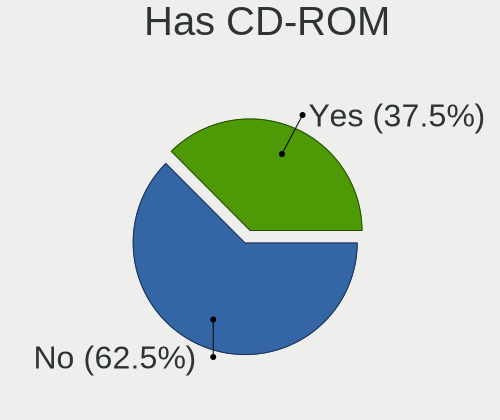
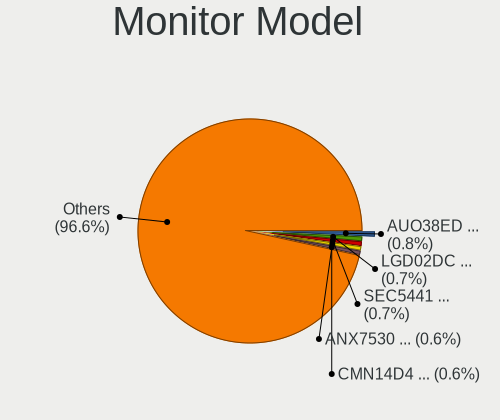

Linux - Tested Hardware & Statistics (Notebooks)
------------------------------------------------

A project to collect tested hardware configurations for Linux.

Anyone can contribute to this report by the [hw-probe](https://github.com/linuxhw/hw-probe) tool:

    sudo -E hw-probe -all -upload

Please contribute! Especially if your hardware is rare.

This report is for real hardware. Report for virtual hardware: [TestDays_VE](https://github.com/linuxhw/TestDays_VE)

Contents
--------

* [ Test Cases ](#test-cases)

* [ System ](#system)
  - [ OS                       ](#os)
  - [ OS Family                ](#os-family)
  - [ Kernel                   ](#kernel)
  - [ Kernel Family            ](#kernel-family)
  - [ Kernel Major Ver.        ](#kernel-major-ver)
  - [ Arch                     ](#arch)
  - [ DE                       ](#de)
  - [ Display Server           ](#display-server)
  - [ Display Manager          ](#display-manager)
  - [ OS Lang                  ](#os-lang)
  - [ Boot Mode                ](#boot-mode)
  - [ Filesystem               ](#filesystem)
  - [ Part. scheme             ](#part-scheme)
  - [ Dual Boot with Linux/BSD ](#dual-boot-with-linuxbsd)
  - [ Dual Boot (Win)          ](#dual-boot-win)

* [ Board ](#board)
  - [ Vendor                   ](#vendor)
  - [ Model                    ](#model)
  - [ Model Family             ](#model-family)
  - [ MFG Year                 ](#mfg-year)
  - [ Form Factor              ](#form-factor)
  - [ Secure Boot              ](#secure-boot)
  - [ Coreboot                 ](#coreboot)
  - [ RAM Size                 ](#ram-size)
  - [ RAM Used                 ](#ram-used)
  - [ Total Drives             ](#total-drives)
  - [ Has CD-ROM               ](#has-cd-rom)
  - [ Has Ethernet             ](#has-ethernet)
  - [ Has WiFi                 ](#has-wifi)
  - [ Has Bluetooth            ](#has-bluetooth)

* [ Location ](#location)
  - [ Country                  ](#country)
  - [ City                     ](#city)

* [ Drives ](#drives)
  - [ Drive Vendor             ](#drive-vendor)
  - [ Drive Model              ](#drive-model)
  - [ HDD Vendor               ](#hdd-vendor)
  - [ SSD Vendor               ](#ssd-vendor)
  - [ Drive Kind               ](#drive-kind)
  - [ Drive Connector          ](#drive-connector)
  - [ Drive Size               ](#drive-size)
  - [ Space Total              ](#space-total)
  - [ Space Used               ](#space-used)
  - [ Malfunc. Drives          ](#malfunc-drives)
  - [ Malfunc. Drive Vendor    ](#malfunc-drive-vendor)
  - [ Malfunc. HDD Vendor      ](#malfunc-hdd-vendor)
  - [ Malfunc. Drive Kind      ](#malfunc-drive-kind)
  - [ Failed Drives            ](#failed-drives)
  - [ Failed Drive Vendor      ](#failed-drive-vendor)
  - [ Drive Status             ](#drive-status)

* [ Storage controller ](#storage-controller)
  - [ Storage Vendor           ](#storage-vendor)
  - [ Storage Model            ](#storage-model)
  - [ Storage Kind             ](#storage-kind)

* [ Processor ](#processor)
  - [ CPU Vendor               ](#cpu-vendor)
  - [ CPU Model                ](#cpu-model)
  - [ CPU Model Family         ](#cpu-model-family)
  - [ CPU Cores                ](#cpu-cores)
  - [ CPU Sockets              ](#cpu-sockets)
  - [ CPU Threads              ](#cpu-threads)
  - [ CPU Op-Modes             ](#cpu-op-modes)
  - [ CPU Microcode            ](#cpu-microcode)
  - [ CPU Microarch            ](#cpu-microarch)

* [ Graphics ](#graphics)
  - [ GPU Vendor               ](#gpu-vendor)
  - [ GPU Model                ](#gpu-model)
  - [ GPU Combo                ](#gpu-combo)
  - [ GPU Driver               ](#gpu-driver)
  - [ GPU Memory               ](#gpu-memory)

* [ Monitor ](#monitor)
  - [ Monitor Vendor           ](#monitor-vendor)
  - [ Monitor Model            ](#monitor-model)
  - [ Monitor Resolution       ](#monitor-resolution)
  - [ Monitor Diagonal         ](#monitor-diagonal)
  - [ Monitor Width            ](#monitor-width)
  - [ Aspect Ratio             ](#aspect-ratio)
  - [ Monitor Area             ](#monitor-area)
  - [ Pixel Density            ](#pixel-density)
  - [ Multiple Monitors        ](#multiple-monitors)

* [ Network ](#network)
  - [ Net Controller Vendor    ](#net-controller-vendor)
  - [ Net Controller Model     ](#net-controller-model)
  - [ Wireless Vendor          ](#wireless-vendor)
  - [ Wireless Model           ](#wireless-model)
  - [ Ethernet Vendor          ](#ethernet-vendor)
  - [ Ethernet Model           ](#ethernet-model)
  - [ Net Controller Kind      ](#net-controller-kind)
  - [ Used Controller          ](#used-controller)
  - [ NICs                     ](#nics)
  - [ IPv6                     ](#ipv6)

* [ Bluetooth ](#bluetooth)
  - [ Bluetooth Vendor         ](#bluetooth-vendor)
  - [ Bluetooth Model          ](#bluetooth-model)

* [ Sound ](#sound)
  - [ Sound Vendor             ](#sound-vendor)
  - [ Sound Model              ](#sound-model)

* [ Memory ](#memory)
  - [ Memory Vendor            ](#memory-vendor)
  - [ Memory Model             ](#memory-model)
  - [ Memory Kind              ](#memory-kind)
  - [ Memory Form Factor       ](#memory-form-factor)
  - [ Memory Size              ](#memory-size)
  - [ Memory Speed             ](#memory-speed)

* [ Printers & scanners ](#printers--scanners)
  - [ Printer Vendor           ](#printer-vendor)
  - [ Printer Model            ](#printer-model)
  - [ Scanner Vendor           ](#scanner-vendor)
  - [ Scanner Model            ](#scanner-model)

* [ Camera ](#camera)
  - [ Camera Vendor            ](#camera-vendor)
  - [ Camera Model             ](#camera-model)

* [ Security ](#security)
  - [ Fingerprint Vendor       ](#fingerprint-vendor)
  - [ Fingerprint Model        ](#fingerprint-model)
  - [ Chipcard Vendor          ](#chipcard-vendor)
  - [ Chipcard Model           ](#chipcard-model)

* [ Unsupported ](#unsupported)
  - [ Unsupported Devices      ](#unsupported-devices)
  - [ Unsupported Device Types ](#unsupported-device-types)

Test Cases
----------

Total: 165460

| Vendor        | Model                       | Probe                                                      | Date         |
|---------------|-----------------------------|------------------------------------------------------------|--------------|
| Valve         | Jupiter                     | [d276b58f38](https://linux-hardware.org/?probe=d276b58f38) | Jun 10, 2023 |
| Acer          | Nitro AN515-44              | [c74a9048c0](https://linux-hardware.org/?probe=c74a9048c0) | Jun 10, 2023 |
| HP            | 250 G1                      | [1b9c881cae](https://linux-hardware.org/?probe=1b9c881cae) | Jun 10, 2023 |
| ASUSTek       | X541UVK                     | [22a8a9d964](https://linux-hardware.org/?probe=22a8a9d964) | Jun 10, 2023 |
| Lenovo        | ThinkPad T480 20L50010US    | [aa44c2c8b9](https://linux-hardware.org/?probe=aa44c2c8b9) | Jun 10, 2023 |
| Apple         | MacBookAir5,2               | [18e80281cc](https://linux-hardware.org/?probe=18e80281cc) | Jun 10, 2023 |
| Samsung       | 730QCJ/730QCR               | [96b21d42f1](https://linux-hardware.org/?probe=96b21d42f1) | Jun 10, 2023 |
| Notebook      | NJx0MU                      | [88d3849db5](https://linux-hardware.org/?probe=88d3849db5) | Jun 10, 2023 |
| Acer          | Aspire A517-51              | [01cfb1c93f](https://linux-hardware.org/?probe=01cfb1c93f) | Jun 10, 2023 |
| Lenovo        | ThinkPad T440p 20AN0069U... | [a2ddfa44e7](https://linux-hardware.org/?probe=a2ddfa44e7) | Jun 10, 2023 |
| ASUSTek       | ROG Zephyrus G14 GA401QC... | [57f37d5836](https://linux-hardware.org/?probe=57f37d5836) | Jun 10, 2023 |
| Apple         | MacBookAir5,2               | [f7bd03dbb9](https://linux-hardware.org/?probe=f7bd03dbb9) | Jun 10, 2023 |
| Acer          | Aspire E5-574G              | [8ca78da386](https://linux-hardware.org/?probe=8ca78da386) | Jun 10, 2023 |
| HP            | Compaq CQ58                 | [98a4edb43d](https://linux-hardware.org/?probe=98a4edb43d) | Jun 10, 2023 |
| Fujitsu Si... | ESPRIMO Mobile U9200        | [1cfac1228c](https://linux-hardware.org/?probe=1cfac1228c) | Jun 10, 2023 |
| Dell          | Latitude 7440               | [f63ada6c61](https://linux-hardware.org/?probe=f63ada6c61) | Jun 10, 2023 |
| HP            | 250 G1                      | [0591407196](https://linux-hardware.org/?probe=0591407196) | Jun 10, 2023 |
| Beelink       | Gemini X                    | [adcb5e774d](https://linux-hardware.org/?probe=adcb5e774d) | Jun 10, 2023 |
| Lenovo        | ThinkPad 13 2nd Gen 20J2... | [fd388e00c3](https://linux-hardware.org/?probe=fd388e00c3) | Jun 10, 2023 |
| HUAWEI        | HVY-WXX9                    | [d6be89e452](https://linux-hardware.org/?probe=d6be89e452) | Jun 10, 2023 |
| Lenovo        | ThinkPad T480 20L50010US    | [398d708c85](https://linux-hardware.org/?probe=398d708c85) | Jun 10, 2023 |
| HP            | EliteBook 1040 G4           | [98aa06475b](https://linux-hardware.org/?probe=98aa06475b) | Jun 10, 2023 |
| Lenovo        | ThinkPad X240 20AMS5XY00    | [3b98c592e0](https://linux-hardware.org/?probe=3b98c592e0) | Jun 10, 2023 |
| Samsung       | P29/28/26                   | [6040d56961](https://linux-hardware.org/?probe=6040d56961) | Jun 10, 2023 |
| Lenovo        | G580 ChiefRiver Platform    | [ac48eeb92c](https://linux-hardware.org/?probe=ac48eeb92c) | Jun 10, 2023 |
| Acer          | Aspire E1-572               | [532d86f9e6](https://linux-hardware.org/?probe=532d86f9e6) | Jun 10, 2023 |
| Apple         | MacBookPro11,3              | [b7dfbae839](https://linux-hardware.org/?probe=b7dfbae839) | Jun 10, 2023 |
| Lenovo        | G580 ChiefRiver Platform    | [ade15528d8](https://linux-hardware.org/?probe=ade15528d8) | Jun 10, 2023 |
| HP            | Laptop 15-dw1xxx            | [bfde2cf63d](https://linux-hardware.org/?probe=bfde2cf63d) | Jun 10, 2023 |
| HP            | Pavilion Laptop 14-ec1xx... | [1eeb12a5ca](https://linux-hardware.org/?probe=1eeb12a5ca) | Jun 10, 2023 |
| Lenovo        | ThinkPad P16s Gen 1 21CK... | [c768cfa03d](https://linux-hardware.org/?probe=c768cfa03d) | Jun 10, 2023 |
| HP            | Pavilion Laptop 14-ec1xx... | [e46f2fe66e](https://linux-hardware.org/?probe=e46f2fe66e) | Jun 10, 2023 |
| Lenovo        | ThinkPad T470 20HDS14L00    | [a62438daef](https://linux-hardware.org/?probe=a62438daef) | Jun 10, 2023 |
| ASUSTek       | VivoBook_ASUSLaptop X515... | [29085f8fb4](https://linux-hardware.org/?probe=29085f8fb4) | Jun 10, 2023 |
| Lenovo        | ThinkPad T470 20HDS14L00    | [fab548c31e](https://linux-hardware.org/?probe=fab548c31e) | Jun 10, 2023 |
| ASUSTek       | ZenBook UX331FA_UX331FA     | [8c4d9c62b5](https://linux-hardware.org/?probe=8c4d9c62b5) | Jun 10, 2023 |
| Dell          | Latitude E6510              | [e7c1e59ac7](https://linux-hardware.org/?probe=e7c1e59ac7) | Jun 10, 2023 |
| HP            | Laptop 17-by3xxx            | [421ff52b0b](https://linux-hardware.org/?probe=421ff52b0b) | Jun 10, 2023 |
| Samsung       | N150/N210/N220              | [977d645961](https://linux-hardware.org/?probe=977d645961) | Jun 10, 2023 |
| Notebook      | NJ50_70CU                   | [d39b8694fd](https://linux-hardware.org/?probe=d39b8694fd) | Jun 10, 2023 |
| ASUSTek       | TUF Gaming FX505GD_FX505... | [03660fb140](https://linux-hardware.org/?probe=03660fb140) | Jun 10, 2023 |
| Lenovo        | ThinkPad T550 20CJS1XB00    | [3d3375df75](https://linux-hardware.org/?probe=3d3375df75) | Jun 10, 2023 |
| Notebook      | NS50_70MU                   | [87b818815c](https://linux-hardware.org/?probe=87b818815c) | Jun 10, 2023 |
| HP            | Pavilion dv6                | [1388a433de](https://linux-hardware.org/?probe=1388a433de) | Jun 10, 2023 |
| Lenovo        | IdeaPad N580 20182          | [8990fd0b51](https://linux-hardware.org/?probe=8990fd0b51) | Jun 10, 2023 |
| WeiBu         | OEM                         | [49bd40f956](https://linux-hardware.org/?probe=49bd40f956) | Jun 10, 2023 |
| Lenovo        | ThinkPad X1 Carbon Gen 9... | [f7a2bd2ca8](https://linux-hardware.org/?probe=f7a2bd2ca8) | Jun 10, 2023 |
| Valve         | Jupiter                     | [d2df298764](https://linux-hardware.org/?probe=d2df298764) | Jun 10, 2023 |
| Lenovo        | ThinkPad P1 Gen 3 20TH00... | [65a47406b0](https://linux-hardware.org/?probe=65a47406b0) | Jun 10, 2023 |
| Lenovo        | ThinkPad T470p 20J7S0XV0... | [b2f7d876c7](https://linux-hardware.org/?probe=b2f7d876c7) | Jun 10, 2023 |
| Packard Be... | EasyNote TE11BZ             | [a8f9a31f17](https://linux-hardware.org/?probe=a8f9a31f17) | Jun 10, 2023 |
| Toshiba       | dynabook Satellite B552/... | [46c70e6e33](https://linux-hardware.org/?probe=46c70e6e33) | Jun 10, 2023 |
| HP            | ENVY Laptop 13-ad1xx        | [1de48a4515](https://linux-hardware.org/?probe=1de48a4515) | Jun 10, 2023 |
| MSI           | Prestige 13Evo A13M         | [3feb3bce01](https://linux-hardware.org/?probe=3feb3bce01) | Jun 10, 2023 |
| Fujitsu Si... | ESPRIMO Mobile U9200        | [427db0e78b](https://linux-hardware.org/?probe=427db0e78b) | Jun 10, 2023 |
| HUAWEI        | NBD-WXX9                    | [61c1703e67](https://linux-hardware.org/?probe=61c1703e67) | Jun 10, 2023 |
| Lenovo        | ThinkPad E15 Gen 4 21EDC... | [fa84ae9906](https://linux-hardware.org/?probe=fa84ae9906) | Jun 10, 2023 |
| Dell          | G3 3779                     | [0190c87b35](https://linux-hardware.org/?probe=0190c87b35) | Jun 10, 2023 |
| Lenovo        | ThinkPad W500 4058CTO       | [4b6aa9a912](https://linux-hardware.org/?probe=4b6aa9a912) | Jun 10, 2023 |
| HP            | ZBook 15 G2                 | [68c941fe5d](https://linux-hardware.org/?probe=68c941fe5d) | Jun 10, 2023 |
| Apple         | MacBookAir5,2               | [6adee93e47](https://linux-hardware.org/?probe=6adee93e47) | Jun 10, 2023 |
| HP            | EliteBook 840 G2            | [770045a9fc](https://linux-hardware.org/?probe=770045a9fc) | Jun 10, 2023 |
| HUAWEI        | NBD-WXX9                    | [321ad38786](https://linux-hardware.org/?probe=321ad38786) | Jun 10, 2023 |
| HP            | Notebook                    | [42558904aa](https://linux-hardware.org/?probe=42558904aa) | Jun 10, 2023 |
| Toshiba       | PORTEGE Z10t-A              | [4a0712b322](https://linux-hardware.org/?probe=4a0712b322) | Jun 10, 2023 |
| HP            | Pavilion Laptop 15-cc5xx    | [68af03eefe](https://linux-hardware.org/?probe=68af03eefe) | Jun 10, 2023 |
| HP            | Laptop 15-dw1xxx            | [7c79725474](https://linux-hardware.org/?probe=7c79725474) | Jun 10, 2023 |
| HP            | Laptop 15-db0xxx            | [03f0e4060e](https://linux-hardware.org/?probe=03f0e4060e) | Jun 10, 2023 |
| ASUSTek       | K54HR                       | [6eada916c0](https://linux-hardware.org/?probe=6eada916c0) | Jun 10, 2023 |
| Lenovo        | IdeaPad 5 15ITL05 82FG      | [5d21e64704](https://linux-hardware.org/?probe=5d21e64704) | Jun 10, 2023 |
| HP            | Pavilion Gaming Laptop 1... | [7c9662b5eb](https://linux-hardware.org/?probe=7c9662b5eb) | Jun 10, 2023 |
| HP            | G42                         | [83eca37118](https://linux-hardware.org/?probe=83eca37118) | Jun 10, 2023 |
| Lenovo        | ThinkPad T61 7660A25        | [e1617105e0](https://linux-hardware.org/?probe=e1617105e0) | Jun 10, 2023 |
| Lenovo        | ThinkPad T570 20H9000UUS    | [606989ab70](https://linux-hardware.org/?probe=606989ab70) | Jun 10, 2023 |
| Dell          | Latitude 3580               | [9c02d2c4c4](https://linux-hardware.org/?probe=9c02d2c4c4) | Jun 10, 2023 |
| Lenovo        | ThinkPad T440 20B6005RUS    | [e7ea5a9368](https://linux-hardware.org/?probe=e7ea5a9368) | Jun 10, 2023 |
| Lenovo        | ThinkPad X1 Carbon 7th 2... | [3de2e4c6f9](https://linux-hardware.org/?probe=3de2e4c6f9) | Jun 10, 2023 |
| HP            | Pavilion Gaming Laptop 1... | [758afab931](https://linux-hardware.org/?probe=758afab931) | Jun 10, 2023 |
| Apple         | MacBookPro13,2              | [929c318674](https://linux-hardware.org/?probe=929c318674) | Jun 10, 2023 |
| Google        | Pirika                      | [67fce0a645](https://linux-hardware.org/?probe=67fce0a645) | Jun 10, 2023 |
| IT Channel... | N8xEJEK                     | [51a7e3f5b4](https://linux-hardware.org/?probe=51a7e3f5b4) | Jun 10, 2023 |
| Dell          | Precision 7520              | [c52fb2f851](https://linux-hardware.org/?probe=c52fb2f851) | Jun 10, 2023 |
| Medion        | Akoya E7226                 | [b46a96183b](https://linux-hardware.org/?probe=b46a96183b) | Jun 10, 2023 |
| Dell          | Vostro 3560                 | [86f646e00f](https://linux-hardware.org/?probe=86f646e00f) | Jun 10, 2023 |
| Acidanther... | MacBookPro15,2              | [fb30b2eb35](https://linux-hardware.org/?probe=fb30b2eb35) | Jun 10, 2023 |
| Lenovo        | IdeaPad 3 15ITL6 82H8       | [1a36e2fa98](https://linux-hardware.org/?probe=1a36e2fa98) | Jun 10, 2023 |
| Samsung       | 550XCJ/550XCR               | [d8dac01c79](https://linux-hardware.org/?probe=d8dac01c79) | Jun 10, 2023 |
| Dell          | Vostro 3560                 | [1bb9178df2](https://linux-hardware.org/?probe=1bb9178df2) | Jun 10, 2023 |
| ASUSTek       | ROG Strix G512LW_G512LW     | [42722d78d8](https://linux-hardware.org/?probe=42722d78d8) | Jun 10, 2023 |
| Valve         | Jupiter                     | [c1e32f24ee](https://linux-hardware.org/?probe=c1e32f24ee) | Jun 10, 2023 |
| Lenovo        | ThinkPad X1 Carbon 7th 2... | [2e6901471f](https://linux-hardware.org/?probe=2e6901471f) | Jun 10, 2023 |
| Apple         | MacBookPro9,2               | [3554e00d28](https://linux-hardware.org/?probe=3554e00d28) | Jun 10, 2023 |
| Dell          | Inspiron 5515               | [36016c0c6b](https://linux-hardware.org/?probe=36016c0c6b) | Jun 10, 2023 |
| Lenovo        | IdeaPad Gaming 3 15ACH6 ... | [3eb12fd9bc](https://linux-hardware.org/?probe=3eb12fd9bc) | Jun 10, 2023 |
| Apple         | MacBookAir5,1               | [53ba4689ae](https://linux-hardware.org/?probe=53ba4689ae) | Jun 10, 2023 |
| HP            | ZBook 15 G6                 | [eb23ebb0b8](https://linux-hardware.org/?probe=eb23ebb0b8) | Jun 10, 2023 |
| Apple         | MacBookAir5,1               | [58f4272bee](https://linux-hardware.org/?probe=58f4272bee) | Jun 10, 2023 |
| Lenovo        | ThinkPad T540p 20BFS4P80... | [4160d59c4f](https://linux-hardware.org/?probe=4160d59c4f) | Jun 10, 2023 |
| Dell          | Latitude E5500              | [41ad12c465](https://linux-hardware.org/?probe=41ad12c465) | Jun 10, 2023 |
| Valve         | Jupiter                     | [fab558feb4](https://linux-hardware.org/?probe=fab558feb4) | Jun 10, 2023 |
| Acer          | Nitro AN515-44              | [b3531502a8](https://linux-hardware.org/?probe=b3531502a8) | Jun 10, 2023 |
| Exo           | Smart Serie LT              | [bbecad1cea](https://linux-hardware.org/?probe=bbecad1cea) | Jun 10, 2023 |
| Lenovo        | Y50-70 20378                | [5e060b53c2](https://linux-hardware.org/?probe=5e060b53c2) | Jun 10, 2023 |
| Lenovo        | Y50-70 20378                | [0d548e314b](https://linux-hardware.org/?probe=0d548e314b) | Jun 10, 2023 |
| Apple         | MacBookPro9,2               | [f502f89e9d](https://linux-hardware.org/?probe=f502f89e9d) | Jun 10, 2023 |
| MACHENIKE     | F117-7P                     | [78ad896b83](https://linux-hardware.org/?probe=78ad896b83) | Jun 10, 2023 |
| Samsung       | N102SP/N100SP/N101SP        | [c31b0e5f30](https://linux-hardware.org/?probe=c31b0e5f30) | Jun 10, 2023 |
| Lenovo        | ThinkPad P16 Gen 1 21D7S... | [246facab73](https://linux-hardware.org/?probe=246facab73) | Jun 10, 2023 |
| Lenovo        | IdeaPad Gaming 3 15ARH05... | [bdca36306b](https://linux-hardware.org/?probe=bdca36306b) | Jun 10, 2023 |
| Sony          | VPCF120FD                   | [47f02bd498](https://linux-hardware.org/?probe=47f02bd498) | Jun 10, 2023 |
| Apple         | MacBookPro5,5               | [1b3630b25a](https://linux-hardware.org/?probe=1b3630b25a) | Jun 10, 2023 |
| HUAWEI        | BOD-WXX9                    | [c4063bcf07](https://linux-hardware.org/?probe=c4063bcf07) | Jun 09, 2023 |
| Gigabyte      | P57V6                       | [a2ce7ccc80](https://linux-hardware.org/?probe=a2ce7ccc80) | Jun 09, 2023 |
| HUAWEI        | BOD-WXX9                    | [9016ad81ae](https://linux-hardware.org/?probe=9016ad81ae) | Jun 09, 2023 |
| HP            | ProBook 6360b               | [cdef37cb2d](https://linux-hardware.org/?probe=cdef37cb2d) | Jun 09, 2023 |
| Dell          | Inspiron 3583               | [2627421665](https://linux-hardware.org/?probe=2627421665) | Jun 09, 2023 |
| HP            | Laptop 15-db0xxx            | [881d5dc409](https://linux-hardware.org/?probe=881d5dc409) | Jun 09, 2023 |
| ASUSTek       | VivoBook 17_ASUS Laptop ... | [08a506ad4e](https://linux-hardware.org/?probe=08a506ad4e) | Jun 09, 2023 |
| Lenovo        | IdeaPad S145-15IWL 81S9     | [0b0c11a052](https://linux-hardware.org/?probe=0b0c11a052) | Jun 09, 2023 |
| Lenovo        | ThinkPad P16 Gen 1 21D7S... | [233dac6c68](https://linux-hardware.org/?probe=233dac6c68) | Jun 09, 2023 |
| Sony          | SVE1713X1EB                 | [f1c10c92b3](https://linux-hardware.org/?probe=f1c10c92b3) | Jun 09, 2023 |
| Acer          | Aspire F5-573G              | [5648ca2620](https://linux-hardware.org/?probe=5648ca2620) | Jun 09, 2023 |
| Toshiba       | Satellite C650              | [162f690841](https://linux-hardware.org/?probe=162f690841) | Jun 09, 2023 |
| Acer          | Aspire F5-573G              | [30dbebd931](https://linux-hardware.org/?probe=30dbebd931) | Jun 09, 2023 |
| HP            | ZBook 15 G2                 | [2851b41659](https://linux-hardware.org/?probe=2851b41659) | Jun 09, 2023 |
| Intel         | powered classmate PC        | [e530f037c6](https://linux-hardware.org/?probe=e530f037c6) | Jun 09, 2023 |
| HP            | Notebook                    | [9487146a2f](https://linux-hardware.org/?probe=9487146a2f) | Jun 09, 2023 |
| Lenovo        | Legion 5 15ARH05 82B5       | [2b4f40f41b](https://linux-hardware.org/?probe=2b4f40f41b) | Jun 09, 2023 |
| Lenovo        | IdeaPad L340-15API 81LW     | [1794287cf0](https://linux-hardware.org/?probe=1794287cf0) | Jun 09, 2023 |
| Lenovo        | V110-15IAP 80TG             | [68a77b486e](https://linux-hardware.org/?probe=68a77b486e) | Jun 09, 2023 |
| Dell          | Vostro 3500                 | [c64ff76dba](https://linux-hardware.org/?probe=c64ff76dba) | Jun 09, 2023 |
| ASUSTek       | UX530UQ                     | [71d0ddd2f0](https://linux-hardware.org/?probe=71d0ddd2f0) | Jun 09, 2023 |
| Dell          | Vostro 3500                 | [3d694e1b9a](https://linux-hardware.org/?probe=3d694e1b9a) | Jun 09, 2023 |
| Lenovo        | ThinkPad P1 20MD001VUS      | [9765261d02](https://linux-hardware.org/?probe=9765261d02) | Jun 09, 2023 |
| Apple         | MacBookPro11,4              | [6d70667d42](https://linux-hardware.org/?probe=6d70667d42) | Jun 09, 2023 |
| Dell          | Inspiron 7348               | [a2bd4ab5b9](https://linux-hardware.org/?probe=a2bd4ab5b9) | Jun 09, 2023 |
| Dell          | Vostro 3558                 | [15185698e7](https://linux-hardware.org/?probe=15185698e7) | Jun 09, 2023 |
| Valve         | Jupiter                     | [7a36bdb92a](https://linux-hardware.org/?probe=7a36bdb92a) | Jun 09, 2023 |
| HUAWEI        | MACHC-WAX9                  | [6f26f51ef6](https://linux-hardware.org/?probe=6f26f51ef6) | Jun 09, 2023 |
| HP            | Victus by Laptop 16-e0xx... | [9cb24f9445](https://linux-hardware.org/?probe=9cb24f9445) | Jun 09, 2023 |
| Lenovo        | ThinkPad T460 20FN002JUS    | [8cc29c049e](https://linux-hardware.org/?probe=8cc29c049e) | Jun 09, 2023 |
| Fujitsu       | LIFEBOOK E734               | [3742e80123](https://linux-hardware.org/?probe=3742e80123) | Jun 09, 2023 |
| Dell          | Vostro 3460                 | [e8ed8e8b1e](https://linux-hardware.org/?probe=e8ed8e8b1e) | Jun 09, 2023 |
| HP            | Stream Laptop 14-ds0xxx     | [fb9e2f9fc8](https://linux-hardware.org/?probe=fb9e2f9fc8) | Jun 09, 2023 |
| HP            | ProBook 4510s               | [43a29ea83e](https://linux-hardware.org/?probe=43a29ea83e) | Jun 09, 2023 |
| Onda TLC      | ONDA Oliver                 | [80a06d821b](https://linux-hardware.org/?probe=80a06d821b) | Jun 09, 2023 |
| MECHREVO      | Jiaolong16K Series GM6BG... | [a165849009](https://linux-hardware.org/?probe=a165849009) | Jun 09, 2023 |
| HP            | Laptop 17-bs0xx             | [c93d52343c](https://linux-hardware.org/?probe=c93d52343c) | Jun 09, 2023 |
| Valve         | Jupiter                     | [628ee9ac88](https://linux-hardware.org/?probe=628ee9ac88) | Jun 09, 2023 |
| Sony          | VPCEB2AFD                   | [1d9d6ddd74](https://linux-hardware.org/?probe=1d9d6ddd74) | Jun 09, 2023 |
| Google        | Akali 360                   | [1f7d5f8bc5](https://linux-hardware.org/?probe=1f7d5f8bc5) | Jun 09, 2023 |
| Dell          | Inspiron N5110              | [62d37454d3](https://linux-hardware.org/?probe=62d37454d3) | Jun 09, 2023 |
| Dell          | XPS 13 9333                 | [88020aee75](https://linux-hardware.org/?probe=88020aee75) | Jun 09, 2023 |
| Dell          | Latitude 5480               | [5b3fb0b4f8](https://linux-hardware.org/?probe=5b3fb0b4f8) | Jun 09, 2023 |
| Dell          | Latitude 5420               | [956a995580](https://linux-hardware.org/?probe=956a995580) | Jun 09, 2023 |
| Gigabyte      | AORUS 17X AXF               | [685ba556b4](https://linux-hardware.org/?probe=685ba556b4) | Jun 09, 2023 |
| Lenovo        | ThinkPad X201 3249CTO       | [849dbace60](https://linux-hardware.org/?probe=849dbace60) | Jun 09, 2023 |
| Dell          | Latitude E7470              | [c5457da74f](https://linux-hardware.org/?probe=c5457da74f) | Jun 09, 2023 |
| Dell          | Latitude E5470              | [c9b909273b](https://linux-hardware.org/?probe=c9b909273b) | Jun 09, 2023 |
| Lenovo        | ThinkPad P53 20QN0011IV     | [9e3dfb25be](https://linux-hardware.org/?probe=9e3dfb25be) | Jun 09, 2023 |
| Dell          | Inspiron 3583               | [adcb3b193a](https://linux-hardware.org/?probe=adcb3b193a) | Jun 09, 2023 |
| Dell          | Vostro 1310                 | [05fc6f167c](https://linux-hardware.org/?probe=05fc6f167c) | Jun 09, 2023 |
| Digibras      | NH4CU03                     | [c66d30943e](https://linux-hardware.org/?probe=c66d30943e) | Jun 09, 2023 |
| Dell          | XPS 13 9370                 | [c605e51eca](https://linux-hardware.org/?probe=c605e51eca) | Jun 09, 2023 |
| Lenovo        | Legion Y540-17IRH 81Q4      | [ab95a219f5](https://linux-hardware.org/?probe=ab95a219f5) | Jun 09, 2023 |
| HP            | Laptop 15-db0xxx            | [5dd8c1fed8](https://linux-hardware.org/?probe=5dd8c1fed8) | Jun 09, 2023 |
| Dell          | Precision M4600             | [a79a783515](https://linux-hardware.org/?probe=a79a783515) | Jun 09, 2023 |
| Acer          | Aspire 5750G                | [69227c0908](https://linux-hardware.org/?probe=69227c0908) | Jun 09, 2023 |
| Dell          | XPS 9320                    | [c9f26e18c2](https://linux-hardware.org/?probe=c9f26e18c2) | Jun 09, 2023 |
| Toshiba       | Satellite C660D             | [a6c222681d](https://linux-hardware.org/?probe=a6c222681d) | Jun 09, 2023 |
| HUAWEI        | BOHB-WAX9                   | [aa0b439e8d](https://linux-hardware.org/?probe=aa0b439e8d) | Jun 09, 2023 |
| HP            | 255 15.6 inch G9 Noteboo... | [50c36acc0d](https://linux-hardware.org/?probe=50c36acc0d) | Jun 09, 2023 |
| MECHREVO      | Jiaolong16K Series GM6BG... | [05c07442a3](https://linux-hardware.org/?probe=05c07442a3) | Jun 09, 2023 |
| Acer          | TravelMate P215-53          | [9536bf547a](https://linux-hardware.org/?probe=9536bf547a) | Jun 09, 2023 |
| Valve         | Jupiter                     | [06f5f2068f](https://linux-hardware.org/?probe=06f5f2068f) | Jun 09, 2023 |
| Fujitsu       | LIFEBOOK E754               | [4d09f42447](https://linux-hardware.org/?probe=4d09f42447) | Jun 09, 2023 |
| Toshiba       | Satellite L635              | [4f124d1525](https://linux-hardware.org/?probe=4f124d1525) | Jun 09, 2023 |
| HP            | EliteBook 8440p             | [b88712538e](https://linux-hardware.org/?probe=b88712538e) | Jun 09, 2023 |
| Fujitsu       | LIFEBOOK U7411              | [ab35c95b72](https://linux-hardware.org/?probe=ab35c95b72) | Jun 09, 2023 |
| Lenovo        | IdeaPad 5 14ARE05 81YM      | [e246e70bb6](https://linux-hardware.org/?probe=e246e70bb6) | Jun 09, 2023 |
| Lenovo        | Yoga Slim 7 Carbon 13ITL... | [27c0e57cb3](https://linux-hardware.org/?probe=27c0e57cb3) | Jun 09, 2023 |
| HP            | 14                          | [1540a787fb](https://linux-hardware.org/?probe=1540a787fb) | Jun 09, 2023 |
| HP            | 14                          | [1404218cab](https://linux-hardware.org/?probe=1404218cab) | Jun 09, 2023 |
| Lenovo        | ThinkPad P1 Gen 3 20TJS1... | [c47936b50c](https://linux-hardware.org/?probe=c47936b50c) | Jun 09, 2023 |
| Panasonic     | CF-S10CDHEDM                | [19b6085754](https://linux-hardware.org/?probe=19b6085754) | Jun 09, 2023 |
| Lenovo        | ThinkPad T14s Gen 1 20T0... | [a579703f97](https://linux-hardware.org/?probe=a579703f97) | Jun 09, 2023 |
| Lenovo        | ThinkPad T460s 20FAS11X0... | [23568da401](https://linux-hardware.org/?probe=23568da401) | Jun 09, 2023 |
| Lenovo        | IdeaPad 3 14ALC6 82KT       | [c35e22de2b](https://linux-hardware.org/?probe=c35e22de2b) | Jun 09, 2023 |
| Lenovo        | IdeaPad 320-15ISK 80XH      | [2f0f8eb596](https://linux-hardware.org/?probe=2f0f8eb596) | Jun 09, 2023 |
| Acer          | Aspire 7750                 | [b0daafa057](https://linux-hardware.org/?probe=b0daafa057) | Jun 09, 2023 |
| Lenovo        | ThinkPad T440p 20AWS43W0... | [69e5497306](https://linux-hardware.org/?probe=69e5497306) | Jun 09, 2023 |
| Unknown       | Unknown                     | [c5accf4cf8](https://linux-hardware.org/?probe=c5accf4cf8) | Jun 09, 2023 |
| VIT           | P2402                       | [5ea93f652a](https://linux-hardware.org/?probe=5ea93f652a) | Jun 09, 2023 |
| Apple         | MacBookPro5,5               | [09344fa63e](https://linux-hardware.org/?probe=09344fa63e) | Jun 09, 2023 |
| Unknown       | Unknown                     | [45e51a6b5d](https://linux-hardware.org/?probe=45e51a6b5d) | Jun 09, 2023 |
| Toshiba       | PORTEGE R705                | [c7a032c5cf](https://linux-hardware.org/?probe=c7a032c5cf) | Jun 09, 2023 |
| Dell          | Inspiron 3493               | [ffcd21fc3b](https://linux-hardware.org/?probe=ffcd21fc3b) | Jun 09, 2023 |
| Dell          | Inspiron 15-5568            | [19b686b7d7](https://linux-hardware.org/?probe=19b686b7d7) | Jun 09, 2023 |
| Dell          | Latitude E7240              | [1d8eb4fce4](https://linux-hardware.org/?probe=1d8eb4fce4) | Jun 09, 2023 |
| Lenovo        | IdeaPad 3 14ALC6 82KT       | [68be9da7f1](https://linux-hardware.org/?probe=68be9da7f1) | Jun 09, 2023 |
| Dell          | Latitude E7240              | [da22551dca](https://linux-hardware.org/?probe=da22551dca) | Jun 09, 2023 |
| Dell          | Precision 7540              | [41fe2f93ff](https://linux-hardware.org/?probe=41fe2f93ff) | Jun 09, 2023 |
| HP            | OMEN by Laptop 15-ce0xx     | [fd3b70424a](https://linux-hardware.org/?probe=fd3b70424a) | Jun 09, 2023 |
| Apple         | MacBookPro9,2               | [c22081b097](https://linux-hardware.org/?probe=c22081b097) | Jun 09, 2023 |
| HP            | Notebook                    | [e292bb9d5a](https://linux-hardware.org/?probe=e292bb9d5a) | Jun 09, 2023 |
| ASUSTek       | G771JW                      | [6d989f49b6](https://linux-hardware.org/?probe=6d989f49b6) | Jun 09, 2023 |
| Acer          | Aspire 8930                 | [f8eb3278fe](https://linux-hardware.org/?probe=f8eb3278fe) | Jun 09, 2023 |
| HP            | EliteBook 8440p             | [51bfdec531](https://linux-hardware.org/?probe=51bfdec531) | Jun 09, 2023 |
| Lenovo        | Legion 5 15ACH6H 82JU       | [8632ddc565](https://linux-hardware.org/?probe=8632ddc565) | Jun 09, 2023 |
| Acer          | TravelMate P449-G2-M        | [6b42200bee](https://linux-hardware.org/?probe=6b42200bee) | Jun 09, 2023 |
| Lenovo        | ThinkPad X1 Carbon Gen 8... | [531e3f124d](https://linux-hardware.org/?probe=531e3f124d) | Jun 09, 2023 |
| Acer          | Aspire A315-51              | [9bcc99d434](https://linux-hardware.org/?probe=9bcc99d434) | Jun 08, 2023 |
| Panasonic     | CF-53ASCZGFG                | [39e04925ee](https://linux-hardware.org/?probe=39e04925ee) | Jun 08, 2023 |
| Acer          | Aspire A315-51              | [3013e9caf2](https://linux-hardware.org/?probe=3013e9caf2) | Jun 08, 2023 |
| HP            | EliteBook Folio 9470m       | [5739bbf07f](https://linux-hardware.org/?probe=5739bbf07f) | Jun 08, 2023 |
| Apple         | MacBookPro9,2               | [baf92c8b36](https://linux-hardware.org/?probe=baf92c8b36) | Jun 08, 2023 |
| HP            | 240 G6 Notebook PC          | [f7470e08b0](https://linux-hardware.org/?probe=f7470e08b0) | Jun 08, 2023 |
| HP            | EliteBook Folio 9470m       | [74dd8ef72a](https://linux-hardware.org/?probe=74dd8ef72a) | Jun 08, 2023 |
| Apple         | MacBookPro8,1               | [70fea7478a](https://linux-hardware.org/?probe=70fea7478a) | Jun 08, 2023 |
| HP            | Laptop 15-ef1xxx            | [931b9e2b05](https://linux-hardware.org/?probe=931b9e2b05) | Jun 08, 2023 |
| Dell          | XPS 17 9730                 | [bb7335618d](https://linux-hardware.org/?probe=bb7335618d) | Jun 08, 2023 |
| Dell          | Latitude 5175               | [63d6fcf641](https://linux-hardware.org/?probe=63d6fcf641) | Jun 08, 2023 |
| Apple         | MacBookPro8,1               | [cbf7ed91a7](https://linux-hardware.org/?probe=cbf7ed91a7) | Jun 08, 2023 |
| ASUSTek       | S400CA                      | [25c1d47331](https://linux-hardware.org/?probe=25c1d47331) | Jun 08, 2023 |
| Lenovo        | ThinkPad E14 20RA0016GE     | [4c8d8758b7](https://linux-hardware.org/?probe=4c8d8758b7) | Jun 08, 2023 |
| Acer          | Aspire A517-53              | [c14dcffa32](https://linux-hardware.org/?probe=c14dcffa32) | Jun 08, 2023 |
| HP            | ZBook Studio G3             | [4fb38ec480](https://linux-hardware.org/?probe=4fb38ec480) | Jun 08, 2023 |
| HP            | ZBook Studio G3             | [09260f0742](https://linux-hardware.org/?probe=09260f0742) | Jun 08, 2023 |
| ASUSTek       | UX32LN                      | [97ff235920](https://linux-hardware.org/?probe=97ff235920) | Jun 08, 2023 |
| HUAWEI        | NBLK-WAX9X                  | [e28668e147](https://linux-hardware.org/?probe=e28668e147) | Jun 08, 2023 |
| HP            | Laptop 15s-fq2xxx           | [09ba95bf3b](https://linux-hardware.org/?probe=09ba95bf3b) | Jun 08, 2023 |
| Dell          | Precision 5540              | [0e925c8b3c](https://linux-hardware.org/?probe=0e925c8b3c) | Jun 08, 2023 |
| Dell          | Latitude E7240              | [e21cc2151b](https://linux-hardware.org/?probe=e21cc2151b) | Jun 08, 2023 |
| Lenovo        | Slim 7 ProX 14ARH7 82V2     | [e8b6d763e4](https://linux-hardware.org/?probe=e8b6d763e4) | Jun 08, 2023 |
| HP            | G42                         | [fe8d2be276](https://linux-hardware.org/?probe=fe8d2be276) | Jun 08, 2023 |
| Lenovo        | Unknown                     | [1842b75de0](https://linux-hardware.org/?probe=1842b75de0) | Jun 08, 2023 |
| HP            | Laptop 14-cm0xxx            | [f1100ce875](https://linux-hardware.org/?probe=f1100ce875) | Jun 08, 2023 |
| Lenovo        | ThinkPad P14s Gen 1 20S5... | [0372aa0747](https://linux-hardware.org/?probe=0372aa0747) | Jun 08, 2023 |
| Dell          | Vostro 1015                 | [dcd4a1ad41](https://linux-hardware.org/?probe=dcd4a1ad41) | Jun 08, 2023 |
| Lenovo        | ThinkBook 15-IIL 20SM       | [97d002b53a](https://linux-hardware.org/?probe=97d002b53a) | Jun 08, 2023 |
| ASUSTek       | VivoBook_ASUSLaptop M350... | [59ff5486a9](https://linux-hardware.org/?probe=59ff5486a9) | Jun 08, 2023 |
| HP            | G42                         | [4f33462d46](https://linux-hardware.org/?probe=4f33462d46) | Jun 08, 2023 |
| HP            | 240 G6 Notebook PC          | [eda13b898c](https://linux-hardware.org/?probe=eda13b898c) | Jun 08, 2023 |
| Lenovo        | ThinkPad L430 24655Q7       | [7b45c0777e](https://linux-hardware.org/?probe=7b45c0777e) | Jun 08, 2023 |
| Lenovo        | ThinkPad X280 20KES5SE22    | [c25a510191](https://linux-hardware.org/?probe=c25a510191) | Jun 08, 2023 |
| HP            | ENVY 15                     | [3776ac93b3](https://linux-hardware.org/?probe=3776ac93b3) | Jun 08, 2023 |
| Dell          | Latitude E6420              | [d408418ddd](https://linux-hardware.org/?probe=d408418ddd) | Jun 08, 2023 |
| Lenovo        | ThinkPad X270 W10DG 20K5... | [8a01610ae4](https://linux-hardware.org/?probe=8a01610ae4) | Jun 08, 2023 |
| Dell          | Inspiron 7737               | [6f7077634a](https://linux-hardware.org/?probe=6f7077634a) | Jun 08, 2023 |
| HP            | Notebook                    | [1b099710b7](https://linux-hardware.org/?probe=1b099710b7) | Jun 08, 2023 |
| Acer          | Aspire E5-573G              | [277ddf45b4](https://linux-hardware.org/?probe=277ddf45b4) | Jun 08, 2023 |
| ASUSTek       | ROG Strix G713PI_G713PI     | [13b0e73872](https://linux-hardware.org/?probe=13b0e73872) | Jun 08, 2023 |
| HP            | Notebook                    | [9bf82397c3](https://linux-hardware.org/?probe=9bf82397c3) | Jun 08, 2023 |
| ASUSTek       | ASUS TUF Gaming A17 FA70... | [19c6b51f80](https://linux-hardware.org/?probe=19c6b51f80) | Jun 08, 2023 |
| TUXEDO        | Stellaris Intel Gen4        | [e6cb646bd4](https://linux-hardware.org/?probe=e6cb646bd4) | Jun 08, 2023 |
| HP            | OMEN by Laptop 16-c0xxx     | [6de4ea13fe](https://linux-hardware.org/?probe=6de4ea13fe) | Jun 08, 2023 |
| Acer          | Aspire A515-45              | [975246674d](https://linux-hardware.org/?probe=975246674d) | Jun 08, 2023 |
| Lenovo        | IdeaPad 100-14IBD 80RK      | [42eab3e3af](https://linux-hardware.org/?probe=42eab3e3af) | Jun 08, 2023 |
| Acer          | Aspire A515-45              | [348173e172](https://linux-hardware.org/?probe=348173e172) | Jun 08, 2023 |
| Samsung       | 910S3L                      | [f8e59b4c0f](https://linux-hardware.org/?probe=f8e59b4c0f) | Jun 08, 2023 |
| ASUSTek       | VivoBook_ASUSLaptop M160... | [e355aa21b5](https://linux-hardware.org/?probe=e355aa21b5) | Jun 08, 2023 |
| Dell          | Latitude E6540              | [85520c9a0b](https://linux-hardware.org/?probe=85520c9a0b) | Jun 08, 2023 |
| Lenovo        | Legion Y740-17IRHg 81UJ     | [c98ac6e82c](https://linux-hardware.org/?probe=c98ac6e82c) | Jun 08, 2023 |
| Lenovo        | ThinkPad T14 Gen 2a 20XL... | [3cfa2bccb7](https://linux-hardware.org/?probe=3cfa2bccb7) | Jun 08, 2023 |
| Dell          | Latitude E6540              | [30f20f78ac](https://linux-hardware.org/?probe=30f20f78ac) | Jun 08, 2023 |
| ASUSTek       | VivoBook_ASUSLaptop M160... | [c5a1a47343](https://linux-hardware.org/?probe=c5a1a47343) | Jun 08, 2023 |
| Lenovo        | Legion S7 15ACH6 82K8       | [8f160a999a](https://linux-hardware.org/?probe=8f160a999a) | Jun 08, 2023 |
| Dell          | Precision 7710              | [f1b57ded18](https://linux-hardware.org/?probe=f1b57ded18) | Jun 08, 2023 |
| HUAWEI        | HKD-WXX                     | [d6a8e02362](https://linux-hardware.org/?probe=d6a8e02362) | Jun 08, 2023 |
| Valve         | Jupiter                     | [b23bc1dc48](https://linux-hardware.org/?probe=b23bc1dc48) | Jun 08, 2023 |
| ASUSTek       | X455LA                      | [583596672d](https://linux-hardware.org/?probe=583596672d) | Jun 08, 2023 |
| HP            | ZBook 15 G2                 | [ac292cca00](https://linux-hardware.org/?probe=ac292cca00) | Jun 08, 2023 |
| Lenovo        | ThinkPad P51 20HJS02000     | [bb571d888d](https://linux-hardware.org/?probe=bb571d888d) | Jun 08, 2023 |
| Acer          | TravelMate P449-G2-M        | [0fa009ad04](https://linux-hardware.org/?probe=0fa009ad04) | Jun 08, 2023 |
| Lenovo        | Legion 5 15ACH6A 82NW       | [0aea375d78](https://linux-hardware.org/?probe=0aea375d78) | Jun 08, 2023 |
| Acer          | Nitro AN515-52              | [1bdfa737bc](https://linux-hardware.org/?probe=1bdfa737bc) | Jun 08, 2023 |
| Lenovo        | Z50-70 20354                | [28a5b69096](https://linux-hardware.org/?probe=28a5b69096) | Jun 08, 2023 |
| Dell          | Precision 3551              | [0e484bd6a5](https://linux-hardware.org/?probe=0e484bd6a5) | Jun 08, 2023 |
| Lenovo        | IdeaPad 510-15IKB 80SV      | [3f04b950e8](https://linux-hardware.org/?probe=3f04b950e8) | Jun 08, 2023 |
| HP            | Pavilion g6                 | [12b1174ce8](https://linux-hardware.org/?probe=12b1174ce8) | Jun 08, 2023 |
| Apple         | MacBookPro8,1               | [d487214e2a](https://linux-hardware.org/?probe=d487214e2a) | Jun 08, 2023 |
| ASUSTek       | X580VN                      | [8c1cf3f164](https://linux-hardware.org/?probe=8c1cf3f164) | Jun 08, 2023 |
| MSI           | GE66 Raider 10UE            | [38a5122d9c](https://linux-hardware.org/?probe=38a5122d9c) | Jun 08, 2023 |
| INFERIT       | Silver                      | [f6b3fc6762](https://linux-hardware.org/?probe=f6b3fc6762) | Jun 08, 2023 |
| Lenovo        | ThinkPad T490 20N2CTO1WW    | [8fa2e2acc9](https://linux-hardware.org/?probe=8fa2e2acc9) | Jun 08, 2023 |
| HUAWEI        | HKD-WXX                     | [fdb80f6e89](https://linux-hardware.org/?probe=fdb80f6e89) | Jun 08, 2023 |
| ASUSTek       | ROG Strix G513RC_G513RC     | [fb6aca39d9](https://linux-hardware.org/?probe=fb6aca39d9) | Jun 08, 2023 |
| Lenovo        | ThinkPad P14s Gen 2a 21A... | [7543a0bbc1](https://linux-hardware.org/?probe=7543a0bbc1) | Jun 08, 2023 |
| Lenovo        | ThinkPad X1 Carbon 3444C... | [4e5e1d4052](https://linux-hardware.org/?probe=4e5e1d4052) | Jun 08, 2023 |
| ASUSTek       | T200TA                      | [2c98c872f8](https://linux-hardware.org/?probe=2c98c872f8) | Jun 08, 2023 |
| Dell          | Precision 5510              | [24317d94ff](https://linux-hardware.org/?probe=24317d94ff) | Jun 08, 2023 |
| HP            | Pavilion dv7                | [896e71aaaf](https://linux-hardware.org/?probe=896e71aaaf) | Jun 08, 2023 |
| Fujitsu       | FMVNA4NE-                   | [59c8fdd841](https://linux-hardware.org/?probe=59c8fdd841) | Jun 08, 2023 |
| Lenovo        | Legion Y740-17IRHg 81UJ     | [7879db73f8](https://linux-hardware.org/?probe=7879db73f8) | Jun 08, 2023 |
| Lenovo        | ThinkPad T580 20L90047US    | [bee34052a3](https://linux-hardware.org/?probe=bee34052a3) | Jun 08, 2023 |
| Dell          | XPS 17 9730                 | [5be9db17d1](https://linux-hardware.org/?probe=5be9db17d1) | Jun 08, 2023 |
| HP            | Pavilion Aero Laptop 13-... | [9c9fb1b1a6](https://linux-hardware.org/?probe=9c9fb1b1a6) | Jun 08, 2023 |
| Dell          | Inspiron 3558               | [87b5fd28c2](https://linux-hardware.org/?probe=87b5fd28c2) | Jun 08, 2023 |
| Acer          | Aspire ES1-711              | [79bb8d8e39](https://linux-hardware.org/?probe=79bb8d8e39) | Jun 08, 2023 |
| PC Special... | Initia Ii 15                | [36a16c2890](https://linux-hardware.org/?probe=36a16c2890) | Jun 08, 2023 |
| HP            | EliteBook 840 G3            | [cd3bb98a1e](https://linux-hardware.org/?probe=cd3bb98a1e) | Jun 08, 2023 |
| Clevo         | P170HMx                     | [6513e1e52e](https://linux-hardware.org/?probe=6513e1e52e) | Jun 08, 2023 |
| Lenovo        | IdeaPad 3 15ITL6 82H8       | [82d0019a0b](https://linux-hardware.org/?probe=82d0019a0b) | Jun 08, 2023 |
| Dell          | Inspiron 5379               | [b161b2177a](https://linux-hardware.org/?probe=b161b2177a) | Jun 08, 2023 |
| HUAWEI        | MACHD-WXX9                  | [f87fe0fe34](https://linux-hardware.org/?probe=f87fe0fe34) | Jun 08, 2023 |
| MSI           | GE60 2PL                    | [e1d118e2d2](https://linux-hardware.org/?probe=e1d118e2d2) | Jun 08, 2023 |
| HP            | G62                         | [fb9522ceac](https://linux-hardware.org/?probe=fb9522ceac) | Jun 08, 2023 |
| Acer          | Aspire 7741                 | [c85cff4000](https://linux-hardware.org/?probe=c85cff4000) | Jun 08, 2023 |
| HONOR         | NBR-WAX9                    | [697f2b18e8](https://linux-hardware.org/?probe=697f2b18e8) | Jun 08, 2023 |
| Toshiba       | Satellite Pro C50-A-1E6     | [4614addc21](https://linux-hardware.org/?probe=4614addc21) | Jun 08, 2023 |
| Acer          | Aspire 7741                 | [09b2301e59](https://linux-hardware.org/?probe=09b2301e59) | Jun 08, 2023 |
| Micro Comp... | NUCXI7                      | [3b930f4e22](https://linux-hardware.org/?probe=3b930f4e22) | Jun 08, 2023 |
| Unknown       | Unknown                     | [b7f109f62e](https://linux-hardware.org/?probe=b7f109f62e) | Jun 08, 2023 |
| WOOKING       | X16                         | [aa543651fc](https://linux-hardware.org/?probe=aa543651fc) | Jun 08, 2023 |
| Google        | Lick                        | [d220804cab](https://linux-hardware.org/?probe=d220804cab) | Jun 08, 2023 |
| Valve         | Jupiter                     | [f41491d8ac](https://linux-hardware.org/?probe=f41491d8ac) | Jun 08, 2023 |
| Dell          | G15 5520                    | [2410d016d6](https://linux-hardware.org/?probe=2410d016d6) | Jun 08, 2023 |
| Gigabyte      | P2542                       | [12a2415432](https://linux-hardware.org/?probe=12a2415432) | Jun 08, 2023 |
| Lenovo        | IdeaPad 5 Pro 14ACN6 82L... | [292625f2da](https://linux-hardware.org/?probe=292625f2da) | Jun 08, 2023 |
| Apple         | MacBookPro5,5               | [ed70e1854d](https://linux-hardware.org/?probe=ed70e1854d) | Jun 08, 2023 |
| Lenovo        | ThinkPad L420 7829W1R       | [25d96d98f8](https://linux-hardware.org/?probe=25d96d98f8) | Jun 08, 2023 |
| ASUSTek       | VivoBook_ASUSLaptop X160... | [3acaedf40f](https://linux-hardware.org/?probe=3acaedf40f) | Jun 08, 2023 |
| Lenovo        | ThinkPad X131e 3374A17      | [d992393271](https://linux-hardware.org/?probe=d992393271) | Jun 08, 2023 |
| Acer          | Aspire A317-53              | [62418abec4](https://linux-hardware.org/?probe=62418abec4) | Jun 08, 2023 |
| Lenovo        | ThinkPad X131e 3374A17      | [dd385507aa](https://linux-hardware.org/?probe=dd385507aa) | Jun 08, 2023 |
| Sony          | VPCEH2E1R                   | [97e5366810](https://linux-hardware.org/?probe=97e5366810) | Jun 08, 2023 |
| Lenovo        | B590 20208                  | [102b3706f4](https://linux-hardware.org/?probe=102b3706f4) | Jun 08, 2023 |
| HP            | Stream Notebook PC 11       | [fd037bb738](https://linux-hardware.org/?probe=fd037bb738) | Jun 08, 2023 |
| Dell          | Inspiron 5505               | [05973f7d9b](https://linux-hardware.org/?probe=05973f7d9b) | Jun 08, 2023 |
| HP            | ENVY m6 Notebook            | [f72410be27](https://linux-hardware.org/?probe=f72410be27) | Jun 08, 2023 |
| Acer          | AO722                       | [a57b6cf2ff](https://linux-hardware.org/?probe=a57b6cf2ff) | Jun 08, 2023 |
| Lenovo        | IdeaPad 110S-11IBR 80WG     | [340054cdd5](https://linux-hardware.org/?probe=340054cdd5) | Jun 08, 2023 |
| Lenovo        | ThinkPad X1 Carbon Gen 9... | [ef71a1641b](https://linux-hardware.org/?probe=ef71a1641b) | Jun 08, 2023 |
| Google        | Edgar                       | [bec197cb98](https://linux-hardware.org/?probe=bec197cb98) | Jun 07, 2023 |
| HP            | 2000                        | [4ae1384345](https://linux-hardware.org/?probe=4ae1384345) | Jun 07, 2023 |
| Unknown       | Unknown                     | [829839a3b3](https://linux-hardware.org/?probe=829839a3b3) | Jun 07, 2023 |
| Chuwi         | GemiBook Pro                | [83adb0e53a](https://linux-hardware.org/?probe=83adb0e53a) | Jun 07, 2023 |
| Dell          | G15 5520                    | [8d48df5869](https://linux-hardware.org/?probe=8d48df5869) | Jun 07, 2023 |
| Lenovo        | Slim 7 ProX 14ARH7 82V2     | [810e331444](https://linux-hardware.org/?probe=810e331444) | Jun 07, 2023 |
| Dell          | Inspiron 15 5510            | [98d7cb7ea7](https://linux-hardware.org/?probe=98d7cb7ea7) | Jun 07, 2023 |
| HP            | Pavilion 17                 | [da809f90cc](https://linux-hardware.org/?probe=da809f90cc) | Jun 07, 2023 |
| Dell          | Inspiron 5565               | [91fc26029a](https://linux-hardware.org/?probe=91fc26029a) | Jun 07, 2023 |
| Toshiba       | Satellite C855-233          | [fb90f9aa02](https://linux-hardware.org/?probe=fb90f9aa02) | Jun 07, 2023 |
| HUAWEI        | NBLK-WAX9X                  | [9f3038c25e](https://linux-hardware.org/?probe=9f3038c25e) | Jun 07, 2023 |
| Lenovo        | ThinkPad E15 Gen 4 21EES... | [06608c68d7](https://linux-hardware.org/?probe=06608c68d7) | Jun 07, 2023 |
| Beelink       | Gemini X                    | [49aca69972](https://linux-hardware.org/?probe=49aca69972) | Jun 07, 2023 |
| Apple         | MacBook4,1                  | [c8ee97b7b9](https://linux-hardware.org/?probe=c8ee97b7b9) | Jun 07, 2023 |
| Lenovo        | Legion 5 Pro 16ARH7H 82R... | [f6fddfcd65](https://linux-hardware.org/?probe=f6fddfcd65) | Jun 07, 2023 |
| Fujitsu       | CELSIUS H730                | [a1e397f4a7](https://linux-hardware.org/?probe=a1e397f4a7) | Jun 07, 2023 |
| MSI           | CreatorPro X17 A12UKS       | [ee827c186c](https://linux-hardware.org/?probe=ee827c186c) | Jun 07, 2023 |
| Dell          | Latitude E6420              | [011dadb850](https://linux-hardware.org/?probe=011dadb850) | Jun 07, 2023 |
| Dell          | Latitude E6420              | [a1c7c69a05](https://linux-hardware.org/?probe=a1c7c69a05) | Jun 07, 2023 |
| HP            | Pavilion dv7                | [75a37cd4c8](https://linux-hardware.org/?probe=75a37cd4c8) | Jun 07, 2023 |
| ASUSTek       | VivoBook_ASUSLaptop X415... | [c142d83ce5](https://linux-hardware.org/?probe=c142d83ce5) | Jun 07, 2023 |
| HP            | Stream Laptop 11-ah0XX      | [2f5adf59a3](https://linux-hardware.org/?probe=2f5adf59a3) | Jun 07, 2023 |
| Lenovo        | ThinkPad X220 Tablet 429... | [ea8584cbda](https://linux-hardware.org/?probe=ea8584cbda) | Jun 07, 2023 |
| Lenovo        | ThinkPad T440p              | [d46387134e](https://linux-hardware.org/?probe=d46387134e) | Jun 07, 2023 |
| Acer          | Aspire E5-553               | [76ca69b8cc](https://linux-hardware.org/?probe=76ca69b8cc) | Jun 07, 2023 |
| Dell          | Inspiron 5548               | [e67581e121](https://linux-hardware.org/?probe=e67581e121) | Jun 07, 2023 |
| Machcreato... | 14                          | [d889b02b13](https://linux-hardware.org/?probe=d889b02b13) | Jun 07, 2023 |
| ASUSTek       | VivoBook_ASUSLaptop M150... | [6d434209eb](https://linux-hardware.org/?probe=6d434209eb) | Jun 07, 2023 |
| Dell          | Latitude 3350               | [ef85473c50](https://linux-hardware.org/?probe=ef85473c50) | Jun 07, 2023 |
| Apple         | MacBookPro9,2               | [2a0add5b7e](https://linux-hardware.org/?probe=2a0add5b7e) | Jun 07, 2023 |
| Acer          | Aspire E5-553               | [3932ac5190](https://linux-hardware.org/?probe=3932ac5190) | Jun 07, 2023 |
| Maibenben     | MaiBook X series            | [5ca7ad5fb0](https://linux-hardware.org/?probe=5ca7ad5fb0) | Jun 07, 2023 |
| HP            | Pavilion Laptop 15-eg3xx... | [e103817b2d](https://linux-hardware.org/?probe=e103817b2d) | Jun 07, 2023 |
| Dell          | Latitude 5530               | [1e3452635f](https://linux-hardware.org/?probe=1e3452635f) | Jun 07, 2023 |
| Acer          | Nitro AN515-56              | [f02195de51](https://linux-hardware.org/?probe=f02195de51) | Jun 07, 2023 |
| HP            | 255 15.6 inch G9 Noteboo... | [73fa9d854f](https://linux-hardware.org/?probe=73fa9d854f) | Jun 07, 2023 |
| Apple         | MacBookPro11,1              | [6c62565787](https://linux-hardware.org/?probe=6c62565787) | Jun 07, 2023 |
| ASUSTek       | X205TA                      | [4c56663011](https://linux-hardware.org/?probe=4c56663011) | Jun 07, 2023 |
| MSI           | Stealth 15M B12UE           | [ff2ebbb0ae](https://linux-hardware.org/?probe=ff2ebbb0ae) | Jun 07, 2023 |
| Lenovo        | ThinkPad X250 20CMCTO1WW    | [281be42f34](https://linux-hardware.org/?probe=281be42f34) | Jun 07, 2023 |
| HP            | OMEN by Laptop 16-c0xxx     | [9529a983b8](https://linux-hardware.org/?probe=9529a983b8) | Jun 07, 2023 |
| Dell          | XPS 9320                    | [ff5fc17acc](https://linux-hardware.org/?probe=ff5fc17acc) | Jun 07, 2023 |
| Lenovo        | ThinkPad T590 20N5S2NC0F    | [581602e921](https://linux-hardware.org/?probe=581602e921) | Jun 07, 2023 |
| Dell          | Vostro 15 3510              | [b661a14644](https://linux-hardware.org/?probe=b661a14644) | Jun 07, 2023 |
| Google        | Chell                       | [cace26f9f9](https://linux-hardware.org/?probe=cace26f9f9) | Jun 07, 2023 |
| Lenovo        | ThinkPad X201 3680Y4F       | [7823148e7d](https://linux-hardware.org/?probe=7823148e7d) | Jun 07, 2023 |
| Dell          | XPS 13 9370                 | [f70195a177](https://linux-hardware.org/?probe=f70195a177) | Jun 07, 2023 |
| ASUSTek       | ASUS TUF Gaming A15 FA50... | [6a98d856ee](https://linux-hardware.org/?probe=6a98d856ee) | Jun 07, 2023 |
| Toshiba       | IS 1413G                    | [cc023db7a9](https://linux-hardware.org/?probe=cc023db7a9) | Jun 07, 2023 |
| Onda TLC      | ONDA Oliver                 | [bbfcf4a3be](https://linux-hardware.org/?probe=bbfcf4a3be) | Jun 07, 2023 |
| HP            | ProBook 4530s               | [bdb6739deb](https://linux-hardware.org/?probe=bdb6739deb) | Jun 07, 2023 |
| Dell          | Latitude 5300               | [1eea10cfa3](https://linux-hardware.org/?probe=1eea10cfa3) | Jun 07, 2023 |
| HP            | Pavilion Notebook           | [5254a5fe09](https://linux-hardware.org/?probe=5254a5fe09) | Jun 07, 2023 |
| Lenovo        | ThinkPad X200 74595FG       | [26f1962805](https://linux-hardware.org/?probe=26f1962805) | Jun 07, 2023 |
| Lenovo        | IdeaPad S340-15IIL 81WL     | [6062ee64a9](https://linux-hardware.org/?probe=6062ee64a9) | Jun 07, 2023 |
| HP            | EliteBook 2540p             | [96a6ae8f4d](https://linux-hardware.org/?probe=96a6ae8f4d) | Jun 07, 2023 |
| Valve         | Jupiter                     | [27771c5ea8](https://linux-hardware.org/?probe=27771c5ea8) | Jun 07, 2023 |
| Lenovo        | Yoga 500-14ISK 80R5         | [2b1a1d3e39](https://linux-hardware.org/?probe=2b1a1d3e39) | Jun 07, 2023 |
| ASUSTek       | ROG Zephyrus G14 GA401IU... | [ee9c6252ae](https://linux-hardware.org/?probe=ee9c6252ae) | Jun 07, 2023 |
| Samsung       | 355V4C/356V4C/3445VC/354... | [6e2a67c010](https://linux-hardware.org/?probe=6e2a67c010) | Jun 07, 2023 |
| Dell          | G15 5511                    | [ddee46cbfa](https://linux-hardware.org/?probe=ddee46cbfa) | Jun 07, 2023 |
| Lenovo        | Yoga 500-14ISK 80R5         | [3308d91565](https://linux-hardware.org/?probe=3308d91565) | Jun 07, 2023 |
| Apple         | MacBookAir5,2               | [8ef73cacf2](https://linux-hardware.org/?probe=8ef73cacf2) | Jun 07, 2023 |
| Lenovo        | G585 20137                  | [6eeacffa3c](https://linux-hardware.org/?probe=6eeacffa3c) | Jun 07, 2023 |
| Fujitsu       | LIFEBOOK E5512A             | [7381bd00f3](https://linux-hardware.org/?probe=7381bd00f3) | Jun 07, 2023 |
| Lenovo        | Yoga Slim 7 Pro 16ARH7 8... | [265c19be27](https://linux-hardware.org/?probe=265c19be27) | Jun 07, 2023 |
| Apple         | MacBookPro14,1              | [b0435761df](https://linux-hardware.org/?probe=b0435761df) | Jun 07, 2023 |
| Lenovo        | Yoga Pro 9 14IRP8 83BU      | [7d33fb0564](https://linux-hardware.org/?probe=7d33fb0564) | Jun 07, 2023 |
| Acer          | Aspire A315-23              | [cbb39d8d29](https://linux-hardware.org/?probe=cbb39d8d29) | Jun 07, 2023 |
| Lenovo        | Yoga Slim 7 Carbon 13ITL... | [b6bb7bad1d](https://linux-hardware.org/?probe=b6bb7bad1d) | Jun 07, 2023 |
| Apple         | MacBookPro14,1              | [a76212cc40](https://linux-hardware.org/?probe=a76212cc40) | Jun 07, 2023 |
| Acer          | Aspire E1-571               | [f4e4a4b982](https://linux-hardware.org/?probe=f4e4a4b982) | Jun 07, 2023 |
| Acer          | Aspire E1-571               | [7948f267c2](https://linux-hardware.org/?probe=7948f267c2) | Jun 07, 2023 |
| ASUSTek       | VivoBook_ASUSLaptop X150... | [1f4ef72dbd](https://linux-hardware.org/?probe=1f4ef72dbd) | Jun 07, 2023 |
| Acer          | Aspire A315-23              | [47fd407976](https://linux-hardware.org/?probe=47fd407976) | Jun 07, 2023 |
| HP            | 250 G1                      | [f5c0548f17](https://linux-hardware.org/?probe=f5c0548f17) | Jun 07, 2023 |
| Samsung       | 350V5C/351V5C/3540VC/344... | [2e0b21f8d4](https://linux-hardware.org/?probe=2e0b21f8d4) | Jun 07, 2023 |
| Apple         | MacBookPro9,2               | [8d70c1dd42](https://linux-hardware.org/?probe=8d70c1dd42) | Jun 07, 2023 |
| Acer          | Predator PT515-51           | [0a6efd54ad](https://linux-hardware.org/?probe=0a6efd54ad) | Jun 07, 2023 |
| HP            | EliteBook 2560p             | [1b491bcfeb](https://linux-hardware.org/?probe=1b491bcfeb) | Jun 07, 2023 |
| Chuwi         | GemiBook Pro                | [1378fdec29](https://linux-hardware.org/?probe=1378fdec29) | Jun 07, 2023 |
| HP            | EliteBook 2560p             | [f1060e2b5d](https://linux-hardware.org/?probe=f1060e2b5d) | Jun 07, 2023 |
| Acer          | Nitro AN515-55              | [99b42755e8](https://linux-hardware.org/?probe=99b42755e8) | Jun 07, 2023 |
| Valve         | Jupiter                     | [7e07a9c15d](https://linux-hardware.org/?probe=7e07a9c15d) | Jun 07, 2023 |
| Gigabyte      | AORUS 17X AXF               | [87bd8323b6](https://linux-hardware.org/?probe=87bd8323b6) | Jun 07, 2023 |
| ASUSTek       | VivoBook_ASUSLaptop X421... | [78f12c4671](https://linux-hardware.org/?probe=78f12c4671) | Jun 07, 2023 |
| Intel         | HURONRIVER                  | [57035a777c](https://linux-hardware.org/?probe=57035a777c) | Jun 07, 2023 |
| Dell          | Inspiron 5547               | [7775c4c871](https://linux-hardware.org/?probe=7775c4c871) | Jun 07, 2023 |
| HP            | Pavilion Notebook           | [9ef95ad480](https://linux-hardware.org/?probe=9ef95ad480) | Jun 07, 2023 |
| Dell          | Inspiron 5547               | [3a43778152](https://linux-hardware.org/?probe=3a43778152) | Jun 07, 2023 |
| Acer          | Aspire A515-47              | [db7f17cbe1](https://linux-hardware.org/?probe=db7f17cbe1) | Jun 07, 2023 |
| Lenovo        | Slim 7 16IAH7 82VB          | [c60acf1322](https://linux-hardware.org/?probe=c60acf1322) | Jun 07, 2023 |
| Lenovo        | ThinkPad X61 7674GS3        | [629a290a98](https://linux-hardware.org/?probe=629a290a98) | Jun 07, 2023 |
| Dell          | Vostro 1015                 | [3e38c53463](https://linux-hardware.org/?probe=3e38c53463) | Jun 07, 2023 |
| Acer          | Predator PH315-52           | [f7178495c7](https://linux-hardware.org/?probe=f7178495c7) | Jun 07, 2023 |
| Dell          | Vostro 1015                 | [0e24e0ad6c](https://linux-hardware.org/?probe=0e24e0ad6c) | Jun 07, 2023 |
| Valve         | Jupiter                     | [2a6ad8df3c](https://linux-hardware.org/?probe=2a6ad8df3c) | Jun 07, 2023 |
| Dell          | Latitude E6420              | [620ca905d2](https://linux-hardware.org/?probe=620ca905d2) | Jun 07, 2023 |
| Acer          | Aspire E5-411G              | [9a69b50d97](https://linux-hardware.org/?probe=9a69b50d97) | Jun 07, 2023 |
| Lenovo        | ThinkPad T14 Gen 1 20S1S... | [f9b3588ff3](https://linux-hardware.org/?probe=f9b3588ff3) | Jun 07, 2023 |
| Lenovo        | ThinkPad T495 20NKS10K00    | [f205c52b8f](https://linux-hardware.org/?probe=f205c52b8f) | Jun 07, 2023 |
| Samsung       | 450R5J/450R5Q/4550RJ        | [4b679d78eb](https://linux-hardware.org/?probe=4b679d78eb) | Jun 07, 2023 |
| MSI           | GT72 2QE                    | [211494a051](https://linux-hardware.org/?probe=211494a051) | Jun 07, 2023 |
| Acer          | Swift SF314-43              | [9636ea4dc5](https://linux-hardware.org/?probe=9636ea4dc5) | Jun 07, 2023 |
| HP            | Laptop 15s-eq1xxx           | [db91b1b71c](https://linux-hardware.org/?probe=db91b1b71c) | Jun 07, 2023 |
| Packard Be... | EasyNote ENTF71BM           | [490ae0bc1c](https://linux-hardware.org/?probe=490ae0bc1c) | Jun 07, 2023 |
| Lenovo        | ThinkPad P15s Gen 2i 20W... | [53341e2d0d](https://linux-hardware.org/?probe=53341e2d0d) | Jun 07, 2023 |
| Lenovo        | ThinkPad P1 20MD001VUS      | [8c505b5d84](https://linux-hardware.org/?probe=8c505b5d84) | Jun 06, 2023 |
| Lenovo        | ThinkPad X270 W10DG 20K5... | [9afe34cdd8](https://linux-hardware.org/?probe=9afe34cdd8) | Jun 06, 2023 |
| MSI           | GS63VR 6RF                  | [4bc33968d1](https://linux-hardware.org/?probe=4bc33968d1) | Jun 06, 2023 |
| ASUSTek       | VivoBook_ASUSLaptop X512... | [b7ab29fbb5](https://linux-hardware.org/?probe=b7ab29fbb5) | Jun 06, 2023 |
| Dell          | Latitude E6540              | [b6cc99410f](https://linux-hardware.org/?probe=b6cc99410f) | Jun 06, 2023 |
| Dell          | Latitude E7250              | [a80182e728](https://linux-hardware.org/?probe=a80182e728) | Jun 06, 2023 |
| HP            | Laptop 15s-fq2xxx           | [9d0aa12b81](https://linux-hardware.org/?probe=9d0aa12b81) | Jun 06, 2023 |
| Razer         | Blade 15 Advanced Model ... | [8f55e469c8](https://linux-hardware.org/?probe=8f55e469c8) | Jun 06, 2023 |
| ASUSTek       | UX31E                       | [92d0de412b](https://linux-hardware.org/?probe=92d0de412b) | Jun 06, 2023 |
| ASUSTek       | G750JM                      | [b2281ad2cb](https://linux-hardware.org/?probe=b2281ad2cb) | Jun 06, 2023 |
| ASUSTek       | ZenBook UX325JA_UX325JA     | [721ff5908a](https://linux-hardware.org/?probe=721ff5908a) | Jun 06, 2023 |
| Acer          | AOD257                      | [1b75b86659](https://linux-hardware.org/?probe=1b75b86659) | Jun 06, 2023 |
| Dell          | Latitude 5480               | [dd2fef35ee](https://linux-hardware.org/?probe=dd2fef35ee) | Jun 06, 2023 |
| MSI           | Pulse GL66 12UDK            | [8c9a9eb310](https://linux-hardware.org/?probe=8c9a9eb310) | Jun 06, 2023 |
| Dell          | Latitude 5480               | [7917512387](https://linux-hardware.org/?probe=7917512387) | Jun 06, 2023 |
| Sony          | VPCEH3N6E                   | [788ddd35a8](https://linux-hardware.org/?probe=788ddd35a8) | Jun 06, 2023 |
| Positivo      | Mobile                      | [12d5c3248c](https://linux-hardware.org/?probe=12d5c3248c) | Jun 06, 2023 |
| HP            | Laptop 15s-eq1xxx           | [d2c05f91c4](https://linux-hardware.org/?probe=d2c05f91c4) | Jun 06, 2023 |
| Acer          | Aspire A715-51G             | [dbde8636bb](https://linux-hardware.org/?probe=dbde8636bb) | Jun 06, 2023 |
| Acer          | Aspire A315-31              | [d5da1b4b30](https://linux-hardware.org/?probe=d5da1b4b30) | Jun 06, 2023 |
| ASUSTek       | VivoBook_ASUSLaptop M160... | [e4335c33f6](https://linux-hardware.org/?probe=e4335c33f6) | Jun 06, 2023 |
| Packard Be... | EasyNote TE69KB             | [d6f404ae63](https://linux-hardware.org/?probe=d6f404ae63) | Jun 06, 2023 |
| Valve         | Jupiter                     | [99a7a5bd6e](https://linux-hardware.org/?probe=99a7a5bd6e) | Jun 06, 2023 |
| MSI           | GE70 2PE                    | [c62d13879f](https://linux-hardware.org/?probe=c62d13879f) | Jun 06, 2023 |
| HP            | Pavilion Laptop 14-ec1xx... | [de4c183b01](https://linux-hardware.org/?probe=de4c183b01) | Jun 06, 2023 |
| ASUSTek       | VivoBook_ASUSLaptop M350... | [bf403bb6d8](https://linux-hardware.org/?probe=bf403bb6d8) | Jun 06, 2023 |
| Toshiba       | Satellite L40               | [16c5f74991](https://linux-hardware.org/?probe=16c5f74991) | Jun 06, 2023 |
| HUAWEI        | NBLB-WAX9N                  | [e56988bf8e](https://linux-hardware.org/?probe=e56988bf8e) | Jun 06, 2023 |
| Samsung       | 910S3L                      | [2db0ae25d8](https://linux-hardware.org/?probe=2db0ae25d8) | Jun 06, 2023 |
| Apple         | MacBookPro14,1              | [16aa33fdfe](https://linux-hardware.org/?probe=16aa33fdfe) | Jun 06, 2023 |
| ASUSTek       | K73SJ                       | [a77a12f870](https://linux-hardware.org/?probe=a77a12f870) | Jun 06, 2023 |
| Dell          | Latitude E6430              | [bfa5da5406](https://linux-hardware.org/?probe=bfa5da5406) | Jun 06, 2023 |
| ASUSTek       | ASUS TUF Gaming F15 FX50... | [4c3091f9ff](https://linux-hardware.org/?probe=4c3091f9ff) | Jun 06, 2023 |
| Lenovo        | IdeaPad 330-15IKB 81DE      | [bb5f9c1964](https://linux-hardware.org/?probe=bb5f9c1964) | Jun 06, 2023 |
| Machcreato... | 14                          | [f0a27a9f97](https://linux-hardware.org/?probe=f0a27a9f97) | Jun 06, 2023 |
| Lenovo        | ThinkPad T590 20N5000AMH    | [91c0d99427](https://linux-hardware.org/?probe=91c0d99427) | Jun 06, 2023 |
| ASUSTek       | VivoBook_ASUSLaptop M650... | [1e5a50fa47](https://linux-hardware.org/?probe=1e5a50fa47) | Jun 06, 2023 |
| Samsung       | 300E5M/300E5L               | [e066300eac](https://linux-hardware.org/?probe=e066300eac) | Jun 06, 2023 |
| Dell          | Latitude 7400               | [9968377d89](https://linux-hardware.org/?probe=9968377d89) | Jun 06, 2023 |
| Lenovo        | ThinkPad T480s 20L8S3JE0... | [2834fee64f](https://linux-hardware.org/?probe=2834fee64f) | Jun 06, 2023 |
| HP            | Pavilion 15                 | [d75a894e8c](https://linux-hardware.org/?probe=d75a894e8c) | Jun 06, 2023 |
| Lenovo        | ThinkPad W520 4282AB9       | [790550e99f](https://linux-hardware.org/?probe=790550e99f) | Jun 06, 2023 |
| ASUSTek       | X200MA                      | [7c0552ad30](https://linux-hardware.org/?probe=7c0552ad30) | Jun 06, 2023 |
| Dell          | XPS 13 9370                 | [82aba8957b](https://linux-hardware.org/?probe=82aba8957b) | Jun 06, 2023 |
| Lenovo        | ThinkPad T460 20FMS2292K    | [380ffe6574](https://linux-hardware.org/?probe=380ffe6574) | Jun 06, 2023 |
| Acer          | Aspire V5-551G              | [7c55457a7e](https://linux-hardware.org/?probe=7c55457a7e) | Jun 06, 2023 |
| ASUSTek       | GL752VW                     | [662e292b55](https://linux-hardware.org/?probe=662e292b55) | Jun 06, 2023 |
| Acer          | AO722                       | [8840b1284b](https://linux-hardware.org/?probe=8840b1284b) | Jun 06, 2023 |
| Dell          | Inspiron 5759               | [249f9343d0](https://linux-hardware.org/?probe=249f9343d0) | Jun 06, 2023 |
| Dell          | Latitude 7480               | [61c800a3b4](https://linux-hardware.org/?probe=61c800a3b4) | Jun 06, 2023 |
| Clevo         | P170HMx                     | [7e2d7bfd0d](https://linux-hardware.org/?probe=7e2d7bfd0d) | Jun 06, 2023 |
| ASUSTek       | GL752VW                     | [024a1f80a1](https://linux-hardware.org/?probe=024a1f80a1) | Jun 06, 2023 |
| Valve         | Jupiter                     | [0d22bd5256](https://linux-hardware.org/?probe=0d22bd5256) | Jun 06, 2023 |
| Acer          | Aspire A314-36M             | [7cab0d1591](https://linux-hardware.org/?probe=7cab0d1591) | Jun 06, 2023 |
| Acer          | Aspire E1-571               | [1139c69312](https://linux-hardware.org/?probe=1139c69312) | Jun 06, 2023 |
| HP            | EliteBook 840 G3            | [18eeac2fc1](https://linux-hardware.org/?probe=18eeac2fc1) | Jun 06, 2023 |
| HP            | Pavilion g7                 | [f8cccf0fec](https://linux-hardware.org/?probe=f8cccf0fec) | Jun 06, 2023 |
| Lenovo        | V330-15IKB 81AX             | [476a44deee](https://linux-hardware.org/?probe=476a44deee) | Jun 06, 2023 |
| Lenovo        | Z50-70 20354                | [05a473a2be](https://linux-hardware.org/?probe=05a473a2be) | Jun 06, 2023 |
| Dell          | Precision 5510              | [9888f3aedd](https://linux-hardware.org/?probe=9888f3aedd) | Jun 06, 2023 |
| Dell          | XPS 15 9560                 | [0d326774c9](https://linux-hardware.org/?probe=0d326774c9) | Jun 06, 2023 |
| HP            | 250 15.6 inch G9 Noteboo... | [be9987ca28](https://linux-hardware.org/?probe=be9987ca28) | Jun 06, 2023 |
| Dell          | G5 5587                     | [909f234c06](https://linux-hardware.org/?probe=909f234c06) | Jun 06, 2023 |
| Dell          | Latitude 5530               | [44aa9db289](https://linux-hardware.org/?probe=44aa9db289) | Jun 06, 2023 |
| Valve         | Jupiter                     | [6e40377338](https://linux-hardware.org/?probe=6e40377338) | Jun 06, 2023 |
| HP            | EliteBook 845 G8 Noteboo... | [2508cbfdd2](https://linux-hardware.org/?probe=2508cbfdd2) | Jun 06, 2023 |
| Lenovo        | ThinkPad P51 20HH0011US     | [4766608bc1](https://linux-hardware.org/?probe=4766608bc1) | Jun 06, 2023 |
| MSI           | GP75 Leopard 9SE            | [05530e670e](https://linux-hardware.org/?probe=05530e670e) | Jun 06, 2023 |
| Apple         | MacBookPro9,2               | [7394a9d94b](https://linux-hardware.org/?probe=7394a9d94b) | Jun 06, 2023 |
| Dell          | Latitude E6400              | [ced90af89e](https://linux-hardware.org/?probe=ced90af89e) | Jun 06, 2023 |
| HP            | 250 G1                      | [f6cab30981](https://linux-hardware.org/?probe=f6cab30981) | Jun 06, 2023 |
| ASUSTek       | ROG Strix G531GT_G531GT     | [503bc1f4cc](https://linux-hardware.org/?probe=503bc1f4cc) | Jun 06, 2023 |
| ASUSTek       | ROG Strix G531GT_G531GT     | [31a814cd0e](https://linux-hardware.org/?probe=31a814cd0e) | Jun 06, 2023 |
| HP            | Pavilion Laptop 15-eg3xx... | [2a612dc748](https://linux-hardware.org/?probe=2a612dc748) | Jun 06, 2023 |
| ASUSTek       | K50IJ                       | [b06a0c9b89](https://linux-hardware.org/?probe=b06a0c9b89) | Jun 06, 2023 |
| Fujitsu       | FMVNA4NE-                   | [626a677331](https://linux-hardware.org/?probe=626a677331) | Jun 06, 2023 |
| Lenovo        | IdeaPad 3 14ITL6 82H7       | [5159be9e2b](https://linux-hardware.org/?probe=5159be9e2b) | Jun 06, 2023 |
| Lenovo        | IdeaPad Z500 20202          | [2f138401f6](https://linux-hardware.org/?probe=2f138401f6) | Jun 06, 2023 |
| HP            | Laptop 14s-dq1xxx           | [8f99826bf1](https://linux-hardware.org/?probe=8f99826bf1) | Jun 06, 2023 |
| MSI           | Stealth 15M B12UE           | [acae4ee06e](https://linux-hardware.org/?probe=acae4ee06e) | Jun 06, 2023 |
| ASUSTek       | ROG Zephyrus G14 GA401QM... | [bdfe605b6a](https://linux-hardware.org/?probe=bdfe605b6a) | Jun 06, 2023 |
| Notebook      | P65xHP                      | [bf35e218d7](https://linux-hardware.org/?probe=bf35e218d7) | Jun 06, 2023 |
| HP            | Pavilion Laptop 15-cw0xx... | [a9ea51ea77](https://linux-hardware.org/?probe=a9ea51ea77) | Jun 06, 2023 |
| Acer          | Aspire 5736Z                | [a98deb1f54](https://linux-hardware.org/?probe=a98deb1f54) | Jun 06, 2023 |
| HP            | Laptop 14-cf2xxx            | [e6bf4ead0a](https://linux-hardware.org/?probe=e6bf4ead0a) | Jun 06, 2023 |
| Apple         | MacBookPro9,2               | [9df43aede5](https://linux-hardware.org/?probe=9df43aede5) | Jun 06, 2023 |
| ASUSTek       | TUF Gaming FX505DT_FX505... | [fc49284b9f](https://linux-hardware.org/?probe=fc49284b9f) | Jun 06, 2023 |
| Acer          | Aspire V5-572P              | [cdb5005799](https://linux-hardware.org/?probe=cdb5005799) | Jun 06, 2023 |
| Acer          | Aspire V5-572P              | [49745927a0](https://linux-hardware.org/?probe=49745927a0) | Jun 06, 2023 |
| Notebook      | NJx0MU                      | [0f91c977f0](https://linux-hardware.org/?probe=0f91c977f0) | Jun 06, 2023 |
| Lenovo        | ThinkPad P50 20EN001SUS     | [77b332cb2d](https://linux-hardware.org/?probe=77b332cb2d) | Jun 06, 2023 |
| Lenovo        | G70-70 80HW                 | [0d46480e90](https://linux-hardware.org/?probe=0d46480e90) | Jun 06, 2023 |
| Gigabyte      | G5 GE                       | [1b78246ef7](https://linux-hardware.org/?probe=1b78246ef7) | Jun 06, 2023 |
| Valve         | Jupiter                     | [4e212c07cc](https://linux-hardware.org/?probe=4e212c07cc) | Jun 06, 2023 |
| Lenovo        | IdeaPad 5 14ALC05 82LM      | [53cb8df21f](https://linux-hardware.org/?probe=53cb8df21f) | Jun 06, 2023 |
| Toshiba       | PORTEGE X30-D               | [262ee566e1](https://linux-hardware.org/?probe=262ee566e1) | Jun 06, 2023 |
| Dell          | Precision 3571              | [35f408bce4](https://linux-hardware.org/?probe=35f408bce4) | Jun 06, 2023 |
| System76      | Oryx Pro                    | [4f39b2d690](https://linux-hardware.org/?probe=4f39b2d690) | Jun 06, 2023 |
| Dell          | Precision M4800             | [f1c43c9acd](https://linux-hardware.org/?probe=f1c43c9acd) | Jun 06, 2023 |
| Dell          | Precision 7510              | [2a465173d3](https://linux-hardware.org/?probe=2a465173d3) | Jun 06, 2023 |
| Lenovo        | ThinkPad 21CKCT01WW         | [92c9ec75c4](https://linux-hardware.org/?probe=92c9ec75c4) | Jun 05, 2023 |
| Lenovo        | ThinkPad W520 427637U       | [1bec07891b](https://linux-hardware.org/?probe=1bec07891b) | Jun 05, 2023 |
| eMachines     | E725                        | [4e50fbb5a2](https://linux-hardware.org/?probe=4e50fbb5a2) | Jun 05, 2023 |
| MSI           | GF63 Thin 9RCX              | [85ec51dbf3](https://linux-hardware.org/?probe=85ec51dbf3) | Jun 05, 2023 |
| Toshiba       | Satellite L45-B             | [a1bcda2245](https://linux-hardware.org/?probe=a1bcda2245) | Jun 05, 2023 |
| HP            | EliteBook 840 G6            | [0763f751ac](https://linux-hardware.org/?probe=0763f751ac) | Jun 05, 2023 |
| Acer          | Swift SF314-511             | [60bf4b0442](https://linux-hardware.org/?probe=60bf4b0442) | Jun 05, 2023 |
| HP            | ZBook 15 G3                 | [18663e1382](https://linux-hardware.org/?probe=18663e1382) | Jun 05, 2023 |
| Lenovo        | ThinkPad T540p 20BE003YU... | [413ef09459](https://linux-hardware.org/?probe=413ef09459) | Jun 05, 2023 |
| Lenovo        | ThinkPad T15 Gen 1 20S60... | [c20dd8572a](https://linux-hardware.org/?probe=c20dd8572a) | Jun 05, 2023 |
| Lenovo        | ThinkPad X1 Carbon Gen 9... | [0deafae1f1](https://linux-hardware.org/?probe=0deafae1f1) | Jun 05, 2023 |
| HP            | ProBook 650 G1              | [776a9fb064](https://linux-hardware.org/?probe=776a9fb064) | Jun 05, 2023 |
| Apple         | MacBookAir7,2               | [44cf28ec0e](https://linux-hardware.org/?probe=44cf28ec0e) | Jun 05, 2023 |
| Samsung       | 355V4C/356V4C/3445VC/354... | [33fb312b6d](https://linux-hardware.org/?probe=33fb312b6d) | Jun 05, 2023 |
| Notebook      | P65xHP                      | [51834b893c](https://linux-hardware.org/?probe=51834b893c) | Jun 05, 2023 |
| MSI           | Delta 15 A5EFK              | [d55fa44834](https://linux-hardware.org/?probe=d55fa44834) | Jun 05, 2023 |
| Acer          | Aspire A517-53              | [a039ca0054](https://linux-hardware.org/?probe=a039ca0054) | Jun 05, 2023 |
| HP            | Pavilion g4                 | [af0c33de44](https://linux-hardware.org/?probe=af0c33de44) | Jun 05, 2023 |
| ASUSTek       | ASUS TUF Gaming A15 FA50... | [841eeea3f9](https://linux-hardware.org/?probe=841eeea3f9) | Jun 05, 2023 |
| ASUSTek       | ASUS EXPERTBOOK B1500CEA... | [5b7617b9c0](https://linux-hardware.org/?probe=5b7617b9c0) | Jun 05, 2023 |
| realme        | CloudProXXXX                | [22cced9066](https://linux-hardware.org/?probe=22cced9066) | Jun 05, 2023 |
| Acer          | Nitro AN515-44              | [d7a2c59432](https://linux-hardware.org/?probe=d7a2c59432) | Jun 05, 2023 |
| Compaq        | CQ-27                       | [ae3d9bce8c](https://linux-hardware.org/?probe=ae3d9bce8c) | Jun 05, 2023 |
| Apple         | MacBookPro8,1               | [8308d5da16](https://linux-hardware.org/?probe=8308d5da16) | Jun 05, 2023 |
| MSI           | Crosshair 15 C12VF          | [6cd11169d0](https://linux-hardware.org/?probe=6cd11169d0) | Jun 05, 2023 |
| Apple         | MacBookAir4,2               | [afc9f50009](https://linux-hardware.org/?probe=afc9f50009) | Jun 05, 2023 |
| Lenovo        | ThinkPad T440p              | [c058d92130](https://linux-hardware.org/?probe=c058d92130) | Jun 05, 2023 |
| HP            | Laptop 17-ak0xx             | [a0430d6f0c](https://linux-hardware.org/?probe=a0430d6f0c) | Jun 05, 2023 |
| Sony          | VPCEH25EN                   | [2b47c1b9a5](https://linux-hardware.org/?probe=2b47c1b9a5) | Jun 05, 2023 |
| TUXEDO        | N8xEJEK                     | [28ca72e1e1](https://linux-hardware.org/?probe=28ca72e1e1) | Jun 05, 2023 |
| Apple         | MacBookPro7,1               | [e92db65759](https://linux-hardware.org/?probe=e92db65759) | Jun 05, 2023 |
| MSI           | GT60 2OC/2OD                | [ed3b6abc56](https://linux-hardware.org/?probe=ed3b6abc56) | Jun 05, 2023 |
| Infinix       | INBook X1 Pro               | [c558de3b74](https://linux-hardware.org/?probe=c558de3b74) | Jun 05, 2023 |
| Apple         | MacBook5,1                  | [804abce033](https://linux-hardware.org/?probe=804abce033) | Jun 05, 2023 |
| Dell          | Precision 5530              | [8b4e10b85a](https://linux-hardware.org/?probe=8b4e10b85a) | Jun 05, 2023 |
| HP            | ZBook Studio G3             | [09f2ec5511](https://linux-hardware.org/?probe=09f2ec5511) | Jun 05, 2023 |
| Dell          | Latitude 5530               | [a302ecd3cd](https://linux-hardware.org/?probe=a302ecd3cd) | Jun 05, 2023 |
| Lenovo        | ThinkPad X1 Extreme 2nd ... | [f53388e7df](https://linux-hardware.org/?probe=f53388e7df) | Jun 05, 2023 |
| HP            | ENVY Laptop 13-ba0xxx       | [22143d333a](https://linux-hardware.org/?probe=22143d333a) | Jun 05, 2023 |
| Acer          | Nitro AN515-52              | [e9d79e576b](https://linux-hardware.org/?probe=e9d79e576b) | Jun 05, 2023 |
| Acer          | Aspire ES1-711              | [5534470ef5](https://linux-hardware.org/?probe=5534470ef5) | Jun 05, 2023 |
| HUAWEI        | KPR-WX9                     | [3eb711e453](https://linux-hardware.org/?probe=3eb711e453) | Jun 05, 2023 |
| Lenovo        | ThinkPad X250 20CLS02K00    | [fc306205a7](https://linux-hardware.org/?probe=fc306205a7) | Jun 05, 2023 |
| Lenovo        | ThinkPad X1 Carbon 7th 2... | [46751741ef](https://linux-hardware.org/?probe=46751741ef) | Jun 05, 2023 |
| Dell          | Latitude E4300              | [cfd95b7e5e](https://linux-hardware.org/?probe=cfd95b7e5e) | Jun 05, 2023 |
| Dell          | XPS 13 9305                 | [450d20f29d](https://linux-hardware.org/?probe=450d20f29d) | Jun 05, 2023 |
| ASUSTek       | VX7SX                       | [ddf3010e73](https://linux-hardware.org/?probe=ddf3010e73) | Jun 05, 2023 |
| Aquarius      | NS585                       | [b3f11e4a53](https://linux-hardware.org/?probe=b3f11e4a53) | Jun 05, 2023 |
| Fujitsu       | FMVNA4NE-                   | [b1c1176a5b](https://linux-hardware.org/?probe=b1c1176a5b) | Jun 05, 2023 |
| Lenovo        | ThinkPad T470s W10DG 20J... | [83982c1aa9](https://linux-hardware.org/?probe=83982c1aa9) | Jun 05, 2023 |
| ASUSTek       | VivoBook_ASUSLaptop X515... | [a06e6ab7ad](https://linux-hardware.org/?probe=a06e6ab7ad) | Jun 05, 2023 |
| Dell          | Latitude E7450              | [e19dbd1a84](https://linux-hardware.org/?probe=e19dbd1a84) | Jun 05, 2023 |
| Lenovo        | ThinkPad X270 20HMS12K00    | [55abece90c](https://linux-hardware.org/?probe=55abece90c) | Jun 05, 2023 |
| Dell          | Latitude E5520              | [ab87df9910](https://linux-hardware.org/?probe=ab87df9910) | Jun 05, 2023 |
| Timi          | Redmi Book Pro 15 2022      | [a3089228b1](https://linux-hardware.org/?probe=a3089228b1) | Jun 05, 2023 |
| HP            | Pavilion Laptop 15-eh1xx... | [c8ca6e8787](https://linux-hardware.org/?probe=c8ca6e8787) | Jun 05, 2023 |
| ASUSTek       | G750JM                      | [cdb3539c93](https://linux-hardware.org/?probe=cdb3539c93) | Jun 05, 2023 |
| HONOR         | HYM-WXX                     | [964cd10c8e](https://linux-hardware.org/?probe=964cd10c8e) | Jun 05, 2023 |
| Lenovo        | ThinkPad X1 Extreme 2nd ... | [6c151a9750](https://linux-hardware.org/?probe=6c151a9750) | Jun 05, 2023 |
| HP            | ENVY m6 Notebook            | [5bc28b7062](https://linux-hardware.org/?probe=5bc28b7062) | Jun 05, 2023 |
| HP            | EliteBook 2560p             | [3ed00534ed](https://linux-hardware.org/?probe=3ed00534ed) | Jun 05, 2023 |
| Acer          | Aspire ES1-571              | [ed19db3614](https://linux-hardware.org/?probe=ed19db3614) | Jun 05, 2023 |
| HP            | OMEN by Laptop 16-b0xxx     | [f8f07099c7](https://linux-hardware.org/?probe=f8f07099c7) | Jun 05, 2023 |
| Lenovo        | Legion R70002021 82JW       | [f4e7c7034f](https://linux-hardware.org/?probe=f4e7c7034f) | Jun 05, 2023 |
| HP            | ENVY m6 Notebook            | [aff6da41b8](https://linux-hardware.org/?probe=aff6da41b8) | Jun 05, 2023 |
| HP            | 15 Notebook PC              | [7c76016c9d](https://linux-hardware.org/?probe=7c76016c9d) | Jun 05, 2023 |
| Dell          | XPS 13 9305                 | [78459738e9](https://linux-hardware.org/?probe=78459738e9) | Jun 05, 2023 |
| Lenovo        | IdeaPad 520-15IKB 81BF      | [2e429d02d1](https://linux-hardware.org/?probe=2e429d02d1) | Jun 05, 2023 |
| Dell          | Latitude 3340               | [4ac9bd4101](https://linux-hardware.org/?probe=4ac9bd4101) | Jun 05, 2023 |
| Lenovo        | ThinkPad S1 Yoga 20CD003... | [9a1c9022af](https://linux-hardware.org/?probe=9a1c9022af) | Jun 05, 2023 |
| Lenovo        | ThinkPad T540p 20BFS4P80... | [5dd18339de](https://linux-hardware.org/?probe=5dd18339de) | Jun 05, 2023 |
| Lenovo        | ThinkPad P53 20QN0011IV     | [bb29d15c61](https://linux-hardware.org/?probe=bb29d15c61) | Jun 05, 2023 |
| HP            | Pavilion Laptop 15-eh0xx... | [b969b91080](https://linux-hardware.org/?probe=b969b91080) | Jun 05, 2023 |
| HUAWEI        | KLVL-WXX9                   | [38882f47af](https://linux-hardware.org/?probe=38882f47af) | Jun 05, 2023 |
| Acer          | Aspire F5-573G              | [b4f165f28d](https://linux-hardware.org/?probe=b4f165f28d) | Jun 05, 2023 |
| Acer          | Aspire F5-573G              | [e0ce9df73c](https://linux-hardware.org/?probe=e0ce9df73c) | Jun 05, 2023 |
| HP            | Mini 210-1000               | [96f41af422](https://linux-hardware.org/?probe=96f41af422) | Jun 05, 2023 |
| Lenovo        | ThinkPad E14 Gen 4 21E3S... | [6528b4bffe](https://linux-hardware.org/?probe=6528b4bffe) | Jun 05, 2023 |
| HP            | Notebook                    | [1605419ae0](https://linux-hardware.org/?probe=1605419ae0) | Jun 05, 2023 |
| Dell          | Latitude 3460               | [1a92cd0779](https://linux-hardware.org/?probe=1a92cd0779) | Jun 05, 2023 |
| ASUSTek       | K95VJ                       | [9bbcec82c6](https://linux-hardware.org/?probe=9bbcec82c6) | Jun 05, 2023 |
| Toshiba       | Satellite L305              | [c11012336c](https://linux-hardware.org/?probe=c11012336c) | Jun 05, 2023 |
| Lenovo        | ThinkPad E14 Gen 4 21E3S... | [dbc9b8df0b](https://linux-hardware.org/?probe=dbc9b8df0b) | Jun 05, 2023 |
| Lenovo        | IdeaPad 3 14ITL6 82H7       | [ceab55a00c](https://linux-hardware.org/?probe=ceab55a00c) | Jun 05, 2023 |
| Apple         | MacBookPro8,1               | [2f8dbb707f](https://linux-hardware.org/?probe=2f8dbb707f) | Jun 05, 2023 |
| Acer          | Aspire A317-53              | [693fdb51d3](https://linux-hardware.org/?probe=693fdb51d3) | Jun 05, 2023 |
| Acer          | Predator PT515-51           | [5c3daec3c7](https://linux-hardware.org/?probe=5c3daec3c7) | Jun 05, 2023 |
| Apple         | MacBookPro12,1              | [bfce53d6f5](https://linux-hardware.org/?probe=bfce53d6f5) | Jun 05, 2023 |
| Valve         | Jupiter                     | [27fda0a97e](https://linux-hardware.org/?probe=27fda0a97e) | Jun 05, 2023 |
| HP            | Laptop 14-fq0xxx            | [02614f184c](https://linux-hardware.org/?probe=02614f184c) | Jun 05, 2023 |
| GPU Compan... | GWTC116-2                   | [de8a3d6dab](https://linux-hardware.org/?probe=de8a3d6dab) | Jun 05, 2023 |
| HP            | 240 G3                      | [475e3e63ef](https://linux-hardware.org/?probe=475e3e63ef) | Jun 05, 2023 |
| Infinix       | INBOOK X2                   | [0a82b1aed3](https://linux-hardware.org/?probe=0a82b1aed3) | Jun 05, 2023 |
| Lenovo        | Legion 5 15ACH6H 82JU       | [ea07821e39](https://linux-hardware.org/?probe=ea07821e39) | Jun 05, 2023 |
| Lenovo        | ThinkPad T480 20L5S1RY00    | [56c173d205](https://linux-hardware.org/?probe=56c173d205) | Jun 05, 2023 |
| HP            | Pavilion dm4                | [63bd248ea6](https://linux-hardware.org/?probe=63bd248ea6) | Jun 05, 2023 |
| Samsung       | 950XEE                      | [cc47fd0df0](https://linux-hardware.org/?probe=cc47fd0df0) | Jun 05, 2023 |
| HP            | Pavilion Laptop 15-eh1xx... | [b9cd465d98](https://linux-hardware.org/?probe=b9cd465d98) | Jun 05, 2023 |
| Notebook      | NJx0MU                      | [ce1569ee48](https://linux-hardware.org/?probe=ce1569ee48) | Jun 05, 2023 |
| HP            | Laptop 17-cp0xxx            | [b142b6de06](https://linux-hardware.org/?probe=b142b6de06) | Jun 05, 2023 |
| Apple         | MacBookAir9,1               | [de1d4d9d23](https://linux-hardware.org/?probe=de1d4d9d23) | Jun 05, 2023 |
| Lenovo        | ThinkPad E450 20DC003WUS    | [6abecb1cd3](https://linux-hardware.org/?probe=6abecb1cd3) | Jun 05, 2023 |
| Dell          | Latitude 3190               | [fa8eba55f0](https://linux-hardware.org/?probe=fa8eba55f0) | Jun 05, 2023 |
| ASUSTek       | X540UP                      | [b6613930a2](https://linux-hardware.org/?probe=b6613930a2) | Jun 05, 2023 |
| Valve         | Jupiter                     | [aa2925f22f](https://linux-hardware.org/?probe=aa2925f22f) | Jun 05, 2023 |
| Acer          | Aspire A315-42G             | [eb67866c74](https://linux-hardware.org/?probe=eb67866c74) | Jun 05, 2023 |
| Lenovo        | IdeaPad 100-15IBD 80QQ      | [c3892d9477](https://linux-hardware.org/?probe=c3892d9477) | Jun 05, 2023 |
| Dell          | Vostro 3525                 | [e4b62aaf28](https://linux-hardware.org/?probe=e4b62aaf28) | Jun 05, 2023 |
| Dell          | Latitude 7430               | [299e6897d2](https://linux-hardware.org/?probe=299e6897d2) | Jun 05, 2023 |
| Dell          | Latitude E6510              | [49743c8db7](https://linux-hardware.org/?probe=49743c8db7) | Jun 04, 2023 |
| HP            | OMEN by Laptop              | [e3b8e1a109](https://linux-hardware.org/?probe=e3b8e1a109) | Jun 04, 2023 |
| Dell          | Precision 7540              | [a10ecca056](https://linux-hardware.org/?probe=a10ecca056) | Jun 04, 2023 |
| Dell          | Latitude E5540              | [d2bde0e098](https://linux-hardware.org/?probe=d2bde0e098) | Jun 04, 2023 |
| Dell          | Latitude E5540              | [f9483c219e](https://linux-hardware.org/?probe=f9483c219e) | Jun 04, 2023 |
| Lenovo        | IdeaPad 110-14IBR 80T6      | [5c63c42a5c](https://linux-hardware.org/?probe=5c63c42a5c) | Jun 04, 2023 |
| HP            | Laptop 15-db0xxx            | [08408d3b15](https://linux-hardware.org/?probe=08408d3b15) | Jun 04, 2023 |
| ASUSTek       | UX303UA                     | [41514924ed](https://linux-hardware.org/?probe=41514924ed) | Jun 04, 2023 |
| Dell          | Latitude E6510              | [51c45b0aa7](https://linux-hardware.org/?probe=51c45b0aa7) | Jun 04, 2023 |
| Dell          | Latitude E5250              | [e85c6a09d1](https://linux-hardware.org/?probe=e85c6a09d1) | Jun 04, 2023 |
| Toshiba       | Satellite Pro C70-B         | [d4bc6d6c8c](https://linux-hardware.org/?probe=d4bc6d6c8c) | Jun 04, 2023 |
| Sony          | VPCSC1AFM                   | [2cf80cf628](https://linux-hardware.org/?probe=2cf80cf628) | Jun 04, 2023 |
| Acer          | Aspire 3820                 | [edbf91844a](https://linux-hardware.org/?probe=edbf91844a) | Jun 04, 2023 |
| Lenovo        | IdeaPad 3 15IIL05 81WE      | [4808ee44b5](https://linux-hardware.org/?probe=4808ee44b5) | Jun 04, 2023 |
| Sony          | VPCEH2H4E                   | [793e883d0c](https://linux-hardware.org/?probe=793e883d0c) | Jun 04, 2023 |
| HP            | EliteBook 745 G3            | [5a1b8d9fd3](https://linux-hardware.org/?probe=5a1b8d9fd3) | Jun 04, 2023 |
| Apple         | MacBookPro8,1               | [e3f89d1faa](https://linux-hardware.org/?probe=e3f89d1faa) | Jun 04, 2023 |
| HP            | EliteBook 840 G3            | [7c35e9a268](https://linux-hardware.org/?probe=7c35e9a268) | Jun 04, 2023 |
| ASUSTek       | X540UP                      | [5102ecc266](https://linux-hardware.org/?probe=5102ecc266) | Jun 04, 2023 |
| Lenovo        | ThinkPad T460p 20FXS0DR0... | [6fad1535c3](https://linux-hardware.org/?probe=6fad1535c3) | Jun 04, 2023 |
| Jumper        | EZbook                      | [950179fe29](https://linux-hardware.org/?probe=950179fe29) | Jun 04, 2023 |
| MSI           | Katana GF66 11UG            | [d50f02e996](https://linux-hardware.org/?probe=d50f02e996) | Jun 04, 2023 |
| Dell          | Latitude 3410               | [820e62c9d3](https://linux-hardware.org/?probe=820e62c9d3) | Jun 04, 2023 |
| Toshiba       | Satellite L655              | [1b9656a4a1](https://linux-hardware.org/?probe=1b9656a4a1) | Jun 04, 2023 |
| Dell          | Inspiron 3442               | [5c1f2cc0d3](https://linux-hardware.org/?probe=5c1f2cc0d3) | Jun 04, 2023 |
| MSI           | GL75 Leopard 10SER          | [24111ade43](https://linux-hardware.org/?probe=24111ade43) | Jun 04, 2023 |
| Acer          | AO722                       | [b8f2636f02](https://linux-hardware.org/?probe=b8f2636f02) | Jun 04, 2023 |
| Dell          | Latitude 3410               | [12515d41c8](https://linux-hardware.org/?probe=12515d41c8) | Jun 04, 2023 |
| ASUSTek       | VivoBook_ASUSLaptop X712... | [525601c31e](https://linux-hardware.org/?probe=525601c31e) | Jun 04, 2023 |
| Dell          | Inspiron 5567               | [0564fd483d](https://linux-hardware.org/?probe=0564fd483d) | Jun 04, 2023 |
| Lenovo        | IdeaPad 330-15IKB 81DE      | [e1fabecae3](https://linux-hardware.org/?probe=e1fabecae3) | Jun 04, 2023 |
| Lenovo        | ThinkPad T480 20L6S29E1S    | [4d9e4fb129](https://linux-hardware.org/?probe=4d9e4fb129) | Jun 04, 2023 |
| Dell          | Latitude E5440              | [02b3462a2c](https://linux-hardware.org/?probe=02b3462a2c) | Jun 04, 2023 |
| HP            | Compaq Presario CQ60        | [5716ed966d](https://linux-hardware.org/?probe=5716ed966d) | Jun 04, 2023 |
| Lenovo        | IdeaPad 330-15IKB 81DE      | [66ed048f40](https://linux-hardware.org/?probe=66ed048f40) | Jun 04, 2023 |
| ASUSTek       | ROG Zephyrus G14 GA401QC... | [13f3f67373](https://linux-hardware.org/?probe=13f3f67373) | Jun 04, 2023 |
| HP            | Compaq Presario CQ60        | [a3d127e3ba](https://linux-hardware.org/?probe=a3d127e3ba) | Jun 04, 2023 |
| Acer          | Aspire E5-573G              | [3ef3c9ec82](https://linux-hardware.org/?probe=3ef3c9ec82) | Jun 04, 2023 |
| HP            | Pavilion g6                 | [c0ecfe6785](https://linux-hardware.org/?probe=c0ecfe6785) | Jun 04, 2023 |
| MECHREVO      | Code01 Ver2.0               | [d311022361](https://linux-hardware.org/?probe=d311022361) | Jun 04, 2023 |
| MSI           | Modern 14 C12M              | [a5d1a0e656](https://linux-hardware.org/?probe=a5d1a0e656) | Jun 04, 2023 |
| Samsung       | N102                        | [c3e402b50d](https://linux-hardware.org/?probe=c3e402b50d) | Jun 04, 2023 |
| HP            | Laptop 15-dy2xxx            | [f0e52437a7](https://linux-hardware.org/?probe=f0e52437a7) | Jun 04, 2023 |
| HP            | EliteBook 840 G1            | [4840dda2e3](https://linux-hardware.org/?probe=4840dda2e3) | Jun 04, 2023 |
| Sony          | SVE1713X1EB                 | [6a50598ca6](https://linux-hardware.org/?probe=6a50598ca6) | Jun 04, 2023 |
| Lenovo        | Legion 5 15ARH05H 82B1      | [1285aacf1b](https://linux-hardware.org/?probe=1285aacf1b) | Jun 04, 2023 |
| Acer          | Swift SF314-43              | [969354604a](https://linux-hardware.org/?probe=969354604a) | Jun 04, 2023 |
| Lenovo        | Yoga Creator 7 15IMH05 8... | [3bcc239452](https://linux-hardware.org/?probe=3bcc239452) | Jun 04, 2023 |
| HUAWEI        | BOHK-WAX9X                  | [1352a1d7c7](https://linux-hardware.org/?probe=1352a1d7c7) | Jun 04, 2023 |
| ASUSTek       | X505BP                      | [f92e294ba0](https://linux-hardware.org/?probe=f92e294ba0) | Jun 04, 2023 |
| Acer          | Swift SF316-51              | [4ba1405836](https://linux-hardware.org/?probe=4ba1405836) | Jun 04, 2023 |
| ASUSTek       | Q502LA                      | [679a477085](https://linux-hardware.org/?probe=679a477085) | Jun 04, 2023 |
| HP            | Pavilion 15                 | [944c353c44](https://linux-hardware.org/?probe=944c353c44) | Jun 04, 2023 |
| ASUSTek       | VivoBook_ASUSLaptop X571... | [dfb8881ffe](https://linux-hardware.org/?probe=dfb8881ffe) | Jun 04, 2023 |
| Dell          | Inspiron N4030              | [4d82d8bf8b](https://linux-hardware.org/?probe=4d82d8bf8b) | Jun 04, 2023 |
| HP            | OMEN Laptop 15-en0xxx       | [2eeb67613f](https://linux-hardware.org/?probe=2eeb67613f) | Jun 04, 2023 |
| HP            | Laptop 17-cp0xxx            | [253c561829](https://linux-hardware.org/?probe=253c561829) | Jun 04, 2023 |
| Clevo         | M670SRU                     | [0935f74d34](https://linux-hardware.org/?probe=0935f74d34) | Jun 04, 2023 |
| Clevo         | M670SRU                     | [e163d57d56](https://linux-hardware.org/?probe=e163d57d56) | Jun 04, 2023 |
| ASUSTek       | G750JM                      | [f492ab6829](https://linux-hardware.org/?probe=f492ab6829) | Jun 04, 2023 |
| HP            | 2000                        | [7b24eaf0d9](https://linux-hardware.org/?probe=7b24eaf0d9) | Jun 04, 2023 |
| HP            | 2000                        | [dfee85b8e7](https://linux-hardware.org/?probe=dfee85b8e7) | Jun 04, 2023 |
| Apple         | MacBookPro11,1              | [4192000802](https://linux-hardware.org/?probe=4192000802) | Jun 04, 2023 |
| Dell          | Latitude E5520              | [7e2d1fdd22](https://linux-hardware.org/?probe=7e2d1fdd22) | Jun 04, 2023 |
| Apple         | MacBookPro12,1              | [fc6e3f084f](https://linux-hardware.org/?probe=fc6e3f084f) | Jun 04, 2023 |
| Toshiba       | IS 1412                     | [b1b0369688](https://linux-hardware.org/?probe=b1b0369688) | Jun 04, 2023 |
| Acer          | Aspire V3-772G              | [f077d744cb](https://linux-hardware.org/?probe=f077d744cb) | Jun 04, 2023 |
| MSI           | U200                        | [01900b8117](https://linux-hardware.org/?probe=01900b8117) | Jun 04, 2023 |
| HP            | 255 G7 Notebook PC          | [8b14da5cf8](https://linux-hardware.org/?probe=8b14da5cf8) | Jun 04, 2023 |
| AMI           | Intel                       | [cd2beb79d2](https://linux-hardware.org/?probe=cd2beb79d2) | Jun 04, 2023 |
| Lenovo        | ThinkPad T450 20BUS0LW02    | [27f6e7df80](https://linux-hardware.org/?probe=27f6e7df80) | Jun 04, 2023 |
| AVITA         | NS14A8                      | [a576b4d5cc](https://linux-hardware.org/?probe=a576b4d5cc) | Jun 04, 2023 |
| HP            | EliteBook 850 G8 Noteboo... | [7179829c20](https://linux-hardware.org/?probe=7179829c20) | Jun 04, 2023 |
| UNOWHY        | Y13G002S4EI                 | [f1b932f397](https://linux-hardware.org/?probe=f1b932f397) | Jun 04, 2023 |
| Acer          | Swift SF314-512             | [f39742476c](https://linux-hardware.org/?probe=f39742476c) | Jun 04, 2023 |
| Acer          | Swift SF314-512             | [efa49bf468](https://linux-hardware.org/?probe=efa49bf468) | Jun 04, 2023 |
| HP            | Pavilion Laptop 15-eh1xx... | [320e5bee32](https://linux-hardware.org/?probe=320e5bee32) | Jun 04, 2023 |
| Valve         | Jupiter                     | [9c11d12e34](https://linux-hardware.org/?probe=9c11d12e34) | Jun 04, 2023 |
| HP            | Pavilion Gaming Laptop 1... | [038871f5be](https://linux-hardware.org/?probe=038871f5be) | Jun 04, 2023 |
| Apple         | MacBookPro14,1              | [f73406fa5d](https://linux-hardware.org/?probe=f73406fa5d) | Jun 04, 2023 |
| Apple         | MacBookPro14,1              | [1c2d6e0e5e](https://linux-hardware.org/?probe=1c2d6e0e5e) | Jun 04, 2023 |
| Acer          | Aspire E1-572P              | [a90316cac7](https://linux-hardware.org/?probe=a90316cac7) | Jun 04, 2023 |
| IP3 Tech      | AP1                         | [d24ecf10e2](https://linux-hardware.org/?probe=d24ecf10e2) | Jun 04, 2023 |
| HUAWEI        | BOHB-WAX9                   | [8fa7afa4a1](https://linux-hardware.org/?probe=8fa7afa4a1) | Jun 04, 2023 |
| ASUSTek       | VivoBook_ASUSLaptop X421... | [87b33e1181](https://linux-hardware.org/?probe=87b33e1181) | Jun 04, 2023 |
| Dell          | Inspiron 5559               | [9ee7eff678](https://linux-hardware.org/?probe=9ee7eff678) | Jun 04, 2023 |
| Dell          | Latitude 5420               | [9085f3c8f7](https://linux-hardware.org/?probe=9085f3c8f7) | Jun 04, 2023 |
| Samsung       | 305V4A/305V5A/3415VA        | [a0f9cde008](https://linux-hardware.org/?probe=a0f9cde008) | Jun 04, 2023 |
| Dell          | Latitude E5510              | [353a2174af](https://linux-hardware.org/?probe=353a2174af) | Jun 04, 2023 |
| Cube          | i16-L                       | [5e0bd26a26](https://linux-hardware.org/?probe=5e0bd26a26) | Jun 04, 2023 |
| Samsung       | 355V4C/355V4X/355V5C/355... | [514b3788ed](https://linux-hardware.org/?probe=514b3788ed) | Jun 04, 2023 |
| Toshiba       | WT8-A                       | [01e8918ef6](https://linux-hardware.org/?probe=01e8918ef6) | Jun 04, 2023 |
| Dell          | Venue 11 Pro 7130 vPro      | [c16266c1c9](https://linux-hardware.org/?probe=c16266c1c9) | Jun 04, 2023 |
| Toshiba       | Satellite Pro L300          | [968005c798](https://linux-hardware.org/?probe=968005c798) | Jun 04, 2023 |
| Dell          | XPS 13 9370                 | [c359b173f6](https://linux-hardware.org/?probe=c359b173f6) | Jun 04, 2023 |
| ASUSTek       | ROG Strix G713RM_G713RM     | [d45c069b9f](https://linux-hardware.org/?probe=d45c069b9f) | Jun 04, 2023 |
| Toshiba       | WT8-A                       | [4dc30f1c10](https://linux-hardware.org/?probe=4dc30f1c10) | Jun 04, 2023 |
| Dell          | XPS 13 9370                 | [a0efed7ee2](https://linux-hardware.org/?probe=a0efed7ee2) | Jun 04, 2023 |
| Lenovo        | ThinkPad T14 Gen 1 20S00... | [a00b8e7d13](https://linux-hardware.org/?probe=a00b8e7d13) | Jun 04, 2023 |
| Apple         | MacBookPro12,1              | [a9c6f5e0e6](https://linux-hardware.org/?probe=a9c6f5e0e6) | Jun 04, 2023 |
| HP            | Notebook                    | [45553d6493](https://linux-hardware.org/?probe=45553d6493) | Jun 04, 2023 |
| Apple         | MacBookPro13,3              | [885709a33f](https://linux-hardware.org/?probe=885709a33f) | Jun 04, 2023 |
| Lenovo        | ThinkPad T450 20BU000FUS    | [a0181fbf52](https://linux-hardware.org/?probe=a0181fbf52) | Jun 04, 2023 |
| Acer          | Aspire A317-53              | [406fc17c32](https://linux-hardware.org/?probe=406fc17c32) | Jun 04, 2023 |
| Lenovo        | B570 HuronRiver Platform    | [43cffb0d0f](https://linux-hardware.org/?probe=43cffb0d0f) | Jun 04, 2023 |
| Lenovo        | B570 HuronRiver Platform    | [cef2bf28c9](https://linux-hardware.org/?probe=cef2bf28c9) | Jun 04, 2023 |
| Samsung       | 950XED                      | [185834c02e](https://linux-hardware.org/?probe=185834c02e) | Jun 04, 2023 |
| Lenovo        | IdeaPad 3 15IGL05 81WQ      | [681baff23c](https://linux-hardware.org/?probe=681baff23c) | Jun 04, 2023 |
| Acer          | Aspire 5738                 | [138d22e03e](https://linux-hardware.org/?probe=138d22e03e) | Jun 04, 2023 |
| Lenovo        | IdeaPad Gaming 3 16IAH7 ... | [6d8d7f6384](https://linux-hardware.org/?probe=6d8d7f6384) | Jun 04, 2023 |
| Valve         | Jupiter                     | [0c81d929ca](https://linux-hardware.org/?probe=0c81d929ca) | Jun 04, 2023 |
| Lenovo        | ThinkPad X1 Carbon Gen 1... | [a39c2e8d55](https://linux-hardware.org/?probe=a39c2e8d55) | Jun 04, 2023 |
| Toshiba       | TECRA Z40-C                 | [1ebf23281e](https://linux-hardware.org/?probe=1ebf23281e) | Jun 04, 2023 |
| Lanix         | AL V9                       | [3bd23fdde7](https://linux-hardware.org/?probe=3bd23fdde7) | Jun 04, 2023 |
| Dell          | Latitude E7470              | [c7df270ffd](https://linux-hardware.org/?probe=c7df270ffd) | Jun 04, 2023 |
| Lenovo        | ThinkPad X1 Carbon 6th 2... | [cdbebd8a7e](https://linux-hardware.org/?probe=cdbebd8a7e) | Jun 04, 2023 |
| HP            | Stream Laptop 14-cb0XX      | [83967c7908](https://linux-hardware.org/?probe=83967c7908) | Jun 04, 2023 |
| Lenovo        | IdeaPad 5 Pro 14ACN6 82L... | [91d11f8da1](https://linux-hardware.org/?probe=91d11f8da1) | Jun 04, 2023 |
| ASUSTek       | N56VB                       | [f47c68a2a7](https://linux-hardware.org/?probe=f47c68a2a7) | Jun 04, 2023 |
| Pegatron      | Spring Peak                 | [a10a42a44d](https://linux-hardware.org/?probe=a10a42a44d) | Jun 04, 2023 |
| Pegatron      | Spring Peak                 | [e58b2a1237](https://linux-hardware.org/?probe=e58b2a1237) | Jun 04, 2023 |
| Pegatron      | Spring Peak                 | [ce54d0192d](https://linux-hardware.org/?probe=ce54d0192d) | Jun 04, 2023 |
| Lenovo        | ThinkPad P72 20MBCTO1WW     | [4f62d33d84](https://linux-hardware.org/?probe=4f62d33d84) | Jun 04, 2023 |
| MSI           | Modern 14 B5M               | [da21766a5c](https://linux-hardware.org/?probe=da21766a5c) | Jun 04, 2023 |
| Apple         | MacBookPro11,1              | [168fa7f541](https://linux-hardware.org/?probe=168fa7f541) | Jun 04, 2023 |
| Fujitsu Si... | LIFEBOOK S7110              | [9161ac00ce](https://linux-hardware.org/?probe=9161ac00ce) | Jun 04, 2023 |
| HP            | Pavilion 15                 | [dc8f67bb03](https://linux-hardware.org/?probe=dc8f67bb03) | Jun 03, 2023 |
| ASUSTek       | K52Je                       | [0190eef08c](https://linux-hardware.org/?probe=0190eef08c) | Jun 03, 2023 |
| Gigabyte      | G5 GE                       | [8ef447b2f3](https://linux-hardware.org/?probe=8ef447b2f3) | Jun 03, 2023 |
| Lenovo        | IdeaPad 3 15ITL05 81X8      | [6f8af3d7af](https://linux-hardware.org/?probe=6f8af3d7af) | Jun 03, 2023 |
| Apple         | MacBookAir7,2               | [274b78cda3](https://linux-hardware.org/?probe=274b78cda3) | Jun 03, 2023 |
| Schenker      | XMG FOCUS (M22)             | [31203c3645](https://linux-hardware.org/?probe=31203c3645) | Jun 03, 2023 |
| Lenovo        | V560                        | [b2564e07cc](https://linux-hardware.org/?probe=b2564e07cc) | Jun 03, 2023 |
| Apple         | MacBookAir7,2               | [119fd5249f](https://linux-hardware.org/?probe=119fd5249f) | Jun 03, 2023 |
| MSI           | GS60 6QE                    | [65ea70f7fa](https://linux-hardware.org/?probe=65ea70f7fa) | Jun 03, 2023 |
| Lenovo        | ThinkPad T430 2349DS5       | [e6492d37d8](https://linux-hardware.org/?probe=e6492d37d8) | Jun 03, 2023 |
| Dell          | Inspiron 5437               | [d805b4ec1f](https://linux-hardware.org/?probe=d805b4ec1f) | Jun 03, 2023 |
| Alienware     | M15x                        | [4b17185ae7](https://linux-hardware.org/?probe=4b17185ae7) | Jun 03, 2023 |
| Lenovo        | V15-ADA 82C7                | [0fb6670b07](https://linux-hardware.org/?probe=0fb6670b07) | Jun 03, 2023 |
| ASUSTek       | TUF Gaming FX505DT_FX505... | [cadfadec0e](https://linux-hardware.org/?probe=cadfadec0e) | Jun 03, 2023 |
| GPD           | G1619-04                    | [fcc919c1c2](https://linux-hardware.org/?probe=fcc919c1c2) | Jun 03, 2023 |
| Dell          | Latitude D620               | [0e1b7f4320](https://linux-hardware.org/?probe=0e1b7f4320) | Jun 03, 2023 |
| HP            | ZBook 15 G2                 | [19ed8e22e6](https://linux-hardware.org/?probe=19ed8e22e6) | Jun 03, 2023 |
| Valve         | Jupiter                     | [d21eb9432c](https://linux-hardware.org/?probe=d21eb9432c) | Jun 03, 2023 |
| Dell          | Inspiron 13-5368            | [33bb0f34df](https://linux-hardware.org/?probe=33bb0f34df) | Jun 03, 2023 |
| ASUSTek       | ROG Strix G712LW_G712LW     | [04fdc3c3b8](https://linux-hardware.org/?probe=04fdc3c3b8) | Jun 03, 2023 |
| Lenovo        | Legion 5 Pro 16ACH6H 82J... | [ac6745cffb](https://linux-hardware.org/?probe=ac6745cffb) | Jun 03, 2023 |
| ASUSTek       | Zenbook UM5401RA_RM5401R... | [763a52f3e8](https://linux-hardware.org/?probe=763a52f3e8) | Jun 03, 2023 |
| Valve         | Jupiter                     | [fdfee4fc99](https://linux-hardware.org/?probe=fdfee4fc99) | Jun 03, 2023 |
| Lenovo        | ThinkPad E420 1141R79       | [7f66bf0045](https://linux-hardware.org/?probe=7f66bf0045) | Jun 03, 2023 |
| ASUSTek       | X540SA                      | [e9e8995d2e](https://linux-hardware.org/?probe=e9e8995d2e) | Jun 03, 2023 |
| ASUSTek       | X553MA                      | [d07b3215b1](https://linux-hardware.org/?probe=d07b3215b1) | Jun 03, 2023 |
| Fujitsu       | LIFEBOOK A357               | [a8baa03316](https://linux-hardware.org/?probe=a8baa03316) | Jun 03, 2023 |
| ASUSTek       | VivoBook_ASUSLaptop X515... | [f12b791748](https://linux-hardware.org/?probe=f12b791748) | Jun 03, 2023 |
| Chuwi         | GemiBook Pro                | [772d1f8765](https://linux-hardware.org/?probe=772d1f8765) | Jun 03, 2023 |
| MSI           | Modern 14 B5M               | [25ffe9ad37](https://linux-hardware.org/?probe=25ffe9ad37) | Jun 03, 2023 |
| Apple         | MacBookPro9,2               | [eb51cb6dcf](https://linux-hardware.org/?probe=eb51cb6dcf) | Jun 03, 2023 |
| Acer          | Aspire V3-372               | [1200863830](https://linux-hardware.org/?probe=1200863830) | Jun 03, 2023 |
| Valve         | Jupiter                     | [8c33873318](https://linux-hardware.org/?probe=8c33873318) | Jun 03, 2023 |
| Maibenben     | MaiBook M                   | [b5d7957b55](https://linux-hardware.org/?probe=b5d7957b55) | Jun 03, 2023 |
| Lenovo        | ThinkPad P16s Gen 1 21BT... | [8678eeac9b](https://linux-hardware.org/?probe=8678eeac9b) | Jun 03, 2023 |
| Samsung       | RV411/RV511/E3511/S3511/... | [bcf794dd14](https://linux-hardware.org/?probe=bcf794dd14) | Jun 03, 2023 |
| HONOR         | HGF-WX6                     | [13d0d7b145](https://linux-hardware.org/?probe=13d0d7b145) | Jun 03, 2023 |
| Lenovo        | IdeaPad 320-17IKB 80XM      | [5d6b08920f](https://linux-hardware.org/?probe=5d6b08920f) | Jun 03, 2023 |
| Apple         | MacBookPro8,1               | [7bdff81d7d](https://linux-hardware.org/?probe=7bdff81d7d) | Jun 03, 2023 |
| Valve         | Jupiter                     | [cf26028872](https://linux-hardware.org/?probe=cf26028872) | Jun 03, 2023 |
| Acer          | Aspire A115-31              | [338f025bce](https://linux-hardware.org/?probe=338f025bce) | Jun 03, 2023 |
| Dell          | Precision 5540              | [f9f2304792](https://linux-hardware.org/?probe=f9f2304792) | Jun 03, 2023 |
| Acer          | Aspire S3                   | [23c1a32b88](https://linux-hardware.org/?probe=23c1a32b88) | Jun 03, 2023 |
| Samsung       | N102                        | [b21ddf3fea](https://linux-hardware.org/?probe=b21ddf3fea) | Jun 03, 2023 |
| Lenovo        | Yoga Slim 7 Carbon 13ITL... | [f241c0cf38](https://linux-hardware.org/?probe=f241c0cf38) | Jun 03, 2023 |
| ASUSTek       | K52Je                       | [c6f78ba2aa](https://linux-hardware.org/?probe=c6f78ba2aa) | Jun 03, 2023 |
| Acer          | Swift SF314-511             | [6754a25d1d](https://linux-hardware.org/?probe=6754a25d1d) | Jun 03, 2023 |
| Dell          | Inspiron 7472               | [53b9d0dfa6](https://linux-hardware.org/?probe=53b9d0dfa6) | Jun 03, 2023 |
| Compaq        | 420                         | [cf7a8f5641](https://linux-hardware.org/?probe=cf7a8f5641) | Jun 03, 2023 |
| Valve         | Jupiter                     | [3aa6cf6780](https://linux-hardware.org/?probe=3aa6cf6780) | Jun 03, 2023 |
| Dell          | Inspiron 5559               | [9e1fe43cf9](https://linux-hardware.org/?probe=9e1fe43cf9) | Jun 03, 2023 |
| Lenovo        | Yoga Slim 7 Carbon 13ITL... | [aea1babfb7](https://linux-hardware.org/?probe=aea1babfb7) | Jun 03, 2023 |
| Acer          | Aspire A114-31              | [7a760e7ad6](https://linux-hardware.org/?probe=7a760e7ad6) | Jun 03, 2023 |
| HP            | Compaq Presario CQ60        | [2378902ae8](https://linux-hardware.org/?probe=2378902ae8) | Jun 03, 2023 |
| Dell          | Latitude E6420              | [4d1ad8d52a](https://linux-hardware.org/?probe=4d1ad8d52a) | Jun 03, 2023 |
| Dell          | Latitude E6420              | [069b512b91](https://linux-hardware.org/?probe=069b512b91) | Jun 03, 2023 |
| Lenovo        | ThinkPad T420 4236WQD       | [69a63f31e1](https://linux-hardware.org/?probe=69a63f31e1) | Jun 03, 2023 |
| Acer          | Aspire AV15-51              | [41e5c1790c](https://linux-hardware.org/?probe=41e5c1790c) | Jun 03, 2023 |
| Acer          | Aspire AV15-51              | [d583c74274](https://linux-hardware.org/?probe=d583c74274) | Jun 03, 2023 |
| Acer          | Aspire AV15-51              | [7ed9ba7165](https://linux-hardware.org/?probe=7ed9ba7165) | Jun 03, 2023 |
| Dell          | Latitude E5430 non-vPro     | [ba2dfac7ae](https://linux-hardware.org/?probe=ba2dfac7ae) | Jun 03, 2023 |
| Dell          | Latitude E7450              | [fe7cb1e53f](https://linux-hardware.org/?probe=fe7cb1e53f) | Jun 03, 2023 |
| Lenovo        | Yoga S740-14IIL 81RS        | [1e4ffa48ce](https://linux-hardware.org/?probe=1e4ffa48ce) | Jun 03, 2023 |
| HP            | ENVY 17                     | [79fd438f05](https://linux-hardware.org/?probe=79fd438f05) | Jun 03, 2023 |
| Apple         | MacBookPro9,2               | [6964a1da79](https://linux-hardware.org/?probe=6964a1da79) | Jun 03, 2023 |
| HUAWEI        | CREM-WXX9                   | [75ba9fba2f](https://linux-hardware.org/?probe=75ba9fba2f) | Jun 03, 2023 |
| Acer          | TravelMate 8572T            | [46920007ed](https://linux-hardware.org/?probe=46920007ed) | Jun 03, 2023 |
| ASUSTek       | X550JK                      | [ae3bf8f79c](https://linux-hardware.org/?probe=ae3bf8f79c) | Jun 03, 2023 |
| Lenovo        | IdeaPad Z410 20292          | [3e68e53c33](https://linux-hardware.org/?probe=3e68e53c33) | Jun 03, 2023 |
| Dell          | Latitude E6500              | [4053ff5676](https://linux-hardware.org/?probe=4053ff5676) | Jun 03, 2023 |
| Toshiba       | Satellite C55t-C            | [3b83df3cc9](https://linux-hardware.org/?probe=3b83df3cc9) | Jun 03, 2023 |
| Toshiba       | Satellite L50-C             | [7b1b547b11](https://linux-hardware.org/?probe=7b1b547b11) | Jun 03, 2023 |
| Sony          | SVE1713X1EB                 | [fc0097b52f](https://linux-hardware.org/?probe=fc0097b52f) | Jun 03, 2023 |
| ASUSTek       | VivoBook 17_ASUS Laptop ... | [88c3440ff2](https://linux-hardware.org/?probe=88c3440ff2) | Jun 03, 2023 |
| Lenovo        | ThinkPad X230 2325SLU       | [3a1d630346](https://linux-hardware.org/?probe=3a1d630346) | Jun 03, 2023 |
| ASUSTek       | ROG Strix G814JV_G814JV     | [e0f06316db](https://linux-hardware.org/?probe=e0f06316db) | Jun 03, 2023 |
| HP            | Laptop 14-bw0xx             | [3958079ad5](https://linux-hardware.org/?probe=3958079ad5) | Jun 03, 2023 |
| Dell          | Inspiron 1525               | [3160e89723](https://linux-hardware.org/?probe=3160e89723) | Jun 03, 2023 |
| Acer          | Aspire 7745G                | [135ce50995](https://linux-hardware.org/?probe=135ce50995) | Jun 03, 2023 |
| HP            | EliteBook 8440p             | [7f95f275b3](https://linux-hardware.org/?probe=7f95f275b3) | Jun 03, 2023 |
| Samsung       | 950XCJ/951XCJ/950XCR        | [95ec288436](https://linux-hardware.org/?probe=95ec288436) | Jun 03, 2023 |
| Samsung       | 950XCJ/951XCJ/950XCR        | [7720a9f71c](https://linux-hardware.org/?probe=7720a9f71c) | Jun 03, 2023 |
| HP            | ProBook 450 G2              | [55f28b41b4](https://linux-hardware.org/?probe=55f28b41b4) | Jun 03, 2023 |
| Gigabyte      | AERO 15WV8                  | [a8700141be](https://linux-hardware.org/?probe=a8700141be) | Jun 03, 2023 |
| Dell          | Inspiron 5558               | [746c0d0644](https://linux-hardware.org/?probe=746c0d0644) | Jun 03, 2023 |
| Dell          | Latitude E6420              | [e86a159ec5](https://linux-hardware.org/?probe=e86a159ec5) | Jun 03, 2023 |
| Dell          | XPS 17 9720                 | [71c4a65aae](https://linux-hardware.org/?probe=71c4a65aae) | Jun 03, 2023 |
| Dell          | Latitude E6420              | [01cd20c83d](https://linux-hardware.org/?probe=01cd20c83d) | Jun 03, 2023 |
| System76      | Oryx Pro                    | [b3b398ba61](https://linux-hardware.org/?probe=b3b398ba61) | Jun 03, 2023 |
| Dell          | Inspiron 5555               | [e14ab40d68](https://linux-hardware.org/?probe=e14ab40d68) | Jun 03, 2023 |
| Toshiba       | IS 1412                     | [6ea1bc7e6a](https://linux-hardware.org/?probe=6ea1bc7e6a) | Jun 03, 2023 |
| Lenovo        | IdeaPad 320-15IKB 80YE      | [767241151a](https://linux-hardware.org/?probe=767241151a) | Jun 03, 2023 |
| Dell          | Inspiron 5490               | [a0cc355293](https://linux-hardware.org/?probe=a0cc355293) | Jun 03, 2023 |
| ASUSTek       | ASUS TUF Dash F15 FX516P... | [1aa286ccff](https://linux-hardware.org/?probe=1aa286ccff) | Jun 03, 2023 |
| Dell          | G15 5520                    | [b77b760dfe](https://linux-hardware.org/?probe=b77b760dfe) | Jun 03, 2023 |
| Dell          | Vostro 3550                 | [3b25dd60b3](https://linux-hardware.org/?probe=3b25dd60b3) | Jun 03, 2023 |
| Lenovo        | ThinkPad X230 Tablet 343... | [1034aea990](https://linux-hardware.org/?probe=1034aea990) | Jun 03, 2023 |
| SK hynix      | HyBook                      | [c25f19e040](https://linux-hardware.org/?probe=c25f19e040) | Jun 03, 2023 |
| TUXEDO        | InfinityBook Pro 15 v5      | [1b01df33d2](https://linux-hardware.org/?probe=1b01df33d2) | Jun 03, 2023 |
| Apple         | MacBookPro7,1               | [b1513dc005](https://linux-hardware.org/?probe=b1513dc005) | Jun 03, 2023 |
| Apple         | MacBookAir6,1               | [20a14caf03](https://linux-hardware.org/?probe=20a14caf03) | Jun 03, 2023 |
| Valve         | Jupiter                     | [e7409e91d9](https://linux-hardware.org/?probe=e7409e91d9) | Jun 03, 2023 |
| Lenovo        | ThinkPad 11e 5th Gen 20L... | [2f018635f3](https://linux-hardware.org/?probe=2f018635f3) | Jun 03, 2023 |
| Lenovo        | ThinkPad X220 4291WSH       | [f95d5c3046](https://linux-hardware.org/?probe=f95d5c3046) | Jun 03, 2023 |
| NCS-Tech      | B300                        | [895395765b](https://linux-hardware.org/?probe=895395765b) | Jun 03, 2023 |
| HP            | Laptop 14-cm0xxx            | [8933e1b0ad](https://linux-hardware.org/?probe=8933e1b0ad) | Jun 03, 2023 |
| HP            | Laptop 15-db0xxx            | [04830d213f](https://linux-hardware.org/?probe=04830d213f) | Jun 03, 2023 |
| Dell          | Latitude 5491               | [6a8a7e6188](https://linux-hardware.org/?probe=6a8a7e6188) | Jun 03, 2023 |
| HP            | Pavilion g6                 | [2429e3729b](https://linux-hardware.org/?probe=2429e3729b) | Jun 02, 2023 |
| HONOR         | BBR-WAX9                    | [fe03659a55](https://linux-hardware.org/?probe=fe03659a55) | Jun 02, 2023 |
| Acer          | Aspire E5-772G              | [5bd684bed6](https://linux-hardware.org/?probe=5bd684bed6) | Jun 02, 2023 |
| Acer          | Aspire E5-772G              | [f454cdf394](https://linux-hardware.org/?probe=f454cdf394) | Jun 02, 2023 |
| Toshiba       | Satellite L655              | [9b83a4575b](https://linux-hardware.org/?probe=9b83a4575b) | Jun 02, 2023 |
| Lenovo        | ThinkPad L490 20Q5002DMH    | [6d42b7647b](https://linux-hardware.org/?probe=6d42b7647b) | Jun 02, 2023 |
| Acer          | Aspire A515-45              | [f661806559](https://linux-hardware.org/?probe=f661806559) | Jun 02, 2023 |
| Hometech      | Alfa 470C                   | [ee3bd9eb81](https://linux-hardware.org/?probe=ee3bd9eb81) | Jun 02, 2023 |
| MSI           | Prestige 16 A12UD           | [b13e4f0242](https://linux-hardware.org/?probe=b13e4f0242) | Jun 02, 2023 |
| HP            | Notebook                    | [9b12c54cf2](https://linux-hardware.org/?probe=9b12c54cf2) | Jun 02, 2023 |
| ASUSTek       | X556UQ                      | [088518df2b](https://linux-hardware.org/?probe=088518df2b) | Jun 02, 2023 |
| HUAWEI        | BOD-WXX9                    | [532dea434a](https://linux-hardware.org/?probe=532dea434a) | Jun 02, 2023 |
| Sony          | SVF1521A1EW                 | [4e3fe0308e](https://linux-hardware.org/?probe=4e3fe0308e) | Jun 02, 2023 |
| Acer          | Aspire 7750G                | [160d4525c6](https://linux-hardware.org/?probe=160d4525c6) | Jun 02, 2023 |
| Lenovo        | ThinkPad E15 Gen 3 20YHS... | [b546b2e7f1](https://linux-hardware.org/?probe=b546b2e7f1) | Jun 02, 2023 |
| Valve         | Jupiter                     | [7a616b305a](https://linux-hardware.org/?probe=7a616b305a) | Jun 02, 2023 |
| Lenovo        | ThinkPad T470 W10DG 20JN... | [2a67b74a26](https://linux-hardware.org/?probe=2a67b74a26) | Jun 02, 2023 |
| Lenovo        | IdeaPad 5 14ALC05 82LM      | [d856669333](https://linux-hardware.org/?probe=d856669333) | Jun 02, 2023 |
| Notebook      | NL40_50CU                   | [47b838db36](https://linux-hardware.org/?probe=47b838db36) | Jun 02, 2023 |
| Dell          | Latitude E5470              | [daa15a6cb0](https://linux-hardware.org/?probe=daa15a6cb0) | Jun 02, 2023 |
| Valve         | Jupiter                     | [d1fec35ece](https://linux-hardware.org/?probe=d1fec35ece) | Jun 02, 2023 |
| Samsung       | 670Z5E                      | [647589cbbd](https://linux-hardware.org/?probe=647589cbbd) | Jun 02, 2023 |
| Lenovo        | ThinkPad T460 20FN004BMN    | [dafbbaeb0f](https://linux-hardware.org/?probe=dafbbaeb0f) | Jun 02, 2023 |
| Dell          | Latitude E5470              | [92d3a8b502](https://linux-hardware.org/?probe=92d3a8b502) | Jun 02, 2023 |
| Dell          | Latitude E6410              | [096873c567](https://linux-hardware.org/?probe=096873c567) | Jun 02, 2023 |
| Apple         | MacBookPro5,5               | [9bf36ef4a5](https://linux-hardware.org/?probe=9bf36ef4a5) | Jun 02, 2023 |
| Gigabyte      | G5 GE                       | [558ee7e63f](https://linux-hardware.org/?probe=558ee7e63f) | Jun 02, 2023 |
| ASUSTek       | VivoBook_ASUSLaptop K340... | [51d10ac11e](https://linux-hardware.org/?probe=51d10ac11e) | Jun 02, 2023 |
| ASUSTek       | TUF Gaming FX505DT_FX505... | [fa4bd41f4b](https://linux-hardware.org/?probe=fa4bd41f4b) | Jun 02, 2023 |
| HP            | Pavilion Laptop 15-cc5xx    | [3067e6332a](https://linux-hardware.org/?probe=3067e6332a) | Jun 02, 2023 |
| Lenovo        | Legion 5 15IMH05H 81Y6      | [3de77b392a](https://linux-hardware.org/?probe=3de77b392a) | Jun 02, 2023 |
| Dell          | Latitude 6430U              | [3104417f5e](https://linux-hardware.org/?probe=3104417f5e) | Jun 02, 2023 |
| Dell          | Inspiron N4030              | [3c92b81349](https://linux-hardware.org/?probe=3c92b81349) | Jun 02, 2023 |
| Valve         | Jupiter                     | [49135876a9](https://linux-hardware.org/?probe=49135876a9) | Jun 02, 2023 |
| Dell          | Inspiron N4030              | [1aca93ba38](https://linux-hardware.org/?probe=1aca93ba38) | Jun 02, 2023 |
| HP            | ZBook 15 G6                 | [2f7bb21988](https://linux-hardware.org/?probe=2f7bb21988) | Jun 02, 2023 |
| MSI           | U200                        | [2fe4d70ea1](https://linux-hardware.org/?probe=2fe4d70ea1) | Jun 02, 2023 |
| ASUSTek       | ASUS TUF Gaming F17 FX70... | [959b76650d](https://linux-hardware.org/?probe=959b76650d) | Jun 02, 2023 |
| ASUSTek       | VivoBook_ASUSLaptop K650... | [a6d6fdfe4f](https://linux-hardware.org/?probe=a6d6fdfe4f) | Jun 02, 2023 |
| ASUSTek       | VivoBook_ASUSLaptop X571... | [3a51aa06b9](https://linux-hardware.org/?probe=3a51aa06b9) | Jun 02, 2023 |
| HP            | ENVY Notebook               | [e7f4c63499](https://linux-hardware.org/?probe=e7f4c63499) | Jun 02, 2023 |
| Lenovo        | ThinkPad E15 20RD003KHV     | [3903b22ffd](https://linux-hardware.org/?probe=3903b22ffd) | Jun 02, 2023 |
| Lenovo        | ThinkPad T470 20HES0FW00    | [174ffa62e4](https://linux-hardware.org/?probe=174ffa62e4) | Jun 02, 2023 |
| Notebook      | N141CU                      | [4af09bd0c3](https://linux-hardware.org/?probe=4af09bd0c3) | Jun 02, 2023 |
| Dell          | Inspiron 15 7000 Gaming     | [664282cc84](https://linux-hardware.org/?probe=664282cc84) | Jun 02, 2023 |
| Lenovo        | Legion 5 15ACH6H 82JU       | [4d170e024e](https://linux-hardware.org/?probe=4d170e024e) | Jun 02, 2023 |
| DEXP          | Aquilon C15                 | [763c923576](https://linux-hardware.org/?probe=763c923576) | Jun 02, 2023 |
| Dell          | Vostro 1015                 | [055866f703](https://linux-hardware.org/?probe=055866f703) | Jun 02, 2023 |
| Lenovo        | ThinkPad T460 20FMS0WN00    | [f576f54ff2](https://linux-hardware.org/?probe=f576f54ff2) | Jun 02, 2023 |
| Valve         | Jupiter                     | [762287e555](https://linux-hardware.org/?probe=762287e555) | Jun 02, 2023 |
| Dell          | XPS 15 9530                 | [31400c0b8a](https://linux-hardware.org/?probe=31400c0b8a) | Jun 02, 2023 |
| Acer          | Aspire ES1-523              | [a080a07f52](https://linux-hardware.org/?probe=a080a07f52) | Jun 02, 2023 |
| Lenovo        | ThinkPad X1 Carbon 3rd 2... | [359d31bb8c](https://linux-hardware.org/?probe=359d31bb8c) | Jun 02, 2023 |
| Lenovo        | ThinkPad X1 Carbon 4th 2... | [1b82c0c3c8](https://linux-hardware.org/?probe=1b82c0c3c8) | Jun 02, 2023 |
| ASUSTek       | ROG Zephyrus G14 GA402XI... | [e920b77fbb](https://linux-hardware.org/?probe=e920b77fbb) | Jun 02, 2023 |
| Acer          | Aspire 7750G                | [e94cab5008](https://linux-hardware.org/?probe=e94cab5008) | Jun 02, 2023 |
| Aquarius      | NS585                       | [6f93385917](https://linux-hardware.org/?probe=6f93385917) | Jun 02, 2023 |
| Acer          | Aspire 7745G                | [7739f949e1](https://linux-hardware.org/?probe=7739f949e1) | Jun 02, 2023 |
| Dell          | G15 5520                    | [5880c98c54](https://linux-hardware.org/?probe=5880c98c54) | Jun 02, 2023 |
| ASUSTek       | VivoBook_ASUSLaptop X513... | [109dbbfff0](https://linux-hardware.org/?probe=109dbbfff0) | Jun 02, 2023 |
| ASUSTek       | VivoBook_ASUS Laptop X50... | [6ae18b11ab](https://linux-hardware.org/?probe=6ae18b11ab) | Jun 02, 2023 |
| ASUSTek       | VivoBook_ASUSLaptop M350... | [1aea71b6c0](https://linux-hardware.org/?probe=1aea71b6c0) | Jun 02, 2023 |
| ASUSTek       | VivoBook_ASUSLaptop N760... | [05a99cf128](https://linux-hardware.org/?probe=05a99cf128) | Jun 02, 2023 |
| Dell          | Inspiron 5567               | [bd3a6c5bd8](https://linux-hardware.org/?probe=bd3a6c5bd8) | Jun 02, 2023 |
| HP            | Unknown                     | [626075d6f2](https://linux-hardware.org/?probe=626075d6f2) | Jun 02, 2023 |
| ASUSTek       | VivoBook_ASUSLaptop X512... | [58f688ebc5](https://linux-hardware.org/?probe=58f688ebc5) | Jun 02, 2023 |
| HP            | Unknown                     | [2289bb8d24](https://linux-hardware.org/?probe=2289bb8d24) | Jun 02, 2023 |
| ASUSTek       | ASUS TUF Dash F15 FX516P... | [49ca1fd34f](https://linux-hardware.org/?probe=49ca1fd34f) | Jun 02, 2023 |
| Lenovo        | G50-45 80E3                 | [3bc50c5ccb](https://linux-hardware.org/?probe=3bc50c5ccb) | Jun 02, 2023 |
| HP            | OMEN Laptop 15-en0xxx       | [ab7c62da47](https://linux-hardware.org/?probe=ab7c62da47) | Jun 02, 2023 |
| ASUSTek       | VivoBook_ASUS Laptop X50... | [963b30ca7f](https://linux-hardware.org/?probe=963b30ca7f) | Jun 02, 2023 |
| Aquarius      | NS585                       | [091267ec3a](https://linux-hardware.org/?probe=091267ec3a) | Jun 02, 2023 |
| Dell          | Inspiron N4030              | [1a01fbae46](https://linux-hardware.org/?probe=1a01fbae46) | Jun 02, 2023 |
| Lenovo        | IdeaPad Z570 HuronRiver ... | [7b5291c6f8](https://linux-hardware.org/?probe=7b5291c6f8) | Jun 02, 2023 |
| Aquarius      | NS585                       | [7534819f94](https://linux-hardware.org/?probe=7534819f94) | Jun 02, 2023 |
| Lenovo        | ThinkPad T470 W10DG 20JN... | [2cacb34a0d](https://linux-hardware.org/?probe=2cacb34a0d) | Jun 02, 2023 |
| Lenovo        | S40-70 80GQ                 | [9a3fbc7388](https://linux-hardware.org/?probe=9a3fbc7388) | Jun 02, 2023 |
| Lenovo        | ThinkBook 15 G3 ACL 21A4    | [b8c8f96b56](https://linux-hardware.org/?probe=b8c8f96b56) | Jun 02, 2023 |
| HUAWEI        | MACHC-WAX9                  | [c87d784c98](https://linux-hardware.org/?probe=c87d784c98) | Jun 02, 2023 |
| Valve         | Jupiter                     | [6c04c9e646](https://linux-hardware.org/?probe=6c04c9e646) | Jun 02, 2023 |
| Lenovo        | ThinkPad P16s Gen 1 21CK... | [0a6e1e6be8](https://linux-hardware.org/?probe=0a6e1e6be8) | Jun 02, 2023 |
| Dell          | Latitude E6430              | [b129765265](https://linux-hardware.org/?probe=b129765265) | Jun 02, 2023 |
| Apple         | MacBookPro14,2              | [8f73724b8a](https://linux-hardware.org/?probe=8f73724b8a) | Jun 02, 2023 |
| Lenovo        | IdeaPad 1 15IGL7 82V7       | [a7c067f896](https://linux-hardware.org/?probe=a7c067f896) | Jun 02, 2023 |
| Lenovo        | ThinkPad E14 Gen 2 20TAS... | [13adb1e221](https://linux-hardware.org/?probe=13adb1e221) | Jun 02, 2023 |
| ASUSTek       | UX430UNR                    | [00ab711e0a](https://linux-hardware.org/?probe=00ab711e0a) | Jun 02, 2023 |
| ASUSTek       | Zenbook UM3402YA_UM3402Y... | [d75ea1f93f](https://linux-hardware.org/?probe=d75ea1f93f) | Jun 02, 2023 |
| Acer          | Nitro AN515-51              | [2dc3c08466](https://linux-hardware.org/?probe=2dc3c08466) | Jun 02, 2023 |
| Apple         | MacBookPro12,1              | [f8e0e519ad](https://linux-hardware.org/?probe=f8e0e519ad) | Jun 02, 2023 |
| Dell          | Inspiron 5468               | [b16aeda09e](https://linux-hardware.org/?probe=b16aeda09e) | Jun 02, 2023 |
| Valve         | Jupiter                     | [ab56e219fd](https://linux-hardware.org/?probe=ab56e219fd) | Jun 02, 2023 |
| GPD           | G1619-01                    | [ca7d008d32](https://linux-hardware.org/?probe=ca7d008d32) | Jun 02, 2023 |
| Acer          | Nitro AN515-55              | [947c70d6b6](https://linux-hardware.org/?probe=947c70d6b6) | Jun 02, 2023 |
| Lenovo        | IdeaPad 320-15IKB 80YH      | [55c7d4b615](https://linux-hardware.org/?probe=55c7d4b615) | Jun 02, 2023 |
| Lenovo        | ThinkPad T430 2350BG7       | [29d6e72544](https://linux-hardware.org/?probe=29d6e72544) | Jun 02, 2023 |
| HP            | 420                         | [0e369b273b](https://linux-hardware.org/?probe=0e369b273b) | Jun 02, 2023 |
| Lenovo        | ThinkPad X220 42911H8       | [e28e041a5c](https://linux-hardware.org/?probe=e28e041a5c) | Jun 02, 2023 |
| Lenovo        | ThinkPad X220 42911H8       | [dcba8dc683](https://linux-hardware.org/?probe=dcba8dc683) | Jun 02, 2023 |
| Dell          | Latitude 7400               | [ef9ef10e4e](https://linux-hardware.org/?probe=ef9ef10e4e) | Jun 02, 2023 |
| Panasonic     | CF-SX2JDHYS                 | [2bcfc48199](https://linux-hardware.org/?probe=2bcfc48199) | Jun 02, 2023 |
| Lenovo        | ThinkBook 15 G4 ABA 21DL    | [6b1168349b](https://linux-hardware.org/?probe=6b1168349b) | Jun 02, 2023 |
| HP            | EliteBook 8460p             | [c46684adac](https://linux-hardware.org/?probe=c46684adac) | Jun 02, 2023 |
| HP            | Laptop 15s-eq2xxx           | [302ae0e2dc](https://linux-hardware.org/?probe=302ae0e2dc) | Jun 02, 2023 |
| HP            | Pavilion Gaming Laptop 1... | [c9e1edde25](https://linux-hardware.org/?probe=c9e1edde25) | Jun 02, 2023 |
| Lenovo        | IdeaPad L340-17IRH Gamin... | [ca904474bf](https://linux-hardware.org/?probe=ca904474bf) | Jun 02, 2023 |
| Acer          | Aspire A517-51G             | [dc0e29f0bb](https://linux-hardware.org/?probe=dc0e29f0bb) | Jun 02, 2023 |
| IPASON        | P3                          | [bd9e0660a4](https://linux-hardware.org/?probe=bd9e0660a4) | Jun 02, 2023 |
| Lenovo        | ThinkBook 15 G4 ABA 21DL    | [3da98cc9bb](https://linux-hardware.org/?probe=3da98cc9bb) | Jun 02, 2023 |
| HP            | Pavilion Gaming Laptop 1... | [b34bb8b33a](https://linux-hardware.org/?probe=b34bb8b33a) | Jun 02, 2023 |
| Dell          | Inspiron 5558               | [c747f45c48](https://linux-hardware.org/?probe=c747f45c48) | Jun 02, 2023 |
| Positivo B... | VJFE43F11X-XXXXXX           | [ea337d3d2a](https://linux-hardware.org/?probe=ea337d3d2a) | Jun 02, 2023 |
| Valve         | Jupiter                     | [a33a5c45ac](https://linux-hardware.org/?probe=a33a5c45ac) | Jun 02, 2023 |
| Dell          | Inspiron 3501               | [2cf19f7b32](https://linux-hardware.org/?probe=2cf19f7b32) | Jun 02, 2023 |
| Unknown       | Unknown                     | [655398fc94](https://linux-hardware.org/?probe=655398fc94) | Jun 02, 2023 |
| Dell          | Latitude 7390               | [13cf9a7bc9](https://linux-hardware.org/?probe=13cf9a7bc9) | Jun 02, 2023 |
| Dell          | Precision 5530              | [151584f5aa](https://linux-hardware.org/?probe=151584f5aa) | Jun 02, 2023 |
| ASUSTek       | K70IJ                       | [5b877dfec5](https://linux-hardware.org/?probe=5b877dfec5) | Jun 02, 2023 |
| ASUSTek       | VivoBook_ASUSLaptop M350... | [1bdb74a8ba](https://linux-hardware.org/?probe=1bdb74a8ba) | Jun 02, 2023 |

...

System
------

OS
--

Installed operating systems

| Name               | Notebooks | Percent |
|--------------------|-----------|---------|
| Ubuntu 20.04       | 13683     | 11.57%  |
| Ubuntu 18.04       | 6927      | 5.86%   |
| Ubuntu 22.04       | 5144      | 4.35%   |
| Debian 11          | 3268      | 2.76%   |
| OpenMandriva 4.2   | 2191      | 1.85%   |
| ROSA R10           | 2145      | 1.81%   |
| OpenMandriva 4.3   | 2107      | 1.78%   |
| ROSA R11           | 1940      | 1.64%   |
| Arch Rolling       | 1765      | 1.49%   |
| Arch               | 1744      | 1.47%   |
| ROSA R8            | 1703      | 1.44%   |
| Zorin 16           | 1697      | 1.44%   |
| ROSA R6            | 1686      | 1.43%   |
| Linux Mint 20.3    | 1682      | 1.42%   |
| Pop!_OS 22.04      | 1609      | 1.36%   |
| ROSA R7            | 1566      | 1.32%   |
| KDE neon 20.04     | 1557      | 1.32%   |
| BlackPanther 18.1  | 1515      | 1.28%   |
| Manjaro            | 1488      | 1.26%   |
| ROSA R8.1          | 1349      | 1.14%   |
| Linux Mint 20.2    | 1338      | 1.13%   |
| Linux Mint 19.3    | 1234      | 1.04%   |
| Linux Mint 20.1    | 1231      | 1.04%   |
| Fedora 36          | 1228      | 1.04%   |
| ROSA R9            | 1218      | 1.03%   |
| Fedora 37          | 1185      | 1%      |
| Linux Mint 21.1    | 1166      | 0.99%   |
| Ubuntu 19.10       | 1159      | 0.98%   |
| Pop!_OS 20.04      | 1150      | 0.97%   |
| Linux Mint 20      | 1131      | 0.96%   |
| Ubuntu 21.10       | 1121      | 0.95%   |
| Ubuntu 20.10       | 1089      | 0.92%   |
| ROSA R11.1         | 1072      | 0.91%   |
| Ubuntu 19.04       | 1037      | 0.88%   |
| Xubuntu 20.04      | 1017      | 0.86%   |
| Zorin 15           | 1004      | 0.85%   |
| Fedora 35          | 967       | 0.82%   |
| Pop!_OS 21.04      | 960       | 0.81%   |
| Fedora 34          | 936       | 0.79%   |
| OpenMandriva 23.01 | 924       | 0.78%   |

OS Family
---------

OS without a version

| Name          | Notebooks | Percent |
|---------------|-----------|---------|
| Ubuntu        | 31566     | 28.64%  |
| ROSA          | 12350     | 11.2%   |
| Linux Mint    | 9202      | 8.35%   |
| Fedora        | 6505      | 5.9%    |
| OpenMandriva  | 6353      | 5.76%   |
| Pop!_OS       | 4970      | 4.51%   |
| Debian        | 4933      | 4.48%   |
| Manjaro       | 3653      | 3.31%   |
| Arch          | 3411      | 3.09%   |
| Zorin         | 2805      | 2.54%   |
| Endless       | 2617      | 2.37%   |
| Xubuntu       | 2185      | 1.98%   |
| KDE neon      | 2110      | 1.91%   |
| Kubuntu       | 2076      | 1.88%   |
| BlackPanther  | 1673      | 1.52%   |
| Kali          | 1050      | 0.95%   |
| openSUSE      | 1013      | 0.92%   |
| Elementary    | 971       | 0.88%   |
| ArcoLinux     | 939       | 0.85%   |
| SteamOS       | 795       | 0.72%   |
| Lubuntu       | 759       | 0.69%   |
| Gentoo        | 681       | 0.62%   |
| Ubuntu MATE   | 665       | 0.6%    |
| Ubuntu Unity  | 607       | 0.55%   |
| EndeavourOS   | 549       | 0.5%    |
| LMDE          | 468       | 0.42%   |
| Clear Linux   | 444       | 0.4%    |
| Ubuntu Budgie | 384       | 0.35%   |
| MX            | 329       | 0.3%    |
| Parrot        | 322       | 0.29%   |
| Garuda Linux  | 244       | 0.22%   |
| ALT Linux     | 235       | 0.21%   |
| CentOS        | 213       | 0.19%   |
| Nobara        | 200       | 0.18%   |
| Peppermint    | 185       | 0.17%   |
| RHEL          | 146       | 0.13%   |
| Deepin        | 126       | 0.11%   |
| Artix         | 126       | 0.11%   |
| LinuxFX       | 122       | 0.11%   |
| Solus         | 98        | 0.09%   |

Kernel
------

Version of the Linux kernel

| Version                            | Notebooks | Percent |
|------------------------------------|-----------|---------|
| 5.4.0-42-generic                   | 2208      | 1.71%   |
| 5.10.14-desktop-1omv4002           | 2105      | 1.63%   |
| 5.16.7-desktop-1omv4003            | 1994      | 1.54%   |
| 5.15.0-56-generic                  | 1174      | 0.91%   |
| 4.18.16-desktop-1bP                | 1129      | 0.87%   |
| 4.9.60-nrj-desktop-1rosa-x86_64    | 955       | 0.74%   |
| 5.4.0-58-generic                   | 949       | 0.73%   |
| 3.14.44-nrj-desktop-2rosa-x86_64   | 891       | 0.69%   |
| 4.9.20-nrj-desktop-1rosa-x86_64    | 854       | 0.66%   |
| 6.1.1-desktop-1omv2290             | 852       | 0.66%   |
| 4.15.0-desktop-45.1rosa-x86_64     | 847       | 0.66%   |
| 5.15.0-58-generic                  | 830       | 0.64%   |
| 5.4.0-48-generic                   | 826       | 0.64%   |
| 5.15.0-52-generic                  | 815       | 0.63%   |
| 5.4.0-52-generic                   | 800       | 0.62%   |
| 5.10.74-generic-2rosa2021.1-x86_64 | 788       | 0.61%   |
| 5.4.0-26-generic                   | 727       | 0.56%   |
| 4.1.25-nrj-desktop-1rosa-x86_64    | 725       | 0.56%   |
| 6.2.6-desktop-1omv2390             | 702       | 0.54%   |
| 5.3.0-28-generic                   | 702       | 0.54%   |
| 5.15.0-46-generic                  | 683       | 0.53%   |
| 5.4.0-29-generic                   | 646       | 0.5%    |
| 5.11.0-27-generic                  | 628       | 0.49%   |
| 5.8.0-14-generic                   | 627       | 0.49%   |
| 4.1.15-nrj-desktop-1rosa-x86_64    | 621       | 0.48%   |
| 5.4.0-40-generic                   | 607       | 0.47%   |
| 5.3.0-40-generic                   | 603       | 0.47%   |
| 5.10.0-8-amd64                     | 599       | 0.46%   |
| 5.15.0-48-generic                  | 592       | 0.46%   |
| 5.3.0-46-generic                   | 588       | 0.46%   |
| 5.11.0-38-generic                  | 547       | 0.42%   |
| 5.4.0-91-generic                   | 536       | 0.42%   |
| 5.11.0-37-generic                  | 536       | 0.42%   |
| 5.8.0-43-generic                   | 526       | 0.41%   |
| 5.0.0-37-generic                   | 516       | 0.4%    |
| 5.19.0-35-generic                  | 508       | 0.39%   |
| 5.4.0-65-generic                   | 506       | 0.39%   |
| 5.15.0-41-generic                  | 505       | 0.39%   |
| 5.4.0-47-generic                   | 500       | 0.39%   |
| 5.10.0-10-amd64                    | 498       | 0.39%   |

Kernel Family
-------------

Linux kernel without a distro release

| Version | Notebooks | Percent |
|---------|-----------|---------|
| 5.4.0   | 17936     | 14.67%  |
| 5.15.0  | 8961      | 7.33%   |
| 4.15.0  | 7193      | 5.88%   |
| 5.11.0  | 5846      | 4.78%   |
| 5.8.0   | 5822      | 4.76%   |
| 5.13.0  | 5318      | 4.35%   |
| 5.3.0   | 4639      | 3.79%   |
| 5.10.0  | 4046      | 3.31%   |
| 5.19.0  | 3149      | 2.58%   |
| 5.0.0   | 3010      | 2.46%   |
| 4.18.0  | 2165      | 1.77%   |
| 5.10.14 | 2128      | 1.74%   |
| 5.16.7  | 2034      | 1.66%   |
| 4.9.20  | 1287      | 1.05%   |
| 3.14.44 | 1284      | 1.05%   |
| 4.9.60  | 1239      | 1.01%   |
| 4.18.16 | 1157      | 0.95%   |
| 4.19.0  | 1062      | 0.87%   |
| 6.2.6   | 1031      | 0.84%   |
| 4.1.25  | 995       | 0.81%   |
| 6.1.1   | 991       | 0.81%   |
| 4.1.15  | 852       | 0.7%    |
| 5.10.74 | 829       | 0.68%   |
| 4.1.34  | 644       | 0.53%   |
| 6.1.0   | 545       | 0.45%   |
| 5.14.0  | 542       | 0.44%   |
| 5.6.14  | 512       | 0.42%   |
| 4.1.38  | 507       | 0.41%   |
| 4.9.124 | 490       | 0.4%    |
| 4.9.9   | 481       | 0.39%   |
| 5.17.5  | 479       | 0.39%   |
| 6.2.0   | 478       | 0.39%   |
| 6.0.0   | 452       | 0.37%   |
| 6.0.12  | 406       | 0.33%   |
| 5.18.0  | 342       | 0.28%   |
| 4.9.41  | 309       | 0.25%   |
| 4.4.0   | 309       | 0.25%   |
| 4.9.155 | 308       | 0.25%   |
| 4.9.76  | 307       | 0.25%   |
| 5.4.32  | 301       | 0.25%   |

Kernel Major Ver.
-----------------

Linux kernel major version

| Version | Notebooks | Percent |
|---------|-----------|---------|
| 5.4     | 19608     | 16.43%  |
| 5.15    | 11981     | 10.04%  |
| 5.10    | 8920      | 7.48%   |
| 4.15    | 7219      | 6.05%   |
| 5.8     | 6977      | 5.85%   |
| 5.11    | 6825      | 5.72%   |
| 5.13    | 6209      | 5.2%    |
| 5.3     | 5174      | 4.34%   |
| 4.9     | 4459      | 3.74%   |
| 5.19    | 4279      | 3.59%   |
| 5.16    | 3651      | 3.06%   |
| 4.1     | 3567      | 2.99%   |
| 4.18    | 3376      | 2.83%   |
| 5.0     | 3166      | 2.65%   |
| 6.1     | 3158      | 2.65%   |
| 6.2     | 2785      | 2.33%   |
| 6.0     | 2363      | 1.98%   |
| 3.14    | 1740      | 1.46%   |
| 5.17    | 1636      | 1.37%   |
| 5.14    | 1563      | 1.31%   |
| 5.18    | 1554      | 1.3%    |
| 5.6     | 1457      | 1.22%   |
| 4.19    | 1360      | 1.14%   |
| 5.9     | 1279      | 1.07%   |
| 5.12    | 971       | 0.81%   |
| 5.7     | 848       | 0.71%   |
| 5.5     | 566       | 0.47%   |
| 6.3     | 529       | 0.44%   |
| 4.4     | 416       | 0.35%   |
| 4.13    | 257       | 0.22%   |
| 5.1     | 227       | 0.19%   |
| 5.2     | 203       | 0.17%   |
| 3.10    | 153       | 0.13%   |
| 4.16    | 124       | 0.1%    |
| 4.14    | 90        | 0.08%   |
| 4.12    | 89        | 0.07%   |
| 4.10    | 88        | 0.07%   |
| 4.8     | 65        | 0.05%   |
| 4.20    | 59        | 0.05%   |
| 4.17    | 50        | 0.04%   |

Arch
----

OS architecture (x86_64, i586, etc.)

| Name    | Notebooks | Percent |
|---------|-----------|---------|
| x86_64  | 100937    | 94.6%   |
| i686    | 5689      | 5.33%   |
| aarch64 | 49        | 0.05%   |
| armv7l  | 17        | 0.02%   |
| ppc     | 4         | 0.004%  |
| Unknown | 4         | 0.004%  |
| i586    | 3         | 0.003%  |

DE
--

Desktop Environment

| Name             | Notebooks | Percent |
|------------------|-----------|---------|
| GNOME            | 44648     | 39.99%  |
| KDE5             | 19918     | 17.84%  |
| Unknown          | 11533     | 10.33%  |
| KDE4             | 8710      | 7.8%    |
| xfce             | 7406      | 6.63%   |
| X-Cinnamon       | 6619      | 5.93%   |
| MATE             | 2730      | 2.45%   |
| KDE              | 2324      | 2.08%   |
| Cinnamon         | 1422      | 1.27%   |
| LXQt             | 1378      | 1.23%   |
| Pantheon         | 919       | 0.82%   |
| Unity            | 624       | 0.56%   |
| i3               | 600       | 0.54%   |
| LXDE             | 581       | 0.52%   |
| Budgie           | 560       | 0.5%    |
| GNOME Flashback  | 312       | 0.28%   |
| Deepin           | 259       | 0.23%   |
| awesome          | 125       | 0.11%   |
| sway             | 124       | 0.11%   |
| GNOME Classic    | 105       | 0.09%   |
| bspwm            | 81        | 0.07%   |
| Openbox          | 65        | 0.06%   |
| DWM              | 65        | 0.06%   |
| qtile            | 57        | 0.05%   |
| lightdm-xsession | 50        | 0.04%   |
| Hyprland         | 49        | 0.04%   |
| xmonad           | 45        | 0.04%   |
| Enlightenment    | 40        | 0.04%   |
| ICEWM            | 39        | 0.03%   |
| Trinity          | 38        | 0.03%   |
| LeftWM           | 21        | 0.02%   |
| BunsenLabs       | 17        | 0.02%   |
| i3-with-shmlog   | 16        | 0.01%   |
| fluxbox          | 14        | 0.01%   |
| herbstluftwm     | 10        | 0.01%   |
| GNUstep          | 9         | 0.01%   |
| fly              | 9         | 0.01%   |
| Cutefish         | 8         | 0.01%   |
| XSession         | 7         | 0.01%   |
| UKUI             | 7         | 0.01%   |

Display Server
--------------

X11 or Wayland

| Name        | Notebooks | Percent |
|-------------|-----------|---------|
| X11         | 85357     | 78.03%  |
| Wayland     | 16330     | 14.93%  |
| Unknown     | 6650      | 6.08%   |
| Tty         | 1048      | 0.96%   |
| Unspecified | 5         | 0.005%  |
| Web         | 2         | 0.002%  |
| Xcb         | 1         | 0.001%  |

Display Manager
---------------

SDDM, LightDM, etc.

| Name    | Notebooks | Percent |
|---------|-----------|---------|
| Unknown | 48978     | 44.07%  |
| SDDM    | 17849     | 16.06%  |
| GDM     | 12864     | 11.57%  |
| GDM3    | 9819      | 8.83%   |
| LightDM | 8973      | 8.07%   |
| KDM     | 8765      | 7.89%   |
| TDM     | 3369      | 3.03%   |
| XDM     | 191       | 0.17%   |
| SLiM    | 100       | 0.09%   |
| LXDM    | 84        | 0.08%   |
| Ly      | 49        | 0.04%   |
| MDM     | 43        | 0.04%   |
| GREETD  | 27        | 0.02%   |
| NODM    | 16        | 0.01%   |
| FLY-DM  | 5         | 0.004%  |
| EMPTTY  | 4         | 0.004%  |
| SLIMSKI | 3         | 0.003%  |
| LDM     | 2         | 0.002%  |
| WDM     | 1         | 0.001%  |
| SU      | 1         | 0.001%  |
| LY-DM   | 1         | 0.001%  |
| CDM     | 1         | 0.001%  |

OS Lang
-------

Language

| Lang    | Notebooks | Percent |
|---------|-----------|---------|
| en_US   | 37320     | 34.17%  |
| Unknown | 21662     | 19.83%  |
| de_DE   | 6642      | 6.08%   |
| ru_RU   | 5984      | 5.48%   |
| pt_BR   | 5023      | 4.6%    |
| en_GB   | 4424      | 4.05%   |
| fr_FR   | 3961      | 3.63%   |
| it_IT   | 2661      | 2.44%   |
| es_ES   | 2095      | 1.92%   |
| en_IN   | 1955      | 1.79%   |
| pl_PL   | 1693      | 1.55%   |
| en_CA   | 1454      | 1.33%   |
| C       | 1436      | 1.31%   |
| en_AU   | 1041      | 0.95%   |
| es_MX   | 791       | 0.72%   |
| cs_CZ   | 673       | 0.62%   |
| nl_NL   | 611       | 0.56%   |
| hu_HU   | 541       | 0.5%    |
| es_AR   | 502       | 0.46%   |
| pt_PT   | 466       | 0.43%   |
| zh_CN   | 446       | 0.41%   |
| tr_TR   | 446       | 0.41%   |
| en_ZA   | 411       | 0.38%   |
| de_AT   | 363       | 0.33%   |
| es_CL   | 328       | 0.3%    |
| es_CO   | 299       | 0.27%   |
| ru_UA   | 292       | 0.27%   |
| sv_SE   | 289       | 0.26%   |
| de_CH   | 259       | 0.24%   |
| fi_FI   | 230       | 0.21%   |
| en_NZ   | 228       | 0.21%   |
| en_IE   | 224       | 0.21%   |
| ro_RO   | 218       | 0.2%    |
| ja_JP   | 206       | 0.19%   |
| fr_BE   | 187       | 0.17%   |
| fr_CA   | 180       | 0.16%   |
| el_GR   | 178       | 0.16%   |
| da_DK   | 152       | 0.14%   |
| nl_BE   | 148       | 0.14%   |
| en_PH   | 148       | 0.14%   |

Boot Mode
---------

EFI or BIOS

| Mode | Notebooks | Percent |
|------|-----------|---------|
| BIOS | 54561     | 50.12%  |
| EFI  | 54291     | 49.88%  |

Filesystem
----------

Type of filesystem

| Type                | Notebooks | Percent |
|---------------------|-----------|---------|
| Ext4                | 78139     | 71.31%  |
| Unknown             | 10662     | 9.73%   |
| Btrfs               | 8994      | 8.21%   |
| Overlay             | 8783      | 8.02%   |
| Xfs                 | 1080      | 0.99%   |
| Tmpfs               | 654       | 0.6%    |
| Zfs                 | 631       | 0.58%   |
| Ext2                | 247       | 0.23%   |
| Ext3                | 156       | 0.14%   |
| F2fs                | 117       | 0.11%   |
| Aufs                | 42        | 0.04%   |
| Reiserfs            | 16        | 0.01%   |
| XXXXXXX             | 12        | 0.01%   |
| Rootfs              | 11        | 0.01%   |
| Jfs                 | 11        | 0.01%   |
| XXXXX               | 4         | 0.004%  |
| XXX4                | 2         | 0.002%  |
| Fuse.fuse-overlayfs | 2         | 0.002%  |
| XXXfs               | 1         | 0.001%  |
| Ufs                 | 1         | 0.001%  |
| SquasXfs            | 1         | 0.001%  |
| OveXlay             | 1         | 0.001%  |
| Ntfs                | 1         | 0.001%  |
| Nfs                 | 1         | 0.001%  |
| ExX4                | 1         | 0.001%  |
| Bcachefs            | 1         | 0.001%  |
| 20G                 | 1         | 0.001%  |
| 12G                 | 1         | 0.001%  |

Part. scheme
------------

Scheme of partitioning

| Type    | Notebooks | Percent |
|---------|-----------|---------|
| Unknown | 53366     | 48.67%  |
| GPT     | 38496     | 35.11%  |
| MBR     | 17795     | 16.23%  |

Dual Boot with Linux/BSD
------------------------

Hosting more than one Linux/BSD

| Dual boot | Notebooks | Percent |
|-----------|-----------|---------|
| No        | 95713     | 88.31%  |
| Yes       | 12665     | 11.69%  |

Dual Boot (Win)
---------------

Hosting Linux and Windows

| Dual boot | Notebooks | Percent |
|-----------|-----------|---------|
| No        | 79638     | 73.43%  |
| Yes       | 28818     | 26.57%  |

Board
-----

Vendor
------

Motherboard manufacturer

| Name                   | Notebooks | Percent |
|------------------------|-----------|---------|
| Lenovo                 | 21191     | 19.93%  |
| Hewlett-Packard        | 18424     | 17.33%  |
| Dell                   | 16269     | 15.3%   |
| ASUSTek Computer       | 12732     | 11.97%  |
| Acer                   | 10440     | 9.82%   |
| Toshiba                | 3228      | 3.04%   |
| Apple                  | 2970      | 2.79%   |
| Samsung Electronics    | 2745      | 2.58%   |
| MSI                    | 2149      | 2.02%   |
| Sony                   | 1672      | 1.57%   |
| HUAWEI                 | 1037      | 0.98%   |
| Valve                  | 755       | 0.71%   |
| Fujitsu                | 727       | 0.68%   |
| Google                 | 693       | 0.65%   |
| Notebook               | 680       | 0.64%   |
| Packard Bell           | 668       | 0.63%   |
| Unknown                | 648       | 0.61%   |
| Positivo               | 510       | 0.48%   |
| Medion                 | 491       | 0.46%   |
| Timi                   | 379       | 0.36%   |
| Fujitsu Siemens        | 375       | 0.35%   |
| Alienware              | 339       | 0.32%   |
| TUXEDO                 | 334       | 0.31%   |
| eMachines              | 332       | 0.31%   |
| System76               | 325       | 0.31%   |
| Clevo                  | 303       | 0.28%   |
| LG Electronics         | 254       | 0.24%   |
| Intel                  | 211       | 0.2%    |
| Gigabyte Technology    | 211       | 0.2%    |
| Razer                  | 187       | 0.18%   |
| Chuwi                  | 186       | 0.17%   |
| Gateway                | 178       | 0.17%   |
| Panasonic              | 167       | 0.16%   |
| Framework              | 119       | 0.11%   |
| Pegatron               | 116       | 0.11%   |
| GPU Company            | 112       | 0.11%   |
| PC Specialist          | 101       | 0.09%   |
| Schenker               | 99        | 0.09%   |
| HONOR                  | 94        | 0.09%   |
| Avell High Performance | 87        | 0.08%   |

Model
-----

Motherboard model

| Name                  | Notebooks | Percent |
|-----------------------|-----------|---------|
| Unknown               | 1201      | 1.13%   |
| Valve Jupiter         | 755       | 0.71%   |
| HP Notebook           | 732       | 0.69%   |
| HP Pavilion g6        | 523       | 0.49%   |
| HP Pavilion dv6       | 495       | 0.47%   |
| Apple MacBook5,2      | 381       | 0.36%   |
| HP Pavilion dv7       | 317       | 0.3%    |
| HP Pavilion 15        | 314       | 0.3%    |
| HP Pavilion Notebook  | 286       | 0.27%   |
| Dell Latitude E6420   | 246       | 0.23%   |
| HP 15                 | 224       | 0.21%   |
| Dell Latitude E6430   | 222       | 0.21%   |
| Apple MacBookPro9,2   | 221       | 0.21%   |
| Apple MacBookAir7,2   | 217       | 0.2%    |
| Dell Latitude E6410   | 208       | 0.2%    |
| Acer Nitro AN515-54   | 207       | 0.19%   |
| Dell Inspiron 15-3567 | 194       | 0.18%   |
| Apple MacBookPro8,1   | 194       | 0.18%   |
| Dell XPS 15 9570      | 192       | 0.18%   |
| Dell XPS 15 7590      | 192       | 0.18%   |
| HP Laptop 15-bw0xx    | 189       | 0.18%   |
| HP Pavilion g7        | 182       | 0.17%   |
| Dell Latitude E6400   | 178       | 0.17%   |
| Dell Inspiron N5110   | 174       | 0.16%   |
| HP EliteBook 840 G3   | 166       | 0.16%   |
| HP EliteBook 8460p    | 159       | 0.15%   |
| HP Laptop 15-db0xxx   | 158       | 0.15%   |
| Dell Inspiron 5570    | 158       | 0.15%   |
| Dell Inspiron 1545    | 158       | 0.15%   |
| HP EliteBook 8470p    | 156       | 0.15%   |
| HP Laptop 15-bs0xx    | 152       | 0.14%   |
| Dell XPS 15 9500      | 150       | 0.14%   |
| Dell Inspiron 3542    | 146       | 0.14%   |
| Dell XPS 13 9360      | 145       | 0.14%   |
| Dell Latitude D630    | 145       | 0.14%   |
| Lenovo G50-45 80E3    | 144       | 0.14%   |
| Dell XPS 13 9370      | 144       | 0.14%   |
| ASUS UX31E            | 142       | 0.13%   |
| HP Pavilion 17        | 140       | 0.13%   |
| HP Laptop 15-da0xxx   | 140       | 0.13%   |

Model Family
------------

Motherboard model prefix

| Name                  | Notebooks | Percent |
|-----------------------|-----------|---------|
| Lenovo ThinkPad       | 10307     | 9.69%   |
| Acer Aspire           | 7106      | 6.68%   |
| Dell Latitude         | 5472      | 5.15%   |
| Dell Inspiron         | 5300      | 4.98%   |
| Lenovo IdeaPad        | 5045      | 4.74%   |
| HP Pavilion           | 4309      | 4.05%   |
| HP EliteBook          | 2844      | 2.67%   |
| Toshiba Satellite     | 2723      | 2.56%   |
| HP ProBook            | 2384      | 2.24%   |
| HP Laptop             | 2342      | 2.2%    |
| ASUS VivoBook         | 2246      | 2.11%   |
| Dell XPS              | 2082      | 1.96%   |
| Unknown               | 1201      | 1.13%   |
| Dell Precision        | 1164      | 1.09%   |
| Dell Vostro           | 1107      | 1.04%   |
| HP Compaq             | 918       | 0.86%   |
| Acer Nitro            | 866       | 0.81%   |
| Lenovo Legion         | 769       | 0.72%   |
| Valve Jupiter         | 755       | 0.71%   |
| HP Notebook           | 735       | 0.69%   |
| ASUS ROG              | 687       | 0.65%   |
| Acer Swift            | 666       | 0.63%   |
| Fujitsu LIFEBOOK      | 612       | 0.58%   |
| HP ENVY               | 598       | 0.56%   |
| Packard Bell EasyNote | 587       | 0.55%   |
| ASUS ZenBook          | 574       | 0.54%   |
| HP ZBook              | 566       | 0.53%   |
| HP 250                | 504       | 0.47%   |
| Lenovo ThinkBook      | 502       | 0.47%   |
| Acer TravelMate       | 475       | 0.45%   |
| ASUS ASUS             | 455       | 0.43%   |
| Apple MacBook5        | 448       | 0.42%   |
| Acer Extensa          | 422       | 0.4%    |
| ASUS TUF              | 377       | 0.35%   |
| Lenovo Yoga           | 376       | 0.35%   |
| HP OMEN               | 366       | 0.34%   |
| HP 255                | 320       | 0.3%    |
| Apple MacBookAir7     | 311       | 0.29%   |
| HP 15                 | 303       | 0.28%   |
| Apple MacBookPro8     | 299       | 0.28%   |

MFG Year
--------

Motherboard manufacture year

| Year    | Notebooks | Percent |
|---------|-----------|---------|
| 2019    | 9542      | 8.97%   |
| 2011    | 9203      | 8.65%   |
| 2012    | 8883      | 8.35%   |
| 2020    | 8475      | 7.97%   |
| 2018    | 8461      | 7.96%   |
| 2013    | 7493      | 7.05%   |
| 2021    | 6934      | 6.52%   |
| 2017    | 6620      | 6.23%   |
| 2010    | 6250      | 5.88%   |
| 2015    | 5989      | 5.63%   |
| 2014    | 5846      | 5.5%    |
| 2016    | 5683      | 5.34%   |
| 2008    | 4688      | 4.41%   |
| 2009    | 4221      | 3.97%   |
| 2022    | 3369      | 3.17%   |
| 2007    | 2753      | 2.59%   |
| 2006    | 1082      | 1.02%   |
| 2005    | 332       | 0.31%   |
| 2023    | 203       | 0.19%   |
| Unknown | 174       | 0.16%   |
| 2004    | 79        | 0.07%   |
| 2003    | 37        | 0.03%   |
| 2002    | 9         | 0.01%   |
| 1999    | 3         | 0.003%  |
| 2001    | 2         | 0.002%  |
| 2000    | 1         | 0.001%  |

Form Factor
-----------

Physical design of the computer

| Name     | Notebooks | Percent |
|----------|-----------|---------|
| Notebook | 106332    | 100%    |

Secure Boot
-----------

Enabled or disabled

| State    | Notebooks | Percent |
|----------|-----------|---------|
| Disabled | 97099     | 90.51%  |
| Enabled  | 10181     | 9.49%   |

Coreboot
--------

Have coreboot on board

| Used | Notebooks | Percent |
|------|-----------|---------|
| No   | 105309    | 99.03%  |
| Yes  | 1027      | 0.97%   |

RAM Size
--------

Total RAM memory

| Size in GB  | Notebooks | Percent |
|-------------|-----------|---------|
| 4.01-8.0    | 29513     | 27.26%  |
| 3.01-4.0    | 25970     | 23.99%  |
| 8.01-16.0   | 17664     | 16.32%  |
| 16.01-24.0  | 15866     | 14.66%  |
| 1.01-2.0    | 7018      | 6.48%   |
| 32.01-64.0  | 5633      | 5.2%    |
| 2.01-3.0    | 3167      | 2.93%   |
| 0.51-1.0    | 1174      | 1.08%   |
| 24.01-32.0  | 1002      | 0.93%   |
| 64.01-256.0 | 945       | 0.87%   |
| Unknown     | 234       | 0.22%   |
| 0.01-0.5    | 72        | 0.07%   |

RAM Used
--------

Used RAM memory

| Used GB    | Notebooks | Percent |
|------------|-----------|---------|
| 1.01-2.0   | 43310     | 36.48%  |
| 2.01-3.0   | 27819     | 23.43%  |
| 4.01-8.0   | 14256     | 12.01%  |
| 3.01-4.0   | 13767     | 11.6%   |
| 0.51-1.0   | 13486     | 11.36%  |
| 8.01-16.0  | 3634      | 3.06%   |
| 0.01-0.5   | 1653      | 1.39%   |
| 16.01-24.0 | 354       | 0.3%    |
| Unknown    | 293       | 0.25%   |
| 24.01-32.0 | 117       | 0.1%    |
| 32.01-64.0 | 35        | 0.03%   |
| 0          | 3         | 0.003%  |

Total Drives
------------

Number of drives on board

| Drives  | Notebooks | Percent |
|---------|-----------|---------|
| 1       | 80727     | 74.1%   |
| 2       | 24132     | 22.15%  |
| 3       | 2695      | 2.47%   |
| 0       | 939       | 0.86%   |
| 4       | 326       | 0.3%    |
| 5       | 71        | 0.07%   |
| 6       | 22        | 0.02%   |
| 7       | 17        | 0.02%   |
| 8       | 4         | 0.004%  |
| 9       | 2         | 0.002%  |
| 10      | 1         | 0.001%  |
| Unknown | 1         | 0.001%  |

Has CD-ROM
----------

Has CD-ROM on board

| Presented | Notebooks | Percent |
|-----------|-----------|---------|
| No        | 63962     | 59.73%  |
| Yes       | 43132     | 40.27%  |

Has Ethernet
------------

Has Ethernet on board

| Presented | Notebooks | Percent |
|-----------|-----------|---------|
| Yes       | 88225     | 82.67%  |
| No        | 18489     | 17.33%  |

Has WiFi
--------

Has WiFi module

| Presented | Notebooks | Percent |
|-----------|-----------|---------|
| Yes       | 104474    | 98.14%  |
| No        | 1976      | 1.86%   |

Has Bluetooth
-------------

Has Bluetooth module

| Presented | Notebooks | Percent |
|-----------|-----------|---------|
| Yes       | 80283     | 74.48%  |
| No        | 27512     | 25.52%  |

Location
--------

Country
-------

Geographic location (country)

| Country      | Notebooks | Percent |
|--------------|-----------|---------|
| USA          | 15429     | 14.32%  |
| Russia       | 11877     | 11.03%  |
| Germany      | 9641      | 8.95%   |
| Brazil       | 7243      | 6.72%   |
| France       | 4972      | 4.62%   |
| Italy        | 4004      | 3.72%   |
| Unknown      | 3890      | 3.61%   |
| UK           | 3631      | 3.37%   |
| India        | 3042      | 2.82%   |
| Spain        | 2825      | 2.62%   |
| Poland       | 2795      | 2.59%   |
| Canada       | 2474      | 2.3%    |
| Hungary      | 2066      | 1.92%   |
| Netherlands  | 2026      | 1.88%   |
| Ukraine      | 1777      | 1.65%   |
| Mexico       | 1396      | 1.3%    |
| Australia    | 1322      | 1.23%   |
| Czechia      | 1183      | 1.1%    |
| Turkey       | 1149      | 1.07%   |
| Romania      | 1098      | 1.02%   |
| Sweden       | 1004      | 0.93%   |
| Portugal     | 972       | 0.9%    |
| Belgium      | 969       | 0.9%    |
| Switzerland  | 939       | 0.87%   |
| Austria      | 935       | 0.87%   |
| Argentina    | 921       | 0.86%   |
| Indonesia    | 799       | 0.74%   |
| China        | 729       | 0.68%   |
| Finland      | 703       | 0.65%   |
| Greece       | 652       | 0.61%   |
| Colombia     | 612       | 0.57%   |
| Chile        | 595       | 0.55%   |
| Belarus      | 591       | 0.55%   |
| South Africa | 576       | 0.53%   |
| Bulgaria     | 564       | 0.52%   |
| Japan        | 546       | 0.51%   |
| Norway       | 532       | 0.49%   |
| Denmark      | 495       | 0.46%   |
| Iran         | 403       | 0.37%   |
| Slovakia     | 399       | 0.37%   |

City
----

Geographic location (city)

| City              | Notebooks | Percent |
|-------------------|-----------|---------|
| Unknown           | 3910      | 3.39%   |
| Moscow            | 2619      | 2.27%   |
| St Petersburg     | 1160      | 1%      |
| Berlin            | 926       | 0.8%    |
| Sao Paulo         | 894       | 0.77%   |
| Budapest          | 869       | 0.75%   |
| Paris             | 848       | 0.73%   |
| Warsaw            | 665       | 0.58%   |
| Bangor            | 628       | 0.54%   |
| Milan             | 615       | 0.53%   |
| Vienna            | 573       | 0.5%    |
| Prague            | 509       | 0.44%   |
| Munich            | 506       | 0.44%   |
| Madrid            | 496       | 0.43%   |
| Rome              | 470       | 0.41%   |
| Kyiv              | 468       | 0.41%   |
| Istanbul          | 440       | 0.38%   |
| Rio de Janeiro    | 403       | 0.35%   |
| Amsterdam         | 400       | 0.35%   |
| Novosibirsk       | 386       | 0.33%   |
| Bengaluru         | 386       | 0.33%   |
| Hamburg           | 384       | 0.33%   |
| Krasnodar         | 383       | 0.33%   |
| Sydney            | 364       | 0.32%   |
| Bucharest         | 356       | 0.31%   |
| Voronezh          | 348       | 0.3%    |
| Athens            | 345       | 0.3%    |
| Helsinki          | 340       | 0.29%   |
| Barcelona         | 340       | 0.29%   |
| Pecherskoye       | 337       | 0.29%   |
| Yekaterinburg     | 332       | 0.29%   |
| Frankfurt am Main | 320       | 0.28%   |
| Sofia             | 313       | 0.27%   |
| Mexico City       | 311       | 0.27%   |
| Melbourne         | 309       | 0.27%   |
| Minsk             | 291       | 0.25%   |
| London            | 287       | 0.25%   |
| Bogot           | 251       | 0.22%   |
| Nizhniy Novgorod  | 248       | 0.21%   |
| Toronto           | 245       | 0.21%   |

Drives
------

Drive Vendor
------------

Hard drive vendors

| Vendor                      | Notebooks | Drives | Percent |
|-----------------------------|-----------|--------|---------|
| Samsung Electronics         | 18477     | 25063  | 14.1%   |
| WDC                         | 17147     | 21929  | 13.08%  |
| Seagate                     | 16153     | 20844  | 12.32%  |
| Toshiba                     | 11617     | 14520  | 8.86%   |
| Unknown                     | 7259      | 9497   | 5.54%   |
| SanDisk                     | 7236      | 9273   | 5.52%   |
| Kingston                    | 6744      | 8386   | 5.14%   |
| Hitachi                     | 5253      | 6550   | 4.01%   |
| SK hynix                    | 4714      | 5870   | 3.6%    |
| HGST                        | 4126      | 5370   | 3.15%   |
| Intel                       | 3815      | 5013   | 2.91%   |
| Crucial                     | 3552      | 4609   | 2.71%   |
| Micron Technology           | 2668      | 3263   | 2.04%   |
| A-DATA Technology           | 1774      | 2290   | 1.35%   |
| Apple                       | 1346      | 1733   | 1.03%   |
| Fujitsu                     | 1317      | 1528   | 1%      |
| KIOXIA                      | 1128      | 1413   | 0.86%   |
| China                       | 1035      | 1292   | 0.79%   |
| LITEON                      | 779       | 944    | 0.59%   |
| Phison                      | 721       | 868    | 0.55%   |
| SPCC                        | 609       | 790    | 0.46%   |
| Transcend                   | 571       | 699    | 0.44%   |
| PNY                         | 523       | 648    | 0.4%    |
| Unknown                     | 486       | 549    | 0.37%   |
| Intenso                     | 457       | 573    | 0.35%   |
| LITEONIT                    | 453       | 586    | 0.35%   |
| Silicon Motion              | 444       | 558    | 0.34%   |
| Phison Electronics          | 411       | 474    | 0.31%   |
| JMicron Technology          | 381       | 422    | 0.29%   |
| Patriot                     | 376       | 468    | 0.29%   |
| OCZ                         | 365       | 452    | 0.28%   |
| GOODRAM                     | 362       | 449    | 0.28%   |
| Kingston Technology Company | 339       | 380    | 0.26%   |
| KingSpec                    | 312       | 395    | 0.24%   |
| Micron/Crucial Technology   | 287       | 353    | 0.22%   |
| Netac                       | 264       | 327    | 0.2%    |
| ADATA Technology            | 243       | 289    | 0.19%   |
| Apacer                      | 234       | 293    | 0.18%   |
| Plextor                     | 228       | 300    | 0.17%   |
| Corsair                     | 224       | 274    | 0.17%   |

Drive Model
-----------

Hard drive models

| Model                                               | Notebooks | Percent |
|-----------------------------------------------------|-----------|---------|
| Seagate ST1000LM035-1RK172 1TB                      | 2133      | 1.57%   |
| Seagate ST1000LM024 HN-M101MBB 1TB                  | 1726      | 1.27%   |
| Toshiba MQ01ABD100 1TB                              | 1550      | 1.14%   |
| Toshiba MQ01ABF050 500GB                            | 1390      | 1.02%   |
| Seagate ST500LT012-1DG142 500GB                     | 1333      | 0.98%   |
| Kingston SA400S37240G 240GB SSD                     | 1306      | 0.96%   |
| Unknown MMC Card  32GB                              | 1283      | 0.94%   |
| Toshiba MQ04ABF100 1TB                              | 1157      | 0.85%   |
| Seagate ST9500325AS 500GB                           | 1027      | 0.76%   |
| HGST HTS721010A9E630 1TB                            | 1017      | 0.75%   |
| Unknown MMC Card  64GB                              | 906       | 0.67%   |
| Samsung NVMe SSD Drive 512GB                        | 861       | 0.63%   |
| WDC WD10SPZX-21Z10T0 1TB                            | 766       | 0.56%   |
| SanDisk NVMe SSD Drive 512GB                        | 751       | 0.55%   |
| Samsung SSD 860 EVO 500GB                           | 747       | 0.55%   |
| HGST HTS545050A7E680 500GB                          | 715       | 0.53%   |
| Kingston SA400S37120G 120GB SSD                     | 713       | 0.52%   |
| Kingston SA400S37480G 480GB SSD                     | 687       | 0.51%   |
| Samsung NVMe SSD Drive 256GB                        | 663       | 0.49%   |
| HGST HTS541010A9E680 1TB                            | 652       | 0.48%   |
| Samsung NVMe SSD Controller SM981/PM981/PM983 256GB | 632       | 0.47%   |
| Seagate ST500LM012 HN-M500MBB 500GB                 | 623       | 0.46%   |
| Intel NVMe SSD Drive 512GB                          | 606       | 0.45%   |
| Samsung SSD 850 EVO 250GB                           | 587       | 0.43%   |
| WDC WD10JPVX-22JC3T0 1TB                            | 562       | 0.41%   |
| Samsung SSD 850 EVO 500GB                           | 529       | 0.39%   |
| SK hynix NVMe SSD Drive 512GB                       | 517       | 0.38%   |
| Seagate ST500LT012-9WS142 500GB                     | 517       | 0.38%   |
| Unknown MMC Card  128GB                             | 512       | 0.38%   |
| Crucial CT500MX500SSD1 500GB                        | 491       | 0.36%   |
| Seagate ST9320325AS 320GB                           | 490       | 0.36%   |
| Unknown                                             | 486       | 0.36%   |
| HGST HTS725050A7E630 500GB                          | 481       | 0.35%   |
| Kingston SV300S37A120G 120GB SSD                    | 478       | 0.35%   |
| Crucial CT240BX500SSD1 240GB                        | 474       | 0.35%   |
| SanDisk NVMe SSD Drive 256GB                        | 466       | 0.34%   |
| Seagate ST1000LM048-2E7172 1TB                      | 419       | 0.31%   |
| WDC WD5000LPVX-22V0TT0 500GB                        | 417       | 0.31%   |
| Unknown MMC Card  16GB                              | 413       | 0.3%    |
| Samsung SSD 860 EVO 250GB                           | 399       | 0.29%   |

HDD Vendor
----------

Hard disk drive vendors

| Vendor              | Notebooks | Drives | Percent |
|---------------------|-----------|--------|---------|
| Seagate             | 15858     | 20378  | 31.39%  |
| WDC                 | 12758     | 16191  | 25.25%  |
| Toshiba             | 8869      | 10968  | 17.55%  |
| Hitachi             | 5252      | 6549   | 10.39%  |
| HGST                | 4125      | 5369   | 8.16%   |
| Samsung Electronics | 1315      | 1595   | 2.6%    |
| Fujitsu             | 1309      | 1515   | 2.59%   |
| Unknown             | 360       | 464    | 0.71%   |
| Apple               | 156       | 175    | 0.31%   |
| External            | 65        | 82     | 0.13%   |
| IBM/Hitachi         | 52        | 60     | 0.1%    |
| ASMT                | 48        | 91     | 0.09%   |
| Intenso             | 43        | 55     | 0.09%   |
| USB3.0              | 38        | 43     | 0.08%   |
| HGST HTS            | 31        | 42     | 0.06%   |
| ASMedia             | 27        | 31     | 0.05%   |
| JMicron Technology  | 23        | 39     | 0.05%   |
| SSK                 | 21        | 23     | 0.04%   |
| LaCie               | 17        | 22     | 0.03%   |
| PHD 3.0             | 13        | 13     | 0.03%   |
| SAGE                | 11        | 15     | 0.02%   |
| Pioneer             | 9         | 18     | 0.02%   |
| MARSHAL             | 9         | 11     | 0.02%   |
| Inateck             | 9         | 9      | 0.02%   |
| StoreJet            | 8         | 9      | 0.02%   |
| KESU                | 8         | 8      | 0.02%   |
| USB                 | 7         | 8      | 0.01%   |
| Maxone              | 7         | 7      | 0.01%   |
| SABRENT             | 6         | 9      | 0.01%   |
| Hewlett-Packard     | 6         | 7      | 0.01%   |
| Apricorn            | 6         | 9      | 0.01%   |
| SILICONMOTION       | 5         | 6      | 0.01%   |
| Generic-            | 4         | 5      | 0.01%   |
| IBM                 | 3         | 4      | 0.01%   |
| DAS                 | 3         | 13     | 0.01%   |
| ACASIS              | 3         | 3      | 0.01%   |
| WD MediaMax         | 2         | 3      | 0.004%  |
| RSH-339             | 2         | 2      | 0.004%  |
| QNAP                | 2         | 3      | 0.004%  |
| QC-FT-D             | 2         | 2      | 0.004%  |

SSD Vendor
----------

Solid state drive vendors

| Vendor              | Notebooks | Drives | Percent |
|---------------------|-----------|--------|---------|
| Samsung Electronics | 8494      | 11334  | 21.14%  |
| Kingston            | 5349      | 6658   | 13.32%  |
| SanDisk             | 4223      | 5452   | 10.51%  |
| Crucial             | 3264      | 4276   | 8.13%   |
| WDC                 | 2101      | 2674   | 5.23%   |
| A-DATA Technology   | 1389      | 1810   | 3.46%   |
| Intel               | 1150      | 1458   | 2.86%   |
| Micron Technology   | 1084      | 1353   | 2.7%    |
| SK hynix            | 1057      | 1315   | 2.63%   |
| China               | 1023      | 1275   | 2.55%   |
| Toshiba             | 894       | 1139   | 2.23%   |
| Apple               | 845       | 978    | 2.1%    |
| LITEON              | 701       | 857    | 1.74%   |
| SPCC                | 549       | 723    | 1.37%   |
| Transcend           | 538       | 657    | 1.34%   |
| PNY                 | 490       | 610    | 1.22%   |
| LITEONIT            | 453       | 586    | 1.13%   |
| Patriot             | 364       | 454    | 0.91%   |
| OCZ                 | 364       | 451    | 0.91%   |
| GOODRAM             | 351       | 438    | 0.87%   |
| Intenso             | 350       | 433    | 0.87%   |
| KingSpec            | 302       | 382    | 0.75%   |
| Netac               | 239       | 294    | 0.59%   |
| JMicron Technology  | 221       | 240    | 0.55%   |
| Plextor             | 219       | 290    | 0.55%   |
| Apacer              | 213       | 270    | 0.53%   |
| Corsair             | 176       | 218    | 0.44%   |
| Team                | 175       | 217    | 0.44%   |
| Hewlett-Packard     | 143       | 197    | 0.36%   |
| SABRENT             | 134       | 151    | 0.33%   |
| Lexar               | 127       | 155    | 0.32%   |
| Unknown             | 126       | 141    | 0.31%   |
| Gigabyte Technology | 114       | 148    | 0.28%   |
| Seagate             | 112       | 139    | 0.28%   |
| KingDian            | 111       | 151    | 0.28%   |
| Smartbuy            | 103       | 121    | 0.26%   |
| FORESEE             | 96        | 110    | 0.24%   |
| ASMT                | 93        | 107    | 0.23%   |
| BHT                 | 83        | 101    | 0.21%   |
| TO Exter            | 79        | 100    | 0.2%    |

Drive Kind
----------

HDD or SSD

| Kind    | Notebooks | Drives | Percent |
|---------|-----------|--------|---------|
| HDD     | 48866     | 63902  | 39.06%  |
| SSD     | 37314     | 51257  | 29.83%  |
| NVMe    | 30157     | 41168  | 24.11%  |
| MMC     | 6950      | 9160   | 5.56%   |
| Unknown | 1809      | 2179   | 1.45%   |

Drive Connector
---------------

SATA, SAS, NVMe, etc.

| Type | Notebooks | Drives | Percent |
|------|-----------|--------|---------|
| SATA | 77211     | 111724 | 65.07%  |
| NVMe | 30139     | 41086  | 25.4%   |
| MMC  | 6950      | 9160   | 5.86%   |
| SAS  | 4361      | 5696   | 3.68%   |

Drive Size
----------

Size of hard drive

| Size in TB | Notebooks | Drives | Percent |
|------------|-----------|--------|---------|
| 0.01-0.5   | 58999     | 80931  | 69.61%  |
| 0.51-1.0   | 23370     | 30918  | 27.57%  |
| 1.01-2.0   | 1826      | 2543   | 2.15%   |
| 4.01-10.0  | 218       | 305    | 0.26%   |
| 3.01-4.0   | 171       | 266    | 0.2%    |
| 10.01-20.0 | 141       | 160    | 0.17%   |
| 2.01-3.0   | 24        | 32     | 0.03%   |
| 0          | 3         | 4      | 0.004%  |

Space Total
-----------

Amount of disk space available on the file system

| Size in GB     | Notebooks | Percent |
|----------------|-----------|---------|
| 101-250        | 32296     | 28.42%  |
| 251-500        | 28575     | 25.15%  |
| 501-1000       | 16032     | 14.11%  |
| 1-20           | 9703      | 8.54%   |
| 51-100         | 8398      | 7.39%   |
| 1001-2000      | 5747      | 5.06%   |
| 21-50          | 5718      | 5.03%   |
| Unknown        | 4184      | 3.68%   |
| More than 3000 | 1612      | 1.42%   |
| 2001-3000      | 1355      | 1.19%   |
| 0              | 1         | 0.001%  |

Space Used
----------

Amount of used disk space

| Used GB        | Notebooks | Percent |
|----------------|-----------|---------|
| 1-20           | 50897     | 43.21%  |
| 21-50          | 20962     | 17.8%   |
| 101-250        | 14250     | 12.1%   |
| 51-100         | 13461     | 11.43%  |
| 251-500        | 7705      | 6.54%   |
| Unknown        | 4184      | 3.55%   |
| 501-1000       | 4125      | 3.5%    |
| 1001-2000      | 1455      | 1.24%   |
| More than 3000 | 375       | 0.32%   |
| 2001-3000      | 338       | 0.29%   |
| 0              | 26        | 0.02%   |

Malfunc. Drives
---------------

Drive models with a malfunction

| Model                               | Notebooks | Drives | Percent |
|-------------------------------------|-----------|--------|---------|
| Seagate ST9500325AS 500GB           | 380       | 491    | 3.34%   |
| Seagate ST1000LM024 HN-M101MBB 1TB  | 274       | 335    | 2.41%   |
| Seagate ST500LT012-9WS142 500GB     | 269       | 344    | 2.36%   |
| HGST HTS545050A7E680 500GB          | 228       | 301    | 2%      |
| Seagate ST500LT012-1DG142 500GB     | 211       | 254    | 1.85%   |
| Seagate ST9320325AS 320GB           | 206       | 256    | 1.81%   |
| Seagate ST1000LM035-1RK172 1TB      | 165       | 181    | 1.45%   |
| Toshiba MQ01ABD100 1TB              | 155       | 182    | 1.36%   |
| HGST HTS541010A9E680 1TB            | 146       | 182    | 1.28%   |
| Seagate ST9250315AS 250GB           | 142       | 173    | 1.25%   |
| Toshiba MQ01ABF050 500GB            | 124       | 162    | 1.09%   |
| SanDisk SSD U100 256GB              | 124       | 124    | 1.09%   |
| HGST HTS545050A7E380 500GB          | 121       | 168    | 1.06%   |
| Hitachi HTS543232A7A384 320GB       | 118       | 142    | 1.04%   |
| HGST HTS721010A9E630 1TB            | 113       | 135    | 0.99%   |
| Hitachi HTS547575A9E384 752GB       | 104       | 131    | 0.91%   |
| HGST HTS725050A7E630 500GB          | 102       | 119    | 0.9%    |
| Seagate ST9500420AS 500GB           | 100       | 124    | 0.88%   |
| Hitachi HTS545050A7E380 500GB       | 100       | 122    | 0.88%   |
| Seagate ST320LT020-9YG142 320GB     | 99        | 145    | 0.87%   |
| Toshiba MQ01ABD050 500GB            | 92        | 110    | 0.81%   |
| Hitachi HTS547550A9E384 500GB       | 87        | 118    | 0.76%   |
| Hitachi HTS545050B9A300 500GB       | 86        | 112    | 0.76%   |
| Seagate ST500LM012 HN-M500MBB 500GB | 84        | 99     | 0.74%   |
| Hitachi HTS545025B9A300 250GB       | 83        | 103    | 0.73%   |
| Toshiba MQ01ABD075 752GB            | 74        | 87     | 0.65%   |
| Hitachi HTS545032B9A300 320GB       | 70        | 83     | 0.62%   |
| Samsung Electronics HM160HI 160GB   | 66        | 85     | 0.58%   |
| Seagate ST500LM021-1KJ152 500GB     | 63        | 71     | 0.55%   |
| Seagate ST320LT012-9WS14C 320GB     | 62        | 86     | 0.55%   |
| Hitachi HTS541612J9SA00 120GB       | 61        | 75     | 0.54%   |
| Toshiba MK3265GSX 320GB             | 58        | 72     | 0.51%   |
| Seagate ST320LT007-9ZV142 320GB     | 57        | 66     | 0.5%    |
| Hitachi HTS542516K9SA00 160GB       | 55        | 73     | 0.48%   |
| WDC WD10JPVX-22JC3T0 1TB            | 53        | 64     | 0.47%   |
| Hitachi HTS541680J9SA00 80GB        | 53        | 65     | 0.47%   |
| Hitachi HTS542512K9SA00 120GB       | 52        | 63     | 0.46%   |
| Hitachi HTS723232A7A364 320GB       | 50        | 60     | 0.44%   |
| WDC WD5000LPVX-22V0TT0 500GB        | 48        | 55     | 0.42%   |
| Seagate ST9320423AS 320GB           | 46        | 58     | 0.4%    |

Malfunc. Drive Vendor
---------------------

Vendors of faulty drives

| Vendor              | Notebooks | Drives | Percent |
|---------------------|-----------|--------|---------|
| Seagate             | 3066      | 3779   | 27.09%  |
| Hitachi             | 1649      | 2025   | 14.57%  |
| Toshiba             | 1566      | 1911   | 13.84%  |
| WDC                 | 1527      | 1848   | 13.49%  |
| HGST                | 867       | 1101   | 7.66%   |
| Samsung Electronics | 500       | 621    | 4.42%   |
| SanDisk             | 335       | 364    | 2.96%   |
| Kingston            | 236       | 276    | 2.09%   |
| Fujitsu             | 236       | 277    | 2.09%   |
| SK hynix            | 216       | 252    | 1.91%   |
| Intel               | 181       | 218    | 1.6%    |
| Crucial             | 150       | 184    | 1.33%   |
| Micron Technology   | 112       | 131    | 0.99%   |
| A-DATA Technology   | 108       | 129    | 0.95%   |
| China               | 53        | 63     | 0.47%   |
| LITEON              | 48        | 55     | 0.42%   |
| OCZ                 | 37        | 47     | 0.33%   |
| Apple               | 32        | 35     | 0.28%   |
| LITEONIT            | 31        | 44     | 0.27%   |
| SPCC                | 28        | 29     | 0.25%   |
| KingSpec            | 28        | 39     | 0.25%   |
| Corsair             | 22        | 23     | 0.19%   |
| IBM/Hitachi         | 18        | 18     | 0.16%   |
| Plextor             | 15        | 17     | 0.13%   |
| Transcend           | 12        | 14     | 0.11%   |
| Netac               | 12        | 14     | 0.11%   |
| Unknown             | 10        | 11     | 0.09%   |
| SSSTC               | 8         | 8      | 0.07%   |
| Mushkin             | 8         | 8      | 0.07%   |
| Intenso             | 8         | 8      | 0.07%   |
| ASMT                | 7         | 8      | 0.06%   |
| Team                | 6         | 6      | 0.05%   |
| Kingmax             | 6         | 6      | 0.05%   |
| JMicron Technology  | 6         | 6      | 0.05%   |
| HGST HTS            | 6         | 8      | 0.05%   |
| AMD                 | 6         | 8      | 0.05%   |
| PNY                 | 5         | 10     | 0.04%   |
| Patriot             | 5         | 7      | 0.04%   |
| MARSHAL             | 5         | 6      | 0.04%   |
| Lenovo              | 5         | 6      | 0.04%   |

Malfunc. HDD Vendor
-------------------

Vendors of faulty HDD drives

| Vendor              | Notebooks | Drives | Percent |
|---------------------|-----------|--------|---------|
| Seagate             | 3065      | 3778   | 33.56%  |
| Hitachi             | 1649      | 2025   | 18.06%  |
| Toshiba             | 1513      | 1844   | 16.57%  |
| WDC                 | 1444      | 1765   | 15.81%  |
| HGST                | 867       | 1101   | 9.49%   |
| Samsung Electronics | 298       | 374    | 3.26%   |
| Fujitsu             | 236       | 277    | 2.58%   |
| IBM/Hitachi         | 18        | 18     | 0.2%    |
| Apple               | 14        | 15     | 0.15%   |
| HGST HTS            | 6         | 8      | 0.07%   |
| MARSHAL             | 5         | 6      | 0.05%   |
| ASMedia             | 4         | 4      | 0.04%   |
| ASMT                | 3         | 4      | 0.03%   |
| Unknown             | 2         | 2      | 0.02%   |
| USB3.0              | 1         | 2      | 0.01%   |
| Magnetic Data       | 1         | 1      | 0.01%   |
| LaCie               | 1         | 1      | 0.01%   |
| JMicron Technology  | 1         | 1      | 0.01%   |
| IBM                 | 1         | 1      | 0.01%   |
| External            | 1         | 1      | 0.01%   |
| CSD                 | 1         | 2      | 0.01%   |
| Apricorn            | 1         | 1      | 0.01%   |

Malfunc. Drive Kind
-------------------

Kinds of faulty drives

| Kind    | Notebooks | Drives | Percent |
|---------|-----------|--------|---------|
| HDD     | 9009      | 11231  | 80.57%  |
| SSD     | 1929      | 2254   | 17.25%  |
| NVMe    | 241       | 294    | 2.16%   |
| Unknown | 3         | 3      | 0.03%   |

Failed Drives
-------------

Failed drive models

| Model                               | Notebooks | Drives | Percent |
|-------------------------------------|-----------|--------|---------|
| Seagate ST9500325AS 500GB           | 7         | 9      | 2.46%   |
| Seagate ST500LT012-1DG142 500GB     | 7         | 7      | 2.46%   |
| Samsung Electronics HM321HI 320GB   | 7         | 8      | 2.46%   |
| HGST HTS721010A9E630 1TB            | 7         | 8      | 2.46%   |
| Seagate ST1000LM024 HN-M101MBB 1TB  | 6         | 6      | 2.11%   |
| Hitachi HTS545050A7E380 500GB       | 6         | 7      | 2.11%   |
| HGST HTS545050A7E680 500GB          | 6         | 6      | 2.11%   |
| WDC WD3200BEVT-22ZCT0 320GB         | 5         | 6      | 1.75%   |
| WDC WD1600BEVT-22ZCT0 160GB         | 5         | 6      | 1.75%   |
| Toshiba MQ01ABD100 1TB              | 5         | 5      | 1.75%   |
| Seagate ST9320325AS 320GB           | 5         | 5      | 1.75%   |
| WDC WD5000BEVT-22A0RT0 500GB        | 4         | 10     | 1.4%    |
| Toshiba MK6465GSX 640GB             | 4         | 6      | 1.4%    |
| Toshiba MK3265GSX 320GB             | 4         | 4      | 1.4%    |
| HGST HTS541010A9E680 1TB            | 4         | 4      | 1.4%    |
| WDC WD7500BPVT-22HXZT1 752GB        | 3         | 4      | 1.05%   |
| WDC WD5000BEVT-22ZAT0 500GB         | 3         | 3      | 1.05%   |
| WDC WD3200BPVT-22JJ5T0 320GB        | 3         | 3      | 1.05%   |
| WDC WD2500BEVT-22A23T0 250GB        | 3         | 4      | 1.05%   |
| WDC WD10SPZX-21Z10T0 1TB            | 3         | 3      | 1.05%   |
| Toshiba MQ01ABD050 500GB            | 3         | 3      | 1.05%   |
| Toshiba MK6475GSX 640GB             | 3         | 3      | 1.05%   |
| Toshiba MK5065GSXN 500GB            | 3         | 3      | 1.05%   |
| Toshiba MK3259GSXP 320GB            | 3         | 4      | 1.05%   |
| Seagate ST500LM012 HN-M500MBB 500GB | 3         | 3      | 1.05%   |
| Samsung Electronics SSD 980 1TB     | 3         | 3      | 1.05%   |
| Samsung Electronics HM160HI 160GB   | 3         | 3      | 1.05%   |
| Hitachi HTS547575A9E384 752GB       | 3         | 4      | 1.05%   |
| Hitachi HTS547550A9E384 500GB       | 3         | 3      | 1.05%   |
| Crucial CT500P2SSD8 500GB           | 3         | 3      | 1.05%   |
| WDC WD5000LPVX-80V0TT0 500GB        | 2         | 2      | 0.7%    |
| WDC WD3200BPVT-24JJ5T0 320GB        | 2         | 2      | 0.7%    |
| WDC WD3200BEVT-11ZCT0 320GB         | 2         | 2      | 0.7%    |
| WDC WD2500LPCX-24C6HT0 250GB        | 2         | 2      | 0.7%    |
| WDC WD2500BEVS-22UST0 250GB         | 2         | 2      | 0.7%    |
| WDC WD1600BEVS-22RST0 160GB         | 2         | 2      | 0.7%    |
| Toshiba MK3275GSX 320GB             | 2         | 2      | 0.7%    |
| Toshiba MK3265GSXN 320GB            | 2         | 2      | 0.7%    |
| Toshiba MK2565GSX 250GB             | 2         | 2      | 0.7%    |
| Seagate ST9500420AS 500GB           | 2         | 4      | 0.7%    |

Failed Drive Vendor
-------------------

Failed drive vendors

| Vendor              | Notebooks | Drives | Percent |
|---------------------|-----------|--------|---------|
| WDC                 | 82        | 94     | 28.77%  |
| Toshiba             | 53        | 61     | 18.6%   |
| Seagate             | 46        | 52     | 16.14%  |
| Samsung Electronics | 37        | 39     | 12.98%  |
| Hitachi             | 24        | 27     | 8.42%   |
| HGST                | 22        | 24     | 7.72%   |
| Intel               | 4         | 4      | 1.4%    |
| Crucial             | 4         | 4      | 1.4%    |
| SK hynix            | 2         | 2      | 0.7%    |
| Fujitsu             | 2         | 2      | 0.7%    |
| Apple               | 2         | 3      | 0.7%    |
| SanDisk             | 1         | 1      | 0.35%   |
| Phison              | 1         | 1      | 0.35%   |
| Micron Technology   | 1         | 1      | 0.35%   |
| Maxtor              | 1         | 1      | 0.35%   |
| LITEON              | 1         | 2      | 0.35%   |
| Kingston            | 1         | 1      | 0.35%   |
| Acer                | 1         | 1      | 0.35%   |

Drive Status
------------

Number of failed and malfunc. drives

| Status   | Notebooks | Drives | Percent |
|----------|-----------|--------|---------|
| Detected | 58951     | 91997  | 51.9%   |
| Works    | 43299     | 61562  | 38.12%  |
| Malfunc  | 11045     | 13782  | 9.72%   |
| Failed   | 285       | 320    | 0.25%   |
| Limited  | 4         | 4      | 0.004%  |
| Fixed    | 1         | 1      | 0.001%  |

Storage controller
------------------

Storage Vendor
--------------

Storage controller vendors

| Vendor                                  | Notebooks | Percent |
|-----------------------------------------|-----------|---------|
| Intel                                   | 75469     | 62.36%  |
| AMD                                     | 13309     | 11%     |
| Samsung Electronics                     | 9782      | 8.08%   |
| SanDisk                                 | 5071      | 4.19%   |
| SK hynix                                | 3540      | 2.92%   |
| Toshiba America Info Systems            | 1949      | 1.61%   |
| Kingston Technology Company             | 1717      | 1.42%   |
| Micron Technology                       | 1597      | 1.32%   |
| Nvidia                                  | 1330      | 1.1%    |
| Phison Electronics                      | 1269      | 1.05%   |
| KIOXIA                                  | 1172      | 0.97%   |
| ADATA Technology                        | 647       | 0.53%   |
| Silicon Motion                          | 591       | 0.49%   |
| Micron/Crucial Technology               | 554       | 0.46%   |
| Silicon Integrated Systems [SiS]        | 430       | 0.36%   |
| Union Memory (Shenzhen)                 | 358       | 0.3%    |
| Solid State Storage Technology          | 350       | 0.29%   |
| Apple                                   | 328       | 0.27%   |
| Realtek Semiconductor                   | 214       | 0.18%   |
| Lite-On Technology                      | 187       | 0.15%   |
| Lenovo                                  | 145       | 0.12%   |
| Marvell Technology Group                | 134       | 0.11%   |
| VIA Technologies                        | 124       | 0.1%    |
| JMicron Technology                      | 123       | 0.1%    |
| O2 Micro                                | 107       | 0.09%   |
| Shenzhen Longsys Electronics            | 79        | 0.07%   |
| Yangtze Memory Technologies             | 73        | 0.06%   |
| MAXIO Technology (Hangzhou)             | 62        | 0.05%   |
| Seagate Technology                      | 61        | 0.05%   |
| INNOGRIT                                | 52        | 0.04%   |
| ASMedia Technology                      | 50        | 0.04%   |
| Silicon Image                           | 40        | 0.03%   |
| Biwin Storage Technology                | 35        | 0.03%   |
| Transcend                               | 14        | 0.01%   |
| Netac Technology                        | 13        | 0.01%   |
| ULi Electronics                         | 10        | 0.01%   |
| Unknown                                 | 10        | 0.01%   |
| Zhaoxin                                 | 6         | 0.005%  |
| OCZ Technology Group                    | 5         | 0.004%  |
| Shenzhen Unionmemory Information System | 3         | 0.002%  |

Storage Model
-------------

Storage controller models

| Model                                                                            | Notebooks | Percent |
|----------------------------------------------------------------------------------|-----------|---------|
| AMD FCH SATA Controller [AHCI mode]                                              | 10464     | 7.98%   |
| Intel 7 Series Chipset Family 6-port SATA Controller [AHCI mode]                 | 8985      | 6.85%   |
| Intel Sunrise Point-LP SATA Controller [AHCI mode]                               | 8352      | 6.37%   |
| Intel 6 Series/C200 Series Chipset Family 6 port Mobile SATA AHCI Controller     | 6538      | 4.99%   |
| Intel 82801 Mobile SATA Controller [RAID mode]                                   | 6189      | 4.72%   |
| Samsung NVMe SSD Controller SM981/PM981/PM983                                    | 4574      | 3.49%   |
| Intel 82801IBM/IEM (ICH9M/ICH9M-E) 4 port SATA Controller [AHCI mode]            | 4135      | 3.15%   |
| Intel 8 Series SATA Controller 1 [AHCI mode]                                     | 3969      | 3.03%   |
| Intel 5 Series/3400 Series Chipset 4 port SATA AHCI Controller                   | 3064      | 2.34%   |
| Intel Wildcat Point-LP SATA Controller [AHCI Mode]                               | 2938      | 2.24%   |
| Intel Cannon Lake Mobile PCH SATA AHCI Controller                                | 2756      | 2.1%    |
| Intel 8 Series/C220 Series Chipset Family 6-port SATA Controller 1 [AHCI mode]   | 2736      | 2.09%   |
| Intel 82801HM/HEM (ICH8M/ICH8M-E) IDE Controller                                 | 2532      | 1.93%   |
| Intel Volume Management Device NVMe RAID Controller                              | 2478      | 1.89%   |
| Samsung NVMe SSD Controller 980                                                  | 2411      | 1.84%   |
| Intel 82801HM/HEM (ICH8M/ICH8M-E) SATA Controller [AHCI mode]                    | 2127      | 1.62%   |
| Intel HM170/QM170 Chipset SATA Controller [AHCI Mode]                            | 1875      | 1.43%   |
| AMD SB7x0/SB8x0/SB9x0 SATA Controller [AHCI mode]                                | 1862      | 1.42%   |
| Micron NVMe Storage Controller                                                   | 1570      | 1.2%    |
| Intel Celeron/Pentium Silver Processor SATA Controller                           | 1563      | 1.19%   |
| Intel 5 Series/3400 Series Chipset 6 port SATA AHCI Controller                   | 1556      | 1.19%   |
| Intel Atom Processor E3800 Series SATA AHCI Controller                           | 1530      | 1.17%   |
| SanDisk WD Black SN750 / PC SN730 NVMe SSD                                       | 1313      | 1%      |
| Intel Comet Lake SATA AHCI Controller                                            | 1270      | 0.97%   |
| Intel Cannon Point-LP SATA Controller [AHCI Mode]                                | 1248      | 0.95%   |
| SK hynix Gold P31/PC711 NVMe Solid State Drive                                   | 1217      | 0.93%   |
| SanDisk WD Blue SN550 NVMe SSD                                                   | 1186      | 0.9%    |
| Intel NM10/ICH7 Family SATA Controller [AHCI mode]                               | 1183      | 0.9%    |
| Intel Tiger Lake-LP SATA Controller                                              | 1158      | 0.88%   |
| Intel SSD 660P Series                                                            | 1143      | 0.87%   |
| Intel Atom/Celeron/Pentium Processor x5-E8000/J3xxx/N3xxx Series SATA Controller | 1120      | 0.85%   |
| Samsung NVMe SSD Controller PM9A1/PM9A3/980PRO                                   | 1078      | 0.82%   |
| Samsung NVMe SSD Controller SM961/PM961/SM963                                    | 1008      | 0.77%   |
| KIOXIA NVMe SSD Controller BG4                                                   | 990       | 0.76%   |
| Intel 82801GBM/GHM (ICH7-M Family) SATA Controller [IDE mode]                    | 927       | 0.71%   |
| Intel Celeron N3350/Pentium N4200/Atom E3900 Series SATA AHCI Controller         | 917       | 0.7%    |
| Intel 82801G (ICH7 Family) IDE Controller                                        | 799       | 0.61%   |
| Nvidia MCP79 AHCI Controller                                                     | 795       | 0.61%   |
| Toshiba America Info Systems XG6 NVMe SSD Controller                             | 789       | 0.6%    |
| Intel 400 Series Chipset Family SATA AHCI Controller                             | 733       | 0.56%   |

Storage Kind
------------

Kind of storage controller (IDE, SATA, NVMe, SAS, ...)

| Kind | Notebooks | Percent |
|------|-----------|---------|
| SATA | 77237     | 61.32%  |
| NVMe | 30386     | 24.12%  |
| IDE  | 9422      | 7.48%   |
| RAID | 8907      | 7.07%   |
| SCSI | 1         | 0.001%  |

Processor
---------

CPU Vendor
----------

Processor vendors

| Vendor       | Notebooks | Percent |
|--------------|-----------|---------|
| Intel        | 87619     | 82.4%   |
| AMD          | 18613     | 17.5%   |
| ARM          | 46        | 0.04%   |
| CentaurHauls | 32        | 0.03%   |
| Unknown      | 15        | 0.01%   |
| Phytium      | 6         | 0.01%   |
| QUALCOMM     | 3         | 0.003%  |
| PowerBook5,6 | 2         | 0.002%  |
| PowerBook5,4 | 1         | 0.001%  |
| PowerBook3,4 | 1         | 0.001%  |
| GenuineTMx86 | 1         | 0.001%  |

CPU Model
---------

Processor models

| Model                                         | Notebooks | Percent |
|-----------------------------------------------|-----------|---------|
| Intel Core i5-8250U CPU @ 1.60GHz             | 1688      | 1.59%   |
| Intel Core i5-7200U CPU @ 2.50GHz             | 1481      | 1.39%   |
| Intel Core i7-8550U CPU @ 1.80GHz             | 1413      | 1.33%   |
| Intel 11th Gen Core i5-1135G7 @ 2.40GHz       | 1268      | 1.19%   |
| Intel Core i5-8265U CPU @ 1.60GHz             | 1181      | 1.11%   |
| Intel 11th Gen Core i7-1165G7 @ 2.80GHz       | 1179      | 1.11%   |
| Intel Core i7-9750H CPU @ 2.60GHz             | 1157      | 1.09%   |
| Intel Core i7-8565U CPU @ 1.80GHz             | 1148      | 1.08%   |
| Intel Core i7-8750H CPU @ 2.20GHz             | 1147      | 1.08%   |
| Intel Core i5-3210M CPU @ 2.50GHz             | 1111      | 1.04%   |
| AMD Ryzen 5 3500U with Radeon Vega Mobile Gfx | 1097      | 1.03%   |
| Intel Core i5-6200U CPU @ 2.30GHz             | 1044      | 0.98%   |
| Intel Core i7-7700HQ CPU @ 2.80GHz            | 1025      | 0.96%   |
| Intel Core i5-2520M CPU @ 2.50GHz             | 1008      | 0.95%   |
| Intel Core i5-5200U CPU @ 2.20GHz             | 927       | 0.87%   |
| Intel Core i5-10210U CPU @ 1.60GHz            | 913       | 0.86%   |
| Intel Core i5-3320M CPU @ 2.60GHz             | 907       | 0.85%   |
| Intel Core i7-10510U CPU @ 1.80GHz            | 901       | 0.85%   |
| Intel Core i7-7500U CPU @ 2.70GHz             | 820       | 0.77%   |
| Intel Core i5-3230M CPU @ 2.60GHz             | 782       | 0.73%   |
| Intel Core i5-4210U CPU @ 1.70GHz             | 766       | 0.72%   |
| AMD Custom APU 0405                           | 755       | 0.71%   |
| Intel Core i7-6700HQ CPU @ 2.60GHz            | 746       | 0.7%    |
| Intel Celeron CPU N2840 @ 2.16GHz             | 743       | 0.7%    |
| Intel Core i7-10750H CPU @ 2.60GHz            | 735       | 0.69%   |
| Intel Core i5-2410M CPU @ 2.30GHz             | 708       | 0.66%   |
| Intel Core i5-6300U CPU @ 2.40GHz             | 694       | 0.65%   |
| Intel Core i5-2450M CPU @ 2.50GHz             | 693       | 0.65%   |
| Intel Core i3-6006U CPU @ 2.00GHz             | 671       | 0.63%   |
| Intel Core i5-4200U CPU @ 1.60GHz             | 648       | 0.61%   |
| Intel Celeron CPU N3060 @ 1.60GHz             | 645       | 0.61%   |
| AMD Ryzen 7 4800H with Radeon Graphics        | 598       | 0.56%   |
| Intel Core i3-3110M CPU @ 2.40GHz             | 592       | 0.56%   |
| Intel Core i5-1035G1 CPU @ 1.00GHz            | 583       | 0.55%   |
| AMD Ryzen 5 5500U with Radeon Graphics        | 576       | 0.54%   |
| Intel Core i3-5005U CPU @ 2.00GHz             | 567       | 0.53%   |
| Intel Core i7-6500U CPU @ 2.50GHz             | 563       | 0.53%   |
| Intel Core i5-2430M CPU @ 2.40GHz             | 559       | 0.53%   |
| Intel Core i5 CPU M 520 @ 2.40GHz             | 554       | 0.52%   |
| Intel Core i3-2310M CPU @ 2.10GHz             | 544       | 0.51%   |

CPU Model Family
----------------

Processor model prefix

| Model                   | Notebooks | Percent |
|-------------------------|-----------|---------|
| Intel Core i5           | 25276     | 23.75%  |
| Intel Core i7           | 21717     | 20.4%   |
| Intel Core i3           | 9722      | 9.13%   |
| Other                   | 7263      | 6.82%   |
| Intel Celeron           | 6647      | 6.25%   |
| Intel Core 2 Duo        | 5955      | 5.6%    |
| AMD Ryzen 5             | 3731      | 3.51%   |
| Intel Pentium           | 3501      | 3.29%   |
| AMD Ryzen 7             | 3087      | 2.9%    |
| Intel Atom              | 3060      | 2.88%   |
| AMD A6                  | 1272      | 1.2%    |
| Intel Pentium Dual-Core | 1236      | 1.16%   |
| AMD A8                  | 893       | 0.84%   |
| AMD A4                  | 857       | 0.81%   |
| AMD Ryzen 3             | 810       | 0.76%   |
| AMD E                   | 735       | 0.69%   |
| Intel Pentium Dual      | 731       | 0.69%   |
| Intel Core 2            | 713       | 0.67%   |
| AMD A10                 | 712       | 0.67%   |
| Intel Genuine           | 673       | 0.63%   |
| AMD E1                  | 628       | 0.59%   |
| AMD Ryzen 7 PRO         | 586       | 0.55%   |
| AMD Ryzen 9             | 542       | 0.51%   |
| AMD E2                  | 476       | 0.45%   |
| Intel Core i9           | 411       | 0.39%   |
| Intel Pentium Silver    | 409       | 0.38%   |
| AMD Turion 64 X2 Mobile | 347       | 0.33%   |
| Intel Celeron M         | 323       | 0.3%    |
| Intel Pentium M         | 312       | 0.29%   |
| Intel Celeron Dual-Core | 272       | 0.26%   |
| AMD Athlon              | 231       | 0.22%   |
| AMD Athlon II           | 224       | 0.21%   |
| AMD Ryzen 5 PRO         | 221       | 0.21%   |
| Intel Xeon              | 188       | 0.18%   |
| AMD Phenom II           | 182       | 0.17%   |
| AMD C-60                | 178       | 0.17%   |
| AMD A12                 | 154       | 0.14%   |
| AMD Athlon X2           | 148       | 0.14%   |
| Intel Core m3           | 142       | 0.13%   |
| AMD Athlon 64 X2        | 123       | 0.12%   |

CPU Cores
---------

Number of processor cores

| Number  | Notebooks | Percent |
|---------|-----------|---------|
| 2       | 58452     | 54.85%  |
| 4       | 31620     | 29.67%  |
| 6       | 6124      | 5.75%   |
| 8       | 4826      | 4.53%   |
| 1       | 3494      | 3.28%   |
| Unknown | 600       | 0.56%   |
| 14      | 556       | 0.52%   |
| 12      | 411       | 0.39%   |
| 10      | 356       | 0.33%   |
| 3       | 73        | 0.07%   |
| 16      | 37        | 0.03%   |
| 24      | 11        | 0.01%   |
| 5       | 11        | 0.01%   |
| 192     | 2         | 0.002%  |
| 7       | 1         | 0.001%  |

CPU Sockets
-----------

Number of sockets

| Number  | Notebooks | Percent |
|---------|-----------|---------|
| 1       | 106239    | 99.88%  |
| Unknown | 92        | 0.09%   |
| 2       | 31        | 0.03%   |
| 4       | 6         | 0.01%   |
| 3       | 1         | 0.001%  |

CPU Threads
-----------

Threads per core (Hyper-Threading)

| Number  | Notebooks | Percent |
|---------|-----------|---------|
| 2       | 74754     | 70.08%  |
| 1       | 31273     | 29.32%  |
| Unknown | 600       | 0.56%   |
| 4       | 18        | 0.02%   |
| 8       | 15        | 0.01%   |
| 12      | 2         | 0.002%  |
| 16      | 1         | 0.001%  |

CPU Op-Modes
------------

CPU Operation Modes (32-bit, 64-bit)

| Op mode        | Notebooks | Percent |
|----------------|-----------|---------|
| 32-bit, 64-bit | 102731    | 96.22%  |
| Unknown        | 2149      | 2.01%   |
| 32-bit         | 1781      | 1.67%   |
| 64-bit         | 105       | 0.1%    |

CPU Microcode
-------------

Microcode number

| Number     | Notebooks | Percent |
|------------|-----------|---------|
| Unknown    | 22878     | 20.79%  |
| 0x206a7    | 7736      | 7.03%   |
| 0x306a9    | 7082      | 6.43%   |
| 0x1067a    | 4011      | 3.64%   |
| 0x40651    | 3651      | 3.32%   |
| 0x806ea    | 3435      | 3.12%   |
| 0x806ec    | 3377      | 3.07%   |
| 0x406e3    | 3107      | 2.82%   |
| 0x20655    | 3013      | 2.74%   |
| 0x306d4    | 2911      | 2.64%   |
| 0x806e9    | 2850      | 2.59%   |
| 0x806c1    | 2770      | 2.52%   |
| 0x906ea    | 2749      | 2.5%    |
| 0x306c3    | 2457      | 2.23%   |
| 0x6fd      | 2001      | 1.82%   |
| 0x30678    | 1735      | 1.58%   |
| 0xa0652    | 1255      | 1.14%   |
| 0x406c4    | 1249      | 1.13%   |
| 0x906e9    | 1214      | 1.1%    |
| 0x10676    | 1213      | 1.1%    |
| 0x08108109 | 1183      | 1.07%   |
| 0x0a50000c | 1142      | 1.04%   |
| 0x20652    | 1118      | 1.02%   |
| 0x706e5    | 1098      | 1%      |
| 0x08108102 | 1041      | 0.95%   |
| 0x506e3    | 997       | 0.91%   |
| 0x106ca    | 949       | 0.86%   |
| 0x806eb    | 913       | 0.83%   |
| 0x08600106 | 899       | 0.82%   |
| 0x06006705 | 825       | 0.75%   |
| 0x706a1    | 812       | 0.74%   |
| 0x05000119 | 783       | 0.71%   |
| 0x506c9    | 775       | 0.7%    |
| 0x406c3    | 737       | 0.67%   |
| 0x07030105 | 723       | 0.66%   |
| 0x08608103 | 699       | 0.64%   |
| 0x906a3    | 665       | 0.6%    |
| 0x06001119 | 629       | 0.57%   |
| 0x706a8    | 592       | 0.54%   |
| 0x806d1    | 564       | 0.51%   |

CPU Microarch
-------------

Microarchitecture

| Name             | Notebooks | Percent |
|------------------|-----------|---------|
| KabyLake         | 18874     | 17.73%  |
| SandyBridge      | 9034      | 8.49%   |
| IvyBridge        | 8467      | 7.95%   |
| Haswell          | 7686      | 7.22%   |
| Penryn           | 5930      | 5.57%   |
| Skylake          | 5236      | 4.92%   |
| Westmere         | 4810      | 4.52%   |
| Silvermont       | 4524      | 4.25%   |
| Core             | 3965      | 3.72%   |
| TigerLake        | 3720      | 3.49%   |
| Broadwell        | 3629      | 3.41%   |
| Unknown          | 3254      | 3.06%   |
| Zen+             | 2686      | 2.52%   |
| Zen 2            | 2448      | 2.3%    |
| IceLake          | 1952      | 1.83%   |
| CometLake        | 1859      | 1.75%   |
| Bonnell          | 1830      | 1.72%   |
| Excavator        | 1823      | 1.71%   |
| Zen 3            | 1776      | 1.67%   |
| Goldmont plus    | 1733      | 1.63%   |
| Bobcat           | 1414      | 1.33%   |
| Puma             | 1147      | 1.08%   |
| P6               | 1035      | 0.97%   |
| Alderlake Hybrid | 1032      | 0.97%   |
| Goldmont         | 977       | 0.92%   |
| Piledriver       | 872       | 0.82%   |
| Zen              | 819       | 0.77%   |
| K8 Hammer        | 768       | 0.72%   |
| K10              | 757       | 0.71%   |
| Jaguar           | 659       | 0.62%   |
| K10 Llano        | 577       | 0.54%   |
| Nehalem          | 401       | 0.38%   |
| K8 & K10 hybrid  | 379       | 0.36%   |
| Steamroller      | 178       | 0.17%   |
| Tremont          | 141       | 0.13%   |
| NetBurst         | 65        | 0.06%   |
| K6               | 3         | 0.003%  |

Graphics
--------

GPU Vendor
----------

Vendors of graphics cards

| Vendor                           | Notebooks | Percent |
|----------------------------------|-----------|---------|
| Intel                            | 78464     | 58.32%  |
| Nvidia                           | 29671     | 22.05%  |
| AMD                              | 25957     | 19.29%  |
| Silicon Integrated Systems [SiS] | 306       | 0.23%   |
| VIA Technologies                 | 107       | 0.08%   |
| Zhaoxin                          | 11        | 0.01%   |
| ATI Technologies                 | 11        | 0.01%   |
| S3 Graphics                      | 7         | 0.01%   |
| Neomagic                         | 5         | 0.004%  |
| ASPEED Technology                | 3         | 0.002%  |
| Trident Microsystems             | 1         | 0.001%  |
| Silicon Motion                   | 1         | 0.001%  |
| Nanjing Ruixinview Technology    | 1         | 0.001%  |

GPU Model
---------

Graphics card models

| Model                                                                                    | Notebooks | Percent |
|------------------------------------------------------------------------------------------|-----------|---------|
| Intel 2nd Generation Core Processor Family Integrated Graphics Controller                | 8210      | 5.86%   |
| Intel 3rd Gen Core processor Graphics Controller                                         | 8004      | 5.72%   |
| Intel Haswell-ULT Integrated Graphics Controller                                         | 4365      | 3.12%   |
| Intel UHD Graphics 620                                                                   | 4004      | 2.86%   |
| Intel CoffeeLake-H GT2 [UHD Graphics 630]                                                | 3581      | 2.56%   |
| Intel Skylake GT2 [HD Graphics 520]                                                      | 3447      | 2.46%   |
| Intel HD Graphics 620                                                                    | 3380      | 2.41%   |
| Intel Core Processor Integrated Graphics Controller                                      | 3371      | 2.41%   |
| Intel Mobile 4 Series Chipset Integrated Graphics Controller                             | 3370      | 2.41%   |
| Intel TigerLake-LP GT2 [Iris Xe Graphics]                                                | 3273      | 2.34%   |
| Intel HD Graphics 5500                                                                   | 2930      | 2.09%   |
| Intel WhiskeyLake-U GT2 [UHD Graphics 620]                                               | 2917      | 2.08%   |
| Intel 4th Gen Core Processor Integrated Graphics Controller                              | 2827      | 2.02%   |
| AMD Picasso/Raven 2 [Radeon Vega Series / Radeon Vega Mobile Series]                     | 2760      | 1.97%   |
| AMD Renoir                                                                               | 2355      | 1.68%   |
| Intel Atom/Celeron/Pentium Processor x5-E8000/J3xxx/N3xxx Integrated Graphics Controller | 2324      | 1.66%   |
| Intel CometLake-U GT2 [UHD Graphics]                                                     | 2213      | 1.58%   |
| Intel Atom Processor Z36xxx/Z37xxx Series Graphics & Display                             | 2199      | 1.57%   |
| Intel Mobile GM965/GL960 Integrated Graphics Controller (secondary)                      | 1741      | 1.24%   |
| Intel Mobile GM965/GL960 Integrated Graphics Controller (primary)                        | 1741      | 1.24%   |
| Intel CometLake-H GT2 [UHD Graphics]                                                     | 1519      | 1.08%   |
| AMD Cezanne [Radeon Vega Series / Radeon Vega Mobile Series]                             | 1471      | 1.05%   |
| Intel GeminiLake [UHD Graphics 600]                                                      | 1401      | 1%      |
| Intel HD Graphics 630                                                                    | 1378      | 0.98%   |
| Nvidia GF117M [GeForce 610M/710M/810M/820M / GT 620M/625M/630M/720M]                     | 1323      | 0.94%   |
| Nvidia TU117M [GeForce GTX 1650 Mobile / Max-Q]                                          | 1302      | 0.93%   |
| Intel Mobile 945GM/GMS/GME, 943/940GML Express Integrated Graphics Controller            | 1276      | 0.91%   |
| AMD Stoney [Radeon R2/R3/R4/R5 Graphics]                                                 | 1266      | 0.9%    |
| Nvidia GP107M [GeForce GTX 1050 Mobile]                                                  | 1206      | 0.86%   |
| Intel HD Graphics 530                                                                    | 1114      | 0.8%    |
| AMD Lucienne                                                                             | 1091      | 0.78%   |
| AMD Topaz XT [Radeon R7 M260/M265 / M340/M360 / M440/M445 / 530/535 / 620/625 Mobile]    | 1073      | 0.77%   |
| AMD Sun XT [Radeon HD 8670A/8670M/8690M / R5 M330 / M430 / Radeon 520 Mobile]            | 980       | 0.7%    |
| Intel Atom Processor D4xx/D5xx/N4xx/N5xx Integrated Graphics Controller                  | 972       | 0.69%   |
| AMD Seymour [Radeon HD 6400M/7400M Series]                                               | 921       | 0.66%   |
| Intel Iris Plus Graphics G1 (Ice Lake)                                                   | 914       | 0.65%   |
| Intel Alder Lake-P Integrated Graphics Controller                                        | 904       | 0.65%   |
| Nvidia GP107M [GeForce GTX 1050 Ti Mobile]                                               | 887       | 0.63%   |
| Nvidia GP108M [GeForce MX150]                                                            | 839       | 0.6%    |
| Intel Mobile 945GM/GMS, 943/940GML Express Integrated Graphics Controller                | 825       | 0.59%   |

GPU Combo
---------

Combinations of graphics cards

| Name                              | Notebooks | Percent |
|-----------------------------------|-----------|---------|
| 1 x Intel                         | 52173     | 48.91%  |
| Intel + Nvidia                    | 21431     | 20.09%  |
| 1 x AMD                           | 17027     | 15.96%  |
| 1 x Nvidia                        | 6165      | 5.78%   |
| Intel + AMD                       | 4649      | 4.36%   |
| 2 x AMD                           | 2285      | 2.14%   |
| AMD + Nvidia                      | 2027      | 1.9%    |
| 1 x SiS                           | 306       | 0.29%   |
| 2 x Intel                         | 210       | 0.2%    |
| Other                             | 169       | 0.16%   |
| 1 x VIA                           | 107       | 0.1%    |
| 2 x Nvidia                        | 83        | 0.08%   |
| Intel + 2 x Nvidia                | 15        | 0.01%   |
| 1 x Zhaoxin                       | 11        | 0.01%   |
| 1 x S3 Graphics                   | 7         | 0.01%   |
| 1 x Neomagic                      | 5         | 0.005%  |
| Intel + AMD + 1 x Nvidia          | 5         | 0.005%  |
| 1 x Trident Microsystems          | 1         | 0.001%  |
| 1 x Silicon Motion                | 1         | 0.001%  |
| Nvidia + ASPEED                   | 1         | 0.001%  |
| 1 x Nanjing Ruixinview Technology | 1         | 0.001%  |
| Intel + ASPEED                    | 1         | 0.001%  |
| 1 x ASPEED                        | 1         | 0.001%  |
| AMD + 2 x Nvidia                  | 1         | 0.001%  |

GPU Driver
----------

Free vs proprietary

| Driver      | Notebooks | Percent |
|-------------|-----------|---------|
| Free        | 91242     | 84.52%  |
| Proprietary | 13531     | 12.53%  |
| Unknown     | 3183      | 2.95%   |

GPU Memory
----------

Total video memory

| Size in GB     | Notebooks | Percent |
|----------------|-----------|---------|
| Unknown        | 64081     | 58.54%  |
| 1.01-2.0       | 15826     | 14.46%  |
| 0.01-0.5       | 15378     | 14.05%  |
| 0.51-1.0       | 5942      | 5.43%   |
| 3.01-4.0       | 5704      | 5.21%   |
| 5.01-6.0       | 1326      | 1.21%   |
| 7.01-8.0       | 787       | 0.72%   |
| 2.01-3.0       | 294       | 0.27%   |
| 8.01-16.0      | 119       | 0.11%   |
| 16.01-24.0     | 2         | 0.002%  |
| More than 64.0 | 1         | 0.001%  |

Monitor
-------

Monitor Vendor
--------------

Monitor vendors

| Vendor                  | Notebooks | Percent |
|-------------------------|-----------|---------|
| AU Optronics            | 22536     | 19.26%  |
| LG Display              | 17555     | 15.01%  |
| Chimei Innolux          | 14785     | 12.64%  |
| BOE                     | 14368     | 12.28%  |
| Samsung Electronics     | 12829     | 10.97%  |
| Chi Mei Optoelectronics | 3710      | 3.17%   |
| Apple                   | 2942      | 2.51%   |
| Sharp                   | 2812      | 2.4%    |
| Dell                    | 2750      | 2.35%   |
| Lenovo                  | 2388      | 2.04%   |
| Goldstar                | 2201      | 1.88%   |
| PANDA                   | 1638      | 1.4%    |
| LG Philips              | 1385      | 1.18%   |
| Hewlett-Packard         | 1237      | 1.06%   |
| InfoVision              | 1080      | 0.92%   |
| Acer                    | 982       | 0.84%   |
| Philips                 | 821       | 0.7%    |
| AOC                     | 818       | 0.7%    |
| BenQ                    | 800       | 0.68%   |
| CPT                     | 666       | 0.57%   |
| HannStar                | 647       | 0.55%   |
| Ancor Communications    | 593       | 0.51%   |
| Sony                    | 516       | 0.44%   |
| CSO                     | 483       | 0.41%   |
| Valve                   | 428       | 0.37%   |
| Iiyama                  | 394       | 0.34%   |
| ViewSonic               | 331       | 0.28%   |
| ASUSTek Computer        | 299       | 0.26%   |
| Toshiba                 | 273       | 0.23%   |
| InnoLux Display         | 242       | 0.21%   |
| Panasonic               | 227       | 0.19%   |
| LGD                     | 204       | 0.17%   |
| Quanta Display          | 175       | 0.15%   |
| Analogix                | 172       | 0.15%   |
| Eizo                    | 171       | 0.15%   |
| TMX                     | 160       | 0.14%   |
| Seiko/Epson             | 147       | 0.13%   |
| Unknown                 | 142       | 0.12%   |
| Vizio                   | 120       | 0.1%    |
| NEC Computers           | 110       | 0.09%   |

Monitor Model
-------------

Monitor models

| Model                                                                    | Notebooks | Percent |
|--------------------------------------------------------------------------|-----------|---------|
| AU Optronics LCD Monitor AUO38ED 1920x1080 344x193mm 15.5-inch           | 993       | 0.84%   |
| LG Display LCD Monitor LGD02DC 1366x768 344x194mm 15.5-inch              | 932       | 0.79%   |
| Samsung Electronics LCD Monitor SEC5441 1280x800 331x207mm 15.4-inch     | 884       | 0.75%   |
| AU Optronics LCD Monitor AUO22EC 1366x768 344x193mm 15.5-inch            | 816       | 0.69%   |
| AU Optronics LCD Monitor AUO21ED 1920x1080 344x194mm 15.5-inch           | 805       | 0.68%   |
| Chimei Innolux LCD Monitor CMN15DB 1366x768 344x193mm 15.5-inch          | 786       | 0.66%   |
| Chimei Innolux LCD Monitor CMN14D4 1920x1080 309x173mm 13.9-inch         | 737       | 0.62%   |
| Chimei Innolux LCD Monitor CMN15F5 1920x1080 344x193mm 15.5-inch         | 676       | 0.57%   |
| Chi Mei Optoelectronics LCD Monitor CMO15A7 1366x768 344x193mm 15.5-inch | 616       | 0.52%   |
| AU Optronics LCD Monitor AUO26EC 1366x768 344x193mm 15.5-inch            | 602       | 0.51%   |
| LG Display LCD Monitor LGD033A 1366x768 344x194mm 15.5-inch              | 505       | 0.43%   |
| AU Optronics LCD Monitor AUO71EC 1366x768 344x193mm 15.5-inch            | 442       | 0.37%   |
| Valve ANX7530 U VLV3001 800x1280 100x150mm 7.1-inch                      | 426       | 0.36%   |
| BOE LCD Monitor BOE06A5 1366x768 344x194mm 15.5-inch                     | 426       | 0.36%   |
| AU Optronics LCD Monitor AUO403D 1920x1080 309x173mm 13.9-inch           | 409       | 0.35%   |
| AU Optronics LCD Monitor AUO45EC 1366x768 344x193mm 15.5-inch            | 381       | 0.32%   |
| Chimei Innolux LCD Monitor CMN15E7 1920x1080 344x193mm 15.5-inch         | 357       | 0.3%    |
| Chimei Innolux LCD Monitor CMN15E6 1366x768 344x193mm 15.5-inch          | 356       | 0.3%    |
| Chimei Innolux LCD Monitor CMN15D5 1920x1080 344x193mm 15.5-inch         | 355       | 0.3%    |
| PANDA LCD Monitor NCP004D 1920x1080 344x194mm 15.5-inch                  | 340       | 0.29%   |
| BOE LCD Monitor BOE06A4 1366x768 344x194mm 15.5-inch                     | 336       | 0.28%   |
| AU Optronics LCD Monitor AUO20EC 1366x768 344x193mm 15.5-inch            | 331       | 0.28%   |
| AU Optronics LCD Monitor AUO21EC 1366x768 344x193mm 15.5-inch            | 323       | 0.27%   |
| Chimei Innolux LCD Monitor CMN15DC 1366x768 344x193mm 15.5-inch          | 316       | 0.27%   |
| Chimei Innolux LCD Monitor CMN15CA 1366x768 344x193mm 15.5-inch          | 310       | 0.26%   |
| AU Optronics LCD Monitor AUO10EC 1366x768 344x193mm 15.5-inch            | 310       | 0.26%   |
| AU Optronics LCD Monitor AUO106C 1366x768 276x155mm 12.5-inch            | 309       | 0.26%   |
| LG Display LCD Monitor LGD046F 1920x1080 345x194mm 15.6-inch             | 307       | 0.26%   |
| Chi Mei Optoelectronics LCD Monitor CMO1592 1366x768 344x193mm 15.5-inch | 305       | 0.26%   |
| BOE LCD Monitor BOE0687 1920x1080 344x193mm 15.5-inch                    | 303       | 0.26%   |
| AU Optronics LCD Monitor AUO70EC 1366x768 344x193mm 15.5-inch            | 296       | 0.25%   |
| Apple LCD Monitor APP9C5F 1280x800 286x179mm 13.3-inch                   | 296       | 0.25%   |
| Chimei Innolux LCD Monitor CMN14D5 1920x1080 309x173mm 13.9-inch         | 295       | 0.25%   |
| HannStar HSD101PFW2 HSD03E9 1024x600 222x125mm 10.0-inch                 | 291       | 0.25%   |
| Samsung Electronics LCD Monitor SEC544B 1600x900 310x174mm 14.0-inch     | 285       | 0.24%   |
| Samsung Electronics LCD Monitor SEC3245 1366x768 344x194mm 15.5-inch     | 284       | 0.24%   |
| LG Display LCD Monitor LGD039F 1366x768 345x194mm 15.6-inch              | 282       | 0.24%   |
| Chimei Innolux LCD Monitor CMN15E8 1920x1080 344x193mm 15.5-inch         | 278       | 0.24%   |
| LG Display LCD Monitor LGD0456 1366x768 344x194mm 15.5-inch              | 274       | 0.23%   |
| BOE LCD Monitor BOE0812 1920x1080 344x194mm 15.5-inch                    | 274       | 0.23%   |

Monitor Resolution
------------------

Monitor screen resolution

| Resolution         | Notebooks | Percent |
|--------------------|-----------|---------|
| 1920x1080 (FHD)    | 41190     | 36.97%  |
| 1366x768 (WXGA)    | 38162     | 34.25%  |
| 1600x900 (HD+)     | 6555      | 5.88%   |
| 1280x800 (WXGA)    | 5892      | 5.29%   |
| 3840x2160 (4K)     | 3523      | 3.16%   |
| 2560x1440 (QHD)    | 2292      | 2.06%   |
| 1440x900 (WXGA+)   | 2243      | 2.01%   |
| 1920x1200 (WUXGA)  | 1807      | 1.62%   |
| 1024x600           | 1269      | 1.14%   |
| 1680x1050 (WSXGA+) | 985       | 0.88%   |
| 2560x1600          | 926       | 0.83%   |
| 1280x1024 (SXGA)   | 745       | 0.67%   |
| 2880x1800          | 608       | 0.55%   |
| 800x1280           | 582       | 0.52%   |
| 2560x1080          | 471       | 0.42%   |
| 3840x2400          | 417       | 0.37%   |
| 3440x1440          | 416       | 0.37%   |
| 1360x768           | 381       | 0.34%   |
| 2160x1440          | 329       | 0.3%    |
| 3200x1800 (QHD+)   | 306       | 0.27%   |
| 1024x768 (XGA)     | 273       | 0.25%   |
| Unknown            | 211       | 0.19%   |
| 1920x540           | 173       | 0.16%   |
| 2256x1504          | 152       | 0.14%   |
| 3840x1080          | 111       | 0.1%    |
| 3000x2000          | 105       | 0.09%   |
| 1680x945           | 98        | 0.09%   |
| 2288x1287          | 84        | 0.08%   |
| 3072x1920          | 83        | 0.07%   |
| 1400x1050          | 78        | 0.07%   |
| 1280x720 (HD)      | 75        | 0.07%   |
| 3200x2000          | 73        | 0.07%   |
| 1600x1200          | 70        | 0.06%   |
| 3456x2160          | 69        | 0.06%   |
| 1920x1280          | 56        | 0.05%   |
| 2240x1400          | 52        | 0.05%   |
| 2520x1680          | 43        | 0.04%   |
| 3840x1600          | 41        | 0.04%   |
| 1280x768           | 35        | 0.03%   |
| 2304x1440          | 29        | 0.03%   |

Monitor Diagonal
----------------

Diagonal size in inches

| Inches  | Notebooks | Percent |
|---------|-----------|---------|
| 15      | 51409     | 43.96%  |
| 13      | 15667     | 13.4%   |
| 14      | 13572     | 11.61%  |
| 17      | 8886      | 7.6%    |
| 24      | 3129      | 2.68%   |
| 27      | 2880      | 2.46%   |
| 12      | 2866      | 2.45%   |
| 23      | 2493      | 2.13%   |
| 11      | 2424      | 2.07%   |
| 21      | 2052      | 1.75%   |
| 10      | 1413      | 1.21%   |
| Unknown | 1391      | 1.19%   |
| 16      | 1041      | 0.89%   |
| 18      | 1034      | 0.88%   |
| 31      | 905       | 0.77%   |
| 34      | 795       | 0.68%   |
| 19      | 698       | 0.6%    |
| 22      | 471       | 0.4%    |
| 7       | 428       | 0.37%   |
| 20      | 401       | 0.34%   |
| 84      | 318       | 0.27%   |
| 40      | 292       | 0.25%   |
| 72      | 266       | 0.23%   |
| 32      | 230       | 0.2%    |
| 54      | 208       | 0.18%   |
| 3       | 173       | 0.15%   |
| 25      | 167       | 0.14%   |
| 26      | 131       | 0.11%   |
| 8       | 115       | 0.1%    |
| 52      | 94        | 0.08%   |
| 48      | 89        | 0.08%   |
| 28      | 80        | 0.07%   |
| 37      | 75        | 0.06%   |
| 29      | 64        | 0.05%   |
| 49      | 59        | 0.05%   |
| 46      | 56        | 0.05%   |
| 65      | 53        | 0.05%   |
| 42      | 45        | 0.04%   |
| 47      | 44        | 0.04%   |
| 35      | 43        | 0.04%   |

Monitor Width
-------------

Physical width

| Width in mm    | Notebooks | Percent |
|----------------|-----------|---------|
| 301-350        | 72301     | 62.28%  |
| 201-300        | 14294     | 12.31%  |
| 351-400        | 10723     | 9.24%   |
| 501-600        | 8023      | 6.91%   |
| 401-500        | 4258      | 3.67%   |
| Unknown        | 1391      | 1.2%    |
| 601-700        | 1363      | 1.17%   |
| 701-800        | 1090      | 0.94%   |
| 1001-1500      | 701       | 0.6%    |
| 1501-2000      | 632       | 0.54%   |
| 1-100          | 585       | 0.5%    |
| 801-900        | 459       | 0.4%    |
| 101-200        | 126       | 0.11%   |
| 901-1000       | 95        | 0.08%   |
| More than 2000 | 44        | 0.04%   |

Aspect Ratio
------------

Proportional relationship between the width and the height

| Ratio   | Notebooks | Percent |
|---------|-----------|---------|
| 16/9    | 87080     | 82.8%   |
| 16/10   | 13000     | 12.36%  |
| Unknown | 1012      | 0.96%   |
| 3/2     | 1005      | 0.96%   |
| 21/9    | 920       | 0.87%   |
| 5/4     | 676       | 0.64%   |
| 4/3     | 569       | 0.54%   |
| 0.67    | 426       | 0.41%   |
| 6/5     | 211       | 0.2%    |
| 32/9    | 105       | 0.1%    |
| 1.00    | 45        | 0.04%   |
| 3.40    | 25        | 0.02%   |
| 0.62    | 24        | 0.02%   |
| 3.73    | 14        | 0.01%   |
| 1.96    | 14        | 0.01%   |
| 2.65    | 12        | 0.01%   |
| 3.20    | 9         | 0.01%   |
| 0.56    | 8         | 0.01%   |
| 0.89    | 3         | 0.003%  |
| 0.63    | 3         | 0.003%  |
| 3.33    | 2         | 0.002%  |
| 2.12    | 2         | 0.002%  |
| 2.00    | 2         | 0.002%  |
| 3.88    | 1         | 0.001%  |
| 2.50    | 1         | 0.001%  |
| 2.21    | 1         | 0.001%  |
| 2.01    | 1         | 0.001%  |
| 1.03    | 1         | 0.001%  |
| 0.65    | 1         | 0.001%  |
| 0.00    | 1         | 0.001%  |

Monitor Area
------------

Area in inch

| Area in inch | Notebooks | Percent |
|----------------|-----------|---------|
| 101-110        | 51237     | 43.89%  |
| 81-90          | 23558     | 20.18%  |
| 121-130        | 7203      | 6.17%   |
| 201-250        | 6663      | 5.71%   |
| 71-80          | 5532      | 4.74%   |
| 301-350        | 2975      | 2.55%   |
| 61-70          | 2753      | 2.36%   |
| 51-60          | 2457      | 2.1%    |
| 351-500        | 2061      | 1.77%   |
| 151-200        | 1660      | 1.42%   |
| 41-50          | 1414      | 1.21%   |
| 131-140        | 1405      | 1.2%    |
| Unknown        | 1392      | 1.19%   |
| 141-150        | 1251      | 1.07%   |
| More than 1000 | 1197      | 1.03%   |
| 251-300        | 1097      | 0.94%   |
| 111-120        | 950       | 0.81%   |
| 501-1000       | 721       | 0.62%   |
| 1-40           | 707       | 0.61%   |
| 91-100         | 498       | 0.43%   |

Pixel Density
-------------

Pixels per inch

| Density       | Notebooks | Percent |
|---------------|-----------|---------|
| 101-120       | 41923     | 36.55%  |
| 121-160       | 41306     | 36.01%  |
| 51-100        | 18894     | 16.47%  |
| 161-240       | 6855      | 5.98%   |
| More than 240 | 3112      | 2.71%   |
| Unknown       | 1391      | 1.21%   |
| 1-50          | 1234      | 1.08%   |

Multiple Monitors
-----------------

Total monitors connected

| Total | Notebooks | Percent |
|-------|-----------|---------|
| 1     | 89552     | 82.2%   |
| 2     | 14918     | 13.69%  |
| 0     | 2855      | 2.62%   |
| 3     | 1513      | 1.39%   |
| 4     | 95        | 0.09%   |
| 5     | 9         | 0.01%   |
| 6     | 2         | 0.002%  |

Network
-------

Net Controller Vendor
---------------------

Controller vendors

| Vendor                            | Notebooks | Percent |
|-----------------------------------|-----------|---------|
| Realtek Semiconductor             | 56905     | 32.97%  |
| Intel                             | 50354     | 29.17%  |
| Qualcomm Atheros                  | 28995     | 16.8%   |
| Broadcom                          | 12887     | 7.47%   |
| Broadcom Limited                  | 3325      | 1.93%   |
| Marvell Technology Group          | 2560      | 1.48%   |
| Ralink                            | 1992      | 1.15%   |
| MediaTek                          | 1774      | 1.03%   |
| Nvidia                            | 1049      | 0.61%   |
| TP-Link                           | 929       | 0.54%   |
| Ralink Technology                 | 923       | 0.53%   |
| ASIX Electronics                  | 900       | 0.52%   |
| Samsung Electronics               | 780       | 0.45%   |
| Huawei Technologies               | 741       | 0.43%   |
| Dell                              | 682       | 0.4%    |
| JMicron Technology                | 638       | 0.37%   |
| Ericsson Business Mobile Networks | 570       | 0.33%   |
| Sierra Wireless                   | 552       | 0.32%   |
| Lenovo                            | 489       | 0.28%   |
| Xiaomi                            | 465       | 0.27%   |
| Hewlett-Packard                   | 426       | 0.25%   |
| DisplayLink                       | 421       | 0.24%   |
| Silicon Integrated Systems [SiS]  | 357       | 0.21%   |
| Qualcomm                          | 344       | 0.2%    |
| Attansic Technology               | 266       | 0.15%   |
| Qualcomm Atheros Communications   | 263       | 0.15%   |
| ASUSTek Computer                  | 196       | 0.11%   |
| NetGear                           | 195       | 0.11%   |
| D-Link                            | 188       | 0.11%   |
| Motorola PCS                      | 135       | 0.08%   |
| Fibocom                           | 135       | 0.08%   |
| Apple                             | 122       | 0.07%   |
| Edimax Technology                 | 111       | 0.06%   |
| ZTE WCDMA Technologies MSM        | 110       | 0.06%   |
| Google                            | 109       | 0.06%   |
| OPPO Electronics                  | 107       | 0.06%   |
| VIA Technologies                  | 97        | 0.06%   |
| ICS Advent                        | 88        | 0.05%   |
| Linksys                           | 83        | 0.05%   |
| D-Link System                     | 79        | 0.05%   |

Net Controller Model
--------------------

Controller models

| Model                                                                   | Notebooks | Percent |
|-------------------------------------------------------------------------|-----------|---------|
| Realtek RTL8111/8168/8411 PCI Express Gigabit Ethernet Controller       | 33277     | 16.19%  |
| Realtek RTL810xE PCI Express Fast Ethernet controller                   | 12330     | 6%      |
| Qualcomm Atheros AR9285 Wireless Network Adapter (PCI-Express)          | 5049      | 2.46%   |
| Qualcomm Atheros QCA9377 802.11ac Wireless Network Adapter              | 4596      | 2.24%   |
| Qualcomm Atheros QCA9565 / AR9565 Wireless Network Adapter              | 4338      | 2.11%   |
| Qualcomm Atheros AR9485 Wireless Network Adapter                        | 4237      | 2.06%   |
| Intel Wi-Fi 6 AX200                                                     | 4054      | 1.97%   |
| Intel 82579LM Gigabit Network Connection (Lewisville)                   | 3868      | 1.88%   |
| Intel Wireless 8265 / 8275                                              | 3754      | 1.83%   |
| Intel Wireless 7260                                                     | 3131      | 1.52%   |
| Realtek RTL8153 Gigabit Ethernet Adapter                                | 3111      | 1.51%   |
| Intel Wireless 7265                                                     | 2975      | 1.45%   |
| Realtek RTL8821CE 802.11ac PCIe Wireless Network Adapter                | 2927      | 1.42%   |
| Realtek RTL8822CE 802.11ac PCIe Wireless Network Adapter                | 2854      | 1.39%   |
| Intel Wi-Fi 6 AX201                                                     | 2737      | 1.33%   |
| Broadcom BCM4313 802.11bgn Wireless Network Adapter                     | 2711      | 1.32%   |
| Intel Centrino Advanced-N 6205 [Taylor Peak]                            | 2582      | 1.26%   |
| Qualcomm Atheros QCA6174 802.11ac Wireless Network Adapter              | 2341      | 1.14%   |
| Intel Wireless 8260                                                     | 2205      | 1.07%   |
| Realtek RTL8723BE PCIe Wireless Network Adapter                         | 2155      | 1.05%   |
| Intel Cannon Lake PCH CNVi WiFi                                         | 2032      | 0.99%   |
| Intel Comet Lake PCH-LP CNVi WiFi                                       | 1807      | 0.88%   |
| Broadcom BCM43142 802.11b/g/n                                           | 1778      | 0.87%   |
| Intel Cannon Point-LP CNVi [Wireless-AC]                                | 1672      | 0.81%   |
| Intel Wireless 3165                                                     | 1658      | 0.81%   |
| Intel PRO/Wireless 3945ABG [Golan] Network Connection                   | 1533      | 0.75%   |
| Qualcomm Atheros AR242x / AR542x Wireless Network Adapter (PCI-Express) | 1522      | 0.74%   |
| Intel Comet Lake PCH CNVi WiFi                                          | 1431      | 0.7%    |
| Qualcomm Atheros AR8151 v2.0 Gigabit Ethernet                           | 1311      | 0.64%   |
| Realtek RTL8188CE 802.11b/g/n WiFi Adapter                              | 1248      | 0.61%   |
| Intel 82577LM Gigabit Network Connection                                | 1225      | 0.6%    |
| Intel Wireless 3160                                                     | 1214      | 0.59%   |
| Intel Ethernet Connection (4) I219-LM                                   | 1165      | 0.57%   |
| MediaTek MT7921 802.11ax PCI Express Wireless Network Adapter           | 1098      | 0.53%   |
| Intel WiFi Link 5100                                                    | 1085      | 0.53%   |
| Intel Alder Lake-P PCH CNVi WiFi                                        | 1081      | 0.53%   |
| Qualcomm Atheros AR9462 Wireless Network Adapter                        | 1071      | 0.52%   |
| Intel Ethernet Connection I218-LM                                       | 1065      | 0.52%   |
| Intel Centrino Ultimate-N 6300                                          | 1060      | 0.52%   |
| Intel Ethernet Connection I219-LM                                       | 1006      | 0.49%   |

Wireless Vendor
---------------

Wireless vendors

| Vendor                                | Notebooks | Percent |
|---------------------------------------|-----------|---------|
| Intel                                 | 48048     | 43.8%   |
| Qualcomm Atheros                      | 24988     | 22.78%  |
| Realtek Semiconductor                 | 16705     | 15.23%  |
| Broadcom                              | 9781      | 8.92%   |
| Broadcom Limited                      | 2143      | 1.95%   |
| Ralink                                | 1992      | 1.82%   |
| MediaTek                              | 1617      | 1.47%   |
| Ralink Technology                     | 923       | 0.84%   |
| TP-Link                               | 674       | 0.61%   |
| Sierra Wireless                       | 552       | 0.5%    |
| Dell                                  | 407       | 0.37%   |
| Qualcomm Atheros Communications       | 263       | 0.24%   |
| Qualcomm                              | 219       | 0.2%    |
| NetGear                               | 181       | 0.17%   |
| ASUSTek Computer                      | 179       | 0.16%   |
| D-Link                                | 155       | 0.14%   |
| Fibocom                               | 135       | 0.12%   |
| Edimax Technology                     | 111       | 0.1%    |
| Hewlett-Packard                       | 102       | 0.09%   |
| D-Link System                         | 79        | 0.07%   |
| Linksys                               | 69        | 0.06%   |
| Belkin Components                     | 57        | 0.05%   |
| Microsoft                             | 36        | 0.03%   |
| Micro Star International              | 21        | 0.02%   |
| AVM                                   | 20        | 0.02%   |
| 802.11g Adapter [Linksys WUSB54GC v3] | 19        | 0.02%   |
| ZyDAS                                 | 16        | 0.01%   |
| Sitecom Europe                        | 16        | 0.01%   |
| ZyXEL Communications                  | 14        | 0.01%   |
| Quectel Wireless Solutions            | 13        | 0.01%   |
| BUFFALO                               | 12        | 0.01%   |
| Fujitsu Siemens Computers             | 11        | 0.01%   |
| Qcom                                  | 9         | 0.01%   |
| Xiaomi                                | 8         | 0.01%   |
| TRENDnet                              | 8         | 0.01%   |
| Marvell Technology Group              | 8         | 0.01%   |
| Realtek                               | 7         | 0.01%   |
| Mercucys                              | 7         | 0.01%   |
| Wacom                                 | 6         | 0.01%   |
| Samsung Electronics                   | 5         | 0.005%  |

Wireless Model
--------------

Wireless models

| Model                                                                   | Notebooks | Percent |
|-------------------------------------------------------------------------|-----------|---------|
| Qualcomm Atheros AR9285 Wireless Network Adapter (PCI-Express)          | 5049      | 4.57%   |
| Qualcomm Atheros QCA9377 802.11ac Wireless Network Adapter              | 4596      | 4.16%   |
| Qualcomm Atheros QCA9565 / AR9565 Wireless Network Adapter              | 4338      | 3.93%   |
| Qualcomm Atheros AR9485 Wireless Network Adapter                        | 4237      | 3.84%   |
| Intel Wi-Fi 6 AX200                                                     | 4054      | 3.67%   |
| Intel Wireless 8265 / 8275                                              | 3754      | 3.4%    |
| Intel Wireless 7260                                                     | 3131      | 2.84%   |
| Intel Wireless 7265                                                     | 2975      | 2.69%   |
| Realtek RTL8821CE 802.11ac PCIe Wireless Network Adapter                | 2927      | 2.65%   |
| Realtek RTL8822CE 802.11ac PCIe Wireless Network Adapter                | 2854      | 2.59%   |
| Intel Wi-Fi 6 AX201                                                     | 2737      | 2.48%   |
| Broadcom BCM4313 802.11bgn Wireless Network Adapter                     | 2711      | 2.46%   |
| Intel Centrino Advanced-N 6205 [Taylor Peak]                            | 2582      | 2.34%   |
| Qualcomm Atheros QCA6174 802.11ac Wireless Network Adapter              | 2341      | 2.12%   |
| Intel Wireless 8260                                                     | 2205      | 2%      |
| Realtek RTL8723BE PCIe Wireless Network Adapter                         | 2155      | 1.95%   |
| Intel Cannon Lake PCH CNVi WiFi                                         | 2032      | 1.84%   |
| Intel Comet Lake PCH-LP CNVi WiFi                                       | 1807      | 1.64%   |
| Broadcom BCM43142 802.11b/g/n                                           | 1778      | 1.61%   |
| Intel Cannon Point-LP CNVi [Wireless-AC]                                | 1672      | 1.51%   |
| Intel Wireless 3165                                                     | 1658      | 1.5%    |
| Intel PRO/Wireless 3945ABG [Golan] Network Connection                   | 1533      | 1.39%   |
| Qualcomm Atheros AR242x / AR542x Wireless Network Adapter (PCI-Express) | 1522      | 1.38%   |
| Intel Comet Lake PCH CNVi WiFi                                          | 1431      | 1.3%    |
| Realtek RTL8188CE 802.11b/g/n WiFi Adapter                              | 1248      | 1.13%   |
| Intel Wireless 3160                                                     | 1214      | 1.1%    |
| MediaTek MT7921 802.11ax PCI Express Wireless Network Adapter           | 1098      | 0.99%   |
| Intel WiFi Link 5100                                                    | 1085      | 0.98%   |
| Intel Alder Lake-P PCH CNVi WiFi                                        | 1081      | 0.98%   |
| Qualcomm Atheros AR9462 Wireless Network Adapter                        | 1071      | 0.97%   |
| Intel Centrino Ultimate-N 6300                                          | 1060      | 0.96%   |
| Ralink RT3290 Wireless 802.11n 1T/1R PCIe                               | 983       | 0.89%   |
| Realtek RTL8822BE 802.11a/b/g/n/ac WiFi adapter                         | 969       | 0.88%   |
| Intel Dual Band Wireless-AC 3165 Plus Bluetooth                         | 969       | 0.88%   |
| Intel Centrino Advanced-N 6200                                          | 931       | 0.84%   |
| Realtek RTL8723DE Wireless Network Adapter                              | 876       | 0.79%   |
| Intel Dual Band Wireless-AC 3168NGW [Stone Peak]                        | 853       | 0.77%   |
| Intel Centrino Advanced-N 6235                                          | 840       | 0.76%   |
| Broadcom BCM4322 802.11a/b/g/n Wireless LAN Controller                  | 836       | 0.76%   |
| Intel Centrino Wireless-N 2230                                          | 823       | 0.75%   |

Ethernet Vendor
---------------

Ethernet vendors

| Vendor                                 | Notebooks | Percent |
|----------------------------------------|-----------|---------|
| Realtek Semiconductor                  | 50237     | 54.75%  |
| Intel                                  | 17953     | 19.57%  |
| Qualcomm Atheros                       | 7610      | 8.29%   |
| Broadcom                               | 4787      | 5.22%   |
| Marvell Technology Group               | 2552      | 2.78%   |
| Broadcom Limited                       | 1257      | 1.37%   |
| Nvidia                                 | 1042      | 1.14%   |
| ASIX Electronics                       | 900       | 0.98%   |
| JMicron Technology                     | 638       | 0.7%    |
| Samsung Electronics                    | 555       | 0.6%    |
| Lenovo                                 | 482       | 0.53%   |
| Xiaomi                                 | 456       | 0.5%    |
| DisplayLink                            | 421       | 0.46%   |
| Huawei Technologies                    | 353       | 0.38%   |
| Silicon Integrated Systems [SiS]       | 346       | 0.38%   |
| Attansic Technology                    | 266       | 0.29%   |
| TP-Link                                | 261       | 0.28%   |
| MediaTek                               | 147       | 0.16%   |
| Qualcomm                               | 123       | 0.13%   |
| Apple                                  | 119       | 0.13%   |
| OPPO Electronics                       | 107       | 0.12%   |
| Google                                 | 105       | 0.11%   |
| Hewlett-Packard                        | 100       | 0.11%   |
| ZTE WCDMA Technologies MSM             | 98        | 0.11%   |
| Motorola PCS                           | 98        | 0.11%   |
| VIA Technologies                       | 96        | 0.1%    |
| ICS Advent                             | 88        | 0.1%    |
| OnePlus Technology (Shenzhen)          | 56        | 0.06%   |
| HTC (High Tech Computer)               | 34        | 0.04%   |
| D-Link                                 | 33        | 0.04%   |
| Gemtek                                 | 32        | 0.03%   |
| LG Electronics                         | 31        | 0.03%   |
| T & A Mobile Phones                    | 29        | 0.03%   |
| Spreadtrum Communications              | 26        | 0.03%   |
| HMD Global                             | 25        | 0.03%   |
| Cypress Semiconductor                  | 24        | 0.03%   |
| Microchip Technology                   | 20        | 0.02%   |
| ASUSTek Computer                       | 17        | 0.02%   |
| Sony Ericsson Mobile Communications AB | 16        | 0.02%   |
| Vimtron Electronics                    | 14        | 0.02%   |

Ethernet Model
--------------

Ethernet models

| Model                                                             | Notebooks | Percent |
|-------------------------------------------------------------------|-----------|---------|
| Realtek RTL8111/8168/8411 PCI Express Gigabit Ethernet Controller | 33277     | 35.96%  |
| Realtek RTL810xE PCI Express Fast Ethernet controller             | 12330     | 13.33%  |
| Intel 82579LM Gigabit Network Connection (Lewisville)             | 3868      | 4.18%   |
| Realtek RTL8153 Gigabit Ethernet Adapter                          | 3111      | 3.36%   |
| Qualcomm Atheros AR8151 v2.0 Gigabit Ethernet                     | 1311      | 1.42%   |
| Intel 82577LM Gigabit Network Connection                          | 1225      | 1.32%   |
| Intel Ethernet Connection (4) I219-LM                             | 1165      | 1.26%   |
| Intel Ethernet Connection I218-LM                                 | 1065      | 1.15%   |
| Intel Ethernet Connection I219-LM                                 | 1006      | 1.09%   |
| Broadcom NetLink BCM57785 Gigabit Ethernet PCIe                   | 958       | 1.04%   |
| Intel Ethernet Connection I217-LM                                 | 905       | 0.98%   |
| Intel Ethernet Connection (3) I218-LM                             | 880       | 0.95%   |
| Intel 82567LM Gigabit Network Connection                          | 866       | 0.94%   |
| Marvell Group 88E8040 PCI-E Fast Ethernet Controller              | 777       | 0.84%   |
| ASIX AX88179 Gigabit Ethernet                                     | 751       | 0.81%   |
| Intel Ethernet Connection (4) I219-V                              | 726       | 0.78%   |
| Qualcomm Atheros AR8131 Gigabit Ethernet                          | 700       | 0.76%   |
| Nvidia MCP79 Ethernet                                             | 700       | 0.76%   |
| Qualcomm Atheros AR8132 Fast Ethernet                             | 655       | 0.71%   |
| Qualcomm Atheros AR8161 Gigabit Ethernet                          | 641       | 0.69%   |
| Qualcomm Atheros AR8152 v2.0 Fast Ethernet                        | 635       | 0.69%   |
| Qualcomm Atheros AR8162 Fast Ethernet                             | 599       | 0.65%   |
| Realtek RTL-8100/8101L/8139 PCI Fast Ethernet Adapter             | 587       | 0.63%   |
| Broadcom NetLink BCM57780 Gigabit Ethernet PCIe                   | 581       | 0.63%   |
| Qualcomm Atheros QCA8172 Fast Ethernet                            | 570       | 0.62%   |
| Broadcom NetXtreme BCM57765 Gigabit Ethernet PCIe                 | 553       | 0.6%    |
| Samsung Galaxy series, misc. (tethering mode)                     | 535       | 0.58%   |
| JMicron JMC250 PCI Express Gigabit Ethernet Controller            | 523       | 0.57%   |
| Intel Ethernet Connection (6) I219-V                              | 518       | 0.56%   |
| Qualcomm Atheros QCA8171 Gigabit Ethernet                         | 516       | 0.56%   |
| Intel Ethernet Connection (7) I219-LM                             | 445       | 0.48%   |
| Marvell Group 88E8055 PCI-E Gigabit Ethernet Controller           | 420       | 0.45%   |
| Intel Ethernet Connection I219-V                                  | 418       | 0.45%   |
| Broadcom NetLink BCM5787M Gigabit Ethernet PCI Express            | 406       | 0.44%   |
| Realtek RTL8152 Fast Ethernet Adapter                             | 405       | 0.44%   |
| Intel 82579V Gigabit Network Connection                           | 385       | 0.42%   |
| Realtek Killer E2600 Gigabit Ethernet Controller                  | 377       | 0.41%   |
| Qualcomm Atheros Killer E2500 Gigabit Ethernet Controller         | 377       | 0.41%   |
| Realtek RTL8125 2.5GbE Controller                                 | 367       | 0.4%    |
| Intel Ethernet Connection (2) I219-LM                             | 364       | 0.39%   |

Net Controller Kind
-------------------

Ethernet, WiFi or modem

| Kind     | Notebooks | Percent |
|----------|-----------|---------|
| WiFi     | 104462    | 53.54%  |
| Ethernet | 88049     | 45.13%  |
| Modem    | 2392      | 1.23%   |
| Unknown  | 190       | 0.1%    |

Used Controller
---------------

Currently used network controller

| Kind     | Notebooks | Percent |
|----------|-----------|---------|
| WiFi     | 87013     | 77.65%  |
| Ethernet | 24995     | 22.31%  |
| Modem    | 25        | 0.02%   |
| Unknown  | 20        | 0.02%   |

NICs
----

Total network controllers on board

| Total | Notebooks | Percent |
|-------|-----------|---------|
| 2     | 81342     | 76.36%  |
| 1     | 22780     | 21.38%  |
| 0     | 1767      | 1.66%   |
| 3     | 622       | 0.58%   |
| 4     | 12        | 0.01%   |
| 7     | 2         | 0.002%  |
| 5     | 2         | 0.002%  |
| 10    | 1         | 0.001%  |
| 8     | 1         | 0.001%  |
| 6     | 1         | 0.001%  |

IPv6
----

IPv6 vs IPv4

| Used    | Notebooks | Percent |
|---------|-----------|---------|
| No      | 87704     | 80.5%   |
| Yes     | 17357     | 15.93%  |
| Unknown | 3889      | 3.57%   |

Bluetooth
---------

Bluetooth Vendor
----------------

Controller vendors

| Vendor                          | Notebooks | Percent |
|---------------------------------|-----------|---------|
| Intel                           | 35074     | 43.32%  |
| Qualcomm Atheros Communications | 8663      | 10.7%   |
| Realtek Semiconductor           | 8148      | 10.06%  |
| Broadcom                        | 5138      | 6.35%   |
| IMC Networks                    | 4855      | 6%      |
| Lite-On Technology              | 4143      | 5.12%   |
| Foxconn / Hon Hai               | 3180      | 3.93%   |
| Apple                           | 2677      | 3.31%   |
| Dell                            | 1629      | 2.01%   |
| Hewlett-Packard                 | 1327      | 1.64%   |
| Cambridge Silicon Radio         | 1103      | 1.36%   |
| Toshiba                         | 995       | 1.23%   |
| Ralink                          | 983       | 1.21%   |
| ASUSTek Computer                | 639       | 0.79%   |
| Realtek                         | 584       | 0.72%   |
| Foxconn International           | 455       | 0.56%   |
| Alps Electric                   | 328       | 0.41%   |
| Ralink Technology               | 241       | 0.3%    |
| MediaTek                        | 122       | 0.15%   |
| Askey Computer                  | 103       | 0.13%   |
| Chicony Electronics             | 90        | 0.11%   |
| Taiyo Yuden                     | 73        | 0.09%   |
| USI                             | 64        | 0.08%   |
| Opticis                         | 50        | 0.06%   |
| Qcom                            | 48        | 0.06%   |
| Smart Modular Technologies      | 42        | 0.05%   |
| Micro Star International        | 38        | 0.05%   |
| Fujitsu                         | 24        | 0.03%   |
| Edimax Technology               | 20        | 0.02%   |
| Integrated System Solution      | 19        | 0.02%   |
| TP-Link                         | 18        | 0.02%   |
| Dynex                           | 14        | 0.02%   |
| Belkin Components               | 13        | 0.02%   |
| Syntek                          | 9         | 0.01%   |
| SINO WEALTH                     | 6         | 0.01%   |
| Unknown                         | 5         | 0.01%   |
| Sitecom Europe                  | 4         | 0.005%  |
| Logitech                        | 4         | 0.005%  |
| ISSC                            | 4         | 0.005%  |
| Samsung Electronics             | 3         | 0.004%  |

Bluetooth Model
---------------

Controller models

| Model                                               | Notebooks | Percent |
|-----------------------------------------------------|-----------|---------|
| Intel Bluetooth wireless interface                  | 14516     | 17.91%  |
| Intel AX201 Bluetooth                               | 5903      | 7.28%   |
| Intel Bluetooth 9460/9560 Jefferson Peak (JfP)      | 5356      | 6.61%   |
| Realtek Bluetooth Radio                             | 4751      | 5.86%   |
| Intel AX200 Bluetooth                               | 3931      | 4.85%   |
| Qualcomm Atheros  Bluetooth Device                  | 3900      | 4.81%   |
| Realtek  Bluetooth 4.2 Adapter                      | 2147      | 2.65%   |
| IMC Networks Bluetooth Radio                        | 2065      | 2.55%   |
| Intel Bluetooth Device                              | 1636      | 2.02%   |
| Intel Centrino Bluetooth Wireless Transceiver       | 1565      | 1.93%   |
| Lite-On Qualcomm Atheros QCA9377 Bluetooth          | 1447      | 1.79%   |
| Qualcomm Atheros AR3012 Bluetooth 4.0               | 1434      | 1.77%   |
| Qualcomm Atheros AR3011 Bluetooth                   | 1413      | 1.74%   |
| Apple Bluetooth Host Controller                     | 1180      | 1.46%   |
| Foxconn / Hon Hai Bluetooth Device                  | 1123      | 1.39%   |
| IMC Networks Bluetooth Device                       | 1108      | 1.37%   |
| Cambridge Silicon Radio Bluetooth Dongle (HCI mode) | 1103      | 1.36%   |
| Lite-On Bluetooth Device                            | 987       | 1.22%   |
| Ralink RT3290 Bluetooth                             | 983       | 1.21%   |
| Broadcom BCM2045B (BDC-2.1)                         | 823       | 1.02%   |
| Intel Wireless-AC 3168 Bluetooth                    | 821       | 1.01%   |
| Lite-On Atheros AR3012 Bluetooth                    | 811       | 1%      |
| Qualcomm Atheros QCA61x4 Bluetooth 4.0              | 798       | 0.98%   |
| Apple Bluetooth USB Host Controller                 | 741       | 0.91%   |
| Intel Wireless-AC 9260 Bluetooth Adapter            | 736       | 0.91%   |
| HP Broadcom 2070 Bluetooth Combo                    | 701       | 0.87%   |
| Intel AX210 Bluetooth                               | 650       | 0.8%    |
| IMC Networks Wireless_Device                        | 608       | 0.75%   |
| Broadcom BCM20702 Bluetooth 4.0 [ThinkPad]          | 606       | 0.75%   |
| Realtek Bluetooth Radio                             | 584       | 0.72%   |
| HP Bluetooth 2.0 Interface [Broadcom BCM2045]       | 567       | 0.7%    |
| Dell DW375 Bluetooth Module                         | 552       | 0.68%   |
| Qualcomm Atheros AR9462 Bluetooth                   | 515       | 0.64%   |
| IMC Networks Atheros AR3012 Bluetooth 4.0 Adapter   | 502       | 0.62%   |
| Realtek RTL8723B Bluetooth                          | 485       | 0.6%    |
| Apple Built-in Bluetooth 2.0+EDR HCI                | 481       | 0.59%   |
| Foxconn International BCM43142A0 Bluetooth module   | 453       | 0.56%   |
| Broadcom BCM2070 Bluetooth 2.1 + EDR                | 441       | 0.54%   |
| Broadcom HP Portable SoftSailing                    | 371       | 0.46%   |
| Dell BCM20702A0 Bluetooth Module                    | 360       | 0.44%   |

Sound
-----

Sound Vendor
------------

Sound card vendors

| Vendor                           | Notebooks | Percent |
|----------------------------------|-----------|---------|
| Intel                            | 84665     | 66.68%  |
| AMD                              | 21232     | 16.72%  |
| Nvidia                           | 14123     | 11.12%  |
| C-Media Electronics              | 795       | 0.63%   |
| Realtek Semiconductor            | 551       | 0.43%   |
| Logitech                         | 532       | 0.42%   |
| Lenovo                           | 481       | 0.38%   |
| Silicon Integrated Systems [SiS] | 429       | 0.34%   |
| GN Netcom                        | 406       | 0.32%   |
| Plantronics                      | 269       | 0.21%   |
| JMTek                            | 233       | 0.18%   |
| Texas Instruments                | 208       | 0.16%   |
| Generalplus Technology           | 202       | 0.16%   |
| Hewlett-Packard                  | 171       | 0.13%   |
| Apple                            | 168       | 0.13%   |
| Kingston Technology              | 153       | 0.12%   |
| Creative Technology              | 144       | 0.11%   |
| VIA Technologies                 | 122       | 0.1%    |
| Focusrite-Novation               | 97        | 0.08%   |
| Razer USA                        | 95        | 0.07%   |
| SteelSeries ApS                  | 89        | 0.07%   |
| Corsair                          | 87        | 0.07%   |
| Sony                             | 69        | 0.05%   |
| ASUSTek Computer                 | 69        | 0.05%   |
| DSEA A/S                         | 61        | 0.05%   |
| Conexant Systems                 | 55        | 0.04%   |
| Dell                             | 48        | 0.04%   |
| Samson Technologies              | 45        | 0.04%   |
| Blue Microphones                 | 43        | 0.03%   |
| BEHRINGER International          | 40        | 0.03%   |
| Microsoft                        | 39        | 0.03%   |
| No brand                         | 38        | 0.03%   |
| RODE Microphones                 | 37        | 0.03%   |
| GYROCOM C&C                      | 37        | 0.03%   |
| M-Audio                          | 36        | 0.03%   |
| Sennheiser Communications        | 35        | 0.03%   |
| Tenx Technology                  | 33        | 0.03%   |
| Samsung Electronics              | 31        | 0.02%   |
| Yamaha                           | 25        | 0.02%   |
| XMOS                             | 25        | 0.02%   |

Sound Model
-----------

Sound card models

| Model                                                                                             | Notebooks | Percent |
|---------------------------------------------------------------------------------------------------|-----------|---------|
| Intel Sunrise Point-LP HD Audio                                                                   | 11690     | 7.62%   |
| Intel 7 Series/C216 Chipset Family High Definition Audio Controller                               | 10217     | 6.66%   |
| AMD Family 17h/19h HD Audio Controller                                                            | 8944      | 5.83%   |
| Intel 6 Series/C200 Series Chipset Family High Definition Audio Controller                        | 7263      | 4.74%   |
| Intel 5 Series/3400 Series Chipset High Definition Audio                                          | 5204      | 3.39%   |
| Intel 82801I (ICH9 Family) HD Audio Controller                                                    | 4879      | 3.18%   |
| Intel 8 Series HD Audio Controller                                                                | 4425      | 2.88%   |
| Intel Haswell-ULT HD Audio Controller                                                             | 4405      | 2.87%   |
| AMD Renoir Radeon High Definition Audio Controller                                                | 4340      | 2.83%   |
| Intel Cannon Lake PCH cAVS                                                                        | 4017      | 2.62%   |
| AMD FCH Azalia Controller                                                                         | 3949      | 2.57%   |
| Intel Tiger Lake-LP Smart Sound Technology Audio Controller                                       | 3717      | 2.42%   |
| Intel Broadwell-U Audio Controller                                                                | 3626      | 2.36%   |
| Intel Wildcat Point-LP High Definition Audio Controller                                           | 3570      | 2.33%   |
| Intel 8 Series/C220 Series Chipset High Definition Audio Controller                               | 3266      | 2.13%   |
| AMD Raven/Raven2/Fenghuang HDMI/DP Audio Controller                                               | 3237      | 2.11%   |
| Intel Cannon Point-LP High Definition Audio Controller                                            | 3106      | 2.03%   |
| Intel NM10/ICH7 Family High Definition Audio Controller                                           | 3044      | 1.98%   |
| Intel 82801H (ICH8 Family) HD Audio Controller                                                    | 2757      | 1.8%    |
| Intel Xeon E3-1200 v3/4th Gen Core Processor HD Audio Controller                                  | 2754      | 1.8%    |
| AMD SBx00 Azalia (Intel HDA)                                                                      | 2445      | 1.59%   |
| Intel Comet Lake PCH-LP cAVS                                                                      | 2429      | 1.58%   |
| AMD Kabini HDMI/DP Audio                                                                          | 2371      | 1.55%   |
| Intel Atom Processor Z36xxx/Z37xxx Series High Definition Audio Controller                        | 1818      | 1.19%   |
| AMD Family 15h (Models 60h-6fh) Audio Controller                                                  | 1792      | 1.17%   |
| Nvidia TU107 GeForce GTX 1650 High Definition Audio Controller                                    | 1772      | 1.16%   |
| Intel Celeron/Pentium Silver Processor High Definition Audio                                      | 1730      | 1.13%   |
| Intel Comet Lake PCH cAVS                                                                         | 1680      | 1.1%    |
| Intel CM238 HD Audio Controller                                                                   | 1591      | 1.04%   |
| Intel Atom/Celeron/Pentium Processor x5-E8000/J3xxx/N3xxx Series High Definition Audio Controller | 1561      | 1.02%   |
| Nvidia GF108 High Definition Audio Controller                                                     | 1446      | 0.94%   |
| Intel Ice Lake-LP Smart Sound Technology Audio Controller                                         | 1339      | 0.87%   |
| Intel 100 Series/C230 Series Chipset Family HD Audio Controller                                   | 1301      | 0.85%   |
| Intel Alder Lake PCH-P High Definition Audio Controller                                           | 1288      | 0.84%   |
| AMD High Definition Audio Controller                                                              | 1266      | 0.83%   |
| Nvidia GP107GL High Definition Audio Controller                                                   | 1204      | 0.78%   |
| AMD Wrestler HDMI Audio                                                                           | 1141      | 0.74%   |
| AMD Rembrandt Radeon High Definition Audio Controller                                             | 1097      | 0.72%   |
| Intel Celeron N3350/Pentium N4200/Atom E3900 Series Audio Cluster                                 | 976       | 0.64%   |
| Nvidia TU106 High Definition Audio Controller                                                     | 969       | 0.63%   |

Memory
------

Memory Vendor
-------------

Memory module vendors

| Vendor              | Notebooks | Percent |
|---------------------|-----------|---------|
| Samsung Electronics | 20031     | 27.45%  |
| SK hynix            | 16220     | 22.22%  |
| Micron Technology   | 8041      | 11.02%  |
| Kingston            | 6462      | 8.85%   |
| Unknown             | 6028      | 8.26%   |
| Crucial             | 2832      | 3.88%   |
| Elpida              | 1996      | 2.73%   |
| Ramaxel Technology  | 1841      | 2.52%   |
| A-DATA Technology   | 1653      | 2.26%   |
| Nanya Technology    | 1334      | 1.83%   |
| Corsair             | 792       | 1.09%   |
| Unknown (ABCD)      | 619       | 0.85%   |
| Smart               | 562       | 0.77%   |
| G.Skill             | 340       | 0.47%   |
| ASint Technology    | 284       | 0.39%   |
| Transcend           | 280       | 0.38%   |
| Unknown             | 258       | 0.35%   |
| Patriot             | 233       | 0.32%   |
| Team                | 216       | 0.3%    |
| GOODRAM             | 205       | 0.28%   |
| Goldkey             | 186       | 0.25%   |
| 48spaces            | 170       | 0.23%   |
| Teikon              | 160       | 0.22%   |
| AMD                 | 155       | 0.21%   |
| Apacer              | 147       | 0.2%    |
| Qimonda             | 124       | 0.17%   |
| SHARETRONIC         | 121       | 0.17%   |
| Smart Brazil        | 111       | 0.15%   |
| Toshiba             | 74        | 0.1%    |
| Avant               | 74        | 0.1%    |
| Silicon Power       | 68        | 0.09%   |
| High Bridge         | 64        | 0.09%   |
| PNY                 | 62        | 0.08%   |
| Neo Forza           | 52        | 0.07%   |
| Kllisre             | 50        | 0.07%   |
| CSX                 | 49        | 0.07%   |
| Foxline             | 48        | 0.07%   |
| Kingmax             | 44        | 0.06%   |
| Unifosa             | 41        | 0.06%   |
| Timetec             | 40        | 0.05%   |

Memory Model
------------

Memory module models

| Model                                                            | Notebooks | Percent |
|------------------------------------------------------------------|-----------|---------|
| Samsung RAM M471B5273DH0-CH9 4GB SODIMM DDR3 1334MT/s            | 931       | 1.19%   |
| SK hynix RAM HMA81GS6AFR8N-UH 8GB SODIMM DDR4 2667MT/s           | 868       | 1.11%   |
| Samsung RAM M471A5244CB0-CTD 4GB SODIMM DDR4 3266MT/s            | 848       | 1.09%   |
| SK hynix RAM HMT451S6BFR8A-PB 4GB SODIMM DDR3 1600MT/s           | 846       | 1.08%   |
| Samsung RAM M471B5173DB0-YK0 4GB SODIMM DDR3 1600MT/s            | 800       | 1.02%   |
| SK hynix RAM HMT351S6CFR8C-PB 4GB SODIMM DDR3 1600MT/s           | 774       | 0.99%   |
| Samsung RAM M471B5173QH0-YK0 4GB SODIMM DDR3 1600MT/s            | 736       | 0.94%   |
| Samsung RAM M471A1G44AB0-CWE 8GB SODIMM DDR4 3200MT/s            | 661       | 0.85%   |
| Samsung RAM M471B5273CH0-CH9 4GB SODIMM DDR3 1334MT/s            | 646       | 0.83%   |
| Samsung RAM M471B5173EB0-YK0 4GB SODIMM DDR3 1600MT/s            | 622       | 0.8%    |
| Samsung RAM M471A5244CB0-CRC 4GB SODIMM DDR4 2667MT/s            | 594       | 0.76%   |
| Unknown (ABCD) RAM 123456789012345678 2GB SODIMM LPDDR4 2400MT/s | 564       | 0.72%   |
| SK hynix RAM HMT41GS6BFR8A-PB 8GB SODIMM DDR3 1600MT/s           | 525       | 0.67%   |
| Samsung RAM M471A1K43DB1-CWE 8GB SODIMM DDR4 3200MT/s            | 518       | 0.66%   |
| Samsung RAM M471A1K43CB1-CRC 8GB SODIMM DDR4 2667MT/s            | 494       | 0.63%   |
| Samsung RAM M471B5773CHS-CH9 2GB SODIMM DDR3 4199MT/s            | 475       | 0.61%   |
| Samsung RAM M471A1K43CB1-CTD 8GB SODIMM DDR4 2667MT/s            | 474       | 0.61%   |
| Samsung RAM M471B5773DH0-CH9 2GB SODIMM DDR3 1600MT/s            | 454       | 0.58%   |
| Samsung RAM M471B5273DH0-CK0 4GB SODIMM DDR3 1600MT/s            | 451       | 0.58%   |
| Samsung RAM M471B1G73DB0-YK0 8GB SODIMM DDR3 1600MT/s            | 451       | 0.58%   |
| SK hynix RAM HMT451S6AFR8A-PB 4GB SODIMM DDR3 1600MT/s           | 439       | 0.56%   |
| Samsung RAM M471A1K43DB1-CTD 8GB SODIMM DDR4 2667MT/s            | 435       | 0.56%   |
| SK hynix RAM HMA81GS6DJR8N-XN 8GB SODIMM DDR4 3200MT/s           | 407       | 0.52%   |
| Samsung RAM M471B1G73QH0-YK0 8GB SODIMM DDR3 1867MT/s            | 407       | 0.52%   |
| Micron RAM 4ATF51264HZ-2G6E1 4GB SODIMM DDR4 2667MT/s            | 405       | 0.52%   |
| SK hynix RAM HMA81GS6JJR8N-VK 8GB SODIMM DDR4 2667MT/s           | 392       | 0.5%    |
| SK hynix RAM HMA851S6AFR6N-UH 4GB SODIMM DDR4 2667MT/s           | 375       | 0.48%   |
| Unknown RAM Module 2048MB SODIMM DDR2 667MT/s                    | 370       | 0.47%   |
| SK hynix RAM HMA81GS6CJR8N-VK 8GB SODIMM DDR4 2667MT/s           | 369       | 0.47%   |
| SK hynix RAM HMT351S6EFR8A-PB 4GB SODIMM DDR3 1600MT/s           | 353       | 0.45%   |
| Samsung RAM M471A1K43BB1-CRC 8GB SODIMM DDR4 2667MT/s            | 342       | 0.44%   |
| Samsung RAM M471A5244CB0-CWE 4GB SODIMM DDR4 3200MT/s            | 328       | 0.42%   |
| Samsung RAM M471A1K43EB1-CWE 8GB SODIMM DDR4 3200MT/s            | 318       | 0.41%   |
| Unknown RAM Module 2GB SODIMM DDR2 667MT/s                       | 306       | 0.39%   |
| Micron RAM 4ATF1G64HZ-3G2E1 8GB SODIMM DDR4 3200MT/s             | 304       | 0.39%   |
| Unknown RAM Module 2048MB SODIMM DDR2                            | 301       | 0.39%   |
| Elpida RAM EBJ41UF8BCS0-DJ-F 4GB SODIMM DDR3 1334MT/s            | 297       | 0.38%   |
| SK hynix RAM HMA851S6CJR6N-VK 4GB SODIMM DDR4 2667MT/s           | 294       | 0.38%   |
| Samsung RAM M471B1G73EB0-YK0 8GB SODIMM DDR3 1600MT/s            | 293       | 0.38%   |
| Samsung RAM M471A2K43DB1-CWE 16GB SODIMM DDR4 3200MT/s           | 289       | 0.37%   |

Memory Kind
-----------

Memory module kinds

| Kind    | Notebooks | Percent |
|---------|-----------|---------|
| DDR3    | 25071     | 40.76%  |
| DDR4    | 23668     | 38.48%  |
| DDR2    | 4551      | 7.4%    |
| LPDDR4  | 2470      | 4.02%   |
| SDRAM   | 1887      | 3.07%   |
| LPDDR3  | 1705      | 2.77%   |
| DDR     | 498       | 0.81%   |
| DDR5    | 491       | 0.8%    |
| Unknown | 489       | 0.79%   |
| LPDDR5  | 367       | 0.6%    |
| DRAM    | 310       | 0.5%    |
| RAM     | 4         | 0.01%   |
| SRAM    | 1         | 0.002%  |

Memory Form Factor
------------------

Physical design of the memory module

| Name            | Notebooks | Percent |
|-----------------|-----------|---------|
| SODIMM          | 55667     | 91.1%   |
| Row Of Chips    | 4397      | 7.2%    |
| Chip            | 399       | 0.65%   |
| DIMM            | 332       | 0.54%   |
| Unknown         | 306       | 0.5%    |
| Proprietary Car | 2         | 0.003%  |

Memory Size
-----------

Memory module size

| Size    | Notebooks | Percent |
|---------|-----------|---------|
| 4096    | 22723     | 33.31%  |
| 8192    | 20892     | 30.63%  |
| 2048    | 11904     | 17.45%  |
| 16384   | 7214      | 10.58%  |
| 1024    | 3734      | 5.47%   |
| 32768   | 1172      | 1.72%   |
| 512     | 451       | 0.66%   |
| 256     | 71        | 0.1%    |
| Unknown | 16        | 0.02%   |
| 1536    | 9         | 0.01%   |
| 128     | 6         | 0.01%   |
| 64      | 4         | 0.01%   |
| 3072    | 3         | 0.004%  |
| 6144    | 2         | 0.003%  |
| 131072  | 1         | 0.001%  |
| 65536   | 1         | 0.001%  |
| 8072    | 1         | 0.001%  |
| 384     | 1         | 0.001%  |
| 232     | 1         | 0.001%  |
| 8       | 1         | 0.001%  |

Memory Speed
------------

Memory module speed

| Speed   | Notebooks | Percent |
|---------|-----------|---------|
| 1600    | 16635     | 24.81%  |
| 2667    | 11483     | 17.12%  |
| 3200    | 8853      | 13.2%   |
| 1334    | 4886      | 7.29%   |
| 2400    | 4341      | 6.47%   |
| 1333    | 3255      | 4.85%   |
| 2133    | 2750      | 4.1%    |
| 667     | 2469      | 3.68%   |
| Unknown | 2101      | 3.13%   |
| 1067    | 1338      | 2%      |
| 800     | 1323      | 1.97%   |
| 4199    | 1012      | 1.51%   |
| 4267    | 860       | 1.28%   |
| 3266    | 849       | 1.27%   |
| 1867    | 738       | 1.1%    |
| 2048    | 515       | 0.77%   |
| 4800    | 514       | 0.77%   |
| 1066    | 511       | 0.76%   |
| 533     | 499       | 0.74%   |
| 975     | 399       | 0.59%   |
| 6400    | 359       | 0.54%   |
| 8400    | 296       | 0.44%   |
| 4266    | 248       | 0.37%   |
| 333     | 147       | 0.22%   |
| 3733    | 142       | 0.21%   |
| 400     | 84        | 0.13%   |
| 1639    | 80        | 0.12%   |
| 1866    | 78        | 0.12%   |
| 2933    | 69        | 0.1%    |
| 266     | 27        | 0.04%   |
| 3000    | 22        | 0.03%   |
| 1776    | 21        | 0.03%   |
| 1200    | 15        | 0.02%   |
| 2666    | 14        | 0.02%   |
| 933     | 13        | 0.02%   |
| 2267    | 11        | 0.02%   |
| 200     | 10        | 0.01%   |
| 5600    | 9         | 0.01%   |
| 666     | 9         | 0.01%   |
| 1777    | 8         | 0.01%   |

Printers & scanners
-------------------

Printer Vendor
--------------

Printer device vendors

| Vendor                          | Notebooks | Percent |
|---------------------------------|-----------|---------|
| Hewlett-Packard                 | 417       | 32.86%  |
| Canon                           | 248       | 19.54%  |
| Samsung Electronics             | 158       | 12.45%  |
| Brother Industries              | 151       | 11.9%   |
| Seiko Epson                     | 129       | 10.17%  |
| Xerox                           | 30        | 2.36%   |
| Prolific Technology             | 20        | 1.58%   |
| Panasonic (Matsushita)          | 16        | 1.26%   |
| Pantum                          | 13        | 1.02%   |
| Lexmark International           | 13        | 1.02%   |
| Kyocera                         | 13        | 1.02%   |
| Ricoh                           | 11        | 0.87%   |
| STMicroelectronics              | 9         | 0.71%   |
| QinHeng Electronics             | 8         | 0.63%   |
| Xiaomi                          | 4         | 0.32%   |
| MiiiW                           | 4         | 0.32%   |
| Zebra                           | 3         | 0.24%   |
| Oki Data                        | 3         | 0.24%   |
| Dymo-CoStar                     | 3         | 0.24%   |
| Dell                            | 3         | 0.24%   |
| TSC Auto ID Technology          | 2         | 0.16%   |
| Konica Minolta                  | 2         | 0.16%   |
| BIXOLON                         | 2         | 0.16%   |
| Sagem                           | 1         | 0.08%   |
| NXP Semiconductors              | 1         | 0.08%   |
| iDPRT                           | 1         | 0.08%   |
| ICS Advent                      | 1         | 0.08%   |
| cab Produkttechnik GmbH & Co KG | 1         | 0.08%   |
| Apple                           | 1         | 0.08%   |
| Unknown                         | 1         | 0.08%   |

Printer Model
-------------

Printer device models

| Model                                                     | Notebooks | Percent |
|-----------------------------------------------------------|-----------|---------|
| HP LaserJet 1020                                          | 28        | 2.17%   |
| Samsung M2020 Series                                      | 23        | 1.78%   |
| HP LaserJet 1018                                          | 22        | 1.71%   |
| Canon PIXMA MG2500 Series                                 | 21        | 1.63%   |
| Prolific PL2305 Parallel Port                             | 20        | 1.55%   |
| HP LaserJet P1102                                         | 17        | 1.32%   |
| HP DeskJet 2700 series                                    | 16        | 1.24%   |
| Samsung M2070 Series                                      | 14        | 1.09%   |
| HP DeskJet 2130 series                                    | 14        | 1.09%   |
| Samsung SCX-4200 series                                   | 12        | 0.93%   |
| HP DeskJet 2600 series                                    | 12        | 0.93%   |
| Seiko Epson ET-2710 Series                                | 11        | 0.85%   |
| HP LaserJet 3050                                          | 11        | 0.85%   |
| Samsung SCX-3400 Series                                   | 10        | 0.78%   |
| Samsung SCX-3200 Series                                   | 10        | 0.78%   |
| HP ENVY 4520 series                                       | 10        | 0.78%   |
| HP DeskJet 2300 series                                    | 10        | 0.78%   |
| Canon LBP2900                                             | 10        | 0.78%   |
| Brother HL-1110 series                                    | 10        | 0.78%   |
| Panasonic (Matsushita) KX-MB1500RU                        | 9         | 0.7%    |
| HP OfficeJet 3830 series                                  | 9         | 0.7%    |
| HP LaserJet Professional P1102w                           | 9         | 0.7%    |
| HP Deskjet 2050 J510                                      | 9         | 0.7%    |
| Seiko Epson L220 Series                                   | 8         | 0.62%   |
| QinHeng CH340S                                            | 8         | 0.62%   |
| HP LaserJet P1005                                         | 8         | 0.62%   |
| HP Deskjet 2540 series                                    | 8         | 0.62%   |
| Canon PIXMA MG3600 Series                                 | 8         | 0.62%   |
| Canon LBP6020                                             | 8         | 0.62%   |
| STMicroelectronics LED badge -- mini LED display -- 11x44 | 7         | 0.54%   |
| Seiko Epson Printer                                       | 7         | 0.54%   |
| Seiko Epson L210 Series                                   | 7         | 0.54%   |
| HP LaserJet 1200                                          | 7         | 0.54%   |
| HP DeskJet 3630 series                                    | 7         | 0.54%   |
| HP Deskjet 1050 J410                                      | 7         | 0.54%   |
| Canon PIXMA MX920 Series                                  | 7         | 0.54%   |
| Brother HL-2030 Laser Printer                             | 7         | 0.54%   |
| Seiko Epson L355 Series                                   | 6         | 0.47%   |
| Seiko Epson L3110 Series                                  | 6         | 0.47%   |
| Samsung ML-1640 Series Laser Printer                      | 6         | 0.47%   |

Scanner Vendor
--------------

Scanner device vendors

| Vendor                                         | Notebooks | Percent |
|------------------------------------------------|-----------|---------|
| Canon                                          | 120       | 50%     |
| Seiko Epson                                    | 53        | 22.08%  |
| Hewlett-Packard                                | 27        | 11.25%  |
| Mustek Systems                                 | 17        | 7.08%   |
| Ultima Electronics                             | 5         | 2.08%   |
| Acer Peripherals (now BenQ)                    | 4         | 1.67%   |
| Plustek                                        | 3         | 1.25%   |
| Siemens Information and Communication Products | 2         | 0.83%   |
| Microtek International                         | 2         | 0.83%   |
| KYE Systems (Mouse Systems)                    | 2         | 0.83%   |
| Visioneer                                      | 1         | 0.42%   |
| Papillon Systems                               | 1         | 0.42%   |
| Fujitsu                                        | 1         | 0.42%   |
| Canon Electronics                              | 1         | 0.42%   |
| AGFA-Gevaert NV                                | 1         | 0.42%   |

Scanner Model
-------------

Scanner device models

| Model                                                                                 | Notebooks | Percent |
|---------------------------------------------------------------------------------------|-----------|---------|
| Canon CanoScan LiDE 110                                                               | 22        | 9.13%   |
| Canon CanoScan N670U/N676U/LiDE 20                                                    | 16        | 6.64%   |
| Canon CanoScan LiDE 220                                                               | 13        | 5.39%   |
| Canon CanoScan LIDE 25                                                                | 11        | 4.56%   |
| Canon CanoScan LiDE 120                                                               | 9         | 3.73%   |
| Seiko Epson GT-F730 [GT-S630/Perfection V33/V330 Photo]                               | 7         | 2.9%    |
| Canon CanoScan LiDE 210                                                               | 7         | 2.9%    |
| HP ScanJet 2400c                                                                      | 6         | 2.49%   |
| Canon CanoScan LiDE 100                                                               | 6         | 2.49%   |
| Seiko Epson GT-F650 [GT-S600/Perfection V10/V100]                                     | 5         | 2.07%   |
| Seiko Epson GT-F500/GT-F550 [Perfection 2480/2580 PHOTO]                              | 5         | 2.07%   |
| Mustek Systems SNAPSCAN e22                                                           | 5         | 2.07%   |
| Mustek Systems BearPaw 1200 CU Plus                                                   | 5         | 2.07%   |
| Canon CanoScan N1240U/LiDE 30                                                         | 5         | 2.07%   |
| Canon CanoScan 4400F                                                                  | 5         | 2.07%   |
| Ultima Artec Ultima 2000 (GT6801 based)/Lifetec LT9385/ScanMagic 1200 UB Plus Scanner | 4         | 1.66%   |
| HP Scanjet 200                                                                        | 4         | 1.66%   |
| Seiko Epson GT-X900 [Perfection V700/V750 Photo]                                      | 3         | 1.24%   |
| Seiko Epson GT-X820 [Perfection V600 Photo]                                           | 3         | 1.24%   |
| Seiko Epson GT-F520/GT-F570 [Perfection 3590 PHOTO]                                   | 3         | 1.24%   |
| Seiko Epson GT-7300U [Perfection 1260/1260 PHOTO]                                     | 3         | 1.24%   |
| Canon CanoScan N650U/N656U                                                            | 3         | 1.24%   |
| Canon CanoScan LiDE 600F                                                              | 3         | 1.24%   |
| Canon CanoScan LiDE 500F                                                              | 3         | 1.24%   |
| Canon CanoScan LiDE 200                                                               | 3         | 1.24%   |
| Canon CanoScan 4200F                                                                  | 3         | 1.24%   |
| Siemens Information and Communication Products ID-Mouse with Fingerprint Reader       | 2         | 0.83%   |
| Seiko Epson Scanner                                                                   | 2         | 0.83%   |
| Seiko Epson GT-X770 [Perfection V500]                                                 | 2         | 0.83%   |
| Seiko Epson GT-X750 [Perfection 4490 Photo]                                           | 2         | 0.83%   |
| Seiko Epson GT-F720 [GT-S620/Perfection V30/V300 Photo]                               | 2         | 0.83%   |
| Seiko Epson GT-F670 [Perfection V200 Photo]                                           | 2         | 0.83%   |
| Seiko Epson GT-9300UF [Perfection 2400 PHOTO]                                         | 2         | 0.83%   |
| Plustek OpticSlim 1200 Scanner                                                        | 2         | 0.83%   |
| Mustek Systems BearPaw 2400 CU Plus                                                   | 2         | 0.83%   |
| Mustek Systems BearPaw 1200 TA/CS                                                     | 2         | 0.83%   |
| HP ScanJet 5590                                                                       | 2         | 0.83%   |
| HP ScanJet 3770                                                                       | 2         | 0.83%   |
| HP ScanJet 3570c                                                                      | 2         | 0.83%   |
| Canon CanoScan LiDE 70                                                                | 2         | 0.83%   |

Camera
------

Camera Vendor
-------------

Camera device vendors

| Vendor                                 | Notebooks | Percent |
|----------------------------------------|-----------|---------|
| Chicony Electronics                    | 23197     | 24.94%  |
| IMC Networks                           | 9673      | 10.4%   |
| Microdia                               | 7961      | 8.56%   |
| Realtek Semiconductor                  | 7610      | 8.18%   |
| Sunplus Innovation Technology          | 5313      | 5.71%   |
| Quanta                                 | 4644      | 4.99%   |
| Bison Electronics                      | 4378      | 4.71%   |
| Suyin                                  | 4067      | 4.37%   |
| Cheng Uei Precision Industry (Foxlink) | 3732      | 4.01%   |
| Acer                                   | 3455      | 3.72%   |
| Syntek                                 | 2328      | 2.5%    |
| Silicon Motion                         | 2021      | 2.17%   |
| Lite-On Technology                     | 1965      | 2.11%   |
| Apple                                  | 1957      | 2.1%    |
| Alcor Micro                            | 1423      | 1.53%   |
| Luxvisions Innotech Limited            | 1115      | 1.2%    |
| Logitech                               | 1061      | 1.14%   |
| Ricoh                                  | 1040      | 1.12%   |
| Lenovo                                 | 615       | 0.66%   |
| Samsung Electronics                    | 571       | 0.61%   |
| Z-Star Microelectronics                | 509       | 0.55%   |
| ALi                                    | 484       | 0.52%   |
| Importek                               | 429       | 0.46%   |
| Primax Electronics                     | 382       | 0.41%   |
| Sonix Technology                       | 338       | 0.36%   |
| DigiTech                               | 262       | 0.28%   |
| OmniVision Technologies                | 194       | 0.21%   |
| SunplusIT                              | 151       | 0.16%   |
| icSpring                               | 151       | 0.16%   |
| Microsoft                              | 131       | 0.14%   |
| Sunplus Technology                     | 107       | 0.12%   |
| Intel                                  | 103       | 0.11%   |
| Generalplus Technology                 | 91        | 0.1%    |
| GEMBIRD                                | 90        | 0.1%    |
| Y Media                                | 82        | 0.09%   |
| Genesys Logic                          | 82        | 0.09%   |
| LG Electronics                         | 61        | 0.07%   |
| Pixart Imaging                         | 50        | 0.05%   |
| Shenzhen Kingcome Optoelectronic       | 46        | 0.05%   |
| ARC International                      | 42        | 0.05%   |

Camera Model
------------

Camera device models

| Model                                   | Notebooks | Percent |
|-----------------------------------------|-----------|---------|
| Chicony Integrated Camera               | 3927      | 4.21%   |
| Microdia Integrated_Webcam_HD           | 3293      | 3.53%   |
| Realtek Integrated_Webcam_HD            | 2380      | 2.55%   |
| Chicony HD WebCam                       | 2327      | 2.49%   |
| IMC Networks Integrated Camera          | 2152      | 2.31%   |
| IMC Networks USB2.0 HD UVC WebCam       | 2149      | 2.3%    |
| IMC Networks USB2.0 VGA UVC WebCam      | 1545      | 1.66%   |
| Sunplus Integrated_Webcam_HD            | 1518      | 1.63%   |
| Syntek Integrated Camera                | 1017      | 1.09%   |
| Bison Integrated Camera                 | 995       | 1.07%   |
| Sunplus HD WebCam                       | 861       | 0.92%   |
| Quanta HD User Facing                   | 861       | 0.92%   |
| Microdia Integrated Webcam              | 815       | 0.87%   |
| Chicony Lenovo EasyCamera               | 798       | 0.86%   |
| Realtek USB Camera                      | 793       | 0.85%   |
| Chicony HP HD Camera                    | 776       | 0.83%   |
| Chicony HP Truevision HD                | 766       | 0.82%   |
| Chicony USB2.0 HD UVC WebCam            | 756       | 0.81%   |
| Chicony USB 2.0 Camera                  | 756       | 0.81%   |
| Acer Integrated Camera                  | 716       | 0.77%   |
| Lite-On Integrated Camera               | 715       | 0.77%   |
| Chicony USB2.0 VGA UVC WebCam           | 703       | 0.75%   |
| Chicony HD User Facing                  | 679       | 0.73%   |
| Quanta VGA WebCam                       | 662       | 0.71%   |
| Chicony USB2.0 Camera                   | 645       | 0.69%   |
| Chicony HP TrueVision HD Camera         | 631       | 0.68%   |
| Chicony TOSHIBA Web Camera - HD         | 626       | 0.67%   |
| Quanta HP TrueVision HD Camera          | 608       | 0.65%   |
| Bison Lenovo EasyCamera                 | 594       | 0.64%   |
| Chicony VGA Webcam                      | 592       | 0.63%   |
| Acer HD Webcam                          | 571       | 0.61%   |
| Chicony EasyCamera                      | 569       | 0.61%   |
| Apple iPhone 5/5C/5S/6/SE/7/8/X         | 569       | 0.61%   |
| Samsung Galaxy series, misc. (MTP mode) | 560       | 0.6%    |
| Syntek Lenovo EasyCamera                | 539       | 0.58%   |
| Apple FaceTime HD Camera                | 539       | 0.58%   |
| Realtek Integrated Webcam               | 525       | 0.56%   |
| Bison SunplusIT Integrated Camera       | 510       | 0.55%   |
| Chicony Integrated Camera (1280x720@30) | 504       | 0.54%   |
| Apple Built-in iSight                   | 496       | 0.53%   |

Security
--------

Fingerprint Vendor
------------------

Fingerprint sensor vendors

| Vendor                             | Notebooks | Percent |
|------------------------------------|-----------|---------|
| Validity Sensors                   | 6363      | 36.6%   |
| Synaptics                          | 3918      | 22.54%  |
| Shenzhen Goodix Technology         | 2317      | 13.33%  |
| AuthenTec                          | 1375      | 7.91%   |
| Upek                               | 1138      | 6.55%   |
| Elan Microelectronics              | 966       | 5.56%   |
| LighTuning Technology              | 780       | 4.49%   |
| STMicroelectronics                 | 340       | 1.96%   |
| Focal-systems.Corp                 | 65        | 0.37%   |
| Realtek USB2.0 Finger Print Bridge | 46        | 0.26%   |
| Samsung Electronics                | 45        | 0.26%   |
| HOLTEK                             | 15        | 0.09%   |
| DigitalPersona                     | 5         | 0.03%   |
| Microsoft                          | 3         | 0.02%   |
| Next Biometrics                    | 2         | 0.01%   |
| Dell                               | 2         | 0.01%   |
| Suprema                            | 1         | 0.01%   |
| GDMicroelectronics                 | 1         | 0.01%   |
| Futronic Technology                | 1         | 0.01%   |

Fingerprint Model
-----------------

Fingerprint sensor models

| Model                                                                      | Notebooks | Percent |
|----------------------------------------------------------------------------|-----------|---------|
| Validity Sensors VFS495 Fingerprint Reader                                 | 1394      | 8.02%   |
| Synaptics Prometheus MIS Touch Fingerprint Reader                          | 1389      | 7.99%   |
| Shenzhen Goodix  Fingerprint Device                                        | 1377      | 7.92%   |
| Upek Biometric Touchchip/Touchstrip Fingerprint Sensor                     | 1053      | 6.06%   |
| Validity Sensors VFS 5011 fingerprint sensor                               | 742       | 4.27%   |
| Validity Sensors VFS5011 Fingerprint Reader                                | 707       | 4.07%   |
| Synaptics Metallica MIS Touch Fingerprint Reader                           | 655       | 3.77%   |
| Elan ELAN:Fingerprint                                                      | 573       | 3.3%    |
| Shenzhen Goodix Fingerprint Reader                                         | 501       | 2.88%   |
| Validity Sensors Fingerprint scanner                                       | 469       | 2.7%    |
| Validity Sensors VFS491                                                    | 461       | 2.65%   |
| Validity Sensors VFS471 Fingerprint Reader                                 | 451       | 2.59%   |
| Shenzhen Goodix FingerPrint                                                | 439       | 2.53%   |
| AuthenTec AES2810                                                          | 433       | 2.49%   |
| Validity Sensors Synaptics WBDI                                            | 410       | 2.36%   |
| LighTuning EgisTec Touch Fingerprint Sensor                                | 409       | 2.35%   |
| Elan ELAN:ARM-M4                                                           | 379       | 2.18%   |
| AuthenTec AES2501 Fingerprint Sensor                                       | 360       | 2.07%   |
| STMicroelectronics Fingerprint Reader                                      | 338       | 1.94%   |
| Validity Sensors VFS451 Fingerprint Reader                                 | 329       | 1.89%   |
| Synaptics  VFS7552 Touch Fingerprint Sensor with PurePrint                 | 281       | 1.62%   |
| Validity Sensors VFS7500 Touch Fingerprint Sensor                          | 274       | 1.58%   |
| Validity Sensors Synaptics VFS7552 Touch Fingerprint Sensor with PurePrint | 269       | 1.55%   |
| Validity Sensors Swipe Fingerprint Sensor                                  | 268       | 1.54%   |
| Synaptics Metallica MOH Touch Fingerprint Reader                           | 255       | 1.47%   |
| Synaptics  FS7604 Touch Fingerprint Sensor with PurePrint                  | 236       | 1.36%   |
| LighTuning ES603 Swipe Fingerprint Sensor                                  | 232       | 1.33%   |
| AuthenTec AES1600                                                          | 222       | 1.28%   |
| Synaptics WBDI Fingerprint Reader USB 086                                  | 192       | 1.1%    |
| AuthenTec Fingerprint Sensor                                               | 189       | 1.09%   |
| Synaptics FS7604 Touch Fingerprint Sensor with PurePrint                   | 187       | 1.08%   |
| Synaptics  WBDI                                                            | 177       | 1.02%   |
| Validity Sensors VFS301 Fingerprint Reader                                 | 171       | 0.98%   |
| Synaptics UWP WBDI                                                         | 145       | 0.83%   |
| Validity Sensors VFS101 Fingerprint Reader                                 | 142       | 0.82%   |
| LighTuning Fingerprint Reader                                              | 135       | 0.78%   |
| Synaptics UWP WBDI Device                                                  | 113       | 0.65%   |
| Validity Sensors VFS Fingerprint sensor                                    | 112       | 0.64%   |
| Synaptics WBDI                                                             | 99        | 0.57%   |
| Unknown                                                                    | 94        | 0.54%   |

Chipcard Vendor
---------------

Chipcard module vendors

| Vendor                            | Notebooks | Percent |
|-----------------------------------|-----------|---------|
| Broadcom                          | 3555      | 48.03%  |
| Alcor Micro                       | 1991      | 26.9%   |
| O2 Micro                          | 625       | 8.44%   |
| Upek                              | 475       | 6.42%   |
| Lenovo                            | 430       | 5.81%   |
| Gemalto (was Gemplus)             | 76        | 1.03%   |
| SCM Microsystems                  | 41        | 0.55%   |
| Yubico.com                        | 33        | 0.45%   |
| OmniKey                           | 25        | 0.34%   |
| Aladdin Knowledge Systems         | 20        | 0.27%   |
| Advanced Card Systems             | 20        | 0.27%   |
| Realtek Semiconductor             | 16        | 0.22%   |
| Clay Logic                        | 15        | 0.2%    |
| Giesecke & Devrient               | 9         | 0.12%   |
| Cherry                            | 8         | 0.11%   |
| Hewlett-Packard                   | 6         | 0.08%   |
| Chicony Electronics               | 6         | 0.08%   |
| BIT4ID                            | 6         | 0.08%   |
| Watchdata                         | 5         | 0.07%   |
| Reiner SCT Kartensysteme          | 5         | 0.07%   |
| VASCO Data Security International | 4         | 0.05%   |
| Purism, SPC                       | 4         | 0.05%   |
| C3PO                              | 4         | 0.05%   |
| NXP Semiconductors                | 3         | 0.04%   |
| In Focus Systems                  | 3         | 0.04%   |
| Fujitsu Siemens Computers         | 3         | 0.04%   |
| Aladdin R.D.                      | 3         | 0.04%   |
| Aktiv                             | 3         | 0.04%   |
| Microchip Technology              | 2         | 0.03%   |
| Athena Smartcard Solutions        | 2         | 0.03%   |
| SpringCard                        | 1         | 0.01%   |
| MagTek                            | 1         | 0.01%   |
| Kobil Systems                     | 1         | 0.01%   |
| Integrated Technology Express     | 1         | 0.01%   |

Chipcard Model
--------------

Chipcard module models

| Model                                                                        | Notebooks | Percent |
|------------------------------------------------------------------------------|-----------|---------|
| Alcor Micro AU9540 Smartcard Reader                                          | 1976      | 26.68%  |
| Broadcom BCM5880 Secure Applications Processor                               | 1369      | 18.49%  |
| Broadcom 5880                                                                | 811       | 10.95%  |
| Broadcom BCM5880 Secure Applications Processor with fingerprint swipe sensor | 689       | 9.3%    |
| Broadcom 58200                                                               | 657       | 8.87%   |
| O2 Micro OZ776 CCID Smartcard Reader                                         | 536       | 7.24%   |
| Upek TouchChip Fingerprint Coprocessor (WBF advanced mode)                   | 475       | 6.41%   |
| Lenovo Integrated Smart Card Reader                                          | 429       | 5.79%   |
| O2 Micro Oz776 SmartCard Reader                                              | 89        | 1.2%    |
| Gemalto (was Gemplus) Compact Smart Card Reader Writer                       | 40        | 0.54%   |
| Broadcom BCM5880 Secure Applications Processor with fingerprint touch sensor | 33        | 0.45%   |
| Gemalto (was Gemplus) GemPC Twin SmartCard Reader                            | 29        | 0.39%   |
| Yubico.com Yubikey 4/5 U2F+CCID                                              | 24        | 0.32%   |
| Aladdin Knowledge Systems Token JC                                           | 20        | 0.27%   |
| SCM Microsystems SCR3340 - ExpressCard54 Smart Card Reader                   | 16        | 0.22%   |
| Realtek Semiconductor Smart Card Reader Interface                            | 16        | 0.22%   |
| Alcor Micro Watchdata W 1981                                                 | 12        | 0.16%   |
| OmniKey CardMan 4321                                                         | 11        | 0.15%   |
| Clay Logic Nitrokey Pro                                                      | 11        | 0.15%   |
| SCM Microsystems SCR331-LC1 / SCR3310 SmartCard Reader                       | 9         | 0.12%   |
| Advanced Card Systems ACR38 SmartCard Reader                                 | 9         | 0.12%   |
| Yubico.com Yubikey NEO(-N) OTP+CCID                                          | 8         | 0.11%   |
| SCM Microsystems SCR35xx Smart Card Reader                                   | 6         | 0.08%   |
| Hewlett-Packard SC Keyboard - Apollo (Liteon)                                | 6         | 0.08%   |
| Giesecke & Devrient StarSign CUT                                             | 6         | 0.08%   |
| Chicony Electronics HP Skylab USB Smartcard Keyboard                         | 6         | 0.08%   |
| BIT4ID miniLector EVO                                                        | 6         | 0.08%   |
| Advanced Card Systems ACR122U                                                | 6         | 0.08%   |
| Watchdata USB Key                                                            | 5         | 0.07%   |
| Gemalto (was Gemplus) GemPC Key SmartCard Reader                             | 5         | 0.07%   |
| Cherry SmartCard Reader Keyboard KC 1000 SC                                  | 5         | 0.07%   |
| Reiner SCT Kartensysteme cyberJack RFID basis contactless smartcard reader   | 4         | 0.05%   |
| Purism, SPC Librem Key                                                       | 4         | 0.05%   |
| OmniKey CardMan 3021 / 3121                                                  | 4         | 0.05%   |
| OmniKey CardMan 1021                                                         | 4         | 0.05%   |
| Advanced Card Systems ACR39U                                                 | 4         | 0.05%   |
| VASCO Data Security International DIGIPASS 870                               | 3         | 0.04%   |
| OmniKey 3x21 Smart Card Reader                                               | 3         | 0.04%   |
| NXP Semiconductors PR533                                                     | 3         | 0.04%   |
| In Focus Systems EMV Smartcard Reader                                        | 3         | 0.04%   |

Unsupported
-----------

Unsupported Devices
-------------------

Total unsupported devices on board

| Total | Notebooks | Percent |
|-------|-----------|---------|
| 0     | 68834     | 62.81%  |
| 1     | 32171     | 29.36%  |
| 2     | 7117      | 6.49%   |
| 3     | 1052      | 0.96%   |
| 4     | 229       | 0.21%   |
| 5     | 89        | 0.08%   |
| 6     | 45        | 0.04%   |
| 7     | 27        | 0.02%   |
| 8     | 16        | 0.01%   |
| 9     | 5         | 0.005%  |
| 10    | 4         | 0.004%  |

Unsupported Device Types
------------------------

Types of unsupported devices

| Type                     | Notebooks | Percent |
|--------------------------|-----------|---------|
| Fingerprint reader       | 17176     | 34.92%  |
| Graphics card            | 10588     | 21.53%  |
| Chipcard                 | 6636      | 13.49%  |
| Net/wireless             | 4678      | 9.51%   |
| Multimedia controller    | 2724      | 5.54%   |
| Bluetooth                | 1699      | 3.45%   |
| Camera                   | 1396      | 2.84%   |
| Storage                  | 1044      | 2.12%   |
| Communication controller | 972       | 1.98%   |
| Card reader              | 511       | 1.04%   |
| Sound                    | 471       | 0.96%   |
| Net/ethernet             | 394       | 0.8%    |
| Modem                    | 276       | 0.56%   |
| Flash memory             | 259       | 0.53%   |
| Network                  | 155       | 0.32%   |
| Firewire controller      | 45        | 0.09%   |
| Dvb card                 | 34        | 0.07%   |
| Storage/ide              | 28        | 0.06%   |
| Storage/nvme             | 21        | 0.04%   |
| Unassigned class         | 19        | 0.04%   |
| Storage/ata              | 13        | 0.03%   |
| Wireless                 | 11        | 0.02%   |
| Tv card                  | 10        | 0.02%   |
| Storage/raid             | 9         | 0.02%   |
| Unclassified device      | 7         | 0.01%   |
| Video                    | 5         | 0.01%   |

