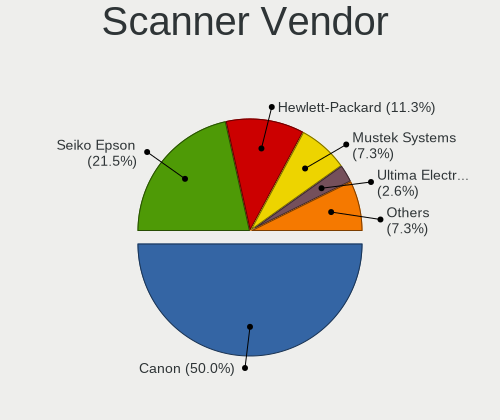

Linux - Tested Hardware & Statistics (Notebooks)
------------------------------------------------

A project to collect tested hardware configurations for Linux.

Anyone can contribute to this report by the [hw-probe](https://github.com/linuxhw/hw-probe) tool:

    sudo -E hw-probe -all -upload

Please contribute! Especially if your hardware is rare.

This report is for real hardware. Report for virtual hardware: [TestDays_VE](https://github.com/linuxhw/TestDays_VE)

Contents
--------

* [ Test Cases ](#test-cases)

* [ System ](#system)
  - [ OS                       ](#os)
  - [ OS Family                ](#os-family)
  - [ Kernel                   ](#kernel)
  - [ Kernel Family            ](#kernel-family)
  - [ Kernel Major Ver.        ](#kernel-major-ver)
  - [ Arch                     ](#arch)
  - [ DE                       ](#de)
  - [ Display Server           ](#display-server)
  - [ Display Manager          ](#display-manager)
  - [ OS Lang                  ](#os-lang)
  - [ Boot Mode                ](#boot-mode)
  - [ Filesystem               ](#filesystem)
  - [ Part. scheme             ](#part-scheme)
  - [ Dual Boot with Linux/BSD ](#dual-boot-with-linuxbsd)
  - [ Dual Boot (Win)          ](#dual-boot-win)

* [ Board ](#board)
  - [ Vendor                   ](#vendor)
  - [ Model                    ](#model)
  - [ Model Family             ](#model-family)
  - [ MFG Year                 ](#mfg-year)
  - [ Form Factor              ](#form-factor)
  - [ Secure Boot              ](#secure-boot)
  - [ Coreboot                 ](#coreboot)
  - [ RAM Size                 ](#ram-size)
  - [ RAM Used                 ](#ram-used)
  - [ Total Drives             ](#total-drives)
  - [ Has CD-ROM               ](#has-cd-rom)
  - [ Has Ethernet             ](#has-ethernet)
  - [ Has WiFi                 ](#has-wifi)
  - [ Has Bluetooth            ](#has-bluetooth)

* [ Location ](#location)
  - [ Country                  ](#country)
  - [ City                     ](#city)

* [ Drives ](#drives)
  - [ Drive Vendor             ](#drive-vendor)
  - [ Drive Model              ](#drive-model)
  - [ HDD Vendor               ](#hdd-vendor)
  - [ SSD Vendor               ](#ssd-vendor)
  - [ Drive Kind               ](#drive-kind)
  - [ Drive Connector          ](#drive-connector)
  - [ Drive Size               ](#drive-size)
  - [ Space Total              ](#space-total)
  - [ Space Used               ](#space-used)
  - [ Malfunc. Drives          ](#malfunc-drives)
  - [ Malfunc. Drive Vendor    ](#malfunc-drive-vendor)
  - [ Malfunc. HDD Vendor      ](#malfunc-hdd-vendor)
  - [ Malfunc. Drive Kind      ](#malfunc-drive-kind)
  - [ Failed Drives            ](#failed-drives)
  - [ Failed Drive Vendor      ](#failed-drive-vendor)
  - [ Drive Status             ](#drive-status)

* [ Storage controller ](#storage-controller)
  - [ Storage Vendor           ](#storage-vendor)
  - [ Storage Model            ](#storage-model)
  - [ Storage Kind             ](#storage-kind)

* [ Processor ](#processor)
  - [ CPU Vendor               ](#cpu-vendor)
  - [ CPU Model                ](#cpu-model)
  - [ CPU Model Family         ](#cpu-model-family)
  - [ CPU Cores                ](#cpu-cores)
  - [ CPU Sockets              ](#cpu-sockets)
  - [ CPU Threads              ](#cpu-threads)
  - [ CPU Op-Modes             ](#cpu-op-modes)
  - [ CPU Microcode            ](#cpu-microcode)
  - [ CPU Microarch            ](#cpu-microarch)

* [ Graphics ](#graphics)
  - [ GPU Vendor               ](#gpu-vendor)
  - [ GPU Model                ](#gpu-model)
  - [ GPU Combo                ](#gpu-combo)
  - [ GPU Driver               ](#gpu-driver)
  - [ GPU Memory               ](#gpu-memory)

* [ Monitor ](#monitor)
  - [ Monitor Vendor           ](#monitor-vendor)
  - [ Monitor Model            ](#monitor-model)
  - [ Monitor Resolution       ](#monitor-resolution)
  - [ Monitor Diagonal         ](#monitor-diagonal)
  - [ Monitor Width            ](#monitor-width)
  - [ Aspect Ratio             ](#aspect-ratio)
  - [ Monitor Area             ](#monitor-area)
  - [ Pixel Density            ](#pixel-density)
  - [ Multiple Monitors        ](#multiple-monitors)

* [ Network ](#network)
  - [ Net Controller Vendor    ](#net-controller-vendor)
  - [ Net Controller Model     ](#net-controller-model)
  - [ Wireless Vendor          ](#wireless-vendor)
  - [ Wireless Model           ](#wireless-model)
  - [ Ethernet Vendor          ](#ethernet-vendor)
  - [ Ethernet Model           ](#ethernet-model)
  - [ Net Controller Kind      ](#net-controller-kind)
  - [ Used Controller          ](#used-controller)
  - [ NICs                     ](#nics)
  - [ IPv6                     ](#ipv6)

* [ Bluetooth ](#bluetooth)
  - [ Bluetooth Vendor         ](#bluetooth-vendor)
  - [ Bluetooth Model          ](#bluetooth-model)

* [ Sound ](#sound)
  - [ Sound Vendor             ](#sound-vendor)
  - [ Sound Model              ](#sound-model)

* [ Memory ](#memory)
  - [ Memory Vendor            ](#memory-vendor)
  - [ Memory Model             ](#memory-model)
  - [ Memory Kind              ](#memory-kind)
  - [ Memory Form Factor       ](#memory-form-factor)
  - [ Memory Size              ](#memory-size)
  - [ Memory Speed             ](#memory-speed)

* [ Printers & scanners ](#printers--scanners)
  - [ Printer Vendor           ](#printer-vendor)
  - [ Printer Model            ](#printer-model)
  - [ Scanner Vendor           ](#scanner-vendor)
  - [ Scanner Model            ](#scanner-model)

* [ Camera ](#camera)
  - [ Camera Vendor            ](#camera-vendor)
  - [ Camera Model             ](#camera-model)

* [ Security ](#security)
  - [ Fingerprint Vendor       ](#fingerprint-vendor)
  - [ Fingerprint Model        ](#fingerprint-model)
  - [ Chipcard Vendor          ](#chipcard-vendor)
  - [ Chipcard Model           ](#chipcard-model)

* [ Unsupported ](#unsupported)
  - [ Unsupported Devices      ](#unsupported-devices)
  - [ Unsupported Device Types ](#unsupported-device-types)

Test Cases
----------

Total: 205939

| Vendor        | Model                       | Probe                                                      | Date         |
|---------------|-----------------------------|------------------------------------------------------------|--------------|
| ASUSTek       | X75VBP                      | [45dd9e0bea](https://linux-hardware.org/?probe=45dd9e0bea) | May 09, 2024 |
| HP            | Laptop 15-bw0xx             | [be612ae4a6](https://linux-hardware.org/?probe=be612ae4a6) | May 09, 2024 |
| ASUSTek       | ASUS EXPERTBOOK L2502CYA... | [03df260579](https://linux-hardware.org/?probe=03df260579) | May 09, 2024 |
| Dell          | Vostro 15-3568              | [afd5a26a47](https://linux-hardware.org/?probe=afd5a26a47) | May 09, 2024 |
| Samsung       | 350V5C/351V5C/3540VC/344... | [c7b3c10131](https://linux-hardware.org/?probe=c7b3c10131) | May 09, 2024 |
| HP            | Pavilion dv6500             | [a9906a0a37](https://linux-hardware.org/?probe=a9906a0a37) | May 09, 2024 |
| Lenovo        | ThinkPad L470 20J5S2RA00    | [9ce0d2cad0](https://linux-hardware.org/?probe=9ce0d2cad0) | May 09, 2024 |
| Dell          | Inspiron 3481               | [78cf24846f](https://linux-hardware.org/?probe=78cf24846f) | May 09, 2024 |
| Unknown       | Unknown                     | [3c4e207a92](https://linux-hardware.org/?probe=3c4e207a92) | May 09, 2024 |
| SDZ           | X133                        | [442d4da2a4](https://linux-hardware.org/?probe=442d4da2a4) | May 09, 2024 |
| HP            | EliteBook 840 G1            | [369a002b88](https://linux-hardware.org/?probe=369a002b88) | May 09, 2024 |
| ASUSTek       | K52F                        | [f67d81858e](https://linux-hardware.org/?probe=f67d81858e) | May 09, 2024 |
| LG Electro... | A410-G.BC44P1               | [e687d57757](https://linux-hardware.org/?probe=e687d57757) | May 09, 2024 |
| Lenovo        | ThinkPad E14 Gen 2 20TBS... | [4720614db4](https://linux-hardware.org/?probe=4720614db4) | May 09, 2024 |
| ASUSTek       | VivoBook_ASUSLaptop M150... | [b81a572516](https://linux-hardware.org/?probe=b81a572516) | May 09, 2024 |
| HP            | Pavilion Plus Laptop 14-... | [161509c62b](https://linux-hardware.org/?probe=161509c62b) | May 09, 2024 |
| HP            | ProBook 650 G3              | [9bfb6a8afd](https://linux-hardware.org/?probe=9bfb6a8afd) | May 09, 2024 |
| Lenovo        | IdeaPad 3 15ALC6 82MF       | [413b207df0](https://linux-hardware.org/?probe=413b207df0) | May 09, 2024 |
| ASUSTek       | X551MA                      | [6ce58b40cb](https://linux-hardware.org/?probe=6ce58b40cb) | May 09, 2024 |
| HP            | Dev One Notebook PC         | [095bc08ae2](https://linux-hardware.org/?probe=095bc08ae2) | May 09, 2024 |
| Notebook      | NJx0MU                      | [ee086eec1f](https://linux-hardware.org/?probe=ee086eec1f) | May 09, 2024 |
| Valve         | Jupiter                     | [99879342f6](https://linux-hardware.org/?probe=99879342f6) | May 09, 2024 |
| Apple         | MacBookAir6,2               | [dc5b4c6be8](https://linux-hardware.org/?probe=dc5b4c6be8) | May 09, 2024 |
| ASUSTek       | ASUS TUF Gaming F15 FX50... | [291cd1c75f](https://linux-hardware.org/?probe=291cd1c75f) | May 09, 2024 |
| Unknown       | Unknown                     | [64e1e4cc73](https://linux-hardware.org/?probe=64e1e4cc73) | May 09, 2024 |
| HONOR         | BBR-WAX9                    | [be1a16a925](https://linux-hardware.org/?probe=be1a16a925) | May 09, 2024 |
| HONOR         | BBR-WAX9                    | [8c9db99956](https://linux-hardware.org/?probe=8c9db99956) | May 09, 2024 |
| Fujitsu       | LIFEBOOK E754               | [1240b3da0c](https://linux-hardware.org/?probe=1240b3da0c) | May 09, 2024 |
| Valve         | Jupiter                     | [18c9c24ecb](https://linux-hardware.org/?probe=18c9c24ecb) | May 09, 2024 |
| Apple         | MacBookPro9,1               | [6d6aee3150](https://linux-hardware.org/?probe=6d6aee3150) | May 09, 2024 |
| Apple         | MacBookPro9,1               | [2c63121414](https://linux-hardware.org/?probe=2c63121414) | May 09, 2024 |
| Getac         | V110G3                      | [f2bd63cfb8](https://linux-hardware.org/?probe=f2bd63cfb8) | May 09, 2024 |
| Sony          | VPCYB45JB                   | [6f70d22391](https://linux-hardware.org/?probe=6f70d22391) | May 09, 2024 |
| Toshiba       | Satellite C650D             | [9e66892f4b](https://linux-hardware.org/?probe=9e66892f4b) | May 09, 2024 |
| Lenovo        | ThinkBook 13x G4 IMH 21K... | [7cfc568eb2](https://linux-hardware.org/?probe=7cfc568eb2) | May 09, 2024 |
| Panasonic     | FZ55-1                      | [5709bdb252](https://linux-hardware.org/?probe=5709bdb252) | May 09, 2024 |
| Dell          | Inspiron 13-7359            | [ed773eb204](https://linux-hardware.org/?probe=ed773eb204) | May 09, 2024 |
| Dell          | Vostro 1220                 | [a4ee382052](https://linux-hardware.org/?probe=a4ee382052) | May 09, 2024 |
| Dell          | XPS 15 9520                 | [ef8de4b0d9](https://linux-hardware.org/?probe=ef8de4b0d9) | May 09, 2024 |
| Samsung       | 960XGK                      | [4c22b1ca3a](https://linux-hardware.org/?probe=4c22b1ca3a) | May 09, 2024 |
| Dell          | Latitude 5290 2-in-1        | [56d2614671](https://linux-hardware.org/?probe=56d2614671) | May 09, 2024 |
| Acer          | Aspire V5-121               | [ee7af6bc3d](https://linux-hardware.org/?probe=ee7af6bc3d) | May 09, 2024 |
| Gigabyte      | G5 GE                       | [938a8a3f8e](https://linux-hardware.org/?probe=938a8a3f8e) | May 09, 2024 |
| Dell          | Inspiron 15-3567            | [4f2761bde5](https://linux-hardware.org/?probe=4f2761bde5) | May 09, 2024 |
| Lenovo        | IdeaPad S340-14API 81NB     | [6bb0aa91af](https://linux-hardware.org/?probe=6bb0aa91af) | May 09, 2024 |
| Ultra         | UB42X                       | [b7f2dbd777](https://linux-hardware.org/?probe=b7f2dbd777) | May 09, 2024 |
| Lenovo        | ThinkPad T440s 20AQ0069G... | [86d66670cb](https://linux-hardware.org/?probe=86d66670cb) | May 09, 2024 |
| Lenovo        | Legion Y540-15IRH 81SX      | [03e53efb87](https://linux-hardware.org/?probe=03e53efb87) | May 08, 2024 |
| ASUSTek       | ASUS TUF Gaming F15 FX50... | [821372cdbd](https://linux-hardware.org/?probe=821372cdbd) | May 08, 2024 |
| ASUSTek       | VivoBook_ASUSLaptop K370... | [57bc46051b](https://linux-hardware.org/?probe=57bc46051b) | May 08, 2024 |
| Lenovo        | Z50-75 80EC                 | [1a1e8edc3b](https://linux-hardware.org/?probe=1a1e8edc3b) | May 08, 2024 |
| Ultra         | UB42X                       | [4597d0586d](https://linux-hardware.org/?probe=4597d0586d) | May 08, 2024 |
| Dell          | Vostro 1220                 | [7f6372d340](https://linux-hardware.org/?probe=7f6372d340) | May 08, 2024 |
| MSI           | GE66 Raider 10UG            | [d19e5447f5](https://linux-hardware.org/?probe=d19e5447f5) | May 08, 2024 |
| Packard Be... | EasyNote LM98               | [4826f72192](https://linux-hardware.org/?probe=4826f72192) | May 08, 2024 |
| Toshiba       | PORTEGE Z30-C               | [38ddab3b19](https://linux-hardware.org/?probe=38ddab3b19) | May 08, 2024 |
| Lenovo        | ThinkBook 16 G6 IRL 21KH    | [58b9bbc4d6](https://linux-hardware.org/?probe=58b9bbc4d6) | May 08, 2024 |
| Lenovo        | ThinkBook 15 G4 IAP 21DJ    | [259fba9825](https://linux-hardware.org/?probe=259fba9825) | May 08, 2024 |
| Valve         | Jupiter                     | [fadecff7cd](https://linux-hardware.org/?probe=fadecff7cd) | May 08, 2024 |
| Lenovo        | G50-45 80E3                 | [801eeb31ef](https://linux-hardware.org/?probe=801eeb31ef) | May 08, 2024 |
| Apple         | MacBookPro8,2               | [2410273443](https://linux-hardware.org/?probe=2410273443) | May 08, 2024 |
| Lenovo        | ThinkPad T410 2537MN9       | [7deebe7ca3](https://linux-hardware.org/?probe=7deebe7ca3) | May 08, 2024 |
| Lenovo        | ThinkPad X230 2333A91       | [3ad48e3ebe](https://linux-hardware.org/?probe=3ad48e3ebe) | May 08, 2024 |
| Avell High... | A70 MOB                     | [2be654083e](https://linux-hardware.org/?probe=2be654083e) | May 08, 2024 |
| Sony          | SVP1321C5E                  | [373fd0a046](https://linux-hardware.org/?probe=373fd0a046) | May 08, 2024 |
| Dell          | Latitude 5530               | [f91e424e6d](https://linux-hardware.org/?probe=f91e424e6d) | May 08, 2024 |
| Lenovo        | ThinkPad E14 Gen 3 20YFC... | [6a43088440](https://linux-hardware.org/?probe=6a43088440) | May 08, 2024 |
| Apple         | MacBookPro11,1              | [5d23c7ed6f](https://linux-hardware.org/?probe=5d23c7ed6f) | May 08, 2024 |
| HP            | EliteBook 840 G6            | [1baa287464](https://linux-hardware.org/?probe=1baa287464) | May 08, 2024 |
| VALE          | Notebook Evolution i5-11... | [55764ee04d](https://linux-hardware.org/?probe=55764ee04d) | May 08, 2024 |
| ASUSTek       | VivoBook 15_ASUS Laptop ... | [11d69e96cb](https://linux-hardware.org/?probe=11d69e96cb) | May 08, 2024 |
| ASUSTek       | K54HR                       | [67ddde3a75](https://linux-hardware.org/?probe=67ddde3a75) | May 08, 2024 |
| HP            | ProBook 4740s               | [7f39194517](https://linux-hardware.org/?probe=7f39194517) | May 08, 2024 |
| Lenovo        | ThinkPad T470 20HES18C00    | [a2d8841244](https://linux-hardware.org/?probe=a2d8841244) | May 08, 2024 |
| Dell          | Latitude E5520              | [1dc92b60a8](https://linux-hardware.org/?probe=1dc92b60a8) | May 08, 2024 |
| ECT           | ONE GAMING Notebook K56-... | [64028f3e06](https://linux-hardware.org/?probe=64028f3e06) | May 08, 2024 |
| HP            | Laptop 15s-fq2xxx           | [31a04e0322](https://linux-hardware.org/?probe=31a04e0322) | May 08, 2024 |
| Sony          | VPCEB1S1E                   | [551a1d2f64](https://linux-hardware.org/?probe=551a1d2f64) | May 08, 2024 |
| ASUSTek       | ASUS TUF Gaming F15 FX50... | [20ab787216](https://linux-hardware.org/?probe=20ab787216) | May 08, 2024 |
| Dell          | XPS 15 7590                 | [a4b733d1fe](https://linux-hardware.org/?probe=a4b733d1fe) | May 08, 2024 |
| Dell          | Inspiron N5040              | [5fae884a07](https://linux-hardware.org/?probe=5fae884a07) | May 08, 2024 |
| Lenovo        | ThinkPad X240 20AMA0W706    | [ed0902f81c](https://linux-hardware.org/?probe=ed0902f81c) | May 08, 2024 |
| ASUSTek       | GL753VE                     | [17bf72a741](https://linux-hardware.org/?probe=17bf72a741) | May 08, 2024 |
| Acer          | Aspire A315-21              | [a838a7101f](https://linux-hardware.org/?probe=a838a7101f) | May 08, 2024 |
| HP            | EliteBook 735 G5            | [628e01fd2b](https://linux-hardware.org/?probe=628e01fd2b) | May 08, 2024 |
| Intel         | STCK1A32WFC H67490-302      | [51c75f3848](https://linux-hardware.org/?probe=51c75f3848) | May 08, 2024 |
| HP            | ProBook 6460b               | [14aa46f09d](https://linux-hardware.org/?probe=14aa46f09d) | May 08, 2024 |
| Infinix       | INBOOK Y1 PLUS NEO          | [253042bbd9](https://linux-hardware.org/?probe=253042bbd9) | May 08, 2024 |
| Acer          | Aspire 5720                 | [0a218dfdfe](https://linux-hardware.org/?probe=0a218dfdfe) | May 08, 2024 |
| Lenovo        | IdeaPad S12 20021,2959      | [34cb8ea20b](https://linux-hardware.org/?probe=34cb8ea20b) | May 08, 2024 |
| ASUSTek       | N61Vn                       | [07f83fc6c0](https://linux-hardware.org/?probe=07f83fc6c0) | May 08, 2024 |
| ASUSTek       | VivoBook_ASUSLaptop K360... | [91ed38bf6d](https://linux-hardware.org/?probe=91ed38bf6d) | May 08, 2024 |
| Micro Elec... | MG-VCP15I-3070              | [11e90f3f8f](https://linux-hardware.org/?probe=11e90f3f8f) | May 08, 2024 |
| ASUSTek       | ASUS TUF Gaming F15 FX50... | [7c01de63e1](https://linux-hardware.org/?probe=7c01de63e1) | May 08, 2024 |
| HP            | ZBook Firefly 14 inch G8... | [ed064c4025](https://linux-hardware.org/?probe=ed064c4025) | May 08, 2024 |
| HP            | Laptop 15s-eq2xxx           | [2786d2f8f8](https://linux-hardware.org/?probe=2786d2f8f8) | May 08, 2024 |
| Dell          | XPS 15 9500                 | [b981a13960](https://linux-hardware.org/?probe=b981a13960) | May 08, 2024 |
| ASUSTek       | X550LD                      | [1c55e1acf7](https://linux-hardware.org/?probe=1c55e1acf7) | May 08, 2024 |
| Samsung       | SR700                       | [97ed5b7fc7](https://linux-hardware.org/?probe=97ed5b7fc7) | May 08, 2024 |
| ASUSTek       | X705UVP                     | [b850816596](https://linux-hardware.org/?probe=b850816596) | May 08, 2024 |
| Dell          | Latitude E6540              | [c6c6acf7d2](https://linux-hardware.org/?probe=c6c6acf7d2) | May 08, 2024 |
| Sony          | VGN-NS12M_W                 | [e364d75564](https://linux-hardware.org/?probe=e364d75564) | May 08, 2024 |
| HP            | ZBook Power 15.6 inch G8... | [291c23ee80](https://linux-hardware.org/?probe=291c23ee80) | May 08, 2024 |
| Panasonic     | CF-53SAWZYMN                | [15a322275f](https://linux-hardware.org/?probe=15a322275f) | May 08, 2024 |
| Lenovo        | V15 G4 AMN 82YU             | [3742af3546](https://linux-hardware.org/?probe=3742af3546) | May 08, 2024 |
| Sony          | VGN-Z51MG_B                 | [6e5ed9d5f6](https://linux-hardware.org/?probe=6e5ed9d5f6) | May 08, 2024 |
| Acer          | Aspire AL14-31P             | [fc4db570af](https://linux-hardware.org/?probe=fc4db570af) | May 08, 2024 |
| ASUSTek       | ASUS TUF Gaming A15 FA50... | [ae1ef1680a](https://linux-hardware.org/?probe=ae1ef1680a) | May 08, 2024 |
| Acer          | Swift SF314-71              | [23d1f2e74a](https://linux-hardware.org/?probe=23d1f2e74a) | May 08, 2024 |
| Acer          | P7YE0                       | [21da78891a](https://linux-hardware.org/?probe=21da78891a) | May 08, 2024 |
| Linx          | LINX1010B                   | [782fb4ec65](https://linux-hardware.org/?probe=782fb4ec65) | May 08, 2024 |
| ASUSTek       | ASUS TUF Gaming F15 FX50... | [10c139f22b](https://linux-hardware.org/?probe=10c139f22b) | May 08, 2024 |
| Lenovo        | ThinkPad P14s Gen 4 21K5... | [e00e076344](https://linux-hardware.org/?probe=e00e076344) | May 08, 2024 |
| Sony          | VGN-CR31S_W                 | [7e7d96c020](https://linux-hardware.org/?probe=7e7d96c020) | May 08, 2024 |
| Dell          | Latitude E6540              | [a57f8ef498](https://linux-hardware.org/?probe=a57f8ef498) | May 08, 2024 |
| ASUSTek       | Zenbook S 13 UX5304VA_UX... | [d77842b741](https://linux-hardware.org/?probe=d77842b741) | May 08, 2024 |
| Dell          | Latitude E5520              | [1c27a2760d](https://linux-hardware.org/?probe=1c27a2760d) | May 08, 2024 |
| EVOC          | P7xxTM1                     | [7c15b2991c](https://linux-hardware.org/?probe=7c15b2991c) | May 08, 2024 |
| Lenovo        | ThinkPad T440s 20AQ0069G... | [b84ba3c6c7](https://linux-hardware.org/?probe=b84ba3c6c7) | May 08, 2024 |
| ASUSTek       | ASUS TUF Dash F15 FX517Z... | [ac49e3fa07](https://linux-hardware.org/?probe=ac49e3fa07) | May 08, 2024 |
| HP            | ProBook 440 14 inch G9 N... | [6ac93f82e9](https://linux-hardware.org/?probe=6ac93f82e9) | May 08, 2024 |
| Sony          | VPCF13E1R                   | [593de85e33](https://linux-hardware.org/?probe=593de85e33) | May 08, 2024 |
| Acer          | Nitro AN515-58              | [64289cb32c](https://linux-hardware.org/?probe=64289cb32c) | May 08, 2024 |
| Dell          | Inspiron 3542               | [fcc3b9cc19](https://linux-hardware.org/?probe=fcc3b9cc19) | May 08, 2024 |
| Lenovo        | IdeaPad S510p 20298         | [e4c7ca80f3](https://linux-hardware.org/?probe=e4c7ca80f3) | May 08, 2024 |
| HP            | EliteBook 840 G8            | [6d255e156e](https://linux-hardware.org/?probe=6d255e156e) | May 08, 2024 |
| Hetrix        | Unknown                     | [72a5c6fffe](https://linux-hardware.org/?probe=72a5c6fffe) | May 08, 2024 |
| HP            | ZBook 15 G3                 | [8fbd2e21a7](https://linux-hardware.org/?probe=8fbd2e21a7) | May 08, 2024 |
| Lenovo        | ThinkPad E14 Gen 2 20T6S... | [eb9d3c539c](https://linux-hardware.org/?probe=eb9d3c539c) | May 08, 2024 |
| Lenovo        | V15 G4 AMN 82YU             | [29552fbf93](https://linux-hardware.org/?probe=29552fbf93) | May 08, 2024 |
| Alienware     | M17x                        | [349d219a3a](https://linux-hardware.org/?probe=349d219a3a) | May 08, 2024 |
| ASUSTek       | VivoBook_ASUSLaptop M160... | [b18d2c1ec2](https://linux-hardware.org/?probe=b18d2c1ec2) | May 08, 2024 |
| Dell          | Precision 5560              | [9ad14a0547](https://linux-hardware.org/?probe=9ad14a0547) | May 08, 2024 |
| Toshiba       | Satellite E55-A             | [b77667e33a](https://linux-hardware.org/?probe=b77667e33a) | May 08, 2024 |
| Dell          | Inspiron 5420               | [24c2d41566](https://linux-hardware.org/?probe=24c2d41566) | May 08, 2024 |
| Lenovo        | G580 20150                  | [3a9861e2be](https://linux-hardware.org/?probe=3a9861e2be) | May 08, 2024 |
| Valve         | Jupiter                     | [c0eded1dbf](https://linux-hardware.org/?probe=c0eded1dbf) | May 08, 2024 |
| MSI           | GT60 2OC/2OD                | [aa9d5951b9](https://linux-hardware.org/?probe=aa9d5951b9) | May 08, 2024 |
| HP            | ZBook Power 15.6 inch G8... | [e49b5301ae](https://linux-hardware.org/?probe=e49b5301ae) | May 08, 2024 |
| HP            | ZBook Power 15.6 inch G8... | [8acc6c69a3](https://linux-hardware.org/?probe=8acc6c69a3) | May 08, 2024 |
| Apple         | MacBookPro11,2              | [0ff911f7ac](https://linux-hardware.org/?probe=0ff911f7ac) | May 08, 2024 |
| Samsung       | 270E5G/270E5U               | [11c56432a4](https://linux-hardware.org/?probe=11c56432a4) | May 08, 2024 |
| ASUSTek       | VivoBook_ASUSLaptop K650... | [dd5fb659cb](https://linux-hardware.org/?probe=dd5fb659cb) | May 08, 2024 |
| Apple         | MacBookPro5,5               | [8d2df2d585](https://linux-hardware.org/?probe=8d2df2d585) | May 08, 2024 |
| Lenovo        | ThinkPad Edge 031946U       | [8f8fb39c6e](https://linux-hardware.org/?probe=8f8fb39c6e) | May 08, 2024 |
| ASUSTek       | ROG Strix G513QY_G513QY     | [964b717d95](https://linux-hardware.org/?probe=964b717d95) | May 08, 2024 |
| HP            | EliteBook 8560p             | [fa48702e03](https://linux-hardware.org/?probe=fa48702e03) | May 08, 2024 |
| MSI           | GF63 Thin 10SC              | [d419afc35f](https://linux-hardware.org/?probe=d419afc35f) | May 08, 2024 |
| HP            | Laptop 15-bs0xx             | [f0bc418296](https://linux-hardware.org/?probe=f0bc418296) | May 08, 2024 |
| HP            | Laptop 15s-fq2xxx           | [ade9d916fe](https://linux-hardware.org/?probe=ade9d916fe) | May 08, 2024 |
| Lenovo        | ThinkPad T15 Gen 2i 20W5... | [c4d3aa24cf](https://linux-hardware.org/?probe=c4d3aa24cf) | May 08, 2024 |
| Acer          | Swift SFX16-61G             | [9cbd40bfc7](https://linux-hardware.org/?probe=9cbd40bfc7) | May 08, 2024 |
| Fujitsu       | FMVNR1PE                    | [95504ca73e](https://linux-hardware.org/?probe=95504ca73e) | May 08, 2024 |
| Valve         | Jupiter                     | [cdb467c650](https://linux-hardware.org/?probe=cdb467c650) | May 08, 2024 |
| HP            | EliteBook 840 G2            | [76e6f087bb](https://linux-hardware.org/?probe=76e6f087bb) | May 08, 2024 |
| NEC Comput... | PC-LS350SSB                 | [530b3713dd](https://linux-hardware.org/?probe=530b3713dd) | May 08, 2024 |
| Razer         | Blade 14 (2022) - RZ09-0... | [eab2642002](https://linux-hardware.org/?probe=eab2642002) | May 08, 2024 |
| ASUSTek       | X540SA                      | [456909c790](https://linux-hardware.org/?probe=456909c790) | May 08, 2024 |
| Acer          | Predator PH16-71            | [516e53ae7f](https://linux-hardware.org/?probe=516e53ae7f) | May 08, 2024 |
| Digma         | Pro Magnus M DN16R9-ADXW... | [beee17622d](https://linux-hardware.org/?probe=beee17622d) | May 08, 2024 |
| Matsushita... | CF-74GCDADBM                | [f353aa5d7c](https://linux-hardware.org/?probe=f353aa5d7c) | May 08, 2024 |
| ASUSTek       | VivoBook 14_ASUS Laptop ... | [73ee3d2b74](https://linux-hardware.org/?probe=73ee3d2b74) | May 08, 2024 |
| HP            | Pavilion Gaming Laptop 1... | [3292b37df6](https://linux-hardware.org/?probe=3292b37df6) | May 08, 2024 |
| Sony          | SVE1412BCXB                 | [593942e0e3](https://linux-hardware.org/?probe=593942e0e3) | May 08, 2024 |
| Dell          | XPS 15 9530                 | [5aee2550ce](https://linux-hardware.org/?probe=5aee2550ce) | May 08, 2024 |
| Schenker      | VISION 16 Pro (L22)         | [c54f918726](https://linux-hardware.org/?probe=c54f918726) | May 08, 2024 |
| ASUSTek       | UX430UQ                     | [7b9134699a](https://linux-hardware.org/?probe=7b9134699a) | May 08, 2024 |
| ASUSTek       | ASUS TUF Gaming F17 FX70... | [eb38e0f3a5](https://linux-hardware.org/?probe=eb38e0f3a5) | May 08, 2024 |
| HUAWEI        | KLVL-WXX9                   | [6021a53b71](https://linux-hardware.org/?probe=6021a53b71) | May 08, 2024 |
| Dell          | Vostro 1015                 | [b5f6b13138](https://linux-hardware.org/?probe=b5f6b13138) | May 07, 2024 |
| ASUSTek       | Q550LF                      | [15c9500499](https://linux-hardware.org/?probe=15c9500499) | May 07, 2024 |
| Lenovo        | ThinkPad X250 20CLS1JN00    | [b1a0c45242](https://linux-hardware.org/?probe=b1a0c45242) | May 07, 2024 |
| Dell          | Precision 7540              | [4703617413](https://linux-hardware.org/?probe=4703617413) | May 07, 2024 |
| ASUSTek       | Q550LF                      | [98ddf90ae6](https://linux-hardware.org/?probe=98ddf90ae6) | May 07, 2024 |
| Lenovo        | ThinkPad T490 20N2003PUS    | [7f484baa22](https://linux-hardware.org/?probe=7f484baa22) | May 07, 2024 |
| Lenovo        | B50-30 80ES                 | [c19f3dfc3a](https://linux-hardware.org/?probe=c19f3dfc3a) | May 07, 2024 |
| Dell          | Precision 7540              | [37638500df](https://linux-hardware.org/?probe=37638500df) | May 07, 2024 |
| Dell          | Inspiron 7558               | [6d19146c49](https://linux-hardware.org/?probe=6d19146c49) | May 07, 2024 |
| Acer          | Swift SF314-52              | [d112cef6d2](https://linux-hardware.org/?probe=d112cef6d2) | May 07, 2024 |
| Samsung       | 530XBB                      | [5c0772cde4](https://linux-hardware.org/?probe=5c0772cde4) | May 07, 2024 |
| Lenovo        | ThinkPad Edge E530c 3366... | [d4d583a573](https://linux-hardware.org/?probe=d4d583a573) | May 07, 2024 |
| HP            | ProBook 430 G6              | [696c3f2a72](https://linux-hardware.org/?probe=696c3f2a72) | May 07, 2024 |
| Dell          | Latitude D830               | [831a2196a3](https://linux-hardware.org/?probe=831a2196a3) | May 07, 2024 |
| Acer          | Aspire A515-54              | [f7d068c059](https://linux-hardware.org/?probe=f7d068c059) | May 07, 2024 |
| ASUSTek       | ASUS TUF Gaming F17 FX70... | [2f571c8d88](https://linux-hardware.org/?probe=2f571c8d88) | May 07, 2024 |
| Acer          | Aspire A515-54              | [f9375ff03c](https://linux-hardware.org/?probe=f9375ff03c) | May 07, 2024 |
| Fujitsu Si... | LIFEBOOK E8410              | [30a913526e](https://linux-hardware.org/?probe=30a913526e) | May 07, 2024 |
| Lenovo        | ThinkPad X1 Carbon Gen 8... | [3b821d76a7](https://linux-hardware.org/?probe=3b821d76a7) | May 07, 2024 |
| Lenovo        | ThinkPad L15 Gen 3 21C70... | [701d936a1c](https://linux-hardware.org/?probe=701d936a1c) | May 07, 2024 |
| Valve         | Galileo                     | [9b9caa6850](https://linux-hardware.org/?probe=9b9caa6850) | May 07, 2024 |
| Dell          | Latitude 5501               | [35d264df4c](https://linux-hardware.org/?probe=35d264df4c) | May 07, 2024 |
| ASUSTek       | X550LN                      | [b139a58ea9](https://linux-hardware.org/?probe=b139a58ea9) | May 07, 2024 |
| HP            | TouchSmart tm2              | [b180e1388d](https://linux-hardware.org/?probe=b180e1388d) | May 07, 2024 |
| Lenovo        | ThinkPad Edge E330 3354D... | [4f7e381c6f](https://linux-hardware.org/?probe=4f7e381c6f) | May 07, 2024 |
| Lenovo        | ThinkPad L15 Gen 3 21C70... | [6d05bc6b3d](https://linux-hardware.org/?probe=6d05bc6b3d) | May 07, 2024 |
| HP            | Pavilion Sleekbook 15       | [9cd7bfcd0f](https://linux-hardware.org/?probe=9cd7bfcd0f) | May 07, 2024 |
| Dell          | XPS 15 9530                 | [cdcf7e98eb](https://linux-hardware.org/?probe=cdcf7e98eb) | May 07, 2024 |
| HP            | Laptop 15s-eq2xxx           | [32e408088d](https://linux-hardware.org/?probe=32e408088d) | May 07, 2024 |
| ASUSTek       | X555LD                      | [989d24a4b7](https://linux-hardware.org/?probe=989d24a4b7) | May 07, 2024 |
| Dell          | Vostro 15 3510              | [9236e5d92d](https://linux-hardware.org/?probe=9236e5d92d) | May 07, 2024 |
| HP            | Laptop 15-dw1xxx            | [7d4c93ea72](https://linux-hardware.org/?probe=7d4c93ea72) | May 07, 2024 |
| Acer          | Aspire A515-57              | [c7471afead](https://linux-hardware.org/?probe=c7471afead) | May 07, 2024 |
| HP            | Laptop 15-bs1xx             | [f3c9212dca](https://linux-hardware.org/?probe=f3c9212dca) | May 07, 2024 |
| Fujitsu       | LIFEBOOK U7510              | [a52ed98e85](https://linux-hardware.org/?probe=a52ed98e85) | May 07, 2024 |
| Lenovo        | G710 20252                  | [a7579b63a0](https://linux-hardware.org/?probe=a7579b63a0) | May 07, 2024 |
| Lenovo        | IdeaPad 1 14IGL7 82V6       | [8c2b9bb30a](https://linux-hardware.org/?probe=8c2b9bb30a) | May 07, 2024 |
| AWOW          | AK41                        | [21d739c59c](https://linux-hardware.org/?probe=21d739c59c) | May 07, 2024 |
| HP            | ProBook 450 G5              | [4536e47198](https://linux-hardware.org/?probe=4536e47198) | May 07, 2024 |
| HP            | 250 G3                      | [c34d89360b](https://linux-hardware.org/?probe=c34d89360b) | May 07, 2024 |
| HP            | Pavilion Gaming Laptop 1... | [e27e19897e](https://linux-hardware.org/?probe=e27e19897e) | May 07, 2024 |
| Lenovo        | ThinkPad P14s Gen 4 21HF... | [85239f7dc1](https://linux-hardware.org/?probe=85239f7dc1) | May 07, 2024 |
| Lenovo        | V15-ADA 82C7                | [db9ea4ffaf](https://linux-hardware.org/?probe=db9ea4ffaf) | May 07, 2024 |
| Lenovo        | ThinkPad P14s Gen 1 20Y2... | [064b211de8](https://linux-hardware.org/?probe=064b211de8) | May 07, 2024 |
| Notebook      | NS50_70MU                   | [99983ceae1](https://linux-hardware.org/?probe=99983ceae1) | May 07, 2024 |
| HP            | 250 G3                      | [7ebf68ab6e](https://linux-hardware.org/?probe=7ebf68ab6e) | May 07, 2024 |
| Lenovo        | ThinkPad T420s 417032U      | [e6839a3d70](https://linux-hardware.org/?probe=e6839a3d70) | May 07, 2024 |
| TUXEDO        | InfinityBook Pro Gen7 (M... | [bc9db74da3](https://linux-hardware.org/?probe=bc9db74da3) | May 07, 2024 |
| Lenovo        | Unknown                     | [63995e584e](https://linux-hardware.org/?probe=63995e584e) | May 07, 2024 |
| Notebook      | N150CU                      | [348d0cab2d](https://linux-hardware.org/?probe=348d0cab2d) | May 07, 2024 |
| Acer          | Aspire A315-56              | [37f76a3652](https://linux-hardware.org/?probe=37f76a3652) | May 07, 2024 |
| Toshiba       | TECRA R850                  | [a4fae83513](https://linux-hardware.org/?probe=a4fae83513) | May 07, 2024 |
| MSI           | CX61 0NC/CX61 0ND/CX61 0... | [3206e427b1](https://linux-hardware.org/?probe=3206e427b1) | May 07, 2024 |
| Dell          | Latitude 3190               | [102011a182](https://linux-hardware.org/?probe=102011a182) | May 07, 2024 |
| Lenovo        | IdeaPad S510p 20298         | [b941b8d062](https://linux-hardware.org/?probe=b941b8d062) | May 07, 2024 |
| Dell          | Inspiron 3793               | [02e4c23d86](https://linux-hardware.org/?probe=02e4c23d86) | May 07, 2024 |
| Dell          | Inspiron 3793               | [00234ed0c4](https://linux-hardware.org/?probe=00234ed0c4) | May 07, 2024 |
| Dell          | XPS 15 9520                 | [70022231bd](https://linux-hardware.org/?probe=70022231bd) | May 07, 2024 |
| ASUSTek       | ASUSLaptop_Q530VJ           | [97021794a9](https://linux-hardware.org/?probe=97021794a9) | May 07, 2024 |
| HP            | Victus by Gaming Laptop ... | [24cf77eb91](https://linux-hardware.org/?probe=24cf77eb91) | May 07, 2024 |
| Acer          | Aspire A515-45              | [c9dab30ab0](https://linux-hardware.org/?probe=c9dab30ab0) | May 07, 2024 |
| Dell          | Precision 5560              | [c9f03ecb24](https://linux-hardware.org/?probe=c9f03ecb24) | May 07, 2024 |
| Dell          | Latitude 7480               | [2b3aee3902](https://linux-hardware.org/?probe=2b3aee3902) | May 07, 2024 |
| Daten Tecn... | DT02-M4                     | [88093023ed](https://linux-hardware.org/?probe=88093023ed) | May 07, 2024 |
| HP            | 250 G3                      | [5f00c46a92](https://linux-hardware.org/?probe=5f00c46a92) | May 07, 2024 |
| Razer         | Blade 14 (2022) - RZ09-0... | [94766b9a5d](https://linux-hardware.org/?probe=94766b9a5d) | May 07, 2024 |
| Lenovo        | IdeaPad 310-15ISK 80SM      | [9122522638](https://linux-hardware.org/?probe=9122522638) | May 07, 2024 |
| Lenovo        | IdeaPad 310-15ISK 80SM      | [3064d4fb1f](https://linux-hardware.org/?probe=3064d4fb1f) | May 07, 2024 |
| Samsung       | RC530/RC730                 | [9e8af32b68](https://linux-hardware.org/?probe=9e8af32b68) | May 07, 2024 |
| HP            | ENVY Notebook 13-ab0XX      | [7d6b757088](https://linux-hardware.org/?probe=7d6b757088) | May 07, 2024 |
| ASUSTek       | VivoBook S15 X530UF         | [5725e80488](https://linux-hardware.org/?probe=5725e80488) | May 07, 2024 |
| Lenovo        | ThinkPad E15 Gen 4 21E60... | [230c054c87](https://linux-hardware.org/?probe=230c054c87) | May 07, 2024 |
| HP            | ENVY Notebook 13-ab0XX      | [a9d1c1234c](https://linux-hardware.org/?probe=a9d1c1234c) | May 07, 2024 |
| Fujitsu Si... | LIFEBOOK S6410              | [fb78e4f92a](https://linux-hardware.org/?probe=fb78e4f92a) | May 07, 2024 |
| MSI           | GL62M 7RDX                  | [df43002002](https://linux-hardware.org/?probe=df43002002) | May 07, 2024 |
| MSI           | Thin GF63 12UCX             | [f253ec6e52](https://linux-hardware.org/?probe=f253ec6e52) | May 07, 2024 |
| Fujitsu       | LIFEBOOK AH530              | [b8e70b0693](https://linux-hardware.org/?probe=b8e70b0693) | May 07, 2024 |
| Fujitsu       | LIFEBOOK AH530              | [55fdc987e5](https://linux-hardware.org/?probe=55fdc987e5) | May 07, 2024 |
| HP            | EliteBook 840 G6            | [504b36774f](https://linux-hardware.org/?probe=504b36774f) | May 07, 2024 |
| MSI           | GF63 Thin 8SC               | [59abbac521](https://linux-hardware.org/?probe=59abbac521) | May 07, 2024 |
| Framework     | Laptop 13 (AMD Ryzen 704... | [b3a37af0d0](https://linux-hardware.org/?probe=b3a37af0d0) | May 07, 2024 |
| ASUSTek       | VivoBook_ASUSLaptop X712... | [d7c1c96567](https://linux-hardware.org/?probe=d7c1c96567) | May 07, 2024 |
| SCHNEIDER     | SCL141CTP                   | [ce0a785c29](https://linux-hardware.org/?probe=ce0a785c29) | May 07, 2024 |
| Framework     | Laptop 13 (AMD Ryzen 704... | [63e6a64d1b](https://linux-hardware.org/?probe=63e6a64d1b) | May 07, 2024 |
| Lenovo        | ThinkPad T480 20L5A023HK    | [ff78bb7112](https://linux-hardware.org/?probe=ff78bb7112) | May 07, 2024 |
| HP            | G60                         | [c9e5d3832d](https://linux-hardware.org/?probe=c9e5d3832d) | May 07, 2024 |
| Dell          | Inspiron 5547               | [b8dd9a912d](https://linux-hardware.org/?probe=b8dd9a912d) | May 07, 2024 |
| Dell          | Latitude 9430               | [953be205ca](https://linux-hardware.org/?probe=953be205ca) | May 07, 2024 |
| HP            | Pavilion Laptop 15-eh0xx... | [cf6fc980de](https://linux-hardware.org/?probe=cf6fc980de) | May 07, 2024 |
| HP            | EliteBook 840 G8            | [f60faaeec0](https://linux-hardware.org/?probe=f60faaeec0) | May 07, 2024 |
| Apple         | MacBookAir7,2               | [de2ed6e188](https://linux-hardware.org/?probe=de2ed6e188) | May 07, 2024 |
| Dell          | Precision 7720              | [5423da6e5c](https://linux-hardware.org/?probe=5423da6e5c) | May 07, 2024 |
| ASUSTek       | Zenbook S 13 UX5304VA_UX... | [1c72c07e3d](https://linux-hardware.org/?probe=1c72c07e3d) | May 07, 2024 |
| Lenovo        | ThinkPad T14 Gen 1 20UD0... | [0ef70379ee](https://linux-hardware.org/?probe=0ef70379ee) | May 07, 2024 |
| ASUSTek       | ROG Zephyrus G14 GA403UI... | [61b3a490a8](https://linux-hardware.org/?probe=61b3a490a8) | May 07, 2024 |
| Sony          | SVF1521E2EW                 | [2e86efc1ba](https://linux-hardware.org/?probe=2e86efc1ba) | May 07, 2024 |
| Lenovo        | ThinkPad T430s 2355CL4      | [b90ab4a6e2](https://linux-hardware.org/?probe=b90ab4a6e2) | May 07, 2024 |
| HP            | Laptop 15-bw0xx             | [f605dfd9c2](https://linux-hardware.org/?probe=f605dfd9c2) | May 07, 2024 |
| ASUSTek       | VivoBook_ASUSLaptop X712... | [9849982066](https://linux-hardware.org/?probe=9849982066) | May 07, 2024 |
| Lenovo        | V15 G4 IRU 83A1             | [7cd1070dc0](https://linux-hardware.org/?probe=7cd1070dc0) | May 07, 2024 |
| HP            | EliteBook 8470p             | [1022758f4a](https://linux-hardware.org/?probe=1022758f4a) | May 07, 2024 |
| HP            | EliteBook 8470p             | [36f94dbbd1](https://linux-hardware.org/?probe=36f94dbbd1) | May 07, 2024 |
| Apple         | MacBookPro8,1               | [abbe6a092c](https://linux-hardware.org/?probe=abbe6a092c) | May 07, 2024 |
| Apple         | MacBookPro8,1               | [dcd5e1e281](https://linux-hardware.org/?probe=dcd5e1e281) | May 07, 2024 |
| System76      | Gazelle                     | [fbe88df732](https://linux-hardware.org/?probe=fbe88df732) | May 07, 2024 |
| Unknown       | Unknown                     | [09d2748c7a](https://linux-hardware.org/?probe=09d2748c7a) | May 07, 2024 |
| HP            | ProBook 645 G3              | [29cb5b66f8](https://linux-hardware.org/?probe=29cb5b66f8) | May 07, 2024 |
| ASUSTek       | S451LA                      | [f3720aa6f9](https://linux-hardware.org/?probe=f3720aa6f9) | May 07, 2024 |
| HP            | ProBook 430 G8 Notebook ... | [be061de1c7](https://linux-hardware.org/?probe=be061de1c7) | May 07, 2024 |
| Dell          | Precision 5520              | [3b0c11a9ff](https://linux-hardware.org/?probe=3b0c11a9ff) | May 07, 2024 |
| Lenovo        | V145-15AST 81MT             | [f683d111b9](https://linux-hardware.org/?probe=f683d111b9) | May 07, 2024 |
| HP            | Pavilion Gaming Laptop 1... | [643f150579](https://linux-hardware.org/?probe=643f150579) | May 07, 2024 |
| Dell          | Precision 5520              | [bf1f2486cd](https://linux-hardware.org/?probe=bf1f2486cd) | May 07, 2024 |
| Dell          | XPS 15 9500                 | [e5dc310897](https://linux-hardware.org/?probe=e5dc310897) | May 07, 2024 |
| HUAWEI        | HLYL-WXX9                   | [71d1f5cdfb](https://linux-hardware.org/?probe=71d1f5cdfb) | May 07, 2024 |
| Lenovo        | V145-15AST 81MT             | [1f8035ccf5](https://linux-hardware.org/?probe=1f8035ccf5) | May 07, 2024 |
| Apple         | MacBookPro11,1              | [c18909580d](https://linux-hardware.org/?probe=c18909580d) | May 07, 2024 |
| Apple         | MacBookPro11,1              | [61aed9772b](https://linux-hardware.org/?probe=61aed9772b) | May 07, 2024 |
| Lenovo        | IdeaPad 3 15ITL6 82H8       | [a5b0e5456a](https://linux-hardware.org/?probe=a5b0e5456a) | May 07, 2024 |
| ASUSTek       | VivoBook_ASUSLaptop M760... | [773ca4f9c9](https://linux-hardware.org/?probe=773ca4f9c9) | May 06, 2024 |
| HP            | ZBook 15 G6                 | [4a401c8b15](https://linux-hardware.org/?probe=4a401c8b15) | May 06, 2024 |
| HP            | EliteBook 745 G3            | [7eae46245c](https://linux-hardware.org/?probe=7eae46245c) | May 06, 2024 |
| ASUSTek       | VivoBook_ASUSLaptop M760... | [0104fa9a83](https://linux-hardware.org/?probe=0104fa9a83) | May 06, 2024 |
| Alienware     | m15 R7                      | [445b29da20](https://linux-hardware.org/?probe=445b29da20) | May 06, 2024 |
| Sony          | VPCEB1S1E                   | [db144a8fd9](https://linux-hardware.org/?probe=db144a8fd9) | May 06, 2024 |
| ASUSTek       | X405UQ                      | [aa39bc4676](https://linux-hardware.org/?probe=aa39bc4676) | May 06, 2024 |
| Valve         | Galileo                     | [af20242820](https://linux-hardware.org/?probe=af20242820) | May 06, 2024 |
| Lenovo        | ThinkPad X13 Gen 3 21CM0... | [39fdd434dd](https://linux-hardware.org/?probe=39fdd434dd) | May 06, 2024 |
| ASUSTek       | ROG Zephyrus G14 GA401IH... | [e19fea8a49](https://linux-hardware.org/?probe=e19fea8a49) | May 06, 2024 |
| ASUSTek       | ASUS TUF Gaming A15 FA50... | [84cc2abe63](https://linux-hardware.org/?probe=84cc2abe63) | May 06, 2024 |
| Dell          | Latitude E6540              | [634735e1da](https://linux-hardware.org/?probe=634735e1da) | May 06, 2024 |
| HP            | 2000                        | [71d3942f81](https://linux-hardware.org/?probe=71d3942f81) | May 06, 2024 |
| ASUSTek       | VivoBook_ASUSLaptop M350... | [e6dfd023b6](https://linux-hardware.org/?probe=e6dfd023b6) | May 06, 2024 |
| Lenovo        | XiaoXin-15IIL 2020 81YL     | [b95cda619a](https://linux-hardware.org/?probe=b95cda619a) | May 06, 2024 |
| System76      | Darter Pro                  | [e6da92d97e](https://linux-hardware.org/?probe=e6da92d97e) | May 06, 2024 |
| Acer          | Aspire E1-572               | [3df494e445](https://linux-hardware.org/?probe=3df494e445) | May 06, 2024 |
| ASUSTek       | VivoBook_ASUSLaptop M350... | [6ece3912e8](https://linux-hardware.org/?probe=6ece3912e8) | May 06, 2024 |
| Alurin        | ALU-BAR-I511-000-140        | [04578b9c4b](https://linux-hardware.org/?probe=04578b9c4b) | May 06, 2024 |
| Medion        | E14223                      | [73ae3c5e79](https://linux-hardware.org/?probe=73ae3c5e79) | May 06, 2024 |
| Lenovo        | E31-80 80MX                 | [1c9fd17eff](https://linux-hardware.org/?probe=1c9fd17eff) | May 06, 2024 |
| Lenovo        | ThinkPad Helix 36986CG      | [9b2bd77573](https://linux-hardware.org/?probe=9b2bd77573) | May 06, 2024 |
| Dell          | Latitude E5410              | [0038eadd32](https://linux-hardware.org/?probe=0038eadd32) | May 06, 2024 |
| MSI           | Creator Z16 A12UET          | [edf6b45103](https://linux-hardware.org/?probe=edf6b45103) | May 06, 2024 |
| Lenovo        | Legion Y540-15IRH 81SX      | [44f44fe800](https://linux-hardware.org/?probe=44f44fe800) | May 06, 2024 |
| Unknown       | Unknown                     | [273d6afeb5](https://linux-hardware.org/?probe=273d6afeb5) | May 06, 2024 |
| Lenovo        | IdeaPad Z580                | [2fad877602](https://linux-hardware.org/?probe=2fad877602) | May 06, 2024 |
| Lenovo        | IdeaPad 5 15ARE05 81YQ      | [276faea129](https://linux-hardware.org/?probe=276faea129) | May 06, 2024 |
| Linx          | LINX1010B                   | [5abe12bf84](https://linux-hardware.org/?probe=5abe12bf84) | May 06, 2024 |
| MSI           | Creator Z16 A12UET          | [2aea1cacac](https://linux-hardware.org/?probe=2aea1cacac) | May 06, 2024 |
| Lenovo        | Unknown                     | [dae6c8e749](https://linux-hardware.org/?probe=dae6c8e749) | May 06, 2024 |
| ASUSTek       | Zenbook UX5401ZA_UX5401Z... | [92089af4b7](https://linux-hardware.org/?probe=92089af4b7) | May 06, 2024 |
| MASSCOM VI... | L133                        | [12b6c6b515](https://linux-hardware.org/?probe=12b6c6b515) | May 06, 2024 |
| Dell          | XPS 13 7390                 | [3132f4ff24](https://linux-hardware.org/?probe=3132f4ff24) | May 06, 2024 |
| Dell          | Precision 7710              | [c89fe612a1](https://linux-hardware.org/?probe=c89fe612a1) | May 06, 2024 |
| ASUSTek       | VivoBook_ASUSLaptop K360... | [5a788054ec](https://linux-hardware.org/?probe=5a788054ec) | May 06, 2024 |
| Dell          | Precision 7710              | [52c6c4a64a](https://linux-hardware.org/?probe=52c6c4a64a) | May 06, 2024 |
| Star Labs     | StarBook                    | [7e37692a50](https://linux-hardware.org/?probe=7e37692a50) | May 06, 2024 |
| Framework     | Laptop 16 (AMD Ryzen 704... | [3679c79ac4](https://linux-hardware.org/?probe=3679c79ac4) | May 06, 2024 |
| ASUSTek       | ASUS EXPERTBOOK B1500CEA... | [3236268f3d](https://linux-hardware.org/?probe=3236268f3d) | May 06, 2024 |
| Apple         | MacBookPro8,1               | [2487a975e8](https://linux-hardware.org/?probe=2487a975e8) | May 06, 2024 |
| MSI           | CR61 2M/CX61 2OC/CX61 2O... | [ae77241a92](https://linux-hardware.org/?probe=ae77241a92) | May 06, 2024 |
| Dell          | Latitude 5440               | [f6c9287953](https://linux-hardware.org/?probe=f6c9287953) | May 06, 2024 |
| PC Special... | NH5x_7xDPx                  | [35a25ffdfd](https://linux-hardware.org/?probe=35a25ffdfd) | May 06, 2024 |
| Samsung       | 350V5C/351V5C/3540VC/344... | [5bc2e6635d](https://linux-hardware.org/?probe=5bc2e6635d) | May 06, 2024 |
| Notebook      | NS5x_NS7xPU                 | [657a003a54](https://linux-hardware.org/?probe=657a003a54) | May 06, 2024 |
| Lenovo        | IdeaPad Slim 3 15ABR8 82... | [c082a264d6](https://linux-hardware.org/?probe=c082a264d6) | May 06, 2024 |
| Apple         | MacBookAir7,2               | [c8f7c82599](https://linux-hardware.org/?probe=c8f7c82599) | May 06, 2024 |
| Dell          | Latitude 3420               | [f0412b645c](https://linux-hardware.org/?probe=f0412b645c) | May 06, 2024 |
| Dell          | System XPS L702X            | [fec4b7f7ff](https://linux-hardware.org/?probe=fec4b7f7ff) | May 06, 2024 |
| Acer          | Nitro AN515-43              | [c65a5efcdb](https://linux-hardware.org/?probe=c65a5efcdb) | May 06, 2024 |
| Dell          | Vostro 3520                 | [0b420358ac](https://linux-hardware.org/?probe=0b420358ac) | May 06, 2024 |
| MSI           | Cyborg 15 A12VF             | [1168634a54](https://linux-hardware.org/?probe=1168634a54) | May 06, 2024 |
| Acer          | Aspire 5310                 | [8e28475b52](https://linux-hardware.org/?probe=8e28475b52) | May 06, 2024 |
| Dell          | Precision M4700             | [db0b8eb10b](https://linux-hardware.org/?probe=db0b8eb10b) | May 06, 2024 |
| MSI           | Alpha 17 B5EEK              | [8f78e61ba3](https://linux-hardware.org/?probe=8f78e61ba3) | May 06, 2024 |
| HP            | Pavilion Laptop 15-eh1xx... | [d73bdd4b76](https://linux-hardware.org/?probe=d73bdd4b76) | May 06, 2024 |
| Dell          | Vostro 15 3510              | [cd07d15de0](https://linux-hardware.org/?probe=cd07d15de0) | May 06, 2024 |
| Dell          | Inspiron 7737               | [73f61be8b5](https://linux-hardware.org/?probe=73f61be8b5) | May 06, 2024 |
| ASUSTek       | VivoBook_ASUSLaptop X513... | [d4cca237f2](https://linux-hardware.org/?probe=d4cca237f2) | May 06, 2024 |
| Lenovo        | IdeaPad Pro 5 14AHP9 83D... | [f8f3623eac](https://linux-hardware.org/?probe=f8f3623eac) | May 06, 2024 |
| ASUSTek       | VivoBook_ASUSLaptop X513... | [e5685451f5](https://linux-hardware.org/?probe=e5685451f5) | May 06, 2024 |
| Acer          | Swift SF314-512             | [c1b3018ff5](https://linux-hardware.org/?probe=c1b3018ff5) | May 06, 2024 |
| Packard Be... | EasyNote LM81               | [0ea4d18648](https://linux-hardware.org/?probe=0ea4d18648) | May 06, 2024 |
| Lenovo        | IdeaPad C340-14API 81N6     | [c120bbd998](https://linux-hardware.org/?probe=c120bbd998) | May 06, 2024 |
| Sony          | VPCEB1S1E                   | [aa8d766ae4](https://linux-hardware.org/?probe=aa8d766ae4) | May 06, 2024 |
| HP            | Pavilion 15                 | [77f8425176](https://linux-hardware.org/?probe=77f8425176) | May 06, 2024 |
| Dell          | Inspiron 15 3520            | [c9bddc6d00](https://linux-hardware.org/?probe=c9bddc6d00) | May 06, 2024 |
| ASUSTek       | GL553VW                     | [c51bf874e5](https://linux-hardware.org/?probe=c51bf874e5) | May 06, 2024 |
| Lenovo        | ThinkPad P50 20ENCTO1WW     | [9adbb0ba2c](https://linux-hardware.org/?probe=9adbb0ba2c) | May 06, 2024 |
| MSI           | GT60 2OC/2OD                | [d71303b21c](https://linux-hardware.org/?probe=d71303b21c) | May 06, 2024 |
| HP            | EliteBook 820 G2            | [254af47954](https://linux-hardware.org/?probe=254af47954) | May 06, 2024 |
| Lenovo        | IdeaPad 330-15IKB 81DC      | [bc2508bd91](https://linux-hardware.org/?probe=bc2508bd91) | May 06, 2024 |
| Lenovo        | ThinkPad P50 20ENCTO1WW     | [465a5be052](https://linux-hardware.org/?probe=465a5be052) | May 06, 2024 |
| MSI           | GT60 2OC/2OD                | [3330ada128](https://linux-hardware.org/?probe=3330ada128) | May 06, 2024 |
| MSI           | CX61 0NC/CX61 0ND/CX61 0... | [3d1643b2c5](https://linux-hardware.org/?probe=3d1643b2c5) | May 06, 2024 |
| Lenovo        | LOQ 15IRH8 82XV             | [c741f249e2](https://linux-hardware.org/?probe=c741f249e2) | May 06, 2024 |
| Unknown       | Unknown                     | [a857b08dd7](https://linux-hardware.org/?probe=a857b08dd7) | May 06, 2024 |
| Acer          | Nitro AN515-46              | [b29aba86be](https://linux-hardware.org/?probe=b29aba86be) | May 06, 2024 |
| Acer          | Aspire 5750                 | [c414f0202a](https://linux-hardware.org/?probe=c414f0202a) | May 06, 2024 |
| Dell          | Inspiron N7010              | [538f6e2c91](https://linux-hardware.org/?probe=538f6e2c91) | May 06, 2024 |
| Toshiba       | Satellite C50-B             | [4037de5266](https://linux-hardware.org/?probe=4037de5266) | May 06, 2024 |
| Lenovo        | ThinkPad P51 W10DG 20MNS... | [76f01093f1](https://linux-hardware.org/?probe=76f01093f1) | May 06, 2024 |
| HP            | ZBook Studio G3             | [be52b86bc0](https://linux-hardware.org/?probe=be52b86bc0) | May 06, 2024 |
| ASUSTek       | S550CB                      | [943c34e625](https://linux-hardware.org/?probe=943c34e625) | May 06, 2024 |
| Toshiba       | Satellite C660D             | [8c4353e699](https://linux-hardware.org/?probe=8c4353e699) | May 06, 2024 |
| Alienware     | x17 R2                      | [ed5c24948b](https://linux-hardware.org/?probe=ed5c24948b) | May 06, 2024 |
| Fujitsu       | LIFEBOOK E754               | [c201d1f500](https://linux-hardware.org/?probe=c201d1f500) | May 06, 2024 |
| Acer          | Aspire A715-41G             | [b24efb4449](https://linux-hardware.org/?probe=b24efb4449) | May 06, 2024 |
| Samsung       | 550XDA                      | [1ea7dfb8ae](https://linux-hardware.org/?probe=1ea7dfb8ae) | May 06, 2024 |
| ASUSTek       | P2540UA                     | [ea9ddf3f6e](https://linux-hardware.org/?probe=ea9ddf3f6e) | May 06, 2024 |
| Apple         | MacBookPro15,2              | [4720f69696](https://linux-hardware.org/?probe=4720f69696) | May 06, 2024 |
| ADVAN         | 1701                        | [e0928a1604](https://linux-hardware.org/?probe=e0928a1604) | May 06, 2024 |
| Itautec       | Itautec                     | [cb012e89fc](https://linux-hardware.org/?probe=cb012e89fc) | May 06, 2024 |
| ASUSTek       | X550CA                      | [5038e329fc](https://linux-hardware.org/?probe=5038e329fc) | May 06, 2024 |
| Itautec       | Itautec                     | [e1d6b279b9](https://linux-hardware.org/?probe=e1d6b279b9) | May 06, 2024 |
| Unknown       | X570 Phantom Gaming-ITX/... | [a02a58b376](https://linux-hardware.org/?probe=a02a58b376) | May 06, 2024 |
| Alienware     | x17 R2                      | [a920973ad3](https://linux-hardware.org/?probe=a920973ad3) | May 06, 2024 |
| Lenovo        | ThinkPad P52 20M9CTO1WW     | [8d12951a69](https://linux-hardware.org/?probe=8d12951a69) | May 06, 2024 |
| Lenovo        | ThinkPad P17 Gen 1 20SQS... | [8c2af338dc](https://linux-hardware.org/?probe=8c2af338dc) | May 06, 2024 |
| Valve         | Jupiter                     | [9a90343d3e](https://linux-hardware.org/?probe=9a90343d3e) | May 06, 2024 |
| Dell          | Latitude 5400               | [cf78549103](https://linux-hardware.org/?probe=cf78549103) | May 06, 2024 |
| Apple         | MacBookPro5,5               | [ef61efd227](https://linux-hardware.org/?probe=ef61efd227) | May 06, 2024 |
| Dell          | Inspiron N4050              | [0b1ac68bc9](https://linux-hardware.org/?probe=0b1ac68bc9) | May 06, 2024 |
| Dell          | Vostro 5471                 | [dae50714b1](https://linux-hardware.org/?probe=dae50714b1) | May 06, 2024 |
| Dell          | Vostro 5471                 | [92897b02b9](https://linux-hardware.org/?probe=92897b02b9) | May 06, 2024 |
| Lenovo        | IdeaPad 1 14IGL7 82V6       | [083cfcc0f3](https://linux-hardware.org/?probe=083cfcc0f3) | May 06, 2024 |
| Alienware     | 17 R4                       | [99e296d142](https://linux-hardware.org/?probe=99e296d142) | May 06, 2024 |
| Valve         | Jupiter                     | [829ef0c2ba](https://linux-hardware.org/?probe=829ef0c2ba) | May 06, 2024 |
| HP            | ProBook 450 G6              | [cb4f1dbbfa](https://linux-hardware.org/?probe=cb4f1dbbfa) | May 06, 2024 |
| Acer          | Aspire ES1-571              | [91a89a447a](https://linux-hardware.org/?probe=91a89a447a) | May 06, 2024 |
| Monster       | ABRA A7 V13.2               | [fef4f4d7d4](https://linux-hardware.org/?probe=fef4f4d7d4) | May 06, 2024 |
| Apple         | MacBookPro11,4              | [3c0f7c8c00](https://linux-hardware.org/?probe=3c0f7c8c00) | May 06, 2024 |
| Lenovo        | IdeaPad 1 14IGL7 82V6       | [657538061d](https://linux-hardware.org/?probe=657538061d) | May 06, 2024 |
| Lenovo        | Unknown                     | [5087593233](https://linux-hardware.org/?probe=5087593233) | May 06, 2024 |
| Lenovo        | ThinkPad X200s 74695GU      | [9ea7304023](https://linux-hardware.org/?probe=9ea7304023) | May 06, 2024 |
| Lenovo        | B570e HuronRiver Platfor... | [4a361a3420](https://linux-hardware.org/?probe=4a361a3420) | May 06, 2024 |
| ASUSTek       | ROG Strix G731GV_G731GV     | [00ceb2ea16](https://linux-hardware.org/?probe=00ceb2ea16) | May 06, 2024 |
| Xiaomi        | Pad 5                       | [2ee74fac7d](https://linux-hardware.org/?probe=2ee74fac7d) | May 05, 2024 |
| Samsung       | 370E4K                      | [f0c626e7ca](https://linux-hardware.org/?probe=f0c626e7ca) | May 05, 2024 |
| Toshiba       | Satellite A200              | [633754915c](https://linux-hardware.org/?probe=633754915c) | May 05, 2024 |
| Lenovo        | IdeaPad L3 15IML05 81Y3     | [74454fbcde](https://linux-hardware.org/?probe=74454fbcde) | May 05, 2024 |
| HP            | 650                         | [8fa3b11e2c](https://linux-hardware.org/?probe=8fa3b11e2c) | May 05, 2024 |
| Lenovo        | Yoga Slim 7-14ARE05 82A2    | [c931a1a446](https://linux-hardware.org/?probe=c931a1a446) | May 05, 2024 |
| Apple         | MacBookPro15,2              | [568bb3b863](https://linux-hardware.org/?probe=568bb3b863) | May 05, 2024 |
| Positivo      | J14GL11                     | [71f761fa87](https://linux-hardware.org/?probe=71f761fa87) | May 05, 2024 |
| ASUSTek       | VivoBook_ASUSLaptop X515... | [278add8d07](https://linux-hardware.org/?probe=278add8d07) | May 05, 2024 |
| eMachines     | E725                        | [171963d4bd](https://linux-hardware.org/?probe=171963d4bd) | May 05, 2024 |
| Lenovo        | IdeaPad 500-15ISK 80NT      | [63486fcdd6](https://linux-hardware.org/?probe=63486fcdd6) | May 05, 2024 |
| MSI           | Alpha 17 B5EEK              | [38d719b3cc](https://linux-hardware.org/?probe=38d719b3cc) | May 05, 2024 |
| Lenovo        | IdeaPad Slim 5 16IRL8 82... | [2cace801f8](https://linux-hardware.org/?probe=2cace801f8) | May 05, 2024 |
| ASUSTek       | X550CC                      | [db900f1cd1](https://linux-hardware.org/?probe=db900f1cd1) | May 05, 2024 |
| Lenovo        | IdeaPad 500-15ISK 80NT      | [61af632661](https://linux-hardware.org/?probe=61af632661) | May 05, 2024 |
| Lenovo        | ThinkPad X1 Nano Gen 1 2... | [c5f9a761a9](https://linux-hardware.org/?probe=c5f9a761a9) | May 05, 2024 |
| ASUSTek       | X450CC                      | [1085d5cad5](https://linux-hardware.org/?probe=1085d5cad5) | May 05, 2024 |
| Toshiba       | Satellite A200              | [ba705e9e1b](https://linux-hardware.org/?probe=ba705e9e1b) | May 05, 2024 |
| Dell          | Vostro 3405                 | [85b53deb59](https://linux-hardware.org/?probe=85b53deb59) | May 05, 2024 |
| Dell          | Vostro 3405                 | [ae06ac7700](https://linux-hardware.org/?probe=ae06ac7700) | May 05, 2024 |
| HUAWEI        | BOHK-WAX9X                  | [81e4b0e4f8](https://linux-hardware.org/?probe=81e4b0e4f8) | May 05, 2024 |
| Acer          | Aspire A315-510P            | [802925480b](https://linux-hardware.org/?probe=802925480b) | May 05, 2024 |
| Lenovo        | ThinkPad T420s 41732AU      | [be5eeed803](https://linux-hardware.org/?probe=be5eeed803) | May 05, 2024 |
| Acer          | Aspire ES1-521              | [65ad890734](https://linux-hardware.org/?probe=65ad890734) | May 05, 2024 |
| ASUSTek       | F9E                         | [faf50e0119](https://linux-hardware.org/?probe=faf50e0119) | May 05, 2024 |
| Lenovo        | V110-15IAP 80TG             | [2ba8347b04](https://linux-hardware.org/?probe=2ba8347b04) | May 05, 2024 |
| Dell          | Inspiron 5502               | [43fee6a80f](https://linux-hardware.org/?probe=43fee6a80f) | May 05, 2024 |
| Dell          | Precision 3561              | [1e92742d1f](https://linux-hardware.org/?probe=1e92742d1f) | May 05, 2024 |
| ASUSTek       | X550CC                      | [47b8006c42](https://linux-hardware.org/?probe=47b8006c42) | May 05, 2024 |
| Novatech      | NE14I310                    | [edf97226ed](https://linux-hardware.org/?probe=edf97226ed) | May 05, 2024 |
| HP            | 250 G4                      | [6c2d10b0b4](https://linux-hardware.org/?probe=6c2d10b0b4) | May 05, 2024 |
| Timi          | TM1701                      | [305b97ebea](https://linux-hardware.org/?probe=305b97ebea) | May 05, 2024 |
| Lenovo        | ThinkPad X230 2325BK0       | [0c39b2e745](https://linux-hardware.org/?probe=0c39b2e745) | May 05, 2024 |
| Dell          | Inspiron 11-3162            | [ccf99ca586](https://linux-hardware.org/?probe=ccf99ca586) | May 05, 2024 |
| HP            | ProBook 455 G7              | [470e53d860](https://linux-hardware.org/?probe=470e53d860) | May 05, 2024 |
| Unknown       | Unknown                     | [8876712f97](https://linux-hardware.org/?probe=8876712f97) | May 05, 2024 |
| Lenovo        | ThinkBook 16 G6 ABP 21KK    | [5a7ed888e1](https://linux-hardware.org/?probe=5a7ed888e1) | May 05, 2024 |
| ASUSTek       | F5SL                        | [da423af0cb](https://linux-hardware.org/?probe=da423af0cb) | May 05, 2024 |
| Unknown       | Unknown                     | [7cbaf2743a](https://linux-hardware.org/?probe=7cbaf2743a) | May 05, 2024 |
| Lenovo        | ThinkPad T470 20HES6VG00    | [f87983a9a9](https://linux-hardware.org/?probe=f87983a9a9) | May 05, 2024 |
| Intel Clie... | LAPAC71H                    | [e599c3f230](https://linux-hardware.org/?probe=e599c3f230) | May 05, 2024 |
| ASUSTek       | GL753VD                     | [05c21dbea4](https://linux-hardware.org/?probe=05c21dbea4) | May 05, 2024 |
| Apple         | MacBookAir6,2               | [672e653276](https://linux-hardware.org/?probe=672e653276) | May 05, 2024 |
| HP            | ZBook 15 G3                 | [486b46ac77](https://linux-hardware.org/?probe=486b46ac77) | May 05, 2024 |
| Lenovo        | ThinkPad T440p 20AWS0HN0... | [dcdedc549d](https://linux-hardware.org/?probe=dcdedc549d) | May 05, 2024 |
| Lenovo        | ThinkPad T470s 20HFS1SW0... | [e27c636616](https://linux-hardware.org/?probe=e27c636616) | May 05, 2024 |
| Acer          | Lars                        | [6ec82dab78](https://linux-hardware.org/?probe=6ec82dab78) | May 05, 2024 |
| Lenovo        | IdeaPad 320-15ISK 80XH      | [55d15ed397](https://linux-hardware.org/?probe=55d15ed397) | May 05, 2024 |
| ASUSTek       | ROG Strix G513IH_G513IH     | [5a6ae63a80](https://linux-hardware.org/?probe=5a6ae63a80) | May 05, 2024 |
| ASUSTek       | ASUS TUF Gaming A15 FA50... | [b86bb80db9](https://linux-hardware.org/?probe=b86bb80db9) | May 05, 2024 |
| Fujitsu       | CELSIUS H730                | [78e1a3550b](https://linux-hardware.org/?probe=78e1a3550b) | May 05, 2024 |
| HP            | 650                         | [6e66ce7389](https://linux-hardware.org/?probe=6e66ce7389) | May 05, 2024 |
| Dell          | Inspiron 16 Plus 7620       | [cd8ef2428b](https://linux-hardware.org/?probe=cd8ef2428b) | May 05, 2024 |
| ASUSTek       | GL753VD                     | [735ff065db](https://linux-hardware.org/?probe=735ff065db) | May 05, 2024 |
| ASUSTek       | VivoBook_ASUS Laptop X50... | [826e5c0fc6](https://linux-hardware.org/?probe=826e5c0fc6) | May 05, 2024 |
| Dell          | Inspiron 15 3530            | [a71239f845](https://linux-hardware.org/?probe=a71239f845) | May 05, 2024 |
| Fujitsu       | LIFEBOOK T900               | [d396d19b06](https://linux-hardware.org/?probe=d396d19b06) | May 05, 2024 |
| Lenovo        | ThinkPad T470s 20HFS1SW0... | [bd41e79881](https://linux-hardware.org/?probe=bd41e79881) | May 05, 2024 |
| HP            | ProBook 640 G1              | [012a8fbd0c](https://linux-hardware.org/?probe=012a8fbd0c) | May 05, 2024 |
| Lenovo        | ThinkPad T480 20L50011US    | [06d6c1d0e2](https://linux-hardware.org/?probe=06d6c1d0e2) | May 05, 2024 |
| HP            | Laptop 15s-fq2xxx           | [c9843fc5d2](https://linux-hardware.org/?probe=c9843fc5d2) | May 05, 2024 |
| HP            | Laptop 14-fq0xxx            | [528dc99ca7](https://linux-hardware.org/?probe=528dc99ca7) | May 05, 2024 |
| HUAWEI        | MACHR-WX9                   | [9577917e03](https://linux-hardware.org/?probe=9577917e03) | May 05, 2024 |
| Valve         | Jupiter                     | [728da6c7b1](https://linux-hardware.org/?probe=728da6c7b1) | May 05, 2024 |
| ASUSTek       | X510UAR                     | [3317acbe53](https://linux-hardware.org/?probe=3317acbe53) | May 05, 2024 |
| Lenovo        | IdeaPad 5 Pro 16ACH6 82L... | [94542ba081](https://linux-hardware.org/?probe=94542ba081) | May 05, 2024 |
| Apple         | MacBookPro6,2               | [01201fa443](https://linux-hardware.org/?probe=01201fa443) | May 05, 2024 |
| Lenovo        | ThinkPad T440p 20AWS0HN0... | [68020b1c69](https://linux-hardware.org/?probe=68020b1c69) | May 05, 2024 |
| HP            | EliteBook 830 G5            | [7ad59bc402](https://linux-hardware.org/?probe=7ad59bc402) | May 05, 2024 |
| Lenovo        | ThinkPad E580 20KTS0TF00    | [ca15c39fa7](https://linux-hardware.org/?probe=ca15c39fa7) | May 05, 2024 |
| HP            | OMEN Laptop 15-en0xxx       | [9c6cf56bbb](https://linux-hardware.org/?probe=9c6cf56bbb) | May 05, 2024 |
| ASUSTek       | N61Vn                       | [5aaf9f4609](https://linux-hardware.org/?probe=5aaf9f4609) | May 05, 2024 |
| Dell          | Latitude 3420               | [a28c6852fe](https://linux-hardware.org/?probe=a28c6852fe) | May 05, 2024 |
| Lenovo        | ThinkPad X220 4291U1A       | [56fe72121d](https://linux-hardware.org/?probe=56fe72121d) | May 05, 2024 |
| Lenovo        | LOQ 15IRH8 82XV             | [2cc53cfafd](https://linux-hardware.org/?probe=2cc53cfafd) | May 05, 2024 |
| HP            | 650                         | [aa4f605e5e](https://linux-hardware.org/?probe=aa4f605e5e) | May 05, 2024 |
| Timi          | Mi NoteBook Pro             | [71071a816e](https://linux-hardware.org/?probe=71071a816e) | May 05, 2024 |
| Lenovo        | ThinkPad X240 20ALA08VRT    | [b894f49df3](https://linux-hardware.org/?probe=b894f49df3) | May 05, 2024 |
| Unknown       | Unknown                     | [ce0eb6aa57](https://linux-hardware.org/?probe=ce0eb6aa57) | May 05, 2024 |
| HP            | Compaq 6720s                | [e51bd60d05](https://linux-hardware.org/?probe=e51bd60d05) | May 05, 2024 |
| Lenovo        | ThinkPad L512 2597W1R       | [d7cb3b5ddd](https://linux-hardware.org/?probe=d7cb3b5ddd) | May 05, 2024 |
| MSI           | Modern 14 B11MOL            | [c394eac782](https://linux-hardware.org/?probe=c394eac782) | May 05, 2024 |
| Acer          | Aspire A315-23              | [35b8f59849](https://linux-hardware.org/?probe=35b8f59849) | May 05, 2024 |
| ASUSTek       | TUF Gaming FX505GE_FX505... | [6794452c3b](https://linux-hardware.org/?probe=6794452c3b) | May 05, 2024 |
| Lenovo        | ThinkPad T14 Gen 4 21HD0... | [db370ffb35](https://linux-hardware.org/?probe=db370ffb35) | May 05, 2024 |
| Lenovo        | Flex 3-1130 80LY            | [3786d9e8e2](https://linux-hardware.org/?probe=3786d9e8e2) | May 05, 2024 |
| Acer          | Swift SFA16-41              | [df5596b6b2](https://linux-hardware.org/?probe=df5596b6b2) | May 05, 2024 |
| Alienware     | 17 R4                       | [4ad46d150c](https://linux-hardware.org/?probe=4ad46d150c) | May 05, 2024 |
| HP            | EliteBook 830 G5            | [a88155be11](https://linux-hardware.org/?probe=a88155be11) | May 05, 2024 |
| Acer          | Nitro AN515-46              | [23ae7fd7c6](https://linux-hardware.org/?probe=23ae7fd7c6) | May 05, 2024 |
| Samsung       | R528/R728                   | [2f4a17771e](https://linux-hardware.org/?probe=2f4a17771e) | May 05, 2024 |
| Dell          | Latitude 7480               | [124ec816c7](https://linux-hardware.org/?probe=124ec816c7) | May 05, 2024 |
| Lenovo        | ThinkPad P16 Gen 1 21D60... | [bc053b7c75](https://linux-hardware.org/?probe=bc053b7c75) | May 05, 2024 |
| System76      | Oryx Pro                    | [6d05743481](https://linux-hardware.org/?probe=6d05743481) | May 05, 2024 |
| ASUSTek       | A7U                         | [d380bb6272](https://linux-hardware.org/?probe=d380bb6272) | May 05, 2024 |
| MSI           | WS66 11UKT                  | [f9ab812619](https://linux-hardware.org/?probe=f9ab812619) | May 05, 2024 |
| HP            | 240 G8                      | [8b7c23e6cb](https://linux-hardware.org/?probe=8b7c23e6cb) | May 05, 2024 |
| ASUSTek       | VivoBook_ASUSLaptop M160... | [3602db941f](https://linux-hardware.org/?probe=3602db941f) | May 05, 2024 |
| ASUSTek       | GR8                         | [6a8003e347](https://linux-hardware.org/?probe=6a8003e347) | May 05, 2024 |
| HP            | Presario CQ42               | [809ae686e3](https://linux-hardware.org/?probe=809ae686e3) | May 05, 2024 |
| Novatech      | NE14I310                    | [f2a49ce1fc](https://linux-hardware.org/?probe=f2a49ce1fc) | May 05, 2024 |
| Lenovo        | IdeaPad S340-14API 81NB     | [80f71c25c1](https://linux-hardware.org/?probe=80f71c25c1) | May 05, 2024 |
| HP            | Pavilion Laptop 15-cc5xx    | [ab0226a735](https://linux-hardware.org/?probe=ab0226a735) | May 05, 2024 |
| Dell          | Inspiron 7520               | [87c4f1733b](https://linux-hardware.org/?probe=87c4f1733b) | May 05, 2024 |
| Dell          | Precision M4700             | [7b8ccefbed](https://linux-hardware.org/?probe=7b8ccefbed) | May 05, 2024 |
| Acer          | Aspire A315-510P            | [eb9fc84dcf](https://linux-hardware.org/?probe=eb9fc84dcf) | May 05, 2024 |
| ASUSTek       | VivoBook_ASUSLaptop M650... | [5f2d3291b5](https://linux-hardware.org/?probe=5f2d3291b5) | May 05, 2024 |
| Acer          | AOD270                      | [af6b765474](https://linux-hardware.org/?probe=af6b765474) | May 05, 2024 |
| HP            | Notebook                    | [27cafe3bf5](https://linux-hardware.org/?probe=27cafe3bf5) | May 05, 2024 |
| HP            | ZBook 15 G3                 | [74576596b1](https://linux-hardware.org/?probe=74576596b1) | May 05, 2024 |
| Lenovo        | ThinkPad Edge E530 32597... | [a216f0b6d5](https://linux-hardware.org/?probe=a216f0b6d5) | May 05, 2024 |
| Dell          | Latitude 5410               | [8302f81328](https://linux-hardware.org/?probe=8302f81328) | May 04, 2024 |
| Shenzhen B... | XN116B                      | [47dbcecbd7](https://linux-hardware.org/?probe=47dbcecbd7) | May 04, 2024 |
| Dell          | Precision 3510              | [c57923e0ff](https://linux-hardware.org/?probe=c57923e0ff) | May 04, 2024 |
| Lenovo        | Yoga Slim 7 14ARE05 82A2    | [afb966db9e](https://linux-hardware.org/?probe=afb966db9e) | May 04, 2024 |
| Apple         | MacBookAir4,1               | [2e67b6ba22](https://linux-hardware.org/?probe=2e67b6ba22) | May 04, 2024 |
| Dell          | Latitude 3400               | [259b0b8cbf](https://linux-hardware.org/?probe=259b0b8cbf) | May 04, 2024 |
| Unknown       | Unknown                     | [53c592f858](https://linux-hardware.org/?probe=53c592f858) | May 04, 2024 |
| ASUSTek       | X555LB                      | [31db777b68](https://linux-hardware.org/?probe=31db777b68) | May 04, 2024 |
| Unknown       | Unknown                     | [3f7e899e58](https://linux-hardware.org/?probe=3f7e899e58) | May 04, 2024 |
| Dell          | Latitude E6540              | [1e6dfd1900](https://linux-hardware.org/?probe=1e6dfd1900) | May 04, 2024 |
| Unknown       | Unknown                     | [b7866b963f](https://linux-hardware.org/?probe=b7866b963f) | May 04, 2024 |
| HP            | EliteBook 850 G5            | [997c27445a](https://linux-hardware.org/?probe=997c27445a) | May 04, 2024 |
| ASUSTek       | ROG Strix G512LV_G512LV     | [7c2c0a0fc2](https://linux-hardware.org/?probe=7c2c0a0fc2) | May 04, 2024 |
| HP            | ProBook 470 G5              | [66da43e604](https://linux-hardware.org/?probe=66da43e604) | May 04, 2024 |
| Samsung       | R780                        | [5a838d44cd](https://linux-hardware.org/?probe=5a838d44cd) | May 04, 2024 |
| Positivo      | S14CT01                     | [45c8a9d70b](https://linux-hardware.org/?probe=45c8a9d70b) | May 04, 2024 |
| Lenovo        | IdeaPad 710S Plus-13IKB ... | [b950303950](https://linux-hardware.org/?probe=b950303950) | May 04, 2024 |
| Apple         | MacBookPro8,1               | [54ecba24d6](https://linux-hardware.org/?probe=54ecba24d6) | May 04, 2024 |
| Dell          | Precision 3510              | [0c006aad0f](https://linux-hardware.org/?probe=0c006aad0f) | May 04, 2024 |
| ASUSTek       | ROG Strix G513RC_G513RC     | [c41b2ac54b](https://linux-hardware.org/?probe=c41b2ac54b) | May 04, 2024 |
| Apple         | MacBook5,1                  | [021661dd6a](https://linux-hardware.org/?probe=021661dd6a) | May 04, 2024 |
| Apple         | MacBook5,1                  | [cc8e76485b](https://linux-hardware.org/?probe=cc8e76485b) | May 04, 2024 |
| Lenovo        | ThinkPad T520 4243W29       | [b1e4dde68e](https://linux-hardware.org/?probe=b1e4dde68e) | May 04, 2024 |
| Lenovo        | IdeaPad 710S Plus-13IKB ... | [f4e6daf83f](https://linux-hardware.org/?probe=f4e6daf83f) | May 04, 2024 |
| Lenovo        | ThinkPad T440p 20AWS3D60... | [ee74f28516](https://linux-hardware.org/?probe=ee74f28516) | May 04, 2024 |
| Getac         | S410                        | [a05cbbe577](https://linux-hardware.org/?probe=a05cbbe577) | May 04, 2024 |
| Lenovo        | ThinkPad T480 20L6SADD00    | [ad52d07a71](https://linux-hardware.org/?probe=ad52d07a71) | May 04, 2024 |
| HP            | HPPavilionLaptop15-eh0xx... | [2d309668c0](https://linux-hardware.org/?probe=2d309668c0) | May 04, 2024 |
| Positivo      | S14CT01                     | [f2994ff445](https://linux-hardware.org/?probe=f2994ff445) | May 04, 2024 |
| Toshiba       | Satellite L855              | [15101644b0](https://linux-hardware.org/?probe=15101644b0) | May 04, 2024 |
| Toshiba       | Satellite L855              | [359b9f3cd6](https://linux-hardware.org/?probe=359b9f3cd6) | May 04, 2024 |
| HP            | ProBook 6470b               | [3865a636e2](https://linux-hardware.org/?probe=3865a636e2) | May 04, 2024 |
| Samsung       | 270E5J/2570EJ               | [1349bac413](https://linux-hardware.org/?probe=1349bac413) | May 04, 2024 |
| Lenovo        | ThinkPad T14 Gen 1 20S00... | [ed456fa085](https://linux-hardware.org/?probe=ed456fa085) | May 04, 2024 |
| HP            | Presario CQ56               | [6df22495ed](https://linux-hardware.org/?probe=6df22495ed) | May 04, 2024 |
| Lenovo        | ThinkPad X1 Carbon Gen 9... | [90ac042d36](https://linux-hardware.org/?probe=90ac042d36) | May 04, 2024 |
| Dell          | Inspiron 5721               | [7b78782a60](https://linux-hardware.org/?probe=7b78782a60) | May 04, 2024 |
| Acer          | Nitro AN515-57              | [de8582fd4b](https://linux-hardware.org/?probe=de8582fd4b) | May 04, 2024 |
| HP            | EliteBook 850 G7 Noteboo... | [8bc6786d26](https://linux-hardware.org/?probe=8bc6786d26) | May 04, 2024 |
| Lenovo        | IdeaPad 5 15IIL05 81YK      | [1a042bfbb0](https://linux-hardware.org/?probe=1a042bfbb0) | May 04, 2024 |
| TUXEDO        | Sirius 16 Gen1              | [b093c73dcb](https://linux-hardware.org/?probe=b093c73dcb) | May 04, 2024 |
| Toshiba       | Satellite L500              | [c947dc4138](https://linux-hardware.org/?probe=c947dc4138) | May 04, 2024 |
| HP            | Laptop 15-dw1xxx            | [deab0f1e98](https://linux-hardware.org/?probe=deab0f1e98) | May 04, 2024 |
| Alienware     | m15 R6                      | [98d55c3264](https://linux-hardware.org/?probe=98d55c3264) | May 04, 2024 |
| Acer          | Aspire A315-24P             | [3fbbffc4e8](https://linux-hardware.org/?probe=3fbbffc4e8) | May 04, 2024 |
| Dell          | Vostro 3400                 | [93da978d38](https://linux-hardware.org/?probe=93da978d38) | May 04, 2024 |
| ASUSTek       | K56CB                       | [1d94e1ecd1](https://linux-hardware.org/?probe=1d94e1ecd1) | May 04, 2024 |
| Dell          | G15 5511                    | [8bb70e4a24](https://linux-hardware.org/?probe=8bb70e4a24) | May 04, 2024 |
| Apple         | MacBookPro16,2              | [fe05b165fb](https://linux-hardware.org/?probe=fe05b165fb) | May 04, 2024 |
| HP            | ProBook 645 G1              | [02d7e5f984](https://linux-hardware.org/?probe=02d7e5f984) | May 04, 2024 |
| HP            | 1000                        | [c2783cbe1f](https://linux-hardware.org/?probe=c2783cbe1f) | May 04, 2024 |
| ASUSTek       | ROG Strix G733QM_G733QM     | [c7e3ed99cc](https://linux-hardware.org/?probe=c7e3ed99cc) | May 04, 2024 |
| Lenovo        | IdeaPad 3 15IML05 81WB      | [9ea4c7559c](https://linux-hardware.org/?probe=9ea4c7559c) | May 04, 2024 |
| Lenovo        | ThinkPad T495 20NJCTO1WW    | [2dfceb527c](https://linux-hardware.org/?probe=2dfceb527c) | May 04, 2024 |
| Lenovo        | ThinkPad T480 20L6S7MP00    | [2e32ab2b3b](https://linux-hardware.org/?probe=2e32ab2b3b) | May 04, 2024 |
| Lenovo        | ThinkBook 15 G2 ITL 20VE    | [a308965bd0](https://linux-hardware.org/?probe=a308965bd0) | May 04, 2024 |
| ASUSTek       | ASUS EXPERTBOOK B1500CEA... | [ea3a8f97a7](https://linux-hardware.org/?probe=ea3a8f97a7) | May 04, 2024 |
| Lenovo        | ThinkPad W510 4391W3V       | [dbf17c46bd](https://linux-hardware.org/?probe=dbf17c46bd) | May 04, 2024 |
| ASUSTek       | GL703VM                     | [9fc5a6d2eb](https://linux-hardware.org/?probe=9fc5a6d2eb) | May 04, 2024 |
| HP            | EliteBook 850 G7 Noteboo... | [5a7379a961](https://linux-hardware.org/?probe=5a7379a961) | May 04, 2024 |
| Infinix       | INBOOK X2 GEN11             | [9002e7e3c5](https://linux-hardware.org/?probe=9002e7e3c5) | May 04, 2024 |
| Dell          | Vostro 15 5510              | [a3b2e8da38](https://linux-hardware.org/?probe=a3b2e8da38) | May 04, 2024 |
| HP            | EliteBook 8570w             | [d18669833b](https://linux-hardware.org/?probe=d18669833b) | May 04, 2024 |
| Acer          | Extensa 5630                | [3312068dfc](https://linux-hardware.org/?probe=3312068dfc) | May 04, 2024 |
| HP            | EliteBook 840 G2            | [616bda869b](https://linux-hardware.org/?probe=616bda869b) | May 04, 2024 |
| Lenovo        | ThinkPad X270 20HMS34L00    | [dcc424b27d](https://linux-hardware.org/?probe=dcc424b27d) | May 04, 2024 |
| ASUSTek       | ASUS TUF Gaming A16 FA61... | [1f93c42106](https://linux-hardware.org/?probe=1f93c42106) | May 04, 2024 |
| Notebook      | NL40_50GU                   | [00f0ca50a9](https://linux-hardware.org/?probe=00f0ca50a9) | May 04, 2024 |
| Lenovo        | ThinkPad E15 Gen 2 20T80... | [5975b5df1b](https://linux-hardware.org/?probe=5975b5df1b) | May 04, 2024 |
| Dell          | Latitude 5290 2-in-1        | [2e9e3f6434](https://linux-hardware.org/?probe=2e9e3f6434) | May 04, 2024 |
| Apple         | MacBookPro9,2               | [7cf91d002b](https://linux-hardware.org/?probe=7cf91d002b) | May 04, 2024 |
| Apple         | MacBookAir4,1               | [f8bc0c50a5](https://linux-hardware.org/?probe=f8bc0c50a5) | May 04, 2024 |
| Lenovo        | ThinkPad T14 Gen 2i 20W1... | [6689db52ed](https://linux-hardware.org/?probe=6689db52ed) | May 04, 2024 |
| HP            | G62                         | [3e3af3a851](https://linux-hardware.org/?probe=3e3af3a851) | May 04, 2024 |
| Lenovo        | IdeaPad C340-14API 81N6     | [ff66cc5e3d](https://linux-hardware.org/?probe=ff66cc5e3d) | May 04, 2024 |
| Acer          | Aspire A315-59              | [7e25c15f34](https://linux-hardware.org/?probe=7e25c15f34) | May 04, 2024 |
| ASUSTek       | X751MA                      | [ab76aeaddb](https://linux-hardware.org/?probe=ab76aeaddb) | May 04, 2024 |
| HP            | Notebook                    | [87f06569d7](https://linux-hardware.org/?probe=87f06569d7) | May 04, 2024 |
| Acer          | Aspire A315-44P             | [5c3ab00eb7](https://linux-hardware.org/?probe=5c3ab00eb7) | May 04, 2024 |
| Lenovo        | ThinkBook 15-IIL 20SM       | [7471316f20](https://linux-hardware.org/?probe=7471316f20) | May 04, 2024 |
| Lenovo        | Legion Y540-17IRH 81Q4      | [41e3014295](https://linux-hardware.org/?probe=41e3014295) | May 04, 2024 |
| Dell          | Latitude 7480               | [f81955d784](https://linux-hardware.org/?probe=f81955d784) | May 04, 2024 |
| ALLDOCUBE     | i1305A                      | [c5c24beb34](https://linux-hardware.org/?probe=c5c24beb34) | May 04, 2024 |
| Dell          | Inspiron 5520               | [bb83948d6a](https://linux-hardware.org/?probe=bb83948d6a) | May 04, 2024 |
| Valve         | Jupiter                     | [5f8e391778](https://linux-hardware.org/?probe=5f8e391778) | May 04, 2024 |
| Lenovo        | U310                        | [0ce2072c15](https://linux-hardware.org/?probe=0ce2072c15) | May 04, 2024 |
| Acer          | Aspire E1-531               | [27d57e495a](https://linux-hardware.org/?probe=27d57e495a) | May 04, 2024 |
| MSI           | GF75 Thin 10SCSXR           | [588a1bf985](https://linux-hardware.org/?probe=588a1bf985) | May 04, 2024 |
| Acer          | Aspire E1-522               | [b1c41ef5a0](https://linux-hardware.org/?probe=b1c41ef5a0) | May 04, 2024 |
| HP            | Victus by Gaming Laptop ... | [1f42d0fe27](https://linux-hardware.org/?probe=1f42d0fe27) | May 04, 2024 |
| Lenovo        | IdeaPad L340-15IRH Gamin... | [0839696375](https://linux-hardware.org/?probe=0839696375) | May 04, 2024 |
| Acer          | Aspire E5-773G              | [e49a79cb29](https://linux-hardware.org/?probe=e49a79cb29) | May 04, 2024 |
| HP            | EliteBook 820 G3            | [1b076b8ed2](https://linux-hardware.org/?probe=1b076b8ed2) | May 04, 2024 |
| Lenovo        | ThinkPad T450 20BUS2SS00    | [5d764e707b](https://linux-hardware.org/?probe=5d764e707b) | May 04, 2024 |
| HP            | EliteBook 820 G3            | [4e2e6c3667](https://linux-hardware.org/?probe=4e2e6c3667) | May 04, 2024 |
| Dell          | Latitude E6430              | [3ea51c9416](https://linux-hardware.org/?probe=3ea51c9416) | May 04, 2024 |
| Lenovo        | ThinkPad T480s 20L8S3KR0... | [3853332c92](https://linux-hardware.org/?probe=3853332c92) | May 04, 2024 |
| Chuwi         | MiniBook X                  | [64c7ac113f](https://linux-hardware.org/?probe=64c7ac113f) | May 04, 2024 |
| Lenovo        | Legion 5 Pro 16ACH6H 82J... | [456554dd36](https://linux-hardware.org/?probe=456554dd36) | May 04, 2024 |
| Lenovo        | IdeaPad Slim 5 16ABR8 82... | [bcb2994b33](https://linux-hardware.org/?probe=bcb2994b33) | May 04, 2024 |
| Lenovo        | ThinkPad T530 2429HR5       | [c5640e6fae](https://linux-hardware.org/?probe=c5640e6fae) | May 04, 2024 |
| Dell          | Latitude E5520              | [0c2c1716be](https://linux-hardware.org/?probe=0c2c1716be) | May 04, 2024 |
| Dell          | Latitude E6430              | [0e3b2e7c55](https://linux-hardware.org/?probe=0e3b2e7c55) | May 04, 2024 |
| Chuwi         | CoreBook X                  | [b1b4be48b3](https://linux-hardware.org/?probe=b1b4be48b3) | May 04, 2024 |
| Acer          | Predator PHN16-71           | [8721113032](https://linux-hardware.org/?probe=8721113032) | May 04, 2024 |
| Lenovo        | ThinkPad X1 Carbon Gen 1... | [8a0a1ade7b](https://linux-hardware.org/?probe=8a0a1ade7b) | May 04, 2024 |
| MSI           | Raider GE68HX 13VG          | [b3f866a8e6](https://linux-hardware.org/?probe=b3f866a8e6) | May 04, 2024 |
| Unknown       | Unknown                     | [ad1cee8128](https://linux-hardware.org/?probe=ad1cee8128) | May 04, 2024 |
| HP            | 15                          | [9ea6582e2f](https://linux-hardware.org/?probe=9ea6582e2f) | May 04, 2024 |
| METAPHYUNI    | MetawillBook03              | [d5af716feb](https://linux-hardware.org/?probe=d5af716feb) | May 04, 2024 |
| HP            | Pavilion dv6                | [3c67356b46](https://linux-hardware.org/?probe=3c67356b46) | May 04, 2024 |
| Apple         | MacBookPro8,1               | [221d8e684d](https://linux-hardware.org/?probe=221d8e684d) | May 04, 2024 |
| Dell          | Latitude 5490               | [b31473028c](https://linux-hardware.org/?probe=b31473028c) | May 04, 2024 |
| Toshiba       | Satellite A200              | [81e6cf4d6e](https://linux-hardware.org/?probe=81e6cf4d6e) | May 04, 2024 |
| Dell          | XPS 13 9310                 | [868dd4d0bd](https://linux-hardware.org/?probe=868dd4d0bd) | May 03, 2024 |
| Lenovo        | ThinkPad T530 23942C2       | [f906a50af0](https://linux-hardware.org/?probe=f906a50af0) | May 03, 2024 |
| Dell          | Latitude 7490               | [300c9cd271](https://linux-hardware.org/?probe=300c9cd271) | May 03, 2024 |
| HP            | ZBook 15 G2                 | [21c0d7fe7e](https://linux-hardware.org/?probe=21c0d7fe7e) | May 03, 2024 |
| Lenovo        | IdeaPad 3 15IML05 81WB      | [c03d3e0508](https://linux-hardware.org/?probe=c03d3e0508) | May 03, 2024 |
| HP            | Pavilion Laptop 17-ar0xx    | [cf570f28e9](https://linux-hardware.org/?probe=cf570f28e9) | May 03, 2024 |
| Lenovo        | V340-17IWL 81RG             | [1584f1c1cf](https://linux-hardware.org/?probe=1584f1c1cf) | May 03, 2024 |
| Lenovo        | ThinkBook 16 G6 IRL 21KH    | [b8f0474451](https://linux-hardware.org/?probe=b8f0474451) | May 03, 2024 |
| SLIMBOOK      | HERO-S-TGL-RTX              | [eac9faa98c](https://linux-hardware.org/?probe=eac9faa98c) | May 03, 2024 |
| ASUSTek       | X553MA                      | [dc9e8b63f5](https://linux-hardware.org/?probe=dc9e8b63f5) | May 03, 2024 |
| ASUSTek       | ROG Zephyrus M16 GU604VI... | [d22fed35ce](https://linux-hardware.org/?probe=d22fed35ce) | May 03, 2024 |
| Acer          | Nitro AN515-57              | [a4f0a4cac3](https://linux-hardware.org/?probe=a4f0a4cac3) | May 03, 2024 |
| Positivo      | 115T0810HN1C                | [1f932ed3b4](https://linux-hardware.org/?probe=1f932ed3b4) | May 03, 2024 |
| ASUSTek       | VivoBook_ASUSLaptop M150... | [ad6d7c5f93](https://linux-hardware.org/?probe=ad6d7c5f93) | May 03, 2024 |
| HP            | Laptop 15-bs0xx             | [7a34574eb1](https://linux-hardware.org/?probe=7a34574eb1) | May 03, 2024 |
| HP            | 246                         | [83140d67e2](https://linux-hardware.org/?probe=83140d67e2) | May 03, 2024 |
| HP            | ProBook 6450b               | [c4d1788222](https://linux-hardware.org/?probe=c4d1788222) | May 03, 2024 |
| IGEL Techn... | M340C                       | [dbb60f0c71](https://linux-hardware.org/?probe=dbb60f0c71) | May 03, 2024 |
| Lenovo        | ThinkPad E15 Gen 2 20T80... | [67fbb6a446](https://linux-hardware.org/?probe=67fbb6a446) | May 03, 2024 |
| Toshiba       | Satellite L55t-A            | [9197d3146e](https://linux-hardware.org/?probe=9197d3146e) | May 03, 2024 |
| Dell          | XPS 13 9340                 | [4446c73008](https://linux-hardware.org/?probe=4446c73008) | May 03, 2024 |
| Toshiba       | Satellite L745              | [797c23bdbc](https://linux-hardware.org/?probe=797c23bdbc) | May 03, 2024 |
| Lenovo        | Yoga 2 13 20344             | [5b40331b05](https://linux-hardware.org/?probe=5b40331b05) | May 03, 2024 |
| ASUSTek       | VivoBook_ASUSLaptop X515... | [5b3074a531](https://linux-hardware.org/?probe=5b3074a531) | May 03, 2024 |
| HP            | Pavilion dm3                | [cb32e79169](https://linux-hardware.org/?probe=cb32e79169) | May 03, 2024 |
| Lenovo        | ThinkPad Edge 031946U       | [192d9bc00a](https://linux-hardware.org/?probe=192d9bc00a) | May 03, 2024 |
| Toshiba       | Satellite P200              | [f9f88ee996](https://linux-hardware.org/?probe=f9f88ee996) | May 03, 2024 |
| Lenovo        | ThinkPad X1 Carbon 4th 2... | [f6f74ecb12](https://linux-hardware.org/?probe=f6f74ecb12) | May 03, 2024 |
| HP            | OMEN by Laptop 16-c0xxx     | [44e9f4946e](https://linux-hardware.org/?probe=44e9f4946e) | May 03, 2024 |
| HP            | OMEN by Laptop 16-c0xxx     | [02a14960a9](https://linux-hardware.org/?probe=02a14960a9) | May 03, 2024 |
| ASUSTek       | ASUS Zenbook 14 UX3405MA... | [2b3beb5230](https://linux-hardware.org/?probe=2b3beb5230) | May 03, 2024 |
| Google        | Elemi                       | [a6ea033cf0](https://linux-hardware.org/?probe=a6ea033cf0) | May 03, 2024 |
| Acer          | Aspire E1-771               | [ef44b13882](https://linux-hardware.org/?probe=ef44b13882) | May 03, 2024 |
| Dell          | Latitude E6330              | [02c85088bc](https://linux-hardware.org/?probe=02c85088bc) | May 03, 2024 |
| Packard Be... | EasyNote LM81               | [44ead9f439](https://linux-hardware.org/?probe=44ead9f439) | May 03, 2024 |
| Lenovo        | ThinkPad T14s Gen 1 20T1... | [f6152a7042](https://linux-hardware.org/?probe=f6152a7042) | May 03, 2024 |
| Lenovo        | Yoga Slim 7 14ARE05 82A2    | [c7a39f14e7](https://linux-hardware.org/?probe=c7a39f14e7) | May 03, 2024 |
| HP            | EliteBook 840 G4            | [f9fed717ee](https://linux-hardware.org/?probe=f9fed717ee) | May 03, 2024 |
| Dell          | XPS 15 9530                 | [b46ba9168c](https://linux-hardware.org/?probe=b46ba9168c) | May 03, 2024 |
| HP            | ProBook 6470b               | [152863481c](https://linux-hardware.org/?probe=152863481c) | May 03, 2024 |
| Lenovo        | ThinkPad X1 Carbon 2nd 2... | [1342233681](https://linux-hardware.org/?probe=1342233681) | May 03, 2024 |
| ASUSTek       | VivoBook_ASUSLaptop X512... | [58390b50b4](https://linux-hardware.org/?probe=58390b50b4) | May 03, 2024 |
| Lenovo        | G50-45 80E3                 | [ed0b78b628](https://linux-hardware.org/?probe=ed0b78b628) | May 03, 2024 |
| Lenovo        | Legion Slim 5 14APH8 82Y... | [9b8008703d](https://linux-hardware.org/?probe=9b8008703d) | May 03, 2024 |
| ASUSTek       | ASUS TUF Dash F15 FX517Z... | [2ce93c9d05](https://linux-hardware.org/?probe=2ce93c9d05) | May 03, 2024 |
| Acer          | Aspire A315-56              | [b7341e861f](https://linux-hardware.org/?probe=b7341e861f) | May 03, 2024 |
| ASUSTek       | TUF Gaming FX504GE_FX80G... | [6fb2e2c6d4](https://linux-hardware.org/?probe=6fb2e2c6d4) | May 03, 2024 |
| Fujitsu       | SH560                       | [805ea85563](https://linux-hardware.org/?probe=805ea85563) | May 03, 2024 |
| Dell          | Inspiron 16 5620            | [37d023541b](https://linux-hardware.org/?probe=37d023541b) | May 03, 2024 |
| Framework     | Laptop 13 (AMD Ryzen 704... | [90520db800](https://linux-hardware.org/?probe=90520db800) | May 03, 2024 |
| ASUSTek       | N71Vn                       | [6f38bd6250](https://linux-hardware.org/?probe=6f38bd6250) | May 03, 2024 |
| ASUSTek       | VivoBook_ASUSLaptop K650... | [40f4c2e910](https://linux-hardware.org/?probe=40f4c2e910) | May 03, 2024 |
| HP            | ProBook 430 G8 Notebook ... | [67f5f847c9](https://linux-hardware.org/?probe=67f5f847c9) | May 03, 2024 |
| Acer          | Swift SFG14-72              | [00c7e89498](https://linux-hardware.org/?probe=00c7e89498) | May 03, 2024 |
| Lenovo        | IdeaPad Slim 5 16ABR8 82... | [d3c40c405d](https://linux-hardware.org/?probe=d3c40c405d) | May 03, 2024 |
| Lenovo        | Yoga 2 13 20344             | [440bf944f3](https://linux-hardware.org/?probe=440bf944f3) | May 03, 2024 |
| HP            | ProBook 430 G1              | [7aa4826b7e](https://linux-hardware.org/?probe=7aa4826b7e) | May 03, 2024 |
| Dell          | Latitude 3420               | [e0415e052f](https://linux-hardware.org/?probe=e0415e052f) | May 03, 2024 |
| Dell          | Inspiron 5558               | [f3e4760d0f](https://linux-hardware.org/?probe=f3e4760d0f) | May 03, 2024 |
| Apple         | MacBookPro11,3              | [9dc81700bc](https://linux-hardware.org/?probe=9dc81700bc) | May 03, 2024 |
| Lenovo        | IdeaPad Z500 20202          | [41468a4e5c](https://linux-hardware.org/?probe=41468a4e5c) | May 03, 2024 |
| Valve         | Jupiter                     | [9a03d01cbc](https://linux-hardware.org/?probe=9a03d01cbc) | May 03, 2024 |
| N-one         | Nbook Ultra                 | [ae1609d065](https://linux-hardware.org/?probe=ae1609d065) | May 03, 2024 |
| TUXEDO        | InfinityBook Pro 14 Gen6    | [ad5d8cbdf2](https://linux-hardware.org/?probe=ad5d8cbdf2) | May 03, 2024 |
| Timi          | Xiaomi Book Pro 14 2022     | [30f381be91](https://linux-hardware.org/?probe=30f381be91) | May 03, 2024 |
| HP            | Notebook                    | [ba95ac1b57](https://linux-hardware.org/?probe=ba95ac1b57) | May 03, 2024 |
| Lenovo        | ThinkPad T480S 20L7001PM... | [4baef88334](https://linux-hardware.org/?probe=4baef88334) | May 03, 2024 |
| ASUSTek       | Vivobook Go E1504FA_E150... | [94b445552d](https://linux-hardware.org/?probe=94b445552d) | May 03, 2024 |
| Lenovo        | Yoga 7 16IRL8 82YN          | [a70e2b13ca](https://linux-hardware.org/?probe=a70e2b13ca) | May 03, 2024 |
| ASUSTek       | Vivobook Go E1504FA_E150... | [2cf97ed4d6](https://linux-hardware.org/?probe=2cf97ed4d6) | May 03, 2024 |
| Lenovo        | ThinkPad P15s Gen 2i 20W... | [89ce066855](https://linux-hardware.org/?probe=89ce066855) | May 03, 2024 |
| Dell          | Latitude 7410               | [959e9d053d](https://linux-hardware.org/?probe=959e9d053d) | May 03, 2024 |
| HP            | ProBook 450 G3              | [63fa17c1de](https://linux-hardware.org/?probe=63fa17c1de) | May 03, 2024 |
| Razer         | Blade Stealth               | [1728a1a500](https://linux-hardware.org/?probe=1728a1a500) | May 03, 2024 |
| Apple         | MacBookPro11,5              | [fdf75026c9](https://linux-hardware.org/?probe=fdf75026c9) | May 03, 2024 |
| HP            | Pavilion dv5                | [2ca3da2cdd](https://linux-hardware.org/?probe=2ca3da2cdd) | May 03, 2024 |
| Lenovo        | G500s 20245                 | [54adaed795](https://linux-hardware.org/?probe=54adaed795) | May 03, 2024 |
| ASUSTek       | X751SA                      | [7dadfc10b4](https://linux-hardware.org/?probe=7dadfc10b4) | May 03, 2024 |
| Dell          | Latitude E6540              | [186de5be73](https://linux-hardware.org/?probe=186de5be73) | May 03, 2024 |
| Itautec       | Infoway w7730               | [65fba1a766](https://linux-hardware.org/?probe=65fba1a766) | May 03, 2024 |
| Lenovo        | B50-45 20388                | [49ad9c2e0e](https://linux-hardware.org/?probe=49ad9c2e0e) | May 03, 2024 |
| HP            | Laptop 15-dy2xxx            | [2837d61bc4](https://linux-hardware.org/?probe=2837d61bc4) | May 03, 2024 |
| Apple         | MacBookAir7,2               | [4e2a6ab271](https://linux-hardware.org/?probe=4e2a6ab271) | May 03, 2024 |
| Dell          | G5 5590                     | [b32e4a3fcc](https://linux-hardware.org/?probe=b32e4a3fcc) | May 03, 2024 |
| HP            | EliteBook 8570w             | [050889a119](https://linux-hardware.org/?probe=050889a119) | May 03, 2024 |
| HP            | 1000                        | [5cbdf4ea65](https://linux-hardware.org/?probe=5cbdf4ea65) | May 03, 2024 |
| HP            | EliteBook 8570w             | [6b53737811](https://linux-hardware.org/?probe=6b53737811) | May 03, 2024 |
| HP            | Pavilion dv5                | [fadfece0f4](https://linux-hardware.org/?probe=fadfece0f4) | May 03, 2024 |
| Lenovo        | ThinkPad T460 20FMS0VG25    | [754611f403](https://linux-hardware.org/?probe=754611f403) | May 03, 2024 |
| Lenovo        | IdeaPad S145-15IWL 81S9     | [eb0a05de27](https://linux-hardware.org/?probe=eb0a05de27) | May 03, 2024 |
| HP            | EliteBook 820 G3            | [73f06a8daf](https://linux-hardware.org/?probe=73f06a8daf) | May 03, 2024 |
| Dell          | Latitude E7250              | [2fd31f177e](https://linux-hardware.org/?probe=2fd31f177e) | May 03, 2024 |
| ASUSTek       | X540YA                      | [e163aa8e32](https://linux-hardware.org/?probe=e163aa8e32) | May 03, 2024 |
| Lenovo        | V130-15IKB 81HN             | [d00e301298](https://linux-hardware.org/?probe=d00e301298) | May 03, 2024 |
| Dell          | Precision 7740              | [9219d78a85](https://linux-hardware.org/?probe=9219d78a85) | May 03, 2024 |
| Dell          | Latitude E5250              | [e98282af47](https://linux-hardware.org/?probe=e98282af47) | May 02, 2024 |
| Toshiba       | Satellite Pro L650          | [4e0111f9c9](https://linux-hardware.org/?probe=4e0111f9c9) | May 02, 2024 |
| HP            | Pavilion Laptop 15-eh1xx... | [c94fe08160](https://linux-hardware.org/?probe=c94fe08160) | May 02, 2024 |
| HP            | Notebook                    | [3719fa55d8](https://linux-hardware.org/?probe=3719fa55d8) | May 02, 2024 |
| ASUSTek       | GR8                         | [ded6da2442](https://linux-hardware.org/?probe=ded6da2442) | May 02, 2024 |
| Dell          | Latitude E7250              | [5c97b5c2ee](https://linux-hardware.org/?probe=5c97b5c2ee) | May 02, 2024 |
| HP            | 15                          | [6c1f8325a6](https://linux-hardware.org/?probe=6c1f8325a6) | May 02, 2024 |
| HP            | EliteBook 8470p             | [2480bab346](https://linux-hardware.org/?probe=2480bab346) | May 02, 2024 |
| HP            | ZBook 15 G5                 | [899eac8513](https://linux-hardware.org/?probe=899eac8513) | May 02, 2024 |
| PC Special... | PCx0Dx                      | [8aa3848116](https://linux-hardware.org/?probe=8aa3848116) | May 02, 2024 |
| HP            | OMEN by Laptop 15-dc0xxx    | [23c1b45346](https://linux-hardware.org/?probe=23c1b45346) | May 02, 2024 |
| Toshiba       | Satellite A200              | [47b52c0fce](https://linux-hardware.org/?probe=47b52c0fce) | May 02, 2024 |
| Dell          | Inspiron 5558               | [ded6bb6fdc](https://linux-hardware.org/?probe=ded6bb6fdc) | May 02, 2024 |
| ASUSTek       | VivoBook_ASUSLaptop M160... | [9c68c10a9e](https://linux-hardware.org/?probe=9c68c10a9e) | May 02, 2024 |
| Lenovo        | ThinkPad P72 20MCS1A400     | [2fb5a9e91b](https://linux-hardware.org/?probe=2fb5a9e91b) | May 02, 2024 |
| Acer          | Aspire 3690                 | [18468b287d](https://linux-hardware.org/?probe=18468b287d) | May 02, 2024 |
| Lenovo        | ThinkBook 14 G6+ AHP 21L... | [bc762dbbd9](https://linux-hardware.org/?probe=bc762dbbd9) | May 02, 2024 |
| HP            | EliteBook 840 G6            | [da166304a5](https://linux-hardware.org/?probe=da166304a5) | May 02, 2024 |
| Dell          | XPS 15 9560                 | [023e102050](https://linux-hardware.org/?probe=023e102050) | May 02, 2024 |
| Schenker      | XMG CORE 15(M20, RTX 206... | [e22a67c560](https://linux-hardware.org/?probe=e22a67c560) | May 02, 2024 |
| Lenovo        | ThinkPad X131e 33711H3      | [45d5d58c8d](https://linux-hardware.org/?probe=45d5d58c8d) | May 02, 2024 |
| Lenovo        | ThinkPad T14 Gen 5 21MLC... | [d1732b9421](https://linux-hardware.org/?probe=d1732b9421) | May 02, 2024 |
| Lenovo        | B560 43308UG                | [3a36ef2f10](https://linux-hardware.org/?probe=3a36ef2f10) | May 02, 2024 |
| Star Labs     | StarBook                    | [637a8da717](https://linux-hardware.org/?probe=637a8da717) | May 02, 2024 |
| Lenovo        | IdeaPad Pro 5 16IMH9 83D... | [194589e94c](https://linux-hardware.org/?probe=194589e94c) | May 02, 2024 |
| Sony          | SVS13A25PBS                 | [32dc3304ac](https://linux-hardware.org/?probe=32dc3304ac) | May 02, 2024 |
| MECHREVO      | WUJIE14 PRO                 | [2004900fec](https://linux-hardware.org/?probe=2004900fec) | May 02, 2024 |
| Proline       | V1165C4                     | [b9571382ea](https://linux-hardware.org/?probe=b9571382ea) | May 02, 2024 |
| Lenovo        | ThinkBook 15-IML 20RW       | [3f312360ff](https://linux-hardware.org/?probe=3f312360ff) | May 02, 2024 |
| Alienware     | M14xR1                      | [501de2a1ec](https://linux-hardware.org/?probe=501de2a1ec) | May 02, 2024 |
| ASUSTek       | K40IE                       | [82ddbf99c2](https://linux-hardware.org/?probe=82ddbf99c2) | May 02, 2024 |
| Samsung       | RV420/RV520/RV720/E3530/... | [b12580ca82](https://linux-hardware.org/?probe=b12580ca82) | May 02, 2024 |
| Intel         | powered classmate PC        | [2f4933a503](https://linux-hardware.org/?probe=2f4933a503) | May 02, 2024 |
| Google        | Nospike                     | [549d690ae1](https://linux-hardware.org/?probe=549d690ae1) | May 02, 2024 |
| Acer          | Aspire A315-53G             | [d782707b53](https://linux-hardware.org/?probe=d782707b53) | May 02, 2024 |
| Lenovo        | Yoga Pro 7 14IRH8 82Y7      | [2bd6f2ebd6](https://linux-hardware.org/?probe=2bd6f2ebd6) | May 02, 2024 |
| Acer          | Swift SF314-41              | [7c627dfe92](https://linux-hardware.org/?probe=7c627dfe92) | May 02, 2024 |
| Apple         | MacBookAir7,2               | [2672483f38](https://linux-hardware.org/?probe=2672483f38) | May 02, 2024 |
| ASUSTek       | K53E                        | [2c14a21fe8](https://linux-hardware.org/?probe=2c14a21fe8) | May 02, 2024 |
| Acer          | Swift SF314-41              | [c6c8d9ef33](https://linux-hardware.org/?probe=c6c8d9ef33) | May 02, 2024 |
| Dell          | Inspiron 5558               | [6f084542fa](https://linux-hardware.org/?probe=6f084542fa) | May 02, 2024 |
| ASUSTek       | X553MA                      | [1aaeefe305](https://linux-hardware.org/?probe=1aaeefe305) | May 02, 2024 |
| HP            | EliteBook 865 16 inch G1... | [9051ebbe11](https://linux-hardware.org/?probe=9051ebbe11) | May 02, 2024 |
| HP            | 15 Notebook PC              | [675934d0b6](https://linux-hardware.org/?probe=675934d0b6) | May 02, 2024 |
| HUAWEI        | BOM-WXX9                    | [358e00bbaa](https://linux-hardware.org/?probe=358e00bbaa) | May 02, 2024 |
| Chuwi         | HeroBook Pro                | [76e47767d1](https://linux-hardware.org/?probe=76e47767d1) | May 02, 2024 |
| HP            | Laptop 15-ra0xx             | [4d00a746ff](https://linux-hardware.org/?probe=4d00a746ff) | May 02, 2024 |
| Lenovo        | IdeaPad S540-14IML 81NF     | [614efe1b07](https://linux-hardware.org/?probe=614efe1b07) | May 02, 2024 |
| Samsung       | R530/R730                   | [bef875b7e6](https://linux-hardware.org/?probe=bef875b7e6) | May 02, 2024 |
| ASUSTek       | F9E                         | [29fd3412dc](https://linux-hardware.org/?probe=29fd3412dc) | May 02, 2024 |
| MSI           | GF63 Thin 10SCSR            | [ab0eadc507](https://linux-hardware.org/?probe=ab0eadc507) | May 02, 2024 |
| Apple         | MacBookPro11,1              | [a493ee87d2](https://linux-hardware.org/?probe=a493ee87d2) | May 02, 2024 |
| Google        | Delbin                      | [a0ed0beb73](https://linux-hardware.org/?probe=a0ed0beb73) | May 02, 2024 |
| HP            | ENVY Laptop 17-cr1xxx       | [f17f6e1d74](https://linux-hardware.org/?probe=f17f6e1d74) | May 02, 2024 |
| Dell          | XPS 15 9500                 | [efce8fa0ba](https://linux-hardware.org/?probe=efce8fa0ba) | May 02, 2024 |
| HP            | Victus by Gaming Laptop ... | [f584b00194](https://linux-hardware.org/?probe=f584b00194) | May 02, 2024 |
| HP            | Laptop 14-ck0xxx            | [2dee9df53a](https://linux-hardware.org/?probe=2dee9df53a) | May 02, 2024 |
| HP            | Pavilion g4                 | [d8f20744c2](https://linux-hardware.org/?probe=d8f20744c2) | May 02, 2024 |
| HP            | Victus by Gaming Laptop ... | [6dbbe3a7b2](https://linux-hardware.org/?probe=6dbbe3a7b2) | May 02, 2024 |
| Dell          | Inspiron 3501               | [a2ef1e08ed](https://linux-hardware.org/?probe=a2ef1e08ed) | May 02, 2024 |
| HP            | EliteBook 840 G5            | [e200a00e5a](https://linux-hardware.org/?probe=e200a00e5a) | May 02, 2024 |
| Lenovo        | G400s VILG1                 | [f604dc3e58](https://linux-hardware.org/?probe=f604dc3e58) | May 02, 2024 |
| Google        | Phaser                      | [feb45bf2a2](https://linux-hardware.org/?probe=feb45bf2a2) | May 02, 2024 |
| Dell          | Latitude 5490               | [a8db3589fb](https://linux-hardware.org/?probe=a8db3589fb) | May 02, 2024 |
| Lenovo        | ThinkPad T480 20L60034MX    | [eec0c4ee95](https://linux-hardware.org/?probe=eec0c4ee95) | May 02, 2024 |
| HP            | EliteBook 865 16 inch G1... | [847e639275](https://linux-hardware.org/?probe=847e639275) | May 02, 2024 |
| HP            | Pavilion dm1                | [ba07809953](https://linux-hardware.org/?probe=ba07809953) | May 02, 2024 |
| Lenovo        | ThinkPad X1 Carbon 6th 2... | [e02873ea23](https://linux-hardware.org/?probe=e02873ea23) | May 02, 2024 |
| Lenovo        | ThinkPad P72 20MCS1A400     | [11cfebd1f9](https://linux-hardware.org/?probe=11cfebd1f9) | May 02, 2024 |
| HP            | ProBook 4510s               | [a6f89b6485](https://linux-hardware.org/?probe=a6f89b6485) | May 02, 2024 |
| ASUSTek       | VivoBook_ASUSLaptop X150... | [db48550f51](https://linux-hardware.org/?probe=db48550f51) | May 02, 2024 |
| Lenovo        | ThinkPad T470s 20HGS3RJ0... | [dee93d35ca](https://linux-hardware.org/?probe=dee93d35ca) | May 02, 2024 |
| Notebook      | PCx0Dx                      | [a2c29d6db0](https://linux-hardware.org/?probe=a2c29d6db0) | May 02, 2024 |
| HONOR         | HYM-WXX                     | [58cc24a6c2](https://linux-hardware.org/?probe=58cc24a6c2) | May 02, 2024 |
| Lenovo        | ThinkPad P14s Gen 4 21K5... | [a2d65a8e2d](https://linux-hardware.org/?probe=a2d65a8e2d) | May 02, 2024 |
| Lenovo        | ThinkPad E14 Gen 5 21JRC... | [8c996ba957](https://linux-hardware.org/?probe=8c996ba957) | May 02, 2024 |
| Lenovo        | V14-ADA 82C6                | [1e4ba01e31](https://linux-hardware.org/?probe=1e4ba01e31) | May 02, 2024 |
| HP            | ZBook 17 G4                 | [8d618b9f7e](https://linux-hardware.org/?probe=8d618b9f7e) | May 02, 2024 |
| Dell          | Latitude E5550              | [5388266587](https://linux-hardware.org/?probe=5388266587) | May 02, 2024 |
| Lenovo        | ThinkBook 14 G6+ IMH 21L... | [e218d7ac14](https://linux-hardware.org/?probe=e218d7ac14) | May 02, 2024 |
| ASUSTek       | GL552VW                     | [f68ba06228](https://linux-hardware.org/?probe=f68ba06228) | May 02, 2024 |
| TUXEDO        | Aura 15 Gen2                | [93d15c44da](https://linux-hardware.org/?probe=93d15c44da) | May 02, 2024 |
| ASUSTek       | VivoBook_ASUSLaptop X712... | [750eaa16c3](https://linux-hardware.org/?probe=750eaa16c3) | May 02, 2024 |
| Acer          | TravelMate P2510-G2-M       | [39c2dc876b](https://linux-hardware.org/?probe=39c2dc876b) | May 02, 2024 |
| Dell          | Inspiron M5010              | [eed6e90235](https://linux-hardware.org/?probe=eed6e90235) | May 02, 2024 |
| HP            | Pavilion 10 TS              | [eb83dcddc9](https://linux-hardware.org/?probe=eb83dcddc9) | May 02, 2024 |
| HP            | Pavilion Laptop 15-eh0xx... | [3380a14ae9](https://linux-hardware.org/?probe=3380a14ae9) | May 02, 2024 |
| Lenovo        | B590 20206                  | [9c08740bb5](https://linux-hardware.org/?probe=9c08740bb5) | May 02, 2024 |
| Schenker      | XMG NEO (CZN/E21)           | [c6e0886125](https://linux-hardware.org/?probe=c6e0886125) | May 02, 2024 |
| ASUSTek       | X553MA                      | [0418112d2f](https://linux-hardware.org/?probe=0418112d2f) | May 02, 2024 |
| Acer          | Aspire E1-571               | [0f3b954320](https://linux-hardware.org/?probe=0f3b954320) | May 02, 2024 |
| HP            | Pavilion Notebook           | [2fc15c8d5c](https://linux-hardware.org/?probe=2fc15c8d5c) | May 02, 2024 |
| Lenovo        | ThinkPad T480 20L6SADD00    | [b9fcd48ed1](https://linux-hardware.org/?probe=b9fcd48ed1) | May 02, 2024 |
| Metabox       | Alpha-SR NP70SNC            | [4fe0c00280](https://linux-hardware.org/?probe=4fe0c00280) | May 02, 2024 |
| LG Electro... | 14Z90S-GA5HK                | [ba55286732](https://linux-hardware.org/?probe=ba55286732) | May 02, 2024 |
| HUAWEI        | BOD-WXX9                    | [555e3c4b2c](https://linux-hardware.org/?probe=555e3c4b2c) | May 02, 2024 |
| HP            | Pavilion 10 TS              | [e7b477dda5](https://linux-hardware.org/?probe=e7b477dda5) | May 02, 2024 |
| HP            | Unknown                     | [2105666632](https://linux-hardware.org/?probe=2105666632) | May 02, 2024 |
| HP            | Pavilion 10 TS              | [b0b8ae831e](https://linux-hardware.org/?probe=b0b8ae831e) | May 02, 2024 |
| Lenovo        | V145-15AST 81MT             | [9f845a3577](https://linux-hardware.org/?probe=9f845a3577) | May 02, 2024 |
| Alienware     | x17 R2                      | [4a80e449db](https://linux-hardware.org/?probe=4a80e449db) | May 02, 2024 |
| Lenovo        | IdeaPad S145-15IIL 82DJ     | [0656624c78](https://linux-hardware.org/?probe=0656624c78) | May 02, 2024 |
| Dell          | Latitude 3300               | [639fb8097f](https://linux-hardware.org/?probe=639fb8097f) | May 02, 2024 |
| Lenovo        | ThinkPad Twist 33472RU      | [88c46ca8d7](https://linux-hardware.org/?probe=88c46ca8d7) | May 02, 2024 |
| Lenovo        | IdeaPad Y580 20132          | [30987effea](https://linux-hardware.org/?probe=30987effea) | May 02, 2024 |
| HP            | Pavilion dv6500             | [ad0b9eaa92](https://linux-hardware.org/?probe=ad0b9eaa92) | May 02, 2024 |
| Lenovo        | ThinkPad X201 3626HMG       | [c445ea85c4](https://linux-hardware.org/?probe=c445ea85c4) | May 02, 2024 |
| Dell          | System XPS L502X            | [ba86210a01](https://linux-hardware.org/?probe=ba86210a01) | May 02, 2024 |
| Dell          | Vostro 3400                 | [cd1ed35419](https://linux-hardware.org/?probe=cd1ed35419) | May 02, 2024 |
| Gigabyte      | B450M DS3H-CF               | [eb1d061242](https://linux-hardware.org/?probe=eb1d061242) | May 02, 2024 |
| HP            | Victus by Laptop 16-d0xx... | [4192b9d9ad](https://linux-hardware.org/?probe=4192b9d9ad) | May 02, 2024 |
| Apple         | MacBookPro11,1              | [eb47dc7acd](https://linux-hardware.org/?probe=eb47dc7acd) | May 02, 2024 |
| Apple         | MacBookAir7,2               | [63cf24a977](https://linux-hardware.org/?probe=63cf24a977) | May 02, 2024 |
| HP            | Dragonfly 13.5 inch G4 N... | [0a75b86ae0](https://linux-hardware.org/?probe=0a75b86ae0) | May 02, 2024 |
| Dell          | Precision 5530              | [373556c210](https://linux-hardware.org/?probe=373556c210) | May 02, 2024 |
| HP            | 1000                        | [57f342d3ff](https://linux-hardware.org/?probe=57f342d3ff) | May 02, 2024 |
| HP            | 250 G6 Notebook PC          | [ff4a31241b](https://linux-hardware.org/?probe=ff4a31241b) | May 02, 2024 |
| Lenovo        | IdeaPad 1 15AMN7 82VG       | [0740dd4f54](https://linux-hardware.org/?probe=0740dd4f54) | May 02, 2024 |
| Lenovo        | ThinkPad T470 W10DG 20JN... | [def7a0898e](https://linux-hardware.org/?probe=def7a0898e) | May 02, 2024 |
| Lenovo        | IdeaPad Gaming 3 15ACH6 ... | [c23a3238c0](https://linux-hardware.org/?probe=c23a3238c0) | May 02, 2024 |
| HP            | EliteBook Revolve 810 G3    | [21309bf461](https://linux-hardware.org/?probe=21309bf461) | May 02, 2024 |
| Lenovo        | IdeaPad Z500 20202          | [f7e35750cd](https://linux-hardware.org/?probe=f7e35750cd) | May 02, 2024 |
| Acer          | Nitro AN515-54              | [27189a555f](https://linux-hardware.org/?probe=27189a555f) | May 02, 2024 |
| Acer          | Nitro AN515-54              | [2293918110](https://linux-hardware.org/?probe=2293918110) | May 02, 2024 |
| INSYS         | GW1-W149                    | [1219dfdc44](https://linux-hardware.org/?probe=1219dfdc44) | May 02, 2024 |
| HUAWEI        | BOD-WXX9                    | [0cd46d4084](https://linux-hardware.org/?probe=0cd46d4084) | May 02, 2024 |
| Dell          | XPS 15 9570                 | [e0133e5a64](https://linux-hardware.org/?probe=e0133e5a64) | May 01, 2024 |
| Samsung       | RV411/RV511/E3511/S3511/... | [452d7c03be](https://linux-hardware.org/?probe=452d7c03be) | May 01, 2024 |
| HP            | Pavilion Laptop 14-ec1xx... | [0983506014](https://linux-hardware.org/?probe=0983506014) | May 01, 2024 |
| Fujitsu       | CELSIUS H730                | [49cfbc7ba1](https://linux-hardware.org/?probe=49cfbc7ba1) | May 01, 2024 |
| ASUSTek       | TUF Gaming FX505DU_FX95D... | [c179f8fa01](https://linux-hardware.org/?probe=c179f8fa01) | May 01, 2024 |
| ASUSTek       | TUF Gaming FX505DU_FX95D... | [fd7c9392ce](https://linux-hardware.org/?probe=fd7c9392ce) | May 01, 2024 |
| Lenovo        | ThinkPad X220 4291H76       | [55dc1b37c5](https://linux-hardware.org/?probe=55dc1b37c5) | May 01, 2024 |
| Valve         | Jupiter                     | [912546851a](https://linux-hardware.org/?probe=912546851a) | May 01, 2024 |
| Dell          | XPS 15 9570                 | [c5d7b3bc4e](https://linux-hardware.org/?probe=c5d7b3bc4e) | May 01, 2024 |
| Apple         | MacBookPro11,4              | [e4b5fb0f12](https://linux-hardware.org/?probe=e4b5fb0f12) | May 01, 2024 |
| HP            | Pavilion Gaming Laptop 1... | [091db8dce1](https://linux-hardware.org/?probe=091db8dce1) | May 01, 2024 |
| Dell          | Inspiron 5559               | [8a00241444](https://linux-hardware.org/?probe=8a00241444) | May 01, 2024 |
| eMachines     | E725                        | [f8c6e397e1](https://linux-hardware.org/?probe=f8c6e397e1) | May 01, 2024 |
| Acer          | Nitro AN515-58              | [0ec502e8c7](https://linux-hardware.org/?probe=0ec502e8c7) | May 01, 2024 |
| Acer          | Predator PH315-51           | [6cadb88b1d](https://linux-hardware.org/?probe=6cadb88b1d) | May 01, 2024 |
| Dell          | Precision 5510              | [a010faffda](https://linux-hardware.org/?probe=a010faffda) | May 01, 2024 |
| HP            | Pavilion g6                 | [6568deae58](https://linux-hardware.org/?probe=6568deae58) | May 01, 2024 |
| HP            | Pavilion g6                 | [57a50655da](https://linux-hardware.org/?probe=57a50655da) | May 01, 2024 |
| Gigabyte      | P2542                       | [1520cc00e6](https://linux-hardware.org/?probe=1520cc00e6) | May 01, 2024 |
| Samsung       | 550P5C/550P7C               | [c8bdddb366](https://linux-hardware.org/?probe=c8bdddb366) | May 01, 2024 |
| Medion        | P662X                       | [3689ca2476](https://linux-hardware.org/?probe=3689ca2476) | May 01, 2024 |
| HUAWEI        | CREFG-XX                    | [35fbc74ed5](https://linux-hardware.org/?probe=35fbc74ed5) | May 01, 2024 |
| Acer          | Aspire E5-573               | [1060cb82e8](https://linux-hardware.org/?probe=1060cb82e8) | May 01, 2024 |
| Unknown       | Unknown                     | [9fb77bbafc](https://linux-hardware.org/?probe=9fb77bbafc) | May 01, 2024 |
| ALLDOCUBE     | i1305A                      | [c817ff0b69](https://linux-hardware.org/?probe=c817ff0b69) | May 01, 2024 |
| HP            | 255 G5 Notebook PC          | [945efc5a98](https://linux-hardware.org/?probe=945efc5a98) | May 01, 2024 |
| Dell          | Latitude E7250              | [e674f5e264](https://linux-hardware.org/?probe=e674f5e264) | May 01, 2024 |
| HP            | 250 G7 Notebook PC          | [d53b36801f](https://linux-hardware.org/?probe=d53b36801f) | May 01, 2024 |
| Notebook      | W54_W94_W955TU,-T,-C        | [c327d5c1a6](https://linux-hardware.org/?probe=c327d5c1a6) | May 01, 2024 |
| Dell          | G5 5505                     | [190d435401](https://linux-hardware.org/?probe=190d435401) | May 01, 2024 |
| Framework     | Laptop                      | [b1f763433e](https://linux-hardware.org/?probe=b1f763433e) | May 01, 2024 |
| Apple         | MacBookPro6,2               | [1307008025](https://linux-hardware.org/?probe=1307008025) | May 01, 2024 |
| HP            | Pavilion Sleekbook 15       | [f61e28b31c](https://linux-hardware.org/?probe=f61e28b31c) | May 01, 2024 |
| Maibenben     | MaiBook M                   | [791e571e24](https://linux-hardware.org/?probe=791e571e24) | May 01, 2024 |
| Dell          | Latitude 5490               | [c83e9f5562](https://linux-hardware.org/?probe=c83e9f5562) | May 01, 2024 |
| HP            | EliteBook 8460p             | [d5b743dc5a](https://linux-hardware.org/?probe=d5b743dc5a) | May 01, 2024 |
| HP            | Compaq 6730s                | [ab6d479788](https://linux-hardware.org/?probe=ab6d479788) | May 01, 2024 |
| Lenovo        | IdeaPad 1 15ALC7 82R4       | [cbd3101c16](https://linux-hardware.org/?probe=cbd3101c16) | May 01, 2024 |
| Lenovo        | ThinkPad X200s 7469W92      | [687cc00e33](https://linux-hardware.org/?probe=687cc00e33) | May 01, 2024 |
| Lenovo        | IdeaPad 1 15ALC7 82R4       | [6aca55ce35](https://linux-hardware.org/?probe=6aca55ce35) | May 01, 2024 |
| Lenovo        | U310                        | [48cb164f2f](https://linux-hardware.org/?probe=48cb164f2f) | May 01, 2024 |
| Apple         | MacBookPro9,2               | [120440b735](https://linux-hardware.org/?probe=120440b735) | May 01, 2024 |
| Notebook      | V15x_V17xRNx                | [ec53c078f5](https://linux-hardware.org/?probe=ec53c078f5) | May 01, 2024 |
| Dell          | Vostro 5402                 | [34a28e5fd3](https://linux-hardware.org/?probe=34a28e5fd3) | May 01, 2024 |
| HP            | Laptop 17-by2xxx            | [45443c04f2](https://linux-hardware.org/?probe=45443c04f2) | May 01, 2024 |
| Dell          | XPS 13 9310                 | [50ea9a7b8e](https://linux-hardware.org/?probe=50ea9a7b8e) | May 01, 2024 |
| HP            | ProBook 450 15.6 inch G1... | [e39ccf215f](https://linux-hardware.org/?probe=e39ccf215f) | May 01, 2024 |
| Acer          | Aspire A715-41G             | [aa9c440102](https://linux-hardware.org/?probe=aa9c440102) | May 01, 2024 |
| Lenovo        | ThinkPad X395 20NMS0D900    | [47098170bb](https://linux-hardware.org/?probe=47098170bb) | May 01, 2024 |
| HP            | Unknown                     | [c2419b4779](https://linux-hardware.org/?probe=c2419b4779) | May 01, 2024 |
| Alienware     | x17 R2                      | [a98affb69b](https://linux-hardware.org/?probe=a98affb69b) | May 01, 2024 |
| HP            | Stream Laptop 14-cb1xxx     | [b30b733ae9](https://linux-hardware.org/?probe=b30b733ae9) | May 01, 2024 |
| Lenovo        | ThinkPad L530 24812K6       | [e7d0c76f65](https://linux-hardware.org/?probe=e7d0c76f65) | May 01, 2024 |
| HP            | ProBook 455 G3              | [6d6caa45cb](https://linux-hardware.org/?probe=6d6caa45cb) | May 01, 2024 |
| Lenovo        | IdeaPad S145-15IWL 81S9     | [890bf7c3a6](https://linux-hardware.org/?probe=890bf7c3a6) | May 01, 2024 |
| Samsung       | 355V4C/356V4C/3445VC/354... | [b861055064](https://linux-hardware.org/?probe=b861055064) | May 01, 2024 |
| HP            | ProBook 455 G3              | [bb9d1ec75d](https://linux-hardware.org/?probe=bb9d1ec75d) | May 01, 2024 |
| Acer          | Aspire SW5-173              | [e72a0709d4](https://linux-hardware.org/?probe=e72a0709d4) | May 01, 2024 |
| Lenovo        | V330-14ARR 81B1             | [edceb0e782](https://linux-hardware.org/?probe=edceb0e782) | May 01, 2024 |
| Wortmann      | TERRA_MOBILE_1749           | [cdfcbe795b](https://linux-hardware.org/?probe=cdfcbe795b) | May 01, 2024 |
| ASUSTek       | ZenBook UX534FAC_UX534FA    | [d203d83db8](https://linux-hardware.org/?probe=d203d83db8) | May 01, 2024 |
| ECT           | Unknown                     | [0ebb9fcdd0](https://linux-hardware.org/?probe=0ebb9fcdd0) | May 01, 2024 |
| ASUSTek       | N71Vn                       | [d5d1d55df1](https://linux-hardware.org/?probe=d5d1d55df1) | May 01, 2024 |
| Dell          | XPS 13 9310                 | [39ab9869d2](https://linux-hardware.org/?probe=39ab9869d2) | May 01, 2024 |
| ASUSTek       | ASUS Vivobook S 16 S5606... | [bfe20c3d58](https://linux-hardware.org/?probe=bfe20c3d58) | May 01, 2024 |
| Apple         | MacBookPro5,5               | [2ddfed1c8a](https://linux-hardware.org/?probe=2ddfed1c8a) | May 01, 2024 |
| Framework     | Laptop 16 (AMD Ryzen 704... | [28e6be5f86](https://linux-hardware.org/?probe=28e6be5f86) | May 01, 2024 |
| Lenovo        | IdeaPad 5 14ARE05 81YM      | [90807317fb](https://linux-hardware.org/?probe=90807317fb) | May 01, 2024 |
| ASUSTek       | TUF Gaming FX505DU_FX505... | [eefd534cd5](https://linux-hardware.org/?probe=eefd534cd5) | May 01, 2024 |
| HP            | Spectre Pro x360 G1         | [39577e6ab0](https://linux-hardware.org/?probe=39577e6ab0) | May 01, 2024 |
| HP            | Notebook                    | [415db360d5](https://linux-hardware.org/?probe=415db360d5) | May 01, 2024 |
| Lenovo        | ThinkPad X260 20F5S3J301    | [d373de3608](https://linux-hardware.org/?probe=d373de3608) | May 01, 2024 |
| Lenovo        | Legion 7 16ITHg6 82K6       | [d118bb6622](https://linux-hardware.org/?probe=d118bb6622) | May 01, 2024 |
| ASUSTek       | G75VW                       | [151ab0d8e9](https://linux-hardware.org/?probe=151ab0d8e9) | May 01, 2024 |
| MSI           | GP62 6QF                    | [1c3538dce8](https://linux-hardware.org/?probe=1c3538dce8) | May 01, 2024 |
| IGEL Techn... | M350C                       | [c63a48250c](https://linux-hardware.org/?probe=c63a48250c) | May 01, 2024 |
| HP            | EliteBook 840 G5            | [ea3b78a648](https://linux-hardware.org/?probe=ea3b78a648) | May 01, 2024 |
| Acer          | Swift SF514-56T             | [0d461b4a29](https://linux-hardware.org/?probe=0d461b4a29) | May 01, 2024 |
| Lenovo        | ThinkPad T480s 20L7001HR... | [f6ec4c6b31](https://linux-hardware.org/?probe=f6ec4c6b31) | May 01, 2024 |
| Lenovo        | IdeaPad 1 15ALC7 82R4       | [8d9c16f300](https://linux-hardware.org/?probe=8d9c16f300) | May 01, 2024 |
| HP            | Laptop 15q-bu0xx            | [7f08bc6862](https://linux-hardware.org/?probe=7f08bc6862) | May 01, 2024 |
| MSI           | GP62 6QF                    | [4ed895c3e2](https://linux-hardware.org/?probe=4ed895c3e2) | May 01, 2024 |
| eMachines     | Rhine V1.42                 | [f281ddf1c6](https://linux-hardware.org/?probe=f281ddf1c6) | May 01, 2024 |
| ASUSTek       | VivoBook_ASUSLaptop X512... | [ad08810e0e](https://linux-hardware.org/?probe=ad08810e0e) | May 01, 2024 |
| realme        | CloudProXXXX                | [4a04219fcc](https://linux-hardware.org/?probe=4a04219fcc) | May 01, 2024 |
| LG Electro... | 16Z90P-G.AA76G              | [f9bdc22f6f](https://linux-hardware.org/?probe=f9bdc22f6f) | May 01, 2024 |
| Lenovo        | IdeaPad P400 Touch 20211    | [cacd80cba3](https://linux-hardware.org/?probe=cacd80cba3) | May 01, 2024 |
| Lenovo        | ThinkPad T14 Gen 2i 20W1... | [6dee7f5b7c](https://linux-hardware.org/?probe=6dee7f5b7c) | May 01, 2024 |
| Dell          | XPS 13 9360                 | [00b20277f7](https://linux-hardware.org/?probe=00b20277f7) | May 01, 2024 |
| Valve         | Galileo                     | [fc102d1c7f](https://linux-hardware.org/?probe=fc102d1c7f) | May 01, 2024 |
| Dell          | Inspiron 7537               | [d27f9ad169](https://linux-hardware.org/?probe=d27f9ad169) | May 01, 2024 |
| HP            | Pavilion dv7                | [d191e30bf7](https://linux-hardware.org/?probe=d191e30bf7) | May 01, 2024 |
| HP            | EliteBook 850 G1            | [c6effb94ba](https://linux-hardware.org/?probe=c6effb94ba) | May 01, 2024 |
| Packard Be... | EasyNote TJ71               | [f421f823ec](https://linux-hardware.org/?probe=f421f823ec) | May 01, 2024 |
| HP            | Elite Dragonfly 13.5 inc... | [508451cb4c](https://linux-hardware.org/?probe=508451cb4c) | May 01, 2024 |
| Acer          | TravelMate 4060             | [5bbfc69ef7](https://linux-hardware.org/?probe=5bbfc69ef7) | May 01, 2024 |
| Apple         | MacBookPro8,3               | [a4db0f550f](https://linux-hardware.org/?probe=a4db0f550f) | May 01, 2024 |
| Lenovo        | ThinkPad T470s 20HF005QM... | [6fc6e1fa78](https://linux-hardware.org/?probe=6fc6e1fa78) | May 01, 2024 |
| Lenovo        | IdeaPad 1 15ALC7 82R4       | [f899f3dccf](https://linux-hardware.org/?probe=f899f3dccf) | May 01, 2024 |
| Dell          | Inspiron 13-5368            | [ac125025cf](https://linux-hardware.org/?probe=ac125025cf) | May 01, 2024 |
| Acer          | Extensa 4210                | [1b24527bdf](https://linux-hardware.org/?probe=1b24527bdf) | May 01, 2024 |
| Google        | Bluebird                    | [75db9dc248](https://linux-hardware.org/?probe=75db9dc248) | May 01, 2024 |
| Acer          | Aspire A315-23              | [ee01c6ee48](https://linux-hardware.org/?probe=ee01c6ee48) | May 01, 2024 |
| Dell          | Precision M4600             | [3c78b1ea06](https://linux-hardware.org/?probe=3c78b1ea06) | May 01, 2024 |
| MSI           | Bravo 15 B5DD               | [c3ea06def8](https://linux-hardware.org/?probe=c3ea06def8) | May 01, 2024 |
| Lenovo        | V15 G3 IAP 82TT             | [8e43832c47](https://linux-hardware.org/?probe=8e43832c47) | May 01, 2024 |
| Lenovo        | IdeaPad S145-15IWL 81S9     | [6c6c6b3f93](https://linux-hardware.org/?probe=6c6c6b3f93) | May 01, 2024 |
| Lenovo        | ThinkPad P1 Gen 4i 20Y4S... | [2445f78890](https://linux-hardware.org/?probe=2445f78890) | May 01, 2024 |
| Lenovo        | ThinkPad L560 20F2S1P800    | [1718b0bf00](https://linux-hardware.org/?probe=1718b0bf00) | May 01, 2024 |
| HP            | ProBook 450 15.6 inch G9... | [8a4bab899a](https://linux-hardware.org/?probe=8a4bab899a) | May 01, 2024 |
| Packard Be... | EasyNote TE11BZ             | [fe163fcb48](https://linux-hardware.org/?probe=fe163fcb48) | May 01, 2024 |
| ASUSTek       | K55VD                       | [66566dcc5c](https://linux-hardware.org/?probe=66566dcc5c) | May 01, 2024 |
| Dell          | Latitude 7490               | [5e80dec6c8](https://linux-hardware.org/?probe=5e80dec6c8) | May 01, 2024 |
| Packard Be... | EasyNote TE11BZ             | [db92c4f28a](https://linux-hardware.org/?probe=db92c4f28a) | May 01, 2024 |
| Dell          | Precision M4600             | [7cae94b1d9](https://linux-hardware.org/?probe=7cae94b1d9) | May 01, 2024 |
| HP            | Pavilion Notebook           | [5d6cdceb37](https://linux-hardware.org/?probe=5d6cdceb37) | May 01, 2024 |
| Lenovo        | V580c 20160                 | [f7f711165b](https://linux-hardware.org/?probe=f7f711165b) | May 01, 2024 |
| Lenovo        | Y50-70 20378                | [f7076c4db1](https://linux-hardware.org/?probe=f7076c4db1) | May 01, 2024 |
| Lenovo        | Legion 5 Pro 16ITH6H 82J... | [76b1395f07](https://linux-hardware.org/?probe=76b1395f07) | May 01, 2024 |
| Lenovo        | ThinkPad SL510 2847Q7G      | [c2f435ff58](https://linux-hardware.org/?probe=c2f435ff58) | May 01, 2024 |
| ASUSTek       | M50Vc                       | [d1db0617f1](https://linux-hardware.org/?probe=d1db0617f1) | May 01, 2024 |
| Apple         | MacBookPro10,2              | [57baecb0a5](https://linux-hardware.org/?probe=57baecb0a5) | May 01, 2024 |
| HP            | Laptop 15s-eq0xxx           | [5eb0bf12fd](https://linux-hardware.org/?probe=5eb0bf12fd) | May 01, 2024 |
| Lenovo        | IdeaPad Y700-17ISK 80Q0     | [6df35e20b1](https://linux-hardware.org/?probe=6df35e20b1) | May 01, 2024 |
| ASUSTek       | VivoBook_ASUSLaptop X515... | [badf656eaf](https://linux-hardware.org/?probe=badf656eaf) | May 01, 2024 |
| ASUSTek       | X75VC                       | [0896559952](https://linux-hardware.org/?probe=0896559952) | May 01, 2024 |
| Dell          | XPS 13 9360                 | [da66fe35d4](https://linux-hardware.org/?probe=da66fe35d4) | May 01, 2024 |
| Dell          | Inspiron 3543               | [13549c3c7b](https://linux-hardware.org/?probe=13549c3c7b) | May 01, 2024 |
| Dell          | Inspiron 1525               | [8e9c51790c](https://linux-hardware.org/?probe=8e9c51790c) | May 01, 2024 |
| HP            | Pavilion Laptop 15-eh2xx... | [2ad4a9fc76](https://linux-hardware.org/?probe=2ad4a9fc76) | Apr 30, 2024 |
| Dell          | Inspiron 1525               | [ca6bde2e75](https://linux-hardware.org/?probe=ca6bde2e75) | Apr 30, 2024 |
| MSI           | EX623                       | [76a2472e9d](https://linux-hardware.org/?probe=76a2472e9d) | Apr 30, 2024 |
| ASUSTek       | VivoBook_ASUSLaptop X160... | [cee4dd63f5](https://linux-hardware.org/?probe=cee4dd63f5) | Apr 30, 2024 |
| Acer          | Predator PH317-52           | [bd69caed14](https://linux-hardware.org/?probe=bd69caed14) | Apr 30, 2024 |
| Dell          | Precision 3551              | [1dc964b6fb](https://linux-hardware.org/?probe=1dc964b6fb) | Apr 30, 2024 |
| Acer          | Aspire V3-372T              | [888ad09735](https://linux-hardware.org/?probe=888ad09735) | Apr 30, 2024 |
| TUXEDO        | InfinityBook S Gen8         | [19d3fc9c13](https://linux-hardware.org/?probe=19d3fc9c13) | Apr 30, 2024 |
| Lenovo        | ThinkPad T570 20H9CTO1WW    | [433a701205](https://linux-hardware.org/?probe=433a701205) | Apr 30, 2024 |
| Apple         | MacBookPro15,2              | [5d0cceea3e](https://linux-hardware.org/?probe=5d0cceea3e) | Apr 30, 2024 |
| ASUSTek       | VivoBook_ASUSLaptop X160... | [06046f8679](https://linux-hardware.org/?probe=06046f8679) | Apr 30, 2024 |
| Lenovo        | Yoga 710-11IKB 80V6         | [bac49afb7f](https://linux-hardware.org/?probe=bac49afb7f) | Apr 30, 2024 |
| Acer          | Aspire 7745G                | [1854a5b427](https://linux-hardware.org/?probe=1854a5b427) | Apr 30, 2024 |
| ASUSTek       | ROG Zephyrus G14 GA402RJ... | [568e826f4b](https://linux-hardware.org/?probe=568e826f4b) | Apr 30, 2024 |
| Acer          | Aspire ES1-522              | [90a2ac9af6](https://linux-hardware.org/?probe=90a2ac9af6) | Apr 30, 2024 |
| MSI           | Raider GE76 12UE            | [6c23378280](https://linux-hardware.org/?probe=6c23378280) | Apr 30, 2024 |
| Sony          | SVE1512Z1EB                 | [18a1eb8f10](https://linux-hardware.org/?probe=18a1eb8f10) | Apr 30, 2024 |
| HP            | Notebook                    | [1fd0f0caa7](https://linux-hardware.org/?probe=1fd0f0caa7) | Apr 30, 2024 |
| HP            | G42                         | [6c3591bf85](https://linux-hardware.org/?probe=6c3591bf85) | Apr 30, 2024 |
| Lenovo        | ThinkPad T60 1952W2Q        | [cfb8cb1bb5](https://linux-hardware.org/?probe=cfb8cb1bb5) | Apr 30, 2024 |

...

System
------

OS
--

Installed operating systems

| Name                         | Notebooks | Percent |
|------------------------------|-----------|---------|
| Ubuntu 20.04                 | 14121     | 9.61%   |
| Ubuntu 22.04                 | 8798      | 5.99%   |
| Ubuntu 18.04                 | 6985      | 4.75%   |
| Debian 11                    | 3489      | 2.37%   |
| Arch Rolling                 | 2996      | 2.04%   |
| Pop!_OS 22.04                | 2564      | 1.75%   |
| OpenMandriva 4.2             | 2234      | 1.52%   |
| Zorin 16                     | 2225      | 1.51%   |
| OpenMandriva 4.3             | 2191      | 1.49%   |
| ROSA R10                     | 2145      | 1.46%   |
| ROSA R11                     | 1942      | 1.32%   |
| Debian 12                    | 1838      | 1.25%   |
| Linux Mint 20.3              | 1809      | 1.23%   |
| Fedora 38                    | 1798      | 1.22%   |
| Manjaro                      | 1786      | 1.22%   |
| Arch                         | 1745      | 1.19%   |
| Fedora 39                    | 1736      | 1.18%   |
| ROSA R8                      | 1704      | 1.16%   |
| ROSA R6                      | 1686      | 1.15%   |
| BlackPanther 18.1            | 1680      | 1.14%   |
| Linux Mint 21.1              | 1568      | 1.07%   |
| ROSA R7                      | 1566      | 1.07%   |
| KDE neon 20.04               | 1563      | 1.06%   |
| ArcoLinux Rolling            | 1368      | 0.93%   |
| Linux Mint 20.2              | 1365      | 0.93%   |
| ROSA R8.1                    | 1350      | 0.92%   |
| Linux Mint 21.2              | 1297      | 0.88%   |
| Linux Mint 19.3              | 1251      | 0.85%   |
| Linux Mint 20.1              | 1244      | 0.85%   |
| Fedora 37                    | 1244      | 0.85%   |
| Fedora 36                    | 1243      | 0.85%   |
| ROSA R9                      | 1219      | 0.83%   |
| Ubuntu 19.10                 | 1159      | 0.79%   |
| Pop!_OS 20.04                | 1153      | 0.78%   |
| Linux Mint 20                | 1153      | 0.78%   |
| Ubuntu 21.10                 | 1126      | 0.77%   |
| ROSA R11.1                   | 1124      | 0.77%   |
| Ubuntu 20.10                 | 1094      | 0.74%   |
| openSUSE Tumbleweed-XXXXXXXX | 1051      | 0.72%   |
| Xubuntu 20.04                | 1047      | 0.71%   |

OS Family
---------

OS without a version

| Name          | Notebooks | Percent |
|---------------|-----------|---------|
| Ubuntu        | 37015     | 27.1%   |
| ROSA          | 13092     | 9.59%   |
| Linux Mint    | 11470     | 8.4%    |
| Fedora        | 9499      | 6.96%   |
| OpenMandriva  | 8196      | 6%      |
| Debian        | 6834      | 5%      |
| Pop!_OS       | 5915      | 4.33%   |
| Arch          | 4626      | 3.39%   |
| Manjaro       | 4272      | 3.13%   |
| Zorin         | 3864      | 2.83%   |
| Kubuntu       | 2706      | 1.98%   |
| Endless       | 2702      | 1.98%   |
| Xubuntu       | 2486      | 1.82%   |
| KDE neon      | 2478      | 1.81%   |
| BlackPanther  | 1861      | 1.36%   |
| openSUSE      | 1557      | 1.14%   |
| Kali          | 1508      | 1.1%    |
| ArcoLinux     | 1474      | 1.08%   |
| SteamOS       | 1432      | 1.05%   |
| Elementary    | 1211      | 0.89%   |
| Lubuntu       | 956       | 0.7%    |
| EndeavourOS   | 894       | 0.65%   |
| Gentoo        | 828       | 0.61%   |
| Ubuntu MATE   | 797       | 0.58%   |
| Ubuntu Unity  | 654       | 0.48%   |
| LMDE          | 652       | 0.48%   |
| MX            | 520       | 0.38%   |
| Clear Linux   | 478       | 0.35%   |
| Ubuntu Budgie | 446       | 0.33%   |
| Parrot        | 418       | 0.31%   |
| Nobara        | 399       | 0.29%   |
| Garuda Linux  | 358       | 0.26%   |
| ALT Linux     | 318       | 0.23%   |
| Xero          | 263       | 0.19%   |
| CentOS        | 230       | 0.17%   |
| NixOS         | 221       | 0.16%   |
| Peppermint    | 200       | 0.15%   |
| RHEL          | 173       | 0.13%   |
| Artix         | 167       | 0.12%   |
| Deepin        | 146       | 0.11%   |

Kernel
------

Version of the Linux kernel

| Version                            | Notebooks | Percent |
|------------------------------------|-----------|---------|
| 5.4.0-42-generic                   | 2210      | 1.37%   |
| 5.10.14-desktop-1omv4002           | 2146      | 1.33%   |
| 5.16.7-desktop-1omv4003            | 2052      | 1.27%   |
| 5.15.0-56-generic                  | 1223      | 0.76%   |
| 4.18.16-desktop-1bP                | 1179      | 0.73%   |
| 5.4.0-58-generic                   | 947       | 0.59%   |
| 6.2.6-desktop-1omv2390             | 940       | 0.58%   |
| 4.9.60-nrj-desktop-1rosa-x86_64    | 933       | 0.58%   |
| 6.1.1-desktop-1omv2290             | 898       | 0.56%   |
| 3.14.44-nrj-desktop-2rosa-x86_64   | 873       | 0.54%   |
| 4.9.20-nrj-desktop-1rosa-x86_64    | 853       | 0.53%   |
| 4.15.0-desktop-45.1rosa-x86_64     | 848       | 0.53%   |
| 5.15.0-58-generic                  | 845       | 0.52%   |
| 5.4.0-48-generic                   | 826       | 0.51%   |
| 5.15.0-52-generic                  | 823       | 0.51%   |
| 5.10.74-generic-2rosa2021.1-x86_64 | 812       | 0.5%    |
| 5.4.0-52-generic                   | 800       | 0.5%    |
| 6.4.11-desktop-1omv2390            | 799       | 0.5%    |
| 5.4.0-26-generic                   | 736       | 0.46%   |
| 4.1.25-nrj-desktop-1rosa-x86_64    | 718       | 0.45%   |
| 5.3.0-28-generic                   | 702       | 0.44%   |
| 5.15.0-46-generic                  | 690       | 0.43%   |
| 6.2.0-26-generic                   | 663       | 0.41%   |
| 5.4.0-29-generic                   | 646       | 0.4%    |
| 5.11.0-27-generic                  | 638       | 0.4%    |
| 5.8.0-14-generic                   | 633       | 0.39%   |
| 5.4.0-40-generic                   | 607       | 0.38%   |
| 4.1.15-nrj-desktop-1rosa-x86_64    | 605       | 0.38%   |
| 5.3.0-40-generic                   | 602       | 0.37%   |
| 5.10.0-8-amd64                     | 602       | 0.37%   |
| 5.15.0-48-generic                  | 596       | 0.37%   |
| 5.3.0-46-generic                   | 588       | 0.37%   |
| 6.5.0-14-generic                   | 561       | 0.35%   |
| 5.11.0-38-generic                  | 548       | 0.34%   |
| 5.15.0-91-generic                  | 544       | 0.34%   |
| 5.4.0-91-generic                   | 542       | 0.34%   |
| 5.11.0-37-generic                  | 538       | 0.33%   |
| 5.8.0-43-generic                   | 525       | 0.33%   |
| 6.2.0-39-generic                   | 520       | 0.32%   |
| 5.19.0-35-generic                  | 520       | 0.32%   |

Kernel Family
-------------

Linux kernel without a distro release

| Version | Notebooks | Percent |
|---------|-----------|---------|
| 5.4.0   | 18257     | 11.96%  |
| 5.15.0  | 12221     | 8.01%   |
| 4.15.0  | 7274      | 4.77%   |
| 5.11.0  | 5897      | 3.86%   |
| 5.8.0   | 5840      | 3.83%   |
| 5.13.0  | 5579      | 3.65%   |
| 5.3.0   | 4640      | 3.04%   |
| 5.10.0  | 4365      | 2.86%   |
| 5.19.0  | 4019      | 2.63%   |
| 6.2.0   | 3984      | 2.61%   |
| 6.5.0   | 3811      | 2.5%    |
| 5.0.0   | 3015      | 1.98%   |
| 6.1.0   | 2606      | 1.71%   |
| 4.18.0  | 2187      | 1.43%   |
| 5.10.14 | 2169      | 1.42%   |
| 5.16.7  | 2091      | 1.37%   |
| 6.2.6   | 1484      | 0.97%   |
| 4.9.20  | 1285      | 0.84%   |
| 3.14.44 | 1261      | 0.83%   |
| 4.9.60  | 1215      | 0.8%    |
| 4.18.16 | 1207      | 0.79%   |
| 4.19.0  | 1069      | 0.7%    |
| 6.1.1   | 1039      | 0.68%   |
| 4.1.25  | 985       | 0.65%   |
| 6.4.11  | 948       | 0.62%   |
| 5.10.74 | 853       | 0.56%   |
| 4.1.15  | 834       | 0.55%   |
| 4.1.34  | 647       | 0.42%   |
| 6.6.2   | 642       | 0.42%   |
| 5.14.0  | 642       | 0.42%   |
| 5.6.14  | 565       | 0.37%   |
| 6.5.6   | 511       | 0.33%   |
| 4.1.38  | 508       | 0.33%   |
| 4.9.124 | 501       | 0.33%   |
| 6.0.0   | 487       | 0.32%   |
| 5.17.5  | 484       | 0.32%   |
| 4.9.9   | 470       | 0.31%   |
| 6.1.52  | 436       | 0.29%   |
| 6.0.12  | 435       | 0.28%   |
| 6.1.20  | 389       | 0.25%   |

Kernel Major Ver.
-----------------

Linux kernel major version

| Version | Notebooks | Percent |
|---------|-----------|---------|
| 5.4     | 19972     | 13.4%   |
| 5.15    | 15537     | 10.43%  |
| 5.10    | 9407      | 6.31%   |
| 4.15    | 7301      | 4.9%    |
| 5.8     | 6996      | 4.69%   |
| 6.2     | 6976      | 4.68%   |
| 6.1     | 6900      | 4.63%   |
| 5.11    | 6883      | 4.62%   |
| 5.13    | 6480      | 4.35%   |
| 6.5     | 5883      | 3.95%   |
| 5.3     | 5176      | 3.47%   |
| 5.19    | 5161      | 3.46%   |
| 4.9     | 4471      | 3%      |
| 5.16    | 3746      | 2.51%   |
| 4.1     | 3577      | 2.4%    |
| 4.18    | 3448      | 2.31%   |
| 5.0     | 3172      | 2.13%   |
| 6.6     | 3125      | 2.1%    |
| 6.4     | 2657      | 1.78%   |
| 6.0     | 2444      | 1.64%   |
| 5.14    | 1804      | 1.21%   |
| 3.14    | 1720      | 1.15%   |
| 5.17    | 1667      | 1.12%   |
| 5.18    | 1584      | 1.06%   |
| 5.6     | 1515      | 1.02%   |
| 6.3     | 1503      | 1.01%   |
| 6.7     | 1382      | 0.93%   |
| 4.19    | 1370      | 0.92%   |
| 6.8     | 1349      | 0.91%   |
| 5.9     | 1281      | 0.86%   |
| 5.12    | 973       | 0.65%   |
| 5.7     | 849       | 0.57%   |
| 5.5     | 566       | 0.38%   |
| 4.4     | 425       | 0.29%   |
| 4.13    | 259       | 0.17%   |
| 5.1     | 228       | 0.15%   |
| 5.2     | 203       | 0.14%   |
| 3.10    | 160       | 0.11%   |
| 4.16    | 124       | 0.08%   |
| 4.14    | 94        | 0.06%   |

Arch
----

OS architecture (x86_64, i586, etc.)

| Name    | Notebooks | Percent |
|---------|-----------|---------|
| x86_64  | 125456    | 95.4%   |
| i686    | 5913      | 4.5%    |
| aarch64 | 88        | 0.07%   |
| armv7l  | 31        | 0.02%   |
| ppc     | 4         | 0.003%  |
| Unknown | 4         | 0.003%  |
| i586    | 3         | 0.002%  |

DE
--

Desktop Environment

| Name             | Notebooks | Percent |
|------------------|-----------|---------|
| GNOME            | 56329     | 40.83%  |
| KDE5             | 26324     | 19.08%  |
| Unknown          | 12284     | 8.9%    |
| XFCE             | 9408      | 6.82%   |
| X-Cinnamon       | 8783      | 6.37%   |
| KDE4             | 8748      | 6.34%   |
| MATE             | 3376      | 2.45%   |
| KDE              | 2409      | 1.75%   |
| LXQt             | 1941      | 1.41%   |
| Cinnamon         | 1556      | 1.13%   |
| Pantheon         | 1164      | 0.84%   |
| i3               | 798       | 0.58%   |
| Budgie           | 687       | 0.5%    |
| LXDE             | 685       | 0.5%    |
| Unity            | 676       | 0.49%   |
| KDE6             | 406       | 0.29%   |
| GNOME Flashback  | 354       | 0.26%   |
| Deepin           | 307       | 0.22%   |
| Hyprland         | 217       | 0.16%   |
| sway             | 196       | 0.14%   |
| GNOME Classic    | 150       | 0.11%   |
| awesome          | 146       | 0.11%   |
| bspwm            | 97        | 0.07%   |
| Openbox          | 85        | 0.06%   |
| lightdm-xsession | 82        | 0.06%   |
| dwm              | 82        | 0.06%   |
| qtile            | 70        | 0.05%   |
| enlightenment    | 60        | 0.04%   |
| trinity          | 55        | 0.04%   |
| icewm            | 54        | 0.04%   |
| xmonad           | 50        | 0.04%   |
| Endless:GNOME    | 39        | 0.03%   |
| BunsenLabs       | 32        | 0.02%   |
| LeftWM           | 24        | 0.02%   |
| fluxbox          | 22        | 0.02%   |
| i3-with-shmlog   | 19        | 0.01%   |
| fly              | 14        | 0.01%   |
| herbstluftwm     | 12        | 0.01%   |
| DDE              | 12        | 0.01%   |
| none+i3          | 11        | 0.01%   |

Display Server
--------------

X11 or Wayland

| Name        | Notebooks | Percent |
|-------------|-----------|---------|
| X11         | 99136     | 73.04%  |
| Wayland     | 28024     | 20.65%  |
| Unknown     | 7159      | 5.27%   |
| Tty         | 1403      | 1.03%   |
| Unspecified | 7         | 0.01%   |
| Web         | 3         | 0.002%  |
| Xcb         | 1         | 0.001%  |

Display Manager
---------------

SDDM, LightDM, etc.

| Name            | Notebooks | Percent |
|-----------------|-----------|---------|
| Unknown         | 57524     | 41.86%  |
| SDDM            | 23262     | 16.93%  |
| GDM3            | 15801     | 11.5%   |
| GDM             | 15002     | 10.92%  |
| LightDM         | 12954     | 9.43%   |
| KDM             | 8791      | 6.4%    |
| TDM             | 3386      | 2.46%   |
| XDM             | 210       | 0.15%   |
| SLiM            | 131       | 0.1%    |
| LXDM            | 109       | 0.08%   |
| Ly              | 63        | 0.05%   |
| GREETD          | 46        | 0.03%   |
| MDM             | 44        | 0.03%   |
| NODM            | 41        | 0.03%   |
| LY-DM           | 24        | 0.02%   |
| SLIMSKI         | 16        | 0.01%   |
| EMPTTY          | 7         | 0.01%   |
| FLY-DM          | 6         | 0.004%  |
| WDM             | 2         | 0.001%  |
| LDM             | 2         | 0.001%  |
| SU              | 1         | 0.001%  |
| LEMURS          | 1         | 0.001%  |
| KODI-STANDALONE | 1         | 0.001%  |
| DARKDM_ON_TTY   | 1         | 0.001%  |
| CDM             | 1         | 0.001%  |

OS Lang
-------

Language

| Lang    | Notebooks | Percent |
|---------|-----------|---------|
| en_US   | 48645     | 36.08%  |
| Unknown | 22167     | 16.44%  |
| de_DE   | 8428      | 6.25%   |
| ru_RU   | 7720      | 5.73%   |
| pt_BR   | 5990      | 4.44%   |
| en_GB   | 5724      | 4.25%   |
| fr_FR   | 5147      | 3.82%   |
| it_IT   | 3502      | 2.6%    |
| es_ES   | 2685      | 1.99%   |
| en_IN   | 2374      | 1.76%   |
| C       | 2205      | 1.64%   |
| pl_PL   | 2140      | 1.59%   |
| en_CA   | 1858      | 1.38%   |
| en_AU   | 1321      | 0.98%   |
| es_MX   | 1059      | 0.79%   |
| cs_CZ   | 807       | 0.6%    |
| nl_NL   | 737       | 0.55%   |
| hu_HU   | 673       | 0.5%    |
| es_AR   | 641       | 0.48%   |
| zh_CN   | 620       | 0.46%   |
| tr_TR   | 611       | 0.45%   |
| pt_PT   | 575       | 0.43%   |
| en_ZA   | 493       | 0.37%   |
| de_AT   | 436       | 0.32%   |
| es_CL   | 413       | 0.31%   |
| es_CO   | 390       | 0.29%   |
| sv_SE   | 369       | 0.27%   |
| de_CH   | 333       | 0.25%   |
| ru_UA   | 310       | 0.23%   |
| en_IE   | 292       | 0.22%   |
| fi_FI   | 282       | 0.21%   |
| en_NZ   | 274       | 0.2%    |
| ja_JP   | 259       | 0.19%   |
| ro_RO   | 253       | 0.19%   |
| fr_CA   | 229       | 0.17%   |
| fr_BE   | 222       | 0.16%   |
| da_DK   | 206       | 0.15%   |
| el_GR   | 205       | 0.15%   |
| en_PH   | 197       | 0.15%   |
| nb_NO   | 180       | 0.13%   |

Boot Mode
---------

EFI or BIOS

| Mode | Notebooks | Percent |
|------|-----------|---------|
| EFI  | 68725     | 51.09%  |
| BIOS | 65801     | 48.91%  |

Filesystem
----------

Type of filesystem

| Type                | Notebooks | Percent |
|---------------------|-----------|---------|
| Ext4                | 93119     | 68.49%  |
| Btrfs               | 14404     | 10.59%  |
| Unknown             | 10653     | 7.83%   |
| Overlay             | 10371     | 7.63%   |
| Tmpfs               | 4437      | 3.26%   |
| Xfs                 | 1404      | 1.03%   |
| Zfs                 | 805       | 0.59%   |
| Ext2                | 262       | 0.19%   |
| Ext3                | 186       | 0.14%   |
| F2fs                | 169       | 0.12%   |
| Aufs                | 49        | 0.04%   |
| Rootfs              | 35        | 0.03%   |
| Reiserfs            | 18        | 0.01%   |
| XXXXXXX             | 13        | 0.01%   |
| Jfs                 | 13        | 0.01%   |
| Bcachefs            | 9         | 0.01%   |
| XXXXX               | 5         | 0.004%  |
| XXX4                | 3         | 0.002%  |
| Fuse.fuse-overlayfs | 3         | 0.002%  |
| XXXfs               | 1         | 0.001%  |
| Ufs                 | 1         | 0.001%  |
| SquasXfs            | 1         | 0.001%  |
| OveXlay             | 1         | 0.001%  |
| Ntfs                | 1         | 0.001%  |
| Nfs                 | 1         | 0.001%  |
| ExX4                | 1         | 0.001%  |
| 20G                 | 1         | 0.001%  |
| 12G                 | 1         | 0.001%  |

Part. scheme
------------

Scheme of partitioning

| Type    | Notebooks | Percent |
|---------|-----------|---------|
| Unknown | 61280     | 45.21%  |
| GPT     | 53859     | 39.73%  |
| MBR     | 20407     | 15.06%  |

Dual Boot with Linux/BSD
------------------------

Hosting more than one Linux/BSD

| Dual boot | Notebooks | Percent |
|-----------|-----------|---------|
| No        | 118224    | 88.31%  |
| Yes       | 15644     | 11.69%  |

Dual Boot (Win)
---------------

Hosting Linux and Windows

| Dual boot | Notebooks | Percent |
|-----------|-----------|---------|
| No        | 98533     | 73.59%  |
| Yes       | 35369     | 26.41%  |

Board
-----

Vendor
------

Motherboard manufacturer

| Name                   | Notebooks | Percent |
|------------------------|-----------|---------|
| Lenovo                 | 26503     | 20.21%  |
| Hewlett-Packard        | 22517     | 17.17%  |
| Dell                   | 19780     | 15.09%  |
| ASUSTek Computer       | 15646     | 11.93%  |
| Acer                   | 12351     | 9.42%   |
| Apple                  | 3958      | 3.02%   |
| Toshiba                | 3683      | 2.81%   |
| Samsung Electronics    | 3110      | 2.37%   |
| MSI                    | 2727      | 2.08%   |
| Sony                   | 1899      | 1.45%   |
| HUAWEI                 | 1465      | 1.12%   |
| Valve                  | 1368      | 1.04%   |
| Google                 | 1016      | 0.77%   |
| Fujitsu                | 914       | 0.7%    |
| Unknown                | 860       | 0.66%   |
| Notebook               | 817       | 0.62%   |
| Packard Bell           | 754       | 0.58%   |
| Medion                 | 595       | 0.45%   |
| Positivo               | 588       | 0.45%   |
| Timi                   | 484       | 0.37%   |
| Alienware              | 455       | 0.35%   |
| TUXEDO                 | 441       | 0.34%   |
| Fujitsu Siemens        | 408       | 0.31%   |
| System76               | 397       | 0.3%    |
| eMachines              | 361       | 0.28%   |
| Clevo                  | 358       | 0.27%   |
| LG Electronics         | 314       | 0.24%   |
| Gigabyte Technology    | 278       | 0.21%   |
| Chuwi                  | 258       | 0.2%    |
| Razer                  | 238       | 0.18%   |
| Framework              | 237       | 0.18%   |
| Intel                  | 233       | 0.18%   |
| Panasonic              | 214       | 0.16%   |
| Gateway                | 201       | 0.15%   |
| HONOR                  | 151       | 0.12%   |
| GPU Company            | 151       | 0.12%   |
| Schenker               | 124       | 0.09%   |
| Pegatron               | 124       | 0.09%   |
| PC Specialist          | 120       | 0.09%   |
| Avell High Performance | 98        | 0.07%   |

Model
-----

Motherboard model

| Name                  | Notebooks | Percent |
|-----------------------|-----------|---------|
| Unknown               | 1503      | 1.15%   |
| Valve Jupiter         | 1290      | 0.98%   |
| HP Notebook           | 857       | 0.65%   |
| HP Pavilion g6        | 572       | 0.44%   |
| HP Pavilion dv6       | 557       | 0.42%   |
| Apple MacBook5,2      | 386       | 0.29%   |
| HP Pavilion 15        | 368       | 0.28%   |
| HP Pavilion dv7       | 349       | 0.27%   |
| HP Pavilion Notebook  | 346       | 0.26%   |
| Apple MacBookPro9,2   | 309       | 0.24%   |
| Apple MacBookAir7,2   | 292       | 0.22%   |
| Dell Latitude E6420   | 281       | 0.21%   |
| Apple MacBookPro8,1   | 269       | 0.21%   |
| HP 15                 | 263       | 0.2%    |
| Dell Latitude E6430   | 259       | 0.2%    |
| Dell Latitude E6410   | 245       | 0.19%   |
| Acer Nitro AN515-54   | 230       | 0.18%   |
| Dell XPS 15 7590      | 225       | 0.17%   |
| Dell XPS 15 9570      | 220       | 0.17%   |
| Dell Inspiron 15-3567 | 216       | 0.16%   |
| HP EliteBook 840 G3   | 215       | 0.16%   |
| Dell Latitude E6400   | 213       | 0.16%   |
| HP Laptop 15-bw0xx    | 209       | 0.16%   |
| HP Pavilion g7        | 208       | 0.16%   |
| Dell Inspiron N5110   | 190       | 0.14%   |
| HP Laptop 15-db0xxx   | 188       | 0.14%   |
| Dell Inspiron 1545    | 184       | 0.14%   |
| Dell XPS 15 9500      | 183       | 0.14%   |
| Dell Inspiron 5570    | 182       | 0.14%   |
| HP EliteBook 8460p    | 181       | 0.14%   |
| Dell Latitude 7490    | 180       | 0.14%   |
| Dell Inspiron 3542    | 175       | 0.13%   |
| HP Pavilion 17        | 173       | 0.13%   |
| HP Laptop 15-bs0xx    | 173       | 0.13%   |
| Dell XPS 13 9370      | 173       | 0.13%   |
| HP EliteBook 8470p    | 170       | 0.13%   |
| Dell XPS 13 9360      | 170       | 0.13%   |
| HP Laptop 15-da0xxx   | 168       | 0.13%   |
| Dell Latitude E7440   | 168       | 0.13%   |
| Dell XPS 15 9560      | 167       | 0.13%   |

Model Family
------------

Motherboard model prefix

| Name                  | Notebooks | Percent |
|-----------------------|-----------|---------|
| Lenovo ThinkPad       | 12934     | 9.86%   |
| Acer Aspire           | 8321      | 6.35%   |
| Dell Latitude         | 6851      | 5.23%   |
| Lenovo IdeaPad        | 6300      | 4.8%    |
| Dell Inspiron         | 6201      | 4.73%   |
| HP Pavilion           | 5068      | 3.87%   |
| HP EliteBook          | 3593      | 2.74%   |
| ASUS VivoBook         | 3117      | 2.38%   |
| Toshiba Satellite     | 3095      | 2.36%   |
| HP Laptop             | 2992      | 2.28%   |
| HP ProBook            | 2934      | 2.24%   |
| Dell XPS              | 2516      | 1.92%   |
| Dell Precision        | 1506      | 1.15%   |
| Unknown               | 1503      | 1.15%   |
| Dell Vostro           | 1323      | 1.01%   |
| Valve Jupiter         | 1290      | 0.98%   |
| Lenovo Legion         | 1129      | 0.86%   |
| Acer Nitro            | 1115      | 0.85%   |
| ASUS ROG              | 1035      | 0.79%   |
| HP Compaq             | 1021      | 0.78%   |
| HP Notebook           | 860       | 0.66%   |
| Acer Swift            | 829       | 0.63%   |
| ASUS Zenbook          | 808       | 0.62%   |
| Fujitsu LIFEBOOK      | 773       | 0.59%   |
| HP ZBook              | 747       | 0.57%   |
| ASUS ASUS             | 736       | 0.56%   |
| HP ENVY               | 711       | 0.54%   |
| Lenovo ThinkBook      | 685       | 0.52%   |
| Packard Bell EasyNote | 666       | 0.51%   |
| HP 250                | 618       | 0.47%   |
| Acer TravelMate       | 555       | 0.42%   |
| Lenovo Yoga           | 540       | 0.41%   |
| HP OMEN               | 483       | 0.37%   |
| Acer Extensa          | 480       | 0.37%   |
| Apple MacBook5        | 470       | 0.36%   |
| ASUS TUF              | 429       | 0.33%   |
| Apple MacBookPro8     | 410       | 0.31%   |
| HP 255                | 407       | 0.31%   |
| Apple MacBookPro11    | 405       | 0.31%   |
| Apple MacBookAir7     | 400       | 0.31%   |

MFG Year
--------

Motherboard manufacture year

| Year    | Notebooks | Percent |
|---------|-----------|---------|
| 2019    | 11013     | 8.4%    |
| 2011    | 10475     | 7.99%   |
| 2012    | 10451     | 7.97%   |
| 2020    | 10449     | 7.97%   |
| 2018    | 9934      | 7.58%   |
| 2021    | 9784      | 7.46%   |
| 2013    | 9097      | 6.94%   |
| 2017    | 7961      | 6.07%   |
| 2014    | 7163      | 5.46%   |
| 2010    | 7125      | 5.43%   |
| 2015    | 6704      | 5.11%   |
| 2016    | 6515      | 4.97%   |
| 2022    | 5847      | 4.46%   |
| 2008    | 5581      | 4.26%   |
| 2009    | 4723      | 3.6%    |
| 2007    | 3347      | 2.55%   |
| 2023    | 2915      | 2.22%   |
| 2006    | 1171      | 0.89%   |
| 2005    | 356       | 0.27%   |
| Unknown | 237       | 0.18%   |
| 2024    | 130       | 0.1%    |
| 2004    | 82        | 0.06%   |
| 2003    | 39        | 0.03%   |
| 2002    | 9         | 0.01%   |
| 1999    | 3         | 0.002%  |
| 2001    | 2         | 0.002%  |
| 2000    | 1         | 0.001%  |

Form Factor
-----------

Physical design of the computer

| Name     | Notebooks | Percent |
|----------|-----------|---------|
| Notebook | 131114    | 100%    |

Secure Boot
-----------

Enabled or disabled

| State    | Notebooks | Percent |
|----------|-----------|---------|
| Disabled | 119842    | 90.51%  |
| Enabled  | 12559     | 9.49%   |

Coreboot
--------

Have coreboot on board

| Used | Notebooks | Percent |
|------|-----------|---------|
| No   | 129691    | 98.91%  |
| Yes  | 1430      | 1.09%   |

RAM Size
--------

Total RAM memory

| Size in GB      | Notebooks | Percent |
|-----------------|-----------|---------|
| 4.01-8.0        | 36656     | 27.42%  |
| 3.01-4.0        | 29867     | 22.34%  |
| 8.01-16.0       | 22786     | 17.04%  |
| 16.01-24.0      | 20548     | 15.37%  |
| 32.01-64.0      | 8095      | 6.05%   |
| 1.01-2.0        | 7621      | 5.7%    |
| 2.01-3.0        | 3498      | 2.62%   |
| 24.01-32.0      | 1602      | 1.2%    |
| 64.01-256.0     | 1472      | 1.1%    |
| 0.51-1.0        | 1234      | 0.92%   |
| Unknown         | 233       | 0.17%   |
| 0.01-0.5        | 85        | 0.06%   |
| More than 256.0 | 2         | 0.001%  |

RAM Used
--------

Used RAM memory

| Used GB    | Notebooks | Percent |
|------------|-----------|---------|
| 1.01-2.0   | 50496     | 34.31%  |
| 2.01-3.0   | 35457     | 24.09%  |
| 4.01-8.0   | 20086     | 13.65%  |
| 3.01-4.0   | 18532     | 12.59%  |
| 0.51-1.0   | 14601     | 9.92%   |
| 8.01-16.0  | 5125      | 3.48%   |
| 0.01-0.5   | 1819      | 1.24%   |
| 16.01-24.0 | 548       | 0.37%   |
| Unknown    | 297       | 0.2%    |
| 24.01-32.0 | 168       | 0.11%   |
| 32.01-64.0 | 57        | 0.04%   |
| 0          | 4         | 0.003%  |

Total Drives
------------

Number of drives on board

| Drives  | Notebooks | Percent |
|---------|-----------|---------|
| 1       | 99271     | 73.82%  |
| 2       | 30119     | 22.4%   |
| 3       | 3412      | 2.54%   |
| 0       | 1074      | 0.8%    |
| 4       | 453       | 0.34%   |
| 5       | 90        | 0.07%   |
| 6       | 28        | 0.02%   |
| 7       | 17        | 0.01%   |
| 8       | 5         | 0.004%  |
| 9       | 2         | 0.001%  |
| 13      | 1         | 0.001%  |
| 10      | 1         | 0.001%  |
| Unknown | 1         | 0.001%  |

Has CD-ROM
----------

Has CD-ROM on board

| Presented | Notebooks | Percent |
|-----------|-----------|---------|
| No        | 82582     | 62.53%  |
| Yes       | 49476     | 37.47%  |

Has Ethernet
------------

Has Ethernet on board

| Presented | Notebooks | Percent |
|-----------|-----------|---------|
| Yes       | 106764    | 81.07%  |
| No        | 24928     | 18.93%  |

Has WiFi
--------

Has WiFi module

| Presented | Notebooks | Percent |
|-----------|-----------|---------|
| Yes       | 128892    | 98.19%  |
| No        | 2375      | 1.81%   |

Has Bluetooth
-------------

Has Bluetooth module

| Presented | Notebooks | Percent |
|-----------|-----------|---------|
| Yes       | 101086    | 76.05%  |
| No        | 31829     | 23.95%  |

Location
--------

Country
-------

Geographic location (country)

| Country      | Notebooks | Percent |
|--------------|-----------|---------|
| USA          | 19503     | 14.69%  |
| Russia       | 13845     | 10.43%  |
| Germany      | 12130     | 9.14%   |
| Brazil       | 8585      | 6.47%   |
| France       | 6334      | 4.77%   |
| Italy        | 5197      | 3.91%   |
| UK           | 4558      | 3.43%   |
| Unknown      | 3890      | 2.93%   |
| India        | 3755      | 2.83%   |
| Spain        | 3552      | 2.68%   |
| Poland       | 3517      | 2.65%   |
| Canada       | 3234      | 2.44%   |
| Netherlands  | 2503      | 1.89%   |
| Hungary      | 2461      | 1.85%   |
| Ukraine      | 1859      | 1.4%    |
| Mexico       | 1809      | 1.36%   |
| Australia    | 1679      | 1.26%   |
| Turkey       | 1513      | 1.14%   |
| Czechia      | 1475      | 1.11%   |
| Romania      | 1320      | 0.99%   |
| Sweden       | 1291      | 0.97%   |
| Switzerland  | 1197      | 0.9%    |
| Portugal     | 1190      | 0.9%    |
| Austria      | 1167      | 0.88%   |
| Belgium      | 1165      | 0.88%   |
| Argentina    | 1150      | 0.87%   |
| Indonesia    | 1020      | 0.77%   |
| China        | 958       | 0.72%   |
| Finland      | 858       | 0.65%   |
| Greece       | 799       | 0.6%    |
| Colombia     | 799       | 0.6%    |
| Chile        | 742       | 0.56%   |
| Bulgaria     | 710       | 0.53%   |
| Belarus      | 694       | 0.52%   |
| South Africa | 692       | 0.52%   |
| Norway       | 685       | 0.52%   |
| Japan        | 684       | 0.52%   |
| Denmark      | 629       | 0.47%   |
| Slovakia     | 513       | 0.39%   |
| Iran         | 491       | 0.37%   |

City
----

Geographic location (city)

| City              | Notebooks | Percent |
|-------------------|-----------|---------|
| Unknown           | 3914      | 2.74%   |
| Moscow            | 3208      | 2.24%   |
| St Petersburg     | 1368      | 0.96%   |
| Berlin            | 1173      | 0.82%   |
| Budapest          | 1073      | 0.75%   |
| Paris             | 1051      | 0.73%   |
| Sao Paulo         | 1029      | 0.72%   |
| Warsaw            | 843       | 0.59%   |
| Milan             | 798       | 0.56%   |
| Vienna            | 722       | 0.5%    |
| Bangor            | 713       | 0.5%    |
| Prague            | 633       | 0.44%   |
| Munich            | 620       | 0.43%   |
| Madrid            | 613       | 0.43%   |
| Rome              | 587       | 0.41%   |
| Istanbul          | 585       | 0.41%   |
| Amsterdam         | 513       | 0.36%   |
| Hamburg           | 494       | 0.35%   |
| Kyiv              | 488       | 0.34%   |
| Bengaluru         | 486       | 0.34%   |
| Rio de Janeiro    | 476       | 0.33%   |
| Sydney            | 465       | 0.33%   |
| Krasnodar         | 438       | 0.31%   |
| Novosibirsk       | 436       | 0.3%    |
| Bucharest         | 432       | 0.3%    |
| Helsinki          | 429       | 0.3%    |
| Barcelona         | 428       | 0.3%    |
| Athens            | 422       | 0.29%   |
| Melbourne         | 421       | 0.29%   |
| Voronezh          | 402       | 0.28%   |
| Frankfurt am Main | 395       | 0.28%   |
| Sofia             | 392       | 0.27%   |
| Yekaterinburg     | 384       | 0.27%   |
| Mexico City       | 383       | 0.27%   |
| Minsk             | 360       | 0.25%   |
| Los Angeles       | 346       | 0.24%   |
| London            | 342       | 0.24%   |
| Toronto           | 335       | 0.23%   |
| Montreal          | 330       | 0.23%   |
| Pecherskoye       | 329       | 0.23%   |

Drives
------

Drive Vendor
------------

Hard drive vendors

| Vendor                      | Notebooks | Drives | Percent |
|-----------------------------|-----------|--------|---------|
| Samsung Electronics         | 23674     | 32649  | 14.54%  |
| WDC                         | 19557     | 25290  | 12.01%  |
| Seagate                     | 18206     | 23685  | 11.18%  |
| Toshiba                     | 13257     | 16765  | 8.14%   |
| SanDisk                     | 9701      | 12554  | 5.96%   |
| Unknown                     | 9083      | 11962  | 5.58%   |
| Kingston                    | 8270      | 10522  | 5.08%   |
| SK hynix                    | 6286      | 7912   | 3.86%   |
| Hitachi                     | 5822      | 7297   | 3.58%   |
| Intel                       | 4923      | 6580   | 3.02%   |
| HGST                        | 4686      | 6141   | 2.88%   |
| Crucial                     | 4457      | 5896   | 2.74%   |
| Micron Technology           | 4047      | 4990   | 2.49%   |
| A-DATA Technology           | 2177      | 2846   | 1.34%   |
| Apple                       | 1931      | 2587   | 1.19%   |
| KIOXIA                      | 1717      | 2155   | 1.05%   |
| Fujitsu                     | 1415      | 1667   | 0.87%   |
| China                       | 1403      | 1787   | 0.86%   |
| LITEON                      | 916       | 1124   | 0.56%   |
| Phison                      | 859       | 1042   | 0.53%   |
| Phison Electronics          | 855       | 1038   | 0.53%   |
| Unknown                     | 854       | 988    | 0.52%   |
| SPCC                        | 796       | 1052   | 0.49%   |
| Kingston Technology Company | 760       | 897    | 0.47%   |
| Silicon Motion              | 693       | 879    | 0.43%   |
| Transcend                   | 680       | 835    | 0.42%   |
| PNY                         | 664       | 844    | 0.41%   |
| Intenso                     | 608       | 796    | 0.37%   |
| Micron/Crucial Technology   | 556       | 696    | 0.34%   |
| JMicron Technology          | 532       | 596    | 0.33%   |
| LITEONIT                    | 524       | 690    | 0.32%   |
| Patriot                     | 488       | 604    | 0.3%    |
| GOODRAM                     | 450       | 559    | 0.28%   |
| OCZ                         | 400       | 495    | 0.25%   |
| ADATA Technology            | 386       | 457    | 0.24%   |
| Netac                       | 385       | 480    | 0.24%   |
| KingSpec                    | 385       | 486    | 0.24%   |
| Apacer                      | 308       | 391    | 0.19%   |
| Team                        | 293       | 361    | 0.18%   |
| Hewlett-Packard             | 257       | 335    | 0.16%   |

Drive Model
-----------

Hard drive models

| Model                                              | Notebooks | Percent |
|----------------------------------------------------|-----------|---------|
| Seagate ST1000LM035-1RK172 1TB                     | 2455      | 1.45%   |
| Seagate ST1000LM024 HN-M101MBB 1TB                 | 1908      | 1.13%   |
| Toshiba MQ01ABD100 1TB                             | 1755      | 1.04%   |
| Kingston SA400S37240G 240GB SSD                    | 1634      | 0.97%   |
| Toshiba MQ01ABF050 500GB                           | 1562      | 0.92%   |
| Unknown MMC Card  32GB                             | 1528      | 0.9%    |
| Seagate ST500LT012-1DG142 500GB                    | 1491      | 0.88%   |
| Samsung NVMe SSD Controller SM981/PM981/PM983 1TB  | 1342      | 0.79%   |
| Toshiba MQ04ABF100 1TB                             | 1334      | 0.79%   |
| Unknown MMC Card  64GB                             | 1215      | 0.72%   |
| HGST HTS721010A9E630 1TB                           | 1157      | 0.68%   |
| Seagate ST9500325AS 500GB                          | 1145      | 0.68%   |
| Kingston SA400S37480G 480GB SSD                    | 934       | 0.55%   |
| SanDisk NVMe SSD Drive 512GB                       | 870       | 0.51%   |
| Samsung NVMe SSD Drive 512GB                       | 861       | 0.51%   |
| Samsung SSD 860 EVO 500GB                          | 857       | 0.51%   |
| Unknown                                            | 854       | 0.51%   |
| Samsung NVMe SSD Controller PM9A1/PM9A3/980PRO 1TB | 843       | 0.5%    |
| WDC WD10SPZX-21Z10T0 1TB                           | 827       | 0.49%   |
| Kingston SA400S37120G 120GB SSD                    | 818       | 0.48%   |
| HGST HTS545050A7E680 500GB                         | 809       | 0.48%   |
| HGST HTS541010A9E680 1TB                           | 735       | 0.43%   |
| Unknown MMC Card  128GB                            | 719       | 0.43%   |
| Seagate ST500LM012 HN-M500MBB 500GB                | 689       | 0.41%   |
| Samsung SSD 850 EVO 250GB                          | 683       | 0.4%    |
| Samsung PM963 2.5" NVMe PCIe SSD 256GB             | 663       | 0.39%   |
| WDC WD10JPVX-22JC3T0 1TB                           | 629       | 0.37%   |
| Crucial CT500MX500SSD1 500GB                       | 619       | 0.37%   |
| Samsung SSD 850 EVO 500GB                          | 617       | 0.37%   |
| Intel NVMe SSD Drive 512GB                         | 607       | 0.36%   |
| Crucial CT240BX500SSD1 240GB                       | 576       | 0.34%   |
| Seagate ST500LT012-9WS142 500GB                    | 564       | 0.33%   |
| HGST HTS725050A7E630 500GB                         | 561       | 0.33%   |
| Kingston SV300S37A120G 120GB SSD                   | 530       | 0.31%   |
| Seagate ST9320325AS 320GB                          | 520       | 0.31%   |
| SK hynix NVMe SSD Drive 512GB                      | 517       | 0.31%   |
| Unknown MMC Card  16GB                             | 505       | 0.3%    |
| SanDisk NVMe SSD Drive 256GB                       | 482       | 0.29%   |
| WDC WD5000LPVX-22V0TT0 500GB                       | 468       | 0.28%   |
| Seagate ST1000LM048-2E7172 1TB                     | 462       | 0.27%   |

HDD Vendor
----------

Hard disk drive vendors

| Vendor              | Notebooks | Drives | Percent |
|---------------------|-----------|--------|---------|
| Seagate             | 17837     | 23104  | 31.17%  |
| WDC                 | 14306     | 18347  | 25%     |
| Toshiba             | 9997      | 12484  | 17.47%  |
| Hitachi             | 5820      | 7295   | 10.17%  |
| HGST                | 4685      | 6140   | 8.19%   |
| Samsung Electronics | 1448      | 1765   | 2.53%   |
| Fujitsu             | 1406      | 1653   | 2.46%   |
| Unknown             | 450       | 581    | 0.79%   |
| JMicron Technology  | 335       | 386    | 0.59%   |
| Apple               | 190       | 226    | 0.33%   |
| SABRENT             | 182       | 208    | 0.32%   |
| TO Exter            | 95        | 119    | 0.17%   |
| ASMT                | 60        | 107    | 0.1%    |
| IBM/Hitachi         | 53        | 61     | 0.09%   |
| Intenso             | 47        | 61     | 0.08%   |
| HGST HTS            | 37        | 48     | 0.06%   |
| ASMedia             | 25        | 29     | 0.04%   |
| LaCie               | 22        | 28     | 0.04%   |
| SAGE                | 17        | 22     | 0.03%   |
| StoreJet            | 15        | 16     | 0.03%   |
| KESU                | 12        | 12     | 0.02%   |
| Inateck             | 12        | 12     | 0.02%   |
| MARSHAL             | 11        | 13     | 0.02%   |
| USB3.0              | 10        | 13     | 0.02%   |
| USB                 | 9         | 10     | 0.02%   |
| Maxone              | 8         | 8      | 0.01%   |
| Initio              | 8         | 9      | 0.01%   |
| Hewlett-Packard     | 8         | 9      | 0.01%   |
| External            | 8         | 8      | 0.01%   |
| Unknown             | 8         | 8      | 0.01%   |
| XrayDisk            | 7         | 10     | 0.01%   |
| Apricorn            | 7         | 10     | 0.01%   |
| Generic-            | 6         | 7      | 0.01%   |
| SILICONMOTION       | 5         | 6      | 0.01%   |
| ACASIS              | 5         | 5      | 0.01%   |
| STEC                | 4         | 6      | 0.01%   |
| QNAP                | 3         | 7      | 0.01%   |
| IBM                 | 3         | 4      | 0.01%   |
| DAS                 | 3         | 13     | 0.01%   |
| WD MediaMax         | 2         | 3      | 0.003%  |

SSD Vendor
----------

Solid state drive vendors

| Vendor              | Notebooks | Drives | Percent |
|---------------------|-----------|--------|---------|
| Samsung Electronics | 10235     | 13899  | 20.77%  |
| Kingston            | 6486      | 8240   | 13.16%  |
| SanDisk             | 4987      | 6542   | 10.12%  |
| Crucial             | 4025      | 5378   | 8.17%   |
| WDC                 | 2538      | 3280   | 5.15%   |
| A-DATA Technology   | 1667      | 2200   | 3.38%   |
| China               | 1389      | 1766   | 2.82%   |
| Intel               | 1368      | 1759   | 2.78%   |
| Micron Technology   | 1326      | 1663   | 2.69%   |
| SK hynix            | 1286      | 1615   | 2.61%   |
| Apple               | 1218      | 1429   | 2.47%   |
| Toshiba             | 1061      | 1355   | 2.15%   |
| LITEON              | 828       | 1020   | 1.68%   |
| SPCC                | 716       | 958    | 1.45%   |
| Transcend           | 633       | 778    | 1.28%   |
| PNY                 | 624       | 797    | 1.27%   |
| LITEONIT            | 524       | 690    | 1.06%   |
| Intenso             | 475       | 621    | 0.96%   |
| Patriot             | 466       | 577    | 0.95%   |
| GOODRAM             | 435       | 544    | 0.88%   |
| OCZ                 | 399       | 494    | 0.81%   |
| KingSpec            | 374       | 472    | 0.76%   |
| Netac               | 330       | 413    | 0.67%   |
| Apacer              | 276       | 353    | 0.56%   |
| Team                | 251       | 313    | 0.51%   |
| Plextor             | 238       | 323    | 0.48%   |
| Unknown             | 204       | 231    | 0.41%   |
| Lexar               | 195       | 240    | 0.4%    |
| Hewlett-Packard     | 195       | 265    | 0.4%    |
| Corsair             | 192       | 237    | 0.39%   |
| Gigabyte Technology | 156       | 199    | 0.32%   |
| Seagate             | 130       | 161    | 0.26%   |
| KingDian            | 125       | 171    | 0.25%   |
| Smartbuy            | 113       | 136    | 0.23%   |
| ASMT                | 113       | 133    | 0.23%   |
| FORESEE             | 111       | 135    | 0.23%   |
| Dogfish             | 98        | 126    | 0.2%    |
| BHT                 | 98        | 121    | 0.2%    |
| AMD                 | 85        | 102    | 0.17%   |
| Teclast             | 83        | 99     | 0.17%   |

Drive Kind
----------

HDD or SSD

| Kind    | Notebooks | Drives | Percent |
|---------|-----------|--------|---------|
| HDD     | 55157     | 72929  | 35.69%  |
| SSD     | 45753     | 63907  | 29.6%   |
| NVMe    | 42584     | 59443  | 27.55%  |
| MMC     | 8814      | 11705  | 5.7%    |
| Unknown | 2245      | 2734   | 1.45%   |

Drive Connector
---------------

SATA, SAS, NVMe, etc.

| Type | Notebooks | Drives | Percent |
|------|-----------|--------|---------|
| SATA | 90014     | 132337 | 61.21%  |
| NVMe | 42543     | 59183  | 28.93%  |
| MMC  | 8814      | 11705  | 5.99%   |
| SAS  | 5686      | 7493   | 3.87%   |

Drive Size
----------

Size of hard drive

| Size in TB | Notebooks | Drives | Percent |
|------------|-----------|--------|---------|
| 0.01-0.5   | 68736     | 95783  | 69.2%   |
| 0.51-1.0   | 27240     | 36376  | 27.42%  |
| 1.01-2.0   | 2725      | 3784   | 2.74%   |
| 3.01-4.0   | 339       | 474    | 0.34%   |
| 4.01-10.0  | 168       | 270    | 0.17%   |
| 10.01-20.0 | 60        | 64     | 0.06%   |
| 2.01-3.0   | 59        | 80     | 0.06%   |
| 0          | 4         | 5      | 0.004%  |

Space Total
-----------

Amount of disk space available on the file system

| Size in GB     | Notebooks | Percent |
|----------------|-----------|---------|
| 101-250        | 39231     | 27.87%  |
| 251-500        | 35407     | 25.15%  |
| 501-1000       | 20633     | 14.66%  |
| 1-20           | 11635     | 8.27%   |
| 51-100         | 9970      | 7.08%   |
| 1001-2000      | 7907      | 5.62%   |
| 21-50          | 6565      | 4.66%   |
| Unknown        | 5000      | 3.55%   |
| More than 3000 | 2486      | 1.77%   |
| 2001-3000      | 1931      | 1.37%   |
| 0              | 1         | 0.001%  |

Space Used
----------

Amount of used disk space

| Used GB        | Notebooks | Percent |
|----------------|-----------|---------|
| 1-20           | 60616     | 41.49%  |
| 21-50          | 26663     | 18.25%  |
| 101-250        | 18264     | 12.5%   |
| 51-100         | 16996     | 11.63%  |
| 251-500        | 9998      | 6.84%   |
| 501-1000       | 5452      | 3.73%   |
| Unknown        | 5000      | 3.42%   |
| 1001-2000      | 2012      | 1.38%   |
| More than 3000 | 536       | 0.37%   |
| 2001-3000      | 501       | 0.34%   |
| 0              | 52        | 0.04%   |

Malfunc. Drives
---------------

Drive models with a malfunction

| Model                               | Notebooks | Drives | Percent |
|-------------------------------------|-----------|--------|---------|
| Seagate ST9500325AS 500GB           | 427       | 553    | 3.23%   |
| Seagate ST1000LM024 HN-M101MBB 1TB  | 304       | 376    | 2.3%    |
| Seagate ST500LT012-9WS142 500GB     | 290       | 373    | 2.19%   |
| HGST HTS545050A7E680 500GB          | 251       | 333    | 1.9%    |
| Seagate ST500LT012-1DG142 500GB     | 249       | 304    | 1.88%   |
| Seagate ST9320325AS 320GB           | 219       | 277    | 1.66%   |
| Seagate ST1000LM035-1RK172 1TB      | 203       | 222    | 1.54%   |
| Toshiba MQ01ABD100 1TB              | 191       | 232    | 1.44%   |
| HGST HTS541010A9E680 1TB            | 176       | 224    | 1.33%   |
| Toshiba MQ01ABF050 500GB            | 156       | 214    | 1.18%   |
| Seagate ST9250315AS 250GB           | 149       | 183    | 1.13%   |
| HGST HTS721010A9E630 1TB            | 141       | 170    | 1.07%   |
| HGST HTS545050A7E380 500GB          | 141       | 197    | 1.07%   |
| HGST HTS725050A7E630 500GB          | 138       | 159    | 1.04%   |
| Hitachi HTS543232A7A384 320GB       | 129       | 153    | 0.98%   |
| SanDisk SSD U100 256GB              | 128       | 129    | 0.97%   |
| Hitachi HTS545050A7E380 500GB       | 116       | 141    | 0.88%   |
| Seagate ST9500420AS 500GB           | 108       | 141    | 0.82%   |
| Hitachi HTS547575A9E384 752GB       | 108       | 136    | 0.82%   |
| Seagate ST320LT020-9YG142 320GB     | 107       | 156    | 0.81%   |
| Toshiba MQ01ABD050 500GB            | 103       | 124    | 0.78%   |
| Hitachi HTS547550A9E384 500GB       | 97        | 137    | 0.73%   |
| Hitachi HTS545050B9A300 500GB       | 95        | 124    | 0.72%   |
| Seagate ST500LM012 HN-M500MBB 500GB | 94        | 111    | 0.71%   |
| Hitachi HTS545025B9A300 250GB       | 87        | 109    | 0.66%   |
| Toshiba MQ01ABD075 752GB            | 83        | 97     | 0.63%   |
| Seagate ST500LM021-1KJ152 500GB     | 80        | 89     | 0.61%   |
| Hitachi HTS545032B9A300 320GB       | 79        | 92     | 0.6%    |
| Samsung Electronics HM160HI 160GB   | 76        | 96     | 0.57%   |
| Seagate ST320LT012-9WS14C 320GB     | 71        | 95     | 0.54%   |
| Hitachi HTS541612J9SA00 120GB       | 64        | 78     | 0.48%   |
| Toshiba MK3265GSX 320GB             | 63        | 77     | 0.48%   |
| Hitachi HTS542516K9SA00 160GB       | 62        | 84     | 0.47%   |
| WDC WD5000LPVX-22V0TT0 500GB        | 60        | 69     | 0.45%   |
| Seagate ST320LT007-9ZV142 320GB     | 60        | 74     | 0.45%   |
| WDC WD10JPVX-22JC3T0 1TB            | 59        | 71     | 0.45%   |
| Hitachi HTS541680J9SA00 80GB        | 58        | 72     | 0.44%   |
| Hitachi HTS723232A7A364 320GB       | 56        | 68     | 0.42%   |
| Hitachi HTS542512K9SA00 120GB       | 56        | 69     | 0.42%   |
| Toshiba MQ04ABF100 1TB              | 53        | 56     | 0.4%    |

Malfunc. Drive Vendor
---------------------

Vendors of faulty drives

| Vendor              | Notebooks | Drives | Percent |
|---------------------|-----------|--------|---------|
| Seagate             | 3432      | 4259   | 26.09%  |
| WDC                 | 1810      | 2211   | 13.76%  |
| Hitachi             | 1810      | 2235   | 13.76%  |
| Toshiba             | 1785      | 2200   | 13.57%  |
| HGST                | 1025      | 1321   | 7.79%   |
| Samsung Electronics | 593       | 738    | 4.51%   |
| SanDisk             | 392       | 432    | 2.98%   |
| SK hynix            | 310       | 362    | 2.36%   |
| Kingston            | 291       | 342    | 2.21%   |
| Fujitsu             | 254       | 310    | 1.93%   |
| Intel               | 238       | 296    | 1.81%   |
| Crucial             | 184       | 234    | 1.4%    |
| Micron Technology   | 142       | 165    | 1.08%   |
| A-DATA Technology   | 124       | 152    | 0.94%   |
| China               | 76        | 90     | 0.58%   |
| LITEON              | 62        | 73     | 0.47%   |
| Apple               | 44        | 56     | 0.33%   |
| LITEONIT            | 41        | 57     | 0.31%   |
| OCZ                 | 40        | 52     | 0.3%    |
| KingSpec            | 33        | 45     | 0.25%   |
| SPCC                | 30        | 31     | 0.23%   |
| Corsair             | 24        | 27     | 0.18%   |
| Unknown             | 20        | 22     | 0.15%   |
| SSSTC               | 19        | 22     | 0.14%   |
| Netac               | 19        | 21     | 0.14%   |
| IBM/Hitachi         | 19        | 19     | 0.14%   |
| Transcend           | 16        | 19     | 0.12%   |
| Plextor             | 15        | 18     | 0.11%   |
| Mushkin             | 10        | 10     | 0.08%   |
| Intenso             | 10        | 12     | 0.08%   |
| JMicron Technology  | 9         | 9      | 0.07%   |
| ASMT                | 9         | 11     | 0.07%   |
| Team                | 8         | 9      | 0.06%   |
| Patriot             | 8         | 10     | 0.06%   |
| Kingmax             | 8         | 8      | 0.06%   |
| PNY                 | 7         | 13     | 0.05%   |
| Lenovo              | 7         | 8      | 0.05%   |
| Hewlett-Packard     | 7         | 7      | 0.05%   |
| Apacer              | 7         | 8      | 0.05%   |
| AMD                 | 7         | 9      | 0.05%   |

Malfunc. HDD Vendor
-------------------

Vendors of faulty HDD drives

| Vendor              | Notebooks | Drives | Percent |
|---------------------|-----------|--------|---------|
| Seagate             | 3431      | 4258   | 33.23%  |
| Hitachi             | 1810      | 2235   | 17.53%  |
| Toshiba             | 1722      | 2121   | 16.68%  |
| WDC                 | 1676      | 2070   | 16.23%  |
| HGST                | 1025      | 1321   | 9.93%   |
| Samsung Electronics | 334       | 415    | 3.23%   |
| Fujitsu             | 254       | 310    | 2.46%   |
| IBM/Hitachi         | 19        | 19     | 0.18%   |
| Apple               | 17        | 19     | 0.16%   |
| HGST HTS            | 6         | 8      | 0.06%   |
| MARSHAL             | 5         | 6      | 0.05%   |
| JMicron Technology  | 4         | 4      | 0.04%   |
| ASMT                | 4         | 5      | 0.04%   |
| ASMedia             | 4         | 4      | 0.04%   |
| Unknown             | 2         | 2      | 0.02%   |
| SAGE                | 2         | 2      | 0.02%   |
| SABRENT             | 2         | 2      | 0.02%   |
| Magnetic Data       | 1         | 1      | 0.01%   |
| LaCie               | 1         | 1      | 0.01%   |
| Initio              | 1         | 2      | 0.01%   |
| Inateck             | 1         | 1      | 0.01%   |
| ICY BOX             | 1         | 1      | 0.01%   |
| IBM                 | 1         | 1      | 0.01%   |
| CSD                 | 1         | 2      | 0.01%   |
| Apricorn            | 1         | 1      | 0.01%   |
| Unknown             | 1         | 1      | 0.01%   |

Malfunc. Drive Kind
-------------------

Kinds of faulty drives

| Kind    | Notebooks | Drives | Percent |
|---------|-----------|--------|---------|
| HDD     | 10171     | 12812  | 78.37%  |
| SSD     | 2438      | 2929   | 18.78%  |
| NVMe    | 365       | 433    | 2.81%   |
| Unknown | 5         | 5      | 0.04%   |

Failed Drives
-------------

Failed drive models

| Model                               | Notebooks | Drives | Percent |
|-------------------------------------|-----------|--------|---------|
| Seagate ST500LT012-1DG142 500GB     | 8         | 8      | 2.45%   |
| HGST HTS721010A9E630 1TB            | 8         | 9      | 2.45%   |
| Seagate ST9500325AS 500GB           | 7         | 9      | 2.15%   |
| Seagate ST9320325AS 320GB           | 7         | 7      | 2.15%   |
| Seagate ST1000LM024 HN-M101MBB 1TB  | 7         | 7      | 2.15%   |
| Samsung Electronics HM321HI 320GB   | 7         | 8      | 2.15%   |
| Hitachi HTS545050A7E380 500GB       | 6         | 7      | 1.84%   |
| HGST HTS545050A7E680 500GB          | 6         | 6      | 1.84%   |
| WDC WD3200BEVT-22ZCT0 320GB         | 5         | 6      | 1.53%   |
| WDC WD1600BEVT-22ZCT0 160GB         | 5         | 6      | 1.53%   |
| Toshiba MQ01ABD100 1TB              | 5         | 5      | 1.53%   |
| HGST HTS541010A9E680 1TB            | 5         | 5      | 1.53%   |
| WDC WD5000BEVT-22A0RT0 500GB        | 4         | 10     | 1.23%   |
| Toshiba MQ01ABD050 500GB            | 4         | 4      | 1.23%   |
| Toshiba MK6465GSX 640GB             | 4         | 6      | 1.23%   |
| Toshiba MK3265GSX 320GB             | 4         | 4      | 1.23%   |
| Hitachi HTS547550A9E384 500GB       | 4         | 4      | 1.23%   |
| WDC WD7500BPVT-22HXZT1 752GB        | 3         | 4      | 0.92%   |
| WDC WD5000BEVT-22ZAT0 500GB         | 3         | 3      | 0.92%   |
| WDC WD3200BPVT-22JJ5T0 320GB        | 3         | 3      | 0.92%   |
| WDC WD2500BEVT-22A23T0 250GB        | 3         | 4      | 0.92%   |
| WDC WD10SPZX-21Z10T0 1TB            | 3         | 3      | 0.92%   |
| Toshiba MK6475GSX 640GB             | 3         | 3      | 0.92%   |
| Toshiba MK5065GSXN 500GB            | 3         | 3      | 0.92%   |
| Toshiba MK3259GSXP 320GB            | 3         | 4      | 0.92%   |
| Seagate ST500LM012 HN-M500MBB 500GB | 3         | 3      | 0.92%   |
| Samsung Electronics SSD 980 500GB   | 3         | 3      | 0.92%   |
| Samsung Electronics SSD 980 1TB     | 3         | 3      | 0.92%   |
| Samsung Electronics HM160HI 160GB   | 3         | 3      | 0.92%   |
| Hitachi HTS547575A9E384 752GB       | 3         | 4      | 0.92%   |
| Hitachi HTS543232A7A384 320GB       | 3         | 3      | 0.92%   |
| Crucial CT500P2SSD8 500GB           | 3         | 3      | 0.92%   |
| WDC WD5000LPVX-80V0TT0 500GB        | 2         | 2      | 0.61%   |
| WDC WD3200BPVT-24JJ5T0 320GB        | 2         | 2      | 0.61%   |
| WDC WD3200BEVT-11ZCT0 320GB         | 2         | 2      | 0.61%   |
| WDC WD2500LPCX-24C6HT0 250GB        | 2         | 2      | 0.61%   |
| WDC WD2500BEVS-22UST0 250GB         | 2         | 2      | 0.61%   |
| WDC WD1600BEVS-22RST0 160GB         | 2         | 2      | 0.61%   |
| Toshiba MQ04ABF100 1TB              | 2         | 2      | 0.61%   |
| Toshiba MK3275GSX 320GB             | 2         | 2      | 0.61%   |

Failed Drive Vendor
-------------------

Failed drive vendors

| Vendor                  | Notebooks | Drives | Percent |
|-------------------------|-----------|--------|---------|
| WDC                     | 83        | 95     | 25.54%  |
| Toshiba                 | 62        | 70     | 19.08%  |
| Seagate                 | 51        | 57     | 15.69%  |
| Samsung Electronics     | 42        | 48     | 12.92%  |
| Hitachi                 | 30        | 33     | 9.23%   |
| HGST                    | 25        | 27     | 7.69%   |
| Intel                   | 6         | 6      | 1.85%   |
| SK hynix                | 4         | 4      | 1.23%   |
| Crucial                 | 4         | 4      | 1.23%   |
| SanDisk                 | 3         | 3      | 0.92%   |
| JMicron Technology      | 2         | 3      | 0.62%   |
| Fujitsu                 | 2         | 2      | 0.62%   |
| Apple                   | 2         | 3      | 0.62%   |
| Union Memory (Shenzhen) | 1         | 1      | 0.31%   |
| Phison                  | 1         | 1      | 0.31%   |
| Micron Technology       | 1         | 1      | 0.31%   |
| Maxtor                  | 1         | 1      | 0.31%   |
| LITEON                  | 1         | 2      | 0.31%   |
| Kingston                | 1         | 1      | 0.31%   |
| Intenso                 | 1         | 1      | 0.31%   |
| Acer                    | 1         | 1      | 0.31%   |
| A-DATA Technology       | 1         | 1      | 0.31%   |

Drive Status
------------

Number of failed and malfunc. drives

| Status   | Notebooks | Drives | Percent |
|----------|-----------|--------|---------|
| Detected | 71968     | 114202 | 51.28%  |
| Works    | 55226     | 79964  | 39.35%  |
| Malfunc  | 12811     | 16179  | 9.13%   |
| Failed   | 325       | 365    | 0.23%   |
| Fixed    | 4         | 4      | 0.003%  |
| Limited  | 4         | 4      | 0.003%  |

Storage controller
------------------

Storage Vendor
--------------

Storage controller vendors

| Vendor                                  | Notebooks | Percent |
|-----------------------------------------|-----------|---------|
| Intel                                   | 90334     | 59.64%  |
| AMD                                     | 15752     | 10.4%   |
| Samsung Electronics                     | 13388     | 8.84%   |
| SanDisk                                 | 7141      | 4.71%   |
| SK hynix                                | 4863      | 3.21%   |
| Micron Technology                       | 2741      | 1.81%   |
| Kingston Technology Company             | 2512      | 1.66%   |
| Toshiba America Info Systems            | 2325      | 1.53%   |
| Phison Electronics                      | 1885      | 1.24%   |
| KIOXIA                                  | 1749      | 1.15%   |
| Nvidia                                  | 1517      | 1%      |
| Micron/Crucial Technology               | 951       | 0.63%   |
| ADATA Technology                        | 901       | 0.59%   |
| Silicon Motion                          | 894       | 0.59%   |
| Solid State Storage Technology          | 498       | 0.33%   |
| Apple                                   | 478       | 0.32%   |
| Union Memory (Shenzhen)                 | 465       | 0.31%   |
| Silicon Integrated Systems [SiS]        | 457       | 0.3%    |
| Realtek Semiconductor                   | 313       | 0.21%   |
| MAXIO Technology (Hangzhou)             | 259       | 0.17%   |
| Lite-On Technology                      | 218       | 0.14%   |
| Marvell Technology Group                | 215       | 0.14%   |
| O2 Micro                                | 210       | 0.14%   |
| Shenzhen Longsys Electronics            | 203       | 0.13%   |
| Lenovo                                  | 186       | 0.12%   |
| Yangtze Memory Technologies             | 137       | 0.09%   |
| JMicron Technology                      | 136       | 0.09%   |
| VIA Technologies                        | 130       | 0.09%   |
| INNOGRIT                                | 108       | 0.07%   |
| Seagate Technology                      | 80        | 0.05%   |
| Solidigm                                | 70        | 0.05%   |
| ASMedia Technology                      | 63        | 0.04%   |
| Biwin Storage Technology                | 59        | 0.04%   |
| Silicon Image                           | 45        | 0.03%   |
| Netac Technology                        | 36        | 0.02%   |
| Shenzhen Unionmemory Information System | 32        | 0.02%   |
| Transcend                               | 26        | 0.02%   |
| Unknown                                 | 20        | 0.01%   |
| Hosin Global Electronics                | 13        | 0.01%   |
| Shenzhen Shichuangyi Electronics        | 11        | 0.01%   |

Storage Model
-------------

Storage controller models

| Model                                                                            | Notebooks | Percent |
|----------------------------------------------------------------------------------|-----------|---------|
| AMD FCH SATA Controller [AHCI mode]                                              | 12616     | 7.72%   |
| Intel 7 Series Chipset Family 6-port SATA Controller [AHCI mode]                 | 10436     | 6.38%   |
| Intel Sunrise Point-LP SATA Controller [AHCI mode]                               | 9965      | 6.09%   |
| Intel 6 Series/C200 Series Chipset Family 6 port Mobile SATA AHCI Controller     | 7571      | 4.63%   |
| Intel 82801 Mobile SATA Controller [RAID mode]                                   | 7405      | 4.53%   |
| Samsung NVMe SSD Controller SM981/PM981/PM983                                    | 5657      | 3.46%   |
| Intel 8 Series SATA Controller 1 [AHCI mode]                                     | 4685      | 2.87%   |
| Intel 82801IBM/IEM (ICH9M/ICH9M-E) 4 port SATA Controller [AHCI mode]            | 4666      | 2.85%   |
| Intel Volume Management Device NVMe RAID Controller                              | 3801      | 2.32%   |
| Intel 5 Series/3400 Series Chipset 4 port SATA AHCI Controller                   | 3507      | 2.14%   |
| Intel Wildcat Point-LP SATA Controller [AHCI Mode]                               | 3505      | 2.14%   |
| Samsung NVMe SSD Controller 980 (DRAM-less)                                      | 3415      | 2.09%   |
| Intel 8 Series/C220 Series Chipset Family 6-port SATA Controller 1 [AHCI mode]   | 3238      | 1.98%   |
| Intel Cannon Lake Mobile PCH SATA AHCI Controller                                | 3222      | 1.97%   |
| Intel 82801HM/HEM (ICH8M/ICH8M-E) IDE Controller                                 | 2799      | 1.71%   |
| Intel 82801HM/HEM (ICH8M/ICH8M-E) SATA Controller [AHCI mode]                    | 2367      | 1.45%   |
| Intel HM170/QM170 Chipset SATA Controller [AHCI Mode]                            | 2205      | 1.35%   |
| AMD SB7x0/SB8x0/SB9x0 SATA Controller [AHCI mode]                                | 2048      | 1.25%   |
| Intel Celeron/Pentium Silver Processor SATA Controller                           | 2039      | 1.25%   |
| Samsung NVMe SSD Controller PM9A1/PM9A3/980PRO                                   | 1879      | 1.15%   |
| Intel 5 Series/3400 Series Chipset 6 port SATA AHCI Controller                   | 1790      | 1.09%   |
| Intel Tiger Lake-LP SATA Controller                                              | 1766      | 1.08%   |
| SK hynix Gold P31/BC711/PC711 NVMe Solid State Drive                             | 1741      | 1.06%   |
| Intel Atom Processor E3800 Series SATA AHCI Controller                           | 1734      | 1.06%   |
| SanDisk Extreme Pro / WD Black SN750 / PC SN730 / Red SN700 NVMe SSD             | 1617      | 0.99%   |
| Intel Comet Lake SATA AHCI Controller                                            | 1589      | 0.97%   |
| SanDisk Ultra 3D / WD Blue SN550 NVMe SSD                                        | 1537      | 0.94%   |
| Intel Cannon Point-LP SATA Controller [AHCI Mode]                                | 1478      | 0.9%    |
| Intel SSD 660P Series                                                            | 1366      | 0.84%   |
| KIOXIA NVMe SSD Controller BG4 (DRAM-less)                                       | 1281      | 0.78%   |
| Intel NM10/ICH7 Family SATA Controller [AHCI mode]                               | 1276      | 0.78%   |
| Intel Atom/Celeron/Pentium Processor x5-E8000/J3xxx/N3xxx Series SATA Controller | 1275      | 0.78%   |
| Samsung NVMe SSD Controller SM961/PM961/SM963                                    | 1200      | 0.73%   |
| Intel Celeron N3350/Pentium N4200/Atom E3900 Series SATA AHCI Controller         | 1099      | 0.67%   |
| Intel 82801GBM/GHM (ICH7-M Family) SATA Controller [IDE mode]                    | 992       | 0.61%   |
| Toshiba America Info Systems XG6 NVMe SSD Controller                             | 963       | 0.59%   |
| Intel 400 Series Chipset Family SATA AHCI Controller                             | 936       | 0.57%   |
| Nvidia MCP79 AHCI Controller                                                     | 898       | 0.55%   |
| Intel 82801G (ICH7 Family) IDE Controller                                        | 870       | 0.53%   |
| SK hynix BC501 NVMe Solid State Drive                                            | 858       | 0.52%   |

Storage Kind
------------

Kind of storage controller (IDE, SATA, NVMe, SAS, ...)

| Kind | Notebooks | Percent |
|------|-----------|---------|
| SATA | 91829     | 58.57%  |
| NVMe | 42774     | 27.28%  |
| RAID | 11821     | 7.54%   |
| IDE  | 10355     | 6.6%    |
| SAS  | 1         | 0.001%  |
| SCSI | 1         | 0.001%  |

Processor
---------

CPU Vendor
----------

Processor vendors

| Vendor       | Notebooks | Percent |
|--------------|-----------|---------|
| Intel        | 106630    | 81.32%  |
| AMD          | 24328     | 18.55%  |
| ARM          | 72        | 0.05%   |
| Unknown      | 40        | 0.03%   |
| CentaurHauls | 38        | 0.03%   |
| PHYTIUM      | 7         | 0.01%   |
| Qualcomm     | 5         | 0.004%  |
| PowerBook5,6 | 2         | 0.002%  |
| PowerBook5,4 | 1         | 0.001%  |
| PowerBook3,4 | 1         | 0.001%  |
| GenuineTMx86 | 1         | 0.001%  |

CPU Model
---------

Processor models

| Model                                         | Notebooks | Percent |
|-----------------------------------------------|-----------|---------|
| Intel Core i5-8250U CPU @ 1.60GHz             | 1976      | 1.5%    |
| Intel 11th Gen Core i5-1135G7 @ 2.40GHz       | 1807      | 1.38%   |
| Intel Core i5-7200U CPU @ 2.50GHz             | 1755      | 1.34%   |
| Intel Core i7-8550U CPU @ 1.80GHz             | 1628      | 1.24%   |
| Intel 11th Gen Core i7-1165G7 @ 2.80GHz       | 1486      | 1.13%   |
| Intel Core i5-8265U CPU @ 1.60GHz             | 1373      | 1.05%   |
| Intel Core i7-9750H CPU @ 2.60GHz             | 1359      | 1.03%   |
| AMD Custom APU 0405                           | 1342      | 1.02%   |
| Intel Core i5-3210M CPU @ 2.50GHz             | 1321      | 1.01%   |
| Intel Core i7-8750H CPU @ 2.20GHz             | 1316      | 1%      |
| AMD Ryzen 5 3500U with Radeon Vega Mobile Gfx | 1289      | 0.98%   |
| Intel Core i7-8565U CPU @ 1.80GHz             | 1284      | 0.98%   |
| Intel Core i5-6200U CPU @ 2.30GHz             | 1268      | 0.97%   |
| Intel Core i7-7700HQ CPU @ 2.80GHz            | 1213      | 0.92%   |
| Intel Core i5-2520M CPU @ 2.50GHz             | 1172      | 0.89%   |
| Intel Core i5-10210U CPU @ 1.60GHz            | 1124      | 0.86%   |
| Intel Core i5-5200U CPU @ 2.20GHz             | 1079      | 0.82%   |
| Intel Core i7-10510U CPU @ 1.80GHz            | 1052      | 0.8%    |
| Intel Core i5-3320M CPU @ 2.60GHz             | 1041      | 0.79%   |
| Intel Core i7-7500U CPU @ 2.70GHz             | 961       | 0.73%   |
| Intel Core i5-6300U CPU @ 2.40GHz             | 944       | 0.72%   |
| Intel Core i5-3230M CPU @ 2.60GHz             | 919       | 0.7%    |
| Intel Core i7-10750H CPU @ 2.60GHz            | 914       | 0.7%    |
| Intel Core i5-4210U CPU @ 1.70GHz             | 910       | 0.69%   |
| Intel Core i7-6700HQ CPU @ 2.60GHz            | 889       | 0.68%   |
| AMD Ryzen 5 5500U with Radeon Graphics        | 866       | 0.66%   |
| Intel Celeron CPU N2840 @ 2.16GHz             | 830       | 0.63%   |
| Intel Core i5-2410M CPU @ 2.30GHz             | 807       | 0.61%   |
| Intel Core i5-2450M CPU @ 2.50GHz             | 781       | 0.59%   |
| Intel Core i3-6006U CPU @ 2.00GHz             | 779       | 0.59%   |
| Intel Celeron CPU N3060 @ 1.60GHz             | 771       | 0.59%   |
| AMD Ryzen 7 5800H with Radeon Graphics        | 764       | 0.58%   |
| Intel Core i5-4200U CPU @ 1.60GHz             | 755       | 0.57%   |
| Intel Celeron N4020 CPU @ 1.10GHz             | 741       | 0.56%   |
| Intel Core i5-1035G1 CPU @ 1.00GHz            | 740       | 0.56%   |
| AMD Ryzen 7 4800H with Radeon Graphics        | 739       | 0.56%   |
| Intel Core i7-6500U CPU @ 2.50GHz             | 681       | 0.52%   |
| Intel Core i3-3110M CPU @ 2.40GHz             | 669       | 0.51%   |
| Intel Celeron CPU N3350 @ 1.10GHz             | 669       | 0.51%   |
| Intel Core i3-5005U CPU @ 2.00GHz             | 668       | 0.51%   |

CPU Model Family
----------------

Processor model prefix

| Model                   | Notebooks | Percent |
|-------------------------|-----------|---------|
| Intel Core i5           | 30500     | 23.24%  |
| Intel Core i7           | 25881     | 19.72%  |
| Other                   | 12274     | 9.35%   |
| Intel Core i3           | 11372     | 8.66%   |
| Intel Celeron           | 8072      | 6.15%   |
| Intel Core 2 Duo        | 6711      | 5.11%   |
| AMD Ryzen 5             | 5100      | 3.89%   |
| AMD Ryzen 7             | 4600      | 3.5%    |
| Intel Pentium           | 3953      | 3.01%   |
| Intel Atom              | 3377      | 2.57%   |
| AMD A6                  | 1451      | 1.11%   |
| Intel Pentium Dual-Core | 1362      | 1.04%   |
| AMD Ryzen 3             | 1096      | 0.84%   |
| AMD A8                  | 1015      | 0.77%   |
| AMD A4                  | 978       | 0.75%   |
| AMD Ryzen 9             | 849       | 0.65%   |
| AMD Ryzen 7 PRO         | 840       | 0.64%   |
| AMD A10                 | 823       | 0.63%   |
| AMD E                   | 814       | 0.62%   |
| Intel Pentium Dual      | 800       | 0.61%   |
| Intel Core 2            | 779       | 0.59%   |
| Intel Genuine           | 759       | 0.58%   |
| AMD E1                  | 712       | 0.54%   |
| AMD E2                  | 557       | 0.42%   |
| Intel Pentium Silver    | 503       | 0.38%   |
| Intel Core i9           | 483       | 0.37%   |
| AMD Turion 64 X2 Mobile | 383       | 0.29%   |
| Intel Celeron M         | 353       | 0.27%   |
| AMD Ryzen 5 PRO         | 348       | 0.27%   |
| Intel Pentium M         | 332       | 0.25%   |
| AMD Athlon              | 305       | 0.23%   |
| Intel Celeron Dual-Core | 304       | 0.23%   |
| AMD Athlon II           | 257       | 0.2%    |
| Intel Xeon              | 239       | 0.18%   |
| AMD Phenom II           | 196       | 0.15%   |
| AMD C-60                | 190       | 0.14%   |
| AMD A12                 | 178       | 0.14%   |
| Intel Core m3           | 172       | 0.13%   |
| AMD Athlon X2           | 160       | 0.12%   |
| AMD Athlon 64 X2        | 129       | 0.1%    |

CPU Cores
---------

Number of processor cores

| Number  | Notebooks | Percent |
|---------|-----------|---------|
| 2       | 68730     | 52.31%  |
| 4       | 39171     | 29.81%  |
| 6       | 8071      | 6.14%   |
| 8       | 7267      | 5.53%   |
| 1       | 3811      | 2.9%    |
| 14      | 1268      | 0.97%   |
| 10      | 1125      | 0.86%   |
| 12      | 955       | 0.73%   |
| Unknown | 586       | 0.45%   |
| 16      | 181       | 0.14%   |
| 24      | 120       | 0.09%   |
| 3       | 80        | 0.06%   |
| 5       | 17        | 0.01%   |
| 20      | 6         | 0.005%  |
| 192     | 2         | 0.002%  |
| 128     | 1         | 0.001%  |
| 48      | 1         | 0.001%  |
| 32      | 1         | 0.001%  |
| 11      | 1         | 0.001%  |
| 9       | 1         | 0.001%  |
| 7       | 1         | 0.001%  |

CPU Sockets
-----------

Number of sockets

| Number  | Notebooks | Percent |
|---------|-----------|---------|
| 1       | 131024    | 99.91%  |
| Unknown | 81        | 0.06%   |
| 2       | 34        | 0.03%   |
| 4       | 6         | 0.005%  |
| 3       | 2         | 0.002%  |
| 11      | 1         | 0.001%  |

CPU Threads
-----------

Threads per core (Hyper-Threading)

| Number  | Notebooks | Percent |
|---------|-----------|---------|
| 2       | 94465     | 71.83%  |
| 1       | 36423     | 27.69%  |
| Unknown | 586       | 0.45%   |
| 4       | 24        | 0.02%   |
| 8       | 20        | 0.02%   |
| 12      | 2         | 0.002%  |
| 16      | 1         | 0.001%  |

CPU Op-Modes
------------

CPU Operation Modes (32-bit, 64-bit)

| Op mode        | Notebooks | Percent |
|----------------|-----------|---------|
| 32-bit, 64-bit | 127347    | 96.8%   |
| Unknown        | 2182      | 1.66%   |
| 32-bit         | 1893      | 1.44%   |
| 64-bit         | 138       | 0.1%    |

CPU Microcode
-------------

Microcode number

| Number     | Notebooks | Percent |
|------------|-----------|---------|
| Unknown    | 40324     | 29.52%  |
| 0x206a7    | 8205      | 6.01%   |
| 0x306a9    | 7536      | 5.52%   |
| 0x1067a    | 4242      | 3.11%   |
| 0x40651    | 3927      | 2.87%   |
| 0x806ea    | 3671      | 2.69%   |
| 0x806ec    | 3640      | 2.66%   |
| 0x406e3    | 3385      | 2.48%   |
| 0x20655    | 3214      | 2.35%   |
| 0x806c1    | 3139      | 2.3%    |
| 0x306d4    | 3111      | 2.28%   |
| 0x806e9    | 3047      | 2.23%   |
| 0x906ea    | 2876      | 2.11%   |
| 0x306c3    | 2639      | 1.93%   |
| 0x6fd      | 2115      | 1.55%   |
| 0x30678    | 1842      | 1.35%   |
| 0x0a50000c | 1510      | 1.11%   |
| 0x08108109 | 1472      | 1.08%   |
| 0x406c4    | 1359      | 0.99%   |
| 0xa0652    | 1340      | 0.98%   |
| 0x906e9    | 1291      | 0.95%   |
| 0x10676    | 1281      | 0.94%   |
| 0x706e5    | 1195      | 0.87%   |
| 0x20652    | 1189      | 0.87%   |
| 0x08108102 | 1135      | 0.83%   |
| 0x08600106 | 1098      | 0.8%    |
| 0x506e3    | 1057      | 0.77%   |
| 0x106ca    | 994       | 0.73%   |
| 0x08608103 | 987       | 0.72%   |
| 0x806eb    | 941       | 0.69%   |
| 0x06006705 | 934       | 0.68%   |
| 0x706a1    | 871       | 0.64%   |
| 0x906a3    | 842       | 0.62%   |
| 0x506c9    | 837       | 0.61%   |
| 0x05000119 | 828       | 0.61%   |
| 0x07030105 | 795       | 0.58%   |
| 0x406c3    | 793       | 0.58%   |
| 0x706a8    | 727       | 0.53%   |
| 0x06001119 | 686       | 0.5%    |
| 0x806d1    | 667       | 0.49%   |

CPU Microarch
-------------

Microarchitecture

| Name              | Notebooks | Percent |
|-------------------|-----------|---------|
| KabyLake          | 22599     | 17.2%   |
| SandyBridge       | 10390     | 7.91%   |
| IvyBridge         | 9905      | 7.54%   |
| Haswell           | 9286      | 7.07%   |
| Penryn            | 6700      | 5.1%    |
| Skylake           | 6472      | 4.93%   |
| Unknown           | 6453      | 4.91%   |
| Westmere          | 5531      | 4.21%   |
| Silvermont        | 5183      | 3.95%   |
| TigerLake         | 5179      | 3.94%   |
| Broadwell         | 4394      | 3.34%   |
| Core              | 4364      | 3.32%   |
| Zen+              | 3268      | 2.49%   |
| Zen 2             | 3001      | 2.28%   |
| Zen 3             | 2866      | 2.18%   |
| Alderlake Hybrid  | 2756      | 2.1%    |
| IceLake           | 2618      | 1.99%   |
| CometLake         | 2323      | 1.77%   |
| Goldmont plus     | 2319      | 1.77%   |
| Excavator         | 2149      | 1.64%   |
| Bonnell           | 1971      | 1.5%    |
| Bobcat            | 1561      | 1.19%   |
| Puma              | 1315      | 1%      |
| Goldmont          | 1187      | 0.9%    |
| P6                | 1108      | 0.84%   |
| Piledriver        | 997       | 0.76%   |
| Zen               | 970       | 0.74%   |
| K10               | 846       | 0.64%   |
| K8 Hammer         | 832       | 0.63%   |
| Jaguar            | 761       | 0.58%   |
| K10 Llano         | 632       | 0.48%   |
| Nehalem           | 445       | 0.34%   |
| K8 & K10 hybrid   | 415       | 0.32%   |
| Tremont           | 220       | 0.17%   |
| Steamroller       | 203       | 0.15%   |
| NetBurst          | 68        | 0.05%   |
| Gracemont         | 45        | 0.03%   |
| Meteorlake Hybrid | 30        | 0.02%   |
| K6                | 3         | 0.002%  |

Graphics
--------

GPU Vendor
----------

Vendors of graphics cards

| Vendor                           | Notebooks | Percent |
|----------------------------------|-----------|---------|
| Intel                            | 96151     | 58.02%  |
| Nvidia                           | 36411     | 21.97%  |
| AMD                              | 32680     | 19.72%  |
| Silicon Integrated Systems [SiS] | 324       | 0.2%    |
| VIA Technologies                 | 113       | 0.07%   |
| Zhaoxin                          | 15        | 0.01%   |
| ATI Technologies                 | 11        | 0.01%   |
| S3 Graphics                      | 7         | 0.004%  |
| Neomagic                         | 5         | 0.003%  |
| ASPEED Technology                | 5         | 0.003%  |
| Silicon Motion                   | 2         | 0.001%  |
| Trident Microsystems             | 1         | 0.001%  |
| Nanjing Ruixinview Technology    | 1         | 0.001%  |
| Matrox Electronics Systems       | 1         | 0.001%  |

GPU Model
---------

Graphics card models

| Model                                                                                    | Notebooks | Percent |
|------------------------------------------------------------------------------------------|-----------|---------|
| Intel 2nd Generation Core Processor Family Integrated Graphics Controller                | 9445      | 5.49%   |
| Intel 3rd Gen Core processor Graphics Controller                                         | 9366      | 5.45%   |
| Intel Haswell-ULT Integrated Graphics Controller                                         | 5255      | 3.06%   |
| Intel UHD Graphics 620                                                                   | 4872      | 2.83%   |
| Intel TigerLake-LP GT2 [Iris Xe Graphics]                                                | 4473      | 2.6%    |
| Intel Skylake GT2 [HD Graphics 520]                                                      | 4274      | 2.49%   |
| Intel CoffeeLake-H GT2 [UHD Graphics 630]                                                | 4148      | 2.41%   |
| Intel HD Graphics 620                                                                    | 4053      | 2.36%   |
| Intel Core Processor Integrated Graphics Controller                                      | 3897      | 2.27%   |
| Intel Mobile 4 Series Chipset Integrated Graphics Controller                             | 3814      | 2.22%   |
| Intel HD Graphics 5500                                                                   | 3487      | 2.03%   |
| Intel WhiskeyLake-U GT2 [UHD Graphics 620]                                               | 3421      | 1.99%   |
| AMD Picasso/Raven 2 [Radeon Vega Series / Radeon Vega Mobile Series]                     | 3385      | 1.97%   |
| Intel 4th Gen Core Processor Integrated Graphics Controller                              | 3374      | 1.96%   |
| AMD Renoir [Radeon RX Vega 6 (Ryzen 4000/5000 Mobile Series)]                            | 2883      | 1.68%   |
| Intel CometLake-U GT2 [UHD Graphics]                                                     | 2717      | 1.58%   |
| Intel Atom/Celeron/Pentium Processor x5-E8000/J3xxx/N3xxx Integrated Graphics Controller | 2673      | 1.55%   |
| Intel Atom Processor Z36xxx/Z37xxx Series Graphics & Display                             | 2509      | 1.46%   |
| Nvidia TU117M [GeForce GTX 1650 Mobile / Max-Q]                                          | 2301      | 1.34%   |
| AMD Cezanne [Radeon Vega Series / Radeon Vega Mobile Series]                             | 2138      | 1.24%   |
| Intel Mobile GM965/GL960 Integrated Graphics Controller (secondary)                      | 1927      | 1.12%   |
| Intel Mobile GM965/GL960 Integrated Graphics Controller (primary)                        | 1927      | 1.12%   |
| Intel GeminiLake [UHD Graphics 600]                                                      | 1920      | 1.12%   |
| Intel CometLake-H GT2 [UHD Graphics]                                                     | 1908      | 1.11%   |
| AMD Lucienne                                                                             | 1652      | 0.96%   |
| Intel HD Graphics 630                                                                    | 1632      | 0.95%   |
| Nvidia GF117M [GeForce 610M/710M/810M/820M / GT 620M/625M/630M/720M]                     | 1501      | 0.87%   |
| AMD Stoney [Radeon R2/R3/R4/R5 Graphics]                                                 | 1485      | 0.86%   |
| Intel Alder Lake-P GT2 [Iris Xe Graphics]                                                | 1447      | 0.84%   |
| Nvidia GP107M [GeForce GTX 1050 Mobile]                                                  | 1401      | 0.81%   |
| Intel Mobile 945GM/GMS/GME, 943/940GML Express Integrated Graphics Controller            | 1395      | 0.81%   |
| Intel HD Graphics 530                                                                    | 1352      | 0.79%   |
| AMD VanGogh [AMD Custom GPU 0405]                                                        | 1290      | 0.75%   |
| AMD Topaz XT [Radeon R7 M260/M265 / M340/M360 / M440/M445 / 530/535 / 620/625 Mobile]    | 1231      | 0.72%   |
| Intel Iris Plus Graphics G1 (Ice Lake)                                                   | 1168      | 0.68%   |
| Intel TigerLake-H GT1 [UHD Graphics]                                                     | 1143      | 0.66%   |
| AMD Sun XT [Radeon HD 8670A/8670M/8690M / R5 M330 / M430 / Radeon 520 Mobile]            | 1141      | 0.66%   |
| Nvidia GA106M [GeForce RTX 3060 Mobile / Max-Q]                                          | 1099      | 0.64%   |
| Intel Atom Processor D4xx/D5xx/N4xx/N5xx Integrated Graphics Controller                  | 1047      | 0.61%   |
| AMD Seymour [Radeon HD 6400M/7400M Series]                                               | 1038      | 0.6%    |

GPU Combo
---------

Combinations of graphics cards

| Name                              | Notebooks | Percent |
|-----------------------------------|-----------|---------|
| 1 x Intel                         | 64087     | 48.7%   |
| Intel + Nvidia                    | 26147     | 19.87%  |
| 1 x AMD                           | 21707     | 16.49%  |
| 1 x Nvidia                        | 7252      | 5.51%   |
| Intel + AMD                       | 5398      | 4.1%    |
| AMD + Nvidia                      | 2957      | 2.25%   |
| 2 x AMD                           | 2665      | 2.03%   |
| 2 x Intel                         | 504       | 0.38%   |
| 1 x SiS                           | 324       | 0.25%   |
| Other                             | 272       | 0.21%   |
| 1 x VIA                           | 113       | 0.09%   |
| 2 x Nvidia                        | 112       | 0.09%   |
| Intel + 2 x Nvidia                | 17        | 0.01%   |
| 1 x Zhaoxin                       | 15        | 0.01%   |
| 1 x S3 Graphics                   | 7         | 0.01%   |
| Intel + AMD + 1 x Nvidia          | 7         | 0.01%   |
| 1 x Neomagic                      | 5         | 0.004%  |
| Nvidia + ASPEED                   | 3         | 0.002%  |
| 2 x Intel + 1 x Nvidia            | 2         | 0.002%  |
| 1 x Silicon Motion                | 2         | 0.002%  |
| 1 x ASPEED                        | 2         | 0.002%  |
| 2 x AMD + 1 x Nvidia              | 1         | 0.001%  |
| 1 x Trident Microsystems          | 1         | 0.001%  |
| Nvidia + Matrox                   | 1         | 0.001%  |
| 1 x Nanjing Ruixinview Technology | 1         | 0.001%  |
| Intel + ASPEED                    | 1         | 0.001%  |
| AMD + 2 x Nvidia                  | 1         | 0.001%  |

GPU Driver
----------

Free vs proprietary

| Driver      | Notebooks | Percent |
|-------------|-----------|---------|
| Free        | 112347    | 84.32%  |
| Proprietary | 16948     | 12.72%  |
| Unknown     | 3946      | 2.96%   |

GPU Memory
----------

Total video memory

| Size in GB     | Notebooks | Percent |
|----------------|-----------|---------|
| Unknown        | 82805     | 61.33%  |
| 0.01-0.5       | 18014     | 13.34%  |
| 1.01-2.0       | 17471     | 12.94%  |
| 0.51-1.0       | 6913      | 5.12%   |
| 3.01-4.0       | 6595      | 4.88%   |
| 5.01-6.0       | 1618      | 1.2%    |
| 7.01-8.0       | 1069      | 0.79%   |
| 2.01-3.0       | 337       | 0.25%   |
| 8.01-16.0      | 191       | 0.14%   |
| 16.01-24.0     | 6         | 0.004%  |
| More than 64.0 | 1         | 0.001%  |
| 0              | 1         | 0.001%  |

Monitor
-------

Monitor Vendor
--------------

Monitor vendors

| Vendor                  | Notebooks | Percent |
|-------------------------|-----------|---------|
| AU Optronics            | 27603     | 18.95%  |
| LG Display              | 20726     | 14.23%  |
| BOE                     | 18983     | 13.03%  |
| Chimei Innolux          | 18716     | 12.85%  |
| Samsung Electronics     | 15579     | 10.69%  |
| Chi Mei Optoelectronics | 4171      | 2.86%   |
| Apple                   | 3907      | 2.68%   |
| Dell                    | 3494      | 2.4%    |
| Sharp                   | 3436      | 2.36%   |
| Lenovo                  | 2835      | 1.95%   |
| Goldstar                | 2830      | 1.94%   |
| PANDA                   | 2119      | 1.45%   |
| Hewlett-Packard         | 1586      | 1.09%   |
| LG Philips              | 1539      | 1.06%   |
| InfoVision              | 1421      | 0.98%   |
| Acer                    | 1243      | 0.85%   |
| AOC                     | 1049      | 0.72%   |
| Valve                   | 1027      | 0.71%   |
| Philips                 | 1026      | 0.7%    |
| BenQ                    | 993       | 0.68%   |
| CSO                     | 811       | 0.56%   |
| Ancor Communications    | 714       | 0.49%   |
| CPT                     | 710       | 0.49%   |
| HannStar                | 692       | 0.48%   |
| Sony                    | 628       | 0.43%   |
| Iiyama                  | 506       | 0.35%   |
| ASUSTek Computer        | 443       | 0.3%    |
| ViewSonic               | 401       | 0.28%   |
| Toshiba                 | 327       | 0.22%   |
| TMX                     | 294       | 0.2%    |
| Panasonic               | 287       | 0.2%    |
| InnoLux Display         | 272       | 0.19%   |
| LGD                     | 217       | 0.15%   |
| Eizo                    | 202       | 0.14%   |
| Quanta Display          | 197       | 0.14%   |
| Analogix                | 174       | 0.12%   |
| Unknown                 | 172       | 0.12%   |
| MSI                     | 159       | 0.11%   |
| Vizio                   | 155       | 0.11%   |
| Seiko/Epson             | 152       | 0.1%    |

Monitor Model
-------------

Monitor models

| Model                                                                    | Notebooks | Percent |
|--------------------------------------------------------------------------|-----------|---------|
| AU Optronics LCD Monitor AUO38ED 1920x1080 344x193mm 15.5-inch           | 1131      | 0.77%   |
| LG Display LCD Monitor LGD02DC 1366x768 344x194mm 15.5-inch              | 1030      | 0.7%    |
| Samsung Electronics LCD Monitor SEC5441 1366x768 344x194mm 15.5-inch     | 1025      | 0.7%    |
| Valve ANX7530 U VLV3001 800x1280 100x150mm 7.1-inch                      | 947       | 0.64%   |
| Chimei Innolux LCD Monitor CMN14D4 1920x1080 309x173mm 13.9-inch         | 938       | 0.64%   |
| AU Optronics LCD Monitor AUO21ED 1920x1080 344x193mm 15.5-inch           | 931       | 0.63%   |
| AU Optronics LCD Monitor AUO22EC 1366x768 344x193mm 15.5-inch            | 922       | 0.63%   |
| Chimei Innolux LCD Monitor CMN15DB 1366x768 344x193mm 15.5-inch          | 908       | 0.62%   |
| Chimei Innolux LCD Monitor CMN15F5 1920x1080 344x193mm 15.5-inch         | 897       | 0.61%   |
| AU Optronics LCD Monitor AUO26EC 1366x768 344x193mm 15.5-inch            | 691       | 0.47%   |
| Chi Mei Optoelectronics LCD Monitor CMO15A7 1366x768 344x193mm 15.5-inch | 682       | 0.46%   |
| Chimei Innolux LCD Monitor CMN15E7 1920x1080 344x193mm 15.5-inch         | 551       | 0.37%   |
| LG Display LCD Monitor LGD033A 1366x768 344x194mm 15.5-inch              | 548       | 0.37%   |
| AU Optronics LCD Monitor AUO403D 1920x1080 309x174mm 14.0-inch           | 509       | 0.35%   |
| AU Optronics LCD Monitor AUO71EC 1366x768 344x193mm 15.5-inch            | 508       | 0.34%   |
| BOE LCD Monitor BOE06A5 1366x768 344x194mm 15.5-inch                     | 470       | 0.32%   |
| PANDA LCD Monitor NCP004D 1920x1080 344x194mm 15.5-inch                  | 465       | 0.32%   |
| Chimei Innolux LCD Monitor CMN15E6 1366x768 344x193mm 15.5-inch          | 444       | 0.3%    |
| AU Optronics LCD Monitor AUO45EC 1366x768 344x193mm 15.5-inch            | 441       | 0.3%    |
| Chimei Innolux LCD Monitor CMN1521 1920x1080 344x193mm 15.5-inch         | 417       | 0.28%   |
| AU Optronics LCD Monitor AUO106C 1366x768 277x156mm 12.5-inch            | 404       | 0.27%   |
| Chimei Innolux LCD Monitor CMN15D5 1920x1080 344x193mm 15.5-inch         | 397       | 0.27%   |
| BOE LCD Monitor BOE06A4 1366x768 344x194mm 15.5-inch                     | 393       | 0.27%   |
| AU Optronics LCD Monitor AUO20EC 1366x768 344x193mm 15.5-inch            | 378       | 0.26%   |
| LG Display LCD Monitor LGD046F 1920x1080 340x190mm 15.3-inch             | 371       | 0.25%   |
| Chimei Innolux LCD Monitor CMN15DC 1366x768 344x193mm 15.5-inch          | 368       | 0.25%   |
| AU Optronics LCD Monitor AUO21EC 1366x768 344x193mm 15.5-inch            | 366       | 0.25%   |
| AU Optronics LCD Monitor AUO10EC 1366x768 344x193mm 15.5-inch            | 358       | 0.24%   |
| BOE LCD Monitor BOE0812 1920x1080 344x194mm 15.5-inch                    | 356       | 0.24%   |
| Chimei Innolux LCD Monitor CMN15CA 1366x768 344x193mm 15.5-inch          | 355       | 0.24%   |
| Chimei Innolux LCD Monitor CMN15E8 1920x1080 344x193mm 15.5-inch         | 349       | 0.24%   |
| Chimei Innolux LCD Monitor CMN14D5 1920x1080 309x173mm 13.9-inch         | 347       | 0.24%   |
| Chi Mei Optoelectronics LCD Monitor CMO1592 1366x768 344x193mm 15.5-inch | 344       | 0.23%   |
| BOE LCD Monitor BOE0687 1920x1080 344x193mm 15.5-inch                    | 341       | 0.23%   |
| BOE LCD Monitor BOE0672 1366x768 344x194mm 15.5-inch                     | 332       | 0.23%   |
| AU Optronics LCD Monitor AUO70EC 1366x768 344x193mm 15.5-inch            | 329       | 0.22%   |
| Samsung Electronics LCD Monitor SEC544B 1600x900 310x174mm 14.0-inch     | 328       | 0.22%   |
| LG Display LCD Monitor LGD039F 1366x768 345x194mm 15.6-inch              | 322       | 0.22%   |
| Chimei Innolux LCD Monitor CMN14C9 1920x1080 309x173mm 13.9-inch         | 317       | 0.22%   |
| LG Display LCD Monitor LGD0456 1366x768 344x194mm 15.5-inch              | 316       | 0.21%   |

Monitor Resolution
------------------

Monitor screen resolution

| Resolution         | Notebooks | Percent |
|--------------------|-----------|---------|
| 1920x1080 (FHD)    | 52819     | 38.16%  |
| 1366x768 (WXGA)    | 44464     | 32.12%  |
| 1600x900 (HD+)     | 7607      | 5.5%    |
| 1280x800 (WXGA)    | 6640      | 4.8%    |
| 3840x2160 (4K)     | 4635      | 3.35%   |
| 2560x1440 (QHD)    | 3161      | 2.28%   |
| 1920x1200 (WUXGA)  | 2851      | 2.06%   |
| 1440x900 (WXGA+)   | 2690      | 1.94%   |
| 2560x1600          | 1723      | 1.24%   |
| 1024x600           | 1359      | 0.98%   |
| 800x1280           | 1176      | 0.85%   |
| 1680x1050 (WSXGA+) | 1173      | 0.85%   |
| 2880x1800          | 1105      | 0.8%    |
| 1280x1024 (SXGA)   | 797       | 0.58%   |
| 2560x1080          | 613       | 0.44%   |
| 3440x1440          | 577       | 0.42%   |
| 3840x2400          | 566       | 0.41%   |
| 2160x1440          | 446       | 0.32%   |
| 1360x768           | 434       | 0.31%   |
| 3200x1800 (QHD+)   | 374       | 0.27%   |
| 1024x768 (XGA)     | 312       | 0.23%   |
| 2256x1504          | 269       | 0.19%   |
| Unknown            | 234       | 0.17%   |
| 1920x540           | 210       | 0.15%   |
| 3200x2000          | 174       | 0.13%   |
| 3072x1920          | 143       | 0.1%    |
| 3840x1080          | 142       | 0.1%    |
| 3000x2000          | 127       | 0.09%   |
| 3456x2160          | 120       | 0.09%   |
| 1680x945           | 114       | 0.08%   |
| 2288x1287          | 110       | 0.08%   |
| 1920x1280          | 98        | 0.07%   |
| 2240x1400          | 93        | 0.07%   |
| 1280x720 (HD)      | 89        | 0.06%   |
| 1600x1200          | 88        | 0.06%   |
| 2520x1680          | 85        | 0.06%   |
| 1400x1050          | 84        | 0.06%   |
| 2880x1620          | 80        | 0.06%   |
| 3840x1600          | 58        | 0.04%   |
| 2304x1440          | 49        | 0.04%   |

Monitor Diagonal
----------------

Diagonal size in inches

| Inches  | Notebooks | Percent |
|---------|-----------|---------|
| 15      | 62307     | 42.78%  |
| 13      | 19565     | 13.43%  |
| 14      | 17316     | 11.89%  |
| 17      | 10730     | 7.37%   |
| 24      | 4157      | 2.85%   |
| 27      | 3865      | 2.65%   |
| 12      | 3477      | 2.39%   |
| 23      | 3029      | 2.08%   |
| 11      | 2899      | 1.99%   |
| 21      | 2573      | 1.77%   |
| 16      | 2250      | 1.54%   |
| Unknown | 1568      | 1.08%   |
| 10      | 1533      | 1.05%   |
| 31      | 1275      | 0.88%   |
| 18      | 1242      | 0.85%   |
| 34      | 1048      | 0.72%   |
| 7       | 1030      | 0.71%   |
| 19      | 835       | 0.57%   |
| 22      | 563       | 0.39%   |
| 20      | 498       | 0.34%   |
| 84      | 403       | 0.28%   |
| 40      | 367       | 0.25%   |
| 72      | 337       | 0.23%   |
| 54      | 317       | 0.22%   |
| 32      | 303       | 0.21%   |
| 25      | 203       | 0.14%   |
| 3       | 174       | 0.12%   |
| 26      | 156       | 0.11%   |
| 8       | 136       | 0.09%   |
| 28      | 126       | 0.09%   |
| 52      | 121       | 0.08%   |
| 48      | 114       | 0.08%   |
| 37      | 95        | 0.07%   |
| 29      | 91        | 0.06%   |
| 46      | 72        | 0.05%   |
| 86      | 70        | 0.05%   |
| 49      | 70        | 0.05%   |
| 65      | 66        | 0.05%   |
| 142     | 62        | 0.04%   |
| 35      | 56        | 0.04%   |

Monitor Width
-------------

Physical width

| Width in mm    | Notebooks | Percent |
|----------------|-----------|---------|
| 301-350        | 89638     | 62.04%  |
| 201-300        | 17455     | 12.08%  |
| 351-400        | 13007     | 9%      |
| 501-600        | 10374     | 7.18%   |
| 401-500        | 5206      | 3.6%    |
| 601-700        | 1898      | 1.31%   |
| Unknown        | 1568      | 1.09%   |
| 701-800        | 1433      | 0.99%   |
| 1-100          | 1181      | 0.82%   |
| 1001-1500      | 968       | 0.67%   |
| 1501-2000      | 824       | 0.57%   |
| 801-900        | 586       | 0.41%   |
| 101-200        | 149       | 0.1%    |
| 901-1000       | 124       | 0.09%   |
| More than 2000 | 64        | 0.04%   |

Aspect Ratio
------------

Proportional relationship between the width and the height

| Ratio   | Notebooks | Percent |
|---------|-----------|---------|
| 16/9    | 106681    | 81.65%  |
| 16/10   | 17142     | 13.12%  |
| 3/2     | 1410      | 1.08%   |
| 21/9    | 1228      | 0.94%   |
| Unknown | 1103      | 0.84%   |
| 0.67    | 949       | 0.73%   |
| 5/4     | 779       | 0.6%    |
| 4/3     | 609       | 0.47%   |
| 6/5     | 219       | 0.17%   |
| 32/9    | 148       | 0.11%   |
| 0.62    | 114       | 0.09%   |
| 0.56    | 76        | 0.06%   |
| 1.00    | 66        | 0.05%   |
| 3.40    | 39        | 0.03%   |
| 3.73    | 19        | 0.01%   |
| 2.65    | 17        | 0.01%   |
| 1.96    | 16        | 0.01%   |
| 3.20    | 11        | 0.01%   |
| 0.89    | 4         | 0.003%  |
| 0.63    | 4         | 0.003%  |
| 3.33    | 3         | 0.002%  |
| 2.00    | 3         | 0.002%  |
| 2.50    | 2         | 0.002%  |
| 2.12    | 2         | 0.002%  |
| 0.65    | 2         | 0.002%  |
| 3.88    | 1         | 0.001%  |
| 2.21    | 1         | 0.001%  |
| 2.01    | 1         | 0.001%  |
| 1.03    | 1         | 0.001%  |
| 0.58    | 1         | 0.001%  |
| 0.25    | 1         | 0.001%  |
| 0.00    | 1         | 0.001%  |

Monitor Area
------------

Area in inch

| Area in inch | Notebooks | Percent |
|----------------|-----------|---------|
| 101-110        | 62195     | 42.8%   |
| 81-90          | 29805     | 20.51%  |
| 121-130        | 8928      | 6.14%   |
| 201-250        | 8288      | 5.7%    |
| 71-80          | 6794      | 4.68%   |
| 301-350        | 3983      | 2.74%   |
| 61-70          | 3331      | 2.29%   |
| 51-60          | 2946      | 2.03%   |
| 351-500        | 2809      | 1.93%   |
| 151-200        | 2008      | 1.38%   |
| 111-120        | 1944      | 1.34%   |
| More than 1000 | 1646      | 1.13%   |
| 131-140        | 1610      | 1.11%   |
| Unknown        | 1569      | 1.08%   |
| 41-50          | 1535      | 1.06%   |
| 251-300        | 1525      | 1.05%   |
| 141-150        | 1485      | 1.02%   |
| 1-40           | 1326      | 0.91%   |
| 501-1000       | 903       | 0.62%   |
| 91-100         | 677       | 0.47%   |

Pixel Density
-------------

Pixels per inch

| Density       | Notebooks | Percent |
|---------------|-----------|---------|
| 121-160       | 53023     | 37.14%  |
| 101-120       | 49153     | 34.43%  |
| 51-100        | 22786     | 15.96%  |
| 161-240       | 10449     | 7.32%   |
| More than 240 | 4154      | 2.91%   |
| 1-50          | 1616      | 1.13%   |
| Unknown       | 1569      | 1.1%    |

Multiple Monitors
-----------------

Total monitors connected

| Total | Notebooks | Percent |
|-------|-----------|---------|
| 1     | 109928    | 81.68%  |
| 2     | 18974     | 14.1%   |
| 0     | 3551      | 2.64%   |
| 3     | 1978      | 1.47%   |
| 4     | 142       | 0.11%   |
| 5     | 12        | 0.01%   |
| 6     | 2         | 0.001%  |

Network
-------

Net Controller Vendor
---------------------

Controller vendors

| Vendor                            | Notebooks | Percent |
|-----------------------------------|-----------|---------|
| Realtek Semiconductor             | 70014     | 33.13%  |
| Intel                             | 62953     | 29.79%  |
| Qualcomm Atheros                  | 33058     | 15.64%  |
| Broadcom                          | 15202     | 7.19%   |
| Broadcom Limited                  | 3946      | 1.87%   |
| MediaTek                          | 3450      | 1.63%   |
| Marvell Technology Group          | 2847      | 1.35%   |
| Ralink                            | 2263      | 1.07%   |
| ASIX Electronics                  | 1418      | 0.67%   |
| TP-Link                           | 1232      | 0.58%   |
| Nvidia                            | 1185      | 0.56%   |
| Ralink Technology                 | 1112      | 0.53%   |
| Samsung Electronics               | 998       | 0.47%   |
| Dell                              | 829       | 0.39%   |
| Huawei Technologies               | 805       | 0.38%   |
| Sierra Wireless                   | 732       | 0.35%   |
| JMicron Technology                | 708       | 0.34%   |
| Qualcomm                          | 669       | 0.32%   |
| Ericsson Business Mobile Networks | 663       | 0.31%   |
| Xiaomi                            | 642       | 0.3%    |
| Lenovo                            | 624       | 0.3%    |
| DisplayLink                       | 618       | 0.29%   |
| Hewlett-Packard                   | 526       | 0.25%   |
| Silicon Integrated Systems [SiS]  | 383       | 0.18%   |
| Qualcomm Atheros Communications   | 313       | 0.15%   |
| Attansic Technology               | 284       | 0.13%   |
| NetGear                           | 241       | 0.11%   |
| ASUSTek Computer                  | 241       | 0.11%   |
| D-Link                            | 236       | 0.11%   |
| Motorola PCS                      | 183       | 0.09%   |
| OPPO Electronics                  | 180       | 0.09%   |
| FIBOCOM                           | 179       | 0.08%   |
| Google                            | 174       | 0.08%   |
| Apple                             | 162       | 0.08%   |
| Edimax Technology                 | 139       | 0.07%   |
| ZTE WCDMA Technologies MSM        | 126       | 0.06%   |
| ICS Advent                        | 117       | 0.06%   |
| VIA Technologies                  | 101       | 0.05%   |
| Linksys                           | 97        | 0.05%   |
| D-Link System                     | 92        | 0.04%   |

Net Controller Model
--------------------

Controller models

| Model                                                                   | Notebooks | Percent |
|-------------------------------------------------------------------------|-----------|---------|
| Realtek RTL8111/8168/8211/8411 PCI Express Gigabit Ethernet Controller  | 40429     | 16.05%  |
| Realtek RTL810xE PCI Express Fast Ethernet controller                   | 14080     | 5.59%   |
| Qualcomm Atheros AR9285 Wireless Network Adapter (PCI-Express)          | 5574      | 2.21%   |
| Qualcomm Atheros QCA9377 802.11ac Wireless Network Adapter              | 5346      | 2.12%   |
| Qualcomm Atheros QCA9565 / AR9565 Wireless Network Adapter              | 4962      | 1.97%   |
| Intel Wi-Fi 6 AX200                                                     | 4890      | 1.94%   |
| Intel Wireless 8265 / 8275                                              | 4777      | 1.9%    |
| Qualcomm Atheros AR9485 Wireless Network Adapter                        | 4767      | 1.89%   |
| Intel 82579LM Gigabit Network Connection (Lewisville)                   | 4537      | 1.8%    |
| Realtek RTL8153 Gigabit Ethernet Adapter                                | 4329      | 1.72%   |
| Realtek RTL8822CE 802.11ac PCIe Wireless Network Adapter                | 4138      | 1.64%   |
| Intel Wi-Fi 6 AX201                                                     | 3794      | 1.51%   |
| Realtek RTL8821CE 802.11ac PCIe Wireless Network Adapter                | 3777      | 1.5%    |
| Intel Wireless 7260                                                     | 3722      | 1.48%   |
| Intel Wireless 7265                                                     | 3681      | 1.46%   |
| Broadcom BCM4313 802.11bgn Wireless Network Adapter                     | 3058      | 1.21%   |
| Intel Centrino Advanced-N 6205 [Taylor Peak]                            | 3035      | 1.21%   |
| Intel Wireless 8260                                                     | 2834      | 1.13%   |
| Qualcomm Atheros QCA6174 802.11ac Wireless Network Adapter              | 2798      | 1.11%   |
| Realtek RTL8723BE PCIe Wireless Network Adapter                         | 2450      | 0.97%   |
| Intel Cannon Lake PCH CNVi WiFi                                         | 2399      | 0.95%   |
| Intel Comet Lake PCH-LP CNVi WiFi                                       | 2251      | 0.89%   |
| Intel Alder Lake-P PCH CNVi WiFi                                        | 2129      | 0.85%   |
| Broadcom BCM43142 802.11b/g/n                                           | 2093      | 0.83%   |
| Intel Wireless 3165                                                     | 2008      | 0.8%    |
| Intel Cannon Point-LP CNVi [Wireless-AC]                                | 1971      | 0.78%   |
| MediaTek MT7921 802.11ax PCI Express Wireless Network Adapter           | 1821      | 0.72%   |
| Intel Comet Lake PCH CNVi WiFi                                          | 1779      | 0.71%   |
| Intel PRO/Wireless 3945ABG [Golan] Network Connection                   | 1661      | 0.66%   |
| Intel Ethernet Connection (4) I219-LM                                   | 1653      | 0.66%   |
| Qualcomm Atheros AR242x / AR542x Wireless Network Adapter (PCI-Express) | 1651      | 0.66%   |
| Qualcomm Atheros AR8151 v2.0 Gigabit Ethernet                           | 1498      | 0.59%   |
| Realtek RTL8188CE 802.11b/g/n WiFi Adapter                              | 1454      | 0.58%   |
| Intel Wireless 3160                                                     | 1416      | 0.56%   |
| Intel 82577LM Gigabit Network Connection                                | 1414      | 0.56%   |
| Intel Ethernet Connection I219-LM                                       | 1332      | 0.53%   |
| Intel Ethernet Connection I218-LM                                       | 1270      | 0.5%    |
| Qualcomm Atheros AR9462 Wireless Network Adapter                        | 1258      | 0.5%    |
| Intel Centrino Ultimate-N 6300                                          | 1242      | 0.49%   |
| ASIX AX88179 Gigabit Ethernet                                           | 1221      | 0.48%   |

Wireless Vendor
---------------

Wireless vendors

| Vendor                                | Notebooks | Percent |
|---------------------------------------|-----------|---------|
| Intel                                 | 60157     | 44.37%  |
| Qualcomm Atheros                      | 28445     | 20.98%  |
| Realtek Semiconductor                 | 21263     | 15.68%  |
| Broadcom                              | 11671     | 8.61%   |
| MediaTek                              | 3253      | 2.4%    |
| Broadcom Limited                      | 2624      | 1.94%   |
| Ralink                                | 2263      | 1.67%   |
| Ralink Technology                     | 1112      | 0.82%   |
| TP-Link                               | 978       | 0.72%   |
| Sierra Wireless                       | 732       | 0.54%   |
| Dell                                  | 511       | 0.38%   |
| Qualcomm                              | 503       | 0.37%   |
| Qualcomm Atheros Communications       | 313       | 0.23%   |
| NetGear                               | 226       | 0.17%   |
| ASUSTek Computer                      | 217       | 0.16%   |
| D-Link                                | 202       | 0.15%   |
| FIBOCOM                               | 179       | 0.13%   |
| Edimax Technology                     | 139       | 0.1%    |
| Hewlett-Packard                       | 124       | 0.09%   |
| D-Link System                         | 92        | 0.07%   |
| Linksys                               | 78        | 0.06%   |
| Belkin Components                     | 65        | 0.05%   |
| Microsoft                             | 58        | 0.04%   |
| AVM                                   | 28        | 0.02%   |
| Micro Star International              | 27        | 0.02%   |
| Qualcomm Technologies                 | 25        | 0.02%   |
| 802.11g Adapter [Linksys WUSB54GC v3] | 22        | 0.02%   |
| ZyXEL Communications                  | 21        | 0.02%   |
| ZyDAS                                 | 21        | 0.02%   |
| Sitecom Europe                        | 18        | 0.01%   |
| Quectel Wireless Solutions            | 16        | 0.01%   |
| Unknown                               | 16        | 0.01%   |
| Mercucys                              | 14        | 0.01%   |
| Fujitsu Siemens Computers             | 14        | 0.01%   |
| BUFFALO                               | 13        | 0.01%   |
| Qcom                                  | 11        | 0.01%   |
| Xiaomi                                | 10        | 0.01%   |
| TRENDnet                              | 10        | 0.01%   |
| Marvell Technology Group              | 10        | 0.01%   |
| Wacom                                 | 7         | 0.01%   |

Wireless Model
--------------

Wireless models

| Model                                                                   | Notebooks | Percent |
|-------------------------------------------------------------------------|-----------|---------|
| Qualcomm Atheros AR9285 Wireless Network Adapter (PCI-Express)          | 5574      | 4.09%   |
| Qualcomm Atheros QCA9377 802.11ac Wireless Network Adapter              | 5346      | 3.92%   |
| Qualcomm Atheros QCA9565 / AR9565 Wireless Network Adapter              | 4962      | 3.64%   |
| Intel Wi-Fi 6 AX200                                                     | 4890      | 3.58%   |
| Intel Wireless 8265 / 8275                                              | 4777      | 3.5%    |
| Qualcomm Atheros AR9485 Wireless Network Adapter                        | 4767      | 3.49%   |
| Realtek RTL8822CE 802.11ac PCIe Wireless Network Adapter                | 4138      | 3.03%   |
| Intel Wi-Fi 6 AX201                                                     | 3794      | 2.78%   |
| Realtek RTL8821CE 802.11ac PCIe Wireless Network Adapter                | 3777      | 2.77%   |
| Intel Wireless 7260                                                     | 3722      | 2.73%   |
| Intel Wireless 7265                                                     | 3681      | 2.7%    |
| Broadcom BCM4313 802.11bgn Wireless Network Adapter                     | 3058      | 2.24%   |
| Intel Centrino Advanced-N 6205 [Taylor Peak]                            | 3035      | 2.22%   |
| Intel Wireless 8260                                                     | 2834      | 2.08%   |
| Qualcomm Atheros QCA6174 802.11ac Wireless Network Adapter              | 2798      | 2.05%   |
| Realtek RTL8723BE PCIe Wireless Network Adapter                         | 2450      | 1.8%    |
| Intel Cannon Lake PCH CNVi WiFi                                         | 2399      | 1.76%   |
| Intel Comet Lake PCH-LP CNVi WiFi                                       | 2251      | 1.65%   |
| Intel Alder Lake-P PCH CNVi WiFi                                        | 2129      | 1.56%   |
| Broadcom BCM43142 802.11b/g/n                                           | 2093      | 1.53%   |
| Intel Wireless 3165                                                     | 2008      | 1.47%   |
| Intel Cannon Point-LP CNVi [Wireless-AC]                                | 1971      | 1.44%   |
| MediaTek MT7921 802.11ax PCI Express Wireless Network Adapter           | 1821      | 1.33%   |
| Intel Comet Lake PCH CNVi WiFi                                          | 1779      | 1.3%    |
| Intel PRO/Wireless 3945ABG [Golan] Network Connection                   | 1661      | 1.22%   |
| Qualcomm Atheros AR242x / AR542x Wireless Network Adapter (PCI-Express) | 1651      | 1.21%   |
| Realtek RTL8188CE 802.11b/g/n WiFi Adapter                              | 1454      | 1.07%   |
| Intel Wireless 3160                                                     | 1416      | 1.04%   |
| Qualcomm Atheros AR9462 Wireless Network Adapter                        | 1258      | 0.92%   |
| Intel Centrino Ultimate-N 6300                                          | 1242      | 0.91%   |
| Intel WiFi Link 5100                                                    | 1216      | 0.89%   |
| Ralink RT3290 Wireless 802.11n 1T/1R PCIe                               | 1137      | 0.83%   |
| Realtek RTL8822BE 802.11a/b/g/n/ac WiFi adapter                         | 1118      | 0.82%   |
| Intel Dual Band Wireless-AC 3165 Plus Bluetooth                         | 1115      | 0.82%   |
| Intel Centrino Advanced-N 6200                                          | 1074      | 0.79%   |
| Intel Wi-Fi 6E(802.11ax) AX210/AX1675* 2x2 [Typhoon Peak]               | 1045      | 0.77%   |
| Realtek RTL8723DE Wireless Network Adapter                              | 1006      | 0.74%   |
| Intel Centrino Advanced-N 6235                                          | 1004      | 0.74%   |
| Intel Dual Band Wireless-AC 3168NGW [Stone Peak]                        | 1002      | 0.73%   |
| Intel Wi-Fi 5(802.11ac) Wireless-AC 9x6x [Thunder Peak]                 | 979       | 0.72%   |

Ethernet Vendor
---------------

Ethernet vendors

| Vendor                                 | Notebooks | Percent |
|----------------------------------------|-----------|---------|
| Realtek Semiconductor                  | 60967     | 54.67%  |
| Intel                                  | 22506     | 20.18%  |
| Qualcomm Atheros                       | 8629      | 7.74%   |
| Broadcom                               | 5614      | 5.03%   |
| Marvell Technology Group               | 2837      | 2.54%   |
| ASIX Electronics                       | 1418      | 1.27%   |
| Broadcom Limited                       | 1402      | 1.26%   |
| Nvidia                                 | 1179      | 1.06%   |
| Samsung Electronics                    | 980       | 0.88%   |
| JMicron Technology                     | 708       | 0.63%   |
| Xiaomi                                 | 631       | 0.57%   |
| DisplayLink                            | 618       | 0.55%   |
| Lenovo                                 | 607       | 0.54%   |
| Huawei Technologies                    | 396       | 0.36%   |
| Silicon Integrated Systems [SiS]       | 372       | 0.33%   |
| Attansic Technology                    | 284       | 0.25%   |
| TP-Link                                | 256       | 0.23%   |
| MediaTek                               | 187       | 0.17%   |
| OPPO Electronics                       | 180       | 0.16%   |
| Google                                 | 169       | 0.15%   |
| Qualcomm                               | 164       | 0.15%   |
| Apple                                  | 159       | 0.14%   |
| Hewlett-Packard                        | 146       | 0.13%   |
| Motorola PCS                           | 130       | 0.12%   |
| ICS Advent                             | 117       | 0.1%    |
| ZTE WCDMA Technologies MSM             | 113       | 0.1%    |
| VIA Technologies                       | 100       | 0.09%   |
| OnePlus Technology (Shenzhen)          | 59        | 0.05%   |
| T & A Mobile Phones                    | 39        | 0.03%   |
| HTC (High Tech Computer)               | 35        | 0.03%   |
| Spreadtrum Communications              | 34        | 0.03%   |
| D-Link                                 | 34        | 0.03%   |
| Gemtek                                 | 32        | 0.03%   |
| Cypress Semiconductor                  | 32        | 0.03%   |
| LG Electronics                         | 31        | 0.03%   |
| Microchip Technology                   | 30        | 0.03%   |
| HMD Global                             | 27        | 0.02%   |
| ASUSTek Computer                       | 24        | 0.02%   |
| Sony Ericsson Mobile Communications AB | 22        | 0.02%   |
| Aquantia                               | 20        | 0.02%   |

Ethernet Model
--------------

Ethernet models

| Model                                                                  | Notebooks | Percent |
|------------------------------------------------------------------------|-----------|---------|
| Realtek RTL8111/8168/8211/8411 PCI Express Gigabit Ethernet Controller | 40429     | 35.9%   |
| Realtek RTL810xE PCI Express Fast Ethernet controller                  | 14080     | 12.5%   |
| Intel 82579LM Gigabit Network Connection (Lewisville)                  | 4537      | 4.03%   |
| Realtek RTL8153 Gigabit Ethernet Adapter                               | 4329      | 3.84%   |
| Intel Ethernet Connection (4) I219-LM                                  | 1653      | 1.47%   |
| Qualcomm Atheros AR8151 v2.0 Gigabit Ethernet                          | 1498      | 1.33%   |
| Intel 82577LM Gigabit Network Connection                               | 1414      | 1.26%   |
| Intel Ethernet Connection I219-LM                                      | 1332      | 1.18%   |
| Intel Ethernet Connection I218-LM                                      | 1270      | 1.13%   |
| ASIX AX88179 Gigabit Ethernet                                          | 1221      | 1.08%   |
| Intel Ethernet Connection I217-LM                                      | 1128      | 1%      |
| Intel Ethernet Connection (3) I218-LM                                  | 1092      | 0.97%   |
| Broadcom NetLink BCM57785 Gigabit Ethernet PCIe                        | 1084      | 0.96%   |
| Intel 82567LM Gigabit Network Connection                               | 993       | 0.88%   |
| Intel Ethernet Connection (4) I219-V                                   | 937       | 0.83%   |
| Marvell Group 88E8040 PCI-E Fast Ethernet Controller                   | 868       | 0.77%   |
| Nvidia MCP79 Ethernet                                                  | 800       | 0.71%   |
| Qualcomm Atheros AR8131 Gigabit Ethernet                               | 793       | 0.7%    |
| Broadcom NetXtreme BCM57765 Gigabit Ethernet PCIe                      | 773       | 0.69%   |
| Qualcomm Atheros AR8161 Gigabit Ethernet                               | 736       | 0.65%   |
| Qualcomm Atheros AR8152 v2.0 Fast Ethernet                             | 706       | 0.63%   |
| Qualcomm Atheros AR8132 Fast Ethernet                                  | 703       | 0.62%   |
| Samsung Galaxy series, misc. (tethering mode)                          | 692       | 0.61%   |
| Qualcomm Atheros AR8162 Fast Ethernet                                  | 679       | 0.6%    |
| Broadcom NetLink BCM57780 Gigabit Ethernet PCIe                        | 665       | 0.59%   |
| Realtek RTL8125 2.5GbE Controller                                      | 637       | 0.57%   |
| Qualcomm Atheros QCA8172 Fast Ethernet                                 | 637       | 0.57%   |
| Realtek RTL-8100/8101L/8139 PCI Fast Ethernet Adapter                  | 631       | 0.56%   |
| Intel Ethernet Connection (6) I219-V                                   | 619       | 0.55%   |
| Realtek Killer E2600 GbE Controller                                    | 604       | 0.54%   |
| Qualcomm Atheros QCA8171 Gigabit Ethernet                              | 600       | 0.53%   |
| JMicron JMC250 PCI Express Gigabit Ethernet Controller                 | 581       | 0.52%   |
| Realtek RTL8152 Fast Ethernet Adapter                                  | 577       | 0.51%   |
| Intel Ethernet Connection I219-V                                       | 545       | 0.48%   |
| Intel Ethernet Connection (7) I219-LM                                  | 532       | 0.47%   |
| Xiaomi Mi/Redmi series (RNDIS)                                         | 482       | 0.43%   |
| Intel Ethernet Connection (2) I219-LM                                  | 474       | 0.42%   |
| Marvell Group 88E8055 PCI-E Gigabit Ethernet Controller                | 464       | 0.41%   |
| Intel Ethernet Connection (6) I219-LM                                  | 452       | 0.4%    |
| Intel 82579V Gigabit Network Connection                                | 451       | 0.4%    |

Net Controller Kind
-------------------

Ethernet, WiFi or modem

| Kind     | Notebooks | Percent |
|----------|-----------|---------|
| WiFi     | 128876    | 54.12%  |
| Ethernet | 106495    | 44.72%  |
| Modem    | 2503      | 1.05%   |
| Unknown  | 245       | 0.1%    |

Used Controller
---------------

Currently used network controller

| Kind     | Notebooks | Percent |
|----------|-----------|---------|
| WiFi     | 107450    | 77.75%  |
| Ethernet | 30713     | 22.22%  |
| Unknown  | 19        | 0.01%   |
| Modem    | 14        | 0.01%   |

NICs
----

Total network controllers on board

| Total | Notebooks | Percent |
|-------|-----------|---------|
| 2     | 97437     | 74.17%  |
| 1     | 30942     | 23.55%  |
| 0     | 2183      | 1.66%   |
| 3     | 776       | 0.59%   |
| 4     | 18        | 0.01%   |
| 5     | 3         | 0.002%  |
| 7     | 2         | 0.002%  |
| 13    | 1         | 0.001%  |
| 10    | 1         | 0.001%  |
| 8     | 1         | 0.001%  |
| 6     | 1         | 0.001%  |

IPv6
----

IPv6 vs IPv4

| Used    | Notebooks | Percent |
|---------|-----------|---------|
| No      | 105005    | 77.98%  |
| Yes     | 25761     | 19.13%  |
| Unknown | 3889      | 2.89%   |

Bluetooth
---------

Bluetooth Vendor
----------------

Controller vendors

| Vendor                          | Notebooks | Percent |
|---------------------------------|-----------|---------|
| Intel                           | 45212     | 44.33%  |
| Realtek Semiconductor           | 10542     | 10.34%  |
| Qualcomm Atheros Communications | 10071     | 9.87%   |
| IMC Networks                    | 6690      | 6.56%   |
| Broadcom                        | 5908      | 5.79%   |
| Lite-On Technology              | 4888      | 4.79%   |
| Foxconn / Hon Hai               | 4242      | 4.16%   |
| Apple                           | 3500      | 3.43%   |
| Dell                            | 1878      | 1.84%   |
| Hewlett-Packard                 | 1551      | 1.52%   |
| Cambridge Silicon Radio         | 1315      | 1.29%   |
| Ralink                          | 1137      | 1.11%   |
| Toshiba                         | 1134      | 1.11%   |
| Realtek                         | 770       | 0.75%   |
| ASUSTek Computer                | 715       | 0.7%    |
| Foxconn International           | 508       | 0.5%    |
| Alps Electric                   | 376       | 0.37%   |
| MediaTek                        | 321       | 0.31%   |
| Ralink Technology               | 263       | 0.26%   |
| USI                             | 176       | 0.17%   |
| Askey Computer                  | 127       | 0.12%   |
| Chicony Electronics             | 103       | 0.1%    |
| Taiyo Yuden                     | 86        | 0.08%   |
| Opticis                         | 77        | 0.08%   |
| Qcom                            | 52        | 0.05%   |
| Smart Modular Technologies      | 49        | 0.05%   |
| TP-Link                         | 48        | 0.05%   |
| Micro Star International        | 48        | 0.05%   |
| Fujitsu                         | 33        | 0.03%   |
| Edimax Technology               | 29        | 0.03%   |
| Integrated System Solution      | 24        | 0.02%   |
| Dynex                           | 17        | 0.02%   |
| Belkin Components               | 16        | 0.02%   |
| Unknown                         | 14        | 0.01%   |
| Syntek                          | 10        | 0.01%   |
| SINO WEALTH                     | 10        | 0.01%   |
| Actions                         | 10        | 0.01%   |
| SiW                             | 5         | 0.005%  |
| Marvell Semiconductor           | 5         | 0.005%  |
| Sitecom Europe                  | 4         | 0.004%  |

Bluetooth Model
---------------

Controller models

| Model                                               | Notebooks | Percent |
|-----------------------------------------------------|-----------|---------|
| Intel Bluetooth wireless interface                  | 11100     | 10.87%  |
| Intel AX201 Bluetooth                               | 8204      | 8.04%   |
| Intel Bluetooth Device                              | 6783      | 6.64%   |
| Intel Bluetooth 9460/9560 Jefferson Peak (JfP)      | 6700      | 6.56%   |
| Realtek Bluetooth Radio                             | 6078      | 5.95%   |
| Intel AX200 Bluetooth                               | 4753      | 4.66%   |
| Qualcomm Atheros  Bluetooth Device                  | 4595      | 4.5%    |
| IMC Networks Bluetooth Radio                        | 2899      | 2.84%   |
| Intel AX211 Bluetooth                               | 2128      | 2.08%   |
| Realtek  Bluetooth 4.2 Adapter                      | 2094      | 2.05%   |
| Intel Centrino Bluetooth Wireless Transceiver       | 1835      | 1.8%    |
| Lite-On Qualcomm Atheros QCA9377 Bluetooth          | 1644      | 1.61%   |
| Apple Bluetooth Host Controller                     | 1642      | 1.61%   |
| Qualcomm Atheros AR3012 Bluetooth 4.0               | 1635      | 1.6%    |
| Qualcomm Atheros AR3011 Bluetooth                   | 1597      | 1.56%   |
| Foxconn / Hon Hai Bluetooth Device                  | 1345      | 1.32%   |
| Cambridge Silicon Radio Bluetooth Dongle (HCI mode) | 1315      | 1.29%   |
| IMC Networks Wireless_Device                        | 1287      | 1.26%   |
| IMC Networks Bluetooth Device                       | 1272      | 1.25%   |
| Lite-On Bluetooth Device                            | 1153      | 1.13%   |
| Ralink RT3290 Bluetooth                             | 1137      | 1.11%   |
| Apple Bluetooth USB Host Controller                 | 1037      | 1.02%   |
| Intel AX210 Bluetooth                               | 992       | 0.97%   |
| Qualcomm Atheros QCA61x4 Bluetooth 4.0              | 974       | 0.95%   |
| Broadcom BCM2045B (BDC-2.1)                         | 972       | 0.95%   |
| Intel Wireless-AC 3168 Bluetooth                    | 965       | 0.95%   |
| Intel Centrino Advanced-N 6230 Bluetooth adapter    | 939       | 0.92%   |
| Realtek 802.11ac WLAN Adapter                       | 931       | 0.91%   |
| Lite-On Atheros AR3012 Bluetooth                    | 915       | 0.9%    |
| Intel Wireless-AC 9260 Bluetooth Adapter            | 884       | 0.87%   |
| HP Broadcom 2070 Bluetooth Combo                    | 849       | 0.83%   |
| Realtek Bluetooth Radio                             | 770       | 0.75%   |
| Broadcom BCM20702 Bluetooth 4.0 [ThinkPad]          | 714       | 0.7%    |
| Dell DW375 Bluetooth Module                         | 644       | 0.63%   |
| HP Bluetooth 2.0 Interface [Broadcom BCM2045]       | 637       | 0.62%   |
| Qualcomm Atheros AR9462 Bluetooth                   | 590       | 0.58%   |
| IMC Networks Atheros AR3012 Bluetooth 4.0 Adapter   | 556       | 0.54%   |
| Realtek RTL8723B Bluetooth                          | 544       | 0.53%   |
| Apple Built-in Bluetooth 2.0+EDR HCI                | 521       | 0.51%   |
| Foxconn / Hon Hai MediaTek Bluetooth Adapter        | 510       | 0.5%    |

Sound
-----

Sound Vendor
------------

Sound card vendors

| Vendor                           | Notebooks | Percent |
|----------------------------------|-----------|---------|
| Intel                            | 103276    | 65.38%  |
| AMD                              | 27343     | 17.31%  |
| Nvidia                           | 18234     | 11.54%  |
| C-Media Electronics              | 1027      | 0.65%   |
| Realtek Semiconductor            | 694       | 0.44%   |
| Logitech                         | 687       | 0.43%   |
| Lenovo                           | 639       | 0.4%    |
| GN Netcom                        | 543       | 0.34%   |
| Silicon Integrated Systems [SiS] | 456       | 0.29%   |
| Plantronics                      | 328       | 0.21%   |
| JMTek                            | 316       | 0.2%    |
| Generalplus Technology           | 280       | 0.18%   |
| Texas Instruments                | 268       | 0.17%   |
| Hewlett-Packard                  | 264       | 0.17%   |
| Apple                            | 262       | 0.17%   |
| Kingston Technology              | 198       | 0.13%   |
| Creative Technology              | 182       | 0.12%   |
| Razer USA                        | 136       | 0.09%   |
| Sony                             | 133       | 0.08%   |
| VIA Technologies                 | 132       | 0.08%   |
| Focusrite-Novation               | 131       | 0.08%   |
| ASUSTek Computer                 | 125       | 0.08%   |
| SteelSeries ApS                  | 119       | 0.08%   |
| Corsair                          | 109       | 0.07%   |
| DSEA A/S                         | 92        | 0.06%   |
| Dell                             | 68        | 0.04%   |
| Conexant Systems                 | 65        | 0.04%   |
| Microsoft                        | 51        | 0.03%   |
| BEHRINGER International          | 51        | 0.03%   |
| Samson Technologies              | 50        | 0.03%   |
| Blue Microphones                 | 48        | 0.03%   |
| RODE Microphones                 | 46        | 0.03%   |
| No brand                         | 45        | 0.03%   |
| M-Audio                          | 45        | 0.03%   |
| Samsung Electronics              | 41        | 0.03%   |
| Tenx Technology                  | 40        | 0.03%   |
| GYROCOM C&C                      | 39        | 0.02%   |
| Yamaha                           | 35        | 0.02%   |
| BR25                             | 35        | 0.02%   |
| Sennheiser Communications        | 33        | 0.02%   |

Sound Model
-----------

Sound card models

| Model                                                                                             | Notebooks | Percent |
|---------------------------------------------------------------------------------------------------|-----------|---------|
| Intel Sunrise Point-LP HD Audio                                                                   | 14275     | 7.47%   |
| AMD Family 17h/19h HD Audio Controller                                                            | 12751     | 6.67%   |
| Intel 7 Series/C216 Chipset Family High Definition Audio Controller                               | 11863     | 6.2%    |
| Intel 6 Series/C200 Series Chipset Family High Definition Audio Controller                        | 8408      | 4.4%    |
| AMD Renoir Radeon High Definition Audio Controller                                                | 6231      | 3.26%   |
| Intel 5 Series/3400 Series Chipset High Definition Audio                                          | 5966      | 3.12%   |
| Intel 82801I (ICH9 Family) HD Audio Controller                                                    | 5497      | 2.87%   |
| Intel 8 Series HD Audio Controller                                                                | 5324      | 2.78%   |
| Intel Haswell-ULT HD Audio Controller                                                             | 5304      | 2.77%   |
| Intel Tiger Lake-LP Smart Sound Technology Audio Controller                                       | 5174      | 2.71%   |
| Intel Cannon Lake PCH cAVS                                                                        | 4668      | 2.44%   |
| AMD FCH Azalia Controller                                                                         | 4482      | 2.34%   |
| Intel Broadwell-U Audio Controller                                                                | 4389      | 2.3%    |
| Intel Wildcat Point-LP High Definition Audio Controller                                           | 4322      | 2.26%   |
| Intel 8 Series/C220 Series Chipset High Definition Audio Controller                               | 3963      | 2.07%   |
| AMD Raven/Raven2/Fenghuang HDMI/DP Audio Controller                                               | 3924      | 2.05%   |
| Intel Cannon Point-LP High Definition Audio Controller                                            | 3669      | 1.92%   |
| Intel NM10/ICH7 Family High Definition Audio Controller                                           | 3295      | 1.72%   |
| Intel Xeon E3-1200 v3/4th Gen Core Processor HD Audio Controller                                  | 3284      | 1.72%   |
| Intel 82801H (ICH8 Family) HD Audio Controller                                                    | 3053      | 1.6%    |
| Intel Comet Lake PCH-LP cAVS                                                                      | 2976      | 1.56%   |
| AMD Kabini HDMI/DP Audio                                                                          | 2747      | 1.44%   |
| AMD SBx00 Azalia (Intel HDA)                                                                      | 2675      | 1.4%    |
| AMD Rembrandt Radeon High Definition Audio Controller                                             | 2629      | 1.37%   |
| Intel Alder Lake PCH-P High Definition Audio Controller                                           | 2608      | 1.36%   |
| Intel Celeron/Pentium Silver Processor High Definition Audio                                      | 2316      | 1.21%   |
| Nvidia TU107 GeForce GTX 1650 High Definition Audio Controller                                    | 2187      | 1.14%   |
| Intel Comet Lake PCH cAVS                                                                         | 2112      | 1.1%    |
| AMD Family 15h (Models 60h-6fh) Audio Controller                                                  | 2101      | 1.1%    |
| Intel Atom Processor Z36xxx/Z37xxx Series High Definition Audio Controller                        | 2056      | 1.08%   |
| Intel CM238 HD Audio Controller                                                                   | 1909      | 1%      |
| Intel Atom/Celeron/Pentium Processor x5-E8000/J3xxx/N3xxx Series High Definition Audio Controller | 1812      | 0.95%   |
| Nvidia GF108 High Definition Audio Controller                                                     | 1718      | 0.9%    |
| Intel Ice Lake-LP Smart Sound Technology Audio Controller                                         | 1688      | 0.88%   |
| Intel 100 Series/C230 Series Chipset Family HD Audio Controller                                   | 1589      | 0.83%   |
| Nvidia Audio device                                                                               | 1508      | 0.79%   |
| AMD High Definition Audio Controller                                                              | 1483      | 0.78%   |
| Nvidia GP107GL High Definition Audio Controller                                                   | 1424      | 0.74%   |
| AMD Wrestler HDMI Audio                                                                           | 1257      | 0.66%   |
| Intel Tiger Lake-H HD Audio Controller                                                            | 1224      | 0.64%   |

Memory
------

Memory Vendor
-------------

Memory module vendors

| Vendor              | Notebooks | Percent |
|---------------------|-----------|---------|
| Samsung Electronics | 25242     | 27.65%  |
| SK hynix            | 20181     | 22.11%  |
| Micron Technology   | 10587     | 11.6%   |
| Kingston            | 7877      | 8.63%   |
| Unknown             | 6942      | 7.6%    |
| Crucial             | 3726      | 4.08%   |
| Elpida              | 2310      | 2.53%   |
| Ramaxel Technology  | 2189      | 2.4%    |
| A-DATA Technology   | 2016      | 2.21%   |
| Nanya Technology    | 1528      | 1.67%   |
| Corsair             | 997       | 1.09%   |
| Unknown (ABCD)      | 871       | 0.95%   |
| Smart               | 673       | 0.74%   |
| Unknown             | 575       | 0.63%   |
| G.Skill             | 483       | 0.53%   |
| Transcend           | 338       | 0.37%   |
| ASint Technology    | 313       | 0.34%   |
| Team                | 303       | 0.33%   |
| Patriot             | 293       | 0.32%   |
| GOODRAM             | 251       | 0.27%   |
| Goldkey             | 201       | 0.22%   |
| AMD                 | 196       | 0.21%   |
| Teikon              | 193       | 0.21%   |
| 48spaces            | 190       | 0.21%   |
| Apacer              | 188       | 0.21%   |
| Smart Brazil        | 137       | 0.15%   |
| SHARETRONIC         | 133       | 0.15%   |
| Qimonda             | 133       | 0.15%   |
| Avant               | 89        | 0.1%    |
| Timetec             | 87        | 0.1%    |
| Silicon Power       | 86        | 0.09%   |
| PNY                 | 83        | 0.09%   |
| Toshiba             | 80        | 0.09%   |
| High Bridge         | 73        | 0.08%   |
| Neo Forza           | 69        | 0.08%   |
| Kllisre             | 61        | 0.07%   |
| Foxline             | 59        | 0.06%   |
| ACPI Digital        | 59        | 0.06%   |
| CSX                 | 58        | 0.06%   |
| ChangXin Memory     | 56        | 0.06%   |

Memory Model
------------

Memory module models

| Model                                                            | Notebooks | Percent |
|------------------------------------------------------------------|-----------|---------|
| Samsung RAM M471B5273DH0-CH9 4GB SODIMM DDR3 1334MT/s            | 1078      | 1.11%   |
| SK hynix RAM HMA81GS6AFR8N-UH 8GB SODIMM DDR4 2667MT/s           | 1055      | 1.08%   |
| Samsung RAM M471A5244CB0-CTD 4GB SODIMM DDR4 3266MT/s            | 1026      | 1.05%   |
| SK hynix RAM HMT451S6BFR8A-PB 4GB SODIMM DDR3 1600MT/s           | 1017      | 1.04%   |
| Samsung RAM M471B5173DB0-YK0 4GB SODIMM DDR3 1600MT/s            | 947       | 0.97%   |
| Samsung RAM M471A1G44AB0-CWE 8192MB SODIMM DDR4 3200MT/s         | 889       | 0.91%   |
| SK hynix RAM HMT351S6CFR8C-PB 4GB SODIMM DDR3 1600MT/s           | 888       | 0.91%   |
| Samsung RAM M471B5173QH0-YK0 4GB SODIMM DDR3 1600MT/s            | 873       | 0.9%    |
| Unknown (ABCD) RAM 123456789012345678 2GB SODIMM LPDDR4 2400MT/s | 799       | 0.82%   |
| Samsung RAM M471B5273CH0-CH9 4GB SODIMM DDR3 1334MT/s            | 749       | 0.77%   |
| Samsung RAM M471B5173EB0-YK0 4GB SODIMM DDR3 1600MT/s            | 737       | 0.76%   |
| Samsung RAM M471A5244CB0-CRC 4GB SODIMM DDR4 2667MT/s            | 679       | 0.7%    |
| Samsung RAM M471A1K43DB1-CWE 8GB SODIMM DDR4 3200MT/s            | 651       | 0.67%   |
| SK hynix RAM HMT41GS6BFR8A-PB 8GB SODIMM DDR3 1600MT/s           | 643       | 0.66%   |
| Samsung RAM M471A1K43CB1-CRC 8GB SODIMM DDR4 2667MT/s            | 600       | 0.62%   |
| Samsung RAM M471A1K43EB1-CWE 8GB SODIMM DDR4 3200MT/s            | 587       | 0.6%    |
| SK hynix RAM HMAA1GS6CJR6N-XN 8GB SODIMM DDR4 3200MT/s           | 581       | 0.6%    |
| Unknown                                                          | 575       | 0.59%   |
| Samsung RAM M471A1K43CB1-CTD 8GB SODIMM DDR4 2667MT/s            | 563       | 0.58%   |
| Samsung RAM M471B1G73DB0-YK0 8GB SODIMM DDR3 1600MT/s            | 542       | 0.56%   |
| Samsung RAM M471A1K43DB1-CTD 8GB SODIMM DDR4 2667MT/s            | 527       | 0.54%   |
| Samsung RAM M471B5773CHS-CH9 2048MB SODIMM DDR3 4199MT/s         | 523       | 0.54%   |
| Samsung RAM M471A5244CB0-CWE 4GB SODIMM DDR4 3200MT/s            | 507       | 0.52%   |
| Samsung RAM M471B5773DH0-CH9 2GB SODIMM DDR3 1600MT/s            | 505       | 0.52%   |
| Samsung RAM M471B1G73QH0-YK0 8GB SODIMM DDR3 1600MT/s            | 500       | 0.51%   |
| Samsung RAM M471B5273DH0-CK0 4096MB SODIMM DDR3 1600MT/s         | 491       | 0.5%    |
| Micron RAM 4ATF51264HZ-2G6E1 4GB SODIMM DDR4 2667MT/s            | 490       | 0.5%    |
| SK hynix RAM HMA81GS6JJR8N-VK 8GB SODIMM DDR4 2667MT/s           | 463       | 0.48%   |
| SK hynix RAM HMA851S6AFR6N-UH 4GB SODIMM DDR4 2667MT/s           | 439       | 0.45%   |
| SK hynix RAM HMA81GS6CJR8N-VK 8GB SODIMM DDR4 2667MT/s           | 433       | 0.44%   |
| Samsung RAM M471A1K43BB1-CRC 8192MB SODIMM DDR4 2667MT/s         | 413       | 0.42%   |
| Samsung RAM M471A1G44BB0-CWE 8GB SODIMM DDR4 3200MT/s            | 406       | 0.42%   |
| Unknown RAM Module 2GB SODIMM DDR2 667MT/s                       | 388       | 0.4%    |
| Micron RAM 4ATF1G64HZ-3G2E1 8GB SODIMM DDR4 3200MT/s             | 387       | 0.4%    |
| Unknown RAM Module 2048MB SODIMM DDR2 667MT/s                    | 378       | 0.39%   |
| Samsung RAM M471A1G44AB0-CWE 8GB Row Of Chips DDR4 3200MT/s      | 377       | 0.39%   |
| Samsung RAM M471B1G73EB0-YK0 8GB SODIMM DDR3 1600MT/s            | 367       | 0.38%   |
| Elpida RAM EBJ41UF8BCS0-DJ-F 4GB SODIMM DDR3 1334MT/s            | 347       | 0.36%   |
| Samsung RAM M471A2K43DB1-CWE 16GB SODIMM DDR4 3200MT/s           | 345       | 0.35%   |
| Micron RAM 8ATF1G64HZ-3G2J1 8GB SODIMM DDR4 3200MT/s             | 338       | 0.35%   |

Memory Kind
-----------

Memory module kinds

| Kind    | Notebooks | Percent |
|---------|-----------|---------|
| DDR4    | 30779     | 40.08%  |
| DDR3    | 29264     | 38.1%   |
| DDR2    | 5074      | 6.61%   |
| LPDDR4  | 3372      | 4.39%   |
| SDRAM   | 2111      | 2.75%   |
| LPDDR3  | 2104      | 2.74%   |
| DDR5    | 1388      | 1.81%   |
| LPDDR5  | 1231      | 1.6%    |
| Unknown | 591       | 0.77%   |
| DDR     | 541       | 0.7%    |
| DRAM    | 342       | 0.45%   |
| RAM     | 4         | 0.01%   |
| SRAM    | 1         | 0.001%  |

Memory Form Factor
------------------

Physical design of the memory module

| Name            | Notebooks | Percent |
|-----------------|-----------|---------|
| SODIMM          | 68728     | 89.85%  |
| Row Of Chips    | 6382      | 8.34%   |
| Chip            | 491       | 0.64%   |
| Unknown         | 485       | 0.63%   |
| DIMM            | 396       | 0.52%   |
| Proprietary Car | 6         | 0.01%   |
| RIMM            | 1         | 0.001%  |

Memory Size
-----------

Memory module size

| Size    | Notebooks | Percent |
|---------|-----------|---------|
| 8192    | 28694     | 33.5%   |
| 4096    | 26168     | 30.55%  |
| 2048    | 13650     | 15.94%  |
| 16384   | 10234     | 11.95%  |
| 1024    | 4161      | 4.86%   |
| 32768   | 2101      | 2.45%   |
| 512     | 495       | 0.58%   |
| 256     | 75        | 0.09%   |
| Unknown | 18        | 0.02%   |
| 1536    | 12        | 0.01%   |
| 3072    | 10        | 0.01%   |
| 12288   | 7         | 0.01%   |
| 128     | 6         | 0.01%   |
| 6144    | 5         | 0.01%   |
| 64      | 4         | 0.005%  |
| 65536   | 3         | 0.004%  |
| 49152   | 3         | 0.004%  |
| 8       | 2         | 0.002%  |
| 131072  | 1         | 0.001%  |
| 8072    | 1         | 0.001%  |
| 384     | 1         | 0.001%  |
| 232     | 1         | 0.001%  |

Memory Speed
------------

Memory module speed

| Speed   | Notebooks | Percent |
|---------|-----------|---------|
| 1600    | 19443     | 23.25%  |
| 2667    | 13928     | 16.66%  |
| 3200    | 13330     | 15.94%  |
| 1334    | 5543      | 6.63%   |
| 2400    | 5270      | 6.3%    |
| 1333    | 3763      | 4.5%    |
| 2133    | 3393      | 4.06%   |
| 667     | 2744      | 3.28%   |
| Unknown | 2339      | 2.8%    |
| 1067    | 1523      | 1.82%   |
| 800     | 1481      | 1.77%   |
| 4267    | 1144      | 1.37%   |
| 4800    | 1130      | 1.35%   |
| 4199    | 1120      | 1.34%   |
| 6400    | 1046      | 1.25%   |
| 3266    | 1027      | 1.23%   |
| 1867    | 947       | 1.13%   |
| 2048    | 604       | 0.72%   |
| 1066    | 596       | 0.71%   |
| 533     | 564       | 0.67%   |
| 975     | 479       | 0.57%   |
| 4266    | 360       | 0.43%   |
| 8400    | 342       | 0.41%   |
| 5600    | 312       | 0.37%   |
| 3733    | 203       | 0.24%   |
| 333     | 160       | 0.19%   |
| 2933    | 104       | 0.12%   |
| 1866    | 102       | 0.12%   |
| 1639    | 91        | 0.11%   |
| 400     | 89        | 0.11%   |
| 7500    | 73        | 0.09%   |
| 7467    | 43        | 0.05%   |
| 5500    | 43        | 0.05%   |
| 266     | 28        | 0.03%   |
| 3000    | 26        | 0.03%   |
| 1776    | 24        | 0.03%   |
| 1596    | 19        | 0.02%   |
| 2666    | 18        | 0.02%   |
| 1200    | 15        | 0.02%   |
| 5200    | 12        | 0.01%   |

Printers & scanners
-------------------

Printer Vendor
--------------

Printer device vendors

| Vendor                          | Notebooks | Percent |
|---------------------------------|-----------|---------|
| Hewlett-Packard                 | 484       | 32.68%  |
| Canon                           | 283       | 19.11%  |
| Samsung Electronics             | 184       | 12.42%  |
| Brother Industries              | 178       | 12.02%  |
| Seiko Epson                     | 151       | 10.2%   |
| Xerox                           | 30        | 2.03%   |
| Prolific Technology             | 21        | 1.42%   |
| Pantum                          | 18        | 1.22%   |
| Lexmark International           | 18        | 1.22%   |
| Panasonic (Matsushita)          | 17        | 1.15%   |
| Kyocera                         | 17        | 1.15%   |
| Ricoh                           | 12        | 0.81%   |
| STMicroelectronics              | 11        | 0.74%   |
| QinHeng Electronics             | 10        | 0.68%   |
| Dymo-CoStar                     | 10        | 0.68%   |
| Xiaomi                          | 4         | 0.27%   |
| Oki Data                        | 4         | 0.27%   |
| MIIIW                           | 4         | 0.27%   |
| Dell                            | 4         | 0.27%   |
| Zebra                           | 3         | 0.2%    |
| TSC Auto ID Technology          | 2         | 0.14%   |
| Konica Minolta                  | 2         | 0.14%   |
| BIXOLON                         | 2         | 0.14%   |
| Samsung Info. Systems America   | 1         | 0.07%   |
| Sagem                           | 1         | 0.07%   |
| PM                              | 1         | 0.07%   |
| NXP Semiconductors              | 1         | 0.07%   |
| Minolta                         | 1         | 0.07%   |
| KODAK                           | 1         | 0.07%   |
| Index Braille AB                | 1         | 0.07%   |
| iDPRT                           | 1         | 0.07%   |
| ICS Advent                      | 1         | 0.07%   |
| cab Produkttechnik GmbH & Co KG | 1         | 0.07%   |
| Apple                           | 1         | 0.07%   |
| Unknown                         | 1         | 0.07%   |

Printer Model
-------------

Printer device models

| Model                                                     | Notebooks | Percent |
|-----------------------------------------------------------|-----------|---------|
| HP LaserJet 1020                                          | 33        | 2.19%   |
| Samsung M2020 Series                                      | 28        | 1.86%   |
| HP LaserJet 1018                                          | 25        | 1.66%   |
| Canon PIXMA MG2500 Series                                 | 23        | 1.53%   |
| HP LaserJet P1102                                         | 22        | 1.46%   |
| Prolific PL2305 Parallel Port                             | 21        | 1.4%    |
| HP DeskJet 2700 series                                    | 21        | 1.4%    |
| Samsung M2070 Series                                      | 17        | 1.13%   |
| HP DeskJet 2130 series                                    | 16        | 1.06%   |
| HP DeskJet 2600 series                                    | 14        | 0.93%   |
| Canon PIXMA MG3600 Series                                 | 13        | 0.86%   |
| Canon CAPT USB Device                                     | 13        | 0.86%   |
| Seiko Epson ET-2710 Series                                | 12        | 0.8%    |
| Samsung SCX-4200 series                                   | 12        | 0.8%    |
| Samsung SCX-3400 Series                                   | 12        | 0.8%    |
| HP LaserJet 3050                                          | 11        | 0.73%   |
| HP DeskJet 2300 series                                    | 11        | 0.73%   |
| HP Deskjet 2050 J510                                      | 11        | 0.73%   |
| Canon LBP2900                                             | 11        | 0.73%   |
| Brother HL-1110 series                                    | 11        | 0.73%   |
| Samsung SCX-3200 Series                                   | 10        | 0.66%   |
| QinHeng CH340S                                            | 10        | 0.66%   |
| HP ENVY 4520 series                                       | 10        | 0.66%   |
| Seiko Epson L360 Series                                   | 9         | 0.6%    |
| Panasonic (Matsushita) KX-MB1500RU                        | 9         | 0.6%    |
| HP OfficeJet 3830 series                                  | 9         | 0.6%    |
| HP LaserJet Professional P1102w                           | 9         | 0.6%    |
| HP LaserJet P1005                                         | 9         | 0.6%    |
| HP Deskjet 2540 series                                    | 9         | 0.6%    |
| STMicroelectronics LED badge -- mini LED display -- 11x44 | 8         | 0.53%   |
| Seiko Epson Printer                                       | 8         | 0.53%   |
| Canon PIXMA MX920 Series                                  | 8         | 0.53%   |
| Brother HL-2030 Laser Printer                             | 8         | 0.53%   |
| Seiko Epson L3110 Series                                  | 7         | 0.47%   |
| Seiko Epson L210 Series                                   | 7         | 0.47%   |
| Samsung ML-1640 Series Laser Printer                      | 7         | 0.47%   |
| Samsung M267x 287x Series                                 | 7         | 0.47%   |
| HP LaserJet 1200                                          | 7         | 0.47%   |
| HP DeskJet 3630 series                                    | 7         | 0.47%   |
| HP Deskjet 1050 J410                                      | 7         | 0.47%   |

Scanner Vendor
--------------

Scanner device vendors

| Vendor                                         | Notebooks | Percent |
|------------------------------------------------|-----------|---------|
| Canon                                          | 137       | 50%     |
| Seiko Epson                                    | 59        | 21.53%  |
| Hewlett-Packard                                | 31        | 11.31%  |
| Mustek Systems                                 | 20        | 7.3%    |
| Ultima Electronics                             | 7         | 2.55%   |
| Acer Peripherals (now BenQ)                    | 4         | 1.46%   |
| Plustek                                        | 3         | 1.09%   |
| KYE Systems (Mouse Systems)                    | 3         | 1.09%   |
| Siemens Information and Communication Products | 2         | 0.73%   |
| Microtek International                         | 2         | 0.73%   |
| AGFA-Gevaert NV                                | 2         | 0.73%   |
| Visioneer                                      | 1         | 0.36%   |
| Papillon Systems                               | 1         | 0.36%   |
| Fujitsu                                        | 1         | 0.36%   |
| Canon Electronics                              | 1         | 0.36%   |

Scanner Model
-------------

Scanner device models

| Model                                                                                 | Notebooks | Percent |
|---------------------------------------------------------------------------------------|-----------|---------|
| Canon CanoScan LiDE 110                                                               | 24        | 8.73%   |
| Canon CanoScan N670U/N676U/LiDE 20                                                    | 17        | 6.18%   |
| Canon CanoScan LiDE 220                                                               | 16        | 5.82%   |
| Canon CanoScan LIDE 25                                                                | 13        | 4.73%   |
| Canon CanoScan LiDE 120                                                               | 11        | 4%      |
| Canon CanoScan LiDE 210                                                               | 9         | 3.27%   |
| Seiko Epson GT-F730 [GT-S630/Perfection V33/V330 Photo]                               | 7         | 2.55%   |
| HP ScanJet 2400c                                                                      | 7         | 2.55%   |
| Mustek Systems BearPaw 1200 CU Plus                                                   | 6         | 2.18%   |
| Canon CanoScan LiDE 100                                                               | 6         | 2.18%   |
| Canon CanoScan 4400F                                                                  | 6         | 2.18%   |
| Ultima Artec Ultima 2000 (GT6801 based)/Lifetec LT9385/ScanMagic 1200 UB Plus Scanner | 5         | 1.82%   |
| Seiko Epson GT-F650 [GT-S600/Perfection V10/V100]                                     | 5         | 1.82%   |
| Seiko Epson GT-F500/GT-F550 [Perfection 2480/2580 PHOTO]                              | 5         | 1.82%   |
| Seiko Epson GT-7300U [Perfection 1260/1260 PHOTO]                                     | 5         | 1.82%   |
| Mustek Systems SNAPSCAN e22                                                           | 5         | 1.82%   |
| Canon CanoScan N1240U/LiDE 30                                                         | 5         | 1.82%   |
| Seiko Epson GT-X900 [Perfection V700/V750 Photo]                                      | 4         | 1.45%   |
| HP Scanjet 200                                                                        | 4         | 1.45%   |
| Canon CanoScan LiDE 600F                                                              | 4         | 1.45%   |
| Seiko Epson GT-X820 [Perfection V600 Photo]                                           | 3         | 1.09%   |
| Seiko Epson GT-X750 [Perfection 4490 Photo]                                           | 3         | 1.09%   |
| Seiko Epson GT-F520/GT-F570 [Perfection 3590 PHOTO]                                   | 3         | 1.09%   |
| Mustek Systems BearPaw 1200 TA/CS                                                     | 3         | 1.09%   |
| Canon CanoScan N650U/N656U                                                            | 3         | 1.09%   |
| Canon CanoScan LiDE 500F                                                              | 3         | 1.09%   |
| Canon CanoScan LiDE 200                                                               | 3         | 1.09%   |
| Canon CanoScan 4200F                                                                  | 3         | 1.09%   |
| Siemens Information and Communication Products ID-Mouse with Fingerprint Reader       | 2         | 0.73%   |
| Seiko Epson Scanner                                                                   | 2         | 0.73%   |
| Seiko Epson GT-X800 [Perfection 4990 PHOTO]                                           | 2         | 0.73%   |
| Seiko Epson GT-X770 [Perfection V500]                                                 | 2         | 0.73%   |
| Seiko Epson GT-F720 [GT-S620/Perfection V30/V300 Photo]                               | 2         | 0.73%   |
| Seiko Epson GT-F670 [Perfection V200 Photo]                                           | 2         | 0.73%   |
| Seiko Epson GT-9300UF [Perfection 2400 PHOTO]                                         | 2         | 0.73%   |
| Plustek OpticSlim 1200 Scanner                                                        | 2         | 0.73%   |
| Mustek Systems BearPaw 2448 CU Pro                                                    | 2         | 0.73%   |
| Mustek Systems BearPaw 2400 CU Plus                                                   | 2         | 0.73%   |
| HP ScanJet 5590                                                                       | 2         | 0.73%   |
| HP ScanJet 3770                                                                       | 2         | 0.73%   |

Camera
------

Camera Vendor
-------------

Camera device vendors

| Vendor                                 | Notebooks | Percent |
|----------------------------------------|-----------|---------|
| Chicony Electronics                    | 28033     | 24.43%  |
| IMC Networks                           | 11922     | 10.39%  |
| Microdia                               | 9737      | 8.48%   |
| Realtek Semiconductor                  | 9181      | 8%      |
| Sunplus Innovation Technology          | 6445      | 5.62%   |
| Bison Electronics                      | 6368      | 5.55%   |
| Quanta                                 | 6138      | 5.35%   |
| Suyin                                  | 4600      | 4.01%   |
| Cheng Uei Precision Industry (Foxlink) | 4533      | 3.95%   |
| Acer                                   | 3351      | 2.92%   |
| Syntek                                 | 2942      | 2.56%   |
| Apple                                  | 2600      | 2.27%   |
| Lite-On Technology                     | 2457      | 2.14%   |
| Silicon Motion                         | 2297      | 2%      |
| Luxvisions Innotech Limited            | 1894      | 1.65%   |
| Alcor Micro                            | 1656      | 1.44%   |
| Logitech                               | 1353      | 1.18%   |
| Ricoh                                  | 1196      | 1.04%   |
| Sonix Technology                       | 786       | 0.68%   |
| Lenovo                                 | 698       | 0.61%   |
| Samsung Electronics                    | 696       | 0.61%   |
| Z-Star Microelectronics                | 558       | 0.49%   |
| ALi                                    | 544       | 0.47%   |
| Importek                               | 503       | 0.44%   |
| Primax Electronics                     | 438       | 0.38%   |
| SunplusIT                              | 315       | 0.27%   |
| DigiTech                               | 292       | 0.25%   |
| icSpring                               | 253       | 0.22%   |
| OmniVision Technologies                | 224       | 0.2%    |
| Microsoft                              | 175       | 0.15%   |
| Shinetech                              | 172       | 0.15%   |
| Sunplus Technology                     | 126       | 0.11%   |
| Y Media                                | 119       | 0.1%    |
| Intel                                  | 119       | 0.1%    |
| Generalplus Technology                 | 113       | 0.1%    |
| GEMBIRD                                | 104       | 0.09%   |
| Genesys Logic                          | 96        | 0.08%   |
| LG Electronics                         | 67        | 0.06%   |
| Unknown                                | 63        | 0.05%   |
| Shenzhen Kingcome Optoelectronic       | 58        | 0.05%   |

Camera Model
------------

Camera device models

| Model                                               | Notebooks | Percent |
|-----------------------------------------------------|-----------|---------|
| Chicony Integrated Camera                           | 5100      | 4.43%   |
| Microdia Integrated_Webcam_HD                       | 4100      | 3.56%   |
| Realtek Integrated_Webcam_HD                        | 2913      | 2.53%   |
| IMC Networks USB2.0 HD UVC WebCam                   | 2887      | 2.5%    |
| IMC Networks Integrated Camera                      | 2763      | 2.4%    |
| Chicony HD Webcam                                   | 2613      | 2.27%   |
| Sunplus Integrated_Webcam_HD                        | 1846      | 1.6%    |
| IMC Networks USB2.0 VGA UVC WebCam                  | 1764      | 1.53%   |
| Bison Integrated Camera                             | 1606      | 1.39%   |
| Syntek Integrated Camera                            | 1459      | 1.27%   |
| Realtek USB Camera                                  | 1178      | 1.02%   |
| Quanta HD User Facing                               | 1130      | 0.98%   |
| Chicony HP HD Camera                                | 1005      | 0.87%   |
| Microdia Integrated Webcam                          | 972       | 0.84%   |
| Sunplus HD WebCam                                   | 967       | 0.84%   |
| Chicony HP TrueVision HD                            | 896       | 0.78%   |
| Lite-On Integrated Camera                           | 892       | 0.77%   |
| Chicony USB2.0 HD UVC WebCam                        | 884       | 0.77%   |
| Chicony Lenovo EasyCamera                           | 877       | 0.76%   |
| Acer Integrated Camera                              | 865       | 0.75%   |
| Chicony HD User Facing                              | 857       | 0.74%   |
| Chicony HP TrueVision HD Camera                     | 838       | 0.73%   |
| Bison HD Webcam                                     | 818       | 0.71%   |
| Chicony USB2.0 VGA UVC WebCam                       | 817       | 0.71%   |
| Quanta HP TrueVision HD Camera                      | 764       | 0.66%   |
| Apple iPhone 5/5C/5S/6/SE/7/8/X                     | 755       | 0.66%   |
| Apple FaceTime HD Camera                            | 752       | 0.65%   |
| Quanta VGA WebCam                                   | 749       | 0.65%   |
| Chicony USB2.0 Camera                               | 747       | 0.65%   |
| Chicony TOSHIBA Web Camera - HD                     | 734       | 0.64%   |
| Chicony VGA WebCam                                  | 696       | 0.6%    |
| Samsung Galaxy series, misc. (MTP mode)             | 685       | 0.59%   |
| Chicony EasyCamera                                  | 663       | 0.58%   |
| Chicony USB 2.0 Camera                              | 656       | 0.57%   |
| Chicony Integrated Camera (1280x720@30)             | 656       | 0.57%   |
| Apple Built-in iSight                               | 641       | 0.56%   |
| Bison SunplusIT Integrated Camera                   | 638       | 0.55%   |
| Syntek Lenovo EasyCamera                            | 619       | 0.54%   |
| Luxvisions Innotech Limited HP TrueVision HD Camera | 608       | 0.53%   |
| Realtek Integrated Webcam                           | 604       | 0.52%   |

Security
--------

Fingerprint Vendor
------------------

Fingerprint sensor vendors

| Vendor                             | Notebooks | Percent |
|------------------------------------|-----------|---------|
| Validity Sensors                   | 7634      | 35.9%   |
| Synaptics                          | 4986      | 23.45%  |
| Shenzhen Goodix Technology         | 2934      | 13.8%   |
| AuthenTec                          | 1553      | 7.3%    |
| Upek                               | 1296      | 6.1%    |
| Elan Microelectronics              | 1230      | 5.78%   |
| LighTuning Technology              | 899       | 4.23%   |
| STMicroelectronics                 | 368       | 1.73%   |
| Realtek USB2.0 Finger Print Bridge | 131       | 0.62%   |
| Focal-systems.Corp                 | 102       | 0.48%   |
| Samsung Electronics                | 59        | 0.28%   |
| HOLTEK                             | 22        | 0.1%    |
| FocalTech                          | 19        | 0.09%   |
| DigitalPersona                     | 9         | 0.04%   |
| GDMicroelectronics                 | 8         | 0.04%   |
| Next Biometrics                    | 6         | 0.03%   |
| Microsoft                          | 3         | 0.01%   |
| Dell                               | 2         | 0.01%   |
| Suprema                            | 1         | 0.005%  |
| Futronic Technology                | 1         | 0.005%  |

Fingerprint Model
-----------------

Fingerprint sensor models

| Model                                                                      | Notebooks | Percent |
|----------------------------------------------------------------------------|-----------|---------|
| Shenzhen Goodix  FingerPrint Device                                        | 1838      | 8.64%   |
| Validity Sensors VFS495 Fingerprint Reader                                 | 1730      | 8.14%   |
| Synaptics Prometheus MIS Touch Fingerprint Reader                          | 1697      | 7.98%   |
| Upek Biometric Touchchip/Touchstrip Fingerprint Sensor                     | 1200      | 5.64%   |
| Validity Sensors VFS 5011 fingerprint sensor                               | 901       | 4.24%   |
| Synaptics Metallica MIS Touch Fingerprint Reader                           | 888       | 4.18%   |
| Validity Sensors VFS5011 Fingerprint Reader                                | 825       | 3.88%   |
| Elan ELAN:Fingerprint                                                      | 687       | 3.23%   |
| Shenzhen Goodix Fingerprint Reader                                         | 581       | 2.73%   |
| Validity Sensors VFS491                                                    | 540       | 2.54%   |
| Validity Sensors Synaptics WBDI                                            | 539       | 2.53%   |
| Elan ELAN:ARM-M4                                                           | 528       | 2.48%   |
| Validity Sensors VFS471 Fingerprint Reader                                 | 522       | 2.45%   |
| Validity Sensors Fingerprint scanner                                       | 522       | 2.45%   |
| Shenzhen Goodix FingerPrint                                                | 515       | 2.42%   |
| AuthenTec AES2810                                                          | 491       | 2.31%   |
| LighTuning EgisTec Touch Fingerprint Sensor                                | 461       | 2.17%   |
| AuthenTec AES2501 Fingerprint Sensor                                       | 397       | 1.87%   |
| Validity Sensors VFS451 Fingerprint Reader                                 | 376       | 1.77%   |
| STMicroelectronics Fingerprint Reader                                      | 366       | 1.72%   |
| Synaptics Fingerprint reader [HP G6]                                       | 344       | 1.62%   |
| Validity Sensors Synaptics VFS7552 Touch Fingerprint Sensor with PurePrint | 339       | 1.59%   |
| Validity Sensors VFS7500 Touch Fingerprint Sensor                          | 338       | 1.59%   |
| Synaptics FS7604 Touch Fingerprint Sensor with PurePrint                   | 333       | 1.57%   |
| Validity Sensors Swipe Fingerprint Sensor                                  | 323       | 1.52%   |
| Synaptics Metallica MOH Touch Fingerprint Reader                           | 301       | 1.42%   |
| Synaptics  FS7604 Touch Fingerprint Sensor with PurePrint                  | 278       | 1.31%   |
| LighTuning ES603 Swipe Fingerprint Sensor                                  | 276       | 1.3%    |
| AuthenTec AES1600                                                          | 247       | 1.16%   |
| Synaptics WBDI Fingerprint Reader USB 086                                  | 231       | 1.09%   |
| AuthenTec Fingerprint Sensor                                               | 220       | 1.03%   |
| Synaptics UWP WBDI Device                                                  | 202       | 0.95%   |
| Validity Sensors VFS301 Fingerprint Reader                                 | 196       | 0.92%   |
| Synaptics  WBDI                                                            | 194       | 0.91%   |
| Validity Sensors VFS101 Fingerprint Reader                                 | 161       | 0.76%   |
| LighTuning Fingerprint Reader                                              | 157       | 0.74%   |
| Validity Sensors VFS Fingerprint sensor                                    | 131       | 0.62%   |
| Realtek USB2.0 Finger Print Bridge FocalTech Fingerprint Device            | 131       | 0.62%   |
| Synaptics WBDI                                                             | 127       | 0.6%    |
| AuthenTec AES1660 Fingerprint Sensor                                       | 104       | 0.49%   |

Chipcard Vendor
---------------

Chipcard module vendors

| Vendor                            | Notebooks | Percent |
|-----------------------------------|-----------|---------|
| Broadcom                          | 4475      | 48.73%  |
| Alcor Micro                       | 2534      | 27.59%  |
| O2 Micro                          | 718       | 7.82%   |
| Upek                              | 554       | 6.03%   |
| Lenovo                            | 486       | 5.29%   |
| Gemalto (was Gemplus)             | 89        | 0.97%   |
| SCM Microsystems                  | 55        | 0.6%    |
| Yubico.com                        | 47        | 0.51%   |
| OmniKey                           | 30        | 0.33%   |
| Advanced Card Systems             | 28        | 0.3%    |
| Aladdin Knowledge Systems         | 25        | 0.27%   |
| Realtek Semiconductor             | 22        | 0.24%   |
| Clay Logic                        | 15        | 0.16%   |
| CHERRY                            | 15        | 0.16%   |
| Giesecke & Devrient               | 12        | 0.13%   |
| Chicony Electronics               | 8         | 0.09%   |
| Reiner SCT Kartensysteme          | 7         | 0.08%   |
| Bit4id                            | 7         | 0.08%   |
| VASCO Data Security International | 6         | 0.07%   |
| Hewlett-Packard                   | 6         | 0.07%   |
| Aktiv                             | 6         | 0.07%   |
| Watchdata                         | 5         | 0.05%   |
| Purism, SPC                       | 5         | 0.05%   |
| C3PO                              | 5         | 0.05%   |
| Aladdin R.D.                      | 5         | 0.05%   |
| Fujitsu Siemens Computers         | 4         | 0.04%   |
| NXP Semiconductors                | 3         | 0.03%   |
| In Focus Systems                  | 3         | 0.03%   |
| Microchip Technology              | 2         | 0.02%   |
| Athena Smartcard Solutions        | 2         | 0.02%   |
| SpringCard                        | 1         | 0.01%   |
| MagTek                            | 1         | 0.01%   |
| Kobil Systems                     | 1         | 0.01%   |
| Integrated Technology Express     | 1         | 0.01%   |

Chipcard Model
--------------

Chipcard module models

| Model                                                                        | Notebooks | Percent |
|------------------------------------------------------------------------------|-----------|---------|
| Alcor Micro AU9540 Smartcard Reader                                          | 2517      | 27.39%  |
| Broadcom BCM5880 Secure Applications Processor                               | 1606      | 17.48%  |
| Broadcom 5880                                                                | 1073      | 11.68%  |
| Broadcom 58200                                                               | 934       | 10.17%  |
| Broadcom BCM5880 Secure Applications Processor with fingerprint swipe sensor | 826       | 8.99%   |
| O2 Micro OZ776 CCID Smartcard Reader                                         | 617       | 6.72%   |
| Upek TouchChip Fingerprint Coprocessor (WBF advanced mode)                   | 554       | 6.03%   |
| Lenovo Integrated Smart Card Reader                                          | 483       | 5.26%   |
| O2 Micro Oz776 SmartCard Reader                                              | 101       | 1.1%    |
| Gemalto (was Gemplus) Compact Smart Card Reader Writer                       | 44        | 0.48%   |
| Broadcom BCM5880 Secure Applications Processor with fingerprint touch sensor | 41        | 0.45%   |
| Gemalto (was Gemplus) GemPC Twin SmartCard Reader                            | 38        | 0.41%   |
| Yubico.com Yubikey 4/5 U2F+CCID                                              | 36        | 0.39%   |
| Aladdin Knowledge Systems Token JC                                           | 25        | 0.27%   |
| SCM Microsystems SCR3340 - ExpressCard54 Smart Card Reader                   | 23        | 0.25%   |
| Realtek Semiconductor Smart Card Reader Interface                            | 22        | 0.24%   |
| SCM Microsystems SCR331-LC1 / SCR3310 SmartCard Reader                       | 14        | 0.15%   |
| Alcor Micro Watchdata W 1981                                                 | 14        | 0.15%   |
| OmniKey CardMan 4321                                                         | 11        | 0.12%   |
| Clay Logic Nitrokey Pro                                                      | 11        | 0.12%   |
| CHERRY SmartCard Reader Keyboard KC 1000 SC                                  | 11        | 0.12%   |
| Advanced Card Systems ACR38 SmartCard Reader                                 | 10        | 0.11%   |
| Yubico.com Yubikey NEO(-N) OTP+CCID                                          | 9         | 0.1%    |
| Advanced Card Systems ACR122U                                                | 9         | 0.1%    |
| Giesecke & Devrient StarSign CUT                                             | 8         | 0.09%   |
| Chicony Electronics HP Skylab USB Smartcard Keyboard                         | 8         | 0.09%   |
| OmniKey CardMan 3021 / 3121                                                  | 7         | 0.08%   |
| Bit4id miniLector EVO                                                        | 7         | 0.08%   |
| SCM Microsystems SCR35xx Smart Card Reader                                   | 6         | 0.07%   |
| Reiner SCT Kartensysteme cyberJack RFID basis contactless smartcard reader   | 6         | 0.07%   |
| Hewlett-Packard SC Keyboard - Apollo (Liteon)                                | 6         | 0.07%   |
| Aktiv Rutoken lite                                                           | 6         | 0.07%   |
| Advanced Card Systems ACR39U                                                 | 6         | 0.07%   |
| Watchdata USB Key                                                            | 5         | 0.05%   |
| Purism, SPC Librem Key                                                       | 5         | 0.05%   |
| Gemalto (was Gemplus) GemPC Key SmartCard Reader                             | 5         | 0.05%   |
| Aladdin R.D. JaCarta                                                         | 5         | 0.05%   |
| VASCO Data Security International DIGIPASS 870                               | 4         | 0.04%   |
| OmniKey CardMan 1021                                                         | 4         | 0.04%   |
| OmniKey 3x21 Smart Card Reader                                               | 4         | 0.04%   |

Unsupported
-----------

Unsupported Devices
-------------------

Total unsupported devices on board

| Total | Notebooks | Percent |
|-------|-----------|---------|
| 0     | 84187     | 62.2%   |
| 1     | 40467     | 29.9%   |
| 2     | 8891      | 6.57%   |
| 3     | 1301      | 0.96%   |
| 4     | 275       | 0.2%    |
| 5     | 115       | 0.08%   |
| 6     | 57        | 0.04%   |
| 7     | 30        | 0.02%   |
| 8     | 19        | 0.01%   |
| 9     | 11        | 0.01%   |
| 10    | 5         | 0.004%  |

Unsupported Device Types
------------------------

Types of unsupported devices

| Type                     | Notebooks | Percent |
|--------------------------|-----------|---------|
| Fingerprint reader       | 21007     | 34.05%  |
| Graphics card            | 13722     | 22.24%  |
| Chipcard                 | 8115      | 13.15%  |
| Net/wireless             | 5817      | 9.43%   |
| Multimedia controller    | 3818      | 6.19%   |
| Bluetooth                | 2044      | 3.31%   |
| Camera                   | 1954      | 3.17%   |
| Storage                  | 1234      | 2%      |
| Communication controller | 1168      | 1.89%   |
| Sound                    | 639       | 1.04%   |
| Card reader              | 635       | 1.03%   |
| Net/ethernet             | 495       | 0.8%    |
| Modem                    | 321       | 0.52%   |
| Flash memory             | 278       | 0.45%   |
| Network                  | 202       | 0.33%   |
| Firewire controller      | 54        | 0.09%   |
| Dvb card                 | 38        | 0.06%   |
| Storage/ide              | 32        | 0.05%   |
| Unassigned class         | 27        | 0.04%   |
| Storage/nvme             | 23        | 0.04%   |
| Wireless                 | 19        | 0.03%   |
| Storage/ata              | 17        | 0.03%   |
| Storage/raid             | 16        | 0.03%   |
| Tv card                  | 13        | 0.02%   |
| Unclassified device      | 8         | 0.01%   |
| Video                    | 5         | 0.01%   |

