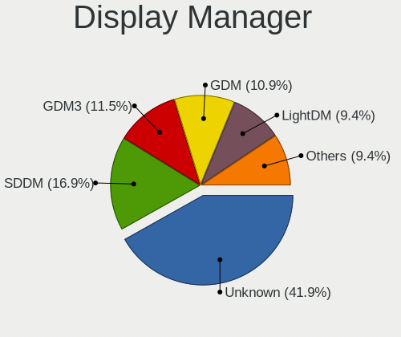
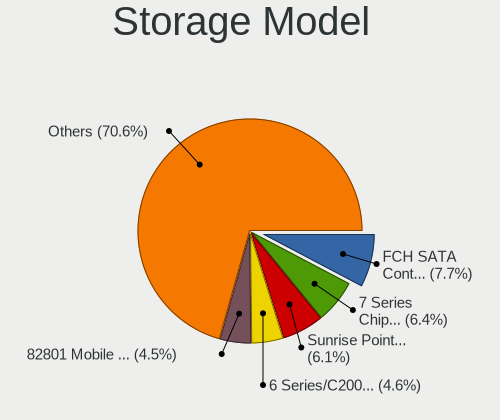
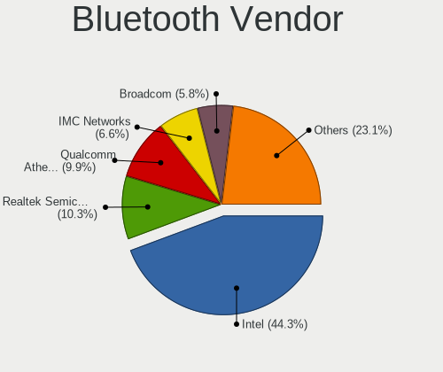

Linux - Tested Hardware & Statistics (Notebooks)
------------------------------------------------

A project to collect tested hardware configurations for Linux.

Anyone can contribute to this report by the [hw-probe](https://github.com/linuxhw/hw-probe) tool:

    sudo -E hw-probe -all -upload

Please contribute! Especially if your hardware is rare.

Full-feature report is available here: https://linux-hardware.org/?view=trends

Contents
--------

* [ Test Cases ](#test-cases)

* [ System ](#system)
  - [ OS                       ](#os)
  - [ OS Family                ](#os-family)
  - [ Kernel                   ](#kernel)
  - [ Kernel Family            ](#kernel-family)
  - [ Kernel Major Ver.        ](#kernel-major-ver)
  - [ Arch                     ](#arch)
  - [ DE                       ](#de)
  - [ Display Server           ](#display-server)
  - [ Display Manager          ](#display-manager)
  - [ OS Lang                  ](#os-lang)
  - [ Boot Mode                ](#boot-mode)
  - [ Filesystem               ](#filesystem)
  - [ Part. scheme             ](#part-scheme)
  - [ Dual Boot with Linux/BSD ](#dual-boot-with-linuxbsd)
  - [ Dual Boot (Win)          ](#dual-boot-win)

* [ Board ](#board)
  - [ Vendor                   ](#vendor)
  - [ Model                    ](#model)
  - [ Model Family             ](#model-family)
  - [ MFG Year                 ](#mfg-year)
  - [ Form Factor              ](#form-factor)
  - [ Secure Boot              ](#secure-boot)
  - [ Coreboot                 ](#coreboot)
  - [ RAM Size                 ](#ram-size)
  - [ RAM Used                 ](#ram-used)
  - [ Total Drives             ](#total-drives)
  - [ Has CD-ROM               ](#has-cd-rom)
  - [ Has Ethernet             ](#has-ethernet)
  - [ Has WiFi                 ](#has-wifi)
  - [ Has Bluetooth            ](#has-bluetooth)

* [ Location ](#location)
  - [ Country                  ](#country)
  - [ City                     ](#city)

* [ Drives ](#drives)
  - [ Drive Vendor             ](#drive-vendor)
  - [ Drive Model              ](#drive-model)
  - [ HDD Vendor               ](#hdd-vendor)
  - [ SSD Vendor               ](#ssd-vendor)
  - [ Drive Kind               ](#drive-kind)
  - [ Drive Connector          ](#drive-connector)
  - [ Drive Size               ](#drive-size)
  - [ Space Total              ](#space-total)
  - [ Space Used               ](#space-used)
  - [ Malfunc. Drives          ](#malfunc-drives)
  - [ Malfunc. Drive Vendor    ](#malfunc-drive-vendor)
  - [ Malfunc. HDD Vendor      ](#malfunc-hdd-vendor)
  - [ Malfunc. Drive Kind      ](#malfunc-drive-kind)
  - [ Failed Drives            ](#failed-drives)
  - [ Failed Drive Vendor      ](#failed-drive-vendor)
  - [ Drive Status             ](#drive-status)

* [ Storage controller ](#storage-controller)
  - [ Storage Vendor           ](#storage-vendor)
  - [ Storage Model            ](#storage-model)
  - [ Storage Kind             ](#storage-kind)

* [ Processor ](#processor)
  - [ CPU Vendor               ](#cpu-vendor)
  - [ CPU Model                ](#cpu-model)
  - [ CPU Model Family         ](#cpu-model-family)
  - [ CPU Cores                ](#cpu-cores)
  - [ CPU Sockets              ](#cpu-sockets)
  - [ CPU Threads              ](#cpu-threads)
  - [ CPU Op-Modes             ](#cpu-op-modes)
  - [ CPU Microcode            ](#cpu-microcode)
  - [ CPU Microarch            ](#cpu-microarch)

* [ Graphics ](#graphics)
  - [ GPU Vendor               ](#gpu-vendor)
  - [ GPU Model                ](#gpu-model)
  - [ GPU Combo                ](#gpu-combo)
  - [ GPU Driver               ](#gpu-driver)
  - [ GPU Memory               ](#gpu-memory)

* [ Monitor ](#monitor)
  - [ Monitor Vendor           ](#monitor-vendor)
  - [ Monitor Model            ](#monitor-model)
  - [ Monitor Resolution       ](#monitor-resolution)
  - [ Monitor Diagonal         ](#monitor-diagonal)
  - [ Monitor Width            ](#monitor-width)
  - [ Aspect Ratio             ](#aspect-ratio)
  - [ Monitor Area             ](#monitor-area)
  - [ Pixel Density            ](#pixel-density)
  - [ Multiple Monitors        ](#multiple-monitors)

* [ Network ](#network)
  - [ Net Controller Vendor    ](#net-controller-vendor)
  - [ Net Controller Model     ](#net-controller-model)
  - [ Wireless Vendor          ](#wireless-vendor)
  - [ Wireless Model           ](#wireless-model)
  - [ Ethernet Vendor          ](#ethernet-vendor)
  - [ Ethernet Model           ](#ethernet-model)
  - [ Net Controller Kind      ](#net-controller-kind)
  - [ Used Controller          ](#used-controller)
  - [ NICs                     ](#nics)
  - [ IPv6                     ](#ipv6)

* [ Bluetooth ](#bluetooth)
  - [ Bluetooth Vendor         ](#bluetooth-vendor)
  - [ Bluetooth Model          ](#bluetooth-model)

* [ Sound ](#sound)
  - [ Sound Vendor             ](#sound-vendor)
  - [ Sound Model              ](#sound-model)

* [ Memory ](#memory)
  - [ Memory Vendor            ](#memory-vendor)
  - [ Memory Model             ](#memory-model)
  - [ Memory Kind              ](#memory-kind)
  - [ Memory Form Factor       ](#memory-form-factor)
  - [ Memory Size              ](#memory-size)
  - [ Memory Speed             ](#memory-speed)

* [ Printers & scanners ](#printers--scanners)
  - [ Printer Vendor           ](#printer-vendor)
  - [ Printer Model            ](#printer-model)
  - [ Scanner Vendor           ](#scanner-vendor)
  - [ Scanner Model            ](#scanner-model)

* [ Camera ](#camera)
  - [ Camera Vendor            ](#camera-vendor)
  - [ Camera Model             ](#camera-model)

* [ Security ](#security)
  - [ Fingerprint Vendor       ](#fingerprint-vendor)
  - [ Fingerprint Model        ](#fingerprint-model)
  - [ Chipcard Vendor          ](#chipcard-vendor)
  - [ Chipcard Model           ](#chipcard-model)

* [ Unsupported ](#unsupported)
  - [ Unsupported Devices      ](#unsupported-devices)
  - [ Unsupported Device Types ](#unsupported-device-types)

Test Cases
----------

Total: 130539

| Vendor        | Model                       | Probe                                                      | Date         |
|---------------|-----------------------------|------------------------------------------------------------|--------------|
| Apple         | MacBookPro7,1               | [4def2a51dc](https://linux-hardware.org/?probe=4def2a51dc) | Apr 17, 2022 |
| Lenovo        | Unknown                     | [6e1760aed0](https://linux-hardware.org/?probe=6e1760aed0) | Apr 17, 2022 |
| ASUSTek       | VivoBook_ASUSLaptop X513... | [1825f45bfa](https://linux-hardware.org/?probe=1825f45bfa) | Apr 17, 2022 |
| HP            | Laptop 15s-fq3xxx           | [1fef674c68](https://linux-hardware.org/?probe=1fef674c68) | Apr 17, 2022 |
| HP            | Pavilion g6                 | [0c4c081e71](https://linux-hardware.org/?probe=0c4c081e71) | Apr 17, 2022 |
| HP            | Laptop 15s-fq3xxx           | [7ab3733165](https://linux-hardware.org/?probe=7ab3733165) | Apr 17, 2022 |
| Dell          | Inspiron 5555               | [9123d206b0](https://linux-hardware.org/?probe=9123d206b0) | Apr 16, 2022 |
| HP            | ENVY TS 17                  | [83c35e58d5](https://linux-hardware.org/?probe=83c35e58d5) | Apr 16, 2022 |
| Lenovo        | ThinkPad L412 0585AV3       | [382836d952](https://linux-hardware.org/?probe=382836d952) | Apr 16, 2022 |
| Dell          | Precision M6800             | [46a37b9e8e](https://linux-hardware.org/?probe=46a37b9e8e) | Apr 16, 2022 |
| Lenovo        | G40-80 80JE                 | [28c58e21e0](https://linux-hardware.org/?probe=28c58e21e0) | Apr 16, 2022 |
| Framework     | Laptop                      | [25577a2915](https://linux-hardware.org/?probe=25577a2915) | Apr 16, 2022 |
| ASUSTek       | K53Z                        | [2d870acfa1](https://linux-hardware.org/?probe=2d870acfa1) | Apr 16, 2022 |
| Positivo      | H14BU08                     | [43d44df3d2](https://linux-hardware.org/?probe=43d44df3d2) | Apr 16, 2022 |
| Lenovo        | ThinkPad T440 20B7S1EV00    | [b035e7ae3e](https://linux-hardware.org/?probe=b035e7ae3e) | Apr 16, 2022 |
| Toshiba       | Satellite Pro S500          | [61158a707c](https://linux-hardware.org/?probe=61158a707c) | Apr 16, 2022 |
| Dell          | Latitude 5590               | [ade3f33fb9](https://linux-hardware.org/?probe=ade3f33fb9) | Apr 16, 2022 |
| Acer          | Aspire 5720Z                | [e8155eac20](https://linux-hardware.org/?probe=e8155eac20) | Apr 16, 2022 |
| Lenovo        | ThinkPad X1 Carbon Gen 9... | [1f7292b20a](https://linux-hardware.org/?probe=1f7292b20a) | Apr 16, 2022 |
| Lenovo        | ThinkBook 14p Gen 2 20YN    | [800aefa57e](https://linux-hardware.org/?probe=800aefa57e) | Apr 16, 2022 |
| Acer          | Aspire 5750                 | [4ce545cc86](https://linux-hardware.org/?probe=4ce545cc86) | Apr 16, 2022 |
| HP            | Laptop 17-cp0xxx            | [e9fccc0549](https://linux-hardware.org/?probe=e9fccc0549) | Apr 16, 2022 |
| Lenovo        | ThinkPad E520 11433BU       | [eb10b5f739](https://linux-hardware.org/?probe=eb10b5f739) | Apr 16, 2022 |
| Dell          | Latitude 3550               | [03ed6ab7b4](https://linux-hardware.org/?probe=03ed6ab7b4) | Apr 16, 2022 |
| Lenovo        | IdeaPad 5 Pro 16ACH6 82L... | [a37c8a7b48](https://linux-hardware.org/?probe=a37c8a7b48) | Apr 16, 2022 |
| HP            | Laptop 15-bw0xx             | [4c505489d5](https://linux-hardware.org/?probe=4c505489d5) | Apr 16, 2022 |
| Alienware     | Area-51m R2                 | [e6a7b0ef42](https://linux-hardware.org/?probe=e6a7b0ef42) | Apr 16, 2022 |
| Dell          | Latitude 7480               | [7c543b7a6e](https://linux-hardware.org/?probe=7c543b7a6e) | Apr 16, 2022 |
| Dell          | Latitude E6430              | [c9a365bfe3](https://linux-hardware.org/?probe=c9a365bfe3) | Apr 16, 2022 |
| Lenovo        | IdeaPad 5 Pro 16ACH6 82L... | [0d918922ac](https://linux-hardware.org/?probe=0d918922ac) | Apr 16, 2022 |
| HP            | 250 G7 Notebook PC          | [d9565f3e67](https://linux-hardware.org/?probe=d9565f3e67) | Apr 16, 2022 |
| Lenovo        | IdeaPad Z565 20066          | [258c94f58b](https://linux-hardware.org/?probe=258c94f58b) | Apr 16, 2022 |
| Toshiba       | Satellite L775-151          | [957020b872](https://linux-hardware.org/?probe=957020b872) | Apr 16, 2022 |
| Toshiba       | Satellite L775-151          | [706f14a3e6](https://linux-hardware.org/?probe=706f14a3e6) | Apr 16, 2022 |
| DNS           | W510LU                      | [b3f74317f2](https://linux-hardware.org/?probe=b3f74317f2) | Apr 16, 2022 |
| Packard Be... | EasyNote TK85               | [c20035dfb3](https://linux-hardware.org/?probe=c20035dfb3) | Apr 16, 2022 |
| Dell          | Precision M6800             | [a632e8de16](https://linux-hardware.org/?probe=a632e8de16) | Apr 16, 2022 |
| MSI           | Modern 14 B4MW              | [5d8e6ca082](https://linux-hardware.org/?probe=5d8e6ca082) | Apr 16, 2022 |
| Lenovo        | ThinkPad X230 2325YGM       | [3606442649](https://linux-hardware.org/?probe=3606442649) | Apr 16, 2022 |
| HP            | Pavilion Gaming Laptop 1... | [c5e6eae8d7](https://linux-hardware.org/?probe=c5e6eae8d7) | Apr 16, 2022 |
| Apple         | MacBookPro8,1               | [a8c0eeb473](https://linux-hardware.org/?probe=a8c0eeb473) | Apr 16, 2022 |
| Dell          | Inspiron 5458               | [5f7dafa5b9](https://linux-hardware.org/?probe=5f7dafa5b9) | Apr 16, 2022 |
| Teclast       | F6 Plus                     | [a9407bd227](https://linux-hardware.org/?probe=a9407bd227) | Apr 16, 2022 |
| MSI           | GF63 8RD                    | [287e344d0e](https://linux-hardware.org/?probe=287e344d0e) | Apr 16, 2022 |
| Teclast       | F6 Plus                     | [7403ce7189](https://linux-hardware.org/?probe=7403ce7189) | Apr 16, 2022 |
| MSI           | GS65 Stealth 9SE            | [d789592552](https://linux-hardware.org/?probe=d789592552) | Apr 16, 2022 |
| ASUSTek       | G752VY                      | [a497ac3b95](https://linux-hardware.org/?probe=a497ac3b95) | Apr 16, 2022 |
| ASUSTek       | VivoBook_ASUSLaptop X421... | [a0ad75fa4b](https://linux-hardware.org/?probe=a0ad75fa4b) | Apr 16, 2022 |
| Lenovo        | ThinkPad T490 20N3S19L00    | [5812cc4868](https://linux-hardware.org/?probe=5812cc4868) | Apr 16, 2022 |
| ASUSTek       | TP201SA                     | [2898b67bff](https://linux-hardware.org/?probe=2898b67bff) | Apr 16, 2022 |
| HP            | 250 G7 Notebook PC          | [2b3ac63766](https://linux-hardware.org/?probe=2b3ac63766) | Apr 16, 2022 |
| TUXEDO        | Pulse 15 Gen1               | [46dd37cb4b](https://linux-hardware.org/?probe=46dd37cb4b) | Apr 16, 2022 |
| Dell          | Latitude E6320              | [84523d9bd9](https://linux-hardware.org/?probe=84523d9bd9) | Apr 16, 2022 |
| TUXEDO        | Pulse 15 Gen1               | [50b0cb93c7](https://linux-hardware.org/?probe=50b0cb93c7) | Apr 16, 2022 |
| Toshiba       | Satellite L10W-B-101        | [65edd32378](https://linux-hardware.org/?probe=65edd32378) | Apr 16, 2022 |
| HP            | ZBook 17 G2                 | [d7b7a81cbb](https://linux-hardware.org/?probe=d7b7a81cbb) | Apr 16, 2022 |
| ASUSTek       | X510UAR                     | [b39b237ff0](https://linux-hardware.org/?probe=b39b237ff0) | Apr 16, 2022 |
| Dell          | Venue 11 Pro 5130           | [333287a94f](https://linux-hardware.org/?probe=333287a94f) | Apr 16, 2022 |
| Valve         | Jupiter                     | [ed07e93435](https://linux-hardware.org/?probe=ed07e93435) | Apr 16, 2022 |
| Lenovo        | ThinkPad L440 20ASA02800    | [697a90ffa2](https://linux-hardware.org/?probe=697a90ffa2) | Apr 16, 2022 |
| Acer          | Nitro AN517-41              | [e955d40057](https://linux-hardware.org/?probe=e955d40057) | Apr 16, 2022 |
| Samsung       | NB30P                       | [a64bf01edf](https://linux-hardware.org/?probe=a64bf01edf) | Apr 16, 2022 |
| Dell          | XPS 13 9350                 | [d0e37d8bc1](https://linux-hardware.org/?probe=d0e37d8bc1) | Apr 16, 2022 |
| Lenovo        | IdeaPad 5 15ARE05 81YQ      | [7e7136d915](https://linux-hardware.org/?probe=7e7136d915) | Apr 16, 2022 |
| Dell          | Inspiron 13-5378            | [3998a17f75](https://linux-hardware.org/?probe=3998a17f75) | Apr 16, 2022 |
| ASUSTek       | K53SD                       | [559213734d](https://linux-hardware.org/?probe=559213734d) | Apr 16, 2022 |
| Dell          | XPS 15 9560                 | [9529ed78e9](https://linux-hardware.org/?probe=9529ed78e9) | Apr 16, 2022 |
| Dell          | XPS 15 9560                 | [1ef9e4e85d](https://linux-hardware.org/?probe=1ef9e4e85d) | Apr 16, 2022 |
| HP            | EliteBook 820 G2            | [65c9ced61d](https://linux-hardware.org/?probe=65c9ced61d) | Apr 16, 2022 |
| Dell          | XPS 15 9560                 | [abee14fa00](https://linux-hardware.org/?probe=abee14fa00) | Apr 16, 2022 |
| Fujitsu       | LIFEBOOK P771               | [f9d5ba9c1c](https://linux-hardware.org/?probe=f9d5ba9c1c) | Apr 16, 2022 |
| ASUSTek       | P52F                        | [0cb00534d0](https://linux-hardware.org/?probe=0cb00534d0) | Apr 16, 2022 |
| Fujitsu       | LIFEBOOK P771               | [a6580631d1](https://linux-hardware.org/?probe=a6580631d1) | Apr 16, 2022 |
| Lenovo        | G780 20138                  | [c20f1de565](https://linux-hardware.org/?probe=c20f1de565) | Apr 16, 2022 |
| HP            | Pavilion Laptop 14-dv0xx... | [579d91eebd](https://linux-hardware.org/?probe=579d91eebd) | Apr 16, 2022 |
| ASUSTek       | X541UAK                     | [811e032c61](https://linux-hardware.org/?probe=811e032c61) | Apr 16, 2022 |
| Lenovo        | IdeaPad 3 15ITL6 82H8       | [e3658d7c35](https://linux-hardware.org/?probe=e3658d7c35) | Apr 16, 2022 |
| Toshiba       | IS 1413G                    | [e9e45e7f91](https://linux-hardware.org/?probe=e9e45e7f91) | Apr 16, 2022 |
| HP            | EliteBook 840 G1            | [d9c6549322](https://linux-hardware.org/?probe=d9c6549322) | Apr 16, 2022 |
| Lenovo        | IdeaPad 320-15ABR 80XS      | [fccfb454e4](https://linux-hardware.org/?probe=fccfb454e4) | Apr 16, 2022 |
| HP            | EliteBook Folio 1040 G2     | [53eb30d6a6](https://linux-hardware.org/?probe=53eb30d6a6) | Apr 16, 2022 |
| Toshiba       | IS 1413G                    | [e51d0544a1](https://linux-hardware.org/?probe=e51d0544a1) | Apr 16, 2022 |
| HP            | Pavilion g6                 | [a7f800ed49](https://linux-hardware.org/?probe=a7f800ed49) | Apr 16, 2022 |
| Dell          | Studio XPS 1645             | [6e722019b4](https://linux-hardware.org/?probe=6e722019b4) | Apr 16, 2022 |
| Apple         | MacBookPro9,2               | [144971e364](https://linux-hardware.org/?probe=144971e364) | Apr 16, 2022 |
| Acer          | Aspire E5-471G              | [a7179e1ba3](https://linux-hardware.org/?probe=a7179e1ba3) | Apr 16, 2022 |
| HP            | Pavilion dv7                | [60eee202a1](https://linux-hardware.org/?probe=60eee202a1) | Apr 16, 2022 |
| Fujitsu       | LIFEBOOK E746               | [ae8fe4a156](https://linux-hardware.org/?probe=ae8fe4a156) | Apr 16, 2022 |
| HP            | Compaq 6730s                | [4902d2bf25](https://linux-hardware.org/?probe=4902d2bf25) | Apr 16, 2022 |
| Timi          | RedmiBook Pro 15S           | [e29970db9c](https://linux-hardware.org/?probe=e29970db9c) | Apr 16, 2022 |
| HP            | Pavilion m7                 | [ed02e5b37c](https://linux-hardware.org/?probe=ed02e5b37c) | Apr 16, 2022 |
| Acer          | TravelMate P643-M           | [eaec316f95](https://linux-hardware.org/?probe=eaec316f95) | Apr 16, 2022 |
| HP            | Laptop 15s-eq2xxx           | [5bd22623b0](https://linux-hardware.org/?probe=5bd22623b0) | Apr 16, 2022 |
| Dell          | Inspiron 15 7000 Gaming     | [ca0b0f6a8a](https://linux-hardware.org/?probe=ca0b0f6a8a) | Apr 16, 2022 |
| Lenovo        | Legion Y7000P 2019 81Q5     | [7e346154a5](https://linux-hardware.org/?probe=7e346154a5) | Apr 16, 2022 |
| Lenovo        | IdeaPad 330-15IKB 81DC      | [9f099000d4](https://linux-hardware.org/?probe=9f099000d4) | Apr 16, 2022 |
| Lenovo        | ThinkPad P50s 20FL000MUS    | [99fbb4446c](https://linux-hardware.org/?probe=99fbb4446c) | Apr 16, 2022 |
| Dell          | XPS 15 9560                 | [c540449ce7](https://linux-hardware.org/?probe=c540449ce7) | Apr 16, 2022 |
| Acer          | Aspire R3-131T              | [776575ecdb](https://linux-hardware.org/?probe=776575ecdb) | Apr 16, 2022 |
| Google        | Phaser360                   | [ab97623a21](https://linux-hardware.org/?probe=ab97623a21) | Apr 16, 2022 |
| Apple         | MacBookPro8,1               | [f74cae630d](https://linux-hardware.org/?probe=f74cae630d) | Apr 16, 2022 |
| TUXEDO        | P95_HR                      | [a3996b5033](https://linux-hardware.org/?probe=a3996b5033) | Apr 16, 2022 |
| Acer          | Swift SF315-52              | [90c143abed](https://linux-hardware.org/?probe=90c143abed) | Apr 16, 2022 |
| Dell          | Inspiron 15 7000 Gaming     | [b07e7e9974](https://linux-hardware.org/?probe=b07e7e9974) | Apr 16, 2022 |
| Positivo B... | VJC141F11X-B0111L           | [5ea499eca7](https://linux-hardware.org/?probe=5ea499eca7) | Apr 16, 2022 |
| Lenovo        | ThinkPad T440p 20AWS03H0... | [64fb4146d0](https://linux-hardware.org/?probe=64fb4146d0) | Apr 16, 2022 |
| Lenovo        | IdeaPad 3 15IML05 81WR      | [81dced5e0a](https://linux-hardware.org/?probe=81dced5e0a) | Apr 16, 2022 |
| Dell          | XPS 15 9520                 | [4cf57abb44](https://linux-hardware.org/?probe=4cf57abb44) | Apr 16, 2022 |
| Acer          | Aspire ES1-512              | [0f19c624fb](https://linux-hardware.org/?probe=0f19c624fb) | Apr 16, 2022 |
| Acer          | Aspire ES1-512              | [6467d63e0d](https://linux-hardware.org/?probe=6467d63e0d) | Apr 16, 2022 |
| Lenovo        | Legion 5 15ARH05H 82B1      | [c6f1d1b99b](https://linux-hardware.org/?probe=c6f1d1b99b) | Apr 16, 2022 |
| Thirdwave     | DX-T7                       | [b03707283b](https://linux-hardware.org/?probe=b03707283b) | Apr 16, 2022 |
| Lenovo        | ThinkPad L14 Gen 2 20X10... | [6f75f679f9](https://linux-hardware.org/?probe=6f75f679f9) | Apr 16, 2022 |
| HP            | 14                          | [2a8a40d96b](https://linux-hardware.org/?probe=2a8a40d96b) | Apr 16, 2022 |
| HP            | Pavilion dv5                | [22aa828b2f](https://linux-hardware.org/?probe=22aa828b2f) | Apr 16, 2022 |
| HP            | Pavilion Gaming Laptop 1... | [6454c55f08](https://linux-hardware.org/?probe=6454c55f08) | Apr 16, 2022 |
| ASUSTek       | X550LN                      | [2a0b2ae677](https://linux-hardware.org/?probe=2a0b2ae677) | Apr 16, 2022 |
| Acer          | Aspire E1-572               | [27d5f97167](https://linux-hardware.org/?probe=27d5f97167) | Apr 16, 2022 |
| A-DATA Tec... | XENIA 14                    | [839159351b](https://linux-hardware.org/?probe=839159351b) | Apr 16, 2022 |
| HP            | Pavilion dv6                | [639a7422d8](https://linux-hardware.org/?probe=639a7422d8) | Apr 16, 2022 |
| A-DATA Tec... | XENIA 14                    | [29a530e6bb](https://linux-hardware.org/?probe=29a530e6bb) | Apr 16, 2022 |
| Gigabyte      | G5 GD                       | [2b2833576e](https://linux-hardware.org/?probe=2b2833576e) | Apr 16, 2022 |
| Toshiba       | BLB                         | [903779c2b2](https://linux-hardware.org/?probe=903779c2b2) | Apr 16, 2022 |
| Framework     | Laptop                      | [84da421304](https://linux-hardware.org/?probe=84da421304) | Apr 16, 2022 |
| Toshiba       | BLB                         | [1dffc347dd](https://linux-hardware.org/?probe=1dffc347dd) | Apr 16, 2022 |
| HP            | Pavilion 17                 | [acb0c7fd0e](https://linux-hardware.org/?probe=acb0c7fd0e) | Apr 16, 2022 |
| HP            | Pavilion ZV6100 (EE984EA... | [425620585b](https://linux-hardware.org/?probe=425620585b) | Apr 15, 2022 |
| Lenovo        | ThinkPad T440p 20AWS1Y90... | [a572c901ca](https://linux-hardware.org/?probe=a572c901ca) | Apr 15, 2022 |
| Dell          | Inspiron 5570               | [066d125002](https://linux-hardware.org/?probe=066d125002) | Apr 15, 2022 |
| ASUSTek       | K50IJ                       | [ad5a24dbb3](https://linux-hardware.org/?probe=ad5a24dbb3) | Apr 15, 2022 |
| Dell          | Latitude 7410               | [da82f8bba8](https://linux-hardware.org/?probe=da82f8bba8) | Apr 15, 2022 |
| HP            | Laptop 14-dq4xxx            | [a892a2412c](https://linux-hardware.org/?probe=a892a2412c) | Apr 15, 2022 |
| HP            | Pavilion Laptop 15-eg0xx... | [53cc2d28a7](https://linux-hardware.org/?probe=53cc2d28a7) | Apr 15, 2022 |
| HP            | Pavilion dv6500             | [064748981e](https://linux-hardware.org/?probe=064748981e) | Apr 15, 2022 |
| Dell          | XPS 13 9310                 | [2c395ea438](https://linux-hardware.org/?probe=2c395ea438) | Apr 15, 2022 |
| HP            | Pavilion dv6500             | [48350ccc67](https://linux-hardware.org/?probe=48350ccc67) | Apr 15, 2022 |
| LG Electro... | 15Z95P-G.AA78B              | [f5ef9987a4](https://linux-hardware.org/?probe=f5ef9987a4) | Apr 15, 2022 |
| ASUSTek       | U47A                        | [9634258fee](https://linux-hardware.org/?probe=9634258fee) | Apr 15, 2022 |
| MSI           | Creator 15 A10SFS           | [42b2140343](https://linux-hardware.org/?probe=42b2140343) | Apr 15, 2022 |
| Lenovo        | ThinkBook 14 G2 ARE 20VF    | [6d63a9c8bc](https://linux-hardware.org/?probe=6d63a9c8bc) | Apr 15, 2022 |
| Toshiba       | Satellite L300              | [242592fee5](https://linux-hardware.org/?probe=242592fee5) | Apr 15, 2022 |
| Sony          | SVF1521L1RB                 | [ab464ae6a9](https://linux-hardware.org/?probe=ab464ae6a9) | Apr 15, 2022 |
| Google        | Squawks                     | [a6dc68bba1](https://linux-hardware.org/?probe=a6dc68bba1) | Apr 15, 2022 |
| HP            | Pavilion 17                 | [014f42ecee](https://linux-hardware.org/?probe=014f42ecee) | Apr 15, 2022 |
| Lenovo        | IdeaPad 3 15ALC6 82KU       | [4645168704](https://linux-hardware.org/?probe=4645168704) | Apr 15, 2022 |
| Google        | Enguarde                    | [6e1d5488f8](https://linux-hardware.org/?probe=6e1d5488f8) | Apr 15, 2022 |
| Schenker      | VISION 15 (SVS15E21)        | [48e04dd798](https://linux-hardware.org/?probe=48e04dd798) | Apr 15, 2022 |
| HP            | Pavilion Laptop 15-eg0xx... | [b1e71b5b4c](https://linux-hardware.org/?probe=b1e71b5b4c) | Apr 15, 2022 |
| Lenovo        | ThinkPad T14s Gen 2i 20W... | [539ce7e59a](https://linux-hardware.org/?probe=539ce7e59a) | Apr 15, 2022 |
| MSI           | CX700                       | [b7715b0ff7](https://linux-hardware.org/?probe=b7715b0ff7) | Apr 15, 2022 |
| Acer          | Nitro AN515-57              | [b824b88050](https://linux-hardware.org/?probe=b824b88050) | Apr 15, 2022 |
| Alienware     | x17 R1                      | [86a2d88704](https://linux-hardware.org/?probe=86a2d88704) | Apr 15, 2022 |
| HP            | ProBook 455 G8 Notebook ... | [5bff5642ba](https://linux-hardware.org/?probe=5bff5642ba) | Apr 15, 2022 |
| HP            | Pavilion Laptop 15-eg0xx... | [e9a5e187ad](https://linux-hardware.org/?probe=e9a5e187ad) | Apr 15, 2022 |
| Acer          | Aspire 5750G                | [73d1368d93](https://linux-hardware.org/?probe=73d1368d93) | Apr 15, 2022 |
| Timi          | A34                         | [ff24fc7e19](https://linux-hardware.org/?probe=ff24fc7e19) | Apr 15, 2022 |
| Toshiba       | Satellite L50D-B            | [912c61bb9b](https://linux-hardware.org/?probe=912c61bb9b) | Apr 15, 2022 |
| Google        | Enguarde                    | [7c4a4092d5](https://linux-hardware.org/?probe=7c4a4092d5) | Apr 15, 2022 |
| Compaq        | Presario CQ-29              | [4c37a60084](https://linux-hardware.org/?probe=4c37a60084) | Apr 15, 2022 |
| Dell          | Inspiron N5110              | [5ae4706be7](https://linux-hardware.org/?probe=5ae4706be7) | Apr 15, 2022 |
| Google        | Enguarde                    | [26c2f26771](https://linux-hardware.org/?probe=26c2f26771) | Apr 15, 2022 |
| Dell          | Precision 5760              | [ba2ce021d0](https://linux-hardware.org/?probe=ba2ce021d0) | Apr 15, 2022 |
| Sony          | VPCF115FM                   | [b174df5915](https://linux-hardware.org/?probe=b174df5915) | Apr 15, 2022 |
| Timi          | TM1701                      | [1eb7df8700](https://linux-hardware.org/?probe=1eb7df8700) | Apr 15, 2022 |
| Dell          | Latitude E6540              | [94fbc5408f](https://linux-hardware.org/?probe=94fbc5408f) | Apr 15, 2022 |
| Lenovo        | IdeaPad 330-15IKB 81DE      | [cc6e57929e](https://linux-hardware.org/?probe=cc6e57929e) | Apr 15, 2022 |
| Apple         | MacBookPro11,5              | [5cd59453b1](https://linux-hardware.org/?probe=5cd59453b1) | Apr 15, 2022 |
| Toshiba       | Satellite U840              | [9468123a43](https://linux-hardware.org/?probe=9468123a43) | Apr 15, 2022 |
| Toshiba       | TECRA X40-E                 | [0ec808bca1](https://linux-hardware.org/?probe=0ec808bca1) | Apr 15, 2022 |
| Lenovo        | IdeaPad Gaming 3 15ARH05... | [8350598ef6](https://linux-hardware.org/?probe=8350598ef6) | Apr 15, 2022 |
| Acer          | Aspire 5735                 | [e43434e15c](https://linux-hardware.org/?probe=e43434e15c) | Apr 15, 2022 |
| HUAWEI        | BOD-WXX9                    | [e2e025dd4f](https://linux-hardware.org/?probe=e2e025dd4f) | Apr 15, 2022 |
| Samsung       | 700T                        | [ff97fa9856](https://linux-hardware.org/?probe=ff97fa9856) | Apr 15, 2022 |
| Lenovo        | ThinkPad X201 Tablet 311... | [e3ab162648](https://linux-hardware.org/?probe=e3ab162648) | Apr 15, 2022 |
| Lenovo        | IdeaPad 5 15ARE05 81YQ      | [4f70dcf9b8](https://linux-hardware.org/?probe=4f70dcf9b8) | Apr 15, 2022 |
| Lenovo        | ThinkPad E14 Gen 2 20TB0... | [3b30ef3d55](https://linux-hardware.org/?probe=3b30ef3d55) | Apr 15, 2022 |
| HP            | ProBook 450 G8 Notebook ... | [1974bfe63a](https://linux-hardware.org/?probe=1974bfe63a) | Apr 15, 2022 |
| Google        | Enguarde                    | [f0ec477b78](https://linux-hardware.org/?probe=f0ec477b78) | Apr 15, 2022 |
| Lenovo        | IdeaPad 320-15AST 80XV      | [61cad5dcd7](https://linux-hardware.org/?probe=61cad5dcd7) | Apr 15, 2022 |
| ASUSTek       | X556UB                      | [7174b543f1](https://linux-hardware.org/?probe=7174b543f1) | Apr 15, 2022 |
| ASUSTek       | 1001PX                      | [520db05629](https://linux-hardware.org/?probe=520db05629) | Apr 15, 2022 |
| Insignia      | NS-P89W6100 V1.0            | [dabc8a93a8](https://linux-hardware.org/?probe=dabc8a93a8) | Apr 15, 2022 |
| HP            | 255 G7 Notebook PC          | [c9a7153c14](https://linux-hardware.org/?probe=c9a7153c14) | Apr 15, 2022 |
| HP            | Pavilion Gaming Laptop 1... | [7ea86333a0](https://linux-hardware.org/?probe=7ea86333a0) | Apr 15, 2022 |
| Acer          | Nitro AN515-42              | [f203fe95e5](https://linux-hardware.org/?probe=f203fe95e5) | Apr 15, 2022 |
| Apple         | MacBookPro10,1              | [0d7edf2aa9](https://linux-hardware.org/?probe=0d7edf2aa9) | Apr 15, 2022 |
| BLAUPUNKT     | Discovery 1011WI            | [6474fd0605](https://linux-hardware.org/?probe=6474fd0605) | Apr 15, 2022 |
| Acer          | Aspire E5-774G              | [d6b3b8f04d](https://linux-hardware.org/?probe=d6b3b8f04d) | Apr 15, 2022 |
| Toshiba       | Satellite E45t-A            | [3698a21b91](https://linux-hardware.org/?probe=3698a21b91) | Apr 15, 2022 |
| Lenovo        | ThinkPad T495 20NK000MGE    | [558688bdc2](https://linux-hardware.org/?probe=558688bdc2) | Apr 15, 2022 |
| HP            | EliteBook 840 G5            | [7499dbd303](https://linux-hardware.org/?probe=7499dbd303) | Apr 15, 2022 |
| Dell          | Inspiron 1012               | [4659a757bf](https://linux-hardware.org/?probe=4659a757bf) | Apr 15, 2022 |
| Dell          | Inspiron 1012               | [ebfcf670fc](https://linux-hardware.org/?probe=ebfcf670fc) | Apr 15, 2022 |
| ASUSTek       | ROG Zephyrus G14 GA401QM... | [c1273dfd07](https://linux-hardware.org/?probe=c1273dfd07) | Apr 15, 2022 |
| Packard Be... | EasyNote TN36               | [23936e29bb](https://linux-hardware.org/?probe=23936e29bb) | Apr 15, 2022 |
| Packard Be... | EasyNote TN36               | [ae514187f2](https://linux-hardware.org/?probe=ae514187f2) | Apr 15, 2022 |
| Toshiba       | NB520                       | [105666a973](https://linux-hardware.org/?probe=105666a973) | Apr 15, 2022 |
| Notebook      | NH55RGQ                     | [a5b036d6a3](https://linux-hardware.org/?probe=a5b036d6a3) | Apr 15, 2022 |
| Sony          | VPCY21S1E                   | [48e798a45c](https://linux-hardware.org/?probe=48e798a45c) | Apr 15, 2022 |
| ASUSTek       | VivoBook_ASUSLaptop M350... | [25fe737be8](https://linux-hardware.org/?probe=25fe737be8) | Apr 15, 2022 |
| HP            | ProBook 430 G1              | [c42de00504](https://linux-hardware.org/?probe=c42de00504) | Apr 15, 2022 |
| Lenovo        | ThinkPad E570 20H5CTO1WW    | [c43bc1fcba](https://linux-hardware.org/?probe=c43bc1fcba) | Apr 15, 2022 |
| Lenovo        | G40-45 80E1                 | [840ffde0c4](https://linux-hardware.org/?probe=840ffde0c4) | Apr 15, 2022 |
| Dell          | Inspiron 5567               | [a9e2d5e0ef](https://linux-hardware.org/?probe=a9e2d5e0ef) | Apr 15, 2022 |
| Acer          | Swift SF314-43              | [ac4a3ad35c](https://linux-hardware.org/?probe=ac4a3ad35c) | Apr 15, 2022 |
| HP            | ProBook 430 G7              | [a084a48023](https://linux-hardware.org/?probe=a084a48023) | Apr 15, 2022 |
| Dell          | XPS 15 9550                 | [8b4c83d150](https://linux-hardware.org/?probe=8b4c83d150) | Apr 15, 2022 |
| Acer          | TMP455-M                    | [451dbf0a20](https://linux-hardware.org/?probe=451dbf0a20) | Apr 15, 2022 |
| Lenovo        | ThinkPad T400 6474AH2       | [f5e7108c33](https://linux-hardware.org/?probe=f5e7108c33) | Apr 15, 2022 |
| HP            | EliteBook 820 G3            | [a587867d2e](https://linux-hardware.org/?probe=a587867d2e) | Apr 15, 2022 |
| HUAWEI        | NBLB-WAX9N                  | [a89ca51e1b](https://linux-hardware.org/?probe=a89ca51e1b) | Apr 15, 2022 |
| Lenovo        | ThinkPad E14 Gen 3 20YDS... | [b228a9bf01](https://linux-hardware.org/?probe=b228a9bf01) | Apr 15, 2022 |
| HP            | Compaq 6730s                | [755dcc7629](https://linux-hardware.org/?probe=755dcc7629) | Apr 15, 2022 |
| Notebook      | NH5x_NH7x_HHx_HJx_HKx       | [c14702d147](https://linux-hardware.org/?probe=c14702d147) | Apr 15, 2022 |
| Lenovo        | Yoga Slim 7 14ARE05 82A2    | [078a3464bf](https://linux-hardware.org/?probe=078a3464bf) | Apr 15, 2022 |
| Lenovo        | ThinkPad X1 Carbon 5th 2... | [086a94d83c](https://linux-hardware.org/?probe=086a94d83c) | Apr 15, 2022 |
| Toshiba       | Satellite P755              | [fc39ac9f46](https://linux-hardware.org/?probe=fc39ac9f46) | Apr 15, 2022 |
| Lenovo        | IdeaPad Z510 20287          | [dc9ac2e9b6](https://linux-hardware.org/?probe=dc9ac2e9b6) | Apr 15, 2022 |
| Acer          | TravelMate P643-M           | [92c833cf0b](https://linux-hardware.org/?probe=92c833cf0b) | Apr 15, 2022 |
| Valve         | Jupiter                     | [48aacdeee8](https://linux-hardware.org/?probe=48aacdeee8) | Apr 15, 2022 |
| HP            | ProBook 440 G5              | [f9202afa63](https://linux-hardware.org/?probe=f9202afa63) | Apr 15, 2022 |
| Lenovo        | IdeaPad Flex-14API 81SS     | [e9969def2d](https://linux-hardware.org/?probe=e9969def2d) | Apr 15, 2022 |
| HP            | ProBook 440 G5              | [c5048041ee](https://linux-hardware.org/?probe=c5048041ee) | Apr 15, 2022 |
| Lenovo        | ThinkPad P14s Gen 2a 21A... | [cffdde259f](https://linux-hardware.org/?probe=cffdde259f) | Apr 15, 2022 |
| HP            | Laptop 15s-fq3xxx           | [1488e2a91f](https://linux-hardware.org/?probe=1488e2a91f) | Apr 15, 2022 |
| ASUSTek       | U33Jc                       | [8be18ca4d1](https://linux-hardware.org/?probe=8be18ca4d1) | Apr 15, 2022 |
| Lenovo        | ThinkPad X280 20KE001MMX    | [fb0da9def7](https://linux-hardware.org/?probe=fb0da9def7) | Apr 15, 2022 |
| Dell          | Inspiron 3542               | [78da1f043b](https://linux-hardware.org/?probe=78da1f043b) | Apr 15, 2022 |
| Lenovo        | IdeaPad 3 14ALC6 82KT       | [1877553731](https://linux-hardware.org/?probe=1877553731) | Apr 15, 2022 |
| ASUSTek       | ZenBook Pro Duo UX581GV_... | [4a4bcf5608](https://linux-hardware.org/?probe=4a4bcf5608) | Apr 15, 2022 |
| HP            | Laptop 14-dq2xxx            | [2477951c04](https://linux-hardware.org/?probe=2477951c04) | Apr 15, 2022 |
| Dell          | Latitude E6430              | [fc7e6fce7b](https://linux-hardware.org/?probe=fc7e6fce7b) | Apr 15, 2022 |
| Intel         | W7650                       | [9144ca0d30](https://linux-hardware.org/?probe=9144ca0d30) | Apr 15, 2022 |
| Dell          | Studio 1537                 | [56c84908d2](https://linux-hardware.org/?probe=56c84908d2) | Apr 15, 2022 |
| Dell          | Precision 5560              | [54914c0033](https://linux-hardware.org/?probe=54914c0033) | Apr 15, 2022 |
| Dell          | Latitude E7250              | [532fb04297](https://linux-hardware.org/?probe=532fb04297) | Apr 15, 2022 |
| HP            | Compaq Mini CQ10-100        | [89c92e2cf7](https://linux-hardware.org/?probe=89c92e2cf7) | Apr 15, 2022 |
| Dell          | Inspiron 7559               | [5302420f94](https://linux-hardware.org/?probe=5302420f94) | Apr 15, 2022 |
| Toshiba       | Satellite P50t-A            | [f2eef93c50](https://linux-hardware.org/?probe=f2eef93c50) | Apr 15, 2022 |
| HP            | Compaq Presario C700        | [4f723964d5](https://linux-hardware.org/?probe=4f723964d5) | Apr 15, 2022 |
| Dell          | Precision M4700             | [850dba476c](https://linux-hardware.org/?probe=850dba476c) | Apr 15, 2022 |
| Acer          | Aspire A515-51              | [dcae73146f](https://linux-hardware.org/?probe=dcae73146f) | Apr 15, 2022 |
| HP            | ProBook 4430s               | [79e30d321b](https://linux-hardware.org/?probe=79e30d321b) | Apr 15, 2022 |
| Dell          | Latitude E7450              | [9af0006104](https://linux-hardware.org/?probe=9af0006104) | Apr 15, 2022 |
| HP            | Pavilion dv7                | [077e8282a3](https://linux-hardware.org/?probe=077e8282a3) | Apr 15, 2022 |
| Dell          | Latitude 5420               | [7b97392ed4](https://linux-hardware.org/?probe=7b97392ed4) | Apr 15, 2022 |
| Lenovo        | ThinkPad X1 Carbon 6th 2... | [7e8c906437](https://linux-hardware.org/?probe=7e8c906437) | Apr 15, 2022 |
| Lenovo        | IdeaPad S145-15API 81V7     | [0646755403](https://linux-hardware.org/?probe=0646755403) | Apr 15, 2022 |
| Acer          | TMP455-M                    | [b7b9924190](https://linux-hardware.org/?probe=b7b9924190) | Apr 15, 2022 |
| Dell          | Latitude 5420               | [7ef3e515d9](https://linux-hardware.org/?probe=7ef3e515d9) | Apr 15, 2022 |
| Notebook      | NJ50_70CU                   | [1ec86958b8](https://linux-hardware.org/?probe=1ec86958b8) | Apr 15, 2022 |
| Dell          | Inspiron 3481               | [69d336ac59](https://linux-hardware.org/?probe=69d336ac59) | Apr 15, 2022 |
| Dell          | Latitude E6530              | [d6f985e2ca](https://linux-hardware.org/?probe=d6f985e2ca) | Apr 15, 2022 |
| Dell          | Latitude E6540              | [939dbc38d3](https://linux-hardware.org/?probe=939dbc38d3) | Apr 15, 2022 |
| Dell          | Latitude XT3                | [ce6c2e43a0](https://linux-hardware.org/?probe=ce6c2e43a0) | Apr 15, 2022 |
| Toshiba       | Satellite L505              | [92da438638](https://linux-hardware.org/?probe=92da438638) | Apr 15, 2022 |
| Lenovo        | ThinkPad E15 Gen 2 20T80... | [77cf6f482e](https://linux-hardware.org/?probe=77cf6f482e) | Apr 15, 2022 |
| ASUSTek       | GX501VIK                    | [076208c6fd](https://linux-hardware.org/?probe=076208c6fd) | Apr 15, 2022 |
| ASUSTek       | Q302LA                      | [9bcb945cba](https://linux-hardware.org/?probe=9bcb945cba) | Apr 15, 2022 |
| Dell          | Latitude 3410               | [78396d572c](https://linux-hardware.org/?probe=78396d572c) | Apr 15, 2022 |
| ASUSTek       | GX501VIK                    | [15c4c7877b](https://linux-hardware.org/?probe=15c4c7877b) | Apr 15, 2022 |
| Sony          | VPCEE23FX                   | [4c7634a096](https://linux-hardware.org/?probe=4c7634a096) | Apr 15, 2022 |
| HP            | EliteBook 2570p             | [6717b9e689](https://linux-hardware.org/?probe=6717b9e689) | Apr 14, 2022 |
| Dell          | Latitude E5470              | [9391400fc7](https://linux-hardware.org/?probe=9391400fc7) | Apr 14, 2022 |
| AMI           | Intel                       | [bfee32835f](https://linux-hardware.org/?probe=bfee32835f) | Apr 14, 2022 |
| AMI           | Intel                       | [b7c76035df](https://linux-hardware.org/?probe=b7c76035df) | Apr 14, 2022 |
| Lenovo        | ThinkPad T15g Gen 1 20UR... | [c60feffffb](https://linux-hardware.org/?probe=c60feffffb) | Apr 14, 2022 |
| Sony          | VGN-NS38E_S                 | [1b8177c97a](https://linux-hardware.org/?probe=1b8177c97a) | Apr 14, 2022 |
| ASUSTek       | ROG Zephyrus G15 GA502IU... | [1a35138280](https://linux-hardware.org/?probe=1a35138280) | Apr 14, 2022 |
| HP            | Compaq 8710w                | [cd5964d073](https://linux-hardware.org/?probe=cd5964d073) | Apr 14, 2022 |
| Dell          | XPS 13 9300                 | [0f845854f8](https://linux-hardware.org/?probe=0f845854f8) | Apr 14, 2022 |
| Framework     | Laptop                      | [4997cab79b](https://linux-hardware.org/?probe=4997cab79b) | Apr 14, 2022 |
| Samsung       | RV411/RV511/E3511/S3511/... | [eec6d07447](https://linux-hardware.org/?probe=eec6d07447) | Apr 14, 2022 |
| Samsung       | RV411/RV511/E3511/S3511/... | [5b4d5a6e7a](https://linux-hardware.org/?probe=5b4d5a6e7a) | Apr 14, 2022 |
| Dell          | XPS 13 9333                 | [0d1712dd76](https://linux-hardware.org/?probe=0d1712dd76) | Apr 14, 2022 |
| Lenovo        | IdeaPad 530S-14IKB 81EU     | [7436528d4f](https://linux-hardware.org/?probe=7436528d4f) | Apr 14, 2022 |
| Lenovo        | ThinkPad T440 20B7S1970B    | [055812a1f1](https://linux-hardware.org/?probe=055812a1f1) | Apr 14, 2022 |
| Timi          | Mi NoteBook 14              | [88abcd9e70](https://linux-hardware.org/?probe=88abcd9e70) | Apr 14, 2022 |
| Getac         | S410                        | [a0ec8cd50e](https://linux-hardware.org/?probe=a0ec8cd50e) | Apr 14, 2022 |
| Lenovo        | IdeaPad 530S-14ARR 81H1     | [13bfd82a49](https://linux-hardware.org/?probe=13bfd82a49) | Apr 14, 2022 |
| Lenovo        | ThinkPad Edge E430 3254C... | [2e77dc52bc](https://linux-hardware.org/?probe=2e77dc52bc) | Apr 14, 2022 |
| Dell          | XPS L322X                   | [eee5065a27](https://linux-hardware.org/?probe=eee5065a27) | Apr 14, 2022 |
| Valve         | Jupiter                     | [6a042646dd](https://linux-hardware.org/?probe=6a042646dd) | Apr 14, 2022 |
| Google        | Enguarde                    | [d8235b139b](https://linux-hardware.org/?probe=d8235b139b) | Apr 14, 2022 |
| Framework     | Laptop                      | [e4c994f47a](https://linux-hardware.org/?probe=e4c994f47a) | Apr 14, 2022 |
| Google        | Enguarde                    | [3f5020068f](https://linux-hardware.org/?probe=3f5020068f) | Apr 14, 2022 |
| Acer          | TravelMate P256-MG          | [55b07b48b3](https://linux-hardware.org/?probe=55b07b48b3) | Apr 14, 2022 |
| HP            | Laptop 14-cf0xxx            | [3fcf4f7e02](https://linux-hardware.org/?probe=3fcf4f7e02) | Apr 14, 2022 |
| MSI           | GF63 Thin 10SC              | [e5e0f208d9](https://linux-hardware.org/?probe=e5e0f208d9) | Apr 14, 2022 |
| MSI           | GF63 Thin 10SC              | [b5beb1add9](https://linux-hardware.org/?probe=b5beb1add9) | Apr 14, 2022 |
| Lenovo        | Legion 5 Pro 16ACH6H 82J... | [832620cf67](https://linux-hardware.org/?probe=832620cf67) | Apr 14, 2022 |
| HP            | ENVY 13                     | [4b0b543bdf](https://linux-hardware.org/?probe=4b0b543bdf) | Apr 14, 2022 |
| Framework     | Laptop                      | [a5950266d1](https://linux-hardware.org/?probe=a5950266d1) | Apr 14, 2022 |
| HP            | Laptop 15-db0xxx            | [ffe2d9db36](https://linux-hardware.org/?probe=ffe2d9db36) | Apr 14, 2022 |
| Lenovo        | Legion 5 15IMH05H 81Y6      | [68d7627d20](https://linux-hardware.org/?probe=68d7627d20) | Apr 14, 2022 |
| Google        | Enguarde                    | [c54f344fdb](https://linux-hardware.org/?probe=c54f344fdb) | Apr 14, 2022 |
| Sony          | VPCF115FM                   | [03f96804b2](https://linux-hardware.org/?probe=03f96804b2) | Apr 14, 2022 |
| Dell          | Latitude E6540              | [2ee68b5f38](https://linux-hardware.org/?probe=2ee68b5f38) | Apr 14, 2022 |
| HP            | Pavilion Notebook           | [8ea3af9aca](https://linux-hardware.org/?probe=8ea3af9aca) | Apr 14, 2022 |
| HP            | ENVY 6                      | [deb09d7d7c](https://linux-hardware.org/?probe=deb09d7d7c) | Apr 14, 2022 |
| Lenovo        | ThinkPad T470p 20J7S0000... | [50325a2b5c](https://linux-hardware.org/?probe=50325a2b5c) | Apr 14, 2022 |
| Lenovo        | E31-80 80MX                 | [ea96e85c49](https://linux-hardware.org/?probe=ea96e85c49) | Apr 14, 2022 |
| Dell          | Inspiron 3505               | [719a1712f2](https://linux-hardware.org/?probe=719a1712f2) | Apr 14, 2022 |
| Dell          | Inspiron 3505               | [5781ceb5ca](https://linux-hardware.org/?probe=5781ceb5ca) | Apr 14, 2022 |
| Clevo         | W240EU/W250EUQ/W270EUQ      | [799b4d2e08](https://linux-hardware.org/?probe=799b4d2e08) | Apr 14, 2022 |
| Dell          | Inspiron MP061              | [2e9f19b2e7](https://linux-hardware.org/?probe=2e9f19b2e7) | Apr 14, 2022 |
| HP            | Pavilion Notebook           | [e2a600db96](https://linux-hardware.org/?probe=e2a600db96) | Apr 14, 2022 |
| HP            | ENVY 6                      | [6cde3d35d8](https://linux-hardware.org/?probe=6cde3d35d8) | Apr 14, 2022 |
| Dell          | Inspiron 15-3567            | [73be944f6c](https://linux-hardware.org/?probe=73be944f6c) | Apr 14, 2022 |
| Lenovo        | V130-14IKB 81HQ             | [19299bc16d](https://linux-hardware.org/?probe=19299bc16d) | Apr 14, 2022 |
| Lenovo        | ThinkPad T14 Gen 1 20S00... | [cc1fade012](https://linux-hardware.org/?probe=cc1fade012) | Apr 14, 2022 |
| Dell          | Inspiron 7375               | [aa96823ff7](https://linux-hardware.org/?probe=aa96823ff7) | Apr 14, 2022 |
| Lenovo        | ThinkPad W541 20EGS0UB03    | [f566cb7f4c](https://linux-hardware.org/?probe=f566cb7f4c) | Apr 14, 2022 |
| ASUSTek       | N61Jv                       | [959c5f2238](https://linux-hardware.org/?probe=959c5f2238) | Apr 14, 2022 |
| HP            | Presario CQ57               | [110b597e47](https://linux-hardware.org/?probe=110b597e47) | Apr 14, 2022 |
| Lenovo        | IdeaPad 5 Pro 16IHU6 82L... | [4838334e73](https://linux-hardware.org/?probe=4838334e73) | Apr 14, 2022 |
| Lenovo        | ThinkPad X1 Carbon 7th 2... | [c49c891a78](https://linux-hardware.org/?probe=c49c891a78) | Apr 14, 2022 |
| Google        | Enguarde                    | [089fb5aac7](https://linux-hardware.org/?probe=089fb5aac7) | Apr 14, 2022 |
| Wortmann      | 1220663_1470189             | [59eed1073a](https://linux-hardware.org/?probe=59eed1073a) | Apr 14, 2022 |
| Dell          | Inspiron N4010              | [d29ff8a54e](https://linux-hardware.org/?probe=d29ff8a54e) | Apr 14, 2022 |
| Fujitsu Si... | ESPRIMO Mobile V6535        | [5a93c8e68c](https://linux-hardware.org/?probe=5a93c8e68c) | Apr 14, 2022 |
| Lenovo        | Legion 5 15IMH05 82AU       | [4b3cedca6f](https://linux-hardware.org/?probe=4b3cedca6f) | Apr 14, 2022 |
| Framework     | Laptop                      | [8734154fb6](https://linux-hardware.org/?probe=8734154fb6) | Apr 14, 2022 |
| Lenovo        | ThinkPad T480 20L6S93F00    | [b8c57e6b8a](https://linux-hardware.org/?probe=b8c57e6b8a) | Apr 14, 2022 |
| Lenovo        | ThinkPad T450 20BV000AUS    | [85267dc4f7](https://linux-hardware.org/?probe=85267dc4f7) | Apr 14, 2022 |
| Lenovo        | ThinkPad X1 Extreme 2nd ... | [8b693a6221](https://linux-hardware.org/?probe=8b693a6221) | Apr 14, 2022 |
| Lenovo        | ThinkPad X220 4291QT1       | [9e6fc630f4](https://linux-hardware.org/?probe=9e6fc630f4) | Apr 14, 2022 |
| Google        | Enguarde                    | [f0cbf88366](https://linux-hardware.org/?probe=f0cbf88366) | Apr 14, 2022 |
| Framework     | Laptop                      | [6846ee88e0](https://linux-hardware.org/?probe=6846ee88e0) | Apr 14, 2022 |
| Framework     | Laptop                      | [d4a02dfec9](https://linux-hardware.org/?probe=d4a02dfec9) | Apr 14, 2022 |
| Dell          | Inspiron 15-3567            | [4639b09a3e](https://linux-hardware.org/?probe=4639b09a3e) | Apr 14, 2022 |
| Fujitsu       | LIFEBOOK E743               | [43ee1b9237](https://linux-hardware.org/?probe=43ee1b9237) | Apr 14, 2022 |
| Dell          | Latitude 3550               | [6947850074](https://linux-hardware.org/?probe=6947850074) | Apr 14, 2022 |
| Lenovo        | IdeaPad L340-15IRH Gamin... | [b40d10cb81](https://linux-hardware.org/?probe=b40d10cb81) | Apr 14, 2022 |
| HP            | Compaq Presario CQ50        | [bfa1733e6a](https://linux-hardware.org/?probe=bfa1733e6a) | Apr 14, 2022 |
| Alienware     | 17                          | [b9b420077c](https://linux-hardware.org/?probe=b9b420077c) | Apr 14, 2022 |
| ASUSTek       | VivoBook_ASUSLaptop X321... | [62c216e798](https://linux-hardware.org/?probe=62c216e798) | Apr 14, 2022 |
| Sony          | VGN-FZ11M                   | [23731be3a1](https://linux-hardware.org/?probe=23731be3a1) | Apr 14, 2022 |
| HP            | ProBook 650 G5              | [db89b961c4](https://linux-hardware.org/?probe=db89b961c4) | Apr 14, 2022 |
| Google        | Enguarde                    | [411f63de57](https://linux-hardware.org/?probe=411f63de57) | Apr 14, 2022 |
| Acer          | Aspire 5739G                | [46b7178535](https://linux-hardware.org/?probe=46b7178535) | Apr 14, 2022 |
| Acer          | Aspire A514-54              | [8c6aae59db](https://linux-hardware.org/?probe=8c6aae59db) | Apr 14, 2022 |
| HP            | Laptop 15s-fq1xxx           | [48794f7ff0](https://linux-hardware.org/?probe=48794f7ff0) | Apr 14, 2022 |
| Acer          | Swift SF314-57G             | [b9b31b0528](https://linux-hardware.org/?probe=b9b31b0528) | Apr 14, 2022 |
| SLIMBOOK      | PRO                         | [97f545c3d4](https://linux-hardware.org/?probe=97f545c3d4) | Apr 14, 2022 |
| ASUSTek       | ROG Strix G713QC_G713QC     | [c54b458c01](https://linux-hardware.org/?probe=c54b458c01) | Apr 14, 2022 |
| Valve         | Jupiter                     | [d4c9dba2a1](https://linux-hardware.org/?probe=d4c9dba2a1) | Apr 14, 2022 |
| Google        | Enguarde                    | [3fd74b2f86](https://linux-hardware.org/?probe=3fd74b2f86) | Apr 14, 2022 |
| TUXEDO        | PA70ES                      | [aa3ae14c59](https://linux-hardware.org/?probe=aa3ae14c59) | Apr 14, 2022 |
| Google        | Enguarde                    | [b06b81bc8f](https://linux-hardware.org/?probe=b06b81bc8f) | Apr 14, 2022 |
| Lenovo        | Legion 5 15IMH05H 81Y6      | [c9e8c79a2e](https://linux-hardware.org/?probe=c9e8c79a2e) | Apr 14, 2022 |
| Lenovo        | IdeaPad 330-15ICH 81FK      | [afe37cb756](https://linux-hardware.org/?probe=afe37cb756) | Apr 14, 2022 |
| Acer          | Swift SF314-42              | [85d345a867](https://linux-hardware.org/?probe=85d345a867) | Apr 14, 2022 |
| Dell          | Vostro 2520                 | [fd8d5ab56a](https://linux-hardware.org/?probe=fd8d5ab56a) | Apr 14, 2022 |
| HP            | Laptop 14s-dk0xxx           | [ef76ce862d](https://linux-hardware.org/?probe=ef76ce862d) | Apr 14, 2022 |
| HP            | G42                         | [e717533860](https://linux-hardware.org/?probe=e717533860) | Apr 14, 2022 |
| HP            | EliteBook 840 G4            | [ee523553f4](https://linux-hardware.org/?probe=ee523553f4) | Apr 14, 2022 |
| HP            | OMEN Laptop 15-en0xxx       | [7025b1689c](https://linux-hardware.org/?probe=7025b1689c) | Apr 14, 2022 |
| Lenovo        | XiaoXin Chao7000-14IKBR ... | [2394088db1](https://linux-hardware.org/?probe=2394088db1) | Apr 14, 2022 |
| Toshiba       | Satellite L655              | [3a04e2b5f2](https://linux-hardware.org/?probe=3a04e2b5f2) | Apr 14, 2022 |
| Sony          | SVE1712S1EB                 | [546692479d](https://linux-hardware.org/?probe=546692479d) | Apr 14, 2022 |
| Lenovo        | ThinkPad Edge E540 20C60... | [45b8eba74c](https://linux-hardware.org/?probe=45b8eba74c) | Apr 14, 2022 |
| Lenovo        | Legion 5 15ACH6H 82JU       | [154eb4b040](https://linux-hardware.org/?probe=154eb4b040) | Apr 14, 2022 |
| Lenovo        | G500 20236                  | [2decdc1731](https://linux-hardware.org/?probe=2decdc1731) | Apr 14, 2022 |
| Gateway       | NV59C                       | [cce0d00cc1](https://linux-hardware.org/?probe=cce0d00cc1) | Apr 14, 2022 |
| Lenovo        | IdeaPad 510-15IKB 80SV      | [3e5c6ada15](https://linux-hardware.org/?probe=3e5c6ada15) | Apr 14, 2022 |
| Apple         | MacBookPro11,3              | [b2fdf48a7f](https://linux-hardware.org/?probe=b2fdf48a7f) | Apr 14, 2022 |
| Lenovo        | ThinkPad P52 20MAS17228     | [dac73320e9](https://linux-hardware.org/?probe=dac73320e9) | Apr 14, 2022 |
| HP            | ProBook 440 G5              | [efa4160e79](https://linux-hardware.org/?probe=efa4160e79) | Apr 14, 2022 |
| HP            | ProBook 440 G5              | [d2c072abdf](https://linux-hardware.org/?probe=d2c072abdf) | Apr 14, 2022 |
| Framework     | Laptop                      | [2550bb5cd7](https://linux-hardware.org/?probe=2550bb5cd7) | Apr 14, 2022 |
| Lenovo        | ThinkPad X1 Extreme Gen ... | [960f707d0f](https://linux-hardware.org/?probe=960f707d0f) | Apr 14, 2022 |
| TUXEDO        | InfinityBook Pro 14 Gen6    | [4d46d1ce45](https://linux-hardware.org/?probe=4d46d1ce45) | Apr 14, 2022 |
| ASUSTek       | ASUS TUF Dash F15 FX516P... | [554040d7b4](https://linux-hardware.org/?probe=554040d7b4) | Apr 14, 2022 |
| HP            | 250 G6 Notebook PC          | [3cde2f0fd5](https://linux-hardware.org/?probe=3cde2f0fd5) | Apr 14, 2022 |
| Notebook      | P7xxTM1                     | [b502ccf767](https://linux-hardware.org/?probe=b502ccf767) | Apr 14, 2022 |
| Acer          | TravelMate P215-53          | [124fdb3b64](https://linux-hardware.org/?probe=124fdb3b64) | Apr 14, 2022 |
| Dell          | Latitude E5530 non-vPro     | [2f865445ce](https://linux-hardware.org/?probe=2f865445ce) | Apr 14, 2022 |
| Apple         | MacBookPro14,1              | [7bdc6ca6ed](https://linux-hardware.org/?probe=7bdc6ca6ed) | Apr 14, 2022 |
| Dell          | Latitude E5530 non-vPro     | [d32ffb065a](https://linux-hardware.org/?probe=d32ffb065a) | Apr 14, 2022 |
| Lenovo        | ThinkPad X230 2306CTO       | [7a0b2570f3](https://linux-hardware.org/?probe=7a0b2570f3) | Apr 14, 2022 |
| Chuwi         | MiniBook                    | [3a2e128ecd](https://linux-hardware.org/?probe=3a2e128ecd) | Apr 14, 2022 |
| Framework     | Laptop                      | [b8850e9dc8](https://linux-hardware.org/?probe=b8850e9dc8) | Apr 14, 2022 |
| ASUSTek       | UX310UQK                    | [5064c36f02](https://linux-hardware.org/?probe=5064c36f02) | Apr 14, 2022 |
| Lenovo        | IdeaPad 320-14ISK 80XG      | [5f85d41ef2](https://linux-hardware.org/?probe=5f85d41ef2) | Apr 14, 2022 |
| TUXEDO        | InfinityBook Pro 14 Gen6    | [f3d294f808](https://linux-hardware.org/?probe=f3d294f808) | Apr 14, 2022 |
| HP            | ProBook 440 G5              | [86164212e5](https://linux-hardware.org/?probe=86164212e5) | Apr 14, 2022 |
| HP            | ProBook 440 G5              | [37ebd7e15e](https://linux-hardware.org/?probe=37ebd7e15e) | Apr 14, 2022 |
| Dell          | Latitude 5480               | [41b0487e91](https://linux-hardware.org/?probe=41b0487e91) | Apr 14, 2022 |
| Dell          | Inspiron 5548               | [77a3c1a7ce](https://linux-hardware.org/?probe=77a3c1a7ce) | Apr 14, 2022 |
| Lenovo        | Legion 7 15IMH05 81YT       | [25c2200e11](https://linux-hardware.org/?probe=25c2200e11) | Apr 14, 2022 |
| Samsung       | 350V5C/351V5C/3540VC/344... | [14eacf8520](https://linux-hardware.org/?probe=14eacf8520) | Apr 14, 2022 |
| Dell          | XPS 13 9360                 | [021cd80ac4](https://linux-hardware.org/?probe=021cd80ac4) | Apr 14, 2022 |
| HP            | Pavilion Laptop 15-cs3xx... | [3e09de906e](https://linux-hardware.org/?probe=3e09de906e) | Apr 14, 2022 |
| Lenovo        | ThinkPad X1 Carbon 4th 2... | [7204116754](https://linux-hardware.org/?probe=7204116754) | Apr 14, 2022 |
| Dell          | Precision 5540              | [cc5b5069ae](https://linux-hardware.org/?probe=cc5b5069ae) | Apr 14, 2022 |
| Lenovo        | ThinkPad P14s Gen 1 20Y1... | [9dd2675f34](https://linux-hardware.org/?probe=9dd2675f34) | Apr 14, 2022 |
| Lenovo        | Legion R7000 2020 82B6      | [260c012f44](https://linux-hardware.org/?probe=260c012f44) | Apr 14, 2022 |
| Lenovo        | ThinkPad T420 41786UU       | [2211278055](https://linux-hardware.org/?probe=2211278055) | Apr 14, 2022 |
| HP            | EliteBook 840 G8 Noteboo... | [b6834625e2](https://linux-hardware.org/?probe=b6834625e2) | Apr 14, 2022 |
| Dell          | Inspiron 15 7000 Gaming     | [a7f25c6027](https://linux-hardware.org/?probe=a7f25c6027) | Apr 14, 2022 |
| ASUSTek       | K52Dr                       | [29124147fe](https://linux-hardware.org/?probe=29124147fe) | Apr 14, 2022 |
| Dell          | Latitude E7250              | [a1e63550ab](https://linux-hardware.org/?probe=a1e63550ab) | Apr 14, 2022 |
| Dell          | Precision 7550              | [4619da9502](https://linux-hardware.org/?probe=4619da9502) | Apr 14, 2022 |
| Acer          | Aspire A717-71G             | [7bf2eeb5cc](https://linux-hardware.org/?probe=7bf2eeb5cc) | Apr 14, 2022 |
| Toshiba       | IS 1413G                    | [f8f13d5514](https://linux-hardware.org/?probe=f8f13d5514) | Apr 14, 2022 |
| Dell          | G5 5505                     | [7c8b949b95](https://linux-hardware.org/?probe=7c8b949b95) | Apr 14, 2022 |
| Lenovo        | ThinkPad E14 Gen 3 20Y7C... | [4434290159](https://linux-hardware.org/?probe=4434290159) | Apr 14, 2022 |
| Acer          | Swift SF114-34              | [ca66ed7272](https://linux-hardware.org/?probe=ca66ed7272) | Apr 14, 2022 |
| Dell          | XPS 13 9370                 | [0175e41474](https://linux-hardware.org/?probe=0175e41474) | Apr 14, 2022 |
| Lenovo        | IdeaPad S145-15IWL 81S9     | [3752ecab33](https://linux-hardware.org/?probe=3752ecab33) | Apr 14, 2022 |
| Clevo         | W54xEU                      | [7b1c6d8b2e](https://linux-hardware.org/?probe=7b1c6d8b2e) | Apr 14, 2022 |
| Clevo         | W54xEU                      | [0a8ddf1dff](https://linux-hardware.org/?probe=0a8ddf1dff) | Apr 14, 2022 |
| Dell          | XPS 15 9510                 | [ff5563e261](https://linux-hardware.org/?probe=ff5563e261) | Apr 14, 2022 |
| Dell          | Latitude E6230              | [19e2fe3c97](https://linux-hardware.org/?probe=19e2fe3c97) | Apr 14, 2022 |
| Dell          | XPS 15 9500                 | [d873b2d218](https://linux-hardware.org/?probe=d873b2d218) | Apr 14, 2022 |
| Lenovo        | IdeaPad S145-15IWL 81S9     | [a8061e68ff](https://linux-hardware.org/?probe=a8061e68ff) | Apr 14, 2022 |
| Dell          | Latitude E7250              | [2d0ac286da](https://linux-hardware.org/?probe=2d0ac286da) | Apr 14, 2022 |
| Lenovo        | ThinkPad P51 20HH000AUS     | [b7365a4abd](https://linux-hardware.org/?probe=b7365a4abd) | Apr 14, 2022 |
| Lenovo        | ThinkPad T420 4180DV2       | [9e8785fcdd](https://linux-hardware.org/?probe=9e8785fcdd) | Apr 14, 2022 |
| Gateway       | NE570                       | [3635e5c663](https://linux-hardware.org/?probe=3635e5c663) | Apr 14, 2022 |
| Dell          | Latitude 5590               | [c306b97fcd](https://linux-hardware.org/?probe=c306b97fcd) | Apr 14, 2022 |
| HP            | ENVY Notebook               | [2b982a201c](https://linux-hardware.org/?probe=2b982a201c) | Apr 14, 2022 |
| Lenovo        | ThinkPad X220 4291IU6       | [a4c2a2bff9](https://linux-hardware.org/?probe=a4c2a2bff9) | Apr 14, 2022 |
| Lenovo        | ThinkPad T550 20CKCTO1WW    | [81d6a811d5](https://linux-hardware.org/?probe=81d6a811d5) | Apr 14, 2022 |
| Lenovo        | ThinkPad T490 20N2CTO1WW    | [6e22aff30c](https://linux-hardware.org/?probe=6e22aff30c) | Apr 14, 2022 |
| Lenovo        | ThinkPad T495s 20QKS01E0... | [4035ec75ce](https://linux-hardware.org/?probe=4035ec75ce) | Apr 14, 2022 |
| Lenovo        | ThinkPad T430 2350BC6       | [c2ffb2a421](https://linux-hardware.org/?probe=c2ffb2a421) | Apr 14, 2022 |
| Dell          | Latitude 3520               | [8003f0258a](https://linux-hardware.org/?probe=8003f0258a) | Apr 14, 2022 |
| Lenovo        | ThinkPad W541 20EFCTO1WW    | [84815ec94e](https://linux-hardware.org/?probe=84815ec94e) | Apr 14, 2022 |
| HP            | Laptop 14-cm0xxx            | [d6463e4014](https://linux-hardware.org/?probe=d6463e4014) | Apr 14, 2022 |
| ASUSTek       | X756UVK                     | [d699cf4219](https://linux-hardware.org/?probe=d699cf4219) | Apr 14, 2022 |
| Lenovo        | ThinkPad X13 Gen 1 20UGS... | [80572def69](https://linux-hardware.org/?probe=80572def69) | Apr 14, 2022 |
| Dell          | Inspiron 3180               | [9d280b4678](https://linux-hardware.org/?probe=9d280b4678) | Apr 14, 2022 |
| Dell          | XPS 13 9305                 | [48c7781b77](https://linux-hardware.org/?probe=48c7781b77) | Apr 14, 2022 |
| Lenovo        | ThinkPad P53 20QNS01C00     | [b320a8cca8](https://linux-hardware.org/?probe=b320a8cca8) | Apr 14, 2022 |
| Dell          | XPS 13 9300                 | [e579135b1d](https://linux-hardware.org/?probe=e579135b1d) | Apr 14, 2022 |
| Lenovo        | ThinkPad T490s 20NX003UM... | [60dca75a93](https://linux-hardware.org/?probe=60dca75a93) | Apr 14, 2022 |
| Dell          | Inspiron 5415               | [89de41a490](https://linux-hardware.org/?probe=89de41a490) | Apr 14, 2022 |
| ASUSTek       | ASUS TUF Gaming F15 FX50... | [0517baf6ee](https://linux-hardware.org/?probe=0517baf6ee) | Apr 14, 2022 |
| ASUSTek       | ROG Strix G533ZM_G533ZM     | [4a159b7cd8](https://linux-hardware.org/?probe=4a159b7cd8) | Apr 14, 2022 |
| Dell          | Latitude E6520              | [b10c0f8457](https://linux-hardware.org/?probe=b10c0f8457) | Apr 14, 2022 |
| Lenovo        | ThinkPad T410 2537E82       | [84026a1dd3](https://linux-hardware.org/?probe=84026a1dd3) | Apr 14, 2022 |
| Samsung       | R425D/R525D                 | [bd5a2f5943](https://linux-hardware.org/?probe=bd5a2f5943) | Apr 14, 2022 |
| Dell          | XPS 15 7590                 | [9715d61366](https://linux-hardware.org/?probe=9715d61366) | Apr 14, 2022 |
| Lenovo        | ThinkPad X220 429136G       | [92555ffe91](https://linux-hardware.org/?probe=92555ffe91) | Apr 14, 2022 |
| HP            | ProBook 450 G4              | [2cb837e17f](https://linux-hardware.org/?probe=2cb837e17f) | Apr 14, 2022 |
| Lenovo        | ThinkPad X220 Tablet 429... | [c68c62f98c](https://linux-hardware.org/?probe=c68c62f98c) | Apr 14, 2022 |
| Dell          | Precision 5540              | [6bd831ee00](https://linux-hardware.org/?probe=6bd831ee00) | Apr 14, 2022 |
| ASUSTek       | ASUS TUF Gaming A17 FA70... | [a4da99355b](https://linux-hardware.org/?probe=a4da99355b) | Apr 14, 2022 |
| Lenovo        | IdeaPad 320-15ABR 80XS      | [b80dc08588](https://linux-hardware.org/?probe=b80dc08588) | Apr 14, 2022 |
| Framework     | Laptop                      | [16d27bad7a](https://linux-hardware.org/?probe=16d27bad7a) | Apr 14, 2022 |
| System76      | Serval WS                   | [f02bcd64a2](https://linux-hardware.org/?probe=f02bcd64a2) | Apr 14, 2022 |
| Lenovo        | ThinkPad W510 4391DK3       | [d73ef83ae7](https://linux-hardware.org/?probe=d73ef83ae7) | Apr 14, 2022 |
| Framework     | Laptop                      | [b9a5212f6c](https://linux-hardware.org/?probe=b9a5212f6c) | Apr 14, 2022 |
| Dell          | XPS 13 9300                 | [a21bd26d1e](https://linux-hardware.org/?probe=a21bd26d1e) | Apr 14, 2022 |
| Lenovo        | IdeaPad S540-13ARE 82DL     | [17363a1a13](https://linux-hardware.org/?probe=17363a1a13) | Apr 14, 2022 |
| Lenovo        | ThinkPad P53 20QNS00Y00     | [5ef7e630fa](https://linux-hardware.org/?probe=5ef7e630fa) | Apr 14, 2022 |
| Apple         | MacBookPro10,1              | [471a8b1d51](https://linux-hardware.org/?probe=471a8b1d51) | Apr 14, 2022 |
| Lenovo        | ThinkPad X1 Carbon 4th 2... | [848f50a317](https://linux-hardware.org/?probe=848f50a317) | Apr 13, 2022 |
| HUAWEI        | KLVL-WXXW                   | [8888d86504](https://linux-hardware.org/?probe=8888d86504) | Apr 13, 2022 |
| Dell          | System XPS L702X            | [9ed530100f](https://linux-hardware.org/?probe=9ed530100f) | Apr 13, 2022 |
| Lenovo        | ThinkPad T490 20N2000LUK    | [a394ce9693](https://linux-hardware.org/?probe=a394ce9693) | Apr 13, 2022 |
| Lenovo        | ThinkPad P70 20ERCTO1WW     | [d8a70fe32c](https://linux-hardware.org/?probe=d8a70fe32c) | Apr 13, 2022 |
| Lenovo        | IdeaPad 710S Plus Touch-... | [f4578ea652](https://linux-hardware.org/?probe=f4578ea652) | Apr 13, 2022 |
| HP            | EliteBook 8540p             | [f6c79e1461](https://linux-hardware.org/?probe=f6c79e1461) | Apr 13, 2022 |
| Acer          | Aspire A514-54G             | [af418a6f28](https://linux-hardware.org/?probe=af418a6f28) | Apr 13, 2022 |
| Lenovo        | ThinkPad L15 Gen 1 20U8S... | [003d57b6a3](https://linux-hardware.org/?probe=003d57b6a3) | Apr 13, 2022 |
| System76      | Oryx Pro                    | [8521355f49](https://linux-hardware.org/?probe=8521355f49) | Apr 13, 2022 |
| HP            | ZBook Firefly 15 G7 Mobi... | [0e9e99acae](https://linux-hardware.org/?probe=0e9e99acae) | Apr 13, 2022 |
| Monster       | ABRA A5 V15.8               | [28f1e82585](https://linux-hardware.org/?probe=28f1e82585) | Apr 13, 2022 |
| Lenovo        | ThinkPad X1 Carbon 7th 2... | [52d05bca1d](https://linux-hardware.org/?probe=52d05bca1d) | Apr 13, 2022 |
| Lenovo        | ThinkPad Edge E430 3254C... | [155a0f970f](https://linux-hardware.org/?probe=155a0f970f) | Apr 13, 2022 |
| Lenovo        | ThinkPad X1 Extreme 2nd ... | [744144c472](https://linux-hardware.org/?probe=744144c472) | Apr 13, 2022 |
| Purism        | Librem 15 v4                | [061aeeecf7](https://linux-hardware.org/?probe=061aeeecf7) | Apr 13, 2022 |
| Acer          | Aspire VX5-591G             | [8d091affca](https://linux-hardware.org/?probe=8d091affca) | Apr 13, 2022 |
| Acer          | Aspire F5-573G              | [26ac9971a3](https://linux-hardware.org/?probe=26ac9971a3) | Apr 13, 2022 |
| Dell          | G7 7700                     | [44407e056c](https://linux-hardware.org/?probe=44407e056c) | Apr 13, 2022 |
| Dell          | Inspiron 7375               | [14bf6ad207](https://linux-hardware.org/?probe=14bf6ad207) | Apr 13, 2022 |
| Dell          | Inspiron 7560               | [1bb75ffe05](https://linux-hardware.org/?probe=1bb75ffe05) | Apr 13, 2022 |
| Dell          | Latitude D630               | [dbee98e342](https://linux-hardware.org/?probe=dbee98e342) | Apr 13, 2022 |
| Dell          | XPS 13 9300                 | [1771fcfd14](https://linux-hardware.org/?probe=1771fcfd14) | Apr 13, 2022 |
| HP            | EliteBook 8570w             | [6faed9730c](https://linux-hardware.org/?probe=6faed9730c) | Apr 13, 2022 |
| Lenovo        | ThinkPad P53s 20N6CTO1WW    | [3b06e810bc](https://linux-hardware.org/?probe=3b06e810bc) | Apr 13, 2022 |
| Lenovo        | ThinkPad X220 4291QT1       | [58ef1f3594](https://linux-hardware.org/?probe=58ef1f3594) | Apr 13, 2022 |
| Google        | Enguarde                    | [7accbcbfdb](https://linux-hardware.org/?probe=7accbcbfdb) | Apr 13, 2022 |
| Lenovo        | ThinkPad X1 Extreme 2nd ... | [479b8d48fc](https://linux-hardware.org/?probe=479b8d48fc) | Apr 13, 2022 |
| Dell          | System Inspiron N7110       | [aa67c47f23](https://linux-hardware.org/?probe=aa67c47f23) | Apr 13, 2022 |
| HP            | EliteBook 840 G1            | [5620bf468d](https://linux-hardware.org/?probe=5620bf468d) | Apr 13, 2022 |
| Dell          | Latitude E6500              | [d88c77328a](https://linux-hardware.org/?probe=d88c77328a) | Apr 13, 2022 |
| Dell          | Inspiron 3521               | [b7043f3712](https://linux-hardware.org/?probe=b7043f3712) | Apr 13, 2022 |
| HP            | Presario C500 (RY512EA#A... | [558d84adac](https://linux-hardware.org/?probe=558d84adac) | Apr 13, 2022 |
| Apple         | MacBookPro10,2              | [cf7c54ff19](https://linux-hardware.org/?probe=cf7c54ff19) | Apr 13, 2022 |
| ASUSTek       | ASUS EXPERTBOOK B1500CEA... | [7e6cb72711](https://linux-hardware.org/?probe=7e6cb72711) | Apr 13, 2022 |
| Dell          | XPS 13 9370                 | [20ed59527a](https://linux-hardware.org/?probe=20ed59527a) | Apr 13, 2022 |
| HP            | Pavilion m6                 | [2886b9d0c1](https://linux-hardware.org/?probe=2886b9d0c1) | Apr 13, 2022 |
| Lenovo        | ThinkPad E590 20NB0029GE    | [1f9cb1427a](https://linux-hardware.org/?probe=1f9cb1427a) | Apr 13, 2022 |
| Acer          | Aspire 5755G                | [e13fc569ce](https://linux-hardware.org/?probe=e13fc569ce) | Apr 13, 2022 |
| Dell          | XPS 15 9500                 | [b64e82a4a6](https://linux-hardware.org/?probe=b64e82a4a6) | Apr 13, 2022 |
| MSI           | Modern 15 A5M               | [7e03ed9f70](https://linux-hardware.org/?probe=7e03ed9f70) | Apr 13, 2022 |
| Lenovo        | ThinkPad T440p 20AN006GU... | [8c26cf3ce0](https://linux-hardware.org/?probe=8c26cf3ce0) | Apr 13, 2022 |
| Dell          | Inspiron 7570               | [8d68856bad](https://linux-hardware.org/?probe=8d68856bad) | Apr 13, 2022 |
| Lenovo        | IdeaPad L340-15IRH Gamin... | [b5375b9ffb](https://linux-hardware.org/?probe=b5375b9ffb) | Apr 13, 2022 |
| HP            | 250 G5 Notebook PC          | [92b78eaf1b](https://linux-hardware.org/?probe=92b78eaf1b) | Apr 13, 2022 |
| MSI           | GF63 Thin 9SCX              | [db7617dfb0](https://linux-hardware.org/?probe=db7617dfb0) | Apr 13, 2022 |
| HP            | EliteBook 840 G2            | [ec9869d115](https://linux-hardware.org/?probe=ec9869d115) | Apr 13, 2022 |
| Apple         | MacBookPro11,3              | [ca14d0eb57](https://linux-hardware.org/?probe=ca14d0eb57) | Apr 13, 2022 |
| Dell          | Precision 7540              | [2aff9a81ff](https://linux-hardware.org/?probe=2aff9a81ff) | Apr 13, 2022 |
| Toshiba       | Satellite C855D             | [aada4d4d5e](https://linux-hardware.org/?probe=aada4d4d5e) | Apr 13, 2022 |
| Acer          | Aspire A715-74G             | [9f5a2049e3](https://linux-hardware.org/?probe=9f5a2049e3) | Apr 13, 2022 |
| Acer          | Swift SF314-42              | [fe3ebf82b0](https://linux-hardware.org/?probe=fe3ebf82b0) | Apr 13, 2022 |
| HP            | EliteBook 840 G5            | [3cc44dcc8f](https://linux-hardware.org/?probe=3cc44dcc8f) | Apr 13, 2022 |
| Dell          | XPS 13 9380                 | [0897999e8d](https://linux-hardware.org/?probe=0897999e8d) | Apr 13, 2022 |
| Lenovo        | ThinkPad P14s Gen 2a 21A... | [d42f43dc69](https://linux-hardware.org/?probe=d42f43dc69) | Apr 13, 2022 |
| Acer          | Swift SF114-32              | [e970f67c93](https://linux-hardware.org/?probe=e970f67c93) | Apr 13, 2022 |
| Lenovo        | IdeaPad 5 15ARE05 81YQ      | [01e2f073c1](https://linux-hardware.org/?probe=01e2f073c1) | Apr 13, 2022 |
| Lenovo        | ThinkPad T530 24296HG       | [74191e7ffb](https://linux-hardware.org/?probe=74191e7ffb) | Apr 13, 2022 |
| ASUSTek       | N56VV                       | [8ae8e89c42](https://linux-hardware.org/?probe=8ae8e89c42) | Apr 13, 2022 |
| TUXEDO        | InfinityBook S 15 Gen6      | [d198614ac8](https://linux-hardware.org/?probe=d198614ac8) | Apr 13, 2022 |
| TUXEDO        | Pulse 14 Gen1               | [68e6736cd2](https://linux-hardware.org/?probe=68e6736cd2) | Apr 13, 2022 |
| HP            | ProBook 450 G4              | [fb5bcd7c77](https://linux-hardware.org/?probe=fb5bcd7c77) | Apr 13, 2022 |
| Dell          | Precision 5760              | [546a52d1a9](https://linux-hardware.org/?probe=546a52d1a9) | Apr 13, 2022 |
| Lenovo        | ThinkPad T480s 20L7001PI... | [53c7e12994](https://linux-hardware.org/?probe=53c7e12994) | Apr 13, 2022 |
| MSI           | GX70 3BE                    | [995842e632](https://linux-hardware.org/?probe=995842e632) | Apr 13, 2022 |
| Acer          | Aspire 4740                 | [d401412daa](https://linux-hardware.org/?probe=d401412daa) | Apr 13, 2022 |
| Dell          | XPS 15 9500                 | [986cb2363c](https://linux-hardware.org/?probe=986cb2363c) | Apr 13, 2022 |
| PC Special... | PCx0Dx                      | [6b0f05bf07](https://linux-hardware.org/?probe=6b0f05bf07) | Apr 13, 2022 |
| Dell          | Inspiron 5577               | [d82fa1bfc9](https://linux-hardware.org/?probe=d82fa1bfc9) | Apr 13, 2022 |
| ASUSTek       | ASUS TUF Gaming A15 FA50... | [f365986dfc](https://linux-hardware.org/?probe=f365986dfc) | Apr 13, 2022 |
| Dell          | XPS 13 9360                 | [20f315a2e7](https://linux-hardware.org/?probe=20f315a2e7) | Apr 13, 2022 |
| Toshiba       | Satellite U840              | [c6fe138c8f](https://linux-hardware.org/?probe=c6fe138c8f) | Apr 13, 2022 |
| Sony          | SVE1713A1EW                 | [fda4c51d3c](https://linux-hardware.org/?probe=fda4c51d3c) | Apr 13, 2022 |
| Lenovo        | Legion 5P 15ARH05H 82GU     | [a31cc5eb3b](https://linux-hardware.org/?probe=a31cc5eb3b) | Apr 13, 2022 |
| HP            | Pavilion Notebook           | [2d62a54d55](https://linux-hardware.org/?probe=2d62a54d55) | Apr 13, 2022 |
| Acer          | Extensa 5620                | [b19ed102e0](https://linux-hardware.org/?probe=b19ed102e0) | Apr 13, 2022 |
| Dell          | Precision 5760              | [11cd26ed64](https://linux-hardware.org/?probe=11cd26ed64) | Apr 13, 2022 |
| HP            | ZBook Power 15.6 inch G8... | [7f83d03bf3](https://linux-hardware.org/?probe=7f83d03bf3) | Apr 13, 2022 |
| ASUSTek       | ROG Flow X13 GV301QE_GV3... | [502a8c9d32](https://linux-hardware.org/?probe=502a8c9d32) | Apr 13, 2022 |
| Dell          | XPS 13 7390                 | [dcca838772](https://linux-hardware.org/?probe=dcca838772) | Apr 13, 2022 |
| Toshiba       | Satellite P70-B             | [6c01bb2cc3](https://linux-hardware.org/?probe=6c01bb2cc3) | Apr 13, 2022 |
| Lenovo        | ThinkPad T470s 20HGS00P0... | [2c9878c68b](https://linux-hardware.org/?probe=2c9878c68b) | Apr 13, 2022 |
| HP            | ZBook Power 15.6 inch G8... | [bbcb05781f](https://linux-hardware.org/?probe=bbcb05781f) | Apr 13, 2022 |
| Apple         | MacBookPro11,1              | [3f181a161f](https://linux-hardware.org/?probe=3f181a161f) | Apr 13, 2022 |
| Toshiba       | TECRA X40-D                 | [d18cfd17bb](https://linux-hardware.org/?probe=d18cfd17bb) | Apr 13, 2022 |
| Lenovo        | IdeaPad 5 Pro 14ACN6 82L... | [bc22c713a7](https://linux-hardware.org/?probe=bc22c713a7) | Apr 13, 2022 |
| HP            | Pavilion dv6500             | [31d34f3d2d](https://linux-hardware.org/?probe=31d34f3d2d) | Apr 13, 2022 |
| Unknown       | Unknown                     | [63f76ffc2b](https://linux-hardware.org/?probe=63f76ffc2b) | Apr 13, 2022 |
| HP            | OMEN Laptop 15-en0xxx       | [de2cf28654](https://linux-hardware.org/?probe=de2cf28654) | Apr 13, 2022 |
| LG Electro... | 16Z90P-K.AA78A1             | [f7d44e9cd6](https://linux-hardware.org/?probe=f7d44e9cd6) | Apr 13, 2022 |
| Acer          | Aspire R3-131T              | [44a4c66cfe](https://linux-hardware.org/?probe=44a4c66cfe) | Apr 13, 2022 |
| Dell          | G5 5587                     | [b3c44a59f0](https://linux-hardware.org/?probe=b3c44a59f0) | Apr 13, 2022 |
| Lenovo        | ThinkPad P1 Gen 4i 20Y30... | [6dc0087ab4](https://linux-hardware.org/?probe=6dc0087ab4) | Apr 13, 2022 |
| Lenovo        | IdeaPad 5 15ALC05 82LN      | [b076cac85d](https://linux-hardware.org/?probe=b076cac85d) | Apr 13, 2022 |
| HP            | ZBook 17 G3                 | [24b2dc344a](https://linux-hardware.org/?probe=24b2dc344a) | Apr 13, 2022 |
| Lenovo        | ThinkPad X1 Extreme Gen ... | [332355ddfa](https://linux-hardware.org/?probe=332355ddfa) | Apr 13, 2022 |
| System76      | Pangolin                    | [3976805ed7](https://linux-hardware.org/?probe=3976805ed7) | Apr 13, 2022 |
| ASUSTek       | ASUS TUF Gaming A17 FA70... | [080a434f1e](https://linux-hardware.org/?probe=080a434f1e) | Apr 13, 2022 |
| Lenovo        | ThinkPad T14s Gen 2a 20X... | [b2fc1649d1](https://linux-hardware.org/?probe=b2fc1649d1) | Apr 13, 2022 |
| ASUSTek       | ASUS TUF Gaming A15 FA50... | [53ba287837](https://linux-hardware.org/?probe=53ba287837) | Apr 13, 2022 |
| Dell          | Inspiron 5590               | [1605fca16d](https://linux-hardware.org/?probe=1605fca16d) | Apr 13, 2022 |
| Lenovo        | ThinkPad P14s Gen 1 20Y1... | [cfa1e38deb](https://linux-hardware.org/?probe=cfa1e38deb) | Apr 13, 2022 |
| Lenovo        | ThinkPad X230 Tablet 343... | [8a64db97de](https://linux-hardware.org/?probe=8a64db97de) | Apr 13, 2022 |
| Lenovo        | ThinkPad T420 N1004Z1       | [b92e24104f](https://linux-hardware.org/?probe=b92e24104f) | Apr 13, 2022 |
| Dell          | XPS 13 9370                 | [3e26cc6c66](https://linux-hardware.org/?probe=3e26cc6c66) | Apr 13, 2022 |
| Dynabook      | TECRA X40-F                 | [6d6f37f70e](https://linux-hardware.org/?probe=6d6f37f70e) | Apr 13, 2022 |
| Samsung       | 270E5J/2570EJ               | [4aeb8de6f6](https://linux-hardware.org/?probe=4aeb8de6f6) | Apr 13, 2022 |
| Lenovo        | ThinkPad T480s 20L7CTO1W... | [dd7183fda2](https://linux-hardware.org/?probe=dd7183fda2) | Apr 13, 2022 |
| Lenovo        | BS145-15IIL 82HB            | [e595769424](https://linux-hardware.org/?probe=e595769424) | Apr 13, 2022 |
| Dell          | Latitude 5591               | [3f3f097a1a](https://linux-hardware.org/?probe=3f3f097a1a) | Apr 13, 2022 |
| Lenovo        | ThinkPad X260 20F5S4BY00    | [729b19eda3](https://linux-hardware.org/?probe=729b19eda3) | Apr 13, 2022 |
| Dell          | Precision 5530              | [3c4cc67cc4](https://linux-hardware.org/?probe=3c4cc67cc4) | Apr 13, 2022 |
| Lenovo        | ThinkPad X1 Extreme 20MF... | [f2588a9d63](https://linux-hardware.org/?probe=f2588a9d63) | Apr 13, 2022 |
| HP            | OMEN by Laptop              | [3775d7e528](https://linux-hardware.org/?probe=3775d7e528) | Apr 13, 2022 |
| Unknown       | Unknown                     | [3a9245cdab](https://linux-hardware.org/?probe=3a9245cdab) | Apr 13, 2022 |
| Lenovo        | ThinkPad T14 Gen 1 20UD0... | [90505ddcfa](https://linux-hardware.org/?probe=90505ddcfa) | Apr 13, 2022 |
| Lenovo        | ThinkPad T460s 20F90044M... | [47498ed4aa](https://linux-hardware.org/?probe=47498ed4aa) | Apr 13, 2022 |
| Lenovo        | ThinkPad 13 2nd Gen 20J1... | [7f3347b13e](https://linux-hardware.org/?probe=7f3347b13e) | Apr 13, 2022 |
| Acer          | Aspire 7750G                | [64ff7776eb](https://linux-hardware.org/?probe=64ff7776eb) | Apr 13, 2022 |
| Lenovo        | ThinkPad 13 2nd Gen 20J1... | [dbe88a4373](https://linux-hardware.org/?probe=dbe88a4373) | Apr 13, 2022 |
| Toshiba       | Satellite U845W             | [c8b77c70a6](https://linux-hardware.org/?probe=c8b77c70a6) | Apr 13, 2022 |
| Acer          | Swift SF514-51              | [147a0161aa](https://linux-hardware.org/?probe=147a0161aa) | Apr 13, 2022 |
| Lenovo        | Legion 5 Pro 16ACH6H 82J... | [7fe8e51699](https://linux-hardware.org/?probe=7fe8e51699) | Apr 13, 2022 |
| Dell          | Latitude E6410              | [e5e350a4a8](https://linux-hardware.org/?probe=e5e350a4a8) | Apr 13, 2022 |
| HP            | EliteBook 845 G8 Noteboo... | [eff12a28fd](https://linux-hardware.org/?probe=eff12a28fd) | Apr 13, 2022 |
| Dell          | Latitude 7400               | [2c32d69a57](https://linux-hardware.org/?probe=2c32d69a57) | Apr 13, 2022 |
| Dell          | Latitude 5580               | [3d7b173021](https://linux-hardware.org/?probe=3d7b173021) | Apr 13, 2022 |
| Lenovo        | ThinkPad T490s 20NY000JM... | [e93e7d9ad1](https://linux-hardware.org/?probe=e93e7d9ad1) | Apr 13, 2022 |
| Toshiba       | Satellite A300              | [1773d841d4](https://linux-hardware.org/?probe=1773d841d4) | Apr 13, 2022 |
| HP            | Pavilion Notebook           | [95a47dfd7f](https://linux-hardware.org/?probe=95a47dfd7f) | Apr 13, 2022 |
| Lenovo        | ThinkPad T490s 20NXCTO1W... | [2edcc0aefa](https://linux-hardware.org/?probe=2edcc0aefa) | Apr 13, 2022 |
| System76      | Oryx Pro                    | [bfba9dbec0](https://linux-hardware.org/?probe=bfba9dbec0) | Apr 13, 2022 |
| ASUSTek       | ROG Strix G733QS_G733QS     | [95ddaa1dae](https://linux-hardware.org/?probe=95ddaa1dae) | Apr 13, 2022 |
| Lenovo        | ThinkPad T14 Gen 1 20UDC... | [3005f99e03](https://linux-hardware.org/?probe=3005f99e03) | Apr 13, 2022 |
| Dell          | G5 5505                     | [ce1fc33387](https://linux-hardware.org/?probe=ce1fc33387) | Apr 13, 2022 |
| Lenovo        | G405 20239                  | [ab55cb1e13](https://linux-hardware.org/?probe=ab55cb1e13) | Apr 13, 2022 |
| Notebook      | NL40_50CU                   | [2220d70361](https://linux-hardware.org/?probe=2220d70361) | Apr 13, 2022 |
| Lenovo        | ThinkPad T15g Gen 2i 20Y... | [6dc94a82ab](https://linux-hardware.org/?probe=6dc94a82ab) | Apr 13, 2022 |
| Dell          | Latitude 5310               | [5b0e8b3b6a](https://linux-hardware.org/?probe=5b0e8b3b6a) | Apr 13, 2022 |
| Lenovo        | Legion Y540-15IRH-PG0 81... | [32371c52a6](https://linux-hardware.org/?probe=32371c52a6) | Apr 13, 2022 |
| Lenovo        | IdeaPad 330-15ARR 81D2      | [3f66b1cb5c](https://linux-hardware.org/?probe=3f66b1cb5c) | Apr 13, 2022 |
| Dell          | Precision 7550              | [624c231f19](https://linux-hardware.org/?probe=624c231f19) | Apr 13, 2022 |
| Multilaser    | M11W                        | [4be432c77a](https://linux-hardware.org/?probe=4be432c77a) | Apr 13, 2022 |
| Dell          | Precision 5550              | [08ecd3525d](https://linux-hardware.org/?probe=08ecd3525d) | Apr 13, 2022 |
| Acer          | Aspire E5-774G              | [ef43a63289](https://linux-hardware.org/?probe=ef43a63289) | Apr 13, 2022 |
| Dell          | XPS 15 7590                 | [d90283da2d](https://linux-hardware.org/?probe=d90283da2d) | Apr 13, 2022 |
| HP            | Pavilion g6                 | [44035cfa83](https://linux-hardware.org/?probe=44035cfa83) | Apr 13, 2022 |
| Dell          | Inspiron 5570               | [ba6f51707b](https://linux-hardware.org/?probe=ba6f51707b) | Apr 13, 2022 |
| Lenovo        | ThinkPad T480 20L5CTO1WW    | [5584985b1e](https://linux-hardware.org/?probe=5584985b1e) | Apr 13, 2022 |
| Framework     | Laptop                      | [6de996aa1e](https://linux-hardware.org/?probe=6de996aa1e) | Apr 13, 2022 |
| Acer          | Aspire E5-573G              | [0fbee9d8dc](https://linux-hardware.org/?probe=0fbee9d8dc) | Apr 13, 2022 |
| Google        | Kip                         | [4641a94428](https://linux-hardware.org/?probe=4641a94428) | Apr 13, 2022 |
| Avell High... | B.ON                        | [0e81f76e2b](https://linux-hardware.org/?probe=0e81f76e2b) | Apr 13, 2022 |
| MSI           | Modern 15 A11M              | [c3202f68fc](https://linux-hardware.org/?probe=c3202f68fc) | Apr 13, 2022 |
| Samsung       | R505                        | [9ff46a8ca6](https://linux-hardware.org/?probe=9ff46a8ca6) | Apr 13, 2022 |
| HP            | Laptop 15-dw3xxx            | [95cff2fbb1](https://linux-hardware.org/?probe=95cff2fbb1) | Apr 13, 2022 |
| Dell          | Inspiron 3542               | [b41fc0fac0](https://linux-hardware.org/?probe=b41fc0fac0) | Apr 13, 2022 |
| Gateway       | NE570                       | [068d4c39f2](https://linux-hardware.org/?probe=068d4c39f2) | Apr 13, 2022 |
| Acer          | Aspire E5-553G              | [abebd4506d](https://linux-hardware.org/?probe=abebd4506d) | Apr 13, 2022 |
| Lenovo        | IdeaPad 330-15AST 81D6      | [280c9288d4](https://linux-hardware.org/?probe=280c9288d4) | Apr 13, 2022 |
| Apple         | MacBookAir6,1               | [e2d3867bd4](https://linux-hardware.org/?probe=e2d3867bd4) | Apr 13, 2022 |
| ASUSTek       | K50IJ                       | [1a012021cb](https://linux-hardware.org/?probe=1a012021cb) | Apr 13, 2022 |
| HP            | ProBook 4535s               | [1aa29ed37f](https://linux-hardware.org/?probe=1aa29ed37f) | Apr 13, 2022 |
| Acer          | AOA110                      | [cba10fc182](https://linux-hardware.org/?probe=cba10fc182) | Apr 13, 2022 |
| Dell          | Latitude 3420               | [f3278afeb0](https://linux-hardware.org/?probe=f3278afeb0) | Apr 13, 2022 |
| Wolfnfox      | WF-TBAT                     | [7d04cc8361](https://linux-hardware.org/?probe=7d04cc8361) | Apr 13, 2022 |
| Acer          | Nitro AN515-44              | [dd7e61aef2](https://linux-hardware.org/?probe=dd7e61aef2) | Apr 13, 2022 |
| Dell          | Latitude 3420               | [2388ba39b8](https://linux-hardware.org/?probe=2388ba39b8) | Apr 13, 2022 |
| Lenovo        | Legion Y730-15ICH 81HD      | [9ad8e2f080](https://linux-hardware.org/?probe=9ad8e2f080) | Apr 13, 2022 |
| Lenovo        | ThinkPad X1 Carbon 4th 2... | [c6e4cb5abf](https://linux-hardware.org/?probe=c6e4cb5abf) | Apr 13, 2022 |
| ONDA          | OBOOK 20 PLUS               | [f4f58931b7](https://linux-hardware.org/?probe=f4f58931b7) | Apr 13, 2022 |
| HP            | EliteBook 840 G4            | [87deb321d4](https://linux-hardware.org/?probe=87deb321d4) | Apr 13, 2022 |
| Lenovo        | ThinkBook 15 G2 ITL 20VE    | [0c40d42b4a](https://linux-hardware.org/?probe=0c40d42b4a) | Apr 13, 2022 |
| HP            | 250 G6 Notebook PC          | [2b8e6fdd29](https://linux-hardware.org/?probe=2b8e6fdd29) | Apr 13, 2022 |
| Dell          | Latitude E7240              | [1a08843719](https://linux-hardware.org/?probe=1a08843719) | Apr 13, 2022 |
| Lenovo        | ThinkPad T490 20N2005VMX    | [d9f1aff70a](https://linux-hardware.org/?probe=d9f1aff70a) | Apr 13, 2022 |
| MSI           | PS42 Modern 8RA             | [ed7332a282](https://linux-hardware.org/?probe=ed7332a282) | Apr 13, 2022 |
| Acer          | Nitro AN515-41              | [b938e715f4](https://linux-hardware.org/?probe=b938e715f4) | Apr 13, 2022 |
| Unknown       | Z37S                        | [25d5118843](https://linux-hardware.org/?probe=25d5118843) | Apr 13, 2022 |
| Lenovo        | Legion 5 15ARH05 82B5       | [5aafaf0890](https://linux-hardware.org/?probe=5aafaf0890) | Apr 13, 2022 |
| HP            | EliteBook 840 G1            | [d06a50d75c](https://linux-hardware.org/?probe=d06a50d75c) | Apr 13, 2022 |
| Lenovo        | Legion 5 15ARH05 82B5       | [983dbbf9e8](https://linux-hardware.org/?probe=983dbbf9e8) | Apr 13, 2022 |
| Dell          | Inspiron 5502               | [f39e4ba3dd](https://linux-hardware.org/?probe=f39e4ba3dd) | Apr 13, 2022 |
| Lenovo        | V130-15IKB 81HN             | [4228ebaeeb](https://linux-hardware.org/?probe=4228ebaeeb) | Apr 13, 2022 |
| HP            | ProBook 440 G7              | [7c6efad935](https://linux-hardware.org/?probe=7c6efad935) | Apr 13, 2022 |
| Lenovo        | Legion S7 15IMH5 82BC       | [96fc2ced60](https://linux-hardware.org/?probe=96fc2ced60) | Apr 13, 2022 |
| HP            | ProBook 640 G8 Notebook ... | [0357e04d4f](https://linux-hardware.org/?probe=0357e04d4f) | Apr 13, 2022 |
| Lenovo        | ThinkPad E480 20KN001VRT    | [43b93d84fd](https://linux-hardware.org/?probe=43b93d84fd) | Apr 13, 2022 |
| ASUSTek       | X75VCP                      | [21e0b65e1b](https://linux-hardware.org/?probe=21e0b65e1b) | Apr 13, 2022 |
| Dell          | Latitude 5590               | [1638db9ad7](https://linux-hardware.org/?probe=1638db9ad7) | Apr 13, 2022 |
| Dell          | Latitude E6420              | [7491167b48](https://linux-hardware.org/?probe=7491167b48) | Apr 13, 2022 |
| Acer          | Swift SF314-59              | [a6c665d142](https://linux-hardware.org/?probe=a6c665d142) | Apr 13, 2022 |
| ASUSTek       | ZenBook UX431DA_UM431DA     | [c2e18d9346](https://linux-hardware.org/?probe=c2e18d9346) | Apr 13, 2022 |
| HP            | Pavilion Laptop 15-cs0xx... | [7eb23b5a43](https://linux-hardware.org/?probe=7eb23b5a43) | Apr 13, 2022 |
| ASUSTek       | ZenBook UX431DA_UM431DA     | [0e2380e59d](https://linux-hardware.org/?probe=0e2380e59d) | Apr 13, 2022 |
| ASUSTek       | X550VX                      | [be27a452e2](https://linux-hardware.org/?probe=be27a452e2) | Apr 13, 2022 |
| HP            | Laptop 15-db0xxx            | [5adcbc1b64](https://linux-hardware.org/?probe=5adcbc1b64) | Apr 13, 2022 |
| ASUSTek       | X550VX                      | [19bfd91984](https://linux-hardware.org/?probe=19bfd91984) | Apr 13, 2022 |
| Acer          | Nitro AN517-41              | [b10d1a135d](https://linux-hardware.org/?probe=b10d1a135d) | Apr 13, 2022 |
| Dell          | Latitude E6420              | [3a6e6c7a62](https://linux-hardware.org/?probe=3a6e6c7a62) | Apr 13, 2022 |
| Panasonic     | CF-31SBLJGDM                | [60a1068658](https://linux-hardware.org/?probe=60a1068658) | Apr 13, 2022 |
| HP            | ZBook Fury 15 G7 Mobile ... | [8421f0505f](https://linux-hardware.org/?probe=8421f0505f) | Apr 13, 2022 |
| HP            | Pavilion Notebook           | [a1130d8070](https://linux-hardware.org/?probe=a1130d8070) | Apr 13, 2022 |
| Apple         | MacBookPro8,1               | [fad4436356](https://linux-hardware.org/?probe=fad4436356) | Apr 13, 2022 |
| ASUSTek       | G752VL                      | [910e126de2](https://linux-hardware.org/?probe=910e126de2) | Apr 13, 2022 |
| Dell          | Inspiron N4010              | [9fa510fc02](https://linux-hardware.org/?probe=9fa510fc02) | Apr 13, 2022 |
| Teclast       | tPAD                        | [a9f93e289b](https://linux-hardware.org/?probe=a9f93e289b) | Apr 13, 2022 |
| Samsung       | 750XDA                      | [e2c10772c0](https://linux-hardware.org/?probe=e2c10772c0) | Apr 13, 2022 |
| HP            | Compaq Mini CQ10-100        | [1acc227c33](https://linux-hardware.org/?probe=1acc227c33) | Apr 13, 2022 |
| HP            | Stream Laptop 14-ax0XX      | [4a6bf4ec79](https://linux-hardware.org/?probe=4a6bf4ec79) | Apr 13, 2022 |
| ASUSTek       | ZenBook UX434FL_UX434FL     | [a07d8cec5b](https://linux-hardware.org/?probe=a07d8cec5b) | Apr 13, 2022 |
| HP            | Pavilion Laptop 15-eh0xx... | [28897f0c7b](https://linux-hardware.org/?probe=28897f0c7b) | Apr 13, 2022 |
| Lenovo        | IdeaPad Y550 4186           | [0ba7d3b80a](https://linux-hardware.org/?probe=0ba7d3b80a) | Apr 13, 2022 |
| Dell          | Vostro 3500                 | [080cbf45eb](https://linux-hardware.org/?probe=080cbf45eb) | Apr 13, 2022 |
| Schenker      | XMG NEO (TGL/M21)           | [eeb87dca9a](https://linux-hardware.org/?probe=eeb87dca9a) | Apr 13, 2022 |
| Lenovo        | IdeaPad 320-15IKB 80YH      | [85062520f7](https://linux-hardware.org/?probe=85062520f7) | Apr 13, 2022 |
| Dell          | Vostro 5470                 | [e79417a89e](https://linux-hardware.org/?probe=e79417a89e) | Apr 13, 2022 |
| ASUSTek       | VivoBook_ASUS Laptop E40... | [ce5b3c38ab](https://linux-hardware.org/?probe=ce5b3c38ab) | Apr 13, 2022 |
| Apple         | MacBookPro15,1              | [b9187e8521](https://linux-hardware.org/?probe=b9187e8521) | Apr 13, 2022 |
| Dell          | Inspiron 5415               | [5ad4aa0994](https://linux-hardware.org/?probe=5ad4aa0994) | Apr 13, 2022 |
| HP            | Stream Laptop 11-y0XX       | [0b0db918aa](https://linux-hardware.org/?probe=0b0db918aa) | Apr 13, 2022 |
| Sony          | VGN-NW21EF_S                | [4ade997baf](https://linux-hardware.org/?probe=4ade997baf) | Apr 13, 2022 |
| HP            | Notebook                    | [e15febc7e4](https://linux-hardware.org/?probe=e15febc7e4) | Apr 13, 2022 |
| Dell          | XPS 13 9380                 | [3385b17dd8](https://linux-hardware.org/?probe=3385b17dd8) | Apr 13, 2022 |
| Dell          | Latitude E6420              | [db57e5f43d](https://linux-hardware.org/?probe=db57e5f43d) | Apr 13, 2022 |
| Haier         | S424                        | [c0b23cd835](https://linux-hardware.org/?probe=c0b23cd835) | Apr 13, 2022 |
| Lenovo        | ThinkPad T440p              | [45a1ee6fbf](https://linux-hardware.org/?probe=45a1ee6fbf) | Apr 12, 2022 |
| Acer          | Extensa 5635Z               | [641be7bf1b](https://linux-hardware.org/?probe=641be7bf1b) | Apr 12, 2022 |
| HP            | Pavilion Gaming Laptop 1... | [75f2876f06](https://linux-hardware.org/?probe=75f2876f06) | Apr 12, 2022 |
| Dell          | Latitude D830               | [54233652ca](https://linux-hardware.org/?probe=54233652ca) | Apr 12, 2022 |
| ASUSTek       | VivoBook_ASUS Laptop E21... | [dccdc2c9f5](https://linux-hardware.org/?probe=dccdc2c9f5) | Apr 12, 2022 |
| Dell          | Latitude E6530              | [597013072b](https://linux-hardware.org/?probe=597013072b) | Apr 12, 2022 |
| ASUSTek       | N56VJ                       | [02581c1388](https://linux-hardware.org/?probe=02581c1388) | Apr 12, 2022 |
| HP            | 255 G6 Notebook PC          | [0d300b2fc3](https://linux-hardware.org/?probe=0d300b2fc3) | Apr 12, 2022 |
| HP            | Presario CQ57               | [ece28d4d57](https://linux-hardware.org/?probe=ece28d4d57) | Apr 12, 2022 |
| Medion        | X6816                       | [41350ad402](https://linux-hardware.org/?probe=41350ad402) | Apr 12, 2022 |
| Lenovo        | ThinkPad E15 Gen 3 20YG0... | [8570b5ab84](https://linux-hardware.org/?probe=8570b5ab84) | Apr 12, 2022 |
| Positivo      | Mobile                      | [1bd294322c](https://linux-hardware.org/?probe=1bd294322c) | Apr 12, 2022 |
| ASUSTek       | 1000H                       | [ac82d62350](https://linux-hardware.org/?probe=ac82d62350) | Apr 12, 2022 |
| HP            | ProBook 650 G1              | [5d153a1030](https://linux-hardware.org/?probe=5d153a1030) | Apr 12, 2022 |
| Lenovo        | V130-15IGM 81HL             | [c74caa4194](https://linux-hardware.org/?probe=c74caa4194) | Apr 12, 2022 |
| Lenovo        | B50-80 80EW                 | [00f31c88cb](https://linux-hardware.org/?probe=00f31c88cb) | Apr 12, 2022 |
| ASUSTek       | 1000H                       | [60a1fc5c39](https://linux-hardware.org/?probe=60a1fc5c39) | Apr 12, 2022 |
| HP            | EliteBook 2540p             | [a06e300bfd](https://linux-hardware.org/?probe=a06e300bfd) | Apr 12, 2022 |
| Sony          | VGN-FZ21M                   | [a075507687](https://linux-hardware.org/?probe=a075507687) | Apr 12, 2022 |
| Lenovo        | IdeaPad 320-15ABR 80XS      | [c1180f07e0](https://linux-hardware.org/?probe=c1180f07e0) | Apr 12, 2022 |
| Dell          | Precision 5520              | [eb5bfc87ed](https://linux-hardware.org/?probe=eb5bfc87ed) | Apr 12, 2022 |
| Dell          | Inspiron 17 7000 Series ... | [c8abf66820](https://linux-hardware.org/?probe=c8abf66820) | Apr 12, 2022 |
| Lenovo        | V14 G2 ITL Ua 82KA          | [b680349236](https://linux-hardware.org/?probe=b680349236) | Apr 12, 2022 |
| Gigabyte      | U2152                       | [f668079691](https://linux-hardware.org/?probe=f668079691) | Apr 12, 2022 |
| MSI           | Modern 15 A5M               | [bdccad7bf9](https://linux-hardware.org/?probe=bdccad7bf9) | Apr 12, 2022 |
| Dell          | Vostro 14-5459              | [89d65f0a36](https://linux-hardware.org/?probe=89d65f0a36) | Apr 12, 2022 |
| Acer          | Aspire E5-575G              | [07bdcd6978](https://linux-hardware.org/?probe=07bdcd6978) | Apr 12, 2022 |
| Fujitsu       | LIFEBOOK A512               | [a477479700](https://linux-hardware.org/?probe=a477479700) | Apr 12, 2022 |
| ASUSTek       | VivoBook_ASUSLaptop M350... | [f81f2fc629](https://linux-hardware.org/?probe=f81f2fc629) | Apr 12, 2022 |
| Acer          | Aspire A114-32              | [3c048f588e](https://linux-hardware.org/?probe=3c048f588e) | Apr 12, 2022 |
| Lenovo        | Legion Y540-15IRH 81SX      | [c3d7c67155](https://linux-hardware.org/?probe=c3d7c67155) | Apr 12, 2022 |
| HP            | 250 G6 Notebook PC          | [deda69fa6d](https://linux-hardware.org/?probe=deda69fa6d) | Apr 12, 2022 |
| Sony          | VGN-CS31S_W                 | [148f5f1564](https://linux-hardware.org/?probe=148f5f1564) | Apr 12, 2022 |
| Lenovo        | IdeaPad 320-15IKB 80YE      | [b888c78ed6](https://linux-hardware.org/?probe=b888c78ed6) | Apr 12, 2022 |
| Lenovo        | IdeaPad L340-15IRH Gamin... | [24545103f4](https://linux-hardware.org/?probe=24545103f4) | Apr 12, 2022 |
| Fujitsu       | LIFEBOOK E751               | [54de39efb5](https://linux-hardware.org/?probe=54de39efb5) | Apr 12, 2022 |
| Lenovo        | IdeaPad 3 15ALC6 82KU       | [6565c955db](https://linux-hardware.org/?probe=6565c955db) | Apr 12, 2022 |
| Lenovo        | IdeaPad 320-15IKB 80YE      | [45dad76f04](https://linux-hardware.org/?probe=45dad76f04) | Apr 12, 2022 |
| Dell          | Vostro 5515                 | [710d07a9bd](https://linux-hardware.org/?probe=710d07a9bd) | Apr 12, 2022 |
| Dell          | Vostro 5515                 | [677234b8b8](https://linux-hardware.org/?probe=677234b8b8) | Apr 12, 2022 |
| Dell          | Latitude 3420               | [ecdf7b8de0](https://linux-hardware.org/?probe=ecdf7b8de0) | Apr 12, 2022 |
| Dell          | Latitude E6430              | [88e38083ac](https://linux-hardware.org/?probe=88e38083ac) | Apr 12, 2022 |
| Lenovo        | M5400 20281                 | [dd1a23fe3f](https://linux-hardware.org/?probe=dd1a23fe3f) | Apr 12, 2022 |
| Dell          | Latitude 3420               | [4361233072](https://linux-hardware.org/?probe=4361233072) | Apr 12, 2022 |
| ASUSTek       | VivoBook_ASUSLaptop M350... | [29c02b0294](https://linux-hardware.org/?probe=29c02b0294) | Apr 12, 2022 |
| Lenovo        | ThinkPad Z61m 94528QG       | [0da32925f1](https://linux-hardware.org/?probe=0da32925f1) | Apr 12, 2022 |
| Packard Be... | EasyNote TK85               | [c0eb727f3c](https://linux-hardware.org/?probe=c0eb727f3c) | Apr 12, 2022 |
| TongFang      | GM5TG8W                     | [a37f30bc86](https://linux-hardware.org/?probe=a37f30bc86) | Apr 12, 2022 |
| ASUSTek       | VivoBook_ASUSLaptop M350... | [e41a749271](https://linux-hardware.org/?probe=e41a749271) | Apr 12, 2022 |
| Lenovo        | IdeaPad 700-15ISK 80RU      | [7c4eb57bca](https://linux-hardware.org/?probe=7c4eb57bca) | Apr 12, 2022 |
| ICL           | RAYbook Si1512              | [19f3a71bf4](https://linux-hardware.org/?probe=19f3a71bf4) | Apr 12, 2022 |
| HP            | 250 G7 Notebook PC          | [0860ee5a64](https://linux-hardware.org/?probe=0860ee5a64) | Apr 12, 2022 |
| Dell          | Vostro 5490                 | [0e748100fa](https://linux-hardware.org/?probe=0e748100fa) | Apr 12, 2022 |
| ICL           | RAYbook Si1512              | [4f1aa9470b](https://linux-hardware.org/?probe=4f1aa9470b) | Apr 12, 2022 |
| ICL           | RAYbook Si1512              | [7537241f1d](https://linux-hardware.org/?probe=7537241f1d) | Apr 12, 2022 |
| ICL           | RAYbook Si1512              | [d6792fe869](https://linux-hardware.org/?probe=d6792fe869) | Apr 12, 2022 |
| ICL           | RAYbook Si1512              | [e3236de077](https://linux-hardware.org/?probe=e3236de077) | Apr 12, 2022 |
| Lenovo        | IdeaPad 3 15ITL6 82H8       | [27cda229cc](https://linux-hardware.org/?probe=27cda229cc) | Apr 12, 2022 |
| ASUSTek       | ROG Zephyrus G15 GA503QS... | [1e2fd3e919](https://linux-hardware.org/?probe=1e2fd3e919) | Apr 12, 2022 |
| Lenovo        | ThinkPad X131e 33672T5      | [64e00f7a40](https://linux-hardware.org/?probe=64e00f7a40) | Apr 12, 2022 |
| HP            | Pavilion Gaming Laptop 1... | [c7a9564044](https://linux-hardware.org/?probe=c7a9564044) | Apr 12, 2022 |
| Toshiba       | Satellite L50-C             | [2366b7b28d](https://linux-hardware.org/?probe=2366b7b28d) | Apr 12, 2022 |
| Lenovo        | ThinkPad T430 2349T2A       | [344710cc3a](https://linux-hardware.org/?probe=344710cc3a) | Apr 12, 2022 |
| ASUSTek       | X580VD                      | [4c5ccfbe60](https://linux-hardware.org/?probe=4c5ccfbe60) | Apr 12, 2022 |
| Lenovo        | ThinkPad E570 20H500BWRT    | [4a77c37654](https://linux-hardware.org/?probe=4a77c37654) | Apr 12, 2022 |
| Sony          | VGN-FZ21M                   | [e8c7c66ae9](https://linux-hardware.org/?probe=e8c7c66ae9) | Apr 12, 2022 |
| MSI           | Prestige 15 A11SCX          | [a5bf5ddddf](https://linux-hardware.org/?probe=a5bf5ddddf) | Apr 12, 2022 |
| Acer          | Swift SF314-54              | [c40cfcc7fe](https://linux-hardware.org/?probe=c40cfcc7fe) | Apr 12, 2022 |
| Acer          | Aspire E5-774G              | [6c61158fd5](https://linux-hardware.org/?probe=6c61158fd5) | Apr 12, 2022 |
| Apple         | MacBookAir6,1               | [9b5a7ca73e](https://linux-hardware.org/?probe=9b5a7ca73e) | Apr 12, 2022 |
| HP            | Pavilion Laptop 14-ec0xx... | [3b6e9158a9](https://linux-hardware.org/?probe=3b6e9158a9) | Apr 12, 2022 |
| Lenovo        | IdeaPad L340-15IRH Gamin... | [73bb0eeab0](https://linux-hardware.org/?probe=73bb0eeab0) | Apr 12, 2022 |
| Acer          | Aspire 5742G                | [b3cef97540](https://linux-hardware.org/?probe=b3cef97540) | Apr 12, 2022 |
| Lenovo        | V570c HuronRiver Platfor... | [0858e6ff56](https://linux-hardware.org/?probe=0858e6ff56) | Apr 12, 2022 |
| HP            | 255 G6 Notebook PC          | [4d7659bd74](https://linux-hardware.org/?probe=4d7659bd74) | Apr 12, 2022 |
| MSI           | GE66 Raider 11UE            | [45472dad72](https://linux-hardware.org/?probe=45472dad72) | Apr 12, 2022 |
| HP            | ZBook 17 G5                 | [2d62dd7b61](https://linux-hardware.org/?probe=2d62dd7b61) | Apr 12, 2022 |
| HP            | ZBook 17 G5                 | [0eae0dfd04](https://linux-hardware.org/?probe=0eae0dfd04) | Apr 12, 2022 |
| HP            | ProBook 6570b               | [63d922ecdd](https://linux-hardware.org/?probe=63d922ecdd) | Apr 12, 2022 |
| Dell          | Precision 5520              | [0c7ae3171f](https://linux-hardware.org/?probe=0c7ae3171f) | Apr 12, 2022 |
| Dell          | Inspiron 3537               | [88655213a1](https://linux-hardware.org/?probe=88655213a1) | Apr 12, 2022 |
| Lenovo        | E41-25 81FS                 | [8d0dfa3de3](https://linux-hardware.org/?probe=8d0dfa3de3) | Apr 12, 2022 |
| HP            | ProBook 440 G5              | [65b8e561ab](https://linux-hardware.org/?probe=65b8e561ab) | Apr 12, 2022 |
| HP            | ProBook 440 G5              | [b95e628a8f](https://linux-hardware.org/?probe=b95e628a8f) | Apr 12, 2022 |
| Fujitsu       | LIFEBOOK S760               | [6cb98b4c28](https://linux-hardware.org/?probe=6cb98b4c28) | Apr 12, 2022 |
| Acer          | Aspire 7745G                | [7ea9773813](https://linux-hardware.org/?probe=7ea9773813) | Apr 12, 2022 |
| HP            | ZBook 17 G5                 | [d05023771a](https://linux-hardware.org/?probe=d05023771a) | Apr 12, 2022 |
| HONOR         | NBD-WXX9                    | [090560f0c5](https://linux-hardware.org/?probe=090560f0c5) | Apr 12, 2022 |
| HP            | ZBook 17 G5                 | [655584ea45](https://linux-hardware.org/?probe=655584ea45) | Apr 12, 2022 |
| HP            | ZBook 17 G5                 | [a6527519c6](https://linux-hardware.org/?probe=a6527519c6) | Apr 12, 2022 |
| Acer          | TravelMate 5760             | [b6f41e002d](https://linux-hardware.org/?probe=b6f41e002d) | Apr 12, 2022 |
| HP            | ZBook 17 G5                 | [f8931a9e1e](https://linux-hardware.org/?probe=f8931a9e1e) | Apr 12, 2022 |
| HP            | Stream Laptop 11-ak0xxx     | [93ec29bb99](https://linux-hardware.org/?probe=93ec29bb99) | Apr 12, 2022 |
| MSI           | GP76 Leopard 11UG           | [aebd373a66](https://linux-hardware.org/?probe=aebd373a66) | Apr 12, 2022 |
| Toshiba       | Satellite A505              | [2c0a8e3ad5](https://linux-hardware.org/?probe=2c0a8e3ad5) | Apr 12, 2022 |
| MSI           | GL65 9SC                    | [2a533aa287](https://linux-hardware.org/?probe=2a533aa287) | Apr 12, 2022 |
| System76      | Darter Pro                  | [669d3cf4e4](https://linux-hardware.org/?probe=669d3cf4e4) | Apr 12, 2022 |
| Lenovo        | Y70-70 Touch 80DU           | [9ae1f72e77](https://linux-hardware.org/?probe=9ae1f72e77) | Apr 12, 2022 |
| MSI           | GS60 2QE                    | [e4d200b4fe](https://linux-hardware.org/?probe=e4d200b4fe) | Apr 12, 2022 |
| ILLEGEAR      | ROGUE                       | [441caeb4e6](https://linux-hardware.org/?probe=441caeb4e6) | Apr 12, 2022 |
| ASUSTek       | X451CA                      | [865aec543f](https://linux-hardware.org/?probe=865aec543f) | Apr 12, 2022 |
| Howard Com... | R7X                         | [e0f3701b1b](https://linux-hardware.org/?probe=e0f3701b1b) | Apr 12, 2022 |
| Razer         | Blade                       | [13c7eb09fa](https://linux-hardware.org/?probe=13c7eb09fa) | Apr 12, 2022 |
| Lenovo        | ThinkPad Helix 36986CG      | [f0aa04a603](https://linux-hardware.org/?probe=f0aa04a603) | Apr 12, 2022 |
| Lenovo        | ThinkPad E14 Gen 2 20T60... | [7007f9e0fc](https://linux-hardware.org/?probe=7007f9e0fc) | Apr 12, 2022 |
| ASUSTek       | X550CC                      | [0809202e65](https://linux-hardware.org/?probe=0809202e65) | Apr 12, 2022 |
| Framework     | Laptop                      | [02b837b78a](https://linux-hardware.org/?probe=02b837b78a) | Apr 12, 2022 |
| ASUSTek       | X550CC                      | [a3f3072035](https://linux-hardware.org/?probe=a3f3072035) | Apr 12, 2022 |
| MSI           | GE76 Raider 11UE            | [3072e065a3](https://linux-hardware.org/?probe=3072e065a3) | Apr 12, 2022 |
| Lenovo        | Yoga710-14ISK 80TY          | [839b9579c3](https://linux-hardware.org/?probe=839b9579c3) | Apr 12, 2022 |
| Dell          | Latitude 5480               | [f733f24fdc](https://linux-hardware.org/?probe=f733f24fdc) | Apr 12, 2022 |
| Lenovo        | ThinkPad L15 Gen 2 20X4S... | [9bcf0f1e4f](https://linux-hardware.org/?probe=9bcf0f1e4f) | Apr 12, 2022 |
| Lenovo        | ThinkPad L15 Gen 2 20X4S... | [52e0e2e934](https://linux-hardware.org/?probe=52e0e2e934) | Apr 12, 2022 |
| ASUSTek       | S551LN                      | [8795a49142](https://linux-hardware.org/?probe=8795a49142) | Apr 12, 2022 |
| ASUSTek       | S551LN                      | [4999fb1eff](https://linux-hardware.org/?probe=4999fb1eff) | Apr 12, 2022 |
| HP            | Laptop 17-cp0xxx            | [15cf291bf3](https://linux-hardware.org/?probe=15cf291bf3) | Apr 12, 2022 |
| Packard Be... | EasyNote TK85               | [13d6da4ad9](https://linux-hardware.org/?probe=13d6da4ad9) | Apr 12, 2022 |
| HP            | Laptop 17-cp0xxx            | [b8ca5707e7](https://linux-hardware.org/?probe=b8ca5707e7) | Apr 11, 2022 |
| Dell          | Latitude 3520               | [ee204b07aa](https://linux-hardware.org/?probe=ee204b07aa) | Apr 11, 2022 |
| HP            | ZBook Power G7 Mobile Wo... | [fba984b898](https://linux-hardware.org/?probe=fba984b898) | Apr 11, 2022 |
| Positivo      | H14BU08                     | [11014257c0](https://linux-hardware.org/?probe=11014257c0) | Apr 11, 2022 |
| eMachines     | E725                        | [cd03638757](https://linux-hardware.org/?probe=cd03638757) | Apr 11, 2022 |
| HUAWEI        | KLVL-WXX9                   | [47cecc43f6](https://linux-hardware.org/?probe=47cecc43f6) | Apr 11, 2022 |
| Dell          | Vostro 3700                 | [32c9c08613](https://linux-hardware.org/?probe=32c9c08613) | Apr 11, 2022 |
| Acer          | Aspire 5734Z                | [982dccf136](https://linux-hardware.org/?probe=982dccf136) | Apr 11, 2022 |
| HP            | Pavilion Laptop 15-eh1xx... | [0507e6395b](https://linux-hardware.org/?probe=0507e6395b) | Apr 11, 2022 |
| HP            | ProBook 6570b               | [87414e70aa](https://linux-hardware.org/?probe=87414e70aa) | Apr 11, 2022 |
| Lenovo        | Y310                        | [09b47046f3](https://linux-hardware.org/?probe=09b47046f3) | Apr 11, 2022 |
| Acer          | Aspire E5-721               | [abdc523e93](https://linux-hardware.org/?probe=abdc523e93) | Apr 11, 2022 |
| Dell          | Latitude E6430              | [14cec557dd](https://linux-hardware.org/?probe=14cec557dd) | Apr 11, 2022 |
| TUXEDO        | P65xHP                      | [a29da5ce79](https://linux-hardware.org/?probe=a29da5ce79) | Apr 11, 2022 |
| MSI           | Prestige 15 A11UC           | [20517e7efc](https://linux-hardware.org/?probe=20517e7efc) | Apr 11, 2022 |
| Dell          | Latitude E6430              | [fd26a6f906](https://linux-hardware.org/?probe=fd26a6f906) | Apr 11, 2022 |
| MSI           | Prestige 15 A11UC           | [3f8b7b11a5](https://linux-hardware.org/?probe=3f8b7b11a5) | Apr 11, 2022 |
| Lenovo        | ThinkPad W541 20EGS24J00    | [6fbd04d8fd](https://linux-hardware.org/?probe=6fbd04d8fd) | Apr 11, 2022 |
| Lenovo        | ThinkPad E490 20N8005JMH    | [c3ac98aa71](https://linux-hardware.org/?probe=c3ac98aa71) | Apr 11, 2022 |
| Toshiba       | Satellite E55-A             | [dc9e2fd729](https://linux-hardware.org/?probe=dc9e2fd729) | Apr 11, 2022 |
| Lenovo        | IdeaPad Z570 HuronRiver ... | [3b949d56a9](https://linux-hardware.org/?probe=3b949d56a9) | Apr 11, 2022 |
| Acer          | Aspire A514-52K             | [085e03c893](https://linux-hardware.org/?probe=085e03c893) | Apr 11, 2022 |
| Notebook      | X170KM-G                    | [4ecba03d19](https://linux-hardware.org/?probe=4ecba03d19) | Apr 11, 2022 |
| Lenovo        | ThinkPad P51 20HJS1GU00     | [8f92a8ffda](https://linux-hardware.org/?probe=8f92a8ffda) | Apr 11, 2022 |
| Acer          | Aspire A514-52K             | [0157eea2f6](https://linux-hardware.org/?probe=0157eea2f6) | Apr 11, 2022 |
| Razer         | Blade 15 Base Model (Ear... | [0832404b40](https://linux-hardware.org/?probe=0832404b40) | Apr 11, 2022 |
| HP            | Laptop 15-bw0xx             | [1c15e67e64](https://linux-hardware.org/?probe=1c15e67e64) | Apr 11, 2022 |
| Lenovo        | ThinkPad E570 20H500B5IX    | [28ab9096ba](https://linux-hardware.org/?probe=28ab9096ba) | Apr 11, 2022 |
| Fujitsu       | LIFEBOOK NH570              | [92f7a3b948](https://linux-hardware.org/?probe=92f7a3b948) | Apr 11, 2022 |
| Dell          | Latitude E5530 non-vPro     | [7a90612309](https://linux-hardware.org/?probe=7a90612309) | Apr 11, 2022 |
| Intel         | W7650                       | [4bd778e810](https://linux-hardware.org/?probe=4bd778e810) | Apr 11, 2022 |
| HP            | Laptop 15-bw0xx             | [c2de5fcfd5](https://linux-hardware.org/?probe=c2de5fcfd5) | Apr 11, 2022 |
| Lenovo        | Legion Y540-17IRH-PG0 81... | [09f8f09862](https://linux-hardware.org/?probe=09f8f09862) | Apr 11, 2022 |
| Dell          | Latitude E6430              | [17dd873118](https://linux-hardware.org/?probe=17dd873118) | Apr 11, 2022 |
| MSI           | GS66 Stealth 10UH           | [5589b339ed](https://linux-hardware.org/?probe=5589b339ed) | Apr 11, 2022 |
| Lenovo        | Legion Y540-17IRH-PG0 81... | [da1cd5bf6e](https://linux-hardware.org/?probe=da1cd5bf6e) | Apr 11, 2022 |
| Medion        | P6612                       | [14a3483a73](https://linux-hardware.org/?probe=14a3483a73) | Apr 11, 2022 |
| Dell          | Latitude 5420               | [8f23343086](https://linux-hardware.org/?probe=8f23343086) | Apr 11, 2022 |
| HP            | EliteBook 840 G3            | [659999d04a](https://linux-hardware.org/?probe=659999d04a) | Apr 11, 2022 |
| Medion        | P6612                       | [7ac5186e28](https://linux-hardware.org/?probe=7ac5186e28) | Apr 11, 2022 |
| TUXEDO        | Polaris AMD Gen2 (REN)      | [20e831b4af](https://linux-hardware.org/?probe=20e831b4af) | Apr 11, 2022 |
| Apple         | MacBookPro7,1               | [3f5e320c89](https://linux-hardware.org/?probe=3f5e320c89) | Apr 11, 2022 |
| Dell          | Vostro 15 5510              | [62fcced15f](https://linux-hardware.org/?probe=62fcced15f) | Apr 11, 2022 |
| HP            | ProBook 455 G7              | [153f53dadd](https://linux-hardware.org/?probe=153f53dadd) | Apr 11, 2022 |
| Dell          | Latitude D400               | [46981d939b](https://linux-hardware.org/?probe=46981d939b) | Apr 11, 2022 |
| Google        | Akali 360                   | [dccccb359b](https://linux-hardware.org/?probe=dccccb359b) | Apr 11, 2022 |
| Apple         | MacBookPro7,1               | [af85d08115](https://linux-hardware.org/?probe=af85d08115) | Apr 11, 2022 |
| Clevo         | P770ZM                      | [0bc9b7a8b9](https://linux-hardware.org/?probe=0bc9b7a8b9) | Apr 11, 2022 |
| Dell          | Vostro 15 5510              | [2a88d30c9b](https://linux-hardware.org/?probe=2a88d30c9b) | Apr 11, 2022 |
| Acer          | Aspire A515-54G             | [52b660d8fb](https://linux-hardware.org/?probe=52b660d8fb) | Apr 11, 2022 |
| ASUSTek       | VivoBook_ASUSLaptop X513... | [dcd1291b92](https://linux-hardware.org/?probe=dcd1291b92) | Apr 11, 2022 |
| Packard Be... | EasyNote ENTG71BM           | [44520b705b](https://linux-hardware.org/?probe=44520b705b) | Apr 11, 2022 |
| Acer          | Nitro AN515-44              | [6748a96716](https://linux-hardware.org/?probe=6748a96716) | Apr 11, 2022 |
| HP            | ZBook 17 G5                 | [7289268e39](https://linux-hardware.org/?probe=7289268e39) | Apr 11, 2022 |
| Dell          | Latitude 3420               | [d436f78355](https://linux-hardware.org/?probe=d436f78355) | Apr 11, 2022 |
| ASUSTek       | ZenBook Pro Duo UX581GV_... | [e9442a91a0](https://linux-hardware.org/?probe=e9442a91a0) | Apr 11, 2022 |
| Intel         | powered classmate PC        | [39f9a3dcac](https://linux-hardware.org/?probe=39f9a3dcac) | Apr 11, 2022 |
| Acer          | TravelMate 5760             | [958de67015](https://linux-hardware.org/?probe=958de67015) | Apr 11, 2022 |
| Lenovo        | B590 20206                  | [e027a7672d](https://linux-hardware.org/?probe=e027a7672d) | Apr 11, 2022 |
| HP            | ZBook 17 G5                 | [5f90eb0f80](https://linux-hardware.org/?probe=5f90eb0f80) | Apr 11, 2022 |
| HP            | Notebook                    | [de9a13770b](https://linux-hardware.org/?probe=de9a13770b) | Apr 11, 2022 |
| Dell          | Latitude 3420               | [5dbdb89f95](https://linux-hardware.org/?probe=5dbdb89f95) | Apr 11, 2022 |
| Lenovo        | ThinkPad X230 23255Z6       | [4a9a1b9415](https://linux-hardware.org/?probe=4a9a1b9415) | Apr 11, 2022 |
| ASUSTek       | Q302LA                      | [b93cabbcf4](https://linux-hardware.org/?probe=b93cabbcf4) | Apr 11, 2022 |
| Lenovo        | ThinkPad L560 20F1001YGE    | [9a6b2ad9f9](https://linux-hardware.org/?probe=9a6b2ad9f9) | Apr 11, 2022 |
| Toshiba       | Satellite C50D-A0386        | [31b131cc55](https://linux-hardware.org/?probe=31b131cc55) | Apr 11, 2022 |
| Lenovo        | ThinkBook 15 G2 ITL 20VE    | [2ce1788c33](https://linux-hardware.org/?probe=2ce1788c33) | Apr 11, 2022 |
| Fujitsu       | LIFEBOOK E746               | [aed07b9e59](https://linux-hardware.org/?probe=aed07b9e59) | Apr 11, 2022 |
| Lenovo        | ThinkPad L560 20F1001YGE    | [574edf3e3b](https://linux-hardware.org/?probe=574edf3e3b) | Apr 11, 2022 |
| Dell          | Vostro 15 3515              | [355230b16d](https://linux-hardware.org/?probe=355230b16d) | Apr 11, 2022 |
| ASUSTek       | ROG Zephyrus G14 GA401QC... | [bae30f6939](https://linux-hardware.org/?probe=bae30f6939) | Apr 11, 2022 |
| Lenovo        | IdeaPad 330S-15IKB 81F5     | [fecdd237a4](https://linux-hardware.org/?probe=fecdd237a4) | Apr 11, 2022 |
| Acer          | Nitro AN515-45              | [4e0bcf3318](https://linux-hardware.org/?probe=4e0bcf3318) | Apr 11, 2022 |
| Acer          | Aspire E5-571G              | [8afbbeeec0](https://linux-hardware.org/?probe=8afbbeeec0) | Apr 11, 2022 |
| HP            | Laptop 15s-eq2xxx           | [542c9c6703](https://linux-hardware.org/?probe=542c9c6703) | Apr 11, 2022 |
| HP            | ProBook 440 G7              | [f0aa16927c](https://linux-hardware.org/?probe=f0aa16927c) | Apr 11, 2022 |
| HP            | ProBook 455 G7              | [edebd20c8e](https://linux-hardware.org/?probe=edebd20c8e) | Apr 11, 2022 |
| Samsung       | 300V3A/300V4A/300V5A/200... | [e6adfda5ec](https://linux-hardware.org/?probe=e6adfda5ec) | Apr 11, 2022 |
| Fujitsu       | LIFEBOOK E746               | [9380c2aaf9](https://linux-hardware.org/?probe=9380c2aaf9) | Apr 11, 2022 |
| Dell          | Studio 1537                 | [048fceac96](https://linux-hardware.org/?probe=048fceac96) | Apr 11, 2022 |
| Samsung       | SX10P                       | [818c4884b1](https://linux-hardware.org/?probe=818c4884b1) | Apr 11, 2022 |
| Lenovo        | IdeaPad S145-14IIL 81W6     | [59b9a2cbcb](https://linux-hardware.org/?probe=59b9a2cbcb) | Apr 11, 2022 |
| Lenovo        | ThinkPad E590 20NB005MUS    | [5711914b1c](https://linux-hardware.org/?probe=5711914b1c) | Apr 11, 2022 |
| HP            | Laptop 15s-gr0xxx           | [36e02535fb](https://linux-hardware.org/?probe=36e02535fb) | Apr 11, 2022 |
| Samsung       | 350V5C/351V5C/3540VC/344... | [ff52598916](https://linux-hardware.org/?probe=ff52598916) | Apr 11, 2022 |
| Intel         | W7650                       | [7c970783e1](https://linux-hardware.org/?probe=7c970783e1) | Apr 11, 2022 |
| Alienware     | M17xR4                      | [2cfdbdd572](https://linux-hardware.org/?probe=2cfdbdd572) | Apr 11, 2022 |
| Lenovo        | ThinkBook 15-IIL 20SM       | [a86b688768](https://linux-hardware.org/?probe=a86b688768) | Apr 11, 2022 |
| Dell          | Latitude E5400              | [0ac76c891f](https://linux-hardware.org/?probe=0ac76c891f) | Apr 11, 2022 |
| ASUSTek       | VivoBook_ASUSLaptop X512... | [5a60603c45](https://linux-hardware.org/?probe=5a60603c45) | Apr 11, 2022 |
| HP            | ZBook 15                    | [c8c2248854](https://linux-hardware.org/?probe=c8c2248854) | Apr 11, 2022 |
| Apple         | MacBookPro14,1              | [1d1ff81694](https://linux-hardware.org/?probe=1d1ff81694) | Apr 11, 2022 |
| Dell          | Inspiron 5415               | [6c85a524a1](https://linux-hardware.org/?probe=6c85a524a1) | Apr 11, 2022 |
| HP            | ProBook 445 G8 Notebook ... | [17f7c92cc6](https://linux-hardware.org/?probe=17f7c92cc6) | Apr 11, 2022 |
| Acer          | Aspire E5-571               | [b6c1c28521](https://linux-hardware.org/?probe=b6c1c28521) | Apr 11, 2022 |
| Dell          | Latitude 3190               | [5369d059e6](https://linux-hardware.org/?probe=5369d059e6) | Apr 11, 2022 |
| HP            | Pavilion g6                 | [19ccaef18f](https://linux-hardware.org/?probe=19ccaef18f) | Apr 11, 2022 |
| HP            | Pavilion g6                 | [dabfb4bb05](https://linux-hardware.org/?probe=dabfb4bb05) | Apr 11, 2022 |
| HP            | Pavilion 15                 | [c913cb5a4a](https://linux-hardware.org/?probe=c913cb5a4a) | Apr 11, 2022 |
| MSI           | Modern 15 A4M               | [a5837a7f35](https://linux-hardware.org/?probe=a5837a7f35) | Apr 11, 2022 |
| ASUSTek       | G752VL                      | [ee065014a8](https://linux-hardware.org/?probe=ee065014a8) | Apr 11, 2022 |
| HP            | 15                          | [5aeb5a94c1](https://linux-hardware.org/?probe=5aeb5a94c1) | Apr 11, 2022 |
| HP            | ProBook 470 G3              | [5c65c7eedd](https://linux-hardware.org/?probe=5c65c7eedd) | Apr 10, 2022 |
| Sony          | SVF1521GSTB                 | [5537b2189d](https://linux-hardware.org/?probe=5537b2189d) | Apr 10, 2022 |
| Toshiba       | Satellite L735D             | [47f0119635](https://linux-hardware.org/?probe=47f0119635) | Apr 10, 2022 |
| ASUSTek       | X541UAK                     | [ffb5635168](https://linux-hardware.org/?probe=ffb5635168) | Apr 10, 2022 |
| Lenovo        | 3000 V200 076472G           | [11a06d9b03](https://linux-hardware.org/?probe=11a06d9b03) | Apr 10, 2022 |
| ASUSTek       | ZenBook UX425EA_UX425EA     | [379db407c7](https://linux-hardware.org/?probe=379db407c7) | Apr 10, 2022 |
| ASUSTek       | ROG Flow X13 GV301QH_GV3... | [fcfc2b41a7](https://linux-hardware.org/?probe=fcfc2b41a7) | Apr 10, 2022 |
| ASUSTek       | GL702VM                     | [70ff5129b4](https://linux-hardware.org/?probe=70ff5129b4) | Apr 10, 2022 |
| Lenovo        | IdeaPad Z585                | [5f84c70657](https://linux-hardware.org/?probe=5f84c70657) | Apr 10, 2022 |
| MSI           | Modern 15 A4M               | [085aa2eabf](https://linux-hardware.org/?probe=085aa2eabf) | Apr 10, 2022 |
| Lenovo        | IdeaPad 110-15ISK 80UD      | [e1b3743bc7](https://linux-hardware.org/?probe=e1b3743bc7) | Apr 10, 2022 |
| Lenovo        | Legion Y540-15IRH 81SX      | [7f5ccf9e6d](https://linux-hardware.org/?probe=7f5ccf9e6d) | Apr 10, 2022 |
| TUXEDO        | N15_17RD                    | [f4ad87db26](https://linux-hardware.org/?probe=f4ad87db26) | Apr 10, 2022 |
| Dell          | Inspiron 5759               | [315fcfc017](https://linux-hardware.org/?probe=315fcfc017) | Apr 10, 2022 |
| HP            | ProBook 470 G1              | [ee1f05022a](https://linux-hardware.org/?probe=ee1f05022a) | Apr 10, 2022 |
| Dell          | Precision M6800             | [571eab63d2](https://linux-hardware.org/?probe=571eab63d2) | Apr 10, 2022 |
| Dell          | Precision M6800             | [236217f64d](https://linux-hardware.org/?probe=236217f64d) | Apr 10, 2022 |
| Dell          | Inspiron 1545               | [a62a7338e9](https://linux-hardware.org/?probe=a62a7338e9) | Apr 10, 2022 |
| ASUSTek       | VivoBook_ASUSLaptop E410... | [ab7173f335](https://linux-hardware.org/?probe=ab7173f335) | Apr 10, 2022 |
| Notebook      | NS50_70MU                   | [cf76bb9e39](https://linux-hardware.org/?probe=cf76bb9e39) | Apr 10, 2022 |
| Lenovo        | ThinkPad X1 Carbon 4th 2... | [4ca643452e](https://linux-hardware.org/?probe=4ca643452e) | Apr 10, 2022 |
| Lenovo        | G500 20236                  | [6feb6018af](https://linux-hardware.org/?probe=6feb6018af) | Apr 10, 2022 |
| ASUSTek       | N56DY                       | [8fdcef45a9](https://linux-hardware.org/?probe=8fdcef45a9) | Apr 10, 2022 |
| HP            | OMEN Laptop 15-en0xxx       | [01f57dd952](https://linux-hardware.org/?probe=01f57dd952) | Apr 10, 2022 |
| Apple         | MacBookPro9,2               | [9ec146cb7c](https://linux-hardware.org/?probe=9ec146cb7c) | Apr 10, 2022 |
| Dell          | Inspiron 3793               | [3df5028c64](https://linux-hardware.org/?probe=3df5028c64) | Apr 10, 2022 |
| Acer          | Aspire E5-553               | [ba1054ab28](https://linux-hardware.org/?probe=ba1054ab28) | Apr 10, 2022 |
| Apple         | MacBookPro4,1               | [40dd641006](https://linux-hardware.org/?probe=40dd641006) | Apr 10, 2022 |
| HP            | Pavilion Notebook           | [51c96e48de](https://linux-hardware.org/?probe=51c96e48de) | Apr 10, 2022 |
| Apple         | MacBookPro4,1               | [2e80786e39](https://linux-hardware.org/?probe=2e80786e39) | Apr 10, 2022 |
| Dell          | Precision M3800             | [1ef57b39a7](https://linux-hardware.org/?probe=1ef57b39a7) | Apr 10, 2022 |
| HP            | 15                          | [43254accc2](https://linux-hardware.org/?probe=43254accc2) | Apr 10, 2022 |
| Samsung       | 530U3C/530U4C/532U3C        | [50f8111e57](https://linux-hardware.org/?probe=50f8111e57) | Apr 10, 2022 |
| ASUSTek       | VivoBook_ASUSLaptop X515... | [34b32b5b14](https://linux-hardware.org/?probe=34b32b5b14) | Apr 10, 2022 |
| Acer          | Aspire E5-575G              | [de3e230ca3](https://linux-hardware.org/?probe=de3e230ca3) | Apr 10, 2022 |
| HP            | 246                         | [4ef673dd00](https://linux-hardware.org/?probe=4ef673dd00) | Apr 10, 2022 |
| Dell          | Latitude E6230              | [67750bdf0f](https://linux-hardware.org/?probe=67750bdf0f) | Apr 10, 2022 |
| HP            | Pavilion 15                 | [f69f54968e](https://linux-hardware.org/?probe=f69f54968e) | Apr 10, 2022 |
| HONOR         | BMH-WCX9                    | [7bc4dfd917](https://linux-hardware.org/?probe=7bc4dfd917) | Apr 10, 2022 |
| Gigabyte      | G5 KC                       | [fc21d0150f](https://linux-hardware.org/?probe=fc21d0150f) | Apr 10, 2022 |
| Lenovo        | ThinkPad W520 427639U       | [79f1e842a8](https://linux-hardware.org/?probe=79f1e842a8) | Apr 10, 2022 |
| ASUSTek       | VivoBook_ASUSLaptop X509... | [f4d9933ef2](https://linux-hardware.org/?probe=f4d9933ef2) | Apr 10, 2022 |
| Lenovo        | IdeaPad 5 Pro 14ACN6 82L... | [ce0316a106](https://linux-hardware.org/?probe=ce0316a106) | Apr 10, 2022 |
| Acer          | Aspire E1-571               | [d7170319fc](https://linux-hardware.org/?probe=d7170319fc) | Apr 10, 2022 |
| Dell          | G7 7790                     | [6cdb296d8e](https://linux-hardware.org/?probe=6cdb296d8e) | Apr 10, 2022 |
| HP            | Notebook                    | [24faf4835d](https://linux-hardware.org/?probe=24faf4835d) | Apr 10, 2022 |
| ASUSTek       | X540SAA                     | [b670324e44](https://linux-hardware.org/?probe=b670324e44) | Apr 10, 2022 |
| Lenovo        | ThinkPad X260 20F5S6QV00    | [315f7326a1](https://linux-hardware.org/?probe=315f7326a1) | Apr 10, 2022 |
| TUXEDO        | Pulse 15 Gen1               | [8a0974e971](https://linux-hardware.org/?probe=8a0974e971) | Apr 10, 2022 |
| Lenovo        | G580 20150                  | [00215e25c0](https://linux-hardware.org/?probe=00215e25c0) | Apr 10, 2022 |
| HP            | OMEN by Laptop              | [f83f7f076a](https://linux-hardware.org/?probe=f83f7f076a) | Apr 10, 2022 |
| Dell          | Vostro 15 3515              | [848a486145](https://linux-hardware.org/?probe=848a486145) | Apr 10, 2022 |
| ASUSTek       | ASUS TUF Gaming A15 FA50... | [2fa2ca8320](https://linux-hardware.org/?probe=2fa2ca8320) | Apr 10, 2022 |
| ASUSTek       | VivoBook 15_ASUS Laptop ... | [b86cec3f38](https://linux-hardware.org/?probe=b86cec3f38) | Apr 10, 2022 |
| Samsung       | NC210/NC110                 | [a71131cba6](https://linux-hardware.org/?probe=a71131cba6) | Apr 10, 2022 |
| Lenovo        | Legion Y540-17IRH 81UJ      | [d29d125641](https://linux-hardware.org/?probe=d29d125641) | Apr 10, 2022 |
| MSI           | Sword 15 A11UE              | [48724e0f8c](https://linux-hardware.org/?probe=48724e0f8c) | Apr 10, 2022 |
| ASUSTek       | F5RL                        | [c4f44cce57](https://linux-hardware.org/?probe=c4f44cce57) | Apr 10, 2022 |
| HP            | Pavilion 13 x360 PC         | [3abf9847e4](https://linux-hardware.org/?probe=3abf9847e4) | Apr 10, 2022 |
| TongFang      | GM5TG8W                     | [cf24ba8828](https://linux-hardware.org/?probe=cf24ba8828) | Apr 10, 2022 |
| Howard Com... | R7X                         | [5885bbaa90](https://linux-hardware.org/?probe=5885bbaa90) | Apr 10, 2022 |
| Lenovo        | G505 20240                  | [dd55fda409](https://linux-hardware.org/?probe=dd55fda409) | Apr 10, 2022 |
| Dell          | Precision 7560              | [f8641cc115](https://linux-hardware.org/?probe=f8641cc115) | Apr 10, 2022 |
| Monster       | ABRA A5 V12.1               | [4b45daf3b2](https://linux-hardware.org/?probe=4b45daf3b2) | Apr 10, 2022 |
| Acer          | Aspire A517-52G             | [27d8eebf76](https://linux-hardware.org/?probe=27d8eebf76) | Apr 10, 2022 |
| Acer          | Aspire 3830T                | [0132818857](https://linux-hardware.org/?probe=0132818857) | Apr 10, 2022 |
| MECHREVO      | Taitan Series GM7TG0M       | [948d29a218](https://linux-hardware.org/?probe=948d29a218) | Apr 10, 2022 |
| ASUSTek       | K50IN                       | [97e92ead43](https://linux-hardware.org/?probe=97e92ead43) | Apr 10, 2022 |
| HP            | G7000                       | [11280d88c6](https://linux-hardware.org/?probe=11280d88c6) | Apr 10, 2022 |
| HP            | Laptop 15-bw0xx             | [5b01fbbd28](https://linux-hardware.org/?probe=5b01fbbd28) | Apr 10, 2022 |
| Lenovo        | IdeaPad 3 17IIL05 81WF      | [eb69184ad7](https://linux-hardware.org/?probe=eb69184ad7) | Apr 10, 2022 |
| Sony          | VGN-TT31MR_N                | [d8eb5d22da](https://linux-hardware.org/?probe=d8eb5d22da) | Apr 10, 2022 |
| HP            | EliteBook 8570w             | [9d7c1a88d6](https://linux-hardware.org/?probe=9d7c1a88d6) | Apr 10, 2022 |
| Lenovo        | B50-80 80EW                 | [d180d3831a](https://linux-hardware.org/?probe=d180d3831a) | Apr 10, 2022 |
| Lenovo        | ThinkPad X220 4291AN3       | [848b7902d8](https://linux-hardware.org/?probe=848b7902d8) | Apr 10, 2022 |
| HP            | Laptop 15-da1xxx            | [8d9c212045](https://linux-hardware.org/?probe=8d9c212045) | Apr 10, 2022 |
| ASUSTek       | X405UQ                      | [4b63447e77](https://linux-hardware.org/?probe=4b63447e77) | Apr 10, 2022 |
| HP            | Laptop 15-da0xxx            | [7187b2e6ee](https://linux-hardware.org/?probe=7187b2e6ee) | Apr 10, 2022 |
| Lenovo        | ThinkPad W530 24474E0       | [d467b8f7ce](https://linux-hardware.org/?probe=d467b8f7ce) | Apr 10, 2022 |
| LG Electro... | U460-G.BG51P1               | [33afe2c679](https://linux-hardware.org/?probe=33afe2c679) | Apr 10, 2022 |
| Acer          | Aspire 5742G                | [cff76ec96f](https://linux-hardware.org/?probe=cff76ec96f) | Apr 10, 2022 |
| Acer          | Aspire 5742G                | [d61b8a12b8](https://linux-hardware.org/?probe=d61b8a12b8) | Apr 10, 2022 |
| Dell          | Latitude 7480               | [b235ce5f92](https://linux-hardware.org/?probe=b235ce5f92) | Apr 10, 2022 |
| HP            | EliteBook Folio 9470m       | [c42f3e3b5b](https://linux-hardware.org/?probe=c42f3e3b5b) | Apr 10, 2022 |
| Dell          | Vostro 3500                 | [5b1a24bf51](https://linux-hardware.org/?probe=5b1a24bf51) | Apr 10, 2022 |
| Dell          | Vostro 3500                 | [b2adbbe7d0](https://linux-hardware.org/?probe=b2adbbe7d0) | Apr 10, 2022 |
| TongFang      | GM5TG8W                     | [b4004b859e](https://linux-hardware.org/?probe=b4004b859e) | Apr 10, 2022 |
| ASUSTek       | N56DY                       | [aff377f6ed](https://linux-hardware.org/?probe=aff377f6ed) | Apr 09, 2022 |
| Lenovo        | IdeaPad L340-17API 81LY     | [8cb4405c5f](https://linux-hardware.org/?probe=8cb4405c5f) | Apr 09, 2022 |
| Apple         | MacBookAir3,1               | [212412e4d5](https://linux-hardware.org/?probe=212412e4d5) | Apr 09, 2022 |
| ASUSTek       | X750JN                      | [703a4e77a3](https://linux-hardware.org/?probe=703a4e77a3) | Apr 09, 2022 |
| HP            | EliteBook 840 G4            | [dd511f4bf0](https://linux-hardware.org/?probe=dd511f4bf0) | Apr 09, 2022 |
| ASUSTek       | ROG Zephyrus G15 GA502IV... | [0def0def83](https://linux-hardware.org/?probe=0def0def83) | Apr 09, 2022 |
| HP            | Notebook                    | [85a43844c8](https://linux-hardware.org/?probe=85a43844c8) | Apr 09, 2022 |
| Lenovo        | B560                        | [276b375e4a](https://linux-hardware.org/?probe=276b375e4a) | Apr 09, 2022 |
| ASUSTek       | UX310UA                     | [732364c253](https://linux-hardware.org/?probe=732364c253) | Apr 09, 2022 |
| HP            | Notebook                    | [4ffd4d11a5](https://linux-hardware.org/?probe=4ffd4d11a5) | Apr 09, 2022 |
| Dell          | Inspiron 5570               | [a75a1551fa](https://linux-hardware.org/?probe=a75a1551fa) | Apr 09, 2022 |
| eMachines     | G525                        | [6ba45c519c](https://linux-hardware.org/?probe=6ba45c519c) | Apr 09, 2022 |
| Lenovo        | IdeaPad 320-15IAP 80XR      | [ad84faeb49](https://linux-hardware.org/?probe=ad84faeb49) | Apr 09, 2022 |
| Acer          | TravelMate 4670             | [f5067e581b](https://linux-hardware.org/?probe=f5067e581b) | Apr 09, 2022 |
| ASUSTek       | 1000H                       | [725f548eab](https://linux-hardware.org/?probe=725f548eab) | Apr 09, 2022 |
| MSI           | GS66 Stealth 11UG           | [1fc8942ea4](https://linux-hardware.org/?probe=1fc8942ea4) | Apr 09, 2022 |
| Irbis         | NB211                       | [75ad10cc68](https://linux-hardware.org/?probe=75ad10cc68) | Apr 09, 2022 |
| Lenovo        | IdeaPad Gaming 3 15ARH05... | [6099079c27](https://linux-hardware.org/?probe=6099079c27) | Apr 09, 2022 |
| HP            | Pavilion Gaming Laptop 1... | [60e7e30b4c](https://linux-hardware.org/?probe=60e7e30b4c) | Apr 09, 2022 |
| Dell          | Latitude E6230              | [db52ca23d3](https://linux-hardware.org/?probe=db52ca23d3) | Apr 09, 2022 |
| Lenovo        | IdeaPad 5 15ARE05 81YQ      | [4d5998459b](https://linux-hardware.org/?probe=4d5998459b) | Apr 09, 2022 |
| Lenovo        | ThinkPad 13 2nd Gen 20J1... | [f8c3b429a2](https://linux-hardware.org/?probe=f8c3b429a2) | Apr 09, 2022 |
| Dell          | Latitude 5590               | [6ba3c2dc45](https://linux-hardware.org/?probe=6ba3c2dc45) | Apr 09, 2022 |
| Dell          | Latitude 7275               | [fe36710853](https://linux-hardware.org/?probe=fe36710853) | Apr 09, 2022 |
| Dell          | Latitude 5590               | [4e85ea549a](https://linux-hardware.org/?probe=4e85ea549a) | Apr 09, 2022 |
| Lenovo        | ThinkPad T460 20FMS25902    | [8645c57fcc](https://linux-hardware.org/?probe=8645c57fcc) | Apr 09, 2022 |
| ASUSTek       | UX31E                       | [7f4e9c9158](https://linux-hardware.org/?probe=7f4e9c9158) | Apr 09, 2022 |
| HP            | Pavilion TS 11              | [9a817f6695](https://linux-hardware.org/?probe=9a817f6695) | Apr 09, 2022 |
| Dell          | Latitude 7275               | [e6bc45d8d9](https://linux-hardware.org/?probe=e6bc45d8d9) | Apr 09, 2022 |
| HP            | Laptop 17-ca0xxx            | [00d95f7a3a](https://linux-hardware.org/?probe=00d95f7a3a) | Apr 09, 2022 |
| Dell          | XPS 13 9350                 | [f728cf4c2c](https://linux-hardware.org/?probe=f728cf4c2c) | Apr 09, 2022 |
| Acer          | Aspire E5-532               | [d2135748fe](https://linux-hardware.org/?probe=d2135748fe) | Apr 09, 2022 |
| Google        | Akemi                       | [ef80c1e22e](https://linux-hardware.org/?probe=ef80c1e22e) | Apr 09, 2022 |
| Microtech     | CoreBook                    | [97f07fc56c](https://linux-hardware.org/?probe=97f07fc56c) | Apr 09, 2022 |
| HP            | Laptop 14s-fq0xxx           | [18045cb759](https://linux-hardware.org/?probe=18045cb759) | Apr 09, 2022 |
| Sony          | VGN-NR31ZR_S                | [aa9e4ae485](https://linux-hardware.org/?probe=aa9e4ae485) | Apr 09, 2022 |
| Acer          | One 14 Z2-485               | [57f307fa80](https://linux-hardware.org/?probe=57f307fa80) | Apr 09, 2022 |
| HP            | 840 G6                      | [7f8b25d480](https://linux-hardware.org/?probe=7f8b25d480) | Apr 09, 2022 |
| Lenovo        | IdeaPad-510-15IKB 80SV      | [840239190e](https://linux-hardware.org/?probe=840239190e) | Apr 09, 2022 |
| MSI           | Prestige 14Evo A11M         | [831111c8b5](https://linux-hardware.org/?probe=831111c8b5) | Apr 09, 2022 |
| Acer          | Aspire E5-774G              | [5d6cbe9aa4](https://linux-hardware.org/?probe=5d6cbe9aa4) | Apr 09, 2022 |
| Unknown       | Unknown                     | [81955f7534](https://linux-hardware.org/?probe=81955f7534) | Apr 09, 2022 |
| Lenovo        | XiaoXin Air 13IML 81WV      | [c5ae7c810d](https://linux-hardware.org/?probe=c5ae7c810d) | Apr 09, 2022 |
| ASUSTek       | X555LJ                      | [e7e9bc2b60](https://linux-hardware.org/?probe=e7e9bc2b60) | Apr 09, 2022 |
| ASUSTek       | X540LJ                      | [2eb11881fa](https://linux-hardware.org/?probe=2eb11881fa) | Apr 09, 2022 |
| Acer          | TravelMate P258-M           | [9f107a3174](https://linux-hardware.org/?probe=9f107a3174) | Apr 09, 2022 |
| Dell          | Latitude D630               | [6c715d7619](https://linux-hardware.org/?probe=6c715d7619) | Apr 09, 2022 |
| Timi          | A35                         | [d7e8ca818b](https://linux-hardware.org/?probe=d7e8ca818b) | Apr 09, 2022 |
| Lenovo        | B590 20206                  | [01bc8ef97c](https://linux-hardware.org/?probe=01bc8ef97c) | Apr 09, 2022 |
| HP            | ProBook 470 G2              | [a6aee71c13](https://linux-hardware.org/?probe=a6aee71c13) | Apr 09, 2022 |
| Lenovo        | ThinkPad T470 20HES18R2C    | [2b0c006e2b](https://linux-hardware.org/?probe=2b0c006e2b) | Apr 09, 2022 |
| HP            | ProBook 470 G2              | [1d1cdbd95c](https://linux-hardware.org/?probe=1d1cdbd95c) | Apr 09, 2022 |
| Dell          | Vostro 15-3568              | [6f7d1fdcbf](https://linux-hardware.org/?probe=6f7d1fdcbf) | Apr 09, 2022 |
| HP            | Laptop 15s-fq2xxx           | [a0001e2492](https://linux-hardware.org/?probe=a0001e2492) | Apr 09, 2022 |
| HP            | Pavilion Notebook           | [f76d101440](https://linux-hardware.org/?probe=f76d101440) | Apr 09, 2022 |
| Acer          | Nitro AN515-56              | [c46bf4b738](https://linux-hardware.org/?probe=c46bf4b738) | Apr 09, 2022 |
| Toshiba       | Satellite L50-A             | [9a4f7c7381](https://linux-hardware.org/?probe=9a4f7c7381) | Apr 09, 2022 |
| Acer          | Aspire E5-571G              | [b478ae5085](https://linux-hardware.org/?probe=b478ae5085) | Apr 09, 2022 |
| MSI           | GE70 0NC/GE70 0ND           | [369aac0795](https://linux-hardware.org/?probe=369aac0795) | Apr 09, 2022 |
| Acer          | Nitro AN515-45              | [ce9698e187](https://linux-hardware.org/?probe=ce9698e187) | Apr 09, 2022 |
| Toshiba       | Satellite L50-A             | [ce1ec01972](https://linux-hardware.org/?probe=ce1ec01972) | Apr 09, 2022 |
| Acer          | Nitro AN515-56              | [3c444ad400](https://linux-hardware.org/?probe=3c444ad400) | Apr 09, 2022 |
| Samsung       | 870Z5E/880Z5E/680Z5E        | [19450f9d90](https://linux-hardware.org/?probe=19450f9d90) | Apr 09, 2022 |
| Acer          | Aspire A315-56              | [a096b22b37](https://linux-hardware.org/?probe=a096b22b37) | Apr 09, 2022 |
| Dell          | Inspiron 5458               | [7b3a49ec3c](https://linux-hardware.org/?probe=7b3a49ec3c) | Apr 09, 2022 |
| Lenovo        | IdeaPad U430 Touch 20270    | [dc2a98fe3d](https://linux-hardware.org/?probe=dc2a98fe3d) | Apr 09, 2022 |
| Lenovo        | ThinkPad P14s Gen 2i 20V... | [10d0d3a721](https://linux-hardware.org/?probe=10d0d3a721) | Apr 09, 2022 |
| ASUSTek       | P50IJ                       | [406b6b3862](https://linux-hardware.org/?probe=406b6b3862) | Apr 09, 2022 |
| HP            | Pavilion dv7                | [031ac42e46](https://linux-hardware.org/?probe=031ac42e46) | Apr 09, 2022 |
| Lenovo        | G580 20150                  | [ae6967f1d5](https://linux-hardware.org/?probe=ae6967f1d5) | Apr 09, 2022 |
| Lenovo        | ThinkPad S1 Yoga 20CDCTO... | [eebc86ccbe](https://linux-hardware.org/?probe=eebc86ccbe) | Apr 09, 2022 |
| HONOR         | BMH-WCX9                    | [a0b889a753](https://linux-hardware.org/?probe=a0b889a753) | Apr 09, 2022 |
| Acer          | Aspire A114-31              | [8779ba2891](https://linux-hardware.org/?probe=8779ba2891) | Apr 09, 2022 |
| Packard Be... | EasyNote TK85               | [1a0e3a2e7d](https://linux-hardware.org/?probe=1a0e3a2e7d) | Apr 09, 2022 |
| Packard Be... | EasyNote TK85               | [a5123ca9d5](https://linux-hardware.org/?probe=a5123ca9d5) | Apr 09, 2022 |
| HP            | 250 G4 Notebook PC          | [7f35e9e656](https://linux-hardware.org/?probe=7f35e9e656) | Apr 09, 2022 |
| Apple         | MacBook5,1                  | [dc76bbdce6](https://linux-hardware.org/?probe=dc76bbdce6) | Apr 09, 2022 |
| Fujitsu       | LIFEBOOK U745               | [fc3b797ea0](https://linux-hardware.org/?probe=fc3b797ea0) | Apr 09, 2022 |
| eMachines     | eM350                       | [13c805d75b](https://linux-hardware.org/?probe=13c805d75b) | Apr 09, 2022 |
| Fujitsu       | LIFEBOOK U745               | [9dc3653255](https://linux-hardware.org/?probe=9dc3653255) | Apr 09, 2022 |
| ASUSTek       | X750JN                      | [dad9d965c5](https://linux-hardware.org/?probe=dad9d965c5) | Apr 09, 2022 |
| Lenovo        | ThinkPad T490 20N2CTO1WW    | [0dbb9e7eb0](https://linux-hardware.org/?probe=0dbb9e7eb0) | Apr 09, 2022 |
| DNS           | Unknown                     | [ce4a6e5c43](https://linux-hardware.org/?probe=ce4a6e5c43) | Apr 09, 2022 |
| Lenovo        | IdeaPad 5 15ARE05 81YQ      | [02deff79b8](https://linux-hardware.org/?probe=02deff79b8) | Apr 09, 2022 |
| Acer          | Aspire 5740                 | [f5ee5fd187](https://linux-hardware.org/?probe=f5ee5fd187) | Apr 09, 2022 |
| HP            | 250 G7 Notebook PC          | [ef88107fcf](https://linux-hardware.org/?probe=ef88107fcf) | Apr 09, 2022 |
| Lenovo        | ThinkPad T470 20HD000VUS    | [6bcb6b6f6d](https://linux-hardware.org/?probe=6bcb6b6f6d) | Apr 09, 2022 |
| Toshiba       | dynabook B45/A              | [f430a05b2d](https://linux-hardware.org/?probe=f430a05b2d) | Apr 09, 2022 |
| ASUSTek       | X553MA                      | [68e49479b4](https://linux-hardware.org/?probe=68e49479b4) | Apr 09, 2022 |
| Apple         | MacBookPro11,3              | [18fb9eceac](https://linux-hardware.org/?probe=18fb9eceac) | Apr 09, 2022 |
| Lenovo        | Legion Y7000P 2019 81Q5     | [e8e6eefea7](https://linux-hardware.org/?probe=e8e6eefea7) | Apr 09, 2022 |
| ASUSTek       | ASUS TUF Gaming A17 FA70... | [cce4df6a0c](https://linux-hardware.org/?probe=cce4df6a0c) | Apr 09, 2022 |
| Dell          | Inspiron 15-3567            | [3ffa339c32](https://linux-hardware.org/?probe=3ffa339c32) | Apr 09, 2022 |
| HP            | EliteBook 840 G3            | [227c3936b8](https://linux-hardware.org/?probe=227c3936b8) | Apr 09, 2022 |
| Lenovo        | ThinkPad S1 Yoga 12 20DK... | [2240b6c593](https://linux-hardware.org/?probe=2240b6c593) | Apr 09, 2022 |
| Lenovo        | ThinkPad L14 Gen 2 20X10... | [1f799cdbef](https://linux-hardware.org/?probe=1f799cdbef) | Apr 09, 2022 |
| System76      | Gazelle                     | [9edcac1b2c](https://linux-hardware.org/?probe=9edcac1b2c) | Apr 09, 2022 |
| Apple         | MacBookPro14,1              | [470a09fc31](https://linux-hardware.org/?probe=470a09fc31) | Apr 09, 2022 |
| HP            | ZBook 15                    | [ee70932ef2](https://linux-hardware.org/?probe=ee70932ef2) | Apr 09, 2022 |
| Dell          | G7 7700                     | [62180a0287](https://linux-hardware.org/?probe=62180a0287) | Apr 09, 2022 |
| Dell          | Latitude E6510              | [5c9b8036fe](https://linux-hardware.org/?probe=5c9b8036fe) | Apr 09, 2022 |
| Acer          | Swift SF314-42              | [10c3b376de](https://linux-hardware.org/?probe=10c3b376de) | Apr 09, 2022 |
| Positivo      | N1250                       | [c64a47d6fc](https://linux-hardware.org/?probe=c64a47d6fc) | Apr 09, 2022 |
| Advent        | Tacto Purple                | [5ad7851c7a](https://linux-hardware.org/?probe=5ad7851c7a) | Apr 09, 2022 |
| Dell          | Latitude E5520              | [3f3548b57e](https://linux-hardware.org/?probe=3f3548b57e) | Apr 09, 2022 |
| HP            | Compaq 15                   | [e3c3ac6478](https://linux-hardware.org/?probe=e3c3ac6478) | Apr 09, 2022 |
| Acer          | Aspire E1-531               | [9dbe75c090](https://linux-hardware.org/?probe=9dbe75c090) | Apr 09, 2022 |
| Acer          | Aspire A317-32              | [208930d29c](https://linux-hardware.org/?probe=208930d29c) | Apr 09, 2022 |
| Dell          | Latitude E5520              | [dbd85ba35f](https://linux-hardware.org/?probe=dbd85ba35f) | Apr 09, 2022 |
| Dell          | Latitude E6330              | [371edded6f](https://linux-hardware.org/?probe=371edded6f) | Apr 09, 2022 |
| Framework     | Laptop                      | [14cf383f81](https://linux-hardware.org/?probe=14cf383f81) | Apr 09, 2022 |
| HP            | Pavilion dv6                | [9d37acefa0](https://linux-hardware.org/?probe=9d37acefa0) | Apr 09, 2022 |
| Acer          | Aspire A315-21              | [163d8c26a5](https://linux-hardware.org/?probe=163d8c26a5) | Apr 09, 2022 |
| HP            | EliteBook 840 G3            | [a78a4e608e](https://linux-hardware.org/?probe=a78a4e608e) | Apr 09, 2022 |
| Lenovo        | IdeaPad 5 14ALC05 82LM      | [225f8e5c86](https://linux-hardware.org/?probe=225f8e5c86) | Apr 09, 2022 |
| Lenovo        | ThinkBook 15p Gen 2 21B1    | [e76eb71b7f](https://linux-hardware.org/?probe=e76eb71b7f) | Apr 09, 2022 |
| ASUSTek       | ZenBook UX534FTC_UX534FT    | [b40816245c](https://linux-hardware.org/?probe=b40816245c) | Apr 09, 2022 |
| HP            | G42                         | [32fad98d60](https://linux-hardware.org/?probe=32fad98d60) | Apr 09, 2022 |
| Acer          | Aspire one 1-431            | [cfba789097](https://linux-hardware.org/?probe=cfba789097) | Apr 09, 2022 |
| Lenovo        | ThinkPad T440p 20AWS3AG0... | [b995f1fe33](https://linux-hardware.org/?probe=b995f1fe33) | Apr 09, 2022 |
| HP            | Presario C500 (RY512EA#A... | [4ef049d490](https://linux-hardware.org/?probe=4ef049d490) | Apr 09, 2022 |
| Lenovo        | ThinkPad T440 20B7A1P700    | [919af587bb](https://linux-hardware.org/?probe=919af587bb) | Apr 09, 2022 |
| Lenovo        | ThinkPad T440 20B7A1P700    | [3b16991947](https://linux-hardware.org/?probe=3b16991947) | Apr 08, 2022 |
| ASUSTek       | 1011PX                      | [3d06c8719d](https://linux-hardware.org/?probe=3d06c8719d) | Apr 08, 2022 |
| Dell          | XPS 13 9370                 | [2d822ae226](https://linux-hardware.org/?probe=2d822ae226) | Apr 08, 2022 |
| Toshiba       | Satellite L10W-B-101        | [4f36b2c97c](https://linux-hardware.org/?probe=4f36b2c97c) | Apr 08, 2022 |
| Sony          | VPCF236FM                   | [ea109b146b](https://linux-hardware.org/?probe=ea109b146b) | Apr 08, 2022 |
| Acer          | Extensa 5620                | [ea3ff1851b](https://linux-hardware.org/?probe=ea3ff1851b) | Apr 08, 2022 |
| Sony          | VPCF236FM                   | [aa210dfd36](https://linux-hardware.org/?probe=aa210dfd36) | Apr 08, 2022 |
| Dell          | Vostro 15 3515              | [5fea9b2c3a](https://linux-hardware.org/?probe=5fea9b2c3a) | Apr 08, 2022 |
| ASUSTek       | ZenBook Pro Duo UX581GV_... | [f34e188779](https://linux-hardware.org/?probe=f34e188779) | Apr 08, 2022 |
| Lenovo        | IdeaPad S206 2638           | [6236abf04e](https://linux-hardware.org/?probe=6236abf04e) | Apr 08, 2022 |
| MSI           | GS70 6QE                    | [8e387655c0](https://linux-hardware.org/?probe=8e387655c0) | Apr 08, 2022 |
| Lenovo        | Yoga Slim 7 Carbon 14ACN... | [5328fde624](https://linux-hardware.org/?probe=5328fde624) | Apr 08, 2022 |
| Dell          | XPS 13 7390                 | [03940a7514](https://linux-hardware.org/?probe=03940a7514) | Apr 08, 2022 |
| CyberPower... | Tracer II                   | [735f98bbb9](https://linux-hardware.org/?probe=735f98bbb9) | Apr 08, 2022 |
| Gateway       | NV57H                       | [a9a0b3fb18](https://linux-hardware.org/?probe=a9a0b3fb18) | Apr 08, 2022 |
| Toshiba       | Satellite C55Dt-B           | [7e54067e6a](https://linux-hardware.org/?probe=7e54067e6a) | Apr 08, 2022 |
| Dell          | G7 7700                     | [86fff99f90](https://linux-hardware.org/?probe=86fff99f90) | Apr 08, 2022 |
| Valve         | Jupiter                     | [852b6fb53a](https://linux-hardware.org/?probe=852b6fb53a) | Apr 08, 2022 |
| HP            | 250 G7 Notebook PC          | [6271f39c13](https://linux-hardware.org/?probe=6271f39c13) | Apr 08, 2022 |
| Sony          | SVE1511W1ESI                | [403773664b](https://linux-hardware.org/?probe=403773664b) | Apr 08, 2022 |
| Toshiba       | Satellite C55Dt-B           | [c40867ec67](https://linux-hardware.org/?probe=c40867ec67) | Apr 08, 2022 |
| Acer          | Aspire one 1-431            | [b075fcae50](https://linux-hardware.org/?probe=b075fcae50) | Apr 08, 2022 |
| Acer          | Aspire R3-131T              | [15f16fd968](https://linux-hardware.org/?probe=15f16fd968) | Apr 08, 2022 |
| Dell          | Latitude E7270              | [79cc908dcc](https://linux-hardware.org/?probe=79cc908dcc) | Apr 08, 2022 |
| Lenovo        | IdeaPad Z570 HuronRiver ... | [74c07daf2f](https://linux-hardware.org/?probe=74c07daf2f) | Apr 08, 2022 |
| Acer          | Aspire A315-31              | [afd87f36b2](https://linux-hardware.org/?probe=afd87f36b2) | Apr 08, 2022 |
| Dell          | Latitude E5440              | [ef1450a7a6](https://linux-hardware.org/?probe=ef1450a7a6) | Apr 08, 2022 |
| Lenovo        | ThinkBook 15-IIL 20SM       | [d97d3f2838](https://linux-hardware.org/?probe=d97d3f2838) | Apr 08, 2022 |
| Dell          | Inspiron N7010              | [c0ce083329](https://linux-hardware.org/?probe=c0ce083329) | Apr 08, 2022 |
| Acer          | Aspire 1830T                | [b5348b2c70](https://linux-hardware.org/?probe=b5348b2c70) | Apr 08, 2022 |
| Positivo      | S14CT01                     | [a98fcbb9f2](https://linux-hardware.org/?probe=a98fcbb9f2) | Apr 08, 2022 |
| Acer          | Aspire A315-42              | [ac9ab2383f](https://linux-hardware.org/?probe=ac9ab2383f) | Apr 08, 2022 |
| Dell          | Latitude E5440              | [db64d0481a](https://linux-hardware.org/?probe=db64d0481a) | Apr 08, 2022 |
| Dell          | Latitude E6430              | [dd09c863c8](https://linux-hardware.org/?probe=dd09c863c8) | Apr 08, 2022 |
| Lenovo        | Z51-70 80K6                 | [dc1db2125f](https://linux-hardware.org/?probe=dc1db2125f) | Apr 08, 2022 |
| ASUSTek       | GL502VT                     | [bbad575f6a](https://linux-hardware.org/?probe=bbad575f6a) | Apr 08, 2022 |
| HP            | Presario C500 (GF852EA#A... | [b14e9c5694](https://linux-hardware.org/?probe=b14e9c5694) | Apr 08, 2022 |
| Acer          | Aspire A114-31              | [298acab48c](https://linux-hardware.org/?probe=298acab48c) | Apr 08, 2022 |
| Lenovo        | IdeaPad 100-15IBY 80MJ      | [cc20b36aaa](https://linux-hardware.org/?probe=cc20b36aaa) | Apr 08, 2022 |
| ASUSTek       | VivoBook_ASUSLaptop X421... | [ff93a4d2f5](https://linux-hardware.org/?probe=ff93a4d2f5) | Apr 08, 2022 |
| HP            | Laptop 17-ca0xxx            | [9a2939bd71](https://linux-hardware.org/?probe=9a2939bd71) | Apr 08, 2022 |
| LG Electro... | S430-G.BC33P1               | [95f8d514d6](https://linux-hardware.org/?probe=95f8d514d6) | Apr 08, 2022 |
| Lenovo        | Y720-15IKB 80VR             | [4119278c12](https://linux-hardware.org/?probe=4119278c12) | Apr 08, 2022 |
| Packard Be... | EasyNote LM85               | [56cf496cf2](https://linux-hardware.org/?probe=56cf496cf2) | Apr 08, 2022 |
| Lenovo        | IdeaPad S540-14API 81NH     | [414464db43](https://linux-hardware.org/?probe=414464db43) | Apr 08, 2022 |
| Lenovo        | Y720-15IKB 80VR             | [95f7ceba3b](https://linux-hardware.org/?probe=95f7ceba3b) | Apr 08, 2022 |
| HP            | Pavilion 13 x360 PC         | [5da93676f7](https://linux-hardware.org/?probe=5da93676f7) | Apr 08, 2022 |
| Dell          | Latitude 5480               | [6891954221](https://linux-hardware.org/?probe=6891954221) | Apr 08, 2022 |
| ASUSTek       | VivoBook 14_ASUS Laptop ... | [4c367d8a9c](https://linux-hardware.org/?probe=4c367d8a9c) | Apr 08, 2022 |
| HP            | OMEN by Laptop 17-ck1xxx    | [10654de5c8](https://linux-hardware.org/?probe=10654de5c8) | Apr 08, 2022 |
| Lenovo        | IdeaPad 330-15IGM 81D1      | [8cdcd8d130](https://linux-hardware.org/?probe=8cdcd8d130) | Apr 08, 2022 |
| Packard Be... | EasyNote LM85               | [32140f5b90](https://linux-hardware.org/?probe=32140f5b90) | Apr 08, 2022 |
| ASUSTek       | ROG Zephyrus M16 GU603HE... | [bce81d50a8](https://linux-hardware.org/?probe=bce81d50a8) | Apr 08, 2022 |
| Dell          | Inspiron 5515               | [de3e7023c4](https://linux-hardware.org/?probe=de3e7023c4) | Apr 08, 2022 |
| Lenovo        | ThinkPad T460 20FMS25902    | [ff290845fe](https://linux-hardware.org/?probe=ff290845fe) | Apr 08, 2022 |
| Lenovo        | ThinkPad T400 6475E13       | [cd49ac8445](https://linux-hardware.org/?probe=cd49ac8445) | Apr 08, 2022 |
| SLIMBOOK      | PROX15-AMD                  | [7825594d87](https://linux-hardware.org/?probe=7825594d87) | Apr 08, 2022 |
| Lenovo        | Flex 2-15 20405             | [b7d6ae3171](https://linux-hardware.org/?probe=b7d6ae3171) | Apr 08, 2022 |
| ASUSTek       | K53SC                       | [8b6bb16303](https://linux-hardware.org/?probe=8b6bb16303) | Apr 08, 2022 |
| HP            | ProBook 650 G1              | [9bd404657b](https://linux-hardware.org/?probe=9bd404657b) | Apr 08, 2022 |
| ASUSTek       | N551JW                      | [3ddfbf37e2](https://linux-hardware.org/?probe=3ddfbf37e2) | Apr 08, 2022 |
| Lenovo        | ThinkPad T470 W10DG 20JN... | [0b5e11625d](https://linux-hardware.org/?probe=0b5e11625d) | Apr 08, 2022 |
| Acer          | Aspire 7720G                | [8cdee656da](https://linux-hardware.org/?probe=8cdee656da) | Apr 08, 2022 |
| HUAWEI        | CREM-WXX9                   | [b7b2d796d9](https://linux-hardware.org/?probe=b7b2d796d9) | Apr 08, 2022 |
| Getac         | S400                        | [7f8a76a614](https://linux-hardware.org/?probe=7f8a76a614) | Apr 08, 2022 |
| HP            | Pavilion Laptop 15-eg0xx... | [8adf631258](https://linux-hardware.org/?probe=8adf631258) | Apr 08, 2022 |
| Toshiba       | Satellite C655D             | [a9090685e6](https://linux-hardware.org/?probe=a9090685e6) | Apr 08, 2022 |
| Lenovo        | ThinkPad T470 W10DG 20JN... | [fed3e90b10](https://linux-hardware.org/?probe=fed3e90b10) | Apr 08, 2022 |
| Dell          | Latitude E7470              | [bf1da3bb88](https://linux-hardware.org/?probe=bf1da3bb88) | Apr 08, 2022 |
| Dell          | Latitude E5440              | [18290ab7b0](https://linux-hardware.org/?probe=18290ab7b0) | Apr 08, 2022 |
| Apple         | MacBookPro12,1              | [7ec2454548](https://linux-hardware.org/?probe=7ec2454548) | Apr 08, 2022 |
| eMachines     | eM355                       | [76ddd795cc](https://linux-hardware.org/?probe=76ddd795cc) | Apr 08, 2022 |
| Apple         | MacBook7,1                  | [304330a609](https://linux-hardware.org/?probe=304330a609) | Apr 08, 2022 |
| HP            | Pavilion Laptop 15-cc1xx    | [a8c92b8a4c](https://linux-hardware.org/?probe=a8c92b8a4c) | Apr 08, 2022 |
| HP            | ProBook 650 G1              | [a7d004962f](https://linux-hardware.org/?probe=a7d004962f) | Apr 08, 2022 |
| HP            | Pavilion dv7                | [7dbbd223a6](https://linux-hardware.org/?probe=7dbbd223a6) | Apr 08, 2022 |
| Acer          | AOD255                      | [f1a5682c95](https://linux-hardware.org/?probe=f1a5682c95) | Apr 08, 2022 |
| Acer          | Aspire 1410                 | [41ed1dae3d](https://linux-hardware.org/?probe=41ed1dae3d) | Apr 08, 2022 |
| ASUSTek       | VivoBook_ASUSLaptop X435... | [d49b3ef408](https://linux-hardware.org/?probe=d49b3ef408) | Apr 08, 2022 |
| Lenovo        | Legion 5 15ARH05 82B5       | [7e98fd7db9](https://linux-hardware.org/?probe=7e98fd7db9) | Apr 08, 2022 |
| Apple         | MacBookPro9,2               | [8ae799c372](https://linux-hardware.org/?probe=8ae799c372) | Apr 08, 2022 |
| Toshiba       | NB505                       | [55f9f70b0b](https://linux-hardware.org/?probe=55f9f70b0b) | Apr 08, 2022 |
| Toshiba       | Satellite P775              | [3acd0b8861](https://linux-hardware.org/?probe=3acd0b8861) | Apr 08, 2022 |
| Lenovo        | G780 20138                  | [0cabea6484](https://linux-hardware.org/?probe=0cabea6484) | Apr 08, 2022 |
| Acer          | Aspire E5-553G              | [cdc96ed221](https://linux-hardware.org/?probe=cdc96ed221) | Apr 08, 2022 |
| Lenovo        | ThinkPad T430 2349AK5       | [57e3c5731e](https://linux-hardware.org/?probe=57e3c5731e) | Apr 08, 2022 |
| Acer          | Nitro AN517-41              | [a9d4f38d23](https://linux-hardware.org/?probe=a9d4f38d23) | Apr 08, 2022 |
| Lenovo        | IdeaPad 320-15IAP 81A3      | [ca8d7c1137](https://linux-hardware.org/?probe=ca8d7c1137) | Apr 08, 2022 |
| Dell          | Latitude E7250              | [ba9c744af5](https://linux-hardware.org/?probe=ba9c744af5) | Apr 08, 2022 |
| Apple         | MacBookAir6,2               | [84c694e881](https://linux-hardware.org/?probe=84c694e881) | Apr 08, 2022 |
| Samsung       | 340XAA/350XAA/550XAA        | [cd93e2fd82](https://linux-hardware.org/?probe=cd93e2fd82) | Apr 08, 2022 |
| Apple         | MacBookAir6,2               | [f320ca37a5](https://linux-hardware.org/?probe=f320ca37a5) | Apr 08, 2022 |
| Dell          | Latitude E5500              | [485521f38b](https://linux-hardware.org/?probe=485521f38b) | Apr 08, 2022 |
| Apple         | MacBookPro5,5               | [9ddd1338d3](https://linux-hardware.org/?probe=9ddd1338d3) | Apr 08, 2022 |
| HP            | ENVY 17                     | [dc478e704e](https://linux-hardware.org/?probe=dc478e704e) | Apr 08, 2022 |
| HP            | ENVY 17                     | [41b4c812c5](https://linux-hardware.org/?probe=41b4c812c5) | Apr 08, 2022 |
| HP            | ENVY Sleekbook 6 PC         | [2e5d15f716](https://linux-hardware.org/?probe=2e5d15f716) | Apr 08, 2022 |
| ASUSTek       | X541SA                      | [1d7a301fe2](https://linux-hardware.org/?probe=1d7a301fe2) | Apr 08, 2022 |
| HP            | 15 Notebook PC              | [7c20470181](https://linux-hardware.org/?probe=7c20470181) | Apr 08, 2022 |
| Acer          | Aspire A315-54              | [596a2a878c](https://linux-hardware.org/?probe=596a2a878c) | Apr 08, 2022 |
| HP            | Laptop 15s-fq2xxx           | [b073554afc](https://linux-hardware.org/?probe=b073554afc) | Apr 08, 2022 |
| Positivo      | NB50TH                      | [8b6dbaa2a6](https://linux-hardware.org/?probe=8b6dbaa2a6) | Apr 08, 2022 |
| ASUSTek       | ZenBook UX534FTC_UX534FT    | [043d63cc06](https://linux-hardware.org/?probe=043d63cc06) | Apr 08, 2022 |
| Dell          | Latitude 7300               | [239c1feb38](https://linux-hardware.org/?probe=239c1feb38) | Apr 08, 2022 |
| Acer          | Nitro AN517-41              | [7d3cba901a](https://linux-hardware.org/?probe=7d3cba901a) | Apr 08, 2022 |
| ASUSTek       | N551JB                      | [edbf102771](https://linux-hardware.org/?probe=edbf102771) | Apr 08, 2022 |
| Dell          | Latitude 5420               | [b107483192](https://linux-hardware.org/?probe=b107483192) | Apr 07, 2022 |
| HUAWEI        | NBLK-WAX9X                  | [1ffbc3333e](https://linux-hardware.org/?probe=1ffbc3333e) | Apr 07, 2022 |
| Dell          | Inspiron 3793               | [f39ad72be3](https://linux-hardware.org/?probe=f39ad72be3) | Apr 07, 2022 |
| HP            | ProBook 445 G7 Notebook ... | [0d15f8a702](https://linux-hardware.org/?probe=0d15f8a702) | Apr 07, 2022 |
| Lenovo        | ThinkPad E15 Gen 2 20T80... | [556d9d27ef](https://linux-hardware.org/?probe=556d9d27ef) | Apr 07, 2022 |
| Lenovo        | ThinkPad T520 42404CG       | [cf8cc68083](https://linux-hardware.org/?probe=cf8cc68083) | Apr 07, 2022 |
| Lenovo        | ThinkPad R61 8933W4F        | [4864fcdfa0](https://linux-hardware.org/?probe=4864fcdfa0) | Apr 07, 2022 |
| Lenovo        | Yoga Slim 7-14ARE05 82A2    | [ae77218dcf](https://linux-hardware.org/?probe=ae77218dcf) | Apr 07, 2022 |
| System76      | Gazelle                     | [e22baecee4](https://linux-hardware.org/?probe=e22baecee4) | Apr 07, 2022 |
| Acer          | Aspire ES1-512              | [92017907c3](https://linux-hardware.org/?probe=92017907c3) | Apr 07, 2022 |
| Toshiba       | TECRA A10                   | [b062d23fb7](https://linux-hardware.org/?probe=b062d23fb7) | Apr 07, 2022 |
| ASUSTek       | ASUS TUF Gaming F15 FX50... | [bc8934f133](https://linux-hardware.org/?probe=bc8934f133) | Apr 07, 2022 |
| HP            | 250 G6 Notebook PC          | [7b41cf9275](https://linux-hardware.org/?probe=7b41cf9275) | Apr 07, 2022 |
| HP            | Pavilion Notebook           | [94a611644c](https://linux-hardware.org/?probe=94a611644c) | Apr 07, 2022 |
| Dell          | Latitude E4310              | [e89d84e0dd](https://linux-hardware.org/?probe=e89d84e0dd) | Apr 07, 2022 |
| Dell          | Inspiron 5570               | [801e4fdab1](https://linux-hardware.org/?probe=801e4fdab1) | Apr 07, 2022 |
| Foxconn       | Kangaroo Mobile Desktop     | [8e602bc358](https://linux-hardware.org/?probe=8e602bc358) | Apr 07, 2022 |
| Foxconn       | Kangaroo Mobile Desktop     | [7309102f77](https://linux-hardware.org/?probe=7309102f77) | Apr 07, 2022 |
| Digma         | EVE 10 C301 ES1050EW        | [7db1a321e8](https://linux-hardware.org/?probe=7db1a321e8) | Apr 07, 2022 |
| ASUSTek       | VivoBook_ASUSLaptop X515... | [54bc7d6864](https://linux-hardware.org/?probe=54bc7d6864) | Apr 07, 2022 |
| Dell          | Inspiron 3543               | [a03fac6f8d](https://linux-hardware.org/?probe=a03fac6f8d) | Apr 07, 2022 |
| HP            | Laptop 17-by0xxx            | [40d9656aec](https://linux-hardware.org/?probe=40d9656aec) | Apr 07, 2022 |
| ASUSTek       | ASUS TUF Gaming A15 FA50... | [2dce0bfd4f](https://linux-hardware.org/?probe=2dce0bfd4f) | Apr 07, 2022 |
| Dell          | Latitude E6530              | [a99419647f](https://linux-hardware.org/?probe=a99419647f) | Apr 07, 2022 |
| Acer          | Aspire 5560                 | [0e302a5bc7](https://linux-hardware.org/?probe=0e302a5bc7) | Apr 07, 2022 |
| HP            | Victus by Laptop 16-d0xx... | [3c3e8b3ae2](https://linux-hardware.org/?probe=3c3e8b3ae2) | Apr 07, 2022 |
| Dell          | Vostro 3560                 | [f29ab972e7](https://linux-hardware.org/?probe=f29ab972e7) | Apr 07, 2022 |
| Acer          | Swift SF314-43              | [0b8ce7d654](https://linux-hardware.org/?probe=0b8ce7d654) | Apr 07, 2022 |
| Dell          | Inspiron 3543               | [cd57728495](https://linux-hardware.org/?probe=cd57728495) | Apr 07, 2022 |
| Lenovo        | ThinkBook 14 G2 ARE 20VF    | [4a53e94722](https://linux-hardware.org/?probe=4a53e94722) | Apr 07, 2022 |
| Acer          | Aspire A515-44              | [9dfd75a7dd](https://linux-hardware.org/?probe=9dfd75a7dd) | Apr 07, 2022 |
| Dell          | Inspiron N5110              | [993ad2218a](https://linux-hardware.org/?probe=993ad2218a) | Apr 07, 2022 |
| Dell          | Latitude 5480               | [98688480ec](https://linux-hardware.org/?probe=98688480ec) | Apr 07, 2022 |
| Dell          | Inspiron 5370               | [abc7562fb9](https://linux-hardware.org/?probe=abc7562fb9) | Apr 07, 2022 |
| HP            | ProBook 430 G1              | [8bcbe236a7](https://linux-hardware.org/?probe=8bcbe236a7) | Apr 07, 2022 |
| HP            | Pavilion Notebook           | [f8b24828c3](https://linux-hardware.org/?probe=f8b24828c3) | Apr 07, 2022 |
| Dell          | Latitude 5480               | [82b5d0a46e](https://linux-hardware.org/?probe=82b5d0a46e) | Apr 07, 2022 |
| Apple         | MacBookPro10,1              | [b53427c0f4](https://linux-hardware.org/?probe=b53427c0f4) | Apr 07, 2022 |
| HP            | OMEN Laptop 15-en0xxx       | [af324f356f](https://linux-hardware.org/?probe=af324f356f) | Apr 07, 2022 |
| Lenovo        | IdeaPad 330-15IKB 81DC      | [0579a9b7d8](https://linux-hardware.org/?probe=0579a9b7d8) | Apr 07, 2022 |
| Lenovo        | IdeaPad S145-15IWL 81S9     | [297454c537](https://linux-hardware.org/?probe=297454c537) | Apr 07, 2022 |
| ASUSTek       | 1015B                       | [e271b0d0f3](https://linux-hardware.org/?probe=e271b0d0f3) | Apr 07, 2022 |
| HP            | ZBook 15 G3                 | [27bddd0a9c](https://linux-hardware.org/?probe=27bddd0a9c) | Apr 07, 2022 |
| Dell          | Inspiron 1525               | [9e7f22efa7](https://linux-hardware.org/?probe=9e7f22efa7) | Apr 07, 2022 |
| Maibenben     | DaMai E series              | [3a37c71f1e](https://linux-hardware.org/?probe=3a37c71f1e) | Apr 07, 2022 |
| HP            | Pavilion ZV6100 (EE984EA... | [23ed880c8d](https://linux-hardware.org/?probe=23ed880c8d) | Apr 07, 2022 |
| Lenovo        | Legion 5 15ARH05H 82B1      | [19623aa8b6](https://linux-hardware.org/?probe=19623aa8b6) | Apr 07, 2022 |
| Sony          | VGN-FZ21M                   | [74b2235e4d](https://linux-hardware.org/?probe=74b2235e4d) | Apr 07, 2022 |
| Lenovo        | IdeaPad 330-15IKB 81DC      | [836464e693](https://linux-hardware.org/?probe=836464e693) | Apr 07, 2022 |
| Lenovo        | Legion 5 15ARH05H 82B1      | [287aa3ba8e](https://linux-hardware.org/?probe=287aa3ba8e) | Apr 07, 2022 |
| HP            | ENVY 15                     | [cdd8aea3c3](https://linux-hardware.org/?probe=cdd8aea3c3) | Apr 07, 2022 |
| Acer          | Aspire A515-56              | [46f9e8b140](https://linux-hardware.org/?probe=46f9e8b140) | Apr 07, 2022 |
| HP            | ZBook 15 G6                 | [d98ca9a688](https://linux-hardware.org/?probe=d98ca9a688) | Apr 07, 2022 |
| HP            | ProBook 440 G4              | [49c1cb4d2b](https://linux-hardware.org/?probe=49c1cb4d2b) | Apr 07, 2022 |
| HP            | 550                         | [5b302acef8](https://linux-hardware.org/?probe=5b302acef8) | Apr 07, 2022 |
| ASUSTek       | VivoBook_ASUSLaptop M350... | [6e12ed717c](https://linux-hardware.org/?probe=6e12ed717c) | Apr 07, 2022 |
| Lenovo        | ThinkPad E485 20KUCTO1WW    | [8dae5ce312](https://linux-hardware.org/?probe=8dae5ce312) | Apr 07, 2022 |
| Acer          | Aspire A515-56              | [db6408f394](https://linux-hardware.org/?probe=db6408f394) | Apr 07, 2022 |
| HP            | Stream Laptop 11-ak0xxx     | [c0a176be72](https://linux-hardware.org/?probe=c0a176be72) | Apr 07, 2022 |
| Lenovo        | ThinkPad T61 6458WK6        | [5303af9863](https://linux-hardware.org/?probe=5303af9863) | Apr 07, 2022 |
| Lenovo        | ThinkBook 13s G2 ITL 20V... | [00c3a80eb1](https://linux-hardware.org/?probe=00c3a80eb1) | Apr 07, 2022 |
| HP            | OMEN by Laptop 17-ck1xxx    | [60cd34cb85](https://linux-hardware.org/?probe=60cd34cb85) | Apr 07, 2022 |
| HP            | EliteBook 840 G2            | [691c061ef4](https://linux-hardware.org/?probe=691c061ef4) | Apr 07, 2022 |
| ASUSTek       | X556UQ                      | [ee38be8ddd](https://linux-hardware.org/?probe=ee38be8ddd) | Apr 07, 2022 |
| HP            | EliteBook 840 G8 Noteboo... | [8ab4c1618d](https://linux-hardware.org/?probe=8ab4c1618d) | Apr 07, 2022 |
| HP            | ProBook 4520s               | [938de7402b](https://linux-hardware.org/?probe=938de7402b) | Apr 07, 2022 |
| Toshiba       | Satellite Click 2 L35W-B    | [f992f9305a](https://linux-hardware.org/?probe=f992f9305a) | Apr 07, 2022 |
| MSI           | GF75 Thin 8RC               | [e307a9c301](https://linux-hardware.org/?probe=e307a9c301) | Apr 07, 2022 |
| ASUSTek       | 1005HA                      | [6af126abbf](https://linux-hardware.org/?probe=6af126abbf) | Apr 07, 2022 |
| HP            | Pavilion Laptop 15-eg0xx... | [4288bc6569](https://linux-hardware.org/?probe=4288bc6569) | Apr 07, 2022 |
| Lenovo        | ThinkPad T495 20NJ000XIX    | [f00fb05977](https://linux-hardware.org/?probe=f00fb05977) | Apr 07, 2022 |
| Dell          | Latitude 5521               | [ce1e3c5551](https://linux-hardware.org/?probe=ce1e3c5551) | Apr 07, 2022 |
| Dell          | Latitude 5480               | [4e82478bdf](https://linux-hardware.org/?probe=4e82478bdf) | Apr 07, 2022 |
| Samsung       | N150/N210/N220              | [d431ef7f66](https://linux-hardware.org/?probe=d431ef7f66) | Apr 07, 2022 |
| ASUSTek       | TUF Gaming FX505DY_FX505... | [1097c7afa9](https://linux-hardware.org/?probe=1097c7afa9) | Apr 07, 2022 |
| Lenovo        | ThinkPad T470 20HD000VUS    | [8067eb22b2](https://linux-hardware.org/?probe=8067eb22b2) | Apr 07, 2022 |
| Lenovo        | G560 20042                  | [945def6907](https://linux-hardware.org/?probe=945def6907) | Apr 07, 2022 |
| Samsung       | R519/R719                   | [4bc0e89e19](https://linux-hardware.org/?probe=4bc0e89e19) | Apr 07, 2022 |
| Lenovo        | ThinkPad T450s 20BWS0PF0... | [e73d2ba91e](https://linux-hardware.org/?probe=e73d2ba91e) | Apr 07, 2022 |
| MSI           | Katana GF66 11UE            | [36c4b80dbb](https://linux-hardware.org/?probe=36c4b80dbb) | Apr 07, 2022 |
| HP            | 15                          | [8f4d0a0db7](https://linux-hardware.org/?probe=8f4d0a0db7) | Apr 07, 2022 |
| Acer          | TravelMate 5620             | [fe6508476e](https://linux-hardware.org/?probe=fe6508476e) | Apr 07, 2022 |
| Lenovo        | B570 HuronRiver Platform    | [cdb5f43cd7](https://linux-hardware.org/?probe=cdb5f43cd7) | Apr 07, 2022 |
| Lenovo        | ThinkPad L14 Gen 2 20X10... | [45548a6fe5](https://linux-hardware.org/?probe=45548a6fe5) | Apr 07, 2022 |
| Lenovo        | ThinkPad W540 20BHS07808    | [3c88ca7afd](https://linux-hardware.org/?probe=3c88ca7afd) | Apr 07, 2022 |
| HP            | 250 G6 Notebook PC          | [b30a3c00f9](https://linux-hardware.org/?probe=b30a3c00f9) | Apr 07, 2022 |
| Lenovo        | IdeaPad 300-15ISK 80Q7      | [632f031e00](https://linux-hardware.org/?probe=632f031e00) | Apr 07, 2022 |
| ASUSTek       | VivoBook 14_ASUS Laptop ... | [345734b3fd](https://linux-hardware.org/?probe=345734b3fd) | Apr 07, 2022 |
| Packard Be... | EasyNote TE69KB             | [db01c6669b](https://linux-hardware.org/?probe=db01c6669b) | Apr 07, 2022 |
| Apple         | MacBookPro11,3              | [16fa67b6c1](https://linux-hardware.org/?probe=16fa67b6c1) | Apr 07, 2022 |
| ASUSTek       | N551JB                      | [e1f0b15197](https://linux-hardware.org/?probe=e1f0b15197) | Apr 07, 2022 |
| Acer          | Aspire 1830T                | [934c4fd1d6](https://linux-hardware.org/?probe=934c4fd1d6) | Apr 07, 2022 |
| Dell          | Latitude E6530              | [46bbc49e43](https://linux-hardware.org/?probe=46bbc49e43) | Apr 07, 2022 |
| HP            | Pavilion Gaming Laptop 1... | [b8b32cb958](https://linux-hardware.org/?probe=b8b32cb958) | Apr 07, 2022 |
| Apple         | MacBookPro11,3              | [fca3b357c3](https://linux-hardware.org/?probe=fca3b357c3) | Apr 07, 2022 |
| Packard Be... | EasyNote TE69KB             | [57ca0df09e](https://linux-hardware.org/?probe=57ca0df09e) | Apr 07, 2022 |
| HP            | Laptop 14s-dq1xxx           | [72c98b5e79](https://linux-hardware.org/?probe=72c98b5e79) | Apr 07, 2022 |
| ASUSTek       | ROG Zephyrus M16 GU603HE... | [ba0958caab](https://linux-hardware.org/?probe=ba0958caab) | Apr 07, 2022 |
| Acer          | AOD255                      | [20bbc537d6](https://linux-hardware.org/?probe=20bbc537d6) | Apr 07, 2022 |
| Lenovo        | ThinkPad L440 20ASS34K00    | [357d9151c6](https://linux-hardware.org/?probe=357d9151c6) | Apr 07, 2022 |
| Acer          | Aspire 1830T                | [5517b27bee](https://linux-hardware.org/?probe=5517b27bee) | Apr 07, 2022 |
| Acer          | Swift SF314-59              | [bcbdedc21a](https://linux-hardware.org/?probe=bcbdedc21a) | Apr 07, 2022 |
| Dell          | MXG061                      | [3ff1cc3367](https://linux-hardware.org/?probe=3ff1cc3367) | Apr 07, 2022 |
| Toshiba       | QOSMIO F60                  | [225135dedb](https://linux-hardware.org/?probe=225135dedb) | Apr 07, 2022 |
| Lenovo        | ThinkPad P1 Gen 3 20TJS4... | [28c774c6de](https://linux-hardware.org/?probe=28c774c6de) | Apr 07, 2022 |
| ASUSTek       | N750JV                      | [9b4200359d](https://linux-hardware.org/?probe=9b4200359d) | Apr 07, 2022 |
| Lenovo        | IdeaPad 320-15IKB 80XL      | [ca558e6708](https://linux-hardware.org/?probe=ca558e6708) | Apr 07, 2022 |
| Dell          | XPS 13 9310                 | [a497a79602](https://linux-hardware.org/?probe=a497a79602) | Apr 07, 2022 |
| Acer          | Aspire E5-573G              | [a37ca3cd44](https://linux-hardware.org/?probe=a37ca3cd44) | Apr 07, 2022 |
| ASUSTek       | N75SF                       | [e3f8003fb7](https://linux-hardware.org/?probe=e3f8003fb7) | Apr 07, 2022 |
| Acer          | Aspire A315-51              | [f488ae3a24](https://linux-hardware.org/?probe=f488ae3a24) | Apr 07, 2022 |
| Acer          | Aspire E5-573G              | [aa5806bcd5](https://linux-hardware.org/?probe=aa5806bcd5) | Apr 07, 2022 |
| Dell          | XPS 13 9310                 | [f5d617af1b](https://linux-hardware.org/?probe=f5d617af1b) | Apr 07, 2022 |
| Acer          | Aspire 4720Z                | [eb44050489](https://linux-hardware.org/?probe=eb44050489) | Apr 07, 2022 |
| Dell          | Studio 1749                 | [14d44c44fc](https://linux-hardware.org/?probe=14d44c44fc) | Apr 07, 2022 |
| Lenovo        | V570c HuronRiver Platfor... | [b39c0569bb](https://linux-hardware.org/?probe=b39c0569bb) | Apr 07, 2022 |
| ASUSTek       | GL553VW                     | [779c7e3858](https://linux-hardware.org/?probe=779c7e3858) | Apr 07, 2022 |
| Lenovo        | IdeaPad L340-15IRH Gamin... | [ba5fa5ac1d](https://linux-hardware.org/?probe=ba5fa5ac1d) | Apr 07, 2022 |
| HP            | 625                         | [940d71be52](https://linux-hardware.org/?probe=940d71be52) | Apr 07, 2022 |
| Lenovo        | ThinkPad E15 Gen 2 20TDS... | [0626d13541](https://linux-hardware.org/?probe=0626d13541) | Apr 07, 2022 |
| Dell          | Latitude E5440              | [18a9d37c02](https://linux-hardware.org/?probe=18a9d37c02) | Apr 07, 2022 |
| HP            | Laptop 14q-cy0xxx           | [625bad986e](https://linux-hardware.org/?probe=625bad986e) | Apr 07, 2022 |
| RCA           | WT9503W003                  | [e661ebe9b4](https://linux-hardware.org/?probe=e661ebe9b4) | Apr 07, 2022 |
| Toshiba       | Satellite L755              | [be86a2f36e](https://linux-hardware.org/?probe=be86a2f36e) | Apr 07, 2022 |
| Teclast       | tPAD                        | [5eddc816df](https://linux-hardware.org/?probe=5eddc816df) | Apr 07, 2022 |
| Framework     | Laptop                      | [bd5ea938e7](https://linux-hardware.org/?probe=bd5ea938e7) | Apr 07, 2022 |
| Dell          | Inspiron 14 5410 2-in-1     | [613d6e7d3c](https://linux-hardware.org/?probe=613d6e7d3c) | Apr 07, 2022 |
| Dell          | Inspiron 11-3162            | [8c348f2f1a](https://linux-hardware.org/?probe=8c348f2f1a) | Apr 07, 2022 |
| Lenovo        | ThinkPad Edge E540 20C60... | [158e261517](https://linux-hardware.org/?probe=158e261517) | Apr 07, 2022 |
| Dell          | Inspiron 5565               | [265b99f9a2](https://linux-hardware.org/?probe=265b99f9a2) | Apr 07, 2022 |
| Lenovo        | IdeaPad 330-15IKB 81FD      | [0f8f2d9229](https://linux-hardware.org/?probe=0f8f2d9229) | Apr 07, 2022 |
| HP            | ProBook 445 G7              | [ce5b95cf78](https://linux-hardware.org/?probe=ce5b95cf78) | Apr 07, 2022 |
| Lenovo        | ThinkBook 14p Gen 2 20YN    | [1724b1c64e](https://linux-hardware.org/?probe=1724b1c64e) | Apr 07, 2022 |
| Alienware     | m15                         | [0cd462faaa](https://linux-hardware.org/?probe=0cd462faaa) | Apr 07, 2022 |
| Lenovo        | ThinkPad W520 4284EE6       | [444497b8b6](https://linux-hardware.org/?probe=444497b8b6) | Apr 07, 2022 |
| Dell          | Vostro 5402                 | [6cb82accd9](https://linux-hardware.org/?probe=6cb82accd9) | Apr 07, 2022 |
| Lenovo        | ThinkPad S2 5th Gen 20R7... | [4e1cbba139](https://linux-hardware.org/?probe=4e1cbba139) | Apr 07, 2022 |
| ASUSTek       | ROG Strix G731GU_G731GU     | [c4ed41947f](https://linux-hardware.org/?probe=c4ed41947f) | Apr 07, 2022 |
| Lenovo        | ThinkPad X1 Carbon 7th 2... | [f4c5281aa9](https://linux-hardware.org/?probe=f4c5281aa9) | Apr 07, 2022 |
| MSI           | Prestige 14Evo A11M         | [c711343703](https://linux-hardware.org/?probe=c711343703) | Apr 07, 2022 |
| ASUSTek       | GL752VW                     | [0dbc471fee](https://linux-hardware.org/?probe=0dbc471fee) | Apr 07, 2022 |
| ASUSTek       | X542UQR                     | [57c9a10617](https://linux-hardware.org/?probe=57c9a10617) | Apr 07, 2022 |
| Lenovo        | IdeaPad 330-14IGM 81D0      | [d61b85b58c](https://linux-hardware.org/?probe=d61b85b58c) | Apr 07, 2022 |
| ASUSTek       | X542UQR                     | [15c5f13718](https://linux-hardware.org/?probe=15c5f13718) | Apr 07, 2022 |
| Dell          | Studio 1747                 | [e1e79d7825](https://linux-hardware.org/?probe=e1e79d7825) | Apr 07, 2022 |
| Lenovo        | ThinkPad E490 20N9001MBR    | [1b041100a3](https://linux-hardware.org/?probe=1b041100a3) | Apr 07, 2022 |
| Apple         | MacBookPro8,1               | [6cd80e7357](https://linux-hardware.org/?probe=6cd80e7357) | Apr 07, 2022 |
| Acer          | Nitro AN517-41              | [4d7ea68368](https://linux-hardware.org/?probe=4d7ea68368) | Apr 07, 2022 |
| ASUSTek       | ROG Zephyrus G14 GA401IH... | [2f09a13f44](https://linux-hardware.org/?probe=2f09a13f44) | Apr 07, 2022 |
| MSI           | GT80S 6QD                   | [f7184626cb](https://linux-hardware.org/?probe=f7184626cb) | Apr 07, 2022 |
| Toshiba       | Satellite L735              | [b7873249a4](https://linux-hardware.org/?probe=b7873249a4) | Apr 07, 2022 |
| Positivo      | S14SL01                     | [092f7c7d2b](https://linux-hardware.org/?probe=092f7c7d2b) | Apr 07, 2022 |
| Lenovo        | ThinkPad T490 20N2005VMX    | [1c62a4c421](https://linux-hardware.org/?probe=1c62a4c421) | Apr 07, 2022 |
| Clevo         | M1110M                      | [6094ad097f](https://linux-hardware.org/?probe=6094ad097f) | Apr 07, 2022 |
| Acer          | Nitro AN515-42              | [8cf7fd2319](https://linux-hardware.org/?probe=8cf7fd2319) | Apr 07, 2022 |
| Lenovo        | ThinkPad L15 Gen 1 20U8S... | [dea231bf61](https://linux-hardware.org/?probe=dea231bf61) | Apr 07, 2022 |
| Acer          | Aspire 7735                 | [e54c0831d6](https://linux-hardware.org/?probe=e54c0831d6) | Apr 07, 2022 |
| Lenovo        | ThinkPad L15 Gen 1 20U8S... | [b02ac7d8ce](https://linux-hardware.org/?probe=b02ac7d8ce) | Apr 07, 2022 |
| HP            | 2000                        | [e4610bcc0e](https://linux-hardware.org/?probe=e4610bcc0e) | Apr 07, 2022 |
| ARKA          | BOOK                        | [44809cec7b](https://linux-hardware.org/?probe=44809cec7b) | Apr 06, 2022 |
| Dell          | Latitude 7480               | [b088dbb113](https://linux-hardware.org/?probe=b088dbb113) | Apr 06, 2022 |
| Dell          | Latitude 7490               | [167ce24f1b](https://linux-hardware.org/?probe=167ce24f1b) | Apr 06, 2022 |
| Dell          | Latitude 3520               | [1ec7dedd4c](https://linux-hardware.org/?probe=1ec7dedd4c) | Apr 06, 2022 |
| Medion        | WIM2140                     | [881f38fd33](https://linux-hardware.org/?probe=881f38fd33) | Apr 06, 2022 |
| Dell          | Precision 7550              | [89df3f1bfd](https://linux-hardware.org/?probe=89df3f1bfd) | Apr 06, 2022 |
| HP            | Pavilion TS 15              | [944ffb7e3f](https://linux-hardware.org/?probe=944ffb7e3f) | Apr 06, 2022 |
| ASUSTek       | M51Vr                       | [8c372dbb91](https://linux-hardware.org/?probe=8c372dbb91) | Apr 06, 2022 |
| Toshiba       | Satellite A350D             | [ea021d7947](https://linux-hardware.org/?probe=ea021d7947) | Apr 06, 2022 |
| MSI           | GL75 Leopard 10SDK          | [e168714dee](https://linux-hardware.org/?probe=e168714dee) | Apr 06, 2022 |
| HP            | Notebook                    | [da11ce05fb](https://linux-hardware.org/?probe=da11ce05fb) | Apr 06, 2022 |
| HP            | Pavilion dv6                | [209dbfbea6](https://linux-hardware.org/?probe=209dbfbea6) | Apr 06, 2022 |
| HP            | OMEN by Laptop 17-cb0xxx    | [5cc1a973d7](https://linux-hardware.org/?probe=5cc1a973d7) | Apr 06, 2022 |
| ASUSTek       | X541NC                      | [a7af7e79fd](https://linux-hardware.org/?probe=a7af7e79fd) | Apr 06, 2022 |
| MSI           | MS-N0E1 Ver                 | [95f1378c78](https://linux-hardware.org/?probe=95f1378c78) | Apr 06, 2022 |
| Acer          | Nitro AN515-42              | [322440c462](https://linux-hardware.org/?probe=322440c462) | Apr 06, 2022 |
| Intel         | Shark Bay Client platfor... | [8b1a97afe3](https://linux-hardware.org/?probe=8b1a97afe3) | Apr 06, 2022 |
| ASUSTek       | VivoBook_ASUSLaptop X515... | [f6c87488b0](https://linux-hardware.org/?probe=f6c87488b0) | Apr 06, 2022 |
| ASUSTek       | M51Vr                       | [c59285fd20](https://linux-hardware.org/?probe=c59285fd20) | Apr 06, 2022 |
| HP            | Pavilion Gaming Laptop 1... | [ec5daa2c06](https://linux-hardware.org/?probe=ec5daa2c06) | Apr 06, 2022 |
| Dell          | Latitude 5511               | [2cb0a3e451](https://linux-hardware.org/?probe=2cb0a3e451) | Apr 06, 2022 |
| Dell          | MXG061                      | [9c91bd9487](https://linux-hardware.org/?probe=9c91bd9487) | Apr 06, 2022 |
| ASUSTek       | K52Jc                       | [645adad8a7](https://linux-hardware.org/?probe=645adad8a7) | Apr 06, 2022 |
| HUAWEI        | CREM-WXX9                   | [6d57ed5e10](https://linux-hardware.org/?probe=6d57ed5e10) | Apr 06, 2022 |
| HP            | EliteBook 820 G1            | [e3d9b54f28](https://linux-hardware.org/?probe=e3d9b54f28) | Apr 06, 2022 |
| Lenovo        | IdeaPad Z580                | [f26f24743f](https://linux-hardware.org/?probe=f26f24743f) | Apr 06, 2022 |
| HP            | ProBook 4530s               | [1b32584f41](https://linux-hardware.org/?probe=1b32584f41) | Apr 06, 2022 |
| Lenovo        | ThinkPad E14 20RA000RAD     | [6f4db41ef5](https://linux-hardware.org/?probe=6f4db41ef5) | Apr 06, 2022 |
| Lenovo        | ThinkPad T15 Gen 2i 20W4... | [bb750c0f56](https://linux-hardware.org/?probe=bb750c0f56) | Apr 06, 2022 |
| Dell          | Latitude E7250              | [a39d4e32a0](https://linux-hardware.org/?probe=a39d4e32a0) | Apr 06, 2022 |
| Acer          | Aspire xxxx                 | [c389f4acb2](https://linux-hardware.org/?probe=c389f4acb2) | Apr 06, 2022 |
| HP            | Laptop 15s-eq2xxx           | [8fe5122cdc](https://linux-hardware.org/?probe=8fe5122cdc) | Apr 06, 2022 |
| ASUSTek       | UX31E                       | [7249da837c](https://linux-hardware.org/?probe=7249da837c) | Apr 06, 2022 |
| HP            | ProBook 4530s               | [f4dfc894d9](https://linux-hardware.org/?probe=f4dfc894d9) | Apr 06, 2022 |
| HUAWEI        | CREM-WXX9                   | [2803fbf2ab](https://linux-hardware.org/?probe=2803fbf2ab) | Apr 06, 2022 |
| HP            | OMEN Laptop 15-en0xxx       | [fc358abe4b](https://linux-hardware.org/?probe=fc358abe4b) | Apr 06, 2022 |
| Dell          | Inspiron 1545               | [af6989215e](https://linux-hardware.org/?probe=af6989215e) | Apr 06, 2022 |
| Lenovo        | ThinkPad P1 Gen 3 20TJS5... | [a668b151a3](https://linux-hardware.org/?probe=a668b151a3) | Apr 06, 2022 |
| Lenovo        | ThinkPad T420 4180WAP       | [1e90438c11](https://linux-hardware.org/?probe=1e90438c11) | Apr 06, 2022 |
| Lenovo        | IdeaPad 3 15IIL05 81WE      | [950a436db3](https://linux-hardware.org/?probe=950a436db3) | Apr 06, 2022 |
| Dell          | Studio 1747                 | [4c452dc4f5](https://linux-hardware.org/?probe=4c452dc4f5) | Apr 06, 2022 |
| HP            | Pavilion g6                 | [24ebf3af72](https://linux-hardware.org/?probe=24ebf3af72) | Apr 06, 2022 |
| ASUSTek       | VivoBook E14 E402YA_E402... | [9536873aca](https://linux-hardware.org/?probe=9536873aca) | Apr 06, 2022 |
| HP            | ProBook 440 G4              | [91224772eb](https://linux-hardware.org/?probe=91224772eb) | Apr 06, 2022 |
| Dell          | Latitude 3520               | [4398aa2a03](https://linux-hardware.org/?probe=4398aa2a03) | Apr 06, 2022 |
| ASUSTek       | ROG Zephyrus M16 GU603HE... | [0107774596](https://linux-hardware.org/?probe=0107774596) | Apr 06, 2022 |
| Samsung       | R19/R20/R21                 | [77b19cd7c5](https://linux-hardware.org/?probe=77b19cd7c5) | Apr 06, 2022 |
| Dell          | Inspiron 16 7610            | [8b2c078f25](https://linux-hardware.org/?probe=8b2c078f25) | Apr 06, 2022 |
| ASUSTek       | X540YA                      | [f25aa95e78](https://linux-hardware.org/?probe=f25aa95e78) | Apr 06, 2022 |
| HP            | 840 G6                      | [76665316f7](https://linux-hardware.org/?probe=76665316f7) | Apr 06, 2022 |
| HP            | Laptop 15-dw3xxx            | [e8d16653c2](https://linux-hardware.org/?probe=e8d16653c2) | Apr 06, 2022 |
| Lenovo        | ThinkPad T420 4180WAP       | [f72ea7fb49](https://linux-hardware.org/?probe=f72ea7fb49) | Apr 06, 2022 |
| TrekStor      | Notebook Slim S130          | [febbb5b9a2](https://linux-hardware.org/?probe=febbb5b9a2) | Apr 06, 2022 |
| Lenovo        | ThinkBook 14p Gen 2 20YN    | [5a344e20d6](https://linux-hardware.org/?probe=5a344e20d6) | Apr 06, 2022 |
| HP            | 470 G7 Notebook PC          | [34fc91d9ac](https://linux-hardware.org/?probe=34fc91d9ac) | Apr 06, 2022 |
| ASUSTek       | ROG Zephyrus G15 GA503QR... | [3327822265](https://linux-hardware.org/?probe=3327822265) | Apr 06, 2022 |
| ASUSTek       | PRIME B450M-GAMING/BR       | [a6c37e7ee4](https://linux-hardware.org/?probe=a6c37e7ee4) | Apr 06, 2022 |
| Lenovo        | IdeaPad 510-15ISK 80SR      | [fe1e7bc4e4](https://linux-hardware.org/?probe=fe1e7bc4e4) | Apr 06, 2022 |
| MSI           | GV62 8RD                    | [2e43728adb](https://linux-hardware.org/?probe=2e43728adb) | Apr 06, 2022 |
| Packard Be... | EasyNote MH45               | [5e33894ebd](https://linux-hardware.org/?probe=5e33894ebd) | Apr 06, 2022 |
| MSI           | CX61 0OC/CX61 0OD/CX61 0... | [4aaa2a3959](https://linux-hardware.org/?probe=4aaa2a3959) | Apr 06, 2022 |
| ASUSTek       | F5SL                        | [76272ce111](https://linux-hardware.org/?probe=76272ce111) | Apr 06, 2022 |
| Dell          | G5 5590                     | [86d53d1c79](https://linux-hardware.org/?probe=86d53d1c79) | Apr 06, 2022 |
| ASUSTek       | VivoBook_ASUSLaptop X515... | [c5c24ea4c2](https://linux-hardware.org/?probe=c5c24ea4c2) | Apr 06, 2022 |
| Dell          | G3 3579                     | [9994b24cef](https://linux-hardware.org/?probe=9994b24cef) | Apr 06, 2022 |
| TrekStor      | Surfbook W2                 | [52eb1e4ce9](https://linux-hardware.org/?probe=52eb1e4ce9) | Apr 06, 2022 |
| Dell          | Inspiron 1764               | [7280ff078b](https://linux-hardware.org/?probe=7280ff078b) | Apr 06, 2022 |
| HP            | Laptop 14-df0xxx            | [11e5440dde](https://linux-hardware.org/?probe=11e5440dde) | Apr 06, 2022 |
| HP            | Laptop 14-df0xxx            | [509c236d89](https://linux-hardware.org/?probe=509c236d89) | Apr 06, 2022 |
| HP            | Pavilion dv6                | [b69de03677](https://linux-hardware.org/?probe=b69de03677) | Apr 06, 2022 |
| Dell          | Vostro A860                 | [72c05fd9ee](https://linux-hardware.org/?probe=72c05fd9ee) | Apr 06, 2022 |
| Lenovo        | ThinkPad X1 Carbon Gen 9... | [718b671125](https://linux-hardware.org/?probe=718b671125) | Apr 06, 2022 |
| Dell          | Latitude 3120               | [c0df9a1ac0](https://linux-hardware.org/?probe=c0df9a1ac0) | Apr 06, 2022 |
| HP            | ProBook 6570b               | [cf1305eacc](https://linux-hardware.org/?probe=cf1305eacc) | Apr 06, 2022 |
| HP            | Pavilion dv6                | [9e8312e9c1](https://linux-hardware.org/?probe=9e8312e9c1) | Apr 06, 2022 |
| Positivo      | Mobile                      | [024848f840](https://linux-hardware.org/?probe=024848f840) | Apr 06, 2022 |
| ASUSTek       | X756UQK                     | [136b45b510](https://linux-hardware.org/?probe=136b45b510) | Apr 06, 2022 |
| MSI           | GE66 Raider 11UE            | [30cd3d5d00](https://linux-hardware.org/?probe=30cd3d5d00) | Apr 06, 2022 |
| MSI           | GL63 9SD                    | [6b4f4b5c10](https://linux-hardware.org/?probe=6b4f4b5c10) | Apr 06, 2022 |
| Positivo B... | VJFE41F11X-XXXXXX           | [7ba2d85c09](https://linux-hardware.org/?probe=7ba2d85c09) | Apr 06, 2022 |
| Lenovo        | IdeaPad 3 15ALC6 82MF       | [3719a80289](https://linux-hardware.org/?probe=3719a80289) | Apr 06, 2022 |
| TrekStor      | Notebook Slim S130          | [e941163105](https://linux-hardware.org/?probe=e941163105) | Apr 06, 2022 |
| Acer          | Nitro AN515-44              | [8c8679b57b](https://linux-hardware.org/?probe=8c8679b57b) | Apr 06, 2022 |
| HP            | Pavilion Gaming Laptop 1... | [73a02fadb2](https://linux-hardware.org/?probe=73a02fadb2) | Apr 06, 2022 |
| Toshiba       | Satellite A205              | [a10f998cea](https://linux-hardware.org/?probe=a10f998cea) | Apr 06, 2022 |
| Timi          | TM1701                      | [e2930f3884](https://linux-hardware.org/?probe=e2930f3884) | Apr 06, 2022 |
| Samsung       | 270E5J/2570EJ               | [0887c85f98](https://linux-hardware.org/?probe=0887c85f98) | Apr 06, 2022 |
| Dell          | XPS 15 9560                 | [83ec935bc4](https://linux-hardware.org/?probe=83ec935bc4) | Apr 06, 2022 |
| Dell          | Inspiron 5458               | [6caf8b778d](https://linux-hardware.org/?probe=6caf8b778d) | Apr 06, 2022 |
| MSI           | GS66 Stealth 10UH           | [bd6f031bc8](https://linux-hardware.org/?probe=bd6f031bc8) | Apr 06, 2022 |
| Acer          | Aspire E5-576               | [520cbf0afa](https://linux-hardware.org/?probe=520cbf0afa) | Apr 06, 2022 |
| SLIMBOOK      | PROX15-AMD                  | [5b4aaa3af5](https://linux-hardware.org/?probe=5b4aaa3af5) | Apr 06, 2022 |
| Toshiba       | dynabook R73/BN             | [af1ad57286](https://linux-hardware.org/?probe=af1ad57286) | Apr 06, 2022 |
| Dell          | Inspiron 5458               | [d430c4bae4](https://linux-hardware.org/?probe=d430c4bae4) | Apr 06, 2022 |
| LG Electro... | C400-G.BC22P1               | [652cd5fc07](https://linux-hardware.org/?probe=652cd5fc07) | Apr 06, 2022 |
| Lenovo        | ThinkPad X1 Carbon Gen 8... | [27004240de](https://linux-hardware.org/?probe=27004240de) | Apr 06, 2022 |
| HP            | Stream Laptop 11-ak0xxx     | [bc09cc4eee](https://linux-hardware.org/?probe=bc09cc4eee) | Apr 06, 2022 |
| LG Electro... | C400-G.BC22P1               | [1f6514f558](https://linux-hardware.org/?probe=1f6514f558) | Apr 06, 2022 |
| Lenovo        | ThinkBook 15p Gen 2 21B1    | [dbb3f589ad](https://linux-hardware.org/?probe=dbb3f589ad) | Apr 06, 2022 |
| MSI           | GE75 Raider 9SE             | [658e58fcab](https://linux-hardware.org/?probe=658e58fcab) | Apr 06, 2022 |
| Dell          | XPS 13 9310                 | [64c2c15492](https://linux-hardware.org/?probe=64c2c15492) | Apr 05, 2022 |
| Dell          | XPS 15 9500                 | [4cd501da13](https://linux-hardware.org/?probe=4cd501da13) | Apr 05, 2022 |
| Framework     | Laptop                      | [59a51973bb](https://linux-hardware.org/?probe=59a51973bb) | Apr 05, 2022 |
| Dell          | XPS 13 9310                 | [93dd14057b](https://linux-hardware.org/?probe=93dd14057b) | Apr 05, 2022 |
| Lenovo        | ThinkPad E525 120038U       | [03429f5a08](https://linux-hardware.org/?probe=03429f5a08) | Apr 05, 2022 |
| Lenovo        | ThinkPad E15 Gen 2 20TD0... | [48f70d4c5a](https://linux-hardware.org/?probe=48f70d4c5a) | Apr 05, 2022 |
| Acer          | Aspire E5-774G              | [2e61b0b4d5](https://linux-hardware.org/?probe=2e61b0b4d5) | Apr 05, 2022 |
| Acer          | Nitro AN517-41              | [b7cc683cc7](https://linux-hardware.org/?probe=b7cc683cc7) | Apr 05, 2022 |
| Samsung       | RV411/RV511/E3511/S3511/... | [fd62bf7f91](https://linux-hardware.org/?probe=fd62bf7f91) | Apr 05, 2022 |
| Star Labs     | Lite                        | [7a49876efc](https://linux-hardware.org/?probe=7a49876efc) | Apr 05, 2022 |
| Fujitsu       | LIFEBOOK U745               | [5d73ae026b](https://linux-hardware.org/?probe=5d73ae026b) | Apr 05, 2022 |
| ASUSTek       | 1005HA                      | [93cd6f380c](https://linux-hardware.org/?probe=93cd6f380c) | Apr 05, 2022 |
| ASUSTek       | 1005HA                      | [aedb38f5de](https://linux-hardware.org/?probe=aedb38f5de) | Apr 05, 2022 |
| Fujitsu       | LIFEBOOK U745               | [2ce89b7032](https://linux-hardware.org/?probe=2ce89b7032) | Apr 05, 2022 |
| Toshiba       | Satellite L10W-B-101        | [a956f8afcb](https://linux-hardware.org/?probe=a956f8afcb) | Apr 05, 2022 |
| ASUSTek       | 1011CX                      | [39035efe16](https://linux-hardware.org/?probe=39035efe16) | Apr 05, 2022 |
| Lenovo        | ThinkPad E525 120038U       | [7a979a7678](https://linux-hardware.org/?probe=7a979a7678) | Apr 05, 2022 |
| Lenovo        | IdeaPad 310-15ISK 80SM      | [d406cb4819](https://linux-hardware.org/?probe=d406cb4819) | Apr 05, 2022 |
| Dell          | Latitude 5590               | [6e22c70e48](https://linux-hardware.org/?probe=6e22c70e48) | Apr 05, 2022 |
| Valve         | Jupiter                     | [6129b15fb5](https://linux-hardware.org/?probe=6129b15fb5) | Apr 05, 2022 |
| Maibenben     | MaiBook M                   | [0c0daddfa1](https://linux-hardware.org/?probe=0c0daddfa1) | Apr 05, 2022 |
| Medion        | E15303                      | [21bdec99bb](https://linux-hardware.org/?probe=21bdec99bb) | Apr 05, 2022 |
| Samsung       | 300E4C/300E5C/300E7C        | [96b467ce52](https://linux-hardware.org/?probe=96b467ce52) | Apr 05, 2022 |
| ASUSTek       | VivoBook 15_ASUS Laptop ... | [011cc4e8f8](https://linux-hardware.org/?probe=011cc4e8f8) | Apr 05, 2022 |
| ASUSTek       | ASUS TUF Gaming F15 FX50... | [3403cf3b8a](https://linux-hardware.org/?probe=3403cf3b8a) | Apr 05, 2022 |
| ASUSTek       | 1005HA                      | [95ffbe83e4](https://linux-hardware.org/?probe=95ffbe83e4) | Apr 05, 2022 |
| ASUSTek       | 1005HA                      | [13e25ee6db](https://linux-hardware.org/?probe=13e25ee6db) | Apr 05, 2022 |
| ASUSTek       | ASUS TUF Gaming F15 FX50... | [4c7231b52a](https://linux-hardware.org/?probe=4c7231b52a) | Apr 05, 2022 |
| Acer          | Extensa 2511                | [00d24bfb95](https://linux-hardware.org/?probe=00d24bfb95) | Apr 05, 2022 |
| Dell          | Latitude E6430              | [c974a805b2](https://linux-hardware.org/?probe=c974a805b2) | Apr 05, 2022 |
| HP            | Pavilion TS 15              | [568f9433a9](https://linux-hardware.org/?probe=568f9433a9) | Apr 05, 2022 |
| Lenovo        | IdeaPad L3 15IML05 81Y3     | [03b34db583](https://linux-hardware.org/?probe=03b34db583) | Apr 05, 2022 |
| Acer          | Swift SF114-32              | [3947799e36](https://linux-hardware.org/?probe=3947799e36) | Apr 05, 2022 |
| Acer          | Swift SF314-59              | [6d2f9e0fce](https://linux-hardware.org/?probe=6d2f9e0fce) | Apr 05, 2022 |
| Dell          | Latitude 5410               | [9d03bb6cad](https://linux-hardware.org/?probe=9d03bb6cad) | Apr 05, 2022 |
| Wortmann      | TERRA_MOBILE_1749           | [ee8ada5124](https://linux-hardware.org/?probe=ee8ada5124) | Apr 05, 2022 |
| ASUSTek       | VivoBook_ASUSLaptop X412... | [9b7950cd38](https://linux-hardware.org/?probe=9b7950cd38) | Apr 05, 2022 |
| Apple         | MacBookAir4,2               | [0c1f8b4efe](https://linux-hardware.org/?probe=0c1f8b4efe) | Apr 05, 2022 |
| Lenovo        | Legion 5 15ACH6 82JW        | [de29cbd8d8](https://linux-hardware.org/?probe=de29cbd8d8) | Apr 05, 2022 |
| HP            | Stream Laptop 11-ak0xxx     | [8f985de338](https://linux-hardware.org/?probe=8f985de338) | Apr 05, 2022 |
| Dell          | XPS 15 9570                 | [0437f62b89](https://linux-hardware.org/?probe=0437f62b89) | Apr 05, 2022 |
| Chuwi         | HeroBook Pro                | [8fe1e95f48](https://linux-hardware.org/?probe=8fe1e95f48) | Apr 05, 2022 |
| ASUSTek       | 1005HA                      | [f5f6f27478](https://linux-hardware.org/?probe=f5f6f27478) | Apr 05, 2022 |
| ASUSTek       | 1005HA                      | [f6b6435546](https://linux-hardware.org/?probe=f6b6435546) | Apr 05, 2022 |
| Toshiba       | Satellite P755              | [b3601d9299](https://linux-hardware.org/?probe=b3601d9299) | Apr 05, 2022 |
| HP            | ENVY 17                     | [060904cd87](https://linux-hardware.org/?probe=060904cd87) | Apr 05, 2022 |
| Google        | Treeya                      | [4ccd48fa75](https://linux-hardware.org/?probe=4ccd48fa75) | Apr 05, 2022 |
| Dell          | XPS 13 9305                 | [0e254bc578](https://linux-hardware.org/?probe=0e254bc578) | Apr 05, 2022 |
| ASUSTek       | 1015PE                      | [0643abbf5b](https://linux-hardware.org/?probe=0643abbf5b) | Apr 05, 2022 |
| IPASON        | MaxBook P1                  | [d66d062f54](https://linux-hardware.org/?probe=d66d062f54) | Apr 05, 2022 |
| LincPlus      | LINNCPLUS P1                | [742273ee3f](https://linux-hardware.org/?probe=742273ee3f) | Apr 05, 2022 |
| Apple         | MacBookPro11,1              | [f41079b495](https://linux-hardware.org/?probe=f41079b495) | Apr 05, 2022 |
| Chuwi         | HeroBook Pro                | [38c91b1b9d](https://linux-hardware.org/?probe=38c91b1b9d) | Apr 05, 2022 |
| HP            | Victus by Laptop 16-e0xx... | [191c569aa7](https://linux-hardware.org/?probe=191c569aa7) | Apr 05, 2022 |
| Dell          | XPS 13 9370                 | [a2dd193a18](https://linux-hardware.org/?probe=a2dd193a18) | Apr 05, 2022 |
| Lenovo        | V145-15AST 81MT             | [ee0a7bc711](https://linux-hardware.org/?probe=ee0a7bc711) | Apr 05, 2022 |
| ASUSTek       | 1005HA                      | [3e71b939a5](https://linux-hardware.org/?probe=3e71b939a5) | Apr 05, 2022 |
| ASUSTek       | 1005HA                      | [1599d3b8b5](https://linux-hardware.org/?probe=1599d3b8b5) | Apr 05, 2022 |
| ASUSTek       | N61Vg                       | [96372fecb5](https://linux-hardware.org/?probe=96372fecb5) | Apr 05, 2022 |
| Acer          | Aspire A315-31              | [219ae7c834](https://linux-hardware.org/?probe=219ae7c834) | Apr 05, 2022 |
| Dell          | Precision 7730              | [df577a297b](https://linux-hardware.org/?probe=df577a297b) | Apr 05, 2022 |
| ASUSTek       | X756UQK                     | [fc8869d11f](https://linux-hardware.org/?probe=fc8869d11f) | Apr 05, 2022 |
| Lenovo        | ThinkBook 14-IIL 20SL       | [be41efbec8](https://linux-hardware.org/?probe=be41efbec8) | Apr 05, 2022 |
| MSI           | Sword 15 A11UE              | [be199a92be](https://linux-hardware.org/?probe=be199a92be) | Apr 05, 2022 |
| Lenovo        | ThinkPad T15 Gen 2i 20W4... | [943191da55](https://linux-hardware.org/?probe=943191da55) | Apr 05, 2022 |
| ONDA          | OBOOK 20 PLUS               | [1b39269806](https://linux-hardware.org/?probe=1b39269806) | Apr 05, 2022 |
| Lenovo        | ThinkPad X61s 7667DB2       | [34ae68d221](https://linux-hardware.org/?probe=34ae68d221) | Apr 05, 2022 |
| Dell          | Latitude 3189               | [326c734059](https://linux-hardware.org/?probe=326c734059) | Apr 05, 2022 |
| ASUSTek       | ZenBook UX431DA_UM431DA     | [91bae7b644](https://linux-hardware.org/?probe=91bae7b644) | Apr 05, 2022 |
| HP            | EliteBook 6930p             | [7427928bef](https://linux-hardware.org/?probe=7427928bef) | Apr 05, 2022 |
| ONDA          | OBOOK 20 PLUS               | [279c2a3de8](https://linux-hardware.org/?probe=279c2a3de8) | Apr 05, 2022 |
| MSI           | Sword 15 A11UE              | [6007b339d0](https://linux-hardware.org/?probe=6007b339d0) | Apr 05, 2022 |
| Medion        | E7216                       | [58f12f9e91](https://linux-hardware.org/?probe=58f12f9e91) | Apr 05, 2022 |
| Lenovo        | ThinkPad T460 20FMS66R00    | [9a0f2c7fe7](https://linux-hardware.org/?probe=9a0f2c7fe7) | Apr 05, 2022 |
| Dell          | Latitude 3310               | [69ee7c1eaf](https://linux-hardware.org/?probe=69ee7c1eaf) | Apr 05, 2022 |
| HP            | ProBook 4440s               | [b42402a97e](https://linux-hardware.org/?probe=b42402a97e) | Apr 05, 2022 |
| MSI           | Prestige 14Evo A11M         | [29b43c3e27](https://linux-hardware.org/?probe=29b43c3e27) | Apr 05, 2022 |
| Dell          | Precision 7520              | [7404842400](https://linux-hardware.org/?probe=7404842400) | Apr 05, 2022 |
| Lenovo        | G580 20150                  | [d85f7abf8c](https://linux-hardware.org/?probe=d85f7abf8c) | Apr 05, 2022 |
| Acer          | Aspire 5734Z                | [12ff3844f5](https://linux-hardware.org/?probe=12ff3844f5) | Apr 05, 2022 |
| Lenovo        | ThinkPad P1 Gen 3 20TJS2... | [00da75f071](https://linux-hardware.org/?probe=00da75f071) | Apr 05, 2022 |
| Lenovo        | ThinkPad P70 20ESS04S00     | [18bcdf72db](https://linux-hardware.org/?probe=18bcdf72db) | Apr 05, 2022 |
| Dell          | Latitude E7440              | [4c136cb9b6](https://linux-hardware.org/?probe=4c136cb9b6) | Apr 05, 2022 |
| Packard Be... | EasyNote TJ71               | [9afad803e0](https://linux-hardware.org/?probe=9afad803e0) | Apr 05, 2022 |
| HP            | Stream Laptop 14-ax1xxx     | [a25b973df6](https://linux-hardware.org/?probe=a25b973df6) | Apr 05, 2022 |
| MSI           | GE66 Raider 11UE            | [82b79674a9](https://linux-hardware.org/?probe=82b79674a9) | Apr 05, 2022 |
| HP            | Stream Laptop 14-ax1xxx     | [4228c17983](https://linux-hardware.org/?probe=4228c17983) | Apr 05, 2022 |
| Razer         | Blade Stealth               | [426dc681c4](https://linux-hardware.org/?probe=426dc681c4) | Apr 05, 2022 |
| Acer          | Extensa 5630                | [7ff131392d](https://linux-hardware.org/?probe=7ff131392d) | Apr 05, 2022 |
| Multilaser    | PC121                       | [f93e89718f](https://linux-hardware.org/?probe=f93e89718f) | Apr 05, 2022 |
| Acer          | Extensa 5630                | [1c814bd54d](https://linux-hardware.org/?probe=1c814bd54d) | Apr 05, 2022 |
| HP            | Spectre 13-SMB Pro Ultra... | [c8a1f60191](https://linux-hardware.org/?probe=c8a1f60191) | Apr 05, 2022 |
| Dell          | Inspiron 15-3567            | [a5e25a491a](https://linux-hardware.org/?probe=a5e25a491a) | Apr 05, 2022 |
| MSI           | GF63 Thin 10SC              | [f1a7708b3c](https://linux-hardware.org/?probe=f1a7708b3c) | Apr 05, 2022 |
| HP            | 245 G7 Notebook PC          | [9d26a79ca6](https://linux-hardware.org/?probe=9d26a79ca6) | Apr 05, 2022 |
| HP            | 245 G7 Notebook PC          | [54db9ac27f](https://linux-hardware.org/?probe=54db9ac27f) | Apr 05, 2022 |
| Lenovo        | IdeaPad S540-14API 81NH     | [81165aa277](https://linux-hardware.org/?probe=81165aa277) | Apr 05, 2022 |
| Sony          | VJZ141C11L                  | [bb26d704f1](https://linux-hardware.org/?probe=bb26d704f1) | Apr 05, 2022 |
| Lenovo        | ThinkPad T450 20BV0001US    | [f72149904c](https://linux-hardware.org/?probe=f72149904c) | Apr 05, 2022 |
| HP            | Spectre 13-SMB Pro Ultra... | [4b12e62782](https://linux-hardware.org/?probe=4b12e62782) | Apr 05, 2022 |
| MSI           | Modern 15 A5M               | [e422a0e166](https://linux-hardware.org/?probe=e422a0e166) | Apr 05, 2022 |
| Dell          | Inspiron 5565               | [ec32d093d4](https://linux-hardware.org/?probe=ec32d093d4) | Apr 05, 2022 |
| Dell          | Vostro 3578                 | [8e2637c774](https://linux-hardware.org/?probe=8e2637c774) | Apr 05, 2022 |
| Acer          | Nitro AN515-44              | [e007605c2c](https://linux-hardware.org/?probe=e007605c2c) | Apr 05, 2022 |
| ASUSTek       | ROG Strix G513QM_G513QM     | [bdca066ba3](https://linux-hardware.org/?probe=bdca066ba3) | Apr 05, 2022 |
| Dell          | XPS 15 9560                 | [02f61ec71d](https://linux-hardware.org/?probe=02f61ec71d) | Apr 05, 2022 |
| HP            | Pavilion g6                 | [a2d8dcb1bf](https://linux-hardware.org/?probe=a2d8dcb1bf) | Apr 05, 2022 |
| ASUSTek       | GL502VT                     | [7f0692eb54](https://linux-hardware.org/?probe=7f0692eb54) | Apr 05, 2022 |
| Multilaser    | PC121                       | [31f2c02434](https://linux-hardware.org/?probe=31f2c02434) | Apr 05, 2022 |
| Lenovo        | ThinkBook 13s G2 ITL 20V... | [38036fe92b](https://linux-hardware.org/?probe=38036fe92b) | Apr 05, 2022 |
| ASUSTek       | VivoBook_ASUSLaptop X712... | [edf4c472c3](https://linux-hardware.org/?probe=edf4c472c3) | Apr 05, 2022 |
| Gigabyte      | AERO 15 YD                  | [bac9bb4c7e](https://linux-hardware.org/?probe=bac9bb4c7e) | Apr 05, 2022 |
| Gigabyte      | AERO 15 YD                  | [55de739c49](https://linux-hardware.org/?probe=55de739c49) | Apr 05, 2022 |
| HP            | EliteBook 8760w             | [e3a9cdfd95](https://linux-hardware.org/?probe=e3a9cdfd95) | Apr 05, 2022 |
| TUXEDO        | Pulse 15 Gen1               | [18e1fc86be](https://linux-hardware.org/?probe=18e1fc86be) | Apr 05, 2022 |
| HP            | Pavilion 15                 | [470ca0bc41](https://linux-hardware.org/?probe=470ca0bc41) | Apr 05, 2022 |
| Lenovo        | ThinkPad E14 20RA0016CY     | [96ec6810f7](https://linux-hardware.org/?probe=96ec6810f7) | Apr 05, 2022 |
| Acer          | E1-510                      | [bdcc9d59ad](https://linux-hardware.org/?probe=bdcc9d59ad) | Apr 05, 2022 |
| ASUSTek       | TUF Gaming FX705GD_FX705... | [091e8b72d9](https://linux-hardware.org/?probe=091e8b72d9) | Apr 05, 2022 |
| Lenovo        | IdeaPad 110S-11IBR 80WG     | [75da1802c3](https://linux-hardware.org/?probe=75da1802c3) | Apr 05, 2022 |
| Dell          | G15 5510                    | [9577f77159](https://linux-hardware.org/?probe=9577f77159) | Apr 05, 2022 |
| ASUSTek       | UX32VD                      | [31836fcaa9](https://linux-hardware.org/?probe=31836fcaa9) | Apr 05, 2022 |
| Dell          | Latitude E7270              | [e71de9a286](https://linux-hardware.org/?probe=e71de9a286) | Apr 04, 2022 |
| ASUSTek       | 1101HA                      | [c3d2458d59](https://linux-hardware.org/?probe=c3d2458d59) | Apr 04, 2022 |
| MSI           | GT70 2OC/2OD                | [a8ad77f915](https://linux-hardware.org/?probe=a8ad77f915) | Apr 04, 2022 |
| ASUSTek       | ROG Strix G512LV_G512LV     | [9cbf0f3aad](https://linux-hardware.org/?probe=9cbf0f3aad) | Apr 04, 2022 |
| HP            | Pavilion dv6500             | [2f18112668](https://linux-hardware.org/?probe=2f18112668) | Apr 04, 2022 |
| Lenovo        | ThinkPad X230 2306CTO       | [188a7794dd](https://linux-hardware.org/?probe=188a7794dd) | Apr 04, 2022 |
| Dell          | XPS 15 9510                 | [1d852a26c6](https://linux-hardware.org/?probe=1d852a26c6) | Apr 04, 2022 |
| ASUSTek       | ROG Zephyrus G14 GA402RJ... | [5c28fb1391](https://linux-hardware.org/?probe=5c28fb1391) | Apr 04, 2022 |
| Lenovo        | ThinkPad T470p 20J7S0CF0... | [a28b76d4ba](https://linux-hardware.org/?probe=a28b76d4ba) | Apr 04, 2022 |
| Dell          | Latitude 3190               | [bac14a83cf](https://linux-hardware.org/?probe=bac14a83cf) | Apr 04, 2022 |
| Lenovo        | ThinkPad X1 Carbon 5th 2... | [92130ffb61](https://linux-hardware.org/?probe=92130ffb61) | Apr 04, 2022 |
| Dell          | XPS 15 9510                 | [1df77edf05](https://linux-hardware.org/?probe=1df77edf05) | Apr 04, 2022 |
| Acer          | Swift SF314-41              | [564cfd1f31](https://linux-hardware.org/?probe=564cfd1f31) | Apr 04, 2022 |
| Dell          | XPS 15 9570                 | [05569f49ca](https://linux-hardware.org/?probe=05569f49ca) | Apr 04, 2022 |
| Apple         | MacBookPro9,2               | [6fe78737f4](https://linux-hardware.org/?probe=6fe78737f4) | Apr 04, 2022 |
| HP            | Victus by Laptop 16         | [62650f5d20](https://linux-hardware.org/?probe=62650f5d20) | Apr 04, 2022 |
| Lenovo        | ThinkPad X260 20F5S0W22B    | [765eaec64d](https://linux-hardware.org/?probe=765eaec64d) | Apr 04, 2022 |
| Acer          | Aspire V5-573G              | [2b608bcde8](https://linux-hardware.org/?probe=2b608bcde8) | Apr 04, 2022 |
| Acer          | TravelMate P215-41-G2       | [065554d2ad](https://linux-hardware.org/?probe=065554d2ad) | Apr 04, 2022 |
| ASUSTek       | 1005HA                      | [5a31323a98](https://linux-hardware.org/?probe=5a31323a98) | Apr 04, 2022 |
| Acer          | TravelMate P215-41-G2       | [4e35add210](https://linux-hardware.org/?probe=4e35add210) | Apr 04, 2022 |
| ASUSTek       | 1005HA                      | [6d2af993e2](https://linux-hardware.org/?probe=6d2af993e2) | Apr 04, 2022 |
| Apple         | MacBookPro10,1              | [1bbdbe7117](https://linux-hardware.org/?probe=1bbdbe7117) | Apr 04, 2022 |
| Dell          | Precision M4700             | [ab99532bd5](https://linux-hardware.org/?probe=ab99532bd5) | Apr 04, 2022 |
| ASUSTek       | U47A                        | [5dd90629ff](https://linux-hardware.org/?probe=5dd90629ff) | Apr 04, 2022 |
| ASUSTek       | N750JK                      | [c17c4c69dd](https://linux-hardware.org/?probe=c17c4c69dd) | Apr 04, 2022 |
| Acer          | Aspire 5732Z                | [c474b8d1a2](https://linux-hardware.org/?probe=c474b8d1a2) | Apr 04, 2022 |
| Philco        | 14H                         | [4408057803](https://linux-hardware.org/?probe=4408057803) | Apr 04, 2022 |
| ASUSTek       | N750JK                      | [9c39cbaec6](https://linux-hardware.org/?probe=9c39cbaec6) | Apr 04, 2022 |
| MSI           | GT70 2OC/2OD                | [fb9ba92aa8](https://linux-hardware.org/?probe=fb9ba92aa8) | Apr 04, 2022 |
| ASUSTek       | ROG Strix G712LU_G712LU     | [288629b95d](https://linux-hardware.org/?probe=288629b95d) | Apr 04, 2022 |
| Dell          | Inspiron 1764               | [9228f355dc](https://linux-hardware.org/?probe=9228f355dc) | Apr 04, 2022 |
| Dell          | Inspiron 1764               | [31d50c441c](https://linux-hardware.org/?probe=31d50c441c) | Apr 04, 2022 |
| Lenovo        | ThinkPad L470 20J5A240CD    | [2c7d1c1f02](https://linux-hardware.org/?probe=2c7d1c1f02) | Apr 04, 2022 |
| Acer          | Aspire A515-45              | [eb69a7978b](https://linux-hardware.org/?probe=eb69a7978b) | Apr 04, 2022 |
| Lenovo        | B50-30 80ES                 | [1f107c9bf8](https://linux-hardware.org/?probe=1f107c9bf8) | Apr 04, 2022 |
| Fujitsu       | LIFEBOOK S752               | [307e875610](https://linux-hardware.org/?probe=307e875610) | Apr 04, 2022 |
| Lenovo        | ThinkPad X250 20CLS2GD00    | [c5fcd04bc5](https://linux-hardware.org/?probe=c5fcd04bc5) | Apr 04, 2022 |
| ASUSTek       | VivoBook_ASUSLaptop X515... | [952a71b37e](https://linux-hardware.org/?probe=952a71b37e) | Apr 04, 2022 |
| Dell          | Latitude E6530              | [a63f363043](https://linux-hardware.org/?probe=a63f363043) | Apr 04, 2022 |
| ASUSTek       | X550LC                      | [bc017137e8](https://linux-hardware.org/?probe=bc017137e8) | Apr 04, 2022 |
| Dell          | XPS 13 9300                 | [4a47a3bd23](https://linux-hardware.org/?probe=4a47a3bd23) | Apr 04, 2022 |
| Notebook      | NL40_50CU                   | [84ce11e08a](https://linux-hardware.org/?probe=84ce11e08a) | Apr 04, 2022 |
| Lenovo        | G50-45 80E3                 | [5eac45729d](https://linux-hardware.org/?probe=5eac45729d) | Apr 04, 2022 |
| Dell          | Inspiron 5567               | [0134ef08d6](https://linux-hardware.org/?probe=0134ef08d6) | Apr 04, 2022 |
| TUXEDO        | Aura 15 Gen1                | [cda73dafa0](https://linux-hardware.org/?probe=cda73dafa0) | Apr 04, 2022 |
| Dell          | Inspiron 7559               | [4efbcf88a2](https://linux-hardware.org/?probe=4efbcf88a2) | Apr 04, 2022 |
| Lenovo        | G510 20238                  | [beeceac759](https://linux-hardware.org/?probe=beeceac759) | Apr 04, 2022 |
| MSI           | GE70 0NC/GE70 0ND           | [46b4d12526](https://linux-hardware.org/?probe=46b4d12526) | Apr 04, 2022 |
| Unknown       | Unknown                     | [9ec92432e1](https://linux-hardware.org/?probe=9ec92432e1) | Apr 04, 2022 |
| Lenovo        | B590 37612LG                | [153a6c2343](https://linux-hardware.org/?probe=153a6c2343) | Apr 04, 2022 |
| Lenovo        | IdeaPad S12 20021,2959      | [e3fc33ffe1](https://linux-hardware.org/?probe=e3fc33ffe1) | Apr 04, 2022 |
| HP            | ZBook 15                    | [46df6ce915](https://linux-hardware.org/?probe=46df6ce915) | Apr 04, 2022 |
| Lenovo        | ThinkPad T14 Gen 2a 20XK... | [37b0484558](https://linux-hardware.org/?probe=37b0484558) | Apr 04, 2022 |
| Timi          | RedmiBook Pro 15S           | [9c1fd6c304](https://linux-hardware.org/?probe=9c1fd6c304) | Apr 04, 2022 |
| Lenovo        | IdeaPad 320S-13IKB 81AK     | [8444b44333](https://linux-hardware.org/?probe=8444b44333) | Apr 04, 2022 |
| Lenovo        | Flex 2-14 20404             | [4368114931](https://linux-hardware.org/?probe=4368114931) | Apr 04, 2022 |
| Lenovo        | ThinkPad P51s 20HB000URT    | [0f3902ac09](https://linux-hardware.org/?probe=0f3902ac09) | Apr 04, 2022 |
| HP            | Presario R4100 (PN495AV)    | [22b3001c0d](https://linux-hardware.org/?probe=22b3001c0d) | Apr 04, 2022 |
| Lenovo        | IdeaPadFlex 14 20308        | [9ecbc31fc2](https://linux-hardware.org/?probe=9ecbc31fc2) | Apr 04, 2022 |
| Notebook      | P65_P67RGRERA               | [654f1700c4](https://linux-hardware.org/?probe=654f1700c4) | Apr 04, 2022 |
| Toshiba       | Satellite L50-A             | [b51d99ad47](https://linux-hardware.org/?probe=b51d99ad47) | Apr 04, 2022 |
| HP            | ProBook 450 G8 Notebook ... | [3b80743731](https://linux-hardware.org/?probe=3b80743731) | Apr 04, 2022 |
| Lenovo        | IdeaPad L3 15IML05 81Y3     | [53a2862e30](https://linux-hardware.org/?probe=53a2862e30) | Apr 04, 2022 |
| Dell          | Precision M6800             | [d3510b5479](https://linux-hardware.org/?probe=d3510b5479) | Apr 04, 2022 |
| Lenovo        | IdeaPad L3 15IML05 81Y3     | [e7a152d30a](https://linux-hardware.org/?probe=e7a152d30a) | Apr 04, 2022 |
| Lenovo        | ThinkPad T410 2522AC1       | [b22a799f67](https://linux-hardware.org/?probe=b22a799f67) | Apr 04, 2022 |
| Dell          | XPS 13 7390                 | [8c4011afa9](https://linux-hardware.org/?probe=8c4011afa9) | Apr 04, 2022 |
| Acer          | AO725                       | [2dbcfcbab4](https://linux-hardware.org/?probe=2dbcfcbab4) | Apr 04, 2022 |
| HP            | 250 G7 Notebook PC          | [9170392920](https://linux-hardware.org/?probe=9170392920) | Apr 04, 2022 |
| PC Special... | Standard                    | [4584680506](https://linux-hardware.org/?probe=4584680506) | Apr 04, 2022 |
| Lenovo        | ThinkPad T495 20NJ000XIX    | [bdd5a36f62](https://linux-hardware.org/?probe=bdd5a36f62) | Apr 04, 2022 |
| Sony          | SVE1712C1EW                 | [989843d8cf](https://linux-hardware.org/?probe=989843d8cf) | Apr 04, 2022 |
| Apple         | MacBookPro10,1              | [7910aaf4cb](https://linux-hardware.org/?probe=7910aaf4cb) | Apr 04, 2022 |
| Lenovo        | ThinkPad E14 Gen 2 20TAS... | [1d3cd04256](https://linux-hardware.org/?probe=1d3cd04256) | Apr 04, 2022 |
| Acer          | Aspire A317-32              | [8980c8b316](https://linux-hardware.org/?probe=8980c8b316) | Apr 04, 2022 |
| HP            | EliteBook 855 G8 Noteboo... | [59eedbbc1b](https://linux-hardware.org/?probe=59eedbbc1b) | Apr 04, 2022 |
| HP            | 630                         | [555bedb0cd](https://linux-hardware.org/?probe=555bedb0cd) | Apr 04, 2022 |
| HP            | ProBook 4535s               | [89adb58230](https://linux-hardware.org/?probe=89adb58230) | Apr 04, 2022 |
| HP            | 15 TS                       | [4ad3dad048](https://linux-hardware.org/?probe=4ad3dad048) | Apr 04, 2022 |
| Acer          | Aspire 5745G                | [4a6e981204](https://linux-hardware.org/?probe=4a6e981204) | Apr 04, 2022 |
| MSI           | Sword 15 A11UE              | [dfc5aa7490](https://linux-hardware.org/?probe=dfc5aa7490) | Apr 04, 2022 |
| Lenovo        | ThinkPad E495 20NEA00QUS    | [d9cbb34331](https://linux-hardware.org/?probe=d9cbb34331) | Apr 04, 2022 |
| HP            | EliteBook 840 G3            | [8c03dcd371](https://linux-hardware.org/?probe=8c03dcd371) | Apr 04, 2022 |
| Lenovo        | ThinkPad E495 20NEA00QUS    | [062e604ef0](https://linux-hardware.org/?probe=062e604ef0) | Apr 04, 2022 |
| Dell          | Latitude 3190               | [45542e945e](https://linux-hardware.org/?probe=45542e945e) | Apr 04, 2022 |
| Apple         | MacBookPro15,1              | [1c4423ca19](https://linux-hardware.org/?probe=1c4423ca19) | Apr 04, 2022 |
| Medion        | S6417 MD99651               | [2911120bc0](https://linux-hardware.org/?probe=2911120bc0) | Apr 04, 2022 |
| MSI           | Modern 15 A5M               | [b96e97fa2b](https://linux-hardware.org/?probe=b96e97fa2b) | Apr 04, 2022 |
| Dell          | Inspiron N4010              | [0aac536dbf](https://linux-hardware.org/?probe=0aac536dbf) | Apr 04, 2022 |
| MSI           | GE75 Raider 9SE             | [67966ea318](https://linux-hardware.org/?probe=67966ea318) | Apr 04, 2022 |
| Dell          | Inspiron 5448               | [b8e5b302de](https://linux-hardware.org/?probe=b8e5b302de) | Apr 04, 2022 |
| Dell          | Inspiron 3576               | [b768d18e12](https://linux-hardware.org/?probe=b768d18e12) | Apr 04, 2022 |
| Apple         | MacBookAir6,2               | [656e7d1b73](https://linux-hardware.org/?probe=656e7d1b73) | Apr 04, 2022 |
| Lenovo        | IdeaPad 320-14IKB 80YF      | [4fdc33f1a2](https://linux-hardware.org/?probe=4fdc33f1a2) | Apr 04, 2022 |
| HP            | Pavilion 14                 | [136105017c](https://linux-hardware.org/?probe=136105017c) | Apr 04, 2022 |
| Dell          | Latitude E7240              | [242cae44a5](https://linux-hardware.org/?probe=242cae44a5) | Apr 04, 2022 |
| HP            | ElitePad 1000 G2            | [d479e2ae4a](https://linux-hardware.org/?probe=d479e2ae4a) | Apr 04, 2022 |
| Acer          | Nitro AN515-52              | [08491e74ef](https://linux-hardware.org/?probe=08491e74ef) | Apr 04, 2022 |
| AWOW          | AK41                        | [f491f6f0fa](https://linux-hardware.org/?probe=f491f6f0fa) | Apr 04, 2022 |
| ASUSTek       | UX301LAA                    | [1c631fdb63](https://linux-hardware.org/?probe=1c631fdb63) | Apr 04, 2022 |
| Dell          | Precision M4600             | [98d32306ea](https://linux-hardware.org/?probe=98d32306ea) | Apr 04, 2022 |
| HP            | ProBook 450 G5              | [3aa8c7cbc6](https://linux-hardware.org/?probe=3aa8c7cbc6) | Apr 04, 2022 |
| Lenovo        | ThinkPad T440 20B6005RUS    | [9104f4d730](https://linux-hardware.org/?probe=9104f4d730) | Apr 04, 2022 |
| Dell          | Latitude 5421               | [78ac6f00cd](https://linux-hardware.org/?probe=78ac6f00cd) | Apr 04, 2022 |
| Dell          | Inspiron 5770               | [6ce105eda2](https://linux-hardware.org/?probe=6ce105eda2) | Apr 04, 2022 |
| ASUSTek       | T100TA                      | [dbfc15621f](https://linux-hardware.org/?probe=dbfc15621f) | Apr 04, 2022 |
| HP            | Pavilion TS 15              | [3e3b21e230](https://linux-hardware.org/?probe=3e3b21e230) | Apr 04, 2022 |
| Dell          | Latitude D820               | [d07a035b7b](https://linux-hardware.org/?probe=d07a035b7b) | Apr 04, 2022 |
| Lenovo        | ThinkPad T440 20B6005RUS    | [5231ab387c](https://linux-hardware.org/?probe=5231ab387c) | Apr 04, 2022 |
| ASUSTek       | ZenBook UX434DA_UM433DA     | [d7d4ac2b9a](https://linux-hardware.org/?probe=d7d4ac2b9a) | Apr 04, 2022 |
| Chuwi         | Hi10 Go                     | [cfa6610288](https://linux-hardware.org/?probe=cfa6610288) | Apr 04, 2022 |
| Dell          | XPS 13 9380                 | [1395229a99](https://linux-hardware.org/?probe=1395229a99) | Apr 04, 2022 |
| Medion        | S561X                       | [468655cc72](https://linux-hardware.org/?probe=468655cc72) | Apr 03, 2022 |
| ASUSTek       | VivoBook_ASUSLaptop X712... | [35e0c67fed](https://linux-hardware.org/?probe=35e0c67fed) | Apr 03, 2022 |
| Lenovo        | IdeaPad S145-15API 81UT     | [2904ae2343](https://linux-hardware.org/?probe=2904ae2343) | Apr 03, 2022 |
| Lenovo        | G400s VILG1                 | [93c2d9ec80](https://linux-hardware.org/?probe=93c2d9ec80) | Apr 03, 2022 |
| Dell          | Latitude E6540              | [400dbf6141](https://linux-hardware.org/?probe=400dbf6141) | Apr 03, 2022 |
| Apple         | MacBookPro12,1              | [44a524bb2f](https://linux-hardware.org/?probe=44a524bb2f) | Apr 03, 2022 |
| Acer          | TravelMate P215-52          | [a5d16dc93e](https://linux-hardware.org/?probe=a5d16dc93e) | Apr 03, 2022 |
| Wortmann      | M7x0S                       | [f25fe54ad4](https://linux-hardware.org/?probe=f25fe54ad4) | Apr 03, 2022 |
| Acer          | Nitro AN515-55              | [731e3d2588](https://linux-hardware.org/?probe=731e3d2588) | Apr 03, 2022 |
| Wortmann      | M7x0S                       | [364f9cbe89](https://linux-hardware.org/?probe=364f9cbe89) | Apr 03, 2022 |
| ASUSTek       | X550LC                      | [30ed5cb046](https://linux-hardware.org/?probe=30ed5cb046) | Apr 03, 2022 |
| Dell          | Inspiron 1545               | [8e5b3df957](https://linux-hardware.org/?probe=8e5b3df957) | Apr 03, 2022 |
| Lenovo        | IdeaPad S145-15IWL 81S9     | [ecdd532a2c](https://linux-hardware.org/?probe=ecdd532a2c) | Apr 03, 2022 |
| Acer          | Nitro AN515-44              | [ab77f43b05](https://linux-hardware.org/?probe=ab77f43b05) | Apr 03, 2022 |
| Sony          | VPCEB4L1E                   | [358783a077](https://linux-hardware.org/?probe=358783a077) | Apr 03, 2022 |
| Dell          | Latitude E5470              | [e05f59de23](https://linux-hardware.org/?probe=e05f59de23) | Apr 03, 2022 |
| HUAWEI        | KPL-W0X                     | [c1419a6f3c](https://linux-hardware.org/?probe=c1419a6f3c) | Apr 03, 2022 |
| Samsung       | RV410/RV510/S3510/E3510     | [495e271511](https://linux-hardware.org/?probe=495e271511) | Apr 03, 2022 |
| HP            | Laptop 15-da0xxx            | [7894bcc256](https://linux-hardware.org/?probe=7894bcc256) | Apr 03, 2022 |
| ASUSTek       | X455YA                      | [cf17e2bba2](https://linux-hardware.org/?probe=cf17e2bba2) | Apr 03, 2022 |
| Sony          | VGN-FZ31M                   | [5e1ef6c19a](https://linux-hardware.org/?probe=5e1ef6c19a) | Apr 03, 2022 |
| Toshiba       | Satellite L655              | [ac8c92d2c4](https://linux-hardware.org/?probe=ac8c92d2c4) | Apr 03, 2022 |
| TUXEDO        | InfinityBook S 14 v5        | [6a5061e741](https://linux-hardware.org/?probe=6a5061e741) | Apr 03, 2022 |
| Lenovo        | ThinkPad T480s 20L7001SG... | [440bfc13d9](https://linux-hardware.org/?probe=440bfc13d9) | Apr 03, 2022 |
| Sony          | SVE1712C1EW                 | [5e530d1a32](https://linux-hardware.org/?probe=5e530d1a32) | Apr 03, 2022 |
| Lenovo        | ThinkPad P1 Gen 4i 20Y30... | [43ff476479](https://linux-hardware.org/?probe=43ff476479) | Apr 03, 2022 |
| Lenovo        | ThinkPad X1 Carbon 6th 2... | [8c1841d2d0](https://linux-hardware.org/?probe=8c1841d2d0) | Apr 03, 2022 |
| HP            | EliteBook 840 G5            | [5bd412532b](https://linux-hardware.org/?probe=5bd412532b) | Apr 03, 2022 |
| HP            | Pavilion g6                 | [5469395f5c](https://linux-hardware.org/?probe=5469395f5c) | Apr 03, 2022 |
| Samsung       | R580/R590                   | [0b95325a5e](https://linux-hardware.org/?probe=0b95325a5e) | Apr 03, 2022 |
| Lenovo        | ThinkPad T440p 20AWS3AG0... | [82e674d99b](https://linux-hardware.org/?probe=82e674d99b) | Apr 03, 2022 |
| Dell          | Inspiron N5110              | [cd682e107d](https://linux-hardware.org/?probe=cd682e107d) | Apr 03, 2022 |
| MSI           | GP76 Leopard 10UE           | [fa973d27a6](https://linux-hardware.org/?probe=fa973d27a6) | Apr 03, 2022 |
| Acer          | Nitro AN515-43              | [e6e1af5316](https://linux-hardware.org/?probe=e6e1af5316) | Apr 03, 2022 |
| Lenovo        | G50-30 80G0                 | [46775a18b0](https://linux-hardware.org/?probe=46775a18b0) | Apr 03, 2022 |
| Acer          | Aspire 7110                 | [eb141ad92d](https://linux-hardware.org/?probe=eb141ad92d) | Apr 03, 2022 |
| HP            | OMEN Laptop 15-en1xxx       | [3e8d03d8d6](https://linux-hardware.org/?probe=3e8d03d8d6) | Apr 03, 2022 |
| Acer          | Swift SF314-57              | [e43f33eef1](https://linux-hardware.org/?probe=e43f33eef1) | Apr 03, 2022 |
| HP            | ZBook 15 G5                 | [79f27f1c98](https://linux-hardware.org/?probe=79f27f1c98) | Apr 03, 2022 |
| Dell          | Latitude 5520               | [0fc592dd2c](https://linux-hardware.org/?probe=0fc592dd2c) | Apr 03, 2022 |
| Acer          | Aspire 5739G                | [60bc55e587](https://linux-hardware.org/?probe=60bc55e587) | Apr 03, 2022 |
| Acer          | TravelMate 7730             | [c0c1bedcec](https://linux-hardware.org/?probe=c0c1bedcec) | Apr 03, 2022 |
| HP            | EliteBook 840 G8 Noteboo... | [086d7749d3](https://linux-hardware.org/?probe=086d7749d3) | Apr 03, 2022 |
| HP            | EliteBook 8770w             | [e826deade2](https://linux-hardware.org/?probe=e826deade2) | Apr 03, 2022 |
| Samsung       | RV411/RV511/E3511/S3511/... | [68793d8d5a](https://linux-hardware.org/?probe=68793d8d5a) | Apr 03, 2022 |
| Medion        | E6228                       | [c3fadd4b16](https://linux-hardware.org/?probe=c3fadd4b16) | Apr 03, 2022 |
| Dell          | Latitude 7490               | [2e43979827](https://linux-hardware.org/?probe=2e43979827) | Apr 03, 2022 |
| Valve         | Jupiter                     | [ec05067a1d](https://linux-hardware.org/?probe=ec05067a1d) | Apr 03, 2022 |
| Dell          | Inspiron 3505               | [982bcd3a5b](https://linux-hardware.org/?probe=982bcd3a5b) | Apr 03, 2022 |
| Razer         | Blade 14 - RZ09-0370        | [f1f8a33de1](https://linux-hardware.org/?probe=f1f8a33de1) | Apr 03, 2022 |
| HP            | Unknown                     | [e33741c278](https://linux-hardware.org/?probe=e33741c278) | Apr 03, 2022 |
| Acer          | Aspire A315-35              | [fc67b2d51e](https://linux-hardware.org/?probe=fc67b2d51e) | Apr 03, 2022 |
| eMachines     | eM350                       | [0c2afeefb3](https://linux-hardware.org/?probe=0c2afeefb3) | Apr 03, 2022 |
| Acer          | Nitro AN515-55              | [ad42ffd24d](https://linux-hardware.org/?probe=ad42ffd24d) | Apr 03, 2022 |
| Apple         | MacBook5,2                  | [03bf711ab6](https://linux-hardware.org/?probe=03bf711ab6) | Apr 03, 2022 |
| MSI           | GS75 Stealth 9SF            | [048bb1c397](https://linux-hardware.org/?probe=048bb1c397) | Apr 03, 2022 |
| Dell          | Latitude E5420              | [a60c1a4785](https://linux-hardware.org/?probe=a60c1a4785) | Apr 03, 2022 |
| Lenovo        | ThinkPad X100e 0022CTO      | [ad4b7e6509](https://linux-hardware.org/?probe=ad4b7e6509) | Apr 03, 2022 |
| QUANMAX       | Platin SE                   | [5090da9cbf](https://linux-hardware.org/?probe=5090da9cbf) | Apr 03, 2022 |
| KOGAN         | KAL11C250SB                 | [ea426eda5e](https://linux-hardware.org/?probe=ea426eda5e) | Apr 03, 2022 |
| HP            | Pavilion Notebook           | [c0dd92f23c](https://linux-hardware.org/?probe=c0dd92f23c) | Apr 03, 2022 |
| Framework     | Laptop                      | [a0e35b1871](https://linux-hardware.org/?probe=a0e35b1871) | Apr 03, 2022 |
| Lenovo        | ThinkPad X390 20Q0002LMX    | [22aaabe433](https://linux-hardware.org/?probe=22aaabe433) | Apr 03, 2022 |
| Lenovo        | ThinkPad T14 Gen 1 20UES... | [94a9015090](https://linux-hardware.org/?probe=94a9015090) | Apr 03, 2022 |
| Samsung       | 350V5C/351V5C/3540VC/344... | [f10fd5b5da](https://linux-hardware.org/?probe=f10fd5b5da) | Apr 03, 2022 |
| Lenovo        | ThinkPad X250 20CLS2B000    | [869407eb01](https://linux-hardware.org/?probe=869407eb01) | Apr 03, 2022 |
| ASUSTek       | X555YA                      | [8cfc92a419](https://linux-hardware.org/?probe=8cfc92a419) | Apr 03, 2022 |
| Lenovo        | ThinkPad X1 Carbon 7th 2... | [5eef69398a](https://linux-hardware.org/?probe=5eef69398a) | Apr 03, 2022 |
| HP            | Presario CQ56               | [7233c29381](https://linux-hardware.org/?probe=7233c29381) | Apr 03, 2022 |
| Medion        | E7419 MD60827               | [9b5701db0b](https://linux-hardware.org/?probe=9b5701db0b) | Apr 03, 2022 |
| Lenovo        | ThinkPad X220 Tablet 429... | [aea5a553d9](https://linux-hardware.org/?probe=aea5a553d9) | Apr 03, 2022 |
| HP            | EliteBook 8440p             | [4a72f1de5f](https://linux-hardware.org/?probe=4a72f1de5f) | Apr 03, 2022 |
| Jumper        | EZpad                       | [4ebe3328db](https://linux-hardware.org/?probe=4ebe3328db) | Apr 03, 2022 |
| Dell          | Inspiron 5559               | [ba24b37041](https://linux-hardware.org/?probe=ba24b37041) | Apr 03, 2022 |
| Lenovo        | G50-30 80G0                 | [be1de1d236](https://linux-hardware.org/?probe=be1de1d236) | Apr 03, 2022 |
| Lenovo        | ThinkPad L430 2465D16       | [411bc7237f](https://linux-hardware.org/?probe=411bc7237f) | Apr 03, 2022 |
| Lenovo        | Erazer Y50-70               | [36d3d65801](https://linux-hardware.org/?probe=36d3d65801) | Apr 03, 2022 |
| Acer          | Aspire E5-573G              | [8c6db85346](https://linux-hardware.org/?probe=8c6db85346) | Apr 03, 2022 |
| Lenovo        | IdeaPad 5 Pro 14ACN6 82L... | [bdb683ff40](https://linux-hardware.org/?probe=bdb683ff40) | Apr 03, 2022 |
| Dell          | Precision 5530              | [96b22b6124](https://linux-hardware.org/?probe=96b22b6124) | Apr 03, 2022 |
| HP            | Pavilion Gaming Laptop 1... | [5736b2f194](https://linux-hardware.org/?probe=5736b2f194) | Apr 03, 2022 |
| HP            | Laptop 15s-dr1xxx           | [86ca12c772](https://linux-hardware.org/?probe=86ca12c772) | Apr 03, 2022 |
| HP            | ProBook 445 G8 Notebook ... | [2f79554fe5](https://linux-hardware.org/?probe=2f79554fe5) | Apr 03, 2022 |
| Timi          | A35                         | [90a30461d2](https://linux-hardware.org/?probe=90a30461d2) | Apr 03, 2022 |
| HP            | Pavilion dm1                | [6b26166587](https://linux-hardware.org/?probe=6b26166587) | Apr 03, 2022 |
| Toshiba       | Satellite S855D             | [45b97d03ed](https://linux-hardware.org/?probe=45b97d03ed) | Apr 03, 2022 |
| HP            | Pavilion g6                 | [25cb5de968](https://linux-hardware.org/?probe=25cb5de968) | Apr 03, 2022 |
| Dell          | Inspiron 5548               | [d187a0de09](https://linux-hardware.org/?probe=d187a0de09) | Apr 03, 2022 |
| Apple         | MacBookPro10,2              | [40a40fe75c](https://linux-hardware.org/?probe=40a40fe75c) | Apr 03, 2022 |
| Lenovo        | ThinkPad X260 20F5S84400    | [69e1c25b4c](https://linux-hardware.org/?probe=69e1c25b4c) | Apr 03, 2022 |
| KOGAN         | KAL11C250SB                 | [913d8a84b2](https://linux-hardware.org/?probe=913d8a84b2) | Apr 03, 2022 |
| TUXEDO        | P95_HR                      | [41cd5e79c8](https://linux-hardware.org/?probe=41cd5e79c8) | Apr 03, 2022 |
| Lenovo        | ThinkPad T430 23427YU       | [07ada1e358](https://linux-hardware.org/?probe=07ada1e358) | Apr 03, 2022 |
| Dell          | Inspiron 3185               | [17c6187b71](https://linux-hardware.org/?probe=17c6187b71) | Apr 03, 2022 |
| Lenovo        | ThinkPad T430 23473B2       | [aa0ad3f513](https://linux-hardware.org/?probe=aa0ad3f513) | Apr 03, 2022 |
| Toshiba       | BDB                         | [985b6a2865](https://linux-hardware.org/?probe=985b6a2865) | Apr 03, 2022 |
| HP            | Stream Notebook PC 13       | [1874ac7edf](https://linux-hardware.org/?probe=1874ac7edf) | Apr 03, 2022 |
| Lenovo        | ThinkPad T470s W10DG 20J... | [6154972f18](https://linux-hardware.org/?probe=6154972f18) | Apr 03, 2022 |
| Acer          | Aspire F5-571               | [68cb5f9f95](https://linux-hardware.org/?probe=68cb5f9f95) | Apr 03, 2022 |
| ASUSTek       | P552LA                      | [94ef2678d5](https://linux-hardware.org/?probe=94ef2678d5) | Apr 03, 2022 |
| ASUSTek       | P552LA                      | [9166f15878](https://linux-hardware.org/?probe=9166f15878) | Apr 03, 2022 |
| Acer          | Aspire 5750G                | [8aeaa381e8](https://linux-hardware.org/?probe=8aeaa381e8) | Apr 03, 2022 |
| Apple         | MacBookPro10,1              | [d1c62a1f93](https://linux-hardware.org/?probe=d1c62a1f93) | Apr 03, 2022 |
| Acer          | Aspire 5750G                | [722346a184](https://linux-hardware.org/?probe=722346a184) | Apr 03, 2022 |
| HP            | Pavilion g6                 | [6f774cb7a9](https://linux-hardware.org/?probe=6f774cb7a9) | Apr 03, 2022 |
| Dell          | XPS 15 9510                 | [ca9b5c03cb](https://linux-hardware.org/?probe=ca9b5c03cb) | Apr 03, 2022 |
| Lenovo        | ThinkPad L470 W10DG 20JV... | [597f814e58](https://linux-hardware.org/?probe=597f814e58) | Apr 03, 2022 |
| QUANMAX       | Platin SE                   | [2388fe9587](https://linux-hardware.org/?probe=2388fe9587) | Apr 03, 2022 |
| Lenovo        | ThinkPad T460 20FMS07000    | [35057588b4](https://linux-hardware.org/?probe=35057588b4) | Apr 03, 2022 |
| Lenovo        | G50-45 80E3                 | [546be319e6](https://linux-hardware.org/?probe=546be319e6) | Apr 03, 2022 |
| Dell          | XPS 15 9550                 | [487aa8af18](https://linux-hardware.org/?probe=487aa8af18) | Apr 03, 2022 |
| Acer          | Nitro AN515-52              | [51980559c7](https://linux-hardware.org/?probe=51980559c7) | Apr 03, 2022 |
| Samsung       | 270E5J/2570EJ               | [2911dea3f0](https://linux-hardware.org/?probe=2911dea3f0) | Apr 02, 2022 |
| ASUSTek       | ZenBook UX434DA_UM433DA     | [f9ab989993](https://linux-hardware.org/?probe=f9ab989993) | Apr 02, 2022 |
| Lenovo        | ThinkPad T460 20FMS07000    | [9050980874](https://linux-hardware.org/?probe=9050980874) | Apr 02, 2022 |
| HP            | EliteBook Folio 9480m       | [a83be65e4f](https://linux-hardware.org/?probe=a83be65e4f) | Apr 02, 2022 |
| HP            | ProBook 650 G1              | [f13dbb1e06](https://linux-hardware.org/?probe=f13dbb1e06) | Apr 02, 2022 |
| Acer          | Swift SF114-34              | [5dcb0a1847](https://linux-hardware.org/?probe=5dcb0a1847) | Apr 02, 2022 |
| HP            | Notebook                    | [e1af57dc16](https://linux-hardware.org/?probe=e1af57dc16) | Apr 02, 2022 |
| Lenovo        | ThinkBook 13s G3 ACN 20Y... | [ba4863a7bb](https://linux-hardware.org/?probe=ba4863a7bb) | Apr 02, 2022 |
| Acer          | Aspire A315-21              | [5d522cd1b9](https://linux-hardware.org/?probe=5d522cd1b9) | Apr 02, 2022 |
| Lenovo        | IdeaPad Y500 20193          | [8506a077af](https://linux-hardware.org/?probe=8506a077af) | Apr 02, 2022 |
| Dell          | Inspiron 5559               | [57a0d73ab9](https://linux-hardware.org/?probe=57a0d73ab9) | Apr 02, 2022 |
| Digma         | EVE 10 C301 ES1050EW        | [21b48c0c97](https://linux-hardware.org/?probe=21b48c0c97) | Apr 02, 2022 |
| Acer          | Swift SF314-43              | [49aec76409](https://linux-hardware.org/?probe=49aec76409) | Apr 02, 2022 |
| HP            | Laptop 17-bs0xx             | [b7b9288166](https://linux-hardware.org/?probe=b7b9288166) | Apr 02, 2022 |
| Apple         | MacBookAir5,1               | [d8657defc8](https://linux-hardware.org/?probe=d8657defc8) | Apr 02, 2022 |
| Dell          | XPS 13 9343                 | [cf8c999bb1](https://linux-hardware.org/?probe=cf8c999bb1) | Apr 02, 2022 |
| ASUSTek       | ROG Zephyrus G14 GA401IH... | [ad5d38e378](https://linux-hardware.org/?probe=ad5d38e378) | Apr 02, 2022 |
| Dell          | Latitude E6420              | [41c4a5b886](https://linux-hardware.org/?probe=41c4a5b886) | Apr 02, 2022 |
| HP            | 15                          | [443dd5b9e8](https://linux-hardware.org/?probe=443dd5b9e8) | Apr 02, 2022 |
| MSI           | GX70 3CC                    | [0b706f83d3](https://linux-hardware.org/?probe=0b706f83d3) | Apr 02, 2022 |
| Lenovo        | IdeaPad Yoga 13 20175       | [cd942b0305](https://linux-hardware.org/?probe=cd942b0305) | Apr 02, 2022 |
| HP            | Pavilion Aero Laptop 13-... | [8865aba7b6](https://linux-hardware.org/?probe=8865aba7b6) | Apr 02, 2022 |
| Dell          | Latitude 5500               | [798c0e5fa4](https://linux-hardware.org/?probe=798c0e5fa4) | Apr 02, 2022 |
| HP            | ProBook 445 G8 Notebook ... | [736e44b59d](https://linux-hardware.org/?probe=736e44b59d) | Apr 02, 2022 |
| Lenovo        | ThinkPad X201 Tablet 311... | [bc44d9076b](https://linux-hardware.org/?probe=bc44d9076b) | Apr 02, 2022 |
| Fujitsu       | LIFEBOOK P701               | [5789c0842c](https://linux-hardware.org/?probe=5789c0842c) | Apr 02, 2022 |
| Lenovo        | G780 20138                  | [a7cad8a09a](https://linux-hardware.org/?probe=a7cad8a09a) | Apr 02, 2022 |
| HP            | ProBook 455 G1              | [2b9c6b4b05](https://linux-hardware.org/?probe=2b9c6b4b05) | Apr 02, 2022 |
| HP            | Pavilion 15                 | [98be421e4c](https://linux-hardware.org/?probe=98be421e4c) | Apr 02, 2022 |
| Dell          | Inspiron 7559               | [312811bfc3](https://linux-hardware.org/?probe=312811bfc3) | Apr 02, 2022 |
| Positivo      | S14CT01                     | [93170d0c1b](https://linux-hardware.org/?probe=93170d0c1b) | Apr 02, 2022 |
| Packard Be... | EasyNote LV11HC             | [82fef89dcc](https://linux-hardware.org/?probe=82fef89dcc) | Apr 02, 2022 |
| Dell          | Inspiron 7559               | [a4c9ba22ca](https://linux-hardware.org/?probe=a4c9ba22ca) | Apr 02, 2022 |
| Dell          | Inspiron N5050              | [273eefb222](https://linux-hardware.org/?probe=273eefb222) | Apr 02, 2022 |
| Dell          | Inspiron 5548               | [9e35cab29a](https://linux-hardware.org/?probe=9e35cab29a) | Apr 02, 2022 |
| Acer          | Swift SF314-43              | [752a6415ff](https://linux-hardware.org/?probe=752a6415ff) | Apr 02, 2022 |
| Lenovo        | ThinkPad E580 20KS0039GE    | [e6ef9c8232](https://linux-hardware.org/?probe=e6ef9c8232) | Apr 02, 2022 |
| Lenovo        | G580 20157                  | [2b0ff22151](https://linux-hardware.org/?probe=2b0ff22151) | Apr 02, 2022 |
| HP            | Stream Laptop 11-y0XX       | [4c2eb85ea8](https://linux-hardware.org/?probe=4c2eb85ea8) | Apr 02, 2022 |
| LincPlus      | LINNCPLUS P1                | [22406313dc](https://linux-hardware.org/?probe=22406313dc) | Apr 02, 2022 |
| HP            | EliteBook Folio 9480m       | [5bb1b6ca04](https://linux-hardware.org/?probe=5bb1b6ca04) | Apr 02, 2022 |
| HP            | 255 G7 Notebook PC          | [a7d794c2d8](https://linux-hardware.org/?probe=a7d794c2d8) | Apr 02, 2022 |
| Lenovo        | Yoga Slim 7 13ACN5 82CY     | [4c96d9df2f](https://linux-hardware.org/?probe=4c96d9df2f) | Apr 02, 2022 |
| eMachines     | E625                        | [d2e61292e0](https://linux-hardware.org/?probe=d2e61292e0) | Apr 02, 2022 |
| HP            | Notebook                    | [f46a05a044](https://linux-hardware.org/?probe=f46a05a044) | Apr 02, 2022 |
| HP            | 250 G6 Notebook PC          | [86f6e0f757](https://linux-hardware.org/?probe=86f6e0f757) | Apr 02, 2022 |
| Valve         | Jupiter                     | [180c84c856](https://linux-hardware.org/?probe=180c84c856) | Apr 02, 2022 |
| HP            | Unknown                     | [761f0c08b2](https://linux-hardware.org/?probe=761f0c08b2) | Apr 02, 2022 |
| Lenovo        | IdeaPad 5 Pro 14ACN6 82L... | [e380073189](https://linux-hardware.org/?probe=e380073189) | Apr 02, 2022 |
| Acer          | Aspire 3820                 | [c7cc0b8ae7](https://linux-hardware.org/?probe=c7cc0b8ae7) | Apr 02, 2022 |
| HP            | 240 G3                      | [3e6387008c](https://linux-hardware.org/?probe=3e6387008c) | Apr 02, 2022 |
| HP            | Laptop 15s-fq2xxx           | [c3dcb61dd5](https://linux-hardware.org/?probe=c3dcb61dd5) | Apr 02, 2022 |
| HP            | Elite x2 1012 G1            | [6c5dee9e74](https://linux-hardware.org/?probe=6c5dee9e74) | Apr 02, 2022 |
| MSI           | GF63 Thin 9SCXR             | [3bc3694efb](https://linux-hardware.org/?probe=3bc3694efb) | Apr 02, 2022 |
| Sony          | VGN-AW11XU_Q                | [b3f2270d5f](https://linux-hardware.org/?probe=b3f2270d5f) | Apr 02, 2022 |
| MouseCompu... | MB-J370                     | [2c72ea9b17](https://linux-hardware.org/?probe=2c72ea9b17) | Apr 02, 2022 |
| Timi          | TM1612                      | [7eb83bb23a](https://linux-hardware.org/?probe=7eb83bb23a) | Apr 02, 2022 |
| Medion        | E6228                       | [07c511bcb4](https://linux-hardware.org/?probe=07c511bcb4) | Apr 02, 2022 |
| Unknown       | Unknown                     | [110d7ffd9f](https://linux-hardware.org/?probe=110d7ffd9f) | Apr 02, 2022 |
| Dell          | Inspiron N5050              | [73d3ef24bb](https://linux-hardware.org/?probe=73d3ef24bb) | Apr 02, 2022 |
| Lenovo        | IdeaPad 5 Pro 14ACN6 82L... | [863c2666dc](https://linux-hardware.org/?probe=863c2666dc) | Apr 02, 2022 |
| HP            | 250 G6 Notebook PC          | [c21b993c86](https://linux-hardware.org/?probe=c21b993c86) | Apr 02, 2022 |
| Acer          | Aspire E5-575G              | [6915f5f706](https://linux-hardware.org/?probe=6915f5f706) | Apr 02, 2022 |
| HP            | Pavilion 17                 | [e3071e1f70](https://linux-hardware.org/?probe=e3071e1f70) | Apr 02, 2022 |
| HP            | EliteBook 840 G8 Noteboo... | [26082e6921](https://linux-hardware.org/?probe=26082e6921) | Apr 02, 2022 |
| Jumper        | EZbook                      | [82059d364a](https://linux-hardware.org/?probe=82059d364a) | Apr 02, 2022 |
| Sony          | VGN-P688E                   | [bd0b916fe7](https://linux-hardware.org/?probe=bd0b916fe7) | Apr 02, 2022 |
| HP            | Pavilion Laptop 14-ce2xx... | [d103b2cb25](https://linux-hardware.org/?probe=d103b2cb25) | Apr 02, 2022 |
| Lenovo        | IdeaPad 330S-15ARR 81FB     | [044dde3226](https://linux-hardware.org/?probe=044dde3226) | Apr 02, 2022 |
| Gigabyte      | P65                         | [28a10c32cf](https://linux-hardware.org/?probe=28a10c32cf) | Apr 02, 2022 |
| Jumper        | EZbook                      | [e27bed6542](https://linux-hardware.org/?probe=e27bed6542) | Apr 02, 2022 |
| Lenovo        | V14-ADA 82C6                | [8f74b48f7c](https://linux-hardware.org/?probe=8f74b48f7c) | Apr 02, 2022 |
| ASUSTek       | TUF Gaming FX505GE_FX505... | [3c89c6c9d8](https://linux-hardware.org/?probe=3c89c6c9d8) | Apr 02, 2022 |
| Lenovo        | Legion 5 15ARH05H 82B1      | [906de71a65](https://linux-hardware.org/?probe=906de71a65) | Apr 02, 2022 |
| Lenovo        | V14-ADA 82C6                | [c80f6bbe22](https://linux-hardware.org/?probe=c80f6bbe22) | Apr 02, 2022 |
| eMachines     | Unknown                     | [177156159a](https://linux-hardware.org/?probe=177156159a) | Apr 02, 2022 |
| Lenovo        | G580 2189                   | [da5b37bf9f](https://linux-hardware.org/?probe=da5b37bf9f) | Apr 02, 2022 |
| Lenovo        | ThinkPad X1 Carbon 4th 2... | [db66abcb6a](https://linux-hardware.org/?probe=db66abcb6a) | Apr 02, 2022 |
| ASUSTek       | 1005P                       | [df93928fb7](https://linux-hardware.org/?probe=df93928fb7) | Apr 02, 2022 |
| ASUSTek       | K40IJ                       | [f05cdebfd9](https://linux-hardware.org/?probe=f05cdebfd9) | Apr 02, 2022 |
| Dell          | Latitude E6540              | [e087a37f5f](https://linux-hardware.org/?probe=e087a37f5f) | Apr 02, 2022 |
| Acer          | Extensa 5630                | [4c6f7067bc](https://linux-hardware.org/?probe=4c6f7067bc) | Apr 02, 2022 |
| Lenovo        | ThinkPad T520 4243W83       | [79c6231f19](https://linux-hardware.org/?probe=79c6231f19) | Apr 02, 2022 |
| Samsung       | 350V5C/351V5C/3540VC/344... | [8ed3394de0](https://linux-hardware.org/?probe=8ed3394de0) | Apr 02, 2022 |
| Acer          | Aspire 5951G                | [845846fc58](https://linux-hardware.org/?probe=845846fc58) | Apr 02, 2022 |
| CONNEX        | L1470                       | [6c1aaac1ee](https://linux-hardware.org/?probe=6c1aaac1ee) | Apr 02, 2022 |
| CSL-Comput... | R Evolve C14i               | [4b2a6fd90c](https://linux-hardware.org/?probe=4b2a6fd90c) | Apr 02, 2022 |
| Lenovo        | IdeaPad L340-15API 81LW     | [262e4f8317](https://linux-hardware.org/?probe=262e4f8317) | Apr 02, 2022 |
| Dell          | XPS 13 9360                 | [0c15b6cd16](https://linux-hardware.org/?probe=0c15b6cd16) | Apr 02, 2022 |
| Advantec      | CX23500W                    | [a3152e0a0f](https://linux-hardware.org/?probe=a3152e0a0f) | Apr 02, 2022 |
| HP            | Laptop 15s-eq1xxx           | [cd49e5d099](https://linux-hardware.org/?probe=cd49e5d099) | Apr 02, 2022 |
| ASUSTek       | X750JN                      | [11153fc9f1](https://linux-hardware.org/?probe=11153fc9f1) | Apr 02, 2022 |
| Advantec      | CX23500W                    | [feb5c20169](https://linux-hardware.org/?probe=feb5c20169) | Apr 02, 2022 |
| Toshiba       | Satellite L455              | [699e7d272d](https://linux-hardware.org/?probe=699e7d272d) | Apr 02, 2022 |
| Dell          | Inspiron 5520               | [63f818dc19](https://linux-hardware.org/?probe=63f818dc19) | Apr 02, 2022 |
| ASUSTek       | X555QA                      | [d23dae873a](https://linux-hardware.org/?probe=d23dae873a) | Apr 02, 2022 |
| Lenovo        | ThinkPad X201 Tablet 311... | [7f48dd5612](https://linux-hardware.org/?probe=7f48dd5612) | Apr 02, 2022 |
| MOTILE        | M141                        | [d93780c02c](https://linux-hardware.org/?probe=d93780c02c) | Apr 02, 2022 |
| ASUSTek       | ROG Strix G513QC_G513QC     | [697f820432](https://linux-hardware.org/?probe=697f820432) | Apr 02, 2022 |
| Lenovo        | IdeaPad S540-14API 81NH     | [e2586a5bf3](https://linux-hardware.org/?probe=e2586a5bf3) | Apr 02, 2022 |
| Dell          | Inspiron MM061              | [ca95a8324a](https://linux-hardware.org/?probe=ca95a8324a) | Apr 02, 2022 |
| Dell          | Inspiron 14 5401            | [d357bf876a](https://linux-hardware.org/?probe=d357bf876a) | Apr 02, 2022 |
| Lenovo        | IdeaPad 110-15AST 80TR      | [fec94b0f90](https://linux-hardware.org/?probe=fec94b0f90) | Apr 02, 2022 |
| Dell          | Inspiron 5402               | [039209129c](https://linux-hardware.org/?probe=039209129c) | Apr 02, 2022 |
| Lenovo        | ThinkPad T410s 2912BR7      | [04098ae404](https://linux-hardware.org/?probe=04098ae404) | Apr 02, 2022 |
| Dell          | Inspiron 5402               | [45b26abf42](https://linux-hardware.org/?probe=45b26abf42) | Apr 02, 2022 |
| HP            | Pavilion Laptop 15-eh0xx... | [055b15c7a9](https://linux-hardware.org/?probe=055b15c7a9) | Apr 02, 2022 |
| Apple         | MacBookAir4,2               | [7fc2cd808d](https://linux-hardware.org/?probe=7fc2cd808d) | Apr 02, 2022 |
| Dell          | Inspiron MM061              | [a6f8e740aa](https://linux-hardware.org/?probe=a6f8e740aa) | Apr 02, 2022 |
| HP            | Laptop 14-dq1xxx            | [7d203f8bc0](https://linux-hardware.org/?probe=7d203f8bc0) | Apr 02, 2022 |
| ASUSTek       | ROG Zephyrus G15 GA503RM... | [8ae9fd4940](https://linux-hardware.org/?probe=8ae9fd4940) | Apr 02, 2022 |
| Dell          | Latitude E6410              | [fde59f81d5](https://linux-hardware.org/?probe=fde59f81d5) | Apr 02, 2022 |
| Lenovo        | ThinkPad X1 Extreme 20MF... | [96c05c62d7](https://linux-hardware.org/?probe=96c05c62d7) | Apr 02, 2022 |
| HP            | EliteBook 840 G5            | [30573f4db5](https://linux-hardware.org/?probe=30573f4db5) | Apr 02, 2022 |
| Lenovo        | ThinkPad L470 W10DG 20JV... | [b022cbc8be](https://linux-hardware.org/?probe=b022cbc8be) | Apr 02, 2022 |
| HP            | EliteBook 840 G8 Noteboo... | [0f191252cb](https://linux-hardware.org/?probe=0f191252cb) | Apr 02, 2022 |
| Lenovo        | IdeaPad S540-15IWL GTX 8... | [f1ceaa5222](https://linux-hardware.org/?probe=f1ceaa5222) | Apr 02, 2022 |
| HP            | Pavilion dv6                | [bacb1d04de](https://linux-hardware.org/?probe=bacb1d04de) | Apr 02, 2022 |
| ASUSTek       | UX31E                       | [beb645df2c](https://linux-hardware.org/?probe=beb645df2c) | Apr 02, 2022 |
| HP            | Pavilion Laptop 15-eh1xx... | [387b77f172](https://linux-hardware.org/?probe=387b77f172) | Apr 01, 2022 |
| ASUSTek       | X71Sr                       | [0e6ffbc190](https://linux-hardware.org/?probe=0e6ffbc190) | Apr 01, 2022 |
| Acer          | TravelMate P215-52          | [752d283e54](https://linux-hardware.org/?probe=752d283e54) | Apr 01, 2022 |
| ASUSTek       | X540LA                      | [732406d8b0](https://linux-hardware.org/?probe=732406d8b0) | Apr 01, 2022 |
| Lenovo        | ThinkPad X61 7675LG2        | [bcbd5eb3f6](https://linux-hardware.org/?probe=bcbd5eb3f6) | Apr 01, 2022 |
| HP            | Presario R4100 (PN495AV)    | [1eda605bc1](https://linux-hardware.org/?probe=1eda605bc1) | Apr 01, 2022 |
| HP            | 255 G7 Notebook PC          | [290217f248](https://linux-hardware.org/?probe=290217f248) | Apr 01, 2022 |
| Notebook      | W65_67SZ                    | [1b085791cc](https://linux-hardware.org/?probe=1b085791cc) | Apr 01, 2022 |
| HP            | Pavilion dm4                | [269069b765](https://linux-hardware.org/?probe=269069b765) | Apr 01, 2022 |
| Lenovo        | Legion Y530-15ICH 81FV      | [29b8b7110c](https://linux-hardware.org/?probe=29b8b7110c) | Apr 01, 2022 |
| Samsung       | 950XCJ/951XCJ/950XCR        | [f22fa67906](https://linux-hardware.org/?probe=f22fa67906) | Apr 01, 2022 |
| MSI           | Modern 15 A5M               | [ea091854ed](https://linux-hardware.org/?probe=ea091854ed) | Apr 01, 2022 |
| Lenovo        | ThinkPad X240 20AMS00J00    | [f8d2abf5f9](https://linux-hardware.org/?probe=f8d2abf5f9) | Apr 01, 2022 |
| MSI           | Modern 15 A5M               | [ae491737c7](https://linux-hardware.org/?probe=ae491737c7) | Apr 01, 2022 |
| HP            | Compaq 6730b (NN204ET#AB... | [4f09568c52](https://linux-hardware.org/?probe=4f09568c52) | Apr 01, 2022 |
| Dell          | G7 7588                     | [3ca575dc99](https://linux-hardware.org/?probe=3ca575dc99) | Apr 01, 2022 |
| ASUSTek       | N551ZU                      | [30a4ec4504](https://linux-hardware.org/?probe=30a4ec4504) | Apr 01, 2022 |
| Apple         | MacBook5,2                  | [dea55476fe](https://linux-hardware.org/?probe=dea55476fe) | Apr 01, 2022 |
| Apple         | MacBook5,2                  | [b96ec01020](https://linux-hardware.org/?probe=b96ec01020) | Apr 01, 2022 |
| Apple         | MacBook5,2                  | [ef9f9c2f65](https://linux-hardware.org/?probe=ef9f9c2f65) | Apr 01, 2022 |
| Acer          | Aspire 5735                 | [9e91d55a6d](https://linux-hardware.org/?probe=9e91d55a6d) | Apr 01, 2022 |
| Apple         | MacBook5,2                  | [af9d333cd4](https://linux-hardware.org/?probe=af9d333cd4) | Apr 01, 2022 |
| HP            | 250 G4                      | [cb7cd2ea49](https://linux-hardware.org/?probe=cb7cd2ea49) | Apr 01, 2022 |
| MSI           | MS-7816                     | [5641d3418b](https://linux-hardware.org/?probe=5641d3418b) | Apr 01, 2022 |
| HP            | Notebook                    | [81df1f83df](https://linux-hardware.org/?probe=81df1f83df) | Apr 01, 2022 |
| Apple         | MacBook5,2                  | [b2eaafbf96](https://linux-hardware.org/?probe=b2eaafbf96) | Apr 01, 2022 |
| Apple         | MacBook5,2                  | [0804424b4a](https://linux-hardware.org/?probe=0804424b4a) | Apr 01, 2022 |
| Apple         | MacBook5,2                  | [62f07bc1cf](https://linux-hardware.org/?probe=62f07bc1cf) | Apr 01, 2022 |
| Apple         | MacBook5,2                  | [b22e4b7f86](https://linux-hardware.org/?probe=b22e4b7f86) | Apr 01, 2022 |
| Apple         | MacBook5,2                  | [574953b85a](https://linux-hardware.org/?probe=574953b85a) | Apr 01, 2022 |
| Dell          | Inspiron 1521               | [ddd74ed487](https://linux-hardware.org/?probe=ddd74ed487) | Apr 01, 2022 |
| Dell          | Vostro A860                 | [15ce9e1f63](https://linux-hardware.org/?probe=15ce9e1f63) | Apr 01, 2022 |
| HP            | Laptop 17-ak0xx             | [27a8653896](https://linux-hardware.org/?probe=27a8653896) | Apr 01, 2022 |
| HUAWEI        | KLVL-WXXW                   | [4246affe99](https://linux-hardware.org/?probe=4246affe99) | Apr 01, 2022 |
| HP            | Notebook                    | [dd28d6de9b](https://linux-hardware.org/?probe=dd28d6de9b) | Apr 01, 2022 |
| Dell          | Latitude E5430 non-vPro     | [b47f5b30db](https://linux-hardware.org/?probe=b47f5b30db) | Apr 01, 2022 |
| Lenovo        | IdeaPad L340-15IRH Gamin... | [f93e8f46c2](https://linux-hardware.org/?probe=f93e8f46c2) | Apr 01, 2022 |
| Apple         | MacBook5,2                  | [cf24d6edcd](https://linux-hardware.org/?probe=cf24d6edcd) | Apr 01, 2022 |
| Acer          | Nitro AN515-44              | [53c0c6467d](https://linux-hardware.org/?probe=53c0c6467d) | Apr 01, 2022 |
| Apple         | MacBook5,2                  | [48f4708670](https://linux-hardware.org/?probe=48f4708670) | Apr 01, 2022 |
| Gigabyte      | P65Q                        | [c0e5b4550a](https://linux-hardware.org/?probe=c0e5b4550a) | Apr 01, 2022 |
| Dell          | Latitude 5420               | [75963e8b7d](https://linux-hardware.org/?probe=75963e8b7d) | Apr 01, 2022 |
| HP            | Laptop 17-ak0xx             | [de06c856b6](https://linux-hardware.org/?probe=de06c856b6) | Apr 01, 2022 |
| Apple         | MacBook5,2                  | [22036d225f](https://linux-hardware.org/?probe=22036d225f) | Apr 01, 2022 |
| Lenovo        | V510-15IKB 80WQ             | [dfdb44695a](https://linux-hardware.org/?probe=dfdb44695a) | Apr 01, 2022 |
| Apple         | MacBook5,2                  | [24401fbb54](https://linux-hardware.org/?probe=24401fbb54) | Apr 01, 2022 |
| HP            | Laptop 15-da0xxx            | [b73099e091](https://linux-hardware.org/?probe=b73099e091) | Apr 01, 2022 |
| Apple         | MacBook5,2                  | [d0961cfe8d](https://linux-hardware.org/?probe=d0961cfe8d) | Apr 01, 2022 |
| Apple         | MacBook2,1                  | [b1a83acfb6](https://linux-hardware.org/?probe=b1a83acfb6) | Apr 01, 2022 |
| Samsung       | 340XAA/350XAA/550XAA        | [9173259aed](https://linux-hardware.org/?probe=9173259aed) | Apr 01, 2022 |
| ASUSTek       | ZenBook UX434DA_UM433DA     | [78ca0e19c4](https://linux-hardware.org/?probe=78ca0e19c4) | Apr 01, 2022 |
| Apple         | MacBook5,2                  | [f584ce346d](https://linux-hardware.org/?probe=f584ce346d) | Apr 01, 2022 |
| Packard Be... | EasyNote TE11HC             | [ce851fba8f](https://linux-hardware.org/?probe=ce851fba8f) | Apr 01, 2022 |
| Apple         | MacBook5,2                  | [2dc0936b94](https://linux-hardware.org/?probe=2dc0936b94) | Apr 01, 2022 |
| Samsung       | RV410/RV510/S3510/E3510     | [666c8daa31](https://linux-hardware.org/?probe=666c8daa31) | Apr 01, 2022 |
| ASUSTek       | Strix GL504GW_GL504GW       | [aa7f16fc39](https://linux-hardware.org/?probe=aa7f16fc39) | Apr 01, 2022 |
| Avell High... | C62 MOB                     | [ca7d796269](https://linux-hardware.org/?probe=ca7d796269) | Apr 01, 2022 |
| Apple         | MacBook5,2                  | [33ca39806c](https://linux-hardware.org/?probe=33ca39806c) | Apr 01, 2022 |
| Apple         | MacBook5,2                  | [db32d2887b](https://linux-hardware.org/?probe=db32d2887b) | Apr 01, 2022 |
| PC Special... | PC5x_7xHP_HR_HS             | [82ec2ff5f6](https://linux-hardware.org/?probe=82ec2ff5f6) | Apr 01, 2022 |
| Apple         | MacBook5,2                  | [981900a07b](https://linux-hardware.org/?probe=981900a07b) | Apr 01, 2022 |
| PC Special... | PC5x_7xHP_HR_HS             | [7aefa77b4b](https://linux-hardware.org/?probe=7aefa77b4b) | Apr 01, 2022 |
| Dell          | Inspiron N5110              | [eba4514371](https://linux-hardware.org/?probe=eba4514371) | Apr 01, 2022 |
| Dell          | XPS 15 9570                 | [5fdfbe6b61](https://linux-hardware.org/?probe=5fdfbe6b61) | Apr 01, 2022 |
| HP            | Unknown                     | [c6a02a2df5](https://linux-hardware.org/?probe=c6a02a2df5) | Apr 01, 2022 |
| Apple         | MacBook2,1                  | [5679458b7b](https://linux-hardware.org/?probe=5679458b7b) | Apr 01, 2022 |
| Apple         | MacBook2,1                  | [94f7b6208e](https://linux-hardware.org/?probe=94f7b6208e) | Apr 01, 2022 |
| Dell          | XPS 13 9333                 | [f4fb42182f](https://linux-hardware.org/?probe=f4fb42182f) | Apr 01, 2022 |
| HP            | Unknown                     | [71ae764e9f](https://linux-hardware.org/?probe=71ae764e9f) | Apr 01, 2022 |
| Dell          | Vostro 3578                 | [50f088d544](https://linux-hardware.org/?probe=50f088d544) | Apr 01, 2022 |
| HP            | Stream Notebook PC 11       | [8fc09857a6](https://linux-hardware.org/?probe=8fc09857a6) | Apr 01, 2022 |
| HP            | Pavilion Notebook           | [9375dd090a](https://linux-hardware.org/?probe=9375dd090a) | Apr 01, 2022 |
| Toshiba       | Satellite L300              | [d3d1814f5d](https://linux-hardware.org/?probe=d3d1814f5d) | Apr 01, 2022 |
| Intel         | powered classmate PC        | [8ce4fa1757](https://linux-hardware.org/?probe=8ce4fa1757) | Apr 01, 2022 |
| HP            | Pavilion Notebook           | [e81da10444](https://linux-hardware.org/?probe=e81da10444) | Apr 01, 2022 |
| HP            | ProBook 450 G8 Notebook ... | [712ca55ca9](https://linux-hardware.org/?probe=712ca55ca9) | Apr 01, 2022 |
| HP            | Pavilion Notebook           | [ab016f94d5](https://linux-hardware.org/?probe=ab016f94d5) | Apr 01, 2022 |
| ASUSTek       | VivoBook_ASUSLaptop X513... | [086261ecef](https://linux-hardware.org/?probe=086261ecef) | Apr 01, 2022 |
| ASUSTek       | TUF Gaming FX705GD_FX705... | [6b00b2928a](https://linux-hardware.org/?probe=6b00b2928a) | Apr 01, 2022 |
| Toshiba       | dynabook R73/A              | [42b60c90c7](https://linux-hardware.org/?probe=42b60c90c7) | Apr 01, 2022 |
| ASUSTek       | ZenBook UX434DA_UM433DA     | [1eed2ff87d](https://linux-hardware.org/?probe=1eed2ff87d) | Apr 01, 2022 |
| HP            | G42                         | [4768d00265](https://linux-hardware.org/?probe=4768d00265) | Apr 01, 2022 |
| ASUSTek       | VivoBook_ASUSLaptop X712... | [bd224d9eb3](https://linux-hardware.org/?probe=bd224d9eb3) | Apr 01, 2022 |
| Dell          | G3 3590                     | [11d05f6187](https://linux-hardware.org/?probe=11d05f6187) | Apr 01, 2022 |
| HUAWEI        | MACH-WX9                    | [a799c6c916](https://linux-hardware.org/?probe=a799c6c916) | Apr 01, 2022 |
| Casper        | EXCALIBUR G770              | [dc11ff8996](https://linux-hardware.org/?probe=dc11ff8996) | Apr 01, 2022 |
| Casper        | EXCALIBUR G770              | [4a0436ece5](https://linux-hardware.org/?probe=4a0436ece5) | Apr 01, 2022 |
| Samsung       | 3570R/370R/470R/450R/510... | [27836be76e](https://linux-hardware.org/?probe=27836be76e) | Apr 01, 2022 |
| Dell          | Inspiron 14 5401            | [995691e022](https://linux-hardware.org/?probe=995691e022) | Apr 01, 2022 |
| Lenovo        | ThinkPad X61s 7667DB2       | [71fc8f3bad](https://linux-hardware.org/?probe=71fc8f3bad) | Apr 01, 2022 |
| Samsung       | 300V3A/300V4A/300V5A        | [0b475b4bac](https://linux-hardware.org/?probe=0b475b4bac) | Apr 01, 2022 |
| HP            | EliteBook 850 G8 Noteboo... | [24fe7f7148](https://linux-hardware.org/?probe=24fe7f7148) | Apr 01, 2022 |
| Lenovo        | IdeaPad 510S-13IKB 80V0     | [97505bf353](https://linux-hardware.org/?probe=97505bf353) | Apr 01, 2022 |
| Lenovo        | ThinkPad T480s 20L70058G... | [d9fb78563a](https://linux-hardware.org/?probe=d9fb78563a) | Apr 01, 2022 |
| HP            | 255 G8 Notebook PC          | [1b1917729b](https://linux-hardware.org/?probe=1b1917729b) | Apr 01, 2022 |
| Dell          | Latitude E7250              | [d31f6b8a4a](https://linux-hardware.org/?probe=d31f6b8a4a) | Apr 01, 2022 |
| Lenovo        | Yoga Slim 7 14ARE05 82A2    | [96e4eca691](https://linux-hardware.org/?probe=96e4eca691) | Apr 01, 2022 |
| Lenovo        | G500 20236                  | [9ebbf23e28](https://linux-hardware.org/?probe=9ebbf23e28) | Apr 01, 2022 |
| Dell          | Inspiron N5050              | [0eb7c0d9b2](https://linux-hardware.org/?probe=0eb7c0d9b2) | Apr 01, 2022 |
| ASUSTek       | X555LJ                      | [f9bbaea819](https://linux-hardware.org/?probe=f9bbaea819) | Apr 01, 2022 |
| Lenovo        | G500 20236                  | [95d2d82ede](https://linux-hardware.org/?probe=95d2d82ede) | Apr 01, 2022 |
| ASUSTek       | X555LJ                      | [944f40aa28](https://linux-hardware.org/?probe=944f40aa28) | Apr 01, 2022 |
| ASUSTek       | ROG Strix G733ZX_G733ZX     | [d17d5e5310](https://linux-hardware.org/?probe=d17d5e5310) | Apr 01, 2022 |
| Medion        | E7419 MD60827               | [d4fc165219](https://linux-hardware.org/?probe=d4fc165219) | Apr 01, 2022 |
| Lenovo        | ThinkPad Edge E530 62724... | [d7e0c70bf4](https://linux-hardware.org/?probe=d7e0c70bf4) | Apr 01, 2022 |
| ASUSTek       | ROG Strix G733ZX_G733ZX     | [04f5858a30](https://linux-hardware.org/?probe=04f5858a30) | Apr 01, 2022 |
| Dell          | Inspiron 14 5410            | [3acec795a6](https://linux-hardware.org/?probe=3acec795a6) | Apr 01, 2022 |
| Dell          | Inspiron N5110              | [d18cd45522](https://linux-hardware.org/?probe=d18cd45522) | Apr 01, 2022 |
| ASUSTek       | 901                         | [d118ee90d5](https://linux-hardware.org/?probe=d118ee90d5) | Apr 01, 2022 |
| Dell          | Inspiron N5110              | [ec162ebae4](https://linux-hardware.org/?probe=ec162ebae4) | Apr 01, 2022 |
| Lenovo        | Legion 7 16ACHg6 82N6       | [ce4341b7b1](https://linux-hardware.org/?probe=ce4341b7b1) | Apr 01, 2022 |
| MSI           | Bravo 17 A4DDR              | [590d188f5d](https://linux-hardware.org/?probe=590d188f5d) | Apr 01, 2022 |
| Dell          | G5 5500                     | [56b5d0d490](https://linux-hardware.org/?probe=56b5d0d490) | Apr 01, 2022 |
| Toshiba       | Satellite C50t-B            | [bc09e75a32](https://linux-hardware.org/?probe=bc09e75a32) | Apr 01, 2022 |
| Notebook      | NH55RGQ                     | [beed63b0d4](https://linux-hardware.org/?probe=beed63b0d4) | Apr 01, 2022 |
| MSI           | Sword 15 A11UE              | [15b9215e25](https://linux-hardware.org/?probe=15b9215e25) | Apr 01, 2022 |
| ASUSTek       | K42F                        | [29766a27d6](https://linux-hardware.org/?probe=29766a27d6) | Apr 01, 2022 |
| HP            | Laptop 14-dk1xxx            | [4fb10b4b1b](https://linux-hardware.org/?probe=4fb10b4b1b) | Apr 01, 2022 |
| Lenovo        | ThinkPad T14s Gen 1 20UJ... | [ff7f2845b0](https://linux-hardware.org/?probe=ff7f2845b0) | Apr 01, 2022 |
| ASUSTek       | ROG Zephyrus G14 GA401QC... | [87dfbaa9e8](https://linux-hardware.org/?probe=87dfbaa9e8) | Apr 01, 2022 |
| Toshiba       | TECRA M11                   | [c81e18c0f3](https://linux-hardware.org/?probe=c81e18c0f3) | Apr 01, 2022 |
| GPU Compan... | GWTN141-4                   | [81e7639a72](https://linux-hardware.org/?probe=81e7639a72) | Apr 01, 2022 |
| ASUSTek       | ROG Zephyrus G14 GA401QC... | [36563f3934](https://linux-hardware.org/?probe=36563f3934) | Apr 01, 2022 |
| TUXEDO        | InfinityBook S 14 Gen6      | [847b8f0788](https://linux-hardware.org/?probe=847b8f0788) | Apr 01, 2022 |
| Lenovo        | ThinkPad P14s Gen 2a 21A... | [07efb6a561](https://linux-hardware.org/?probe=07efb6a561) | Apr 01, 2022 |
| Dell          | Inspiron 15-3567            | [47059c6626](https://linux-hardware.org/?probe=47059c6626) | Apr 01, 2022 |
| Lenovo        | ThinkPad T420 41786KG       | [00630dc1b2](https://linux-hardware.org/?probe=00630dc1b2) | Apr 01, 2022 |
| Lenovo        | ThinkPad T420 41786KG       | [373ac41605](https://linux-hardware.org/?probe=373ac41605) | Apr 01, 2022 |
| HP            | ElitePad 1000 G2            | [b6da5f9629](https://linux-hardware.org/?probe=b6da5f9629) | Apr 01, 2022 |
| Dell          | Inspiron 5515               | [224f954e8f](https://linux-hardware.org/?probe=224f954e8f) | Apr 01, 2022 |
| Acer          | Aspire 4720Z                | [c3651e4d3d](https://linux-hardware.org/?probe=c3651e4d3d) | Apr 01, 2022 |
| MECHREVO      | X10 Pro Series GM7TG8S      | [eceb9b69ed](https://linux-hardware.org/?probe=eceb9b69ed) | Apr 01, 2022 |
| Acer          | Nitro AN515-44              | [6a7bc096c0](https://linux-hardware.org/?probe=6a7bc096c0) | Apr 01, 2022 |
| Dell          | Inspiron N5110              | [606eb17f56](https://linux-hardware.org/?probe=606eb17f56) | Apr 01, 2022 |
| MSI           | Modern 15 A5M               | [401792c28e](https://linux-hardware.org/?probe=401792c28e) | Apr 01, 2022 |
| Multilaser    | PC13X                       | [d62e1676c3](https://linux-hardware.org/?probe=d62e1676c3) | Apr 01, 2022 |
| Dell          | Inspiron N5110              | [6b0cd44dbb](https://linux-hardware.org/?probe=6b0cd44dbb) | Apr 01, 2022 |
| Samsung       | RC420/RC520/RC720           | [5a576e8488](https://linux-hardware.org/?probe=5a576e8488) | Apr 01, 2022 |
| System76      | Oryx Pro                    | [0e42cf4c00](https://linux-hardware.org/?probe=0e42cf4c00) | Apr 01, 2022 |
| Dell          | Precision 5540              | [d923ae2736](https://linux-hardware.org/?probe=d923ae2736) | Apr 01, 2022 |
| HP            | Pavilion dv6000 (GA443UA... | [b9a90b57c8](https://linux-hardware.org/?probe=b9a90b57c8) | Apr 01, 2022 |
| Alienware     | M11x                        | [f83c01bb34](https://linux-hardware.org/?probe=f83c01bb34) | Apr 01, 2022 |
| Acer          | Nitro AN515-54              | [cb8702ec94](https://linux-hardware.org/?probe=cb8702ec94) | Apr 01, 2022 |
| Dell          | Inspiron 7460               | [9658d99893](https://linux-hardware.org/?probe=9658d99893) | Apr 01, 2022 |
| Dell          | Latitude 7480               | [ccc8107d39](https://linux-hardware.org/?probe=ccc8107d39) | Apr 01, 2022 |
| Avell High... | A70 MOB                     | [9e095642f0](https://linux-hardware.org/?probe=9e095642f0) | Apr 01, 2022 |
| Dell          | Inspiron 3501               | [a14dde61dc](https://linux-hardware.org/?probe=a14dde61dc) | Apr 01, 2022 |
| Dell          | Inspiron 7460               | [24e5262a03](https://linux-hardware.org/?probe=24e5262a03) | Apr 01, 2022 |
| ASUSTek       | K55A                        | [71137b6a1e](https://linux-hardware.org/?probe=71137b6a1e) | Apr 01, 2022 |
| Lenovo        | ThinkPad E14 Gen 3 20YDC... | [39b70e2f99](https://linux-hardware.org/?probe=39b70e2f99) | Apr 01, 2022 |
| Dell          | Inspiron 5548               | [06b3aacb51](https://linux-hardware.org/?probe=06b3aacb51) | Apr 01, 2022 |
| Alienware     | M14xR1                      | [f3ea3f497c](https://linux-hardware.org/?probe=f3ea3f497c) | Apr 01, 2022 |
| Lenovo        | ThinkPad Edge E531 6885D... | [913c396bde](https://linux-hardware.org/?probe=913c396bde) | Apr 01, 2022 |
| Lenovo        | ThinkPad Edge E531 6885D... | [6774f9f9c8](https://linux-hardware.org/?probe=6774f9f9c8) | Apr 01, 2022 |
| Samsung       | 305U1A                      | [f69394d574](https://linux-hardware.org/?probe=f69394d574) | Apr 01, 2022 |
| Packard Be... | EasyNote TE11HC             | [1eb5ae94d5](https://linux-hardware.org/?probe=1eb5ae94d5) | Apr 01, 2022 |
| HUAWEI        | CREM-WXX9                   | [858142c2ab](https://linux-hardware.org/?probe=858142c2ab) | Apr 01, 2022 |
| HP            | ProBook 6550b               | [d337221af6](https://linux-hardware.org/?probe=d337221af6) | Apr 01, 2022 |
| Samsung       | 300E5EV/300E4EV/270E5EV/... | [21a9f5c811](https://linux-hardware.org/?probe=21a9f5c811) | Apr 01, 2022 |
| Lenovo        | IdeaPad 3 14ALC6 82KT       | [376167460b](https://linux-hardware.org/?probe=376167460b) | Apr 01, 2022 |
| Lenovo        | Legion Y540-15IRH 81SX      | [8b613eb0c8](https://linux-hardware.org/?probe=8b613eb0c8) | Apr 01, 2022 |
| ASUSTek       | X102BA                      | [78ecf202d2](https://linux-hardware.org/?probe=78ecf202d2) | Apr 01, 2022 |
| Acer          | Nitro AN517-41              | [7bce36b9fa](https://linux-hardware.org/?probe=7bce36b9fa) | Apr 01, 2022 |
| Lenovo        | G575 4383                   | [7d2cce0d13](https://linux-hardware.org/?probe=7d2cce0d13) | Apr 01, 2022 |
| HP            | Laptop 17z-ca300            | [726d1e7b0f](https://linux-hardware.org/?probe=726d1e7b0f) | Mar 31, 2022 |
| Lenovo        | ThinkPad L13 Gen 2 20VJS... | [4c0c1422e7](https://linux-hardware.org/?probe=4c0c1422e7) | Mar 31, 2022 |
| HP            | Laptop 14-dq0xxx            | [5f95e49b5f](https://linux-hardware.org/?probe=5f95e49b5f) | Mar 31, 2022 |
| HP            | EliteBook 8730w             | [caade8e7ff](https://linux-hardware.org/?probe=caade8e7ff) | Mar 31, 2022 |
| ASUSTek       | X55VD                       | [36e2e9943a](https://linux-hardware.org/?probe=36e2e9943a) | Mar 31, 2022 |
| Lenovo        | ThinkPad L512 2598AM7       | [92d91f4fb8](https://linux-hardware.org/?probe=92d91f4fb8) | Mar 31, 2022 |
| Acer          | Nitro AN515-51              | [61a7788bfa](https://linux-hardware.org/?probe=61a7788bfa) | Mar 31, 2022 |
| Samsung       | 300E4Z/300E5Z/300E7Z        | [071753c493](https://linux-hardware.org/?probe=071753c493) | Mar 31, 2022 |
| HP            | ProBook 6570b               | [0609df27fa](https://linux-hardware.org/?probe=0609df27fa) | Mar 31, 2022 |
| Dell          | Latitude E6430              | [87e9817856](https://linux-hardware.org/?probe=87e9817856) | Mar 31, 2022 |
| Chuwi         | GemiBook Pro                | [d8f7bd6e5d](https://linux-hardware.org/?probe=d8f7bd6e5d) | Mar 31, 2022 |
| HP            | Laptop 14-cm0xxx            | [01f7a198c5](https://linux-hardware.org/?probe=01f7a198c5) | Mar 31, 2022 |
| HP            | EliteBook 820 G2            | [5308b25e76](https://linux-hardware.org/?probe=5308b25e76) | Mar 31, 2022 |
| Apple         | MacBookPro6,1               | [c55872162d](https://linux-hardware.org/?probe=c55872162d) | Mar 31, 2022 |
| Dell          | Latitude E5430 non-vPro     | [965f8f58d5](https://linux-hardware.org/?probe=965f8f58d5) | Mar 31, 2022 |
| Microtech     | ebookPro                    | [8f16156037](https://linux-hardware.org/?probe=8f16156037) | Mar 31, 2022 |
| Lenovo        | ThinkPad P17 Gen 2i 20YU... | [7763003308](https://linux-hardware.org/?probe=7763003308) | Mar 31, 2022 |
| TUXEDO        | Polaris Intel Gen3 (TGL)    | [c01344bd43](https://linux-hardware.org/?probe=c01344bd43) | Mar 31, 2022 |
| Lenovo        | ThinkPad X260 20F5S0HK1J    | [a83d3cbe5f](https://linux-hardware.org/?probe=a83d3cbe5f) | Mar 31, 2022 |
| Lenovo        | ThinkBook 15 G2 ITL 20VE    | [cc95f0e3ab](https://linux-hardware.org/?probe=cc95f0e3ab) | Mar 31, 2022 |
| ASUSTek       | UL80VT                      | [bd7c5c01e6](https://linux-hardware.org/?probe=bd7c5c01e6) | Mar 31, 2022 |
| Acer          | Aspire E5-773G              | [b43b436e59](https://linux-hardware.org/?probe=b43b436e59) | Mar 31, 2022 |
| HP            | Pavilion g6                 | [5dce001675](https://linux-hardware.org/?probe=5dce001675) | Mar 31, 2022 |
| Dell          | Latitude E5250              | [03edbe8be4](https://linux-hardware.org/?probe=03edbe8be4) | Mar 31, 2022 |
| Samsung       | 530U3C/530U4C/532U3C        | [0330b4bb9e](https://linux-hardware.org/?probe=0330b4bb9e) | Mar 31, 2022 |
| Acer          | Aspire A315-21              | [b0bacf15b5](https://linux-hardware.org/?probe=b0bacf15b5) | Mar 31, 2022 |
| ASUSTek       | X550CL                      | [129c2eb6ed](https://linux-hardware.org/?probe=129c2eb6ed) | Mar 31, 2022 |
| ASUSTek       | K53SD                       | [391a692100](https://linux-hardware.org/?probe=391a692100) | Mar 31, 2022 |
| Lenovo        | IdeaPad Gaming 3 15IMH05... | [4ad9fe021c](https://linux-hardware.org/?probe=4ad9fe021c) | Mar 31, 2022 |
| Dell          | Latitude 6430U              | [5a17c91b91](https://linux-hardware.org/?probe=5a17c91b91) | Mar 31, 2022 |
| HP            | EliteBook 840 G4            | [16262ac312](https://linux-hardware.org/?probe=16262ac312) | Mar 31, 2022 |
| MSI           | GP76 Leopard 10UE           | [a0918b276a](https://linux-hardware.org/?probe=a0918b276a) | Mar 31, 2022 |
| HP            | Pavilion Notebook           | [a18360bae8](https://linux-hardware.org/?probe=a18360bae8) | Mar 31, 2022 |
| Gateway       | NV57H                       | [ce2e78a407](https://linux-hardware.org/?probe=ce2e78a407) | Mar 31, 2022 |
| HP            | Pavilion Aero Laptop 13-... | [a167953088](https://linux-hardware.org/?probe=a167953088) | Mar 31, 2022 |
| Dell          | Vostro 3550                 | [ad4ec3bdab](https://linux-hardware.org/?probe=ad4ec3bdab) | Mar 31, 2022 |
| System76      | Pangolin                    | [17a9fddb99](https://linux-hardware.org/?probe=17a9fddb99) | Mar 31, 2022 |
| Intel         | ChiefRiver                  | [619464014d](https://linux-hardware.org/?probe=619464014d) | Mar 31, 2022 |
| HP            | ZBook 17 G6                 | [a18aa9fa7e](https://linux-hardware.org/?probe=a18aa9fa7e) | Mar 31, 2022 |
| HP            | 250 G6 Notebook PC          | [e4059f2c1d](https://linux-hardware.org/?probe=e4059f2c1d) | Mar 31, 2022 |
| ASUSTek       | X555LF                      | [35cceb0f0a](https://linux-hardware.org/?probe=35cceb0f0a) | Mar 31, 2022 |
| Fujitsu Si... | AMILO Pi 3525               | [b77907b9b6](https://linux-hardware.org/?probe=b77907b9b6) | Mar 31, 2022 |
| Valve         | Jupiter                     | [cc50319a5a](https://linux-hardware.org/?probe=cc50319a5a) | Mar 31, 2022 |
| HP            | Pavilion Aero Laptop 13-... | [6ab27f6f88](https://linux-hardware.org/?probe=6ab27f6f88) | Mar 31, 2022 |
| System76      | Lemur Pro                   | [34b16b2584](https://linux-hardware.org/?probe=34b16b2584) | Mar 31, 2022 |
| Lenovo        | IdeaPad 5 15ARE05 81YQ      | [d13496f68a](https://linux-hardware.org/?probe=d13496f68a) | Mar 31, 2022 |
| ASUSTek       | N550JV                      | [6096184486](https://linux-hardware.org/?probe=6096184486) | Mar 31, 2022 |
| Apple         | MacBookPro9,2               | [f646cb03d2](https://linux-hardware.org/?probe=f646cb03d2) | Mar 31, 2022 |
| Razer         | Blade 15 (2022) - RZ09-0... | [b47301d663](https://linux-hardware.org/?probe=b47301d663) | Mar 31, 2022 |
| Acer          | Aspire V3-372               | [f330b12de2](https://linux-hardware.org/?probe=f330b12de2) | Mar 31, 2022 |
| Fujitsu Si... | ESPRIMO Mobile V5535        | [1a946533b6](https://linux-hardware.org/?probe=1a946533b6) | Mar 31, 2022 |
| ASUSTek       | UX31E                       | [54717b42d3](https://linux-hardware.org/?probe=54717b42d3) | Mar 31, 2022 |
| HP            | OMEN Laptop 15-en0xxx       | [4731581e9b](https://linux-hardware.org/?probe=4731581e9b) | Mar 31, 2022 |
| Exo           | Smart XQ5c                  | [5653a02bd3](https://linux-hardware.org/?probe=5653a02bd3) | Mar 31, 2022 |
| Lenovo        | ThinkPad L15 Gen 2a 20X7... | [6cd967267b](https://linux-hardware.org/?probe=6cd967267b) | Mar 31, 2022 |
| Apple         | MacBook7,1                  | [ea7372d041](https://linux-hardware.org/?probe=ea7372d041) | Mar 31, 2022 |
| Apple         | MacBook6,1                  | [f330902df9](https://linux-hardware.org/?probe=f330902df9) | Mar 31, 2022 |
| MSI           | GT72 2QE                    | [ff49dc0593](https://linux-hardware.org/?probe=ff49dc0593) | Mar 31, 2022 |
| Apple         | MacBook7,1                  | [9a7f8f2cf8](https://linux-hardware.org/?probe=9a7f8f2cf8) | Mar 31, 2022 |
| Apple         | MacBook7,1                  | [38772371c1](https://linux-hardware.org/?probe=38772371c1) | Mar 31, 2022 |
| Apple         | MacBook7,1                  | [ec255331c0](https://linux-hardware.org/?probe=ec255331c0) | Mar 31, 2022 |
| ASUSTek       | N750JK                      | [3a5ab0c5a6](https://linux-hardware.org/?probe=3a5ab0c5a6) | Mar 31, 2022 |
| Lenovo        | IdeaPad S110 20126          | [9113320f2f](https://linux-hardware.org/?probe=9113320f2f) | Mar 31, 2022 |
| Lenovo        | ThinkPad E14 Gen 2 20TBS... | [14bd2cc137](https://linux-hardware.org/?probe=14bd2cc137) | Mar 31, 2022 |
| Lenovo        | IdeaPad 5 14IIL05 81YH      | [9db5eb67b3](https://linux-hardware.org/?probe=9db5eb67b3) | Mar 31, 2022 |
| MSI           | Alpha15 A3DD                | [f65aacae8e](https://linux-hardware.org/?probe=f65aacae8e) | Mar 31, 2022 |
| Dell          | Latitude 3189               | [36115f4eb5](https://linux-hardware.org/?probe=36115f4eb5) | Mar 31, 2022 |
| Lenovo        | IdeaPad 5 14IIL05 81YH      | [90ec98a922](https://linux-hardware.org/?probe=90ec98a922) | Mar 31, 2022 |
| Samsung       | RC420/RC520/RC720           | [83800436e5](https://linux-hardware.org/?probe=83800436e5) | Mar 31, 2022 |
| Lenovo        | IdeaPad 5 15IIL05 81YK      | [6c36c54313](https://linux-hardware.org/?probe=6c36c54313) | Mar 31, 2022 |
| ASUSTek       | GL753VD                     | [af3543aaed](https://linux-hardware.org/?probe=af3543aaed) | Mar 31, 2022 |
| Lenovo        | ThinkBook 15 G2 ITL 20VE    | [8e7fc0aef9](https://linux-hardware.org/?probe=8e7fc0aef9) | Mar 31, 2022 |
| HUAWEI        | HVY-WXX9                    | [6eb9c66f7d](https://linux-hardware.org/?probe=6eb9c66f7d) | Mar 31, 2022 |
| VALE          | Notebook Slim S132          | [138a4f1d68](https://linux-hardware.org/?probe=138a4f1d68) | Mar 31, 2022 |
| HP            | ProBook 4340s               | [01f68c1cca](https://linux-hardware.org/?probe=01f68c1cca) | Mar 31, 2022 |
| HP            | EliteBook 855 G8 Noteboo... | [e69dbda259](https://linux-hardware.org/?probe=e69dbda259) | Mar 31, 2022 |
| Dell          | Precision M3800             | [9fc15d1ae6](https://linux-hardware.org/?probe=9fc15d1ae6) | Mar 31, 2022 |
| Lenovo        | ThinkPad P50 20EQS4QL11     | [3c1ccf405a](https://linux-hardware.org/?probe=3c1ccf405a) | Mar 31, 2022 |
| MSI           | GE66 Raider 11UE            | [11ca55cd73](https://linux-hardware.org/?probe=11ca55cd73) | Mar 31, 2022 |
| Dell          | Latitude E6230              | [c45161f6f3](https://linux-hardware.org/?probe=c45161f6f3) | Mar 31, 2022 |
| Lenovo        | IdeaPad S110 20126          | [7c5086f8c0](https://linux-hardware.org/?probe=7c5086f8c0) | Mar 31, 2022 |
| MSI           | Alpha15 A3DD                | [92d79067a7](https://linux-hardware.org/?probe=92d79067a7) | Mar 31, 2022 |
| Dell          | Latitude E6430              | [a045dc014b](https://linux-hardware.org/?probe=a045dc014b) | Mar 31, 2022 |
| HUAWEI        | KLVL-WXX9                   | [9a18c2ac1c](https://linux-hardware.org/?probe=9a18c2ac1c) | Mar 31, 2022 |
| HP            | Laptop 17-ca2xxx            | [216b7bdf70](https://linux-hardware.org/?probe=216b7bdf70) | Mar 31, 2022 |
| Dell          | XPS 13 9310                 | [cbdf6cd38b](https://linux-hardware.org/?probe=cbdf6cd38b) | Mar 31, 2022 |
| Dell          | XPS 13 9310                 | [54ebfbd580](https://linux-hardware.org/?probe=54ebfbd580) | Mar 31, 2022 |
| MSI           | Sword 15 A11UE              | [173169ad3c](https://linux-hardware.org/?probe=173169ad3c) | Mar 31, 2022 |
| Schenker      | XMG NEO (M19, RTX 2060)     | [5c85c4efaf](https://linux-hardware.org/?probe=5c85c4efaf) | Mar 31, 2022 |
| Lenovo        | ThinkPad T540p 20BEA00FR... | [c9323a9c40](https://linux-hardware.org/?probe=c9323a9c40) | Mar 31, 2022 |
| Dell          | G15 5510                    | [79f800bf0c](https://linux-hardware.org/?probe=79f800bf0c) | Mar 31, 2022 |
| Samsung       | N100SP                      | [6a70399256](https://linux-hardware.org/?probe=6a70399256) | Mar 31, 2022 |
| HP            | Pavilion g6                 | [a9a0826520](https://linux-hardware.org/?probe=a9a0826520) | Mar 31, 2022 |
| Avell High... | B.ON                        | [d2628705e8](https://linux-hardware.org/?probe=d2628705e8) | Mar 31, 2022 |
| Lenovo        | ThinkPad P15 Gen 1 20STS... | [05c02cbe41](https://linux-hardware.org/?probe=05c02cbe41) | Mar 31, 2022 |
| Sony          | SVF14213CLB                 | [b87a95ae1a](https://linux-hardware.org/?probe=b87a95ae1a) | Mar 31, 2022 |
| Sony          | SVF14213CLB                 | [fecf079b63](https://linux-hardware.org/?probe=fecf079b63) | Mar 31, 2022 |
| HP            | ElitePad 1000 G2            | [2ce0540229](https://linux-hardware.org/?probe=2ce0540229) | Mar 31, 2022 |
| Lenovo        | ThinkPad X220 Tablet 429... | [19aa2cf50d](https://linux-hardware.org/?probe=19aa2cf50d) | Mar 31, 2022 |
| Lenovo        | IdeaPad 5 14ITL05 82FE      | [ceee79344c](https://linux-hardware.org/?probe=ceee79344c) | Mar 31, 2022 |
| Dell          | Venue 8 Pro 5855            | [35a463a0fb](https://linux-hardware.org/?probe=35a463a0fb) | Mar 31, 2022 |
| Dell          | Latitude E5430 non-vPro     | [28ddf22c68](https://linux-hardware.org/?probe=28ddf22c68) | Mar 31, 2022 |
| Lenovo        | ThinkPad L512 2598AM7       | [661c16a667](https://linux-hardware.org/?probe=661c16a667) | Mar 31, 2022 |
| Packard Be... | EasyNote ENTG71BM           | [f236b5007a](https://linux-hardware.org/?probe=f236b5007a) | Mar 31, 2022 |
| HP            | 630                         | [889f8a3ade](https://linux-hardware.org/?probe=889f8a3ade) | Mar 31, 2022 |
| HP            | ElitePad 1000 G2            | [f43d64639e](https://linux-hardware.org/?probe=f43d64639e) | Mar 31, 2022 |
| Acer          | Nitro AN515-54              | [6f2c298e00](https://linux-hardware.org/?probe=6f2c298e00) | Mar 31, 2022 |
| Lenovo        | IdeaPad S540-14API 81NH     | [eeb03a5d88](https://linux-hardware.org/?probe=eeb03a5d88) | Mar 31, 2022 |
| Sony          | VGN-NS38E_S                 | [e55061b0ab](https://linux-hardware.org/?probe=e55061b0ab) | Mar 31, 2022 |
| Packard Be... | EasyNote TE11HC             | [1f74cc9211](https://linux-hardware.org/?probe=1f74cc9211) | Mar 31, 2022 |
| Sony          | VGN-NS38E_S                 | [a6fad3260a](https://linux-hardware.org/?probe=a6fad3260a) | Mar 31, 2022 |
| HP            | EliteBook 840 G3            | [95d53f5fc0](https://linux-hardware.org/?probe=95d53f5fc0) | Mar 31, 2022 |
| Razer         | Blade 15 Base Model (Ear... | [e983db3f40](https://linux-hardware.org/?probe=e983db3f40) | Mar 31, 2022 |
| Lenovo        | E43                         | [356aa25045](https://linux-hardware.org/?probe=356aa25045) | Mar 30, 2022 |
| HUAWEI        | KLVL-WXX9                   | [ceae86aef1](https://linux-hardware.org/?probe=ceae86aef1) | Mar 30, 2022 |
| Lenovo        | G700 20251                  | [790d42fec8](https://linux-hardware.org/?probe=790d42fec8) | Mar 30, 2022 |
| Lenovo        | G700 20251                  | [d8166d09e9](https://linux-hardware.org/?probe=d8166d09e9) | Mar 30, 2022 |
| Multilaser    | PC13X                       | [e0e93fcf81](https://linux-hardware.org/?probe=e0e93fcf81) | Mar 30, 2022 |
| ASUSTek       | Zephyrus M GU502GW          | [9d604c46d4](https://linux-hardware.org/?probe=9d604c46d4) | Mar 30, 2022 |
| Lenovo        | IdeaPad Slim 1-14AST-05 ... | [43e45df9f5](https://linux-hardware.org/?probe=43e45df9f5) | Mar 30, 2022 |
| Lenovo        | ThinkPad X230 23202DG       | [10fe068865](https://linux-hardware.org/?probe=10fe068865) | Mar 30, 2022 |
| ASUSTek       | VivoBook_ASUSLaptop X435... | [0cfca0c3f1](https://linux-hardware.org/?probe=0cfca0c3f1) | Mar 30, 2022 |
| Lenovo        | ThinkPad T460 20FMS03600    | [530a787652](https://linux-hardware.org/?probe=530a787652) | Mar 30, 2022 |
| Acer          | Aspire E5-573G              | [e9508b7cce](https://linux-hardware.org/?probe=e9508b7cce) | Mar 30, 2022 |
| Acer          | Aspire A315-55G             | [d5e0c99be3](https://linux-hardware.org/?probe=d5e0c99be3) | Mar 30, 2022 |
| Apple         | MacBook7,1                  | [d19fa42706](https://linux-hardware.org/?probe=d19fa42706) | Mar 30, 2022 |
| Apple         | MacBook4,1                  | [bf34d64bea](https://linux-hardware.org/?probe=bf34d64bea) | Mar 30, 2022 |
| Apple         | MacBook2,1                  | [c230fd441f](https://linux-hardware.org/?probe=c230fd441f) | Mar 30, 2022 |
| Dell          | Inspiron 1545               | [bd6647f441](https://linux-hardware.org/?probe=bd6647f441) | Mar 30, 2022 |
| Apple         | MacBook4,1                  | [11b3bf1895](https://linux-hardware.org/?probe=11b3bf1895) | Mar 30, 2022 |
| Dell          | Inspiron 5100               | [f83d4681a5](https://linux-hardware.org/?probe=f83d4681a5) | Mar 30, 2022 |
| Apple         | MacBook2,1                  | [760130a724](https://linux-hardware.org/?probe=760130a724) | Mar 30, 2022 |
| Dell          | Latitude 3410               | [fd37f4137d](https://linux-hardware.org/?probe=fd37f4137d) | Mar 30, 2022 |
| Apple         | MacBook2,1                  | [0eba3f5110](https://linux-hardware.org/?probe=0eba3f5110) | Mar 30, 2022 |
| Apple         | MacBook4,1                  | [9031594389](https://linux-hardware.org/?probe=9031594389) | Mar 30, 2022 |
| HP            | 255 G5                      | [a90f8842e7](https://linux-hardware.org/?probe=a90f8842e7) | Mar 30, 2022 |
| Acer          | AOA150                      | [a59a005250](https://linux-hardware.org/?probe=a59a005250) | Mar 30, 2022 |
| Apple         | MacBook2,1                  | [70136a8a52](https://linux-hardware.org/?probe=70136a8a52) | Mar 30, 2022 |
| Apple         | MacBook2,1                  | [4b33b74c8d](https://linux-hardware.org/?probe=4b33b74c8d) | Mar 30, 2022 |
| Dell          | Inspiron 5100               | [ba75246f7d](https://linux-hardware.org/?probe=ba75246f7d) | Mar 30, 2022 |
| Apple         | MacBook4,1                  | [23c567f8ae](https://linux-hardware.org/?probe=23c567f8ae) | Mar 30, 2022 |
| Apple         | MacBook2,1                  | [c98ccf97ad](https://linux-hardware.org/?probe=c98ccf97ad) | Mar 30, 2022 |
| Apple         | MacBook4,1                  | [44539860bb](https://linux-hardware.org/?probe=44539860bb) | Mar 30, 2022 |
| Apple         | MacBook4,1                  | [2620b02831](https://linux-hardware.org/?probe=2620b02831) | Mar 30, 2022 |
| Apple         | MacBook2,1                  | [61f09eb46a](https://linux-hardware.org/?probe=61f09eb46a) | Mar 30, 2022 |
| HP            | Laptop 15s-eq2xxx           | [b8716e4043](https://linux-hardware.org/?probe=b8716e4043) | Mar 30, 2022 |
| Dell          | Inspiron 5100               | [7752026321](https://linux-hardware.org/?probe=7752026321) | Mar 30, 2022 |
| Apple         | MacBook4,1                  | [ab864365bf](https://linux-hardware.org/?probe=ab864365bf) | Mar 30, 2022 |
| HP            | Laptop 17-ca2xxx            | [d0de552c9f](https://linux-hardware.org/?probe=d0de552c9f) | Mar 30, 2022 |
| ASUSTek       | VivoBook_ASUSLaptop X513... | [2d741207c5](https://linux-hardware.org/?probe=2d741207c5) | Mar 30, 2022 |
| Toshiba       | TECRA Z50-A                 | [cd333e5720](https://linux-hardware.org/?probe=cd333e5720) | Mar 30, 2022 |
| Lenovo        | G580 20150                  | [81fc57b56b](https://linux-hardware.org/?probe=81fc57b56b) | Mar 30, 2022 |
| Apple         | MacBook2,1                  | [e05e42cfe8](https://linux-hardware.org/?probe=e05e42cfe8) | Mar 30, 2022 |
| Apple         | MacBook2,1                  | [01a45d419a](https://linux-hardware.org/?probe=01a45d419a) | Mar 30, 2022 |
| ASUSTek       | ZenBook UX425EA_UX425EA     | [0b247aa185](https://linux-hardware.org/?probe=0b247aa185) | Mar 30, 2022 |
| ASUSTek       | N750JK                      | [64621bf859](https://linux-hardware.org/?probe=64621bf859) | Mar 30, 2022 |
| HP            | Pavilion dv6                | [b456c7a1a3](https://linux-hardware.org/?probe=b456c7a1a3) | Mar 30, 2022 |
| Apple         | MacBook2,1                  | [933efd1329](https://linux-hardware.org/?probe=933efd1329) | Mar 30, 2022 |
| Dell          | XPS 13 9305                 | [946628cb20](https://linux-hardware.org/?probe=946628cb20) | Mar 30, 2022 |
| Lenovo        | G580 20150                  | [f518bd70a8](https://linux-hardware.org/?probe=f518bd70a8) | Mar 30, 2022 |
| Acer          | Aspire A715-42G             | [9359d0549c](https://linux-hardware.org/?probe=9359d0549c) | Mar 30, 2022 |
| eMachines     | eM350                       | [bd05ef8690](https://linux-hardware.org/?probe=bd05ef8690) | Mar 30, 2022 |
| Apple         | MacBook4,1                  | [b3fbea8036](https://linux-hardware.org/?probe=b3fbea8036) | Mar 30, 2022 |
| Apple         | MacBook2,1                  | [cab2537c84](https://linux-hardware.org/?probe=cab2537c84) | Mar 30, 2022 |
| Apple         | MacBookAir7,2               | [d42d4a24cd](https://linux-hardware.org/?probe=d42d4a24cd) | Mar 30, 2022 |
| Lenovo        | IdeaPad S540-14API 81NH     | [1bb27cf702](https://linux-hardware.org/?probe=1bb27cf702) | Mar 30, 2022 |
| Apple         | MacBook2,1                  | [9cdc782ae4](https://linux-hardware.org/?probe=9cdc782ae4) | Mar 30, 2022 |
| Apple         | MacBook4,1                  | [82626bd1a6](https://linux-hardware.org/?probe=82626bd1a6) | Mar 30, 2022 |
| Dell          | XPS 13 7390                 | [db3d70e53a](https://linux-hardware.org/?probe=db3d70e53a) | Mar 30, 2022 |
| Apple         | MacBook2,1                  | [cd13aaa811](https://linux-hardware.org/?probe=cd13aaa811) | Mar 30, 2022 |
| Dell          | Inspiron 5100               | [62d19db44d](https://linux-hardware.org/?probe=62d19db44d) | Mar 30, 2022 |
| Acer          | Aspire 5050                 | [d01eb61b5a](https://linux-hardware.org/?probe=d01eb61b5a) | Mar 30, 2022 |
| Lenovo        | IdeaPad S110 20126          | [d02cab0935](https://linux-hardware.org/?probe=d02cab0935) | Mar 30, 2022 |
| HP            | ProBook 640 G1              | [0834bd783c](https://linux-hardware.org/?probe=0834bd783c) | Mar 30, 2022 |
| Lenovo        | V15-IIL 82C5                | [722eee0995](https://linux-hardware.org/?probe=722eee0995) | Mar 30, 2022 |
| Pine Micro... | Pine64 Pinebook Pro         | [3c0ae7514b](https://linux-hardware.org/?probe=3c0ae7514b) | Mar 30, 2022 |
| Valve         | Jupiter                     | [d8625616de](https://linux-hardware.org/?probe=d8625616de) | Mar 30, 2022 |
| Acer          | TravelMate 7730             | [6cabffccbe](https://linux-hardware.org/?probe=6cabffccbe) | Mar 30, 2022 |
| Acer          | TravelMate 5720             | [3ce4630eb3](https://linux-hardware.org/?probe=3ce4630eb3) | Mar 30, 2022 |
| Lenovo        | ThinkPad X270 W10DG 20K5... | [c6726e85ab](https://linux-hardware.org/?probe=c6726e85ab) | Mar 30, 2022 |
| Apple         | MacBookPro12,1              | [40e9b13efb](https://linux-hardware.org/?probe=40e9b13efb) | Mar 30, 2022 |
| Apple         | MacBook5,2                  | [d466363fa3](https://linux-hardware.org/?probe=d466363fa3) | Mar 30, 2022 |
| Apple         | MacBook2,1                  | [4f76df5f21](https://linux-hardware.org/?probe=4f76df5f21) | Mar 30, 2022 |
| HP            | EliteBook 840 G3            | [3a64f14cc4](https://linux-hardware.org/?probe=3a64f14cc4) | Mar 30, 2022 |
| Apple         | MacBookPro12,1              | [d6ff25310b](https://linux-hardware.org/?probe=d6ff25310b) | Mar 30, 2022 |
| HP            | 300-240                     | [ce3af573e2](https://linux-hardware.org/?probe=ce3af573e2) | Mar 30, 2022 |
| HP            | Pavilion dv7                | [112a1842a0](https://linux-hardware.org/?probe=112a1842a0) | Mar 30, 2022 |
| HP            | Laptop 14-dq1xxx            | [9a1238141d](https://linux-hardware.org/?probe=9a1238141d) | Mar 30, 2022 |
| HP            | ZBook Studio G4             | [d5ec5c3e8e](https://linux-hardware.org/?probe=d5ec5c3e8e) | Mar 30, 2022 |
| Apple         | MacBook2,1                  | [a26bba474b](https://linux-hardware.org/?probe=a26bba474b) | Mar 30, 2022 |
| Apple         | MacBook2,1                  | [e29a05bc98](https://linux-hardware.org/?probe=e29a05bc98) | Mar 30, 2022 |
| Apple         | MacBook2,1                  | [3577dffc4a](https://linux-hardware.org/?probe=3577dffc4a) | Mar 30, 2022 |
| Apple         | MacBook2,1                  | [8c3096482b](https://linux-hardware.org/?probe=8c3096482b) | Mar 30, 2022 |
| TUXEDO        | N7x0WU                      | [cf4f31fe3c](https://linux-hardware.org/?probe=cf4f31fe3c) | Mar 30, 2022 |
| Dell          | Inspiron 5100               | [d479b367f3](https://linux-hardware.org/?probe=d479b367f3) | Mar 30, 2022 |
| Apple         | MacBook4,1                  | [5f02f56ad9](https://linux-hardware.org/?probe=5f02f56ad9) | Mar 30, 2022 |
| HP            | Laptop 14-dk1xxx            | [83f5079647](https://linux-hardware.org/?probe=83f5079647) | Mar 30, 2022 |
| Apple         | MacBook2,1                  | [b15259b9b9](https://linux-hardware.org/?probe=b15259b9b9) | Mar 30, 2022 |
| Apple         | MacBook4,1                  | [781cfeebd7](https://linux-hardware.org/?probe=781cfeebd7) | Mar 30, 2022 |
| Lenovo        | B550 20053                  | [e3c65a5e44](https://linux-hardware.org/?probe=e3c65a5e44) | Mar 30, 2022 |
| Dell          | Latitude E7470              | [cf1faecffc](https://linux-hardware.org/?probe=cf1faecffc) | Mar 30, 2022 |
| HP            | Laptop 14-dk1xxx            | [0ba5fd01fa](https://linux-hardware.org/?probe=0ba5fd01fa) | Mar 30, 2022 |
| Apple         | MacBook2,1                  | [3c1da81190](https://linux-hardware.org/?probe=3c1da81190) | Mar 30, 2022 |
| Dell          | Inspiron 5100               | [64fefc70d1](https://linux-hardware.org/?probe=64fefc70d1) | Mar 30, 2022 |
| Apple         | MacBook2,1                  | [38ef312ce4](https://linux-hardware.org/?probe=38ef312ce4) | Mar 30, 2022 |
| Apple         | MacBook4,1                  | [80fbb03d04](https://linux-hardware.org/?probe=80fbb03d04) | Mar 30, 2022 |
| Apple         | MacBook4,1                  | [c561ead77d](https://linux-hardware.org/?probe=c561ead77d) | Mar 30, 2022 |
| Apple         | MacBook2,1                  | [8fb97ff64b](https://linux-hardware.org/?probe=8fb97ff64b) | Mar 30, 2022 |
| Apple         | MacBook2,1                  | [64849cb92f](https://linux-hardware.org/?probe=64849cb92f) | Mar 30, 2022 |
| Apple         | MacBook2,1                  | [71c9be4b4e](https://linux-hardware.org/?probe=71c9be4b4e) | Mar 30, 2022 |
| Apple         | MacBook2,1                  | [8c96659249](https://linux-hardware.org/?probe=8c96659249) | Mar 30, 2022 |
| Lenovo        | G40-80 80JE                 | [47c1543863](https://linux-hardware.org/?probe=47c1543863) | Mar 30, 2022 |
| HUAWEI        | CREM-WXX9                   | [83b60423e1](https://linux-hardware.org/?probe=83b60423e1) | Mar 30, 2022 |
| HP            | Unknown                     | [e989736b06](https://linux-hardware.org/?probe=e989736b06) | Mar 30, 2022 |
| Lenovo        | ThinkPad T420 4180MBM       | [339d70da8c](https://linux-hardware.org/?probe=339d70da8c) | Mar 30, 2022 |
| KOGAN         | KAL11C250SB                 | [1b3eeec697](https://linux-hardware.org/?probe=1b3eeec697) | Mar 30, 2022 |
| Dell          | Latitude E6420              | [2a0c2610ea](https://linux-hardware.org/?probe=2a0c2610ea) | Mar 30, 2022 |
| Apple         | MacBook5,2                  | [ade49f5201](https://linux-hardware.org/?probe=ade49f5201) | Mar 30, 2022 |
| Apple         | MacBook2,1                  | [1db213284b](https://linux-hardware.org/?probe=1db213284b) | Mar 30, 2022 |
| ASUSTek       | FX503VM                     | [1f2167e189](https://linux-hardware.org/?probe=1f2167e189) | Mar 30, 2022 |
| HP            | Compaq nx6110 (PZ065UA#A... | [d4352ae69d](https://linux-hardware.org/?probe=d4352ae69d) | Mar 30, 2022 |
| Apple         | MacBook2,1                  | [b36ea3eb7b](https://linux-hardware.org/?probe=b36ea3eb7b) | Mar 30, 2022 |
| Apple         | MacBook2,1                  | [731fe969ef](https://linux-hardware.org/?probe=731fe969ef) | Mar 30, 2022 |
| Apple         | MacBook2,1                  | [354d8402cf](https://linux-hardware.org/?probe=354d8402cf) | Mar 30, 2022 |
| Apple         | MacBook2,1                  | [c2ceaea91f](https://linux-hardware.org/?probe=c2ceaea91f) | Mar 30, 2022 |
| Apple         | MacBook4,1                  | [ec7465ab62](https://linux-hardware.org/?probe=ec7465ab62) | Mar 30, 2022 |
| HP            | Compaq nx6110 (PZ065UA#A... | [9c5ceb2c7d](https://linux-hardware.org/?probe=9c5ceb2c7d) | Mar 30, 2022 |
| Apple         | MacBook2,1                  | [a7bbd66733](https://linux-hardware.org/?probe=a7bbd66733) | Mar 30, 2022 |
| Apple         | MacBook2,1                  | [b981a3ff94](https://linux-hardware.org/?probe=b981a3ff94) | Mar 30, 2022 |
| Apple         | MacBook2,1                  | [21fb011d5a](https://linux-hardware.org/?probe=21fb011d5a) | Mar 30, 2022 |
| Apple         | MacBook4,1                  | [97d8bc4ad6](https://linux-hardware.org/?probe=97d8bc4ad6) | Mar 30, 2022 |
| Apple         | MacBook2,1                  | [4ce8485084](https://linux-hardware.org/?probe=4ce8485084) | Mar 30, 2022 |
| ASUSTek       | P50IJ                       | [7b544e4318](https://linux-hardware.org/?probe=7b544e4318) | Mar 30, 2022 |
| Acer          | Aspire E5-573G              | [39d3a3ac9d](https://linux-hardware.org/?probe=39d3a3ac9d) | Mar 30, 2022 |
| Dell          | Latitude E5440              | [82d2c39d98](https://linux-hardware.org/?probe=82d2c39d98) | Mar 30, 2022 |
| HP            | 250 G4                      | [69a3535c1a](https://linux-hardware.org/?probe=69a3535c1a) | Mar 30, 2022 |
| Schenker      | VISION 14                   | [f6c59875a1](https://linux-hardware.org/?probe=f6c59875a1) | Mar 30, 2022 |
| HONOR         | NBD-WXX9                    | [dd51589f73](https://linux-hardware.org/?probe=dd51589f73) | Mar 30, 2022 |
| HP            | EliteBook 840 G4            | [03f276b46f](https://linux-hardware.org/?probe=03f276b46f) | Mar 30, 2022 |
| MSI           | Modern 14 B11M              | [3cdc036c09](https://linux-hardware.org/?probe=3cdc036c09) | Mar 30, 2022 |
| HP            | ProBook 440 G5              | [5ef3a5fd60](https://linux-hardware.org/?probe=5ef3a5fd60) | Mar 30, 2022 |
| HP            | ProBook 440 G8 Notebook ... | [802940c8ef](https://linux-hardware.org/?probe=802940c8ef) | Mar 30, 2022 |
| Toshiba       | Satellite C655              | [dfa1ad49a0](https://linux-hardware.org/?probe=dfa1ad49a0) | Mar 30, 2022 |
| HP            | ProBook 440 G8 Notebook ... | [51f7153768](https://linux-hardware.org/?probe=51f7153768) | Mar 30, 2022 |
| Toshiba       | Satellite C655              | [379d455c8e](https://linux-hardware.org/?probe=379d455c8e) | Mar 30, 2022 |
| HP            | Pavilion g7                 | [a162ae9ffa](https://linux-hardware.org/?probe=a162ae9ffa) | Mar 30, 2022 |
| HP            | Pavilion dv5                | [29096b57ad](https://linux-hardware.org/?probe=29096b57ad) | Mar 30, 2022 |
| Lenovo        | G575 4383                   | [e1b18b8402](https://linux-hardware.org/?probe=e1b18b8402) | Mar 30, 2022 |
| Dell          | Latitude E6420              | [551afd78de](https://linux-hardware.org/?probe=551afd78de) | Mar 30, 2022 |
| Acer          | Aspire 5920G                | [c2d3fbb93e](https://linux-hardware.org/?probe=c2d3fbb93e) | Mar 30, 2022 |
| Toshiba       | Satellite C660              | [60a6bafd86](https://linux-hardware.org/?probe=60a6bafd86) | Mar 30, 2022 |
| Dell          | Latitude 5520               | [19ae38fc11](https://linux-hardware.org/?probe=19ae38fc11) | Mar 30, 2022 |
| Lenovo        | Legion 5 15ITH6 82JK        | [85f1411d0e](https://linux-hardware.org/?probe=85f1411d0e) | Mar 30, 2022 |
| Lenovo        | Legion 5 15ITH6 82JK        | [f8edce28d5](https://linux-hardware.org/?probe=f8edce28d5) | Mar 30, 2022 |
| Fujitsu Si... | LIFEBOOK E8420              | [1f81c3ef0a](https://linux-hardware.org/?probe=1f81c3ef0a) | Mar 30, 2022 |
| Lenovo        | IdeaPad S145-15IWL 81MV     | [513f01a83f](https://linux-hardware.org/?probe=513f01a83f) | Mar 30, 2022 |
| Toshiba       | Satellite C50-A             | [6616cb2c88](https://linux-hardware.org/?probe=6616cb2c88) | Mar 30, 2022 |
| MSI           | Sword 15 A11UE              | [8c5b2e9648](https://linux-hardware.org/?probe=8c5b2e9648) | Mar 30, 2022 |
| Acer          | Swift SF313-53              | [15d4d13a68](https://linux-hardware.org/?probe=15d4d13a68) | Mar 30, 2022 |
| Fujitsu Si... | AMILO Pi 2550               | [2ab7c6e8e9](https://linux-hardware.org/?probe=2ab7c6e8e9) | Mar 30, 2022 |
| Dell          | Latitude E7250              | [a33f627737](https://linux-hardware.org/?probe=a33f627737) | Mar 30, 2022 |
| Lenovo        | ThinkPad L512 44444WG       | [ea012026c5](https://linux-hardware.org/?probe=ea012026c5) | Mar 30, 2022 |
| Gigabyte      | AERO 15WV8                  | [8fdae867c0](https://linux-hardware.org/?probe=8fdae867c0) | Mar 30, 2022 |
| Dell          | Latitude E6420              | [411b1a3a51](https://linux-hardware.org/?probe=411b1a3a51) | Mar 30, 2022 |
| Toshiba       | Satellite C660D             | [ccdf4d5f94](https://linux-hardware.org/?probe=ccdf4d5f94) | Mar 30, 2022 |
| HUAWEI        | HVY-WXX9                    | [5af7df2c2a](https://linux-hardware.org/?probe=5af7df2c2a) | Mar 30, 2022 |
| Dell          | Studio 1555                 | [db9f06343c](https://linux-hardware.org/?probe=db9f06343c) | Mar 30, 2022 |
| Samsung       | 530XBB                      | [cf7f06b3fe](https://linux-hardware.org/?probe=cf7f06b3fe) | Mar 30, 2022 |
| HP            | ProBook 430 G3              | [8623b2ac51](https://linux-hardware.org/?probe=8623b2ac51) | Mar 30, 2022 |
| eMachines     | E725                        | [b9538ae9f6](https://linux-hardware.org/?probe=b9538ae9f6) | Mar 30, 2022 |
| Acer          | Aspire P3-171               | [972861cbcc](https://linux-hardware.org/?probe=972861cbcc) | Mar 30, 2022 |
| MSI           | GV62 8RD                    | [d219905770](https://linux-hardware.org/?probe=d219905770) | Mar 30, 2022 |
| Dell          | Vostro 15 3515              | [b61b3e31e7](https://linux-hardware.org/?probe=b61b3e31e7) | Mar 30, 2022 |
| HP            | Pavilion dv6700             | [a1f8e27996](https://linux-hardware.org/?probe=a1f8e27996) | Mar 30, 2022 |
| Acer          | Aspire ES1-531              | [e617f1e49b](https://linux-hardware.org/?probe=e617f1e49b) | Mar 30, 2022 |
| Dell          | Inspiron 15-3567            | [323f2d9a1c](https://linux-hardware.org/?probe=323f2d9a1c) | Mar 30, 2022 |
| HP            | ProBook 450 G8 Notebook ... | [0f18e7b54b](https://linux-hardware.org/?probe=0f18e7b54b) | Mar 30, 2022 |
| HP            | 300-240                     | [5b2c959cb9](https://linux-hardware.org/?probe=5b2c959cb9) | Mar 30, 2022 |
| Lenovo        | ThinkPad X230 23259S9       | [a461555ba9](https://linux-hardware.org/?probe=a461555ba9) | Mar 30, 2022 |
| Getac         | B300G5                      | [9a1ef08d85](https://linux-hardware.org/?probe=9a1ef08d85) | Mar 30, 2022 |
| Acer          | Aspire VN7-792G             | [31da1eb580](https://linux-hardware.org/?probe=31da1eb580) | Mar 30, 2022 |
| Lenovo        | IdeaPad S145-15IIL 82DJ     | [af894bb443](https://linux-hardware.org/?probe=af894bb443) | Mar 30, 2022 |
| HP            | Compaq nx6125 (PZ896UA#A... | [bba6b8d33d](https://linux-hardware.org/?probe=bba6b8d33d) | Mar 30, 2022 |
| Lenovo        | ThinkPad T470 W10DG 20JN... | [48e596f082](https://linux-hardware.org/?probe=48e596f082) | Mar 30, 2022 |
| Lenovo        | ThinkPad T470 W10DG 20JN... | [fab15ee731](https://linux-hardware.org/?probe=fab15ee731) | Mar 30, 2022 |
| HP            | Compaq nx6125 (PZ896UA#A... | [9f382b5166](https://linux-hardware.org/?probe=9f382b5166) | Mar 30, 2022 |
| HP            | ProBook 455 G7              | [60fa1992d1](https://linux-hardware.org/?probe=60fa1992d1) | Mar 30, 2022 |
| HP            | Pavilion ZV6100 (EE984EA... | [31bc256291](https://linux-hardware.org/?probe=31bc256291) | Mar 30, 2022 |
| Dell          | Latitude D531               | [8aa1b4069b](https://linux-hardware.org/?probe=8aa1b4069b) | Mar 30, 2022 |
| Lenovo        | ThinkPad E15 Gen 2 20TD0... | [27f986af8c](https://linux-hardware.org/?probe=27f986af8c) | Mar 30, 2022 |
| Samsung       | 300E4A/300E5A/300E7A/343... | [7abb97f630](https://linux-hardware.org/?probe=7abb97f630) | Mar 30, 2022 |
| Dell          | Vostro 5402                 | [9fde02b49a](https://linux-hardware.org/?probe=9fde02b49a) | Mar 30, 2022 |
| Acer          | Nitro AN515-54              | [c2081d11be](https://linux-hardware.org/?probe=c2081d11be) | Mar 30, 2022 |
| eMachines     | E725                        | [df552113fb](https://linux-hardware.org/?probe=df552113fb) | Mar 30, 2022 |
| Apple         | MacBookPro5,2               | [3f0b633075](https://linux-hardware.org/?probe=3f0b633075) | Mar 30, 2022 |
| ASUSTek       | G751JT                      | [c247b0bad3](https://linux-hardware.org/?probe=c247b0bad3) | Mar 30, 2022 |
| HP            | EliteBook 830 G5            | [271af2d869](https://linux-hardware.org/?probe=271af2d869) | Mar 30, 2022 |
| HP            | Pavilion 17                 | [f815e79449](https://linux-hardware.org/?probe=f815e79449) | Mar 30, 2022 |
| HP            | 250 G7 Notebook PC          | [001de10f82](https://linux-hardware.org/?probe=001de10f82) | Mar 30, 2022 |
| HP            | Pavilion dv6                | [2c9a5997cf](https://linux-hardware.org/?probe=2c9a5997cf) | Mar 30, 2022 |
| Philco        | 14I                         | [f49a55854c](https://linux-hardware.org/?probe=f49a55854c) | Mar 30, 2022 |
| Toshiba       | Satellite Pro L300          | [ee5a484f5e](https://linux-hardware.org/?probe=ee5a484f5e) | Mar 30, 2022 |
| Lenovo        | ThinkPad W520 42823CG       | [81d5068bf3](https://linux-hardware.org/?probe=81d5068bf3) | Mar 29, 2022 |
| ASUSTek       | G750JM                      | [03f1e79745](https://linux-hardware.org/?probe=03f1e79745) | Mar 29, 2022 |
| HP            | Laptop 15-ef2xxx            | [a245ae2e74](https://linux-hardware.org/?probe=a245ae2e74) | Mar 29, 2022 |
| Apple         | MacBook2,1                  | [2515533d52](https://linux-hardware.org/?probe=2515533d52) | Mar 29, 2022 |
| Apple         | MacBook2,1                  | [f9f0d59a6a](https://linux-hardware.org/?probe=f9f0d59a6a) | Mar 29, 2022 |
| ASUSTek       | TUF Gaming FX505DV_FX505... | [afd4df967a](https://linux-hardware.org/?probe=afd4df967a) | Mar 29, 2022 |
| Samsung       | R519/R719                   | [2d46b53c07](https://linux-hardware.org/?probe=2d46b53c07) | Mar 29, 2022 |
| Apple         | MacBook2,1                  | [5d91344a23](https://linux-hardware.org/?probe=5d91344a23) | Mar 29, 2022 |
| TUXEDO        | Polaris Intel Gen3 (TGL)    | [c6e30abf8c](https://linux-hardware.org/?probe=c6e30abf8c) | Mar 29, 2022 |
| Apple         | MacBook4,1                  | [048725554b](https://linux-hardware.org/?probe=048725554b) | Mar 29, 2022 |
| HP            | Compaq nx6125 (PZ849UA#A... | [9424649aa5](https://linux-hardware.org/?probe=9424649aa5) | Mar 29, 2022 |
| Apple         | MacBook2,1                  | [df356ba664](https://linux-hardware.org/?probe=df356ba664) | Mar 29, 2022 |
| Acer          | Aspire ES1-572              | [bf6df72edf](https://linux-hardware.org/?probe=bf6df72edf) | Mar 29, 2022 |
| Apple         | MacBook4,1                  | [3cadd2951c](https://linux-hardware.org/?probe=3cadd2951c) | Mar 29, 2022 |
| Apple         | MacBook2,1                  | [3ab0308776](https://linux-hardware.org/?probe=3ab0308776) | Mar 29, 2022 |
| HP            | Pavilion dv8000 (EP409UA... | [56c91c9396](https://linux-hardware.org/?probe=56c91c9396) | Mar 29, 2022 |
| ASUSTek       | X550CL                      | [a015b46fec](https://linux-hardware.org/?probe=a015b46fec) | Mar 29, 2022 |
| Lenovo        | Legion 5 Pro 16ACH6H 82J... | [fd1759c341](https://linux-hardware.org/?probe=fd1759c341) | Mar 29, 2022 |
| Apple         | MacBook2,1                  | [0a003d8ab8](https://linux-hardware.org/?probe=0a003d8ab8) | Mar 29, 2022 |
| MSI           | GP62 7QF                    | [c15ac1cd59](https://linux-hardware.org/?probe=c15ac1cd59) | Mar 29, 2022 |
| Apple         | MacBook2,1                  | [cacdb5e357](https://linux-hardware.org/?probe=cacdb5e357) | Mar 29, 2022 |
| Apple         | MacBook2,1                  | [95abe0d79d](https://linux-hardware.org/?probe=95abe0d79d) | Mar 29, 2022 |
| HP            | Compaq nx6125 (PZ849UA#A... | [b9b4a49da0](https://linux-hardware.org/?probe=b9b4a49da0) | Mar 29, 2022 |
| Packard Be... | EasyNote TS11HR             | [c29c76ec93](https://linux-hardware.org/?probe=c29c76ec93) | Mar 29, 2022 |
| Dell          | Precision 7560              | [2abd72978c](https://linux-hardware.org/?probe=2abd72978c) | Mar 29, 2022 |
| Apple         | MacBook2,1                  | [9a53450a67](https://linux-hardware.org/?probe=9a53450a67) | Mar 29, 2022 |
| Apple         | MacBook2,1                  | [0a51e9f7e3](https://linux-hardware.org/?probe=0a51e9f7e3) | Mar 29, 2022 |
| Apple         | MacBook2,1                  | [d2fdc4290a](https://linux-hardware.org/?probe=d2fdc4290a) | Mar 29, 2022 |
| Lenovo        | IdeaPad Slim 1-14AST-05 ... | [3e3c94b9f6](https://linux-hardware.org/?probe=3e3c94b9f6) | Mar 29, 2022 |
| Apple         | MacBook2,1                  | [3881639f77](https://linux-hardware.org/?probe=3881639f77) | Mar 29, 2022 |
| Apple         | MacBook2,1                  | [0c1586c75f](https://linux-hardware.org/?probe=0c1586c75f) | Mar 29, 2022 |
| Apple         | MacBook5,2                  | [506d1ce2f4](https://linux-hardware.org/?probe=506d1ce2f4) | Mar 29, 2022 |
| Apple         | MacBook2,1                  | [f8ce95fcf1](https://linux-hardware.org/?probe=f8ce95fcf1) | Mar 29, 2022 |
| Apple         | MacBook5,2                  | [2441749cc0](https://linux-hardware.org/?probe=2441749cc0) | Mar 29, 2022 |
| Acer          | Nitro AN515-43              | [d1c02dfaee](https://linux-hardware.org/?probe=d1c02dfaee) | Mar 29, 2022 |
| Apple         | MacBookPro14,3              | [33107e3ea3](https://linux-hardware.org/?probe=33107e3ea3) | Mar 29, 2022 |
| Apple         | MacBook4,1                  | [47040a16f3](https://linux-hardware.org/?probe=47040a16f3) | Mar 29, 2022 |
| Apple         | MacBook5,2                  | [0394259b79](https://linux-hardware.org/?probe=0394259b79) | Mar 29, 2022 |
| Apple         | MacBook2,1                  | [bf18a492d3](https://linux-hardware.org/?probe=bf18a492d3) | Mar 29, 2022 |
| Apple         | MacBook4,1                  | [6a9aeeecb7](https://linux-hardware.org/?probe=6a9aeeecb7) | Mar 29, 2022 |
| Lenovo        | ThinkBook 15 G2 ITL 20VE    | [670f83f6bb](https://linux-hardware.org/?probe=670f83f6bb) | Mar 29, 2022 |
| Apple         | MacBook4,1                  | [d132380ec5](https://linux-hardware.org/?probe=d132380ec5) | Mar 29, 2022 |
| Acer          | Aspire one                  | [2b0b231b1a](https://linux-hardware.org/?probe=2b0b231b1a) | Mar 29, 2022 |
| Apple         | MacBook2,1                  | [6e07849e21](https://linux-hardware.org/?probe=6e07849e21) | Mar 29, 2022 |
| Apple         | MacBook2,1                  | [1bd6fc632b](https://linux-hardware.org/?probe=1bd6fc632b) | Mar 29, 2022 |
| HP            | Laptop 17-ak0xx             | [c38a41d563](https://linux-hardware.org/?probe=c38a41d563) | Mar 29, 2022 |
| HP            | 355 G2                      | [5a5271a7df](https://linux-hardware.org/?probe=5a5271a7df) | Mar 29, 2022 |
| Apple         | MacBook7,1                  | [b38fbe5154](https://linux-hardware.org/?probe=b38fbe5154) | Mar 29, 2022 |
| Unknown       | Unknown                     | [a750b29a25](https://linux-hardware.org/?probe=a750b29a25) | Mar 29, 2022 |
| Avell High... | B.ON                        | [697fc1d4ec](https://linux-hardware.org/?probe=697fc1d4ec) | Mar 29, 2022 |
| Lenovo        | ThinkPad T440p 20AWA07B0... | [4e67f54e53](https://linux-hardware.org/?probe=4e67f54e53) | Mar 29, 2022 |
| Lenovo        | IdeaPad 3 17ITL6 82H9       | [0befbade0d](https://linux-hardware.org/?probe=0befbade0d) | Mar 29, 2022 |
| Lenovo        | Y310                        | [25988b1f9d](https://linux-hardware.org/?probe=25988b1f9d) | Mar 29, 2022 |
| Lenovo        | V330-15IKB 81AX             | [8a881c75f4](https://linux-hardware.org/?probe=8a881c75f4) | Mar 29, 2022 |
| Lenovo        | IdeaPad 3 15IML05 81WR      | [8d3e053ed8](https://linux-hardware.org/?probe=8d3e053ed8) | Mar 29, 2022 |
| BUYMPC Mic... | EU3G00                      | [28ad16f130](https://linux-hardware.org/?probe=28ad16f130) | Mar 29, 2022 |
| Apple         | MacBook5,2                  | [660ce58e45](https://linux-hardware.org/?probe=660ce58e45) | Mar 29, 2022 |
| Apple         | MacBook5,2                  | [bd0fe415fe](https://linux-hardware.org/?probe=bd0fe415fe) | Mar 29, 2022 |
| Apple         | MacBook5,2                  | [8fc2c1595f](https://linux-hardware.org/?probe=8fc2c1595f) | Mar 29, 2022 |
| Apple         | MacBook5,2                  | [f1cbe3ec83](https://linux-hardware.org/?probe=f1cbe3ec83) | Mar 29, 2022 |
| Apple         | MacBook5,2                  | [345d3921c7](https://linux-hardware.org/?probe=345d3921c7) | Mar 29, 2022 |
| Apple         | MacBook5,2                  | [3278bd5768](https://linux-hardware.org/?probe=3278bd5768) | Mar 29, 2022 |
| Apple         | MacBook5,2                  | [bf479b678d](https://linux-hardware.org/?probe=bf479b678d) | Mar 29, 2022 |
| Apple         | MacBook5,2                  | [9a7a8222ac](https://linux-hardware.org/?probe=9a7a8222ac) | Mar 29, 2022 |
| ASUSTek       | UX31E                       | [d83c6588f2](https://linux-hardware.org/?probe=d83c6588f2) | Mar 29, 2022 |
| HP            | Pavilion 17                 | [da4b84712e](https://linux-hardware.org/?probe=da4b84712e) | Mar 29, 2022 |
| Lenovo        | Legion Y530-15ICH 81FV      | [fc7ebbef4e](https://linux-hardware.org/?probe=fc7ebbef4e) | Mar 29, 2022 |
| MSI           | Sword 15 A11UE              | [91e0a7a8cd](https://linux-hardware.org/?probe=91e0a7a8cd) | Mar 29, 2022 |
| HUAWEI        | NBLB-WAX9N                  | [5eb56f360e](https://linux-hardware.org/?probe=5eb56f360e) | Mar 29, 2022 |
| HP            | Laptop 15-bw0xx             | [b9a21aea35](https://linux-hardware.org/?probe=b9a21aea35) | Mar 29, 2022 |
| eMachines     | E725                        | [b248c29df3](https://linux-hardware.org/?probe=b248c29df3) | Mar 29, 2022 |
| HP            | Unknown                     | [672d3c8b62](https://linux-hardware.org/?probe=672d3c8b62) | Mar 29, 2022 |
| eMachines     | E725                        | [475f79831d](https://linux-hardware.org/?probe=475f79831d) | Mar 29, 2022 |
| Notebook      | NJ50_70CU                   | [ba5b62756b](https://linux-hardware.org/?probe=ba5b62756b) | Mar 29, 2022 |
| eMachines     | E725                        | [f8e777c318](https://linux-hardware.org/?probe=f8e777c318) | Mar 29, 2022 |
| Apple         | MacBook5,2                  | [74b5af8c0c](https://linux-hardware.org/?probe=74b5af8c0c) | Mar 29, 2022 |
| ASUSTek       | ROG Zephyrus G14 GA401IV... | [d895af2b46](https://linux-hardware.org/?probe=d895af2b46) | Mar 29, 2022 |
| Apple         | MacBook5,2                  | [a07c0e57cc](https://linux-hardware.org/?probe=a07c0e57cc) | Mar 29, 2022 |
| Apple         | MacBook5,2                  | [2313250bcb](https://linux-hardware.org/?probe=2313250bcb) | Mar 29, 2022 |
| Dell          | XPS 15 9500                 | [8cf6c58236](https://linux-hardware.org/?probe=8cf6c58236) | Mar 29, 2022 |
| Apple         | MacBook5,2                  | [c689323c11](https://linux-hardware.org/?probe=c689323c11) | Mar 29, 2022 |
| Apple         | MacBook5,2                  | [ab646d59d1](https://linux-hardware.org/?probe=ab646d59d1) | Mar 29, 2022 |
| Apple         | MacBook5,2                  | [018c06cb92](https://linux-hardware.org/?probe=018c06cb92) | Mar 29, 2022 |
| Apple         | MacBook5,2                  | [d2588cac79](https://linux-hardware.org/?probe=d2588cac79) | Mar 29, 2022 |
| Apple         | MacBook5,2                  | [2b871b3da9](https://linux-hardware.org/?probe=2b871b3da9) | Mar 29, 2022 |
| HUAWEI        | CREM-WXX9                   | [4626f2aeab](https://linux-hardware.org/?probe=4626f2aeab) | Mar 29, 2022 |
| Dell          | Latitude 5285               | [162d3bef44](https://linux-hardware.org/?probe=162d3bef44) | Mar 29, 2022 |
| Lenovo        | IdeaPad 3 15ITL6 82H8       | [dddc946b70](https://linux-hardware.org/?probe=dddc946b70) | Mar 29, 2022 |
| Apple         | MacBook5,2                  | [aa39d43d92](https://linux-hardware.org/?probe=aa39d43d92) | Mar 29, 2022 |
| MicronPc_M... | EU3G00                      | [2d442b0016](https://linux-hardware.org/?probe=2d442b0016) | Mar 29, 2022 |
| Lenovo        | B50-30 20382                | [3c24d3510d](https://linux-hardware.org/?probe=3c24d3510d) | Mar 29, 2022 |
| Apple         | MacBook5,2                  | [d7da50d464](https://linux-hardware.org/?probe=d7da50d464) | Mar 29, 2022 |
| Apple         | MacBook5,2                  | [5c562b0228](https://linux-hardware.org/?probe=5c562b0228) | Mar 29, 2022 |
| Apple         | MacBook5,2                  | [8c1d82154a](https://linux-hardware.org/?probe=8c1d82154a) | Mar 29, 2022 |
| Apple         | MacBook5,2                  | [9e4fb8b26d](https://linux-hardware.org/?probe=9e4fb8b26d) | Mar 29, 2022 |
| Apple         | MacBook5,2                  | [38d65a3bc2](https://linux-hardware.org/?probe=38d65a3bc2) | Mar 29, 2022 |
| Apple         | MacBook5,2                  | [d4733c58dd](https://linux-hardware.org/?probe=d4733c58dd) | Mar 29, 2022 |
| Acer          | Aspire E5-771               | [74e7884f94](https://linux-hardware.org/?probe=74e7884f94) | Mar 29, 2022 |
| Apple         | MacBook5,2                  | [eaf3a98419](https://linux-hardware.org/?probe=eaf3a98419) | Mar 29, 2022 |
| Apple         | MacBook5,2                  | [6a6bb9ee06](https://linux-hardware.org/?probe=6a6bb9ee06) | Mar 29, 2022 |
| HUAWEI        | BOHB-WAX9                   | [f398041b40](https://linux-hardware.org/?probe=f398041b40) | Mar 29, 2022 |
| HP            | Pavilion Gaming Laptop 1... | [7c0d1ce382](https://linux-hardware.org/?probe=7c0d1ce382) | Mar 29, 2022 |
| HP            | Laptop 15-da1xxx            | [fcbd3df931](https://linux-hardware.org/?probe=fcbd3df931) | Mar 29, 2022 |
| Lenovo        | IdeaPad S540-14API 81NH     | [81fe04322e](https://linux-hardware.org/?probe=81fe04322e) | Mar 29, 2022 |
| Lenovo        | ThinkPad T440p 20AW002VB... | [e3ec03ac31](https://linux-hardware.org/?probe=e3ec03ac31) | Mar 29, 2022 |
| Fujitsu       | LIFEBOOK S752               | [73c18f75a9](https://linux-hardware.org/?probe=73c18f75a9) | Mar 29, 2022 |
| Dell          | Inspiron 1764               | [118c9a57aa](https://linux-hardware.org/?probe=118c9a57aa) | Mar 29, 2022 |
| Fujitsu Si... | ESPRIMO Mobile V6555        | [b6b724342d](https://linux-hardware.org/?probe=b6b724342d) | Mar 29, 2022 |
| ASUSTek       | TUF Gaming FX505DT_FX505... | [16e1a01da4](https://linux-hardware.org/?probe=16e1a01da4) | Mar 29, 2022 |
| MSI           | GP76 Leopard 11UG           | [93a6b587c2](https://linux-hardware.org/?probe=93a6b587c2) | Mar 29, 2022 |
| Lenovo        | IdeaPad S540-14API 81NH     | [ab2bed88a7](https://linux-hardware.org/?probe=ab2bed88a7) | Mar 29, 2022 |
| Dell          | Inspiron N5110              | [ce630f6abb](https://linux-hardware.org/?probe=ce630f6abb) | Mar 29, 2022 |
| HP            | EliteBook 850 G8 Noteboo... | [e2dcac3e1a](https://linux-hardware.org/?probe=e2dcac3e1a) | Mar 29, 2022 |
| Lenovo        | ThinkPad E15 Gen 2 20T80... | [ee491ed7f4](https://linux-hardware.org/?probe=ee491ed7f4) | Mar 29, 2022 |
| Dell          | XPS 15 7590                 | [426b141f91](https://linux-hardware.org/?probe=426b141f91) | Mar 29, 2022 |
| Lenovo        | ThinkPad X1 Carbon 7th 2... | [7a2f8d09f9](https://linux-hardware.org/?probe=7a2f8d09f9) | Mar 29, 2022 |
| Dell          | Inspiron 3558               | [66daa065a8](https://linux-hardware.org/?probe=66daa065a8) | Mar 29, 2022 |
| Lenovo        | Legion 5 15ARH05 82B5       | [d346f2a1b1](https://linux-hardware.org/?probe=d346f2a1b1) | Mar 29, 2022 |
| HP            | OMEN by Laptop              | [88b64a12df](https://linux-hardware.org/?probe=88b64a12df) | Mar 29, 2022 |
| Lenovo        | IdeaPad Flex-14API 81SS     | [a6218b029c](https://linux-hardware.org/?probe=a6218b029c) | Mar 29, 2022 |
| MSI           | Stealth GS77 12UGS          | [d36f19cf34](https://linux-hardware.org/?probe=d36f19cf34) | Mar 29, 2022 |
| ASUSTek       | X580VD                      | [192125a71f](https://linux-hardware.org/?probe=192125a71f) | Mar 29, 2022 |
| Dell          | Latitude 5480               | [2d431aae25](https://linux-hardware.org/?probe=2d431aae25) | Mar 29, 2022 |
| Acer          | Aspire E1-572G              | [3ea1291ab9](https://linux-hardware.org/?probe=3ea1291ab9) | Mar 29, 2022 |
| HUAWEI        | CREM-WXX9                   | [67475db5e9](https://linux-hardware.org/?probe=67475db5e9) | Mar 29, 2022 |
| Toshiba       | Satellite Radius L10W-C     | [fc18e171f3](https://linux-hardware.org/?probe=fc18e171f3) | Mar 29, 2022 |
| HUAWEI        | CREM-WXX9                   | [2c7227662f](https://linux-hardware.org/?probe=2c7227662f) | Mar 29, 2022 |
| Dell          | Inspiron 1764               | [6eb66d942d](https://linux-hardware.org/?probe=6eb66d942d) | Mar 29, 2022 |
| HP            | Notebook                    | [c53a6a41a2](https://linux-hardware.org/?probe=c53a6a41a2) | Mar 29, 2022 |
| Lenovo        | V15-G2-ITL 82KB             | [38700103d3](https://linux-hardware.org/?probe=38700103d3) | Mar 29, 2022 |
| HP            | 250 G3                      | [22f691edac](https://linux-hardware.org/?probe=22f691edac) | Mar 29, 2022 |
| Hampoo        | C1W6_AP123C_6GB Reserved    | [ff622b910d](https://linux-hardware.org/?probe=ff622b910d) | Mar 29, 2022 |
| Apple         | MacBookPro9,2               | [1ea47adec9](https://linux-hardware.org/?probe=1ea47adec9) | Mar 29, 2022 |
| HP            | Pavilion dv6                | [560cb55002](https://linux-hardware.org/?probe=560cb55002) | Mar 29, 2022 |
| HP            | Laptop 15-da2xxx            | [85787802ed](https://linux-hardware.org/?probe=85787802ed) | Mar 29, 2022 |
| SANTECH       | NHx0EH_EJ_EK                | [58ffa7ef4f](https://linux-hardware.org/?probe=58ffa7ef4f) | Mar 29, 2022 |
| Lenovo        | IdeaPad 320-15ABR 80XS      | [b0a630a992](https://linux-hardware.org/?probe=b0a630a992) | Mar 29, 2022 |
| Acer          | Aspire 1640                 | [93f44fda5e](https://linux-hardware.org/?probe=93f44fda5e) | Mar 28, 2022 |
| MSI           | GE66 Raider 11UE            | [27768b901a](https://linux-hardware.org/?probe=27768b901a) | Mar 28, 2022 |
| Sony          | SVE15115FXS                 | [fd28d82701](https://linux-hardware.org/?probe=fd28d82701) | Mar 28, 2022 |
| HP            | EliteBook 850 G3            | [471e3e8293](https://linux-hardware.org/?probe=471e3e8293) | Mar 28, 2022 |
| HP            | Pavilion ze2000 (EK813EA... | [fc14123c0f](https://linux-hardware.org/?probe=fc14123c0f) | Mar 28, 2022 |
| Dell          | Precision 7550              | [66605d1c53](https://linux-hardware.org/?probe=66605d1c53) | Mar 28, 2022 |
| Apple         | MacBook4,1                  | [e9097a9cd4](https://linux-hardware.org/?probe=e9097a9cd4) | Mar 28, 2022 |
| Lenovo        | ThinkPad X200 7458FDG       | [273e92c386](https://linux-hardware.org/?probe=273e92c386) | Mar 28, 2022 |
| Framework     | Laptop                      | [a22656afee](https://linux-hardware.org/?probe=a22656afee) | Mar 28, 2022 |
| Apple         | MacBook5,2                  | [440e0a4b6a](https://linux-hardware.org/?probe=440e0a4b6a) | Mar 28, 2022 |
| HP            | Pavilion Laptop 14-ec0xx... | [41870b3fdb](https://linux-hardware.org/?probe=41870b3fdb) | Mar 28, 2022 |
| Packard Be... | DOT S                       | [85e7386152](https://linux-hardware.org/?probe=85e7386152) | Mar 28, 2022 |
| Acer          | Aspire ES1-520              | [95df1e3190](https://linux-hardware.org/?probe=95df1e3190) | Mar 28, 2022 |
| Packard Be... | DOT S                       | [edef12b9d5](https://linux-hardware.org/?probe=edef12b9d5) | Mar 28, 2022 |
| Apple         | MacBook5,2                  | [12f752cfc8](https://linux-hardware.org/?probe=12f752cfc8) | Mar 28, 2022 |
| Insignia      | NS-P11W7100                 | [daa476af8c](https://linux-hardware.org/?probe=daa476af8c) | Mar 28, 2022 |
| Lenovo        | ThinkPad X1 Carbon Gen 9... | [5e0763131c](https://linux-hardware.org/?probe=5e0763131c) | Mar 28, 2022 |
| Apple         | MacBook5,2                  | [a974509dee](https://linux-hardware.org/?probe=a974509dee) | Mar 28, 2022 |
| Apple         | MacBook5,2                  | [d7a5ae41f2](https://linux-hardware.org/?probe=d7a5ae41f2) | Mar 28, 2022 |
| Apple         | MacBook5,2                  | [008012c088](https://linux-hardware.org/?probe=008012c088) | Mar 28, 2022 |
| HP            | ZHAN 66 Pro A 14 G4 Note... | [8199781e64](https://linux-hardware.org/?probe=8199781e64) | Mar 28, 2022 |
| Apple         | MacBook5,2                  | [17805ee544](https://linux-hardware.org/?probe=17805ee544) | Mar 28, 2022 |
| Apple         | MacBook5,2                  | [54e0481249](https://linux-hardware.org/?probe=54e0481249) | Mar 28, 2022 |
| Apple         | MacBook5,2                  | [4d81d40f34](https://linux-hardware.org/?probe=4d81d40f34) | Mar 28, 2022 |
| Apple         | MacBook5,2                  | [c7ff0867fc](https://linux-hardware.org/?probe=c7ff0867fc) | Mar 28, 2022 |
| HP            | ProBook 640 G8 Notebook ... | [60da33f3aa](https://linux-hardware.org/?probe=60da33f3aa) | Mar 28, 2022 |
| HP            | Laptop 15-bw0xx             | [6d4270f045](https://linux-hardware.org/?probe=6d4270f045) | Mar 28, 2022 |
| HP            | Pavilion Laptop 15-cs3xx... | [9d24029a71](https://linux-hardware.org/?probe=9d24029a71) | Mar 28, 2022 |
| Unknown       | X133                        | [996dfaa50f](https://linux-hardware.org/?probe=996dfaa50f) | Mar 28, 2022 |
| HP            | Laptop 15-dw1xxx            | [73f272bab9](https://linux-hardware.org/?probe=73f272bab9) | Mar 28, 2022 |
| Apple         | MacBook5,2                  | [e216cbf213](https://linux-hardware.org/?probe=e216cbf213) | Mar 28, 2022 |
| Apple         | MacBook5,2                  | [5709a6e5d0](https://linux-hardware.org/?probe=5709a6e5d0) | Mar 28, 2022 |
| Apple         | MacBook5,2                  | [0e99c719be](https://linux-hardware.org/?probe=0e99c719be) | Mar 28, 2022 |
| Apple         | MacBook5,2                  | [f32dd8d233](https://linux-hardware.org/?probe=f32dd8d233) | Mar 28, 2022 |
| Apple         | MacBook5,2                  | [fd4baa1c1e](https://linux-hardware.org/?probe=fd4baa1c1e) | Mar 28, 2022 |
| Apple         | MacBook4,1                  | [7c1a584c98](https://linux-hardware.org/?probe=7c1a584c98) | Mar 28, 2022 |
| Apple         | MacBook5,2                  | [d3d93cf582](https://linux-hardware.org/?probe=d3d93cf582) | Mar 28, 2022 |
| Apple         | MacBook5,2                  | [456c7e3e39](https://linux-hardware.org/?probe=456c7e3e39) | Mar 28, 2022 |
| GPU Compan... | GWTC116-2                   | [9163c709cf](https://linux-hardware.org/?probe=9163c709cf) | Mar 28, 2022 |
| Dell          | XPS 17 9710                 | [461d175c44](https://linux-hardware.org/?probe=461d175c44) | Mar 28, 2022 |
| Lenovo        | ThinkBook 16p Gen 2 20YM    | [677a8dfae3](https://linux-hardware.org/?probe=677a8dfae3) | Mar 28, 2022 |
| HP            | 300-240                     | [48bfec0c03](https://linux-hardware.org/?probe=48bfec0c03) | Mar 28, 2022 |
| Lenovo        | ThinkBook 16p Gen 2 20YM    | [2f7a9a8ab0](https://linux-hardware.org/?probe=2f7a9a8ab0) | Mar 28, 2022 |
| Dell          | 500                         | [885884468f](https://linux-hardware.org/?probe=885884468f) | Mar 28, 2022 |
| HP            | Stream Laptop 14-ax0XX      | [2b7fe29925](https://linux-hardware.org/?probe=2b7fe29925) | Mar 28, 2022 |
| Dell          | Vostro 3580                 | [0ec442c0be](https://linux-hardware.org/?probe=0ec442c0be) | Mar 28, 2022 |
| Apple         | MacBook5,2                  | [be84a067b1](https://linux-hardware.org/?probe=be84a067b1) | Mar 28, 2022 |
| Apple         | MacBook5,2                  | [f0d0126345](https://linux-hardware.org/?probe=f0d0126345) | Mar 28, 2022 |
| Apple         | MacBook5,2                  | [c8d9b1bbbb](https://linux-hardware.org/?probe=c8d9b1bbbb) | Mar 28, 2022 |
| Apple         | MacBook5,2                  | [1c3b0cc9e8](https://linux-hardware.org/?probe=1c3b0cc9e8) | Mar 28, 2022 |
| Apple         | MacBook5,2                  | [a8ef2cbae1](https://linux-hardware.org/?probe=a8ef2cbae1) | Mar 28, 2022 |
| Apple         | MacBook5,2                  | [719f1a8407](https://linux-hardware.org/?probe=719f1a8407) | Mar 28, 2022 |
| Apple         | MacBook5,2                  | [956cfe6d5c](https://linux-hardware.org/?probe=956cfe6d5c) | Mar 28, 2022 |
| Apple         | MacBook5,2                  | [4b6a0f5fd2](https://linux-hardware.org/?probe=4b6a0f5fd2) | Mar 28, 2022 |
| Dell          | Vostro 3590                 | [30c6e7abd0](https://linux-hardware.org/?probe=30c6e7abd0) | Mar 28, 2022 |
| Lenovo        | IdeaPad 310-15ABR 80ST      | [60aa56878d](https://linux-hardware.org/?probe=60aa56878d) | Mar 28, 2022 |
| Medion        | Crawler E25                 | [6093396d8a](https://linux-hardware.org/?probe=6093396d8a) | Mar 28, 2022 |
| Apple         | MacBookPro14,1              | [35d3d94c48](https://linux-hardware.org/?probe=35d3d94c48) | Mar 28, 2022 |
| Lenovo        | ThinkPad X200 7458FDG       | [d0b322d25e](https://linux-hardware.org/?probe=d0b322d25e) | Mar 28, 2022 |
| Apple         | MacBookPro14,1              | [9f60c6f2e0](https://linux-hardware.org/?probe=9f60c6f2e0) | Mar 28, 2022 |
| ASUSTek       | VivoBook_ASUSLaptop X515... | [58c7c253ca](https://linux-hardware.org/?probe=58c7c253ca) | Mar 28, 2022 |
| Apple         | MacBook5,2                  | [6d24b5808d](https://linux-hardware.org/?probe=6d24b5808d) | Mar 28, 2022 |
| Apple         | MacBook5,2                  | [f4fea2bd15](https://linux-hardware.org/?probe=f4fea2bd15) | Mar 28, 2022 |
| Apple         | MacBook5,2                  | [a9c2095b0b](https://linux-hardware.org/?probe=a9c2095b0b) | Mar 28, 2022 |
| Apple         | MacBook5,2                  | [f5176d36d5](https://linux-hardware.org/?probe=f5176d36d5) | Mar 28, 2022 |
| Apple         | MacBook5,2                  | [e23415449a](https://linux-hardware.org/?probe=e23415449a) | Mar 28, 2022 |
| Lenovo        | ThinkBook 15 G3 ACL 21A4    | [30c09eec3b](https://linux-hardware.org/?probe=30c09eec3b) | Mar 28, 2022 |
| Fujitsu       | LIFEBOOK T734               | [2b36726e65](https://linux-hardware.org/?probe=2b36726e65) | Mar 28, 2022 |
| Apple         | MacBook5,2                  | [02740e983b](https://linux-hardware.org/?probe=02740e983b) | Mar 28, 2022 |
| Apple         | MacBook5,2                  | [2c0ff98f42](https://linux-hardware.org/?probe=2c0ff98f42) | Mar 28, 2022 |
| Apple         | MacBook5,2                  | [7bde6013e3](https://linux-hardware.org/?probe=7bde6013e3) | Mar 28, 2022 |
| Apple         | MacBook5,2                  | [6659ce53aa](https://linux-hardware.org/?probe=6659ce53aa) | Mar 28, 2022 |
| ASUSTek       | ZenBook UX482EAR_UX482EA... | [649bc1b13a](https://linux-hardware.org/?probe=649bc1b13a) | Mar 28, 2022 |
| Acer          | Predator G9-792             | [79ee722c5d](https://linux-hardware.org/?probe=79ee722c5d) | Mar 28, 2022 |
| Acer          | Predator G9-792             | [ad06ecca1d](https://linux-hardware.org/?probe=ad06ecca1d) | Mar 28, 2022 |
| Apple         | MacBook5,2                  | [ddac67a3a6](https://linux-hardware.org/?probe=ddac67a3a6) | Mar 28, 2022 |
| Apple         | MacBook5,2                  | [fc280527ac](https://linux-hardware.org/?probe=fc280527ac) | Mar 28, 2022 |
| ASUSTek       | ZenBook UX482EAR_UX482EA... | [d1638977bc](https://linux-hardware.org/?probe=d1638977bc) | Mar 28, 2022 |
| HP            | Pavilion g7                 | [44a6ea06b0](https://linux-hardware.org/?probe=44a6ea06b0) | Mar 28, 2022 |
| Apple         | MacBook5,2                  | [2283ac732b](https://linux-hardware.org/?probe=2283ac732b) | Mar 28, 2022 |
| ASUSTek       | UX31E                       | [67c079dd83](https://linux-hardware.org/?probe=67c079dd83) | Mar 28, 2022 |
| Apple         | MacBook5,2                  | [0cc32ff2fb](https://linux-hardware.org/?probe=0cc32ff2fb) | Mar 28, 2022 |
| Apple         | MacBook5,2                  | [dae44fb976](https://linux-hardware.org/?probe=dae44fb976) | Mar 28, 2022 |
| MSI           | GS76 Stealth 11UG           | [d05ccc7f12](https://linux-hardware.org/?probe=d05ccc7f12) | Mar 28, 2022 |
| Apple         | MacBook5,2                  | [63946e4ce7](https://linux-hardware.org/?probe=63946e4ce7) | Mar 28, 2022 |
| Dell          | Latitude E5550              | [f01dc93afc](https://linux-hardware.org/?probe=f01dc93afc) | Mar 28, 2022 |
| Panasonic     | CF-31ACJAXPM                | [c90a918208](https://linux-hardware.org/?probe=c90a918208) | Mar 28, 2022 |
| Apple         | MacBook5,2                  | [f9282ec588](https://linux-hardware.org/?probe=f9282ec588) | Mar 28, 2022 |
| Apple         | MacBook5,2                  | [e51526c34e](https://linux-hardware.org/?probe=e51526c34e) | Mar 28, 2022 |
| Apple         | MacBook5,2                  | [ebc5c80b22](https://linux-hardware.org/?probe=ebc5c80b22) | Mar 28, 2022 |
| Lenovo        | IdeaPad 3 14ALC6 82KT       | [b2e70b8251](https://linux-hardware.org/?probe=b2e70b8251) | Mar 28, 2022 |
| Apple         | MacBook5,2                  | [b9443a4996](https://linux-hardware.org/?probe=b9443a4996) | Mar 28, 2022 |
| HONOR         | HGE-WX6                     | [d59a8be353](https://linux-hardware.org/?probe=d59a8be353) | Mar 28, 2022 |
| HUAWEI        | CREM-WXX9                   | [dbdd71e8b8](https://linux-hardware.org/?probe=dbdd71e8b8) | Mar 28, 2022 |
| Acer          | Aspire 5951G                | [46d759867e](https://linux-hardware.org/?probe=46d759867e) | Mar 28, 2022 |
| Apple         | MacBook5,2                  | [d98f1e1341](https://linux-hardware.org/?probe=d98f1e1341) | Mar 28, 2022 |
| Toshiba       | PORTEGE R935                | [b209a8e000](https://linux-hardware.org/?probe=b209a8e000) | Mar 28, 2022 |
| Apple         | MacBook5,2                  | [f384fccae7](https://linux-hardware.org/?probe=f384fccae7) | Mar 28, 2022 |
| Acer          | Aspire 5951G                | [b177106df0](https://linux-hardware.org/?probe=b177106df0) | Mar 28, 2022 |
| Apple         | MacBook5,2                  | [22132403ff](https://linux-hardware.org/?probe=22132403ff) | Mar 28, 2022 |
| Apple         | MacBook5,2                  | [4f653f41d0](https://linux-hardware.org/?probe=4f653f41d0) | Mar 28, 2022 |
| Coradir       | Coradir/ES10IS5             | [dfc5a02c31](https://linux-hardware.org/?probe=dfc5a02c31) | Mar 28, 2022 |
| Apple         | MacBook5,2                  | [ab1880f222](https://linux-hardware.org/?probe=ab1880f222) | Mar 28, 2022 |
| ASUSTek       | X751LD                      | [6741a3f9dc](https://linux-hardware.org/?probe=6741a3f9dc) | Mar 28, 2022 |
| Apple         | MacBook5,2                  | [77fa32cd21](https://linux-hardware.org/?probe=77fa32cd21) | Mar 28, 2022 |
| Apple         | MacBook5,2                  | [cc5db0e4f8](https://linux-hardware.org/?probe=cc5db0e4f8) | Mar 28, 2022 |
| Apple         | MacBook5,2                  | [50d7e4493e](https://linux-hardware.org/?probe=50d7e4493e) | Mar 28, 2022 |
| HP            | 250 G7 Notebook PC          | [1c48dd9bf3](https://linux-hardware.org/?probe=1c48dd9bf3) | Mar 28, 2022 |
| Apple         | MacBook5,2                  | [2e4fe83644](https://linux-hardware.org/?probe=2e4fe83644) | Mar 28, 2022 |
| Packard Be... | EasyNote TK85               | [bfc20224d0](https://linux-hardware.org/?probe=bfc20224d0) | Mar 28, 2022 |
| Dell          | Latitude E6400              | [b431dc3d73](https://linux-hardware.org/?probe=b431dc3d73) | Mar 28, 2022 |
| HP            | 250 G7 Notebook PC          | [ad4cf68472](https://linux-hardware.org/?probe=ad4cf68472) | Mar 28, 2022 |
| Apple         | MacBook5,2                  | [2d7895b0fc](https://linux-hardware.org/?probe=2d7895b0fc) | Mar 28, 2022 |
| Dell          | Inspiron 14 5410            | [314bd42e78](https://linux-hardware.org/?probe=314bd42e78) | Mar 28, 2022 |
| Lenovo        | ThinkPad X230 23202DG       | [323ca65327](https://linux-hardware.org/?probe=323ca65327) | Mar 28, 2022 |
| Apple         | MacBook5,2                  | [c6baccbb87](https://linux-hardware.org/?probe=c6baccbb87) | Mar 28, 2022 |
| Apple         | MacBook5,2                  | [6636104d38](https://linux-hardware.org/?probe=6636104d38) | Mar 28, 2022 |
| Apple         | MacBook5,2                  | [c3380865d9](https://linux-hardware.org/?probe=c3380865d9) | Mar 28, 2022 |
| Apple         | MacBook5,2                  | [1bd520a5d4](https://linux-hardware.org/?probe=1bd520a5d4) | Mar 28, 2022 |
| Dell          | Latitude 3190               | [ffd3ee8119](https://linux-hardware.org/?probe=ffd3ee8119) | Mar 28, 2022 |
| Apple         | MacBook5,2                  | [637b3b139a](https://linux-hardware.org/?probe=637b3b139a) | Mar 28, 2022 |
| Apple         | MacBook5,2                  | [389c81b3ba](https://linux-hardware.org/?probe=389c81b3ba) | Mar 28, 2022 |
| Apple         | MacBook5,2                  | [c0f7394bf5](https://linux-hardware.org/?probe=c0f7394bf5) | Mar 28, 2022 |
| Apple         | MacBook5,2                  | [e6fbc3ef69](https://linux-hardware.org/?probe=e6fbc3ef69) | Mar 28, 2022 |
| Lenovo        | G575 4383                   | [7ad8a7f864](https://linux-hardware.org/?probe=7ad8a7f864) | Mar 28, 2022 |
| Lenovo        | ThinkBook 15 G2 ITL 20VE    | [59daa69177](https://linux-hardware.org/?probe=59daa69177) | Mar 28, 2022 |
| Acer          | Aspire 5951G                | [beb50b3ce1](https://linux-hardware.org/?probe=beb50b3ce1) | Mar 28, 2022 |
| HP            | Laptop 15-bw0xx             | [c2ae1d8052](https://linux-hardware.org/?probe=c2ae1d8052) | Mar 28, 2022 |
| HP            | 255 G7 Notebook PC          | [0e63a73617](https://linux-hardware.org/?probe=0e63a73617) | Mar 28, 2022 |
| Chuwi         | LapBook SE                  | [69b963a8c0](https://linux-hardware.org/?probe=69b963a8c0) | Mar 28, 2022 |
| Lenovo        | ThinkBook 15 G2 ITL 20VE    | [cc14ce52f7](https://linux-hardware.org/?probe=cc14ce52f7) | Mar 28, 2022 |
| MSI           | Sword 15 A11UE              | [ff0d352ceb](https://linux-hardware.org/?probe=ff0d352ceb) | Mar 28, 2022 |
| Lenovo        | ThinkPad E14 Gen 2 20T60... | [9554184dcd](https://linux-hardware.org/?probe=9554184dcd) | Mar 28, 2022 |
| Thomson       | NEO14-2.32BS                | [7d8d2dd456](https://linux-hardware.org/?probe=7d8d2dd456) | Mar 28, 2022 |
| MSI           | Sword 15 A11UE              | [dd77a201ac](https://linux-hardware.org/?probe=dd77a201ac) | Mar 28, 2022 |
| Acer          | Aspire ES1-531              | [915761391f](https://linux-hardware.org/?probe=915761391f) | Mar 28, 2022 |
| HP            | Laptop                      | [5f35bcfa9d](https://linux-hardware.org/?probe=5f35bcfa9d) | Mar 28, 2022 |
| Toshiba       | Satellite L755D             | [d99ccc2771](https://linux-hardware.org/?probe=d99ccc2771) | Mar 28, 2022 |
| Toshiba       | Satellite C70-C-1G2         | [034bb894e8](https://linux-hardware.org/?probe=034bb894e8) | Mar 28, 2022 |
| Apple         | MacBookPro12,1              | [066b026c69](https://linux-hardware.org/?probe=066b026c69) | Mar 28, 2022 |
| LG Electro... | 14Z90N-V.AR55B              | [4942a692f0](https://linux-hardware.org/?probe=4942a692f0) | Mar 28, 2022 |
| Dell          | Studio 1450                 | [1b7df0163d](https://linux-hardware.org/?probe=1b7df0163d) | Mar 28, 2022 |
| Dell          | XPS 17 9710                 | [ecf7b98552](https://linux-hardware.org/?probe=ecf7b98552) | Mar 28, 2022 |
| HP            | Pavilion dv3                | [bd8d09108e](https://linux-hardware.org/?probe=bd8d09108e) | Mar 28, 2022 |
| Acer          | Nitro AN515-44              | [36681f4a2f](https://linux-hardware.org/?probe=36681f4a2f) | Mar 28, 2022 |
| Dell          | XPS 13 9360                 | [9579421df6](https://linux-hardware.org/?probe=9579421df6) | Mar 28, 2022 |
| Dell          | System XPS 15Z              | [3e4b6f7b57](https://linux-hardware.org/?probe=3e4b6f7b57) | Mar 28, 2022 |
| HP            | Compaq 615                  | [77439caf8f](https://linux-hardware.org/?probe=77439caf8f) | Mar 28, 2022 |
| Dell          | Latitude E5540              | [838350f357](https://linux-hardware.org/?probe=838350f357) | Mar 28, 2022 |
| Dell          | Latitude E5540              | [504e497cfb](https://linux-hardware.org/?probe=504e497cfb) | Mar 28, 2022 |
| HUAWEI        | BOHB-WAX9                   | [cb353468c2](https://linux-hardware.org/?probe=cb353468c2) | Mar 28, 2022 |
| HP            | ProBook 6465b               | [a375a0e7f7](https://linux-hardware.org/?probe=a375a0e7f7) | Mar 28, 2022 |
| ASUSTek       | K55VD                       | [5c65461fe1](https://linux-hardware.org/?probe=5c65461fe1) | Mar 28, 2022 |
| Lenovo        | ThinkPad W530 2463A58       | [8e8bd0aad5](https://linux-hardware.org/?probe=8e8bd0aad5) | Mar 28, 2022 |
| ASUSTek       | K70IC                       | [25066676e9](https://linux-hardware.org/?probe=25066676e9) | Mar 28, 2022 |
| ASUSTek       | K70IC                       | [977e15d60c](https://linux-hardware.org/?probe=977e15d60c) | Mar 28, 2022 |
| HP            | Laptop 17-ca2xxx            | [f499c7de86](https://linux-hardware.org/?probe=f499c7de86) | Mar 28, 2022 |
| ASUSTek       | X555UB                      | [e0b9178226](https://linux-hardware.org/?probe=e0b9178226) | Mar 28, 2022 |
| Acer          | Aspire 5560                 | [6c3b8c6e6c](https://linux-hardware.org/?probe=6c3b8c6e6c) | Mar 28, 2022 |
| Lenovo        | ThinkPad X1 Carbon 6th 2... | [c1384b9063](https://linux-hardware.org/?probe=c1384b9063) | Mar 28, 2022 |
| Acer          | Aspire E5-771G              | [a765f92826](https://linux-hardware.org/?probe=a765f92826) | Mar 28, 2022 |
| ASUSTek       | VivoBook_ASUSLaptop X512... | [92bbba70b0](https://linux-hardware.org/?probe=92bbba70b0) | Mar 28, 2022 |
| HP            | Pavilion g4                 | [5f8c09baeb](https://linux-hardware.org/?probe=5f8c09baeb) | Mar 28, 2022 |
| ASUSTek       | VivoBook_ASUSLaptop X512... | [981757ce36](https://linux-hardware.org/?probe=981757ce36) | Mar 28, 2022 |
| Dell          | Inspiron N5110              | [23eba220fc](https://linux-hardware.org/?probe=23eba220fc) | Mar 28, 2022 |
| HP            | Pavilion 14                 | [1b15a2e740](https://linux-hardware.org/?probe=1b15a2e740) | Mar 28, 2022 |
| Infinix       | INBook X1                   | [a06d137316](https://linux-hardware.org/?probe=a06d137316) | Mar 28, 2022 |
| Positivo      | Q464C                       | [16e296228a](https://linux-hardware.org/?probe=16e296228a) | Mar 28, 2022 |
| LG Electro... | 17Z95P-K.AAE8U1             | [0a3f06a9e5](https://linux-hardware.org/?probe=0a3f06a9e5) | Mar 28, 2022 |
| MSI           | Delta 15 A5EFK              | [9c5efbe2a7](https://linux-hardware.org/?probe=9c5efbe2a7) | Mar 28, 2022 |
| HP            | Laptop 14-dq1xxx            | [9bf7ed495b](https://linux-hardware.org/?probe=9bf7ed495b) | Mar 28, 2022 |
| Packard Be... | EasyNote TE69KB             | [c9368e5a4a](https://linux-hardware.org/?probe=c9368e5a4a) | Mar 28, 2022 |
| ASUSTek       | T100TA                      | [fa6858ef16](https://linux-hardware.org/?probe=fa6858ef16) | Mar 28, 2022 |
| Acer          | Aspire A315-23G             | [94a20fae0d](https://linux-hardware.org/?probe=94a20fae0d) | Mar 28, 2022 |
| Lenovo        | ThinkPad T61 6464W4J        | [5f73680acf](https://linux-hardware.org/?probe=5f73680acf) | Mar 28, 2022 |
| Intel         | W7650                       | [67d43b2ee4](https://linux-hardware.org/?probe=67d43b2ee4) | Mar 28, 2022 |
| Lenovo        | IdeaPad 5 15ARE05 81YQ      | [fc92c7a9d2](https://linux-hardware.org/?probe=fc92c7a9d2) | Mar 28, 2022 |
| Dell          | Vostro 3458                 | [a3cb323822](https://linux-hardware.org/?probe=a3cb323822) | Mar 27, 2022 |
| Dell          | Precision M4800             | [1eacfc1ab5](https://linux-hardware.org/?probe=1eacfc1ab5) | Mar 27, 2022 |
| HP            | Pavilion g6                 | [954723d6f4](https://linux-hardware.org/?probe=954723d6f4) | Mar 27, 2022 |
| Dell          | Vostro 3458                 | [9e9df1f902](https://linux-hardware.org/?probe=9e9df1f902) | Mar 27, 2022 |
| HONOR         | NMH-WCX9                    | [b8f4b2750d](https://linux-hardware.org/?probe=b8f4b2750d) | Mar 27, 2022 |
| Multilaser    | PC13X_DS                    | [7f7481d038](https://linux-hardware.org/?probe=7f7481d038) | Mar 27, 2022 |
| Lenovo        | ThinkPad T61 7661WE7        | [30fce12920](https://linux-hardware.org/?probe=30fce12920) | Mar 27, 2022 |
| Acer          | V5-171                      | [e1a668bda2](https://linux-hardware.org/?probe=e1a668bda2) | Mar 27, 2022 |
| Acer          | Aspire A315-41              | [1c9b405e1b](https://linux-hardware.org/?probe=1c9b405e1b) | Mar 27, 2022 |
| Lenovo        | IdeaPad 500-15ISK 80NT      | [cbff113cb3](https://linux-hardware.org/?probe=cbff113cb3) | Mar 27, 2022 |
| Acer          | Aspire A515-51              | [94cfb244c9](https://linux-hardware.org/?probe=94cfb244c9) | Mar 27, 2022 |
| Lenovo        | IdeaPad 500-15ISK 80NT      | [a725ee0e42](https://linux-hardware.org/?probe=a725ee0e42) | Mar 27, 2022 |
| Acer          | Aspire A515-51              | [b596ec9c95](https://linux-hardware.org/?probe=b596ec9c95) | Mar 27, 2022 |
| ASUSTek       | K52Je                       | [647fc6e655](https://linux-hardware.org/?probe=647fc6e655) | Mar 27, 2022 |
| Dell          | Latitude 7420               | [9ef752b49a](https://linux-hardware.org/?probe=9ef752b49a) | Mar 27, 2022 |
| Notebook      | N85_N87,HJ,HJ1,HK1          | [078c1af4c3](https://linux-hardware.org/?probe=078c1af4c3) | Mar 27, 2022 |
| HP            | Pavilion Notebook           | [ac807c9324](https://linux-hardware.org/?probe=ac807c9324) | Mar 27, 2022 |
| Lenovo        | ThinkPad X200 7458FDG       | [c53390efae](https://linux-hardware.org/?probe=c53390efae) | Mar 27, 2022 |
| Toshiba       | Satellite A135              | [cf23c9bdb5](https://linux-hardware.org/?probe=cf23c9bdb5) | Mar 27, 2022 |
| ASUSTek       | UX310UA                     | [b052cccfb8](https://linux-hardware.org/?probe=b052cccfb8) | Mar 27, 2022 |
| Lenovo        | IdeaPad S145-15IIL 82DJ     | [f457ad3a65](https://linux-hardware.org/?probe=f457ad3a65) | Mar 27, 2022 |
| HP            | Laptop 15-db0xxx            | [062232ca4f](https://linux-hardware.org/?probe=062232ca4f) | Mar 27, 2022 |
| HP            | ProBook 4340s               | [787443949a](https://linux-hardware.org/?probe=787443949a) | Mar 27, 2022 |
| Samsung       | R530/R730/R540              | [186f96a5a1](https://linux-hardware.org/?probe=186f96a5a1) | Mar 27, 2022 |
| Dell          | XPS 15 9500                 | [26c61ab42f](https://linux-hardware.org/?probe=26c61ab42f) | Mar 27, 2022 |
| HP            | 250 G5 Notebook PC          | [a9ce7cfa0b](https://linux-hardware.org/?probe=a9ce7cfa0b) | Mar 27, 2022 |
| SHENZHEN Y... | A8S PRO                     | [b4a38330e4](https://linux-hardware.org/?probe=b4a38330e4) | Mar 27, 2022 |
| Dell          | Inspiron 3505               | [c472ae03f6](https://linux-hardware.org/?probe=c472ae03f6) | Mar 27, 2022 |
| Dell          | Latitude 3410               | [503bb0a712](https://linux-hardware.org/?probe=503bb0a712) | Mar 27, 2022 |
| Dell          | Latitude 3410               | [5590356e12](https://linux-hardware.org/?probe=5590356e12) | Mar 27, 2022 |
| eMachines     | E725                        | [2dbe59fd2a](https://linux-hardware.org/?probe=2dbe59fd2a) | Mar 27, 2022 |
| ASUSTek       | K52F                        | [37baf143fa](https://linux-hardware.org/?probe=37baf143fa) | Mar 27, 2022 |
| Acer          | Aspire A515-54G             | [b4864a1611](https://linux-hardware.org/?probe=b4864a1611) | Mar 27, 2022 |
| eMachines     | E725                        | [81a573c416](https://linux-hardware.org/?probe=81a573c416) | Mar 27, 2022 |
| Sony          | VPCEH2J1E                   | [23d5b99aca](https://linux-hardware.org/?probe=23d5b99aca) | Mar 27, 2022 |
| Lenovo        | G580 20150                  | [ec430f1afc](https://linux-hardware.org/?probe=ec430f1afc) | Mar 27, 2022 |
| ASUSTek       | T100TA                      | [667b0cb23e](https://linux-hardware.org/?probe=667b0cb23e) | Mar 27, 2022 |
| Lenovo        | ThinkPad R400 2784A48       | [f760bbcc2f](https://linux-hardware.org/?probe=f760bbcc2f) | Mar 27, 2022 |
| Lenovo        | ThinkPad R400 2784A48       | [b7093f8912](https://linux-hardware.org/?probe=b7093f8912) | Mar 27, 2022 |
| ASUSTek       | UX31E                       | [582d76d560](https://linux-hardware.org/?probe=582d76d560) | Mar 27, 2022 |
| Sony          | VPCEH2J1E                   | [97db2baf26](https://linux-hardware.org/?probe=97db2baf26) | Mar 27, 2022 |
| Dell          | Vostro 2520                 | [3e2f399fd8](https://linux-hardware.org/?probe=3e2f399fd8) | Mar 27, 2022 |
| HP            | ZBook Studio G7 Mobile W... | [edbd5fd6aa](https://linux-hardware.org/?probe=edbd5fd6aa) | Mar 27, 2022 |
| Lenovo        | Legion 5 15ARH05 82B5       | [450dae5049](https://linux-hardware.org/?probe=450dae5049) | Mar 27, 2022 |
| ASUSTek       | N56VJ                       | [e5a80caf47](https://linux-hardware.org/?probe=e5a80caf47) | Mar 27, 2022 |
| ASUSTek       | X550LC                      | [be86aa43d0](https://linux-hardware.org/?probe=be86aa43d0) | Mar 27, 2022 |
| Lenovo        | ThinkPad T14s Gen 2a 20X... | [0e93a8600c](https://linux-hardware.org/?probe=0e93a8600c) | Mar 27, 2022 |
| Lenovo        | ThinkPad X1 Carbon Gen 9... | [a8cacc7845](https://linux-hardware.org/?probe=a8cacc7845) | Mar 27, 2022 |
| Dell          | MXG071                      | [ac0158dcb9](https://linux-hardware.org/?probe=ac0158dcb9) | Mar 27, 2022 |
| HP            | ProBook 470 G5              | [b8969bf34b](https://linux-hardware.org/?probe=b8969bf34b) | Mar 27, 2022 |
| Dell          | Inspiron M5030              | [a36af1ef0f](https://linux-hardware.org/?probe=a36af1ef0f) | Mar 27, 2022 |
| Acer          | Aspire E5-573G              | [6aa00c9a30](https://linux-hardware.org/?probe=6aa00c9a30) | Mar 27, 2022 |
| MSI           | GF63 Thin 9SCXR             | [46acaeb2db](https://linux-hardware.org/?probe=46acaeb2db) | Mar 27, 2022 |
| HP            | EliteBook 850 G6            | [084d60ff3b](https://linux-hardware.org/?probe=084d60ff3b) | Mar 27, 2022 |
| Acer          | Nitro AN515-45              | [4cc10c8b41](https://linux-hardware.org/?probe=4cc10c8b41) | Mar 27, 2022 |
| Dell          | Inspiron M5030              | [c3b9926b94](https://linux-hardware.org/?probe=c3b9926b94) | Mar 27, 2022 |
| Acer          | Nitro AN515-45              | [918ef53f6f](https://linux-hardware.org/?probe=918ef53f6f) | Mar 27, 2022 |
| Lenovo        | Yoga Slim 7 14ARE05 82A2    | [026a52c3bf](https://linux-hardware.org/?probe=026a52c3bf) | Mar 27, 2022 |
| HP            | ProBook 6560b               | [1e03b75409](https://linux-hardware.org/?probe=1e03b75409) | Mar 27, 2022 |
| ASUSTek       | N56VJ                       | [4457130ebb](https://linux-hardware.org/?probe=4457130ebb) | Mar 27, 2022 |
| HP            | Stream Notebook PC 14       | [9fc309dcaf](https://linux-hardware.org/?probe=9fc309dcaf) | Mar 27, 2022 |
| HP            | Stream Notebook PC 14       | [bcf7252530](https://linux-hardware.org/?probe=bcf7252530) | Mar 27, 2022 |
| Acer          | Predator G9-792             | [4720698441](https://linux-hardware.org/?probe=4720698441) | Mar 27, 2022 |
| Acer          | Aspire E5-573G              | [91bcc1e69c](https://linux-hardware.org/?probe=91bcc1e69c) | Mar 27, 2022 |
| HP            | Compaq 615                  | [906354c0ce](https://linux-hardware.org/?probe=906354c0ce) | Mar 27, 2022 |
| HP            | Compaq 615                  | [0d993a8d57](https://linux-hardware.org/?probe=0d993a8d57) | Mar 27, 2022 |
| HP            | ZBook 17 G2                 | [f0efa22aa2](https://linux-hardware.org/?probe=f0efa22aa2) | Mar 27, 2022 |
| Dell          | Latitude 5520               | [ca6e0db25d](https://linux-hardware.org/?probe=ca6e0db25d) | Mar 27, 2022 |
| Lenovo        | ThinkPad T495 20NKS13Q00    | [95d0d1e82a](https://linux-hardware.org/?probe=95d0d1e82a) | Mar 27, 2022 |
| LG Electro... | P1-JSUVT                    | [b0e2f9e53c](https://linux-hardware.org/?probe=b0e2f9e53c) | Mar 27, 2022 |
| HP            | Laptop 15-da0xxx            | [3c31c65e88](https://linux-hardware.org/?probe=3c31c65e88) | Mar 27, 2022 |
| Lenovo        | ThinkBook 16p Gen 2 20YM    | [ac055e5e8a](https://linux-hardware.org/?probe=ac055e5e8a) | Mar 27, 2022 |
| Dell          | Inspiron 3537               | [bbb38ea950](https://linux-hardware.org/?probe=bbb38ea950) | Mar 27, 2022 |
| Acer          | Swift SF114-34              | [3bae64bb6f](https://linux-hardware.org/?probe=3bae64bb6f) | Mar 27, 2022 |
| HP            | Laptop 15-da0xxx            | [ddd1434a1d](https://linux-hardware.org/?probe=ddd1434a1d) | Mar 27, 2022 |
| HP            | ENVY Laptop 13-ba0xxx       | [0bf3028253](https://linux-hardware.org/?probe=0bf3028253) | Mar 27, 2022 |
| Acer          | Aspire V3-571G              | [2e240346e4](https://linux-hardware.org/?probe=2e240346e4) | Mar 27, 2022 |
| Dell          | Precision 5540              | [26060f12a6](https://linux-hardware.org/?probe=26060f12a6) | Mar 27, 2022 |
| Acer          | Swift SF314-510G            | [a105ea5158](https://linux-hardware.org/?probe=a105ea5158) | Mar 27, 2022 |
| Dell          | Inspiron 1545               | [0521ab3bd7](https://linux-hardware.org/?probe=0521ab3bd7) | Mar 27, 2022 |
| Toshiba       | Satellite C70-C-1G2         | [52cd10acc4](https://linux-hardware.org/?probe=52cd10acc4) | Mar 27, 2022 |
| Lenovo        | IdeaPad 5 Pro 14ACN6 82L... | [e5b0f5c259](https://linux-hardware.org/?probe=e5b0f5c259) | Mar 27, 2022 |
| HP            | ZBook 17 G3                 | [b016648f02](https://linux-hardware.org/?probe=b016648f02) | Mar 27, 2022 |
| Lenovo        | ThinkPad T430s 2355C33      | [a881a875bd](https://linux-hardware.org/?probe=a881a875bd) | Mar 27, 2022 |
| HP            | Pavilion g4                 | [893eaf3bca](https://linux-hardware.org/?probe=893eaf3bca) | Mar 27, 2022 |
| Dell          | Latitude D630               | [1aef88fee8](https://linux-hardware.org/?probe=1aef88fee8) | Mar 27, 2022 |
| HP            | EliteBook 2560p             | [124d170dc9](https://linux-hardware.org/?probe=124d170dc9) | Mar 27, 2022 |
| Lenovo        | ThinkPad E550 20DF0030US    | [8392d5c3fe](https://linux-hardware.org/?probe=8392d5c3fe) | Mar 27, 2022 |
| Dell          | Latitude E6430              | [1e9495c4f6](https://linux-hardware.org/?probe=1e9495c4f6) | Mar 27, 2022 |
| HP            | ElitePad 1000 G2            | [73be67de2c](https://linux-hardware.org/?probe=73be67de2c) | Mar 27, 2022 |
| Toshiba       | NB505                       | [cab0ce252d](https://linux-hardware.org/?probe=cab0ce252d) | Mar 27, 2022 |
| Dell          | Inspiron 5548               | [710ec26531](https://linux-hardware.org/?probe=710ec26531) | Mar 27, 2022 |
| HP            | Notebook                    | [313ca81d16](https://linux-hardware.org/?probe=313ca81d16) | Mar 27, 2022 |
| Acer          | Aspire E1-472               | [e2a4e96dff](https://linux-hardware.org/?probe=e2a4e96dff) | Mar 27, 2022 |
| Positivo      | Q232A                       | [fe29ba6b10](https://linux-hardware.org/?probe=fe29ba6b10) | Mar 27, 2022 |
| HP            | EliteBook 8770w             | [3d5b596cf4](https://linux-hardware.org/?probe=3d5b596cf4) | Mar 27, 2022 |
| HP            | ENVY dv6                    | [bfe11c2160](https://linux-hardware.org/?probe=bfe11c2160) | Mar 27, 2022 |
| Toshiba       | Satellite L455              | [9213736f1c](https://linux-hardware.org/?probe=9213736f1c) | Mar 27, 2022 |
| Sony          | VPCCA4E1E                   | [95fc0956c8](https://linux-hardware.org/?probe=95fc0956c8) | Mar 27, 2022 |
| Lenovo        | IdeaPad Flex-14API 81SS     | [09cccd4869](https://linux-hardware.org/?probe=09cccd4869) | Mar 27, 2022 |
| MSI           | GE75 Raider 10SE            | [956099e687](https://linux-hardware.org/?probe=956099e687) | Mar 27, 2022 |
| ASUSTek       | ROG Zephyrus G15 GA503QR... | [6298903ec7](https://linux-hardware.org/?probe=6298903ec7) | Mar 27, 2022 |
| Lenovo        | IdeaPad S145-14AST 81ST     | [9e39c749a1](https://linux-hardware.org/?probe=9e39c749a1) | Mar 27, 2022 |
| Acer          | Aspire E5-771               | [2a9d489c50](https://linux-hardware.org/?probe=2a9d489c50) | Mar 27, 2022 |
| ASUSTek       | ROG Strix G513QY_G513QY     | [ba743bbb3b](https://linux-hardware.org/?probe=ba743bbb3b) | Mar 27, 2022 |
| Samsung       | RV420/RV520/RV720/E3530/... | [972823a7b3](https://linux-hardware.org/?probe=972823a7b3) | Mar 27, 2022 |
| Positivo      | Z100                        | [5577927db3](https://linux-hardware.org/?probe=5577927db3) | Mar 27, 2022 |
| ASUSTek       | GL552VW                     | [7e8bfac4b7](https://linux-hardware.org/?probe=7e8bfac4b7) | Mar 27, 2022 |
| Fujitsu Si... | ESPRIMO Mobile V5555        | [b557a2005c](https://linux-hardware.org/?probe=b557a2005c) | Mar 27, 2022 |
| ASUSTek       | GL502VT                     | [6e19fc670b](https://linux-hardware.org/?probe=6e19fc670b) | Mar 27, 2022 |
| Acer          | Nitro AN515-45              | [9cac848b59](https://linux-hardware.org/?probe=9cac848b59) | Mar 27, 2022 |
| Acer          | Aspire 4752                 | [a30c3c112b](https://linux-hardware.org/?probe=a30c3c112b) | Mar 27, 2022 |
| ASUSTek       | GL502VT                     | [c4ce562b21](https://linux-hardware.org/?probe=c4ce562b21) | Mar 27, 2022 |
| Dell          | Latitude E6400              | [01815a09bb](https://linux-hardware.org/?probe=01815a09bb) | Mar 27, 2022 |
| AWOW          | TX33                        | [f47f001038](https://linux-hardware.org/?probe=f47f001038) | Mar 26, 2022 |
| MSI           | GE75 Raider 10SE            | [aa5528c50f](https://linux-hardware.org/?probe=aa5528c50f) | Mar 26, 2022 |
| Dell          | Precision M4800             | [90a4438dfa](https://linux-hardware.org/?probe=90a4438dfa) | Mar 26, 2022 |
| ASUSTek       | TUF Gaming FX505DT_FX505... | [64606b8247](https://linux-hardware.org/?probe=64606b8247) | Mar 26, 2022 |
| HP            | Laptop 15-bs0xx             | [bd875807ce](https://linux-hardware.org/?probe=bd875807ce) | Mar 26, 2022 |
| Fujitsu       | LIFEBOOK E746               | [dc5e0a376b](https://linux-hardware.org/?probe=dc5e0a376b) | Mar 26, 2022 |
| HP            | Laptop 15-bs0xx             | [d6a6546ccd](https://linux-hardware.org/?probe=d6a6546ccd) | Mar 26, 2022 |
| Dell          | Latitude 5285               | [d5a93ff0d5](https://linux-hardware.org/?probe=d5a93ff0d5) | Mar 26, 2022 |
| Acer          | Aspire ES1-572              | [06ef38ab3e](https://linux-hardware.org/?probe=06ef38ab3e) | Mar 26, 2022 |
| Lenovo        | IdeaPad 320-17ABR 80YN      | [586b8ec7cb](https://linux-hardware.org/?probe=586b8ec7cb) | Mar 26, 2022 |
| Toshiba       | Satellite A105              | [5e63e884cf](https://linux-hardware.org/?probe=5e63e884cf) | Mar 26, 2022 |
| ASUSTek       | ZenBook UX333FA_UX333FA     | [5b484e3ef3](https://linux-hardware.org/?probe=5b484e3ef3) | Mar 26, 2022 |
| MSI           | GP62 7QF                    | [f05a7cf0e8](https://linux-hardware.org/?probe=f05a7cf0e8) | Mar 26, 2022 |
| HP            | EliteBook Revolve 810 G1    | [e18a60f6bf](https://linux-hardware.org/?probe=e18a60f6bf) | Mar 26, 2022 |
| Lenovo        | IdeaPad 320-17ABR 80YN      | [d12ded1602](https://linux-hardware.org/?probe=d12ded1602) | Mar 26, 2022 |
| ASUSTek       | VivoBook_ASUSLaptop X570... | [d4655e802a](https://linux-hardware.org/?probe=d4655e802a) | Mar 26, 2022 |
| Acer          | Aspire 5930                 | [0cfc174313](https://linux-hardware.org/?probe=0cfc174313) | Mar 26, 2022 |
| Samsung       | 530U3C/530U4C/532U3C        | [1c30077d94](https://linux-hardware.org/?probe=1c30077d94) | Mar 26, 2022 |
| ASUSTek       | 1101HA                      | [2c4815fb69](https://linux-hardware.org/?probe=2c4815fb69) | Mar 26, 2022 |
| HP            | Laptop 17-cn0xxx            | [e058d02926](https://linux-hardware.org/?probe=e058d02926) | Mar 26, 2022 |
| MSI           | GE72 2QF                    | [3966a755c3](https://linux-hardware.org/?probe=3966a755c3) | Mar 26, 2022 |
| Dell          | Inspiron M5030              | [7bc7e689a4](https://linux-hardware.org/?probe=7bc7e689a4) | Mar 26, 2022 |
| HP            | Pavilion g6                 | [79ebe026b7](https://linux-hardware.org/?probe=79ebe026b7) | Mar 26, 2022 |
| Packard Be... | ENLE11BZ                    | [4fb836698c](https://linux-hardware.org/?probe=4fb836698c) | Mar 26, 2022 |
| MSI           | Prestige 14Evo A11M         | [5f0a0a6f31](https://linux-hardware.org/?probe=5f0a0a6f31) | Mar 26, 2022 |
| Acer          | Swift SF314-511             | [ffde31bd20](https://linux-hardware.org/?probe=ffde31bd20) | Mar 26, 2022 |
| Acer          | Aspire 6530                 | [d5dbe99079](https://linux-hardware.org/?probe=d5dbe99079) | Mar 26, 2022 |
| Dell          | Vostro 1500                 | [dc0e34cb10](https://linux-hardware.org/?probe=dc0e34cb10) | Mar 26, 2022 |
| Acer          | Aspire V3-571               | [27690969e5](https://linux-hardware.org/?probe=27690969e5) | Mar 26, 2022 |
| Dell          | Inspiron 5758               | [ddd5e24256](https://linux-hardware.org/?probe=ddd5e24256) | Mar 26, 2022 |
| Dell          | Latitude D620               | [172cd26e35](https://linux-hardware.org/?probe=172cd26e35) | Mar 26, 2022 |
| ASUSTek       | N550JK                      | [145b778642](https://linux-hardware.org/?probe=145b778642) | Mar 26, 2022 |
| ASUSTek       | TUF Gaming FX505DT_FX505... | [25ad4e35b9](https://linux-hardware.org/?probe=25ad4e35b9) | Mar 26, 2022 |
| Insyde        | GeminiLake                  | [44967ed898](https://linux-hardware.org/?probe=44967ed898) | Mar 26, 2022 |
| Acer          | Aspire 5930                 | [792fcd62f8](https://linux-hardware.org/?probe=792fcd62f8) | Mar 26, 2022 |
| HUAWEI        | MACH-WX9                    | [64e505d8d7](https://linux-hardware.org/?probe=64e505d8d7) | Mar 26, 2022 |
| MSI           | Sword 15 A11UE              | [ec03f245aa](https://linux-hardware.org/?probe=ec03f245aa) | Mar 26, 2022 |
| HP            | Pavilion Gaming Laptop 1... | [d5e927b59e](https://linux-hardware.org/?probe=d5e927b59e) | Mar 26, 2022 |
| Samsung       | 3570R/370R/470R/450R/510... | [799c1dfce8](https://linux-hardware.org/?probe=799c1dfce8) | Mar 26, 2022 |
| MSI           | Sword 15 A11UE              | [808c7cfa19](https://linux-hardware.org/?probe=808c7cfa19) | Mar 26, 2022 |
| Notebook      | NV4XMB,ME,MZ                | [8c3ffc28b7](https://linux-hardware.org/?probe=8c3ffc28b7) | Mar 26, 2022 |
| Acer          | Aspire 8930                 | [6774be59d3](https://linux-hardware.org/?probe=6774be59d3) | Mar 26, 2022 |
| MAXDATA       | ECO4510IW                   | [d731c99bf8](https://linux-hardware.org/?probe=d731c99bf8) | Mar 26, 2022 |
| Sony          | VGN-FW21E                   | [77c49f23fd](https://linux-hardware.org/?probe=77c49f23fd) | Mar 26, 2022 |
| Dell          | Latitude E6510              | [4feee8c983](https://linux-hardware.org/?probe=4feee8c983) | Mar 26, 2022 |
| Acer          | Aspire E5-575G              | [b47822d246](https://linux-hardware.org/?probe=b47822d246) | Mar 26, 2022 |
| Haier         | U144S                       | [9a4827b852](https://linux-hardware.org/?probe=9a4827b852) | Mar 26, 2022 |
| HP            | Pavilion Gaming Laptop 1... | [01a39ed63c](https://linux-hardware.org/?probe=01a39ed63c) | Mar 26, 2022 |
| Acer          | Nitro AN515-45              | [c6fa89e81f](https://linux-hardware.org/?probe=c6fa89e81f) | Mar 26, 2022 |
| ASUSTek       | VivoBook_ASUSLaptop X430... | [2465ab5a58](https://linux-hardware.org/?probe=2465ab5a58) | Mar 26, 2022 |
| Unknown       | Unknown                     | [0d58e4449b](https://linux-hardware.org/?probe=0d58e4449b) | Mar 26, 2022 |
| Samsung       | 700Z3A/700Z4A/700Z5A/700... | [081389ed06](https://linux-hardware.org/?probe=081389ed06) | Mar 26, 2022 |
| Fujitsu       | LIFEBOOK LH531              | [2d48cb4419](https://linux-hardware.org/?probe=2d48cb4419) | Mar 26, 2022 |
| HP            | Laptop 15s-eq2xxx           | [a640b0a024](https://linux-hardware.org/?probe=a640b0a024) | Mar 26, 2022 |
| ASUSTek       | K54C                        | [07db23bedc](https://linux-hardware.org/?probe=07db23bedc) | Mar 26, 2022 |
| Lenovo        | ThinkPad X131e 33672T5      | [277143e66b](https://linux-hardware.org/?probe=277143e66b) | Mar 26, 2022 |
| ASUSTek       | N550JK                      | [a3ecefa43f](https://linux-hardware.org/?probe=a3ecefa43f) | Mar 26, 2022 |
| ASUSTek       | N750JK                      | [127ced7c7f](https://linux-hardware.org/?probe=127ced7c7f) | Mar 26, 2022 |
| HP            | OMEN by Laptop              | [bca24e362a](https://linux-hardware.org/?probe=bca24e362a) | Mar 26, 2022 |
| Apple         | MacBook7,1                  | [70413280df](https://linux-hardware.org/?probe=70413280df) | Mar 26, 2022 |
| ASUSTek       | N750JK                      | [aebfecf42d](https://linux-hardware.org/?probe=aebfecf42d) | Mar 26, 2022 |
| HP            | OMEN by Laptop              | [1cd6d454ed](https://linux-hardware.org/?probe=1cd6d454ed) | Mar 26, 2022 |
| SHENZHEN Y... | A8S PRO                     | [90d0fd195b](https://linux-hardware.org/?probe=90d0fd195b) | Mar 26, 2022 |
| ASUSTek       | ROG Zephyrus G15 GA503QR... | [9298b99a93](https://linux-hardware.org/?probe=9298b99a93) | Mar 26, 2022 |
| Lenovo        | ThinkPad E485 20KUCTO1WW    | [8e439f57c8](https://linux-hardware.org/?probe=8e439f57c8) | Mar 26, 2022 |
| ASUSTek       | VivoBook 15_ASUS Laptop ... | [e09438b057](https://linux-hardware.org/?probe=e09438b057) | Mar 26, 2022 |
| HP            | ProBook 430 G4              | [e37db9015b](https://linux-hardware.org/?probe=e37db9015b) | Mar 26, 2022 |
| Toshiba       | Satellite C70D-A            | [c8b872d005](https://linux-hardware.org/?probe=c8b872d005) | Mar 26, 2022 |
| ASUSTek       | N76VJ                       | [53ec863214](https://linux-hardware.org/?probe=53ec863214) | Mar 26, 2022 |
| Lenovo        | G50-30 80G0                 | [733309bfe7](https://linux-hardware.org/?probe=733309bfe7) | Mar 26, 2022 |
| Lenovo        | IdeaPad 5 Pro 14ACN6 82L... | [01e83234d9](https://linux-hardware.org/?probe=01e83234d9) | Mar 26, 2022 |
| ASUSTek       | X55A                        | [9b02d587bf](https://linux-hardware.org/?probe=9b02d587bf) | Mar 26, 2022 |
| ASUSTek       | ROG Zephyrus G15 GA503QM... | [4599ef9d23](https://linux-hardware.org/?probe=4599ef9d23) | Mar 26, 2022 |
| Lenovo        | IdeaPad S530-13IWL 81J7     | [a9a4291601](https://linux-hardware.org/?probe=a9a4291601) | Mar 26, 2022 |
| ASUSTek       | X542UR                      | [4d4477bd16](https://linux-hardware.org/?probe=4d4477bd16) | Mar 26, 2022 |
| HP            | Compaq 620                  | [9b28a2d92a](https://linux-hardware.org/?probe=9b28a2d92a) | Mar 26, 2022 |
| HP            | ProBook 6470b               | [02dd6d658c](https://linux-hardware.org/?probe=02dd6d658c) | Mar 26, 2022 |
| HP            | Compaq 620                  | [97ee69b0b6](https://linux-hardware.org/?probe=97ee69b0b6) | Mar 26, 2022 |
| Toshiba       | Satellite L455              | [90334cf68d](https://linux-hardware.org/?probe=90334cf68d) | Mar 26, 2022 |
| Alienware     | 15 R4                       | [204145e795](https://linux-hardware.org/?probe=204145e795) | Mar 26, 2022 |
| Dell          | Inspiron M5040              | [74a1c6bd00](https://linux-hardware.org/?probe=74a1c6bd00) | Mar 26, 2022 |
| ASUSTek       | GL553VE                     | [819be626ab](https://linux-hardware.org/?probe=819be626ab) | Mar 26, 2022 |
| HP            | Pavilion g6                 | [4a6403215e](https://linux-hardware.org/?probe=4a6403215e) | Mar 26, 2022 |
| Lenovo        | ThinkPad E15 Gen 2 20TDS... | [433cd3631d](https://linux-hardware.org/?probe=433cd3631d) | Mar 26, 2022 |
| HP            | Laptop 15-dw3xxx            | [49eb5762eb](https://linux-hardware.org/?probe=49eb5762eb) | Mar 26, 2022 |
| Dell          | Inspiron M5040              | [e352bc299f](https://linux-hardware.org/?probe=e352bc299f) | Mar 26, 2022 |
| Acer          | Aspire 3000                 | [8f647a08f9](https://linux-hardware.org/?probe=8f647a08f9) | Mar 26, 2022 |
| Dell          | Latitude 3120               | [69b7d6b1a3](https://linux-hardware.org/?probe=69b7d6b1a3) | Mar 26, 2022 |
| HP            | ElitePad 1000 G2            | [5861c8e75a](https://linux-hardware.org/?probe=5861c8e75a) | Mar 26, 2022 |
| Dell          | Latitude 3120               | [78ae48c482](https://linux-hardware.org/?probe=78ae48c482) | Mar 26, 2022 |
| Acer          | Aspire E5-573G              | [b78f0137ba](https://linux-hardware.org/?probe=b78f0137ba) | Mar 26, 2022 |
| HP            | ENVY m7 Notebook            | [c7b7914b87](https://linux-hardware.org/?probe=c7b7914b87) | Mar 26, 2022 |
| HP            | Compaq 620                  | [442c25d2dd](https://linux-hardware.org/?probe=442c25d2dd) | Mar 26, 2022 |
| Acer          | Nitro AN515-55              | [7ca2f5d5cb](https://linux-hardware.org/?probe=7ca2f5d5cb) | Mar 26, 2022 |
| eMachines     | eM350                       | [19b0ed12cc](https://linux-hardware.org/?probe=19b0ed12cc) | Mar 26, 2022 |
| Sony          | VPCEG30EL                   | [c19f1a4739](https://linux-hardware.org/?probe=c19f1a4739) | Mar 26, 2022 |
| Apple         | MacBookPro11,3              | [4e534bb83a](https://linux-hardware.org/?probe=4e534bb83a) | Mar 26, 2022 |
| HP            | 255 G6 Notebook PC          | [2e45272bc9](https://linux-hardware.org/?probe=2e45272bc9) | Mar 26, 2022 |
| Lenovo        | Legion 7 16ACHg6 82N6       | [7c205bf4b8](https://linux-hardware.org/?probe=7c205bf4b8) | Mar 26, 2022 |
| ASUSTek       | P50IJ                       | [4f3b835a1e](https://linux-hardware.org/?probe=4f3b835a1e) | Mar 26, 2022 |
| Lenovo        | ThinkPad A485 20MU0007CD    | [1e231d6b08](https://linux-hardware.org/?probe=1e231d6b08) | Mar 26, 2022 |
| HP            | EliteBook 840 G3            | [698654a73f](https://linux-hardware.org/?probe=698654a73f) | Mar 26, 2022 |
| Toshiba       | Satellite C855-2G8          | [37b97513a6](https://linux-hardware.org/?probe=37b97513a6) | Mar 26, 2022 |
| Lenovo        | IdeaPad 330-15IKB 81FE      | [a7d9a4a0de](https://linux-hardware.org/?probe=a7d9a4a0de) | Mar 26, 2022 |
| HUAWEI        | HVY-WXX9                    | [cc9e9e5839](https://linux-hardware.org/?probe=cc9e9e5839) | Mar 25, 2022 |
| Lenovo        | ThinkPad T430 2349U4B       | [95526f5b3e](https://linux-hardware.org/?probe=95526f5b3e) | Mar 25, 2022 |
| Samsung       | RV420/RV520/RV720/E3530/... | [a087e0e731](https://linux-hardware.org/?probe=a087e0e731) | Mar 25, 2022 |
| Apple         | MacBook10,1                 | [62a1f4a38b](https://linux-hardware.org/?probe=62a1f4a38b) | Mar 25, 2022 |
| Apple         | MacBook10,1                 | [b58112c801](https://linux-hardware.org/?probe=b58112c801) | Mar 25, 2022 |
| Apple         | MacBookPro7,1               | [ca93a32a4b](https://linux-hardware.org/?probe=ca93a32a4b) | Mar 25, 2022 |
| HP            | ProBook 4530s               | [f4d3c7fddf](https://linux-hardware.org/?probe=f4d3c7fddf) | Mar 25, 2022 |
| Lenovo        | IdeaPad 3 15ALC6 82KU       | [803a20d0cb](https://linux-hardware.org/?probe=803a20d0cb) | Mar 25, 2022 |
| Acer          | E1-510                      | [acfbdcfffc](https://linux-hardware.org/?probe=acfbdcfffc) | Mar 25, 2022 |
| Apple         | MacBook5,2                  | [7807908b58](https://linux-hardware.org/?probe=7807908b58) | Mar 25, 2022 |
| Apple         | MacBook5,2                  | [dde1d560f2](https://linux-hardware.org/?probe=dde1d560f2) | Mar 25, 2022 |
| Apple         | MacBook5,2                  | [f434655dac](https://linux-hardware.org/?probe=f434655dac) | Mar 25, 2022 |
| Apple         | MacBook5,2                  | [8a36194692](https://linux-hardware.org/?probe=8a36194692) | Mar 25, 2022 |
| HP            | Compaq 615                  | [28368f4366](https://linux-hardware.org/?probe=28368f4366) | Mar 25, 2022 |
| Acer          | Aspire V3-571               | [3d2d313cc3](https://linux-hardware.org/?probe=3d2d313cc3) | Mar 25, 2022 |
| Apple         | MacBook5,2                  | [65ba230e9d](https://linux-hardware.org/?probe=65ba230e9d) | Mar 25, 2022 |
| Dell          | Latitude E7450              | [db931ebb1f](https://linux-hardware.org/?probe=db931ebb1f) | Mar 25, 2022 |
| Lenovo        | IdeaPad 5 Pro 14ACN6 82L... | [4fb374e78b](https://linux-hardware.org/?probe=4fb374e78b) | Mar 25, 2022 |
| Alienware     | m15 R6                      | [5505410995](https://linux-hardware.org/?probe=5505410995) | Mar 25, 2022 |
| Apple         | MacBook5,2                  | [0c1eb0be3b](https://linux-hardware.org/?probe=0c1eb0be3b) | Mar 25, 2022 |
| Apple         | MacBook5,2                  | [33fca0b8e8](https://linux-hardware.org/?probe=33fca0b8e8) | Mar 25, 2022 |
| ASUSTek       | K70IJ                       | [90b9aed933](https://linux-hardware.org/?probe=90b9aed933) | Mar 25, 2022 |
| MSI           | GL65 Leopard 10SFK          | [96afe8ccf1](https://linux-hardware.org/?probe=96afe8ccf1) | Mar 25, 2022 |
| Apple         | MacBook5,2                  | [2c807078d7](https://linux-hardware.org/?probe=2c807078d7) | Mar 25, 2022 |
| Apple         | MacBook5,2                  | [6b32ecb341](https://linux-hardware.org/?probe=6b32ecb341) | Mar 25, 2022 |
| MSI           | Modern 14 B11M              | [a2921a6b4c](https://linux-hardware.org/?probe=a2921a6b4c) | Mar 25, 2022 |
| Apple         | MacBook5,2                  | [b437d8da72](https://linux-hardware.org/?probe=b437d8da72) | Mar 25, 2022 |
| Apple         | MacBook5,2                  | [5125c0521c](https://linux-hardware.org/?probe=5125c0521c) | Mar 25, 2022 |
| Apple         | MacBook5,2                  | [abc708b290](https://linux-hardware.org/?probe=abc708b290) | Mar 25, 2022 |
| Fujitsu       | LIFEBOOK AH531              | [f92c8b77dc](https://linux-hardware.org/?probe=f92c8b77dc) | Mar 25, 2022 |
| MSI           | Modern 14 B11M              | [ca5720c46b](https://linux-hardware.org/?probe=ca5720c46b) | Mar 25, 2022 |
| Dell          | XPS 15 9510                 | [e463ecc7bc](https://linux-hardware.org/?probe=e463ecc7bc) | Mar 25, 2022 |
| ASUSTek       | VivoBook_ASUSLaptop X540... | [fa8d5965d7](https://linux-hardware.org/?probe=fa8d5965d7) | Mar 25, 2022 |
| HP            | Laptop 15-dw0xxx            | [a2bd44d0a4](https://linux-hardware.org/?probe=a2bd44d0a4) | Mar 25, 2022 |
| Acer          | Aspire A315-53              | [c98aa1ccf9](https://linux-hardware.org/?probe=c98aa1ccf9) | Mar 25, 2022 |
| Lenovo        | B590 20208                  | [419c6047da](https://linux-hardware.org/?probe=419c6047da) | Mar 25, 2022 |
| Dell          | Vostro 7590                 | [1a15d49b97](https://linux-hardware.org/?probe=1a15d49b97) | Mar 25, 2022 |
| HP            | ProBook 6460b               | [fcba632427](https://linux-hardware.org/?probe=fcba632427) | Mar 25, 2022 |
| Lenovo        | IdeaPad Gaming 3 15IMH05... | [6f9e55a36c](https://linux-hardware.org/?probe=6f9e55a36c) | Mar 25, 2022 |
| HP            | Laptop 15s-eq0xxx           | [22d9e9ead2](https://linux-hardware.org/?probe=22d9e9ead2) | Mar 25, 2022 |
| Dell          | Latitude E7240              | [02c34ca310](https://linux-hardware.org/?probe=02c34ca310) | Mar 25, 2022 |
| HP            | Pavilion Gaming Laptop 1... | [c527847cd3](https://linux-hardware.org/?probe=c527847cd3) | Mar 25, 2022 |
| Acer          | Aspire 5750G                | [4a7e22384f](https://linux-hardware.org/?probe=4a7e22384f) | Mar 25, 2022 |
| Apple         | MacBook5,2                  | [1e1bb4af73](https://linux-hardware.org/?probe=1e1bb4af73) | Mar 25, 2022 |
| HP            | ProBook 6460b               | [c301eab574](https://linux-hardware.org/?probe=c301eab574) | Mar 25, 2022 |
| Apple         | MacBook5,2                  | [9704e96de5](https://linux-hardware.org/?probe=9704e96de5) | Mar 25, 2022 |
| Infomash      | MS-163A                     | [90c92e916b](https://linux-hardware.org/?probe=90c92e916b) | Mar 25, 2022 |
| Apple         | MacBook5,2                  | [e7330e61bb](https://linux-hardware.org/?probe=e7330e61bb) | Mar 25, 2022 |
| Apple         | MacBook5,2                  | [c27e4bc406](https://linux-hardware.org/?probe=c27e4bc406) | Mar 25, 2022 |
| Apple         | MacBook5,2                  | [bc3f554cff](https://linux-hardware.org/?probe=bc3f554cff) | Mar 25, 2022 |
| Apple         | MacBook5,2                  | [c5ee11038e](https://linux-hardware.org/?probe=c5ee11038e) | Mar 25, 2022 |
| Apple         | MacBook5,2                  | [9a61f61544](https://linux-hardware.org/?probe=9a61f61544) | Mar 25, 2022 |
| Apple         | MacBook5,2                  | [fcdb43fa91](https://linux-hardware.org/?probe=fcdb43fa91) | Mar 25, 2022 |
| Apple         | MacBook5,2                  | [9d79605905](https://linux-hardware.org/?probe=9d79605905) | Mar 25, 2022 |
| Lenovo        | B590 20208                  | [a955ba8b71](https://linux-hardware.org/?probe=a955ba8b71) | Mar 25, 2022 |
| Lenovo        | ThinkPad X250 20CLS09Y19    | [2602549f95](https://linux-hardware.org/?probe=2602549f95) | Mar 25, 2022 |
| Dell          | Latitude 5290 2-in-1        | [f0a08eb35b](https://linux-hardware.org/?probe=f0a08eb35b) | Mar 25, 2022 |
| HP            | Pavilion Gaming Laptop 1... | [af1db6f0e3](https://linux-hardware.org/?probe=af1db6f0e3) | Mar 25, 2022 |
| Dell          | Inspiron 5379               | [85c7a99f91](https://linux-hardware.org/?probe=85c7a99f91) | Mar 25, 2022 |

...

System
------

OS
--

Installed operating systems

| Name                | Notebooks | Percent |
|---------------------|-----------|---------|
| Ubuntu 20.04        | 12497     | 14.92%  |
| Ubuntu 18.04        | 6875      | 8.21%   |
| ROSA R10            | 2160      | 2.58%   |
| OpenMandriva 4.2    | 2091      | 2.5%    |
| ROSA R11            | 1947      | 2.32%   |
| Debian 11           | 1767      | 2.11%   |
| ROSA R8             | 1719      | 2.05%   |
| ROSA R6             | 1687      | 2.01%   |
| ROSA R7             | 1575      | 1.88%   |
| Arch                | 1439      | 1.72%   |
| BlackPanther 18.1   | 1426      | 1.7%    |
| ROSA R8.1           | 1352      | 1.61%   |
| Linux Mint 20.2     | 1259      | 1.5%    |
| KDE neon 20.04      | 1217      | 1.45%   |
| ROSA R9             | 1216      | 1.45%   |
| Linux Mint 20.1     | 1194      | 1.43%   |
| Linux Mint 19.3     | 1186      | 1.42%   |
| Ubuntu 19.10        | 1168      | 1.39%   |
| Pop!_OS 20.04       | 1129      | 1.35%   |
| Ubuntu 20.10        | 1084      | 1.29%   |
| Linux Mint 20       | 1083      | 1.29%   |
| Ubuntu 21.10        | 1041      | 1.24%   |
| Ubuntu 19.04        | 1035      | 1.24%   |
| Manjaro             | 1023      | 1.22%   |
| ROSA R11.1          | 967       | 1.15%   |
| Pop!_OS 21.04       | 951       | 1.14%   |
| Zorin 15            | 941       | 1.12%   |
| Xubuntu 20.04       | 932       | 1.11%   |
| Ubuntu 21.04        | 909       | 1.09%   |
| Fedora 34           | 907       | 1.08%   |
| OpenMandriva 4.3    | 855       | 1.02%   |
| Pop!_OS 20.10       | 850       | 1.01%   |
| Fedora 33           | 848       | 1.01%   |
| Debian 10           | 818       | 0.98%   |
| Fedora 35           | 802       | 0.96%   |
| Arch Rolling        | 774       | 0.92%   |
| Zorin 16            | 746       | 0.89%   |
| Fedora 32           | 742       | 0.89%   |
| Kubuntu 20.04       | 685       | 0.82%   |
| Linux Mint 20.3     | 679       | 0.81%   |
| Ubuntu 16.04        | 622       | 0.74%   |
| Xubuntu 18.04       | 576       | 0.69%   |
| Pop!_OS 21.10       | 550       | 0.66%   |
| ArcoLinux Rolling   | 502       | 0.6%    |
| Fedora 31           | 500       | 0.6%    |
| Linux Mint 19.1     | 469       | 0.56%   |
| Ubuntu 18.10        | 462       | 0.55%   |
| Linux Mint 19.2     | 418       | 0.5%    |
| ROSA R5             | 324       | 0.39%   |
| ROSA 12.2           | 277       | 0.33%   |
| Debian Testing      | 268       | 0.32%   |
| Ubuntu MATE 20.04   | 259       | 0.31%   |
| Endless 3.7.8       | 255       | 0.3%    |
| OpenMandriva 4.50   | 246       | 0.29%   |
| Gentoo 2.7          | 242       | 0.29%   |
| Lubuntu 20.04       | 219       | 0.26%   |
| LMDE 4              | 218       | 0.26%   |
| Elementary 6.1      | 216       | 0.26%   |
| KDE neon 18.04      | 201       | 0.24%   |
| EndeavourOS Rolling | 192       | 0.23%   |

OS Family
---------

OS without a version

| Name          | Notebooks | Percent |
|---------------|-----------|---------|
| Ubuntu        | 24886     | 31.83%  |
| ROSA          | 11247     | 14.39%  |
| Linux Mint    | 6244      | 7.99%   |
| Fedora        | 3731      | 4.77%   |
| Pop!_OS       | 3362      | 4.3%    |
| OpenMandriva  | 3191      | 4.08%   |
| Debian        | 3049      | 3.9%    |
| Manjaro       | 2669      | 3.41%   |
| Endless       | 2371      | 3.03%   |
| Arch          | 2163      | 2.77%   |
| Zorin         | 1794      | 2.29%   |
| Xubuntu       | 1790      | 2.29%   |
| BlackPanther  | 1581      | 2.02%   |
| KDE neon      | 1408      | 1.8%    |
| Kubuntu       | 1313      | 1.68%   |
| Elementary    | 635       | 0.81%   |
| openSUSE      | 599       | 0.77%   |
| ArcoLinux     | 584       | 0.75%   |
| Kali          | 554       | 0.71%   |
| Lubuntu       | 501       | 0.64%   |
| Ubuntu MATE   | 492       | 0.63%   |
| Gentoo        | 449       | 0.57%   |
| Clear Linux   | 365       | 0.47%   |
| Ubuntu Budgie | 271       | 0.35%   |
| EndeavourOS   | 252       | 0.32%   |
| LMDE          | 247       | 0.32%   |
| MX            | 176       | 0.23%   |
| Parrot        | 174       | 0.22%   |
| CentOS        | 173       | 0.22%   |
| Peppermint    | 160       | 0.2%    |
| Garuda Linux  | 122       | 0.16%   |
| Deepin        | 108       | 0.14%   |
| RHEL          | 104       | 0.13%   |
| LinuxFX       | 100       | 0.13%   |
| ALT Linux     | 89        | 0.11%   |
| Solus         | 85        | 0.11%   |
| Artix         | 74        | 0.09%   |
| RED           | 61        | 0.08%   |
| Void Linux    | 60        | 0.08%   |
| Reborn OS     | 60        | 0.08%   |
| Slackware     | 49        | 0.06%   |
| Chrome OS     | 43        | 0.06%   |
| Devuan        | 37        | 0.05%   |
| Alpine        | 36        | 0.05%   |
| Xero          | 32        | 0.04%   |
| NixOS         | 31        | 0.04%   |
| PureOS        | 25        | 0.03%   |
| antergos      | 25        | 0.03%   |
| Q4OS          | 24        | 0.03%   |
| Oracle Linux  | 24        | 0.03%   |
| Pardus        | 23        | 0.03%   |
| Mageia        | 23        | 0.03%   |
| Sparky        | 22        | 0.03%   |
| GNOME OS      | 22        | 0.03%   |
| antiX         | 22        | 0.03%   |
| Rocky Linux   | 17        | 0.02%   |
| Red OS        | 17        | 0.02%   |
| Kaisen        | 15        | 0.02%   |
| BunsenLabs    | 15        | 0.02%   |
| Makulu        | 14        | 0.02%   |

Kernel
------

Version of the Linux kernel

| Version                            | Notebooks | Percent |
|------------------------------------|-----------|---------|
| 5.4.0-42-generic                   | 2224      | 2.4%    |
| 5.10.14-desktop-1omv4002           | 2009      | 2.17%   |
| 4.18.16-desktop-1bP                | 1077      | 1.16%   |
| 4.9.60-nrj-desktop-1rosa-x86_64    | 971       | 1.05%   |
| 5.4.0-58-generic                   | 948       | 1.02%   |
| 3.14.44-nrj-desktop-2rosa-x86_64   | 893       | 0.97%   |
| 4.9.20-nrj-desktop-1rosa-x86_64    | 856       | 0.93%   |
| 4.15.0-desktop-45.1rosa-x86_64     | 853       | 0.92%   |
| 5.16.7-desktop-1omv4003            | 845       | 0.91%   |
| 5.4.0-48-generic                   | 837       | 0.9%    |
| 5.4.0-52-generic                   | 811       | 0.88%   |
| 4.1.25-nrj-desktop-1rosa-x86_64    | 733       | 0.79%   |
| 5.4.0-26-generic                   | 713       | 0.77%   |
| 5.3.0-28-generic                   | 705       | 0.76%   |
| 5.4.0-29-generic                   | 647       | 0.7%    |
| 4.1.15-nrj-desktop-1rosa-x86_64    | 634       | 0.69%   |
| 5.11.0-27-generic                  | 626       | 0.68%   |
| 5.4.0-40-generic                   | 616       | 0.67%   |
| 5.3.0-40-generic                   | 606       | 0.66%   |
| 5.10.0-8-amd64                     | 600       | 0.65%   |
| 5.3.0-46-generic                   | 589       | 0.64%   |
| 5.8.0-14-generic                   | 576       | 0.62%   |
| 5.11.0-37-generic                  | 551       | 0.6%    |
| 5.11.0-38-generic                  | 541       | 0.58%   |
| 5.8.0-43-generic                   | 519       | 0.56%   |
| 5.0.0-37-generic                   | 517       | 0.56%   |
| 5.4.0-65-generic                   | 514       | 0.56%   |
| 5.4.0-47-generic                   | 505       | 0.55%   |
| 5.10.0-10-amd64                    | 500       | 0.54%   |
| 5.4.0-54-generic                   | 496       | 0.54%   |
| 5.4.0-37-generic                   | 474       | 0.51%   |
| 4.1.34-nrj-desktop-2rosa-x86_64    | 466       | 0.5%    |
| 5.13.0-28-generic                  | 454       | 0.49%   |
| 5.11.0-7620-generic                | 447       | 0.48%   |
| 5.4.0-91-generic                   | 443       | 0.48%   |
| 5.11.0-40-generic                  | 437       | 0.47%   |
| 5.3.0-42-generic                   | 430       | 0.46%   |
| 5.13.0-30-generic                  | 429       | 0.46%   |
| 4.18.0-15-generic                  | 423       | 0.46%   |
| 5.4.0-33-generic                   | 421       | 0.46%   |
| 5.8.0-50-generic                   | 409       | 0.44%   |
| 5.11.0-43-generic                  | 409       | 0.44%   |
| 5.4.0-56-generic                   | 402       | 0.43%   |
| 5.6.14-desktop-2bP                 | 399       | 0.43%   |
| 4.9.124-nrj-desktop-1rosa-x86_64   | 393       | 0.42%   |
| 5.8.0-7630-generic                 | 391       | 0.42%   |
| 3.14.44-nrj-desktop-2rosa-i586     | 391       | 0.42%   |
| 5.4.0-74-generic                   | 390       | 0.42%   |
| 5.13.0-39-generic                  | 386       | 0.42%   |
| 5.8.0-48-generic                   | 382       | 0.41%   |
| 5.0.0-32-generic                   | 382       | 0.41%   |
| 5.3.0-51-generic                   | 373       | 0.4%    |
| 5.8.0-44-generic                   | 367       | 0.4%    |
| 5.11.0-34-generic                  | 367       | 0.4%    |
| 5.11.0-25-generic                  | 367       | 0.4%    |
| 5.4.0-72-generic                   | 366       | 0.4%    |
| 5.4.0-66-generic                   | 366       | 0.4%    |
| 4.9.9-nrj-desktop-1rosa-x86_64     | 357       | 0.39%   |
| 5.10.74-generic-2rosa2021.1-x86_64 | 356       | 0.38%   |
| 5.11.0-41-generic                  | 354       | 0.38%   |

Kernel Family
-------------

Linux kernel without a distro release

| Version | Notebooks | Percent |
|---------|-----------|---------|
| 5.4.0   | 16431     | 18.92%  |
| 4.15.0  | 7017      | 8.08%   |
| 5.8.0   | 5749      | 6.62%   |
| 5.11.0  | 5590      | 6.44%   |
| 5.3.0   | 4639      | 5.34%   |
| 5.13.0  | 3364      | 3.87%   |
| 5.0.0   | 3003      | 3.46%   |
| 5.10.0  | 2287      | 2.63%   |
| 4.18.0  | 2122      | 2.44%   |
| 5.10.14 | 2033      | 2.34%   |
| 4.9.20  | 1286      | 1.48%   |
| 3.14.44 | 1286      | 1.48%   |
| 4.9.60  | 1255      | 1.44%   |
| 4.18.16 | 1105      | 1.27%   |
| 4.19.0  | 1020      | 1.17%   |
| 4.1.25  | 1008      | 1.16%   |
| 5.16.7  | 884       | 1.02%   |
| 4.1.15  | 868       | 1%      |
| 4.1.34  | 656       | 0.76%   |
| 4.1.38  | 514       | 0.59%   |
| 4.9.124 | 512       | 0.59%   |
| 4.9.9   | 486       | 0.56%   |
| 5.6.14  | 459       | 0.53%   |
| 5.10.74 | 374       | 0.43%   |
| 4.9.76  | 317       | 0.36%   |
| 4.9.41  | 317       | 0.36%   |
| 4.1.16  | 302       | 0.35%   |
| 4.9.155 | 300       | 0.35%   |
| 4.4.0   | 287       | 0.33%   |
| 5.15.0  | 286       | 0.33%   |
| 5.9.16  | 276       | 0.32%   |
| 5.14.0  | 275       | 0.32%   |
| 5.4.32  | 271       | 0.31%   |
| 4.13.0  | 241       | 0.28%   |
| 5.6.0   | 226       | 0.26%   |
| 5.4.83  | 215       | 0.25%   |
| 5.16.11 | 211       | 0.24%   |
| 4.1.19  | 208       | 0.24%   |
| 5.9.0   | 204       | 0.23%   |
| 5.7.0   | 202       | 0.23%   |
| 5.11.12 | 201       | 0.23%   |
| 3.14.53 | 199       | 0.23%   |
| 5.15.5  | 185       | 0.21%   |
| 4.1.22  | 177       | 0.2%    |
| 4.9.95  | 176       | 0.2%    |
| 5.12.4  | 175       | 0.2%    |
| 4.1.13  | 174       | 0.2%    |
| 5.15.15 | 171       | 0.2%    |
| 5.9.11  | 165       | 0.19%   |
| 4.1.33  | 165       | 0.19%   |
| 5.15.12 | 160       | 0.18%   |
| 5.3.18  | 149       | 0.17%   |
| 5.16.0  | 147       | 0.17%   |
| 5.17.1  | 143       | 0.16%   |
| 5.13.19 | 142       | 0.16%   |
| 5.8.16  | 141       | 0.16%   |
| 5.15.8  | 141       | 0.16%   |
| 4.9.0   | 140       | 0.16%   |
| 5.13.13 | 137       | 0.16%   |
| 5.13.12 | 135       | 0.16%   |

Kernel Major Ver.
-----------------

Linux kernel major version

| Version | Notebooks | Percent |
|---------|-----------|---------|
| 5.4     | 18014     | 21.37%  |
| 4.15    | 7044      | 8.36%   |
| 5.8     | 6908      | 8.2%    |
| 5.11    | 6557      | 7.78%   |
| 5.10    | 6279      | 7.45%   |
| 5.3     | 5162      | 6.12%   |
| 4.9     | 4420      | 5.24%   |
| 5.13    | 4251      | 5.04%   |
| 4.1     | 3578      | 4.24%   |
| 4.18    | 3282      | 3.89%   |
| 5.0     | 3157      | 3.75%   |
| 5.16    | 2059      | 2.44%   |
| 5.15    | 1941      | 2.3%    |
| 3.14    | 1740      | 2.06%   |
| 5.6     | 1398      | 1.66%   |
| 4.19    | 1312      | 1.56%   |
| 5.9     | 1292      | 1.53%   |
| 5.14    | 1174      | 1.39%   |
| 5.12    | 970       | 1.15%   |
| 5.7     | 856       | 1.02%   |
| 5.5     | 561       | 0.67%   |
| 4.4     | 400       | 0.47%   |
| 4.13    | 264       | 0.31%   |
| 5.17    | 239       | 0.28%   |
| 5.1     | 232       | 0.28%   |
| 5.2     | 203       | 0.24%   |
| 3.10    | 138       | 0.16%   |
| 4.16    | 126       | 0.15%   |
| 4.14    | 94        | 0.11%   |
| 4.12    | 86        | 0.1%    |
| 4.10    | 86        | 0.1%    |
| 4.8     | 68        | 0.08%   |
| 4.20    | 59        | 0.07%   |
| 4.17    | 54        | 0.06%   |
| 4.0     | 45        | 0.05%   |
| 4.6     | 34        | 0.04%   |
| 4.7     | 30        | 0.04%   |
| 3.18    | 29        | 0.03%   |
| 4.11    | 23        | 0.03%   |
| 3.16    | 21        | 0.02%   |
| 4.5     | 19        | 0.02%   |
| 4.3     | 18        | 0.02%   |
| 4.2     | 14        | 0.02%   |
| 3.17    | 9         | 0.01%   |
| Unknown | 9         | 0.01%   |
| 3.0     | 8         | 0.01%   |
| 3.19    | 5         | 0.01%   |
| 3.13    | 5         | 0.01%   |
| 5.18    | 3         | 0.004%  |
| 2.6     | 3         | 0.004%  |
| 5       | 2         | 0.002%  |
| 3.2     | 2         | 0.002%  |
| 3.15    | 2         | 0.002%  |
| 3.12    | 2         | 0.002%  |
| 5.4.104 | 1         | 0.001%  |
| 5.15.6  | 1         | 0.001%  |
| 5.14.12 | 1         | 0.001%  |
| 3.8     | 1         | 0.001%  |

Arch
----

OS architecture (x86_64, i586, etc.)

| Name    | Notebooks | Percent |
|---------|-----------|---------|
| x86_64  | 70859     | 92.95%  |
| i686    | 5317      | 6.97%   |
| aarch64 | 34        | 0.04%   |
| armv7l  | 14        | 0.02%   |
| Unknown | 4         | 0.01%   |
| ppc     | 3         | 0.004%  |
| i586    | 2         | 0.003%  |

DE
--

Desktop Environment

| Name                 | Notebooks | Percent |
|----------------------|-----------|---------|
| GNOME                | 30510     | 38.3%   |
| KDE5                 | 11291     | 14.17%  |
| Unknown              | 10602     | 13.31%  |
| KDE4                 | 8643      | 10.85%  |
| XFCE                 | 5021      | 6.3%    |
| X-Cinnamon           | 4078      | 5.12%   |
| KDE                  | 2270      | 2.85%   |
| MATE                 | 1871      | 2.35%   |
| Cinnamon             | 1166      | 1.46%   |
| LXQt                 | 829       | 1.04%   |
| Pantheon             | 579       | 0.73%   |
| Unity                | 549       | 0.69%   |
| LXDE                 | 456       | 0.57%   |
| Budgie               | 405       | 0.51%   |
| i3                   | 390       | 0.49%   |
| GNOME Flashback      | 221       | 0.28%   |
| Deepin               | 213       | 0.27%   |
| awesome              | 74        | 0.09%   |
| GNOME Classic        | 70        | 0.09%   |
| bspwm                | 50        | 0.06%   |
| Sway                 | 48        | 0.06%   |
| dwm                  | 45        | 0.06%   |
| qtile                | 36        | 0.05%   |
| openbox              | 35        | 0.04%   |
| xmonad               | 31        | 0.04%   |
| enlightenment        | 25        | 0.03%   |
| lightdm-xsession     | 24        | 0.03%   |
| Trinity              | 21        | 0.03%   |
| ICEWM                | 13        | 0.02%   |
| i3-with-shmlog       | 11        | 0.01%   |
| LeftWM               | 9         | 0.01%   |
| herbstluftwm         | 7         | 0.01%   |
| xubuntu              | 6         | 0.01%   |
| Yaru:ubuntu:GNOME    | 5         | 0.01%   |
| GNUstep              | 5         | 0.01%   |
| fluxbox              | 5         | 0.01%   |
| Xsession             | 4         | 0.01%   |
| default              | 4         | 0.01%   |
| spectrwm             | 3         | 0.004%  |
| Lubuntu              | 3         | 0.004%  |
| fly                  | 3         | 0.004%  |
| Cutefish             | 3         | 0.004%  |
| wmaker-common        | 2         | 0.003%  |
| UKUI                 | 2         | 0.003%  |
| river                | 2         | 0.003%  |
| qtile-default        | 2         | 0.003%  |
| none+i3              | 2         | 0.003%  |
| xwmconfig            | 1         | 0.001%  |
| xinitrc              | 1         | 0.001%  |
| xinit-compat         | 1         | 0.001%  |
| ubuntu               | 1         | 0.001%  |
| swayLANG=en_CA.UTF-8 | 1         | 0.001%  |
| qt5ct                | 1         | 0.001%  |
| plasma5              | 1         | 0.001%  |
| Peppermint           | 1         | 0.001%  |
| nxde                 | 1         | 0.001%  |
| none+xmonad          | 1         | 0.001%  |
| Lumina               | 1         | 0.001%  |
| jwm                  | 1         | 0.001%  |
| i3-gaps              | 1         | 0.001%  |

Display Server
--------------

X11 or Wayland

| Name        | Notebooks | Percent |
|-------------|-----------|---------|
| X11         | 64205     | 82.7%   |
| Wayland     | 6720      | 8.66%   |
| Unknown     | 6057      | 7.8%    |
| Tty         | 649       | 0.84%   |
| Web         | 1         | 0.001%  |
| Unspecified | 1         | 0.001%  |

Display Manager
---------------

SDDM, LightDM, etc.

| Name    | Notebooks | Percent |
|---------|-----------|---------|
| Unknown | 39301     | 49.83%  |
| SDDM    | 11249     | 14.26%  |
| GDM     | 9234      | 11.71%  |
| KDM     | 8699      | 11.03%  |
| LightDM | 4111      | 5.21%   |
| TDM     | 3315      | 4.2%    |
| GDM3    | 2631      | 3.34%   |
| XDM     | 145       | 0.18%   |
| SLiM    | 62        | 0.08%   |
| LXDM    | 45        | 0.06%   |
| MDM     | 42        | 0.05%   |
| Ly      | 23        | 0.03%   |
| NODM    | 11        | 0.01%   |
| GREETD  | 6         | 0.01%   |
| WDM     | 1         | 0.001%  |
| LDM     | 1         | 0.001%  |
| EMPTTY  | 1         | 0.001%  |

OS Lang
-------

Language

| Lang    | Notebooks | Percent |
|---------|-----------|---------|
| en_US   | 23278     | 29.87%  |
| Unknown | 21143     | 27.13%  |
| de_DE   | 4512      | 5.79%   |
| pt_BR   | 3807      | 4.88%   |
| ru_RU   | 3589      | 4.61%   |
| en_GB   | 2942      | 3.77%   |
| fr_FR   | 2493      | 3.2%    |
| it_IT   | 1616      | 2.07%   |
| es_ES   | 1413      | 1.81%   |
| en_IN   | 1407      | 1.81%   |
| pl_PL   | 1129      | 1.45%   |
| en_CA   | 991       | 1.27%   |
| C       | 961       | 1.23%   |
| en_AU   | 690       | 0.89%   |
| es_MX   | 487       | 0.62%   |
| cs_CZ   | 463       | 0.59%   |
| nl_NL   | 420       | 0.54%   |
| hu_HU   | 382       | 0.49%   |
| es_AR   | 341       | 0.44%   |
| pt_PT   | 336       | 0.43%   |
| tr_TR   | 293       | 0.38%   |
| en_ZA   | 286       | 0.37%   |
| ru_UA   | 260       | 0.33%   |
| zh_CN   | 245       | 0.31%   |
| de_AT   | 238       | 0.31%   |
| es_CL   | 216       | 0.28%   |
| es_CO   | 197       | 0.25%   |
| sv_SE   | 193       | 0.25%   |
| ro_RO   | 171       | 0.22%   |
| de_CH   | 163       | 0.21%   |
| fi_FI   | 161       | 0.21%   |
| ja_JP   | 154       | 0.2%    |
| en_IE   | 143       | 0.18%   |
| el_GR   | 136       | 0.17%   |
| fr_CA   | 133       | 0.17%   |
| en_NZ   | 133       | 0.17%   |
| fr_BE   | 119       | 0.15%   |
| da_DK   | 113       | 0.14%   |
| nl_BE   | 110       | 0.14%   |
| uk_UA   | 108       | 0.14%   |
| sk_SK   | 104       | 0.13%   |
| nb_NO   | 93        | 0.12%   |
| en_IL   | 93        | 0.12%   |
| en_PH   | 87        | 0.11%   |
| bg_BG   | 82        | 0.11%   |
| ca_ES   | 79        | 0.1%    |
| ko_KR   | 70        | 0.09%   |
| en_SG   | 69        | 0.09%   |
| es_PE   | 66        | 0.08%   |
| POSIX   | 62        | 0.08%   |
| hr_HR   | 59        | 0.08%   |
| es_EC   | 59        | 0.08%   |
| en_DK   | 56        | 0.07%   |
| zh_TW   | 55        | 0.07%   |
| es_UY   | 55        | 0.07%   |
| es_VE   | 54        | 0.07%   |
| fr_CH   | 51        | 0.07%   |
| id_ID   | 42        | 0.05%   |
| es_CR   | 38        | 0.05%   |
| en_NG   | 37        | 0.05%   |

Boot Mode
---------

EFI or BIOS

| Mode | Notebooks | Percent |
|------|-----------|---------|
| BIOS | 40946     | 52.81%  |
| EFI  | 36595     | 47.19%  |

Filesystem
----------

Type of filesystem

| Type                | Notebooks | Percent |
|---------------------|-----------|---------|
| Ext4                | 56150     | 71.98%  |
| Unknown             | 10547     | 13.52%  |
| Overlay             | 5739      | 7.36%   |
| Btrfs               | 3905      | 5.01%   |
| Xfs                 | 696       | 0.89%   |
| Zfs                 | 368       | 0.47%   |
| Ext2                | 225       | 0.29%   |
| Ext3                | 134       | 0.17%   |
| Tmpfs               | 87        | 0.11%   |
| F2fs                | 74        | 0.09%   |
| Aufs                | 39        | 0.05%   |
| Reiserfs            | 14        | 0.02%   |
| Jfs                 | 8         | 0.01%   |
| Rootfs              | 6         | 0.01%   |
| XXXXX               | 2         | 0.003%  |
| Fuse.fuse-overlayfs | 2         | 0.003%  |
| XXXXXXX             | 1         | 0.001%  |
| Ufs                 | 1         | 0.001%  |
| SquasXfs            | 1         | 0.001%  |
| OveXlay             | 1         | 0.001%  |
| Ntfs                | 1         | 0.001%  |
| Nfs                 | 1         | 0.001%  |
| ExX4                | 1         | 0.001%  |
| 20G                 | 1         | 0.001%  |
| 12G                 | 1         | 0.001%  |

Part. scheme
------------

Scheme of partitioning

| Type    | Notebooks | Percent |
|---------|-----------|---------|
| Unknown | 42787     | 54.91%  |
| GPT     | 21083     | 27.06%  |
| MBR     | 14048     | 18.03%  |

Dual Boot with Linux/BSD
------------------------

Hosting more than one Linux/BSD

| Dual boot | Notebooks | Percent |
|-----------|-----------|---------|
| No        | 68956     | 89.34%  |
| Yes       | 8224      | 10.66%  |

Dual Boot (Win)
---------------

Hosting Linux and Windows

| Dual boot | Notebooks | Percent |
|-----------|-----------|---------|
| No        | 57063     | 73.76%  |
| Yes       | 20304     | 26.24%  |

Board
-----

Vendor
------

Motherboard manufacturer

| Name                   | Notebooks | Percent |
|------------------------|-----------|---------|
| Lenovo                 | 14761     | 19.45%  |
| Hewlett-Packard        | 13397     | 17.65%  |
| Dell                   | 11739     | 15.47%  |
| ASUSTek Computer       | 9330      | 12.29%  |
| Acer                   | 7934      | 10.46%  |
| Toshiba                | 2557      | 3.37%   |
| Samsung Electronics    | 2246      | 2.96%   |
| Apple                  | 2063      | 2.72%   |
| MSI                    | 1388      | 1.83%   |
| Sony                   | 1353      | 1.78%   |
| Packard Bell           | 562       | 0.74%   |
| Fujitsu                | 513       | 0.68%   |
| HUAWEI                 | 506       | 0.67%   |
| Notebook               | 493       | 0.65%   |
| Unknown                | 440       | 0.58%   |
| Positivo               | 402       | 0.53%   |
| Medion                 | 365       | 0.48%   |
| Google                 | 331       | 0.44%   |
| Fujitsu Siemens        | 322       | 0.42%   |
| eMachines              | 286       | 0.38%   |
| System76               | 225       | 0.3%    |
| Timi                   | 223       | 0.29%   |
| Clevo                  | 223       | 0.29%   |
| Alienware              | 211       | 0.28%   |
| TUXEDO                 | 204       | 0.27%   |
| LG Electronics         | 193       | 0.25%   |
| Intel                  | 149       | 0.2%    |
| Gateway                | 140       | 0.18%   |
| Razer                  | 115       | 0.15%   |
| Panasonic              | 113       | 0.15%   |
| Gigabyte Technology    | 103       | 0.14%   |
| Pegatron               | 96        | 0.13%   |
| Chuwi                  | 88        | 0.12%   |
| PC Specialist          | 72        | 0.09%   |
| Quanta                 | 66        | 0.09%   |
| Itautec                | 59        | 0.08%   |
| Semp Toshiba           | 58        | 0.08%   |
| Digibras               | 57        | 0.08%   |
| Schenker               | 56        | 0.07%   |
| IBM                    | 56        | 0.07%   |
| Framework              | 55        | 0.07%   |
| DNS                    | 54        | 0.07%   |
| Teclast                | 53        | 0.07%   |
| Compal                 | 53        | 0.07%   |
| Avell High Performance | 50        | 0.07%   |
| AMI                    | 50        | 0.07%   |
| Insyde                 | 47        | 0.06%   |
| Jumper                 | 39        | 0.05%   |
| Wortmann AG            | 37        | 0.05%   |
| OEM                    | 37        | 0.05%   |
| SLIMBOOK               | 35        | 0.05%   |
| TrekStor               | 34        | 0.04%   |
| NEC Computers          | 34        | 0.04%   |
| DEXP                   | 33        | 0.04%   |
| Philco                 | 30        | 0.04%   |
| Monster                | 30        | 0.04%   |
| GPU Company            | 30        | 0.04%   |
| Digma                  | 30        | 0.04%   |
| Multilaser             | 29        | 0.04%   |
| Hampoo                 | 29        | 0.04%   |

Model
-----

Motherboard model

| Name                          | Notebooks | Percent |
|-------------------------------|-----------|---------|
| Unknown                       | 836       | 1.1%    |
| HP Notebook                   | 552       | 0.73%   |
| HP Pavilion g6                | 425       | 0.56%   |
| HP Pavilion dv6               | 413       | 0.54%   |
| Apple MacBook5,2              | 325       | 0.43%   |
| HP Pavilion dv7               | 252       | 0.33%   |
| HP Pavilion 15                | 241       | 0.32%   |
| HP Pavilion Notebook          | 210       | 0.28%   |
| Dell Latitude E6420           | 191       | 0.25%   |
| Acer Nitro AN515-54           | 178       | 0.23%   |
| Dell Latitude E6410           | 174       | 0.23%   |
| HP 15                         | 173       | 0.23%   |
| Dell Latitude E6430           | 168       | 0.22%   |
| HP Laptop 15-bw0xx            | 161       | 0.21%   |
| Dell XPS 15 7590              | 159       | 0.21%   |
| Dell Inspiron 15-3567         | 147       | 0.19%   |
| Dell Inspiron N5110           | 146       | 0.19%   |
| HP Pavilion g7                | 145       | 0.19%   |
| Dell Latitude E6400           | 143       | 0.19%   |
| Dell XPS 15 9570              | 140       | 0.18%   |
| Apple MacBookAir7,2           | 137       | 0.18%   |
| Dell Inspiron 1545            | 136       | 0.18%   |
| Apple MacBookPro9,2           | 136       | 0.18%   |
| Dell Inspiron 5570            | 131       | 0.17%   |
| HP Laptop 15-bs0xx            | 125       | 0.16%   |
| Apple MacBookPro8,1           | 124       | 0.16%   |
| Lenovo G50-45 80E3            | 123       | 0.16%   |
| HP EliteBook 8460p            | 123       | 0.16%   |
| HP Laptop 15-db0xxx           | 121       | 0.16%   |
| Dell Latitude D630            | 120       | 0.16%   |
| Lenovo G500 20236             | 116       | 0.15%   |
| Dell Inspiron 3542            | 116       | 0.15%   |
| Dell Inspiron 3521            | 116       | 0.15%   |
| Dell XPS 13 9370              | 115       | 0.15%   |
| Positivo MOBILE               | 114       | 0.15%   |
| HP EliteBook 840 G3           | 114       | 0.15%   |
| Dell XPS 13 9360              | 114       | 0.15%   |
| HP EliteBook 8470p            | 111       | 0.15%   |
| Dell XPS 15 9560              | 110       | 0.14%   |
| Dell XPS 15 9500              | 110       | 0.14%   |
| Dell XPS 13 7390              | 107       | 0.14%   |
| HP G62                        | 106       | 0.14%   |
| Toshiba Satellite C660        | 105       | 0.14%   |
| HP Laptop 15-da0xxx           | 105       | 0.14%   |
| Acer Aspire V3-571G           | 105       | 0.14%   |
| Lenovo IdeaPad 330-15IKB 81DE | 104       | 0.14%   |
| Lenovo G50-30 80G0            | 103       | 0.14%   |
| HP EliteBook 840 G1           | 100       | 0.13%   |
| Dell XPS 13 9380              | 99        | 0.13%   |
| Dell Latitude E7440           | 99        | 0.13%   |
| Dell Inspiron 1525            | 99        | 0.13%   |
| HUAWEI NBLK-WAX9X             | 98        | 0.13%   |
| Dell XPS 13 9310              | 95        | 0.13%   |
| Samsung 300E4C/300E5C/300E7C  | 94        | 0.12%   |
| Lenovo G570 20079             | 93        | 0.12%   |
| HP Pavilion 17                | 93        | 0.12%   |
| ASUS UX31E                    | 93        | 0.12%   |
| Dell Latitude 7490            | 91        | 0.12%   |
| HP EliteBook 8440p            | 89        | 0.12%   |
| Acer Aspire 5750G             | 89        | 0.12%   |

Model Family
------------

Motherboard model prefix

| Name                  | Notebooks | Percent |
|-----------------------|-----------|---------|
| Lenovo ThinkPad       | 7099      | 9.35%   |
| Acer Aspire           | 5447      | 7.18%   |
| Dell Inspiron         | 4142      | 5.46%   |
| Dell Latitude         | 3807      | 5.02%   |
| Lenovo IdeaPad        | 3505      | 4.62%   |
| HP Pavilion           | 3276      | 4.32%   |
| Toshiba Satellite     | 2196      | 2.89%   |
| HP EliteBook          | 2001      | 2.64%   |
| HP ProBook            | 1771      | 2.33%   |
| HP Laptop             | 1580      | 2.08%   |
| Dell XPS              | 1550      | 2.04%   |
| ASUS VivoBook         | 1446      | 1.91%   |
| Unknown               | 836       | 1.1%    |
| Dell Vostro           | 816       | 1.08%   |
| Dell Precision        | 753       | 0.99%   |
| HP Compaq             | 745       | 0.98%   |
| Acer Nitro            | 601       | 0.79%   |
| HP Notebook           | 554       | 0.73%   |
| Packard Bell EasyNote | 493       | 0.65%   |
| Acer Swift            | 459       | 0.6%    |
| Fujitsu LIFEBOOK      | 442       | 0.58%   |
| Lenovo Legion         | 434       | 0.57%   |
| HP ENVY               | 433       | 0.57%   |
| Apple MacBook5        | 369       | 0.49%   |
| Acer TravelMate       | 362       | 0.48%   |
| HP 250                | 358       | 0.47%   |
| Acer Extensa          | 355       | 0.47%   |
| HP ZBook              | 353       | 0.47%   |
| ASUS ZenBook          | 334       | 0.44%   |
| ASUS ROG              | 325       | 0.43%   |
| ASUS TUF              | 277       | 0.37%   |
| Lenovo ThinkBook      | 244       | 0.32%   |
| Lenovo Yoga           | 234       | 0.31%   |
| HP 15                 | 229       | 0.3%    |
| Apple MacBookAir7     | 225       | 0.3%    |
| HP OMEN               | 216       | 0.28%   |
| HP Presario           | 215       | 0.28%   |
| HP 255                | 208       | 0.27%   |
| Dell G3               | 201       | 0.26%   |
| Apple MacBookPro8     | 198       | 0.26%   |
| Lenovo G580           | 175       | 0.23%   |
| ASUS ASUS             | 175       | 0.23%   |
| Apple MacBookPro9     | 161       | 0.21%   |
| HP Stream             | 160       | 0.21%   |
| Fujitsu Siemens AMILO | 157       | 0.21%   |
| Apple MacBookPro11    | 156       | 0.21%   |
| Dell Studio           | 147       | 0.19%   |
| Lenovo G50-45         | 130       | 0.17%   |
| Lenovo B590           | 130       | 0.17%   |
| Acer Predator         | 128       | 0.17%   |
| Lenovo G500           | 117       | 0.15%   |
| Apple MacBookPro5     | 117       | 0.15%   |
| Positivo Mobile       | 114       | 0.15%   |
| Razer Blade           | 113       | 0.15%   |
| Dell G5               | 113       | 0.15%   |
| Lenovo G570           | 112       | 0.15%   |
| HP Mini               | 109       | 0.14%   |
| HP G62                | 106       | 0.14%   |
| Lenovo G50-30         | 103       | 0.14%   |
| Toshiba PORTEGE       | 101       | 0.13%   |

MFG Year
--------

Motherboard manufacture year

| Year    | Notebooks | Percent |
|---------|-----------|---------|
| 2011    | 7434      | 9.8%    |
| 2019    | 7044      | 9.28%   |
| 2012    | 6877      | 9.06%   |
| 2018    | 6510      | 8.58%   |
| 2013    | 5503      | 7.25%   |
| 2020    | 5281      | 6.96%   |
| 2010    | 5041      | 6.64%   |
| 2017    | 5004      | 6.59%   |
| 2014    | 4589      | 6.05%   |
| 2016    | 4441      | 5.85%   |
| 2015    | 4378      | 5.77%   |
| 2008    | 3888      | 5.12%   |
| 2009    | 3480      | 4.59%   |
| 2021    | 2569      | 3.39%   |
| 2007    | 2343      | 3.09%   |
| 2006    | 922       | 1.21%   |
| 2005    | 294       | 0.39%   |
| Unknown | 141       | 0.19%   |
| 2004    | 65        | 0.09%   |
| 2022    | 36        | 0.05%   |
| 2003    | 33        | 0.04%   |
| 2002    | 9         | 0.01%   |
| 2001    | 2         | 0.003%  |
| 2000    | 1         | 0.001%  |
| 1999    | 1         | 0.001%  |

Form Factor
-----------

Physical design of the computer

| Name     | Notebooks | Percent |
|----------|-----------|---------|
| Notebook | 75886     | 100%    |

Secure Boot
-----------

Enabled or disabled

| State    | Notebooks | Percent |
|----------|-----------|---------|
| Disabled | 69450     | 90.82%  |
| Enabled  | 7021      | 9.18%   |

Coreboot
--------

Have coreboot on board

| Used | Notebooks | Percent |
|------|-----------|---------|
| No   | 75358     | 99.3%   |
| Yes  | 529       | 0.7%    |

RAM Size
--------

Total RAM memory

| Size in GB  | Notebooks | Percent |
|-------------|-----------|---------|
| 4.01-8.0    | 20513     | 26.55%  |
| 3.01-4.0    | 20349     | 26.34%  |
| 8.01-16.0   | 11749     | 15.21%  |
| 16.01-24.0  | 10316     | 13.35%  |
| 1.01-2.0    | 6018      | 7.79%   |
| 32.01-64.0  | 3184      | 4.12%   |
| 2.01-3.0    | 2773      | 3.59%   |
| 0.51-1.0    | 1059      | 1.37%   |
| 24.01-32.0  | 526       | 0.68%   |
| 64.01-256.0 | 476       | 0.62%   |
| Unknown     | 232       | 0.3%    |
| 0.01-0.5    | 64        | 0.08%   |

RAM Used
--------

Used RAM memory

| Used GB    | Notebooks | Percent |
|------------|-----------|---------|
| 1.01-2.0   | 32916     | 38.83%  |
| 2.01-3.0   | 18762     | 22.13%  |
| 0.51-1.0   | 11876     | 14.01%  |
| 3.01-4.0   | 8633      | 10.18%  |
| 4.01-8.0   | 8517      | 10.05%  |
| 8.01-16.0  | 2067      | 2.44%   |
| 0.01-0.5   | 1443      | 1.7%    |
| Unknown    | 287       | 0.34%   |
| 16.01-24.0 | 185       | 0.22%   |
| 24.01-32.0 | 62        | 0.07%   |
| 32.01-64.0 | 20        | 0.02%   |
| 0          | 3         | 0.004%  |

Total Drives
------------

Number of drives on board

| Drives  | Notebooks | Percent |
|---------|-----------|---------|
| 1       | 57954     | 74.61%  |
| 2       | 16831     | 21.67%  |
| 3       | 1872      | 2.41%   |
| 0       | 727       | 0.94%   |
| 4       | 207       | 0.27%   |
| 5       | 51        | 0.07%   |
| 6       | 17        | 0.02%   |
| 7       | 10        | 0.01%   |
| 9       | 2         | 0.003%  |
| 8       | 2         | 0.003%  |
| Unknown | 2         | 0.003%  |
| 10      | 1         | 0.001%  |

Has CD-ROM
----------

Has CD-ROM on board

| Presented | Notebooks | Percent |
|-----------|-----------|---------|
| No        | 41752     | 54.6%   |
| Yes       | 34722     | 45.4%   |

Has Ethernet
------------

Has Ethernet on board

| Presented | Notebooks | Percent |
|-----------|-----------|---------|
| Yes       | 65010     | 85.43%  |
| No        | 11087     | 14.57%  |

Has WiFi
--------

Has WiFi module

| Presented | Notebooks | Percent |
|-----------|-----------|---------|
| Yes       | 74503     | 98.08%  |
| No        | 1456      | 1.92%   |

Has Bluetooth
-------------

Has Bluetooth module

| Presented | Notebooks | Percent |
|-----------|-----------|---------|
| Yes       | 55252     | 71.83%  |
| No        | 21670     | 28.17%  |

Location
--------

Country
-------

Geographic location (country)

| Country      | Notebooks | Percent |
|--------------|-----------|---------|
| USA          | 10396     | 13.51%  |
| Russia       | 9296      | 12.08%  |
| Germany      | 6621      | 8.6%    |
| Brazil       | 5564      | 7.23%   |
| Unknown      | 3890      | 5.05%   |
| France       | 3213      | 4.18%   |
| UK           | 2523      | 3.28%   |
| Italy        | 2458      | 3.19%   |
| India        | 2184      | 2.84%   |
| Spain        | 1941      | 2.52%   |
| Poland       | 1879      | 2.44%   |
| Hungary      | 1745      | 2.27%   |
| Canada       | 1743      | 2.26%   |
| Ukraine      | 1600      | 2.08%   |
| Netherlands  | 1344      | 1.75%   |
| Mexico       | 924       | 1.2%    |
| Australia    | 882       | 1.15%   |
| Romania      | 832       | 1.08%   |
| Czechia      | 826       | 1.07%   |
| Turkey       | 770       | 1%      |
| Portugal     | 690       | 0.9%    |
| Sweden       | 677       | 0.88%   |
| Belgium      | 675       | 0.88%   |
| Austria      | 656       | 0.85%   |
| Argentina    | 646       | 0.84%   |
| Switzerland  | 639       | 0.83%   |
| Indonesia    | 521       | 0.68%   |
| China        | 486       | 0.63%   |
| Finland      | 478       | 0.62%   |
| Greece       | 475       | 0.62%   |
| Belarus      | 466       | 0.61%   |
| Colombia     | 438       | 0.57%   |
| South Africa | 416       | 0.54%   |
| Bulgaria     | 401       | 0.52%   |
| Chile        | 387       | 0.5%    |
| Norway       | 382       | 0.5%    |
| Japan        | 351       | 0.46%   |
| Denmark      | 349       | 0.45%   |
| Iran         | 307       | 0.4%    |
| Slovakia     | 289       | 0.38%   |
| Serbia       | 264       | 0.34%   |
| Israel       | 224       | 0.29%   |
| Ireland      | 224       | 0.29%   |
| New Zealand  | 215       | 0.28%   |
| Vietnam      | 207       | 0.27%   |
| Croatia      | 205       | 0.27%   |
| Egypt        | 201       | 0.26%   |
| Kazakhstan   | 199       | 0.26%   |
| Philippines  | 197       | 0.26%   |
| South Korea  | 149       | 0.19%   |
| Taiwan       | 148       | 0.19%   |
| Pakistan     | 148       | 0.19%   |
| Latvia       | 144       | 0.19%   |
| Lithuania    | 143       | 0.19%   |
| Thailand     | 138       | 0.18%   |
| Singapore    | 138       | 0.18%   |
| Malaysia     | 138       | 0.18%   |
| Peru         | 127       | 0.17%   |
| Morocco      | 126       | 0.16%   |
| Kenya        | 126       | 0.16%   |

City
----

Geographic location (city)

| City              | Notebooks | Percent |
|-------------------|-----------|---------|
| Unknown           | 3898      | 4.72%   |
| Moscow            | 1992      | 2.41%   |
| St Petersburg     | 850       | 1.03%   |
| Budapest          | 708       | 0.86%   |
| Berlin            | 629       | 0.76%   |
| Sao Paulo         | 599       | 0.73%   |
| Paris             | 539       | 0.65%   |
| Bangor            | 459       | 0.56%   |
| Warsaw            | 457       | 0.55%   |
| Kyiv              | 454       | 0.55%   |
| Vienna            | 418       | 0.51%   |
| Prague            | 342       | 0.41%   |
| Rome              | 340       | 0.41%   |
| Pecherskoye       | 337       | 0.41%   |
| Munich            | 331       | 0.4%    |
| Madrid            | 328       | 0.4%    |
| Milan             | 327       | 0.4%    |
| Rio de Janeiro    | 310       | 0.38%   |
| Yekaterinburg     | 301       | 0.36%   |
| Novosibirsk       | 296       | 0.36%   |
| Istanbul          | 294       | 0.36%   |
| Portland          | 291       | 0.35%   |
| Krasnodar         | 283       | 0.34%   |
| Hamburg           | 275       | 0.33%   |
| Bengaluru         | 273       | 0.33%   |
| Athens            | 266       | 0.32%   |
| Minsk             | 259       | 0.31%   |
| Bucharest         | 253       | 0.31%   |
| Amsterdam         | 240       | 0.29%   |
| Sydney            | 238       | 0.29%   |
| Frankfurt am Main | 236       | 0.29%   |
| Voronezh          | 231       | 0.28%   |
| Sofia             | 226       | 0.27%   |
| Barcelona         | 224       | 0.27%   |
| Mexico City       | 222       | 0.27%   |
| London            | 219       | 0.27%   |
| Helsinki          | 209       | 0.25%   |
| Nizhniy Novgorod  | 192       | 0.23%   |
| Toronto           | 190       | 0.23%   |
| Rostov-on-Don     | 190       | 0.23%   |
| Montreal          | 184       | 0.22%   |
| Curitiba          | 179       | 0.22%   |
| Tehran            | 172       | 0.21%   |
| Belgrade          | 172       | 0.21%   |
| Belo Horizonte    | 170       | 0.21%   |
| Stuttgart         | 166       | 0.2%    |
| Melbourne         | 166       | 0.2%    |
| Chennai           | 163       | 0.2%    |
| Zurich            | 162       | 0.2%    |
| Buenos Aires      | 161       | 0.2%    |
| Krakow            | 158       | 0.19%   |
| Jakarta           | 156       | 0.19%   |
| Lisbon            | 151       | 0.18%   |
| Cologne           | 151       | 0.18%   |
| Chicago           | 150       | 0.18%   |
| Santiago          | 148       | 0.18%   |
| Dublin            | 147       | 0.18%   |
| Brisbane          | 143       | 0.17%   |
| Braslia       | 143       | 0.17%   |
| Zagreb            | 136       | 0.16%   |

Drives
------

Drive Vendor
------------

Hard drive vendors

| Vendor                    | Notebooks | Drives | Percent |
|---------------------------|-----------|--------|---------|
| WDC                       | 13381     | 17440  | 14.45%  |
| Seagate                   | 13065     | 17178  | 14.11%  |
| Samsung Electronics       | 12234     | 16641  | 13.21%  |
| Toshiba                   | 9243      | 11787  | 9.98%   |
| Unknown                   | 4873      | 6485   | 5.26%   |
| SanDisk                   | 4753      | 6137   | 5.13%   |
| Kingston                  | 4726      | 5940   | 5.1%    |
| Hitachi                   | 4369      | 5572   | 4.72%   |
| HGST                      | 3303      | 4451   | 3.57%   |
| SK Hynix                  | 2908      | 3639   | 3.14%   |
| Intel                     | 2618      | 3428   | 2.83%   |
| Crucial                   | 2343      | 3077   | 2.53%   |
| Micron Technology         | 1414      | 1742   | 1.53%   |
| A-DATA Technology         | 1222      | 1545   | 1.32%   |
| Fujitsu                   | 1133      | 1335   | 1.22%   |
| Apple                     | 868       | 1066   | 0.94%   |
| China                     | 604       | 751    | 0.65%   |
| LITEON                    | 584       | 708    | 0.63%   |
| KIOXIA                    | 496       | 627    | 0.54%   |
| Transcend                 | 419       | 529    | 0.45%   |
| SPCC                      | 399       | 532    | 0.43%   |
| Phison                    | 360       | 459    | 0.39%   |
| LITEONIT                  | 356       | 473    | 0.38%   |
| PNY                       | 334       | 418    | 0.36%   |
| OCZ                       | 312       | 408    | 0.34%   |
| Intenso                   | 267       | 328    | 0.29%   |
| Patriot                   | 251       | 317    | 0.27%   |
| GOODRAM                   | 237       | 290    | 0.26%   |
| JMicron                   | 233       | 264    | 0.25%   |
| KingSpec                  | 221       | 293    | 0.24%   |
| Silicon Motion            | 203       | 271    | 0.22%   |
| PLEXTOR                   | 192       | 255    | 0.21%   |
| Corsair                   | 185       | 224    | 0.2%    |
| HUAWEI                    | 161       | 189    | 0.17%   |
| Apacer                    | 141       | 174    | 0.15%   |
| Lenovo                    | 130       | 162    | 0.14%   |
| Hewlett-Packard           | 125       | 167    | 0.14%   |
| Team                      | 120       | 153    | 0.13%   |
| Micron/Crucial Technology | 119       | 142    | 0.13%   |
| SABRENT                   | 107       | 120    | 0.12%   |
| Netac                     | 104       | 117    | 0.11%   |
| ASMT                      | 104       | 158    | 0.11%   |
| Unknown                   | 104       | 113    | 0.11%   |
| KingDian                  | 103       | 140    | 0.11%   |
| ADATA Technology          | 98        | 124    | 0.11%   |
| Gigabyte Technology       | 88        | 115    | 0.1%    |
| Smartbuy                  | 83        | 98     | 0.09%   |
| Lexar                     | 81        | 99     | 0.09%   |
| Lite-On                   | 80        | 101    | 0.09%   |
| Union Memory              | 79        | 97     | 0.09%   |
| FORESEE                   | 72        | 83     | 0.08%   |
| XPG                       | 66        | 88     | 0.07%   |
| Realtek Semiconductor     | 63        | 82     | 0.07%   |
| BHT                       | 63        | 73     | 0.07%   |
| KingFast                  | 59        | 78     | 0.06%   |
| SSSTC                     | 57        | 59     | 0.06%   |
| Union Memory (Shenzhen)   | 56        | 74     | 0.06%   |
| Mushkin                   | 55        | 74     | 0.06%   |
| TO Exter                  | 50        | 62     | 0.05%   |
| IBM/Hitachi               | 49        | 55     | 0.05%   |

Drive Model
-----------

Hard drive models

| Model                                  | Notebooks | Percent |
|----------------------------------------|-----------|---------|
| Seagate ST1000LM035-1RK172 1TB         | 1676      | 1.75%   |
| Seagate ST1000LM024 HN-M101MBB 1TB     | 1445      | 1.51%   |
| Toshiba MQ01ABD100 1TB                 | 1225      | 1.28%   |
| Toshiba MQ01ABF050 500GB               | 1130      | 1.18%   |
| Seagate ST500LT012-1DG142 500GB        | 1073      | 1.12%   |
| Unknown MMC Card  32GB                 | 921       | 0.96%   |
| Kingston SA400S37240G 240GB SSD        | 915       | 0.96%   |
| Seagate ST9500325AS 500GB              | 877       | 0.92%   |
| Toshiba MQ04ABF100 1TB                 | 850       | 0.89%   |
| HGST HTS721010A9E630 1TB               | 793       | 0.83%   |
| Samsung NVMe SSD Drive 512GB           | 721       | 0.75%   |
| WDC WD10SPZX-21Z10T0 1TB               | 650       | 0.68%   |
| Sandisk NVMe SSD Drive 512GB           | 594       | 0.62%   |
| Unknown MMC Card  64GB                 | 581       | 0.61%   |
| Samsung PM963 2.5" NVMe PCIe SSD 256GB | 573       | 0.6%    |
| HGST HTS545050A7E680 500GB             | 572       | 0.6%    |
| Samsung SSD 860 EVO 500GB              | 567       | 0.59%   |
| Kingston SA400S37120G 120GB SSD        | 564       | 0.59%   |
| Intel NVMe SSD Drive 512GB             | 541       | 0.57%   |
| Seagate ST500LM012 HN-M500MBB 500GB    | 523       | 0.55%   |
| HGST HTS541010A9E680 1TB               | 518       | 0.54%   |
| Samsung SSD 850 EVO 250GB              | 460       | 0.48%   |
| Kingston SA400S37480G 480GB SSD        | 450       | 0.47%   |
| WDC WD10JPVX-22JC3T0 1TB               | 446       | 0.47%   |
| SK Hynix NVMe SSD Drive 512GB          | 439       | 0.46%   |
| Seagate ST9320325AS 320GB              | 430       | 0.45%   |
| Seagate ST500LT012-9WS142 500GB        | 429       | 0.45%   |
| HGST HTS725050A7E630 500GB             | 401       | 0.42%   |
| Samsung SSD 850 EVO 500GB              | 397       | 0.42%   |
| Kingston SV300S37A120G 120GB SSD       | 397       | 0.42%   |
| Sandisk NVMe SSD Drive 256GB           | 378       | 0.4%    |
| WDC WD5000LPVX-22V0TT0 500GB           | 351       | 0.37%   |
| HGST HTS545050A7E380 500GB             | 323       | 0.34%   |
| Hitachi HTS543232A7A384 320GB          | 322       | 0.34%   |
| SK Hynix NVMe SSD Drive 256GB          | 316       | 0.33%   |
| Hitachi HTS547575A9E384 752GB          | 314       | 0.33%   |
| Crucial CT500MX500SSD1 500GB           | 313       | 0.33%   |
| Crucial CT240BX500SSD1 240GB           | 310       | 0.32%   |
| Toshiba NVMe SSD Drive 512GB           | 308       | 0.32%   |
| Toshiba KBG30ZMS128G 128GB NVMe SSD    | 304       | 0.32%   |
| Samsung SSD 860 EVO 250GB              | 302       | 0.32%   |
| Unknown MMC Card  16GB                 | 299       | 0.31%   |
| Seagate ST9250315AS 250GB              | 297       | 0.31%   |
| Samsung SSD 860 EVO 1TB                | 296       | 0.31%   |
| Unknown MMC Card  128GB                | 294       | 0.31%   |
| Seagate ST1000LM048-2E7172 1TB         | 294       | 0.31%   |
| Seagate ST1000LM049-2GH172 1TB         | 291       | 0.3%    |
| Toshiba MQ01ABD075 752GB               | 286       | 0.3%    |
| Hitachi HTS545050A7E380 500GB          | 286       | 0.3%    |
| Hitachi HTS547550A9E384 500GB          | 284       | 0.3%    |
| Toshiba MQ01ABD050 500GB               | 281       | 0.29%   |
| Samsung NVMe SSD Drive 1024GB          | 281       | 0.29%   |
| WDC WD10SPZX-24Z10 1TB                 | 280       | 0.29%   |
| Seagate Expansion 1TB                  | 278       | 0.29%   |
| Seagate ST2000LM007-1R8174 2TB         | 277       | 0.29%   |
| WDC WDS240G2G0A-00JH30 240GB SSD       | 255       | 0.27%   |
| Samsung NVMe SSD Drive 1TB             | 252       | 0.26%   |
| Hitachi HTS545050B9A300 500GB          | 252       | 0.26%   |
| Seagate ST9500420AS 500GB              | 246       | 0.26%   |
| Seagate ST500LM021-1KJ152 500GB        | 246       | 0.26%   |

HDD Vendor
----------

Hard disk drive vendors

| Vendor              | Notebooks | Drives | Percent |
|---------------------|-----------|--------|---------|
| Seagate             | 12872     | 16838  | 31.22%  |
| WDC                 | 10466     | 13561  | 25.39%  |
| Toshiba             | 7192      | 9105   | 17.45%  |
| Hitachi             | 4369      | 5572   | 10.6%   |
| HGST                | 3302      | 4450   | 8.01%   |
| Samsung Electronics | 1140      | 1426   | 2.77%   |
| Fujitsu             | 1126      | 1323   | 2.73%   |
| Unknown             | 240       | 315    | 0.58%   |
| Apple               | 111       | 122    | 0.27%   |
| Sabrent             | 95        | 107    | 0.23%   |
| ASMT                | 67        | 118    | 0.16%   |
| IBM/Hitachi         | 49        | 55     | 0.12%   |
| Intenso             | 32        | 42     | 0.08%   |
| JMicron             | 18        | 30     | 0.04%   |
| ASMedia             | 16        | 20     | 0.04%   |
| HGST HTS            | 15        | 17     | 0.04%   |
| LaCie               | 10        | 15     | 0.02%   |
| PHD 3.0             | 9         | 9      | 0.02%   |
| USB                 | 8         | 9      | 0.02%   |
| MARSHAL             | 7         | 9      | 0.02%   |
| KESU                | 7         | 7      | 0.02%   |
| Hewlett-Packard     | 6         | 7      | 0.01%   |
| Apricorn            | 6         | 9      | 0.01%   |
| USB3.0              | 5         | 5      | 0.01%   |
| StoreJet            | 5         | 6      | 0.01%   |
| SILICONMOTION       | 5         | 8      | 0.01%   |
| Maxone              | 5         | 5      | 0.01%   |
| Inateck             | 5         | 5      | 0.01%   |
| IBM                 | 3         | 4      | 0.01%   |
| WD MediaMax         | 2         | 3      | 0.005%  |
| RSH-339             | 2         | 2      | 0.005%  |
| QNAP                | 2         | 3      | 0.005%  |
| OEM                 | 2         | 3      | 0.005%  |
| MAXTOR              | 2         | 2      | 0.005%  |
| LIO-ORG             | 2         | 8      | 0.005%  |
| HGST HUS            | 2         | 2      | 0.005%  |
| Generic-            | 2         | 2      | 0.005%  |
| Dell                | 2         | 2      | 0.005%  |
| CLOVER              | 2         | 2      | 0.005%  |
| ACASIS              | 2         | 2      | 0.005%  |
| AAPL                | 2         | 1      | 0.005%  |
| ZALMAN              | 1         | 1      | 0.002%  |
| USB 3.0             | 1         | 2      | 0.002%  |
| Unknown (CF)        | 1         | 1      | 0.002%  |
| sage                | 1         | 1      | 0.002%  |
| QC-FT-D             | 1         | 1      | 0.002%  |
| NeoTech             | 1         | 1      | 0.002%  |
| Maxtor 6            | 1         | 1      | 0.002%  |
| Magnetic Data       | 1         | 2      | 0.002%  |
| ipTIME              | 1         | 1      | 0.002%  |

SSD Vendor
----------

Solid state drive vendors

| Vendor              | Notebooks | Drives | Percent |
|---------------------|-----------|--------|---------|
| Samsung Electronics | 6328      | 8500   | 22.14%  |
| Kingston            | 3977      | 4994   | 13.92%  |
| SanDisk             | 3128      | 4076   | 10.95%  |
| Crucial             | 2205      | 2921   | 7.72%   |
| WDC                 | 1500      | 1938   | 5.25%   |
| A-DATA Technology   | 1016      | 1300   | 3.56%   |
| Intel               | 912       | 1177   | 3.19%   |
| Micron Technology   | 814       | 1015   | 2.85%   |
| SK Hynix            | 774       | 979    | 2.71%   |
| Toshiba             | 683       | 889    | 2.39%   |
| China               | 596       | 743    | 2.09%   |
| Apple               | 543       | 623    | 1.9%    |
| LITEON              | 529       | 648    | 1.85%   |
| Transcend           | 400       | 504    | 1.4%    |
| SPCC                | 369       | 498    | 1.29%   |
| LITEONIT            | 356       | 473    | 1.25%   |
| PNY                 | 319       | 402    | 1.12%   |
| OCZ                 | 311       | 407    | 1.09%   |
| Patriot             | 245       | 309    | 0.86%   |
| GOODRAM             | 236       | 289    | 0.83%   |
| KingSpec            | 208       | 277    | 0.73%   |
| Intenso             | 207       | 252    | 0.72%   |
| PLEXTOR             | 186       | 248    | 0.65%   |
| Corsair             | 148       | 180    | 0.52%   |
| Apacer              | 135       | 168    | 0.47%   |
| JMicron             | 132       | 148    | 0.46%   |
| Team                | 110       | 142    | 0.38%   |
| KingDian            | 98        | 135    | 0.34%   |
| Netac               | 97        | 109    | 0.34%   |
| Hewlett-Packard     | 92        | 128    | 0.32%   |
| Seagate             | 83        | 103    | 0.29%   |
| Smartbuy            | 82        | 97     | 0.29%   |
| Lexar               | 69        | 86     | 0.24%   |
| Gigabyte Technology | 67        | 88     | 0.23%   |
| Unknown             | 65        | 76     | 0.23%   |
| FORESEE             | 65        | 74     | 0.23%   |
| BHT                 | 62        | 72     | 0.22%   |
| TO Exter            | 50        | 62     | 0.17%   |
| Mushkin             | 48        | 66     | 0.17%   |
| DOGFISH             | 44        | 56     | 0.15%   |
| AMD                 | 44        | 53     | 0.15%   |
| Teclast             | 40        | 43     | 0.14%   |
| External            | 39        | 51     | 0.14%   |
| BIWIN               | 34        | 36     | 0.12%   |
| Unknown             | 34        | 38     | 0.12%   |
| KingFast            | 32        | 36     | 0.11%   |
| Leven               | 27        | 33     | 0.09%   |
| Kingmax             | 27        | 59     | 0.09%   |
| Zheino              | 26        | 32     | 0.09%   |
| Verbatim            | 26        | 36     | 0.09%   |
| LDLC                | 25        | 38     | 0.09%   |
| TCSUNBOW            | 24        | 35     | 0.08%   |
| Dell                | 23        | 27     | 0.08%   |
| Drevo               | 22        | 26     | 0.08%   |
| Vaseky              | 21        | 30     | 0.07%   |
| KIOXIA-EXCERIA      | 21        | 24     | 0.07%   |
| INNOVATION IT       | 21        | 24     | 0.07%   |
| Phison              | 20        | 25     | 0.07%   |
| ASUS-PHISON         | 19        | 38     | 0.07%   |
| SMART               | 18        | 19     | 0.06%   |

Drive Kind
----------

HDD or SSD

| Kind    | Notebooks | Drives | Percent |
|---------|-----------|--------|---------|
| HDD     | 39911     | 53242  | 44.9%   |
| SSD     | 26670     | 36860  | 30.01%  |
| NVMe    | 16570     | 22488  | 18.64%  |
| MMC     | 4394      | 5932   | 4.94%   |
| Unknown | 1334      | 1628   | 1.5%    |

Drive Connector
---------------

SATA, SAS, NVMe, etc.

| Type | Notebooks | Drives | Percent |
|------|-----------|--------|---------|
| SATA | 59943     | 87854  | 71.48%  |
| NVMe | 16565     | 22468  | 19.75%  |
| MMC  | 4394      | 5932   | 5.24%   |
| SAS  | 2963      | 3896   | 3.53%   |

Drive Size
----------

Size of hard drive

| Size in TB | Notebooks | Drives | Percent |
|------------|-----------|--------|---------|
| 0.01-0.5   | 46088     | 64186  | 70.55%  |
| 0.51-1.0   | 17716     | 23795  | 27.12%  |
| 1.01-2.0   | 1236      | 1684   | 1.89%   |
| 4.01-10.0  | 154       | 235    | 0.24%   |
| 3.01-4.0   | 86        | 138    | 0.13%   |
| 2.01-3.0   | 47        | 59     | 0.07%   |
| 10.01-20.0 | 2         | 4      | 0.003%  |
| 0          | 1         | 1      | 0.002%  |

Space Total
-----------

Amount of disk space available on the file system

| Size in GB     | Notebooks | Percent |
|----------------|-----------|---------|
| 101-250        | 23404     | 28.97%  |
| 251-500        | 20377     | 25.22%  |
| 501-1000       | 11044     | 13.67%  |
| 1-20           | 6596      | 8.16%   |
| 51-100         | 6395      | 7.92%   |
| 21-50          | 4525      | 5.6%    |
| 1001-2000      | 3650      | 4.52%   |
| Unknown        | 3111      | 3.85%   |
| More than 3000 | 866       | 1.07%   |
| 2001-3000      | 825       | 1.02%   |

Space Used
----------

Amount of used disk space

| Used GB        | Notebooks | Percent |
|----------------|-----------|---------|
| 1-20           | 37969     | 45.31%  |
| 21-50          | 14634     | 17.46%  |
| 101-250        | 9681      | 11.55%  |
| 51-100         | 9316      | 11.12%  |
| 251-500        | 5044      | 6.02%   |
| Unknown        | 3111      | 3.71%   |
| 501-1000       | 2691      | 3.21%   |
| 1001-2000      | 925       | 1.1%    |
| More than 3000 | 222       | 0.26%   |
| 2001-3000      | 200       | 0.24%   |
| 0              | 11        | 0.01%   |

Malfunc. Drives
---------------

Drive models with a malfunction

| Model                               | Notebooks | Drives | Percent |
|-------------------------------------|-----------|--------|---------|
| Seagate ST9500325AS 500GB           | 315       | 431    | 3.62%   |
| Seagate ST500LT012-9WS142 500GB     | 213       | 286    | 2.45%   |
| Seagate ST1000LM024 HN-M101MBB 1TB  | 206       | 268    | 2.37%   |
| Seagate ST9320325AS 320GB           | 174       | 228    | 2%      |
| HGST HTS545050A7E680 500GB          | 169       | 241    | 1.94%   |
| Seagate ST500LT012-1DG142 500GB     | 157       | 202    | 1.8%    |
| Seagate ST9250315AS 250GB           | 129       | 166    | 1.48%   |
| Toshiba MQ01ABD100 1TB              | 113       | 139    | 1.3%    |
| HGST HTS541010A9E680 1TB            | 107       | 141    | 1.23%   |
| Seagate ST1000LM035-1RK172 1TB      | 106       | 116    | 1.22%   |
| Hitachi HTS543232A7A384 320GB       | 105       | 129    | 1.21%   |
| HGST HTS545050A7E380 500GB          | 99        | 158    | 1.14%   |
| Seagate ST320LT020-9YG142 320GB     | 90        | 137    | 1.03%   |
| Toshiba MQ01ABF050 500GB            | 88        | 121    | 1.01%   |
| Seagate ST9500420AS 500GB           | 84        | 111    | 0.96%   |
| Hitachi HTS547575A9E384 752GB       | 84        | 110    | 0.96%   |
| Hitachi HTS545050A7E380 500GB       | 83        | 107    | 0.95%   |
| HGST HTS725050A7E630 500GB          | 82        | 94     | 0.94%   |
| SanDisk SSD U100 256GB              | 81        | 81     | 0.93%   |
| HGST HTS721010A9E630 1TB            | 79        | 93     | 0.91%   |
| Hitachi HTS547550A9E384 500GB       | 78        | 100    | 0.9%    |
| Toshiba MQ01ABD050 500GB            | 74        | 92     | 0.85%   |
| Hitachi HTS545025B9A300 250GB       | 74        | 94     | 0.85%   |
| Hitachi HTS545050B9A300 500GB       | 71        | 105    | 0.82%   |
| Seagate ST500LM012 HN-M500MBB 500GB | 63        | 75     | 0.72%   |
| Samsung Electronics HM160HI 160GB   | 60        | 78     | 0.69%   |
| Seagate ST320LT012-9WS14C 320GB     | 57        | 76     | 0.65%   |
| Hitachi HTS541612J9SA00 120GB       | 56        | 72     | 0.64%   |
| Hitachi HTS545032B9A300 320GB       | 55        | 68     | 0.63%   |
| Toshiba MK3265GSX 320GB             | 52        | 66     | 0.6%    |
| Hitachi HTS542516K9SA00 160GB       | 50        | 61     | 0.57%   |
| Seagate ST500LM021-1KJ152 500GB     | 49        | 56     | 0.56%   |
| Hitachi HTS542512K9SA00 120GB       | 48        | 56     | 0.55%   |
| Hitachi HTS541680J9SA00 80GB        | 46        | 59     | 0.53%   |
| WDC WD10JPVX-22JC3T0 1TB            | 42        | 56     | 0.48%   |
| Seagate ST9160821AS 160GB           | 42        | 54     | 0.48%   |
| Seagate ST320LT007-9ZV142 320GB     | 42        | 44     | 0.48%   |
| Toshiba MQ01ABD075 752GB            | 41        | 54     | 0.47%   |
| Hitachi HTS723232A7A364 320GB       | 39        | 46     | 0.45%   |
| Hitachi HTS543216L9A300 160GB       | 39        | 40     | 0.45%   |
| Seagate ST9320423AS 320GB           | 37        | 48     | 0.42%   |
| HGST HTS545032A7E380 320GB          | 37        | 49     | 0.42%   |
| WDC WD5000LPVX-22V0TT0 500GB        | 35        | 39     | 0.4%    |
| Samsung Electronics HM321HI 320GB   | 35        | 47     | 0.4%    |
| Hitachi HTS547564A9E384 640GB       | 35        | 51     | 0.4%    |
| HGST HTS541075A9E680 752GB          | 35        | 37     | 0.4%    |
| Toshiba MK3259GSXP 320GB            | 34        | 52     | 0.39%   |
| Seagate ST9750420AS 752GB           | 32        | 35     | 0.37%   |
| Seagate ST750LM022 HN-M750MBB 752GB | 32        | 34     | 0.37%   |
| Seagate ST1000LM014-1EJ164 1TB      | 32        | 34     | 0.37%   |
| Kingston SV300S37A120G 120GB SSD    | 32        | 39     | 0.37%   |
| Hitachi HTS542525K9SA00 250GB       | 32        | 39     | 0.37%   |
| WDC WD3200BPVT-22JJ5T0 320GB        | 29        | 35     | 0.33%   |
| Seagate ST9250827AS 250GB           | 29        | 33     | 0.33%   |
| WDC WD2500BEVT-22A23T0 250GB        | 28        | 34     | 0.32%   |
| Toshiba MK2555GSX 250GB             | 28        | 32     | 0.32%   |
| Seagate ST9160310AS 160GB           | 28        | 33     | 0.32%   |
| Seagate ST9120822AS 120GB           | 28        | 30     | 0.32%   |
| Toshiba MQ01ABD032 320GB            | 27        | 30     | 0.31%   |
| Seagate ST500LM000-1EJ162 500GB     | 27        | 32     | 0.31%   |

Malfunc. Drive Vendor
---------------------

Vendors of faulty drives

| Vendor              | Notebooks | Drives | Percent |
|---------------------|-----------|--------|---------|
| Seagate             | 2425      | 3115   | 27.97%  |
| Hitachi             | 1370      | 1734   | 15.8%   |
| Toshiba             | 1230      | 1579   | 14.19%  |
| WDC                 | 1193      | 1505   | 13.76%  |
| HGST                | 654       | 874    | 7.54%   |
| Samsung Electronics | 368       | 449    | 4.24%   |
| SanDisk             | 236       | 274    | 2.72%   |
| Fujitsu             | 200       | 235    | 2.31%   |
| Kingston            | 156       | 198    | 1.8%    |
| Intel               | 123       | 155    | 1.42%   |
| SK Hynix            | 114       | 137    | 1.31%   |
| Crucial             | 109       | 128    | 1.26%   |
| Micron Technology   | 80        | 93     | 0.92%   |
| A-DATA Technology   | 76        | 92     | 0.88%   |
| LITEON              | 33        | 39     | 0.38%   |
| OCZ                 | 30        | 45     | 0.35%   |
| LITEONIT            | 29        | 51     | 0.33%   |
| SPCC                | 24        | 25     | 0.28%   |
| Corsair             | 19        | 19     | 0.22%   |
| Apple               | 18        | 19     | 0.21%   |
| IBM/Hitachi         | 17        | 17     | 0.2%    |
| KingSpec            | 16        | 35     | 0.18%   |
| China               | 16        | 18     | 0.18%   |
| PLEXTOR             | 10        | 12     | 0.12%   |
| Transcend           | 8         | 10     | 0.09%   |
| Mushkin             | 7         | 7      | 0.08%   |
| Kingmax             | 6         | 6      | 0.07%   |
| KingDian            | 5         | 9      | 0.06%   |
| ASMT                | 5         | 5      | 0.06%   |
| SSSTC               | 4         | 4      | 0.05%   |
| PNY                 | 4         | 8      | 0.05%   |
| MARSHAL             | 4         | 5      | 0.05%   |
| Intenso             | 4         | 4      | 0.05%   |
| AMD                 | 4         | 4      | 0.05%   |
| Unknown             | 3         | 3      | 0.03%   |
| Team                | 3         | 3      | 0.03%   |
| Phison              | 3         | 3      | 0.03%   |
| Patriot             | 3         | 3      | 0.03%   |
| DREVO               | 3         | 3      | 0.03%   |
| Zheino              | 2         | 3      | 0.02%   |
| Vaseky              | 2         | 2      | 0.02%   |
| Smartbuy            | 2         | 2      | 0.02%   |
| OCZ-VERTEX3         | 2         | 3      | 0.02%   |
| Lenovo              | 2         | 2      | 0.02%   |
| LDLC                | 2         | 4      | 0.02%   |
| KingFast            | 2         | 2      | 0.02%   |
| HGST HTS            | 2         | 2      | 0.02%   |
| GOODRAM             | 2         | 2      | 0.02%   |
| Colorful            | 2         | 3      | 0.02%   |
| ASMedia             | 2         | 2      | 0.02%   |
| Apacer              | 2         | 3      | 0.02%   |
| WDC WDS2            | 1         | 1      | 0.01%   |
| Union Memory        | 1         | 1      | 0.01%   |
| Teclast             | 1         | 1      | 0.01%   |
| TCSUNBOW            | 1         | 1      | 0.01%   |
| takeMS              | 1         | 1      | 0.01%   |
| SSD                 | 1         | 1      | 0.01%   |
| SMI                 | 1         | 1      | 0.01%   |
| SandForce           | 1         | 1      | 0.01%   |
| RunCore             | 1         | 1      | 0.01%   |

Malfunc. HDD Vendor
-------------------

Vendors of faulty HDD drives

| Vendor              | Notebooks | Drives | Percent |
|---------------------|-----------|--------|---------|
| Seagate             | 2425      | 3115   | 33.24%  |
| Hitachi             | 1370      | 1734   | 18.78%  |
| Toshiba             | 1191      | 1528   | 16.32%  |
| WDC                 | 1156      | 1468   | 15.84%  |
| HGST                | 654       | 874    | 8.96%   |
| Samsung Electronics | 259       | 329    | 3.55%   |
| Fujitsu             | 200       | 235    | 2.74%   |
| IBM/Hitachi         | 17        | 17     | 0.23%   |
| Apple               | 9         | 10     | 0.12%   |
| MARSHAL             | 4         | 5      | 0.05%   |
| ASMT                | 4         | 4      | 0.05%   |
| HGST HTS            | 2         | 2      | 0.03%   |
| ASMedia             | 2         | 2      | 0.03%   |
| Unknown             | 1         | 1      | 0.01%   |
| IBM                 | 1         | 1      | 0.01%   |
| Apricorn            | 1         | 1      | 0.01%   |

Malfunc. Drive Kind
-------------------

Kinds of faulty drives

| Kind    | Notebooks | Drives | Percent |
|---------|-----------|--------|---------|
| HDD     | 7196      | 9326   | 84.05%  |
| SSD     | 1262      | 1548   | 14.74%  |
| NVMe    | 103       | 117    | 1.2%    |
| Unknown | 1         | 1      | 0.01%   |

Failed Drives
-------------

Failed drive models

| Model                               | Notebooks | Drives | Percent |
|-------------------------------------|-----------|--------|---------|
| Seagate ST9500325AS 500GB           | 7         | 8      | 3%      |
| Seagate ST500LT012-1DG142 500GB     | 7         | 8      | 3%      |
| Seagate ST1000LM024 HN-M101MBB 1TB  | 6         | 6      | 2.58%   |
| Samsung Electronics HM321HI 320GB   | 6         | 7      | 2.58%   |
| HGST HTS545050A7E680 500GB          | 6         | 6      | 2.58%   |
| WDC WD3200BEVT-22ZCT0 320GB         | 5         | 7      | 2.15%   |
| WDC WD1600BEVT-22ZCT0 160GB         | 5         | 6      | 2.15%   |
| Seagate ST9320325AS 320GB           | 5         | 5      | 2.15%   |
| Toshiba MK6465GSX 640GB             | 4         | 6      | 1.72%   |
| Toshiba MK3265GSX 320GB             | 4         | 4      | 1.72%   |
| Hitachi HTS545050A7E380 500GB       | 4         | 4      | 1.72%   |
| HGST HTS721010A9E630 1TB            | 4         | 5      | 1.72%   |
| HGST HTS541010A9E680 1TB            | 4         | 4      | 1.72%   |
| WDC WD7500BPVT-22HXZT1 752GB        | 3         | 3      | 1.29%   |
| WDC WD5000BEVT-22A0RT0 500GB        | 3         | 4      | 1.29%   |
| WDC WD2500BEVT-22A23T0 250GB        | 3         | 4      | 1.29%   |
| WDC WD10SPZX-21Z10T0 1TB            | 3         | 3      | 1.29%   |
| Toshiba MQ01ABD100 1TB              | 3         | 3      | 1.29%   |
| Toshiba MQ01ABD050 500GB            | 3         | 3      | 1.29%   |
| Toshiba MK6475GSX 640GB             | 3         | 3      | 1.29%   |
| Toshiba MK5065GSXN 500GB            | 3         | 3      | 1.29%   |
| Toshiba MK3259GSXP 320GB            | 3         | 3      | 1.29%   |
| Seagate ST500LM012 HN-M500MBB 500GB | 3         | 3      | 1.29%   |
| Hitachi HTS547575A9E384 752GB       | 3         | 4      | 1.29%   |
| Hitachi HTS547550A9E384 500GB       | 3         | 3      | 1.29%   |
| WDC WD5000LPVX-80V0TT0 500GB        | 2         | 2      | 0.86%   |
| WDC WD5000BEVT-22ZAT0 500GB         | 2         | 2      | 0.86%   |
| WDC WD3200BPVT-24JJ5T0 320GB        | 2         | 2      | 0.86%   |
| WDC WD3200BPVT-22JJ5T0 320GB        | 2         | 2      | 0.86%   |
| WDC WD2500LPCX-24C6HT0 250GB        | 2         | 2      | 0.86%   |
| WDC WD2500BEVS-22UST0 250GB         | 2         | 2      | 0.86%   |
| WDC WD1600BEVS-22RST0 160GB         | 2         | 2      | 0.86%   |
| Toshiba MK3275GSX 320GB             | 2         | 2      | 0.86%   |
| Toshiba MK3265GSXN 320GB            | 2         | 2      | 0.86%   |
| Toshiba MK2565GSX 250GB             | 2         | 2      | 0.86%   |
| Seagate ST9250315AS 250GB           | 2         | 2      | 0.86%   |
| Seagate ST9160821AS 160GB           | 2         | 3      | 0.86%   |
| Seagate ST320LT020-9YG142 320GB     | 2         | 2      | 0.86%   |
| Samsung Electronics HM160HI 160GB   | 2         | 2      | 0.86%   |
| Hitachi HTS543232A7A384 320GB       | 2         | 2      | 0.86%   |
| Hitachi HTS543225A7A384 250GB       | 2         | 3      | 0.86%   |
| HGST HTS545050A7E380 500GB          | 2         | 2      | 0.86%   |
| Crucial CT500P2SSD8 500GB           | 2         | 2      | 0.86%   |
| WDC WD800BEVS-75RST0 80GB           | 1         | 2      | 0.43%   |
| WDC WD800BEVS-22RST0 80GB           | 1         | 1      | 0.43%   |
| WDC WD7500BPVT-22HXZT3 752GB        | 1         | 1      | 0.43%   |
| WDC WD5000M22K-24Z1LT0-SSHD-16GB    | 1         | 1      | 0.43%   |
| WDC WD5000LPLX-75ZNTT0 500GB        | 1         | 1      | 0.43%   |
| WDC WD5000BPVT-80HXZT3 500GB        | 1         | 1      | 0.43%   |
| WDC WD5000BPVT-80HXZT1 500GB        | 1         | 1      | 0.43%   |
| WDC WD5000BPVT-60HXZT1 500GB        | 1         | 1      | 0.43%   |
| WDC WD5000BPVT-24HXZT3 500GB        | 1         | 1      | 0.43%   |
| WDC WD5000BPVT-00HXZT1 500GB        | 1         | 1      | 0.43%   |
| WDC WD5000BEVT-35A0RT0 500GB        | 1         | 1      | 0.43%   |
| WDC WD5000BEVT-26A0RT0 500GB        | 1         | 1      | 0.43%   |
| WDC WD5000BEVT-00A0RT0 500GB        | 1         | 1      | 0.43%   |
| WDC WD3200BVVT-63A26Y0 320GB        | 1         | 1      | 0.43%   |
| WDC WD3200BPVT-80ZEST0 320GB        | 1         | 1      | 0.43%   |
| WDC WD3200BEVT-24A23T0 320GB        | 1         | 1      | 0.43%   |
| WDC WD3200BEVT-08A23T1 320GB        | 1         | 1      | 0.43%   |

Failed Drive Vendor
-------------------

Failed drive vendors

| Vendor              | Notebooks | Drives | Percent |
|---------------------|-----------|--------|---------|
| WDC                 | 68        | 75     | 29.18%  |
| Toshiba             | 48        | 54     | 20.6%   |
| Seagate             | 41        | 47     | 17.6%   |
| Samsung Electronics | 25        | 27     | 10.73%  |
| Hitachi             | 20        | 22     | 8.58%   |
| HGST                | 17        | 19     | 7.3%    |
| Intel               | 2         | 2      | 0.86%   |
| Fujitsu             | 2         | 2      | 0.86%   |
| Crucial             | 2         | 2      | 0.86%   |
| Apple               | 2         | 3      | 0.86%   |
| SK Hynix            | 1         | 1      | 0.43%   |
| SanDisk             | 1         | 1      | 0.43%   |
| Micron Technology   | 1         | 1      | 0.43%   |
| MAXTOR              | 1         | 1      | 0.43%   |
| LITEON              | 1         | 1      | 0.43%   |
| Kingston            | 1         | 1      | 0.43%   |

Drive Status
------------

Number of failed and malfunc. drives

| Status   | Notebooks | Drives | Percent |
|----------|-----------|--------|---------|
| Detected | 43521     | 67730  | 53.92%  |
| Works    | 28491     | 41167  | 35.3%   |
| Malfunc  | 8469      | 10992  | 10.49%  |
| Failed   | 233       | 259    | 0.29%   |
| Limited  | 2         | 2      | 0.002%  |

Storage controller
------------------

Storage Vendor
--------------

Storage controller vendors

| Vendor                           | Notebooks | Percent |
|----------------------------------|-----------|---------|
| Intel                            | 56256     | 66.92%  |
| AMD                              | 9776      | 11.63%  |
| Samsung Electronics              | 5547      | 6.6%    |
| Sandisk                          | 2902      | 3.45%   |
| SK Hynix                         | 2052      | 2.44%   |
| Toshiba America Info Systems     | 1401      | 1.67%   |
| Nvidia                           | 1059      | 1.26%   |
| Kingston Technology Company      | 756       | 0.9%    |
| Micron Technology                | 608       | 0.72%   |
| KIOXIA                           | 566       | 0.67%   |
| Phison Electronics               | 455       | 0.54%   |
| Silicon Integrated Systems [SiS] | 387       | 0.46%   |
| ADATA Technology                 | 338       | 0.4%    |
| Silicon Motion                   | 278       | 0.33%   |
| Micron/Crucial Technology        | 246       | 0.29%   |
| Apple                            | 211       | 0.25%   |
| Union Memory (Shenzhen)          | 199       | 0.24%   |
| Solid State Storage Technology   | 144       | 0.17%   |
| Lite-On Technology               | 139       | 0.17%   |
| Realtek Semiconductor            | 127       | 0.15%   |
| VIA Technologies                 | 113       | 0.13%   |
| Lenovo                           | 113       | 0.13%   |
| JMicron Technology               | 111       | 0.13%   |
| Marvell Technology Group         | 81        | 0.1%    |
| Seagate Technology               | 36        | 0.04%   |
| Silicon Image                    | 35        | 0.04%   |
| ASMedia Technology               | 35        | 0.04%   |
| Yangtze Memory Technologies      | 26        | 0.03%   |
| Shenzhen Longsys Electronics     | 25        | 0.03%   |
| Biwin Storage Technology         | 10        | 0.01%   |
| ULi Electronics                  | 9         | 0.01%   |
| MAXIO Technology (Hangzhou)      | 8         | 0.01%   |
| Unknown                          | 6         | 0.01%   |
| OCZ Technology Group             | 3         | 0.004%  |
| O2 Micro                         | 3         | 0.004%  |
| Zhaoxin                          | 2         | 0.002%  |
| Enmotus                          | 2         | 0.002%  |
| Lite-On IT Corp. / Plextor       | 1         | 0.001%  |
| Beijing Starblaze Technology     | 1         | 0.001%  |
| Adaptec                          | 1         | 0.001%  |
| Unknown                          | 1         | 0.001%  |

Storage Model
-------------

Storage controller models

| Model                                                                                  | Notebooks | Percent |
|----------------------------------------------------------------------------------------|-----------|---------|
| AMD FCH SATA Controller [AHCI mode]                                                    | 7360      | 8.03%   |
| Intel 7 Series Chipset Family 6-port SATA Controller [AHCI mode]                       | 6991      | 7.63%   |
| Intel Sunrise Point-LP SATA Controller [AHCI mode]                                     | 6235      | 6.8%    |
| Intel 6 Series/C200 Series Chipset Family 6 port Mobile SATA AHCI Controller           | 5219      | 5.7%    |
| Intel 82801 Mobile SATA Controller [RAID mode]                                         | 4598      | 5.02%   |
| Intel 82801IBM/IEM (ICH9M/ICH9M-E) 4 port SATA Controller [AHCI mode]                  | 3404      | 3.71%   |
| Samsung NVMe SSD Controller SM981/PM981/PM983                                          | 3069      | 3.35%   |
| Intel 8 Series SATA Controller 1 [AHCI mode]                                           | 3024      | 3.3%    |
| Intel 5 Series/3400 Series Chipset 4 port SATA AHCI Controller                         | 2471      | 2.7%    |
| Intel Wildcat Point-LP SATA Controller [AHCI Mode]                                     | 2194      | 2.39%   |
| Intel 82801HM/HEM (ICH8M/ICH8M-E) IDE Controller                                       | 2117      | 2.31%   |
| Intel Cannon Lake Mobile PCH SATA AHCI Controller                                      | 2081      | 2.27%   |
| Intel 8 Series/C220 Series Chipset Family 6-port SATA Controller 1 [AHCI mode]         | 2045      | 2.23%   |
| Intel 82801HM/HEM (ICH8M/ICH8M-E) SATA Controller [AHCI mode]                          | 1754      | 1.91%   |
| AMD SB7x0/SB8x0/SB9x0 SATA Controller [AHCI mode]                                      | 1581      | 1.73%   |
| Intel HM170/QM170 Chipset SATA Controller [AHCI Mode]                                  | 1431      | 1.56%   |
| Intel 5 Series/3400 Series Chipset 6 port SATA AHCI Controller                         | 1235      | 1.35%   |
| Intel Atom Processor E3800 Series SATA AHCI Controller                                 | 1179      | 1.29%   |
| Samsung NVMe SSD Controller 980                                                        | 1039      | 1.13%   |
| Intel NM10/ICH7 Family SATA Controller [AHCI mode]                                     | 1033      | 1.13%   |
| Intel Celeron/Pentium Silver Processor SATA Controller                                 | 918       | 1%      |
| Intel Cannon Point-LP SATA Controller [AHCI Mode]                                      | 907       | 0.99%   |
| Intel Atom/Celeron/Pentium Processor x5-E8000/J3xxx/N3xxx Series SATA Controller       | 892       | 0.97%   |
| Intel Volume Management Device NVMe RAID Controller                                    | 854       | 0.93%   |
| Intel 82801GBM/GHM (ICH7-M Family) SATA Controller [IDE mode]                          | 824       | 0.9%    |
| Sandisk WD Black SN750 / PC SN730 NVMe SSD                                             | 806       | 0.88%   |
| Intel SSD 660P Series                                                                  | 797       | 0.87%   |
| Intel Comet Lake SATA AHCI Controller                                                  | 792       | 0.86%   |
| Intel 82801G (ICH7 Family) IDE Controller                                              | 706       | 0.77%   |
| Samsung NVMe SSD Controller SM961/PM961/SM963                                          | 700       | 0.76%   |
| Intel Celeron N3350/Pentium N4200/Atom E3900 Series SATA AHCI Controller               | 670       | 0.73%   |
| Nvidia MCP79 AHCI Controller                                                           | 625       | 0.68%   |
| Sandisk WD Blue SN550 NVMe SSD                                                         | 621       | 0.68%   |
| Micron Non-Volatile memory controller                                                  | 608       | 0.66%   |
| Intel 82801GBM/GHM (ICH7-M Family) SATA Controller [AHCI mode]                         | 587       | 0.64%   |
| Intel 82801HM/HEM (ICH8M/ICH8M-E) SATA Controller [IDE mode]                           | 559       | 0.61%   |
| KIOXIA Non-Volatile memory controller                                                  | 555       | 0.61%   |
| SK Hynix BC501 NVMe Solid State Drive                                                  | 535       | 0.58%   |
| Sandisk WD Blue SN500 / PC SN520 NVMe SSD                                              | 529       | 0.58%   |
| Toshiba America Info Systems XG6 NVMe SSD Controller                                   | 528       | 0.58%   |
| SK Hynix Gold P31 SSD                                                                  | 447       | 0.49%   |
| SK Hynix Non-Volatile memory controller                                                | 420       | 0.46%   |
| SK Hynix BC511                                                                         | 417       | 0.46%   |
| Intel 400 Series Chipset Family SATA AHCI Controller                                   | 414       | 0.45%   |
| Intel Tiger Lake-LP SATA Controller [AHCI mode]                                        | 413       | 0.45%   |
| Intel Ice Lake-LP SATA Controller [AHCI mode]                                          | 406       | 0.44%   |
| Intel 82801IBM/IEM (ICH9M/ICH9M-E) 2 port SATA Controller [IDE mode]                   | 406       | 0.44%   |
| Intel 7 Series Chipset Family 4-port SATA Controller [IDE mode]                        | 400       | 0.44%   |
| Intel 7 Series Chipset Family 2-port SATA Controller [IDE mode]                        | 399       | 0.44%   |
| AMD SB7x0/SB8x0/SB9x0 IDE Controller                                                   | 391       | 0.43%   |
| Intel Q170/Q150/B150/H170/H110/Z170/CM236 Chipset SATA Controller [AHCI Mode]          | 370       | 0.4%    |
| Silicon Integrated Systems [SiS] 5513 IDE Controller                                   | 361       | 0.39%   |
| AMD SB600 Non-Raid-5 SATA                                                              | 358       | 0.39%   |
| AMD SB600 IDE                                                                          | 353       | 0.39%   |
| Toshiba America Info Systems Toshiba America Info Non-Volatile memory controller       | 333       | 0.36%   |
| Silicon Integrated Systems [SiS] SATA Controller / IDE mode                            | 325       | 0.35%   |
| Sandisk WD Black 2018/SN750 / PC SN720 NVMe SSD                                        | 313       | 0.34%   |
| Intel 6 Series/C200 Series Chipset Family Mobile SATA Controller (IDE mode, ports 0-3) | 310       | 0.34%   |
| Intel SSD Pro 7600p/760p/E 6100p Series                                                | 307       | 0.34%   |
| Intel 5 Series/3400 Series Chipset 4 port SATA IDE Controller                          | 307       | 0.34%   |

Storage Kind
------------

Kind of storage controller (IDE, SATA, NVMe, SAS, ...)

| Kind | Notebooks | Percent |
|------|-----------|---------|
| SATA | 57819     | 65.61%  |
| NVMe | 16769     | 19.03%  |
| IDE  | 8020      | 9.1%    |
| RAID | 5511      | 6.25%   |
| SCSI | 1         | 0.001%  |

Processor
---------

CPU Vendor
----------

Processor vendors

| Vendor       | Notebooks | Percent |
|--------------|-----------|---------|
| Intel        | 63848     | 84.14%  |
| AMD          | 11964     | 15.77%  |
| ARM          | 44        | 0.06%   |
| CentaurHauls | 22        | 0.03%   |
| Unknown      | 4         | 0.01%   |
| QUALCOMM     | 2         | 0.003%  |
| PowerBook5,6 | 1         | 0.001%  |
| PowerBook5,4 | 1         | 0.001%  |
| PowerBook3,4 | 1         | 0.001%  |

CPU Model
---------

Processor models

| Model                                         | Notebooks | Percent |
|-----------------------------------------------|-----------|---------|
| Intel Core i5-8250U CPU @ 1.60GHz             | 1321      | 1.74%   |
| Intel Core i5-7200U CPU @ 2.50GHz             | 1111      | 1.46%   |
| Intel Core i7-8550U CPU @ 1.80GHz             | 1089      | 1.43%   |
| Intel Core i7-8565U CPU @ 1.80GHz             | 915       | 1.2%    |
| Intel Core i7-9750H CPU @ 2.60GHz             | 882       | 1.16%   |
| Intel Core i7-8750H CPU @ 2.20GHz             | 880       | 1.16%   |
| Intel Core i5-8265U CPU @ 1.60GHz             | 861       | 1.13%   |
| Intel Core i5-3210M CPU @ 2.50GHz             | 855       | 1.13%   |
| Intel Core i5-2520M CPU @ 2.50GHz             | 796       | 1.05%   |
| Intel Core i7-7700HQ CPU @ 2.80GHz            | 790       | 1.04%   |
| AMD Ryzen 5 3500U with Radeon Vega Mobile Gfx | 780       | 1.03%   |
| Intel Core i5-6200U CPU @ 2.30GHz             | 760       | 1%      |
| Intel Core i5-5200U CPU @ 2.20GHz             | 682       | 0.9%    |
| Intel Core i5-3320M CPU @ 2.60GHz             | 661       | 0.87%   |
| Intel Core i7-10510U CPU @ 1.80GHz            | 658       | 0.87%   |
| Intel Core i7-7500U CPU @ 2.70GHz             | 645       | 0.85%   |
| Intel Core i5-3230M CPU @ 2.60GHz             | 614       | 0.81%   |
| Intel 11th Gen Core i7-1165G7 @ 2.80GHz       | 609       | 0.8%    |
| Intel Core i5-4210U CPU @ 1.70GHz             | 589       | 0.78%   |
| Intel Core i5-2410M CPU @ 2.30GHz             | 570       | 0.75%   |
| Intel Core i5-2450M CPU @ 2.50GHz             | 557       | 0.73%   |
| Intel Core i5-10210U CPU @ 1.60GHz            | 557       | 0.73%   |
| Intel Core i7-6700HQ CPU @ 2.60GHz            | 555       | 0.73%   |
| Intel Celeron CPU N2840 @ 2.16GHz             | 552       | 0.73%   |
| Intel 11th Gen Core i5-1135G7 @ 2.40GHz       | 541       | 0.71%   |
| Intel Core i3-6006U CPU @ 2.00GHz             | 526       | 0.69%   |
| Intel Core i5-4200U CPU @ 1.60GHz             | 499       | 0.66%   |
| Intel Core i3-3110M CPU @ 2.40GHz             | 478       | 0.63%   |
| Intel Core i7-10750H CPU @ 2.60GHz            | 455       | 0.6%    |
| Intel Celeron CPU N3060 @ 1.60GHz             | 450       | 0.59%   |
| Intel Core i3-2350M CPU @ 2.30GHz             | 448       | 0.59%   |
| Intel Core i5-2430M CPU @ 2.40GHz             | 442       | 0.58%   |
| Intel Core i5-6300U CPU @ 2.40GHz             | 441       | 0.58%   |
| Intel Core i3 CPU M 370 @ 2.40GHz             | 440       | 0.58%   |
| Intel Core i5 CPU M 520 @ 2.40GHz             | 439       | 0.58%   |
| Intel Core i3-5005U CPU @ 2.00GHz             | 436       | 0.57%   |
| Intel Core i7-2670QM CPU @ 2.20GHz            | 434       | 0.57%   |
| Intel Core i3-2310M CPU @ 2.10GHz             | 434       | 0.57%   |
| Intel Core i7-6500U CPU @ 2.50GHz             | 433       | 0.57%   |
| Intel Celeron N4000 CPU @ 1.10GHz             | 404       | 0.53%   |
| Intel Core 2 Duo CPU P8600 @ 2.40GHz          | 394       | 0.52%   |
| Intel Core i5-9300H CPU @ 2.40GHz             | 390       | 0.51%   |
| AMD Ryzen 7 4800H with Radeon Graphics        | 389       | 0.51%   |
| Intel Core 2 Duo CPU P7450 @ 2.13GHz          | 386       | 0.51%   |
| Intel Celeron CPU N3350 @ 1.10GHz             | 378       | 0.5%    |
| Intel Core i5-1035G1 CPU @ 1.00GHz            | 377       | 0.5%    |
| Intel Core i5-5300U CPU @ 2.30GHz             | 373       | 0.49%   |
| Intel Atom CPU N270 @ 1.60GHz                 | 364       | 0.48%   |
| Intel Core i5-8300H CPU @ 2.30GHz             | 362       | 0.48%   |
| Intel Core i7-5500U CPU @ 2.40GHz             | 361       | 0.48%   |
| Intel Core i3 CPU M 380 @ 2.53GHz             | 356       | 0.47%   |
| Intel Atom x5-Z8350 CPU @ 1.44GHz             | 348       | 0.46%   |
| AMD Ryzen 5 2500U with Radeon Vega Mobile Gfx | 347       | 0.46%   |
| Intel Core i7-3630QM CPU @ 2.40GHz            | 343       | 0.45%   |
| Intel Core i5-4300U CPU @ 1.90GHz             | 330       | 0.43%   |
| Intel Core i3-4005U CPU @ 1.70GHz             | 330       | 0.43%   |
| Intel Pentium CPU B960 @ 2.20GHz              | 326       | 0.43%   |
| Intel Core i3-3217U CPU @ 1.80GHz             | 318       | 0.42%   |
| Intel Atom CPU N450 @ 1.66GHz                 | 318       | 0.42%   |
| Intel Core i3-7020U CPU @ 2.30GHz             | 314       | 0.41%   |

CPU Model Family
----------------

Processor model prefix

| Model                                | Notebooks | Percent |
|--------------------------------------|-----------|---------|
| Intel Core i5                        | 18565     | 24.44%  |
| Intel Core i7                        | 16199     | 21.33%  |
| Intel Core i3                        | 7484      | 9.85%   |
| Intel Core 2 Duo                     | 4869      | 6.41%   |
| Intel Celeron                        | 4663      | 6.14%   |
| Intel Pentium                        | 2830      | 3.73%   |
| Intel Atom                           | 2559      | 3.37%   |
| Other                                | 2343      | 3.08%   |
| AMD Ryzen 5                          | 2146      | 2.83%   |
| AMD Ryzen 7                          | 1551      | 2.04%   |
| Intel Pentium Dual-Core              | 1016      | 1.34%   |
| AMD A6                               | 1015      | 1.34%   |
| AMD A8                               | 702       | 0.92%   |
| AMD A4                               | 690       | 0.91%   |
| Intel Pentium Dual                   | 628       | 0.83%   |
| Intel Core 2                         | 619       | 0.81%   |
| AMD E                                | 611       | 0.8%    |
| Intel Genuine                        | 590       | 0.78%   |
| AMD A10                              | 562       | 0.74%   |
| AMD E1                               | 502       | 0.66%   |
| AMD Ryzen 3                          | 486       | 0.64%   |
| AMD E2                               | 380       | 0.5%    |
| AMD Ryzen 7 PRO                      | 339       | 0.45%   |
| Intel Core i9                        | 298       | 0.39%   |
| AMD Turion 64 X2 Mobile              | 289       | 0.38%   |
| Intel Celeron M                      | 287       | 0.38%   |
| Intel Pentium M                      | 268       | 0.35%   |
| Intel Pentium Silver                 | 263       | 0.35%   |
| Intel Celeron Dual-Core              | 225       | 0.3%    |
| AMD Ryzen 9                          | 215       | 0.28%   |
| AMD Athlon II                        | 191       | 0.25%   |
| AMD Phenom II                        | 158       | 0.21%   |
| AMD C-60                             | 152       | 0.2%    |
| AMD Athlon                           | 150       | 0.2%    |
| AMD Athlon X2                        | 126       | 0.17%   |
| Intel Xeon                           | 122       | 0.16%   |
| AMD A12                              | 121       | 0.16%   |
| AMD Ryzen 5 PRO                      | 105       | 0.14%   |
| Intel Core m3                        | 104       | 0.14%   |
| Intel Core Duo                       | 101       | 0.13%   |
| AMD Athlon 64 X2                     | 100       | 0.13%   |
| AMD C-50                             | 91        | 0.12%   |
| AMD Turion X2 Dual-Core Mobile       | 87        | 0.11%   |
| AMD Turion 64 Mobile                 | 87        | 0.11%   |
| AMD Athlon II Dual-Core              | 76        | 0.1%    |
| AMD Mobile Sempron                   | 75        | 0.1%    |
| AMD Turion II                        | 62        | 0.08%   |
| Intel Core M                         | 61        | 0.08%   |
| AMD FX                               | 61        | 0.08%   |
| AMD Sempron                          | 56        | 0.07%   |
| AMD Turion II Dual-Core              | 52        | 0.07%   |
| AMD C-70                             | 47        | 0.06%   |
| Intel Pentium 4                      | 39        | 0.05%   |
| Intel Core m5                        | 39        | 0.05%   |
| Intel Celeron D                      | 32        | 0.04%   |
| AMD Turion X2 Ultra Dual-Core Mobile | 30        | 0.04%   |
| Intel Core m7                        | 27        | 0.04%   |
| AMD V140                             | 27        | 0.04%   |
| AMD V120                             | 27        | 0.04%   |
| AMD Athlon Neo                       | 26        | 0.03%   |

CPU Cores
---------

Number of processor cores

| Number  | Notebooks | Percent |
|---------|-----------|---------|
| 2       | 44826     | 58.91%  |
| 4       | 21556     | 28.33%  |
| 6       | 3730      | 4.9%    |
| 1       | 3017      | 3.97%   |
| 8       | 2266      | 2.98%   |
| Unknown | 581       | 0.76%   |
| 3       | 61        | 0.08%   |
| 14      | 15        | 0.02%   |
| 12      | 13        | 0.02%   |
| 10      | 11        | 0.01%   |
| 5       | 4         | 0.01%   |
| 16      | 3         | 0.004%  |
| 192     | 2         | 0.003%  |
| 7       | 1         | 0.001%  |

CPU Sockets
-----------

Number of sockets

| Number  | Notebooks | Percent |
|---------|-----------|---------|
| 1       | 75807     | 99.85%  |
| Unknown | 75        | 0.1%    |
| 2       | 31        | 0.04%   |
| 4       | 7         | 0.01%   |

CPU Threads
-----------

Threads per core (Hyper-Threading)

| Number  | Notebooks | Percent |
|---------|-----------|---------|
| 2       | 51317     | 67.39%  |
| 1       | 24247     | 31.84%  |
| Unknown | 581       | 0.76%   |
| 8       | 4         | 0.01%   |
| 4       | 1         | 0.001%  |

CPU Op-Modes
------------

CPU Operation Modes (32-bit, 64-bit)

| Op mode        | Notebooks | Percent |
|----------------|-----------|---------|
| 32-bit, 64-bit | 72469     | 94.98%  |
| Unknown        | 2125      | 2.79%   |
| 32-bit         | 1608      | 2.11%   |
| 64-bit         | 96        | 0.13%   |

CPU Microcode
-------------

Microcode number

| Number     | Notebooks | Percent |
|------------|-----------|---------|
| Unknown    | 12057     | 15.45%  |
| 0x206a7    | 6435      | 8.24%   |
| 0x306a9    | 5754      | 7.37%   |
| 0x1067a    | 3359      | 4.3%    |
| 0x40651    | 2895      | 3.71%   |
| 0x806ea    | 2669      | 3.42%   |
| 0x20655    | 2542      | 3.26%   |
| 0x806ec    | 2417      | 3.1%    |
| 0x406e3    | 2382      | 3.05%   |
| 0x306d4    | 2306      | 2.95%   |
| 0x806e9    | 2229      | 2.86%   |
| 0x906ea    | 2215      | 2.84%   |
| 0x306c3    | 1960      | 2.51%   |
| 0x6fd      | 1724      | 2.21%   |
| 0x30678    | 1376      | 1.76%   |
| 0x806c1    | 1329      | 1.7%    |
| 0x10676    | 1040      | 1.33%   |
| 0x906e9    | 969       | 1.24%   |
| 0x406c4    | 962       | 1.23%   |
| 0x20652    | 930       | 1.19%   |
| 0x08108102 | 863       | 1.11%   |
| 0x106ca    | 828       | 1.06%   |
| 0xa0652    | 793       | 1.02%   |
| 0x706e5    | 766       | 0.98%   |
| 0x506e3    | 753       | 0.96%   |
| 0x806eb    | 716       | 0.92%   |
| 0x08108109 | 712       | 0.91%   |
| 0x05000119 | 687       | 0.88%   |
| 0x706a1    | 638       | 0.82%   |
| 0x06006705 | 635       | 0.81%   |
| 0x406c3    | 595       | 0.76%   |
| 0x07030105 | 591       | 0.76%   |
| 0x506c9    | 577       | 0.74%   |
| 0x08600106 | 559       | 0.72%   |
| 0x06001119 | 542       | 0.69%   |
| 0x6f6      | 478       | 0.61%   |
| 0x106c2    | 471       | 0.6%    |
| 0x03000027 | 406       | 0.52%   |
| 0x010000c8 | 405       | 0.52%   |
| 0x0a50000c | 365       | 0.47%   |
| 0x0700010f | 356       | 0.46%   |
| 0x906ed    | 351       | 0.45%   |
| 0x08600104 | 347       | 0.44%   |
| 0x0810100b | 346       | 0.44%   |
| 0x08600103 | 343       | 0.44%   |
| 0x6e8      | 337       | 0.43%   |
| 0x6fb      | 326       | 0.42%   |
| 0x10661    | 320       | 0.41%   |
| 0x30661    | 310       | 0.4%    |
| 0x6d8      | 303       | 0.39%   |
| 0x106e5    | 283       | 0.36%   |
| 0x06006704 | 251       | 0.32%   |
| 0x706a8    | 233       | 0.3%    |
| 0x806d1    | 221       | 0.28%   |
| 0x6ec      | 217       | 0.28%   |
| 0x08608103 | 211       | 0.27%   |
| 0x05000029 | 186       | 0.24%   |
| 0x0600611a | 185       | 0.24%   |
| 0x6fa      | 172       | 0.22%   |
| 0x02000057 | 162       | 0.21%   |

CPU Microarch
-------------

Microarchitecture

| Name             | Notebooks | Percent |
|------------------|-----------|---------|
| KabyLake         | 13806     | 18.18%  |
| SandyBridge      | 7188      | 9.46%   |
| IvyBridge        | 6558      | 8.63%   |
| Haswell          | 5733      | 7.55%   |
| Penryn           | 4842      | 6.38%   |
| Westmere         | 3864      | 5.09%   |
| Skylake          | 3760      | 4.95%   |
| Silvermont       | 3407      | 4.49%   |
| Core             | 3373      | 4.44%   |
| Broadwell        | 2674      | 3.52%   |
| Zen+             | 1838      | 2.42%   |
| Zen 2            | 1639      | 2.16%   |
| Bonnell          | 1619      | 2.13%   |
| TigerLake        | 1612      | 2.12%   |
| Excavator        | 1393      | 1.83%   |
| Bobcat           | 1179      | 1.55%   |
| CometLake        | 1129      | 1.49%   |
| IceLake          | 1101      | 1.45%   |
| Goldmont plus    | 994       | 1.31%   |
| P6               | 914       | 1.2%    |
| Puma             | 899       | 1.18%   |
| Piledriver       | 701       | 0.92%   |
| Unknown          | 699       | 0.92%   |
| Goldmont         | 690       | 0.91%   |
| K10              | 652       | 0.86%   |
| K8 Hammer        | 651       | 0.86%   |
| Zen              | 602       | 0.79%   |
| Zen 3            | 542       | 0.71%   |
| Jaguar           | 523       | 0.69%   |
| K10 Llano        | 492       | 0.65%   |
| Nehalem          | 317       | 0.42%   |
| K8 & K10 hybrid  | 316       | 0.42%   |
| Steamroller      | 130       | 0.17%   |
| NetBurst         | 61        | 0.08%   |
| Tremont          | 37        | 0.05%   |
| Alderlake Hybrid | 11        | 0.01%   |
| K6               | 3         | 0.004%  |

Graphics
--------

GPU Vendor
----------

Vendors of graphics cards

| Vendor                           | Notebooks | Percent |
|----------------------------------|-----------|---------|
| Intel                            | 56488     | 58.86%  |
| Nvidia                           | 21162     | 22.05%  |
| AMD                              | 17915     | 18.67%  |
| Silicon Integrated Systems [SiS] | 278       | 0.29%   |
| VIA Technologies                 | 99        | 0.1%    |
| ATI Technologies                 | 11        | 0.01%   |
| S3 Graphics                      | 7         | 0.01%   |
| Neomagic                         | 3         | 0.003%  |
| Zhaoxin                          | 2         | 0.002%  |
| ASPEED Technology                | 2         | 0.002%  |
| Trident Microsystems             | 1         | 0.001%  |

GPU Model
---------

Graphics card models

| Model                                                                                    | Notebooks | Percent |
|------------------------------------------------------------------------------------------|-----------|---------|
| Intel 2nd Generation Core Processor Family Integrated Graphics Controller                | 6522      | 6.49%   |
| Intel 3rd Gen Core processor Graphics Controller                                         | 6212      | 6.19%   |
| Intel Haswell-ULT Integrated Graphics Controller                                         | 3293      | 3.28%   |
| Intel UHD Graphics 620                                                                   | 2988      | 2.98%   |
| Intel Mobile 4 Series Chipset Integrated Graphics Controller                             | 2748      | 2.74%   |
| Intel CoffeeLake-H GT2 [UHD Graphics 630]                                                | 2746      | 2.73%   |
| Intel Core Processor Integrated Graphics Controller                                      | 2686      | 2.67%   |
| Intel Skylake GT2 [HD Graphics 520]                                                      | 2496      | 2.49%   |
| Intel HD Graphics 620                                                                    | 2345      | 2.34%   |
| Intel WhiskeyLake-U GT2 [UHD Graphics 620]                                               | 2198      | 2.19%   |
| Intel HD Graphics 5500                                                                   | 2172      | 2.16%   |
| Intel 4th Gen Core Processor Integrated Graphics Controller                              | 2100      | 2.09%   |
| AMD Picasso/Raven 2 [Radeon Vega Series / Radeon Vega Mobile Series]                     | 1861      | 1.85%   |
| Intel Atom/Celeron/Pentium Processor x5-E8000/J3xxx/N3xxx Integrated Graphics Controller | 1743      | 1.74%   |
| Intel Atom Processor Z36xxx/Z37xxx Series Graphics & Display                             | 1663      | 1.66%   |
| AMD Renoir                                                                               | 1573      | 1.57%   |
| Intel TigerLake-LP GT2 [Iris Xe Graphics]                                                | 1471      | 1.46%   |
| Intel Mobile GM965/GL960 Integrated Graphics Controller (secondary)                      | 1458      | 1.45%   |
| Intel Mobile GM965/GL960 Integrated Graphics Controller (primary)                        | 1458      | 1.45%   |
| Intel CometLake-U GT2 [UHD Graphics]                                                     | 1406      | 1.4%    |
| Intel Mobile 945GM/GMS/GME, 943/940GML Express Integrated Graphics Controller            | 1145      | 1.14%   |
| Intel HD Graphics 630                                                                    | 1058      | 1.05%   |
| Nvidia GF117M [GeForce 610M/710M/810M/820M / GT 620M/625M/630M/720M]                     | 1052      | 1.05%   |
| AMD Stoney [Radeon R2/R3/R4/R5 Graphics]                                                 | 966       | 0.96%   |
| Nvidia GP107M [GeForce GTX 1050 Mobile]                                                  | 932       | 0.93%   |
| Nvidia TU117M [GeForce GTX 1650 Mobile / Max-Q]                                          | 911       | 0.91%   |
| Intel CometLake-H GT2 [UHD Graphics]                                                     | 909       | 0.91%   |
| Intel Atom Processor D4xx/D5xx/N4xx/N5xx Integrated Graphics Controller                  | 841       | 0.84%   |
| AMD Topaz XT [Radeon R7 M260/M265 / M340/M360 / M440/M445 / 530/535 / 620/625 Mobile]    | 840       | 0.84%   |
| Intel HD Graphics 530                                                                    | 803       | 0.8%    |
| Intel GeminiLake [UHD Graphics 600]                                                      | 771       | 0.77%   |
| AMD Seymour [Radeon HD 6400M/7400M Series]                                               | 765       | 0.76%   |
| AMD Sun XT [Radeon HD 8670A/8670M/8690M / R5 M330 / M430 / Radeon 520 Mobile]            | 759       | 0.76%   |
| Intel Mobile 945GM/GMS, 943/940GML Express Integrated Graphics Controller                | 728       | 0.72%   |
| Nvidia GP107M [GeForce GTX 1050 Ti Mobile]                                               | 693       | 0.69%   |
| Nvidia GP108M [GeForce MX150]                                                            | 651       | 0.65%   |
| AMD Mullins [Radeon R4/R5 Graphics]                                                      | 583       | 0.58%   |
| Intel Iris Plus Graphics G1 (Ice Lake)                                                   | 575       | 0.57%   |
| AMD Raven Ridge [Radeon Vega Series / Radeon Vega Mobile Series]                         | 557       | 0.55%   |
| AMD Thames [Radeon HD 7500M/7600M Series]                                                | 541       | 0.54%   |
| Intel HD Graphics 500                                                                    | 528       | 0.53%   |
| AMD Park [Mobility Radeon HD 5430/5450/5470]                                             | 523       | 0.52%   |
| AMD Cezanne                                                                              | 504       | 0.5%    |
| Nvidia GM108M [GeForce 940MX]                                                            | 460       | 0.46%   |
| Nvidia GM108M [GeForce 840M]                                                             | 449       | 0.45%   |
| Nvidia GF108M [GeForce GT 540M]                                                          | 431       | 0.43%   |
| AMD Wani [Radeon R5/R6/R7 Graphics]                                                      | 429       | 0.43%   |
| AMD RS880M [Mobility Radeon HD 4225/4250]                                                | 424       | 0.42%   |
| Nvidia GP106M [GeForce GTX 1060 Mobile]                                                  | 418       | 0.42%   |
| Intel Mobile 945GSE Express Integrated Graphics Controller                               | 417       | 0.42%   |
| Nvidia TU116M [GeForce GTX 1660 Ti Mobile]                                               | 398       | 0.4%    |
| Nvidia GM107M [GeForce GTX 960M]                                                         | 377       | 0.38%   |
| Nvidia TU106M [GeForce RTX 2060 Mobile]                                                  | 366       | 0.36%   |
| Nvidia GK208M [GeForce GT 740M]                                                          | 364       | 0.36%   |
| Nvidia GF108M [GeForce GT 620M/630M/635M/640M LE]                                        | 362       | 0.36%   |
| AMD Lucienne                                                                             | 341       | 0.34%   |
| AMD RV710/M92 [Mobility Radeon HD 4530/4570/545v]                                        | 340       | 0.34%   |
| Nvidia C79 [GeForce 9400M G]                                                             | 338       | 0.34%   |
| Nvidia TU117M [GeForce GTX 1650 Ti Mobile]                                               | 335       | 0.33%   |
| AMD Wrestler [Radeon HD 6310]                                                            | 329       | 0.33%   |

GPU Combo
---------

Combinations of graphics cards

| Name                     | Notebooks | Percent |
|--------------------------|-----------|---------|
| 1 x Intel                | 37469     | 49.24%  |
| Intel + Nvidia           | 15333     | 20.15%  |
| 1 x AMD                  | 11500     | 15.11%  |
| 1 x Nvidia               | 4794      | 6.3%    |
| Intel + AMD              | 3691      | 4.85%   |
| 2 x AMD                  | 1749      | 2.3%    |
| AMD + Nvidia             | 999       | 1.31%   |
| 1 x SiS                  | 278       | 0.37%   |
| 1 x VIA                  | 99        | 0.13%   |
| Other                    | 89        | 0.12%   |
| 2 x Nvidia               | 57        | 0.07%   |
| Intel + 2 x Nvidia       | 10        | 0.01%   |
| 1 x S3 Graphics          | 7         | 0.01%   |
| 2 x Intel                | 4         | 0.01%   |
| Intel + AMD + 1 x Nvidia | 4         | 0.01%   |
| 1 x Neomagic             | 3         | 0.004%  |
| 1 x Zhaoxin              | 2         | 0.003%  |
| 1 x Trident Microsystems | 1         | 0.001%  |
| Nvidia + ASPEED          | 1         | 0.001%  |
| Intel + ASPEED           | 1         | 0.001%  |

GPU Driver
----------

Free vs proprietary

| Driver      | Notebooks | Percent |
|-------------|-----------|---------|
| Free        | 65223     | 84.65%  |
| Proprietary | 9434      | 12.24%  |
| Unknown     | 2397      | 3.11%   |

GPU Memory
----------

Total video memory

| Size in GB | Notebooks | Percent |
|------------|-----------|---------|
| Unknown    | 41962     | 53.75%  |
| 1.01-2.0   | 13336     | 17.08%  |
| 0.01-0.5   | 12056     | 15.44%  |
| 0.51-1.0   | 4535      | 5.81%   |
| 3.01-4.0   | 4492      | 5.75%   |
| 5.01-6.0   | 943       | 1.21%   |
| 7.01-8.0   | 487       | 0.62%   |
| 2.01-3.0   | 221       | 0.28%   |
| 8.01-16.0  | 41        | 0.05%   |

Monitor
-------

Monitor Vendor
--------------

Monitor vendors

| Vendor                  | Notebooks | Percent |
|-------------------------|-----------|---------|
| AU Optronics            | 16699     | 20.13%  |
| LG Display              | 13207     | 15.92%  |
| Chimei Innolux          | 10069     | 12.14%  |
| Samsung Electronics     | 9761      | 11.77%  |
| BOE                     | 9040      | 10.9%   |
| Chi Mei Optoelectronics | 3082      | 3.72%   |
| Apple                   | 2057      | 2.48%   |
| Sharp                   | 1937      | 2.34%   |
| Dell                    | 1836      | 2.21%   |
| Lenovo                  | 1792      | 2.16%   |
| Goldstar                | 1491      | 1.8%    |
| LG Philips              | 1173      | 1.41%   |
| PANDA                   | 1007      | 1.21%   |
| Hewlett-Packard         | 830       | 1%      |
| InfoVision              | 733       | 0.88%   |
| Acer                    | 668       | 0.81%   |
| BenQ                    | 567       | 0.68%   |
| Philips                 | 564       | 0.68%   |
| HannStar                | 561       | 0.68%   |
| AOC                     | 553       | 0.67%   |
| CPT                     | 544       | 0.66%   |
| Ancor Communications    | 421       | 0.51%   |
| Sony                    | 390       | 0.47%   |
| Iiyama                  | 269       | 0.32%   |
| InnoLux Display         | 205       | 0.25%   |
| ViewSonic               | 203       | 0.24%   |
| Toshiba                 | 196       | 0.24%   |
| LGD                     | 178       | 0.21%   |
| CSO                     | 172       | 0.21%   |
| ASUSTek Computer        | 165       | 0.2%    |
| Panasonic               | 162       | 0.2%    |
| Quanta Display          | 152       | 0.18%   |
| Seiko/Epson             | 129       | 0.16%   |
| Unknown                 | 103       | 0.12%   |
| Eizo                    | 92        | 0.11%   |
| NEC Computers           | 85        | 0.1%    |
| Vizio                   | 73        | 0.09%   |
| Fujitsu Siemens         | 69        | 0.08%   |
| JDI                     | 61        | 0.07%   |
| Vestel Elektronik       | 57        | 0.07%   |
| KDC                     | 52        | 0.06%   |
| IBM                     | 49        | 0.06%   |
| Nvidia                  | 46        | 0.06%   |
| Sceptre Tech            | 45        | 0.05%   |
| TMX                     | 42        | 0.05%   |
| Hitachi                 | 40        | 0.05%   |
| Lenovo Group Limited    | 39        | 0.05%   |
| LPL                     | 38        | 0.05%   |
| MSI                     | 37        | 0.04%   |
| Insignia                | 37        | 0.04%   |
| MStar                   | 33        | 0.04%   |
| CMN                     | 30        | 0.04%   |
| BOE Technology Group    | 29        | 0.03%   |
| ___                     | 27        | 0.03%   |
| Medion                  | 26        | 0.03%   |
| RTK                     | 23        | 0.03%   |
| GDH                     | 21        | 0.03%   |
| SKY                     | 20        | 0.02%   |
| HKC                     | 20        | 0.02%   |
| MTD                     | 19        | 0.02%   |

Monitor Model
-------------

Monitor models

| Model                                                                     | Notebooks | Percent |
|---------------------------------------------------------------------------|-----------|---------|
| AU Optronics LCD Monitor AUO38ED 1920x1080 344x193mm 15.5-inch            | 800       | 0.95%   |
| LG Display LCD Monitor LGD02DC 1366x768 344x194mm 15.5-inch               | 770       | 0.92%   |
| Samsung Electronics LCD Monitor SEC5441 1366x768 293x165mm 13.2-inch      | 713       | 0.85%   |
| AU Optronics LCD Monitor AUO22EC 1366x768 344x193mm 15.5-inch             | 687       | 0.82%   |
| Chimei Innolux LCD Monitor CMN15DB 1366x768 344x193mm 15.5-inch           | 616       | 0.73%   |
| AU Optronics LCD Monitor AUO21ED 1920x1080 344x194mm 15.5-inch            | 587       | 0.7%    |
| Chi Mei Optoelectronics LCD Monitor CMO15A7 1366x768 344x193mm 15.5-inch  | 523       | 0.62%   |
| Chimei Innolux LCD Monitor CMN14D4 1920x1080 309x173mm 13.9-inch          | 504       | 0.6%    |
| AU Optronics LCD Monitor AUO26EC 1366x768 344x193mm 15.5-inch             | 478       | 0.57%   |
| AU Optronics LCD Monitor AUO61ED 1920x1080 344x194mm 15.5-inch            | 436       | 0.52%   |
| LG Display LCD Monitor LGD033A 1366x768 344x194mm 15.5-inch               | 411       | 0.49%   |
| Chimei Innolux LCD Monitor CMN15F5 1920x1080 344x193mm 15.5-inch          | 408       | 0.49%   |
| AU Optronics LCD Monitor AUO71EC 1366x768 344x193mm 15.5-inch             | 351       | 0.42%   |
| BOE LCD Monitor BOE06A5 1366x768 344x194mm 15.5-inch                      | 342       | 0.41%   |
| AU Optronics LCD Monitor AUO45EC 1366x768 344x193mm 15.5-inch             | 303       | 0.36%   |
| Chimei Innolux LCD Monitor CMN15D5 1920x1080 344x193mm 15.5-inch          | 285       | 0.34%   |
| BOE LCD Monitor BOE06A4 1366x768 344x194mm 15.5-inch                      | 272       | 0.32%   |
| AU Optronics LCD Monitor AUO403D 1920x1080 309x174mm 14.0-inch            | 271       | 0.32%   |
| AU Optronics LCD Monitor AUO20EC 1366x768 344x193mm 15.5-inch             | 265       | 0.32%   |
| AU Optronics LCD Monitor AUO21EC 1366x768 344x193mm 15.5-inch             | 263       | 0.31%   |
| HannStar HSD101PFW2 HSD03E9 1024x600 222x125mm 10.0-inch                  | 261       | 0.31%   |
| Samsung Electronics LCD Monitor SEC3245 1280x800 331x207mm 15.4-inch      | 254       | 0.3%    |
| Chi Mei Optoelectronics LCD Monitor CMO1592 1366x768 344x193mm 15.5-inch  | 253       | 0.3%    |
| Chimei Innolux LCD Monitor CMN15DC 1366x768 344x193mm 15.5-inch           | 250       | 0.3%    |
| AU Optronics LCD Monitor AUO10EC 1366x768 344x193mm 15.5-inch             | 247       | 0.29%   |
| Chimei Innolux LCD Monitor CMN15E6 1366x768 344x193mm 15.5-inch           | 239       | 0.29%   |
| Apple LCD Monitor APP9C5F 1280x800 286x179mm 13.3-inch                    | 236       | 0.28%   |
| Chimei Innolux LCD Monitor CMN15CA 1366x768 344x193mm 15.5-inch           | 235       | 0.28%   |
| Apple Color LCD APP9C5B 1280x800 286x179mm 13.3-inch                      | 232       | 0.28%   |
| BOE LCD Monitor BOE0687 1920x1080 344x193mm 15.5-inch                     | 231       | 0.28%   |
| AU Optronics LCD Monitor AUO70EC 1366x768 344x193mm 15.5-inch             | 228       | 0.27%   |
| AU Optronics LCD Monitor AUO106C 1366x768 277x156mm 12.5-inch             | 228       | 0.27%   |
| BOE LCD Monitor BOE0672 1366x768 344x194mm 15.5-inch                      | 224       | 0.27%   |
| Samsung Electronics LCD Monitor SEC544B 1600x900 382x215mm 17.3-inch      | 221       | 0.26%   |
| LG Display LCD Monitor LGD046F 1920x1080 340x190mm 15.3-inch              | 221       | 0.26%   |
| LG Display LCD Monitor LGD0456 1366x768 344x194mm 15.5-inch               | 213       | 0.25%   |
| LG Display LCD Monitor LGD039F 1366x768 345x194mm 15.6-inch               | 210       | 0.25%   |
| Chimei Innolux LCD Monitor CMN15E8 1920x1080 340x190mm 15.3-inch          | 209       | 0.25%   |
| AU Optronics LCD Monitor AUO139E 1600x900 382x214mm 17.2-inch             | 209       | 0.25%   |
| Lenovo LCD Monitor LEN40B0 1366x768 344x194mm 15.5-inch                   | 206       | 0.25%   |
| AU Optronics LCD Monitor AUO23EC 1366x768 344x193mm 15.5-inch             | 205       | 0.24%   |
| Chimei Innolux LCD Monitor CMN1735 1920x1080 382x215mm 17.3-inch          | 202       | 0.24%   |
| LG Display LCD Monitor LGD038E 1366x768 344x194mm 15.5-inch               | 201       | 0.24%   |
| Chi Mei Optoelectronics LCD Monitor CMO15A3 1366x768 344x193mm 15.5-inch  | 199       | 0.24%   |
| AU Optronics LCD Monitor AUO183C 1366x768 309x173mm 13.9-inch             | 199       | 0.24%   |
| Chi Mei Optoelectronics LCD Monitor CMO1720 1920x1080 382x215mm 17.3-inch | 198       | 0.24%   |
| AU Optronics LCD Monitor AUO8174 1280x800 331x207mm 15.4-inch             | 195       | 0.23%   |
| Samsung Electronics LCD Monitor SEC324A 1366x768 344x194mm 15.5-inch      | 193       | 0.23%   |
| Chimei Innolux LCD Monitor CMN15AB 1366x768 344x194mm 15.5-inch           | 191       | 0.23%   |
| AU Optronics LCD Monitor AUO313C 1366x768 309x173mm 13.9-inch             | 190       | 0.23%   |
| Chimei Innolux LCD Monitor CMN15C4 1920x1080 344x193mm 15.5-inch          | 185       | 0.22%   |
| Chimei Innolux LCD Monitor CMN15E7 1920x1080 344x193mm 15.5-inch          | 183       | 0.22%   |
| AU Optronics LCD Monitor AUO46EC 1366x768 344x193mm 15.5-inch             | 183       | 0.22%   |
| LG Display LCD Monitor LGD05E5 1920x1080 344x194mm 15.5-inch              | 182       | 0.22%   |
| Chimei Innolux LCD Monitor CMN14C9 1920x1080 309x173mm 13.9-inch          | 179       | 0.21%   |
| Chimei Innolux LCD Monitor CMN14D5 1920x1080 309x173mm 13.9-inch          | 177       | 0.21%   |
| PANDA LCD Monitor NCP004D 1920x1080 344x194mm 15.5-inch                   | 170       | 0.2%    |
| Chimei Innolux LCD Monitor CMN1728 1600x900 390x220mm 17.6-inch           | 170       | 0.2%    |
| BOE LCD Monitor BOE069C 1920x1080 344x193mm 15.5-inch                     | 170       | 0.2%    |
| LG Display LCD Monitor LGD02D8 1366x768 277x156mm 12.5-inch               | 169       | 0.2%    |

Monitor Resolution
------------------

Monitor screen resolution

| Resolution         | Notebooks | Percent |
|--------------------|-----------|---------|
| 1366x768 (WXGA)    | 29494     | 37.21%  |
| 1920x1080 (FHD)    | 27360     | 34.51%  |
| 1600x900 (HD+)     | 5132      | 6.47%   |
| 1280x800 (WXGA)    | 4882      | 6.16%   |
| 3840x2160 (4K)     | 2311      | 2.92%   |
| 1440x900 (WXGA+)   | 1708      | 2.15%   |
| 2560x1440 (QHD)    | 1280      | 1.61%   |
| 1024x600           | 1140      | 1.44%   |
| 1920x1200 (WUXGA)  | 1053      | 1.33%   |
| 1680x1050 (WSXGA+) | 750       | 0.95%   |
| 1280x1024 (SXGA)   | 592       | 0.75%   |
| 2560x1600          | 356       | 0.45%   |
| 1360x768           | 297       | 0.37%   |
| 2560x1080          | 289       | 0.36%   |
| 3200x1800 (QHD+)   | 258       | 0.33%   |
| 2880x1800          | 258       | 0.33%   |
| 1024x768 (XGA)     | 231       | 0.29%   |
| 3840x2400          | 197       | 0.25%   |
| 3440x1440          | 196       | 0.25%   |
| 2160x1440          | 167       | 0.21%   |
| Unknown            | 167       | 0.21%   |
| 1920x540           | 119       | 0.15%   |
| 1680x945           | 82        | 0.1%    |
| 3000x2000          | 75        | 0.09%   |
| 2256x1504          | 75        | 0.09%   |
| 3840x1080          | 70        | 0.09%   |
| 1400x1050          | 64        | 0.08%   |
| 2288x1287          | 57        | 0.07%   |
| 1280x720 (HD)      | 56        | 0.07%   |
| 1600x1200          | 54        | 0.07%   |
| 3072x1920          | 36        | 0.05%   |
| 1920x1280          | 35        | 0.04%   |
| 3456x2160          | 30        | 0.04%   |
| 1280x768           | 30        | 0.04%   |
| 3840x1600          | 26        | 0.03%   |
| 1024x576           | 22        | 0.03%   |
| 3200x2000          | 20        | 0.03%   |
| 2240x1400          | 18        | 0.02%   |
| 2304x1440          | 17        | 0.02%   |
| 3840x1100          | 14        | 0.02%   |
| 2880x1920          | 14        | 0.02%   |
| 800x1280           | 13        | 0.02%   |
| 2048x1152          | 13        | 0.02%   |
| 3840x1200          | 12        | 0.02%   |
| 3286x1080          | 10        | 0.01%   |
| 2560x1700          | 9         | 0.01%   |
| 1920x515           | 9         | 0.01%   |
| 5760x2160          | 8         | 0.01%   |
| 2736x1824          | 7         | 0.01%   |
| 2160x1350          | 7         | 0.01%   |
| 1280x960           | 7         | 0.01%   |
| 3520x1080          | 6         | 0.01%   |
| 3200x1080          | 6         | 0.01%   |
| 2520x1680          | 6         | 0.01%   |
| 3600x1080          | 5         | 0.01%   |
| 2048x1536          | 5         | 0.01%   |
| 7680x2160          | 4         | 0.01%   |
| 3280x1080          | 4         | 0.01%   |
| 2400x1600          | 4         | 0.01%   |
| 1152x864           | 4         | 0.01%   |

Monitor Diagonal
----------------

Diagonal size in inches

| Inches  | Notebooks | Percent |
|---------|-----------|---------|
| 15      | 37914     | 45.75%  |
| 13      | 10942     | 13.2%   |
| 14      | 9188      | 11.09%  |
| 17      | 6502      | 7.85%   |
| 12      | 2128      | 2.57%   |
| 24      | 2027      | 2.45%   |
| 27      | 1841      | 2.22%   |
| 11      | 1751      | 2.11%   |
| 23      | 1712      | 2.07%   |
| 21      | 1385      | 1.67%   |
| 10      | 1280      | 1.54%   |
| Unknown | 1128      | 1.36%   |
| 18      | 807       | 0.97%   |
| 31      | 548       | 0.66%   |
| 19      | 539       | 0.65%   |
| 34      | 456       | 0.55%   |
| 22      | 343       | 0.41%   |
| 16      | 340       | 0.41%   |
| 20      | 297       | 0.36%   |
| 72      | 200       | 0.24%   |
| 84      | 191       | 0.23%   |
| 32      | 166       | 0.2%    |
| 40      | 156       | 0.19%   |
| 54      | 147       | 0.18%   |
| 25      | 123       | 0.15%   |
| 8       | 98        | 0.12%   |
| 26      | 72        | 0.09%   |
| 48      | 61        | 0.07%   |
| 52      | 54        | 0.07%   |
| 37      | 51        | 0.06%   |
| 28      | 43        | 0.05%   |
| 29      | 33        | 0.04%   |
| 42      | 31        | 0.04%   |
| 47      | 30        | 0.04%   |
| 49      | 28        | 0.03%   |
| 33      | 27        | 0.03%   |
| 46      | 24        | 0.03%   |
| 142     | 23        | 0.03%   |
| 65      | 23        | 0.03%   |
| 74      | 22        | 0.03%   |
| 39      | 22        | 0.03%   |
| 43      | 20        | 0.02%   |
| 35      | 15        | 0.02%   |
| 9       | 11        | 0.01%   |
| 41      | 10        | 0.01%   |
| 60      | 9         | 0.01%   |
| 55      | 9         | 0.01%   |
| 57      | 8         | 0.01%   |
| 36      | 7         | 0.01%   |
| 50      | 6         | 0.01%   |
| 59      | 4         | 0.005%  |
| 44      | 4         | 0.005%  |
| 75      | 3         | 0.004%  |
| 64      | 3         | 0.004%  |
| 38      | 3         | 0.004%  |
| 69      | 2         | 0.002%  |
| 63      | 2         | 0.002%  |
| 30      | 2         | 0.002%  |
| 115     | 1         | 0.001%  |
| 99      | 1         | 0.001%  |

Monitor Width
-------------

Physical width

| Width in mm    | Notebooks | Percent |
|----------------|-----------|---------|
| 301-350        | 51801     | 62.94%  |
| 201-300        | 10431     | 12.67%  |
| 351-400        | 7855      | 9.54%   |
| 501-600        | 5271      | 6.4%    |
| 401-500        | 3052      | 3.71%   |
| Unknown        | 1128      | 1.37%   |
| 601-700        | 840       | 1.02%   |
| 701-800        | 655       | 0.8%    |
| 1501-2000      | 418       | 0.51%   |
| 1001-1500      | 411       | 0.5%    |
| 801-900        | 246       | 0.3%    |
| 101-200        | 106       | 0.13%   |
| 901-1000       | 63        | 0.08%   |
| More than 2000 | 25        | 0.03%   |
| 1-100          | 3         | 0.004%  |

Aspect Ratio
------------

Proportional relationship between the width and the height

| Ratio   | Notebooks | Percent |
|---------|-----------|---------|
| 16/9    | 62632     | 83.58%  |
| 16/10   | 9154      | 12.22%  |
| Unknown | 842       | 1.12%   |
| 3/2     | 605       | 0.81%   |
| 5/4     | 550       | 0.73%   |
| 21/9    | 510       | 0.68%   |
| 4/3     | 452       | 0.6%    |
| 32/9    | 54        | 0.07%   |
| 6/5     | 32        | 0.04%   |
| 1.00    | 25        | 0.03%   |
| 0.62    | 25        | 0.03%   |
| 3.40    | 14        | 0.02%   |
| 1.96    | 12        | 0.02%   |
| 3.73    | 8         | 0.01%   |
| 3.20    | 6         | 0.01%   |
| 2.65    | 3         | 0.004%  |
| 0.56    | 2         | 0.003%  |
| 3.88    | 1         | 0.001%  |
| 2.50    | 1         | 0.001%  |
| 2.21    | 1         | 0.001%  |
| 2.01    | 1         | 0.001%  |
| 2.00    | 1         | 0.001%  |
| 1.03    | 1         | 0.001%  |
| 0.89    | 1         | 0.001%  |
| 0.65    | 1         | 0.001%  |
| 0.00    | 1         | 0.001%  |

Monitor Area
------------

Area in inch

| Area in inch | Notebooks | Percent |
|----------------|-----------|---------|
| 101-110        | 37837     | 45.71%  |
| 81-90          | 16066     | 19.41%  |
| 121-130        | 5209      | 6.29%   |
| 201-250        | 4488      | 5.42%   |
| 71-80          | 3982      | 4.81%   |
| 61-70          | 2049      | 2.48%   |
| 301-350        | 1891      | 2.28%   |
| 51-60          | 1771      | 2.14%   |
| 41-50          | 1280      | 1.55%   |
| 351-500        | 1240      | 1.5%    |
| 151-200        | 1219      | 1.47%   |
| Unknown        | 1129      | 1.36%   |
| 131-140        | 1058      | 1.28%   |
| 141-150        | 981       | 1.19%   |
| More than 1000 | 756       | 0.91%   |
| 251-300        | 737       | 0.89%   |
| 501-1000       | 406       | 0.49%   |
| 91-100         | 353       | 0.43%   |
| 111-120        | 223       | 0.27%   |
| 1-40           | 107       | 0.13%   |

Pixel Density
-------------

Pixels per inch

| Density       | Notebooks | Percent |
|---------------|-----------|---------|
| 101-120       | 32147     | 39.5%   |
| 121-160       | 27739     | 34.08%  |
| 51-100        | 13960     | 17.15%  |
| 161-240       | 3716      | 4.57%   |
| More than 240 | 1855      | 2.28%   |
| Unknown       | 1128      | 1.39%   |
| 1-50          | 838       | 1.03%   |

Multiple Monitors
-----------------

Total monitors connected

| Total | Notebooks | Percent |
|-------|-----------|---------|
| 1     | 64612     | 83.28%  |
| 2     | 9958      | 12.84%  |
| 0     | 2016      | 2.6%    |
| 3     | 942       | 1.21%   |
| 4     | 49        | 0.06%   |
| 5     | 3         | 0.004%  |
| 6     | 1         | 0.001%  |

Network
-------

Net Controller Vendor
---------------------

Controller vendors

| Vendor                                 | Notebooks | Percent |
|----------------------------------------|-----------|---------|
| Realtek Semiconductor                  | 40256     | 32.28%  |
| Intel                                  | 34692     | 27.82%  |
| Qualcomm Atheros                       | 23046     | 18.48%  |
| Broadcom                               | 10114     | 8.11%   |
| Broadcom Limited                       | 2604      | 2.09%   |
| Marvell Technology Group               | 2173      | 1.74%   |
| Ralink                                 | 1636      | 1.31%   |
| Nvidia                                 | 842       | 0.68%   |
| Ralink Technology                      | 699       | 0.56%   |
| Huawei Technologies                    | 610       | 0.49%   |
| MEDIATEK                               | 565       | 0.45%   |
| TP-Link                                | 560       | 0.45%   |
| JMicron Technology                     | 528       | 0.42%   |
| Samsung Electronics                    | 487       | 0.39%   |
| Dell                                   | 483       | 0.39%   |
| Ericsson Business Mobile Networks      | 449       | 0.36%   |
| ASIX Electronics                       | 395       | 0.32%   |
| Sierra Wireless                        | 363       | 0.29%   |
| Hewlett-Packard                        | 323       | 0.26%   |
| Silicon Integrated Systems [SiS]       | 320       | 0.26%   |
| Lenovo                                 | 306       | 0.25%   |
| Xiaomi                                 | 286       | 0.23%   |
| DisplayLink                            | 252       | 0.2%    |
| Attansic Technology                    | 247       | 0.2%    |
| Qualcomm Atheros Communications        | 199       | 0.16%   |
| Qualcomm                               | 152       | 0.12%   |
| ASUSTek Computer                       | 149       | 0.12%   |
| D-Link                                 | 138       | 0.11%   |
| NetGear                                | 118       | 0.09%   |
| Motorola PCS                           | 94        | 0.08%   |
| Fibocom                                | 94        | 0.08%   |
| ZTE WCDMA Technologies MSM             | 89        | 0.07%   |
| VIA Technologies                       | 89        | 0.07%   |
| Edimax Technology                      | 78        | 0.06%   |
| Apple                                  | 72        | 0.06%   |
| Linksys                                | 62        | 0.05%   |
| AMD                                    | 60        | 0.05%   |
| D-Link System                          | 58        | 0.05%   |
| Google                                 | 53        | 0.04%   |
| ICS Advent                             | 51        | 0.04%   |
| Belkin Components                      | 43        | 0.03%   |
| OnePlus Technology (Shenzhen)          | 41        | 0.03%   |
| Arduino SA                             | 40        | 0.03%   |
| realme                                 | 39        | 0.03%   |
| T & A Mobile Phones                    | 35        | 0.03%   |
| Gemtek                                 | 31        | 0.02%   |
| HTC (High Tech Computer)               | 30        | 0.02%   |
| LG Electronics                         | 29        | 0.02%   |
| Microsoft                              | 27        | 0.02%   |
| Realtek                                | 24        | 0.02%   |
| U-Blox                                 | 23        | 0.02%   |
| Toshiba                                | 23        | 0.02%   |
| HMD Global                             | 20        | 0.02%   |
| Micro Star International               | 18        | 0.01%   |
| Sony Ericsson Mobile Communications AB | 16        | 0.01%   |
| Spreadtrum Communications              | 15        | 0.01%   |
| Sitecom Europe                         | 15        | 0.01%   |
| Cypress Semiconductor                  | 15        | 0.01%   |
| ZyDAS                                  | 14        | 0.01%   |
| LSI                                    | 14        | 0.01%   |

Net Controller Model
--------------------

Controller models

| Model                                                                   | Notebooks | Percent |
|-------------------------------------------------------------------------|-----------|---------|
| Realtek RTL8111/8168/8411 PCI Express Gigabit Ethernet Controller       | 24212     | 16.32%  |
| Realtek RTL810xE PCI Express Fast Ethernet controller                   | 9873      | 6.65%   |
| Qualcomm Atheros AR9285 Wireless Network Adapter (PCI-Express)          | 4282      | 2.89%   |
| Qualcomm Atheros QCA9377 802.11ac Wireless Network Adapter              | 3502      | 2.36%   |
| Qualcomm Atheros AR9485 Wireless Network Adapter                        | 3401      | 2.29%   |
| Qualcomm Atheros QCA9565 / AR9565 Wireless Network Adapter              | 3345      | 2.25%   |
| Intel 82579LM Gigabit Network Connection (Lewisville)                   | 2940      | 1.98%   |
| Intel Wi-Fi 6 AX200                                                     | 2766      | 1.86%   |
| Intel Wireless 8265 / 8275                                              | 2594      | 1.75%   |
| Intel Wireless 7260                                                     | 2324      | 1.57%   |
| Broadcom BCM4313 802.11bgn Wireless Network Adapter                     | 2246      | 1.51%   |
| Intel Wireless 7265                                                     | 2066      | 1.39%   |
| Intel Centrino Advanced-N 6205 [Taylor Peak]                            | 1993      | 1.34%   |
| Realtek RTL8821CE 802.11ac PCIe Wireless Network Adapter                | 1849      | 1.25%   |
| Realtek RTL8153 Gigabit Ethernet Adapter                                | 1737      | 1.17%   |
| Realtek RTL8723BE PCIe Wireless Network Adapter                         | 1732      | 1.17%   |
| Qualcomm Atheros QCA6174 802.11ac Wireless Network Adapter              | 1684      | 1.14%   |
| Intel Wireless 8260                                                     | 1500      | 1.01%   |
| Intel Cannon Lake PCH CNVi WiFi                                         | 1500      | 1.01%   |
| Broadcom BCM43142 802.11b/g/n                                           | 1387      | 0.93%   |
| Qualcomm Atheros AR242x / AR542x Wireless Network Adapter (PCI-Express) | 1342      | 0.9%    |
| Intel PRO/Wireless 3945ABG [Golan] Network Connection                   | 1322      | 0.89%   |
| Intel Cannon Point-LP CNVi [Wireless-AC]                                | 1266      | 0.85%   |
| Intel Wireless 3165                                                     | 1237      | 0.83%   |
| Intel Wi-Fi 6 AX201                                                     | 1172      | 0.79%   |
| Intel Comet Lake PCH-LP CNVi WiFi                                       | 1125      | 0.76%   |
| Realtek RTL8822CE 802.11ac PCIe Wireless Network Adapter                | 1119      | 0.75%   |
| Qualcomm Atheros AR8151 v2.0 Gigabit Ethernet                           | 1074      | 0.72%   |
| Realtek RTL8188CE 802.11b/g/n WiFi Adapter                              | 990       | 0.67%   |
| Intel 82577LM Gigabit Network Connection                                | 983       | 0.66%   |
| Intel Wireless 3160                                                     | 917       | 0.62%   |
| Intel WiFi Link 5100                                                    | 900       | 0.61%   |
| Intel Comet Lake PCH CNVi WiFi                                          | 857       | 0.58%   |
| Intel Centrino Ultimate-N 6300                                          | 807       | 0.54%   |
| Ralink RT3290 Wireless 802.11n 1T/1R PCIe                               | 803       | 0.54%   |
| Qualcomm Atheros AR9462 Wireless Network Adapter                        | 801       | 0.54%   |
| Broadcom NetLink BCM57785 Gigabit Ethernet PCIe                         | 784       | 0.53%   |
| Intel Ethernet Connection I218-LM                                       | 779       | 0.53%   |
| Intel Centrino Advanced-N 6200                                          | 760       | 0.51%   |
| Realtek RTL8822BE 802.11a/b/g/n/ac WiFi adapter                         | 747       | 0.5%    |
| Intel Dual Band Wireless-AC 3165 Plus Bluetooth                         | 742       | 0.5%    |
| Realtek RTL8723DE Wireless Network Adapter                              | 701       | 0.47%   |
| Intel 82567LM Gigabit Network Connection                                | 693       | 0.47%   |
| Marvell Group 88E8040 PCI-E Fast Ethernet Controller                    | 675       | 0.45%   |
| Intel Ethernet Connection (4) I219-LM                                   | 671       | 0.45%   |
| Intel Ethernet Connection I219-LM                                       | 661       | 0.45%   |
| Intel Centrino Wireless-N 2230                                          | 655       | 0.44%   |
| Broadcom BCM4322 802.11a/b/g/n Wireless LAN Controller                  | 654       | 0.44%   |
| Intel PRO/Wireless 4965 AG or AGN [Kedron] Network Connection           | 652       | 0.44%   |
| Broadcom BCM4312 802.11b/g LP-PHY                                       | 644       | 0.43%   |
| Intel Ethernet Connection I217-LM                                       | 643       | 0.43%   |
| Intel Ethernet Connection (3) I218-LM                                   | 633       | 0.43%   |
| Intel Centrino Advanced-N 6235                                          | 630       | 0.42%   |
| Intel Dual Band Wireless-AC 3168NGW [Stone Peak]                        | 626       | 0.42%   |
| Intel Wireless-AC 9260                                                  | 616       | 0.42%   |
| Qualcomm Atheros AR9287 Wireless Network Adapter (PCI-Express)          | 573       | 0.39%   |
| Qualcomm Atheros AR8132 Fast Ethernet                                   | 568       | 0.38%   |
| Qualcomm Atheros AR8131 Gigabit Ethernet                                | 567       | 0.38%   |
| Realtek RTL8188EE Wireless Network Adapter                              | 552       | 0.37%   |
| Nvidia MCP79 Ethernet                                                   | 549       | 0.37%   |

Wireless Vendor
---------------

Wireless vendors

| Vendor                                | Notebooks | Percent |
|---------------------------------------|-----------|---------|
| Intel                                 | 33022     | 42.3%   |
| Qualcomm Atheros                      | 19848     | 25.43%  |
| Realtek Semiconductor                 | 10803     | 13.84%  |
| Broadcom                              | 7600      | 9.74%   |
| Broadcom Limited                      | 1645      | 2.11%   |
| Ralink                                | 1636      | 2.1%    |
| Ralink Technology                     | 699       | 0.9%    |
| MEDIATEK                              | 458       | 0.59%   |
| TP-Link                               | 441       | 0.56%   |
| Sierra Wireless                       | 363       | 0.47%   |
| Dell                                  | 271       | 0.35%   |
| Qualcomm Atheros Communications       | 199       | 0.25%   |
| ASUSTek Computer                      | 137       | 0.18%   |
| D-Link                                | 112       | 0.14%   |
| NetGear                               | 111       | 0.14%   |
| Fibocom                               | 84        | 0.11%   |
| Qualcomm                              | 80        | 0.1%    |
| Edimax Technology                     | 78        | 0.1%    |
| Hewlett-Packard                       | 73        | 0.09%   |
| D-Link System                         | 58        | 0.07%   |
| Linksys                               | 51        | 0.07%   |
| Belkin Components                     | 41        | 0.05%   |
| Realtek                               | 24        | 0.03%   |
| Microsoft                             | 22        | 0.03%   |
| Micro Star International              | 18        | 0.02%   |
| ZyDAS                                 | 14        | 0.02%   |
| Sitecom Europe                        | 14        | 0.02%   |
| AVM                                   | 13        | 0.02%   |
| 802.11g Adapter [Linksys WUSB54GC v3] | 13        | 0.02%   |
| ZyXEL Communications                  | 11        | 0.01%   |
| BUFFALO                               | 11        | 0.01%   |
| Fujitsu Siemens Computers             | 10        | 0.01%   |
| Marvell Technology Group              | 8         | 0.01%   |
| Xiaomi                                | 7         | 0.01%   |
| Samsung Electronics                   | 6         | 0.01%   |
| Qcom                                  | 6         | 0.01%   |
| Wacom                                 | 4         | 0.01%   |
| TRENDnet                              | 4         | 0.01%   |
| Sagem                                 | 4         | 0.01%   |
| Mercucys                              | 4         | 0.01%   |
| Accton Technology                     | 4         | 0.01%   |
| Tenda                                 | 3         | 0.004%  |
| Quectel Wireless Solutions            | 3         | 0.004%  |
| Lenovo                                | 3         | 0.004%  |
| Encore Electronics                    | 3         | 0.004%  |
| 3Com                                  | 3         | 0.004%  |
| Winbond Electronics                   | 2         | 0.003%  |
| Wilocity                              | 2         | 0.003%  |
| U.S. Robotics                         | 2         | 0.003%  |
| Texas Instruments                     | 2         | 0.003%  |
| Silicon Integrated Systems [SiS]      | 2         | 0.003%  |
| Senao                                 | 2         | 0.003%  |
| PLANEX                                | 2         | 0.003%  |
| Philips (or NXP)                      | 2         | 0.003%  |
| InProComm                             | 2         | 0.003%  |
| Guillemot                             | 2         | 0.003%  |
| Apple                                 | 2         | 0.003%  |
| Z-Com                                 | 1         | 0.001%  |
| Pegatron                              | 1         | 0.001%  |
| Panasonic (Matsushita)                | 1         | 0.001%  |

Wireless Model
--------------

Wireless models

| Model                                                                   | Notebooks | Percent |
|-------------------------------------------------------------------------|-----------|---------|
| Qualcomm Atheros AR9285 Wireless Network Adapter (PCI-Express)          | 4282      | 5.45%   |
| Qualcomm Atheros QCA9377 802.11ac Wireless Network Adapter              | 3502      | 4.46%   |
| Qualcomm Atheros AR9485 Wireless Network Adapter                        | 3401      | 4.33%   |
| Qualcomm Atheros QCA9565 / AR9565 Wireless Network Adapter              | 3345      | 4.26%   |
| Intel Wi-Fi 6 AX200                                                     | 2766      | 3.52%   |
| Intel Wireless 8265 / 8275                                              | 2594      | 3.3%    |
| Intel Wireless 7260                                                     | 2324      | 2.96%   |
| Broadcom BCM4313 802.11bgn Wireless Network Adapter                     | 2246      | 2.86%   |
| Intel Wireless 7265                                                     | 2066      | 2.63%   |
| Intel Centrino Advanced-N 6205 [Taylor Peak]                            | 1993      | 2.54%   |
| Realtek RTL8821CE 802.11ac PCIe Wireless Network Adapter                | 1849      | 2.35%   |
| Realtek RTL8723BE PCIe Wireless Network Adapter                         | 1732      | 2.2%    |
| Qualcomm Atheros QCA6174 802.11ac Wireless Network Adapter              | 1684      | 2.14%   |
| Intel Wireless 8260                                                     | 1500      | 1.91%   |
| Intel Cannon Lake PCH CNVi WiFi                                         | 1500      | 1.91%   |
| Broadcom BCM43142 802.11b/g/n                                           | 1387      | 1.77%   |
| Qualcomm Atheros AR242x / AR542x Wireless Network Adapter (PCI-Express) | 1342      | 1.71%   |
| Intel PRO/Wireless 3945ABG [Golan] Network Connection                   | 1322      | 1.68%   |
| Intel Cannon Point-LP CNVi [Wireless-AC]                                | 1266      | 1.61%   |
| Intel Wireless 3165                                                     | 1237      | 1.57%   |
| Intel Wi-Fi 6 AX201                                                     | 1172      | 1.49%   |
| Intel Comet Lake PCH-LP CNVi WiFi                                       | 1125      | 1.43%   |
| Realtek RTL8822CE 802.11ac PCIe Wireless Network Adapter                | 1119      | 1.42%   |
| Realtek RTL8188CE 802.11b/g/n WiFi Adapter                              | 990       | 1.26%   |
| Intel Wireless 3160                                                     | 917       | 1.17%   |
| Intel WiFi Link 5100                                                    | 900       | 1.15%   |
| Intel Comet Lake PCH CNVi WiFi                                          | 857       | 1.09%   |
| Intel Centrino Ultimate-N 6300                                          | 807       | 1.03%   |
| Ralink RT3290 Wireless 802.11n 1T/1R PCIe                               | 803       | 1.02%   |
| Qualcomm Atheros AR9462 Wireless Network Adapter                        | 801       | 1.02%   |
| Intel Centrino Advanced-N 6200                                          | 760       | 0.97%   |
| Realtek RTL8822BE 802.11a/b/g/n/ac WiFi adapter                         | 747       | 0.95%   |
| Intel Dual Band Wireless-AC 3165 Plus Bluetooth                         | 742       | 0.94%   |
| Realtek RTL8723DE Wireless Network Adapter                              | 701       | 0.89%   |
| Intel Centrino Wireless-N 2230                                          | 655       | 0.83%   |
| Broadcom BCM4322 802.11a/b/g/n Wireless LAN Controller                  | 654       | 0.83%   |
| Intel PRO/Wireless 4965 AG or AGN [Kedron] Network Connection           | 652       | 0.83%   |
| Broadcom BCM4312 802.11b/g LP-PHY                                       | 644       | 0.82%   |
| Intel Centrino Advanced-N 6235                                          | 630       | 0.8%    |
| Intel Dual Band Wireless-AC 3168NGW [Stone Peak]                        | 626       | 0.8%    |
| Intel Wireless-AC 9260                                                  | 616       | 0.78%   |
| Qualcomm Atheros AR9287 Wireless Network Adapter (PCI-Express)          | 573       | 0.73%   |
| Realtek RTL8188EE Wireless Network Adapter                              | 552       | 0.7%    |
| Qualcomm Atheros AR928X Wireless Network Adapter (PCI-Express)          | 548       | 0.7%    |
| Intel Ice Lake-LP PCH CNVi WiFi                                         | 485       | 0.62%   |
| Broadcom Limited BCM4312 802.11b/g LP-PHY                               | 483       | 0.61%   |
| Intel Centrino Wireless-N 1000 [Condor Peak]                            | 482       | 0.61%   |
| Intel PRO/Wireless 5100 AGN [Shiloh] Network Connection                 | 461       | 0.59%   |
| Broadcom BCM43228 802.11a/b/g/n                                         | 408       | 0.52%   |
| Realtek RTL8723AE PCIe Wireless Network Adapter                         | 406       | 0.52%   |
| Intel Centrino Wireless-N 1030 [Rainbow Peak]                           | 375       | 0.48%   |
| Broadcom BCM4331 802.11a/b/g/n                                          | 373       | 0.47%   |
| Broadcom BCM4311 802.11b/g WLAN                                         | 371       | 0.47%   |
| Realtek RTL8191SEvB Wireless LAN Controller                             | 360       | 0.46%   |
| Realtek RTL8821AE 802.11ac PCIe Wireless Network Adapter                | 349       | 0.44%   |
| Broadcom BCM43224 802.11a/b/g/n                                         | 347       | 0.44%   |
| Ralink RT3090 Wireless 802.11n 1T/1R PCIe                               | 345       | 0.44%   |
| Broadcom Limited BCM4360 802.11ac Wireless Network Adapter              | 342       | 0.44%   |
| Realtek RTL8188EUS 802.11n Wireless Network Adapter                     | 305       | 0.39%   |
| MEDIATEK MT7921 802.11ax PCI Express Wireless Network Adapter           | 299       | 0.38%   |

Ethernet Vendor
---------------

Ethernet vendors

| Vendor                                 | Notebooks | Percent |
|----------------------------------------|-----------|---------|
| Realtek Semiconductor                  | 36636     | 54.35%  |
| Intel                                  | 12575     | 18.66%  |
| Qualcomm Atheros                       | 6151      | 9.13%   |
| Broadcom                               | 3773      | 5.6%    |
| Marvell Technology Group               | 2165      | 3.21%   |
| Broadcom Limited                       | 1024      | 1.52%   |
| Nvidia                                 | 836       | 1.24%   |
| JMicron Technology                     | 528       | 0.78%   |
| Samsung Electronics                    | 457       | 0.68%   |
| ASIX Electronics                       | 395       | 0.59%   |
| Silicon Integrated Systems [SiS]       | 312       | 0.46%   |
| Lenovo                                 | 300       | 0.45%   |
| Xiaomi                                 | 278       | 0.41%   |
| Huawei Technologies                    | 263       | 0.39%   |
| DisplayLink                            | 252       | 0.37%   |
| Attansic Technology                    | 247       | 0.37%   |
| TP-Link                                | 119       | 0.18%   |
| MediaTek                               | 102       | 0.15%   |
| VIA Technologies                       | 88        | 0.13%   |
| ZTE WCDMA Technologies MSM             | 78        | 0.12%   |
| Qualcomm                               | 70        | 0.1%    |
| Hewlett-Packard                        | 70        | 0.1%    |
| Motorola PCS                           | 69        | 0.1%    |
| Apple                                  | 69        | 0.1%    |
| ICS Advent                             | 51        | 0.08%   |
| Google                                 | 41        | 0.06%   |
| realme                                 | 39        | 0.06%   |
| HTC (High Tech Computer)               | 30        | 0.04%   |
| Gemtek                                 | 30        | 0.04%   |
| OnePlus Technology (Shenzhen)          | 29        | 0.04%   |
| D-Link                                 | 26        | 0.04%   |
| T & A Mobile Phones                    | 25        | 0.04%   |
| LG Electronics                         | 24        | 0.04%   |
| HMD Global                             | 20        | 0.03%   |
| Spreadtrum Communications              | 15        | 0.02%   |
| Cypress Semiconductor                  | 15        | 0.02%   |
| Sony Ericsson Mobile Communications AB | 13        | 0.02%   |
| NTmore                                 | 13        | 0.02%   |
| ASUSTek Computer                       | 12        | 0.02%   |
| Vimtron Electronics                    | 11        | 0.02%   |
| Microchip Technology                   | 11        | 0.02%   |
| Linksys                                | 11        | 0.02%   |
| LSI                                    | 10        | 0.01%   |
| Foxconn / Hon Hai                      | 9         | 0.01%   |
| Aquantia                               | 9         | 0.01%   |
| GCT Semiconductor                      | 8         | 0.01%   |
| Fibocom                                | 8         | 0.01%   |
| Davicom Semiconductor                  | 8         | 0.01%   |
| NetGear                                | 7         | 0.01%   |
| Android                                | 7         | 0.01%   |
| Research In Motion                     | 6         | 0.01%   |
| 3Com                                   | 6         | 0.01%   |
| National Semiconductor                 | 5         | 0.01%   |
| Microsoft                              | 5         | 0.01%   |
| ADMtek                                 | 5         | 0.01%   |
| MosChip Semiconductor                  | 4         | 0.01%   |
| ULi Electronics                        | 3         | 0.004%  |
| ZyXEL Communications                   | 2         | 0.003%  |
| Novatel Wireless                       | 2         | 0.003%  |
| Nokia Mobile Phones                    | 2         | 0.003%  |

Ethernet Model
--------------

Ethernet models

| Model                                                                          | Notebooks | Percent |
|--------------------------------------------------------------------------------|-----------|---------|
| Realtek RTL8111/8168/8411 PCI Express Gigabit Ethernet Controller              | 24212     | 35.68%  |
| Realtek RTL810xE PCI Express Fast Ethernet controller                          | 9873      | 14.55%  |
| Intel 82579LM Gigabit Network Connection (Lewisville)                          | 2940      | 4.33%   |
| Realtek RTL8153 Gigabit Ethernet Adapter                                       | 1737      | 2.56%   |
| Qualcomm Atheros AR8151 v2.0 Gigabit Ethernet                                  | 1074      | 1.58%   |
| Intel 82577LM Gigabit Network Connection                                       | 983       | 1.45%   |
| Broadcom NetLink BCM57785 Gigabit Ethernet PCIe                                | 784       | 1.16%   |
| Intel Ethernet Connection I218-LM                                              | 779       | 1.15%   |
| Intel 82567LM Gigabit Network Connection                                       | 693       | 1.02%   |
| Marvell Group 88E8040 PCI-E Fast Ethernet Controller                           | 675       | 0.99%   |
| Intel Ethernet Connection (4) I219-LM                                          | 671       | 0.99%   |
| Intel Ethernet Connection I219-LM                                              | 661       | 0.97%   |
| Intel Ethernet Connection I217-LM                                              | 643       | 0.95%   |
| Intel Ethernet Connection (3) I218-LM                                          | 633       | 0.93%   |
| Qualcomm Atheros AR8132 Fast Ethernet                                          | 568       | 0.84%   |
| Qualcomm Atheros AR8131 Gigabit Ethernet                                       | 567       | 0.84%   |
| Nvidia MCP79 Ethernet                                                          | 549       | 0.81%   |
| Intel Ethernet Connection (4) I219-V                                           | 528       | 0.78%   |
| Qualcomm Atheros AR8161 Gigabit Ethernet                                       | 524       | 0.77%   |
| Qualcomm Atheros AR8152 v2.0 Fast Ethernet                                     | 521       | 0.77%   |
| Realtek RTL-8100/8101L/8139 PCI Fast Ethernet Adapter                          | 514       | 0.76%   |
| Broadcom NetLink BCM57780 Gigabit Ethernet PCIe                                | 472       | 0.7%    |
| Qualcomm Atheros QCA8172 Fast Ethernet                                         | 470       | 0.69%   |
| Qualcomm Atheros AR8162 Fast Ethernet                                          | 464       | 0.68%   |
| JMicron JMC250 PCI Express Gigabit Ethernet Controller                         | 435       | 0.64%   |
| Qualcomm Atheros QCA8171 Gigabit Ethernet                                      | 391       | 0.58%   |
| Intel Ethernet Connection (6) I219-V                                           | 390       | 0.57%   |
| Marvell Group 88E8055 PCI-E Gigabit Ethernet Controller                        | 358       | 0.53%   |
| Broadcom NetXtreme BCM57765 Gigabit Ethernet PCIe                              | 357       | 0.53%   |
| Broadcom NetLink BCM5787M Gigabit Ethernet PCI Express                         | 343       | 0.51%   |
| Samsung Galaxy series, misc. (tethering mode)                                  | 327       | 0.48%   |
| Intel Ethernet Connection (7) I219-LM                                          | 321       | 0.47%   |
| Qualcomm Atheros AR8121/AR8113/AR8114 Gigabit or Fast Ethernet                 | 298       | 0.44%   |
| Intel 82579V Gigabit Network Connection                                        | 289       | 0.43%   |
| Intel Ethernet Connection I219-V                                               | 288       | 0.42%   |
| Silicon Integrated Systems [SiS] 191 Gigabit Ethernet Adapter                  | 285       | 0.42%   |
| ASIX AX88179 Gigabit Ethernet                                                  | 283       | 0.42%   |
| Qualcomm Atheros Killer E2500 Gigabit Ethernet Controller                      | 279       | 0.41%   |
| Qualcomm Atheros Killer E2400 Gigabit Ethernet Controller                      | 274       | 0.4%    |
| Broadcom Limited NetLink BCM57780 Gigabit Ethernet PCIe                        | 267       | 0.39%   |
| Broadcom NetLink BCM5784M Gigabit Ethernet PCIe                                | 266       | 0.39%   |
| Intel 82566MM Gigabit Network Connection                                       | 265       | 0.39%   |
| Broadcom BCM4401-B0 100Base-TX                                                 | 253       | 0.37%   |
| Qualcomm Atheros AR8152 v1.1 Fast Ethernet                                     | 248       | 0.37%   |
| Attansic AR8152 v2.0 Fast Ethernet                                             | 247       | 0.36%   |
| Marvell Group Yukon Optima 88E8059 [PCIe Gigabit Ethernet Controller with AVB] | 241       | 0.36%   |
| Qualcomm Atheros Killer E220x Gigabit Ethernet Controller                      | 239       | 0.35%   |
| Intel Ethernet Connection (2) I219-LM                                          | 229       | 0.34%   |
| Intel Ethernet Connection (6) I219-LM                                          | 226       | 0.33%   |
| Broadcom NetXtreme BCM5764M Gigabit Ethernet PCIe                              | 224       | 0.33%   |
| Broadcom NetXtreme BCM57786 Gigabit Ethernet PCIe                              | 221       | 0.33%   |
| Xiaomi Mi/Redmi series (RNDIS)                                                 | 217       | 0.32%   |
| Realtek RTL8152 Fast Ethernet Adapter                                          | 205       | 0.3%    |
| Intel Ethernet Connection (10) I219-V                                          | 201       | 0.3%    |
| Broadcom NetLink BCM5906M Fast Ethernet PCI Express                            | 200       | 0.29%   |
| Realtek Killer E2600 Gigabit Ethernet Controller                               | 156       | 0.23%   |
| Broadcom Limited NetLink BCM5787M Gigabit Ethernet PCI Express                 | 155       | 0.23%   |
| Intel Ethernet Connection I217-V                                               | 152       | 0.22%   |
| Huawei JAT-LX1                                                                 | 143       | 0.21%   |
| Broadcom NetXtreme BCM5761 Gigabit Ethernet PCIe                               | 143       | 0.21%   |

Net Controller Kind
-------------------

Ethernet, WiFi or modem

| Kind     | Notebooks | Percent |
|----------|-----------|---------|
| WiFi     | 74496     | 52.72%  |
| Ethernet | 64899     | 45.93%  |
| Modem    | 1791      | 1.27%   |
| Unknown  | 118       | 0.08%   |

Used Controller
---------------

Currently used network controller

| Kind     | Notebooks | Percent |
|----------|-----------|---------|
| WiFi     | 65329     | 66.63%  |
| Ethernet | 32586     | 33.23%  |
| Modem    | 110       | 0.11%   |
| Unknown  | 23        | 0.02%   |

NICs
----

Total network controllers on board

| Total | Notebooks | Percent |
|-------|-----------|---------|
| 2     | 60835     | 80.03%  |
| 1     | 13624     | 17.92%  |
| 0     | 1128      | 1.48%   |
| 3     | 411       | 0.54%   |
| 4     | 10        | 0.01%   |
| 5     | 2         | 0.003%  |
| 8     | 1         | 0.001%  |
| 6     | 1         | 0.001%  |

IPv6
----

IPv6 vs IPv4

| Used    | Notebooks | Percent |
|---------|-----------|---------|
| No      | 65611     | 84.58%  |
| Yes     | 8070      | 10.4%   |
| Unknown | 3889      | 5.01%   |

Bluetooth
---------

Bluetooth Vendor
----------------

Controller vendors

| Vendor                          | Notebooks | Percent |
|---------------------------------|-----------|---------|
| Intel                           | 22765     | 40.87%  |
| Qualcomm Atheros Communications | 6677      | 11.99%  |
| Realtek Semiconductor           | 5310      | 9.53%   |
| Broadcom                        | 4039      | 7.25%   |
| Lite-On Technology              | 3082      | 5.53%   |
| IMC Networks                    | 2797      | 5.02%   |
| Foxconn / Hon Hai               | 2149      | 3.86%   |
| Apple                           | 1905      | 3.42%   |
| Dell                            | 1280      | 2.3%    |
| Hewlett-Packard                 | 1050      | 1.89%   |
| Cambridge Silicon Radio         | 834       | 1.5%    |
| Ralink                          | 803       | 1.44%   |
| Toshiba                         | 778       | 1.4%    |
| ASUSTek Computer                | 529       | 0.95%   |
| Foxconn International           | 375       | 0.67%   |
| Realtek                         | 336       | 0.6%    |
| Alps Electric                   | 274       | 0.49%   |
| Ralink Technology               | 204       | 0.37%   |
| Askey Computer                  | 84        | 0.15%   |
| Chicony Electronics             | 76        | 0.14%   |
| Taiyo Yuden                     | 59        | 0.11%   |
| MediaTek                        | 58        | 0.1%    |
| Qcom                            | 40        | 0.07%   |
| Unknown                         | 37        | 0.07%   |
| Micro Star International        | 32        | 0.06%   |
| Integrated System Solution      | 15        | 0.03%   |
| Edimax Technology               | 14        | 0.03%   |
| Fujitsu                         | 12        | 0.02%   |
| USI                             | 11        | 0.02%   |
| Dynex                           | 11        | 0.02%   |
| Belkin Components               | 10        | 0.02%   |
| Syntek                          | 8         | 0.01%   |
| Opticis                         | 6         | 0.01%   |
| TP-Link                         | 4         | 0.01%   |
| Sitecom Europe                  | 4         | 0.01%   |
| Samsung Electronics             | 3         | 0.01%   |
| Primax Electronics              | 3         | 0.01%   |
| Marvell Semiconductor           | 3         | 0.01%   |
| Logitech                        | 3         | 0.01%   |
| SINO WEALTH                     | 2         | 0.004%  |
| Kensington                      | 2         | 0.004%  |
| Fujitsu Siemens Computers       | 2         | 0.004%  |
| D-Link System                   | 2         | 0.004%  |
| Creative Technology             | 2         | 0.004%  |
| Qualcomm Atheros                | 1         | 0.002%  |
| i.Tech Dynamic Limited          | 1         | 0.002%  |
| Conwise Technology              | 1         | 0.002%  |
| Actiontec Electronics           | 1         | 0.002%  |
| AboCom Systems                  | 1         | 0.002%  |
| Unknown                         | 1         | 0.002%  |

Bluetooth Model
---------------

Controller models

| Model                                                                               | Notebooks | Percent |
|-------------------------------------------------------------------------------------|-----------|---------|
| Intel Bluetooth wireless interface                                                  | 10327     | 18.53%  |
| Intel Bluetooth 9460/9560 Jefferson Peak (JfP)                                      | 3548      | 6.37%   |
| Intel Bluetooth Device                                                              | 2965      | 5.32%   |
| Qualcomm Atheros  Bluetooth Device                                                  | 2917      | 5.23%   |
| Realtek Bluetooth Radio                                                             | 2717      | 4.87%   |
| Intel AX200 Bluetooth                                                               | 2677      | 4.8%    |
| Realtek  Bluetooth 4.2 Adapter                                                      | 1611      | 2.89%   |
| Intel Centrino Bluetooth Wireless Transceiver                                       | 1209      | 2.17%   |
| Qualcomm Atheros AR3011 Bluetooth                                                   | 1176      | 2.11%   |
| Qualcomm Atheros AR3012 Bluetooth 4.0                                               | 1148      | 2.06%   |
| Lite-On Qualcomm Atheros QCA9377 Bluetooth                                          | 1133      | 2.03%   |
| IMC Networks Bluetooth Radio                                                        | 898       | 1.61%   |
| IMC Networks Bluetooth Device                                                       | 851       | 1.53%   |
| Foxconn / Hon Hai Bluetooth Device                                                  | 840       | 1.51%   |
| Cambridge Silicon Radio Bluetooth Dongle (HCI mode)                                 | 834       | 1.5%    |
| Ralink RT3290 Bluetooth                                                             | 803       | 1.44%   |
| Apple Bluetooth Host Controller                                                     | 772       | 1.39%   |
| Lite-On Bluetooth Device                                                            | 760       | 1.36%   |
| Intel Centrino Advanced-N 6230 Bluetooth adapter                                    | 687       | 1.23%   |
| Broadcom BCM2045B (BDC-2.1)                                                         | 644       | 1.16%   |
| Lite-On Atheros AR3012 Bluetooth                                                    | 624       | 1.12%   |
| Intel Wireless-AC 3168 Bluetooth                                                    | 601       | 1.08%   |
| Intel Wireless-AC 9260 Bluetooth Adapter                                            | 545       | 0.98%   |
| HP Broadcom 2070 Bluetooth Combo                                                    | 536       | 0.96%   |
| Qualcomm Atheros QCA61x4 Bluetooth 4.0                                              | 530       | 0.95%   |
| Apple Bluetooth USB Host Controller                                                 | 505       | 0.91%   |
| HP Bluetooth 2.0 Interface [Broadcom BCM2045]                                       | 465       | 0.83%   |
| Broadcom BCM20702 Bluetooth 4.0 [ThinkPad]                                          | 448       | 0.8%    |
| Dell DW375 Bluetooth Module                                                         | 437       | 0.78%   |
| Qualcomm Atheros AR9462 Bluetooth                                                   | 409       | 0.73%   |
| IMC Networks Atheros AR3012 Bluetooth 4.0 Adapter                                   | 404       | 0.72%   |
| Realtek RTL8723B Bluetooth                                                          | 394       | 0.71%   |
| Apple Built-in Bluetooth 2.0+EDR HCI                                                | 388       | 0.7%    |
| Qualcomm Atheros Bluetooth USB Host Controller                                      | 386       | 0.69%   |
| Foxconn International BCM43142A0 Bluetooth module                                   | 373       | 0.67%   |
| Broadcom BCM2070 Bluetooth 2.1 + EDR                                                | 368       | 0.66%   |
| Broadcom BCM2070 Bluetooth Device                                                   | 311       | 0.56%   |
| Broadcom BCM2045 Bluetooth                                                          | 290       | 0.52%   |
| Realtek 802.11ac WLAN Adapter                                                       | 274       | 0.49%   |
| Dell BCM20702A0 Bluetooth Module                                                    | 264       | 0.47%   |
| Broadcom HP Portable SoftSailing                                                    | 264       | 0.47%   |
| Realtek RTL8821A Bluetooth                                                          | 243       | 0.44%   |
| Broadcom BCM43142A0 Bluetooth 4.0                                                   | 240       | 0.43%   |
| Realtek RTL8822BE Bluetooth 4.2 Adapter                                             | 230       | 0.41%   |
| Intel AX210 Bluetooth                                                               | 227       | 0.41%   |
| Foxconn / Hon Hai Foxconn T77H114 BCM2070 [Single-Chip Bluetooth 2.1 + EDR Adapter] | 227       | 0.41%   |
| Foxconn / Hon Hai BCM20702A0                                                        | 211       | 0.38%   |
| Foxconn / Hon Hai Bluetooth USB Host Controller                                     | 209       | 0.37%   |
| Broadcom BCM2045B (BDC-2.1) [Bluetooth Controller]                                  | 193       | 0.35%   |
| Broadcom BCM43142 Bluetooth 4.0                                                     | 184       | 0.33%   |
| Toshiba Integrated Bluetooth HCI                                                    | 182       | 0.33%   |
| Toshiba Bluetooth Device                                                            | 178       | 0.32%   |
| IMC Networks Wireless_Device                                                        | 171       | 0.31%   |
| Foxconn / Hon Hai Broadcom Bluetooth 2.1 Device                                     | 168       | 0.3%    |
| Lite-On Broadcom BCM43142A0 Bluetooth Device                                        | 163       | 0.29%   |
| Apple Bluetooth HCI                                                                 | 160       | 0.29%   |
| Broadcom HP Portable Valentine                                                      | 157       | 0.28%   |
| Dell Wireless 365 Bluetooth                                                         | 153       | 0.27%   |
| ASUS BT-183 Bluetooth 2.0+EDR adapter                                               | 149       | 0.27%   |
| ASUS BT-270 Bluetooth Adapter                                                       | 148       | 0.27%   |

Sound
-----

Sound Vendor
------------

Sound card vendors

| Vendor                                          | Notebooks | Percent |
|-------------------------------------------------|-----------|---------|
| Intel                                           | 61494     | 68.89%  |
| AMD                                             | 14078     | 15.77%  |
| Nvidia                                          | 9331      | 10.45%  |
| C-Media Electronics                             | 485       | 0.54%   |
| Silicon Integrated Systems [SiS]                | 387       | 0.43%   |
| Realtek Semiconductor                           | 368       | 0.41%   |
| Logitech                                        | 336       | 0.38%   |
| Lenovo                                          | 292       | 0.33%   |
| GN Netcom                                       | 240       | 0.27%   |
| Plantronics                                     | 183       | 0.21%   |
| JMTek                                           | 143       | 0.16%   |
| Texas Instruments                               | 131       | 0.15%   |
| Creative Technology                             | 113       | 0.13%   |
| VIA Technologies                                | 109       | 0.12%   |
| Generalplus Technology                          | 101       | 0.11%   |
| Apple                                           | 87        | 0.1%    |
| Kingston Technology                             | 81        | 0.09%   |
| Hewlett-Packard                                 | 73        | 0.08%   |
| SteelSeries ApS                                 | 62        | 0.07%   |
| Sennheiser Communications                       | 57        | 0.06%   |
| Focusrite-Novation                              | 56        | 0.06%   |
| Razer USA                                       | 51        | 0.06%   |
| Corsair                                         | 41        | 0.05%   |
| Dell                                            | 34        | 0.04%   |
| Samson Technologies                             | 30        | 0.03%   |
| Conexant Systems                                | 30        | 0.03%   |
| No brand                                        | 29        | 0.03%   |
| Microsoft                                       | 29        | 0.03%   |
| M-Audio                                         | 27        | 0.03%   |
| GYROCOM C&C                                     | 27        | 0.03%   |
| Blue Microphones                                | 27        | 0.03%   |
| Sony                                            | 25        | 0.03%   |
| Tenx Technology                                 | 23        | 0.03%   |
| BEHRINGER International                         | 21        | 0.02%   |
| XMOS                                            | 20        | 0.02%   |
| RODE Microphones                                | 20        | 0.02%   |
| Samsung Electronics                             | 18        | 0.02%   |
| Yamaha                                          | 15        | 0.02%   |
| FiiO Electronics Technology                     | 15        | 0.02%   |
| Cambridge Silicon Radio                         | 15        | 0.02%   |
| CMX Systems                                     | 14        | 0.02%   |
| Native Instruments                              | 13        | 0.01%   |
| Licensed by Sony Computer Entertainment America | 13        | 0.01%   |
| Google                                          | 12        | 0.01%   |
| ASUSTek Computer                                | 12        | 0.01%   |
| Thesycon Systemsoftware & Consulting            | 11        | 0.01%   |
| Audio-Technica                                  | 11        | 0.01%   |
| SAVITECH                                        | 10        | 0.01%   |
| AudioQuest                                      | 10        | 0.01%   |
| AKAI Professional M.I.                          | 10        | 0.01%   |
| ULi Electronics                                 | 9         | 0.01%   |
| Roland                                          | 9         | 0.01%   |
| PreSonus Audio Electronics                      | 9         | 0.01%   |
| Huawei Technologies                             | 9         | 0.01%   |
| Trust                                           | 8         | 0.01%   |
| KORG                                            | 8         | 0.01%   |
| Elite Silicon                                   | 8         | 0.01%   |
| Barco Display Systems                           | 8         | 0.01%   |
| Syntek                                          | 7         | 0.01%   |
| ESS Technology                                  | 7         | 0.01%   |

Sound Model
-----------

Sound card models

| Model                                                                                             | Notebooks | Percent |
|---------------------------------------------------------------------------------------------------|-----------|---------|
| Intel Sunrise Point-LP HD Audio                                                                   | 8566      | 7.95%   |
| Intel 7 Series/C216 Chipset Family High Definition Audio Controller                               | 7947      | 7.38%   |
| Intel 6 Series/C200 Series Chipset Family High Definition Audio Controller                        | 5782      | 5.37%   |
| AMD Family 17h/19h HD Audio Controller                                                            | 4868      | 4.52%   |
| Intel 5 Series/3400 Series Chipset High Definition Audio                                          | 4176      | 3.88%   |
| Intel 82801I (ICH9 Family) HD Audio Controller                                                    | 4003      | 3.72%   |
| Intel 8 Series HD Audio Controller                                                                | 3333      | 3.1%    |
| Intel Haswell-ULT HD Audio Controller                                                             | 3317      | 3.08%   |
| AMD FCH Azalia Controller                                                                         | 3175      | 2.95%   |
| Intel Cannon Lake PCH cAVS                                                                        | 3053      | 2.84%   |
| Intel NM10/ICH7 Family High Definition Audio Controller                                           | 2686      | 2.49%   |
| Intel Broadwell-U Audio Controller                                                                | 2672      | 2.48%   |
| Intel Wildcat Point-LP High Definition Audio Controller                                           | 2634      | 2.45%   |
| Intel 8 Series/C220 Series Chipset High Definition Audio Controller                               | 2404      | 2.23%   |
| Intel 82801H (ICH8 Family) HD Audio Controller                                                    | 2314      | 2.15%   |
| Intel Cannon Point-LP High Definition Audio Controller                                            | 2282      | 2.12%   |
| AMD Raven/Raven2/Fenghuang HDMI/DP Audio Controller                                               | 2262      | 2.1%    |
| AMD SBx00 Azalia (Intel HDA)                                                                      | 2084      | 1.94%   |
| Intel Xeon E3-1200 v3/4th Gen Core Processor HD Audio Controller                                  | 2053      | 1.91%   |
| AMD Renoir Radeon High Definition Audio Controller                                                | 1988      | 1.85%   |
| AMD Kabini HDMI/DP Audio                                                                          | 1857      | 1.72%   |
| Intel Tiger Lake-LP Smart Sound Technology Audio Controller                                       | 1611      | 1.5%    |
| Intel Comet Lake PCH-LP cAVS                                                                      | 1563      | 1.45%   |
| Intel Atom Processor Z36xxx/Z37xxx Series High Definition Audio Controller                        | 1378      | 1.28%   |
| AMD Family 15h (Models 60h-6fh) Audio Controller                                                  | 1377      | 1.28%   |
| Intel CM238 HD Audio Controller                                                                   | 1194      | 1.11%   |
| Intel Atom/Celeron/Pentium Processor x5-E8000/J3xxx/N3xxx Series High Definition Audio Controller | 1161      | 1.08%   |
| Nvidia TU107 GeForce GTX 1650 High Definition Audio Controller                                    | 1130      | 1.05%   |
| Nvidia GF108 High Definition Audio Controller                                                     | 1084      | 1.01%   |
| Intel Comet Lake PCH cAVS                                                                         | 1001      | 0.93%   |
| Intel Celeron/Pentium Silver Processor High Definition Audio                                      | 991       | 0.92%   |
| AMD High Definition Audio Controller                                                              | 966       | 0.9%    |
| AMD Wrestler HDMI Audio                                                                           | 954       | 0.89%   |
| Intel 100 Series/C230 Series Chipset Family HD Audio Controller                                   | 928       | 0.86%   |
| Nvidia GP107GL High Definition Audio Controller                                                   | 892       | 0.83%   |
| Intel Ice Lake-LP Smart Sound Technology Audio Controller                                         | 871       | 0.81%   |
| AMD Trinity HDMI Audio Controller                                                                 | 707       | 0.66%   |
| Intel Celeron N3350/Pentium N4200/Atom E3900 Series Audio Cluster                                 | 690       | 0.64%   |
| Nvidia MCP79 High Definition Audio                                                                | 667       | 0.62%   |
| Nvidia TU106 High Definition Audio Controller                                                     | 640       | 0.59%   |
| AMD Cedar HDMI Audio [Radeon HD 5400/6300/7300 Series]                                            | 574       | 0.53%   |
| Nvidia High Definition Audio Controller                                                           | 568       | 0.53%   |
| AMD RV710/730 HDMI Audio [Radeon HD 4000 series]                                                  | 546       | 0.51%   |
| AMD BeaverCreek HDMI Audio [Radeon HD 6500D and 6400G-6600G series]                               | 491       | 0.46%   |
| Nvidia GK107 HDMI Audio Controller                                                                | 454       | 0.42%   |
| Nvidia GT216 HDMI Audio Controller                                                                | 423       | 0.39%   |
| Nvidia TU116 High Definition Audio Controller                                                     | 399       | 0.37%   |
| Nvidia GP106 High Definition Audio Controller                                                     | 388       | 0.36%   |
| Silicon Integrated Systems [SiS] Azalia Audio Controller                                          | 352       | 0.33%   |
| Realtek Semiconductor USB Audio                                                                   | 348       | 0.32%   |
| Nvidia Audio device                                                                               | 330       | 0.31%   |
| AMD Redwood HDMI Audio [Radeon HD 5000 Series]                                                    | 321       | 0.3%    |
| AMD RS880 HDMI Audio [Radeon HD 4200 Series]                                                      | 314       | 0.29%   |
| Nvidia GF119 HDMI Audio Controller                                                                | 305       | 0.28%   |
| AMD Turks HDMI Audio [Radeon HD 6500/6600 / 6700M Series]                                         | 301       | 0.28%   |
| Nvidia GM107 High Definition Audio Controller [GeForce 940MX]                                     | 300       | 0.28%   |
| Intel Tiger Lake-H HD Audio Controller                                                            | 279       | 0.26%   |
| Nvidia GK208 HDMI/DP Audio Controller                                                             | 275       | 0.26%   |
| AMD Caicos HDMI Audio [Radeon HD 6450 / 7450/8450/8490 OEM / R5 230/235/235X OEM]                 | 216       | 0.2%    |
| Nvidia GA104 High Definition Audio Controller                                                     | 192       | 0.18%   |

Memory
------

Memory Vendor
-------------

Memory module vendors

| Vendor                | Notebooks | Percent |
|-----------------------|-----------|---------|
| Samsung Electronics   | 13472     | 26.92%  |
| SK Hynix              | 11180     | 22.34%  |
| Micron Technology     | 5044      | 10.08%  |
| Unknown               | 4691      | 9.37%   |
| Kingston              | 4670      | 9.33%   |
| Crucial               | 1736      | 3.47%   |
| Elpida                | 1576      | 3.15%   |
| Ramaxel Technology    | 1366      | 2.73%   |
| A-DATA Technology     | 1179      | 2.36%   |
| Nanya Technology      | 1069      | 2.14%   |
| Corsair               | 558       | 1.11%   |
| Smart                 | 373       | 0.75%   |
| Unknown (ABCD)        | 278       | 0.56%   |
| ASint Technology      | 253       | 0.51%   |
| G.Skill               | 213       | 0.43%   |
| Transcend             | 194       | 0.39%   |
| 48spaces              | 153       | 0.31%   |
| Goldkey               | 152       | 0.3%    |
| Patriot               | 147       | 0.29%   |
| GOODRAM               | 133       | 0.27%   |
| Teikon                | 115       | 0.23%   |
| Team                  | 109       | 0.22%   |
| SHARETRONIC           | 102       | 0.2%    |
| Apacer                | 97        | 0.19%   |
| Qimonda               | 95        | 0.19%   |
| AMD                   | 87        | 0.17%   |
| SMART Brazil          | 83        | 0.17%   |
| Toshiba               | 52        | 0.1%    |
| High Bridge           | 51        | 0.1%    |
| Unknown               | 50        | 0.1%    |
| Avant                 | 49        | 0.1%    |
| Silicon Power         | 48        | 0.1%    |
| Unifosa               | 36        | 0.07%   |
| Kingmax               | 36        | 0.07%   |
| PNY                   | 35        | 0.07%   |
| CSX                   | 32        | 0.06%   |
| Kllisre               | 26        | 0.05%   |
| Neo Forza             | 25        | 0.05%   |
| Qumo                  | 24        | 0.05%   |
| Kingmax Semiconductor | 18        | 0.04%   |
| Multilaser            | 16        | 0.03%   |
| Sesame                | 12        | 0.02%   |
| V-GEN                 | 11        | 0.02%   |
| Lexar                 | 11        | 0.02%   |
| Infineon              | 11        | 0.02%   |
| TIMETEC               | 10        | 0.02%   |
| Netlist               | 9         | 0.02%   |
| GeIL                  | 9         | 0.02%   |
| Unknown (08AE)        | 8         | 0.02%   |
| PUSKILL               | 8         | 0.02%   |
| Magnum Tech           | 8         | 0.02%   |
| HT Micron             | 8         | 0.02%   |
| AXIOM                 | 7         | 0.01%   |
| A Force               | 7         | 0.01%   |
| V-Color               | 6         | 0.01%   |
| pqi                   | 6         | 0.01%   |
| Memox                 | 6         | 0.01%   |
| Smart Modular         | 5         | 0.01%   |
| OnBoard               | 5         | 0.01%   |
| Novatech              | 5         | 0.01%   |

Memory Model
------------

Memory module models

| Model                                                                        | Notebooks | Percent |
|------------------------------------------------------------------------------|-----------|---------|
| Samsung RAM M471B5273DH0-CH9 4GB SODIMM DDR3 1334MT/s                        | 743       | 1.38%   |
| Samsung RAM M471A5244CB0-CTD 4GB SODIMM DDR4 3266MT/s                        | 600       | 1.12%   |
| SK Hynix RAM HMA81GS6AFR8N-UH 8GB SODIMM DDR4 2667MT/s                       | 594       | 1.11%   |
| Samsung RAM M471B5173DB0-YK0 4GB SODIMM DDR3 1600MT/s                        | 591       | 1.1%    |
| Samsung RAM M471B5173QH0-YK0 4096MB SODIMM DDR3 1600MT/s                     | 523       | 0.97%   |
| Samsung RAM M471B5273CH0-CH9 4GB SODIMM DDR3 1334MT/s                        | 506       | 0.94%   |
| SK Hynix RAM HMT451S6BFR8A-PB 4GB SODIMM DDR3 1600MT/s                       | 468       | 0.87%   |
| Samsung RAM M471A5244CB0-CRC 4GB SODIMM DDR4 2667MT/s                        | 453       | 0.84%   |
| Samsung RAM M471B5173EB0-YK0 4GB SODIMM DDR3 1600MT/s                        | 443       | 0.82%   |
| Samsung RAM M471B5773CHS-CH9 2GB SODIMM DDR3 4199MT/s                        | 386       | 0.72%   |
| SK Hynix RAM HMT41GS6BFR8A-PB 8GB SODIMM DDR3 1600MT/s                       | 376       | 0.7%    |
| Samsung RAM M471B5773DH0-CH9 2GB SODIMM DDR3 1600MT/s                        | 375       | 0.7%    |
| Samsung RAM M471B5273DH0-CK0 4GB SODIMM DDR3 1600MT/s                        | 366       | 0.68%   |
| SK Hynix RAM HMT351S6CFR8C-PB 4GB SODIMM DDR3 1600MT/s                       | 362       | 0.67%   |
| Samsung RAM M471A1G44AB0-CWE 8GB SODIMM DDR4 3200MT/s                        | 352       | 0.66%   |
| Unknown RAM Module 2048MB SODIMM DDR2 667MT/s                                | 351       | 0.65%   |
| Samsung RAM M471A1K43CB1-CRC 8GB SODIMM DDR4 2667MT/s                        | 345       | 0.64%   |
| Samsung RAM M471A1K43CB1-CTD 8GB SODIMM DDR4 2667MT/s                        | 324       | 0.6%    |
| SK Hynix RAM HMT451S6AFR8A-PB 4GB SODIMM DDR3 1600MT/s                       | 321       | 0.6%    |
| Samsung RAM M471B1G73DB0-YK0 8GB SODIMM DDR3 1600MT/s                        | 311       | 0.58%   |
| Samsung RAM M471A1K43DB1-CWE 8GB SODIMM DDR4 3200MT/s                        | 302       | 0.56%   |
| Unknown RAM Module 2048MB SODIMM DDR2                                        | 298       | 0.55%   |
| Micron RAM 4ATF51264HZ-2G6E1 4GB SODIMM DDR4 2667MT/s                        | 289       | 0.54%   |
| Samsung RAM M471A1K43DB1-CTD 8GB SODIMM DDR4 2667MT/s                        | 287       | 0.53%   |
| Samsung RAM M471B1G73QH0-YK0 8GB SODIMM DDR3 1600MT/s                        | 285       | 0.53%   |
| SK Hynix RAM Module 1GB SODIMM DDR2 800MT/s                                  | 256       | 0.48%   |
| SK Hynix RAM HMA851S6AFR6N-UH 4GB SODIMM DDR4 2667MT/s                       | 253       | 0.47%   |
| Unknown RAM Module 1024MB SODIMM DDR2                                        | 243       | 0.45%   |
| Unknown (ABCD) RAM 123456789012345678 2048MB SODIMM LPDDR4 2400MT/s          | 241       | 0.45%   |
| Elpida RAM EBJ41UF8BCS0-DJ-F 4GB SODIMM DDR3 1334MT/s                        | 239       | 0.44%   |
| SK Hynix RAM HMA81GS6JJR8N-VK 8GB SODIMM DDR4 2667MT/s                       | 233       | 0.43%   |
| SK Hynix RAM HMA81GS6CJR8N-VK 8GB SODIMM DDR4 2667MT/s                       | 231       | 0.43%   |
| SK Hynix RAM HMT351S6CFR8C-PB 4096MB SODIMM DDR3 1600MT/s                    | 229       | 0.43%   |
| Samsung RAM M471B5673FH0-CH9 2GB SODIMM DDR3 1334MT/s                        | 226       | 0.42%   |
| Unknown RAM Module 1024MB SODIMM DDR2 667MT/s                                | 224       | 0.42%   |
| Unknown RAM Module 4096MB SODIMM DDR3                                        | 222       | 0.41%   |
| SK Hynix RAM HMT351S6EFR8A-PB 4096MB SODIMM DDR3 1600MT/s                    | 216       | 0.4%    |
| Samsung RAM M471A1K43BB1-CRC 8GB SODIMM DDR4 2667MT/s                        | 215       | 0.4%    |
| SK Hynix RAM HMA851S6CJR6N-VK 4GB SODIMM DDR4 2667MT/s                       | 209       | 0.39%   |
| Samsung RAM M471B1G73EB0-YK0 8192MB SODIMM DDR3 1600MT/s                     | 208       | 0.39%   |
| Samsung RAM M471B5673FH0-CF8 2GB SODIMM DDR3 1067MT/s                        | 205       | 0.38%   |
| Samsung RAM M471A2K43CB1-CTD 16GB SODIMM DDR4 2667MT/s                       | 195       | 0.36%   |
| Nanya RAM NT2GC64B88B0NS-CG 2048MB SODIMM DDR3 1334MT/s                      | 195       | 0.36%   |
| SK Hynix RAM HMA81GS6DJR8N-XN 8GB SODIMM DDR4 3200MT/s                       | 194       | 0.36%   |
| Micron RAM 8KTF51264HZ-1G6E1 4GB SODIMM DDR3 1600MT/s                        | 187       | 0.35%   |
| Samsung RAM M471A2K43DB1-CWE 16GB SODIMM DDR4 3200MT/s                       | 184       | 0.34%   |
| Micron RAM 8ATF1G64HZ-2G6E1 8192MB SODIMM DDR4 2667MT/s                      | 181       | 0.34%   |
| SK Hynix RAM HMA41GS6AFR8N-TF 8GB SODIMM DDR4 2667MT/s                       | 178       | 0.33%   |
| Micron RAM 16KTF51264HZ-1G6M1 4GB SODIMM DDR3 1600MT/s                       | 178       | 0.33%   |
| Micron RAM 8ATF1G64HZ-3G2J1 8GB SODIMM DDR4 3200MT/s                         | 172       | 0.32%   |
| A-DATA RAM AD73I1C1674EV 4GB SODIMM DDR3 1334MT/s                            | 170       | 0.32%   |
| Micron RAM 4ATF1G64HZ-3G2E1 8GB SODIMM DDR4 3200MT/s                         | 169       | 0.31%   |
| Micron RAM 4ATF51264HZ-2G3B1 4GB SODIMM DDR4 2400MT/s                        | 167       | 0.31%   |
| Samsung RAM M471A2K43CB1-CRC 16GB SODIMM DDR4 2667MT/s                       | 162       | 0.3%    |
| Nanya RAM NT4GC64B8HB0NS-CG 4GB SODIMM DDR3 1334MT/s                         | 154       | 0.29%   |
| SK Hynix RAM H9CCNNNCLGALAR-NVD 8GB Row Of Chips LPDDR3 2133MT/s             | 153       | 0.28%   |
| SK Hynix RAM HMT325S6BFR8C-H9 2GB SODIMM DDR3 1600MT/s                       | 150       | 0.28%   |
| Samsung RAM M471B5273CH0-CK0 4GB SODIMM DDR3 1600MT/s                        | 149       | 0.28%   |
| SK Hynix RAM HMT41GS6AFR8A-PB 8GB SODIMM DDR3 1600MT/s                       | 147       | 0.27%   |
| 48spaces RAM 012345678901234567890123456789012345 2048MB SODIMM DDR2 667MT/s | 146       | 0.27%   |

Memory Kind
-----------

Memory module kinds

| Kind    | Notebooks | Percent |
|---------|-----------|---------|
| DDR3    | 19188     | 45.43%  |
| DDR4    | 14353     | 33.98%  |
| DDR2    | 3708      | 8.78%   |
| SDRAM   | 1508      | 3.57%   |
| LPDDR4  | 1242      | 2.94%   |
| LPDDR3  | 1185      | 2.81%   |
| DDR     | 417       | 0.99%   |
| Unknown | 362       | 0.86%   |
| DRAM    | 269       | 0.64%   |
| RAM     | 3         | 0.01%   |
| SRAM    | 1         | 0.002%  |

Memory Form Factor
------------------

Physical design of the memory module

| Name         | Notebooks | Percent |
|--------------|-----------|---------|
| SODIMM       | 38818     | 92.99%  |
| Row Of Chips | 2299      | 5.51%   |
| Chip         | 276       | 0.66%   |
| DIMM         | 234       | 0.56%   |
| Unknown      | 116       | 0.28%   |

Memory Size
-----------

Memory module size

| Size    | Notebooks | Percent |
|---------|-----------|---------|
| 4096    | 16950     | 36.05%  |
| 8192    | 12381     | 26.33%  |
| 2048    | 9656      | 20.54%  |
| 16384   | 3837      | 8.16%   |
| 1024    | 3160      | 6.72%   |
| 32768   | 555       | 1.18%   |
| 512     | 388       | 0.83%   |
| 256     | 62        | 0.13%   |
| Unknown | 16        | 0.03%   |
| 128     | 6         | 0.01%   |
| 1536    | 4         | 0.01%   |
| 64      | 2         | 0.004%  |
| 3072    | 1         | 0.002%  |

Memory Speed
------------

Memory module speed

| Speed   | Notebooks | Percent |
|---------|-----------|---------|
| 1600    | 12362     | 26.76%  |
| 2667    | 8010      | 17.34%  |
| 1334    | 3951      | 8.55%   |
| 3200    | 3830      | 8.29%   |
| 2400    | 2905      | 6.29%   |
| 1333    | 2744      | 5.94%   |
| 667     | 1989      | 4.31%   |
| 2133    | 1971      | 4.27%   |
| Unknown | 1776      | 3.84%   |
| 800     | 1072      | 2.32%   |
| 1067    | 1061      | 2.3%    |
| 4199    | 778       | 1.68%   |
| 3266    | 600       | 1.3%    |
| 4267    | 469       | 1.02%   |
| 1867    | 454       | 0.98%   |
| 2048    | 414       | 0.9%    |
| 533     | 411       | 0.89%   |
| 1066    | 375       | 0.81%   |
| 975     | 315       | 0.68%   |
| 333     | 122       | 0.26%   |
| 4266    | 100       | 0.22%   |
| 400     | 79        | 0.17%   |
| 1866    | 72        | 0.16%   |
| 1639    | 68        | 0.15%   |
| 3733    | 64        | 0.14%   |
| 2933    | 30        | 0.06%   |
| 266     | 25        | 0.05%   |
| 8400    | 23        | 0.05%   |
| 3000    | 16        | 0.03%   |
| 1776    | 16        | 0.03%   |
| 4800    | 13        | 0.03%   |
| 1200    | 11        | 0.02%   |
| 2267    | 8         | 0.02%   |
| 2666    | 6         | 0.01%   |
| 933     | 6         | 0.01%   |
| 666     | 6         | 0.01%   |
| 200     | 6         | 0.01%   |
| 65535   | 5         | 0.01%   |
| 1777    | 5         | 0.01%   |
| 100     | 5         | 0.01%   |
| 1       | 5         | 0.01%   |
| 1400    | 3         | 0.01%   |
| 166     | 3         | 0.01%   |
| 133     | 3         | 0.01%   |
| 2800    | 2         | 0.004%  |
| 2000    | 2         | 0.004%  |
| 31582   | 1         | 0.002%  |
| 3600    | 1         | 0.002%  |
| 3500    | 1         | 0.002%  |
| 3400    | 1         | 0.002%  |
| 2134    | 1         | 0.002%  |
| 1926    | 1         | 0.002%  |
| 888     | 1         | 0.002%  |
| 701     | 1         | 0.002%  |
| 4       | 1         | 0.002%  |
| 2       | 1         | 0.002%  |

Printers & scanners
-------------------

Printer Vendor
--------------

Printer device vendors

| Vendor                          | Notebooks | Percent |
|---------------------------------|-----------|---------|
| Hewlett-Packard                 | 329       | 33.27%  |
| Canon                           | 186       | 18.81%  |
| Samsung Electronics             | 134       | 13.55%  |
| Brother Industries              | 116       | 11.73%  |
| Seiko Epson                     | 104       | 10.52%  |
| Xerox                           | 20        | 2.02%   |
| Prolific Technology             | 15        | 1.52%   |
| Panasonic (Matsushita)          | 14        | 1.42%   |
| Lexmark International           | 10        | 1.01%   |
| Kyocera                         | 10        | 1.01%   |
| Ricoh                           | 9         | 0.91%   |
| Pantum                          | 8         | 0.81%   |
| STMicroelectronics              | 7         | 0.71%   |
| QinHeng Electronics             | 6         | 0.61%   |
| Oki Data                        | 3         | 0.3%    |
| Dell                            | 3         | 0.3%    |
| Zebra                           | 2         | 0.2%    |
| Xiaomi                          | 2         | 0.2%    |
| TSC Auto ID Technology          | 2         | 0.2%    |
| Konica Minolta                  | 2         | 0.2%    |
| Dymo-CoStar                     | 2         | 0.2%    |
| Sagem                           | 1         | 0.1%    |
| MIIIW                           | 1         | 0.1%    |
| cab Produkttechnik GmbH & Co KG | 1         | 0.1%    |
| BIXOLON                         | 1         | 0.1%    |
| Apple                           | 1         | 0.1%    |

Printer Model
-------------

Printer device models

| Model                                                        | Notebooks | Percent |
|--------------------------------------------------------------|-----------|---------|
| HP LaserJet 1020                                             | 24        | 2.38%   |
| HP LaserJet 1018                                             | 18        | 1.79%   |
| Samsung M2020 Series                                         | 17        | 1.69%   |
| Canon PIXMA MG2500 Series                                    | 17        | 1.69%   |
| Prolific PL2305 Parallel Port                                | 15        | 1.49%   |
| HP LaserJet P1102                                            | 15        | 1.49%   |
| Samsung M2070 Series                                         | 13        | 1.29%   |
| HP DeskJet 2130 series                                       | 13        | 1.29%   |
| Samsung SCX-4200 series                                      | 12        | 1.19%   |
| Seiko Epson ET-2710 Series                                   | 11        | 1.09%   |
| HP LaserJet 3050                                             | 11        | 1.09%   |
| Samsung SCX-3200 Series                                      | 10        | 0.99%   |
| HP ENVY 4520 series                                          | 10        | 0.99%   |
| Brother HL-1110 series                                       | 10        | 0.99%   |
| HP LaserJet Professional P1102w                              | 9         | 0.89%   |
| Panasonic (Matsushita) KX-MB1500CX                           | 8         | 0.79%   |
| HP DeskJet 2700 series                                       | 8         | 0.79%   |
| HP DeskJet 2620 All-in-One Printer                           | 8         | 0.79%   |
| Seiko Epson L222 Series                                      | 7         | 0.7%    |
| Seiko Epson L210 Series                                      | 7         | 0.7%    |
| Samsung SCX-3400 Series                                      | 7         | 0.7%    |
| HP LaserJet 1200                                             | 7         | 0.7%    |
| HP Deskjet 2540 series                                       | 7         | 0.7%    |
| Canon LBP2900                                                | 7         | 0.7%    |
| Brother HL-2030 Laser Printer                                | 7         | 0.7%    |
| STMicroelectronics LED badge -- mini LED display -- 11x44    | 6         | 0.6%    |
| Seiko Epson Printer                                          | 6         | 0.6%    |
| Samsung ML-1640 Series Laser Printer                         | 6         | 0.6%    |
| QinHeng CH340S                                               | 6         | 0.6%    |
| HP OfficeJet 3830 series                                     | 6         | 0.6%    |
| HP DeskJet 3630 series                                       | 6         | 0.6%    |
| HP Deskjet 2050 J510                                         | 6         | 0.6%    |
| HP Deskjet 1050 J410                                         | 6         | 0.6%    |
| Canon LBP6020                                                | 6         | 0.6%    |
| Canon LBP6000                                                | 6         | 0.6%    |
| Brother MFC-L2710DW series                                   | 6         | 0.6%    |
| Seiko Epson L395 Series                                      | 5         | 0.5%    |
| Samsung Composite Device                                     | 5         | 0.5%    |
| Panasonic (Matsushita) KX-MB2030 Multifunction Laser Printer | 5         | 0.5%    |
| HP LaserJet P1005                                            | 5         | 0.5%    |
| HP LaserJet 1010                                             | 5         | 0.5%    |
| HP Deskjet F4500 series                                      | 5         | 0.5%    |
| Canon PIXMA MX920 Series                                     | 5         | 0.5%    |
| Canon PIXMA MP250                                            | 5         | 0.5%    |
| Canon PIXMA MG3600 Series                                    | 5         | 0.5%    |
| Canon LBP3010/LBP3018/LBP3050                                | 5         | 0.5%    |
| Canon iP7200 series                                          | 5         | 0.5%    |
| Canon iP2700 series                                          | 5         | 0.5%    |
| Xerox Phaser 3040                                            | 4         | 0.4%    |
| Xerox Phaser 3020                                            | 4         | 0.4%    |
| Xerox Phaser 3010                                            | 4         | 0.4%    |
| Seiko Epson L365 Series                                      | 4         | 0.4%    |
| Seiko Epson L3110 Series                                     | 4         | 0.4%    |
| Samsung SCX-4623 Series                                      | 4         | 0.4%    |
| Samsung SCX-4300 Series                                      | 4         | 0.4%    |
| Samsung ML-216x Series Laser Printer                         | 4         | 0.4%    |
| Samsung ML-1865                                              | 4         | 0.4%    |
| HP LaserJet Professional P 1102w                             | 4         | 0.4%    |
| HP LaserJet P2035                                            | 4         | 0.4%    |
| HP LaserJet 1320                                             | 4         | 0.4%    |

Scanner Vendor
--------------

Scanner device vendors

| Vendor                                         | Notebooks | Percent |
|------------------------------------------------|-----------|---------|
| Canon                                          | 96        | 47.29%  |
| Seiko Epson                                    | 47        | 23.15%  |
| Hewlett-Packard                                | 24        | 11.82%  |
| Mustek Systems                                 | 15        | 7.39%   |
| Ultima Electronics                             | 4         | 1.97%   |
| Acer Peripherals (now BenQ)                    | 4         | 1.97%   |
| Plustek                                        | 3         | 1.48%   |
| Microtek International                         | 2         | 0.99%   |
| KYE Systems (Mouse Systems)                    | 2         | 0.99%   |
| Visioneer                                      | 1         | 0.49%   |
| Siemens Information and Communication Products | 1         | 0.49%   |
| Papillon Systems                               | 1         | 0.49%   |
| Fujitsu                                        | 1         | 0.49%   |
| Canon Electronics                              | 1         | 0.49%   |
| AGFA-Gevaert NV                                | 1         | 0.49%   |

Scanner Model
-------------

Scanner device models

| Model                                                                                 | Notebooks | Percent |
|---------------------------------------------------------------------------------------|-----------|---------|
| Canon CanoScan LiDE 110                                                               | 18        | 8.82%   |
| Canon CanoScan N670U/N676U/LiDE 20                                                    | 14        | 6.86%   |
| Canon CanoScan LiDE 220                                                               | 12        | 5.88%   |
| Canon CanoScan LIDE 25                                                                | 8         | 3.92%   |
| Seiko Epson GT-F730 [GT-S630/Perfection V33/V330 Photo]                               | 7         | 3.43%   |
| Seiko Epson GT-F500/GT-F550 [Perfection 2480/2580 PHOTO]                              | 5         | 2.45%   |
| Mustek Systems BearPaw 1200 CU Plus                                                   | 5         | 2.45%   |
| HP ScanJet 2400c                                                                      | 5         | 2.45%   |
| Canon CanoScan LiDE 210                                                               | 5         | 2.45%   |
| Canon CanoScan LiDE 120                                                               | 5         | 2.45%   |
| Seiko Epson GT-F650 [GT-S600/Perfection V10/V100]                                     | 4         | 1.96%   |
| Mustek Systems SNAPSCAN e22                                                           | 4         | 1.96%   |
| HP Scanjet 200                                                                        | 4         | 1.96%   |
| Canon CanoScan LiDE 100                                                               | 4         | 1.96%   |
| Canon CanoScan 4400F                                                                  | 4         | 1.96%   |
| Ultima Artec Ultima 2000 (GT6801 based)/Lifetec LT9385/ScanMagic 1200 UB Plus Scanner | 3         | 1.47%   |
| Canon CanoScan N650U/N656U                                                            | 3         | 1.47%   |
| Canon CanoScan N1240U/LiDE 30                                                         | 3         | 1.47%   |
| Canon CanoScan LiDE 600F                                                              | 3         | 1.47%   |
| Canon CanoScan LiDE 500F                                                              | 3         | 1.47%   |
| Seiko Epson Scanner                                                                   | 2         | 0.98%   |
| Seiko Epson GT-X900 [Perfection V700/V750 Photo]                                      | 2         | 0.98%   |
| Seiko Epson GT-X820 [Perfection V600 Photo]                                           | 2         | 0.98%   |
| Seiko Epson GT-X770 [Perfection V500]                                                 | 2         | 0.98%   |
| Seiko Epson GT-X750 [Perfection 4490 Photo]                                           | 2         | 0.98%   |
| Seiko Epson GT-F720 [GT-S620/Perfection V30/V300 Photo]                               | 2         | 0.98%   |
| Seiko Epson GT-F670 [Perfection V200 Photo]                                           | 2         | 0.98%   |
| Seiko Epson GT-F520/GT-F570 [Perfection 3590 PHOTO]                                   | 2         | 0.98%   |
| Seiko Epson GT-9300UF [Perfection 2400 PHOTO]                                         | 2         | 0.98%   |
| Seiko Epson GT-7300U [Perfection 1260/1260 PHOTO]                                     | 2         | 0.98%   |
| Plustek OpticSlim 1200 Scanner                                                        | 2         | 0.98%   |
| Mustek Systems BearPaw 1200 TA/CS                                                     | 2         | 0.98%   |
| HP ScanJet 5590                                                                       | 2         | 0.98%   |
| HP ScanJet 3770                                                                       | 2         | 0.98%   |
| HP ScanJet 3570c                                                                      | 2         | 0.98%   |
| Canon CanoScan LiDE 70                                                                | 2         | 0.98%   |
| Canon CanoScan LiDE 60                                                                | 2         | 0.98%   |
| Canon CanoScan 4200F                                                                  | 2         | 0.98%   |
| Canon CanoScan 3200F                                                                  | 2         | 0.98%   |
| Acer Peripherals (now BenQ) Benq 5150/5250                                            | 2         | 0.98%   |
| Visioneer DM 152                                                                      | 1         | 0.49%   |
| Ultima Artec Ultima 2000                                                              | 1         | 0.49%   |
| Siemens Information and Communication Products ID-Mouse with Fingerprint Reader       | 1         | 0.49%   |
| Seiko Epson GT-X800 [Perfection 4990 PHOTO]                                           | 1         | 0.49%   |
| Seiko Epson GT-9800F [Perfection 3200]                                                | 1         | 0.49%   |
| Seiko Epson GT-8700/GT-8700F [Perfection 1640SU/1640SU PHOTO]                         | 1         | 0.49%   |
| Seiko Epson GT-8400UF [Perfection 1670/1670 PHOTO]                                    | 1         | 0.49%   |
| Seiko Epson GT-8200U/GT-8200UF [Perfection 1650/1650 PHOTO]                           | 1         | 0.49%   |
| Seiko Epson GT-7700U [Perfection 1240U]                                               | 1         | 0.49%   |
| Seiko Epson GT-7400U [Perfection 1270]                                                | 1         | 0.49%   |
| Seiko Epson GT-7200U [Perfection 1250/1250 PHOTO]                                     | 1         | 0.49%   |
| Seiko Epson ES-D400 [GT-S80]                                                          | 1         | 0.49%   |
| Seiko Epson ES-7000H [GT-15000]                                                       | 1         | 0.49%   |
| Seiko Epson CC-570L [Stylus CX3100/CX3200]                                            | 1         | 0.49%   |
| Plustek OpticPro UT12/16/24 Scanner                                                   | 1         | 0.49%   |
| Papillon Systems Scanner DS45USB                                                      | 1         | 0.49%   |
| Mustek Systems BearPaw 2448 TA Pro                                                    | 1         | 0.49%   |
| Mustek Systems BearPaw 2448 CU Pro                                                    | 1         | 0.49%   |
| Mustek Systems BearPaw 2400 TA Plus                                                   | 1         | 0.49%   |
| Mustek Systems BearPaw 2400 CU Plus                                                   | 1         | 0.49%   |

Camera
------

Camera Vendor
-------------

Camera device vendors

| Vendor                                 | Notebooks | Percent |
|----------------------------------------|-----------|---------|
| Chicony Electronics                    | 16977     | 25.65%  |
| IMC Networks                           | 6684      | 10.1%   |
| Realtek Semiconductor                  | 5605      | 8.47%   |
| Microdia                               | 5560      | 8.4%    |
| Acer                                   | 5446      | 8.23%   |
| Sunplus Innovation Technology          | 3870      | 5.85%   |
| Suyin                                  | 3249      | 4.91%   |
| Quanta                                 | 2898      | 4.38%   |
| Cheng Uei Precision Industry (Foxlink) | 2672      | 4.04%   |
| Silicon Motion                         | 1663      | 2.51%   |
| Syntek                                 | 1584      | 2.39%   |
| Lite-On Technology                     | 1455      | 2.2%    |
| Apple                                  | 1323      | 2%      |
| Alcor Micro                            | 1116      | 1.69%   |
| Ricoh                                  | 850       | 1.28%   |
| Logitech                               | 670       | 1.01%   |
| Lenovo                                 | 469       | 0.71%   |
| Z-Star Microelectronics                | 427       | 0.65%   |
| Samsung Electronics                    | 412       | 0.62%   |
| ALi                                    | 390       | 0.59%   |
| Luxvisions Innotech Limited            | 359       | 0.54%   |
| Importek                               | 344       | 0.52%   |
| Primax Electronics                     | 286       | 0.43%   |
| DigiTech                               | 230       | 0.35%   |
| OmniVision Technologies                | 161       | 0.24%   |
| Microsoft                              | 97        | 0.15%   |
| Sunplus Technology                     | 85        | 0.13%   |
| Intel                                  | 80        | 0.12%   |
| Genesys Logic                          | 69        | 0.1%    |
| GEMBIRD                                | 69        | 0.1%    |
| Generalplus Technology                 | 64        | 0.1%    |
| DJKANA1BIELN56                         | 64        | 0.1%    |
| Sonix Technology                       | 62        | 0.09%   |
| Unknown                                | 54        | 0.08%   |
| LG Electronics                         | 50        | 0.08%   |
| Pixart Imaging                         | 41        | 0.06%   |
| USB Camera                             | 34        | 0.05%   |
| Foxconn / Hon Hai                      | 34        | 0.05%   |
| Creative Technology                    | 33        | 0.05%   |
| ARC International                      | 25        | 0.04%   |
| Alpha Imaging Technology               | 25        | 0.04%   |
| Cubeternet                             | 24        | 0.04%   |
| SunplusIT                              | 23        | 0.03%   |
| MacroSilicon                           | 23        | 0.03%   |
| Image Processor                        | 23        | 0.03%   |
| KYE Systems (Mouse Systems)            | 22        | 0.03%   |
| Jieli Technology                       | 19        | 0.03%   |
| eMPIA Technology                       | 18        | 0.03%   |
| Y Media                                | 15        | 0.02%   |
| DLUPCA1UIFGOTE                         | 15        | 0.02%   |
| Arkmicro Technologies                  | 14        | 0.02%   |
| webcam                                 | 13        | 0.02%   |
| Tobii Technology AB                    | 13        | 0.02%   |
| Nokia Mobile Phones                    | 11        | 0.02%   |
| Nebraska Furniture Mart                | 11        | 0.02%   |
| Google                                 | 11        | 0.02%   |
| Novatek Microelectronics               | 10        | 0.02%   |
| kingcome                               | 10        | 0.02%   |
| GenesysLogic Technology                | 10        | 0.02%   |
| Denron                                 | 10        | 0.02%   |

Camera Model
------------

Camera device models

| Model                                                   | Notebooks | Percent |
|---------------------------------------------------------|-----------|---------|
| Chicony Integrated Camera                               | 2491      | 3.75%   |
| Microdia Integrated_Webcam_HD                           | 2142      | 3.22%   |
| Chicony HD Webcam                                       | 1791      | 2.7%    |
| Realtek Integrated_Webcam_HD                            | 1708      | 2.57%   |
| IMC Networks Integrated Camera                          | 1380      | 2.08%   |
| IMC Networks USB2.0 HD UVC WebCam                       | 1278      | 1.92%   |
| IMC Networks USB2.0 VGA UVC WebCam                      | 1219      | 1.83%   |
| Sunplus Integrated_Webcam_HD                            | 1136      | 1.71%   |
| Acer Integrated Camera                                  | 1127      | 1.7%    |
| Acer Lenovo EasyCamera                                  | 1062      | 1.6%    |
| Sunplus HD WebCam                                       | 666       | 1%      |
| Chicony Lenovo EasyCamera                               | 665       | 1%      |
| Realtek USB Camera                                      | 652       | 0.98%   |
| Chicony USB 2.0 Camera                                  | 624       | 0.94%   |
| Microdia Integrated Webcam                              | 588       | 0.88%   |
| Chicony USB2.0 HD UVC WebCam                            | 573       | 0.86%   |
| Chicony HP Truevision HD                                | 571       | 0.86%   |
| Syntek Integrated Camera                                | 547       | 0.82%   |
| Chicony USB2.0 VGA UVC WebCam                           | 539       | 0.81%   |
| Acer BisonCam, NB Pro                                   | 535       | 0.81%   |
| Lite-On Integrated Camera                               | 532       | 0.8%    |
| Quanta HD User Facing                                   | 528       | 0.79%   |
| Chicony HP HD Camera                                    | 508       | 0.76%   |
| Chicony TOSHIBA Web Camera - HD                         | 483       | 0.73%   |
| Chicony VGA Webcam                                      | 460       | 0.69%   |
| Chicony EasyCamera                                      | 439       | 0.66%   |
| Chicony USB2.0 Camera                                   | 434       | 0.65%   |
| Quanta VGA WebCam                                       | 428       | 0.64%   |
| Chicony HD User Facing                                  | 426       | 0.64%   |
| Syntek Lenovo EasyCamera                                | 417       | 0.63%   |
| Realtek Integrated Webcam                               | 404       | 0.61%   |
| Samsung Galaxy A5 (MTP)                                 | 403       | 0.61%   |
| IMC Networks UVC VGA Webcam                             | 399       | 0.6%    |
| Chicony HP Truevision HD camera                         | 399       | 0.6%    |
| Microdia Laptop_Integrated_Webcam_HD                    | 395       | 0.59%   |
| Quanta HD Webcam                                        | 393       | 0.59%   |
| Quanta HP TrueVision HD Camera                          | 390       | 0.59%   |
| Acer EasyCamera                                         | 390       | 0.59%   |
| Apple iPhone 5/5C/5S/6/SE                               | 388       | 0.58%   |
| Suyin Acer/HP Integrated Webcam [CN0314]                | 386       | 0.58%   |
| Realtek Lenovo EasyCamera                               | 379       | 0.57%   |
| Chicony HP Webcam                                       | 379       | 0.57%   |
| Chicony Integrated Camera (1280x720@30)                 | 377       | 0.57%   |
| Suyin HP Truevision HD                                  | 372       | 0.56%   |
| Acer SunplusIT Integrated Camera                        | 364       | 0.55%   |
| Acer HD Webcam                                          | 357       | 0.54%   |
| Apple Built-in iSight                                   | 353       | 0.53%   |
| Cheng Uei Precision Industry (Foxlink) HP Webcam        | 351       | 0.53%   |
| Apple FaceTime HD Camera                                | 348       | 0.52%   |
| Cheng Uei Precision Industry (Foxlink) HP TrueVision HD | 345       | 0.52%   |
| Quanta HP Webcam                                        | 330       | 0.5%    |
| Chicony HP HD Webcam                                    | 325       | 0.49%   |
| Cheng Uei Precision Industry (Foxlink) Webcam           | 321       | 0.48%   |
| Lite-On HP HD Camera                                    | 317       | 0.48%   |
| Realtek USB2.0 HD UVC WebCam                            | 308       | 0.46%   |
| Alcor Micro USB 2.0 Web Camera                          | 306       | 0.46%   |
| Syntek EasyCamera                                       | 289       | 0.43%   |
| Sunplus ASUS USB2.0 Webcam                              | 281       | 0.42%   |
| Cheng Uei Precision Industry (Foxlink) HP HD Camera     | 280       | 0.42%   |
| Chicony FJ Camera                                       | 278       | 0.42%   |

Security
--------

Fingerprint Vendor
------------------

Fingerprint sensor vendors

| Vendor                     | Notebooks | Percent |
|----------------------------|-----------|---------|
| Validity Sensors           | 4753      | 38.78%  |
| Synaptics                  | 2581      | 21.06%  |
| Shenzhen Goodix Technology | 1360      | 11.1%   |
| AuthenTec                  | 1119      | 9.13%   |
| Upek                       | 889       | 7.25%   |
| LighTuning Technology      | 617       | 5.03%   |
| Elan Microelectronics      | 595       | 4.85%   |
| STMicroelectronics         | 277       | 2.26%   |
| Samsung Electronics        | 31        | 0.25%   |
| Focal-systems.Corp         | 23        | 0.19%   |
| HOLTEK                     | 4         | 0.03%   |
| DigitalPersona             | 3         | 0.02%   |
| Microsoft                  | 2         | 0.02%   |
| Suprema                    | 1         | 0.01%   |
| Futronic Technology        | 1         | 0.01%   |
| Dell                       | 1         | 0.01%   |

Fingerprint Model
-----------------

Fingerprint sensor models

| Model                                                                      | Notebooks | Percent |
|----------------------------------------------------------------------------|-----------|---------|
| Validity Sensors VFS495 Fingerprint Reader                                 | 1028      | 8.39%   |
| Synaptics Prometheus MIS Touch Fingerprint Reader                          | 911       | 7.43%   |
| Upek Biometric Touchchip/Touchstrip Fingerprint Sensor                     | 826       | 6.74%   |
| Shenzhen Goodix  FingerPrint Device                                        | 672       | 5.48%   |
| Validity Sensors VFS5011 Fingerprint Reader                                | 562       | 4.58%   |
| Validity Sensors VFS 5011 fingerprint sensor                               | 541       | 4.41%   |
| Synaptics Metallica MIS Touch Fingerprint Reader                           | 444       | 3.62%   |
| Unknown                                                                    | 426       | 3.48%   |
| Elan ELAN:Fingerprint                                                      | 425       | 3.47%   |
| Validity Sensors Fingerprint scanner                                       | 378       | 3.08%   |
| Shenzhen Goodix Fingerprint Reader                                         | 370       | 3.02%   |
| AuthenTec AES2810                                                          | 348       | 2.84%   |
| Validity Sensors VFS471 Fingerprint Reader                                 | 345       | 2.81%   |
| Validity Sensors VFS491                                                    | 342       | 2.79%   |
| LighTuning EgisTec Touch Fingerprint Sensor                                | 326       | 2.66%   |
| Shenzhen Goodix FingerPrint                                                | 318       | 2.59%   |
| AuthenTec AES2501 Fingerprint Sensor                                       | 301       | 2.46%   |
| STMicroelectronics Fingerprint Reader                                      | 275       | 2.24%   |
| Validity Sensors VFS451 Fingerprint Reader                                 | 261       | 2.13%   |
| Validity Sensors Synaptics WBDI                                            | 242       | 1.97%   |
| Synaptics  VFS7552 Touch Fingerprint Sensor with PurePrint                 | 211       | 1.72%   |
| Validity Sensors Swipe Fingerprint Sensor                                  | 205       | 1.67%   |
| Synaptics Metallica MOH Touch Fingerprint Reader                           | 202       | 1.65%   |
| AuthenTec AES1600                                                          | 195       | 1.59%   |
| Validity Sensors VFS7500 Touch Fingerprint Sensor                          | 186       | 1.52%   |
| Validity Sensors Synaptics VFS7552 Touch Fingerprint Sensor with PurePrint | 179       | 1.46%   |
| LighTuning ES603 Swipe Fingerprint Sensor                                  | 177       | 1.44%   |
| Synaptics  FS7604 Touch Fingerprint Sensor with PurePrint                  | 160       | 1.31%   |
| Elan ELAN:ARM-M4                                                           | 160       | 1.31%   |
| Synaptics  WBDI                                                            | 145       | 1.18%   |
| Validity Sensors VFS301 Fingerprint Reader                                 | 139       | 1.13%   |
| AuthenTec Fingerprint Sensor                                               | 139       | 1.13%   |
| Validity Sensors VFS101 Fingerprint Reader                                 | 128       | 1.04%   |
| LighTuning Fingerprint Reader                                              | 110       | 0.9%    |
| Validity Sensors VFS Fingerprint sensor                                    | 81        | 0.66%   |
| Validity Sensors VFS7552 Touch Fingerprint Sensor                          | 74        | 0.6%    |
| AuthenTec AES1660 Fingerprint Sensor                                       | 73        | 0.6%    |
| Synaptics WBDI Device                                                      | 72        | 0.59%   |
| Upek TCS5B Fingerprint sensor                                              | 62        | 0.51%   |
| AuthenTec AES2550 Fingerprint Sensor                                       | 59        | 0.48%   |
| Validity Sensors Synaptics VFS7552 Touch Fingerprint Sensor                | 32        | 0.26%   |
| Validity Sensors VFS300 Fingerprint Reader                                 | 30        | 0.24%   |
| Focal-systems.Corp FT9201Fingerprint.                                      | 23        | 0.19%   |
| Samsung Fingerprint Device                                                 | 20        | 0.16%   |
| Synaptics  WBDI Fingerprint Reader - USB 052                               | 11        | 0.09%   |
| Samsung Fingerprint Sensor Device - 730B                                   | 11        | 0.09%   |
| Elan fingerprint sensor [FeinTech FPS00200]                                | 9         | 0.07%   |
| LighTuning Fingerprint Sensor                                              | 4         | 0.03%   |
| HOLTEK FocalTech Fingerprint Device                                        | 4         | 0.03%   |
| DigitalPersona Fingerprint Reader                                          | 3         | 0.02%   |
| STMicroelectronics TouchChip Fingerprint Reader                          | 2         | 0.02%   |
| Microsoft Fingerprint Reader                                               | 2         | 0.02%   |
| AuthenTec AES3500 TruePrint Sensor                                         | 2         | 0.02%   |
| Upek TouchStrip Fingerprint Sensor                                         | 1         | 0.01%   |
| Suprema SUP-SFR400(A) BioMini Fingerprint Reader                           | 1         | 0.01%   |
| Futronic Fingerprint Scanner Model FS88                                    | 1         | 0.01%   |
| Elan Elan Security-WBF Fingerprint Sensor                                  | 1         | 0.01%   |
| Dell MS819 Wired Mouse With Fingerprint Reader                             | 1         | 0.01%   |
| AuthenTec AES2660 Fingerprint Sensor                                       | 1         | 0.01%   |
| AuthenTec AES2501                                                          | 1         | 0.01%   |

Chipcard Vendor
---------------

Chipcard module vendors

| Vendor                            | Notebooks | Percent |
|-----------------------------------|-----------|---------|
| Broadcom                          | 2473      | 48.07%  |
| Alcor Micro                       | 1294      | 25.15%  |
| O2 Micro                          | 478       | 9.29%   |
| Upek                              | 349       | 6.78%   |
| Lenovo                            | 336       | 6.53%   |
| Gemalto (was Gemplus)             | 48        | 0.93%   |
| SCM Microsystems                  | 32        | 0.62%   |
| Yubico.com                        | 19        | 0.37%   |
| OmniKey                           | 19        | 0.37%   |
| Aladdin Knowledge Systems         | 16        | 0.31%   |
| Advanced Card Systems             | 11        | 0.21%   |
| Realtek Semiconductor             | 10        | 0.19%   |
| Giesecke & Devrient               | 8         | 0.16%   |
| Clay Logic                        | 8         | 0.16%   |
| Cherry                            | 6         | 0.12%   |
| Hewlett-Packard                   | 5         | 0.1%    |
| BIT4ID                            | 4         | 0.08%   |
| Watchdata                         | 3         | 0.06%   |
| VASCO Data Security International | 3         | 0.06%   |
| Purism, SPC                       | 3         | 0.06%   |
| In Focus Systems                  | 3         | 0.06%   |
| Chicony Electronics               | 3         | 0.06%   |
| Reiner SCT Kartensysteme          | 2         | 0.04%   |
| NXP Semiconductors                | 2         | 0.04%   |
| Microchip Technology              | 2         | 0.04%   |
| C3PO                              | 2         | 0.04%   |
| SpringCard                        | 1         | 0.02%   |
| Kobil Systems                     | 1         | 0.02%   |
| Integrated Technology Express     | 1         | 0.02%   |
| Fujitsu Siemens Computers         | 1         | 0.02%   |
| Athena Smartcard Solutions        | 1         | 0.02%   |
| ARDS                              | 1         | 0.02%   |

Chipcard Model
--------------

Chipcard module models

| Model                                                                        | Notebooks | Percent |
|------------------------------------------------------------------------------|-----------|---------|
| Alcor Micro AU9540 Smartcard Reader                                          | 1284      | 24.95%  |
| Broadcom BCM5880 Secure Applications Processor                               | 1052      | 20.44%  |
| Broadcom 5880                                                                | 534       | 10.37%  |
| Broadcom BCM5880 Secure Applications Processor with fingerprint swipe sensor | 516       | 10.03%  |
| O2 Micro OZ776 CCID Smartcard Reader                                         | 405       | 7.87%   |
| Upek TouchChip Fingerprint Coprocessor (WBF advanced mode)                   | 349       | 6.78%   |
| Broadcom 58200                                                               | 349       | 6.78%   |
| Lenovo Integrated Smart Card Reader                                          | 336       | 6.53%   |
| O2 Micro Oz776 SmartCard Reader                                              | 73        | 1.42%   |
| Gemalto (was Gemplus) Compact Smart Card Reader Writer                       | 28        | 0.54%   |
| Broadcom BCM5880 Secure Applications Processor with fingerprint touch sensor | 24        | 0.47%   |
| Aladdin Knowledge Systems Token JC                                           | 16        | 0.31%   |
| SCM Microsystems SCR3340 - ExpressCard54 Smart Card Reader                   | 15        | 0.29%   |
| Gemalto (was Gemplus) GemPC Twin SmartCard Reader                            | 14        | 0.27%   |
| Yubico.com Yubikey 4/5 U2F+CCID                                              | 12        | 0.23%   |
| Realtek Semiconductor Smart Card Reader Interface                            | 10        | 0.19%   |
| OmniKey CardMan 4321                                                         | 9         | 0.17%   |
| Alcor Micro Watchdata W 1981                                                 | 9         | 0.17%   |
| Yubico.com Yubikey NEO(-N) OTP+CCID                                          | 7         | 0.14%   |
| Advanced Card Systems ACR38 SmartCard Reader                                 | 7         | 0.14%   |
| SCM Microsystems SCR35xx Smart Card Reader                                   | 6         | 0.12%   |
| Hewlett-Packard SC Keyboard - Apollo (Liteon)                                | 5         | 0.1%    |
| Giesecke & Devrient StarSign CUT                                             | 5         | 0.1%    |
| Clay Logic Nitrokey Pro                                                      | 5         | 0.1%    |
| SCM Microsystems SCR331-LC1 / SCR3310 SmartCard Reader                       | 4         | 0.08%   |
| Gemalto (was Gemplus) GemPC Key SmartCard Reader                             | 4         | 0.08%   |
| BIT4ID miniLector EVO                                                        | 4         | 0.08%   |
| Watchdata USB Key                                                            | 3         | 0.06%   |
| VASCO Data Security International DIGIPASS 870                               | 3         | 0.06%   |
| Purism, SPC Librem Key                                                       | 3         | 0.06%   |
| OmniKey CardMan 1021                                                         | 3         | 0.06%   |
| OmniKey 3x21 Smart Card Reader                                               | 3         | 0.06%   |
| In Focus Systems EMV Smartcard Reader                                        | 3         | 0.06%   |
| Giesecke & Devrient StarSign CUT S                                           | 3         | 0.06%   |
| Chicony Electronics HP Skylab USB Smartcard Keyboard                         | 3         | 0.06%   |
| Cherry SmartTerminal XX1X                                                    | 3         | 0.06%   |
| Cherry SmartCard Reader Keyboard KC 1000 SC                                  | 3         | 0.06%   |
| Advanced Card Systems ACR122U                                                | 3         | 0.06%   |
| SCM Microsystems SCR331 SmartCard Reader                                     | 2         | 0.04%   |
| OmniKey CardMan Smart@Link                                                   | 2         | 0.04%   |
| OmniKey CardMan 3021 / 3121                                                  | 2         | 0.04%   |
| NXP Semiconductors PR533                                                     | 2         | 0.04%   |
| Microchip Technology SMSC USX101x Reader                                     | 2         | 0.04%   |
| Gemalto (was Gemplus) Prox SU USB PC Link Reader                             | 2         | 0.04%   |
| Clay Logic Nitrokey Start                                                    | 2         | 0.04%   |
| SpringCard Two                                                               | 1         | 0.02%   |
| SCM Microsystems uTrust FIDO2 Security Key                                   | 1         | 0.02%   |
| SCM Microsystems uTrust 3700 F CL Reader                                     | 1         | 0.02%   |
| SCM Microsystems SCR3500 C Contact Reader                                    | 1         | 0.02%   |
| SCM Microsystems SCR3311 Smart Card Reader                                   | 1         | 0.02%   |
| SCM Microsystems CLOUD 2900 R Smart Card Reader                              | 1         | 0.02%   |
| Reiner SCT Kartensysteme tanJack USB                                         | 1         | 0.02%   |
| Reiner SCT Kartensysteme cyberJack RFID basis contactless smartcard reader   | 1         | 0.02%   |
| Kobil Systems Smart Token                                                    | 1         | 0.02%   |
| Integrated Technology Express SmartCard Reader                               | 1         | 0.02%   |
| Fujitsu Siemens Computers Keyboard KB SCR                                    | 1         | 0.02%   |
| Clay Logic CanoKey                                                           | 1         | 0.02%   |
| C3PO USB SMART CARD READER                                                   | 1         | 0.02%   |
| C3PO LTC31v2                                                                 | 1         | 0.02%   |
| Athena Smartcard Solutions ASEDrive CCID                                     | 1         | 0.02%   |

Unsupported
-----------

Unsupported Devices
-------------------

Total unsupported devices on board

| Total | Notebooks | Percent |
|-------|-----------|---------|
| 0     | 50037     | 64.07%  |
| 1     | 22362     | 28.63%  |
| 2     | 4748      | 6.08%   |
| 3     | 695       | 0.89%   |
| 4     | 149       | 0.19%   |
| 5     | 48        | 0.06%   |
| 6     | 25        | 0.03%   |
| 7     | 19        | 0.02%   |
| 8     | 9         | 0.01%   |
| 9     | 3         | 0.004%  |
| 10    | 2         | 0.003%  |

Unsupported Device Types
------------------------

Types of unsupported devices

| Type                     | Notebooks | Percent |
|--------------------------|-----------|---------|
| Fingerprint reader       | 12137     | 36.19%  |
| Graphics card            | 6707      | 20%     |
| Chipcard                 | 4696      | 14%     |
| Net/wireless             | 3323      | 9.91%   |
| Multimedia controller    | 1672      | 4.99%   |
| Bluetooth                | 1238      | 3.69%   |
| Storage                  | 836       | 2.49%   |
| Camera                   | 712       | 2.12%   |
| Communication controller | 651       | 1.94%   |
| Card reader              | 364       | 1.09%   |
| Sound                    | 277       | 0.83%   |
| Net/ethernet             | 268       | 0.8%    |
| Flash memory             | 226       | 0.67%   |
| Modem                    | 217       | 0.65%   |
| Network                  | 70        | 0.21%   |
| Firewire controller      | 35        | 0.1%    |
| Dvb card                 | 23        | 0.07%   |
| Storage/ide              | 22        | 0.07%   |
| Unassigned class         | 16        | 0.05%   |
| Storage/nvme             | 11        | 0.03%   |
| Storage/ata              | 10        | 0.03%   |
| Tv card                  | 8         | 0.02%   |
| Wireless                 | 5         | 0.01%   |
| Unclassified device      | 5         | 0.01%   |
| Storage/raid             | 5         | 0.01%   |
| Video                    | 4         | 0.01%   |

