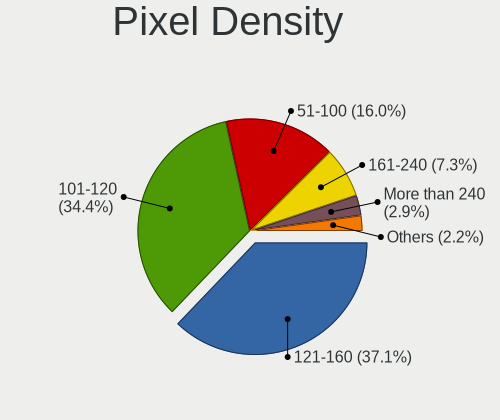
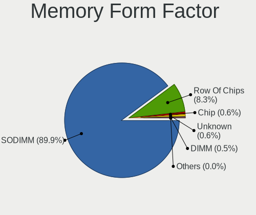

Linux - Tested Hardware & Statistics (Notebooks)
------------------------------------------------

A project to collect tested hardware configurations for Linux.

Anyone can contribute to this report by the [hw-probe](https://github.com/linuxhw/hw-probe) tool:

    sudo -E hw-probe -all -upload

Please contribute! Especially if your hardware is rare.

This report is for real hardware. Report for virtual hardware: [TestCoverage_VE](https://github.com/linuxhw/TestCoverage_VE)

Contents
--------

* [ Test Cases ](#test-cases)

* [ System ](#system)
  - [ OS                       ](#os)
  - [ OS Family                ](#os-family)
  - [ Kernel                   ](#kernel)
  - [ Kernel Family            ](#kernel-family)
  - [ Kernel Major Ver.        ](#kernel-major-ver)
  - [ Arch                     ](#arch)
  - [ DE                       ](#de)
  - [ Display Server           ](#display-server)
  - [ Display Manager          ](#display-manager)
  - [ OS Lang                  ](#os-lang)
  - [ Boot Mode                ](#boot-mode)
  - [ Filesystem               ](#filesystem)
  - [ Part. scheme             ](#part-scheme)
  - [ Dual Boot with Linux/BSD ](#dual-boot-with-linuxbsd)
  - [ Dual Boot (Win)          ](#dual-boot-win)

* [ Board ](#board)
  - [ Vendor                   ](#vendor)
  - [ Model                    ](#model)
  - [ Model Family             ](#model-family)
  - [ MFG Year                 ](#mfg-year)
  - [ Form Factor              ](#form-factor)
  - [ Secure Boot              ](#secure-boot)
  - [ Coreboot                 ](#coreboot)
  - [ RAM Size                 ](#ram-size)
  - [ RAM Used                 ](#ram-used)
  - [ Total Drives             ](#total-drives)
  - [ Has CD-ROM               ](#has-cd-rom)
  - [ Has Ethernet             ](#has-ethernet)
  - [ Has WiFi                 ](#has-wifi)
  - [ Has Bluetooth            ](#has-bluetooth)

* [ Location ](#location)
  - [ Country                  ](#country)
  - [ City                     ](#city)

* [ Drives ](#drives)
  - [ Drive Vendor             ](#drive-vendor)
  - [ Drive Model              ](#drive-model)
  - [ HDD Vendor               ](#hdd-vendor)
  - [ SSD Vendor               ](#ssd-vendor)
  - [ Drive Kind               ](#drive-kind)
  - [ Drive Connector          ](#drive-connector)
  - [ Drive Size               ](#drive-size)
  - [ Space Total              ](#space-total)
  - [ Space Used               ](#space-used)
  - [ Malfunc. Drives          ](#malfunc-drives)
  - [ Malfunc. Drive Vendor    ](#malfunc-drive-vendor)
  - [ Malfunc. HDD Vendor      ](#malfunc-hdd-vendor)
  - [ Malfunc. Drive Kind      ](#malfunc-drive-kind)
  - [ Failed Drives            ](#failed-drives)
  - [ Failed Drive Vendor      ](#failed-drive-vendor)
  - [ Drive Status             ](#drive-status)

* [ Storage controller ](#storage-controller)
  - [ Storage Vendor           ](#storage-vendor)
  - [ Storage Model            ](#storage-model)
  - [ Storage Kind             ](#storage-kind)

* [ Processor ](#processor)
  - [ CPU Vendor               ](#cpu-vendor)
  - [ CPU Model                ](#cpu-model)
  - [ CPU Model Family         ](#cpu-model-family)
  - [ CPU Cores                ](#cpu-cores)
  - [ CPU Sockets              ](#cpu-sockets)
  - [ CPU Threads              ](#cpu-threads)
  - [ CPU Op-Modes             ](#cpu-op-modes)
  - [ CPU Microcode            ](#cpu-microcode)
  - [ CPU Microarch            ](#cpu-microarch)

* [ Graphics ](#graphics)
  - [ GPU Vendor               ](#gpu-vendor)
  - [ GPU Model                ](#gpu-model)
  - [ GPU Combo                ](#gpu-combo)
  - [ GPU Driver               ](#gpu-driver)
  - [ GPU Memory               ](#gpu-memory)

* [ Monitor ](#monitor)
  - [ Monitor Vendor           ](#monitor-vendor)
  - [ Monitor Model            ](#monitor-model)
  - [ Monitor Resolution       ](#monitor-resolution)
  - [ Monitor Diagonal         ](#monitor-diagonal)
  - [ Monitor Width            ](#monitor-width)
  - [ Aspect Ratio             ](#aspect-ratio)
  - [ Monitor Area             ](#monitor-area)
  - [ Pixel Density            ](#pixel-density)
  - [ Multiple Monitors        ](#multiple-monitors)

* [ Network ](#network)
  - [ Net Controller Vendor    ](#net-controller-vendor)
  - [ Net Controller Model     ](#net-controller-model)
  - [ Wireless Vendor          ](#wireless-vendor)
  - [ Wireless Model           ](#wireless-model)
  - [ Ethernet Vendor          ](#ethernet-vendor)
  - [ Ethernet Model           ](#ethernet-model)
  - [ Net Controller Kind      ](#net-controller-kind)
  - [ Used Controller          ](#used-controller)
  - [ NICs                     ](#nics)
  - [ IPv6                     ](#ipv6)

* [ Bluetooth ](#bluetooth)
  - [ Bluetooth Vendor         ](#bluetooth-vendor)
  - [ Bluetooth Model          ](#bluetooth-model)

* [ Sound ](#sound)
  - [ Sound Vendor             ](#sound-vendor)
  - [ Sound Model              ](#sound-model)

* [ Memory ](#memory)
  - [ Memory Vendor            ](#memory-vendor)
  - [ Memory Model             ](#memory-model)
  - [ Memory Kind              ](#memory-kind)
  - [ Memory Form Factor       ](#memory-form-factor)
  - [ Memory Size              ](#memory-size)
  - [ Memory Speed             ](#memory-speed)

* [ Printers & scanners ](#printers--scanners)
  - [ Printer Vendor           ](#printer-vendor)
  - [ Printer Model            ](#printer-model)
  - [ Scanner Vendor           ](#scanner-vendor)
  - [ Scanner Model            ](#scanner-model)

* [ Camera ](#camera)
  - [ Camera Vendor            ](#camera-vendor)
  - [ Camera Model             ](#camera-model)

* [ Security ](#security)
  - [ Fingerprint Vendor       ](#fingerprint-vendor)
  - [ Fingerprint Model        ](#fingerprint-model)
  - [ Chipcard Vendor          ](#chipcard-vendor)
  - [ Chipcard Model           ](#chipcard-model)

* [ Unsupported ](#unsupported)
  - [ Unsupported Devices      ](#unsupported-devices)
  - [ Unsupported Device Types ](#unsupported-device-types)

Test Cases
----------

Total: 132077

| Vendor        | Model                       | Probe                                                      | Date         |
|---------------|-----------------------------|------------------------------------------------------------|--------------|
| ASUSTek       | X202E                       | [37ad2923f5](https://linux-hardware.org/?probe=37ad2923f5) | May 01, 2022 |
| Lenovo        | ThinkPad Yoga 11e 20DAS0... | [55402e38ae](https://linux-hardware.org/?probe=55402e38ae) | May 01, 2022 |
| Dell          | Inspiron 7577               | [9bde827e06](https://linux-hardware.org/?probe=9bde827e06) | May 01, 2022 |
| HP            | ProBook 640 G8 Notebook ... | [dc1b877e42](https://linux-hardware.org/?probe=dc1b877e42) | May 01, 2022 |
| ASUSTek       | PU551LA                     | [19e1b6041b](https://linux-hardware.org/?probe=19e1b6041b) | May 01, 2022 |
| HUAWEI        | KLVL-WXX9                   | [b152a1215a](https://linux-hardware.org/?probe=b152a1215a) | Apr 30, 2022 |
| ASUSTek       | Strix 17 GL703GE            | [fabd2d1e45](https://linux-hardware.org/?probe=fabd2d1e45) | Apr 30, 2022 |
| HP            | ProBook 455 G7              | [88fcea9210](https://linux-hardware.org/?probe=88fcea9210) | Apr 30, 2022 |
| ASUSTek       | Strix 17 GL703GE            | [0e0d0dd3aa](https://linux-hardware.org/?probe=0e0d0dd3aa) | Apr 30, 2022 |
| HP            | EliteBook 8440p             | [5a3254d19c](https://linux-hardware.org/?probe=5a3254d19c) | Apr 30, 2022 |
| Dell          | Inspiron 15-3567            | [589f58c857](https://linux-hardware.org/?probe=589f58c857) | Apr 30, 2022 |
| Fujitsu Si... | AMILO A1650G                | [fbf6d9db93](https://linux-hardware.org/?probe=fbf6d9db93) | Apr 30, 2022 |
| Lenovo        | ThinkPad T420 4177QKU       | [215758ad8a](https://linux-hardware.org/?probe=215758ad8a) | Apr 30, 2022 |
| Fujitsu Si... | AMILO A1650G                | [134f0a947b](https://linux-hardware.org/?probe=134f0a947b) | Apr 30, 2022 |
| ASUSTek       | G75VX                       | [fb58cab830](https://linux-hardware.org/?probe=fb58cab830) | Apr 30, 2022 |
| Dell          | Inspiron 7577               | [132a55cc40](https://linux-hardware.org/?probe=132a55cc40) | Apr 30, 2022 |
| Dell          | Precision M2800             | [deffc81ac5](https://linux-hardware.org/?probe=deffc81ac5) | Apr 30, 2022 |
| Dell          | Inspiron 3793               | [9d2383d1f8](https://linux-hardware.org/?probe=9d2383d1f8) | Apr 30, 2022 |
| Dell          | Vostro 3400                 | [da9df39f8c](https://linux-hardware.org/?probe=da9df39f8c) | Apr 30, 2022 |
| HP            | EliteBook 8440p             | [3782e39a43](https://linux-hardware.org/?probe=3782e39a43) | Apr 30, 2022 |
| Sony          | SVE1513R1EB                 | [59a46c5857](https://linux-hardware.org/?probe=59a46c5857) | Apr 30, 2022 |
| Lenovo        | IdeaPad 3 14ALC6 82KT       | [633bddd44b](https://linux-hardware.org/?probe=633bddd44b) | Apr 30, 2022 |
| Acer          | V5-171                      | [a07ba20ff0](https://linux-hardware.org/?probe=a07ba20ff0) | Apr 30, 2022 |
| Lenovo        | ThinkPad E15 Gen 3 20YG0... | [6710b89c52](https://linux-hardware.org/?probe=6710b89c52) | Apr 30, 2022 |
| Dell          | Vostro 3400                 | [de3670cdd7](https://linux-hardware.org/?probe=de3670cdd7) | Apr 30, 2022 |
| HP            | 650                         | [1332a3196c](https://linux-hardware.org/?probe=1332a3196c) | Apr 30, 2022 |
| Dell          | Vostro 3400                 | [29400ed868](https://linux-hardware.org/?probe=29400ed868) | Apr 30, 2022 |
| Lenovo        | G700 20251                  | [94272db5ec](https://linux-hardware.org/?probe=94272db5ec) | Apr 30, 2022 |
| Alienware     | x17 R2                      | [d78db966bc](https://linux-hardware.org/?probe=d78db966bc) | Apr 30, 2022 |
| Lenovo        | Legion 5 15ACH6H 82JU       | [5838cd4268](https://linux-hardware.org/?probe=5838cd4268) | Apr 30, 2022 |
| Lenovo        | IdeaPad 5 15ARE05 81YQ      | [95ec2ff7d2](https://linux-hardware.org/?probe=95ec2ff7d2) | Apr 30, 2022 |
| Dell          | Vostro 1720                 | [bc8f50b9fb](https://linux-hardware.org/?probe=bc8f50b9fb) | Apr 30, 2022 |
| HP            | Presario C500 (GF581UA#A... | [0e01914db4](https://linux-hardware.org/?probe=0e01914db4) | Apr 30, 2022 |
| Dell          | Vostro 3400                 | [72ea7f5155](https://linux-hardware.org/?probe=72ea7f5155) | Apr 30, 2022 |
| Dell          | Vostro 1720                 | [56cc7a9a54](https://linux-hardware.org/?probe=56cc7a9a54) | Apr 30, 2022 |
| HP            | ProBook 440 G8 Notebook ... | [a4adaba544](https://linux-hardware.org/?probe=a4adaba544) | Apr 30, 2022 |
| Lenovo        | 81VS                        | [1ff46f7cdc](https://linux-hardware.org/?probe=1ff46f7cdc) | Apr 30, 2022 |
| Dell          | G3 3500                     | [df72f36c52](https://linux-hardware.org/?probe=df72f36c52) | Apr 30, 2022 |
| Lenovo        | 81VS                        | [ea23b0e852](https://linux-hardware.org/?probe=ea23b0e852) | Apr 30, 2022 |
| Lenovo        | ThinkPad T61 7659A39        | [e5c32846e2](https://linux-hardware.org/?probe=e5c32846e2) | Apr 30, 2022 |
| HP            | Pavilion Laptop 14-ec0xx... | [3a7cd290f6](https://linux-hardware.org/?probe=3a7cd290f6) | Apr 30, 2022 |
| Lenovo        | G510 20238                  | [07e8a61019](https://linux-hardware.org/?probe=07e8a61019) | Apr 30, 2022 |
| Dell          | Latitude 3330               | [1843c62895](https://linux-hardware.org/?probe=1843c62895) | Apr 30, 2022 |
| Dell          | System XPS L502X            | [77e1846d8d](https://linux-hardware.org/?probe=77e1846d8d) | Apr 30, 2022 |
| Dell          | XPS M1530                   | [0e58eb209d](https://linux-hardware.org/?probe=0e58eb209d) | Apr 30, 2022 |
| Lenovo        | IdeaPad Flex-14API 81SS     | [f5d70fb9d3](https://linux-hardware.org/?probe=f5d70fb9d3) | Apr 30, 2022 |
| ASUSTek       | X756UQ                      | [c876e88eea](https://linux-hardware.org/?probe=c876e88eea) | Apr 30, 2022 |
| Dell          | XPS M1530                   | [757d1b099e](https://linux-hardware.org/?probe=757d1b099e) | Apr 30, 2022 |
| ASUSTek       | TUF Gaming FX705GM_FX705... | [3589ada8b3](https://linux-hardware.org/?probe=3589ada8b3) | Apr 30, 2022 |
| ASUSTek       | UX31A                       | [59228e735e](https://linux-hardware.org/?probe=59228e735e) | Apr 30, 2022 |
| Dell          | Precision M6500             | [a3d82a4f1a](https://linux-hardware.org/?probe=a3d82a4f1a) | Apr 30, 2022 |
| Dell          | Precision M6500             | [cb7e68eb50](https://linux-hardware.org/?probe=cb7e68eb50) | Apr 30, 2022 |
| Lenovo        | ThinkPad X270 W10DG 20K5... | [e14a2c047d](https://linux-hardware.org/?probe=e14a2c047d) | Apr 30, 2022 |
| Google        | Lick                        | [33d1e6209a](https://linux-hardware.org/?probe=33d1e6209a) | Apr 30, 2022 |
| Itautec       | Infoway w7535               | [ac87d9e508](https://linux-hardware.org/?probe=ac87d9e508) | Apr 30, 2022 |
| ASUSTek       | X756UQ                      | [2543d87831](https://linux-hardware.org/?probe=2543d87831) | Apr 30, 2022 |
| Lenovo        | ThinkPad Yoga 11e 20DAS0... | [df7b5507c1](https://linux-hardware.org/?probe=df7b5507c1) | Apr 30, 2022 |
| HP            | G42                         | [e23740df6e](https://linux-hardware.org/?probe=e23740df6e) | Apr 30, 2022 |
| HUAWEI        | HVY-WXX9                    | [d7913302d5](https://linux-hardware.org/?probe=d7913302d5) | Apr 30, 2022 |
| Dell          | Vostro 5581                 | [cdcb310766](https://linux-hardware.org/?probe=cdcb310766) | Apr 30, 2022 |
| Lenovo        | Z50-70 20354                | [f253fe8221](https://linux-hardware.org/?probe=f253fe8221) | Apr 30, 2022 |
| Dell          | G7 7700                     | [462862ed56](https://linux-hardware.org/?probe=462862ed56) | Apr 30, 2022 |
| Dell          | Inspiron N4050              | [6d8f615203](https://linux-hardware.org/?probe=6d8f615203) | Apr 30, 2022 |
| HP            | G42                         | [f6ca4559f5](https://linux-hardware.org/?probe=f6ca4559f5) | Apr 30, 2022 |
| Lenovo        | IdeaPad Z510 20287          | [058184d73c](https://linux-hardware.org/?probe=058184d73c) | Apr 30, 2022 |
| Dell          | Precision 7520              | [2dc98a1a8d](https://linux-hardware.org/?probe=2dc98a1a8d) | Apr 30, 2022 |
| Lenovo        | ThinkBook 15 G2 ITL 20VE    | [31b081b116](https://linux-hardware.org/?probe=31b081b116) | Apr 30, 2022 |
| Toshiba       | Dakar10FW8                  | [fbe2aaac31](https://linux-hardware.org/?probe=fbe2aaac31) | Apr 30, 2022 |
| Dell          | G5 5590                     | [4738729947](https://linux-hardware.org/?probe=4738729947) | Apr 30, 2022 |
| Toshiba       | Satellite C55-A-1J8         | [26cd3478c5](https://linux-hardware.org/?probe=26cd3478c5) | Apr 30, 2022 |
| Acer          | Aspire ES1-512              | [642d72d06d](https://linux-hardware.org/?probe=642d72d06d) | Apr 30, 2022 |
| SLIMBOOK      | PROX15-AMD                  | [c934f2e590](https://linux-hardware.org/?probe=c934f2e590) | Apr 30, 2022 |
| Lenovo        | ThinkBook 14 G2 ARE 20VF    | [b6cbc6e523](https://linux-hardware.org/?probe=b6cbc6e523) | Apr 30, 2022 |
| Lenovo        | ThinkPad L15 Gen 2 20X4S... | [48d3759522](https://linux-hardware.org/?probe=48d3759522) | Apr 30, 2022 |
| Lenovo        | ThinkPad T540p 20BFS26E0... | [06738e7bb8](https://linux-hardware.org/?probe=06738e7bb8) | Apr 30, 2022 |
| MSI           | GP65 Leopard 10SFK          | [4523d433d4](https://linux-hardware.org/?probe=4523d433d4) | Apr 30, 2022 |
| Lenovo        | ThinkPad P15v Gen 1 20TQ... | [ac5b1123ad](https://linux-hardware.org/?probe=ac5b1123ad) | Apr 30, 2022 |
| MSI           | GP65 Leopard 10SFK          | [a30f4b3e9f](https://linux-hardware.org/?probe=a30f4b3e9f) | Apr 30, 2022 |
| NSX           | SB1402                      | [c9d79a4fe5](https://linux-hardware.org/?probe=c9d79a4fe5) | Apr 30, 2022 |
| Lenovo        | G50-30 80G0                 | [bc333fe437](https://linux-hardware.org/?probe=bc333fe437) | Apr 30, 2022 |
| Acer          | Aspire E5-774G              | [32426089be](https://linux-hardware.org/?probe=32426089be) | Apr 30, 2022 |
| HP            | Stream Notebook PC 13       | [f4eb2d351c](https://linux-hardware.org/?probe=f4eb2d351c) | Apr 30, 2022 |
| HUAWEI        | BOM-WXX9                    | [faa7213f5c](https://linux-hardware.org/?probe=faa7213f5c) | Apr 30, 2022 |
| Acer          | Aspire E5-774G              | [0fce8f01ae](https://linux-hardware.org/?probe=0fce8f01ae) | Apr 30, 2022 |
| HP            | Pavilion dv7                | [f66df9ca5b](https://linux-hardware.org/?probe=f66df9ca5b) | Apr 30, 2022 |
| Lenovo        | ThinkPad S3 Yoga 14 20DM... | [5d0f1a15e1](https://linux-hardware.org/?probe=5d0f1a15e1) | Apr 30, 2022 |
| Dell          | G3 3500                     | [c9ee387b32](https://linux-hardware.org/?probe=c9ee387b32) | Apr 30, 2022 |
| Apple         | MacBookAir5,1               | [45c12c8fc4](https://linux-hardware.org/?probe=45c12c8fc4) | Apr 30, 2022 |
| Acer          | Aspire A517-51G             | [a7e637b1af](https://linux-hardware.org/?probe=a7e637b1af) | Apr 30, 2022 |
| HP            | Pavilion dv7                | [150931746e](https://linux-hardware.org/?probe=150931746e) | Apr 30, 2022 |
| ASUSTek       | X550VC                      | [16223d208e](https://linux-hardware.org/?probe=16223d208e) | Apr 30, 2022 |
| HP            | Laptop 15-dw3xxx            | [889f1cba36](https://linux-hardware.org/?probe=889f1cba36) | Apr 30, 2022 |
| MSI           | PS63 Modern 8M              | [06f3f7a100](https://linux-hardware.org/?probe=06f3f7a100) | Apr 30, 2022 |
| HP            | ProBook 440 G8 Notebook ... | [a7fe3cb0f6](https://linux-hardware.org/?probe=a7fe3cb0f6) | Apr 30, 2022 |
| Lenovo        | ThinkPad T530 2394CTO       | [73ee1262a6](https://linux-hardware.org/?probe=73ee1262a6) | Apr 30, 2022 |
| Positivo      | S14CT01                     | [7260e4f199](https://linux-hardware.org/?probe=7260e4f199) | Apr 30, 2022 |
| Lenovo        | G40-70 80GA                 | [fcd20cb250](https://linux-hardware.org/?probe=fcd20cb250) | Apr 30, 2022 |
| Acer          | Aspire 4349                 | [f34555b3d6](https://linux-hardware.org/?probe=f34555b3d6) | Apr 30, 2022 |
| eMachines     | eME730                      | [ac985950eb](https://linux-hardware.org/?probe=ac985950eb) | Apr 30, 2022 |
| HP            | ProBook 4520s               | [60eab2c6c5](https://linux-hardware.org/?probe=60eab2c6c5) | Apr 30, 2022 |
| Positivo      | S14CT01                     | [dec0b170c2](https://linux-hardware.org/?probe=dec0b170c2) | Apr 30, 2022 |
| Dell          | Latitude 7390               | [bbf3908118](https://linux-hardware.org/?probe=bbf3908118) | Apr 30, 2022 |
| Acer          | Aspire A315-53              | [24faa6d3b2](https://linux-hardware.org/?probe=24faa6d3b2) | Apr 30, 2022 |
| ASUSTek       | UX303LAB                    | [4d47234d72](https://linux-hardware.org/?probe=4d47234d72) | Apr 30, 2022 |
| Lenovo        | Yoga Slim 7 14ARE05 82A2    | [a90e6b2be7](https://linux-hardware.org/?probe=a90e6b2be7) | Apr 30, 2022 |
| Acer          | Aspire E5-411G              | [0629e76746](https://linux-hardware.org/?probe=0629e76746) | Apr 30, 2022 |
| Apple         | MacBookPro8,1               | [8826e1d451](https://linux-hardware.org/?probe=8826e1d451) | Apr 30, 2022 |
| HP            | Laptop 17-ca0xxx            | [10eb959775](https://linux-hardware.org/?probe=10eb959775) | Apr 30, 2022 |
| HP            | Pavilion Notebook           | [995ea9538b](https://linux-hardware.org/?probe=995ea9538b) | Apr 30, 2022 |
| Dell          | Latitude 5480               | [ba1ff8183e](https://linux-hardware.org/?probe=ba1ff8183e) | Apr 30, 2022 |
| Dell          | Latitude 9420               | [4ba28afe84](https://linux-hardware.org/?probe=4ba28afe84) | Apr 30, 2022 |
| HP            | ENVY dv7                    | [5793ce4fb8](https://linux-hardware.org/?probe=5793ce4fb8) | Apr 30, 2022 |
| HP            | ZBook 15 G5                 | [133b6e19a9](https://linux-hardware.org/?probe=133b6e19a9) | Apr 30, 2022 |
| Acer          | Aspire E5-571               | [35b5fa2276](https://linux-hardware.org/?probe=35b5fa2276) | Apr 30, 2022 |
| HP            | ZBook 15 G5                 | [ce42a9f877](https://linux-hardware.org/?probe=ce42a9f877) | Apr 30, 2022 |
| Timi          | TM1701                      | [f81bb7efbe](https://linux-hardware.org/?probe=f81bb7efbe) | Apr 30, 2022 |
| HP            | ENVY dv7                    | [7f4dd80400](https://linux-hardware.org/?probe=7f4dd80400) | Apr 30, 2022 |
| Lenovo        | ThinkPad P1 Gen 2 20QUS1... | [2065a3c2f3](https://linux-hardware.org/?probe=2065a3c2f3) | Apr 30, 2022 |
| Toshiba       | Satellite L10W-B-101        | [8383d306f3](https://linux-hardware.org/?probe=8383d306f3) | Apr 30, 2022 |
| Acer          | Nitro AN517-51              | [81d7fd8d2e](https://linux-hardware.org/?probe=81d7fd8d2e) | Apr 30, 2022 |
| Pegatron      | Spring Peak                 | [66a1692171](https://linux-hardware.org/?probe=66a1692171) | Apr 30, 2022 |
| Lenovo        | ThinkPad Edge E530 62724... | [07334ae084](https://linux-hardware.org/?probe=07334ae084) | Apr 30, 2022 |
| HP            | EliteBook 840 G1            | [47c28082e8](https://linux-hardware.org/?probe=47c28082e8) | Apr 30, 2022 |
| Dell          | Precision 7540              | [8b1b7dd8da](https://linux-hardware.org/?probe=8b1b7dd8da) | Apr 30, 2022 |
| Lenovo        | ThinkBook 15 G2 ITL 20VE    | [1abef3591b](https://linux-hardware.org/?probe=1abef3591b) | Apr 30, 2022 |
| Sony          | VPCEH2J1E                   | [86f6b8c750](https://linux-hardware.org/?probe=86f6b8c750) | Apr 30, 2022 |
| HP            | ZBook 15 G6                 | [f948921cba](https://linux-hardware.org/?probe=f948921cba) | Apr 30, 2022 |
| Dell          | XPS 13 9343                 | [b48ccc106e](https://linux-hardware.org/?probe=b48ccc106e) | Apr 30, 2022 |
| Toshiba       | IS 1413G                    | [8074a86bc7](https://linux-hardware.org/?probe=8074a86bc7) | Apr 30, 2022 |
| HP            | ProBook 440 G7              | [6bba4f2274](https://linux-hardware.org/?probe=6bba4f2274) | Apr 30, 2022 |
| Google        | Fleex                       | [212ff0673f](https://linux-hardware.org/?probe=212ff0673f) | Apr 30, 2022 |
| Lenovo        | V330-15IKB 81AX             | [60a636868c](https://linux-hardware.org/?probe=60a636868c) | Apr 30, 2022 |
| Lenovo        | IdeaPad S145-15IWL 81MV     | [05db30a69b](https://linux-hardware.org/?probe=05db30a69b) | Apr 30, 2022 |
| Lenovo        | S10-3                       | [712c2dced9](https://linux-hardware.org/?probe=712c2dced9) | Apr 30, 2022 |
| Acer          | Aspire E5-571               | [ebdc8b1380](https://linux-hardware.org/?probe=ebdc8b1380) | Apr 30, 2022 |
| ASUSTek       | T100HAN                     | [5ee200cfbe](https://linux-hardware.org/?probe=5ee200cfbe) | Apr 30, 2022 |
| Lenovo        | IdeaPad 5 14ITL05 82FE      | [51625474b7](https://linux-hardware.org/?probe=51625474b7) | Apr 30, 2022 |
| Dell          | XPS 15 9510                 | [b92517268e](https://linux-hardware.org/?probe=b92517268e) | Apr 30, 2022 |
| Acer          | Aspire A514-54              | [70efbbb6c7](https://linux-hardware.org/?probe=70efbbb6c7) | Apr 30, 2022 |
| HP            | Pavilion Gaming Laptop 1... | [67d1865b69](https://linux-hardware.org/?probe=67d1865b69) | Apr 30, 2022 |
| HP            | Pavilion Gaming Laptop 1... | [57a8a5bfcd](https://linux-hardware.org/?probe=57a8a5bfcd) | Apr 30, 2022 |
| ASUSTek       | X550LC                      | [be5992f617](https://linux-hardware.org/?probe=be5992f617) | Apr 30, 2022 |
| Acer          | Aspire A315-23              | [865091bbc1](https://linux-hardware.org/?probe=865091bbc1) | Apr 30, 2022 |
| Philco        | 14I                         | [03bb0fdeef](https://linux-hardware.org/?probe=03bb0fdeef) | Apr 30, 2022 |
| Acer          | Aspire A315-23              | [5ee29c3982](https://linux-hardware.org/?probe=5ee29c3982) | Apr 30, 2022 |
| HP            | Laptop 17-by3xxx            | [087399e252](https://linux-hardware.org/?probe=087399e252) | Apr 30, 2022 |
| Toshiba       | Satellite C660              | [f4403056c8](https://linux-hardware.org/?probe=f4403056c8) | Apr 30, 2022 |
| ASUSTek       | X553MA                      | [3d56136487](https://linux-hardware.org/?probe=3d56136487) | Apr 30, 2022 |
| Dell          | Latitude 5490               | [9445f416cb](https://linux-hardware.org/?probe=9445f416cb) | Apr 30, 2022 |
| ASUSTek       | X556UR                      | [3f920954f7](https://linux-hardware.org/?probe=3f920954f7) | Apr 30, 2022 |
| Acer          | V5-171                      | [8500a1c376](https://linux-hardware.org/?probe=8500a1c376) | Apr 30, 2022 |
| HP            | Pavilion Sleekbook 15       | [0003f9342e](https://linux-hardware.org/?probe=0003f9342e) | Apr 30, 2022 |
| Dell          | Inspiron 15-3565            | [a26578c0fc](https://linux-hardware.org/?probe=a26578c0fc) | Apr 30, 2022 |
| Valve         | Jupiter                     | [1c826aed5e](https://linux-hardware.org/?probe=1c826aed5e) | Apr 30, 2022 |
| HP            | Laptop 14-dq1xxx            | [7c9e2f4d8f](https://linux-hardware.org/?probe=7c9e2f4d8f) | Apr 30, 2022 |
| Lenovo        | ThinkPad L15 Gen 1 20U4S... | [55e76f131d](https://linux-hardware.org/?probe=55e76f131d) | Apr 30, 2022 |
| Acer          | TM4750                      | [b515682692](https://linux-hardware.org/?probe=b515682692) | Apr 30, 2022 |
| Dell          | XPS 15 9510                 | [52609c3695](https://linux-hardware.org/?probe=52609c3695) | Apr 29, 2022 |
| HP            | 255 G6 Notebook PC          | [f639c7c8f5](https://linux-hardware.org/?probe=f639c7c8f5) | Apr 29, 2022 |
| HP            | ZBook 15 G5                 | [aac5097e2a](https://linux-hardware.org/?probe=aac5097e2a) | Apr 29, 2022 |
| ASUSTek       | X71Vn                       | [b31a7dce8b](https://linux-hardware.org/?probe=b31a7dce8b) | Apr 29, 2022 |
| HP            | ENVY Laptop 15-ep0xxx       | [96dbfb494e](https://linux-hardware.org/?probe=96dbfb494e) | Apr 29, 2022 |
| HP            | Laptop 17-by4xxx            | [767590ac38](https://linux-hardware.org/?probe=767590ac38) | Apr 29, 2022 |
| Dell          | Inspiron N5050              | [7d3cb853e6](https://linux-hardware.org/?probe=7d3cb853e6) | Apr 29, 2022 |
| Sony          | SVE1513R1EB                 | [d1e0096b2d](https://linux-hardware.org/?probe=d1e0096b2d) | Apr 29, 2022 |
| HP            | EliteBook 840 G1            | [53bceed0aa](https://linux-hardware.org/?probe=53bceed0aa) | Apr 29, 2022 |
| Lenovo        | Legion 7 16ACHg6 82N6       | [bad5b7036e](https://linux-hardware.org/?probe=bad5b7036e) | Apr 29, 2022 |
| Dell          | Latitude 5520               | [d35917a603](https://linux-hardware.org/?probe=d35917a603) | Apr 29, 2022 |
| Dell          | Inspiron N4010              | [e1369b0428](https://linux-hardware.org/?probe=e1369b0428) | Apr 29, 2022 |
| Lenovo        | ThinkPad S3-S440 20AY00B... | [1ecbcb6b83](https://linux-hardware.org/?probe=1ecbcb6b83) | Apr 29, 2022 |
| Acer          | Aspire A315-42G             | [56fabb8cec](https://linux-hardware.org/?probe=56fabb8cec) | Apr 29, 2022 |
| Dell          | Latitude 5520               | [9851c7847d](https://linux-hardware.org/?probe=9851c7847d) | Apr 29, 2022 |
| ASUSTek       | S551LN                      | [a5f0e1cee7](https://linux-hardware.org/?probe=a5f0e1cee7) | Apr 29, 2022 |
| Dell          | Latitude E6330              | [c78066bc19](https://linux-hardware.org/?probe=c78066bc19) | Apr 29, 2022 |
| Dell          | Precision M6600             | [bb40a22dd3](https://linux-hardware.org/?probe=bb40a22dd3) | Apr 29, 2022 |
| HP            | EliteBook 8570w             | [e6f47edf47](https://linux-hardware.org/?probe=e6f47edf47) | Apr 29, 2022 |
| Avell High... | B.ON                        | [eb3d4d0f78](https://linux-hardware.org/?probe=eb3d4d0f78) | Apr 29, 2022 |
| Lenovo        | IdeaPad Y700-17ISK 80Q0     | [2c8a1c2444](https://linux-hardware.org/?probe=2c8a1c2444) | Apr 29, 2022 |
| Acer          | Aspire A715-71G             | [ec6c90818c](https://linux-hardware.org/?probe=ec6c90818c) | Apr 29, 2022 |
| Lenovo        | ThinkPad P14s Gen 2a 21A... | [9f5c24d3e8](https://linux-hardware.org/?probe=9f5c24d3e8) | Apr 29, 2022 |
| Lenovo        | ThinkPad S3-S440 20AY00B... | [474e572043](https://linux-hardware.org/?probe=474e572043) | Apr 29, 2022 |
| Toshiba       | Satellite C650              | [58539bbf0a](https://linux-hardware.org/?probe=58539bbf0a) | Apr 29, 2022 |
| Dell          | Precision 3551              | [b146dc2249](https://linux-hardware.org/?probe=b146dc2249) | Apr 29, 2022 |
| Google        | Bobba360                    | [e90fbcc91d](https://linux-hardware.org/?probe=e90fbcc91d) | Apr 29, 2022 |
| Toshiba       | Satellite P50-B-103         | [6df44e9098](https://linux-hardware.org/?probe=6df44e9098) | Apr 29, 2022 |
| ASUSTek       | ROG Zephyrus G14 GA402RJ... | [96fc510369](https://linux-hardware.org/?probe=96fc510369) | Apr 29, 2022 |
| ASUSTek       | G55VW                       | [6bd8a1b04a](https://linux-hardware.org/?probe=6bd8a1b04a) | Apr 29, 2022 |
| Dell          | Precision 3551              | [d5a3a490f4](https://linux-hardware.org/?probe=d5a3a490f4) | Apr 29, 2022 |
| Lenovo        | Z50-75 80EC                 | [f301c52b41](https://linux-hardware.org/?probe=f301c52b41) | Apr 29, 2022 |
| ASUSTek       | UX31E                       | [8f165f54aa](https://linux-hardware.org/?probe=8f165f54aa) | Apr 29, 2022 |
| ASUSTek       | ZenBook UX450FDX_UX480FD    | [9f7923bcd2](https://linux-hardware.org/?probe=9f7923bcd2) | Apr 29, 2022 |
| Lenovo        | IdeaPad 100-15IBD 80QQ      | [4af637024a](https://linux-hardware.org/?probe=4af637024a) | Apr 29, 2022 |
| Lenovo        | ThinkPad P14s Gen 2a 21A... | [da73d0b77d](https://linux-hardware.org/?probe=da73d0b77d) | Apr 29, 2022 |
| ASUSTek       | X541UAK                     | [7bac9962d9](https://linux-hardware.org/?probe=7bac9962d9) | Apr 29, 2022 |
| Lenovo        | ThinkPad T450 20BV001YMS    | [f38b762c83](https://linux-hardware.org/?probe=f38b762c83) | Apr 29, 2022 |
| HP            | EliteBook 8570w             | [7795fe989b](https://linux-hardware.org/?probe=7795fe989b) | Apr 29, 2022 |
| TUXEDO        | Book BM15 Gen10             | [45b5b1bba9](https://linux-hardware.org/?probe=45b5b1bba9) | Apr 29, 2022 |
| HP            | Laptop 15-db1xxx            | [442670a18f](https://linux-hardware.org/?probe=442670a18f) | Apr 29, 2022 |
| Dell          | Inspiron 3542               | [19f5e16bce](https://linux-hardware.org/?probe=19f5e16bce) | Apr 29, 2022 |
| HP            | Laptop 15-da0xxx            | [6ad1b34a48](https://linux-hardware.org/?probe=6ad1b34a48) | Apr 29, 2022 |
| Dell          | XPS 13 7390                 | [aadc641825](https://linux-hardware.org/?probe=aadc641825) | Apr 29, 2022 |
| Lenovo        | ThinkPad E14 Gen 4 21ECS... | [61bb949815](https://linux-hardware.org/?probe=61bb949815) | Apr 29, 2022 |
| Google        | Enguarde                    | [878203f099](https://linux-hardware.org/?probe=878203f099) | Apr 29, 2022 |
| Lenovo        | Yoga S740-14IIL 81RS        | [6affdcee0f](https://linux-hardware.org/?probe=6affdcee0f) | Apr 29, 2022 |
| ASUSTek       | K52N                        | [29f3f98ad0](https://linux-hardware.org/?probe=29f3f98ad0) | Apr 29, 2022 |
| ASUSTek       | X553MA                      | [2c284d0f8c](https://linux-hardware.org/?probe=2c284d0f8c) | Apr 29, 2022 |
| Lenovo        | ThinkPad T420 4180A21       | [6b5a6e89a2](https://linux-hardware.org/?probe=6b5a6e89a2) | Apr 29, 2022 |
| HP            | Pavilion Gaming Laptop 1... | [f842336794](https://linux-hardware.org/?probe=f842336794) | Apr 29, 2022 |
| ASUSTek       | X411UN                      | [c864c65ec1](https://linux-hardware.org/?probe=c864c65ec1) | Apr 29, 2022 |
| Dell          | Inspiron N5110              | [fb1248d6be](https://linux-hardware.org/?probe=fb1248d6be) | Apr 29, 2022 |
| MSI           | CR70 2M/CX70 2OC/CX70 2O... | [454226474b](https://linux-hardware.org/?probe=454226474b) | Apr 29, 2022 |
| Acer          | Aspire A515-56              | [a10b79694f](https://linux-hardware.org/?probe=a10b79694f) | Apr 29, 2022 |
| Acer          | TravelMate 2490             | [8cc2cf84f4](https://linux-hardware.org/?probe=8cc2cf84f4) | Apr 29, 2022 |
| Lenovo        | ThinkPad L560 20F1001YGE    | [c4021bd208](https://linux-hardware.org/?probe=c4021bd208) | Apr 29, 2022 |
| Fujitsu Si... | ESPRIMO Mobile V5535        | [5d02fb20c7](https://linux-hardware.org/?probe=5d02fb20c7) | Apr 29, 2022 |
| HP            | Pavilion Gaming Laptop 1... | [bd2dda1d8a](https://linux-hardware.org/?probe=bd2dda1d8a) | Apr 29, 2022 |
| YASHI         | MYBOOK 360                  | [d44c4fd567](https://linux-hardware.org/?probe=d44c4fd567) | Apr 29, 2022 |
| Toshiba       | Satellite Pro R50-B         | [6a8bdd387c](https://linux-hardware.org/?probe=6a8bdd387c) | Apr 29, 2022 |
| Acer          | TravelMate 6592             | [7d4878ff33](https://linux-hardware.org/?probe=7d4878ff33) | Apr 29, 2022 |
| HP            | ENVY dv7                    | [dbd8feaee0](https://linux-hardware.org/?probe=dbd8feaee0) | Apr 29, 2022 |
| HP            | ZBook 15 G3                 | [94d74e9b78](https://linux-hardware.org/?probe=94d74e9b78) | Apr 29, 2022 |
| Lenovo        | IdeaPad L340-15API 81LW     | [2614591cf9](https://linux-hardware.org/?probe=2614591cf9) | Apr 29, 2022 |
| ASUSTek       | K53SC                       | [f2605ba739](https://linux-hardware.org/?probe=f2605ba739) | Apr 29, 2022 |
| Lenovo        | ThinkPad T470 W10DG 20JN... | [e7ca44864b](https://linux-hardware.org/?probe=e7ca44864b) | Apr 29, 2022 |
| HP            | ZBook 15 G3                 | [ced6ab1ae8](https://linux-hardware.org/?probe=ced6ab1ae8) | Apr 29, 2022 |
| ASUSTek       | VivoBook_ASUSLaptop X421... | [af3efcde26](https://linux-hardware.org/?probe=af3efcde26) | Apr 29, 2022 |
| Pine Micro... | Pine64 Pinebook Pro         | [65c9d1ca57](https://linux-hardware.org/?probe=65c9d1ca57) | Apr 29, 2022 |
| Dell          | XPS 13 9360                 | [5df7751e99](https://linux-hardware.org/?probe=5df7751e99) | Apr 29, 2022 |
| Dell          | Inspiron 7400               | [0c0af6919d](https://linux-hardware.org/?probe=0c0af6919d) | Apr 29, 2022 |
| MSI           | Katana GF76 11SC            | [15dcec28fc](https://linux-hardware.org/?probe=15dcec28fc) | Apr 29, 2022 |
| Acer          | Aspire 5750G                | [9444fc82ad](https://linux-hardware.org/?probe=9444fc82ad) | Apr 29, 2022 |
| HP            | Pavilion Gaming Laptop 1... | [cfc9c5dbf7](https://linux-hardware.org/?probe=cfc9c5dbf7) | Apr 29, 2022 |
| Lenovo        | ThinkPad T450 20BUS1MN00    | [4e2b073a5c](https://linux-hardware.org/?probe=4e2b073a5c) | Apr 29, 2022 |
| Fujitsu Si... | AMILO Xi 3650               | [61da560f18](https://linux-hardware.org/?probe=61da560f18) | Apr 29, 2022 |
| HP            | ProBook 645 G4              | [0a4b56ae27](https://linux-hardware.org/?probe=0a4b56ae27) | Apr 29, 2022 |
| ASUSTek       | ASUS TUF Gaming F15 FX50... | [df82c076b8](https://linux-hardware.org/?probe=df82c076b8) | Apr 29, 2022 |
| Acer          | Aspire 5750G                | [6ee3965a21](https://linux-hardware.org/?probe=6ee3965a21) | Apr 29, 2022 |
| Acer          | AOD270                      | [d0fae524f9](https://linux-hardware.org/?probe=d0fae524f9) | Apr 29, 2022 |
| ASUSTek       | TUF Gaming FX504GE_FX80G... | [d5828a8f9f](https://linux-hardware.org/?probe=d5828a8f9f) | Apr 29, 2022 |
| Acer          | AOD270                      | [44d897bc15](https://linux-hardware.org/?probe=44d897bc15) | Apr 29, 2022 |
| Dell          | Latitude 3420               | [d1239521b9](https://linux-hardware.org/?probe=d1239521b9) | Apr 29, 2022 |
| Acer          | Aspire ES1-311              | [aa4612575b](https://linux-hardware.org/?probe=aa4612575b) | Apr 29, 2022 |
| MSI           | GE66 Raider 11UH            | [9bdf866ebc](https://linux-hardware.org/?probe=9bdf866ebc) | Apr 29, 2022 |
| HP            | Pavilion 17                 | [6de5e5677f](https://linux-hardware.org/?probe=6de5e5677f) | Apr 29, 2022 |
| Toshiba       | Satellite P200              | [9b29aa0e0e](https://linux-hardware.org/?probe=9b29aa0e0e) | Apr 29, 2022 |
| Dell          | G5 5500                     | [c6064853ad](https://linux-hardware.org/?probe=c6064853ad) | Apr 29, 2022 |
| Dell          | Vostro 1510                 | [3b071a4b76](https://linux-hardware.org/?probe=3b071a4b76) | Apr 29, 2022 |
| Lenovo        | ThinkPad X390 20Q1SCDR00    | [41a3cac1f4](https://linux-hardware.org/?probe=41a3cac1f4) | Apr 29, 2022 |
| SLIMBOOK      | PROX15-AMD                  | [dc1c531e45](https://linux-hardware.org/?probe=dc1c531e45) | Apr 29, 2022 |
| Dell          | Vostro 1510                 | [483727ec47](https://linux-hardware.org/?probe=483727ec47) | Apr 29, 2022 |
| HP            | Pavilion 14                 | [84bde5e223](https://linux-hardware.org/?probe=84bde5e223) | Apr 29, 2022 |
| HP            | Pavilion 15                 | [2484213956](https://linux-hardware.org/?probe=2484213956) | Apr 29, 2022 |
| HP            | Pavilion dv7                | [fd2d8cc4f6](https://linux-hardware.org/?probe=fd2d8cc4f6) | Apr 29, 2022 |
| Dell          | Latitude E7450              | [ed6e7a9362](https://linux-hardware.org/?probe=ed6e7a9362) | Apr 29, 2022 |
| Dell          | Inspiron 3421               | [15a2c261da](https://linux-hardware.org/?probe=15a2c261da) | Apr 29, 2022 |
| Lenovo        | ThinkPad T480 20L6S29D02    | [1eb07120eb](https://linux-hardware.org/?probe=1eb07120eb) | Apr 29, 2022 |
| Teclast       | F7 Plus                     | [8096cf3295](https://linux-hardware.org/?probe=8096cf3295) | Apr 29, 2022 |
| Dell          | Latitude 3540               | [a97573f3cf](https://linux-hardware.org/?probe=a97573f3cf) | Apr 29, 2022 |
| Dell          | Latitude 3540               | [a6b8509194](https://linux-hardware.org/?probe=a6b8509194) | Apr 29, 2022 |
| Lenovo        | ThinkPad X1 Extreme 2nd ... | [12a0105da3](https://linux-hardware.org/?probe=12a0105da3) | Apr 29, 2022 |
| Lenovo        | IdeaPad 330-15IKB 81FE      | [6ace557278](https://linux-hardware.org/?probe=6ace557278) | Apr 29, 2022 |
| Lenovo        | ThinkPad E15 Gen 2 20T80... | [637af2dcc6](https://linux-hardware.org/?probe=637af2dcc6) | Apr 29, 2022 |
| Apple         | MacBookPro8,2               | [50c8a02c35](https://linux-hardware.org/?probe=50c8a02c35) | Apr 29, 2022 |
| Lenovo        | ThinkPad T480 20L50004UK    | [34015c4874](https://linux-hardware.org/?probe=34015c4874) | Apr 29, 2022 |
| ASUSTek       | X540SAA                     | [6c8e397ca3](https://linux-hardware.org/?probe=6c8e397ca3) | Apr 29, 2022 |
| System76      | Oryx Pro                    | [cf999d4581](https://linux-hardware.org/?probe=cf999d4581) | Apr 29, 2022 |
| Unknown       | X133                        | [b90d940d9e](https://linux-hardware.org/?probe=b90d940d9e) | Apr 29, 2022 |
| HP            | EliteBook 840 G1            | [411c79850c](https://linux-hardware.org/?probe=411c79850c) | Apr 29, 2022 |
| Lenovo        | ThinkPad E15 20RD003KHV     | [ef265ae548](https://linux-hardware.org/?probe=ef265ae548) | Apr 29, 2022 |
| Dell          | Inspiron 5547               | [a5d8e73a23](https://linux-hardware.org/?probe=a5d8e73a23) | Apr 28, 2022 |
| Dell          | Inspiron 5547               | [be4ab0fd27](https://linux-hardware.org/?probe=be4ab0fd27) | Apr 28, 2022 |
| Google        | Enguarde                    | [194e2eb81b](https://linux-hardware.org/?probe=194e2eb81b) | Apr 28, 2022 |
| Acer          | Aspire A515-54              | [4ff968ef61](https://linux-hardware.org/?probe=4ff968ef61) | Apr 28, 2022 |
| HP            | Compaq 6730b (GW687AV)      | [96ee86a3c6](https://linux-hardware.org/?probe=96ee86a3c6) | Apr 28, 2022 |
| Lenovo        | IdeaPad 5 15ARE05 81YQ      | [57271a5f8b](https://linux-hardware.org/?probe=57271a5f8b) | Apr 28, 2022 |
| HP            | ZBook Firefly 15 inch G8... | [6cdff366fa](https://linux-hardware.org/?probe=6cdff366fa) | Apr 28, 2022 |
| Toshiba       | IS 1413G                    | [995f77010e](https://linux-hardware.org/?probe=995f77010e) | Apr 28, 2022 |
| Toshiba       | IS 1413G                    | [e2293170b3](https://linux-hardware.org/?probe=e2293170b3) | Apr 28, 2022 |
| Lenovo        | ThinkPad L412 440332U       | [6616ce20ee](https://linux-hardware.org/?probe=6616ce20ee) | Apr 28, 2022 |
| Acer          | Aspire A315-42G             | [03c0f64a6e](https://linux-hardware.org/?probe=03c0f64a6e) | Apr 28, 2022 |
| Dell          | Precision 7510              | [afaea67857](https://linux-hardware.org/?probe=afaea67857) | Apr 28, 2022 |
| HP            | Pavilion 13 x360 PC         | [f898a6a476](https://linux-hardware.org/?probe=f898a6a476) | Apr 28, 2022 |
| Dell          | Inspiron 7400               | [8e5289a5e7](https://linux-hardware.org/?probe=8e5289a5e7) | Apr 28, 2022 |
| Dell          | Inspiron 3505               | [1f6bbce46b](https://linux-hardware.org/?probe=1f6bbce46b) | Apr 28, 2022 |
| Dell          | Latitude 5411               | [34c470e595](https://linux-hardware.org/?probe=34c470e595) | Apr 28, 2022 |
| Lenovo        | ThinkPad T14 Gen 1 20S1S... | [a3ddc714b0](https://linux-hardware.org/?probe=a3ddc714b0) | Apr 28, 2022 |
| ASUSTek       | X550LC                      | [22369d04ff](https://linux-hardware.org/?probe=22369d04ff) | Apr 28, 2022 |
| Apple         | MacBook3,1                  | [5c90931c74](https://linux-hardware.org/?probe=5c90931c74) | Apr 28, 2022 |
| Acer          | Aspire E5-553G              | [00a648bda6](https://linux-hardware.org/?probe=00a648bda6) | Apr 28, 2022 |
| Google        | Enguarde                    | [37794c3d3a](https://linux-hardware.org/?probe=37794c3d3a) | Apr 28, 2022 |
| Acer          | Aspire E5-553G              | [4646f6cd23](https://linux-hardware.org/?probe=4646f6cd23) | Apr 28, 2022 |
| Fujitsu       | LIFEBOOK S762               | [e168087bf0](https://linux-hardware.org/?probe=e168087bf0) | Apr 28, 2022 |
| HP            | Pavilion g4                 | [d225cb6b3d](https://linux-hardware.org/?probe=d225cb6b3d) | Apr 28, 2022 |
| SLIMBOOK      | PROX15-AMD                  | [c3dad3331c](https://linux-hardware.org/?probe=c3dad3331c) | Apr 28, 2022 |
| Fujitsu       | LIFEBOOK S762               | [c258235d05](https://linux-hardware.org/?probe=c258235d05) | Apr 28, 2022 |
| Lenovo        | ThinkPad T431s 20ACS03P0... | [3c0878aee3](https://linux-hardware.org/?probe=3c0878aee3) | Apr 28, 2022 |
| HP            | Pavilion g4                 | [a10918283d](https://linux-hardware.org/?probe=a10918283d) | Apr 28, 2022 |
| Lenovo        | ThinkPad T420 4180PC4       | [6c69039594](https://linux-hardware.org/?probe=6c69039594) | Apr 28, 2022 |
| Dell          | Inspiron 5570               | [8105c6bf09](https://linux-hardware.org/?probe=8105c6bf09) | Apr 28, 2022 |
| Lenovo        | ThinkPad Edge E430 3254A... | [00474d7e97](https://linux-hardware.org/?probe=00474d7e97) | Apr 28, 2022 |
| Dell          | Inspiron 3542               | [6e00a18a0f](https://linux-hardware.org/?probe=6e00a18a0f) | Apr 28, 2022 |
| System76      | Oryx Pro                    | [ae46ece731](https://linux-hardware.org/?probe=ae46ece731) | Apr 28, 2022 |
| Lenovo        | ThinkPad Edge E430 3254A... | [3c9c9f209d](https://linux-hardware.org/?probe=3c9c9f209d) | Apr 28, 2022 |
| Lenovo        | IdeaPad 330-15AST 81D6      | [f98b9b686e](https://linux-hardware.org/?probe=f98b9b686e) | Apr 28, 2022 |
| Acer          | Nitro AN515-45              | [aee7cca97f](https://linux-hardware.org/?probe=aee7cca97f) | Apr 28, 2022 |
| Acer          | Aspire E5-573G              | [aa3f9c5f30](https://linux-hardware.org/?probe=aa3f9c5f30) | Apr 28, 2022 |
| Lenovo        | IdeaPad 320S-14IKB 80X4     | [06ef070e40](https://linux-hardware.org/?probe=06ef070e40) | Apr 28, 2022 |
| Lenovo        | IdeaPad 320S-14IKB 80X4     | [8ef803f8c9](https://linux-hardware.org/?probe=8ef803f8c9) | Apr 28, 2022 |
| Lenovo        | IdeaPad 330-15AST 81D6      | [674c8c1bf3](https://linux-hardware.org/?probe=674c8c1bf3) | Apr 28, 2022 |
| Acer          | Nitro AN515-44              | [11b568f82d](https://linux-hardware.org/?probe=11b568f82d) | Apr 28, 2022 |
| Dell          | Inspiron 3580               | [794ab7ba41](https://linux-hardware.org/?probe=794ab7ba41) | Apr 28, 2022 |
| Dell          | Latitude 5420               | [26abde11eb](https://linux-hardware.org/?probe=26abde11eb) | Apr 28, 2022 |
| HP            | 15                          | [5d7a22faa6](https://linux-hardware.org/?probe=5d7a22faa6) | Apr 28, 2022 |
| Samsung       | 670Z5E                      | [7867dbccf7](https://linux-hardware.org/?probe=7867dbccf7) | Apr 28, 2022 |
| Dell          | Inspiron 3593               | [54087491d8](https://linux-hardware.org/?probe=54087491d8) | Apr 28, 2022 |
| HP            | ProBook 645 G4              | [1546b59830](https://linux-hardware.org/?probe=1546b59830) | Apr 28, 2022 |
| HP            | Pavilion Laptop 15-cs3xx... | [ac2800ef82](https://linux-hardware.org/?probe=ac2800ef82) | Apr 28, 2022 |
| Acer          | Swift SF314-57              | [d48d0527ee](https://linux-hardware.org/?probe=d48d0527ee) | Apr 28, 2022 |
| Dell          | XPS 13 9360                 | [1126937638](https://linux-hardware.org/?probe=1126937638) | Apr 28, 2022 |
| HP            | Pavilion 15                 | [fee7e96d70](https://linux-hardware.org/?probe=fee7e96d70) | Apr 28, 2022 |
| Toshiba       | IS 1413G                    | [a63dc69025](https://linux-hardware.org/?probe=a63dc69025) | Apr 28, 2022 |
| Samsung       | 670Z5E                      | [39efe61675](https://linux-hardware.org/?probe=39efe61675) | Apr 28, 2022 |
| Lenovo        | G50-45 80E3                 | [910267bbd5](https://linux-hardware.org/?probe=910267bbd5) | Apr 28, 2022 |
| Lenovo        | ThinkPad T440s 20ARS3640... | [13ec979f89](https://linux-hardware.org/?probe=13ec979f89) | Apr 28, 2022 |
| Lenovo        | ThinkPad X131e 33683YG      | [58076aa8e9](https://linux-hardware.org/?probe=58076aa8e9) | Apr 28, 2022 |
| Lenovo        | G50-45 80E3                 | [22dd67107b](https://linux-hardware.org/?probe=22dd67107b) | Apr 28, 2022 |
| HP            | Pavilion 17                 | [d865ef2ed1](https://linux-hardware.org/?probe=d865ef2ed1) | Apr 28, 2022 |
| ASUSTek       | VivoBook_ASUSLaptop X521... | [e8349bba13](https://linux-hardware.org/?probe=e8349bba13) | Apr 28, 2022 |
| Lenovo        | ThinkPad T495 20NJ0012GM    | [81f7a796be](https://linux-hardware.org/?probe=81f7a796be) | Apr 28, 2022 |
| HP            | Stream Laptop 14-ds0xxx     | [59a8e467c6](https://linux-hardware.org/?probe=59a8e467c6) | Apr 28, 2022 |
| Sony          | VGN-FW56J                   | [45c6c458bc](https://linux-hardware.org/?probe=45c6c458bc) | Apr 28, 2022 |
| Notebook      | W65_67SZ                    | [11d3972448](https://linux-hardware.org/?probe=11d3972448) | Apr 28, 2022 |
| Acer          | Extensa 5635G               | [6e69a86d63](https://linux-hardware.org/?probe=6e69a86d63) | Apr 28, 2022 |
| Dell          | Inspiron MP061              | [e41e5725a7](https://linux-hardware.org/?probe=e41e5725a7) | Apr 28, 2022 |
| Razer         | Blade 15 Studio Edition ... | [563510a4b7](https://linux-hardware.org/?probe=563510a4b7) | Apr 28, 2022 |
| HP            | ZBook 17 G2                 | [81409450dc](https://linux-hardware.org/?probe=81409450dc) | Apr 28, 2022 |
| Dell          | Inspiron MP061              | [634294bb8a](https://linux-hardware.org/?probe=634294bb8a) | Apr 28, 2022 |
| Lenovo        | IdeaPad 5 Pro 14ACN6 82L... | [ab11d6ac2f](https://linux-hardware.org/?probe=ab11d6ac2f) | Apr 28, 2022 |
| Dell          | Latitude 5310               | [b4e7215e3b](https://linux-hardware.org/?probe=b4e7215e3b) | Apr 28, 2022 |
| Dell          | XPS 13 7390                 | [37b195945a](https://linux-hardware.org/?probe=37b195945a) | Apr 28, 2022 |
| Lenovo        | V14 G2 ITL Ua 82KA          | [f191c49754](https://linux-hardware.org/?probe=f191c49754) | Apr 28, 2022 |
| Dell          | Latitude 7420               | [8e3bcab404](https://linux-hardware.org/?probe=8e3bcab404) | Apr 28, 2022 |
| Unknown       | Unknown                     | [a55db1f065](https://linux-hardware.org/?probe=a55db1f065) | Apr 28, 2022 |
| Lenovo        | G570 20079                  | [9bf9254f54](https://linux-hardware.org/?probe=9bf9254f54) | Apr 28, 2022 |
| HP            | Laptop 15-db1xxx            | [7050d2a05f](https://linux-hardware.org/?probe=7050d2a05f) | Apr 28, 2022 |
| Dell          | Latitude 7400               | [7f20623ac0](https://linux-hardware.org/?probe=7f20623ac0) | Apr 28, 2022 |
| Dell          | Inspiron 3543               | [6165b0554d](https://linux-hardware.org/?probe=6165b0554d) | Apr 28, 2022 |
| HUAWEI        | NBM-WXX9                    | [4f15ab06cc](https://linux-hardware.org/?probe=4f15ab06cc) | Apr 28, 2022 |
| Toshiba       | Satellite C855              | [703a704f72](https://linux-hardware.org/?probe=703a704f72) | Apr 28, 2022 |
| Sony          | VPCEH3F1R                   | [2d78f4b2b5](https://linux-hardware.org/?probe=2d78f4b2b5) | Apr 28, 2022 |
| Dell          | Vostro 3560                 | [56d52ea265](https://linux-hardware.org/?probe=56d52ea265) | Apr 28, 2022 |
| Lenovo        | Legion 5 15ACH6 82JW        | [e962d2016e](https://linux-hardware.org/?probe=e962d2016e) | Apr 28, 2022 |
| Lenovo        | Z50-75 80EC                 | [3e88e21f3c](https://linux-hardware.org/?probe=3e88e21f3c) | Apr 28, 2022 |
| Lenovo        | IdeaPad 320-15ABR 80XS      | [94defd50ef](https://linux-hardware.org/?probe=94defd50ef) | Apr 28, 2022 |
| Dell          | Inspiron 15-3565            | [66d159169f](https://linux-hardware.org/?probe=66d159169f) | Apr 28, 2022 |
| Lenovo        | IdeaPad 3 15IGL05 81WQ      | [c12f5ae663](https://linux-hardware.org/?probe=c12f5ae663) | Apr 28, 2022 |
| ASUSTek       | ASUS TUF Gaming A17 FA70... | [ce4196dac6](https://linux-hardware.org/?probe=ce4196dac6) | Apr 28, 2022 |
| Acer          | Aspire 5750G                | [f05f85c143](https://linux-hardware.org/?probe=f05f85c143) | Apr 28, 2022 |
| Dell          | Inspiron 5566               | [49396d0706](https://linux-hardware.org/?probe=49396d0706) | Apr 28, 2022 |
| Acer          | Aspire ES1-572              | [25f9b83c30](https://linux-hardware.org/?probe=25f9b83c30) | Apr 28, 2022 |
| Dell          | Inspiron 3583               | [740919a383](https://linux-hardware.org/?probe=740919a383) | Apr 28, 2022 |
| Apple         | MacBookPro10,2              | [2d79aab0aa](https://linux-hardware.org/?probe=2d79aab0aa) | Apr 28, 2022 |
| ASUSTek       | VivoBook_ASUSLaptop M340... | [382d77c2b0](https://linux-hardware.org/?probe=382d77c2b0) | Apr 28, 2022 |
| ASUSTek       | K40IN                       | [ab6a95da52](https://linux-hardware.org/?probe=ab6a95da52) | Apr 28, 2022 |
| Lenovo        | ThinkPad T470 W10DG 20JN... | [16f0860d82](https://linux-hardware.org/?probe=16f0860d82) | Apr 28, 2022 |
| Packard Be... | DOT S                       | [d0231bab8b](https://linux-hardware.org/?probe=d0231bab8b) | Apr 28, 2022 |
| ASUSTek       | X200MA                      | [f93f8fcb35](https://linux-hardware.org/?probe=f93f8fcb35) | Apr 28, 2022 |
| Samsung       | RC530/RC730                 | [2e44e9228e](https://linux-hardware.org/?probe=2e44e9228e) | Apr 28, 2022 |
| HP            | 255 G6 Notebook PC          | [d52cf822df](https://linux-hardware.org/?probe=d52cf822df) | Apr 28, 2022 |
| Lenovo        | ThinkPad P14s Gen 1 20Y1... | [6f26e0d7bd](https://linux-hardware.org/?probe=6f26e0d7bd) | Apr 28, 2022 |
| HP            | Pavilion 13 x360 PC         | [d48ed77abc](https://linux-hardware.org/?probe=d48ed77abc) | Apr 28, 2022 |
| Dell          | Inspiron 3135               | [6ca6980f06](https://linux-hardware.org/?probe=6ca6980f06) | Apr 28, 2022 |
| Unknown       | Unknown                     | [5e2ffd2f9a](https://linux-hardware.org/?probe=5e2ffd2f9a) | Apr 28, 2022 |
| HP            | ProBook 4510s               | [d020eac67a](https://linux-hardware.org/?probe=d020eac67a) | Apr 27, 2022 |
| Sony          | VPCF120FL                   | [1636c68c92](https://linux-hardware.org/?probe=1636c68c92) | Apr 27, 2022 |
| Toshiba       | Satellite Pro S500          | [eb4ae51e74](https://linux-hardware.org/?probe=eb4ae51e74) | Apr 27, 2022 |
| Acer          | Nitro AN515-57              | [3206e0f075](https://linux-hardware.org/?probe=3206e0f075) | Apr 27, 2022 |
| Dell          | Inspiron 5566               | [695d362d8f](https://linux-hardware.org/?probe=695d362d8f) | Apr 27, 2022 |
| ASUSTek       | FX503VM                     | [c227966510](https://linux-hardware.org/?probe=c227966510) | Apr 27, 2022 |
| ASUSTek       | FX503VM                     | [1275aa643d](https://linux-hardware.org/?probe=1275aa643d) | Apr 27, 2022 |
| HP            | ENVY Laptop 14-eb0xxx       | [495a74c914](https://linux-hardware.org/?probe=495a74c914) | Apr 27, 2022 |
| Acer          | Aspire E1-570               | [efcd6be006](https://linux-hardware.org/?probe=efcd6be006) | Apr 27, 2022 |
| Apple         | MacBookAir7,2               | [17a853c8ff](https://linux-hardware.org/?probe=17a853c8ff) | Apr 27, 2022 |
| Timi          | A35S                        | [8a3195e10c](https://linux-hardware.org/?probe=8a3195e10c) | Apr 27, 2022 |
| Dell          | XPS 13 9310                 | [d394f4e0d9](https://linux-hardware.org/?probe=d394f4e0d9) | Apr 27, 2022 |
| Dell          | XPS 15 9560                 | [92e903308e](https://linux-hardware.org/?probe=92e903308e) | Apr 27, 2022 |
| Dell          | Inspiron N4010              | [820098c075](https://linux-hardware.org/?probe=820098c075) | Apr 27, 2022 |
| HP            | Pavilion g6                 | [b79730a7af](https://linux-hardware.org/?probe=b79730a7af) | Apr 27, 2022 |
| Dell          | Latitude 5310               | [1bfa3e6f27](https://linux-hardware.org/?probe=1bfa3e6f27) | Apr 27, 2022 |
| Dell          | XPS 13 9370                 | [349f8f5d64](https://linux-hardware.org/?probe=349f8f5d64) | Apr 27, 2022 |
| ASUSTek       | X550VX                      | [b72fe24642](https://linux-hardware.org/?probe=b72fe24642) | Apr 27, 2022 |
| Lenovo        | G700 20251                  | [4dd8fa1d2f](https://linux-hardware.org/?probe=4dd8fa1d2f) | Apr 27, 2022 |
| HP            | 255 G8 Notebook PC          | [782eef0bbe](https://linux-hardware.org/?probe=782eef0bbe) | Apr 27, 2022 |
| ASUSTek       | X550VX                      | [4dc675b81c](https://linux-hardware.org/?probe=4dc675b81c) | Apr 27, 2022 |
| ASUSTek       | X550LC                      | [c5f3191403](https://linux-hardware.org/?probe=c5f3191403) | Apr 27, 2022 |
| HUAWEI        | HVY-WXX9                    | [824ccc1317](https://linux-hardware.org/?probe=824ccc1317) | Apr 27, 2022 |
| Apple         | MacBook3,1                  | [c7da3d4c4f](https://linux-hardware.org/?probe=c7da3d4c4f) | Apr 27, 2022 |
| Matsushita... | CF-30CTQAZBG                | [7935a074aa](https://linux-hardware.org/?probe=7935a074aa) | Apr 27, 2022 |
| HP            | Pavilion 13 x360 PC         | [3e5933fe0d](https://linux-hardware.org/?probe=3e5933fe0d) | Apr 27, 2022 |
| HP            | Notebook                    | [daaa31b65a](https://linux-hardware.org/?probe=daaa31b65a) | Apr 27, 2022 |
| Packard Be... | EasyNote_MX37-U-057NL       | [41760b3852](https://linux-hardware.org/?probe=41760b3852) | Apr 27, 2022 |
| Lenovo        | G575 4383                   | [2f6fdef961](https://linux-hardware.org/?probe=2f6fdef961) | Apr 27, 2022 |
| Toshiba       | Satellite C55-C             | [35e8d13a74](https://linux-hardware.org/?probe=35e8d13a74) | Apr 27, 2022 |
| Lenovo        | ThinkBook 15-IIL 20SM       | [4a7baada7f](https://linux-hardware.org/?probe=4a7baada7f) | Apr 27, 2022 |
| ASUSTek       | UX31E                       | [ef86b0396a](https://linux-hardware.org/?probe=ef86b0396a) | Apr 27, 2022 |
| HP            | Laptop 15s-fq2xxx           | [91c7a6b5a0](https://linux-hardware.org/?probe=91c7a6b5a0) | Apr 27, 2022 |
| Acer          | Aspire 6930G                | [f0c8ad777d](https://linux-hardware.org/?probe=f0c8ad777d) | Apr 27, 2022 |
| HP            | Laptop 15s-fq2xxx           | [d1bc01fac8](https://linux-hardware.org/?probe=d1bc01fac8) | Apr 27, 2022 |
| HP            | ProBook 455 G8 Notebook ... | [fc0cea6830](https://linux-hardware.org/?probe=fc0cea6830) | Apr 27, 2022 |
| HP            | Laptop 15-da0xxx            | [8332dfca0b](https://linux-hardware.org/?probe=8332dfca0b) | Apr 27, 2022 |
| Dell          | Inspiron 3543               | [7fb19b7da4](https://linux-hardware.org/?probe=7fb19b7da4) | Apr 27, 2022 |
| Lenovo        | Unknown                     | [869b7e6d8d](https://linux-hardware.org/?probe=869b7e6d8d) | Apr 27, 2022 |
| HUAWEI        | BOM-WXX9                    | [c07e06f794](https://linux-hardware.org/?probe=c07e06f794) | Apr 27, 2022 |
| Lenovo        | IdeaPad 110-15ISK 80UD      | [e51ff27a5a](https://linux-hardware.org/?probe=e51ff27a5a) | Apr 27, 2022 |
| Lenovo        | Unknown                     | [88f2e3a710](https://linux-hardware.org/?probe=88f2e3a710) | Apr 27, 2022 |
| HP            | EliteBook 840 G2            | [8c0c59e517](https://linux-hardware.org/?probe=8c0c59e517) | Apr 27, 2022 |
| Lenovo        | G50-30 80G0                 | [7fb6e94bab](https://linux-hardware.org/?probe=7fb6e94bab) | Apr 27, 2022 |
| Acer          | TM4750                      | [8254e2b47d](https://linux-hardware.org/?probe=8254e2b47d) | Apr 27, 2022 |
| Acer          | Aspire 5625G                | [654e51fb7c](https://linux-hardware.org/?probe=654e51fb7c) | Apr 27, 2022 |
| Lenovo        | ThinkPad R61 7735WRF        | [81c8577ab7](https://linux-hardware.org/?probe=81c8577ab7) | Apr 27, 2022 |
| HP            | 2000                        | [65891d90cc](https://linux-hardware.org/?probe=65891d90cc) | Apr 27, 2022 |
| SANTECH       | NHx0EH_EJ_EK                | [f10828c0a8](https://linux-hardware.org/?probe=f10828c0a8) | Apr 27, 2022 |
| Dell          | Latitude E4310              | [41db45879c](https://linux-hardware.org/?probe=41db45879c) | Apr 27, 2022 |
| Lenovo        | IdeaPad S340-15API 81NC     | [1a773927c4](https://linux-hardware.org/?probe=1a773927c4) | Apr 27, 2022 |
| Dell          | Inspiron N4010              | [4d84b677ae](https://linux-hardware.org/?probe=4d84b677ae) | Apr 27, 2022 |
| ASUSTek       | ZenBook UX450FDX_UX450FD... | [afe44fa080](https://linux-hardware.org/?probe=afe44fa080) | Apr 27, 2022 |
| ASUSTek       | E402SA                      | [4c5cbe705d](https://linux-hardware.org/?probe=4c5cbe705d) | Apr 27, 2022 |
| System76      | Pangolin                    | [d326fc9a39](https://linux-hardware.org/?probe=d326fc9a39) | Apr 27, 2022 |
| Lenovo        | ThinkPad P14s Gen 1 20Y1... | [3314e78ec8](https://linux-hardware.org/?probe=3314e78ec8) | Apr 27, 2022 |
| Dell          | Vostro 15 3515              | [7c99d7d4c5](https://linux-hardware.org/?probe=7c99d7d4c5) | Apr 27, 2022 |
| Lenovo        | IdeaPad Gaming 3 15ARH05... | [8ece944a7b](https://linux-hardware.org/?probe=8ece944a7b) | Apr 27, 2022 |
| Unknown       | Unknown                     | [e77a313003](https://linux-hardware.org/?probe=e77a313003) | Apr 27, 2022 |
| ASUSTek       | K50IE                       | [5d8cdec08c](https://linux-hardware.org/?probe=5d8cdec08c) | Apr 27, 2022 |
| ASUSTek       | Zephyrus S GX531GXR_GX53... | [882dbf87c5](https://linux-hardware.org/?probe=882dbf87c5) | Apr 27, 2022 |
| Lenovo        | ThinkPad T480 20L6SJN400    | [294a5ef80c](https://linux-hardware.org/?probe=294a5ef80c) | Apr 27, 2022 |
| Lenovo        | G570 20079                  | [8bca69a0a8](https://linux-hardware.org/?probe=8bca69a0a8) | Apr 27, 2022 |
| HP            | 250 G5 Notebook PC          | [e4ecdec958](https://linux-hardware.org/?probe=e4ecdec958) | Apr 27, 2022 |
| HP            | ProBook 470 G0              | [d0c294728b](https://linux-hardware.org/?probe=d0c294728b) | Apr 27, 2022 |
| HP            | Laptop 15-bw0xx             | [dc46901a64](https://linux-hardware.org/?probe=dc46901a64) | Apr 27, 2022 |
| Lenovo        | ThinkPad L460 20FVS3X800    | [adbec7ed2e](https://linux-hardware.org/?probe=adbec7ed2e) | Apr 27, 2022 |
| Lenovo        | ThinkPad T470 W10DG 20JN... | [37501fa5f3](https://linux-hardware.org/?probe=37501fa5f3) | Apr 27, 2022 |
| Dell          | Latitude E6510              | [10d60e00c2](https://linux-hardware.org/?probe=10d60e00c2) | Apr 27, 2022 |
| Samsung       | 350V5C/351V5C/3540VC/344... | [6e793edd01](https://linux-hardware.org/?probe=6e793edd01) | Apr 27, 2022 |
| ASUSTek       | ROG Zephyrus G14 GA401IH... | [863612cc05](https://linux-hardware.org/?probe=863612cc05) | Apr 27, 2022 |
| Dell          | Inspiron 5415               | [5edac5d5a6](https://linux-hardware.org/?probe=5edac5d5a6) | Apr 27, 2022 |
| HP            | ZBook 17 G5                 | [6c1227313d](https://linux-hardware.org/?probe=6c1227313d) | Apr 27, 2022 |
| Acer          | Aspire A515-55              | [fa33f58948](https://linux-hardware.org/?probe=fa33f58948) | Apr 27, 2022 |
| HP            | ZBook 17 G5                 | [4f49f3d6c2](https://linux-hardware.org/?probe=4f49f3d6c2) | Apr 27, 2022 |
| Acer          | Aspire E5-774G              | [be0fb85534](https://linux-hardware.org/?probe=be0fb85534) | Apr 27, 2022 |
| Purism        | Librem 15 v3                | [d2a13c9d0a](https://linux-hardware.org/?probe=d2a13c9d0a) | Apr 27, 2022 |
| HP            | Notebook                    | [cbac71290e](https://linux-hardware.org/?probe=cbac71290e) | Apr 27, 2022 |
| Dell          | Latitude E6520              | [1ca407a69f](https://linux-hardware.org/?probe=1ca407a69f) | Apr 27, 2022 |
| Alienware     | M18xR2                      | [3853b17e46](https://linux-hardware.org/?probe=3853b17e46) | Apr 27, 2022 |
| Razer         | Blade                       | [c5ef4943c4](https://linux-hardware.org/?probe=c5ef4943c4) | Apr 27, 2022 |
| ASUSTek       | Zephyrus S GX531GXR_GX53... | [b540bb9d6f](https://linux-hardware.org/?probe=b540bb9d6f) | Apr 27, 2022 |
| ASUSTek       | X505BA                      | [30972759d1](https://linux-hardware.org/?probe=30972759d1) | Apr 27, 2022 |
| Acer          | Aspire 3810TZ               | [cba19ea352](https://linux-hardware.org/?probe=cba19ea352) | Apr 27, 2022 |
| HP            | Unknown                     | [32f3c98619](https://linux-hardware.org/?probe=32f3c98619) | Apr 27, 2022 |
| HP            | 15                          | [63e5782bc3](https://linux-hardware.org/?probe=63e5782bc3) | Apr 27, 2022 |
| HP            | 15                          | [e240f03797](https://linux-hardware.org/?probe=e240f03797) | Apr 27, 2022 |
| Noblex        | N14WD21                     | [a8a7a4e1d5](https://linux-hardware.org/?probe=a8a7a4e1d5) | Apr 27, 2022 |
| Lenovo        | ThinkPad X250 20CLS52P0F    | [a4d291ccda](https://linux-hardware.org/?probe=a4d291ccda) | Apr 27, 2022 |
| Notebook      | W130SV                      | [a88535a3a5](https://linux-hardware.org/?probe=a88535a3a5) | Apr 27, 2022 |
| Lenovo        | ThinkPad T470 W10DG 20JM... | [81aed15a37](https://linux-hardware.org/?probe=81aed15a37) | Apr 27, 2022 |
| Toshiba       | Satellite C55t-C            | [1fe2032839](https://linux-hardware.org/?probe=1fe2032839) | Apr 27, 2022 |
| Toshiba       | Satellite C55t-C            | [cabf0c7464](https://linux-hardware.org/?probe=cabf0c7464) | Apr 27, 2022 |
| Lenovo        | IdeaPad S145-15API 81V7     | [b7ac79ff8f](https://linux-hardware.org/?probe=b7ac79ff8f) | Apr 27, 2022 |
| MSI           | GS66 Stealth 10UG           | [77b699045a](https://linux-hardware.org/?probe=77b699045a) | Apr 27, 2022 |
| Lenovo        | IdeaPad 310-14ISK 80SL      | [a57363e60a](https://linux-hardware.org/?probe=a57363e60a) | Apr 27, 2022 |
| Lenovo        | IdeaPad 330-15IKB 81FE      | [593ee8ccf3](https://linux-hardware.org/?probe=593ee8ccf3) | Apr 27, 2022 |
| Lenovo        | IdeaPad Gaming 3 15IMH05... | [a696a35961](https://linux-hardware.org/?probe=a696a35961) | Apr 27, 2022 |
| Lenovo        | ThinkPad X220 4291WSH       | [21fcbc1850](https://linux-hardware.org/?probe=21fcbc1850) | Apr 27, 2022 |
| Toshiba       | Satellite L735D             | [4bd23809e6](https://linux-hardware.org/?probe=4bd23809e6) | Apr 27, 2022 |
| Dell          | Inspiron 3583               | [8f10e59515](https://linux-hardware.org/?probe=8f10e59515) | Apr 27, 2022 |
| Lenovo        | IdeaPad S145-15API 81V7     | [9e7c77d251](https://linux-hardware.org/?probe=9e7c77d251) | Apr 27, 2022 |
| Lenovo        | IdeaPadFlex 15 20309        | [d23e7110f6](https://linux-hardware.org/?probe=d23e7110f6) | Apr 27, 2022 |
| Toshiba       | Satellite L735D             | [a832b721e3](https://linux-hardware.org/?probe=a832b721e3) | Apr 27, 2022 |
| Lenovo        | IdeaPadFlex 15 20309        | [3390e01a9c](https://linux-hardware.org/?probe=3390e01a9c) | Apr 27, 2022 |
| Lenovo        | ThinkPad T470 W10DG 20JN... | [87cc990d93](https://linux-hardware.org/?probe=87cc990d93) | Apr 27, 2022 |
| HP            | EliteBook 840 G1            | [74c6e22c86](https://linux-hardware.org/?probe=74c6e22c86) | Apr 27, 2022 |
| Acer          | Aspire 5750G                | [3a96bf8237](https://linux-hardware.org/?probe=3a96bf8237) | Apr 27, 2022 |
| Acer          | Aspire 5742G                | [313e7bcf23](https://linux-hardware.org/?probe=313e7bcf23) | Apr 27, 2022 |
| HP            | ProBook 450 G8 Notebook ... | [ff8e46a260](https://linux-hardware.org/?probe=ff8e46a260) | Apr 27, 2022 |
| Lenovo        | IdeaPad Y470 0855           | [ee26833b58](https://linux-hardware.org/?probe=ee26833b58) | Apr 27, 2022 |
| Acer          | Aspire A315-34              | [a49e25f2b8](https://linux-hardware.org/?probe=a49e25f2b8) | Apr 27, 2022 |
| HP            | ProBook 450 G8 Notebook ... | [0a6534997e](https://linux-hardware.org/?probe=0a6534997e) | Apr 27, 2022 |
| Positivo      | S14SL01                     | [f8bdbe707d](https://linux-hardware.org/?probe=f8bdbe707d) | Apr 27, 2022 |
| Dell          | Latitude 5410               | [1a67b58656](https://linux-hardware.org/?probe=1a67b58656) | Apr 27, 2022 |
| Lenovo        | ThinkPad T460s 20F9001DU... | [5c617c528a](https://linux-hardware.org/?probe=5c617c528a) | Apr 27, 2022 |
| Samsung       | RV411/RV511/E3511/S3511/... | [f3c9dd19da](https://linux-hardware.org/?probe=f3c9dd19da) | Apr 26, 2022 |
| Lenovo        | ThinkPad X1 Carbon 4th 2... | [14f1d071ae](https://linux-hardware.org/?probe=14f1d071ae) | Apr 26, 2022 |
| HP            | Notebook                    | [ec93418371](https://linux-hardware.org/?probe=ec93418371) | Apr 26, 2022 |
| PC Special... | NJ50_70CU                   | [a9b4399cad](https://linux-hardware.org/?probe=a9b4399cad) | Apr 26, 2022 |
| Dell          | XPS 13 9305                 | [edf60be002](https://linux-hardware.org/?probe=edf60be002) | Apr 26, 2022 |
| Lenovo        | ThinkPad T530 2394CTO       | [9fffc0babc](https://linux-hardware.org/?probe=9fffc0babc) | Apr 26, 2022 |
| Timi          | RedmiBook Pro 15S           | [d060ed71c3](https://linux-hardware.org/?probe=d060ed71c3) | Apr 26, 2022 |
| Sony          | SVF1521L1RB                 | [ff5ff260a0](https://linux-hardware.org/?probe=ff5ff260a0) | Apr 26, 2022 |
| Lenovo        | Legion 7 15IMH05 81YT       | [9384c00f6e](https://linux-hardware.org/?probe=9384c00f6e) | Apr 26, 2022 |
| HP            | ZBook 17 G3                 | [133232a304](https://linux-hardware.org/?probe=133232a304) | Apr 26, 2022 |
| ASUSTek       | VivoBook_ASUS Laptop E21... | [73de8fd9f4](https://linux-hardware.org/?probe=73de8fd9f4) | Apr 26, 2022 |
| Lenovo        | ThinkPad T430u 335337G      | [31bc958302](https://linux-hardware.org/?probe=31bc958302) | Apr 26, 2022 |
| Sony          | SVF1521L1RB                 | [f20cc07739](https://linux-hardware.org/?probe=f20cc07739) | Apr 26, 2022 |
| Acer          | Aspire E1-570               | [1621e22812](https://linux-hardware.org/?probe=1621e22812) | Apr 26, 2022 |
| Lenovo        | ThinkPad T530 2394CTO       | [b5f175a650](https://linux-hardware.org/?probe=b5f175a650) | Apr 26, 2022 |
| ASUSTek       | X705UA                      | [8c12b4587e](https://linux-hardware.org/?probe=8c12b4587e) | Apr 26, 2022 |
| Lenovo        | ThinkPad T430u 335337G      | [8446691cb3](https://linux-hardware.org/?probe=8446691cb3) | Apr 26, 2022 |
| Intel         | Unknown                     | [41b673dda8](https://linux-hardware.org/?probe=41b673dda8) | Apr 26, 2022 |
| Samsung       | 755XDA                      | [eea7e3a0d3](https://linux-hardware.org/?probe=eea7e3a0d3) | Apr 26, 2022 |
| Sony          | SVF1521L1RB                 | [c8b61e83d7](https://linux-hardware.org/?probe=c8b61e83d7) | Apr 26, 2022 |
| Lenovo        | Legion 5 15ACH6 82JW        | [3b4a331875](https://linux-hardware.org/?probe=3b4a331875) | Apr 26, 2022 |
| Acer          | Swift SF316-51              | [fe42983639](https://linux-hardware.org/?probe=fe42983639) | Apr 26, 2022 |
| MSI           | Stealth GS66 12UGS          | [bf36d72c14](https://linux-hardware.org/?probe=bf36d72c14) | Apr 26, 2022 |
| HP            | ENVY 17                     | [c33b35becc](https://linux-hardware.org/?probe=c33b35becc) | Apr 26, 2022 |
| Dell          | XPS 13 9380                 | [c052066ee4](https://linux-hardware.org/?probe=c052066ee4) | Apr 26, 2022 |
| Acer          | Aspire 5625G                | [6dfe24b002](https://linux-hardware.org/?probe=6dfe24b002) | Apr 26, 2022 |
| Acer          | Nitro AN515-43              | [99527fd065](https://linux-hardware.org/?probe=99527fd065) | Apr 26, 2022 |
| Dell          | Inspiron 3583               | [bca722d45d](https://linux-hardware.org/?probe=bca722d45d) | Apr 26, 2022 |
| Acer          | Aspire V3-571               | [65d778f931](https://linux-hardware.org/?probe=65d778f931) | Apr 26, 2022 |
| Lenovo        | ThinkPad T15 Gen 1 20S60... | [482bb47b36](https://linux-hardware.org/?probe=482bb47b36) | Apr 26, 2022 |
| HP            | EliteBook 8770w             | [4fa8e91f6d](https://linux-hardware.org/?probe=4fa8e91f6d) | Apr 26, 2022 |
| HP            | ProBook 440 G8 Notebook ... | [753e3fda7d](https://linux-hardware.org/?probe=753e3fda7d) | Apr 26, 2022 |
| Lenovo        | AILZx                       | [efa15d667f](https://linux-hardware.org/?probe=efa15d667f) | Apr 26, 2022 |
| Lenovo        | ThinkPad T14s Gen 1 20UJ... | [2b7f66b701](https://linux-hardware.org/?probe=2b7f66b701) | Apr 26, 2022 |
| Lenovo        | G700 20251                  | [fc283a78af](https://linux-hardware.org/?probe=fc283a78af) | Apr 26, 2022 |
| Toshiba       | TECRA R940                  | [d841324245](https://linux-hardware.org/?probe=d841324245) | Apr 26, 2022 |
| MSI           | Stealth GS66 12UGS          | [273526bab2](https://linux-hardware.org/?probe=273526bab2) | Apr 26, 2022 |
| Lenovo        | ThinkPad T61 64665WG        | [ac1bec6053](https://linux-hardware.org/?probe=ac1bec6053) | Apr 26, 2022 |
| MSI           | GF63 Thin 10SC              | [bc3cbdbc1f](https://linux-hardware.org/?probe=bc3cbdbc1f) | Apr 26, 2022 |
| Lenovo        | B450 1S16800336100RT        | [ddaca02cbd](https://linux-hardware.org/?probe=ddaca02cbd) | Apr 26, 2022 |
| HP            | Laptop 14-cf3xxx            | [e049bbd414](https://linux-hardware.org/?probe=e049bbd414) | Apr 26, 2022 |
| HP            | 255 G8 Notebook PC          | [17ccf19b71](https://linux-hardware.org/?probe=17ccf19b71) | Apr 26, 2022 |
| Acer          | NC-E5-573-36PM              | [a98a807776](https://linux-hardware.org/?probe=a98a807776) | Apr 26, 2022 |
| Lenovo        | Z50-70 20354                | [44714b01ff](https://linux-hardware.org/?probe=44714b01ff) | Apr 26, 2022 |
| Lenovo        | G700 20251                  | [bbb54a4f60](https://linux-hardware.org/?probe=bbb54a4f60) | Apr 26, 2022 |
| Lenovo        | Z50-70 20354                | [75188b99b5](https://linux-hardware.org/?probe=75188b99b5) | Apr 26, 2022 |
| Acer          | Aspire 7736                 | [a0b8522191](https://linux-hardware.org/?probe=a0b8522191) | Apr 26, 2022 |
| MSI           | GP66 Leopard 11UH           | [549c216d66](https://linux-hardware.org/?probe=549c216d66) | Apr 26, 2022 |
| ASUSTek       | ZenBook UX434FQ_UX434FQ     | [9f8c80ed7d](https://linux-hardware.org/?probe=9f8c80ed7d) | Apr 26, 2022 |
| Lenovo        | ThinkPad L490 20Q5002GPG    | [9e591226b7](https://linux-hardware.org/?probe=9e591226b7) | Apr 26, 2022 |
| Lenovo        | Yoga Slim 7 Pro 14ACH5 8... | [9191742453](https://linux-hardware.org/?probe=9191742453) | Apr 26, 2022 |
| Dell          | XPS 13 9310                 | [1f95a73d57](https://linux-hardware.org/?probe=1f95a73d57) | Apr 26, 2022 |
| ASUSTek       | Zephyrus S GX531GXR_GX53... | [9dee9219fd](https://linux-hardware.org/?probe=9dee9219fd) | Apr 26, 2022 |
| HP            | Notebook                    | [975bc190a2](https://linux-hardware.org/?probe=975bc190a2) | Apr 26, 2022 |
| ASUSTek       | K53SC                       | [66e086eeaf](https://linux-hardware.org/?probe=66e086eeaf) | Apr 26, 2022 |
| ASUSTek       | K50ID                       | [7d7776358b](https://linux-hardware.org/?probe=7d7776358b) | Apr 26, 2022 |
| Acer          | TravelMate P249-G2-MG       | [2e0bd790c6](https://linux-hardware.org/?probe=2e0bd790c6) | Apr 26, 2022 |
| Sony          | SVE1512H1RW                 | [d3007a4939](https://linux-hardware.org/?probe=d3007a4939) | Apr 26, 2022 |
| Dell          | Latitude 7520               | [674f3ca531](https://linux-hardware.org/?probe=674f3ca531) | Apr 26, 2022 |
| HP            | ProBook 450 G8 Notebook ... | [4f92840d8c](https://linux-hardware.org/?probe=4f92840d8c) | Apr 26, 2022 |
| Acer          | Aspire ES1-512              | [f0ed67e309](https://linux-hardware.org/?probe=f0ed67e309) | Apr 26, 2022 |
| Lenovo        | ThinkPad X230 2333BF6       | [f5e57e219b](https://linux-hardware.org/?probe=f5e57e219b) | Apr 26, 2022 |
| ASUSTek       | P55VA                       | [21c5b79768](https://linux-hardware.org/?probe=21c5b79768) | Apr 26, 2022 |
| Fujitsu Si... | AMILO Xi 3650               | [5661c025c7](https://linux-hardware.org/?probe=5661c025c7) | Apr 26, 2022 |
| Lenovo        | ThinkPad T570 W10DG 20JX... | [489a3a5798](https://linux-hardware.org/?probe=489a3a5798) | Apr 26, 2022 |
| Dell          | Latitude 7480               | [817415642f](https://linux-hardware.org/?probe=817415642f) | Apr 26, 2022 |
| ASUSTek       | G750JS                      | [24dab87910](https://linux-hardware.org/?probe=24dab87910) | Apr 26, 2022 |
| ASUSTek       | VivoBook 15_ASUS Laptop ... | [bcc0c7612d](https://linux-hardware.org/?probe=bcc0c7612d) | Apr 26, 2022 |
| Lenovo        | ThinkPad E15 20RDS03500     | [6aa4c36808](https://linux-hardware.org/?probe=6aa4c36808) | Apr 26, 2022 |
| ASUSTek       | X455LD                      | [9f98b410f6](https://linux-hardware.org/?probe=9f98b410f6) | Apr 26, 2022 |
| Acer          | Aspire E1-570               | [b8257c292a](https://linux-hardware.org/?probe=b8257c292a) | Apr 26, 2022 |
| Acer          | Aspire E5-575G              | [b48dc21646](https://linux-hardware.org/?probe=b48dc21646) | Apr 26, 2022 |
| Lenovo        | IdeaPad 5 14ALC05 82LM      | [ea3e0b8695](https://linux-hardware.org/?probe=ea3e0b8695) | Apr 26, 2022 |
| ASUSTek       | Zephyrus S GX531GXR_GX53... | [54b755397c](https://linux-hardware.org/?probe=54b755397c) | Apr 26, 2022 |
| ASUSTek       | ROG Strix G733QR_G733QR     | [e4c1fa069d](https://linux-hardware.org/?probe=e4c1fa069d) | Apr 26, 2022 |
| Notebook      | W35xSTQ_370ST               | [ef4f066fba](https://linux-hardware.org/?probe=ef4f066fba) | Apr 26, 2022 |
| Dell          | Latitude 7480               | [7e85baf2f4](https://linux-hardware.org/?probe=7e85baf2f4) | Apr 26, 2022 |
| Fujitsu Si... | AMILO Xi 3650               | [c33c4a0ca2](https://linux-hardware.org/?probe=c33c4a0ca2) | Apr 26, 2022 |
| Lenovo        | ThinkPad T440p 20AWS1EH0... | [fae5ee6551](https://linux-hardware.org/?probe=fae5ee6551) | Apr 26, 2022 |
| Fujitsu       | LIFEBOOK A531               | [4d2a2873fb](https://linux-hardware.org/?probe=4d2a2873fb) | Apr 26, 2022 |
| Dell          | XPS 17 9710                 | [c7dfc69b32](https://linux-hardware.org/?probe=c7dfc69b32) | Apr 26, 2022 |
| Google        | Relm                        | [edd0a8864b](https://linux-hardware.org/?probe=edd0a8864b) | Apr 26, 2022 |
| HP            | ZBook Fury 15 G7 Mobile ... | [620718bb9e](https://linux-hardware.org/?probe=620718bb9e) | Apr 26, 2022 |
| Dell          | Inspiron 3442               | [d4b7580074](https://linux-hardware.org/?probe=d4b7580074) | Apr 26, 2022 |
| Dell          | Inspiron 3442               | [d994ff2a13](https://linux-hardware.org/?probe=d994ff2a13) | Apr 26, 2022 |
| Lenovo        | ThinkPad X201 Tablet 083... | [e3ece9d899](https://linux-hardware.org/?probe=e3ece9d899) | Apr 26, 2022 |
| ASUSTek       | ROG Zephyrus G14 GA401QE... | [fa07d6f127](https://linux-hardware.org/?probe=fa07d6f127) | Apr 26, 2022 |
| Lenovo        | ThinkPad W541 20EFCTO1WW    | [8f61feb9d0](https://linux-hardware.org/?probe=8f61feb9d0) | Apr 26, 2022 |
| Lenovo        | ThinkPad X1 Extreme 2nd ... | [98251fced6](https://linux-hardware.org/?probe=98251fced6) | Apr 26, 2022 |
| Lenovo        | ThinkPad X1 Extreme 2nd ... | [e466d79804](https://linux-hardware.org/?probe=e466d79804) | Apr 26, 2022 |
| HP            | Pavilion Notebook           | [6a34230d87](https://linux-hardware.org/?probe=6a34230d87) | Apr 26, 2022 |
| ASUSTek       | VivoBook_ASUSLaptop X530... | [5c309ec35d](https://linux-hardware.org/?probe=5c309ec35d) | Apr 26, 2022 |
| Lenovo        | IdeaPad 330-15IKB 81FE      | [64cd863479](https://linux-hardware.org/?probe=64cd863479) | Apr 26, 2022 |
| Intel         | Crestline & ICH8M Chipse... | [b410b890ef](https://linux-hardware.org/?probe=b410b890ef) | Apr 26, 2022 |
| Dell          | Latitude E6540              | [c3e7bcf701](https://linux-hardware.org/?probe=c3e7bcf701) | Apr 26, 2022 |
| Unknown       | Unknown                     | [885f468161](https://linux-hardware.org/?probe=885f468161) | Apr 26, 2022 |
| Intel         | Crestline & ICH8M Chipse... | [4435386574](https://linux-hardware.org/?probe=4435386574) | Apr 26, 2022 |
| HP            | ProBook 4310s               | [a37901ae30](https://linux-hardware.org/?probe=a37901ae30) | Apr 26, 2022 |
| Lenovo        | ThinkPad E470 20H1A01YAC    | [cd8726de3c](https://linux-hardware.org/?probe=cd8726de3c) | Apr 26, 2022 |
| Lenovo        | ThinkPad P15v Gen 1 20TQ... | [bd827295e5](https://linux-hardware.org/?probe=bd827295e5) | Apr 26, 2022 |
| HP            | Notebook                    | [94f0ce7610](https://linux-hardware.org/?probe=94f0ce7610) | Apr 26, 2022 |
| Dell          | G15 5510                    | [5126d58147](https://linux-hardware.org/?probe=5126d58147) | Apr 26, 2022 |
| Lenovo        | Legion 5 15ACH6 82JW        | [5c573cd88d](https://linux-hardware.org/?probe=5c573cd88d) | Apr 26, 2022 |
| Acer          | Aspire A315-41              | [a42b1cda2c](https://linux-hardware.org/?probe=a42b1cda2c) | Apr 26, 2022 |
| Toshiba       | Satellite C55-C             | [d48006a0b2](https://linux-hardware.org/?probe=d48006a0b2) | Apr 26, 2022 |
| Apple         | MacBookPro9,1               | [35b3b3ae30](https://linux-hardware.org/?probe=35b3b3ae30) | Apr 26, 2022 |
| Toshiba       | Satellite C55-C             | [e9bc1aaf05](https://linux-hardware.org/?probe=e9bc1aaf05) | Apr 26, 2022 |
| Acer          | Aspire A515-45              | [128cdc0a61](https://linux-hardware.org/?probe=128cdc0a61) | Apr 26, 2022 |
| Apple         | MacBookPro11,1              | [a8626eb701](https://linux-hardware.org/?probe=a8626eb701) | Apr 26, 2022 |
| HP            | Compaq Presario CQ70        | [ebfb06702f](https://linux-hardware.org/?probe=ebfb06702f) | Apr 25, 2022 |
| HP            | Stream Laptop 11-ak0xxx     | [8bd50984ef](https://linux-hardware.org/?probe=8bd50984ef) | Apr 25, 2022 |
| Dell          | Inspiron 5447               | [0adfe1cfb9](https://linux-hardware.org/?probe=0adfe1cfb9) | Apr 25, 2022 |
| Lenovo        | ThinkPad T440 20B7S3UD00    | [9c66fd444a](https://linux-hardware.org/?probe=9c66fd444a) | Apr 25, 2022 |
| ASUSTek       | K53SC                       | [6676db7948](https://linux-hardware.org/?probe=6676db7948) | Apr 25, 2022 |
| Lenovo        | Legion 7 16ACHg6 82N6       | [a65d23d316](https://linux-hardware.org/?probe=a65d23d316) | Apr 25, 2022 |
| Lenovo        | ThinkPad T440 20B7S3UD00    | [942267c99b](https://linux-hardware.org/?probe=942267c99b) | Apr 25, 2022 |
| Medion        | S17402 MD63000              | [fe73d0023a](https://linux-hardware.org/?probe=fe73d0023a) | Apr 25, 2022 |
| Toshiba       | Satellite S55-C             | [05afb55e10](https://linux-hardware.org/?probe=05afb55e10) | Apr 25, 2022 |
| Dell          | XPS 13 9370                 | [08d2d58a95](https://linux-hardware.org/?probe=08d2d58a95) | Apr 25, 2022 |
| HP            | Stream Laptop 14-ax0XX      | [40b23da6dc](https://linux-hardware.org/?probe=40b23da6dc) | Apr 25, 2022 |
| Dell          | G15 5510                    | [ef1787abc5](https://linux-hardware.org/?probe=ef1787abc5) | Apr 25, 2022 |
| Lenovo        | ThinkPad E14 20RBS25S00     | [89debf3e0e](https://linux-hardware.org/?probe=89debf3e0e) | Apr 25, 2022 |
| Sony          | SVE1712V1RB                 | [e63891da73](https://linux-hardware.org/?probe=e63891da73) | Apr 25, 2022 |
| Acer          | Aspire A717-71G             | [55baa49b73](https://linux-hardware.org/?probe=55baa49b73) | Apr 25, 2022 |
| Lenovo        | IdeaPad L340-15IRH Gamin... | [2717caa7f5](https://linux-hardware.org/?probe=2717caa7f5) | Apr 25, 2022 |
| Dell          | Latitude E6410              | [bc9515e4a7](https://linux-hardware.org/?probe=bc9515e4a7) | Apr 25, 2022 |
| HP            | EliteBook 8440p             | [c854b74386](https://linux-hardware.org/?probe=c854b74386) | Apr 25, 2022 |
| Acer          | Aspire ES1-523              | [23c9792994](https://linux-hardware.org/?probe=23c9792994) | Apr 25, 2022 |
| Dell          | Precision 7510              | [484a851b85](https://linux-hardware.org/?probe=484a851b85) | Apr 25, 2022 |
| Lenovo        | ThinkPad T400 2767B77       | [54b2615503](https://linux-hardware.org/?probe=54b2615503) | Apr 25, 2022 |
| HP            | Laptop 15s-du3xxx           | [8197ac9c77](https://linux-hardware.org/?probe=8197ac9c77) | Apr 25, 2022 |
| Lenovo        | ThinkPad X230 2324GA7       | [a5138b511d](https://linux-hardware.org/?probe=a5138b511d) | Apr 25, 2022 |
| Lenovo        | ThinkBook 13s-IWL 20R9      | [604488642b](https://linux-hardware.org/?probe=604488642b) | Apr 25, 2022 |
| Lenovo        | ThinkPad X270 W10DG 20K5... | [06a00cfce7](https://linux-hardware.org/?probe=06a00cfce7) | Apr 25, 2022 |
| HP            | EliteBook 850 G5            | [f147e21cb9](https://linux-hardware.org/?probe=f147e21cb9) | Apr 25, 2022 |
| HP            | EliteBook 850 G5            | [5ec9af6708](https://linux-hardware.org/?probe=5ec9af6708) | Apr 25, 2022 |
| Lenovo        | ThinkPad P15v Gen 1 20TQ... | [9e7c80a9d0](https://linux-hardware.org/?probe=9e7c80a9d0) | Apr 25, 2022 |
| MouseCompu... | NH55Dx                      | [0a397dd5e7](https://linux-hardware.org/?probe=0a397dd5e7) | Apr 25, 2022 |
| ASUSTek       | ROG Strix G733ZX_G733ZX     | [032acaf88c](https://linux-hardware.org/?probe=032acaf88c) | Apr 25, 2022 |
| ASUSTek       | ROG Zephyrus G14 GA402RJ... | [0d3c8ed904](https://linux-hardware.org/?probe=0d3c8ed904) | Apr 25, 2022 |
| Lenovo        | ThinkPad T14 Gen 2i 20W0... | [37a92322aa](https://linux-hardware.org/?probe=37a92322aa) | Apr 25, 2022 |
| iRU           | LPGR.469559.001             | [3758808bc5](https://linux-hardware.org/?probe=3758808bc5) | Apr 25, 2022 |
| Lenovo        | ThinkPad L15 Gen 2 20X3C... | [3fcb247b21](https://linux-hardware.org/?probe=3fcb247b21) | Apr 25, 2022 |
| Timi          | RedmiBook Pro 15S           | [07ccc93cd4](https://linux-hardware.org/?probe=07ccc93cd4) | Apr 25, 2022 |
| Dell          | Inspiron 1525               | [47a349b8db](https://linux-hardware.org/?probe=47a349b8db) | Apr 25, 2022 |
| MSI           | GF65 Thin 10UE              | [b099b2ab43](https://linux-hardware.org/?probe=b099b2ab43) | Apr 25, 2022 |
| HP            | EliteBook 840 G7 Noteboo... | [b586e45245](https://linux-hardware.org/?probe=b586e45245) | Apr 25, 2022 |
| MSI           | GF65 Thin 10UE              | [79fc46c6f0](https://linux-hardware.org/?probe=79fc46c6f0) | Apr 25, 2022 |
| HP            | ProBook 4520s               | [1621eddc70](https://linux-hardware.org/?probe=1621eddc70) | Apr 25, 2022 |
| Lenovo        | IdeaPad 510-15IKB 80SV      | [2d1a1334c6](https://linux-hardware.org/?probe=2d1a1334c6) | Apr 25, 2022 |
| Acer          | Aspire E1-571               | [35824f9b37](https://linux-hardware.org/?probe=35824f9b37) | Apr 25, 2022 |
| Lenovo        | ThinkPad X201 Tablet 083... | [8e7b2c79a0](https://linux-hardware.org/?probe=8e7b2c79a0) | Apr 25, 2022 |
| Unknown       | Unknown                     | [8f76034215](https://linux-hardware.org/?probe=8f76034215) | Apr 25, 2022 |
| ASUSTek       | X540LJ                      | [982005a931](https://linux-hardware.org/?probe=982005a931) | Apr 25, 2022 |
| ASUSTek       | X540LJ                      | [8e0c841b78](https://linux-hardware.org/?probe=8e0c841b78) | Apr 25, 2022 |
| Dell          | Inspiron 3537               | [2fcc2371d9](https://linux-hardware.org/?probe=2fcc2371d9) | Apr 25, 2022 |
| Google        | Enguarde                    | [9b28418435](https://linux-hardware.org/?probe=9b28418435) | Apr 25, 2022 |
| HP            | OMEN by Laptop 15-ce0xx     | [8694f28b60](https://linux-hardware.org/?probe=8694f28b60) | Apr 25, 2022 |
| HP            | ProBook 4710s               | [03d5c4c5b2](https://linux-hardware.org/?probe=03d5c4c5b2) | Apr 25, 2022 |
| HP            | 348 G4                      | [54db7eb2da](https://linux-hardware.org/?probe=54db7eb2da) | Apr 25, 2022 |
| Fujitsu       | LIFEBOOK E751               | [ace84bb1e5](https://linux-hardware.org/?probe=ace84bb1e5) | Apr 25, 2022 |
| Fujitsu       | LIFEBOOK AH531              | [f0f822fa1b](https://linux-hardware.org/?probe=f0f822fa1b) | Apr 25, 2022 |
| Toshiba       | Satellite A200              | [f940bea00c](https://linux-hardware.org/?probe=f940bea00c) | Apr 25, 2022 |
| ASUSTek       | X555LF                      | [0aa3a88c0c](https://linux-hardware.org/?probe=0aa3a88c0c) | Apr 25, 2022 |
| Toshiba       | Satellite A200              | [b1594df62f](https://linux-hardware.org/?probe=b1594df62f) | Apr 25, 2022 |
| ASUSTek       | UX303LN                     | [13a99f1912](https://linux-hardware.org/?probe=13a99f1912) | Apr 25, 2022 |
| HP            | EliteBook 840 G4            | [a1b9c91836](https://linux-hardware.org/?probe=a1b9c91836) | Apr 25, 2022 |
| Toshiba       | Satellite C50t-B            | [d2a6276ca3](https://linux-hardware.org/?probe=d2a6276ca3) | Apr 25, 2022 |
| Lenovo        | IdeaPad 320-15ISK 80XH      | [b4577b2374](https://linux-hardware.org/?probe=b4577b2374) | Apr 25, 2022 |
| ASUSTek       | VivoBook_ASUSLaptop X513... | [a33d02fb0e](https://linux-hardware.org/?probe=a33d02fb0e) | Apr 25, 2022 |
| HP            | Laptop 15s-eq2xxx           | [981d5e03b3](https://linux-hardware.org/?probe=981d5e03b3) | Apr 25, 2022 |
| HP            | Laptop 15s-eq2xxx           | [0b3a1039fb](https://linux-hardware.org/?probe=0b3a1039fb) | Apr 25, 2022 |
| Lenovo        | G50-30 80G0                 | [c7ea70f7ba](https://linux-hardware.org/?probe=c7ea70f7ba) | Apr 25, 2022 |
| HP            | Pro Tablet 608 G1           | [a8b97ee7cf](https://linux-hardware.org/?probe=a8b97ee7cf) | Apr 25, 2022 |
| HP            | EliteBook 845 G7 Noteboo... | [1b1bf8dddf](https://linux-hardware.org/?probe=1b1bf8dddf) | Apr 25, 2022 |
| HP            | ProBook 455R G6             | [3118a03e9b](https://linux-hardware.org/?probe=3118a03e9b) | Apr 25, 2022 |
| TUXEDO        | Pulse 15 Gen1               | [190d52b2d6](https://linux-hardware.org/?probe=190d52b2d6) | Apr 25, 2022 |
| Acer          | Aspire E1-571               | [009a9c8ce0](https://linux-hardware.org/?probe=009a9c8ce0) | Apr 25, 2022 |
| Toshiba       | Satellite U300              | [1fa01f4156](https://linux-hardware.org/?probe=1fa01f4156) | Apr 25, 2022 |
| Dell          | G15 5510                    | [8cf81514fa](https://linux-hardware.org/?probe=8cf81514fa) | Apr 25, 2022 |
| Packard Be... | EasyNote TS11HR             | [e1731ce27f](https://linux-hardware.org/?probe=e1731ce27f) | Apr 25, 2022 |
| Packard Be... | EasyNote TS11HR             | [a681022e30](https://linux-hardware.org/?probe=a681022e30) | Apr 25, 2022 |
| Dell          | Latitude 3190               | [b88d7076df](https://linux-hardware.org/?probe=b88d7076df) | Apr 25, 2022 |
| Lenovo        | IdeaPad 100-15IBY 80MJ      | [bd286b124a](https://linux-hardware.org/?probe=bd286b124a) | Apr 25, 2022 |
| ASUSTek       | VivoBook_ASUSLaptop M350... | [4c3bf947f5](https://linux-hardware.org/?probe=4c3bf947f5) | Apr 25, 2022 |
| HP            | EliteBook 830 G5            | [17f9b4e988](https://linux-hardware.org/?probe=17f9b4e988) | Apr 25, 2022 |
| Dell          | Inspiron 5577               | [0925d92173](https://linux-hardware.org/?probe=0925d92173) | Apr 25, 2022 |
| Dell          | Inspiron 3501               | [99bd45c11d](https://linux-hardware.org/?probe=99bd45c11d) | Apr 25, 2022 |
| Acer          | Nitro AN515-44              | [319cbc94dd](https://linux-hardware.org/?probe=319cbc94dd) | Apr 25, 2022 |
| Sony          | SVS13A25PBS                 | [c1be74b619](https://linux-hardware.org/?probe=c1be74b619) | Apr 25, 2022 |
| ASUSTek       | VivoBook_ASUSLaptop X530... | [710ddc650e](https://linux-hardware.org/?probe=710ddc650e) | Apr 25, 2022 |
| Dell          | Inspiron N4050              | [7b82407cba](https://linux-hardware.org/?probe=7b82407cba) | Apr 25, 2022 |
| HP            | Laptop 15-db0xxx            | [4fc3f5659d](https://linux-hardware.org/?probe=4fc3f5659d) | Apr 25, 2022 |
| Dell          | Latitude D830               | [1c23417a15](https://linux-hardware.org/?probe=1c23417a15) | Apr 25, 2022 |
| HP            | Laptop 15-db0xxx            | [127dd69ddf](https://linux-hardware.org/?probe=127dd69ddf) | Apr 25, 2022 |
| Acer          | Nitro AN515-55              | [04b51fe1cf](https://linux-hardware.org/?probe=04b51fe1cf) | Apr 25, 2022 |
| Gigabyte      | M912                        | [fd0834889a](https://linux-hardware.org/?probe=fd0834889a) | Apr 25, 2022 |
| Dell          | Inspiron 15 7000 Gaming     | [b1b4ea439d](https://linux-hardware.org/?probe=b1b4ea439d) | Apr 25, 2022 |
| Dell          | Latitude E7270              | [d8dedbd4f6](https://linux-hardware.org/?probe=d8dedbd4f6) | Apr 25, 2022 |
| Lenovo        | ThinkPad T530 2359CTO       | [58199da0ee](https://linux-hardware.org/?probe=58199da0ee) | Apr 25, 2022 |
| HP            | ProBook 470 G5              | [e0def5bddc](https://linux-hardware.org/?probe=e0def5bddc) | Apr 25, 2022 |
| HP            | ProBook 470 G5              | [90f3d2dd98](https://linux-hardware.org/?probe=90f3d2dd98) | Apr 25, 2022 |
| Samsung       | 340XAA/350XAA/550XAA        | [7423afe5a1](https://linux-hardware.org/?probe=7423afe5a1) | Apr 25, 2022 |
| Dell          | Inspiron 7460               | [6a67f6de58](https://linux-hardware.org/?probe=6a67f6de58) | Apr 25, 2022 |
| Apple         | MacBookAir6,2               | [fe067fc3d4](https://linux-hardware.org/?probe=fe067fc3d4) | Apr 25, 2022 |
| Dell          | Precision 3561              | [251f19b464](https://linux-hardware.org/?probe=251f19b464) | Apr 25, 2022 |
| HP            | ENVY Laptop 17-ch0xxx       | [256f703e7e](https://linux-hardware.org/?probe=256f703e7e) | Apr 25, 2022 |
| Google        | Bobba                       | [008afa9913](https://linux-hardware.org/?probe=008afa9913) | Apr 25, 2022 |
| Acer          | Nitro AN515-53              | [8a96f457bb](https://linux-hardware.org/?probe=8a96f457bb) | Apr 25, 2022 |
| HP            | Pavilion 17                 | [8a86695a31](https://linux-hardware.org/?probe=8a86695a31) | Apr 25, 2022 |
| Apple         | MacBookAir6,2               | [fb26f3ab65](https://linux-hardware.org/?probe=fb26f3ab65) | Apr 25, 2022 |
| Apple         | MacBookPro9,2               | [003f1099c2](https://linux-hardware.org/?probe=003f1099c2) | Apr 25, 2022 |
| Fujitsu       | FMVA06004                   | [4c63e1bcc2](https://linux-hardware.org/?probe=4c63e1bcc2) | Apr 25, 2022 |
| Dell          | Precision M3800             | [7b63874768](https://linux-hardware.org/?probe=7b63874768) | Apr 25, 2022 |
| Lenovo        | ThinkPad T420 41786VU       | [e2b4c2327b](https://linux-hardware.org/?probe=e2b4c2327b) | Apr 25, 2022 |
| Acer          | Aspire VN7-792G             | [77f5ce42de](https://linux-hardware.org/?probe=77f5ce42de) | Apr 24, 2022 |
| Dell          | Inspiron 5567               | [9da2289998](https://linux-hardware.org/?probe=9da2289998) | Apr 24, 2022 |
| Lenovo        | ThinkBook 15 G3 ACL 21A4    | [2fcb2f9b19](https://linux-hardware.org/?probe=2fcb2f9b19) | Apr 24, 2022 |
| ASUSTek       | ASUS TUF Gaming F15 FX50... | [8104edaf22](https://linux-hardware.org/?probe=8104edaf22) | Apr 24, 2022 |
| TUXEDO        | Pulse 15 Gen1               | [5b54f10afa](https://linux-hardware.org/?probe=5b54f10afa) | Apr 24, 2022 |
| HUAWEI        | MACH-WX9                    | [0199a1bcec](https://linux-hardware.org/?probe=0199a1bcec) | Apr 24, 2022 |
| HP            | Pavilion dv6000             | [f41a09331b](https://linux-hardware.org/?probe=f41a09331b) | Apr 24, 2022 |
| ASUSTek       | S400CA                      | [b9b3e314e5](https://linux-hardware.org/?probe=b9b3e314e5) | Apr 24, 2022 |
| Sony          | SVE1513R1EB                 | [5275d17d40](https://linux-hardware.org/?probe=5275d17d40) | Apr 24, 2022 |
| ASUSTek       | X550VX                      | [2e5a3b2158](https://linux-hardware.org/?probe=2e5a3b2158) | Apr 24, 2022 |
| Notebook      | W65_67SF                    | [37712c1d2b](https://linux-hardware.org/?probe=37712c1d2b) | Apr 24, 2022 |
| Lenovo        | G510 20238                  | [906f1626d7](https://linux-hardware.org/?probe=906f1626d7) | Apr 24, 2022 |
| AMI           | Intel                       | [87e32073a4](https://linux-hardware.org/?probe=87e32073a4) | Apr 24, 2022 |
| Notebook      | NLx0MU                      | [5d65012d75](https://linux-hardware.org/?probe=5d65012d75) | Apr 24, 2022 |
| Dell          | Vostro 3405                 | [2d5bae0eeb](https://linux-hardware.org/?probe=2d5bae0eeb) | Apr 24, 2022 |
| Sony          | VPCEH25FM                   | [bceedddb01](https://linux-hardware.org/?probe=bceedddb01) | Apr 24, 2022 |
| Lenovo        | ThinkPad W520 4284BL9       | [a7dd5a566e](https://linux-hardware.org/?probe=a7dd5a566e) | Apr 24, 2022 |
| ASUSTek       | VivoBook_ASUSLaptop M350... | [de4fb8782a](https://linux-hardware.org/?probe=de4fb8782a) | Apr 24, 2022 |
| Dell          | Studio 1558                 | [b31435ef0c](https://linux-hardware.org/?probe=b31435ef0c) | Apr 24, 2022 |
| MSI           | GP72 6QF                    | [8a2ac9964c](https://linux-hardware.org/?probe=8a2ac9964c) | Apr 24, 2022 |
| Lenovo        | G570 4334                   | [0abccb142a](https://linux-hardware.org/?probe=0abccb142a) | Apr 24, 2022 |
| HP            | Pavilion dv6000 (RE386EA... | [9d00048a2d](https://linux-hardware.org/?probe=9d00048a2d) | Apr 24, 2022 |
| ASUSTek       | VivoBook_ASUSLaptop M350... | [02a8ced4e4](https://linux-hardware.org/?probe=02a8ced4e4) | Apr 24, 2022 |
| Acer          | Aspire A515-56G             | [492dd679be](https://linux-hardware.org/?probe=492dd679be) | Apr 24, 2022 |
| ASUSTek       | 1215N                       | [b921f6fbae](https://linux-hardware.org/?probe=b921f6fbae) | Apr 24, 2022 |
| Alienware     | m15 R7                      | [77727a1731](https://linux-hardware.org/?probe=77727a1731) | Apr 24, 2022 |
| ASUSTek       | S551LN                      | [779fe5a429](https://linux-hardware.org/?probe=779fe5a429) | Apr 24, 2022 |
| ASUSTek       | UX32A                       | [0cbf3a6f80](https://linux-hardware.org/?probe=0cbf3a6f80) | Apr 24, 2022 |
| HP            | 255 G3                      | [7f8bc209d0](https://linux-hardware.org/?probe=7f8bc209d0) | Apr 24, 2022 |
| Toshiba       | PORTEGE M800                | [20f2ac516c](https://linux-hardware.org/?probe=20f2ac516c) | Apr 24, 2022 |
| HP            | Notebook                    | [339f862ddd](https://linux-hardware.org/?probe=339f862ddd) | Apr 24, 2022 |
| Toshiba       | Satellite L655              | [a4c9b28b0f](https://linux-hardware.org/?probe=a4c9b28b0f) | Apr 24, 2022 |
| Acer          | Aspire E1-570               | [3ed79cff5c](https://linux-hardware.org/?probe=3ed79cff5c) | Apr 24, 2022 |
| Lenovo        | ThinkPad P1 Gen 4i 20Y30... | [b1895460f6](https://linux-hardware.org/?probe=b1895460f6) | Apr 24, 2022 |
| HUAWEI        | BOM-WXX9                    | [a771d771b2](https://linux-hardware.org/?probe=a771d771b2) | Apr 24, 2022 |
| Acer          | Aspire V3-571G              | [6dad6af75e](https://linux-hardware.org/?probe=6dad6af75e) | Apr 24, 2022 |
| HP            | 255 G8 Notebook PC          | [c16cb4e0d6](https://linux-hardware.org/?probe=c16cb4e0d6) | Apr 24, 2022 |
| Lenovo        | ThinkPad P1 Gen 4i 20Y30... | [11e7429c51](https://linux-hardware.org/?probe=11e7429c51) | Apr 24, 2022 |
| Lenovo        | IdeaPad L340-15IRH Gamin... | [54aa68a653](https://linux-hardware.org/?probe=54aa68a653) | Apr 24, 2022 |
| Alienware     | 17 R2                       | [93cc7785c3](https://linux-hardware.org/?probe=93cc7785c3) | Apr 24, 2022 |
| Acer          | Aspire A515-56G             | [5fc4dbeaad](https://linux-hardware.org/?probe=5fc4dbeaad) | Apr 24, 2022 |
| ASUSTek       | ASUS TUF Gaming F15 FX50... | [1d1c33575f](https://linux-hardware.org/?probe=1d1c33575f) | Apr 24, 2022 |
| Lenovo        | ThinkPad L14 Gen 1 20U5S... | [228ec1a5f7](https://linux-hardware.org/?probe=228ec1a5f7) | Apr 24, 2022 |
| HP            | Pavilion dv6                | [83093f24ef](https://linux-hardware.org/?probe=83093f24ef) | Apr 24, 2022 |
| HUAWEI        | BOM-WXX9                    | [1a195527a4](https://linux-hardware.org/?probe=1a195527a4) | Apr 24, 2022 |
| MSI           | PE60 2QE                    | [703b37d444](https://linux-hardware.org/?probe=703b37d444) | Apr 24, 2022 |
| Lenovo        | ThinkPad W700 275236U       | [b7c7a5216b](https://linux-hardware.org/?probe=b7c7a5216b) | Apr 24, 2022 |
| Lenovo        | ThinkPad W700 275236U       | [4d31fc069f](https://linux-hardware.org/?probe=4d31fc069f) | Apr 24, 2022 |
| Lenovo        | ThinkPad X220 42875TU       | [6748d74892](https://linux-hardware.org/?probe=6748d74892) | Apr 24, 2022 |
| Lenovo        | ThinkPad X1 Extreme 2nd ... | [85cc720515](https://linux-hardware.org/?probe=85cc720515) | Apr 24, 2022 |
| Dell          | Latitude E6530              | [87a016871d](https://linux-hardware.org/?probe=87a016871d) | Apr 24, 2022 |
| BLAUPUNKT     | Discovery 1011WI            | [c20b87673e](https://linux-hardware.org/?probe=c20b87673e) | Apr 24, 2022 |
| Toshiba       | NB550D                      | [386409d233](https://linux-hardware.org/?probe=386409d233) | Apr 24, 2022 |
| ASUSTek       | X540LA                      | [370a60692a](https://linux-hardware.org/?probe=370a60692a) | Apr 24, 2022 |
| Lenovo        | ThinkPad X270 W10DG 20K5... | [d3b85d339a](https://linux-hardware.org/?probe=d3b85d339a) | Apr 24, 2022 |
| Lenovo        | Yoga S740-14IIL 81RS        | [ac10947315](https://linux-hardware.org/?probe=ac10947315) | Apr 24, 2022 |
| Dell          | Precision M3800             | [fbabacd835](https://linux-hardware.org/?probe=fbabacd835) | Apr 24, 2022 |
| ASUSTek       | X550CC                      | [4f77777c97](https://linux-hardware.org/?probe=4f77777c97) | Apr 24, 2022 |
| Dell          | G3 3500                     | [e3f0210b87](https://linux-hardware.org/?probe=e3f0210b87) | Apr 24, 2022 |
| HUAWEI        | MACHC-WAX9                  | [9cda67e701](https://linux-hardware.org/?probe=9cda67e701) | Apr 24, 2022 |
| MSI           | Katana GF76 11UD            | [2e4a211c66](https://linux-hardware.org/?probe=2e4a211c66) | Apr 24, 2022 |
| HP            | Pavilion 17                 | [8665d58c51](https://linux-hardware.org/?probe=8665d58c51) | Apr 24, 2022 |
| HP            | ProBook 430 G1              | [52259207bb](https://linux-hardware.org/?probe=52259207bb) | Apr 24, 2022 |
| Lenovo        | IdeaPad 5 15ARE05 81YQ      | [3500d4bb21](https://linux-hardware.org/?probe=3500d4bb21) | Apr 24, 2022 |
| HP            | 255 G6 Notebook PC          | [ad390bd7b7](https://linux-hardware.org/?probe=ad390bd7b7) | Apr 24, 2022 |
| Dell          | XPS 12-9Q33                 | [5cbe457f54](https://linux-hardware.org/?probe=5cbe457f54) | Apr 24, 2022 |
| Toshiba       | Satellite C660              | [c3bb583347](https://linux-hardware.org/?probe=c3bb583347) | Apr 24, 2022 |
| ASUSTek       | VivoBook_ASUSLaptop X512... | [7fc8d31b49](https://linux-hardware.org/?probe=7fc8d31b49) | Apr 24, 2022 |
| HP            | Laptop 15-bw0xx             | [e83ffcb04f](https://linux-hardware.org/?probe=e83ffcb04f) | Apr 24, 2022 |
| HP            | Laptop 15-bw0xx             | [25e6181500](https://linux-hardware.org/?probe=25e6181500) | Apr 24, 2022 |
| Lenovo        | V15 G2 ALC 82KD             | [743177a467](https://linux-hardware.org/?probe=743177a467) | Apr 24, 2022 |
| Dell          | Latitude E5500              | [c954cb4ba4](https://linux-hardware.org/?probe=c954cb4ba4) | Apr 24, 2022 |
| Lenovo        | ThinkPad T520 4243WRK       | [3600152c79](https://linux-hardware.org/?probe=3600152c79) | Apr 24, 2022 |
| Dell          | Latitude E5500              | [ab88dc2482](https://linux-hardware.org/?probe=ab88dc2482) | Apr 24, 2022 |
| Dell          | Latitude 7280               | [7ad22b030d](https://linux-hardware.org/?probe=7ad22b030d) | Apr 24, 2022 |
| Lenovo        | ThinkPad T520 4243WRK       | [cf390615ba](https://linux-hardware.org/?probe=cf390615ba) | Apr 24, 2022 |
| HP            | EliteBook 850 G6            | [438ad440d0](https://linux-hardware.org/?probe=438ad440d0) | Apr 24, 2022 |
| ASUSTek       | ASUS EXPERTBOOK P2451FA_... | [8a8d7b120a](https://linux-hardware.org/?probe=8a8d7b120a) | Apr 24, 2022 |
| Timi          | TM1612                      | [9e6b6f4737](https://linux-hardware.org/?probe=9e6b6f4737) | Apr 24, 2022 |
| Dell          | Latitude 3440               | [a0c0358f78](https://linux-hardware.org/?probe=a0c0358f78) | Apr 24, 2022 |
| GreatWall     | TN140A2                     | [69043361cf](https://linux-hardware.org/?probe=69043361cf) | Apr 24, 2022 |
| Valve         | Jupiter                     | [4c43342014](https://linux-hardware.org/?probe=4c43342014) | Apr 24, 2022 |
| Apple         | MacBookAir6,1               | [6c717bc636](https://linux-hardware.org/?probe=6c717bc636) | Apr 24, 2022 |
| MSI           | GF63 Thin 9SC               | [c3e874826b](https://linux-hardware.org/?probe=c3e874826b) | Apr 24, 2022 |
| Acer          | Aspire ES1-521              | [0d1857219f](https://linux-hardware.org/?probe=0d1857219f) | Apr 24, 2022 |
| Apple         | MacBookPro9,1               | [faf447a067](https://linux-hardware.org/?probe=faf447a067) | Apr 24, 2022 |
| Lenovo        | IdeaPad 5 Pro 14ITL6 82L... | [a260bf9ce6](https://linux-hardware.org/?probe=a260bf9ce6) | Apr 24, 2022 |
| Lenovo        | IdeaPad 330S-15IKB 81F5     | [9877ddeaf6](https://linux-hardware.org/?probe=9877ddeaf6) | Apr 24, 2022 |
| Lenovo        | ThinkPad T440 20B7A0S200    | [0ef99a6615](https://linux-hardware.org/?probe=0ef99a6615) | Apr 24, 2022 |
| Lenovo        | IdeaPad 5 Pro 14ACN6 82L... | [803959fe3c](https://linux-hardware.org/?probe=803959fe3c) | Apr 24, 2022 |
| ASUSTek       | ROG Strix G731GT_G731GT     | [32eee9be32](https://linux-hardware.org/?probe=32eee9be32) | Apr 24, 2022 |
| MSI           | GX700                       | [b2cc52d381](https://linux-hardware.org/?probe=b2cc52d381) | Apr 24, 2022 |
| Dell          | XPS 15 9510                 | [a934bef382](https://linux-hardware.org/?probe=a934bef382) | Apr 24, 2022 |
| ASUSTek       | K55A                        | [079c627411](https://linux-hardware.org/?probe=079c627411) | Apr 24, 2022 |
| Apple         | MacBookPro14,1              | [ce4f3d8ec8](https://linux-hardware.org/?probe=ce4f3d8ec8) | Apr 24, 2022 |
| Dell          | Inspiron 11-3168            | [79460e1288](https://linux-hardware.org/?probe=79460e1288) | Apr 24, 2022 |
| ASUSTek       | ROG Strix G731GT_G731GT     | [9edf97b766](https://linux-hardware.org/?probe=9edf97b766) | Apr 24, 2022 |
| ASUSTek       | VivoBook_ASUSLaptop X512... | [44c8507975](https://linux-hardware.org/?probe=44c8507975) | Apr 24, 2022 |
| ASUSTek       | X750JN                      | [343a4c47a6](https://linux-hardware.org/?probe=343a4c47a6) | Apr 24, 2022 |
| HP            | Laptop 17-bs0xx             | [8a4835680a](https://linux-hardware.org/?probe=8a4835680a) | Apr 24, 2022 |
| ASUSTek       | VivoBook_ASUSLaptop X512... | [19ef63f944](https://linux-hardware.org/?probe=19ef63f944) | Apr 24, 2022 |
| Haier         | U1520SD                     | [a546af91bb](https://linux-hardware.org/?probe=a546af91bb) | Apr 24, 2022 |
| HP            | Pavilion g6                 | [83eab02369](https://linux-hardware.org/?probe=83eab02369) | Apr 24, 2022 |
| Avell High... | C65 MOB                     | [b8e185c194](https://linux-hardware.org/?probe=b8e185c194) | Apr 24, 2022 |
| Dell          | Inspiron 5559               | [e9676d63f9](https://linux-hardware.org/?probe=e9676d63f9) | Apr 24, 2022 |
| Acer          | AOD270                      | [50198f1c2f](https://linux-hardware.org/?probe=50198f1c2f) | Apr 24, 2022 |
| HP            | Pavilion ZV6100 (EE984EA... | [b3985fd156](https://linux-hardware.org/?probe=b3985fd156) | Apr 24, 2022 |
| Lenovo        | ThinkBook 15 G2 ITL 20VE    | [fbb2b97e0f](https://linux-hardware.org/?probe=fbb2b97e0f) | Apr 24, 2022 |
| ASUSTek       | 1215N                       | [93ad513620](https://linux-hardware.org/?probe=93ad513620) | Apr 24, 2022 |
| SANTECH       | NHx0EH_EJ_EK                | [2e51ffc9e7](https://linux-hardware.org/?probe=2e51ffc9e7) | Apr 24, 2022 |
| Dell          | Latitude 3380               | [2aa3eacaee](https://linux-hardware.org/?probe=2aa3eacaee) | Apr 24, 2022 |
| Haier         | S424                        | [9dcf76fcf7](https://linux-hardware.org/?probe=9dcf76fcf7) | Apr 24, 2022 |
| Lenovo        | ThinkBook 15 G2 ARE 20VG    | [99e25e855e](https://linux-hardware.org/?probe=99e25e855e) | Apr 23, 2022 |
| Samsung       | 550XCJ/550XCR               | [4f5bd4cb03](https://linux-hardware.org/?probe=4f5bd4cb03) | Apr 23, 2022 |
| HP            | Pavilion Gaming Laptop 1... | [2bb4e3b744](https://linux-hardware.org/?probe=2bb4e3b744) | Apr 23, 2022 |
| Lenovo        | ThinkPad E460 20ET000YLM    | [c82beac367](https://linux-hardware.org/?probe=c82beac367) | Apr 23, 2022 |
| HP            | Pavilion Gaming Laptop 1... | [9beab176cd](https://linux-hardware.org/?probe=9beab176cd) | Apr 23, 2022 |
| Dell          | XPS 15 9510                 | [b61b2af9eb](https://linux-hardware.org/?probe=b61b2af9eb) | Apr 23, 2022 |
| Dell          | Vostro 3500                 | [33a9b533e8](https://linux-hardware.org/?probe=33a9b533e8) | Apr 23, 2022 |
| ASUSTek       | X450LCP                     | [a2ed4903be](https://linux-hardware.org/?probe=a2ed4903be) | Apr 23, 2022 |
| HUAWEI        | HVY-WXX9                    | [43098a1f34](https://linux-hardware.org/?probe=43098a1f34) | Apr 23, 2022 |
| Dell          | Vostro 3500                 | [ffb0508bd2](https://linux-hardware.org/?probe=ffb0508bd2) | Apr 23, 2022 |
| HP            | EliteBook 840 G7 Noteboo... | [f57f07921b](https://linux-hardware.org/?probe=f57f07921b) | Apr 23, 2022 |
| ASUSTek       | X705UQR                     | [e4a27bf740](https://linux-hardware.org/?probe=e4a27bf740) | Apr 23, 2022 |
| HP            | ProBook 430 G5              | [9c45d7cb78](https://linux-hardware.org/?probe=9c45d7cb78) | Apr 23, 2022 |
| Dell          | Latitude 5401               | [d115db916d](https://linux-hardware.org/?probe=d115db916d) | Apr 23, 2022 |
| Chuwi         | AeroBook Pro                | [a123315898](https://linux-hardware.org/?probe=a123315898) | Apr 23, 2022 |
| Toshiba       | IS 1413G                    | [d5918f0d93](https://linux-hardware.org/?probe=d5918f0d93) | Apr 23, 2022 |
| ASUSTek       | ZenBook UX325EA_UX325EA     | [36f385210f](https://linux-hardware.org/?probe=36f385210f) | Apr 23, 2022 |
| Dell          | Latitude 5401               | [c9f380ea26](https://linux-hardware.org/?probe=c9f380ea26) | Apr 23, 2022 |
| HP            | 15                          | [d9ed47d44c](https://linux-hardware.org/?probe=d9ed47d44c) | Apr 23, 2022 |
| HP            | EliteBook 8440p             | [487f1a4924](https://linux-hardware.org/?probe=487f1a4924) | Apr 23, 2022 |
| Google        | Bobba                       | [a5c612d7ec](https://linux-hardware.org/?probe=a5c612d7ec) | Apr 23, 2022 |
| ASUSTek       | VivoBook 15_ASUS Laptop ... | [3e3f727deb](https://linux-hardware.org/?probe=3e3f727deb) | Apr 23, 2022 |
| Fujitsu       | LIFEBOOK AH531              | [0324fe4cc6](https://linux-hardware.org/?probe=0324fe4cc6) | Apr 23, 2022 |
| Acer          | Aspire E1-571               | [4a76d57188](https://linux-hardware.org/?probe=4a76d57188) | Apr 23, 2022 |
| Acer          | Aspire E1-531               | [c1cd0a61e1](https://linux-hardware.org/?probe=c1cd0a61e1) | Apr 23, 2022 |
| Acer          | Aspire E1-571               | [ee546b53aa](https://linux-hardware.org/?probe=ee546b53aa) | Apr 23, 2022 |
| Lenovo        | ThinkPad E14 Gen 2 20TA0... | [45b9330abf](https://linux-hardware.org/?probe=45b9330abf) | Apr 23, 2022 |
| HP            | Pavilion Laptop 17-ar0xx    | [c1c54ece08](https://linux-hardware.org/?probe=c1c54ece08) | Apr 23, 2022 |
| Medion        | E7220                       | [c2d7457304](https://linux-hardware.org/?probe=c2d7457304) | Apr 23, 2022 |
| HP            | Notebook                    | [4772a69956](https://linux-hardware.org/?probe=4772a69956) | Apr 23, 2022 |
| ASUSTek       | ASUS TUF Gaming F17 FX70... | [e63c319457](https://linux-hardware.org/?probe=e63c319457) | Apr 23, 2022 |
| Lenovo        | B590 20206                  | [80befa3088](https://linux-hardware.org/?probe=80befa3088) | Apr 23, 2022 |
| Sony          | SVE1512H1RW                 | [0fc6ea9996](https://linux-hardware.org/?probe=0fc6ea9996) | Apr 23, 2022 |
| Lenovo        | IdeaPad 5 15ARE05 81YQ      | [27563e961d](https://linux-hardware.org/?probe=27563e961d) | Apr 23, 2022 |
| HUAWEI        | HVY-WXX9                    | [56d949b3bb](https://linux-hardware.org/?probe=56d949b3bb) | Apr 23, 2022 |
| Dell          | Latitude 5290               | [e373cb6fa1](https://linux-hardware.org/?probe=e373cb6fa1) | Apr 23, 2022 |
| HP            | EliteBook 8470p             | [0ee15f97fd](https://linux-hardware.org/?probe=0ee15f97fd) | Apr 23, 2022 |
| ASUSTek       | N550JV                      | [acbc0ffb3b](https://linux-hardware.org/?probe=acbc0ffb3b) | Apr 23, 2022 |
| Samsung       | 355V4C/355V4X/355V5C/355... | [5d81eb4631](https://linux-hardware.org/?probe=5d81eb4631) | Apr 23, 2022 |
| Purism        | Librem 14                   | [9d078217f1](https://linux-hardware.org/?probe=9d078217f1) | Apr 23, 2022 |
| Dell          | Latitude E4300              | [0bc4953a89](https://linux-hardware.org/?probe=0bc4953a89) | Apr 23, 2022 |
| Dell          | Latitude 7390 2-in-1        | [8391ca514e](https://linux-hardware.org/?probe=8391ca514e) | Apr 23, 2022 |
| Acer          | TravelMate P259-MG          | [debe4697b9](https://linux-hardware.org/?probe=debe4697b9) | Apr 23, 2022 |
| Medion        | E6436 MD61150               | [999d2d1526](https://linux-hardware.org/?probe=999d2d1526) | Apr 23, 2022 |
| Lenovo        | ThinkPad T540p 20BES05A0... | [41276f12db](https://linux-hardware.org/?probe=41276f12db) | Apr 23, 2022 |
| Dell          | XPS 17 9700                 | [2d275ba888](https://linux-hardware.org/?probe=2d275ba888) | Apr 23, 2022 |
| Lenovo        | ThinkPad T540p 20BES05A0... | [55733b5ae3](https://linux-hardware.org/?probe=55733b5ae3) | Apr 23, 2022 |
| Acer          | Swift SF315-52              | [089d81a936](https://linux-hardware.org/?probe=089d81a936) | Apr 23, 2022 |
| Unknown       | Unknown                     | [ff32f84c4e](https://linux-hardware.org/?probe=ff32f84c4e) | Apr 23, 2022 |
| ASUSTek       | ZenBook UX433FA_UX433FA     | [0ca0b999d6](https://linux-hardware.org/?probe=0ca0b999d6) | Apr 23, 2022 |
| Dell          | Precision 3551              | [e1921eba79](https://linux-hardware.org/?probe=e1921eba79) | Apr 23, 2022 |
| Lenovo        | ThinkPad T450s 20BWS3FX0... | [00d3556f08](https://linux-hardware.org/?probe=00d3556f08) | Apr 23, 2022 |
| Acer          | Swift SF514-51              | [d6c47a5367](https://linux-hardware.org/?probe=d6c47a5367) | Apr 23, 2022 |
| Dell          | Latitude 3340               | [e6aa31da26](https://linux-hardware.org/?probe=e6aa31da26) | Apr 23, 2022 |
| HP            | Pavilion 17                 | [19405b738b](https://linux-hardware.org/?probe=19405b738b) | Apr 23, 2022 |
| ASUSTek       | VivoBook_ASUS Laptop X50... | [a551ef1ec7](https://linux-hardware.org/?probe=a551ef1ec7) | Apr 23, 2022 |
| HP            | Pavilion 17                 | [851d01ca2e](https://linux-hardware.org/?probe=851d01ca2e) | Apr 23, 2022 |
| ASUSTek       | X55A                        | [9188b40f88](https://linux-hardware.org/?probe=9188b40f88) | Apr 23, 2022 |
| Acer          | AOD270                      | [b53cedd40c](https://linux-hardware.org/?probe=b53cedd40c) | Apr 23, 2022 |
| HP            | Pavilion Laptop 17-ar0xx    | [9f7348e2ec](https://linux-hardware.org/?probe=9f7348e2ec) | Apr 23, 2022 |
| ASUSTek       | X401A1                      | [883c933519](https://linux-hardware.org/?probe=883c933519) | Apr 23, 2022 |
| Lenovo        | IdeaPad Gaming 3 15ACH6 ... | [c90694a42c](https://linux-hardware.org/?probe=c90694a42c) | Apr 23, 2022 |
| Toshiba       | Satellite U300              | [9db41e52eb](https://linux-hardware.org/?probe=9db41e52eb) | Apr 23, 2022 |
| ASUSTek       | X401A1                      | [9b960298ef](https://linux-hardware.org/?probe=9b960298ef) | Apr 23, 2022 |
| Lenovo        | ThinkPad E15 Gen 2 20TDS... | [59a49b2d04](https://linux-hardware.org/?probe=59a49b2d04) | Apr 23, 2022 |
| Acer          | Aspire V5-571G              | [e76a1e5467](https://linux-hardware.org/?probe=e76a1e5467) | Apr 23, 2022 |
| ASUSTek       | K55VD                       | [8c2253380a](https://linux-hardware.org/?probe=8c2253380a) | Apr 23, 2022 |
| Lenovo        | ThinkPad T450s 20BWS2HP0... | [762843e768](https://linux-hardware.org/?probe=762843e768) | Apr 23, 2022 |
| Lenovo        | ThinkPad T450s 20BWS2HP0... | [11ec4d291b](https://linux-hardware.org/?probe=11ec4d291b) | Apr 23, 2022 |
| Dell          | Latitude 7400               | [189ae3d755](https://linux-hardware.org/?probe=189ae3d755) | Apr 23, 2022 |
| Lenovo        | ThinkPad X220 42875TU       | [2dd8baa591](https://linux-hardware.org/?probe=2dd8baa591) | Apr 23, 2022 |
| Acer          | Aspire 1410                 | [0399a90ade](https://linux-hardware.org/?probe=0399a90ade) | Apr 23, 2022 |
| Acer          | Nitro AN515-44              | [6e05fa6a88](https://linux-hardware.org/?probe=6e05fa6a88) | Apr 23, 2022 |
| Dell          | Precision 3560              | [58f2749e54](https://linux-hardware.org/?probe=58f2749e54) | Apr 23, 2022 |
| Dell          | Precision 3560              | [72129eb241](https://linux-hardware.org/?probe=72129eb241) | Apr 23, 2022 |
| ASUSTek       | K46CA                       | [e762eba391](https://linux-hardware.org/?probe=e762eba391) | Apr 23, 2022 |
| HP            | Unknown                     | [0a47967da0](https://linux-hardware.org/?probe=0a47967da0) | Apr 23, 2022 |
| Lenovo        | IdeaPad Z470                | [0033f5692b](https://linux-hardware.org/?probe=0033f5692b) | Apr 23, 2022 |
| Lenovo        | Yoga Slim 7 14ARE05 82A2    | [7988499108](https://linux-hardware.org/?probe=7988499108) | Apr 23, 2022 |
| Dell          | Inspiron N5110              | [30209dbcd1](https://linux-hardware.org/?probe=30209dbcd1) | Apr 23, 2022 |
| HP            | EliteBook 8570w             | [0a4b339d0f](https://linux-hardware.org/?probe=0a4b339d0f) | Apr 23, 2022 |
| HP            | Pavilion Laptop 15-eh0xx... | [6fbbf00053](https://linux-hardware.org/?probe=6fbbf00053) | Apr 23, 2022 |
| Framework     | Laptop                      | [dbc00cbd42](https://linux-hardware.org/?probe=dbc00cbd42) | Apr 23, 2022 |
| Lenovo        | ThinkPad T520 4243RT9       | [a10fb9fe10](https://linux-hardware.org/?probe=a10fb9fe10) | Apr 23, 2022 |
| Apple         | MacBookPro6,1               | [e73885a94d](https://linux-hardware.org/?probe=e73885a94d) | Apr 23, 2022 |
| ASUSTek       | ZenBook UX425EA_UX425EA     | [6162231453](https://linux-hardware.org/?probe=6162231453) | Apr 23, 2022 |
| HP            | Pavilion g6                 | [796bf7f467](https://linux-hardware.org/?probe=796bf7f467) | Apr 23, 2022 |
| Gateway       | NE570                       | [1cb22c0c86](https://linux-hardware.org/?probe=1cb22c0c86) | Apr 23, 2022 |
| Acer          | TravelMate P215-41-G2       | [dcfad64d9d](https://linux-hardware.org/?probe=dcfad64d9d) | Apr 23, 2022 |
| ASUSTek       | X556UB                      | [a9d2922649](https://linux-hardware.org/?probe=a9d2922649) | Apr 23, 2022 |
| Dell          | Latitude 3120               | [632ba0bee8](https://linux-hardware.org/?probe=632ba0bee8) | Apr 23, 2022 |
| Unknown       | Unknown                     | [f45406567e](https://linux-hardware.org/?probe=f45406567e) | Apr 23, 2022 |
| Apple         | MacBookPro9,2               | [967eac195b](https://linux-hardware.org/?probe=967eac195b) | Apr 23, 2022 |
| Dell          | Latitude 3120               | [78f0703e75](https://linux-hardware.org/?probe=78f0703e75) | Apr 23, 2022 |
| HP            | Pavilion g7                 | [40588f77cb](https://linux-hardware.org/?probe=40588f77cb) | Apr 23, 2022 |
| PC Special... | N8xEJEK                     | [344f872508](https://linux-hardware.org/?probe=344f872508) | Apr 23, 2022 |
| ASUSTek       | ZenBook UX425EA_UX425EA     | [9146df4426](https://linux-hardware.org/?probe=9146df4426) | Apr 23, 2022 |
| Lenovo        | Legion 5 15ACH6H 82JU       | [4e8b5f940a](https://linux-hardware.org/?probe=4e8b5f940a) | Apr 23, 2022 |
| Dell          | Latitude 5580               | [cbd7aaec4a](https://linux-hardware.org/?probe=cbd7aaec4a) | Apr 23, 2022 |
| Lenovo        | IdeaPad 3 15ITL6 82H8       | [d1111c70c7](https://linux-hardware.org/?probe=d1111c70c7) | Apr 23, 2022 |
| ASUSTek       | UX32VD                      | [6f956cd55c](https://linux-hardware.org/?probe=6f956cd55c) | Apr 23, 2022 |
| Apple         | MacBookPro10,2              | [477b1e873f](https://linux-hardware.org/?probe=477b1e873f) | Apr 23, 2022 |
| Chuwi         | Unknown                     | [96105ecbb2](https://linux-hardware.org/?probe=96105ecbb2) | Apr 23, 2022 |
| Lenovo        | ThinkPad P50 20EQS64N1N     | [c3d792a237](https://linux-hardware.org/?probe=c3d792a237) | Apr 23, 2022 |
| Dell          | Inspiron 3583               | [d9c8361847](https://linux-hardware.org/?probe=d9c8361847) | Apr 23, 2022 |
| Acer          | Swift SF314-43              | [9ba9e35d88](https://linux-hardware.org/?probe=9ba9e35d88) | Apr 23, 2022 |
| ASUSTek       | VivoBook_ASUS Laptop X50... | [fd6718859d](https://linux-hardware.org/?probe=fd6718859d) | Apr 23, 2022 |
| HP            | EliteBook Folio 9470m       | [cd369fb3e3](https://linux-hardware.org/?probe=cd369fb3e3) | Apr 23, 2022 |
| Mediacom      | GTZS                        | [41939828a4](https://linux-hardware.org/?probe=41939828a4) | Apr 23, 2022 |
| Acer          | Aspire A515-51              | [9f8f3a2eb5](https://linux-hardware.org/?probe=9f8f3a2eb5) | Apr 23, 2022 |
| Acer          | Aspire A515-51              | [738850499d](https://linux-hardware.org/?probe=738850499d) | Apr 23, 2022 |
| Acer          | Aspire A515-51              | [fd8cacef33](https://linux-hardware.org/?probe=fd8cacef33) | Apr 23, 2022 |
| Dell          | XPS 13 9305                 | [51daefb9d3](https://linux-hardware.org/?probe=51daefb9d3) | Apr 22, 2022 |
| Dell          | Latitude 7280               | [e64ba65609](https://linux-hardware.org/?probe=e64ba65609) | Apr 22, 2022 |
| Lenovo        | ThinkBook 15p Gen 2 21B1    | [ce0b6939ac](https://linux-hardware.org/?probe=ce0b6939ac) | Apr 22, 2022 |
| HP            | Laptop 15-bs0xx             | [3ce5eb80eb](https://linux-hardware.org/?probe=3ce5eb80eb) | Apr 22, 2022 |
| HP            | Unknown                     | [fa5bba3e33](https://linux-hardware.org/?probe=fa5bba3e33) | Apr 22, 2022 |
| Acer          | AOD257                      | [9b11649bce](https://linux-hardware.org/?probe=9b11649bce) | Apr 22, 2022 |
| Acer          | Aspire 7110                 | [6e46dbc582](https://linux-hardware.org/?probe=6e46dbc582) | Apr 22, 2022 |
| Lenovo        | ThinkPad X230 2325I63       | [22522f125f](https://linux-hardware.org/?probe=22522f125f) | Apr 22, 2022 |
| Acer          | AOD257                      | [e321b17ef8](https://linux-hardware.org/?probe=e321b17ef8) | Apr 22, 2022 |
| Google        | Bobba                       | [5ad66cbf53](https://linux-hardware.org/?probe=5ad66cbf53) | Apr 22, 2022 |
| Toshiba       | Satellite L50D-B            | [f283519d44](https://linux-hardware.org/?probe=f283519d44) | Apr 22, 2022 |
| Lenovo        | IdeaPad S145-15IWL 81S9     | [e97ab3fc6c](https://linux-hardware.org/?probe=e97ab3fc6c) | Apr 22, 2022 |
| Proline       | V146A                       | [30cc5fb7c1](https://linux-hardware.org/?probe=30cc5fb7c1) | Apr 22, 2022 |
| HP            | Pavilion 15                 | [a1b094c360](https://linux-hardware.org/?probe=a1b094c360) | Apr 22, 2022 |
| Timi          | RedmiBook 14-APCS           | [32cb202a0e](https://linux-hardware.org/?probe=32cb202a0e) | Apr 22, 2022 |
| Lenovo        | Yoga 300-11IBY 80M0         | [998ea03b05](https://linux-hardware.org/?probe=998ea03b05) | Apr 22, 2022 |
| ASUSTek       | VivoBook_ASUSLaptop M350... | [e18efd2f6b](https://linux-hardware.org/?probe=e18efd2f6b) | Apr 22, 2022 |
| ASUSTek       | GL552JX                     | [dae470212d](https://linux-hardware.org/?probe=dae470212d) | Apr 22, 2022 |
| Acer          | Aspire A515-54G             | [9eeb0ced39](https://linux-hardware.org/?probe=9eeb0ced39) | Apr 22, 2022 |
| Samsung       | 550XDA                      | [379e724ba3](https://linux-hardware.org/?probe=379e724ba3) | Apr 22, 2022 |
| Dell          | Latitude E5440              | [91744e20c7](https://linux-hardware.org/?probe=91744e20c7) | Apr 22, 2022 |
| Dell          | Latitude E7450              | [5ce1623306](https://linux-hardware.org/?probe=5ce1623306) | Apr 22, 2022 |
| Lenovo        | E31-70 80KX                 | [21f5bdfbc7](https://linux-hardware.org/?probe=21f5bdfbc7) | Apr 22, 2022 |
| Lenovo        | ThinkBook 16p Gen 2 20YM    | [a8038d3972](https://linux-hardware.org/?probe=a8038d3972) | Apr 22, 2022 |
| Lenovo        | Legion Y530-15ICH 81FV      | [2c17462cda](https://linux-hardware.org/?probe=2c17462cda) | Apr 22, 2022 |
| Lenovo        | Unknown                     | [f582eb96bb](https://linux-hardware.org/?probe=f582eb96bb) | Apr 22, 2022 |
| Google        | Enguarde                    | [d23e0dd7ea](https://linux-hardware.org/?probe=d23e0dd7ea) | Apr 22, 2022 |
| ASUSTek       | X450CP                      | [2518b6daad](https://linux-hardware.org/?probe=2518b6daad) | Apr 22, 2022 |
| ASUSTek       | X450CP                      | [17d51c502f](https://linux-hardware.org/?probe=17d51c502f) | Apr 22, 2022 |
| Acer          | Swift SF114-33              | [93239c624a](https://linux-hardware.org/?probe=93239c624a) | Apr 22, 2022 |
| HP            | ProBook 440 G8 Notebook ... | [c8f16c0d16](https://linux-hardware.org/?probe=c8f16c0d16) | Apr 22, 2022 |
| Lenovo        | E31-70 80KX                 | [6910bac4f7](https://linux-hardware.org/?probe=6910bac4f7) | Apr 22, 2022 |
| Dell          | Inspiron 3542               | [0c301210d8](https://linux-hardware.org/?probe=0c301210d8) | Apr 22, 2022 |
| Apple         | MacBookPro4,1               | [0773779335](https://linux-hardware.org/?probe=0773779335) | Apr 22, 2022 |
| HP            | ProBook 450 G4              | [77a6f92da0](https://linux-hardware.org/?probe=77a6f92da0) | Apr 22, 2022 |
| Acer          | Nitro AN515-57              | [848b9d8f5c](https://linux-hardware.org/?probe=848b9d8f5c) | Apr 22, 2022 |
| HP            | ZBook 15 G5                 | [3b1d5e2bb8](https://linux-hardware.org/?probe=3b1d5e2bb8) | Apr 22, 2022 |
| Acer          | Nitro AN515-57              | [da630d58cf](https://linux-hardware.org/?probe=da630d58cf) | Apr 22, 2022 |
| AWOW          | AL34                        | [cc4a446b9e](https://linux-hardware.org/?probe=cc4a446b9e) | Apr 22, 2022 |
| Dell          | Latitude E5500              | [500b4b5ee2](https://linux-hardware.org/?probe=500b4b5ee2) | Apr 22, 2022 |
| HP            | Pavilion dv6                | [16e2c4e6d3](https://linux-hardware.org/?probe=16e2c4e6d3) | Apr 22, 2022 |
| Samsung       | 300E4C/300E5C/300E7C        | [f3e50d22aa](https://linux-hardware.org/?probe=f3e50d22aa) | Apr 22, 2022 |
| Acer          | Aspire E1-571               | [6d4294bbf8](https://linux-hardware.org/?probe=6d4294bbf8) | Apr 22, 2022 |
| ASUSTek       | K54HR                       | [9d42053630](https://linux-hardware.org/?probe=9d42053630) | Apr 22, 2022 |
| Positivo      | W942SW_SW1                  | [36b0510bae](https://linux-hardware.org/?probe=36b0510bae) | Apr 22, 2022 |
| HONOR         | NBD-WXX9                    | [135c98b96d](https://linux-hardware.org/?probe=135c98b96d) | Apr 22, 2022 |
| Acer          | Aspire E1-571               | [202353253a](https://linux-hardware.org/?probe=202353253a) | Apr 22, 2022 |
| TUXEDO        | Aura 15 Gen1                | [8ee6cabf43](https://linux-hardware.org/?probe=8ee6cabf43) | Apr 22, 2022 |
| Samsung       | 300E4C/300E5C/300E7C        | [d90f38b2ad](https://linux-hardware.org/?probe=d90f38b2ad) | Apr 22, 2022 |
| Samsung       | 550XDA                      | [a3011752e2](https://linux-hardware.org/?probe=a3011752e2) | Apr 22, 2022 |
| ASUSTek       | X541UJ                      | [4043c70a42](https://linux-hardware.org/?probe=4043c70a42) | Apr 22, 2022 |
| Apple         | MacBookPro9,2               | [2ceab75e03](https://linux-hardware.org/?probe=2ceab75e03) | Apr 22, 2022 |
| HP            | Notebook                    | [e6099e9fd5](https://linux-hardware.org/?probe=e6099e9fd5) | Apr 22, 2022 |
| Lenovo        | ThinkPad T490 20N20009RI    | [3f5a56d826](https://linux-hardware.org/?probe=3f5a56d826) | Apr 22, 2022 |
| Lenovo        | ThinkPad P53 20QN000ESP     | [16b3189bd8](https://linux-hardware.org/?probe=16b3189bd8) | Apr 22, 2022 |
| ASUSTek       | ZenBook Pro Duo UX581GV_... | [0cd6fe25ec](https://linux-hardware.org/?probe=0cd6fe25ec) | Apr 22, 2022 |
| Dell          | Inspiron 15 5510            | [73a8933099](https://linux-hardware.org/?probe=73a8933099) | Apr 22, 2022 |
| ASUSTek       | ROG Zephyrus M16 GU603HE... | [2c48c81559](https://linux-hardware.org/?probe=2c48c81559) | Apr 22, 2022 |
| Pegatron      | A15W8                       | [93ddbc3b82](https://linux-hardware.org/?probe=93ddbc3b82) | Apr 22, 2022 |
| Pegatron      | A15W8                       | [c02c5b8796](https://linux-hardware.org/?probe=c02c5b8796) | Apr 22, 2022 |
| Fujitsu       | CELSIUS H720                | [4c3233cd10](https://linux-hardware.org/?probe=4c3233cd10) | Apr 22, 2022 |
| HP            | Pavilion Gaming Laptop 1... | [6be9414efd](https://linux-hardware.org/?probe=6be9414efd) | Apr 22, 2022 |
| Dell          | Precision 3560              | [cc7a9c5fe2](https://linux-hardware.org/?probe=cc7a9c5fe2) | Apr 22, 2022 |
| Dell          | Inspiron 7577               | [ea4f513eb9](https://linux-hardware.org/?probe=ea4f513eb9) | Apr 22, 2022 |
| Gigabyte      | U2152                       | [0226fcddee](https://linux-hardware.org/?probe=0226fcddee) | Apr 22, 2022 |
| HP            | Laptop 15-ra0xx             | [bc175803f2](https://linux-hardware.org/?probe=bc175803f2) | Apr 22, 2022 |
| Acer          | Aspire A515-45              | [377315649e](https://linux-hardware.org/?probe=377315649e) | Apr 22, 2022 |
| Lenovo        | ThinkPad L15 Gen 1 20U70... | [618d8cab02](https://linux-hardware.org/?probe=618d8cab02) | Apr 22, 2022 |
| Lenovo        | E41-25 81FS                 | [4880f7c2d5](https://linux-hardware.org/?probe=4880f7c2d5) | Apr 22, 2022 |
| HP            | Folio 13 - 2000             | [e6bd30864d](https://linux-hardware.org/?probe=e6bd30864d) | Apr 22, 2022 |
| Lenovo        | IdeaPad L340-17API 81LY     | [4d911b0d94](https://linux-hardware.org/?probe=4d911b0d94) | Apr 22, 2022 |
| Lenovo        | ThinkBook 15-IML 20RW       | [28690580aa](https://linux-hardware.org/?probe=28690580aa) | Apr 22, 2022 |
| Lenovo        | IdeaPad L340-17API 81LY     | [aa854e0ae2](https://linux-hardware.org/?probe=aa854e0ae2) | Apr 22, 2022 |
| Lenovo        | Z50-70 20354                | [6d50395aee](https://linux-hardware.org/?probe=6d50395aee) | Apr 22, 2022 |
| Acer          | Aspire E1-570               | [9b96999445](https://linux-hardware.org/?probe=9b96999445) | Apr 22, 2022 |
| MSI           | Stealth GS77 12UGS          | [cd1bc2095f](https://linux-hardware.org/?probe=cd1bc2095f) | Apr 22, 2022 |
| HP            | EliteBook 2530p             | [bfaeba4483](https://linux-hardware.org/?probe=bfaeba4483) | Apr 22, 2022 |
| Dell          | XPS 15 7590                 | [f2680af572](https://linux-hardware.org/?probe=f2680af572) | Apr 22, 2022 |
| Acer          | Aspire E1-570               | [b8e8a058d2](https://linux-hardware.org/?probe=b8e8a058d2) | Apr 22, 2022 |
| Acer          | Aspire V3-771               | [f36e209172](https://linux-hardware.org/?probe=f36e209172) | Apr 22, 2022 |
| Lenovo        | IdeaPad 330-15IKB 81DE      | [8abbc8a322](https://linux-hardware.org/?probe=8abbc8a322) | Apr 22, 2022 |
| Apple         | MacBookPro10,2              | [9936062b3c](https://linux-hardware.org/?probe=9936062b3c) | Apr 22, 2022 |
| HUAWEI        | HVY-WXX9                    | [3320719d25](https://linux-hardware.org/?probe=3320719d25) | Apr 22, 2022 |
| MSI           | GE60 2PC                    | [0614a4172b](https://linux-hardware.org/?probe=0614a4172b) | Apr 22, 2022 |
| MSI           | Stealth GS77 12UGS          | [33afc70a54](https://linux-hardware.org/?probe=33afc70a54) | Apr 22, 2022 |
| Lenovo        | IdeaPad 320-15IKB 81BG      | [26b3b0efb2](https://linux-hardware.org/?probe=26b3b0efb2) | Apr 22, 2022 |
| HP            | EliteBook 830 G5            | [6061f1cd1e](https://linux-hardware.org/?probe=6061f1cd1e) | Apr 22, 2022 |
| Lenovo        | ThinkPad T14 Gen 1 20UES... | [5a855c522f](https://linux-hardware.org/?probe=5a855c522f) | Apr 22, 2022 |
| Lenovo        | ThinkPad T470s 20HF004MM... | [69a5e98a04](https://linux-hardware.org/?probe=69a5e98a04) | Apr 22, 2022 |
| HP            | Folio 13 - 2000             | [801488394d](https://linux-hardware.org/?probe=801488394d) | Apr 22, 2022 |
| Lenovo        | ThinkPad T14s Gen 2i 20W... | [3e1029ed36](https://linux-hardware.org/?probe=3e1029ed36) | Apr 22, 2022 |
| Google        | Candy                       | [5a31bd1da8](https://linux-hardware.org/?probe=5a31bd1da8) | Apr 22, 2022 |
| Acer          | Swift SF314-42              | [b0dc5471af](https://linux-hardware.org/?probe=b0dc5471af) | Apr 22, 2022 |
| Dell          | Latitude 7490               | [2b8d24f8ae](https://linux-hardware.org/?probe=2b8d24f8ae) | Apr 22, 2022 |
| Unknown       | Unknown                     | [dad86f3306](https://linux-hardware.org/?probe=dad86f3306) | Apr 22, 2022 |
| ASUSTek       | K53E                        | [14e628cbba](https://linux-hardware.org/?probe=14e628cbba) | Apr 22, 2022 |
| Dell          | Inspiron 1545               | [8869defd9c](https://linux-hardware.org/?probe=8869defd9c) | Apr 22, 2022 |
| Medion        | Erazer X7843 MD99996        | [02dd167b63](https://linux-hardware.org/?probe=02dd167b63) | Apr 22, 2022 |
| Toshiba       | Satellite C850-A786         | [e57aca482e](https://linux-hardware.org/?probe=e57aca482e) | Apr 22, 2022 |
| Lenovo        | IdeaPad 5 Pro 16ACH6 82L... | [35e11e3e60](https://linux-hardware.org/?probe=35e11e3e60) | Apr 22, 2022 |
| HP            | EliteBook 2530p             | [a68c57ea30](https://linux-hardware.org/?probe=a68c57ea30) | Apr 22, 2022 |
| Sony          | VPCEB3PGX                   | [1771623608](https://linux-hardware.org/?probe=1771623608) | Apr 22, 2022 |
| Lenovo        | IdeaPadFlex 15 20309        | [6dac014a49](https://linux-hardware.org/?probe=6dac014a49) | Apr 22, 2022 |
| A-DATA Tec... | XENIAXe15TI7G11GXELX        | [a1e3d6d19a](https://linux-hardware.org/?probe=a1e3d6d19a) | Apr 22, 2022 |
| Lenovo        | IdeaPad 3 15IGL05 81WQ      | [2f497982cd](https://linux-hardware.org/?probe=2f497982cd) | Apr 22, 2022 |
| Google        | Droid                       | [b7b4dc6117](https://linux-hardware.org/?probe=b7b4dc6117) | Apr 22, 2022 |
| Acer          | Aspire F5-573G              | [c4cfcaf69e](https://linux-hardware.org/?probe=c4cfcaf69e) | Apr 22, 2022 |
| Lenovo        | B50-70 20384                | [35cf0f09e4](https://linux-hardware.org/?probe=35cf0f09e4) | Apr 22, 2022 |
| HP            | Stream Laptop 14-ds0xxx     | [288f415604](https://linux-hardware.org/?probe=288f415604) | Apr 22, 2022 |
| Lenovo        | IdeaPad 500S-13ISK 80Q2     | [4548a301f8](https://linux-hardware.org/?probe=4548a301f8) | Apr 22, 2022 |
| Dell          | Inspiron 1525               | [b5dbaddd84](https://linux-hardware.org/?probe=b5dbaddd84) | Apr 22, 2022 |
| HP            | Laptop 15-bs0xx             | [a1636896d9](https://linux-hardware.org/?probe=a1636896d9) | Apr 22, 2022 |
| HP            | ProBook 440 G8 Notebook ... | [ff77bbf8ae](https://linux-hardware.org/?probe=ff77bbf8ae) | Apr 22, 2022 |
| HP            | Laptop 15-bs0xx             | [03481a94b3](https://linux-hardware.org/?probe=03481a94b3) | Apr 22, 2022 |
| Lenovo        | IdeaPad 320-15IKB 80YH      | [f5f36d1c44](https://linux-hardware.org/?probe=f5f36d1c44) | Apr 22, 2022 |
| MSI           | Pulse GL76 11UEK            | [beff2fb2f8](https://linux-hardware.org/?probe=beff2fb2f8) | Apr 22, 2022 |
| HP            | Compaq nx7300 (RU608ES#A... | [8910c29183](https://linux-hardware.org/?probe=8910c29183) | Apr 22, 2022 |
| HP            | ProBook 4540s               | [17272efb83](https://linux-hardware.org/?probe=17272efb83) | Apr 22, 2022 |
| Google        | Enguarde                    | [dbace8fc61](https://linux-hardware.org/?probe=dbace8fc61) | Apr 22, 2022 |
| MSI           | GE62 6QD                    | [d66e41c50e](https://linux-hardware.org/?probe=d66e41c50e) | Apr 22, 2022 |
| Acer          | Aspire 8930                 | [aaf1f1994a](https://linux-hardware.org/?probe=aaf1f1994a) | Apr 22, 2022 |
| Fujitsu       | LIFEBOOK E744               | [ca56dc9824](https://linux-hardware.org/?probe=ca56dc9824) | Apr 21, 2022 |
| Dell          | XPS M1530                   | [f22a6a2c55](https://linux-hardware.org/?probe=f22a6a2c55) | Apr 21, 2022 |
| Lenovo        | IdeaPad 3 17ITL6 82H9       | [8f132efef2](https://linux-hardware.org/?probe=8f132efef2) | Apr 21, 2022 |
| Acer          | Aspire 7530G                | [710b429d94](https://linux-hardware.org/?probe=710b429d94) | Apr 21, 2022 |
| Lenovo        | ThinkPad X230 2325HR9       | [a9d9d3fbb2](https://linux-hardware.org/?probe=a9d9d3fbb2) | Apr 21, 2022 |
| Dell          | Inspiron 1764               | [4c6e3f36dd](https://linux-hardware.org/?probe=4c6e3f36dd) | Apr 21, 2022 |
| Valve         | Jupiter                     | [8564bded7f](https://linux-hardware.org/?probe=8564bded7f) | Apr 21, 2022 |
| Valve         | Jupiter                     | [d761657c3a](https://linux-hardware.org/?probe=d761657c3a) | Apr 21, 2022 |
| Acer          | Extensa 2519                | [f8cca8cf47](https://linux-hardware.org/?probe=f8cca8cf47) | Apr 21, 2022 |
| HP            | EliteBook 840 G5            | [0f748e86d4](https://linux-hardware.org/?probe=0f748e86d4) | Apr 21, 2022 |
| HUAWEI        | CREM-WXX9                   | [2a7742c460](https://linux-hardware.org/?probe=2a7742c460) | Apr 21, 2022 |
| HP            | EliteBook 840 G5            | [58a8282067](https://linux-hardware.org/?probe=58a8282067) | Apr 21, 2022 |
| Lenovo        | IdeaPad 320-15IKB 80YH      | [05dfaaa5c7](https://linux-hardware.org/?probe=05dfaaa5c7) | Apr 21, 2022 |
| HP            | 250 G7 Notebook PC          | [e7f7e1188e](https://linux-hardware.org/?probe=e7f7e1188e) | Apr 21, 2022 |
| Acer          | Aspire 7540                 | [0700a2eb31](https://linux-hardware.org/?probe=0700a2eb31) | Apr 21, 2022 |
| Timi          | TM1701                      | [dba97f1875](https://linux-hardware.org/?probe=dba97f1875) | Apr 21, 2022 |
| HP            | EliteBook 8470p             | [c1623a9f89](https://linux-hardware.org/?probe=c1623a9f89) | Apr 21, 2022 |
| HP            | EliteBook Folio 9470m       | [13136bcf8d](https://linux-hardware.org/?probe=13136bcf8d) | Apr 21, 2022 |
| Samsung       | 300V3A/300V4A/300V5A/200... | [7ab5ec522c](https://linux-hardware.org/?probe=7ab5ec522c) | Apr 21, 2022 |
| Acer          | Nitro AN515-51              | [6a3938aa9c](https://linux-hardware.org/?probe=6a3938aa9c) | Apr 21, 2022 |
| Acer          | Nitro AN515-51              | [db446247f1](https://linux-hardware.org/?probe=db446247f1) | Apr 21, 2022 |
| CyberPower... | Tracer II                   | [4582a60770](https://linux-hardware.org/?probe=4582a60770) | Apr 21, 2022 |
| Dynabook      | PORTEGE X30L-J              | [5894fd3a34](https://linux-hardware.org/?probe=5894fd3a34) | Apr 21, 2022 |
| Acer          | Aspire E5-553               | [1c736596fa](https://linux-hardware.org/?probe=1c736596fa) | Apr 21, 2022 |
| MSI           | GS65 Stealth Thin 8RE       | [cbb3f353a5](https://linux-hardware.org/?probe=cbb3f353a5) | Apr 21, 2022 |
| Apple         | MacBookAir4,2               | [1535fd1e85](https://linux-hardware.org/?probe=1535fd1e85) | Apr 21, 2022 |
| Dell          | XPS 15 7590                 | [5266d4c66b](https://linux-hardware.org/?probe=5266d4c66b) | Apr 21, 2022 |
| ASUSTek       | VivoBook_ASUSLaptop X509... | [58e0a1814b](https://linux-hardware.org/?probe=58e0a1814b) | Apr 21, 2022 |
| Dell          | XPS 15 7590                 | [70d107a754](https://linux-hardware.org/?probe=70d107a754) | Apr 21, 2022 |
| HP            | Pavilion g6                 | [63f6b73d50](https://linux-hardware.org/?probe=63f6b73d50) | Apr 21, 2022 |
| Lenovo        | IdeaPad 500-15ISK 80NT      | [3b670f415f](https://linux-hardware.org/?probe=3b670f415f) | Apr 21, 2022 |
| HP            | Pavilion Gaming Laptop 1... | [ce3b387afa](https://linux-hardware.org/?probe=ce3b387afa) | Apr 21, 2022 |
| HP            | EliteBook 840 G8 Noteboo... | [3b76e2f5ab](https://linux-hardware.org/?probe=3b76e2f5ab) | Apr 21, 2022 |
| Lenovo        | IdeaPad 3 17ITL6 82H9       | [e958c0d823](https://linux-hardware.org/?probe=e958c0d823) | Apr 21, 2022 |
| Razer         | Blade 14 - RZ09-0370        | [51eac6f63f](https://linux-hardware.org/?probe=51eac6f63f) | Apr 21, 2022 |
| HP            | ZBook 15 G3                 | [664867989b](https://linux-hardware.org/?probe=664867989b) | Apr 21, 2022 |
| Lenovo        | ThinkBook 15 G2 ITL 20VE    | [85b1934bfd](https://linux-hardware.org/?probe=85b1934bfd) | Apr 21, 2022 |
| ASUSTek       | G550JK                      | [566770a325](https://linux-hardware.org/?probe=566770a325) | Apr 21, 2022 |
| HP            | Pavilion Laptop 14-dv0xx... | [aa08ee444f](https://linux-hardware.org/?probe=aa08ee444f) | Apr 21, 2022 |
| HP            | Laptop 14-ck0xxx            | [02dd52b3b5](https://linux-hardware.org/?probe=02dd52b3b5) | Apr 21, 2022 |
| Dell          | XPS 13 7390                 | [b2cc2161d3](https://linux-hardware.org/?probe=b2cc2161d3) | Apr 21, 2022 |
| Dell          | Latitude 5400               | [b9d83d936e](https://linux-hardware.org/?probe=b9d83d936e) | Apr 21, 2022 |
| ASUSTek       | UX31E                       | [ca406cf975](https://linux-hardware.org/?probe=ca406cf975) | Apr 21, 2022 |
| Acer          | TravelMate P653-M           | [208913a075](https://linux-hardware.org/?probe=208913a075) | Apr 21, 2022 |
| Apple         | MacBookPro7,1               | [2641eee3f1](https://linux-hardware.org/?probe=2641eee3f1) | Apr 21, 2022 |
| ASUSTek       | ROG Strix G513QM_G513QM     | [b6a457c33a](https://linux-hardware.org/?probe=b6a457c33a) | Apr 21, 2022 |
| ASUSTek       | G550JK                      | [6d291b9c9c](https://linux-hardware.org/?probe=6d291b9c9c) | Apr 21, 2022 |
| Dell          | Inspiron 15-3567            | [761f4046fa](https://linux-hardware.org/?probe=761f4046fa) | Apr 21, 2022 |
| ASUSTek       | UX31E                       | [32d9d8c8df](https://linux-hardware.org/?probe=32d9d8c8df) | Apr 21, 2022 |
| Dell          | Inspiron 5447               | [b5f1325640](https://linux-hardware.org/?probe=b5f1325640) | Apr 21, 2022 |
| Dell          | Latitude 3310               | [3130a4d7c3](https://linux-hardware.org/?probe=3130a4d7c3) | Apr 21, 2022 |
| Acer          | Extensa 2519                | [ae1a90a282](https://linux-hardware.org/?probe=ae1a90a282) | Apr 21, 2022 |
| Lenovo        | Legion Y7000 81FW           | [c56c469d4f](https://linux-hardware.org/?probe=c56c469d4f) | Apr 21, 2022 |
| Sony          | SVE1713V1EB                 | [84441dd32d](https://linux-hardware.org/?probe=84441dd32d) | Apr 21, 2022 |
| Lenovo        | ThinkPad T450s 20BWS2US0... | [1a7a85a6ca](https://linux-hardware.org/?probe=1a7a85a6ca) | Apr 21, 2022 |
| Lenovo        | ThinkPad X1 Extreme 2nd ... | [37b1ff3685](https://linux-hardware.org/?probe=37b1ff3685) | Apr 21, 2022 |
| Lenovo        | ThinkPad T450s 20BWS2US0... | [2dcace1084](https://linux-hardware.org/?probe=2dcace1084) | Apr 21, 2022 |
| Dell          | Inspiron 5447               | [f68123a23d](https://linux-hardware.org/?probe=f68123a23d) | Apr 21, 2022 |
| HP            | 15                          | [3253e0fc56](https://linux-hardware.org/?probe=3253e0fc56) | Apr 21, 2022 |
| Lenovo        | ThinkPad P43s 20RH0023UK    | [1cabdda156](https://linux-hardware.org/?probe=1cabdda156) | Apr 21, 2022 |
| HP            | Laptop 15-db1xxx            | [725dad09bf](https://linux-hardware.org/?probe=725dad09bf) | Apr 21, 2022 |
| HP            | ZBook Fury 15 G7 Mobile ... | [1fc4d30b49](https://linux-hardware.org/?probe=1fc4d30b49) | Apr 21, 2022 |
| HP            | Laptop 15s-fq2xxx           | [cba42e1765](https://linux-hardware.org/?probe=cba42e1765) | Apr 21, 2022 |
| ASUSTek       | TUF Gaming FX705DT_FX705... | [329905cab9](https://linux-hardware.org/?probe=329905cab9) | Apr 21, 2022 |
| Lenovo        | ThinkBook 16p Gen 2 20YM    | [e0d5f104b9](https://linux-hardware.org/?probe=e0d5f104b9) | Apr 21, 2022 |
| Dell          | Precision M4800             | [ffaec4124a](https://linux-hardware.org/?probe=ffaec4124a) | Apr 21, 2022 |
| ASUSTek       | GL502VMK                    | [cc5ed34db8](https://linux-hardware.org/?probe=cc5ed34db8) | Apr 21, 2022 |
| Acer          | Swift SF314-512             | [d7e77fd856](https://linux-hardware.org/?probe=d7e77fd856) | Apr 21, 2022 |
| HP            | Laptop 15s-fq3xxx           | [676db10abf](https://linux-hardware.org/?probe=676db10abf) | Apr 21, 2022 |
| HP            | Laptop 15-bw0xx             | [bf030ccfa0](https://linux-hardware.org/?probe=bf030ccfa0) | Apr 21, 2022 |
| Lenovo        | 3000 N200 0769EQG           | [d9bbff0c4d](https://linux-hardware.org/?probe=d9bbff0c4d) | Apr 21, 2022 |
| ASUSTek       | F5SL                        | [a5cf2fd4ca](https://linux-hardware.org/?probe=a5cf2fd4ca) | Apr 21, 2022 |
| MSI           | Sword 15 A11UE              | [c9316aedb8](https://linux-hardware.org/?probe=c9316aedb8) | Apr 21, 2022 |
| Gigabyte      | AERO 15XV8                  | [d52bc41f4c](https://linux-hardware.org/?probe=d52bc41f4c) | Apr 21, 2022 |
| Acer          | Aspire E5-551G              | [8dd5e105d1](https://linux-hardware.org/?probe=8dd5e105d1) | Apr 21, 2022 |
| Wiltronic     | iVIEW i896QW                | [34e1873984](https://linux-hardware.org/?probe=34e1873984) | Apr 21, 2022 |
| Toshiba       | Satellite P75-A             | [7530153886](https://linux-hardware.org/?probe=7530153886) | Apr 21, 2022 |
| Toshiba       | Satellite P75-A             | [c9e373245c](https://linux-hardware.org/?probe=c9e373245c) | Apr 21, 2022 |
| ASUSTek       | ASUSPRO P1440FAC_P1440FA    | [b53c2836e9](https://linux-hardware.org/?probe=b53c2836e9) | Apr 21, 2022 |
| ASUSTek       | ASUS TUF Gaming F15 FX50... | [5f78518f42](https://linux-hardware.org/?probe=5f78518f42) | Apr 21, 2022 |
| ASUSTek       | ASUSPRO P1440FAC_P1440FA    | [cb2bc8f53e](https://linux-hardware.org/?probe=cb2bc8f53e) | Apr 21, 2022 |
| Dell          | Latitude E6420              | [83b008961c](https://linux-hardware.org/?probe=83b008961c) | Apr 21, 2022 |
| Gateway       | NV59C                       | [c7f652c9f8](https://linux-hardware.org/?probe=c7f652c9f8) | Apr 21, 2022 |
| MSI           | Modern 15 A11MU             | [9fc8be1cac](https://linux-hardware.org/?probe=9fc8be1cac) | Apr 21, 2022 |
| Sony          | SVT1121B2EW                 | [dd43f45353](https://linux-hardware.org/?probe=dd43f45353) | Apr 21, 2022 |
| Toshiba       | Satellite C55-C             | [a7dd57eb03](https://linux-hardware.org/?probe=a7dd57eb03) | Apr 21, 2022 |
| Dell          | Latitude E7250              | [fa677cf244](https://linux-hardware.org/?probe=fa677cf244) | Apr 21, 2022 |
| HP            | Notebook                    | [65e86d0311](https://linux-hardware.org/?probe=65e86d0311) | Apr 21, 2022 |
| Lenovo        | Legion Y530-15ICH 81FV      | [7f31ce6194](https://linux-hardware.org/?probe=7f31ce6194) | Apr 21, 2022 |
| Acer          | Aspire 1410                 | [703c2ec84a](https://linux-hardware.org/?probe=703c2ec84a) | Apr 21, 2022 |
| Acer          | Nitro AN515-55              | [49bb0bd1ff](https://linux-hardware.org/?probe=49bb0bd1ff) | Apr 21, 2022 |
| HP            | Pavilion Gaming Laptop 1... | [4e2119abc8](https://linux-hardware.org/?probe=4e2119abc8) | Apr 21, 2022 |
| HP            | Pavilion Gaming Laptop 1... | [d43a69ef63](https://linux-hardware.org/?probe=d43a69ef63) | Apr 21, 2022 |
| Google        | Celes                       | [a1a2262b88](https://linux-hardware.org/?probe=a1a2262b88) | Apr 21, 2022 |
| Dell          | Precision M4600             | [0ac2adfe5a](https://linux-hardware.org/?probe=0ac2adfe5a) | Apr 21, 2022 |
| Mediacom      | GTZS                        | [edc22ef82a](https://linux-hardware.org/?probe=edc22ef82a) | Apr 21, 2022 |
| Dell          | Precision M4800             | [fb13b19803](https://linux-hardware.org/?probe=fb13b19803) | Apr 21, 2022 |
| Dell          | Vostro 3580                 | [c34ed29ab2](https://linux-hardware.org/?probe=c34ed29ab2) | Apr 21, 2022 |
| Lenovo        | ThinkPad T460 20FN002SUS    | [0fad5f6cd2](https://linux-hardware.org/?probe=0fad5f6cd2) | Apr 21, 2022 |
| HP            | ZBook 15 G3                 | [3b23a0c003](https://linux-hardware.org/?probe=3b23a0c003) | Apr 20, 2022 |
| Lenovo        | ThinkPad T460 20FN002SUS    | [ad90c97825](https://linux-hardware.org/?probe=ad90c97825) | Apr 20, 2022 |
| Lenovo        | ThinkPad X200 Tablet 744... | [1945aa754f](https://linux-hardware.org/?probe=1945aa754f) | Apr 20, 2022 |
| Dell          | XPS 13 9333                 | [e3fcba68df](https://linux-hardware.org/?probe=e3fcba68df) | Apr 20, 2022 |
| Positivo      | W940TU                      | [4d03effd28](https://linux-hardware.org/?probe=4d03effd28) | Apr 20, 2022 |
| Lenovo        | ThinkPad E580 20KS006EMZ    | [4d54c594ff](https://linux-hardware.org/?probe=4d54c594ff) | Apr 20, 2022 |
| Positivo      | W940TU                      | [971493b883](https://linux-hardware.org/?probe=971493b883) | Apr 20, 2022 |
| Philco        | Unknown                     | [16719246ff](https://linux-hardware.org/?probe=16719246ff) | Apr 20, 2022 |
| Lenovo        | IdeaPad 5 15ALC05 82LN      | [76bb32f682](https://linux-hardware.org/?probe=76bb32f682) | Apr 20, 2022 |
| Lenovo        | ThinkPad T450s 20BWS19E0... | [c6a1ec3df0](https://linux-hardware.org/?probe=c6a1ec3df0) | Apr 20, 2022 |
| Dell          | Precision 3561              | [26fa0f202c](https://linux-hardware.org/?probe=26fa0f202c) | Apr 20, 2022 |
| Lenovo        | ThinkPad E15 20RD001EMC     | [d98ca42427](https://linux-hardware.org/?probe=d98ca42427) | Apr 20, 2022 |
| HP            | Laptop 15-bw0xx             | [b251d7f8e6](https://linux-hardware.org/?probe=b251d7f8e6) | Apr 20, 2022 |
| Samsung       | RC410/RC510/RC710           | [9adfada605](https://linux-hardware.org/?probe=9adfada605) | Apr 20, 2022 |
| Lenovo        | IdeaPad C340-14API 81N6     | [0ebad8c6f7](https://linux-hardware.org/?probe=0ebad8c6f7) | Apr 20, 2022 |
| Toshiba       | Satellite Pro L850-B339     | [d884eeae8f](https://linux-hardware.org/?probe=d884eeae8f) | Apr 20, 2022 |
| Dell          | Latitude XT3                | [6db9585e20](https://linux-hardware.org/?probe=6db9585e20) | Apr 20, 2022 |
| HP            | Pavilion Gaming Laptop 1... | [eeaf97bb56](https://linux-hardware.org/?probe=eeaf97bb56) | Apr 20, 2022 |
| Lenovo        | ThinkPad T430s 2356H83      | [714396bc62](https://linux-hardware.org/?probe=714396bc62) | Apr 20, 2022 |
| Google        | Enguarde                    | [2bad463aa0](https://linux-hardware.org/?probe=2bad463aa0) | Apr 20, 2022 |
| Lenovo        | ThinkPad T440p 20AWS1Y90... | [de746c72d1](https://linux-hardware.org/?probe=de746c72d1) | Apr 20, 2022 |
| Lenovo        | B50-45 20388                | [7ad45f257f](https://linux-hardware.org/?probe=7ad45f257f) | Apr 20, 2022 |
| Dell          | XPS 15 7590                 | [7338b3ccc3](https://linux-hardware.org/?probe=7338b3ccc3) | Apr 20, 2022 |
| Acer          | Swift SF114-34              | [f2bfb22fea](https://linux-hardware.org/?probe=f2bfb22fea) | Apr 20, 2022 |
| Acer          | Aspire 9410                 | [f6c795c09a](https://linux-hardware.org/?probe=f6c795c09a) | Apr 20, 2022 |
| ASUSTek       | X450LA                      | [997a83a67c](https://linux-hardware.org/?probe=997a83a67c) | Apr 20, 2022 |
| HUAWEI        | KLVL-WXXW                   | [aa8173a46a](https://linux-hardware.org/?probe=aa8173a46a) | Apr 20, 2022 |
| Samsung       | 550XDA                      | [66cb0691e0](https://linux-hardware.org/?probe=66cb0691e0) | Apr 20, 2022 |
| Dell          | Inspiron N5040              | [9069ecddb3](https://linux-hardware.org/?probe=9069ecddb3) | Apr 20, 2022 |
| HP            | EliteBook 840 G1            | [d2e2811388](https://linux-hardware.org/?probe=d2e2811388) | Apr 20, 2022 |
| Lenovo        | G50-70 20351                | [270da8f08a](https://linux-hardware.org/?probe=270da8f08a) | Apr 20, 2022 |
| HP            | Pavilion dv6                | [8a3a510921](https://linux-hardware.org/?probe=8a3a510921) | Apr 20, 2022 |
| Dell          | Latitude D430               | [00ddfbe46f](https://linux-hardware.org/?probe=00ddfbe46f) | Apr 20, 2022 |
| Google        | Enguarde                    | [d39dbe919e](https://linux-hardware.org/?probe=d39dbe919e) | Apr 20, 2022 |
| Dixonsxp      | Unknown                     | [65e40dacf4](https://linux-hardware.org/?probe=65e40dacf4) | Apr 20, 2022 |
| Lenovo        | ThinkBook 14 G2 ARE 20VF    | [e87dfd05bc](https://linux-hardware.org/?probe=e87dfd05bc) | Apr 20, 2022 |
| Acer          | Aspire A315-23              | [5593faa826](https://linux-hardware.org/?probe=5593faa826) | Apr 20, 2022 |
| Lenovo        | ThinkBook 14 G2 ARE 20VF    | [fae46ae55c](https://linux-hardware.org/?probe=fae46ae55c) | Apr 20, 2022 |
| Google        | Enguarde                    | [63afa83513](https://linux-hardware.org/?probe=63afa83513) | Apr 20, 2022 |
| Dell          | Inspiron 3593               | [0e990c65f0](https://linux-hardware.org/?probe=0e990c65f0) | Apr 20, 2022 |
| HP            | ENVY Laptop 14-eb0xxx       | [5d95841f54](https://linux-hardware.org/?probe=5d95841f54) | Apr 20, 2022 |
| Dell          | Inspiron 3593               | [f42bf105dc](https://linux-hardware.org/?probe=f42bf105dc) | Apr 20, 2022 |
| HP            | 625                         | [1d14c84fe9](https://linux-hardware.org/?probe=1d14c84fe9) | Apr 20, 2022 |
| ASUSTek       | X102BA                      | [00fbb5cbff](https://linux-hardware.org/?probe=00fbb5cbff) | Apr 20, 2022 |
| ASUSTek       | U35JC                       | [d5ba4e2fdf](https://linux-hardware.org/?probe=d5ba4e2fdf) | Apr 20, 2022 |
| ASUSTek       | X540LJ                      | [33a74b2070](https://linux-hardware.org/?probe=33a74b2070) | Apr 20, 2022 |
| Dell          | Precision M2300             | [05928bee5f](https://linux-hardware.org/?probe=05928bee5f) | Apr 20, 2022 |
| Apple         | MacBookAir5,1               | [3dd8282149](https://linux-hardware.org/?probe=3dd8282149) | Apr 20, 2022 |
| Toshiba       | Satellite S75-A             | [90ba54ad32](https://linux-hardware.org/?probe=90ba54ad32) | Apr 20, 2022 |
| Samsung       | 530U3BI/530U4BI/530U4BH     | [1d8b7fa1f2](https://linux-hardware.org/?probe=1d8b7fa1f2) | Apr 20, 2022 |
| Google        | Enguarde                    | [75c049c0a1](https://linux-hardware.org/?probe=75c049c0a1) | Apr 20, 2022 |
| Google        | Enguarde                    | [181bb3b047](https://linux-hardware.org/?probe=181bb3b047) | Apr 20, 2022 |
| Google        | Enguarde                    | [9b62ce9d7f](https://linux-hardware.org/?probe=9b62ce9d7f) | Apr 20, 2022 |
| Google        | Enguarde                    | [3e6dd7d3ee](https://linux-hardware.org/?probe=3e6dd7d3ee) | Apr 20, 2022 |
| Teclast       | tPAD                        | [2b86292373](https://linux-hardware.org/?probe=2b86292373) | Apr 20, 2022 |
| Dell          | Latitude 5480               | [811930e65e](https://linux-hardware.org/?probe=811930e65e) | Apr 20, 2022 |
| Dell          | Latitude E6430              | [91bbf4068b](https://linux-hardware.org/?probe=91bbf4068b) | Apr 20, 2022 |
| Dell          | XPS 13 9350                 | [ed27d7c06d](https://linux-hardware.org/?probe=ed27d7c06d) | Apr 20, 2022 |
| ASUSTek       | FX503VD                     | [218e8b7d2a](https://linux-hardware.org/?probe=218e8b7d2a) | Apr 20, 2022 |
| Dell          | XPS 13 9350                 | [2cd4849553](https://linux-hardware.org/?probe=2cd4849553) | Apr 20, 2022 |
| Dell          | Inspiron 7577               | [6843f2bcfe](https://linux-hardware.org/?probe=6843f2bcfe) | Apr 20, 2022 |
| Dell          | XPS 13 9360                 | [ffb9cf10be](https://linux-hardware.org/?probe=ffb9cf10be) | Apr 20, 2022 |
| Dell          | Inspiron 5570               | [f7102a5d2b](https://linux-hardware.org/?probe=f7102a5d2b) | Apr 20, 2022 |
| Dell          | XPS 13 9360                 | [f174d4ced7](https://linux-hardware.org/?probe=f174d4ced7) | Apr 20, 2022 |
| HP            | OMEN by Laptop 16-c0xxx     | [d277143404](https://linux-hardware.org/?probe=d277143404) | Apr 20, 2022 |
| Lenovo        | ThinkPad X220 4286A78       | [d5c9254caa](https://linux-hardware.org/?probe=d5c9254caa) | Apr 20, 2022 |
| Lenovo        | ThinkPad T400 64754B9       | [443f31afef](https://linux-hardware.org/?probe=443f31afef) | Apr 20, 2022 |
| Lenovo        | ThinkPad T400 64754B9       | [11ed3cef75](https://linux-hardware.org/?probe=11ed3cef75) | Apr 20, 2022 |
| Notebook      | NL5xNU                      | [bc83a39684](https://linux-hardware.org/?probe=bc83a39684) | Apr 20, 2022 |
| HP            | Laptop 15s-du2xxx           | [fe39cbe3d1](https://linux-hardware.org/?probe=fe39cbe3d1) | Apr 20, 2022 |
| HP            | Laptop 14s-dk0xxx           | [ec7bef597a](https://linux-hardware.org/?probe=ec7bef597a) | Apr 20, 2022 |
| HP            | Pavilion g6                 | [ee4c469a07](https://linux-hardware.org/?probe=ee4c469a07) | Apr 20, 2022 |
| Lenovo        | Legion 5 15ITH6H 82JH       | [b9f3f2d21f](https://linux-hardware.org/?probe=b9f3f2d21f) | Apr 20, 2022 |
| HP            | 250 G7 Notebook PC          | [a58503065e](https://linux-hardware.org/?probe=a58503065e) | Apr 20, 2022 |
| Lenovo        | Legion Y530-15ICH 81FV      | [88764ed497](https://linux-hardware.org/?probe=88764ed497) | Apr 20, 2022 |
| Lenovo        | ThinkPad L390 20NR001EPG    | [d83b89a414](https://linux-hardware.org/?probe=d83b89a414) | Apr 20, 2022 |
| HP            | 250 G7 Notebook PC          | [c9f37aca9b](https://linux-hardware.org/?probe=c9f37aca9b) | Apr 20, 2022 |
| HP            | 250 G7 Notebook PC          | [4505d43267](https://linux-hardware.org/?probe=4505d43267) | Apr 20, 2022 |
| HP            | G72                         | [255c100d4f](https://linux-hardware.org/?probe=255c100d4f) | Apr 20, 2022 |
| HP            | 250 G7 Notebook PC          | [bc8b33e0d2](https://linux-hardware.org/?probe=bc8b33e0d2) | Apr 20, 2022 |
| HP            | Laptop 15-bw0xx             | [790b162fa0](https://linux-hardware.org/?probe=790b162fa0) | Apr 20, 2022 |
| Dell          | Latitude E6510              | [f082fd7a23](https://linux-hardware.org/?probe=f082fd7a23) | Apr 20, 2022 |
| HP            | Laptop 14s-dk0xxx           | [1edc356b52](https://linux-hardware.org/?probe=1edc356b52) | Apr 20, 2022 |
| Acer          | Nitro AN515-44              | [5549666ce7](https://linux-hardware.org/?probe=5549666ce7) | Apr 20, 2022 |
| Lenovo        | ThinkPad T590 20N5S2NC0V    | [d6bf3c27ef](https://linux-hardware.org/?probe=d6bf3c27ef) | Apr 20, 2022 |
| Toshiba       | Satellite L50-C             | [9e2b287533](https://linux-hardware.org/?probe=9e2b287533) | Apr 20, 2022 |
| Acer          | Swift SF314-42              | [a8af23856d](https://linux-hardware.org/?probe=a8af23856d) | Apr 20, 2022 |
| Toshiba       | TECRA R940                  | [e7dc07a41c](https://linux-hardware.org/?probe=e7dc07a41c) | Apr 20, 2022 |
| Dell          | Inspiron 5559               | [6ddb878f3e](https://linux-hardware.org/?probe=6ddb878f3e) | Apr 20, 2022 |
| HP            | Notebook                    | [bec9c06e6e](https://linux-hardware.org/?probe=bec9c06e6e) | Apr 20, 2022 |
| Intel         | W7650                       | [edb281c81e](https://linux-hardware.org/?probe=edb281c81e) | Apr 20, 2022 |
| HP            | ElitePad 1000 G2            | [05daf3f64b](https://linux-hardware.org/?probe=05daf3f64b) | Apr 20, 2022 |
| Intel         | W7650                       | [cdf0885f07](https://linux-hardware.org/?probe=cdf0885f07) | Apr 20, 2022 |
| HP            | Laptop 17-cn0xxx            | [2851261ddb](https://linux-hardware.org/?probe=2851261ddb) | Apr 20, 2022 |
| Positivo      | Q464C                       | [b68073fbe4](https://linux-hardware.org/?probe=b68073fbe4) | Apr 20, 2022 |
| Positivo      | Q464C                       | [31c6ba5157](https://linux-hardware.org/?probe=31c6ba5157) | Apr 20, 2022 |
| MSI           | GS60 2PE Ghost Pro          | [89a2ef83fd](https://linux-hardware.org/?probe=89a2ef83fd) | Apr 20, 2022 |
| ASUSTek       | ZenBook UX333FN_UX333FN     | [8273c9ecb4](https://linux-hardware.org/?probe=8273c9ecb4) | Apr 20, 2022 |
| Dell          | Latitude E6420              | [85d321a02b](https://linux-hardware.org/?probe=85d321a02b) | Apr 20, 2022 |
| HP            | Pavilion Gaming Laptop 1... | [074f1f75dc](https://linux-hardware.org/?probe=074f1f75dc) | Apr 20, 2022 |
| Lenovo        | Z40-70 20366                | [c77a5735b7](https://linux-hardware.org/?probe=c77a5735b7) | Apr 20, 2022 |
| HP            | 255 G8 Notebook PC          | [d88db86125](https://linux-hardware.org/?probe=d88db86125) | Apr 20, 2022 |
| ASUSTek       | ZenBook UX333FN_UX333FN     | [a889f37319](https://linux-hardware.org/?probe=a889f37319) | Apr 20, 2022 |
| Lenovo        | ThinkBook 13s-IWL 20R9      | [2fecc1fd76](https://linux-hardware.org/?probe=2fecc1fd76) | Apr 20, 2022 |
| Dell          | Inspiron 15-3567            | [8cbc7d1caf](https://linux-hardware.org/?probe=8cbc7d1caf) | Apr 20, 2022 |
| Lenovo        | ThinkPad T560 20FJS0NT04    | [19ebdf705a](https://linux-hardware.org/?probe=19ebdf705a) | Apr 20, 2022 |
| Valve         | Jupiter                     | [f2e59fcb97](https://linux-hardware.org/?probe=f2e59fcb97) | Apr 20, 2022 |
| Dell          | XPS M1530                   | [60d3e4f97f](https://linux-hardware.org/?probe=60d3e4f97f) | Apr 20, 2022 |
| HP            | ProBook 440 G5              | [288c8e99b2](https://linux-hardware.org/?probe=288c8e99b2) | Apr 20, 2022 |
| eMachines     | D730                        | [09350021b3](https://linux-hardware.org/?probe=09350021b3) | Apr 20, 2022 |
| Dell          | G3 3579                     | [a85e01d9d0](https://linux-hardware.org/?probe=a85e01d9d0) | Apr 20, 2022 |
| HP            | Laptop 14s-fq0xxx           | [8794debb03](https://linux-hardware.org/?probe=8794debb03) | Apr 20, 2022 |
| Lenovo        | ThinkPad T400 6474WBN       | [8bac0a70d6](https://linux-hardware.org/?probe=8bac0a70d6) | Apr 20, 2022 |
| Lenovo        | ThinkPad E480 20KN001QGE    | [6d0ba64623](https://linux-hardware.org/?probe=6d0ba64623) | Apr 19, 2022 |
| Dell          | Studio 1555                 | [0bb6e11e4f](https://linux-hardware.org/?probe=0bb6e11e4f) | Apr 19, 2022 |
| Samsung       | 950XDB/951XDB/950XDY        | [336a67fbee](https://linux-hardware.org/?probe=336a67fbee) | Apr 19, 2022 |
| Google        | Enguarde                    | [ad9cda8c65](https://linux-hardware.org/?probe=ad9cda8c65) | Apr 19, 2022 |
| Lenovo        | IdeaPad 5 15ARE05 81YQ      | [864a20afce](https://linux-hardware.org/?probe=864a20afce) | Apr 19, 2022 |
| System76      | Oryx Pro                    | [7f83049cd5](https://linux-hardware.org/?probe=7f83049cd5) | Apr 19, 2022 |
| Lenovo        | ThinkPad T520 4243AP1       | [7723ab4bd9](https://linux-hardware.org/?probe=7723ab4bd9) | Apr 19, 2022 |
| Acer          | Aspire E5-574               | [6f1f7031bb](https://linux-hardware.org/?probe=6f1f7031bb) | Apr 19, 2022 |
| GPU Compan... | GWTN141-10                  | [6c4022059c](https://linux-hardware.org/?probe=6c4022059c) | Apr 19, 2022 |
| Lenovo        | ThinkPad T400 6474WBN       | [b7f4f882f3](https://linux-hardware.org/?probe=b7f4f882f3) | Apr 19, 2022 |
| Lenovo        | 3000 N100 076835U           | [31a5dc6cf6](https://linux-hardware.org/?probe=31a5dc6cf6) | Apr 19, 2022 |
| HP            | Laptop 15s-eq2xxx           | [18a941a40d](https://linux-hardware.org/?probe=18a941a40d) | Apr 19, 2022 |
| Google        | Enguarde                    | [8a92222bf2](https://linux-hardware.org/?probe=8a92222bf2) | Apr 19, 2022 |
| Medion        | Akoya E6416 MD99610         | [5e6e51f206](https://linux-hardware.org/?probe=5e6e51f206) | Apr 19, 2022 |
| Lenovo        | IdeaPad 3 15ADA05 81W1      | [ee565a2f35](https://linux-hardware.org/?probe=ee565a2f35) | Apr 19, 2022 |
| ASUSTek       | X301A1                      | [b935ecb34c](https://linux-hardware.org/?probe=b935ecb34c) | Apr 19, 2022 |
| Dell          | Precision 5550              | [949f4a7658](https://linux-hardware.org/?probe=949f4a7658) | Apr 19, 2022 |
| Dell          | Latitude E6520              | [33502900d8](https://linux-hardware.org/?probe=33502900d8) | Apr 19, 2022 |
| HP            | Laptop 15-da1xxx            | [85f9b41fe4](https://linux-hardware.org/?probe=85f9b41fe4) | Apr 19, 2022 |
| HP            | Laptop 15s-eq1xxx           | [b1eb98dd6a](https://linux-hardware.org/?probe=b1eb98dd6a) | Apr 19, 2022 |
| Acer          | Aspire 5750G                | [37a57a968f](https://linux-hardware.org/?probe=37a57a968f) | Apr 19, 2022 |
| HP            | Notebook                    | [f6d84934cd](https://linux-hardware.org/?probe=f6d84934cd) | Apr 19, 2022 |
| HP            | Pavilion Laptop 14-bk0xx    | [61ebff551a](https://linux-hardware.org/?probe=61ebff551a) | Apr 19, 2022 |
| Acer          | Aspire A315-23              | [4b9d2c67fe](https://linux-hardware.org/?probe=4b9d2c67fe) | Apr 19, 2022 |
| Lenovo        | Z50-70 20354                | [a7fcc96eb5](https://linux-hardware.org/?probe=a7fcc96eb5) | Apr 19, 2022 |
| Acer          | Swift SF314-42              | [6838edcb15](https://linux-hardware.org/?probe=6838edcb15) | Apr 19, 2022 |
| HP            | Pavilion Power Laptop 15... | [a15b921802](https://linux-hardware.org/?probe=a15b921802) | Apr 19, 2022 |
| Toshiba       | Satellite C850-F31Q         | [e7a2a2ff69](https://linux-hardware.org/?probe=e7a2a2ff69) | Apr 19, 2022 |
| Lenovo        | ThinkPad T440p 20AWS03H0... | [0458ae6c71](https://linux-hardware.org/?probe=0458ae6c71) | Apr 19, 2022 |
| Dell          | XPS 15 9560                 | [a6cd5f07ee](https://linux-hardware.org/?probe=a6cd5f07ee) | Apr 19, 2022 |
| System76      | Galago Pro                  | [32b09fd215](https://linux-hardware.org/?probe=32b09fd215) | Apr 19, 2022 |
| GPD           | P2 MAX                      | [ca842dc5fb](https://linux-hardware.org/?probe=ca842dc5fb) | Apr 19, 2022 |
| Dell          | Latitude E6230              | [617c507040](https://linux-hardware.org/?probe=617c507040) | Apr 19, 2022 |
| Microtech     | ebookPro                    | [78932bce82](https://linux-hardware.org/?probe=78932bce82) | Apr 19, 2022 |
| Dell          | Inspiron 15-3567            | [b87e7c08ab](https://linux-hardware.org/?probe=b87e7c08ab) | Apr 19, 2022 |
| Acer          | Nitro AN515-45              | [c4456aaa4f](https://linux-hardware.org/?probe=c4456aaa4f) | Apr 19, 2022 |
| Lenovo        | ThinkPad E15 20RD003KHV     | [70547d6581](https://linux-hardware.org/?probe=70547d6581) | Apr 19, 2022 |
| Lenovo        | ThinkPad SL 2743X12         | [ad56efc5ff](https://linux-hardware.org/?probe=ad56efc5ff) | Apr 19, 2022 |
| Toshiba       | Satellite Pro S500          | [ab247646c8](https://linux-hardware.org/?probe=ab247646c8) | Apr 19, 2022 |
| Toshiba       | Satellite Pro S500          | [5c95055668](https://linux-hardware.org/?probe=5c95055668) | Apr 19, 2022 |
| Dell          | Latitude 3410               | [d932874d9c](https://linux-hardware.org/?probe=d932874d9c) | Apr 19, 2022 |
| ASUSTek       | ASUS TUF Gaming A15 FA50... | [7f4254b1b1](https://linux-hardware.org/?probe=7f4254b1b1) | Apr 19, 2022 |
| Toshiba       | dynabook Satellite B552/... | [60e6d780aa](https://linux-hardware.org/?probe=60e6d780aa) | Apr 19, 2022 |
| HP            | Pavilion g7                 | [6bfdb0c3c9](https://linux-hardware.org/?probe=6bfdb0c3c9) | Apr 19, 2022 |
| Lenovo        | IdeaPad 310-15ISK 80SM      | [0579e465d1](https://linux-hardware.org/?probe=0579e465d1) | Apr 19, 2022 |
| Dell          | Latitude E6230              | [98f4014ead](https://linux-hardware.org/?probe=98f4014ead) | Apr 19, 2022 |
| Dell          | XPS 13 7390                 | [80c38b1425](https://linux-hardware.org/?probe=80c38b1425) | Apr 19, 2022 |
| Lenovo        | ThinkPad X230 2324A15       | [8ff57cadde](https://linux-hardware.org/?probe=8ff57cadde) | Apr 19, 2022 |
| HP            | 250 G7 Notebook PC          | [fa53bb24d9](https://linux-hardware.org/?probe=fa53bb24d9) | Apr 19, 2022 |
| HP            | 250 G7 Notebook PC          | [9590ee5812](https://linux-hardware.org/?probe=9590ee5812) | Apr 19, 2022 |
| ASUSTek       | 1011PX                      | [264d31f34e](https://linux-hardware.org/?probe=264d31f34e) | Apr 19, 2022 |
| Acer          | Swift SF114-34              | [d300c598e0](https://linux-hardware.org/?probe=d300c598e0) | Apr 19, 2022 |
| Lenovo        | ThinkPad X1 Extreme Gen ... | [4047b55bcf](https://linux-hardware.org/?probe=4047b55bcf) | Apr 19, 2022 |
| ICL           | RAYbook Si1512              | [ccf6fb39e5](https://linux-hardware.org/?probe=ccf6fb39e5) | Apr 19, 2022 |
| HP            | Pavilion g7                 | [97e00013eb](https://linux-hardware.org/?probe=97e00013eb) | Apr 19, 2022 |
| Dell          | Latitude E5470              | [da9241c331](https://linux-hardware.org/?probe=da9241c331) | Apr 19, 2022 |
| ICL           | RAYbook Si1512              | [ca58a7218c](https://linux-hardware.org/?probe=ca58a7218c) | Apr 19, 2022 |
| Lenovo        | IdeaPad Gaming 3 15ARH05... | [b405ce3a31](https://linux-hardware.org/?probe=b405ce3a31) | Apr 19, 2022 |
| Acer          | Aspire A315-41G             | [a5ca05763e](https://linux-hardware.org/?probe=a5ca05763e) | Apr 19, 2022 |
| ASUSTek       | VivoBook_ASUSLaptop X415... | [f3d940677f](https://linux-hardware.org/?probe=f3d940677f) | Apr 19, 2022 |
| ICL           | RAYbook Si1512              | [2da4cb3427](https://linux-hardware.org/?probe=2da4cb3427) | Apr 19, 2022 |
| ICL           | RAYbook Si1512              | [77b103e672](https://linux-hardware.org/?probe=77b103e672) | Apr 19, 2022 |
| ICL           | RAYbook Si1512              | [25b490f8a8](https://linux-hardware.org/?probe=25b490f8a8) | Apr 19, 2022 |
| HP            | ProBook 450 G3              | [f31bad1291](https://linux-hardware.org/?probe=f31bad1291) | Apr 19, 2022 |
| HP            | EliteBook 840 G2            | [3e0d410668](https://linux-hardware.org/?probe=3e0d410668) | Apr 19, 2022 |
| ICL           | RAYbook Si1512              | [1f7e277528](https://linux-hardware.org/?probe=1f7e277528) | Apr 19, 2022 |
| HP            | 250 G7 Notebook PC          | [e03dec259a](https://linux-hardware.org/?probe=e03dec259a) | Apr 19, 2022 |
| Dell          | XPS 15 7590                 | [ee7354dd8d](https://linux-hardware.org/?probe=ee7354dd8d) | Apr 19, 2022 |
| ASUSTek       | X541UAK                     | [8b54af493a](https://linux-hardware.org/?probe=8b54af493a) | Apr 19, 2022 |
| Positivo      | N1250                       | [c2dfeaab53](https://linux-hardware.org/?probe=c2dfeaab53) | Apr 19, 2022 |
| Acer          | Aspire ES1-731              | [451ce5305a](https://linux-hardware.org/?probe=451ce5305a) | Apr 19, 2022 |
| Acer          | Aspire ES1-731              | [fa843a199c](https://linux-hardware.org/?probe=fa843a199c) | Apr 19, 2022 |
| Lenovo        | IdeaPad S540-15IML D 81N... | [58dc7c7bf2](https://linux-hardware.org/?probe=58dc7c7bf2) | Apr 19, 2022 |
| Timi          | A35S                        | [e7d8adf61f](https://linux-hardware.org/?probe=e7d8adf61f) | Apr 19, 2022 |
| HP            | EliteBook 840 G2            | [b963507390](https://linux-hardware.org/?probe=b963507390) | Apr 19, 2022 |
| HP            | EliteBook 840 G2            | [fff8ad361e](https://linux-hardware.org/?probe=fff8ad361e) | Apr 19, 2022 |
| HP            | Laptop 15-db1xxx            | [93159530ba](https://linux-hardware.org/?probe=93159530ba) | Apr 19, 2022 |
| Sony          | VGN-SZ120P                  | [550f0939eb](https://linux-hardware.org/?probe=550f0939eb) | Apr 19, 2022 |
| Dell          | XPS 13 9310                 | [0f924d06d6](https://linux-hardware.org/?probe=0f924d06d6) | Apr 19, 2022 |
| Razer         | Blade 15 Base Model (Ear... | [4c845dc459](https://linux-hardware.org/?probe=4c845dc459) | Apr 19, 2022 |
| Apple         | MacBookPro11,1              | [a010271a3d](https://linux-hardware.org/?probe=a010271a3d) | Apr 19, 2022 |
| Dell          | Inspiron M5010              | [eff0448051](https://linux-hardware.org/?probe=eff0448051) | Apr 19, 2022 |
| HP            | ENVY Laptop 15-ep1xxx       | [29f92aa75f](https://linux-hardware.org/?probe=29f92aa75f) | Apr 19, 2022 |
| Razer         | Blade 15 (2022) - RZ09-0... | [4fe85803b7](https://linux-hardware.org/?probe=4fe85803b7) | Apr 19, 2022 |
| Toshiba       | Satellite L455              | [7f0bad47af](https://linux-hardware.org/?probe=7f0bad47af) | Apr 19, 2022 |
| Toshiba       | Satellite L455              | [3a0c54144d](https://linux-hardware.org/?probe=3a0c54144d) | Apr 19, 2022 |
| HUAWEI        | NBLK-WAX9X                  | [bbc4928d39](https://linux-hardware.org/?probe=bbc4928d39) | Apr 19, 2022 |
| MSI           | GL65 Leopard 10SER          | [2bdfe0279e](https://linux-hardware.org/?probe=2bdfe0279e) | Apr 19, 2022 |
| Lenovo        | IdeaPad L340-17IRH Gamin... | [26c006e6e3](https://linux-hardware.org/?probe=26c006e6e3) | Apr 19, 2022 |
| Samsung       | 700T                        | [089fd14dad](https://linux-hardware.org/?probe=089fd14dad) | Apr 19, 2022 |
| Lenovo        | ThinkPad E14 20RA002UBM     | [a888d6756a](https://linux-hardware.org/?probe=a888d6756a) | Apr 19, 2022 |
| Acer          | Aspire A315-42G             | [3654d1f0fa](https://linux-hardware.org/?probe=3654d1f0fa) | Apr 19, 2022 |
| HP            | Notebook                    | [b746d96b41](https://linux-hardware.org/?probe=b746d96b41) | Apr 19, 2022 |
| Lenovo        | B50-80 80EW                 | [2d1471986b](https://linux-hardware.org/?probe=2d1471986b) | Apr 19, 2022 |
| Dell          | Inspiron 5558               | [51a3d5d920](https://linux-hardware.org/?probe=51a3d5d920) | Apr 19, 2022 |
| Dell          | Inspiron 5521               | [7290650d08](https://linux-hardware.org/?probe=7290650d08) | Apr 19, 2022 |
| HP            | Laptop 15-dw0xxx            | [7f35172610](https://linux-hardware.org/?probe=7f35172610) | Apr 19, 2022 |
| HP            | Compaq 6720s                | [23c39d626c](https://linux-hardware.org/?probe=23c39d626c) | Apr 19, 2022 |
| Acer          | Aspire A515-54              | [c1a060dd90](https://linux-hardware.org/?probe=c1a060dd90) | Apr 19, 2022 |
| HP            | 470 G8                      | [fb6853bfde](https://linux-hardware.org/?probe=fb6853bfde) | Apr 18, 2022 |
| Samsung       | 370E4K                      | [b3d7575f01](https://linux-hardware.org/?probe=b3d7575f01) | Apr 18, 2022 |
| Lenovo        | ThinkPad X220 4291QT1       | [9ffcb6bf7a](https://linux-hardware.org/?probe=9ffcb6bf7a) | Apr 18, 2022 |
| Sony          | VGN-SZ120P                  | [d8af65a51a](https://linux-hardware.org/?probe=d8af65a51a) | Apr 18, 2022 |
| ASUSTek       | ZenBook UX325SA_UM325SA     | [d3d2e2fe8a](https://linux-hardware.org/?probe=d3d2e2fe8a) | Apr 18, 2022 |
| Lenovo        | IdeaPad S145-15API 81V7     | [746e2ea0d2](https://linux-hardware.org/?probe=746e2ea0d2) | Apr 18, 2022 |
| HP            | ProBook 6440b               | [54a85fc99d](https://linux-hardware.org/?probe=54a85fc99d) | Apr 18, 2022 |
| Samsung       | 700T                        | [64407fe818](https://linux-hardware.org/?probe=64407fe818) | Apr 18, 2022 |
| Razer         | Blade 15 (2022) - RZ09-0... | [fa995794ba](https://linux-hardware.org/?probe=fa995794ba) | Apr 18, 2022 |
| ASUSTek       | VivoBook_ASUSLaptop X340... | [b5e3c59f45](https://linux-hardware.org/?probe=b5e3c59f45) | Apr 18, 2022 |
| Toshiba       | Satellite C870-1C2          | [c8917c947b](https://linux-hardware.org/?probe=c8917c947b) | Apr 18, 2022 |
| Lenovo        | ThinkPad T14 Gen 1 20UES... | [36e5a2229d](https://linux-hardware.org/?probe=36e5a2229d) | Apr 18, 2022 |
| MECER         | YA13Q20-DP_PRO              | [d4cf4e840f](https://linux-hardware.org/?probe=d4cf4e840f) | Apr 18, 2022 |
| Lenovo        | G780 20138                  | [ec0d75d365](https://linux-hardware.org/?probe=ec0d75d365) | Apr 18, 2022 |
| Toshiba       | Satellite Pro C660          | [678e3209cb](https://linux-hardware.org/?probe=678e3209cb) | Apr 18, 2022 |
| Acer          | Aspire V7-482PG             | [40eb526de9](https://linux-hardware.org/?probe=40eb526de9) | Apr 18, 2022 |
| ASUSTek       | X450LA                      | [90ec608bc5](https://linux-hardware.org/?probe=90ec608bc5) | Apr 18, 2022 |
| Lenovo        | B590 20208                  | [af6b076e21](https://linux-hardware.org/?probe=af6b076e21) | Apr 18, 2022 |
| HP            | Pavilion Laptop 15-cw1xx... | [a33d067e62](https://linux-hardware.org/?probe=a33d067e62) | Apr 18, 2022 |
| ASUSTek       | ASUS TUF Dash F15 FX516P... | [8510a8836c](https://linux-hardware.org/?probe=8510a8836c) | Apr 18, 2022 |
| ASUSTek       | ASUS TUF Dash F15 FX516P... | [6c3ed980a1](https://linux-hardware.org/?probe=6c3ed980a1) | Apr 18, 2022 |
| Apple         | MacBookPro9,2               | [812afb255a](https://linux-hardware.org/?probe=812afb255a) | Apr 18, 2022 |
| Dell          | XPS 13 9310                 | [e6f96a585c](https://linux-hardware.org/?probe=e6f96a585c) | Apr 18, 2022 |
| Dell          | Latitude 7490               | [c1a1427ad0](https://linux-hardware.org/?probe=c1a1427ad0) | Apr 18, 2022 |
| Toshiba       | Satellite Pro C660          | [6af3fd0dea](https://linux-hardware.org/?probe=6af3fd0dea) | Apr 18, 2022 |
| Acer          | Swift SF114-34              | [068741773e](https://linux-hardware.org/?probe=068741773e) | Apr 18, 2022 |
| Lenovo        | B575e 36852EG               | [8f5e5f427a](https://linux-hardware.org/?probe=8f5e5f427a) | Apr 18, 2022 |
| Samsung       | 350V5C/351V5C/3540VC/344... | [1826b33b78](https://linux-hardware.org/?probe=1826b33b78) | Apr 18, 2022 |
| ASUSTek       | K53SD                       | [0b91570a33](https://linux-hardware.org/?probe=0b91570a33) | Apr 18, 2022 |
| ASUSTek       | G752VSK                     | [4b6d535621](https://linux-hardware.org/?probe=4b6d535621) | Apr 18, 2022 |
| HP            | Laptop 15-dw1xxx            | [f3b566f07e](https://linux-hardware.org/?probe=f3b566f07e) | Apr 18, 2022 |
| Hungaro Fl... | Navon Loop 360              | [48b6f0e313](https://linux-hardware.org/?probe=48b6f0e313) | Apr 18, 2022 |
| Dell          | Inspiron 5585               | [2c6e96d91f](https://linux-hardware.org/?probe=2c6e96d91f) | Apr 18, 2022 |
| Alienware     | M11x                        | [df72ecbe58](https://linux-hardware.org/?probe=df72ecbe58) | Apr 18, 2022 |
| Dell          | Inspiron 15-3567            | [f8e7d70919](https://linux-hardware.org/?probe=f8e7d70919) | Apr 18, 2022 |
| ASUSTek       | G551JW                      | [b0d7f099f5](https://linux-hardware.org/?probe=b0d7f099f5) | Apr 18, 2022 |
| ASUSTek       | G771JW                      | [9b04178e4d](https://linux-hardware.org/?probe=9b04178e4d) | Apr 18, 2022 |
| ASUSTek       | K53SD                       | [169b47991c](https://linux-hardware.org/?probe=169b47991c) | Apr 18, 2022 |
| Lenovo        | ThinkBook 15 G2 ITL 20VE    | [8070a851f2](https://linux-hardware.org/?probe=8070a851f2) | Apr 18, 2022 |
| HP            | Laptop 15-dw1xxx            | [f94fb1535f](https://linux-hardware.org/?probe=f94fb1535f) | Apr 18, 2022 |
| ASUSTek       | 1101HA                      | [fc482cbbe1](https://linux-hardware.org/?probe=fc482cbbe1) | Apr 18, 2022 |
| Dell          | Latitude E7440              | [8609968661](https://linux-hardware.org/?probe=8609968661) | Apr 18, 2022 |
| MSI           | Modern 14 B10MW             | [3ad8717f9a](https://linux-hardware.org/?probe=3ad8717f9a) | Apr 18, 2022 |
| Unknown       | Unknown                     | [b903351314](https://linux-hardware.org/?probe=b903351314) | Apr 18, 2022 |
| Dell          | 0X574R                      | [6da5c2339f](https://linux-hardware.org/?probe=6da5c2339f) | Apr 18, 2022 |
| Acer          | P7YE0                       | [5e81ff3f2e](https://linux-hardware.org/?probe=5e81ff3f2e) | Apr 18, 2022 |
| Apple         | MacBookAir5,2               | [2cca37f312](https://linux-hardware.org/?probe=2cca37f312) | Apr 18, 2022 |
| HUAWEI        | HVY-WXX9                    | [9629510a6c](https://linux-hardware.org/?probe=9629510a6c) | Apr 18, 2022 |
| HP            | G42                         | [18486c3d27](https://linux-hardware.org/?probe=18486c3d27) | Apr 18, 2022 |
| ASUSTek       | X541UAK                     | [49f2a25263](https://linux-hardware.org/?probe=49f2a25263) | Apr 18, 2022 |
| Dell          | Inspiron 5567               | [e9f6594677](https://linux-hardware.org/?probe=e9f6594677) | Apr 18, 2022 |
| Acer          | Aspire A315-51              | [a6ae41a1c9](https://linux-hardware.org/?probe=a6ae41a1c9) | Apr 18, 2022 |
| HP            | EliteBook 840 G4            | [8d13032194](https://linux-hardware.org/?probe=8d13032194) | Apr 18, 2022 |
| Lenovo        | ThinkPad T440s 20ARS1940... | [a7fbe1af34](https://linux-hardware.org/?probe=a7fbe1af34) | Apr 18, 2022 |
| Lenovo        | G580 20150                  | [e3a29e4f7f](https://linux-hardware.org/?probe=e3a29e4f7f) | Apr 18, 2022 |
| Timi          | TM1604                      | [2c182df836](https://linux-hardware.org/?probe=2c182df836) | Apr 18, 2022 |
| Panasonic     | CF-S10EYADR                 | [efd3e5ce84](https://linux-hardware.org/?probe=efd3e5ce84) | Apr 18, 2022 |
| Packard Be... | DOTM                        | [fc12f3ef5e](https://linux-hardware.org/?probe=fc12f3ef5e) | Apr 18, 2022 |
| Lenovo        | B575e 36852EG               | [4731516b58](https://linux-hardware.org/?probe=4731516b58) | Apr 18, 2022 |
| Medion        | E6215                       | [39eedb46b2](https://linux-hardware.org/?probe=39eedb46b2) | Apr 18, 2022 |
| ASUSTek       | ROG Zephyrus M16 GU603HE... | [f8696ef7df](https://linux-hardware.org/?probe=f8696ef7df) | Apr 18, 2022 |
| Dell          | Inspiron 5567               | [d6b72a0160](https://linux-hardware.org/?probe=d6b72a0160) | Apr 18, 2022 |
| ASUSTek       | N56VV                       | [2e4a4c394e](https://linux-hardware.org/?probe=2e4a4c394e) | Apr 18, 2022 |
| Avell High... | B.ON                        | [6f37e0aabc](https://linux-hardware.org/?probe=6f37e0aabc) | Apr 18, 2022 |
| ASUSTek       | ZenBook UX425EA_UX425EA     | [2369e789c7](https://linux-hardware.org/?probe=2369e789c7) | Apr 18, 2022 |
| Toshiba       | IS 1413G                    | [1b3267b605](https://linux-hardware.org/?probe=1b3267b605) | Apr 18, 2022 |
| Sony          | SVF1521L1RB                 | [1bfd1d7042](https://linux-hardware.org/?probe=1bfd1d7042) | Apr 18, 2022 |
| ASUSTek       | N56VV                       | [2ad328ebc8](https://linux-hardware.org/?probe=2ad328ebc8) | Apr 18, 2022 |
| HP            | ProBook 440 G5              | [39189517e8](https://linux-hardware.org/?probe=39189517e8) | Apr 18, 2022 |
| HP            | 250 G7 Notebook PC          | [d0a06db2b3](https://linux-hardware.org/?probe=d0a06db2b3) | Apr 18, 2022 |
| Dell          | Latitude 3120               | [c6b9dfe36e](https://linux-hardware.org/?probe=c6b9dfe36e) | Apr 18, 2022 |
| HP            | 250 G7 Notebook PC          | [33a738be3b](https://linux-hardware.org/?probe=33a738be3b) | Apr 18, 2022 |
| ASUSTek       | UL30VT                      | [faad37ee2e](https://linux-hardware.org/?probe=faad37ee2e) | Apr 18, 2022 |
| Chuwi         | Unknown                     | [a44bd392c5](https://linux-hardware.org/?probe=a44bd392c5) | Apr 18, 2022 |
| ASUSTek       | ASUS TUF Gaming F17 FX70... | [885a3f046f](https://linux-hardware.org/?probe=885a3f046f) | Apr 18, 2022 |
| TUXEDO        | Polaris Intel Gen3 (TGL)    | [08f9942632](https://linux-hardware.org/?probe=08f9942632) | Apr 18, 2022 |
| Lenovo        | IdeaPad S510p 20298         | [80943ca395](https://linux-hardware.org/?probe=80943ca395) | Apr 18, 2022 |
| HP            | 250 G6 Notebook PC          | [a5bb696691](https://linux-hardware.org/?probe=a5bb696691) | Apr 18, 2022 |
| HP            | 250 G7 Notebook PC          | [a6631d6c9a](https://linux-hardware.org/?probe=a6631d6c9a) | Apr 18, 2022 |
| HP            | 250 G7 Notebook PC          | [7b60ea8e45](https://linux-hardware.org/?probe=7b60ea8e45) | Apr 18, 2022 |
| Dell          | Latitude 3190               | [d1542717be](https://linux-hardware.org/?probe=d1542717be) | Apr 18, 2022 |
| HP            | ProBook 440 G5              | [d78747839a](https://linux-hardware.org/?probe=d78747839a) | Apr 18, 2022 |
| HP            | Pavilion Gaming Laptop 1... | [65fa83d729](https://linux-hardware.org/?probe=65fa83d729) | Apr 18, 2022 |
| ICL           | RAYbook Si1512              | [aa2de26f4f](https://linux-hardware.org/?probe=aa2de26f4f) | Apr 18, 2022 |
| HP            | Pavilion Gaming Laptop 1... | [41a7060cbe](https://linux-hardware.org/?probe=41a7060cbe) | Apr 18, 2022 |
| HP            | 250 G7 Notebook PC          | [6225568c92](https://linux-hardware.org/?probe=6225568c92) | Apr 18, 2022 |
| ASUSTek       | ROG Zephyrus G14 GA401QH... | [5a58c1f799](https://linux-hardware.org/?probe=5a58c1f799) | Apr 18, 2022 |
| HP            | ProBook 440 G5              | [be57c6ecd1](https://linux-hardware.org/?probe=be57c6ecd1) | Apr 18, 2022 |
| ASUSTek       | ROG Flow X13 GV301QH_GV3... | [6db9a3dea0](https://linux-hardware.org/?probe=6db9a3dea0) | Apr 18, 2022 |
| HP            | ProBook 440 G5              | [9202f2e9ef](https://linux-hardware.org/?probe=9202f2e9ef) | Apr 18, 2022 |
| HP            | ProBook 440 G5              | [f51e697243](https://linux-hardware.org/?probe=f51e697243) | Apr 18, 2022 |
| HP            | ZBook 17 G5                 | [7e24715646](https://linux-hardware.org/?probe=7e24715646) | Apr 18, 2022 |
| HP            | ProBook 440 G5              | [a739d61b7b](https://linux-hardware.org/?probe=a739d61b7b) | Apr 18, 2022 |
| HP            | ProBook 440 G5              | [86a59150d4](https://linux-hardware.org/?probe=86a59150d4) | Apr 18, 2022 |
| HP            | ZBook 17 G5                 | [e83eeef31e](https://linux-hardware.org/?probe=e83eeef31e) | Apr 18, 2022 |
| Lenovo        | IdeaPad 3 15IML05 81WB      | [ab4247484f](https://linux-hardware.org/?probe=ab4247484f) | Apr 18, 2022 |
| Lenovo        | IdeaPad 3 15IML05 81WB      | [3bf424720c](https://linux-hardware.org/?probe=3bf424720c) | Apr 18, 2022 |
| HP            | ProBook 440 G5              | [a0246c4b50](https://linux-hardware.org/?probe=a0246c4b50) | Apr 18, 2022 |
| Lenovo        | ThinkPad T520 4243RT9       | [d948d987b4](https://linux-hardware.org/?probe=d948d987b4) | Apr 18, 2022 |
| Lenovo        | IdeaPad S145-15API 81UT     | [094918a3ca](https://linux-hardware.org/?probe=094918a3ca) | Apr 18, 2022 |
| HP            | ProBook 4535s               | [23ab986b5e](https://linux-hardware.org/?probe=23ab986b5e) | Apr 18, 2022 |
| HP            | 15 Notebook PC              | [e1d2871cd8](https://linux-hardware.org/?probe=e1d2871cd8) | Apr 18, 2022 |
| HP            | Pavilion dv4                | [7bd955f313](https://linux-hardware.org/?probe=7bd955f313) | Apr 18, 2022 |
| Lenovo        | IdeaPad C340-14API 81N6     | [9e1d98199a](https://linux-hardware.org/?probe=9e1d98199a) | Apr 18, 2022 |
| Lenovo        | ThinkPad W530 2463A49       | [202b5d34a1](https://linux-hardware.org/?probe=202b5d34a1) | Apr 18, 2022 |
| Apple         | MacBookPro11,1              | [c9e6f401ab](https://linux-hardware.org/?probe=c9e6f401ab) | Apr 18, 2022 |
| Clevo         | W54xEU                      | [cb4036a7dc](https://linux-hardware.org/?probe=cb4036a7dc) | Apr 18, 2022 |
| ASUSTek       | ROG Zephyrus G14 GA402RJ... | [81b837dc13](https://linux-hardware.org/?probe=81b837dc13) | Apr 18, 2022 |
| MSI           | Katana GF76 11UG            | [f460a6924f](https://linux-hardware.org/?probe=f460a6924f) | Apr 18, 2022 |
| Lenovo        | IdeaPad 5 15ITL05 82FG      | [1f3827f38e](https://linux-hardware.org/?probe=1f3827f38e) | Apr 18, 2022 |
| Dell          | Inspiron 3542               | [196f849315](https://linux-hardware.org/?probe=196f849315) | Apr 18, 2022 |
| Lenovo        | ThinkBook 14 G3 ACL 21A2    | [3faf048414](https://linux-hardware.org/?probe=3faf048414) | Apr 18, 2022 |
| HP            | 250 G5 Notebook PC          | [5cb8325ed4](https://linux-hardware.org/?probe=5cb8325ed4) | Apr 18, 2022 |
| Lenovo        | ThinkPad X230 23202DG       | [c7f2c2e71c](https://linux-hardware.org/?probe=c7f2c2e71c) | Apr 18, 2022 |
| Dell          | Latitude E5520              | [1b428165cf](https://linux-hardware.org/?probe=1b428165cf) | Apr 18, 2022 |
| Lenovo        | ThinkPad T420 4180DV2       | [4ed718df3e](https://linux-hardware.org/?probe=4ed718df3e) | Apr 18, 2022 |
| Apple         | MacBookPro8,2               | [a315b0490b](https://linux-hardware.org/?probe=a315b0490b) | Apr 18, 2022 |
| Lenovo        | ThinkPad L412 0585AV3       | [55186a3c2e](https://linux-hardware.org/?probe=55186a3c2e) | Apr 18, 2022 |
| ASUSTek       | K73BR                       | [596b3b2df6](https://linux-hardware.org/?probe=596b3b2df6) | Apr 18, 2022 |
| HP            | OMEN by Laptop              | [7178bd9e1d](https://linux-hardware.org/?probe=7178bd9e1d) | Apr 18, 2022 |
| Acer          | TMP645-M                    | [9b20e644dd](https://linux-hardware.org/?probe=9b20e644dd) | Apr 18, 2022 |
| Lenovo        | ThinkPad T480s 20L8S2N70... | [db5f56be25](https://linux-hardware.org/?probe=db5f56be25) | Apr 18, 2022 |
| Dell          | Inspiron 3521               | [00dc9c3cca](https://linux-hardware.org/?probe=00dc9c3cca) | Apr 18, 2022 |
| Lenovo        | G50-45 80E3                 | [bd331015ea](https://linux-hardware.org/?probe=bd331015ea) | Apr 18, 2022 |
| HP            | ElitePad 1000 G2            | [f7888cc252](https://linux-hardware.org/?probe=f7888cc252) | Apr 18, 2022 |
| HP            | Pavilion Gaming Laptop 1... | [42db396ee8](https://linux-hardware.org/?probe=42db396ee8) | Apr 18, 2022 |
| Acer          | Aspire E5-571G              | [f37cea6c6f](https://linux-hardware.org/?probe=f37cea6c6f) | Apr 18, 2022 |
| Toshiba       | Satellite Pro L300          | [6b08a26a10](https://linux-hardware.org/?probe=6b08a26a10) | Apr 18, 2022 |
| Google        | Cave                        | [c762019e08](https://linux-hardware.org/?probe=c762019e08) | Apr 18, 2022 |
| HP            | Pavilion Gaming Laptop 1... | [4dc4e0af40](https://linux-hardware.org/?probe=4dc4e0af40) | Apr 18, 2022 |
| Packard Be... | EasyNote LE69KB             | [e2f89cd4b0](https://linux-hardware.org/?probe=e2f89cd4b0) | Apr 18, 2022 |
| Packard Be... | EasyNote LE69KB             | [0afcb896ee](https://linux-hardware.org/?probe=0afcb896ee) | Apr 18, 2022 |
| Lenovo        | ThinkPad T420 4180DV2       | [402c31b107](https://linux-hardware.org/?probe=402c31b107) | Apr 18, 2022 |
| Acer          | Aspire A515-43              | [c661d7a105](https://linux-hardware.org/?probe=c661d7a105) | Apr 18, 2022 |
| Unknown       | Unknown                     | [cfd3bd53a8](https://linux-hardware.org/?probe=cfd3bd53a8) | Apr 18, 2022 |
| HP            | Spectre Notebook            | [42d4ceac84](https://linux-hardware.org/?probe=42d4ceac84) | Apr 18, 2022 |
| Acer          | Aspire V3-571               | [b1ea72b76e](https://linux-hardware.org/?probe=b1ea72b76e) | Apr 18, 2022 |
| Acer          | Aspire 7730ZG               | [4129ff8d3a](https://linux-hardware.org/?probe=4129ff8d3a) | Apr 18, 2022 |
| Lenovo        | IdeaPad S340-15IWL 81N8     | [b895187681](https://linux-hardware.org/?probe=b895187681) | Apr 17, 2022 |
| Lenovo        | ThinkPad Edge E430 3254C... | [df0e3664e4](https://linux-hardware.org/?probe=df0e3664e4) | Apr 17, 2022 |
| Lenovo        | G50-80 80E5                 | [a07c515f60](https://linux-hardware.org/?probe=a07c515f60) | Apr 17, 2022 |
| Lenovo        | Z50-70 20354                | [e693d05883](https://linux-hardware.org/?probe=e693d05883) | Apr 17, 2022 |
| Dell          | Latitude E6410              | [391866815a](https://linux-hardware.org/?probe=391866815a) | Apr 17, 2022 |
| ASUSTek       | U47A                        | [575ed9230d](https://linux-hardware.org/?probe=575ed9230d) | Apr 17, 2022 |
| HP            | Laptop 14-dq4xxx            | [4d29f7d8eb](https://linux-hardware.org/?probe=4d29f7d8eb) | Apr 17, 2022 |
| Lenovo        | ThinkPad X131e 33683YG      | [7855e19861](https://linux-hardware.org/?probe=7855e19861) | Apr 17, 2022 |
| HP            | Laptop 14s-fq0xxx           | [0e97aa77b4](https://linux-hardware.org/?probe=0e97aa77b4) | Apr 17, 2022 |
| Hungaro Fl... | Navon Loop 360              | [cde65f88c1](https://linux-hardware.org/?probe=cde65f88c1) | Apr 17, 2022 |
| Lenovo        | ThinkPad X270 W10DG 20K5... | [8065288a96](https://linux-hardware.org/?probe=8065288a96) | Apr 17, 2022 |
| HP            | 250 G7 Notebook PC          | [4058d0c1ca](https://linux-hardware.org/?probe=4058d0c1ca) | Apr 17, 2022 |
| ASUSTek       | UX303LB                     | [104779add9](https://linux-hardware.org/?probe=104779add9) | Apr 17, 2022 |
| MSI           | GF75 Thin 10UEK             | [866aa88f0f](https://linux-hardware.org/?probe=866aa88f0f) | Apr 17, 2022 |
| Dell          | Latitude E7440              | [bd010335eb](https://linux-hardware.org/?probe=bd010335eb) | Apr 17, 2022 |
| ASUSTek       | X756UVK                     | [cbfe95b65d](https://linux-hardware.org/?probe=cbfe95b65d) | Apr 17, 2022 |
| Packard Be... | EasyNote TS11HR             | [28836e512c](https://linux-hardware.org/?probe=28836e512c) | Apr 17, 2022 |
| Lenovo        | ThinkPad L420 7829BH2       | [726f69890c](https://linux-hardware.org/?probe=726f69890c) | Apr 17, 2022 |
| HP            | 250 G2                      | [eafcfe8215](https://linux-hardware.org/?probe=eafcfe8215) | Apr 17, 2022 |
| HP            | Laptop 17-ca3xxx            | [3fa04a4195](https://linux-hardware.org/?probe=3fa04a4195) | Apr 17, 2022 |
| ASUSTek       | S551LB                      | [bb1d6d3623](https://linux-hardware.org/?probe=bb1d6d3623) | Apr 17, 2022 |
| Shanghai Z... | ZXE CRB                     | [fe284f4173](https://linux-hardware.org/?probe=fe284f4173) | Apr 17, 2022 |
| Sony          | SVF1521L1RB                 | [e2034a7617](https://linux-hardware.org/?probe=e2034a7617) | Apr 17, 2022 |
| Timi          | A7S                         | [a9d2b97739](https://linux-hardware.org/?probe=a9d2b97739) | Apr 17, 2022 |
| Samsung       | RV415/RV515                 | [e2462a2328](https://linux-hardware.org/?probe=e2462a2328) | Apr 17, 2022 |
| ASUSTek       | X541NC                      | [d1dc342eb9](https://linux-hardware.org/?probe=d1dc342eb9) | Apr 17, 2022 |
| Acer          | Swift SF314-42              | [bdabebbafe](https://linux-hardware.org/?probe=bdabebbafe) | Apr 17, 2022 |
| ASUSTek       | X550EP                      | [fbc44882a3](https://linux-hardware.org/?probe=fbc44882a3) | Apr 17, 2022 |
| ASUSTek       | Zephyrus M GU502GV_GU502... | [10a97e42a3](https://linux-hardware.org/?probe=10a97e42a3) | Apr 17, 2022 |
| ASUSTek       | G752VSK                     | [dfbc0779e8](https://linux-hardware.org/?probe=dfbc0779e8) | Apr 17, 2022 |
| Dell          | Latitude E6440              | [33955db41e](https://linux-hardware.org/?probe=33955db41e) | Apr 17, 2022 |
| Toshiba       | Satellite P200              | [f7726b9903](https://linux-hardware.org/?probe=f7726b9903) | Apr 17, 2022 |
| HP            | Laptop 15-db1xxx            | [b3dd50d275](https://linux-hardware.org/?probe=b3dd50d275) | Apr 17, 2022 |
| Toshiba       | Satellite L50D-B            | [c5d02ba256](https://linux-hardware.org/?probe=c5d02ba256) | Apr 17, 2022 |
| HUAWEI        | KLVL-WXX9                   | [9868b4e681](https://linux-hardware.org/?probe=9868b4e681) | Apr 17, 2022 |
| Samsung       | R425D/R525D                 | [84fdb88779](https://linux-hardware.org/?probe=84fdb88779) | Apr 17, 2022 |
| Dell          | Latitude 5490               | [04964a95f3](https://linux-hardware.org/?probe=04964a95f3) | Apr 17, 2022 |
| TUXEDO        | Stellaris Intel Gen3 (TG... | [c1a5e02fa5](https://linux-hardware.org/?probe=c1a5e02fa5) | Apr 17, 2022 |
| HP            | Notebook                    | [966668f0c0](https://linux-hardware.org/?probe=966668f0c0) | Apr 17, 2022 |
| Positivo      | Mobile                      | [0cfa1a5e22](https://linux-hardware.org/?probe=0cfa1a5e22) | Apr 17, 2022 |
| Toshiba       | Satellite P775              | [2c36a8d142](https://linux-hardware.org/?probe=2c36a8d142) | Apr 17, 2022 |
| HP            | 14                          | [71f296bd93](https://linux-hardware.org/?probe=71f296bd93) | Apr 17, 2022 |
| Acer          | Aspire V3-112P              | [c27219930e](https://linux-hardware.org/?probe=c27219930e) | Apr 17, 2022 |
| HP            | EliteBook 8560w             | [1c7ab231f3](https://linux-hardware.org/?probe=1c7ab231f3) | Apr 17, 2022 |
| ASUSTek       | UX31E                       | [fa535559e0](https://linux-hardware.org/?probe=fa535559e0) | Apr 17, 2022 |
| Acer          | Aspire V3-571               | [5bd64f9988](https://linux-hardware.org/?probe=5bd64f9988) | Apr 17, 2022 |
| Lenovo        | ThinkPad E15 Gen 3 20YG0... | [84978cfba3](https://linux-hardware.org/?probe=84978cfba3) | Apr 17, 2022 |
| Lenovo        | ThinkPad L15 Gen 1 20U4S... | [e5c667382f](https://linux-hardware.org/?probe=e5c667382f) | Apr 17, 2022 |
| Lenovo        | G780 20138                  | [8e0dc93ff2](https://linux-hardware.org/?probe=8e0dc93ff2) | Apr 17, 2022 |
| Acer          | Aspire F5-571G              | [16518ad895](https://linux-hardware.org/?probe=16518ad895) | Apr 17, 2022 |
| Acer          | Nitro AN515-55              | [6d20f56bba](https://linux-hardware.org/?probe=6d20f56bba) | Apr 17, 2022 |
| Framework     | Laptop                      | [acad8f1ccb](https://linux-hardware.org/?probe=acad8f1ccb) | Apr 17, 2022 |
| Lenovo        | ThinkPad L14 Gen 2 20X2S... | [e0676b8bc5](https://linux-hardware.org/?probe=e0676b8bc5) | Apr 17, 2022 |
| HP            | Victus by Laptop 16-d0xx... | [020929c7b4](https://linux-hardware.org/?probe=020929c7b4) | Apr 17, 2022 |
| HP            | Unknown                     | [7732ecb02d](https://linux-hardware.org/?probe=7732ecb02d) | Apr 17, 2022 |
| Lenovo        | ThinkPad L14 Gen 2 20X2S... | [61bf43c506](https://linux-hardware.org/?probe=61bf43c506) | Apr 17, 2022 |
| HP            | Laptop 17-cn0xxx            | [abdd8db787](https://linux-hardware.org/?probe=abdd8db787) | Apr 17, 2022 |
| HP            | Laptop 15-bw0xx             | [f11c0320c0](https://linux-hardware.org/?probe=f11c0320c0) | Apr 17, 2022 |
| HP            | Pavilion Laptop 14-dv0xx... | [e040a4511b](https://linux-hardware.org/?probe=e040a4511b) | Apr 17, 2022 |
| HP            | Pavilion Notebook           | [217905d42a](https://linux-hardware.org/?probe=217905d42a) | Apr 17, 2022 |
| HP            | Pavilion Laptop 15-cc6xx    | [42836ca452](https://linux-hardware.org/?probe=42836ca452) | Apr 17, 2022 |
| Unknown       | Unknown                     | [170b2f2002](https://linux-hardware.org/?probe=170b2f2002) | Apr 17, 2022 |
| HP            | Pavilion g6                 | [0ca03714c7](https://linux-hardware.org/?probe=0ca03714c7) | Apr 17, 2022 |
| Apple         | MacBookPro12,1              | [3c5f232016](https://linux-hardware.org/?probe=3c5f232016) | Apr 17, 2022 |
| Lenovo        | ThinkPad X1 Carbon Gen 8... | [cd9d75f503](https://linux-hardware.org/?probe=cd9d75f503) | Apr 17, 2022 |
| Acer          | Aspire R3-131T              | [48f584f713](https://linux-hardware.org/?probe=48f584f713) | Apr 17, 2022 |
| ASUSTek       | PU401LAC                    | [08a76b8cb8](https://linux-hardware.org/?probe=08a76b8cb8) | Apr 17, 2022 |
| Dell          | Inspiron 15-5578            | [4e70c05231](https://linux-hardware.org/?probe=4e70c05231) | Apr 17, 2022 |
| Dell          | Inspiron 1501               | [ef65603ba9](https://linux-hardware.org/?probe=ef65603ba9) | Apr 17, 2022 |
| Apple         | MacBookPro5,4               | [918fef81c3](https://linux-hardware.org/?probe=918fef81c3) | Apr 17, 2022 |
| Valve         | Jupiter                     | [4f23fab4fd](https://linux-hardware.org/?probe=4f23fab4fd) | Apr 17, 2022 |
| TUXEDO        | Book_XA1510                 | [441b2fd4ab](https://linux-hardware.org/?probe=441b2fd4ab) | Apr 17, 2022 |
| TUXEDO        | Book_XA1510                 | [b109942662](https://linux-hardware.org/?probe=b109942662) | Apr 17, 2022 |
| HP            | OMEN by Laptop 15-dc0xxx    | [49f90b075b](https://linux-hardware.org/?probe=49f90b075b) | Apr 17, 2022 |
| Gateway       | NE570                       | [d4b1bdce70](https://linux-hardware.org/?probe=d4b1bdce70) | Apr 17, 2022 |
| Lenovo        | ThinkPad X220 4291QT1       | [00a23bc10c](https://linux-hardware.org/?probe=00a23bc10c) | Apr 17, 2022 |
| Apple         | MacBookPro8,2               | [f273c6051a](https://linux-hardware.org/?probe=f273c6051a) | Apr 17, 2022 |
| Google        | Candy                       | [77b6731597](https://linux-hardware.org/?probe=77b6731597) | Apr 17, 2022 |
| Lenovo        | ThinkPad T430 2349D53       | [7b1d2ec5a1](https://linux-hardware.org/?probe=7b1d2ec5a1) | Apr 17, 2022 |
| Dell          | Latitude XT3                | [c4d7d751b7](https://linux-hardware.org/?probe=c4d7d751b7) | Apr 17, 2022 |
| HP            | EliteBook 830 G5            | [601cc73b24](https://linux-hardware.org/?probe=601cc73b24) | Apr 17, 2022 |
| Chuwi         | HeroBook Air                | [647f782e9f](https://linux-hardware.org/?probe=647f782e9f) | Apr 17, 2022 |
| MSI           | Modern 14 B10MW             | [b5d0d5b10b](https://linux-hardware.org/?probe=b5d0d5b10b) | Apr 17, 2022 |
| HP            | Pavilion dv6500             | [000a991767](https://linux-hardware.org/?probe=000a991767) | Apr 17, 2022 |
| Apple         | MacBookPro7,1               | [4def2a51dc](https://linux-hardware.org/?probe=4def2a51dc) | Apr 17, 2022 |
| Lenovo        | Unknown                     | [6e1760aed0](https://linux-hardware.org/?probe=6e1760aed0) | Apr 17, 2022 |
| ASUSTek       | VivoBook_ASUSLaptop X513... | [1825f45bfa](https://linux-hardware.org/?probe=1825f45bfa) | Apr 17, 2022 |
| HP            | Laptop 15s-fq3xxx           | [1fef674c68](https://linux-hardware.org/?probe=1fef674c68) | Apr 17, 2022 |
| HP            | Pavilion g6                 | [0c4c081e71](https://linux-hardware.org/?probe=0c4c081e71) | Apr 17, 2022 |
| Dell          | Inspiron 5555               | [9123d206b0](https://linux-hardware.org/?probe=9123d206b0) | Apr 16, 2022 |
| HP            | ENVY TS 17                  | [83c35e58d5](https://linux-hardware.org/?probe=83c35e58d5) | Apr 16, 2022 |
| Lenovo        | ThinkPad L412 0585AV3       | [382836d952](https://linux-hardware.org/?probe=382836d952) | Apr 16, 2022 |
| Dell          | Precision M6800             | [46a37b9e8e](https://linux-hardware.org/?probe=46a37b9e8e) | Apr 16, 2022 |
| Lenovo        | G40-80 80JE                 | [28c58e21e0](https://linux-hardware.org/?probe=28c58e21e0) | Apr 16, 2022 |
| Framework     | Laptop                      | [25577a2915](https://linux-hardware.org/?probe=25577a2915) | Apr 16, 2022 |
| ASUSTek       | K53Z                        | [2d870acfa1](https://linux-hardware.org/?probe=2d870acfa1) | Apr 16, 2022 |
| Positivo      | H14BU08                     | [43d44df3d2](https://linux-hardware.org/?probe=43d44df3d2) | Apr 16, 2022 |
| Lenovo        | ThinkPad T440 20B7S1EV00    | [b035e7ae3e](https://linux-hardware.org/?probe=b035e7ae3e) | Apr 16, 2022 |
| Toshiba       | Satellite Pro S500          | [61158a707c](https://linux-hardware.org/?probe=61158a707c) | Apr 16, 2022 |
| Dell          | Latitude 5590               | [ade3f33fb9](https://linux-hardware.org/?probe=ade3f33fb9) | Apr 16, 2022 |
| Acer          | Aspire 5720Z                | [e8155eac20](https://linux-hardware.org/?probe=e8155eac20) | Apr 16, 2022 |
| Lenovo        | ThinkPad X1 Carbon Gen 9... | [1f7292b20a](https://linux-hardware.org/?probe=1f7292b20a) | Apr 16, 2022 |
| Lenovo        | ThinkBook 14p Gen 2 20YN    | [800aefa57e](https://linux-hardware.org/?probe=800aefa57e) | Apr 16, 2022 |
| Acer          | Aspire 5750                 | [4ce545cc86](https://linux-hardware.org/?probe=4ce545cc86) | Apr 16, 2022 |
| HP            | Laptop 17-cp0xxx            | [e9fccc0549](https://linux-hardware.org/?probe=e9fccc0549) | Apr 16, 2022 |
| Lenovo        | ThinkPad E520 11433BU       | [eb10b5f739](https://linux-hardware.org/?probe=eb10b5f739) | Apr 16, 2022 |
| Dell          | Latitude 3550               | [03ed6ab7b4](https://linux-hardware.org/?probe=03ed6ab7b4) | Apr 16, 2022 |
| Lenovo        | IdeaPad 5 Pro 16ACH6 82L... | [a37c8a7b48](https://linux-hardware.org/?probe=a37c8a7b48) | Apr 16, 2022 |
| HP            | Laptop 15-bw0xx             | [4c505489d5](https://linux-hardware.org/?probe=4c505489d5) | Apr 16, 2022 |
| Alienware     | Area-51m R2                 | [e6a7b0ef42](https://linux-hardware.org/?probe=e6a7b0ef42) | Apr 16, 2022 |
| Dell          | Latitude 7480               | [7c543b7a6e](https://linux-hardware.org/?probe=7c543b7a6e) | Apr 16, 2022 |
| Dell          | Latitude E6430              | [c9a365bfe3](https://linux-hardware.org/?probe=c9a365bfe3) | Apr 16, 2022 |
| Lenovo        | IdeaPad 5 Pro 16ACH6 82L... | [0d918922ac](https://linux-hardware.org/?probe=0d918922ac) | Apr 16, 2022 |
| HP            | 250 G7 Notebook PC          | [d9565f3e67](https://linux-hardware.org/?probe=d9565f3e67) | Apr 16, 2022 |
| Lenovo        | IdeaPad Z565 20066          | [258c94f58b](https://linux-hardware.org/?probe=258c94f58b) | Apr 16, 2022 |
| Toshiba       | Satellite L775-151          | [957020b872](https://linux-hardware.org/?probe=957020b872) | Apr 16, 2022 |
| Toshiba       | Satellite L775-151          | [706f14a3e6](https://linux-hardware.org/?probe=706f14a3e6) | Apr 16, 2022 |
| DNS           | W510LU                      | [b3f74317f2](https://linux-hardware.org/?probe=b3f74317f2) | Apr 16, 2022 |
| Packard Be... | EasyNote TK85               | [c20035dfb3](https://linux-hardware.org/?probe=c20035dfb3) | Apr 16, 2022 |
| Dell          | Precision M6800             | [a632e8de16](https://linux-hardware.org/?probe=a632e8de16) | Apr 16, 2022 |
| MSI           | Modern 14 B4MW              | [5d8e6ca082](https://linux-hardware.org/?probe=5d8e6ca082) | Apr 16, 2022 |
| Lenovo        | ThinkPad X230 2325YGM       | [3606442649](https://linux-hardware.org/?probe=3606442649) | Apr 16, 2022 |
| HP            | Pavilion Gaming Laptop 1... | [c5e6eae8d7](https://linux-hardware.org/?probe=c5e6eae8d7) | Apr 16, 2022 |
| Apple         | MacBookPro8,1               | [a8c0eeb473](https://linux-hardware.org/?probe=a8c0eeb473) | Apr 16, 2022 |
| Dell          | Inspiron 5458               | [5f7dafa5b9](https://linux-hardware.org/?probe=5f7dafa5b9) | Apr 16, 2022 |
| Teclast       | F6 Plus                     | [a9407bd227](https://linux-hardware.org/?probe=a9407bd227) | Apr 16, 2022 |
| MSI           | GF63 8RD                    | [287e344d0e](https://linux-hardware.org/?probe=287e344d0e) | Apr 16, 2022 |
| Teclast       | F6 Plus                     | [7403ce7189](https://linux-hardware.org/?probe=7403ce7189) | Apr 16, 2022 |
| MSI           | GS65 Stealth 9SE            | [d789592552](https://linux-hardware.org/?probe=d789592552) | Apr 16, 2022 |
| ASUSTek       | G752VY                      | [a497ac3b95](https://linux-hardware.org/?probe=a497ac3b95) | Apr 16, 2022 |
| ASUSTek       | VivoBook_ASUSLaptop X421... | [a0ad75fa4b](https://linux-hardware.org/?probe=a0ad75fa4b) | Apr 16, 2022 |
| Lenovo        | ThinkPad T490 20N3S19L00    | [5812cc4868](https://linux-hardware.org/?probe=5812cc4868) | Apr 16, 2022 |
| ASUSTek       | TP201SA                     | [2898b67bff](https://linux-hardware.org/?probe=2898b67bff) | Apr 16, 2022 |
| HP            | 250 G7 Notebook PC          | [2b3ac63766](https://linux-hardware.org/?probe=2b3ac63766) | Apr 16, 2022 |
| TUXEDO        | Pulse 15 Gen1               | [46dd37cb4b](https://linux-hardware.org/?probe=46dd37cb4b) | Apr 16, 2022 |
| Dell          | Latitude E6320              | [84523d9bd9](https://linux-hardware.org/?probe=84523d9bd9) | Apr 16, 2022 |
| TUXEDO        | Pulse 15 Gen1               | [50b0cb93c7](https://linux-hardware.org/?probe=50b0cb93c7) | Apr 16, 2022 |
| Toshiba       | Satellite L10W-B-101        | [65edd32378](https://linux-hardware.org/?probe=65edd32378) | Apr 16, 2022 |
| HP            | ZBook 17 G2                 | [d7b7a81cbb](https://linux-hardware.org/?probe=d7b7a81cbb) | Apr 16, 2022 |
| ASUSTek       | X510UAR                     | [b39b237ff0](https://linux-hardware.org/?probe=b39b237ff0) | Apr 16, 2022 |
| Dell          | Venue 11 Pro 5130           | [333287a94f](https://linux-hardware.org/?probe=333287a94f) | Apr 16, 2022 |
| Valve         | Jupiter                     | [ed07e93435](https://linux-hardware.org/?probe=ed07e93435) | Apr 16, 2022 |
| Lenovo        | ThinkPad L440 20ASA02800    | [697a90ffa2](https://linux-hardware.org/?probe=697a90ffa2) | Apr 16, 2022 |
| Acer          | Nitro AN517-41              | [e955d40057](https://linux-hardware.org/?probe=e955d40057) | Apr 16, 2022 |
| Samsung       | NB30P                       | [a64bf01edf](https://linux-hardware.org/?probe=a64bf01edf) | Apr 16, 2022 |
| Dell          | XPS 13 9350                 | [d0e37d8bc1](https://linux-hardware.org/?probe=d0e37d8bc1) | Apr 16, 2022 |
| Lenovo        | IdeaPad 5 15ARE05 81YQ      | [7e7136d915](https://linux-hardware.org/?probe=7e7136d915) | Apr 16, 2022 |
| Dell          | Inspiron 13-5378            | [3998a17f75](https://linux-hardware.org/?probe=3998a17f75) | Apr 16, 2022 |
| ASUSTek       | K53SD                       | [559213734d](https://linux-hardware.org/?probe=559213734d) | Apr 16, 2022 |
| Dell          | XPS 15 9560                 | [9529ed78e9](https://linux-hardware.org/?probe=9529ed78e9) | Apr 16, 2022 |
| Dell          | XPS 15 9560                 | [1ef9e4e85d](https://linux-hardware.org/?probe=1ef9e4e85d) | Apr 16, 2022 |
| HP            | EliteBook 820 G2            | [65c9ced61d](https://linux-hardware.org/?probe=65c9ced61d) | Apr 16, 2022 |
| Dell          | XPS 15 9560                 | [abee14fa00](https://linux-hardware.org/?probe=abee14fa00) | Apr 16, 2022 |
| Fujitsu       | LIFEBOOK P771               | [f9d5ba9c1c](https://linux-hardware.org/?probe=f9d5ba9c1c) | Apr 16, 2022 |
| ASUSTek       | P52F                        | [0cb00534d0](https://linux-hardware.org/?probe=0cb00534d0) | Apr 16, 2022 |
| Fujitsu       | LIFEBOOK P771               | [a6580631d1](https://linux-hardware.org/?probe=a6580631d1) | Apr 16, 2022 |
| Lenovo        | G780 20138                  | [c20f1de565](https://linux-hardware.org/?probe=c20f1de565) | Apr 16, 2022 |
| HP            | Pavilion Laptop 14-dv0xx... | [579d91eebd](https://linux-hardware.org/?probe=579d91eebd) | Apr 16, 2022 |
| ASUSTek       | X541UAK                     | [811e032c61](https://linux-hardware.org/?probe=811e032c61) | Apr 16, 2022 |
| Lenovo        | IdeaPad 3 15ITL6 82H8       | [e3658d7c35](https://linux-hardware.org/?probe=e3658d7c35) | Apr 16, 2022 |
| Toshiba       | IS 1413G                    | [e9e45e7f91](https://linux-hardware.org/?probe=e9e45e7f91) | Apr 16, 2022 |
| HP            | EliteBook 840 G1            | [d9c6549322](https://linux-hardware.org/?probe=d9c6549322) | Apr 16, 2022 |
| Lenovo        | IdeaPad 320-15ABR 80XS      | [fccfb454e4](https://linux-hardware.org/?probe=fccfb454e4) | Apr 16, 2022 |
| HP            | EliteBook Folio 1040 G2     | [53eb30d6a6](https://linux-hardware.org/?probe=53eb30d6a6) | Apr 16, 2022 |
| Toshiba       | IS 1413G                    | [e51d0544a1](https://linux-hardware.org/?probe=e51d0544a1) | Apr 16, 2022 |
| HP            | Pavilion g6                 | [a7f800ed49](https://linux-hardware.org/?probe=a7f800ed49) | Apr 16, 2022 |
| Dell          | Studio XPS 1645             | [6e722019b4](https://linux-hardware.org/?probe=6e722019b4) | Apr 16, 2022 |
| Apple         | MacBookPro9,2               | [144971e364](https://linux-hardware.org/?probe=144971e364) | Apr 16, 2022 |
| Acer          | Aspire E5-471G              | [a7179e1ba3](https://linux-hardware.org/?probe=a7179e1ba3) | Apr 16, 2022 |
| HP            | Pavilion dv7                | [60eee202a1](https://linux-hardware.org/?probe=60eee202a1) | Apr 16, 2022 |
| Fujitsu       | LIFEBOOK E746               | [ae8fe4a156](https://linux-hardware.org/?probe=ae8fe4a156) | Apr 16, 2022 |
| HP            | Compaq 6730s                | [4902d2bf25](https://linux-hardware.org/?probe=4902d2bf25) | Apr 16, 2022 |
| Timi          | RedmiBook Pro 15S           | [e29970db9c](https://linux-hardware.org/?probe=e29970db9c) | Apr 16, 2022 |
| HP            | Pavilion m7                 | [ed02e5b37c](https://linux-hardware.org/?probe=ed02e5b37c) | Apr 16, 2022 |
| Acer          | TravelMate P643-M           | [eaec316f95](https://linux-hardware.org/?probe=eaec316f95) | Apr 16, 2022 |
| HP            | Laptop 15s-eq2xxx           | [5bd22623b0](https://linux-hardware.org/?probe=5bd22623b0) | Apr 16, 2022 |
| Dell          | Inspiron 15 7000 Gaming     | [ca0b0f6a8a](https://linux-hardware.org/?probe=ca0b0f6a8a) | Apr 16, 2022 |
| Lenovo        | Legion Y7000P 2019 81Q5     | [7e346154a5](https://linux-hardware.org/?probe=7e346154a5) | Apr 16, 2022 |
| Lenovo        | IdeaPad 330-15IKB 81DC      | [9f099000d4](https://linux-hardware.org/?probe=9f099000d4) | Apr 16, 2022 |
| Lenovo        | ThinkPad P50s 20FL000MUS    | [99fbb4446c](https://linux-hardware.org/?probe=99fbb4446c) | Apr 16, 2022 |
| Dell          | XPS 15 9560                 | [c540449ce7](https://linux-hardware.org/?probe=c540449ce7) | Apr 16, 2022 |
| Acer          | Aspire R3-131T              | [776575ecdb](https://linux-hardware.org/?probe=776575ecdb) | Apr 16, 2022 |
| Google        | Phaser360                   | [ab97623a21](https://linux-hardware.org/?probe=ab97623a21) | Apr 16, 2022 |
| Apple         | MacBookPro8,1               | [f74cae630d](https://linux-hardware.org/?probe=f74cae630d) | Apr 16, 2022 |
| TUXEDO        | P95_HR                      | [a3996b5033](https://linux-hardware.org/?probe=a3996b5033) | Apr 16, 2022 |
| Acer          | Swift SF315-52              | [90c143abed](https://linux-hardware.org/?probe=90c143abed) | Apr 16, 2022 |
| Dell          | Inspiron 15 7000 Gaming     | [b07e7e9974](https://linux-hardware.org/?probe=b07e7e9974) | Apr 16, 2022 |
| Positivo B... | VJC141F11X-B0111L           | [5ea499eca7](https://linux-hardware.org/?probe=5ea499eca7) | Apr 16, 2022 |
| Lenovo        | ThinkPad T440p 20AWS03H0... | [64fb4146d0](https://linux-hardware.org/?probe=64fb4146d0) | Apr 16, 2022 |
| Lenovo        | IdeaPad 3 15IML05 81WR      | [81dced5e0a](https://linux-hardware.org/?probe=81dced5e0a) | Apr 16, 2022 |
| Dell          | XPS 15 9520                 | [4cf57abb44](https://linux-hardware.org/?probe=4cf57abb44) | Apr 16, 2022 |
| Acer          | Aspire ES1-512              | [0f19c624fb](https://linux-hardware.org/?probe=0f19c624fb) | Apr 16, 2022 |
| Acer          | Aspire ES1-512              | [6467d63e0d](https://linux-hardware.org/?probe=6467d63e0d) | Apr 16, 2022 |
| Lenovo        | Legion 5 15ARH05H 82B1      | [c6f1d1b99b](https://linux-hardware.org/?probe=c6f1d1b99b) | Apr 16, 2022 |
| Thirdwave     | DX-T7                       | [b03707283b](https://linux-hardware.org/?probe=b03707283b) | Apr 16, 2022 |
| Lenovo        | ThinkPad L14 Gen 2 20X10... | [6f75f679f9](https://linux-hardware.org/?probe=6f75f679f9) | Apr 16, 2022 |
| HP            | 14                          | [2a8a40d96b](https://linux-hardware.org/?probe=2a8a40d96b) | Apr 16, 2022 |
| HP            | Pavilion dv5                | [22aa828b2f](https://linux-hardware.org/?probe=22aa828b2f) | Apr 16, 2022 |
| HP            | Pavilion Gaming Laptop 1... | [6454c55f08](https://linux-hardware.org/?probe=6454c55f08) | Apr 16, 2022 |
| ASUSTek       | X550LN                      | [2a0b2ae677](https://linux-hardware.org/?probe=2a0b2ae677) | Apr 16, 2022 |
| Acer          | Aspire E1-572               | [27d5f97167](https://linux-hardware.org/?probe=27d5f97167) | Apr 16, 2022 |
| A-DATA Tec... | XENIA 14                    | [839159351b](https://linux-hardware.org/?probe=839159351b) | Apr 16, 2022 |
| HP            | Pavilion dv6                | [639a7422d8](https://linux-hardware.org/?probe=639a7422d8) | Apr 16, 2022 |
| A-DATA Tec... | XENIA 14                    | [29a530e6bb](https://linux-hardware.org/?probe=29a530e6bb) | Apr 16, 2022 |
| Gigabyte      | G5 GD                       | [2b2833576e](https://linux-hardware.org/?probe=2b2833576e) | Apr 16, 2022 |
| Toshiba       | BLB                         | [903779c2b2](https://linux-hardware.org/?probe=903779c2b2) | Apr 16, 2022 |
| Framework     | Laptop                      | [84da421304](https://linux-hardware.org/?probe=84da421304) | Apr 16, 2022 |
| Toshiba       | BLB                         | [1dffc347dd](https://linux-hardware.org/?probe=1dffc347dd) | Apr 16, 2022 |
| HP            | Pavilion 17                 | [acb0c7fd0e](https://linux-hardware.org/?probe=acb0c7fd0e) | Apr 16, 2022 |
| HP            | Pavilion ZV6100 (EE984EA... | [425620585b](https://linux-hardware.org/?probe=425620585b) | Apr 15, 2022 |
| Lenovo        | ThinkPad T440p 20AWS1Y90... | [a572c901ca](https://linux-hardware.org/?probe=a572c901ca) | Apr 15, 2022 |
| Dell          | Inspiron 5570               | [066d125002](https://linux-hardware.org/?probe=066d125002) | Apr 15, 2022 |
| ASUSTek       | K50IJ                       | [ad5a24dbb3](https://linux-hardware.org/?probe=ad5a24dbb3) | Apr 15, 2022 |
| Dell          | Latitude 7410               | [da82f8bba8](https://linux-hardware.org/?probe=da82f8bba8) | Apr 15, 2022 |
| HP            | Laptop 14-dq4xxx            | [a892a2412c](https://linux-hardware.org/?probe=a892a2412c) | Apr 15, 2022 |
| HP            | Pavilion Laptop 15-eg0xx... | [53cc2d28a7](https://linux-hardware.org/?probe=53cc2d28a7) | Apr 15, 2022 |
| HP            | Pavilion dv6500             | [064748981e](https://linux-hardware.org/?probe=064748981e) | Apr 15, 2022 |
| Dell          | XPS 13 9310                 | [2c395ea438](https://linux-hardware.org/?probe=2c395ea438) | Apr 15, 2022 |
| HP            | Pavilion dv6500             | [48350ccc67](https://linux-hardware.org/?probe=48350ccc67) | Apr 15, 2022 |
| LG Electro... | 15Z95P-G.AA78B              | [f5ef9987a4](https://linux-hardware.org/?probe=f5ef9987a4) | Apr 15, 2022 |
| ASUSTek       | U47A                        | [9634258fee](https://linux-hardware.org/?probe=9634258fee) | Apr 15, 2022 |
| MSI           | Creator 15 A10SFS           | [42b2140343](https://linux-hardware.org/?probe=42b2140343) | Apr 15, 2022 |
| Lenovo        | ThinkBook 14 G2 ARE 20VF    | [6d63a9c8bc](https://linux-hardware.org/?probe=6d63a9c8bc) | Apr 15, 2022 |
| Toshiba       | Satellite L300              | [242592fee5](https://linux-hardware.org/?probe=242592fee5) | Apr 15, 2022 |
| Sony          | SVF1521L1RB                 | [ab464ae6a9](https://linux-hardware.org/?probe=ab464ae6a9) | Apr 15, 2022 |
| Google        | Squawks                     | [a6dc68bba1](https://linux-hardware.org/?probe=a6dc68bba1) | Apr 15, 2022 |
| HP            | Pavilion 17                 | [014f42ecee](https://linux-hardware.org/?probe=014f42ecee) | Apr 15, 2022 |
| Lenovo        | IdeaPad 3 15ALC6 82KU       | [4645168704](https://linux-hardware.org/?probe=4645168704) | Apr 15, 2022 |
| Google        | Enguarde                    | [6e1d5488f8](https://linux-hardware.org/?probe=6e1d5488f8) | Apr 15, 2022 |
| Schenker      | VISION 15 (SVS15E21)        | [48e04dd798](https://linux-hardware.org/?probe=48e04dd798) | Apr 15, 2022 |
| HP            | Pavilion Laptop 15-eg0xx... | [b1e71b5b4c](https://linux-hardware.org/?probe=b1e71b5b4c) | Apr 15, 2022 |
| Lenovo        | ThinkPad T14s Gen 2i 20W... | [539ce7e59a](https://linux-hardware.org/?probe=539ce7e59a) | Apr 15, 2022 |
| MSI           | CX700                       | [b7715b0ff7](https://linux-hardware.org/?probe=b7715b0ff7) | Apr 15, 2022 |
| Acer          | Nitro AN515-57              | [b824b88050](https://linux-hardware.org/?probe=b824b88050) | Apr 15, 2022 |
| Alienware     | x17 R1                      | [86a2d88704](https://linux-hardware.org/?probe=86a2d88704) | Apr 15, 2022 |
| HP            | ProBook 455 G8 Notebook ... | [5bff5642ba](https://linux-hardware.org/?probe=5bff5642ba) | Apr 15, 2022 |
| HP            | Pavilion Laptop 15-eg0xx... | [e9a5e187ad](https://linux-hardware.org/?probe=e9a5e187ad) | Apr 15, 2022 |
| Acer          | Aspire 5750G                | [73d1368d93](https://linux-hardware.org/?probe=73d1368d93) | Apr 15, 2022 |
| Timi          | A34                         | [ff24fc7e19](https://linux-hardware.org/?probe=ff24fc7e19) | Apr 15, 2022 |
| Toshiba       | Satellite L50D-B            | [912c61bb9b](https://linux-hardware.org/?probe=912c61bb9b) | Apr 15, 2022 |
| Google        | Enguarde                    | [7c4a4092d5](https://linux-hardware.org/?probe=7c4a4092d5) | Apr 15, 2022 |
| Compaq        | Presario CQ-29              | [4c37a60084](https://linux-hardware.org/?probe=4c37a60084) | Apr 15, 2022 |
| Dell          | Inspiron N5110              | [5ae4706be7](https://linux-hardware.org/?probe=5ae4706be7) | Apr 15, 2022 |
| Google        | Enguarde                    | [26c2f26771](https://linux-hardware.org/?probe=26c2f26771) | Apr 15, 2022 |
| Dell          | Precision 5760              | [ba2ce021d0](https://linux-hardware.org/?probe=ba2ce021d0) | Apr 15, 2022 |
| Sony          | VPCF115FM                   | [b174df5915](https://linux-hardware.org/?probe=b174df5915) | Apr 15, 2022 |
| Timi          | TM1701                      | [1eb7df8700](https://linux-hardware.org/?probe=1eb7df8700) | Apr 15, 2022 |
| Dell          | Latitude E6540              | [94fbc5408f](https://linux-hardware.org/?probe=94fbc5408f) | Apr 15, 2022 |
| Lenovo        | IdeaPad 330-15IKB 81DE      | [cc6e57929e](https://linux-hardware.org/?probe=cc6e57929e) | Apr 15, 2022 |
| Apple         | MacBookPro11,5              | [5cd59453b1](https://linux-hardware.org/?probe=5cd59453b1) | Apr 15, 2022 |
| Toshiba       | Satellite U840              | [9468123a43](https://linux-hardware.org/?probe=9468123a43) | Apr 15, 2022 |
| Toshiba       | TECRA X40-E                 | [0ec808bca1](https://linux-hardware.org/?probe=0ec808bca1) | Apr 15, 2022 |
| Lenovo        | IdeaPad Gaming 3 15ARH05... | [8350598ef6](https://linux-hardware.org/?probe=8350598ef6) | Apr 15, 2022 |
| Acer          | Aspire 5735                 | [e43434e15c](https://linux-hardware.org/?probe=e43434e15c) | Apr 15, 2022 |
| HUAWEI        | BOD-WXX9                    | [e2e025dd4f](https://linux-hardware.org/?probe=e2e025dd4f) | Apr 15, 2022 |
| Samsung       | 700T                        | [ff97fa9856](https://linux-hardware.org/?probe=ff97fa9856) | Apr 15, 2022 |
| Lenovo        | ThinkPad X201 Tablet 311... | [e3ab162648](https://linux-hardware.org/?probe=e3ab162648) | Apr 15, 2022 |
| Lenovo        | IdeaPad 5 15ARE05 81YQ      | [4f70dcf9b8](https://linux-hardware.org/?probe=4f70dcf9b8) | Apr 15, 2022 |
| Lenovo        | ThinkPad E14 Gen 2 20TB0... | [3b30ef3d55](https://linux-hardware.org/?probe=3b30ef3d55) | Apr 15, 2022 |
| HP            | ProBook 450 G8 Notebook ... | [1974bfe63a](https://linux-hardware.org/?probe=1974bfe63a) | Apr 15, 2022 |
| Google        | Enguarde                    | [f0ec477b78](https://linux-hardware.org/?probe=f0ec477b78) | Apr 15, 2022 |
| Lenovo        | IdeaPad 320-15AST 80XV      | [61cad5dcd7](https://linux-hardware.org/?probe=61cad5dcd7) | Apr 15, 2022 |
| ASUSTek       | X556UB                      | [7174b543f1](https://linux-hardware.org/?probe=7174b543f1) | Apr 15, 2022 |
| ASUSTek       | 1001PX                      | [520db05629](https://linux-hardware.org/?probe=520db05629) | Apr 15, 2022 |
| Insignia      | NS-P89W6100 V1.0            | [dabc8a93a8](https://linux-hardware.org/?probe=dabc8a93a8) | Apr 15, 2022 |
| HP            | 255 G7 Notebook PC          | [c9a7153c14](https://linux-hardware.org/?probe=c9a7153c14) | Apr 15, 2022 |
| HP            | Pavilion Gaming Laptop 1... | [7ea86333a0](https://linux-hardware.org/?probe=7ea86333a0) | Apr 15, 2022 |
| Acer          | Nitro AN515-42              | [f203fe95e5](https://linux-hardware.org/?probe=f203fe95e5) | Apr 15, 2022 |
| Apple         | MacBookPro10,1              | [0d7edf2aa9](https://linux-hardware.org/?probe=0d7edf2aa9) | Apr 15, 2022 |
| BLAUPUNKT     | Discovery 1011WI            | [6474fd0605](https://linux-hardware.org/?probe=6474fd0605) | Apr 15, 2022 |
| Acer          | Aspire E5-774G              | [d6b3b8f04d](https://linux-hardware.org/?probe=d6b3b8f04d) | Apr 15, 2022 |
| Toshiba       | Satellite E45t-A            | [3698a21b91](https://linux-hardware.org/?probe=3698a21b91) | Apr 15, 2022 |
| Lenovo        | ThinkPad T495 20NK000MGE    | [558688bdc2](https://linux-hardware.org/?probe=558688bdc2) | Apr 15, 2022 |
| HP            | EliteBook 840 G5            | [7499dbd303](https://linux-hardware.org/?probe=7499dbd303) | Apr 15, 2022 |
| Dell          | Inspiron 1012               | [4659a757bf](https://linux-hardware.org/?probe=4659a757bf) | Apr 15, 2022 |
| Dell          | Inspiron 1012               | [ebfcf670fc](https://linux-hardware.org/?probe=ebfcf670fc) | Apr 15, 2022 |
| ASUSTek       | ROG Zephyrus G14 GA401QM... | [c1273dfd07](https://linux-hardware.org/?probe=c1273dfd07) | Apr 15, 2022 |
| Packard Be... | EasyNote TN36               | [23936e29bb](https://linux-hardware.org/?probe=23936e29bb) | Apr 15, 2022 |
| Packard Be... | EasyNote TN36               | [ae514187f2](https://linux-hardware.org/?probe=ae514187f2) | Apr 15, 2022 |
| Toshiba       | NB520                       | [105666a973](https://linux-hardware.org/?probe=105666a973) | Apr 15, 2022 |
| Notebook      | NH55RGQ                     | [a5b036d6a3](https://linux-hardware.org/?probe=a5b036d6a3) | Apr 15, 2022 |
| Sony          | VPCY21S1E                   | [48e798a45c](https://linux-hardware.org/?probe=48e798a45c) | Apr 15, 2022 |
| ASUSTek       | VivoBook_ASUSLaptop M350... | [25fe737be8](https://linux-hardware.org/?probe=25fe737be8) | Apr 15, 2022 |
| HP            | ProBook 430 G1              | [c42de00504](https://linux-hardware.org/?probe=c42de00504) | Apr 15, 2022 |
| Lenovo        | ThinkPad E570 20H5CTO1WW    | [c43bc1fcba](https://linux-hardware.org/?probe=c43bc1fcba) | Apr 15, 2022 |
| Lenovo        | G40-45 80E1                 | [840ffde0c4](https://linux-hardware.org/?probe=840ffde0c4) | Apr 15, 2022 |
| Dell          | Inspiron 5567               | [a9e2d5e0ef](https://linux-hardware.org/?probe=a9e2d5e0ef) | Apr 15, 2022 |
| Acer          | Swift SF314-43              | [ac4a3ad35c](https://linux-hardware.org/?probe=ac4a3ad35c) | Apr 15, 2022 |
| HP            | ProBook 430 G7              | [a084a48023](https://linux-hardware.org/?probe=a084a48023) | Apr 15, 2022 |
| Dell          | XPS 15 9550                 | [8b4c83d150](https://linux-hardware.org/?probe=8b4c83d150) | Apr 15, 2022 |
| Acer          | TMP455-M                    | [451dbf0a20](https://linux-hardware.org/?probe=451dbf0a20) | Apr 15, 2022 |
| Lenovo        | ThinkPad T400 6474AH2       | [f5e7108c33](https://linux-hardware.org/?probe=f5e7108c33) | Apr 15, 2022 |
| HP            | EliteBook 820 G3            | [a587867d2e](https://linux-hardware.org/?probe=a587867d2e) | Apr 15, 2022 |
| HUAWEI        | NBLB-WAX9N                  | [a89ca51e1b](https://linux-hardware.org/?probe=a89ca51e1b) | Apr 15, 2022 |
| Lenovo        | ThinkPad E14 Gen 3 20YDS... | [b228a9bf01](https://linux-hardware.org/?probe=b228a9bf01) | Apr 15, 2022 |
| HP            | Compaq 6730s                | [755dcc7629](https://linux-hardware.org/?probe=755dcc7629) | Apr 15, 2022 |
| Notebook      | NH5x_NH7x_HHx_HJx_HKx       | [c14702d147](https://linux-hardware.org/?probe=c14702d147) | Apr 15, 2022 |
| Lenovo        | Yoga Slim 7 14ARE05 82A2    | [078a3464bf](https://linux-hardware.org/?probe=078a3464bf) | Apr 15, 2022 |
| Lenovo        | ThinkPad X1 Carbon 5th 2... | [086a94d83c](https://linux-hardware.org/?probe=086a94d83c) | Apr 15, 2022 |
| Toshiba       | Satellite P755              | [fc39ac9f46](https://linux-hardware.org/?probe=fc39ac9f46) | Apr 15, 2022 |
| Lenovo        | IdeaPad Z510 20287          | [dc9ac2e9b6](https://linux-hardware.org/?probe=dc9ac2e9b6) | Apr 15, 2022 |
| Acer          | TravelMate P643-M           | [92c833cf0b](https://linux-hardware.org/?probe=92c833cf0b) | Apr 15, 2022 |
| Valve         | Jupiter                     | [48aacdeee8](https://linux-hardware.org/?probe=48aacdeee8) | Apr 15, 2022 |
| HP            | ProBook 440 G5              | [f9202afa63](https://linux-hardware.org/?probe=f9202afa63) | Apr 15, 2022 |
| Lenovo        | IdeaPad Flex-14API 81SS     | [e9969def2d](https://linux-hardware.org/?probe=e9969def2d) | Apr 15, 2022 |
| HP            | ProBook 440 G5              | [c5048041ee](https://linux-hardware.org/?probe=c5048041ee) | Apr 15, 2022 |
| Lenovo        | ThinkPad P14s Gen 2a 21A... | [cffdde259f](https://linux-hardware.org/?probe=cffdde259f) | Apr 15, 2022 |
| HP            | Laptop 15s-fq3xxx           | [1488e2a91f](https://linux-hardware.org/?probe=1488e2a91f) | Apr 15, 2022 |
| ASUSTek       | U33Jc                       | [8be18ca4d1](https://linux-hardware.org/?probe=8be18ca4d1) | Apr 15, 2022 |
| Lenovo        | ThinkPad X280 20KE001MMX    | [fb0da9def7](https://linux-hardware.org/?probe=fb0da9def7) | Apr 15, 2022 |
| Dell          | Inspiron 3542               | [78da1f043b](https://linux-hardware.org/?probe=78da1f043b) | Apr 15, 2022 |
| Lenovo        | IdeaPad 3 14ALC6 82KT       | [1877553731](https://linux-hardware.org/?probe=1877553731) | Apr 15, 2022 |
| ASUSTek       | ZenBook Pro Duo UX581GV_... | [4a4bcf5608](https://linux-hardware.org/?probe=4a4bcf5608) | Apr 15, 2022 |
| HP            | Laptop 14-dq2xxx            | [2477951c04](https://linux-hardware.org/?probe=2477951c04) | Apr 15, 2022 |
| Dell          | Latitude E6430              | [fc7e6fce7b](https://linux-hardware.org/?probe=fc7e6fce7b) | Apr 15, 2022 |
| Intel         | W7650                       | [9144ca0d30](https://linux-hardware.org/?probe=9144ca0d30) | Apr 15, 2022 |
| Dell          | Studio 1537                 | [56c84908d2](https://linux-hardware.org/?probe=56c84908d2) | Apr 15, 2022 |
| Dell          | Precision 5560              | [54914c0033](https://linux-hardware.org/?probe=54914c0033) | Apr 15, 2022 |
| Dell          | Latitude E7250              | [532fb04297](https://linux-hardware.org/?probe=532fb04297) | Apr 15, 2022 |
| HP            | Compaq Mini CQ10-100        | [89c92e2cf7](https://linux-hardware.org/?probe=89c92e2cf7) | Apr 15, 2022 |
| Dell          | Inspiron 7559               | [5302420f94](https://linux-hardware.org/?probe=5302420f94) | Apr 15, 2022 |
| Toshiba       | Satellite P50t-A            | [f2eef93c50](https://linux-hardware.org/?probe=f2eef93c50) | Apr 15, 2022 |
| HP            | Compaq Presario C700        | [4f723964d5](https://linux-hardware.org/?probe=4f723964d5) | Apr 15, 2022 |
| Dell          | Precision M4700             | [850dba476c](https://linux-hardware.org/?probe=850dba476c) | Apr 15, 2022 |
| Acer          | Aspire A515-51              | [dcae73146f](https://linux-hardware.org/?probe=dcae73146f) | Apr 15, 2022 |
| HP            | ProBook 4430s               | [79e30d321b](https://linux-hardware.org/?probe=79e30d321b) | Apr 15, 2022 |
| Dell          | Latitude E7450              | [9af0006104](https://linux-hardware.org/?probe=9af0006104) | Apr 15, 2022 |
| HP            | Pavilion dv7                | [077e8282a3](https://linux-hardware.org/?probe=077e8282a3) | Apr 15, 2022 |
| Dell          | Latitude 5420               | [7b97392ed4](https://linux-hardware.org/?probe=7b97392ed4) | Apr 15, 2022 |
| Lenovo        | ThinkPad X1 Carbon 6th 2... | [7e8c906437](https://linux-hardware.org/?probe=7e8c906437) | Apr 15, 2022 |
| Lenovo        | IdeaPad S145-15API 81V7     | [0646755403](https://linux-hardware.org/?probe=0646755403) | Apr 15, 2022 |
| Acer          | TMP455-M                    | [b7b9924190](https://linux-hardware.org/?probe=b7b9924190) | Apr 15, 2022 |
| Dell          | Latitude 5420               | [7ef3e515d9](https://linux-hardware.org/?probe=7ef3e515d9) | Apr 15, 2022 |
| Notebook      | NJ50_70CU                   | [1ec86958b8](https://linux-hardware.org/?probe=1ec86958b8) | Apr 15, 2022 |
| Dell          | Inspiron 3481               | [69d336ac59](https://linux-hardware.org/?probe=69d336ac59) | Apr 15, 2022 |
| Dell          | Latitude E6530              | [d6f985e2ca](https://linux-hardware.org/?probe=d6f985e2ca) | Apr 15, 2022 |
| Dell          | Latitude E6540              | [939dbc38d3](https://linux-hardware.org/?probe=939dbc38d3) | Apr 15, 2022 |
| Dell          | Latitude XT3                | [ce6c2e43a0](https://linux-hardware.org/?probe=ce6c2e43a0) | Apr 15, 2022 |
| Toshiba       | Satellite L505              | [92da438638](https://linux-hardware.org/?probe=92da438638) | Apr 15, 2022 |
| Lenovo        | ThinkPad E15 Gen 2 20T80... | [77cf6f482e](https://linux-hardware.org/?probe=77cf6f482e) | Apr 15, 2022 |
| ASUSTek       | GX501VIK                    | [076208c6fd](https://linux-hardware.org/?probe=076208c6fd) | Apr 15, 2022 |
| ASUSTek       | Q302LA                      | [9bcb945cba](https://linux-hardware.org/?probe=9bcb945cba) | Apr 15, 2022 |
| Dell          | Latitude 3410               | [78396d572c](https://linux-hardware.org/?probe=78396d572c) | Apr 15, 2022 |
| ASUSTek       | GX501VIK                    | [15c4c7877b](https://linux-hardware.org/?probe=15c4c7877b) | Apr 15, 2022 |
| Sony          | VPCEE23FX                   | [4c7634a096](https://linux-hardware.org/?probe=4c7634a096) | Apr 15, 2022 |
| HP            | EliteBook 2570p             | [6717b9e689](https://linux-hardware.org/?probe=6717b9e689) | Apr 14, 2022 |
| Dell          | Latitude E5470              | [9391400fc7](https://linux-hardware.org/?probe=9391400fc7) | Apr 14, 2022 |
| AMI           | Intel                       | [bfee32835f](https://linux-hardware.org/?probe=bfee32835f) | Apr 14, 2022 |
| AMI           | Intel                       | [b7c76035df](https://linux-hardware.org/?probe=b7c76035df) | Apr 14, 2022 |
| Lenovo        | ThinkPad T15g Gen 1 20UR... | [c60feffffb](https://linux-hardware.org/?probe=c60feffffb) | Apr 14, 2022 |
| Sony          | VGN-NS38E_S                 | [1b8177c97a](https://linux-hardware.org/?probe=1b8177c97a) | Apr 14, 2022 |
| ASUSTek       | ROG Zephyrus G15 GA502IU... | [1a35138280](https://linux-hardware.org/?probe=1a35138280) | Apr 14, 2022 |
| HP            | Compaq 8710w                | [cd5964d073](https://linux-hardware.org/?probe=cd5964d073) | Apr 14, 2022 |
| Dell          | XPS 13 9300                 | [0f845854f8](https://linux-hardware.org/?probe=0f845854f8) | Apr 14, 2022 |
| Framework     | Laptop                      | [4997cab79b](https://linux-hardware.org/?probe=4997cab79b) | Apr 14, 2022 |
| Samsung       | RV411/RV511/E3511/S3511/... | [eec6d07447](https://linux-hardware.org/?probe=eec6d07447) | Apr 14, 2022 |
| Samsung       | RV411/RV511/E3511/S3511/... | [5b4d5a6e7a](https://linux-hardware.org/?probe=5b4d5a6e7a) | Apr 14, 2022 |
| Dell          | XPS 13 9333                 | [0d1712dd76](https://linux-hardware.org/?probe=0d1712dd76) | Apr 14, 2022 |
| Lenovo        | IdeaPad 530S-14IKB 81EU     | [7436528d4f](https://linux-hardware.org/?probe=7436528d4f) | Apr 14, 2022 |
| Lenovo        | ThinkPad T440 20B7S1970B    | [055812a1f1](https://linux-hardware.org/?probe=055812a1f1) | Apr 14, 2022 |
| Timi          | Mi NoteBook 14              | [88abcd9e70](https://linux-hardware.org/?probe=88abcd9e70) | Apr 14, 2022 |
| Getac         | S410                        | [a0ec8cd50e](https://linux-hardware.org/?probe=a0ec8cd50e) | Apr 14, 2022 |
| Lenovo        | IdeaPad 530S-14ARR 81H1     | [13bfd82a49](https://linux-hardware.org/?probe=13bfd82a49) | Apr 14, 2022 |
| Lenovo        | ThinkPad Edge E430 3254C... | [2e77dc52bc](https://linux-hardware.org/?probe=2e77dc52bc) | Apr 14, 2022 |
| Dell          | XPS L322X                   | [eee5065a27](https://linux-hardware.org/?probe=eee5065a27) | Apr 14, 2022 |
| Valve         | Jupiter                     | [6a042646dd](https://linux-hardware.org/?probe=6a042646dd) | Apr 14, 2022 |
| Google        | Enguarde                    | [d8235b139b](https://linux-hardware.org/?probe=d8235b139b) | Apr 14, 2022 |
| Framework     | Laptop                      | [e4c994f47a](https://linux-hardware.org/?probe=e4c994f47a) | Apr 14, 2022 |
| Google        | Enguarde                    | [3f5020068f](https://linux-hardware.org/?probe=3f5020068f) | Apr 14, 2022 |
| Acer          | TravelMate P256-MG          | [55b07b48b3](https://linux-hardware.org/?probe=55b07b48b3) | Apr 14, 2022 |
| HP            | Laptop 14-cf0xxx            | [3fcf4f7e02](https://linux-hardware.org/?probe=3fcf4f7e02) | Apr 14, 2022 |
| MSI           | GF63 Thin 10SC              | [e5e0f208d9](https://linux-hardware.org/?probe=e5e0f208d9) | Apr 14, 2022 |
| MSI           | GF63 Thin 10SC              | [b5beb1add9](https://linux-hardware.org/?probe=b5beb1add9) | Apr 14, 2022 |
| Lenovo        | Legion 5 Pro 16ACH6H 82J... | [832620cf67](https://linux-hardware.org/?probe=832620cf67) | Apr 14, 2022 |
| HP            | ENVY 13                     | [4b0b543bdf](https://linux-hardware.org/?probe=4b0b543bdf) | Apr 14, 2022 |
| Framework     | Laptop                      | [a5950266d1](https://linux-hardware.org/?probe=a5950266d1) | Apr 14, 2022 |
| HP            | Laptop 15-db0xxx            | [ffe2d9db36](https://linux-hardware.org/?probe=ffe2d9db36) | Apr 14, 2022 |
| Lenovo        | Legion 5 15IMH05H 81Y6      | [68d7627d20](https://linux-hardware.org/?probe=68d7627d20) | Apr 14, 2022 |
| Google        | Enguarde                    | [c54f344fdb](https://linux-hardware.org/?probe=c54f344fdb) | Apr 14, 2022 |
| Sony          | VPCF115FM                   | [03f96804b2](https://linux-hardware.org/?probe=03f96804b2) | Apr 14, 2022 |
| Dell          | Latitude E6540              | [2ee68b5f38](https://linux-hardware.org/?probe=2ee68b5f38) | Apr 14, 2022 |
| HP            | Pavilion Notebook           | [8ea3af9aca](https://linux-hardware.org/?probe=8ea3af9aca) | Apr 14, 2022 |
| HP            | ENVY 6                      | [deb09d7d7c](https://linux-hardware.org/?probe=deb09d7d7c) | Apr 14, 2022 |
| Lenovo        | ThinkPad T470p 20J7S0000... | [50325a2b5c](https://linux-hardware.org/?probe=50325a2b5c) | Apr 14, 2022 |
| Lenovo        | E31-80 80MX                 | [ea96e85c49](https://linux-hardware.org/?probe=ea96e85c49) | Apr 14, 2022 |
| Dell          | Inspiron 3505               | [719a1712f2](https://linux-hardware.org/?probe=719a1712f2) | Apr 14, 2022 |
| Dell          | Inspiron 3505               | [5781ceb5ca](https://linux-hardware.org/?probe=5781ceb5ca) | Apr 14, 2022 |
| Clevo         | W240EU/W250EUQ/W270EUQ      | [799b4d2e08](https://linux-hardware.org/?probe=799b4d2e08) | Apr 14, 2022 |
| Dell          | Inspiron MP061              | [2e9f19b2e7](https://linux-hardware.org/?probe=2e9f19b2e7) | Apr 14, 2022 |
| HP            | Pavilion Notebook           | [e2a600db96](https://linux-hardware.org/?probe=e2a600db96) | Apr 14, 2022 |
| HP            | ENVY 6                      | [6cde3d35d8](https://linux-hardware.org/?probe=6cde3d35d8) | Apr 14, 2022 |
| Dell          | Inspiron 15-3567            | [73be944f6c](https://linux-hardware.org/?probe=73be944f6c) | Apr 14, 2022 |
| Lenovo        | V130-14IKB 81HQ             | [19299bc16d](https://linux-hardware.org/?probe=19299bc16d) | Apr 14, 2022 |
| Lenovo        | ThinkPad T14 Gen 1 20S00... | [cc1fade012](https://linux-hardware.org/?probe=cc1fade012) | Apr 14, 2022 |
| Dell          | Inspiron 7375               | [aa96823ff7](https://linux-hardware.org/?probe=aa96823ff7) | Apr 14, 2022 |
| Lenovo        | ThinkPad W541 20EGS0UB03    | [f566cb7f4c](https://linux-hardware.org/?probe=f566cb7f4c) | Apr 14, 2022 |
| ASUSTek       | N61Jv                       | [959c5f2238](https://linux-hardware.org/?probe=959c5f2238) | Apr 14, 2022 |
| HP            | Presario CQ57               | [110b597e47](https://linux-hardware.org/?probe=110b597e47) | Apr 14, 2022 |
| Lenovo        | IdeaPad 5 Pro 16IHU6 82L... | [4838334e73](https://linux-hardware.org/?probe=4838334e73) | Apr 14, 2022 |
| Lenovo        | ThinkPad X1 Carbon 7th 2... | [c49c891a78](https://linux-hardware.org/?probe=c49c891a78) | Apr 14, 2022 |
| Google        | Enguarde                    | [089fb5aac7](https://linux-hardware.org/?probe=089fb5aac7) | Apr 14, 2022 |
| Wortmann      | 1220663_1470189             | [59eed1073a](https://linux-hardware.org/?probe=59eed1073a) | Apr 14, 2022 |
| Dell          | Inspiron N4010              | [d29ff8a54e](https://linux-hardware.org/?probe=d29ff8a54e) | Apr 14, 2022 |
| Fujitsu Si... | ESPRIMO Mobile V6535        | [5a93c8e68c](https://linux-hardware.org/?probe=5a93c8e68c) | Apr 14, 2022 |
| Lenovo        | Legion 5 15IMH05 82AU       | [4b3cedca6f](https://linux-hardware.org/?probe=4b3cedca6f) | Apr 14, 2022 |
| Framework     | Laptop                      | [8734154fb6](https://linux-hardware.org/?probe=8734154fb6) | Apr 14, 2022 |
| Lenovo        | ThinkPad T480 20L6S93F00    | [b8c57e6b8a](https://linux-hardware.org/?probe=b8c57e6b8a) | Apr 14, 2022 |
| Lenovo        | ThinkPad T450 20BV000AUS    | [85267dc4f7](https://linux-hardware.org/?probe=85267dc4f7) | Apr 14, 2022 |
| Lenovo        | ThinkPad X1 Extreme 2nd ... | [8b693a6221](https://linux-hardware.org/?probe=8b693a6221) | Apr 14, 2022 |
| Lenovo        | ThinkPad X220 4291QT1       | [9e6fc630f4](https://linux-hardware.org/?probe=9e6fc630f4) | Apr 14, 2022 |
| Google        | Enguarde                    | [f0cbf88366](https://linux-hardware.org/?probe=f0cbf88366) | Apr 14, 2022 |
| Framework     | Laptop                      | [6846ee88e0](https://linux-hardware.org/?probe=6846ee88e0) | Apr 14, 2022 |
| Framework     | Laptop                      | [d4a02dfec9](https://linux-hardware.org/?probe=d4a02dfec9) | Apr 14, 2022 |
| Dell          | Inspiron 15-3567            | [4639b09a3e](https://linux-hardware.org/?probe=4639b09a3e) | Apr 14, 2022 |
| Fujitsu       | LIFEBOOK E743               | [43ee1b9237](https://linux-hardware.org/?probe=43ee1b9237) | Apr 14, 2022 |
| Dell          | Latitude 3550               | [6947850074](https://linux-hardware.org/?probe=6947850074) | Apr 14, 2022 |
| Lenovo        | IdeaPad L340-15IRH Gamin... | [b40d10cb81](https://linux-hardware.org/?probe=b40d10cb81) | Apr 14, 2022 |
| HP            | Compaq Presario CQ50        | [bfa1733e6a](https://linux-hardware.org/?probe=bfa1733e6a) | Apr 14, 2022 |
| Alienware     | 17                          | [b9b420077c](https://linux-hardware.org/?probe=b9b420077c) | Apr 14, 2022 |
| ASUSTek       | VivoBook_ASUSLaptop X321... | [62c216e798](https://linux-hardware.org/?probe=62c216e798) | Apr 14, 2022 |
| Sony          | VGN-FZ11M                   | [23731be3a1](https://linux-hardware.org/?probe=23731be3a1) | Apr 14, 2022 |
| HP            | ProBook 650 G5              | [db89b961c4](https://linux-hardware.org/?probe=db89b961c4) | Apr 14, 2022 |
| Google        | Enguarde                    | [411f63de57](https://linux-hardware.org/?probe=411f63de57) | Apr 14, 2022 |
| Acer          | Aspire 5739G                | [46b7178535](https://linux-hardware.org/?probe=46b7178535) | Apr 14, 2022 |
| Acer          | Aspire A514-54              | [8c6aae59db](https://linux-hardware.org/?probe=8c6aae59db) | Apr 14, 2022 |
| HP            | Laptop 15s-fq1xxx           | [48794f7ff0](https://linux-hardware.org/?probe=48794f7ff0) | Apr 14, 2022 |
| Acer          | Swift SF314-57G             | [b9b31b0528](https://linux-hardware.org/?probe=b9b31b0528) | Apr 14, 2022 |
| SLIMBOOK      | PRO                         | [97f545c3d4](https://linux-hardware.org/?probe=97f545c3d4) | Apr 14, 2022 |
| ASUSTek       | ROG Strix G713QC_G713QC     | [c54b458c01](https://linux-hardware.org/?probe=c54b458c01) | Apr 14, 2022 |
| Valve         | Jupiter                     | [d4c9dba2a1](https://linux-hardware.org/?probe=d4c9dba2a1) | Apr 14, 2022 |
| Google        | Enguarde                    | [3fd74b2f86](https://linux-hardware.org/?probe=3fd74b2f86) | Apr 14, 2022 |
| TUXEDO        | PA70ES                      | [aa3ae14c59](https://linux-hardware.org/?probe=aa3ae14c59) | Apr 14, 2022 |
| Google        | Enguarde                    | [b06b81bc8f](https://linux-hardware.org/?probe=b06b81bc8f) | Apr 14, 2022 |
| Lenovo        | Legion 5 15IMH05H 81Y6      | [c9e8c79a2e](https://linux-hardware.org/?probe=c9e8c79a2e) | Apr 14, 2022 |
| Lenovo        | IdeaPad 330-15ICH 81FK      | [afe37cb756](https://linux-hardware.org/?probe=afe37cb756) | Apr 14, 2022 |
| Acer          | Swift SF314-42              | [85d345a867](https://linux-hardware.org/?probe=85d345a867) | Apr 14, 2022 |
| Dell          | Vostro 2520                 | [fd8d5ab56a](https://linux-hardware.org/?probe=fd8d5ab56a) | Apr 14, 2022 |
| HP            | Laptop 14s-dk0xxx           | [ef76ce862d](https://linux-hardware.org/?probe=ef76ce862d) | Apr 14, 2022 |
| HP            | G42                         | [e717533860](https://linux-hardware.org/?probe=e717533860) | Apr 14, 2022 |
| HP            | EliteBook 840 G4            | [ee523553f4](https://linux-hardware.org/?probe=ee523553f4) | Apr 14, 2022 |
| HP            | OMEN Laptop 15-en0xxx       | [7025b1689c](https://linux-hardware.org/?probe=7025b1689c) | Apr 14, 2022 |
| Lenovo        | XiaoXin Chao7000-14IKBR ... | [2394088db1](https://linux-hardware.org/?probe=2394088db1) | Apr 14, 2022 |
| Toshiba       | Satellite L655              | [3a04e2b5f2](https://linux-hardware.org/?probe=3a04e2b5f2) | Apr 14, 2022 |
| Sony          | SVE1712S1EB                 | [546692479d](https://linux-hardware.org/?probe=546692479d) | Apr 14, 2022 |
| Lenovo        | ThinkPad Edge E540 20C60... | [45b8eba74c](https://linux-hardware.org/?probe=45b8eba74c) | Apr 14, 2022 |
| Lenovo        | Legion 5 15ACH6H 82JU       | [154eb4b040](https://linux-hardware.org/?probe=154eb4b040) | Apr 14, 2022 |
| Lenovo        | G500 20236                  | [2decdc1731](https://linux-hardware.org/?probe=2decdc1731) | Apr 14, 2022 |
| Gateway       | NV59C                       | [cce0d00cc1](https://linux-hardware.org/?probe=cce0d00cc1) | Apr 14, 2022 |
| Lenovo        | IdeaPad 510-15IKB 80SV      | [3e5c6ada15](https://linux-hardware.org/?probe=3e5c6ada15) | Apr 14, 2022 |
| Apple         | MacBookPro11,3              | [b2fdf48a7f](https://linux-hardware.org/?probe=b2fdf48a7f) | Apr 14, 2022 |
| Lenovo        | ThinkPad P52 20MAS17228     | [dac73320e9](https://linux-hardware.org/?probe=dac73320e9) | Apr 14, 2022 |
| HP            | ProBook 440 G5              | [efa4160e79](https://linux-hardware.org/?probe=efa4160e79) | Apr 14, 2022 |
| HP            | ProBook 440 G5              | [d2c072abdf](https://linux-hardware.org/?probe=d2c072abdf) | Apr 14, 2022 |
| Framework     | Laptop                      | [2550bb5cd7](https://linux-hardware.org/?probe=2550bb5cd7) | Apr 14, 2022 |
| Lenovo        | ThinkPad X1 Extreme Gen ... | [960f707d0f](https://linux-hardware.org/?probe=960f707d0f) | Apr 14, 2022 |
| TUXEDO        | InfinityBook Pro 14 Gen6    | [4d46d1ce45](https://linux-hardware.org/?probe=4d46d1ce45) | Apr 14, 2022 |
| ASUSTek       | ASUS TUF Dash F15 FX516P... | [554040d7b4](https://linux-hardware.org/?probe=554040d7b4) | Apr 14, 2022 |
| HP            | 250 G6 Notebook PC          | [3cde2f0fd5](https://linux-hardware.org/?probe=3cde2f0fd5) | Apr 14, 2022 |
| Notebook      | P7xxTM1                     | [b502ccf767](https://linux-hardware.org/?probe=b502ccf767) | Apr 14, 2022 |
| Acer          | TravelMate P215-53          | [124fdb3b64](https://linux-hardware.org/?probe=124fdb3b64) | Apr 14, 2022 |
| Dell          | Latitude E5530 non-vPro     | [2f865445ce](https://linux-hardware.org/?probe=2f865445ce) | Apr 14, 2022 |
| Apple         | MacBookPro14,1              | [7bdc6ca6ed](https://linux-hardware.org/?probe=7bdc6ca6ed) | Apr 14, 2022 |
| Dell          | Latitude E5530 non-vPro     | [d32ffb065a](https://linux-hardware.org/?probe=d32ffb065a) | Apr 14, 2022 |
| Lenovo        | ThinkPad X230 2306CTO       | [7a0b2570f3](https://linux-hardware.org/?probe=7a0b2570f3) | Apr 14, 2022 |
| Chuwi         | MiniBook                    | [3a2e128ecd](https://linux-hardware.org/?probe=3a2e128ecd) | Apr 14, 2022 |
| Framework     | Laptop                      | [b8850e9dc8](https://linux-hardware.org/?probe=b8850e9dc8) | Apr 14, 2022 |
| ASUSTek       | UX310UQK                    | [5064c36f02](https://linux-hardware.org/?probe=5064c36f02) | Apr 14, 2022 |
| Lenovo        | IdeaPad 320-14ISK 80XG      | [5f85d41ef2](https://linux-hardware.org/?probe=5f85d41ef2) | Apr 14, 2022 |
| TUXEDO        | InfinityBook Pro 14 Gen6    | [f3d294f808](https://linux-hardware.org/?probe=f3d294f808) | Apr 14, 2022 |
| HP            | ProBook 440 G5              | [86164212e5](https://linux-hardware.org/?probe=86164212e5) | Apr 14, 2022 |
| HP            | ProBook 440 G5              | [37ebd7e15e](https://linux-hardware.org/?probe=37ebd7e15e) | Apr 14, 2022 |
| Dell          | Latitude 5480               | [41b0487e91](https://linux-hardware.org/?probe=41b0487e91) | Apr 14, 2022 |
| Dell          | Inspiron 5548               | [77a3c1a7ce](https://linux-hardware.org/?probe=77a3c1a7ce) | Apr 14, 2022 |
| Lenovo        | Legion 7 15IMH05 81YT       | [25c2200e11](https://linux-hardware.org/?probe=25c2200e11) | Apr 14, 2022 |
| Samsung       | 350V5C/351V5C/3540VC/344... | [14eacf8520](https://linux-hardware.org/?probe=14eacf8520) | Apr 14, 2022 |
| Dell          | XPS 13 9360                 | [021cd80ac4](https://linux-hardware.org/?probe=021cd80ac4) | Apr 14, 2022 |
| HP            | Pavilion Laptop 15-cs3xx... | [3e09de906e](https://linux-hardware.org/?probe=3e09de906e) | Apr 14, 2022 |
| Lenovo        | ThinkPad X1 Carbon 4th 2... | [7204116754](https://linux-hardware.org/?probe=7204116754) | Apr 14, 2022 |
| Dell          | Precision 5540              | [cc5b5069ae](https://linux-hardware.org/?probe=cc5b5069ae) | Apr 14, 2022 |
| Lenovo        | ThinkPad P14s Gen 1 20Y1... | [9dd2675f34](https://linux-hardware.org/?probe=9dd2675f34) | Apr 14, 2022 |
| Lenovo        | Legion R7000 2020 82B6      | [260c012f44](https://linux-hardware.org/?probe=260c012f44) | Apr 14, 2022 |
| Lenovo        | ThinkPad T420 41786UU       | [2211278055](https://linux-hardware.org/?probe=2211278055) | Apr 14, 2022 |
| HP            | EliteBook 840 G8 Noteboo... | [b6834625e2](https://linux-hardware.org/?probe=b6834625e2) | Apr 14, 2022 |
| Dell          | Inspiron 15 7000 Gaming     | [a7f25c6027](https://linux-hardware.org/?probe=a7f25c6027) | Apr 14, 2022 |
| ASUSTek       | K52Dr                       | [29124147fe](https://linux-hardware.org/?probe=29124147fe) | Apr 14, 2022 |
| Dell          | Latitude E7250              | [a1e63550ab](https://linux-hardware.org/?probe=a1e63550ab) | Apr 14, 2022 |
| Dell          | Precision 7550              | [4619da9502](https://linux-hardware.org/?probe=4619da9502) | Apr 14, 2022 |
| Acer          | Aspire A717-71G             | [7bf2eeb5cc](https://linux-hardware.org/?probe=7bf2eeb5cc) | Apr 14, 2022 |
| Toshiba       | IS 1413G                    | [f8f13d5514](https://linux-hardware.org/?probe=f8f13d5514) | Apr 14, 2022 |
| Dell          | G5 5505                     | [7c8b949b95](https://linux-hardware.org/?probe=7c8b949b95) | Apr 14, 2022 |
| Lenovo        | ThinkPad E14 Gen 3 20Y7C... | [4434290159](https://linux-hardware.org/?probe=4434290159) | Apr 14, 2022 |
| Acer          | Swift SF114-34              | [ca66ed7272](https://linux-hardware.org/?probe=ca66ed7272) | Apr 14, 2022 |
| Dell          | XPS 13 9370                 | [0175e41474](https://linux-hardware.org/?probe=0175e41474) | Apr 14, 2022 |
| Lenovo        | IdeaPad S145-15IWL 81S9     | [3752ecab33](https://linux-hardware.org/?probe=3752ecab33) | Apr 14, 2022 |
| Clevo         | W54xEU                      | [7b1c6d8b2e](https://linux-hardware.org/?probe=7b1c6d8b2e) | Apr 14, 2022 |
| Clevo         | W54xEU                      | [0a8ddf1dff](https://linux-hardware.org/?probe=0a8ddf1dff) | Apr 14, 2022 |
| Dell          | XPS 15 9510                 | [ff5563e261](https://linux-hardware.org/?probe=ff5563e261) | Apr 14, 2022 |
| Dell          | Latitude E6230              | [19e2fe3c97](https://linux-hardware.org/?probe=19e2fe3c97) | Apr 14, 2022 |
| Dell          | XPS 15 9500                 | [d873b2d218](https://linux-hardware.org/?probe=d873b2d218) | Apr 14, 2022 |
| Lenovo        | IdeaPad S145-15IWL 81S9     | [a8061e68ff](https://linux-hardware.org/?probe=a8061e68ff) | Apr 14, 2022 |
| Dell          | Latitude E7250              | [2d0ac286da](https://linux-hardware.org/?probe=2d0ac286da) | Apr 14, 2022 |
| Lenovo        | ThinkPad P51 20HH000AUS     | [b7365a4abd](https://linux-hardware.org/?probe=b7365a4abd) | Apr 14, 2022 |
| Lenovo        | ThinkPad T420 4180DV2       | [9e8785fcdd](https://linux-hardware.org/?probe=9e8785fcdd) | Apr 14, 2022 |
| Gateway       | NE570                       | [3635e5c663](https://linux-hardware.org/?probe=3635e5c663) | Apr 14, 2022 |
| Dell          | Latitude 5590               | [c306b97fcd](https://linux-hardware.org/?probe=c306b97fcd) | Apr 14, 2022 |
| HP            | ENVY Notebook               | [2b982a201c](https://linux-hardware.org/?probe=2b982a201c) | Apr 14, 2022 |
| Lenovo        | ThinkPad X220 4291IU6       | [a4c2a2bff9](https://linux-hardware.org/?probe=a4c2a2bff9) | Apr 14, 2022 |
| Lenovo        | ThinkPad T550 20CKCTO1WW    | [81d6a811d5](https://linux-hardware.org/?probe=81d6a811d5) | Apr 14, 2022 |
| Lenovo        | ThinkPad T490 20N2CTO1WW    | [6e22aff30c](https://linux-hardware.org/?probe=6e22aff30c) | Apr 14, 2022 |
| Lenovo        | ThinkPad T495s 20QKS01E0... | [4035ec75ce](https://linux-hardware.org/?probe=4035ec75ce) | Apr 14, 2022 |
| Lenovo        | ThinkPad T430 2350BC6       | [c2ffb2a421](https://linux-hardware.org/?probe=c2ffb2a421) | Apr 14, 2022 |
| Dell          | Latitude 3520               | [8003f0258a](https://linux-hardware.org/?probe=8003f0258a) | Apr 14, 2022 |
| Lenovo        | ThinkPad W541 20EFCTO1WW    | [84815ec94e](https://linux-hardware.org/?probe=84815ec94e) | Apr 14, 2022 |
| HP            | Laptop 14-cm0xxx            | [d6463e4014](https://linux-hardware.org/?probe=d6463e4014) | Apr 14, 2022 |
| ASUSTek       | X756UVK                     | [d699cf4219](https://linux-hardware.org/?probe=d699cf4219) | Apr 14, 2022 |
| Lenovo        | ThinkPad X13 Gen 1 20UGS... | [80572def69](https://linux-hardware.org/?probe=80572def69) | Apr 14, 2022 |
| Dell          | Inspiron 3180               | [9d280b4678](https://linux-hardware.org/?probe=9d280b4678) | Apr 14, 2022 |
| Dell          | XPS 13 9305                 | [48c7781b77](https://linux-hardware.org/?probe=48c7781b77) | Apr 14, 2022 |
| Lenovo        | ThinkPad P53 20QNS01C00     | [b320a8cca8](https://linux-hardware.org/?probe=b320a8cca8) | Apr 14, 2022 |
| Dell          | XPS 13 9300                 | [e579135b1d](https://linux-hardware.org/?probe=e579135b1d) | Apr 14, 2022 |
| Lenovo        | ThinkPad T490s 20NX003UM... | [60dca75a93](https://linux-hardware.org/?probe=60dca75a93) | Apr 14, 2022 |
| Dell          | Inspiron 5415               | [89de41a490](https://linux-hardware.org/?probe=89de41a490) | Apr 14, 2022 |
| ASUSTek       | ASUS TUF Gaming F15 FX50... | [0517baf6ee](https://linux-hardware.org/?probe=0517baf6ee) | Apr 14, 2022 |
| ASUSTek       | ROG Strix G533ZM_G533ZM     | [4a159b7cd8](https://linux-hardware.org/?probe=4a159b7cd8) | Apr 14, 2022 |
| Dell          | Latitude E6520              | [b10c0f8457](https://linux-hardware.org/?probe=b10c0f8457) | Apr 14, 2022 |
| Lenovo        | ThinkPad T410 2537E82       | [84026a1dd3](https://linux-hardware.org/?probe=84026a1dd3) | Apr 14, 2022 |
| Samsung       | R425D/R525D                 | [bd5a2f5943](https://linux-hardware.org/?probe=bd5a2f5943) | Apr 14, 2022 |
| Dell          | XPS 15 7590                 | [9715d61366](https://linux-hardware.org/?probe=9715d61366) | Apr 14, 2022 |
| Lenovo        | ThinkPad X220 429136G       | [92555ffe91](https://linux-hardware.org/?probe=92555ffe91) | Apr 14, 2022 |
| HP            | ProBook 450 G4              | [2cb837e17f](https://linux-hardware.org/?probe=2cb837e17f) | Apr 14, 2022 |
| Lenovo        | ThinkPad X220 Tablet 429... | [c68c62f98c](https://linux-hardware.org/?probe=c68c62f98c) | Apr 14, 2022 |
| Dell          | Precision 5540              | [6bd831ee00](https://linux-hardware.org/?probe=6bd831ee00) | Apr 14, 2022 |
| ASUSTek       | ASUS TUF Gaming A17 FA70... | [a4da99355b](https://linux-hardware.org/?probe=a4da99355b) | Apr 14, 2022 |
| Lenovo        | IdeaPad 320-15ABR 80XS      | [b80dc08588](https://linux-hardware.org/?probe=b80dc08588) | Apr 14, 2022 |
| Framework     | Laptop                      | [16d27bad7a](https://linux-hardware.org/?probe=16d27bad7a) | Apr 14, 2022 |
| System76      | Serval WS                   | [f02bcd64a2](https://linux-hardware.org/?probe=f02bcd64a2) | Apr 14, 2022 |
| Lenovo        | ThinkPad W510 4391DK3       | [d73ef83ae7](https://linux-hardware.org/?probe=d73ef83ae7) | Apr 14, 2022 |
| Framework     | Laptop                      | [b9a5212f6c](https://linux-hardware.org/?probe=b9a5212f6c) | Apr 14, 2022 |
| Dell          | XPS 13 9300                 | [a21bd26d1e](https://linux-hardware.org/?probe=a21bd26d1e) | Apr 14, 2022 |
| Lenovo        | IdeaPad S540-13ARE 82DL     | [17363a1a13](https://linux-hardware.org/?probe=17363a1a13) | Apr 14, 2022 |
| Lenovo        | ThinkPad P53 20QNS00Y00     | [5ef7e630fa](https://linux-hardware.org/?probe=5ef7e630fa) | Apr 14, 2022 |
| Apple         | MacBookPro10,1              | [471a8b1d51](https://linux-hardware.org/?probe=471a8b1d51) | Apr 14, 2022 |
| Lenovo        | ThinkPad X1 Carbon 4th 2... | [848f50a317](https://linux-hardware.org/?probe=848f50a317) | Apr 13, 2022 |
| HUAWEI        | KLVL-WXXW                   | [8888d86504](https://linux-hardware.org/?probe=8888d86504) | Apr 13, 2022 |
| Dell          | System XPS L702X            | [9ed530100f](https://linux-hardware.org/?probe=9ed530100f) | Apr 13, 2022 |
| Lenovo        | ThinkPad T490 20N2000LUK    | [a394ce9693](https://linux-hardware.org/?probe=a394ce9693) | Apr 13, 2022 |
| Lenovo        | ThinkPad P70 20ERCTO1WW     | [d8a70fe32c](https://linux-hardware.org/?probe=d8a70fe32c) | Apr 13, 2022 |
| Lenovo        | IdeaPad 710S Plus Touch-... | [f4578ea652](https://linux-hardware.org/?probe=f4578ea652) | Apr 13, 2022 |
| HP            | EliteBook 8540p             | [f6c79e1461](https://linux-hardware.org/?probe=f6c79e1461) | Apr 13, 2022 |
| Acer          | Aspire A514-54G             | [af418a6f28](https://linux-hardware.org/?probe=af418a6f28) | Apr 13, 2022 |
| Lenovo        | ThinkPad L15 Gen 1 20U8S... | [003d57b6a3](https://linux-hardware.org/?probe=003d57b6a3) | Apr 13, 2022 |
| System76      | Oryx Pro                    | [8521355f49](https://linux-hardware.org/?probe=8521355f49) | Apr 13, 2022 |
| HP            | ZBook Firefly 15 G7 Mobi... | [0e9e99acae](https://linux-hardware.org/?probe=0e9e99acae) | Apr 13, 2022 |
| Monster       | ABRA A5 V15.8               | [28f1e82585](https://linux-hardware.org/?probe=28f1e82585) | Apr 13, 2022 |
| Lenovo        | ThinkPad X1 Carbon 7th 2... | [52d05bca1d](https://linux-hardware.org/?probe=52d05bca1d) | Apr 13, 2022 |
| Lenovo        | ThinkPad Edge E430 3254C... | [155a0f970f](https://linux-hardware.org/?probe=155a0f970f) | Apr 13, 2022 |
| Lenovo        | ThinkPad X1 Extreme 2nd ... | [744144c472](https://linux-hardware.org/?probe=744144c472) | Apr 13, 2022 |
| Purism        | Librem 15 v4                | [061aeeecf7](https://linux-hardware.org/?probe=061aeeecf7) | Apr 13, 2022 |
| Acer          | Aspire VX5-591G             | [8d091affca](https://linux-hardware.org/?probe=8d091affca) | Apr 13, 2022 |
| Acer          | Aspire F5-573G              | [26ac9971a3](https://linux-hardware.org/?probe=26ac9971a3) | Apr 13, 2022 |
| Dell          | G7 7700                     | [44407e056c](https://linux-hardware.org/?probe=44407e056c) | Apr 13, 2022 |
| Dell          | Inspiron 7375               | [14bf6ad207](https://linux-hardware.org/?probe=14bf6ad207) | Apr 13, 2022 |
| Dell          | Inspiron 7560               | [1bb75ffe05](https://linux-hardware.org/?probe=1bb75ffe05) | Apr 13, 2022 |
| Dell          | Latitude D630               | [dbee98e342](https://linux-hardware.org/?probe=dbee98e342) | Apr 13, 2022 |
| Dell          | XPS 13 9300                 | [1771fcfd14](https://linux-hardware.org/?probe=1771fcfd14) | Apr 13, 2022 |
| HP            | EliteBook 8570w             | [6faed9730c](https://linux-hardware.org/?probe=6faed9730c) | Apr 13, 2022 |
| Lenovo        | ThinkPad P53s 20N6CTO1WW    | [3b06e810bc](https://linux-hardware.org/?probe=3b06e810bc) | Apr 13, 2022 |
| Lenovo        | ThinkPad X220 4291QT1       | [58ef1f3594](https://linux-hardware.org/?probe=58ef1f3594) | Apr 13, 2022 |
| Google        | Enguarde                    | [7accbcbfdb](https://linux-hardware.org/?probe=7accbcbfdb) | Apr 13, 2022 |
| Lenovo        | ThinkPad X1 Extreme 2nd ... | [479b8d48fc](https://linux-hardware.org/?probe=479b8d48fc) | Apr 13, 2022 |
| Dell          | System Inspiron N7110       | [aa67c47f23](https://linux-hardware.org/?probe=aa67c47f23) | Apr 13, 2022 |
| HP            | EliteBook 840 G1            | [5620bf468d](https://linux-hardware.org/?probe=5620bf468d) | Apr 13, 2022 |
| Dell          | Latitude E6500              | [d88c77328a](https://linux-hardware.org/?probe=d88c77328a) | Apr 13, 2022 |
| Dell          | Inspiron 3521               | [b7043f3712](https://linux-hardware.org/?probe=b7043f3712) | Apr 13, 2022 |
| HP            | Presario C500 (RY512EA#A... | [558d84adac](https://linux-hardware.org/?probe=558d84adac) | Apr 13, 2022 |
| Apple         | MacBookPro10,2              | [cf7c54ff19](https://linux-hardware.org/?probe=cf7c54ff19) | Apr 13, 2022 |
| ASUSTek       | ASUS EXPERTBOOK B1500CEA... | [7e6cb72711](https://linux-hardware.org/?probe=7e6cb72711) | Apr 13, 2022 |
| Dell          | XPS 13 9370                 | [20ed59527a](https://linux-hardware.org/?probe=20ed59527a) | Apr 13, 2022 |
| HP            | Pavilion m6                 | [2886b9d0c1](https://linux-hardware.org/?probe=2886b9d0c1) | Apr 13, 2022 |
| Lenovo        | ThinkPad E590 20NB0029GE    | [1f9cb1427a](https://linux-hardware.org/?probe=1f9cb1427a) | Apr 13, 2022 |
| Acer          | Aspire 5755G                | [e13fc569ce](https://linux-hardware.org/?probe=e13fc569ce) | Apr 13, 2022 |
| Dell          | XPS 15 9500                 | [b64e82a4a6](https://linux-hardware.org/?probe=b64e82a4a6) | Apr 13, 2022 |
| MSI           | Modern 15 A5M               | [7e03ed9f70](https://linux-hardware.org/?probe=7e03ed9f70) | Apr 13, 2022 |
| Lenovo        | ThinkPad T440p 20AN006GU... | [8c26cf3ce0](https://linux-hardware.org/?probe=8c26cf3ce0) | Apr 13, 2022 |
| Dell          | Inspiron 7570               | [8d68856bad](https://linux-hardware.org/?probe=8d68856bad) | Apr 13, 2022 |
| Lenovo        | IdeaPad L340-15IRH Gamin... | [b5375b9ffb](https://linux-hardware.org/?probe=b5375b9ffb) | Apr 13, 2022 |
| HP            | 250 G5 Notebook PC          | [92b78eaf1b](https://linux-hardware.org/?probe=92b78eaf1b) | Apr 13, 2022 |
| MSI           | GF63 Thin 9SCX              | [db7617dfb0](https://linux-hardware.org/?probe=db7617dfb0) | Apr 13, 2022 |
| HP            | EliteBook 840 G2            | [ec9869d115](https://linux-hardware.org/?probe=ec9869d115) | Apr 13, 2022 |
| Apple         | MacBookPro11,3              | [ca14d0eb57](https://linux-hardware.org/?probe=ca14d0eb57) | Apr 13, 2022 |
| Dell          | Precision 7540              | [2aff9a81ff](https://linux-hardware.org/?probe=2aff9a81ff) | Apr 13, 2022 |
| Toshiba       | Satellite C855D             | [aada4d4d5e](https://linux-hardware.org/?probe=aada4d4d5e) | Apr 13, 2022 |
| Acer          | Aspire A715-74G             | [9f5a2049e3](https://linux-hardware.org/?probe=9f5a2049e3) | Apr 13, 2022 |
| Acer          | Swift SF314-42              | [fe3ebf82b0](https://linux-hardware.org/?probe=fe3ebf82b0) | Apr 13, 2022 |
| HP            | EliteBook 840 G5            | [3cc44dcc8f](https://linux-hardware.org/?probe=3cc44dcc8f) | Apr 13, 2022 |
| Dell          | XPS 13 9380                 | [0897999e8d](https://linux-hardware.org/?probe=0897999e8d) | Apr 13, 2022 |
| Lenovo        | ThinkPad P14s Gen 2a 21A... | [d42f43dc69](https://linux-hardware.org/?probe=d42f43dc69) | Apr 13, 2022 |
| Acer          | Swift SF114-32              | [e970f67c93](https://linux-hardware.org/?probe=e970f67c93) | Apr 13, 2022 |
| Lenovo        | IdeaPad 5 15ARE05 81YQ      | [01e2f073c1](https://linux-hardware.org/?probe=01e2f073c1) | Apr 13, 2022 |
| Lenovo        | ThinkPad T530 24296HG       | [74191e7ffb](https://linux-hardware.org/?probe=74191e7ffb) | Apr 13, 2022 |
| ASUSTek       | N56VV                       | [8ae8e89c42](https://linux-hardware.org/?probe=8ae8e89c42) | Apr 13, 2022 |
| TUXEDO        | InfinityBook S 15 Gen6      | [d198614ac8](https://linux-hardware.org/?probe=d198614ac8) | Apr 13, 2022 |
| TUXEDO        | Pulse 14 Gen1               | [68e6736cd2](https://linux-hardware.org/?probe=68e6736cd2) | Apr 13, 2022 |
| HP            | ProBook 450 G4              | [fb5bcd7c77](https://linux-hardware.org/?probe=fb5bcd7c77) | Apr 13, 2022 |
| Dell          | Precision 5760              | [546a52d1a9](https://linux-hardware.org/?probe=546a52d1a9) | Apr 13, 2022 |
| Lenovo        | ThinkPad T480s 20L7001PI... | [53c7e12994](https://linux-hardware.org/?probe=53c7e12994) | Apr 13, 2022 |
| MSI           | GX70 3BE                    | [995842e632](https://linux-hardware.org/?probe=995842e632) | Apr 13, 2022 |
| Acer          | Aspire 4740                 | [d401412daa](https://linux-hardware.org/?probe=d401412daa) | Apr 13, 2022 |
| Dell          | XPS 15 9500                 | [986cb2363c](https://linux-hardware.org/?probe=986cb2363c) | Apr 13, 2022 |
| PC Special... | PCx0Dx                      | [6b0f05bf07](https://linux-hardware.org/?probe=6b0f05bf07) | Apr 13, 2022 |
| Dell          | Inspiron 5577               | [d82fa1bfc9](https://linux-hardware.org/?probe=d82fa1bfc9) | Apr 13, 2022 |
| ASUSTek       | ASUS TUF Gaming A15 FA50... | [f365986dfc](https://linux-hardware.org/?probe=f365986dfc) | Apr 13, 2022 |
| Dell          | XPS 13 9360                 | [20f315a2e7](https://linux-hardware.org/?probe=20f315a2e7) | Apr 13, 2022 |
| Toshiba       | Satellite U840              | [c6fe138c8f](https://linux-hardware.org/?probe=c6fe138c8f) | Apr 13, 2022 |
| Sony          | SVE1713A1EW                 | [fda4c51d3c](https://linux-hardware.org/?probe=fda4c51d3c) | Apr 13, 2022 |
| Lenovo        | Legion 5P 15ARH05H 82GU     | [a31cc5eb3b](https://linux-hardware.org/?probe=a31cc5eb3b) | Apr 13, 2022 |
| HP            | Pavilion Notebook           | [2d62a54d55](https://linux-hardware.org/?probe=2d62a54d55) | Apr 13, 2022 |
| Acer          | Extensa 5620                | [b19ed102e0](https://linux-hardware.org/?probe=b19ed102e0) | Apr 13, 2022 |
| Dell          | Precision 5760              | [11cd26ed64](https://linux-hardware.org/?probe=11cd26ed64) | Apr 13, 2022 |
| HP            | ZBook Power 15.6 inch G8... | [7f83d03bf3](https://linux-hardware.org/?probe=7f83d03bf3) | Apr 13, 2022 |
| ASUSTek       | ROG Flow X13 GV301QE_GV3... | [502a8c9d32](https://linux-hardware.org/?probe=502a8c9d32) | Apr 13, 2022 |
| Dell          | XPS 13 7390                 | [dcca838772](https://linux-hardware.org/?probe=dcca838772) | Apr 13, 2022 |
| Toshiba       | Satellite P70-B             | [6c01bb2cc3](https://linux-hardware.org/?probe=6c01bb2cc3) | Apr 13, 2022 |
| Lenovo        | ThinkPad T470s 20HGS00P0... | [2c9878c68b](https://linux-hardware.org/?probe=2c9878c68b) | Apr 13, 2022 |
| HP            | ZBook Power 15.6 inch G8... | [bbcb05781f](https://linux-hardware.org/?probe=bbcb05781f) | Apr 13, 2022 |
| Apple         | MacBookPro11,1              | [3f181a161f](https://linux-hardware.org/?probe=3f181a161f) | Apr 13, 2022 |
| Toshiba       | TECRA X40-D                 | [d18cfd17bb](https://linux-hardware.org/?probe=d18cfd17bb) | Apr 13, 2022 |
| Lenovo        | IdeaPad 5 Pro 14ACN6 82L... | [bc22c713a7](https://linux-hardware.org/?probe=bc22c713a7) | Apr 13, 2022 |
| HP            | Pavilion dv6500             | [31d34f3d2d](https://linux-hardware.org/?probe=31d34f3d2d) | Apr 13, 2022 |
| Unknown       | Unknown                     | [63f76ffc2b](https://linux-hardware.org/?probe=63f76ffc2b) | Apr 13, 2022 |
| HP            | OMEN Laptop 15-en0xxx       | [de2cf28654](https://linux-hardware.org/?probe=de2cf28654) | Apr 13, 2022 |
| LG Electro... | 16Z90P-K.AA78A1             | [f7d44e9cd6](https://linux-hardware.org/?probe=f7d44e9cd6) | Apr 13, 2022 |
| Acer          | Aspire R3-131T              | [44a4c66cfe](https://linux-hardware.org/?probe=44a4c66cfe) | Apr 13, 2022 |
| Dell          | G5 5587                     | [b3c44a59f0](https://linux-hardware.org/?probe=b3c44a59f0) | Apr 13, 2022 |
| Lenovo        | ThinkPad P1 Gen 4i 20Y30... | [6dc0087ab4](https://linux-hardware.org/?probe=6dc0087ab4) | Apr 13, 2022 |
| Lenovo        | IdeaPad 5 15ALC05 82LN      | [b076cac85d](https://linux-hardware.org/?probe=b076cac85d) | Apr 13, 2022 |
| HP            | ZBook 17 G3                 | [24b2dc344a](https://linux-hardware.org/?probe=24b2dc344a) | Apr 13, 2022 |
| Lenovo        | ThinkPad X1 Extreme Gen ... | [332355ddfa](https://linux-hardware.org/?probe=332355ddfa) | Apr 13, 2022 |
| System76      | Pangolin                    | [3976805ed7](https://linux-hardware.org/?probe=3976805ed7) | Apr 13, 2022 |
| ASUSTek       | ASUS TUF Gaming A17 FA70... | [080a434f1e](https://linux-hardware.org/?probe=080a434f1e) | Apr 13, 2022 |
| Lenovo        | ThinkPad T14s Gen 2a 20X... | [b2fc1649d1](https://linux-hardware.org/?probe=b2fc1649d1) | Apr 13, 2022 |
| ASUSTek       | ASUS TUF Gaming A15 FA50... | [53ba287837](https://linux-hardware.org/?probe=53ba287837) | Apr 13, 2022 |
| Dell          | Inspiron 5590               | [1605fca16d](https://linux-hardware.org/?probe=1605fca16d) | Apr 13, 2022 |
| Lenovo        | ThinkPad P14s Gen 1 20Y1... | [cfa1e38deb](https://linux-hardware.org/?probe=cfa1e38deb) | Apr 13, 2022 |
| Lenovo        | ThinkPad X230 Tablet 343... | [8a64db97de](https://linux-hardware.org/?probe=8a64db97de) | Apr 13, 2022 |
| Lenovo        | ThinkPad T420 N1004Z1       | [b92e24104f](https://linux-hardware.org/?probe=b92e24104f) | Apr 13, 2022 |
| Dell          | XPS 13 9370                 | [3e26cc6c66](https://linux-hardware.org/?probe=3e26cc6c66) | Apr 13, 2022 |
| Dynabook      | TECRA X40-F                 | [6d6f37f70e](https://linux-hardware.org/?probe=6d6f37f70e) | Apr 13, 2022 |
| Samsung       | 270E5J/2570EJ               | [4aeb8de6f6](https://linux-hardware.org/?probe=4aeb8de6f6) | Apr 13, 2022 |
| Lenovo        | ThinkPad T480s 20L7CTO1W... | [dd7183fda2](https://linux-hardware.org/?probe=dd7183fda2) | Apr 13, 2022 |
| Lenovo        | BS145-15IIL 82HB            | [e595769424](https://linux-hardware.org/?probe=e595769424) | Apr 13, 2022 |
| Dell          | Latitude 5591               | [3f3f097a1a](https://linux-hardware.org/?probe=3f3f097a1a) | Apr 13, 2022 |
| Lenovo        | ThinkPad X260 20F5S4BY00    | [729b19eda3](https://linux-hardware.org/?probe=729b19eda3) | Apr 13, 2022 |
| Dell          | Precision 5530              | [3c4cc67cc4](https://linux-hardware.org/?probe=3c4cc67cc4) | Apr 13, 2022 |
| Lenovo        | ThinkPad X1 Extreme 20MF... | [f2588a9d63](https://linux-hardware.org/?probe=f2588a9d63) | Apr 13, 2022 |
| HP            | OMEN by Laptop              | [3775d7e528](https://linux-hardware.org/?probe=3775d7e528) | Apr 13, 2022 |
| Unknown       | Unknown                     | [3a9245cdab](https://linux-hardware.org/?probe=3a9245cdab) | Apr 13, 2022 |
| Lenovo        | ThinkPad T14 Gen 1 20UD0... | [90505ddcfa](https://linux-hardware.org/?probe=90505ddcfa) | Apr 13, 2022 |
| Lenovo        | ThinkPad T460s 20F90044M... | [47498ed4aa](https://linux-hardware.org/?probe=47498ed4aa) | Apr 13, 2022 |
| Lenovo        | ThinkPad 13 2nd Gen 20J1... | [7f3347b13e](https://linux-hardware.org/?probe=7f3347b13e) | Apr 13, 2022 |
| Acer          | Aspire 7750G                | [64ff7776eb](https://linux-hardware.org/?probe=64ff7776eb) | Apr 13, 2022 |
| Lenovo        | ThinkPad 13 2nd Gen 20J1... | [dbe88a4373](https://linux-hardware.org/?probe=dbe88a4373) | Apr 13, 2022 |
| Toshiba       | Satellite U845W             | [c8b77c70a6](https://linux-hardware.org/?probe=c8b77c70a6) | Apr 13, 2022 |
| Acer          | Swift SF514-51              | [147a0161aa](https://linux-hardware.org/?probe=147a0161aa) | Apr 13, 2022 |
| Lenovo        | Legion 5 Pro 16ACH6H 82J... | [7fe8e51699](https://linux-hardware.org/?probe=7fe8e51699) | Apr 13, 2022 |
| Dell          | Latitude E6410              | [e5e350a4a8](https://linux-hardware.org/?probe=e5e350a4a8) | Apr 13, 2022 |
| HP            | EliteBook 845 G8 Noteboo... | [eff12a28fd](https://linux-hardware.org/?probe=eff12a28fd) | Apr 13, 2022 |
| Dell          | Latitude 7400               | [2c32d69a57](https://linux-hardware.org/?probe=2c32d69a57) | Apr 13, 2022 |
| Dell          | Latitude 5580               | [3d7b173021](https://linux-hardware.org/?probe=3d7b173021) | Apr 13, 2022 |
| Lenovo        | ThinkPad T490s 20NY000JM... | [e93e7d9ad1](https://linux-hardware.org/?probe=e93e7d9ad1) | Apr 13, 2022 |
| Toshiba       | Satellite A300              | [1773d841d4](https://linux-hardware.org/?probe=1773d841d4) | Apr 13, 2022 |
| HP            | Pavilion Notebook           | [95a47dfd7f](https://linux-hardware.org/?probe=95a47dfd7f) | Apr 13, 2022 |
| Lenovo        | ThinkPad T490s 20NXCTO1W... | [2edcc0aefa](https://linux-hardware.org/?probe=2edcc0aefa) | Apr 13, 2022 |
| System76      | Oryx Pro                    | [bfba9dbec0](https://linux-hardware.org/?probe=bfba9dbec0) | Apr 13, 2022 |
| ASUSTek       | ROG Strix G733QS_G733QS     | [95ddaa1dae](https://linux-hardware.org/?probe=95ddaa1dae) | Apr 13, 2022 |
| Lenovo        | ThinkPad T14 Gen 1 20UDC... | [3005f99e03](https://linux-hardware.org/?probe=3005f99e03) | Apr 13, 2022 |
| Dell          | G5 5505                     | [ce1fc33387](https://linux-hardware.org/?probe=ce1fc33387) | Apr 13, 2022 |
| Lenovo        | G405 20239                  | [ab55cb1e13](https://linux-hardware.org/?probe=ab55cb1e13) | Apr 13, 2022 |
| Notebook      | NL40_50CU                   | [2220d70361](https://linux-hardware.org/?probe=2220d70361) | Apr 13, 2022 |
| Lenovo        | ThinkPad T15g Gen 2i 20Y... | [6dc94a82ab](https://linux-hardware.org/?probe=6dc94a82ab) | Apr 13, 2022 |
| Dell          | Latitude 5310               | [5b0e8b3b6a](https://linux-hardware.org/?probe=5b0e8b3b6a) | Apr 13, 2022 |
| Lenovo        | Legion Y540-15IRH-PG0 81... | [32371c52a6](https://linux-hardware.org/?probe=32371c52a6) | Apr 13, 2022 |
| Lenovo        | IdeaPad 330-15ARR 81D2      | [3f66b1cb5c](https://linux-hardware.org/?probe=3f66b1cb5c) | Apr 13, 2022 |
| Dell          | Precision 7550              | [624c231f19](https://linux-hardware.org/?probe=624c231f19) | Apr 13, 2022 |
| Multilaser    | M11W                        | [4be432c77a](https://linux-hardware.org/?probe=4be432c77a) | Apr 13, 2022 |
| Dell          | Precision 5550              | [08ecd3525d](https://linux-hardware.org/?probe=08ecd3525d) | Apr 13, 2022 |
| Acer          | Aspire E5-774G              | [ef43a63289](https://linux-hardware.org/?probe=ef43a63289) | Apr 13, 2022 |
| Dell          | XPS 15 7590                 | [d90283da2d](https://linux-hardware.org/?probe=d90283da2d) | Apr 13, 2022 |
| HP            | Pavilion g6                 | [44035cfa83](https://linux-hardware.org/?probe=44035cfa83) | Apr 13, 2022 |
| Dell          | Inspiron 5570               | [ba6f51707b](https://linux-hardware.org/?probe=ba6f51707b) | Apr 13, 2022 |
| Lenovo        | ThinkPad T480 20L5CTO1WW    | [5584985b1e](https://linux-hardware.org/?probe=5584985b1e) | Apr 13, 2022 |
| Framework     | Laptop                      | [6de996aa1e](https://linux-hardware.org/?probe=6de996aa1e) | Apr 13, 2022 |
| Acer          | Aspire E5-573G              | [0fbee9d8dc](https://linux-hardware.org/?probe=0fbee9d8dc) | Apr 13, 2022 |
| Google        | Kip                         | [4641a94428](https://linux-hardware.org/?probe=4641a94428) | Apr 13, 2022 |
| Avell High... | B.ON                        | [0e81f76e2b](https://linux-hardware.org/?probe=0e81f76e2b) | Apr 13, 2022 |
| MSI           | Modern 15 A11M              | [c3202f68fc](https://linux-hardware.org/?probe=c3202f68fc) | Apr 13, 2022 |
| Samsung       | R505                        | [9ff46a8ca6](https://linux-hardware.org/?probe=9ff46a8ca6) | Apr 13, 2022 |
| HP            | Laptop 15-dw3xxx            | [95cff2fbb1](https://linux-hardware.org/?probe=95cff2fbb1) | Apr 13, 2022 |
| Dell          | Inspiron 3542               | [b41fc0fac0](https://linux-hardware.org/?probe=b41fc0fac0) | Apr 13, 2022 |
| Gateway       | NE570                       | [068d4c39f2](https://linux-hardware.org/?probe=068d4c39f2) | Apr 13, 2022 |
| Acer          | Aspire E5-553G              | [abebd4506d](https://linux-hardware.org/?probe=abebd4506d) | Apr 13, 2022 |
| Lenovo        | IdeaPad 330-15AST 81D6      | [280c9288d4](https://linux-hardware.org/?probe=280c9288d4) | Apr 13, 2022 |
| Apple         | MacBookAir6,1               | [e2d3867bd4](https://linux-hardware.org/?probe=e2d3867bd4) | Apr 13, 2022 |
| ASUSTek       | K50IJ                       | [1a012021cb](https://linux-hardware.org/?probe=1a012021cb) | Apr 13, 2022 |
| HP            | ProBook 4535s               | [1aa29ed37f](https://linux-hardware.org/?probe=1aa29ed37f) | Apr 13, 2022 |
| Acer          | AOA110                      | [cba10fc182](https://linux-hardware.org/?probe=cba10fc182) | Apr 13, 2022 |
| Dell          | Latitude 3420               | [f3278afeb0](https://linux-hardware.org/?probe=f3278afeb0) | Apr 13, 2022 |
| Wolfnfox      | WF-TBAT                     | [7d04cc8361](https://linux-hardware.org/?probe=7d04cc8361) | Apr 13, 2022 |
| Acer          | Nitro AN515-44              | [dd7e61aef2](https://linux-hardware.org/?probe=dd7e61aef2) | Apr 13, 2022 |
| Dell          | Latitude 3420               | [2388ba39b8](https://linux-hardware.org/?probe=2388ba39b8) | Apr 13, 2022 |
| Lenovo        | Legion Y730-15ICH 81HD      | [9ad8e2f080](https://linux-hardware.org/?probe=9ad8e2f080) | Apr 13, 2022 |
| Lenovo        | ThinkPad X1 Carbon 4th 2... | [c6e4cb5abf](https://linux-hardware.org/?probe=c6e4cb5abf) | Apr 13, 2022 |
| ONDA          | OBOOK 20 PLUS               | [f4f58931b7](https://linux-hardware.org/?probe=f4f58931b7) | Apr 13, 2022 |
| HP            | EliteBook 840 G4            | [87deb321d4](https://linux-hardware.org/?probe=87deb321d4) | Apr 13, 2022 |
| Lenovo        | ThinkBook 15 G2 ITL 20VE    | [0c40d42b4a](https://linux-hardware.org/?probe=0c40d42b4a) | Apr 13, 2022 |
| HP            | 250 G6 Notebook PC          | [2b8e6fdd29](https://linux-hardware.org/?probe=2b8e6fdd29) | Apr 13, 2022 |
| Dell          | Latitude E7240              | [1a08843719](https://linux-hardware.org/?probe=1a08843719) | Apr 13, 2022 |
| Lenovo        | ThinkPad T490 20N2005VMX    | [d9f1aff70a](https://linux-hardware.org/?probe=d9f1aff70a) | Apr 13, 2022 |
| MSI           | PS42 Modern 8RA             | [ed7332a282](https://linux-hardware.org/?probe=ed7332a282) | Apr 13, 2022 |
| Acer          | Nitro AN515-41              | [b938e715f4](https://linux-hardware.org/?probe=b938e715f4) | Apr 13, 2022 |
| Unknown       | Z37S                        | [25d5118843](https://linux-hardware.org/?probe=25d5118843) | Apr 13, 2022 |
| Lenovo        | Legion 5 15ARH05 82B5       | [5aafaf0890](https://linux-hardware.org/?probe=5aafaf0890) | Apr 13, 2022 |
| HP            | EliteBook 840 G1            | [d06a50d75c](https://linux-hardware.org/?probe=d06a50d75c) | Apr 13, 2022 |
| Lenovo        | Legion 5 15ARH05 82B5       | [983dbbf9e8](https://linux-hardware.org/?probe=983dbbf9e8) | Apr 13, 2022 |
| Dell          | Inspiron 5502               | [f39e4ba3dd](https://linux-hardware.org/?probe=f39e4ba3dd) | Apr 13, 2022 |
| Lenovo        | V130-15IKB 81HN             | [4228ebaeeb](https://linux-hardware.org/?probe=4228ebaeeb) | Apr 13, 2022 |
| HP            | ProBook 440 G7              | [7c6efad935](https://linux-hardware.org/?probe=7c6efad935) | Apr 13, 2022 |
| Lenovo        | Legion S7 15IMH5 82BC       | [96fc2ced60](https://linux-hardware.org/?probe=96fc2ced60) | Apr 13, 2022 |
| HP            | ProBook 640 G8 Notebook ... | [0357e04d4f](https://linux-hardware.org/?probe=0357e04d4f) | Apr 13, 2022 |
| Lenovo        | ThinkPad E480 20KN001VRT    | [43b93d84fd](https://linux-hardware.org/?probe=43b93d84fd) | Apr 13, 2022 |
| ASUSTek       | X75VCP                      | [21e0b65e1b](https://linux-hardware.org/?probe=21e0b65e1b) | Apr 13, 2022 |
| Dell          | Latitude 5590               | [1638db9ad7](https://linux-hardware.org/?probe=1638db9ad7) | Apr 13, 2022 |
| Dell          | Latitude E6420              | [7491167b48](https://linux-hardware.org/?probe=7491167b48) | Apr 13, 2022 |
| Acer          | Swift SF314-59              | [a6c665d142](https://linux-hardware.org/?probe=a6c665d142) | Apr 13, 2022 |
| ASUSTek       | ZenBook UX431DA_UM431DA     | [c2e18d9346](https://linux-hardware.org/?probe=c2e18d9346) | Apr 13, 2022 |
| HP            | Pavilion Laptop 15-cs0xx... | [7eb23b5a43](https://linux-hardware.org/?probe=7eb23b5a43) | Apr 13, 2022 |
| ASUSTek       | ZenBook UX431DA_UM431DA     | [0e2380e59d](https://linux-hardware.org/?probe=0e2380e59d) | Apr 13, 2022 |
| ASUSTek       | X550VX                      | [be27a452e2](https://linux-hardware.org/?probe=be27a452e2) | Apr 13, 2022 |
| HP            | Laptop 15-db0xxx            | [5adcbc1b64](https://linux-hardware.org/?probe=5adcbc1b64) | Apr 13, 2022 |
| ASUSTek       | X550VX                      | [19bfd91984](https://linux-hardware.org/?probe=19bfd91984) | Apr 13, 2022 |
| Acer          | Nitro AN517-41              | [b10d1a135d](https://linux-hardware.org/?probe=b10d1a135d) | Apr 13, 2022 |
| Dell          | Latitude E6420              | [3a6e6c7a62](https://linux-hardware.org/?probe=3a6e6c7a62) | Apr 13, 2022 |
| Panasonic     | CF-31SBLJGDM                | [60a1068658](https://linux-hardware.org/?probe=60a1068658) | Apr 13, 2022 |
| HP            | ZBook Fury 15 G7 Mobile ... | [8421f0505f](https://linux-hardware.org/?probe=8421f0505f) | Apr 13, 2022 |
| HP            | Pavilion Notebook           | [a1130d8070](https://linux-hardware.org/?probe=a1130d8070) | Apr 13, 2022 |
| Apple         | MacBookPro8,1               | [fad4436356](https://linux-hardware.org/?probe=fad4436356) | Apr 13, 2022 |
| ASUSTek       | G752VL                      | [910e126de2](https://linux-hardware.org/?probe=910e126de2) | Apr 13, 2022 |
| Dell          | Inspiron N4010              | [9fa510fc02](https://linux-hardware.org/?probe=9fa510fc02) | Apr 13, 2022 |
| Teclast       | tPAD                        | [a9f93e289b](https://linux-hardware.org/?probe=a9f93e289b) | Apr 13, 2022 |
| Samsung       | 750XDA                      | [e2c10772c0](https://linux-hardware.org/?probe=e2c10772c0) | Apr 13, 2022 |
| HP            | Compaq Mini CQ10-100        | [1acc227c33](https://linux-hardware.org/?probe=1acc227c33) | Apr 13, 2022 |
| HP            | Stream Laptop 14-ax0XX      | [4a6bf4ec79](https://linux-hardware.org/?probe=4a6bf4ec79) | Apr 13, 2022 |
| ASUSTek       | ZenBook UX434FL_UX434FL     | [a07d8cec5b](https://linux-hardware.org/?probe=a07d8cec5b) | Apr 13, 2022 |
| HP            | Pavilion Laptop 15-eh0xx... | [28897f0c7b](https://linux-hardware.org/?probe=28897f0c7b) | Apr 13, 2022 |
| Lenovo        | IdeaPad Y550 4186           | [0ba7d3b80a](https://linux-hardware.org/?probe=0ba7d3b80a) | Apr 13, 2022 |
| Dell          | Vostro 3500                 | [080cbf45eb](https://linux-hardware.org/?probe=080cbf45eb) | Apr 13, 2022 |
| Schenker      | XMG NEO (TGL/M21)           | [eeb87dca9a](https://linux-hardware.org/?probe=eeb87dca9a) | Apr 13, 2022 |
| Lenovo        | IdeaPad 320-15IKB 80YH      | [85062520f7](https://linux-hardware.org/?probe=85062520f7) | Apr 13, 2022 |
| Dell          | Vostro 5470                 | [e79417a89e](https://linux-hardware.org/?probe=e79417a89e) | Apr 13, 2022 |
| ASUSTek       | VivoBook_ASUS Laptop E40... | [ce5b3c38ab](https://linux-hardware.org/?probe=ce5b3c38ab) | Apr 13, 2022 |
| Apple         | MacBookPro15,1              | [b9187e8521](https://linux-hardware.org/?probe=b9187e8521) | Apr 13, 2022 |
| Dell          | Inspiron 5415               | [5ad4aa0994](https://linux-hardware.org/?probe=5ad4aa0994) | Apr 13, 2022 |
| HP            | Stream Laptop 11-y0XX       | [0b0db918aa](https://linux-hardware.org/?probe=0b0db918aa) | Apr 13, 2022 |
| Sony          | VGN-NW21EF_S                | [4ade997baf](https://linux-hardware.org/?probe=4ade997baf) | Apr 13, 2022 |
| HP            | Notebook                    | [e15febc7e4](https://linux-hardware.org/?probe=e15febc7e4) | Apr 13, 2022 |
| Dell          | XPS 13 9380                 | [3385b17dd8](https://linux-hardware.org/?probe=3385b17dd8) | Apr 13, 2022 |
| Dell          | Latitude E6420              | [db57e5f43d](https://linux-hardware.org/?probe=db57e5f43d) | Apr 13, 2022 |
| Haier         | S424                        | [c0b23cd835](https://linux-hardware.org/?probe=c0b23cd835) | Apr 13, 2022 |
| Lenovo        | ThinkPad T440p              | [45a1ee6fbf](https://linux-hardware.org/?probe=45a1ee6fbf) | Apr 12, 2022 |
| Acer          | Extensa 5635Z               | [641be7bf1b](https://linux-hardware.org/?probe=641be7bf1b) | Apr 12, 2022 |
| HP            | Pavilion Gaming Laptop 1... | [75f2876f06](https://linux-hardware.org/?probe=75f2876f06) | Apr 12, 2022 |
| Dell          | Latitude D830               | [54233652ca](https://linux-hardware.org/?probe=54233652ca) | Apr 12, 2022 |
| ASUSTek       | VivoBook_ASUS Laptop E21... | [dccdc2c9f5](https://linux-hardware.org/?probe=dccdc2c9f5) | Apr 12, 2022 |
| Dell          | Latitude E6530              | [597013072b](https://linux-hardware.org/?probe=597013072b) | Apr 12, 2022 |
| ASUSTek       | N56VJ                       | [02581c1388](https://linux-hardware.org/?probe=02581c1388) | Apr 12, 2022 |
| HP            | 255 G6 Notebook PC          | [0d300b2fc3](https://linux-hardware.org/?probe=0d300b2fc3) | Apr 12, 2022 |
| HP            | Presario CQ57               | [ece28d4d57](https://linux-hardware.org/?probe=ece28d4d57) | Apr 12, 2022 |
| Medion        | X6816                       | [41350ad402](https://linux-hardware.org/?probe=41350ad402) | Apr 12, 2022 |
| Lenovo        | ThinkPad E15 Gen 3 20YG0... | [8570b5ab84](https://linux-hardware.org/?probe=8570b5ab84) | Apr 12, 2022 |
| Positivo      | Mobile                      | [1bd294322c](https://linux-hardware.org/?probe=1bd294322c) | Apr 12, 2022 |
| ASUSTek       | 1000H                       | [ac82d62350](https://linux-hardware.org/?probe=ac82d62350) | Apr 12, 2022 |
| HP            | ProBook 650 G1              | [5d153a1030](https://linux-hardware.org/?probe=5d153a1030) | Apr 12, 2022 |
| Lenovo        | V130-15IGM 81HL             | [c74caa4194](https://linux-hardware.org/?probe=c74caa4194) | Apr 12, 2022 |
| Lenovo        | B50-80 80EW                 | [00f31c88cb](https://linux-hardware.org/?probe=00f31c88cb) | Apr 12, 2022 |
| ASUSTek       | 1000H                       | [60a1fc5c39](https://linux-hardware.org/?probe=60a1fc5c39) | Apr 12, 2022 |
| HP            | EliteBook 2540p             | [a06e300bfd](https://linux-hardware.org/?probe=a06e300bfd) | Apr 12, 2022 |
| Sony          | VGN-FZ21M                   | [a075507687](https://linux-hardware.org/?probe=a075507687) | Apr 12, 2022 |
| Lenovo        | IdeaPad 320-15ABR 80XS      | [c1180f07e0](https://linux-hardware.org/?probe=c1180f07e0) | Apr 12, 2022 |
| Dell          | Precision 5520              | [eb5bfc87ed](https://linux-hardware.org/?probe=eb5bfc87ed) | Apr 12, 2022 |
| Dell          | Inspiron 17 7000 Series ... | [c8abf66820](https://linux-hardware.org/?probe=c8abf66820) | Apr 12, 2022 |
| Lenovo        | V14 G2 ITL Ua 82KA          | [b680349236](https://linux-hardware.org/?probe=b680349236) | Apr 12, 2022 |
| Gigabyte      | U2152                       | [f668079691](https://linux-hardware.org/?probe=f668079691) | Apr 12, 2022 |
| MSI           | Modern 15 A5M               | [bdccad7bf9](https://linux-hardware.org/?probe=bdccad7bf9) | Apr 12, 2022 |
| Dell          | Vostro 14-5459              | [89d65f0a36](https://linux-hardware.org/?probe=89d65f0a36) | Apr 12, 2022 |
| Acer          | Aspire E5-575G              | [07bdcd6978](https://linux-hardware.org/?probe=07bdcd6978) | Apr 12, 2022 |
| Fujitsu       | LIFEBOOK A512               | [a477479700](https://linux-hardware.org/?probe=a477479700) | Apr 12, 2022 |
| ASUSTek       | VivoBook_ASUSLaptop M350... | [f81f2fc629](https://linux-hardware.org/?probe=f81f2fc629) | Apr 12, 2022 |
| Acer          | Aspire A114-32              | [3c048f588e](https://linux-hardware.org/?probe=3c048f588e) | Apr 12, 2022 |
| Lenovo        | Legion Y540-15IRH 81SX      | [c3d7c67155](https://linux-hardware.org/?probe=c3d7c67155) | Apr 12, 2022 |
| HP            | 250 G6 Notebook PC          | [deda69fa6d](https://linux-hardware.org/?probe=deda69fa6d) | Apr 12, 2022 |
| Sony          | VGN-CS31S_W                 | [148f5f1564](https://linux-hardware.org/?probe=148f5f1564) | Apr 12, 2022 |
| Lenovo        | IdeaPad 320-15IKB 80YE      | [b888c78ed6](https://linux-hardware.org/?probe=b888c78ed6) | Apr 12, 2022 |
| Lenovo        | IdeaPad L340-15IRH Gamin... | [24545103f4](https://linux-hardware.org/?probe=24545103f4) | Apr 12, 2022 |
| Fujitsu       | LIFEBOOK E751               | [54de39efb5](https://linux-hardware.org/?probe=54de39efb5) | Apr 12, 2022 |
| Lenovo        | IdeaPad 3 15ALC6 82KU       | [6565c955db](https://linux-hardware.org/?probe=6565c955db) | Apr 12, 2022 |
| Lenovo        | IdeaPad 320-15IKB 80YE      | [45dad76f04](https://linux-hardware.org/?probe=45dad76f04) | Apr 12, 2022 |
| Dell          | Vostro 5515                 | [710d07a9bd](https://linux-hardware.org/?probe=710d07a9bd) | Apr 12, 2022 |
| Dell          | Vostro 5515                 | [677234b8b8](https://linux-hardware.org/?probe=677234b8b8) | Apr 12, 2022 |
| Dell          | Latitude 3420               | [ecdf7b8de0](https://linux-hardware.org/?probe=ecdf7b8de0) | Apr 12, 2022 |
| Dell          | Latitude E6430              | [88e38083ac](https://linux-hardware.org/?probe=88e38083ac) | Apr 12, 2022 |
| Lenovo        | M5400 20281                 | [dd1a23fe3f](https://linux-hardware.org/?probe=dd1a23fe3f) | Apr 12, 2022 |
| Dell          | Latitude 3420               | [4361233072](https://linux-hardware.org/?probe=4361233072) | Apr 12, 2022 |
| ASUSTek       | VivoBook_ASUSLaptop M350... | [29c02b0294](https://linux-hardware.org/?probe=29c02b0294) | Apr 12, 2022 |
| Lenovo        | ThinkPad Z61m 94528QG       | [0da32925f1](https://linux-hardware.org/?probe=0da32925f1) | Apr 12, 2022 |
| Packard Be... | EasyNote TK85               | [c0eb727f3c](https://linux-hardware.org/?probe=c0eb727f3c) | Apr 12, 2022 |
| TongFang      | GM5TG8W                     | [a37f30bc86](https://linux-hardware.org/?probe=a37f30bc86) | Apr 12, 2022 |
| ASUSTek       | VivoBook_ASUSLaptop M350... | [e41a749271](https://linux-hardware.org/?probe=e41a749271) | Apr 12, 2022 |
| Lenovo        | IdeaPad 700-15ISK 80RU      | [7c4eb57bca](https://linux-hardware.org/?probe=7c4eb57bca) | Apr 12, 2022 |
| ICL           | RAYbook Si1512              | [19f3a71bf4](https://linux-hardware.org/?probe=19f3a71bf4) | Apr 12, 2022 |
| HP            | 250 G7 Notebook PC          | [0860ee5a64](https://linux-hardware.org/?probe=0860ee5a64) | Apr 12, 2022 |
| Dell          | Vostro 5490                 | [0e748100fa](https://linux-hardware.org/?probe=0e748100fa) | Apr 12, 2022 |
| ICL           | RAYbook Si1512              | [4f1aa9470b](https://linux-hardware.org/?probe=4f1aa9470b) | Apr 12, 2022 |
| ICL           | RAYbook Si1512              | [7537241f1d](https://linux-hardware.org/?probe=7537241f1d) | Apr 12, 2022 |
| ICL           | RAYbook Si1512              | [d6792fe869](https://linux-hardware.org/?probe=d6792fe869) | Apr 12, 2022 |
| ICL           | RAYbook Si1512              | [e3236de077](https://linux-hardware.org/?probe=e3236de077) | Apr 12, 2022 |
| Lenovo        | IdeaPad 3 15ITL6 82H8       | [27cda229cc](https://linux-hardware.org/?probe=27cda229cc) | Apr 12, 2022 |
| ASUSTek       | ROG Zephyrus G15 GA503QS... | [1e2fd3e919](https://linux-hardware.org/?probe=1e2fd3e919) | Apr 12, 2022 |
| Lenovo        | ThinkPad X131e 33672T5      | [64e00f7a40](https://linux-hardware.org/?probe=64e00f7a40) | Apr 12, 2022 |
| HP            | Pavilion Gaming Laptop 1... | [c7a9564044](https://linux-hardware.org/?probe=c7a9564044) | Apr 12, 2022 |
| Toshiba       | Satellite L50-C             | [2366b7b28d](https://linux-hardware.org/?probe=2366b7b28d) | Apr 12, 2022 |
| Lenovo        | ThinkPad T430 2349T2A       | [344710cc3a](https://linux-hardware.org/?probe=344710cc3a) | Apr 12, 2022 |
| ASUSTek       | X580VD                      | [4c5ccfbe60](https://linux-hardware.org/?probe=4c5ccfbe60) | Apr 12, 2022 |
| Lenovo        | ThinkPad E570 20H500BWRT    | [4a77c37654](https://linux-hardware.org/?probe=4a77c37654) | Apr 12, 2022 |
| Sony          | VGN-FZ21M                   | [e8c7c66ae9](https://linux-hardware.org/?probe=e8c7c66ae9) | Apr 12, 2022 |
| MSI           | Prestige 15 A11SCX          | [a5bf5ddddf](https://linux-hardware.org/?probe=a5bf5ddddf) | Apr 12, 2022 |
| Acer          | Swift SF314-54              | [c40cfcc7fe](https://linux-hardware.org/?probe=c40cfcc7fe) | Apr 12, 2022 |
| Acer          | Aspire E5-774G              | [6c61158fd5](https://linux-hardware.org/?probe=6c61158fd5) | Apr 12, 2022 |
| Apple         | MacBookAir6,1               | [9b5a7ca73e](https://linux-hardware.org/?probe=9b5a7ca73e) | Apr 12, 2022 |
| HP            | Pavilion Laptop 14-ec0xx... | [3b6e9158a9](https://linux-hardware.org/?probe=3b6e9158a9) | Apr 12, 2022 |
| Lenovo        | IdeaPad L340-15IRH Gamin... | [73bb0eeab0](https://linux-hardware.org/?probe=73bb0eeab0) | Apr 12, 2022 |
| Acer          | Aspire 5742G                | [b3cef97540](https://linux-hardware.org/?probe=b3cef97540) | Apr 12, 2022 |
| Lenovo        | V570c HuronRiver Platfor... | [0858e6ff56](https://linux-hardware.org/?probe=0858e6ff56) | Apr 12, 2022 |
| HP            | 255 G6 Notebook PC          | [4d7659bd74](https://linux-hardware.org/?probe=4d7659bd74) | Apr 12, 2022 |
| MSI           | GE66 Raider 11UE            | [45472dad72](https://linux-hardware.org/?probe=45472dad72) | Apr 12, 2022 |
| HP            | ZBook 17 G5                 | [2d62dd7b61](https://linux-hardware.org/?probe=2d62dd7b61) | Apr 12, 2022 |
| HP            | ZBook 17 G5                 | [0eae0dfd04](https://linux-hardware.org/?probe=0eae0dfd04) | Apr 12, 2022 |
| HP            | ProBook 6570b               | [63d922ecdd](https://linux-hardware.org/?probe=63d922ecdd) | Apr 12, 2022 |
| Dell          | Precision 5520              | [0c7ae3171f](https://linux-hardware.org/?probe=0c7ae3171f) | Apr 12, 2022 |
| Dell          | Inspiron 3537               | [88655213a1](https://linux-hardware.org/?probe=88655213a1) | Apr 12, 2022 |
| Lenovo        | E41-25 81FS                 | [8d0dfa3de3](https://linux-hardware.org/?probe=8d0dfa3de3) | Apr 12, 2022 |
| HP            | ProBook 440 G5              | [65b8e561ab](https://linux-hardware.org/?probe=65b8e561ab) | Apr 12, 2022 |
| HP            | ProBook 440 G5              | [b95e628a8f](https://linux-hardware.org/?probe=b95e628a8f) | Apr 12, 2022 |
| Fujitsu       | LIFEBOOK S760               | [6cb98b4c28](https://linux-hardware.org/?probe=6cb98b4c28) | Apr 12, 2022 |
| Acer          | Aspire 7745G                | [7ea9773813](https://linux-hardware.org/?probe=7ea9773813) | Apr 12, 2022 |
| HP            | ZBook 17 G5                 | [d05023771a](https://linux-hardware.org/?probe=d05023771a) | Apr 12, 2022 |
| HONOR         | NBD-WXX9                    | [090560f0c5](https://linux-hardware.org/?probe=090560f0c5) | Apr 12, 2022 |
| HP            | ZBook 17 G5                 | [655584ea45](https://linux-hardware.org/?probe=655584ea45) | Apr 12, 2022 |
| HP            | ZBook 17 G5                 | [a6527519c6](https://linux-hardware.org/?probe=a6527519c6) | Apr 12, 2022 |
| Acer          | TravelMate 5760             | [b6f41e002d](https://linux-hardware.org/?probe=b6f41e002d) | Apr 12, 2022 |
| HP            | ZBook 17 G5                 | [f8931a9e1e](https://linux-hardware.org/?probe=f8931a9e1e) | Apr 12, 2022 |
| HP            | Stream Laptop 11-ak0xxx     | [93ec29bb99](https://linux-hardware.org/?probe=93ec29bb99) | Apr 12, 2022 |
| MSI           | GP76 Leopard 11UG           | [aebd373a66](https://linux-hardware.org/?probe=aebd373a66) | Apr 12, 2022 |
| Toshiba       | Satellite A505              | [2c0a8e3ad5](https://linux-hardware.org/?probe=2c0a8e3ad5) | Apr 12, 2022 |
| MSI           | GL65 9SC                    | [2a533aa287](https://linux-hardware.org/?probe=2a533aa287) | Apr 12, 2022 |
| System76      | Darter Pro                  | [669d3cf4e4](https://linux-hardware.org/?probe=669d3cf4e4) | Apr 12, 2022 |
| Lenovo        | Y70-70 Touch 80DU           | [9ae1f72e77](https://linux-hardware.org/?probe=9ae1f72e77) | Apr 12, 2022 |
| MSI           | GS60 2QE                    | [e4d200b4fe](https://linux-hardware.org/?probe=e4d200b4fe) | Apr 12, 2022 |
| ILLEGEAR      | ROGUE                       | [441caeb4e6](https://linux-hardware.org/?probe=441caeb4e6) | Apr 12, 2022 |
| ASUSTek       | X451CA                      | [865aec543f](https://linux-hardware.org/?probe=865aec543f) | Apr 12, 2022 |
| Howard Com... | R7X                         | [e0f3701b1b](https://linux-hardware.org/?probe=e0f3701b1b) | Apr 12, 2022 |
| Razer         | Blade                       | [13c7eb09fa](https://linux-hardware.org/?probe=13c7eb09fa) | Apr 12, 2022 |
| Lenovo        | ThinkPad Helix 36986CG      | [f0aa04a603](https://linux-hardware.org/?probe=f0aa04a603) | Apr 12, 2022 |
| Lenovo        | ThinkPad E14 Gen 2 20T60... | [7007f9e0fc](https://linux-hardware.org/?probe=7007f9e0fc) | Apr 12, 2022 |
| ASUSTek       | X550CC                      | [0809202e65](https://linux-hardware.org/?probe=0809202e65) | Apr 12, 2022 |
| Framework     | Laptop                      | [02b837b78a](https://linux-hardware.org/?probe=02b837b78a) | Apr 12, 2022 |
| ASUSTek       | X550CC                      | [a3f3072035](https://linux-hardware.org/?probe=a3f3072035) | Apr 12, 2022 |
| MSI           | GE76 Raider 11UE            | [3072e065a3](https://linux-hardware.org/?probe=3072e065a3) | Apr 12, 2022 |
| Lenovo        | Yoga710-14ISK 80TY          | [839b9579c3](https://linux-hardware.org/?probe=839b9579c3) | Apr 12, 2022 |
| Dell          | Latitude 5480               | [f733f24fdc](https://linux-hardware.org/?probe=f733f24fdc) | Apr 12, 2022 |
| Lenovo        | ThinkPad L15 Gen 2 20X4S... | [9bcf0f1e4f](https://linux-hardware.org/?probe=9bcf0f1e4f) | Apr 12, 2022 |
| Lenovo        | ThinkPad L15 Gen 2 20X4S... | [52e0e2e934](https://linux-hardware.org/?probe=52e0e2e934) | Apr 12, 2022 |
| ASUSTek       | S551LN                      | [8795a49142](https://linux-hardware.org/?probe=8795a49142) | Apr 12, 2022 |
| ASUSTek       | S551LN                      | [4999fb1eff](https://linux-hardware.org/?probe=4999fb1eff) | Apr 12, 2022 |
| HP            | Laptop 17-cp0xxx            | [15cf291bf3](https://linux-hardware.org/?probe=15cf291bf3) | Apr 12, 2022 |
| Packard Be... | EasyNote TK85               | [13d6da4ad9](https://linux-hardware.org/?probe=13d6da4ad9) | Apr 12, 2022 |
| HP            | Laptop 17-cp0xxx            | [b8ca5707e7](https://linux-hardware.org/?probe=b8ca5707e7) | Apr 11, 2022 |
| Dell          | Latitude 3520               | [ee204b07aa](https://linux-hardware.org/?probe=ee204b07aa) | Apr 11, 2022 |
| HP            | ZBook Power G7 Mobile Wo... | [fba984b898](https://linux-hardware.org/?probe=fba984b898) | Apr 11, 2022 |
| Positivo      | H14BU08                     | [11014257c0](https://linux-hardware.org/?probe=11014257c0) | Apr 11, 2022 |
| eMachines     | E725                        | [cd03638757](https://linux-hardware.org/?probe=cd03638757) | Apr 11, 2022 |
| HUAWEI        | KLVL-WXX9                   | [47cecc43f6](https://linux-hardware.org/?probe=47cecc43f6) | Apr 11, 2022 |
| Dell          | Vostro 3700                 | [32c9c08613](https://linux-hardware.org/?probe=32c9c08613) | Apr 11, 2022 |
| Acer          | Aspire 5734Z                | [982dccf136](https://linux-hardware.org/?probe=982dccf136) | Apr 11, 2022 |
| HP            | Pavilion Laptop 15-eh1xx... | [0507e6395b](https://linux-hardware.org/?probe=0507e6395b) | Apr 11, 2022 |
| HP            | ProBook 6570b               | [87414e70aa](https://linux-hardware.org/?probe=87414e70aa) | Apr 11, 2022 |
| Lenovo        | Y310                        | [09b47046f3](https://linux-hardware.org/?probe=09b47046f3) | Apr 11, 2022 |
| Acer          | Aspire E5-721               | [abdc523e93](https://linux-hardware.org/?probe=abdc523e93) | Apr 11, 2022 |
| Dell          | Latitude E6430              | [14cec557dd](https://linux-hardware.org/?probe=14cec557dd) | Apr 11, 2022 |
| TUXEDO        | P65xHP                      | [a29da5ce79](https://linux-hardware.org/?probe=a29da5ce79) | Apr 11, 2022 |
| MSI           | Prestige 15 A11UC           | [20517e7efc](https://linux-hardware.org/?probe=20517e7efc) | Apr 11, 2022 |
| Dell          | Latitude E6430              | [fd26a6f906](https://linux-hardware.org/?probe=fd26a6f906) | Apr 11, 2022 |
| MSI           | Prestige 15 A11UC           | [3f8b7b11a5](https://linux-hardware.org/?probe=3f8b7b11a5) | Apr 11, 2022 |
| Lenovo        | ThinkPad W541 20EGS24J00    | [6fbd04d8fd](https://linux-hardware.org/?probe=6fbd04d8fd) | Apr 11, 2022 |
| Lenovo        | ThinkPad E490 20N8005JMH    | [c3ac98aa71](https://linux-hardware.org/?probe=c3ac98aa71) | Apr 11, 2022 |
| Toshiba       | Satellite E55-A             | [dc9e2fd729](https://linux-hardware.org/?probe=dc9e2fd729) | Apr 11, 2022 |
| Lenovo        | IdeaPad Z570 HuronRiver ... | [3b949d56a9](https://linux-hardware.org/?probe=3b949d56a9) | Apr 11, 2022 |
| Acer          | Aspire A514-52K             | [085e03c893](https://linux-hardware.org/?probe=085e03c893) | Apr 11, 2022 |
| Notebook      | X170KM-G                    | [4ecba03d19](https://linux-hardware.org/?probe=4ecba03d19) | Apr 11, 2022 |
| Lenovo        | ThinkPad P51 20HJS1GU00     | [8f92a8ffda](https://linux-hardware.org/?probe=8f92a8ffda) | Apr 11, 2022 |
| Acer          | Aspire A514-52K             | [0157eea2f6](https://linux-hardware.org/?probe=0157eea2f6) | Apr 11, 2022 |
| Razer         | Blade 15 Base Model (Ear... | [0832404b40](https://linux-hardware.org/?probe=0832404b40) | Apr 11, 2022 |
| HP            | Laptop 15-bw0xx             | [1c15e67e64](https://linux-hardware.org/?probe=1c15e67e64) | Apr 11, 2022 |
| Lenovo        | ThinkPad E570 20H500B5IX    | [28ab9096ba](https://linux-hardware.org/?probe=28ab9096ba) | Apr 11, 2022 |
| Fujitsu       | LIFEBOOK NH570              | [92f7a3b948](https://linux-hardware.org/?probe=92f7a3b948) | Apr 11, 2022 |
| Dell          | Latitude E5530 non-vPro     | [7a90612309](https://linux-hardware.org/?probe=7a90612309) | Apr 11, 2022 |
| Intel         | W7650                       | [4bd778e810](https://linux-hardware.org/?probe=4bd778e810) | Apr 11, 2022 |
| HP            | Laptop 15-bw0xx             | [c2de5fcfd5](https://linux-hardware.org/?probe=c2de5fcfd5) | Apr 11, 2022 |
| Lenovo        | Legion Y540-17IRH-PG0 81... | [09f8f09862](https://linux-hardware.org/?probe=09f8f09862) | Apr 11, 2022 |
| Dell          | Latitude E6430              | [17dd873118](https://linux-hardware.org/?probe=17dd873118) | Apr 11, 2022 |
| MSI           | GS66 Stealth 10UH           | [5589b339ed](https://linux-hardware.org/?probe=5589b339ed) | Apr 11, 2022 |
| Lenovo        | Legion Y540-17IRH-PG0 81... | [da1cd5bf6e](https://linux-hardware.org/?probe=da1cd5bf6e) | Apr 11, 2022 |
| Medion        | P6612                       | [14a3483a73](https://linux-hardware.org/?probe=14a3483a73) | Apr 11, 2022 |
| Dell          | Latitude 5420               | [8f23343086](https://linux-hardware.org/?probe=8f23343086) | Apr 11, 2022 |
| HP            | EliteBook 840 G3            | [659999d04a](https://linux-hardware.org/?probe=659999d04a) | Apr 11, 2022 |
| Medion        | P6612                       | [7ac5186e28](https://linux-hardware.org/?probe=7ac5186e28) | Apr 11, 2022 |
| TUXEDO        | Polaris AMD Gen2 (REN)      | [20e831b4af](https://linux-hardware.org/?probe=20e831b4af) | Apr 11, 2022 |
| Apple         | MacBookPro7,1               | [3f5e320c89](https://linux-hardware.org/?probe=3f5e320c89) | Apr 11, 2022 |
| Dell          | Vostro 15 5510              | [62fcced15f](https://linux-hardware.org/?probe=62fcced15f) | Apr 11, 2022 |
| HP            | ProBook 455 G7              | [153f53dadd](https://linux-hardware.org/?probe=153f53dadd) | Apr 11, 2022 |
| Dell          | Latitude D400               | [46981d939b](https://linux-hardware.org/?probe=46981d939b) | Apr 11, 2022 |
| Google        | Akali 360                   | [dccccb359b](https://linux-hardware.org/?probe=dccccb359b) | Apr 11, 2022 |
| Apple         | MacBookPro7,1               | [af85d08115](https://linux-hardware.org/?probe=af85d08115) | Apr 11, 2022 |
| Clevo         | P770ZM                      | [0bc9b7a8b9](https://linux-hardware.org/?probe=0bc9b7a8b9) | Apr 11, 2022 |
| Dell          | Vostro 15 5510              | [2a88d30c9b](https://linux-hardware.org/?probe=2a88d30c9b) | Apr 11, 2022 |
| Acer          | Aspire A515-54G             | [52b660d8fb](https://linux-hardware.org/?probe=52b660d8fb) | Apr 11, 2022 |
| ASUSTek       | VivoBook_ASUSLaptop X513... | [dcd1291b92](https://linux-hardware.org/?probe=dcd1291b92) | Apr 11, 2022 |
| Packard Be... | EasyNote ENTG71BM           | [44520b705b](https://linux-hardware.org/?probe=44520b705b) | Apr 11, 2022 |
| Acer          | Nitro AN515-44              | [6748a96716](https://linux-hardware.org/?probe=6748a96716) | Apr 11, 2022 |
| HP            | ZBook 17 G5                 | [7289268e39](https://linux-hardware.org/?probe=7289268e39) | Apr 11, 2022 |
| Dell          | Latitude 3420               | [d436f78355](https://linux-hardware.org/?probe=d436f78355) | Apr 11, 2022 |
| ASUSTek       | ZenBook Pro Duo UX581GV_... | [e9442a91a0](https://linux-hardware.org/?probe=e9442a91a0) | Apr 11, 2022 |
| Intel         | powered classmate PC        | [39f9a3dcac](https://linux-hardware.org/?probe=39f9a3dcac) | Apr 11, 2022 |
| Acer          | TravelMate 5760             | [958de67015](https://linux-hardware.org/?probe=958de67015) | Apr 11, 2022 |
| Lenovo        | B590 20206                  | [e027a7672d](https://linux-hardware.org/?probe=e027a7672d) | Apr 11, 2022 |
| HP            | ZBook 17 G5                 | [5f90eb0f80](https://linux-hardware.org/?probe=5f90eb0f80) | Apr 11, 2022 |
| HP            | Notebook                    | [de9a13770b](https://linux-hardware.org/?probe=de9a13770b) | Apr 11, 2022 |
| Dell          | Latitude 3420               | [5dbdb89f95](https://linux-hardware.org/?probe=5dbdb89f95) | Apr 11, 2022 |
| Lenovo        | ThinkPad X230 23255Z6       | [4a9a1b9415](https://linux-hardware.org/?probe=4a9a1b9415) | Apr 11, 2022 |
| ASUSTek       | Q302LA                      | [b93cabbcf4](https://linux-hardware.org/?probe=b93cabbcf4) | Apr 11, 2022 |
| Lenovo        | ThinkPad L560 20F1001YGE    | [9a6b2ad9f9](https://linux-hardware.org/?probe=9a6b2ad9f9) | Apr 11, 2022 |
| Toshiba       | Satellite C50D-A0386        | [31b131cc55](https://linux-hardware.org/?probe=31b131cc55) | Apr 11, 2022 |
| Lenovo        | ThinkBook 15 G2 ITL 20VE    | [2ce1788c33](https://linux-hardware.org/?probe=2ce1788c33) | Apr 11, 2022 |
| Fujitsu       | LIFEBOOK E746               | [aed07b9e59](https://linux-hardware.org/?probe=aed07b9e59) | Apr 11, 2022 |
| Lenovo        | ThinkPad L560 20F1001YGE    | [574edf3e3b](https://linux-hardware.org/?probe=574edf3e3b) | Apr 11, 2022 |
| Dell          | Vostro 15 3515              | [355230b16d](https://linux-hardware.org/?probe=355230b16d) | Apr 11, 2022 |
| ASUSTek       | ROG Zephyrus G14 GA401QC... | [bae30f6939](https://linux-hardware.org/?probe=bae30f6939) | Apr 11, 2022 |
| Lenovo        | IdeaPad 330S-15IKB 81F5     | [fecdd237a4](https://linux-hardware.org/?probe=fecdd237a4) | Apr 11, 2022 |
| Acer          | Nitro AN515-45              | [4e0bcf3318](https://linux-hardware.org/?probe=4e0bcf3318) | Apr 11, 2022 |
| Acer          | Aspire E5-571G              | [8afbbeeec0](https://linux-hardware.org/?probe=8afbbeeec0) | Apr 11, 2022 |
| HP            | Laptop 15s-eq2xxx           | [542c9c6703](https://linux-hardware.org/?probe=542c9c6703) | Apr 11, 2022 |
| HP            | ProBook 440 G7              | [f0aa16927c](https://linux-hardware.org/?probe=f0aa16927c) | Apr 11, 2022 |
| HP            | ProBook 455 G7              | [edebd20c8e](https://linux-hardware.org/?probe=edebd20c8e) | Apr 11, 2022 |
| Samsung       | 300V3A/300V4A/300V5A/200... | [e6adfda5ec](https://linux-hardware.org/?probe=e6adfda5ec) | Apr 11, 2022 |
| Fujitsu       | LIFEBOOK E746               | [9380c2aaf9](https://linux-hardware.org/?probe=9380c2aaf9) | Apr 11, 2022 |
| Dell          | Studio 1537                 | [048fceac96](https://linux-hardware.org/?probe=048fceac96) | Apr 11, 2022 |
| Samsung       | SX10P                       | [818c4884b1](https://linux-hardware.org/?probe=818c4884b1) | Apr 11, 2022 |
| Lenovo        | IdeaPad S145-14IIL 81W6     | [59b9a2cbcb](https://linux-hardware.org/?probe=59b9a2cbcb) | Apr 11, 2022 |
| Lenovo        | ThinkPad E590 20NB005MUS    | [5711914b1c](https://linux-hardware.org/?probe=5711914b1c) | Apr 11, 2022 |
| HP            | Laptop 15s-gr0xxx           | [36e02535fb](https://linux-hardware.org/?probe=36e02535fb) | Apr 11, 2022 |
| Samsung       | 350V5C/351V5C/3540VC/344... | [ff52598916](https://linux-hardware.org/?probe=ff52598916) | Apr 11, 2022 |
| Intel         | W7650                       | [7c970783e1](https://linux-hardware.org/?probe=7c970783e1) | Apr 11, 2022 |
| Alienware     | M17xR4                      | [2cfdbdd572](https://linux-hardware.org/?probe=2cfdbdd572) | Apr 11, 2022 |
| Lenovo        | ThinkBook 15-IIL 20SM       | [a86b688768](https://linux-hardware.org/?probe=a86b688768) | Apr 11, 2022 |
| Dell          | Latitude E5400              | [0ac76c891f](https://linux-hardware.org/?probe=0ac76c891f) | Apr 11, 2022 |
| ASUSTek       | VivoBook_ASUSLaptop X512... | [5a60603c45](https://linux-hardware.org/?probe=5a60603c45) | Apr 11, 2022 |
| HP            | ZBook 15                    | [c8c2248854](https://linux-hardware.org/?probe=c8c2248854) | Apr 11, 2022 |
| Apple         | MacBookPro14,1              | [1d1ff81694](https://linux-hardware.org/?probe=1d1ff81694) | Apr 11, 2022 |
| Dell          | Inspiron 5415               | [6c85a524a1](https://linux-hardware.org/?probe=6c85a524a1) | Apr 11, 2022 |
| HP            | ProBook 445 G8 Notebook ... | [17f7c92cc6](https://linux-hardware.org/?probe=17f7c92cc6) | Apr 11, 2022 |
| Acer          | Aspire E5-571               | [b6c1c28521](https://linux-hardware.org/?probe=b6c1c28521) | Apr 11, 2022 |
| Dell          | Latitude 3190               | [5369d059e6](https://linux-hardware.org/?probe=5369d059e6) | Apr 11, 2022 |
| HP            | Pavilion g6                 | [19ccaef18f](https://linux-hardware.org/?probe=19ccaef18f) | Apr 11, 2022 |
| HP            | Pavilion g6                 | [dabfb4bb05](https://linux-hardware.org/?probe=dabfb4bb05) | Apr 11, 2022 |
| HP            | Pavilion 15                 | [c913cb5a4a](https://linux-hardware.org/?probe=c913cb5a4a) | Apr 11, 2022 |
| MSI           | Modern 15 A4M               | [a5837a7f35](https://linux-hardware.org/?probe=a5837a7f35) | Apr 11, 2022 |
| ASUSTek       | G752VL                      | [ee065014a8](https://linux-hardware.org/?probe=ee065014a8) | Apr 11, 2022 |
| HP            | 15                          | [5aeb5a94c1](https://linux-hardware.org/?probe=5aeb5a94c1) | Apr 11, 2022 |
| HP            | ProBook 470 G3              | [5c65c7eedd](https://linux-hardware.org/?probe=5c65c7eedd) | Apr 10, 2022 |
| Sony          | SVF1521GSTB                 | [5537b2189d](https://linux-hardware.org/?probe=5537b2189d) | Apr 10, 2022 |
| Toshiba       | Satellite L735D             | [47f0119635](https://linux-hardware.org/?probe=47f0119635) | Apr 10, 2022 |
| ASUSTek       | X541UAK                     | [ffb5635168](https://linux-hardware.org/?probe=ffb5635168) | Apr 10, 2022 |
| Lenovo        | 3000 V200 076472G           | [11a06d9b03](https://linux-hardware.org/?probe=11a06d9b03) | Apr 10, 2022 |
| ASUSTek       | ZenBook UX425EA_UX425EA     | [379db407c7](https://linux-hardware.org/?probe=379db407c7) | Apr 10, 2022 |
| ASUSTek       | ROG Flow X13 GV301QH_GV3... | [fcfc2b41a7](https://linux-hardware.org/?probe=fcfc2b41a7) | Apr 10, 2022 |
| ASUSTek       | GL702VM                     | [70ff5129b4](https://linux-hardware.org/?probe=70ff5129b4) | Apr 10, 2022 |
| Lenovo        | IdeaPad Z585                | [5f84c70657](https://linux-hardware.org/?probe=5f84c70657) | Apr 10, 2022 |
| MSI           | Modern 15 A4M               | [085aa2eabf](https://linux-hardware.org/?probe=085aa2eabf) | Apr 10, 2022 |
| Lenovo        | IdeaPad 110-15ISK 80UD      | [e1b3743bc7](https://linux-hardware.org/?probe=e1b3743bc7) | Apr 10, 2022 |
| Lenovo        | Legion Y540-15IRH 81SX      | [7f5ccf9e6d](https://linux-hardware.org/?probe=7f5ccf9e6d) | Apr 10, 2022 |
| TUXEDO        | N15_17RD                    | [f4ad87db26](https://linux-hardware.org/?probe=f4ad87db26) | Apr 10, 2022 |
| Dell          | Inspiron 5759               | [315fcfc017](https://linux-hardware.org/?probe=315fcfc017) | Apr 10, 2022 |
| HP            | ProBook 470 G1              | [ee1f05022a](https://linux-hardware.org/?probe=ee1f05022a) | Apr 10, 2022 |
| Dell          | Precision M6800             | [571eab63d2](https://linux-hardware.org/?probe=571eab63d2) | Apr 10, 2022 |
| Dell          | Precision M6800             | [236217f64d](https://linux-hardware.org/?probe=236217f64d) | Apr 10, 2022 |
| Dell          | Inspiron 1545               | [a62a7338e9](https://linux-hardware.org/?probe=a62a7338e9) | Apr 10, 2022 |
| ASUSTek       | VivoBook_ASUSLaptop E410... | [ab7173f335](https://linux-hardware.org/?probe=ab7173f335) | Apr 10, 2022 |
| Notebook      | NS50_70MU                   | [cf76bb9e39](https://linux-hardware.org/?probe=cf76bb9e39) | Apr 10, 2022 |
| Lenovo        | ThinkPad X1 Carbon 4th 2... | [4ca643452e](https://linux-hardware.org/?probe=4ca643452e) | Apr 10, 2022 |
| Lenovo        | G500 20236                  | [6feb6018af](https://linux-hardware.org/?probe=6feb6018af) | Apr 10, 2022 |
| ASUSTek       | N56DY                       | [8fdcef45a9](https://linux-hardware.org/?probe=8fdcef45a9) | Apr 10, 2022 |
| HP            | OMEN Laptop 15-en0xxx       | [01f57dd952](https://linux-hardware.org/?probe=01f57dd952) | Apr 10, 2022 |
| Apple         | MacBookPro9,2               | [9ec146cb7c](https://linux-hardware.org/?probe=9ec146cb7c) | Apr 10, 2022 |
| Dell          | Inspiron 3793               | [3df5028c64](https://linux-hardware.org/?probe=3df5028c64) | Apr 10, 2022 |
| Acer          | Aspire E5-553               | [ba1054ab28](https://linux-hardware.org/?probe=ba1054ab28) | Apr 10, 2022 |
| Apple         | MacBookPro4,1               | [40dd641006](https://linux-hardware.org/?probe=40dd641006) | Apr 10, 2022 |
| HP            | Pavilion Notebook           | [51c96e48de](https://linux-hardware.org/?probe=51c96e48de) | Apr 10, 2022 |
| Apple         | MacBookPro4,1               | [2e80786e39](https://linux-hardware.org/?probe=2e80786e39) | Apr 10, 2022 |
| Dell          | Precision M3800             | [1ef57b39a7](https://linux-hardware.org/?probe=1ef57b39a7) | Apr 10, 2022 |
| HP            | 15                          | [43254accc2](https://linux-hardware.org/?probe=43254accc2) | Apr 10, 2022 |
| Samsung       | 530U3C/530U4C/532U3C        | [50f8111e57](https://linux-hardware.org/?probe=50f8111e57) | Apr 10, 2022 |
| ASUSTek       | VivoBook_ASUSLaptop X515... | [34b32b5b14](https://linux-hardware.org/?probe=34b32b5b14) | Apr 10, 2022 |
| Acer          | Aspire E5-575G              | [de3e230ca3](https://linux-hardware.org/?probe=de3e230ca3) | Apr 10, 2022 |
| HP            | 246                         | [4ef673dd00](https://linux-hardware.org/?probe=4ef673dd00) | Apr 10, 2022 |
| Dell          | Latitude E6230              | [67750bdf0f](https://linux-hardware.org/?probe=67750bdf0f) | Apr 10, 2022 |
| HP            | Pavilion 15                 | [f69f54968e](https://linux-hardware.org/?probe=f69f54968e) | Apr 10, 2022 |
| HONOR         | BMH-WCX9                    | [7bc4dfd917](https://linux-hardware.org/?probe=7bc4dfd917) | Apr 10, 2022 |
| Gigabyte      | G5 KC                       | [fc21d0150f](https://linux-hardware.org/?probe=fc21d0150f) | Apr 10, 2022 |
| Lenovo        | ThinkPad W520 427639U       | [79f1e842a8](https://linux-hardware.org/?probe=79f1e842a8) | Apr 10, 2022 |
| ASUSTek       | VivoBook_ASUSLaptop X509... | [f4d9933ef2](https://linux-hardware.org/?probe=f4d9933ef2) | Apr 10, 2022 |
| Lenovo        | IdeaPad 5 Pro 14ACN6 82L... | [ce0316a106](https://linux-hardware.org/?probe=ce0316a106) | Apr 10, 2022 |
| Acer          | Aspire E1-571               | [d7170319fc](https://linux-hardware.org/?probe=d7170319fc) | Apr 10, 2022 |
| Dell          | G7 7790                     | [6cdb296d8e](https://linux-hardware.org/?probe=6cdb296d8e) | Apr 10, 2022 |
| HP            | Notebook                    | [24faf4835d](https://linux-hardware.org/?probe=24faf4835d) | Apr 10, 2022 |
| ASUSTek       | X540SAA                     | [b670324e44](https://linux-hardware.org/?probe=b670324e44) | Apr 10, 2022 |
| Lenovo        | ThinkPad X260 20F5S6QV00    | [315f7326a1](https://linux-hardware.org/?probe=315f7326a1) | Apr 10, 2022 |
| TUXEDO        | Pulse 15 Gen1               | [8a0974e971](https://linux-hardware.org/?probe=8a0974e971) | Apr 10, 2022 |
| Lenovo        | G580 20150                  | [00215e25c0](https://linux-hardware.org/?probe=00215e25c0) | Apr 10, 2022 |
| HP            | OMEN by Laptop              | [f83f7f076a](https://linux-hardware.org/?probe=f83f7f076a) | Apr 10, 2022 |
| Dell          | Vostro 15 3515              | [848a486145](https://linux-hardware.org/?probe=848a486145) | Apr 10, 2022 |
| ASUSTek       | ASUS TUF Gaming A15 FA50... | [2fa2ca8320](https://linux-hardware.org/?probe=2fa2ca8320) | Apr 10, 2022 |
| ASUSTek       | VivoBook 15_ASUS Laptop ... | [b86cec3f38](https://linux-hardware.org/?probe=b86cec3f38) | Apr 10, 2022 |
| Samsung       | NC210/NC110                 | [a71131cba6](https://linux-hardware.org/?probe=a71131cba6) | Apr 10, 2022 |
| Lenovo        | Legion Y540-17IRH 81UJ      | [d29d125641](https://linux-hardware.org/?probe=d29d125641) | Apr 10, 2022 |
| MSI           | Sword 15 A11UE              | [48724e0f8c](https://linux-hardware.org/?probe=48724e0f8c) | Apr 10, 2022 |
| ASUSTek       | F5RL                        | [c4f44cce57](https://linux-hardware.org/?probe=c4f44cce57) | Apr 10, 2022 |
| HP            | Pavilion 13 x360 PC         | [3abf9847e4](https://linux-hardware.org/?probe=3abf9847e4) | Apr 10, 2022 |
| TongFang      | GM5TG8W                     | [cf24ba8828](https://linux-hardware.org/?probe=cf24ba8828) | Apr 10, 2022 |
| Howard Com... | R7X                         | [5885bbaa90](https://linux-hardware.org/?probe=5885bbaa90) | Apr 10, 2022 |
| Lenovo        | G505 20240                  | [dd55fda409](https://linux-hardware.org/?probe=dd55fda409) | Apr 10, 2022 |
| Dell          | Precision 7560              | [f8641cc115](https://linux-hardware.org/?probe=f8641cc115) | Apr 10, 2022 |
| Monster       | ABRA A5 V12.1               | [4b45daf3b2](https://linux-hardware.org/?probe=4b45daf3b2) | Apr 10, 2022 |
| Acer          | Aspire A517-52G             | [27d8eebf76](https://linux-hardware.org/?probe=27d8eebf76) | Apr 10, 2022 |
| Acer          | Aspire 3830T                | [0132818857](https://linux-hardware.org/?probe=0132818857) | Apr 10, 2022 |
| MECHREVO      | Taitan Series GM7TG0M       | [948d29a218](https://linux-hardware.org/?probe=948d29a218) | Apr 10, 2022 |
| ASUSTek       | K50IN                       | [97e92ead43](https://linux-hardware.org/?probe=97e92ead43) | Apr 10, 2022 |
| HP            | G7000                       | [11280d88c6](https://linux-hardware.org/?probe=11280d88c6) | Apr 10, 2022 |
| HP            | Laptop 15-bw0xx             | [5b01fbbd28](https://linux-hardware.org/?probe=5b01fbbd28) | Apr 10, 2022 |
| Lenovo        | IdeaPad 3 17IIL05 81WF      | [eb69184ad7](https://linux-hardware.org/?probe=eb69184ad7) | Apr 10, 2022 |
| Sony          | VGN-TT31MR_N                | [d8eb5d22da](https://linux-hardware.org/?probe=d8eb5d22da) | Apr 10, 2022 |
| HP            | EliteBook 8570w             | [9d7c1a88d6](https://linux-hardware.org/?probe=9d7c1a88d6) | Apr 10, 2022 |
| Lenovo        | B50-80 80EW                 | [d180d3831a](https://linux-hardware.org/?probe=d180d3831a) | Apr 10, 2022 |
| Lenovo        | ThinkPad X220 4291AN3       | [848b7902d8](https://linux-hardware.org/?probe=848b7902d8) | Apr 10, 2022 |
| HP            | Laptop 15-da1xxx            | [8d9c212045](https://linux-hardware.org/?probe=8d9c212045) | Apr 10, 2022 |
| ASUSTek       | X405UQ                      | [4b63447e77](https://linux-hardware.org/?probe=4b63447e77) | Apr 10, 2022 |
| HP            | Laptop 15-da0xxx            | [7187b2e6ee](https://linux-hardware.org/?probe=7187b2e6ee) | Apr 10, 2022 |
| Lenovo        | ThinkPad W530 24474E0       | [d467b8f7ce](https://linux-hardware.org/?probe=d467b8f7ce) | Apr 10, 2022 |
| LG Electro... | U460-G.BG51P1               | [33afe2c679](https://linux-hardware.org/?probe=33afe2c679) | Apr 10, 2022 |
| Acer          | Aspire 5742G                | [cff76ec96f](https://linux-hardware.org/?probe=cff76ec96f) | Apr 10, 2022 |
| Acer          | Aspire 5742G                | [d61b8a12b8](https://linux-hardware.org/?probe=d61b8a12b8) | Apr 10, 2022 |
| Dell          | Latitude 7480               | [b235ce5f92](https://linux-hardware.org/?probe=b235ce5f92) | Apr 10, 2022 |
| HP            | EliteBook Folio 9470m       | [c42f3e3b5b](https://linux-hardware.org/?probe=c42f3e3b5b) | Apr 10, 2022 |
| Dell          | Vostro 3500                 | [5b1a24bf51](https://linux-hardware.org/?probe=5b1a24bf51) | Apr 10, 2022 |
| Dell          | Vostro 3500                 | [b2adbbe7d0](https://linux-hardware.org/?probe=b2adbbe7d0) | Apr 10, 2022 |
| TongFang      | GM5TG8W                     | [b4004b859e](https://linux-hardware.org/?probe=b4004b859e) | Apr 10, 2022 |
| ASUSTek       | N56DY                       | [aff377f6ed](https://linux-hardware.org/?probe=aff377f6ed) | Apr 09, 2022 |
| Lenovo        | IdeaPad L340-17API 81LY     | [8cb4405c5f](https://linux-hardware.org/?probe=8cb4405c5f) | Apr 09, 2022 |
| Apple         | MacBookAir3,1               | [212412e4d5](https://linux-hardware.org/?probe=212412e4d5) | Apr 09, 2022 |
| ASUSTek       | X750JN                      | [703a4e77a3](https://linux-hardware.org/?probe=703a4e77a3) | Apr 09, 2022 |
| HP            | EliteBook 840 G4            | [dd511f4bf0](https://linux-hardware.org/?probe=dd511f4bf0) | Apr 09, 2022 |
| ASUSTek       | ROG Zephyrus G15 GA502IV... | [0def0def83](https://linux-hardware.org/?probe=0def0def83) | Apr 09, 2022 |
| HP            | Notebook                    | [85a43844c8](https://linux-hardware.org/?probe=85a43844c8) | Apr 09, 2022 |
| Lenovo        | B560                        | [276b375e4a](https://linux-hardware.org/?probe=276b375e4a) | Apr 09, 2022 |
| ASUSTek       | UX310UA                     | [732364c253](https://linux-hardware.org/?probe=732364c253) | Apr 09, 2022 |
| HP            | Notebook                    | [4ffd4d11a5](https://linux-hardware.org/?probe=4ffd4d11a5) | Apr 09, 2022 |
| Dell          | Inspiron 5570               | [a75a1551fa](https://linux-hardware.org/?probe=a75a1551fa) | Apr 09, 2022 |
| eMachines     | G525                        | [6ba45c519c](https://linux-hardware.org/?probe=6ba45c519c) | Apr 09, 2022 |
| Lenovo        | IdeaPad 320-15IAP 80XR      | [ad84faeb49](https://linux-hardware.org/?probe=ad84faeb49) | Apr 09, 2022 |
| Acer          | TravelMate 4670             | [f5067e581b](https://linux-hardware.org/?probe=f5067e581b) | Apr 09, 2022 |
| ASUSTek       | 1000H                       | [725f548eab](https://linux-hardware.org/?probe=725f548eab) | Apr 09, 2022 |
| MSI           | GS66 Stealth 11UG           | [1fc8942ea4](https://linux-hardware.org/?probe=1fc8942ea4) | Apr 09, 2022 |
| Irbis         | NB211                       | [75ad10cc68](https://linux-hardware.org/?probe=75ad10cc68) | Apr 09, 2022 |
| Lenovo        | IdeaPad Gaming 3 15ARH05... | [6099079c27](https://linux-hardware.org/?probe=6099079c27) | Apr 09, 2022 |
| HP            | Pavilion Gaming Laptop 1... | [60e7e30b4c](https://linux-hardware.org/?probe=60e7e30b4c) | Apr 09, 2022 |
| Dell          | Latitude E6230              | [db52ca23d3](https://linux-hardware.org/?probe=db52ca23d3) | Apr 09, 2022 |
| Lenovo        | IdeaPad 5 15ARE05 81YQ      | [4d5998459b](https://linux-hardware.org/?probe=4d5998459b) | Apr 09, 2022 |
| Lenovo        | ThinkPad 13 2nd Gen 20J1... | [f8c3b429a2](https://linux-hardware.org/?probe=f8c3b429a2) | Apr 09, 2022 |
| Dell          | Latitude 5590               | [6ba3c2dc45](https://linux-hardware.org/?probe=6ba3c2dc45) | Apr 09, 2022 |
| Dell          | Latitude 7275               | [fe36710853](https://linux-hardware.org/?probe=fe36710853) | Apr 09, 2022 |
| Dell          | Latitude 5590               | [4e85ea549a](https://linux-hardware.org/?probe=4e85ea549a) | Apr 09, 2022 |
| Lenovo        | ThinkPad T460 20FMS25902    | [8645c57fcc](https://linux-hardware.org/?probe=8645c57fcc) | Apr 09, 2022 |
| ASUSTek       | UX31E                       | [7f4e9c9158](https://linux-hardware.org/?probe=7f4e9c9158) | Apr 09, 2022 |
| HP            | Pavilion TS 11              | [9a817f6695](https://linux-hardware.org/?probe=9a817f6695) | Apr 09, 2022 |
| Dell          | Latitude 7275               | [e6bc45d8d9](https://linux-hardware.org/?probe=e6bc45d8d9) | Apr 09, 2022 |
| HP            | Laptop 17-ca0xxx            | [00d95f7a3a](https://linux-hardware.org/?probe=00d95f7a3a) | Apr 09, 2022 |
| Dell          | XPS 13 9350                 | [f728cf4c2c](https://linux-hardware.org/?probe=f728cf4c2c) | Apr 09, 2022 |
| Acer          | Aspire E5-532               | [d2135748fe](https://linux-hardware.org/?probe=d2135748fe) | Apr 09, 2022 |
| Google        | Akemi                       | [ef80c1e22e](https://linux-hardware.org/?probe=ef80c1e22e) | Apr 09, 2022 |
| Microtech     | CoreBook                    | [97f07fc56c](https://linux-hardware.org/?probe=97f07fc56c) | Apr 09, 2022 |
| HP            | Laptop 14s-fq0xxx           | [18045cb759](https://linux-hardware.org/?probe=18045cb759) | Apr 09, 2022 |
| Sony          | VGN-NR31ZR_S                | [aa9e4ae485](https://linux-hardware.org/?probe=aa9e4ae485) | Apr 09, 2022 |
| Acer          | One 14 Z2-485               | [57f307fa80](https://linux-hardware.org/?probe=57f307fa80) | Apr 09, 2022 |
| HP            | 840 G6                      | [7f8b25d480](https://linux-hardware.org/?probe=7f8b25d480) | Apr 09, 2022 |
| Lenovo        | IdeaPad-510-15IKB 80SV      | [840239190e](https://linux-hardware.org/?probe=840239190e) | Apr 09, 2022 |
| MSI           | Prestige 14Evo A11M         | [831111c8b5](https://linux-hardware.org/?probe=831111c8b5) | Apr 09, 2022 |
| Acer          | Aspire E5-774G              | [5d6cbe9aa4](https://linux-hardware.org/?probe=5d6cbe9aa4) | Apr 09, 2022 |
| Unknown       | Unknown                     | [81955f7534](https://linux-hardware.org/?probe=81955f7534) | Apr 09, 2022 |
| Lenovo        | XiaoXin Air 13IML 81WV      | [c5ae7c810d](https://linux-hardware.org/?probe=c5ae7c810d) | Apr 09, 2022 |
| ASUSTek       | X555LJ                      | [e7e9bc2b60](https://linux-hardware.org/?probe=e7e9bc2b60) | Apr 09, 2022 |
| ASUSTek       | X540LJ                      | [2eb11881fa](https://linux-hardware.org/?probe=2eb11881fa) | Apr 09, 2022 |
| Acer          | TravelMate P258-M           | [9f107a3174](https://linux-hardware.org/?probe=9f107a3174) | Apr 09, 2022 |
| Dell          | Latitude D630               | [6c715d7619](https://linux-hardware.org/?probe=6c715d7619) | Apr 09, 2022 |
| Timi          | A35                         | [d7e8ca818b](https://linux-hardware.org/?probe=d7e8ca818b) | Apr 09, 2022 |
| Lenovo        | B590 20206                  | [01bc8ef97c](https://linux-hardware.org/?probe=01bc8ef97c) | Apr 09, 2022 |
| HP            | ProBook 470 G2              | [a6aee71c13](https://linux-hardware.org/?probe=a6aee71c13) | Apr 09, 2022 |
| Lenovo        | ThinkPad T470 20HES18R2C    | [2b0c006e2b](https://linux-hardware.org/?probe=2b0c006e2b) | Apr 09, 2022 |
| HP            | ProBook 470 G2              | [1d1cdbd95c](https://linux-hardware.org/?probe=1d1cdbd95c) | Apr 09, 2022 |
| Dell          | Vostro 15-3568              | [6f7d1fdcbf](https://linux-hardware.org/?probe=6f7d1fdcbf) | Apr 09, 2022 |
| HP            | Laptop 15s-fq2xxx           | [a0001e2492](https://linux-hardware.org/?probe=a0001e2492) | Apr 09, 2022 |
| HP            | Pavilion Notebook           | [f76d101440](https://linux-hardware.org/?probe=f76d101440) | Apr 09, 2022 |
| Acer          | Nitro AN515-56              | [c46bf4b738](https://linux-hardware.org/?probe=c46bf4b738) | Apr 09, 2022 |
| Toshiba       | Satellite L50-A             | [9a4f7c7381](https://linux-hardware.org/?probe=9a4f7c7381) | Apr 09, 2022 |
| Acer          | Aspire E5-571G              | [b478ae5085](https://linux-hardware.org/?probe=b478ae5085) | Apr 09, 2022 |
| MSI           | GE70 0NC/GE70 0ND           | [369aac0795](https://linux-hardware.org/?probe=369aac0795) | Apr 09, 2022 |
| Acer          | Nitro AN515-45              | [ce9698e187](https://linux-hardware.org/?probe=ce9698e187) | Apr 09, 2022 |
| Toshiba       | Satellite L50-A             | [ce1ec01972](https://linux-hardware.org/?probe=ce1ec01972) | Apr 09, 2022 |
| Acer          | Nitro AN515-56              | [3c444ad400](https://linux-hardware.org/?probe=3c444ad400) | Apr 09, 2022 |
| Samsung       | 870Z5E/880Z5E/680Z5E        | [19450f9d90](https://linux-hardware.org/?probe=19450f9d90) | Apr 09, 2022 |
| Acer          | Aspire A315-56              | [a096b22b37](https://linux-hardware.org/?probe=a096b22b37) | Apr 09, 2022 |
| Dell          | Inspiron 5458               | [7b3a49ec3c](https://linux-hardware.org/?probe=7b3a49ec3c) | Apr 09, 2022 |
| Lenovo        | IdeaPad U430 Touch 20270    | [dc2a98fe3d](https://linux-hardware.org/?probe=dc2a98fe3d) | Apr 09, 2022 |
| Lenovo        | ThinkPad P14s Gen 2i 20V... | [10d0d3a721](https://linux-hardware.org/?probe=10d0d3a721) | Apr 09, 2022 |
| ASUSTek       | P50IJ                       | [406b6b3862](https://linux-hardware.org/?probe=406b6b3862) | Apr 09, 2022 |
| HP            | Pavilion dv7                | [031ac42e46](https://linux-hardware.org/?probe=031ac42e46) | Apr 09, 2022 |
| Lenovo        | G580 20150                  | [ae6967f1d5](https://linux-hardware.org/?probe=ae6967f1d5) | Apr 09, 2022 |
| Lenovo        | ThinkPad S1 Yoga 20CDCTO... | [eebc86ccbe](https://linux-hardware.org/?probe=eebc86ccbe) | Apr 09, 2022 |
| HONOR         | BMH-WCX9                    | [a0b889a753](https://linux-hardware.org/?probe=a0b889a753) | Apr 09, 2022 |
| Acer          | Aspire A114-31              | [8779ba2891](https://linux-hardware.org/?probe=8779ba2891) | Apr 09, 2022 |
| Packard Be... | EasyNote TK85               | [1a0e3a2e7d](https://linux-hardware.org/?probe=1a0e3a2e7d) | Apr 09, 2022 |
| Packard Be... | EasyNote TK85               | [a5123ca9d5](https://linux-hardware.org/?probe=a5123ca9d5) | Apr 09, 2022 |
| HP            | 250 G4 Notebook PC          | [7f35e9e656](https://linux-hardware.org/?probe=7f35e9e656) | Apr 09, 2022 |
| Apple         | MacBook5,1                  | [dc76bbdce6](https://linux-hardware.org/?probe=dc76bbdce6) | Apr 09, 2022 |
| Fujitsu       | LIFEBOOK U745               | [fc3b797ea0](https://linux-hardware.org/?probe=fc3b797ea0) | Apr 09, 2022 |
| eMachines     | eM350                       | [13c805d75b](https://linux-hardware.org/?probe=13c805d75b) | Apr 09, 2022 |
| Fujitsu       | LIFEBOOK U745               | [9dc3653255](https://linux-hardware.org/?probe=9dc3653255) | Apr 09, 2022 |
| ASUSTek       | X750JN                      | [dad9d965c5](https://linux-hardware.org/?probe=dad9d965c5) | Apr 09, 2022 |
| Lenovo        | ThinkPad T490 20N2CTO1WW    | [0dbb9e7eb0](https://linux-hardware.org/?probe=0dbb9e7eb0) | Apr 09, 2022 |
| DNS           | Unknown                     | [ce4a6e5c43](https://linux-hardware.org/?probe=ce4a6e5c43) | Apr 09, 2022 |
| Lenovo        | IdeaPad 5 15ARE05 81YQ      | [02deff79b8](https://linux-hardware.org/?probe=02deff79b8) | Apr 09, 2022 |
| Acer          | Aspire 5740                 | [f5ee5fd187](https://linux-hardware.org/?probe=f5ee5fd187) | Apr 09, 2022 |
| HP            | 250 G7 Notebook PC          | [ef88107fcf](https://linux-hardware.org/?probe=ef88107fcf) | Apr 09, 2022 |
| Lenovo        | ThinkPad T470 20HD000VUS    | [6bcb6b6f6d](https://linux-hardware.org/?probe=6bcb6b6f6d) | Apr 09, 2022 |
| Toshiba       | dynabook B45/A              | [f430a05b2d](https://linux-hardware.org/?probe=f430a05b2d) | Apr 09, 2022 |
| ASUSTek       | X553MA                      | [68e49479b4](https://linux-hardware.org/?probe=68e49479b4) | Apr 09, 2022 |
| Apple         | MacBookPro11,3              | [18fb9eceac](https://linux-hardware.org/?probe=18fb9eceac) | Apr 09, 2022 |
| Lenovo        | Legion Y7000P 2019 81Q5     | [e8e6eefea7](https://linux-hardware.org/?probe=e8e6eefea7) | Apr 09, 2022 |
| ASUSTek       | ASUS TUF Gaming A17 FA70... | [cce4df6a0c](https://linux-hardware.org/?probe=cce4df6a0c) | Apr 09, 2022 |
| Dell          | Inspiron 15-3567            | [3ffa339c32](https://linux-hardware.org/?probe=3ffa339c32) | Apr 09, 2022 |
| HP            | EliteBook 840 G3            | [227c3936b8](https://linux-hardware.org/?probe=227c3936b8) | Apr 09, 2022 |
| Lenovo        | ThinkPad S1 Yoga 12 20DK... | [2240b6c593](https://linux-hardware.org/?probe=2240b6c593) | Apr 09, 2022 |
| Lenovo        | ThinkPad L14 Gen 2 20X10... | [1f799cdbef](https://linux-hardware.org/?probe=1f799cdbef) | Apr 09, 2022 |
| System76      | Gazelle                     | [9edcac1b2c](https://linux-hardware.org/?probe=9edcac1b2c) | Apr 09, 2022 |
| Apple         | MacBookPro14,1              | [470a09fc31](https://linux-hardware.org/?probe=470a09fc31) | Apr 09, 2022 |
| HP            | ZBook 15                    | [ee70932ef2](https://linux-hardware.org/?probe=ee70932ef2) | Apr 09, 2022 |
| Dell          | G7 7700                     | [62180a0287](https://linux-hardware.org/?probe=62180a0287) | Apr 09, 2022 |
| Dell          | Latitude E6510              | [5c9b8036fe](https://linux-hardware.org/?probe=5c9b8036fe) | Apr 09, 2022 |
| Acer          | Swift SF314-42              | [10c3b376de](https://linux-hardware.org/?probe=10c3b376de) | Apr 09, 2022 |
| Positivo      | N1250                       | [c64a47d6fc](https://linux-hardware.org/?probe=c64a47d6fc) | Apr 09, 2022 |
| Advent        | Tacto Purple                | [5ad7851c7a](https://linux-hardware.org/?probe=5ad7851c7a) | Apr 09, 2022 |
| Dell          | Latitude E5520              | [3f3548b57e](https://linux-hardware.org/?probe=3f3548b57e) | Apr 09, 2022 |
| HP            | Compaq 15                   | [e3c3ac6478](https://linux-hardware.org/?probe=e3c3ac6478) | Apr 09, 2022 |
| Acer          | Aspire E1-531               | [9dbe75c090](https://linux-hardware.org/?probe=9dbe75c090) | Apr 09, 2022 |
| Acer          | Aspire A317-32              | [208930d29c](https://linux-hardware.org/?probe=208930d29c) | Apr 09, 2022 |
| Dell          | Latitude E5520              | [dbd85ba35f](https://linux-hardware.org/?probe=dbd85ba35f) | Apr 09, 2022 |
| Dell          | Latitude E6330              | [371edded6f](https://linux-hardware.org/?probe=371edded6f) | Apr 09, 2022 |
| Framework     | Laptop                      | [14cf383f81](https://linux-hardware.org/?probe=14cf383f81) | Apr 09, 2022 |
| HP            | Pavilion dv6                | [9d37acefa0](https://linux-hardware.org/?probe=9d37acefa0) | Apr 09, 2022 |
| Acer          | Aspire A315-21              | [163d8c26a5](https://linux-hardware.org/?probe=163d8c26a5) | Apr 09, 2022 |
| HP            | EliteBook 840 G3            | [a78a4e608e](https://linux-hardware.org/?probe=a78a4e608e) | Apr 09, 2022 |
| Lenovo        | IdeaPad 5 14ALC05 82LM      | [225f8e5c86](https://linux-hardware.org/?probe=225f8e5c86) | Apr 09, 2022 |
| Lenovo        | ThinkBook 15p Gen 2 21B1    | [e76eb71b7f](https://linux-hardware.org/?probe=e76eb71b7f) | Apr 09, 2022 |
| ASUSTek       | ZenBook UX534FTC_UX534FT    | [b40816245c](https://linux-hardware.org/?probe=b40816245c) | Apr 09, 2022 |
| HP            | G42                         | [32fad98d60](https://linux-hardware.org/?probe=32fad98d60) | Apr 09, 2022 |
| Acer          | Aspire one 1-431            | [cfba789097](https://linux-hardware.org/?probe=cfba789097) | Apr 09, 2022 |
| Lenovo        | ThinkPad T440p 20AWS3AG0... | [b995f1fe33](https://linux-hardware.org/?probe=b995f1fe33) | Apr 09, 2022 |
| HP            | Presario C500 (RY512EA#A... | [4ef049d490](https://linux-hardware.org/?probe=4ef049d490) | Apr 09, 2022 |
| Lenovo        | ThinkPad T440 20B7A1P700    | [919af587bb](https://linux-hardware.org/?probe=919af587bb) | Apr 09, 2022 |
| Lenovo        | ThinkPad T440 20B7A1P700    | [3b16991947](https://linux-hardware.org/?probe=3b16991947) | Apr 08, 2022 |
| ASUSTek       | 1011PX                      | [3d06c8719d](https://linux-hardware.org/?probe=3d06c8719d) | Apr 08, 2022 |
| Dell          | XPS 13 9370                 | [2d822ae226](https://linux-hardware.org/?probe=2d822ae226) | Apr 08, 2022 |
| Toshiba       | Satellite L10W-B-101        | [4f36b2c97c](https://linux-hardware.org/?probe=4f36b2c97c) | Apr 08, 2022 |
| Sony          | VPCF236FM                   | [ea109b146b](https://linux-hardware.org/?probe=ea109b146b) | Apr 08, 2022 |
| Acer          | Extensa 5620                | [ea3ff1851b](https://linux-hardware.org/?probe=ea3ff1851b) | Apr 08, 2022 |
| Sony          | VPCF236FM                   | [aa210dfd36](https://linux-hardware.org/?probe=aa210dfd36) | Apr 08, 2022 |
| Dell          | Vostro 15 3515              | [5fea9b2c3a](https://linux-hardware.org/?probe=5fea9b2c3a) | Apr 08, 2022 |
| ASUSTek       | ZenBook Pro Duo UX581GV_... | [f34e188779](https://linux-hardware.org/?probe=f34e188779) | Apr 08, 2022 |
| Lenovo        | IdeaPad S206 2638           | [6236abf04e](https://linux-hardware.org/?probe=6236abf04e) | Apr 08, 2022 |
| MSI           | GS70 6QE                    | [8e387655c0](https://linux-hardware.org/?probe=8e387655c0) | Apr 08, 2022 |
| Lenovo        | Yoga Slim 7 Carbon 14ACN... | [5328fde624](https://linux-hardware.org/?probe=5328fde624) | Apr 08, 2022 |
| Dell          | XPS 13 7390                 | [03940a7514](https://linux-hardware.org/?probe=03940a7514) | Apr 08, 2022 |
| CyberPower... | Tracer II                   | [735f98bbb9](https://linux-hardware.org/?probe=735f98bbb9) | Apr 08, 2022 |
| Gateway       | NV57H                       | [a9a0b3fb18](https://linux-hardware.org/?probe=a9a0b3fb18) | Apr 08, 2022 |
| Toshiba       | Satellite C55Dt-B           | [7e54067e6a](https://linux-hardware.org/?probe=7e54067e6a) | Apr 08, 2022 |
| Dell          | G7 7700                     | [86fff99f90](https://linux-hardware.org/?probe=86fff99f90) | Apr 08, 2022 |
| Valve         | Jupiter                     | [852b6fb53a](https://linux-hardware.org/?probe=852b6fb53a) | Apr 08, 2022 |
| HP            | 250 G7 Notebook PC          | [6271f39c13](https://linux-hardware.org/?probe=6271f39c13) | Apr 08, 2022 |
| Sony          | SVE1511W1ESI                | [403773664b](https://linux-hardware.org/?probe=403773664b) | Apr 08, 2022 |
| Toshiba       | Satellite C55Dt-B           | [c40867ec67](https://linux-hardware.org/?probe=c40867ec67) | Apr 08, 2022 |
| Acer          | Aspire one 1-431            | [b075fcae50](https://linux-hardware.org/?probe=b075fcae50) | Apr 08, 2022 |
| Acer          | Aspire R3-131T              | [15f16fd968](https://linux-hardware.org/?probe=15f16fd968) | Apr 08, 2022 |
| Dell          | Latitude E7270              | [79cc908dcc](https://linux-hardware.org/?probe=79cc908dcc) | Apr 08, 2022 |
| Lenovo        | IdeaPad Z570 HuronRiver ... | [74c07daf2f](https://linux-hardware.org/?probe=74c07daf2f) | Apr 08, 2022 |
| Acer          | Aspire A315-31              | [afd87f36b2](https://linux-hardware.org/?probe=afd87f36b2) | Apr 08, 2022 |
| Dell          | Latitude E5440              | [ef1450a7a6](https://linux-hardware.org/?probe=ef1450a7a6) | Apr 08, 2022 |
| Lenovo        | ThinkBook 15-IIL 20SM       | [d97d3f2838](https://linux-hardware.org/?probe=d97d3f2838) | Apr 08, 2022 |
| Dell          | Inspiron N7010              | [c0ce083329](https://linux-hardware.org/?probe=c0ce083329) | Apr 08, 2022 |
| Acer          | Aspire 1830T                | [b5348b2c70](https://linux-hardware.org/?probe=b5348b2c70) | Apr 08, 2022 |
| Positivo      | S14CT01                     | [a98fcbb9f2](https://linux-hardware.org/?probe=a98fcbb9f2) | Apr 08, 2022 |
| Acer          | Aspire A315-42              | [ac9ab2383f](https://linux-hardware.org/?probe=ac9ab2383f) | Apr 08, 2022 |
| Dell          | Latitude E5440              | [db64d0481a](https://linux-hardware.org/?probe=db64d0481a) | Apr 08, 2022 |
| Dell          | Latitude E6430              | [dd09c863c8](https://linux-hardware.org/?probe=dd09c863c8) | Apr 08, 2022 |
| Lenovo        | Z51-70 80K6                 | [dc1db2125f](https://linux-hardware.org/?probe=dc1db2125f) | Apr 08, 2022 |
| ASUSTek       | GL502VT                     | [bbad575f6a](https://linux-hardware.org/?probe=bbad575f6a) | Apr 08, 2022 |
| HP            | Presario C500 (GF852EA#A... | [b14e9c5694](https://linux-hardware.org/?probe=b14e9c5694) | Apr 08, 2022 |
| Acer          | Aspire A114-31              | [298acab48c](https://linux-hardware.org/?probe=298acab48c) | Apr 08, 2022 |
| Lenovo        | IdeaPad 100-15IBY 80MJ      | [cc20b36aaa](https://linux-hardware.org/?probe=cc20b36aaa) | Apr 08, 2022 |
| ASUSTek       | VivoBook_ASUSLaptop X421... | [ff93a4d2f5](https://linux-hardware.org/?probe=ff93a4d2f5) | Apr 08, 2022 |
| HP            | Laptop 17-ca0xxx            | [9a2939bd71](https://linux-hardware.org/?probe=9a2939bd71) | Apr 08, 2022 |
| LG Electro... | S430-G.BC33P1               | [95f8d514d6](https://linux-hardware.org/?probe=95f8d514d6) | Apr 08, 2022 |
| Lenovo        | Y720-15IKB 80VR             | [4119278c12](https://linux-hardware.org/?probe=4119278c12) | Apr 08, 2022 |
| Packard Be... | EasyNote LM85               | [56cf496cf2](https://linux-hardware.org/?probe=56cf496cf2) | Apr 08, 2022 |
| Lenovo        | IdeaPad S540-14API 81NH     | [414464db43](https://linux-hardware.org/?probe=414464db43) | Apr 08, 2022 |
| Lenovo        | Y720-15IKB 80VR             | [95f7ceba3b](https://linux-hardware.org/?probe=95f7ceba3b) | Apr 08, 2022 |
| HP            | Pavilion 13 x360 PC         | [5da93676f7](https://linux-hardware.org/?probe=5da93676f7) | Apr 08, 2022 |
| Dell          | Latitude 5480               | [6891954221](https://linux-hardware.org/?probe=6891954221) | Apr 08, 2022 |
| ASUSTek       | VivoBook 14_ASUS Laptop ... | [4c367d8a9c](https://linux-hardware.org/?probe=4c367d8a9c) | Apr 08, 2022 |
| HP            | OMEN by Laptop 17-ck1xxx    | [10654de5c8](https://linux-hardware.org/?probe=10654de5c8) | Apr 08, 2022 |
| Lenovo        | IdeaPad 330-15IGM 81D1      | [8cdcd8d130](https://linux-hardware.org/?probe=8cdcd8d130) | Apr 08, 2022 |
| Packard Be... | EasyNote LM85               | [32140f5b90](https://linux-hardware.org/?probe=32140f5b90) | Apr 08, 2022 |
| ASUSTek       | ROG Zephyrus M16 GU603HE... | [bce81d50a8](https://linux-hardware.org/?probe=bce81d50a8) | Apr 08, 2022 |
| Dell          | Inspiron 5515               | [de3e7023c4](https://linux-hardware.org/?probe=de3e7023c4) | Apr 08, 2022 |
| Lenovo        | ThinkPad T460 20FMS25902    | [ff290845fe](https://linux-hardware.org/?probe=ff290845fe) | Apr 08, 2022 |
| Lenovo        | ThinkPad T400 6475E13       | [cd49ac8445](https://linux-hardware.org/?probe=cd49ac8445) | Apr 08, 2022 |
| SLIMBOOK      | PROX15-AMD                  | [7825594d87](https://linux-hardware.org/?probe=7825594d87) | Apr 08, 2022 |
| Lenovo        | Flex 2-15 20405             | [b7d6ae3171](https://linux-hardware.org/?probe=b7d6ae3171) | Apr 08, 2022 |
| ASUSTek       | K53SC                       | [8b6bb16303](https://linux-hardware.org/?probe=8b6bb16303) | Apr 08, 2022 |
| HP            | ProBook 650 G1              | [9bd404657b](https://linux-hardware.org/?probe=9bd404657b) | Apr 08, 2022 |
| ASUSTek       | N551JW                      | [3ddfbf37e2](https://linux-hardware.org/?probe=3ddfbf37e2) | Apr 08, 2022 |
| Lenovo        | ThinkPad T470 W10DG 20JN... | [0b5e11625d](https://linux-hardware.org/?probe=0b5e11625d) | Apr 08, 2022 |
| Acer          | Aspire 7720G                | [8cdee656da](https://linux-hardware.org/?probe=8cdee656da) | Apr 08, 2022 |
| HUAWEI        | CREM-WXX9                   | [b7b2d796d9](https://linux-hardware.org/?probe=b7b2d796d9) | Apr 08, 2022 |
| Getac         | S400                        | [7f8a76a614](https://linux-hardware.org/?probe=7f8a76a614) | Apr 08, 2022 |
| HP            | Pavilion Laptop 15-eg0xx... | [8adf631258](https://linux-hardware.org/?probe=8adf631258) | Apr 08, 2022 |
| Toshiba       | Satellite C655D             | [a9090685e6](https://linux-hardware.org/?probe=a9090685e6) | Apr 08, 2022 |
| Lenovo        | ThinkPad T470 W10DG 20JN... | [fed3e90b10](https://linux-hardware.org/?probe=fed3e90b10) | Apr 08, 2022 |
| Dell          | Latitude E7470              | [bf1da3bb88](https://linux-hardware.org/?probe=bf1da3bb88) | Apr 08, 2022 |
| Dell          | Latitude E5440              | [18290ab7b0](https://linux-hardware.org/?probe=18290ab7b0) | Apr 08, 2022 |
| Apple         | MacBookPro12,1              | [7ec2454548](https://linux-hardware.org/?probe=7ec2454548) | Apr 08, 2022 |
| eMachines     | eM355                       | [76ddd795cc](https://linux-hardware.org/?probe=76ddd795cc) | Apr 08, 2022 |
| Apple         | MacBook7,1                  | [304330a609](https://linux-hardware.org/?probe=304330a609) | Apr 08, 2022 |
| HP            | Pavilion Laptop 15-cc1xx    | [a8c92b8a4c](https://linux-hardware.org/?probe=a8c92b8a4c) | Apr 08, 2022 |
| HP            | ProBook 650 G1              | [a7d004962f](https://linux-hardware.org/?probe=a7d004962f) | Apr 08, 2022 |
| HP            | Pavilion dv7                | [7dbbd223a6](https://linux-hardware.org/?probe=7dbbd223a6) | Apr 08, 2022 |
| Acer          | AOD255                      | [f1a5682c95](https://linux-hardware.org/?probe=f1a5682c95) | Apr 08, 2022 |
| Acer          | Aspire 1410                 | [41ed1dae3d](https://linux-hardware.org/?probe=41ed1dae3d) | Apr 08, 2022 |
| ASUSTek       | VivoBook_ASUSLaptop X435... | [d49b3ef408](https://linux-hardware.org/?probe=d49b3ef408) | Apr 08, 2022 |
| Lenovo        | Legion 5 15ARH05 82B5       | [7e98fd7db9](https://linux-hardware.org/?probe=7e98fd7db9) | Apr 08, 2022 |
| Apple         | MacBookPro9,2               | [8ae799c372](https://linux-hardware.org/?probe=8ae799c372) | Apr 08, 2022 |
| Toshiba       | NB505                       | [55f9f70b0b](https://linux-hardware.org/?probe=55f9f70b0b) | Apr 08, 2022 |
| Toshiba       | Satellite P775              | [3acd0b8861](https://linux-hardware.org/?probe=3acd0b8861) | Apr 08, 2022 |
| Lenovo        | G780 20138                  | [0cabea6484](https://linux-hardware.org/?probe=0cabea6484) | Apr 08, 2022 |
| Acer          | Aspire E5-553G              | [cdc96ed221](https://linux-hardware.org/?probe=cdc96ed221) | Apr 08, 2022 |
| Lenovo        | ThinkPad T430 2349AK5       | [57e3c5731e](https://linux-hardware.org/?probe=57e3c5731e) | Apr 08, 2022 |
| Acer          | Nitro AN517-41              | [a9d4f38d23](https://linux-hardware.org/?probe=a9d4f38d23) | Apr 08, 2022 |
| Lenovo        | IdeaPad 320-15IAP 81A3      | [ca8d7c1137](https://linux-hardware.org/?probe=ca8d7c1137) | Apr 08, 2022 |
| Dell          | Latitude E7250              | [ba9c744af5](https://linux-hardware.org/?probe=ba9c744af5) | Apr 08, 2022 |
| Apple         | MacBookAir6,2               | [84c694e881](https://linux-hardware.org/?probe=84c694e881) | Apr 08, 2022 |
| Samsung       | 340XAA/350XAA/550XAA        | [cd93e2fd82](https://linux-hardware.org/?probe=cd93e2fd82) | Apr 08, 2022 |
| Apple         | MacBookAir6,2               | [f320ca37a5](https://linux-hardware.org/?probe=f320ca37a5) | Apr 08, 2022 |
| Dell          | Latitude E5500              | [485521f38b](https://linux-hardware.org/?probe=485521f38b) | Apr 08, 2022 |
| Apple         | MacBookPro5,5               | [9ddd1338d3](https://linux-hardware.org/?probe=9ddd1338d3) | Apr 08, 2022 |
| HP            | ENVY 17                     | [dc478e704e](https://linux-hardware.org/?probe=dc478e704e) | Apr 08, 2022 |
| HP            | ENVY 17                     | [41b4c812c5](https://linux-hardware.org/?probe=41b4c812c5) | Apr 08, 2022 |
| HP            | ENVY Sleekbook 6 PC         | [2e5d15f716](https://linux-hardware.org/?probe=2e5d15f716) | Apr 08, 2022 |
| ASUSTek       | X541SA                      | [1d7a301fe2](https://linux-hardware.org/?probe=1d7a301fe2) | Apr 08, 2022 |
| HP            | 15 Notebook PC              | [7c20470181](https://linux-hardware.org/?probe=7c20470181) | Apr 08, 2022 |
| Acer          | Aspire A315-54              | [596a2a878c](https://linux-hardware.org/?probe=596a2a878c) | Apr 08, 2022 |
| HP            | Laptop 15s-fq2xxx           | [b073554afc](https://linux-hardware.org/?probe=b073554afc) | Apr 08, 2022 |
| Positivo      | NB50TH                      | [8b6dbaa2a6](https://linux-hardware.org/?probe=8b6dbaa2a6) | Apr 08, 2022 |
| ASUSTek       | ZenBook UX534FTC_UX534FT    | [043d63cc06](https://linux-hardware.org/?probe=043d63cc06) | Apr 08, 2022 |
| Dell          | Latitude 7300               | [239c1feb38](https://linux-hardware.org/?probe=239c1feb38) | Apr 08, 2022 |
| Acer          | Nitro AN517-41              | [7d3cba901a](https://linux-hardware.org/?probe=7d3cba901a) | Apr 08, 2022 |
| ASUSTek       | N551JB                      | [edbf102771](https://linux-hardware.org/?probe=edbf102771) | Apr 08, 2022 |
| Dell          | Latitude 5420               | [b107483192](https://linux-hardware.org/?probe=b107483192) | Apr 07, 2022 |
| HUAWEI        | NBLK-WAX9X                  | [1ffbc3333e](https://linux-hardware.org/?probe=1ffbc3333e) | Apr 07, 2022 |
| Dell          | Inspiron 3793               | [f39ad72be3](https://linux-hardware.org/?probe=f39ad72be3) | Apr 07, 2022 |
| HP            | ProBook 445 G7 Notebook ... | [0d15f8a702](https://linux-hardware.org/?probe=0d15f8a702) | Apr 07, 2022 |
| Lenovo        | ThinkPad E15 Gen 2 20T80... | [556d9d27ef](https://linux-hardware.org/?probe=556d9d27ef) | Apr 07, 2022 |
| Lenovo        | ThinkPad T520 42404CG       | [cf8cc68083](https://linux-hardware.org/?probe=cf8cc68083) | Apr 07, 2022 |
| Lenovo        | ThinkPad R61 8933W4F        | [4864fcdfa0](https://linux-hardware.org/?probe=4864fcdfa0) | Apr 07, 2022 |
| Lenovo        | Yoga Slim 7-14ARE05 82A2    | [ae77218dcf](https://linux-hardware.org/?probe=ae77218dcf) | Apr 07, 2022 |
| System76      | Gazelle                     | [e22baecee4](https://linux-hardware.org/?probe=e22baecee4) | Apr 07, 2022 |
| Acer          | Aspire ES1-512              | [92017907c3](https://linux-hardware.org/?probe=92017907c3) | Apr 07, 2022 |
| Toshiba       | TECRA A10                   | [b062d23fb7](https://linux-hardware.org/?probe=b062d23fb7) | Apr 07, 2022 |
| ASUSTek       | ASUS TUF Gaming F15 FX50... | [bc8934f133](https://linux-hardware.org/?probe=bc8934f133) | Apr 07, 2022 |
| HP            | 250 G6 Notebook PC          | [7b41cf9275](https://linux-hardware.org/?probe=7b41cf9275) | Apr 07, 2022 |
| HP            | Pavilion Notebook           | [94a611644c](https://linux-hardware.org/?probe=94a611644c) | Apr 07, 2022 |
| Dell          | Latitude E4310              | [e89d84e0dd](https://linux-hardware.org/?probe=e89d84e0dd) | Apr 07, 2022 |
| Dell          | Inspiron 5570               | [801e4fdab1](https://linux-hardware.org/?probe=801e4fdab1) | Apr 07, 2022 |
| Foxconn       | Kangaroo Mobile Desktop     | [8e602bc358](https://linux-hardware.org/?probe=8e602bc358) | Apr 07, 2022 |
| Foxconn       | Kangaroo Mobile Desktop     | [7309102f77](https://linux-hardware.org/?probe=7309102f77) | Apr 07, 2022 |
| Digma         | EVE 10 C301 ES1050EW        | [7db1a321e8](https://linux-hardware.org/?probe=7db1a321e8) | Apr 07, 2022 |
| ASUSTek       | VivoBook_ASUSLaptop X515... | [54bc7d6864](https://linux-hardware.org/?probe=54bc7d6864) | Apr 07, 2022 |
| Dell          | Inspiron 3543               | [a03fac6f8d](https://linux-hardware.org/?probe=a03fac6f8d) | Apr 07, 2022 |
| HP            | Laptop 17-by0xxx            | [40d9656aec](https://linux-hardware.org/?probe=40d9656aec) | Apr 07, 2022 |
| ASUSTek       | ASUS TUF Gaming A15 FA50... | [2dce0bfd4f](https://linux-hardware.org/?probe=2dce0bfd4f) | Apr 07, 2022 |
| Dell          | Latitude E6530              | [a99419647f](https://linux-hardware.org/?probe=a99419647f) | Apr 07, 2022 |
| Acer          | Aspire 5560                 | [0e302a5bc7](https://linux-hardware.org/?probe=0e302a5bc7) | Apr 07, 2022 |
| HP            | Victus by Laptop 16-d0xx... | [3c3e8b3ae2](https://linux-hardware.org/?probe=3c3e8b3ae2) | Apr 07, 2022 |
| Dell          | Vostro 3560                 | [f29ab972e7](https://linux-hardware.org/?probe=f29ab972e7) | Apr 07, 2022 |
| Acer          | Swift SF314-43              | [0b8ce7d654](https://linux-hardware.org/?probe=0b8ce7d654) | Apr 07, 2022 |
| Dell          | Inspiron 3543               | [cd57728495](https://linux-hardware.org/?probe=cd57728495) | Apr 07, 2022 |
| Lenovo        | ThinkBook 14 G2 ARE 20VF    | [4a53e94722](https://linux-hardware.org/?probe=4a53e94722) | Apr 07, 2022 |
| Acer          | Aspire A515-44              | [9dfd75a7dd](https://linux-hardware.org/?probe=9dfd75a7dd) | Apr 07, 2022 |
| Dell          | Inspiron N5110              | [993ad2218a](https://linux-hardware.org/?probe=993ad2218a) | Apr 07, 2022 |
| Dell          | Latitude 5480               | [98688480ec](https://linux-hardware.org/?probe=98688480ec) | Apr 07, 2022 |
| Dell          | Inspiron 5370               | [abc7562fb9](https://linux-hardware.org/?probe=abc7562fb9) | Apr 07, 2022 |
| HP            | ProBook 430 G1              | [8bcbe236a7](https://linux-hardware.org/?probe=8bcbe236a7) | Apr 07, 2022 |
| HP            | Pavilion Notebook           | [f8b24828c3](https://linux-hardware.org/?probe=f8b24828c3) | Apr 07, 2022 |
| Dell          | Latitude 5480               | [82b5d0a46e](https://linux-hardware.org/?probe=82b5d0a46e) | Apr 07, 2022 |
| Apple         | MacBookPro10,1              | [b53427c0f4](https://linux-hardware.org/?probe=b53427c0f4) | Apr 07, 2022 |
| HP            | OMEN Laptop 15-en0xxx       | [af324f356f](https://linux-hardware.org/?probe=af324f356f) | Apr 07, 2022 |
| Lenovo        | IdeaPad 330-15IKB 81DC      | [0579a9b7d8](https://linux-hardware.org/?probe=0579a9b7d8) | Apr 07, 2022 |
| Lenovo        | IdeaPad S145-15IWL 81S9     | [297454c537](https://linux-hardware.org/?probe=297454c537) | Apr 07, 2022 |
| ASUSTek       | 1015B                       | [e271b0d0f3](https://linux-hardware.org/?probe=e271b0d0f3) | Apr 07, 2022 |
| HP            | ZBook 15 G3                 | [27bddd0a9c](https://linux-hardware.org/?probe=27bddd0a9c) | Apr 07, 2022 |
| Dell          | Inspiron 1525               | [9e7f22efa7](https://linux-hardware.org/?probe=9e7f22efa7) | Apr 07, 2022 |
| Maibenben     | DaMai E series              | [3a37c71f1e](https://linux-hardware.org/?probe=3a37c71f1e) | Apr 07, 2022 |
| HP            | Pavilion ZV6100 (EE984EA... | [23ed880c8d](https://linux-hardware.org/?probe=23ed880c8d) | Apr 07, 2022 |
| Lenovo        | Legion 5 15ARH05H 82B1      | [19623aa8b6](https://linux-hardware.org/?probe=19623aa8b6) | Apr 07, 2022 |
| Sony          | VGN-FZ21M                   | [74b2235e4d](https://linux-hardware.org/?probe=74b2235e4d) | Apr 07, 2022 |
| Lenovo        | IdeaPad 330-15IKB 81DC      | [836464e693](https://linux-hardware.org/?probe=836464e693) | Apr 07, 2022 |
| Lenovo        | Legion 5 15ARH05H 82B1      | [287aa3ba8e](https://linux-hardware.org/?probe=287aa3ba8e) | Apr 07, 2022 |
| HP            | ENVY 15                     | [cdd8aea3c3](https://linux-hardware.org/?probe=cdd8aea3c3) | Apr 07, 2022 |
| Acer          | Aspire A515-56              | [46f9e8b140](https://linux-hardware.org/?probe=46f9e8b140) | Apr 07, 2022 |
| HP            | ZBook 15 G6                 | [d98ca9a688](https://linux-hardware.org/?probe=d98ca9a688) | Apr 07, 2022 |
| HP            | ProBook 440 G4              | [49c1cb4d2b](https://linux-hardware.org/?probe=49c1cb4d2b) | Apr 07, 2022 |
| HP            | 550                         | [5b302acef8](https://linux-hardware.org/?probe=5b302acef8) | Apr 07, 2022 |
| ASUSTek       | VivoBook_ASUSLaptop M350... | [6e12ed717c](https://linux-hardware.org/?probe=6e12ed717c) | Apr 07, 2022 |
| Lenovo        | ThinkPad E485 20KUCTO1WW    | [8dae5ce312](https://linux-hardware.org/?probe=8dae5ce312) | Apr 07, 2022 |
| Acer          | Aspire A515-56              | [db6408f394](https://linux-hardware.org/?probe=db6408f394) | Apr 07, 2022 |
| HP            | Stream Laptop 11-ak0xxx     | [c0a176be72](https://linux-hardware.org/?probe=c0a176be72) | Apr 07, 2022 |
| Lenovo        | ThinkPad T61 6458WK6        | [5303af9863](https://linux-hardware.org/?probe=5303af9863) | Apr 07, 2022 |
| Lenovo        | ThinkBook 13s G2 ITL 20V... | [00c3a80eb1](https://linux-hardware.org/?probe=00c3a80eb1) | Apr 07, 2022 |
| HP            | OMEN by Laptop 17-ck1xxx    | [60cd34cb85](https://linux-hardware.org/?probe=60cd34cb85) | Apr 07, 2022 |
| HP            | EliteBook 840 G2            | [691c061ef4](https://linux-hardware.org/?probe=691c061ef4) | Apr 07, 2022 |
| ASUSTek       | X556UQ                      | [ee38be8ddd](https://linux-hardware.org/?probe=ee38be8ddd) | Apr 07, 2022 |
| HP            | EliteBook 840 G8 Noteboo... | [8ab4c1618d](https://linux-hardware.org/?probe=8ab4c1618d) | Apr 07, 2022 |
| HP            | ProBook 4520s               | [938de7402b](https://linux-hardware.org/?probe=938de7402b) | Apr 07, 2022 |
| Toshiba       | Satellite Click 2 L35W-B    | [f992f9305a](https://linux-hardware.org/?probe=f992f9305a) | Apr 07, 2022 |
| MSI           | GF75 Thin 8RC               | [e307a9c301](https://linux-hardware.org/?probe=e307a9c301) | Apr 07, 2022 |
| ASUSTek       | 1005HA                      | [6af126abbf](https://linux-hardware.org/?probe=6af126abbf) | Apr 07, 2022 |
| HP            | Pavilion Laptop 15-eg0xx... | [4288bc6569](https://linux-hardware.org/?probe=4288bc6569) | Apr 07, 2022 |
| Lenovo        | ThinkPad T495 20NJ000XIX    | [f00fb05977](https://linux-hardware.org/?probe=f00fb05977) | Apr 07, 2022 |
| Dell          | Latitude 5521               | [ce1e3c5551](https://linux-hardware.org/?probe=ce1e3c5551) | Apr 07, 2022 |
| Dell          | Latitude 5480               | [4e82478bdf](https://linux-hardware.org/?probe=4e82478bdf) | Apr 07, 2022 |
| Samsung       | N150/N210/N220              | [d431ef7f66](https://linux-hardware.org/?probe=d431ef7f66) | Apr 07, 2022 |
| ASUSTek       | TUF Gaming FX505DY_FX505... | [1097c7afa9](https://linux-hardware.org/?probe=1097c7afa9) | Apr 07, 2022 |
| Lenovo        | ThinkPad T470 20HD000VUS    | [8067eb22b2](https://linux-hardware.org/?probe=8067eb22b2) | Apr 07, 2022 |
| Lenovo        | G560 20042                  | [945def6907](https://linux-hardware.org/?probe=945def6907) | Apr 07, 2022 |
| Samsung       | R519/R719                   | [4bc0e89e19](https://linux-hardware.org/?probe=4bc0e89e19) | Apr 07, 2022 |
| Lenovo        | ThinkPad T450s 20BWS0PF0... | [e73d2ba91e](https://linux-hardware.org/?probe=e73d2ba91e) | Apr 07, 2022 |
| MSI           | Katana GF66 11UE            | [36c4b80dbb](https://linux-hardware.org/?probe=36c4b80dbb) | Apr 07, 2022 |
| HP            | 15                          | [8f4d0a0db7](https://linux-hardware.org/?probe=8f4d0a0db7) | Apr 07, 2022 |
| Acer          | TravelMate 5620             | [fe6508476e](https://linux-hardware.org/?probe=fe6508476e) | Apr 07, 2022 |
| Lenovo        | B570 HuronRiver Platform    | [cdb5f43cd7](https://linux-hardware.org/?probe=cdb5f43cd7) | Apr 07, 2022 |
| Lenovo        | ThinkPad L14 Gen 2 20X10... | [45548a6fe5](https://linux-hardware.org/?probe=45548a6fe5) | Apr 07, 2022 |
| Lenovo        | ThinkPad W540 20BHS07808    | [3c88ca7afd](https://linux-hardware.org/?probe=3c88ca7afd) | Apr 07, 2022 |
| HP            | 250 G6 Notebook PC          | [b30a3c00f9](https://linux-hardware.org/?probe=b30a3c00f9) | Apr 07, 2022 |
| Lenovo        | IdeaPad 300-15ISK 80Q7      | [632f031e00](https://linux-hardware.org/?probe=632f031e00) | Apr 07, 2022 |
| ASUSTek       | VivoBook 14_ASUS Laptop ... | [345734b3fd](https://linux-hardware.org/?probe=345734b3fd) | Apr 07, 2022 |
| Packard Be... | EasyNote TE69KB             | [db01c6669b](https://linux-hardware.org/?probe=db01c6669b) | Apr 07, 2022 |
| Apple         | MacBookPro11,3              | [16fa67b6c1](https://linux-hardware.org/?probe=16fa67b6c1) | Apr 07, 2022 |
| ASUSTek       | N551JB                      | [e1f0b15197](https://linux-hardware.org/?probe=e1f0b15197) | Apr 07, 2022 |
| Acer          | Aspire 1830T                | [934c4fd1d6](https://linux-hardware.org/?probe=934c4fd1d6) | Apr 07, 2022 |
| Dell          | Latitude E6530              | [46bbc49e43](https://linux-hardware.org/?probe=46bbc49e43) | Apr 07, 2022 |
| HP            | Pavilion Gaming Laptop 1... | [b8b32cb958](https://linux-hardware.org/?probe=b8b32cb958) | Apr 07, 2022 |
| Apple         | MacBookPro11,3              | [fca3b357c3](https://linux-hardware.org/?probe=fca3b357c3) | Apr 07, 2022 |
| Packard Be... | EasyNote TE69KB             | [57ca0df09e](https://linux-hardware.org/?probe=57ca0df09e) | Apr 07, 2022 |
| HP            | Laptop 14s-dq1xxx           | [72c98b5e79](https://linux-hardware.org/?probe=72c98b5e79) | Apr 07, 2022 |
| ASUSTek       | ROG Zephyrus M16 GU603HE... | [ba0958caab](https://linux-hardware.org/?probe=ba0958caab) | Apr 07, 2022 |
| Acer          | AOD255                      | [20bbc537d6](https://linux-hardware.org/?probe=20bbc537d6) | Apr 07, 2022 |
| Lenovo        | ThinkPad L440 20ASS34K00    | [357d9151c6](https://linux-hardware.org/?probe=357d9151c6) | Apr 07, 2022 |
| Acer          | Aspire 1830T                | [5517b27bee](https://linux-hardware.org/?probe=5517b27bee) | Apr 07, 2022 |
| Acer          | Swift SF314-59              | [bcbdedc21a](https://linux-hardware.org/?probe=bcbdedc21a) | Apr 07, 2022 |
| Dell          | MXG061                      | [3ff1cc3367](https://linux-hardware.org/?probe=3ff1cc3367) | Apr 07, 2022 |
| Toshiba       | QOSMIO F60                  | [225135dedb](https://linux-hardware.org/?probe=225135dedb) | Apr 07, 2022 |
| Lenovo        | ThinkPad P1 Gen 3 20TJS4... | [28c774c6de](https://linux-hardware.org/?probe=28c774c6de) | Apr 07, 2022 |
| ASUSTek       | N750JV                      | [9b4200359d](https://linux-hardware.org/?probe=9b4200359d) | Apr 07, 2022 |
| Lenovo        | IdeaPad 320-15IKB 80XL      | [ca558e6708](https://linux-hardware.org/?probe=ca558e6708) | Apr 07, 2022 |
| Dell          | XPS 13 9310                 | [a497a79602](https://linux-hardware.org/?probe=a497a79602) | Apr 07, 2022 |
| Acer          | Aspire E5-573G              | [a37ca3cd44](https://linux-hardware.org/?probe=a37ca3cd44) | Apr 07, 2022 |
| ASUSTek       | N75SF                       | [e3f8003fb7](https://linux-hardware.org/?probe=e3f8003fb7) | Apr 07, 2022 |
| Acer          | Aspire A315-51              | [f488ae3a24](https://linux-hardware.org/?probe=f488ae3a24) | Apr 07, 2022 |
| Acer          | Aspire E5-573G              | [aa5806bcd5](https://linux-hardware.org/?probe=aa5806bcd5) | Apr 07, 2022 |
| Dell          | XPS 13 9310                 | [f5d617af1b](https://linux-hardware.org/?probe=f5d617af1b) | Apr 07, 2022 |
| Acer          | Aspire 4720Z                | [eb44050489](https://linux-hardware.org/?probe=eb44050489) | Apr 07, 2022 |
| Dell          | Studio 1749                 | [14d44c44fc](https://linux-hardware.org/?probe=14d44c44fc) | Apr 07, 2022 |
| Lenovo        | V570c HuronRiver Platfor... | [b39c0569bb](https://linux-hardware.org/?probe=b39c0569bb) | Apr 07, 2022 |
| ASUSTek       | GL553VW                     | [779c7e3858](https://linux-hardware.org/?probe=779c7e3858) | Apr 07, 2022 |
| Lenovo        | IdeaPad L340-15IRH Gamin... | [ba5fa5ac1d](https://linux-hardware.org/?probe=ba5fa5ac1d) | Apr 07, 2022 |
| HP            | 625                         | [940d71be52](https://linux-hardware.org/?probe=940d71be52) | Apr 07, 2022 |
| Lenovo        | ThinkPad E15 Gen 2 20TDS... | [0626d13541](https://linux-hardware.org/?probe=0626d13541) | Apr 07, 2022 |
| Dell          | Latitude E5440              | [18a9d37c02](https://linux-hardware.org/?probe=18a9d37c02) | Apr 07, 2022 |
| HP            | Laptop 14q-cy0xxx           | [625bad986e](https://linux-hardware.org/?probe=625bad986e) | Apr 07, 2022 |
| RCA           | WT9503W003                  | [e661ebe9b4](https://linux-hardware.org/?probe=e661ebe9b4) | Apr 07, 2022 |
| Toshiba       | Satellite L755              | [be86a2f36e](https://linux-hardware.org/?probe=be86a2f36e) | Apr 07, 2022 |
| Teclast       | tPAD                        | [5eddc816df](https://linux-hardware.org/?probe=5eddc816df) | Apr 07, 2022 |
| Framework     | Laptop                      | [bd5ea938e7](https://linux-hardware.org/?probe=bd5ea938e7) | Apr 07, 2022 |
| Dell          | Inspiron 14 5410 2-in-1     | [613d6e7d3c](https://linux-hardware.org/?probe=613d6e7d3c) | Apr 07, 2022 |
| Dell          | Inspiron 11-3162            | [8c348f2f1a](https://linux-hardware.org/?probe=8c348f2f1a) | Apr 07, 2022 |
| Lenovo        | ThinkPad Edge E540 20C60... | [158e261517](https://linux-hardware.org/?probe=158e261517) | Apr 07, 2022 |
| Dell          | Inspiron 5565               | [265b99f9a2](https://linux-hardware.org/?probe=265b99f9a2) | Apr 07, 2022 |
| Lenovo        | IdeaPad 330-15IKB 81FD      | [0f8f2d9229](https://linux-hardware.org/?probe=0f8f2d9229) | Apr 07, 2022 |
| HP            | ProBook 445 G7              | [ce5b95cf78](https://linux-hardware.org/?probe=ce5b95cf78) | Apr 07, 2022 |
| Lenovo        | ThinkBook 14p Gen 2 20YN    | [1724b1c64e](https://linux-hardware.org/?probe=1724b1c64e) | Apr 07, 2022 |
| Alienware     | m15                         | [0cd462faaa](https://linux-hardware.org/?probe=0cd462faaa) | Apr 07, 2022 |
| Lenovo        | ThinkPad W520 4284EE6       | [444497b8b6](https://linux-hardware.org/?probe=444497b8b6) | Apr 07, 2022 |
| Dell          | Vostro 5402                 | [6cb82accd9](https://linux-hardware.org/?probe=6cb82accd9) | Apr 07, 2022 |
| Lenovo        | ThinkPad S2 5th Gen 20R7... | [4e1cbba139](https://linux-hardware.org/?probe=4e1cbba139) | Apr 07, 2022 |
| ASUSTek       | ROG Strix G731GU_G731GU     | [c4ed41947f](https://linux-hardware.org/?probe=c4ed41947f) | Apr 07, 2022 |
| Lenovo        | ThinkPad X1 Carbon 7th 2... | [f4c5281aa9](https://linux-hardware.org/?probe=f4c5281aa9) | Apr 07, 2022 |
| MSI           | Prestige 14Evo A11M         | [c711343703](https://linux-hardware.org/?probe=c711343703) | Apr 07, 2022 |
| ASUSTek       | GL752VW                     | [0dbc471fee](https://linux-hardware.org/?probe=0dbc471fee) | Apr 07, 2022 |
| ASUSTek       | X542UQR                     | [57c9a10617](https://linux-hardware.org/?probe=57c9a10617) | Apr 07, 2022 |
| Lenovo        | IdeaPad 330-14IGM 81D0      | [d61b85b58c](https://linux-hardware.org/?probe=d61b85b58c) | Apr 07, 2022 |
| ASUSTek       | X542UQR                     | [15c5f13718](https://linux-hardware.org/?probe=15c5f13718) | Apr 07, 2022 |
| Dell          | Studio 1747                 | [e1e79d7825](https://linux-hardware.org/?probe=e1e79d7825) | Apr 07, 2022 |
| Lenovo        | ThinkPad E490 20N9001MBR    | [1b041100a3](https://linux-hardware.org/?probe=1b041100a3) | Apr 07, 2022 |
| Apple         | MacBookPro8,1               | [6cd80e7357](https://linux-hardware.org/?probe=6cd80e7357) | Apr 07, 2022 |
| Acer          | Nitro AN517-41              | [4d7ea68368](https://linux-hardware.org/?probe=4d7ea68368) | Apr 07, 2022 |
| ASUSTek       | ROG Zephyrus G14 GA401IH... | [2f09a13f44](https://linux-hardware.org/?probe=2f09a13f44) | Apr 07, 2022 |
| MSI           | GT80S 6QD                   | [f7184626cb](https://linux-hardware.org/?probe=f7184626cb) | Apr 07, 2022 |
| Toshiba       | Satellite L735              | [b7873249a4](https://linux-hardware.org/?probe=b7873249a4) | Apr 07, 2022 |
| Positivo      | S14SL01                     | [092f7c7d2b](https://linux-hardware.org/?probe=092f7c7d2b) | Apr 07, 2022 |
| Lenovo        | ThinkPad T490 20N2005VMX    | [1c62a4c421](https://linux-hardware.org/?probe=1c62a4c421) | Apr 07, 2022 |
| Clevo         | M1110M                      | [6094ad097f](https://linux-hardware.org/?probe=6094ad097f) | Apr 07, 2022 |
| Acer          | Nitro AN515-42              | [8cf7fd2319](https://linux-hardware.org/?probe=8cf7fd2319) | Apr 07, 2022 |
| Lenovo        | ThinkPad L15 Gen 1 20U8S... | [dea231bf61](https://linux-hardware.org/?probe=dea231bf61) | Apr 07, 2022 |
| Acer          | Aspire 7735                 | [e54c0831d6](https://linux-hardware.org/?probe=e54c0831d6) | Apr 07, 2022 |
| Lenovo        | ThinkPad L15 Gen 1 20U8S... | [b02ac7d8ce](https://linux-hardware.org/?probe=b02ac7d8ce) | Apr 07, 2022 |
| HP            | 2000                        | [e4610bcc0e](https://linux-hardware.org/?probe=e4610bcc0e) | Apr 07, 2022 |
| ARKA          | BOOK                        | [44809cec7b](https://linux-hardware.org/?probe=44809cec7b) | Apr 06, 2022 |
| Dell          | Latitude 7480               | [b088dbb113](https://linux-hardware.org/?probe=b088dbb113) | Apr 06, 2022 |
| Dell          | Latitude 7490               | [167ce24f1b](https://linux-hardware.org/?probe=167ce24f1b) | Apr 06, 2022 |
| Dell          | Latitude 3520               | [1ec7dedd4c](https://linux-hardware.org/?probe=1ec7dedd4c) | Apr 06, 2022 |
| Medion        | WIM2140                     | [881f38fd33](https://linux-hardware.org/?probe=881f38fd33) | Apr 06, 2022 |
| Dell          | Precision 7550              | [89df3f1bfd](https://linux-hardware.org/?probe=89df3f1bfd) | Apr 06, 2022 |
| HP            | Pavilion TS 15              | [944ffb7e3f](https://linux-hardware.org/?probe=944ffb7e3f) | Apr 06, 2022 |
| ASUSTek       | M51Vr                       | [8c372dbb91](https://linux-hardware.org/?probe=8c372dbb91) | Apr 06, 2022 |
| Toshiba       | Satellite A350D             | [ea021d7947](https://linux-hardware.org/?probe=ea021d7947) | Apr 06, 2022 |
| MSI           | GL75 Leopard 10SDK          | [e168714dee](https://linux-hardware.org/?probe=e168714dee) | Apr 06, 2022 |
| HP            | Notebook                    | [da11ce05fb](https://linux-hardware.org/?probe=da11ce05fb) | Apr 06, 2022 |
| HP            | Pavilion dv6                | [209dbfbea6](https://linux-hardware.org/?probe=209dbfbea6) | Apr 06, 2022 |
| HP            | OMEN by Laptop 17-cb0xxx    | [5cc1a973d7](https://linux-hardware.org/?probe=5cc1a973d7) | Apr 06, 2022 |
| ASUSTek       | X541NC                      | [a7af7e79fd](https://linux-hardware.org/?probe=a7af7e79fd) | Apr 06, 2022 |
| MSI           | MS-N0E1 Ver                 | [95f1378c78](https://linux-hardware.org/?probe=95f1378c78) | Apr 06, 2022 |
| Acer          | Nitro AN515-42              | [322440c462](https://linux-hardware.org/?probe=322440c462) | Apr 06, 2022 |
| Intel         | Shark Bay Client platfor... | [8b1a97afe3](https://linux-hardware.org/?probe=8b1a97afe3) | Apr 06, 2022 |
| ASUSTek       | VivoBook_ASUSLaptop X515... | [f6c87488b0](https://linux-hardware.org/?probe=f6c87488b0) | Apr 06, 2022 |
| ASUSTek       | M51Vr                       | [c59285fd20](https://linux-hardware.org/?probe=c59285fd20) | Apr 06, 2022 |
| HP            | Pavilion Gaming Laptop 1... | [ec5daa2c06](https://linux-hardware.org/?probe=ec5daa2c06) | Apr 06, 2022 |
| Dell          | Latitude 5511               | [2cb0a3e451](https://linux-hardware.org/?probe=2cb0a3e451) | Apr 06, 2022 |
| Dell          | MXG061                      | [9c91bd9487](https://linux-hardware.org/?probe=9c91bd9487) | Apr 06, 2022 |
| ASUSTek       | K52Jc                       | [645adad8a7](https://linux-hardware.org/?probe=645adad8a7) | Apr 06, 2022 |
| HUAWEI        | CREM-WXX9                   | [6d57ed5e10](https://linux-hardware.org/?probe=6d57ed5e10) | Apr 06, 2022 |
| HP            | EliteBook 820 G1            | [e3d9b54f28](https://linux-hardware.org/?probe=e3d9b54f28) | Apr 06, 2022 |
| Lenovo        | IdeaPad Z580                | [f26f24743f](https://linux-hardware.org/?probe=f26f24743f) | Apr 06, 2022 |
| HP            | ProBook 4530s               | [1b32584f41](https://linux-hardware.org/?probe=1b32584f41) | Apr 06, 2022 |
| Lenovo        | ThinkPad E14 20RA000RAD     | [6f4db41ef5](https://linux-hardware.org/?probe=6f4db41ef5) | Apr 06, 2022 |
| Lenovo        | ThinkPad T15 Gen 2i 20W4... | [bb750c0f56](https://linux-hardware.org/?probe=bb750c0f56) | Apr 06, 2022 |
| Dell          | Latitude E7250              | [a39d4e32a0](https://linux-hardware.org/?probe=a39d4e32a0) | Apr 06, 2022 |
| Acer          | Aspire xxxx                 | [c389f4acb2](https://linux-hardware.org/?probe=c389f4acb2) | Apr 06, 2022 |
| HP            | Laptop 15s-eq2xxx           | [8fe5122cdc](https://linux-hardware.org/?probe=8fe5122cdc) | Apr 06, 2022 |
| ASUSTek       | UX31E                       | [7249da837c](https://linux-hardware.org/?probe=7249da837c) | Apr 06, 2022 |
| HP            | ProBook 4530s               | [f4dfc894d9](https://linux-hardware.org/?probe=f4dfc894d9) | Apr 06, 2022 |
| HUAWEI        | CREM-WXX9                   | [2803fbf2ab](https://linux-hardware.org/?probe=2803fbf2ab) | Apr 06, 2022 |
| HP            | OMEN Laptop 15-en0xxx       | [fc358abe4b](https://linux-hardware.org/?probe=fc358abe4b) | Apr 06, 2022 |
| Dell          | Inspiron 1545               | [af6989215e](https://linux-hardware.org/?probe=af6989215e) | Apr 06, 2022 |
| Lenovo        | ThinkPad P1 Gen 3 20TJS5... | [a668b151a3](https://linux-hardware.org/?probe=a668b151a3) | Apr 06, 2022 |
| Lenovo        | ThinkPad T420 4180WAP       | [1e90438c11](https://linux-hardware.org/?probe=1e90438c11) | Apr 06, 2022 |
| Lenovo        | IdeaPad 3 15IIL05 81WE      | [950a436db3](https://linux-hardware.org/?probe=950a436db3) | Apr 06, 2022 |
| Dell          | Studio 1747                 | [4c452dc4f5](https://linux-hardware.org/?probe=4c452dc4f5) | Apr 06, 2022 |
| HP            | Pavilion g6                 | [24ebf3af72](https://linux-hardware.org/?probe=24ebf3af72) | Apr 06, 2022 |

...

System
------

OS
--

Installed operating systems

| Name                | Notebooks | Percent |
|---------------------|-----------|---------|
| Ubuntu 20.04        | 12620     | 14.87%  |
| Ubuntu 18.04        | 6882      | 8.11%   |
| ROSA R10            | 2160      | 2.54%   |
| OpenMandriva 4.2    | 2095      | 2.47%   |
| ROSA R11            | 1947      | 2.29%   |
| Debian 11           | 1827      | 2.15%   |
| ROSA R8             | 1719      | 2.03%   |
| ROSA R6             | 1687      | 1.99%   |
| ROSA R7             | 1575      | 1.86%   |
| Arch                | 1452      | 1.71%   |
| BlackPanther 18.1   | 1427      | 1.68%   |
| ROSA R8.1           | 1352      | 1.59%   |
| Linux Mint 20.2     | 1261      | 1.49%   |
| KDE neon 20.04      | 1244      | 1.47%   |
| ROSA R9             | 1216      | 1.43%   |
| Linux Mint 20.1     | 1195      | 1.41%   |
| Linux Mint 19.3     | 1192      | 1.4%    |
| Ubuntu 19.10        | 1168      | 1.38%   |
| Pop!_OS 20.04       | 1134      | 1.34%   |
| Linux Mint 20       | 1085      | 1.28%   |
| Ubuntu 20.10        | 1084      | 1.28%   |
| Ubuntu 21.10        | 1073      | 1.26%   |
| Manjaro             | 1048      | 1.23%   |
| Ubuntu 19.04        | 1035      | 1.22%   |
| ROSA R11.1          | 977       | 1.15%   |
| Pop!_OS 21.04       | 952       | 1.12%   |
| Zorin 15            | 945       | 1.11%   |
| Xubuntu 20.04       | 939       | 1.11%   |
| OpenMandriva 4.3    | 918       | 1.08%   |
| Fedora 34           | 915       | 1.08%   |
| Ubuntu 21.04        | 909       | 1.07%   |
| Fedora 35           | 852       | 1%      |
| Pop!_OS 20.10       | 850       | 1%      |
| Fedora 33           | 849       | 1%      |
| Debian 10           | 819       | 0.96%   |
| Arch Rolling        | 786       | 0.93%   |
| Zorin 16            | 779       | 0.92%   |
| Linux Mint 20.3     | 765       | 0.9%    |
| Fedora 32           | 742       | 0.87%   |
| Kubuntu 20.04       | 695       | 0.82%   |
| Ubuntu 16.04        | 622       | 0.73%   |
| Pop!_OS 21.10       | 584       | 0.69%   |
| Xubuntu 18.04       | 577       | 0.68%   |
| ArcoLinux Rolling   | 510       | 0.6%    |
| Fedora 31           | 500       | 0.59%   |
| Linux Mint 19.1     | 469       | 0.55%   |
| Ubuntu 18.10        | 462       | 0.54%   |
| Linux Mint 19.2     | 421       | 0.5%    |
| ROSA 12.2           | 333       | 0.39%   |
| ROSA R5             | 324       | 0.38%   |
| Debian Testing      | 274       | 0.32%   |
| Ubuntu MATE 20.04   | 261       | 0.31%   |
| Endless 3.7.8       | 256       | 0.3%    |
| OpenMandriva 4.50   | 249       | 0.29%   |
| Gentoo 2.7          | 242       | 0.29%   |
| Elementary 6.1      | 227       | 0.27%   |
| Lubuntu 20.04       | 222       | 0.26%   |
| LMDE 4              | 219       | 0.26%   |
| KDE neon 18.04      | 201       | 0.24%   |
| EndeavourOS Rolling | 199       | 0.23%   |

OS Family
---------

OS without a version

| Name          | Notebooks | Percent |
|---------------|-----------|---------|
| Ubuntu        | 25132     | 31.73%  |
| ROSA          | 11310     | 14.28%  |
| Linux Mint    | 6337      | 8%      |
| Fedora        | 3799      | 4.8%    |
| Pop!_OS       | 3428      | 4.33%   |
| OpenMandriva  | 3261      | 4.12%   |
| Debian        | 3118      | 3.94%   |
| Manjaro       | 2716      | 3.43%   |
| Endless       | 2384      | 3.01%   |
| Arch          | 2186      | 2.76%   |
| Zorin         | 1831      | 2.31%   |
| Xubuntu       | 1805      | 2.28%   |
| BlackPanther  | 1582      | 2%      |
| KDE neon      | 1435      | 1.81%   |
| Kubuntu       | 1337      | 1.69%   |
| Elementary    | 646       | 0.82%   |
| openSUSE      | 610       | 0.77%   |
| ArcoLinux     | 591       | 0.75%   |
| Kali          | 565       | 0.71%   |
| Lubuntu       | 512       | 0.65%   |
| Ubuntu MATE   | 494       | 0.62%   |
| Gentoo        | 452       | 0.57%   |
| Clear Linux   | 368       | 0.46%   |
| Ubuntu Budgie | 277       | 0.35%   |
| EndeavourOS   | 259       | 0.33%   |
| LMDE          | 256       | 0.32%   |
| MX            | 180       | 0.23%   |
| Parrot        | 179       | 0.23%   |
| CentOS        | 176       | 0.22%   |
| Peppermint    | 161       | 0.2%    |
| Garuda Linux  | 125       | 0.16%   |
| ALT Linux     | 114       | 0.14%   |
| Deepin        | 111       | 0.14%   |
| RHEL          | 108       | 0.14%   |
| LinuxFX       | 101       | 0.13%   |
| Solus         | 87        | 0.11%   |
| Artix         | 75        | 0.09%   |
| Void Linux    | 62        | 0.08%   |
| RED           | 61        | 0.08%   |
| Reborn OS     | 61        | 0.08%   |
| Slackware     | 50        | 0.06%   |
| Chrome OS     | 43        | 0.05%   |
| Devuan        | 39        | 0.05%   |
| Alpine        | 37        | 0.05%   |
| Xero          | 34        | 0.04%   |
| NixOS         | 31        | 0.04%   |
| PureOS        | 27        | 0.03%   |
| Oracle Linux  | 26        | 0.03%   |
| antergos      | 25        | 0.03%   |
| Q4OS          | 24        | 0.03%   |
| Sparky        | 23        | 0.03%   |
| Pardus        | 23        | 0.03%   |
| Mageia        | 23        | 0.03%   |
| antiX         | 23        | 0.03%   |
| GNOME OS      | 22        | 0.03%   |
| SteamOS       | 19        | 0.02%   |
| Rocky Linux   | 18        | 0.02%   |
| Red OS        | 17        | 0.02%   |
| Linux Lite    | 15        | 0.02%   |
| Kaisen        | 15        | 0.02%   |

Kernel
------

Version of the Linux kernel

| Version                            | Notebooks | Percent |
|------------------------------------|-----------|---------|
| 5.4.0-42-generic                   | 2225      | 2.38%   |
| 5.10.14-desktop-1omv4002           | 2013      | 2.15%   |
| 4.18.16-desktop-1bP                | 1078      | 1.15%   |
| 4.9.60-nrj-desktop-1rosa-x86_64    | 971       | 1.04%   |
| 5.4.0-58-generic                   | 948       | 1.01%   |
| 5.16.7-desktop-1omv4003            | 906       | 0.97%   |
| 3.14.44-nrj-desktop-2rosa-x86_64   | 893       | 0.95%   |
| 4.9.20-nrj-desktop-1rosa-x86_64    | 856       | 0.91%   |
| 4.15.0-desktop-45.1rosa-x86_64     | 853       | 0.91%   |
| 5.4.0-48-generic                   | 837       | 0.89%   |
| 5.4.0-52-generic                   | 811       | 0.87%   |
| 4.1.25-nrj-desktop-1rosa-x86_64    | 733       | 0.78%   |
| 5.4.0-26-generic                   | 714       | 0.76%   |
| 5.3.0-28-generic                   | 706       | 0.75%   |
| 5.4.0-29-generic                   | 647       | 0.69%   |
| 4.1.15-nrj-desktop-1rosa-x86_64    | 634       | 0.68%   |
| 5.11.0-27-generic                  | 626       | 0.67%   |
| 5.4.0-40-generic                   | 616       | 0.66%   |
| 5.3.0-40-generic                   | 606       | 0.65%   |
| 5.10.0-8-amd64                     | 600       | 0.64%   |
| 5.3.0-46-generic                   | 589       | 0.63%   |
| 5.8.0-14-generic                   | 577       | 0.62%   |
| 5.11.0-37-generic                  | 551       | 0.59%   |
| 5.11.0-38-generic                  | 542       | 0.58%   |
| 5.8.0-43-generic                   | 519       | 0.55%   |
| 5.0.0-37-generic                   | 517       | 0.55%   |
| 5.4.0-65-generic                   | 514       | 0.55%   |
| 5.4.0-47-generic                   | 505       | 0.54%   |
| 5.10.0-10-amd64                    | 501       | 0.53%   |
| 5.4.0-54-generic                   | 496       | 0.53%   |
| 5.4.0-37-generic                   | 474       | 0.51%   |
| 4.1.34-nrj-desktop-2rosa-x86_64    | 466       | 0.5%    |
| 5.13.0-39-generic                  | 458       | 0.49%   |
| 5.4.0-91-generic                   | 455       | 0.49%   |
| 5.13.0-28-generic                  | 455       | 0.49%   |
| 5.11.0-7620-generic                | 447       | 0.48%   |
| 5.13.0-30-generic                  | 437       | 0.47%   |
| 5.11.0-40-generic                  | 437       | 0.47%   |
| 5.3.0-42-generic                   | 430       | 0.46%   |
| 4.18.0-15-generic                  | 423       | 0.45%   |
| 5.4.0-33-generic                   | 421       | 0.45%   |
| 5.11.0-43-generic                  | 410       | 0.44%   |
| 5.8.0-50-generic                   | 409       | 0.44%   |
| 5.10.74-generic-2rosa2021.1-x86_64 | 409       | 0.44%   |
| 5.4.0-56-generic                   | 402       | 0.43%   |
| 5.6.14-desktop-2bP                 | 400       | 0.43%   |
| 4.9.124-nrj-desktop-1rosa-x86_64   | 393       | 0.42%   |
| 5.4.0-74-generic                   | 392       | 0.42%   |
| 5.8.0-7630-generic                 | 391       | 0.42%   |
| 3.14.44-nrj-desktop-2rosa-i586     | 391       | 0.42%   |
| 5.8.0-48-generic                   | 382       | 0.41%   |
| 5.0.0-32-generic                   | 382       | 0.41%   |
| 5.3.0-51-generic                   | 373       | 0.4%    |
| 5.8.0-44-generic                   | 367       | 0.39%   |
| 5.4.0-72-generic                   | 367       | 0.39%   |
| 5.11.0-34-generic                  | 367       | 0.39%   |
| 5.11.0-25-generic                  | 367       | 0.39%   |
| 5.4.0-66-generic                   | 366       | 0.39%   |
| 4.9.9-nrj-desktop-1rosa-x86_64     | 357       | 0.38%   |
| 5.11.0-41-generic                  | 355       | 0.38%   |

Kernel Family
-------------

Linux kernel without a distro release

| Version | Notebooks | Percent |
|---------|-----------|---------|
| 5.4.0   | 16543     | 18.8%   |
| 4.15.0  | 7026      | 7.99%   |
| 5.8.0   | 5750      | 6.53%   |
| 5.11.0  | 5604      | 6.37%   |
| 5.3.0   | 4641      | 5.27%   |
| 5.13.0  | 3614      | 4.11%   |
| 5.0.0   | 3003      | 3.41%   |
| 5.10.0  | 2356      | 2.68%   |
| 4.18.0  | 2126      | 2.42%   |
| 5.10.14 | 2037      | 2.32%   |
| 4.9.20  | 1286      | 1.46%   |
| 3.14.44 | 1286      | 1.46%   |
| 4.9.60  | 1255      | 1.43%   |
| 4.18.16 | 1106      | 1.26%   |
| 4.19.0  | 1022      | 1.16%   |
| 4.1.25  | 1008      | 1.15%   |
| 5.16.7  | 945       | 1.07%   |
| 4.1.15  | 868       | 0.99%   |
| 4.1.34  | 656       | 0.75%   |
| 4.1.38  | 514       | 0.58%   |
| 4.9.124 | 512       | 0.58%   |
| 4.9.9   | 486       | 0.55%   |
| 5.6.14  | 460       | 0.52%   |
| 5.10.74 | 429       | 0.49%   |
| 5.15.0  | 417       | 0.47%   |
| 4.9.76  | 317       | 0.36%   |
| 4.9.41  | 317       | 0.36%   |
| 4.1.16  | 302       | 0.34%   |
| 4.9.155 | 300       | 0.34%   |
| 5.14.0  | 289       | 0.33%   |
| 4.4.0   | 288       | 0.33%   |
| 5.9.16  | 276       | 0.31%   |
| 5.4.32  | 276       | 0.31%   |
| 4.13.0  | 241       | 0.27%   |
| 5.6.0   | 227       | 0.26%   |
| 5.4.83  | 217       | 0.25%   |
| 5.16.11 | 212       | 0.24%   |
| 4.1.19  | 208       | 0.24%   |
| 5.9.0   | 204       | 0.23%   |
| 5.7.0   | 202       | 0.23%   |
| 5.11.12 | 201       | 0.23%   |
| 3.14.53 | 199       | 0.23%   |
| 5.15.5  | 188       | 0.21%   |
| 4.1.22  | 177       | 0.2%    |
| 4.9.95  | 176       | 0.2%    |
| 5.12.4  | 175       | 0.2%    |
| 4.1.13  | 174       | 0.2%    |
| 5.15.15 | 171       | 0.19%   |
| 5.16.0  | 168       | 0.19%   |
| 5.9.11  | 165       | 0.19%   |
| 4.1.33  | 165       | 0.19%   |
| 5.15.12 | 160       | 0.18%   |
| 5.17.1  | 158       | 0.18%   |
| 5.3.18  | 150       | 0.17%   |
| 5.13.19 | 142       | 0.16%   |
| 5.8.16  | 141       | 0.16%   |
| 5.15.8  | 141       | 0.16%   |
| 4.9.0   | 141       | 0.16%   |
| 5.13.13 | 137       | 0.16%   |
| 5.16.15 | 135       | 0.15%   |

Kernel Major Ver.
-----------------

Linux kernel major version

| Version | Notebooks | Percent |
|---------|-----------|---------|
| 5.4     | 18136     | 21.24%  |
| 4.15    | 7053      | 8.26%   |
| 5.8     | 6909      | 8.09%   |
| 5.11    | 6571      | 7.69%   |
| 5.10    | 6440      | 7.54%   |
| 5.3     | 5165      | 6.05%   |
| 5.13    | 4501      | 5.27%   |
| 4.9     | 4421      | 5.18%   |
| 4.1     | 3578      | 4.19%   |
| 4.18    | 3287      | 3.85%   |
| 5.0     | 3157      | 3.7%    |
| 5.16    | 2262      | 2.65%   |
| 5.15    | 2126      | 2.49%   |
| 3.14    | 1740      | 2.04%   |
| 5.6     | 1401      | 1.64%   |
| 4.19    | 1314      | 1.54%   |
| 5.9     | 1292      | 1.51%   |
| 5.14    | 1197      | 1.4%    |
| 5.12    | 970       | 1.14%   |
| 5.7     | 856       | 1%      |
| 5.5     | 561       | 0.66%   |
| 4.4     | 401       | 0.47%   |
| 5.17    | 363       | 0.43%   |
| 4.13    | 264       | 0.31%   |
| 5.1     | 232       | 0.27%   |
| 5.2     | 203       | 0.24%   |
| 3.10    | 140       | 0.16%   |
| 4.16    | 126       | 0.15%   |
| 4.14    | 94        | 0.11%   |
| 4.12    | 86        | 0.1%    |
| 4.10    | 86        | 0.1%    |
| 4.8     | 68        | 0.08%   |
| 4.20    | 59        | 0.07%   |
| 4.17    | 54        | 0.06%   |
| 4.0     | 45        | 0.05%   |
| 4.6     | 34        | 0.04%   |
| 4.7     | 31        | 0.04%   |
| 3.18    | 29        | 0.03%   |
| 4.11    | 23        | 0.03%   |
| 3.16    | 21        | 0.02%   |
| 4.5     | 19        | 0.02%   |
| 4.3     | 18        | 0.02%   |
| 4.2     | 14        | 0.02%   |
| 3.17    | 9         | 0.01%   |
| Unknown | 9         | 0.01%   |
| 3.0     | 8         | 0.01%   |
| 5.18    | 6         | 0.01%   |
| 3.19    | 5         | 0.01%   |
| 3.13    | 5         | 0.01%   |
| 2.6     | 3         | 0.004%  |
| 5       | 2         | 0.002%  |
| 3.8     | 2         | 0.002%  |
| 3.2     | 2         | 0.002%  |
| 3.15    | 2         | 0.002%  |
| 3.12    | 2         | 0.002%  |
| 5.4.104 | 1         | 0.001%  |
| 5.15.6  | 1         | 0.001%  |
| 5.14.12 | 1         | 0.001%  |

Arch
----

OS architecture (x86_64, i586, etc.)

| Name    | Notebooks | Percent |
|---------|-----------|---------|
| x86_64  | 71824     | 93.01%  |
| i686    | 5335      | 6.91%   |
| aarch64 | 36        | 0.05%   |
| armv7l  | 15        | 0.02%   |
| Unknown | 4         | 0.01%   |
| ppc     | 3         | 0.004%  |
| i586    | 2         | 0.003%  |

DE
--

Desktop Environment

| Name                 | Notebooks | Percent |
|----------------------|-----------|---------|
| GNOME                | 30987     | 38.4%   |
| KDE5                 | 11532     | 14.29%  |
| Unknown              | 10639     | 13.18%  |
| KDE4                 | 8648      | 10.72%  |
| XFCE                 | 5089      | 6.31%   |
| X-Cinnamon           | 4155      | 5.15%   |
| KDE                  | 2270      | 2.81%   |
| MATE                 | 1901      | 2.36%   |
| Cinnamon             | 1180      | 1.46%   |
| LXQt                 | 851       | 1.05%   |
| Pantheon             | 589       | 0.73%   |
| Unity                | 552       | 0.68%   |
| LXDE                 | 462       | 0.57%   |
| Budgie               | 412       | 0.51%   |
| i3                   | 403       | 0.5%    |
| GNOME Flashback      | 222       | 0.28%   |
| Deepin               | 216       | 0.27%   |
| Awesome              | 74        | 0.09%   |
| GNOME Classic        | 71        | 0.09%   |
| bspwm                | 50        | 0.06%   |
| sway                 | 48        | 0.06%   |
| dwm                  | 45        | 0.06%   |
| Openbox              | 37        | 0.05%   |
| qtile                | 36        | 0.04%   |
| xmonad               | 31        | 0.04%   |
| Enlightenment        | 26        | 0.03%   |
| lightdm-xsession     | 24        | 0.03%   |
| Trinity              | 23        | 0.03%   |
| icewm                | 16        | 0.02%   |
| i3-with-shmlog       | 11        | 0.01%   |
| LeftWM               | 9         | 0.01%   |
| herbstluftwm         | 7         | 0.01%   |
| xubuntu              | 6         | 0.01%   |
| Yaru:ubuntu:GNOME    | 5         | 0.01%   |
| GNUstep              | 5         | 0.01%   |
| fluxbox              | 5         | 0.01%   |
| Xsession             | 4         | 0.005%  |
| default              | 4         | 0.005%  |
| spectrwm             | 3         | 0.004%  |
| Lubuntu              | 3         | 0.004%  |
| fly                  | 3         | 0.004%  |
| Cutefish             | 3         | 0.004%  |
| wmaker-common        | 2         | 0.002%  |
| UKUI                 | 2         | 0.002%  |
| river                | 2         | 0.002%  |
| qtile-default        | 2         | 0.002%  |
| none+i3              | 2         | 0.002%  |
| jwm                  | 2         | 0.002%  |
| xwmconfig            | 1         | 0.001%  |
| xinitrc              | 1         | 0.001%  |
| xinit-compat         | 1         | 0.001%  |
| ubuntu               | 1         | 0.001%  |
| swayLANG=en_CA.UTF-8 | 1         | 0.001%  |
| qt5ct                | 1         | 0.001%  |
| plasma5              | 1         | 0.001%  |
| Peppermint           | 1         | 0.001%  |
| nxde                 | 1         | 0.001%  |
| none+xmonad          | 1         | 0.001%  |
| Lumina               | 1         | 0.001%  |
| i3-gaps              | 1         | 0.001%  |

Display Server
--------------

X11 or Wayland

| Name        | Notebooks | Percent |
|-------------|-----------|---------|
| X11         | 64939     | 82.56%  |
| Wayland     | 6977      | 8.87%   |
| Unknown     | 6083      | 7.73%   |
| Tty         | 656       | 0.83%   |
| Web         | 1         | 0.001%  |
| Unspecified | 1         | 0.001%  |

Display Manager
---------------

SDDM, LightDM, etc.

| Name    | Notebooks | Percent |
|---------|-----------|---------|
| Unknown | 39628     | 49.58%  |
| SDDM    | 11441     | 14.32%  |
| GDM     | 9413      | 11.78%  |
| KDM     | 8704      | 10.89%  |
| LightDM | 4266      | 5.34%   |
| TDM     | 3315      | 4.15%   |
| GDM3    | 2814      | 3.52%   |
| XDM     | 145       | 0.18%   |
| SLiM    | 63        | 0.08%   |
| LXDM    | 46        | 0.06%   |
| MDM     | 42        | 0.05%   |
| Ly      | 25        | 0.03%   |
| NODM    | 11        | 0.01%   |
| GREETD  | 6         | 0.01%   |
| WDM     | 1         | 0.001%  |
| LDM     | 1         | 0.001%  |
| EMPTTY  | 1         | 0.001%  |

OS Lang
-------

Language

| Lang    | Notebooks | Percent |
|---------|-----------|---------|
| en_US   | 23686     | 30%     |
| Unknown | 21172     | 26.82%  |
| de_DE   | 4580      | 5.8%    |
| pt_BR   | 3855      | 4.88%   |
| ru_RU   | 3706      | 4.69%   |
| en_GB   | 2982      | 3.78%   |
| fr_FR   | 2543      | 3.22%   |
| it_IT   | 1642      | 2.08%   |
| es_ES   | 1431      | 1.81%   |
| en_IN   | 1426      | 1.81%   |
| pl_PL   | 1142      | 1.45%   |
| en_CA   | 1008      | 1.28%   |
| C       | 968       | 1.23%   |
| en_AU   | 704       | 0.89%   |
| es_MX   | 494       | 0.63%   |
| cs_CZ   | 472       | 0.6%    |
| nl_NL   | 426       | 0.54%   |
| hu_HU   | 388       | 0.49%   |
| es_AR   | 348       | 0.44%   |
| pt_PT   | 343       | 0.43%   |
| tr_TR   | 297       | 0.38%   |
| en_ZA   | 296       | 0.37%   |
| ru_UA   | 260       | 0.33%   |
| zh_CN   | 254       | 0.32%   |
| de_AT   | 241       | 0.31%   |
| es_CL   | 221       | 0.28%   |
| es_CO   | 200       | 0.25%   |
| sv_SE   | 198       | 0.25%   |
| ro_RO   | 173       | 0.22%   |
| de_CH   | 165       | 0.21%   |
| fi_FI   | 164       | 0.21%   |
| ja_JP   | 156       | 0.2%    |
| en_IE   | 145       | 0.18%   |
| el_GR   | 138       | 0.17%   |
| fr_CA   | 135       | 0.17%   |
| en_NZ   | 135       | 0.17%   |
| fr_BE   | 121       | 0.15%   |
| da_DK   | 115       | 0.15%   |
| nl_BE   | 113       | 0.14%   |
| uk_UA   | 108       | 0.14%   |
| sk_SK   | 106       | 0.13%   |
| en_IL   | 96        | 0.12%   |
| nb_NO   | 94        | 0.12%   |
| en_PH   | 90        | 0.11%   |
| bg_BG   | 84        | 0.11%   |
| ca_ES   | 81        | 0.1%    |
| es_PE   | 73        | 0.09%   |
| ko_KR   | 70        | 0.09%   |
| en_SG   | 69        | 0.09%   |
| POSIX   | 62        | 0.08%   |
| hr_HR   | 60        | 0.08%   |
| es_EC   | 60        | 0.08%   |
| es_UY   | 58        | 0.07%   |
| en_DK   | 57        | 0.07%   |
| zh_TW   | 56        | 0.07%   |
| es_VE   | 55        | 0.07%   |
| fr_CH   | 53        | 0.07%   |
| id_ID   | 42        | 0.05%   |
| es_CR   | 38        | 0.05%   |
| en_NG   | 37        | 0.05%   |

Boot Mode
---------

EFI or BIOS

| Mode | Notebooks | Percent |
|------|-----------|---------|
| BIOS | 41399     | 52.7%   |
| EFI  | 37158     | 47.3%   |

Filesystem
----------

Type of filesystem

| Type                | Notebooks | Percent |
|---------------------|-----------|---------|
| Ext4                | 56943     | 72.07%  |
| Unknown             | 10547     | 13.35%  |
| Overlay             | 5831      | 7.38%   |
| Btrfs               | 4006      | 5.07%   |
| Xfs                 | 711       | 0.9%    |
| Zfs                 | 374       | 0.47%   |
| Ext2                | 225       | 0.28%   |
| Ext3                | 134       | 0.17%   |
| Tmpfs               | 86        | 0.11%   |
| F2fs                | 75        | 0.09%   |
| Aufs                | 39        | 0.05%   |
| Reiserfs            | 14        | 0.02%   |
| Jfs                 | 8         | 0.01%   |
| Rootfs              | 6         | 0.01%   |
| XXXXX               | 2         | 0.003%  |
| Fuse.fuse-overlayfs | 2         | 0.003%  |
| XXXXXXX             | 1         | 0.001%  |
| Ufs                 | 1         | 0.001%  |
| SquasXfs            | 1         | 0.001%  |
| OveXlay             | 1         | 0.001%  |
| Ntfs                | 1         | 0.001%  |
| Nfs                 | 1         | 0.001%  |
| ExX4                | 1         | 0.001%  |
| 20G                 | 1         | 0.001%  |
| 12G                 | 1         | 0.001%  |

Part. scheme
------------

Scheme of partitioning

| Type    | Notebooks | Percent |
|---------|-----------|---------|
| Unknown | 43225     | 54.77%  |
| GPT     | 21548     | 27.3%   |
| MBR     | 14145     | 17.92%  |

Dual Boot with Linux/BSD
------------------------

Hosting more than one Linux/BSD

| Dual boot | Notebooks | Percent |
|-----------|-----------|---------|
| No        | 69847     | 89.34%  |
| Yes       | 8335      | 10.66%  |

Dual Boot (Win)
---------------

Hosting Linux and Windows

| Dual boot | Notebooks | Percent |
|-----------|-----------|---------|
| No        | 57787     | 73.73%  |
| Yes       | 20594     | 26.27%  |

Board
-----

Vendor
------

Motherboard manufacturer

| Name                   | Notebooks | Percent |
|------------------------|-----------|---------|
| Lenovo                 | 14965     | 19.47%  |
| Hewlett-Packard        | 13578     | 17.66%  |
| Dell                   | 11898     | 15.48%  |
| ASUSTek Computer       | 9443      | 12.28%  |
| Acer                   | 8019      | 10.43%  |
| Toshiba                | 2582      | 3.36%   |
| Samsung Electronics    | 2263      | 2.94%   |
| Apple                  | 2083      | 2.71%   |
| MSI                    | 1409      | 1.83%   |
| Sony                   | 1361      | 1.77%   |
| Packard Bell           | 568       | 0.74%   |
| Fujitsu                | 519       | 0.68%   |
| HUAWEI                 | 517       | 0.67%   |
| Notebook               | 498       | 0.65%   |
| Unknown                | 446       | 0.58%   |
| Positivo               | 409       | 0.53%   |
| Medion                 | 370       | 0.48%   |
| Google                 | 356       | 0.46%   |
| Fujitsu Siemens        | 324       | 0.42%   |
| eMachines              | 287       | 0.37%   |
| Timi                   | 230       | 0.3%    |
| System76               | 228       | 0.3%    |
| Clevo                  | 223       | 0.29%   |
| Alienware              | 216       | 0.28%   |
| TUXEDO                 | 210       | 0.27%   |
| LG Electronics         | 193       | 0.25%   |
| Intel                  | 151       | 0.2%    |
| Gateway                | 140       | 0.18%   |
| Razer                  | 119       | 0.15%   |
| Panasonic              | 114       | 0.15%   |
| Gigabyte Technology    | 105       | 0.14%   |
| Pegatron               | 98        | 0.13%   |
| Chuwi                  | 92        | 0.12%   |
| PC Specialist          | 74        | 0.1%    |
| Quanta                 | 66        | 0.09%   |
| Itautec                | 60        | 0.08%   |
| Semp Toshiba           | 58        | 0.08%   |
| Framework              | 57        | 0.07%   |
| Digibras               | 57        | 0.07%   |
| Schenker               | 56        | 0.07%   |
| IBM                    | 56        | 0.07%   |
| Teclast                | 54        | 0.07%   |
| DNS                    | 54        | 0.07%   |
| Compal                 | 53        | 0.07%   |
| Avell High Performance | 51        | 0.07%   |
| AMI                    | 51        | 0.07%   |
| Insyde                 | 47        | 0.06%   |
| Jumper                 | 39        | 0.05%   |
| Wortmann AG            | 37        | 0.05%   |
| OEM                    | 37        | 0.05%   |
| SLIMBOOK               | 36        | 0.05%   |
| TrekStor               | 34        | 0.04%   |
| NEC Computers          | 34        | 0.04%   |
| DEXP                   | 33        | 0.04%   |
| Philco                 | 32        | 0.04%   |
| GPU Company            | 31        | 0.04%   |
| Monster                | 30        | 0.04%   |
| Digma                  | 30        | 0.04%   |
| Multilaser             | 29        | 0.04%   |
| Hampoo                 | 29        | 0.04%   |

Model
-----

Motherboard model

| Name                          | Notebooks | Percent |
|-------------------------------|-----------|---------|
| Unknown                       | 851       | 1.11%   |
| HP Notebook                   | 562       | 0.73%   |
| HP Pavilion g6                | 427       | 0.56%   |
| HP Pavilion dv6               | 415       | 0.54%   |
| Apple MacBook5,2              | 325       | 0.42%   |
| HP Pavilion dv7               | 254       | 0.33%   |
| HP Pavilion 15                | 243       | 0.32%   |
| HP Pavilion Notebook          | 211       | 0.27%   |
| Dell Latitude E6420           | 191       | 0.25%   |
| Acer Nitro AN515-54           | 178       | 0.23%   |
| Dell Latitude E6410           | 176       | 0.23%   |
| HP 15                         | 175       | 0.23%   |
| Dell Latitude E6430           | 169       | 0.22%   |
| HP Laptop 15-bw0xx            | 165       | 0.21%   |
| Dell XPS 15 7590              | 161       | 0.21%   |
| Dell Inspiron 15-3567         | 150       | 0.2%    |
| Dell Inspiron N5110           | 147       | 0.19%   |
| HP Pavilion g7                | 146       | 0.19%   |
| Dell Latitude E6400           | 144       | 0.19%   |
| Dell XPS 15 9570              | 140       | 0.18%   |
| Apple MacBookPro9,2           | 138       | 0.18%   |
| Apple MacBookAir7,2           | 138       | 0.18%   |
| Dell Inspiron 1545            | 137       | 0.18%   |
| Dell Inspiron 5570            | 132       | 0.17%   |
| HP Laptop 15-bs0xx            | 127       | 0.17%   |
| Lenovo G50-45 80E3            | 125       | 0.16%   |
| Apple MacBookPro8,1           | 125       | 0.16%   |
| HP EliteBook 8460p            | 123       | 0.16%   |
| HP Laptop 15-db0xxx           | 122       | 0.16%   |
| Dell Latitude D630            | 120       | 0.16%   |
| Dell Inspiron 3542            | 120       | 0.16%   |
| Dell Inspiron 3521            | 117       | 0.15%   |
| Lenovo G500 20236             | 116       | 0.15%   |
| Dell XPS 13 9370              | 116       | 0.15%   |
| Positivo MOBILE               | 115       | 0.15%   |
| Dell XPS 13 9360              | 115       | 0.15%   |
| HP EliteBook 840 G3           | 114       | 0.15%   |
| HP EliteBook 8470p            | 112       | 0.15%   |
| Dell XPS 15 9560              | 112       | 0.15%   |
| Dell XPS 15 9500              | 110       | 0.14%   |
| Dell XPS 13 7390              | 110       | 0.14%   |
| Toshiba Satellite C660        | 106       | 0.14%   |
| Lenovo G50-30 80G0            | 106       | 0.14%   |
| HP G62                        | 106       | 0.14%   |
| Acer Aspire V3-571G           | 106       | 0.14%   |
| HP Laptop 15-da0xxx           | 105       | 0.14%   |
| HP EliteBook 840 G1           | 105       | 0.14%   |
| Lenovo IdeaPad 330-15IKB 81DE | 104       | 0.14%   |
| Dell Inspiron 1525            | 101       | 0.13%   |
| HUAWEI NBLK-WAX9X             | 99        | 0.13%   |
| Dell XPS 13 9380              | 99        | 0.13%   |
| Dell XPS 13 9310              | 99        | 0.13%   |
| Dell Latitude E7440           | 99        | 0.13%   |
| ASUS UX31E                    | 97        | 0.13%   |
| HP Pavilion 17                | 96        | 0.12%   |
| Samsung 300E4C/300E5C/300E7C  | 95        | 0.12%   |
| Lenovo G570 20079             | 95        | 0.12%   |
| Dell Latitude 7490            | 93        | 0.12%   |
| HP EliteBook 8440p            | 91        | 0.12%   |
| Acer Aspire 5750G             | 90        | 0.12%   |

Model Family
------------

Motherboard model prefix

| Name                  | Notebooks | Percent |
|-----------------------|-----------|---------|
| Lenovo ThinkPad       | 7200      | 9.37%   |
| Acer Aspire           | 5502      | 7.16%   |
| Dell Inspiron         | 4191      | 5.45%   |
| Dell Latitude         | 3862      | 5.02%   |
| Lenovo IdeaPad        | 3552      | 4.62%   |
| HP Pavilion           | 3311      | 4.31%   |
| Toshiba Satellite     | 2217      | 2.88%   |
| HP EliteBook          | 2025      | 2.63%   |
| HP ProBook            | 1793      | 2.33%   |
| HP Laptop             | 1604      | 2.09%   |
| Dell XPS              | 1573      | 2.05%   |
| ASUS VivoBook         | 1459      | 1.9%    |
| Unknown               | 851       | 1.11%   |
| Dell Vostro           | 825       | 1.07%   |
| Dell Precision        | 769       | 1%      |
| HP Compaq             | 748       | 0.97%   |
| Acer Nitro            | 609       | 0.79%   |
| HP Notebook           | 564       | 0.73%   |
| Packard Bell EasyNote | 497       | 0.65%   |
| Acer Swift            | 465       | 0.6%    |
| Fujitsu LIFEBOOK      | 446       | 0.58%   |
| Lenovo Legion         | 444       | 0.58%   |
| HP ENVY               | 440       | 0.57%   |
| HP 250                | 371       | 0.48%   |
| Apple MacBook5        | 369       | 0.48%   |
| Acer TravelMate       | 367       | 0.48%   |
| HP ZBook              | 363       | 0.47%   |
| Acer Extensa          | 358       | 0.47%   |
| ASUS ZenBook          | 342       | 0.44%   |
| ASUS ROG              | 337       | 0.44%   |
| ASUS TUF              | 280       | 0.36%   |
| Lenovo ThinkBook      | 253       | 0.33%   |
| Lenovo Yoga           | 238       | 0.31%   |
| HP 15                 | 232       | 0.3%    |
| Apple MacBookAir7     | 226       | 0.29%   |
| HP OMEN               | 219       | 0.28%   |
| HP Presario           | 216       | 0.28%   |
| HP 255                | 214       | 0.28%   |
| Dell G3               | 203       | 0.26%   |
| Apple MacBookPro8     | 201       | 0.26%   |
| ASUS ASUS             | 183       | 0.24%   |
| Lenovo G580           | 176       | 0.23%   |
| HP Stream             | 165       | 0.21%   |
| Apple MacBookPro9     | 163       | 0.21%   |
| Fujitsu Siemens AMILO | 159       | 0.21%   |
| Apple MacBookPro11    | 158       | 0.21%   |
| Dell Studio           | 149       | 0.19%   |
| Lenovo G50-45         | 132       | 0.17%   |
| Lenovo B590           | 131       | 0.17%   |
| Acer Predator         | 128       | 0.17%   |
| Apple MacBookPro5     | 118       | 0.15%   |
| Razer Blade           | 117       | 0.15%   |
| Lenovo G500           | 117       | 0.15%   |
| Positivo MOBILE       | 115       | 0.15%   |
| Lenovo G570           | 115       | 0.15%   |
| Dell G5               | 114       | 0.15%   |
| HP Mini               | 109       | 0.14%   |
| Lenovo G50-30         | 106       | 0.14%   |
| HP G62                | 106       | 0.14%   |
| Toshiba PORTEGE       | 102       | 0.13%   |

MFG Year
--------

Motherboard manufacture year

| Year    | Notebooks | Percent |
|---------|-----------|---------|
| 2011    | 7495      | 9.75%   |
| 2019    | 7137      | 9.28%   |
| 2012    | 6948      | 9.04%   |
| 2018    | 6578      | 8.56%   |
| 2013    | 5563      | 7.24%   |
| 2020    | 5400      | 7.02%   |
| 2010    | 5081      | 6.61%   |
| 2017    | 5077      | 6.6%    |
| 2014    | 4656      | 6.06%   |
| 2016    | 4482      | 5.83%   |
| 2015    | 4428      | 5.76%   |
| 2008    | 3922      | 5.1%    |
| 2009    | 3489      | 4.54%   |
| 2021    | 2700      | 3.51%   |
| 2007    | 2361      | 3.07%   |
| 2006    | 927       | 1.21%   |
| 2005    | 295       | 0.38%   |
| Unknown | 148       | 0.19%   |
| 2022    | 72        | 0.09%   |
| 2004    | 66        | 0.09%   |
| 2003    | 33        | 0.04%   |
| 2002    | 9         | 0.01%   |
| 2001    | 2         | 0.003%  |
| 2000    | 1         | 0.001%  |
| 1999    | 1         | 0.001%  |

Form Factor
-----------

Physical design of the computer

| Name     | Notebooks | Percent |
|----------|-----------|---------|
| Notebook | 76871     | 100%    |

Secure Boot
-----------

Enabled or disabled

| State    | Notebooks | Percent |
|----------|-----------|---------|
| Disabled | 70352     | 90.82%  |
| Enabled  | 7115      | 9.18%   |

Coreboot
--------

Have coreboot on board

| Used | Notebooks | Percent |
|------|-----------|---------|
| No   | 76314     | 99.27%  |
| Yes  | 558       | 0.73%   |

RAM Size
--------

Total RAM memory

| Size in GB  | Notebooks | Percent |
|-------------|-----------|---------|
| 4.01-8.0    | 20812     | 26.59%  |
| 3.01-4.0    | 20576     | 26.29%  |
| 8.01-16.0   | 11899     | 15.2%   |
| 16.01-24.0  | 10502     | 13.42%  |
| 1.01-2.0    | 6049      | 7.73%   |
| 32.01-64.0  | 3249      | 4.15%   |
| 2.01-3.0    | 2788      | 3.56%   |
| 0.51-1.0    | 1062      | 1.36%   |
| 24.01-32.0  | 534       | 0.68%   |
| 64.01-256.0 | 492       | 0.63%   |
| Unknown     | 232       | 0.3%    |
| 0.01-0.5    | 64        | 0.08%   |

RAM Used
--------

Used RAM memory

| Used GB    | Notebooks | Percent |
|------------|-----------|---------|
| 1.01-2.0   | 33312     | 38.8%   |
| 2.01-3.0   | 19050     | 22.19%  |
| 0.51-1.0   | 11939     | 13.9%   |
| 3.01-4.0   | 8768      | 10.21%  |
| 4.01-8.0   | 8678      | 10.11%  |
| 8.01-16.0  | 2107      | 2.45%   |
| 0.01-0.5   | 1444      | 1.68%   |
| Unknown    | 288       | 0.34%   |
| 16.01-24.0 | 190       | 0.22%   |
| 24.01-32.0 | 63        | 0.07%   |
| 32.01-64.0 | 21        | 0.02%   |
| 0          | 3         | 0.003%  |

Total Drives
------------

Number of drives on board

| Drives  | Notebooks | Percent |
|---------|-----------|---------|
| 1       | 58724     | 74.63%  |
| 2       | 17038     | 21.65%  |
| 3       | 1894      | 2.41%   |
| 0       | 732       | 0.93%   |
| 4       | 210       | 0.27%   |
| 5       | 52        | 0.07%   |
| 6       | 17        | 0.02%   |
| 7       | 10        | 0.01%   |
| 9       | 2         | 0.003%  |
| 8       | 2         | 0.003%  |
| Unknown | 2         | 0.003%  |
| 10      | 1         | 0.001%  |

Has CD-ROM
----------

Has CD-ROM on board

| Presented | Notebooks | Percent |
|-----------|-----------|---------|
| No        | 42592     | 55.03%  |
| Yes       | 34812     | 44.97%  |

Has Ethernet
------------

Has Ethernet on board

| Presented | Notebooks | Percent |
|-----------|-----------|---------|
| Yes       | 65817     | 85.38%  |
| No        | 11273     | 14.62%  |

Has WiFi
--------

Has WiFi module

| Presented | Notebooks | Percent |
|-----------|-----------|---------|
| Yes       | 75470     | 98.08%  |
| No        | 1476      | 1.92%   |

Has Bluetooth
-------------

Has Bluetooth module

| Presented | Notebooks | Percent |
|-----------|-----------|---------|
| Yes       | 56059     | 71.95%  |
| No        | 21859     | 28.05%  |

Location
--------

Country
-------

Geographic location (country)

| Country      | Notebooks | Percent |
|--------------|-----------|---------|
| USA          | 10541     | 13.52%  |
| Russia       | 9419      | 12.08%  |
| Germany      | 6720      | 8.62%   |
| Brazil       | 5632      | 7.22%   |
| Unknown      | 3890      | 4.99%   |
| France       | 3268      | 4.19%   |
| UK           | 2552      | 3.27%   |
| Italy        | 2491      | 3.2%    |
| India        | 2211      | 2.84%   |
| Spain        | 1963      | 2.52%   |
| Poland       | 1901      | 2.44%   |
| Canada       | 1771      | 2.27%   |
| Hungary      | 1753      | 2.25%   |
| Ukraine      | 1611      | 2.07%   |
| Netherlands  | 1362      | 1.75%   |
| Mexico       | 935       | 1.2%    |
| Australia    | 898       | 1.15%   |
| Romania      | 849       | 1.09%   |
| Czechia      | 841       | 1.08%   |
| Turkey       | 778       | 1%      |
| Portugal     | 701       | 0.9%    |
| Sweden       | 692       | 0.89%   |
| Belgium      | 685       | 0.88%   |
| Austria      | 662       | 0.85%   |
| Argentina    | 656       | 0.84%   |
| Switzerland  | 645       | 0.83%   |
| Indonesia    | 528       | 0.68%   |
| China        | 498       | 0.64%   |
| Finland      | 484       | 0.62%   |
| Greece       | 482       | 0.62%   |
| Belarus      | 468       | 0.6%    |
| Colombia     | 442       | 0.57%   |
| South Africa | 428       | 0.55%   |
| Bulgaria     | 406       | 0.52%   |
| Chile        | 395       | 0.51%   |
| Norway       | 385       | 0.49%   |
| Japan        | 355       | 0.46%   |
| Denmark      | 352       | 0.45%   |
| Iran         | 310       | 0.4%    |
| Slovakia     | 293       | 0.38%   |
| Serbia       | 267       | 0.34%   |
| Ireland      | 229       | 0.29%   |
| Israel       | 228       | 0.29%   |
| New Zealand  | 216       | 0.28%   |
| Vietnam      | 209       | 0.27%   |
| Egypt        | 209       | 0.27%   |
| Croatia      | 209       | 0.27%   |
| Philippines  | 203       | 0.26%   |
| Kazakhstan   | 200       | 0.26%   |
| Pakistan     | 151       | 0.19%   |
| South Korea  | 150       | 0.19%   |
| Taiwan       | 149       | 0.19%   |
| Lithuania    | 146       | 0.19%   |
| Latvia       | 145       | 0.19%   |
| Thailand     | 143       | 0.18%   |
| Singapore    | 140       | 0.18%   |
| Malaysia     | 139       | 0.18%   |
| Peru         | 136       | 0.17%   |
| Kenya        | 128       | 0.16%   |
| Morocco      | 127       | 0.16%   |

City
----

Geographic location (city)

| City              | Notebooks | Percent |
|-------------------|-----------|---------|
| Unknown           | 3898      | 4.66%   |
| Moscow            | 2038      | 2.44%   |
| St Petersburg     | 863       | 1.03%   |
| Budapest          | 711       | 0.85%   |
| Berlin            | 637       | 0.76%   |
| Sao Paulo         | 611       | 0.73%   |
| Paris             | 546       | 0.65%   |
| Bangor            | 474       | 0.57%   |
| Warsaw            | 465       | 0.56%   |
| Kyiv              | 455       | 0.54%   |
| Vienna            | 423       | 0.51%   |
| Prague            | 351       | 0.42%   |
| Rome              | 344       | 0.41%   |
| Munich            | 340       | 0.41%   |
| Pecherskoye       | 337       | 0.4%    |
| Milan             | 332       | 0.4%    |
| Madrid            | 332       | 0.4%    |
| Rio de Janeiro    | 313       | 0.37%   |
| Yekaterinburg     | 306       | 0.37%   |
| Novosibirsk       | 299       | 0.36%   |
| Istanbul          | 295       | 0.35%   |
| Portland          | 291       | 0.35%   |
| Krasnodar         | 288       | 0.34%   |
| Hamburg           | 275       | 0.33%   |
| Bengaluru         | 275       | 0.33%   |
| Athens            | 270       | 0.32%   |
| Minsk             | 259       | 0.31%   |
| Bucharest         | 255       | 0.3%    |
| Sydney            | 243       | 0.29%   |
| Amsterdam         | 243       | 0.29%   |
| Frankfurt am Main | 239       | 0.29%   |
| Voronezh          | 234       | 0.28%   |
| Sofia             | 231       | 0.28%   |
| Barcelona         | 228       | 0.27%   |
| London            | 223       | 0.27%   |
| Mexico City       | 222       | 0.27%   |
| Helsinki          | 212       | 0.25%   |
| Toronto           | 194       | 0.23%   |
| Nizhniy Novgorod  | 194       | 0.23%   |
| Rostov-on-Don     | 190       | 0.23%   |
| Montreal          | 187       | 0.22%   |
| Curitiba          | 181       | 0.22%   |
| Tehran            | 175       | 0.21%   |
| Belgrade          | 175       | 0.21%   |
| Belo Horizonte    | 171       | 0.2%    |
| Melbourne         | 170       | 0.2%    |
| Stuttgart         | 169       | 0.2%    |
| Zurich            | 164       | 0.2%    |
| Chennai           | 164       | 0.2%    |
| Buenos Aires      | 162       | 0.19%   |
| Krakow            | 160       | 0.19%   |
| Jakarta           | 160       | 0.19%   |
| Chicago           | 154       | 0.18%   |
| Lisbon            | 153       | 0.18%   |
| Cologne           | 153       | 0.18%   |
| Santiago          | 151       | 0.18%   |
| Dublin            | 151       | 0.18%   |
| Brisbane          | 146       | 0.17%   |
| Braslia       | 143       | 0.17%   |
| Zagreb            | 138       | 0.16%   |

Drives
------

Drive Vendor
------------

Hard drive vendors

| Vendor                    | Notebooks | Drives | Percent |
|---------------------------|-----------|--------|---------|
| WDC                       | 13523     | 17615  | 14.42%  |
| Seagate                   | 13188     | 17339  | 14.06%  |
| Samsung Electronics       | 12410     | 16881  | 13.23%  |
| Toshiba                   | 9332      | 11895  | 9.95%   |
| Unknown                   | 4950      | 6587   | 5.28%   |
| Sandisk                   | 4821      | 6225   | 5.14%   |
| Kingston                  | 4781      | 6011   | 5.1%    |
| Hitachi                   | 4401      | 5615   | 4.69%   |
| HGST                      | 3335      | 4489   | 3.56%   |
| SK Hynix                  | 2976      | 3726   | 3.17%   |
| Intel                     | 2660      | 3482   | 2.84%   |
| Crucial                   | 2383      | 3131   | 2.54%   |
| Micron Technology         | 1443      | 1779   | 1.54%   |
| A-DATA Technology         | 1234      | 1561   | 1.32%   |
| Fujitsu                   | 1139      | 1341   | 1.21%   |
| Apple                     | 880       | 1081   | 0.94%   |
| China                     | 612       | 761    | 0.65%   |
| LITEON                    | 588       | 714    | 0.63%   |
| KIOXIA                    | 516       | 648    | 0.55%   |
| Transcend                 | 428       | 539    | 0.46%   |
| SPCC                      | 402       | 536    | 0.43%   |
| Phison                    | 375       | 475    | 0.4%    |
| LITEONIT                  | 359       | 476    | 0.38%   |
| PNY                       | 339       | 424    | 0.36%   |
| OCZ                       | 318       | 414    | 0.34%   |
| Intenso                   | 269       | 331    | 0.29%   |
| Patriot                   | 253       | 319    | 0.27%   |
| GOODRAM                   | 241       | 296    | 0.26%   |
| JMicron                   | 235       | 266    | 0.25%   |
| KingSpec                  | 225       | 299    | 0.24%   |
| Silicon Motion            | 206       | 276    | 0.22%   |
| PLEXTOR                   | 192       | 255    | 0.2%    |
| Corsair                   | 187       | 227    | 0.2%    |
| HUAWEI                    | 162       | 190    | 0.17%   |
| Apacer                    | 143       | 177    | 0.15%   |
| Lenovo                    | 131       | 163    | 0.14%   |
| Hewlett-Packard           | 125       | 168    | 0.13%   |
| Micron/Crucial Technology | 121       | 144    | 0.13%   |
| Team                      | 120       | 153    | 0.13%   |
| Unknown                   | 109       | 118    | 0.12%   |
| SABRENT                   | 108       | 121    | 0.12%   |
| Netac                     | 107       | 120    | 0.11%   |
| ASMT                      | 106       | 160    | 0.11%   |
| KingDian                  | 104       | 141    | 0.11%   |
| ADATA Technology          | 101       | 127    | 0.11%   |
| Gigabyte Technology       | 90        | 117    | 0.1%    |
| Smartbuy                  | 84        | 99     | 0.09%   |
| Lite-On                   | 83        | 104    | 0.09%   |
| Lexar                     | 83        | 101    | 0.09%   |
| Union Memory              | 79        | 97     | 0.08%   |
| FORESEE                   | 72        | 83     | 0.08%   |
| XPG                       | 69        | 91     | 0.07%   |
| BHT                       | 65        | 75     | 0.07%   |
| Realtek Semiconductor     | 63        | 82     | 0.07%   |
| KingFast                  | 60        | 80     | 0.06%   |
| SSSTC                     | 59        | 61     | 0.06%   |
| Union Memory (Shenzhen)   | 58        | 76     | 0.06%   |
| Mushkin                   | 55        | 74     | 0.06%   |
| TO Exter                  | 50        | 62     | 0.05%   |
| IBM/Hitachi               | 49        | 55     | 0.05%   |

Drive Model
-----------

Hard drive models

| Model                               | Notebooks | Percent |
|-------------------------------------|-----------|---------|
| Seagate ST1000LM035-1RK172 1TB      | 1697      | 1.75%   |
| Seagate ST1000LM024 HN-M101MBB 1TB  | 1459      | 1.51%   |
| Toshiba MQ01ABD100 1TB              | 1235      | 1.28%   |
| Toshiba MQ01ABF050 500GB            | 1138      | 1.18%   |
| Seagate ST500LT012-1DG142 500GB     | 1084      | 1.12%   |
| Unknown MMC Card  32GB              | 929       | 0.96%   |
| Kingston SA400S37240G 240GB SSD     | 925       | 0.96%   |
| Seagate ST9500325AS 500GB           | 886       | 0.92%   |
| Toshiba MQ04ABF100 1TB              | 862       | 0.89%   |
| HGST HTS721010A9E630 1TB            | 798       | 0.82%   |
| Samsung NVMe SSD Drive 512GB        | 737       | 0.76%   |
| WDC WD10SPZX-21Z10T0 1TB            | 658       | 0.68%   |
| Sandisk NVMe SSD Drive 512GB        | 603       | 0.62%   |
| Unknown MMC Card  64GB              | 589       | 0.61%   |
| HGST HTS545050A7E680 500GB          | 582       | 0.6%    |
| Samsung NVMe SSD Drive 256GB        | 579       | 0.6%    |
| Samsung SSD 860 EVO 500GB           | 572       | 0.59%   |
| Kingston SA400S37120G 120GB SSD     | 571       | 0.59%   |
| Intel NVMe SSD Drive 512GB          | 548       | 0.57%   |
| Seagate ST500LM012 HN-M500MBB 500GB | 526       | 0.54%   |
| HGST HTS541010A9E680 1TB            | 520       | 0.54%   |
| Samsung SSD 850 EVO 250GB           | 463       | 0.48%   |
| Kingston SA400S37480G 480GB SSD     | 458       | 0.47%   |
| WDC WD10JPVX-22JC3T0 1TB            | 450       | 0.46%   |
| SK Hynix NVMe SSD Drive 512GB       | 447       | 0.46%   |
| Seagate ST500LT012-9WS142 500GB     | 433       | 0.45%   |
| Seagate ST9320325AS 320GB           | 431       | 0.45%   |
| HGST HTS725050A7E630 500GB          | 403       | 0.42%   |
| Samsung SSD 850 EVO 500GB           | 401       | 0.41%   |
| Kingston SV300S37A120G 120GB SSD    | 399       | 0.41%   |
| Sandisk NVMe SSD Drive 256GB        | 382       | 0.39%   |
| WDC WD5000LPVX-22V0TT0 500GB        | 352       | 0.36%   |
| HGST HTS545050A7E380 500GB          | 326       | 0.34%   |
| Hitachi HTS543232A7A384 320GB       | 323       | 0.33%   |
| SK Hynix NVMe SSD Drive 256GB       | 322       | 0.33%   |
| Crucial CT500MX500SSD1 500GB        | 321       | 0.33%   |
| Hitachi HTS547575A9E384 752GB       | 319       | 0.33%   |
| Crucial CT240BX500SSD1 240GB        | 319       | 0.33%   |
| Toshiba NVMe SSD Drive 512GB        | 311       | 0.32%   |
| Toshiba KBG30ZMS128G 128GB NVMe SSD | 308       | 0.32%   |
| Unknown MMC Card  16GB              | 305       | 0.32%   |
| Samsung SSD 860 EVO 250GB           | 302       | 0.31%   |
| Seagate ST9250315AS 250GB           | 301       | 0.31%   |
| Unknown MMC Card  128GB             | 300       | 0.31%   |
| Seagate ST1000LM048-2E7172 1TB      | 300       | 0.31%   |
| Samsung SSD 860 EVO 1TB             | 297       | 0.31%   |
| Seagate ST1000LM049-2GH172 1TB      | 296       | 0.31%   |
| Toshiba MQ01ABD075 752GB            | 290       | 0.3%    |
| Hitachi HTS545050A7E380 500GB       | 290       | 0.3%    |
| WDC WD10SPZX-24Z10 1TB              | 288       | 0.3%    |
| Samsung NVMe SSD Drive 1024GB       | 286       | 0.3%    |
| Hitachi HTS547550A9E384 500GB       | 284       | 0.29%   |
| Seagate ST2000LM007-1R8174 2TB      | 282       | 0.29%   |
| Toshiba MQ01ABD050 500GB            | 281       | 0.29%   |
| Seagate Expansion+ 2TB              | 281       | 0.29%   |
| WDC WDS240G2G0A-00JH30 240GB SSD    | 261       | 0.27%   |
| Samsung NVMe SSD Drive 1TB          | 258       | 0.27%   |
| Hitachi HTS545050B9A300 500GB       | 253       | 0.26%   |
| Seagate ST9500420AS 500GB           | 249       | 0.26%   |
| Seagate ST500LM021-1KJ152 500GB     | 246       | 0.25%   |

HDD Vendor
----------

Hard disk drive vendors

| Vendor              | Notebooks | Drives | Percent |
|---------------------|-----------|--------|---------|
| Seagate             | 12992     | 16996  | 31.24%  |
| WDC                 | 10563     | 13673  | 25.4%   |
| Toshiba             | 7253      | 9177   | 17.44%  |
| Hitachi             | 4401      | 5615   | 10.58%  |
| HGST                | 3334      | 4488   | 8.02%   |
| Samsung Electronics | 1147      | 1433   | 2.76%   |
| Fujitsu             | 1132      | 1329   | 2.72%   |
| Unknown             | 247       | 324    | 0.59%   |
| Apple               | 112       | 123    | 0.27%   |
| SABRENT             | 96        | 108    | 0.23%   |
| ASMT                | 69        | 120    | 0.17%   |
| IBM/Hitachi         | 49        | 55     | 0.12%   |
| Intenso             | 32        | 42     | 0.08%   |
| JMicron             | 18        | 30     | 0.04%   |
| HGST HTS            | 15        | 17     | 0.04%   |
| ASMedia             | 14        | 18     | 0.03%   |
| LaCie               | 10        | 15     | 0.02%   |
| PHD 3.0             | 9         | 9      | 0.02%   |
| USB                 | 8         | 9      | 0.02%   |
| MARSHAL             | 7         | 9      | 0.02%   |
| KESU                | 7         | 7      | 0.02%   |
| Hewlett-Packard     | 6         | 7      | 0.01%   |
| Apricorn            | 6         | 9      | 0.01%   |
| USB3.0              | 5         | 5      | 0.01%   |
| StoreJet            | 5         | 6      | 0.01%   |
| SILICONMOTION       | 5         | 8      | 0.01%   |
| Maxone              | 5         | 5      | 0.01%   |
| Inateck             | 5         | 5      | 0.01%   |
| IBM                 | 3         | 4      | 0.01%   |
| DAS                 | 3         | 13     | 0.01%   |
| WD MediaMax         | 2         | 3      | 0.005%  |
| RSH-339             | 2         | 2      | 0.005%  |
| QNAP                | 2         | 3      | 0.005%  |
| OEM                 | 2         | 3      | 0.005%  |
| MAXTOR              | 2         | 2      | 0.005%  |
| LIO-ORG             | 2         | 8      | 0.005%  |
| HGST HUS            | 2         | 2      | 0.005%  |
| Generic-            | 2         | 2      | 0.005%  |
| Dell                | 2         | 2      | 0.005%  |
| CLOVER              | 2         | 2      | 0.005%  |
| ACASIS              | 2         | 2      | 0.005%  |
| AAPL                | 2         | 1      | 0.005%  |
| ZALMAN              | 1         | 1      | 0.002%  |
| USB 3.0             | 1         | 2      | 0.002%  |
| Unknown (CF)        | 1         | 1      | 0.002%  |
| sage                | 1         | 1      | 0.002%  |
| QC-FT-D             | 1         | 1      | 0.002%  |
| NeoTech             | 1         | 1      | 0.002%  |
| Maxtor 6            | 1         | 1      | 0.002%  |
| Magnetic Data       | 1         | 2      | 0.002%  |
| ipTIME              | 1         | 1      | 0.002%  |
| APPLE HD            | 1         | 1      | 0.002%  |

SSD Vendor
----------

Solid state drive vendors

| Vendor              | Notebooks | Drives | Percent |
|---------------------|-----------|--------|---------|
| Samsung Electronics | 6387      | 8589   | 22.07%  |
| Kingston            | 4015      | 5044   | 13.87%  |
| SanDisk             | 3173      | 4133   | 10.96%  |
| Crucial             | 2242      | 2970   | 7.75%   |
| WDC                 | 1521      | 1969   | 5.26%   |
| A-DATA Technology   | 1027      | 1313   | 3.55%   |
| Intel               | 923       | 1189   | 3.19%   |
| Micron Technology   | 827       | 1033   | 2.86%   |
| SK Hynix            | 784       | 992    | 2.71%   |
| Toshiba             | 687       | 893    | 2.37%   |
| China               | 604       | 753    | 2.09%   |
| Apple               | 554       | 635    | 1.91%   |
| LITEON              | 533       | 653    | 1.84%   |
| Transcend           | 409       | 514    | 1.41%   |
| SPCC                | 371       | 501    | 1.28%   |
| LITEONIT            | 359       | 476    | 1.24%   |
| PNY                 | 322       | 406    | 1.11%   |
| OCZ                 | 317       | 413    | 1.1%    |
| Patriot             | 247       | 311    | 0.85%   |
| GOODRAM             | 240       | 295    | 0.83%   |
| KingSpec            | 212       | 283    | 0.73%   |
| Intenso             | 208       | 254    | 0.72%   |
| PLEXTOR             | 186       | 248    | 0.64%   |
| Corsair             | 150       | 183    | 0.52%   |
| Apacer              | 137       | 171    | 0.47%   |
| JMicron             | 134       | 150    | 0.46%   |
| Team                | 110       | 142    | 0.38%   |
| Netac               | 100       | 112    | 0.35%   |
| KingDian            | 99        | 136    | 0.34%   |
| Hewlett-Packard     | 92        | 129    | 0.32%   |
| Seagate             | 86        | 106    | 0.3%    |
| Smartbuy            | 83        | 98     | 0.29%   |
| Lexar               | 71        | 88     | 0.25%   |
| Gigabyte Technology | 69        | 90     | 0.24%   |
| Unknown             | 66        | 77     | 0.23%   |
| FORESEE             | 65        | 74     | 0.22%   |
| BHT                 | 64        | 74     | 0.22%   |
| TO Exter            | 50        | 62     | 0.17%   |
| Mushkin             | 48        | 66     | 0.17%   |
| DOGFISH             | 46        | 58     | 0.16%   |
| AMD                 | 44        | 54     | 0.15%   |
| Teclast             | 40        | 44     | 0.14%   |
| External            | 39        | 51     | 0.13%   |
| Unknown             | 36        | 40     | 0.12%   |
| BIWIN               | 34        | 36     | 0.12%   |
| KingFast            | 32        | 36     | 0.11%   |
| Leven               | 28        | 34     | 0.1%    |
| Kingmax             | 27        | 59     | 0.09%   |
| Zheino              | 26        | 32     | 0.09%   |
| Verbatim            | 26        | 36     | 0.09%   |
| LDLC                | 25        | 38     | 0.09%   |
| TCSUNBOW            | 24        | 35     | 0.08%   |
| Drevo               | 24        | 28     | 0.08%   |
| Dell                | 23        | 27     | 0.08%   |
| Vaseky              | 22        | 31     | 0.08%   |
| KIOXIA-EXCERIA      | 22        | 25     | 0.08%   |
| INNOVATION IT       | 21        | 24     | 0.07%   |
| PHISON              | 20        | 25     | 0.07%   |
| Emtec               | 19        | 24     | 0.07%   |
| ASUS-PHISON         | 19        | 38     | 0.07%   |

Drive Kind
----------

HDD or SSD

| Kind    | Notebooks | Drives | Percent |
|---------|-----------|--------|---------|
| HDD     | 40267     | 53703  | 44.73%  |
| SSD     | 27005     | 37334  | 30%     |
| NVMe    | 16946     | 22978  | 18.82%  |
| MMC     | 4465      | 6030   | 4.96%   |
| Unknown | 1347      | 1630   | 1.5%    |

Drive Connector
---------------

SATA, SAS, NVMe, etc.

| Type | Notebooks | Drives | Percent |
|------|-----------|--------|---------|
| SATA | 60567     | 88747  | 71.28%  |
| NVMe | 16940     | 22955  | 19.94%  |
| MMC  | 4465      | 6030   | 5.25%   |
| SAS  | 3001      | 3943   | 3.53%   |

Drive Size
----------

Size of hard drive

| Size in TB | Notebooks | Drives | Percent |
|------------|-----------|--------|---------|
| 0.01-0.5   | 46464     | 64643  | 70.27%  |
| 0.51-1.0   | 17853     | 23880  | 27%     |
| 1.01-2.0   | 1513      | 2089   | 2.29%   |
| 3.01-4.0   | 183       | 276    | 0.28%   |
| 4.01-10.0  | 56        | 85     | 0.08%   |
| 2.01-3.0   | 47        | 59     | 0.07%   |
| 10.01-20.0 | 2         | 4      | 0.003%  |
| 0          | 1         | 1      | 0.002%  |

Space Total
-----------

Amount of disk space available on the file system

| Size in GB     | Notebooks | Percent |
|----------------|-----------|---------|
| 101-250        | 23700     | 28.96%  |
| 251-500        | 20643     | 25.22%  |
| 501-1000       | 11201     | 13.69%  |
| 1-20           | 6698      | 8.18%   |
| 51-100         | 6463      | 7.9%    |
| 21-50          | 4555      | 5.57%   |
| 1001-2000      | 3720      | 4.55%   |
| Unknown        | 3133      | 3.83%   |
| More than 3000 | 888       | 1.09%   |
| 2001-3000      | 842       | 1.03%   |

Space Used
----------

Amount of used disk space

| Used GB        | Notebooks | Percent |
|----------------|-----------|---------|
| 1-20           | 38413     | 45.25%  |
| 21-50          | 14821     | 17.46%  |
| 101-250        | 9820      | 11.57%  |
| 51-100         | 9467      | 11.15%  |
| 251-500        | 5117      | 6.03%   |
| Unknown        | 3133      | 3.69%   |
| 501-1000       | 2734      | 3.22%   |
| 1001-2000      | 946       | 1.11%   |
| More than 3000 | 225       | 0.27%   |
| 2001-3000      | 205       | 0.24%   |
| 0              | 11        | 0.01%   |

Malfunc. Drives
---------------

Drive models with a malfunction

| Model                               | Notebooks | Drives | Percent |
|-------------------------------------|-----------|--------|---------|
| Seagate ST9500325AS 500GB           | 320       | 436    | 3.64%   |
| Seagate ST500LT012-9WS142 500GB     | 215       | 288    | 2.44%   |
| Seagate ST1000LM024 HN-M101MBB 1TB  | 210       | 273    | 2.39%   |
| Seagate ST9320325AS 320GB           | 174       | 229    | 1.98%   |
| HGST HTS545050A7E680 500GB          | 172       | 244    | 1.95%   |
| Seagate ST500LT012-1DG142 500GB     | 159       | 204    | 1.81%   |
| Seagate ST9250315AS 250GB           | 131       | 168    | 1.49%   |
| Toshiba MQ01ABD100 1TB              | 114       | 141    | 1.3%    |
| Seagate ST1000LM035-1RK172 1TB      | 110       | 120    | 1.25%   |
| HGST HTS541010A9E680 1TB            | 108       | 142    | 1.23%   |
| Hitachi HTS543232A7A384 320GB       | 105       | 129    | 1.19%   |
| HGST HTS545050A7E380 500GB          | 100       | 159    | 1.14%   |
| Seagate ST320LT020-9YG142 320GB     | 90        | 137    | 1.02%   |
| Toshiba MQ01ABF050 500GB            | 89        | 122    | 1.01%   |
| Seagate ST9500420AS 500GB           | 87        | 114    | 0.99%   |
| Hitachi HTS547575A9E384 752GB       | 87        | 113    | 0.99%   |
| SanDisk SSD U100 256GB              | 84        | 84     | 0.95%   |
| Hitachi HTS545050A7E380 500GB       | 83        | 107    | 0.94%   |
| HGST HTS725050A7E630 500GB          | 82        | 94     | 0.93%   |
| HGST HTS721010A9E630 1TB            | 79        | 94     | 0.9%    |
| Hitachi HTS547550A9E384 500GB       | 78        | 102    | 0.89%   |
| Hitachi HTS545025B9A300 250GB       | 75        | 95     | 0.85%   |
| Toshiba MQ01ABD050 500GB            | 74        | 92     | 0.84%   |
| Hitachi HTS545050B9A300 500GB       | 71        | 105    | 0.81%   |
| Seagate ST500LM012 HN-M500MBB 500GB | 63        | 75     | 0.72%   |
| Samsung Electronics HM160HI 160GB   | 60        | 78     | 0.68%   |
| Seagate ST320LT012-9WS14C 320GB     | 57        | 76     | 0.65%   |
| Hitachi HTS541612J9SA00 120GB       | 56        | 72     | 0.64%   |
| Hitachi HTS545032B9A300 320GB       | 55        | 68     | 0.63%   |
| Toshiba MK3265GSX 320GB             | 52        | 66     | 0.59%   |
| Hitachi HTS542516K9SA00 160GB       | 51        | 62     | 0.58%   |
| Seagate ST500LM021-1KJ152 500GB     | 49        | 56     | 0.56%   |
| Hitachi HTS542512K9SA00 120GB       | 48        | 56     | 0.55%   |
| Hitachi HTS541680J9SA00 80GB        | 46        | 59     | 0.52%   |
| WDC WD10JPVX-22JC3T0 1TB            | 42        | 56     | 0.48%   |
| Seagate ST9160821AS 160GB           | 42        | 54     | 0.48%   |
| Seagate ST320LT007-9ZV142 320GB     | 42        | 44     | 0.48%   |
| Toshiba MQ01ABD075 752GB            | 41        | 54     | 0.47%   |
| Hitachi HTS723232A7A364 320GB       | 39        | 46     | 0.44%   |
| Hitachi HTS543216L9A300 160GB       | 39        | 40     | 0.44%   |
| Seagate ST9320423AS 320GB           | 37        | 48     | 0.42%   |
| HGST HTS545032A7E380 320GB          | 37        | 49     | 0.42%   |
| WDC WD5000LPVX-22V0TT0 500GB        | 36        | 40     | 0.41%   |
| Hitachi HTS547564A9E384 640GB       | 36        | 52     | 0.41%   |
| Toshiba MK3259GSXP 320GB            | 35        | 53     | 0.4%    |
| Samsung Electronics HM321HI 320GB   | 35        | 47     | 0.4%    |
| HGST HTS541075A9E680 752GB          | 35        | 37     | 0.4%    |
| Seagate ST9750420AS 752GB           | 33        | 36     | 0.38%   |
| Hitachi HTS542525K9SA00 250GB       | 33        | 40     | 0.38%   |
| Seagate ST750LM022 HN-M750MBB 752GB | 32        | 34     | 0.36%   |
| Seagate ST1000LM014-1EJ164 1TB      | 32        | 34     | 0.36%   |
| Kingston SV300S37A120G 120GB SSD    | 32        | 39     | 0.36%   |
| WDC WD3200BPVT-22JJ5T0 320GB        | 30        | 36     | 0.34%   |
| Seagate ST9250827AS 250GB           | 29        | 33     | 0.33%   |
| WDC WD2500BEVT-22A23T0 250GB        | 28        | 34     | 0.32%   |
| Toshiba MK2555GSX 250GB             | 28        | 32     | 0.32%   |
| Seagate ST9160310AS 160GB           | 28        | 33     | 0.32%   |
| Seagate ST9120822AS 120GB           | 28        | 30     | 0.32%   |
| Toshiba MQ01ABD032 320GB            | 27        | 30     | 0.31%   |
| Seagate ST500LM000-1EJ162 500GB     | 27        | 32     | 0.31%   |

Malfunc. Drive Vendor
---------------------

Vendors of faulty drives

| Vendor              | Notebooks | Drives | Percent |
|---------------------|-----------|--------|---------|
| Seagate             | 2450      | 3143   | 27.97%  |
| Hitachi             | 1380      | 1747   | 15.75%  |
| Toshiba             | 1241      | 1591   | 14.17%  |
| WDC                 | 1206      | 1518   | 13.77%  |
| HGST                | 661       | 882    | 7.55%   |
| Samsung Electronics | 369       | 450    | 4.21%   |
| SanDisk             | 240       | 279    | 2.74%   |
| Fujitsu             | 201       | 236    | 2.29%   |
| Kingston            | 157       | 199    | 1.79%   |
| Intel               | 127       | 160    | 1.45%   |
| SK Hynix            | 118       | 141    | 1.35%   |
| Crucial             | 110       | 130    | 1.26%   |
| Micron Technology   | 81        | 96     | 0.92%   |
| A-DATA Technology   | 76        | 92     | 0.87%   |
| LITEON              | 33        | 39     | 0.38%   |
| OCZ                 | 30        | 45     | 0.34%   |
| LITEONIT            | 29        | 51     | 0.33%   |
| SPCC                | 24        | 25     | 0.27%   |
| Apple               | 20        | 21     | 0.23%   |
| Corsair             | 19        | 19     | 0.22%   |
| KingSpec            | 17        | 36     | 0.19%   |
| IBM/Hitachi         | 17        | 17     | 0.19%   |
| China               | 16        | 18     | 0.18%   |
| PLEXTOR             | 10        | 12     | 0.11%   |
| Transcend           | 8         | 10     | 0.09%   |
| Mushkin             | 7         | 7      | 0.08%   |
| Kingmax             | 6         | 6      | 0.07%   |
| KingDian            | 5         | 9      | 0.06%   |
| ASMT                | 5         | 5      | 0.06%   |
| Unknown             | 4         | 4      | 0.05%   |
| SSSTC               | 4         | 4      | 0.05%   |
| PNY                 | 4         | 8      | 0.05%   |
| MARSHAL             | 4         | 5      | 0.05%   |
| Intenso             | 4         | 4      | 0.05%   |
| AMD                 | 4         | 5      | 0.05%   |
| Team                | 3         | 3      | 0.03%   |
| Phison              | 3         | 3      | 0.03%   |
| Patriot             | 3         | 3      | 0.03%   |
| Drevo               | 3         | 3      | 0.03%   |
| asmedia             | 3         | 3      | 0.03%   |
| Zheino              | 2         | 3      | 0.02%   |
| Vaseky              | 2         | 2      | 0.02%   |
| Smartbuy            | 2         | 2      | 0.02%   |
| OCZ-VERTEX3         | 2         | 3      | 0.02%   |
| Lenovo              | 2         | 2      | 0.02%   |
| LDLC                | 2         | 4      | 0.02%   |
| KingFast            | 2         | 2      | 0.02%   |
| HGST HTS            | 2         | 2      | 0.02%   |
| GOODRAM             | 2         | 2      | 0.02%   |
| Colorful            | 2         | 3      | 0.02%   |
| Apacer              | 2         | 3      | 0.02%   |
| XPG                 | 1         | 1      | 0.01%   |
| WDC WDS2            | 1         | 1      | 0.01%   |
| Union Memory        | 1         | 1      | 0.01%   |
| Teclast             | 1         | 1      | 0.01%   |
| TCSUNBOW            | 1         | 1      | 0.01%   |
| takeMS              | 1         | 1      | 0.01%   |
| SSD                 | 1         | 1      | 0.01%   |
| SMI                 | 1         | 1      | 0.01%   |
| SandForce           | 1         | 1      | 0.01%   |

Malfunc. HDD Vendor
-------------------

Vendors of faulty HDD drives

| Vendor              | Notebooks | Drives | Percent |
|---------------------|-----------|--------|---------|
| Seagate             | 2450      | 3143   | 33.29%  |
| Hitachi             | 1380      | 1747   | 18.75%  |
| Toshiba             | 1201      | 1539   | 16.32%  |
| WDC                 | 1165      | 1477   | 15.83%  |
| HGST                | 661       | 882    | 8.98%   |
| Samsung Electronics | 259       | 329    | 3.52%   |
| Fujitsu             | 201       | 236    | 2.73%   |
| IBM/Hitachi         | 17        | 17     | 0.23%   |
| Apple               | 9         | 10     | 0.12%   |
| MARSHAL             | 4         | 5      | 0.05%   |
| ASMT                | 4         | 4      | 0.05%   |
| asmedia             | 3         | 3      | 0.04%   |
| Unknown             | 2         | 2      | 0.03%   |
| HGST HTS            | 2         | 2      | 0.03%   |
| IBM                 | 1         | 1      | 0.01%   |
| Apricorn            | 1         | 1      | 0.01%   |

Malfunc. Drive Kind
-------------------

Kinds of faulty drives

| Kind    | Notebooks | Drives | Percent |
|---------|-----------|--------|---------|
| HDD     | 7260      | 9398   | 83.91%  |
| SSD     | 1284      | 1576   | 14.84%  |
| NVMe    | 107       | 121    | 1.24%   |
| Unknown | 1         | 1      | 0.01%   |

Failed Drives
-------------

Failed drive models

| Model                               | Notebooks | Drives | Percent |
|-------------------------------------|-----------|--------|---------|
| Seagate ST9500325AS 500GB           | 7         | 8      | 2.94%   |
| Seagate ST500LT012-1DG142 500GB     | 7         | 8      | 2.94%   |
| Seagate ST1000LM024 HN-M101MBB 1TB  | 6         | 6      | 2.52%   |
| Samsung Electronics HM321HI 320GB   | 6         | 7      | 2.52%   |
| HGST HTS545050A7E680 500GB          | 6         | 6      | 2.52%   |
| WDC WD3200BEVT-22ZCT0 320GB         | 5         | 7      | 2.1%    |
| WDC WD1600BEVT-22ZCT0 160GB         | 5         | 6      | 2.1%    |
| Seagate ST9320325AS 320GB           | 5         | 5      | 2.1%    |
| HGST HTS721010A9E630 1TB            | 5         | 6      | 2.1%    |
| Toshiba MK6465GSX 640GB             | 4         | 6      | 1.68%   |
| Toshiba MK3265GSX 320GB             | 4         | 4      | 1.68%   |
| Hitachi HTS545050A7E380 500GB       | 4         | 4      | 1.68%   |
| HGST HTS541010A9E680 1TB            | 4         | 4      | 1.68%   |
| WDC WD7500BPVT-22HXZT1 752GB        | 3         | 3      | 1.26%   |
| WDC WD5000BEVT-22A0RT0 500GB        | 3         | 4      | 1.26%   |
| WDC WD3200BPVT-22JJ5T0 320GB        | 3         | 3      | 1.26%   |
| WDC WD2500BEVT-22A23T0 250GB        | 3         | 4      | 1.26%   |
| WDC WD10SPZX-21Z10T0 1TB            | 3         | 3      | 1.26%   |
| Toshiba MQ01ABD100 1TB              | 3         | 3      | 1.26%   |
| Toshiba MQ01ABD050 500GB            | 3         | 3      | 1.26%   |
| Toshiba MK6475GSX 640GB             | 3         | 3      | 1.26%   |
| Toshiba MK5065GSXN 500GB            | 3         | 3      | 1.26%   |
| Toshiba MK3259GSXP 320GB            | 3         | 3      | 1.26%   |
| Seagate ST500LM012 HN-M500MBB 500GB | 3         | 3      | 1.26%   |
| Hitachi HTS547575A9E384 752GB       | 3         | 4      | 1.26%   |
| Hitachi HTS547550A9E384 500GB       | 3         | 3      | 1.26%   |
| WDC WD5000LPVX-80V0TT0 500GB        | 2         | 2      | 0.84%   |
| WDC WD5000BEVT-22ZAT0 500GB         | 2         | 2      | 0.84%   |
| WDC WD3200BPVT-24JJ5T0 320GB        | 2         | 2      | 0.84%   |
| WDC WD2500LPCX-24C6HT0 250GB        | 2         | 2      | 0.84%   |
| WDC WD2500BEVS-22UST0 250GB         | 2         | 2      | 0.84%   |
| WDC WD1600BEVS-22RST0 160GB         | 2         | 2      | 0.84%   |
| Toshiba MK3275GSX 320GB             | 2         | 2      | 0.84%   |
| Toshiba MK3265GSXN 320GB            | 2         | 2      | 0.84%   |
| Toshiba MK2565GSX 250GB             | 2         | 2      | 0.84%   |
| Seagate ST9250315AS 250GB           | 2         | 2      | 0.84%   |
| Seagate ST9160821AS 160GB           | 2         | 3      | 0.84%   |
| Seagate ST320LT020-9YG142 320GB     | 2         | 2      | 0.84%   |
| Samsung Electronics HM160HI 160GB   | 2         | 2      | 0.84%   |
| Hitachi HTS543232A7A384 320GB       | 2         | 2      | 0.84%   |
| Hitachi HTS543225A7A384 250GB       | 2         | 3      | 0.84%   |
| HGST HTS545050A7E380 500GB          | 2         | 2      | 0.84%   |
| Crucial CT500P2SSD8 500GB           | 2         | 2      | 0.84%   |
| WDC WD800BEVS-75RST0 80GB           | 1         | 2      | 0.42%   |
| WDC WD800BEVS-22RST0 80GB           | 1         | 1      | 0.42%   |
| WDC WD7500BPVT-22HXZT3 752GB        | 1         | 1      | 0.42%   |
| WDC WD5000M22K-24Z1LT0-SSHD-16GB    | 1         | 1      | 0.42%   |
| WDC WD5000LPLX-75ZNTT0 500GB        | 1         | 1      | 0.42%   |
| WDC WD5000BPVT-80HXZT3 500GB        | 1         | 1      | 0.42%   |
| WDC WD5000BPVT-80HXZT1 500GB        | 1         | 1      | 0.42%   |
| WDC WD5000BPVT-60HXZT1 500GB        | 1         | 1      | 0.42%   |
| WDC WD5000BPVT-24HXZT3 500GB        | 1         | 1      | 0.42%   |
| WDC WD5000BPVT-00HXZT1 500GB        | 1         | 1      | 0.42%   |
| WDC WD5000BEVT-35A0RT0 500GB        | 1         | 1      | 0.42%   |
| WDC WD5000BEVT-26A0RT0 500GB        | 1         | 1      | 0.42%   |
| WDC WD5000BEVT-00A0RT0 500GB        | 1         | 1      | 0.42%   |
| WDC WD3200BVVT-63A26Y0 320GB        | 1         | 1      | 0.42%   |
| WDC WD3200BPVT-80ZEST0 320GB        | 1         | 1      | 0.42%   |
| WDC WD3200BEVT-24A23T0 320GB        | 1         | 1      | 0.42%   |
| WDC WD3200BEVT-11ZCT0 320GB         | 1         | 1      | 0.42%   |

Failed Drive Vendor
-------------------

Failed drive vendors

| Vendor              | Notebooks | Drives | Percent |
|---------------------|-----------|--------|---------|
| WDC                 | 71        | 78     | 29.83%  |
| Toshiba             | 48        | 54     | 20.17%  |
| Seagate             | 41        | 47     | 17.23%  |
| Samsung Electronics | 26        | 28     | 10.92%  |
| Hitachi             | 20        | 22     | 8.4%    |
| HGST                | 18        | 20     | 7.56%   |
| Intel               | 2         | 2      | 0.84%   |
| Fujitsu             | 2         | 2      | 0.84%   |
| Crucial             | 2         | 2      | 0.84%   |
| Apple               | 2         | 3      | 0.84%   |
| SK Hynix            | 1         | 1      | 0.42%   |
| SanDisk             | 1         | 1      | 0.42%   |
| Micron Technology   | 1         | 1      | 0.42%   |
| MAXTOR              | 1         | 1      | 0.42%   |
| LITEON              | 1         | 2      | 0.42%   |
| Kingston            | 1         | 1      | 0.42%   |

Drive Status
------------

Number of failed and malfunc. drives

| Status   | Notebooks | Drives | Percent |
|----------|-----------|--------|---------|
| Detected | 44016     | 68513  | 53.83%  |
| Works    | 28950     | 41799  | 35.41%  |
| Malfunc  | 8557      | 11096  | 10.47%  |
| Failed   | 238       | 265    | 0.29%   |
| Limited  | 2         | 2      | 0.002%  |

Storage controller
------------------

Storage Vendor
--------------

Storage controller vendors

| Vendor                           | Notebooks | Percent |
|----------------------------------|-----------|---------|
| Intel                            | 56940     | 66.81%  |
| AMD                              | 9882      | 11.59%  |
| Samsung Electronics              | 5663      | 6.64%   |
| Sandisk                          | 2950      | 3.46%   |
| SK Hynix                         | 2110      | 2.48%   |
| Toshiba America Info Systems     | 1425      | 1.67%   |
| Nvidia                           | 1066      | 1.25%   |
| Kingston Technology Company      | 773       | 0.91%   |
| Micron Technology                | 625       | 0.73%   |
| KIOXIA                           | 588       | 0.69%   |
| Phison Electronics               | 476       | 0.56%   |
| Silicon Integrated Systems [SiS] | 389       | 0.46%   |
| ADATA Technology                 | 344       | 0.4%    |
| Silicon Motion                   | 282       | 0.33%   |
| Micron/Crucial Technology        | 251       | 0.29%   |
| Apple                            | 211       | 0.25%   |
| Union Memory (Shenzhen)          | 205       | 0.24%   |
| Solid State Storage Technology   | 146       | 0.17%   |
| Lite-On Technology               | 141       | 0.17%   |
| Realtek Semiconductor            | 128       | 0.15%   |
| Lenovo                           | 114       | 0.13%   |
| VIA Technologies                 | 113       | 0.13%   |
| JMicron Technology               | 111       | 0.13%   |
| Marvell Technology Group         | 81        | 0.1%    |
| Seagate Technology               | 36        | 0.04%   |
| ASMedia Technology               | 36        | 0.04%   |
| Silicon Image                    | 35        | 0.04%   |
| Yangtze Memory Technologies      | 30        | 0.04%   |
| Shenzhen Longsys Electronics     | 27        | 0.03%   |
| MAXIO Technology (Hangzhou)      | 11        | 0.01%   |
| Biwin Storage Technology         | 10        | 0.01%   |
| ULi Electronics                  | 9         | 0.01%   |
| Unknown                          | 6         | 0.01%   |
| OCZ Technology Group             | 4         | 0.005%  |
| O2 Micro                         | 3         | 0.004%  |
| Zhaoxin                          | 2         | 0.002%  |
| Enmotus                          | 2         | 0.002%  |
| Lite-On IT Corp. / Plextor       | 1         | 0.001%  |
| Beijing Starblaze Technology     | 1         | 0.001%  |
| Adaptec                          | 1         | 0.001%  |
| Unknown                          | 1         | 0.001%  |

Storage Model
-------------

Storage controller models

| Model                                                                                  | Notebooks | Percent |
|----------------------------------------------------------------------------------------|-----------|---------|
| AMD FCH SATA Controller [AHCI mode]                                                    | 7454      | 8.03%   |
| Intel 7 Series Chipset Family 6-port SATA Controller [AHCI mode]                       | 7065      | 7.61%   |
| Intel Sunrise Point-LP SATA Controller [AHCI mode]                                     | 6315      | 6.8%    |
| Intel 6 Series/C200 Series Chipset Family 6 port Mobile SATA AHCI Controller           | 5269      | 5.67%   |
| Intel 82801 Mobile SATA Controller [RAID mode]                                         | 4668      | 5.03%   |
| Intel 82801IBM/IEM (ICH9M/ICH9M-E) 4 port SATA Controller [AHCI mode]                  | 3433      | 3.7%    |
| Samsung NVMe SSD Controller SM981/PM981/PM983                                          | 3122      | 3.36%   |
| Intel 8 Series SATA Controller 1 [AHCI mode]                                           | 3071      | 3.31%   |
| Intel 5 Series/3400 Series Chipset 4 port SATA AHCI Controller                         | 2486      | 2.68%   |
| Intel Wildcat Point-LP SATA Controller [AHCI Mode]                                     | 2224      | 2.39%   |
| Intel 82801HM/HEM (ICH8M/ICH8M-E) IDE Controller                                       | 2135      | 2.3%    |
| Intel Cannon Lake Mobile PCH SATA AHCI Controller                                      | 2106      | 2.27%   |
| Intel 8 Series/C220 Series Chipset Family 6-port SATA Controller 1 [AHCI mode]         | 2068      | 2.23%   |
| Intel 82801HM/HEM (ICH8M/ICH8M-E) SATA Controller [AHCI mode]                          | 1771      | 1.91%   |
| AMD SB7x0/SB8x0/SB9x0 SATA Controller [AHCI mode]                                      | 1589      | 1.71%   |
| Intel HM170/QM170 Chipset SATA Controller [AHCI Mode]                                  | 1442      | 1.55%   |
| Intel 5 Series/3400 Series Chipset 6 port SATA AHCI Controller                         | 1244      | 1.34%   |
| Intel Atom Processor E3800 Series SATA AHCI Controller                                 | 1198      | 1.29%   |
| Samsung NVMe SSD Controller 980                                                        | 1077      | 1.16%   |
| Intel NM10/ICH7 Family SATA Controller [AHCI mode]                                     | 1040      | 1.12%   |
| Intel Celeron/Pentium Silver Processor SATA Controller                                 | 930       | 1%      |
| Intel Cannon Point-LP SATA Controller [AHCI Mode]                                      | 914       | 0.98%   |
| Intel Volume Management Device NVMe RAID Controller                                    | 903       | 0.97%   |
| Intel Atom/Celeron/Pentium Processor x5-E8000/J3xxx/N3xxx Series SATA Controller       | 901       | 0.97%   |
| Intel 82801GBM/GHM (ICH7-M Family) SATA Controller [IDE mode]                          | 828       | 0.89%   |
| Sandisk WD Black SN750 / PC SN730 NVMe SSD                                             | 819       | 0.88%   |
| Intel Comet Lake SATA AHCI Controller                                                  | 812       | 0.87%   |
| Intel SSD 660P Series                                                                  | 806       | 0.87%   |
| Intel 82801G (ICH7 Family) IDE Controller                                              | 711       | 0.77%   |
| Samsung NVMe SSD Controller SM961/PM961/SM963                                          | 709       | 0.76%   |
| Intel Celeron N3350/Pentium N4200/Atom E3900 Series SATA AHCI Controller               | 678       | 0.73%   |
| Sandisk WD Blue SN550 NVMe SSD                                                         | 638       | 0.69%   |
| Nvidia MCP79 AHCI Controller                                                           | 629       | 0.68%   |
| Micron Non-Volatile memory controller                                                  | 625       | 0.67%   |
| Intel 82801GBM/GHM (ICH7-M Family) SATA Controller [AHCI mode]                         | 590       | 0.64%   |
| KIOXIA Non-Volatile memory controller                                                  | 577       | 0.62%   |
| Intel 82801HM/HEM (ICH8M/ICH8M-E) SATA Controller [IDE mode]                           | 560       | 0.6%    |
| SK Hynix BC501 NVMe Solid State Drive                                                  | 549       | 0.59%   |
| Toshiba America Info Systems XG6 NVMe SSD Controller                                   | 541       | 0.58%   |
| Sandisk WD Blue SN500 / PC SN520 NVMe SSD                                              | 532       | 0.57%   |
| SK Hynix Gold P31 SSD                                                                  | 473       | 0.51%   |
| Intel Tiger Lake-LP SATA Controller [AHCI mode]                                        | 437       | 0.47%   |
| SK Hynix Non-Volatile memory controller                                                | 429       | 0.46%   |
| SK Hynix BC511                                                                         | 426       | 0.46%   |
| Intel 400 Series Chipset Family SATA AHCI Controller                                   | 426       | 0.46%   |
| Intel Ice Lake-LP SATA Controller [AHCI mode]                                          | 410       | 0.44%   |
| Intel 82801IBM/IEM (ICH9M/ICH9M-E) 2 port SATA Controller [IDE mode]                   | 407       | 0.44%   |
| Intel 7 Series Chipset Family 4-port SATA Controller [IDE mode]                        | 404       | 0.43%   |
| Intel 7 Series Chipset Family 2-port SATA Controller [IDE mode]                        | 403       | 0.43%   |
| AMD SB7x0/SB8x0/SB9x0 IDE Controller                                                   | 392       | 0.42%   |
| Intel Q170/Q150/B150/H170/H110/Z170/CM236 Chipset SATA Controller [AHCI Mode]          | 375       | 0.4%    |
| Silicon Integrated Systems [SiS] 5513 IDE Controller                                   | 363       | 0.39%   |
| AMD SB600 Non-Raid-5 SATA                                                              | 358       | 0.39%   |
| AMD SB600 IDE                                                                          | 353       | 0.38%   |
| Toshiba America Info Systems Toshiba America Info Non-Volatile memory controller       | 337       | 0.36%   |
| Silicon Integrated Systems [SiS] SATA Controller / IDE mode                            | 327       | 0.35%   |
| Sandisk WD Black 2018/SN750 / PC SN720 NVMe SSD                                        | 316       | 0.34%   |
| Intel 6 Series/C200 Series Chipset Family Mobile SATA Controller (IDE mode, ports 0-3) | 315       | 0.34%   |
| Intel SSD Pro 7600p/760p/E 6100p Series                                                | 312       | 0.34%   |
| Toshiba America Info Systems BG3 NVMe SSD Controller                                   | 310       | 0.33%   |

Storage Kind
------------

Kind of storage controller (IDE, SATA, NVMe, SAS, ...)

| Kind | Notebooks | Percent |
|------|-----------|---------|
| SATA | 58447     | 65.43%  |
| NVMe | 17144     | 19.19%  |
| IDE  | 8067      | 9.03%   |
| RAID | 5666      | 6.34%   |
| SCSI | 1         | 0.001%  |

Processor
---------

CPU Vendor
----------

Processor vendors

| Vendor       | Notebooks | Percent |
|--------------|-----------|---------|
| Intel        | 64669     | 84.13%  |
| AMD          | 12126     | 15.77%  |
| ARM          | 45        | 0.06%   |
| CentaurHauls | 22        | 0.03%   |
| Unknown      | 4         | 0.01%   |
| QUALCOMM     | 2         | 0.003%  |
| PowerBook5,6 | 1         | 0.001%  |
| PowerBook5,4 | 1         | 0.001%  |
| PowerBook3,4 | 1         | 0.001%  |
| PHYTIUM      | 1         | 0.001%  |

CPU Model
---------

Processor models

| Model                                         | Notebooks | Percent |
|-----------------------------------------------|-----------|---------|
| Intel Core i5-8250U CPU @ 1.60GHz             | 1330      | 1.73%   |
| Intel Core i5-7200U CPU @ 2.50GHz             | 1121      | 1.46%   |
| Intel Core i7-8550U CPU @ 1.80GHz             | 1102      | 1.43%   |
| Intel Core i7-8565U CPU @ 1.80GHz             | 924       | 1.2%    |
| Intel Core i7-9750H CPU @ 2.60GHz             | 891       | 1.16%   |
| Intel Core i7-8750H CPU @ 2.20GHz             | 891       | 1.16%   |
| Intel Core i5-8265U CPU @ 1.60GHz             | 880       | 1.14%   |
| Intel Core i5-3210M CPU @ 2.50GHz             | 864       | 1.12%   |
| Intel Core i5-2520M CPU @ 2.50GHz             | 801       | 1.04%   |
| Intel Core i7-7700HQ CPU @ 2.80GHz            | 799       | 1.04%   |
| AMD Ryzen 5 3500U with Radeon Vega Mobile Gfx | 792       | 1.03%   |
| Intel Core i5-6200U CPU @ 2.30GHz             | 772       | 1%      |
| Intel Core i5-5200U CPU @ 2.20GHz             | 694       | 0.9%    |
| Intel Core i7-10510U CPU @ 1.80GHz            | 669       | 0.87%   |
| Intel Core i5-3320M CPU @ 2.60GHz             | 666       | 0.87%   |
| Intel Core i7-7500U CPU @ 2.70GHz             | 654       | 0.85%   |
| Intel 11th Gen Core i7-1165G7 @ 2.80GHz       | 632       | 0.82%   |
| Intel Core i5-3230M CPU @ 2.60GHz             | 623       | 0.81%   |
| Intel Core i5-4210U CPU @ 1.70GHz             | 600       | 0.78%   |
| Intel Celeron CPU N2840 @ 2.16GHz             | 576       | 0.75%   |
| Intel Core i5-2410M CPU @ 2.30GHz             | 574       | 0.75%   |
| Intel Core i5-10210U CPU @ 1.60GHz            | 574       | 0.75%   |
| Intel Core i5-2450M CPU @ 2.50GHz             | 566       | 0.74%   |
| Intel 11th Gen Core i5-1135G7 @ 2.40GHz       | 559       | 0.73%   |
| Intel Core i7-6700HQ CPU @ 2.60GHz            | 557       | 0.72%   |
| Intel Core i3-6006U CPU @ 2.00GHz             | 535       | 0.7%    |
| Intel Core i5-4200U CPU @ 1.60GHz             | 506       | 0.66%   |
| Intel Core i3-3110M CPU @ 2.40GHz             | 483       | 0.63%   |
| Intel Core i7-10750H CPU @ 2.60GHz            | 465       | 0.6%    |
| Intel Celeron CPU N3060 @ 1.60GHz             | 456       | 0.59%   |
| Intel Core i3-2350M CPU @ 2.30GHz             | 451       | 0.59%   |
| Intel Core i5-2430M CPU @ 2.40GHz             | 449       | 0.58%   |
| Intel Core i5-6300U CPU @ 2.40GHz             | 448       | 0.58%   |
| Intel Core i3 CPU M 370 @ 2.40GHz             | 442       | 0.57%   |
| Intel Core i5 CPU M 520 @ 2.40GHz             | 441       | 0.57%   |
| Intel Core i3-5005U CPU @ 2.00GHz             | 440       | 0.57%   |
| Intel Core i3-2310M CPU @ 2.10GHz             | 440       | 0.57%   |
| Intel Core i7-6500U CPU @ 2.50GHz             | 438       | 0.57%   |
| Intel Core i7-2670QM CPU @ 2.20GHz            | 437       | 0.57%   |
| Intel Celeron N4000 CPU @ 1.10GHz             | 405       | 0.53%   |
| Intel Core 2 Duo CPU P8600 @ 2.40GHz          | 397       | 0.52%   |
| AMD Ryzen 7 4800H with Radeon Graphics        | 395       | 0.51%   |
| Intel Core i5-9300H CPU @ 2.40GHz             | 394       | 0.51%   |
| Intel Core 2 Duo CPU P7450 @ 2.13GHz          | 386       | 0.5%    |
| Intel Celeron CPU N3350 @ 1.10GHz             | 380       | 0.49%   |
| Intel Core i5-1035G1 CPU @ 1.00GHz            | 379       | 0.49%   |
| Intel Core i5-5300U CPU @ 2.30GHz             | 375       | 0.49%   |
| Intel Core i5-8300H CPU @ 2.30GHz             | 368       | 0.48%   |
| Intel Core i7-5500U CPU @ 2.40GHz             | 365       | 0.47%   |
| Intel Atom CPU N270 @ 1.60GHz                 | 365       | 0.47%   |
| Intel Core i3 CPU M 380 @ 2.53GHz             | 359       | 0.47%   |
| Intel Atom x5-Z8350 CPU @ 1.44GHz             | 350       | 0.45%   |
| Intel Core i7-3630QM CPU @ 2.40GHz            | 349       | 0.45%   |
| AMD Ryzen 5 2500U with Radeon Vega Mobile Gfx | 348       | 0.45%   |
| Intel Core i5-4300U CPU @ 1.90GHz             | 337       | 0.44%   |
| Intel Core i3-4005U CPU @ 1.70GHz             | 335       | 0.44%   |
| Intel Pentium CPU B960 @ 2.20GHz              | 328       | 0.43%   |
| Intel Core i3-3217U CPU @ 1.80GHz             | 321       | 0.42%   |
| Intel Atom CPU N450 @ 1.66GHz                 | 319       | 0.41%   |
| Intel Core i3-7020U CPU @ 2.30GHz             | 316       | 0.41%   |

CPU Model Family
----------------

Processor model prefix

| Model                                | Notebooks | Percent |
|--------------------------------------|-----------|---------|
| Intel Core i5                        | 18794     | 24.43%  |
| Intel Core i7                        | 16412     | 21.33%  |
| Intel Core i3                        | 7577      | 9.85%   |
| Intel Core 2 Duo                     | 4914      | 6.39%   |
| Intel Celeron                        | 4735      | 6.15%   |
| Intel Pentium                        | 2858      | 3.71%   |
| Intel Atom                           | 2576      | 3.35%   |
| Other                                | 2452      | 3.19%   |
| AMD Ryzen 5                          | 2188      | 2.84%   |
| AMD Ryzen 7                          | 1593      | 2.07%   |
| AMD A6                               | 1027      | 1.33%   |
| Intel Pentium Dual-Core              | 1020      | 1.33%   |
| AMD A8                               | 707       | 0.92%   |
| AMD A4                               | 696       | 0.9%    |
| Intel Pentium Dual                   | 631       | 0.82%   |
| Intel Core 2                         | 620       | 0.81%   |
| AMD E                                | 613       | 0.8%    |
| Intel Genuine                        | 597       | 0.78%   |
| AMD A10                              | 564       | 0.73%   |
| AMD E1                               | 503       | 0.65%   |
| AMD Ryzen 3                          | 493       | 0.64%   |
| AMD E2                               | 385       | 0.5%    |
| AMD Ryzen 7 PRO                      | 343       | 0.45%   |
| Intel Core i9                        | 299       | 0.39%   |
| Intel Celeron M                      | 291       | 0.38%   |
| AMD Turion 64 X2 Mobile              | 291       | 0.38%   |
| Intel Pentium M                      | 269       | 0.35%   |
| Intel Pentium Silver                 | 264       | 0.34%   |
| Intel Celeron Dual-Core              | 225       | 0.29%   |
| AMD Ryzen 9                          | 222       | 0.29%   |
| AMD Athlon II                        | 194       | 0.25%   |
| AMD Phenom II                        | 158       | 0.21%   |
| AMD C-60                             | 153       | 0.2%    |
| AMD Athlon                           | 150       | 0.19%   |
| AMD Athlon X2                        | 126       | 0.16%   |
| Intel Xeon                           | 124       | 0.16%   |
| AMD A12                              | 121       | 0.16%   |
| AMD Ryzen 5 PRO                      | 107       | 0.14%   |
| Intel Core m3                        | 106       | 0.14%   |
| Intel Core Duo                       | 101       | 0.13%   |
| AMD Athlon 64 X2                     | 100       | 0.13%   |
| AMD C-50                             | 91        | 0.12%   |
| AMD Turion 64 Mobile                 | 88        | 0.11%   |
| AMD Turion X2 Dual-Core Mobile       | 87        | 0.11%   |
| AMD Athlon II Dual-Core              | 77        | 0.1%    |
| AMD Mobile Sempron                   | 75        | 0.1%    |
| AMD FX                               | 63        | 0.08%   |
| AMD Turion II                        | 62        | 0.08%   |
| Intel Core M                         | 61        | 0.08%   |
| AMD Sempron                          | 56        | 0.07%   |
| AMD Turion II Dual-Core              | 52        | 0.07%   |
| AMD C-70                             | 47        | 0.06%   |
| Intel Pentium 4                      | 39        | 0.05%   |
| Intel Core m5                        | 39        | 0.05%   |
| Intel Celeron D                      | 32        | 0.04%   |
| AMD Turion X2 Ultra Dual-Core Mobile | 30        | 0.04%   |
| AMD V140                             | 29        | 0.04%   |
| Intel Core m7                        | 27        | 0.04%   |
| AMD V120                             | 27        | 0.04%   |
| AMD Athlon Neo                       | 26        | 0.03%   |

CPU Cores
---------

Number of processor cores

| Number  | Notebooks | Percent |
|---------|-----------|---------|
| 2       | 45328     | 58.81%  |
| 4       | 21871     | 28.38%  |
| 6       | 3806      | 4.94%   |
| 1       | 3030      | 3.93%   |
| 8       | 2339      | 3.03%   |
| Unknown | 581       | 0.75%   |
| 3       | 61        | 0.08%   |
| 14      | 21        | 0.03%   |
| 12      | 14        | 0.02%   |
| 10      | 11        | 0.01%   |
| 5       | 4         | 0.01%   |
| 16      | 3         | 0.004%  |
| 192     | 2         | 0.003%  |
| 7       | 1         | 0.001%  |

CPU Sockets
-----------

Number of sockets

| Number  | Notebooks | Percent |
|---------|-----------|---------|
| 1       | 76792     | 99.85%  |
| Unknown | 75        | 0.1%    |
| 2       | 32        | 0.04%   |
| 4       | 7         | 0.01%   |

CPU Threads
-----------

Threads per core (Hyper-Threading)

| Number  | Notebooks | Percent |
|---------|-----------|---------|
| 2       | 52068     | 67.5%   |
| 1       | 24482     | 31.74%  |
| Unknown | 581       | 0.75%   |
| 8       | 4         | 0.01%   |
| 4       | 1         | 0.001%  |

CPU Op-Modes
------------

CPU Operation Modes (32-bit, 64-bit)

| Op mode        | Notebooks | Percent |
|----------------|-----------|---------|
| 32-bit, 64-bit | 73444     | 95.03%  |
| Unknown        | 2128      | 2.75%   |
| 32-bit         | 1617      | 2.09%   |
| 64-bit         | 96        | 0.12%   |

CPU Microcode
-------------

Microcode number

| Number     | Notebooks | Percent |
|------------|-----------|---------|
| Unknown    | 12306     | 15.57%  |
| 0x206a7    | 6497      | 8.22%   |
| 0x306a9    | 5806      | 7.34%   |
| 0x1067a    | 3385      | 4.28%   |
| 0x40651    | 2930      | 3.71%   |
| 0x806ea    | 2700      | 3.42%   |
| 0x20655    | 2555      | 3.23%   |
| 0x806ec    | 2466      | 3.12%   |
| 0x406e3    | 2413      | 3.05%   |
| 0x306d4    | 2327      | 2.94%   |
| 0x806e9    | 2254      | 2.85%   |
| 0x906ea    | 2243      | 2.84%   |
| 0x306c3    | 1980      | 2.5%    |
| 0x6fd      | 1741      | 2.2%    |
| 0x30678    | 1408      | 1.78%   |
| 0x806c1    | 1378      | 1.74%   |
| 0x10676    | 1046      | 1.32%   |
| 0x906e9    | 980       | 1.24%   |
| 0x406c4    | 971       | 1.23%   |
| 0x20652    | 935       | 1.18%   |
| 0x08108102 | 871       | 1.1%    |
| 0x106ca    | 832       | 1.05%   |
| 0xa0652    | 816       | 1.03%   |
| 0x706e5    | 772       | 0.98%   |
| 0x506e3    | 757       | 0.96%   |
| 0x806eb    | 726       | 0.92%   |
| 0x08108109 | 720       | 0.91%   |
| 0x05000119 | 689       | 0.87%   |
| 0x06006705 | 642       | 0.81%   |
| 0x706a1    | 640       | 0.81%   |
| 0x406c3    | 600       | 0.76%   |
| 0x07030105 | 595       | 0.75%   |
| 0x506c9    | 584       | 0.74%   |
| 0x08600106 | 575       | 0.73%   |
| 0x06001119 | 544       | 0.69%   |
| 0x6f6      | 480       | 0.61%   |
| 0x106c2    | 473       | 0.6%    |
| 0x010000c8 | 410       | 0.52%   |
| 0x03000027 | 406       | 0.51%   |
| 0x0a50000c | 376       | 0.48%   |
| 0x0700010f | 361       | 0.46%   |
| 0x906ed    | 357       | 0.45%   |
| 0x08600103 | 350       | 0.44%   |
| 0x08600104 | 349       | 0.44%   |
| 0x0810100b | 347       | 0.44%   |
| 0x6e8      | 341       | 0.43%   |
| 0x6fb      | 328       | 0.41%   |
| 0x10661    | 320       | 0.4%    |
| 0x30661    | 313       | 0.4%    |
| 0x6d8      | 304       | 0.38%   |
| 0x106e5    | 285       | 0.36%   |
| 0x06006704 | 252       | 0.32%   |
| 0x706a8    | 244       | 0.31%   |
| 0x806d1    | 233       | 0.29%   |
| 0x08608103 | 222       | 0.28%   |
| 0x6ec      | 218       | 0.28%   |
| 0x05000029 | 186       | 0.24%   |
| 0x0600611a | 185       | 0.23%   |
| 0x6fa      | 172       | 0.22%   |
| 0x02000057 | 162       | 0.2%    |

CPU Microarch
-------------

Microarchitecture

| Name             | Notebooks | Percent |
|------------------|-----------|---------|
| KabyLake         | 13996     | 18.19%  |
| SandyBridge      | 7262      | 9.44%   |
| IvyBridge        | 6627      | 8.61%   |
| Haswell          | 5810      | 7.55%   |
| Penryn           | 4879      | 6.34%   |
| Westmere         | 3890      | 5.06%   |
| Skylake          | 3809      | 4.95%   |
| Silvermont       | 3463      | 4.5%    |
| Core             | 3396      | 4.41%   |
| Broadwell        | 2708      | 3.52%   |
| Zen+             | 1864      | 2.42%   |
| TigerLake        | 1681      | 2.18%   |
| Zen 2            | 1667      | 2.17%   |
| Bonnell          | 1628      | 2.12%   |
| Excavator        | 1407      | 1.83%   |
| Bobcat           | 1184      | 1.54%   |
| CometLake        | 1163      | 1.51%   |
| IceLake          | 1124      | 1.46%   |
| Goldmont plus    | 1012      | 1.32%   |
| P6               | 920       | 1.2%    |
| Puma             | 906       | 1.18%   |
| Unknown          | 739       | 0.96%   |
| Piledriver       | 703       | 0.91%   |
| Goldmont         | 698       | 0.91%   |
| K10              | 658       | 0.86%   |
| K8 Hammer        | 654       | 0.85%   |
| Zen              | 607       | 0.79%   |
| Zen 3            | 569       | 0.74%   |
| Jaguar           | 531       | 0.69%   |
| K10 Llano        | 492       | 0.64%   |
| Nehalem          | 319       | 0.41%   |
| K8 & K10 hybrid  | 316       | 0.41%   |
| Steamroller      | 133       | 0.17%   |
| NetBurst         | 61        | 0.08%   |
| Tremont          | 38        | 0.05%   |
| Alderlake Hybrid | 18        | 0.02%   |
| K6               | 3         | 0.004%  |

Graphics
--------

GPU Vendor
----------

Vendors of graphics cards

| Vendor                           | Notebooks | Percent |
|----------------------------------|-----------|---------|
| Intel                            | 57254     | 58.89%  |
| Nvidia                           | 21430     | 22.04%  |
| AMD                              | 18127     | 18.65%  |
| Silicon Integrated Systems [SiS] | 280       | 0.29%   |
| VIA Technologies                 | 99        | 0.1%    |
| ATI Technologies                 | 11        | 0.01%   |
| S3 Graphics                      | 7         | 0.01%   |
| Neomagic                         | 3         | 0.003%  |
| Zhaoxin                          | 2         | 0.002%  |
| ASPEED Technology                | 2         | 0.002%  |
| Trident Microsystems             | 1         | 0.001%  |

GPU Model
---------

Graphics card models

| Model                                                                                    | Notebooks | Percent |
|------------------------------------------------------------------------------------------|-----------|---------|
| Intel 2nd Generation Core Processor Family Integrated Graphics Controller                | 6587      | 6.48%   |
| Intel 3rd Gen Core processor Graphics Controller                                         | 6273      | 6.17%   |
| Intel Haswell-ULT Integrated Graphics Controller                                         | 3343      | 3.29%   |
| Intel UHD Graphics 620                                                                   | 3023      | 2.97%   |
| Intel CoffeeLake-H GT2 [UHD Graphics 630]                                                | 2779      | 2.73%   |
| Intel Mobile 4 Series Chipset Integrated Graphics Controller                             | 2772      | 2.73%   |
| Intel Core Processor Integrated Graphics Controller                                      | 2711      | 2.67%   |
| Intel Skylake GT2 [HD Graphics 520]                                                      | 2534      | 2.49%   |
| Intel HD Graphics 620                                                                    | 2377      | 2.34%   |
| Intel WhiskeyLake-U GT2 [UHD Graphics 620]                                               | 2233      | 2.2%    |
| Intel HD Graphics 5500                                                                   | 2202      | 2.17%   |
| Intel 4th Gen Core Processor Integrated Graphics Controller                              | 2123      | 2.09%   |
| AMD Picasso/Raven 2 [Radeon Vega Series / Radeon Vega Mobile Series]                     | 1889      | 1.86%   |
| Intel Atom/Celeron/Pentium Processor x5-E8000/J3xxx/N3xxx Integrated Graphics Controller | 1761      | 1.73%   |
| Intel Atom Processor Z36xxx/Z37xxx Series Graphics & Display                             | 1701      | 1.67%   |
| AMD Renoir                                                                               | 1600      | 1.57%   |
| Intel TigerLake-LP GT2 [Iris Xe Graphics]                                                | 1529      | 1.5%    |
| Intel Mobile GM965/GL960 Integrated Graphics Controller (secondary)                      | 1470      | 1.45%   |
| Intel Mobile GM965/GL960 Integrated Graphics Controller (primary)                        | 1470      | 1.45%   |
| Intel CometLake-U GT2 [UHD Graphics]                                                     | 1439      | 1.41%   |
| Intel Mobile 945GM/GMS/GME, 943/940GML Express Integrated Graphics Controller            | 1151      | 1.13%   |
| Nvidia GF117M [GeForce 610M/710M/810M/820M / GT 620M/625M/630M/720M]                     | 1071      | 1.05%   |
| Intel HD Graphics 630                                                                    | 1067      | 1.05%   |
| AMD Stoney [Radeon R2/R3/R4/R5 Graphics]                                                 | 979       | 0.96%   |
| Nvidia GP107M [GeForce GTX 1050 Mobile]                                                  | 945       | 0.93%   |
| Intel CometLake-H GT2 [UHD Graphics]                                                     | 937       | 0.92%   |
| Nvidia TU117M [GeForce GTX 1650 Mobile / Max-Q]                                          | 919       | 0.9%    |
| AMD Topaz XT [Radeon R7 M260/M265 / M340/M360 / M440/M445 / 530/535 / 620/625 Mobile]    | 847       | 0.83%   |
| Intel Atom Processor D4xx/D5xx/N4xx/N5xx Integrated Graphics Controller                  | 845       | 0.83%   |
| Intel HD Graphics 530                                                                    | 807       | 0.79%   |
| Intel GeminiLake [UHD Graphics 600]                                                      | 788       | 0.77%   |
| AMD Seymour [Radeon HD 6400M/7400M Series]                                               | 770       | 0.76%   |
| AMD Sun XT [Radeon HD 8670A/8670M/8690M / R5 M330 / M430 / Radeon 520 Mobile]            | 767       | 0.75%   |
| Intel Mobile 945GM/GMS, 943/940GML Express Integrated Graphics Controller                | 733       | 0.72%   |
| Nvidia GP107M [GeForce GTX 1050 Ti Mobile]                                               | 699       | 0.69%   |
| Nvidia GP108M [GeForce MX150]                                                            | 660       | 0.65%   |
| AMD Mullins [Radeon R4/R5 Graphics]                                                      | 589       | 0.58%   |
| Intel Iris Plus Graphics G1 (Ice Lake)                                                   | 580       | 0.57%   |
| AMD Raven Ridge [Radeon Vega Series / Radeon Vega Mobile Series]                         | 560       | 0.55%   |
| AMD Thames [Radeon HD 7500M/7600M Series]                                                | 543       | 0.53%   |
| Intel HD Graphics 500                                                                    | 533       | 0.52%   |
| AMD Cezanne                                                                              | 529       | 0.52%   |
| AMD Park [Mobility Radeon HD 5430/5450/5470]                                             | 527       | 0.52%   |
| Nvidia GM108M [GeForce 940MX]                                                            | 464       | 0.46%   |
| Nvidia GM108M [GeForce 840M]                                                             | 454       | 0.45%   |
| Nvidia GF108M [GeForce GT 540M]                                                          | 433       | 0.43%   |
| AMD Wani [Radeon R5/R6/R7 Graphics]                                                      | 430       | 0.42%   |
| AMD RS880M [Mobility Radeon HD 4225/4250]                                                | 429       | 0.42%   |
| Nvidia GP106M [GeForce GTX 1060 Mobile]                                                  | 424       | 0.42%   |
| Intel Mobile 945GSE Express Integrated Graphics Controller                               | 418       | 0.41%   |
| Nvidia TU116M [GeForce GTX 1660 Ti Mobile]                                               | 400       | 0.39%   |
| Nvidia GM107M [GeForce GTX 960M]                                                         | 381       | 0.37%   |
| Nvidia TU106M [GeForce RTX 2060 Mobile]                                                  | 369       | 0.36%   |
| Nvidia GK208M [GeForce GT 740M]                                                          | 368       | 0.36%   |
| Nvidia GF108M [GeForce GT 620M/630M/635M/640M LE]                                        | 364       | 0.36%   |
| AMD Lucienne                                                                             | 360       | 0.35%   |
| AMD RV710/M92 [Mobility Radeon HD 4530/4570/545v]                                        | 341       | 0.34%   |
| Nvidia TU117M [GeForce GTX 1650 Ti Mobile]                                               | 339       | 0.33%   |
| Nvidia C79 [GeForce 9400M G]                                                             | 338       | 0.33%   |
| Nvidia TU117M                                                                            | 333       | 0.33%   |

GPU Combo
---------

Combinations of graphics cards

| Name                     | Notebooks | Percent |
|--------------------------|-----------|---------|
| 1 x Intel                | 37987     | 49.28%  |
| Intel + Nvidia           | 15540     | 20.16%  |
| 1 x AMD                  | 11644     | 15.11%  |
| 1 x Nvidia               | 4835      | 6.27%   |
| Intel + AMD              | 3726      | 4.83%   |
| 2 x AMD                  | 1763      | 2.29%   |
| AMD + Nvidia             | 1018      | 1.32%   |
| 1 x SiS                  | 280       | 0.36%   |
| 1 x VIA                  | 99        | 0.13%   |
| Other                    | 96        | 0.12%   |
| 2 x Nvidia               | 57        | 0.07%   |
| Intel + 2 x Nvidia       | 10        | 0.01%   |
| 1 x S3 Graphics          | 7         | 0.01%   |
| 2 x Intel                | 5         | 0.01%   |
| Intel + AMD + 1 x Nvidia | 4         | 0.01%   |
| 1 x Neomagic             | 3         | 0.004%  |
| 1 x Zhaoxin              | 2         | 0.003%  |
| 1 x Trident Microsystems | 1         | 0.001%  |
| Nvidia + ASPEED          | 1         | 0.001%  |
| Intel + ASPEED           | 1         | 0.001%  |

GPU Driver
----------

Free vs proprietary

| Driver      | Notebooks | Percent |
|-------------|-----------|---------|
| Free        | 66060     | 84.64%  |
| Proprietary | 9568      | 12.26%  |
| Unknown     | 2424      | 3.11%   |

GPU Memory
----------

Total video memory

| Size in GB | Notebooks | Percent |
|------------|-----------|---------|
| Unknown    | 42683     | 53.97%  |
| 1.01-2.0   | 13436     | 16.99%  |
| 0.01-0.5   | 12142     | 15.35%  |
| 0.51-1.0   | 4576      | 5.79%   |
| 3.01-4.0   | 4530      | 5.73%   |
| 5.01-6.0   | 954       | 1.21%   |
| 7.01-8.0   | 500       | 0.63%   |
| 2.01-3.0   | 223       | 0.28%   |
| 8.01-16.0  | 41        | 0.05%   |

Monitor
-------

Monitor Vendor
--------------

Monitor vendors

| Vendor                  | Notebooks | Percent |
|-------------------------|-----------|---------|
| AU Optronics            | 16912     | 20.12%  |
| LG Display              | 13353     | 15.88%  |
| Chimei Innolux          | 10221     | 12.16%  |
| Samsung Electronics     | 9858      | 11.73%  |
| BOE                     | 9235      | 10.98%  |
| Chi Mei Optoelectronics | 3100      | 3.69%   |
| Apple                   | 2078      | 2.47%   |
| Sharp                   | 1967      | 2.34%   |
| Dell                    | 1870      | 2.22%   |
| Lenovo                  | 1818      | 2.16%   |
| Goldstar                | 1516      | 1.8%    |
| LG Philips              | 1179      | 1.4%    |
| PANDA                   | 1025      | 1.22%   |
| Hewlett-Packard         | 844       | 1%      |
| InfoVision              | 739       | 0.88%   |
| Acer                    | 673       | 0.8%    |
| BenQ                    | 579       | 0.69%   |
| Philips                 | 570       | 0.68%   |
| HannStar                | 564       | 0.67%   |
| AOC                     | 558       | 0.66%   |
| CPT                     | 552       | 0.66%   |
| Ancor Communications    | 430       | 0.51%   |
| Sony                    | 394       | 0.47%   |
| Iiyama                  | 275       | 0.33%   |
| InnoLux Display         | 208       | 0.25%   |
| ViewSonic               | 206       | 0.25%   |
| Toshiba                 | 200       | 0.24%   |
| LGD                     | 178       | 0.21%   |
| CSO                     | 176       | 0.21%   |
| ASUSTek Computer        | 169       | 0.2%    |
| Panasonic               | 164       | 0.2%    |
| Quanta Display          | 154       | 0.18%   |
| Seiko/Epson             | 130       | 0.15%   |
| Unknown                 | 105       | 0.12%   |
| Eizo                    | 97        | 0.12%   |
| NEC Computers           | 85        | 0.1%    |
| Vizio                   | 74        | 0.09%   |
| Fujitsu Siemens         | 69        | 0.08%   |
| JDI                     | 61        | 0.07%   |
| Vestel Elektronik       | 57        | 0.07%   |
| KDC                     | 53        | 0.06%   |
| IBM                     | 49        | 0.06%   |
| Sceptre Tech            | 46        | 0.05%   |
| Nvidia                  | 46        | 0.05%   |
| TMX                     | 45        | 0.05%   |
| MSI                     | 40        | 0.05%   |
| Hitachi                 | 40        | 0.05%   |
| LPL                     | 39        | 0.05%   |
| Lenovo Group Limited    | 39        | 0.05%   |
| Insignia                | 37        | 0.04%   |
| MStar                   | 34        | 0.04%   |
| CMN                     | 30        | 0.04%   |
| BOE Technology Group    | 29        | 0.03%   |
| ___                     | 27        | 0.03%   |
| Medion                  | 26        | 0.03%   |
| RTK                     | 25        | 0.03%   |
| HKC                     | 21        | 0.02%   |
| GDH                     | 21        | 0.02%   |
| SKY                     | 20        | 0.02%   |
| MTD                     | 19        | 0.02%   |

Monitor Model
-------------

Monitor models

| Model                                                                     | Notebooks | Percent |
|---------------------------------------------------------------------------|-----------|---------|
| AU Optronics LCD Monitor AUO38ED 1920x1080 344x193mm 15.5-inch            | 804       | 0.95%   |
| LG Display LCD Monitor LGD02DC 1366x768 344x194mm 15.5-inch               | 779       | 0.92%   |
| Samsung Electronics LCD Monitor SEC5441 1366x768 309x174mm 14.0-inch      | 719       | 0.85%   |
| AU Optronics LCD Monitor AUO22EC 1366x768 344x193mm 15.5-inch             | 688       | 0.81%   |
| Chimei Innolux LCD Monitor CMN15DB 1366x768 344x193mm 15.5-inch           | 626       | 0.74%   |
| AU Optronics LCD Monitor AUO21ED 1920x1080 344x194mm 15.5-inch            | 600       | 0.71%   |
| Chi Mei Optoelectronics LCD Monitor CMO15A7 1366x768 344x193mm 15.5-inch  | 524       | 0.62%   |
| Chimei Innolux LCD Monitor CMN14D4 1920x1080 309x173mm 13.9-inch          | 509       | 0.6%    |
| AU Optronics LCD Monitor AUO26EC 1366x768 344x193mm 15.5-inch             | 483       | 0.57%   |
| AU Optronics LCD Monitor AUO61ED 1920x1080 344x194mm 15.5-inch            | 439       | 0.52%   |
| Chimei Innolux LCD Monitor CMN15F5 1920x1080 344x193mm 15.5-inch          | 416       | 0.49%   |
| LG Display LCD Monitor LGD033A 1366x768 344x194mm 15.5-inch               | 413       | 0.49%   |
| AU Optronics LCD Monitor AUO71EC 1366x768 344x193mm 15.5-inch             | 354       | 0.42%   |
| BOE LCD Monitor BOE06A5 1366x768 344x194mm 15.5-inch                      | 345       | 0.41%   |
| AU Optronics LCD Monitor AUO45EC 1366x768 344x193mm 15.5-inch             | 305       | 0.36%   |
| Chimei Innolux LCD Monitor CMN15D5 1920x1080 344x193mm 15.5-inch          | 287       | 0.34%   |
| AU Optronics LCD Monitor AUO403D 1920x1080 309x174mm 14.0-inch            | 276       | 0.32%   |
| BOE LCD Monitor BOE06A4 1366x768 344x194mm 15.5-inch                      | 275       | 0.32%   |
| AU Optronics LCD Monitor AUO20EC 1366x768 344x193mm 15.5-inch             | 267       | 0.31%   |
| AU Optronics LCD Monitor AUO21EC 1366x768 344x193mm 15.5-inch             | 265       | 0.31%   |
| HannStar HSD101PFW2 HSD03E9 1024x600 222x125mm 10.0-inch                  | 261       | 0.31%   |
| Chi Mei Optoelectronics LCD Monitor CMO1592 1366x768 344x193mm 15.5-inch  | 257       | 0.3%    |
| Samsung Electronics LCD Monitor SEC3245 1366x768 344x194mm 15.5-inch      | 254       | 0.3%    |
| Chimei Innolux LCD Monitor CMN15DC 1366x768 344x193mm 15.5-inch           | 253       | 0.3%    |
| AU Optronics LCD Monitor AUO10EC 1366x768 344x193mm 15.5-inch             | 251       | 0.3%    |
| BOE LCD Monitor BOE0687 1920x1080 344x193mm 15.5-inch                     | 243       | 0.29%   |
| Chimei Innolux LCD Monitor CMN15E6 1366x768 344x193mm 15.5-inch           | 242       | 0.28%   |
| Chimei Innolux LCD Monitor CMN15CA 1366x768 344x193mm 15.5-inch           | 241       | 0.28%   |
| Apple LCD Monitor APP9C5F 1280x800 286x179mm 13.3-inch                    | 236       | 0.28%   |
| Apple Color LCD APP9C5B 1280x800 286x179mm 13.3-inch                      | 233       | 0.27%   |
| AU Optronics LCD Monitor AUO106C 1366x768 277x156mm 12.5-inch             | 232       | 0.27%   |
| AU Optronics LCD Monitor AUO70EC 1366x768 344x193mm 15.5-inch             | 231       | 0.27%   |
| BOE LCD Monitor BOE0672 1366x768 344x194mm 15.5-inch                      | 225       | 0.26%   |
| LG Display LCD Monitor LGD046F 1920x1080 344x194mm 15.5-inch              | 224       | 0.26%   |
| Samsung Electronics LCD Monitor SEC544B 1600x900 382x214mm 17.2-inch      | 222       | 0.26%   |
| LG Display LCD Monitor LGD0456 1366x768 344x194mm 15.5-inch               | 217       | 0.26%   |
| Chimei Innolux LCD Monitor CMN15E8 1920x1080 344x193mm 15.5-inch          | 212       | 0.25%   |
| AU Optronics LCD Monitor AUO139E 1600x900 382x214mm 17.2-inch             | 212       | 0.25%   |
| LG Display LCD Monitor LGD039F 1366x768 345x194mm 15.6-inch               | 210       | 0.25%   |
| AU Optronics LCD Monitor AUO23EC 1366x768 344x193mm 15.5-inch             | 208       | 0.24%   |
| Lenovo LCD Monitor LEN40B0 1366x768 344x194mm 15.5-inch                   | 206       | 0.24%   |
| LG Display LCD Monitor LGD038E 1366x768 344x194mm 15.5-inch               | 202       | 0.24%   |
| Chimei Innolux LCD Monitor CMN1735 1920x1080 382x215mm 17.3-inch          | 202       | 0.24%   |
| Chi Mei Optoelectronics LCD Monitor CMO15A3 1366x768 344x193mm 15.5-inch  | 199       | 0.23%   |
| AU Optronics LCD Monitor AUO183C 1366x768 309x173mm 13.9-inch             | 199       | 0.23%   |
| Chi Mei Optoelectronics LCD Monitor CMO1720 1920x1080 382x215mm 17.3-inch | 198       | 0.23%   |
| Samsung Electronics LCD Monitor SEC324A 1366x768 344x194mm 15.5-inch      | 195       | 0.23%   |
| AU Optronics LCD Monitor AUO8174 1280x800 331x207mm 15.4-inch             | 195       | 0.23%   |
| Chimei Innolux LCD Monitor CMN15AB 1366x768 344x194mm 15.5-inch           | 192       | 0.23%   |
| Chimei Innolux LCD Monitor CMN15E7 1920x1080 344x193mm 15.5-inch          | 191       | 0.22%   |
| AU Optronics LCD Monitor AUO313C 1366x768 310x170mm 13.9-inch             | 190       | 0.22%   |
| LG Display LCD Monitor LGD05E5 1920x1080 344x194mm 15.5-inch              | 187       | 0.22%   |
| Chimei Innolux LCD Monitor CMN15C4 1920x1080 344x193mm 15.5-inch          | 187       | 0.22%   |
| AU Optronics LCD Monitor AUO46EC 1366x768 344x193mm 15.5-inch             | 186       | 0.22%   |
| Chimei Innolux LCD Monitor CMN14D5 1920x1080 309x173mm 13.9-inch          | 181       | 0.21%   |
| Chimei Innolux LCD Monitor CMN14C9 1920x1080 309x173mm 13.9-inch          | 181       | 0.21%   |
| PANDA LCD Monitor NCP004D 1920x1080 344x194mm 15.5-inch                   | 174       | 0.2%    |
| LG Display LCD Monitor LGD02D8 1366x768 277x156mm 12.5-inch               | 171       | 0.2%    |
| BOE LCD Monitor BOE069C 1920x1080 344x193mm 15.5-inch                     | 171       | 0.2%    |
| Chimei Innolux LCD Monitor CMN1728 1600x900 382x215mm 17.3-inch           | 170       | 0.2%    |

Monitor Resolution
------------------

Monitor screen resolution

| Resolution         | Notebooks | Percent |
|--------------------|-----------|---------|
| 1366x768 (WXGA)    | 29821     | 37.12%  |
| 1920x1080 (FHD)    | 27829     | 34.64%  |
| 1600x900 (HD+)     | 5181      | 6.45%   |
| 1280x800 (WXGA)    | 4916      | 6.12%   |
| 3840x2160 (4K)     | 2349      | 2.92%   |
| 1440x900 (WXGA+)   | 1729      | 2.15%   |
| 2560x1440 (QHD)    | 1303      | 1.62%   |
| 1024x600           | 1147      | 1.43%   |
| 1920x1200 (WUXGA)  | 1073      | 1.34%   |
| 1680x1050 (WSXGA+) | 758       | 0.94%   |
| 1280x1024 (SXGA)   | 600       | 0.75%   |
| 2560x1600          | 365       | 0.45%   |
| 1360x768           | 299       | 0.37%   |
| 2560x1080          | 293       | 0.36%   |
| 2880x1800          | 261       | 0.32%   |
| 3200x1800 (QHD+)   | 259       | 0.32%   |
| 1024x768 (XGA)     | 234       | 0.29%   |
| 3440x1440          | 201       | 0.25%   |
| 3840x2400          | 200       | 0.25%   |
| 2160x1440          | 169       | 0.21%   |
| Unknown            | 167       | 0.21%   |
| 1920x540           | 121       | 0.15%   |
| 1680x945           | 84        | 0.1%    |
| 2256x1504          | 77        | 0.1%    |
| 3000x2000          | 76        | 0.09%   |
| 3840x1080          | 71        | 0.09%   |
| 1400x1050          | 65        | 0.08%   |
| 2288x1287          | 60        | 0.07%   |
| 1280x720 (HD)      | 58        | 0.07%   |
| 1600x1200          | 54        | 0.07%   |
| 3072x1920          | 36        | 0.04%   |
| 1920x1280          | 35        | 0.04%   |
| 3456x2160          | 33        | 0.04%   |
| 1280x768           | 30        | 0.04%   |
| 3840x1600          | 26        | 0.03%   |
| 3200x2000          | 22        | 0.03%   |
| 1024x576           | 22        | 0.03%   |
| 800x1280           | 19        | 0.02%   |
| 2240x1400          | 19        | 0.02%   |
| 2304x1440          | 17        | 0.02%   |
| 3840x1100          | 14        | 0.02%   |
| 2880x1920          | 14        | 0.02%   |
| 2048x1152          | 13        | 0.02%   |
| 3840x1200          | 12        | 0.01%   |
| 3286x1080          | 10        | 0.01%   |
| 2560x1700          | 9         | 0.01%   |
| 1920x515           | 9         | 0.01%   |
| 5760x2160          | 8         | 0.01%   |
| 2736x1824          | 7         | 0.01%   |
| 2160x1350          | 7         | 0.01%   |
| 1280x960           | 7         | 0.01%   |
| 3520x1080          | 6         | 0.01%   |
| 3200x1080          | 6         | 0.01%   |
| 2520x1680          | 6         | 0.01%   |
| 3600x1080          | 5         | 0.01%   |
| 2048x1536          | 5         | 0.01%   |
| 7680x2160          | 4         | 0.005%  |
| 3280x1080          | 4         | 0.005%  |
| 2400x1600          | 4         | 0.005%  |
| 1152x864           | 4         | 0.005%  |

Monitor Diagonal
----------------

Diagonal size in inches

| Inches  | Notebooks | Percent |
|---------|-----------|---------|
| 15      | 38375     | 45.68%  |
| 13      | 11083     | 13.19%  |
| 14      | 9341      | 11.12%  |
| 17      | 6585      | 7.84%   |
| 12      | 2152      | 2.56%   |
| 24      | 2075      | 2.47%   |
| 27      | 1871      | 2.23%   |
| 11      | 1792      | 2.13%   |
| 23      | 1735      | 2.07%   |
| 21      | 1403      | 1.67%   |
| 10      | 1287      | 1.53%   |
| Unknown | 1139      | 1.36%   |
| 18      | 815       | 0.97%   |
| 31      | 557       | 0.66%   |
| 19      | 544       | 0.65%   |
| 34      | 463       | 0.55%   |
| 22      | 350       | 0.42%   |
| 16      | 348       | 0.41%   |
| 20      | 305       | 0.36%   |
| 72      | 203       | 0.24%   |
| 84      | 193       | 0.23%   |
| 32      | 167       | 0.2%    |
| 40      | 155       | 0.18%   |
| 54      | 151       | 0.18%   |
| 25      | 125       | 0.15%   |
| 8       | 98        | 0.12%   |
| 26      | 75        | 0.09%   |
| 48      | 61        | 0.07%   |
| 52      | 57        | 0.07%   |
| 37      | 51        | 0.06%   |
| 28      | 45        | 0.05%   |
| 29      | 33        | 0.04%   |
| 42      | 32        | 0.04%   |
| 47      | 31        | 0.04%   |
| 49      | 30        | 0.04%   |
| 46      | 28        | 0.03%   |
| 33      | 27        | 0.03%   |
| 142     | 25        | 0.03%   |
| 65      | 24        | 0.03%   |
| 39      | 23        | 0.03%   |
| 74      | 22        | 0.03%   |
| 43      | 21        | 0.02%   |
| 35      | 15        | 0.02%   |
| 9       | 12        | 0.01%   |
| 60      | 10        | 0.01%   |
| 41      | 10        | 0.01%   |
| 55      | 9         | 0.01%   |
| 57      | 8         | 0.01%   |
| 36      | 7         | 0.01%   |
| 50      | 6         | 0.01%   |
| 75      | 4         | 0.005%  |
| 59      | 4         | 0.005%  |
| 44      | 4         | 0.005%  |
| 64      | 3         | 0.004%  |
| 38      | 3         | 0.004%  |
| 69      | 2         | 0.002%  |
| 63      | 2         | 0.002%  |
| 30      | 2         | 0.002%  |
| 115     | 1         | 0.001%  |
| 99      | 1         | 0.001%  |

Monitor Width
-------------

Physical width

| Width in mm    | Notebooks | Percent |
|----------------|-----------|---------|
| 301-350        | 52477     | 62.9%   |
| 201-300        | 10578     | 12.68%  |
| 351-400        | 7946      | 9.52%   |
| 501-600        | 5367      | 6.43%   |
| 401-500        | 3099      | 3.71%   |
| Unknown        | 1139      | 1.37%   |
| 601-700        | 856       | 1.03%   |
| 701-800        | 663       | 0.79%   |
| 1001-1500      | 427       | 0.51%   |
| 1501-2000      | 424       | 0.51%   |
| 801-900        | 246       | 0.29%   |
| 101-200        | 106       | 0.13%   |
| 901-1000       | 65        | 0.08%   |
| More than 2000 | 27        | 0.03%   |
| 1-100          | 3         | 0.004%  |

Aspect Ratio
------------

Proportional relationship between the width and the height

| Ratio   | Notebooks | Percent |
|---------|-----------|---------|
| 16/9    | 63476     | 83.6%   |
| 16/10   | 9264      | 12.2%   |
| Unknown | 844       | 1.11%   |
| 3/2     | 613       | 0.81%   |
| 5/4     | 553       | 0.73%   |
| 21/9    | 518       | 0.68%   |
| 4/3     | 457       | 0.6%    |
| 32/9    | 56        | 0.07%   |
| 6/5     | 32        | 0.04%   |
| 0.62    | 31        | 0.04%   |
| 1.00    | 27        | 0.04%   |
| 3.40    | 14        | 0.02%   |
| 1.96    | 12        | 0.02%   |
| 3.73    | 8         | 0.01%   |
| 3.20    | 6         | 0.01%   |
| 2.65    | 3         | 0.004%  |
| 0.56    | 2         | 0.003%  |
| 3.88    | 1         | 0.001%  |
| 2.50    | 1         | 0.001%  |
| 2.21    | 1         | 0.001%  |
| 2.01    | 1         | 0.001%  |
| 2.00    | 1         | 0.001%  |
| 1.03    | 1         | 0.001%  |
| 0.89    | 1         | 0.001%  |
| 0.65    | 1         | 0.001%  |
| 0.00    | 1         | 0.001%  |

Monitor Area
------------

Area in inch

| Area in inch | Notebooks | Percent |
|----------------|-----------|---------|
| 101-110        | 38304     | 45.65%  |
| 81-90          | 16296     | 19.42%  |
| 121-130        | 5278      | 6.29%   |
| 201-250        | 4567      | 5.44%   |
| 71-80          | 4047      | 4.82%   |
| 61-70          | 2071      | 2.47%   |
| 301-350        | 1923      | 2.29%   |
| 51-60          | 1812      | 2.16%   |
| 41-50          | 1288      | 1.54%   |
| 351-500        | 1258      | 1.5%    |
| 151-200        | 1235      | 1.47%   |
| Unknown        | 1140      | 1.36%   |
| 131-140        | 1068      | 1.27%   |
| 141-150        | 993       | 1.18%   |
| More than 1000 | 773       | 0.92%   |
| 251-300        | 753       | 0.9%    |
| 501-1000       | 414       | 0.49%   |
| 91-100         | 354       | 0.42%   |
| 111-120        | 226       | 0.27%   |
| 1-40           | 107       | 0.13%   |

Pixel Density
-------------

Pixels per inch

| Density       | Notebooks | Percent |
|---------------|-----------|---------|
| 101-120       | 32478     | 39.38%  |
| 121-160       | 28215     | 34.21%  |
| 51-100        | 14128     | 17.13%  |
| 161-240       | 3779      | 4.58%   |
| More than 240 | 1883      | 2.28%   |
| Unknown       | 1139      | 1.38%   |
| 1-50          | 856       | 1.04%   |

Multiple Monitors
-----------------

Total monitors connected

| Total | Notebooks | Percent |
|-------|-----------|---------|
| 1     | 65403     | 83.23%  |
| 2     | 10120     | 12.88%  |
| 0     | 2047      | 2.6%    |
| 3     | 957       | 1.22%   |
| 4     | 51        | 0.06%   |
| 5     | 3         | 0.004%  |
| 6     | 1         | 0.001%  |

Network
-------

Net Controller Vendor
---------------------

Controller vendors

| Vendor                                 | Notebooks | Percent |
|----------------------------------------|-----------|---------|
| Realtek Semiconductor                  | 40827     | 32.33%  |
| Intel                                  | 35224     | 27.89%  |
| Qualcomm Atheros                       | 23264     | 18.42%  |
| Broadcom                               | 10198     | 8.08%   |
| Broadcom Limited                       | 2623      | 2.08%   |
| Marvell Technology Group               | 2186      | 1.73%   |
| Ralink                                 | 1650      | 1.31%   |
| Nvidia                                 | 845       | 0.67%   |
| Ralink Technology                      | 703       | 0.56%   |
| Huawei Technologies                    | 616       | 0.49%   |
| TP-Link                                | 590       | 0.47%   |
| MEDIATEK                               | 587       | 0.46%   |
| JMicron Technology                     | 531       | 0.42%   |
| Samsung Electronics                    | 494       | 0.39%   |
| Dell                                   | 487       | 0.39%   |
| Ericsson Business Mobile Networks      | 452       | 0.36%   |
| ASIX Electronics                       | 407       | 0.32%   |
| Sierra Wireless                        | 371       | 0.29%   |
| Hewlett-Packard                        | 326       | 0.26%   |
| Silicon Integrated Systems [SiS]       | 322       | 0.25%   |
| Lenovo                                 | 311       | 0.25%   |
| Xiaomi                                 | 295       | 0.23%   |
| DisplayLink                            | 254       | 0.2%    |
| Attansic Technology                    | 248       | 0.2%    |
| Qualcomm Atheros Communications        | 203       | 0.16%   |
| Qualcomm                               | 154       | 0.12%   |
| ASUSTek Computer                       | 151       | 0.12%   |
| D-Link                                 | 139       | 0.11%   |
| NetGear                                | 118       | 0.09%   |
| FIBOCOM                                | 96        | 0.08%   |
| Motorola PCS                           | 95        | 0.08%   |
| ZTE WCDMA Technologies MSM             | 89        | 0.07%   |
| VIA Technologies                       | 89        | 0.07%   |
| Edimax Technology                      | 78        | 0.06%   |
| Apple                                  | 74        | 0.06%   |
| Linksys                                | 63        | 0.05%   |
| AMD                                    | 61        | 0.05%   |
| D-Link System                          | 58        | 0.05%   |
| Google                                 | 53        | 0.04%   |
| ICS Advent                             | 51        | 0.04%   |
| Belkin Components                      | 43        | 0.03%   |
| Arduino SA                             | 40        | 0.03%   |
| OPPO Electronics                       | 39        | 0.03%   |
| T & A Mobile Phones                    | 35        | 0.03%   |
| Gemtek                                 | 32        | 0.03%   |
| OnePlus Technology (Shenzhen)          | 30        | 0.02%   |
| HTC (High Tech Computer)               | 30        | 0.02%   |
| LG Electronics                         | 29        | 0.02%   |
| Microsoft                              | 28        | 0.02%   |
| U-Blox                                 | 23        | 0.02%   |
| Toshiba                                | 23        | 0.02%   |
| HMD Global                             | 20        | 0.02%   |
| Micro Star International               | 18        | 0.01%   |
| Spreadtrum Communications              | 16        | 0.01%   |
| Sony Ericsson Mobile Communications AB | 16        | 0.01%   |
| Sitecom Europe                         | 16        | 0.01%   |
| Cypress Semiconductor                  | 15        | 0.01%   |
| ZyXEL Communications                   | 14        | 0.01%   |
| ZyDAS                                  | 14        | 0.01%   |
| LSI                                    | 14        | 0.01%   |

Net Controller Model
--------------------

Controller models

| Model                                                                   | Notebooks | Percent |
|-------------------------------------------------------------------------|-----------|---------|
| Realtek RTL8111/8168/8411 PCI Express Gigabit Ethernet Controller       | 24547     | 16.34%  |
| Realtek RTL810xE PCI Express Fast Ethernet controller                   | 9984      | 6.64%   |
| Qualcomm Atheros AR9285 Wireless Network Adapter (PCI-Express)          | 4305      | 2.87%   |
| Qualcomm Atheros QCA9377 802.11ac Wireless Network Adapter              | 3543      | 2.36%   |
| Qualcomm Atheros AR9485 Wireless Network Adapter                        | 3435      | 2.29%   |
| Qualcomm Atheros QCA9565 / AR9565 Wireless Network Adapter              | 3399      | 2.26%   |
| Intel 82579LM Gigabit Network Connection (Lewisville)                   | 2974      | 1.98%   |
| Intel Wi-Fi 6 AX200                                                     | 2816      | 1.87%   |
| Intel Wireless 8265 / 8275                                              | 2633      | 1.75%   |
| Intel Wireless 7260                                                     | 2373      | 1.58%   |
| Broadcom BCM4313 802.11bgn Wireless Network Adapter                     | 2265      | 1.51%   |
| Intel Wireless 7265                                                     | 2089      | 1.39%   |
| Intel Centrino Advanced-N 6205 [Taylor Peak]                            | 2015      | 1.34%   |
| Realtek RTL8821CE 802.11ac PCIe Wireless Network Adapter                | 1876      | 1.25%   |
| Realtek RTL8153 Gigabit Ethernet Adapter                                | 1781      | 1.19%   |
| Realtek RTL8723BE PCIe Wireless Network Adapter                         | 1750      | 1.16%   |
| Qualcomm Atheros QCA6174 802.11ac Wireless Network Adapter              | 1701      | 1.13%   |
| Intel Wireless 8260                                                     | 1520      | 1.01%   |
| Intel Cannon Lake PCH CNVi WiFi                                         | 1517      | 1.01%   |
| Broadcom BCM43142 802.11b/g/n                                           | 1402      | 0.93%   |
| Qualcomm Atheros AR242x / AR542x Wireless Network Adapter (PCI-Express) | 1347      | 0.9%    |
| Intel PRO/Wireless 3945ABG [Golan] Network Connection                   | 1328      | 0.88%   |
| Intel Cannon Point-LP CNVi [Wireless-AC]                                | 1282      | 0.85%   |
| Intel Wireless 3165                                                     | 1252      | 0.83%   |
| Intel Wi-Fi 6 AX201                                                     | 1223      | 0.81%   |
| Intel Comet Lake PCH-LP CNVi WiFi                                       | 1154      | 0.77%   |
| Realtek RTL8822CE 802.11ac PCIe Wireless Network Adapter                | 1147      | 0.76%   |
| Qualcomm Atheros AR8151 v2.0 Gigabit Ethernet                           | 1082      | 0.72%   |
| Realtek RTL8188CE 802.11b/g/n WiFi Adapter                              | 998       | 0.66%   |
| Intel 82577LM Gigabit Network Connection                                | 990       | 0.66%   |
| Intel Wireless 3160                                                     | 930       | 0.62%   |
| Intel WiFi Link 5100                                                    | 906       | 0.6%    |
| Intel Comet Lake PCH CNVi WiFi                                          | 884       | 0.59%   |
| Ralink RT3290 Wireless 802.11n 1T/1R PCIe                               | 812       | 0.54%   |
| Intel Centrino Ultimate-N 6300                                          | 812       | 0.54%   |
| Qualcomm Atheros AR9462 Wireless Network Adapter                        | 808       | 0.54%   |
| Broadcom NetLink BCM57785 Gigabit Ethernet PCIe                         | 793       | 0.53%   |
| Intel Ethernet Connection I218-LM                                       | 791       | 0.53%   |
| Realtek RTL8822BE 802.11a/b/g/n/ac WiFi adapter                         | 768       | 0.51%   |
| Intel Centrino Advanced-N 6200                                          | 765       | 0.51%   |
| Intel Dual Band Wireless-AC 3165 Plus Bluetooth                         | 752       | 0.5%    |
| Realtek RTL8723DE Wireless Network Adapter                              | 710       | 0.47%   |
| Intel 82567LM Gigabit Network Connection                                | 701       | 0.47%   |
| Intel Ethernet Connection (4) I219-LM                                   | 688       | 0.46%   |
| Marvell Group 88E8040 PCI-E Fast Ethernet Controller                    | 680       | 0.45%   |
| Intel Ethernet Connection I219-LM                                       | 669       | 0.45%   |
| Intel PRO/Wireless 4965 AG or AGN [Kedron] Network Connection           | 661       | 0.44%   |
| Intel Centrino Wireless-N 2230                                          | 660       | 0.44%   |
| Broadcom BCM4322 802.11a/b/g/n Wireless LAN Controller                  | 655       | 0.44%   |
| Intel Ethernet Connection I217-LM                                       | 650       | 0.43%   |
| Broadcom BCM4312 802.11b/g LP-PHY                                       | 648       | 0.43%   |
| Intel Ethernet Connection (3) I218-LM                                   | 641       | 0.43%   |
| Intel Centrino Advanced-N 6235                                          | 641       | 0.43%   |
| Intel Dual Band Wireless-AC 3168NGW [Stone Peak]                        | 635       | 0.42%   |
| Intel Wireless-AC 9260                                                  | 619       | 0.41%   |
| Qualcomm Atheros AR9287 Wireless Network Adapter (PCI-Express)          | 577       | 0.38%   |
| Qualcomm Atheros AR8131 Gigabit Ethernet                                | 573       | 0.38%   |
| Qualcomm Atheros AR8132 Fast Ethernet                                   | 569       | 0.38%   |
| Realtek RTL8188EE Wireless Network Adapter                              | 556       | 0.37%   |
| Qualcomm Atheros AR928X Wireless Network Adapter (PCI-Express)          | 552       | 0.37%   |

Wireless Vendor
---------------

Wireless vendors

| Vendor                                | Notebooks | Percent |
|---------------------------------------|-----------|---------|
| Intel                                 | 33537     | 42.41%  |
| Qualcomm Atheros                      | 20040     | 25.34%  |
| Realtek Semiconductor                 | 10970     | 13.87%  |
| Broadcom                              | 7664      | 9.69%   |
| Broadcom Limited                      | 1660      | 2.1%    |
| Ralink                                | 1650      | 2.09%   |
| Ralink Technology                     | 703       | 0.89%   |
| MEDIATEK                              | 478       | 0.6%    |
| TP-Link                               | 466       | 0.59%   |
| Sierra Wireless                       | 371       | 0.47%   |
| Dell                                  | 274       | 0.35%   |
| Qualcomm Atheros Communications       | 203       | 0.26%   |
| ASUSTek Computer                      | 139       | 0.18%   |
| D-Link                                | 113       | 0.14%   |
| NetGear                               | 111       | 0.14%   |
| Fibocom                               | 85        | 0.11%   |
| Qualcomm                              | 80        | 0.1%    |
| Edimax Technology                     | 78        | 0.1%    |
| Hewlett-Packard                       | 74        | 0.09%   |
| D-Link System                         | 58        | 0.07%   |
| Linksys                               | 52        | 0.07%   |
| Belkin Components                     | 41        | 0.05%   |
| Microsoft                             | 22        | 0.03%   |
| Micro Star International              | 18        | 0.02%   |
| Sitecom Europe                        | 15        | 0.02%   |
| ZyDAS                                 | 14        | 0.02%   |
| AVM                                   | 14        | 0.02%   |
| 802.11g Adapter [Linksys WUSB54GC v3] | 13        | 0.02%   |
| ZyXEL Communications                  | 12        | 0.02%   |
| BUFFALO                               | 11        | 0.01%   |
| Fujitsu Siemens Computers             | 10        | 0.01%   |
| Marvell Technology Group              | 8         | 0.01%   |
| Xiaomi                                | 7         | 0.01%   |
| Samsung Electronics                   | 6         | 0.01%   |
| Realtek                               | 6         | 0.01%   |
| Qcom                                  | 6         | 0.01%   |
| Wacom                                 | 4         | 0.01%   |
| TRENDnet                              | 4         | 0.01%   |
| Tenda                                 | 4         | 0.01%   |
| Sagem                                 | 4         | 0.01%   |
| Mercucys                              | 4         | 0.01%   |
| Accton Technology                     | 4         | 0.01%   |
| Quectel Wireless Solutions            | 3         | 0.004%  |
| Lenovo                                | 3         | 0.004%  |
| Encore Electronics                    | 3         | 0.004%  |
| 3Com                                  | 3         | 0.004%  |
| Winbond Electronics                   | 2         | 0.003%  |
| Wilocity                              | 2         | 0.003%  |
| U.S. Robotics                         | 2         | 0.003%  |
| Texas Instruments                     | 2         | 0.003%  |
| Silicon Integrated Systems [SiS]      | 2         | 0.003%  |
| Senao                                 | 2         | 0.003%  |
| PLANEX                                | 2         | 0.003%  |
| Philips (or NXP)                      | 2         | 0.003%  |
| InProComm                             | 2         | 0.003%  |
| Guillemot                             | 2         | 0.003%  |
| Apple                                 | 2         | 0.003%  |
| Z-Com                                 | 1         | 0.001%  |
| Pegatron                              | 1         | 0.001%  |
| Panasonic (Matsushita)                | 1         | 0.001%  |

Wireless Model
--------------

Wireless models

| Model                                                                   | Notebooks | Percent |
|-------------------------------------------------------------------------|-----------|---------|
| Qualcomm Atheros AR9285 Wireless Network Adapter (PCI-Express)          | 4305      | 5.41%   |
| Qualcomm Atheros QCA9377 802.11ac Wireless Network Adapter              | 3543      | 4.45%   |
| Qualcomm Atheros AR9485 Wireless Network Adapter                        | 3435      | 4.32%   |
| Qualcomm Atheros QCA9565 / AR9565 Wireless Network Adapter              | 3399      | 4.27%   |
| Intel Wi-Fi 6 AX200                                                     | 2816      | 3.54%   |
| Intel Wireless 8265 / 8275                                              | 2633      | 3.31%   |
| Intel Wireless 7260                                                     | 2373      | 2.98%   |
| Broadcom BCM4313 802.11bgn Wireless Network Adapter                     | 2265      | 2.85%   |
| Intel Wireless 7265                                                     | 2089      | 2.62%   |
| Intel Centrino Advanced-N 6205 [Taylor Peak]                            | 2015      | 2.53%   |
| Realtek RTL8821CE 802.11ac PCIe Wireless Network Adapter                | 1876      | 2.36%   |
| Realtek RTL8723BE PCIe Wireless Network Adapter                         | 1750      | 2.2%    |
| Qualcomm Atheros QCA6174 802.11ac Wireless Network Adapter              | 1701      | 2.14%   |
| Intel Wireless 8260                                                     | 1520      | 1.91%   |
| Intel Cannon Lake PCH CNVi WiFi                                         | 1517      | 1.91%   |
| Broadcom BCM43142 802.11b/g/n                                           | 1402      | 1.76%   |
| Qualcomm Atheros AR242x / AR542x Wireless Network Adapter (PCI-Express) | 1347      | 1.69%   |
| Intel PRO/Wireless 3945ABG [Golan] Network Connection                   | 1328      | 1.67%   |
| Intel Cannon Point-LP CNVi [Wireless-AC]                                | 1282      | 1.61%   |
| Intel Wireless 3165                                                     | 1252      | 1.57%   |
| Intel Wi-Fi 6 AX201                                                     | 1223      | 1.54%   |
| Intel Comet Lake PCH-LP CNVi WiFi                                       | 1154      | 1.45%   |
| Realtek RTL8822CE 802.11ac PCIe Wireless Network Adapter                | 1147      | 1.44%   |
| Realtek RTL8188CE 802.11b/g/n WiFi Adapter                              | 998       | 1.25%   |
| Intel Wireless 3160                                                     | 930       | 1.17%   |
| Intel WiFi Link 5100                                                    | 906       | 1.14%   |
| Intel Comet Lake PCH CNVi WiFi                                          | 884       | 1.11%   |
| Ralink RT3290 Wireless 802.11n 1T/1R PCIe                               | 812       | 1.02%   |
| Intel Centrino Ultimate-N 6300                                          | 812       | 1.02%   |
| Qualcomm Atheros AR9462 Wireless Network Adapter                        | 808       | 1.02%   |
| Realtek RTL8822BE 802.11a/b/g/n/ac WiFi adapter                         | 768       | 0.96%   |
| Intel Centrino Advanced-N 6200                                          | 765       | 0.96%   |
| Intel Dual Band Wireless-AC 3165 Plus Bluetooth                         | 752       | 0.94%   |
| Realtek RTL8723DE Wireless Network Adapter                              | 710       | 0.89%   |
| Intel PRO/Wireless 4965 AG or AGN [Kedron] Network Connection           | 661       | 0.83%   |
| Intel Centrino Wireless-N 2230                                          | 660       | 0.83%   |
| Broadcom BCM4322 802.11a/b/g/n Wireless LAN Controller                  | 655       | 0.82%   |
| Broadcom BCM4312 802.11b/g LP-PHY                                       | 648       | 0.81%   |
| Intel Centrino Advanced-N 6235                                          | 641       | 0.81%   |
| Intel Dual Band Wireless-AC 3168NGW [Stone Peak]                        | 635       | 0.8%    |
| Intel Wireless-AC 9260                                                  | 619       | 0.78%   |
| Qualcomm Atheros AR9287 Wireless Network Adapter (PCI-Express)          | 577       | 0.72%   |
| Realtek RTL8188EE Wireless Network Adapter                              | 556       | 0.7%    |
| Qualcomm Atheros AR928X Wireless Network Adapter (PCI-Express)          | 552       | 0.69%   |
| Intel Ice Lake-LP PCH CNVi WiFi                                         | 489       | 0.61%   |
| Intel Centrino Wireless-N 1000 [Condor Peak]                            | 489       | 0.61%   |
| Broadcom Limited BCM4312 802.11b/g LP-PHY                               | 487       | 0.61%   |
| Intel PRO/Wireless 5100 AGN [Shiloh] Network Connection                 | 468       | 0.59%   |
| Realtek RTL8723AE PCIe Wireless Network Adapter                         | 409       | 0.51%   |
| Broadcom BCM43228 802.11a/b/g/n                                         | 409       | 0.51%   |
| Intel Centrino Wireless-N 1030 [Rainbow Peak]                           | 380       | 0.48%   |
| Broadcom BCM4331 802.11a/b/g/n                                          | 380       | 0.48%   |
| Broadcom BCM4311 802.11b/g WLAN                                         | 373       | 0.47%   |
| Realtek RTL8191SEvB Wireless LAN Controller                             | 364       | 0.46%   |
| Broadcom BCM43224 802.11a/b/g/n                                         | 355       | 0.45%   |
| Realtek RTL8821AE 802.11ac PCIe Wireless Network Adapter                | 352       | 0.44%   |
| Ralink RT3090 Wireless 802.11n 1T/1R PCIe                               | 348       | 0.44%   |
| Broadcom Limited BCM4360 802.11ac Wireless Network Adapter              | 346       | 0.43%   |
| MEDIATEK MT7921 802.11ax PCI Express Wireless Network Adapter           | 316       | 0.4%    |
| Realtek RTL8188EUS 802.11n Wireless Network Adapter                     | 307       | 0.39%   |

Ethernet Vendor
---------------

Ethernet vendors

| Vendor                                 | Notebooks | Percent |
|----------------------------------------|-----------|---------|
| Realtek Semiconductor                  | 37141     | 54.42%  |
| Intel                                  | 12754     | 18.69%  |
| Qualcomm Atheros                       | 6196      | 9.08%   |
| Broadcom                               | 3806      | 5.58%   |
| Marvell Technology Group               | 2178      | 3.19%   |
| Broadcom Limited                       | 1029      | 1.51%   |
| Nvidia                                 | 839       | 1.23%   |
| JMicron Technology                     | 531       | 0.78%   |
| Samsung Electronics                    | 464       | 0.68%   |
| ASIX Electronics                       | 407       | 0.6%    |
| Silicon Integrated Systems [SiS]       | 314       | 0.46%   |
| Lenovo                                 | 305       | 0.45%   |
| Xiaomi                                 | 287       | 0.42%   |
| Huawei Technologies                    | 265       | 0.39%   |
| DisplayLink                            | 254       | 0.37%   |
| Attansic Technology                    | 248       | 0.36%   |
| TP-Link                                | 124       | 0.18%   |
| MediaTek                               | 102       | 0.15%   |
| VIA Technologies                       | 88        | 0.13%   |
| ZTE WCDMA Technologies MSM             | 78        | 0.11%   |
| Qualcomm                               | 72        | 0.11%   |
| Apple                                  | 71        | 0.1%    |
| Motorola PCS                           | 70        | 0.1%    |
| Hewlett-Packard                        | 70        | 0.1%    |
| ICS Advent                             | 51        | 0.07%   |
| Google                                 | 41        | 0.06%   |
| OPPO Electronics                       | 39        | 0.06%   |
| Gemtek                                 | 31        | 0.05%   |
| OnePlus Technology (Shenzhen)          | 30        | 0.04%   |
| HTC (High Tech Computer)               | 30        | 0.04%   |
| D-Link                                 | 26        | 0.04%   |
| T & A Mobile Phones                    | 25        | 0.04%   |
| LG Electronics                         | 24        | 0.04%   |
| HMD Global                             | 20        | 0.03%   |
| Spreadtrum Communications              | 16        | 0.02%   |
| Cypress Semiconductor                  | 15        | 0.02%   |
| Sony Ericsson Mobile Communications AB | 13        | 0.02%   |
| NTmore                                 | 13        | 0.02%   |
| ASUSTek Computer                       | 12        | 0.02%   |
| Vimtron Electronics                    | 11        | 0.02%   |
| Microchip Technology                   | 11        | 0.02%   |
| Linksys                                | 11        | 0.02%   |
| LSI                                    | 10        | 0.01%   |
| Foxconn / Hon Hai                      | 9         | 0.01%   |
| FIBOCOM                                | 9         | 0.01%   |
| Aquantia                               | 9         | 0.01%   |
| GCT Semiconductor                      | 8         | 0.01%   |
| Davicom Semiconductor                  | 8         | 0.01%   |
| NetGear                                | 7         | 0.01%   |
| Android                                | 7         | 0.01%   |
| Research In Motion                     | 6         | 0.01%   |
| Microsoft                              | 6         | 0.01%   |
| 3Com                                   | 6         | 0.01%   |
| National Semiconductor                 | 5         | 0.01%   |
| ADMtek                                 | 5         | 0.01%   |
| MosChip Semiconductor                  | 4         | 0.01%   |
| ULi Electronics                        | 3         | 0.004%  |
| ZyXEL Communications                   | 2         | 0.003%  |
| Novatel Wireless                       | 2         | 0.003%  |
| Nokia Mobile Phones                    | 2         | 0.003%  |

Ethernet Model
--------------

Ethernet models

| Model                                                                          | Notebooks | Percent |
|--------------------------------------------------------------------------------|-----------|---------|
| Realtek RTL8111/8168/8411 PCI Express Gigabit Ethernet Controller              | 24547     | 35.72%  |
| Realtek RTL810xE PCI Express Fast Ethernet controller                          | 9984      | 14.53%  |
| Intel 82579LM Gigabit Network Connection (Lewisville)                          | 2974      | 4.33%   |
| Realtek RTL8153 Gigabit Ethernet Adapter                                       | 1781      | 2.59%   |
| Qualcomm Atheros AR8151 v2.0 Gigabit Ethernet                                  | 1082      | 1.57%   |
| Intel 82577LM Gigabit Network Connection                                       | 990       | 1.44%   |
| Broadcom NetLink BCM57785 Gigabit Ethernet PCIe                                | 793       | 1.15%   |
| Intel Ethernet Connection I218-LM                                              | 791       | 1.15%   |
| Intel 82567LM Gigabit Network Connection                                       | 701       | 1.02%   |
| Intel Ethernet Connection (4) I219-LM                                          | 688       | 1%      |
| Marvell Group 88E8040 PCI-E Fast Ethernet Controller                           | 680       | 0.99%   |
| Intel Ethernet Connection I219-LM                                              | 669       | 0.97%   |
| Intel Ethernet Connection I217-LM                                              | 650       | 0.95%   |
| Intel Ethernet Connection (3) I218-LM                                          | 641       | 0.93%   |
| Qualcomm Atheros AR8131 Gigabit Ethernet                                       | 573       | 0.83%   |
| Qualcomm Atheros AR8132 Fast Ethernet                                          | 569       | 0.83%   |
| Nvidia MCP79 Ethernet                                                          | 550       | 0.8%    |
| Intel Ethernet Connection (4) I219-V                                           | 533       | 0.78%   |
| Qualcomm Atheros AR8161 Gigabit Ethernet                                       | 527       | 0.77%   |
| Qualcomm Atheros AR8152 v2.0 Fast Ethernet                                     | 525       | 0.76%   |
| Realtek RTL-8100/8101L/8139 PCI Fast Ethernet Adapter                          | 518       | 0.75%   |
| Qualcomm Atheros QCA8172 Fast Ethernet                                         | 474       | 0.69%   |
| Broadcom NetLink BCM57780 Gigabit Ethernet PCIe                                | 474       | 0.69%   |
| Qualcomm Atheros AR8162 Fast Ethernet                                          | 467       | 0.68%   |
| JMicron JMC250 PCI Express Gigabit Ethernet Controller                         | 438       | 0.64%   |
| Qualcomm Atheros QCA8171 Gigabit Ethernet                                      | 396       | 0.58%   |
| Intel Ethernet Connection (6) I219-V                                           | 393       | 0.57%   |
| Broadcom NetXtreme BCM57765 Gigabit Ethernet PCIe                              | 362       | 0.53%   |
| Marvell Group 88E8055 PCI-E Gigabit Ethernet Controller                        | 360       | 0.52%   |
| Broadcom NetLink BCM5787M Gigabit Ethernet PCI Express                         | 343       | 0.5%    |
| Samsung Galaxy series, misc. (tethering mode)                                  | 333       | 0.48%   |
| Intel Ethernet Connection (7) I219-LM                                          | 329       | 0.48%   |
| Qualcomm Atheros AR8121/AR8113/AR8114 Gigabit or Fast Ethernet                 | 301       | 0.44%   |
| Intel Ethernet Connection I219-V                                               | 294       | 0.43%   |
| Intel 82579V Gigabit Network Connection                                        | 294       | 0.43%   |
| ASIX AX88179 Gigabit Ethernet                                                  | 292       | 0.42%   |
| Silicon Integrated Systems [SiS] 191 Gigabit Ethernet Adapter                  | 287       | 0.42%   |
| Qualcomm Atheros Killer E2500 Gigabit Ethernet Controller                      | 280       | 0.41%   |
| Qualcomm Atheros Killer E2400 Gigabit Ethernet Controller                      | 274       | 0.4%    |
| Intel 82566MM Gigabit Network Connection                                       | 269       | 0.39%   |
| Broadcom NetLink BCM5784M Gigabit Ethernet PCIe                                | 268       | 0.39%   |
| Broadcom Limited NetLink BCM57780 Gigabit Ethernet PCIe                        | 268       | 0.39%   |
| Broadcom BCM4401-B0 100Base-TX                                                 | 255       | 0.37%   |
| Qualcomm Atheros AR8152 v1.1 Fast Ethernet                                     | 251       | 0.37%   |
| Attansic AR8152 v2.0 Fast Ethernet                                             | 248       | 0.36%   |
| Qualcomm Atheros Killer E220x Gigabit Ethernet Controller                      | 242       | 0.35%   |
| Marvell Group Yukon Optima 88E8059 [PCIe Gigabit Ethernet Controller with AVB] | 241       | 0.35%   |
| Intel Ethernet Connection (2) I219-LM                                          | 233       | 0.34%   |
| Intel Ethernet Connection (6) I219-LM                                          | 228       | 0.33%   |
| Broadcom NetXtreme BCM5764M Gigabit Ethernet PCIe                              | 227       | 0.33%   |
| Broadcom NetXtreme BCM57786 Gigabit Ethernet PCIe                              | 225       | 0.33%   |
| Xiaomi Mi/Redmi series (RNDIS)                                                 | 223       | 0.32%   |
| Intel Ethernet Connection (10) I219-V                                          | 212       | 0.31%   |
| Realtek RTL8152 Fast Ethernet Adapter                                          | 208       | 0.3%    |
| Broadcom NetLink BCM5906M Fast Ethernet PCI Express                            | 200       | 0.29%   |
| Realtek Killer E2600 Gigabit Ethernet Controller                               | 162       | 0.24%   |
| Broadcom Limited NetLink BCM5787M Gigabit Ethernet PCI Express                 | 156       | 0.23%   |
| Intel Ethernet Connection I217-V                                               | 154       | 0.22%   |
| Huawei JNY-LX1                                                                 | 145       | 0.21%   |
| Broadcom NetXtreme BCM5761 Gigabit Ethernet PCIe                               | 144       | 0.21%   |

Net Controller Kind
-------------------

Ethernet, WiFi or modem

| Kind     | Notebooks | Percent |
|----------|-----------|---------|
| WiFi     | 75463     | 52.74%  |
| Ethernet | 65705     | 45.92%  |
| Modem    | 1806      | 1.26%   |
| Unknown  | 121       | 0.08%   |

Used Controller
---------------

Currently used network controller

| Kind     | Notebooks | Percent |
|----------|-----------|---------|
| WiFi     | 66145     | 66.75%  |
| Ethernet | 32821     | 33.12%  |
| Modem    | 110       | 0.11%   |
| Unknown  | 23        | 0.02%   |

NICs
----

Total network controllers on board

| Total | Notebooks | Percent |
|-------|-----------|---------|
| 2     | 61570     | 79.96%  |
| 1     | 13854     | 17.99%  |
| 0     | 1145      | 1.49%   |
| 3     | 416       | 0.54%   |
| 4     | 10        | 0.01%   |
| 5     | 2         | 0.003%  |
| 8     | 1         | 0.001%  |
| 6     | 1         | 0.001%  |

IPv6
----

IPv6 vs IPv4

| Used    | Notebooks | Percent |
|---------|-----------|---------|
| No      | 66351     | 84.43%  |
| Yes     | 8343      | 10.62%  |
| Unknown | 3889      | 4.95%   |

Bluetooth
---------

Bluetooth Vendor
----------------

Controller vendors

| Vendor                          | Notebooks | Percent |
|---------------------------------|-----------|---------|
| Intel                           | 23180     | 41.02%  |
| Qualcomm Atheros Communications | 6753      | 11.95%  |
| Realtek Semiconductor           | 5389      | 9.54%   |
| Broadcom                        | 4077      | 7.21%   |
| Lite-On Technology              | 3118      | 5.52%   |
| IMC Networks                    | 2847      | 5.04%   |
| Foxconn / Hon Hai               | 2175      | 3.85%   |
| Apple                           | 1926      | 3.41%   |
| Dell                            | 1291      | 2.28%   |
| Hewlett-Packard                 | 1056      | 1.87%   |
| Cambridge Silicon Radio         | 843       | 1.49%   |
| Ralink                          | 812       | 1.44%   |
| Toshiba                         | 790       | 1.4%    |
| ASUSTek Computer                | 534       | 0.94%   |
| Foxconn International           | 377       | 0.67%   |
| Realtek                         | 341       | 0.6%    |
| Alps Electric                   | 275       | 0.49%   |
| Ralink Technology               | 206       | 0.36%   |
| Askey Computer                  | 84        | 0.15%   |
| Chicony Electronics             | 77        | 0.14%   |
| Taiyo Yuden                     | 60        | 0.11%   |
| MediaTek                        | 59        | 0.1%    |
| Qcom                            | 40        | 0.07%   |
| Unknown                         | 38        | 0.07%   |
| Micro Star International        | 32        | 0.06%   |
| Integrated System Solution      | 15        | 0.03%   |
| Edimax Technology               | 14        | 0.02%   |
| Fujitsu                         | 12        | 0.02%   |
| Dynex                           | 12        | 0.02%   |
| USI                             | 11        | 0.02%   |
| Belkin Components               | 10        | 0.02%   |
| Syntek                          | 8         | 0.01%   |
| Opticis                         | 8         | 0.01%   |
| TP-Link                         | 6         | 0.01%   |
| Sitecom Europe                  | 4         | 0.01%   |
| Samsung Electronics             | 3         | 0.01%   |
| Primax Electronics              | 3         | 0.01%   |
| Marvell Semiconductor           | 3         | 0.01%   |
| Logitech                        | 3         | 0.01%   |
| SINO WEALTH                     | 2         | 0.004%  |
| Kensington                      | 2         | 0.004%  |
| Fujitsu Siemens Computers       | 2         | 0.004%  |
| D-Link System                   | 2         | 0.004%  |
| Creative Technology             | 2         | 0.004%  |
| Qualcomm Atheros                | 1         | 0.002%  |
| i.Tech Dynamic Limited          | 1         | 0.002%  |
| Conwise Technology              | 1         | 0.002%  |
| Actiontec Electronics           | 1         | 0.002%  |
| AboCom Systems                  | 1         | 0.002%  |
| Unknown                         | 1         | 0.002%  |

Bluetooth Model
---------------

Controller models

| Model                                                                               | Notebooks | Percent |
|-------------------------------------------------------------------------------------|-----------|---------|
| Intel Bluetooth wireless interface                                                  | 10482     | 18.54%  |
| Intel Bluetooth 9460/9560 Jefferson Peak (JfP)                                      | 3608      | 6.38%   |
| Intel Bluetooth Device                                                              | 3076      | 5.44%   |
| Qualcomm Atheros  Bluetooth Device                                                  | 2958      | 5.23%   |
| Realtek Bluetooth Radio                                                             | 2768      | 4.89%   |
| Intel AX200 Bluetooth                                                               | 2726      | 4.82%   |
| Lite-On Bluetooth Device                                                            | 1914      | 3.38%   |
| Realtek  Bluetooth 4.2 Adapter                                                      | 1632      | 2.89%   |
| Intel Centrino Bluetooth Wireless Transceiver                                       | 1222      | 2.16%   |
| Qualcomm Atheros AR3011 Bluetooth                                                   | 1181      | 2.09%   |
| Qualcomm Atheros AR3012 Bluetooth 4.0                                               | 1163      | 2.06%   |
| IMC Networks Bluetooth Radio                                                        | 908       | 1.61%   |
| IMC Networks Bluetooth Device                                                       | 858       | 1.52%   |
| Foxconn / Hon Hai Bluetooth Device                                                  | 848       | 1.5%    |
| Cambridge Silicon Radio Bluetooth Dongle (HCI mode)                                 | 843       | 1.49%   |
| Ralink RT3290 Bluetooth                                                             | 812       | 1.44%   |
| Intel Centrino Advanced-N 6230 Bluetooth adapter                                    | 694       | 1.23%   |
| Apple Bluetooth Host Controller                                                     | 675       | 1.19%   |
| Broadcom BCM2045B (BDC-2.1)                                                         | 650       | 1.15%   |
| Lite-On Atheros AR3012 Bluetooth                                                    | 633       | 1.12%   |
| Apple Bluetooth USB Host Controller                                                 | 618       | 1.09%   |
| Intel Wireless-AC 3168 Bluetooth                                                    | 609       | 1.08%   |
| Intel Wireless-AC 9260 Bluetooth Adapter                                            | 548       | 0.97%   |
| HP Broadcom 2070 Bluetooth Combo                                                    | 538       | 0.95%   |
| Qualcomm Atheros QCA61x4 Bluetooth 4.0                                              | 534       | 0.94%   |
| HP Bluetooth 2.0 Interface [Broadcom BCM2045]                                       | 469       | 0.83%   |
| Broadcom BCM20702 Bluetooth 4.0 [ThinkPad]                                          | 455       | 0.8%    |
| Dell DW375 Bluetooth Module                                                         | 440       | 0.78%   |
| Qualcomm Atheros AR9462 Bluetooth                                                   | 417       | 0.74%   |
| IMC Networks Atheros AR3012 Bluetooth 4.0 Adapter                                   | 411       | 0.73%   |
| Realtek RTL8723B Bluetooth                                                          | 398       | 0.7%    |
| Apple Built-in Bluetooth 2.0+EDR HCI                                                | 392       | 0.69%   |
| Qualcomm Atheros Bluetooth USB Host Controller                                      | 388       | 0.69%   |
| Foxconn International BCM43142A0 Bluetooth module                                   | 375       | 0.66%   |
| Broadcom BCM2070 Bluetooth 2.1 + EDR                                                | 372       | 0.66%   |
| Realtek Bluetooth Radio                                                             | 341       | 0.6%    |
| Broadcom BCM2070 Bluetooth Device                                                   | 313       | 0.55%   |
| Broadcom BCM2045 Bluetooth                                                          | 291       | 0.51%   |
| Dell BCM20702A0 Bluetooth Module                                                    | 267       | 0.47%   |
| Broadcom HP Portable SoftSailing                                                    | 266       | 0.47%   |
| Realtek RTL8821A Bluetooth                                                          | 243       | 0.43%   |
| Broadcom BCM43142A0 Bluetooth 4.0                                                   | 241       | 0.43%   |
| Intel AX210 Bluetooth                                                               | 236       | 0.42%   |
| Realtek RTL8822BE Bluetooth 4.2 Adapter                                             | 232       | 0.41%   |
| Foxconn / Hon Hai Foxconn T77H114 BCM2070 [Single-Chip Bluetooth 2.1 + EDR Adapter] | 228       | 0.4%    |
| Foxconn / Hon Hai BCM20702A0                                                        | 215       | 0.38%   |
| Foxconn / Hon Hai Bluetooth USB Host Controller                                     | 212       | 0.37%   |
| Broadcom BCM2045B (BDC-2.1) [Bluetooth Controller]                                  | 196       | 0.35%   |
| Broadcom BCM43142 Bluetooth 4.0                                                     | 186       | 0.33%   |
| Toshiba Integrated Bluetooth HCI                                                    | 184       | 0.33%   |
| IMC Networks Wireless_Device                                                        | 183       | 0.32%   |
| Toshiba Bluetooth Device                                                            | 180       | 0.32%   |
| Foxconn / Hon Hai Broadcom Bluetooth 2.1 Device                                     | 169       | 0.3%    |
| Lite-On Broadcom BCM43142A0 Bluetooth Device                                        | 163       | 0.29%   |
| Apple Bluetooth HCI                                                                 | 161       | 0.28%   |
| Broadcom HP Portable Valentine                                                      | 158       | 0.28%   |
| Dell Wireless 365 Bluetooth                                                         | 155       | 0.27%   |
| Ralink Motorola BC4 Bluetooth 3.0+HS Adapter                                        | 149       | 0.26%   |
| ASUS BT-270 Bluetooth Adapter                                                       | 149       | 0.26%   |
| ASUS BT-253 Bluetooth Adapter                                                       | 149       | 0.26%   |

Sound
-----

Sound Vendor
------------

Sound card vendors

| Vendor                                          | Notebooks | Percent |
|-------------------------------------------------|-----------|---------|
| Intel                                           | 62300     | 68.85%  |
| AMD                                             | 14261     | 15.76%  |
| Nvidia                                          | 9482      | 10.48%  |
| C-Media Electronics                             | 494       | 0.55%   |
| Silicon Integrated Systems [SiS]                | 389       | 0.43%   |
| Realtek Semiconductor                           | 376       | 0.42%   |
| Logitech                                        | 342       | 0.38%   |
| Lenovo                                          | 295       | 0.33%   |
| GN Netcom                                       | 248       | 0.27%   |
| Plantronics                                     | 185       | 0.2%    |
| JMTek                                           | 144       | 0.16%   |
| Texas Instruments                               | 134       | 0.15%   |
| Creative Technology                             | 114       | 0.13%   |
| VIA Technologies                                | 109       | 0.12%   |
| Generalplus Technology                          | 106       | 0.12%   |
| Apple                                           | 87        | 0.1%    |
| Kingston Technology                             | 84        | 0.09%   |
| Hewlett-Packard                                 | 75        | 0.08%   |
| SteelSeries ApS                                 | 65        | 0.07%   |
| Sennheiser Communications                       | 57        | 0.06%   |
| Focusrite-Novation                              | 57        | 0.06%   |
| Razer USA                                       | 51        | 0.06%   |
| Corsair                                         | 44        | 0.05%   |
| Dell                                            | 34        | 0.04%   |
| Samson Technologies                             | 31        | 0.03%   |
| Conexant Systems                                | 31        | 0.03%   |
| Microsoft                                       | 30        | 0.03%   |
| No brand                                        | 29        | 0.03%   |
| GYROCOM C&C                                     | 28        | 0.03%   |
| M-Audio                                         | 27        | 0.03%   |
| Blue Microphones                                | 27        | 0.03%   |
| Sony                                            | 26        | 0.03%   |
| Tenx Technology                                 | 23        | 0.03%   |
| XMOS                                            | 21        | 0.02%   |
| BEHRINGER International                         | 21        | 0.02%   |
| RODE Microphones                                | 20        | 0.02%   |
| Samsung Electronics                             | 19        | 0.02%   |
| FiiO Electronics Technology                     | 16        | 0.02%   |
| Yamaha                                          | 15        | 0.02%   |
| Cambridge Silicon Radio                         | 15        | 0.02%   |
| Native Instruments                              | 14        | 0.02%   |
| CMX Systems                                     | 14        | 0.02%   |
| Licensed by Sony Computer Entertainment America | 13        | 0.01%   |
| Google                                          | 12        | 0.01%   |
| ASUSTek Computer                                | 12        | 0.01%   |
| Thesycon Systemsoftware & Consulting            | 11        | 0.01%   |
| Audio-Technica                                  | 11        | 0.01%   |
| SAVITECH                                        | 10        | 0.01%   |
| Roland                                          | 10        | 0.01%   |
| PreSonus Audio Electronics                      | 10        | 0.01%   |
| Huawei Technologies                             | 10        | 0.01%   |
| AudioQuest                                      | 10        | 0.01%   |
| AKAI Professional M.I.                          | 10        | 0.01%   |
| ULi Electronics                                 | 9         | 0.01%   |
| Elite Silicon                                   | 9         | 0.01%   |
| Trust                                           | 8         | 0.01%   |
| KORG                                            | 8         | 0.01%   |
| ESS Technology                                  | 8         | 0.01%   |
| Barco Display Systems                           | 8         | 0.01%   |
| Syntek                                          | 7         | 0.01%   |

Sound Model
-----------

Sound card models

| Model                                                                                             | Notebooks | Percent |
|---------------------------------------------------------------------------------------------------|-----------|---------|
| Intel Sunrise Point-LP HD Audio                                                                   | 8678      | 7.95%   |
| Intel 7 Series/C216 Chipset Family High Definition Audio Controller                               | 8032      | 7.36%   |
| Intel 6 Series/C200 Series Chipset Family High Definition Audio Controller                        | 5840      | 5.35%   |
| AMD Family 17h/19h HD Audio Controller                                                            | 4968      | 4.55%   |
| Intel 5 Series/3400 Series Chipset High Definition Audio                                          | 4204      | 3.85%   |
| Intel 82801I (ICH9 Family) HD Audio Controller                                                    | 4036      | 3.7%    |
| Intel 8 Series HD Audio Controller                                                                | 3384      | 3.1%    |
| Intel Haswell-ULT HD Audio Controller                                                             | 3366      | 3.08%   |
| AMD FCH Azalia Controller                                                                         | 3197      | 2.93%   |
| Intel Cannon Lake PCH cAVS                                                                        | 3090      | 2.83%   |
| Intel Broadwell-U Audio Controller                                                                | 2706      | 2.48%   |
| Intel NM10/ICH7 Family High Definition Audio Controller                                           | 2700      | 2.47%   |
| Intel Wildcat Point-LP High Definition Audio Controller                                           | 2667      | 2.44%   |
| Intel 8 Series/C220 Series Chipset High Definition Audio Controller                               | 2431      | 2.23%   |
| Intel 82801H (ICH8 Family) HD Audio Controller                                                    | 2332      | 2.14%   |
| Intel Cannon Point-LP High Definition Audio Controller                                            | 2318      | 2.12%   |
| AMD Raven/Raven2/Fenghuang HDMI/DP Audio Controller                                               | 2291      | 2.1%    |
| AMD SBx00 Azalia (Intel HDA)                                                                      | 2093      | 1.92%   |
| Intel Xeon E3-1200 v3/4th Gen Core Processor HD Audio Controller                                  | 2077      | 1.9%    |
| AMD Renoir Radeon High Definition Audio Controller                                                | 2051      | 1.88%   |
| AMD Kabini HDMI/DP Audio                                                                          | 1873      | 1.72%   |
| Intel Tiger Lake-LP Smart Sound Technology Audio Controller                                       | 1680      | 1.54%   |
| Intel Comet Lake PCH-LP cAVS                                                                      | 1603      | 1.47%   |
| Intel Atom Processor Z36xxx/Z37xxx Series High Definition Audio Controller                        | 1415      | 1.3%    |
| AMD Family 15h (Models 60h-6fh) Audio Controller                                                  | 1391      | 1.27%   |
| Intel CM238 HD Audio Controller                                                                   | 1206      | 1.1%    |
| Intel Atom/Celeron/Pentium Processor x5-E8000/J3xxx/N3xxx Series High Definition Audio Controller | 1174      | 1.08%   |
| Nvidia TU107 GeForce GTX 1650 High Definition Audio Controller                                    | 1150      | 1.05%   |
| Nvidia GF108 High Definition Audio Controller                                                     | 1092      | 1%      |
| Intel Comet Lake PCH cAVS                                                                         | 1030      | 0.94%   |
| Intel Celeron/Pentium Silver Processor High Definition Audio                                      | 1009      | 0.92%   |
| AMD High Definition Audio Controller                                                              | 979       | 0.9%    |
| AMD Wrestler HDMI Audio                                                                           | 958       | 0.88%   |
| Intel 100 Series/C230 Series Chipset Family HD Audio Controller                                   | 935       | 0.86%   |
| Nvidia GP107GL High Definition Audio Controller                                                   | 915       | 0.84%   |
| Intel Ice Lake-LP Smart Sound Technology Audio Controller                                         | 881       | 0.81%   |
| AMD Trinity HDMI Audio Controller                                                                 | 709       | 0.65%   |
| Intel Celeron N3350/Pentium N4200/Atom E3900 Series Audio Cluster                                 | 697       | 0.64%   |
| Nvidia MCP79 High Definition Audio                                                                | 671       | 0.61%   |
| Nvidia TU106 High Definition Audio Controller                                                     | 649       | 0.59%   |
| AMD Cedar HDMI Audio [Radeon HD 5400/6300/7300 Series]                                            | 578       | 0.53%   |
| Nvidia High Definition Audio Controller                                                           | 576       | 0.53%   |
| AMD RV710/730 HDMI Audio [Radeon HD 4000 series]                                                  | 549       | 0.5%    |
| AMD BeaverCreek HDMI Audio [Radeon HD 6500D and 6400G-6600G series]                               | 491       | 0.45%   |
| Nvidia GK107 HDMI Audio Controller                                                                | 460       | 0.42%   |
| Nvidia GT216 HDMI Audio Controller                                                                | 426       | 0.39%   |
| Nvidia TU116 High Definition Audio Controller                                                     | 401       | 0.37%   |
| Nvidia GP106 High Definition Audio Controller                                                     | 395       | 0.36%   |
| Nvidia Audio device                                                                               | 357       | 0.33%   |
| Realtek Semiconductor USB Audio                                                                   | 355       | 0.33%   |
| Silicon Integrated Systems [SiS] Azalia Audio Controller                                          | 354       | 0.32%   |
| AMD Redwood HDMI Audio [Radeon HD 5000 Series]                                                    | 321       | 0.29%   |
| AMD RS880 HDMI Audio [Radeon HD 4200 Series]                                                      | 318       | 0.29%   |
| Nvidia GF119 HDMI Audio Controller                                                                | 309       | 0.28%   |
| AMD Turks HDMI Audio [Radeon HD 6500/6600 / 6700M Series]                                         | 309       | 0.28%   |
| Nvidia GM107 High Definition Audio Controller [GeForce 940MX]                                     | 303       | 0.28%   |
| Intel Tiger Lake-H HD Audio Controller                                                            | 301       | 0.28%   |
| Nvidia GK208 HDMI/DP Audio Controller                                                             | 279       | 0.26%   |
| AMD Caicos HDMI Audio [Radeon HD 6450 / 7450/8450/8490 OEM / R5 230/235/235X OEM]                 | 219       | 0.2%    |
| Nvidia GA104 High Definition Audio Controller                                                     | 203       | 0.19%   |

Memory
------

Memory Vendor
-------------

Memory module vendors

| Vendor                | Notebooks | Percent |
|-----------------------|-----------|---------|
| Samsung Electronics   | 13673     | 26.92%  |
| SK Hynix              | 11357     | 22.36%  |
| Micron Technology     | 5136      | 10.11%  |
| Unknown               | 4734      | 9.32%   |
| Kingston              | 4731      | 9.31%   |
| Crucial               | 1773      | 3.49%   |
| ELPIDA                | 1596      | 3.14%   |
| Ramaxel Technology    | 1386      | 2.73%   |
| A-DATA Technology     | 1193      | 2.35%   |
| Nanya Technology      | 1079      | 2.12%   |
| Corsair               | 568       | 1.12%   |
| Smart                 | 379       | 0.75%   |
| Unknown (ABCD)        | 285       | 0.56%   |
| ASint Technology      | 255       | 0.5%    |
| G.Skill               | 217       | 0.43%   |
| Transcend             | 194       | 0.38%   |
| Goldkey               | 153       | 0.3%    |
| 48spaces              | 153       | 0.3%    |
| Patriot               | 151       | 0.3%    |
| GOODRAM               | 137       | 0.27%   |
| Teikon                | 117       | 0.23%   |
| Team                  | 112       | 0.22%   |
| SHARETRONIC           | 102       | 0.2%    |
| Qimonda               | 97        | 0.19%   |
| Apacer                | 97        | 0.19%   |
| AMD                   | 89        | 0.18%   |
| SMART Brazil          | 85        | 0.17%   |
| Toshiba               | 54        | 0.11%   |
| High Bridge           | 51        | 0.1%    |
| Unknown               | 51        | 0.1%    |
| Avant                 | 50        | 0.1%    |
| Silicon Power         | 48        | 0.09%   |
| Unifosa               | 37        | 0.07%   |
| PNY                   | 36        | 0.07%   |
| Kingmax               | 36        | 0.07%   |
| CSX                   | 33        | 0.06%   |
| Kllisre               | 28        | 0.06%   |
| Neo Forza             | 26        | 0.05%   |
| Qumo                  | 24        | 0.05%   |
| Multilaser            | 18        | 0.04%   |
| Kingmax Semiconductor | 18        | 0.04%   |
| Sesame                | 12        | 0.02%   |
| Lexar                 | 12        | 0.02%   |
| V-GEN                 | 11        | 0.02%   |
| Infineon              | 11        | 0.02%   |
| TIMETEC               | 10        | 0.02%   |
| Netlist               | 9         | 0.02%   |
| Magnum Tech           | 9         | 0.02%   |
| HT Micron             | 9         | 0.02%   |
| GeIL                  | 9         | 0.02%   |
| AXIOM                 | 9         | 0.02%   |
| Unknown (08AE)        | 8         | 0.02%   |
| Puskill               | 8         | 0.02%   |
| A Force               | 7         | 0.01%   |
| V-Color               | 6         | 0.01%   |
| pqi                   | 6         | 0.01%   |
| Memox                 | 6         | 0.01%   |
| Smart Modular         | 5         | 0.01%   |
| OnBoard               | 5         | 0.01%   |
| Novatech              | 5         | 0.01%   |

Memory Model
------------

Memory module models

| Model                                                            | Notebooks | Percent |
|------------------------------------------------------------------|-----------|---------|
| Samsung RAM M471B5273DH0-CH9 4096MB SODIMM DDR3 1334MT/s         | 747       | 1.37%   |
| Samsung RAM M471A5244CB0-CTD 4096MB SODIMM DDR4 3266MT/s         | 616       | 1.13%   |
| SK Hynix RAM HMA81GS6AFR8N-UH 8GB SODIMM DDR4 2667MT/s           | 604       | 1.11%   |
| Samsung RAM M471B5173DB0-YK0 4096MB SODIMM DDR3 1600MT/s         | 598       | 1.1%    |
| Samsung RAM M471B5173QH0-YK0 4GB SODIMM DDR3 1600MT/s            | 534       | 0.98%   |
| Samsung RAM M471B5273CH0-CH9 4GB SODIMM DDR3 1334MT/s            | 511       | 0.94%   |
| SK Hynix RAM HMT451S6BFR8A-PB 4096MB SODIMM DDR3 1600MT/s        | 499       | 0.92%   |
| SK Hynix RAM HMT351S6CFR8C-PB 4GB SODIMM DDR3 1600MT/s           | 486       | 0.89%   |
| Samsung RAM M471A5244CB0-CRC 4GB SODIMM DDR4 2667MT/s            | 460       | 0.84%   |
| Samsung RAM M471B5173EB0-YK0 4GB SODIMM DDR3 1600MT/s            | 446       | 0.82%   |
| Samsung RAM M471B5773CHS-CH9 2GB SODIMM DDR3 4199MT/s            | 389       | 0.71%   |
| Samsung RAM M471B5773DH0-CH9 2GB SODIMM DDR3 1600MT/s            | 377       | 0.69%   |
| Samsung RAM M471B5273DH0-CK0 4GB SODIMM DDR3 1600MT/s            | 369       | 0.68%   |
| Samsung RAM M471A1G44AB0-CWE 8192MB SODIMM DDR4 3200MT/s         | 359       | 0.66%   |
| Unknown RAM Module 2048MB SODIMM DDR2 667MT/s                    | 351       | 0.64%   |
| Samsung RAM M471A1K43CB1-CRC 8GB SODIMM DDR4 2667MT/s            | 348       | 0.64%   |
| Samsung RAM M471A1K43CB1-CTD 8192MB SODIMM DDR4 2667MT/s         | 329       | 0.6%    |
| Samsung RAM M471B1G73DB0-YK0 8GB SODIMM DDR3 1600MT/s            | 312       | 0.57%   |
| Samsung RAM M471A1K43DB1-CWE 8192MB SODIMM DDR4 3200MT/s         | 309       | 0.57%   |
| Unknown RAM Module 2048MB SODIMM DDR2                            | 298       | 0.55%   |
| Samsung RAM M471A1K43DB1-CTD 8GB SODIMM DDR4 2667MT/s            | 296       | 0.54%   |
| SK Hynix RAM HMA81GS6JJR8N-VK 8GB SODIMM DDR4 2667MT/s           | 294       | 0.54%   |
| Micron RAM 4ATF51264HZ-2G6E1 4GB SODIMM DDR4 2667MT/s            | 292       | 0.54%   |
| Samsung RAM M471B1G73QH0-YK0 8GB SODIMM DDR3 1600MT/s            | 291       | 0.53%   |
| SK Hynix RAM HMA81GS6CJR8N-VK 8192MB SODIMM DDR4 2667MT/s        | 279       | 0.51%   |
| SK Hynix RAM HMT451S6AFR8A-PB 4GB SODIMM DDR3 1600MT/s           | 264       | 0.48%   |
| SK Hynix RAM HMT41GS6BFR8A-PB 8192MB SODIMM DDR3 1600MT/s        | 261       | 0.48%   |
| SK Hynix RAM HMA851S6AFR6N-UH 4096MB SODIMM DDR4 2667MT/s        | 259       | 0.48%   |
| SK Hynix RAM Module 1GB SODIMM DDR2 800MT/s                      | 256       | 0.47%   |
| Unknown (ABCD) RAM 123456789012345678 3GB SODIMM LPDDR4 2400MT/s | 246       | 0.45%   |
| Unknown RAM Module 1024MB SODIMM DDR2                            | 243       | 0.45%   |
| Elpida RAM EBJ41UF8BCS0-DJ-F 4GB SODIMM DDR3 1334MT/s            | 243       | 0.45%   |
| SK Hynix RAM HMT425S6AFR6A-PB 2GB SODIMM DDR3 1600MT/s           | 240       | 0.44%   |
| Samsung RAM M471B5673FH0-CH9 2048MB SODIMM DDR3 1334MT/s         | 228       | 0.42%   |
| Unknown RAM Module 1024MB SODIMM DDR2 667MT/s                    | 224       | 0.41%   |
| Unknown RAM Module 4096MB SODIMM DDR3                            | 223       | 0.41%   |
| Samsung RAM M471A1K43BB1-CRC 8192MB SODIMM DDR4 2667MT/s         | 220       | 0.4%    |
| SK Hynix RAM HMA851S6CJR6N-VK 4GB SODIMM DDR4 2667MT/s           | 215       | 0.39%   |
| Samsung RAM M471B1G73EB0-YK0 8192MB SODIMM DDR3 1600MT/s         | 212       | 0.39%   |
| SK Hynix RAM HMT351S6EFR8A-PB 4GB SODIMM DDR3 1600MT/s           | 210       | 0.39%   |
| Samsung RAM M471B5673FH0-CF8 2GB SODIMM DDR3 1067MT/s            | 205       | 0.38%   |
| SK Hynix RAM HMA81GS6DJR8N-XN 8GB SODIMM DDR4 3200MT/s           | 202       | 0.37%   |
| SK Hynix RAM HMT351S6BFR8C-H9 4096MB SODIMM DDR3 1333MT/s        | 197       | 0.36%   |
| Samsung RAM M471A2K43CB1-CTD 16GB SODIMM DDR4 2667MT/s           | 196       | 0.36%   |
| Nanya RAM NT2GC64B88B0NS-CG 2GB SODIMM DDR3 1334MT/s             | 196       | 0.36%   |
| Micron RAM 8KTF51264HZ-1G6E1 4GB SODIMM DDR3 1600MT/s            | 187       | 0.34%   |
| Samsung RAM M471A2K43DB1-CWE 16GB SODIMM DDR4 3200MT/s           | 186       | 0.34%   |
| Micron RAM 16KTF51264HZ-1G6M1 4096MB SODIMM DDR3 1600MT/s        | 185       | 0.34%   |
| Micron RAM 8ATF1G64HZ-2G6E1 8GB SODIMM DDR4 2667MT/s             | 183       | 0.34%   |
| SK Hynix RAM HMA41GS6AFR8N-TF 8GB SODIMM DDR4 2667MT/s           | 178       | 0.33%   |
| Micron RAM 8ATF1G64HZ-3G2J1 8192MB SODIMM DDR4 3200MT/s          | 174       | 0.32%   |
| Micron RAM 4ATF1G64HZ-3G2E1 8GB SODIMM DDR4 3200MT/s             | 174       | 0.32%   |
| Micron RAM 4ATF51264HZ-2G3B1 4GB SODIMM DDR4 2400MT/s            | 169       | 0.31%   |
| Samsung RAM M471A2K43CB1-CRC 16GB SODIMM DDR4 2667MT/s           | 164       | 0.3%    |
| SK Hynix RAM HMA851S6JJR6N-VK 4GB SODIMM DDR4 2667MT/s           | 158       | 0.29%   |
| SK Hynix RAM H9CCNNNCLGALAR-NVD 8GB Row Of Chips LPDDR3 2133MT/s | 156       | 0.29%   |
| Nanya RAM NT4GC64B8HB0NS-CG 4GB SODIMM DDR3 1334MT/s             | 155       | 0.28%   |
| SK Hynix RAM HMT325S6BFR8C-H9 2GB SODIMM DDR3 1600MT/s           | 151       | 0.28%   |
| Unknown RAM Module 2GB SODIMM DDR2 667MT/s                       | 149       | 0.27%   |
| SK Hynix RAM HMA82GS6JJR8N-VK 16GB SODIMM DDR4 2667MT/s          | 149       | 0.27%   |

Memory Kind
-----------

Memory module kinds

| Kind    | Notebooks | Percent |
|---------|-----------|---------|
| DDR3    | 19397     | 45.27%  |
| DDR4    | 14656     | 34.2%   |
| DDR2    | 3733      | 8.71%   |
| SDRAM   | 1527      | 3.56%   |
| LPDDR4  | 1275      | 2.98%   |
| LPDDR3  | 1200      | 2.8%    |
| DDR     | 417       | 0.97%   |
| Unknown | 372       | 0.87%   |
| DRAM    | 270       | 0.63%   |
| RAM     | 3         | 0.01%   |
| SRAM    | 1         | 0.002%  |

Memory Form Factor
------------------

Physical design of the memory module

| Name         | Notebooks | Percent |
|--------------|-----------|---------|
| SODIMM       | 39367     | 92.95%  |
| Row Of Chips | 2350      | 5.55%   |
| Chip         | 281       | 0.66%   |
| DIMM         | 236       | 0.56%   |
| Unknown      | 119       | 0.28%   |

Memory Size
-----------

Memory module size

| Size    | Notebooks | Percent |
|---------|-----------|---------|
| 4096    | 17167     | 36%     |
| 8192    | 12630     | 26.48%  |
| 2048    | 9747      | 20.44%  |
| 16384   | 3920      | 8.22%   |
| 1024    | 3172      | 6.65%   |
| 32768   | 574       | 1.2%    |
| 512     | 388       | 0.81%   |
| 256     | 62        | 0.13%   |
| Unknown | 16        | 0.03%   |
| 128     | 6         | 0.01%   |
| 1536    | 4         | 0.01%   |
| 64      | 2         | 0.004%  |
| 6144    | 1         | 0.002%  |
| 3072    | 1         | 0.002%  |

Memory Speed
------------

Memory module speed

| Speed   | Notebooks | Percent |
|---------|-----------|---------|
| 1600    | 12506     | 26.68%  |
| 2667    | 8155      | 17.4%   |
| 1334    | 3986      | 8.5%    |
| 3200    | 3956      | 8.44%   |
| 2400    | 2947      | 6.29%   |
| 1333    | 2773      | 5.92%   |
| 2133    | 2000      | 4.27%   |
| 667     | 1997      | 4.26%   |
| Unknown | 1783      | 3.8%    |
| 800     | 1083      | 2.31%   |
| 1067    | 1072      | 2.29%   |
| 4199    | 789       | 1.68%   |
| 3266    | 616       | 1.31%   |
| 4267    | 483       | 1.03%   |
| 1867    | 474       | 1.01%   |
| 2048    | 421       | 0.9%    |
| 533     | 413       | 0.88%   |
| 1066    | 378       | 0.81%   |
| 975     | 316       | 0.67%   |
| 333     | 122       | 0.26%   |
| 4266    | 104       | 0.22%   |
| 400     | 79        | 0.17%   |
| 1866    | 73        | 0.16%   |
| 1639    | 68        | 0.15%   |
| 3733    | 64        | 0.14%   |
| 2933    | 31        | 0.07%   |
| 266     | 25        | 0.05%   |
| 8400    | 23        | 0.05%   |
| 4800    | 20        | 0.04%   |
| 3000    | 16        | 0.03%   |
| 1776    | 16        | 0.03%   |
| 1200    | 11        | 0.02%   |
| 2267    | 8         | 0.02%   |
| 2666    | 6         | 0.01%   |
| 1777    | 6         | 0.01%   |
| 933     | 6         | 0.01%   |
| 666     | 6         | 0.01%   |
| 200     | 6         | 0.01%   |
| 65535   | 5         | 0.01%   |
| 100     | 5         | 0.01%   |
| 1       | 5         | 0.01%   |
| 1400    | 3         | 0.01%   |
| 166     | 3         | 0.01%   |
| 133     | 3         | 0.01%   |
| 2800    | 2         | 0.004%  |
| 2000    | 2         | 0.004%  |
| 31582   | 1         | 0.002%  |
| 3600    | 1         | 0.002%  |
| 3500    | 1         | 0.002%  |
| 3400    | 1         | 0.002%  |
| 2134    | 1         | 0.002%  |
| 1926    | 1         | 0.002%  |
| 888     | 1         | 0.002%  |
| 701     | 1         | 0.002%  |
| 4       | 1         | 0.002%  |
| 2       | 1         | 0.002%  |

Printers & scanners
-------------------

Printer Vendor
--------------

Printer device vendors

| Vendor                          | Notebooks | Percent |
|---------------------------------|-----------|---------|
| Hewlett-Packard                 | 334       | 33.43%  |
| Canon                           | 187       | 18.72%  |
| Samsung Electronics             | 134       | 13.41%  |
| Brother Industries              | 118       | 11.81%  |
| Seiko Epson                     | 105       | 10.51%  |
| Xerox                           | 20        | 2%      |
| Prolific Technology             | 15        | 1.5%    |
| Panasonic (Matsushita)          | 14        | 1.4%    |
| Lexmark International           | 10        | 1%      |
| Kyocera                         | 10        | 1%      |
| Ricoh                           | 9         | 0.9%    |
| Pantum                          | 8         | 0.8%    |
| STMicroelectronics              | 7         | 0.7%    |
| QinHeng Electronics             | 6         | 0.6%    |
| Oki Data                        | 3         | 0.3%    |
| Dell                            | 3         | 0.3%    |
| Zebra                           | 2         | 0.2%    |
| Xiaomi                          | 2         | 0.2%    |
| TSC Auto ID Technology          | 2         | 0.2%    |
| MIIIW                           | 2         | 0.2%    |
| Konica Minolta                  | 2         | 0.2%    |
| Dymo-CoStar                     | 2         | 0.2%    |
| Sagem                           | 1         | 0.1%    |
| cab Produkttechnik GmbH & Co KG | 1         | 0.1%    |
| BIXOLON                         | 1         | 0.1%    |
| Apple                           | 1         | 0.1%    |

Printer Model
-------------

Printer device models

| Model                                                        | Notebooks | Percent |
|--------------------------------------------------------------|-----------|---------|
| HP LaserJet 1020                                             | 25        | 2.46%   |
| HP LaserJet 1018                                             | 20        | 1.97%   |
| Samsung M2020 Series                                         | 17        | 1.67%   |
| Canon PIXMA MG2500 Series                                    | 17        | 1.67%   |
| Prolific PL2305 Parallel Port                                | 15        | 1.47%   |
| HP LaserJet P1102                                            | 15        | 1.47%   |
| Samsung M2070 Series                                         | 13        | 1.28%   |
| HP DeskJet 2130 series                                       | 13        | 1.28%   |
| Samsung SCX-4200 series                                      | 12        | 1.18%   |
| Seiko Epson ET-2710 Series                                   | 11        | 1.08%   |
| HP LaserJet 3050                                             | 11        | 1.08%   |
| Samsung SCX-3200 Series                                      | 10        | 0.98%   |
| HP ENVY 4520 series                                          | 10        | 0.98%   |
| Brother HL-1110 series                                       | 10        | 0.98%   |
| HP LaserJet Professional P1102w                              | 9         | 0.88%   |
| HP DeskJet 2700 series                                       | 9         | 0.88%   |
| Panasonic (Matsushita) KX-MB1500CX                           | 8         | 0.79%   |
| HP DeskJet 2620 All-in-One Printer                           | 8         | 0.79%   |
| Seiko Epson L222 Series                                      | 7         | 0.69%   |
| Seiko Epson L210 Series                                      | 7         | 0.69%   |
| Samsung SCX-3400 Series                                      | 7         | 0.69%   |
| HP LaserJet 1200                                             | 7         | 0.69%   |
| HP Deskjet 2540 series                                       | 7         | 0.69%   |
| Canon LBP6020                                                | 7         | 0.69%   |
| Canon LBP2900                                                | 7         | 0.69%   |
| Brother HL-2030 Laser Printer                                | 7         | 0.69%   |
| STMicroelectronics LED badge -- mini LED display -- 11x44    | 6         | 0.59%   |
| Seiko Epson Printer                                          | 6         | 0.59%   |
| Samsung ML-1640 Series Laser Printer                         | 6         | 0.59%   |
| QinHeng CH340S                                               | 6         | 0.59%   |
| HP OfficeJet 3830 series                                     | 6         | 0.59%   |
| HP DeskJet 3630 series                                       | 6         | 0.59%   |
| HP Deskjet 2050 J510                                         | 6         | 0.59%   |
| HP Deskjet 1050 J410                                         | 6         | 0.59%   |
| Canon LBP6000                                                | 6         | 0.59%   |
| Brother MFC-L2710DW series                                   | 6         | 0.59%   |
| Seiko Epson L395 Series                                      | 5         | 0.49%   |
| Seiko Epson L3110 Series                                     | 5         | 0.49%   |
| Samsung Composite Device                                     | 5         | 0.49%   |
| Panasonic (Matsushita) KX-MB2030 Multifunction Laser Printer | 5         | 0.49%   |
| HP LaserJet P1005                                            | 5         | 0.49%   |
| HP LaserJet 1320                                             | 5         | 0.49%   |
| HP LaserJet 1010                                             | 5         | 0.49%   |
| HP Deskjet F4500 series                                      | 5         | 0.49%   |
| Canon PIXMA MX920 Series                                     | 5         | 0.49%   |
| Canon PIXMA MP250                                            | 5         | 0.49%   |
| Canon PIXMA MG3600 Series                                    | 5         | 0.49%   |
| Canon LBP3010/LBP3018/LBP3050                                | 5         | 0.49%   |
| Canon iP7200 series                                          | 5         | 0.49%   |
| Canon iP2700 series                                          | 5         | 0.49%   |
| Brother HL-L2300D series                                     | 5         | 0.49%   |
| Xerox Phaser 3040                                            | 4         | 0.39%   |
| Xerox Phaser 3020                                            | 4         | 0.39%   |
| Xerox Phaser 3010                                            | 4         | 0.39%   |
| Seiko Epson L365 Series                                      | 4         | 0.39%   |
| Samsung SCX-4623 Series                                      | 4         | 0.39%   |
| Samsung SCX-4300 Series                                      | 4         | 0.39%   |
| Samsung ML-216x Series Laser Printer                         | 4         | 0.39%   |
| Samsung ML-1865                                              | 4         | 0.39%   |
| HP LaserJet Professional P 1102w                             | 4         | 0.39%   |

Scanner Vendor
--------------

Scanner device vendors

| Vendor                                         | Notebooks | Percent |
|------------------------------------------------|-----------|---------|
| Canon                                          | 97        | 47.55%  |
| Seiko Epson                                    | 47        | 23.04%  |
| Hewlett-Packard                                | 24        | 11.76%  |
| Mustek Systems                                 | 15        | 7.35%   |
| Ultima Electronics                             | 4         | 1.96%   |
| Acer Peripherals (now BenQ)                    | 4         | 1.96%   |
| Plustek                                        | 3         | 1.47%   |
| Microtek International                         | 2         | 0.98%   |
| KYE Systems (Mouse Systems)                    | 2         | 0.98%   |
| Visioneer                                      | 1         | 0.49%   |
| Siemens Information and Communication Products | 1         | 0.49%   |
| Papillon Systems                               | 1         | 0.49%   |
| Fujitsu                                        | 1         | 0.49%   |
| Canon Electronics                              | 1         | 0.49%   |
| AGFA-Gevaert NV                                | 1         | 0.49%   |

Scanner Model
-------------

Scanner device models

| Model                                                                                 | Notebooks | Percent |
|---------------------------------------------------------------------------------------|-----------|---------|
| Canon CanoScan LiDE 110                                                               | 18        | 8.78%   |
| Canon CanoScan N670U/N676U/LiDE 20                                                    | 14        | 6.83%   |
| Canon CanoScan LiDE 220                                                               | 12        | 5.85%   |
| Canon CanoScan LIDE 25                                                                | 8         | 3.9%    |
| Seiko Epson GT-F730 [GT-S630/Perfection V33/V330 Photo]                               | 7         | 3.41%   |
| Seiko Epson GT-F500/GT-F550 [Perfection 2480/2580 PHOTO]                              | 5         | 2.44%   |
| Mustek Systems BearPaw 1200 CU Plus                                                   | 5         | 2.44%   |
| HP ScanJet 2400c                                                                      | 5         | 2.44%   |
| Canon CanoScan LiDE 210                                                               | 5         | 2.44%   |
| Canon CanoScan LiDE 120                                                               | 5         | 2.44%   |
| Seiko Epson GT-F650 [GT-S600/Perfection V10/V100]                                     | 4         | 1.95%   |
| Mustek Systems SNAPSCAN e22                                                           | 4         | 1.95%   |
| HP Scanjet 200                                                                        | 4         | 1.95%   |
| Canon CanoScan N1240U/LiDE 30                                                         | 4         | 1.95%   |
| Canon CanoScan LiDE 100                                                               | 4         | 1.95%   |
| Canon CanoScan 4400F                                                                  | 4         | 1.95%   |
| Ultima Artec Ultima 2000 (GT6801 based)/Lifetec LT9385/ScanMagic 1200 UB Plus Scanner | 3         | 1.46%   |
| Canon CanoScan N650U/N656U                                                            | 3         | 1.46%   |
| Canon CanoScan LiDE 600F                                                              | 3         | 1.46%   |
| Canon CanoScan LiDE 500F                                                              | 3         | 1.46%   |
| Seiko Epson Scanner                                                                   | 2         | 0.98%   |
| Seiko Epson GT-X900 [Perfection V700/V750 Photo]                                      | 2         | 0.98%   |
| Seiko Epson GT-X820 [Perfection V600 Photo]                                           | 2         | 0.98%   |
| Seiko Epson GT-X770 [Perfection V500]                                                 | 2         | 0.98%   |
| Seiko Epson GT-X750 [Perfection 4490 Photo]                                           | 2         | 0.98%   |
| Seiko Epson GT-F720 [GT-S620/Perfection V30/V300 Photo]                               | 2         | 0.98%   |
| Seiko Epson GT-F670 [Perfection V200 Photo]                                           | 2         | 0.98%   |
| Seiko Epson GT-F520/GT-F570 [Perfection 3590 PHOTO]                                   | 2         | 0.98%   |
| Seiko Epson GT-9300UF [Perfection 2400 PHOTO]                                         | 2         | 0.98%   |
| Seiko Epson GT-7300U [Perfection 1260/1260 PHOTO]                                     | 2         | 0.98%   |
| Plustek OpticSlim 1200 Scanner                                                        | 2         | 0.98%   |
| Mustek Systems BearPaw 1200 TA/CS                                                     | 2         | 0.98%   |
| HP ScanJet 5590                                                                       | 2         | 0.98%   |
| HP ScanJet 3770                                                                       | 2         | 0.98%   |
| HP ScanJet 3570c                                                                      | 2         | 0.98%   |
| Canon CanoScan LiDE 70                                                                | 2         | 0.98%   |
| Canon CanoScan LiDE 60                                                                | 2         | 0.98%   |
| Canon CanoScan 4200F                                                                  | 2         | 0.98%   |
| Canon CanoScan 3200F                                                                  | 2         | 0.98%   |
| Acer Peripherals (now BenQ) Benq 5150/5250                                            | 2         | 0.98%   |
| Visioneer DM 152                                                                      | 1         | 0.49%   |
| Ultima Artec Ultima 2000                                                              | 1         | 0.49%   |
| Siemens Information and Communication Products ID-Mouse with Fingerprint Reader       | 1         | 0.49%   |
| Seiko Epson GT-X800 [Perfection 4990 PHOTO]                                           | 1         | 0.49%   |
| Seiko Epson GT-9800F [Perfection 3200]                                                | 1         | 0.49%   |
| Seiko Epson GT-8700/GT-8700F [Perfection 1640SU/1640SU PHOTO]                         | 1         | 0.49%   |
| Seiko Epson GT-8400UF [Perfection 1670/1670 PHOTO]                                    | 1         | 0.49%   |
| Seiko Epson GT-8200U/GT-8200UF [Perfection 1650/1650 PHOTO]                           | 1         | 0.49%   |
| Seiko Epson GT-7700U [Perfection 1240U]                                               | 1         | 0.49%   |
| Seiko Epson GT-7400U [Perfection 1270]                                                | 1         | 0.49%   |
| Seiko Epson GT-7200U [Perfection 1250/1250 PHOTO]                                     | 1         | 0.49%   |
| Seiko Epson ES-D400 [GT-S80]                                                          | 1         | 0.49%   |
| Seiko Epson ES-7000H [GT-15000]                                                       | 1         | 0.49%   |
| Seiko Epson CC-570L [Stylus CX3100/CX3200]                                            | 1         | 0.49%   |
| Plustek OpticPro UT12/16/24 Scanner                                                   | 1         | 0.49%   |
| Papillon Systems Scanner DS45USB                                                      | 1         | 0.49%   |
| Mustek Systems BearPaw 2448 TA Pro                                                    | 1         | 0.49%   |
| Mustek Systems BearPaw 2448 CU Pro                                                    | 1         | 0.49%   |
| Mustek Systems BearPaw 2400 TA Plus                                                   | 1         | 0.49%   |
| Mustek Systems BearPaw 2400 CU Plus                                                   | 1         | 0.49%   |

Camera
------

Camera Vendor
-------------

Camera device vendors

| Vendor                                 | Notebooks | Percent |
|----------------------------------------|-----------|---------|
| Chicony Electronics                    | 17210     | 25.66%  |
| IMC Networks                           | 6784      | 10.11%  |
| Realtek Semiconductor                  | 5675      | 8.46%   |
| Microdia                               | 5644      | 8.42%   |
| Acer                                   | 5517      | 8.23%   |
| Sunplus Innovation Technology          | 3916      | 5.84%   |
| Suyin                                  | 3275      | 4.88%   |
| Quanta                                 | 2956      | 4.41%   |
| Cheng Uei Precision Industry (Foxlink) | 2725      | 4.06%   |
| Silicon Motion                         | 1680      | 2.5%    |
| Syntek                                 | 1604      | 2.39%   |
| Lite-On Technology                     | 1472      | 2.19%   |
| Apple                                  | 1343      | 2%      |
| Alcor Micro                            | 1122      | 1.67%   |
| Ricoh                                  | 853       | 1.27%   |
| Logitech                               | 679       | 1.01%   |
| Lenovo                                 | 475       | 0.71%   |
| Luxvisions Innotech Limited            | 449       | 0.67%   |
| Z-Star Microelectronics                | 427       | 0.64%   |
| Samsung Electronics                    | 420       | 0.63%   |
| ALi                                    | 392       | 0.58%   |
| Importek                               | 345       | 0.51%   |
| Primax Electronics                     | 289       | 0.43%   |
| DigiTech                               | 232       | 0.35%   |
| OmniVision Technologies                | 163       | 0.24%   |
| Microsoft                              | 98        | 0.15%   |
| Sunplus Technology                     | 85        | 0.13%   |
| Intel                                  | 81        | 0.12%   |
| Genesys Logic                          | 70        | 0.1%    |
| GEMBIRD                                | 69        | 0.1%    |
| Sonix Technology                       | 67        | 0.1%    |
| Generalplus Technology                 | 65        | 0.1%    |
| Unknown                                | 55        | 0.08%   |
| LG Electronics                         | 50        | 0.07%   |
| Pixart Imaging                         | 42        | 0.06%   |
| USB Camera                             | 39        | 0.06%   |
| Foxconn / Hon Hai                      | 34        | 0.05%   |
| Creative Technology                    | 33        | 0.05%   |
| ARC International                      | 26        | 0.04%   |
| Alpha Imaging Technology               | 25        | 0.04%   |
| MacroSilicon                           | 24        | 0.04%   |
| Cubeternet                             | 24        | 0.04%   |
| Image Processor                        | 23        | 0.03%   |
| KYE Systems (Mouse Systems)            | 22        | 0.03%   |
| Jieli Technology                       | 20        | 0.03%   |
| eMPIA Technology                       | 18        | 0.03%   |
| Y Media                                | 16        | 0.02%   |
| webcam                                 | 14        | 0.02%   |
| Arkmicro Technologies                  | 14        | 0.02%   |
| Tobii Technology AB                    | 13        | 0.02%   |
| SunplusIT                              | 13        | 0.02%   |
| Google                                 | 12        | 0.02%   |
| Nokia Mobile Phones                    | 11        | 0.02%   |
| Nebraska Furniture Mart                | 11        | 0.02%   |
| CQG-5693-201019                        | 11        | 0.02%   |
| Novatek Microelectronics               | 10        | 0.01%   |
| kingcome                               | 10        | 0.01%   |
| GenesysLogic Technology                | 10        | 0.01%   |
| Denron                                 | 10        | 0.01%   |
| Aveo Technology                        | 10        | 0.01%   |

Camera Model
------------

Camera device models

| Model                                                   | Notebooks | Percent |
|---------------------------------------------------------|-----------|---------|
| Chicony Integrated Camera                               | 2533      | 3.76%   |
| Microdia Integrated_Webcam_HD                           | 2189      | 3.25%   |
| Chicony HD Webcam                                       | 1815      | 2.7%    |
| Realtek Integrated_Webcam_HD                            | 1731      | 2.57%   |
| IMC Networks Integrated Camera                          | 1411      | 2.1%    |
| IMC Networks USB2.0 HD UVC WebCam                       | 1302      | 1.93%   |
| IMC Networks USB2.0 VGA UVC WebCam                      | 1227      | 1.82%   |
| Sunplus Integrated_Webcam_HD                            | 1222      | 1.81%   |
| Acer Integrated Camera                                  | 1157      | 1.72%   |
| Acer Lenovo EasyCamera                                  | 775       | 1.15%   |
| Sunplus HD WebCam                                       | 673       | 1%      |
| Chicony Lenovo EasyCamera                               | 669       | 0.99%   |
| Realtek USB Camera                                      | 654       | 0.97%   |
| Chicony USB 2.0 Camera                                  | 628       | 0.93%   |
| Microdia Integrated Webcam                              | 592       | 0.88%   |
| Chicony USB2.0 HD UVC WebCam                            | 585       | 0.87%   |
| Chicony HP Truevision HD                                | 581       | 0.86%   |
| Syntek Integrated Camera                                | 555       | 0.82%   |
| Chicony USB2.0 VGA UVC WebCam                           | 544       | 0.81%   |
| Quanta HD User Facing                                   | 541       | 0.8%    |
| Acer Lenovo Integrated Webcam                           | 541       | 0.8%    |
| Acer BisonCam, NB Pro                                   | 540       | 0.8%    |
| Lite-On Integrated Camera                               | 539       | 0.8%    |
| Chicony HP HD Camera                                    | 520       | 0.77%   |
| Chicony TOSHIBA Web Camera - HD                         | 489       | 0.73%   |
| Chicony VGA Webcam                                      | 467       | 0.69%   |
| Chicony USB2.0 Camera                                   | 443       | 0.66%   |
| Chicony EasyCamera                                      | 442       | 0.66%   |
| Quanta VGA WebCam                                       | 435       | 0.65%   |
| Chicony HD User Facing                                  | 434       | 0.64%   |
| Syntek Lenovo EasyCamera                                | 425       | 0.63%   |
| Samsung Galaxy A5 (MTP)                                 | 410       | 0.61%   |
| Realtek Integrated Webcam                               | 408       | 0.61%   |
| Chicony HP Truevision HD camera                         | 405       | 0.6%    |
| IMC Networks UVC VGA Webcam                             | 402       | 0.6%    |
| Quanta HP TrueVision HD Camera                          | 397       | 0.59%   |
| Quanta HD WebCam                                        | 396       | 0.59%   |
| Microdia Laptop_Integrated_Webcam_HD                    | 396       | 0.59%   |
| Apple iPhone 5/5C/5S/6/SE                               | 395       | 0.59%   |
| Acer EasyCamera                                         | 395       | 0.59%   |
| Suyin Acer/HP Integrated Webcam [CN0314]                | 389       | 0.58%   |
| Chicony HP Webcam                                       | 387       | 0.57%   |
| Chicony Integrated Camera (1280x720@30)                 | 383       | 0.57%   |
| Realtek Lenovo EasyCamera                               | 381       | 0.57%   |
| Suyin HP Truevision HD                                  | 372       | 0.55%   |
| Acer SunplusIT Integrated Camera                        | 368       | 0.55%   |
| Acer HD Webcam                                          | 363       | 0.54%   |
| Cheng Uei Precision Industry (Foxlink) HP Webcam        | 357       | 0.53%   |
| Apple Built-in iSight                                   | 355       | 0.53%   |
| Apple FaceTime HD Camera                                | 353       | 0.52%   |
| Cheng Uei Precision Industry (Foxlink) HP Truevision HD | 349       | 0.52%   |
| Cheng Uei Precision Industry (Foxlink) Webcam           | 333       | 0.49%   |
| Sunplus ASUS Webcam                                     | 332       | 0.49%   |
| Quanta HP Webcam                                        | 332       | 0.49%   |
| Chicony HP HD Webcam                                    | 327       | 0.49%   |
| Lite-On HP HD Camera                                    | 318       | 0.47%   |
| Realtek USB2.0 HD UVC WebCam                            | 313       | 0.46%   |
| Alcor Micro USB 2.0 Web Camera                          | 309       | 0.46%   |
| Syntek EasyCamera                                       | 292       | 0.43%   |
| Cheng Uei Precision Industry (Foxlink) HP HD Camera     | 285       | 0.42%   |

Security
--------

Fingerprint Vendor
------------------

Fingerprint sensor vendors

| Vendor                     | Notebooks | Percent |
|----------------------------|-----------|---------|
| Validity Sensors           | 4800      | 38.7%   |
| Synaptics                  | 2614      | 21.08%  |
| Shenzhen Goodix Technology | 1389      | 11.2%   |
| AuthenTec                  | 1124      | 9.06%   |
| Upek                       | 897       | 7.23%   |
| LighTuning Technology      | 622       | 5.01%   |
| Elan Microelectronics      | 607       | 4.89%   |
| STMicroelectronics         | 282       | 2.27%   |
| Samsung Electronics        | 31        | 0.25%   |
| Focal-systems.Corp         | 24        | 0.19%   |
| HOLTEK                     | 5         | 0.04%   |
| DigitalPersona             | 3         | 0.02%   |
| Microsoft                  | 2         | 0.02%   |
| Suprema                    | 1         | 0.01%   |
| Futronic Technology        | 1         | 0.01%   |
| Dell                       | 1         | 0.01%   |

Fingerprint Model
-----------------

Fingerprint sensor models

| Model                                                                      | Notebooks | Percent |
|----------------------------------------------------------------------------|-----------|---------|
| Validity Sensors VFS495 Fingerprint Reader                                 | 1039      | 8.38%   |
| Synaptics Prometheus MIS Touch Fingerprint Reader                          | 927       | 7.47%   |
| Upek Biometric Touchchip/Touchstrip Fingerprint Sensor                     | 834       | 6.72%   |
| Shenzhen Goodix  Fingerprint Device                                        | 690       | 5.56%   |
| Validity Sensors VFS5011 Fingerprint Reader                                | 566       | 4.56%   |
| Validity Sensors VFS 5011 fingerprint sensor                               | 546       | 4.4%    |
| Synaptics Metallica MIS Touch Fingerprint Reader                           | 446       | 3.6%    |
| Elan ELAN:Fingerprint                                                      | 440       | 3.55%   |
| Unknown                                                                    | 432       | 3.48%   |
| Validity Sensors Fingerprint scanner                                       | 382       | 3.08%   |
| Shenzhen Goodix Fingerprint Reader                                         | 375       | 3.02%   |
| AuthenTec AES2810                                                          | 351       | 2.83%   |
| Validity Sensors VFS471 Fingerprint Reader                                 | 346       | 2.79%   |
| Validity Sensors VFS491                                                    | 345       | 2.78%   |
| LighTuning EgisTec Touch Fingerprint Sensor                                | 327       | 2.64%   |
| Shenzhen Goodix FingerPrint                                                | 324       | 2.61%   |
| AuthenTec AES2501 Fingerprint Sensor                                       | 301       | 2.43%   |
| STMicroelectronics Fingerprint Reader                                      | 280       | 2.26%   |
| Validity Sensors VFS451 Fingerprint Reader                                 | 263       | 2.12%   |
| Validity Sensors Synaptics WBDI                                            | 247       | 1.99%   |
| Synaptics  VFS7552 Touch Fingerprint Sensor with PurePrint                 | 212       | 1.71%   |
| Validity Sensors Swipe Fingerprint Sensor                                  | 206       | 1.66%   |
| Synaptics Metallica MOH Touch Fingerprint Reader                           | 205       | 1.65%   |
| AuthenTec AES1600                                                          | 195       | 1.57%   |
| Validity Sensors VFS7500 Touch Fingerprint Sensor                          | 188       | 1.52%   |
| Validity Sensors Synaptics VFS7552 Touch Fingerprint Sensor with PurePrint | 186       | 1.5%    |
| LighTuning ES603 Swipe Fingerprint Sensor                                  | 181       | 1.46%   |
| Elan ELAN:ARM-M4                                                           | 166       | 1.34%   |
| Synaptics  FS7604 Touch Fingerprint Sensor with PurePrint                  | 163       | 1.31%   |
| Synaptics  WBDI                                                            | 146       | 1.18%   |
| AuthenTec Fingerprint Sensor                                               | 141       | 1.14%   |
| Validity Sensors VFS301 Fingerprint Reader                                 | 139       | 1.12%   |
| Validity Sensors VFS101 Fingerprint Reader                                 | 129       | 1.04%   |
| LighTuning Fingerprint Reader                                              | 110       | 0.89%   |
| Validity Sensors VFS Fingerprint sensor                                    | 82        | 0.66%   |
| Validity Sensors VFS7552 Touch Fingerprint Sensor                          | 74        | 0.6%    |
| AuthenTec AES1660 Fingerprint Sensor                                       | 73        | 0.59%   |
| Synaptics WBDI Device                                                      | 72        | 0.58%   |
| Upek TCS5B Fingerprint sensor                                              | 62        | 0.5%    |
| AuthenTec AES2550 Fingerprint Sensor                                       | 59        | 0.48%   |
| Validity Sensors Synaptics VFS7552 Touch Fingerprint Sensor                | 32        | 0.26%   |
| Validity Sensors VFS300 Fingerprint Reader                                 | 30        | 0.24%   |
| Focal-systems.Corp FT9201Fingerprint.                                      | 24        | 0.19%   |
| Samsung Fingerprint Device                                                 | 20        | 0.16%   |
| Synaptics  WBDI Fingerprint Reader - USB 052                               | 12        | 0.1%    |
| Samsung Fingerprint Sensor Device - 730B                                   | 11        | 0.09%   |
| HOLTEK FocalTech Fingerprint Device                                        | 5         | 0.04%   |
| LighTuning Fingerprint Sensor                                              | 4         | 0.03%   |
| DigitalPersona Fingerprint Reader                                          | 3         | 0.02%   |
| STMicroelectronics TouchChip Fingerprint Reader                          | 2         | 0.02%   |
| Microsoft Fingerprint Reader                                               | 2         | 0.02%   |
| AuthenTec AES3500 TruePrint Sensor                                         | 2         | 0.02%   |
| Upek TouchStrip Fingerprint Sensor                                         | 1         | 0.01%   |
| Suprema SUP-SFR400(A) BioMini Fingerprint Reader                           | 1         | 0.01%   |
| Futronic Fingerprint Scanner Model FS88                                    | 1         | 0.01%   |
| Elan Elan Security-WBF Fingerprint Sensor                                  | 1         | 0.01%   |
| Dell MS819 Wired Mouse With Fingerprint Reader                             | 1         | 0.01%   |
| AuthenTec AES2660 Fingerprint Sensor                                       | 1         | 0.01%   |
| AuthenTec AES2501                                                          | 1         | 0.01%   |

Chipcard Vendor
---------------

Chipcard module vendors

| Vendor                            | Notebooks | Percent |
|-----------------------------------|-----------|---------|
| Broadcom                          | 2512      | 48.09%  |
| Alcor Micro                       | 1319      | 25.25%  |
| O2 Micro                          | 483       | 9.25%   |
| Upek                              | 352       | 6.74%   |
| Lenovo                            | 340       | 6.51%   |
| Gemalto (was Gemplus)             | 49        | 0.94%   |
| SCM Microsystems                  | 32        | 0.61%   |
| Yubico.com                        | 19        | 0.36%   |
| OmniKey                           | 19        | 0.36%   |
| Aladdin Knowledge Systems         | 16        | 0.31%   |
| Advanced Card Systems             | 11        | 0.21%   |
| Realtek Semiconductor             | 10        | 0.19%   |
| Giesecke & Devrient               | 8         | 0.15%   |
| Clay Logic                        | 8         | 0.15%   |
| Cherry                            | 6         | 0.11%   |
| Hewlett-Packard                   | 5         | 0.1%    |
| VASCO Data Security International | 4         | 0.08%   |
| BIT4ID                            | 4         | 0.08%   |
| Watchdata                         | 3         | 0.06%   |
| Purism, SPC                       | 3         | 0.06%   |
| In Focus Systems                  | 3         | 0.06%   |
| Chicony Electronics               | 3         | 0.06%   |
| Reiner SCT Kartensysteme          | 2         | 0.04%   |
| NXP Semiconductors                | 2         | 0.04%   |
| Microchip Technology              | 2         | 0.04%   |
| C3PO                              | 2         | 0.04%   |
| ARDS                              | 2         | 0.04%   |
| SpringCard                        | 1         | 0.02%   |
| Kobil Systems                     | 1         | 0.02%   |
| Integrated Technology Express     | 1         | 0.02%   |
| Fujitsu Siemens Computers         | 1         | 0.02%   |
| Athena Smartcard Solutions        | 1         | 0.02%   |

Chipcard Model
--------------

Chipcard module models

| Model                                                                        | Notebooks | Percent |
|------------------------------------------------------------------------------|-----------|---------|
| Alcor Micro AU9540 Smartcard Reader                                          | 1309      | 25.05%  |
| Broadcom BCM5880 Secure Applications Processor                               | 1064      | 20.36%  |
| Broadcom 5880                                                                | 543       | 10.39%  |
| Broadcom BCM5880 Secure Applications Processor with fingerprint swipe sensor | 520       | 9.95%   |
| O2 Micro OZ776 CCID Smartcard Reader                                         | 410       | 7.85%   |
| Broadcom 58200                                                               | 363       | 6.95%   |
| Upek TouchChip Fingerprint Coprocessor (WBF advanced mode)                   | 352       | 6.74%   |
| Lenovo Integrated Smart Card Reader                                          | 340       | 6.51%   |
| O2 Micro Oz776 SmartCard Reader                                              | 73        | 1.4%    |
| Gemalto (was Gemplus) Compact Smart Card Reader Writer                       | 28        | 0.54%   |
| Broadcom BCM5880 Secure Applications Processor with fingerprint touch sensor | 24        | 0.46%   |
| Aladdin Knowledge Systems Token JC                                           | 16        | 0.31%   |
| SCM Microsystems SCR3340 - ExpressCard54 Smart Card Reader                   | 15        | 0.29%   |
| Gemalto (was Gemplus) GemPC Twin SmartCard Reader                            | 15        | 0.29%   |
| Yubico.com Yubikey 4/5 U2F+CCID                                              | 12        | 0.23%   |
| Realtek Semiconductor Smart Card Reader Interface                            | 10        | 0.19%   |
| OmniKey CardMan 4321                                                         | 9         | 0.17%   |
| Alcor Micro Watchdata W 1981                                                 | 9         | 0.17%   |
| Yubico.com Yubikey NEO(-N) OTP+CCID                                          | 7         | 0.13%   |
| Advanced Card Systems ACR38 SmartCard Reader                                 | 7         | 0.13%   |
| SCM Microsystems SCR35xx Smart Card Reader                                   | 6         | 0.11%   |
| Hewlett-Packard SC Keyboard - Apollo (Liteon)                                | 5         | 0.1%    |
| Giesecke & Devrient StarSign CUT                                             | 5         | 0.1%    |
| Clay Logic Nitrokey Pro                                                      | 5         | 0.1%    |
| SCM Microsystems SCR331-LC1 / SCR3310 SmartCard Reader                       | 4         | 0.08%   |
| Gemalto (was Gemplus) GemPC Key SmartCard Reader                             | 4         | 0.08%   |
| BIT4ID miniLector EVO                                                        | 4         | 0.08%   |
| Watchdata USB Key                                                            | 3         | 0.06%   |
| VASCO Data Security International DIGIPASS 870                               | 3         | 0.06%   |
| Purism, SPC Librem Key                                                       | 3         | 0.06%   |
| OmniKey CardMan 1021                                                         | 3         | 0.06%   |
| OmniKey 3x21 Smart Card Reader                                               | 3         | 0.06%   |
| In Focus Systems EMV Smartcard Reader                                        | 3         | 0.06%   |
| Giesecke & Devrient StarSign CUT S                                           | 3         | 0.06%   |
| Chicony Electronics HP Skylab USB Smartcard Keyboard                         | 3         | 0.06%   |
| Cherry SmartTerminal XX1X                                                    | 3         | 0.06%   |
| Cherry SmartCard Reader Keyboard KC 1000 SC                                  | 3         | 0.06%   |
| Advanced Card Systems ACR122U                                                | 3         | 0.06%   |
| SCM Microsystems SCR331 SmartCard Reader                                     | 2         | 0.04%   |
| OmniKey CardMan Smart@Link                                                   | 2         | 0.04%   |
| OmniKey CardMan 3021 / 3121                                                  | 2         | 0.04%   |
| NXP Semiconductors PR533                                                     | 2         | 0.04%   |
| Microchip Technology SMSC USX101x Reader                                     | 2         | 0.04%   |
| Gemalto (was Gemplus) Prox SU USB PC Link Reader                             | 2         | 0.04%   |
| Clay Logic Nitrokey Start                                                    | 2         | 0.04%   |
| ARDS JaCarta                                                                 | 2         | 0.04%   |
| VASCO Data Security International Digipass 905 SmartCard Reader              | 1         | 0.02%   |
| SpringCard Two                                                               | 1         | 0.02%   |
| SCM Microsystems uTrust FIDO2 Security Key                                   | 1         | 0.02%   |
| SCM Microsystems uTrust 3700 F CL Reader                                     | 1         | 0.02%   |
| SCM Microsystems SCR3500 C Contact Reader                                    | 1         | 0.02%   |
| SCM Microsystems SCR3311 Smart Card Reader                                   | 1         | 0.02%   |
| SCM Microsystems CLOUD 2900 R Smart Card Reader                              | 1         | 0.02%   |
| Reiner SCT Kartensysteme tanJack USB                                         | 1         | 0.02%   |
| Reiner SCT Kartensysteme cyberJack RFID basis contactless smartcard reader   | 1         | 0.02%   |
| Kobil Systems Smart Token                                                    | 1         | 0.02%   |
| Integrated Technology Express SmartCard Reader                               | 1         | 0.02%   |
| Fujitsu Siemens Computers Keyboard KB SCR                                    | 1         | 0.02%   |
| Clay Logic CanoKey                                                           | 1         | 0.02%   |
| C3PO USB SMART CARD READER                                                   | 1         | 0.02%   |

Unsupported
-----------

Unsupported Devices
-------------------

Total unsupported devices on board

| Total | Notebooks | Percent |
|-------|-----------|---------|
| 0     | 50687     | 64.07%  |
| 1     | 22634     | 28.61%  |
| 2     | 4832      | 6.11%   |
| 3     | 704       | 0.89%   |
| 4     | 151       | 0.19%   |
| 5     | 48        | 0.06%   |
| 6     | 25        | 0.03%   |
| 7     | 20        | 0.03%   |
| 8     | 9         | 0.01%   |
| 9     | 3         | 0.004%  |
| 10    | 2         | 0.003%  |

Unsupported Device Types
------------------------

Types of unsupported devices

| Type                     | Notebooks | Percent |
|--------------------------|-----------|---------|
| Fingerprint reader       | 12279     | 36.11%  |
| Graphics card            | 6808      | 20.02%  |
| Chipcard                 | 4762      | 14.01%  |
| Net/wireless             | 3365      | 9.9%    |
| Multimedia controller    | 1700      | 5%      |
| Bluetooth                | 1266      | 3.72%   |
| Storage                  | 846       | 2.49%   |
| Camera                   | 726       | 2.14%   |
| Communication controller | 659       | 1.94%   |
| Card reader              | 369       | 1.09%   |
| Sound                    | 280       | 0.82%   |
| Net/ethernet             | 274       | 0.81%   |
| Flash memory             | 227       | 0.67%   |
| Modem                    | 218       | 0.64%   |
| Network                  | 74        | 0.22%   |
| Firewire controller      | 36        | 0.11%   |
| Dvb card                 | 23        | 0.07%   |
| Storage/ide              | 22        | 0.06%   |
| Unassigned class         | 16        | 0.05%   |
| Storage/nvme             | 11        | 0.03%   |
| Storage/ata              | 11        | 0.03%   |
| Tv card                  | 8         | 0.02%   |
| Wireless                 | 6         | 0.02%   |
| Unclassified device      | 5         | 0.01%   |
| Storage/raid             | 5         | 0.01%   |
| Video                    | 4         | 0.01%   |

