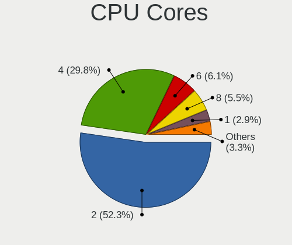
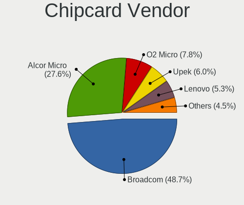

Linux - Tested Hardware & Statistics (Notebooks)
------------------------------------------------

A project to collect tested hardware configurations for Linux.

Anyone can contribute to this report by the [hw-probe](https://github.com/linuxhw/hw-probe) tool:

    sudo -E hw-probe -all -upload

Please contribute! Especially if your hardware is rare.

This report is for real hardware. Report for virtual hardware: [TestDays_VE](https://github.com/linuxhw/TestDays_VE)

Contents
--------

* [ Test Cases ](#test-cases)

* [ System ](#system)
  - [ OS                       ](#os)
  - [ OS Family                ](#os-family)
  - [ Kernel                   ](#kernel)
  - [ Kernel Family            ](#kernel-family)
  - [ Kernel Major Ver.        ](#kernel-major-ver)
  - [ Arch                     ](#arch)
  - [ DE                       ](#de)
  - [ Display Server           ](#display-server)
  - [ Display Manager          ](#display-manager)
  - [ OS Lang                  ](#os-lang)
  - [ Boot Mode                ](#boot-mode)
  - [ Filesystem               ](#filesystem)
  - [ Part. scheme             ](#part-scheme)
  - [ Dual Boot with Linux/BSD ](#dual-boot-with-linuxbsd)
  - [ Dual Boot (Win)          ](#dual-boot-win)

* [ Board ](#board)
  - [ Vendor                   ](#vendor)
  - [ Model                    ](#model)
  - [ Model Family             ](#model-family)
  - [ MFG Year                 ](#mfg-year)
  - [ Form Factor              ](#form-factor)
  - [ Secure Boot              ](#secure-boot)
  - [ Coreboot                 ](#coreboot)
  - [ RAM Size                 ](#ram-size)
  - [ RAM Used                 ](#ram-used)
  - [ Total Drives             ](#total-drives)
  - [ Has CD-ROM               ](#has-cd-rom)
  - [ Has Ethernet             ](#has-ethernet)
  - [ Has WiFi                 ](#has-wifi)
  - [ Has Bluetooth            ](#has-bluetooth)

* [ Location ](#location)
  - [ Country                  ](#country)
  - [ City                     ](#city)

* [ Drives ](#drives)
  - [ Drive Vendor             ](#drive-vendor)
  - [ Drive Model              ](#drive-model)
  - [ HDD Vendor               ](#hdd-vendor)
  - [ SSD Vendor               ](#ssd-vendor)
  - [ Drive Kind               ](#drive-kind)
  - [ Drive Connector          ](#drive-connector)
  - [ Drive Size               ](#drive-size)
  - [ Space Total              ](#space-total)
  - [ Space Used               ](#space-used)
  - [ Malfunc. Drives          ](#malfunc-drives)
  - [ Malfunc. Drive Vendor    ](#malfunc-drive-vendor)
  - [ Malfunc. HDD Vendor      ](#malfunc-hdd-vendor)
  - [ Malfunc. Drive Kind      ](#malfunc-drive-kind)
  - [ Failed Drives            ](#failed-drives)
  - [ Failed Drive Vendor      ](#failed-drive-vendor)
  - [ Drive Status             ](#drive-status)

* [ Storage controller ](#storage-controller)
  - [ Storage Vendor           ](#storage-vendor)
  - [ Storage Model            ](#storage-model)
  - [ Storage Kind             ](#storage-kind)

* [ Processor ](#processor)
  - [ CPU Vendor               ](#cpu-vendor)
  - [ CPU Model                ](#cpu-model)
  - [ CPU Model Family         ](#cpu-model-family)
  - [ CPU Cores                ](#cpu-cores)
  - [ CPU Sockets              ](#cpu-sockets)
  - [ CPU Threads              ](#cpu-threads)
  - [ CPU Op-Modes             ](#cpu-op-modes)
  - [ CPU Microcode            ](#cpu-microcode)
  - [ CPU Microarch            ](#cpu-microarch)

* [ Graphics ](#graphics)
  - [ GPU Vendor               ](#gpu-vendor)
  - [ GPU Model                ](#gpu-model)
  - [ GPU Combo                ](#gpu-combo)
  - [ GPU Driver               ](#gpu-driver)
  - [ GPU Memory               ](#gpu-memory)

* [ Monitor ](#monitor)
  - [ Monitor Vendor           ](#monitor-vendor)
  - [ Monitor Model            ](#monitor-model)
  - [ Monitor Resolution       ](#monitor-resolution)
  - [ Monitor Diagonal         ](#monitor-diagonal)
  - [ Monitor Width            ](#monitor-width)
  - [ Aspect Ratio             ](#aspect-ratio)
  - [ Monitor Area             ](#monitor-area)
  - [ Pixel Density            ](#pixel-density)
  - [ Multiple Monitors        ](#multiple-monitors)

* [ Network ](#network)
  - [ Net Controller Vendor    ](#net-controller-vendor)
  - [ Net Controller Model     ](#net-controller-model)
  - [ Wireless Vendor          ](#wireless-vendor)
  - [ Wireless Model           ](#wireless-model)
  - [ Ethernet Vendor          ](#ethernet-vendor)
  - [ Ethernet Model           ](#ethernet-model)
  - [ Net Controller Kind      ](#net-controller-kind)
  - [ Used Controller          ](#used-controller)
  - [ NICs                     ](#nics)
  - [ IPv6                     ](#ipv6)

* [ Bluetooth ](#bluetooth)
  - [ Bluetooth Vendor         ](#bluetooth-vendor)
  - [ Bluetooth Model          ](#bluetooth-model)

* [ Sound ](#sound)
  - [ Sound Vendor             ](#sound-vendor)
  - [ Sound Model              ](#sound-model)

* [ Memory ](#memory)
  - [ Memory Vendor            ](#memory-vendor)
  - [ Memory Model             ](#memory-model)
  - [ Memory Kind              ](#memory-kind)
  - [ Memory Form Factor       ](#memory-form-factor)
  - [ Memory Size              ](#memory-size)
  - [ Memory Speed             ](#memory-speed)

* [ Printers & scanners ](#printers--scanners)
  - [ Printer Vendor           ](#printer-vendor)
  - [ Printer Model            ](#printer-model)
  - [ Scanner Vendor           ](#scanner-vendor)
  - [ Scanner Model            ](#scanner-model)

* [ Camera ](#camera)
  - [ Camera Vendor            ](#camera-vendor)
  - [ Camera Model             ](#camera-model)

* [ Security ](#security)
  - [ Fingerprint Vendor       ](#fingerprint-vendor)
  - [ Fingerprint Model        ](#fingerprint-model)
  - [ Chipcard Vendor          ](#chipcard-vendor)
  - [ Chipcard Model           ](#chipcard-model)

* [ Unsupported ](#unsupported)
  - [ Unsupported Devices      ](#unsupported-devices)
  - [ Unsupported Device Types ](#unsupported-device-types)

Test Cases
----------

Total: 152918

| Vendor        | Model                       | Probe                                                      | Date         |
|---------------|-----------------------------|------------------------------------------------------------|--------------|
| HP            | Pavilion dv6                | [c937edbfcd](https://linux-hardware.org/?probe=c937edbfcd) | Mar 01, 2023 |
| ASUSTek       | T100HAN                     | [a8b1a02128](https://linux-hardware.org/?probe=a8b1a02128) | Mar 01, 2023 |
| Dell          | XPS 15 9520                 | [ecfa5f6c27](https://linux-hardware.org/?probe=ecfa5f6c27) | Mar 01, 2023 |
| HP            | Pavilion 14                 | [ae0e65f5d1](https://linux-hardware.org/?probe=ae0e65f5d1) | Feb 28, 2023 |
| TCL Commun... | 8090                        | [d1f86443c7](https://linux-hardware.org/?probe=d1f86443c7) | Feb 28, 2023 |
| Dell          | XPS 15 9550                 | [0ffe1f9541](https://linux-hardware.org/?probe=0ffe1f9541) | Feb 28, 2023 |
| HP            | Laptop 17-ca1xxx            | [7f93c1a4e3](https://linux-hardware.org/?probe=7f93c1a4e3) | Feb 28, 2023 |
| Dell          | Inspiron N5010              | [480ff87a20](https://linux-hardware.org/?probe=480ff87a20) | Feb 28, 2023 |
| HUAWEI        | CREM-WXX9                   | [22d51a725f](https://linux-hardware.org/?probe=22d51a725f) | Feb 28, 2023 |
| Medion        | Erazer X7851 MD60583        | [9ddd4f88b4](https://linux-hardware.org/?probe=9ddd4f88b4) | Feb 28, 2023 |
| Acer          | Swift SF314-43              | [4f2c05c854](https://linux-hardware.org/?probe=4f2c05c854) | Feb 28, 2023 |
| ASUSTek       | X55A                        | [1429627725](https://linux-hardware.org/?probe=1429627725) | Feb 28, 2023 |
| Dell          | Inspiron 5523               | [09ccf58a6b](https://linux-hardware.org/?probe=09ccf58a6b) | Feb 28, 2023 |
| HP            | EliteBook 755 G5            | [4ce3aba673](https://linux-hardware.org/?probe=4ce3aba673) | Feb 28, 2023 |
| HP            | Laptop 15s-eq3xxx           | [a08a3c36ab](https://linux-hardware.org/?probe=a08a3c36ab) | Feb 28, 2023 |
| Dell          | Latitude 5420               | [0596aff5c4](https://linux-hardware.org/?probe=0596aff5c4) | Feb 28, 2023 |
| Alienware     | 15 R2                       | [f242145858](https://linux-hardware.org/?probe=f242145858) | Feb 28, 2023 |
| ASUSTek       | ROG Zephyrus G14 GA402RK... | [c698fc199a](https://linux-hardware.org/?probe=c698fc199a) | Feb 28, 2023 |
| ASUSTek       | Zenbook UX5401ZA_UX5401Z... | [5aad25779a](https://linux-hardware.org/?probe=5aad25779a) | Feb 28, 2023 |
| Dell          | Latitude E7270              | [2718026d03](https://linux-hardware.org/?probe=2718026d03) | Feb 28, 2023 |
| Acer          | AOHAPPY2                    | [9bbd271b36](https://linux-hardware.org/?probe=9bbd271b36) | Feb 28, 2023 |
| Lenovo        | Legion 5P 15IMH05 82AW      | [0de52a6150](https://linux-hardware.org/?probe=0de52a6150) | Feb 28, 2023 |
| Acer          | Nitro AN515-51              | [984b6e660d](https://linux-hardware.org/?probe=984b6e660d) | Feb 28, 2023 |
| HP            | Pavilion dv7                | [e40593f800](https://linux-hardware.org/?probe=e40593f800) | Feb 28, 2023 |
| Lenovo        | IdeaPad 3 15ALC6 82KU       | [8ec75c8681](https://linux-hardware.org/?probe=8ec75c8681) | Feb 28, 2023 |
| ASUSTek       | N76VB                       | [0043164762](https://linux-hardware.org/?probe=0043164762) | Feb 28, 2023 |
| TECNO         | MEGABOOK T1                 | [3b70c27ca4](https://linux-hardware.org/?probe=3b70c27ca4) | Feb 28, 2023 |
| ASUSTek       | Zenbook UX535QE_UM535QE     | [456504fe92](https://linux-hardware.org/?probe=456504fe92) | Feb 28, 2023 |
| Lenovo        | IdeaPad 5 15ARE05 81YQ      | [1165717061](https://linux-hardware.org/?probe=1165717061) | Feb 28, 2023 |
| Timi          | RedmiBook 16                | [2d713931d2](https://linux-hardware.org/?probe=2d713931d2) | Feb 28, 2023 |
| Dell          | Latitude 3400               | [2936e7f368](https://linux-hardware.org/?probe=2936e7f368) | Feb 28, 2023 |
| Acer          | Aspire E5-571G              | [fc0bc59c04](https://linux-hardware.org/?probe=fc0bc59c04) | Feb 28, 2023 |
| Acer          | Aspire V3-371               | [bbc0d58ef1](https://linux-hardware.org/?probe=bbc0d58ef1) | Feb 28, 2023 |
| Lenovo        | IdeaPad 3 15ABA7 82RN       | [d8b58a8ea1](https://linux-hardware.org/?probe=d8b58a8ea1) | Feb 28, 2023 |
| ASUSTek       | VivoBook_ASUSLaptop X412... | [87022bd601](https://linux-hardware.org/?probe=87022bd601) | Feb 28, 2023 |
| Lenovo        | IdeaPad 330-15ICH 81FK      | [08f2d1cca5](https://linux-hardware.org/?probe=08f2d1cca5) | Feb 28, 2023 |
| Lenovo        | ThinkPad T460 20FMS0700A    | [89a11e0826](https://linux-hardware.org/?probe=89a11e0826) | Feb 28, 2023 |
| Lenovo        | ThinkPad T430 2349KDG       | [ea95af537c](https://linux-hardware.org/?probe=ea95af537c) | Feb 28, 2023 |
| Dell          | Inspiron N5010              | [a1a44c0054](https://linux-hardware.org/?probe=a1a44c0054) | Feb 28, 2023 |
| Valve         | Jupiter                     | [2143a36dc5](https://linux-hardware.org/?probe=2143a36dc5) | Feb 28, 2023 |
| Lenovo        | ThinkPad T460 20FMS0700A    | [c45e0040f7](https://linux-hardware.org/?probe=c45e0040f7) | Feb 28, 2023 |
| Alienware     | 15 R2                       | [5e29609544](https://linux-hardware.org/?probe=5e29609544) | Feb 28, 2023 |
| HP            | ENVY 17                     | [61d1252ef3](https://linux-hardware.org/?probe=61d1252ef3) | Feb 28, 2023 |
| Acer          | Aspire V3-772               | [5a0c297e10](https://linux-hardware.org/?probe=5a0c297e10) | Feb 28, 2023 |
| Lenovo        | ThinkPad T460 20FMS78014    | [6fb2d54abe](https://linux-hardware.org/?probe=6fb2d54abe) | Feb 28, 2023 |
| HP            | ENVY Laptop 17-ch1xxx       | [b518eb9925](https://linux-hardware.org/?probe=b518eb9925) | Feb 28, 2023 |
| Dell          | Latitude E7450              | [0e5fe9d2a7](https://linux-hardware.org/?probe=0e5fe9d2a7) | Feb 28, 2023 |
| Gigabyte      | AERO 15-X9                  | [18d00993bf](https://linux-hardware.org/?probe=18d00993bf) | Feb 28, 2023 |
| ASUSTek       | T100HAN                     | [4f835a4f35](https://linux-hardware.org/?probe=4f835a4f35) | Feb 28, 2023 |
| Dell          | Latitude 5400               | [00cd14a724](https://linux-hardware.org/?probe=00cd14a724) | Feb 28, 2023 |
| Lenovo        | IdeaPad 3 15ITL05 81X8      | [7478549a38](https://linux-hardware.org/?probe=7478549a38) | Feb 28, 2023 |
| HP            | Laptop 17-by3xxx            | [5beb40c486](https://linux-hardware.org/?probe=5beb40c486) | Feb 28, 2023 |
| Lenovo        | ThinkBook 14 G3 ACL 21A2    | [470d9f4591](https://linux-hardware.org/?probe=470d9f4591) | Feb 28, 2023 |
| HP            | Laptop 15s-eq1xxx           | [c070966ad7](https://linux-hardware.org/?probe=c070966ad7) | Feb 28, 2023 |
| Lenovo        | ThinkPad X1 Carbon Gen 8... | [76645fa513](https://linux-hardware.org/?probe=76645fa513) | Feb 28, 2023 |
| Apple         | MacBookPro8,1               | [ec1f27de09](https://linux-hardware.org/?probe=ec1f27de09) | Feb 28, 2023 |
| ASUSTek       | ASUS TUF Gaming F15 FX50... | [41439f6b61](https://linux-hardware.org/?probe=41439f6b61) | Feb 28, 2023 |
| HUAWEI        | MRC-WX0                     | [e2776f99bf](https://linux-hardware.org/?probe=e2776f99bf) | Feb 28, 2023 |
| Philco        | 10D                         | [dd709d35db](https://linux-hardware.org/?probe=dd709d35db) | Feb 28, 2023 |
| Dell          | G15 5511                    | [1859d13517](https://linux-hardware.org/?probe=1859d13517) | Feb 28, 2023 |
| Dell          | Venue 11 Pro 7130           | [68a816d082](https://linux-hardware.org/?probe=68a816d082) | Feb 28, 2023 |
| HP            | EliteBook 830 G5            | [b82fdfbe47](https://linux-hardware.org/?probe=b82fdfbe47) | Feb 28, 2023 |
| Dell          | Venue 11 Pro 7130           | [bbb8c4e905](https://linux-hardware.org/?probe=bbb8c4e905) | Feb 28, 2023 |
| Dell          | G5 5590                     | [75f2235434](https://linux-hardware.org/?probe=75f2235434) | Feb 28, 2023 |
| Clevo         | NL41MU2                     | [29df87f87f](https://linux-hardware.org/?probe=29df87f87f) | Feb 28, 2023 |
| ASUSTek       | E202SA                      | [bccde0c9a5](https://linux-hardware.org/?probe=bccde0c9a5) | Feb 28, 2023 |
| ASUSTek       | ROG Zephyrus G14 GA401QM... | [7b7df086e0](https://linux-hardware.org/?probe=7b7df086e0) | Feb 28, 2023 |
| Apple         | MacBookAir3,1               | [573644760d](https://linux-hardware.org/?probe=573644760d) | Feb 28, 2023 |
| Samsung       | 370E4K                      | [aba5535c2a](https://linux-hardware.org/?probe=aba5535c2a) | Feb 28, 2023 |
| Dell          | Latitude D630               | [5175558c99](https://linux-hardware.org/?probe=5175558c99) | Feb 28, 2023 |
| TUXEDO        | Aura 15 Gen2                | [26a7db2ed8](https://linux-hardware.org/?probe=26a7db2ed8) | Feb 28, 2023 |
| Apple         | MacBookPro5,5               | [e20478d60e](https://linux-hardware.org/?probe=e20478d60e) | Feb 28, 2023 |
| HP            | ProBook 635 Aero G8 Note... | [93ee76f198](https://linux-hardware.org/?probe=93ee76f198) | Feb 28, 2023 |
| HP            | Laptop 15-gw0xxx            | [e05606240c](https://linux-hardware.org/?probe=e05606240c) | Feb 28, 2023 |
| Dell          | Inspiron N5110              | [e35a1076a1](https://linux-hardware.org/?probe=e35a1076a1) | Feb 28, 2023 |
| Dell          | Latitude E6440              | [80131cd2a4](https://linux-hardware.org/?probe=80131cd2a4) | Feb 28, 2023 |
| Acer          | Aspire A515-57              | [6c511739eb](https://linux-hardware.org/?probe=6c511739eb) | Feb 28, 2023 |
| Lenovo        | ThinkPad T16 Gen 1 21BWS... | [e56350a1c1](https://linux-hardware.org/?probe=e56350a1c1) | Feb 28, 2023 |
| HP            | 255 G2                      | [10397efd1b](https://linux-hardware.org/?probe=10397efd1b) | Feb 28, 2023 |
| Acer          | Aspire A315-59              | [9a897f5d7c](https://linux-hardware.org/?probe=9a897f5d7c) | Feb 28, 2023 |
| ASUSTek       | X550JD                      | [6804351029](https://linux-hardware.org/?probe=6804351029) | Feb 28, 2023 |
| ASUSTek       | K52Je                       | [03857fde28](https://linux-hardware.org/?probe=03857fde28) | Feb 28, 2023 |
| Notebook      | NJx0MU                      | [fd4d00d935](https://linux-hardware.org/?probe=fd4d00d935) | Feb 28, 2023 |
| Timi          | TM1701                      | [ab658664bb](https://linux-hardware.org/?probe=ab658664bb) | Feb 28, 2023 |
| Lenovo        | ThinkPad Z13 Gen 1 21D2C... | [b5a4a1809f](https://linux-hardware.org/?probe=b5a4a1809f) | Feb 28, 2023 |
| Lenovo        | ThinkPad X270 20HMS10600    | [3fa4d926e0](https://linux-hardware.org/?probe=3fa4d926e0) | Feb 28, 2023 |
| TECNO         | MEGABOOK T1                 | [3d003c6d17](https://linux-hardware.org/?probe=3d003c6d17) | Feb 28, 2023 |
| ASUSTek       | ROG Strix G712LW_G712LW     | [ed67c567d2](https://linux-hardware.org/?probe=ed67c567d2) | Feb 28, 2023 |
| Standard      | Unknown                     | [63732ac2da](https://linux-hardware.org/?probe=63732ac2da) | Feb 28, 2023 |
| Lenovo        | Yoga710-14ISK 80TY          | [756e003316](https://linux-hardware.org/?probe=756e003316) | Feb 28, 2023 |
| HUAWEI        | BOHB-WAX9                   | [b4bfab8974](https://linux-hardware.org/?probe=b4bfab8974) | Feb 28, 2023 |
| Sony          | VPCZ21Z9R                   | [4d3f0c27cd](https://linux-hardware.org/?probe=4d3f0c27cd) | Feb 28, 2023 |
| HP            | ZBook 15u G3                | [9c49a1748b](https://linux-hardware.org/?probe=9c49a1748b) | Feb 28, 2023 |
| Dell          | Inspiron 15 3511            | [99462eae5e](https://linux-hardware.org/?probe=99462eae5e) | Feb 28, 2023 |
| Acer          | Aspire A515-45G             | [5f8c1e2d90](https://linux-hardware.org/?probe=5f8c1e2d90) | Feb 28, 2023 |
| HP            | ProBook 6570b               | [3692011e3f](https://linux-hardware.org/?probe=3692011e3f) | Feb 28, 2023 |
| Sony          | VGN-FW11M                   | [06b355e1de](https://linux-hardware.org/?probe=06b355e1de) | Feb 28, 2023 |
| Lenovo        | ThinkPad X1 Extreme Gen ... | [3ab9ad10d8](https://linux-hardware.org/?probe=3ab9ad10d8) | Feb 28, 2023 |
| Dell          | Inspiron N5110              | [5a6d88e081](https://linux-hardware.org/?probe=5a6d88e081) | Feb 28, 2023 |
| MECHREVO      | Jiaolong Series MRID6       | [1643b96eae](https://linux-hardware.org/?probe=1643b96eae) | Feb 28, 2023 |
| MECHREVO      | Jiaolong Series MRID6       | [b48cc99ce3](https://linux-hardware.org/?probe=b48cc99ce3) | Feb 28, 2023 |
| Lenovo        | ThinkPad X270 20HN001RUS    | [ff84200b75](https://linux-hardware.org/?probe=ff84200b75) | Feb 28, 2023 |
| HP            | Pavilion Laptop 15-cc5xx    | [4a5d167c96](https://linux-hardware.org/?probe=4a5d167c96) | Feb 28, 2023 |
| Lenovo        | Slim 7 ProX 14ARH7 82V2     | [1c61d820ff](https://linux-hardware.org/?probe=1c61d820ff) | Feb 28, 2023 |
| HP            | EliteBook 8540w             | [057c307bf5](https://linux-hardware.org/?probe=057c307bf5) | Feb 28, 2023 |
| Alienware     | x15 R2                      | [f0335542ce](https://linux-hardware.org/?probe=f0335542ce) | Feb 28, 2023 |
| HP            | 240 G4 Notebook PC          | [02744836e7](https://linux-hardware.org/?probe=02744836e7) | Feb 28, 2023 |
| Lenovo        | IdeaPad S145-15IWL 81S9     | [915fc4d913](https://linux-hardware.org/?probe=915fc4d913) | Feb 28, 2023 |
| Intel Clie... | LAPRC510                    | [925c24b3db](https://linux-hardware.org/?probe=925c24b3db) | Feb 28, 2023 |
| Lenovo        | ThinkPad X1 Carbon 5th 2... | [5c39a363d8](https://linux-hardware.org/?probe=5c39a363d8) | Feb 28, 2023 |
| HP            | ProBook 430 G1              | [fa75658ee0](https://linux-hardware.org/?probe=fa75658ee0) | Feb 28, 2023 |
| Dell          | Latitude E6420              | [a84f4dbcbb](https://linux-hardware.org/?probe=a84f4dbcbb) | Feb 28, 2023 |
| Dell          | Latitude E7450              | [a36df01da9](https://linux-hardware.org/?probe=a36df01da9) | Feb 28, 2023 |
| HP            | Pavilion dv7                | [1dbb82f9ff](https://linux-hardware.org/?probe=1dbb82f9ff) | Feb 28, 2023 |
| AZW           | SEi                         | [6d0814dc9f](https://linux-hardware.org/?probe=6d0814dc9f) | Feb 28, 2023 |
| Lenovo        | ThinkPad X1 Carbon 6th 2... | [886f442040](https://linux-hardware.org/?probe=886f442040) | Feb 28, 2023 |
| Dell          | Precision 5570              | [7e8d7c37cb](https://linux-hardware.org/?probe=7e8d7c37cb) | Feb 28, 2023 |
| ASUSTek       | TUF Gaming FX505DD_FX505... | [021853dafb](https://linux-hardware.org/?probe=021853dafb) | Feb 28, 2023 |
| Google        | Reks                        | [be1a98408d](https://linux-hardware.org/?probe=be1a98408d) | Feb 28, 2023 |
| Dell          | G15 5510                    | [77ff8fd545](https://linux-hardware.org/?probe=77ff8fd545) | Feb 28, 2023 |
| HP            | ProBook 450 G8 Notebook ... | [009eefdc1d](https://linux-hardware.org/?probe=009eefdc1d) | Feb 28, 2023 |
| HP            | ProBook 450 G8 Notebook ... | [17a7ee80ac](https://linux-hardware.org/?probe=17a7ee80ac) | Feb 28, 2023 |
| Dell          | G15 5510                    | [2c8f883abe](https://linux-hardware.org/?probe=2c8f883abe) | Feb 28, 2023 |
| Gateway       | Sonic-C                     | [b9f775b14e](https://linux-hardware.org/?probe=b9f775b14e) | Feb 28, 2023 |
| ASUSTek       | VivoBook S14 X411UF         | [88745e1f03](https://linux-hardware.org/?probe=88745e1f03) | Feb 28, 2023 |
| Toshiba       | Satellite S70-A             | [7e849f93ca](https://linux-hardware.org/?probe=7e849f93ca) | Feb 28, 2023 |
| Acer          | Aspire 5750G                | [34b5806bcf](https://linux-hardware.org/?probe=34b5806bcf) | Feb 28, 2023 |
| Lenovo        | ThinkPad S1 Yoga 20C0S23... | [3cd99ed8f4](https://linux-hardware.org/?probe=3cd99ed8f4) | Feb 28, 2023 |
| Dell          | Latitude E7470              | [51deaef7a0](https://linux-hardware.org/?probe=51deaef7a0) | Feb 28, 2023 |
| Intel Clie... | LAPRC510                    | [6d9a8edb0c](https://linux-hardware.org/?probe=6d9a8edb0c) | Feb 28, 2023 |
| Lenovo        | Legion 7 16ACHg6 82N6       | [594ff7091b](https://linux-hardware.org/?probe=594ff7091b) | Feb 27, 2023 |
| Lenovo        | ThinkPad E560 20EV000UUK    | [7060b60651](https://linux-hardware.org/?probe=7060b60651) | Feb 27, 2023 |
| HP            | ProBook 430 G6              | [a184aa7141](https://linux-hardware.org/?probe=a184aa7141) | Feb 27, 2023 |
| ASUSTek       | X550CA                      | [0ce966b8fa](https://linux-hardware.org/?probe=0ce966b8fa) | Feb 27, 2023 |
| Acer          | Aspire A715-76              | [b9f52dc0f3](https://linux-hardware.org/?probe=b9f52dc0f3) | Feb 27, 2023 |
| Lenovo        | G50-80 80E5                 | [d7bb021829](https://linux-hardware.org/?probe=d7bb021829) | Feb 27, 2023 |
| Packard Be... | EasyNote TJ66               | [bd15540982](https://linux-hardware.org/?probe=bd15540982) | Feb 27, 2023 |
| HP            | OMEN by Laptop 16-c0xxx     | [c829e9e0b8](https://linux-hardware.org/?probe=c829e9e0b8) | Feb 27, 2023 |
| HP            | Pavilion dv6                | [a19aa34db7](https://linux-hardware.org/?probe=a19aa34db7) | Feb 27, 2023 |
| Fujitsu       | LIFEBOOK E744               | [e331c5e257](https://linux-hardware.org/?probe=e331c5e257) | Feb 27, 2023 |
| Dell          | XPS 13 9380                 | [e888e1330d](https://linux-hardware.org/?probe=e888e1330d) | Feb 27, 2023 |
| HP            | EliteBook Folio 9470m       | [45403acec9](https://linux-hardware.org/?probe=45403acec9) | Feb 27, 2023 |
| ASUSTek       | K75VJ                       | [7fc0fff829](https://linux-hardware.org/?probe=7fc0fff829) | Feb 27, 2023 |
| Dell          | XPS 13 9380                 | [18fdb45ec1](https://linux-hardware.org/?probe=18fdb45ec1) | Feb 27, 2023 |
| HUAWEI        | MACHR-WX9                   | [b1ef7c7ea1](https://linux-hardware.org/?probe=b1ef7c7ea1) | Feb 27, 2023 |
| ASUSTek       | ASUS TUF Gaming F15 FX50... | [83a611b1ab](https://linux-hardware.org/?probe=83a611b1ab) | Feb 27, 2023 |
| Lenovo        | ThinkPad R400 7439W2F       | [2673ce6bd9](https://linux-hardware.org/?probe=2673ce6bd9) | Feb 27, 2023 |
| Dell          | Latitude 5530               | [f892221e4c](https://linux-hardware.org/?probe=f892221e4c) | Feb 27, 2023 |
| Dell          | Inspiron 5537               | [25fa030105](https://linux-hardware.org/?probe=25fa030105) | Feb 27, 2023 |
| Dell          | XPS 15 7590                 | [e1777784ac](https://linux-hardware.org/?probe=e1777784ac) | Feb 27, 2023 |
| ASUSTek       | VivoBook_ASUSLaptop M760... | [1f80bce21e](https://linux-hardware.org/?probe=1f80bce21e) | Feb 27, 2023 |
| Apple         | MacBookAir6,1               | [1c1dc86eb1](https://linux-hardware.org/?probe=1c1dc86eb1) | Feb 27, 2023 |
| ASUSTek       | VivoBook_ASUSLaptop M760... | [08e6c7285a](https://linux-hardware.org/?probe=08e6c7285a) | Feb 27, 2023 |
| Acer          | Aspire 8930                 | [837e36aa25](https://linux-hardware.org/?probe=837e36aa25) | Feb 27, 2023 |
| Acer          | TM8573T                     | [3eaaedf476](https://linux-hardware.org/?probe=3eaaedf476) | Feb 27, 2023 |
| HP            | ProBook 4540s               | [a52b9c7637](https://linux-hardware.org/?probe=a52b9c7637) | Feb 27, 2023 |
| Dell          | Inspiron 3793               | [d7b51f6048](https://linux-hardware.org/?probe=d7b51f6048) | Feb 27, 2023 |
| Samsung       | 370E4K                      | [d66bcd2bc8](https://linux-hardware.org/?probe=d66bcd2bc8) | Feb 27, 2023 |
| Valve         | Jupiter                     | [ce7b0e507f](https://linux-hardware.org/?probe=ce7b0e507f) | Feb 27, 2023 |
| HP            | Laptop 15t-dy200            | [3ea4171270](https://linux-hardware.org/?probe=3ea4171270) | Feb 27, 2023 |
| Lenovo        | ThinkPad T460s 20FAS55Q1... | [815b6ea9f2](https://linux-hardware.org/?probe=815b6ea9f2) | Feb 27, 2023 |
| HP            | EliteBook 845 14 inch G9... | [ed251c6cfe](https://linux-hardware.org/?probe=ed251c6cfe) | Feb 27, 2023 |
| Valve         | Jupiter                     | [8bfec9ba8d](https://linux-hardware.org/?probe=8bfec9ba8d) | Feb 27, 2023 |
| Dell          | Latitude 7390               | [a2167ae72b](https://linux-hardware.org/?probe=a2167ae72b) | Feb 27, 2023 |
| Lenovo        | IdeaPad 1 15ALC7 82R4       | [47f7b39f3a](https://linux-hardware.org/?probe=47f7b39f3a) | Feb 27, 2023 |
| Lenovo        | ThinkPad P15 Gen 1 20SUS... | [dd5ce2c6db](https://linux-hardware.org/?probe=dd5ce2c6db) | Feb 27, 2023 |
| Dell          | Inspiron 1525               | [264f8cb6db](https://linux-hardware.org/?probe=264f8cb6db) | Feb 27, 2023 |
| Apple         | MacBookPro15,1              | [e1ce7bab5a](https://linux-hardware.org/?probe=e1ce7bab5a) | Feb 27, 2023 |
| Dell          | XPS 13 9300                 | [fc803f9205](https://linux-hardware.org/?probe=fc803f9205) | Feb 27, 2023 |
| HUAWEI        | BOM-WXX9                    | [43a5dbf393](https://linux-hardware.org/?probe=43a5dbf393) | Feb 27, 2023 |
| Dell          | Inspiron 3537               | [78f270b35a](https://linux-hardware.org/?probe=78f270b35a) | Feb 27, 2023 |
| Dell          | Latitude E4310              | [2b2255a5b4](https://linux-hardware.org/?probe=2b2255a5b4) | Feb 27, 2023 |
| ASUSTek       | UX31A                       | [56654a2659](https://linux-hardware.org/?probe=56654a2659) | Feb 27, 2023 |
| ASUSTek       | FX503VD                     | [46954919f7](https://linux-hardware.org/?probe=46954919f7) | Feb 27, 2023 |
| Clevo         | NL41MU2                     | [b91dfc602e](https://linux-hardware.org/?probe=b91dfc602e) | Feb 27, 2023 |
| HP            | Notebook                    | [7e64e6bc1b](https://linux-hardware.org/?probe=7e64e6bc1b) | Feb 27, 2023 |
| Dell          | Latitude 7420               | [d3af27a0ac](https://linux-hardware.org/?probe=d3af27a0ac) | Feb 27, 2023 |
| SmbiosType... | SmbiosType1_SystemProduc... | [ccac327e17](https://linux-hardware.org/?probe=ccac327e17) | Feb 27, 2023 |
| Dell          | XPS 13 9360                 | [08cdbe3442](https://linux-hardware.org/?probe=08cdbe3442) | Feb 27, 2023 |
| Schenker      | VISION (E22)                | [498444ca02](https://linux-hardware.org/?probe=498444ca02) | Feb 27, 2023 |
| Lenovo        | ThinkPad E15 Gen 2 20T80... | [1ce9430009](https://linux-hardware.org/?probe=1ce9430009) | Feb 27, 2023 |
| Acer          | Aspire E5-571               | [5f035002e1](https://linux-hardware.org/?probe=5f035002e1) | Feb 27, 2023 |
| ASUSTek       | X75VC                       | [8d629c0ed3](https://linux-hardware.org/?probe=8d629c0ed3) | Feb 27, 2023 |
| HP            | Notebook                    | [a1180ad479](https://linux-hardware.org/?probe=a1180ad479) | Feb 27, 2023 |
| Acer          | Aspire E1-531               | [a52b94c2d5](https://linux-hardware.org/?probe=a52b94c2d5) | Feb 27, 2023 |
| Timi          | RedmiBook Pro 15S           | [109a8e15c4](https://linux-hardware.org/?probe=109a8e15c4) | Feb 27, 2023 |
| HP            | ENVY Laptop 17-cr0xxx       | [3f0d63ab15](https://linux-hardware.org/?probe=3f0d63ab15) | Feb 27, 2023 |
| Lenovo        | ThinkPad X1 Carbon 7th 2... | [357c1abb1d](https://linux-hardware.org/?probe=357c1abb1d) | Feb 27, 2023 |
| Toshiba       | Satellite P870              | [6d9216b866](https://linux-hardware.org/?probe=6d9216b866) | Feb 27, 2023 |
| Dell          | Inspiron 3537               | [bb1ffc3498](https://linux-hardware.org/?probe=bb1ffc3498) | Feb 27, 2023 |
| ASUSTek       | VivoBook_ASUS Laptop X50... | [05d3c9f96c](https://linux-hardware.org/?probe=05d3c9f96c) | Feb 27, 2023 |
| Lenovo        | G700 20251                  | [8dc4179bbd](https://linux-hardware.org/?probe=8dc4179bbd) | Feb 27, 2023 |
| Lenovo        | ThinkPad T480 20L6SEH700    | [4a187e016b](https://linux-hardware.org/?probe=4a187e016b) | Feb 27, 2023 |
| ASUSTek       | VivoBook_ASUS Laptop X50... | [f70d3317a2](https://linux-hardware.org/?probe=f70d3317a2) | Feb 27, 2023 |
| Lenovo        | ThinkPad X260 20F5S1MN00    | [db0d3b74bd](https://linux-hardware.org/?probe=db0d3b74bd) | Feb 27, 2023 |
| UMAX          | VisionBook-N12R             | [2477ae9a0e](https://linux-hardware.org/?probe=2477ae9a0e) | Feb 27, 2023 |
| Dell          | Latitude 5400               | [b788c61c95](https://linux-hardware.org/?probe=b788c61c95) | Feb 27, 2023 |
| HP            | ProBook 4540s               | [45e989b539](https://linux-hardware.org/?probe=45e989b539) | Feb 27, 2023 |
| HP            | Pavilion m6                 | [1e9d802ab6](https://linux-hardware.org/?probe=1e9d802ab6) | Feb 27, 2023 |
| Getac         | V200-X                      | [f3a5da3eae](https://linux-hardware.org/?probe=f3a5da3eae) | Feb 27, 2023 |
| ASUSTek       | FX503VD                     | [60e1742e7e](https://linux-hardware.org/?probe=60e1742e7e) | Feb 27, 2023 |
| Dell          | Latitude 3510               | [de938c4962](https://linux-hardware.org/?probe=de938c4962) | Feb 27, 2023 |
| ASUSTek       | VivoBook_ASUSLaptop M760... | [003aa3d3e9](https://linux-hardware.org/?probe=003aa3d3e9) | Feb 27, 2023 |
| HP            | Pavilion dv7                | [d5da5f62b8](https://linux-hardware.org/?probe=d5da5f62b8) | Feb 27, 2023 |
| Acer          | TravelMate B113             | [31691f9681](https://linux-hardware.org/?probe=31691f9681) | Feb 27, 2023 |
| ASUSTek       | E402MA                      | [c49b50f583](https://linux-hardware.org/?probe=c49b50f583) | Feb 27, 2023 |
| ASUSTek       | E402MA                      | [4083a9232f](https://linux-hardware.org/?probe=4083a9232f) | Feb 27, 2023 |
| HP            | Notebook                    | [ee2645efa8](https://linux-hardware.org/?probe=ee2645efa8) | Feb 27, 2023 |
| Apple         | MacBookPro6,2               | [3696f0b49e](https://linux-hardware.org/?probe=3696f0b49e) | Feb 27, 2023 |
| HP            | Pavilion TS 14              | [37296c42c3](https://linux-hardware.org/?probe=37296c42c3) | Feb 27, 2023 |
| Apple         | MacBookAir4,2               | [a9605bf85e](https://linux-hardware.org/?probe=a9605bf85e) | Feb 27, 2023 |
| HP            | Pavilion m6                 | [0d35b0b080](https://linux-hardware.org/?probe=0d35b0b080) | Feb 27, 2023 |
| ASUSTek       | VivoBook_ASUSLaptop X512... | [cd19568cfc](https://linux-hardware.org/?probe=cd19568cfc) | Feb 27, 2023 |
| Lenovo        | ThinkPad P14s Gen 2a 21A... | [d57bb59dee](https://linux-hardware.org/?probe=d57bb59dee) | Feb 27, 2023 |
| ASUSTek       | X541NA                      | [8c0dc3ba82](https://linux-hardware.org/?probe=8c0dc3ba82) | Feb 27, 2023 |
| HP            | EliteBook 835 G8 Noteboo... | [aa26becbb1](https://linux-hardware.org/?probe=aa26becbb1) | Feb 27, 2023 |
| ASUSTek       | K52F                        | [fa30ea101a](https://linux-hardware.org/?probe=fa30ea101a) | Feb 27, 2023 |
| Lenovo        | IdeaPad 330-15ARR 81D2      | [b116afe451](https://linux-hardware.org/?probe=b116afe451) | Feb 27, 2023 |
| Lenovo        | IdeaPad 530S-14ARR 81H1     | [42acb38635](https://linux-hardware.org/?probe=42acb38635) | Feb 27, 2023 |
| Lenovo        | IdeaPad 530S-14ARR 81H1     | [e8c76a33fe](https://linux-hardware.org/?probe=e8c76a33fe) | Feb 27, 2023 |
| Acer          | Aspire E5-575G              | [b2fa34d832](https://linux-hardware.org/?probe=b2fa34d832) | Feb 27, 2023 |
| Dell          | Inspiron 15 3511            | [4c96506f38](https://linux-hardware.org/?probe=4c96506f38) | Feb 27, 2023 |
| Dell          | Latitude 3190               | [279b385865](https://linux-hardware.org/?probe=279b385865) | Feb 27, 2023 |
| Acer          | Aspire F5-573G              | [ce2bc0c00d](https://linux-hardware.org/?probe=ce2bc0c00d) | Feb 27, 2023 |
| Toshiba       | IS 1413G                    | [c361aabb21](https://linux-hardware.org/?probe=c361aabb21) | Feb 27, 2023 |
| ASUSTek       | VivoBook_ASUSLaptop X513... | [d7e55bb97e](https://linux-hardware.org/?probe=d7e55bb97e) | Feb 27, 2023 |
| Dell          | Inspiron 14-3467            | [5bf68a313d](https://linux-hardware.org/?probe=5bf68a313d) | Feb 27, 2023 |
| Toshiba       | IS 1413G                    | [17338cbd01](https://linux-hardware.org/?probe=17338cbd01) | Feb 27, 2023 |
| Dell          | XPS L521X                   | [f9598ce828](https://linux-hardware.org/?probe=f9598ce828) | Feb 27, 2023 |
| ASUSTek       | VivoBook_ASUSLaptop E210... | [ad20f98122](https://linux-hardware.org/?probe=ad20f98122) | Feb 27, 2023 |
| Samsung       | 350V5C/351V5C/3540VC/344... | [7936e7db49](https://linux-hardware.org/?probe=7936e7db49) | Feb 27, 2023 |
| Dell          | Vostro 1540                 | [8f09ea4351](https://linux-hardware.org/?probe=8f09ea4351) | Feb 27, 2023 |
| Acer          | Aspire E5-571               | [04c721038a](https://linux-hardware.org/?probe=04c721038a) | Feb 27, 2023 |
| HP            | EliteBook 8460p             | [83cb442ad5](https://linux-hardware.org/?probe=83cb442ad5) | Feb 27, 2023 |
| Lenovo        | IdeaPad 5 Pro 14ACN6 82L... | [a2af33e0e3](https://linux-hardware.org/?probe=a2af33e0e3) | Feb 27, 2023 |
| Apple         | MacBookAir6,2               | [0fb60ed4e2](https://linux-hardware.org/?probe=0fb60ed4e2) | Feb 27, 2023 |
| Dell          | Latitude E6430              | [b75c4a18b3](https://linux-hardware.org/?probe=b75c4a18b3) | Feb 27, 2023 |
| Dell          | G3 3590                     | [eb9009fad9](https://linux-hardware.org/?probe=eb9009fad9) | Feb 27, 2023 |
| Acer          | Aspire 3690                 | [c93af7d4eb](https://linux-hardware.org/?probe=c93af7d4eb) | Feb 27, 2023 |
| Acer          | Aspire 3690                 | [b119bda1a6](https://linux-hardware.org/?probe=b119bda1a6) | Feb 27, 2023 |
| Acer          | Aspire 5740                 | [de0d12baa4](https://linux-hardware.org/?probe=de0d12baa4) | Feb 27, 2023 |
| Valve         | Jupiter                     | [52268bbf2b](https://linux-hardware.org/?probe=52268bbf2b) | Feb 27, 2023 |
| ASUSTek       | VivoBook_ASUS Laptop E41... | [091e4e3188](https://linux-hardware.org/?probe=091e4e3188) | Feb 27, 2023 |
| Apple         | MacBookPro15,1              | [caf6dc6f16](https://linux-hardware.org/?probe=caf6dc6f16) | Feb 27, 2023 |
| MSI           | GS66 Stealth 10UE           | [f193cf790d](https://linux-hardware.org/?probe=f193cf790d) | Feb 27, 2023 |
| HP            | Notebook                    | [0d838134b7](https://linux-hardware.org/?probe=0d838134b7) | Feb 27, 2023 |
| Razer         | Blade 15 Base Model (Ear... | [425567e8f3](https://linux-hardware.org/?probe=425567e8f3) | Feb 27, 2023 |
| Apple         | MacBookAir6,1               | [058ecdce01](https://linux-hardware.org/?probe=058ecdce01) | Feb 27, 2023 |
| HP            | ProBook 650 G2              | [a9a8184201](https://linux-hardware.org/?probe=a9a8184201) | Feb 27, 2023 |
| HP            | ProBook 650 G2              | [07f46e8e62](https://linux-hardware.org/?probe=07f46e8e62) | Feb 27, 2023 |
| MSI           | GS66 Stealth 10UE           | [eba178253a](https://linux-hardware.org/?probe=eba178253a) | Feb 27, 2023 |
| Lenovo        | ThinkPad Edge E540 20C60... | [8de57c03d5](https://linux-hardware.org/?probe=8de57c03d5) | Feb 27, 2023 |
| HP            | ENVY m7 Notebook            | [14374fbcc8](https://linux-hardware.org/?probe=14374fbcc8) | Feb 27, 2023 |
| Lenovo        | ThinkPad T480s 20L8S7AS0... | [bd62e34a09](https://linux-hardware.org/?probe=bd62e34a09) | Feb 27, 2023 |
| HCL Infosy... | HCL ME LAPTOP               | [82a40f1881](https://linux-hardware.org/?probe=82a40f1881) | Feb 27, 2023 |
| Dell          | Latitude E5440              | [25cf039ffd](https://linux-hardware.org/?probe=25cf039ffd) | Feb 27, 2023 |
| ASUSTek       | X751LK                      | [ba7e4e84ff](https://linux-hardware.org/?probe=ba7e4e84ff) | Feb 27, 2023 |
| HP            | Pavilion 17                 | [dfd1ca1091](https://linux-hardware.org/?probe=dfd1ca1091) | Feb 27, 2023 |
| Dell          | Latitude E5440              | [5546f00169](https://linux-hardware.org/?probe=5546f00169) | Feb 26, 2023 |
| ASUSTek       | TUF Gaming FX705DT_FX705... | [a5f5bdc903](https://linux-hardware.org/?probe=a5f5bdc903) | Feb 26, 2023 |
| Sony          | VPCSB2L1R                   | [6ed9bd210d](https://linux-hardware.org/?probe=6ed9bd210d) | Feb 26, 2023 |
| HP            | Pavilion g6                 | [41e4ef16e4](https://linux-hardware.org/?probe=41e4ef16e4) | Feb 26, 2023 |
| HP            | EliteBook 8540p             | [9f543932d2](https://linux-hardware.org/?probe=9f543932d2) | Feb 26, 2023 |
| ASUSTek       | VivoBook_ASUSLaptop X509... | [54e5bda708](https://linux-hardware.org/?probe=54e5bda708) | Feb 26, 2023 |
| Lenovo        | G50-80 80L0                 | [19727a16be](https://linux-hardware.org/?probe=19727a16be) | Feb 26, 2023 |
| Acer          | Aspire A515-56              | [97e3001416](https://linux-hardware.org/?probe=97e3001416) | Feb 26, 2023 |
| Lenovo        | IdeaPad 5 Pro 16ACH6 82L... | [2abc3ba7d8](https://linux-hardware.org/?probe=2abc3ba7d8) | Feb 26, 2023 |
| Lenovo        | ThinkPad X395 20NL0006US    | [9030fac261](https://linux-hardware.org/?probe=9030fac261) | Feb 26, 2023 |
| HP            | ENVY m7 Notebook            | [88d1b48b0c](https://linux-hardware.org/?probe=88d1b48b0c) | Feb 26, 2023 |
| Apple         | MacBookAir7,1               | [2986fb12e2](https://linux-hardware.org/?probe=2986fb12e2) | Feb 26, 2023 |
| Lenovo        | ThinkPad P14s Gen 3 21J5... | [9b044bd920](https://linux-hardware.org/?probe=9b044bd920) | Feb 26, 2023 |
| Acer          | Aspire V3-772G              | [83dce8f92d](https://linux-hardware.org/?probe=83dce8f92d) | Feb 26, 2023 |
| Gateway       | Sonic-C                     | [6def275f9b](https://linux-hardware.org/?probe=6def275f9b) | Feb 26, 2023 |
| Lenovo        | ThinkPad E590 20NB0012RT    | [4c9bfc239a](https://linux-hardware.org/?probe=4c9bfc239a) | Feb 26, 2023 |
| HP            | Pavilion g6                 | [8d8e5bc41d](https://linux-hardware.org/?probe=8d8e5bc41d) | Feb 26, 2023 |
| HP            | 655                         | [e6b694526e](https://linux-hardware.org/?probe=e6b694526e) | Feb 26, 2023 |
| HP            | 255 G3                      | [49dccf5753](https://linux-hardware.org/?probe=49dccf5753) | Feb 26, 2023 |
| Acer          | Predator PT515-51           | [b5da2905fb](https://linux-hardware.org/?probe=b5da2905fb) | Feb 26, 2023 |
| ASUSTek       | VivoBook_ASUS Laptop X50... | [fe8735a027](https://linux-hardware.org/?probe=fe8735a027) | Feb 26, 2023 |
| HP            | Pavilion Laptop 15-cc5xx    | [13f87401ca](https://linux-hardware.org/?probe=13f87401ca) | Feb 26, 2023 |
| Lenovo        | IdeaPad 5 Pro 16ACH6 82L... | [1a49a04eb7](https://linux-hardware.org/?probe=1a49a04eb7) | Feb 26, 2023 |
| Lenovo        | G505s 20255                 | [26548764cd](https://linux-hardware.org/?probe=26548764cd) | Feb 26, 2023 |
| HP            | Notebook                    | [ab0dddc914](https://linux-hardware.org/?probe=ab0dddc914) | Feb 26, 2023 |
| Lenovo        | IdeaPad L340-15IRH Gamin... | [6b712e555f](https://linux-hardware.org/?probe=6b712e555f) | Feb 26, 2023 |
| Acer          | Aspire 1410                 | [40b5704a1c](https://linux-hardware.org/?probe=40b5704a1c) | Feb 26, 2023 |
| Dell          | Vostro 3578                 | [da6968c8ac](https://linux-hardware.org/?probe=da6968c8ac) | Feb 26, 2023 |
| ASUSTek       | ASUS TUF Gaming F15 FX50... | [e763fc25e7](https://linux-hardware.org/?probe=e763fc25e7) | Feb 26, 2023 |
| HP            | Pavilion dv7                | [3d8c3db030](https://linux-hardware.org/?probe=3d8c3db030) | Feb 26, 2023 |
| HP            | 430                         | [f90c967f06](https://linux-hardware.org/?probe=f90c967f06) | Feb 26, 2023 |
| HONOR         | BBR-WAX9                    | [3fe348fb3f](https://linux-hardware.org/?probe=3fe348fb3f) | Feb 26, 2023 |
| Acer          | Aspire ES1-711              | [8e397cc54f](https://linux-hardware.org/?probe=8e397cc54f) | Feb 26, 2023 |
| Lenovo        | ThinkPad T430u 3353A11      | [3f35f45bf0](https://linux-hardware.org/?probe=3f35f45bf0) | Feb 26, 2023 |
| Lenovo        | IdeaPad 3 15IML05 81WR      | [b19a229c5c](https://linux-hardware.org/?probe=b19a229c5c) | Feb 26, 2023 |
| ASUSTek       | X751LK                      | [f312f303e0](https://linux-hardware.org/?probe=f312f303e0) | Feb 26, 2023 |
| A-DATA Tec... | XENIAXe15TI7G11GXELX        | [d6e0c6c0ac](https://linux-hardware.org/?probe=d6e0c6c0ac) | Feb 26, 2023 |
| ASUSTek       | VivoBook E14 E402YA_E402... | [169d8ef4a8](https://linux-hardware.org/?probe=169d8ef4a8) | Feb 26, 2023 |
| Acer          | Aspire V3-371               | [0855d319b4](https://linux-hardware.org/?probe=0855d319b4) | Feb 26, 2023 |
| HP            | 250 15.6 inch G9 Noteboo... | [2cea6ee649](https://linux-hardware.org/?probe=2cea6ee649) | Feb 26, 2023 |
| Lenovo        | 3000 N200 0769EAG           | [28056b6929](https://linux-hardware.org/?probe=28056b6929) | Feb 26, 2023 |
| Dell          | Latitude 7350               | [a8bbed94ce](https://linux-hardware.org/?probe=a8bbed94ce) | Feb 26, 2023 |
| Valve         | Jupiter                     | [13b7bbbaa7](https://linux-hardware.org/?probe=13b7bbbaa7) | Feb 26, 2023 |
| Lenovo        | G510 20238                  | [2dd6ac17cf](https://linux-hardware.org/?probe=2dd6ac17cf) | Feb 26, 2023 |
| Dell          | Latitude E5450              | [62ce48db27](https://linux-hardware.org/?probe=62ce48db27) | Feb 26, 2023 |
| Apple         | MacBookPro9,2               | [97192c0aef](https://linux-hardware.org/?probe=97192c0aef) | Feb 26, 2023 |
| HP            | ProBook 430 G4              | [05a6a84b50](https://linux-hardware.org/?probe=05a6a84b50) | Feb 26, 2023 |
| Lenovo        | ThinkPad T420 4236EJ3       | [d0b043c11b](https://linux-hardware.org/?probe=d0b043c11b) | Feb 26, 2023 |
| ASUSTek       | X540NA                      | [8bca0d4eb5](https://linux-hardware.org/?probe=8bca0d4eb5) | Feb 26, 2023 |
| Samsung       | N150P                       | [436f0b863b](https://linux-hardware.org/?probe=436f0b863b) | Feb 26, 2023 |
| ASUSTek       | VivoBook_ASUSLaptop X515... | [86fac430ca](https://linux-hardware.org/?probe=86fac430ca) | Feb 26, 2023 |
| Apple         | MacBookPro15,4              | [41330b2783](https://linux-hardware.org/?probe=41330b2783) | Feb 26, 2023 |
| Samsung       | 370E4K                      | [7b769eb33e](https://linux-hardware.org/?probe=7b769eb33e) | Feb 26, 2023 |
| Panasonic     | CF-31WEUEEBE                | [40782ba0a7](https://linux-hardware.org/?probe=40782ba0a7) | Feb 26, 2023 |
| Lenovo        | ThinkPad L14 Gen 3 21C5C... | [b80c1e685f](https://linux-hardware.org/?probe=b80c1e685f) | Feb 26, 2023 |
| Acer          | Nitro AN515-52              | [08d12e1049](https://linux-hardware.org/?probe=08d12e1049) | Feb 26, 2023 |
| HP            | ProBook 430 G1              | [1354e0b47e](https://linux-hardware.org/?probe=1354e0b47e) | Feb 26, 2023 |
| Dell          | Latitude E5530 non-vPro     | [5634c4795c](https://linux-hardware.org/?probe=5634c4795c) | Feb 26, 2023 |
| Dell          | XPS 13 7390                 | [2a8830034a](https://linux-hardware.org/?probe=2a8830034a) | Feb 26, 2023 |
| Acer          | AOHAPPY2                    | [830a1212b7](https://linux-hardware.org/?probe=830a1212b7) | Feb 26, 2023 |
| HUAWEI        | CREM-WXX9                   | [c026a25fb2](https://linux-hardware.org/?probe=c026a25fb2) | Feb 26, 2023 |
| Valve         | Jupiter                     | [1f41a1d44d](https://linux-hardware.org/?probe=1f41a1d44d) | Feb 26, 2023 |
| AXDIA Inte... | WINDESK9 3G v2              | [49282044d3](https://linux-hardware.org/?probe=49282044d3) | Feb 26, 2023 |
| HP            | ENVY Laptop 13-ah0xxx       | [c3156c3f23](https://linux-hardware.org/?probe=c3156c3f23) | Feb 26, 2023 |
| Dell          | Inspiron 3584               | [47eff629e0](https://linux-hardware.org/?probe=47eff629e0) | Feb 26, 2023 |
| HP            | 250 G6 Notebook PC          | [af6a897a26](https://linux-hardware.org/?probe=af6a897a26) | Feb 26, 2023 |
| HP            | Laptop 15-ef2xxx            | [54c4b4eb4e](https://linux-hardware.org/?probe=54c4b4eb4e) | Feb 26, 2023 |
| Lenovo        | ThinkPad X230 Tablet 343... | [be9468c864](https://linux-hardware.org/?probe=be9468c864) | Feb 26, 2023 |
| Lenovo        | ThinkPad T430 2349GUU       | [95cc420bd5](https://linux-hardware.org/?probe=95cc420bd5) | Feb 26, 2023 |
| Lenovo        | ThinkPad T530 2392AQU       | [da19f23a14](https://linux-hardware.org/?probe=da19f23a14) | Feb 26, 2023 |
| ASUSTek       | VivoBook_ASUSLaptop X509... | [83af08dd1d](https://linux-hardware.org/?probe=83af08dd1d) | Feb 26, 2023 |
| HP            | ENVY 17                     | [dea1551bf3](https://linux-hardware.org/?probe=dea1551bf3) | Feb 26, 2023 |
| ASUSTek       | VivoBook_ASUSLaptop X509... | [c5a45c78fc](https://linux-hardware.org/?probe=c5a45c78fc) | Feb 26, 2023 |
| Digibras      | NH4CU03                     | [8bfe7e434d](https://linux-hardware.org/?probe=8bfe7e434d) | Feb 26, 2023 |
| HP            | ProBook 470 G1              | [8044704386](https://linux-hardware.org/?probe=8044704386) | Feb 26, 2023 |
| Timi          | TM1612                      | [eb4a3f330e](https://linux-hardware.org/?probe=eb4a3f330e) | Feb 26, 2023 |
| Acer          | Nitro AN515-58              | [1c93095718](https://linux-hardware.org/?probe=1c93095718) | Feb 26, 2023 |
| Medion        | BEAST X25                   | [3263e2862a](https://linux-hardware.org/?probe=3263e2862a) | Feb 26, 2023 |
| HP            | Laptop 15-ef2xxx            | [a9e58a8737](https://linux-hardware.org/?probe=a9e58a8737) | Feb 26, 2023 |
| Apple         | MacBookAir7,1               | [05c92ac080](https://linux-hardware.org/?probe=05c92ac080) | Feb 26, 2023 |
| Valve         | Jupiter                     | [1b7321e88d](https://linux-hardware.org/?probe=1b7321e88d) | Feb 26, 2023 |
| Gigabyte      | MMLP5AP-00                  | [eb5ca5bb8d](https://linux-hardware.org/?probe=eb5ca5bb8d) | Feb 26, 2023 |
| Lenovo        | ThinkPad P15 Gen 1 20SUS... | [d3b6621252](https://linux-hardware.org/?probe=d3b6621252) | Feb 26, 2023 |
| Acer          | Nitro AN515-52              | [f589c3687b](https://linux-hardware.org/?probe=f589c3687b) | Feb 26, 2023 |
| HP            | 250 G7 Notebook PC          | [9e587033a4](https://linux-hardware.org/?probe=9e587033a4) | Feb 26, 2023 |
| HP            | Compaq 6730b (FU594ES#AB... | [810cdb1ad1](https://linux-hardware.org/?probe=810cdb1ad1) | Feb 26, 2023 |
| HP            | ENVY 17                     | [0f347a1b6c](https://linux-hardware.org/?probe=0f347a1b6c) | Feb 26, 2023 |
| Acer          | Extensa 2519                | [b80f0bc182](https://linux-hardware.org/?probe=b80f0bc182) | Feb 26, 2023 |
| Lenovo        | ThinkPad L430 24663D1       | [b410d220e6](https://linux-hardware.org/?probe=b410d220e6) | Feb 26, 2023 |
| Acer          | Extensa 2519                | [3ee3fea5eb](https://linux-hardware.org/?probe=3ee3fea5eb) | Feb 26, 2023 |
| Toshiba       | Satellite C855-2J5          | [6a55b5a6b3](https://linux-hardware.org/?probe=6a55b5a6b3) | Feb 26, 2023 |
| Lenovo        | ThinkPad X201 3626AL3       | [9c3a1f5cd5](https://linux-hardware.org/?probe=9c3a1f5cd5) | Feb 26, 2023 |
| ASUSTek       | ROG Zephyrus G15 GA503RW... | [848e43f7c3](https://linux-hardware.org/?probe=848e43f7c3) | Feb 26, 2023 |
| Lenovo        | ThinkPad T430 2344BZU       | [245d23aff3](https://linux-hardware.org/?probe=245d23aff3) | Feb 26, 2023 |
| Dell          | Latitude E7250              | [db6ac786ef](https://linux-hardware.org/?probe=db6ac786ef) | Feb 26, 2023 |
| Packard Be... | EasyNote TE11HC             | [fb3c4afbaa](https://linux-hardware.org/?probe=fb3c4afbaa) | Feb 26, 2023 |
| Apple         | MacBookPro10,1              | [816a4eb27e](https://linux-hardware.org/?probe=816a4eb27e) | Feb 26, 2023 |
| Lenovo        | ThinkPad P14s Gen 3 21J5... | [c8c79f26d8](https://linux-hardware.org/?probe=c8c79f26d8) | Feb 26, 2023 |
| Lenovo        | ThinkPad E490 20N8000XRT    | [b9e64d9f86](https://linux-hardware.org/?probe=b9e64d9f86) | Feb 26, 2023 |
| eMachines     | Rhine V1.42                 | [c0c7b48991](https://linux-hardware.org/?probe=c0c7b48991) | Feb 26, 2023 |
| eMachines     | eME728                      | [2331984fc8](https://linux-hardware.org/?probe=2331984fc8) | Feb 26, 2023 |
| Sony          | VPCZ12V9R                   | [3014067c24](https://linux-hardware.org/?probe=3014067c24) | Feb 26, 2023 |
| Lenovo        | IdeaPad 3 15ADA05 81W1      | [67b8b5ad09](https://linux-hardware.org/?probe=67b8b5ad09) | Feb 26, 2023 |
| ASUSTek       | TUF Gaming FX705DT_FX705... | [8a3c646d1f](https://linux-hardware.org/?probe=8a3c646d1f) | Feb 26, 2023 |
| HP            | EliteBook 2530p             | [28bb1541b4](https://linux-hardware.org/?probe=28bb1541b4) | Feb 26, 2023 |
| HP            | EliteBook 2530p             | [8906540d72](https://linux-hardware.org/?probe=8906540d72) | Feb 26, 2023 |
| Lenovo        | ThinkPad E15 Gen 4 21ED0... | [85bc55a850](https://linux-hardware.org/?probe=85bc55a850) | Feb 26, 2023 |
| Dell          | Latitude E6420              | [b35fdc2f10](https://linux-hardware.org/?probe=b35fdc2f10) | Feb 26, 2023 |
| ASUSTek       | VivoBook 15_ASUS Laptop ... | [d610badec8](https://linux-hardware.org/?probe=d610badec8) | Feb 26, 2023 |
| HP            | Pavilion 14                 | [c9b9f213b5](https://linux-hardware.org/?probe=c9b9f213b5) | Feb 26, 2023 |
| Intel         | HuronRiver Platform         | [2168c2bb5c](https://linux-hardware.org/?probe=2168c2bb5c) | Feb 26, 2023 |
| realme        | RMNBXXXX                    | [6ea10cb77a](https://linux-hardware.org/?probe=6ea10cb77a) | Feb 26, 2023 |
| Dell          | G15 5520                    | [d68c28ea8d](https://linux-hardware.org/?probe=d68c28ea8d) | Feb 26, 2023 |
| Valve         | Jupiter                     | [f7289abeb1](https://linux-hardware.org/?probe=f7289abeb1) | Feb 26, 2023 |
| Lenovo        | G500 20236                  | [93f09b28d6](https://linux-hardware.org/?probe=93f09b28d6) | Feb 26, 2023 |
| Acer          | TravelMate P633-V           | [b4841d9589](https://linux-hardware.org/?probe=b4841d9589) | Feb 26, 2023 |
| Acer          | Nitro AN517-54              | [d3d04b2a1e](https://linux-hardware.org/?probe=d3d04b2a1e) | Feb 26, 2023 |
| Lenovo        | ThinkPad E14 Gen 2 20T7S... | [054cce6e78](https://linux-hardware.org/?probe=054cce6e78) | Feb 26, 2023 |
| Lenovo        | ThinkPad X13s Gen 1 21BX... | [633fb08804](https://linux-hardware.org/?probe=633fb08804) | Feb 26, 2023 |
| Lenovo        | ThinkPad T61 6464A13        | [e981803528](https://linux-hardware.org/?probe=e981803528) | Feb 26, 2023 |
| HP            | Notebook                    | [06dba3c8b3](https://linux-hardware.org/?probe=06dba3c8b3) | Feb 26, 2023 |
| Lenovo        | G500 20236                  | [51bd5c9f21](https://linux-hardware.org/?probe=51bd5c9f21) | Feb 26, 2023 |
| Lenovo        | B40-45 20394                | [8472ed364a](https://linux-hardware.org/?probe=8472ed364a) | Feb 26, 2023 |
| Lenovo        | ThinkPad T430s 235368U      | [58a8ada163](https://linux-hardware.org/?probe=58a8ada163) | Feb 26, 2023 |
| Sony          | VGN-Z21WRN_B                | [c1b765e164](https://linux-hardware.org/?probe=c1b765e164) | Feb 26, 2023 |
| Lenovo        | V570 1066EDG                | [deb326cc4b](https://linux-hardware.org/?probe=deb326cc4b) | Feb 26, 2023 |
| Lenovo        | V570 1066EDG                | [cc220b6122](https://linux-hardware.org/?probe=cc220b6122) | Feb 26, 2023 |
| HP            | EliteBook 745 G3            | [8cee2ac27a](https://linux-hardware.org/?probe=8cee2ac27a) | Feb 26, 2023 |
| Dell          | Latitude D630               | [cfdc009ff1](https://linux-hardware.org/?probe=cfdc009ff1) | Feb 26, 2023 |
| Lenovo        | ThinkPad L470 20J4003WGE    | [42f6425b2d](https://linux-hardware.org/?probe=42f6425b2d) | Feb 26, 2023 |
| Lenovo        | IdeaPad 3 15IGL05 82BU      | [75e601b927](https://linux-hardware.org/?probe=75e601b927) | Feb 26, 2023 |
| Dell          | Inspiron 3576               | [5911354b82](https://linux-hardware.org/?probe=5911354b82) | Feb 26, 2023 |
| HP            | Pavilion g6                 | [556c1057a8](https://linux-hardware.org/?probe=556c1057a8) | Feb 26, 2023 |
| Lenovo        | Y50-70 20378                | [005749f4ef](https://linux-hardware.org/?probe=005749f4ef) | Feb 26, 2023 |
| Dell          | Inspiron 16 5620            | [1b83626bdf](https://linux-hardware.org/?probe=1b83626bdf) | Feb 26, 2023 |
| Valve         | Jupiter                     | [c8006c3bd5](https://linux-hardware.org/?probe=c8006c3bd5) | Feb 26, 2023 |
| Lenovo        | IdeaPad 5 15IAL7 82SF       | [3b2a19c835](https://linux-hardware.org/?probe=3b2a19c835) | Feb 26, 2023 |
| Standard      | Unknown                     | [9d002e0593](https://linux-hardware.org/?probe=9d002e0593) | Feb 26, 2023 |
| Direkt-Tek    | DTLAPY133-1                 | [df87b3b645](https://linux-hardware.org/?probe=df87b3b645) | Feb 26, 2023 |
| Dell          | XPS L701X                   | [ad6ca78b72](https://linux-hardware.org/?probe=ad6ca78b72) | Feb 26, 2023 |
| Sony          | SVE1712C1EW                 | [20bd9411d9](https://linux-hardware.org/?probe=20bd9411d9) | Feb 26, 2023 |
| Acer          | Aspire E5-771               | [73c974942f](https://linux-hardware.org/?probe=73c974942f) | Feb 26, 2023 |
| Toshiba       | Satellite C660D             | [d5e4af2957](https://linux-hardware.org/?probe=d5e4af2957) | Feb 26, 2023 |
| ASUSTek       | T100HAN                     | [bde9736ffd](https://linux-hardware.org/?probe=bde9736ffd) | Feb 26, 2023 |
| ASUSTek       | VivoBook_ASUSLaptop X513... | [a66f75c107](https://linux-hardware.org/?probe=a66f75c107) | Feb 26, 2023 |
| ASUSTek       | Zenbook UX535QE_UM535QE     | [7d7953a826](https://linux-hardware.org/?probe=7d7953a826) | Feb 26, 2023 |
| HP            | 620                         | [e3bf80caf7](https://linux-hardware.org/?probe=e3bf80caf7) | Feb 25, 2023 |
| Lenovo        | ThinkPad T460 20FMS35H02    | [a396e54378](https://linux-hardware.org/?probe=a396e54378) | Feb 25, 2023 |
| System76      | Serval WS                   | [1b136ec80d](https://linux-hardware.org/?probe=1b136ec80d) | Feb 25, 2023 |
| HP            | Notebook                    | [4a72575c17](https://linux-hardware.org/?probe=4a72575c17) | Feb 25, 2023 |
| Acer          | Nitro AN515-51              | [e5fa16c859](https://linux-hardware.org/?probe=e5fa16c859) | Feb 25, 2023 |
| HP            | 250 15.6 inch G9 Noteboo... | [84750f9d96](https://linux-hardware.org/?probe=84750f9d96) | Feb 25, 2023 |
| Unknown       | Unknown                     | [1dfaaf5a59](https://linux-hardware.org/?probe=1dfaaf5a59) | Feb 25, 2023 |
| Lenovo        | Legion 5 82B5               | [8db23a7237](https://linux-hardware.org/?probe=8db23a7237) | Feb 25, 2023 |
| Acer          | Aspire V3-571G              | [b02e34a7f9](https://linux-hardware.org/?probe=b02e34a7f9) | Feb 25, 2023 |
| Google        | Lars                        | [ec4b0e7bbc](https://linux-hardware.org/?probe=ec4b0e7bbc) | Feb 25, 2023 |
| Lenovo        | Yoga Slim 7 14ARE05 82A2    | [bd2c3ecd74](https://linux-hardware.org/?probe=bd2c3ecd74) | Feb 25, 2023 |
| Acer          | Aspire A515-51G             | [432235c684](https://linux-hardware.org/?probe=432235c684) | Feb 25, 2023 |
| Acer          | Aspire ES1-521              | [e5f0a23afd](https://linux-hardware.org/?probe=e5f0a23afd) | Feb 25, 2023 |
| HP            | ProBook 445 G7              | [f2671a0f62](https://linux-hardware.org/?probe=f2671a0f62) | Feb 25, 2023 |
| HP            | Unknown                     | [18a8d556cb](https://linux-hardware.org/?probe=18a8d556cb) | Feb 25, 2023 |
| Lenovo        | ThinkPad L412 0585A38       | [da6493ef82](https://linux-hardware.org/?probe=da6493ef82) | Feb 25, 2023 |
| Lenovo        | ThinkPad T480 20L5S03600    | [5c9736ab0c](https://linux-hardware.org/?probe=5c9736ab0c) | Feb 25, 2023 |
| Dell          | Inspiron N4010              | [612418b6e7](https://linux-hardware.org/?probe=612418b6e7) | Feb 25, 2023 |
| Fujitsu       | LIFEBOOK AH530              | [fd743448ae](https://linux-hardware.org/?probe=fd743448ae) | Feb 25, 2023 |
| GPU Compan... | GWTC116-2                   | [1475770a2a](https://linux-hardware.org/?probe=1475770a2a) | Feb 25, 2023 |
| GPU Compan... | GWTN141-10                  | [1550bec17e](https://linux-hardware.org/?probe=1550bec17e) | Feb 25, 2023 |
| Dell          | Latitude 5580               | [cd4a13ce32](https://linux-hardware.org/?probe=cd4a13ce32) | Feb 25, 2023 |
| ASUSTek       | X551CA                      | [c8ead0e580](https://linux-hardware.org/?probe=c8ead0e580) | Feb 25, 2023 |
| Dell          | Vostro 14-5459              | [1f96898a48](https://linux-hardware.org/?probe=1f96898a48) | Feb 25, 2023 |
| Apple         | MacBookPro7,1               | [7505d49d88](https://linux-hardware.org/?probe=7505d49d88) | Feb 25, 2023 |
| Acer          | Aspire A715-42G             | [c7ef2b6e58](https://linux-hardware.org/?probe=c7ef2b6e58) | Feb 25, 2023 |
| GPU Compan... | GWTN141-10                  | [aa535b0731](https://linux-hardware.org/?probe=aa535b0731) | Feb 25, 2023 |
| HP            | Unknown                     | [dc26b08a65](https://linux-hardware.org/?probe=dc26b08a65) | Feb 25, 2023 |
| HP            | 250 G3                      | [6a3d2238ba](https://linux-hardware.org/?probe=6a3d2238ba) | Feb 25, 2023 |
| Dell          | G7 7588                     | [82f1398a69](https://linux-hardware.org/?probe=82f1398a69) | Feb 25, 2023 |
| HP            | Pavilion Gaming Laptop 1... | [3aae5788cf](https://linux-hardware.org/?probe=3aae5788cf) | Feb 25, 2023 |
| Dell          | Latitude E6420              | [7ae4fe9340](https://linux-hardware.org/?probe=7ae4fe9340) | Feb 25, 2023 |
| Medion        | Akoya E6412T                | [9859dd29a7](https://linux-hardware.org/?probe=9859dd29a7) | Feb 25, 2023 |
| Apple         | MacBook5,1                  | [fbb2478f8c](https://linux-hardware.org/?probe=fbb2478f8c) | Feb 25, 2023 |
| Dell          | Latitude 5580               | [79da5a8efd](https://linux-hardware.org/?probe=79da5a8efd) | Feb 25, 2023 |
| Dell          | Inspiron 3542               | [64f304d41e](https://linux-hardware.org/?probe=64f304d41e) | Feb 25, 2023 |
| Lenovo        | V130-15IKB 81HN             | [9ac60693d9](https://linux-hardware.org/?probe=9ac60693d9) | Feb 25, 2023 |
| HP            | G62                         | [871207750c](https://linux-hardware.org/?probe=871207750c) | Feb 25, 2023 |
| Alienware     | 15 R3                       | [72543030d5](https://linux-hardware.org/?probe=72543030d5) | Feb 25, 2023 |
| Lenovo        | Legion 7 16ARHA7 82UH       | [31bd9738ca](https://linux-hardware.org/?probe=31bd9738ca) | Feb 25, 2023 |
| ASUSTek       | X541UV                      | [6765309d07](https://linux-hardware.org/?probe=6765309d07) | Feb 25, 2023 |
| Acer          | Acadia V1.45                | [faee032e6c](https://linux-hardware.org/?probe=faee032e6c) | Feb 25, 2023 |
| Unknown       | T3 MRD                      | [ae88920ea5](https://linux-hardware.org/?probe=ae88920ea5) | Feb 25, 2023 |
| HP            | ProBook 430 G4              | [0a2c7cca00](https://linux-hardware.org/?probe=0a2c7cca00) | Feb 25, 2023 |
| Acer          | Aspire E5-571G              | [07fe4333eb](https://linux-hardware.org/?probe=07fe4333eb) | Feb 25, 2023 |
| Lenovo        | IdeaPad 305-15IBD 80NJ      | [42b9d60137](https://linux-hardware.org/?probe=42b9d60137) | Feb 25, 2023 |
| Lenovo        | ThinkPad T400 6475KF3       | [92f3e0b9dd](https://linux-hardware.org/?probe=92f3e0b9dd) | Feb 25, 2023 |
| HP            | Pavilion Gaming Laptop 1... | [562517eab4](https://linux-hardware.org/?probe=562517eab4) | Feb 25, 2023 |
| Lenovo        | ThinkPad X220 4290EC5       | [d72d87e4ae](https://linux-hardware.org/?probe=d72d87e4ae) | Feb 25, 2023 |
| Valve         | Jupiter                     | [c498b6050f](https://linux-hardware.org/?probe=c498b6050f) | Feb 25, 2023 |
| HP            | Laptop 15s-eq2xxx           | [3142c6a90c](https://linux-hardware.org/?probe=3142c6a90c) | Feb 25, 2023 |
| Dell          | Inspiron 3420               | [e13f9bfc8f](https://linux-hardware.org/?probe=e13f9bfc8f) | Feb 25, 2023 |
| HP            | G60                         | [6e4b159708](https://linux-hardware.org/?probe=6e4b159708) | Feb 25, 2023 |
| Acer          | Nitro AN517-55              | [76e7c1c236](https://linux-hardware.org/?probe=76e7c1c236) | Feb 25, 2023 |
| Lenovo        | IdeaPad 3 15ALC6 82MF       | [af95b24466](https://linux-hardware.org/?probe=af95b24466) | Feb 25, 2023 |
| Dell          | Inspiron 3521               | [b6321ee5a4](https://linux-hardware.org/?probe=b6321ee5a4) | Feb 25, 2023 |
| Dell          | Latitude E6440              | [a4139e4774](https://linux-hardware.org/?probe=a4139e4774) | Feb 25, 2023 |
| Acer          | Aspire V3-772G              | [f137fa0797](https://linux-hardware.org/?probe=f137fa0797) | Feb 25, 2023 |
| Dell          | Inspiron 3521               | [efc95d4697](https://linux-hardware.org/?probe=efc95d4697) | Feb 25, 2023 |
| Chuwi         | GemiBook Pro                | [9894743527](https://linux-hardware.org/?probe=9894743527) | Feb 25, 2023 |
| Samsung       | 300E4A/300E5A/300E7A/343... | [eca93ca661](https://linux-hardware.org/?probe=eca93ca661) | Feb 25, 2023 |
| Acer          | TravelMate P633-V           | [fd426b6c71](https://linux-hardware.org/?probe=fd426b6c71) | Feb 25, 2023 |
| Lenovo        | G510 20238                  | [2954f1a3c5](https://linux-hardware.org/?probe=2954f1a3c5) | Feb 25, 2023 |
| Apple         | MacBookPro8,1               | [60ab083fe9](https://linux-hardware.org/?probe=60ab083fe9) | Feb 25, 2023 |
| HP            | Pavilion Laptop 15-cs3xx... | [0b9491b3a0](https://linux-hardware.org/?probe=0b9491b3a0) | Feb 25, 2023 |
| ASUSTek       | T100HAN                     | [fd75fdb59f](https://linux-hardware.org/?probe=fd75fdb59f) | Feb 25, 2023 |
| ASUSTek       | VivoBook_ASUSLaptop M350... | [22cf774ac0](https://linux-hardware.org/?probe=22cf774ac0) | Feb 25, 2023 |
| MSI           | Modern 14 B10MW             | [4f9e90413b](https://linux-hardware.org/?probe=4f9e90413b) | Feb 25, 2023 |
| Samsung       | 550XBE/350XBE               | [d9f49e98fd](https://linux-hardware.org/?probe=d9f49e98fd) | Feb 25, 2023 |
| ASUSTek       | VivoBook_ASUSLaptop X515... | [5c3d39f884](https://linux-hardware.org/?probe=5c3d39f884) | Feb 25, 2023 |
| Dell          | Vostro 3501                 | [ed459712f6](https://linux-hardware.org/?probe=ed459712f6) | Feb 25, 2023 |
| Dell          | Latitude 5511               | [4402838fb3](https://linux-hardware.org/?probe=4402838fb3) | Feb 25, 2023 |
| HUAWEI        | WRT-WX9                     | [d49316c5e8](https://linux-hardware.org/?probe=d49316c5e8) | Feb 25, 2023 |
| Dell          | Latitude E5430 non-vPro     | [67e31f8e42](https://linux-hardware.org/?probe=67e31f8e42) | Feb 25, 2023 |
| Dell          | XPS 9315                    | [86fea0e08a](https://linux-hardware.org/?probe=86fea0e08a) | Feb 25, 2023 |
| HP            | Pavilion g7                 | [8f46d24897](https://linux-hardware.org/?probe=8f46d24897) | Feb 25, 2023 |
| Dell          | Latitude E5430 non-vPro     | [2bb4e30118](https://linux-hardware.org/?probe=2bb4e30118) | Feb 25, 2023 |
| Valve         | Jupiter                     | [6e877dffe8](https://linux-hardware.org/?probe=6e877dffe8) | Feb 25, 2023 |
| HP            | Pavilion Gaming Laptop 1... | [b5f840e593](https://linux-hardware.org/?probe=b5f840e593) | Feb 25, 2023 |
| Lenovo        | ThinkPad X1 Carbon Gen 1... | [9755df8e75](https://linux-hardware.org/?probe=9755df8e75) | Feb 25, 2023 |
| System76      | Galago Pro                  | [3e4391562b](https://linux-hardware.org/?probe=3e4391562b) | Feb 25, 2023 |
| HP            | Pavilion Laptop 14-ec0xx... | [7b59cbd067](https://linux-hardware.org/?probe=7b59cbd067) | Feb 25, 2023 |
| Sony          | SVE1513B1EW                 | [c99ef001e4](https://linux-hardware.org/?probe=c99ef001e4) | Feb 25, 2023 |
| Lenovo        | IdeaPad 5 15ITL05 82FG      | [5d17500c5d](https://linux-hardware.org/?probe=5d17500c5d) | Feb 25, 2023 |
| Notebook      | NJx0MU                      | [ec82e38ab0](https://linux-hardware.org/?probe=ec82e38ab0) | Feb 25, 2023 |
| Packard Be... | EasyNote TS11HR             | [0a63352761](https://linux-hardware.org/?probe=0a63352761) | Feb 25, 2023 |
| Acer          | Aspire E1-572G              | [438df492a0](https://linux-hardware.org/?probe=438df492a0) | Feb 25, 2023 |
| Alienware     | 17 R4                       | [bfeccbf9f3](https://linux-hardware.org/?probe=bfeccbf9f3) | Feb 25, 2023 |
| ASUSTek       | X556URK                     | [fc80e01794](https://linux-hardware.org/?probe=fc80e01794) | Feb 25, 2023 |
| Google        | Voxel                       | [ce917fe8ec](https://linux-hardware.org/?probe=ce917fe8ec) | Feb 25, 2023 |
| HP            | ProBook 450 15.6 inch G9... | [f1db9ad466](https://linux-hardware.org/?probe=f1db9ad466) | Feb 25, 2023 |
| HP            | EliteBook 820 G3            | [75a0fcca48](https://linux-hardware.org/?probe=75a0fcca48) | Feb 25, 2023 |
| HUAWEI        | NBLK-WAX9X                  | [2978ec71b8](https://linux-hardware.org/?probe=2978ec71b8) | Feb 25, 2023 |
| BESSTAR Te... | X400                        | [e1c05e0782](https://linux-hardware.org/?probe=e1c05e0782) | Feb 25, 2023 |
| Google        | Voxel                       | [93ea143f69](https://linux-hardware.org/?probe=93ea143f69) | Feb 25, 2023 |
| Dell          | Inspiron 5537               | [0496ce1146](https://linux-hardware.org/?probe=0496ce1146) | Feb 25, 2023 |
| Dell          | Inspiron 5537               | [cb4b91f80c](https://linux-hardware.org/?probe=cb4b91f80c) | Feb 25, 2023 |
| Lenovo        | ThinkPad P50s 20FKS0A300    | [2b9ed74f9d](https://linux-hardware.org/?probe=2b9ed74f9d) | Feb 25, 2023 |
| HP            | Pavilion Aero Laptop 13-... | [af87e6ea4c](https://linux-hardware.org/?probe=af87e6ea4c) | Feb 25, 2023 |
| Dell          | Inspiron 5759               | [be0b15660e](https://linux-hardware.org/?probe=be0b15660e) | Feb 25, 2023 |
| Unknown       | Unknown                     | [99c7da7e97](https://linux-hardware.org/?probe=99c7da7e97) | Feb 25, 2023 |
| ASUSTek       | GL702ZC                     | [a40afcb1d9](https://linux-hardware.org/?probe=a40afcb1d9) | Feb 25, 2023 |
| Acer          | Aspire A315-54              | [ff08a846b0](https://linux-hardware.org/?probe=ff08a846b0) | Feb 25, 2023 |
| HP            | EliteBook 840 14 inch G9... | [9c0775a106](https://linux-hardware.org/?probe=9c0775a106) | Feb 25, 2023 |
| Toshiba       | Satellite L300              | [c1b163bee0](https://linux-hardware.org/?probe=c1b163bee0) | Feb 25, 2023 |
| Hampoo        | I2W6_AP135 Reserved         | [c5cdb97c5b](https://linux-hardware.org/?probe=c5cdb97c5b) | Feb 25, 2023 |
| Toshiba       | Satellite L300              | [76e5b62eec](https://linux-hardware.org/?probe=76e5b62eec) | Feb 25, 2023 |
| HP            | ProBook 645 G1              | [329c0a65eb](https://linux-hardware.org/?probe=329c0a65eb) | Feb 25, 2023 |
| HUAWEI        | MACH-WX9                    | [52924074db](https://linux-hardware.org/?probe=52924074db) | Feb 25, 2023 |
| ASUSTek       | X550LN                      | [6ebe283b1c](https://linux-hardware.org/?probe=6ebe283b1c) | Feb 25, 2023 |
| Lenovo        | Legion Y530-15ICH 81FV      | [0b239fec52](https://linux-hardware.org/?probe=0b239fec52) | Feb 25, 2023 |
| HP            | Laptop 15-dy2xxx            | [7f88a11698](https://linux-hardware.org/?probe=7f88a11698) | Feb 25, 2023 |
| Lenovo        | ThinkPad Z13 Gen 1 21D2C... | [e07445a583](https://linux-hardware.org/?probe=e07445a583) | Feb 25, 2023 |
| HP            | ENVY 17                     | [7baf81c4e8](https://linux-hardware.org/?probe=7baf81c4e8) | Feb 25, 2023 |
| Toshiba       | Satellite C850              | [99d4efbb52](https://linux-hardware.org/?probe=99d4efbb52) | Feb 25, 2023 |
| HP            | ENVY 17                     | [08db7a8be2](https://linux-hardware.org/?probe=08db7a8be2) | Feb 25, 2023 |
| HP            | ENVY 17                     | [0ad15a7e01](https://linux-hardware.org/?probe=0ad15a7e01) | Feb 25, 2023 |
| ASUSTek       | GL553VD                     | [302b65ed41](https://linux-hardware.org/?probe=302b65ed41) | Feb 25, 2023 |
| Unknown       | Unknown                     | [2c5d6ab621](https://linux-hardware.org/?probe=2c5d6ab621) | Feb 25, 2023 |
| MSI           | GF63 Thin 10SC              | [824f4eafd0](https://linux-hardware.org/?probe=824f4eafd0) | Feb 25, 2023 |
| HP            | Victus by 16 Laptop PC      | [05ef574a7c](https://linux-hardware.org/?probe=05ef574a7c) | Feb 25, 2023 |
| HP            | ENVY 17                     | [8790ad53d8](https://linux-hardware.org/?probe=8790ad53d8) | Feb 25, 2023 |
| Lenovo        | ThinkPad T14 Gen 3 21CFC... | [d475dd1788](https://linux-hardware.org/?probe=d475dd1788) | Feb 25, 2023 |
| Valve         | Jupiter                     | [0ec37b6ef2](https://linux-hardware.org/?probe=0ec37b6ef2) | Feb 25, 2023 |
| Dell          | XPS 15 9500                 | [96e6c2c201](https://linux-hardware.org/?probe=96e6c2c201) | Feb 25, 2023 |
| ASUSTek       | Z450LA                      | [304be04748](https://linux-hardware.org/?probe=304be04748) | Feb 25, 2023 |
| Apple         | MacBookPro16,2              | [c4cab43483](https://linux-hardware.org/?probe=c4cab43483) | Feb 25, 2023 |
| Valve         | Jupiter                     | [3ad0d92361](https://linux-hardware.org/?probe=3ad0d92361) | Feb 25, 2023 |
| Dell          | Precision 5520              | [c41014658b](https://linux-hardware.org/?probe=c41014658b) | Feb 25, 2023 |
| Lenovo        | ThinkPad X270 W10DG 20K5... | [c2c5da60c3](https://linux-hardware.org/?probe=c2c5da60c3) | Feb 25, 2023 |
| System76      | Gazelle                     | [64fcb063eb](https://linux-hardware.org/?probe=64fcb063eb) | Feb 25, 2023 |
| HP            | 2000                        | [2e234233cc](https://linux-hardware.org/?probe=2e234233cc) | Feb 25, 2023 |
| HP            | 15                          | [04741afb27](https://linux-hardware.org/?probe=04741afb27) | Feb 25, 2023 |
| HP            | Laptop 15s-fq1xxx           | [ca2ef50547](https://linux-hardware.org/?probe=ca2ef50547) | Feb 25, 2023 |
| HP            | Pavilion Laptop 15-cd0xx    | [dfb5281dfb](https://linux-hardware.org/?probe=dfb5281dfb) | Feb 25, 2023 |
| Dell          | System XPS L321X            | [4de5ba1c80](https://linux-hardware.org/?probe=4de5ba1c80) | Feb 25, 2023 |
| Gateway       | NV47H                       | [4168112a0a](https://linux-hardware.org/?probe=4168112a0a) | Feb 25, 2023 |
| Gateway       | NV47H                       | [8faf0d384e](https://linux-hardware.org/?probe=8faf0d384e) | Feb 25, 2023 |
| Toshiba       | QOSMIO X505                 | [ba222e690b](https://linux-hardware.org/?probe=ba222e690b) | Feb 25, 2023 |
| HP            | EliteBook 840 G2            | [33dc8202e9](https://linux-hardware.org/?probe=33dc8202e9) | Feb 25, 2023 |
| Samsung       | RV415/RV515                 | [23c0509d46](https://linux-hardware.org/?probe=23c0509d46) | Feb 25, 2023 |
| Toshiba       | QOSMIO X505                 | [8dd3063004](https://linux-hardware.org/?probe=8dd3063004) | Feb 25, 2023 |
| Lenovo        | ThinkPad T460 20FMS78014    | [4eb96e5571](https://linux-hardware.org/?probe=4eb96e5571) | Feb 25, 2023 |
| Star Labs     | StarBook                    | [fbd529b953](https://linux-hardware.org/?probe=fbd529b953) | Feb 25, 2023 |
| ASUSTek       | N53SM                       | [6606121f31](https://linux-hardware.org/?probe=6606121f31) | Feb 25, 2023 |
| Sony          | VPCCW13FB                   | [1772a3987b](https://linux-hardware.org/?probe=1772a3987b) | Feb 25, 2023 |
| ASUSTek       | ZenBook UX425QA_UM425QA     | [02608a8288](https://linux-hardware.org/?probe=02608a8288) | Feb 25, 2023 |
| Timi          | Xiaomi Book Pro 14 2022     | [46aedb5579](https://linux-hardware.org/?probe=46aedb5579) | Feb 25, 2023 |
| Hampoo        | I2W6_AP135 Reserved         | [976a29944a](https://linux-hardware.org/?probe=976a29944a) | Feb 25, 2023 |
| Unknown       | Unknown                     | [6707aef886](https://linux-hardware.org/?probe=6707aef886) | Feb 25, 2023 |
| Lenovo        | IdeaPad 5 15IAL7 82SF       | [12d979b047](https://linux-hardware.org/?probe=12d979b047) | Feb 25, 2023 |
| Lenovo        | ThinkPad T15 Gen 2i 20W4... | [3b757c7c9c](https://linux-hardware.org/?probe=3b757c7c9c) | Feb 25, 2023 |
| ASUSTek       | ZenBook UX425EA_UX425EA     | [f0fa613cd2](https://linux-hardware.org/?probe=f0fa613cd2) | Feb 25, 2023 |
| Dell          | Latitude 3310               | [d989647d9d](https://linux-hardware.org/?probe=d989647d9d) | Feb 25, 2023 |
| Sony          | VGN-FZ31M                   | [6b830e36f1](https://linux-hardware.org/?probe=6b830e36f1) | Feb 25, 2023 |
| ASUSTek       | ASUS EXPERTBOOK P2451FA_... | [e3578290d2](https://linux-hardware.org/?probe=e3578290d2) | Feb 25, 2023 |
| HP            | Pavilion Gaming Laptop 1... | [c85bd630f0](https://linux-hardware.org/?probe=c85bd630f0) | Feb 25, 2023 |
| ASUSTek       | ZenBook UX425EA_UX425EA     | [50a16e7924](https://linux-hardware.org/?probe=50a16e7924) | Feb 25, 2023 |
| Lenovo        | ThinkPad T14s Gen 1 20T1... | [1c1e5c991f](https://linux-hardware.org/?probe=1c1e5c991f) | Feb 25, 2023 |
| Apple         | MacBookPro5,5               | [faf8e8fcc4](https://linux-hardware.org/?probe=faf8e8fcc4) | Feb 24, 2023 |
| HONOR         | HYM-WXX                     | [c6f84d1224](https://linux-hardware.org/?probe=c6f84d1224) | Feb 24, 2023 |
| Dell          | XPS 17 9710                 | [4066713adb](https://linux-hardware.org/?probe=4066713adb) | Feb 24, 2023 |
| Acer          | Aspire A515-56              | [517a6211c9](https://linux-hardware.org/?probe=517a6211c9) | Feb 24, 2023 |
| HP            | EliteBook 840 Aero G8 No... | [f24e6a55c4](https://linux-hardware.org/?probe=f24e6a55c4) | Feb 24, 2023 |
| HP            | Laptop 15s-fq1xxx           | [3899b2f13e](https://linux-hardware.org/?probe=3899b2f13e) | Feb 24, 2023 |
| Dell          | Latitude D630               | [433f06ecbb](https://linux-hardware.org/?probe=433f06ecbb) | Feb 24, 2023 |
| Samsung       | 340XAA/350XAA/550XAA        | [9cbbaaf012](https://linux-hardware.org/?probe=9cbbaaf012) | Feb 24, 2023 |
| HP            | Laptop 17-by2xxx            | [d6a91a338c](https://linux-hardware.org/?probe=d6a91a338c) | Feb 24, 2023 |
| ASUSTek       | TP500LB                     | [63f7dd2e91](https://linux-hardware.org/?probe=63f7dd2e91) | Feb 24, 2023 |
| Lenovo        | IdeaPad 3 15ALC6 82MF       | [d3354bd88c](https://linux-hardware.org/?probe=d3354bd88c) | Feb 24, 2023 |
| Dell          | Latitude E6440              | [003611b4c7](https://linux-hardware.org/?probe=003611b4c7) | Feb 24, 2023 |
| Digibras      | NH4CU03                     | [85ea6dded1](https://linux-hardware.org/?probe=85ea6dded1) | Feb 24, 2023 |
| ASUSTek       | K53U                        | [5b343010e7](https://linux-hardware.org/?probe=5b343010e7) | Feb 24, 2023 |
| Digibras      | NH4CU03                     | [1fb9cfd7d4](https://linux-hardware.org/?probe=1fb9cfd7d4) | Feb 24, 2023 |
| Lenovo        | IdeaPad Z580                | [cf2ff6c04b](https://linux-hardware.org/?probe=cf2ff6c04b) | Feb 24, 2023 |
| HP            | Laptop 15s-eq2xxx           | [64504d9860](https://linux-hardware.org/?probe=64504d9860) | Feb 24, 2023 |
| Chuwi         | GemiBook Pro                | [f8f1005d73](https://linux-hardware.org/?probe=f8f1005d73) | Feb 24, 2023 |
| Google        | Kefka                       | [8142fbc91a](https://linux-hardware.org/?probe=8142fbc91a) | Feb 24, 2023 |
| HP            | ProBook 450 G1              | [f7c4b009f1](https://linux-hardware.org/?probe=f7c4b009f1) | Feb 24, 2023 |
| Alienware     | m15 R7 AMD                  | [0a44dcc29e](https://linux-hardware.org/?probe=0a44dcc29e) | Feb 24, 2023 |
| ASUSTek       | VivoBook_ASUSLaptop X509... | [297c37ec04](https://linux-hardware.org/?probe=297c37ec04) | Feb 24, 2023 |
| Gigabyte      | AERO 15 Classic-SA          | [bc6078dda0](https://linux-hardware.org/?probe=bc6078dda0) | Feb 24, 2023 |
| Dell          | Latitude 5530               | [8ad26dd8a0](https://linux-hardware.org/?probe=8ad26dd8a0) | Feb 24, 2023 |
| Lenovo        | ThinkPad X220 Tablet 429... | [2f561a23c3](https://linux-hardware.org/?probe=2f561a23c3) | Feb 24, 2023 |
| ASUSTek       | VivoBook_ASUSLaptop M650... | [d99e163be6](https://linux-hardware.org/?probe=d99e163be6) | Feb 24, 2023 |
| Alienware     | m15 R7 AMD                  | [3ba05d49d8](https://linux-hardware.org/?probe=3ba05d49d8) | Feb 24, 2023 |
| HONOR         | BMH-WCX9                    | [634b80ac90](https://linux-hardware.org/?probe=634b80ac90) | Feb 24, 2023 |
| Lenovo        | IdeaPad 3 15ADA05 81W1      | [a8a2fc9d83](https://linux-hardware.org/?probe=a8a2fc9d83) | Feb 24, 2023 |
| Dell          | Vostro 3550                 | [1e1da6a575](https://linux-hardware.org/?probe=1e1da6a575) | Feb 24, 2023 |
| Lenovo        | ThinkPad X260 20F6S02A00    | [5ad40efe5c](https://linux-hardware.org/?probe=5ad40efe5c) | Feb 24, 2023 |
| Dell          | Latitude E5470              | [d7c8a049c4](https://linux-hardware.org/?probe=d7c8a049c4) | Feb 24, 2023 |
| HP            | Pavilion g6                 | [5cde621e0a](https://linux-hardware.org/?probe=5cde621e0a) | Feb 24, 2023 |
| HP            | 650                         | [ab0b350259](https://linux-hardware.org/?probe=ab0b350259) | Feb 24, 2023 |
| HP            | EliteBook Folio 9470m       | [8cc1fdf5b4](https://linux-hardware.org/?probe=8cc1fdf5b4) | Feb 24, 2023 |
| ASUSTek       | ASUS TUF Gaming A15 FA50... | [787270bc9e](https://linux-hardware.org/?probe=787270bc9e) | Feb 24, 2023 |
| HP            | 250 G7 Notebook PC          | [182cdb3772](https://linux-hardware.org/?probe=182cdb3772) | Feb 24, 2023 |
| Dell          | Inspiron 3793               | [8e85683aae](https://linux-hardware.org/?probe=8e85683aae) | Feb 24, 2023 |
| Lenovo        | ThinkPad T14s Gen 3 21CQ... | [277834a459](https://linux-hardware.org/?probe=277834a459) | Feb 24, 2023 |
| Fujitsu       | LIFEBOOK U749               | [ba7cdc6018](https://linux-hardware.org/?probe=ba7cdc6018) | Feb 24, 2023 |
| Lenovo        | ThinkPad T440s 20AQ009DG... | [27e2d41750](https://linux-hardware.org/?probe=27e2d41750) | Feb 24, 2023 |
| Lenovo        | Yoga Pro 14s IAH7 82TK      | [ade006d016](https://linux-hardware.org/?probe=ade006d016) | Feb 24, 2023 |
| Samsung       | 300E4C/300E5C/300E7C        | [c19b7cd0f5](https://linux-hardware.org/?probe=c19b7cd0f5) | Feb 24, 2023 |
| Valve         | Jupiter                     | [df96e94417](https://linux-hardware.org/?probe=df96e94417) | Feb 24, 2023 |
| Acer          | AO756                       | [ca83ee78ec](https://linux-hardware.org/?probe=ca83ee78ec) | Feb 24, 2023 |
| Lenovo        | KaiTian N70z G1d            | [cbc8e4e008](https://linux-hardware.org/?probe=cbc8e4e008) | Feb 24, 2023 |
| HP            | Compaq 6715s (KE061ET#AB... | [ba0a8c88a7](https://linux-hardware.org/?probe=ba0a8c88a7) | Feb 24, 2023 |
| ASUSTek       | ASUS TUF Dash F15 FX517Z... | [323b6463a9](https://linux-hardware.org/?probe=323b6463a9) | Feb 24, 2023 |
| Lenovo        | ThinkPad T15g Gen 2i 20Y... | [faeee1c46c](https://linux-hardware.org/?probe=faeee1c46c) | Feb 24, 2023 |
| ASUSTek       | X555LA                      | [502020fe52](https://linux-hardware.org/?probe=502020fe52) | Feb 24, 2023 |
| HP            | Pavilion dv6000 (GF657EA... | [fe52d35d1a](https://linux-hardware.org/?probe=fe52d35d1a) | Feb 24, 2023 |
| Lenovo        | G50-80 80E5                 | [759b3114be](https://linux-hardware.org/?probe=759b3114be) | Feb 24, 2023 |
| HP            | ProBook 430 G4              | [b815c24c07](https://linux-hardware.org/?probe=b815c24c07) | Feb 24, 2023 |
| ASUSTek       | VivoBook E14 E402YA_E402... | [2ea850fc7e](https://linux-hardware.org/?probe=2ea850fc7e) | Feb 24, 2023 |
| ASUSTek       | X551CA                      | [62b46afbb8](https://linux-hardware.org/?probe=62b46afbb8) | Feb 24, 2023 |
| Lenovo        | G50-70 20351                | [8fa16a1dec](https://linux-hardware.org/?probe=8fa16a1dec) | Feb 24, 2023 |
| HP            | Laptop 14-ck0xxx            | [bafb67390c](https://linux-hardware.org/?probe=bafb67390c) | Feb 24, 2023 |
| Dell          | Latitude 5490               | [ccde867e7d](https://linux-hardware.org/?probe=ccde867e7d) | Feb 24, 2023 |
| Toshiba       | IS 1412                     | [c2ca1fb2f3](https://linux-hardware.org/?probe=c2ca1fb2f3) | Feb 24, 2023 |
| HP            | ProBook 4530s               | [305f79455e](https://linux-hardware.org/?probe=305f79455e) | Feb 24, 2023 |
| HP            | Presario CQ57               | [b41de6d094](https://linux-hardware.org/?probe=b41de6d094) | Feb 24, 2023 |
| Fujitsu       | LIFEBOOK A530               | [9035e056b4](https://linux-hardware.org/?probe=9035e056b4) | Feb 24, 2023 |
| Lenovo        | ThinkPad X230 23253Z5       | [1237b75ae4](https://linux-hardware.org/?probe=1237b75ae4) | Feb 24, 2023 |
| HP            | ProBook 4730s               | [6d563800a1](https://linux-hardware.org/?probe=6d563800a1) | Feb 24, 2023 |
| HP            | Compaq CQ58                 | [cfff7e8c96](https://linux-hardware.org/?probe=cfff7e8c96) | Feb 24, 2023 |
| HP            | EliteBook 845 14 inch G9... | [8a573735cb](https://linux-hardware.org/?probe=8a573735cb) | Feb 24, 2023 |
| Lenovo        | G50-80 80E5                 | [3f28f459bf](https://linux-hardware.org/?probe=3f28f459bf) | Feb 24, 2023 |
| HP            | Notebook                    | [b929a8ff3c](https://linux-hardware.org/?probe=b929a8ff3c) | Feb 24, 2023 |
| HP            | ProBook 430 G4              | [e578b951f9](https://linux-hardware.org/?probe=e578b951f9) | Feb 24, 2023 |
| Lenovo        | G50-80 80E5                 | [8ed4158090](https://linux-hardware.org/?probe=8ed4158090) | Feb 24, 2023 |
| Apple         | MacBookAir7,2               | [72e11db1c0](https://linux-hardware.org/?probe=72e11db1c0) | Feb 24, 2023 |
| ASUSTek       | VivoBook_ASUSLaptop X512... | [2bbce041f5](https://linux-hardware.org/?probe=2bbce041f5) | Feb 24, 2023 |
| ASUSTek       | X510UQR                     | [075081e4ad](https://linux-hardware.org/?probe=075081e4ad) | Feb 24, 2023 |
| HP            | Pavilion g6                 | [602cac9f15](https://linux-hardware.org/?probe=602cac9f15) | Feb 24, 2023 |
| Acer          | AOD255                      | [f5f5ed9b36](https://linux-hardware.org/?probe=f5f5ed9b36) | Feb 24, 2023 |
| Lenovo        | ThinkPad T470s 20HGS0AE0... | [7f8c9de1aa](https://linux-hardware.org/?probe=7f8c9de1aa) | Feb 24, 2023 |
| Acer          | Aspire E1-572G              | [39bfe03a28](https://linux-hardware.org/?probe=39bfe03a28) | Feb 24, 2023 |
| HP            | ProBook 430 G4              | [0dc5add67b](https://linux-hardware.org/?probe=0dc5add67b) | Feb 24, 2023 |
| Acer          | Aspire A315-23              | [e0fcd4e578](https://linux-hardware.org/?probe=e0fcd4e578) | Feb 24, 2023 |
| Dell          | Latitude D620               | [fba80b099d](https://linux-hardware.org/?probe=fba80b099d) | Feb 24, 2023 |
| ASUSTek       | ROG Zephyrus Duo 15 SE G... | [ac2d78d240](https://linux-hardware.org/?probe=ac2d78d240) | Feb 24, 2023 |
| Dell          | XPS 13 9310                 | [1b60ef35ce](https://linux-hardware.org/?probe=1b60ef35ce) | Feb 24, 2023 |
| Acer          | Aspire S3                   | [9d0301c490](https://linux-hardware.org/?probe=9d0301c490) | Feb 24, 2023 |
| Lenovo        | ThinkPad T495s 20QJS0GG0... | [6186149a54](https://linux-hardware.org/?probe=6186149a54) | Feb 24, 2023 |
| Dell          | Precision M4600             | [901a8de667](https://linux-hardware.org/?probe=901a8de667) | Feb 24, 2023 |
| ASUSTek       | ROG Strix G513RC_G513RC     | [041c57ebe6](https://linux-hardware.org/?probe=041c57ebe6) | Feb 24, 2023 |
| Lenovo        | ThinkPad T400s 2808D9G      | [b101883e65](https://linux-hardware.org/?probe=b101883e65) | Feb 24, 2023 |
| HP            | Pavilion Gaming Laptop 1... | [9c0b9ff47a](https://linux-hardware.org/?probe=9c0b9ff47a) | Feb 24, 2023 |
| Chuwi         | HeroBook Air                | [8daed679c2](https://linux-hardware.org/?probe=8daed679c2) | Feb 24, 2023 |
| Dell          | Vostro 15 7510              | [38085af23d](https://linux-hardware.org/?probe=38085af23d) | Feb 24, 2023 |
| Timi          | Mi Laptop Pro 15 2020       | [c962ce3088](https://linux-hardware.org/?probe=c962ce3088) | Feb 24, 2023 |
| HP            | ZBook 17 G2                 | [408bb96959](https://linux-hardware.org/?probe=408bb96959) | Feb 24, 2023 |
| Lenovo        | ThinkPad X61s 7667CG7       | [f090aa4d60](https://linux-hardware.org/?probe=f090aa4d60) | Feb 24, 2023 |
| HP            | ZBook 15u G3                | [92879d708d](https://linux-hardware.org/?probe=92879d708d) | Feb 24, 2023 |
| Acer          | Aspire E1-531               | [4526585d29](https://linux-hardware.org/?probe=4526585d29) | Feb 24, 2023 |
| HP            | ZBook 15u G3                | [8a698df80f](https://linux-hardware.org/?probe=8a698df80f) | Feb 24, 2023 |
| MSI           | MS-7A32                     | [2312252934](https://linux-hardware.org/?probe=2312252934) | Feb 24, 2023 |
| HP            | Pavilion g6                 | [5da2f709bb](https://linux-hardware.org/?probe=5da2f709bb) | Feb 24, 2023 |
| HP            | Pavilion g6                 | [bf32299a30](https://linux-hardware.org/?probe=bf32299a30) | Feb 24, 2023 |
| ASUSTek       | ROG Strix G512LW_G512LW     | [012415eb50](https://linux-hardware.org/?probe=012415eb50) | Feb 24, 2023 |
| HP            | Pavilion g6                 | [54279e4e30](https://linux-hardware.org/?probe=54279e4e30) | Feb 24, 2023 |
| Dell          | Inspiron 15-3567            | [f6b6b24623](https://linux-hardware.org/?probe=f6b6b24623) | Feb 24, 2023 |
| ASUSTek       | ASUS TUF Gaming A15 FA50... | [f7063f868f](https://linux-hardware.org/?probe=f7063f868f) | Feb 24, 2023 |
| HP            | 250 G8 Notebook PC          | [08d9bfbb41](https://linux-hardware.org/?probe=08d9bfbb41) | Feb 24, 2023 |
| ASUSTek       | ROG Strix G512LW_G512LW     | [e1c3e1611f](https://linux-hardware.org/?probe=e1c3e1611f) | Feb 24, 2023 |
| HP            | 245 G8 Notebook PC          | [7686bcd76d](https://linux-hardware.org/?probe=7686bcd76d) | Feb 24, 2023 |
| HP            | EliteBook Folio 9480m       | [788e0929de](https://linux-hardware.org/?probe=788e0929de) | Feb 24, 2023 |
| MSI           | GE75 Raider 9SE             | [6d0782da8e](https://linux-hardware.org/?probe=6d0782da8e) | Feb 24, 2023 |
| Dell          | Inspiron 13-7359            | [7858955f02](https://linux-hardware.org/?probe=7858955f02) | Feb 24, 2023 |
| Acer          | Aspire A517-51G             | [12040fcd10](https://linux-hardware.org/?probe=12040fcd10) | Feb 24, 2023 |
| Acer          | AO725                       | [9c6719e733](https://linux-hardware.org/?probe=9c6719e733) | Feb 24, 2023 |
| Lenovo        | ThinkBook 14 G4+ IAP 21C... | [028814b990](https://linux-hardware.org/?probe=028814b990) | Feb 24, 2023 |
| Samsung       | N150P                       | [662488621d](https://linux-hardware.org/?probe=662488621d) | Feb 24, 2023 |
| Apple         | MacBookPro12,1              | [3b27d3609f](https://linux-hardware.org/?probe=3b27d3609f) | Feb 24, 2023 |
| Toshiba       | Satellite U300              | [d5973ad69a](https://linux-hardware.org/?probe=d5973ad69a) | Feb 24, 2023 |
| Dell          | Inspiron 3476               | [58bff0319e](https://linux-hardware.org/?probe=58bff0319e) | Feb 24, 2023 |
| ASUSTek       | VivoBook_ASUSLaptop X515... | [6dd01c6a20](https://linux-hardware.org/?probe=6dd01c6a20) | Feb 24, 2023 |
| Dell          | Inspiron 3505               | [324020ca8b](https://linux-hardware.org/?probe=324020ca8b) | Feb 24, 2023 |
| Acer          | Aspire E5-575G              | [f7d34fdd3a](https://linux-hardware.org/?probe=f7d34fdd3a) | Feb 24, 2023 |
| Toshiba       | Satellite L515              | [969c2042b9](https://linux-hardware.org/?probe=969c2042b9) | Feb 24, 2023 |
| Packard Be... | EasyNote TS44HR             | [b0d713ec14](https://linux-hardware.org/?probe=b0d713ec14) | Feb 24, 2023 |
| ASUSTek       | VivoBook_ASUSLaptop X515... | [1b5b668cea](https://linux-hardware.org/?probe=1b5b668cea) | Feb 24, 2023 |
| MSI           | GS66 Stealth 10UE           | [3382fa1bad](https://linux-hardware.org/?probe=3382fa1bad) | Feb 24, 2023 |
| HP            | EliteBook 840 14 inch G9... | [8ce6b54b09](https://linux-hardware.org/?probe=8ce6b54b09) | Feb 24, 2023 |
| Shanghai Z... | ZXE CRB                     | [478a4b921f](https://linux-hardware.org/?probe=478a4b921f) | Feb 24, 2023 |
| HP            | Pavilion Notebook           | [fee146aaa1](https://linux-hardware.org/?probe=fee146aaa1) | Feb 24, 2023 |
| Valve         | Jupiter                     | [08585b6c97](https://linux-hardware.org/?probe=08585b6c97) | Feb 24, 2023 |
| NEC Comput... | PC-VY25AAZR7                | [bc17a98c15](https://linux-hardware.org/?probe=bc17a98c15) | Feb 24, 2023 |
| Toshiba       | Satellite A205              | [07e63c8b75](https://linux-hardware.org/?probe=07e63c8b75) | Feb 24, 2023 |
| Notebook      | NJx0MU                      | [2cc3513ca3](https://linux-hardware.org/?probe=2cc3513ca3) | Feb 24, 2023 |
| Samsung       | 350V5C/351V5C/3540VC/344... | [c7ff7ca240](https://linux-hardware.org/?probe=c7ff7ca240) | Feb 24, 2023 |
| Toshiba       | Satellite L775D             | [d8b2acd038](https://linux-hardware.org/?probe=d8b2acd038) | Feb 24, 2023 |
| Lenovo        | IdeaPad S145-15IIL 82DJ     | [c0af9c8bdb](https://linux-hardware.org/?probe=c0af9c8bdb) | Feb 24, 2023 |
| Lenovo        | ThinkPad T431s 20AA000MU... | [68779350fd](https://linux-hardware.org/?probe=68779350fd) | Feb 24, 2023 |
| MSI           | Vector GP66 12UEO           | [9b6bf9479e](https://linux-hardware.org/?probe=9b6bf9479e) | Feb 24, 2023 |
| Acer          | Aspire 5732Z                | [2cb9f58eae](https://linux-hardware.org/?probe=2cb9f58eae) | Feb 24, 2023 |
| HP            | EliteBook 840 G2            | [f1fa3164f9](https://linux-hardware.org/?probe=f1fa3164f9) | Feb 24, 2023 |
| Dell          | G5 5587                     | [1f43871064](https://linux-hardware.org/?probe=1f43871064) | Feb 24, 2023 |
| Acer          | Aspire 7750                 | [0608ea56d7](https://linux-hardware.org/?probe=0608ea56d7) | Feb 24, 2023 |
| HP            | EliteBook 8470p             | [6d36ab1fcf](https://linux-hardware.org/?probe=6d36ab1fcf) | Feb 24, 2023 |
| Lenovo        | ThinkPad T460 20FMS78014    | [1a7328ecb9](https://linux-hardware.org/?probe=1a7328ecb9) | Feb 24, 2023 |
| HP            | ProBook 4545s               | [0f56422e2d](https://linux-hardware.org/?probe=0f56422e2d) | Feb 24, 2023 |
| Positivo      | N1103                       | [b89c4551aa](https://linux-hardware.org/?probe=b89c4551aa) | Feb 24, 2023 |
| Lenovo        | Legion 5 15IMH05 82AU       | [93dfbdd8cd](https://linux-hardware.org/?probe=93dfbdd8cd) | Feb 24, 2023 |
| Apple         | MacBookPro9,2               | [c591acd5d6](https://linux-hardware.org/?probe=c591acd5d6) | Feb 24, 2023 |
| Toshiba       | Satellite C850-1GF          | [f568855409](https://linux-hardware.org/?probe=f568855409) | Feb 24, 2023 |
| Positivo      | Q464C-O                     | [cda1faecb1](https://linux-hardware.org/?probe=cda1faecb1) | Feb 24, 2023 |
| Dell          | Inspiron 5502               | [2c490934fb](https://linux-hardware.org/?probe=2c490934fb) | Feb 24, 2023 |
| HP            | Pavilion Gaming Laptop 1... | [d8d531c22a](https://linux-hardware.org/?probe=d8d531c22a) | Feb 24, 2023 |
| ASUSTek       | ROG Strix G713RM_G713RM     | [4f7bbbdd28](https://linux-hardware.org/?probe=4f7bbbdd28) | Feb 24, 2023 |
| Lenovo        | IdeaPad 1 15ALC7 82R4       | [aef7584b8c](https://linux-hardware.org/?probe=aef7584b8c) | Feb 24, 2023 |
| MSI           | GE75 Raider 10SF            | [cc21335206](https://linux-hardware.org/?probe=cc21335206) | Feb 24, 2023 |
| HUAWEI        | NBD-WXX9                    | [ea2663126f](https://linux-hardware.org/?probe=ea2663126f) | Feb 24, 2023 |
| Valve         | Jupiter                     | [e2f06dcb4a](https://linux-hardware.org/?probe=e2f06dcb4a) | Feb 24, 2023 |
| HP            | Pavilion Laptop 15-cs3xx... | [a8fbcbec0e](https://linux-hardware.org/?probe=a8fbcbec0e) | Feb 23, 2023 |
| Dell          | Inspiron 5423               | [7cf47f3118](https://linux-hardware.org/?probe=7cf47f3118) | Feb 23, 2023 |
| Avell High... | A70 MOB                     | [1bf7d82ab3](https://linux-hardware.org/?probe=1bf7d82ab3) | Feb 23, 2023 |
| HP            | 250 15.6 inch G9 Noteboo... | [cddc383ff9](https://linux-hardware.org/?probe=cddc383ff9) | Feb 23, 2023 |
| ASUSTek       | ROG GU501GM                 | [5f0eaa8696](https://linux-hardware.org/?probe=5f0eaa8696) | Feb 23, 2023 |
| Dell          | Vostro 3700                 | [a37b20471b](https://linux-hardware.org/?probe=a37b20471b) | Feb 23, 2023 |
| Lenovo        | Legion 5 15IMH05C 82AU      | [a5a58a8dc4](https://linux-hardware.org/?probe=a5a58a8dc4) | Feb 23, 2023 |
| Lenovo        | ThinkPad X201 3680U6V       | [abcf384939](https://linux-hardware.org/?probe=abcf384939) | Feb 23, 2023 |
| Lenovo        | ThinkPad T520 4243F53       | [2e904cc4d7](https://linux-hardware.org/?probe=2e904cc4d7) | Feb 23, 2023 |
| Acer          | AOD255                      | [b4ccf00506](https://linux-hardware.org/?probe=b4ccf00506) | Feb 23, 2023 |
| ASUSTek       | VivoBook_ASUSLaptop X340... | [a0bf98bcab](https://linux-hardware.org/?probe=a0bf98bcab) | Feb 23, 2023 |
| Lenovo        | Legion 5 15ARH05H 82B1      | [00591dc764](https://linux-hardware.org/?probe=00591dc764) | Feb 23, 2023 |
| Samsung       | RV413/RV513                 | [5b524ddbb0](https://linux-hardware.org/?probe=5b524ddbb0) | Feb 23, 2023 |
| MSI           | Alpha 15 A3DDK              | [c4ef9294ef](https://linux-hardware.org/?probe=c4ef9294ef) | Feb 23, 2023 |
| Toshiba       | Satellite C70D-B            | [0c69e8ef9b](https://linux-hardware.org/?probe=0c69e8ef9b) | Feb 23, 2023 |
| MSI           | Alpha 15 A3DDK              | [219483f968](https://linux-hardware.org/?probe=219483f968) | Feb 23, 2023 |
| Acer          | Aspire SW3-013              | [771b90caaa](https://linux-hardware.org/?probe=771b90caaa) | Feb 23, 2023 |
| Lenovo        | ThinkPad T430s 2356CU8      | [bb0d8e868d](https://linux-hardware.org/?probe=bb0d8e868d) | Feb 23, 2023 |
| Lenovo        | ThinkPad P51s 20HB0012US    | [3135124837](https://linux-hardware.org/?probe=3135124837) | Feb 23, 2023 |
| ASUSTek       | VivoBook_ASUSLaptop E410... | [39f48414bc](https://linux-hardware.org/?probe=39f48414bc) | Feb 23, 2023 |
| Valve         | Jupiter                     | [8679998ec0](https://linux-hardware.org/?probe=8679998ec0) | Feb 23, 2023 |
| Toshiba       | Satellite C70D-B            | [bcae8ff254](https://linux-hardware.org/?probe=bcae8ff254) | Feb 23, 2023 |
| Lenovo        | Legion 5 Pro 16ACH6H 82J... | [a85b9d1452](https://linux-hardware.org/?probe=a85b9d1452) | Feb 23, 2023 |
| Dell          | Latitude 5530               | [dbbcb7502c](https://linux-hardware.org/?probe=dbbcb7502c) | Feb 23, 2023 |
| Dell          | Latitude 5530               | [d620cdcce0](https://linux-hardware.org/?probe=d620cdcce0) | Feb 23, 2023 |
| Lenovo        | ThinkPad P70 20ESS2J700     | [5a94dfa289](https://linux-hardware.org/?probe=5a94dfa289) | Feb 23, 2023 |
| Apple         | MacBookPro11,5              | [49007433d0](https://linux-hardware.org/?probe=49007433d0) | Feb 23, 2023 |
| Lenovo        | IdeaPad 330S-15IKB 81F5     | [df8ac668e2](https://linux-hardware.org/?probe=df8ac668e2) | Feb 23, 2023 |
| HP            | Laptop 15-bs0xx             | [dbab0ba93c](https://linux-hardware.org/?probe=dbab0ba93c) | Feb 23, 2023 |
| Dell          | Inspiron N5010              | [5b4def0870](https://linux-hardware.org/?probe=5b4def0870) | Feb 23, 2023 |
| Lenovo        | IdeaPad 330S-15IKB 81F5     | [0f5352f94f](https://linux-hardware.org/?probe=0f5352f94f) | Feb 23, 2023 |
| Lenovo        | ThinkPad L14 Gen 3 21C5C... | [6b2160527d](https://linux-hardware.org/?probe=6b2160527d) | Feb 23, 2023 |
| Lenovo        | Legion S7 15ACH6 82K8       | [c69ac67426](https://linux-hardware.org/?probe=c69ac67426) | Feb 23, 2023 |
| ASUSTek       | X550LB                      | [736bb83bb8](https://linux-hardware.org/?probe=736bb83bb8) | Feb 23, 2023 |
| Acer          | Aspire A515-46              | [009fbacf68](https://linux-hardware.org/?probe=009fbacf68) | Feb 23, 2023 |
| PC Special... | PD5x_7xPNP_PNN_PNT          | [cd71ec0b21](https://linux-hardware.org/?probe=cd71ec0b21) | Feb 23, 2023 |
| HUAWEI        | MACH-WX9                    | [fd61d34d74](https://linux-hardware.org/?probe=fd61d34d74) | Feb 23, 2023 |
| ASUSTek       | X553MA                      | [09df6de7db](https://linux-hardware.org/?probe=09df6de7db) | Feb 23, 2023 |
| Lenovo        | Yoga Slim 7 ProX 14ARH7 ... | [f92ac89547](https://linux-hardware.org/?probe=f92ac89547) | Feb 23, 2023 |
| Acer          | Aspire ES1-132              | [386da062e2](https://linux-hardware.org/?probe=386da062e2) | Feb 23, 2023 |
| Dell          | Latitude E7470              | [5e445bd00a](https://linux-hardware.org/?probe=5e445bd00a) | Feb 23, 2023 |
| Dell          | Latitude 3420               | [86fd73d1e3](https://linux-hardware.org/?probe=86fd73d1e3) | Feb 23, 2023 |
| Lenovo        | ThinkPad P15 Gen 1 20SUS... | [4b0436b55d](https://linux-hardware.org/?probe=4b0436b55d) | Feb 23, 2023 |
| Acer          | AOHAPPY2                    | [a7a5e4b46c](https://linux-hardware.org/?probe=a7a5e4b46c) | Feb 23, 2023 |
| Fujitsu       | LIFEBOOK E754               | [b2ae4d0b42](https://linux-hardware.org/?probe=b2ae4d0b42) | Feb 23, 2023 |
| Apple         | MacBookPro8,1               | [21335c1268](https://linux-hardware.org/?probe=21335c1268) | Feb 23, 2023 |
| HP            | ZBook Firefly 16 inch G9... | [885478dd47](https://linux-hardware.org/?probe=885478dd47) | Feb 23, 2023 |
| HP            | ZBook Firefly 16 inch G9... | [53eb80a44b](https://linux-hardware.org/?probe=53eb80a44b) | Feb 23, 2023 |
| Lenovo        | IdeaPad S145-15IWL 81S9     | [d74903e764](https://linux-hardware.org/?probe=d74903e764) | Feb 23, 2023 |
| Lenovo        | ThinkPad T540p 20BFS26E0... | [24219efe34](https://linux-hardware.org/?probe=24219efe34) | Feb 23, 2023 |
| Lenovo        | ThinkPad T410 2537CS0       | [8d4b399341](https://linux-hardware.org/?probe=8d4b399341) | Feb 23, 2023 |
| Lenovo        | Legion Y540-15IRH 81SX      | [ead0af8ae4](https://linux-hardware.org/?probe=ead0af8ae4) | Feb 23, 2023 |
| Lenovo        | ThinkPad T460 20FMS78014    | [5d98aa89cd](https://linux-hardware.org/?probe=5d98aa89cd) | Feb 23, 2023 |
| ASUSTek       | VivoBook 15_ASUS Laptop ... | [e76bd912f8](https://linux-hardware.org/?probe=e76bd912f8) | Feb 23, 2023 |
| Toshiba       | Satellite C855-1T5          | [8a96579c89](https://linux-hardware.org/?probe=8a96579c89) | Feb 23, 2023 |
| Lenovo        | ThinkPad L15 Gen1 20U700... | [6829c25808](https://linux-hardware.org/?probe=6829c25808) | Feb 23, 2023 |
| Lenovo        | ThinkPad L15 Gen1 20U700... | [ca9a037662](https://linux-hardware.org/?probe=ca9a037662) | Feb 23, 2023 |
| Apple         | MacBookPro11,5              | [e67cca4a6c](https://linux-hardware.org/?probe=e67cca4a6c) | Feb 23, 2023 |
| Dell          | Latitude 5420               | [948cbeda59](https://linux-hardware.org/?probe=948cbeda59) | Feb 23, 2023 |
| Acer          | Swift SF514-54GT            | [dbccc5afa9](https://linux-hardware.org/?probe=dbccc5afa9) | Feb 23, 2023 |
| Dell          | Latitude E5470              | [12a8a55fca](https://linux-hardware.org/?probe=12a8a55fca) | Feb 23, 2023 |
| ASUSTek       | UX330CAK                    | [419493491e](https://linux-hardware.org/?probe=419493491e) | Feb 23, 2023 |
| Lenovo        | ThinkPad P15 Gen 1 20SUS... | [a4c4313238](https://linux-hardware.org/?probe=a4c4313238) | Feb 23, 2023 |
| HP            | EliteBook 840 G6            | [ea6777bf2d](https://linux-hardware.org/?probe=ea6777bf2d) | Feb 23, 2023 |
| HP            | ProBook 440 G7              | [224a9e7278](https://linux-hardware.org/?probe=224a9e7278) | Feb 23, 2023 |
| ASUSTek       | ZenBook UX431FLC_UX431FL    | [53d46c67f9](https://linux-hardware.org/?probe=53d46c67f9) | Feb 23, 2023 |
| System76      | Gazelle                     | [609f452af9](https://linux-hardware.org/?probe=609f452af9) | Feb 23, 2023 |
| ASUSTek       | VivoBook_ASUSLaptop X150... | [4d2d4ca208](https://linux-hardware.org/?probe=4d2d4ca208) | Feb 23, 2023 |
| HP            | Pavilion Laptop 14-ec0xx... | [bb2bef71e0](https://linux-hardware.org/?probe=bb2bef71e0) | Feb 23, 2023 |
| Lenovo        | ThinkPad X230 2325CS6       | [ed9501bbcb](https://linux-hardware.org/?probe=ed9501bbcb) | Feb 23, 2023 |
| MSI           | MS-7C02                     | [e2cdf5625c](https://linux-hardware.org/?probe=e2cdf5625c) | Feb 23, 2023 |
| Dell          | Inspiron 13-7359            | [39d95063c3](https://linux-hardware.org/?probe=39d95063c3) | Feb 23, 2023 |
| Medion        | E6214                       | [601f9c64cf](https://linux-hardware.org/?probe=601f9c64cf) | Feb 23, 2023 |
| HP            | ProBook 440 G7              | [618e46eb82](https://linux-hardware.org/?probe=618e46eb82) | Feb 23, 2023 |
| HP            | Stream Laptop 14-cb1xxx     | [14cf9e07e0](https://linux-hardware.org/?probe=14cf9e07e0) | Feb 23, 2023 |
| Medion        | Akoya E6412T                | [2915d1c409](https://linux-hardware.org/?probe=2915d1c409) | Feb 23, 2023 |
| HP            | Laptop 15s-eq2xxx           | [8a638dd3a7](https://linux-hardware.org/?probe=8a638dd3a7) | Feb 23, 2023 |
| HP            | Stream Laptop 14-cb1xxx     | [388f34d16e](https://linux-hardware.org/?probe=388f34d16e) | Feb 23, 2023 |
| ASUSTek       | T100TAF                     | [4fce660f2d](https://linux-hardware.org/?probe=4fce660f2d) | Feb 23, 2023 |
| Acer          | Aspire E5-521               | [7ffff246ca](https://linux-hardware.org/?probe=7ffff246ca) | Feb 23, 2023 |
| ASUSTek       | X441UA                      | [cd870fc3d3](https://linux-hardware.org/?probe=cd870fc3d3) | Feb 23, 2023 |
| Dell          | Latitude 7300               | [c4bb27e884](https://linux-hardware.org/?probe=c4bb27e884) | Feb 23, 2023 |
| Apple         | MacBookAir4,1               | [bc134b45c7](https://linux-hardware.org/?probe=bc134b45c7) | Feb 23, 2023 |
| Dell          | XPS 9320                    | [94e7c2d282](https://linux-hardware.org/?probe=94e7c2d282) | Feb 23, 2023 |
| Samsung       | 700Z3A/700Z4A/700Z5A/700... | [fe07c5db6d](https://linux-hardware.org/?probe=fe07c5db6d) | Feb 23, 2023 |
| ASUSTek       | ROG Strix G713RW_G713RW     | [5368c6d0a2](https://linux-hardware.org/?probe=5368c6d0a2) | Feb 23, 2023 |
| MSI           | MS-7C02                     | [bfbb3aab2c](https://linux-hardware.org/?probe=bfbb3aab2c) | Feb 23, 2023 |
| Lenovo        | V15-ADA 82C7                | [d19ee09dd3](https://linux-hardware.org/?probe=d19ee09dd3) | Feb 23, 2023 |
| HP            | EliteBook 8470p             | [0a1b4d8122](https://linux-hardware.org/?probe=0a1b4d8122) | Feb 23, 2023 |
| ONE-NETBOO... | ONE XPLAYER 1002-C          | [33a4731a5e](https://linux-hardware.org/?probe=33a4731a5e) | Feb 23, 2023 |
| Acer          | Nitro AN515-52              | [05f7c375b7](https://linux-hardware.org/?probe=05f7c375b7) | Feb 23, 2023 |
| LincPlus      | P2                          | [5d4e528621](https://linux-hardware.org/?probe=5d4e528621) | Feb 23, 2023 |
| ASUSTek       | K56CA                       | [d8475e4c48](https://linux-hardware.org/?probe=d8475e4c48) | Feb 23, 2023 |
| MSI           | GF75 Thin 10SCXK            | [a64a363f58](https://linux-hardware.org/?probe=a64a363f58) | Feb 23, 2023 |
| ASUSTek       | ZenBook UX534FTC_UX534FT    | [55c6dbae70](https://linux-hardware.org/?probe=55c6dbae70) | Feb 23, 2023 |
| MSI           | GF75 Thin 10SCXK            | [3647a78d88](https://linux-hardware.org/?probe=3647a78d88) | Feb 23, 2023 |
| Lenovo        | IdeaPad S340-15API 81NC     | [d03f3a8806](https://linux-hardware.org/?probe=d03f3a8806) | Feb 23, 2023 |
| MSI           | GE63VR 7RF                  | [b9aeb1ce18](https://linux-hardware.org/?probe=b9aeb1ce18) | Feb 23, 2023 |
| HP            | Pavilion Notebook           | [f0cb288b9f](https://linux-hardware.org/?probe=f0cb288b9f) | Feb 23, 2023 |
| Dell          | Latitude 7480               | [fd80b301db](https://linux-hardware.org/?probe=fd80b301db) | Feb 23, 2023 |
| HP            | mt40                        | [16e5f8eb5d](https://linux-hardware.org/?probe=16e5f8eb5d) | Feb 23, 2023 |
| HP            | Compaq 6720s                | [48cbefb8f6](https://linux-hardware.org/?probe=48cbefb8f6) | Feb 23, 2023 |
| HP            | Compaq 6720s                | [0dac92bb9d](https://linux-hardware.org/?probe=0dac92bb9d) | Feb 23, 2023 |
| Lenovo        | IdeaPad S340-15API 81NC     | [ca79eee760](https://linux-hardware.org/?probe=ca79eee760) | Feb 23, 2023 |
| ASUSTek       | VivoBook_ASUSLaptop X515... | [fe9944c457](https://linux-hardware.org/?probe=fe9944c457) | Feb 23, 2023 |
| HP            | Laptop 15-da0xxx            | [78c0de43af](https://linux-hardware.org/?probe=78c0de43af) | Feb 23, 2023 |
| Lenovo        | ThinkPad P70 20ESS2J700     | [869614f52a](https://linux-hardware.org/?probe=869614f52a) | Feb 23, 2023 |
| Dell          | Latitude 7410               | [dfa449b870](https://linux-hardware.org/?probe=dfa449b870) | Feb 23, 2023 |
| Lenovo        | ThinkPad E14 20RA0036HV     | [eef601ff61](https://linux-hardware.org/?probe=eef601ff61) | Feb 23, 2023 |
| Lenovo        | G500 20236                  | [294c5c45e6](https://linux-hardware.org/?probe=294c5c45e6) | Feb 23, 2023 |
| Lenovo        | IdeaPad S145-15API 81V7     | [e23562af05](https://linux-hardware.org/?probe=e23562af05) | Feb 23, 2023 |
| Dell          | Vostro 3446                 | [c6df0f1b65](https://linux-hardware.org/?probe=c6df0f1b65) | Feb 23, 2023 |
| Lenovo        | ThinkPad T14 Gen 1 20UES... | [296b314a4a](https://linux-hardware.org/?probe=296b314a4a) | Feb 23, 2023 |
| MSI           | GS66 Stealth 10UE           | [ffcf782944](https://linux-hardware.org/?probe=ffcf782944) | Feb 23, 2023 |
| HP            | ZBook Fury 15 G7 Mobile ... | [09070f52bb](https://linux-hardware.org/?probe=09070f52bb) | Feb 23, 2023 |
| Lenovo        | V14 G2 ITL 82KA             | [0a3d750f36](https://linux-hardware.org/?probe=0a3d750f36) | Feb 23, 2023 |
| Dell          | Latitude E7240              | [7f8278ff44](https://linux-hardware.org/?probe=7f8278ff44) | Feb 23, 2023 |
| Acer          | TravelMate P253             | [b99414b6de](https://linux-hardware.org/?probe=b99414b6de) | Feb 23, 2023 |
| Dell          | XPS 13 9370                 | [8923d5940e](https://linux-hardware.org/?probe=8923d5940e) | Feb 23, 2023 |
| HP            | Pavilion 15                 | [48439104ea](https://linux-hardware.org/?probe=48439104ea) | Feb 23, 2023 |
| Samsung       | 530U3BI/530U4BI/530U4BH     | [2c74210fed](https://linux-hardware.org/?probe=2c74210fed) | Feb 23, 2023 |
| ASUSTek       | X541SA                      | [59a1b07ad5](https://linux-hardware.org/?probe=59a1b07ad5) | Feb 23, 2023 |
| ASUSTek       | X553SA                      | [bf6718f1d0](https://linux-hardware.org/?probe=bf6718f1d0) | Feb 22, 2023 |
| HP            | Laptop 15-dw1xxx            | [bf47e38ec4](https://linux-hardware.org/?probe=bf47e38ec4) | Feb 22, 2023 |
| ASUSTek       | Zenbook Pro Duo UX582ZW_... | [34016a67d9](https://linux-hardware.org/?probe=34016a67d9) | Feb 22, 2023 |
| Toshiba       | dynabook T653/46JR          | [ac156d2c80](https://linux-hardware.org/?probe=ac156d2c80) | Feb 22, 2023 |
| Dell          | Inspiron 5566               | [0233d7525d](https://linux-hardware.org/?probe=0233d7525d) | Feb 22, 2023 |
| HP            | 15                          | [470b07302a](https://linux-hardware.org/?probe=470b07302a) | Feb 22, 2023 |
| Lenovo        | IdeaPad Gaming 3 15IMH05... | [d488fc0d9a](https://linux-hardware.org/?probe=d488fc0d9a) | Feb 22, 2023 |
| Positivo      | Q464C                       | [1b08f16a08](https://linux-hardware.org/?probe=1b08f16a08) | Feb 22, 2023 |
| Sony          | SVE15125CBW                 | [5b173518b5](https://linux-hardware.org/?probe=5b173518b5) | Feb 22, 2023 |
| Lenovo        | ThinkBook 15 G2 ARE 20VG    | [becb5b0ba1](https://linux-hardware.org/?probe=becb5b0ba1) | Feb 22, 2023 |
| Lenovo        | ThinkPad X1 Carbon 3rd 2... | [8fde9cab5c](https://linux-hardware.org/?probe=8fde9cab5c) | Feb 22, 2023 |
| Sony          | SVE15125CBW                 | [107bd5b235](https://linux-hardware.org/?probe=107bd5b235) | Feb 22, 2023 |
| CyberPower... | Tracer IV GM5MQ8W           | [284e8a4fb1](https://linux-hardware.org/?probe=284e8a4fb1) | Feb 22, 2023 |
| ASUSTek       | 1215B                       | [970d77d150](https://linux-hardware.org/?probe=970d77d150) | Feb 22, 2023 |
| Dell          | Studio 1450                 | [c26228f66f](https://linux-hardware.org/?probe=c26228f66f) | Feb 22, 2023 |
| Dell          | Inspiron 5565               | [d88dce11ff](https://linux-hardware.org/?probe=d88dce11ff) | Feb 22, 2023 |
| ASUSTek       | VivoBook_ASUSLaptop X515... | [c99d1595ec](https://linux-hardware.org/?probe=c99d1595ec) | Feb 22, 2023 |
| Dell          | XPS 13 9370                 | [452bd46c01](https://linux-hardware.org/?probe=452bd46c01) | Feb 22, 2023 |
| Apple         | MacBookPro8,2               | [fd4b8d6419](https://linux-hardware.org/?probe=fd4b8d6419) | Feb 22, 2023 |
| Dell          | XPS 13 9370                 | [fe78ef8424](https://linux-hardware.org/?probe=fe78ef8424) | Feb 22, 2023 |
| Toshiba       | Satellite L655              | [2b16b06c7f](https://linux-hardware.org/?probe=2b16b06c7f) | Feb 22, 2023 |
| Dell          | Vostro 3550                 | [497a8d66e5](https://linux-hardware.org/?probe=497a8d66e5) | Feb 22, 2023 |
| Lenovo        | ThinkPad X230 2325EJ0       | [3a2c22e22b](https://linux-hardware.org/?probe=3a2c22e22b) | Feb 22, 2023 |
| Dell          | Latitude E5570              | [338538c1c9](https://linux-hardware.org/?probe=338538c1c9) | Feb 22, 2023 |
| Lenovo        | Flex 2-14 20404             | [49445991dc](https://linux-hardware.org/?probe=49445991dc) | Feb 22, 2023 |
| ASUSTek       | ZenBook UX425EA_UX425EA     | [ddd8c34644](https://linux-hardware.org/?probe=ddd8c34644) | Feb 22, 2023 |
| Valve         | Jupiter                     | [ed92b67969](https://linux-hardware.org/?probe=ed92b67969) | Feb 22, 2023 |
| HP            | Pavilion g6                 | [c76844f9a1](https://linux-hardware.org/?probe=c76844f9a1) | Feb 22, 2023 |
| Fujitsu       | LIFEBOOK E753               | [8fa3315cca](https://linux-hardware.org/?probe=8fa3315cca) | Feb 22, 2023 |
| Dell          | Latitude E6520              | [4a9371ec87](https://linux-hardware.org/?probe=4a9371ec87) | Feb 22, 2023 |
| Lenovo        | IdeaPad 3 15ITL6 82MD       | [d16dd6d1f3](https://linux-hardware.org/?probe=d16dd6d1f3) | Feb 22, 2023 |
| Dell          | Inspiron N5110              | [9b00bf7704](https://linux-hardware.org/?probe=9b00bf7704) | Feb 22, 2023 |
| Samsung       | 760XDA                      | [efa040a93f](https://linux-hardware.org/?probe=efa040a93f) | Feb 22, 2023 |
| Positivo      | S14SL01                     | [914a9e691e](https://linux-hardware.org/?probe=914a9e691e) | Feb 22, 2023 |
| Samsung       | 760XDA                      | [1ba36d420d](https://linux-hardware.org/?probe=1ba36d420d) | Feb 22, 2023 |
| Dell          | Precision M4800             | [9fb203c728](https://linux-hardware.org/?probe=9fb203c728) | Feb 22, 2023 |
| Notebook      | NS50_70MU                   | [a213ec0ba4](https://linux-hardware.org/?probe=a213ec0ba4) | Feb 22, 2023 |
| Dell          | Precision M4800             | [57c57bb353](https://linux-hardware.org/?probe=57c57bb353) | Feb 22, 2023 |
| ASUSTek       | VivoBook_ASUSLaptop X509... | [0dba794459](https://linux-hardware.org/?probe=0dba794459) | Feb 22, 2023 |
| Gigabyte      | G5 KD                       | [65c50530c8](https://linux-hardware.org/?probe=65c50530c8) | Feb 22, 2023 |
| Dell          | Inspiron 3421               | [fd899aea79](https://linux-hardware.org/?probe=fd899aea79) | Feb 22, 2023 |
| Lenovo        | G50-80 80E5                 | [51b83f1e27](https://linux-hardware.org/?probe=51b83f1e27) | Feb 22, 2023 |
| Lenovo        | IdeaPad 5 14ITL05 82FE      | [312937f0d0](https://linux-hardware.org/?probe=312937f0d0) | Feb 22, 2023 |
| Apple         | MacBookPro8,1               | [b7071da133](https://linux-hardware.org/?probe=b7071da133) | Feb 22, 2023 |
| Dell          | Inspiron 3583               | [ad766a4190](https://linux-hardware.org/?probe=ad766a4190) | Feb 22, 2023 |
| HP            | ProBook 445 G8 Notebook ... | [7d3442e2a7](https://linux-hardware.org/?probe=7d3442e2a7) | Feb 22, 2023 |
| 3Logic Gro... | Graviton N15i-K2            | [564ecd80d9](https://linux-hardware.org/?probe=564ecd80d9) | Feb 22, 2023 |
| HP            | Laptop 14-cf1xxx            | [8ab5fc5f5b](https://linux-hardware.org/?probe=8ab5fc5f5b) | Feb 22, 2023 |
| ASUSTek       | G75VW                       | [de328ac1ad](https://linux-hardware.org/?probe=de328ac1ad) | Feb 22, 2023 |
| Sony          | SVF1521N6EW                 | [41e45075c4](https://linux-hardware.org/?probe=41e45075c4) | Feb 22, 2023 |
| Positivo      | Q232A                       | [71c020b7e4](https://linux-hardware.org/?probe=71c020b7e4) | Feb 22, 2023 |
| HP            | Laptop 14-cf1xxx            | [bfaf2fecc0](https://linux-hardware.org/?probe=bfaf2fecc0) | Feb 22, 2023 |
| Positivo      | S14CT01                     | [af73fc0481](https://linux-hardware.org/?probe=af73fc0481) | Feb 22, 2023 |
| MSI           | GF63 Thin 9RCX              | [87a9510543](https://linux-hardware.org/?probe=87a9510543) | Feb 22, 2023 |
| Lenovo        | ThinkPad T430s 23551M9      | [91b6a109b4](https://linux-hardware.org/?probe=91b6a109b4) | Feb 22, 2023 |
| Dell          | XPS 9320                    | [896a21551e](https://linux-hardware.org/?probe=896a21551e) | Feb 22, 2023 |
| ASUSTek       | X555DG                      | [5e7abe271f](https://linux-hardware.org/?probe=5e7abe271f) | Feb 22, 2023 |
| Valve         | Jupiter                     | [b6f7c77e33](https://linux-hardware.org/?probe=b6f7c77e33) | Feb 22, 2023 |
| ASUSTek       | ZenBook UX333FN_UX333FN     | [25c5125cd9](https://linux-hardware.org/?probe=25c5125cd9) | Feb 22, 2023 |
| HP            | Laptop 14s-dq1xxx           | [1cca7fe830](https://linux-hardware.org/?probe=1cca7fe830) | Feb 22, 2023 |
| HP            | EliteBook 820 G4            | [de79cbb975](https://linux-hardware.org/?probe=de79cbb975) | Feb 22, 2023 |
| Lenovo        | ThinkPad X1 Carbon Gen 1... | [701608fad1](https://linux-hardware.org/?probe=701608fad1) | Feb 22, 2023 |
| Google        | Astronaut                   | [71e8582f54](https://linux-hardware.org/?probe=71e8582f54) | Feb 22, 2023 |
| Lenovo        | IdeaPad 5 15ABA7 82SG       | [99d4f0df73](https://linux-hardware.org/?probe=99d4f0df73) | Feb 22, 2023 |
| Google        | Astronaut                   | [4949e50dad](https://linux-hardware.org/?probe=4949e50dad) | Feb 22, 2023 |
| Unknown       | Unknown                     | [68e0988789](https://linux-hardware.org/?probe=68e0988789) | Feb 22, 2023 |
| Lenovo        | ThinkPad L14 Gen 1 20U50... | [8227fec538](https://linux-hardware.org/?probe=8227fec538) | Feb 22, 2023 |
| Lenovo        | V130-15IGM 81HL             | [40205862f6](https://linux-hardware.org/?probe=40205862f6) | Feb 22, 2023 |
| Alienware     | x14                         | [0b32a33625](https://linux-hardware.org/?probe=0b32a33625) | Feb 22, 2023 |
| Sony          | SVE1713A6EW                 | [55d2085f4b](https://linux-hardware.org/?probe=55d2085f4b) | Feb 22, 2023 |
| Alienware     | x14                         | [04094754b6](https://linux-hardware.org/?probe=04094754b6) | Feb 22, 2023 |
| Lenovo        | ThinkPad E14 Gen 4 21EB0... | [1bc13bfa0c](https://linux-hardware.org/?probe=1bc13bfa0c) | Feb 22, 2023 |
| Lenovo        | ThinkPad X230 2325EJ0       | [06c8604990](https://linux-hardware.org/?probe=06c8604990) | Feb 22, 2023 |
| Acer          | Aspire V3-771               | [c56e36cd0e](https://linux-hardware.org/?probe=c56e36cd0e) | Feb 22, 2023 |
| Lenovo        | G50-80 80E5                 | [d196877f8d](https://linux-hardware.org/?probe=d196877f8d) | Feb 22, 2023 |
| ASUSTek       | X555LA                      | [e62c134a68](https://linux-hardware.org/?probe=e62c134a68) | Feb 22, 2023 |
| ASUSTek       | ZenBook UX425UA_UM425UA     | [fa9427d71f](https://linux-hardware.org/?probe=fa9427d71f) | Feb 22, 2023 |
| Lenovo        | IdeaPad 5 15ABA7 82SG       | [71928c5a75](https://linux-hardware.org/?probe=71928c5a75) | Feb 22, 2023 |
| HUAWEI        | CREF-XX                     | [e523c006bf](https://linux-hardware.org/?probe=e523c006bf) | Feb 22, 2023 |
| Lenovo        | Legion 5 15ACH6H 82JU       | [7380033a44](https://linux-hardware.org/?probe=7380033a44) | Feb 22, 2023 |
| Sony          | VGN-NW11S_T                 | [ee3de294d6](https://linux-hardware.org/?probe=ee3de294d6) | Feb 22, 2023 |
| HP            | ENVY TS 17                  | [69075ec507](https://linux-hardware.org/?probe=69075ec507) | Feb 22, 2023 |
| HP            | ProBook 640 G5              | [e90b71c2fd](https://linux-hardware.org/?probe=e90b71c2fd) | Feb 22, 2023 |
| Lenovo        | IdeaPad 5 15ALC05 82LN      | [57e007d035](https://linux-hardware.org/?probe=57e007d035) | Feb 22, 2023 |
| HP            | Notebook                    | [f6d3ba25ba](https://linux-hardware.org/?probe=f6d3ba25ba) | Feb 22, 2023 |
| Lenovo        | G50-80 80E5                 | [9485c15a78](https://linux-hardware.org/?probe=9485c15a78) | Feb 22, 2023 |
| Lenovo        | IdeaPad Y510P 20217         | [bfd3019210](https://linux-hardware.org/?probe=bfd3019210) | Feb 22, 2023 |
| Acer          | Aspire A315-54              | [7cf8754a48](https://linux-hardware.org/?probe=7cf8754a48) | Feb 22, 2023 |
| Kraftway      | ACCORD                      | [8fe15f2f2b](https://linux-hardware.org/?probe=8fe15f2f2b) | Feb 22, 2023 |
| Lenovo        | ThinkPad T520 4242NS9       | [6e2e5c8285](https://linux-hardware.org/?probe=6e2e5c8285) | Feb 22, 2023 |
| Alienware     | 17 R5                       | [1d234f85b4](https://linux-hardware.org/?probe=1d234f85b4) | Feb 22, 2023 |
| Acer          | Aspire ES1-533              | [4a7563bd8e](https://linux-hardware.org/?probe=4a7563bd8e) | Feb 22, 2023 |
| Samsung       | 767XCL                      | [3fb09fb626](https://linux-hardware.org/?probe=3fb09fb626) | Feb 22, 2023 |
| Alienware     | 17 R5                       | [5b6b8eee92](https://linux-hardware.org/?probe=5b6b8eee92) | Feb 22, 2023 |
| Acer          | AO756                       | [58f52941c7](https://linux-hardware.org/?probe=58f52941c7) | Feb 22, 2023 |
| Valve         | Jupiter                     | [b63e3b45e8](https://linux-hardware.org/?probe=b63e3b45e8) | Feb 22, 2023 |
| Lenovo        | ThinkPad X1 Carbon 5th 2... | [d47bf72cc8](https://linux-hardware.org/?probe=d47bf72cc8) | Feb 22, 2023 |
| HP            | Laptop 15-ef1xxx            | [0897c4ed73](https://linux-hardware.org/?probe=0897c4ed73) | Feb 22, 2023 |
| Valve         | Jupiter                     | [f2e4fff4ad](https://linux-hardware.org/?probe=f2e4fff4ad) | Feb 22, 2023 |
| Dell          | Latitude 3189               | [3a9dc7e02c](https://linux-hardware.org/?probe=3a9dc7e02c) | Feb 22, 2023 |
| Lenovo        | ThinkPad T450 20BUS0B000    | [6ab727e8c0](https://linux-hardware.org/?probe=6ab727e8c0) | Feb 22, 2023 |
| Gateway       | NV53A                       | [1e2b4ec4d3](https://linux-hardware.org/?probe=1e2b4ec4d3) | Feb 22, 2023 |
| Dell          | Latitude E5420              | [f5a1982d9c](https://linux-hardware.org/?probe=f5a1982d9c) | Feb 22, 2023 |
| Dell          | Inspiron 5547               | [ff88bcbafc](https://linux-hardware.org/?probe=ff88bcbafc) | Feb 22, 2023 |
| HP            | Pavilion Notebook           | [63636ce164](https://linux-hardware.org/?probe=63636ce164) | Feb 22, 2023 |
| Toshiba       | Satellite A300D             | [fd0d9d5ba1](https://linux-hardware.org/?probe=fd0d9d5ba1) | Feb 22, 2023 |
| Lenovo        | ThinkPad X131e 3367AH5      | [3c1cec4c1c](https://linux-hardware.org/?probe=3c1cec4c1c) | Feb 22, 2023 |
| DERE          | V14                         | [bb2d40e676](https://linux-hardware.org/?probe=bb2d40e676) | Feb 22, 2023 |
| HP            | ENVY 17                     | [f705060f1e](https://linux-hardware.org/?probe=f705060f1e) | Feb 22, 2023 |
| Apple         | MacBookPro14,1              | [f7f94aa827](https://linux-hardware.org/?probe=f7f94aa827) | Feb 22, 2023 |
| HP            | ENVY 17                     | [bf86e7904b](https://linux-hardware.org/?probe=bf86e7904b) | Feb 22, 2023 |
| HP            | EliteBook 830 G5            | [a5f65720f5](https://linux-hardware.org/?probe=a5f65720f5) | Feb 22, 2023 |
| ASUSTek       | VivoBook_ASUSLaptop X515... | [8110c575e9](https://linux-hardware.org/?probe=8110c575e9) | Feb 22, 2023 |
| Gateway       | NV79                        | [e66a3dc233](https://linux-hardware.org/?probe=e66a3dc233) | Feb 22, 2023 |
| Dell          | System Inspiron N7110       | [4a3b8e0755](https://linux-hardware.org/?probe=4a3b8e0755) | Feb 22, 2023 |
| Apple         | MacBookPro14,1              | [f98cec9924](https://linux-hardware.org/?probe=f98cec9924) | Feb 22, 2023 |
| Apple         | MacBookPro11,4              | [c4eab564b3](https://linux-hardware.org/?probe=c4eab564b3) | Feb 22, 2023 |
| Google        | Droid                       | [e576f650b7](https://linux-hardware.org/?probe=e576f650b7) | Feb 22, 2023 |
| Valve         | Jupiter                     | [5e92cdeee7](https://linux-hardware.org/?probe=5e92cdeee7) | Feb 22, 2023 |
| Lenovo        | ThinkBook 14 G2 ARE 20VF    | [7acab84e04](https://linux-hardware.org/?probe=7acab84e04) | Feb 22, 2023 |
| Timi          | TM1707                      | [9bc429fbd6](https://linux-hardware.org/?probe=9bc429fbd6) | Feb 22, 2023 |
| Schenker      | VISION 15 (SVS15E21)        | [8be573974d](https://linux-hardware.org/?probe=8be573974d) | Feb 22, 2023 |
| HP            | ProBook 645 G1              | [773f9f1807](https://linux-hardware.org/?probe=773f9f1807) | Feb 22, 2023 |
| Acer          | Swift SF514-54T             | [ebbff689ba](https://linux-hardware.org/?probe=ebbff689ba) | Feb 22, 2023 |
| Notebook      | N8xEJEK                     | [1548ea7cab](https://linux-hardware.org/?probe=1548ea7cab) | Feb 21, 2023 |
| Acer          | Nitro AN515-51              | [c2be84fb6c](https://linux-hardware.org/?probe=c2be84fb6c) | Feb 21, 2023 |
| Notebook      | N8xEJEK                     | [a8a28d6f2b](https://linux-hardware.org/?probe=a8a28d6f2b) | Feb 21, 2023 |
| Acer          | TravelMate P256-MG          | [4dbdb229c5](https://linux-hardware.org/?probe=4dbdb229c5) | Feb 21, 2023 |
| Fujitsu Si... | AMILO Li3910                | [28890c5346](https://linux-hardware.org/?probe=28890c5346) | Feb 21, 2023 |
| HUAWEI        | BOD-WXX9                    | [05f20bac2d](https://linux-hardware.org/?probe=05f20bac2d) | Feb 21, 2023 |
| Dell          | Latitude 5491               | [fd68ba9595](https://linux-hardware.org/?probe=fd68ba9595) | Feb 21, 2023 |
| Acer          | Nitro AN515-55              | [acb8644ede](https://linux-hardware.org/?probe=acb8644ede) | Feb 21, 2023 |
| ASUSTek       | X55VD                       | [6b71d8369a](https://linux-hardware.org/?probe=6b71d8369a) | Feb 21, 2023 |
| HP            | Laptop 15-da2xxx            | [76cbc7df6d](https://linux-hardware.org/?probe=76cbc7df6d) | Feb 21, 2023 |
| Lenovo        | ThinkPad T520 4243RP3       | [06f3b4eece](https://linux-hardware.org/?probe=06f3b4eece) | Feb 21, 2023 |
| Dell          | Latitude 7530               | [4844568edb](https://linux-hardware.org/?probe=4844568edb) | Feb 21, 2023 |
| Lenovo        | ThinkPad T530 24296HG       | [4794c72566](https://linux-hardware.org/?probe=4794c72566) | Feb 21, 2023 |
| Timi          | Redmi Book Pro 15 2022      | [818012d7ef](https://linux-hardware.org/?probe=818012d7ef) | Feb 21, 2023 |
| HP            | 250 G3                      | [638d8fa72b](https://linux-hardware.org/?probe=638d8fa72b) | Feb 21, 2023 |
| HP            | EliteBook 845 G8 Noteboo... | [af2d2bd596](https://linux-hardware.org/?probe=af2d2bd596) | Feb 21, 2023 |
| HP            | EliteBook 845 G8 Noteboo... | [41b4e0957f](https://linux-hardware.org/?probe=41b4e0957f) | Feb 21, 2023 |
| Chuwi         | CoreBook XPro               | [c1f8c947d4](https://linux-hardware.org/?probe=c1f8c947d4) | Feb 21, 2023 |
| HP            | 250 G3                      | [eaf1a8a9ca](https://linux-hardware.org/?probe=eaf1a8a9ca) | Feb 21, 2023 |
| HP            | EliteBook 840 G8 Noteboo... | [0e9172bdd5](https://linux-hardware.org/?probe=0e9172bdd5) | Feb 21, 2023 |
| MSI           | GF72 8RD                    | [cf6dad63da](https://linux-hardware.org/?probe=cf6dad63da) | Feb 21, 2023 |
| HP            | Pavilion Laptop 15-eh1xx... | [dc6a6f7872](https://linux-hardware.org/?probe=dc6a6f7872) | Feb 21, 2023 |
| HP            | Victus by Laptop 16-e0xx... | [9978852d07](https://linux-hardware.org/?probe=9978852d07) | Feb 21, 2023 |
| HP            | Pavilion dv6                | [526430f218](https://linux-hardware.org/?probe=526430f218) | Feb 21, 2023 |
| Fujitsu       | LIFEBOOK E744               | [bdcee122d3](https://linux-hardware.org/?probe=bdcee122d3) | Feb 21, 2023 |
| Dell          | Latitude E5570              | [47a066467a](https://linux-hardware.org/?probe=47a066467a) | Feb 21, 2023 |
| Lenovo        | ThinkPad P15 Gen 2i 20YQ... | [a459216464](https://linux-hardware.org/?probe=a459216464) | Feb 21, 2023 |
| HUAWEI        | CREM-WXX9                   | [643d79fd46](https://linux-hardware.org/?probe=643d79fd46) | Feb 21, 2023 |
| HP            | ENVY 17                     | [ea0b2e63ef](https://linux-hardware.org/?probe=ea0b2e63ef) | Feb 21, 2023 |
| Lenovo        | ThinkPad T470s W10DG 20J... | [7ead9488ae](https://linux-hardware.org/?probe=7ead9488ae) | Feb 21, 2023 |
| ASUSTek       | X551CAP                     | [1ed860d561](https://linux-hardware.org/?probe=1ed860d561) | Feb 21, 2023 |
| Lenovo        | ThinkPad P15v Gen 3 21D9... | [da461191e8](https://linux-hardware.org/?probe=da461191e8) | Feb 21, 2023 |
| HP            | Laptop 17-cp0xxx            | [11c3e6a360](https://linux-hardware.org/?probe=11c3e6a360) | Feb 21, 2023 |
| Lenovo        | B570e HuronRiver Platfor... | [be36fee6eb](https://linux-hardware.org/?probe=be36fee6eb) | Feb 21, 2023 |
| HP            | EliteBook Folio 1040 G2     | [265018acd3](https://linux-hardware.org/?probe=265018acd3) | Feb 21, 2023 |
| Apple         | MacBookAir6,1               | [b9117f0c6f](https://linux-hardware.org/?probe=b9117f0c6f) | Feb 21, 2023 |
| Exo           | Smart XL4                   | [6e97a3ff67](https://linux-hardware.org/?probe=6e97a3ff67) | Feb 21, 2023 |
| Acer          | Swift SF314-42              | [48817e62c6](https://linux-hardware.org/?probe=48817e62c6) | Feb 21, 2023 |

...

System
------

OS
--

Installed operating systems

| Name              | Notebooks | Percent |
|-------------------|-----------|---------|
| Ubuntu 20.04      | 13509     | 12.36%  |
| Ubuntu 18.04      | 6902      | 6.31%   |
| Ubuntu 22.04      | 4029      | 3.69%   |
| Debian 11         | 2897      | 2.65%   |
| OpenMandriva 4.2  | 2177      | 1.99%   |
| ROSA R10          | 2144      | 1.96%   |
| OpenMandriva 4.3  | 2020      | 1.85%   |
| ROSA R11          | 1939      | 1.77%   |
| Arch              | 1744      | 1.6%    |
| ROSA R8           | 1703      | 1.56%   |
| ROSA R6           | 1686      | 1.54%   |
| Linux Mint 20.3   | 1596      | 1.46%   |
| ROSA R7           | 1566      | 1.43%   |
| KDE neon 20.04    | 1552      | 1.42%   |
| BlackPanther 18.1 | 1483      | 1.36%   |
| Zorin 16          | 1471      | 1.35%   |
| Arch Rolling      | 1418      | 1.3%    |
| Manjaro           | 1385      | 1.27%   |
| ROSA R8.1         | 1349      | 1.23%   |
| Linux Mint 20.2   | 1331      | 1.22%   |
| Pop!_OS 22.04     | 1249      | 1.14%   |
| Linux Mint 19.3   | 1231      | 1.13%   |
| Linux Mint 20.1   | 1224      | 1.12%   |
| ROSA R9           | 1217      | 1.11%   |
| Fedora 36         | 1203      | 1.1%    |
| Ubuntu 19.10      | 1159      | 1.06%   |
| Pop!_OS 20.04     | 1148      | 1.05%   |
| Linux Mint 20     | 1121      | 1.03%   |
| Ubuntu 21.10      | 1118      | 1.02%   |
| Ubuntu 20.10      | 1087      | 0.99%   |
| ROSA R11.1        | 1056      | 0.97%   |
| Ubuntu 19.04      | 1037      | 0.95%   |
| Xubuntu 20.04     | 1007      | 0.92%   |
| Zorin 15          | 993       | 0.91%   |
| Fedora 35         | 960       | 0.88%   |
| Pop!_OS 21.04     | 959       | 0.88%   |
| Fedora 34         | 929       | 0.85%   |
| Ubuntu 21.04      | 910       | 0.83%   |
| ROSA 12.2         | 897       | 0.82%   |
| Fedora 37         | 865       | 0.79%   |

OS Family
---------

OS without a version

| Name          | Notebooks | Percent |
|---------------|-----------|---------|
| Ubuntu        | 29832     | 29.23%  |
| ROSA          | 12114     | 11.87%  |
| Linux Mint    | 8432      | 8.26%   |
| Fedora        | 5706      | 5.59%   |
| OpenMandriva  | 5495      | 5.38%   |
| Pop!_OS       | 4614      | 4.52%   |
| Debian        | 4414      | 4.32%   |
| Manjaro       | 3451      | 3.38%   |
| Arch          | 3071      | 3.01%   |
| Endless       | 2577      | 2.52%   |
| Zorin         | 2569      | 2.52%   |
| Xubuntu       | 2091      | 2.05%   |
| KDE neon      | 1959      | 1.92%   |
| Kubuntu       | 1885      | 1.85%   |
| BlackPanther  | 1638      | 1.6%    |
| Elementary    | 896       | 0.88%   |
| Kali          | 888       | 0.87%   |
| openSUSE      | 882       | 0.86%   |
| ArcoLinux     | 805       | 0.79%   |
| Lubuntu       | 697       | 0.68%   |
| Ubuntu MATE   | 636       | 0.62%   |
| Gentoo        | 630       | 0.62%   |
| SteamOS       | 592       | 0.58%   |
| Ubuntu Unity  | 590       | 0.58%   |
| EndeavourOS   | 448       | 0.44%   |
| Clear Linux   | 433       | 0.42%   |
| LMDE          | 412       | 0.4%    |
| Ubuntu Budgie | 353       | 0.35%   |
| MX            | 280       | 0.27%   |
| Parrot        | 276       | 0.27%   |
| Garuda Linux  | 220       | 0.22%   |
| CentOS        | 208       | 0.2%    |
| ALT Linux     | 207       | 0.2%    |
| Peppermint    | 182       | 0.18%   |
| Nobara        | 146       | 0.14%   |
| RHEL          | 139       | 0.14%   |
| Deepin        | 121       | 0.12%   |
| LinuxFX       | 119       | 0.12%   |
| Artix         | 115       | 0.11%   |
| Solus         | 96        | 0.09%   |

Kernel
------

Version of the Linux kernel

| Version                            | Notebooks | Percent |
|------------------------------------|-----------|---------|
| 5.4.0-42-generic                   | 2207      | 1.85%   |
| 5.10.14-desktop-1omv4002           | 2091      | 1.75%   |
| 5.16.7-desktop-1omv4003            | 1937      | 1.62%   |
| 4.18.16-desktop-1bP                | 1114      | 0.93%   |
| 5.15.0-56-generic                  | 1077      | 0.9%    |
| 4.9.60-nrj-desktop-1rosa-x86_64    | 954       | 0.8%    |
| 5.4.0-58-generic                   | 945       | 0.79%   |
| 3.14.44-nrj-desktop-2rosa-x86_64   | 891       | 0.75%   |
| 4.9.20-nrj-desktop-1rosa-x86_64    | 853       | 0.72%   |
| 4.15.0-desktop-45.1rosa-x86_64     | 846       | 0.71%   |
| 5.4.0-48-generic                   | 826       | 0.69%   |
| 5.15.0-58-generic                  | 802       | 0.67%   |
| 5.15.0-52-generic                  | 802       | 0.67%   |
| 5.4.0-52-generic                   | 800       | 0.67%   |
| 5.10.74-generic-2rosa2021.1-x86_64 | 774       | 0.65%   |
| 4.1.25-nrj-desktop-1rosa-x86_64    | 725       | 0.61%   |
| 5.4.0-26-generic                   | 722       | 0.61%   |
| 5.3.0-28-generic                   | 702       | 0.59%   |
| 6.1.1-desktop-1omv2290             | 685       | 0.57%   |
| 5.15.0-46-generic                  | 675       | 0.57%   |
| 5.4.0-29-generic                   | 646       | 0.54%   |
| 5.11.0-27-generic                  | 626       | 0.52%   |
| 4.1.15-nrj-desktop-1rosa-x86_64    | 621       | 0.52%   |
| 5.8.0-14-generic                   | 618       | 0.52%   |
| 5.4.0-40-generic                   | 607       | 0.51%   |
| 5.3.0-40-generic                   | 603       | 0.51%   |
| 5.10.0-8-amd64                     | 599       | 0.5%    |
| 5.15.0-48-generic                  | 591       | 0.5%    |
| 5.3.0-46-generic                   | 588       | 0.49%   |
| 5.11.0-38-generic                  | 544       | 0.46%   |
| 5.11.0-37-generic                  | 536       | 0.45%   |
| 5.4.0-91-generic                   | 532       | 0.45%   |
| 5.8.0-43-generic                   | 523       | 0.44%   |
| 5.0.0-37-generic                   | 516       | 0.43%   |
| 5.4.0-65-generic                   | 506       | 0.42%   |
| 5.4.0-47-generic                   | 499       | 0.42%   |
| 5.10.0-10-amd64                    | 498       | 0.42%   |
| 5.15.0-41-generic                  | 491       | 0.41%   |
| 5.4.0-54-generic                   | 486       | 0.41%   |
| 5.13.0-30-generic                  | 481       | 0.4%    |

Kernel Family
-------------

Linux kernel without a distro release

| Version | Notebooks | Percent |
|---------|-----------|---------|
| 5.4.0   | 17763     | 15.74%  |
| 5.15.0  | 7694      | 6.82%   |
| 4.15.0  | 7166      | 6.35%   |
| 5.11.0  | 5821      | 5.16%   |
| 5.8.0   | 5806      | 5.14%   |
| 5.13.0  | 5121      | 4.54%   |
| 5.3.0   | 4639      | 4.11%   |
| 5.10.0  | 3610      | 3.2%    |
| 5.0.0   | 3008      | 2.67%   |
| 4.18.0  | 2158      | 1.91%   |
| 5.10.14 | 2114      | 1.87%   |
| 5.16.7  | 1977      | 1.75%   |
| 5.19.0  | 1425      | 1.26%   |
| 4.9.20  | 1285      | 1.14%   |
| 3.14.44 | 1284      | 1.14%   |
| 4.9.60  | 1238      | 1.1%    |
| 4.18.16 | 1142      | 1.01%   |
| 4.19.0  | 1058      | 0.94%   |
| 4.1.25  | 995       | 0.88%   |
| 4.1.15  | 852       | 0.75%   |
| 6.1.1   | 824       | 0.73%   |
| 5.10.74 | 814       | 0.72%   |
| 4.1.34  | 644       | 0.57%   |
| 4.1.38  | 507       | 0.45%   |
| 5.14.0  | 505       | 0.45%   |
| 5.6.14  | 489       | 0.43%   |
| 4.9.124 | 489       | 0.43%   |
| 4.9.9   | 481       | 0.43%   |
| 5.17.5  | 473       | 0.42%   |
| 6.0.0   | 381       | 0.34%   |
| 6.0.12  | 363       | 0.32%   |
| 5.18.0  | 335       | 0.3%    |
| 4.9.41  | 309       | 0.27%   |
| 4.9.76  | 307       | 0.27%   |
| 4.9.155 | 307       | 0.27%   |
| 4.4.0   | 306       | 0.27%   |
| 5.4.32  | 297       | 0.26%   |
| 4.1.16  | 294       | 0.26%   |
| 5.9.16  | 269       | 0.24%   |
| 5.16.0  | 265       | 0.23%   |

Kernel Major Ver.
-----------------

Linux kernel major version

| Version | Notebooks | Percent |
|---------|-----------|---------|
| 5.4     | 19422     | 17.64%  |
| 5.15    | 10502     | 9.54%   |
| 5.10    | 8413      | 7.64%   |
| 4.15    | 7192      | 6.53%   |
| 5.8     | 6961      | 6.32%   |
| 5.11    | 6797      | 6.17%   |
| 5.13    | 6011      | 5.46%   |
| 5.3     | 5172      | 4.7%    |
| 4.9     | 4444      | 4.04%   |
| 4.1     | 3567      | 3.24%   |
| 5.16    | 3555      | 3.23%   |
| 4.18    | 3354      | 3.05%   |
| 5.0     | 3163      | 2.87%   |
| 5.19    | 2543      | 2.31%   |
| 6.0     | 2207      | 2%      |
| 6.1     | 1879      | 1.71%   |
| 3.14    | 1740      | 1.58%   |
| 5.17    | 1606      | 1.46%   |
| 5.18    | 1537      | 1.4%    |
| 5.14    | 1496      | 1.36%   |
| 5.6     | 1433      | 1.3%    |
| 4.19    | 1355      | 1.23%   |
| 5.9     | 1278      | 1.16%   |
| 5.12    | 970       | 0.88%   |
| 5.7     | 846       | 0.77%   |
| 5.5     | 565       | 0.51%   |
| 4.4     | 413       | 0.38%   |
| 4.13    | 257       | 0.23%   |
| 5.1     | 227       | 0.21%   |
| 5.2     | 202       | 0.18%   |
| 3.10    | 151       | 0.14%   |
| 4.16    | 124       | 0.11%   |
| 4.14    | 90        | 0.08%   |
| 4.12    | 89        | 0.08%   |
| 4.10    | 88        | 0.08%   |
| 4.8     | 65        | 0.06%   |
| 4.20    | 59        | 0.05%   |
| 4.17    | 50        | 0.05%   |
| 6.2     | 44        | 0.04%   |
| 4.0     | 39        | 0.04%   |

Arch
----

OS architecture (x86_64, i586, etc.)

| Name    | Notebooks | Percent |
|---------|-----------|---------|
| x86_64  | 93305     | 94.26%  |
| i686    | 5612      | 5.67%   |
| aarch64 | 44        | 0.04%   |
| armv7l  | 17        | 0.02%   |
| ppc     | 4         | 0.004%  |
| Unknown | 4         | 0.004%  |
| i586    | 3         | 0.003%  |

DE
--

Desktop Environment

| Name             | Notebooks | Percent |
|------------------|-----------|---------|
| GNOME            | 41169     | 39.78%  |
| KDE5             | 17678     | 17.08%  |
| Unknown          | 11304     | 10.92%  |
| KDE4             | 8697      | 8.4%    |
| XFCE             | 6779      | 6.55%   |
| X-Cinnamon       | 5963      | 5.76%   |
| MATE             | 2514      | 2.43%   |
| KDE              | 2301      | 2.22%   |
| Cinnamon         | 1365      | 1.32%   |
| LXQt             | 1206      | 1.17%   |
| Pantheon         | 841       | 0.81%   |
| Unity            | 608       | 0.59%   |
| LXDE             | 555       | 0.54%   |
| i3               | 544       | 0.53%   |
| Budgie           | 513       | 0.5%    |
| GNOME Flashback  | 289       | 0.28%   |
| Deepin           | 243       | 0.23%   |
| Awesome          | 112       | 0.11%   |
| sway             | 102       | 0.1%    |
| GNOME Classic    | 96        | 0.09%   |
| bspwm            | 71        | 0.07%   |
| Openbox          | 57        | 0.06%   |
| DWM              | 56        | 0.05%   |
| qtile            | 54        | 0.05%   |
| lightdm-xsession | 44        | 0.04%   |
| xmonad           | 41        | 0.04%   |
| Enlightenment    | 36        | 0.03%   |
| Trinity          | 35        | 0.03%   |
| ICEWM            | 29        | 0.03%   |
| LeftWM           | 18        | 0.02%   |
| Hyprland         | 18        | 0.02%   |
| i3-with-shmlog   | 15        | 0.01%   |
| fluxbox          | 11        | 0.01%   |
| herbstluftwm     | 9         | 0.01%   |
| fly              | 9         | 0.01%   |
| BunsenLabs       | 8         | 0.01%   |
| UKUI             | 7         | 0.01%   |
| GNUstep          | 7         | 0.01%   |
| Cutefish         | 7         | 0.01%   |
| xubuntu          | 6         | 0.01%   |

Display Server
--------------

X11 or Wayland

| Name        | Notebooks | Percent |
|-------------|-----------|---------|
| X11         | 80183     | 79.11%  |
| Wayland     | 13741     | 13.56%  |
| Unknown     | 6489      | 6.4%    |
| Tty         | 944       | 0.93%   |
| Unspecified | 3         | 0.003%  |
| Web         | 2         | 0.002%  |

Display Manager
---------------

SDDM, LightDM, etc.

| Name    | Notebooks | Percent |
|---------|-----------|---------|
| Unknown | 46499     | 45.15%  |
| SDDM    | 16063     | 15.6%   |
| GDM     | 12059     | 11.71%  |
| KDM     | 8752      | 8.5%    |
| GDM3    | 8064      | 7.83%   |
| LightDM | 7716      | 7.49%   |
| TDM     | 3367      | 3.27%   |
| XDM     | 179       | 0.17%   |
| SLiM    | 89        | 0.09%   |
| LXDM    | 73        | 0.07%   |
| Ly      | 45        | 0.04%   |
| MDM     | 43        | 0.04%   |
| GREETD  | 20        | 0.02%   |
| NODM    | 14        | 0.01%   |
| FLY-DM  | 5         | 0.005%  |
| EMPTTY  | 3         | 0.003%  |
| SLIMSKI | 2         | 0.002%  |
| LDM     | 2         | 0.002%  |
| WDM     | 1         | 0.001%  |
| CDM     | 1         | 0.001%  |

OS Lang
-------

Language

| Lang    | Notebooks | Percent |
|---------|-----------|---------|
| en_US   | 33880     | 33.46%  |
| Unknown | 21509     | 21.24%  |
| de_DE   | 6022      | 5.95%   |
| ru_RU   | 5428      | 5.36%   |
| pt_BR   | 4733      | 4.67%   |
| en_GB   | 4000      | 3.95%   |
| fr_FR   | 3569      | 3.52%   |
| it_IT   | 2434      | 2.4%    |
| es_ES   | 1923      | 1.9%    |
| en_IN   | 1797      | 1.77%   |
| pl_PL   | 1540      | 1.52%   |
| en_CA   | 1339      | 1.32%   |
| C       | 1283      | 1.27%   |
| en_AU   | 960       | 0.95%   |
| es_MX   | 690       | 0.68%   |
| cs_CZ   | 619       | 0.61%   |
| nl_NL   | 556       | 0.55%   |
| hu_HU   | 495       | 0.49%   |
| es_AR   | 457       | 0.45%   |
| pt_PT   | 429       | 0.42%   |
| tr_TR   | 401       | 0.4%    |
| zh_CN   | 386       | 0.38%   |
| en_ZA   | 382       | 0.38%   |
| de_AT   | 333       | 0.33%   |
| es_CL   | 296       | 0.29%   |
| ru_UA   | 287       | 0.28%   |
| es_CO   | 279       | 0.28%   |
| sv_SE   | 250       | 0.25%   |
| de_CH   | 233       | 0.23%   |
| en_NZ   | 212       | 0.21%   |
| fi_FI   | 210       | 0.21%   |
| ro_RO   | 204       | 0.2%    |
| en_IE   | 200       | 0.2%    |
| ja_JP   | 195       | 0.19%   |
| fr_BE   | 174       | 0.17%   |
| fr_CA   | 166       | 0.16%   |
| el_GR   | 165       | 0.16%   |
| da_DK   | 143       | 0.14%   |
| nl_BE   | 136       | 0.13%   |
| en_PH   | 136       | 0.13%   |

Boot Mode
---------

EFI or BIOS

| Mode | Notebooks | Percent |
|------|-----------|---------|
| BIOS | 51205     | 50.74%  |
| EFI  | 49702     | 49.26%  |

Filesystem
----------

Type of filesystem

| Type                | Notebooks | Percent |
|---------------------|-----------|---------|
| Ext4                | 72909     | 71.9%   |
| Unknown             | 10655     | 10.51%  |
| Overlay             | 8133      | 8.02%   |
| Btrfs               | 7465      | 7.36%   |
| Xfs                 | 968       | 0.95%   |
| Zfs                 | 568       | 0.56%   |
| Ext2                | 242       | 0.24%   |
| Ext3                | 153       | 0.15%   |
| Tmpfs               | 108       | 0.11%   |
| F2fs                | 101       | 0.1%    |
| Aufs                | 40        | 0.04%   |
| Reiserfs            | 16        | 0.02%   |
| XXXXXXX             | 11        | 0.01%   |
| Jfs                 | 10        | 0.01%   |
| Rootfs              | 7         | 0.01%   |
| XXXXX               | 4         | 0.004%  |
| XXX4                | 2         | 0.002%  |
| Fuse.fuse-overlayfs | 2         | 0.002%  |
| XXXfs               | 1         | 0.001%  |
| Ufs                 | 1         | 0.001%  |
| SquasXfs            | 1         | 0.001%  |
| OveXlay             | 1         | 0.001%  |
| Ntfs                | 1         | 0.001%  |
| Nfs                 | 1         | 0.001%  |
| ExX4                | 1         | 0.001%  |
| Bcachefs            | 1         | 0.001%  |
| 20G                 | 1         | 0.001%  |
| 12G                 | 1         | 0.001%  |

Part. scheme
------------

Scheme of partitioning

| Type    | Notebooks | Percent |
|---------|-----------|---------|
| Unknown | 51096     | 50.29%  |
| GPT     | 33619     | 33.09%  |
| MBR     | 16897     | 16.63%  |

Dual Boot with Linux/BSD
------------------------

Hosting more than one Linux/BSD

| Dual boot | Notebooks | Percent |
|-----------|-----------|---------|
| No        | 88818     | 88.44%  |
| Yes       | 11613     | 11.56%  |

Dual Boot (Win)
---------------

Hosting Linux and Windows

| Dual boot | Notebooks | Percent |
|-----------|-----------|---------|
| No        | 73815     | 73.41%  |
| Yes       | 26741     | 26.59%  |

Board
-----

Vendor
------

Motherboard manufacturer

| Name                | Notebooks | Percent |
|---------------------|-----------|---------|
| Lenovo              | 19524     | 19.8%   |
| Hewlett-Packard     | 17160     | 17.4%   |
| Dell                | 15195     | 15.41%  |
| ASUSTek Computer    | 11892     | 12.06%  |
| Acer                | 9837      | 9.97%   |
| Toshiba             | 3050      | 3.09%   |
| Apple               | 2692      | 2.73%   |
| Samsung Electronics | 2618      | 2.65%   |
| MSI                 | 1952      | 1.98%   |
| Sony                | 1591      | 1.61%   |
| HUAWEI              | 891       | 0.9%    |
| Fujitsu             | 667       | 0.68%   |
| Packard Bell        | 646       | 0.66%   |
| Notebook            | 627       | 0.64%   |
| Google              | 609       | 0.62%   |
| Unknown             | 592       | 0.6%    |
| Valve               | 560       | 0.57%   |
| Positivo            | 483       | 0.49%   |
| Medion              | 459       | 0.47%   |
| Fujitsu Siemens     | 353       | 0.36%   |
| Timi                | 345       | 0.35%   |
| Alienware           | 320       | 0.32%   |
| eMachines           | 315       | 0.32%   |
| System76            | 309       | 0.31%   |
| TUXEDO              | 290       | 0.29%   |
| Clevo               | 276       | 0.28%   |
| LG Electronics      | 244       | 0.25%   |
| Intel               | 195       | 0.2%    |
| Gigabyte Technology | 178       | 0.18%   |
| Razer               | 173       | 0.18%   |
| Gateway             | 170       | 0.17%   |
| Chuwi               | 163       | 0.17%   |
| Panasonic           | 159       | 0.16%   |
| Pegatron            | 110       | 0.11%   |
| Framework           | 104       | 0.11%   |
| PC Specialist       | 94        | 0.1%    |
| GPU Company         | 94        | 0.1%    |
| Schenker            | 90        | 0.09%   |
| Aquarius            | 74        | 0.08%   |
| Quanta              | 73        | 0.07%   |

Model
-----

Motherboard model

| Name                  | Notebooks | Percent |
|-----------------------|-----------|---------|
| Unknown               | 1121      | 1.14%   |
| HP Notebook           | 689       | 0.7%    |
| Valve Jupiter         | 560       | 0.57%   |
| HP Pavilion g6        | 499       | 0.51%   |
| HP Pavilion dv6       | 468       | 0.47%   |
| Apple MacBook5,2      | 333       | 0.34%   |
| HP Pavilion dv7       | 296       | 0.3%    |
| HP Pavilion 15        | 294       | 0.3%    |
| HP Pavilion Notebook  | 269       | 0.27%   |
| Dell Latitude E6420   | 234       | 0.24%   |
| HP 15                 | 214       | 0.22%   |
| Dell Latitude E6430   | 207       | 0.21%   |
| Dell Latitude E6410   | 202       | 0.2%    |
| Acer Nitro AN515-54   | 199       | 0.2%    |
| Apple MacBookAir7,2   | 196       | 0.2%    |
| Apple MacBookPro9,2   | 191       | 0.19%   |
| HP Laptop 15-bw0xx    | 187       | 0.19%   |
| Dell XPS 15 7590      | 187       | 0.19%   |
| Dell Inspiron 15-3567 | 182       | 0.18%   |
| Dell XPS 15 9570      | 180       | 0.18%   |
| HP Pavilion g7        | 175       | 0.18%   |
| Dell Latitude E6400   | 173       | 0.18%   |
| Apple MacBookPro8,1   | 172       | 0.17%   |
| Dell Inspiron N5110   | 167       | 0.17%   |
| Dell Inspiron 5570    | 155       | 0.16%   |
| Dell Inspiron 1545    | 153       | 0.16%   |
| HP EliteBook 8460p    | 152       | 0.15%   |
| HP EliteBook 840 G3   | 150       | 0.15%   |
| HP Laptop 15-bs0xx    | 145       | 0.15%   |
| HP EliteBook 8470p    | 145       | 0.15%   |
| Dell XPS 13 9360      | 144       | 0.15%   |
| HP Laptop 15-db0xxx   | 142       | 0.14%   |
| Lenovo G50-45 80E3    | 140       | 0.14%   |
| Dell XPS 15 9500      | 140       | 0.14%   |
| Dell Inspiron 3521    | 140       | 0.14%   |
| Dell Latitude D630    | 139       | 0.14%   |
| Dell XPS 13 9370      | 138       | 0.14%   |
| Dell Inspiron 3542    | 138       | 0.14%   |
| HP Laptop 15-da0xxx   | 135       | 0.14%   |
| Lenovo G500 20236     | 134       | 0.14%   |

Model Family
------------

Motherboard model prefix

| Name                  | Notebooks | Percent |
|-----------------------|-----------|---------|
| Lenovo ThinkPad       | 9405      | 9.54%   |
| Acer Aspire           | 6707      | 6.8%    |
| Dell Latitude         | 5056      | 5.13%   |
| Dell Inspiron         | 5045      | 5.12%   |
| Lenovo IdeaPad        | 4671      | 4.74%   |
| HP Pavilion           | 4035      | 4.09%   |
| HP EliteBook          | 2641      | 2.68%   |
| Toshiba Satellite     | 2588      | 2.62%   |
| HP ProBook            | 2248      | 2.28%   |
| HP Laptop             | 2132      | 2.16%   |
| ASUS VivoBook         | 2036      | 2.06%   |
| Dell XPS              | 1945      | 1.97%   |
| Unknown               | 1121      | 1.14%   |
| Dell Precision        | 1059      | 1.07%   |
| Dell Vostro           | 1028      | 1.04%   |
| HP Compaq             | 878       | 0.89%   |
| Acer Nitro            | 802       | 0.81%   |
| HP Notebook           | 692       | 0.7%    |
| Lenovo Legion         | 687       | 0.7%    |
| Acer Swift            | 613       | 0.62%   |
| ASUS ROG              | 589       | 0.6%    |
| Packard Bell EasyNote | 567       | 0.57%   |
| Fujitsu LIFEBOOK      | 566       | 0.57%   |
| HP ENVY               | 561       | 0.57%   |
| Valve Jupiter         | 560       | 0.57%   |
| ASUS Zenbook          | 518       | 0.53%   |
| HP ZBook              | 511       | 0.52%   |
| HP 250                | 464       | 0.47%   |
| Lenovo ThinkBook      | 448       | 0.45%   |
| Acer TravelMate       | 439       | 0.45%   |
| Acer Extensa          | 403       | 0.41%   |
| Apple MacBook5        | 393       | 0.4%    |
| ASUS ASUS             | 366       | 0.37%   |
| ASUS TUF              | 350       | 0.35%   |
| Lenovo Yoga           | 333       | 0.34%   |
| HP OMEN               | 325       | 0.33%   |
| Apple MacBookAir7     | 290       | 0.29%   |
| HP 15                 | 289       | 0.29%   |
| HP 255                | 288       | 0.29%   |
| Apple MacBookPro8     | 275       | 0.28%   |

MFG Year
--------

Motherboard manufacture year

| Year    | Notebooks | Percent |
|---------|-----------|---------|
| 2019    | 8958      | 9.08%   |
| 2011    | 8757      | 8.88%   |
| 2012    | 8387      | 8.5%    |
| 2018    | 7947      | 8.06%   |
| 2020    | 7738      | 7.85%   |
| 2013    | 7114      | 7.21%   |
| 2017    | 6241      | 6.33%   |
| 2010    | 5948      | 6.03%   |
| 2021    | 5925      | 6.01%   |
| 2015    | 5581      | 5.66%   |
| 2014    | 5498      | 5.57%   |
| 2016    | 5358      | 5.43%   |
| 2008    | 4492      | 4.55%   |
| 2009    | 4011      | 4.07%   |
| 2007    | 2655      | 2.69%   |
| 2022    | 2323      | 2.36%   |
| 2006    | 1047      | 1.06%   |
| 2005    | 325       | 0.33%   |
| Unknown | 164       | 0.17%   |
| 2004    | 76        | 0.08%   |
| 2003    | 37        | 0.04%   |
| 2023    | 26        | 0.03%   |
| 2002    | 9         | 0.01%   |
| 1999    | 3         | 0.003%  |
| 2001    | 2         | 0.002%  |
| 2000    | 1         | 0.001%  |

Form Factor
-----------

Physical design of the computer

| Name     | Notebooks | Percent |
|----------|-----------|---------|
| Notebook | 98623     | 100%    |

Secure Boot
-----------

Enabled or disabled

| State    | Notebooks | Percent |
|----------|-----------|---------|
| Disabled | 90058     | 90.54%  |
| Enabled  | 9414      | 9.46%   |

Coreboot
--------

Have coreboot on board

| Used | Notebooks | Percent |
|------|-----------|---------|
| No   | 97717     | 99.08%  |
| Yes  | 910       | 0.92%   |

RAM Size
--------

Total RAM memory

| Size in GB  | Notebooks | Percent |
|-------------|-----------|---------|
| 4.01-8.0    | 27261     | 27.16%  |
| 3.01-4.0    | 24659     | 24.57%  |
| 8.01-16.0   | 16136     | 16.08%  |
| 16.01-24.0  | 14400     | 14.35%  |
| 1.01-2.0    | 6766      | 6.74%   |
| 32.01-64.0  | 4961      | 4.94%   |
| 2.01-3.0    | 3068      | 3.06%   |
| 0.51-1.0    | 1149      | 1.14%   |
| 24.01-32.0  | 858       | 0.85%   |
| 64.01-256.0 | 817       | 0.81%   |
| Unknown     | 233       | 0.23%   |
| 0.01-0.5    | 71        | 0.07%   |

RAM Used
--------

Used RAM memory

| Used GB    | Notebooks | Percent |
|------------|-----------|---------|
| 1.01-2.0   | 40858     | 37.17%  |
| 2.01-3.0   | 25472     | 23.17%  |
| 0.51-1.0   | 13093     | 11.91%  |
| 4.01-8.0   | 12605     | 11.47%  |
| 3.01-4.0   | 12357     | 11.24%  |
| 8.01-16.0  | 3207      | 2.92%   |
| 0.01-0.5   | 1604      | 1.46%   |
| 16.01-24.0 | 299       | 0.27%   |
| Unknown    | 292       | 0.27%   |
| 24.01-32.0 | 99        | 0.09%   |
| 32.01-64.0 | 31        | 0.03%   |
| 0          | 3         | 0.003%  |

Total Drives
------------

Number of drives on board

| Drives  | Notebooks | Percent |
|---------|-----------|---------|
| 1       | 74981     | 74.24%  |
| 2       | 22259     | 22.04%  |
| 3       | 2452      | 2.43%   |
| 0       | 900       | 0.89%   |
| 4       | 299       | 0.3%    |
| 5       | 65        | 0.06%   |
| 6       | 20        | 0.02%   |
| 7       | 13        | 0.01%   |
| 8       | 3         | 0.003%  |
| 9       | 2         | 0.002%  |
| 10      | 1         | 0.001%  |
| Unknown | 1         | 0.001%  |

Has CD-ROM
----------

Has CD-ROM on board

| Presented | Notebooks | Percent |
|-----------|-----------|---------|
| No        | 58212     | 58.6%   |
| Yes       | 41128     | 41.4%   |

Has Ethernet
------------

Has Ethernet on board

| Presented | Notebooks | Percent |
|-----------|-----------|---------|
| Yes       | 82449     | 83.32%  |
| No        | 16502     | 16.68%  |

Has WiFi
--------

Has WiFi module

| Presented | Notebooks | Percent |
|-----------|-----------|---------|
| Yes       | 96678     | 97.92%  |
| No        | 2057      | 2.08%   |

Has Bluetooth
-------------

Has Bluetooth module

| Presented | Notebooks | Percent |
|-----------|-----------|---------|
| Yes       | 73861     | 73.88%  |
| No        | 26118     | 26.12%  |

Location
--------

Country
-------

Geographic location (country)

| Country      | Notebooks | Percent |
|--------------|-----------|---------|
| USA          | 14191     | 14.2%   |
| Russia       | 11254     | 11.26%  |
| Germany      | 8785      | 8.79%   |
| Brazil       | 6838      | 6.84%   |
| France       | 4514      | 4.52%   |
| Unknown      | 3890      | 3.89%   |
| Italy        | 3691      | 3.69%   |
| UK           | 3334      | 3.34%   |
| India        | 2820      | 2.82%   |
| Spain        | 2600      | 2.6%    |
| Poland       | 2544      | 2.55%   |
| Canada       | 2304      | 2.31%   |
| Hungary      | 1968      | 1.97%   |
| Netherlands  | 1849      | 1.85%   |
| Ukraine      | 1751      | 1.75%   |
| Mexico       | 1264      | 1.26%   |
| Australia    | 1215      | 1.22%   |
| Czechia      | 1095      | 1.1%    |
| Turkey       | 1048      | 1.05%   |
| Romania      | 1028      | 1.03%   |
| Sweden       | 909       | 0.91%   |
| Portugal     | 897       | 0.9%    |
| Belgium      | 896       | 0.9%    |
| Austria      | 870       | 0.87%   |
| Switzerland  | 865       | 0.87%   |
| Argentina    | 858       | 0.86%   |
| Indonesia    | 737       | 0.74%   |
| China        | 672       | 0.67%   |
| Finland      | 633       | 0.63%   |
| Greece       | 612       | 0.61%   |
| Colombia     | 572       | 0.57%   |
| Belarus      | 563       | 0.56%   |
| South Africa | 537       | 0.54%   |
| Chile        | 535       | 0.54%   |
| Bulgaria     | 522       | 0.52%   |
| Japan        | 495       | 0.5%    |
| Norway       | 492       | 0.49%   |
| Denmark      | 458       | 0.46%   |
| Iran         | 374       | 0.37%   |
| Slovakia     | 366       | 0.37%   |

City
----

Geographic location (city)

| City              | Notebooks | Percent |
|-------------------|-----------|---------|
| Unknown           | 3909      | 3.66%   |
| Moscow            | 2447      | 2.29%   |
| St Petersburg     | 1094      | 1.02%   |
| Sao Paulo         | 844       | 0.79%   |
| Berlin            | 841       | 0.79%   |
| Budapest          | 814       | 0.76%   |
| Paris             | 776       | 0.73%   |
| Warsaw            | 603       | 0.56%   |
| Bangor            | 575       | 0.54%   |
| Milan             | 561       | 0.53%   |
| Vienna            | 533       | 0.5%    |
| Prague            | 474       | 0.44%   |
| Munich            | 461       | 0.43%   |
| Kyiv              | 460       | 0.43%   |
| Madrid            | 441       | 0.41%   |
| Rome              | 436       | 0.41%   |
| Istanbul          | 408       | 0.38%   |
| Rio de Janeiro    | 371       | 0.35%   |
| Krasnodar         | 369       | 0.35%   |
| Novosibirsk       | 368       | 0.34%   |
| Amsterdam         | 366       | 0.34%   |
| Bengaluru         | 354       | 0.33%   |
| Hamburg           | 347       | 0.32%   |
| Sydney            | 340       | 0.32%   |
| Bucharest         | 338       | 0.32%   |
| Pecherskoye       | 337       | 0.32%   |
| Athens            | 329       | 0.31%   |
| Voronezh          | 322       | 0.3%    |
| Yekaterinburg     | 320       | 0.3%    |
| Barcelona         | 311       | 0.29%   |
| Helsinki          | 309       | 0.29%   |
| Sofia             | 293       | 0.27%   |
| Mexico City       | 289       | 0.27%   |
| Minsk             | 280       | 0.26%   |
| Frankfurt am Main | 280       | 0.26%   |
| Melbourne         | 273       | 0.26%   |
| London            | 270       | 0.25%   |
| Bogot           | 237       | 0.22%   |
| Nizhniy Novgorod  | 233       | 0.22%   |
| Montreal          | 229       | 0.21%   |

Drives
------

Drive Vendor
------------

Hard drive vendors

| Vendor                      | Notebooks | Drives | Percent |
|-----------------------------|-----------|--------|---------|
| Samsung Electronics         | 16838     | 22719  | 13.89%  |
| WDC                         | 16284     | 20729  | 13.44%  |
| Seagate                     | 15411     | 19819  | 12.72%  |
| Toshiba                     | 11028     | 13741  | 9.1%    |
| Unknown                     | 6649      | 8693   | 5.49%   |
| SanDisk                     | 6578      | 8401   | 5.43%   |
| Kingston                    | 6255      | 7756   | 5.16%   |
| Hitachi                     | 5031      | 6270   | 4.15%   |
| SK hynix                    | 4281      | 5323   | 3.53%   |
| HGST                        | 3940      | 5128   | 3.25%   |
| Intel                       | 3511      | 4595   | 2.9%    |
| Crucial                     | 3238      | 4184   | 2.67%   |
| Micron Technology           | 2313      | 2810   | 1.91%   |
| A-DATA Technology           | 1640      | 2088   | 1.35%   |
| Fujitsu                     | 1250      | 1454   | 1.03%   |
| Apple                       | 1218      | 1531   | 1.01%   |
| KIOXIA                      | 961       | 1196   | 0.79%   |
| China                       | 901       | 1117   | 0.74%   |
| LITEON                      | 739       | 886    | 0.61%   |
| Phison                      | 656       | 795    | 0.54%   |
| SPCC                        | 545       | 705    | 0.45%   |
| Transcend                   | 524       | 646    | 0.43%   |
| PNY                         | 481       | 596    | 0.4%    |
| LITEONIT                    | 430       | 548    | 0.35%   |
| Intenso                     | 400       | 491    | 0.33%   |
| Unknown                     | 388       | 427    | 0.32%   |
| Silicon Motion              | 371       | 465    | 0.31%   |
| OCZ                         | 356       | 441    | 0.29%   |
| Patriot                     | 346       | 430    | 0.29%   |
| JMicron Technology          | 339       | 375    | 0.28%   |
| GOODRAM                     | 325       | 402    | 0.27%   |
| KingSpec                    | 289       | 366    | 0.24%   |
| Phison Electronics          | 267       | 302    | 0.22%   |
| Micron/Crucial Technology   | 233       | 276    | 0.19%   |
| Netac                       | 223       | 270    | 0.18%   |
| Kingston Technology Company | 220       | 241    | 0.18%   |
| Plextor                     | 219       | 286    | 0.18%   |
| Corsair                     | 215       | 265    | 0.18%   |
| Apacer                      | 214       | 264    | 0.18%   |
| ADATA Technology            | 200       | 238    | 0.17%   |

Drive Model
-----------

Hard drive models

| Model                                               | Notebooks | Percent |
|-----------------------------------------------------|-----------|---------|
| Seagate ST1000LM035-1RK172 1TB                      | 2025      | 1.61%   |
| Seagate ST1000LM024 HN-M101MBB 1TB                  | 1665      | 1.33%   |
| Toshiba MQ01ABD100 1TB                              | 1477      | 1.18%   |
| Toshiba MQ01ABF050 500GB                            | 1332      | 1.06%   |
| Seagate ST500LT012-1DG142 500GB                     | 1273      | 1.01%   |
| Kingston SA400S37240G 240GB SSD                     | 1219      | 0.97%   |
| Unknown MMC Card  32GB                              | 1180      | 0.94%   |
| Toshiba MQ04ABF100 1TB                              | 1083      | 0.86%   |
| Seagate ST9500325AS 500GB                           | 992       | 0.79%   |
| HGST HTS721010A9E630 1TB                            | 963       | 0.77%   |
| Samsung NVMe SSD Drive 512GB                        | 861       | 0.69%   |
| Unknown MMC Card  64GB                              | 822       | 0.65%   |
| WDC WD10SPZX-21Z10T0 1TB                            | 749       | 0.6%    |
| SanDisk NVMe SSD Drive 512GB                        | 725       | 0.58%   |
| Samsung SSD 860 EVO 500GB                           | 697       | 0.55%   |
| HGST HTS545050A7E680 500GB                          | 682       | 0.54%   |
| Kingston SA400S37120G 120GB SSD                     | 671       | 0.53%   |
| Samsung SM963 2.5" NVMe PCIe SSD 256GB              | 663       | 0.53%   |
| HGST HTS541010A9E680 1TB                            | 625       | 0.5%    |
| Kingston SA400S37480G 480GB SSD                     | 613       | 0.49%   |
| Intel NVMe SSD Drive 512GB                          | 606       | 0.48%   |
| Seagate ST500LM012 HN-M500MBB 500GB                 | 597       | 0.48%   |
| Samsung SSD 850 EVO 250GB                           | 551       | 0.44%   |
| WDC WD10JPVX-22JC3T0 1TB                            | 542       | 0.43%   |
| SK hynix NVMe SSD Drive 512GB                       | 517       | 0.41%   |
| Seagate ST500LT012-9WS142 500GB                     | 501       | 0.4%    |
| Samsung SSD 850 EVO 500GB                           | 501       | 0.4%    |
| Seagate ST9320325AS 320GB                           | 475       | 0.38%   |
| Kingston SV300S37A120G 120GB SSD                    | 463       | 0.37%   |
| SanDisk NVMe SSD Drive 256GB                        | 459       | 0.37%   |
| HGST HTS725050A7E630 500GB                          | 459       | 0.37%   |
| Unknown MMC Card  128GB                             | 454       | 0.36%   |
| Crucial CT500MX500SSD1 500GB                        | 454       | 0.36%   |
| Crucial CT240BX500SSD1 240GB                        | 437       | 0.35%   |
| Samsung NVMe SSD Controller SM981/PM981/PM983 250GB | 415       | 0.33%   |
| WDC WD5000LPVX-22V0TT0 500GB                        | 402       | 0.32%   |
| Seagate ST1000LM048-2E7172 1TB                      | 390       | 0.31%   |
| Unknown                                             | 388       | 0.31%   |
| Unknown MMC Card  16GB                              | 387       | 0.31%   |
| Samsung SSD 860 EVO 250GB                           | 382       | 0.3%    |

HDD Vendor
----------

Hard disk drive vendors

| Vendor              | Notebooks | Drives | Percent |
|---------------------|-----------|--------|---------|
| Seagate             | 15150     | 19402  | 31.22%  |
| WDC                 | 12244     | 15463  | 25.23%  |
| Toshiba             | 8457      | 10435  | 17.43%  |
| Hitachi             | 5030      | 6269   | 10.36%  |
| HGST                | 3939      | 5127   | 8.12%   |
| Samsung Electronics | 1277      | 1548   | 2.63%   |
| Fujitsu             | 1242      | 1441   | 2.56%   |
| Unknown             | 338       | 437    | 0.7%    |
| JMicron Technology  | 210       | 236    | 0.43%   |
| Apple               | 144       | 162    | 0.3%    |
| SABRENT             | 127       | 143    | 0.26%   |
| IBM/Hitachi         | 52        | 60     | 0.11%   |
| ASMT                | 44        | 84     | 0.09%   |
| Intenso             | 40        | 49     | 0.08%   |
| USB3.0              | 33        | 38     | 0.07%   |
| HGST HTS            | 29        | 39     | 0.06%   |
| ASMedia             | 20        | 22     | 0.04%   |
| LaCie               | 14        | 19     | 0.03%   |
| USB                 | 11        | 12     | 0.02%   |
| PHD 3.0             | 11        | 11     | 0.02%   |
| Pioneer             | 9         | 18     | 0.02%   |
| SAGE                | 8         | 11     | 0.02%   |
| MARSHAL             | 8         | 10     | 0.02%   |
| KESU                | 8         | 8      | 0.02%   |
| StoreJet            | 7         | 8      | 0.01%   |
| Maxone              | 7         | 7      | 0.01%   |
| Hewlett-Packard     | 6         | 7      | 0.01%   |
| Apricorn            | 6         | 9      | 0.01%   |
| SILICONMOTION       | 5         | 6      | 0.01%   |
| IBM                 | 3         | 4      | 0.01%   |
| Generic-            | 3         | 3      | 0.01%   |
| External            | 3         | 3      | 0.01%   |
| DAS                 | 3         | 13     | 0.01%   |
| ACASIS              | 3         | 3      | 0.01%   |
| WD MediaMax         | 2         | 3      | 0.004%  |
| RSH-339             | 2         | 2      | 0.004%  |
| QNAP                | 2         | 3      | 0.004%  |
| QC-FT-D             | 2         | 2      | 0.004%  |
| Phison              | 2         | 3      | 0.004%  |
| OEM                 | 2         | 3      | 0.004%  |

SSD Vendor
----------

Solid state drive vendors

| Vendor              | Notebooks | Drives | Percent |
|---------------------|-----------|--------|---------|
| Samsung Electronics | 7956      | 10538  | 21.56%  |
| Kingston            | 5004      | 6209   | 13.56%  |
| SanDisk             | 3968      | 5116   | 10.76%  |
| Crucial             | 2994      | 3902   | 8.12%   |
| WDC                 | 1958      | 2477   | 5.31%   |
| A-DATA Technology   | 1295      | 1670   | 3.51%   |
| Intel               | 1087      | 1375   | 2.95%   |
| Micron Technology   | 1016      | 1265   | 2.75%   |
| SK hynix            | 975       | 1217   | 2.64%   |
| China               | 890       | 1104   | 2.41%   |
| Toshiba             | 831       | 1054   | 2.25%   |
| Apple               | 765       | 874    | 2.07%   |
| LITEON              | 668       | 807    | 1.81%   |
| Transcend           | 497       | 610    | 1.35%   |
| SPCC                | 494       | 648    | 1.34%   |
| PNY                 | 451       | 561    | 1.22%   |
| LITEONIT            | 430       | 548    | 1.17%   |
| OCZ                 | 355       | 440    | 0.96%   |
| Patriot             | 336       | 418    | 0.91%   |
| GOODRAM             | 318       | 395    | 0.86%   |
| Intenso             | 306       | 369    | 0.83%   |
| KingSpec            | 279       | 353    | 0.76%   |
| Plextor             | 210       | 276    | 0.57%   |
| Netac               | 206       | 247    | 0.56%   |
| Apacer              | 198       | 247    | 0.54%   |
| Corsair             | 170       | 212    | 0.46%   |
| Team                | 153       | 194    | 0.41%   |
| Hewlett-Packard     | 128       | 174    | 0.35%   |
| Lexar               | 113       | 138    | 0.31%   |
| Unknown             | 110       | 123    | 0.3%    |
| KingDian            | 108       | 147    | 0.29%   |
| Seagate             | 100       | 123    | 0.27%   |
| Smartbuy            | 99        | 117    | 0.27%   |
| Gigabyte Technology | 98        | 126    | 0.27%   |
| FORESEE             | 87        | 97     | 0.24%   |
| ASMT                | 82        | 92     | 0.22%   |
| BHT                 | 77        | 93     | 0.21%   |
| TO Exter            | 74        | 91     | 0.2%    |
| Unknown             | 72        | 80     | 0.2%    |
| Dogfish             | 68        | 90     | 0.18%   |

Drive Kind
----------

HDD or SSD

| Kind    | Notebooks | Drives | Percent |
|---------|-----------|--------|---------|
| HDD     | 46889     | 61159  | 40.45%  |
| SSD     | 34449     | 46909  | 29.72%  |
| NVMe    | 26562     | 36044  | 22.92%  |
| MMC     | 6298      | 8291   | 5.43%   |
| Unknown | 1711      | 2048   | 1.48%   |

Drive Connector
---------------

SATA, SAS, NVMe, etc.

| Type | Notebooks | Drives | Percent |
|------|-----------|--------|---------|
| SATA | 72981     | 105086 | 66.48%  |
| NVMe | 26512     | 35914  | 24.15%  |
| MMC  | 6298      | 8291   | 5.74%   |
| SAS  | 3988      | 5160   | 3.63%   |

Drive Size
----------

Size of hard drive

| Size in TB      | Notebooks | Drives | Percent |
|-----------------|-----------|--------|---------|
| 0.01-0.5        | 55918     | 76507  | 70.06%  |
| 0.51-1.0        | 21861     | 28696  | 27.39%  |
| 1.01-2.0        | 1632      | 2264   | 2.04%   |
| 4.01-10.0       | 234       | 346    | 0.29%   |
| 3.01-4.0        | 117       | 173    | 0.15%   |
| 2.01-3.0        | 42        | 63     | 0.05%   |
| 10.01-20.0      | 7         | 10     | 0.01%   |
| More than 100.0 | 5         | 5      | 0.01%   |
| 0               | 3         | 4      | 0.004%  |

Space Total
-----------

Amount of disk space available on the file system

| Size in GB     | Notebooks | Percent |
|----------------|-----------|---------|
| 101-250        | 30094     | 28.62%  |
| 251-500        | 26460     | 25.16%  |
| 501-1000       | 14706     | 13.98%  |
| 1-20           | 9005      | 8.56%   |
| 51-100         | 7874      | 7.49%   |
| 21-50          | 5393      | 5.13%   |
| 1001-2000      | 5186      | 4.93%   |
| Unknown        | 3876      | 3.69%   |
| More than 3000 | 1369      | 1.3%    |
| 2001-3000      | 1201      | 1.14%   |
| 0              | 1         | 0.001%  |

Space Used
----------

Amount of used disk space

| Used GB        | Notebooks | Percent |
|----------------|-----------|---------|
| 1-20           | 47761     | 43.81%  |
| 21-50          | 19249     | 17.66%  |
| 101-250        | 13115     | 12.03%  |
| 51-100         | 12355     | 11.33%  |
| 251-500        | 7011      | 6.43%   |
| Unknown        | 3876      | 3.56%   |
| 501-1000       | 3726      | 3.42%   |
| 1001-2000      | 1282      | 1.18%   |
| More than 3000 | 337       | 0.31%   |
| 2001-3000      | 291       | 0.27%   |
| 0              | 22        | 0.02%   |

Malfunc. Drives
---------------

Drive models with a malfunction

| Model                               | Notebooks | Drives | Percent |
|-------------------------------------|-----------|--------|---------|
| Seagate ST9500325AS 500GB           | 361       | 467    | 3.38%   |
| Seagate ST500LT012-9WS142 500GB     | 257       | 331    | 2.41%   |
| Seagate ST1000LM024 HN-M101MBB 1TB  | 254       | 310    | 2.38%   |
| HGST HTS545050A7E680 500GB          | 219       | 287    | 2.05%   |
| Seagate ST500LT012-1DG142 500GB     | 201       | 239    | 1.88%   |
| Seagate ST9320325AS 320GB           | 197       | 246    | 1.84%   |
| Seagate ST1000LM035-1RK172 1TB      | 150       | 163    | 1.4%    |
| Toshiba MQ01ABD100 1TB              | 140       | 165    | 1.31%   |
| Seagate ST9250315AS 250GB           | 139       | 169    | 1.3%    |
| HGST HTS541010A9E680 1TB            | 139       | 173    | 1.3%    |
| Toshiba MQ01ABF050 500GB            | 115       | 147    | 1.08%   |
| SanDisk SSD U100 256GB              | 115       | 115    | 1.08%   |
| HGST HTS545050A7E380 500GB          | 113       | 159    | 1.06%   |
| Hitachi HTS543232A7A384 320GB       | 112       | 135    | 1.05%   |
| HGST HTS721010A9E630 1TB            | 102       | 122    | 0.95%   |
| Seagate ST320LT020-9YG142 320GB     | 99        | 144    | 0.93%   |
| Hitachi HTS547575A9E384 752GB       | 99        | 126    | 0.93%   |
| HGST HTS725050A7E630 500GB          | 97        | 114    | 0.91%   |
| Seagate ST9500420AS 500GB           | 96        | 120    | 0.9%    |
| Hitachi HTS545050A7E380 500GB       | 93        | 115    | 0.87%   |
| Toshiba MQ01ABD050 500GB            | 89        | 106    | 0.83%   |
| Hitachi HTS547550A9E384 500GB       | 85        | 114    | 0.8%    |
| Hitachi HTS545050B9A300 500GB       | 82        | 106    | 0.77%   |
| Hitachi HTS545025B9A300 250GB       | 81        | 101    | 0.76%   |
| Seagate ST500LM012 HN-M500MBB 500GB | 77        | 91     | 0.72%   |
| Toshiba MQ01ABD075 752GB            | 70        | 83     | 0.66%   |
| Hitachi HTS545032B9A300 320GB       | 67        | 80     | 0.63%   |
| Samsung Electronics HM160HI 160GB   | 64        | 82     | 0.6%    |
| Seagate ST500LM021-1KJ152 500GB     | 60        | 68     | 0.56%   |
| Seagate ST320LT012-9WS14C 320GB     | 60        | 84     | 0.56%   |
| Hitachi HTS541612J9SA00 120GB       | 59        | 73     | 0.55%   |
| Toshiba MK3265GSX 320GB             | 57        | 71     | 0.53%   |
| Hitachi HTS542516K9SA00 160GB       | 54        | 71     | 0.51%   |
| WDC WD10JPVX-22JC3T0 1TB            | 53        | 64     | 0.5%    |
| Seagate ST320LT007-9ZV142 320GB     | 53        | 60     | 0.5%    |
| Hitachi HTS541680J9SA00 80GB        | 52        | 64     | 0.49%   |
| Hitachi HTS542512K9SA00 120GB       | 50        | 61     | 0.47%   |
| Hitachi HTS723232A7A364 320GB       | 47        | 54     | 0.44%   |
| WDC WD5000LPVX-22V0TT0 500GB        | 44        | 48     | 0.41%   |
| Seagate ST9320423AS 320GB           | 44        | 56     | 0.41%   |

Malfunc. Drive Vendor
---------------------

Vendors of faulty drives

| Vendor              | Notebooks | Drives | Percent |
|---------------------|-----------|--------|---------|
| Seagate             | 2896      | 3570   | 27.24%  |
| Hitachi             | 1573      | 1930   | 14.79%  |
| Toshiba             | 1476      | 1800   | 13.88%  |
| WDC                 | 1453      | 1750   | 13.67%  |
| HGST                | 818       | 1037   | 7.69%   |
| Samsung Electronics | 474       | 580    | 4.46%   |
| SanDisk             | 313       | 342    | 2.94%   |
| Fujitsu             | 220       | 257    | 2.07%   |
| Kingston            | 216       | 255    | 2.03%   |
| SK hynix            | 184       | 214    | 1.73%   |
| Intel               | 167       | 200    | 1.57%   |
| Crucial             | 141       | 169    | 1.33%   |
| Micron Technology   | 103       | 121    | 0.97%   |
| A-DATA Technology   | 103       | 120    | 0.97%   |
| LITEON              | 42        | 48     | 0.39%   |
| China               | 37        | 44     | 0.35%   |
| OCZ                 | 34        | 44     | 0.32%   |
| LITEONIT            | 31        | 44     | 0.29%   |
| Apple               | 29        | 30     | 0.27%   |
| SPCC                | 25        | 26     | 0.24%   |
| KingSpec            | 22        | 32     | 0.21%   |
| Corsair             | 22        | 23     | 0.21%   |
| IBM/Hitachi         | 18        | 18     | 0.17%   |
| Plextor             | 13        | 15     | 0.12%   |
| Transcend           | 11        | 13     | 0.1%    |
| Unknown             | 9         | 10     | 0.08%   |
| Mushkin             | 8         | 8      | 0.08%   |
| Netac               | 7         | 9      | 0.07%   |
| SSSTC               | 6         | 6      | 0.06%   |
| Kingmax             | 6         | 6      | 0.06%   |
| JMicron Technology  | 6         | 6      | 0.06%   |
| HGST HTS            | 6         | 8      | 0.06%   |
| ASMT                | 6         | 7      | 0.06%   |
| AMD                 | 6         | 8      | 0.06%   |
| Team                | 5         | 5      | 0.05%   |
| PNY                 | 5         | 9      | 0.05%   |
| Patriot             | 5         | 7      | 0.05%   |
| Lenovo              | 5         | 6      | 0.05%   |
| KingDian            | 5         | 8      | 0.05%   |
| Intenso             | 5         | 5      | 0.05%   |

Malfunc. HDD Vendor
-------------------

Vendors of faulty HDD drives

| Vendor              | Notebooks | Drives | Percent |
|---------------------|-----------|--------|---------|
| Seagate             | 2896      | 3570   | 33.44%  |
| Hitachi             | 1573      | 1930   | 18.16%  |
| Toshiba             | 1427      | 1739   | 16.48%  |
| WDC                 | 1380      | 1677   | 15.93%  |
| HGST                | 818       | 1037   | 9.44%   |
| Samsung Electronics | 289       | 358    | 3.34%   |
| Fujitsu             | 220       | 257    | 2.54%   |
| IBM/Hitachi         | 18        | 18     | 0.21%   |
| Apple               | 13        | 14     | 0.15%   |
| HGST HTS            | 6         | 8      | 0.07%   |
| MARSHAL             | 4         | 5      | 0.05%   |
| ASMedia             | 4         | 4      | 0.05%   |
| JMicron Technology  | 3         | 3      | 0.03%   |
| Unknown             | 2         | 2      | 0.02%   |
| ASMT                | 2         | 3      | 0.02%   |
| USB3.0              | 1         | 2      | 0.01%   |
| USB                 | 1         | 1      | 0.01%   |
| Magnetic Data       | 1         | 1      | 0.01%   |
| LaCie               | 1         | 1      | 0.01%   |
| IBM                 | 1         | 1      | 0.01%   |
| Apricorn            | 1         | 1      | 0.01%   |

Malfunc. Drive Kind
-------------------

Kinds of faulty drives

| Kind    | Notebooks | Drives | Percent |
|---------|-----------|--------|---------|
| HDD     | 8543      | 10632  | 81.32%  |
| SSD     | 1748      | 2038   | 16.64%  |
| NVMe    | 211       | 255    | 2.01%   |
| Unknown | 3         | 3      | 0.03%   |

Failed Drives
-------------

Failed drive models

| Model                               | Notebooks | Drives | Percent |
|-------------------------------------|-----------|--------|---------|
| Seagate ST9500325AS 500GB           | 7         | 9      | 2.56%   |
| Seagate ST500LT012-1DG142 500GB     | 7         | 7      | 2.56%   |
| Samsung Electronics HM321HI 320GB   | 7         | 8      | 2.56%   |
| HGST HTS721010A9E630 1TB            | 7         | 8      | 2.56%   |
| Seagate ST1000LM024 HN-M101MBB 1TB  | 6         | 6      | 2.2%    |
| Hitachi HTS545050A7E380 500GB       | 6         | 7      | 2.2%    |
| HGST HTS545050A7E680 500GB          | 6         | 6      | 2.2%    |
| WDC WD3200BEVT-22ZCT0 320GB         | 5         | 6      | 1.83%   |
| WDC WD1600BEVT-22ZCT0 160GB         | 5         | 6      | 1.83%   |
| Toshiba MQ01ABD100 1TB              | 5         | 5      | 1.83%   |
| Seagate ST9320325AS 320GB           | 5         | 5      | 1.83%   |
| WDC WD5000BEVT-22A0RT0 500GB        | 4         | 10     | 1.47%   |
| Toshiba MK6465GSX 640GB             | 4         | 6      | 1.47%   |
| Toshiba MK3265GSX 320GB             | 4         | 4      | 1.47%   |
| HGST HTS541010A9E680 1TB            | 4         | 4      | 1.47%   |
| WDC WD7500BPVT-22HXZT1 752GB        | 3         | 4      | 1.1%    |
| WDC WD5000BEVT-22ZAT0 500GB         | 3         | 3      | 1.1%    |
| WDC WD3200BPVT-22JJ5T0 320GB        | 3         | 3      | 1.1%    |
| WDC WD2500BEVT-22A23T0 250GB        | 3         | 4      | 1.1%    |
| WDC WD10SPZX-21Z10T0 1TB            | 3         | 3      | 1.1%    |
| Toshiba MQ01ABD050 500GB            | 3         | 3      | 1.1%    |
| Toshiba MK6475GSX 640GB             | 3         | 3      | 1.1%    |
| Toshiba MK5065GSXN 500GB            | 3         | 3      | 1.1%    |
| Toshiba MK3259GSXP 320GB            | 3         | 4      | 1.1%    |
| Seagate ST500LM012 HN-M500MBB 500GB | 3         | 3      | 1.1%    |
| Samsung Electronics HM160HI 160GB   | 3         | 3      | 1.1%    |
| Hitachi HTS547575A9E384 752GB       | 3         | 4      | 1.1%    |
| Hitachi HTS547550A9E384 500GB       | 3         | 3      | 1.1%    |
| WDC WD5000LPVX-80V0TT0 500GB        | 2         | 2      | 0.73%   |
| WDC WD3200BPVT-24JJ5T0 320GB        | 2         | 2      | 0.73%   |
| WDC WD3200BEVT-11ZCT0 320GB         | 2         | 2      | 0.73%   |
| WDC WD2500LPCX-24C6HT0 250GB        | 2         | 2      | 0.73%   |
| WDC WD2500BEVS-22UST0 250GB         | 2         | 2      | 0.73%   |
| WDC WD1600BEVS-22RST0 160GB         | 2         | 2      | 0.73%   |
| Toshiba MK3275GSX 320GB             | 2         | 2      | 0.73%   |
| Toshiba MK3265GSXN 320GB            | 2         | 2      | 0.73%   |
| Toshiba MK2565GSX 250GB             | 2         | 2      | 0.73%   |
| Seagate ST9500420AS 500GB           | 2         | 4      | 0.73%   |
| Seagate ST9250315AS 250GB           | 2         | 2      | 0.73%   |
| Seagate ST9160821AS 160GB           | 2         | 3      | 0.73%   |

Failed Drive Vendor
-------------------

Failed drive vendors

| Vendor              | Notebooks | Drives | Percent |
|---------------------|-----------|--------|---------|
| WDC                 | 80        | 92     | 29.3%   |
| Toshiba             | 51        | 59     | 18.68%  |
| Seagate             | 45        | 51     | 16.48%  |
| Samsung Electronics | 35        | 37     | 12.82%  |
| Hitachi             | 23        | 26     | 8.42%   |
| HGST                | 21        | 23     | 7.69%   |
| Intel               | 4         | 4      | 1.47%   |
| Crucial             | 3         | 3      | 1.1%    |
| Fujitsu             | 2         | 2      | 0.73%   |
| Apple               | 2         | 3      | 0.73%   |
| SK hynix            | 1         | 1      | 0.37%   |
| SanDisk             | 1         | 1      | 0.37%   |
| Phison              | 1         | 1      | 0.37%   |
| Micron Technology   | 1         | 1      | 0.37%   |
| Maxtor              | 1         | 1      | 0.37%   |
| LITEON              | 1         | 2      | 0.37%   |
| Kingston            | 1         | 1      | 0.37%   |

Drive Status
------------

Number of failed and malfunc. drives

| Status   | Notebooks | Drives | Percent |
|----------|-----------|--------|---------|
| Detected | 55178     | 85502  | 52.46%  |
| Works    | 39352     | 55709  | 37.41%  |
| Malfunc  | 10383     | 12928  | 9.87%   |
| Failed   | 273       | 308    | 0.26%   |
| Limited  | 4         | 4      | 0.004%  |

Storage controller
------------------

Storage Vendor
--------------

Storage controller vendors

| Vendor                           | Notebooks | Percent |
|----------------------------------|-----------|---------|
| Intel                            | 70750     | 63.4%   |
| AMD                              | 12445     | 11.15%  |
| Samsung Electronics              | 8629      | 7.73%   |
| SanDisk                          | 4480      | 4.01%   |
| SK hynix                         | 3190      | 2.86%   |
| Toshiba America Info Systems     | 1824      | 1.63%   |
| Kingston Technology Company      | 1457      | 1.31%   |
| Micron Technology                | 1310      | 1.17%   |
| Nvidia                           | 1236      | 1.11%   |
| Phison Electronics               | 1054      | 0.94%   |
| KIOXIA                           | 1015      | 0.91%   |
| ADATA Technology                 | 568       | 0.51%   |
| Silicon Motion                   | 500       | 0.45%   |
| Micron/Crucial Technology        | 456       | 0.41%   |
| Silicon Integrated Systems [SiS] | 422       | 0.38%   |
| Union Memory (Shenzhen)          | 324       | 0.29%   |
| Apple                            | 294       | 0.26%   |
| Solid State Storage Technology   | 292       | 0.26%   |
| Realtek Semiconductor            | 189       | 0.17%   |
| Lite-On Technology               | 178       | 0.16%   |
| Lenovo                           | 140       | 0.13%   |
| Marvell Technology Group         | 128       | 0.11%   |
| VIA Technologies                 | 120       | 0.11%   |
| JMicron Technology               | 119       | 0.11%   |
| O2 Micro                         | 74        | 0.07%   |
| Shenzhen Longsys Electronics     | 60        | 0.05%   |
| Yangtze Memory Technologies      | 56        | 0.05%   |
| Seagate Technology               | 52        | 0.05%   |
| ASMedia Technology               | 47        | 0.04%   |
| Silicon Image                    | 40        | 0.04%   |
| MAXIO Technology (Hangzhou)      | 36        | 0.03%   |
| INNOGRIT                         | 31        | 0.03%   |
| Biwin Storage Technology         | 27        | 0.02%   |
| ULi Electronics                  | 10        | 0.01%   |
| Transcend                        | 10        | 0.01%   |
| Netac Technology                 | 7         | 0.01%   |
| Unknown                          | 7         | 0.01%   |
| Zhaoxin                          | 5         | 0.004%  |
| OCZ Technology Group             | 5         | 0.004%  |
| Jiangsu Huacun Elec.             | 3         | 0.003%  |

Storage Model
-------------

Storage controller models

| Model                                                                            | Notebooks | Percent |
|----------------------------------------------------------------------------------|-----------|---------|
| AMD FCH SATA Controller [AHCI mode]                                              | 9715      | 8.03%   |
| Intel 7 Series Chipset Family 6-port SATA Controller [AHCI mode]                 | 8510      | 7.03%   |
| Intel Sunrise Point-LP SATA Controller [AHCI mode]                               | 7816      | 6.46%   |
| Intel 6 Series/C200 Series Chipset Family 6 port Mobile SATA AHCI Controller     | 6203      | 5.13%   |
| Intel 82801 Mobile SATA Controller [RAID mode]                                   | 5827      | 4.82%   |
| Samsung NVMe SSD Controller SM981/PM981/PM983                                    | 4210      | 3.48%   |
| Intel 82801IBM/IEM (ICH9M/ICH9M-E) 4 port SATA Controller [AHCI mode]            | 3949      | 3.26%   |
| Intel 8 Series SATA Controller 1 [AHCI mode]                                     | 3765      | 3.11%   |
| Intel 5 Series/3400 Series Chipset 4 port SATA AHCI Controller                   | 2911      | 2.41%   |
| Intel Wildcat Point-LP SATA Controller [AHCI Mode]                               | 2745      | 2.27%   |
| Intel Cannon Lake Mobile PCH SATA AHCI Controller                                | 2589      | 2.14%   |
| Intel 8 Series/C220 Series Chipset Family 6-port SATA Controller 1 [AHCI mode]   | 2568      | 2.12%   |
| Intel 82801HM/HEM (ICH8M/ICH8M-E) IDE Controller                                 | 2423      | 2%      |
| Intel Volume Management Device NVMe RAID Controller                              | 2081      | 1.72%   |
| Samsung NVMe SSD Controller 980                                                  | 2034      | 1.68%   |
| Intel 82801HM/HEM (ICH8M/ICH8M-E) SATA Controller [AHCI mode]                    | 2033      | 1.68%   |
| AMD SB7x0/SB8x0/SB9x0 SATA Controller [AHCI mode]                                | 1784      | 1.47%   |
| Intel HM170/QM170 Chipset SATA Controller [AHCI Mode]                            | 1766      | 1.46%   |
| Intel 5 Series/3400 Series Chipset 6 port SATA AHCI Controller                   | 1467      | 1.21%   |
| Intel Atom Processor E3800 Series SATA AHCI Controller                           | 1448      | 1.2%    |
| Intel Celeron/Pentium Silver Processor SATA Controller                           | 1406      | 1.16%   |
| Micron Non-Volatile memory controller                                            | 1310      | 1.08%   |
| SanDisk WD Black SN750 / PC SN730 NVMe SSD                                       | 1191      | 0.98%   |
| Intel Cannon Point-LP SATA Controller [AHCI Mode]                                | 1172      | 0.97%   |
| Intel NM10/ICH7 Family SATA Controller [AHCI mode]                               | 1148      | 0.95%   |
| Intel Comet Lake SATA AHCI Controller                                            | 1139      | 0.94%   |
| Intel SSD 660P Series                                                            | 1069      | 0.88%   |
| Intel Atom/Celeron/Pentium Processor x5-E8000/J3xxx/N3xxx Series SATA Controller | 1069      | 0.88%   |
| SanDisk WD Blue SN550 NVMe SSD                                                   | 1042      | 0.86%   |
| SK hynix Gold P31/PC711 NVMe Solid State Drive                                   | 1034      | 0.85%   |
| Intel Tiger Lake-LP SATA Controller                                              | 971       | 0.8%    |
| Samsung NVMe SSD Controller SM961/PM961/SM963                                    | 930       | 0.77%   |
| Intel 82801GBM/GHM (ICH7-M Family) SATA Controller [IDE mode]                    | 907       | 0.75%   |
| KIOXIA NVMe SSD Controller BG4                                                   | 885       | 0.73%   |
| Intel Celeron N3350/Pentium N4200/Atom E3900 Series SATA AHCI Controller         | 860       | 0.71%   |
| Samsung NVMe SSD Controller PM9A1/PM9A3/980PRO                                   | 825       | 0.68%   |
| Intel 82801G (ICH7 Family) IDE Controller                                        | 778       | 0.64%   |
| Nvidia MCP79 AHCI Controller                                                     | 722       | 0.6%    |
| Toshiba America Info Systems XG6 NVMe SSD Controller                             | 720       | 0.59%   |
| SK hynix BC501 NVMe Solid State Drive                                            | 692       | 0.57%   |

Storage Kind
------------

Kind of storage controller (IDE, SATA, NVMe, SAS, ...)

| Kind | Notebooks | Percent |
|------|-----------|---------|
| SATA | 72511     | 62.33%  |
| NVMe | 26759     | 23%     |
| IDE  | 9113      | 7.83%   |
| RAID | 7952      | 6.84%   |
| SCSI | 1         | 0.001%  |

Processor
---------

CPU Vendor
----------

Processor vendors

| Vendor       | Notebooks | Percent |
|--------------|-----------|---------|
| Intel        | 81640     | 82.78%  |
| AMD          | 16887     | 17.12%  |
| ARM          | 44        | 0.04%   |
| CentaurHauls | 30        | 0.03%   |
| Unknown      | 13        | 0.01%   |
| Phytium      | 5         | 0.01%   |
| QUALCOMM     | 3         | 0.003%  |
| PowerBook5,6 | 2         | 0.002%  |
| PowerBook5,4 | 1         | 0.001%  |
| PowerBook3,4 | 1         | 0.001%  |
| GenuineTMx86 | 1         | 0.001%  |

CPU Model
---------

Processor models

| Model                                         | Notebooks | Percent |
|-----------------------------------------------|-----------|---------|
| Intel Core i5-8250U CPU @ 1.60GHz             | 1608      | 1.63%   |
| Intel Core i5-7200U CPU @ 2.50GHz             | 1388      | 1.41%   |
| Intel Core i7-8550U CPU @ 1.80GHz             | 1348      | 1.37%   |
| Intel Core i5-8265U CPU @ 1.60GHz             | 1118      | 1.13%   |
| Intel Core i7-8565U CPU @ 1.80GHz             | 1097      | 1.11%   |
| Intel Core i7-9750H CPU @ 2.60GHz             | 1091      | 1.1%    |
| Intel Core i7-8750H CPU @ 2.20GHz             | 1087      | 1.1%    |
| Intel 11th Gen Core i5-1135G7 @ 2.40GHz       | 1078      | 1.09%   |
| Intel 11th Gen Core i7-1165G7 @ 2.80GHz       | 1071      | 1.08%   |
| Intel Core i5-3210M CPU @ 2.50GHz             | 1046      | 1.06%   |
| AMD Ryzen 5 3500U with Radeon Vega Mobile Gfx | 1021      | 1.03%   |
| Intel Core i7-7700HQ CPU @ 2.80GHz            | 977       | 0.99%   |
| Intel Core i5-6200U CPU @ 2.30GHz             | 976       | 0.99%   |
| Intel Core i5-2520M CPU @ 2.50GHz             | 954       | 0.97%   |
| Intel Core i5-5200U CPU @ 2.20GHz             | 871       | 0.88%   |
| Intel Core i5-3320M CPU @ 2.60GHz             | 850       | 0.86%   |
| Intel Core i7-10510U CPU @ 1.80GHz            | 848       | 0.86%   |
| Intel Core i5-10210U CPU @ 1.60GHz            | 820       | 0.83%   |
| Intel Core i7-7500U CPU @ 2.70GHz             | 785       | 0.8%    |
| Intel Core i5-3230M CPU @ 2.60GHz             | 738       | 0.75%   |
| Intel Core i5-4210U CPU @ 1.70GHz             | 731       | 0.74%   |
| Intel Celeron CPU N2840 @ 2.16GHz             | 711       | 0.72%   |
| Intel Core i7-6700HQ CPU @ 2.60GHz            | 699       | 0.71%   |
| Intel Core i5-2410M CPU @ 2.30GHz             | 677       | 0.69%   |
| Intel Core i7-10750H CPU @ 2.60GHz            | 664       | 0.67%   |
| Intel Core i5-2450M CPU @ 2.50GHz             | 662       | 0.67%   |
| Intel Core i3-6006U CPU @ 2.00GHz             | 639       | 0.65%   |
| Intel Core i5-6300U CPU @ 2.40GHz             | 620       | 0.63%   |
| Intel Core i5-4200U CPU @ 1.60GHz             | 618       | 0.63%   |
| Intel Celeron CPU N3060 @ 1.60GHz             | 607       | 0.61%   |
| Intel Core i3-3110M CPU @ 2.40GHz             | 561       | 0.57%   |
| AMD Custom APU 0405                           | 560       | 0.57%   |
| AMD Ryzen 7 4800H with Radeon Graphics        | 549       | 0.56%   |
| Intel Core i5-1035G1 CPU @ 1.00GHz            | 543       | 0.55%   |
| Intel Core i3-5005U CPU @ 2.00GHz             | 538       | 0.54%   |
| Intel Core i5-2430M CPU @ 2.40GHz             | 536       | 0.54%   |
| Intel Core i7-6500U CPU @ 2.50GHz             | 529       | 0.54%   |
| Intel Core i3-2310M CPU @ 2.10GHz             | 520       | 0.53%   |
| Intel Core i3 CPU M 370 @ 2.40GHz             | 517       | 0.52%   |
| Intel Core i3-2350M CPU @ 2.30GHz             | 516       | 0.52%   |

CPU Model Family
----------------

Processor model prefix

| Model                   | Notebooks | Percent |
|-------------------------|-----------|---------|
| Intel Core i5           | 23626     | 23.94%  |
| Intel Core i7           | 20376     | 20.64%  |
| Intel Core i3           | 9184      | 9.3%    |
| Intel Celeron           | 6192      | 6.27%   |
| Other                   | 5868      | 5.94%   |
| Intel Core 2 Duo        | 5656      | 5.73%   |
| Intel Pentium           | 3329      | 3.37%   |
| AMD Ryzen 5             | 3298      | 3.34%   |
| Intel Atom              | 2944      | 2.98%   |
| AMD Ryzen 7             | 2672      | 2.71%   |
| AMD A6                  | 1213      | 1.23%   |
| Intel Pentium Dual-Core | 1184      | 1.2%    |
| AMD A8                  | 850       | 0.86%   |
| AMD A4                  | 817       | 0.83%   |
| AMD Ryzen 3             | 724       | 0.73%   |
| Intel Pentium Dual      | 707       | 0.72%   |
| AMD E                   | 701       | 0.71%   |
| Intel Core 2            | 694       | 0.7%    |
| AMD A10                 | 676       | 0.68%   |
| Intel Genuine           | 653       | 0.66%   |
| AMD E1                  | 614       | 0.62%   |
| AMD Ryzen 7 PRO         | 521       | 0.53%   |
| AMD Ryzen 9             | 457       | 0.46%   |
| AMD E2                  | 453       | 0.46%   |
| Intel Core i9           | 389       | 0.39%   |
| Intel Pentium Silver    | 370       | 0.37%   |
| AMD Turion 64 X2 Mobile | 337       | 0.34%   |
| Intel Celeron M         | 318       | 0.32%   |
| Intel Pentium M         | 306       | 0.31%   |
| Intel Celeron Dual-Core | 256       | 0.26%   |
| AMD Athlon II           | 216       | 0.22%   |
| AMD Athlon              | 210       | 0.21%   |
| AMD Ryzen 5 PRO         | 191       | 0.19%   |
| AMD Phenom II           | 177       | 0.18%   |
| Intel Xeon              | 173       | 0.18%   |
| AMD C-60                | 172       | 0.17%   |
| AMD A12                 | 147       | 0.15%   |
| AMD Athlon X2           | 143       | 0.14%   |
| Intel Core m3           | 134       | 0.14%   |
| AMD Athlon 64 X2        | 115       | 0.12%   |

CPU Cores
---------

Number of processor cores

| Number  | Notebooks | Percent |
|---------|-----------|---------|
| 2       | 55114     | 55.76%  |
| 4       | 29124     | 29.46%  |
| 6       | 5491      | 5.55%   |
| 8       | 4176      | 4.22%   |
| 1       | 3387      | 3.43%   |
| Unknown | 600       | 0.61%   |
| 14      | 397       | 0.4%    |
| 12      | 265       | 0.27%   |
| 10      | 193       | 0.2%    |
| 3       | 72        | 0.07%   |
| 16      | 18        | 0.02%   |
| 5       | 8         | 0.01%   |
| 192     | 2         | 0.002%  |
| 7       | 1         | 0.001%  |

CPU Sockets
-----------

Number of sockets

| Number  | Notebooks | Percent |
|---------|-----------|---------|
| 1       | 98530     | 99.87%  |
| Unknown | 92        | 0.09%   |
| 2       | 31        | 0.03%   |
| 4       | 6         | 0.01%   |
| 3       | 1         | 0.001%  |

CPU Threads
-----------

Threads per core (Hyper-Threading)

| Number  | Notebooks | Percent |
|---------|-----------|---------|
| 2       | 68777     | 69.52%  |
| 1       | 29530     | 29.85%  |
| Unknown | 600       | 0.61%   |
| 8       | 13        | 0.01%   |
| 4       | 12        | 0.01%   |
| 12      | 1         | 0.001%  |

CPU Op-Modes
------------

CPU Operation Modes (32-bit, 64-bit)

| Op mode        | Notebooks | Percent |
|----------------|-----------|---------|
| 32-bit, 64-bit | 95053     | 95.96%  |
| Unknown        | 2144      | 2.16%   |
| 32-bit         | 1749      | 1.77%   |
| 64-bit         | 104       | 0.1%    |

CPU Microcode
-------------

Microcode number

| Number     | Notebooks | Percent |
|------------|-----------|---------|
| Unknown    | 18782     | 18.46%  |
| 0x206a7    | 7494      | 7.37%   |
| 0x306a9    | 6862      | 6.74%   |
| 0x1067a    | 3832      | 3.77%   |
| 0x40651    | 3526      | 3.47%   |
| 0x806ea    | 3301      | 3.24%   |
| 0x806ec    | 3196      | 3.14%   |
| 0x406e3    | 2966      | 2.92%   |
| 0x20655    | 2923      | 2.87%   |
| 0x306d4    | 2803      | 2.75%   |
| 0x806e9    | 2756      | 2.71%   |
| 0x906ea    | 2675      | 2.63%   |
| 0x806c1    | 2506      | 2.46%   |
| 0x306c3    | 2383      | 2.34%   |
| 0x6fd      | 1959      | 1.93%   |
| 0x30678    | 1689      | 1.66%   |
| 0x406c4    | 1202      | 1.18%   |
| 0x10676    | 1186      | 1.17%   |
| 0xa0652    | 1182      | 1.16%   |
| 0x906e9    | 1170      | 1.15%   |
| 0x20652    | 1081      | 1.06%   |
| 0x08108109 | 1069      | 1.05%   |
| 0x706e5    | 1051      | 1.03%   |
| 0x08108102 | 999       | 0.98%   |
| 0x506e3    | 954       | 0.94%   |
| 0x0a50000c | 950       | 0.93%   |
| 0x106ca    | 922       | 0.91%   |
| 0x806eb    | 879       | 0.86%   |
| 0x08600106 | 817       | 0.8%    |
| 0x706a1    | 781       | 0.77%   |
| 0x06006705 | 774       | 0.76%   |
| 0x05000119 | 757       | 0.74%   |
| 0x506c9    | 742       | 0.73%   |
| 0x406c3    | 711       | 0.7%    |
| 0x07030105 | 700       | 0.69%   |
| 0x06001119 | 612       | 0.6%    |
| 0x08608103 | 573       | 0.56%   |
| 0x906a3    | 525       | 0.52%   |
| 0x706a8    | 525       | 0.52%   |
| 0x6f6      | 523       | 0.51%   |

CPU Microarch
-------------

Microarchitecture

| Name             | Notebooks | Percent |
|------------------|-----------|---------|
| KabyLake         | 17650     | 17.88%  |
| SandyBridge      | 8586      | 8.7%    |
| IvyBridge        | 8002      | 8.11%   |
| Haswell          | 7238      | 7.33%   |
| Penryn           | 5624      | 5.7%    |
| Skylake          | 4836      | 4.9%    |
| Westmere         | 4569      | 4.63%   |
| Silvermont       | 4276      | 4.33%   |
| Core             | 3834      | 3.88%   |
| Broadwell        | 3379      | 3.42%   |
| TigerLake        | 3197      | 3.24%   |
| Zen+             | 2486      | 2.52%   |
| Unknown          | 2483      | 2.52%   |
| Zen 2            | 2262      | 2.29%   |
| Bonnell          | 1787      | 1.81%   |
| IceLake          | 1780      | 1.8%    |
| Excavator        | 1722      | 1.74%   |
| CometLake        | 1675      | 1.7%    |
| Goldmont plus    | 1545      | 1.56%   |
| Zen 3            | 1434      | 1.45%   |
| Bobcat           | 1350      | 1.37%   |
| Puma             | 1097      | 1.11%   |
| P6               | 1010      | 1.02%   |
| Goldmont         | 908       | 0.92%   |
| Piledriver       | 829       | 0.84%   |
| Zen              | 772       | 0.78%   |
| K8 Hammer        | 738       | 0.75%   |
| K10              | 728       | 0.74%   |
| Alderlake Hybrid | 641       | 0.65%   |
| Jaguar           | 632       | 0.64%   |
| K10 Llano        | 559       | 0.57%   |
| Nehalem          | 379       | 0.38%   |
| K8 & K10 hybrid  | 361       | 0.37%   |
| Steamroller      | 168       | 0.17%   |
| Tremont          | 119       | 0.12%   |
| NetBurst         | 65        | 0.07%   |
| K6               | 3         | 0.003%  |

Graphics
--------

GPU Vendor
----------

Vendors of graphics cards

| Vendor                           | Notebooks | Percent |
|----------------------------------|-----------|---------|
| Intel                            | 72961     | 58.46%  |
| Nvidia                           | 27503     | 22.04%  |
| AMD                              | 23900     | 19.15%  |
| Silicon Integrated Systems [SiS] | 301       | 0.24%   |
| VIA Technologies                 | 104       | 0.08%   |
| ATI Technologies                 | 11        | 0.01%   |
| Zhaoxin                          | 9         | 0.01%   |
| S3 Graphics                      | 7         | 0.01%   |
| Neomagic                         | 5         | 0.004%  |
| ASPEED Technology                | 3         | 0.002%  |
| Trident Microsystems             | 1         | 0.001%  |
| Silicon Motion                   | 1         | 0.001%  |

GPU Model
---------

Graphics card models

| Model                                                                                    | Notebooks | Percent |
|------------------------------------------------------------------------------------------|-----------|---------|
| Intel 2nd Generation Core Processor Family Integrated Graphics Controller                | 7802      | 6%      |
| Intel 3rd Gen Core processor Graphics Controller                                         | 7568      | 5.82%   |
| Intel Haswell-ULT Integrated Graphics Controller                                         | 4140      | 3.18%   |
| Intel UHD Graphics 620                                                                   | 3755      | 2.89%   |
| Intel CoffeeLake-H GT2 [UHD Graphics 630]                                                | 3383      | 2.6%    |
| Intel Mobile 4 Series Chipset Integrated Graphics Controller                             | 3219      | 2.48%   |
| Intel Skylake GT2 [HD Graphics 520]                                                      | 3203      | 2.46%   |
| Intel Core Processor Integrated Graphics Controller                                      | 3200      | 2.46%   |
| Intel HD Graphics 620                                                                    | 3160      | 2.43%   |
| Intel TigerLake-LP GT2 [Iris Xe Graphics]                                                | 2839      | 2.18%   |
| Intel WhiskeyLake-U GT2 [UHD Graphics 620]                                               | 2754      | 2.12%   |
| Intel HD Graphics 5500                                                                   | 2738      | 2.11%   |
| Intel 4th Gen Core Processor Integrated Graphics Controller                              | 2659      | 2.05%   |
| AMD Picasso/Raven 2 [Radeon Vega Series / Radeon Vega Mobile Series]                     | 2551      | 1.96%   |
| Intel Atom/Celeron/Pentium Processor x5-E8000/J3xxx/N3xxx Integrated Graphics Controller | 2192      | 1.69%   |
| AMD Renoir                                                                               | 2179      | 1.68%   |
| Intel Atom Processor Z36xxx/Z37xxx Series Graphics & Display                             | 2083      | 1.6%    |
| Intel CometLake-U GT2 [UHD Graphics]                                                     | 2004      | 1.54%   |
| Intel Mobile GM965/GL960 Integrated Graphics Controller (secondary)                      | 1662      | 1.28%   |
| Intel Mobile GM965/GL960 Integrated Graphics Controller (primary)                        | 1662      | 1.28%   |
| Intel CometLake-H GT2 [UHD Graphics]                                                     | 1365      | 1.05%   |
| Intel HD Graphics 630                                                                    | 1298      | 1%      |
| Nvidia GF117M [GeForce 610M/710M/810M/820M / GT 620M/625M/630M/720M]                     | 1256      | 0.97%   |
| Intel Mobile 945GM/GMS/GME, 943/940GML Express Integrated Graphics Controller            | 1247      | 0.96%   |
| Intel GeminiLake [UHD Graphics 600]                                                      | 1244      | 0.96%   |
| AMD Cezanne [Radeon Vega Series / Radeon Vega Mobile Series]                             | 1227      | 0.94%   |
| AMD Stoney [Radeon R2/R3/R4/R5 Graphics]                                                 | 1196      | 0.92%   |
| Nvidia TU117M [GeForce GTX 1650 Mobile / Max-Q]                                          | 1184      | 0.91%   |
| Nvidia GP107M [GeForce GTX 1050 Mobile]                                                  | 1135      | 0.87%   |
| Intel HD Graphics 530                                                                    | 1026      | 0.79%   |
| AMD Topaz XT [Radeon R7 M260/M265 / M340/M360 / M440/M445 / 530/535 / 620/625 Mobile]    | 1020      | 0.78%   |
| Intel Atom Processor D4xx/D5xx/N4xx/N5xx Integrated Graphics Controller                  | 942       | 0.72%   |
| AMD Sun XT [Radeon HD 8670A/8670M/8690M / R5 M330 / M430 / Radeon 520 Mobile]            | 925       | 0.71%   |
| AMD Lucienne                                                                             | 887       | 0.68%   |
| AMD Seymour [Radeon HD 6400M/7400M Series]                                               | 883       | 0.68%   |
| Nvidia GP107M [GeForce GTX 1050 Ti Mobile]                                               | 847       | 0.65%   |
| Intel Iris Plus Graphics G1 (Ice Lake)                                                   | 845       | 0.65%   |
| Intel Mobile 945GM/GMS, 943/940GML Express Integrated Graphics Controller                | 803       | 0.62%   |
| Nvidia GP108M [GeForce MX150]                                                            | 793       | 0.61%   |
| AMD Mullins [Radeon R4/R5 Graphics]                                                      | 710       | 0.55%   |

GPU Combo
---------

Combinations of graphics cards

| Name                     | Notebooks | Percent |
|--------------------------|-----------|---------|
| 1 x Intel                | 48492     | 49.02%  |
| Intel + Nvidia           | 19916     | 20.13%  |
| 1 x AMD                  | 15592     | 15.76%  |
| 1 x Nvidia               | 5797      | 5.86%   |
| Intel + AMD              | 4427      | 4.48%   |
| 2 x AMD                  | 2163      | 2.19%   |
| AMD + Nvidia             | 1742      | 1.76%   |
| 1 x SiS                  | 301       | 0.3%    |
| Other                    | 147       | 0.15%   |
| 2 x Intel                | 116       | 0.12%   |
| 1 x VIA                  | 104       | 0.11%   |
| 2 x Nvidia               | 77        | 0.08%   |
| Intel + 2 x Nvidia       | 15        | 0.02%   |
| 1 x Zhaoxin              | 9         | 0.01%   |
| 1 x S3 Graphics          | 7         | 0.01%   |
| 1 x Neomagic             | 5         | 0.01%   |
| Intel + AMD + 1 x Nvidia | 5         | 0.01%   |
| 1 x Trident Microsystems | 1         | 0.001%  |
| 1 x Silicon Motion       | 1         | 0.001%  |
| Nvidia + ASPEED          | 1         | 0.001%  |
| Intel + ASPEED           | 1         | 0.001%  |
| 1 x ASPEED               | 1         | 0.001%  |
| AMD + 2 x Nvidia         | 1         | 0.001%  |

GPU Driver
----------

Free vs proprietary

| Driver      | Notebooks | Percent |
|-------------|-----------|---------|
| Free        | 84610     | 84.51%  |
| Proprietary | 12517     | 12.5%   |
| Unknown     | 2986      | 2.98%   |

GPU Memory
----------

Total video memory

| Size in GB     | Notebooks | Percent |
|----------------|-----------|---------|
| Unknown        | 58493     | 57.62%  |
| 1.01-2.0       | 15241     | 15.01%  |
| 0.01-0.5       | 14486     | 14.27%  |
| 0.51-1.0       | 5593      | 5.51%   |
| 3.01-4.0       | 5371      | 5.29%   |
| 5.01-6.0       | 1222      | 1.2%    |
| 7.01-8.0       | 728       | 0.72%   |
| 2.01-3.0       | 283       | 0.28%   |
| 8.01-16.0      | 96        | 0.09%   |
| 16.01-24.0     | 2         | 0.002%  |
| More than 64.0 | 1         | 0.001%  |

Monitor
-------

Monitor Vendor
--------------

Monitor vendors

| Vendor                  | Notebooks | Percent |
|-------------------------|-----------|---------|
| AU Optronics            | 21529     | 19.74%  |
| LG Display              | 16510     | 15.14%  |
| Chimei Innolux          | 13550     | 12.42%  |
| BOE                     | 13040     | 11.96%  |
| Samsung Electronics     | 12057     | 11.06%  |
| Chi Mei Optoelectronics | 3562      | 3.27%   |
| Apple                   | 2669      | 2.45%   |
| Sharp                   | 2596      | 2.38%   |
| Dell                    | 2535      | 2.32%   |
| Lenovo                  | 2229      | 2.04%   |
| Goldstar                | 2087      | 1.91%   |
| PANDA                   | 1466      | 1.34%   |
| LG Philips              | 1328      | 1.22%   |
| Hewlett-Packard         | 1143      | 1.05%   |
| InfoVision              | 995       | 0.91%   |
| Acer                    | 902       | 0.83%   |
| Philips                 | 757       | 0.69%   |
| BenQ                    | 751       | 0.69%   |
| AOC                     | 747       | 0.68%   |
| CPT                     | 640       | 0.59%   |
| HannStar                | 624       | 0.57%   |
| Ancor Communications    | 564       | 0.52%   |
| Sony                    | 479       | 0.44%   |
| CSO                     | 395       | 0.36%   |
| Iiyama                  | 365       | 0.33%   |
| ViewSonic               | 299       | 0.27%   |
| ASUSTek Computer        | 262       | 0.24%   |
| Toshiba                 | 255       | 0.23%   |
| InnoLux Display         | 231       | 0.21%   |
| Valve                   | 225       | 0.21%   |
| Panasonic               | 207       | 0.19%   |
| LGD                     | 195       | 0.18%   |
| ANX                     | 192       | 0.18%   |
| Quanta Display          | 169       | 0.15%   |
| Analogix                | 163       | 0.15%   |
| Eizo                    | 157       | 0.14%   |
| Seiko/Epson             | 142       | 0.13%   |
| Unknown                 | 132       | 0.12%   |
| TMX                     | 127       | 0.12%   |
| Vizio                   | 114       | 0.1%    |

Monitor Model
-------------

Monitor models

| Model                                                                    | Notebooks | Percent |
|--------------------------------------------------------------------------|-----------|---------|
| AU Optronics LCD Monitor AUO38ED 1920x1080 344x193mm 15.5-inch           | 949       | 0.86%   |
| LG Display LCD Monitor LGD02DC 1366x768 344x194mm 15.5-inch              | 899       | 0.82%   |
| Samsung Electronics LCD Monitor SEC5441 1366x768 293x165mm 13.2-inch     | 845       | 0.77%   |
| AU Optronics LCD Monitor AUO22EC 1366x768 344x193mm 15.5-inch            | 789       | 0.72%   |
| AU Optronics LCD Monitor AUO21ED 1920x1080 344x193mm 15.5-inch           | 761       | 0.69%   |
| Chimei Innolux LCD Monitor CMN15DB 1366x768 344x193mm 15.5-inch          | 745       | 0.68%   |
| Chimei Innolux LCD Monitor CMN14D4 1920x1080 309x173mm 13.9-inch         | 674       | 0.61%   |
| Chimei Innolux LCD Monitor CMN15F5 1920x1080 344x193mm 15.5-inch         | 605       | 0.55%   |
| Chi Mei Optoelectronics LCD Monitor CMO15A7 1366x768 344x193mm 15.5-inch | 593       | 0.54%   |
| AU Optronics LCD Monitor AUO26EC 1366x768 344x193mm 15.5-inch            | 577       | 0.52%   |
| AU Optronics LCD Monitor AUO61ED 1920x1080 344x193mm 15.5-inch           | 545       | 0.49%   |
| LG Display LCD Monitor LGD033A 1366x768 344x194mm 15.5-inch              | 473       | 0.43%   |
| AU Optronics LCD Monitor AUO71EC 1366x768 344x193mm 15.5-inch            | 424       | 0.38%   |
| BOE LCD Monitor BOE06A5 1366x768 344x194mm 15.5-inch                     | 405       | 0.37%   |
| AU Optronics LCD Monitor AUO403D 1920x1080 309x173mm 13.9-inch           | 373       | 0.34%   |
| AU Optronics LCD Monitor AUO45EC 1366x768 344x193mm 15.5-inch            | 365       | 0.33%   |
| Chimei Innolux LCD Monitor CMN15D5 1920x1080 344x193mm 15.5-inch         | 342       | 0.31%   |
| Chimei Innolux LCD Monitor CMN15E6 1366x768 344x193mm 15.5-inch          | 332       | 0.3%    |
| BOE LCD Monitor BOE06A4 1366x768 344x194mm 15.5-inch                     | 322       | 0.29%   |
| AU Optronics LCD Monitor AUO20EC 1366x768 344x193mm 15.5-inch            | 315       | 0.29%   |
| AU Optronics LCD Monitor AUO21EC 1366x768 344x193mm 15.5-inch            | 311       | 0.28%   |
| Chimei Innolux LCD Monitor CMN15E7 1920x1080 344x193mm 15.5-inch         | 307       | 0.28%   |
| Chimei Innolux LCD Monitor CMN15DC 1366x768 344x193mm 15.5-inch          | 304       | 0.28%   |
| Chi Mei Optoelectronics LCD Monitor CMO1592 1366x768 344x193mm 15.5-inch | 293       | 0.27%   |
| LG Display LCD Monitor LGD046F 1920x1080 344x194mm 15.5-inch             | 292       | 0.26%   |
| AU Optronics LCD Monitor AUO10EC 1366x768 344x193mm 15.5-inch            | 292       | 0.26%   |
| BOE LCD Monitor BOE0687 1920x1080 344x193mm 15.5-inch                    | 291       | 0.26%   |
| Chimei Innolux LCD Monitor CMN15CA 1366x768 344x193mm 15.5-inch          | 290       | 0.26%   |
| PANDA LCD Monitor NCP004D 1920x1080 344x194mm 15.5-inch                  | 287       | 0.26%   |
| HannStar LCD Monitor HSD03E9 1024x600 220x129mm 10.0-inch                | 285       | 0.26%   |
| AU Optronics LCD Monitor AUO106C 1366x768 277x156mm 12.5-inch            | 284       | 0.26%   |
| AU Optronics LCD Monitor AUO70EC 1366x768 344x193mm 15.5-inch            | 281       | 0.25%   |
| Samsung Electronics LCD Monitor SEC3245 1366x768 344x194mm 15.5-inch     | 280       | 0.25%   |
| Samsung Electronics LCD Monitor SEC544B 1600x900 382x214mm 17.2-inch     | 271       | 0.25%   |
| Chimei Innolux LCD Monitor CMN14D5 1920x1080 309x173mm 13.9-inch         | 269       | 0.24%   |
| LG Display LCD Monitor LGD039F 1366x768 345x194mm 15.6-inch              | 265       | 0.24%   |
| Chimei Innolux LCD Monitor CMN15E8 1920x1080 344x193mm 15.5-inch         | 262       | 0.24%   |
| LG Display LCD Monitor LGD0456 1366x768 344x194mm 15.5-inch              | 260       | 0.24%   |
| BOE LCD Monitor BOE0672 1366x768 344x194mm 15.5-inch                     | 258       | 0.23%   |
| Apple LCD Monitor APP9C5F 1280x800 286x179mm 13.3-inch                   | 256       | 0.23%   |

Monitor Resolution
------------------

Monitor screen resolution

| Resolution         | Notebooks | Percent |
|--------------------|-----------|---------|
| 1920x1080 (FHD)    | 38038     | 36.62%  |
| 1366x768 (WXGA)    | 36119     | 34.77%  |
| 1600x900 (HD+)     | 6200      | 5.97%   |
| 1280x800 (WXGA)    | 5594      | 5.39%   |
| 3840x2160 (4K)     | 3265      | 3.14%   |
| 1440x900 (WXGA+)   | 2129      | 2.05%   |
| 2560x1440 (QHD)    | 2004      | 1.93%   |
| 1920x1200 (WUXGA)  | 1615      | 1.55%   |
| 1024x600           | 1241      | 1.19%   |
| 1680x1050 (WSXGA+) | 936       | 0.9%    |
| 2560x1600          | 762       | 0.73%   |
| 1280x1024 (SXGA)   | 714       | 0.69%   |
| 800x1280           | 555       | 0.53%   |
| 2880x1800          | 495       | 0.48%   |
| 2560x1080          | 439       | 0.42%   |
| 1360x768           | 364       | 0.35%   |
| 3440x1440          | 363       | 0.35%   |
| 3840x2400          | 357       | 0.34%   |
| 3200x1800 (QHD+)   | 293       | 0.28%   |
| 2160x1440          | 285       | 0.27%   |
| 1024x768 (XGA)     | 268       | 0.26%   |
| Unknown            | 198       | 0.19%   |
| 1920x540           | 156       | 0.15%   |
| 2256x1504          | 131       | 0.13%   |
| 3840x1080          | 104       | 0.1%    |
| 3000x2000          | 101       | 0.1%    |
| 1680x945           | 94        | 0.09%   |
| 2288x1287          | 77        | 0.07%   |
| 1400x1050          | 76        | 0.07%   |
| 3072x1920          | 71        | 0.07%   |
| 1600x1200          | 70        | 0.07%   |
| 1280x720 (HD)      | 69        | 0.07%   |
| 3456x2160          | 63        | 0.06%   |
| 3200x2000          | 56        | 0.05%   |
| 1920x1280          | 49        | 0.05%   |
| 2240x1400          | 44        | 0.04%   |
| 3840x1600          | 34        | 0.03%   |
| 1280x768           | 33        | 0.03%   |
| 2520x1680          | 32        | 0.03%   |
| 2304x1440          | 25        | 0.02%   |

Monitor Diagonal
----------------

Diagonal size in inches

| Inches  | Notebooks | Percent |
|---------|-----------|---------|
| 15      | 48495     | 44.49%  |
| 13      | 14479     | 13.28%  |
| 14      | 12475     | 11.44%  |
| 17      | 8309      | 7.62%   |
| 24      | 2838      | 2.6%    |
| 12      | 2671      | 2.45%   |
| 27      | 2662      | 2.44%   |
| 23      | 2367      | 2.17%   |
| 11      | 2250      | 2.06%   |
| 21      | 1815      | 1.67%   |
| Unknown | 1664      | 1.53%   |
| 10      | 1371      | 1.26%   |
| 18      | 982       | 0.9%    |
| 31      | 833       | 0.76%   |
| 16      | 820       | 0.75%   |
| 34      | 723       | 0.66%   |
| 19      | 666       | 0.61%   |
| 22      | 439       | 0.4%    |
| 20      | 380       | 0.35%   |
| 84      | 287       | 0.26%   |
| 40      | 260       | 0.24%   |
| 72      | 246       | 0.23%   |
| 7       | 225       | 0.21%   |
| 32      | 208       | 0.19%   |
| 54      | 200       | 0.18%   |
| 25      | 157       | 0.14%   |
| 26      | 117       | 0.11%   |
| 8       | 108       | 0.1%    |
| 48      | 86        | 0.08%   |
| 52      | 81        | 0.07%   |
| 37      | 69        | 0.06%   |
| 28      | 69        | 0.06%   |
| 29      | 59        | 0.05%   |
| 49      | 55        | 0.05%   |
| 46      | 53        | 0.05%   |
| 47      | 40        | 0.04%   |
| 65      | 39        | 0.04%   |
| 42      | 39        | 0.04%   |
| 142     | 37        | 0.03%   |
| 35      | 36        | 0.03%   |

Monitor Width
-------------

Physical width

| Width in mm    | Notebooks | Percent |
|----------------|-----------|---------|
| 301-350        | 67637     | 62.51%  |
| 201-300        | 13253     | 12.25%  |
| 351-400        | 10014     | 9.25%   |
| 501-600        | 7398      | 6.84%   |
| 401-500        | 3906      | 3.61%   |
| Unknown        | 1664      | 1.54%   |
| 601-700        | 1262      | 1.17%   |
| 701-800        | 978       | 0.9%    |
| 1001-1500      | 639       | 0.59%   |
| 1501-2000      | 577       | 0.53%   |
| 801-900        | 409       | 0.38%   |
| 1-100          | 226       | 0.21%   |
| 101-200        | 119       | 0.11%   |
| 901-1000       | 85        | 0.08%   |
| More than 2000 | 39        | 0.04%   |

Aspect Ratio
------------

Proportional relationship between the width and the height

| Ratio   | Notebooks | Percent |
|---------|-----------|---------|
| 16/9    | 81343     | 82.96%  |
| 16/10   | 11970     | 12.21%  |
| Unknown | 963       | 0.98%   |
| 3/2     | 896       | 0.91%   |
| 21/9    | 830       | 0.85%   |
| 5/4     | 651       | 0.66%   |
| 4/3     | 548       | 0.56%   |
| 0.62    | 368       | 0.38%   |
| 0.67    | 223       | 0.23%   |
| 32/9    | 96        | 0.1%    |
| 1.00    | 40        | 0.04%   |
| 6/5     | 38        | 0.04%   |
| 3.40    | 19        | 0.02%   |
| 3.73    | 13        | 0.01%   |
| 1.96    | 13        | 0.01%   |
| 2.65    | 11        | 0.01%   |
| 3.20    | 8         | 0.01%   |
| 0.56    | 8         | 0.01%   |
| 0.89    | 3         | 0.003%  |
| 2.00    | 2         | 0.002%  |
| 3.88    | 1         | 0.001%  |
| 3.33    | 1         | 0.001%  |
| 2.50    | 1         | 0.001%  |
| 2.21    | 1         | 0.001%  |
| 2.12    | 1         | 0.001%  |
| 2.01    | 1         | 0.001%  |
| 1.03    | 1         | 0.001%  |
| 0.65    | 1         | 0.001%  |
| 0.63    | 1         | 0.001%  |
| 0.00    | 1         | 0.001%  |

Monitor Area
------------

Area in inch

| Area in inch | Notebooks | Percent |
|----------------|-----------|---------|
| 101-110        | 48440     | 44.51%  |
| 81-90          | 21644     | 19.89%  |
| 121-130        | 6755      | 6.21%   |
| 201-250        | 6109      | 5.61%   |
| 71-80          | 5183      | 4.76%   |
| 301-350        | 2744      | 2.52%   |
| 61-70          | 2563      | 2.36%   |
| 51-60          | 2277      | 2.09%   |
| 351-500        | 1879      | 1.73%   |
| Unknown        | 1665      | 1.53%   |
| 151-200        | 1518      | 1.39%   |
| 41-50          | 1372      | 1.26%   |
| 131-140        | 1280      | 1.18%   |
| 141-150        | 1192      | 1.1%    |
| More than 1000 | 1089      | 1%      |
| 251-300        | 1053      | 0.97%   |
| 501-1000       | 642       | 0.59%   |
| 111-120        | 622       | 0.57%   |
| 91-100         | 464       | 0.43%   |
| 1-40           | 341       | 0.31%   |

Pixel Density
-------------

Pixels per inch

| Density       | Notebooks | Percent |
|---------------|-----------|---------|
| 101-120       | 39529     | 36.97%  |
| 121-160       | 38236     | 35.76%  |
| 51-100        | 17759     | 16.61%  |
| 161-240       | 5953      | 5.57%   |
| More than 240 | 2646      | 2.47%   |
| Unknown       | 1664      | 1.56%   |
| 1-50          | 1144      | 1.07%   |

Multiple Monitors
-----------------

Total monitors connected

| Total | Notebooks | Percent |
|-------|-----------|---------|
| 1     | 83280     | 82.46%  |
| 2     | 13617     | 13.48%  |
| 0     | 2641      | 2.62%   |
| 3     | 1355      | 1.34%   |
| 4     | 89        | 0.09%   |
| 5     | 5         | 0.005%  |
| 6     | 2         | 0.002%  |

Network
-------

Net Controller Vendor
---------------------

Controller vendors

| Vendor                            | Notebooks | Percent |
|-----------------------------------|-----------|---------|
| Realtek Semiconductor             | 52750     | 32.86%  |
| Intel                             | 46362     | 28.88%  |
| Qualcomm Atheros                  | 27676     | 17.24%  |
| Broadcom                          | 12172     | 7.58%   |
| Broadcom Limited                  | 3163      | 1.97%   |
| Marvell Technology Group          | 2465      | 1.54%   |
| Ralink                            | 1911      | 1.19%   |
| MediaTek                          | 1398      | 0.87%   |
| Nvidia                            | 971       | 0.6%    |
| Ralink Technology                 | 868       | 0.54%   |
| TP-Link                           | 845       | 0.53%   |
| ASIX Electronics                  | 753       | 0.47%   |
| Huawei Technologies               | 717       | 0.45%   |
| Samsung Electronics               | 708       | 0.44%   |
| Dell                              | 632       | 0.39%   |
| JMicron Technology                | 607       | 0.38%   |
| Ericsson Business Mobile Networks | 532       | 0.33%   |
| Sierra Wireless                   | 494       | 0.31%   |
| Lenovo                            | 437       | 0.27%   |
| Hewlett-Packard                   | 405       | 0.25%   |
| Xiaomi                            | 402       | 0.25%   |
| DisplayLink                       | 376       | 0.23%   |
| Silicon Integrated Systems [SiS]  | 348       | 0.22%   |
| Qualcomm                          | 289       | 0.18%   |
| Attansic Technology               | 262       | 0.16%   |
| Qualcomm Atheros Communications   | 246       | 0.15%   |
| ASUSTek Computer                  | 185       | 0.12%   |
| NetGear                           | 178       | 0.11%   |
| D-Link                            | 174       | 0.11%   |
| Fibocom                           | 125       | 0.08%   |
| Motorola PCS                      | 122       | 0.08%   |
| Apple                             | 112       | 0.07%   |
| ZTE WCDMA Technologies MSM        | 102       | 0.06%   |
| Edimax Technology                 | 101       | 0.06%   |
| Google                            | 94        | 0.06%   |
| VIA Technologies                  | 93        | 0.06%   |
| ICS Advent                        | 80        | 0.05%   |
| Linksys                           | 78        | 0.05%   |
| OPPO                              | 74        | 0.05%   |
| D-Link System                     | 74        | 0.05%   |

Net Controller Model
--------------------

Controller models

| Model                                                                   | Notebooks | Percent |
|-------------------------------------------------------------------------|-----------|---------|
| Realtek RTL8111/8168/8411 PCI Express Gigabit Ethernet Controller       | 31012     | 16.23%  |
| Realtek RTL810xE PCI Express Fast Ethernet controller                   | 11782     | 6.17%   |
| Qualcomm Atheros AR9285 Wireless Network Adapter (PCI-Express)          | 4870      | 2.55%   |
| Qualcomm Atheros QCA9377 802.11ac Wireless Network Adapter              | 4354      | 2.28%   |
| Qualcomm Atheros QCA9565 / AR9565 Wireless Network Adapter              | 4136      | 2.17%   |
| Qualcomm Atheros AR9485 Wireless Network Adapter                        | 4056      | 2.12%   |
| Intel Wi-Fi 6 AX200                                                     | 3766      | 1.97%   |
| Intel 82579LM Gigabit Network Connection (Lewisville)                   | 3641      | 1.91%   |
| Intel Wireless 8265 / 8275                                              | 3449      | 1.81%   |
| Intel Wireless 7260                                                     | 2941      | 1.54%   |
| Realtek RTL8153 Gigabit Ethernet Adapter                                | 2741      | 1.43%   |
| Intel Wireless 7265                                                     | 2734      | 1.43%   |
| Realtek RTL8821CE 802.11ac PCIe Wireless Network Adapter                | 2667      | 1.4%    |
| Broadcom BCM4313 802.11bgn Wireless Network Adapter                     | 2607      | 1.36%   |
| Intel Centrino Advanced-N 6205 [Taylor Peak]                            | 2428      | 1.27%   |
| Realtek RTL8822CE 802.11ac PCIe Wireless Network Adapter                | 2385      | 1.25%   |
| Intel Wi-Fi 6 AX201                                                     | 2333      | 1.22%   |
| Qualcomm Atheros QCA6174 802.11ac Wireless Network Adapter              | 2199      | 1.15%   |
| Realtek RTL8723BE PCIe Wireless Network Adapter                         | 2066      | 1.08%   |
| Intel Wireless 8260                                                     | 2007      | 1.05%   |
| Intel Cannon Lake PCH CNVi WiFi                                         | 1911      | 1%      |
| Broadcom BCM43142 802.11b/g/n                                           | 1688      | 0.88%   |
| Intel Comet Lake PCH-LP CNVi WiFi                                       | 1633      | 0.85%   |
| Intel Cannon Point-LP CNVi [Wireless-AC]                                | 1578      | 0.83%   |
| Intel Wireless 3165                                                     | 1571      | 0.82%   |
| Intel PRO/Wireless 3945ABG [Golan] Network Connection                   | 1485      | 0.78%   |
| Qualcomm Atheros AR242x / AR542x Wireless Network Adapter (PCI-Express) | 1472      | 0.77%   |
| Intel Comet Lake PCH CNVi WiFi                                          | 1284      | 0.67%   |
| Qualcomm Atheros AR8151 v2.0 Gigabit Ethernet                           | 1252      | 0.66%   |
| Realtek RTL8188CE 802.11b/g/n WiFi Adapter                              | 1195      | 0.63%   |
| Intel 82577LM Gigabit Network Connection                                | 1161      | 0.61%   |
| Intel Wireless 3160                                                     | 1141      | 0.6%    |
| Intel WiFi Link 5100                                                    | 1041      | 0.54%   |
| Qualcomm Atheros AR9462 Wireless Network Adapter                        | 1009      | 0.53%   |
| Intel Ethernet Connection (4) I219-LM                                   | 1009      | 0.53%   |
| Intel Ethernet Connection I218-LM                                       | 1002      | 0.52%   |
| Intel Centrino Ultimate-N 6300                                          | 995       | 0.52%   |
| Ralink RT3290 Wireless 802.11n 1T/1R PCIe                               | 951       | 0.5%    |
| Broadcom NetLink BCM57785 Gigabit Ethernet PCIe                         | 926       | 0.48%   |
| Realtek RTL8822BE 802.11a/b/g/n/ac WiFi adapter                         | 924       | 0.48%   |

Wireless Vendor
---------------

Wireless vendors

| Vendor                                | Notebooks | Percent |
|---------------------------------------|-----------|---------|
| Intel                                 | 44210     | 43.52%  |
| Qualcomm Atheros                      | 23854     | 23.48%  |
| Realtek Semiconductor                 | 15171     | 14.94%  |
| Broadcom                              | 9191      | 9.05%   |
| Broadcom Limited                      | 2039      | 2.01%   |
| Ralink                                | 1911      | 1.88%   |
| MediaTek                              | 1007      | 0.99%   |
| Ralink Technology                     | 868       | 0.85%   |
| TP-Link                               | 658       | 0.65%   |
| Sierra Wireless                       | 494       | 0.49%   |
| Dell                                  | 373       | 0.37%   |
| Qualcomm Atheros Communications       | 246       | 0.24%   |
| Qualcomm                              | 172       | 0.17%   |
| ASUSTek Computer                      | 169       | 0.17%   |
| NetGear                               | 167       | 0.16%   |
| D-Link                                | 142       | 0.14%   |
| Fibocom                               | 123       | 0.12%   |
| Ericsson Business Mobile Networks     | 109       | 0.11%   |
| Edimax Technology                     | 101       | 0.1%    |
| Hewlett-Packard                       | 96        | 0.09%   |
| D-Link System                         | 74        | 0.07%   |
| Linksys                               | 64        | 0.06%   |
| Belkin Components                     | 52        | 0.05%   |
| Microsoft                             | 33        | 0.03%   |
| Micro Star International              | 20        | 0.02%   |
| AVM                                   | 19        | 0.02%   |
| Sitecom Europe                        | 16        | 0.02%   |
| 802.11g Adapter [Linksys WUSB54GC v3] | 16        | 0.02%   |
| ZyDAS                                 | 14        | 0.01%   |
| ZyXEL Communications                  | 12        | 0.01%   |
| BUFFALO                               | 12        | 0.01%   |
| Quectel Wireless Solutions            | 10        | 0.01%   |
| Fujitsu Siemens Computers             | 10        | 0.01%   |
| Qcom                                  | 9         | 0.01%   |
| Xiaomi                                | 8         | 0.01%   |
| Marvell Technology Group              | 8         | 0.01%   |
| TRENDnet                              | 6         | 0.01%   |
| Mercucys                              | 6         | 0.01%   |
| Wacom                                 | 5         | 0.005%  |
| Tenda                                 | 5         | 0.005%  |

Wireless Model
--------------

Wireless models

| Model                                                                   | Notebooks | Percent |
|-------------------------------------------------------------------------|-----------|---------|
| Qualcomm Atheros AR9285 Wireless Network Adapter (PCI-Express)          | 4870      | 4.77%   |
| Qualcomm Atheros QCA9377 802.11ac Wireless Network Adapter              | 4354      | 4.26%   |
| Qualcomm Atheros QCA9565 / AR9565 Wireless Network Adapter              | 4136      | 4.05%   |
| Qualcomm Atheros AR9485 Wireless Network Adapter                        | 4056      | 3.97%   |
| Intel Wi-Fi 6 AX200                                                     | 3766      | 3.69%   |
| Intel Wireless 8265 / 8275                                              | 3449      | 3.38%   |
| Intel Wireless 7260                                                     | 2941      | 2.88%   |
| Intel Wireless 7265                                                     | 2734      | 2.68%   |
| Realtek RTL8821CE 802.11ac PCIe Wireless Network Adapter                | 2667      | 2.61%   |
| Broadcom BCM4313 802.11bgn Wireless Network Adapter                     | 2607      | 2.55%   |
| Intel Centrino Advanced-N 6205 [Taylor Peak]                            | 2428      | 2.38%   |
| Realtek RTL8822CE 802.11ac PCIe Wireless Network Adapter                | 2385      | 2.33%   |
| Intel Wi-Fi 6 AX201                                                     | 2333      | 2.28%   |
| Qualcomm Atheros QCA6174 802.11ac Wireless Network Adapter              | 2199      | 2.15%   |
| Realtek RTL8723BE PCIe Wireless Network Adapter                         | 2066      | 2.02%   |
| Intel Wireless 8260                                                     | 2007      | 1.96%   |
| Intel Cannon Lake PCH CNVi WiFi                                         | 1911      | 1.87%   |
| Broadcom BCM43142 802.11b/g/n                                           | 1688      | 1.65%   |
| Intel Comet Lake PCH-LP CNVi WiFi                                       | 1633      | 1.6%    |
| Intel Cannon Point-LP CNVi [Wireless-AC]                                | 1578      | 1.54%   |
| Intel Wireless 3165                                                     | 1571      | 1.54%   |
| Intel PRO/Wireless 3945ABG [Golan] Network Connection                   | 1485      | 1.45%   |
| Qualcomm Atheros AR242x / AR542x Wireless Network Adapter (PCI-Express) | 1472      | 1.44%   |
| Intel Comet Lake PCH CNVi WiFi                                          | 1284      | 1.26%   |
| Realtek RTL8188CE 802.11b/g/n WiFi Adapter                              | 1195      | 1.17%   |
| Intel Wireless 3160                                                     | 1141      | 1.12%   |
| Intel WiFi Link 5100                                                    | 1041      | 1.02%   |
| Qualcomm Atheros AR9462 Wireless Network Adapter                        | 1009      | 0.99%   |
| Intel Centrino Ultimate-N 6300                                          | 995       | 0.97%   |
| Ralink RT3290 Wireless 802.11n 1T/1R PCIe                               | 951       | 0.93%   |
| Realtek RTL8822BE 802.11a/b/g/n/ac WiFi adapter                         | 924       | 0.9%    |
| Intel Dual Band Wireless-AC 3165 Plus Bluetooth                         | 908       | 0.89%   |
| Intel Centrino Advanced-N 6200                                          | 886       | 0.87%   |
| Realtek RTL8723DE Wireless Network Adapter                              | 831       | 0.81%   |
| Intel Dual Band Wireless-AC 3168NGW [Stone Peak]                        | 797       | 0.78%   |
| Intel Centrino Wireless-N 2230                                          | 794       | 0.78%   |
| Intel Centrino Advanced-N 6235                                          | 790       | 0.77%   |
| Intel Wireless-AC 9260                                                  | 778       | 0.76%   |
| Intel PRO/Wireless 4965 AG or AGN [Kedron] Network Connection           | 756       | 0.74%   |
| Broadcom BCM4322 802.11a/b/g/n Wireless LAN Controller                  | 753       | 0.74%   |

Ethernet Vendor
---------------

Ethernet vendors

| Vendor                                 | Notebooks | Percent |
|----------------------------------------|-----------|---------|
| Realtek Semiconductor                  | 46867     | 54.5%   |
| Intel                                  | 16579     | 19.28%  |
| Qualcomm Atheros                       | 7264      | 8.45%   |
| Broadcom                               | 4552      | 5.29%   |
| Marvell Technology Group               | 2457      | 2.86%   |
| Broadcom Limited                       | 1196      | 1.39%   |
| Nvidia                                 | 964       | 1.12%   |
| ASIX Electronics                       | 753       | 0.88%   |
| Samsung Electronics                    | 691       | 0.8%    |
| JMicron Technology                     | 607       | 0.71%   |
| Lenovo                                 | 431       | 0.5%    |
| Xiaomi                                 | 393       | 0.46%   |
| MediaTek                               | 380       | 0.44%   |
| DisplayLink                            | 376       | 0.44%   |
| Silicon Integrated Systems [SiS]       | 338       | 0.39%   |
| Huawei Technologies                    | 337       | 0.39%   |
| Attansic Technology                    | 262       | 0.3%    |
| TP-Link                                | 188       | 0.22%   |
| Qualcomm                               | 115       | 0.13%   |
| Apple                                  | 109       | 0.13%   |
| Hewlett-Packard                        | 94        | 0.11%   |
| VIA Technologies                       | 92        | 0.11%   |
| ZTE WCDMA Technologies MSM             | 90        | 0.1%    |
| Google                                 | 90        | 0.1%    |
| Motorola PCS                           | 88        | 0.1%    |
| ICS Advent                             | 80        | 0.09%   |
| OPPO                                   | 74        | 0.09%   |
| OnePlus Technology (Shenzhen)          | 53        | 0.06%   |
| HTC (High Tech Computer)               | 33        | 0.04%   |
| Gemtek                                 | 32        | 0.04%   |
| D-Link                                 | 32        | 0.04%   |
| LG Electronics                         | 30        | 0.03%   |
| T & A Mobile Phones                    | 28        | 0.03%   |
| HMD Global                             | 25        | 0.03%   |
| Cypress Semiconductor                  | 23        | 0.03%   |
| Spreadtrum Communications              | 22        | 0.03%   |
| Microchip Technology                   | 18        | 0.02%   |
| Sony Ericsson Mobile Communications AB | 16        | 0.02%   |
| ASUSTek Computer                       | 16        | 0.02%   |
| Linksys                                | 14        | 0.02%   |

Ethernet Model
--------------

Ethernet models

| Model                                                             | Notebooks | Percent |
|-------------------------------------------------------------------|-----------|---------|
| Realtek RTL8111/8168/8411 PCI Express Gigabit Ethernet Controller | 31012     | 35.77%  |
| Realtek RTL810xE PCI Express Fast Ethernet controller             | 11782     | 13.59%  |
| Intel 82579LM Gigabit Network Connection (Lewisville)             | 3641      | 4.2%    |
| Realtek RTL8153 Gigabit Ethernet Adapter                          | 2741      | 3.16%   |
| Qualcomm Atheros AR8151 v2.0 Gigabit Ethernet                     | 1252      | 1.44%   |
| Intel 82577LM Gigabit Network Connection                          | 1161      | 1.34%   |
| Intel Ethernet Connection (4) I219-LM                             | 1009      | 1.16%   |
| Intel Ethernet Connection I218-LM                                 | 1002      | 1.16%   |
| Broadcom NetLink BCM57785 Gigabit Ethernet PCIe                   | 926       | 1.07%   |
| Intel Ethernet Connection I219-LM                                 | 905       | 1.04%   |
| Intel Ethernet Connection I217-LM                                 | 832       | 0.96%   |
| Intel 82567LM Gigabit Network Connection                          | 826       | 0.95%   |
| Intel Ethernet Connection (3) I218-LM                             | 810       | 0.93%   |
| Marvell Group 88E8040 PCI-E Fast Ethernet Controller              | 754       | 0.87%   |
| Intel Ethernet Connection (4) I219-V                              | 680       | 0.78%   |
| Qualcomm Atheros AR8131 Gigabit Ethernet                          | 673       | 0.78%   |
| Qualcomm Atheros AR8132 Fast Ethernet                             | 634       | 0.73%   |
| Nvidia MCP79 Ethernet                                             | 631       | 0.73%   |
| ASIX AX88179 Gigabit Ethernet                                     | 610       | 0.7%    |
| Qualcomm Atheros AR8161 Gigabit Ethernet                          | 607       | 0.7%    |
| Qualcomm Atheros AR8152 v2.0 Fast Ethernet                        | 607       | 0.7%    |
| Realtek RTL-8100/8101L/8139 PCI Fast Ethernet Adapter             | 573       | 0.66%   |
| Qualcomm Atheros AR8162 Fast Ethernet                             | 564       | 0.65%   |
| Broadcom NetLink BCM57780 Gigabit Ethernet PCIe                   | 559       | 0.64%   |
| Qualcomm Atheros QCA8172 Fast Ethernet                            | 550       | 0.63%   |
| JMicron JMC250 PCI Express Gigabit Ethernet Controller            | 496       | 0.57%   |
| Broadcom NetXtreme BCM57765 Gigabit Ethernet PCIe                 | 495       | 0.57%   |
| Intel Ethernet Connection (6) I219-V                              | 490       | 0.57%   |
| Samsung Galaxy series, misc. (tethering mode)                     | 487       | 0.56%   |
| Qualcomm Atheros QCA8171 Gigabit Ethernet                         | 486       | 0.56%   |
| Intel Ethernet Connection (7) I219-LM                             | 418       | 0.48%   |
| Marvell Group 88E8055 PCI-E Gigabit Ethernet Controller           | 399       | 0.46%   |
| Intel Ethernet Connection I219-V                                  | 389       | 0.45%   |
| Broadcom NetLink BCM5787M Gigabit Ethernet PCI Express            | 389       | 0.45%   |
| Intel 82579V Gigabit Network Connection                           | 359       | 0.41%   |
| Qualcomm Atheros Killer E2500 Gigabit Ethernet Controller         | 358       | 0.41%   |
| Realtek RTL8152 Fast Ethernet Adapter                             | 346       | 0.4%    |
| Qualcomm Atheros Killer E2400 Gigabit Ethernet Controller         | 344       | 0.4%    |
| Qualcomm Atheros AR8121/AR8113/AR8114 Gigabit or Fast Ethernet    | 340       | 0.39%   |
| Intel Ethernet Connection (2) I219-LM                             | 326       | 0.38%   |

Net Controller Kind
-------------------

Ethernet, WiFi or modem

| Kind     | Notebooks | Percent |
|----------|-----------|---------|
| WiFi     | 96666     | 53.38%  |
| Ethernet | 82286     | 45.44%  |
| Modem    | 1971      | 1.09%   |
| Unknown  | 171       | 0.09%   |

Used Controller
---------------

Currently used network controller

| Kind     | Notebooks | Percent |
|----------|-----------|---------|
| WiFi     | 80552     | 77.54%  |
| Ethernet | 23307     | 22.43%  |
| Unknown  | 20        | 0.02%   |
| Modem    | 11        | 0.01%   |

NICs
----

Total network controllers on board

| Total | Notebooks | Percent |
|-------|-----------|---------|
| 2     | 76217     | 77.14%  |
| 1     | 20409     | 20.66%  |
| 0     | 1591      | 1.61%   |
| 3     | 566       | 0.57%   |
| 4     | 12        | 0.01%   |
| 7     | 2         | 0.002%  |
| 5     | 2         | 0.002%  |
| 10    | 1         | 0.001%  |
| 8     | 1         | 0.001%  |
| 6     | 1         | 0.001%  |

IPv6
----

IPv6 vs IPv4

| Used    | Notebooks | Percent |
|---------|-----------|---------|
| No      | 82199     | 81.42%  |
| Yes     | 14866     | 14.73%  |
| Unknown | 3889      | 3.85%   |

Bluetooth
---------

Bluetooth Vendor
----------------

Controller vendors

| Vendor                          | Notebooks | Percent |
|---------------------------------|-----------|---------|
| Intel                           | 31897     | 42.83%  |
| Qualcomm Atheros Communications | 8227      | 11.05%  |
| Realtek Semiconductor           | 7402      | 9.94%   |
| Broadcom                        | 4869      | 6.54%   |
| IMC Networks                    | 4334      | 5.82%   |
| Lite-On Technology              | 3890      | 5.22%   |
| Foxconn / Hon Hai               | 2894      | 3.89%   |
| Apple                           | 2441      | 3.28%   |
| Dell                            | 1559      | 2.09%   |
| Hewlett-Packard                 | 1245      | 1.67%   |
| Cambridge Silicon Radio         | 1034      | 1.39%   |
| Ralink                          | 951       | 1.28%   |
| Toshiba                         | 929       | 1.25%   |
| ASUSTek Computer                | 612       | 0.82%   |
| Realtek                         | 521       | 0.7%    |
| Foxconn International           | 439       | 0.59%   |
| Alps Electric                   | 316       | 0.42%   |
| Ralink Technology               | 230       | 0.31%   |
| Askey Computer                  | 95        | 0.13%   |
| MediaTek                        | 94        | 0.13%   |
| Chicony Electronics             | 85        | 0.11%   |
| Taiyo Yuden                     | 67        | 0.09%   |
| Qcom                            | 45        | 0.06%   |
| USI                             | 43        | 0.06%   |
| Unknown                         | 41        | 0.06%   |
| Micro Star International        | 37        | 0.05%   |
| Opticis                         | 35        | 0.05%   |
| Edimax Technology               | 20        | 0.03%   |
| Integrated System Solution      | 17        | 0.02%   |
| Fujitsu                         | 17        | 0.02%   |
| TP-Link                         | 13        | 0.02%   |
| Dynex                           | 13        | 0.02%   |
| Belkin Components               | 12        | 0.02%   |
| Syntek                          | 9         | 0.01%   |
| SINO WEALTH                     | 5         | 0.01%   |
| Sitecom Europe                  | 4         | 0.01%   |
| Samsung Electronics             | 3         | 0.004%  |
| Primax Electronics              | 3         | 0.004%  |
| Marvell Semiconductor           | 3         | 0.004%  |
| Logitech                        | 3         | 0.004%  |

Bluetooth Model
---------------

Controller models

| Model                                               | Notebooks | Percent |
|-----------------------------------------------------|-----------|---------|
| Intel Bluetooth wireless interface                  | 13439     | 18.03%  |
| Intel AX201 Bluetooth                               | 5121      | 6.87%   |
| Intel Bluetooth 9460/9560 Jefferson Peak (JfP)      | 4896      | 6.57%   |
| Realtek Bluetooth Radio                             | 4218      | 5.66%   |
| Qualcomm Atheros  Bluetooth Device                  | 3675      | 4.93%   |
| Intel AX200 Bluetooth                               | 3646      | 4.89%   |
| Realtek  Bluetooth 4.2 Adapter                      | 2012      | 2.7%    |
| IMC Networks Bluetooth Radio                        | 1765      | 2.37%   |
| Intel Centrino Bluetooth Wireless Transceiver       | 1487      | 2%      |
| Lite-On Qualcomm Atheros QCA9377 Bluetooth          | 1379      | 1.85%   |
| Qualcomm Atheros AR3012 Bluetooth 4.0               | 1374      | 1.84%   |
| Qualcomm Atheros AR3011 Bluetooth                   | 1352      | 1.81%   |
| Apple Bluetooth Host Controller                     | 1060      | 1.42%   |
| Foxconn / Hon Hai Bluetooth Device                  | 1057      | 1.42%   |
| IMC Networks Bluetooth Device                       | 1051      | 1.41%   |
| Cambridge Silicon Radio Bluetooth Dongle (HCI mode) | 1034      | 1.39%   |
| Ralink RT3290 Bluetooth                             | 951       | 1.28%   |
| Lite-On Bluetooth Device                            | 948       | 1.27%   |
| Intel Centrino Advanced-N 6230 Bluetooth adapter    | 800       | 1.07%   |
| Intel Wireless-AC 3168 Bluetooth                    | 766       | 1.03%   |
| Broadcom BCM2045B (BDC-2.1)                         | 764       | 1.03%   |
| Lite-On Atheros AR3012 Bluetooth                    | 763       | 1.02%   |
| Qualcomm Atheros QCA61x4 Bluetooth 4.0              | 749       | 1%      |
| Intel Wireless-AC 9260 Bluetooth Adapter            | 696       | 0.93%   |
| Apple Bluetooth USB Host Controller                 | 693       | 0.93%   |
| HP Broadcom 2070 Bluetooth Combo                    | 647       | 0.87%   |
| Broadcom BCM20702 Bluetooth 4.0 [ThinkPad]          | 570       | 0.76%   |
| Intel AX210 Bluetooth                               | 551       | 0.74%   |
| HP Bluetooth 2.0 Interface [Broadcom BCM2045]       | 543       | 0.73%   |
| Intel Bluetooth Device                              | 530       | 0.71%   |
| Dell DW375 Bluetooth Module                         | 528       | 0.71%   |
| Qualcomm Atheros AR9462 Bluetooth                   | 497       | 0.67%   |
| IMC Networks Wireless_Device                        | 486       | 0.65%   |
| IMC Networks Atheros AR3012 Bluetooth 4.0 Adapter   | 480       | 0.64%   |
| Realtek RTL8723B Bluetooth                          | 465       | 0.62%   |
| Realtek 802.11ac WLAN Adapter                       | 443       | 0.59%   |
| Foxconn International BCM43142A0 Bluetooth module   | 437       | 0.59%   |
| Broadcom BCM2070 Bluetooth 2.1 + EDR                | 429       | 0.58%   |
| Apple Built-in Bluetooth 2.0+EDR HCI                | 421       | 0.56%   |
| Broadcom HP Portable SoftSailing                    | 343       | 0.46%   |

Sound
-----

Sound Vendor
------------

Sound card vendors

| Vendor                           | Notebooks | Percent |
|----------------------------------|-----------|---------|
| Intel                            | 78862     | 67.22%  |
| AMD                              | 19378     | 16.52%  |
| Nvidia                           | 12846     | 10.95%  |
| C-Media Electronics              | 711       | 0.61%   |
| Realtek Semiconductor            | 503       | 0.43%   |
| Logitech                         | 475       | 0.4%    |
| Silicon Integrated Systems [SiS] | 421       | 0.36%   |
| Lenovo                           | 421       | 0.36%   |
| GN Netcom                        | 361       | 0.31%   |
| Plantronics                      | 247       | 0.21%   |
| JMTek                            | 204       | 0.17%   |
| Texas Instruments                | 185       | 0.16%   |
| Generalplus Technology           | 163       | 0.14%   |
| Apple                            | 146       | 0.12%   |
| Hewlett-Packard                  | 139       | 0.12%   |
| Kingston Technology              | 136       | 0.12%   |
| Creative Technology              | 134       | 0.11%   |
| VIA Technologies                 | 116       | 0.1%    |
| Focusrite-Novation               | 86        | 0.07%   |
| SteelSeries ApS                  | 84        | 0.07%   |
| Razer USA                        | 79        | 0.07%   |
| Corsair                          | 79        | 0.07%   |
| DSEA A/S                         | 61        | 0.05%   |
| Sony                             | 53        | 0.05%   |
| ASUSTek Computer                 | 50        | 0.04%   |
| Conexant Systems                 | 49        | 0.04%   |
| Dell                             | 45        | 0.04%   |
| Samson Technologies              | 41        | 0.03%   |
| Blue Microphones                 | 40        | 0.03%   |
| Microsoft                        | 37        | 0.03%   |
| RODE Microphones                 | 36        | 0.03%   |
| GYROCOM C&C                      | 36        | 0.03%   |
| No brand                         | 35        | 0.03%   |
| M-Audio                          | 33        | 0.03%   |
| BEHRINGER International          | 32        | 0.03%   |
| Tenx Technology                  | 30        | 0.03%   |
| Samsung Electronics              | 28        | 0.02%   |
| XMOS                             | 25        | 0.02%   |
| Sennheiser Communications        | 25        | 0.02%   |
| Yamaha                           | 22        | 0.02%   |

Sound Model
-----------

Sound card models

| Model                                                                                             | Notebooks | Percent |
|---------------------------------------------------------------------------------------------------|-----------|---------|
| Intel Sunrise Point-LP HD Audio                                                                   | 10901     | 7.69%   |
| Intel 7 Series/C216 Chipset Family High Definition Audio Controller                               | 9674      | 6.83%   |
| AMD Family 17h/19h HD Audio Controller                                                            | 7854      | 5.54%   |
| Intel 6 Series/C200 Series Chipset Family High Definition Audio Controller                        | 6893      | 4.86%   |
| Intel 5 Series/3400 Series Chipset High Definition Audio                                          | 4941      | 3.49%   |
| Intel 82801I (ICH9 Family) HD Audio Controller                                                    | 4664      | 3.29%   |
| Intel 8 Series HD Audio Controller                                                                | 4191      | 2.96%   |
| Intel Haswell-ULT HD Audio Controller                                                             | 4170      | 2.94%   |
| Intel Cannon Lake PCH cAVS                                                                        | 3793      | 2.68%   |
| AMD FCH Azalia Controller                                                                         | 3777      | 2.66%   |
| AMD Renoir Radeon High Definition Audio Controller                                                | 3711      | 2.62%   |
| Intel Broadwell-U Audio Controller                                                                | 3377      | 2.38%   |
| Intel Wildcat Point-LP High Definition Audio Controller                                           | 3327      | 2.35%   |
| Intel Tiger Lake-LP Smart Sound Technology Audio Controller                                       | 3194      | 2.25%   |
| Intel 8 Series/C220 Series Chipset High Definition Audio Controller                               | 3053      | 2.15%   |
| AMD Raven/Raven2/Fenghuang HDMI/DP Audio Controller                                               | 3015      | 2.13%   |
| Intel NM10/ICH7 Family High Definition Audio Controller                                           | 2964      | 2.09%   |
| Intel Cannon Point-LP High Definition Audio Controller                                            | 2920      | 2.06%   |
| Intel 82801H (ICH8 Family) HD Audio Controller                                                    | 2647      | 1.87%   |
| Intel Xeon E3-1200 v3/4th Gen Core Processor HD Audio Controller                                  | 2596      | 1.83%   |
| AMD SBx00 Azalia (Intel HDA)                                                                      | 2347      | 1.66%   |
| AMD Kabini HDMI/DP Audio                                                                          | 2263      | 1.6%    |
| Intel Comet Lake PCH-LP cAVS                                                                      | 2210      | 1.56%   |
| Intel Atom Processor Z36xxx/Z37xxx Series High Definition Audio Controller                        | 1724      | 1.22%   |
| AMD Family 15h (Models 60h-6fh) Audio Controller                                                  | 1691      | 1.19%   |
| Nvidia TU107 GeForce GTX 1650 High Definition Audio Controller                                    | 1579      | 1.11%   |
| Intel Celeron/Pentium Silver Processor High Definition Audio                                      | 1542      | 1.09%   |
| Intel Comet Lake PCH cAVS                                                                         | 1506      | 1.06%   |
| Intel CM238 HD Audio Controller                                                                   | 1488      | 1.05%   |
| Intel Atom/Celeron/Pentium Processor x5-E8000/J3xxx/N3xxx Series High Definition Audio Controller | 1479      | 1.04%   |
| Nvidia GF108 High Definition Audio Controller                                                     | 1357      | 0.96%   |
| Intel Ice Lake-LP Smart Sound Technology Audio Controller                                         | 1246      | 0.88%   |
| Intel 100 Series/C230 Series Chipset Family HD Audio Controller                                   | 1201      | 0.85%   |
| AMD High Definition Audio Controller                                                              | 1196      | 0.84%   |
| Nvidia GP107GL High Definition Audio Controller                                                   | 1131      | 0.8%    |
| AMD Wrestler HDMI Audio                                                                           | 1090      | 0.77%   |
| Intel Celeron N3350/Pentium N4200/Atom E3900 Series Audio Cluster                                 | 907       | 0.64%   |
| Nvidia TU106 High Definition Audio Controller                                                     | 896       | 0.63%   |
| AMD Trinity HDMI Audio Controller                                                                 | 836       | 0.59%   |
| Intel Alder Lake PCH-P High Definition Audio Controller                                           | 834       | 0.59%   |

Memory
------

Memory Vendor
-------------

Memory module vendors

| Vendor              | Notebooks | Percent |
|---------------------|-----------|---------|
| Samsung Electronics | 18348     | 27.39%  |
| SK hynix            | 14924     | 22.28%  |
| Micron Technology   | 7169      | 10.7%   |
| Kingston            | 6014      | 8.98%   |
| Unknown             | 5678      | 8.48%   |
| Crucial             | 2515      | 3.75%   |
| Elpida              | 1881      | 2.81%   |
| Ramaxel Technology  | 1698      | 2.53%   |
| A-DATA Technology   | 1529      | 2.28%   |
| Nanya Technology    | 1266      | 1.89%   |
| Corsair             | 720       | 1.07%   |
| Unknown (ABCD)      | 526       | 0.79%   |
| Smart               | 524       | 0.78%   |
| G.Skill             | 306       | 0.46%   |
| ASint Technology    | 278       | 0.41%   |
| Unknown             | 261       | 0.39%   |
| Transcend           | 256       | 0.38%   |
| Patriot             | 212       | 0.32%   |
| Team                | 192       | 0.29%   |
| Goldkey             | 184       | 0.27%   |
| GOODRAM             | 182       | 0.27%   |
| 48spaces            | 167       | 0.25%   |
| Teikon              | 148       | 0.22%   |
| AMD                 | 144       | 0.21%   |
| Apacer              | 136       | 0.2%    |
| SHARETRONIC         | 119       | 0.18%   |
| Qimonda             | 115       | 0.17%   |
| Smart Brazil        | 105       | 0.16%   |
| Toshiba             | 70        | 0.1%    |
| Avant               | 67        | 0.1%    |
| High Bridge         | 62        | 0.09%   |
| Silicon Power       | 61        | 0.09%   |
| PNY                 | 57        | 0.09%   |
| Neo Forza           | 47        | 0.07%   |
| Kllisre             | 47        | 0.07%   |
| CSX                 | 46        | 0.07%   |
| Kingmax             | 41        | 0.06%   |
| Foxline             | 41        | 0.06%   |
| Unifosa             | 40        | 0.06%   |
| Timetec             | 34        | 0.05%   |

Memory Model
------------

Memory module models

| Model                                                            | Notebooks | Percent |
|------------------------------------------------------------------|-----------|---------|
| Samsung RAM M471B5273DH0-CH9 4GB SODIMM DDR3 1334MT/s            | 890       | 1.24%   |
| SK hynix RAM HMA81GS6AFR8N-UH 8GB SODIMM DDR4 2667MT/s           | 799       | 1.11%   |
| Samsung RAM M471A5244CB0-CTD 4GB SODIMM DDR4 3266MT/s            | 798       | 1.11%   |
| SK hynix RAM HMT451S6BFR8A-PB 4GB SODIMM DDR3 1600MT/s           | 787       | 1.1%    |
| Samsung RAM M471B5173DB0-YK0 4GB SODIMM DDR3 1600MT/s            | 754       | 1.05%   |
| SK hynix RAM HMT351S6CFR8C-PB 4GB SODIMM DDR3 1600MT/s           | 727       | 1.01%   |
| Samsung RAM M471B5173QH0-YK0 4GB SODIMM DDR3 1600MT/s            | 686       | 0.96%   |
| Samsung RAM M471B5273CH0-CH9 4GB SODIMM DDR3 1334MT/s            | 612       | 0.85%   |
| Samsung RAM M471A1G44AB0-CWE 8GB SODIMM DDR4 3200MT/s            | 597       | 0.83%   |
| Samsung RAM M471B5173EB0-YK0 4GB SODIMM DDR3 1600MT/s            | 578       | 0.81%   |
| Samsung RAM M471A5244CB0-CRC 4GB SODIMM DDR4 2667MT/s            | 557       | 0.78%   |
| SK hynix RAM HMT41GS6BFR8A-PB 8GB SODIMM DDR3 1600MT/s           | 481       | 0.67%   |
| Samsung RAM M471A1K43DB1-CWE 8GB SODIMM DDR4 3200MT/s            | 476       | 0.66%   |
| Unknown (ABCD) RAM 123456789012345678 2GB SODIMM LPDDR4 2400MT/s | 474       | 0.66%   |
| Samsung RAM M471B5773CHS-CH9 2GB SODIMM DDR3 4199MT/s            | 455       | 0.63%   |
| Samsung RAM M471A1K43CB1-CRC 8GB SODIMM DDR4 2667MT/s            | 455       | 0.63%   |
| Samsung RAM M471B5773DH0-CH9 2GB SODIMM DDR3 1600MT/s            | 442       | 0.62%   |
| Samsung RAM M471A1K43CB1-CTD 8GB SODIMM DDR4 2667MT/s            | 434       | 0.61%   |
| Samsung RAM M471B5273DH0-CK0 4GB SODIMM DDR3 1600MT/s            | 427       | 0.6%    |
| Samsung RAM M471B1G73DB0-YK0 8192MB SODIMM DDR3 1600MT/s         | 422       | 0.59%   |
| SK hynix RAM HMT451S6AFR8A-PB 4GB SODIMM DDR3 1600MT/s           | 417       | 0.58%   |
| Samsung RAM M471A1K43DB1-CTD 8GB SODIMM DDR4 2667MT/s            | 401       | 0.56%   |
| Micron RAM 4ATF51264HZ-2G6E1 4GB SODIMM DDR4 2667MT/s            | 384       | 0.54%   |
| Samsung RAM M471B1G73QH0-YK0 8GB SODIMM DDR3 1867MT/s            | 374       | 0.52%   |
| SK hynix RAM HMA81GS6JJR8N-VK 8GB SODIMM DDR4 2667MT/s           | 371       | 0.52%   |
| Unknown RAM Module 2048MB SODIMM DDR2 667MT/s                    | 368       | 0.51%   |
| SK hynix RAM HMA851S6AFR6N-UH 4GB SODIMM DDR4 2667MT/s           | 350       | 0.49%   |
| SK hynix RAM HMA81GS6CJR8N-VK 8GB SODIMM DDR4 2667MT/s           | 348       | 0.49%   |
| SK hynix RAM HMA81GS6DJR8N-XN 8GB SODIMM DDR4 3200MT/s           | 337       | 0.47%   |
| SK hynix RAM HMT351S6EFR8A-PB 4GB SODIMM DDR3 1600MT/s           | 330       | 0.46%   |
| Samsung RAM M471A1K43BB1-CRC 8GB SODIMM DDR4 2667MT/s            | 304       | 0.42%   |
| Unknown RAM Module 2048MB SODIMM DDR2                            | 300       | 0.42%   |
| Elpida RAM EBJ41UF8BCS0-DJ-F 4GB SODIMM DDR3 1334MT/s            | 278       | 0.39%   |
| Samsung RAM M471A5244CB0-CWE 4GB SODIMM DDR4 3200MT/s            | 275       | 0.38%   |
| SK hynix RAM HMA851S6CJR6N-VK 4GB SODIMM DDR4 2667MT/s           | 274       | 0.38%   |
| Samsung RAM M471B1G73EB0-YK0 8192MB SODIMM DDR3 1600MT/s         | 274       | 0.38%   |
| Micron RAM 4ATF1G64HZ-3G2E1 8GB SODIMM DDR4 3200MT/s             | 272       | 0.38%   |
| Samsung RAM M471B5673FH0-CH9 2GB SODIMM DDR3 1334MT/s            | 263       | 0.37%   |
| Samsung RAM M471A2K43DB1-CWE 16GB SODIMM DDR4 3200MT/s           | 262       | 0.37%   |
| Unknown                                                          | 261       | 0.36%   |

Memory Kind
-----------

Memory module kinds

| Kind    | Notebooks | Percent |
|---------|-----------|---------|
| DDR3    | 23623     | 41.81%  |
| DDR4    | 21257     | 37.62%  |
| DDR2    | 4286      | 7.59%   |
| LPDDR4  | 2146      | 3.8%    |
| SDRAM   | 1811      | 3.21%   |
| LPDDR3  | 1588      | 2.81%   |
| DDR     | 480       | 0.85%   |
| Unknown | 450       | 0.8%    |
| DDR5    | 324       | 0.57%   |
| DRAM    | 305       | 0.54%   |
| LPDDR5  | 225       | 0.4%    |
| RAM     | 4         | 0.01%   |
| SRAM    | 1         | 0.002%  |

Memory Form Factor
------------------

Physical design of the memory module

| Name         | Notebooks | Percent |
|--------------|-----------|---------|
| SODIMM       | 51296     | 91.5%   |
| Row Of Chips | 3843      | 6.86%   |
| Chip         | 367       | 0.65%   |
| DIMM         | 312       | 0.56%   |
| Unknown      | 241       | 0.43%   |

Memory Size
-----------

Memory module size

| Size    | Notebooks | Percent |
|---------|-----------|---------|
| 4096    | 21362     | 34.12%  |
| 8192    | 18733     | 29.92%  |
| 2048    | 11272     | 18%     |
| 16384   | 6114      | 9.77%   |
| 1024    | 3578      | 5.72%   |
| 32768   | 1000      | 1.6%    |
| 512     | 438       | 0.7%    |
| 256     | 69        | 0.11%   |
| Unknown | 16        | 0.03%   |
| 1536    | 7         | 0.01%   |
| 128     | 6         | 0.01%   |
| 64      | 4         | 0.01%   |
| 3072    | 3         | 0.005%  |
| 6144    | 2         | 0.003%  |
| 384     | 1         | 0.002%  |
| 232     | 1         | 0.002%  |
| 8       | 1         | 0.002%  |

Memory Speed
------------

Memory module speed

| Speed   | Notebooks | Percent |
|---------|-----------|---------|
| 1600    | 15631     | 25.34%  |
| 2667    | 10561     | 17.12%  |
| 3200    | 7486      | 12.13%  |
| 1334    | 4629      | 7.5%    |
| 2400    | 4020      | 6.52%   |
| 1333    | 3134      | 5.08%   |
| 2133    | 2569      | 4.16%   |
| 667     | 2344      | 3.8%    |
| Unknown | 2022      | 3.28%   |
| 1067    | 1257      | 2.04%   |
| 800     | 1208      | 1.96%   |
| 4199    | 968       | 1.57%   |
| 3266    | 799       | 1.3%    |
| 4267    | 750       | 1.22%   |
| 1867    | 673       | 1.09%   |
| 2048    | 492       | 0.8%    |
| 533     | 476       | 0.77%   |
| 1066    | 472       | 0.77%   |
| 975     | 381       | 0.62%   |
| 4800    | 359       | 0.58%   |
| 8400    | 277       | 0.45%   |
| 6400    | 217       | 0.35%   |
| 4266    | 214       | 0.35%   |
| 333     | 141       | 0.23%   |
| 3733    | 112       | 0.18%   |
| 400     | 84        | 0.14%   |
| 1639    | 79        | 0.13%   |
| 1866    | 74        | 0.12%   |
| 2933    | 68        | 0.11%   |
| 266     | 27        | 0.04%   |
| 3000    | 21        | 0.03%   |
| 1776    | 21        | 0.03%   |
| 1200    | 15        | 0.02%   |
| 933     | 13        | 0.02%   |
| 2666    | 11        | 0.02%   |
| 2267    | 11        | 0.02%   |
| 666     | 8         | 0.01%   |
| 200     | 8         | 0.01%   |
| 133     | 6         | 0.01%   |
| 100     | 6         | 0.01%   |

Printers & scanners
-------------------

Printer Vendor
--------------

Printer device vendors

| Vendor                          | Notebooks | Percent |
|---------------------------------|-----------|---------|
| Hewlett-Packard                 | 395       | 33.19%  |
| Canon                           | 231       | 19.41%  |
| Samsung Electronics             | 150       | 12.61%  |
| Brother Industries              | 141       | 11.85%  |
| Seiko Epson                     | 120       | 10.08%  |
| Xerox                           | 26        | 2.18%   |
| Prolific Technology             | 19        | 1.6%    |
| Panasonic (Matsushita)          | 16        | 1.34%   |
| Lexmark International           | 13        | 1.09%   |
| Pantum                          | 12        | 1.01%   |
| Kyocera                         | 12        | 1.01%   |
| Ricoh                           | 9         | 0.76%   |
| STMicroelectronics              | 8         | 0.67%   |
| QinHeng Electronics             | 7         | 0.59%   |
| MIIIW                           | 4         | 0.34%   |
| Zebra                           | 3         | 0.25%   |
| Xiaomi                          | 3         | 0.25%   |
| Oki Data                        | 3         | 0.25%   |
| Dymo-CoStar                     | 3         | 0.25%   |
| Dell                            | 3         | 0.25%   |
| TSC Auto ID Technology          | 2         | 0.17%   |
| Konica Minolta                  | 2         | 0.17%   |
| BIXOLON                         | 2         | 0.17%   |
| Sagem                           | 1         | 0.08%   |
| NXP Semiconductors              | 1         | 0.08%   |
| ICS Advent                      | 1         | 0.08%   |
| cab Produkttechnik GmbH & Co KG | 1         | 0.08%   |
| Apple                           | 1         | 0.08%   |
| Unknown                         | 1         | 0.08%   |

Printer Model
-------------

Printer device models

| Model                                                     | Notebooks | Percent |
|-----------------------------------------------------------|-----------|---------|
| HP LaserJet 1020                                          | 27        | 2.23%   |
| Samsung M2020 Series                                      | 21        | 1.74%   |
| HP LaserJet 1018                                          | 21        | 1.74%   |
| Canon PIXMA MG2500 Series                                 | 21        | 1.74%   |
| Prolific PL2305 Parallel Port                             | 19        | 1.57%   |
| HP LaserJet P1102                                         | 17        | 1.41%   |
| Samsung M2070 Series                                      | 14        | 1.16%   |
| HP DeskJet 2700 series                                    | 14        | 1.16%   |
| HP DeskJet 2130 series                                    | 14        | 1.16%   |
| Samsung SCX-4200 series                                   | 12        | 0.99%   |
| Seiko Epson ET-2710 Series                                | 11        | 0.91%   |
| HP LaserJet 3050                                          | 11        | 0.91%   |
| HP DeskJet 2620 All-in-One Printer                        | 11        | 0.91%   |
| Samsung SCX-3200 Series                                   | 10        | 0.83%   |
| HP ENVY 4520 series                                       | 10        | 0.83%   |
| Brother HL-1110 series                                    | 10        | 0.83%   |
| Panasonic (Matsushita) KX-MB1500RU                        | 9         | 0.74%   |
| HP OfficeJet 3830 series                                  | 9         | 0.74%   |
| HP LaserJet Professional P1102w                           | 9         | 0.74%   |
| HP DeskJet 2300 series                                    | 9         | 0.74%   |
| Canon LBP2900                                             | 9         | 0.74%   |
| Seiko Epson L220 Series                                   | 8         | 0.66%   |
| Samsung SCX-3400 Series                                   | 8         | 0.66%   |
| HP Deskjet 2540 series                                    | 8         | 0.66%   |
| HP Deskjet 2050 J510                                      | 8         | 0.66%   |
| Seiko Epson Printer                                       | 7         | 0.58%   |
| Seiko Epson L210 Series                                   | 7         | 0.58%   |
| QinHeng CH340S                                            | 7         | 0.58%   |
| HP LaserJet 1200                                          | 7         | 0.58%   |
| HP DeskJet 3630 series                                    | 7         | 0.58%   |
| HP Deskjet 1050 J410                                      | 7         | 0.58%   |
| Canon PIXMA MX920 Series                                  | 7         | 0.58%   |
| Canon PIXMA MG3600 Series                                 | 7         | 0.58%   |
| Canon LBP6020                                             | 7         | 0.58%   |
| Brother HL-2030 Laser Printer                             | 7         | 0.58%   |
| STMicroelectronics LED badge -- mini LED display -- 11x44 | 6         | 0.5%    |
| Seiko Epson L355 Series                                   | 6         | 0.5%    |
| Seiko Epson L3110 Series                                  | 6         | 0.5%    |
| Samsung ML-1640 Series Laser Printer                      | 6         | 0.5%    |
| HP LaserJet P1005                                         | 6         | 0.5%    |

Scanner Vendor
--------------

Scanner device vendors

| Vendor                                         | Notebooks | Percent |
|------------------------------------------------|-----------|---------|
| Canon                                          | 114       | 49.57%  |
| Seiko Epson                                    | 52        | 22.61%  |
| Hewlett-Packard                                | 27        | 11.74%  |
| Mustek Systems                                 | 15        | 6.52%   |
| Ultima Electronics                             | 4         | 1.74%   |
| Acer Peripherals (now BenQ)                    | 4         | 1.74%   |
| Plustek                                        | 3         | 1.3%    |
| Siemens Information and Communication Products | 2         | 0.87%   |
| Microtek International                         | 2         | 0.87%   |
| KYE Systems (Mouse Systems)                    | 2         | 0.87%   |
| Visioneer                                      | 1         | 0.43%   |
| Papillon Systems                               | 1         | 0.43%   |
| Fujitsu                                        | 1         | 0.43%   |
| Canon Electronics                              | 1         | 0.43%   |
| AGFA-Gevaert NV                                | 1         | 0.43%   |

Scanner Model
-------------

Scanner device models

| Model                                                                                 | Notebooks | Percent |
|---------------------------------------------------------------------------------------|-----------|---------|
| Canon CanoScan LiDE 110                                                               | 21        | 9.09%   |
| Canon CanoScan N670U/N676U/LiDE 20                                                    | 16        | 6.93%   |
| Canon CanoScan LiDE 220                                                               | 13        | 5.63%   |
| Canon CanoScan LIDE 25                                                                | 10        | 4.33%   |
| Canon CanoScan LiDE 120                                                               | 8         | 3.46%   |
| Seiko Epson GT-F730 [GT-S630/Perfection V33/V330 Photo]                               | 7         | 3.03%   |
| Canon CanoScan LiDE 210                                                               | 7         | 3.03%   |
| HP ScanJet 2400c                                                                      | 6         | 2.6%    |
| Seiko Epson GT-F650 [GT-S600/Perfection V10/V100]                                     | 5         | 2.16%   |
| Seiko Epson GT-F500/GT-F550 [Perfection 2480/2580 PHOTO]                              | 5         | 2.16%   |
| Mustek Systems BearPaw 1200 CU Plus                                                   | 5         | 2.16%   |
| Canon CanoScan N1240U/LiDE 30                                                         | 5         | 2.16%   |
| Mustek Systems SNAPSCAN e22                                                           | 4         | 1.73%   |
| HP Scanjet 200                                                                        | 4         | 1.73%   |
| Canon CanoScan LiDE 100                                                               | 4         | 1.73%   |
| Canon CanoScan 4400F                                                                  | 4         | 1.73%   |
| Ultima Artec Ultima 2000 (GT6801 based)/Lifetec LT9385/ScanMagic 1200 UB Plus Scanner | 3         | 1.3%    |
| Seiko Epson GT-X820 [Perfection V600 Photo]                                           | 3         | 1.3%    |
| Seiko Epson GT-F520/GT-F570 [Perfection 3590 PHOTO]                                   | 3         | 1.3%    |
| Seiko Epson GT-7300U [Perfection 1260/1260 PHOTO]                                     | 3         | 1.3%    |
| Canon CanoScan N650U/N656U                                                            | 3         | 1.3%    |
| Canon CanoScan LiDE 600F                                                              | 3         | 1.3%    |
| Canon CanoScan LiDE 500F                                                              | 3         | 1.3%    |
| Canon CanoScan LiDE 200                                                               | 3         | 1.3%    |
| Canon CanoScan 4200F                                                                  | 3         | 1.3%    |
| Siemens Information and Communication Products ID-Mouse with Fingerprint Reader       | 2         | 0.87%   |
| Seiko Epson Scanner                                                                   | 2         | 0.87%   |
| Seiko Epson GT-X900 [Perfection V700/V750 Photo]                                      | 2         | 0.87%   |
| Seiko Epson GT-X770 [Perfection V500]                                                 | 2         | 0.87%   |
| Seiko Epson GT-X750 [Perfection 4490 Photo]                                           | 2         | 0.87%   |
| Seiko Epson GT-F720 [GT-S620/Perfection V30/V300 Photo]                               | 2         | 0.87%   |
| Seiko Epson GT-F670 [Perfection V200 Photo]                                           | 2         | 0.87%   |
| Seiko Epson GT-9300UF [Perfection 2400 PHOTO]                                         | 2         | 0.87%   |
| Plustek OpticSlim 1200 Scanner                                                        | 2         | 0.87%   |
| Mustek Systems BearPaw 1200 TA/CS                                                     | 2         | 0.87%   |
| HP ScanJet 5590                                                                       | 2         | 0.87%   |
| HP ScanJet 3770                                                                       | 2         | 0.87%   |
| HP ScanJet 3570c                                                                      | 2         | 0.87%   |
| Canon CanoScan LiDE 70                                                                | 2         | 0.87%   |
| Canon CanoScan LiDE 60                                                                | 2         | 0.87%   |

Camera
------

Camera Vendor
-------------

Camera device vendors

| Vendor                                 | Notebooks | Percent |
|----------------------------------------|-----------|---------|
| Chicony Electronics                    | 21660     | 25.14%  |
| IMC Networks                           | 8932      | 10.37%  |
| Microdia                               | 7398      | 8.59%   |
| Realtek Semiconductor                  | 7113      | 8.25%   |
| Acer                                   | 7000      | 8.12%   |
| Sunplus Innovation Technology          | 4945      | 5.74%   |
| Quanta                                 | 4178      | 4.85%   |
| Suyin                                  | 3886      | 4.51%   |
| Cheng Uei Precision Industry (Foxlink) | 3494      | 4.05%   |
| Syntek                                 | 2131      | 2.47%   |
| Silicon Motion                         | 1927      | 2.24%   |
| Lite-On Technology                     | 1843      | 2.14%   |
| Apple                                  | 1797      | 2.09%   |
| Alcor Micro                            | 1346      | 1.56%   |
| Ricoh                                  | 996       | 1.16%   |
| Logitech                               | 941       | 1.09%   |
| Luxvisions Innotech Limited            | 790       | 0.92%   |
| Lenovo                                 | 571       | 0.66%   |
| Samsung Electronics                    | 532       | 0.62%   |
| Z-Star Microelectronics                | 486       | 0.56%   |
| ALi                                    | 461       | 0.54%   |
| Importek                               | 402       | 0.47%   |
| Primax Electronics                     | 363       | 0.42%   |
| DigiTech                               | 256       | 0.3%    |
| Sonix Technology                       | 240       | 0.28%   |
| OmniVision Technologies                | 185       | 0.21%   |
| DLEQNA19IFK6G2                         | 153       | 0.18%   |
| Bison Electronics                      | 128       | 0.15%   |
| Microsoft                              | 123       | 0.14%   |
| icSpring                               | 120       | 0.14%   |
| SunplusIT                              | 110       | 0.13%   |
| Sunplus Technology                     | 99        | 0.11%   |
| Intel                                  | 97        | 0.11%   |
| GEMBIRD                                | 86        | 0.1%    |
| Generalplus Technology                 | 83        | 0.1%    |
| Genesys Logic                          | 77        | 0.09%   |
| Unknown                                | 72        | 0.08%   |
| Y Media                                | 61        | 0.07%   |
| LG Electronics                         | 60        | 0.07%   |
| Pixart Imaging                         | 48        | 0.06%   |

Camera Model
------------

Camera device models

| Model                                   | Notebooks | Percent |
|-----------------------------------------|-----------|---------|
| Chicony Integrated Camera               | 3571      | 4.13%   |
| Microdia Integrated_Webcam_HD           | 3052      | 3.53%   |
| Chicony HD WebCam                       | 2297      | 2.65%   |
| Realtek Integrated_Webcam_HD            | 2235      | 2.58%   |
| IMC Networks Integrated Camera          | 1950      | 2.25%   |
| IMC Networks USB2.0 HD UVC WebCam       | 1924      | 2.22%   |
| IMC Networks USB2.0 VGA UVC WebCam      | 1477      | 1.71%   |
| Acer Integrated Camera                  | 1475      | 1.7%    |
| Sunplus Integrated_Webcam_HD            | 1405      | 1.62%   |
| Acer Lenovo EasyCamera                  | 946       | 1.09%   |
| Syntek Integrated Camera                | 887       | 1.03%   |
| Sunplus HD WebCam                       | 815       | 0.94%   |
| Quanta HD User Facing                   | 782       | 0.9%    |
| Microdia Integrated Webcam              | 775       | 0.9%    |
| Chicony Lenovo EasyCamera               | 764       | 0.88%   |
| Chicony USB 2.0 Camera                  | 726       | 0.84%   |
| Chicony USB2.0 HD UVC WebCam            | 719       | 0.83%   |
| Chicony HP TrueVision HD                | 719       | 0.83%   |
| Chicony HP HD Camera                    | 699       | 0.81%   |
| Lite-On Integrated Camera               | 667       | 0.77%   |
| Chicony USB2.0 VGA UVC WebCam           | 667       | 0.77%   |
| Acer BisonCam, NB Pro                   | 650       | 0.75%   |
| Realtek USB Camera                      | 639       | 0.74%   |
| Acer Lenovo Integrated Webcam           | 632       | 0.73%   |
| Chicony HD User Facing                  | 613       | 0.71%   |
| Chicony TOSHIBA Web Camera - HD         | 591       | 0.68%   |
| Chicony USB2.0 Camera                   | 583       | 0.67%   |
| Chicony HP Truevision HD camera         | 575       | 0.66%   |
| Chicony VGA Webcam                      | 571       | 0.66%   |
| Acer HD Webcam                          | 569       | 0.66%   |
| Chicony EasyCamera                      | 542       | 0.63%   |
| Quanta HP TrueVision HD Camera          | 537       | 0.62%   |
| Apple iPhone 5/5C/5S/6/SE               | 533       | 0.62%   |
| Quanta VGA WebCam                       | 529       | 0.61%   |
| Samsung Galaxy A5 (MTP)                 | 522       | 0.6%    |
| Syntek Lenovo EasyCamera                | 511       | 0.59%   |
| Realtek Integrated Webcam               | 491       | 0.57%   |
| Quanta HD Webcam                        | 484       | 0.56%   |
| Apple FaceTime HD Camera                | 484       | 0.56%   |
| Chicony Integrated Camera (1280x720@30) | 477       | 0.55%   |

Security
--------

Fingerprint Vendor
------------------

Fingerprint sensor vendors

| Vendor                             | Notebooks | Percent |
|------------------------------------|-----------|---------|
| Validity Sensors                   | 5947      | 37.1%   |
| Synaptics                          | 3580      | 22.33%  |
| Shenzhen Goodix Technology         | 2075      | 12.94%  |
| AuthenTec                          | 1308      | 8.16%   |
| Upek                               | 1063      | 6.63%   |
| Elan Microelectronics              | 860       | 5.36%   |
| LighTuning Technology              | 737       | 4.6%    |
| STMicroelectronics                 | 326       | 2.03%   |
| Focal-systems.Corp                 | 52        | 0.32%   |
| Samsung Electronics                | 36        | 0.22%   |
| Realtek USB2.0 Finger Print Bridge | 21        | 0.13%   |
| HOLTEK                             | 10        | 0.06%   |
| DigitalPersona                     | 5         | 0.03%   |
| Microsoft                          | 3         | 0.02%   |
| Next Biometrics                    | 2         | 0.01%   |
| Dell                               | 2         | 0.01%   |
| Suprema                            | 1         | 0.01%   |
| GDMicroelectronics                 | 1         | 0.01%   |
| Futronic Technology                | 1         | 0.01%   |

Fingerprint Model
-----------------

Fingerprint sensor models

| Model                                                                      | Notebooks | Percent |
|----------------------------------------------------------------------------|-----------|---------|
| Validity Sensors VFS495 Fingerprint Reader                                 | 1315      | 8.2%    |
| Synaptics Prometheus MIS Touch Fingerprint Reader                          | 1265      | 7.89%   |
| Shenzhen Goodix  Fingerprint Device                                        | 1194      | 7.45%   |
| Upek Biometric Touchchip/Touchstrip Fingerprint Sensor                     | 986       | 6.15%   |
| Unknown                                                                    | 726       | 4.53%   |
| Validity Sensors VFS 5011 fingerprint sensor                               | 692       | 4.32%   |
| Validity Sensors VFS5011 Fingerprint Reader                                | 674       | 4.2%    |
| Synaptics Metallica MIS Touch Fingerprint Reader                           | 597       | 3.72%   |
| Elan ELAN:Fingerprint                                                      | 532       | 3.32%   |
| Shenzhen Goodix Fingerprint Reader                                         | 473       | 2.95%   |
| Validity Sensors Fingerprint scanner                                       | 445       | 2.78%   |
| Validity Sensors VFS491                                                    | 433       | 2.7%    |
| Validity Sensors VFS471 Fingerprint Reader                                 | 426       | 2.66%   |
| AuthenTec AES2810                                                          | 414       | 2.58%   |
| Shenzhen Goodix FingerPrint                                                | 408       | 2.55%   |
| LighTuning EgisTec Touch Fingerprint Sensor                                | 388       | 2.42%   |
| Validity Sensors Synaptics WBDI                                            | 354       | 2.21%   |
| AuthenTec AES2501 Fingerprint Sensor                                       | 344       | 2.15%   |
| STMicroelectronics Fingerprint Reader                                      | 324       | 2.02%   |
| Elan ELAN:ARM-M4                                                           | 315       | 1.96%   |
| Validity Sensors VFS451 Fingerprint Reader                                 | 312       | 1.95%   |
| Synaptics  VFS7552 Touch Fingerprint Sensor with PurePrint                 | 264       | 1.65%   |
| Validity Sensors Swipe Fingerprint Sensor                                  | 254       | 1.58%   |
| Synaptics Metallica MOH Touch Fingerprint Reader                           | 246       | 1.53%   |
| Validity Sensors Synaptics VFS7552 Touch Fingerprint Sensor with PurePrint | 245       | 1.53%   |
| Validity Sensors VFS7500 Touch Fingerprint Sensor                          | 244       | 1.52%   |
| AuthenTec AES1600                                                          | 218       | 1.36%   |
| Synaptics  FS7604 Touch Fingerprint Sensor with PurePrint                  | 217       | 1.35%   |
| LighTuning ES603 Swipe Fingerprint Sensor                                  | 214       | 1.33%   |
| AuthenTec Fingerprint Sensor                                               | 177       | 1.1%    |
| Synaptics  WBDI                                                            | 171       | 1.07%   |
| Validity Sensors VFS301 Fingerprint Reader                                 | 159       | 0.99%   |
| Validity Sensors VFS101 Fingerprint Reader                                 | 135       | 0.84%   |
| LighTuning Fingerprint Reader                                              | 131       | 0.82%   |
| Validity Sensors VFS Fingerprint sensor                                    | 101       | 0.63%   |
| Validity Sensors VFS7552 Touch Fingerprint Sensor                          | 84        | 0.52%   |
| AuthenTec AES1660 Fingerprint Sensor                                       | 84        | 0.52%   |
| Synaptics WBDI Device                                                      | 82        | 0.51%   |
| Upek TCS5B Fingerprint sensor                                              | 76        | 0.47%   |
| AuthenTec AES2550 Fingerprint Sensor                                       | 67        | 0.42%   |

Chipcard Vendor
---------------

Chipcard module vendors

| Vendor                            | Notebooks | Percent |
|-----------------------------------|-----------|---------|
| Broadcom                          | 3284      | 48.19%  |
| Alcor Micro                       | 1808      | 26.53%  |
| O2 Micro                          | 579       | 8.5%    |
| Upek                              | 441       | 6.47%   |
| Lenovo                            | 406       | 5.96%   |
| Gemalto (was Gemplus)             | 69        | 1.01%   |
| SCM Microsystems                  | 41        | 0.6%    |
| Yubico.com                        | 28        | 0.41%   |
| OmniKey                           | 23        | 0.34%   |
| Aladdin Knowledge Systems         | 20        | 0.29%   |
| Advanced Card Systems             | 18        | 0.26%   |
| Realtek Semiconductor             | 14        | 0.21%   |
| Clay Logic                        | 12        | 0.18%   |
| Giesecke & Devrient               | 8         | 0.12%   |
| Chicony Electronics               | 6         | 0.09%   |
| Cherry                            | 6         | 0.09%   |
| Watchdata                         | 5         | 0.07%   |
| Hewlett-Packard                   | 5         | 0.07%   |
| BIT4ID                            | 5         | 0.07%   |
| VASCO Data Security International | 4         | 0.06%   |
| Reiner SCT Kartensysteme          | 4         | 0.06%   |
| C3PO                              | 4         | 0.06%   |
| Purism, SPC                       | 3         | 0.04%   |
| NXP Semiconductors                | 3         | 0.04%   |
| In Focus Systems                  | 3         | 0.04%   |
| Aktiv                             | 3         | 0.04%   |
| Microchip Technology              | 2         | 0.03%   |
| Fujitsu Siemens Computers         | 2         | 0.03%   |
| Athena Smartcard Solutions        | 2         | 0.03%   |
| Aladdin R.D.                      | 2         | 0.03%   |
| SpringCard                        | 1         | 0.01%   |
| MagTek                            | 1         | 0.01%   |
| Kobil Systems                     | 1         | 0.01%   |
| Integrated Technology Express     | 1         | 0.01%   |

Chipcard Model
--------------

Chipcard module models

| Model                                                                        | Notebooks | Percent |
|------------------------------------------------------------------------------|-----------|---------|
| Alcor Micro AU9540 Smartcard Reader                                          | 1795      | 26.33%  |
| Broadcom BCM5880 Secure Applications Processor                               | 1306      | 19.16%  |
| Broadcom 5880                                                                | 733       | 10.75%  |
| Broadcom BCM5880 Secure Applications Processor with fingerprint swipe sensor | 645       | 9.46%   |
| Broadcom 58200                                                               | 571       | 8.38%   |
| O2 Micro OZ776 CCID Smartcard Reader                                         | 491       | 7.2%    |
| Upek TouchChip Fingerprint Coprocessor (WBF advanced mode)                   | 441       | 6.47%   |
| Lenovo Integrated Smart Card Reader                                          | 405       | 5.94%   |
| O2 Micro Oz776 SmartCard Reader                                              | 88        | 1.29%   |
| Gemalto (was Gemplus) Compact Smart Card Reader Writer                       | 37        | 0.54%   |
| Broadcom BCM5880 Secure Applications Processor with fingerprint touch sensor | 32        | 0.47%   |
| Gemalto (was Gemplus) GemPC Twin SmartCard Reader                            | 25        | 0.37%   |
| Yubico.com Yubikey 4 U2F+CCID                                                | 20        | 0.29%   |
| Aladdin Knowledge Systems Token JC                                           | 20        | 0.29%   |
| SCM Microsystems SCR3340 - ExpressCard54 Smart Card Reader                   | 16        | 0.23%   |
| Realtek Semiconductor Smart Card Reader Interface                            | 14        | 0.21%   |
| OmniKey CardMan 4321                                                         | 11        | 0.16%   |
| Alcor Micro Watchdata W 1981                                                 | 11        | 0.16%   |
| SCM Microsystems SCR331-LC1 / SCR3310 SmartCard Reader                       | 9         | 0.13%   |
| Advanced Card Systems ACR38 SmartCard Reader                                 | 9         | 0.13%   |
| Yubico.com Yubikey NEO(-N) OTP+CCID                                          | 8         | 0.12%   |
| Clay Logic Nitrokey Pro                                                      | 8         | 0.12%   |
| SCM Microsystems SCR35xx Smart Card Reader                                   | 6         | 0.09%   |
| Chicony Electronics HP Skylab USB Smartcard Keyboard                         | 6         | 0.09%   |
| Watchdata USB Key                                                            | 5         | 0.07%   |
| Hewlett-Packard SC Keyboard - Apollo (Liteon)                                | 5         | 0.07%   |
| Giesecke & Devrient StarSign CUT                                             | 5         | 0.07%   |
| Gemalto (was Gemplus) GemPC Key SmartCard Reader                             | 5         | 0.07%   |
| BIT4ID miniLector EVO                                                        | 5         | 0.07%   |
| Advanced Card Systems ACR122U                                                | 5         | 0.07%   |
| OmniKey CardMan 1021                                                         | 4         | 0.06%   |
| VASCO Data Security International DIGIPASS 870                               | 3         | 0.04%   |
| Reiner SCT Kartensysteme cyberJack RFID basis contactless smartcard reader   | 3         | 0.04%   |
| Purism, SPC Librem Key                                                       | 3         | 0.04%   |
| OmniKey CardMan 3021 / 3121                                                  | 3         | 0.04%   |
| OmniKey 3x21 Smart Card Reader                                               | 3         | 0.04%   |
| NXP Semiconductors PR533                                                     | 3         | 0.04%   |
| In Focus Systems EMV Smartcard Reader                                        | 3         | 0.04%   |
| Giesecke & Devrient StarSign CUT S                                           | 3         | 0.04%   |
| Cherry SmartTerminal XX1X                                                    | 3         | 0.04%   |

Unsupported
-----------

Unsupported Devices
-------------------

Total unsupported devices on board

| Total | Notebooks | Percent |
|-------|-----------|---------|
| 0     | 63939     | 62.94%  |
| 1     | 29694     | 29.23%  |
| 2     | 6614      | 6.51%   |
| 3     | 962       | 0.95%   |
| 4     | 210       | 0.21%   |
| 5     | 84        | 0.08%   |
| 6     | 39        | 0.04%   |
| 7     | 25        | 0.02%   |
| 8     | 12        | 0.01%   |
| 9     | 5         | 0.005%  |
| 10    | 2         | 0.002%  |

Unsupported Device Types
------------------------

Types of unsupported devices

| Type                     | Notebooks | Percent |
|--------------------------|-----------|---------|
| Fingerprint reader       | 15840     | 34.88%  |
| Graphics card            | 9905      | 21.81%  |
| Chipcard                 | 6136      | 13.51%  |
| Net/wireless             | 4301      | 9.47%   |
| Multimedia controller    | 2445      | 5.38%   |
| Bluetooth                | 1605      | 3.53%   |
| Camera                   | 1193      | 2.63%   |
| Storage                  | 997       | 2.2%    |
| Communication controller | 902       | 1.99%   |
| Card reader              | 474       | 1.04%   |
| Sound                    | 417       | 0.92%   |
| Net/ethernet             | 366       | 0.81%   |
| Modem                    | 263       | 0.58%   |
| Flash memory             | 246       | 0.54%   |
| Network                  | 138       | 0.3%    |
| Firewire controller      | 44        | 0.1%    |
| Dvb card                 | 30        | 0.07%   |
| Storage/ide              | 25        | 0.06%   |
| Storage/nvme             | 20        | 0.04%   |
| Unassigned class         | 19        | 0.04%   |
| Storage/ata              | 12        | 0.03%   |
| Wireless                 | 9         | 0.02%   |
| Tv card                  | 9         | 0.02%   |
| Storage/raid             | 9         | 0.02%   |
| Unclassified device      | 6         | 0.01%   |
| Video                    | 4         | 0.01%   |

