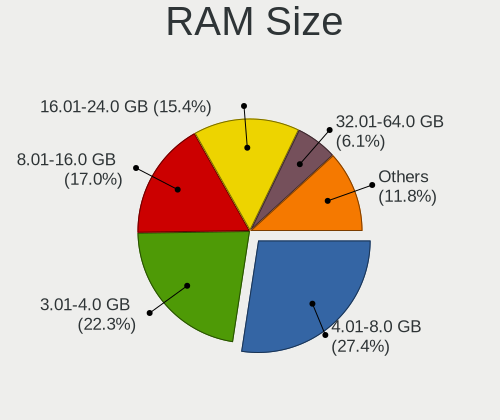
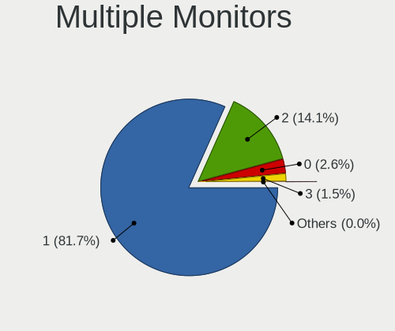
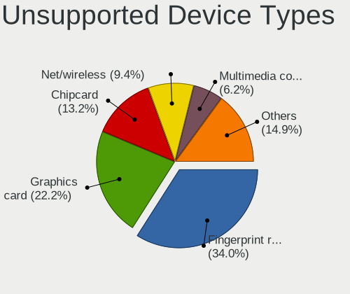

Linux - Tested Hardware & Statistics (Notebooks)
------------------------------------------------

A project to collect tested hardware configurations for Linux.

Anyone can contribute to this report by the [hw-probe](https://github.com/linuxhw/hw-probe) tool:

    sudo -E hw-probe -all -upload

Please contribute! Especially if your hardware is rare.

This report is for real hardware. Report for virtual hardware: [TestCoverage_VE](https://github.com/linuxhw/TestCoverage_VE)

Contents
--------

* [ Test Cases ](#test-cases)

* [ System ](#system)
  - [ OS                       ](#os)
  - [ OS Family                ](#os-family)
  - [ Kernel                   ](#kernel)
  - [ Kernel Family            ](#kernel-family)
  - [ Kernel Major Ver.        ](#kernel-major-ver)
  - [ Arch                     ](#arch)
  - [ DE                       ](#de)
  - [ Display Server           ](#display-server)
  - [ Display Manager          ](#display-manager)
  - [ OS Lang                  ](#os-lang)
  - [ Boot Mode                ](#boot-mode)
  - [ Filesystem               ](#filesystem)
  - [ Part. scheme             ](#part-scheme)
  - [ Dual Boot with Linux/BSD ](#dual-boot-with-linuxbsd)
  - [ Dual Boot (Win)          ](#dual-boot-win)

* [ Board ](#board)
  - [ Vendor                   ](#vendor)
  - [ Model                    ](#model)
  - [ Model Family             ](#model-family)
  - [ MFG Year                 ](#mfg-year)
  - [ Form Factor              ](#form-factor)
  - [ Secure Boot              ](#secure-boot)
  - [ Coreboot                 ](#coreboot)
  - [ RAM Size                 ](#ram-size)
  - [ RAM Used                 ](#ram-used)
  - [ Total Drives             ](#total-drives)
  - [ Has CD-ROM               ](#has-cd-rom)
  - [ Has Ethernet             ](#has-ethernet)
  - [ Has WiFi                 ](#has-wifi)
  - [ Has Bluetooth            ](#has-bluetooth)

* [ Location ](#location)
  - [ Country                  ](#country)
  - [ City                     ](#city)

* [ Drives ](#drives)
  - [ Drive Vendor             ](#drive-vendor)
  - [ Drive Model              ](#drive-model)
  - [ HDD Vendor               ](#hdd-vendor)
  - [ SSD Vendor               ](#ssd-vendor)
  - [ Drive Kind               ](#drive-kind)
  - [ Drive Connector          ](#drive-connector)
  - [ Drive Size               ](#drive-size)
  - [ Space Total              ](#space-total)
  - [ Space Used               ](#space-used)
  - [ Malfunc. Drives          ](#malfunc-drives)
  - [ Malfunc. Drive Vendor    ](#malfunc-drive-vendor)
  - [ Malfunc. HDD Vendor      ](#malfunc-hdd-vendor)
  - [ Malfunc. Drive Kind      ](#malfunc-drive-kind)
  - [ Failed Drives            ](#failed-drives)
  - [ Failed Drive Vendor      ](#failed-drive-vendor)
  - [ Drive Status             ](#drive-status)

* [ Storage controller ](#storage-controller)
  - [ Storage Vendor           ](#storage-vendor)
  - [ Storage Model            ](#storage-model)
  - [ Storage Kind             ](#storage-kind)

* [ Processor ](#processor)
  - [ CPU Vendor               ](#cpu-vendor)
  - [ CPU Model                ](#cpu-model)
  - [ CPU Model Family         ](#cpu-model-family)
  - [ CPU Cores                ](#cpu-cores)
  - [ CPU Sockets              ](#cpu-sockets)
  - [ CPU Threads              ](#cpu-threads)
  - [ CPU Op-Modes             ](#cpu-op-modes)
  - [ CPU Microcode            ](#cpu-microcode)
  - [ CPU Microarch            ](#cpu-microarch)

* [ Graphics ](#graphics)
  - [ GPU Vendor               ](#gpu-vendor)
  - [ GPU Model                ](#gpu-model)
  - [ GPU Combo                ](#gpu-combo)
  - [ GPU Driver               ](#gpu-driver)
  - [ GPU Memory               ](#gpu-memory)

* [ Monitor ](#monitor)
  - [ Monitor Vendor           ](#monitor-vendor)
  - [ Monitor Model            ](#monitor-model)
  - [ Monitor Resolution       ](#monitor-resolution)
  - [ Monitor Diagonal         ](#monitor-diagonal)
  - [ Monitor Width            ](#monitor-width)
  - [ Aspect Ratio             ](#aspect-ratio)
  - [ Monitor Area             ](#monitor-area)
  - [ Pixel Density            ](#pixel-density)
  - [ Multiple Monitors        ](#multiple-monitors)

* [ Network ](#network)
  - [ Net Controller Vendor    ](#net-controller-vendor)
  - [ Net Controller Model     ](#net-controller-model)
  - [ Wireless Vendor          ](#wireless-vendor)
  - [ Wireless Model           ](#wireless-model)
  - [ Ethernet Vendor          ](#ethernet-vendor)
  - [ Ethernet Model           ](#ethernet-model)
  - [ Net Controller Kind      ](#net-controller-kind)
  - [ Used Controller          ](#used-controller)
  - [ NICs                     ](#nics)
  - [ IPv6                     ](#ipv6)

* [ Bluetooth ](#bluetooth)
  - [ Bluetooth Vendor         ](#bluetooth-vendor)
  - [ Bluetooth Model          ](#bluetooth-model)

* [ Sound ](#sound)
  - [ Sound Vendor             ](#sound-vendor)
  - [ Sound Model              ](#sound-model)

* [ Memory ](#memory)
  - [ Memory Vendor            ](#memory-vendor)
  - [ Memory Model             ](#memory-model)
  - [ Memory Kind              ](#memory-kind)
  - [ Memory Form Factor       ](#memory-form-factor)
  - [ Memory Size              ](#memory-size)
  - [ Memory Speed             ](#memory-speed)

* [ Printers & scanners ](#printers--scanners)
  - [ Printer Vendor           ](#printer-vendor)
  - [ Printer Model            ](#printer-model)
  - [ Scanner Vendor           ](#scanner-vendor)
  - [ Scanner Model            ](#scanner-model)

* [ Camera ](#camera)
  - [ Camera Vendor            ](#camera-vendor)
  - [ Camera Model             ](#camera-model)

* [ Security ](#security)
  - [ Fingerprint Vendor       ](#fingerprint-vendor)
  - [ Fingerprint Model        ](#fingerprint-model)
  - [ Chipcard Vendor          ](#chipcard-vendor)
  - [ Chipcard Model           ](#chipcard-model)

* [ Unsupported ](#unsupported)
  - [ Unsupported Devices      ](#unsupported-devices)
  - [ Unsupported Device Types ](#unsupported-device-types)

Test Cases
----------

Total: 144791

| Vendor        | Model                       | Probe                                                      | Date         |
|---------------|-----------------------------|------------------------------------------------------------|--------------|
| HUAWEI        | NBLK-WAX9X                  | [2391058f73](https://linux-hardware.org/?probe=2391058f73) | Jan 01, 2023 |
| Notebook      | NJx0MU                      | [43923d1e98](https://linux-hardware.org/?probe=43923d1e98) | Jan 01, 2023 |
| Acer          | Aspire E5-573G              | [527a92f562](https://linux-hardware.org/?probe=527a92f562) | Dec 31, 2022 |
| Gigabyte      | G5 MD                       | [901f1e43f0](https://linux-hardware.org/?probe=901f1e43f0) | Dec 31, 2022 |
| Gigabyte      | G5 MD                       | [631ee5c81c](https://linux-hardware.org/?probe=631ee5c81c) | Dec 31, 2022 |
| Lenovo        | IdeaPad 3 15ALC6 82MF       | [4d7f89dc6d](https://linux-hardware.org/?probe=4d7f89dc6d) | Dec 31, 2022 |
| Lenovo        | ThinkPad X390 20Q00051GE    | [5b3d1b750d](https://linux-hardware.org/?probe=5b3d1b750d) | Dec 31, 2022 |
| Valve         | Jupiter                     | [97da60caa9](https://linux-hardware.org/?probe=97da60caa9) | Dec 31, 2022 |
| Valve         | Jupiter                     | [c0fb48bccb](https://linux-hardware.org/?probe=c0fb48bccb) | Dec 31, 2022 |
| Lenovo        | ThinkPad T410 2537DH6       | [23c0cbbe94](https://linux-hardware.org/?probe=23c0cbbe94) | Dec 31, 2022 |
| Dell          | Latitude E5500              | [f04cd8f466](https://linux-hardware.org/?probe=f04cd8f466) | Dec 31, 2022 |
| Toshiba       | Satellite A305D             | [b85a377462](https://linux-hardware.org/?probe=b85a377462) | Dec 31, 2022 |
| HP            | Folio 13                    | [9f00cfe432](https://linux-hardware.org/?probe=9f00cfe432) | Dec 31, 2022 |
| HP            | Folio 13                    | [3ed5b405cb](https://linux-hardware.org/?probe=3ed5b405cb) | Dec 31, 2022 |
| System76      | Oryx Pro                    | [0d65e57758](https://linux-hardware.org/?probe=0d65e57758) | Dec 31, 2022 |
| Dell          | Latitude E5500              | [24a0ca1b65](https://linux-hardware.org/?probe=24a0ca1b65) | Dec 31, 2022 |
| Lenovo        | ThinkPad X390 20Q00051GE    | [775096be09](https://linux-hardware.org/?probe=775096be09) | Dec 31, 2022 |
| Lenovo        | ThinkBook 15-IIL 20SM       | [a30f96dea4](https://linux-hardware.org/?probe=a30f96dea4) | Dec 31, 2022 |
| Lenovo        | ThinkPad P16s Gen 1 21BT... | [b68fa80860](https://linux-hardware.org/?probe=b68fa80860) | Dec 31, 2022 |
| ASUSTek       | K53SC                       | [25912a6795](https://linux-hardware.org/?probe=25912a6795) | Dec 31, 2022 |
| HP            | Pavilion dv6                | [30ec83dbd4](https://linux-hardware.org/?probe=30ec83dbd4) | Dec 31, 2022 |
| Unknown       | Unknown                     | [10496680a5](https://linux-hardware.org/?probe=10496680a5) | Dec 31, 2022 |
| HP            | Pavilion dv7                | [4e42e627b8](https://linux-hardware.org/?probe=4e42e627b8) | Dec 31, 2022 |
| Lenovo        | G500 20236                  | [75f2e6fae1](https://linux-hardware.org/?probe=75f2e6fae1) | Dec 31, 2022 |
| Dynabook      | Satellite Pro C40-G         | [e7555a4df8](https://linux-hardware.org/?probe=e7555a4df8) | Dec 31, 2022 |
| Dell          | System XPS L702X            | [7030c340cc](https://linux-hardware.org/?probe=7030c340cc) | Dec 31, 2022 |
| Lenovo        | ThinkPad T14 Gen 3 21AH0... | [322cf5484d](https://linux-hardware.org/?probe=322cf5484d) | Dec 31, 2022 |
| Lenovo        | ThinkPad T430s 235368U      | [8420930d53](https://linux-hardware.org/?probe=8420930d53) | Dec 31, 2022 |
| Dell          | Latitude 7370               | [cf1f751fbf](https://linux-hardware.org/?probe=cf1f751fbf) | Dec 31, 2022 |
| Notebook      | PB50_70RF,RD,RC             | [d1f655b9b1](https://linux-hardware.org/?probe=d1f655b9b1) | Dec 31, 2022 |
| ASUSTek       | ZenBook UX425UAZ_UM425UA... | [8d33275e7b](https://linux-hardware.org/?probe=8d33275e7b) | Dec 31, 2022 |
| Lenovo        | G500 20236                  | [0d3ed20685](https://linux-hardware.org/?probe=0d3ed20685) | Dec 31, 2022 |
| Lenovo        | Yoga 2 13 20344             | [39c9c8aaea](https://linux-hardware.org/?probe=39c9c8aaea) | Dec 31, 2022 |
| Lenovo        | ThinkPad T14 Gen 2i 20W0... | [2abdc57712](https://linux-hardware.org/?probe=2abdc57712) | Dec 31, 2022 |
| Acer          | Aspire V3-571G              | [273f6722e0](https://linux-hardware.org/?probe=273f6722e0) | Dec 31, 2022 |
| Lenovo        | ThinkPad T14 Gen 2i 20W0... | [632515014d](https://linux-hardware.org/?probe=632515014d) | Dec 31, 2022 |
| ASUSTek       | UX31E                       | [58391b15a5](https://linux-hardware.org/?probe=58391b15a5) | Dec 31, 2022 |
| Lenovo        | ThinkPad E470 20H2A02NBR    | [18827f3f77](https://linux-hardware.org/?probe=18827f3f77) | Dec 31, 2022 |
| Lenovo        | ThinkPad E15 Gen 3 20YHS... | [5fbe1632b0](https://linux-hardware.org/?probe=5fbe1632b0) | Dec 31, 2022 |
| Lenovo        | ThinkPad E15 Gen 3 20YHS... | [5a479fed95](https://linux-hardware.org/?probe=5a479fed95) | Dec 31, 2022 |
| ASUSTek       | VivoBook_ASUSLaptop X509... | [fb22f9430c](https://linux-hardware.org/?probe=fb22f9430c) | Dec 31, 2022 |
| ASUSTek       | X540YA                      | [37ef421251](https://linux-hardware.org/?probe=37ef421251) | Dec 31, 2022 |
| HP            | Laptop 15-db0xxx            | [375dccca30](https://linux-hardware.org/?probe=375dccca30) | Dec 31, 2022 |
| Dell          | Latitude E5440              | [9578ad1ea3](https://linux-hardware.org/?probe=9578ad1ea3) | Dec 31, 2022 |
| Fujitsu       | LIFEBOOK U772               | [3ecdad230a](https://linux-hardware.org/?probe=3ecdad230a) | Dec 31, 2022 |
| HP            | Pavilion 17                 | [ce5baca257](https://linux-hardware.org/?probe=ce5baca257) | Dec 31, 2022 |
| Lenovo        | G780 20138                  | [896aeb4e20](https://linux-hardware.org/?probe=896aeb4e20) | Dec 31, 2022 |
| Dell          | Inspiron 1420               | [fe6a8714da](https://linux-hardware.org/?probe=fe6a8714da) | Dec 31, 2022 |
| HP            | Notebook                    | [d25df9daf4](https://linux-hardware.org/?probe=d25df9daf4) | Dec 31, 2022 |
| Lenovo        | ThinkPad T430s 235368U      | [e31244bdd7](https://linux-hardware.org/?probe=e31244bdd7) | Dec 31, 2022 |
| Lenovo        | IdeaPad 330-15IKB 81DE      | [cc19d2cf24](https://linux-hardware.org/?probe=cc19d2cf24) | Dec 31, 2022 |
| Lenovo        | Y520-15IKBN 80WK            | [9f2441851f](https://linux-hardware.org/?probe=9f2441851f) | Dec 31, 2022 |
| ASUSTek       | ProArt StudioBook H5600Q... | [07ca2ed63d](https://linux-hardware.org/?probe=07ca2ed63d) | Dec 31, 2022 |
| Acer          | Aspire E5-575G              | [db40dc530a](https://linux-hardware.org/?probe=db40dc530a) | Dec 31, 2022 |
| Dell          | XPS 9320                    | [c98fd80f29](https://linux-hardware.org/?probe=c98fd80f29) | Dec 31, 2022 |
| ASUSTek       | X550VXK                     | [b8cd38522a](https://linux-hardware.org/?probe=b8cd38522a) | Dec 31, 2022 |
| Google        | Candy                       | [86bb9a73fc](https://linux-hardware.org/?probe=86bb9a73fc) | Dec 31, 2022 |
| Lenovo        | ThinkPad L470 20J5S0Y700    | [9e54ccbafa](https://linux-hardware.org/?probe=9e54ccbafa) | Dec 31, 2022 |
| Lenovo        | ThinkPad T14 Gen 1 20UDC... | [ac397dc318](https://linux-hardware.org/?probe=ac397dc318) | Dec 31, 2022 |
| Lenovo        | ThinkPad W540 20BG0033RT    | [5cfa12cec1](https://linux-hardware.org/?probe=5cfa12cec1) | Dec 31, 2022 |
| HP            | EliteBook 845 14 inch G9... | [5b5e58e433](https://linux-hardware.org/?probe=5b5e58e433) | Dec 31, 2022 |
| Lenovo        | Legion 5 Pro 16ACH6H 82J... | [d326e34afc](https://linux-hardware.org/?probe=d326e34afc) | Dec 31, 2022 |
| Lenovo        | ThinkPad Edge E545 20B2S... | [c83f51d7d9](https://linux-hardware.org/?probe=c83f51d7d9) | Dec 31, 2022 |
| Timi          | Xiaomi NoteBook Pro         | [5d0ff5ea2d](https://linux-hardware.org/?probe=5d0ff5ea2d) | Dec 31, 2022 |
| Valve         | Jupiter                     | [1922673e86](https://linux-hardware.org/?probe=1922673e86) | Dec 31, 2022 |
| Lenovo        | IdeaPad S340-14API 81NB     | [270ba62d9d](https://linux-hardware.org/?probe=270ba62d9d) | Dec 31, 2022 |
| Valve         | Jupiter                     | [b5b95e62a1](https://linux-hardware.org/?probe=b5b95e62a1) | Dec 31, 2022 |
| Valve         | Jupiter                     | [206fed6963](https://linux-hardware.org/?probe=206fed6963) | Dec 31, 2022 |
| Lenovo        | IdeaPad 5 Pro 14ACN6 82L... | [cf40d3f30c](https://linux-hardware.org/?probe=cf40d3f30c) | Dec 31, 2022 |
| Dell          | Latitude 7370               | [c9423665bb](https://linux-hardware.org/?probe=c9423665bb) | Dec 31, 2022 |
| Dell          | Inspiron 15-3552            | [e8b804ddd5](https://linux-hardware.org/?probe=e8b804ddd5) | Dec 31, 2022 |
| Dell          | Latitude E6430              | [de9b03cf29](https://linux-hardware.org/?probe=de9b03cf29) | Dec 31, 2022 |
| Acer          | Aspire E5-521               | [d9b5e3cfc3](https://linux-hardware.org/?probe=d9b5e3cfc3) | Dec 31, 2022 |
| Lenovo        | ThinkPad T14 Gen 3 21AH0... | [591d985e85](https://linux-hardware.org/?probe=591d985e85) | Dec 31, 2022 |
| HP            | Pavilion Aero Laptop 13-... | [c2a949b725](https://linux-hardware.org/?probe=c2a949b725) | Dec 31, 2022 |
| Lenovo        | IdeaPad Y560                | [c9d3a1d0a3](https://linux-hardware.org/?probe=c9d3a1d0a3) | Dec 31, 2022 |
| MSI           | Modern 15 A5M               | [e0cb4d278d](https://linux-hardware.org/?probe=e0cb4d278d) | Dec 31, 2022 |
| Intel Clie... | LAPRC710                    | [47e562afc7](https://linux-hardware.org/?probe=47e562afc7) | Dec 31, 2022 |
| HP            | Victus by Laptop 16-e0xx... | [9220da7abb](https://linux-hardware.org/?probe=9220da7abb) | Dec 31, 2022 |
| Lenovo        | ThinkPad T480 20L6S29E0A    | [82168627b7](https://linux-hardware.org/?probe=82168627b7) | Dec 31, 2022 |
| Apple         | MacBookPro8,1               | [97f93aa235](https://linux-hardware.org/?probe=97f93aa235) | Dec 31, 2022 |
| Valve         | Jupiter                     | [61cb7375d1](https://linux-hardware.org/?probe=61cb7375d1) | Dec 31, 2022 |
| Acer          | Aspire A514-54              | [5775c77a91](https://linux-hardware.org/?probe=5775c77a91) | Dec 31, 2022 |
| Lenovo        | ThinkPad P17 Gen 2i 20YU... | [34169c74c5](https://linux-hardware.org/?probe=34169c74c5) | Dec 31, 2022 |
| Dell          | Latitude D620               | [5337d0b0f9](https://linux-hardware.org/?probe=5337d0b0f9) | Dec 31, 2022 |
| Dell          | Latitude D620               | [ea81d9f6a5](https://linux-hardware.org/?probe=ea81d9f6a5) | Dec 31, 2022 |
| HP            | Pavilion 17                 | [c87d61d0cd](https://linux-hardware.org/?probe=c87d61d0cd) | Dec 31, 2022 |
| Samsung       | 300V3A/300V4A/300V5A        | [14b589709d](https://linux-hardware.org/?probe=14b589709d) | Dec 31, 2022 |
| Dell          | Latitude 3420               | [05095533cd](https://linux-hardware.org/?probe=05095533cd) | Dec 31, 2022 |
| HP            | Pavilion 17                 | [bbf52af119](https://linux-hardware.org/?probe=bbf52af119) | Dec 31, 2022 |
| HP            | Pavilion Gaming Laptop 1... | [e0f696a9b9](https://linux-hardware.org/?probe=e0f696a9b9) | Dec 31, 2022 |
| HP            | EliteBook 8740w (WH274UT... | [e42d4e66a0](https://linux-hardware.org/?probe=e42d4e66a0) | Dec 31, 2022 |
| Lenovo        | IdeaPad 320-15ISK 80XH      | [fc108fb0d8](https://linux-hardware.org/?probe=fc108fb0d8) | Dec 31, 2022 |
| HP            | Victus by Laptop 16-e0xx... | [60989ad0c4](https://linux-hardware.org/?probe=60989ad0c4) | Dec 31, 2022 |
| Dell          | G3 3579                     | [cad48f0160](https://linux-hardware.org/?probe=cad48f0160) | Dec 30, 2022 |
| HP            | Pavilion dv6700             | [4b3b106bee](https://linux-hardware.org/?probe=4b3b106bee) | Dec 30, 2022 |
| Valve         | Jupiter                     | [82b86d954a](https://linux-hardware.org/?probe=82b86d954a) | Dec 30, 2022 |
| Apple         | MacBookAir7,2               | [8b84042dc6](https://linux-hardware.org/?probe=8b84042dc6) | Dec 30, 2022 |
| Lenovo        | ThinkPad T410 2537BF9       | [f83ed1dd39](https://linux-hardware.org/?probe=f83ed1dd39) | Dec 30, 2022 |
| HUAWEI        | BOHK-WAX9X                  | [62b14864e1](https://linux-hardware.org/?probe=62b14864e1) | Dec 30, 2022 |
| Apple         | MacBookAir7,2               | [dae09ec15f](https://linux-hardware.org/?probe=dae09ec15f) | Dec 30, 2022 |
| ASUSTek       | TP501UA                     | [1f2aaf8804](https://linux-hardware.org/?probe=1f2aaf8804) | Dec 30, 2022 |
| Acer          | Aspire 8943G                | [dd6e590470](https://linux-hardware.org/?probe=dd6e590470) | Dec 30, 2022 |
| Acer          | Aspire A315-41              | [9cddb65ac1](https://linux-hardware.org/?probe=9cddb65ac1) | Dec 30, 2022 |
| Lenovo        | Legion Y540-15IRH-PG0 81... | [4b130212a2](https://linux-hardware.org/?probe=4b130212a2) | Dec 30, 2022 |
| Valve         | Jupiter                     | [294144217a](https://linux-hardware.org/?probe=294144217a) | Dec 30, 2022 |
| Dell          | G15 5520                    | [2e82f45fb6](https://linux-hardware.org/?probe=2e82f45fb6) | Dec 30, 2022 |
| HP            | Laptop 17-cn1xxx            | [dde4bcd574](https://linux-hardware.org/?probe=dde4bcd574) | Dec 30, 2022 |
| Acer          | TravelMate B117-M           | [23985812a9](https://linux-hardware.org/?probe=23985812a9) | Dec 30, 2022 |
| MSI           | GE60 2OC\2OE                | [c307379c36](https://linux-hardware.org/?probe=c307379c36) | Dec 30, 2022 |
| Lenovo        | Legion Y540-15IRH-PG0 81... | [0c7ced8708](https://linux-hardware.org/?probe=0c7ced8708) | Dec 30, 2022 |
| Dell          | G3 3500                     | [6be65a4ee5](https://linux-hardware.org/?probe=6be65a4ee5) | Dec 30, 2022 |
| Lenovo        | Z50-70 20354                | [29984f68c6](https://linux-hardware.org/?probe=29984f68c6) | Dec 30, 2022 |
| Acer          | Aspire E5-576G              | [883bd1cd8d](https://linux-hardware.org/?probe=883bd1cd8d) | Dec 30, 2022 |
| MACHENIKE     | MACHCREATOR-16              | [f7ed4a6609](https://linux-hardware.org/?probe=f7ed4a6609) | Dec 30, 2022 |
| Lenovo        | ThinkPad T480 20L50000UK    | [5043868e71](https://linux-hardware.org/?probe=5043868e71) | Dec 30, 2022 |
| Lenovo        | Y520-15IKBN 80WK            | [d44828a455](https://linux-hardware.org/?probe=d44828a455) | Dec 30, 2022 |
| Lenovo        | ThinkPad L15 Gen 1 20U8S... | [afa28ba4f3](https://linux-hardware.org/?probe=afa28ba4f3) | Dec 30, 2022 |
| Lenovo        | IdeaPad Gaming 3 15ACH6 ... | [bd53b75b7b](https://linux-hardware.org/?probe=bd53b75b7b) | Dec 30, 2022 |
| Lenovo        | Y520-15IKBN 80WK            | [43f808e1e4](https://linux-hardware.org/?probe=43f808e1e4) | Dec 30, 2022 |
| Dell          | Inspiron 3421               | [d2cd50a2a6](https://linux-hardware.org/?probe=d2cd50a2a6) | Dec 30, 2022 |
| Chuwi         | HeroBook Pro                | [cdc31b8338](https://linux-hardware.org/?probe=cdc31b8338) | Dec 30, 2022 |
| Valve         | Jupiter                     | [d66944e019](https://linux-hardware.org/?probe=d66944e019) | Dec 30, 2022 |
| Acer          | Aspire R7-371T              | [057e717cb7](https://linux-hardware.org/?probe=057e717cb7) | Dec 30, 2022 |
| Timi          | A35S                        | [c62c9ae956](https://linux-hardware.org/?probe=c62c9ae956) | Dec 30, 2022 |
| Lenovo        | ThinkPad X250 20CLS2D404    | [68afcc38f2](https://linux-hardware.org/?probe=68afcc38f2) | Dec 30, 2022 |
| Dell          | Inspiron 3421               | [ae7d821823](https://linux-hardware.org/?probe=ae7d821823) | Dec 30, 2022 |
| Dell          | XPS 15 9520                 | [19b4bfd852](https://linux-hardware.org/?probe=19b4bfd852) | Dec 30, 2022 |
| Valve         | Jupiter                     | [7efd41e9e3](https://linux-hardware.org/?probe=7efd41e9e3) | Dec 30, 2022 |
| Valve         | Jupiter                     | [d35711a607](https://linux-hardware.org/?probe=d35711a607) | Dec 30, 2022 |
| Valve         | Jupiter                     | [617508d444](https://linux-hardware.org/?probe=617508d444) | Dec 30, 2022 |
| Alienware     | x17 R2                      | [f213236189](https://linux-hardware.org/?probe=f213236189) | Dec 30, 2022 |
| Acer          | Predator G3-572             | [ab03199a79](https://linux-hardware.org/?probe=ab03199a79) | Dec 30, 2022 |
| HP            | Pavilion g6                 | [6f29ccd86e](https://linux-hardware.org/?probe=6f29ccd86e) | Dec 30, 2022 |
| Compaq        | CQ-27                       | [fc5b98e1db](https://linux-hardware.org/?probe=fc5b98e1db) | Dec 30, 2022 |
| HP            | Compaq 6710b (KE207ES#AB... | [d7d0be3872](https://linux-hardware.org/?probe=d7d0be3872) | Dec 30, 2022 |
| Samsung       | 3570R/370R/470R/450R/510... | [465d2da36b](https://linux-hardware.org/?probe=465d2da36b) | Dec 30, 2022 |
| Lenovo        | IdeaPad L340-15API 81LW     | [5b5e0e4535](https://linux-hardware.org/?probe=5b5e0e4535) | Dec 30, 2022 |
| HUAWEI        | BOHK-WAX9X                  | [68b3b51892](https://linux-hardware.org/?probe=68b3b51892) | Dec 30, 2022 |
| Notebook      | P17SM                       | [18605208b6](https://linux-hardware.org/?probe=18605208b6) | Dec 30, 2022 |
| ASUSTek       | ZenBook UX425EA_UX425EA     | [4c8f1bd9d4](https://linux-hardware.org/?probe=4c8f1bd9d4) | Dec 30, 2022 |
| Lenovo        | ThinkPad R61 8918DEG        | [48c688033a](https://linux-hardware.org/?probe=48c688033a) | Dec 30, 2022 |
| Chuwi         | HeroBook                    | [1664994b07](https://linux-hardware.org/?probe=1664994b07) | Dec 30, 2022 |
| GPU Compan... | GWNR71517                   | [d8b5801637](https://linux-hardware.org/?probe=d8b5801637) | Dec 30, 2022 |
| ASUSTek       | K55VD                       | [e4c90250df](https://linux-hardware.org/?probe=e4c90250df) | Dec 30, 2022 |
| HP            | ZBook Studio G5             | [6d0b6881ac](https://linux-hardware.org/?probe=6d0b6881ac) | Dec 30, 2022 |
| Valve         | Jupiter                     | [ba8c4aff6e](https://linux-hardware.org/?probe=ba8c4aff6e) | Dec 30, 2022 |
| Valve         | Jupiter                     | [6723dd2f21](https://linux-hardware.org/?probe=6723dd2f21) | Dec 30, 2022 |
| HP            | Pavilion Laptop 15-cw1xx... | [7a685e175c](https://linux-hardware.org/?probe=7a685e175c) | Dec 30, 2022 |
| Lenovo        | ThinkPad T14 Gen 1 20S00... | [347dc56d43](https://linux-hardware.org/?probe=347dc56d43) | Dec 30, 2022 |
| HP            | EliteBook 2570p             | [b8eccb0fbe](https://linux-hardware.org/?probe=b8eccb0fbe) | Dec 30, 2022 |
| Apple         | MacBookPro7,1               | [db4379ed1e](https://linux-hardware.org/?probe=db4379ed1e) | Dec 30, 2022 |
| ASUSTek       | VivoBook 15_ASUS Laptop ... | [5710b93654](https://linux-hardware.org/?probe=5710b93654) | Dec 30, 2022 |
| Lenovo        | ThinkPad T470s 20HGS1JN0... | [049bc54496](https://linux-hardware.org/?probe=049bc54496) | Dec 30, 2022 |
| Unknown       | Unknown                     | [86dcc5a2ff](https://linux-hardware.org/?probe=86dcc5a2ff) | Dec 30, 2022 |
| HP            | ProBook 455R G6             | [71c9651ee2](https://linux-hardware.org/?probe=71c9651ee2) | Dec 30, 2022 |
| Lenovo        | ThinkPad X1 Carbon Gen 8... | [80abf89bc6](https://linux-hardware.org/?probe=80abf89bc6) | Dec 30, 2022 |
| ASUSTek       | ASUS EXPERTBOOK B9400CEA... | [8b0b7eb91a](https://linux-hardware.org/?probe=8b0b7eb91a) | Dec 30, 2022 |
| ASUSTek       | K72F                        | [f761bf9bd6](https://linux-hardware.org/?probe=f761bf9bd6) | Dec 30, 2022 |
| Dell          | Inspiron 5490               | [c8a80649d2](https://linux-hardware.org/?probe=c8a80649d2) | Dec 30, 2022 |
| HP            | Pavilion Gaming Laptop 1... | [6c00206f7e](https://linux-hardware.org/?probe=6c00206f7e) | Dec 30, 2022 |
| Toshiba       | Satellite C850-1GL          | [f6f61f1841](https://linux-hardware.org/?probe=f6f61f1841) | Dec 30, 2022 |
| Toshiba       | Satellite C850-1GL          | [796edd73f6](https://linux-hardware.org/?probe=796edd73f6) | Dec 30, 2022 |
| HP            | EliteBook 840 G7 Noteboo... | [e7a5c8704b](https://linux-hardware.org/?probe=e7a5c8704b) | Dec 30, 2022 |
| Dell          | Latitude 5480               | [e02be15b45](https://linux-hardware.org/?probe=e02be15b45) | Dec 30, 2022 |
| HP            | EliteBook 840 G7 Noteboo... | [fa210be351](https://linux-hardware.org/?probe=fa210be351) | Dec 30, 2022 |
| HP            | EliteBook 830 G5            | [bdd6f3912d](https://linux-hardware.org/?probe=bdd6f3912d) | Dec 30, 2022 |
| Dell          | Latitude 5480               | [5afd8e73be](https://linux-hardware.org/?probe=5afd8e73be) | Dec 30, 2022 |
| Notebook      | NJx0MU                      | [8540c1c554](https://linux-hardware.org/?probe=8540c1c554) | Dec 30, 2022 |
| Lenovo        | ThinkPad R61 8918DEG        | [82cbc15539](https://linux-hardware.org/?probe=82cbc15539) | Dec 30, 2022 |
| MSI           | GP72MVR 7RFX                | [cefedef93c](https://linux-hardware.org/?probe=cefedef93c) | Dec 30, 2022 |
| HP            | Pavilion Gaming Laptop 1... | [c28fb2edb2](https://linux-hardware.org/?probe=c28fb2edb2) | Dec 30, 2022 |
| HP            | EliteBook 2540p             | [279718a62f](https://linux-hardware.org/?probe=279718a62f) | Dec 30, 2022 |
| Dell          | Latitude 5480               | [64aa4b9161](https://linux-hardware.org/?probe=64aa4b9161) | Dec 30, 2022 |
| Lenovo        | ThinkPad W541 20EF0011IX    | [a2f6a6831a](https://linux-hardware.org/?probe=a2f6a6831a) | Dec 30, 2022 |
| Notebook      | NJx0MU                      | [b4c615f28c](https://linux-hardware.org/?probe=b4c615f28c) | Dec 30, 2022 |
| Lenovo        | ThinkPad W541 20EF0011IX    | [3f5a2c6ea1](https://linux-hardware.org/?probe=3f5a2c6ea1) | Dec 30, 2022 |
| MSI           | Stealth GS66 12UGS          | [da812c8fa2](https://linux-hardware.org/?probe=da812c8fa2) | Dec 30, 2022 |
| Lenovo        | Z70-80 80FG                 | [16419f6991](https://linux-hardware.org/?probe=16419f6991) | Dec 30, 2022 |
| ASUSTek       | UX31E                       | [5e6dc18098](https://linux-hardware.org/?probe=5e6dc18098) | Dec 30, 2022 |
| ASUSTek       | X540LA                      | [65f5548781](https://linux-hardware.org/?probe=65f5548781) | Dec 30, 2022 |
| Lenovo        | IdeaPad 110-15IBR 80T7      | [ceb89aefed](https://linux-hardware.org/?probe=ceb89aefed) | Dec 30, 2022 |
| Lenovo        | IdeaPad 330-15IKB 81DE      | [2d63537d23](https://linux-hardware.org/?probe=2d63537d23) | Dec 30, 2022 |
| Dell          | Precision M4800             | [505f1b47dc](https://linux-hardware.org/?probe=505f1b47dc) | Dec 30, 2022 |
| Lenovo        | Z70-80 80FG                 | [4386242be1](https://linux-hardware.org/?probe=4386242be1) | Dec 30, 2022 |
| Lenovo        | G575 4383                   | [7c203c43cc](https://linux-hardware.org/?probe=7c203c43cc) | Dec 30, 2022 |
| Dell          | Vostro 1015                 | [fd48487066](https://linux-hardware.org/?probe=fd48487066) | Dec 30, 2022 |
| ITI LIMITE... | ITI Smaash ITIB15LI3        | [6a08f378e2](https://linux-hardware.org/?probe=6a08f378e2) | Dec 30, 2022 |
| HP            | ZBook Studio G3             | [ca204b6900](https://linux-hardware.org/?probe=ca204b6900) | Dec 30, 2022 |
| Dell          | Latitude E7270              | [2770f493c1](https://linux-hardware.org/?probe=2770f493c1) | Dec 30, 2022 |
| ITI LIMITE... | ITI Smaash ITIB15LI3        | [282a44d1ff](https://linux-hardware.org/?probe=282a44d1ff) | Dec 30, 2022 |
| ASUSTek       | ASUS TUF Gaming A15 FA50... | [3f1ca6740d](https://linux-hardware.org/?probe=3f1ca6740d) | Dec 30, 2022 |
| Dell          | Latitude E7240              | [5f83c8f4ad](https://linux-hardware.org/?probe=5f83c8f4ad) | Dec 30, 2022 |
| Lenovo        | ThinkPad P15v Gen 1 20TQ... | [770c5eee84](https://linux-hardware.org/?probe=770c5eee84) | Dec 30, 2022 |
| HUAWEI        | BOM-WXX9                    | [4409746122](https://linux-hardware.org/?probe=4409746122) | Dec 30, 2022 |
| Dell          | XPS 15 9570                 | [cc31efb32d](https://linux-hardware.org/?probe=cc31efb32d) | Dec 30, 2022 |
| ASUSTek       | X555UJ                      | [f4ba8643aa](https://linux-hardware.org/?probe=f4ba8643aa) | Dec 30, 2022 |
| Lenovo        | IdeaPad 320-15IKB 81BT      | [3a7cfd8073](https://linux-hardware.org/?probe=3a7cfd8073) | Dec 30, 2022 |
| Lenovo        | G575 4383                   | [c9656285fc](https://linux-hardware.org/?probe=c9656285fc) | Dec 30, 2022 |
| Apple         | MacBookPro14,3              | [fdd6af96b3](https://linux-hardware.org/?probe=fdd6af96b3) | Dec 30, 2022 |
| ASUSTek       | X556UQK                     | [42a9dc760d](https://linux-hardware.org/?probe=42a9dc760d) | Dec 30, 2022 |
| System76      | Oryx Pro                    | [dcc09f8dc5](https://linux-hardware.org/?probe=dcc09f8dc5) | Dec 30, 2022 |
| ASUSTek       | VivoBook_ASUS Laptop E21... | [41da11b027](https://linux-hardware.org/?probe=41da11b027) | Dec 30, 2022 |
| HP            | Pavilion dv7                | [6ba364face](https://linux-hardware.org/?probe=6ba364face) | Dec 30, 2022 |
| ASUSTek       | VivoBook_ASUSLaptop M340... | [d7806eec79](https://linux-hardware.org/?probe=d7806eec79) | Dec 30, 2022 |
| Dell          | Inspiron 14-3462            | [1a8ed5998a](https://linux-hardware.org/?probe=1a8ed5998a) | Dec 30, 2022 |
| Google        | Edgar                       | [738a0d9324](https://linux-hardware.org/?probe=738a0d9324) | Dec 30, 2022 |
| AMI           | F3C2                        | [ed7d4a2a13](https://linux-hardware.org/?probe=ed7d4a2a13) | Dec 30, 2022 |
| MSI           | Stealth 15M B12UE           | [45ef7b8ac9](https://linux-hardware.org/?probe=45ef7b8ac9) | Dec 30, 2022 |
| HP            | Laptop 17-ca2xxx            | [add21e3026](https://linux-hardware.org/?probe=add21e3026) | Dec 30, 2022 |
| HP            | Pavilion dv6                | [12a8186204](https://linux-hardware.org/?probe=12a8186204) | Dec 30, 2022 |
| HP            | EliteBook 820 G4            | [9e794046d8](https://linux-hardware.org/?probe=9e794046d8) | Dec 30, 2022 |
| Acer          | TravelMate P214             | [436186d9e5](https://linux-hardware.org/?probe=436186d9e5) | Dec 30, 2022 |
| HP            | 240 G7 Notebook PC          | [414db30bff](https://linux-hardware.org/?probe=414db30bff) | Dec 30, 2022 |
| HP            | 250 G8 Notebook PC          | [6b8db26ab8](https://linux-hardware.org/?probe=6b8db26ab8) | Dec 30, 2022 |
| Apple         | MacBookAir9,1               | [d560c94d76](https://linux-hardware.org/?probe=d560c94d76) | Dec 30, 2022 |
| Lenovo        | IdeaPad 330-15IKB 81FE      | [d048930c78](https://linux-hardware.org/?probe=d048930c78) | Dec 30, 2022 |
| Dell          | XPS 9320                    | [c7a7749a95](https://linux-hardware.org/?probe=c7a7749a95) | Dec 30, 2022 |
| Acer          | Aspire A115-32              | [7c8ec90c8a](https://linux-hardware.org/?probe=7c8ec90c8a) | Dec 30, 2022 |
| HP            | 431 Notebook                | [6a8d323e0c](https://linux-hardware.org/?probe=6a8d323e0c) | Dec 30, 2022 |
| Dell          | Inspiron 5593               | [bf0f36d69a](https://linux-hardware.org/?probe=bf0f36d69a) | Dec 30, 2022 |
| Lenovo        | ThinkPad T430 23426FU       | [eec74990ca](https://linux-hardware.org/?probe=eec74990ca) | Dec 30, 2022 |
| Dell          | Inspiron N5110              | [08682d735c](https://linux-hardware.org/?probe=08682d735c) | Dec 30, 2022 |
| Lenovo        | ThinkPad X240 20AMS1J60B    | [1d8fcd4a75](https://linux-hardware.org/?probe=1d8fcd4a75) | Dec 30, 2022 |
| HP            | 255 G3                      | [89d6bd459c](https://linux-hardware.org/?probe=89d6bd459c) | Dec 30, 2022 |
| Valve         | Jupiter                     | [15c60654b3](https://linux-hardware.org/?probe=15c60654b3) | Dec 30, 2022 |
| Lenovo        | IdeaPad Gaming 3 15ARH05... | [c51bc128e2](https://linux-hardware.org/?probe=c51bc128e2) | Dec 30, 2022 |
| HP            | Laptop 17-by0xxx            | [0da7f8e1d5](https://linux-hardware.org/?probe=0da7f8e1d5) | Dec 30, 2022 |
| HP            | EliteBook 745 G5            | [d819dbd901](https://linux-hardware.org/?probe=d819dbd901) | Dec 30, 2022 |
| Lenovo        | Legion 5 Pro 16ACH6H 82J... | [816ab16fd0](https://linux-hardware.org/?probe=816ab16fd0) | Dec 30, 2022 |
| ASUSTek       | N56VB                       | [6201ddc028](https://linux-hardware.org/?probe=6201ddc028) | Dec 30, 2022 |
| Dell          | Latitude E6540              | [e0e5f33e60](https://linux-hardware.org/?probe=e0e5f33e60) | Dec 30, 2022 |
| Lenovo        | IdeaPad 330-15IKB 81DE      | [954fdfcd25](https://linux-hardware.org/?probe=954fdfcd25) | Dec 30, 2022 |
| Apple         | MacBookPro11,3              | [87d0f67d84](https://linux-hardware.org/?probe=87d0f67d84) | Dec 30, 2022 |
| Dell          | XPS 9320                    | [458727c26e](https://linux-hardware.org/?probe=458727c26e) | Dec 30, 2022 |
| Dell          | G5 5590                     | [dada63bf04](https://linux-hardware.org/?probe=dada63bf04) | Dec 30, 2022 |
| Acer          | Aspire A517-51              | [7ec5b8bb3f](https://linux-hardware.org/?probe=7ec5b8bb3f) | Dec 29, 2022 |
| Dell          | Latitude 9420               | [3c43afbd50](https://linux-hardware.org/?probe=3c43afbd50) | Dec 29, 2022 |
| Lenovo        | Legion 5 Pro 16ACH6H 82J... | [43e6103cd0](https://linux-hardware.org/?probe=43e6103cd0) | Dec 29, 2022 |
| Medion        | Akoya E6416                 | [ddd9ba1ffc](https://linux-hardware.org/?probe=ddd9ba1ffc) | Dec 29, 2022 |
| ASUSTek       | ASUS TUF Gaming A15 FA50... | [614187020c](https://linux-hardware.org/?probe=614187020c) | Dec 29, 2022 |
| Acer          | Predator G3-572             | [f99480426f](https://linux-hardware.org/?probe=f99480426f) | Dec 29, 2022 |
| Toshiba       | Satellite L775-12V          | [2c601f6366](https://linux-hardware.org/?probe=2c601f6366) | Dec 29, 2022 |
| Dell          | Latitude E6430              | [8ecaae98d3](https://linux-hardware.org/?probe=8ecaae98d3) | Dec 29, 2022 |
| Lenovo        | G40-30 80FY                 | [49bb82ca4b](https://linux-hardware.org/?probe=49bb82ca4b) | Dec 29, 2022 |
| Lenovo        | IdeaPad 320-14IAP 80XQ      | [e133481ab3](https://linux-hardware.org/?probe=e133481ab3) | Dec 29, 2022 |
| Lenovo        | ThinkBook 14-IIL 20SL       | [8e201646a8](https://linux-hardware.org/?probe=8e201646a8) | Dec 29, 2022 |
| Samsung       | 550XBE/350XBE               | [33c4b80d0a](https://linux-hardware.org/?probe=33c4b80d0a) | Dec 29, 2022 |
| Unknown       | Unknown                     | [b74128543f](https://linux-hardware.org/?probe=b74128543f) | Dec 29, 2022 |
| MSI           | Raider GE67HX 12UGS         | [28822be06e](https://linux-hardware.org/?probe=28822be06e) | Dec 29, 2022 |
| Acer          | Nitro AN515-57              | [b0bfa9530a](https://linux-hardware.org/?probe=b0bfa9530a) | Dec 29, 2022 |
| HP            | ProBook 430 G8 Notebook ... | [3f4178001d](https://linux-hardware.org/?probe=3f4178001d) | Dec 29, 2022 |
| Toshiba       | dynabook T653/46JR          | [a1f59f6ff9](https://linux-hardware.org/?probe=a1f59f6ff9) | Dec 29, 2022 |
| Dell          | Inspiron N4050              | [b34f09894d](https://linux-hardware.org/?probe=b34f09894d) | Dec 29, 2022 |
| Samsung       | 935XDB                      | [650bd43eae](https://linux-hardware.org/?probe=650bd43eae) | Dec 29, 2022 |
| HP            | 255 G8 Notebook PC          | [05209e0503](https://linux-hardware.org/?probe=05209e0503) | Dec 29, 2022 |
| Lenovo        | IdeaPad 5 Pro 14ITL6 82L... | [6c836dde26](https://linux-hardware.org/?probe=6c836dde26) | Dec 29, 2022 |
| ASUSTek       | VivoBook_ASUSLaptop X515... | [ce66958f69](https://linux-hardware.org/?probe=ce66958f69) | Dec 29, 2022 |
| Acer          | Swift SF314-57G             | [9d71d087d8](https://linux-hardware.org/?probe=9d71d087d8) | Dec 29, 2022 |
| ASUSTek       | Zenbook UX3402ZA_UX3402Z... | [250104c525](https://linux-hardware.org/?probe=250104c525) | Dec 29, 2022 |
| Lenovo        | ThinkPad T470p 20J7S1JT0... | [4b7bbb186f](https://linux-hardware.org/?probe=4b7bbb186f) | Dec 29, 2022 |
| Acer          | Aspire A517-51              | [d6e1d87869](https://linux-hardware.org/?probe=d6e1d87869) | Dec 29, 2022 |
| Apple         | MacBook4,1                  | [41a9d09ec8](https://linux-hardware.org/?probe=41a9d09ec8) | Dec 29, 2022 |
| Dell          | Inspiron 3583               | [35f6da18cc](https://linux-hardware.org/?probe=35f6da18cc) | Dec 29, 2022 |
| HP            | 250 G8 Notebook PC          | [754ba4696d](https://linux-hardware.org/?probe=754ba4696d) | Dec 29, 2022 |
| Toshiba       | Satellite A305              | [b27112a271](https://linux-hardware.org/?probe=b27112a271) | Dec 29, 2022 |
| Toshiba       | Satellite A305              | [a955e57ba0](https://linux-hardware.org/?probe=a955e57ba0) | Dec 29, 2022 |
| HP            | Pavilion Sleekbook 14 PC    | [11d4e1f9a1](https://linux-hardware.org/?probe=11d4e1f9a1) | Dec 29, 2022 |
| Dell          | Latitude E6410              | [0ee655e2cc](https://linux-hardware.org/?probe=0ee655e2cc) | Dec 29, 2022 |
| ASUSTek       | G1                          | [1f8e426f96](https://linux-hardware.org/?probe=1f8e426f96) | Dec 29, 2022 |
| Toshiba       | Satellite C870-13V          | [5ad370d470](https://linux-hardware.org/?probe=5ad370d470) | Dec 29, 2022 |
| MACHCREATO... | AB                          | [52a6beb872](https://linux-hardware.org/?probe=52a6beb872) | Dec 29, 2022 |
| Acer          | Aspire 4820TG               | [77721c13c4](https://linux-hardware.org/?probe=77721c13c4) | Dec 29, 2022 |
| Acer          | Aspire A515-55              | [296961ae2d](https://linux-hardware.org/?probe=296961ae2d) | Dec 29, 2022 |
| HP            | Pavilion Sleekbook 14 PC    | [b60b954dc4](https://linux-hardware.org/?probe=b60b954dc4) | Dec 29, 2022 |
| ASUSTek       | GL553VD                     | [9c4eab8774](https://linux-hardware.org/?probe=9c4eab8774) | Dec 29, 2022 |
| Anbernic      | Win600                      | [db576ded28](https://linux-hardware.org/?probe=db576ded28) | Dec 29, 2022 |
| Timi          | RedmiBook Pro 15S           | [42640b7b6e](https://linux-hardware.org/?probe=42640b7b6e) | Dec 29, 2022 |
| Acer          | Aspire AV14-51              | [4f92ccde69](https://linux-hardware.org/?probe=4f92ccde69) | Dec 29, 2022 |
| ASUSTek       | VivoBook_ASUSLaptop X140... | [1cab27a65e](https://linux-hardware.org/?probe=1cab27a65e) | Dec 29, 2022 |
| TUXEDO        | Polaris (CML/Gen2)          | [a14e00ab97](https://linux-hardware.org/?probe=a14e00ab97) | Dec 29, 2022 |
| Timi          | RedmiBook Pro 15S           | [16c240a462](https://linux-hardware.org/?probe=16c240a462) | Dec 29, 2022 |
| Lenovo        | ThinkPad E14 Gen 3 20Y7S... | [5bf3ff5c0e](https://linux-hardware.org/?probe=5bf3ff5c0e) | Dec 29, 2022 |
| HP            | ProBook 450 G7              | [ca7468f975](https://linux-hardware.org/?probe=ca7468f975) | Dec 29, 2022 |
| Acer          | Aspire 5680                 | [c14cfe5386](https://linux-hardware.org/?probe=c14cfe5386) | Dec 29, 2022 |
| Lenovo        | IdeaPad 330-15IKB 81DE      | [ed5315b768](https://linux-hardware.org/?probe=ed5315b768) | Dec 29, 2022 |
| Prestigio     | PSB141C04CGH                | [591f91b689](https://linux-hardware.org/?probe=591f91b689) | Dec 29, 2022 |
| HP            | Pavilion 15                 | [956866bbdd](https://linux-hardware.org/?probe=956866bbdd) | Dec 29, 2022 |
| Acer          | Aspire A715-41G             | [92f3c92191](https://linux-hardware.org/?probe=92f3c92191) | Dec 29, 2022 |
| HP            | Pavilion Gaming Laptop 1... | [23d1e04f4c](https://linux-hardware.org/?probe=23d1e04f4c) | Dec 29, 2022 |
| HP            | ZBook 15 G2                 | [6d1ae8a0c9](https://linux-hardware.org/?probe=6d1ae8a0c9) | Dec 29, 2022 |
| MACHENIKE     | MACHCREATOR-16              | [3c627bc707](https://linux-hardware.org/?probe=3c627bc707) | Dec 29, 2022 |
| ASUSTek       | ZenBook UX325EA_UX325EA     | [fdb827eff9](https://linux-hardware.org/?probe=fdb827eff9) | Dec 29, 2022 |
| HP            | Pavilion 17                 | [4a8c3f4014](https://linux-hardware.org/?probe=4a8c3f4014) | Dec 29, 2022 |
| TUXEDO        | Polaris (CML/Gen2)          | [00e25b3232](https://linux-hardware.org/?probe=00e25b3232) | Dec 29, 2022 |
| Lenovo        | ThinkPad E14 Gen 3 20Y7S... | [4f63c4474c](https://linux-hardware.org/?probe=4f63c4474c) | Dec 29, 2022 |
| Lenovo        | ThinkPad T500 2089W3A       | [401f529e18](https://linux-hardware.org/?probe=401f529e18) | Dec 29, 2022 |
| ASUSTek       | TUF Gaming FX705GM_FX705... | [c286883155](https://linux-hardware.org/?probe=c286883155) | Dec 29, 2022 |
| MACHENIKE     | MACHCREATOR-16              | [b246257695](https://linux-hardware.org/?probe=b246257695) | Dec 29, 2022 |
| ASUSTek       | VivoBook_ASUSLaptop X512... | [ce45aaceaf](https://linux-hardware.org/?probe=ce45aaceaf) | Dec 29, 2022 |
| Lenovo        | V17 G2 ITL 82NX             | [5e094b34a5](https://linux-hardware.org/?probe=5e094b34a5) | Dec 29, 2022 |
| HUAWEI        | BOM-WXX9                    | [fb1d454bc2](https://linux-hardware.org/?probe=fb1d454bc2) | Dec 29, 2022 |
| Lenovo        | IdeaPad L340-17IRH Gamin... | [83acd419e0](https://linux-hardware.org/?probe=83acd419e0) | Dec 29, 2022 |
| Lenovo        | ThinkPad T430s 235368U      | [c9b7e858ae](https://linux-hardware.org/?probe=c9b7e858ae) | Dec 29, 2022 |
| Shenzhen W... | TANK56                      | [4cd3e6c8e4](https://linux-hardware.org/?probe=4cd3e6c8e4) | Dec 29, 2022 |
| Lenovo        | Legion 5 15ACH6H 82JU       | [bb1b612416](https://linux-hardware.org/?probe=bb1b612416) | Dec 29, 2022 |
| Apple         | MacBookPro10,2              | [a01c19a34d](https://linux-hardware.org/?probe=a01c19a34d) | Dec 29, 2022 |
| HUAWEI        | BOM-WXX9                    | [62010fe267](https://linux-hardware.org/?probe=62010fe267) | Dec 29, 2022 |
| Dell          | Latitude 5480               | [b578e196dd](https://linux-hardware.org/?probe=b578e196dd) | Dec 29, 2022 |
| Acer          | Nitro AN515-55              | [79f628b951](https://linux-hardware.org/?probe=79f628b951) | Dec 29, 2022 |
| Lenovo        | IdeaPad 110-15ISK 80UD      | [2d653884d9](https://linux-hardware.org/?probe=2d653884d9) | Dec 29, 2022 |
| ASUSTek       | N551JM                      | [932615a484](https://linux-hardware.org/?probe=932615a484) | Dec 29, 2022 |
| Lenovo        | ThinkBook 13s G4 ARB 21A... | [29bca2b322](https://linux-hardware.org/?probe=29bca2b322) | Dec 29, 2022 |
| AMI           | Intel                       | [b4f7a84546](https://linux-hardware.org/?probe=b4f7a84546) | Dec 29, 2022 |
| HP            | Stream Notebook PC 13       | [2154a332b0](https://linux-hardware.org/?probe=2154a332b0) | Dec 29, 2022 |
| ASUSTek       | K40IN                       | [1b4a2d0604](https://linux-hardware.org/?probe=1b4a2d0604) | Dec 29, 2022 |
| ASUSTek       | Zephyrus G GU502DU_GA502... | [aa2aad674b](https://linux-hardware.org/?probe=aa2aad674b) | Dec 29, 2022 |
| Dell          | Latitude E6230              | [a8df3d8262](https://linux-hardware.org/?probe=a8df3d8262) | Dec 29, 2022 |
| Lenovo        | G50-45 80E3                 | [05070bdc72](https://linux-hardware.org/?probe=05070bdc72) | Dec 29, 2022 |
| Dell          | Latitude E6230              | [a57d2f5ccb](https://linux-hardware.org/?probe=a57d2f5ccb) | Dec 29, 2022 |
| ASUSTek       | X540YA                      | [d128cfee28](https://linux-hardware.org/?probe=d128cfee28) | Dec 29, 2022 |
| HP            | Laptop 17-cp0xxx            | [7f54c2425b](https://linux-hardware.org/?probe=7f54c2425b) | Dec 29, 2022 |
| HP            | Victus by Laptop 16-e1xx... | [25183d70e2](https://linux-hardware.org/?probe=25183d70e2) | Dec 29, 2022 |
| Lenovo        | IdeaPad L340-15API 81LW     | [a05251fd39](https://linux-hardware.org/?probe=a05251fd39) | Dec 29, 2022 |
| HP            | Pavilion 15                 | [264e3738ec](https://linux-hardware.org/?probe=264e3738ec) | Dec 29, 2022 |
| HP            | EliteBook Folio 1040 G3     | [6aad572cd5](https://linux-hardware.org/?probe=6aad572cd5) | Dec 29, 2022 |
| 3Logic Gro... | Graviton N15i-K2            | [fe79eba13b](https://linux-hardware.org/?probe=fe79eba13b) | Dec 29, 2022 |
| Lenovo        | IdeaPad S130-11IGM 81J1     | [2b646304f0](https://linux-hardware.org/?probe=2b646304f0) | Dec 29, 2022 |
| TrekStor      | Primebook P14               | [c22676280e](https://linux-hardware.org/?probe=c22676280e) | Dec 29, 2022 |
| HP            | EliteBook 2560p             | [89c0ffe36d](https://linux-hardware.org/?probe=89c0ffe36d) | Dec 29, 2022 |
| Acer          | Aspire V3-772               | [9f431b484a](https://linux-hardware.org/?probe=9f431b484a) | Dec 29, 2022 |
| Lenovo        | ThinkPad W510 4389W14       | [c83a9ac8a9](https://linux-hardware.org/?probe=c83a9ac8a9) | Dec 29, 2022 |
| Lenovo        | ThinkPad T430s 235368U      | [8ba8cedf66](https://linux-hardware.org/?probe=8ba8cedf66) | Dec 29, 2022 |
| Dell          | Latitude 3420               | [eb6d4c6921](https://linux-hardware.org/?probe=eb6d4c6921) | Dec 29, 2022 |
| HP            | ZBook 15 G6                 | [af1655497e](https://linux-hardware.org/?probe=af1655497e) | Dec 29, 2022 |
| Lenovo        | IdeaPad 330-15IKB 81DE      | [2ea31ca86e](https://linux-hardware.org/?probe=2ea31ca86e) | Dec 29, 2022 |
| Lenovo        | Z50-70 20354                | [7b8f5e4379](https://linux-hardware.org/?probe=7b8f5e4379) | Dec 29, 2022 |
| HP            | Pavilion Laptop 15-cs2xx... | [587aa5f819](https://linux-hardware.org/?probe=587aa5f819) | Dec 29, 2022 |
| ASUSTek       | ASUS TUF Gaming F15 FX50... | [8702939897](https://linux-hardware.org/?probe=8702939897) | Dec 29, 2022 |
| Lenovo        | ThinkPad X240 20AL007AMZ    | [bcb9b7a061](https://linux-hardware.org/?probe=bcb9b7a061) | Dec 29, 2022 |
| Lenovo        | Yoga Slim 7 Pro 16ACH6 8... | [1c46a3fdd3](https://linux-hardware.org/?probe=1c46a3fdd3) | Dec 29, 2022 |
| Lenovo        | G50-70 20351                | [6ece20ec58](https://linux-hardware.org/?probe=6ece20ec58) | Dec 29, 2022 |
| Samsung       | RV420/RV520/RV720/E3530/... | [8db34630c3](https://linux-hardware.org/?probe=8db34630c3) | Dec 29, 2022 |
| HP            | Notebook                    | [91bc85bf6e](https://linux-hardware.org/?probe=91bc85bf6e) | Dec 29, 2022 |
| HP            | ZBook 17 G4                 | [86eec5f93c](https://linux-hardware.org/?probe=86eec5f93c) | Dec 29, 2022 |
| Acer          | Aspire A315-53              | [9c28036440](https://linux-hardware.org/?probe=9c28036440) | Dec 29, 2022 |
| HP            | Pavilion 15                 | [15ec0001c5](https://linux-hardware.org/?probe=15ec0001c5) | Dec 29, 2022 |
| MSI           | Modern 15 A5M               | [1e7182cb70](https://linux-hardware.org/?probe=1e7182cb70) | Dec 29, 2022 |
| Dell          | XPS 13 9370                 | [1f72002986](https://linux-hardware.org/?probe=1f72002986) | Dec 29, 2022 |
| HP            | Pavilion 15                 | [e84551a6eb](https://linux-hardware.org/?probe=e84551a6eb) | Dec 29, 2022 |
| Samsung       | NB30/N146                   | [7f9b976789](https://linux-hardware.org/?probe=7f9b976789) | Dec 29, 2022 |
| Lenovo        | ThinkPad T430 23426FU       | [9e4e7d1738](https://linux-hardware.org/?probe=9e4e7d1738) | Dec 29, 2022 |
| HP            | ProBook 6570b               | [46fd918b7c](https://linux-hardware.org/?probe=46fd918b7c) | Dec 29, 2022 |
| HP            | ZBook Fury 16 G9 Mobile ... | [6c67e1435e](https://linux-hardware.org/?probe=6c67e1435e) | Dec 29, 2022 |
| Acer          | Swift SFX14-41G             | [e422b934d0](https://linux-hardware.org/?probe=e422b934d0) | Dec 29, 2022 |
| Lenovo        | IdeaPad 320-15IKB 81BT      | [d5be261567](https://linux-hardware.org/?probe=d5be261567) | Dec 29, 2022 |
| Lenovo        | Legion 5 Pro 16ITH6H 82J... | [467a749806](https://linux-hardware.org/?probe=467a749806) | Dec 29, 2022 |
| GPU Compan... | GWNR71517                   | [bc9e41ea0d](https://linux-hardware.org/?probe=bc9e41ea0d) | Dec 29, 2022 |
| HP            | Pavilion g7                 | [444363b7ec](https://linux-hardware.org/?probe=444363b7ec) | Dec 29, 2022 |
| GPU Compan... | GWNR71517                   | [65f3d3dd65](https://linux-hardware.org/?probe=65f3d3dd65) | Dec 29, 2022 |
| Carbon Sys... | Iridium 14                  | [d2275f6785](https://linux-hardware.org/?probe=d2275f6785) | Dec 29, 2022 |
| HP            | ProBook 430 G1              | [217bb0ea0f](https://linux-hardware.org/?probe=217bb0ea0f) | Dec 29, 2022 |
| Dell          | Latitude E6430              | [6d5bc96456](https://linux-hardware.org/?probe=6d5bc96456) | Dec 29, 2022 |
| Dell          | Latitude E6420              | [9733c425b6](https://linux-hardware.org/?probe=9733c425b6) | Dec 29, 2022 |
| Apple         | MacBookAir7,2               | [0ad2bdf744](https://linux-hardware.org/?probe=0ad2bdf744) | Dec 29, 2022 |
| Dell          | Inspiron 5555               | [37635ca062](https://linux-hardware.org/?probe=37635ca062) | Dec 29, 2022 |
| Aquarius      | NS685U R11                  | [d99ae12a0c](https://linux-hardware.org/?probe=d99ae12a0c) | Dec 29, 2022 |
| Lenovo        | ThinkPad T440p 20AWS3980... | [43783d2dda](https://linux-hardware.org/?probe=43783d2dda) | Dec 29, 2022 |
| Lenovo        | ThinkPad T480 20L5001DUS    | [51bb19bbf2](https://linux-hardware.org/?probe=51bb19bbf2) | Dec 29, 2022 |
| Dell          | Inspiron MM061              | [34804f8a34](https://linux-hardware.org/?probe=34804f8a34) | Dec 29, 2022 |
| Notebook      | NJx0MU                      | [4a26556b6b](https://linux-hardware.org/?probe=4a26556b6b) | Dec 29, 2022 |
| Valve         | Jupiter                     | [135a0237fc](https://linux-hardware.org/?probe=135a0237fc) | Dec 29, 2022 |
| Apple         | MacBookAir6,2               | [af9ab4ba4d](https://linux-hardware.org/?probe=af9ab4ba4d) | Dec 29, 2022 |
| Dell          | Inspiron 14 5425            | [42f45d59d2](https://linux-hardware.org/?probe=42f45d59d2) | Dec 29, 2022 |
| HP            | Laptop 15-dw0xxx            | [b851f7bcfc](https://linux-hardware.org/?probe=b851f7bcfc) | Dec 29, 2022 |
| Lenovo        | ThinkPad T15 Gen 1 20S7S... | [74f8dcfbb4](https://linux-hardware.org/?probe=74f8dcfbb4) | Dec 29, 2022 |
| HP            | EliteBook 2560p             | [e0c82de440](https://linux-hardware.org/?probe=e0c82de440) | Dec 29, 2022 |
| Fujitsu       | LIFEBOOK E736               | [8d54484965](https://linux-hardware.org/?probe=8d54484965) | Dec 29, 2022 |
| Schenker      | VISION 16 Pro (L22)         | [bbd6e1daf5](https://linux-hardware.org/?probe=bbd6e1daf5) | Dec 29, 2022 |
| Lenovo        | ThinkPad T490s 20NYS9MJ0... | [8489abdbe7](https://linux-hardware.org/?probe=8489abdbe7) | Dec 29, 2022 |
| Lenovo        | V14-IIL 82C4                | [9b77a1e3f3](https://linux-hardware.org/?probe=9b77a1e3f3) | Dec 29, 2022 |
| HP            | Compaq Presario C700        | [20a055c383](https://linux-hardware.org/?probe=20a055c383) | Dec 29, 2022 |
| HP            | OMEN Laptop 15-en0xxx       | [23fe358945](https://linux-hardware.org/?probe=23fe358945) | Dec 29, 2022 |
| System76      | Lemur Pro                   | [0a61e4fe8d](https://linux-hardware.org/?probe=0a61e4fe8d) | Dec 29, 2022 |
| HP            | ENVY dv7                    | [97e029af78](https://linux-hardware.org/?probe=97e029af78) | Dec 29, 2022 |
| Acer          | Predator PH315-53           | [d5d0e740c1](https://linux-hardware.org/?probe=d5d0e740c1) | Dec 29, 2022 |
| Schenker      | VISION 16 Pro (L22)         | [2412713729](https://linux-hardware.org/?probe=2412713729) | Dec 29, 2022 |
| Apple         | MacBookPro14,1              | [2bd4899c8a](https://linux-hardware.org/?probe=2bd4899c8a) | Dec 29, 2022 |
| Dell          | Vostro 1015                 | [11e78b0f9b](https://linux-hardware.org/?probe=11e78b0f9b) | Dec 29, 2022 |
| Lenovo        | ThinkPad X1 Carbon 6th 2... | [499c91958a](https://linux-hardware.org/?probe=499c91958a) | Dec 29, 2022 |
| Acer          | Aspire F5-572G              | [71168d8107](https://linux-hardware.org/?probe=71168d8107) | Dec 29, 2022 |
| Lenovo        | ThinkPad T480 20L50000UK    | [f5cbe897b8](https://linux-hardware.org/?probe=f5cbe897b8) | Dec 29, 2022 |
| Notebook      | W65_67SZ                    | [cbebefb520](https://linux-hardware.org/?probe=cbebefb520) | Dec 29, 2022 |
| Unknown       | Unknown                     | [0c7bea2d0f](https://linux-hardware.org/?probe=0c7bea2d0f) | Dec 29, 2022 |
| Lenovo        | ThinkPad E580 20KS001RIX    | [4ca01731b4](https://linux-hardware.org/?probe=4ca01731b4) | Dec 29, 2022 |
| Acer          | Aspire A315-41              | [09c901fe98](https://linux-hardware.org/?probe=09c901fe98) | Dec 29, 2022 |
| Apple         | MacBookPro14,1              | [919cfc2c9c](https://linux-hardware.org/?probe=919cfc2c9c) | Dec 29, 2022 |
| Apple         | MacBookPro15,2              | [e5a7b5b5be](https://linux-hardware.org/?probe=e5a7b5b5be) | Dec 28, 2022 |
| Lenovo        | IdeaPad Gaming 3 15ACH6 ... | [0760eec7e2](https://linux-hardware.org/?probe=0760eec7e2) | Dec 28, 2022 |
| HP            | Compaq 6730s                | [9294bf57da](https://linux-hardware.org/?probe=9294bf57da) | Dec 28, 2022 |
| HP            | EliteBook 2540p             | [ec9251ac5d](https://linux-hardware.org/?probe=ec9251ac5d) | Dec 28, 2022 |
| Fujitsu       | LIFEBOOK P702               | [4734f4370b](https://linux-hardware.org/?probe=4734f4370b) | Dec 28, 2022 |
| Dell          | G5 5590                     | [58bd69f40b](https://linux-hardware.org/?probe=58bd69f40b) | Dec 28, 2022 |
| PC Special... | PCX0DX                      | [0a33ad889c](https://linux-hardware.org/?probe=0a33ad889c) | Dec 28, 2022 |
| Lenovo        | ThinkPad T14 Gen 3 21AH0... | [8901206dd0](https://linux-hardware.org/?probe=8901206dd0) | Dec 28, 2022 |
| HP            | Pavilion Notebook 15-bc5... | [f2ea0a18c8](https://linux-hardware.org/?probe=f2ea0a18c8) | Dec 28, 2022 |
| HP            | Pavilion Notebook 15-bc5... | [2e62e57e1c](https://linux-hardware.org/?probe=2e62e57e1c) | Dec 28, 2022 |
| HP            | Pavilion Gaming Laptop 1... | [1cf63ef1ad](https://linux-hardware.org/?probe=1cf63ef1ad) | Dec 28, 2022 |
| HP            | Pavilion Laptop 15-eg0xx... | [b915fc0d47](https://linux-hardware.org/?probe=b915fc0d47) | Dec 28, 2022 |
| HP            | Pavilion 17                 | [03976dea5a](https://linux-hardware.org/?probe=03976dea5a) | Dec 28, 2022 |
| HP            | Mini 100e                   | [dd184e04ad](https://linux-hardware.org/?probe=dd184e04ad) | Dec 28, 2022 |
| ASUSTek       | P453UA                      | [0bf89f0f8f](https://linux-hardware.org/?probe=0bf89f0f8f) | Dec 28, 2022 |
| Dell          | Inspiron 5458               | [269d455191](https://linux-hardware.org/?probe=269d455191) | Dec 28, 2022 |
| Lenovo        | V560                        | [f937de4c61](https://linux-hardware.org/?probe=f937de4c61) | Dec 28, 2022 |
| ASUSTek       | VivoBook_ASUSLaptop X509... | [1ff4c4bf09](https://linux-hardware.org/?probe=1ff4c4bf09) | Dec 28, 2022 |
| Lenovo        | ThinkPad E480 20KQS13M00    | [fb7e2874d3](https://linux-hardware.org/?probe=fb7e2874d3) | Dec 28, 2022 |
| Toshiba       | Satellite C870-1C2          | [cc1dd99957](https://linux-hardware.org/?probe=cc1dd99957) | Dec 28, 2022 |
| Gigabyte      | AERO 17 XE5                 | [979483f168](https://linux-hardware.org/?probe=979483f168) | Dec 28, 2022 |
| Dell          | Inspiron 5490               | [457c2ae4ae](https://linux-hardware.org/?probe=457c2ae4ae) | Dec 28, 2022 |
| Lenovo        | V14-IIL 82C4                | [221e9b9fd6](https://linux-hardware.org/?probe=221e9b9fd6) | Dec 28, 2022 |
| Dell          | Inspiron 5490               | [fdfd0f21c7](https://linux-hardware.org/?probe=fdfd0f21c7) | Dec 28, 2022 |
| HP            | OMEN Laptop 15-en1xxx       | [9e95d6a4ac](https://linux-hardware.org/?probe=9e95d6a4ac) | Dec 28, 2022 |
| Lenovo        | Y50-70 20378                | [fe7926d39a](https://linux-hardware.org/?probe=fe7926d39a) | Dec 28, 2022 |
| HP            | ProBook 440 14 inch G9 N... | [e23c23e61f](https://linux-hardware.org/?probe=e23c23e61f) | Dec 28, 2022 |
| Apple         | MacBookPro8,1               | [7b03f438db](https://linux-hardware.org/?probe=7b03f438db) | Dec 28, 2022 |
| System76      | Bonobo Extreme              | [cedfb426df](https://linux-hardware.org/?probe=cedfb426df) | Dec 28, 2022 |
| HP            | ProBook 440 14 inch G9 N... | [5c4856e5c8](https://linux-hardware.org/?probe=5c4856e5c8) | Dec 28, 2022 |
| Clevo         | NL41MU2                     | [6aaaf2e570](https://linux-hardware.org/?probe=6aaaf2e570) | Dec 28, 2022 |
| Chuwi         | HeroBook                    | [941a22d5fd](https://linux-hardware.org/?probe=941a22d5fd) | Dec 28, 2022 |
| HP            | Pavilion Laptop 15-cs3xx... | [7f33845279](https://linux-hardware.org/?probe=7f33845279) | Dec 28, 2022 |
| System76      | Bonobo Extreme              | [1b6caec010](https://linux-hardware.org/?probe=1b6caec010) | Dec 28, 2022 |
| Dell          | Inspiron 3583               | [41c7a16579](https://linux-hardware.org/?probe=41c7a16579) | Dec 28, 2022 |
| Lenovo        | IdeaPad L3 15ITL6 82HL      | [0852995abb](https://linux-hardware.org/?probe=0852995abb) | Dec 28, 2022 |
| Lenovo        | ThinkPad T480 20L50000UK    | [f19e16b1ac](https://linux-hardware.org/?probe=f19e16b1ac) | Dec 28, 2022 |
| Fujitsu       | LIFEBOOK A544               | [efdc6bb5cb](https://linux-hardware.org/?probe=efdc6bb5cb) | Dec 28, 2022 |
| Packard Be... | EasyNote TE69HW             | [9613dfc76b](https://linux-hardware.org/?probe=9613dfc76b) | Dec 28, 2022 |
| HP            | Compaq Presario CQ60        | [92ece593f5](https://linux-hardware.org/?probe=92ece593f5) | Dec 28, 2022 |
| Toshiba       | Satellite L455D             | [35c085aa82](https://linux-hardware.org/?probe=35c085aa82) | Dec 28, 2022 |
| GPU Compan... | GWTN116-3                   | [73323d3bad](https://linux-hardware.org/?probe=73323d3bad) | Dec 28, 2022 |
| Acer          | AO756                       | [d0cf64acd1](https://linux-hardware.org/?probe=d0cf64acd1) | Dec 28, 2022 |
| GPU Compan... | GWTN116-3                   | [bcad5903ae](https://linux-hardware.org/?probe=bcad5903ae) | Dec 28, 2022 |
| Dell          | Vostro 3400                 | [27f58a8ad1](https://linux-hardware.org/?probe=27f58a8ad1) | Dec 28, 2022 |
| ASUSTek       | Zenbook UM5302TA_UM5302T... | [74c1f3a4c2](https://linux-hardware.org/?probe=74c1f3a4c2) | Dec 28, 2022 |
| Lenovo        | ThinkPad T480 20L50000UK    | [41f77d037b](https://linux-hardware.org/?probe=41f77d037b) | Dec 28, 2022 |
| Lenovo        | ThinkPad P14s Gen 2a 21A... | [c844147ffd](https://linux-hardware.org/?probe=c844147ffd) | Dec 28, 2022 |
| Alienware     | M11x R2                     | [a0da72bec0](https://linux-hardware.org/?probe=a0da72bec0) | Dec 28, 2022 |
| Acer          | Aspire ES1-531              | [c29088a63f](https://linux-hardware.org/?probe=c29088a63f) | Dec 28, 2022 |
| Acer          | Swift SF314-41              | [2923c4c0fc](https://linux-hardware.org/?probe=2923c4c0fc) | Dec 28, 2022 |
| Alienware     | x17 R2                      | [5a7ea2683a](https://linux-hardware.org/?probe=5a7ea2683a) | Dec 28, 2022 |
| HP            | EliteBook 820 G2            | [bd56ec4f01](https://linux-hardware.org/?probe=bd56ec4f01) | Dec 28, 2022 |
| Lenovo        | IdeaPad 330-14IGM 81D0      | [e12c24fd74](https://linux-hardware.org/?probe=e12c24fd74) | Dec 28, 2022 |
| Lenovo        | V14-IIL 82C4                | [58825656f9](https://linux-hardware.org/?probe=58825656f9) | Dec 28, 2022 |
| Dell          | Inspiron 5505               | [ba2d75cfa7](https://linux-hardware.org/?probe=ba2d75cfa7) | Dec 28, 2022 |
| Lenovo        | IdeaPad 5 15ARE05 81YQ      | [b8099c7a94](https://linux-hardware.org/?probe=b8099c7a94) | Dec 28, 2022 |
| Acer          | Aspire A315-55G             | [92155ba882](https://linux-hardware.org/?probe=92155ba882) | Dec 28, 2022 |
| Dell          | Latitude 5480               | [4b2fda33f4](https://linux-hardware.org/?probe=4b2fda33f4) | Dec 28, 2022 |
| DEPO Compu... | DPC156                      | [b49fe3beb3](https://linux-hardware.org/?probe=b49fe3beb3) | Dec 28, 2022 |
| Valve         | Jupiter                     | [a89e87f342](https://linux-hardware.org/?probe=a89e87f342) | Dec 28, 2022 |
| Google        | Voxel rev3                  | [430244f188](https://linux-hardware.org/?probe=430244f188) | Dec 28, 2022 |
| HP            | ProBook 440 G6              | [6240bc3677](https://linux-hardware.org/?probe=6240bc3677) | Dec 28, 2022 |
| HP            | ProBook 440 G6              | [f5689c6edc](https://linux-hardware.org/?probe=f5689c6edc) | Dec 28, 2022 |
| Dell          | Latitude 5580               | [7c006e8c6d](https://linux-hardware.org/?probe=7c006e8c6d) | Dec 28, 2022 |
| Lenovo        | ThinkPad X230 23252S4       | [667dcc287e](https://linux-hardware.org/?probe=667dcc287e) | Dec 28, 2022 |
| ASUSTek       | X555BP                      | [6ddc84aa0d](https://linux-hardware.org/?probe=6ddc84aa0d) | Dec 28, 2022 |
| Lenovo        | ThinkBook 13s G3 ACN 20Y... | [f5c5147826](https://linux-hardware.org/?probe=f5c5147826) | Dec 28, 2022 |
| Dell          | Inspiron 16 5625            | [dbc2d2fc6f](https://linux-hardware.org/?probe=dbc2d2fc6f) | Dec 28, 2022 |
| Lenovo        | ThinkBook 13s G3 ACN 20Y... | [8dfcf5860f](https://linux-hardware.org/?probe=8dfcf5860f) | Dec 28, 2022 |
| Dell          | Latitude 7490               | [0c49efe5e1](https://linux-hardware.org/?probe=0c49efe5e1) | Dec 28, 2022 |
| HP            | Stream Laptop 14-cb1xxx     | [7ac222385a](https://linux-hardware.org/?probe=7ac222385a) | Dec 28, 2022 |
| HP            | Stream Laptop 14-cb1xxx     | [faf2c0e5d7](https://linux-hardware.org/?probe=faf2c0e5d7) | Dec 28, 2022 |
| HP            | 240 G6 Notebook PC          | [b593030fef](https://linux-hardware.org/?probe=b593030fef) | Dec 28, 2022 |
| HP            | 240 G6 Notebook PC          | [27e4ff648f](https://linux-hardware.org/?probe=27e4ff648f) | Dec 28, 2022 |
| HUAWEI        | HLYL-WXX9                   | [790b3dcdde](https://linux-hardware.org/?probe=790b3dcdde) | Dec 28, 2022 |
| HP            | EliteBook 850 G3            | [0dede5b37a](https://linux-hardware.org/?probe=0dede5b37a) | Dec 28, 2022 |
| Lenovo        | IdeaPad 3 15ITL6 82H8       | [27e072cb3e](https://linux-hardware.org/?probe=27e072cb3e) | Dec 28, 2022 |
| Lenovo        | G580 20157                  | [bfefa4ee83](https://linux-hardware.org/?probe=bfefa4ee83) | Dec 28, 2022 |
| HP            | ProBook 6470b               | [055705b3f2](https://linux-hardware.org/?probe=055705b3f2) | Dec 28, 2022 |
| Dell          | Latitude 5480               | [abcd3bea2f](https://linux-hardware.org/?probe=abcd3bea2f) | Dec 28, 2022 |
| Toshiba       | Satellite C55-C             | [2966924363](https://linux-hardware.org/?probe=2966924363) | Dec 28, 2022 |
| Toshiba       | Satellite C55-C             | [f3e27d230f](https://linux-hardware.org/?probe=f3e27d230f) | Dec 28, 2022 |
| HP            | Pavilion Notebook 15-bc5... | [9cc79e51c0](https://linux-hardware.org/?probe=9cc79e51c0) | Dec 28, 2022 |
| Dell          | XPS 13 9380                 | [a73fe5e678](https://linux-hardware.org/?probe=a73fe5e678) | Dec 28, 2022 |
| ASUSTek       | G73Jh                       | [e406daa47c](https://linux-hardware.org/?probe=e406daa47c) | Dec 28, 2022 |
| ASUSTek       | VivoBook_ASUSLaptop N760... | [7ef5d874e9](https://linux-hardware.org/?probe=7ef5d874e9) | Dec 28, 2022 |
| System76      | Darter Pro                  | [a46000c111](https://linux-hardware.org/?probe=a46000c111) | Dec 28, 2022 |
| HP            | EliteBook 8570p             | [268f34635a](https://linux-hardware.org/?probe=268f34635a) | Dec 28, 2022 |
| HP            | EliteBook 850 G6            | [b30d6f1b58](https://linux-hardware.org/?probe=b30d6f1b58) | Dec 28, 2022 |
| ASUSTek       | ASUS TUF Gaming F15 FX50... | [ad33bb0d6f](https://linux-hardware.org/?probe=ad33bb0d6f) | Dec 28, 2022 |
| Lenovo        | ThinkPad T430 23448AG       | [00ba06cfd1](https://linux-hardware.org/?probe=00ba06cfd1) | Dec 28, 2022 |
| Lenovo        | G580 20157                  | [39f72fea9c](https://linux-hardware.org/?probe=39f72fea9c) | Dec 28, 2022 |
| Samsung       | 305E4A/305E5A/305E7A        | [75fe6d9325](https://linux-hardware.org/?probe=75fe6d9325) | Dec 28, 2022 |
| HP            | Compaq Presario CQ60        | [f3f1a02bce](https://linux-hardware.org/?probe=f3f1a02bce) | Dec 28, 2022 |
| Dell          | Inspiron 7737               | [4b5c3bf639](https://linux-hardware.org/?probe=4b5c3bf639) | Dec 28, 2022 |
| Dell          | Inspiron 7737               | [39c1f12699](https://linux-hardware.org/?probe=39c1f12699) | Dec 28, 2022 |
| Dell          | Vostro 3550                 | [0708d07cd4](https://linux-hardware.org/?probe=0708d07cd4) | Dec 28, 2022 |
| HP            | Compaq Presario CQ60        | [b1f32ea75c](https://linux-hardware.org/?probe=b1f32ea75c) | Dec 28, 2022 |
| HUAWEI        | HVY-WXX9                    | [069f0917d6](https://linux-hardware.org/?probe=069f0917d6) | Dec 28, 2022 |
| Lenovo        | IdeaPad S340-15API 81NC     | [0f15c0b801](https://linux-hardware.org/?probe=0f15c0b801) | Dec 28, 2022 |
| Acer          | Aspire 5742G                | [f58bb411b8](https://linux-hardware.org/?probe=f58bb411b8) | Dec 28, 2022 |
| HP            | EliteBook 845 14 inch G9... | [475b76e98a](https://linux-hardware.org/?probe=475b76e98a) | Dec 28, 2022 |
| HP            | ENVY Laptop 13-ba1xxx       | [c25b644aca](https://linux-hardware.org/?probe=c25b644aca) | Dec 28, 2022 |
| HP            | G62                         | [05ad917600](https://linux-hardware.org/?probe=05ad917600) | Dec 28, 2022 |
| Lenovo        | IdeaPad 3 14ITL6 82H7       | [b6413f9cf2](https://linux-hardware.org/?probe=b6413f9cf2) | Dec 28, 2022 |
| Lenovo        | IdeaPad 3 14ITL6 82H7       | [4ddf1fecb8](https://linux-hardware.org/?probe=4ddf1fecb8) | Dec 28, 2022 |
| Apple         | MacBookPro8,2               | [e4255e8ed7](https://linux-hardware.org/?probe=e4255e8ed7) | Dec 28, 2022 |
| Lenovo        | IdeaPad L340-17API 81LY     | [f4df1b165b](https://linux-hardware.org/?probe=f4df1b165b) | Dec 28, 2022 |
| ASUSTek       | ROG Zephyrus G14 GA401IU... | [d1f63174e4](https://linux-hardware.org/?probe=d1f63174e4) | Dec 28, 2022 |
| Dell          | Precision 7720              | [56db0ab146](https://linux-hardware.org/?probe=56db0ab146) | Dec 28, 2022 |
| HUAWEI        | BOM-WXX9                    | [826a683b58](https://linux-hardware.org/?probe=826a683b58) | Dec 28, 2022 |
| Dell          | Precision 7720              | [e94a7bb989](https://linux-hardware.org/?probe=e94a7bb989) | Dec 28, 2022 |
| Lenovo        | ThinkPad X131e 33672K5      | [70d10e91fb](https://linux-hardware.org/?probe=70d10e91fb) | Dec 28, 2022 |
| Google        | Gnawty                      | [98902e9806](https://linux-hardware.org/?probe=98902e9806) | Dec 28, 2022 |
| ASUSTek       | ROG Strix G513QE_G513QE     | [00a92c3818](https://linux-hardware.org/?probe=00a92c3818) | Dec 28, 2022 |
| HP            | Laptop 15-dw0xxx            | [7c2b9af9c3](https://linux-hardware.org/?probe=7c2b9af9c3) | Dec 28, 2022 |
| HP            | Laptop 14-fq0xxx            | [e020678b51](https://linux-hardware.org/?probe=e020678b51) | Dec 28, 2022 |
| HP            | Compaq Presario C700        | [a4d55d44ed](https://linux-hardware.org/?probe=a4d55d44ed) | Dec 28, 2022 |
| Lenovo        | 100-14IBY 80R7              | [92b2614ac2](https://linux-hardware.org/?probe=92b2614ac2) | Dec 28, 2022 |
| HP            | 250 G8 Notebook PC          | [7d79eadc7d](https://linux-hardware.org/?probe=7d79eadc7d) | Dec 28, 2022 |
| ASUSTek       | ROG Zephyrus G14 GA401IU... | [6eaa690ff2](https://linux-hardware.org/?probe=6eaa690ff2) | Dec 28, 2022 |
| Toshiba       | PORTEGE Z30T-A              | [cab72e8a11](https://linux-hardware.org/?probe=cab72e8a11) | Dec 28, 2022 |
| Valve         | Jupiter                     | [15cbe24d03](https://linux-hardware.org/?probe=15cbe24d03) | Dec 28, 2022 |
| HP            | EliteBook 820 G3            | [3c494dd1eb](https://linux-hardware.org/?probe=3c494dd1eb) | Dec 28, 2022 |
| Lenovo        | ThinkPad P50 20EQS3BT1R     | [a86fddc0b9](https://linux-hardware.org/?probe=a86fddc0b9) | Dec 28, 2022 |
| Acer          | Aspire E5-573G              | [6e1255aa44](https://linux-hardware.org/?probe=6e1255aa44) | Dec 28, 2022 |
| Lenovo        | Y50-70 20378                | [e232c2de6d](https://linux-hardware.org/?probe=e232c2de6d) | Dec 28, 2022 |
| Samsung       | 550XDA                      | [6d744c7602](https://linux-hardware.org/?probe=6d744c7602) | Dec 28, 2022 |
| Lenovo        | G470 20078                  | [8cbb4aa960](https://linux-hardware.org/?probe=8cbb4aa960) | Dec 28, 2022 |
| Lenovo        | G470 20078                  | [d6e7a07be2](https://linux-hardware.org/?probe=d6e7a07be2) | Dec 28, 2022 |
| Lenovo        | IdeaPadFlex 15 20309        | [5cbcee30c7](https://linux-hardware.org/?probe=5cbcee30c7) | Dec 28, 2022 |
| Samsung       | 550XDA                      | [b463fa7a54](https://linux-hardware.org/?probe=b463fa7a54) | Dec 28, 2022 |
| Dell          | Latitude E7450              | [b641b13d8a](https://linux-hardware.org/?probe=b641b13d8a) | Dec 28, 2022 |
| GPD           | WIN2                        | [d7d31b67d0](https://linux-hardware.org/?probe=d7d31b67d0) | Dec 28, 2022 |
| ASUSTek       | VivoBook 15_ASUS Laptop ... | [e36e85614e](https://linux-hardware.org/?probe=e36e85614e) | Dec 28, 2022 |
| Lenovo        | ThinkPad E15 Gen 2 20T80... | [538bf2bb33](https://linux-hardware.org/?probe=538bf2bb33) | Dec 28, 2022 |
| Toshiba       | PORTEGE Z30-C               | [03dad182bb](https://linux-hardware.org/?probe=03dad182bb) | Dec 28, 2022 |
| Samsung       | 340XAA/350XAA/550XAA        | [5383fb814b](https://linux-hardware.org/?probe=5383fb814b) | Dec 28, 2022 |
| Dell          | G3 3500                     | [78e803b44e](https://linux-hardware.org/?probe=78e803b44e) | Dec 28, 2022 |
| Valve         | Jupiter                     | [08161cc2cd](https://linux-hardware.org/?probe=08161cc2cd) | Dec 28, 2022 |
| Toshiba       | Satellite C50-B             | [31241c1f30](https://linux-hardware.org/?probe=31241c1f30) | Dec 28, 2022 |
| Valve         | Jupiter                     | [42288a62eb](https://linux-hardware.org/?probe=42288a62eb) | Dec 27, 2022 |
| HP            | Laptop 15s-eq2xxx           | [6a2f859c67](https://linux-hardware.org/?probe=6a2f859c67) | Dec 27, 2022 |
| HP            | EliteBook 745 G3            | [1ca2f43148](https://linux-hardware.org/?probe=1ca2f43148) | Dec 27, 2022 |
| Lenovo        | G555 0873                   | [f705d0146a](https://linux-hardware.org/?probe=f705d0146a) | Dec 27, 2022 |
| Apple         | MacBookAir7,2               | [10dce91da1](https://linux-hardware.org/?probe=10dce91da1) | Dec 27, 2022 |
| Lenovo        | ThinkPad E14 Gen 2 20T60... | [b62b4d2134](https://linux-hardware.org/?probe=b62b4d2134) | Dec 27, 2022 |
| Valve         | Jupiter                     | [bcdce3240d](https://linux-hardware.org/?probe=bcdce3240d) | Dec 27, 2022 |
| MSI           | GL63 8RC                    | [0b973e252f](https://linux-hardware.org/?probe=0b973e252f) | Dec 27, 2022 |
| ASUSTek       | K52Je                       | [28cac9b262](https://linux-hardware.org/?probe=28cac9b262) | Dec 27, 2022 |
| ASUSTek       | ZenBook UX325EA_UX325EA     | [321cc72064](https://linux-hardware.org/?probe=321cc72064) | Dec 27, 2022 |
| Positivo      | Hendrix                     | [55aa2f92d7](https://linux-hardware.org/?probe=55aa2f92d7) | Dec 27, 2022 |
| HP            | ZBook 17 G5                 | [870deddfbe](https://linux-hardware.org/?probe=870deddfbe) | Dec 27, 2022 |
| Acer          | Swift SFX14-51G             | [16c5f2a610](https://linux-hardware.org/?probe=16c5f2a610) | Dec 27, 2022 |
| HUAWEI        | BOD-WXX9                    | [d196b92cff](https://linux-hardware.org/?probe=d196b92cff) | Dec 27, 2022 |
| Acer          | Swift SF314-43              | [3d9a51ce6e](https://linux-hardware.org/?probe=3d9a51ce6e) | Dec 27, 2022 |
| Dell          | Latitude 2120               | [b52922b482](https://linux-hardware.org/?probe=b52922b482) | Dec 27, 2022 |
| Acer          | Aspire E5-574               | [15e48d4c24](https://linux-hardware.org/?probe=15e48d4c24) | Dec 27, 2022 |
| Lenovo        | ThinkBook 15-IIL 20SM       | [d579ff34ee](https://linux-hardware.org/?probe=d579ff34ee) | Dec 27, 2022 |
| HP            | EliteBook 8440p             | [6674099744](https://linux-hardware.org/?probe=6674099744) | Dec 27, 2022 |
| Toshiba       | Satellite U300              | [88861461c8](https://linux-hardware.org/?probe=88861461c8) | Dec 27, 2022 |
| Lenovo        | ThinkPad T430 23448AG       | [a570034bbc](https://linux-hardware.org/?probe=a570034bbc) | Dec 27, 2022 |
| Apple         | MacBookAir7,1               | [d174ffb318](https://linux-hardware.org/?probe=d174ffb318) | Dec 27, 2022 |
| Teclast       | F15Plus 2                   | [71564a5900](https://linux-hardware.org/?probe=71564a5900) | Dec 27, 2022 |
| Teclast       | F15Plus 2                   | [4d10c4922e](https://linux-hardware.org/?probe=4d10c4922e) | Dec 27, 2022 |
| Packard Be... | EasyNote TJ65               | [57bfe7c99d](https://linux-hardware.org/?probe=57bfe7c99d) | Dec 27, 2022 |
| MSI           | GE62 2QC                    | [dbd69d70ac](https://linux-hardware.org/?probe=dbd69d70ac) | Dec 27, 2022 |
| Valve         | Jupiter                     | [db0586ef7b](https://linux-hardware.org/?probe=db0586ef7b) | Dec 27, 2022 |
| ASUSTek       | VivoBook 15_ASUS Laptop ... | [942fbb1ccb](https://linux-hardware.org/?probe=942fbb1ccb) | Dec 27, 2022 |
| ASUSTek       | VivoBook_ASUSLaptop X712... | [2c2b5135eb](https://linux-hardware.org/?probe=2c2b5135eb) | Dec 27, 2022 |
| Acer          | Nitro AN515-54              | [5205b7c248](https://linux-hardware.org/?probe=5205b7c248) | Dec 27, 2022 |
| HP            | Compaq Presario CQ50        | [802e160a5a](https://linux-hardware.org/?probe=802e160a5a) | Dec 27, 2022 |
| Lenovo        | IdeaPadFlex 15 20309        | [743ed4d93a](https://linux-hardware.org/?probe=743ed4d93a) | Dec 27, 2022 |
| Acer          | Aspire 5741                 | [1c41b5afb0](https://linux-hardware.org/?probe=1c41b5afb0) | Dec 27, 2022 |
| Acer          | Aspire 5741                 | [22540f4247](https://linux-hardware.org/?probe=22540f4247) | Dec 27, 2022 |
| Acer          | Aspire 5741                 | [b47449f70f](https://linux-hardware.org/?probe=b47449f70f) | Dec 27, 2022 |
| Lenovo        | V14-IIL 82C4                | [2b7f53c989](https://linux-hardware.org/?probe=2b7f53c989) | Dec 27, 2022 |
| Toshiba       | Satellite A305              | [a9d9fd5efa](https://linux-hardware.org/?probe=a9d9fd5efa) | Dec 27, 2022 |
| HIGRADED      | W651UI                      | [66d9d484cd](https://linux-hardware.org/?probe=66d9d484cd) | Dec 27, 2022 |
| HP            | Pavilion Aero Laptop 13-... | [03cca95360](https://linux-hardware.org/?probe=03cca95360) | Dec 27, 2022 |
| MSI           | GP62 7QF                    | [3db82bd91e](https://linux-hardware.org/?probe=3db82bd91e) | Dec 27, 2022 |
| Dell          | Latitude 5420               | [06dc453cbc](https://linux-hardware.org/?probe=06dc453cbc) | Dec 27, 2022 |
| Acer          | Predator PH317-56           | [b74460d91c](https://linux-hardware.org/?probe=b74460d91c) | Dec 27, 2022 |
| ASUSTek       | X550VXK                     | [301db79821](https://linux-hardware.org/?probe=301db79821) | Dec 27, 2022 |
| HP            | Laptop 15s-eq2xxx           | [155c738d10](https://linux-hardware.org/?probe=155c738d10) | Dec 27, 2022 |
| Panasonic     | FZ55-2                      | [1699b7c3b2](https://linux-hardware.org/?probe=1699b7c3b2) | Dec 27, 2022 |
| HP            | Pavilion Gaming Laptop 1... | [819f9be803](https://linux-hardware.org/?probe=819f9be803) | Dec 27, 2022 |
| ASUSTek       | K43E                        | [530e44f9c6](https://linux-hardware.org/?probe=530e44f9c6) | Dec 27, 2022 |
| HP            | EliteBook 820 G3            | [95555948a2](https://linux-hardware.org/?probe=95555948a2) | Dec 27, 2022 |
| HP            | Pavilion Gaming Laptop 1... | [ad4d919e36](https://linux-hardware.org/?probe=ad4d919e36) | Dec 27, 2022 |
| ASUSTek       | G56JR                       | [3acee33976](https://linux-hardware.org/?probe=3acee33976) | Dec 27, 2022 |
| ASUSTek       | VivoBook_ASUS Laptop E40... | [78c6c15502](https://linux-hardware.org/?probe=78c6c15502) | Dec 27, 2022 |
| Schenker      | VISION 15 (SVS15E21)        | [9409e9bfce](https://linux-hardware.org/?probe=9409e9bfce) | Dec 27, 2022 |
| Unknown       | Unknown                     | [6aa557fb75](https://linux-hardware.org/?probe=6aa557fb75) | Dec 27, 2022 |
| Dell          | Inspiron N4050              | [542b5ae2f6](https://linux-hardware.org/?probe=542b5ae2f6) | Dec 27, 2022 |
| Lenovo        | IdeaPad 320-15IKB 81BT      | [5054f77353](https://linux-hardware.org/?probe=5054f77353) | Dec 27, 2022 |
| HP            | 255 15.6 inch G9 Noteboo... | [dc9d334f95](https://linux-hardware.org/?probe=dc9d334f95) | Dec 27, 2022 |
| 3Logic Gro... | Graviton N15i-K2            | [4d7e3586e2](https://linux-hardware.org/?probe=4d7e3586e2) | Dec 27, 2022 |
| Valve         | Jupiter                     | [a1ab930dc6](https://linux-hardware.org/?probe=a1ab930dc6) | Dec 27, 2022 |
| ASUSTek       | X550VXK                     | [039600625a](https://linux-hardware.org/?probe=039600625a) | Dec 27, 2022 |
| Dell          | Venue 11 Pro 5130           | [c68cba64e9](https://linux-hardware.org/?probe=c68cba64e9) | Dec 27, 2022 |
| Dell          | Vostro 5490                 | [d32b30987a](https://linux-hardware.org/?probe=d32b30987a) | Dec 27, 2022 |
| MACHENIKE     | Machcreator-16              | [682c068af0](https://linux-hardware.org/?probe=682c068af0) | Dec 27, 2022 |
| Lenovo        | IdeaPad Gaming 3 15ACH6 ... | [9dec6385d7](https://linux-hardware.org/?probe=9dec6385d7) | Dec 27, 2022 |
| Dell          | Latitude 3510               | [ac931934de](https://linux-hardware.org/?probe=ac931934de) | Dec 27, 2022 |
| Acer          | Aspire E1-571               | [82b72a9059](https://linux-hardware.org/?probe=82b72a9059) | Dec 27, 2022 |
| Dell          | Latitude 3510               | [5db1cf6cb6](https://linux-hardware.org/?probe=5db1cf6cb6) | Dec 27, 2022 |
| Acer          | Aspire SW3-013              | [04286c0e93](https://linux-hardware.org/?probe=04286c0e93) | Dec 27, 2022 |
| Lenovo        | ThinkPad X1 Carbon 6th 2... | [5d21edd112](https://linux-hardware.org/?probe=5d21edd112) | Dec 27, 2022 |
| Clevo         | NL41MU2                     | [0c71831ff4](https://linux-hardware.org/?probe=0c71831ff4) | Dec 27, 2022 |
| HP            | Notebook                    | [8ba42c8ebc](https://linux-hardware.org/?probe=8ba42c8ebc) | Dec 27, 2022 |
| Lenovo        | ThinkPad X1 Carbon 6th 2... | [a7b2bad562](https://linux-hardware.org/?probe=a7b2bad562) | Dec 27, 2022 |
| Dell          | XPS 9320                    | [7a2537eba2](https://linux-hardware.org/?probe=7a2537eba2) | Dec 27, 2022 |
| Clevo         | NL41MU2                     | [50c31f6b47](https://linux-hardware.org/?probe=50c31f6b47) | Dec 27, 2022 |
| HUAWEI        | NBLK-WAX9X                  | [292ef79b8a](https://linux-hardware.org/?probe=292ef79b8a) | Dec 27, 2022 |
| ASUSTek       | ROG Strix G513QY_G513QY     | [cedce58f23](https://linux-hardware.org/?probe=cedce58f23) | Dec 27, 2022 |
| Valve         | Jupiter                     | [d244a4aa10](https://linux-hardware.org/?probe=d244a4aa10) | Dec 27, 2022 |
| Valve         | Jupiter                     | [894e79d316](https://linux-hardware.org/?probe=894e79d316) | Dec 27, 2022 |
| Dell          | Latitude 7480               | [45b0f992f6](https://linux-hardware.org/?probe=45b0f992f6) | Dec 27, 2022 |
| MSI           | GF63 Thin 10SC              | [71c1ee486e](https://linux-hardware.org/?probe=71c1ee486e) | Dec 27, 2022 |
| Dell          | Inspiron 5579               | [6fbb0cbd09](https://linux-hardware.org/?probe=6fbb0cbd09) | Dec 27, 2022 |
| Lenovo        | ThinkPad X1 Carbon 6th 2... | [eb5e0b8201](https://linux-hardware.org/?probe=eb5e0b8201) | Dec 27, 2022 |
| HONOR         | BMH-WCX9                    | [815525e6d2](https://linux-hardware.org/?probe=815525e6d2) | Dec 27, 2022 |
| Samsung       | SP55S                       | [ce8b6d3fdb](https://linux-hardware.org/?probe=ce8b6d3fdb) | Dec 27, 2022 |
| Chuwi         | HeroBook Air                | [2c6e8a0c9f](https://linux-hardware.org/?probe=2c6e8a0c9f) | Dec 27, 2022 |
| Dell          | Inspiron 5579               | [838cda532a](https://linux-hardware.org/?probe=838cda532a) | Dec 27, 2022 |
| Chuwi         | HeroBook Air                | [b3db56361b](https://linux-hardware.org/?probe=b3db56361b) | Dec 27, 2022 |
| Samsung       | 300E4C/300E5C/300E7C        | [7a3513a2e1](https://linux-hardware.org/?probe=7a3513a2e1) | Dec 27, 2022 |
| Lenovo        | ThinkPad T430 2347DE9       | [7b4305ce5a](https://linux-hardware.org/?probe=7b4305ce5a) | Dec 27, 2022 |
| ASUSTek       | VivoBook 15_ASUS Laptop ... | [d702a6b606](https://linux-hardware.org/?probe=d702a6b606) | Dec 27, 2022 |
| Dell          | Inspiron 15 3525            | [64a70af984](https://linux-hardware.org/?probe=64a70af984) | Dec 27, 2022 |
| Samsung       | SP55S                       | [f0d13bbd0d](https://linux-hardware.org/?probe=f0d13bbd0d) | Dec 27, 2022 |
| ASUSTek       | ROG Strix G513QY_G513QY     | [0e063e5fd5](https://linux-hardware.org/?probe=0e063e5fd5) | Dec 27, 2022 |
| Valve         | Jupiter                     | [488d26f3e8](https://linux-hardware.org/?probe=488d26f3e8) | Dec 27, 2022 |
| Lenovo        | ThinkPad X1 Carbon Gen 1... | [e5cd9613f9](https://linux-hardware.org/?probe=e5cd9613f9) | Dec 27, 2022 |
| MSI           | Raider GE77HX 12UGS         | [9f7185ccd7](https://linux-hardware.org/?probe=9f7185ccd7) | Dec 27, 2022 |
| Acer          | Nitro AN515-44              | [58b02cceb0](https://linux-hardware.org/?probe=58b02cceb0) | Dec 27, 2022 |
| Dell          | G7 7500                     | [d46bf78144](https://linux-hardware.org/?probe=d46bf78144) | Dec 27, 2022 |
| Valve         | Jupiter                     | [add22bd3b7](https://linux-hardware.org/?probe=add22bd3b7) | Dec 27, 2022 |
| Lenovo        | IdeaPad S145-15AST 81N3     | [9e6b5e5ebf](https://linux-hardware.org/?probe=9e6b5e5ebf) | Dec 27, 2022 |
| Acer          | Aspire A515-57              | [470c8d54ba](https://linux-hardware.org/?probe=470c8d54ba) | Dec 27, 2022 |
| Apple         | MacBookPro8,2               | [c62b37d15c](https://linux-hardware.org/?probe=c62b37d15c) | Dec 27, 2022 |
| Lenovo        | V310-14ISK 80SX             | [a1e4dd02b2](https://linux-hardware.org/?probe=a1e4dd02b2) | Dec 27, 2022 |
| Lenovo        | V310-14ISK 80SX             | [cedf39754e](https://linux-hardware.org/?probe=cedf39754e) | Dec 27, 2022 |
| MSI           | Summit E13FlipEvo A12MT     | [19d3221410](https://linux-hardware.org/?probe=19d3221410) | Dec 27, 2022 |
| HP            | ZBook Studio G3             | [2eaf074cd3](https://linux-hardware.org/?probe=2eaf074cd3) | Dec 27, 2022 |
| Acer          | Aspire A515-57              | [c0a659dbb1](https://linux-hardware.org/?probe=c0a659dbb1) | Dec 27, 2022 |
| HP            | Pavilion Gaming Laptop 1... | [0763603d12](https://linux-hardware.org/?probe=0763603d12) | Dec 27, 2022 |
| Notebook      | NJx0MU                      | [db1c25cde3](https://linux-hardware.org/?probe=db1c25cde3) | Dec 27, 2022 |
| Dell          | XPS 15 9500                 | [d1d8257c05](https://linux-hardware.org/?probe=d1d8257c05) | Dec 27, 2022 |
| Dell          | Inspiron 5370               | [e08cfee8e8](https://linux-hardware.org/?probe=e08cfee8e8) | Dec 27, 2022 |
| HP            | Laptop 15-dy5xxx            | [d7daff3ed1](https://linux-hardware.org/?probe=d7daff3ed1) | Dec 27, 2022 |
| Google        | Ultima                      | [b389ad5a98](https://linux-hardware.org/?probe=b389ad5a98) | Dec 27, 2022 |
| GPU Compan... | GWTN156-3BK                 | [7c9c57b704](https://linux-hardware.org/?probe=7c9c57b704) | Dec 27, 2022 |
| HP            | Beats 15                    | [d000f23d61](https://linux-hardware.org/?probe=d000f23d61) | Dec 27, 2022 |
| Lenovo        | ThinkPad X1 Carbon 6th 2... | [4ea69511df](https://linux-hardware.org/?probe=4ea69511df) | Dec 27, 2022 |
| Lenovo        | ThinkPad T500 205545F       | [c12d9f8c6a](https://linux-hardware.org/?probe=c12d9f8c6a) | Dec 27, 2022 |
| Timi          | RedmiBook 15                | [cf38b14bc5](https://linux-hardware.org/?probe=cf38b14bc5) | Dec 27, 2022 |
| Acer          | Aspire 7741                 | [5ef8e01957](https://linux-hardware.org/?probe=5ef8e01957) | Dec 27, 2022 |
| Dell          | Inspiron 5370               | [071ff79fc2](https://linux-hardware.org/?probe=071ff79fc2) | Dec 27, 2022 |
| System76      | Darter Pro                  | [c5aebaaece](https://linux-hardware.org/?probe=c5aebaaece) | Dec 27, 2022 |
| Samsung       | 300E5M/300E5L               | [669e014ee6](https://linux-hardware.org/?probe=669e014ee6) | Dec 27, 2022 |
| HP            | Pavilion Laptop 15-cs0xx... | [d75dbe1e39](https://linux-hardware.org/?probe=d75dbe1e39) | Dec 27, 2022 |
| Lenovo        | ThinkPad T14 Gen 3 21AH0... | [e41c8ca4ee](https://linux-hardware.org/?probe=e41c8ca4ee) | Dec 27, 2022 |
| Dell          | Latitude E7440              | [f2c052dde9](https://linux-hardware.org/?probe=f2c052dde9) | Dec 27, 2022 |
| HP            | Compaq Mini CQ10-100        | [8b34b357bb](https://linux-hardware.org/?probe=8b34b357bb) | Dec 27, 2022 |
| Lenovo        | Legion 7 15IMH05 81YT       | [06d788f40a](https://linux-hardware.org/?probe=06d788f40a) | Dec 27, 2022 |
| ASUSTek       | VivoBook_ASUSLaptop K650... | [1cf2ac2b8b](https://linux-hardware.org/?probe=1cf2ac2b8b) | Dec 27, 2022 |
| Lenovo        | ThinkBook 15-IML 20RW       | [2195143f19](https://linux-hardware.org/?probe=2195143f19) | Dec 27, 2022 |
| Lenovo        | ThinkBook 15-IML 20RW       | [73e9da47ae](https://linux-hardware.org/?probe=73e9da47ae) | Dec 27, 2022 |
| Gigabyte      | i1520N                      | [4f94938d1b](https://linux-hardware.org/?probe=4f94938d1b) | Dec 27, 2022 |
| Notebook      | L14xMU                      | [7644bc65e2](https://linux-hardware.org/?probe=7644bc65e2) | Dec 27, 2022 |
| MSI           | Modern 14 B4MW              | [17bd139f0c](https://linux-hardware.org/?probe=17bd139f0c) | Dec 26, 2022 |
| MSI           | MS-7A34                     | [4668f06370](https://linux-hardware.org/?probe=4668f06370) | Dec 26, 2022 |
| Dell          | G5 5505                     | [87f62bee87](https://linux-hardware.org/?probe=87f62bee87) | Dec 26, 2022 |
| Acer          | Nitro AN515-57              | [8ecb7e11b3](https://linux-hardware.org/?probe=8ecb7e11b3) | Dec 26, 2022 |
| Acer          | Swift SF314-56              | [41ca6b15cf](https://linux-hardware.org/?probe=41ca6b15cf) | Dec 26, 2022 |
| Dell          | Inspiron 15-3567            | [2f5381fa26](https://linux-hardware.org/?probe=2f5381fa26) | Dec 26, 2022 |
| Dell          | Inspiron 1012               | [3dd6b8a416](https://linux-hardware.org/?probe=3dd6b8a416) | Dec 26, 2022 |
| Medion        | P6640                       | [0787385a0f](https://linux-hardware.org/?probe=0787385a0f) | Dec 26, 2022 |
| Dell          | Inspiron 5775               | [cfb1c3fcd6](https://linux-hardware.org/?probe=cfb1c3fcd6) | Dec 26, 2022 |
| Digma         | CITI E401 ET4007EW          | [252a51f201](https://linux-hardware.org/?probe=252a51f201) | Dec 26, 2022 |
| HP            | Pavilion dv6                | [d759125511](https://linux-hardware.org/?probe=d759125511) | Dec 26, 2022 |
| ASUSTek       | VivoBook_ASUSLaptop K340... | [ee7b1d707c](https://linux-hardware.org/?probe=ee7b1d707c) | Dec 26, 2022 |
| HP            | OMEN by Laptop 16-c0xxx     | [3111141139](https://linux-hardware.org/?probe=3111141139) | Dec 26, 2022 |
| Timi          | A18R                        | [83f858038d](https://linux-hardware.org/?probe=83f858038d) | Dec 26, 2022 |
| Lenovo        | IdeaPad 330-15AST 81D6      | [0a5cad12c2](https://linux-hardware.org/?probe=0a5cad12c2) | Dec 26, 2022 |
| HP            | Mini 100e                   | [bf749ac406](https://linux-hardware.org/?probe=bf749ac406) | Dec 26, 2022 |
| Acer          | Swift SF314-511             | [b8ad48c33c](https://linux-hardware.org/?probe=b8ad48c33c) | Dec 26, 2022 |
| ASUSTek       | X75A1                       | [5a5ee8db71](https://linux-hardware.org/?probe=5a5ee8db71) | Dec 26, 2022 |
| Apple         | MacBookPro14,1              | [eb6c6ee49e](https://linux-hardware.org/?probe=eb6c6ee49e) | Dec 26, 2022 |
| HP            | Pavilion 15                 | [9843ba5174](https://linux-hardware.org/?probe=9843ba5174) | Dec 26, 2022 |
| ASUSTek       | N56VZ                       | [1ba62f0fab](https://linux-hardware.org/?probe=1ba62f0fab) | Dec 26, 2022 |
| Dell          | Latitude 3190               | [f395b56cec](https://linux-hardware.org/?probe=f395b56cec) | Dec 26, 2022 |
| LG Electro... | 17Z90Q-G.AA79G              | [59d7266746](https://linux-hardware.org/?probe=59d7266746) | Dec 26, 2022 |
| Lenovo        | Legion Y7000P 81LD          | [d27a1b703b](https://linux-hardware.org/?probe=d27a1b703b) | Dec 26, 2022 |
| ASUSTek       | N550JV                      | [748284a21e](https://linux-hardware.org/?probe=748284a21e) | Dec 26, 2022 |
| HP            | ProBook 450 G7              | [dfedb566ff](https://linux-hardware.org/?probe=dfedb566ff) | Dec 26, 2022 |
| Dell          | Inspiron 7580               | [a1638729b2](https://linux-hardware.org/?probe=a1638729b2) | Dec 26, 2022 |
| Dell          | XPS 13 9360                 | [bddcc1503f](https://linux-hardware.org/?probe=bddcc1503f) | Dec 26, 2022 |
| Samsung       | 270E5G/270E5U               | [705baed85a](https://linux-hardware.org/?probe=705baed85a) | Dec 26, 2022 |
| HP            | Pavilion Gaming Laptop 1... | [c8b85cb0cd](https://linux-hardware.org/?probe=c8b85cb0cd) | Dec 26, 2022 |
| Notebook      | NP5x_NP6x_NP7xPNK_PNH_PN... | [792a203576](https://linux-hardware.org/?probe=792a203576) | Dec 26, 2022 |
| Dynabook      | Satellite Pro C50-J         | [9b26454313](https://linux-hardware.org/?probe=9b26454313) | Dec 26, 2022 |
| Dynabook      | Satellite Pro C50-J         | [ee842c64a3](https://linux-hardware.org/?probe=ee842c64a3) | Dec 26, 2022 |
| Dell          | XPS 15 9510                 | [394fe96894](https://linux-hardware.org/?probe=394fe96894) | Dec 26, 2022 |
| Exo           | Smart Serie M               | [942ee3b035](https://linux-hardware.org/?probe=942ee3b035) | Dec 26, 2022 |
| Acer          | Swift SF314-43              | [f7c9b3538e](https://linux-hardware.org/?probe=f7c9b3538e) | Dec 26, 2022 |
| Lenovo        | G510 20238                  | [812d6eb07e](https://linux-hardware.org/?probe=812d6eb07e) | Dec 26, 2022 |
| HP            | Pavilion g6                 | [fbdf9893b5](https://linux-hardware.org/?probe=fbdf9893b5) | Dec 26, 2022 |
| Dell          | Vostro 5490                 | [97677e7c79](https://linux-hardware.org/?probe=97677e7c79) | Dec 26, 2022 |
| Dell          | Latitude E64406342Q0286/    | [e044c94514](https://linux-hardware.org/?probe=e044c94514) | Dec 26, 2022 |
| Lenovo        | ThinkPad E560 20EV002FUS    | [3bb1c5cc47](https://linux-hardware.org/?probe=3bb1c5cc47) | Dec 26, 2022 |
| Lenovo        | IdeaPad 1 14IGL7 82V6       | [27d5cfbc7b](https://linux-hardware.org/?probe=27d5cfbc7b) | Dec 26, 2022 |
| Dell          | G5 5590                     | [43fbc3b36d](https://linux-hardware.org/?probe=43fbc3b36d) | Dec 26, 2022 |
| Lenovo        | ThinkPad T470 20HES0PF00    | [052cdcd8bb](https://linux-hardware.org/?probe=052cdcd8bb) | Dec 26, 2022 |
| Lenovo        | ThinkPad E15 Gen 2 20TD0... | [29a54c4976](https://linux-hardware.org/?probe=29a54c4976) | Dec 26, 2022 |
| Lenovo        | ThinkBook 16p Gen 2 20YM    | [c7babe827f](https://linux-hardware.org/?probe=c7babe827f) | Dec 26, 2022 |
| Valve         | Jupiter                     | [1c516dc209](https://linux-hardware.org/?probe=1c516dc209) | Dec 26, 2022 |
| Dell          | Inspiron 3521               | [9d544fbcd4](https://linux-hardware.org/?probe=9d544fbcd4) | Dec 26, 2022 |
| HP            | Laptop 15-dy2xxx            | [8e2393e7b4](https://linux-hardware.org/?probe=8e2393e7b4) | Dec 26, 2022 |
| Notebook      | N7x0WU                      | [9eee40dd50](https://linux-hardware.org/?probe=9eee40dd50) | Dec 26, 2022 |
| Valve         | Jupiter                     | [32b2d1e76f](https://linux-hardware.org/?probe=32b2d1e76f) | Dec 26, 2022 |
| Dell          | Inspiron 5458               | [4e393c7334](https://linux-hardware.org/?probe=4e393c7334) | Dec 26, 2022 |
| Lenovo        | ThinkPad T470 20HES0PF00    | [940218d084](https://linux-hardware.org/?probe=940218d084) | Dec 26, 2022 |
| HP            | Compaq CQ58                 | [e18b58bbde](https://linux-hardware.org/?probe=e18b58bbde) | Dec 26, 2022 |
| HP            | Compaq CQ58                 | [7e0cac17f6](https://linux-hardware.org/?probe=7e0cac17f6) | Dec 26, 2022 |
| MSI           | GS76 Stealth 11UG           | [10e22b317f](https://linux-hardware.org/?probe=10e22b317f) | Dec 26, 2022 |
| Dell          | Inspiron N5010              | [69ac8a9522](https://linux-hardware.org/?probe=69ac8a9522) | Dec 26, 2022 |
| Lenovo        | IdeaPad 320-15IKB 81BG      | [442fcdba27](https://linux-hardware.org/?probe=442fcdba27) | Dec 26, 2022 |
| ASUSTek       | K52Je                       | [dc13c122ed](https://linux-hardware.org/?probe=dc13c122ed) | Dec 26, 2022 |
| HUAWEI        | BOHK-WAX9X                  | [6703f01cfc](https://linux-hardware.org/?probe=6703f01cfc) | Dec 26, 2022 |
| Lenovo        | ThinkPad E590 20NB001AMX    | [047944fa9f](https://linux-hardware.org/?probe=047944fa9f) | Dec 26, 2022 |
| HP            | ENVY Notebook               | [8c7d592182](https://linux-hardware.org/?probe=8c7d592182) | Dec 26, 2022 |
| Acer          | Aspire A114-32              | [593969da1f](https://linux-hardware.org/?probe=593969da1f) | Dec 26, 2022 |
| Acer          | Aspire E1-522               | [8bf37cf82d](https://linux-hardware.org/?probe=8bf37cf82d) | Dec 26, 2022 |
| Lenovo        | IdeaPad 320-15IKB 81BG      | [4ad973e635](https://linux-hardware.org/?probe=4ad973e635) | Dec 26, 2022 |
| Lenovo        | ThinkPad X1 Extreme Gen ... | [ce352bf1b1](https://linux-hardware.org/?probe=ce352bf1b1) | Dec 26, 2022 |
| ASUSTek       | X751MA                      | [f63581c721](https://linux-hardware.org/?probe=f63581c721) | Dec 26, 2022 |
| Acer          | Aspire A515-51G             | [56ceb67978](https://linux-hardware.org/?probe=56ceb67978) | Dec 26, 2022 |
| Lenovo        | IdeaPad 5 15ALC05 82LN      | [da3f79863a](https://linux-hardware.org/?probe=da3f79863a) | Dec 26, 2022 |
| Clevo         | NL41MU2                     | [190bb1537d](https://linux-hardware.org/?probe=190bb1537d) | Dec 26, 2022 |
| Schenker      | VISION 15 (SVS15E21)        | [e5463f6249](https://linux-hardware.org/?probe=e5463f6249) | Dec 26, 2022 |
| ASUSTek       | K61IC                       | [4c34b8d5a1](https://linux-hardware.org/?probe=4c34b8d5a1) | Dec 26, 2022 |
| Schenker      | VISION 15 (SVS15E21)        | [4cf226b65c](https://linux-hardware.org/?probe=4cf226b65c) | Dec 26, 2022 |
| ASUSTek       | ROG Zephyrus G14 GA401QM... | [196d570869](https://linux-hardware.org/?probe=196d570869) | Dec 26, 2022 |
| Acer          | Swift SF314-54G             | [34532e7f7d](https://linux-hardware.org/?probe=34532e7f7d) | Dec 26, 2022 |
| Acer          | Aspire A515-51              | [e763dd5dfe](https://linux-hardware.org/?probe=e763dd5dfe) | Dec 26, 2022 |
| Acer          | Aspire A515-51G             | [e44b069b44](https://linux-hardware.org/?probe=e44b069b44) | Dec 26, 2022 |
| Clevo         | NL41MU2                     | [0574ad6c44](https://linux-hardware.org/?probe=0574ad6c44) | Dec 26, 2022 |
| HP            | Laptop 15-da0xxx            | [96a4f739b8](https://linux-hardware.org/?probe=96a4f739b8) | Dec 26, 2022 |
| Lenovo        | Legion 5 15IAH7H 82RB       | [e47f890444](https://linux-hardware.org/?probe=e47f890444) | Dec 26, 2022 |
| Lenovo        | Legion 5 15IAH7H 82RB       | [c288ade12d](https://linux-hardware.org/?probe=c288ade12d) | Dec 26, 2022 |
| HP            | Laptop 15-da0xxx            | [19af161114](https://linux-hardware.org/?probe=19af161114) | Dec 26, 2022 |
| Schenker      | VISION 15 (SVS15E21)        | [8da465a60c](https://linux-hardware.org/?probe=8da465a60c) | Dec 26, 2022 |
| HP            | EliteBook 840 G4            | [1c5b59d2e4](https://linux-hardware.org/?probe=1c5b59d2e4) | Dec 26, 2022 |
| HP            | EliteBook 840 G4            | [730469b496](https://linux-hardware.org/?probe=730469b496) | Dec 26, 2022 |
| ASUSTek       | Zenbook UM5401QAB_UM5401... | [0de58e9b07](https://linux-hardware.org/?probe=0de58e9b07) | Dec 26, 2022 |
| Lenovo        | IdeaPad 3 17ABA7 82RQ       | [047823ffbc](https://linux-hardware.org/?probe=047823ffbc) | Dec 26, 2022 |
| Acer          | Aspire 4738                 | [ffbbc9ecb5](https://linux-hardware.org/?probe=ffbbc9ecb5) | Dec 26, 2022 |
| HP            | EliteBook 820 G1            | [6a2c20cb74](https://linux-hardware.org/?probe=6a2c20cb74) | Dec 26, 2022 |
| Valve         | Jupiter                     | [b0805a1b7c](https://linux-hardware.org/?probe=b0805a1b7c) | Dec 26, 2022 |
| Toshiba       | Satellite A305              | [75a4a25c93](https://linux-hardware.org/?probe=75a4a25c93) | Dec 26, 2022 |
| Dell          | Latitude E6400              | [435ac90ddc](https://linux-hardware.org/?probe=435ac90ddc) | Dec 26, 2022 |
| HP            | 255 G8 Notebook PC          | [2df8b7768a](https://linux-hardware.org/?probe=2df8b7768a) | Dec 26, 2022 |
| HP            | Pavilion g6                 | [74bc63cb93](https://linux-hardware.org/?probe=74bc63cb93) | Dec 26, 2022 |
| Valve         | Jupiter                     | [fff4225748](https://linux-hardware.org/?probe=fff4225748) | Dec 26, 2022 |
| MSI           | GT60                        | [3917ca13e3](https://linux-hardware.org/?probe=3917ca13e3) | Dec 26, 2022 |
| ASUSTek       | ASUS TUF Gaming A15 FA50... | [c82ebf8b80](https://linux-hardware.org/?probe=c82ebf8b80) | Dec 26, 2022 |
| Lenovo        | ThinkPad E560 20EV002FUS    | [39bb0dd975](https://linux-hardware.org/?probe=39bb0dd975) | Dec 26, 2022 |
| Lenovo        | ThinkPad E560 20EV002FUS    | [3a47808708](https://linux-hardware.org/?probe=3a47808708) | Dec 26, 2022 |
| HP            | Compaq 6730s                | [ac1ae104e8](https://linux-hardware.org/?probe=ac1ae104e8) | Dec 26, 2022 |
| ASUSTek       | ASUS TUF Gaming F15 FX50... | [62869e3d8c](https://linux-hardware.org/?probe=62869e3d8c) | Dec 26, 2022 |
| Dell          | Inspiron 5759               | [d1938219e9](https://linux-hardware.org/?probe=d1938219e9) | Dec 26, 2022 |
| HP            | EliteBook 840 G2            | [4a85ebbc33](https://linux-hardware.org/?probe=4a85ebbc33) | Dec 26, 2022 |
| ASUSTek       | TUF Gaming FX505DT_FX505... | [877e3cd944](https://linux-hardware.org/?probe=877e3cd944) | Dec 26, 2022 |
| Valve         | Jupiter                     | [bb4ffda53d](https://linux-hardware.org/?probe=bb4ffda53d) | Dec 26, 2022 |
| ASUSTek       | ZenBook S UX391UA           | [5004189ba4](https://linux-hardware.org/?probe=5004189ba4) | Dec 26, 2022 |
| Avell High... | C62 MOB                     | [658f34e70d](https://linux-hardware.org/?probe=658f34e70d) | Dec 26, 2022 |
| Dell          | Latitude 5580               | [72c0e42aeb](https://linux-hardware.org/?probe=72c0e42aeb) | Dec 26, 2022 |
| Dell          | Latitude E4310              | [f63df6ad2c](https://linux-hardware.org/?probe=f63df6ad2c) | Dec 26, 2022 |
| ASUSTek       | T100TAS                     | [25894bb300](https://linux-hardware.org/?probe=25894bb300) | Dec 26, 2022 |
| HP            | Pavilion Laptop 15-cs0xx... | [38a87e716e](https://linux-hardware.org/?probe=38a87e716e) | Dec 26, 2022 |
| Lenovo        | IdeaPad S145-15API 81V7     | [46687a6be3](https://linux-hardware.org/?probe=46687a6be3) | Dec 26, 2022 |
| Acer          | Aspire ES1-533              | [3b5fa6d85a](https://linux-hardware.org/?probe=3b5fa6d85a) | Dec 26, 2022 |
| Lenovo        | IdeaPad 5 15ARE05 81YQ      | [06027a53fb](https://linux-hardware.org/?probe=06027a53fb) | Dec 26, 2022 |
| Toshiba       | Satellite L500              | [08b4f83030](https://linux-hardware.org/?probe=08b4f83030) | Dec 26, 2022 |
| HP            | Compaq 6730s                | [0cc88159aa](https://linux-hardware.org/?probe=0cc88159aa) | Dec 26, 2022 |
| Lenovo        | ThinkPad X1 Carbon 34604... | [dfb555f802](https://linux-hardware.org/?probe=dfb555f802) | Dec 26, 2022 |
| Sony          | SVF15213CBB                 | [f8a95f249c](https://linux-hardware.org/?probe=f8a95f249c) | Dec 26, 2022 |
| ASUSTek       | X550LD                      | [e0a09344e0](https://linux-hardware.org/?probe=e0a09344e0) | Dec 26, 2022 |
| ASUSTek       | ZenBook UX425UG_Q408UG      | [9fb13764cc](https://linux-hardware.org/?probe=9fb13764cc) | Dec 26, 2022 |
| Valve         | Jupiter                     | [e9811949dd](https://linux-hardware.org/?probe=e9811949dd) | Dec 26, 2022 |
| Medion        | X782X/X783X                 | [a8befc040f](https://linux-hardware.org/?probe=a8befc040f) | Dec 26, 2022 |
| ASUSTek       | X550LD                      | [d6948e7207](https://linux-hardware.org/?probe=d6948e7207) | Dec 26, 2022 |
| Acer          | Aspire 4738                 | [f5277ba6a0](https://linux-hardware.org/?probe=f5277ba6a0) | Dec 26, 2022 |
| Acer          | Aspire 5732Z                | [96bc08bcbd](https://linux-hardware.org/?probe=96bc08bcbd) | Dec 26, 2022 |
| Lenovo        | ThinkPad T440p 20AW007QM... | [6e3d39b4ae](https://linux-hardware.org/?probe=6e3d39b4ae) | Dec 25, 2022 |
| Acer          | Aspire A315-59              | [6625ce058f](https://linux-hardware.org/?probe=6625ce058f) | Dec 25, 2022 |
| Lenovo        | ThinkPad X250 20CLS1UB00    | [fc8b2899fa](https://linux-hardware.org/?probe=fc8b2899fa) | Dec 25, 2022 |
| Apple         | MacBookAir7,2               | [9d48f30feb](https://linux-hardware.org/?probe=9d48f30feb) | Dec 25, 2022 |
| Acer          | Swift SF314-51              | [bfdd69d192](https://linux-hardware.org/?probe=bfdd69d192) | Dec 25, 2022 |
| HUAWEI        | NBD-WXX9                    | [713b103493](https://linux-hardware.org/?probe=713b103493) | Dec 25, 2022 |
| Samsung       | RV420/RV520/RV720/E3530/... | [4665d79293](https://linux-hardware.org/?probe=4665d79293) | Dec 25, 2022 |
| SANTECH       | NHx0DB,DE                   | [a0996d42bd](https://linux-hardware.org/?probe=a0996d42bd) | Dec 25, 2022 |
| MSI           | CR700                       | [92b97fec48](https://linux-hardware.org/?probe=92b97fec48) | Dec 25, 2022 |
| Dell          | Inspiron 14-3462            | [f95fd7ca72](https://linux-hardware.org/?probe=f95fd7ca72) | Dec 25, 2022 |
| HP            | 470 G8 Notebook PC          | [6d77c48324](https://linux-hardware.org/?probe=6d77c48324) | Dec 25, 2022 |
| Dell          | Inspiron 14-3462            | [7b38daddb5](https://linux-hardware.org/?probe=7b38daddb5) | Dec 25, 2022 |
| MSI           | CR700                       | [df25c10894](https://linux-hardware.org/?probe=df25c10894) | Dec 25, 2022 |
| Acer          | Acadia V1.45                | [2d98a8cef2](https://linux-hardware.org/?probe=2d98a8cef2) | Dec 25, 2022 |
| HP            | Compaq 610                  | [198b4d0586](https://linux-hardware.org/?probe=198b4d0586) | Dec 25, 2022 |
| HP            | ProBook 6465b               | [d0f5218f72](https://linux-hardware.org/?probe=d0f5218f72) | Dec 25, 2022 |
| ASUSTek       | K55VD                       | [52df2ba00b](https://linux-hardware.org/?probe=52df2ba00b) | Dec 25, 2022 |
| Sony          | VGN-FW21E                   | [e5eb6c865f](https://linux-hardware.org/?probe=e5eb6c865f) | Dec 25, 2022 |
| Apple         | MacBookPro8,2               | [3d8320e362](https://linux-hardware.org/?probe=3d8320e362) | Dec 25, 2022 |
| Dell          | XPS 13 7390                 | [9131496b00](https://linux-hardware.org/?probe=9131496b00) | Dec 25, 2022 |
| Toshiba       | Satellite Pro S500          | [cd547b04a1](https://linux-hardware.org/?probe=cd547b04a1) | Dec 25, 2022 |
| Unknown       | Unknown                     | [8f4d031a78](https://linux-hardware.org/?probe=8f4d031a78) | Dec 25, 2022 |
| Lenovo        | IdeaPad 3 15ADA05 81W1      | [ff90a6a029](https://linux-hardware.org/?probe=ff90a6a029) | Dec 25, 2022 |
| HP            | ProBook 450 G1              | [5497596ef1](https://linux-hardware.org/?probe=5497596ef1) | Dec 25, 2022 |
| Lenovo        | ThinkBook 15p 20V3          | [5aa14f474e](https://linux-hardware.org/?probe=5aa14f474e) | Dec 25, 2022 |
| HONOR         | BOD-WXX9                    | [894521b876](https://linux-hardware.org/?probe=894521b876) | Dec 25, 2022 |
| ASUSTek       | VivoBook_ASUSLaptop K340... | [7c8560a87e](https://linux-hardware.org/?probe=7c8560a87e) | Dec 25, 2022 |
| HP            | Stream Laptop 14-cb1xxx     | [1ba51900a6](https://linux-hardware.org/?probe=1ba51900a6) | Dec 25, 2022 |
| GPU Compan... | GWNR51416                   | [fc6e84d757](https://linux-hardware.org/?probe=fc6e84d757) | Dec 25, 2022 |
| Toshiba       | Satellite C850-1C8          | [eab4ef74de](https://linux-hardware.org/?probe=eab4ef74de) | Dec 25, 2022 |
| Lenovo        | ThinkPad L14 Gen 3 21C1C... | [f27b950cd8](https://linux-hardware.org/?probe=f27b950cd8) | Dec 25, 2022 |
| HP            | ProBook 450 G1              | [26c346f0ab](https://linux-hardware.org/?probe=26c346f0ab) | Dec 25, 2022 |
| Lenovo        | ThinkPad T470 W10DG 20JN... | [08af6df0dd](https://linux-hardware.org/?probe=08af6df0dd) | Dec 25, 2022 |
| Toshiba       | Satellite C850-1C8          | [1e47b54431](https://linux-hardware.org/?probe=1e47b54431) | Dec 25, 2022 |
| Acer          | Aspire A515-57G             | [2e82fb3f66](https://linux-hardware.org/?probe=2e82fb3f66) | Dec 25, 2022 |
| HP            | ENVY 17                     | [f3458ee7d5](https://linux-hardware.org/?probe=f3458ee7d5) | Dec 25, 2022 |
| HP            | Compaq 610                  | [0e9ab46e66](https://linux-hardware.org/?probe=0e9ab46e66) | Dec 25, 2022 |
| HP            | 2000                        | [7abc0ff528](https://linux-hardware.org/?probe=7abc0ff528) | Dec 25, 2022 |
| GPD           | G1621-02                    | [10a7e912f8](https://linux-hardware.org/?probe=10a7e912f8) | Dec 25, 2022 |
| Sony          | SVE15133CNB                 | [40ac0f9ffc](https://linux-hardware.org/?probe=40ac0f9ffc) | Dec 25, 2022 |
| LTD Delovo... | 15Y                         | [286aa3fb96](https://linux-hardware.org/?probe=286aa3fb96) | Dec 25, 2022 |
| Lenovo        | ThinkPad X1 Carbon 5th 2... | [faba7b00c6](https://linux-hardware.org/?probe=faba7b00c6) | Dec 25, 2022 |
| Chuwi         | HeroBook Air                | [1f96a04f20](https://linux-hardware.org/?probe=1f96a04f20) | Dec 25, 2022 |
| ASUSTek       | GL752VW                     | [021903d3d7](https://linux-hardware.org/?probe=021903d3d7) | Dec 25, 2022 |
| HP            | ENVY Notebook               | [16af8b4da3](https://linux-hardware.org/?probe=16af8b4da3) | Dec 25, 2022 |
| Lenovo        | ThinkPad T500 2055A38       | [90a67d3589](https://linux-hardware.org/?probe=90a67d3589) | Dec 25, 2022 |
| MSI           | GP62M 7REX                  | [f49c90b8dc](https://linux-hardware.org/?probe=f49c90b8dc) | Dec 25, 2022 |
| ASUSTek       | X750JN                      | [a604b57c92](https://linux-hardware.org/?probe=a604b57c92) | Dec 25, 2022 |
| Valve         | Jupiter                     | [8194c72bb9](https://linux-hardware.org/?probe=8194c72bb9) | Dec 25, 2022 |
| Star Labs     | StarLite                    | [0d27e6f7ee](https://linux-hardware.org/?probe=0d27e6f7ee) | Dec 25, 2022 |
| Acer          | Aspire 5739G                | [0d3bd3f3ec](https://linux-hardware.org/?probe=0d3bd3f3ec) | Dec 25, 2022 |
| Lenovo        | Legion 5 15ACH6H 82JU       | [098390e03e](https://linux-hardware.org/?probe=098390e03e) | Dec 25, 2022 |
| Pegatron      | C15B                        | [f838b3f22c](https://linux-hardware.org/?probe=f838b3f22c) | Dec 25, 2022 |
| Lenovo        | ThinkBook 15p Gen 2 21B1    | [bc961748be](https://linux-hardware.org/?probe=bc961748be) | Dec 25, 2022 |
| ASUSTek       | X556UAK                     | [803a4e58e0](https://linux-hardware.org/?probe=803a4e58e0) | Dec 25, 2022 |
| HUAWEI        | HVY-WXX9                    | [649291f277](https://linux-hardware.org/?probe=649291f277) | Dec 25, 2022 |
| Anbernic      | Win600                      | [f7759a13d8](https://linux-hardware.org/?probe=f7759a13d8) | Dec 25, 2022 |
| MSI           | Modern 14 B4MW              | [e9dbd838ec](https://linux-hardware.org/?probe=e9dbd838ec) | Dec 25, 2022 |
| Dell          | Latitude 3580               | [f90b8fa62f](https://linux-hardware.org/?probe=f90b8fa62f) | Dec 25, 2022 |
| ASUSTek       | ROG Strix G713IC_G713IC     | [72fa60782d](https://linux-hardware.org/?probe=72fa60782d) | Dec 25, 2022 |
| HP            | Victus by Laptop 16-e0xx... | [0069729ebe](https://linux-hardware.org/?probe=0069729ebe) | Dec 25, 2022 |
| HP            | Victus by Laptop 16-e0xx... | [985e965dec](https://linux-hardware.org/?probe=985e965dec) | Dec 25, 2022 |
| Lenovo        | ThinkPad L530 24781P9       | [fd8de03405](https://linux-hardware.org/?probe=fd8de03405) | Dec 25, 2022 |
| Dell          | Latitude 5521               | [32d3e87886](https://linux-hardware.org/?probe=32d3e87886) | Dec 25, 2022 |
| Acer          | Aspire M3-581G              | [67071376c6](https://linux-hardware.org/?probe=67071376c6) | Dec 25, 2022 |
| ASUSTek       | ROG Zephyrus G14 GA402RK... | [6cc10dd6de](https://linux-hardware.org/?probe=6cc10dd6de) | Dec 25, 2022 |
| Notebook      | NJx0MU                      | [037841f71c](https://linux-hardware.org/?probe=037841f71c) | Dec 25, 2022 |
| Lenovo        | Yoga 2 13 20344             | [9d8bce4c41](https://linux-hardware.org/?probe=9d8bce4c41) | Dec 25, 2022 |
| TUXEDO        | Pulse 14 Gen1               | [8d2d8be057](https://linux-hardware.org/?probe=8d2d8be057) | Dec 25, 2022 |
| Acer          | Aspire A315-53              | [e012bb5bc1](https://linux-hardware.org/?probe=e012bb5bc1) | Dec 25, 2022 |
| Acer          | Aspire A517-53              | [e440a77fa7](https://linux-hardware.org/?probe=e440a77fa7) | Dec 25, 2022 |
| Lenovo        | ThinkPad X220 4291UUC       | [6307be520e](https://linux-hardware.org/?probe=6307be520e) | Dec 25, 2022 |
| Gigabyte      | AERO 17 XD                  | [c45ec6b46d](https://linux-hardware.org/?probe=c45ec6b46d) | Dec 25, 2022 |
| Valve         | Jupiter                     | [1aae0084d4](https://linux-hardware.org/?probe=1aae0084d4) | Dec 25, 2022 |
| ASUSTek       | VivoBook_ASUSLaptop X513... | [a1f4999c28](https://linux-hardware.org/?probe=a1f4999c28) | Dec 25, 2022 |
| Acer          | Nitro AN515-52              | [1571f74238](https://linux-hardware.org/?probe=1571f74238) | Dec 25, 2022 |
| Unknown       | Unknown                     | [1e55cad727](https://linux-hardware.org/?probe=1e55cad727) | Dec 25, 2022 |
| Lenovo        | ThinkPad E585 20KVS06F00    | [8c3bdcc48c](https://linux-hardware.org/?probe=8c3bdcc48c) | Dec 25, 2022 |
| Lenovo        | Y520-15IKBN 80WK            | [576fb3852f](https://linux-hardware.org/?probe=576fb3852f) | Dec 25, 2022 |
| ASUSTek       | ASUS TUF Gaming F15 FX50... | [9ea4a13b0f](https://linux-hardware.org/?probe=9ea4a13b0f) | Dec 25, 2022 |
| HP            | Laptop 14-df0xxx            | [1d9edd6c97](https://linux-hardware.org/?probe=1d9edd6c97) | Dec 25, 2022 |
| ASUSTek       | X550LN                      | [207f82e19c](https://linux-hardware.org/?probe=207f82e19c) | Dec 25, 2022 |
| ASUSTek       | ASUS TUF Gaming F15 FX50... | [fa7183c982](https://linux-hardware.org/?probe=fa7183c982) | Dec 25, 2022 |
| Valve         | Jupiter                     | [f30e8d06be](https://linux-hardware.org/?probe=f30e8d06be) | Dec 25, 2022 |
| Valve         | Jupiter                     | [10e4624475](https://linux-hardware.org/?probe=10e4624475) | Dec 25, 2022 |
| Framework     | Laptop (12th Gen Intel C... | [daebafedd8](https://linux-hardware.org/?probe=daebafedd8) | Dec 25, 2022 |
| ASUSTek       | TUF Gaming FX505DT_FX505... | [f113c7d475](https://linux-hardware.org/?probe=f113c7d475) | Dec 25, 2022 |
| Dell          | Latitude E5530 non-vPro     | [9a2f55886f](https://linux-hardware.org/?probe=9a2f55886f) | Dec 25, 2022 |
| Toshiba       | Satellite C650              | [89b85889f9](https://linux-hardware.org/?probe=89b85889f9) | Dec 25, 2022 |
| ASUSTek       | X551CAP                     | [3442037418](https://linux-hardware.org/?probe=3442037418) | Dec 25, 2022 |
| WYSE          | XM CLASS                    | [948bfb388d](https://linux-hardware.org/?probe=948bfb388d) | Dec 25, 2022 |
| MSI           | GF63 Thin 11UC              | [5e6ce8894f](https://linux-hardware.org/?probe=5e6ce8894f) | Dec 25, 2022 |
| Acer          | Nitro AN515-31              | [249f50d430](https://linux-hardware.org/?probe=249f50d430) | Dec 25, 2022 |
| Toshiba       | PORTEGE Z930                | [4a77067c41](https://linux-hardware.org/?probe=4a77067c41) | Dec 25, 2022 |
| Valve         | Jupiter                     | [91be8cc560](https://linux-hardware.org/?probe=91be8cc560) | Dec 25, 2022 |
| ASUSTek       | M51Tr                       | [dffa412a98](https://linux-hardware.org/?probe=dffa412a98) | Dec 25, 2022 |
| ASUSTek       | G751JT                      | [16e989ff99](https://linux-hardware.org/?probe=16e989ff99) | Dec 25, 2022 |
| Sony          | VGN-NR32M_S                 | [6ad0da2e88](https://linux-hardware.org/?probe=6ad0da2e88) | Dec 25, 2022 |
| Lenovo        | ThinkPad T430 23472Y0       | [4a2d13391c](https://linux-hardware.org/?probe=4a2d13391c) | Dec 25, 2022 |
| Dell          | Latitude E6520              | [33a51c934d](https://linux-hardware.org/?probe=33a51c934d) | Dec 25, 2022 |
| Dell          | Inspiron 5490               | [ea09a6daa8](https://linux-hardware.org/?probe=ea09a6daa8) | Dec 25, 2022 |
| Dell          | Inspiron N5010              | [389475ec30](https://linux-hardware.org/?probe=389475ec30) | Dec 25, 2022 |
| SLIMBOOK      | PROX-AMD5                   | [2ef0101186](https://linux-hardware.org/?probe=2ef0101186) | Dec 25, 2022 |
| Valve         | Jupiter                     | [f8ff1f6342](https://linux-hardware.org/?probe=f8ff1f6342) | Dec 25, 2022 |
| Acer          | Aspire ES1-523              | [41211efaae](https://linux-hardware.org/?probe=41211efaae) | Dec 25, 2022 |
| Lenovo        | ThinkPad T450 20BUS3GN01    | [e88a11d2bb](https://linux-hardware.org/?probe=e88a11d2bb) | Dec 25, 2022 |
| Dell          | Inspiron 5567               | [46d23963c9](https://linux-hardware.org/?probe=46d23963c9) | Dec 25, 2022 |
| Chuwi         | HeroBook Air                | [ccd5d4bac3](https://linux-hardware.org/?probe=ccd5d4bac3) | Dec 25, 2022 |
| Dell          | Inspiron 5490               | [45737153e4](https://linux-hardware.org/?probe=45737153e4) | Dec 25, 2022 |
| Notebook      | NJx0MU                      | [cc49bb2ef6](https://linux-hardware.org/?probe=cc49bb2ef6) | Dec 25, 2022 |
| MSI           | Raider GE67HX 12UGS         | [84c6275c04](https://linux-hardware.org/?probe=84c6275c04) | Dec 25, 2022 |
| Apple         | MacBookPro10,1              | [6c8ec40821](https://linux-hardware.org/?probe=6c8ec40821) | Dec 25, 2022 |
| ASUSTek       | VivoBook_ASUSLaptop X513... | [0413176ecc](https://linux-hardware.org/?probe=0413176ecc) | Dec 25, 2022 |
| HP            | Laptop 15-bw0xx             | [42221f61fb](https://linux-hardware.org/?probe=42221f61fb) | Dec 25, 2022 |
| Lenovo        | IdeaPad 320-15ABR 80XS      | [ba03b3fbf5](https://linux-hardware.org/?probe=ba03b3fbf5) | Dec 24, 2022 |
| HP            | Pavilion g4                 | [a5d26c4498](https://linux-hardware.org/?probe=a5d26c4498) | Dec 24, 2022 |
| Lenovo        | IdeaPad S145-15API 81V7     | [c95a4418f0](https://linux-hardware.org/?probe=c95a4418f0) | Dec 24, 2022 |
| Valve         | Jupiter                     | [003a215a22](https://linux-hardware.org/?probe=003a215a22) | Dec 24, 2022 |
| UMAX          | VisionBook 14Wa Pro         | [7eb49ce0ab](https://linux-hardware.org/?probe=7eb49ce0ab) | Dec 24, 2022 |
| Lenovo        | ThinkPad T495 20NKS01W02    | [cc7b02033a](https://linux-hardware.org/?probe=cc7b02033a) | Dec 24, 2022 |
| Dell          | Vostro 3500                 | [0d59e2b098](https://linux-hardware.org/?probe=0d59e2b098) | Dec 24, 2022 |
| ASUSTek       | Q502LA                      | [386702ad8a](https://linux-hardware.org/?probe=386702ad8a) | Dec 24, 2022 |
| ASUSTek       | VivoBook_ASUSLaptop X515... | [28b89e2321](https://linux-hardware.org/?probe=28b89e2321) | Dec 24, 2022 |
| Dell          | XPS 15 9510                 | [6c809c224c](https://linux-hardware.org/?probe=6c809c224c) | Dec 24, 2022 |
| Dell          | Vostro 3501                 | [2bd2de39fb](https://linux-hardware.org/?probe=2bd2de39fb) | Dec 24, 2022 |
| HP            | Stream Laptop 14-cb1xxx     | [a36ea47b5c](https://linux-hardware.org/?probe=a36ea47b5c) | Dec 24, 2022 |
| HP            | Laptop 15-bw0xx             | [3bf8001e85](https://linux-hardware.org/?probe=3bf8001e85) | Dec 24, 2022 |
| Acer          | Swift SF314-43              | [b1c3a71567](https://linux-hardware.org/?probe=b1c3a71567) | Dec 24, 2022 |
| HP            | EliteBook 8440p             | [571afe8b70](https://linux-hardware.org/?probe=571afe8b70) | Dec 24, 2022 |
| Dell          | G7 7790                     | [da767d5fd4](https://linux-hardware.org/?probe=da767d5fd4) | Dec 24, 2022 |
| HP            | Laptop 15-bw0xx             | [8a5bfa5e66](https://linux-hardware.org/?probe=8a5bfa5e66) | Dec 24, 2022 |
| HP            | Pavilion Laptop 15-cc5xx    | [337ee988ae](https://linux-hardware.org/?probe=337ee988ae) | Dec 24, 2022 |
| ASUSTek       | ZenBook UX535LI_UX535LI     | [cc51ba5d49](https://linux-hardware.org/?probe=cc51ba5d49) | Dec 24, 2022 |
| ASUSTek       | ZenBook UX535LI_UX535LI     | [660e3a6511](https://linux-hardware.org/?probe=660e3a6511) | Dec 24, 2022 |
| Lenovo        | IdeaPad 3 15ITL6 82H8       | [e968a4fe6d](https://linux-hardware.org/?probe=e968a4fe6d) | Dec 24, 2022 |
| Valve         | Jupiter                     | [5b87445985](https://linux-hardware.org/?probe=5b87445985) | Dec 24, 2022 |
| Dell          | Latitude 3380               | [e4847d5b1f](https://linux-hardware.org/?probe=e4847d5b1f) | Dec 24, 2022 |
| Lenovo        | IdeaPad 3 15ITL6 82H8       | [2415ad5980](https://linux-hardware.org/?probe=2415ad5980) | Dec 24, 2022 |
| Unknown       | Apple MacBook Pro (14-in... | [8a5b919c91](https://linux-hardware.org/?probe=8a5b919c91) | Dec 24, 2022 |
| Dell          | Latitude 5510               | [68e4810231](https://linux-hardware.org/?probe=68e4810231) | Dec 24, 2022 |
| MSI           | GS60 6QE                    | [aa2f6b0f24](https://linux-hardware.org/?probe=aa2f6b0f24) | Dec 24, 2022 |
| Acer          | Aspire V3-551G              | [6adf185edf](https://linux-hardware.org/?probe=6adf185edf) | Dec 24, 2022 |
| HP            | Pavilion g6                 | [eb009840ca](https://linux-hardware.org/?probe=eb009840ca) | Dec 24, 2022 |
| HP            | Pavilion g6                 | [10ee6119ca](https://linux-hardware.org/?probe=10ee6119ca) | Dec 24, 2022 |
| UMAX          | VisionBook 14Wa Pro         | [4123115ef0](https://linux-hardware.org/?probe=4123115ef0) | Dec 24, 2022 |
| Lenovo        | ThinkPad T430 2347DE9       | [afc91c5da0](https://linux-hardware.org/?probe=afc91c5da0) | Dec 24, 2022 |
| Medion        | E122X                       | [6e4e34bcc3](https://linux-hardware.org/?probe=6e4e34bcc3) | Dec 24, 2022 |
| Medion        | E122X                       | [bf41c45a7d](https://linux-hardware.org/?probe=bf41c45a7d) | Dec 24, 2022 |
| Dell          | XPS 9320                    | [f55956cac2](https://linux-hardware.org/?probe=f55956cac2) | Dec 24, 2022 |
| Lenovo        | IdeaPad C340-14API 81N6     | [5e589fb2d1](https://linux-hardware.org/?probe=5e589fb2d1) | Dec 24, 2022 |
| HP            | Victus by Laptop 16-e1xx... | [419580e899](https://linux-hardware.org/?probe=419580e899) | Dec 24, 2022 |
| Toshiba       | Satellite P755              | [723232bde6](https://linux-hardware.org/?probe=723232bde6) | Dec 24, 2022 |
| Lenovo        | IdeaPad Gaming 3 15ARH7 ... | [44c6de2137](https://linux-hardware.org/?probe=44c6de2137) | Dec 24, 2022 |
| Lenovo        | ThinkPad X230 2324KP1       | [628adc89bf](https://linux-hardware.org/?probe=628adc89bf) | Dec 24, 2022 |
| Lenovo        | ThinkBook 15-IIL 20SM       | [81fcc00d18](https://linux-hardware.org/?probe=81fcc00d18) | Dec 24, 2022 |
| Lenovo        | ThinkBook 15 G3 ACL 21A4    | [096d4fc8c2](https://linux-hardware.org/?probe=096d4fc8c2) | Dec 24, 2022 |
| Dell          | Vostro 15 5510              | [10f4ac5e13](https://linux-hardware.org/?probe=10f4ac5e13) | Dec 24, 2022 |
| HP            | EliteBook 840 G5            | [92f12e3ec7](https://linux-hardware.org/?probe=92f12e3ec7) | Dec 24, 2022 |
| Notebook      | NJx0MU                      | [838eb1f6fa](https://linux-hardware.org/?probe=838eb1f6fa) | Dec 24, 2022 |
| Lenovo        | IdeaPad S145-15AST 81N3     | [8c835888d6](https://linux-hardware.org/?probe=8c835888d6) | Dec 24, 2022 |
| ASUSTek       | UX31E                       | [08a1ad1c63](https://linux-hardware.org/?probe=08a1ad1c63) | Dec 24, 2022 |
| HP            | EliteBook Folio 1040 G3     | [7b8e9fe353](https://linux-hardware.org/?probe=7b8e9fe353) | Dec 24, 2022 |
| Dell          | Inspiron 3593               | [a640541ee0](https://linux-hardware.org/?probe=a640541ee0) | Dec 24, 2022 |
| HUAWEI        | CREM-WXX9                   | [a48a2f6362](https://linux-hardware.org/?probe=a48a2f6362) | Dec 24, 2022 |
| Acer          | Aspire A315-21G             | [435933801a](https://linux-hardware.org/?probe=435933801a) | Dec 24, 2022 |
| Lenovo        | ThinkPad X61s 7667WHE       | [d689ae23a7](https://linux-hardware.org/?probe=d689ae23a7) | Dec 24, 2022 |
| Dell          | Latitude 5590               | [f7011844b5](https://linux-hardware.org/?probe=f7011844b5) | Dec 24, 2022 |
| Dell          | Latitude 5590               | [3f1acac04f](https://linux-hardware.org/?probe=3f1acac04f) | Dec 24, 2022 |
| HP            | 255 G8 Notebook PC          | [3f72d88324](https://linux-hardware.org/?probe=3f72d88324) | Dec 24, 2022 |
| Toshiba       | dynabook T351/34CBJ         | [281bf4e6a7](https://linux-hardware.org/?probe=281bf4e6a7) | Dec 24, 2022 |
| HP            | Notebook                    | [10dfda9549](https://linux-hardware.org/?probe=10dfda9549) | Dec 24, 2022 |
| Lenovo        | ThinkPad L470 20J5S0Y700    | [9ce4138a3b](https://linux-hardware.org/?probe=9ce4138a3b) | Dec 24, 2022 |
| Lenovo        | ThinkPad R61 8918DMG        | [d40595761e](https://linux-hardware.org/?probe=d40595761e) | Dec 24, 2022 |
| ASUSTek       | VivoBook_ASUSLaptop M160... | [de111c3be5](https://linux-hardware.org/?probe=de111c3be5) | Dec 24, 2022 |
| HP            | Pavilion g6                 | [71d7947da6](https://linux-hardware.org/?probe=71d7947da6) | Dec 24, 2022 |
| HP            | Compaq 6730b (NB034ET#UU... | [304e2ca750](https://linux-hardware.org/?probe=304e2ca750) | Dec 24, 2022 |
| Toshiba       | Satellite C55-A             | [02a3f1cf18](https://linux-hardware.org/?probe=02a3f1cf18) | Dec 24, 2022 |
| HP            | Laptop 15s-eq2xxx           | [266f8dc5af](https://linux-hardware.org/?probe=266f8dc5af) | Dec 24, 2022 |
| Dell          | Latitude 5590               | [e439eb94d4](https://linux-hardware.org/?probe=e439eb94d4) | Dec 24, 2022 |
| Dell          | Latitude 5590               | [816056e28e](https://linux-hardware.org/?probe=816056e28e) | Dec 24, 2022 |
| Apple         | MacBookPro9,2               | [ef194165fc](https://linux-hardware.org/?probe=ef194165fc) | Dec 24, 2022 |
| Valve         | Jupiter                     | [1f016d2cf5](https://linux-hardware.org/?probe=1f016d2cf5) | Dec 24, 2022 |
| HP            | Pavilion Laptop 15-cs0xx... | [77390ced3c](https://linux-hardware.org/?probe=77390ced3c) | Dec 24, 2022 |
| HP            | ProBook 6470b               | [880f8d51d3](https://linux-hardware.org/?probe=880f8d51d3) | Dec 24, 2022 |
| Lenovo        | IdeaPad 5 Pro 14ACN6 82L... | [1ae154433a](https://linux-hardware.org/?probe=1ae154433a) | Dec 24, 2022 |
| HP            | ProBook 6470b               | [315e362044](https://linux-hardware.org/?probe=315e362044) | Dec 24, 2022 |
| ASUSTek       | VivoBook_ASUSLaptop X513... | [2b71327126](https://linux-hardware.org/?probe=2b71327126) | Dec 24, 2022 |
| MSI           | Stealth 15M B12UE           | [a8e294154b](https://linux-hardware.org/?probe=a8e294154b) | Dec 24, 2022 |
| Dell          | Inspiron 15 7510            | [d5702b0c66](https://linux-hardware.org/?probe=d5702b0c66) | Dec 24, 2022 |
| Valve         | Jupiter                     | [f500094797](https://linux-hardware.org/?probe=f500094797) | Dec 24, 2022 |
| Dell          | XPS L322X                   | [c127721464](https://linux-hardware.org/?probe=c127721464) | Dec 24, 2022 |
| Lenovo        | ThinkPad X1 Carbon 7th 2... | [c5f2f2db53](https://linux-hardware.org/?probe=c5f2f2db53) | Dec 24, 2022 |
| Lenovo        | ThinkPad T14 Gen 3 21CFC... | [244ad65a78](https://linux-hardware.org/?probe=244ad65a78) | Dec 24, 2022 |
| HP            | Pavilion dv7                | [a099e9b6ac](https://linux-hardware.org/?probe=a099e9b6ac) | Dec 24, 2022 |
| HP            | EliteBook 865 16 inch G9... | [857cb922f9](https://linux-hardware.org/?probe=857cb922f9) | Dec 24, 2022 |
| Lenovo        | IdeaPad S110 20126          | [dd7fd03edd](https://linux-hardware.org/?probe=dd7fd03edd) | Dec 24, 2022 |
| Lenovo        | ThinkPad T470s 20HGS0AY0... | [28e67f37bc](https://linux-hardware.org/?probe=28e67f37bc) | Dec 24, 2022 |
| Samsung       | RF511/RF411/RF711           | [b0a9f1ed91](https://linux-hardware.org/?probe=b0a9f1ed91) | Dec 24, 2022 |
| ASUSTek       | VivoBook_ASUSLaptop X421... | [cf4ba78c7d](https://linux-hardware.org/?probe=cf4ba78c7d) | Dec 24, 2022 |
| Dell          | Latitude E7470              | [8e6bdc1809](https://linux-hardware.org/?probe=8e6bdc1809) | Dec 24, 2022 |
| Acer          | Aspire VX5-591G             | [f2e0369ba1](https://linux-hardware.org/?probe=f2e0369ba1) | Dec 24, 2022 |
| Valve         | Jupiter                     | [a38f241e2e](https://linux-hardware.org/?probe=a38f241e2e) | Dec 24, 2022 |
| Alienware     | m15 R7                      | [4e33480c8a](https://linux-hardware.org/?probe=4e33480c8a) | Dec 24, 2022 |
| Acer          | Aspire A514-54              | [ea57f4aa3a](https://linux-hardware.org/?probe=ea57f4aa3a) | Dec 24, 2022 |
| Samsung       | 550XBE/350XBE               | [4ea620705d](https://linux-hardware.org/?probe=4ea620705d) | Dec 24, 2022 |
| System76      | Pangolin                    | [1c936bfe04](https://linux-hardware.org/?probe=1c936bfe04) | Dec 24, 2022 |

...

System
------

OS
--

Installed operating systems

| Name              | Notebooks | Percent |
|-------------------|-----------|---------|
| Ubuntu 20.04      | 13388     | 12.92%  |
| Ubuntu 18.04      | 6880      | 6.64%   |
| Ubuntu 22.04      | 3217      | 3.11%   |
| Debian 11         | 2669      | 2.58%   |
| OpenMandriva 4.2  | 2168      | 2.09%   |
| ROSA R10          | 2144      | 2.07%   |
| ROSA R11          | 1938      | 1.87%   |
| OpenMandriva 4.3  | 1934      | 1.87%   |
| Arch              | 1744      | 1.68%   |
| ROSA R8           | 1703      | 1.64%   |
| ROSA R6           | 1686      | 1.63%   |
| ROSA R7           | 1566      | 1.51%   |
| KDE neon 20.04    | 1549      | 1.5%    |
| Linux Mint 20.3   | 1525      | 1.47%   |
| BlackPanther 18.1 | 1471      | 1.42%   |
| ROSA R8.1         | 1349      | 1.3%    |
| Manjaro           | 1321      | 1.28%   |
| Linux Mint 20.2   | 1320      | 1.27%   |
| Zorin 16          | 1300      | 1.25%   |
| Arch Rolling      | 1247      | 1.2%    |
| Linux Mint 19.3   | 1226      | 1.18%   |
| Linux Mint 20.1   | 1222      | 1.18%   |
| ROSA R9           | 1217      | 1.17%   |
| Fedora 36         | 1180      | 1.14%   |
| Ubuntu 19.10      | 1158      | 1.12%   |
| Pop!_OS 20.04     | 1148      | 1.11%   |
| Ubuntu 21.10      | 1118      | 1.08%   |
| Linux Mint 20     | 1113      | 1.07%   |
| Ubuntu 20.10      | 1086      | 1.05%   |
| ROSA R11.1        | 1043      | 1.01%   |
| Ubuntu 19.04      | 1037      | 1%      |
| Pop!_OS 22.04     | 1034      | 1%      |
| Xubuntu 20.04     | 993       | 0.96%   |
| Zorin 15          | 984       | 0.95%   |
| Pop!_OS 21.04     | 957       | 0.92%   |
| Fedora 35         | 955       | 0.92%   |
| Fedora 34         | 926       | 0.89%   |
| Ubuntu 21.04      | 910       | 0.88%   |
| ROSA 12.2         | 890       | 0.86%   |
| Pop!_OS 20.10     | 856       | 0.83%   |

OS Family
---------

OS without a version

| Name          | Notebooks | Percent |
|---------------|-----------|---------|
| Ubuntu        | 28661     | 29.62%  |
| ROSA          | 11989     | 12.39%  |
| Linux Mint    | 7890      | 8.15%   |
| Fedora        | 5298      | 5.47%   |
| OpenMandriva  | 4683      | 4.84%   |
| Pop!_OS       | 4406      | 4.55%   |
| Debian        | 4140      | 4.28%   |
| Manjaro       | 3313      | 3.42%   |
| Arch          | 2906      | 3%      |
| Endless       | 2531      | 2.62%   |
| Zorin         | 2390      | 2.47%   |
| Xubuntu       | 2025      | 2.09%   |
| KDE neon      | 1857      | 1.92%   |
| Kubuntu       | 1745      | 1.8%    |
| BlackPanther  | 1626      | 1.68%   |
| Elementary    | 845       | 0.87%   |
| Kali          | 823       | 0.85%   |
| openSUSE      | 818       | 0.85%   |
| ArcoLinux     | 759       | 0.78%   |
| Lubuntu       | 657       | 0.68%   |
| Ubuntu MATE   | 604       | 0.62%   |
| Gentoo        | 593       | 0.61%   |
| Ubuntu Unity  | 579       | 0.6%    |
| SteamOS       | 445       | 0.46%   |
| Clear Linux   | 425       | 0.44%   |
| EndeavourOS   | 402       | 0.42%   |
| LMDE          | 384       | 0.4%    |
| Ubuntu Budgie | 343       | 0.35%   |
| Parrot        | 259       | 0.27%   |
| MX            | 249       | 0.26%   |
| Garuda Linux  | 203       | 0.21%   |
| CentOS        | 203       | 0.21%   |
| ALT Linux     | 185       | 0.19%   |
| Peppermint    | 178       | 0.18%   |
| RHEL          | 131       | 0.14%   |
| Deepin        | 118       | 0.12%   |
| LinuxFX       | 115       | 0.12%   |
| Nobara        | 104       | 0.11%   |
| Artix         | 104       | 0.11%   |
| Solus         | 95        | 0.1%    |

Kernel
------

Version of the Linux kernel

| Version                            | Notebooks | Percent |
|------------------------------------|-----------|---------|
| 5.4.0-42-generic                   | 2207      | 1.95%   |
| 5.10.14-desktop-1omv4002           | 2082      | 1.84%   |
| 5.16.7-desktop-1omv4003            | 1865      | 1.65%   |
| 4.18.16-desktop-1bP                | 1109      | 0.98%   |
| 4.9.60-nrj-desktop-1rosa-x86_64    | 954       | 0.84%   |
| 5.4.0-58-generic                   | 944       | 0.84%   |
| 3.14.44-nrj-desktop-2rosa-x86_64   | 891       | 0.79%   |
| 4.9.20-nrj-desktop-1rosa-x86_64    | 853       | 0.75%   |
| 4.15.0-desktop-45.1rosa-x86_64     | 845       | 0.75%   |
| 5.4.0-48-generic                   | 826       | 0.73%   |
| 5.15.0-56-generic                  | 807       | 0.71%   |
| 5.4.0-52-generic                   | 800       | 0.71%   |
| 5.15.0-52-generic                  | 794       | 0.7%    |
| 5.10.74-generic-2rosa2021.1-x86_64 | 767       | 0.68%   |
| 4.1.25-nrj-desktop-1rosa-x86_64    | 725       | 0.64%   |
| 5.4.0-26-generic                   | 720       | 0.64%   |
| 5.3.0-28-generic                   | 702       | 0.62%   |
| 5.15.0-46-generic                  | 673       | 0.6%    |
| 5.4.0-29-generic                   | 646       | 0.57%   |
| 5.11.0-27-generic                  | 625       | 0.55%   |
| 4.1.15-nrj-desktop-1rosa-x86_64    | 621       | 0.55%   |
| 5.4.0-40-generic                   | 607       | 0.54%   |
| 5.8.0-14-generic                   | 605       | 0.54%   |
| 5.3.0-40-generic                   | 603       | 0.53%   |
| 5.10.0-8-amd64                     | 599       | 0.53%   |
| 5.3.0-46-generic                   | 588       | 0.52%   |
| 5.15.0-48-generic                  | 588       | 0.52%   |
| 5.11.0-38-generic                  | 542       | 0.48%   |
| 5.11.0-37-generic                  | 536       | 0.47%   |
| 5.4.0-91-generic                   | 527       | 0.47%   |
| 5.8.0-43-generic                   | 522       | 0.46%   |
| 5.0.0-37-generic                   | 516       | 0.46%   |
| 5.4.0-65-generic                   | 506       | 0.45%   |
| 5.4.0-47-generic                   | 499       | 0.44%   |
| 5.10.0-10-amd64                    | 497       | 0.44%   |
| 5.4.0-54-generic                   | 486       | 0.43%   |
| 5.15.0-41-generic                  | 479       | 0.42%   |
| 5.13.0-30-generic                  | 479       | 0.42%   |
| 5.13.0-39-generic                  | 474       | 0.42%   |
| 5.4.0-37-generic                   | 465       | 0.41%   |

Kernel Family
-------------

Linux kernel without a distro release

| Version | Notebooks | Percent |
|---------|-----------|---------|
| 5.4.0   | 17616     | 16.47%  |
| 4.15.0  | 7142      | 6.68%   |
| 5.15.0  | 6050      | 5.66%   |
| 5.8.0   | 5788      | 5.41%   |
| 5.11.0  | 5787      | 5.41%   |
| 5.13.0  | 4960      | 4.64%   |
| 5.3.0   | 4638      | 4.34%   |
| 5.10.0  | 3323      | 3.11%   |
| 5.0.0   | 3006      | 2.81%   |
| 4.18.0  | 2152      | 2.01%   |
| 5.10.14 | 2105      | 1.97%   |
| 5.16.7  | 1905      | 1.78%   |
| 4.9.20  | 1285      | 1.2%    |
| 3.14.44 | 1284      | 1.2%    |
| 4.9.60  | 1238      | 1.16%   |
| 4.18.16 | 1137      | 1.06%   |
| 4.19.0  | 1050      | 0.98%   |
| 4.1.25  | 995       | 0.93%   |
| 4.1.15  | 852       | 0.8%    |
| 5.19.0  | 828       | 0.77%   |
| 5.10.74 | 806       | 0.75%   |
| 4.1.34  | 644       | 0.6%    |
| 4.1.38  | 507       | 0.47%   |
| 4.9.124 | 489       | 0.46%   |
| 4.9.9   | 481       | 0.45%   |
| 5.6.14  | 480       | 0.45%   |
| 5.17.5  | 470       | 0.44%   |
| 5.14.0  | 465       | 0.43%   |
| 5.18.0  | 329       | 0.31%   |
| 4.9.41  | 309       | 0.29%   |
| 4.9.76  | 307       | 0.29%   |
| 4.9.155 | 306       | 0.29%   |
| 4.4.0   | 305       | 0.29%   |
| 4.1.16  | 294       | 0.27%   |
| 5.4.32  | 292       | 0.27%   |
| 5.9.16  | 269       | 0.25%   |
| 5.16.0  | 262       | 0.24%   |
| 6.0.0   | 256       | 0.24%   |
| 5.4.83  | 245       | 0.23%   |
| 4.13.0  | 237       | 0.22%   |

Kernel Major Ver.
-----------------

Linux kernel major version

| Version | Notebooks | Percent |
|---------|-----------|---------|
| 5.4     | 19265     | 18.46%  |
| 5.15    | 8646      | 8.28%   |
| 5.10    | 8071      | 7.73%   |
| 4.15    | 7168      | 6.87%   |
| 5.8     | 6944      | 6.65%   |
| 5.11    | 6759      | 6.48%   |
| 5.13    | 5851      | 5.61%   |
| 5.3     | 5171      | 4.96%   |
| 4.9     | 4443      | 4.26%   |
| 4.1     | 3567      | 3.42%   |
| 5.16    | 3460      | 3.32%   |
| 4.18    | 3343      | 3.2%    |
| 5.0     | 3161      | 3.03%   |
| 5.19    | 1931      | 1.85%   |
| 3.14    | 1740      | 1.67%   |
| 6.0     | 1672      | 1.6%    |
| 5.17    | 1581      | 1.51%   |
| 5.18    | 1516      | 1.45%   |
| 5.14    | 1444      | 1.38%   |
| 5.6     | 1424      | 1.36%   |
| 4.19    | 1347      | 1.29%   |
| 5.9     | 1278      | 1.22%   |
| 5.12    | 970       | 0.93%   |
| 5.7     | 846       | 0.81%   |
| 5.5     | 565       | 0.54%   |
| 4.4     | 411       | 0.39%   |
| 4.13    | 257       | 0.25%   |
| 5.1     | 227       | 0.22%   |
| 5.2     | 202       | 0.19%   |
| 3.10    | 150       | 0.14%   |
| 6.1     | 127       | 0.12%   |
| 4.16    | 123       | 0.12%   |
| 4.14    | 89        | 0.09%   |
| 4.12    | 89        | 0.09%   |
| 4.10    | 87        | 0.08%   |
| 4.8     | 65        | 0.06%   |
| 4.20    | 59        | 0.06%   |
| 4.17    | 50        | 0.05%   |
| 4.0     | 39        | 0.04%   |
| 4.6     | 30        | 0.03%   |

Arch
----

OS architecture (x86_64, i586, etc.)

| Name    | Notebooks | Percent |
|---------|-----------|---------|
| x86_64  | 88312     | 94.01%  |
| i686    | 5559      | 5.92%   |
| aarch64 | 41        | 0.04%   |
| armv7l  | 16        | 0.02%   |
| ppc     | 4         | 0.004%  |
| Unknown | 4         | 0.004%  |
| i586    | 3         | 0.003%  |

DE
--

Desktop Environment

| Name              | Notebooks | Percent |
|-------------------|-----------|---------|
| GNOME             | 38916     | 39.63%  |
| KDE5              | 16087     | 16.38%  |
| Unknown           | 11194     | 11.4%   |
| KDE4              | 8691      | 8.85%   |
| XFCE              | 6398      | 6.51%   |
| X-Cinnamon        | 5491      | 5.59%   |
| MATE              | 2380      | 2.42%   |
| KDE               | 2289      | 2.33%   |
| Cinnamon          | 1329      | 1.35%   |
| LXQt              | 1139      | 1.16%   |
| Pantheon          | 789       | 0.8%    |
| Unity             | 596       | 0.61%   |
| LXDE              | 535       | 0.54%   |
| i3                | 516       | 0.53%   |
| Budgie            | 503       | 0.51%   |
| GNOME Flashback   | 275       | 0.28%   |
| Deepin            | 236       | 0.24%   |
| awesome           | 107       | 0.11%   |
| sway              | 92        | 0.09%   |
| GNOME Classic     | 90        | 0.09%   |
| bspwm             | 69        | 0.07%   |
| openbox           | 54        | 0.05%   |
| qtile             | 50        | 0.05%   |
| DWM               | 50        | 0.05%   |
| lightdm-xsession  | 39        | 0.04%   |
| xmonad            | 38        | 0.04%   |
| Enlightenment     | 35        | 0.04%   |
| Trinity           | 32        | 0.03%   |
| ICEWM             | 26        | 0.03%   |
| LeftWM            | 16        | 0.02%   |
| i3-with-shmlog    | 14        | 0.01%   |
| fluxbox           | 10        | 0.01%   |
| Hyprland          | 9         | 0.01%   |
| herbstluftwm      | 9         | 0.01%   |
| UKUI              | 7         | 0.01%   |
| fly               | 7         | 0.01%   |
| Cutefish          | 7         | 0.01%   |
| xubuntu           | 6         | 0.01%   |
| GNUstep           | 6         | 0.01%   |
| Yaru:ubuntu:GNOME | 5         | 0.01%   |

Display Server
--------------

X11 or Wayland

| Name        | Notebooks | Percent |
|-------------|-----------|---------|
| X11         | 76664     | 79.77%  |
| Wayland     | 12140     | 12.63%  |
| Unknown     | 6404      | 6.66%   |
| Tty         | 889       | 0.93%   |
| Web         | 2         | 0.002%  |
| Unspecified | 2         | 0.002%  |

Display Manager
---------------

SDDM, LightDM, etc.

| Name    | Notebooks | Percent |
|---------|-----------|---------|
| Unknown | 44994     | 46.07%  |
| SDDM    | 14817     | 15.17%  |
| GDM     | 11507     | 11.78%  |
| KDM     | 8746      | 8.96%   |
| LightDM | 6917      | 7.08%   |
| GDM3    | 6871      | 7.04%   |
| TDM     | 3366      | 3.45%   |
| XDM     | 174       | 0.18%   |
| SLiM    | 77        | 0.08%   |
| LXDM    | 66        | 0.07%   |
| MDM     | 43        | 0.04%   |
| Ly      | 41        | 0.04%   |
| GREETD  | 16        | 0.02%   |
| NODM    | 13        | 0.01%   |
| FLY-DM  | 3         | 0.003%  |
| EMPTTY  | 3         | 0.003%  |
| LDM     | 2         | 0.002%  |
| WDM     | 1         | 0.001%  |
| SLIMSKI | 1         | 0.001%  |
| CDM     | 1         | 0.001%  |

OS Lang
-------

Language

| Lang    | Notebooks | Percent |
|---------|-----------|---------|
| en_US   | 31460     | 32.75%  |
| Unknown | 21453     | 22.33%  |
| de_DE   | 5615      | 5.85%   |
| ru_RU   | 5071      | 5.28%   |
| pt_BR   | 4557      | 4.74%   |
| en_GB   | 3755      | 3.91%   |
| fr_FR   | 3307      | 3.44%   |
| it_IT   | 2277      | 2.37%   |
| es_ES   | 1820      | 1.89%   |
| en_IN   | 1731      | 1.8%    |
| pl_PL   | 1422      | 1.48%   |
| en_CA   | 1262      | 1.31%   |
| C       | 1205      | 1.25%   |
| en_AU   | 917       | 0.95%   |
| es_MX   | 634       | 0.66%   |
| cs_CZ   | 572       | 0.6%    |
| nl_NL   | 525       | 0.55%   |
| hu_HU   | 474       | 0.49%   |
| es_AR   | 443       | 0.46%   |
| pt_PT   | 408       | 0.42%   |
| tr_TR   | 378       | 0.39%   |
| en_ZA   | 369       | 0.38%   |
| zh_CN   | 353       | 0.37%   |
| de_AT   | 308       | 0.32%   |
| ru_UA   | 281       | 0.29%   |
| es_CL   | 280       | 0.29%   |
| es_CO   | 254       | 0.26%   |
| sv_SE   | 233       | 0.24%   |
| de_CH   | 206       | 0.21%   |
| fi_FI   | 198       | 0.21%   |
| ro_RO   | 195       | 0.2%    |
| en_IE   | 190       | 0.2%    |
| ja_JP   | 187       | 0.19%   |
| en_NZ   | 186       | 0.19%   |
| fr_BE   | 165       | 0.17%   |
| fr_CA   | 160       | 0.17%   |
| el_GR   | 159       | 0.17%   |
| da_DK   | 139       | 0.14%   |
| nl_BE   | 130       | 0.14%   |
| en_PH   | 130       | 0.14%   |

Boot Mode
---------

EFI or BIOS

| Mode | Notebooks | Percent |
|------|-----------|---------|
| BIOS | 48936     | 51.13%  |
| EFI  | 46770     | 48.87%  |

Filesystem
----------

Type of filesystem

| Type                | Notebooks | Percent |
|---------------------|-----------|---------|
| Ext4                | 69347     | 72.12%  |
| Unknown             | 10653     | 11.08%  |
| Overlay             | 7400      | 7.7%    |
| Btrfs               | 6650      | 6.92%   |
| Xfs                 | 908       | 0.94%   |
| Zfs                 | 522       | 0.54%   |
| Ext2                | 238       | 0.25%   |
| Ext3                | 147       | 0.15%   |
| Tmpfs               | 102       | 0.11%   |
| F2fs                | 96        | 0.1%    |
| Aufs                | 39        | 0.04%   |
| Reiserfs            | 15        | 0.02%   |
| XXXXXXX             | 10        | 0.01%   |
| Jfs                 | 10        | 0.01%   |
| Rootfs              | 7         | 0.01%   |
| XXXXX               | 4         | 0.004%  |
| XXX4                | 2         | 0.002%  |
| Fuse.fuse-overlayfs | 2         | 0.002%  |
| Ufs                 | 1         | 0.001%  |
| SquasXfs            | 1         | 0.001%  |
| OveXlay             | 1         | 0.001%  |
| Ntfs                | 1         | 0.001%  |
| Nfs                 | 1         | 0.001%  |
| ExX4                | 1         | 0.001%  |
| Bcachefs            | 1         | 0.001%  |
| 20G                 | 1         | 0.001%  |
| 12G                 | 1         | 0.001%  |

Part. scheme
------------

Scheme of partitioning

| Type    | Notebooks | Percent |
|---------|-----------|---------|
| Unknown | 49674     | 51.58%  |
| GPT     | 30443     | 31.61%  |
| MBR     | 16183     | 16.8%   |

Dual Boot with Linux/BSD
------------------------

Hosting more than one Linux/BSD

| Dual boot | Notebooks | Percent |
|-----------|-----------|---------|
| No        | 84479     | 88.69%  |
| Yes       | 10772     | 11.31%  |

Dual Boot (Win)
---------------

Hosting Linux and Windows

| Dual boot | Notebooks | Percent |
|-----------|-----------|---------|
| No        | 70072     | 73.45%  |
| Yes       | 25326     | 26.55%  |

Board
-----

Vendor
------

Motherboard manufacturer

| Name                | Notebooks | Percent |
|---------------------|-----------|---------|
| Lenovo              | 18424     | 19.69%  |
| Hewlett-Packard     | 16331     | 17.45%  |
| Dell                | 14465     | 15.46%  |
| ASUSTek Computer    | 11343     | 12.12%  |
| Acer                | 9379      | 10.02%  |
| Toshiba             | 2949      | 3.15%   |
| Samsung Electronics | 2551      | 2.73%   |
| Apple               | 2538      | 2.71%   |
| MSI                 | 1830      | 1.96%   |
| Sony                | 1538      | 1.64%   |
| HUAWEI              | 818       | 0.87%   |
| Packard Bell        | 633       | 0.68%   |
| Fujitsu             | 629       | 0.67%   |
| Notebook            | 600       | 0.64%   |
| Google              | 544       | 0.58%   |
| Unknown             | 543       | 0.58%   |
| Positivo            | 467       | 0.5%    |
| Medion              | 436       | 0.47%   |
| Valve               | 418       | 0.45%   |
| Fujitsu Siemens     | 344       | 0.37%   |
| Timi                | 312       | 0.33%   |
| eMachines           | 309       | 0.33%   |
| Alienware           | 295       | 0.32%   |
| System76            | 293       | 0.31%   |
| TUXEDO              | 266       | 0.28%   |
| Clevo               | 258       | 0.28%   |
| LG Electronics      | 239       | 0.26%   |
| Intel               | 186       | 0.2%    |
| Razer               | 167       | 0.18%   |
| Gateway             | 162       | 0.17%   |
| Gigabyte Technology | 158       | 0.17%   |
| Panasonic           | 151       | 0.16%   |
| Chuwi               | 150       | 0.16%   |
| Pegatron            | 108       | 0.12%   |
| Framework           | 99        | 0.11%   |
| PC Specialist       | 90        | 0.1%    |
| GPU Company         | 86        | 0.09%   |
| Schenker            | 79        | 0.08%   |
| Aquarius            | 72        | 0.08%   |
| Quanta              | 71        | 0.08%   |

Model
-----

Motherboard model

| Name                  | Notebooks | Percent |
|-----------------------|-----------|---------|
| Unknown               | 1051      | 1.12%   |
| HP Notebook           | 650       | 0.69%   |
| HP Pavilion g6        | 487       | 0.52%   |
| HP Pavilion dv6       | 454       | 0.49%   |
| Valve Jupiter         | 418       | 0.45%   |
| Apple MacBook5,2      | 330       | 0.35%   |
| HP Pavilion dv7       | 285       | 0.3%    |
| HP Pavilion 15        | 280       | 0.3%    |
| HP Pavilion Notebook  | 258       | 0.28%   |
| Dell Latitude E6420   | 227       | 0.24%   |
| HP 15                 | 203       | 0.22%   |
| Dell Latitude E6430   | 202       | 0.22%   |
| Dell Latitude E6410   | 198       | 0.21%   |
| Acer Nitro AN515-54   | 193       | 0.21%   |
| Apple MacBookAir7,2   | 187       | 0.2%    |
| HP Laptop 15-bw0xx    | 181       | 0.19%   |
| Dell XPS 15 7590      | 179       | 0.19%   |
| Apple MacBookPro9,2   | 179       | 0.19%   |
| Dell Inspiron 15-3567 | 175       | 0.19%   |
| HP Pavilion g7        | 172       | 0.18%   |
| Dell XPS 15 9570      | 169       | 0.18%   |
| Dell Latitude E6400   | 167       | 0.18%   |
| Dell Inspiron N5110   | 159       | 0.17%   |
| Apple MacBookPro8,1   | 158       | 0.17%   |
| Dell Inspiron 1545    | 152       | 0.16%   |
| Dell Inspiron 5570    | 150       | 0.16%   |
| HP EliteBook 8460p    | 145       | 0.15%   |
| HP Laptop 15-bs0xx    | 142       | 0.15%   |
| HP EliteBook 8470p    | 141       | 0.15%   |
| HP EliteBook 840 G3   | 141       | 0.15%   |
| HP Laptop 15-db0xxx   | 138       | 0.15%   |
| Dell XPS 13 9360      | 138       | 0.15%   |
| Lenovo G50-45 80E3    | 137       | 0.15%   |
| Dell Inspiron 3542    | 136       | 0.15%   |
| Dell Inspiron 3521    | 136       | 0.15%   |
| Dell XPS 15 9500      | 134       | 0.14%   |
| Dell XPS 13 9370      | 132       | 0.14%   |
| Dell Latitude D630    | 132       | 0.14%   |
| Lenovo G500 20236     | 131       | 0.14%   |
| HP Laptop 15-da0xxx   | 130       | 0.14%   |

Model Family
------------

Motherboard model prefix

| Name                  | Notebooks | Percent |
|-----------------------|-----------|---------|
| Lenovo ThinkPad       | 8850      | 9.46%   |
| Acer Aspire           | 6388      | 6.83%   |
| Dell Inspiron         | 4856      | 5.19%   |
| Dell Latitude         | 4806      | 5.14%   |
| Lenovo IdeaPad        | 4385      | 4.69%   |
| HP Pavilion           | 3879      | 4.15%   |
| Toshiba Satellite     | 2503      | 2.67%   |
| HP EliteBook          | 2491      | 2.66%   |
| HP ProBook            | 2142      | 2.29%   |
| HP Laptop             | 2020      | 2.16%   |
| ASUS VivoBook         | 1903      | 2.03%   |
| Dell XPS              | 1837      | 1.96%   |
| Unknown               | 1051      | 1.12%   |
| Dell Vostro           | 988       | 1.06%   |
| Dell Precision        | 987       | 1.05%   |
| HP Compaq             | 845       | 0.9%    |
| Acer Nitro            | 762       | 0.81%   |
| HP Notebook           | 653       | 0.7%    |
| Lenovo Legion         | 633       | 0.68%   |
| Acer Swift            | 578       | 0.62%   |
| Packard Bell EasyNote | 557       | 0.6%    |
| ASUS ROG              | 535       | 0.57%   |
| Fujitsu LIFEBOOK      | 533       | 0.57%   |
| HP ENVY               | 528       | 0.56%   |
| HP ZBook              | 476       | 0.51%   |
| ASUS ZenBook          | 472       | 0.5%    |
| HP 250                | 444       | 0.47%   |
| Acer TravelMate       | 421       | 0.45%   |
| Valve Jupiter         | 418       | 0.45%   |
| Lenovo ThinkBook      | 408       | 0.44%   |
| Acer Extensa          | 393       | 0.42%   |
| Apple MacBook5        | 385       | 0.41%   |
| ASUS TUF              | 331       | 0.35%   |
| ASUS ASUS             | 329       | 0.35%   |
| Lenovo Yoga           | 310       | 0.33%   |
| HP OMEN               | 299       | 0.32%   |
| Apple MacBookAir7     | 280       | 0.3%    |
| HP 15                 | 273       | 0.29%   |
| HP 255                | 271       | 0.29%   |
| Apple MacBookPro8     | 253       | 0.27%   |

MFG Year
--------

Motherboard manufacture year

| Year    | Notebooks | Percent |
|---------|-----------|---------|
| 2019    | 8580      | 9.17%   |
| 2011    | 8463      | 9.04%   |
| 2012    | 7979      | 8.53%   |
| 2018    | 7632      | 8.16%   |
| 2020    | 7266      | 7.76%   |
| 2013    | 6781      | 7.25%   |
| 2017    | 5960      | 6.37%   |
| 2010    | 5762      | 6.16%   |
| 2015    | 5411      | 5.78%   |
| 2014    | 5279      | 5.64%   |
| 2021    | 5240      | 5.6%    |
| 2016    | 5084      | 5.43%   |
| 2008    | 4350      | 4.65%   |
| 2009    | 3900      | 4.17%   |
| 2007    | 2585      | 2.76%   |
| 2022    | 1670      | 1.78%   |
| 2006    | 1031      | 1.1%    |
| 2005    | 320       | 0.34%   |
| Unknown | 158       | 0.17%   |
| 2004    | 74        | 0.08%   |
| 2003    | 35        | 0.04%   |
| 2002    | 9         | 0.01%   |
| 1999    | 3         | 0.003%  |
| 2001    | 2         | 0.002%  |
| 2000    | 1         | 0.001%  |

Form Factor
-----------

Physical design of the computer

| Name     | Notebooks | Percent |
|----------|-----------|---------|
| Notebook | 93575     | 100%    |

Secure Boot
-----------

Enabled or disabled

| State    | Notebooks | Percent |
|----------|-----------|---------|
| Disabled | 85458     | 90.57%  |
| Enabled  | 8901      | 9.43%   |

Coreboot
--------

Have coreboot on board

| Used | Notebooks | Percent |
|------|-----------|---------|
| No   | 92753     | 99.12%  |
| Yes  | 826       | 0.88%   |

RAM Size
--------

Total RAM memory

| Size in GB  | Notebooks | Percent |
|-------------|-----------|---------|
| 4.01-8.0    | 25828     | 27.12%  |
| 3.01-4.0    | 23720     | 24.91%  |
| 8.01-16.0   | 15116     | 15.87%  |
| 16.01-24.0  | 13453     | 14.13%  |
| 1.01-2.0    | 6607      | 6.94%   |
| 32.01-64.0  | 4561      | 4.79%   |
| 2.01-3.0    | 3002      | 3.15%   |
| 0.51-1.0    | 1135      | 1.19%   |
| 24.01-32.0  | 780       | 0.82%   |
| 64.01-256.0 | 731       | 0.77%   |
| Unknown     | 233       | 0.24%   |
| 0.01-0.5    | 70        | 0.07%   |

RAM Used
--------

Used RAM memory

| Used GB    | Notebooks | Percent |
|------------|-----------|---------|
| 1.01-2.0   | 39014     | 37.44%  |
| 2.01-3.0   | 23894     | 22.93%  |
| 0.51-1.0   | 12858     | 12.34%  |
| 4.01-8.0   | 11639     | 11.17%  |
| 3.01-4.0   | 11570     | 11.1%   |
| 8.01-16.0  | 2957      | 2.84%   |
| 0.01-0.5   | 1577      | 1.51%   |
| Unknown    | 291       | 0.28%   |
| 16.01-24.0 | 270       | 0.26%   |
| 24.01-32.0 | 92        | 0.09%   |
| 32.01-64.0 | 27        | 0.03%   |
| 0          | 3         | 0.003%  |

Total Drives
------------

Number of drives on board

| Drives  | Notebooks | Percent |
|---------|-----------|---------|
| 1       | 71221     | 74.35%  |
| 2       | 21019     | 21.94%  |
| 3       | 2325      | 2.43%   |
| 0       | 855       | 0.89%   |
| 4       | 272       | 0.28%   |
| 5       | 64        | 0.07%   |
| 6       | 20        | 0.02%   |
| 7       | 13        | 0.01%   |
| 8       | 3         | 0.003%  |
| 9       | 2         | 0.002%  |
| 10      | 1         | 0.001%  |
| Unknown | 1         | 0.001%  |

Has CD-ROM
----------

Has CD-ROM on board

| Presented | Notebooks | Percent |
|-----------|-----------|---------|
| No        | 54681     | 58.02%  |
| Yes       | 39566     | 41.98%  |

Has Ethernet
------------

Has Ethernet on board

| Presented | Notebooks | Percent |
|-----------|-----------|---------|
| Yes       | 78581     | 83.7%   |
| No        | 15298     | 16.3%   |

Has WiFi
--------

Has WiFi module

| Presented | Notebooks | Percent |
|-----------|-----------|---------|
| Yes       | 91940     | 98.14%  |
| No        | 1738      | 1.86%   |

Has Bluetooth
-------------

Has Bluetooth module

| Presented | Notebooks | Percent |
|-----------|-----------|---------|
| Yes       | 69709     | 73.49%  |
| No        | 25150     | 26.51%  |

Location
--------

Country
-------

Geographic location (country)

| Country      | Notebooks | Percent |
|--------------|-----------|---------|
| USA          | 13345     | 14.08%  |
| Russia       | 10870     | 11.46%  |
| Germany      | 8214      | 8.66%   |
| Brazil       | 6578      | 6.94%   |
| France       | 4211      | 4.44%   |
| Unknown      | 3890      | 4.1%    |
| Italy        | 3444      | 3.63%   |
| UK           | 3146      | 3.32%   |
| India        | 2713      | 2.86%   |
| Spain        | 2461      | 2.6%    |
| Poland       | 2366      | 2.5%    |
| Canada       | 2170      | 2.29%   |
| Hungary      | 1920      | 2.03%   |
| Netherlands  | 1742      | 1.84%   |
| Ukraine      | 1723      | 1.82%   |
| Mexico       | 1196      | 1.26%   |
| Australia    | 1150      | 1.21%   |
| Czechia      | 1027      | 1.08%   |
| Romania      | 982       | 1.04%   |
| Turkey       | 980       | 1.03%   |
| Sweden       | 854       | 0.9%    |
| Belgium      | 850       | 0.9%    |
| Portugal     | 849       | 0.9%    |
| Argentina    | 826       | 0.87%   |
| Austria      | 821       | 0.87%   |
| Switzerland  | 802       | 0.85%   |
| Indonesia    | 692       | 0.73%   |
| China        | 642       | 0.68%   |
| Finland      | 584       | 0.62%   |
| Greece       | 580       | 0.61%   |
| Belarus      | 540       | 0.57%   |
| Colombia     | 536       | 0.57%   |
| South Africa | 514       | 0.54%   |
| Chile        | 508       | 0.54%   |
| Bulgaria     | 496       | 0.52%   |
| Norway       | 471       | 0.5%    |
| Japan        | 448       | 0.47%   |
| Denmark      | 436       | 0.46%   |
| Iran         | 364       | 0.38%   |
| Slovakia     | 344       | 0.36%   |

City
----

Geographic location (city)

| City              | Notebooks | Percent |
|-------------------|-----------|---------|
| Unknown           | 3908      | 3.86%   |
| Moscow            | 2349      | 2.32%   |
| St Petersburg     | 1042      | 1.03%   |
| Sao Paulo         | 817       | 0.81%   |
| Budapest          | 795       | 0.79%   |
| Berlin            | 789       | 0.78%   |
| Paris             | 730       | 0.72%   |
| Bangor            | 569       | 0.56%   |
| Warsaw            | 556       | 0.55%   |
| Milan             | 518       | 0.51%   |
| Vienna            | 505       | 0.5%    |
| Kyiv              | 450       | 0.45%   |
| Prague            | 442       | 0.44%   |
| Munich            | 431       | 0.43%   |
| Madrid            | 414       | 0.41%   |
| Rome              | 407       | 0.4%    |
| Istanbul          | 389       | 0.38%   |
| Rio de Janeiro    | 362       | 0.36%   |
| Novosibirsk       | 358       | 0.35%   |
| Krasnodar         | 353       | 0.35%   |
| Amsterdam         | 339       | 0.34%   |
| Pecherskoye       | 337       | 0.33%   |
| Bengaluru         | 336       | 0.33%   |
| Hamburg           | 330       | 0.33%   |
| Bucharest         | 325       | 0.32%   |
| Sydney            | 318       | 0.31%   |
| Yekaterinburg     | 312       | 0.31%   |
| Athens            | 312       | 0.31%   |
| Voronezh          | 308       | 0.3%    |
| Barcelona         | 286       | 0.28%   |
| Helsinki          | 284       | 0.28%   |
| Sofia             | 280       | 0.28%   |
| Minsk             | 273       | 0.27%   |
| Mexico City       | 270       | 0.27%   |
| Frankfurt am Main | 259       | 0.26%   |
| Melbourne         | 256       | 0.25%   |
| London            | 240       | 0.24%   |
| Dover-Foxcroft    | 229       | 0.23%   |
| Nizhniy Novgorod  | 225       | 0.22%   |
| Toronto           | 221       | 0.22%   |

Drives
------

Drive Vendor
------------

Hard drive vendors

| Vendor                    | Notebooks | Drives | Percent |
|---------------------------|-----------|--------|---------|
| Samsung Electronics       | 15780     | 21268  | 13.75%  |
| WDC                       | 15652     | 19921  | 13.64%  |
| Seagate                   | 14900     | 19142  | 12.98%  |
| Toshiba                   | 10636     | 13248  | 9.27%   |
| Unknown                   | 6239      | 8149   | 5.44%   |
| SanDisk                   | 6177      | 7851   | 5.38%   |
| Kingston                  | 5913      | 7319   | 5.15%   |
| Hitachi                   | 4906      | 6109   | 4.27%   |
| SK hynix                  | 4011      | 4964   | 3.49%   |
| HGST                      | 3803      | 4946   | 3.31%   |
| Intel                     | 3313      | 4306   | 2.89%   |
| Crucial                   | 3010      | 3892   | 2.62%   |
| Micron Technology         | 2101      | 2541   | 1.83%   |
| A-DATA Technology         | 1561      | 1984   | 1.36%   |
| Fujitsu                   | 1225      | 1425   | 1.07%   |
| Apple                     | 1140      | 1427   | 0.99%   |
| KIOXIA                    | 843       | 1054   | 0.73%   |
| China                     | 824       | 1020   | 0.72%   |
| LITEON                    | 705       | 846    | 0.61%   |
| Phison                    | 627       | 775    | 0.55%   |
| SPCC                      | 505       | 653    | 0.44%   |
| Transcend                 | 500       | 618    | 0.44%   |
| PNY                       | 456       | 562    | 0.4%    |
| LITEONIT                  | 409       | 520    | 0.36%   |
| Intenso                   | 365       | 449    | 0.32%   |
| OCZ                       | 348       | 432    | 0.3%    |
| Silicon Motion            | 342       | 430    | 0.3%    |
| Unknown                   | 333       | 361    | 0.29%   |
| Patriot                   | 322       | 400    | 0.28%   |
| JMicron Technology        | 311       | 346    | 0.27%   |
| GOODRAM                   | 305       | 378    | 0.27%   |
| KingSpec                  | 278       | 353    | 0.24%   |
| Plextor                   | 214       | 279    | 0.19%   |
| Corsair                   | 210       | 257    | 0.18%   |
| Micron/Crucial Technology | 207       | 244    | 0.18%   |
| Netac                     | 195       | 233    | 0.17%   |
| Apacer                    | 194       | 234    | 0.17%   |
| Phison Electronics        | 182       | 204    | 0.16%   |
| ADATA Technology          | 171       | 204    | 0.15%   |
| Team                      | 166       | 208    | 0.14%   |

Drive Model
-----------

Hard drive models

| Model                                  | Notebooks | Percent |
|----------------------------------------|-----------|---------|
| Seagate ST1000LM035-1RK172 1TB         | 1954      | 1.64%   |
| Seagate ST1000LM024 HN-M101MBB 1TB     | 1620      | 1.36%   |
| Toshiba MQ01ABD100 1TB                 | 1424      | 1.2%    |
| Toshiba MQ01ABF050 500GB               | 1289      | 1.08%   |
| Seagate ST500LT012-1DG142 500GB        | 1234      | 1.04%   |
| Kingston SA400S37240G 240GB SSD        | 1146      | 0.96%   |
| Unknown MMC Card  32GB                 | 1109      | 0.93%   |
| Toshiba MQ04ABF100 1TB                 | 1032      | 0.87%   |
| Seagate ST9500325AS 500GB              | 962       | 0.81%   |
| HGST HTS721010A9E630 1TB               | 929       | 0.78%   |
| Samsung NVMe SSD Drive 512GB           | 860       | 0.72%   |
| Unknown MMC Card  64GB                 | 754       | 0.63%   |
| WDC WD10SPZX-21Z10T0 1TB               | 728       | 0.61%   |
| SanDisk NVMe SSD Drive 512GB           | 715       | 0.6%    |
| Samsung SSD 860 EVO 500GB              | 667       | 0.56%   |
| Samsung SM963 2.5" NVMe PCIe SSD 256GB | 663       | 0.56%   |
| HGST HTS545050A7E680 500GB             | 651       | 0.55%   |
| Kingston SA400S37120G 120GB SSD        | 646       | 0.54%   |
| Intel NVMe SSD Drive 512GB             | 606       | 0.51%   |
| HGST HTS541010A9E680 1TB               | 602       | 0.51%   |
| Seagate ST500LM012 HN-M500MBB 500GB    | 576       | 0.48%   |
| Kingston SA400S37480G 480GB SSD        | 570       | 0.48%   |
| Samsung SSD 850 EVO 250GB              | 531       | 0.45%   |
| SK hynix NVMe SSD Drive 512GB          | 517       | 0.43%   |
| WDC WD10JPVX-22JC3T0 1TB               | 514       | 0.43%   |
| Seagate ST500LT012-9WS142 500GB        | 491       | 0.41%   |
| Samsung SSD 850 EVO 500GB              | 482       | 0.41%   |
| Seagate ST9320325AS 320GB              | 463       | 0.39%   |
| SanDisk NVMe SSD Drive 256GB           | 457       | 0.38%   |
| Kingston SV300S37A120G 120GB SSD       | 448       | 0.38%   |
| HGST HTS725050A7E630 500GB             | 447       | 0.38%   |
| Crucial CT500MX500SSD1 500GB           | 421       | 0.35%   |
| Unknown MMC Card  128GB                | 406       | 0.34%   |
| Crucial CT240BX500SSD1 240GB           | 397       | 0.33%   |
| WDC WD5000LPVX-22V0TT0 500GB           | 394       | 0.33%   |
| SK hynix NVMe SSD Drive 256GB          | 369       | 0.31%   |
| HGST HTS545050A7E380 500GB             | 366       | 0.31%   |
| Seagate ST1000LM048-2E7172 1TB         | 365       | 0.31%   |
| Samsung SSD 860 EVO 250GB              | 364       | 0.31%   |
| Unknown MMC Card  16GB                 | 363       | 0.31%   |

HDD Vendor
----------

Hard disk drive vendors

| Vendor              | Notebooks | Drives | Percent |
|---------------------|-----------|--------|---------|
| Seagate             | 14650     | 18743  | 31.33%  |
| WDC                 | 11852     | 14957  | 25.35%  |
| Toshiba             | 8183      | 10091  | 17.5%   |
| Hitachi             | 4905      | 6108   | 10.49%  |
| HGST                | 3802      | 4945   | 8.13%   |
| Samsung Electronics | 1244      | 1507   | 2.66%   |
| Fujitsu             | 1217      | 1412   | 2.6%    |
| Unknown             | 318       | 411    | 0.68%   |
| Apple               | 139       | 155    | 0.3%    |
| ASMT                | 92        | 137    | 0.2%    |
| IBM/Hitachi         | 51        | 59     | 0.11%   |
| Intenso             | 37        | 46     | 0.08%   |
| USB3.0              | 31        | 36     | 0.07%   |
| HGST HTS            | 28        | 37     | 0.06%   |
| JMicron Technology  | 22        | 34     | 0.05%   |
| ASMedia             | 17        | 19     | 0.04%   |
| LaCie               | 13        | 18     | 0.03%   |
| PHD 3.0             | 11        | 11     | 0.02%   |
| USB                 | 10        | 11     | 0.02%   |
| Pioneer             | 9         | 18     | 0.02%   |
| SAGE                | 8         | 10     | 0.02%   |
| MARSHAL             | 8         | 10     | 0.02%   |
| KESU                | 8         | 8      | 0.02%   |
| StoreJet            | 7         | 8      | 0.01%   |
| Inateck             | 7         | 7      | 0.01%   |
| SABRENT             | 6         | 9      | 0.01%   |
| Maxone              | 6         | 6      | 0.01%   |
| Hewlett-Packard     | 6         | 7      | 0.01%   |
| Apricorn            | 6         | 9      | 0.01%   |
| SILICONMOTION       | 5         | 6      | 0.01%   |
| Initio              | 3         | 3      | 0.01%   |
| IBM                 | 3         | 4      | 0.01%   |
| Generic-            | 3         | 3      | 0.01%   |
| External            | 3         | 3      | 0.01%   |
| DAS                 | 3         | 13     | 0.01%   |
| ACASIS              | 3         | 3      | 0.01%   |
| WD MediaMax         | 2         | 3      | 0.004%  |
| RSH-339             | 2         | 2      | 0.004%  |
| QNAP                | 2         | 3      | 0.004%  |
| QC-FT-D             | 2         | 2      | 0.004%  |

SSD Vendor
----------

Solid state drive vendors

| Vendor              | Notebooks | Drives | Percent |
|---------------------|-----------|--------|---------|
| Samsung Electronics | 7602      | 10050  | 21.67%  |
| Kingston            | 4752      | 5881   | 13.55%  |
| SanDisk             | 3780      | 4856   | 10.77%  |
| Crucial             | 2796      | 3645   | 7.97%   |
| WDC                 | 1853      | 2345   | 5.28%   |
| A-DATA Technology   | 1241      | 1598   | 3.54%   |
| Intel               | 1046      | 1322   | 2.98%   |
| Micron Technology   | 972       | 1206   | 2.77%   |
| SK hynix            | 939       | 1167   | 2.68%   |
| China               | 813       | 1007   | 2.32%   |
| Toshiba             | 794       | 1013   | 2.26%   |
| Apple               | 716       | 818    | 2.04%   |
| LITEON              | 637       | 770    | 1.82%   |
| Transcend           | 474       | 584    | 1.35%   |
| SPCC                | 464       | 607    | 1.32%   |
| PNY                 | 429       | 530    | 1.22%   |
| LITEONIT            | 409       | 520    | 1.17%   |
| OCZ                 | 347       | 431    | 0.99%   |
| Patriot             | 312       | 388    | 0.89%   |
| GOODRAM             | 299       | 372    | 0.85%   |
| Intenso             | 279       | 336    | 0.8%    |
| KingSpec            | 267       | 338    | 0.76%   |
| Plextor             | 205       | 269    | 0.58%   |
| Netac               | 181       | 215    | 0.52%   |
| JMicron Technology  | 181       | 195    | 0.52%   |
| Apacer              | 181       | 220    | 0.52%   |
| Corsair             | 167       | 206    | 0.48%   |
| Team                | 143       | 183    | 0.41%   |
| Hewlett-Packard     | 117       | 160    | 0.33%   |
| KingDian            | 107       | 145    | 0.3%    |
| Unknown             | 107       | 119    | 0.3%    |
| Lexar               | 101       | 126    | 0.29%   |
| Seagate             | 98        | 119    | 0.28%   |
| Smartbuy            | 95        | 112    | 0.27%   |
| Gigabyte Technology | 94        | 121    | 0.27%   |
| FORESEE             | 83        | 92     | 0.24%   |
| BHT                 | 74        | 90     | 0.21%   |
| Unknown             | 71        | 79     | 0.2%    |
| TO Exter            | 65        | 80     | 0.19%   |
| Dogfish             | 61        | 80     | 0.17%   |

Drive Kind
----------

HDD or SSD

| Kind    | Notebooks | Drives | Percent |
|---------|-----------|--------|---------|
| HDD     | 45265     | 58915  | 41.21%  |
| SSD     | 32735     | 44519  | 29.8%   |
| NVMe    | 24387     | 33041  | 22.2%   |
| MMC     | 5850      | 7702   | 5.33%   |
| Unknown | 1615      | 1930   | 1.47%   |

Drive Connector
---------------

SATA, SAS, NVMe, etc.

| Type | Notebooks | Drives | Percent |
|------|-----------|--------|---------|
| SATA | 70114     | 100761 | 67.43%  |
| NVMe | 24269     | 32798  | 23.34%  |
| MMC  | 5850      | 7702   | 5.63%   |
| SAS  | 3744      | 4846   | 3.6%    |

Drive Size
----------

Size of hard drive

| Size in TB | Notebooks | Drives | Percent |
|------------|-----------|--------|---------|
| 0.01-0.5   | 53702     | 73253  | 70.05%  |
| 0.51-1.0   | 20733     | 27116  | 27.05%  |
| 1.01-2.0   | 1538      | 2126   | 2.01%   |
| 3.01-4.0   | 479       | 639    | 0.62%   |
| 4.01-10.0  | 177       | 258    | 0.23%   |
| 10.01-20.0 | 15        | 20     | 0.02%   |
| 2.01-3.0   | 13        | 16     | 0.02%   |
| 20.01-50.0 | 2         | 3      | 0.003%  |
| 0          | 2         | 3      | 0.003%  |

Space Total
-----------

Amount of disk space available on the file system

| Size in GB     | Notebooks | Percent |
|----------------|-----------|---------|
| 101-250        | 28677     | 28.77%  |
| 251-500        | 25148     | 25.23%  |
| 501-1000       | 13873     | 13.92%  |
| 1-20           | 8353      | 8.38%   |
| 51-100         | 7534      | 7.56%   |
| 21-50          | 5193      | 5.21%   |
| 1001-2000      | 4833      | 4.85%   |
| Unknown        | 3704      | 3.72%   |
| More than 3000 | 1259      | 1.26%   |
| 2001-3000      | 1117      | 1.12%   |
| 0              | 1         | 0.001%  |

Space Used
----------

Amount of used disk space

| Used GB        | Notebooks | Percent |
|----------------|-----------|---------|
| 1-20           | 45541     | 44.07%  |
| 21-50          | 18188     | 17.6%   |
| 101-250        | 12323     | 11.93%  |
| 51-100         | 11688     | 11.31%  |
| 251-500        | 6594      | 6.38%   |
| Unknown        | 3704      | 3.58%   |
| 501-1000       | 3490      | 3.38%   |
| 1001-2000      | 1209      | 1.17%   |
| More than 3000 | 308       | 0.3%    |
| 2001-3000      | 271       | 0.26%   |
| 0              | 20        | 0.02%   |

Malfunc. Drives
---------------

Drive models with a malfunction

| Model                               | Notebooks | Drives | Percent |
|-------------------------------------|-----------|--------|---------|
| Seagate ST9500325AS 500GB           | 347       | 452    | 3.39%   |
| Seagate ST500LT012-9WS142 500GB     | 252       | 326    | 2.46%   |
| Seagate ST1000LM024 HN-M101MBB 1TB  | 243       | 296    | 2.37%   |
| HGST HTS545050A7E680 500GB          | 209       | 277    | 2.04%   |
| Seagate ST9320325AS 320GB           | 191       | 240    | 1.86%   |
| Seagate ST500LT012-1DG142 500GB     | 190       | 226    | 1.86%   |
| Seagate ST1000LM035-1RK172 1TB      | 142       | 154    | 1.39%   |
| Seagate ST9250315AS 250GB           | 136       | 165    | 1.33%   |
| Toshiba MQ01ABD100 1TB              | 134       | 158    | 1.31%   |
| HGST HTS541010A9E680 1TB            | 133       | 164    | 1.3%    |
| Hitachi HTS543232A7A384 320GB       | 111       | 134    | 1.08%   |
| HGST HTS545050A7E380 500GB          | 111       | 157    | 1.08%   |
| SanDisk SSD U100 256GB              | 109       | 109    | 1.06%   |
| Toshiba MQ01ABF050 500GB            | 107       | 137    | 1.04%   |
| Hitachi HTS547575A9E384 752GB       | 97        | 122    | 0.95%   |
| HGST HTS721010A9E630 1TB            | 96        | 117    | 0.94%   |
| Seagate ST9500420AS 500GB           | 95        | 119    | 0.93%   |
| Seagate ST320LT020-9YG142 320GB     | 95        | 140    | 0.93%   |
| HGST HTS725050A7E630 500GB          | 94        | 109    | 0.92%   |
| Hitachi HTS545050A7E380 500GB       | 90        | 111    | 0.88%   |
| Toshiba MQ01ABD050 500GB            | 85        | 102    | 0.83%   |
| Hitachi HTS547550A9E384 500GB       | 84        | 113    | 0.82%   |
| Hitachi HTS545025B9A300 250GB       | 80        | 100    | 0.78%   |
| Hitachi HTS545050B9A300 500GB       | 79        | 102    | 0.77%   |
| Seagate ST500LM012 HN-M500MBB 500GB | 68        | 82     | 0.66%   |
| Hitachi HTS545032B9A300 320GB       | 65        | 78     | 0.63%   |
| Samsung Electronics HM160HI 160GB   | 64        | 81     | 0.62%   |
| Toshiba MQ01ABD075 752GB            | 63        | 75     | 0.62%   |
| Seagate ST320LT012-9WS14C 320GB     | 60        | 84     | 0.59%   |
| Hitachi HTS541612J9SA00 120GB       | 59        | 72     | 0.58%   |
| Toshiba MK3265GSX 320GB             | 56        | 69     | 0.55%   |
| Seagate ST500LM021-1KJ152 500GB     | 56        | 64     | 0.55%   |
| Hitachi HTS542516K9SA00 160GB       | 54        | 71     | 0.53%   |
| Hitachi HTS541680J9SA00 80GB        | 51        | 63     | 0.5%    |
| Seagate ST320LT007-9ZV142 320GB     | 50        | 57     | 0.49%   |
| Hitachi HTS542512K9SA00 120GB       | 50        | 61     | 0.49%   |
| WDC WD10JPVX-22JC3T0 1TB            | 48        | 59     | 0.47%   |
| Hitachi HTS723232A7A364 320GB       | 47        | 54     | 0.46%   |
| Seagate ST9320423AS 320GB           | 44        | 54     | 0.43%   |
| Seagate ST9160821AS 160GB           | 43        | 54     | 0.42%   |

Malfunc. Drive Vendor
---------------------

Vendors of faulty drives

| Vendor              | Notebooks | Drives | Percent |
|---------------------|-----------|--------|---------|
| Seagate             | 2787      | 3439   | 27.34%  |
| Hitachi             | 1543      | 1894   | 15.14%  |
| Toshiba             | 1414      | 1727   | 13.87%  |
| WDC                 | 1404      | 1694   | 13.78%  |
| HGST                | 781       | 992    | 7.66%   |
| Samsung Electronics | 442       | 542    | 4.34%   |
| SanDisk             | 299       | 325    | 2.93%   |
| Fujitsu             | 214       | 250    | 2.1%    |
| Kingston            | 204       | 242    | 2%      |
| SK hynix            | 171       | 196    | 1.68%   |
| Intel               | 157       | 188    | 1.54%   |
| Crucial             | 136       | 159    | 1.33%   |
| Micron Technology   | 100       | 117    | 0.98%   |
| A-DATA Technology   | 98        | 115    | 0.96%   |
| LITEON              | 42        | 48     | 0.41%   |
| OCZ                 | 32        | 42     | 0.31%   |
| China               | 31        | 37     | 0.3%    |
| LITEONIT            | 30        | 42     | 0.29%   |
| Apple               | 25        | 26     | 0.25%   |
| SPCC                | 24        | 25     | 0.24%   |
| Corsair             | 22        | 22     | 0.22%   |
| KingSpec            | 21        | 31     | 0.21%   |
| IBM/Hitachi         | 17        | 17     | 0.17%   |
| Plextor             | 11        | 13     | 0.11%   |
| Transcend           | 10        | 12     | 0.1%    |
| Mushkin             | 7         | 7      | 0.07%   |
| SSSTC               | 6         | 6      | 0.06%   |
| Kingmax             | 6         | 6      | 0.06%   |
| AMD                 | 6         | 8      | 0.06%   |
| Team                | 5         | 5      | 0.05%   |
| PNY                 | 5         | 9      | 0.05%   |
| KingDian            | 5         | 8      | 0.05%   |
| Intenso             | 5         | 5      | 0.05%   |
| HGST HTS            | 5         | 7      | 0.05%   |
| ASMT                | 5         | 5      | 0.05%   |
| Unknown             | 4         | 4      | 0.04%   |
| Netac               | 4         | 6      | 0.04%   |
| MARSHAL             | 4         | 5      | 0.04%   |
| Lenovo              | 4         | 5      | 0.04%   |
| JMicron Technology  | 4         | 4      | 0.04%   |

Malfunc. HDD Vendor
-------------------

Vendors of faulty HDD drives

| Vendor              | Notebooks | Drives | Percent |
|---------------------|-----------|--------|---------|
| Seagate             | 2787      | 3439   | 33.33%  |
| Hitachi             | 1543      | 1894   | 18.45%  |
| Toshiba             | 1367      | 1668   | 16.35%  |
| WDC                 | 1338      | 1628   | 16%     |
| HGST                | 781       | 992    | 9.34%   |
| Samsung Electronics | 279       | 345    | 3.34%   |
| Fujitsu             | 214       | 250    | 2.56%   |
| IBM/Hitachi         | 17        | 17     | 0.2%    |
| Apple               | 12        | 13     | 0.14%   |
| HGST HTS            | 5         | 7      | 0.06%   |
| MARSHAL             | 4         | 5      | 0.05%   |
| ASMT                | 4         | 4      | 0.05%   |
| ASMedia             | 4         | 4      | 0.05%   |
| Unknown             | 2         | 2      | 0.02%   |
| USB3.0              | 1         | 2      | 0.01%   |
| Magnetic Data       | 1         | 1      | 0.01%   |
| LaCie               | 1         | 1      | 0.01%   |
| JMicron Technology  | 1         | 1      | 0.01%   |
| IBM                 | 1         | 1      | 0.01%   |
| Apricorn            | 1         | 1      | 0.01%   |

Malfunc. Drive Kind
-------------------

Kinds of faulty drives

| Kind    | Notebooks | Drives | Percent |
|---------|-----------|--------|---------|
| HDD     | 8253      | 10275  | 81.93%  |
| SSD     | 1632      | 1901   | 16.2%   |
| NVMe    | 185       | 223    | 1.84%   |
| Unknown | 3         | 3      | 0.03%   |

Failed Drives
-------------

Failed drive models

| Model                               | Notebooks | Drives | Percent |
|-------------------------------------|-----------|--------|---------|
| Seagate ST9500325AS 500GB           | 7         | 8      | 2.64%   |
| Seagate ST500LT012-1DG142 500GB     | 7         | 7      | 2.64%   |
| Samsung Electronics HM321HI 320GB   | 7         | 8      | 2.64%   |
| HGST HTS721010A9E630 1TB            | 7         | 8      | 2.64%   |
| Seagate ST1000LM024 HN-M101MBB 1TB  | 6         | 6      | 2.26%   |
| HGST HTS545050A7E680 500GB          | 6         | 6      | 2.26%   |
| WDC WD3200BEVT-22ZCT0 320GB         | 5         | 6      | 1.89%   |
| WDC WD1600BEVT-22ZCT0 160GB         | 5         | 6      | 1.89%   |
| Toshiba MQ01ABD100 1TB              | 5         | 5      | 1.89%   |
| Seagate ST9320325AS 320GB           | 5         | 5      | 1.89%   |
| Hitachi HTS545050A7E380 500GB       | 5         | 6      | 1.89%   |
| WDC WD5000BEVT-22A0RT0 500GB        | 4         | 10     | 1.51%   |
| Toshiba MK6465GSX 640GB             | 4         | 6      | 1.51%   |
| Toshiba MK3265GSX 320GB             | 4         | 4      | 1.51%   |
| HGST HTS541010A9E680 1TB            | 4         | 4      | 1.51%   |
| WDC WD7500BPVT-22HXZT1 752GB        | 3         | 4      | 1.13%   |
| WDC WD5000BEVT-22ZAT0 500GB         | 3         | 3      | 1.13%   |
| WDC WD3200BPVT-22JJ5T0 320GB        | 3         | 3      | 1.13%   |
| WDC WD2500BEVT-22A23T0 250GB        | 3         | 4      | 1.13%   |
| WDC WD10SPZX-21Z10T0 1TB            | 3         | 3      | 1.13%   |
| Toshiba MQ01ABD050 500GB            | 3         | 3      | 1.13%   |
| Toshiba MK6475GSX 640GB             | 3         | 3      | 1.13%   |
| Toshiba MK5065GSXN 500GB            | 3         | 3      | 1.13%   |
| Toshiba MK3259GSXP 320GB            | 3         | 3      | 1.13%   |
| Seagate ST500LM012 HN-M500MBB 500GB | 3         | 3      | 1.13%   |
| Samsung Electronics HM160HI 160GB   | 3         | 3      | 1.13%   |
| Hitachi HTS547575A9E384 752GB       | 3         | 4      | 1.13%   |
| Hitachi HTS547550A9E384 500GB       | 3         | 3      | 1.13%   |
| WDC WD5000LPVX-80V0TT0 500GB        | 2         | 2      | 0.75%   |
| WDC WD3200BPVT-24JJ5T0 320GB        | 2         | 2      | 0.75%   |
| WDC WD3200BEVT-11ZCT0 320GB         | 2         | 2      | 0.75%   |
| WDC WD2500LPCX-24C6HT0 250GB        | 2         | 2      | 0.75%   |
| WDC WD2500BEVS-22UST0 250GB         | 2         | 2      | 0.75%   |
| WDC WD1600BEVS-22RST0 160GB         | 2         | 2      | 0.75%   |
| Toshiba MK3275GSX 320GB             | 2         | 2      | 0.75%   |
| Toshiba MK3265GSXN 320GB            | 2         | 2      | 0.75%   |
| Toshiba MK2565GSX 250GB             | 2         | 2      | 0.75%   |
| Seagate ST9500420AS 500GB           | 2         | 4      | 0.75%   |
| Seagate ST9250315AS 250GB           | 2         | 2      | 0.75%   |
| Seagate ST9160821AS 160GB           | 2         | 3      | 0.75%   |

Failed Drive Vendor
-------------------

Failed drive vendors

| Vendor              | Notebooks | Drives | Percent |
|---------------------|-----------|--------|---------|
| WDC                 | 79        | 91     | 29.81%  |
| Toshiba             | 51        | 58     | 19.25%  |
| Seagate             | 45        | 50     | 16.98%  |
| Samsung Electronics | 33        | 35     | 12.45%  |
| Hitachi             | 21        | 24     | 7.92%   |
| HGST                | 20        | 22     | 7.55%   |
| Intel               | 3         | 3      | 1.13%   |
| Fujitsu             | 2         | 2      | 0.75%   |
| Crucial             | 2         | 2      | 0.75%   |
| Apple               | 2         | 3      | 0.75%   |
| SK hynix            | 1         | 1      | 0.38%   |
| SanDisk             | 1         | 1      | 0.38%   |
| Phison              | 1         | 1      | 0.38%   |
| Micron Technology   | 1         | 1      | 0.38%   |
| Maxtor              | 1         | 1      | 0.38%   |
| LITEON              | 1         | 2      | 0.38%   |
| Kingston            | 1         | 1      | 0.38%   |

Drive Status
------------

Number of failed and malfunc. drives

| Status   | Notebooks | Drives | Percent |
|----------|-----------|--------|---------|
| Detected | 52663     | 81290  | 52.81%  |
| Works    | 36838     | 52114  | 36.94%  |
| Malfunc  | 9955      | 12402  | 9.98%   |
| Failed   | 265       | 298    | 0.27%   |
| Limited  | 3         | 3      | 0.003%  |

Storage controller
------------------

Storage Vendor
--------------

Storage controller vendors

| Vendor                               | Notebooks | Percent |
|--------------------------------------|-----------|---------|
| Intel                                | 67582     | 64.06%  |
| AMD                                  | 11835     | 11.22%  |
| Samsung Electronics                  | 7911      | 7.5%    |
| SanDisk                              | 4142      | 3.93%   |
| SK hynix                             | 2962      | 2.81%   |
| Toshiba America Info Systems         | 1741      | 1.65%   |
| Kingston Technology Company          | 1304      | 1.24%   |
| Nvidia                               | 1187      | 1.13%   |
| Micron Technology                    | 1141      | 1.08%   |
| Phison Electronics                   | 933       | 0.88%   |
| KIOXIA                               | 897       | 0.85%   |
| ADATA Technology                     | 516       | 0.49%   |
| Silicon Motion                       | 461       | 0.44%   |
| Silicon Integrated Systems [SiS]     | 413       | 0.39%   |
| Micron/Crucial Technology            | 401       | 0.38%   |
| Union Memory (Shenzhen)              | 299       | 0.28%   |
| Apple                                | 274       | 0.26%   |
| Solid State Storage Technology       | 262       | 0.25%   |
| Realtek Semiconductor                | 173       | 0.16%   |
| Lite-On Technology                   | 169       | 0.16%   |
| Lenovo                               | 134       | 0.13%   |
| Marvell Technology Group             | 124       | 0.12%   |
| VIA Technologies                     | 119       | 0.11%   |
| JMicron Technology                   | 117       | 0.11%   |
| Yangtze Memory Technologies          | 52        | 0.05%   |
| Seagate Technology                   | 50        | 0.05%   |
| ASMedia Technology                   | 46        | 0.04%   |
| Shenzhen Longsys Electronics         | 45        | 0.04%   |
| O2 Micro                             | 45        | 0.04%   |
| Silicon Image                        | 39        | 0.04%   |
| MAXIO Technology (Hangzhou)          | 26        | 0.02%   |
| Biwin Storage Technology             | 24        | 0.02%   |
| INNOGRIT                             | 19        | 0.02%   |
| ULi Electronics                      | 9         | 0.01%   |
| Transcend                            | 9         | 0.01%   |
| Unknown                              | 8         | 0.01%   |
| Zhaoxin                              | 5         | 0.005%  |
| OCZ Technology Group                 | 5         | 0.005%  |
| Netac Technology                     | 4         | 0.004%  |
| Ramaxel Technology(Shenzhen) Limited | 2         | 0.002%  |

Storage Model
-------------

Storage controller models

| Model                                                                            | Notebooks | Percent |
|----------------------------------------------------------------------------------|-----------|---------|
| AMD FCH SATA Controller [AHCI mode]                                              | 9177      | 8.02%   |
| Intel 7 Series Chipset Family 6-port SATA Controller [AHCI mode]                 | 8186      | 7.15%   |
| Intel Sunrise Point-LP SATA Controller [AHCI mode]                               | 7457      | 6.51%   |
| Intel 6 Series/C200 Series Chipset Family 6 port Mobile SATA AHCI Controller     | 5977      | 5.22%   |
| Intel 82801 Mobile SATA Controller [RAID mode]                                   | 5570      | 4.86%   |
| Samsung NVMe SSD Controller SM981/PM981/PM983                                    | 3957      | 3.46%   |
| Intel 82801IBM/IEM (ICH9M/ICH9M-E) 4 port SATA Controller [AHCI mode]            | 3836      | 3.35%   |
| Intel 8 Series SATA Controller 1 [AHCI mode]                                     | 3592      | 3.14%   |
| Intel 5 Series/3400 Series Chipset 4 port SATA AHCI Controller                   | 2822      | 2.46%   |
| Intel Wildcat Point-LP SATA Controller [AHCI Mode]                               | 2620      | 2.29%   |
| Intel Cannon Lake Mobile PCH SATA AHCI Controller                                | 2471      | 2.16%   |
| Intel 8 Series/C220 Series Chipset Family 6-port SATA Controller 1 [AHCI mode]   | 2447      | 2.14%   |
| Intel 82801HM/HEM (ICH8M/ICH8M-E) IDE Controller                                 | 2351      | 2.05%   |
| Intel 82801HM/HEM (ICH8M/ICH8M-E) SATA Controller [AHCI mode]                    | 1967      | 1.72%   |
| Samsung NVMe SSD Controller 980                                                  | 1824      | 1.59%   |
| Intel Volume Management Device NVMe RAID Controller                              | 1800      | 1.57%   |
| AMD SB7x0/SB8x0/SB9x0 SATA Controller [AHCI mode]                                | 1733      | 1.51%   |
| Intel HM170/QM170 Chipset SATA Controller [AHCI Mode]                            | 1702      | 1.49%   |
| Intel 5 Series/3400 Series Chipset 6 port SATA AHCI Controller                   | 1411      | 1.23%   |
| Intel Atom Processor E3800 Series SATA AHCI Controller                           | 1396      | 1.22%   |
| Intel Celeron/Pentium Silver Processor SATA Controller                           | 1305      | 1.14%   |
| Micron Non-Volatile memory controller                                            | 1141      | 1%      |
| Intel Cannon Point-LP SATA Controller [AHCI Mode]                                | 1126      | 0.98%   |
| Intel NM10/ICH7 Family SATA Controller [AHCI mode]                               | 1122      | 0.98%   |
| SanDisk WD Black SN750 / PC SN730 NVMe SSD                                       | 1116      | 0.97%   |
| Intel Comet Lake SATA AHCI Controller                                            | 1068      | 0.93%   |
| Intel Atom/Celeron/Pentium Processor x5-E8000/J3xxx/N3xxx Series SATA Controller | 1023      | 0.89%   |
| Intel SSD 660P Series                                                            | 1015      | 0.89%   |
| SanDisk WD Blue SN550 NVMe SSD                                                   | 966       | 0.84%   |
| SK hynix Gold P31/PC711 NVMe Solid State Drive                                   | 921       | 0.8%    |
| Intel 82801GBM/GHM (ICH7-M Family) SATA Controller [IDE mode]                    | 894       | 0.78%   |
| Samsung NVMe SSD Controller SM961/PM961/SM963                                    | 871       | 0.76%   |
| Intel Tiger Lake-LP SATA Controller                                              | 843       | 0.74%   |
| Intel Celeron N3350/Pentium N4200/Atom E3900 Series SATA AHCI Controller         | 822       | 0.72%   |
| KIOXIA NVMe SSD Controller BG4                                                   | 811       | 0.71%   |
| Intel 82801G (ICH7 Family) IDE Controller                                        | 762       | 0.67%   |
| Nvidia MCP79 AHCI Controller                                                     | 691       | 0.6%    |
| Toshiba America Info Systems XG6 NVMe SSD Controller                             | 686       | 0.6%    |
| SK hynix BC501 NVMe Solid State Drive                                            | 667       | 0.58%   |
| Samsung NVMe SSD Controller PM9A1/PM9A3/980PRO                                   | 666       | 0.58%   |

Storage Kind
------------

Kind of storage controller (IDE, SATA, NVMe, SAS, ...)

| Kind | Notebooks | Percent |
|------|-----------|---------|
| SATA | 69169     | 62.84%  |
| NVMe | 24514     | 22.27%  |
| IDE  | 8881      | 8.07%   |
| RAID | 7512      | 6.82%   |
| SCSI | 1         | 0.001%  |

Processor
---------

CPU Vendor
----------

Processor vendors

| Vendor       | Notebooks | Percent |
|--------------|-----------|---------|
| Intel        | 77735     | 83.07%  |
| AMD          | 15751     | 16.83%  |
| ARM          | 43        | 0.05%   |
| CentaurHauls | 27        | 0.03%   |
| Unknown      | 10        | 0.01%   |
| PHYTIUM      | 5         | 0.01%   |
| QUALCOMM     | 3         | 0.003%  |
| PowerBook5,6 | 2         | 0.002%  |
| PowerBook5,4 | 1         | 0.001%  |
| PowerBook3,4 | 1         | 0.001%  |
| GenuineTMx86 | 1         | 0.001%  |

CPU Model
---------

Processor models

| Model                                         | Notebooks | Percent |
|-----------------------------------------------|-----------|---------|
| Intel Core i5-8250U CPU @ 1.60GHz             | 1539      | 1.64%   |
| Intel Core i5-7200U CPU @ 2.50GHz             | 1322      | 1.41%   |
| Intel Core i7-8550U CPU @ 1.80GHz             | 1299      | 1.39%   |
| Intel Core i5-8265U CPU @ 1.60GHz             | 1069      | 1.14%   |
| Intel Core i7-8565U CPU @ 1.80GHz             | 1061      | 1.13%   |
| Intel Core i7-8750H CPU @ 2.20GHz             | 1045      | 1.12%   |
| Intel Core i7-9750H CPU @ 2.60GHz             | 1042      | 1.11%   |
| Intel Core i5-3210M CPU @ 2.50GHz             | 1002      | 1.07%   |
| Intel 11th Gen Core i7-1165G7 @ 2.80GHz       | 983       | 1.05%   |
| AMD Ryzen 5 3500U with Radeon Vega Mobile Gfx | 975       | 1.04%   |
| Intel 11th Gen Core i5-1135G7 @ 2.40GHz       | 959       | 1.02%   |
| Intel Core i7-7700HQ CPU @ 2.80GHz            | 946       | 1.01%   |
| Intel Core i5-6200U CPU @ 2.30GHz             | 930       | 0.99%   |
| Intel Core i5-2520M CPU @ 2.50GHz             | 922       | 0.98%   |
| Intel Core i5-5200U CPU @ 2.20GHz             | 831       | 0.89%   |
| Intel Core i7-10510U CPU @ 1.80GHz            | 812       | 0.87%   |
| Intel Core i5-3320M CPU @ 2.60GHz             | 807       | 0.86%   |
| Intel Core i5-10210U CPU @ 1.60GHz            | 767       | 0.82%   |
| Intel Core i7-7500U CPU @ 2.70GHz             | 760       | 0.81%   |
| Intel Core i5-3230M CPU @ 2.60GHz             | 713       | 0.76%   |
| Intel Core i5-4210U CPU @ 1.70GHz             | 700       | 0.75%   |
| Intel Celeron CPU N2840 @ 2.16GHz             | 686       | 0.73%   |
| Intel Core i7-6700HQ CPU @ 2.60GHz            | 662       | 0.71%   |
| Intel Core i5-2410M CPU @ 2.30GHz             | 660       | 0.7%    |
| Intel Core i5-2450M CPU @ 2.50GHz             | 643       | 0.69%   |
| Intel Core i7-10750H CPU @ 2.60GHz            | 619       | 0.66%   |
| Intel Core i3-6006U CPU @ 2.00GHz             | 614       | 0.66%   |
| Intel Core i5-4200U CPU @ 1.60GHz             | 593       | 0.63%   |
| Intel Celeron CPU N3060 @ 1.60GHz             | 578       | 0.62%   |
| Intel Core i5-6300U CPU @ 2.40GHz             | 563       | 0.6%    |
| Intel Core i3-3110M CPU @ 2.40GHz             | 549       | 0.59%   |
| AMD Ryzen 7 4800H with Radeon Graphics        | 529       | 0.56%   |
| Intel Core i3-5005U CPU @ 2.00GHz             | 517       | 0.55%   |
| Intel Core i5-2430M CPU @ 2.40GHz             | 513       | 0.55%   |
| Intel Core i5-1035G1 CPU @ 1.00GHz            | 511       | 0.55%   |
| Intel Core i3-2350M CPU @ 2.30GHz             | 504       | 0.54%   |
| Intel Core i3-2310M CPU @ 2.10GHz             | 503       | 0.54%   |
| Intel Core i5 CPU M 520 @ 2.40GHz             | 500       | 0.53%   |
| Intel Core i7-6500U CPU @ 2.50GHz             | 499       | 0.53%   |
| Intel Core i3 CPU M 370 @ 2.40GHz             | 493       | 0.53%   |

CPU Model Family
----------------

Processor model prefix

| Model                   | Notebooks | Percent |
|-------------------------|-----------|---------|
| Intel Core i5           | 22529     | 24.05%  |
| Intel Core i7           | 19475     | 20.79%  |
| Intel Core i3           | 8830      | 9.43%   |
| Intel Celeron           | 5859      | 6.26%   |
| Intel Core 2 Duo        | 5464      | 5.83%   |
| Other                   | 5028      | 5.37%   |
| Intel Pentium           | 3226      | 3.44%   |
| AMD Ryzen 5             | 3043      | 3.25%   |
| Intel Atom              | 2859      | 3.05%   |
| AMD Ryzen 7             | 2427      | 2.59%   |
| AMD A6                  | 1165      | 1.24%   |
| Intel Pentium Dual-Core | 1150      | 1.23%   |
| AMD A8                  | 810       | 0.86%   |
| AMD A4                  | 792       | 0.85%   |
| Intel Pentium Dual      | 693       | 0.74%   |
| Intel Core 2            | 680       | 0.73%   |
| AMD E                   | 677       | 0.72%   |
| AMD Ryzen 3             | 668       | 0.71%   |
| AMD A10                 | 651       | 0.7%    |
| Intel Genuine           | 641       | 0.68%   |
| AMD E1                  | 577       | 0.62%   |
| AMD Ryzen 7 PRO         | 482       | 0.51%   |
| AMD E2                  | 439       | 0.47%   |
| AMD Ryzen 9             | 400       | 0.43%   |
| Intel Core i9           | 367       | 0.39%   |
| Intel Pentium Silver    | 347       | 0.37%   |
| AMD Turion 64 X2 Mobile | 327       | 0.35%   |
| Intel Celeron M         | 315       | 0.34%   |
| Intel Pentium M         | 298       | 0.32%   |
| Intel Celeron Dual-Core | 249       | 0.27%   |
| AMD Athlon II           | 207       | 0.22%   |
| AMD Athlon              | 200       | 0.21%   |
| AMD Phenom II           | 172       | 0.18%   |
| AMD Ryzen 5 PRO         | 169       | 0.18%   |
| AMD C-60                | 168       | 0.18%   |
| Intel Xeon              | 162       | 0.17%   |
| AMD Athlon X2           | 137       | 0.15%   |
| AMD A12                 | 137       | 0.15%   |
| Intel Core m3           | 126       | 0.13%   |
| AMD Athlon 64 X2        | 111       | 0.12%   |

CPU Cores
---------

Number of processor cores

| Number  | Notebooks | Percent |
|---------|-----------|---------|
| 2       | 52832     | 56.33%  |
| 4       | 27463     | 29.28%  |
| 6       | 5102      | 5.44%   |
| 8       | 3781      | 4.03%   |
| 1       | 3307      | 3.53%   |
| Unknown | 600       | 0.64%   |
| 14      | 292       | 0.31%   |
| 12      | 201       | 0.21%   |
| 10      | 126       | 0.13%   |
| 3       | 68        | 0.07%   |
| 16      | 13        | 0.01%   |
| 5       | 8         | 0.01%   |
| 192     | 2         | 0.002%  |
| 7       | 1         | 0.001%  |

CPU Sockets
-----------

Number of sockets

| Number  | Notebooks | Percent |
|---------|-----------|---------|
| 1       | 93481     | 99.86%  |
| Unknown | 92        | 0.1%    |
| 2       | 32        | 0.03%   |
| 4       | 6         | 0.01%   |
| 3       | 1         | 0.001%  |

CPU Threads
-----------

Threads per core (Hyper-Threading)

| Number  | Notebooks | Percent |
|---------|-----------|---------|
| 2       | 64891     | 69.13%  |
| 1       | 28366     | 30.22%  |
| Unknown | 600       | 0.64%   |
| 8       | 11        | 0.01%   |
| 4       | 4         | 0.004%  |

CPU Op-Modes
------------

CPU Operation Modes (32-bit, 64-bit)

| Op mode        | Notebooks | Percent |
|----------------|-----------|---------|
| 32-bit, 64-bit | 90032     | 95.78%  |
| Unknown        | 2140      | 2.28%   |
| 32-bit         | 1725      | 1.84%   |
| 64-bit         | 101       | 0.11%   |

CPU Microcode
-------------

Microcode number

| Number     | Notebooks | Percent |
|------------|-----------|---------|
| Unknown    | 17235     | 17.86%  |
| 0x206a7    | 7275      | 7.54%   |
| 0x306a9    | 6632      | 6.87%   |
| 0x1067a    | 3715      | 3.85%   |
| 0x40651    | 3376      | 3.5%    |
| 0x806ea    | 3165      | 3.28%   |
| 0x806ec    | 3049      | 3.16%   |
| 0x20655    | 2841      | 2.94%   |
| 0x406e3    | 2828      | 2.93%   |
| 0x306d4    | 2695      | 2.79%   |
| 0x806e9    | 2650      | 2.75%   |
| 0x906ea    | 2575      | 2.67%   |
| 0x306c3    | 2299      | 2.38%   |
| 0x806c1    | 2252      | 2.33%   |
| 0x6fd      | 1907      | 1.98%   |
| 0x30678    | 1628      | 1.69%   |
| 0x10676    | 1156      | 1.2%    |
| 0x406c4    | 1154      | 1.2%    |
| 0x906e9    | 1137      | 1.18%   |
| 0xa0652    | 1099      | 1.14%   |
| 0x20652    | 1049      | 1.09%   |
| 0x08108109 | 996       | 1.03%   |
| 0x706e5    | 992       | 1.03%   |
| 0x08108102 | 970       | 1.01%   |
| 0x106ca    | 900       | 0.93%   |
| 0x506e3    | 898       | 0.93%   |
| 0x806eb    | 845       | 0.88%   |
| 0x0a50000c | 832       | 0.86%   |
| 0x08600106 | 771       | 0.8%    |
| 0x706a1    | 752       | 0.78%   |
| 0x06006705 | 743       | 0.77%   |
| 0x05000119 | 742       | 0.77%   |
| 0x506c9    | 704       | 0.73%   |
| 0x406c3    | 681       | 0.71%   |
| 0x07030105 | 679       | 0.7%    |
| 0x06001119 | 599       | 0.62%   |
| 0x6f6      | 516       | 0.53%   |
| 0x106c2    | 499       | 0.52%   |
| 0x08608103 | 486       | 0.5%    |
| 0x806d1    | 463       | 0.48%   |

CPU Microarch
-------------

Microarchitecture

| Name             | Notebooks | Percent |
|------------------|-----------|---------|
| KabyLake         | 16864     | 18%     |
| SandyBridge      | 8279      | 8.84%   |
| IvyBridge        | 7688      | 8.21%   |
| Haswell          | 6892      | 7.36%   |
| Penryn           | 5443      | 5.81%   |
| Skylake          | 4567      | 4.88%   |
| Westmere         | 4417      | 4.72%   |
| Silvermont       | 4094      | 4.37%   |
| Core             | 3737      | 3.99%   |
| Broadwell        | 3225      | 3.44%   |
| TigerLake        | 2852      | 3.04%   |
| Zen+             | 2345      | 2.5%    |
| Zen 2            | 2154      | 2.3%    |
| Unknown          | 2018      | 2.15%   |
| Bonnell          | 1752      | 1.87%   |
| IceLake          | 1653      | 1.76%   |
| Excavator        | 1646      | 1.76%   |
| CometLake        | 1563      | 1.67%   |
| Goldmont plus    | 1430      | 1.53%   |
| Bobcat           | 1305      | 1.39%   |
| Zen 3            | 1235      | 1.32%   |
| Puma             | 1048      | 1.12%   |
| P6               | 996       | 1.06%   |
| Goldmont         | 860       | 0.92%   |
| Piledriver       | 800       | 0.85%   |
| Zen              | 736       | 0.79%   |
| K8 Hammer        | 722       | 0.77%   |
| K10              | 712       | 0.76%   |
| Jaguar           | 595       | 0.64%   |
| K10 Llano        | 547       | 0.58%   |
| Alderlake Hybrid | 454       | 0.48%   |
| Nehalem          | 369       | 0.39%   |
| K8 & K10 hybrid  | 348       | 0.37%   |
| Steamroller      | 158       | 0.17%   |
| Tremont          | 95        | 0.1%    |
| NetBurst         | 64        | 0.07%   |
| K6               | 3         | 0.003%  |

Graphics
--------

GPU Vendor
----------

Vendors of graphics cards

| Vendor                           | Notebooks | Percent |
|----------------------------------|-----------|---------|
| Intel                            | 69347     | 58.57%  |
| Nvidia                           | 26092     | 22.04%  |
| AMD                              | 22536     | 19.03%  |
| Silicon Integrated Systems [SiS] | 298       | 0.25%   |
| VIA Technologies                 | 103       | 0.09%   |
| ATI Technologies                 | 11        | 0.01%   |
| Zhaoxin                          | 7         | 0.01%   |
| S3 Graphics                      | 7         | 0.01%   |
| Neomagic                         | 5         | 0.004%  |
| ASPEED Technology                | 2         | 0.002%  |
| Trident Microsystems             | 1         | 0.001%  |
| Silicon Motion                   | 1         | 0.001%  |

GPU Model
---------

Graphics card models

| Model                                                                                    | Notebooks | Percent |
|------------------------------------------------------------------------------------------|-----------|---------|
| Intel 2nd Generation Core Processor Family Integrated Graphics Controller                | 7521      | 6.09%   |
| Intel 3rd Gen Core processor Graphics Controller                                         | 7278      | 5.9%    |
| Intel Haswell-ULT Integrated Graphics Controller                                         | 3948      | 3.2%    |
| Intel UHD Graphics 620                                                                   | 3589      | 2.91%   |
| Intel CoffeeLake-H GT2 [UHD Graphics 630]                                                | 3247      | 2.63%   |
| Intel Mobile 4 Series Chipset Integrated Graphics Controller                             | 3118      | 2.53%   |
| Intel Core Processor Integrated Graphics Controller                                      | 3089      | 2.5%    |
| Intel Skylake GT2 [HD Graphics 520]                                                      | 3024      | 2.45%   |
| Intel HD Graphics 620                                                                    | 3006      | 2.44%   |
| Intel WhiskeyLake-U GT2 [UHD Graphics 620]                                               | 2652      | 2.15%   |
| Intel HD Graphics 5500                                                                   | 2617      | 2.12%   |
| Intel TigerLake-LP GT2 [Iris Xe Graphics]                                                | 2545      | 2.06%   |
| Intel 4th Gen Core Processor Integrated Graphics Controller                              | 2532      | 2.05%   |
| AMD Picasso/Raven 2 [Radeon Vega Series / Radeon Vega Mobile Series]                     | 2406      | 1.95%   |
| Intel Atom/Celeron/Pentium Processor x5-E8000/J3xxx/N3xxx Integrated Graphics Controller | 2089      | 1.69%   |
| AMD Renoir                                                                               | 2074      | 1.68%   |
| Intel Atom Processor Z36xxx/Z37xxx Series Graphics & Display                             | 2004      | 1.62%   |
| Intel CometLake-U GT2 [UHD Graphics]                                                     | 1881      | 1.52%   |
| Intel Mobile GM965/GL960 Integrated Graphics Controller (secondary)                      | 1621      | 1.31%   |
| Intel Mobile GM965/GL960 Integrated Graphics Controller (primary)                        | 1621      | 1.31%   |
| Intel CometLake-H GT2 [UHD Graphics]                                                     | 1268      | 1.03%   |
| Intel HD Graphics 630                                                                    | 1253      | 1.02%   |
| Intel Mobile 945GM/GMS/GME, 943/940GML Express Integrated Graphics Controller            | 1224      | 0.99%   |
| Nvidia GF117M [GeForce 610M/710M/810M/820M / GT 620M/625M/630M/720M]                     | 1208      | 0.98%   |
| AMD Stoney [Radeon R2/R3/R4/R5 Graphics]                                                 | 1150      | 0.93%   |
| Intel GeminiLake [UHD Graphics 600]                                                      | 1147      | 0.93%   |
| Nvidia TU117M [GeForce GTX 1650 Mobile / Max-Q]                                          | 1117      | 0.9%    |
| Nvidia GP107M [GeForce GTX 1050 Mobile]                                                  | 1098      | 0.89%   |
| AMD Cezanne [Radeon Vega Series / Radeon Vega Mobile Series]                             | 1082      | 0.88%   |
| AMD Topaz XT [Radeon R7 M260/M265 / M340/M360 / M440/M445 / 530/535 / 620/625 Mobile]    | 980       | 0.79%   |
| Intel HD Graphics 530                                                                    | 971       | 0.79%   |
| Intel Atom Processor D4xx/D5xx/N4xx/N5xx Integrated Graphics Controller                  | 919       | 0.74%   |
| AMD Sun XT [Radeon HD 8670A/8670M/8690M / R5 M330 / M430 / Radeon 520 Mobile]            | 886       | 0.72%   |
| AMD Seymour [Radeon HD 6400M/7400M Series]                                               | 859       | 0.7%    |
| Nvidia GP107M [GeForce GTX 1050 Ti Mobile]                                               | 814       | 0.66%   |
| Intel Iris Plus Graphics G1 (Ice Lake)                                                   | 797       | 0.65%   |
| Intel Mobile 945GM/GMS, 943/940GML Express Integrated Graphics Controller                | 785       | 0.64%   |
| AMD Lucienne                                                                             | 766       | 0.62%   |
| Nvidia GP108M [GeForce MX150]                                                            | 761       | 0.62%   |
| AMD Mullins [Radeon R4/R5 Graphics]                                                      | 680       | 0.55%   |

GPU Combo
---------

Combinations of graphics cards

| Name                     | Notebooks | Percent |
|--------------------------|-----------|---------|
| 1 x Intel                | 46114     | 49.14%  |
| Intel + Nvidia           | 18895     | 20.14%  |
| 1 x AMD                  | 14651     | 15.61%  |
| 1 x Nvidia               | 5571      | 5.94%   |
| Intel + AMD              | 4266      | 4.55%   |
| 2 x AMD                  | 2064      | 2.2%    |
| AMD + Nvidia             | 1581      | 1.68%   |
| 1 x SiS                  | 298       | 0.32%   |
| Other                    | 129       | 0.14%   |
| 1 x VIA                  | 103       | 0.11%   |
| 2 x Nvidia               | 71        | 0.08%   |
| 2 x Intel                | 57        | 0.06%   |
| Intel + 2 x Nvidia       | 13        | 0.01%   |
| 1 x Zhaoxin              | 7         | 0.01%   |
| 1 x S3 Graphics          | 7         | 0.01%   |
| 1 x Neomagic             | 5         | 0.01%   |
| Intel + AMD + 1 x Nvidia | 5         | 0.01%   |
| 1 x Trident Microsystems | 1         | 0.001%  |
| 1 x Silicon Motion       | 1         | 0.001%  |
| Nvidia + ASPEED          | 1         | 0.001%  |
| Intel + ASPEED           | 1         | 0.001%  |

GPU Driver
----------

Free vs proprietary

| Driver      | Notebooks | Percent |
|-------------|-----------|---------|
| Free        | 80236     | 84.48%  |
| Proprietary | 11883     | 12.51%  |
| Unknown     | 2861      | 3.01%   |

GPU Memory
----------

Total video memory

| Size in GB     | Notebooks | Percent |
|----------------|-----------|---------|
| Unknown        | 54801     | 56.91%  |
| 1.01-2.0       | 14861     | 15.43%  |
| 0.01-0.5       | 13944     | 14.48%  |
| 0.51-1.0       | 5350      | 5.56%   |
| 3.01-4.0       | 5154      | 5.35%   |
| 5.01-6.0       | 1152      | 1.2%    |
| 7.01-8.0       | 674       | 0.7%    |
| 2.01-3.0       | 276       | 0.29%   |
| 8.01-16.0      | 86        | 0.09%   |
| 16.01-24.0     | 2         | 0.002%  |
| More than 64.0 | 1         | 0.001%  |

Monitor
-------

Monitor Vendor
--------------

Monitor vendors

| Vendor                  | Notebooks | Percent |
|-------------------------|-----------|---------|
| AU Optronics            | 20471     | 19.81%  |
| LG Display              | 15793     | 15.29%  |
| Chimei Innolux          | 12765     | 12.36%  |
| BOE                     | 12179     | 11.79%  |
| Samsung Electronics     | 11586     | 11.21%  |
| Chi Mei Optoelectronics | 3446      | 3.34%   |
| Apple                   | 2522      | 2.44%   |
| Sharp                   | 2454      | 2.38%   |
| Dell                    | 2391      | 2.31%   |
| Lenovo                  | 2136      | 2.07%   |
| Goldstar                | 1971      | 1.91%   |
| PANDA                   | 1356      | 1.31%   |
| LG Philips              | 1291      | 1.25%   |
| Hewlett-Packard         | 1077      | 1.04%   |
| InfoVision              | 930       | 0.9%    |
| Acer                    | 849       | 0.82%   |
| Philips                 | 724       | 0.7%    |
| BenQ                    | 719       | 0.7%    |
| AOC                     | 691       | 0.67%   |
| CPT                     | 618       | 0.6%    |
| HannStar                | 610       | 0.59%   |
| Ancor Communications    | 532       | 0.51%   |
| Sony                    | 457       | 0.44%   |
| Iiyama                  | 349       | 0.34%   |
| CSO                     | 344       | 0.33%   |
| ViewSonic               | 278       | 0.27%   |
| Toshiba                 | 243       | 0.24%   |
| ASUSTek Computer        | 237       | 0.23%   |
| InnoLux Display         | 228       | 0.22%   |
| Panasonic               | 193       | 0.19%   |
| ANX                     | 192       | 0.19%   |
| LGD                     | 190       | 0.18%   |
| Quanta Display          | 164       | 0.16%   |
| Analogix                | 157       | 0.15%   |
| Eizo                    | 143       | 0.14%   |
| Seiko/Epson             | 137       | 0.13%   |
| Unknown                 | 127       | 0.12%   |
| Vizio                   | 107       | 0.1%    |
| TMX                     | 103       | 0.1%    |
| NEC Computers           | 96        | 0.09%   |

Monitor Model
-------------

Monitor models

| Model                                                                    | Notebooks | Percent |
|--------------------------------------------------------------------------|-----------|---------|
| AU Optronics LCD Monitor AUO38ED 1920x1080 344x193mm 15.5-inch           | 919       | 0.88%   |
| LG Display LCD Monitor LGD02DC 1366x768 344x194mm 15.5-inch              | 868       | 0.83%   |
| Samsung Electronics LCD Monitor SEC5441 1366x768 344x194mm 15.5-inch     | 824       | 0.79%   |
| AU Optronics LCD Monitor AUO22EC 1366x768 344x193mm 15.5-inch            | 776       | 0.74%   |
| AU Optronics LCD Monitor AUO21ED 1920x1080 344x193mm 15.5-inch           | 728       | 0.7%    |
| Chimei Innolux LCD Monitor CMN15DB 1366x768 344x193mm 15.5-inch          | 718       | 0.69%   |
| Chimei Innolux LCD Monitor CMN14D4 1920x1080 309x173mm 13.9-inch         | 633       | 0.61%   |
| Chi Mei Optoelectronics LCD Monitor CMO15A7 1366x768 344x193mm 15.5-inch | 578       | 0.55%   |
| Chimei Innolux LCD Monitor CMN15F5 1920x1080 344x193mm 15.5-inch         | 559       | 0.54%   |
| AU Optronics LCD Monitor AUO26EC 1366x768 344x193mm 15.5-inch            | 556       | 0.53%   |
| AU Optronics LCD Monitor AUO61ED 1920x1080 344x194mm 15.5-inch           | 527       | 0.5%    |
| LG Display LCD Monitor LGD033A 1366x768 344x194mm 15.5-inch              | 459       | 0.44%   |
| AU Optronics LCD Monitor AUO71EC 1366x768 344x193mm 15.5-inch            | 408       | 0.39%   |
| BOE LCD Monitor BOE06A5 1366x768 344x194mm 15.5-inch                     | 391       | 0.37%   |
| AU Optronics LCD Monitor AUO45EC 1366x768 344x193mm 15.5-inch            | 352       | 0.34%   |
| AU Optronics LCD Monitor AUO403D 1920x1080 309x173mm 13.9-inch           | 352       | 0.34%   |
| Chimei Innolux LCD Monitor CMN15D5 1920x1080 344x193mm 15.5-inch         | 327       | 0.31%   |
| Chimei Innolux LCD Monitor CMN15E6 1366x768 344x193mm 15.5-inch          | 316       | 0.3%    |
| BOE LCD Monitor BOE06A4 1366x768 344x194mm 15.5-inch                     | 316       | 0.3%    |
| AU Optronics LCD Monitor AUO21EC 1366x768 344x193mm 15.5-inch            | 301       | 0.29%   |
| AU Optronics LCD Monitor AUO20EC 1366x768 344x193mm 15.5-inch            | 301       | 0.29%   |
| Chimei Innolux LCD Monitor CMN15DC 1366x768 344x193mm 15.5-inch          | 290       | 0.28%   |
| Chi Mei Optoelectronics LCD Monitor CMO1592 1366x768 344x193mm 15.5-inch | 287       | 0.27%   |
| AU Optronics LCD Monitor AUO10EC 1366x768 344x193mm 15.5-inch            | 284       | 0.27%   |
| LG Display LCD Monitor LGD046F 1920x1080 344x194mm 15.5-inch             | 281       | 0.27%   |
| HannStar HSD101PFW2 HSD03E9 1024x600 222x125mm 10.0-inch                 | 280       | 0.27%   |
| Samsung Electronics LCD Monitor SEC3245 1366x768 344x194mm 15.5-inch     | 279       | 0.27%   |
| Chimei Innolux LCD Monitor CMN15CA 1366x768 344x193mm 15.5-inch          | 279       | 0.27%   |
| BOE LCD Monitor BOE0687 1920x1080 344x193mm 15.5-inch                    | 279       | 0.27%   |
| AU Optronics LCD Monitor AUO70EC 1366x768 344x193mm 15.5-inch            | 274       | 0.26%   |
| AU Optronics LCD Monitor AUO106C 1366x768 276x155mm 12.5-inch            | 274       | 0.26%   |
| Chimei Innolux LCD Monitor CMN15E7 1920x1080 344x193mm 15.5-inch         | 268       | 0.26%   |
| PANDA LCD Monitor NCP004D 1920x1080 344x194mm 15.5-inch                  | 264       | 0.25%   |
| Samsung Electronics LCD Monitor SEC544B 1600x900 382x214mm 17.2-inch     | 261       | 0.25%   |
| LG Display LCD Monitor LGD0456 1366x768 344x194mm 15.5-inch              | 254       | 0.24%   |
| LG Display LCD Monitor LGD039F 1366x768 345x194mm 15.6-inch              | 251       | 0.24%   |
| Apple LCD Monitor APP9C5F 1280x800 286x179mm 13.3-inch                   | 249       | 0.24%   |
| Chimei Innolux LCD Monitor CMN15E8 1920x1080 344x193mm 15.5-inch         | 248       | 0.24%   |
| Chimei Innolux LCD Monitor CMN14D5 1920x1080 309x173mm 13.9-inch         | 248       | 0.24%   |
| BOE LCD Monitor BOE0672 1366x768 344x194mm 15.5-inch                     | 248       | 0.24%   |

Monitor Resolution
------------------

Monitor screen resolution

| Resolution         | Notebooks | Percent |
|--------------------|-----------|---------|
| 1920x1080 (FHD)    | 35692     | 36.26%  |
| 1366x768 (WXGA)    | 34693     | 35.24%  |
| 1600x900 (HD+)     | 5947      | 6.04%   |
| 1280x800 (WXGA)    | 5431      | 5.52%   |
| 3840x2160 (4K)     | 3060      | 3.11%   |
| 1440x900 (WXGA+)   | 2048      | 2.08%   |
| 2560x1440 (QHD)    | 1834      | 1.86%   |
| 1920x1200 (WUXGA)  | 1493      | 1.52%   |
| 1024x600           | 1220      | 1.24%   |
| 1680x1050 (WSXGA+) | 895       | 0.91%   |
| 1280x1024 (SXGA)   | 692       | 0.7%    |
| 2560x1600          | 656       | 0.67%   |
| 2880x1800          | 437       | 0.44%   |
| 800x1280           | 413       | 0.42%   |
| 2560x1080          | 404       | 0.41%   |
| 1360x768           | 351       | 0.36%   |
| 3440x1440          | 328       | 0.33%   |
| 3840x2400          | 323       | 0.33%   |
| 3200x1800 (QHD+)   | 283       | 0.29%   |
| 1024x768 (XGA)     | 261       | 0.27%   |
| 2160x1440          | 258       | 0.26%   |
| Unknown            | 190       | 0.19%   |
| 1920x540           | 147       | 0.15%   |
| 2256x1504          | 123       | 0.12%   |
| 3840x1080          | 101       | 0.1%    |
| 3000x2000          | 94        | 0.1%    |
| 1680x945           | 90        | 0.09%   |
| 1400x1050          | 75        | 0.08%   |
| 2288x1287          | 74        | 0.08%   |
| 1600x1200          | 69        | 0.07%   |
| 1280x720 (HD)      | 68        | 0.07%   |
| 3072x1920          | 63        | 0.06%   |
| 3456x2160          | 55        | 0.06%   |
| 1920x1280          | 48        | 0.05%   |
| 3200x2000          | 46        | 0.05%   |
| 2240x1400          | 37        | 0.04%   |
| 1280x768           | 33        | 0.03%   |
| 3840x1600          | 32        | 0.03%   |
| 2520x1680          | 29        | 0.03%   |
| 1024x576           | 23        | 0.02%   |

Monitor Diagonal
----------------

Diagonal size in inches

| Inches  | Notebooks | Percent |
|---------|-----------|---------|
| 15      | 46234     | 44.78%  |
| 13      | 13685     | 13.26%  |
| 14      | 11754     | 11.38%  |
| 17      | 7884      | 7.64%   |
| 24      | 2662      | 2.58%   |
| 12      | 2535      | 2.46%   |
| 27      | 2529      | 2.45%   |
| 23      | 2204      | 2.13%   |
| 11      | 2135      | 2.07%   |
| 21      | 1746      | 1.69%   |
| Unknown | 1604      | 1.55%   |
| 10      | 1336      | 1.29%   |
| 18      | 952       | 0.92%   |
| 31      | 774       | 0.75%   |
| 16      | 716       | 0.69%   |
| 34      | 669       | 0.65%   |
| 19      | 639       | 0.62%   |
| 22      | 421       | 0.41%   |
| 20      | 365       | 0.35%   |
| 84      | 264       | 0.26%   |
| 72      | 233       | 0.23%   |
| 32      | 197       | 0.19%   |
| 54      | 191       | 0.18%   |
| 40      | 163       | 0.16%   |
| 25      | 145       | 0.14%   |
| 26      | 116       | 0.11%   |
| 8       | 104       | 0.1%    |
| 48      | 82        | 0.08%   |
| 7       | 82        | 0.08%   |
| 52      | 80        | 0.08%   |
| 37      | 65        | 0.06%   |
| 28      | 61        | 0.06%   |
| 29      | 55        | 0.05%   |
| 49      | 52        | 0.05%   |
| 46      | 52        | 0.05%   |
| 47      | 39        | 0.04%   |
| 65      | 37        | 0.04%   |
| 42      | 37        | 0.04%   |
| 142     | 35        | 0.03%   |
| 33      | 31        | 0.03%   |

Monitor Width
-------------

Physical width

| Width in mm    | Notebooks | Percent |
|----------------|-----------|---------|
| 301-350        | 64187     | 62.63%  |
| 201-300        | 12596     | 12.29%  |
| 351-400        | 9530      | 9.3%    |
| 501-600        | 6972      | 6.8%    |
| 401-500        | 3754      | 3.66%   |
| Unknown        | 1604      | 1.56%   |
| 601-700        | 1175      | 1.15%   |
| 701-800        | 910       | 0.89%   |
| 1001-1500      | 614       | 0.6%    |
| 1501-2000      | 539       | 0.53%   |
| 801-900        | 296       | 0.29%   |
| 101-200        | 115       | 0.11%   |
| 1-100          | 83        | 0.08%   |
| 901-1000       | 81        | 0.08%   |
| More than 2000 | 37        | 0.04%   |

Aspect Ratio
------------

Proportional relationship between the width and the height

| Ratio   | Notebooks | Percent |
|---------|-----------|---------|
| 16/9    | 77227     | 83.1%   |
| 16/10   | 11332     | 12.19%  |
| Unknown | 927       | 1%      |
| 3/2     | 836       | 0.9%    |
| 21/9    | 758       | 0.82%   |
| 5/4     | 632       | 0.68%   |
| 4/3     | 533       | 0.57%   |
| 0.62    | 359       | 0.39%   |
| 32/9    | 88        | 0.09%   |
| 0.67    | 80        | 0.09%   |
| 6/5     | 38        | 0.04%   |
| 1.00    | 38        | 0.04%   |
| 3.40    | 19        | 0.02%   |
| 3.73    | 13        | 0.01%   |
| 1.96    | 13        | 0.01%   |
| 2.65    | 10        | 0.01%   |
| 3.20    | 8         | 0.01%   |
| 0.56    | 8         | 0.01%   |
| 2.00    | 2         | 0.002%  |
| 3.88    | 1         | 0.001%  |
| 2.50    | 1         | 0.001%  |
| 2.21    | 1         | 0.001%  |
| 2.12    | 1         | 0.001%  |
| 2.01    | 1         | 0.001%  |
| 1.03    | 1         | 0.001%  |
| 0.89    | 1         | 0.001%  |
| 0.65    | 1         | 0.001%  |
| 0.00    | 1         | 0.001%  |

Monitor Area
------------

Area in inch

| Area in inch | Notebooks | Percent |
|----------------|-----------|---------|
| 101-110        | 46173     | 44.79%  |
| 81-90          | 20413     | 19.8%   |
| 121-130        | 6389      | 6.2%    |
| 201-250        | 5757      | 5.58%   |
| 71-80          | 4904      | 4.76%   |
| 301-350        | 2609      | 2.53%   |
| 61-70          | 2439      | 2.37%   |
| 51-60          | 2161      | 2.1%    |
| 351-500        | 1745      | 1.69%   |
| Unknown        | 1605      | 1.56%   |
| 151-200        | 1461      | 1.42%   |
| 41-50          | 1338      | 1.3%    |
| 131-140        | 1227      | 1.19%   |
| 141-150        | 1150      | 1.12%   |
| More than 1000 | 1029      | 1%      |
| 251-300        | 993       | 0.96%   |
| 111-120        | 532       | 0.52%   |
| 501-1000       | 525       | 0.51%   |
| 91-100         | 439       | 0.43%   |
| 1-40           | 194       | 0.19%   |

Pixel Density
-------------

Pixels per inch

| Density       | Notebooks | Percent |
|---------------|-----------|---------|
| 101-120       | 37928     | 37.44%  |
| 121-160       | 35921     | 35.46%  |
| 51-100        | 16964     | 16.75%  |
| 161-240       | 5323      | 5.25%   |
| More than 240 | 2459      | 2.43%   |
| Unknown       | 1604      | 1.58%   |
| 1-50          | 1096      | 1.08%   |

Multiple Monitors
-----------------

Total monitors connected

| Total | Notebooks | Percent |
|-------|-----------|---------|
| 1     | 79078     | 82.55%  |
| 2     | 12847     | 13.41%  |
| 0     | 2514      | 2.62%   |
| 3     | 1272      | 1.33%   |
| 4     | 80        | 0.08%   |
| 5     | 5         | 0.01%   |
| 6     | 2         | 0.002%  |

Network
-------

Net Controller Vendor
---------------------

Controller vendors

| Vendor                            | Notebooks | Percent |
|-----------------------------------|-----------|---------|
| Realtek Semiconductor             | 50053     | 32.79%  |
| Intel                             | 43788     | 28.68%  |
| Qualcomm Atheros                  | 26654     | 17.46%  |
| Broadcom                          | 11689     | 7.66%   |
| Broadcom Limited                  | 3045      | 1.99%   |
| Marvell Technology Group          | 2403      | 1.57%   |
| Ralink                            | 1858      | 1.22%   |
| MediaTek                          | 1207      | 0.79%   |
| Nvidia                            | 934       | 0.61%   |
| Ralink Technology                 | 830       | 0.54%   |
| TP-Link                           | 795       | 0.52%   |
| Huawei Technologies               | 700       | 0.46%   |
| ASIX Electronics                  | 663       | 0.43%   |
| Samsung Electronics               | 659       | 0.43%   |
| Dell                              | 598       | 0.39%   |
| JMicron Technology                | 584       | 0.38%   |
| Ericsson Business Mobile Networks | 510       | 0.33%   |
| Sierra Wireless                   | 465       | 0.3%    |
| Lenovo                            | 412       | 0.27%   |
| Hewlett-Packard                   | 390       | 0.26%   |
| Xiaomi                            | 368       | 0.24%   |
| DisplayLink                       | 350       | 0.23%   |
| Silicon Integrated Systems [SiS]  | 342       | 0.22%   |
| Attansic Technology               | 259       | 0.17%   |
| Qualcomm                          | 245       | 0.16%   |
| Qualcomm Atheros Communications   | 238       | 0.16%   |
| ASUSTek Computer                  | 178       | 0.12%   |
| D-Link                            | 168       | 0.11%   |
| NetGear                           | 167       | 0.11%   |
| Motorola PCS                      | 115       | 0.08%   |
| Fibocom                           | 115       | 0.08%   |
| Apple                             | 107       | 0.07%   |
| ZTE WCDMA Technologies MSM        | 99        | 0.06%   |
| Edimax Technology                 | 96        | 0.06%   |
| VIA Technologies                  | 93        | 0.06%   |
| Google                            | 84        | 0.06%   |
| Linksys                           | 80        | 0.05%   |
| ICS Advent                        | 77        | 0.05%   |
| D-Link System                     | 70        | 0.05%   |
| OPPO Electronics                  | 67        | 0.04%   |

Net Controller Model
--------------------

Controller models

| Model                                                                   | Notebooks | Percent |
|-------------------------------------------------------------------------|-----------|---------|
| Realtek RTL8111/8168/8411 PCI Express Gigabit Ethernet Controller       | 29582     | 16.29%  |
| Realtek RTL810xE PCI Express Fast Ethernet controller                   | 11370     | 6.26%   |
| Qualcomm Atheros AR9285 Wireless Network Adapter (PCI-Express)          | 4724      | 2.6%    |
| Qualcomm Atheros QCA9377 802.11ac Wireless Network Adapter              | 4174      | 2.3%    |
| Qualcomm Atheros QCA9565 / AR9565 Wireless Network Adapter              | 3946      | 2.17%   |
| Qualcomm Atheros AR9485 Wireless Network Adapter                        | 3931      | 2.16%   |
| Intel Wi-Fi 6 AX200                                                     | 3575      | 1.97%   |
| Intel 82579LM Gigabit Network Connection (Lewisville)                   | 3485      | 1.92%   |
| Intel Wireless 8265 / 8275                                              | 3240      | 1.78%   |
| Intel Wireless 7260                                                     | 2796      | 1.54%   |
| Intel Wireless 7265                                                     | 2599      | 1.43%   |
| Realtek RTL8153 Gigabit Ethernet Adapter                                | 2526      | 1.39%   |
| Broadcom BCM4313 802.11bgn Wireless Network Adapter                     | 2518      | 1.39%   |
| Realtek RTL8821CE 802.11ac PCIe Wireless Network Adapter                | 2502      | 1.38%   |
| Intel Centrino Advanced-N 6205 [Taylor Peak]                            | 2334      | 1.29%   |
| Realtek RTL8822CE 802.11ac PCIe Wireless Network Adapter                | 2095      | 1.15%   |
| Qualcomm Atheros QCA6174 802.11ac Wireless Network Adapter              | 2093      | 1.15%   |
| Intel Wi-Fi 6 AX201                                                     | 2072      | 1.14%   |
| Realtek RTL8723BE PCIe Wireless Network Adapter                         | 1983      | 1.09%   |
| Intel Wireless 8260                                                     | 1875      | 1.03%   |
| Intel Cannon Lake PCH CNVi WiFi                                         | 1825      | 1%      |
| Broadcom BCM43142 802.11b/g/n                                           | 1627      | 0.9%    |
| Intel Comet Lake PCH-LP CNVi WiFi                                       | 1528      | 0.84%   |
| Intel Cannon Point-LP CNVi [Wireless-AC]                                | 1516      | 0.83%   |
| Intel Wireless 3165                                                     | 1496      | 0.82%   |
| Intel PRO/Wireless 3945ABG [Golan] Network Connection                   | 1450      | 0.8%    |
| Qualcomm Atheros AR242x / AR542x Wireless Network Adapter (PCI-Express) | 1448      | 0.8%    |
| Qualcomm Atheros AR8151 v2.0 Gigabit Ethernet                           | 1215      | 0.67%   |
| Intel Comet Lake PCH CNVi WiFi                                          | 1196      | 0.66%   |
| Realtek RTL8188CE 802.11b/g/n WiFi Adapter                              | 1151      | 0.63%   |
| Intel 82577LM Gigabit Network Connection                                | 1127      | 0.62%   |
| Intel Wireless 3160                                                     | 1090      | 0.6%    |
| Intel WiFi Link 5100                                                    | 1008      | 0.55%   |
| Intel Centrino Ultimate-N 6300                                          | 965       | 0.53%   |
| Intel Ethernet Connection I218-LM                                       | 959       | 0.53%   |
| Qualcomm Atheros AR9462 Wireless Network Adapter                        | 957       | 0.53%   |
| Intel Ethernet Connection (4) I219-LM                                   | 925       | 0.51%   |
| Ralink RT3290 Wireless 802.11n 1T/1R PCIe                               | 922       | 0.51%   |
| Broadcom NetLink BCM57785 Gigabit Ethernet PCIe                         | 890       | 0.49%   |
| Realtek RTL8822BE 802.11a/b/g/n/ac WiFi adapter                         | 887       | 0.49%   |

Wireless Vendor
---------------

Wireless vendors

| Vendor                                | Notebooks | Percent |
|---------------------------------------|-----------|---------|
| Intel                                 | 41740     | 43.27%  |
| Qualcomm Atheros                      | 22964     | 23.8%   |
| Realtek Semiconductor                 | 14207     | 14.73%  |
| Broadcom                              | 8826      | 9.15%   |
| Broadcom Limited                      | 1963      | 2.03%   |
| Ralink                                | 1858      | 1.93%   |
| MediaTek                              | 1069      | 1.11%   |
| Ralink Technology                     | 830       | 0.86%   |
| TP-Link                               | 617       | 0.64%   |
| Sierra Wireless                       | 465       | 0.48%   |
| Dell                                  | 350       | 0.36%   |
| Qualcomm Atheros Communications       | 238       | 0.25%   |
| ASUSTek Computer                      | 162       | 0.17%   |
| NetGear                               | 157       | 0.16%   |
| Qualcomm                              | 135       | 0.14%   |
| D-Link                                | 133       | 0.14%   |
| Fibocom                               | 113       | 0.12%   |
| Edimax Technology                     | 96        | 0.1%    |
| Hewlett-Packard                       | 92        | 0.1%    |
| D-Link System                         | 70        | 0.07%   |
| Linksys                               | 68        | 0.07%   |
| Belkin Components                     | 49        | 0.05%   |
| Microsoft                             | 31        | 0.03%   |
| Micro Star International              | 20        | 0.02%   |
| AVM                                   | 18        | 0.02%   |
| Sitecom Europe                        | 16        | 0.02%   |
| ZyDAS                                 | 14        | 0.01%   |
| ZyXEL Communications                  | 12        | 0.01%   |
| BUFFALO                               | 12        | 0.01%   |
| Fujitsu Siemens Computers             | 10        | 0.01%   |
| Quectel Wireless Solutions            | 9         | 0.01%   |
| 802.11g Adapter [Linksys WUSB54GC v3] | 9         | 0.01%   |
| Xiaomi                                | 8         | 0.01%   |
| Qcom                                  | 8         | 0.01%   |
| Marvell Technology Group              | 8         | 0.01%   |
| TRENDnet                              | 6         | 0.01%   |
| Samsung Electronics                   | 6         | 0.01%   |
| Tenda                                 | 5         | 0.01%   |
| Mercucys                              | 5         | 0.01%   |
| Accton Technology                     | 5         | 0.01%   |

Wireless Model
--------------

Wireless models

| Model                                                                   | Notebooks | Percent |
|-------------------------------------------------------------------------|-----------|---------|
| Qualcomm Atheros AR9285 Wireless Network Adapter (PCI-Express)          | 4724      | 4.87%   |
| Qualcomm Atheros QCA9377 802.11ac Wireless Network Adapter              | 4174      | 4.3%    |
| Qualcomm Atheros QCA9565 / AR9565 Wireless Network Adapter              | 3946      | 4.07%   |
| Qualcomm Atheros AR9485 Wireless Network Adapter                        | 3931      | 4.05%   |
| Intel Wi-Fi 6 AX200                                                     | 3575      | 3.68%   |
| Intel Wireless 8265 / 8275                                              | 3240      | 3.34%   |
| Intel Wireless 7260                                                     | 2796      | 2.88%   |
| Intel Wireless 7265                                                     | 2599      | 2.68%   |
| Broadcom BCM4313 802.11bgn Wireless Network Adapter                     | 2518      | 2.59%   |
| Realtek RTL8821CE 802.11ac PCIe Wireless Network Adapter                | 2502      | 2.58%   |
| Intel Centrino Advanced-N 6205 [Taylor Peak]                            | 2334      | 2.41%   |
| Realtek RTL8822CE 802.11ac PCIe Wireless Network Adapter                | 2095      | 2.16%   |
| Qualcomm Atheros QCA6174 802.11ac Wireless Network Adapter              | 2093      | 2.16%   |
| Intel Wi-Fi 6 AX201                                                     | 2072      | 2.14%   |
| Realtek RTL8723BE PCIe Wireless Network Adapter                         | 1983      | 2.04%   |
| Intel Wireless 8260                                                     | 1875      | 1.93%   |
| Intel Cannon Lake PCH CNVi WiFi                                         | 1825      | 1.88%   |
| Broadcom BCM43142 802.11b/g/n                                           | 1627      | 1.68%   |
| Intel Comet Lake PCH-LP CNVi WiFi                                       | 1528      | 1.57%   |
| Intel Cannon Point-LP CNVi [Wireless-AC]                                | 1516      | 1.56%   |
| Intel Wireless 3165                                                     | 1496      | 1.54%   |
| Intel PRO/Wireless 3945ABG [Golan] Network Connection                   | 1450      | 1.49%   |
| Qualcomm Atheros AR242x / AR542x Wireless Network Adapter (PCI-Express) | 1448      | 1.49%   |
| Intel Comet Lake PCH CNVi WiFi                                          | 1196      | 1.23%   |
| Realtek RTL8188CE 802.11b/g/n WiFi Adapter                              | 1151      | 1.19%   |
| Intel Wireless 3160                                                     | 1090      | 1.12%   |
| Intel WiFi Link 5100                                                    | 1008      | 1.04%   |
| Intel Centrino Ultimate-N 6300                                          | 965       | 0.99%   |
| Qualcomm Atheros AR9462 Wireless Network Adapter                        | 957       | 0.99%   |
| Ralink RT3290 Wireless 802.11n 1T/1R PCIe                               | 922       | 0.95%   |
| Realtek RTL8822BE 802.11a/b/g/n/ac WiFi adapter                         | 887       | 0.91%   |
| Intel Dual Band Wireless-AC 3165 Plus Bluetooth                         | 873       | 0.9%    |
| Intel Centrino Advanced-N 6200                                          | 856       | 0.88%   |
| Realtek RTL8723DE Wireless Network Adapter                              | 806       | 0.83%   |
| Intel Centrino Wireless-N 2230                                          | 759       | 0.78%   |
| Intel Centrino Advanced-N 6235                                          | 758       | 0.78%   |
| Intel Dual Band Wireless-AC 3168NGW [Stone Peak]                        | 757       | 0.78%   |
| MediaTek MT7921 802.11ax PCI Express Wireless Network Adapter           | 750       | 0.77%   |
| Intel Wireless-AC 9260                                                  | 739       | 0.76%   |
| Intel PRO/Wireless 4965 AG or AGN [Kedron] Network Connection           | 734       | 0.76%   |

Ethernet Vendor
---------------

Ethernet vendors

| Vendor                                 | Notebooks | Percent |
|----------------------------------------|-----------|---------|
| Realtek Semiconductor                  | 44675     | 54.66%  |
| Intel                                  | 15692     | 19.2%   |
| Qualcomm Atheros                       | 7018      | 8.59%   |
| Broadcom                               | 4357      | 5.33%   |
| Marvell Technology Group               | 2395      | 2.93%   |
| Broadcom Limited                       | 1153      | 1.41%   |
| Nvidia                                 | 927       | 1.13%   |
| ASIX Electronics                       | 663       | 0.81%   |
| Samsung Electronics                    | 644       | 0.79%   |
| JMicron Technology                     | 584       | 0.71%   |
| Lenovo                                 | 407       | 0.5%    |
| Xiaomi                                 | 359       | 0.44%   |
| DisplayLink                            | 350       | 0.43%   |
| Silicon Integrated Systems [SiS]       | 333       | 0.41%   |
| Huawei Technologies                    | 327       | 0.4%    |
| Attansic Technology                    | 259       | 0.32%   |
| TP-Link                                | 179       | 0.22%   |
| MediaTek                               | 128       | 0.16%   |
| Qualcomm                               | 108       | 0.13%   |
| Apple                                  | 104       | 0.13%   |
| VIA Technologies                       | 92        | 0.11%   |
| Hewlett-Packard                        | 90        | 0.11%   |
| ZTE WCDMA Technologies MSM             | 87        | 0.11%   |
| Motorola PCS                           | 84        | 0.1%    |
| Google                                 | 81        | 0.1%    |
| ICS Advent                             | 77        | 0.09%   |
| OPPO Electronics                       | 67        | 0.08%   |
| OnePlus Technology (Shenzhen)          | 45        | 0.06%   |
| D-Link                                 | 35        | 0.04%   |
| HTC (High Tech Computer)               | 33        | 0.04%   |
| Gemtek                                 | 31        | 0.04%   |
| T & A Mobile Phones                    | 27        | 0.03%   |
| LG Electronics                         | 27        | 0.03%   |
| HMD Global                             | 24        | 0.03%   |
| Cypress Semiconductor                  | 22        | 0.03%   |
| Spreadtrum Communications              | 20        | 0.02%   |
| Microchip Technology                   | 17        | 0.02%   |
| ASUSTek Computer                       | 16        | 0.02%   |
| Sony Ericsson Mobile Communications AB | 14        | 0.02%   |
| NTmore                                 | 13        | 0.02%   |

Ethernet Model
--------------

Ethernet models

| Model                                                             | Notebooks | Percent |
|-------------------------------------------------------------------|-----------|---------|
| Realtek RTL8111/8168/8411 PCI Express Gigabit Ethernet Controller | 29582     | 35.9%   |
| Realtek RTL810xE PCI Express Fast Ethernet controller             | 11370     | 13.8%   |
| Intel 82579LM Gigabit Network Connection (Lewisville)             | 3485      | 4.23%   |
| Realtek RTL8153 Gigabit Ethernet Adapter                          | 2526      | 3.07%   |
| Qualcomm Atheros AR8151 v2.0 Gigabit Ethernet                     | 1215      | 1.47%   |
| Intel 82577LM Gigabit Network Connection                          | 1127      | 1.37%   |
| Intel Ethernet Connection I218-LM                                 | 959       | 1.16%   |
| Intel Ethernet Connection (4) I219-LM                             | 925       | 1.12%   |
| Broadcom NetLink BCM57785 Gigabit Ethernet PCIe                   | 890       | 1.08%   |
| Intel Ethernet Connection I219-LM                                 | 833       | 1.01%   |
| Intel 82567LM Gigabit Network Connection                          | 804       | 0.98%   |
| Intel Ethernet Connection I217-LM                                 | 791       | 0.96%   |
| Intel Ethernet Connection (3) I218-LM                             | 779       | 0.95%   |
| Marvell Group 88E8040 PCI-E Fast Ethernet Controller              | 739       | 0.9%    |
| Qualcomm Atheros AR8131 Gigabit Ethernet                          | 652       | 0.79%   |
| Intel Ethernet Connection (4) I219-V                              | 642       | 0.78%   |
| Qualcomm Atheros AR8132 Fast Ethernet                             | 624       | 0.76%   |
| Nvidia MCP79 Ethernet                                             | 604       | 0.73%   |
| Qualcomm Atheros AR8161 Gigabit Ethernet                          | 590       | 0.72%   |
| Qualcomm Atheros AR8152 v2.0 Fast Ethernet                        | 589       | 0.71%   |
| Realtek RTL-8100/8101L/8139 PCI Fast Ethernet Adapter             | 562       | 0.68%   |
| Qualcomm Atheros AR8162 Fast Ethernet                             | 538       | 0.65%   |
| Broadcom NetLink BCM57780 Gigabit Ethernet PCIe                   | 538       | 0.65%   |
| Qualcomm Atheros QCA8172 Fast Ethernet                            | 537       | 0.65%   |
| ASIX AX88179 Gigabit Ethernet                                     | 526       | 0.64%   |
| JMicron JMC250 PCI Express Gigabit Ethernet Controller            | 478       | 0.58%   |
| Intel Ethernet Connection (6) I219-V                              | 473       | 0.57%   |
| Qualcomm Atheros QCA8171 Gigabit Ethernet                         | 460       | 0.56%   |
| Broadcom NetXtreme BCM57765 Gigabit Ethernet PCIe                 | 458       | 0.56%   |
| Samsung Galaxy series, misc. (tethering mode)                     | 450       | 0.55%   |
| Intel Ethernet Connection (7) I219-LM                             | 402       | 0.49%   |
| Marvell Group 88E8055 PCI-E Gigabit Ethernet Controller           | 387       | 0.47%   |
| Broadcom NetLink BCM5787M Gigabit Ethernet PCI Express            | 377       | 0.46%   |
| Intel Ethernet Connection I219-V                                  | 364       | 0.44%   |
| Intel 82579V Gigabit Network Connection                           | 349       | 0.42%   |
| Qualcomm Atheros Killer E2500 Gigabit Ethernet Controller         | 337       | 0.41%   |
| Qualcomm Atheros AR8121/AR8113/AR8114 Gigabit or Fast Ethernet    | 333       | 0.4%    |
| Qualcomm Atheros Killer E2400 Gigabit Ethernet Controller         | 322       | 0.39%   |
| Realtek RTL8152 Fast Ethernet Adapter                             | 312       | 0.38%   |
| Broadcom Limited NetLink BCM57780 Gigabit Ethernet PCIe           | 309       | 0.38%   |

Net Controller Kind
-------------------

Ethernet, WiFi or modem

| Kind     | Notebooks | Percent |
|----------|-----------|---------|
| WiFi     | 91932     | 53.28%  |
| Ethernet | 78429     | 45.46%  |
| Modem    | 2009      | 1.16%   |
| Unknown  | 159       | 0.09%   |

Used Controller
---------------

Currently used network controller

| Kind     | Notebooks | Percent |
|----------|-----------|---------|
| WiFi     | 76611     | 77.71%  |
| Ethernet | 21943     | 22.26%  |
| Unknown  | 20        | 0.02%   |
| Modem    | 11        | 0.01%   |

NICs
----

Total network controllers on board

| Total | Notebooks | Percent |
|-------|-----------|---------|
| 2     | 72822     | 77.69%  |
| 1     | 18861     | 20.12%  |
| 0     | 1501      | 1.6%    |
| 3     | 539       | 0.57%   |
| 4     | 11        | 0.01%   |
| 5     | 2         | 0.002%  |
| 10    | 1         | 0.001%  |
| 8     | 1         | 0.001%  |
| 7     | 1         | 0.001%  |
| 6     | 1         | 0.001%  |

IPv6
----

IPv6 vs IPv4

| Used    | Notebooks | Percent |
|---------|-----------|---------|
| No      | 78595     | 82.09%  |
| Yes     | 13254     | 13.84%  |
| Unknown | 3889      | 4.06%   |

Bluetooth
---------

Bluetooth Vendor
----------------

Controller vendors

| Vendor                          | Notebooks | Percent |
|---------------------------------|-----------|---------|
| Intel                           | 29867     | 42.49%  |
| Qualcomm Atheros Communications | 7889      | 11.22%  |
| Realtek Semiconductor           | 6945      | 9.88%   |
| Broadcom                        | 4688      | 6.67%   |
| IMC Networks                    | 3976      | 5.66%   |
| Lite-On Technology              | 3706      | 5.27%   |
| Foxconn / Hon Hai               | 2708      | 3.85%   |
| Apple                           | 2310      | 3.29%   |
| Dell                            | 1503      | 2.14%   |
| Hewlett-Packard                 | 1202      | 1.71%   |
| Cambridge Silicon Radio         | 996       | 1.42%   |
| Ralink                          | 922       | 1.31%   |
| Toshiba                         | 901       | 1.28%   |
| ASUSTek Computer                | 593       | 0.84%   |
| Realtek                         | 490       | 0.7%    |
| Foxconn International           | 428       | 0.61%   |
| Alps Electric                   | 302       | 0.43%   |
| Ralink Technology               | 228       | 0.32%   |
| Askey Computer                  | 90        | 0.13%   |
| MediaTek                        | 86        | 0.12%   |
| Chicony Electronics             | 83        | 0.12%   |
| Taiyo Yuden                     | 63        | 0.09%   |
| Qcom                            | 44        | 0.06%   |
| Unknown                         | 40        | 0.06%   |
| Micro Star International        | 37        | 0.05%   |
| USI                             | 30        | 0.04%   |
| Opticis                         | 24        | 0.03%   |
| Edimax Technology               | 20        | 0.03%   |
| Integrated System Solution      | 17        | 0.02%   |
| Fujitsu                         | 17        | 0.02%   |
| Dynex                           | 13        | 0.02%   |
| TP-Link                         | 11        | 0.02%   |
| Belkin Components               | 11        | 0.02%   |
| Syntek                          | 9         | 0.01%   |
| SINO WEALTH                     | 5         | 0.01%   |
| Sitecom Europe                  | 4         | 0.01%   |
| Samsung Electronics             | 3         | 0.004%  |
| Primax Electronics              | 3         | 0.004%  |
| Marvell Semiconductor           | 3         | 0.004%  |
| Logitech                        | 3         | 0.004%  |

Bluetooth Model
---------------

Controller models

| Model                                               | Notebooks | Percent |
|-----------------------------------------------------|-----------|---------|
| Intel Bluetooth wireless interface                  | 12715     | 18.07%  |
| Intel AX201 Bluetooth                               | 4638      | 6.59%   |
| Intel Bluetooth 9460/9560 Jefferson Peak (JfP)      | 4623      | 6.57%   |
| Realtek Bluetooth Radio                             | 4149      | 5.9%    |
| Qualcomm Atheros  Bluetooth Device                  | 3506      | 4.98%   |
| Intel AX200 Bluetooth                               | 3464      | 4.92%   |
| Realtek  Bluetooth 4.2 Adapter                      | 1938      | 2.75%   |
| IMC Networks Bluetooth Radio                        | 1554      | 2.21%   |
| Intel Centrino Bluetooth Wireless Transceiver       | 1421      | 2.02%   |
| Qualcomm Atheros AR3012 Bluetooth 4.0               | 1331      | 1.89%   |
| Lite-On Qualcomm Atheros QCA9377 Bluetooth          | 1329      | 1.89%   |
| Qualcomm Atheros AR3011 Bluetooth                   | 1301      | 1.85%   |
| IMC Networks Bluetooth Device                       | 1005      | 1.43%   |
| Cambridge Silicon Radio Bluetooth Dongle (HCI mode) | 996       | 1.42%   |
| Foxconn / Hon Hai Bluetooth Device                  | 992       | 1.41%   |
| Apple Bluetooth Host Controller                     | 986       | 1.4%    |
| Ralink RT3290 Bluetooth                             | 922       | 1.31%   |
| Lite-On Bluetooth Device                            | 911       | 1.3%    |
| Intel Centrino Advanced-N 6230 Bluetooth adapter    | 774       | 1.1%    |
| Broadcom BCM2045B (BDC-2.1)                         | 737       | 1.05%   |
| Intel Wireless-AC 3168 Bluetooth                    | 726       | 1.03%   |
| Lite-On Atheros AR3012 Bluetooth                    | 723       | 1.03%   |
| Qualcomm Atheros QCA61x4 Bluetooth 4.0              | 706       | 1%      |
| Intel Wireless-AC 9260 Bluetooth Adapter            | 659       | 0.94%   |
| Apple Bluetooth USB Host Controller                 | 655       | 0.93%   |
| HP Broadcom 2070 Bluetooth Combo                    | 626       | 0.89%   |
| Broadcom BCM20702 Bluetooth 4.0 [ThinkPad]          | 536       | 0.76%   |
| HP Bluetooth 2.0 Interface [Broadcom BCM2045]       | 522       | 0.74%   |
| Dell DW375 Bluetooth Module                         | 509       | 0.72%   |
| Intel AX210 Bluetooth                               | 494       | 0.7%    |
| Realtek Bluetooth Radio                             | 490       | 0.7%    |
| Qualcomm Atheros AR9462 Bluetooth                   | 477       | 0.68%   |
| IMC Networks Atheros AR3012 Bluetooth 4.0 Adapter   | 466       | 0.66%   |
| Realtek RTL8723B Bluetooth                          | 450       | 0.64%   |
| Foxconn International BCM43142A0 Bluetooth module   | 426       | 0.61%   |
| IMC Networks Wireless_Device                        | 421       | 0.6%    |
| Broadcom BCM2070 Bluetooth 2.1 + EDR                | 419       | 0.6%    |
| Apple Built-in Bluetooth 2.0+EDR HCI                | 408       | 0.58%   |
| Intel Bluetooth Device                              | 385       | 0.55%   |
| Broadcom BCM2070 Bluetooth Device                   | 333       | 0.47%   |

Sound
-----

Sound Vendor
------------

Sound card vendors

| Vendor                           | Notebooks | Percent |
|----------------------------------|-----------|---------|
| Intel                            | 75059     | 67.58%  |
| AMD                              | 18161     | 16.35%  |
| Nvidia                           | 12068     | 10.86%  |
| C-Media Electronics              | 650       | 0.59%   |
| Realtek Semiconductor            | 480       | 0.43%   |
| Logitech                         | 442       | 0.4%    |
| Silicon Integrated Systems [SiS] | 413       | 0.37%   |
| Lenovo                           | 388       | 0.35%   |
| GN Netcom                        | 331       | 0.3%    |
| Plantronics                      | 230       | 0.21%   |
| JMTek                            | 195       | 0.18%   |
| Texas Instruments                | 174       | 0.16%   |
| Generalplus Technology           | 146       | 0.13%   |
| Apple                            | 133       | 0.12%   |
| Creative Technology              | 129       | 0.12%   |
| Hewlett-Packard                  | 120       | 0.11%   |
| Kingston Technology              | 117       | 0.11%   |
| VIA Technologies                 | 115       | 0.1%    |
| SteelSeries ApS                  | 79        | 0.07%   |
| Focusrite-Novation               | 78        | 0.07%   |
| Razer USA                        | 73        | 0.07%   |
| Corsair                          | 71        | 0.06%   |
| Sony                             | 47        | 0.04%   |
| Conexant Systems                 | 47        | 0.04%   |
| Samson Technologies              | 40        | 0.04%   |
| DSEA A/S                         | 40        | 0.04%   |
| Dell                             | 39        | 0.04%   |
| Sennheiser Communications        | 38        | 0.03%   |
| Blue Microphones                 | 37        | 0.03%   |
| Microsoft                        | 36        | 0.03%   |
| GYROCOM C&C                      | 36        | 0.03%   |
| ASUSTek Computer                 | 36        | 0.03%   |
| RODE Microphones                 | 33        | 0.03%   |
| No brand                         | 33        | 0.03%   |
| M-Audio                          | 32        | 0.03%   |
| BEHRINGER International          | 31        | 0.03%   |
| Tenx Technology                  | 28        | 0.03%   |
| Samsung Electronics              | 26        | 0.02%   |
| XMOS                             | 25        | 0.02%   |
| CMX Systems                      | 22        | 0.02%   |

Sound Model
-----------

Sound card models

| Model                                                                                             | Notebooks | Percent |
|---------------------------------------------------------------------------------------------------|-----------|---------|
| Intel Sunrise Point-LP HD Audio                                                                   | 10365     | 7.73%   |
| Intel 7 Series/C216 Chipset Family High Definition Audio Controller                               | 9305      | 6.94%   |
| AMD Family 17h/19h HD Audio Controller                                                            | 7179      | 5.35%   |
| Intel 6 Series/C200 Series Chipset Family High Definition Audio Controller                        | 6642      | 4.95%   |
| Intel 5 Series/3400 Series Chipset High Definition Audio                                          | 4779      | 3.56%   |
| Intel 82801I (ICH9 Family) HD Audio Controller                                                    | 4523      | 3.37%   |
| Intel 8 Series HD Audio Controller                                                                | 3994      | 2.98%   |
| Intel Haswell-ULT HD Audio Controller                                                             | 3974      | 2.96%   |
| Intel Cannon Lake PCH cAVS                                                                        | 3642      | 2.72%   |
| AMD FCH Azalia Controller                                                                         | 3623      | 2.7%    |
| AMD Renoir Radeon High Definition Audio Controller                                                | 3352      | 2.5%    |
| Intel Broadwell-U Audio Controller                                                                | 3223      | 2.4%    |
| Intel Wildcat Point-LP High Definition Audio Controller                                           | 3175      | 2.37%   |
| Intel NM10/ICH7 Family High Definition Audio Controller                                           | 2911      | 2.17%   |
| Intel 8 Series/C220 Series Chipset High Definition Audio Controller                               | 2904      | 2.17%   |
| AMD Raven/Raven2/Fenghuang HDMI/DP Audio Controller                                               | 2860      | 2.13%   |
| Intel Tiger Lake-LP Smart Sound Technology Audio Controller                                       | 2849      | 2.12%   |
| Intel Cannon Point-LP High Definition Audio Controller                                            | 2805      | 2.09%   |
| Intel 82801H (ICH8 Family) HD Audio Controller                                                    | 2570      | 1.92%   |
| Intel Xeon E3-1200 v3/4th Gen Core Processor HD Audio Controller                                  | 2472      | 1.84%   |
| AMD SBx00 Azalia (Intel HDA)                                                                      | 2288      | 1.71%   |
| AMD Kabini HDMI/DP Audio                                                                          | 2147      | 1.6%    |
| Intel Comet Lake PCH-LP cAVS                                                                      | 2081      | 1.55%   |
| Intel Atom Processor Z36xxx/Z37xxx Series High Definition Audio Controller                        | 1661      | 1.24%   |
| AMD Family 15h (Models 60h-6fh) Audio Controller                                                  | 1618      | 1.21%   |
| Nvidia TU107 GeForce GTX 1650 High Definition Audio Controller                                    | 1483      | 1.11%   |
| Intel CM238 HD Audio Controller                                                                   | 1436      | 1.07%   |
| Intel Celeron/Pentium Silver Processor High Definition Audio                                      | 1427      | 1.06%   |
| Intel Atom/Celeron/Pentium Processor x5-E8000/J3xxx/N3xxx Series High Definition Audio Controller | 1407      | 1.05%   |
| Intel Comet Lake PCH cAVS                                                                         | 1401      | 1.04%   |
| Nvidia GF108 High Definition Audio Controller                                                     | 1289      | 0.96%   |
| Intel Ice Lake-LP Smart Sound Technology Audio Controller                                         | 1176      | 0.88%   |
| AMD High Definition Audio Controller                                                              | 1150      | 0.86%   |
| Intel 100 Series/C230 Series Chipset Family HD Audio Controller                                   | 1131      | 0.84%   |
| Nvidia GP107GL High Definition Audio Controller                                                   | 1089      | 0.81%   |
| AMD Wrestler HDMI Audio                                                                           | 1052      | 0.78%   |
| Intel Celeron N3350/Pentium N4200/Atom E3900 Series Audio Cluster                                 | 859       | 0.64%   |
| Nvidia TU106 High Definition Audio Controller                                                     | 836       | 0.62%   |
| AMD Trinity HDMI Audio Controller                                                                 | 807       | 0.6%    |
| Nvidia MCP79 High Definition Audio                                                                | 740       | 0.55%   |

Memory
------

Memory Vendor
-------------

Memory module vendors

| Vendor              | Notebooks | Percent |
|---------------------|-----------|---------|
| Samsung Electronics | 17270     | 27.35%  |
| SK hynix            | 14057     | 22.26%  |
| Micron Technology   | 6676      | 10.57%  |
| Kingston            | 5704      | 9.03%   |
| Unknown             | 5460      | 8.65%   |
| Crucial             | 2345      | 3.71%   |
| Elpida              | 1817      | 2.88%   |
| Ramaxel Technology  | 1617      | 2.56%   |
| A-DATA Technology   | 1450      | 2.3%    |
| Nanya Technology    | 1220      | 1.93%   |
| Corsair             | 679       | 1.08%   |
| Smart               | 489       | 0.77%   |
| Unknown (ABCD)      | 481       | 0.76%   |
| G.Skill             | 289       | 0.46%   |
| ASint Technology    | 274       | 0.43%   |
| Transcend           | 243       | 0.38%   |
| Unknown             | 217       | 0.34%   |
| Patriot             | 202       | 0.32%   |
| Goldkey             | 177       | 0.28%   |
| Team                | 176       | 0.28%   |
| GOODRAM             | 171       | 0.27%   |
| 48spaces            | 161       | 0.25%   |
| Teikon              | 143       | 0.23%   |
| AMD                 | 137       | 0.22%   |
| Apacer              | 127       | 0.2%    |
| SHARETRONIC         | 113       | 0.18%   |
| Qimonda             | 113       | 0.18%   |
| Smart Brazil        | 96        | 0.15%   |
| Toshiba             | 64        | 0.1%    |
| Avant               | 64        | 0.1%    |
| High Bridge         | 61        | 0.1%    |
| Silicon Power       | 57        | 0.09%   |
| PNY                 | 50        | 0.08%   |
| Neo Forza           | 43        | 0.07%   |
| CSX                 | 43        | 0.07%   |
| Unifosa             | 40        | 0.06%   |
| Kingmax             | 40        | 0.06%   |
| Kllisre             | 39        | 0.06%   |
| Foxline             | 38        | 0.06%   |
| Timetec             | 30        | 0.05%   |

Memory Model
------------

Memory module models

| Model                                                            | Notebooks | Percent |
|------------------------------------------------------------------|-----------|---------|
| Samsung RAM M471B5273DH0-CH9 4096MB SODIMM DDR3 1334MT/s         | 852       | 1.26%   |
| Samsung RAM M471A5244CB0-CTD 4GB SODIMM DDR4 3266MT/s            | 759       | 1.12%   |
| SK hynix RAM HMA81GS6AFR8N-UH 8GB SODIMM DDR4 2667MT/s           | 754       | 1.12%   |
| SK hynix RAM HMT451S6BFR8A-PB 4GB SODIMM DDR3 1600MT/s           | 746       | 1.1%    |
| Samsung RAM M471B5173DB0-YK0 4GB SODIMM DDR3 1600MT/s            | 723       | 1.07%   |
| SK hynix RAM HMT351S6CFR8C-PB 4GB SODIMM DDR3 1600MT/s           | 693       | 1.03%   |
| Samsung RAM M471B5173QH0-YK0 4GB SODIMM DDR3 1600MT/s            | 647       | 0.96%   |
| Samsung RAM M471B5273CH0-CH9 4GB SODIMM DDR3 1334MT/s            | 585       | 0.87%   |
| Samsung RAM M471A1G44AB0-CWE 8GB SODIMM DDR4 3200MT/s            | 555       | 0.82%   |
| Samsung RAM M471B5173EB0-YK0 4GB SODIMM DDR3 1600MT/s            | 548       | 0.81%   |
| Samsung RAM M471A5244CB0-CRC 4GB SODIMM DDR4 2667MT/s            | 536       | 0.79%   |
| SK hynix RAM HMT41GS6BFR8A-PB 8GB SODIMM DDR3 1600MT/s           | 461       | 0.68%   |
| Samsung RAM M471A1K43DB1-CWE 8GB SODIMM DDR4 3200MT/s            | 439       | 0.65%   |
| Samsung RAM M471B5773CHS-CH9 2GB SODIMM DDR3 4199MT/s            | 438       | 0.65%   |
| Unknown (ABCD) RAM 123456789012345678 2GB SODIMM LPDDR4 2400MT/s | 433       | 0.64%   |
| Samsung RAM M471A1K43CB1-CRC 8GB SODIMM DDR4 2667MT/s            | 433       | 0.64%   |
| Samsung RAM M471B5773DH0-CH9 2GB SODIMM DDR3 1600MT/s            | 428       | 0.63%   |
| Samsung RAM M471B5273DH0-CK0 4GB SODIMM DDR3 1600MT/s            | 417       | 0.62%   |
| Samsung RAM M471A1K43CB1-CTD 8GB SODIMM DDR4 2667MT/s            | 411       | 0.61%   |
| SK hynix RAM HMT451S6AFR8A-PB 4GB SODIMM DDR3 1600MT/s           | 395       | 0.58%   |
| Samsung RAM M471B1G73DB0-YK0 8GB SODIMM DDR3 1600MT/s            | 394       | 0.58%   |
| Samsung RAM M471A1K43DB1-CTD 8GB SODIMM DDR4 2667MT/s            | 375       | 0.55%   |
| Unknown RAM Module 2048MB SODIMM DDR2 667MT/s                    | 363       | 0.54%   |
| Micron RAM 4ATF51264HZ-2G6E1 4GB SODIMM DDR4 2667MT/s            | 360       | 0.53%   |
| SK hynix RAM HMA81GS6JJR8N-VK 8GB SODIMM DDR4 2667MT/s           | 353       | 0.52%   |
| Samsung RAM M471B1G73QH0-YK0 8192MB SODIMM DDR3 1600MT/s         | 353       | 0.52%   |
| SK hynix RAM HMA851S6AFR6N-UH 2GB SODIMM LPDDR4 2667MT/s         | 332       | 0.49%   |
| SK hynix RAM HMA81GS6CJR8N-VK 8GB SODIMM DDR4 2667MT/s           | 331       | 0.49%   |
| SK hynix RAM HMA81GS6DJR8N-XN 8GB SODIMM DDR4 3200MT/s           | 306       | 0.45%   |
| Unknown RAM Module 2048MB SODIMM DDR2                            | 300       | 0.44%   |
| Samsung RAM M471A1K43BB1-CRC 8192MB SODIMM DDR4 2667MT/s         | 285       | 0.42%   |
| SK hynix RAM HMAA1GS6CJR6N-XN 8GB SODIMM DDR4 3200MT/s           | 282       | 0.42%   |
| Elpida RAM EBJ41UF8BCS0-DJ-F 4GB SODIMM DDR3 1334MT/s            | 271       | 0.4%    |
| SK hynix RAM HMA851S6CJR6N-VK 4GB SODIMM DDR4 2667MT/s           | 267       | 0.39%   |
| Samsung RAM M471B1G73EB0-YK0 8GB SODIMM DDR3 1600MT/s            | 259       | 0.38%   |
| SK hynix RAM Module 1GB SODIMM DDR2 800MT/s                      | 257       | 0.38%   |
| Micron RAM 4ATF1G64HZ-3G2E1 8GB SODIMM DDR4 3200MT/s             | 256       | 0.38%   |
| Samsung RAM M471B5673FH0-CH9 2GB SODIMM DDR3 1334MT/s            | 254       | 0.38%   |
| Samsung RAM M471A2K43DB1-CWE 16GB SODIMM DDR4 3200MT/s           | 251       | 0.37%   |
| Unknown RAM Module 1024MB SODIMM DDR2                            | 249       | 0.37%   |

Memory Kind
-----------

Memory module kinds

| Kind    | Notebooks | Percent |
|---------|-----------|---------|
| DDR3    | 22579     | 42.39%  |
| DDR4    | 19755     | 37.09%  |
| DDR2    | 4149      | 7.79%   |
| LPDDR4  | 1934      | 3.63%   |
| SDRAM   | 1757      | 3.3%    |
| LPDDR3  | 1509      | 2.83%   |
| DDR     | 470       | 0.88%   |
| Unknown | 430       | 0.81%   |
| DRAM    | 302       | 0.57%   |
| DDR5    | 227       | 0.43%   |
| LPDDR5  | 152       | 0.29%   |
| RAM     | 4         | 0.01%   |
| SRAM    | 1         | 0.002%  |

Memory Form Factor
------------------

Physical design of the memory module

| Name         | Notebooks | Percent |
|--------------|-----------|---------|
| SODIMM       | 48471     | 91.8%   |
| Row Of Chips | 3474      | 6.58%   |
| Chip         | 349       | 0.66%   |
| DIMM         | 297       | 0.56%   |
| Unknown      | 210       | 0.4%    |

Memory Size
-----------

Memory module size

| Size    | Notebooks | Percent |
|---------|-----------|---------|
| 4096    | 20294     | 34.36%  |
| 8192    | 17388     | 29.44%  |
| 2048    | 10825     | 18.33%  |
| 16384   | 5648      | 9.56%   |
| 1024    | 3481      | 5.89%   |
| 32768   | 900       | 1.52%   |
| 512     | 427       | 0.72%   |
| 256     | 67        | 0.11%   |
| Unknown | 16        | 0.03%   |
| 1536    | 6         | 0.01%   |
| 128     | 6         | 0.01%   |
| 64      | 4         | 0.01%   |
| 6144    | 3         | 0.01%   |
| 3072    | 3         | 0.01%   |
| 232     | 1         | 0.002%  |

Memory Speed
------------

Memory module speed

| Speed   | Notebooks | Percent |
|---------|-----------|---------|
| 1600    | 14825     | 25.45%  |
| 2667    | 10002     | 17.17%  |
| 3200    | 6677      | 11.46%  |
| 1334    | 4474      | 7.68%   |
| 2400    | 3779      | 6.49%   |
| 1333    | 3086      | 5.3%    |
| 2133    | 2435      | 4.18%   |
| 667     | 2262      | 3.88%   |
| Unknown | 1977      | 3.39%   |
| 1067    | 1203      | 2.07%   |
| 800     | 1173      | 2.01%   |
| 4199    | 939       | 1.61%   |
| 3266    | 759       | 1.3%    |
| 4267    | 689       | 1.18%   |
| 1867    | 639       | 1.1%    |
| 2048    | 477       | 0.82%   |
| 533     | 461       | 0.79%   |
| 1066    | 448       | 0.77%   |
| 975     | 363       | 0.62%   |
| 8400    | 266       | 0.46%   |
| 4800    | 260       | 0.45%   |
| 4266    | 181       | 0.31%   |
| 6400    | 152       | 0.26%   |
| 333     | 136       | 0.23%   |
| 3733    | 101       | 0.17%   |
| 400     | 84        | 0.14%   |
| 1639    | 75        | 0.13%   |
| 2933    | 73        | 0.13%   |
| 1866    | 70        | 0.12%   |
| 266     | 26        | 0.04%   |
| 1776    | 20        | 0.03%   |
| 3000    | 17        | 0.03%   |
| 1200    | 14        | 0.02%   |
| 2267    | 11        | 0.02%   |
| 2666    | 10        | 0.02%   |
| 933     | 10        | 0.02%   |
| 666     | 8         | 0.01%   |
| 200     | 8         | 0.01%   |
| 65535   | 5         | 0.01%   |
| 133     | 5         | 0.01%   |

Printers & scanners
-------------------

Printer Vendor
--------------

Printer device vendors

| Vendor                          | Notebooks | Percent |
|---------------------------------|-----------|---------|
| Hewlett-Packard                 | 379       | 33.27%  |
| Canon                           | 216       | 18.96%  |
| Samsung Electronics             | 146       | 12.82%  |
| Brother Industries              | 138       | 12.12%  |
| Seiko Epson                     | 112       | 9.83%   |
| Xerox                           | 24        | 2.11%   |
| Prolific Technology             | 19        | 1.67%   |
| Panasonic (Matsushita)          | 16        | 1.4%    |
| Lexmark International           | 13        | 1.14%   |
| Pantum                          | 12        | 1.05%   |
| Kyocera                         | 11        | 0.97%   |
| Ricoh                           | 9         | 0.79%   |
| STMicroelectronics              | 8         | 0.7%    |
| QinHeng Electronics             | 7         | 0.61%   |
| Zebra                           | 3         | 0.26%   |
| Xiaomi                          | 3         | 0.26%   |
| Oki Data                        | 3         | 0.26%   |
| MIIIW                           | 3         | 0.26%   |
| Dymo-CoStar                     | 3         | 0.26%   |
| Dell                            | 3         | 0.26%   |
| TSC Auto ID Technology          | 2         | 0.18%   |
| Konica Minolta                  | 2         | 0.18%   |
| Sagem                           | 1         | 0.09%   |
| NXP Semiconductors              | 1         | 0.09%   |
| ICS Advent                      | 1         | 0.09%   |
| cab Produkttechnik GmbH & Co KG | 1         | 0.09%   |
| BIXOLON                         | 1         | 0.09%   |
| Apple                           | 1         | 0.09%   |
| Unknown                         | 1         | 0.09%   |

Printer Model
-------------

Printer device models

| Model                                                     | Notebooks | Percent |
|-----------------------------------------------------------|-----------|---------|
| HP LaserJet 1020                                          | 26        | 2.25%   |
| HP LaserJet 1018                                          | 21        | 1.82%   |
| Samsung M2020 Series                                      | 20        | 1.73%   |
| Prolific PL2305 Parallel Port                             | 19        | 1.64%   |
| Canon PIXMA MG2500 Series                                 | 19        | 1.64%   |
| HP LaserJet P1102                                         | 15        | 1.3%    |
| Samsung M2070 Series                                      | 14        | 1.21%   |
| HP DeskJet 2700 series                                    | 14        | 1.21%   |
| HP DeskJet 2130 series                                    | 14        | 1.21%   |
| Samsung SCX-4200 series                                   | 12        | 1.04%   |
| Seiko Epson L3150 Series                                  | 11        | 0.95%   |
| HP LaserJet 3050                                          | 11        | 0.95%   |
| HP DeskJet 2620 All-in-One Printer                        | 11        | 0.95%   |
| Samsung SCX-3200 Series                                   | 10        | 0.86%   |
| HP ENVY 4520 series                                       | 10        | 0.86%   |
| Brother HL-1110 series                                    | 10        | 0.86%   |
| Panasonic (Matsushita) KX-MB1500RU                        | 9         | 0.78%   |
| HP LaserJet Professional P1102w                           | 9         | 0.78%   |
| HP DeskJet 2300 series                                    | 9         | 0.78%   |
| Canon LBP2900                                             | 9         | 0.78%   |
| HP OfficeJet 3830 series                                  | 8         | 0.69%   |
| HP Deskjet 2540 series                                    | 8         | 0.69%   |
| HP Deskjet 2050 J510                                      | 8         | 0.69%   |
| Seiko Epson Printer                                       | 7         | 0.61%   |
| Seiko Epson L220 Series                                   | 7         | 0.61%   |
| Seiko Epson L210 Series                                   | 7         | 0.61%   |
| Samsung SCX-3400 Series                                   | 7         | 0.61%   |
| QinHeng CH340S                                            | 7         | 0.61%   |
| HP LaserJet 1200                                          | 7         | 0.61%   |
| HP DeskJet 3630 series                                    | 7         | 0.61%   |
| HP Deskjet 1050 J410                                      | 7         | 0.61%   |
| Canon PIXMA MX920 Series                                  | 7         | 0.61%   |
| Canon LBP6020                                             | 7         | 0.61%   |
| Brother HL-2030 Laser Printer                             | 7         | 0.61%   |
| STMicroelectronics LED badge -- mini LED display -- 11x44 | 6         | 0.52%   |
| Seiko Epson L3110 Series                                  | 6         | 0.52%   |
| Samsung ML-1640 Series Laser Printer                      | 6         | 0.52%   |
| HP LaserJet 1320                                          | 6         | 0.52%   |
| Canon PIXMA MG3600 Series                                 | 6         | 0.52%   |
| Canon LBP6000                                             | 6         | 0.52%   |

Scanner Vendor
--------------

Scanner device vendors

| Vendor                                         | Notebooks | Percent |
|------------------------------------------------|-----------|---------|
| Canon                                          | 110       | 49.77%  |
| Seiko Epson                                    | 50        | 22.62%  |
| Hewlett-Packard                                | 25        | 11.31%  |
| Mustek Systems                                 | 15        | 6.79%   |
| Ultima Electronics                             | 4         | 1.81%   |
| Acer Peripherals (now BenQ)                    | 4         | 1.81%   |
| Plustek                                        | 3         | 1.36%   |
| Microtek International                         | 2         | 0.9%    |
| KYE Systems (Mouse Systems)                    | 2         | 0.9%    |
| Visioneer                                      | 1         | 0.45%   |
| Siemens Information and Communication Products | 1         | 0.45%   |
| Papillon Systems                               | 1         | 0.45%   |
| Fujitsu                                        | 1         | 0.45%   |
| Canon Electronics                              | 1         | 0.45%   |
| AGFA-Gevaert NV                                | 1         | 0.45%   |

Scanner Model
-------------

Scanner device models

| Model                                                                                 | Notebooks | Percent |
|---------------------------------------------------------------------------------------|-----------|---------|
| Canon CanoScan LiDE 110                                                               | 18        | 8.11%   |
| Canon CanoScan N670U/N676U/LiDE 20                                                    | 15        | 6.76%   |
| Canon CanoScan LiDE 220                                                               | 13        | 5.86%   |
| Canon CanoScan LIDE 25                                                                | 10        | 4.5%    |
| Canon CanoScan LiDE 120                                                               | 8         | 3.6%    |
| Seiko Epson GT-F730 [GT-S630/Perfection V33/V330 Photo]                               | 7         | 3.15%   |
| Canon CanoScan LiDE 210                                                               | 7         | 3.15%   |
| Seiko Epson GT-F650 [GT-S600/Perfection V10/V100]                                     | 5         | 2.25%   |
| Seiko Epson GT-F500/GT-F550 [Perfection 2480/2580 PHOTO]                              | 5         | 2.25%   |
| Mustek Systems BearPaw 1200 CU Plus                                                   | 5         | 2.25%   |
| HP ScanJet 2400c                                                                      | 5         | 2.25%   |
| Canon CanoScan N1240U/LiDE 30                                                         | 5         | 2.25%   |
| Mustek Systems SNAPSCAN e22                                                           | 4         | 1.8%    |
| HP Scanjet 200                                                                        | 4         | 1.8%    |
| Canon CanoScan LiDE 100                                                               | 4         | 1.8%    |
| Canon CanoScan 4400F                                                                  | 4         | 1.8%    |
| Ultima Artec Ultima 2000 (GT6801 based)/Lifetec LT9385/ScanMagic 1200 UB Plus Scanner | 3         | 1.35%   |
| Seiko Epson GT-X820 [Perfection V600 Photo]                                           | 3         | 1.35%   |
| Canon CanoScan N650U/N656U                                                            | 3         | 1.35%   |
| Canon CanoScan LiDE 600F                                                              | 3         | 1.35%   |
| Canon CanoScan LiDE 500F                                                              | 3         | 1.35%   |
| Canon CanoScan LiDE 200                                                               | 3         | 1.35%   |
| Canon CanoScan 4200F                                                                  | 3         | 1.35%   |
| Seiko Epson Scanner                                                                   | 2         | 0.9%    |
| Seiko Epson GT-X900 [Perfection V700/V750 Photo]                                      | 2         | 0.9%    |
| Seiko Epson GT-X770 [Perfection V500]                                                 | 2         | 0.9%    |
| Seiko Epson GT-X750 [Perfection 4490 Photo]                                           | 2         | 0.9%    |
| Seiko Epson GT-F720 [GT-S620/Perfection V30/V300 Photo]                               | 2         | 0.9%    |
| Seiko Epson GT-F670 [Perfection V200 Photo]                                           | 2         | 0.9%    |
| Seiko Epson GT-F520/GT-F570 [Perfection 3590 PHOTO]                                   | 2         | 0.9%    |
| Seiko Epson GT-9300UF [Perfection 2400 PHOTO]                                         | 2         | 0.9%    |
| Seiko Epson GT-7300U [Perfection 1260/1260 PHOTO]                                     | 2         | 0.9%    |
| Plustek OpticSlim 1200 Scanner                                                        | 2         | 0.9%    |
| Mustek Systems BearPaw 1200 TA/CS                                                     | 2         | 0.9%    |
| HP ScanJet 5590                                                                       | 2         | 0.9%    |
| HP ScanJet 3770                                                                       | 2         | 0.9%    |
| HP ScanJet 3570c                                                                      | 2         | 0.9%    |
| Canon CanoScan LiDE 70                                                                | 2         | 0.9%    |
| Canon CanoScan LiDE 60                                                                | 2         | 0.9%    |
| Canon CanoScan 3200F                                                                  | 2         | 0.9%    |

Camera
------

Camera Vendor
-------------

Camera device vendors

| Vendor                                 | Notebooks | Percent |
|----------------------------------------|-----------|---------|
| Chicony Electronics                    | 20581     | 25.18%  |
| IMC Networks                           | 8454      | 10.34%  |
| Microdia                               | 7006      | 8.57%   |
| Realtek Semiconductor                  | 6796      | 8.32%   |
| Acer                                   | 6737      | 8.24%   |
| Sunplus Innovation Technology          | 4719      | 5.77%   |
| Quanta                                 | 3883      | 4.75%   |
| Suyin                                  | 3743      | 4.58%   |
| Cheng Uei Precision Industry (Foxlink) | 3314      | 4.05%   |
| Syntek                                 | 2016      | 2.47%   |
| Silicon Motion                         | 1871      | 2.29%   |
| Lite-On Technology                     | 1758      | 2.15%   |
| Apple                                  | 1674      | 2.05%   |
| Alcor Micro                            | 1289      | 1.58%   |
| Ricoh                                  | 970       | 1.19%   |
| Logitech                               | 876       | 1.07%   |
| Luxvisions Innotech Limited            | 746       | 0.91%   |
| Lenovo                                 | 554       | 0.68%   |
| Samsung Electronics                    | 519       | 0.64%   |
| Z-Star Microelectronics                | 475       | 0.58%   |
| ALi                                    | 454       | 0.56%   |
| Importek                               | 390       | 0.48%   |
| Primax Electronics                     | 344       | 0.42%   |
| DigiTech                               | 251       | 0.31%   |
| Sonix Technology                       | 189       | 0.23%   |
| OmniVision Technologies                | 176       | 0.22%   |
| Microsoft                              | 114       | 0.14%   |
| USB Camera                             | 102       | 0.12%   |
| Sunplus Technology                     | 97        | 0.12%   |
| SunplusIT                              | 95        | 0.12%   |
| Intel                                  | 91        | 0.11%   |
| GEMBIRD                                | 84        | 0.1%    |
| Generalplus Technology                 | 78        | 0.1%    |
| DJJHFA1BIF5595                         | 75        | 0.09%   |
| Genesys Logic                          | 74        | 0.09%   |
| Unknown                                | 71        | 0.09%   |
| LG Electronics                         | 59        | 0.07%   |
| Y Media                                | 53        | 0.06%   |
| Pixart Imaging                         | 46        | 0.06%   |
| Foxconn / Hon Hai                      | 39        | 0.05%   |

Camera Model
------------

Camera device models

| Model                                   | Notebooks | Percent |
|-----------------------------------------|-----------|---------|
| Chicony Integrated Camera               | 3318      | 4.04%   |
| Microdia Integrated_Webcam_HD           | 3003      | 3.66%   |
| Realtek Integrated_Webcam_HD            | 2271      | 2.77%   |
| Chicony HD WebCam                       | 2121      | 2.58%   |
| IMC Networks Integrated Camera          | 1825      | 2.22%   |
| IMC Networks USB2.0 HD UVC WebCam       | 1779      | 2.17%   |
| Acer Integrated Camera                  | 1567      | 1.91%   |
| IMC Networks USB2.0 VGA UVC WebCam      | 1421      | 1.73%   |
| Sunplus Integrated_Webcam_HD            | 1338      | 1.63%   |
| Acer Lenovo EasyCamera                  | 926       | 1.13%   |
| Syntek Integrated Camera                | 808       | 0.98%   |
| Sunplus HD WebCam                       | 788       | 0.96%   |
| Realtek USB Camera                      | 780       | 0.95%   |
| Chicony USB 2.0 Camera                  | 761       | 0.93%   |
| Chicony Lenovo EasyCamera               | 743       | 0.91%   |
| Microdia Integrated Webcam              | 730       | 0.89%   |
| Quanta HD User Facing                   | 720       | 0.88%   |
| Chicony USB2.0 HD UVC WebCam            | 699       | 0.85%   |
| Chicony HP Truevision HD                | 683       | 0.83%   |
| Chicony HP HD Camera                    | 664       | 0.81%   |
| Lite-On Integrated Camera               | 640       | 0.78%   |
| Chicony USB2.0 VGA UVC WebCam           | 635       | 0.77%   |
| Acer BisonCam, NB Pro                   | 617       | 0.75%   |
| Acer Lenovo Integrated Webcam           | 606       | 0.74%   |
| Chicony HD User Facing                  | 575       | 0.7%    |
| Chicony TOSHIBA Web Camera - HD         | 570       | 0.69%   |
| Chicony USB2.0 Camera                   | 545       | 0.66%   |
| Chicony VGA WebCam                      | 543       | 0.66%   |
| Chicony HP TrueVision HD Camera         | 532       | 0.65%   |
| Chicony EasyCamera                      | 519       | 0.63%   |
| Quanta HP TrueVision HD Camera          | 518       | 0.63%   |
| Quanta VGA WebCam                       | 512       | 0.62%   |
| Samsung Galaxy A5 (MTP)                 | 509       | 0.62%   |
| Acer HD Webcam                          | 501       | 0.61%   |
| Apple iPhone5/5C/5S/6                   | 496       | 0.6%    |
| Syntek Lenovo EasyCamera                | 495       | 0.6%    |
| Realtek Integrated Webcam               | 469       | 0.57%   |
| Quanta HD WebCam                        | 461       | 0.56%   |
| Chicony Integrated Camera (1280x720@30) | 450       | 0.55%   |
| Microdia Laptop_Integrated_Webcam_HD    | 449       | 0.55%   |

Security
--------

Fingerprint Vendor
------------------

Fingerprint sensor vendors

| Vendor                             | Notebooks | Percent |
|------------------------------------|-----------|---------|
| Validity Sensors                   | 5664      | 37.36%  |
| Synaptics                          | 3322      | 21.91%  |
| Shenzhen Goodix Technology         | 1942      | 12.81%  |
| AuthenTec                          | 1269      | 8.37%   |
| Upek                               | 1022      | 6.74%   |
| Elan Microelectronics              | 798       | 5.26%   |
| LighTuning Technology              | 705       | 4.65%   |
| STMicroelectronics                 | 318       | 2.1%    |
| Focal-systems.Corp                 | 50        | 0.33%   |
| Samsung Electronics                | 34        | 0.22%   |
| Realtek USB2.0 Finger Print Bridge | 14        | 0.09%   |
| HOLTEK                             | 9         | 0.06%   |
| DigitalPersona                     | 5         | 0.03%   |
| Next Biometrics                    | 2         | 0.01%   |
| Microsoft                          | 2         | 0.01%   |
| Dell                               | 2         | 0.01%   |
| Suprema                            | 1         | 0.01%   |
| GDMicroelectronics                 | 1         | 0.01%   |
| Futronic Technology                | 1         | 0.01%   |

Fingerprint Model
-----------------

Fingerprint sensor models

| Model                                                                      | Notebooks | Percent |
|----------------------------------------------------------------------------|-----------|---------|
| Validity Sensors VFS495 Fingerprint Reader                                 | 1250      | 8.24%   |
| Synaptics Prometheus MIS Touch Fingerprint Reader                          | 1200      | 7.91%   |
| Shenzhen Goodix  Fingerprint Device                                        | 1098      | 7.24%   |
| Upek Biometric Touchchip/Touchstrip Fingerprint Sensor                     | 948       | 6.25%   |
| Validity Sensors VFS 5011 fingerprint sensor                               | 654       | 4.31%   |
| Validity Sensors VFS5011 Fingerprint Reader                                | 653       | 4.31%   |
| Unknown                                                                    | 604       | 3.98%   |
| Synaptics Metallica MIS Touch Fingerprint Reader                           | 560       | 3.69%   |
| Elan ELAN:Fingerprint                                                      | 506       | 3.34%   |
| Shenzhen Goodix Fingerprint Reader                                         | 450       | 2.97%   |
| Validity Sensors Fingerprint scanner                                       | 428       | 2.82%   |
| Validity Sensors VFS491                                                    | 408       | 2.69%   |
| Validity Sensors VFS471 Fingerprint Reader                                 | 407       | 2.68%   |
| AuthenTec AES2810                                                          | 402       | 2.65%   |
| Shenzhen Goodix FingerPrint                                                | 394       | 2.6%    |
| LighTuning EgisTec Touch Fingerprint Sensor                                | 374       | 2.47%   |
| AuthenTec AES2501 Fingerprint Sensor                                       | 334       | 2.2%    |
| Validity Sensors Synaptics WBDI                                            | 325       | 2.14%   |
| STMicroelectronics Fingerprint Reader                                      | 316       | 2.08%   |
| Validity Sensors VFS451 Fingerprint Reader                                 | 299       | 1.97%   |
| Elan ELAN:ARM-M4                                                           | 280       | 1.85%   |
| Synaptics  VFS7552 Touch Fingerprint Sensor with PurePrint                 | 259       | 1.71%   |
| Validity Sensors Swipe Fingerprint Sensor                                  | 240       | 1.58%   |
| Validity Sensors VFS7500 Touch Fingerprint Sensor                          | 232       | 1.53%   |
| Synaptics Metallica MOH Touch Fingerprint Reader                           | 232       | 1.53%   |
| Validity Sensors Synaptics VFS7552 Touch Fingerprint Sensor with PurePrint | 231       | 1.52%   |
| AuthenTec AES1600                                                          | 212       | 1.4%    |
| Synaptics  FS7604 Touch Fingerprint Sensor with PurePrint                  | 211       | 1.39%   |
| LighTuning ES603 Swipe Fingerprint Sensor                                  | 204       | 1.35%   |
| AuthenTec Fingerprint Sensor                                               | 171       | 1.13%   |
| Synaptics  WBDI                                                            | 165       | 1.09%   |
| Validity Sensors VFS301 Fingerprint Reader                                 | 155       | 1.02%   |
| Validity Sensors VFS101 Fingerprint Reader                                 | 131       | 0.86%   |
| LighTuning Fingerprint Reader                                              | 123       | 0.81%   |
| Validity Sensors VFS Fingerprint sensor                                    | 97        | 0.64%   |
| Validity Sensors VFS7552 Touch Fingerprint Sensor                          | 82        | 0.54%   |
| AuthenTec AES1660 Fingerprint Sensor                                       | 82        | 0.54%   |
| Synaptics WBDI Device                                                      | 80        | 0.53%   |
| Upek TCS5B Fingerprint sensor                                              | 73        | 0.48%   |
| AuthenTec AES2550 Fingerprint Sensor                                       | 64        | 0.42%   |

Chipcard Vendor
---------------

Chipcard module vendors

| Vendor                            | Notebooks | Percent |
|-----------------------------------|-----------|---------|
| Broadcom                          | 3098      | 48.29%  |
| Alcor Micro                       | 1687      | 26.29%  |
| O2 Micro                          | 553       | 8.62%   |
| Upek                              | 411       | 6.41%   |
| Lenovo                            | 388       | 6.05%   |
| Gemalto (was Gemplus)             | 67        | 1.04%   |
| SCM Microsystems                  | 39        | 0.61%   |
| Yubico.com                        | 26        | 0.41%   |
| OmniKey                           | 23        | 0.36%   |
| Aladdin Knowledge Systems         | 18        | 0.28%   |
| Advanced Card Systems             | 14        | 0.22%   |
| Realtek Semiconductor             | 12        | 0.19%   |
| Clay Logic                        | 12        | 0.19%   |
| Giesecke & Devrient               | 8         | 0.12%   |
| Cherry                            | 6         | 0.09%   |
| Hewlett-Packard                   | 5         | 0.08%   |
| Chicony Electronics               | 5         | 0.08%   |
| BIT4ID                            | 5         | 0.08%   |
| Watchdata                         | 4         | 0.06%   |
| VASCO Data Security International | 4         | 0.06%   |
| Reiner SCT Kartensysteme          | 4         | 0.06%   |
| C3PO                              | 4         | 0.06%   |
| Purism, SPC                       | 3         | 0.05%   |
| NXP Semiconductors                | 3         | 0.05%   |
| In Focus Systems                  | 3         | 0.05%   |
| Aktiv                             | 3         | 0.05%   |
| Microchip Technology              | 2         | 0.03%   |
| Athena Smartcard Solutions        | 2         | 0.03%   |
| Aladdin R.D.                      | 2         | 0.03%   |
| SpringCard                        | 1         | 0.02%   |
| MagTek                            | 1         | 0.02%   |
| Kobil Systems                     | 1         | 0.02%   |
| Integrated Technology Express     | 1         | 0.02%   |
| Fujitsu Siemens Computers         | 1         | 0.02%   |

Chipcard Model
--------------

Chipcard module models

| Model                                                                        | Notebooks | Percent |
|------------------------------------------------------------------------------|-----------|---------|
| Alcor Micro AU9540 Smartcard Reader                                          | 1675      | 26.09%  |
| Broadcom BCM5880 Secure Applications Processor                               | 1255      | 19.55%  |
| Broadcom 5880                                                                | 676       | 10.53%  |
| Broadcom BCM5880 Secure Applications Processor with fingerprint swipe sensor | 622       | 9.69%   |
| Broadcom 58200                                                               | 518       | 8.07%   |
| O2 Micro OZ776 CCID Smartcard Reader                                         | 469       | 7.31%   |
| Upek TouchChip Fingerprint Coprocessor (WBF advanced mode)                   | 411       | 6.4%    |
| Lenovo Integrated Smart Card Reader                                          | 388       | 6.04%   |
| O2 Micro Oz776 SmartCard Reader                                              | 84        | 1.31%   |
| Gemalto (was Gemplus) Compact Smart Card Reader Writer                       | 36        | 0.56%   |
| Broadcom BCM5880 Secure Applications Processor with fingerprint touch sensor | 30        | 0.47%   |
| Gemalto (was Gemplus) GemPC Twin SmartCard Reader                            | 24        | 0.37%   |
| Yubico.com Yubikey 4/5 U2F+CCID                                              | 18        | 0.28%   |
| Aladdin Knowledge Systems Token JC                                           | 18        | 0.28%   |
| SCM Microsystems SCR3340 - ExpressCard54 Smart Card Reader                   | 15        | 0.23%   |
| Realtek Semiconductor Smart Card Reader Interface                            | 12        | 0.19%   |
| OmniKey CardMan 4321                                                         | 11        | 0.17%   |
| Alcor Micro Watchdata W 1981                                                 | 10        | 0.16%   |
| Advanced Card Systems ACR38 SmartCard Reader                                 | 9         | 0.14%   |
| Yubico.com Yubikey NEO(-N) OTP+CCID                                          | 8         | 0.12%   |
| SCM Microsystems SCR331-LC1 / SCR3310 SmartCard Reader                       | 8         | 0.12%   |
| Clay Logic Nitrokey Pro                                                      | 8         | 0.12%   |
| SCM Microsystems SCR35xx Smart Card Reader                                   | 6         | 0.09%   |
| Hewlett-Packard SC Keyboard - Apollo (Liteon)                                | 5         | 0.08%   |
| Giesecke & Devrient StarSign CUT                                             | 5         | 0.08%   |
| Gemalto (was Gemplus) GemPC Key SmartCard Reader                             | 5         | 0.08%   |
| Chicony Electronics HP Skylab USB Smartcard Keyboard                         | 5         | 0.08%   |
| BIT4ID miniLector EVO                                                        | 5         | 0.08%   |
| Watchdata USB Key                                                            | 4         | 0.06%   |
| OmniKey CardMan 1021                                                         | 4         | 0.06%   |
| Advanced Card Systems ACR122U                                                | 4         | 0.06%   |
| VASCO Data Security International DIGIPASS 870                               | 3         | 0.05%   |
| Reiner SCT Kartensysteme cyberJack RFID basis contactless smartcard reader   | 3         | 0.05%   |
| Purism, SPC Librem Key                                                       | 3         | 0.05%   |
| OmniKey CardMan 3021 / 3121                                                  | 3         | 0.05%   |
| OmniKey 3x21 Smart Card Reader                                               | 3         | 0.05%   |
| NXP Semiconductors PR533                                                     | 3         | 0.05%   |
| In Focus Systems EMV Smartcard Reader                                        | 3         | 0.05%   |
| Giesecke & Devrient StarSign CUT S                                           | 3         | 0.05%   |
| Cherry SmartTerminal XX1X                                                    | 3         | 0.05%   |

Unsupported
-----------

Unsupported Devices
-------------------

Total unsupported devices on board

| Total | Notebooks | Percent |
|-------|-----------|---------|
| 0     | 61108     | 63.42%  |
| 1     | 27852     | 28.91%  |
| 2     | 6147      | 6.38%   |
| 3     | 888       | 0.92%   |
| 4     | 197       | 0.2%    |
| 5     | 80        | 0.08%   |
| 6     | 38        | 0.04%   |
| 7     | 22        | 0.02%   |
| 8     | 13        | 0.01%   |
| 9     | 3         | 0.003%  |
| 10    | 2         | 0.002%  |

Unsupported Device Types
------------------------

Types of unsupported devices

| Type                     | Notebooks | Percent |
|--------------------------|-----------|---------|
| Fingerprint reader       | 14980     | 35.28%  |
| Graphics card            | 8876      | 20.91%  |
| Chipcard                 | 5785      | 13.63%  |
| Net/wireless             | 4099      | 9.65%   |
| Multimedia controller    | 2281      | 5.37%   |
| Bluetooth                | 1536      | 3.62%   |
| Camera                   | 1090      | 2.57%   |
| Storage                  | 959       | 2.26%   |
| Communication controller | 864       | 2.04%   |
| Card reader              | 454       | 1.07%   |
| Sound                    | 385       | 0.91%   |
| Net/ethernet             | 351       | 0.83%   |
| Modem                    | 253       | 0.6%    |
| Flash memory             | 243       | 0.57%   |
| Network                  | 122       | 0.29%   |
| Firewire controller      | 42        | 0.1%    |
| Dvb card                 | 27        | 0.06%   |
| Storage/ide              | 25        | 0.06%   |
| Unassigned class         | 18        | 0.04%   |
| Storage/nvme             | 17        | 0.04%   |
| Storage/ata              | 12        | 0.03%   |
| Tv card                  | 9         | 0.02%   |
| Storage/raid             | 9         | 0.02%   |
| Wireless                 | 8         | 0.02%   |
| Unclassified device      | 6         | 0.01%   |
| Video                    | 4         | 0.01%   |

